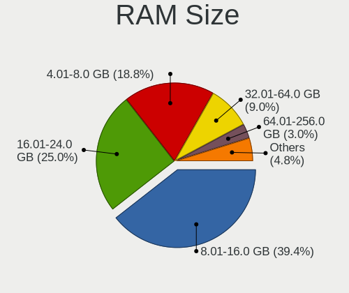
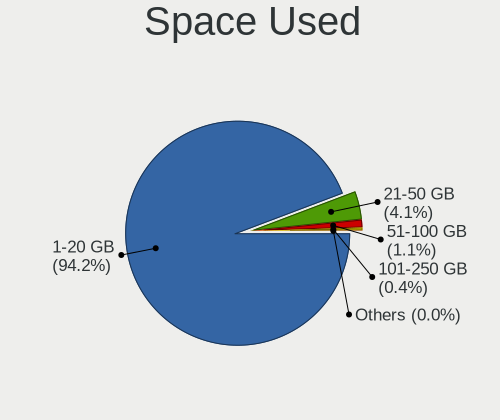
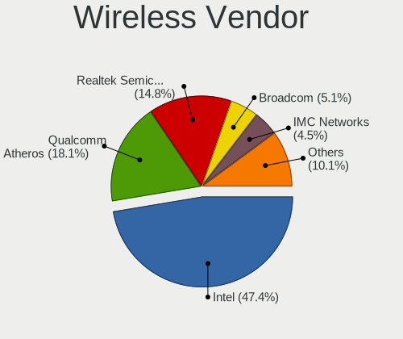

OPNsense - Tested Hardware & Statistics
---------------------------------------

A project to collect tested hardware configurations for OPNsense.

Anyone can contribute to this report by the [hw-probe](https://github.com/linuxhw/hw-probe/blob/master/INSTALL.BSD.md) tool:

    hw-probe -all -upload

Please contribute! Especially if your hardware is rare.

Contents
--------

* [ Test Cases ](#test-cases)

* [ System ](#system)
  - [ OS                       ](#os)
  - [ OS Family                ](#os-family)
  - [ Arch                     ](#arch)
  - [ DE                       ](#de)
  - [ Display Server           ](#display-server)
  - [ Display Manager          ](#display-manager)
  - [ OS Lang                  ](#os-lang)
  - [ Boot Mode                ](#boot-mode)
  - [ Filesystem               ](#filesystem)
  - [ Part. scheme             ](#part-scheme)

* [ Board ](#board)
  - [ Vendor                   ](#vendor)
  - [ Model                    ](#model)
  - [ Model Family             ](#model-family)
  - [ MFG Year                 ](#mfg-year)
  - [ Form Factor              ](#form-factor)
  - [ Coreboot                 ](#coreboot)
  - [ RAM Size                 ](#ram-size)
  - [ RAM Used                 ](#ram-used)
  - [ Total Drives             ](#total-drives)
  - [ Has CD-ROM               ](#has-cd-rom)
  - [ Has Ethernet             ](#has-ethernet)
  - [ Has WiFi                 ](#has-wifi)
  - [ Has Bluetooth            ](#has-bluetooth)

* [ Location ](#location)
  - [ Country                  ](#country)
  - [ City                     ](#city)

* [ Drives ](#drives)
  - [ Drive Vendor             ](#drive-vendor)
  - [ Drive Model              ](#drive-model)
  - [ HDD Vendor               ](#hdd-vendor)
  - [ SSD Vendor               ](#ssd-vendor)
  - [ Drive Kind               ](#drive-kind)
  - [ Drive Connector          ](#drive-connector)
  - [ Drive Size               ](#drive-size)
  - [ Space Total              ](#space-total)
  - [ Space Used               ](#space-used)
  - [ Malfunc. Drives          ](#malfunc-drives)
  - [ Malfunc. Drive Vendor    ](#malfunc-drive-vendor)
  - [ Malfunc. HDD Vendor      ](#malfunc-hdd-vendor)
  - [ Malfunc. Drive Kind      ](#malfunc-drive-kind)
  - [ Failed Drives            ](#failed-drives)
  - [ Failed Drive Vendor      ](#failed-drive-vendor)
  - [ Drive Status             ](#drive-status)

* [ Storage controller ](#storage-controller)
  - [ Storage Vendor           ](#storage-vendor)
  - [ Storage Model            ](#storage-model)
  - [ Storage Kind             ](#storage-kind)

* [ Processor ](#processor)
  - [ CPU Vendor               ](#cpu-vendor)
  - [ CPU Model                ](#cpu-model)
  - [ CPU Model Family         ](#cpu-model-family)
  - [ CPU Cores                ](#cpu-cores)
  - [ CPU Sockets              ](#cpu-sockets)
  - [ CPU Threads              ](#cpu-threads)
  - [ CPU Microarch            ](#cpu-microarch)

* [ Graphics ](#graphics)
  - [ GPU Vendor               ](#gpu-vendor)
  - [ GPU Model                ](#gpu-model)
  - [ GPU Combo                ](#gpu-combo)
  - [ GPU Driver               ](#gpu-driver)
  - [ GPU Memory               ](#gpu-memory)

* [ Monitor ](#monitor)
  - [ Monitor Vendor           ](#monitor-vendor)
  - [ Monitor Model            ](#monitor-model)
  - [ Monitor Resolution       ](#monitor-resolution)
  - [ Monitor Diagonal         ](#monitor-diagonal)
  - [ Monitor Width            ](#monitor-width)
  - [ Aspect Ratio             ](#aspect-ratio)
  - [ Monitor Area             ](#monitor-area)
  - [ Pixel Density            ](#pixel-density)
  - [ Multiple Monitors        ](#multiple-monitors)

* [ Network ](#network)
  - [ Net Controller Vendor    ](#net-controller-vendor)
  - [ Net Controller Model     ](#net-controller-model)
  - [ Wireless Vendor          ](#wireless-vendor)
  - [ Wireless Model           ](#wireless-model)
  - [ Ethernet Vendor          ](#ethernet-vendor)
  - [ Ethernet Model           ](#ethernet-model)
  - [ Net Controller Kind      ](#net-controller-kind)
  - [ Used Controller          ](#used-controller)
  - [ NICs                     ](#nics)
  - [ IPv6                     ](#ipv6)

* [ Bluetooth ](#bluetooth)
  - [ Bluetooth Vendor         ](#bluetooth-vendor)
  - [ Bluetooth Model          ](#bluetooth-model)

* [ Sound ](#sound)
  - [ Sound Vendor             ](#sound-vendor)
  - [ Sound Model              ](#sound-model)

* [ Memory ](#memory)
  - [ Memory Vendor            ](#memory-vendor)
  - [ Memory Model             ](#memory-model)
  - [ Memory Kind              ](#memory-kind)
  - [ Memory Form Factor       ](#memory-form-factor)
  - [ Memory Size              ](#memory-size)
  - [ Memory Speed             ](#memory-speed)

* [ Printers & scanners ](#printers--scanners)
  - [ Printer Vendor           ](#printer-vendor)
  - [ Printer Model            ](#printer-model)
  - [ Scanner Vendor           ](#scanner-vendor)
  - [ Scanner Model            ](#scanner-model)

* [ Camera ](#camera)
  - [ Camera Vendor            ](#camera-vendor)
  - [ Camera Model             ](#camera-model)

* [ Security ](#security)
  - [ Fingerprint Vendor       ](#fingerprint-vendor)
  - [ Fingerprint Model        ](#fingerprint-model)
  - [ Chipcard Vendor          ](#chipcard-vendor)
  - [ Chipcard Model           ](#chipcard-model)

* [ Unsupported ](#unsupported)
  - [ Unsupported Devices      ](#unsupported-devices)
  - [ Unsupported Device Types ](#unsupported-device-types)

Test Cases
----------

Total: 8259

| Vendor        | Model                       | Form-Factor | Probe                                                     | Date         |
|---------------|-----------------------------|-------------|-----------------------------------------------------------|--------------|
| AMI           | Aptio CRB                   | Mini pc     | [6d1d3ded0d](https://bsd-hardware.info/?probe=6d1d3ded0d) | Feb 28, 2023 |
| Fujitsu       | D3313-E1 S26361-D3313-E1    | Desktop     | [39d5f658ce](https://bsd-hardware.info/?probe=39d5f658ce) | Feb 28, 2023 |
| CWWK          | CW-J6-6L                    | Desktop     | [a9202eee26](https://bsd-hardware.info/?probe=a9202eee26) | Feb 28, 2023 |
| Deciso        | NetBoard-A10                | Notebook    | [ca59a5e6f4](https://bsd-hardware.info/?probe=ca59a5e6f4) | Feb 28, 2023 |
| HP            | ProLiant DL360 G7           | Server      | [dd8749ed6a](https://bsd-hardware.info/?probe=dd8749ed6a) | Feb 28, 2023 |
| Dell          | 0GY6Y8 A00                  | Desktop     | [72d45455a5](https://bsd-hardware.info/?probe=72d45455a5) | Feb 28, 2023 |
| Fujitsu       | D3313-E1 S26361-D3313-E1    | Desktop     | [dcf3f03ddc](https://bsd-hardware.info/?probe=dcf3f03ddc) | Feb 28, 2023 |
| Intel         | NUC7i3BNB J22859-307        | Mini pc     | [aca9e2885d](https://bsd-hardware.info/?probe=aca9e2885d) | Feb 28, 2023 |
| HP            | 8522 A01                    | Mini pc     | [9cc3faa610](https://bsd-hardware.info/?probe=9cc3faa610) | Feb 28, 2023 |
| Stonesoft     | FW-315-C1                   | Desktop     | [e8a2206ad2](https://bsd-hardware.info/?probe=e8a2206ad2) | Feb 28, 2023 |
| Inventec      | Z CLASS A02                 | Desktop     | [1b11bb9003](https://bsd-hardware.info/?probe=1b11bb9003) | Feb 27, 2023 |
| Techvision    | TVI7309X B0                 | Desktop     | [1758c6207c](https://bsd-hardware.info/?probe=1758c6207c) | Feb 27, 2023 |
| Unknown       | Unknown                     | Desktop     | [f06fbcd503](https://bsd-hardware.info/?probe=f06fbcd503) | Feb 27, 2023 |
| ASUSTek       | PRIME A320M-R               | Desktop     | [652b3323c6](https://bsd-hardware.info/?probe=652b3323c6) | Feb 27, 2023 |
| Dell          | 0M877N A01                  | Server      | [8037b5a26c](https://bsd-hardware.info/?probe=8037b5a26c) | Feb 27, 2023 |
| Lenovo        | 3098 0B98401 PRO            | Desktop     | [40d63fc1f7](https://bsd-hardware.info/?probe=40d63fc1f7) | Feb 27, 2023 |
| HP            | 17E2                        | Mini pc     | [12fde81dce](https://bsd-hardware.info/?probe=12fde81dce) | Feb 27, 2023 |
| Intel         | HM570                       | Desktop     | [2588c37fc2](https://bsd-hardware.info/?probe=2588c37fc2) | Feb 27, 2023 |
| HP            | 2215                        | Desktop     | [33881e14ce](https://bsd-hardware.info/?probe=33881e14ce) | Feb 27, 2023 |
| Unknown       | YL-J3160L4                  | Desktop     | [562013de32](https://bsd-hardware.info/?probe=562013de32) | Feb 27, 2023 |
| Dell          | 01TKCC A01                  | Desktop     | [42da900d88](https://bsd-hardware.info/?probe=42da900d88) | Feb 26, 2023 |
| Intel         | NUC11PABi3 M11790-302       | Mini pc     | [3971f7a856](https://bsd-hardware.info/?probe=3971f7a856) | Feb 26, 2023 |
| ASUSTek       | TUF Gaming Z590-PLUS        | Desktop     | [55afde6894](https://bsd-hardware.info/?probe=55afde6894) | Feb 26, 2023 |
| ASRock        | Z690M-ITX/ax                | Desktop     | [a859968882](https://bsd-hardware.info/?probe=a859968882) | Feb 26, 2023 |
| Supermicro    | PDSBM                       | Desktop     | [1dea83dd64](https://bsd-hardware.info/?probe=1dea83dd64) | Feb 26, 2023 |
| Fujitsu       | D3313-A1 S26361-D3313-A1    | Desktop     | [27e756f63d](https://bsd-hardware.info/?probe=27e756f63d) | Feb 26, 2023 |
| Shuttle       | FS81                        | Desktop     | [5787eda5ac](https://bsd-hardware.info/?probe=5787eda5ac) | Feb 26, 2023 |
| HP            | 8055                        | Desktop     | [faadcd3e41](https://bsd-hardware.info/?probe=faadcd3e41) | Feb 26, 2023 |
| Dell          | 0N5JWR A00                  | Mini pc     | [d6f24a2c50](https://bsd-hardware.info/?probe=d6f24a2c50) | Feb 26, 2023 |
| MSI           | B450M PRO-VDH MAX           | Desktop     | [85aecf8c3f](https://bsd-hardware.info/?probe=85aecf8c3f) | Feb 26, 2023 |
| HP            | 1495                        | Desktop     | [70c761d6fe](https://bsd-hardware.info/?probe=70c761d6fe) | Feb 26, 2023 |
| Foxconn       | 2A8Ch                       | Desktop     | [96a8673b26](https://bsd-hardware.info/?probe=96a8673b26) | Feb 26, 2023 |
| Sophos        | SG                          | Firewall    | [6f8d299ffb](https://bsd-hardware.info/?probe=6f8d299ffb) | Feb 26, 2023 |
| Lenovo        | 30D9 No DPK                 | Desktop     | [c3864d9d51](https://bsd-hardware.info/?probe=c3864d9d51) | Feb 26, 2023 |
| Gigabyte      | Z390 I AORUS PRO WIFI-CF    | Desktop     | [2e3026e0fd](https://bsd-hardware.info/?probe=2e3026e0fd) | Feb 26, 2023 |
| Techvision    | TVI7309X B0                 | Desktop     | [d558069dea](https://bsd-hardware.info/?probe=d558069dea) | Feb 26, 2023 |
| AZW           | U59                         | Desktop     | [a4e906c608](https://bsd-hardware.info/?probe=a4e906c608) | Feb 26, 2023 |
| Acer          | Aspire ES1-571              | Notebook    | [d736d59649](https://bsd-hardware.info/?probe=d736d59649) | Feb 26, 2023 |
| Acer          | Aspire ES1-571              | Notebook    | [48aa652a09](https://bsd-hardware.info/?probe=48aa652a09) | Feb 26, 2023 |
| Unknown       | Unknown                     | Desktop     | [d690aee80e](https://bsd-hardware.info/?probe=d690aee80e) | Feb 26, 2023 |
| AMI           | Aptio CRB                   | Mini pc     | [f4b0301fe5](https://bsd-hardware.info/?probe=f4b0301fe5) | Feb 26, 2023 |
| NF541         | 1.0                         | Desktop     | [863e6235d4](https://bsd-hardware.info/?probe=863e6235d4) | Feb 26, 2023 |
| Dell          | 088DT1 A01                  | Desktop     | [d13b4a674b](https://bsd-hardware.info/?probe=d13b4a674b) | Feb 26, 2023 |
| Supermicro    | X11SCL-IF                   | Server      | [febc7f7a94](https://bsd-hardware.info/?probe=febc7f7a94) | Feb 26, 2023 |
| Dell          | 0WMJ54 A01                  | Desktop     | [263be0365a](https://bsd-hardware.info/?probe=263be0365a) | Feb 26, 2023 |
| Unknown       | Unknown                     | Desktop     | [815cd70e71](https://bsd-hardware.info/?probe=815cd70e71) | Feb 25, 2023 |
| Unknown       | YL-J3160L4                  | Desktop     | [b774e80761](https://bsd-hardware.info/?probe=b774e80761) | Feb 25, 2023 |
| Sophos        | SG                          | Firewall    | [7e05fcaf2b](https://bsd-hardware.info/?probe=7e05fcaf2b) | Feb 25, 2023 |
| Unknown       | Unknown                     | Desktop     | [913946ccc9](https://bsd-hardware.info/?probe=913946ccc9) | Feb 25, 2023 |
| AWOW          | PC BOX                      | Mini pc     | [54d8b7446b](https://bsd-hardware.info/?probe=54d8b7446b) | Feb 25, 2023 |
| Techvision    | TVI7309X B0                 | Desktop     | [0e62dfc436](https://bsd-hardware.info/?probe=0e62dfc436) | Feb 25, 2023 |
| Lenovo        | ThinkPad T440s 20AQ005SU... | Notebook    | [7750c38cd0](https://bsd-hardware.info/?probe=7750c38cd0) | Feb 25, 2023 |
| Dell          | 0M877N A01                  | Server      | [cfae198d09](https://bsd-hardware.info/?probe=cfae198d09) | Feb 25, 2023 |
| HP            | 18E9                        | Desktop     | [9263c4b548](https://bsd-hardware.info/?probe=9263c4b548) | Feb 25, 2023 |
| Unknown       | Unknown                     | Desktop     | [87ad08a144](https://bsd-hardware.info/?probe=87ad08a144) | Feb 25, 2023 |
| Techvision    | TVI7309X B0                 | Desktop     | [8a16d2e606](https://bsd-hardware.info/?probe=8a16d2e606) | Feb 24, 2023 |
| Lenovo        | ThinkCentre M91p 7033A2G    | Desktop     | [25528a00f3](https://bsd-hardware.info/?probe=25528a00f3) | Feb 24, 2023 |
| Unknown       | Unknown                     | Desktop     | [efab6dedba](https://bsd-hardware.info/?probe=efab6dedba) | Feb 24, 2023 |
| Gigabyte      | H77N-WIFI                   | Desktop     | [cd96288347](https://bsd-hardware.info/?probe=cd96288347) | Feb 24, 2023 |
| AZW           | U59                         | Desktop     | [4dad05a05a](https://bsd-hardware.info/?probe=4dad05a05a) | Feb 24, 2023 |
| AZW           | U59                         | Desktop     | [638aa3ff8e](https://bsd-hardware.info/?probe=638aa3ff8e) | Feb 24, 2023 |
| MW            | GMLK-2_5G4L                 | Desktop     | [bf21395f79](https://bsd-hardware.info/?probe=bf21395f79) | Feb 24, 2023 |
| Lenovo        | 312D SDK0J40697 WIN 3305... | Mini pc     | [867c14f8d1](https://bsd-hardware.info/?probe=867c14f8d1) | Feb 24, 2023 |
| Unknown       | Unknown                     | Desktop     | [efce6f6c1e](https://bsd-hardware.info/?probe=efce6f6c1e) | Feb 24, 2023 |
| Supermicro    | X11SSH-LN4F                 | Server      | [7ab6080dfe](https://bsd-hardware.info/?probe=7ab6080dfe) | Feb 24, 2023 |
| Protectli     | VP2420                      | Desktop     | [ac2228fa2b](https://bsd-hardware.info/?probe=ac2228fa2b) | Feb 24, 2023 |
| Dell          | 05XGC8 A01                  | Desktop     | [c51a264e20](https://bsd-hardware.info/?probe=c51a264e20) | Feb 23, 2023 |
| Supermicro    | X10SBAA                     | Server      | [d22806833a](https://bsd-hardware.info/?probe=d22806833a) | Feb 23, 2023 |
| HP            | 3031h                       | Desktop     | [7324a71ceb](https://bsd-hardware.info/?probe=7324a71ceb) | Feb 23, 2023 |
| PC Engines    | apu4                        | Desktop     | [410a7ff78e](https://bsd-hardware.info/?probe=410a7ff78e) | Feb 23, 2023 |
| CNCTION-IA... | Unknown                     | Desktop     | [52186b4343](https://bsd-hardware.info/?probe=52186b4343) | Feb 23, 2023 |
| Deciso        | NetBoard-A20                | Notebook    | [d23ae47425](https://bsd-hardware.info/?probe=d23ae47425) | Feb 23, 2023 |
| Intel         | DENLOW_WS                   | Desktop     | [f6f5953979](https://bsd-hardware.info/?probe=f6f5953979) | Feb 23, 2023 |
| Unknown       | Unknown                     | Desktop     | [866ff788f9](https://bsd-hardware.info/?probe=866ff788f9) | Feb 23, 2023 |
| Gigabyte      | G31M-ES2L                   | Desktop     | [c55b1dd170](https://bsd-hardware.info/?probe=c55b1dd170) | Feb 23, 2023 |
| Supermicro    | X10SDV-6C-TLN4F             | Desktop     | [d6ab3464c6](https://bsd-hardware.info/?probe=d6ab3464c6) | Feb 23, 2023 |
| Dell          | 0WMJ54 A01                  | Desktop     | [26b7986e0b](https://bsd-hardware.info/?probe=26b7986e0b) | Feb 23, 2023 |
| Supermicro    | X9SCL/X9SCMA                | Desktop     | [96aceb6d32](https://bsd-hardware.info/?probe=96aceb6d32) | Feb 23, 2023 |
| ASRock        | X300M-STX                   | Desktop     | [fb908ee344](https://bsd-hardware.info/?probe=fb908ee344) | Feb 23, 2023 |
| ASUSTek       | Pro A520M-C II              | Desktop     | [542b244f4b](https://bsd-hardware.info/?probe=542b244f4b) | Feb 23, 2023 |
| Lenovo        | ThinkPad T440 20B60061MB    | Notebook    | [16a141cc35](https://bsd-hardware.info/?probe=16a141cc35) | Feb 23, 2023 |
| Intel         | NUC11TNBi3 M11908-404       | Mini pc     | [6061a0f9c4](https://bsd-hardware.info/?probe=6061a0f9c4) | Feb 23, 2023 |
| Dell          | 0WR7PY A00                  | Desktop     | [70b222c73b](https://bsd-hardware.info/?probe=70b222c73b) | Feb 23, 2023 |
| Fujitsu       | D3543-A2 S26361-D3543-A2... | Desktop     | [68165a639f](https://bsd-hardware.info/?probe=68165a639f) | Feb 22, 2023 |
| PC Engines    | APU2                        | Desktop     | [05966fb4dc](https://bsd-hardware.info/?probe=05966fb4dc) | Feb 22, 2023 |
| MSI           | MS-92E3 0A                  | Desktop     | [683ff1f7d0](https://bsd-hardware.info/?probe=683ff1f7d0) | Feb 22, 2023 |
| ASRock        | H610M-HDV/M.2               | Desktop     | [cf4d400cb0](https://bsd-hardware.info/?probe=cf4d400cb0) | Feb 22, 2023 |
| Protectli     | VP2420                      | Desktop     | [541c13b778](https://bsd-hardware.info/?probe=541c13b778) | Feb 22, 2023 |
| Techvision    | TVI7309X B0                 | Desktop     | [765b1a8064](https://bsd-hardware.info/?probe=765b1a8064) | Feb 22, 2023 |
| Intel         | Q3XXG4-P V1.0               | Desktop     | [639886b591](https://bsd-hardware.info/?probe=639886b591) | Feb 22, 2023 |
| Gigabyte      | X570S AORUS ELITE           | Desktop     | [8d1496f3a9](https://bsd-hardware.info/?probe=8d1496f3a9) | Feb 22, 2023 |
| Intel         | CW-J6-5L 2C                 | Desktop     | [442643937e](https://bsd-hardware.info/?probe=442643937e) | Feb 22, 2023 |
| Techvision    | TVI7309X B0                 | Desktop     | [3e1b050969](https://bsd-hardware.info/?probe=3e1b050969) | Feb 22, 2023 |
| Protectli     | VP2410                      | Desktop     | [b31bcf2087](https://bsd-hardware.info/?probe=b31bcf2087) | Feb 22, 2023 |
| Protectli     | VP2410                      | Desktop     | [8dff61bc43](https://bsd-hardware.info/?probe=8dff61bc43) | Feb 22, 2023 |
| Dell          | 0DRG19 A00                  | Mini pc     | [25a3e5cea1](https://bsd-hardware.info/?probe=25a3e5cea1) | Feb 22, 2023 |
| Acer          | Aspire TC-230               | Desktop     | [f3f963fb6a](https://bsd-hardware.info/?probe=f3f963fb6a) | Feb 22, 2023 |
| Intel         | CW-J6-5L 2C                 | Desktop     | [90fc1b74e6](https://bsd-hardware.info/?probe=90fc1b74e6) | Feb 22, 2023 |
| Lenovo        | ThinkPad T440 20B60061MB    | Notebook    | [4867945cfb](https://bsd-hardware.info/?probe=4867945cfb) | Feb 22, 2023 |
| Intel         | NUC12WSBi3 M36953-303       | Mini pc     | [727ca24f1c](https://bsd-hardware.info/?probe=727ca24f1c) | Feb 22, 2023 |
| Intel         | QHSW02                      | Desktop     | [6bec4024a8](https://bsd-hardware.info/?probe=6bec4024a8) | Feb 22, 2023 |
| Supermicro    | X7SLA                       | Desktop     | [80d6f2c0f8](https://bsd-hardware.info/?probe=80d6f2c0f8) | Feb 21, 2023 |
| AMI           | Aptio CRB                   | Mini pc     | [5b8fdd6349](https://bsd-hardware.info/?probe=5b8fdd6349) | Feb 21, 2023 |
| Deciso        | Netboard A20                | Notebook    | [25077b7e64](https://bsd-hardware.info/?probe=25077b7e64) | Feb 21, 2023 |
| Protectli     | FW2B                        | Desktop     | [34b349eead](https://bsd-hardware.info/?probe=34b349eead) | Feb 21, 2023 |
| Dell          | 01V648 A01                  | Server      | [51fbbaf053](https://bsd-hardware.info/?probe=51fbbaf053) | Feb 21, 2023 |
| Dell          | 0GY6Y8 A00                  | Desktop     | [9a3d7de5ff](https://bsd-hardware.info/?probe=9a3d7de5ff) | Feb 21, 2023 |
| ASUSTek       | TUF Gaming Z590-PLUS        | Desktop     | [da5536f58a](https://bsd-hardware.info/?probe=da5536f58a) | Feb 21, 2023 |
| Unknown       | Unknown                     | Desktop     | [67c7a561a9](https://bsd-hardware.info/?probe=67c7a561a9) | Feb 21, 2023 |
| Unknown       | V0.9x                       | Desktop     | [21243cad5f](https://bsd-hardware.info/?probe=21243cad5f) | Feb 21, 2023 |
| Dell          | 01V648 A01                  | Server      | [fa7b2a91e8](https://bsd-hardware.info/?probe=fa7b2a91e8) | Feb 21, 2023 |
| Unknown       | Unknown                     | Desktop     | [8c063582d4](https://bsd-hardware.info/?probe=8c063582d4) | Feb 20, 2023 |
| Supermicro    | X11SDV-4C-TP8F              | Server      | [43147a0d7b](https://bsd-hardware.info/?probe=43147a0d7b) | Feb 20, 2023 |
| ASUSTek       | Pro A520M-C II              | Desktop     | [205bf8b29d](https://bsd-hardware.info/?probe=205bf8b29d) | Feb 20, 2023 |
| Fujitsu       | D3543-A1 S26361-D3543-A1... | Desktop     | [3f78b1a6c7](https://bsd-hardware.info/?probe=3f78b1a6c7) | Feb 20, 2023 |
| Hardkernel    | ODROID-H2                   | Desktop     | [bd675a503d](https://bsd-hardware.info/?probe=bd675a503d) | Feb 20, 2023 |
| Dell          | 0HHV7N A00                  | Desktop     | [50f39ca7e0](https://bsd-hardware.info/?probe=50f39ca7e0) | Feb 20, 2023 |
| Dell          | 09KPNV A00                  | Desktop     | [05cf3daf4e](https://bsd-hardware.info/?probe=05cf3daf4e) | Feb 20, 2023 |
| Lenovo        | 32E1 SDK0J40697 WIN 3305... | Desktop     | [820b3d1a1b](https://bsd-hardware.info/?probe=820b3d1a1b) | Feb 20, 2023 |
| Protectli     | VP4650                      | Desktop     | [44b691e7b8](https://bsd-hardware.info/?probe=44b691e7b8) | Feb 20, 2023 |
| Lenovo        | 3136 SDK0J40697 WIN 3305... | Mini pc     | [648e3b6a57](https://bsd-hardware.info/?probe=648e3b6a57) | Feb 20, 2023 |
| Protectli     | VP4650                      | Desktop     | [a3011cc486](https://bsd-hardware.info/?probe=a3011cc486) | Feb 20, 2023 |
| HP            | 3397                        | Desktop     | [8b231fd832](https://bsd-hardware.info/?probe=8b231fd832) | Feb 19, 2023 |
| HP            | 8076 MVB,A                  | Desktop     | [7743861bae](https://bsd-hardware.info/?probe=7743861bae) | Feb 19, 2023 |
| ZOTAC         | ZBOX-CI329NANO              | Mini pc     | [9aec93f312](https://bsd-hardware.info/?probe=9aec93f312) | Feb 19, 2023 |
| Protectli     | VP2420                      | Desktop     | [5d8285d184](https://bsd-hardware.info/?probe=5d8285d184) | Feb 19, 2023 |
| CncTion       | J4125-4L-I225               | Desktop     | [6d2c693305](https://bsd-hardware.info/?probe=6d2c693305) | Feb 19, 2023 |
| Yanling       | YL-CLU6L-V1                 | Desktop     | [8d1fa6606b](https://bsd-hardware.info/?probe=8d1fa6606b) | Feb 19, 2023 |
| Intel         | NUC12WSBi3 M36953-303       | Mini pc     | [9bdcc78235](https://bsd-hardware.info/?probe=9bdcc78235) | Feb 19, 2023 |
| Unknown       | Unknown                     | Desktop     | [1d67639caa](https://bsd-hardware.info/?probe=1d67639caa) | Feb 19, 2023 |
| ASUSTek       | PRIME H310M-K R2.0          | Desktop     | [fd39a615de](https://bsd-hardware.info/?probe=fd39a615de) | Feb 19, 2023 |
| ASUSTek       | H110I-PLUS D3               | Desktop     | [1f347f15e2](https://bsd-hardware.info/?probe=1f347f15e2) | Feb 19, 2023 |
| Lenovo        | SHARKBAY SDK0A46860 WIN     | Desktop     | [4cd5bcdfed](https://bsd-hardware.info/?probe=4cd5bcdfed) | Feb 18, 2023 |
| HP            | 1998                        | Desktop     | [e0ab2d859c](https://bsd-hardware.info/?probe=e0ab2d859c) | Feb 18, 2023 |
| Intel         | JSL MRD                     | Desktop     | [1587ea95da](https://bsd-hardware.info/?probe=1587ea95da) | Feb 18, 2023 |
| Dell          | 0HHV7N A00                  | Desktop     | [fd90fc5154](https://bsd-hardware.info/?probe=fd90fc5154) | Feb 18, 2023 |
| AMI           | Aptio CRB                   | Mini pc     | [81041acbb7](https://bsd-hardware.info/?probe=81041acbb7) | Feb 18, 2023 |
| AMI           | Aptio CRB                   | Mini pc     | [cffec30b6b](https://bsd-hardware.info/?probe=cffec30b6b) | Feb 18, 2023 |
| Lenovo        | ThinkPad W520 427638U       | Notebook    | [baa0e928a8](https://bsd-hardware.info/?probe=baa0e928a8) | Feb 18, 2023 |
| AMI           | Aptio CRB                   | Mini pc     | [5b10e92d28](https://bsd-hardware.info/?probe=5b10e92d28) | Feb 18, 2023 |
| ASRock        | G41M-GS3                    | Desktop     | [eace523f17](https://bsd-hardware.info/?probe=eace523f17) | Feb 18, 2023 |
| Techvision    | TVI7309X B0                 | Desktop     | [633becefb6](https://bsd-hardware.info/?probe=633becefb6) | Feb 18, 2023 |
| Unknown       | Unknown                     | Desktop     | [b906471557](https://bsd-hardware.info/?probe=b906471557) | Feb 17, 2023 |
| Unknown       | Unknown                     | Desktop     | [1478bc453d](https://bsd-hardware.info/?probe=1478bc453d) | Feb 17, 2023 |
| Supermicro    | X10SRL-F                    | Server      | [49c49487e2](https://bsd-hardware.info/?probe=49c49487e2) | Feb 17, 2023 |
| Techvision    | TVI7309X B0                 | Desktop     | [1950b6036e](https://bsd-hardware.info/?probe=1950b6036e) | Feb 17, 2023 |
| IGEL Techn... | H830C                       | Notebook    | [069249225f](https://bsd-hardware.info/?probe=069249225f) | Feb 17, 2023 |
| Sophos        | SG                          | Firewall    | [b9fc0f3ba3](https://bsd-hardware.info/?probe=b9fc0f3ba3) | Feb 17, 2023 |
| Techvision    | TVI7309X B0                 | Desktop     | [d23b2cfe5a](https://bsd-hardware.info/?probe=d23b2cfe5a) | Feb 17, 2023 |
| Fujitsu       | D3224-A1 S26361-D3224-A1    | Desktop     | [c34d5e6357](https://bsd-hardware.info/?probe=c34d5e6357) | Feb 17, 2023 |
| Unknown       | Unknown                     | Desktop     | [ac4b0186ff](https://bsd-hardware.info/?probe=ac4b0186ff) | Feb 17, 2023 |
| Dell          | 0M877N A02                  | Server      | [94d00881ba](https://bsd-hardware.info/?probe=94d00881ba) | Feb 17, 2023 |
| ZOTAC         | Unknown                     | Desktop     | [0adf0ca671](https://bsd-hardware.info/?probe=0adf0ca671) | Feb 17, 2023 |
| ASUSTek       | N3050M-E                    | Desktop     | [7d6e696fb4](https://bsd-hardware.info/?probe=7d6e696fb4) | Feb 17, 2023 |
| Protectli     | FW4B Ver                    | Desktop     | [81911bb61f](https://bsd-hardware.info/?probe=81911bb61f) | Feb 17, 2023 |
| Dell          | 0MFXTY A02                  | Server      | [706029e578](https://bsd-hardware.info/?probe=706029e578) | Feb 17, 2023 |
| AZW           | Green G1                    | Desktop     | [f5da027d84](https://bsd-hardware.info/?probe=f5da027d84) | Feb 17, 2023 |
| ASUSTek       | PRIME Z490M-PLUS            | Desktop     | [1d9739f234](https://bsd-hardware.info/?probe=1d9739f234) | Feb 17, 2023 |
| Dell          | 04YP6J A02                  | Desktop     | [26cd25b4ca](https://bsd-hardware.info/?probe=26cd25b4ca) | Feb 17, 2023 |
| Dell          | 04YP6J A02                  | Desktop     | [ef370f6033](https://bsd-hardware.info/?probe=ef370f6033) | Feb 17, 2023 |
| HP            | 198E                        | Desktop     | [1f9a7e4f9b](https://bsd-hardware.info/?probe=1f9a7e4f9b) | Feb 17, 2023 |
| Jingsha       | x79-P3 by xUz               | Desktop     | [0e5ed7f4de](https://bsd-hardware.info/?probe=0e5ed7f4de) | Feb 17, 2023 |
| CWWK          | CW-J6-6L                    | Desktop     | [de51e99409](https://bsd-hardware.info/?probe=de51e99409) | Feb 17, 2023 |
| Supermicro    | X10SLH-N6-ST031             | Desktop     | [897a3b3bf5](https://bsd-hardware.info/?probe=897a3b3bf5) | Feb 16, 2023 |
| Unknown       | Unknown                     | Desktop     | [71cc084a9c](https://bsd-hardware.info/?probe=71cc084a9c) | Feb 16, 2023 |
| Protectli     | FW2B Ver                    | Desktop     | [b72039f369](https://bsd-hardware.info/?probe=b72039f369) | Feb 16, 2023 |
| ASRock        | H610M-HDV/M.2               | Desktop     | [8bc1cee065](https://bsd-hardware.info/?probe=8bc1cee065) | Feb 16, 2023 |
| Dell          | 04YP6J A02                  | Desktop     | [0f589ba9bf](https://bsd-hardware.info/?probe=0f589ba9bf) | Feb 16, 2023 |
| Fujitsu       | D3229-A1 S26361-D3229-A1... | Server      | [d05d07ca61](https://bsd-hardware.info/?probe=d05d07ca61) | Feb 16, 2023 |
| Dell          | 0KYJ8C A02                  | Desktop     | [854d373499](https://bsd-hardware.info/?probe=854d373499) | Feb 16, 2023 |
| Dell          | 04415J A00                  | Mini pc     | [f74527184f](https://bsd-hardware.info/?probe=f74527184f) | Feb 16, 2023 |
| Dell          | 0782GW A00                  | Desktop     | [95a8784d4a](https://bsd-hardware.info/?probe=95a8784d4a) | Feb 16, 2023 |
| Lenovo        | SHARKBAY 0B98401 WIN        | Desktop     | [f3c3e6ecb5](https://bsd-hardware.info/?probe=f3c3e6ecb5) | Feb 16, 2023 |
| ASUSTek       | H110I-PLUS D3               | Desktop     | [4d3dee18a0](https://bsd-hardware.info/?probe=4d3dee18a0) | Feb 16, 2023 |
| Dell          | 05GD68 A00                  | Desktop     | [c6946f5300](https://bsd-hardware.info/?probe=c6946f5300) | Feb 15, 2023 |
| MiTAC         | UltraPoint                  | Desktop     | [00e52df710](https://bsd-hardware.info/?probe=00e52df710) | Feb 15, 2023 |
| MSI           | A88XM-E45                   | Desktop     | [933b4d3226](https://bsd-hardware.info/?probe=933b4d3226) | Feb 15, 2023 |
| Dell          | 0DRG19 A00                  | Mini pc     | [0f07f95c55](https://bsd-hardware.info/?probe=0f07f95c55) | Feb 15, 2023 |
| Deciso        | OPNsense Appliance          | Notebook    | [1eda4c5b48](https://bsd-hardware.info/?probe=1eda4c5b48) | Feb 15, 2023 |
| PC Engines    | APU                         | Desktop     | [1162545537](https://bsd-hardware.info/?probe=1162545537) | Feb 15, 2023 |
| Unknown       | Unknown                     | Desktop     | [415389b74c](https://bsd-hardware.info/?probe=415389b74c) | Feb 14, 2023 |
| Deciso        | NetBoard-A20                | Notebook    | [ffc9e123b4](https://bsd-hardware.info/?probe=ffc9e123b4) | Feb 14, 2023 |
| CncTion       | N5105-4L B0                 | Desktop     | [fb2a05c862](https://bsd-hardware.info/?probe=fb2a05c862) | Feb 14, 2023 |
| Intel         | S3420GP E51974-403          | Server      | [c7b82f8e59](https://bsd-hardware.info/?probe=c7b82f8e59) | Feb 14, 2023 |
| Dell          | 0NW6H5 A00                  | Desktop     | [b0020c937b](https://bsd-hardware.info/?probe=b0020c937b) | Feb 14, 2023 |
| Intel         | S3420GP E51974-403          | Server      | [9d0765df2e](https://bsd-hardware.info/?probe=9d0765df2e) | Feb 14, 2023 |
| Deciso        | Netboard A20                | Notebook    | [7c91a0f01b](https://bsd-hardware.info/?probe=7c91a0f01b) | Feb 14, 2023 |
| PC Engines    | APU2                        | Desktop     | [0648ebd771](https://bsd-hardware.info/?probe=0648ebd771) | Feb 14, 2023 |
| ASRock        | Z97 Killer                  | Desktop     | [67d58b9cde](https://bsd-hardware.info/?probe=67d58b9cde) | Feb 14, 2023 |
| Hardkernel    | ODROID-H2                   | Desktop     | [f63a5598d7](https://bsd-hardware.info/?probe=f63a5598d7) | Feb 14, 2023 |
| Supermicro    | X7SPA-HF                    | Desktop     | [6a91635684](https://bsd-hardware.info/?probe=6a91635684) | Feb 14, 2023 |
| ASRock        | B450M Pro4                  | Desktop     | [2d9ff025ff](https://bsd-hardware.info/?probe=2d9ff025ff) | Feb 14, 2023 |
| ASRock        | B450M Pro4                  | Desktop     | [7b60f91e47](https://bsd-hardware.info/?probe=7b60f91e47) | Feb 14, 2023 |
| Fujitsu       | D3313-A1 S26361-D3313-A1    | Desktop     | [a9d6421d3c](https://bsd-hardware.info/?probe=a9d6421d3c) | Feb 14, 2023 |
| Dell          | 0XCR8D A02                  | Desktop     | [a477c2b046](https://bsd-hardware.info/?probe=a477c2b046) | Feb 14, 2023 |
| Yanling       | YL-CLU6L-V1                 | Desktop     | [9c12ee263f](https://bsd-hardware.info/?probe=9c12ee263f) | Feb 14, 2023 |
| Techvision    | TVI7309X B0                 | Desktop     | [64ed951aa2](https://bsd-hardware.info/?probe=64ed951aa2) | Feb 14, 2023 |
| Gigabyte      | H97N                        | Desktop     | [88e7d124ef](https://bsd-hardware.info/?probe=88e7d124ef) | Feb 14, 2023 |
| Dell          | 0DVNTK A00                  | Mini pc     | [e49082a67c](https://bsd-hardware.info/?probe=e49082a67c) | Feb 14, 2023 |
| Dell          | 0D02VH A01                  | Desktop     | [a629bf3445](https://bsd-hardware.info/?probe=a629bf3445) | Feb 14, 2023 |
| HP            | 8719                        | Desktop     | [c547d99064](https://bsd-hardware.info/?probe=c547d99064) | Feb 14, 2023 |
| HP            | 3031h                       | Desktop     | [cbbf836268](https://bsd-hardware.info/?probe=cbbf836268) | Feb 13, 2023 |
| ASRock        | X570S PG Riptide            | Desktop     | [054d55b3c1](https://bsd-hardware.info/?probe=054d55b3c1) | Feb 13, 2023 |
| ASRock        | X570S PG Riptide            | Desktop     | [25d8358b76](https://bsd-hardware.info/?probe=25d8358b76) | Feb 13, 2023 |
| BESSTAR Te... | GB7                         | Mini pc     | [c258b4972c](https://bsd-hardware.info/?probe=c258b4972c) | Feb 13, 2023 |
| AMI           | Aptio CRB                   | Mini pc     | [d7080f05ef](https://bsd-hardware.info/?probe=d7080f05ef) | Feb 13, 2023 |
| CWWK          | MINIPC-G4                   | Desktop     | [a186c77c21](https://bsd-hardware.info/?probe=a186c77c21) | Feb 13, 2023 |
| Unknown       | Unknown                     | Desktop     | [98819b1db5](https://bsd-hardware.info/?probe=98819b1db5) | Feb 13, 2023 |
| Lenovo        | 319E SEK0T35577 IOT 4247... | Mini pc     | [708741a2f4](https://bsd-hardware.info/?probe=708741a2f4) | Feb 13, 2023 |
| Unknown       | Unknown                     | Desktop     | [44ac3b2832](https://bsd-hardware.info/?probe=44ac3b2832) | Feb 13, 2023 |
| ZOTAC         | ZBOX-ID88/ID89/ID90         | Mini pc     | [cb4c316a05](https://bsd-hardware.info/?probe=cb4c316a05) | Feb 13, 2023 |
| CncTion       | N5105-4L B0                 | Desktop     | [bf55d44dff](https://bsd-hardware.info/?probe=bf55d44dff) | Feb 13, 2023 |
| Dell          | 02YYK5 A00                  | Desktop     | [431374482e](https://bsd-hardware.info/?probe=431374482e) | Feb 13, 2023 |
| Acer          | Aspire TC-230               | Desktop     | [a8ce4299ae](https://bsd-hardware.info/?probe=a8ce4299ae) | Feb 13, 2023 |
| Dell          | 0NC2VH A01                  | Desktop     | [3e96602a8f](https://bsd-hardware.info/?probe=3e96602a8f) | Feb 13, 2023 |
| Supermicro    | X7SPA-HF                    | Desktop     | [6acbae85b9](https://bsd-hardware.info/?probe=6acbae85b9) | Feb 13, 2023 |
| AMI           | Aptio CRB                   | Mini pc     | [547c79f551](https://bsd-hardware.info/?probe=547c79f551) | Feb 13, 2023 |
| Dell          | 0D02VH A01                  | Desktop     | [d0823031a5](https://bsd-hardware.info/?probe=d0823031a5) | Feb 12, 2023 |
| Lenovo        | 3132 SDK0J40697 WIN 3305... | Desktop     | [5988d9a034](https://bsd-hardware.info/?probe=5988d9a034) | Feb 12, 2023 |
| YANYU         | R250                        | Desktop     | [24ebc43209](https://bsd-hardware.info/?probe=24ebc43209) | Feb 12, 2023 |
| Unknown       | Unknown                     | Desktop     | [71aa276f7f](https://bsd-hardware.info/?probe=71aa276f7f) | Feb 12, 2023 |
| Unknown       | SKYBAY                      | Desktop     | [df7f4524d7](https://bsd-hardware.info/?probe=df7f4524d7) | Feb 12, 2023 |
| Fujitsu       | D3373-A1 S26361-D3373-A1... | Server      | [7faa1abb2c](https://bsd-hardware.info/?probe=7faa1abb2c) | Feb 12, 2023 |
| Shuttle       | DS437T                      | Notebook    | [9a16ad9fec](https://bsd-hardware.info/?probe=9a16ad9fec) | Feb 12, 2023 |
| ZOTAC         | ZBOX-ID92/ZBOX-IQ01         | Mini pc     | [91b5c15725](https://bsd-hardware.info/?probe=91b5c15725) | Feb 12, 2023 |
| Unknown       | Unknown                     | Desktop     | [19da8a6da8](https://bsd-hardware.info/?probe=19da8a6da8) | Feb 12, 2023 |
| MSI           | Z97 GUARD-PRO               | Desktop     | [43d56964b9](https://bsd-hardware.info/?probe=43d56964b9) | Feb 12, 2023 |
| Dell          | 0WMJ54 A00                  | Desktop     | [ba5f8c568b](https://bsd-hardware.info/?probe=ba5f8c568b) | Feb 12, 2023 |
| Dell          | 0M877N A02                  | Server      | [36e51fcc8b](https://bsd-hardware.info/?probe=36e51fcc8b) | Feb 12, 2023 |
| Fujitsu       | D3229-A1 S26361-D3229-A1... | Server      | [83f12ac6c1](https://bsd-hardware.info/?probe=83f12ac6c1) | Feb 12, 2023 |
| Unknown       | Unknown                     | Desktop     | [133d9aedfd](https://bsd-hardware.info/?probe=133d9aedfd) | Feb 12, 2023 |
| Fujitsu       | D3313-B1 S26361-D3313-B1    | Desktop     | [be8fb945ef](https://bsd-hardware.info/?probe=be8fb945ef) | Feb 12, 2023 |
| HP            | 8522 A01                    | Mini pc     | [4a8f9eefc9](https://bsd-hardware.info/?probe=4a8f9eefc9) | Feb 12, 2023 |
| Dell          | 0F3KHR A02                  | Desktop     | [f69bff2d41](https://bsd-hardware.info/?probe=f69bff2d41) | Feb 12, 2023 |
| Unknown       | Unknown                     | Desktop     | [dbe1c51575](https://bsd-hardware.info/?probe=dbe1c51575) | Feb 12, 2023 |
| HP            | 843B                        | Desktop     | [2b9c5f49f5](https://bsd-hardware.info/?probe=2b9c5f49f5) | Feb 12, 2023 |
| Dell          | 0F3KHR A02                  | Desktop     | [c9c53f2141](https://bsd-hardware.info/?probe=c9c53f2141) | Feb 12, 2023 |
| Sophos        | SG                          | Firewall    | [08b02dfc2d](https://bsd-hardware.info/?probe=08b02dfc2d) | Feb 11, 2023 |
| IBM           | 00AL980                     | Server      | [80fa278909](https://bsd-hardware.info/?probe=80fa278909) | Feb 11, 2023 |
| Intel         | Q3XXG4-P V1.0               | Desktop     | [0684ee3bb7](https://bsd-hardware.info/?probe=0684ee3bb7) | Feb 11, 2023 |
| Yanling       | YL-KBR6L Ver:1.00           | Desktop     | [516c778d65](https://bsd-hardware.info/?probe=516c778d65) | Feb 11, 2023 |
| Unknown       | Unknown                     | Desktop     | [7d908f5c62](https://bsd-hardware.info/?probe=7d908f5c62) | Feb 11, 2023 |
| Foxconn       | 2A8Ch                       | Desktop     | [2874f7a7fa](https://bsd-hardware.info/?probe=2874f7a7fa) | Feb 11, 2023 |
| Sophos        | UTM                         | Firewall    | [806a078730](https://bsd-hardware.info/?probe=806a078730) | Feb 11, 2023 |
| Protectli     | FW4B Ver                    | Desktop     | [3724be73d9](https://bsd-hardware.info/?probe=3724be73d9) | Feb 11, 2023 |
| Unknown       | Unknown                     | Desktop     | [44a3089ec0](https://bsd-hardware.info/?probe=44a3089ec0) | Feb 11, 2023 |
| Lenovo        | SHARKBAY 0B98401 WIN        | Desktop     | [7db630393f](https://bsd-hardware.info/?probe=7db630393f) | Feb 11, 2023 |
| Techvision    | TVI7309X B0                 | Desktop     | [c4c07aec07](https://bsd-hardware.info/?probe=c4c07aec07) | Feb 11, 2023 |
| Supermicro    | X8STi                       | Desktop     | [4faeca02d3](https://bsd-hardware.info/?probe=4faeca02d3) | Feb 11, 2023 |
| Dell          | 0773VG A00                  | Desktop     | [b9caeb411f](https://bsd-hardware.info/?probe=b9caeb411f) | Feb 11, 2023 |
| MSI           | Z97 GUARD-PRO               | Desktop     | [9f066752d5](https://bsd-hardware.info/?probe=9f066752d5) | Feb 11, 2023 |
| Unknown       | Unknown                     | Notebook    | [c2735d8120](https://bsd-hardware.info/?probe=c2735d8120) | Feb 11, 2023 |
| Dell          | 0CN7CM A06                  | Server      | [a4e6db54d8](https://bsd-hardware.info/?probe=a4e6db54d8) | Feb 10, 2023 |
| Unknown       | Unknown                     | Desktop     | [18362d0f11](https://bsd-hardware.info/?probe=18362d0f11) | Feb 10, 2023 |
| iBASE         | Mi956                       | Desktop     | [86d20c1bc0](https://bsd-hardware.info/?probe=86d20c1bc0) | Feb 10, 2023 |
| Sophos        | SG                          | Firewall    | [643f5cb10f](https://bsd-hardware.info/?probe=643f5cb10f) | Feb 10, 2023 |
| Unknown       | J3160-4L                    | Desktop     | [4c4e675427](https://bsd-hardware.info/?probe=4c4e675427) | Feb 10, 2023 |
| HP            | ProLiant DL360 G7           | Server      | [9a97e27b37](https://bsd-hardware.info/?probe=9a97e27b37) | Feb 10, 2023 |
| Fujitsu       | D3313-A1 S26361-D3313-A1    | Desktop     | [12e4e26e40](https://bsd-hardware.info/?probe=12e4e26e40) | Feb 10, 2023 |
| Foxconn       | 2A8Ch                       | Desktop     | [84c0208f8d](https://bsd-hardware.info/?probe=84c0208f8d) | Feb 10, 2023 |
| Dell          | 0WMJ54 A01                  | Desktop     | [e0eac39f4a](https://bsd-hardware.info/?probe=e0eac39f4a) | Feb 10, 2023 |
| Unknown       | Unknown                     | Desktop     | [3f0d4c3ced](https://bsd-hardware.info/?probe=3f0d4c3ced) | Feb 10, 2023 |
| Unknown       | Unknown                     | Desktop     | [1d63a08b5d](https://bsd-hardware.info/?probe=1d63a08b5d) | Feb 10, 2023 |
| Protectli     | FW6 Ver                     | Desktop     | [882f0868fe](https://bsd-hardware.info/?probe=882f0868fe) | Feb 10, 2023 |
| Supermicro    | X10SLH-N6-ST031             | Server      | [ef0a4a4744](https://bsd-hardware.info/?probe=ef0a4a4744) | Feb 10, 2023 |
| Supermicro    | X10SLH-N6-ST031             | Server      | [c1b4617895](https://bsd-hardware.info/?probe=c1b4617895) | Feb 10, 2023 |
| Dell          | 051FJ8 A02                  | Desktop     | [f853cd2270](https://bsd-hardware.info/?probe=f853cd2270) | Feb 10, 2023 |
| HP            | ProLiant DL360 G7           | Server      | [b5ef040b5b](https://bsd-hardware.info/?probe=b5ef040b5b) | Feb 09, 2023 |
| ASUSTek       | H110I-PLUS                  | Desktop     | [4347c8c716](https://bsd-hardware.info/?probe=4347c8c716) | Feb 09, 2023 |
| ASRock        | A520M-ITX/ac                | Desktop     | [e5b2e1bb9d](https://bsd-hardware.info/?probe=e5b2e1bb9d) | Feb 09, 2023 |
| ASRock        | A520M-ITX/ac                | Desktop     | [f66883c5c2](https://bsd-hardware.info/?probe=f66883c5c2) | Feb 09, 2023 |
| Gigabyte      | H270-HD3-CF                 | Desktop     | [a15eee8687](https://bsd-hardware.info/?probe=a15eee8687) | Feb 09, 2023 |
| Dell          | 051FJ8 A01                  | Desktop     | [573c8ffac2](https://bsd-hardware.info/?probe=573c8ffac2) | Feb 09, 2023 |
| Supermicro    | M11SDV-8C-LN4F              | Desktop     | [4874e3417f](https://bsd-hardware.info/?probe=4874e3417f) | Feb 09, 2023 |
| ChangWang     | CW56-58                     | Desktop     | [e376971bd6](https://bsd-hardware.info/?probe=e376971bd6) | Feb 09, 2023 |
| Sophos        | XG                          | Firewall    | [8bf27537e4](https://bsd-hardware.info/?probe=8bf27537e4) | Feb 09, 2023 |
| ASUSTek       | P10S-M Series               | Desktop     | [78975e45b7](https://bsd-hardware.info/?probe=78975e45b7) | Feb 09, 2023 |
| Techvision    | TVI7309X B0                 | Desktop     | [a726812ab6](https://bsd-hardware.info/?probe=a726812ab6) | Feb 09, 2023 |
| Intel BOX4... | Geminilake                  | Desktop     | [286c29b1bb](https://bsd-hardware.info/?probe=286c29b1bb) | Feb 08, 2023 |
| Lenovo        | 319E SEK0T35577 IOT 4247... | Mini pc     | [865b492e94](https://bsd-hardware.info/?probe=865b492e94) | Feb 08, 2023 |
| PC Engines    | APU2                        | Desktop     | [9144d7800b](https://bsd-hardware.info/?probe=9144d7800b) | Feb 08, 2023 |
| ASUSTek       | K30AD_M31AD_M51AD_M32AD     | Desktop     | [b9166d8134](https://bsd-hardware.info/?probe=b9166d8134) | Feb 08, 2023 |
| HP            | ProLiant DL360 G7           | Server      | [9111a4027f](https://bsd-hardware.info/?probe=9111a4027f) | Feb 08, 2023 |
| ASUSTek       | PRIME B450M-A II            | Desktop     | [0587338e57](https://bsd-hardware.info/?probe=0587338e57) | Feb 08, 2023 |
| Dell          | 0654JC A02                  | Desktop     | [3a6606e75a](https://bsd-hardware.info/?probe=3a6606e75a) | Feb 08, 2023 |
| Dell          | 0DRG19 A00                  | Mini pc     | [b359adb611](https://bsd-hardware.info/?probe=b359adb611) | Feb 08, 2023 |
| ADI Engine... | RCC                         | Desktop     | [d28d10f385](https://bsd-hardware.info/?probe=d28d10f385) | Feb 08, 2023 |
| Unknown       | Unknown                     | Desktop     | [34d9347fc3](https://bsd-hardware.info/?probe=34d9347fc3) | Feb 08, 2023 |
| HP            | 3396                        | Desktop     | [6a20d52898](https://bsd-hardware.info/?probe=6a20d52898) | Feb 08, 2023 |
| Unknown       | MANIFOLD 2-C                | Desktop     | [1a23b05eca](https://bsd-hardware.info/?probe=1a23b05eca) | Feb 07, 2023 |
| AMI           | Aptio CRB                   | Mini pc     | [d49da87ce9](https://bsd-hardware.info/?probe=d49da87ce9) | Feb 07, 2023 |
| Unknown       | Unknown                     | Desktop     | [b29e2b6284](https://bsd-hardware.info/?probe=b29e2b6284) | Feb 07, 2023 |
| Seeed Stud... | ODYSSEY-X86J41X5 SD-BS-C... | Desktop     | [d3b116f637](https://bsd-hardware.info/?probe=d3b116f637) | Feb 07, 2023 |
| Dell          | 0C96W1 A03                  | Desktop     | [e64e999267](https://bsd-hardware.info/?probe=e64e999267) | Feb 07, 2023 |
| Unknown       | Unknown                     | Desktop     | [9f2744c3af](https://bsd-hardware.info/?probe=9f2744c3af) | Feb 07, 2023 |
| Supermicro    | X10SDV-4C-TLN4F             | Server      | [c52d47435b](https://bsd-hardware.info/?probe=c52d47435b) | Feb 07, 2023 |
| Unknown       | Unknown                     | Desktop     | [f4978c3575](https://bsd-hardware.info/?probe=f4978c3575) | Feb 07, 2023 |
| BESSTAR Te... | GB7B                        | Mini pc     | [f67ce5d559](https://bsd-hardware.info/?probe=f67ce5d559) | Feb 07, 2023 |
| CompuLab      | fitlet2                     | Mini pc     | [8642fcacb2](https://bsd-hardware.info/?probe=8642fcacb2) | Feb 07, 2023 |
| ASUSTek       | P10S-M Series               | Desktop     | [24b74b8ce3](https://bsd-hardware.info/?probe=24b74b8ce3) | Feb 07, 2023 |
| MW            | GMLK-2_5G4L                 | Desktop     | [39fa7db109](https://bsd-hardware.info/?probe=39fa7db109) | Feb 07, 2023 |
| ZOTAC         | ZBOX-CI622/CI642/CI662NA... | Mini pc     | [86c98c9084](https://bsd-hardware.info/?probe=86c98c9084) | Feb 07, 2023 |
| Dell          | 02YYK5 A00                  | Desktop     | [259f0ae05e](https://bsd-hardware.info/?probe=259f0ae05e) | Feb 06, 2023 |
| Dell          | 0DFXXD A00                  | Server      | [299fce37cb](https://bsd-hardware.info/?probe=299fce37cb) | Feb 06, 2023 |
| Dell          | 0DFXXD A00                  | Server      | [3c867871f2](https://bsd-hardware.info/?probe=3c867871f2) | Feb 06, 2023 |
| Unknown       | Unknown                     | Desktop     | [7f9208dc11](https://bsd-hardware.info/?probe=7f9208dc11) | Feb 06, 2023 |
| AMI           | Aptio CRB                   | Mini pc     | [2f92461169](https://bsd-hardware.info/?probe=2f92461169) | Feb 06, 2023 |
| CheckPoint    | T-120-00                    | Desktop     | [f1f935b515](https://bsd-hardware.info/?probe=f1f935b515) | Feb 06, 2023 |
| Unknown       | MANIFOLD 2-C                | Desktop     | [923b6d85fd](https://bsd-hardware.info/?probe=923b6d85fd) | Feb 06, 2023 |
| PC Engines    | APU2                        | Desktop     | [e4e00e259c](https://bsd-hardware.info/?probe=e4e00e259c) | Feb 06, 2023 |
| Dell          | 0M788G A01                  | Server      | [9f4ac237db](https://bsd-hardware.info/?probe=9f4ac237db) | Feb 06, 2023 |
| Dell          | 0C96W1 A03                  | Desktop     | [95427fdfa8](https://bsd-hardware.info/?probe=95427fdfa8) | Feb 06, 2023 |
| HP            | ProLiant DL360 G7           | Server      | [a8c0107319](https://bsd-hardware.info/?probe=a8c0107319) | Feb 06, 2023 |
| Unknown       | Unknown                     | Desktop     | [61019d305c](https://bsd-hardware.info/?probe=61019d305c) | Feb 06, 2023 |
| Unknown       | Unknown                     | Desktop     | [eb0f772670](https://bsd-hardware.info/?probe=eb0f772670) | Feb 06, 2023 |
| Dell          | 02YYK5 A01                  | Desktop     | [cc612f1fa0](https://bsd-hardware.info/?probe=cc612f1fa0) | Feb 06, 2023 |
| Protectli     | FW6 Ver                     | Desktop     | [4627476eba](https://bsd-hardware.info/?probe=4627476eba) | Feb 06, 2023 |
| Unknown       | Unknown                     | Desktop     | [7fcfb747a7](https://bsd-hardware.info/?probe=7fcfb747a7) | Feb 06, 2023 |
| CheckPoint    | T-120-00                    | Desktop     | [fbce242920](https://bsd-hardware.info/?probe=fbce242920) | Feb 05, 2023 |
| Intel         | ChiefRiver                  | Desktop     | [ae6ea07868](https://bsd-hardware.info/?probe=ae6ea07868) | Feb 05, 2023 |
| HP            | 0AA8h                       | Desktop     | [efbd6b6c70](https://bsd-hardware.info/?probe=efbd6b6c70) | Feb 05, 2023 |
| HP            | 8103 A01                    | Mini pc     | [7be10e8844](https://bsd-hardware.info/?probe=7be10e8844) | Feb 05, 2023 |
| Dell          | 0F3KHR A02                  | Desktop     | [98c9324352](https://bsd-hardware.info/?probe=98c9324352) | Feb 05, 2023 |
| Deciso        | OPNsense Appliance          | Notebook    | [62452eaaaa](https://bsd-hardware.info/?probe=62452eaaaa) | Feb 05, 2023 |
| Unknown       | Unknown                     | Desktop     | [cb25ee692c](https://bsd-hardware.info/?probe=cb25ee692c) | Feb 05, 2023 |
| Lenovo        | 312D SDK0J40697 WIN 3305... | Mini pc     | [dc0514457f](https://bsd-hardware.info/?probe=dc0514457f) | Feb 05, 2023 |
| Sophos        | SG                          | Firewall    | [0b353acc9f](https://bsd-hardware.info/?probe=0b353acc9f) | Feb 05, 2023 |
| HP            | 8103 A01                    | Mini pc     | [3987499e64](https://bsd-hardware.info/?probe=3987499e64) | Feb 05, 2023 |
| Lenovo        | SHARKBAY 0B98401 WIN        | Desktop     | [751ecfd61f](https://bsd-hardware.info/?probe=751ecfd61f) | Feb 05, 2023 |
| Deciso        | OPNsense Appliance          | Notebook    | [96df89832f](https://bsd-hardware.info/?probe=96df89832f) | Feb 04, 2023 |
| Lenovo        | 312D SDK0J40697 WIN 3305... | Mini pc     | [7cb3eeeb08](https://bsd-hardware.info/?probe=7cb3eeeb08) | Feb 04, 2023 |
| CNCTION-IA... | Unknown                     | Desktop     | [5b5bd3f30f](https://bsd-hardware.info/?probe=5b5bd3f30f) | Feb 04, 2023 |
| Intel         | QHSW02                      | Desktop     | [16722b7429](https://bsd-hardware.info/?probe=16722b7429) | Feb 04, 2023 |
| Unknown       | Unknown                     | Desktop     | [8fdace282e](https://bsd-hardware.info/?probe=8fdace282e) | Feb 04, 2023 |
| Techvision    | TVI7309X B0                 | Desktop     | [222da5a477](https://bsd-hardware.info/?probe=222da5a477) | Feb 04, 2023 |
| Intel         | S1200BTL E98681-352         | Server      | [31989714d5](https://bsd-hardware.info/?probe=31989714d5) | Feb 04, 2023 |
| HP            | 3396                        | Desktop     | [28a0f6e6cf](https://bsd-hardware.info/?probe=28a0f6e6cf) | Feb 04, 2023 |
| Intel         | S1200BTL E98681-352         | Server      | [5459c67905](https://bsd-hardware.info/?probe=5459c67905) | Feb 04, 2023 |
| Supermicro    | X10SDV-2C-TP4F              | Server      | [e766835ab5](https://bsd-hardware.info/?probe=e766835ab5) | Feb 04, 2023 |
| TYAN Compu... | S5530WG2NR-LE-AKA           | Desktop     | [f7de46b627](https://bsd-hardware.info/?probe=f7de46b627) | Feb 04, 2023 |
| AZW           | U59                         | Desktop     | [8073f1f5f3](https://bsd-hardware.info/?probe=8073f1f5f3) | Feb 04, 2023 |
| HP            | 8103 A01                    | Mini pc     | [1cc384c148](https://bsd-hardware.info/?probe=1cc384c148) | Feb 04, 2023 |
| Unknown       | Unknown                     | Desktop     | [b1713eb2b5](https://bsd-hardware.info/?probe=b1713eb2b5) | Feb 04, 2023 |
| Dell          | 0WMJ54 A01                  | Desktop     | [7d6cfe5543](https://bsd-hardware.info/?probe=7d6cfe5543) | Feb 04, 2023 |
| HP            | 8350                        | Desktop     | [9ec1605295](https://bsd-hardware.info/?probe=9ec1605295) | Feb 04, 2023 |
| PC Engines    | APU2                        | Desktop     | [79deea0fd2](https://bsd-hardware.info/?probe=79deea0fd2) | Feb 03, 2023 |
| Intel         | S1200BTL E98681-306         | Server      | [11bc81ef41](https://bsd-hardware.info/?probe=11bc81ef41) | Feb 03, 2023 |
| ASUSTek       | P10S-M Series               | Desktop     | [c6fc0a639d](https://bsd-hardware.info/?probe=c6fc0a639d) | Feb 03, 2023 |
| Dell          | 0WR7PY A03                  | Desktop     | [84ad5cfa43](https://bsd-hardware.info/?probe=84ad5cfa43) | Feb 03, 2023 |
| Fujitsu       | D3313-A1 S26361-D3313-A1    | Desktop     | [3a47e70001](https://bsd-hardware.info/?probe=3a47e70001) | Feb 03, 2023 |
| Gigabyte      | B150-HD3P-CF                | Desktop     | [fb5a559634](https://bsd-hardware.info/?probe=fb5a559634) | Feb 03, 2023 |
| ZOTAC         | ZBOX-CI323NANO              | Mini pc     | [e3c1d02360](https://bsd-hardware.info/?probe=e3c1d02360) | Feb 03, 2023 |
| AMI           | Aptio CRB                   | Mini pc     | [193659d215](https://bsd-hardware.info/?probe=193659d215) | Feb 03, 2023 |
| PC Engines    | apu4                        | Desktop     | [c3ff966a17](https://bsd-hardware.info/?probe=c3ff966a17) | Feb 03, 2023 |
| Fujitsu       | D3313-A1 S26361-D3313-A1    | Desktop     | [77c7c36f87](https://bsd-hardware.info/?probe=77c7c36f87) | Feb 03, 2023 |
| Fujitsu       | D3890-A1 S26361-D3890-A1... | Server      | [68b3f4e862](https://bsd-hardware.info/?probe=68b3f4e862) | Feb 03, 2023 |
| Unknown       | Unknown                     | Desktop     | [5511770d75](https://bsd-hardware.info/?probe=5511770d75) | Feb 03, 2023 |
| Supermicro    | M11SDV-8CT-LN4F             | Server      | [568bc002e2](https://bsd-hardware.info/?probe=568bc002e2) | Feb 03, 2023 |
| Dell          | 0DRG19 A00                  | Mini pc     | [1df309e6ec](https://bsd-hardware.info/?probe=1df309e6ec) | Feb 03, 2023 |
| PC Engines    | APU2                        | Desktop     | [2dbb46082d](https://bsd-hardware.info/?probe=2dbb46082d) | Feb 02, 2023 |
| PC Engines    | APU2                        | Desktop     | [d59ed5b52f](https://bsd-hardware.info/?probe=d59ed5b52f) | Feb 02, 2023 |
| Unknown       | Unknown                     | Desktop     | [e6c145f7b3](https://bsd-hardware.info/?probe=e6c145f7b3) | Feb 02, 2023 |
| Protectli     | FW4B                        | Desktop     | [a140b31d9d](https://bsd-hardware.info/?probe=a140b31d9d) | Feb 02, 2023 |
| Dell          | 0PTTT9 A01                  | Desktop     | [c8993dcca5](https://bsd-hardware.info/?probe=c8993dcca5) | Feb 02, 2023 |
| ASRock        | H310M-ITX/ac                | Desktop     | [0e0c795886](https://bsd-hardware.info/?probe=0e0c795886) | Feb 02, 2023 |
| Protectli     | VP2410                      | Desktop     | [595e8af4d0](https://bsd-hardware.info/?probe=595e8af4d0) | Feb 02, 2023 |
| Dell          | 0KM5PX A04                  | Server      | [5b86b7c534](https://bsd-hardware.info/?probe=5b86b7c534) | Feb 02, 2023 |
| Dell          | 00V62H A01                  | Desktop     | [092bbaa484](https://bsd-hardware.info/?probe=092bbaa484) | Feb 01, 2023 |
| Gigabyte      | H81M-S                      | Desktop     | [bddebedac3](https://bsd-hardware.info/?probe=bddebedac3) | Feb 01, 2023 |
| PC Engines    | APU2                        | Desktop     | [315ef90664](https://bsd-hardware.info/?probe=315ef90664) | Feb 01, 2023 |
| ASUSTek       | P5G41T-M LX3                | Desktop     | [ea5b1c178b](https://bsd-hardware.info/?probe=ea5b1c178b) | Feb 01, 2023 |
| Intel         | NUC8BEB J72692-309          | Mini pc     | [b2784f4025](https://bsd-hardware.info/?probe=b2784f4025) | Feb 01, 2023 |
| Unknown       | Unknown                     | Desktop     | [433e29e7bd](https://bsd-hardware.info/?probe=433e29e7bd) | Feb 01, 2023 |
| HPE           | ProLiant MicroServer Gen... | Desktop     | [936cb33704](https://bsd-hardware.info/?probe=936cb33704) | Feb 01, 2023 |
| Supermicro    | X7SPA-HF                    | Desktop     | [2d410c6882](https://bsd-hardware.info/?probe=2d410c6882) | Feb 01, 2023 |
| Lenovo        | 312D SDK0J40697 WIN 3305... | Mini pc     | [36214fbf2b](https://bsd-hardware.info/?probe=36214fbf2b) | Feb 01, 2023 |
| Supermicro    | X9SCL/X9SCMA                | Desktop     | [af957bb4fa](https://bsd-hardware.info/?probe=af957bb4fa) | Feb 01, 2023 |
| IceWhale T... | ZimaBoard 832 ZMB           | Desktop     | [9fa25e53f1](https://bsd-hardware.info/?probe=9fa25e53f1) | Feb 01, 2023 |
| HP            | ProLiant DL380 G6           | Server      | [5d0701d0a8](https://bsd-hardware.info/?probe=5d0701d0a8) | Feb 01, 2023 |
| Dell          | 0F0XJ6 A11                  | Server      | [1364889ca4](https://bsd-hardware.info/?probe=1364889ca4) | Feb 01, 2023 |
| Unknown       | Unknown                     | Notebook    | [4cae5c6bb7](https://bsd-hardware.info/?probe=4cae5c6bb7) | Feb 01, 2023 |
| Supermicro    | X9SCL/X9SCM                 | Desktop     | [1022faa668](https://bsd-hardware.info/?probe=1022faa668) | Feb 01, 2023 |
| ASRock        | J4005B-ITX                  | Desktop     | [c4bf6a3b8c](https://bsd-hardware.info/?probe=c4bf6a3b8c) | Feb 01, 2023 |
| Dell          | 0J584C A00                  | Desktop     | [3f5428623d](https://bsd-hardware.info/?probe=3f5428623d) | Feb 01, 2023 |
| Unknown       | Unknown                     | Desktop     | [ecf5a46a0f](https://bsd-hardware.info/?probe=ecf5a46a0f) | Feb 01, 2023 |
| Techvision    | TVI7309X B0                 | Desktop     | [a58d9501ad](https://bsd-hardware.info/?probe=a58d9501ad) | Jan 31, 2023 |
| ASRock        | B450M Pro4                  | Desktop     | [27f3968fd4](https://bsd-hardware.info/?probe=27f3968fd4) | Jan 31, 2023 |
| Gigabyte      | B75M-D3H                    | Desktop     | [379d3d2626](https://bsd-hardware.info/?probe=379d3d2626) | Jan 31, 2023 |
| PC Engines    | apu4                        | Desktop     | [0d1561fea9](https://bsd-hardware.info/?probe=0d1561fea9) | Jan 31, 2023 |
| Gigabyte      | B75M-D3H                    | Desktop     | [f6b92363f6](https://bsd-hardware.info/?probe=f6b92363f6) | Jan 31, 2023 |
| Unknown       | Unknown                     | Desktop     | [c00728e738](https://bsd-hardware.info/?probe=c00728e738) | Jan 31, 2023 |
| Intel         | Q3XXG4-P V1.0               | Desktop     | [418694e14d](https://bsd-hardware.info/?probe=418694e14d) | Jan 31, 2023 |
| AMI           | Aptio CRB                   | Mini pc     | [6ed22671aa](https://bsd-hardware.info/?probe=6ed22671aa) | Jan 31, 2023 |
| ASUSTek       | H110M-CS/BR                 | Desktop     | [73b6128279](https://bsd-hardware.info/?probe=73b6128279) | Jan 31, 2023 |
| ASUSTek       | H110M-CS/BR                 | Desktop     | [3fa3b849a3](https://bsd-hardware.info/?probe=3fa3b849a3) | Jan 31, 2023 |
| Unknown       | Unknown                     | Desktop     | [e76cc93e5d](https://bsd-hardware.info/?probe=e76cc93e5d) | Jan 31, 2023 |
| Intel         | NUC7JYB J67967-404          | Mini pc     | [8597f8bbcc](https://bsd-hardware.info/?probe=8597f8bbcc) | Jan 31, 2023 |
| Hardkernel    | ODROID-H3                   | Desktop     | [28530f37ec](https://bsd-hardware.info/?probe=28530f37ec) | Jan 31, 2023 |
| HP            | 8103 A01                    | Mini pc     | [d89405421a](https://bsd-hardware.info/?probe=d89405421a) | Jan 31, 2023 |
| ASUSTek       | M5A99X EVO                  | Desktop     | [1e97ee1c05](https://bsd-hardware.info/?probe=1e97ee1c05) | Jan 31, 2023 |
| Unknown       | Unknown                     | Desktop     | [348805aada](https://bsd-hardware.info/?probe=348805aada) | Jan 30, 2023 |
| Dell          | 0J3C2F A01                  | Desktop     | [93a87b6106](https://bsd-hardware.info/?probe=93a87b6106) | Jan 30, 2023 |
| PC Engines    | APU2                        | Desktop     | [2679b3584d](https://bsd-hardware.info/?probe=2679b3584d) | Jan 30, 2023 |
| Protectli     | FW6                         | Desktop     | [5a05c9fe40](https://bsd-hardware.info/?probe=5a05c9fe40) | Jan 30, 2023 |
| Dell          | 0WMJ54 A01                  | Desktop     | [5b55b50956](https://bsd-hardware.info/?probe=5b55b50956) | Jan 30, 2023 |
| Gigabyte      | H110M-A-CF                  | Desktop     | [27e7ae6041](https://bsd-hardware.info/?probe=27e7ae6041) | Jan 30, 2023 |
| Apple         | Mac-F65AE981FFA204ED Mac... | Mini pc     | [951295643c](https://bsd-hardware.info/?probe=951295643c) | Jan 30, 2023 |
| Lanner        | FW-7543 B-GA                | Desktop     | [149345d14c](https://bsd-hardware.info/?probe=149345d14c) | Jan 30, 2023 |
| HP            | 8103 A01                    | Mini pc     | [8bcc484918](https://bsd-hardware.info/?probe=8bcc484918) | Jan 29, 2023 |
| MSI           | A88XM-E45                   | Desktop     | [f7eb6735d3](https://bsd-hardware.info/?probe=f7eb6735d3) | Jan 29, 2023 |
| Supermicro    | X9SRE/X9SRE-3F/X9SRi/X9S... | Server      | [3676751039](https://bsd-hardware.info/?probe=3676751039) | Jan 29, 2023 |
| HP            | 1825                        | Desktop     | [717279c19f](https://bsd-hardware.info/?probe=717279c19f) | Jan 29, 2023 |
| Dell          | 00V62H A01                  | Desktop     | [283d305565](https://bsd-hardware.info/?probe=283d305565) | Jan 29, 2023 |
| Shenzhen M... | F4BHD                       | Desktop     | [b2540f3beb](https://bsd-hardware.info/?probe=b2540f3beb) | Jan 29, 2023 |
| AMI           | Aptio CRB                   | Mini pc     | [e43ebed0e6](https://bsd-hardware.info/?probe=e43ebed0e6) | Jan 29, 2023 |
| Unknown       | Unknown                     | Desktop     | [b8efd7453b](https://bsd-hardware.info/?probe=b8efd7453b) | Jan 29, 2023 |
| IGEL Techn... | H830C                       | Notebook    | [322cc6bc3b](https://bsd-hardware.info/?probe=322cc6bc3b) | Jan 29, 2023 |
| Techvision    | TVI7309X B0                 | Desktop     | [7cfdbb0e90](https://bsd-hardware.info/?probe=7cfdbb0e90) | Jan 29, 2023 |
| Protectli     | FW4B Ver                    | Desktop     | [7db7965ebb](https://bsd-hardware.info/?probe=7db7965ebb) | Jan 29, 2023 |
| Unknown       | Unknown                     | Desktop     | [6096b00a0c](https://bsd-hardware.info/?probe=6096b00a0c) | Jan 29, 2023 |
| Unknown       | Unknown                     | Desktop     | [540696f4e5](https://bsd-hardware.info/?probe=540696f4e5) | Jan 29, 2023 |
| HP            | 213D A01                    | Desktop     | [dea507ebe0](https://bsd-hardware.info/?probe=dea507ebe0) | Jan 29, 2023 |
| Protectli     | FW4B Ver                    | Desktop     | [ac63fa59a6](https://bsd-hardware.info/?probe=ac63fa59a6) | Jan 29, 2023 |
| Lenovo        | 319E SEK0T35577 IOT 4247... | Mini pc     | [09b0e5fc0e](https://bsd-hardware.info/?probe=09b0e5fc0e) | Jan 29, 2023 |
| CncTion       | J4125-4L-I225               | Desktop     | [65ee58e34e](https://bsd-hardware.info/?probe=65ee58e34e) | Jan 28, 2023 |
| CncTion       | N5105-4L B0                 | Desktop     | [d9746ad1c3](https://bsd-hardware.info/?probe=d9746ad1c3) | Jan 28, 2023 |
| Biostar       | Hi-Fi A85S3                 | Desktop     | [f4b661ad85](https://bsd-hardware.info/?probe=f4b661ad85) | Jan 28, 2023 |
| Gigabyte      | B75M-D3H                    | Desktop     | [baf8c4c26c](https://bsd-hardware.info/?probe=baf8c4c26c) | Jan 28, 2023 |
| AMI           | Aptio CRB                   | Mini pc     | [431cf63cae](https://bsd-hardware.info/?probe=431cf63cae) | Jan 28, 2023 |
| HP            | 21B4 A01                    | Desktop     | [8df824afd4](https://bsd-hardware.info/?probe=8df824afd4) | Jan 28, 2023 |
| AMI           | Aptio CRB                   | Mini pc     | [92aedf2a46](https://bsd-hardware.info/?probe=92aedf2a46) | Jan 28, 2023 |
| HP            | ProLiant DL160 Gen9         | Server      | [3797cbf278](https://bsd-hardware.info/?probe=3797cbf278) | Jan 28, 2023 |
| Techvision    | TVI7309X B0                 | Desktop     | [88e42156af](https://bsd-hardware.info/?probe=88e42156af) | Jan 28, 2023 |
| AMI           | Aptio CRB                   | Mini pc     | [2db24eed0a](https://bsd-hardware.info/?probe=2db24eed0a) | Jan 28, 2023 |
| ZOTAC         | ZBOX-CI321NANO              | Mini pc     | [47bbed6ae7](https://bsd-hardware.info/?probe=47bbed6ae7) | Jan 28, 2023 |
| Dell          | 03X6X0 A07                  | Server      | [e93b47ed87](https://bsd-hardware.info/?probe=e93b47ed87) | Jan 28, 2023 |
| Supermicro    | X11SDV-4C-TP8F              | Server      | [d473269837](https://bsd-hardware.info/?probe=d473269837) | Jan 28, 2023 |
| Techvision    | TVI7309X B0                 | Desktop     | [937a255571](https://bsd-hardware.info/?probe=937a255571) | Jan 28, 2023 |
| Dell          | 00V62H A01                  | Desktop     | [9d09937e2a](https://bsd-hardware.info/?probe=9d09937e2a) | Jan 28, 2023 |
| Techvision    | TVI7309X B0                 | Desktop     | [00dda92d98](https://bsd-hardware.info/?probe=00dda92d98) | Jan 27, 2023 |
| ASRock        | B550M Phantom Gaming 4      | Desktop     | [a0a26f529c](https://bsd-hardware.info/?probe=a0a26f529c) | Jan 27, 2023 |
| ChangWang     | CW56-58                     | Desktop     | [2d48772c23](https://bsd-hardware.info/?probe=2d48772c23) | Jan 27, 2023 |
| CncTion       | N5105-4L B0                 | Desktop     | [a7fe868f42](https://bsd-hardware.info/?probe=a7fe868f42) | Jan 27, 2023 |
| Deciso        | NetBoard-A10                | Notebook    | [5b226a942e](https://bsd-hardware.info/?probe=5b226a942e) | Jan 27, 2023 |
| YANYU         | R250                        | Desktop     | [866e67f059](https://bsd-hardware.info/?probe=866e67f059) | Jan 27, 2023 |
| Gigabyte      | B75M-D3H                    | Desktop     | [a5b702ca2f](https://bsd-hardware.info/?probe=a5b702ca2f) | Jan 27, 2023 |
| CncTion       | N5105-4L B0                 | Desktop     | [967c53128c](https://bsd-hardware.info/?probe=967c53128c) | Jan 27, 2023 |
| Techvision    | TVI7309X B0                 | Desktop     | [84375af67f](https://bsd-hardware.info/?probe=84375af67f) | Jan 27, 2023 |
| HP            | 8299                        | Desktop     | [61b1c41f22](https://bsd-hardware.info/?probe=61b1c41f22) | Jan 27, 2023 |
| AMD           | Larne CRB                   | Desktop     | [8b9a301b47](https://bsd-hardware.info/?probe=8b9a301b47) | Jan 27, 2023 |
| Unknown       | Unknown                     | Desktop     | [d3750005c2](https://bsd-hardware.info/?probe=d3750005c2) | Jan 27, 2023 |
| CNCTION-IA... | Unknown                     | Desktop     | [b639f4670e](https://bsd-hardware.info/?probe=b639f4670e) | Jan 27, 2023 |
| IceWhale T... | ZimaBoard 432 ZMB           | Desktop     | [c13dfb4ff7](https://bsd-hardware.info/?probe=c13dfb4ff7) | Jan 27, 2023 |
| Protectli     | FW4B                        | Desktop     | [06eeeaa67b](https://bsd-hardware.info/?probe=06eeeaa67b) | Jan 27, 2023 |
| Dell          | 0HD5W2 A00                  | Desktop     | [226f25a086](https://bsd-hardware.info/?probe=226f25a086) | Jan 27, 2023 |
| Dell          | 02YYK5 A01                  | Desktop     | [56fea0c931](https://bsd-hardware.info/?probe=56fea0c931) | Jan 27, 2023 |
| ASUSTek       | M5A99X EVO                  | Desktop     | [18e688307e](https://bsd-hardware.info/?probe=18e688307e) | Jan 27, 2023 |
| AMD           | Kabini CRB                  | Desktop     | [3405de1629](https://bsd-hardware.info/?probe=3405de1629) | Jan 27, 2023 |
| ASUSTek       | PRIME X570-P                | Desktop     | [232a81d2ed](https://bsd-hardware.info/?probe=232a81d2ed) | Jan 27, 2023 |
| Deciso        | Netboard A20                | Notebook    | [07de4617d2](https://bsd-hardware.info/?probe=07de4617d2) | Jan 26, 2023 |
| ASRock        | H570M-ITX/ac                | Desktop     | [4ebeac2699](https://bsd-hardware.info/?probe=4ebeac2699) | Jan 26, 2023 |
| Citrix        | CB-1100                     | Desktop     | [36199a59e2](https://bsd-hardware.info/?probe=36199a59e2) | Jan 26, 2023 |
| PC Engines    | APU2                        | Desktop     | [3bc47445d4](https://bsd-hardware.info/?probe=3bc47445d4) | Jan 26, 2023 |
| HP            | 82B4                        | Desktop     | [de86350dac](https://bsd-hardware.info/?probe=de86350dac) | Jan 26, 2023 |
| HP            | 213D A01                    | Desktop     | [659939cc8b](https://bsd-hardware.info/?probe=659939cc8b) | Jan 26, 2023 |
| TYAN Compu... | S7109GM2NR-2T               | Server      | [851556ad46](https://bsd-hardware.info/?probe=851556ad46) | Jan 26, 2023 |
| Dell EMC      | VEP1425-V210-CPU A02        | Desktop     | [401e3596d5](https://bsd-hardware.info/?probe=401e3596d5) | Jan 26, 2023 |
| ChangWang     | CW56-58                     | Desktop     | [89ec5e42ef](https://bsd-hardware.info/?probe=89ec5e42ef) | Jan 26, 2023 |
| Dell          | 0NC2VH A01                  | Desktop     | [d1e71effc5](https://bsd-hardware.info/?probe=d1e71effc5) | Jan 26, 2023 |
| ASUSTek       | M5A97 PLUS                  | Desktop     | [e00d33f978](https://bsd-hardware.info/?probe=e00d33f978) | Jan 26, 2023 |
| PC Engines    | APU2                        | Desktop     | [436e596f40](https://bsd-hardware.info/?probe=436e596f40) | Jan 26, 2023 |
| Samsung       | DT1234567890 SAMSUNG_SW_... | Desktop     | [18f0e607c2](https://bsd-hardware.info/?probe=18f0e607c2) | Jan 26, 2023 |
| Unknown       | Unknown                     | Desktop     | [cde064f460](https://bsd-hardware.info/?probe=cde064f460) | Jan 26, 2023 |
| ASUSTek       | P5G41T-M LX3                | Desktop     | [a712c2d054](https://bsd-hardware.info/?probe=a712c2d054) | Jan 26, 2023 |
| Dell          | 0YDJK3 A02                  | Server      | [ca78843973](https://bsd-hardware.info/?probe=ca78843973) | Jan 26, 2023 |
| Unknown       | Unknown                     | Desktop     | [bc41bdb431](https://bsd-hardware.info/?probe=bc41bdb431) | Jan 26, 2023 |
| ASUSTek       | P5G41T-M LX3                | Desktop     | [7b2fee315d](https://bsd-hardware.info/?probe=7b2fee315d) | Jan 26, 2023 |
| Unknown       | Unknown                     | Desktop     | [d36217b166](https://bsd-hardware.info/?probe=d36217b166) | Jan 26, 2023 |
| AAEON         | UP-APL01 V0.4               | Desktop     | [8537ac75a1](https://bsd-hardware.info/?probe=8537ac75a1) | Jan 26, 2023 |
| Intel         | SKYBAY                      | Desktop     | [e7e91e43df](https://bsd-hardware.info/?probe=e7e91e43df) | Jan 25, 2023 |
| Dell          | 0CNWVK A00                  | Desktop     | [e59d4ab226](https://bsd-hardware.info/?probe=e59d4ab226) | Jan 25, 2023 |
| Sophos        | SG                          | Firewall    | [f21b92f971](https://bsd-hardware.info/?probe=f21b92f971) | Jan 25, 2023 |
| Techvision    | TVI7309X B0                 | Desktop     | [1803740ba6](https://bsd-hardware.info/?probe=1803740ba6) | Jan 25, 2023 |
| Dell          | 02YYK5 A01                  | Desktop     | [82718999a8](https://bsd-hardware.info/?probe=82718999a8) | Jan 25, 2023 |
| ASUSTek       | PRIME A320I-K               | Desktop     | [0c75494953](https://bsd-hardware.info/?probe=0c75494953) | Jan 25, 2023 |
| Unknown       | Unknown                     | Desktop     | [aa940792fc](https://bsd-hardware.info/?probe=aa940792fc) | Jan 25, 2023 |
| Fujitsu       | D3313-A1 S26361-D3313-A1    | Desktop     | [118ccb1a9b](https://bsd-hardware.info/?probe=118ccb1a9b) | Jan 24, 2023 |
| AMI           | Aptio CRB                   | Mini pc     | [8ba06cd5d3](https://bsd-hardware.info/?probe=8ba06cd5d3) | Jan 24, 2023 |
| AMI           | Aptio CRB                   | Mini pc     | [3698389ce4](https://bsd-hardware.info/?probe=3698389ce4) | Jan 24, 2023 |
| AMI           | Aptio CRB                   | Mini pc     | [06e3f3daea](https://bsd-hardware.info/?probe=06e3f3daea) | Jan 24, 2023 |
| Deciso        | NetBoard-A20                | Notebook    | [0a40a0b8e2](https://bsd-hardware.info/?probe=0a40a0b8e2) | Jan 24, 2023 |
| Deciso        | NetBoard-A20                | Notebook    | [211bc64e5e](https://bsd-hardware.info/?probe=211bc64e5e) | Jan 24, 2023 |
| Gigabyte      | H110M-A-CF                  | Desktop     | [54be5c792e](https://bsd-hardware.info/?probe=54be5c792e) | Jan 24, 2023 |
| HP            | 83F2                        | Desktop     | [970c786b06](https://bsd-hardware.info/?probe=970c786b06) | Jan 24, 2023 |
| Protectli     | FW4A Ver                    | Desktop     | [b91fe4d66f](https://bsd-hardware.info/?probe=b91fe4d66f) | Jan 23, 2023 |
| Dell          | 05GD68 A00                  | Desktop     | [f2f100ee10](https://bsd-hardware.info/?probe=f2f100ee10) | Jan 23, 2023 |
| Fujitsu       | D3313-G1 S26361-D3313-G1    | Desktop     | [7a82a67da7](https://bsd-hardware.info/?probe=7a82a67da7) | Jan 23, 2023 |
| AZW           | U59                         | Desktop     | [1f97b27470](https://bsd-hardware.info/?probe=1f97b27470) | Jan 23, 2023 |
| Dell          | 0NW6H5 A00                  | Desktop     | [45544644df](https://bsd-hardware.info/?probe=45544644df) | Jan 23, 2023 |
| Fujitsu       | D3313-A1 S26361-D3313-A1    | Desktop     | [d7fd746ba9](https://bsd-hardware.info/?probe=d7fd746ba9) | Jan 23, 2023 |
| Fujitsu       | D3313-A1 S26361-D3313-A1    | Desktop     | [f462dbd9ae](https://bsd-hardware.info/?probe=f462dbd9ae) | Jan 23, 2023 |
| AAEON Tech... | PCM-LN02 V2.0               | Desktop     | [046b7464b9](https://bsd-hardware.info/?probe=046b7464b9) | Jan 23, 2023 |
| Gigabyte      | B75M-D3H                    | Desktop     | [a271d3c547](https://bsd-hardware.info/?probe=a271d3c547) | Jan 22, 2023 |
| Intel         | NUC5i7RYB H73774-101        | Mini pc     | [9954516f1a](https://bsd-hardware.info/?probe=9954516f1a) | Jan 22, 2023 |
| AWOW          | AK50                        | Desktop     | [8c983f91e4](https://bsd-hardware.info/?probe=8c983f91e4) | Jan 22, 2023 |
| Lenovo        | ThinkPad T440p 20AN007FG... | Notebook    | [0883806434](https://bsd-hardware.info/?probe=0883806434) | Jan 22, 2023 |
| Lenovo        | 3136 SDK0J40697 WIN 3305... | Mini pc     | [b938a15d41](https://bsd-hardware.info/?probe=b938a15d41) | Jan 22, 2023 |
| Lenovo        | 3136 SDK0J40697 WIN 3305... | Mini pc     | [0e9d5e53b9](https://bsd-hardware.info/?probe=0e9d5e53b9) | Jan 22, 2023 |
| PC Engines    | APU2                        | Desktop     | [658569ae16](https://bsd-hardware.info/?probe=658569ae16) | Jan 22, 2023 |
| Dell          | 0R5KP9 A04                  | Server      | [7b811598b5](https://bsd-hardware.info/?probe=7b811598b5) | Jan 22, 2023 |
| Unknown       | Unknown                     | Notebook    | [8511097117](https://bsd-hardware.info/?probe=8511097117) | Jan 22, 2023 |
| Techvision    | TVI7309X B0                 | Desktop     | [76840aba40](https://bsd-hardware.info/?probe=76840aba40) | Jan 22, 2023 |
| Unknown       | Unknown                     | Notebook    | [d5d2ce1b39](https://bsd-hardware.info/?probe=d5d2ce1b39) | Jan 22, 2023 |
| Dell          | 0H723K A05                  | Server      | [561152d95d](https://bsd-hardware.info/?probe=561152d95d) | Jan 22, 2023 |
| Acer          | Aspire ES1-571              | Notebook    | [a17d96dde0](https://bsd-hardware.info/?probe=a17d96dde0) | Jan 22, 2023 |
| Gigabyte      | B75M-D3H                    | Desktop     | [c9d93a7c6f](https://bsd-hardware.info/?probe=c9d93a7c6f) | Jan 21, 2023 |
| ZOTAC         | ZBOX-ID92/ZBOX-IQ01         | Mini pc     | [d22d8ea874](https://bsd-hardware.info/?probe=d22d8ea874) | Jan 21, 2023 |
| Unknown       | Unknown                     | Desktop     | [0bbf3bdc00](https://bsd-hardware.info/?probe=0bbf3bdc00) | Jan 21, 2023 |
| HP            | 1825                        | Desktop     | [2705218636](https://bsd-hardware.info/?probe=2705218636) | Jan 21, 2023 |
| Dell          | 0HD5W2 A00                  | Desktop     | [6b1a9b8d00](https://bsd-hardware.info/?probe=6b1a9b8d00) | Jan 21, 2023 |
| Unknown       | Unknown                     | Desktop     | [8956f4503e](https://bsd-hardware.info/?probe=8956f4503e) | Jan 21, 2023 |
| Fujitsu       | D3313-A1 S26361-D3313-A1    | Desktop     | [59c83cb9ee](https://bsd-hardware.info/?probe=59c83cb9ee) | Jan 21, 2023 |
| Fujitsu       | D3243-S1 S26361-D3243-S1    | Desktop     | [d69c3cae4c](https://bsd-hardware.info/?probe=d69c3cae4c) | Jan 21, 2023 |
| PC Engines    | APU2                        | Desktop     | [172844bd8b](https://bsd-hardware.info/?probe=172844bd8b) | Jan 21, 2023 |
| Datto         | 1000                        | Notebook    | [3d2880dd30](https://bsd-hardware.info/?probe=3d2880dd30) | Jan 21, 2023 |
| ASUSTek       | EB1035                      | All in one  | [7e39e23232](https://bsd-hardware.info/?probe=7e39e23232) | Jan 21, 2023 |
| AZW           | Green G1                    | Desktop     | [80498a4090](https://bsd-hardware.info/?probe=80498a4090) | Jan 21, 2023 |
| Lenovo        | SDK0J40705 WIN 342503995... | Desktop     | [0dc2013a9f](https://bsd-hardware.info/?probe=0dc2013a9f) | Jan 21, 2023 |
| AZW           | Green G1                    | Desktop     | [0c84e93ba7](https://bsd-hardware.info/?probe=0c84e93ba7) | Jan 21, 2023 |
| ASRock        | A520M-ITX/ac                | Desktop     | [e6873fe42f](https://bsd-hardware.info/?probe=e6873fe42f) | Jan 21, 2023 |
| Unknown       | Unknown                     | Desktop     | [14089c4ab4](https://bsd-hardware.info/?probe=14089c4ab4) | Jan 21, 2023 |
| Dell          | 02YYK5 A01                  | Desktop     | [b0fe0783d5](https://bsd-hardware.info/?probe=b0fe0783d5) | Jan 21, 2023 |
| Techvision    | TVI7309X B0                 | Desktop     | [495563926c](https://bsd-hardware.info/?probe=495563926c) | Jan 21, 2023 |
| MSI           | Z87-G41 PC Mate             | Desktop     | [7a21bfbfb9](https://bsd-hardware.info/?probe=7a21bfbfb9) | Jan 20, 2023 |
| Gigabyte      | F2A75M-HD2                  | Desktop     | [4770b980d6](https://bsd-hardware.info/?probe=4770b980d6) | Jan 20, 2023 |
| ASRock        | A520M-ITX/ac                | Desktop     | [f862df1689](https://bsd-hardware.info/?probe=f862df1689) | Jan 20, 2023 |
| ZOTAC         | ZBOX-CI323NANO              | Mini pc     | [629c2e1a21](https://bsd-hardware.info/?probe=629c2e1a21) | Jan 20, 2023 |
| Dell          | 0K6VXP A00                  | Mini pc     | [6b331ff558](https://bsd-hardware.info/?probe=6b331ff558) | Jan 20, 2023 |
| Intel         | DQ67SW AAG12527-310         | Desktop     | [a4688e4059](https://bsd-hardware.info/?probe=a4688e4059) | Jan 20, 2023 |
| ASUSTek       | ROG STRIX B450-F GAMING     | Desktop     | [2ea8c1d1a4](https://bsd-hardware.info/?probe=2ea8c1d1a4) | Jan 20, 2023 |
| Lenovo        | SHARKBAY SDK0E50510 PRO ... | Desktop     | [0d3e0df928](https://bsd-hardware.info/?probe=0d3e0df928) | Jan 20, 2023 |
| Techvision    | TVI7309X B0                 | Desktop     | [d4018ae0f3](https://bsd-hardware.info/?probe=d4018ae0f3) | Jan 20, 2023 |
| Dell          | 0R5KP9 A04                  | Server      | [03a26b8a34](https://bsd-hardware.info/?probe=03a26b8a34) | Jan 20, 2023 |
| Unknown       | Unknown                     | Desktop     | [32ebc1c99d](https://bsd-hardware.info/?probe=32ebc1c99d) | Jan 20, 2023 |
| Sophos        | SG                          | Firewall    | [324882f1d6](https://bsd-hardware.info/?probe=324882f1d6) | Jan 20, 2023 |
| Dell          | 04415J A00                  | Mini pc     | [8ffe26845d](https://bsd-hardware.info/?probe=8ffe26845d) | Jan 20, 2023 |
| Cisco         | ASA5512 A0                  | Desktop     | [9cd4409fda](https://bsd-hardware.info/?probe=9cd4409fda) | Jan 20, 2023 |
| MW            | GMLK-2_5G4L                 | Desktop     | [142b3ad8d6](https://bsd-hardware.info/?probe=142b3ad8d6) | Jan 20, 2023 |
| Unknown       | PICO PC                     | Desktop     | [9e20d7dbbc](https://bsd-hardware.info/?probe=9e20d7dbbc) | Jan 20, 2023 |
| Unknown       | YL-E3845L4-V2               | Desktop     | [d93eb933f1](https://bsd-hardware.info/?probe=d93eb933f1) | Jan 20, 2023 |
| Intel         | SHARKBAY                    | Desktop     | [47742b68d5](https://bsd-hardware.info/?probe=47742b68d5) | Jan 19, 2023 |
| AMI           | Aptio CRB                   | Mini pc     | [ba99fba661](https://bsd-hardware.info/?probe=ba99fba661) | Jan 19, 2023 |
| Unknown       | Unknown                     | Desktop     | [32477354bc](https://bsd-hardware.info/?probe=32477354bc) | Jan 19, 2023 |
| Unknown       | Unknown                     | Desktop     | [62bad8c9f8](https://bsd-hardware.info/?probe=62bad8c9f8) | Jan 19, 2023 |
| HP            | ProLiant DL120 Gen9         | Server      | [7df2c509dd](https://bsd-hardware.info/?probe=7df2c509dd) | Jan 19, 2023 |
| ShenZhen M... | MW-NANO-APL-4L              | Desktop     | [48206a7d4a](https://bsd-hardware.info/?probe=48206a7d4a) | Jan 19, 2023 |
| Sophos        | SG                          | Firewall    | [f10f04a5b1](https://bsd-hardware.info/?probe=f10f04a5b1) | Jan 19, 2023 |
| Sophos        | SG                          | Firewall    | [9275bbae4e](https://bsd-hardware.info/?probe=9275bbae4e) | Jan 19, 2023 |
| MSI           | PRO Z690-A WIFI             | Desktop     | [f7efd8c7d2](https://bsd-hardware.info/?probe=f7efd8c7d2) | Jan 19, 2023 |
| Unknown       | Unknown                     | Desktop     | [28bb1a7282](https://bsd-hardware.info/?probe=28bb1a7282) | Jan 19, 2023 |
| Fujitsu       | D3313-A1 S26361-D3313-A1    | Desktop     | [488416a10c](https://bsd-hardware.info/?probe=488416a10c) | Jan 19, 2023 |
| Unknown       | Unknown                     | Desktop     | [6aa648ba82](https://bsd-hardware.info/?probe=6aa648ba82) | Jan 19, 2023 |
| Dell          | 0WMJ54 A01                  | Desktop     | [8580d62bf3](https://bsd-hardware.info/?probe=8580d62bf3) | Jan 19, 2023 |
| BESSTAR Te... | TH50                        | Desktop     | [b9de543167](https://bsd-hardware.info/?probe=b9de543167) | Jan 18, 2023 |
| CncTion       | N5105-4L B0                 | Desktop     | [11948a0ab1](https://bsd-hardware.info/?probe=11948a0ab1) | Jan 18, 2023 |
| Lenovo        | 312D SDK0J40697 WIN 3305... | Mini pc     | [fb9e5fe3cf](https://bsd-hardware.info/?probe=fb9e5fe3cf) | Jan 18, 2023 |
| Techvision    | TVI7309X B0                 | Desktop     | [739cc6e5ac](https://bsd-hardware.info/?probe=739cc6e5ac) | Jan 18, 2023 |
| HP            | 17E2                        | Mini pc     | [ff98f389b1](https://bsd-hardware.info/?probe=ff98f389b1) | Jan 18, 2023 |
| ZOTAC         | ZBOX-CI325NANO              | Mini pc     | [67a09fbbab](https://bsd-hardware.info/?probe=67a09fbbab) | Jan 18, 2023 |
| Sophos        | UTM                         | Firewall    | [4b0eace553](https://bsd-hardware.info/?probe=4b0eace553) | Jan 18, 2023 |
| Datto         | Unknown                     | Notebook    | [0b70f2b2b0](https://bsd-hardware.info/?probe=0b70f2b2b0) | Jan 18, 2023 |
| HP            | 83F2                        | Desktop     | [a7230c1af5](https://bsd-hardware.info/?probe=a7230c1af5) | Jan 18, 2023 |
| Unknown       | Unknown                     | Notebook    | [cbdab56490](https://bsd-hardware.info/?probe=cbdab56490) | Jan 18, 2023 |
| Intel         | DQ77KB AAG81483-501         | Desktop     | [c5d050f0d6](https://bsd-hardware.info/?probe=c5d050f0d6) | Jan 18, 2023 |
| Datto         | 1000                        | Notebook    | [c2abd24ed6](https://bsd-hardware.info/?probe=c2abd24ed6) | Jan 18, 2023 |
| Dell          | 05XGC8 A01                  | Desktop     | [f929122d8a](https://bsd-hardware.info/?probe=f929122d8a) | Jan 18, 2023 |
| Intel         | H81U                        | Notebook    | [08d2539153](https://bsd-hardware.info/?probe=08d2539153) | Jan 18, 2023 |
| CncTion       | N5105-4L B0                 | Desktop     | [46178567ff](https://bsd-hardware.info/?probe=46178567ff) | Jan 18, 2023 |
| Unknown       | Unknown                     | Notebook    | [4ccf28379a](https://bsd-hardware.info/?probe=4ccf28379a) | Jan 17, 2023 |
| Intel         | H81U                        | Notebook    | [fe47328dd0](https://bsd-hardware.info/?probe=fe47328dd0) | Jan 17, 2023 |
| Unknown       | Unknown                     | Desktop     | [22015084fc](https://bsd-hardware.info/?probe=22015084fc) | Jan 17, 2023 |
| Dell          | 0J584C A00                  | Desktop     | [65ce4b26be](https://bsd-hardware.info/?probe=65ce4b26be) | Jan 17, 2023 |
| Gigabyte      | H110-D3A-CF                 | Desktop     | [6bb5667269](https://bsd-hardware.info/?probe=6bb5667269) | Jan 17, 2023 |
| Wortmann      | terra MiniPC                | Desktop     | [be22193265](https://bsd-hardware.info/?probe=be22193265) | Jan 17, 2023 |
| Dell          | 0NW6H5 A00                  | Desktop     | [11943e270e](https://bsd-hardware.info/?probe=11943e270e) | Jan 17, 2023 |
| Unknown       | Unknown                     | Desktop     | [63689d3fbc](https://bsd-hardware.info/?probe=63689d3fbc) | Jan 17, 2023 |
| MSI           | MS-9897                     | Desktop     | [8aa91d17fa](https://bsd-hardware.info/?probe=8aa91d17fa) | Jan 17, 2023 |
| Fujitsu       | D3313-B1 S26361-D3313-B1    | Desktop     | [52078a2cab](https://bsd-hardware.info/?probe=52078a2cab) | Jan 17, 2023 |
| Unknown       | Unknown                     | Desktop     | [0049fd4cfc](https://bsd-hardware.info/?probe=0049fd4cfc) | Jan 17, 2023 |
| MSI           | MS-9897                     | Desktop     | [0ccc361bd9](https://bsd-hardware.info/?probe=0ccc361bd9) | Jan 17, 2023 |
| HP            | 83F2                        | Desktop     | [912de3c81d](https://bsd-hardware.info/?probe=912de3c81d) | Jan 16, 2023 |
| Unknown       | SKYBAY                      | Desktop     | [c1e1ba5558](https://bsd-hardware.info/?probe=c1e1ba5558) | Jan 16, 2023 |
| Intel         | DQ67SW AAG12527-310         | Desktop     | [78a4659386](https://bsd-hardware.info/?probe=78a4659386) | Jan 16, 2023 |
| ASUSTek       | PRIME B450M-A II            | Desktop     | [23d2c64af3](https://bsd-hardware.info/?probe=23d2c64af3) | Jan 16, 2023 |
| Unknown       | QD-CMU01                    | Desktop     | [768a10819b](https://bsd-hardware.info/?probe=768a10819b) | Jan 16, 2023 |
| HP            | 0AECh D                     | Desktop     | [25b7a10166](https://bsd-hardware.info/?probe=25b7a10166) | Jan 16, 2023 |
| Intel         | HURONRIVER                  | Desktop     | [9994ae920b](https://bsd-hardware.info/?probe=9994ae920b) | Jan 15, 2023 |
| ASRock        | H370M-ITX/ac                | Desktop     | [e25304fa01](https://bsd-hardware.info/?probe=e25304fa01) | Jan 15, 2023 |
| ASRock        | H610M-HDV/M.2               | Desktop     | [b18c58223f](https://bsd-hardware.info/?probe=b18c58223f) | Jan 15, 2023 |
| Fujitsu       | D3313-G1 S26361-D3313-G1    | Desktop     | [1ef7026e21](https://bsd-hardware.info/?probe=1ef7026e21) | Jan 15, 2023 |
| Unknown       | Unknown                     | Desktop     | [7488afc0a7](https://bsd-hardware.info/?probe=7488afc0a7) | Jan 15, 2023 |
| Supermicro    | M11SDV-8C-LN4F              | Desktop     | [af7a4d3493](https://bsd-hardware.info/?probe=af7a4d3493) | Jan 15, 2023 |
| Supermicro    | X11SCM-LN8F                 | Server      | [9e102da483](https://bsd-hardware.info/?probe=9e102da483) | Jan 15, 2023 |
| Silicom       | 80300-0214-G01 R311         | Desktop     | [547b59be2b](https://bsd-hardware.info/?probe=547b59be2b) | Jan 15, 2023 |
| HP            | 8299                        | Desktop     | [d7afab37f3](https://bsd-hardware.info/?probe=d7afab37f3) | Jan 15, 2023 |
| Unknown       | Unknown                     | Desktop     | [8c44d6309f](https://bsd-hardware.info/?probe=8c44d6309f) | Jan 15, 2023 |
| HP            | 8299                        | Desktop     | [7a5bbc7546](https://bsd-hardware.info/?probe=7a5bbc7546) | Jan 15, 2023 |
| Dell          | 0C2KJT A00                  | Desktop     | [9364056dac](https://bsd-hardware.info/?probe=9364056dac) | Jan 15, 2023 |
| ASUSTek       | Z97-A                       | Desktop     | [a975d143b8](https://bsd-hardware.info/?probe=a975d143b8) | Jan 15, 2023 |
| Deciso        | NetBoard-A10                | Notebook    | [624bfd62b5](https://bsd-hardware.info/?probe=624bfd62b5) | Jan 15, 2023 |
| Supermicro    | X9SCL/X9SCMA                | Desktop     | [9c70b7e4e1](https://bsd-hardware.info/?probe=9c70b7e4e1) | Jan 15, 2023 |
| Unknown       | Unknown                     | Notebook    | [c85b254f84](https://bsd-hardware.info/?probe=c85b254f84) | Jan 15, 2023 |
| Techvision    | TVI7309X B0                 | Desktop     | [8aebf3b22a](https://bsd-hardware.info/?probe=8aebf3b22a) | Jan 15, 2023 |
| ZOTAC         | ZBOX-CI329NANO              | Mini pc     | [c2100f1789](https://bsd-hardware.info/?probe=c2100f1789) | Jan 14, 2023 |
| Shuttle       | FS77U                       | Desktop     | [4598a5f9d1](https://bsd-hardware.info/?probe=4598a5f9d1) | Jan 14, 2023 |
| HP            | 1998                        | Desktop     | [789ecdb3ab](https://bsd-hardware.info/?probe=789ecdb3ab) | Jan 14, 2023 |
| AMI           | Aptio CRB                   | Mini pc     | [3d2101dc79](https://bsd-hardware.info/?probe=3d2101dc79) | Jan 14, 2023 |
| Techvision    | TVI7309X B0                 | Desktop     | [39e071ee73](https://bsd-hardware.info/?probe=39e071ee73) | Jan 14, 2023 |
| Fujitsu       | D3313-G1 S26361-D3313-G1    | Desktop     | [17d73c4d40](https://bsd-hardware.info/?probe=17d73c4d40) | Jan 14, 2023 |
| Fujitsu       | D3313-G1 S26361-D3313-G1    | Desktop     | [ad7329411a](https://bsd-hardware.info/?probe=ad7329411a) | Jan 14, 2023 |
| Gigabyte      | J3455N-D3H                  | Desktop     | [92525fd54a](https://bsd-hardware.info/?probe=92525fd54a) | Jan 14, 2023 |
| Lenovo        | 3102 SDK0J40700 WIN 3258... | Desktop     | [9805fe9459](https://bsd-hardware.info/?probe=9805fe9459) | Jan 13, 2023 |
| Lenovo        | 3102 SDK0J40700 WIN 3258... | Desktop     | [1ec6c3acf2](https://bsd-hardware.info/?probe=1ec6c3acf2) | Jan 13, 2023 |
| Unknown       | Unknown                     | Desktop     | [e0ed98daee](https://bsd-hardware.info/?probe=e0ed98daee) | Jan 13, 2023 |
| HP            | ProLiant DL160 Gen9         | Server      | [f8a84dbf0c](https://bsd-hardware.info/?probe=f8a84dbf0c) | Jan 13, 2023 |
| Gigabyte      | B75M-D3H                    | Desktop     | [aca9f07469](https://bsd-hardware.info/?probe=aca9f07469) | Jan 13, 2023 |
| HP            | 82A2                        | Desktop     | [4e5c9de512](https://bsd-hardware.info/?probe=4e5c9de512) | Jan 13, 2023 |
| Unknown       | Unknown                     | Desktop     | [429659b071](https://bsd-hardware.info/?probe=429659b071) | Jan 13, 2023 |
| ZOTAC         | ZBOX-CI323NANO              | Mini pc     | [c4dad014a4](https://bsd-hardware.info/?probe=c4dad014a4) | Jan 13, 2023 |
| HP            | 82A1                        | Desktop     | [2d7d9105f7](https://bsd-hardware.info/?probe=2d7d9105f7) | Jan 13, 2023 |
| AMI           | Aptio CRB                   | Mini pc     | [c908dc76a1](https://bsd-hardware.info/?probe=c908dc76a1) | Jan 13, 2023 |
| Intel         | Q3XXG4-P V1.0               | Desktop     | [c5769bcae3](https://bsd-hardware.info/?probe=c5769bcae3) | Jan 13, 2023 |
| Dell          | 0T7D40 A01                  | Desktop     | [82f4b97203](https://bsd-hardware.info/?probe=82f4b97203) | Jan 13, 2023 |
| Unknown       | Unknown                     | Desktop     | [fba3e00878](https://bsd-hardware.info/?probe=fba3e00878) | Jan 13, 2023 |
| Lenovo        | 30D2 SDK0J40705 WIN 3425... | Desktop     | [7ba28d1e6b](https://bsd-hardware.info/?probe=7ba28d1e6b) | Jan 13, 2023 |
| Dell          | 04Y8V0 A02                  | Desktop     | [a18d3bf0ea](https://bsd-hardware.info/?probe=a18d3bf0ea) | Jan 13, 2023 |
| AMI           | Aptio CRB                   | Mini pc     | [d4846c3ec1](https://bsd-hardware.info/?probe=d4846c3ec1) | Jan 13, 2023 |
| ASRock        | H81M-HDS                    | Desktop     | [28e606751f](https://bsd-hardware.info/?probe=28e606751f) | Jan 12, 2023 |
| ASRock        | H81M-HDS                    | Desktop     | [f1eb574d26](https://bsd-hardware.info/?probe=f1eb574d26) | Jan 12, 2023 |
| Techvision    | TVI7309X B0                 | Desktop     | [7cbcb5b513](https://bsd-hardware.info/?probe=7cbcb5b513) | Jan 12, 2023 |
| Protectli     | FW6 Ver                     | Desktop     | [8c1f6c2733](https://bsd-hardware.info/?probe=8c1f6c2733) | Jan 12, 2023 |
| Dell          | 051FJ8 A01                  | Desktop     | [8d5c03acf1](https://bsd-hardware.info/?probe=8d5c03acf1) | Jan 12, 2023 |
| HP            | 82A1                        | Desktop     | [567894a0bb](https://bsd-hardware.info/?probe=567894a0bb) | Jan 12, 2023 |
| Dell          | 0NX642 A11                  | Server      | [f98068785d](https://bsd-hardware.info/?probe=f98068785d) | Jan 12, 2023 |
| Biostar       | A32M2                       | Desktop     | [2540b06338](https://bsd-hardware.info/?probe=2540b06338) | Jan 12, 2023 |
| Lenovo        | 3138                        | Desktop     | [14876c7561](https://bsd-hardware.info/?probe=14876c7561) | Jan 12, 2023 |
| Dell          | 0773VG A00                  | Desktop     | [8f3e58f2bc](https://bsd-hardware.info/?probe=8f3e58f2bc) | Jan 12, 2023 |
| Supermicro    | X9SCL/X9SCMA                | Desktop     | [4154475f49](https://bsd-hardware.info/?probe=4154475f49) | Jan 12, 2023 |
| Dell          | 0NW6H5 A00                  | Desktop     | [b1b7d05863](https://bsd-hardware.info/?probe=b1b7d05863) | Jan 12, 2023 |
| Protectli     | FW6 Ver                     | Desktop     | [619a877f82](https://bsd-hardware.info/?probe=619a877f82) | Jan 12, 2023 |
| PC Engines    | APU3                        | Desktop     | [b080710198](https://bsd-hardware.info/?probe=b080710198) | Jan 12, 2023 |
| Supermicro    | X10SLL-F                    | Server      | [b53cd12326](https://bsd-hardware.info/?probe=b53cd12326) | Jan 12, 2023 |
| Unknown       | Unknown                     | Desktop     | [a21b21b82f](https://bsd-hardware.info/?probe=a21b21b82f) | Jan 12, 2023 |
| Intel         | HURONRIVER                  | Desktop     | [320272bdf1](https://bsd-hardware.info/?probe=320272bdf1) | Jan 11, 2023 |
| Dell          | 0CNCJW A08                  | Server      | [170f3cc041](https://bsd-hardware.info/?probe=170f3cc041) | Jan 11, 2023 |
| Supermicro    | X9SCI/X9SCA                 | Desktop     | [942d966486](https://bsd-hardware.info/?probe=942d966486) | Jan 11, 2023 |
| HP            | 843B                        | Desktop     | [3e2070415f](https://bsd-hardware.info/?probe=3e2070415f) | Jan 11, 2023 |
| Dell          | 0CN7CM A06                  | Server      | [33c450dade](https://bsd-hardware.info/?probe=33c450dade) | Jan 11, 2023 |
| CncTion       | J4125-4L-I225               | Desktop     | [56a5c0de6e](https://bsd-hardware.info/?probe=56a5c0de6e) | Jan 11, 2023 |
| Supermicro    | X9SCL/X9SCMA                | Desktop     | [5eedf320f8](https://bsd-hardware.info/?probe=5eedf320f8) | Jan 11, 2023 |
| Techvision    | TVI7309X B0                 | Desktop     | [2293d4960d](https://bsd-hardware.info/?probe=2293d4960d) | Jan 11, 2023 |
| HP            | ProLiant DL360 Gen9         | Server      | [9b4b30a009](https://bsd-hardware.info/?probe=9b4b30a009) | Jan 11, 2023 |
| Datto         | 1000                        | Notebook    | [ab1aa0f250](https://bsd-hardware.info/?probe=ab1aa0f250) | Jan 11, 2023 |
| AMI           | Aptio CRB                   | Mini pc     | [4c1bb58037](https://bsd-hardware.info/?probe=4c1bb58037) | Jan 11, 2023 |
| HP            | 213D A01                    | Desktop     | [1d30039961](https://bsd-hardware.info/?probe=1d30039961) | Jan 11, 2023 |
| Unknown       | Unknown                     | Desktop     | [87d79c88e1](https://bsd-hardware.info/?probe=87d79c88e1) | Jan 11, 2023 |
| ASUSTek       | H110I-PLUS D3               | Desktop     | [d0986bd747](https://bsd-hardware.info/?probe=d0986bd747) | Jan 11, 2023 |
| ASUSTek       | ROG STRIX Z690-E GAMING ... | Desktop     | [5386547734](https://bsd-hardware.info/?probe=5386547734) | Jan 11, 2023 |
| Unknown       | Unknown                     | Desktop     | [9b1707aed4](https://bsd-hardware.info/?probe=9b1707aed4) | Jan 11, 2023 |
| HP            | 1495                        | Desktop     | [4e16deda5a](https://bsd-hardware.info/?probe=4e16deda5a) | Jan 11, 2023 |
| MSI           | H110M-A PRO M2              | Desktop     | [3cf7d4a076](https://bsd-hardware.info/?probe=3cf7d4a076) | Jan 11, 2023 |
| Citrix        | CB-1100                     | Desktop     | [860f27ce64](https://bsd-hardware.info/?probe=860f27ce64) | Jan 11, 2023 |
| Unknown       | Unknown                     | Desktop     | [6e866a006d](https://bsd-hardware.info/?probe=6e866a006d) | Jan 10, 2023 |
| Biostar       | B450NH                      | Desktop     | [c30a71f5ae](https://bsd-hardware.info/?probe=c30a71f5ae) | Jan 10, 2023 |
| PC Engines    | APU2                        | Desktop     | [1e65573dfa](https://bsd-hardware.info/?probe=1e65573dfa) | Jan 10, 2023 |
| Techvision    | TVI7309X B0                 | Desktop     | [6b37f8e185](https://bsd-hardware.info/?probe=6b37f8e185) | Jan 10, 2023 |
| Dell          | 0RC130 A03                  | Server      | [861cdcfef1](https://bsd-hardware.info/?probe=861cdcfef1) | Jan 10, 2023 |
| TYAN Compu... | S5530WG2NR-LE-AKA           | Desktop     | [592af460c5](https://bsd-hardware.info/?probe=592af460c5) | Jan 10, 2023 |
| Lenovo        | 312D SDK0J40697 WIN 3305... | Mini pc     | [b37db9216b](https://bsd-hardware.info/?probe=b37db9216b) | Jan 10, 2023 |
| MSI           | H61MA-E35                   | Desktop     | [0dc2a84a69](https://bsd-hardware.info/?probe=0dc2a84a69) | Jan 10, 2023 |
| Unknown       | Unknown                     | Desktop     | [e870cfc473](https://bsd-hardware.info/?probe=e870cfc473) | Jan 10, 2023 |
| Protectli     | FW6 Ver                     | Desktop     | [c554f29fbb](https://bsd-hardware.info/?probe=c554f29fbb) | Jan 10, 2023 |
| Unknown       | Unknown                     | Desktop     | [2db049304e](https://bsd-hardware.info/?probe=2db049304e) | Jan 10, 2023 |
| MW            | GMLK-2_5G4L                 | Desktop     | [55bd6297fa](https://bsd-hardware.info/?probe=55bd6297fa) | Jan 10, 2023 |
| MW            | GMLK-2_5G4L                 | Desktop     | [12a726c7f3](https://bsd-hardware.info/?probe=12a726c7f3) | Jan 10, 2023 |
| Gigabyte      | B75M-D3H                    | Desktop     | [a1fb64a2f6](https://bsd-hardware.info/?probe=a1fb64a2f6) | Jan 09, 2023 |
| HP            | 8054                        | Desktop     | [7a7dd659c8](https://bsd-hardware.info/?probe=7a7dd659c8) | Jan 09, 2023 |
| Protectli     | FW6                         | Desktop     | [606f595213](https://bsd-hardware.info/?probe=606f595213) | Jan 09, 2023 |
| Protectli     | FW6                         | Desktop     | [6db7b1f01d](https://bsd-hardware.info/?probe=6db7b1f01d) | Jan 09, 2023 |
| Gigabyte      | G41M-Combo                  | Desktop     | [fa583c9b3d](https://bsd-hardware.info/?probe=fa583c9b3d) | Jan 09, 2023 |
| Dell          | 04Y8V0 A02                  | Desktop     | [1ebacfe659](https://bsd-hardware.info/?probe=1ebacfe659) | Jan 09, 2023 |
| BESSTAR Te... | GB7                         | Mini pc     | [76ce0f8e69](https://bsd-hardware.info/?probe=76ce0f8e69) | Jan 09, 2023 |
| Supermicro    | X10SLH-N6-ST031             | Server      | [e217534893](https://bsd-hardware.info/?probe=e217534893) | Jan 09, 2023 |
| HP            | 8299                        | Desktop     | [f80e368b24](https://bsd-hardware.info/?probe=f80e368b24) | Jan 09, 2023 |
| ASUSTek       | ROG STRIX B450-F GAMING     | Desktop     | [917b19fbeb](https://bsd-hardware.info/?probe=917b19fbeb) | Jan 09, 2023 |
| HP            | 1998                        | Desktop     | [a523babf97](https://bsd-hardware.info/?probe=a523babf97) | Jan 09, 2023 |
| Unknown       | SKYBAY                      | Desktop     | [17ca08ce40](https://bsd-hardware.info/?probe=17ca08ce40) | Jan 09, 2023 |
| Gigabyte      | Z97X-UD3H-BK-CF             | Desktop     | [c86fd3a6ff](https://bsd-hardware.info/?probe=c86fd3a6ff) | Jan 08, 2023 |
| Unknown       | Unknown                     | Desktop     | [0714b46000](https://bsd-hardware.info/?probe=0714b46000) | Jan 08, 2023 |
| Deciso        | OPNsense Appliance          | Notebook    | [cc421d80b4](https://bsd-hardware.info/?probe=cc421d80b4) | Jan 08, 2023 |
| Dell          | 0WMJ54 A01                  | Desktop     | [011121c9a5](https://bsd-hardware.info/?probe=011121c9a5) | Jan 08, 2023 |
| Dell          | 03X6X0 A07                  | Server      | [dea6b95d26](https://bsd-hardware.info/?probe=dea6b95d26) | Jan 08, 2023 |
| CheckPoint    | T-180-00                    | Desktop     | [5cee1fe8d6](https://bsd-hardware.info/?probe=5cee1fe8d6) | Jan 08, 2023 |
| Unknown       | Unknown                     | Desktop     | [8c877bf16e](https://bsd-hardware.info/?probe=8c877bf16e) | Jan 08, 2023 |
| Protectli     | FW6                         | Desktop     | [6ce513ba71](https://bsd-hardware.info/?probe=6ce513ba71) | Jan 08, 2023 |
| Intel         | SKYBAY                      | Desktop     | [21ed0daf1c](https://bsd-hardware.info/?probe=21ed0daf1c) | Jan 08, 2023 |
| Dell          | 05GD68 A00                  | Desktop     | [c42af2bdc3](https://bsd-hardware.info/?probe=c42af2bdc3) | Jan 08, 2023 |
| Gigabyte      | G31M-ES2C                   | Desktop     | [8353660219](https://bsd-hardware.info/?probe=8353660219) | Jan 08, 2023 |
| HP            | 3397                        | Desktop     | [516464d7ef](https://bsd-hardware.info/?probe=516464d7ef) | Jan 08, 2023 |
| Dell          | 0YNVJG A01                  | Desktop     | [8bb9472e6b](https://bsd-hardware.info/?probe=8bb9472e6b) | Jan 08, 2023 |
| Unknown       | Unknown                     | Desktop     | [bb243a8862](https://bsd-hardware.info/?probe=bb243a8862) | Jan 08, 2023 |
| Unknown       | Unknown                     | Desktop     | [7b5333020a](https://bsd-hardware.info/?probe=7b5333020a) | Jan 08, 2023 |
| Unknown       | Unknown                     | Desktop     | [1e3ebde983](https://bsd-hardware.info/?probe=1e3ebde983) | Jan 07, 2023 |
| Dell          | 0W3F1J A00                  | Mini pc     | [eca179a730](https://bsd-hardware.info/?probe=eca179a730) | Jan 07, 2023 |
| Dell          | 02YYK5 A01                  | Desktop     | [7e67007744](https://bsd-hardware.info/?probe=7e67007744) | Jan 07, 2023 |
| Unknown       | Unknown                     | Desktop     | [b19ed4597a](https://bsd-hardware.info/?probe=b19ed4597a) | Jan 07, 2023 |
| Unknown       | Unknown                     | Desktop     | [6347de602a](https://bsd-hardware.info/?probe=6347de602a) | Jan 07, 2023 |
| HP            | 8617                        | Desktop     | [2dd1830de4](https://bsd-hardware.info/?probe=2dd1830de4) | Jan 07, 2023 |
| Unknown       | Unknown                     | Desktop     | [7e87430a40](https://bsd-hardware.info/?probe=7e87430a40) | Jan 07, 2023 |
| HP            | 1998                        | Desktop     | [7b255bc81f](https://bsd-hardware.info/?probe=7b255bc81f) | Jan 06, 2023 |
| HP            | 1998                        | Desktop     | [6aec5e0d99](https://bsd-hardware.info/?probe=6aec5e0d99) | Jan 06, 2023 |
| AMI           | Aptio CRB                   | Mini pc     | [44969e64ee](https://bsd-hardware.info/?probe=44969e64ee) | Jan 06, 2023 |
| Gigabyte      | A320M-H-CF                  | Desktop     | [ce6ccffb1b](https://bsd-hardware.info/?probe=ce6ccffb1b) | Jan 06, 2023 |
| Sophos        | UTM                         | Firewall    | [6379cce732](https://bsd-hardware.info/?probe=6379cce732) | Jan 06, 2023 |
| YANYU         | R250                        | Desktop     | [7ea489eae6](https://bsd-hardware.info/?probe=7ea489eae6) | Jan 06, 2023 |
| Dell          | 0CN7CM A06                  | Server      | [7a63630a51](https://bsd-hardware.info/?probe=7a63630a51) | Jan 06, 2023 |
| Dell          | 0CN7CM A06                  | Server      | [996218def1](https://bsd-hardware.info/?probe=996218def1) | Jan 06, 2023 |
| ASRock        | E3C226D2I                   | Desktop     | [5dfcf8051d](https://bsd-hardware.info/?probe=5dfcf8051d) | Jan 06, 2023 |
| ASUSTek       | PRIME X470-PRO              | Desktop     | [fa12ea67eb](https://bsd-hardware.info/?probe=fa12ea67eb) | Jan 06, 2023 |
| Unknown       | Unknown                     | Desktop     | [4e8b83804d](https://bsd-hardware.info/?probe=4e8b83804d) | Jan 06, 2023 |
| Gigabyte      | H110-D3A-CF                 | Desktop     | [9c1f7ead89](https://bsd-hardware.info/?probe=9c1f7ead89) | Jan 06, 2023 |
| ShenZhen M... | MW-GMLK-2.5G6L              | Desktop     | [92c2e73bd4](https://bsd-hardware.info/?probe=92c2e73bd4) | Jan 06, 2023 |
| Dell          | 08NPPY A00                  | Desktop     | [0d13116822](https://bsd-hardware.info/?probe=0d13116822) | Jan 06, 2023 |
| Dell          | Latitude E6430              | Notebook    | [45f592a66f](https://bsd-hardware.info/?probe=45f592a66f) | Jan 06, 2023 |
| Dell          | 02K9CR A02                  | Desktop     | [3547d6c126](https://bsd-hardware.info/?probe=3547d6c126) | Jan 06, 2023 |
| Deciso        | Netboard A20                | Notebook    | [3ff47d2ce0](https://bsd-hardware.info/?probe=3ff47d2ce0) | Jan 06, 2023 |
| Dell          | Latitude E6430              | Notebook    | [1c4bec17bb](https://bsd-hardware.info/?probe=1c4bec17bb) | Jan 06, 2023 |
| Supermicro    | X10SDV-6C-TLN4F             | Server      | [19dc10e659](https://bsd-hardware.info/?probe=19dc10e659) | Jan 05, 2023 |
| Gigabyte      | MZGLKDP-00                  | Desktop     | [f54f8db756](https://bsd-hardware.info/?probe=f54f8db756) | Jan 05, 2023 |
| Techvision    | TVI7309X B0                 | Desktop     | [42bfeeda16](https://bsd-hardware.info/?probe=42bfeeda16) | Jan 05, 2023 |
| Dell          | 0W3F1J A00                  | Mini pc     | [d83b84a6bb](https://bsd-hardware.info/?probe=d83b84a6bb) | Jan 05, 2023 |
| Unknown       | Unknown                     | Desktop     | [b3295065c3](https://bsd-hardware.info/?probe=b3295065c3) | Jan 05, 2023 |
| Unknown       | Unknown                     | Desktop     | [cc8588d977](https://bsd-hardware.info/?probe=cc8588d977) | Jan 05, 2023 |
| MW            | GMLK-2_5G4L                 | Desktop     | [e3f89954bd](https://bsd-hardware.info/?probe=e3f89954bd) | Jan 05, 2023 |
| Biostar       | J4125NHU                    | Desktop     | [41114c45b7](https://bsd-hardware.info/?probe=41114c45b7) | Jan 05, 2023 |
| AMI           | Aptio CRB                   | Mini pc     | [6a0f56a7c4](https://bsd-hardware.info/?probe=6a0f56a7c4) | Jan 05, 2023 |
| AMI           | Aptio CRB                   | Mini pc     | [3e4f41ff05](https://bsd-hardware.info/?probe=3e4f41ff05) | Jan 05, 2023 |
| AMI           | MNHO-048                    | Desktop     | [fbd9fa83d9](https://bsd-hardware.info/?probe=fbd9fa83d9) | Jan 05, 2023 |
| Winston Ma... | PICO PC                     | Desktop     | [d744315833](https://bsd-hardware.info/?probe=d744315833) | Jan 05, 2023 |
| Techvision    | TVI7309X B0                 | Desktop     | [19f4631b5a](https://bsd-hardware.info/?probe=19f4631b5a) | Jan 05, 2023 |
| Protectli     | VP2410 10                   | Desktop     | [81c02d080f](https://bsd-hardware.info/?probe=81c02d080f) | Jan 05, 2023 |
| MW            | GMLK-2_5G4L                 | Desktop     | [5a4affef3e](https://bsd-hardware.info/?probe=5a4affef3e) | Jan 04, 2023 |
| Unknown       | Unknown                     | Desktop     | [6062f9823e](https://bsd-hardware.info/?probe=6062f9823e) | Jan 04, 2023 |
| Acer          | Aspire X3400                | Desktop     | [fa59d6aa07](https://bsd-hardware.info/?probe=fa59d6aa07) | Jan 04, 2023 |
| MW            | GMLK-2_5G4L                 | Desktop     | [f10075e5d1](https://bsd-hardware.info/?probe=f10075e5d1) | Jan 04, 2023 |
| Techvision    | TVI7309X B0                 | Desktop     | [4730790da9](https://bsd-hardware.info/?probe=4730790da9) | Jan 04, 2023 |
| Unknown       | Unknown                     | Desktop     | [42277bd8ff](https://bsd-hardware.info/?probe=42277bd8ff) | Jan 04, 2023 |
| MW            | GMLK-2_5G4L                 | Desktop     | [39149acdbd](https://bsd-hardware.info/?probe=39149acdbd) | Jan 04, 2023 |
| Deciso        | NetBoard-A10                | Notebook    | [21c60a4db8](https://bsd-hardware.info/?probe=21c60a4db8) | Jan 04, 2023 |
| Lenovo        | 3098 SDK0E50510 PRO or W... | Desktop     | [1a72755a55](https://bsd-hardware.info/?probe=1a72755a55) | Jan 04, 2023 |
| Supermicro    | X9DRD-iF                    | Server      | [97e19b4cd1](https://bsd-hardware.info/?probe=97e19b4cd1) | Jan 03, 2023 |
| Unknown       | Unknown                     | Desktop     | [3d2465f9f9](https://bsd-hardware.info/?probe=3d2465f9f9) | Jan 03, 2023 |
| ASUSTek       | ROG STRIX Z590-F GAMING ... | Desktop     | [c19d0a4f63](https://bsd-hardware.info/?probe=c19d0a4f63) | Jan 03, 2023 |
| Techvision    | TVI7309X B0                 | Desktop     | [b1ee757669](https://bsd-hardware.info/?probe=b1ee757669) | Jan 03, 2023 |
| Sophos        | UTM                         | Firewall    | [96361c589a](https://bsd-hardware.info/?probe=96361c589a) | Jan 03, 2023 |
| Sophos        | SG                          | Firewall    | [4f105d12b8](https://bsd-hardware.info/?probe=4f105d12b8) | Jan 03, 2023 |
| Protectli     | FW6 Ver                     | Desktop     | [8069ed414b](https://bsd-hardware.info/?probe=8069ed414b) | Jan 03, 2023 |
| Intel         | Q3XXG4-P V1.0               | Desktop     | [7d6e899adb](https://bsd-hardware.info/?probe=7d6e899adb) | Jan 03, 2023 |
| PC Engines    | apu4                        | Desktop     | [3d69b3aec1](https://bsd-hardware.info/?probe=3d69b3aec1) | Jan 03, 2023 |
| HP            | 213D A01                    | Desktop     | [3a1fd3f0a0](https://bsd-hardware.info/?probe=3a1fd3f0a0) | Jan 02, 2023 |
| Unknown       | Unknown                     | Desktop     | [ea01217f17](https://bsd-hardware.info/?probe=ea01217f17) | Jan 02, 2023 |
| AMI           | Aptio CRB                   | Mini pc     | [203823deda](https://bsd-hardware.info/?probe=203823deda) | Jan 02, 2023 |
| ASUSTek       | PRIME H310M-E R2.0          | Desktop     | [8835404cf3](https://bsd-hardware.info/?probe=8835404cf3) | Jan 02, 2023 |
| Unknown       | J3160-4L                    | Desktop     | [849af12174](https://bsd-hardware.info/?probe=849af12174) | Jan 02, 2023 |
| CncTion       | N5105-4L B0                 | Desktop     | [70b1ca485d](https://bsd-hardware.info/?probe=70b1ca485d) | Jan 02, 2023 |
| Intel         | Milstead Platform           | Notebook    | [21ec3118ef](https://bsd-hardware.info/?probe=21ec3118ef) | Jan 02, 2023 |
| ASUSTek       | ROG STRIX B450-F GAMING     | Desktop     | [5159265605](https://bsd-hardware.info/?probe=5159265605) | Jan 02, 2023 |
| Supermicro    | X10SDV-8C-TLN4F+            | Server      | [c96a5de4ed](https://bsd-hardware.info/?probe=c96a5de4ed) | Jan 02, 2023 |
| Dell          | 0CU409                      | Desktop     | [a547f05175](https://bsd-hardware.info/?probe=a547f05175) | Jan 02, 2023 |
| Techvision    | TVI7309X B0                 | Desktop     | [5d360961d4](https://bsd-hardware.info/?probe=5d360961d4) | Jan 02, 2023 |
| HP            | 8103 A01                    | Mini pc     | [989cfd51a8](https://bsd-hardware.info/?probe=989cfd51a8) | Jan 02, 2023 |
| HP            | 8055                        | Desktop     | [c8f3d3687d](https://bsd-hardware.info/?probe=c8f3d3687d) | Jan 02, 2023 |
| Techvision    | TVI7309X B0                 | Desktop     | [9dd29daa88](https://bsd-hardware.info/?probe=9dd29daa88) | Jan 02, 2023 |
| Intel         | NUC7JYB J67967-404          | Mini pc     | [a9bbb3592c](https://bsd-hardware.info/?probe=a9bbb3592c) | Jan 02, 2023 |
| Intel         | CRESCENTBAY                 | Desktop     | [d5f8e71171](https://bsd-hardware.info/?probe=d5f8e71171) | Jan 02, 2023 |
| Gigabyte      | C1037UN-EU                  | Desktop     | [9c526b27dd](https://bsd-hardware.info/?probe=9c526b27dd) | Jan 02, 2023 |
| SmbiosType... | SmbiosType2_BoardProduct... | Desktop     | [d8d62a103a](https://bsd-hardware.info/?probe=d8d62a103a) | Jan 02, 2023 |
| PC Engines    | apu4                        | Desktop     | [31b327c32b](https://bsd-hardware.info/?probe=31b327c32b) | Jan 01, 2023 |
| AMI           | Aptio CRB                   | Mini pc     | [2973cd399c](https://bsd-hardware.info/?probe=2973cd399c) | Jan 01, 2023 |
| ASRock        | E350M1                      | Desktop     | [6a7e5c8d0c](https://bsd-hardware.info/?probe=6a7e5c8d0c) | Jan 01, 2023 |
| BESSTAR Te... | GB7                         | Mini pc     | [b3ac391a7e](https://bsd-hardware.info/?probe=b3ac391a7e) | Jan 01, 2023 |
| Supermicro    | X10SLL-F                    | Server      | [7a86ed2309](https://bsd-hardware.info/?probe=7a86ed2309) | Jan 01, 2023 |
| Supermicro    | A1SAi 123456789             | Mini pc     | [d179977442](https://bsd-hardware.info/?probe=d179977442) | Jan 01, 2023 |
| Dell          | 0FDY5C A00                  | Desktop     | [6345f92400](https://bsd-hardware.info/?probe=6345f92400) | Jan 01, 2023 |
| Dell          | 04415J A00                  | Mini pc     | [3737d80840](https://bsd-hardware.info/?probe=3737d80840) | Dec 31, 2022 |
| HP            | 1825                        | Desktop     | [f7e94decd0](https://bsd-hardware.info/?probe=f7e94decd0) | Dec 31, 2022 |
| HP            | 1825                        | Desktop     | [afc1259508](https://bsd-hardware.info/?probe=afc1259508) | Dec 31, 2022 |
| Dell          | 0WR7PY A03                  | Desktop     | [b6ec2e7e28](https://bsd-hardware.info/?probe=b6ec2e7e28) | Dec 31, 2022 |
| Sophos        | UTM                         | Firewall    | [81bbacbfee](https://bsd-hardware.info/?probe=81bbacbfee) | Dec 31, 2022 |
| Deciso        | OPNsense Appliance          | Notebook    | [21e1293019](https://bsd-hardware.info/?probe=21e1293019) | Dec 31, 2022 |
| Sophos        | SG                          | Firewall    | [8679b4c8f4](https://bsd-hardware.info/?probe=8679b4c8f4) | Dec 31, 2022 |
| Fujitsu       | D3313-G1 S26361-D3313-G1    | Desktop     | [0bf1c2abef](https://bsd-hardware.info/?probe=0bf1c2abef) | Dec 31, 2022 |
| Supermicro    | X11SSH-LN4F                 | Server      | [5e84d1a402](https://bsd-hardware.info/?probe=5e84d1a402) | Dec 31, 2022 |
| Dell          | 04415J A00                  | Mini pc     | [c6c6858ef0](https://bsd-hardware.info/?probe=c6c6858ef0) | Dec 31, 2022 |
| Supermicro    | X10SDV-TP8F                 | Server      | [16daca3076](https://bsd-hardware.info/?probe=16daca3076) | Dec 31, 2022 |
| Unknown       | Unknown                     | Desktop     | [68a847f5c2](https://bsd-hardware.info/?probe=68a847f5c2) | Dec 31, 2022 |
| Intel         | NUC7JYB J67967-404          | Mini pc     | [cac58d91b6](https://bsd-hardware.info/?probe=cac58d91b6) | Dec 31, 2022 |
| Dell          | 02YYK5 A01                  | Desktop     | [910c2bba4a](https://bsd-hardware.info/?probe=910c2bba4a) | Dec 31, 2022 |
| ASUSTek       | PRIME A320I-K               | Desktop     | [334575b738](https://bsd-hardware.info/?probe=334575b738) | Dec 31, 2022 |
| GoWin Solu... | R86S                        | Desktop     | [4243d313a1](https://bsd-hardware.info/?probe=4243d313a1) | Dec 31, 2022 |
| Supermicro    | X10SDV-TP8F                 | Server      | [5967766127](https://bsd-hardware.info/?probe=5967766127) | Dec 30, 2022 |
| Fujitsu       | D3313-S3 S26361-D3313-S3    | Desktop     | [b89a55c4aa](https://bsd-hardware.info/?probe=b89a55c4aa) | Dec 30, 2022 |
| OEM           | 1.0                         | Desktop     | [f2aeb0ea02](https://bsd-hardware.info/?probe=f2aeb0ea02) | Dec 30, 2022 |
| CompuLab      | SBC-fit-PC4                 | Mini pc     | [c781bd46dc](https://bsd-hardware.info/?probe=c781bd46dc) | Dec 30, 2022 |
| CncTion       | N5105-4L B0                 | Desktop     | [cd3e4f7122](https://bsd-hardware.info/?probe=cd3e4f7122) | Dec 30, 2022 |
| Fujitsu       | D3313-B1 S26361-D3313-B1    | Desktop     | [a8ece272af](https://bsd-hardware.info/?probe=a8ece272af) | Dec 30, 2022 |
| Protectli     | FW4B                        | Desktop     | [406fe72c22](https://bsd-hardware.info/?probe=406fe72c22) | Dec 30, 2022 |
| AMI           | Aptio CRB                   | Mini pc     | [126bde2444](https://bsd-hardware.info/?probe=126bde2444) | Dec 30, 2022 |
| Supermicro    | X10SDV-8C-TLN4F+            | Server      | [d4460f8031](https://bsd-hardware.info/?probe=d4460f8031) | Dec 30, 2022 |
| Protectli     | FW6                         | Desktop     | [0d62222b7a](https://bsd-hardware.info/?probe=0d62222b7a) | Dec 30, 2022 |
| Supermicro    | X10SDV-8C-TLN4F+            | Server      | [46c3e7ffdd](https://bsd-hardware.info/?probe=46c3e7ffdd) | Dec 30, 2022 |
| Deciso        | OPNsense Appliance          | Notebook    | [8b4c84d972](https://bsd-hardware.info/?probe=8b4c84d972) | Dec 30, 2022 |
| Unknown       | Unknown                     | Firewall    | [72eaa7a90f](https://bsd-hardware.info/?probe=72eaa7a90f) | Dec 30, 2022 |
| Shuttle       | FH110                       | Desktop     | [3759d77a05](https://bsd-hardware.info/?probe=3759d77a05) | Dec 29, 2022 |
| ASUSTek       | ROG STRIX Z590-F GAMING ... | Desktop     | [e23f822438](https://bsd-hardware.info/?probe=e23f822438) | Dec 29, 2022 |
| Unknown       | Unknown                     | Desktop     | [0f727c761b](https://bsd-hardware.info/?probe=0f727c761b) | Dec 29, 2022 |
| Gigabyte      | MBHM87P-00                  | Desktop     | [5d287163c9](https://bsd-hardware.info/?probe=5d287163c9) | Dec 29, 2022 |
| Dell          | 0GN4PW A00                  | Desktop     | [77e235d9f8](https://bsd-hardware.info/?probe=77e235d9f8) | Dec 29, 2022 |
| Advantech     | UNO-2483G-474AE             | Desktop     | [d453f64b4f](https://bsd-hardware.info/?probe=d453f64b4f) | Dec 29, 2022 |
| HP            | 8000 X4                     | Desktop     | [e66d228381](https://bsd-hardware.info/?probe=e66d228381) | Dec 29, 2022 |
| PC Engines    | APU2                        | Desktop     | [7aaf2d91ba](https://bsd-hardware.info/?probe=7aaf2d91ba) | Dec 29, 2022 |
| Lanner        | FW-7543 B-GA                | Desktop     | [6c145361a3](https://bsd-hardware.info/?probe=6c145361a3) | Dec 29, 2022 |
| AMI           | Aptio CRB                   | Mini pc     | [d3b1e89901](https://bsd-hardware.info/?probe=d3b1e89901) | Dec 29, 2022 |
| Unknown       | Unknown                     | Desktop     | [1dab2c420a](https://bsd-hardware.info/?probe=1dab2c420a) | Dec 28, 2022 |
| Intel         | DENLOW_REFRESH_WS           | Desktop     | [4f86e686d2](https://bsd-hardware.info/?probe=4f86e686d2) | Dec 28, 2022 |
| Hardkernel    | ODROID-H2                   | Desktop     | [b685ddc2ad](https://bsd-hardware.info/?probe=b685ddc2ad) | Dec 28, 2022 |
| Supermicro    | X10SDV-TP8F                 | Server      | [fa3c5f6504](https://bsd-hardware.info/?probe=fa3c5f6504) | Dec 28, 2022 |
| PC Engines    | APU2                        | Desktop     | [85da0654e1](https://bsd-hardware.info/?probe=85da0654e1) | Dec 28, 2022 |
| Intel         | CARLOW                      | Desktop     | [fa30f060f3](https://bsd-hardware.info/?probe=fa30f060f3) | Dec 28, 2022 |
| ASUSTek       | P11C-M Series               | Desktop     | [21f838983b](https://bsd-hardware.info/?probe=21f838983b) | Dec 28, 2022 |
| AMI           | Aptio CRB                   | Mini pc     | [9954c0abee](https://bsd-hardware.info/?probe=9954c0abee) | Dec 28, 2022 |
| Unknown       | Unknown                     | Desktop     | [5b8ad02694](https://bsd-hardware.info/?probe=5b8ad02694) | Dec 28, 2022 |
| Fujitsu       | D3230-A1 S26361-D3230-A1    | Desktop     | [5dafbbced0](https://bsd-hardware.info/?probe=5dafbbced0) | Dec 28, 2022 |
| Unknown       | Unknown                     | Desktop     | [e70af54c3f](https://bsd-hardware.info/?probe=e70af54c3f) | Dec 28, 2022 |
| HP            | 1998                        | Desktop     | [afc7de60e3](https://bsd-hardware.info/?probe=afc7de60e3) | Dec 28, 2022 |
| Unknown       | Unknown                     | Desktop     | [c3b95220d7](https://bsd-hardware.info/?probe=c3b95220d7) | Dec 28, 2022 |
| ZOTAC         | ZBOX-CI341                  | Mini pc     | [79d8b1477f](https://bsd-hardware.info/?probe=79d8b1477f) | Dec 28, 2022 |
| Shuttle       | FH110                       | Desktop     | [be457c2796](https://bsd-hardware.info/?probe=be457c2796) | Dec 27, 2022 |
| MW            | GMLK-2_5G4L                 | Desktop     | [8d3ab2cab5](https://bsd-hardware.info/?probe=8d3ab2cab5) | Dec 27, 2022 |
| Gigabyte      | J4005ND2P-CF                | Desktop     | [4bcc34fdca](https://bsd-hardware.info/?probe=4bcc34fdca) | Dec 27, 2022 |
| Intel         | D2500HN AAG81480-500        | Desktop     | [dae5627541](https://bsd-hardware.info/?probe=dae5627541) | Dec 27, 2022 |
| Lenovo        | 314D NOK                    | Mini pc     | [8cb1f1a8ea](https://bsd-hardware.info/?probe=8cb1f1a8ea) | Dec 27, 2022 |
| Techvision    | TVI7309X B0                 | Desktop     | [3bdb5aa361](https://bsd-hardware.info/?probe=3bdb5aa361) | Dec 27, 2022 |
| Protectli     | FW6 Ver                     | Desktop     | [41094c24b2](https://bsd-hardware.info/?probe=41094c24b2) | Dec 27, 2022 |
| Dell          | 0X744K A02                  | Server      | [c63d853abc](https://bsd-hardware.info/?probe=c63d853abc) | Dec 27, 2022 |
| Lenovo        | 312D SDK0J40697 WIN 3305... | Mini pc     | [b553cea3bd](https://bsd-hardware.info/?probe=b553cea3bd) | Dec 26, 2022 |
| Dell          | 0WMJ54 A01                  | Desktop     | [d4296fd9d8](https://bsd-hardware.info/?probe=d4296fd9d8) | Dec 26, 2022 |
| Sophos        | SG                          | Firewall    | [e331fe5e06](https://bsd-hardware.info/?probe=e331fe5e06) | Dec 26, 2022 |
| Fujitsu       | D3041-A1 S26361-D3041-A1    | Desktop     | [2265227a5c](https://bsd-hardware.info/?probe=2265227a5c) | Dec 26, 2022 |
| Dell          | 0X744K A02                  | Server      | [a9dac66670](https://bsd-hardware.info/?probe=a9dac66670) | Dec 26, 2022 |
| Unknown       | Unknown                     | Desktop     | [39bce6117f](https://bsd-hardware.info/?probe=39bce6117f) | Dec 26, 2022 |
| Dell          | 051FJ8 A01                  | Desktop     | [7f66a21d24](https://bsd-hardware.info/?probe=7f66a21d24) | Dec 26, 2022 |
| Unknown       | Unknown                     | Desktop     | [e52abbf1b8](https://bsd-hardware.info/?probe=e52abbf1b8) | Dec 26, 2022 |
| Protectli     | FW6 Ver                     | Desktop     | [d62deb9883](https://bsd-hardware.info/?probe=d62deb9883) | Dec 26, 2022 |
| AMI           | Aptio CRB                   | Mini pc     | [7b36d32911](https://bsd-hardware.info/?probe=7b36d32911) | Dec 26, 2022 |
| Lenovo        | 314D NOK                    | Mini pc     | [5f713b6061](https://bsd-hardware.info/?probe=5f713b6061) | Dec 26, 2022 |
| Protectli     | FW6                         | Desktop     | [90758fca97](https://bsd-hardware.info/?probe=90758fca97) | Dec 26, 2022 |
| Dell          | 0M877N A01                  | Server      | [340dc7255c](https://bsd-hardware.info/?probe=340dc7255c) | Dec 26, 2022 |
| Deciso        | OPNsense Appliance          | Notebook    | [3fc9a4fd5c](https://bsd-hardware.info/?probe=3fc9a4fd5c) | Dec 26, 2022 |
| Deciso        | NetBoard-A10                | Notebook    | [b09ff8826c](https://bsd-hardware.info/?probe=b09ff8826c) | Dec 26, 2022 |
| ASUSTek       | H97-PLUS                    | Desktop     | [f2a248dcfe](https://bsd-hardware.info/?probe=f2a248dcfe) | Dec 26, 2022 |
| Unknown       | Unknown                     | Desktop     | [b4d44b0018](https://bsd-hardware.info/?probe=b4d44b0018) | Dec 26, 2022 |
| Cisco         | ASA5515 A0                  | Desktop     | [9e587b9499](https://bsd-hardware.info/?probe=9e587b9499) | Dec 25, 2022 |
| Shuttle       | FH110                       | Desktop     | [a194756b95](https://bsd-hardware.info/?probe=a194756b95) | Dec 25, 2022 |
| HP            | 8062                        | Desktop     | [f4d3eb024d](https://bsd-hardware.info/?probe=f4d3eb024d) | Dec 25, 2022 |
| HP            | 213D A01                    | Desktop     | [bd620f0fc0](https://bsd-hardware.info/?probe=bd620f0fc0) | Dec 25, 2022 |
| MSI           | B560M-A PRO                 | Desktop     | [f1cb9703a7](https://bsd-hardware.info/?probe=f1cb9703a7) | Dec 24, 2022 |
| Unknown       | Unknown                     | Desktop     | [bd212706ad](https://bsd-hardware.info/?probe=bd212706ad) | Dec 24, 2022 |
| Lenovo        | 314D NOK                    | Mini pc     | [af60c7ce81](https://bsd-hardware.info/?probe=af60c7ce81) | Dec 24, 2022 |
| Sophos        | UTM                         | Firewall    | [224580445a](https://bsd-hardware.info/?probe=224580445a) | Dec 24, 2022 |
| Intel         | Q3XXG4-P V1.0               | Desktop     | [33c59c687d](https://bsd-hardware.info/?probe=33c59c687d) | Dec 24, 2022 |
| AMI           | Aptio CRB                   | Mini pc     | [153f99a846](https://bsd-hardware.info/?probe=153f99a846) | Dec 24, 2022 |
| HP            | 8299                        | Desktop     | [6715ee2886](https://bsd-hardware.info/?probe=6715ee2886) | Dec 24, 2022 |
| ASUSTek       | GRYPHON Z87                 | Desktop     | [b29f2e4573](https://bsd-hardware.info/?probe=b29f2e4573) | Dec 24, 2022 |
| Dell          | 02YYK5 A01                  | Desktop     | [701c6e95d6](https://bsd-hardware.info/?probe=701c6e95d6) | Dec 24, 2022 |
| ASRock        | N3710-NUC IPC               | Desktop     | [80c809e992](https://bsd-hardware.info/?probe=80c809e992) | Dec 24, 2022 |
| Biostar       | A32M2                       | Desktop     | [49c31b364c](https://bsd-hardware.info/?probe=49c31b364c) | Dec 23, 2022 |
| Biostar       | A10N-8800E                  | Desktop     | [d3d1107f77](https://bsd-hardware.info/?probe=d3d1107f77) | Dec 23, 2022 |
| Intel         | Q3XXG4-P V1.0               | Desktop     | [58b47341c9](https://bsd-hardware.info/?probe=58b47341c9) | Dec 23, 2022 |
| MSI           | A78M-E35                    | Desktop     | [03176e6683](https://bsd-hardware.info/?probe=03176e6683) | Dec 23, 2022 |
| Dell          | 0NW6H5 A00                  | Desktop     | [b19a4d1696](https://bsd-hardware.info/?probe=b19a4d1696) | Dec 23, 2022 |
| Dell          | 03X6X0 A00                  | Server      | [52327286e4](https://bsd-hardware.info/?probe=52327286e4) | Dec 23, 2022 |
| Dell          | 03X6X0 A00                  | Server      | [0d70cc442b](https://bsd-hardware.info/?probe=0d70cc442b) | Dec 23, 2022 |
| ASRock        | B75M R2.0                   | Desktop     | [3a8d5c61b6](https://bsd-hardware.info/?probe=3a8d5c61b6) | Dec 23, 2022 |
| Intel         | Q3XXG4-P V1.0               | Desktop     | [7cccecfde1](https://bsd-hardware.info/?probe=7cccecfde1) | Dec 23, 2022 |
| Intel BOX4... | Geminilake                  | Desktop     | [a2b2b7c25f](https://bsd-hardware.info/?probe=a2b2b7c25f) | Dec 23, 2022 |
| Intel BOX4... | Geminilake                  | Desktop     | [06933f3d87](https://bsd-hardware.info/?probe=06933f3d87) | Dec 23, 2022 |
| Unknown       | QD-WHLU01                   | Desktop     | [a0fb185069](https://bsd-hardware.info/?probe=a0fb185069) | Dec 23, 2022 |
| Dell          | 03X6X0 A02                  | Server      | [e0b4e13386](https://bsd-hardware.info/?probe=e0b4e13386) | Dec 23, 2022 |
| MSI           | B560M-A PRO                 | Desktop     | [8325caa4d6](https://bsd-hardware.info/?probe=8325caa4d6) | Dec 23, 2022 |
| HP            | 8299                        | Desktop     | [d9eec3c9f5](https://bsd-hardware.info/?probe=d9eec3c9f5) | Dec 23, 2022 |
| ZOTAC         | ZBOX-CI329NANO              | Mini pc     | [91a89db2ab](https://bsd-hardware.info/?probe=91a89db2ab) | Dec 23, 2022 |
| Unknown       | MANIFOLD 2-C                | Desktop     | [bc2c536004](https://bsd-hardware.info/?probe=bc2c536004) | Dec 23, 2022 |
| ZOTAC         | ZBOX-CI329NANO              | Mini pc     | [58ca7ca7d4](https://bsd-hardware.info/?probe=58ca7ca7d4) | Dec 23, 2022 |
| Deciso        | OPNsense Appliance          | Notebook    | [062fb4cccd](https://bsd-hardware.info/?probe=062fb4cccd) | Dec 23, 2022 |
| ZOTAC         | ZBOX-CI329NANO              | Mini pc     | [dfd3e7acb1](https://bsd-hardware.info/?probe=dfd3e7acb1) | Dec 23, 2022 |
| HP            | ProLiant MicroServer Gen... | Desktop     | [daaad6a386](https://bsd-hardware.info/?probe=daaad6a386) | Dec 23, 2022 |
| HP            | ProLiant MicroServer Gen... | Desktop     | [67bc182d1d](https://bsd-hardware.info/?probe=67bc182d1d) | Dec 23, 2022 |
| MSI           | B560M-A PRO                 | Desktop     | [6f8bdb560b](https://bsd-hardware.info/?probe=6f8bdb560b) | Dec 23, 2022 |
| Protectli     | FW4B Ver                    | Desktop     | [cde7bad6c3](https://bsd-hardware.info/?probe=cde7bad6c3) | Dec 22, 2022 |
| CncTion       | N5105-4L B0                 | Desktop     | [78bcccda01](https://bsd-hardware.info/?probe=78bcccda01) | Dec 22, 2022 |
| Dell          | 060J9C A00                  | Mini pc     | [29b3e0b639](https://bsd-hardware.info/?probe=29b3e0b639) | Dec 22, 2022 |
| ASRock        | A75M-HVS                    | Desktop     | [01d8e43ee1](https://bsd-hardware.info/?probe=01d8e43ee1) | Dec 22, 2022 |
| Unknown       | Unknown                     | Desktop     | [0f03a7f2ce](https://bsd-hardware.info/?probe=0f03a7f2ce) | Dec 22, 2022 |
| AAEON         | FWS-2251 V1.0               | Desktop     | [a4ff0a7ec5](https://bsd-hardware.info/?probe=a4ff0a7ec5) | Dec 22, 2022 |
| ZOTAC         | ZBOX-MI640/MI660/MI620NA... | Mini pc     | [9e817a9114](https://bsd-hardware.info/?probe=9e817a9114) | Dec 22, 2022 |
| ZOTAC         | ZBOX-CI329NANO              | Mini pc     | [90dfe8ee6b](https://bsd-hardware.info/?probe=90dfe8ee6b) | Dec 22, 2022 |
| Acer          | WG43M                       | Desktop     | [d316352c20](https://bsd-hardware.info/?probe=d316352c20) | Dec 22, 2022 |
| Supermicro    | X10SDV-8C-TLN4F+            | Server      | [633b9a5425](https://bsd-hardware.info/?probe=633b9a5425) | Dec 22, 2022 |
| Fujitsu       | D3313-A1 S26361-D3313-A1    | Desktop     | [2ac107df0f](https://bsd-hardware.info/?probe=2ac107df0f) | Dec 22, 2022 |
| AMI           | Cherry Trail CR             | Mini pc     | [cc9eb40ce1](https://bsd-hardware.info/?probe=cc9eb40ce1) | Dec 22, 2022 |
| Acer          | Veriton X2640G V:1.0        | Desktop     | [f241237f76](https://bsd-hardware.info/?probe=f241237f76) | Dec 22, 2022 |
| Dell          | 0WR7PY A02                  | Desktop     | [0c3fea5eb0](https://bsd-hardware.info/?probe=0c3fea5eb0) | Dec 22, 2022 |
| Unknown       | Unknown                     | Desktop     | [0a40b02aeb](https://bsd-hardware.info/?probe=0a40b02aeb) | Dec 22, 2022 |
| Intel         | SHARKBAY                    | Desktop     | [df221cefbc](https://bsd-hardware.info/?probe=df221cefbc) | Dec 22, 2022 |
| ZOTAC         | ZBOX-MI640/MI660/MI620NA... | Mini pc     | [16589e2878](https://bsd-hardware.info/?probe=16589e2878) | Dec 21, 2022 |
| HP            | ProLiant DL360 Gen9         | Server      | [17ddf8c2e1](https://bsd-hardware.info/?probe=17ddf8c2e1) | Dec 21, 2022 |
| PC Engines    | APU2                        | Desktop     | [9781d92062](https://bsd-hardware.info/?probe=9781d92062) | Dec 21, 2022 |
| Dell          | 0KYJ8C A02                  | Desktop     | [490f20c93d](https://bsd-hardware.info/?probe=490f20c93d) | Dec 21, 2022 |
| PC Engines    | APU2                        | Desktop     | [e94b983d48](https://bsd-hardware.info/?probe=e94b983d48) | Dec 21, 2022 |
| ACMA          | X8SIE                       | Desktop     | [01898b2ffb](https://bsd-hardware.info/?probe=01898b2ffb) | Dec 21, 2022 |
| Intel         | S3420GP E51976-407          | Server      | [c614a1e46f](https://bsd-hardware.info/?probe=c614a1e46f) | Dec 20, 2022 |
| Supermicro    | X10SLH-N6-ST031             | Server      | [16f59f69dc](https://bsd-hardware.info/?probe=16f59f69dc) | Dec 20, 2022 |
| Unknown       | Unknown                     | Desktop     | [0bffe61dae](https://bsd-hardware.info/?probe=0bffe61dae) | Dec 20, 2022 |
| Lenovo        | 312D SDK0J40697 WIN 3305... | Mini pc     | [3502cb3d47](https://bsd-hardware.info/?probe=3502cb3d47) | Dec 20, 2022 |
| Lenovo        | SHARKBAY 31900058 STD       | Desktop     | [a8ec4c3ae4](https://bsd-hardware.info/?probe=a8ec4c3ae4) | Dec 20, 2022 |
| Lenovo        | SHARKBAY 31900058 STD       | Desktop     | [4667028e67](https://bsd-hardware.info/?probe=4667028e67) | Dec 20, 2022 |
| Protectli     | FW2B Ver                    | Desktop     | [9596576df7](https://bsd-hardware.info/?probe=9596576df7) | Dec 20, 2022 |
| Lenovo        | 3098 SDK0E50510 PRO or W... | Desktop     | [e1e1a80328](https://bsd-hardware.info/?probe=e1e1a80328) | Dec 20, 2022 |
| Dell          | 0X744K A02                  | Server      | [e45fc09011](https://bsd-hardware.info/?probe=e45fc09011) | Dec 20, 2022 |
| Fujitsu       | D3224-A1 S26361-D3224-A1    | Desktop     | [2ea413db31](https://bsd-hardware.info/?probe=2ea413db31) | Dec 20, 2022 |
| ASRock        | 4X4-4000 Series             | Desktop     | [31f17adc5b](https://bsd-hardware.info/?probe=31f17adc5b) | Dec 20, 2022 |
| Dell          | 0WR7PY A00                  | Desktop     | [360336dcc1](https://bsd-hardware.info/?probe=360336dcc1) | Dec 20, 2022 |
| Unknown       | Unknown                     | Notebook    | [364b3758b6](https://bsd-hardware.info/?probe=364b3758b6) | Dec 20, 2022 |
| Sophos        | SG                          | Firewall    | [5536740301](https://bsd-hardware.info/?probe=5536740301) | Dec 20, 2022 |
| BESSTAR Te... | GB7                         | Mini pc     | [3c36f8db41](https://bsd-hardware.info/?probe=3c36f8db41) | Dec 20, 2022 |
| Supermicro    | X10SDV-4C-TLN4F             | Server      | [c0c8d1f85e](https://bsd-hardware.info/?probe=c0c8d1f85e) | Dec 19, 2022 |
| Unknown       | Unknown                     | Desktop     | [4c5ccd04d0](https://bsd-hardware.info/?probe=4c5ccd04d0) | Dec 19, 2022 |
| Dell          | 0WMJ54 A01                  | Desktop     | [b84941cdd5](https://bsd-hardware.info/?probe=b84941cdd5) | Dec 19, 2022 |
| Unknown       | Unknown                     | Desktop     | [5d37a0669c](https://bsd-hardware.info/?probe=5d37a0669c) | Dec 19, 2022 |
| Dell          | 0WR7PY A02                  | Desktop     | [67baacfc7d](https://bsd-hardware.info/?probe=67baacfc7d) | Dec 19, 2022 |
| ASUSTek       | H97-PLUS                    | Desktop     | [c9de65beeb](https://bsd-hardware.info/?probe=c9de65beeb) | Dec 19, 2022 |
| PC Engines    | APU2                        | Desktop     | [5de84cb508](https://bsd-hardware.info/?probe=5de84cb508) | Dec 19, 2022 |
| Pegatron      | 2ACF                        | Desktop     | [511f2a6d16](https://bsd-hardware.info/?probe=511f2a6d16) | Dec 19, 2022 |
| AMI           | Aptio CRB                   | Mini pc     | [fad0a431e5](https://bsd-hardware.info/?probe=fad0a431e5) | Dec 19, 2022 |
| Unknown       | Unknown                     | Desktop     | [f876d5d5b1](https://bsd-hardware.info/?probe=f876d5d5b1) | Dec 19, 2022 |
| Unknown       | Unknown                     | Desktop     | [3d77f833b0](https://bsd-hardware.info/?probe=3d77f833b0) | Dec 19, 2022 |
| Dell          | 0VD50G A01                  | Server      | [07852bf200](https://bsd-hardware.info/?probe=07852bf200) | Dec 19, 2022 |
| HP            | ProLiant DL360p Gen8        | Server      | [b9df714117](https://bsd-hardware.info/?probe=b9df714117) | Dec 19, 2022 |
| Supermicro    | X11SSL-F                    | Server      | [7bd99b62ab](https://bsd-hardware.info/?probe=7bd99b62ab) | Dec 19, 2022 |
| Dell          | Edge Gateway 5000           | Mini pc     | [0af7422e2f](https://bsd-hardware.info/?probe=0af7422e2f) | Dec 18, 2022 |
| Fujitsu       | D3313-G1 S26361-D3313-G1    | Desktop     | [f321130f0e](https://bsd-hardware.info/?probe=f321130f0e) | Dec 18, 2022 |
| Fujitsu       | D3313-G1 S26361-D3313-G1    | Desktop     | [14d483ac06](https://bsd-hardware.info/?probe=14d483ac06) | Dec 18, 2022 |
| Supermicro    | X10SLH-N6-ST031             | Server      | [53a90a6c63](https://bsd-hardware.info/?probe=53a90a6c63) | Dec 18, 2022 |
| ASUSTek       | X99-DELUXE                  | Desktop     | [abe21b9c9e](https://bsd-hardware.info/?probe=abe21b9c9e) | Dec 18, 2022 |
| Gigabyte      | J3455N-D3H                  | Desktop     | [fc7928dfe9](https://bsd-hardware.info/?probe=fc7928dfe9) | Dec 18, 2022 |
| ASRock        | E3C224D2I                   | Desktop     | [106e525671](https://bsd-hardware.info/?probe=106e525671) | Dec 18, 2022 |
| Supermicro    | X11SCL-F                    | Server      | [638b27bc34](https://bsd-hardware.info/?probe=638b27bc34) | Dec 18, 2022 |
| Lenovo        | 30BC SDK0J40697 WIN 3305... | Desktop     | [1f1de1d49c](https://bsd-hardware.info/?probe=1f1de1d49c) | Dec 18, 2022 |
| ASRock        | H370M-ITX/ac                | Desktop     | [a40ada7f7f](https://bsd-hardware.info/?probe=a40ada7f7f) | Dec 18, 2022 |
| Unknown       | Unknown                     | Desktop     | [f6fababc22](https://bsd-hardware.info/?probe=f6fababc22) | Dec 18, 2022 |
| AMI           | Aptio CRB                   | Mini pc     | [e06fa5d522](https://bsd-hardware.info/?probe=e06fa5d522) | Dec 18, 2022 |
| ASUSTek       | TUF Gaming B550-PLUS        | Desktop     | [a1b29c356e](https://bsd-hardware.info/?probe=a1b29c356e) | Dec 17, 2022 |
| Protectli     | FW6                         | Desktop     | [56f62226e7](https://bsd-hardware.info/?probe=56f62226e7) | Dec 17, 2022 |
| PC Engines    | APU3                        | Desktop     | [5597cca988](https://bsd-hardware.info/?probe=5597cca988) | Dec 17, 2022 |
| Lenovo        | SHARKBAY 31900058 STD       | Desktop     | [92593f4e79](https://bsd-hardware.info/?probe=92593f4e79) | Dec 17, 2022 |
| MSI           | MS-98C8                     | Desktop     | [a6e45c8e5f](https://bsd-hardware.info/?probe=a6e45c8e5f) | Dec 17, 2022 |
| PC Engines    | APU3                        | Desktop     | [0e1197c771](https://bsd-hardware.info/?probe=0e1197c771) | Dec 17, 2022 |
| Unknown       | Unknown                     | Desktop     | [0e98358cf3](https://bsd-hardware.info/?probe=0e98358cf3) | Dec 17, 2022 |
| Lenovo        | 3102 SDK0J40697 WIN 3305... | Desktop     | [e8095445e8](https://bsd-hardware.info/?probe=e8095445e8) | Dec 17, 2022 |
| HP            | 213D A01                    | Desktop     | [088766f04d](https://bsd-hardware.info/?probe=088766f04d) | Dec 17, 2022 |
| Unknown       | Unknown                     | Desktop     | [f7700c781d](https://bsd-hardware.info/?probe=f7700c781d) | Dec 17, 2022 |
| Dell          | 03X6X0 A02                  | Server      | [f6085ba691](https://bsd-hardware.info/?probe=f6085ba691) | Dec 17, 2022 |
| Intel         | CRESCENTBAY                 | Desktop     | [7981529337](https://bsd-hardware.info/?probe=7981529337) | Dec 17, 2022 |
| PC Engines    | APU                         | Desktop     | [19786edc61](https://bsd-hardware.info/?probe=19786edc61) | Dec 17, 2022 |
| Dell          | 0FDY5C A00                  | Desktop     | [afef2952f9](https://bsd-hardware.info/?probe=afef2952f9) | Dec 17, 2022 |
| CncTion       | N5105-4L B0                 | Desktop     | [0da9ef9752](https://bsd-hardware.info/?probe=0da9ef9752) | Dec 17, 2022 |
| AMI           | PEISIA E3845 VER1.0         | Desktop     | [c3ffb2c87d](https://bsd-hardware.info/?probe=c3ffb2c87d) | Dec 17, 2022 |
| Intel         | DN2820FYK H24582-203        | Desktop     | [160d942d28](https://bsd-hardware.info/?probe=160d942d28) | Dec 17, 2022 |
| Apple         | Mac-35C5E08120C7EEAF Mac... | Mini pc     | [2fe9b1b8c9](https://bsd-hardware.info/?probe=2fe9b1b8c9) | Dec 16, 2022 |
| Supermicro    | X10SLH-N6-ST031             | Server      | [4d3d23fbd1](https://bsd-hardware.info/?probe=4d3d23fbd1) | Dec 16, 2022 |
| Unknown       | Unknown                     | Desktop     | [a94bfdaa5c](https://bsd-hardware.info/?probe=a94bfdaa5c) | Dec 16, 2022 |
| Dell          | 02YRK5 A03                  | Desktop     | [547b1abce0](https://bsd-hardware.info/?probe=547b1abce0) | Dec 16, 2022 |
| MSI           | H81M-E33                    | Desktop     | [411bb9d111](https://bsd-hardware.info/?probe=411bb9d111) | Dec 16, 2022 |
| MSI           | MS-B1831                    | Desktop     | [638e327c4e](https://bsd-hardware.info/?probe=638e327c4e) | Dec 16, 2022 |
| ASUSTek       | STRIX Z270I GAMING          | Desktop     | [d44c580408](https://bsd-hardware.info/?probe=d44c580408) | Dec 16, 2022 |
| AMI           | Aptio CRB                   | Mini pc     | [6bf18dfe5a](https://bsd-hardware.info/?probe=6bf18dfe5a) | Dec 16, 2022 |
| Intel         | DQ77KB AAG81483-501         | Desktop     | [cc51093e02](https://bsd-hardware.info/?probe=cc51093e02) | Dec 16, 2022 |
| ASRock        | Q2900M                      | Desktop     | [42a53e5201](https://bsd-hardware.info/?probe=42a53e5201) | Dec 16, 2022 |
| ASRock        | A75M-HVS                    | Desktop     | [fa8c102cfd](https://bsd-hardware.info/?probe=fa8c102cfd) | Dec 16, 2022 |
| ASUSTek       | PRIME X470-PRO              | Desktop     | [3faaaa8209](https://bsd-hardware.info/?probe=3faaaa8209) | Dec 16, 2022 |

...

See full list of test cases in the file [Test_Cases.md](</Dist/OPNsense/All/Test_Cases.md>).

System
------

OS
--

Installed operating systems

| Name             | Computers | Percent |
|------------------|-----------|---------|
| OPNsense 21.7.7  | 281       | 4.21%   |
| OPNsense 22.7.10 | 261       | 3.91%   |
| OPNsense 21.1    | 240       | 3.59%   |
| OPNsense 21.7.1  | 229       | 3.43%   |
| OPNsense 22.1    | 227       | 3.4%    |
| OPNsense 21.7.3  | 225       | 3.37%   |
| OPNsense 21.1.5  | 225       | 3.37%   |
| OPNsense 22.7.4  | 214       | 3.2%    |
| OPNsense 20.7.8  | 214       | 3.2%    |
| OPNsense 23.1    | 210       | 3.14%   |
| OPNsense 21.1.3  | 205       | 3.07%   |
| OPNsense 22.1.6  | 192       | 2.87%   |
| OPNsense 22.1.8  | 187       | 2.8%    |
| OPNsense 22.7.6  | 182       | 2.72%   |
| OPNsense 22.1.10 | 178       | 2.66%   |
| OPNsense 21.1.4  | 175       | 2.62%   |
| OPNsense 22.7.9  | 172       | 2.57%   |
| OPNsense 21.1.1  | 157       | 2.35%   |
| OPNsense 21.1.2  | 147       | 2.2%    |
| OPNsense 22.1.4  | 134       | 2.01%   |
| OPNsense 21.7.6  | 131       | 1.96%   |
| OPNsense 23.1.1  | 130       | 1.95%   |
| OPNsense 22.7    | 129       | 1.93%   |
| OPNsense 21.1.6  | 129       | 1.93%   |
| OPNsense 21.1.7  | 127       | 1.9%    |
| OPNsense 22.7.8  | 124       | 1.86%   |
| OPNsense 22.7.2  | 123       | 1.84%   |
| OPNsense 21.1.8  | 122       | 1.83%   |
| OPNsense 22.1.2  | 120       | 1.8%    |
| OPNsense 22.7.7  | 116       | 1.74%   |
| OPNsense 22.1.1  | 116       | 1.74%   |
| OPNsense 21.7.5  | 113       | 1.69%   |
| OPNsense 22.7.11 | 107       | 1.6%    |
| OPNsense 22.1.7  | 106       | 1.59%   |
| OPNsense 21.7.2  | 95        | 1.42%   |
| OPNsense 21.7.4  | 93        | 1.39%   |
| OPNsense 21.7    | 92        | 1.38%   |
| OPNsense 22.1.9  | 89        | 1.33%   |
| OPNsense 21.7.8  | 85        | 1.27%   |
| OPNsense 22.1.3  | 76        | 1.14%   |

OS Family
---------

OS without a version

| Name     | Computers | Percent |
|----------|-----------|---------|
| OPNsense | 4765      | 100%    |

Arch
----

OS architecture (x86_64, i586, etc.)

| Name  | Computers | Percent |
|-------|-----------|---------|
| amd64 | 4752      | 99.73%  |
| arm64 | 12        | 0.25%   |
| i386  | 1         | 0.02%   |

DE
--

Desktop Environment

| Name         | Computers | Percent |
|--------------|-----------|---------|
| Console      | 4764      | 99.98%  |
| helloDesktop | 1         | 0.02%   |

Display Server
--------------

X11 or Wayland

| Name    | Computers | Percent |
|---------|-----------|---------|
| Console | 4765      | 100%    |

Display Manager
---------------

SDDM, LightDM, etc.

| Name    | Computers | Percent |
|---------|-----------|---------|
| Console | 4765      | 100%    |

OS Lang
-------

Language

| Lang    | Computers | Percent |
|---------|-----------|---------|
| Unknown | 4711      | 98.43%  |
| C       | 74        | 1.55%   |
| en_US   | 1         | 0.02%   |

Boot Mode
---------

EFI or BIOS

| Mode | Computers | Percent |
|------|-----------|---------|
| EFI  | 4425      | 92.01%  |
| BIOS | 384       | 7.99%   |

Filesystem
----------

Type of filesystem

| Type   | Computers | Percent |
|--------|-----------|---------|
| Ufs    | 3615      | 73.97%  |
| Zfs    | 1271      | 26.01%  |
| Cd9660 | 1         | 0.02%   |

Part. scheme
------------

Scheme of partitioning

| Type    | Computers | Percent |
|---------|-----------|---------|
| GPT     | 4479      | 93.35%  |
| MBR     | 257       | 5.36%   |
| Unknown | 58        | 1.21%   |
| BSD     | 4         | 0.08%   |

Board
-----

Vendor
------

Motherboard manufacturer

| Name                       | Computers | Percent |
|----------------------------|-----------|---------|
| Unknown                    | 533       | 11.19%  |
| Dell                       | 527       | 11.06%  |
| Hewlett-Packard            | 396       | 8.31%   |
| Supermicro                 | 327       | 6.86%   |
| Intel                      | 300       | 6.3%    |
| Protectli                  | 253       | 5.31%   |
| PC Engines                 | 243       | 5.1%    |
| ASUSTek Computer           | 212       | 4.45%   |
| ASRock                     | 184       | 3.86%   |
| AMI                        | 171       | 3.59%   |
| Lenovo                     | 170       | 3.57%   |
| Gigabyte Technology        | 145       | 3.04%   |
| Sophos                     | 116       | 2.43%   |
| Fujitsu                    | 116       | 2.43%   |
| MSI                        | 105       | 2.2%    |
| ZOTAC                      | 86        | 1.8%    |
| Deciso                     | 71        | 1.49%   |
| BESSTAR Tech               | 55        | 1.15%   |
| Shuttle                    | 52        | 1.09%   |
| Techvision                 | 49        | 1.03%   |
| MW                         | 31        | 0.65%   |
| AWOW                       | 29        | 0.61%   |
| Acer                       | 28        | 0.59%   |
| CompuLab                   | 27        | 0.57%   |
| Biostar                    | 27        | 0.57%   |
| HARDKERNEL                 | 26        | 0.55%   |
| AZW                        | 24        | 0.5%    |
| ShenZhen MinWin Technology | 17        | 0.36%   |
| CncTion                    | 16        | 0.34%   |
| CheckPoint                 | 16        | 0.34%   |
| ASRockRack                 | 15        | 0.31%   |
| AAEON                      | 15        | 0.31%   |
| YANYU                      | 14        | 0.29%   |
| Apple                      | 14        | 0.29%   |
| Thomas-Krenn.AG            | 12        | 0.25%   |
| Seeed Studio               | 12        | 0.25%   |
| Inventec                   | 12        | 0.25%   |
| Foxconn                    | 12        | 0.25%   |
| Cisco                      | 12        | 0.25%   |
| HPE                        | 11        | 0.23%   |

Model
-----

Motherboard model

| Name                                | Computers | Percent |
|-------------------------------------|-----------|---------|
| Unknown                             | 550       | 11.54%  |
| AMI Aptio CRB                       | 131       | 2.75%   |
| PC Engines APU2                     | 121       | 2.54%   |
| Protectli FW4B                      | 102       | 2.14%   |
| Intel Q3XXG4-P V1.0                 | 101       | 2.12%   |
| Supermicro Super Server             | 94        | 1.97%   |
| PC Engines apu4                     | 82        | 1.72%   |
| Protectli FW6                       | 77        | 1.62%   |
| Sophos SG                           | 61        | 1.28%   |
| Fujitsu FUTRO S920                  | 51        | 1.07%   |
| Techvision TVI7309X                 | 49        | 1.03%   |
| HP t620 PLUS Quad Core TC           | 47        | 0.99%   |
| HP t730 Thin Client                 | 42        | 0.88%   |
| Dell PowerEdge R210 II              | 39        | 0.82%   |
| Dell OptiPlex 3020                  | 34        | 0.71%   |
| ASUS All Series                     | 32        | 0.67%   |
| Sophos XG                           | 31        | 0.65%   |
| MW GMLK-2_5G4L                      | 31        | 0.65%   |
| Dell OptiPlex 9020                  | 31        | 0.65%   |
| Dell OptiPlex 7010                  | 30        | 0.63%   |
| Sophos UTM                          | 24        | 0.5%    |
| Hardkernel ODROID-H2                | 24        | 0.5%    |
| Supermicro X9SCL/X9SCM              | 21        | 0.44%   |
| HP EliteDesk 800 G1 SFF             | 21        | 0.44%   |
| ZOTAC ZBOX-CI329NANO                | 20        | 0.42%   |
| Supermicro X10SLH-N6-ST031          | 20        | 0.42%   |
| Protectli VP2410                    | 20        | 0.42%   |
| Dell Wyse 5070 Extended Thin Client | 20        | 0.42%   |
| Deciso Netboard A20                 | 20        | 0.42%   |
| CompuLab fitlet2                    | 20        | 0.42%   |
| Supermicro A1SAi                    | 19        | 0.4%    |
| AWOW PC BOX                         | 19        | 0.4%    |
| PC Engines APU3                     | 16        | 0.34%   |
| PC Engines APU                      | 16        | 0.34%   |
| Protectli FW2B                      | 15        | 0.31%   |
| Deciso NetBoard-A10                 | 15        | 0.31%   |
| BESSTAR Tech GK41                   | 15        | 0.31%   |
| ZOTAC ZBOX-CI323NANO                | 14        | 0.29%   |
| ZOTAC ZBOX-CI327NANO-GS-01          | 13        | 0.27%   |
| Intel CRESCENTBAY                   | 13        | 0.27%   |

Model Family
------------

Motherboard model prefix

| Name                       | Computers | Percent |
|----------------------------|-----------|---------|
| Unknown                    | 550       | 11.54%  |
| Dell OptiPlex              | 244       | 5.12%   |
| Dell PowerEdge             | 192       | 4.03%   |
| AMI Aptio                  | 133       | 2.79%   |
| PC Engines APU2            | 121       | 2.54%   |
| Lenovo ThinkCentre         | 111       | 2.33%   |
| Protectli FW4B             | 102       | 2.14%   |
| Intel Q3XXG4-P             | 101       | 2.12%   |
| Supermicro Super           | 94        | 1.97%   |
| HP ProLiant                | 90        | 1.89%   |
| PC Engines apu4            | 82        | 1.72%   |
| Protectli FW6              | 77        | 1.62%   |
| Fujitsu FUTRO              | 72        | 1.51%   |
| Sophos SG                  | 61        | 1.28%   |
| HP ProDesk                 | 57        | 1.2%    |
| HP EliteDesk               | 53        | 1.11%   |
| HP t620                    | 50        | 1.05%   |
| Techvision TVI7309X        | 49        | 1.03%   |
| HP Compaq                  | 47        | 0.99%   |
| HP t730                    | 42        | 0.88%   |
| Deciso Netboard            | 38        | 0.8%    |
| ASUS All                   | 32        | 0.67%   |
| Sophos XG                  | 31        | 0.65%   |
| MW GMLK-2                  | 31        | 0.65%   |
| ASUS PRIME                 | 29        | 0.61%   |
| Dell Wyse                  | 26        | 0.55%   |
| Sophos UTM                 | 24        | 0.5%    |
| HARDKERNEL ODROID-H2       | 24        | 0.5%    |
| Supermicro X9SCL           | 21        | 0.44%   |
| Lenovo ThinkPad            | 21        | 0.44%   |
| Fujitsu ESPRIMO            | 21        | 0.44%   |
| Dell Precision             | 21        | 0.44%   |
| ZOTAC ZBOX-CI329NANO       | 20        | 0.42%   |
| Supermicro X10SLH-N6-ST031 | 20        | 0.42%   |
| Protectli VP2410           | 20        | 0.42%   |
| CompuLab fitlet2           | 20        | 0.42%   |
| Supermicro A1SAi           | 19        | 0.4%    |
| Dell Inspiron              | 19        | 0.4%    |
| AWOW PC                    | 19        | 0.4%    |
| Supermicro 1HE             | 17        | 0.36%   |

MFG Year
--------

Motherboard manufacture year

| Year    | Computers | Percent |
|---------|-----------|---------|
| 2018    | 666       | 13.98%  |
| 2019    | 492       | 10.33%  |
| 2016    | 466       | 9.78%   |
| 2020    | 445       | 9.34%   |
| 2014    | 425       | 8.92%   |
| 2021    | 415       | 8.71%   |
| 2022    | 329       | 6.9%    |
| 2017    | 294       | 6.17%   |
| 2013    | 283       | 5.94%   |
| 2015    | 247       | 5.18%   |
| 2011    | 212       | 4.45%   |
| 2012    | 204       | 4.28%   |
| 2010    | 128       | 2.69%   |
| 2009    | 69        | 1.45%   |
| 2008    | 52        | 1.09%   |
| 2007    | 19        | 0.4%    |
| 2006    | 9         | 0.19%   |
| Unknown | 6         | 0.13%   |
| 2023    | 2         | 0.04%   |
| 2005    | 1         | 0.02%   |
| 2004    | 1         | 0.02%   |

Form Factor
-----------

Physical design of the computer

| Name           | Computers | Percent |
|----------------|-----------|---------|
| Desktop        | 3410      | 71.56%  |
| Mini pc        | 517       | 10.85%  |
| Server         | 504       | 10.58%  |
| Notebook       | 186       | 3.9%    |
| Firewall       | 138       | 2.9%    |
| All in one     | 6         | 0.13%   |
| Convertible    | 3         | 0.06%   |
| System on chip | 1         | 0.02%   |

Coreboot
--------

Have coreboot on board

| Used | Computers | Percent |
|------|-----------|---------|
| No   | 4429      | 92.95%  |
| Yes  | 336       | 7.05%   |

RAM Size
--------

Total RAM memory

| Size in GB      | Computers | Percent |
|-----------------|-----------|---------|
| 8.01-16.0       | 1985      | 40.67%  |
| 4.01-8.0        | 1197      | 24.52%  |
| 16.01-24.0      | 955       | 19.57%  |
| 32.01-64.0      | 329       | 6.74%   |
| 2.01-3.0        | 202       | 4.14%   |
| 64.01-256.0     | 106       | 2.17%   |
| 24.01-32.0      | 45        | 0.92%   |
| 3.01-4.0        | 34        | 0.7%    |
| 1.01-2.0        | 15        | 0.31%   |
| 0.51-1.0        | 9         | 0.18%   |
| More than 256.0 | 4         | 0.08%   |

RAM Used
--------

Used RAM memory

| Used GB     | Computers | Percent |
|-------------|-----------|---------|
| 0.01-0.5    | 2863      | 57.75%  |
| 0.51-1.0    | 1383      | 27.89%  |
| 1.01-2.0    | 422       | 8.51%   |
| 2.01-3.0    | 99        | 2%      |
| 4.01-8.0    | 82        | 1.65%   |
| 3.01-4.0    | 52        | 1.05%   |
| 8.01-16.0   | 34        | 0.69%   |
| 16.01-24.0  | 10        | 0.2%    |
| 24.01-32.0  | 6         | 0.12%   |
| 32.01-64.0  | 3         | 0.06%   |
| 64.01-256.0 | 3         | 0.06%   |
| 0           | 1         | 0.02%   |

Total Drives
------------

Number of drives on board

| Drives | Computers | Percent |
|--------|-----------|---------|
| 1      | 3915      | 80.72%  |
| 0      | 488       | 10.06%  |
| 2      | 381       | 7.86%   |
| 3      | 38        | 0.78%   |
| 4      | 18        | 0.37%   |
| 5      | 5         | 0.1%    |
| 25     | 2         | 0.04%   |
| 6      | 2         | 0.04%   |
| 8      | 1         | 0.02%   |

Has CD-ROM
----------

Has CD-ROM on board

| Presented | Computers | Percent |
|-----------|-----------|---------|
| No        | 4170      | 86.89%  |
| Yes       | 629       | 13.11%  |

Has Ethernet
------------

Has Ethernet on board

| Presented | Computers | Percent |
|-----------|-----------|---------|
| Yes       | 4753      | 99.75%  |
| No        | 12        | 0.25%   |

Has WiFi
--------

Has WiFi module

| Presented | Computers | Percent |
|-----------|-----------|---------|
| No        | 3863      | 80.21%  |
| Yes       | 953       | 19.79%  |

Has Bluetooth
-------------

Has Bluetooth module

| Presented | Computers | Percent |
|-----------|-----------|---------|
| No        | 4275      | 89.14%  |
| Yes       | 521       | 10.86%  |

Location
--------

Country
-------

Geographic location (country)

| Country      | Computers | Percent |
|--------------|-----------|---------|
| USA          | 1392      | 29.09%  |
| Germany      | 1077      | 22.51%  |
| Canada       | 199       | 4.16%   |
| UK           | 196       | 4.1%    |
| France       | 174       | 3.64%   |
| Netherlands  | 141       | 2.95%   |
| Australia    | 122       | 2.55%   |
| Austria      | 115       | 2.4%    |
| Switzerland  | 113       | 2.36%   |
| Poland       | 97        | 2.03%   |
| Sweden       | 82        | 1.71%   |
| Brazil       | 79        | 1.65%   |
| Italy        | 68        | 1.42%   |
| Russia       | 65        | 1.36%   |
| China        | 56        | 1.17%   |
| Spain        | 51        | 1.07%   |
| Belgium      | 41        | 0.86%   |
| Finland      | 40        | 0.84%   |
| Denmark      | 37        | 0.77%   |
| Portugal     | 36        | 0.75%   |
| Romania      | 35        | 0.73%   |
| South Korea  | 32        | 0.67%   |
| Norway       | 32        | 0.67%   |
| Indonesia    | 30        | 0.63%   |
| Czechia      | 29        | 0.61%   |
| South Africa | 28        | 0.59%   |
| Taiwan       | 25        | 0.52%   |
| Hungary      | 23        | 0.48%   |
| New Zealand  | 21        | 0.44%   |
| India        | 19        | 0.4%    |
| Bulgaria     | 19        | 0.4%    |
| Japan        | 18        | 0.38%   |
| Singapore    | 16        | 0.33%   |
| Mexico       | 15        | 0.31%   |
| Israel       | 15        | 0.31%   |
| Hong Kong    | 15        | 0.31%   |
| Slovenia     | 12        | 0.25%   |
| Lithuania    | 12        | 0.25%   |
| Ukraine      | 9         | 0.19%   |
| Turkey       | 9         | 0.19%   |

City
----

Geographic location (city)

| City              | Computers | Percent |
|-------------------|-----------|---------|
| Berlin            | 88        | 1.63%   |
| Munich            | 50        | 0.93%   |
| Vienna            | 49        | 0.91%   |
| Hamburg           | 48        | 0.89%   |
| Paris             | 37        | 0.69%   |
| Frankfurt am Main | 29        | 0.54%   |
| Sydney            | 28        | 0.52%   |
| London            | 28        | 0.52%   |
| Cologne           | 27        | 0.5%    |
| Zurich            | 26        | 0.48%   |
| Moscow            | 26        | 0.48%   |
| Toronto           | 25        | 0.46%   |
| Melbourne         | 25        | 0.46%   |
| Bucharest         | 22        | 0.41%   |
| Seattle           | 21        | 0.39%   |
| Denver            | 21        | 0.39%   |
| Stuttgart         | 20        | 0.37%   |
| Chicago           | 20        | 0.37%   |
| Warsaw            | 19        | 0.35%   |
| New York          | 19        | 0.35%   |
| Amsterdam         | 19        | 0.35%   |
| Dallas            | 18        | 0.33%   |
| Austin            | 18        | 0.33%   |
| Karlsruhe         | 17        | 0.32%   |
| Perth             | 16        | 0.3%    |
| Jakarta           | 16        | 0.3%    |
| Brisbane          | 16        | 0.3%    |
| Singapore         | 15        | 0.28%   |
| Madrid            | 15        | 0.28%   |
| Stockholm         | 14        | 0.26%   |
| Mountain View     | 14        | 0.26%   |
| Montreal          | 14        | 0.26%   |
| Los Angeles       | 13        | 0.24%   |
| Hanover           | 13        | 0.24%   |
| Columbus          | 13        | 0.24%   |
| San Francisco     | 12        | 0.22%   |
| Ottawa            | 12        | 0.22%   |
| Oslo              | 12        | 0.22%   |
| Johannesburg      | 12        | 0.22%   |
| Houston           | 11        | 0.2%    |

Drives
------

Drive Vendor
------------

Hard drive vendors

| Vendor              | Computers | Drives | Percent |
|---------------------|-----------|--------|---------|
| Samsung Electronics | 673       | 988    | 14.33%  |
| Kingston            | 449       | 663    | 9.56%   |
| Transcend           | 364       | 534    | 7.75%   |
| WDC                 | 353       | 554    | 7.52%   |
| Seagate             | 253       | 406    | 5.39%   |
| SanDisk             | 246       | 338    | 5.24%   |
| Intel               | 237       | 351    | 5.05%   |
| Crucial             | 213       | 331    | 4.54%   |
| Hoodisk             | 177       | 257    | 3.77%   |
| China               | 133       | 189    | 2.83%   |
| Phison              | 115       | 166    | 2.45%   |
| Toshiba             | 109       | 189    | 2.32%   |
| A-DATA Technology   | 108       | 158    | 2.3%    |
| FORESEE             | 74        | 111    | 1.58%   |
| Hewlett-Packard     | 69        | 119    | 1.47%   |
| Protectli           | 55        | 87     | 1.17%   |
| Hitachi             | 55        | 76     | 1.17%   |
| SPCC                | 52        | 75     | 1.11%   |
| Micron Technology   | 51        | 79     | 1.09%   |
| Dogfish             | 51        | 83     | 1.09%   |
| OCZ                 | 49        | 72     | 1.04%   |
| Apacer              | 46        | 56     | 0.98%   |
| PNY                 | 42        | 68     | 0.89%   |
| Innodisk            | 41        | 49     | 0.87%   |
| SK hynix            | 39        | 57     | 0.83%   |
| Intenso             | 37        | 65     | 0.79%   |
| HGST                | 34        | 80     | 0.72%   |
| BIWIN               | 34        | 51     | 0.72%   |
| Corsair             | 31        | 49     | 0.66%   |
| LITEON              | 26        | 38     | 0.55%   |
| LITEONIT            | 22        | 28     | 0.47%   |
| Patriot             | 21        | 31     | 0.45%   |
| Silicon Motion      | 20        | 24     | 0.43%   |
| Kston               | 20        | 26     | 0.43%   |
| ATP                 | 19        | 22     | 0.4%    |
| KingSpec            | 18        | 21     | 0.38%   |
| Gigabyte Technology | 16        | 23     | 0.34%   |
| Team                | 15        | 21     | 0.32%   |
| ShiJi               | 15        | 24     | 0.32%   |
| Plextor             | 13        | 20     | 0.28%   |

Drive Model
-----------

Hard drive models

| Model                           | Computers | Percent |
|---------------------------------|-----------|---------|
| Phison SATA SSD 16GB            | 62        | 1.3%    |
| Kingston SA400S37240G 240GB     | 57        | 1.2%    |
| Kingston SUV500MS120G 120GB     | 55        | 1.15%   |
| Samsung SSD 850 EVO 250GB       | 53        | 1.11%   |
| Kingston SA400S37120G 120GB     | 52        | 1.09%   |
| Hoodisk SSD 64GB                | 49        | 1.03%   |
| Hoodisk SSD 32GB                | 48        | 1.01%   |
| Hoodisk SSD 128GB               | 48        | 1.01%   |
| Transcend TS128GMSA230S 128GB   | 45        | 0.94%   |
| FORESEE 128GB SSD               | 42        | 0.88%   |
| Crucial CT240BX500SSD1 240GB    | 35        | 0.73%   |
| HP RAID 1(1+0) 240GB            | 34        | 0.71%   |
| China SATA SSD 16GB             | 30        | 0.63%   |
| Seagate ST500DM002-1BD142 500GB | 29        | 0.61%   |
| Kingston SUV500MS240G 240GB     | 29        | 0.61%   |
| Crucial CT120BX500SSD1 120GB    | 29        | 0.61%   |
| Transcend TS64GMSA230S 64GB     | 28        | 0.59%   |
| Crucial CT250MX500SSD1 250GB    | 28        | 0.59%   |
| Kingston SV300S37A120G 120GB    | 27        | 0.57%   |
| BIWIN SSD 128GB                 | 26        | 0.55%   |
| Transcend TS256GMTS952T2 256GB  | 25        | 0.52%   |
| Samsung SSD 860 EVO 250GB       | 24        | 0.5%    |
| Transcend TS256GMSA230S 256GB   | 23        | 0.48%   |
| Samsung SSD 840 EVO 120GB       | 23        | 0.48%   |
| PNY CS900 120GB SSD             | 23        | 0.48%   |
| Kingston SKC600MS256G 256GB     | 22        | 0.46%   |
| Protectli 120GB mSATA           | 21        | 0.44%   |
| A-DATA SU650 120GB              | 21        | 0.44%   |
| Transcend TS64GSSD370 64GB      | 20        | 0.42%   |
| SanDisk SDSSDA120G 120GB        | 20        | 0.42%   |
| Samsung SSD 860 EVO 500GB       | 20        | 0.42%   |
| Samsung SSD 850 EVO 120GB       | 20        | 0.42%   |
| FORESEE 64GB SSD                | 20        | 0.42%   |
| Samsung SSD 870 EVO 250GB       | 19        | 0.4%    |
| Samsung SSD 850 EVO 500GB       | 19        | 0.4%    |
| Samsung SSD 840 EVO 250GB       | 19        | 0.4%    |
| A-DATA IM2S3134N-064GM 64GB     | 19        | 0.4%    |
| WDC WDS120G2G0A-00JH30 120GB    | 18        | 0.38%   |
| Transcend TS256GMTE652T2 256GB  | 18        | 0.38%   |
| SPCC Solid State Disk 128GB     | 18        | 0.38%   |

HDD Vendor
----------

Hard disk drive vendors

| Vendor              | Computers | Drives | Percent |
|---------------------|-----------|--------|---------|
| Seagate             | 235       | 372    | 30.96%  |
| WDC                 | 232       | 368    | 30.57%  |
| Toshiba             | 71        | 129    | 9.35%   |
| Hewlett-Packard     | 60        | 107    | 7.91%   |
| Hitachi             | 55        | 76     | 7.25%   |
| HGST                | 34        | 80     | 4.48%   |
| Samsung Electronics | 30        | 40     | 3.95%   |
| Maxtor              | 9         | 10     | 1.19%   |
| Fujitsu             | 6         | 7      | 0.79%   |
| HPE                 | 5         | 17     | 0.66%   |
| Apple               | 5         | 7      | 0.66%   |
| Dell                | 3         | 49     | 0.4%    |
| NETAPP              | 2         | 4      | 0.26%   |
| LSILOGIC            | 2         | 5      | 0.26%   |
| Cisco               | 2         | 4      | 0.26%   |
| Adaptec             | 2         | 2      | 0.26%   |
| MARVELL             | 1         | 1      | 0.13%   |
| InnoLite            | 1         | 1      | 0.13%   |
| IBM-207x            | 1         | 1      | 0.13%   |
| FTS                 | 1         | 1      | 0.13%   |
| China               | 1         | 1      | 0.13%   |
| Cactus              | 1         | 1      | 0.13%   |

SSD Vendor
----------

Solid state drive vendors

| Vendor              | Computers | Drives | Percent |
|---------------------|-----------|--------|---------|
| Samsung Electronics | 494       | 703    | 14.32%  |
| Kingston            | 405       | 597    | 11.74%  |
| Transcend           | 331       | 498    | 9.59%   |
| SanDisk             | 245       | 337    | 7.1%    |
| Intel               | 211       | 318    | 6.12%   |
| Crucial             | 191       | 298    | 5.54%   |
| Hoodisk             | 176       | 256    | 5.1%    |
| China               | 132       | 188    | 3.83%   |
| Phison              | 97        | 132    | 2.81%   |
| A-DATA Technology   | 96        | 137    | 2.78%   |
| FORESEE             | 72        | 108    | 2.09%   |
| WDC                 | 71        | 101    | 2.06%   |
| Protectli           | 55        | 87     | 1.59%   |
| Dogfish             | 51        | 83     | 1.48%   |
| OCZ                 | 49        | 72     | 1.42%   |
| Micron Technology   | 48        | 74     | 1.39%   |
| Apacer              | 46        | 56     | 1.33%   |
| SPCC                | 44        | 62     | 1.28%   |
| PNY                 | 41        | 67     | 1.19%   |
| Innodisk            | 41        | 49     | 1.19%   |
| Intenso             | 37        | 65     | 1.07%   |
| BIWIN               | 34        | 51     | 0.99%   |
| Toshiba             | 26        | 43     | 0.75%   |
| Corsair             | 26        | 40     | 0.75%   |
| LITEON              | 24        | 35     | 0.7%    |
| SK hynix            | 23        | 33     | 0.67%   |
| LITEONIT            | 22        | 28     | 0.64%   |
| Kston               | 20        | 26     | 0.58%   |
| KingSpec            | 18        | 21     | 0.52%   |
| Patriot             | 17        | 26     | 0.49%   |
| ATP                 | 16        | 16     | 0.46%   |
| ShiJi               | 14        | 23     | 0.41%   |
| Seagate             | 12        | 27     | 0.35%   |
| Plextor             | 12        | 18     | 0.35%   |
| Mushkin             | 11        | 16     | 0.32%   |
| Team                | 10        | 16     | 0.29%   |
| Netac               | 10        | 14     | 0.29%   |
| KingDian            | 9         | 10     | 0.26%   |
| Hewlett-Packard     | 9         | 12     | 0.26%   |
| Gigabyte Technology | 9         | 14     | 0.26%   |

Drive Kind
----------

HDD or SSD

| Kind | Computers | Drives | Percent |
|------|-----------|--------|---------|
| SSD  | 3282      | 5046   | 73.18%  |
| HDD  | 714       | 1283   | 15.92%  |
| NVMe | 489       | 735    | 10.9%   |

Drive Connector
---------------

SATA, SAS, NVMe, etc.

| Type | Computers | Drives | Percent |
|------|-----------|--------|---------|
| SATA | 3878      | 6329   | 88.8%   |
| NVMe | 489       | 735    | 11.2%   |

Drive Size
----------

Size of hard drive

| Size in TB | Computers | Drives | Percent |
|------------|-----------|--------|---------|
| 0.01-0.5   | 3627      | 5775   | 91.52%  |
| 0.51-1.0   | 265       | 408    | 6.69%   |
| 1.01-2.0   | 53        | 94     | 1.34%   |
| 2.01-3.0   | 8         | 11     | 0.2%    |
| 3.01-4.0   | 5         | 6      | 0.13%   |
| 4.01-10.0  | 4         | 34     | 0.1%    |
| 10.01-20.0 | 1         | 1      | 0.03%   |

Space Total
-----------

Amount of disk space available on the file system

| Size in GB     | Computers | Percent |
|----------------|-----------|---------|
| 101-250        | 2321      | 47.23%  |
| 251-500        | 668       | 13.59%  |
| 51-100         | 639       | 13%     |
| 21-50          | 624       | 12.7%   |
| 1-20           | 375       | 7.63%   |
| 501-1000       | 220       | 4.48%   |
| 1001-2000      | 47        | 0.96%   |
| More than 3000 | 11        | 0.22%   |
| 2001-3000      | 5         | 0.1%    |
| Unknown        | 4         | 0.08%   |

Space Used
----------

Amount of used disk space

| Used GB | Computers | Percent |
|---------|-----------|---------|
| 1-20    | 4664      | 95.2%   |
| 21-50   | 168       | 3.43%   |
| 51-100  | 49        | 1%      |
| 101-250 | 14        | 0.29%   |
| Unknown | 4         | 0.08%   |

Malfunc. Drives
---------------

Drive models with a malfunction

| Model                             | Computers | Drives | Percent |
|-----------------------------------|-----------|--------|---------|
| Seagate ST500DM002-1BD142 500GB   | 13        | 24     | 2.64%   |
| Kingston SV300S37A120G 120GB      | 11        | 13     | 2.23%   |
| Apacer 16GB SATA Flash Drive      | 8         | 10     | 1.62%   |
| Kingston SV300S37A60G 64GB        | 7         | 9      | 1.42%   |
| Seagate ST500LM021-1KJ152 500GB   | 6         | 6      | 1.22%   |
| Kingston SMS200S3120G 120GB       | 6         | 7      | 1.22%   |
| HGST HTS725050A7E630 500GB        | 6         | 12     | 1.22%   |
| WDC WDS240G2G0A-00JH30 240GB      | 5         | 8      | 1.01%   |
| Seagate ST3160815AS 160GB         | 5         | 6      | 1.01%   |
| Crucial CT275MX300SSD1 275GB      | 5         | 6      | 1.01%   |
| Kingston SMS200S360G 64GB         | 4         | 4      | 0.81%   |
| Intel SSDSA2M160G2GC 160GB        | 4         | 6      | 0.81%   |
| WDC WDS120G2G0A-00JH30 120GB      | 3         | 4      | 0.61%   |
| WDC WD1600AAJS-75M0A0 160GB       | 3         | 3      | 0.61%   |
| VisionTek mSATA 120GB             | 3         | 7      | 0.61%   |
| Seagate ST500LT012-1DG142 500GB   | 3         | 4      | 0.61%   |
| Seagate ST3500418AS 500GB         | 3         | 9      | 0.61%   |
| Seagate ST3250310AS 250GB         | 3         | 3      | 0.61%   |
| Seagate ST320LT007-9ZV142 320GB   | 3         | 3      | 0.61%   |
| Seagate ST3160318AS 160GB         | 3         | 6      | 0.61%   |
| Samsung Electronics HM160HI 160GB | 3         | 3      | 0.61%   |
| LITEON CV8-8E128-HP 128GB         | 3         | 4      | 0.61%   |
| Kingston SUV400S37120G 120GB      | 3         | 5      | 0.61%   |
| Intel SSDSC2CT120A3 120GB         | 3         | 3      | 0.61%   |
| Intel SSDSC2BW120H6 120GB         | 3         | 4      | 0.61%   |
| Hitachi HDS721050CLA660 500GB     | 3         | 4      | 0.61%   |
| Crucial CT128MX100SSD1 128GB      | 3         | 5      | 0.61%   |
| WDC WD800JD-60LSA5 80GB           | 2         | 2      | 0.41%   |
| WDC WD5000LPVX-22V0TT0 500GB      | 2         | 3      | 0.41%   |
| WDC WD5000AAKS-22V1A0 500GB       | 2         | 2      | 0.41%   |
| WDC WD3200AAKX-001CA0 320GB       | 2         | 2      | 0.41%   |
| Toshiba MQ01ABD100 1TB            | 2         | 3      | 0.41%   |
| Toshiba MQ01ABD075 752GB          | 2         | 2      | 0.41%   |
| Toshiba DT01ACA100 1TB            | 2         | 2      | 0.41%   |
| Toshiba DT01ACA050 500GB          | 2         | 2      | 0.41%   |
| SK hynix SC308 SATA 128GB         | 2         | 3      | 0.41%   |
| SK hynix SC210 mSATA 256GB        | 2         | 2      | 0.41%   |
| Seagate ST9320423AS 320GB         | 2         | 2      | 0.41%   |
| Seagate ST500LT012-9WS142 500GB   | 2         | 3      | 0.41%   |
| Seagate ST380815AS 80GB           | 2         | 2      | 0.41%   |

Malfunc. Drive Vendor
---------------------

Vendors of faulty drives

| Vendor              | Computers | Drives | Percent |
|---------------------|-----------|--------|---------|
| Seagate             | 89        | 140    | 18.13%  |
| WDC                 | 64        | 95     | 13.03%  |
| Kingston            | 47        | 59     | 9.57%   |
| Intel               | 42        | 62     | 8.55%   |
| Samsung Electronics | 36        | 54     | 7.33%   |
| Hitachi             | 24        | 30     | 4.89%   |
| Crucial             | 24        | 36     | 4.89%   |
| Toshiba             | 20        | 26     | 4.07%   |
| SanDisk             | 18        | 32     | 3.67%   |
| Apacer              | 11        | 13     | 2.24%   |
| OCZ                 | 10        | 14     | 2.04%   |
| HGST                | 10        | 17     | 2.04%   |
| A-DATA Technology   | 9         | 12     | 1.83%   |
| China               | 8         | 9      | 1.63%   |
| SK hynix            | 7         | 9      | 1.43%   |
| Micron Technology   | 6         | 6      | 1.22%   |
| Dogfish             | 5         | 11     | 1.02%   |
| Corsair             | 5         | 8      | 1.02%   |
| Maxtor              | 4         | 4      | 0.81%   |
| LITEON              | 4         | 5      | 0.81%   |
| HP Phison           | 4         | 4      | 0.81%   |
| VisionTek           | 3         | 7      | 0.61%   |
| Phison              | 3         | 3      | 0.61%   |
| KingDian            | 3         | 3      | 0.61%   |
| Hewlett-Packard     | 3         | 4      | 0.61%   |
| BIWIN               | 3         | 5      | 0.61%   |
| Transcend           | 2         | 3      | 0.41%   |
| SPCC                | 2         | 4      | 0.41%   |
| MyDigitalSSD        | 2         | 4      | 0.41%   |
| Intenso             | 2         | 2      | 0.41%   |
| ZTC                 | 1         | 3      | 0.2%    |
| Wintec              | 1         | 1      | 0.2%    |
| V-GeN               | 1         | 1      | 0.2%    |
| Terabit             | 1         | 1      | 0.2%    |
| SMI                 | 1         | 1      | 0.2%    |
| ShiJi               | 1         | 1      | 0.2%    |
| PNY                 | 1         | 1      | 0.2%    |
| Plextor             | 1         | 1      | 0.2%    |
| Netac               | 1         | 1      | 0.2%    |
| Mushkin             | 1         | 1      | 0.2%    |

Malfunc. HDD Vendor
-------------------

Vendors of faulty HDD drives

| Vendor              | Computers | Drives | Percent |
|---------------------|-----------|--------|---------|
| Seagate             | 89        | 140    | 40.64%  |
| WDC                 | 55        | 82     | 25.11%  |
| Hitachi             | 24        | 30     | 10.96%  |
| Toshiba             | 15        | 17     | 6.85%   |
| Samsung Electronics | 15        | 18     | 6.85%   |
| HGST                | 10        | 17     | 4.57%   |
| Maxtor              | 4         | 4      | 1.83%   |
| Hewlett-Packard     | 3         | 4      | 1.37%   |
| InnoLite            | 1         | 1      | 0.46%   |
| HPE                 | 1         | 3      | 0.46%   |
| China               | 1         | 1      | 0.46%   |
| Cactus              | 1         | 1      | 0.46%   |

Malfunc. Drive Kind
-------------------

Kinds of faulty drives

| Kind | Computers | Drives | Percent |
|------|-----------|--------|---------|
| SSD  | 265       | 378    | 54.41%  |
| HDD  | 216       | 318    | 44.35%  |
| NVMe | 6         | 12     | 1.23%   |

Failed Drives
-------------

Failed drive models

| Model                                        | Computers | Drives | Percent |
|----------------------------------------------|-----------|--------|---------|
| Samsung Electronics MZYLN256HCHP-000L2 256GB | 2         | 2      | 12.5%   |
| WDC WD3200BPVT-16JJ5T0 320GB                 | 1         | 1      | 6.25%   |
| WDC WD10SPZX-00Z10T0 1TB                     | 1         | 1      | 6.25%   |
| WDC PC SN530 SDBPMPZ-256G-1101 256GB         | 1         | 1      | 6.25%   |
| Transcend TS32GSSD370S 32GB                  | 1         | 1      | 6.25%   |
| SK hynix SC308 SATA 256GB                    | 1         | 1      | 6.25%   |
| Seagate ST4000NM0025 4TB                     | 1         | 2      | 6.25%   |
| Seagate ST3500418AS 500GB                    | 1         | 2      | 6.25%   |
| Samsung Electronics SSD 980 250GB            | 1         | 2      | 6.25%   |
| Samsung Electronics SSD 970 EVO Plus 500GB   | 1         | 1      | 6.25%   |
| Micron Technology 1100_MTFDDAV256TBN 256GB   | 1         | 1      | 6.25%   |
| Kingston SV300S37A60G 64GB                   | 1         | 1      | 6.25%   |
| Kingston SA2000M8500G 500GB                  | 1         | 1      | 6.25%   |
| Intel SSDSC2BW120H6 120GB                    | 1         | 1      | 6.25%   |
| Crucial CT250P2SSD8 250GB                    | 1         | 1      | 6.25%   |

Failed Drive Vendor
-------------------

Failed drive vendors

| Vendor              | Computers | Drives | Percent |
|---------------------|-----------|--------|---------|
| Samsung Electronics | 4         | 5      | 25%     |
| WDC                 | 3         | 3      | 18.75%  |
| Seagate             | 2         | 4      | 12.5%   |
| Kingston            | 2         | 2      | 12.5%   |
| Transcend           | 1         | 1      | 6.25%   |
| SK hynix            | 1         | 1      | 6.25%   |
| Micron Technology   | 1         | 1      | 6.25%   |
| Intel               | 1         | 1      | 6.25%   |
| Crucial             | 1         | 1      | 6.25%   |

Drive Status
------------

Number of failed and malfunc. drives

| Status   | Computers | Drives | Percent |
|----------|-----------|--------|---------|
| Works    | 3848      | 6173   | 86.41%  |
| Malfunc  | 483       | 708    | 10.85%  |
| Detected | 106       | 164    | 2.38%   |
| Failed   | 16        | 19     | 0.36%   |

Storage controller
------------------

Storage Vendor
--------------

Storage controller vendors

| Vendor                           | Computers | Percent |
|----------------------------------|-----------|---------|
| Intel                            | 3871      | 70.9%   |
| AMD                              | 736       | 13.48%  |
| Samsung Electronics              | 156       | 2.86%   |
| Broadcom / LSI                   | 141       | 2.58%   |
| SanDisk                          | 66        | 1.21%   |
| ASMedia Technology               | 62        | 1.14%   |
| Hewlett-Packard                  | 52        | 0.95%   |
| Silicon Motion                   | 49        | 0.9%    |
| Kingston Technology Company      | 44        | 0.81%   |
| Phison Electronics               | 38        | 0.7%    |
| Marvell Technology Group         | 28        | 0.51%   |
| Transcend                        | 27        | 0.49%   |
| Chelsio Communications           | 26        | 0.48%   |
| Micron/Crucial Technology        | 22        | 0.4%    |
| SK hynix                         | 16        | 0.29%   |
| Toshiba                          | 13        | 0.24%   |
| Nvidia                           | 13        | 0.24%   |
| JMicron Technology               | 13        | 0.24%   |
| MAXIO Technology (Hangzhou)      | 11        | 0.2%    |
| ADATA Technology                 | 10        | 0.18%   |
| Shenzhen Longsys Electronics     | 7         | 0.13%   |
| Silicon Image                    | 6         | 0.11%   |
| Seagate Technology               | 6         | 0.11%   |
| Adaptec                          | 6         | 0.11%   |
| Micron Technology                | 5         | 0.09%   |
| KIOXIA                           | 5         | 0.09%   |
| ATP ELECTRONICS                  | 5         | 0.09%   |
| VIA Technologies                 | 3         | 0.05%   |
| Solid State Storage Technology   | 3         | 0.05%   |
| Realtek Semiconductor            | 3         | 0.05%   |
| Lite-On Technology               | 3         | 0.05%   |
| Dell                             | 3         | 0.05%   |
| XenSource                        | 2         | 0.04%   |
| Yangtze Memory Technologies      | 1         | 0.02%   |
| Unknown                          | 1         | 0.02%   |
| Union Memory (Shenzhen)          | 1         | 0.02%   |
| Silicon Integrated Systems [SiS] | 1         | 0.02%   |
| Integrated Technology Express    | 1         | 0.02%   |
| Innodisk                         | 1         | 0.02%   |
| Biwin Storage Technology         | 1         | 0.02%   |

Storage Model
-------------

Storage controller models

| Model                                                                                   | Computers | Percent |
|-----------------------------------------------------------------------------------------|-----------|---------|
| AMD FCH SATA Controller [AHCI mode]                                                     | 516       | 8.38%   |
| Intel 8 Series/C220 Series Chipset Family 6-port SATA Controller 1 [AHCI mode]          | 430       | 6.98%   |
| Intel Celeron/Pentium Silver Processor SATA Controller                                  | 324       | 5.26%   |
| Intel Sunrise Point-LP SATA Controller [AHCI mode]                                      | 276       | 4.48%   |
| Intel Atom/Celeron/Pentium Processor x5-E8000/J3xxx/N3xxx Series SATA Controller        | 272       | 4.42%   |
| Intel Atom Processor E3800 Series SATA AHCI Controller                                  | 255       | 4.14%   |
| Intel 6 Series/C200 Series Chipset Family 6 port Desktop SATA AHCI Controller           | 219       | 3.56%   |
| Intel Q170/Q150/B150/H170/H110/Z170/CM236 Chipset SATA Controller [AHCI Mode]           | 184       | 2.99%   |
| Intel Celeron N3350/Pentium N4200/Atom E3900 Series SATA AHCI Controller                | 155       | 2.52%   |
| Intel Jasper Lake SATA AHCI Controller                                                  | 122       | 1.98%   |
| Intel 7 Series/C210 Series Chipset Family 6-port SATA Controller [AHCI mode]            | 118       | 1.92%   |
| Intel Cannon Lake PCH SATA AHCI Controller                                              | 114       | 1.85%   |
| Intel 8 Series SATA Controller 1 [AHCI mode]                                            | 102       | 1.66%   |
| AMD FCH SATA Controller [IDE mode]                                                      | 96        | 1.56%   |
| Intel 82801G (ICH7 Family) IDE Controller                                               | 94        | 1.53%   |
| Intel NM10/ICH7 Family SATA Controller [IDE mode]                                       | 91        | 1.48%   |
| Intel Wildcat Point-LP SATA Controller [AHCI Mode]                                      | 87        | 1.41%   |
| Intel 200 Series PCH SATA controller [AHCI mode]                                        | 83        | 1.35%   |
| Unknown                                                                                 | 81        | 1.31%   |
| AMD SB7x0/SB8x0/SB9x0 SATA Controller [AHCI mode]                                       | 77        | 1.25%   |
| Intel SATA Controller [RAID mode]                                                       | 72        | 1.17%   |
| Intel Atom processor C2000 AHCI SATA3 Controller                                        | 70        | 1.14%   |
| Samsung NVMe SSD Controller SM981/PM981/PM983                                           | 67        | 1.09%   |
| ASMedia ASM1062 Serial ATA Controller                                                   | 61        | 0.99%   |
| Intel 5 Series/3400 Series Chipset 6 port SATA AHCI Controller                          | 57        | 0.93%   |
| Intel 82801HM/HEM (ICH8M/ICH8M-E) IDE Controller                                        | 55        | 0.89%   |
| Intel C600/X79 series chipset 6-Port SATA AHCI Controller                               | 53        | 0.86%   |
| Intel Atom Processor C3000 Series SATA Controller 0                                     | 51        | 0.83%   |
| Intel NM10/ICH7 Family SATA Controller [AHCI mode]                                      | 50        | 0.81%   |
| AMD FCH IDE Controller                                                                  | 50        | 0.81%   |
| Silicon Motion SM2263EN/SM2263XT SSD Controller                                         | 46        | 0.75%   |
| Intel Atom Processor C3000 Series SATA Controller 1                                     | 45        | 0.73%   |
| Intel Atom processor C2000 AHCI SATA2 Controller                                        | 43        | 0.7%    |
| AMD 400 Series Chipset SATA Controller                                                  | 43        | 0.7%    |
| Intel Cannon Point-LP SATA Controller [AHCI Mode]                                       | 42        | 0.68%   |
| Intel 7 Series Chipset Family 6-port SATA Controller [AHCI mode]                        | 41        | 0.67%   |
| Intel Comet Lake SATA AHCI Controller                                                   | 40        | 0.65%   |
| Intel 6 Series/C200 Series Chipset Family Desktop SATA Controller (IDE mode, ports 4-5) | 39        | 0.63%   |
| Intel 6 Series/C200 Series Chipset Family Desktop SATA Controller (IDE mode, ports 0-3) | 39        | 0.63%   |
| Intel C620 Series Chipset Family SSATA Controller [AHCI mode]                           | 38        | 0.62%   |

Storage Kind
------------

Kind of storage controller (IDE, SATA, NVMe, SAS, ...)

| Kind | Computers | Percent |
|------|-----------|---------|
| SATA | 4080      | 73.11%  |
| IDE  | 607       | 10.88%  |
| NVMe | 513       | 9.19%   |
| RAID | 298       | 5.34%   |
| SCSI | 47        | 0.84%   |
| SAS  | 36        | 0.65%   |

Processor
---------

CPU Vendor
----------

Processor vendors

| Vendor  | Computers | Percent |
|---------|-----------|---------|
| Intel   | 3979      | 83.33%  |
| AMD     | 782       | 16.38%  |
| ARM     | 9         | 0.19%   |
| Unknown | 3         | 0.06%   |
| VIA     | 2         | 0.04%   |

CPU Model
---------

Processor models

| Model                                     | Computers | Percent |
|-------------------------------------------|-----------|---------|
| AMD GX-412TC SOC                          | 220       | 4.55%   |
| Intel Celeron J4125 CPU @ 2.00GHz         | 192       | 3.97%   |
| Intel Celeron CPU J3160 @ 1.60GHz         | 151       | 3.12%   |
| Intel Celeron CPU J1900 @ 1.99GHz         | 140       | 2.9%    |
| Intel Celeron N5105 @ 2.00GHz             | 103       | 2.13%   |
| Intel Celeron CPU J3455 @ 1.50GHz         | 58        | 1.2%    |
| Intel Core i5-7200U CPU @ 2.50GHz         | 57        | 1.18%   |
| Intel Core i5-6500 CPU @ 3.20GHz          | 51        | 1.06%   |
| AMD GX-420CA SOC with Radeon HD Graphics  | 51        | 1.06%   |
| Intel Core i5-3470 CPU @ 3.20GHz          | 47        | 0.97%   |
| Intel Atom CPU D525 @ 1.80GHz             | 46        | 0.95%   |
| Intel Core i5-4570 CPU @ 3.20GHz          | 45        | 0.93%   |
| AMD RX-427BB with AMD Radeon R7 Graphics  | 44        | 0.91%   |
| Intel Celeron J4105 CPU @ 1.50GHz         | 40        | 0.83%   |
| Intel Core i5-4590 CPU @ 3.30GHz          | 39        | 0.81%   |
| Intel Core i3-7100U CPU @ 2.40GHz         | 39        | 0.81%   |
| AMD GX-415GA SOC with Radeon HD Graphics  | 38        | 0.79%   |
| Intel Atom CPU C3558 @ 2.20GHz            | 35        | 0.72%   |
| Intel Celeron CPU 3865U @ 1.80GHz         | 34        | 0.7%    |
| Intel Core i5-8250U CPU @ 1.60GHz         | 33        | 0.68%   |
| Intel Celeron CPU N3450 @ 1.10GHz         | 33        | 0.68%   |
| Intel Pentium CPU N3700 @ 1.60GHz         | 31        | 0.64%   |
| Intel Celeron CPU N3150 @ 1.60GHz         | 31        | 0.64%   |
| Intel Atom CPU E3845 @ 1.91GHz            | 31        | 0.64%   |
| Intel Xeon CPU D-1518 @ 2.20GHz           | 28        | 0.58%   |
| Intel Pentium Silver J5005 CPU @ 1.50GHz  | 28        | 0.58%   |
| Intel Core i7-7500U CPU @ 2.70GHz         | 27        | 0.56%   |
| Intel Celeron N4100 CPU @ 1.10GHz         | 27        | 0.56%   |
| Intel Celeron CPU J1800 @ 2.41GHz         | 26        | 0.54%   |
| Intel Celeron CPU N3160 @ 1.60GHz         | 25        | 0.52%   |
| AMD Ryzen Embedded V1500B                 | 24        | 0.5%    |
| Intel Xeon CPU E3-1220 v3 @ 3.10GHz       | 23        | 0.48%   |
| Intel Atom CPU C2558 @ 2.40GHz            | 23        | 0.48%   |
| Intel Core i7-3770 CPU @ 3.40GHz          | 22        | 0.46%   |
| Intel Core i5-2400 CPU @ 3.10GHz          | 22        | 0.46%   |
| AMD G-T40E Processor                      | 22        | 0.46%   |
| Intel Core i3-4160 CPU @ 3.60GHz          | 21        | 0.43%   |
| AMD GX-222GC SOC with Radeon R5E Graphics | 21        | 0.43%   |
| AMD EPYC 3201 8-Core Processor            | 21        | 0.43%   |
| Intel Xeon CPU E31220 @ 3.10GHz           | 20        | 0.41%   |

CPU Model Family
----------------

Processor model prefix

| Model                   | Computers | Percent |
|-------------------------|-----------|---------|
| Intel Celeron           | 1138      | 23.67%  |
| Intel Core i5           | 789       | 16.41%  |
| Intel Xeon              | 599       | 12.46%  |
| Intel Core i3           | 432       | 8.99%   |
| AMD GX                  | 368       | 7.65%   |
| Intel Atom              | 339       | 7.05%   |
| Intel Core i7           | 282       | 5.87%   |
| Intel Pentium           | 153       | 3.18%   |
| Other                   | 104       | 2.16%   |
| Intel Pentium Silver    | 52        | 1.08%   |
| AMD G                   | 48        | 1%      |
| Intel Core 2 Duo        | 47        | 0.98%   |
| AMD Ryzen 5             | 47        | 0.98%   |
| AMD EPYC                | 41        | 0.85%   |
| Intel Core 2 Quad       | 34        | 0.71%   |
| AMD Ryzen Embedded      | 33        | 0.69%   |
| AMD Ryzen 7             | 30        | 0.62%   |
| Intel Pentium Dual-Core | 28        | 0.58%   |
| AMD FX                  | 24        | 0.5%    |
| Intel Pentium Gold      | 21        | 0.44%   |
| AMD Athlon              | 21        | 0.44%   |
| AMD Ryzen 3             | 14        | 0.29%   |
| AMD A4                  | 13        | 0.27%   |
| AMD Ryzen 5 PRO         | 11        | 0.23%   |
| Intel Pentium Dual      | 10        | 0.21%   |
| Intel Xeon Silver       | 9         | 0.19%   |
| ARM Cortex              | 9         | 0.19%   |
| AMD A10                 | 9         | 0.19%   |
| AMD E                   | 8         | 0.17%   |
| Intel Xeon Gold         | 7         | 0.15%   |
| Intel Core 2            | 7         | 0.15%   |
| AMD Opteron             | 7         | 0.15%   |
| Intel Genuine           | 6         | 0.12%   |
| AMD A8                  | 6         | 0.12%   |
| Intel Pentium 4         | 5         | 0.1%    |
| AMD Athlon 64 X2        | 5         | 0.1%    |
| AMD A6                  | 5         | 0.1%    |
| Intel Core i9           | 4         | 0.08%   |
| AMD Turion II Neo       | 4         | 0.08%   |
| AMD Phenom II X4        | 4         | 0.08%   |

CPU Cores
---------

Number of processor cores

| Number  | Computers | Percent |
|---------|-----------|---------|
| 4       | 2752      | 57.25%  |
| 2       | 1378      | 28.67%  |
| 8       | 236       | 4.91%   |
| 6       | 154       | 3.2%    |
| 12      | 84        | 1.75%   |
| Unknown | 69        | 1.44%   |
| 16      | 56        | 1.16%   |
| 1       | 40        | 0.83%   |
| 10      | 10        | 0.21%   |
| 24      | 6         | 0.12%   |
| 20      | 5         | 0.1%    |
| 64      | 4         | 0.08%   |
| 32      | 4         | 0.08%   |
| 36      | 2         | 0.04%   |
| 28      | 2         | 0.04%   |
| 3       | 2         | 0.04%   |
| 128     | 1         | 0.02%   |
| 48      | 1         | 0.02%   |
| 40      | 1         | 0.02%   |

CPU Sockets
-----------

Number of sockets

| Number  | Computers | Percent |
|---------|-----------|---------|
| 1       | 4613      | 96.75%  |
| 2       | 141       | 2.96%   |
| Unknown | 10        | 0.21%   |
| 4       | 4         | 0.08%   |

CPU Threads
-----------

Threads per core (Hyper-Threading)

| Number  | Computers | Percent |
|---------|-----------|---------|
| 1       | 3158      | 65.96%  |
| 2       | 1559      | 32.56%  |
| Unknown | 70        | 1.46%   |
| 4       | 1         | 0.02%   |

CPU Microarch
-------------

Microarchitecture

| Name          | Computers | Percent |
|---------------|-----------|---------|
| Silvermont    | 614       | 12.77%  |
| Haswell       | 570       | 11.85%  |
| KabyLake      | 559       | 11.62%  |
| Goldmont plus | 327       | 6.8%    |
| IvyBridge     | 306       | 6.36%   |
| Puma          | 265       | 5.51%   |
| Skylake       | 261       | 5.43%   |
| SandyBridge   | 250       | 5.2%    |
| Goldmont      | 222       | 4.62%   |
| Unknown       | 200       | 4.16%   |
| Broadwell     | 152       | 3.16%   |
| Jaguar        | 131       | 2.72%   |
| Penryn        | 119       | 2.47%   |
| Bonnell       | 109       | 2.27%   |
| Westmere      | 96        | 2%      |
| Zen           | 91        | 1.89%   |
| Nehalem       | 71        | 1.48%   |
| Core          | 71        | 1.48%   |
| CometLake     | 60        | 1.25%   |
| Bobcat        | 60        | 1.25%   |
| Steamroller   | 52        | 1.08%   |
| Zen+          | 42        | 0.87%   |
| Zen 2         | 32        | 0.67%   |
| Piledriver    | 32        | 0.67%   |
| Zen 3         | 28        | 0.58%   |
| TigerLake     | 17        | 0.35%   |
| K10           | 17        | 0.35%   |
| Excavator     | 15        | 0.31%   |
| IceLake       | 12        | 0.25%   |
| NetBurst      | 11        | 0.23%   |
| K8 Hammer     | 10        | 0.21%   |
| Bulldozer     | 5         | 0.1%    |
| K10 Llano     | 3         | 0.06%   |

Graphics
--------

GPU Vendor
----------

Vendors of graphics cards

| Vendor                                       | Computers | Percent |
|----------------------------------------------|-----------|---------|
| Intel                                        | 3110      | 70.57%  |
| AMD                                          | 474       | 10.76%  |
| Matrox Electronics Systems                   | 341       | 7.74%   |
| ASPEED Technology                            | 338       | 7.67%   |
| Nvidia                                       | 129       | 2.93%   |
| XGI Technology (eXtreme Graphics Innovation) | 5         | 0.11%   |
| VIA Technologies                             | 2         | 0.05%   |
| Silicon Motion                               | 2         | 0.05%   |
| S3 Graphics                                  | 2         | 0.05%   |
| Cirrus Logic                                 | 2         | 0.05%   |
| Tseng Labs                                   | 1         | 0.02%   |
| Silicon Integrated Systems [SiS]             | 1         | 0.02%   |

GPU Model
---------

Graphics card models

| Model                                                                                    | Computers | Percent |
|------------------------------------------------------------------------------------------|-----------|---------|
| ASPEED Technology ASPEED Graphics Family                                                 | 338       | 7.59%   |
| Intel GeminiLake [UHD Graphics 600]                                                      | 292       | 6.56%   |
| Intel Atom/Celeron/Pentium Processor x5-E8000/J3xxx/N3xxx Integrated Graphics Controller | 278       | 6.25%   |
| Intel Xeon E3-1200 v3/4th Gen Core Processor Integrated Graphics Controller              | 259       | 5.82%   |
| Intel Atom Processor Z36xxx/Z37xxx Series Graphics & Display                             | 258       | 5.8%    |
| Matrox Electronics Systems MGA G200eW WPCM450                                            | 162       | 3.64%   |
| Intel HD Graphics 500                                                                    | 143       | 3.21%   |
| Intel 2nd Generation Core Processor Family Integrated Graphics Controller                | 141       | 3.17%   |
| Intel JasperLake [UHD Graphics]                                                          | 133       | 2.99%   |
| Intel HD Graphics 620                                                                    | 130       | 2.92%   |
| Intel HD Graphics 530                                                                    | 130       | 2.92%   |
| Intel Xeon E3-1200 v2/3rd Gen Core processor Graphics Controller                         | 119       | 2.67%   |
| Intel CoffeeLake-S GT2 [UHD Graphics 630]                                                | 101       | 2.27%   |
| Intel Haswell-ULT Integrated Graphics Controller                                         | 90        | 2.02%   |
| Intel 4 Series Chipset Integrated Graphics Controller                                    | 87        | 1.95%   |
| Intel 4th Generation Core Processor Family Integrated Graphics Controller                | 71        | 1.6%    |
| Matrox Electronics Systems G200eR2                                                       | 70        | 1.57%   |
| Intel Atom Processor D4xx/D5xx/N4xx/N5xx Integrated Graphics Controller                  | 67        | 1.51%   |
| Intel HD Graphics 630                                                                    | 63        | 1.42%   |
| Intel UHD Graphics 620                                                                   | 60        | 1.35%   |
| AMD ES1000                                                                               | 53        | 1.19%   |
| Intel HD Graphics 610                                                                    | 52        | 1.17%   |
| AMD Kaveri [Radeon R7 Graphics]                                                          | 52        | 1.17%   |
| AMD Kabini [Radeon HD 8400E]                                                             | 51        | 1.15%   |
| Intel HD Graphics 5500                                                                   | 48        | 1.08%   |
| Matrox Electronics Systems MGA G200EH                                                    | 45        | 1.01%   |
| Intel IvyBridge GT2 [HD Graphics 4000]                                                   | 43        | 0.97%   |
| Intel 3rd Gen Core processor Graphics Controller                                         | 43        | 0.97%   |
| Intel CometLake-S GT2 [UHD Graphics 630]                                                 | 39        | 0.88%   |
| AMD Kabini [Radeon HD 8330E]                                                             | 38        | 0.85%   |
| Intel WhiskeyLake-U GT2 [UHD Graphics 620]                                               | 37        | 0.83%   |
| Matrox Electronics Systems MGA G200e [Pilot] ServerEngines (SEP1)                        | 36        | 0.81%   |
| Intel GeminiLake [UHD Graphics 605]                                                      | 35        | 0.79%   |
| AMD Mullins [Radeon R4/R5 Graphics]                                                      | 32        | 0.72%   |
| Intel HD Graphics 510                                                                    | 30        | 0.67%   |
| Intel HD Graphics 6000                                                                   | 28        | 0.63%   |
| AMD Picasso/Raven 2 [Radeon Vega Series / Radeon Vega Mobile Series]                     | 28        | 0.63%   |
| Intel Skylake GT2 [HD Graphics 520]                                                      | 25        | 0.56%   |
| Intel Xeon E3-1200 v3 Processor Integrated Graphics Controller                           | 23        | 0.52%   |
| AMD Raven Ridge [Radeon Vega Series / Radeon Vega Mobile Series]                         | 23        | 0.52%   |

GPU Combo
---------

Combinations of graphics cards

| Name                   | Computers | Percent |
|------------------------|-----------|---------|
| 1 x Intel              | 2956      | 61.69%  |
| 1 x AMD                | 462       | 9.64%   |
| Other                  | 431       | 8.99%   |
| 1 x Matrox             | 338       | 7.05%   |
| 1 x ASPEED             | 318       | 6.64%   |
| 2 x Intel              | 115       | 2.4%    |
| 1 x Nvidia             | 112       | 2.34%   |
| Intel + ASPEED         | 18        | 0.38%   |
| Intel + Nvidia         | 11        | 0.23%   |
| Intel + AMD            | 8         | 0.17%   |
| 1 x XGI                | 5         | 0.1%    |
| 2 x AMD                | 3         | 0.06%   |
| 1 x VIA                | 2         | 0.04%   |
| 1 x Silicon Motion     | 2         | 0.04%   |
| 1 x S3 Graphics        | 2         | 0.04%   |
| 1 x Cirrus Logic       | 2         | 0.04%   |
| 2 x Intel + 1 x Nvidia | 1         | 0.02%   |
| 1 x Tseng Labs         | 1         | 0.02%   |
| 1 x SiS                | 1         | 0.02%   |
| Nvidia + Matrox        | 1         | 0.02%   |
| Nvidia + ASPEED        | 1         | 0.02%   |
| Intel + Matrox         | 1         | 0.02%   |
| AMD + ASPEED           | 1         | 0.02%   |

GPU Driver
----------

Free vs proprietary

| Driver  | Computers | Percent |
|---------|-----------|---------|
| Free    | 4344      | 91.01%  |
| Unknown | 429       | 8.99%   |

GPU Memory
----------

Total video memory

| Size in GB | Computers | Percent |
|------------|-----------|---------|
| Unknown    | 4765      | 99.98%  |
| 1.01-2.0   | 1         | 0.02%   |

Monitor
-------

Monitor Vendor
--------------

Monitor vendors

Zero info for selected period =(

Monitor Model
-------------

Monitor models

Zero info for selected period =(

Monitor Resolution
------------------

Monitor screen resolution

Zero info for selected period =(

Monitor Diagonal
----------------

Diagonal size in inches

Zero info for selected period =(

Monitor Width
-------------

Physical width

Zero info for selected period =(

Aspect Ratio
------------

Proportional relationship between the width and the height

Zero info for selected period =(

Monitor Area
------------

Area in inch

Zero info for selected period =(

Pixel Density
-------------

Pixels per inch

Zero info for selected period =(

Multiple Monitors
-----------------

Total monitors connected

| Total | Computers | Percent |
|-------|-----------|---------|
| 0     | 4765      | 99.98%  |
| 1     | 1         | 0.02%   |

Network
-------

Net Controller Vendor
---------------------

Controller vendors

| Vendor                          | Computers | Percent |
|---------------------------------|-----------|---------|
| Intel                           | 3999      | 59.15%  |
| Realtek Semiconductor           | 1538      | 22.75%  |
| Broadcom                        | 472       | 6.98%   |
| Qualcomm Atheros                | 241       | 3.56%   |
| AMD                             | 53        | 0.78%   |
| IMC Networks                    | 52        | 0.77%   |
| Mellanox Technologies           | 42        | 0.62%   |
| Chelsio Communications          | 37        | 0.55%   |
| Ralink Technology               | 29        | 0.43%   |
| D-Link System                   | 21        | 0.31%   |
| Marvell Technology Group        | 17        | 0.25%   |
| U-Blox                          | 16        | 0.24%   |
| TP-Link                         | 15        | 0.22%   |
| Solarflare Communications       | 14        | 0.21%   |
| Ralink                          | 12        | 0.18%   |
| QLogic                          | 12        | 0.18%   |
| American Megatrends             | 11        | 0.16%   |
| Huawei Technologies             | 10        | 0.15%   |
| Emulex                          | 10        | 0.15%   |
| Aquantia                        | 10        | 0.15%   |
| ZTE WCDMA Technologies MSM      | 9         | 0.13%   |
| Seeed Technology                | 8         | 0.12%   |
| IBM                             | 8         | 0.12%   |
| MediaTek                        | 7         | 0.1%    |
| Edimax Technology               | 7         | 0.1%    |
| VIA Technologies                | 6         | 0.09%   |
| Qualcomm Atheros Communications | 6         | 0.09%   |
| Novatel Wireless                | 6         | 0.09%   |
| ICS Advent                      | 6         | 0.09%   |
| ASUSTek Computer                | 6         | 0.09%   |
| Apple                           | 6         | 0.09%   |
| 3Com                            | 5         | 0.07%   |
| Samsung Electronics             | 4         | 0.06%   |
| NetXen Incorporated             | 4         | 0.06%   |
| Dell                            | 4         | 0.06%   |
| Nvidia                          | 3         | 0.04%   |
| Insyde Software                 | 3         | 0.04%   |
| Google                          | 3         | 0.04%   |
| Xiaomi                          | 2         | 0.03%   |
| SysKonnect                      | 2         | 0.03%   |

Net Controller Model
--------------------

Controller models

| Model                                                                         | Computers | Percent |
|-------------------------------------------------------------------------------|-----------|---------|
| Realtek RTL8111/8168/8411 PCI Express Gigabit Ethernet Controller             | 1363      | 16.19%  |
| Intel I211 Gigabit Network Connection                                         | 912       | 10.83%  |
| Intel I210 Gigabit Network Connection                                         | 613       | 7.28%   |
| Intel I350 Gigabit Network Connection                                         | 421       | 5%      |
| Intel 82574L Gigabit Network Connection                                       | 314       | 3.73%   |
| Intel Ethernet Controller I225-V                                              | 211       | 2.51%   |
| Intel 82579LM Gigabit Network Connection (Lewisville)                         | 210       | 2.49%   |
| Intel 82583V Gigabit Network Connection                                       | 190       | 2.26%   |
| Intel 82576 Gigabit Network Connection                                        | 164       | 1.95%   |
| Intel 82580 Gigabit Network Connection                                        | 161       | 1.91%   |
| Intel Ethernet Connection I217-LM                                             | 149       | 1.77%   |
| Intel 82571EB/82571GB Gigabit Ethernet Controller D0/D1 (copper applications) | 142       | 1.69%   |
| Intel 82571EB/82571GB Gigabit Ethernet Controller (Copper)                    | 115       | 1.37%   |
| Intel 82599ES 10-Gigabit SFI/SFP+ Network Connection                          | 114       | 1.35%   |
| Broadcom NetXtreme BCM5720 Gigabit Ethernet PCIe                              | 105       | 1.25%   |
| Realtek RTL8125 2.5GbE Controller                                             | 100       | 1.19%   |
| Intel Ethernet Controller 10-Gigabit X540-AT2                                 | 85        | 1.01%   |
| Broadcom NetXtreme II BCM5709 Gigabit Ethernet                                | 82        | 0.97%   |
| Intel Wireless 3165                                                           | 81        | 0.96%   |
| Intel Ethernet Controller I226-V                                              | 76        | 0.9%    |
| Intel Ethernet Connection I354                                                | 72        | 0.86%   |
| Broadcom NetXtreme II BCM5716 Gigabit Ethernet                                | 61        | 0.72%   |
| Intel Ethernet Connection (2) I219-LM                                         | 60        | 0.71%   |
| Intel Ethernet Connection X553 1GbE                                           | 57        | 0.68%   |
| IMC Networks 802.11 n/g/b Wireless LAN USB Mini-Card                          | 52        | 0.62%   |
| AMD Family 17h Processor 10 Gb Ethernet Controller Port 0                     | 52        | 0.62%   |
| Intel Wi-Fi 6 AX200                                                           | 50        | 0.59%   |
| Intel Gemini Lake PCH CNVi WiFi                                               | 47        | 0.56%   |
| Intel Ethernet Connection (2) I219-V                                          | 47        | 0.56%   |
| Intel Wireless 7265                                                           | 42        | 0.5%    |
| Broadcom NetXtreme BCM5719 Gigabit Ethernet PCIe                              | 42        | 0.5%    |
| Intel Ethernet Controller X550                                                | 40        | 0.48%   |
| Qualcomm Atheros AR928X Wireless Network Adapter (PCI-Express)                | 38        | 0.45%   |
| Intel Wireless 3160                                                           | 38        | 0.45%   |
| Broadcom NetXtreme II BCM57810 10 Gigabit Ethernet                            | 38        | 0.45%   |
| Intel I210 Gigabit Fiber Network Connection                                   | 36        | 0.43%   |
| Intel Wireless 7260                                                           | 34        | 0.4%    |
| Intel Ethernet Controller X710 for 10GbE SFP+                                 | 33        | 0.39%   |
| Intel Ethernet Connection I217-V                                              | 33        | 0.39%   |
| Intel Ethernet Connection (7) I219-LM                                         | 33        | 0.39%   |

Wireless Vendor
---------------

Wireless vendors

| Vendor                          | Computers | Percent |
|---------------------------------|-----------|---------|
| Intel                           | 477       | 47.99%  |
| Qualcomm Atheros                | 197       | 19.82%  |
| Realtek Semiconductor           | 113       | 11.37%  |
| Broadcom                        | 59        | 5.94%   |
| IMC Networks                    | 52        | 5.23%   |
| Ralink Technology               | 29        | 2.92%   |
| TP-Link                         | 15        | 1.51%   |
| Ralink                          | 12        | 1.21%   |
| MediaTek                        | 7         | 0.7%    |
| Edimax Technology               | 7         | 0.7%    |
| Qualcomm Atheros Communications | 6         | 0.6%    |
| ASUSTek Computer                | 6         | 0.6%    |
| Sierra Wireless                 | 2         | 0.2%    |
| NetGear                         | 2         | 0.2%    |
| ZyXEL Communications            | 1         | 0.1%    |
| Sitecom Europe                  | 1         | 0.1%    |
| Senao                           | 1         | 0.1%    |
| Mercucys                        | 1         | 0.1%    |
| Marvell Technology Group        | 1         | 0.1%    |
| Gemtek                          | 1         | 0.1%    |
| Dell                            | 1         | 0.1%    |
| D-Link                          | 1         | 0.1%    |
| Belkin Components               | 1         | 0.1%    |
| Accton Technology               | 1         | 0.1%    |

Wireless Model
--------------

Wireless models

| Model                                                           | Computers | Percent |
|-----------------------------------------------------------------|-----------|---------|
| Intel Wireless 3165                                             | 81        | 8.08%   |
| IMC Networks 802.11 n/g/b Wireless LAN USB Mini-Card            | 52        | 5.19%   |
| Intel Wi-Fi 6 AX200                                             | 50        | 4.99%   |
| Intel Gemini Lake PCH CNVi WiFi                                 | 47        | 4.69%   |
| Intel Wireless 7265                                             | 42        | 4.19%   |
| Qualcomm Atheros AR928X Wireless Network Adapter (PCI-Express)  | 38        | 3.79%   |
| Intel Wireless 3160                                             | 38        | 3.79%   |
| Intel Wireless 7260                                             | 34        | 3.39%   |
| Qualcomm Atheros QCA9377 802.11ac Wireless Network Adapter      | 28        | 2.79%   |
| Intel Dual Band Wireless-AC 3168NGW [Stone Peak]                | 25        | 2.5%    |
| Qualcomm Atheros AR93xx Wireless Network Adapter                | 22        | 2.2%    |
| Qualcomm Atheros QCA986x/988x 802.11ac Wireless Network Adapter | 21        | 2.1%    |
| Intel Wireless 8260                                             | 21        | 2.1%    |
| Qualcomm Atheros AR9485 Wireless Network Adapter                | 20        | 2%      |
| Broadcom BCM43228 802.11a/b/g/n                                 | 19        | 1.9%    |
| Intel Wireless 8265 / 8275                                      | 18        | 1.8%    |
| Realtek RTL8821CE 802.11ac PCIe Wireless Network Adapter        | 17        | 1.7%    |
| Intel Wi-Fi 6 AX210/AX211/AX411 160MHz                          | 17        | 1.7%    |
| Qualcomm Atheros AR9285 Wireless Network Adapter (PCI-Express)  | 16        | 1.6%    |
| Ralink RT5370 Wireless Adapter                                  | 14        | 1.4%    |
| Intel Centrino Advanced-N 6235                                  | 14        | 1.4%    |
| Realtek RTL8188EUS 802.11n Wireless Network Adapter             | 13        | 1.3%    |
| Qualcomm Atheros AR9462 Wireless Network Adapter                | 12        | 1.2%    |
| Intel Centrino Advanced-N 6205 [Taylor Peak]                    | 11        | 1.1%    |
| Intel Cannon Point-LP CNVi [Wireless-AC]                        | 11        | 1.1%    |
| Realtek RTL8821AE 802.11ac PCIe Wireless Network Adapter        | 10        | 1%      |
| Qualcomm Atheros QCA6174 802.11ac Wireless Network Adapter      | 10        | 1%      |
| Qualcomm Atheros AR9287 Wireless Network Adapter (PCI-Express)  | 10        | 1%      |
| Qualcomm Atheros QCA9565 / AR9565 Wireless Network Adapter      | 9         | 0.9%    |
| Intel Wireless-AC 9260                                          | 9         | 0.9%    |
| Realtek RTL8188EE Wireless Network Adapter                      | 8         | 0.8%    |
| Broadcom BCM4331 802.11a/b/g/n                                  | 8         | 0.8%    |
| Broadcom BCM4313 802.11bgn Wireless Network Adapter             | 8         | 0.8%    |
| Intel Comet Lake PCH-LP CNVi WiFi                               | 7         | 0.7%    |
| Intel Centrino Wireless-N 2230                                  | 7         | 0.7%    |
| Broadcom BCM4360 802.11ac Wireless Network Adapter              | 7         | 0.7%    |
| Realtek RTL8822CE 802.11ac PCIe Wireless Network Adapter        | 6         | 0.6%    |
| Realtek RTL8192CU 802.11n WLAN Adapter                          | 6         | 0.6%    |
| Realtek RTL8188CE 802.11b/g/n WiFi Adapter                      | 6         | 0.6%    |
| Ralink RT5572 Wireless Adapter                                  | 6         | 0.6%    |

Ethernet Vendor
---------------

Ethernet vendors

| Vendor                      | Computers | Percent |
|-----------------------------|-----------|---------|
| Intel                       | 3747      | 63.07%  |
| Realtek Semiconductor       | 1478      | 24.88%  |
| Broadcom                    | 428       | 7.2%    |
| AMD                         | 53        | 0.89%   |
| Qualcomm Atheros            | 47        | 0.79%   |
| Chelsio Communications      | 26        | 0.44%   |
| D-Link System               | 19        | 0.32%   |
| Marvell Technology Group    | 16        | 0.27%   |
| Solarflare Communications   | 14        | 0.24%   |
| QLogic                      | 12        | 0.2%    |
| American Megatrends         | 11        | 0.19%   |
| Aquantia                    | 10        | 0.17%   |
| Emulex                      | 9         | 0.15%   |
| IBM                         | 8         | 0.13%   |
| VIA Technologies            | 6         | 0.1%    |
| Novatel Wireless            | 6         | 0.1%    |
| ICS Advent                  | 6         | 0.1%    |
| Apple                       | 6         | 0.1%    |
| 3Com                        | 5         | 0.08%   |
| Samsung Electronics         | 4         | 0.07%   |
| Nvidia                      | 3         | 0.05%   |
| Insyde Software             | 3         | 0.05%   |
| Xiaomi                      | 2         | 0.03%   |
| SysKonnect                  | 2         | 0.03%   |
| Silicom                     | 2         | 0.03%   |
| Microsoft                   | 2         | 0.03%   |
| Huawei Technologies         | 2         | 0.03%   |
| Digital Equipment           | 2         | 0.03%   |
| ZTE WCDMA Technologies MSM  | 1         | 0.02%   |
| Tehuti Networks             | 1         | 0.02%   |
| T & A Mobile Phones         | 1         | 0.02%   |
| Standard Microsystems [SMC] | 1         | 0.02%   |
| Realtek                     | 1         | 0.02%   |
| QNAP System                 | 1         | 0.02%   |
| Netchip Technology          | 1         | 0.02%   |
| National Semiconductor      | 1         | 0.02%   |
| MYRICOM                     | 1         | 0.02%   |
| Google                      | 1         | 0.02%   |
| Davicom Semiconductor       | 1         | 0.02%   |
| ADMtek                      | 1         | 0.02%   |

Ethernet Model
--------------

Ethernet models

| Model                                                                         | Computers | Percent |
|-------------------------------------------------------------------------------|-----------|---------|
| Realtek RTL8111/8168/8411 PCI Express Gigabit Ethernet Controller             | 1363      | 18.77%  |
| Intel I211 Gigabit Network Connection                                         | 912       | 12.56%  |
| Intel I210 Gigabit Network Connection                                         | 613       | 8.44%   |
| Intel I350 Gigabit Network Connection                                         | 421       | 5.8%    |
| Intel 82574L Gigabit Network Connection                                       | 314       | 4.32%   |
| Intel Ethernet Controller I225-V                                              | 211       | 2.91%   |
| Intel 82579LM Gigabit Network Connection (Lewisville)                         | 210       | 2.89%   |
| Intel 82583V Gigabit Network Connection                                       | 190       | 2.62%   |
| Intel 82576 Gigabit Network Connection                                        | 164       | 2.26%   |
| Intel 82580 Gigabit Network Connection                                        | 161       | 2.22%   |
| Intel Ethernet Connection I217-LM                                             | 149       | 2.05%   |
| Intel 82571EB/82571GB Gigabit Ethernet Controller D0/D1 (copper applications) | 142       | 1.96%   |
| Intel 82571EB/82571GB Gigabit Ethernet Controller (Copper)                    | 115       | 1.58%   |
| Intel 82599ES 10-Gigabit SFI/SFP+ Network Connection                          | 114       | 1.57%   |
| Broadcom NetXtreme BCM5720 Gigabit Ethernet PCIe                              | 105       | 1.45%   |
| Realtek RTL8125 2.5GbE Controller                                             | 99        | 1.36%   |
| Intel Ethernet Controller 10-Gigabit X540-AT2                                 | 85        | 1.17%   |
| Broadcom NetXtreme II BCM5709 Gigabit Ethernet                                | 82        | 1.13%   |
| Intel Ethernet Controller I226-V                                              | 76        | 1.05%   |
| Intel Ethernet Connection I354                                                | 72        | 0.99%   |
| Broadcom NetXtreme II BCM5716 Gigabit Ethernet                                | 61        | 0.84%   |
| Intel Ethernet Connection (2) I219-LM                                         | 60        | 0.83%   |
| Intel Ethernet Connection X553 1GbE                                           | 57        | 0.78%   |
| AMD Family 17h Processor 10 Gb Ethernet Controller Port 0                     | 52        | 0.72%   |
| Intel Ethernet Connection (2) I219-V                                          | 47        | 0.65%   |
| Broadcom NetXtreme BCM5719 Gigabit Ethernet PCIe                              | 42        | 0.58%   |
| Intel Ethernet Controller X550                                                | 40        | 0.55%   |
| Broadcom NetXtreme II BCM57810 10 Gigabit Ethernet                            | 38        | 0.52%   |
| Intel I210 Gigabit Fiber Network Connection                                   | 36        | 0.5%    |
| Intel Ethernet Controller X710 for 10GbE SFP+                                 | 33        | 0.45%   |
| Intel Ethernet Connection I217-V                                              | 33        | 0.45%   |
| Intel Ethernet Connection (7) I219-LM                                         | 33        | 0.45%   |
| Intel Ethernet Connection X552 10 GbE SFP+                                    | 32        | 0.44%   |
| Realtek RTL-8100/8101L/8139 PCI Fast Ethernet Adapter                         | 31        | 0.43%   |
| Realtek RTL8169 PCI Gigabit Ethernet Controller                               | 30        | 0.41%   |
| Intel Ethernet Connection (7) I219-V                                          | 28        | 0.39%   |
| Intel Ethernet Connection X722 for 10GbE SFP+                                 | 25        | 0.34%   |
| Intel 82579V Gigabit Network Connection                                       | 25        | 0.34%   |
| Intel 82572EI Gigabit Ethernet Controller (Copper)                            | 25        | 0.34%   |
| Intel I350 Gigabit Fiber Network Connection                                   | 24        | 0.33%   |

Net Controller Kind
-------------------

Ethernet, WiFi or modem

| Kind     | Computers | Percent |
|----------|-----------|---------|
| Ethernet | 4753      | 81.15%  |
| WiFi     | 954       | 16.29%  |
| Unknown  | 109       | 1.86%   |
| Modem    | 41        | 0.7%    |

Used Controller
---------------

Currently used network controller

| Kind     | Computers | Percent |
|----------|-----------|---------|
| Ethernet | 4721      | 99.56%  |
| WiFi     | 20        | 0.42%   |
| Unknown  | 1         | 0.02%   |

NICs
----

Total network controllers on board

| Total | Computers | Percent |
|-------|-----------|---------|
| 4     | 1241      | 25.56%  |
| 3     | 933       | 19.22%  |
| 2     | 886       | 18.25%  |
| 6     | 675       | 13.9%   |
| 5     | 503       | 10.36%  |
| 8     | 192       | 3.95%   |
| 1     | 152       | 3.13%   |
| 7     | 111       | 2.29%   |
| 10    | 54        | 1.11%   |
| 9     | 53        | 1.09%   |
| 12    | 17        | 0.35%   |
| 14    | 10        | 0.21%   |
| 11    | 7         | 0.14%   |
| 13    | 6         | 0.12%   |
| 0     | 6         | 0.12%   |
| 16    | 4         | 0.08%   |
| 15    | 3         | 0.06%   |
| 20    | 2         | 0.04%   |

IPv6
----

IPv6 vs IPv4

| Used | Computers | Percent |
|------|-----------|---------|
| No   | 3981      | 80%     |
| Yes  | 995       | 20%     |

Bluetooth
---------

Bluetooth Vendor
----------------

Controller vendors

| Vendor                          | Computers | Percent |
|---------------------------------|-----------|---------|
| Intel                           | 361       | 68.63%  |
| IMC Networks                    | 51        | 9.7%    |
| Qualcomm Atheros Communications | 29        | 5.51%   |
| Broadcom                        | 17        | 3.23%   |
| Realtek Semiconductor           | 14        | 2.66%   |
| Apple                           | 14        | 2.66%   |
| Cambridge Silicon Radio         | 10        | 1.9%    |
| Foxconn / Hon Hai               | 7         | 1.33%   |
| Lite-On Technology              | 6         | 1.14%   |
| MediaTek                        | 5         | 0.95%   |
| ASUSTek Computer                | 5         | 0.95%   |
| Dell                            | 4         | 0.76%   |
| Qcom                            | 1         | 0.19%   |
| Hewlett-Packard                 | 1         | 0.19%   |
| Dynex                           | 1         | 0.19%   |

Bluetooth Model
---------------

Controller models

| Model                                                       | Computers | Percent |
|-------------------------------------------------------------|-----------|---------|
| Intel Bluetooth wireless interface                          | 158       | 29.98%  |
| Intel Bluetooth 9460/9560 Jefferson Peak (JfP)              | 65        | 12.33%  |
| Intel AX200 Bluetooth                                       | 48        | 9.11%   |
| Intel Wireless-AC 3168 Bluetooth                            | 25        | 4.74%   |
| Intel Centrino Bluetooth Wireless Transceiver               | 25        | 4.74%   |
| IMC Networks Qualcomm Atheros Bluetooth 4.1                 | 20        | 3.8%    |
| Intel AX210 Bluetooth                                       | 15        | 2.85%   |
| Apple Bluetooth Host Controller                             | 13        | 2.47%   |
| Intel AX201 Bluetooth                                       | 12        | 2.28%   |
| IMC Networks Realtek Bluetooth 4.0 + High Speed Chip        | 12        | 2.28%   |
| Qualcomm Atheros AR3012 Bluetooth 4.0                       | 10        | 1.9%    |
| Cambridge Silicon Radio Bluetooth Dongle (HCI mode)         | 10        | 1.9%    |
| IMC Networks Realtek Bluetooth Adapter                      | 9         | 1.71%   |
| Intel Wireless-AC 9260 Bluetooth Adapter                    | 8         | 1.52%   |
| Realtek  Bluetooth 4.2 Adapter                              | 7         | 1.33%   |
| Qualcomm Atheros QCA61x4 Bluetooth 4.0                      | 5         | 0.95%   |
| MediaTek Wireless_Device                                    | 5         | 0.95%   |
| Intel Intel Wireless Bluetooth                              | 5         | 0.95%   |
| IMC Networks Bluetooth Radio                                | 5         | 0.95%   |
| Realtek RTL8723A Bluetooth                                  | 3         | 0.57%   |
| Qualcomm Atheros AR9462 Bluetooth                           | 3         | 0.57%   |
| Qualcomm Atheros AR3011 Bluetooth (no firmware)             | 3         | 0.57%   |
| Lite-On Qualcomm Atheros QCA9377 Bluetooth                  | 3         | 0.57%   |
| Foxconn / Hon Hai Bluetooth USB Module                      | 3         | 0.57%   |
| Broadcom BCM20702 Bluetooth 4.0 [ThinkPad]                  | 3         | 0.57%   |
| Broadcom BCM2045B (BDC-2.1)                                 | 3         | 0.57%   |
| Realtek RTL8821A Bluetooth                                  | 2         | 0.38%   |
| Qualcomm Atheros  QCA9377 Bluetooth 4.1                     | 2         | 0.38%   |
| Qualcomm Atheros Dell Wireless 1707 Bluetooth 4.0 LE Device | 2         | 0.38%   |
| Qualcomm Atheros Atheros AR9462 Bluetooth 3.0 + HS Adapter  | 2         | 0.38%   |
| IMC Networks Bluetooth                                      | 2         | 0.38%   |
| Dell Dell Wireless 380 Bluetooth 4.0 Module                 | 2         | 0.38%   |
| Broadcom HP Bluethunder                                     | 2         | 0.38%   |
| Broadcom Broadcom 20702 Bluetooth 4.0 Adapter               | 2         | 0.38%   |
| ASUS Broadcom BCM20702 Single-Chip Bluetooth 4.0 + LE       | 2         | 0.38%   |
| ASUS Bluetooth Controller                                   | 2         | 0.38%   |
| Realtek RTL8822BE Bluetooth 4.2 Adapter                     | 1         | 0.19%   |
| Realtek  Bluetooth Adapter                                  | 1         | 0.19%   |
| Qualcomm Atheros Dell Wireless 1820 Bluetooth 4.1LE         | 1         | 0.19%   |
| Qualcomm Atheros AR3012 Bluetooth                           | 1         | 0.19%   |

Sound
-----

Sound Vendor
------------

Sound card vendors

| Vendor                                       | Computers | Percent |
|----------------------------------------------|-----------|---------|
| Intel                                        | 2586      | 80.39%  |
| AMD                                          | 504       | 15.67%  |
| Nvidia                                       | 96        | 2.98%   |
| C-Media Electronics                          | 10        | 0.31%   |
| Zoran Co. Personal Media Division (Nogatech) | 7         | 0.22%   |
| KTMicro                                      | 6         | 0.19%   |
| VIA Technologies                             | 2         | 0.06%   |
| Silicon Integrated Systems [SiS]             | 1         | 0.03%   |
| Logitech                                     | 1         | 0.03%   |
| GN Netcom                                    | 1         | 0.03%   |
| Giga-Byte Technology                         | 1         | 0.03%   |
| Genesys Logic                                | 1         | 0.03%   |
| ESS Technology                               | 1         | 0.03%   |

Sound Model
-----------

Sound card models

| Model                                                                                             | Computers | Percent |
|---------------------------------------------------------------------------------------------------|-----------|---------|
| Intel Xeon E3-1200 v3/4th Gen Core Processor HD Audio Controller                                  | 314       | 8.04%   |
| Intel Celeron/Pentium Silver Processor High Definition Audio                                      | 291       | 7.45%   |
| Intel Atom/Celeron/Pentium Processor x5-E8000/J3xxx/N3xxx Series High Definition Audio Controller | 245       | 6.28%   |
| Intel 8 Series/C220 Series Chipset High Definition Audio Controller                               | 241       | 6.17%   |
| Intel Atom Processor Z36xxx/Z37xxx Series High Definition Audio Controller                        | 185       | 4.74%   |
| AMD FCH Azalia Controller                                                                         | 182       | 4.66%   |
| Intel Sunrise Point-LP HD Audio                                                                   | 170       | 4.35%   |
| AMD Kabini HDMI/DP Audio                                                                          | 156       | 4%      |
| Intel 7 Series/C216 Chipset Family High Definition Audio Controller                               | 150       | 3.84%   |
| Intel 6 Series/C200 Series Chipset Family High Definition Audio Controller                        | 141       | 3.61%   |
| Intel Jasper Lake HD Audio                                                                        | 133       | 3.41%   |
| Intel 100 Series/C230 Series Chipset Family HD Audio Controller                                   | 132       | 3.38%   |
| Intel Celeron N3350/Pentium N4200/Atom E3900 Series Audio Cluster                                 | 116       | 2.97%   |
| Intel Haswell-ULT HD Audio Controller                                                             | 97        | 2.48%   |
| Intel 8 Series HD Audio Controller                                                                | 95        | 2.43%   |
| AMD Family 17h/19h HD Audio Controller                                                            | 87        | 2.23%   |
| Intel Cannon Lake PCH cAVS                                                                        | 82        | 2.1%    |
| Intel Wildcat Point-LP High Definition Audio Controller                                           | 78        | 2%      |
| Intel Broadwell-U Audio Controller                                                                | 77        | 1.97%   |
| Intel 200 Series PCH HD Audio                                                                     | 76        | 1.95%   |
| Intel NM10/ICH7 Family High Definition Audio Controller                                           | 67        | 1.72%   |
| AMD SBx00 Azalia (Intel HDA)                                                                      | 52        | 1.33%   |
| AMD Kaveri HDMI/DP Audio Controller                                                               | 52        | 1.33%   |
| AMD Raven/Raven2/Fenghuang HDMI/DP Audio Controller                                               | 49        | 1.26%   |
| Intel Cannon Point-LP High Definition Audio Controller                                            | 46        | 1.18%   |
| AMD Family 17h (Models 00h-0fh) HD Audio Controller                                               | 44        | 1.13%   |
| AMD Wrestler HDMI Audio                                                                           | 34        | 0.87%   |
| AMD Renoir Radeon High Definition Audio Controller                                                | 34        | 0.87%   |
| Nvidia GK208 HDMI/DP Audio Controller                                                             | 25        | 0.64%   |
| Intel 82801H (ICH8 Family) HD Audio Controller                                                    | 22        | 0.56%   |
| AMD Starship/Matisse HD Audio Controller                                                          | 22        | 0.56%   |
| Intel Comet Lake PCH-LP cAVS                                                                      | 21        | 0.54%   |
| Intel 5 Series/3400 Series Chipset High Definition Audio                                          | 20        | 0.51%   |
| Intel Comet Lake PCH cAVS                                                                         | 19        | 0.49%   |
| Intel 82801JI (ICH10 Family) HD Audio Controller                                                  | 19        | 0.49%   |
| Intel Tiger Lake-LP Smart Sound Technology Audio Controller                                       | 17        | 0.44%   |
| Intel Elkhart Lake High Density Audio bus interface                                               | 17        | 0.44%   |
| Intel Comet Lake PCH-V cAVS                                                                       | 17        | 0.44%   |
| Intel 9 Series Chipset Family HD Audio Controller                                                 | 16        | 0.41%   |
| Intel 82801I (ICH9 Family) HD Audio Controller                                                    | 16        | 0.41%   |

Memory
------

Memory Vendor
-------------

Memory module vendors

| Vendor                                  | Computers | Percent |
|-----------------------------------------|-----------|---------|
| Samsung Electronics                     | 841       | 16.68%  |
| Unknown                                 | 641       | 12.71%  |
| Kingston                                | 632       | 12.53%  |
| SK hynix                                | 620       | 12.3%   |
| Crucial                                 | 489       | 9.7%    |
| Micron Technology                       | 400       | 7.93%   |
| Corsair                                 | 186       | 3.69%   |
| Unknown                                 | 160       | 3.17%   |
| G.Skill                                 | 159       | 3.15%   |
| Transcend                               | 120       | 2.38%   |
| Unknown (ABCD)                          | 110       | 2.18%   |
| A-DATA Technology                       | 67        | 1.33%   |
| Nanya Technology                        | 56        | 1.11%   |
| Ramaxel Technology                      | 48        | 0.95%   |
| Patriot                                 | 41        | 0.81%   |
| Team                                    | 38        | 0.75%   |
| Kimtigo                                 | 35        | 0.69%   |
| Apacer                                  | 34        | 0.67%   |
| Toshiba                                 | 29        | 0.58%   |
| Hewlett-Packard                         | 25        | 0.5%    |
| Elpida                                  | 21        | 0.42%   |
| ATP                                     | 21        | 0.42%   |
| Timetec                                 | 18        | 0.36%   |
| PNY                                     | 14        | 0.28%   |
| Teikon                                  | 12        | 0.24%   |
| Innodisk                                | 11        | 0.22%   |
| Smart                                   | 9         | 0.18%   |
| GOODRAM                                 | 9         | 0.18%   |
| Tigo                                    | 8         | 0.16%   |
| Silicon Power                           | 8         | 0.16%   |
| Super Talent                            | 7         | 0.14%   |
| HPE                                     | 7         | 0.14%   |
| GeIL                                    | 7         | 0.14%   |
| Avant                                   | 7         | 0.14%   |
| Smart Modular                           | 6         | 0.12%   |
| SK_Hynix                                | 6         | 0.12%   |
| Goldenmars                              | 5         | 0.1%    |
| Unknown (0x0C26)                        | 4         | 0.08%   |
| Silicon Power Computer & Communications | 4         | 0.08%   |
| Shenzhen Jinge Information              | 4         | 0.08%   |

Memory Model
------------

Memory module models

| Model                                                             | Computers | Percent |
|-------------------------------------------------------------------|-----------|---------|
| Unknown                                                           | 160       | 3%      |
| Unknown RAM Module 4GB SODIMM DDR3 1333MT/s                       | 111       | 2.08%   |
| Unknown (ABCD) RAM 123456789012345678 1536MB DIMM LPDDR4 2400MT/s | 109       | 2.04%   |
| Unknown RAM Module 4GB DIMM DDR3 1333MT/s                         | 46        | 0.86%   |
| SK hynix RAM HMT451S6BFR8A-PB 4GB SODIMM DDR3 1600MT/s            | 42        | 0.79%   |
| Samsung RAM M471B5173QH0-YK0 4GB SODIMM DDR3 1600MT/s             | 38        | 0.71%   |
| Unknown RAM Module 8GB DIMM DDR3 1600MT/s                         | 29        | 0.54%   |
| Transcend RAM TS1GLH64V6BL 8GB SODIMM DDR4 2667MT/s               | 26        | 0.49%   |
| Samsung RAM M471B5173EB0-YK0 4GB SODIMM DDR3 1600MT/s             | 26        | 0.49%   |
| Samsung RAM M471A1K43CB1-CTD 8GB SODIMM DDR4 2667MT/s             | 26        | 0.49%   |
| Unknown RAM Module 8GB 1600MT/s                                   | 25        | 0.47%   |
| SK hynix RAM HMT351U6CFR8C-PB 4GB DIMM DDR3 1600MT/s              | 25        | 0.47%   |
| Unknown RAM Module 2GB DIMM DDR2 800MT/s                          | 23        | 0.43%   |
| Samsung RAM M471B5173DB0-YK0 4GB SODIMM DDR3 1600MT/s             | 23        | 0.43%   |
| Unknown RAM Module 4GB SODIMM DDR3 667MT/s                        | 22        | 0.41%   |
| Unknown RAM Module 4GB DIMM DDR3 1600MT/s                         | 22        | 0.41%   |
| Samsung RAM M471B1G73DB0-YK0 8GB DIMM DDR3 1600MT/s               | 22        | 0.41%   |
| SK hynix RAM HMT451U6AFR8C-PB 4GB DIMM DDR3 1600MT/s              | 21        | 0.39%   |
| Micron RAM 8KTF51264HZ-1G9P1 4GB SODIMM DDR3 1867MT/s             | 21        | 0.39%   |
| Micron RAM 8JTF51264AZ-1G6E1 4GB DIMM DDR3 1600MT/s               | 21        | 0.39%   |
| Kimtigo RAM KT8GS3EDF 8GB SODIMM DDR3 1600MT/s                    | 21        | 0.39%   |
| SK hynix RAM HMT451U6BFR8A-PB 4GB DIMM DDR3 1600MT/s              | 20        | 0.37%   |
| Samsung RAM M471B1G73QH0-YK0 8GB DIMM DDR3 1600MT/s               | 20        | 0.37%   |
| Crucial RAM CT102464BF160B.C16 8GB SODIMM DDR3 1600MT/s           | 20        | 0.37%   |
| Crucial RAM CT102464BF160B.C16 8GB DIMM DDR3 1600MT/s             | 20        | 0.37%   |
| Samsung RAM M378B5173QH0-CK0 4GB DIMM DDR3                        | 19        | 0.36%   |
| Unknown RAM Module 2GB DIMM SDRAM                                 | 18        | 0.34%   |
| Crucial RAM CT102464BF160B.M16 8GB DIMM DDR3 1600MT/s             | 18        | 0.34%   |
| Unknown RAM Module 8GB DIMM DDR3 1333MT/s                         | 17        | 0.32%   |
| Unknown RAM Module 2GB SODIMM DDR3 800MT/s                        | 17        | 0.32%   |
| Unknown RAM Module 2GB SODIMM DDR2 667MT/s                        | 17        | 0.32%   |
| Unknown RAM Module 2GB DIMM DDR3 1333MT/s                         | 16        | 0.3%    |
| Unknown RAM Module 1GB DIMM SDRAM                                 | 16        | 0.3%    |
| Samsung RAM M471B5173QH0-YK0 4GB DIMM DDR3 1600MT/s               | 16        | 0.3%    |
| Samsung RAM M378B5173DB0-CK0 4GB DIMM DDR3 1600MT/s               | 16        | 0.3%    |
| Crucial RAM CT102464BF160B.M16 8GB SODIMM DDR3 1600MT/s           | 16        | 0.3%    |
| Kingston RAM 99U5469-045.A00LF 4GB DIMM DDR3 1600MT/s             | 15        | 0.28%   |
| Samsung RAM M471B1G73DB0-YK0 8GB SODIMM DDR3 1600MT/s             | 14        | 0.26%   |
| SK hynix RAM HMT41GS6BFR8A-PB 8GB SODIMM DDR3 1600MT/s            | 13        | 0.24%   |
| SK hynix RAM HMT351U6EFR8C-PB 4GB DIMM DDR3 1600MT/s              | 13        | 0.24%   |

Memory Kind
-----------

Memory module kinds

| Kind            | Computers | Percent |
|-----------------|-----------|---------|
| DDR3            | 2459      | 54.2%   |
| DDR4            | 1590      | 35.05%  |
| DDR2            | 171       | 3.77%   |
| LPDDR4          | 134       | 2.95%   |
| Unknown         | 114       | 2.51%   |
| SDRAM           | 46        | 1.01%   |
| DDR             | 14        | 0.31%   |
| RAM             | 2         | 0.04%   |
| LPDDR3          | 2         | 0.04%   |
| DRAM            | 2         | 0.04%   |
| DDR5            | 2         | 0.04%   |
| Logical non-vol | 1         | 0.02%   |

Memory Form Factor
------------------

Physical design of the memory module

| Name         | Computers | Percent |
|--------------|-----------|---------|
| DIMM         | 2610      | 57.81%  |
| SODIMM       | 1801      | 39.89%  |
| Unknown      | 56        | 1.24%   |
| Row Of Chips | 19        | 0.42%   |
| FB-DIMM      | 17        | 0.38%   |
| Chip         | 8         | 0.18%   |
| RIMM         | 4         | 0.09%   |

Memory Size
-----------

Memory module size

| Size   | Computers | Percent |
|--------|-----------|---------|
| 8192   | 1762      | 36.83%  |
| 4096   | 1702      | 35.58%  |
| 2048   | 590       | 12.33%  |
| 16384  | 550       | 11.5%   |
| 1024   | 101       | 2.11%   |
| 32768  | 63        | 1.32%   |
| 512    | 8         | 0.17%   |
| 65536  | 2         | 0.04%   |
| 32767  | 2         | 0.04%   |
| 129728 | 1         | 0.02%   |
| 6144   | 1         | 0.02%   |
| 4092   | 1         | 0.02%   |
| 1556   | 1         | 0.02%   |

Memory Speed
------------

Memory module speed

| Speed   | Computers | Percent |
|---------|-----------|---------|
| 1600    | 1601      | 33.49%  |
| 1333    | 759       | 15.88%  |
| 2400    | 662       | 13.85%  |
| 2667    | 443       | 9.27%   |
| 2133    | 290       | 6.07%   |
| 3200    | 257       | 5.38%   |
| 800     | 141       | 2.95%   |
| 667     | 132       | 2.76%   |
| 2666    | 73        | 1.53%   |
| 1066    | 69        | 1.44%   |
| Unknown | 65        | 1.36%   |
| 1867    | 62        | 1.3%    |
| 1067    | 46        | 0.96%   |
| 1866    | 36        | 0.75%   |
| 1334    | 35        | 0.73%   |
| 3000    | 24        | 0.5%    |
| 2933    | 19        | 0.4%    |
| 3600    | 15        | 0.31%   |
| 400     | 10        | 0.21%   |
| 1033    | 5         | 0.1%    |
| 533     | 5         | 0.1%    |
| 65535   | 4         | 0.08%   |
| 1400    | 4         | 0.08%   |
| 1332    | 4         | 0.08%   |
| 2600    | 2         | 0.04%   |
| 1200    | 2         | 0.04%   |
| 133     | 2         | 0.04%   |
| 59392   | 1         | 0.02%   |
| 6400    | 1         | 0.02%   |
| 5600    | 1         | 0.02%   |
| 5354    | 1         | 0.02%   |
| 5200    | 1         | 0.02%   |
| 4800    | 1         | 0.02%   |
| 4000    | 1         | 0.02%   |
| 3534    | 1         | 0.02%   |
| 2134    | 1         | 0.02%   |
| 1419    | 1         | 0.02%   |
| 933     | 1         | 0.02%   |
| 333     | 1         | 0.02%   |
| 200     | 1         | 0.02%   |

Printers & scanners
-------------------

Printer Vendor
--------------

Printer device vendors

Zero info for selected period =(

Printer Model
-------------

Printer device models

Zero info for selected period =(

Scanner Vendor
--------------

Scanner device vendors

Zero info for selected period =(

Scanner Model
-------------

Scanner device models

Zero info for selected period =(

Camera
------

Camera Vendor
-------------

Camera device vendors

| Vendor                        | Computers | Percent |
|-------------------------------|-----------|---------|
| Chicony Electronics           | 13        | 27.08%  |
| Bison Electronics             | 8         | 16.67%  |
| Suyin                         | 4         | 8.33%   |
| Realtek Semiconductor         | 4         | 8.33%   |
| Microdia                      | 3         | 6.25%   |
| Lite-On Technology            | 3         | 6.25%   |
| Apple                         | 3         | 6.25%   |
| Sunplus Innovation Technology | 2         | 4.17%   |
| Z-Star Microelectronics       | 1         | 2.08%   |
| Syntek                        | 1         | 2.08%   |
| Sonix Technology              | 1         | 2.08%   |
| Silicon Motion                | 1         | 2.08%   |
| Logitech                      | 1         | 2.08%   |
| Lenovo                        | 1         | 2.08%   |
| IMC Networks                  | 1         | 2.08%   |
| ALi                           | 1         | 2.08%   |

Camera Model
------------

Camera device models

| Model                                    | Computers | Percent |
|------------------------------------------|-----------|---------|
| Chicony Integrated Camera                | 4         | 8.33%   |
| Bison Integrated Camera                  | 4         | 8.33%   |
| Chicony Lenovo Integrated Camera (0.3MP) | 3         | 6.25%   |
| Apple FaceTime HD Camera                 | 3         | 6.25%   |
| Realtek Integrated_Webcam_HD             | 2         | 4.17%   |
| Lite-On Integrated Camera                | 2         | 4.17%   |
| Chicony HP HD Webcam [Fixed]             | 2         | 4.17%   |
| Bison Lenovo EasyCamera                  | 2         | 4.17%   |
| Z-Star WebCam SC-03FFL11739P             | 1         | 2.08%   |
| Syntek EasyCamera                        | 1         | 2.08%   |
| Suyin UVC 1.3MPixel WebCam               | 1         | 2.08%   |
| Suyin HP Webcam                          | 1         | 2.08%   |
| Suyin HD WebCam                          | 1         | 2.08%   |
| Suyin Acer/Lenovo Webcam [CN0316]        | 1         | 2.08%   |
| Sunplus Laptop_Integrated_Webcam_HD      | 1         | 2.08%   |
| Sunplus Laptop_Integrated_Webcam_1.3M    | 1         | 2.08%   |
| Sonix USB 2.0 Camera                     | 1         | 2.08%   |
| Silicon Motion WebCam SCB-0385N          | 1         | 2.08%   |
| Realtek Integrated Webcam HD             | 1         | 2.08%   |
| Realtek Acer 640 x 480 laptop camera     | 1         | 2.08%   |
| Microdia Laptop_Integrated_Webcam_HD     | 1         | 2.08%   |
| Microdia Laptop_Integrated_Webcam_0.3M   | 1         | 2.08%   |
| Microdia 1.3 MPixel Integrated Webcam    | 1         | 2.08%   |
| Logitech HD Pro Webcam C920              | 1         | 2.08%   |
| Lite-On HP HD Webcam [Fixed]             | 1         | 2.08%   |
| Lenovo Integrated Camera                 | 1         | 2.08%   |
| IMC Networks USB2.0 UVC 1.3M WebCam      | 1         | 2.08%   |
| Chicony Integrated Camera [ThinkPad]     | 1         | 2.08%   |
| Chicony HD WebCam (Acer)                 | 1         | 2.08%   |
| Chicony HD Webcam                        | 1         | 2.08%   |
| Chicony Camera                           | 1         | 2.08%   |
| Bison SunplusIT INC. Integrated Camera   | 1         | 2.08%   |
| Bison Lenovo Integrated Webcam           | 1         | 2.08%   |
| ALi Gateway Webcam                       | 1         | 2.08%   |

Security
--------

Fingerprint Vendor
------------------

Fingerprint sensor vendors

| Vendor           | Computers | Percent |
|------------------|-----------|---------|
| Validity Sensors | 12        | 63.16%  |
| Upek             | 3         | 15.79%  |
| Broadcom         | 2         | 10.53%  |
| AuthenTec        | 2         | 10.53%  |

Fingerprint Model
-----------------

Fingerprint sensor models

| Model                                                                        | Computers | Percent |
|------------------------------------------------------------------------------|-----------|---------|
| Validity Sensors VFS 5011 fingerprint sensor                                 | 6         | 31.58%  |
| Upek Biometric Touchchip/Touchstrip Fingerprint Sensor                       | 3         | 15.79%  |
| Validity Sensors VFS495 Fingerprint Reader                                   | 2         | 10.53%  |
| Broadcom BCM5880 Secure Applications Processor with fingerprint swipe sensor | 2         | 10.53%  |
| AuthenTec AES2550 Fingerprint Sensor                                         | 2         | 10.53%  |
| Validity Sensors VFS7500 Touch Fingerprint Sensor                            | 1         | 5.26%   |
| Validity Sensors VFS491                                                      | 1         | 5.26%   |
| Validity Sensors VFS471 Fingerprint Reader                                   | 1         | 5.26%   |
| Validity Sensors Synaptics WBDI                                              | 1         | 5.26%   |

Chipcard Vendor
---------------

Chipcard module vendors

Zero info for selected period =(

Chipcard Model
--------------

Chipcard module models

Zero info for selected period =(

Unsupported
-----------

Unsupported Devices
-------------------

Total unsupported devices on board

| Total | Computers | Percent |
|-------|-----------|---------|
| 1     | 2050      | 41.95%  |
| 0     | 1890      | 38.67%  |
| 2     | 620       | 12.69%  |
| 3     | 237       | 4.85%   |
| 4     | 73        | 1.49%   |
| 5     | 17        | 0.35%   |

Unsupported Device Types
------------------------

Types of unsupported devices

| Type                     | Computers | Percent |
|--------------------------|-----------|---------|
| Communication controller | 2683      | 73.17%  |
| Bluetooth                | 307       | 8.37%   |
| Net/wireless             | 286       | 7.8%    |
| Card reader              | 157       | 4.28%   |
| Net/ethernet             | 65        | 1.77%   |
| Firewire controller      | 56        | 1.53%   |
| Network                  | 53        | 1.45%   |
| Sound                    | 31        | 0.85%   |
| Fingerprint reader       | 19        | 0.52%   |
| Storage/raid             | 6         | 0.16%   |
| Storage                  | 3         | 0.08%   |
| Modem                    | 1         | 0.03%   |

