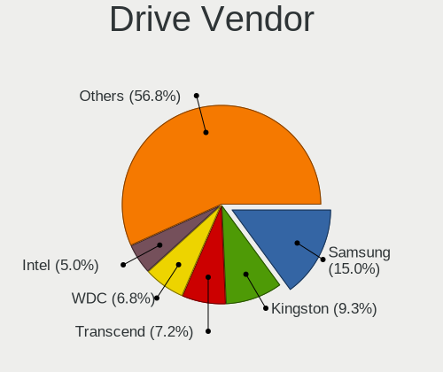
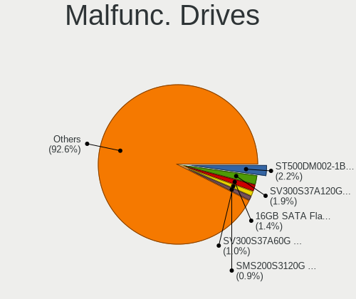

OPNsense - Tested Hardware & Statistics
---------------------------------------

A project to collect tested hardware configurations for OPNsense.

Anyone can contribute to this report by the [hw-probe](https://github.com/linuxhw/hw-probe/blob/master/INSTALL.BSD.md) tool:

    hw-probe -all -upload

Please contribute! Especially if your hardware is rare.

Contents
--------

* [ Test Cases ](#test-cases)

* [ System ](#system)
  - [ OS                       ](#os)
  - [ OS Family                ](#os-family)
  - [ Arch                     ](#arch)
  - [ DE                       ](#de)
  - [ Display Server           ](#display-server)
  - [ Display Manager          ](#display-manager)
  - [ OS Lang                  ](#os-lang)
  - [ Boot Mode                ](#boot-mode)
  - [ Filesystem               ](#filesystem)
  - [ Part. scheme             ](#part-scheme)

* [ Board ](#board)
  - [ Vendor                   ](#vendor)
  - [ Model                    ](#model)
  - [ Model Family             ](#model-family)
  - [ MFG Year                 ](#mfg-year)
  - [ Form Factor              ](#form-factor)
  - [ Coreboot                 ](#coreboot)
  - [ RAM Size                 ](#ram-size)
  - [ RAM Used                 ](#ram-used)
  - [ Total Drives             ](#total-drives)
  - [ Has CD-ROM               ](#has-cd-rom)
  - [ Has Ethernet             ](#has-ethernet)
  - [ Has WiFi                 ](#has-wifi)
  - [ Has Bluetooth            ](#has-bluetooth)

* [ Location ](#location)
  - [ Country                  ](#country)
  - [ City                     ](#city)

* [ Drives ](#drives)
  - [ Drive Vendor             ](#drive-vendor)
  - [ Drive Model              ](#drive-model)
  - [ HDD Vendor               ](#hdd-vendor)
  - [ SSD Vendor               ](#ssd-vendor)
  - [ Drive Kind               ](#drive-kind)
  - [ Drive Connector          ](#drive-connector)
  - [ Drive Size               ](#drive-size)
  - [ Space Total              ](#space-total)
  - [ Space Used               ](#space-used)
  - [ Malfunc. Drives          ](#malfunc-drives)
  - [ Malfunc. Drive Vendor    ](#malfunc-drive-vendor)
  - [ Malfunc. HDD Vendor      ](#malfunc-hdd-vendor)
  - [ Malfunc. Drive Kind      ](#malfunc-drive-kind)
  - [ Failed Drives            ](#failed-drives)
  - [ Failed Drive Vendor      ](#failed-drive-vendor)
  - [ Drive Status             ](#drive-status)

* [ Storage controller ](#storage-controller)
  - [ Storage Vendor           ](#storage-vendor)
  - [ Storage Model            ](#storage-model)
  - [ Storage Kind             ](#storage-kind)

* [ Processor ](#processor)
  - [ CPU Vendor               ](#cpu-vendor)
  - [ CPU Model                ](#cpu-model)
  - [ CPU Model Family         ](#cpu-model-family)
  - [ CPU Cores                ](#cpu-cores)
  - [ CPU Sockets              ](#cpu-sockets)
  - [ CPU Threads              ](#cpu-threads)
  - [ CPU Microarch            ](#cpu-microarch)

* [ Graphics ](#graphics)
  - [ GPU Vendor               ](#gpu-vendor)
  - [ GPU Model                ](#gpu-model)
  - [ GPU Combo                ](#gpu-combo)
  - [ GPU Driver               ](#gpu-driver)
  - [ GPU Memory               ](#gpu-memory)

* [ Monitor ](#monitor)
  - [ Monitor Vendor           ](#monitor-vendor)
  - [ Monitor Model            ](#monitor-model)
  - [ Monitor Resolution       ](#monitor-resolution)
  - [ Monitor Diagonal         ](#monitor-diagonal)
  - [ Monitor Width            ](#monitor-width)
  - [ Aspect Ratio             ](#aspect-ratio)
  - [ Monitor Area             ](#monitor-area)
  - [ Pixel Density            ](#pixel-density)
  - [ Multiple Monitors        ](#multiple-monitors)

* [ Network ](#network)
  - [ Net Controller Vendor    ](#net-controller-vendor)
  - [ Net Controller Model     ](#net-controller-model)
  - [ Wireless Vendor          ](#wireless-vendor)
  - [ Wireless Model           ](#wireless-model)
  - [ Ethernet Vendor          ](#ethernet-vendor)
  - [ Ethernet Model           ](#ethernet-model)
  - [ Net Controller Kind      ](#net-controller-kind)
  - [ Used Controller          ](#used-controller)
  - [ NICs                     ](#nics)
  - [ IPv6                     ](#ipv6)

* [ Bluetooth ](#bluetooth)
  - [ Bluetooth Vendor         ](#bluetooth-vendor)
  - [ Bluetooth Model          ](#bluetooth-model)

* [ Sound ](#sound)
  - [ Sound Vendor             ](#sound-vendor)
  - [ Sound Model              ](#sound-model)

* [ Memory ](#memory)
  - [ Memory Vendor            ](#memory-vendor)
  - [ Memory Model             ](#memory-model)
  - [ Memory Kind              ](#memory-kind)
  - [ Memory Form Factor       ](#memory-form-factor)
  - [ Memory Size              ](#memory-size)
  - [ Memory Speed             ](#memory-speed)

* [ Printers & scanners ](#printers--scanners)
  - [ Printer Vendor           ](#printer-vendor)
  - [ Printer Model            ](#printer-model)
  - [ Scanner Vendor           ](#scanner-vendor)
  - [ Scanner Model            ](#scanner-model)

* [ Camera ](#camera)
  - [ Camera Vendor            ](#camera-vendor)
  - [ Camera Model             ](#camera-model)

* [ Security ](#security)
  - [ Fingerprint Vendor       ](#fingerprint-vendor)
  - [ Fingerprint Model        ](#fingerprint-model)
  - [ Chipcard Vendor          ](#chipcard-vendor)
  - [ Chipcard Model           ](#chipcard-model)

* [ Unsupported ](#unsupported)
  - [ Unsupported Devices      ](#unsupported-devices)
  - [ Unsupported Device Types ](#unsupported-device-types)

Test Cases
----------

Total: 8690

| Vendor        | Model                       | Form-Factor | Probe                                                     | Date         |
|---------------|-----------------------------|-------------|-----------------------------------------------------------|--------------|
| Intel         | MAHOBAY                     | Desktop     | [6e8443e9f4](https://bsd-hardware.info/?probe=6e8443e9f4) | Apr 01, 2023 |
| Sophos        | SG                          | Firewall    | [350970e2eb](https://bsd-hardware.info/?probe=350970e2eb) | Apr 01, 2023 |
| Dell          | 0N4YC8 A00                  | Desktop     | [bd01e6e577](https://bsd-hardware.info/?probe=bd01e6e577) | Apr 01, 2023 |
| Sophos        | SG                          | Firewall    | [b3328d5498](https://bsd-hardware.info/?probe=b3328d5498) | Apr 01, 2023 |
| ASUSTek       | P8H61-M LX PLUS R2.0        | Desktop     | [3bb60897ff](https://bsd-hardware.info/?probe=3bb60897ff) | Apr 01, 2023 |
| Supermicro    | X11SDV-4C-TP8F              | Desktop     | [b41b088f96](https://bsd-hardware.info/?probe=b41b088f96) | Apr 01, 2023 |
| Fujitsu       | D3313-G1 S26361-D3313-G1    | Desktop     | [1122cabca9](https://bsd-hardware.info/?probe=1122cabca9) | Apr 01, 2023 |
| Dell          | 0F0XJ6 A11                  | Server      | [99f769056a](https://bsd-hardware.info/?probe=99f769056a) | Mar 31, 2023 |
| HP            | ProLiant ML30 Gen9          | Desktop     | [eabda4cb6b](https://bsd-hardware.info/?probe=eabda4cb6b) | Mar 31, 2023 |
| Unknown       | Unknown                     | Desktop     | [a0548bbb6e](https://bsd-hardware.info/?probe=a0548bbb6e) | Mar 31, 2023 |
| Unknown       | Unknown                     | Desktop     | [4e1a7e6b4a](https://bsd-hardware.info/?probe=4e1a7e6b4a) | Mar 31, 2023 |
| Fujitsu       | D3313-A1 S26361-D3313-A1    | Desktop     | [fb6477d43e](https://bsd-hardware.info/?probe=fb6477d43e) | Mar 31, 2023 |
| HP            | 1495                        | Desktop     | [a916ab2122](https://bsd-hardware.info/?probe=a916ab2122) | Mar 31, 2023 |
| Unknown       | Unknown                     | Desktop     | [cc090cca30](https://bsd-hardware.info/?probe=cc090cca30) | Mar 31, 2023 |
| Techvision    | TVI7309X B0                 | Desktop     | [837fdf1a2c](https://bsd-hardware.info/?probe=837fdf1a2c) | Mar 31, 2023 |
| Intel         | DENLOW_REFRESH_WS           | Desktop     | [1285cbe6ca](https://bsd-hardware.info/?probe=1285cbe6ca) | Mar 31, 2023 |
| Protectli     | FW4B Ver                    | Desktop     | [cc6e076383](https://bsd-hardware.info/?probe=cc6e076383) | Mar 31, 2023 |
| ZOTAC         | ZBOX-ID91                   | Mini pc     | [d7bb801369](https://bsd-hardware.info/?probe=d7bb801369) | Mar 31, 2023 |
| Gigabyte      | X570 UD                     | Desktop     | [a71a4da74b](https://bsd-hardware.info/?probe=a71a4da74b) | Mar 31, 2023 |
| ASUSTek       | P5G41T-M LX2/BR             | Desktop     | [16d1e0aa3e](https://bsd-hardware.info/?probe=16d1e0aa3e) | Mar 31, 2023 |
| Gigabyte      | H55M-S2H                    | Desktop     | [60c66c5066](https://bsd-hardware.info/?probe=60c66c5066) | Mar 30, 2023 |
| Foxconn       | nT-A3000 series FAB         | Desktop     | [c13f32c492](https://bsd-hardware.info/?probe=c13f32c492) | Mar 30, 2023 |
| Fujitsu       | D3313-A1 S26361-D3313-A1    | Desktop     | [a160027cc2](https://bsd-hardware.info/?probe=a160027cc2) | Mar 30, 2023 |
| Deciso        | NetBoard-A20                | Notebook    | [33ca458105](https://bsd-hardware.info/?probe=33ca458105) | Mar 30, 2023 |
| Dell          | 0VG93V A00                  | Desktop     | [1f3e086401](https://bsd-hardware.info/?probe=1f3e086401) | Mar 30, 2023 |
| HP            | 0AA0h                       | Desktop     | [9f8c7ed2d7](https://bsd-hardware.info/?probe=9f8c7ed2d7) | Mar 30, 2023 |
| Inventec      | Z CLASS A02                 | Desktop     | [c654ef10d6](https://bsd-hardware.info/?probe=c654ef10d6) | Mar 30, 2023 |
| Dell          | 0M877N A01                  | Server      | [dabe853e69](https://bsd-hardware.info/?probe=dabe853e69) | Mar 30, 2023 |
| Protectli     | FW4B Ver                    | Desktop     | [27d9a92cda](https://bsd-hardware.info/?probe=27d9a92cda) | Mar 30, 2023 |
| Unknown       | Unknown                     | Desktop     | [44da021f65](https://bsd-hardware.info/?probe=44da021f65) | Mar 29, 2023 |
| Seeed Stud... | ODYSSEY-X86J4105 SD-BS-C... | Desktop     | [dc06ff6076](https://bsd-hardware.info/?probe=dc06ff6076) | Mar 29, 2023 |
| ASRock        | Z97 Killer                  | Desktop     | [4e527312a1](https://bsd-hardware.info/?probe=4e527312a1) | Mar 29, 2023 |
| Supermicro    | C7SIM-Q                     | Desktop     | [47ce885e13](https://bsd-hardware.info/?probe=47ce885e13) | Mar 29, 2023 |
| Dell          | 0DRG19 A00                  | Mini pc     | [34ad91005f](https://bsd-hardware.info/?probe=34ad91005f) | Mar 29, 2023 |
| Lenovo        | SDK0J40700 WIN              | Desktop     | [36192ec5c8](https://bsd-hardware.info/?probe=36192ec5c8) | Mar 29, 2023 |
| Dell          | 0KM5PX A02                  | Server      | [baf6ac9c00](https://bsd-hardware.info/?probe=baf6ac9c00) | Mar 29, 2023 |
| Dell          | 0MX4YF A01                  | Server      | [6a6b7d1e6d](https://bsd-hardware.info/?probe=6a6b7d1e6d) | Mar 29, 2023 |
| ASRockRack    | X470D4U                     | Desktop     | [675bcfa82d](https://bsd-hardware.info/?probe=675bcfa82d) | Mar 29, 2023 |
| Unknown       | Unknown                     | Desktop     | [9696e7d17f](https://bsd-hardware.info/?probe=9696e7d17f) | Mar 29, 2023 |
| ASRock        | H510M-HVS R2.0              | Desktop     | [38a784fcd8](https://bsd-hardware.info/?probe=38a784fcd8) | Mar 29, 2023 |
| BESSTAR Te... | GB7                         | Mini pc     | [3a5111c467](https://bsd-hardware.info/?probe=3a5111c467) | Mar 29, 2023 |
| Unknown       | Unknown                     | Desktop     | [723e81c698](https://bsd-hardware.info/?probe=723e81c698) | Mar 29, 2023 |
| HP            | 843F                        | Desktop     | [ba9d2ef26c](https://bsd-hardware.info/?probe=ba9d2ef26c) | Mar 29, 2023 |
| Gigabyte      | X570S AORUS ELITE           | Desktop     | [3895705bbd](https://bsd-hardware.info/?probe=3895705bbd) | Mar 29, 2023 |
| Apple         | Mac-F221BEC8                | Desktop     | [b2a2fc8fe6](https://bsd-hardware.info/?probe=b2a2fc8fe6) | Mar 29, 2023 |
| Unknown       | Unknown                     | Notebook    | [ee06e14aa2](https://bsd-hardware.info/?probe=ee06e14aa2) | Mar 29, 2023 |
| Unknown       | Unknown                     | Desktop     | [c6c33779dc](https://bsd-hardware.info/?probe=c6c33779dc) | Mar 29, 2023 |
| Supermicro    | X11SSL-F                    | Server      | [ac9e97cf34](https://bsd-hardware.info/?probe=ac9e97cf34) | Mar 28, 2023 |
| ETegro Tec... | ETRS130G3 31S98MB0020       | Server      | [94addf97d5](https://bsd-hardware.info/?probe=94addf97d5) | Mar 28, 2023 |
| Intel         | S2600GZ G29051-355          | Server      | [6bc00cde60](https://bsd-hardware.info/?probe=6bc00cde60) | Mar 28, 2023 |
| MW            | GMLK-2_5G4L                 | Desktop     | [459fdd8cdd](https://bsd-hardware.info/?probe=459fdd8cdd) | Mar 28, 2023 |
| Intel         | JSL MRD                     | Desktop     | [07adf23a3d](https://bsd-hardware.info/?probe=07adf23a3d) | Mar 28, 2023 |
| HP            | 18E7                        | Desktop     | [f83e0bbd69](https://bsd-hardware.info/?probe=f83e0bbd69) | Mar 28, 2023 |
| Lenovo        | ThinkCentre M58 7360EUU     | Desktop     | [b86ffef220](https://bsd-hardware.info/?probe=b86ffef220) | Mar 28, 2023 |
| Protectli     | FW4B                        | Desktop     | [17c0040b42](https://bsd-hardware.info/?probe=17c0040b42) | Mar 28, 2023 |
| Unknown       | Unknown                     | Firewall    | [c2c2b195e4](https://bsd-hardware.info/?probe=c2c2b195e4) | Mar 28, 2023 |
| Lenovo        | SHARKBAY 0B98405 STD        | Desktop     | [29c6f5f74c](https://bsd-hardware.info/?probe=29c6f5f74c) | Mar 28, 2023 |
| Dell          | 0CNCJW A10                  | Server      | [f912d933df](https://bsd-hardware.info/?probe=f912d933df) | Mar 27, 2023 |
| Sophos        | SG                          | Firewall    | [b3346fe828](https://bsd-hardware.info/?probe=b3346fe828) | Mar 27, 2023 |
| HP            | 8054                        | Desktop     | [6c82269548](https://bsd-hardware.info/?probe=6c82269548) | Mar 27, 2023 |
| Techvision    | TVI7309X B0                 | Desktop     | [30e6aeb9bb](https://bsd-hardware.info/?probe=30e6aeb9bb) | Mar 27, 2023 |
| HP            | 213D A01                    | Desktop     | [d5efcf6e96](https://bsd-hardware.info/?probe=d5efcf6e96) | Mar 27, 2023 |
| ASUSTek       | Z97-E/USB                   | Desktop     | [e5a3f523a6](https://bsd-hardware.info/?probe=e5a3f523a6) | Mar 27, 2023 |
| CncTion       | N5105-4L B0                 | Desktop     | [b6fd7cd6ae](https://bsd-hardware.info/?probe=b6fd7cd6ae) | Mar 27, 2023 |
| WeiBu         | ADL-N Prod                  | Desktop     | [1d0a4ac0a1](https://bsd-hardware.info/?probe=1d0a4ac0a1) | Mar 27, 2023 |
| WeiBu         | ADL-N Prod                  | Desktop     | [91759ff33b](https://bsd-hardware.info/?probe=91759ff33b) | Mar 27, 2023 |
| Acer          | WG43M                       | Desktop     | [c8f2a03a08](https://bsd-hardware.info/?probe=c8f2a03a08) | Mar 27, 2023 |
| Lenovo        | MAHOBAY NO DPK              | Desktop     | [0eab0142d5](https://bsd-hardware.info/?probe=0eab0142d5) | Mar 26, 2023 |
| HP            | 2820h                       | Desktop     | [58d6933119](https://bsd-hardware.info/?probe=58d6933119) | Mar 26, 2023 |
| Acer          | WG43M                       | Desktop     | [5e154dc7cf](https://bsd-hardware.info/?probe=5e154dc7cf) | Mar 26, 2023 |
| CWWK          | MINIPC-G4                   | Desktop     | [06e3c70f23](https://bsd-hardware.info/?probe=06e3c70f23) | Mar 26, 2023 |
| CWWK          | MINIPC-G4                   | Desktop     | [8f47736c3b](https://bsd-hardware.info/?probe=8f47736c3b) | Mar 26, 2023 |
| MSI           | PRO B660-A DDR4             | Desktop     | [735a5cc6a2](https://bsd-hardware.info/?probe=735a5cc6a2) | Mar 26, 2023 |
| ChangWang     | CW56-58                     | Desktop     | [39410cb2dd](https://bsd-hardware.info/?probe=39410cb2dd) | Mar 26, 2023 |
| Shuttle       | FS81                        | Desktop     | [b80626e045](https://bsd-hardware.info/?probe=b80626e045) | Mar 26, 2023 |
| Lanner        | FW-7543 B-GA                | Desktop     | [3ed4cfc9c8](https://bsd-hardware.info/?probe=3ed4cfc9c8) | Mar 26, 2023 |
| Sophos        | UTM                         | Firewall    | [99af1f0a15](https://bsd-hardware.info/?probe=99af1f0a15) | Mar 26, 2023 |
| Unknown       | Unknown                     | Desktop     | [003e1396f6](https://bsd-hardware.info/?probe=003e1396f6) | Mar 26, 2023 |
| YANYU         | H17SL                       | Desktop     | [0f9829ebe4](https://bsd-hardware.info/?probe=0f9829ebe4) | Mar 26, 2023 |
| ASUSTek       | P11C-M Series               | Desktop     | [15e452d25d](https://bsd-hardware.info/?probe=15e452d25d) | Mar 26, 2023 |
| Intel         | Q3XXG4-P V1.0               | Desktop     | [2f16e29f78](https://bsd-hardware.info/?probe=2f16e29f78) | Mar 26, 2023 |
| Protectli     | FW4B Ver                    | Desktop     | [fc5ab682fc](https://bsd-hardware.info/?probe=fc5ab682fc) | Mar 26, 2023 |
| Lenovo        | 312D SDK0L22692 WIN 3306... | Mini pc     | [73519e765c](https://bsd-hardware.info/?probe=73519e765c) | Mar 26, 2023 |
| ASRock        | H510M-HVS R2.0              | Desktop     | [3db3c8f002](https://bsd-hardware.info/?probe=3db3c8f002) | Mar 26, 2023 |
| Dell          | 0HD5W2 A01                  | Desktop     | [284c499b74](https://bsd-hardware.info/?probe=284c499b74) | Mar 26, 2023 |
| Unknown       | Unknown                     | Firewall    | [e17beb7d4c](https://bsd-hardware.info/?probe=e17beb7d4c) | Mar 26, 2023 |
| Dell          | 0654JC A02                  | Desktop     | [373d1bc62b](https://bsd-hardware.info/?probe=373d1bc62b) | Mar 26, 2023 |
| Intel         | Q3XXG4-P V1.0               | Desktop     | [2634ccb935](https://bsd-hardware.info/?probe=2634ccb935) | Mar 26, 2023 |
| Acer          | Aspire XC-830               | Desktop     | [bc1cc29291](https://bsd-hardware.info/?probe=bc1cc29291) | Mar 26, 2023 |
| Acer          | Aspire XC-830               | Desktop     | [2affd2540a](https://bsd-hardware.info/?probe=2affd2540a) | Mar 26, 2023 |
| CheckPoint    | T-110-00                    | Desktop     | [eecf6b8096](https://bsd-hardware.info/?probe=eecf6b8096) | Mar 25, 2023 |
| Protectli     | FW4B                        | Desktop     | [3c333bad9c](https://bsd-hardware.info/?probe=3c333bad9c) | Mar 25, 2023 |
| Protectli     | VP2410                      | Desktop     | [a52038d49d](https://bsd-hardware.info/?probe=a52038d49d) | Mar 25, 2023 |
| ASRock        | B450 Steel Legend           | Desktop     | [0f0f389db4](https://bsd-hardware.info/?probe=0f0f389db4) | Mar 25, 2023 |
| ASUSTek       | F1A55                       | Desktop     | [91ad5bab75](https://bsd-hardware.info/?probe=91ad5bab75) | Mar 25, 2023 |
| Unknown       | Unknown                     | Desktop     | [c7c5a8ae97](https://bsd-hardware.info/?probe=c7c5a8ae97) | Mar 25, 2023 |
| Unknown       | iKoolCore R1 iKoolCore R... | Desktop     | [20dc598eb3](https://bsd-hardware.info/?probe=20dc598eb3) | Mar 25, 2023 |
| Protectli     | FW4B Ver                    | Desktop     | [5082d62025](https://bsd-hardware.info/?probe=5082d62025) | Mar 25, 2023 |
| HP            | 82B4                        | Desktop     | [6edc033f79](https://bsd-hardware.info/?probe=6edc033f79) | Mar 25, 2023 |
| MW            | GMLK-2_5G4L                 | Desktop     | [41fa3f51d3](https://bsd-hardware.info/?probe=41fa3f51d3) | Mar 25, 2023 |
| ASRock        | B450 Steel Legend           | Desktop     | [72a2bf0c68](https://bsd-hardware.info/?probe=72a2bf0c68) | Mar 25, 2023 |
| Hardkernel    | ODROID-H3                   | Desktop     | [312a9b3461](https://bsd-hardware.info/?probe=312a9b3461) | Mar 25, 2023 |
| Techvision    | TVI7309X B0                 | Desktop     | [40c71ed805](https://bsd-hardware.info/?probe=40c71ed805) | Mar 25, 2023 |
| Protectli     | FW6 Ver                     | Desktop     | [5444aee217](https://bsd-hardware.info/?probe=5444aee217) | Mar 25, 2023 |
| ASUSTek       | Z97-E/USB                   | Desktop     | [9aa3b17016](https://bsd-hardware.info/?probe=9aa3b17016) | Mar 25, 2023 |
| Unknown       | Unknown                     | Desktop     | [387c27f1d7](https://bsd-hardware.info/?probe=387c27f1d7) | Mar 25, 2023 |
| Unknown       | Unknown                     | Desktop     | [55c708e91a](https://bsd-hardware.info/?probe=55c708e91a) | Mar 24, 2023 |
| PC Engines    | APU2                        | Desktop     | [4e4a81e456](https://bsd-hardware.info/?probe=4e4a81e456) | Mar 24, 2023 |
| Lex           | Pineview-D                  | Desktop     | [ca2fbb614d](https://bsd-hardware.info/?probe=ca2fbb614d) | Mar 24, 2023 |
| Stonesoft     | DEV-1301-2-C1-R             | Desktop     | [3bc0fc5d63](https://bsd-hardware.info/?probe=3bc0fc5d63) | Mar 24, 2023 |
| CncTion       | N5105-4L B0                 | Desktop     | [9561c72b9c](https://bsd-hardware.info/?probe=9561c72b9c) | Mar 24, 2023 |
| Intel         | Q3XXG4-P V1.0               | Desktop     | [083d2e65da](https://bsd-hardware.info/?probe=083d2e65da) | Mar 24, 2023 |
| Stonesoft     | DEV-1301-2-C1-R             | Desktop     | [2699b59d1b](https://bsd-hardware.info/?probe=2699b59d1b) | Mar 24, 2023 |
| Gigabyte      | MX31-BS0 01234567           | Server      | [b9956d8d91](https://bsd-hardware.info/?probe=b9956d8d91) | Mar 24, 2023 |
| Intel         | H81U                        | Notebook    | [af9a6469c9](https://bsd-hardware.info/?probe=af9a6469c9) | Mar 24, 2023 |
| HP            | 2820h                       | Desktop     | [7df9c94771](https://bsd-hardware.info/?probe=7df9c94771) | Mar 24, 2023 |
| Intel         | Q3XXG4-P V1.0               | Desktop     | [56c12d6bf6](https://bsd-hardware.info/?probe=56c12d6bf6) | Mar 24, 2023 |
| ASUSTek       | Z97-E/USB                   | Desktop     | [e9cbfc666b](https://bsd-hardware.info/?probe=e9cbfc666b) | Mar 24, 2023 |
| Intel         | Q3XXG4-P V1.0               | Desktop     | [e99acbbc10](https://bsd-hardware.info/?probe=e99acbbc10) | Mar 24, 2023 |
| ASRock        | A520M-ITX/ac                | Desktop     | [18877701a6](https://bsd-hardware.info/?probe=18877701a6) | Mar 24, 2023 |
| HP            | 213D A01                    | Desktop     | [c942b222fa](https://bsd-hardware.info/?probe=c942b222fa) | Mar 24, 2023 |
| HP            | 8103 A01                    | Mini pc     | [23f893285e](https://bsd-hardware.info/?probe=23f893285e) | Mar 24, 2023 |
| CncTion       | J4125-4L-I225               | Desktop     | [5e63c02cde](https://bsd-hardware.info/?probe=5e63c02cde) | Mar 23, 2023 |
| Supermicro    | A1SAi 123456789             | Mini pc     | [72e4bf10a6](https://bsd-hardware.info/?probe=72e4bf10a6) | Mar 23, 2023 |
| Protectli     | VP2420                      | Desktop     | [f07553b02c](https://bsd-hardware.info/?probe=f07553b02c) | Mar 23, 2023 |
| ASUSTek       | H81M-K                      | Desktop     | [c45489c043](https://bsd-hardware.info/?probe=c45489c043) | Mar 23, 2023 |
| IceWhale T... | ZimaBoard 832 ZMB           | Desktop     | [3c4f4abe16](https://bsd-hardware.info/?probe=3c4f4abe16) | Mar 23, 2023 |
| Protectli     | VP2420                      | Desktop     | [dfad78899e](https://bsd-hardware.info/?probe=dfad78899e) | Mar 23, 2023 |
| ShenZhen M... | MW-GMLK-2.5G6L              | Desktop     | [720f15a1ce](https://bsd-hardware.info/?probe=720f15a1ce) | Mar 23, 2023 |
| Lenovo        | SHARKBAY 0B98401 WIN        | Desktop     | [f8f04980fb](https://bsd-hardware.info/?probe=f8f04980fb) | Mar 23, 2023 |
| ASUSTek       | P11C-M Series               | Desktop     | [b0079291db](https://bsd-hardware.info/?probe=b0079291db) | Mar 23, 2023 |
| BROUNION      | R86S                        | Desktop     | [4fc5a71125](https://bsd-hardware.info/?probe=4fc5a71125) | Mar 23, 2023 |
| Supermicro    | X9SRE/X9SRE-3F/X9SRi/X9S... | Server      | [bff3fc8a58](https://bsd-hardware.info/?probe=bff3fc8a58) | Mar 23, 2023 |
| Unknown       | Unknown                     | Desktop     | [a7e98f9a10](https://bsd-hardware.info/?probe=a7e98f9a10) | Mar 23, 2023 |
| ASUSTek       | CROSSHAIR V FORMULA-Z       | Desktop     | [491c0ca78a](https://bsd-hardware.info/?probe=491c0ca78a) | Mar 22, 2023 |
| Intel         | Q3XXG4-P V1.0               | Desktop     | [680002292e](https://bsd-hardware.info/?probe=680002292e) | Mar 22, 2023 |
| HP            | 18E5                        | Desktop     | [1f402a50e7](https://bsd-hardware.info/?probe=1f402a50e7) | Mar 22, 2023 |
| Supermicro    | X10SDV-4C-TLN4F             | Server      | [7b22e68dea](https://bsd-hardware.info/?probe=7b22e68dea) | Mar 22, 2023 |
| Protectli     | FW4C Ver                    | Desktop     | [73ecb1afc1](https://bsd-hardware.info/?probe=73ecb1afc1) | Mar 22, 2023 |
| ASRock        | B450M Pro4                  | Desktop     | [e2d0aa1444](https://bsd-hardware.info/?probe=e2d0aa1444) | Mar 22, 2023 |
| Protectli     | FW4B Ver                    | Desktop     | [c2546b211b](https://bsd-hardware.info/?probe=c2546b211b) | Mar 22, 2023 |
| MW            | GMLK-2_5G4L                 | Desktop     | [b3f0879ebf](https://bsd-hardware.info/?probe=b3f0879ebf) | Mar 22, 2023 |
| NF596         | 1.0                         | Desktop     | [9de0fd33a4](https://bsd-hardware.info/?probe=9de0fd33a4) | Mar 22, 2023 |
| Protectli     | VP2410 10                   | Desktop     | [491f4cc780](https://bsd-hardware.info/?probe=491f4cc780) | Mar 22, 2023 |
| HP            | ProLiant DL360 G7           | Server      | [1f8be65019](https://bsd-hardware.info/?probe=1f8be65019) | Mar 22, 2023 |
| ASRock        | B460M-HDV                   | Desktop     | [e1ee6d8a11](https://bsd-hardware.info/?probe=e1ee6d8a11) | Mar 22, 2023 |
| MSI           | H81I                        | Desktop     | [4983a6a077](https://bsd-hardware.info/?probe=4983a6a077) | Mar 22, 2023 |
| Lenovo        | SDK0J40700 WIN              | Desktop     | [dccfb64926](https://bsd-hardware.info/?probe=dccfb64926) | Mar 22, 2023 |
| ASRockRack    | E3C236D2I                   | Desktop     | [e407119ecf](https://bsd-hardware.info/?probe=e407119ecf) | Mar 22, 2023 |
| Dell          | 081N4V A04                  | Server      | [d8a5f43d05](https://bsd-hardware.info/?probe=d8a5f43d05) | Mar 21, 2023 |
| Lenovo        | 3106 SDK0J40697 WIN 3305... | Desktop     | [283fe42941](https://bsd-hardware.info/?probe=283fe42941) | Mar 21, 2023 |
| ASRockRack    | E3C236D2I                   | Desktop     | [0854f96185](https://bsd-hardware.info/?probe=0854f96185) | Mar 21, 2023 |
| Intel         | SKYBAY                      | Desktop     | [83ea0b27b1](https://bsd-hardware.info/?probe=83ea0b27b1) | Mar 21, 2023 |
| ASRock        | J5040-ITX                   | Desktop     | [56a3214f4b](https://bsd-hardware.info/?probe=56a3214f4b) | Mar 21, 2023 |
| Dell          | 03X6X0 A02                  | Server      | [7edb868404](https://bsd-hardware.info/?probe=7edb868404) | Mar 21, 2023 |
| ASRock        | X570M Pro4                  | Desktop     | [e405ff5adf](https://bsd-hardware.info/?probe=e405ff5adf) | Mar 21, 2023 |
| ASUSTek       | Rampage II Extreme          | Desktop     | [45fd7b7b5f](https://bsd-hardware.info/?probe=45fd7b7b5f) | Mar 21, 2023 |
| Supermicro    | X9SCL/X9SCMA                | Desktop     | [7bac9347ec](https://bsd-hardware.info/?probe=7bac9347ec) | Mar 21, 2023 |
| ASRock        | G31M-S                      | Desktop     | [60b239d5c0](https://bsd-hardware.info/?probe=60b239d5c0) | Mar 21, 2023 |
| Sophos        | SG                          | Firewall    | [4f818307ff](https://bsd-hardware.info/?probe=4f818307ff) | Mar 21, 2023 |
| Techvision    | TVI7309X B0                 | Desktop     | [8d84f81be3](https://bsd-hardware.info/?probe=8d84f81be3) | Mar 21, 2023 |
| Dell          | 0DRG19 A00                  | Mini pc     | [0fe355f959](https://bsd-hardware.info/?probe=0fe355f959) | Mar 21, 2023 |
| HP            | 805A                        | Desktop     | [d90c74af40](https://bsd-hardware.info/?probe=d90c74af40) | Mar 21, 2023 |
| Intel         | DENLOW_WS                   | Desktop     | [6a352d6a07](https://bsd-hardware.info/?probe=6a352d6a07) | Mar 21, 2023 |
| Supermicro    | X11SDV-8C-TP8F              | Desktop     | [7ae004c035](https://bsd-hardware.info/?probe=7ae004c035) | Mar 21, 2023 |
| AMI           | Aptio CRB                   | Mini pc     | [5193764df7](https://bsd-hardware.info/?probe=5193764df7) | Mar 20, 2023 |
| Supermicro    | X11SSL-F                    | Server      | [1aab89d35b](https://bsd-hardware.info/?probe=1aab89d35b) | Mar 20, 2023 |
| Techvision    | TVI7309X B0                 | Desktop     | [c3871d22c6](https://bsd-hardware.info/?probe=c3871d22c6) | Mar 20, 2023 |
| Dell          | 00NH4P A03                  | Server      | [0d29dd3a66](https://bsd-hardware.info/?probe=0d29dd3a66) | Mar 20, 2023 |
| Silicom       | 80300-0134-g01              | Desktop     | [3cd6c5ba13](https://bsd-hardware.info/?probe=3cd6c5ba13) | Mar 20, 2023 |
| Techvision    | TVI7309X B0                 | Desktop     | [10f3485393](https://bsd-hardware.info/?probe=10f3485393) | Mar 20, 2023 |
| Sophos        | SG                          | Firewall    | [e0ac090471](https://bsd-hardware.info/?probe=e0ac090471) | Mar 20, 2023 |
| Unknown       | Unknown                     | Desktop     | [e4365dfa60](https://bsd-hardware.info/?probe=e4365dfa60) | Mar 20, 2023 |
| Lenovo        | 3102 SDK0J40700 WIN 3258... | Desktop     | [1ffbf45d40](https://bsd-hardware.info/?probe=1ffbf45d40) | Mar 19, 2023 |
| MSI           | H81I                        | Desktop     | [a1981bf557](https://bsd-hardware.info/?probe=a1981bf557) | Mar 19, 2023 |
| Unknown       | Unknown                     | Desktop     | [91b5500917](https://bsd-hardware.info/?probe=91b5500917) | Mar 19, 2023 |
| CNCTION-IA... | Unknown                     | Desktop     | [ba5de75eaa](https://bsd-hardware.info/?probe=ba5de75eaa) | Mar 19, 2023 |
| ASUSTek       | G750JS                      | Notebook    | [bb6117addd](https://bsd-hardware.info/?probe=bb6117addd) | Mar 19, 2023 |
| ASRock        | H610M-HDV/M.2               | Desktop     | [5494c32f7a](https://bsd-hardware.info/?probe=5494c32f7a) | Mar 19, 2023 |
| Protectli     | FW4B Ver                    | Desktop     | [317c44acd2](https://bsd-hardware.info/?probe=317c44acd2) | Mar 19, 2023 |
| Intel         | DENLOW_WS                   | Desktop     | [8b3bb4ee24](https://bsd-hardware.info/?probe=8b3bb4ee24) | Mar 19, 2023 |
| ASUSTek       | Z97I-PLUS                   | Desktop     | [cdbc1b0031](https://bsd-hardware.info/?probe=cdbc1b0031) | Mar 19, 2023 |
| CNCTION-IA... | Unknown                     | Desktop     | [914c4aad57](https://bsd-hardware.info/?probe=914c4aad57) | Mar 19, 2023 |
| Datto         | SSD                         | Desktop     | [40831257b2](https://bsd-hardware.info/?probe=40831257b2) | Mar 19, 2023 |
| ASUSTek       | M5A78L-M PLUS/USB3          | Desktop     | [3bb2c5733d](https://bsd-hardware.info/?probe=3bb2c5733d) | Mar 19, 2023 |
| HP            | ProBook 640 G3              | Notebook    | [860471150b](https://bsd-hardware.info/?probe=860471150b) | Mar 18, 2023 |
| Intel         | SKYBAY                      | Desktop     | [7bd7f393b1](https://bsd-hardware.info/?probe=7bd7f393b1) | Mar 18, 2023 |
| ASUSTek       | CM6330_CM6630_CM6730_CM6... | Desktop     | [4e1fe3a676](https://bsd-hardware.info/?probe=4e1fe3a676) | Mar 18, 2023 |
| HP            | 18E7                        | Desktop     | [d3b280214a](https://bsd-hardware.info/?probe=d3b280214a) | Mar 18, 2023 |
| AMI           | Aptio CRB                   | Mini pc     | [e726d886c8](https://bsd-hardware.info/?probe=e726d886c8) | Mar 18, 2023 |
| ASUSTek       | M5A78L-M LX3                | Desktop     | [3f78d8f1ae](https://bsd-hardware.info/?probe=3f78d8f1ae) | Mar 18, 2023 |
| Intel         | SKYBAY                      | Desktop     | [a8f1d29e24](https://bsd-hardware.info/?probe=a8f1d29e24) | Mar 18, 2023 |
| Unknown       | QD-CMU01                    | Desktop     | [c6ddfac225](https://bsd-hardware.info/?probe=c6ddfac225) | Mar 18, 2023 |
| Intel         | B75                         | Desktop     | [11bcf42a35](https://bsd-hardware.info/?probe=11bcf42a35) | Mar 18, 2023 |
| Dell          | 03X6X0 A01                  | Server      | [6366bfde8d](https://bsd-hardware.info/?probe=6366bfde8d) | Mar 18, 2023 |
| ZOTAC         | ZBOX-ID91                   | Mini pc     | [4bbec4b82a](https://bsd-hardware.info/?probe=4bbec4b82a) | Mar 18, 2023 |
| Fujitsu       | D3313-S3 S26361-D3313-S3    | Desktop     | [1bf34a929a](https://bsd-hardware.info/?probe=1bf34a929a) | Mar 18, 2023 |
| HP            | 2175                        | Desktop     | [d0627c1360](https://bsd-hardware.info/?probe=d0627c1360) | Mar 17, 2023 |
| Supermicro    | X10SLH-F/X10SLM+-F          | Server      | [17516fffcf](https://bsd-hardware.info/?probe=17516fffcf) | Mar 17, 2023 |
| Protectli     | FW6                         | Desktop     | [f24f1a8a3e](https://bsd-hardware.info/?probe=f24f1a8a3e) | Mar 17, 2023 |
| Unknown       | Unknown                     | Desktop     | [03cf8c47dc](https://bsd-hardware.info/?probe=03cf8c47dc) | Mar 17, 2023 |
| Dell          | 0D28YY A00                  | Desktop     | [15e8aedcb6](https://bsd-hardware.info/?probe=15e8aedcb6) | Mar 17, 2023 |
| ASUSTek       | P8H67-M                     | Desktop     | [5c1b721c75](https://bsd-hardware.info/?probe=5c1b721c75) | Mar 17, 2023 |
| Positivo      | POS-PIB150DT                | Desktop     | [f0158da9e1](https://bsd-hardware.info/?probe=f0158da9e1) | Mar 17, 2023 |
| Unknown       | Unknown                     | Desktop     | [9a5ccefb18](https://bsd-hardware.info/?probe=9a5ccefb18) | Mar 17, 2023 |
| Techvision    | TVI7309X B0                 | Desktop     | [7db8753b08](https://bsd-hardware.info/?probe=7db8753b08) | Mar 17, 2023 |
| SiComputer    | Embedded                    | Soc         | [9d6aa61a5c](https://bsd-hardware.info/?probe=9d6aa61a5c) | Mar 17, 2023 |
| ASUSTek       | P8H67-M                     | Desktop     | [3f62e2568b](https://bsd-hardware.info/?probe=3f62e2568b) | Mar 17, 2023 |
| ASUSTek       | P10S-I Series               | Desktop     | [f0e7508425](https://bsd-hardware.info/?probe=f0e7508425) | Mar 17, 2023 |
| Unknown       | Unknown                     | Desktop     | [daaa6c0069](https://bsd-hardware.info/?probe=daaa6c0069) | Mar 17, 2023 |
| Protectli     | FW4B                        | Desktop     | [fd65403ca2](https://bsd-hardware.info/?probe=fd65403ca2) | Mar 17, 2023 |
| Unknown       | Unknown                     | Desktop     | [f641e1207a](https://bsd-hardware.info/?probe=f641e1207a) | Mar 17, 2023 |
| Intel         | DG35EC AAE29266-205         | Desktop     | [0ab42ce2ee](https://bsd-hardware.info/?probe=0ab42ce2ee) | Mar 16, 2023 |
| HP            | 8103 A01                    | Mini pc     | [5898916fc9](https://bsd-hardware.info/?probe=5898916fc9) | Mar 16, 2023 |
| Intel         | SHARKBAY                    | Desktop     | [6c2382fa44](https://bsd-hardware.info/?probe=6c2382fa44) | Mar 16, 2023 |
| AWOW          | PC BOX                      | Mini pc     | [fcbdcaff04](https://bsd-hardware.info/?probe=fcbdcaff04) | Mar 16, 2023 |
| Unknown       | Unknown                     | Desktop     | [d0a9398982](https://bsd-hardware.info/?probe=d0a9398982) | Mar 16, 2023 |
| Unknown       | Unknown                     | Desktop     | [19fc3562d9](https://bsd-hardware.info/?probe=19fc3562d9) | Mar 16, 2023 |
| Fujitsu       | D3313-G1 S26361-D3313-G1    | Desktop     | [652100bcac](https://bsd-hardware.info/?probe=652100bcac) | Mar 16, 2023 |
| YENTEK        | R250                        | Desktop     | [fc42406b39](https://bsd-hardware.info/?probe=fc42406b39) | Mar 15, 2023 |
| Dell          | 0WMJ54 A01                  | Desktop     | [c823742fdc](https://bsd-hardware.info/?probe=c823742fdc) | Mar 15, 2023 |
| Unknown       | Unknown                     | Desktop     | [f80047716b](https://bsd-hardware.info/?probe=f80047716b) | Mar 15, 2023 |
| ASRock        | J5040-ITX                   | Desktop     | [435dc7ee7b](https://bsd-hardware.info/?probe=435dc7ee7b) | Mar 15, 2023 |
| Silicom       | 80300-0134-g01              | Desktop     | [228e446ed5](https://bsd-hardware.info/?probe=228e446ed5) | Mar 15, 2023 |
| DFI           | CM100-C                     | Desktop     | [c34832095b](https://bsd-hardware.info/?probe=c34832095b) | Mar 15, 2023 |
| Dell          | 0M9KCM A00                  | Desktop     | [27a1ab8450](https://bsd-hardware.info/?probe=27a1ab8450) | Mar 15, 2023 |
| Intel         | Q3XXG4-P V1.0               | Desktop     | [65dca4c66b](https://bsd-hardware.info/?probe=65dca4c66b) | Mar 15, 2023 |
| Unknown       | Unknown                     | Desktop     | [68b45d5083](https://bsd-hardware.info/?probe=68b45d5083) | Mar 15, 2023 |
| Fujitsu       | D3313-A1 S26361-D3313-A1    | Desktop     | [b8404f57ba](https://bsd-hardware.info/?probe=b8404f57ba) | Mar 15, 2023 |
| Fujitsu       | D3313-A1 S26361-D3313-A1    | Desktop     | [2d5e8056c0](https://bsd-hardware.info/?probe=2d5e8056c0) | Mar 15, 2023 |
| ASRock        | A520M-ITX/ac                | Desktop     | [1ccc8081fd](https://bsd-hardware.info/?probe=1ccc8081fd) | Mar 15, 2023 |
| Dell          | 03X6X0 A09                  | Server      | [a862402da9](https://bsd-hardware.info/?probe=a862402da9) | Mar 14, 2023 |
| Dell          | 078NPM A00                  | Desktop     | [234e8a451a](https://bsd-hardware.info/?probe=234e8a451a) | Mar 14, 2023 |
| Gigabyte      | H370M D3H-CF                | Desktop     | [8025ea3b29](https://bsd-hardware.info/?probe=8025ea3b29) | Mar 14, 2023 |
| Protectli     | FW4C Ver                    | Desktop     | [6b260b1da3](https://bsd-hardware.info/?probe=6b260b1da3) | Mar 14, 2023 |
| ASRock        | G31M-S                      | Desktop     | [82620884d3](https://bsd-hardware.info/?probe=82620884d3) | Mar 14, 2023 |
| YANYU         | H17SL                       | Desktop     | [37a549331f](https://bsd-hardware.info/?probe=37a549331f) | Mar 14, 2023 |
| PAIQ          | EC3-BT19D4L A1              | Desktop     | [7a51da97c2](https://bsd-hardware.info/?probe=7a51da97c2) | Mar 14, 2023 |
| Intel         | HURONRIVER                  | Desktop     | [06f89fc17d](https://bsd-hardware.info/?probe=06f89fc17d) | Mar 14, 2023 |
| PAIQ          | EC3-BT19D4L A1              | Desktop     | [303f8c77c0](https://bsd-hardware.info/?probe=303f8c77c0) | Mar 14, 2023 |
| ASRock        | Q1900M                      | Desktop     | [9570525d52](https://bsd-hardware.info/?probe=9570525d52) | Mar 14, 2023 |
| Apple         | Mac-4BC72D62AD45599E Mac... | Mini pc     | [80e3f3f6cf](https://bsd-hardware.info/?probe=80e3f3f6cf) | Mar 14, 2023 |
| MW            | GMLK-2_5G4L                 | Desktop     | [5211185a2a](https://bsd-hardware.info/?probe=5211185a2a) | Mar 14, 2023 |
| Lenovo        | 0B98401 PRO                 | Desktop     | [4e27c68fa1](https://bsd-hardware.info/?probe=4e27c68fa1) | Mar 14, 2023 |
| Unknown       | J3160-4L                    | Desktop     | [bc21ae472e](https://bsd-hardware.info/?probe=bc21ae472e) | Mar 13, 2023 |
| Apple         | Mac-4BC72D62AD45599E Mac... | Mini pc     | [7db8571228](https://bsd-hardware.info/?probe=7db8571228) | Mar 13, 2023 |
| Unknown       | Unknown                     | Desktop     | [51bc37434e](https://bsd-hardware.info/?probe=51bc37434e) | Mar 13, 2023 |
| Sophos        | SG                          | Firewall    | [77db75effb](https://bsd-hardware.info/?probe=77db75effb) | Mar 13, 2023 |
| Intel         | QHSW02                      | Desktop     | [ccfc6d4abf](https://bsd-hardware.info/?probe=ccfc6d4abf) | Mar 13, 2023 |
| Techvision    | TVI7309X B0                 | Desktop     | [04f26bf0ba](https://bsd-hardware.info/?probe=04f26bf0ba) | Mar 13, 2023 |
| Intel         | QHSW02                      | Desktop     | [b56a128e7e](https://bsd-hardware.info/?probe=b56a128e7e) | Mar 13, 2023 |
| MSI           | Z87-G41 PC Mate             | Desktop     | [f1dc71b749](https://bsd-hardware.info/?probe=f1dc71b749) | Mar 13, 2023 |
| MSI           | Z87-G41 PC Mate             | Desktop     | [8f819aa5b0](https://bsd-hardware.info/?probe=8f819aa5b0) | Mar 13, 2023 |
| HP            | 8056                        | Desktop     | [e1d2423153](https://bsd-hardware.info/?probe=e1d2423153) | Mar 13, 2023 |
| ASRock        | J4005M                      | Desktop     | [9d9e2c67e2](https://bsd-hardware.info/?probe=9d9e2c67e2) | Mar 13, 2023 |
| HP            | 8056                        | Desktop     | [d89b45ea6d](https://bsd-hardware.info/?probe=d89b45ea6d) | Mar 13, 2023 |
| HP            | 18E7                        | Desktop     | [a5f169c741](https://bsd-hardware.info/?probe=a5f169c741) | Mar 13, 2023 |
| Dell          | 02YYK5 A00                  | Desktop     | [82ec8cfd3b](https://bsd-hardware.info/?probe=82ec8cfd3b) | Mar 13, 2023 |
| HP            | 1495                        | Desktop     | [840b4864ab](https://bsd-hardware.info/?probe=840b4864ab) | Mar 13, 2023 |
| Unknown       | Unknown                     | Desktop     | [1bff43fa4b](https://bsd-hardware.info/?probe=1bff43fa4b) | Mar 13, 2023 |
| Unknown       | Unknown                     | Desktop     | [2b318d15c4](https://bsd-hardware.info/?probe=2b318d15c4) | Mar 13, 2023 |
| Protectli     | FW4B Ver                    | Desktop     | [a81fd51eee](https://bsd-hardware.info/?probe=a81fd51eee) | Mar 13, 2023 |
| Techvision    | TVI7309X B0                 | Desktop     | [23f9004191](https://bsd-hardware.info/?probe=23f9004191) | Mar 13, 2023 |
| HP            | 213D A01                    | Desktop     | [7021648a32](https://bsd-hardware.info/?probe=7021648a32) | Mar 13, 2023 |
| Unknown       | Unknown                     | Desktop     | [8f9638d0c7](https://bsd-hardware.info/?probe=8f9638d0c7) | Mar 13, 2023 |
| Dell          | 02YYK5 A01                  | Desktop     | [fe42d48be1](https://bsd-hardware.info/?probe=fe42d48be1) | Mar 13, 2023 |
| Positivo      | POS-PIB150DT                | Desktop     | [5f39c02bc9](https://bsd-hardware.info/?probe=5f39c02bc9) | Mar 13, 2023 |
| MSI           | Z270-A PRO                  | Desktop     | [9e607b3b16](https://bsd-hardware.info/?probe=9e607b3b16) | Mar 12, 2023 |
| AMI           | MNHO-048                    | Desktop     | [ebd90b78c1](https://bsd-hardware.info/?probe=ebd90b78c1) | Mar 12, 2023 |
| MW            | GMLK-2_5G4L                 | Desktop     | [fee0ff7804](https://bsd-hardware.info/?probe=fee0ff7804) | Mar 12, 2023 |
| Dell          | 0DRG19 A00                  | Mini pc     | [8fb58149ab](https://bsd-hardware.info/?probe=8fb58149ab) | Mar 12, 2023 |
| GoWin Solu... | R86S                        | Desktop     | [44f983da74](https://bsd-hardware.info/?probe=44f983da74) | Mar 12, 2023 |
| Fujitsu       | D3313-A1 S26361-D3313-A1    | Desktop     | [a3f921de9a](https://bsd-hardware.info/?probe=a3f921de9a) | Mar 12, 2023 |
| Sophos        | SG                          | Firewall    | [c671946961](https://bsd-hardware.info/?probe=c671946961) | Mar 12, 2023 |
| Unknown       | Unknown                     | Desktop     | [e4b3ce78e1](https://bsd-hardware.info/?probe=e4b3ce78e1) | Mar 12, 2023 |
| Fujitsu       | D3313-A1 S26361-D3313-A1    | Desktop     | [2050921c3d](https://bsd-hardware.info/?probe=2050921c3d) | Mar 12, 2023 |
| AWOW          | PC BOX                      | Mini pc     | [cdccf8cecb](https://bsd-hardware.info/?probe=cdccf8cecb) | Mar 12, 2023 |
| MW            | GMLK-2_5G4L                 | Desktop     | [ad6f854637](https://bsd-hardware.info/?probe=ad6f854637) | Mar 12, 2023 |
| Dell          | 09T7VV A05                  | Server      | [e975d67484](https://bsd-hardware.info/?probe=e975d67484) | Mar 12, 2023 |
| AMI           | MNHO-048                    | Desktop     | [52cdeb023e](https://bsd-hardware.info/?probe=52cdeb023e) | Mar 12, 2023 |
| Supermicro    | X11SSL-F                    | Server      | [c9ddd32406](https://bsd-hardware.info/?probe=c9ddd32406) | Mar 12, 2023 |
| ASUSTek       | M5A78L-M PLUS/USB3          | Desktop     | [b297748cdf](https://bsd-hardware.info/?probe=b297748cdf) | Mar 12, 2023 |
| Deciso        | OPNsense Appliance          | Notebook    | [faebab61f2](https://bsd-hardware.info/?probe=faebab61f2) | Mar 12, 2023 |
| ASRock        | 4X4-V1000                   | Desktop     | [f0582d78bf](https://bsd-hardware.info/?probe=f0582d78bf) | Mar 12, 2023 |
| Dell          | 0WMJ54 A01                  | Desktop     | [38af3096a6](https://bsd-hardware.info/?probe=38af3096a6) | Mar 12, 2023 |
| HP            | 18E9                        | Desktop     | [bd041b2e20](https://bsd-hardware.info/?probe=bd041b2e20) | Mar 12, 2023 |
| Dell          | 0KYJ8C A02                  | Desktop     | [53fa01007b](https://bsd-hardware.info/?probe=53fa01007b) | Mar 12, 2023 |
| Dell          | 02YYK5 A01                  | Desktop     | [69db0ac0a4](https://bsd-hardware.info/?probe=69db0ac0a4) | Mar 12, 2023 |
| Dell          | 07WP95 A02                  | Desktop     | [f45a92348a](https://bsd-hardware.info/?probe=f45a92348a) | Mar 12, 2023 |
| Unknown       | Unknown                     | Desktop     | [83fa5b5a27](https://bsd-hardware.info/?probe=83fa5b5a27) | Mar 12, 2023 |
| Fujitsu       | D3313-A1 S26361-D3313-A1    | Desktop     | [e8204efca6](https://bsd-hardware.info/?probe=e8204efca6) | Mar 12, 2023 |
| Techvision    | TVI7309X B0                 | Desktop     | [f07e092146](https://bsd-hardware.info/?probe=f07e092146) | Mar 11, 2023 |
| Lenovo        | ThinkPad T480s 20L8002WM... | Notebook    | [aa70f61a87](https://bsd-hardware.info/?probe=aa70f61a87) | Mar 11, 2023 |
| HP            | 802E                        | Desktop     | [914384fca0](https://bsd-hardware.info/?probe=914384fca0) | Mar 11, 2023 |
| Dell EMC      | VEP1425-V210-CPU A00        | Desktop     | [6faf4aed53](https://bsd-hardware.info/?probe=6faf4aed53) | Mar 11, 2023 |
| NF692         | 1.0                         | Desktop     | [16fa0b0102](https://bsd-hardware.info/?probe=16fa0b0102) | Mar 11, 2023 |
| ASUSTek       | P5G41T-M LX2/GB             | Desktop     | [29ad0e1044](https://bsd-hardware.info/?probe=29ad0e1044) | Mar 11, 2023 |
| Techvision    | TVI7309X B0                 | Desktop     | [85cb22f506](https://bsd-hardware.info/?probe=85cb22f506) | Mar 11, 2023 |
| Unknown       | Unknown                     | Desktop     | [82759eff54](https://bsd-hardware.info/?probe=82759eff54) | Mar 11, 2023 |
| HP            | 1495                        | Desktop     | [a8b5c70376](https://bsd-hardware.info/?probe=a8b5c70376) | Mar 11, 2023 |
| ASUSTek       | H110I-PLUS                  | Desktop     | [8736b12c9a](https://bsd-hardware.info/?probe=8736b12c9a) | Mar 11, 2023 |
| HP            | 1495                        | Desktop     | [f238006f2e](https://bsd-hardware.info/?probe=f238006f2e) | Mar 11, 2023 |
| Unknown       | Unknown                     | Desktop     | [2a55137e71](https://bsd-hardware.info/?probe=2a55137e71) | Mar 10, 2023 |
| Intel         | DP55WB AAE64798-207         | Desktop     | [1c8295549c](https://bsd-hardware.info/?probe=1c8295549c) | Mar 10, 2023 |
| ASUSTek       | P11C-M Series               | Desktop     | [80814c04b6](https://bsd-hardware.info/?probe=80814c04b6) | Mar 10, 2023 |
| Techvision    | TVI7309X B0                 | Desktop     | [5cdfb9cc34](https://bsd-hardware.info/?probe=5cdfb9cc34) | Mar 10, 2023 |
| Protectli     | FW6                         | Desktop     | [ddf2bcb808](https://bsd-hardware.info/?probe=ddf2bcb808) | Mar 10, 2023 |
| GoWin Solu... | R86S                        | Desktop     | [b815ae3950](https://bsd-hardware.info/?probe=b815ae3950) | Mar 10, 2023 |
| Dell          | 03X6X0 A02                  | Server      | [a61aa56ca8](https://bsd-hardware.info/?probe=a61aa56ca8) | Mar 10, 2023 |
| Unknown       | Unknown                     | Desktop     | [0fc6796cea](https://bsd-hardware.info/?probe=0fc6796cea) | Mar 10, 2023 |
| maiyunda      | www.maiyunda.com            | Desktop     | [e09800b936](https://bsd-hardware.info/?probe=e09800b936) | Mar 10, 2023 |
| Supermicro    | X9SCL/X9SCMA                | Desktop     | [904fde472a](https://bsd-hardware.info/?probe=904fde472a) | Mar 10, 2023 |
| Dell          | 07F37C A01                  | Desktop     | [6819027308](https://bsd-hardware.info/?probe=6819027308) | Mar 10, 2023 |
| Acer          | TDPS05 R3700                | Desktop     | [6ee4404ee0](https://bsd-hardware.info/?probe=6ee4404ee0) | Mar 09, 2023 |
| Unknown       | Unknown                     | Desktop     | [5082b8203b](https://bsd-hardware.info/?probe=5082b8203b) | Mar 09, 2023 |
| CheckPoint    | PH-30-00                    | Desktop     | [ec7a5f05fd](https://bsd-hardware.info/?probe=ec7a5f05fd) | Mar 09, 2023 |
| maiyunda      | www.maiyunda.com            | Desktop     | [8687dfb1bb](https://bsd-hardware.info/?probe=8687dfb1bb) | Mar 09, 2023 |
| AMI           | Aptio CRB                   | Mini pc     | [57f357784c](https://bsd-hardware.info/?probe=57f357784c) | Mar 09, 2023 |
| PC Engines    | APU3                        | Desktop     | [c8008161b0](https://bsd-hardware.info/?probe=c8008161b0) | Mar 09, 2023 |
| ASUSTek       | P11C-M Series               | Desktop     | [242677230a](https://bsd-hardware.info/?probe=242677230a) | Mar 09, 2023 |
| Fujitsu       | D3313-A1 S26361-D3313-A1    | Desktop     | [6729453203](https://bsd-hardware.info/?probe=6729453203) | Mar 09, 2023 |
| Dell          | 0KYJ8C A02                  | Desktop     | [ea8759f206](https://bsd-hardware.info/?probe=ea8759f206) | Mar 09, 2023 |
| Fujitsu       | D3313-A1 S26361-D3313-A1    | Desktop     | [12990e3b0f](https://bsd-hardware.info/?probe=12990e3b0f) | Mar 09, 2023 |
| Unknown       | Unknown                     | Desktop     | [898095b140](https://bsd-hardware.info/?probe=898095b140) | Mar 09, 2023 |
| CompuLab      | fitlet2                     | Mini pc     | [2e616f1ad4](https://bsd-hardware.info/?probe=2e616f1ad4) | Mar 09, 2023 |
| ASUSTek       | P8H61-M LX PLUS R2.0        | Desktop     | [6a15f7d4a1](https://bsd-hardware.info/?probe=6a15f7d4a1) | Mar 09, 2023 |
| Supermicro    | X11SPW-TF                   | Server      | [09e5fc33ad](https://bsd-hardware.info/?probe=09e5fc33ad) | Mar 09, 2023 |
| Unknown       | Unknown                     | Desktop     | [12ac44cbf7](https://bsd-hardware.info/?probe=12ac44cbf7) | Mar 09, 2023 |
| Unknown       | Unknown                     | Desktop     | [486646710b](https://bsd-hardware.info/?probe=486646710b) | Mar 09, 2023 |
| Supermicro    | X9SCL/X9SCMA                | Desktop     | [bfa33e378d](https://bsd-hardware.info/?probe=bfa33e378d) | Mar 09, 2023 |
| Dell          | 0DRG19 A00                  | Mini pc     | [df7a30fc45](https://bsd-hardware.info/?probe=df7a30fc45) | Mar 09, 2023 |
| Unknown       | Unknown                     | Desktop     | [d7b171d0bb](https://bsd-hardware.info/?probe=d7b171d0bb) | Mar 09, 2023 |
| AMI           | Aptio CRB                   | Mini pc     | [b6c9cc9c20](https://bsd-hardware.info/?probe=b6c9cc9c20) | Mar 08, 2023 |
| Protectli     | VP2420                      | Desktop     | [21d2214da6](https://bsd-hardware.info/?probe=21d2214da6) | Mar 08, 2023 |
| Fujitsu       | D3544-Sx S26361-D3544-Sx... | Mini pc     | [3ad95b9444](https://bsd-hardware.info/?probe=3ad95b9444) | Mar 08, 2023 |
| BYTENUC       | AZ51                        | Mini pc     | [b6909ae507](https://bsd-hardware.info/?probe=b6909ae507) | Mar 08, 2023 |
| Lenovo        | SHARKBAY 0B98401 WIN        | Desktop     | [61c0604160](https://bsd-hardware.info/?probe=61c0604160) | Mar 08, 2023 |
| PC Engines    | APU2                        | Desktop     | [bd7676affa](https://bsd-hardware.info/?probe=bd7676affa) | Mar 08, 2023 |
| Techvision    | TVI7309X B0                 | Desktop     | [f263d6d87a](https://bsd-hardware.info/?probe=f263d6d87a) | Mar 08, 2023 |
| GoWin Solu... | R86S                        | Desktop     | [35e1503946](https://bsd-hardware.info/?probe=35e1503946) | Mar 08, 2023 |
| Unknown       | Unknown                     | Desktop     | [e4b77410c6](https://bsd-hardware.info/?probe=e4b77410c6) | Mar 08, 2023 |
| Techvision    | TVI7309X B0                 | Desktop     | [f6d1bd5479](https://bsd-hardware.info/?probe=f6d1bd5479) | Mar 07, 2023 |
| BESSTAR Te... | TH50                        | Desktop     | [e27931f082](https://bsd-hardware.info/?probe=e27931f082) | Mar 07, 2023 |
| Hardkernel    | ODROID-H3                   | Desktop     | [34cf4827d7](https://bsd-hardware.info/?probe=34cf4827d7) | Mar 07, 2023 |
| Fujitsu       | D3313-A1 S26361-D3313-A1    | Desktop     | [6dee276a48](https://bsd-hardware.info/?probe=6dee276a48) | Mar 07, 2023 |
| HP            | ProLiant DL160 Gen8         | Server      | [43c3eafd9d](https://bsd-hardware.info/?probe=43c3eafd9d) | Mar 07, 2023 |
| Intel         | CRESCENTBAY                 | Desktop     | [3c5f826544](https://bsd-hardware.info/?probe=3c5f826544) | Mar 07, 2023 |
| Deciso        | OPNsense Appliance          | Notebook    | [1cca4a556d](https://bsd-hardware.info/?probe=1cca4a556d) | Mar 07, 2023 |
| ASRock        | X300M-STX                   | Desktop     | [2a6207fb45](https://bsd-hardware.info/?probe=2a6207fb45) | Mar 07, 2023 |
| Unknown       | Unknown                     | Desktop     | [86c132c242](https://bsd-hardware.info/?probe=86c132c242) | Mar 07, 2023 |
| Pegatron      | 2ACD                        | Desktop     | [7058138064](https://bsd-hardware.info/?probe=7058138064) | Mar 07, 2023 |
| HPE           | ML10Gen9                    | Server      | [6283151877](https://bsd-hardware.info/?probe=6283151877) | Mar 07, 2023 |
| Dell          | 0DRG19 A00                  | Mini pc     | [724809078f](https://bsd-hardware.info/?probe=724809078f) | Mar 07, 2023 |
| Supermicro    | X11SBA-LN4F                 | Server      | [1a107a7c43](https://bsd-hardware.info/?probe=1a107a7c43) | Mar 07, 2023 |
| Intel         | MAHOBAY                     | Desktop     | [b2176fafcf](https://bsd-hardware.info/?probe=b2176fafcf) | Mar 07, 2023 |
| Supermicro    | X10SLH-N6-ST031             | Server      | [64d844777a](https://bsd-hardware.info/?probe=64d844777a) | Mar 07, 2023 |
| Dell          | 0RC130 A03                  | Server      | [f59f5613b3](https://bsd-hardware.info/?probe=f59f5613b3) | Mar 06, 2023 |
| AMI           | Aptio CRB                   | Mini pc     | [8d052cbf4c](https://bsd-hardware.info/?probe=8d052cbf4c) | Mar 06, 2023 |
| Lenovo        | 7D1XCTO1WW                  | Desktop     | [268eae0097](https://bsd-hardware.info/?probe=268eae0097) | Mar 06, 2023 |
| Supermicro    | X11SDV-4C-TP8F              | Desktop     | [d0bf3eb35d](https://bsd-hardware.info/?probe=d0bf3eb35d) | Mar 06, 2023 |
| HP            | 8103 A01                    | Mini pc     | [acb993fd8a](https://bsd-hardware.info/?probe=acb993fd8a) | Mar 06, 2023 |
| Fujitsu       | D3049-A1 S26361-D3049-A1... | Server      | [b077e8e71a](https://bsd-hardware.info/?probe=b077e8e71a) | Mar 06, 2023 |
| Dell          | 0WMJ54 A01                  | Desktop     | [31ed952f9c](https://bsd-hardware.info/?probe=31ed952f9c) | Mar 06, 2023 |
| Dell          | 0WMJ54 A01                  | Desktop     | [732a635016](https://bsd-hardware.info/?probe=732a635016) | Mar 06, 2023 |
| HP            | 1495                        | Desktop     | [4a91a0efd9](https://bsd-hardware.info/?probe=4a91a0efd9) | Mar 06, 2023 |
| HP            | 1495                        | Desktop     | [1379869eeb](https://bsd-hardware.info/?probe=1379869eeb) | Mar 06, 2023 |
| Supermicro    | X12SDV-8C-SPT8FA            | Server      | [1cfe8960a1](https://bsd-hardware.info/?probe=1cfe8960a1) | Mar 06, 2023 |
| MW            | GMLK-2_5G4L                 | Desktop     | [b91b7cf52d](https://bsd-hardware.info/?probe=b91b7cf52d) | Mar 06, 2023 |
| Acer          | Veriton X2120G v1.0         | Desktop     | [f5acb2d032](https://bsd-hardware.info/?probe=f5acb2d032) | Mar 06, 2023 |
| Unknown       | N4000                       | Desktop     | [12afb5cc25](https://bsd-hardware.info/?probe=12afb5cc25) | Mar 06, 2023 |
| Protectli     | FW4B Ver                    | Desktop     | [98f6c8f34b](https://bsd-hardware.info/?probe=98f6c8f34b) | Mar 06, 2023 |
| Intel         | S1200RP_SE G62252-406       | Server      | [2b2b508432](https://bsd-hardware.info/?probe=2b2b508432) | Mar 05, 2023 |
| Techvision    | TVI7309X B0                 | Desktop     | [789ae683f7](https://bsd-hardware.info/?probe=789ae683f7) | Mar 05, 2023 |
| Dell          | VEP-4600-V910 0PDG1JA02     | Desktop     | [5070c11c54](https://bsd-hardware.info/?probe=5070c11c54) | Mar 05, 2023 |
| MW            | GMLK-2_5G4L                 | Desktop     | [8e9e9d3ce2](https://bsd-hardware.info/?probe=8e9e9d3ce2) | Mar 05, 2023 |
| Dell          | 0D02VH A01                  | Desktop     | [0a9a676d17](https://bsd-hardware.info/?probe=0a9a676d17) | Mar 05, 2023 |
| Unknown       | YL-J3160L4                  | Desktop     | [f75fee2a2d](https://bsd-hardware.info/?probe=f75fee2a2d) | Mar 05, 2023 |
| Dell          | 0KV62T A02                  | Desktop     | [986f18fa08](https://bsd-hardware.info/?probe=986f18fa08) | Mar 05, 2023 |
| Fujitsu       | D3313-A1 S26361-D3313-A1    | Desktop     | [3d912f92aa](https://bsd-hardware.info/?probe=3d912f92aa) | Mar 05, 2023 |
| PC Engines    | APU2                        | Desktop     | [fd6e7fa3af](https://bsd-hardware.info/?probe=fd6e7fa3af) | Mar 05, 2023 |
| Supermicro    | X11SPW-TF                   | Server      | [5e615ed399](https://bsd-hardware.info/?probe=5e615ed399) | Mar 05, 2023 |
| Dell          | 08VT7V A05                  | Server      | [8783f6ce77](https://bsd-hardware.info/?probe=8783f6ce77) | Mar 05, 2023 |
| Gigabyte      | Z390 UD                     | Desktop     | [8d278732dd](https://bsd-hardware.info/?probe=8d278732dd) | Mar 04, 2023 |
| HP            | 8158 A01                    | Mini pc     | [021f9a6e74](https://bsd-hardware.info/?probe=021f9a6e74) | Mar 04, 2023 |
| Protectli     | FW4C Ver                    | Desktop     | [d93437d96b](https://bsd-hardware.info/?probe=d93437d96b) | Mar 04, 2023 |
| Unknown       | Unknown                     | Desktop     | [a9e37e0391](https://bsd-hardware.info/?probe=a9e37e0391) | Mar 04, 2023 |
| Lenovo        | 7D1XCTO1WW                  | Desktop     | [3da1b93f09](https://bsd-hardware.info/?probe=3da1b93f09) | Mar 04, 2023 |
| Dell          | 0W23H8 A03                  | Server      | [7e2a57616b](https://bsd-hardware.info/?probe=7e2a57616b) | Mar 04, 2023 |
| HP            | 2175                        | Desktop     | [c2a849d205](https://bsd-hardware.info/?probe=c2a849d205) | Mar 04, 2023 |
| ASUSTek       | Rampage II Extreme          | Desktop     | [3d9994d5c4](https://bsd-hardware.info/?probe=3d9994d5c4) | Mar 04, 2023 |
| HP            | 2175                        | Desktop     | [e38c7022c3](https://bsd-hardware.info/?probe=e38c7022c3) | Mar 04, 2023 |
| AZW           | GK55                        | Desktop     | [c22ee2e279](https://bsd-hardware.info/?probe=c22ee2e279) | Mar 03, 2023 |
| Fujitsu       | D3049-A1 S26361-D3049-A1... | Server      | [5416a8e0b5](https://bsd-hardware.info/?probe=5416a8e0b5) | Mar 03, 2023 |
| Techvision    | TVI7309X B0                 | Desktop     | [6067b3f58d](https://bsd-hardware.info/?probe=6067b3f58d) | Mar 03, 2023 |
| Techvision    | TVI7309X B0                 | Desktop     | [bbbd05a4c3](https://bsd-hardware.info/?probe=bbbd05a4c3) | Mar 03, 2023 |
| Techvision    | TVI7309X B0                 | Desktop     | [9ab07ae7f1](https://bsd-hardware.info/?probe=9ab07ae7f1) | Mar 03, 2023 |
| AMD           | Kabini CRB                  | Desktop     | [c9e69ff953](https://bsd-hardware.info/?probe=c9e69ff953) | Mar 03, 2023 |
| Fujitsu       | D3313-G1 S26361-D3313-G1    | Desktop     | [dfbd35d47f](https://bsd-hardware.info/?probe=dfbd35d47f) | Mar 03, 2023 |
| Gigabyte      | H77N-WIFI                   | Desktop     | [d8c78b92a7](https://bsd-hardware.info/?probe=d8c78b92a7) | Mar 03, 2023 |
| Techvision    | TVI7309X B0                 | Desktop     | [228816d44e](https://bsd-hardware.info/?probe=228816d44e) | Mar 03, 2023 |
| HP            | ProLiant DL360 G7           | Server      | [b281eec189](https://bsd-hardware.info/?probe=b281eec189) | Mar 03, 2023 |
| Protectli     | VP2410 10                   | Desktop     | [74eedb42ea](https://bsd-hardware.info/?probe=74eedb42ea) | Mar 03, 2023 |
| Unknown       | Unknown                     | Desktop     | [81bf3cf726](https://bsd-hardware.info/?probe=81bf3cf726) | Mar 03, 2023 |
| ASUSTek       | H97-PRO                     | Desktop     | [ec33f29dc0](https://bsd-hardware.info/?probe=ec33f29dc0) | Mar 03, 2023 |
| Dell          | 06X1TJ A00                  | Desktop     | [ac0118b05e](https://bsd-hardware.info/?probe=ac0118b05e) | Mar 03, 2023 |
| ASUSTek       | P11C-M Series               | Desktop     | [866573ffa0](https://bsd-hardware.info/?probe=866573ffa0) | Mar 03, 2023 |
| Fujitsu       | D3183-A1 S26361-D3183-A1    | Desktop     | [dfd6407d4b](https://bsd-hardware.info/?probe=dfd6407d4b) | Mar 02, 2023 |
| HP            | 1496                        | Desktop     | [f2acf09862](https://bsd-hardware.info/?probe=f2acf09862) | Mar 02, 2023 |
| Intel         | DENLOW_WS                   | Desktop     | [2b70fdb96a](https://bsd-hardware.info/?probe=2b70fdb96a) | Mar 02, 2023 |
| AMI           | PB_1900A                    | Desktop     | [79504fcf66](https://bsd-hardware.info/?probe=79504fcf66) | Mar 02, 2023 |
| Dell          | 0M877N A02                  | Server      | [a69882ae55](https://bsd-hardware.info/?probe=a69882ae55) | Mar 02, 2023 |
| Techvision    | TVI7309X B0                 | Desktop     | [fb5b37bff5](https://bsd-hardware.info/?probe=fb5b37bff5) | Mar 02, 2023 |
| HP            | 212B                        | Desktop     | [185934706d](https://bsd-hardware.info/?probe=185934706d) | Mar 02, 2023 |
| Dell          | 0YDJK3 A10                  | Server      | [5d6babda3e](https://bsd-hardware.info/?probe=5d6babda3e) | Mar 02, 2023 |
| Unknown       | Unknown                     | Desktop     | [a6f56cd40b](https://bsd-hardware.info/?probe=a6f56cd40b) | Mar 02, 2023 |
| IceWhale T... | ZimaBoard 832 ZMB           | Desktop     | [e9e179e9ac](https://bsd-hardware.info/?probe=e9e179e9ac) | Mar 02, 2023 |
| ASUSTek       | PRIME A320I-K               | Desktop     | [9fa1054078](https://bsd-hardware.info/?probe=9fa1054078) | Mar 02, 2023 |
| Dell          | 06X1TJ A00                  | Desktop     | [b663ccd3cb](https://bsd-hardware.info/?probe=b663ccd3cb) | Mar 01, 2023 |
| Unknown       | Unknown                     | Desktop     | [78d56cd69d](https://bsd-hardware.info/?probe=78d56cd69d) | Mar 01, 2023 |
| Gigabyte      | H97M-HD3                    | Desktop     | [77a58527da](https://bsd-hardware.info/?probe=77a58527da) | Mar 01, 2023 |
| Techvision    | TVI7309X B0                 | Desktop     | [822db616e5](https://bsd-hardware.info/?probe=822db616e5) | Mar 01, 2023 |
| Techvision    | TVI7309X B0                 | Desktop     | [dd33df7696](https://bsd-hardware.info/?probe=dd33df7696) | Mar 01, 2023 |
| Sophos        | SG                          | Firewall    | [19b95b3238](https://bsd-hardware.info/?probe=19b95b3238) | Mar 01, 2023 |
| Sophos        | SG                          | Firewall    | [26cd20e559](https://bsd-hardware.info/?probe=26cd20e559) | Mar 01, 2023 |
| Arctic Wol... | AWN101                      | Desktop     | [e0f187e449](https://bsd-hardware.info/?probe=e0f187e449) | Mar 01, 2023 |
| Techvision    | TVI7309X B0                 | Desktop     | [5b6dd24e9a](https://bsd-hardware.info/?probe=5b6dd24e9a) | Mar 01, 2023 |
| Inventec      | Z CLASS A02                 | Desktop     | [2e40df5a32](https://bsd-hardware.info/?probe=2e40df5a32) | Mar 01, 2023 |
| Dell          | 0D24M8 A01                  | Desktop     | [22a1b812f8](https://bsd-hardware.info/?probe=22a1b812f8) | Mar 01, 2023 |
| Lenovo        | 3136 SDK0J40697 WIN 3305... | Mini pc     | [084e395665](https://bsd-hardware.info/?probe=084e395665) | Mar 01, 2023 |
| Supermicro    | X11SBA-LN4F                 | Server      | [1f530ffbc8](https://bsd-hardware.info/?probe=1f530ffbc8) | Mar 01, 2023 |
| Intel         | S1200RP                     | Server      | [176c42716f](https://bsd-hardware.info/?probe=176c42716f) | Mar 01, 2023 |
| AMI           | Aptio CRB                   | Mini pc     | [6d1d3ded0d](https://bsd-hardware.info/?probe=6d1d3ded0d) | Feb 28, 2023 |
| Fujitsu       | D3313-E1 S26361-D3313-E1    | Desktop     | [39d5f658ce](https://bsd-hardware.info/?probe=39d5f658ce) | Feb 28, 2023 |
| CWWK          | CW-J6-6L                    | Desktop     | [a9202eee26](https://bsd-hardware.info/?probe=a9202eee26) | Feb 28, 2023 |
| Deciso        | NetBoard-A10                | Notebook    | [ca59a5e6f4](https://bsd-hardware.info/?probe=ca59a5e6f4) | Feb 28, 2023 |
| HP            | ProLiant DL360 G7           | Server      | [dd8749ed6a](https://bsd-hardware.info/?probe=dd8749ed6a) | Feb 28, 2023 |
| Dell          | 0GY6Y8 A00                  | Desktop     | [72d45455a5](https://bsd-hardware.info/?probe=72d45455a5) | Feb 28, 2023 |
| Fujitsu       | D3313-E1 S26361-D3313-E1    | Desktop     | [dcf3f03ddc](https://bsd-hardware.info/?probe=dcf3f03ddc) | Feb 28, 2023 |
| Intel         | NUC7i3BNB J22859-307        | Mini pc     | [aca9e2885d](https://bsd-hardware.info/?probe=aca9e2885d) | Feb 28, 2023 |
| HP            | 8522 A01                    | Mini pc     | [9cc3faa610](https://bsd-hardware.info/?probe=9cc3faa610) | Feb 28, 2023 |
| Stonesoft     | FW-315-C1                   | Desktop     | [e8a2206ad2](https://bsd-hardware.info/?probe=e8a2206ad2) | Feb 28, 2023 |
| Inventec      | Z CLASS A02                 | Desktop     | [1b11bb9003](https://bsd-hardware.info/?probe=1b11bb9003) | Feb 27, 2023 |
| Techvision    | TVI7309X B0                 | Desktop     | [1758c6207c](https://bsd-hardware.info/?probe=1758c6207c) | Feb 27, 2023 |
| Unknown       | Unknown                     | Desktop     | [f06fbcd503](https://bsd-hardware.info/?probe=f06fbcd503) | Feb 27, 2023 |
| ASUSTek       | PRIME A320M-R               | Desktop     | [652b3323c6](https://bsd-hardware.info/?probe=652b3323c6) | Feb 27, 2023 |
| Dell          | 0M877N A01                  | Server      | [8037b5a26c](https://bsd-hardware.info/?probe=8037b5a26c) | Feb 27, 2023 |
| Lenovo        | 3098 0B98401 PRO            | Desktop     | [40d63fc1f7](https://bsd-hardware.info/?probe=40d63fc1f7) | Feb 27, 2023 |
| HP            | 17E2                        | Mini pc     | [12fde81dce](https://bsd-hardware.info/?probe=12fde81dce) | Feb 27, 2023 |
| Intel         | HM570                       | Desktop     | [2588c37fc2](https://bsd-hardware.info/?probe=2588c37fc2) | Feb 27, 2023 |
| HP            | 2215                        | Desktop     | [33881e14ce](https://bsd-hardware.info/?probe=33881e14ce) | Feb 27, 2023 |
| Unknown       | YL-J3160L4                  | Desktop     | [562013de32](https://bsd-hardware.info/?probe=562013de32) | Feb 27, 2023 |
| Dell          | 01TKCC A01                  | Desktop     | [42da900d88](https://bsd-hardware.info/?probe=42da900d88) | Feb 26, 2023 |
| Intel         | NUC11PABi3 M11790-302       | Mini pc     | [3971f7a856](https://bsd-hardware.info/?probe=3971f7a856) | Feb 26, 2023 |
| ASUSTek       | TUF Gaming Z590-PLUS        | Desktop     | [55afde6894](https://bsd-hardware.info/?probe=55afde6894) | Feb 26, 2023 |
| ASRock        | Z690M-ITX/ax                | Desktop     | [a859968882](https://bsd-hardware.info/?probe=a859968882) | Feb 26, 2023 |
| Supermicro    | PDSBM                       | Desktop     | [1dea83dd64](https://bsd-hardware.info/?probe=1dea83dd64) | Feb 26, 2023 |
| Fujitsu       | D3313-A1 S26361-D3313-A1    | Desktop     | [27e756f63d](https://bsd-hardware.info/?probe=27e756f63d) | Feb 26, 2023 |
| Shuttle       | FS81                        | Desktop     | [5787eda5ac](https://bsd-hardware.info/?probe=5787eda5ac) | Feb 26, 2023 |
| HP            | 8055                        | Desktop     | [faadcd3e41](https://bsd-hardware.info/?probe=faadcd3e41) | Feb 26, 2023 |
| Dell          | 0N5JWR A00                  | Mini pc     | [d6f24a2c50](https://bsd-hardware.info/?probe=d6f24a2c50) | Feb 26, 2023 |
| MSI           | B450M PRO-VDH MAX           | Desktop     | [85aecf8c3f](https://bsd-hardware.info/?probe=85aecf8c3f) | Feb 26, 2023 |
| HP            | 1495                        | Desktop     | [70c761d6fe](https://bsd-hardware.info/?probe=70c761d6fe) | Feb 26, 2023 |
| Foxconn       | 2A8Ch                       | Desktop     | [96a8673b26](https://bsd-hardware.info/?probe=96a8673b26) | Feb 26, 2023 |
| Sophos        | SG                          | Firewall    | [6f8d299ffb](https://bsd-hardware.info/?probe=6f8d299ffb) | Feb 26, 2023 |
| Lenovo        | 30D9 No DPK                 | Desktop     | [c3864d9d51](https://bsd-hardware.info/?probe=c3864d9d51) | Feb 26, 2023 |
| Gigabyte      | Z390 I AORUS PRO WIFI-CF    | Desktop     | [2e3026e0fd](https://bsd-hardware.info/?probe=2e3026e0fd) | Feb 26, 2023 |
| Techvision    | TVI7309X B0                 | Desktop     | [d558069dea](https://bsd-hardware.info/?probe=d558069dea) | Feb 26, 2023 |
| AZW           | U59                         | Desktop     | [a4e906c608](https://bsd-hardware.info/?probe=a4e906c608) | Feb 26, 2023 |
| Acer          | Aspire ES1-571              | Notebook    | [d736d59649](https://bsd-hardware.info/?probe=d736d59649) | Feb 26, 2023 |
| Acer          | Aspire ES1-571              | Notebook    | [48aa652a09](https://bsd-hardware.info/?probe=48aa652a09) | Feb 26, 2023 |
| Unknown       | Unknown                     | Desktop     | [d690aee80e](https://bsd-hardware.info/?probe=d690aee80e) | Feb 26, 2023 |
| AMI           | Aptio CRB                   | Mini pc     | [f4b0301fe5](https://bsd-hardware.info/?probe=f4b0301fe5) | Feb 26, 2023 |
| NF541         | 1.0                         | Desktop     | [863e6235d4](https://bsd-hardware.info/?probe=863e6235d4) | Feb 26, 2023 |
| Dell          | 088DT1 A01                  | Desktop     | [d13b4a674b](https://bsd-hardware.info/?probe=d13b4a674b) | Feb 26, 2023 |
| Supermicro    | X11SCL-IF                   | Server      | [febc7f7a94](https://bsd-hardware.info/?probe=febc7f7a94) | Feb 26, 2023 |
| Dell          | 0WMJ54 A01                  | Desktop     | [263be0365a](https://bsd-hardware.info/?probe=263be0365a) | Feb 26, 2023 |
| Unknown       | Unknown                     | Desktop     | [815cd70e71](https://bsd-hardware.info/?probe=815cd70e71) | Feb 25, 2023 |
| Unknown       | YL-J3160L4                  | Desktop     | [b774e80761](https://bsd-hardware.info/?probe=b774e80761) | Feb 25, 2023 |
| Sophos        | SG                          | Firewall    | [7e05fcaf2b](https://bsd-hardware.info/?probe=7e05fcaf2b) | Feb 25, 2023 |
| Unknown       | Unknown                     | Desktop     | [913946ccc9](https://bsd-hardware.info/?probe=913946ccc9) | Feb 25, 2023 |
| AWOW          | PC BOX                      | Mini pc     | [54d8b7446b](https://bsd-hardware.info/?probe=54d8b7446b) | Feb 25, 2023 |
| Techvision    | TVI7309X B0                 | Desktop     | [0e62dfc436](https://bsd-hardware.info/?probe=0e62dfc436) | Feb 25, 2023 |
| Lenovo        | ThinkPad T440s 20AQ005SU... | Notebook    | [7750c38cd0](https://bsd-hardware.info/?probe=7750c38cd0) | Feb 25, 2023 |
| Dell          | 0M877N A01                  | Server      | [cfae198d09](https://bsd-hardware.info/?probe=cfae198d09) | Feb 25, 2023 |
| HP            | 18E9                        | Desktop     | [9263c4b548](https://bsd-hardware.info/?probe=9263c4b548) | Feb 25, 2023 |
| Unknown       | Unknown                     | Desktop     | [87ad08a144](https://bsd-hardware.info/?probe=87ad08a144) | Feb 25, 2023 |
| Techvision    | TVI7309X B0                 | Desktop     | [8a16d2e606](https://bsd-hardware.info/?probe=8a16d2e606) | Feb 24, 2023 |
| Lenovo        | ThinkCentre M91p 7033A2G    | Desktop     | [25528a00f3](https://bsd-hardware.info/?probe=25528a00f3) | Feb 24, 2023 |
| Unknown       | Unknown                     | Desktop     | [efab6dedba](https://bsd-hardware.info/?probe=efab6dedba) | Feb 24, 2023 |
| Gigabyte      | H77N-WIFI                   | Desktop     | [cd96288347](https://bsd-hardware.info/?probe=cd96288347) | Feb 24, 2023 |
| AZW           | U59                         | Desktop     | [4dad05a05a](https://bsd-hardware.info/?probe=4dad05a05a) | Feb 24, 2023 |
| AZW           | U59                         | Desktop     | [638aa3ff8e](https://bsd-hardware.info/?probe=638aa3ff8e) | Feb 24, 2023 |
| MW            | GMLK-2_5G4L                 | Desktop     | [bf21395f79](https://bsd-hardware.info/?probe=bf21395f79) | Feb 24, 2023 |
| Lenovo        | 312D SDK0J40697 WIN 3305... | Mini pc     | [867c14f8d1](https://bsd-hardware.info/?probe=867c14f8d1) | Feb 24, 2023 |
| Unknown       | Unknown                     | Desktop     | [efce6f6c1e](https://bsd-hardware.info/?probe=efce6f6c1e) | Feb 24, 2023 |
| Supermicro    | X11SSH-LN4F                 | Server      | [7ab6080dfe](https://bsd-hardware.info/?probe=7ab6080dfe) | Feb 24, 2023 |
| Protectli     | VP2420                      | Desktop     | [ac2228fa2b](https://bsd-hardware.info/?probe=ac2228fa2b) | Feb 24, 2023 |
| Dell          | 05XGC8 A01                  | Desktop     | [c51a264e20](https://bsd-hardware.info/?probe=c51a264e20) | Feb 23, 2023 |
| Supermicro    | X10SBAA                     | Server      | [d22806833a](https://bsd-hardware.info/?probe=d22806833a) | Feb 23, 2023 |
| HP            | 3031h                       | Desktop     | [7324a71ceb](https://bsd-hardware.info/?probe=7324a71ceb) | Feb 23, 2023 |
| PC Engines    | apu4                        | Desktop     | [410a7ff78e](https://bsd-hardware.info/?probe=410a7ff78e) | Feb 23, 2023 |
| CNCTION-IA... | Unknown                     | Desktop     | [52186b4343](https://bsd-hardware.info/?probe=52186b4343) | Feb 23, 2023 |
| Deciso        | NetBoard-A20                | Notebook    | [d23ae47425](https://bsd-hardware.info/?probe=d23ae47425) | Feb 23, 2023 |
| Intel         | DENLOW_WS                   | Desktop     | [f6f5953979](https://bsd-hardware.info/?probe=f6f5953979) | Feb 23, 2023 |
| Unknown       | Unknown                     | Desktop     | [866ff788f9](https://bsd-hardware.info/?probe=866ff788f9) | Feb 23, 2023 |
| Gigabyte      | G31M-ES2L                   | Desktop     | [c55b1dd170](https://bsd-hardware.info/?probe=c55b1dd170) | Feb 23, 2023 |
| Supermicro    | X10SDV-6C-TLN4F             | Desktop     | [d6ab3464c6](https://bsd-hardware.info/?probe=d6ab3464c6) | Feb 23, 2023 |
| Dell          | 0WMJ54 A01                  | Desktop     | [26b7986e0b](https://bsd-hardware.info/?probe=26b7986e0b) | Feb 23, 2023 |
| Supermicro    | X9SCL/X9SCMA                | Desktop     | [96aceb6d32](https://bsd-hardware.info/?probe=96aceb6d32) | Feb 23, 2023 |
| ASRock        | X300M-STX                   | Desktop     | [fb908ee344](https://bsd-hardware.info/?probe=fb908ee344) | Feb 23, 2023 |
| ASUSTek       | Pro A520M-C II              | Desktop     | [542b244f4b](https://bsd-hardware.info/?probe=542b244f4b) | Feb 23, 2023 |
| Lenovo        | ThinkPad T440 20B60061MB    | Notebook    | [16a141cc35](https://bsd-hardware.info/?probe=16a141cc35) | Feb 23, 2023 |
| Intel         | NUC11TNBi3 M11908-404       | Mini pc     | [6061a0f9c4](https://bsd-hardware.info/?probe=6061a0f9c4) | Feb 23, 2023 |
| Dell          | 0WR7PY A00                  | Desktop     | [70b222c73b](https://bsd-hardware.info/?probe=70b222c73b) | Feb 23, 2023 |
| Fujitsu       | D3543-A2 S26361-D3543-A2... | Desktop     | [68165a639f](https://bsd-hardware.info/?probe=68165a639f) | Feb 22, 2023 |
| PC Engines    | APU2                        | Desktop     | [05966fb4dc](https://bsd-hardware.info/?probe=05966fb4dc) | Feb 22, 2023 |
| MSI           | MS-92E3 0A                  | Desktop     | [683ff1f7d0](https://bsd-hardware.info/?probe=683ff1f7d0) | Feb 22, 2023 |
| ASRock        | H610M-HDV/M.2               | Desktop     | [cf4d400cb0](https://bsd-hardware.info/?probe=cf4d400cb0) | Feb 22, 2023 |
| Protectli     | VP2420                      | Desktop     | [541c13b778](https://bsd-hardware.info/?probe=541c13b778) | Feb 22, 2023 |
| Techvision    | TVI7309X B0                 | Desktop     | [765b1a8064](https://bsd-hardware.info/?probe=765b1a8064) | Feb 22, 2023 |
| Intel         | Q3XXG4-P V1.0               | Desktop     | [639886b591](https://bsd-hardware.info/?probe=639886b591) | Feb 22, 2023 |
| Gigabyte      | X570S AORUS ELITE           | Desktop     | [8d1496f3a9](https://bsd-hardware.info/?probe=8d1496f3a9) | Feb 22, 2023 |
| Intel         | CW-J6-5L 2C                 | Desktop     | [442643937e](https://bsd-hardware.info/?probe=442643937e) | Feb 22, 2023 |
| Techvision    | TVI7309X B0                 | Desktop     | [3e1b050969](https://bsd-hardware.info/?probe=3e1b050969) | Feb 22, 2023 |
| Protectli     | VP2410                      | Desktop     | [b31bcf2087](https://bsd-hardware.info/?probe=b31bcf2087) | Feb 22, 2023 |
| Protectli     | VP2410                      | Desktop     | [8dff61bc43](https://bsd-hardware.info/?probe=8dff61bc43) | Feb 22, 2023 |
| Dell          | 0DRG19 A00                  | Mini pc     | [25a3e5cea1](https://bsd-hardware.info/?probe=25a3e5cea1) | Feb 22, 2023 |
| Acer          | Aspire TC-230               | Desktop     | [f3f963fb6a](https://bsd-hardware.info/?probe=f3f963fb6a) | Feb 22, 2023 |
| Intel         | CW-J6-5L 2C                 | Desktop     | [90fc1b74e6](https://bsd-hardware.info/?probe=90fc1b74e6) | Feb 22, 2023 |
| Lenovo        | ThinkPad T440 20B60061MB    | Notebook    | [4867945cfb](https://bsd-hardware.info/?probe=4867945cfb) | Feb 22, 2023 |
| Intel         | NUC12WSBi3 M36953-303       | Mini pc     | [727ca24f1c](https://bsd-hardware.info/?probe=727ca24f1c) | Feb 22, 2023 |
| Intel         | QHSW02                      | Desktop     | [6bec4024a8](https://bsd-hardware.info/?probe=6bec4024a8) | Feb 22, 2023 |
| Supermicro    | X7SLA                       | Desktop     | [80d6f2c0f8](https://bsd-hardware.info/?probe=80d6f2c0f8) | Feb 21, 2023 |
| AMI           | Aptio CRB                   | Mini pc     | [5b8fdd6349](https://bsd-hardware.info/?probe=5b8fdd6349) | Feb 21, 2023 |
| Deciso        | Netboard A20                | Notebook    | [25077b7e64](https://bsd-hardware.info/?probe=25077b7e64) | Feb 21, 2023 |
| Protectli     | FW2B                        | Desktop     | [34b349eead](https://bsd-hardware.info/?probe=34b349eead) | Feb 21, 2023 |
| Dell          | 01V648 A01                  | Server      | [51fbbaf053](https://bsd-hardware.info/?probe=51fbbaf053) | Feb 21, 2023 |
| Dell          | 0GY6Y8 A00                  | Desktop     | [9a3d7de5ff](https://bsd-hardware.info/?probe=9a3d7de5ff) | Feb 21, 2023 |
| ASUSTek       | TUF Gaming Z590-PLUS        | Desktop     | [da5536f58a](https://bsd-hardware.info/?probe=da5536f58a) | Feb 21, 2023 |
| Unknown       | Unknown                     | Desktop     | [67c7a561a9](https://bsd-hardware.info/?probe=67c7a561a9) | Feb 21, 2023 |
| Unknown       | V0.9x                       | Desktop     | [21243cad5f](https://bsd-hardware.info/?probe=21243cad5f) | Feb 21, 2023 |
| Dell          | 01V648 A01                  | Server      | [fa7b2a91e8](https://bsd-hardware.info/?probe=fa7b2a91e8) | Feb 21, 2023 |
| Unknown       | Unknown                     | Desktop     | [8c063582d4](https://bsd-hardware.info/?probe=8c063582d4) | Feb 20, 2023 |
| Supermicro    | X11SDV-4C-TP8F              | Server      | [43147a0d7b](https://bsd-hardware.info/?probe=43147a0d7b) | Feb 20, 2023 |
| ASUSTek       | Pro A520M-C II              | Desktop     | [205bf8b29d](https://bsd-hardware.info/?probe=205bf8b29d) | Feb 20, 2023 |
| Fujitsu       | D3543-A1 S26361-D3543-A1... | Desktop     | [3f78b1a6c7](https://bsd-hardware.info/?probe=3f78b1a6c7) | Feb 20, 2023 |
| Hardkernel    | ODROID-H2                   | Desktop     | [bd675a503d](https://bsd-hardware.info/?probe=bd675a503d) | Feb 20, 2023 |
| Dell          | 0HHV7N A00                  | Desktop     | [50f39ca7e0](https://bsd-hardware.info/?probe=50f39ca7e0) | Feb 20, 2023 |
| Dell          | 09KPNV A00                  | Desktop     | [05cf3daf4e](https://bsd-hardware.info/?probe=05cf3daf4e) | Feb 20, 2023 |
| Lenovo        | 32E1 SDK0J40697 WIN 3305... | Desktop     | [820b3d1a1b](https://bsd-hardware.info/?probe=820b3d1a1b) | Feb 20, 2023 |
| Protectli     | VP4650                      | Desktop     | [44b691e7b8](https://bsd-hardware.info/?probe=44b691e7b8) | Feb 20, 2023 |
| Lenovo        | 3136 SDK0J40697 WIN 3305... | Mini pc     | [648e3b6a57](https://bsd-hardware.info/?probe=648e3b6a57) | Feb 20, 2023 |
| Protectli     | VP4650                      | Desktop     | [a3011cc486](https://bsd-hardware.info/?probe=a3011cc486) | Feb 20, 2023 |
| HP            | 3397                        | Desktop     | [8b231fd832](https://bsd-hardware.info/?probe=8b231fd832) | Feb 19, 2023 |
| HP            | 8076 MVB,A                  | Desktop     | [7743861bae](https://bsd-hardware.info/?probe=7743861bae) | Feb 19, 2023 |
| ZOTAC         | ZBOX-CI329NANO              | Mini pc     | [9aec93f312](https://bsd-hardware.info/?probe=9aec93f312) | Feb 19, 2023 |
| Protectli     | VP2420                      | Desktop     | [5d8285d184](https://bsd-hardware.info/?probe=5d8285d184) | Feb 19, 2023 |
| CncTion       | J4125-4L-I225               | Desktop     | [6d2c693305](https://bsd-hardware.info/?probe=6d2c693305) | Feb 19, 2023 |
| Yanling       | YL-CLU6L-V1                 | Desktop     | [8d1fa6606b](https://bsd-hardware.info/?probe=8d1fa6606b) | Feb 19, 2023 |
| Intel         | NUC12WSBi3 M36953-303       | Mini pc     | [9bdcc78235](https://bsd-hardware.info/?probe=9bdcc78235) | Feb 19, 2023 |
| Unknown       | Unknown                     | Desktop     | [1d67639caa](https://bsd-hardware.info/?probe=1d67639caa) | Feb 19, 2023 |
| ASUSTek       | PRIME H310M-K R2.0          | Desktop     | [fd39a615de](https://bsd-hardware.info/?probe=fd39a615de) | Feb 19, 2023 |
| ASUSTek       | H110I-PLUS D3               | Desktop     | [1f347f15e2](https://bsd-hardware.info/?probe=1f347f15e2) | Feb 19, 2023 |
| Lenovo        | SHARKBAY SDK0A46860 WIN     | Desktop     | [4cd5bcdfed](https://bsd-hardware.info/?probe=4cd5bcdfed) | Feb 18, 2023 |
| HP            | 1998                        | Desktop     | [e0ab2d859c](https://bsd-hardware.info/?probe=e0ab2d859c) | Feb 18, 2023 |
| Intel         | JSL MRD                     | Desktop     | [1587ea95da](https://bsd-hardware.info/?probe=1587ea95da) | Feb 18, 2023 |
| Dell          | 0HHV7N A00                  | Desktop     | [fd90fc5154](https://bsd-hardware.info/?probe=fd90fc5154) | Feb 18, 2023 |
| AMI           | Aptio CRB                   | Mini pc     | [81041acbb7](https://bsd-hardware.info/?probe=81041acbb7) | Feb 18, 2023 |
| AMI           | Aptio CRB                   | Mini pc     | [cffec30b6b](https://bsd-hardware.info/?probe=cffec30b6b) | Feb 18, 2023 |
| Lenovo        | ThinkPad W520 427638U       | Notebook    | [baa0e928a8](https://bsd-hardware.info/?probe=baa0e928a8) | Feb 18, 2023 |
| AMI           | Aptio CRB                   | Mini pc     | [5b10e92d28](https://bsd-hardware.info/?probe=5b10e92d28) | Feb 18, 2023 |
| ASRock        | G41M-GS3                    | Desktop     | [eace523f17](https://bsd-hardware.info/?probe=eace523f17) | Feb 18, 2023 |
| Techvision    | TVI7309X B0                 | Desktop     | [633becefb6](https://bsd-hardware.info/?probe=633becefb6) | Feb 18, 2023 |
| Unknown       | Unknown                     | Desktop     | [b906471557](https://bsd-hardware.info/?probe=b906471557) | Feb 17, 2023 |
| Unknown       | Unknown                     | Desktop     | [1478bc453d](https://bsd-hardware.info/?probe=1478bc453d) | Feb 17, 2023 |
| Supermicro    | X10SRL-F                    | Server      | [49c49487e2](https://bsd-hardware.info/?probe=49c49487e2) | Feb 17, 2023 |
| Techvision    | TVI7309X B0                 | Desktop     | [1950b6036e](https://bsd-hardware.info/?probe=1950b6036e) | Feb 17, 2023 |
| IGEL Techn... | H830C                       | Notebook    | [069249225f](https://bsd-hardware.info/?probe=069249225f) | Feb 17, 2023 |
| Sophos        | SG                          | Firewall    | [b9fc0f3ba3](https://bsd-hardware.info/?probe=b9fc0f3ba3) | Feb 17, 2023 |
| Techvision    | TVI7309X B0                 | Desktop     | [d23b2cfe5a](https://bsd-hardware.info/?probe=d23b2cfe5a) | Feb 17, 2023 |
| Fujitsu       | D3224-A1 S26361-D3224-A1    | Desktop     | [c34d5e6357](https://bsd-hardware.info/?probe=c34d5e6357) | Feb 17, 2023 |
| Unknown       | Unknown                     | Desktop     | [ac4b0186ff](https://bsd-hardware.info/?probe=ac4b0186ff) | Feb 17, 2023 |
| Dell          | 0M877N A02                  | Server      | [94d00881ba](https://bsd-hardware.info/?probe=94d00881ba) | Feb 17, 2023 |
| ZOTAC         | Unknown                     | Desktop     | [0adf0ca671](https://bsd-hardware.info/?probe=0adf0ca671) | Feb 17, 2023 |
| ASUSTek       | N3050M-E                    | Desktop     | [7d6e696fb4](https://bsd-hardware.info/?probe=7d6e696fb4) | Feb 17, 2023 |
| Protectli     | FW4B Ver                    | Desktop     | [81911bb61f](https://bsd-hardware.info/?probe=81911bb61f) | Feb 17, 2023 |
| Dell          | 0MFXTY A02                  | Server      | [706029e578](https://bsd-hardware.info/?probe=706029e578) | Feb 17, 2023 |
| AZW           | Green G1                    | Desktop     | [f5da027d84](https://bsd-hardware.info/?probe=f5da027d84) | Feb 17, 2023 |
| ASUSTek       | PRIME Z490M-PLUS            | Desktop     | [1d9739f234](https://bsd-hardware.info/?probe=1d9739f234) | Feb 17, 2023 |
| Dell          | 04YP6J A02                  | Desktop     | [26cd25b4ca](https://bsd-hardware.info/?probe=26cd25b4ca) | Feb 17, 2023 |
| Dell          | 04YP6J A02                  | Desktop     | [ef370f6033](https://bsd-hardware.info/?probe=ef370f6033) | Feb 17, 2023 |
| HP            | 198E                        | Desktop     | [1f9a7e4f9b](https://bsd-hardware.info/?probe=1f9a7e4f9b) | Feb 17, 2023 |
| Jingsha       | x79-P3 by xUz               | Desktop     | [0e5ed7f4de](https://bsd-hardware.info/?probe=0e5ed7f4de) | Feb 17, 2023 |
| CWWK          | CW-J6-6L                    | Desktop     | [de51e99409](https://bsd-hardware.info/?probe=de51e99409) | Feb 17, 2023 |
| Supermicro    | X10SLH-N6-ST031             | Desktop     | [897a3b3bf5](https://bsd-hardware.info/?probe=897a3b3bf5) | Feb 16, 2023 |
| Unknown       | Unknown                     | Desktop     | [71cc084a9c](https://bsd-hardware.info/?probe=71cc084a9c) | Feb 16, 2023 |
| Protectli     | FW2B Ver                    | Desktop     | [b72039f369](https://bsd-hardware.info/?probe=b72039f369) | Feb 16, 2023 |
| ASRock        | H610M-HDV/M.2               | Desktop     | [8bc1cee065](https://bsd-hardware.info/?probe=8bc1cee065) | Feb 16, 2023 |
| Dell          | 04YP6J A02                  | Desktop     | [0f589ba9bf](https://bsd-hardware.info/?probe=0f589ba9bf) | Feb 16, 2023 |
| Fujitsu       | D3229-A1 S26361-D3229-A1... | Server      | [d05d07ca61](https://bsd-hardware.info/?probe=d05d07ca61) | Feb 16, 2023 |
| Dell          | 0KYJ8C A02                  | Desktop     | [854d373499](https://bsd-hardware.info/?probe=854d373499) | Feb 16, 2023 |
| Dell          | 04415J A00                  | Mini pc     | [f74527184f](https://bsd-hardware.info/?probe=f74527184f) | Feb 16, 2023 |
| Dell          | 0782GW A00                  | Desktop     | [95a8784d4a](https://bsd-hardware.info/?probe=95a8784d4a) | Feb 16, 2023 |
| Lenovo        | SHARKBAY 0B98401 WIN        | Desktop     | [f3c3e6ecb5](https://bsd-hardware.info/?probe=f3c3e6ecb5) | Feb 16, 2023 |
| ASUSTek       | H110I-PLUS D3               | Desktop     | [4d3dee18a0](https://bsd-hardware.info/?probe=4d3dee18a0) | Feb 16, 2023 |
| Dell          | 05GD68 A00                  | Desktop     | [c6946f5300](https://bsd-hardware.info/?probe=c6946f5300) | Feb 15, 2023 |
| MiTAC         | UltraPoint                  | Desktop     | [00e52df710](https://bsd-hardware.info/?probe=00e52df710) | Feb 15, 2023 |
| MSI           | A88XM-E45                   | Desktop     | [933b4d3226](https://bsd-hardware.info/?probe=933b4d3226) | Feb 15, 2023 |
| Dell          | 0DRG19 A00                  | Mini pc     | [0f07f95c55](https://bsd-hardware.info/?probe=0f07f95c55) | Feb 15, 2023 |
| Deciso        | OPNsense Appliance          | Notebook    | [1eda4c5b48](https://bsd-hardware.info/?probe=1eda4c5b48) | Feb 15, 2023 |
| PC Engines    | APU                         | Desktop     | [1162545537](https://bsd-hardware.info/?probe=1162545537) | Feb 15, 2023 |
| Unknown       | Unknown                     | Desktop     | [415389b74c](https://bsd-hardware.info/?probe=415389b74c) | Feb 14, 2023 |
| Deciso        | NetBoard-A20                | Notebook    | [ffc9e123b4](https://bsd-hardware.info/?probe=ffc9e123b4) | Feb 14, 2023 |
| CncTion       | N5105-4L B0                 | Desktop     | [fb2a05c862](https://bsd-hardware.info/?probe=fb2a05c862) | Feb 14, 2023 |
| Intel         | S3420GP E51974-403          | Server      | [c7b82f8e59](https://bsd-hardware.info/?probe=c7b82f8e59) | Feb 14, 2023 |
| Dell          | 0NW6H5 A00                  | Desktop     | [b0020c937b](https://bsd-hardware.info/?probe=b0020c937b) | Feb 14, 2023 |
| Intel         | S3420GP E51974-403          | Server      | [9d0765df2e](https://bsd-hardware.info/?probe=9d0765df2e) | Feb 14, 2023 |
| Deciso        | Netboard A20                | Notebook    | [7c91a0f01b](https://bsd-hardware.info/?probe=7c91a0f01b) | Feb 14, 2023 |
| PC Engines    | APU2                        | Desktop     | [0648ebd771](https://bsd-hardware.info/?probe=0648ebd771) | Feb 14, 2023 |
| ASRock        | Z97 Killer                  | Desktop     | [67d58b9cde](https://bsd-hardware.info/?probe=67d58b9cde) | Feb 14, 2023 |
| Hardkernel    | ODROID-H2                   | Desktop     | [f63a5598d7](https://bsd-hardware.info/?probe=f63a5598d7) | Feb 14, 2023 |
| Supermicro    | X7SPA-HF                    | Desktop     | [6a91635684](https://bsd-hardware.info/?probe=6a91635684) | Feb 14, 2023 |
| ASRock        | B450M Pro4                  | Desktop     | [2d9ff025ff](https://bsd-hardware.info/?probe=2d9ff025ff) | Feb 14, 2023 |
| ASRock        | B450M Pro4                  | Desktop     | [7b60f91e47](https://bsd-hardware.info/?probe=7b60f91e47) | Feb 14, 2023 |
| Fujitsu       | D3313-A1 S26361-D3313-A1    | Desktop     | [a9d6421d3c](https://bsd-hardware.info/?probe=a9d6421d3c) | Feb 14, 2023 |
| Dell          | 0XCR8D A02                  | Desktop     | [a477c2b046](https://bsd-hardware.info/?probe=a477c2b046) | Feb 14, 2023 |
| Yanling       | YL-CLU6L-V1                 | Desktop     | [9c12ee263f](https://bsd-hardware.info/?probe=9c12ee263f) | Feb 14, 2023 |
| Techvision    | TVI7309X B0                 | Desktop     | [64ed951aa2](https://bsd-hardware.info/?probe=64ed951aa2) | Feb 14, 2023 |
| Gigabyte      | H97N                        | Desktop     | [88e7d124ef](https://bsd-hardware.info/?probe=88e7d124ef) | Feb 14, 2023 |
| Dell          | 0DVNTK A00                  | Mini pc     | [e49082a67c](https://bsd-hardware.info/?probe=e49082a67c) | Feb 14, 2023 |
| Dell          | 0D02VH A01                  | Desktop     | [a629bf3445](https://bsd-hardware.info/?probe=a629bf3445) | Feb 14, 2023 |
| HP            | 8719                        | Desktop     | [c547d99064](https://bsd-hardware.info/?probe=c547d99064) | Feb 14, 2023 |
| HP            | 3031h                       | Desktop     | [cbbf836268](https://bsd-hardware.info/?probe=cbbf836268) | Feb 13, 2023 |
| ASRock        | X570S PG Riptide            | Desktop     | [054d55b3c1](https://bsd-hardware.info/?probe=054d55b3c1) | Feb 13, 2023 |
| ASRock        | X570S PG Riptide            | Desktop     | [25d8358b76](https://bsd-hardware.info/?probe=25d8358b76) | Feb 13, 2023 |
| BESSTAR Te... | GB7                         | Mini pc     | [c258b4972c](https://bsd-hardware.info/?probe=c258b4972c) | Feb 13, 2023 |
| AMI           | Aptio CRB                   | Mini pc     | [d7080f05ef](https://bsd-hardware.info/?probe=d7080f05ef) | Feb 13, 2023 |
| CWWK          | MINIPC-G4                   | Desktop     | [a186c77c21](https://bsd-hardware.info/?probe=a186c77c21) | Feb 13, 2023 |
| Unknown       | Unknown                     | Desktop     | [98819b1db5](https://bsd-hardware.info/?probe=98819b1db5) | Feb 13, 2023 |
| Lenovo        | 319E SEK0T35577 IOT 4247... | Mini pc     | [708741a2f4](https://bsd-hardware.info/?probe=708741a2f4) | Feb 13, 2023 |
| Unknown       | Unknown                     | Desktop     | [44ac3b2832](https://bsd-hardware.info/?probe=44ac3b2832) | Feb 13, 2023 |
| ZOTAC         | ZBOX-ID88/ID89/ID90         | Mini pc     | [cb4c316a05](https://bsd-hardware.info/?probe=cb4c316a05) | Feb 13, 2023 |
| CncTion       | N5105-4L B0                 | Desktop     | [bf55d44dff](https://bsd-hardware.info/?probe=bf55d44dff) | Feb 13, 2023 |
| Dell          | 02YYK5 A00                  | Desktop     | [431374482e](https://bsd-hardware.info/?probe=431374482e) | Feb 13, 2023 |
| Acer          | Aspire TC-230               | Desktop     | [a8ce4299ae](https://bsd-hardware.info/?probe=a8ce4299ae) | Feb 13, 2023 |
| Dell          | 0NC2VH A01                  | Desktop     | [3e96602a8f](https://bsd-hardware.info/?probe=3e96602a8f) | Feb 13, 2023 |
| Supermicro    | X7SPA-HF                    | Desktop     | [6acbae85b9](https://bsd-hardware.info/?probe=6acbae85b9) | Feb 13, 2023 |
| AMI           | Aptio CRB                   | Mini pc     | [547c79f551](https://bsd-hardware.info/?probe=547c79f551) | Feb 13, 2023 |
| Dell          | 0D02VH A01                  | Desktop     | [d0823031a5](https://bsd-hardware.info/?probe=d0823031a5) | Feb 12, 2023 |
| Lenovo        | 3132 SDK0J40697 WIN 3305... | Desktop     | [5988d9a034](https://bsd-hardware.info/?probe=5988d9a034) | Feb 12, 2023 |
| YANYU         | R250                        | Desktop     | [24ebc43209](https://bsd-hardware.info/?probe=24ebc43209) | Feb 12, 2023 |
| Unknown       | Unknown                     | Desktop     | [71aa276f7f](https://bsd-hardware.info/?probe=71aa276f7f) | Feb 12, 2023 |
| Unknown       | SKYBAY                      | Desktop     | [df7f4524d7](https://bsd-hardware.info/?probe=df7f4524d7) | Feb 12, 2023 |
| Fujitsu       | D3373-A1 S26361-D3373-A1... | Server      | [7faa1abb2c](https://bsd-hardware.info/?probe=7faa1abb2c) | Feb 12, 2023 |
| Shuttle       | DS437T                      | Notebook    | [9a16ad9fec](https://bsd-hardware.info/?probe=9a16ad9fec) | Feb 12, 2023 |
| ZOTAC         | ZBOX-ID92/ZBOX-IQ01         | Mini pc     | [91b5c15725](https://bsd-hardware.info/?probe=91b5c15725) | Feb 12, 2023 |
| Unknown       | Unknown                     | Desktop     | [19da8a6da8](https://bsd-hardware.info/?probe=19da8a6da8) | Feb 12, 2023 |
| MSI           | Z97 GUARD-PRO               | Desktop     | [43d56964b9](https://bsd-hardware.info/?probe=43d56964b9) | Feb 12, 2023 |
| Dell          | 0WMJ54 A00                  | Desktop     | [ba5f8c568b](https://bsd-hardware.info/?probe=ba5f8c568b) | Feb 12, 2023 |
| Dell          | 0M877N A02                  | Server      | [36e51fcc8b](https://bsd-hardware.info/?probe=36e51fcc8b) | Feb 12, 2023 |
| Fujitsu       | D3229-A1 S26361-D3229-A1... | Server      | [83f12ac6c1](https://bsd-hardware.info/?probe=83f12ac6c1) | Feb 12, 2023 |
| Unknown       | Unknown                     | Desktop     | [133d9aedfd](https://bsd-hardware.info/?probe=133d9aedfd) | Feb 12, 2023 |
| Fujitsu       | D3313-B1 S26361-D3313-B1    | Desktop     | [be8fb945ef](https://bsd-hardware.info/?probe=be8fb945ef) | Feb 12, 2023 |
| HP            | 8522 A01                    | Mini pc     | [4a8f9eefc9](https://bsd-hardware.info/?probe=4a8f9eefc9) | Feb 12, 2023 |
| Dell          | 0F3KHR A02                  | Desktop     | [f69bff2d41](https://bsd-hardware.info/?probe=f69bff2d41) | Feb 12, 2023 |
| Unknown       | Unknown                     | Desktop     | [dbe1c51575](https://bsd-hardware.info/?probe=dbe1c51575) | Feb 12, 2023 |
| HP            | 843B                        | Desktop     | [2b9c5f49f5](https://bsd-hardware.info/?probe=2b9c5f49f5) | Feb 12, 2023 |
| Dell          | 0F3KHR A02                  | Desktop     | [c9c53f2141](https://bsd-hardware.info/?probe=c9c53f2141) | Feb 12, 2023 |
| Sophos        | SG                          | Firewall    | [08b02dfc2d](https://bsd-hardware.info/?probe=08b02dfc2d) | Feb 11, 2023 |
| IBM           | 00AL980                     | Server      | [80fa278909](https://bsd-hardware.info/?probe=80fa278909) | Feb 11, 2023 |
| Intel         | Q3XXG4-P V1.0               | Desktop     | [0684ee3bb7](https://bsd-hardware.info/?probe=0684ee3bb7) | Feb 11, 2023 |
| Yanling       | YL-KBR6L Ver:1.00           | Desktop     | [516c778d65](https://bsd-hardware.info/?probe=516c778d65) | Feb 11, 2023 |
| Unknown       | Unknown                     | Desktop     | [7d908f5c62](https://bsd-hardware.info/?probe=7d908f5c62) | Feb 11, 2023 |
| Foxconn       | 2A8Ch                       | Desktop     | [2874f7a7fa](https://bsd-hardware.info/?probe=2874f7a7fa) | Feb 11, 2023 |
| Sophos        | UTM                         | Firewall    | [806a078730](https://bsd-hardware.info/?probe=806a078730) | Feb 11, 2023 |
| Protectli     | FW4B Ver                    | Desktop     | [3724be73d9](https://bsd-hardware.info/?probe=3724be73d9) | Feb 11, 2023 |
| Unknown       | Unknown                     | Desktop     | [44a3089ec0](https://bsd-hardware.info/?probe=44a3089ec0) | Feb 11, 2023 |
| Lenovo        | SHARKBAY 0B98401 WIN        | Desktop     | [7db630393f](https://bsd-hardware.info/?probe=7db630393f) | Feb 11, 2023 |
| Techvision    | TVI7309X B0                 | Desktop     | [c4c07aec07](https://bsd-hardware.info/?probe=c4c07aec07) | Feb 11, 2023 |
| Supermicro    | X8STi                       | Desktop     | [4faeca02d3](https://bsd-hardware.info/?probe=4faeca02d3) | Feb 11, 2023 |
| Dell          | 0773VG A00                  | Desktop     | [b9caeb411f](https://bsd-hardware.info/?probe=b9caeb411f) | Feb 11, 2023 |
| MSI           | Z97 GUARD-PRO               | Desktop     | [9f066752d5](https://bsd-hardware.info/?probe=9f066752d5) | Feb 11, 2023 |
| Unknown       | Unknown                     | Notebook    | [c2735d8120](https://bsd-hardware.info/?probe=c2735d8120) | Feb 11, 2023 |
| Dell          | 0CN7CM A06                  | Server      | [a4e6db54d8](https://bsd-hardware.info/?probe=a4e6db54d8) | Feb 10, 2023 |
| Unknown       | Unknown                     | Desktop     | [18362d0f11](https://bsd-hardware.info/?probe=18362d0f11) | Feb 10, 2023 |
| iBASE         | Mi956                       | Desktop     | [86d20c1bc0](https://bsd-hardware.info/?probe=86d20c1bc0) | Feb 10, 2023 |
| Sophos        | SG                          | Firewall    | [643f5cb10f](https://bsd-hardware.info/?probe=643f5cb10f) | Feb 10, 2023 |
| Unknown       | J3160-4L                    | Desktop     | [4c4e675427](https://bsd-hardware.info/?probe=4c4e675427) | Feb 10, 2023 |
| HP            | ProLiant DL360 G7           | Server      | [9a97e27b37](https://bsd-hardware.info/?probe=9a97e27b37) | Feb 10, 2023 |
| Fujitsu       | D3313-A1 S26361-D3313-A1    | Desktop     | [12e4e26e40](https://bsd-hardware.info/?probe=12e4e26e40) | Feb 10, 2023 |
| Foxconn       | 2A8Ch                       | Desktop     | [84c0208f8d](https://bsd-hardware.info/?probe=84c0208f8d) | Feb 10, 2023 |
| Dell          | 0WMJ54 A01                  | Desktop     | [e0eac39f4a](https://bsd-hardware.info/?probe=e0eac39f4a) | Feb 10, 2023 |
| Unknown       | Unknown                     | Desktop     | [3f0d4c3ced](https://bsd-hardware.info/?probe=3f0d4c3ced) | Feb 10, 2023 |
| Unknown       | Unknown                     | Desktop     | [1d63a08b5d](https://bsd-hardware.info/?probe=1d63a08b5d) | Feb 10, 2023 |
| Protectli     | FW6 Ver                     | Desktop     | [882f0868fe](https://bsd-hardware.info/?probe=882f0868fe) | Feb 10, 2023 |
| Supermicro    | X10SLH-N6-ST031             | Server      | [ef0a4a4744](https://bsd-hardware.info/?probe=ef0a4a4744) | Feb 10, 2023 |
| Supermicro    | X10SLH-N6-ST031             | Server      | [c1b4617895](https://bsd-hardware.info/?probe=c1b4617895) | Feb 10, 2023 |
| Dell          | 051FJ8 A02                  | Desktop     | [f853cd2270](https://bsd-hardware.info/?probe=f853cd2270) | Feb 10, 2023 |
| HP            | ProLiant DL360 G7           | Server      | [b5ef040b5b](https://bsd-hardware.info/?probe=b5ef040b5b) | Feb 09, 2023 |
| ASUSTek       | H110I-PLUS                  | Desktop     | [4347c8c716](https://bsd-hardware.info/?probe=4347c8c716) | Feb 09, 2023 |
| ASRock        | A520M-ITX/ac                | Desktop     | [e5b2e1bb9d](https://bsd-hardware.info/?probe=e5b2e1bb9d) | Feb 09, 2023 |
| ASRock        | A520M-ITX/ac                | Desktop     | [f66883c5c2](https://bsd-hardware.info/?probe=f66883c5c2) | Feb 09, 2023 |
| Gigabyte      | H270-HD3-CF                 | Desktop     | [a15eee8687](https://bsd-hardware.info/?probe=a15eee8687) | Feb 09, 2023 |
| Dell          | 051FJ8 A01                  | Desktop     | [573c8ffac2](https://bsd-hardware.info/?probe=573c8ffac2) | Feb 09, 2023 |
| Supermicro    | M11SDV-8C-LN4F              | Desktop     | [4874e3417f](https://bsd-hardware.info/?probe=4874e3417f) | Feb 09, 2023 |
| ChangWang     | CW56-58                     | Desktop     | [e376971bd6](https://bsd-hardware.info/?probe=e376971bd6) | Feb 09, 2023 |
| Sophos        | XG                          | Firewall    | [8bf27537e4](https://bsd-hardware.info/?probe=8bf27537e4) | Feb 09, 2023 |
| ASUSTek       | P10S-M Series               | Desktop     | [78975e45b7](https://bsd-hardware.info/?probe=78975e45b7) | Feb 09, 2023 |
| Techvision    | TVI7309X B0                 | Desktop     | [a726812ab6](https://bsd-hardware.info/?probe=a726812ab6) | Feb 09, 2023 |
| Intel BOX4... | Geminilake                  | Desktop     | [286c29b1bb](https://bsd-hardware.info/?probe=286c29b1bb) | Feb 08, 2023 |
| Lenovo        | 319E SEK0T35577 IOT 4247... | Mini pc     | [865b492e94](https://bsd-hardware.info/?probe=865b492e94) | Feb 08, 2023 |
| PC Engines    | APU2                        | Desktop     | [9144d7800b](https://bsd-hardware.info/?probe=9144d7800b) | Feb 08, 2023 |
| ASUSTek       | K30AD_M31AD_M51AD_M32AD     | Desktop     | [b9166d8134](https://bsd-hardware.info/?probe=b9166d8134) | Feb 08, 2023 |
| HP            | ProLiant DL360 G7           | Server      | [9111a4027f](https://bsd-hardware.info/?probe=9111a4027f) | Feb 08, 2023 |
| ASUSTek       | PRIME B450M-A II            | Desktop     | [0587338e57](https://bsd-hardware.info/?probe=0587338e57) | Feb 08, 2023 |
| Dell          | 0654JC A02                  | Desktop     | [3a6606e75a](https://bsd-hardware.info/?probe=3a6606e75a) | Feb 08, 2023 |
| Dell          | 0DRG19 A00                  | Mini pc     | [b359adb611](https://bsd-hardware.info/?probe=b359adb611) | Feb 08, 2023 |
| ADI Engine... | RCC                         | Desktop     | [d28d10f385](https://bsd-hardware.info/?probe=d28d10f385) | Feb 08, 2023 |
| Unknown       | Unknown                     | Desktop     | [34d9347fc3](https://bsd-hardware.info/?probe=34d9347fc3) | Feb 08, 2023 |
| HP            | 3396                        | Desktop     | [6a20d52898](https://bsd-hardware.info/?probe=6a20d52898) | Feb 08, 2023 |
| Unknown       | MANIFOLD 2-C                | Desktop     | [1a23b05eca](https://bsd-hardware.info/?probe=1a23b05eca) | Feb 07, 2023 |
| AMI           | Aptio CRB                   | Mini pc     | [d49da87ce9](https://bsd-hardware.info/?probe=d49da87ce9) | Feb 07, 2023 |
| Unknown       | Unknown                     | Desktop     | [b29e2b6284](https://bsd-hardware.info/?probe=b29e2b6284) | Feb 07, 2023 |
| Seeed Stud... | ODYSSEY-X86J41X5 SD-BS-C... | Desktop     | [d3b116f637](https://bsd-hardware.info/?probe=d3b116f637) | Feb 07, 2023 |
| Dell          | 0C96W1 A03                  | Desktop     | [e64e999267](https://bsd-hardware.info/?probe=e64e999267) | Feb 07, 2023 |
| Unknown       | Unknown                     | Desktop     | [9f2744c3af](https://bsd-hardware.info/?probe=9f2744c3af) | Feb 07, 2023 |
| Supermicro    | X10SDV-4C-TLN4F             | Server      | [c52d47435b](https://bsd-hardware.info/?probe=c52d47435b) | Feb 07, 2023 |
| Unknown       | Unknown                     | Desktop     | [f4978c3575](https://bsd-hardware.info/?probe=f4978c3575) | Feb 07, 2023 |
| BESSTAR Te... | GB7B                        | Mini pc     | [f67ce5d559](https://bsd-hardware.info/?probe=f67ce5d559) | Feb 07, 2023 |
| CompuLab      | fitlet2                     | Mini pc     | [8642fcacb2](https://bsd-hardware.info/?probe=8642fcacb2) | Feb 07, 2023 |
| ASUSTek       | P10S-M Series               | Desktop     | [24b74b8ce3](https://bsd-hardware.info/?probe=24b74b8ce3) | Feb 07, 2023 |
| MW            | GMLK-2_5G4L                 | Desktop     | [39fa7db109](https://bsd-hardware.info/?probe=39fa7db109) | Feb 07, 2023 |
| ZOTAC         | ZBOX-CI622/CI642/CI662NA... | Mini pc     | [86c98c9084](https://bsd-hardware.info/?probe=86c98c9084) | Feb 07, 2023 |
| Dell          | 02YYK5 A00                  | Desktop     | [259f0ae05e](https://bsd-hardware.info/?probe=259f0ae05e) | Feb 06, 2023 |
| Dell          | 0DFXXD A00                  | Server      | [299fce37cb](https://bsd-hardware.info/?probe=299fce37cb) | Feb 06, 2023 |
| Dell          | 0DFXXD A00                  | Server      | [3c867871f2](https://bsd-hardware.info/?probe=3c867871f2) | Feb 06, 2023 |
| Unknown       | Unknown                     | Desktop     | [7f9208dc11](https://bsd-hardware.info/?probe=7f9208dc11) | Feb 06, 2023 |
| AMI           | Aptio CRB                   | Mini pc     | [2f92461169](https://bsd-hardware.info/?probe=2f92461169) | Feb 06, 2023 |
| CheckPoint    | T-120-00                    | Desktop     | [f1f935b515](https://bsd-hardware.info/?probe=f1f935b515) | Feb 06, 2023 |
| Unknown       | MANIFOLD 2-C                | Desktop     | [923b6d85fd](https://bsd-hardware.info/?probe=923b6d85fd) | Feb 06, 2023 |
| PC Engines    | APU2                        | Desktop     | [e4e00e259c](https://bsd-hardware.info/?probe=e4e00e259c) | Feb 06, 2023 |
| Dell          | 0M788G A01                  | Server      | [9f4ac237db](https://bsd-hardware.info/?probe=9f4ac237db) | Feb 06, 2023 |
| Dell          | 0C96W1 A03                  | Desktop     | [95427fdfa8](https://bsd-hardware.info/?probe=95427fdfa8) | Feb 06, 2023 |
| HP            | ProLiant DL360 G7           | Server      | [a8c0107319](https://bsd-hardware.info/?probe=a8c0107319) | Feb 06, 2023 |
| Unknown       | Unknown                     | Desktop     | [61019d305c](https://bsd-hardware.info/?probe=61019d305c) | Feb 06, 2023 |
| Unknown       | Unknown                     | Desktop     | [eb0f772670](https://bsd-hardware.info/?probe=eb0f772670) | Feb 06, 2023 |
| Dell          | 02YYK5 A01                  | Desktop     | [cc612f1fa0](https://bsd-hardware.info/?probe=cc612f1fa0) | Feb 06, 2023 |
| Protectli     | FW6 Ver                     | Desktop     | [4627476eba](https://bsd-hardware.info/?probe=4627476eba) | Feb 06, 2023 |
| Unknown       | Unknown                     | Desktop     | [7fcfb747a7](https://bsd-hardware.info/?probe=7fcfb747a7) | Feb 06, 2023 |
| CheckPoint    | T-120-00                    | Desktop     | [fbce242920](https://bsd-hardware.info/?probe=fbce242920) | Feb 05, 2023 |
| Intel         | ChiefRiver                  | Desktop     | [ae6ea07868](https://bsd-hardware.info/?probe=ae6ea07868) | Feb 05, 2023 |
| HP            | 0AA8h                       | Desktop     | [efbd6b6c70](https://bsd-hardware.info/?probe=efbd6b6c70) | Feb 05, 2023 |
| HP            | 8103 A01                    | Mini pc     | [7be10e8844](https://bsd-hardware.info/?probe=7be10e8844) | Feb 05, 2023 |
| Dell          | 0F3KHR A02                  | Desktop     | [98c9324352](https://bsd-hardware.info/?probe=98c9324352) | Feb 05, 2023 |
| Deciso        | OPNsense Appliance          | Notebook    | [62452eaaaa](https://bsd-hardware.info/?probe=62452eaaaa) | Feb 05, 2023 |
| Unknown       | Unknown                     | Desktop     | [cb25ee692c](https://bsd-hardware.info/?probe=cb25ee692c) | Feb 05, 2023 |
| Lenovo        | 312D SDK0J40697 WIN 3305... | Mini pc     | [dc0514457f](https://bsd-hardware.info/?probe=dc0514457f) | Feb 05, 2023 |
| Sophos        | SG                          | Firewall    | [0b353acc9f](https://bsd-hardware.info/?probe=0b353acc9f) | Feb 05, 2023 |
| HP            | 8103 A01                    | Mini pc     | [3987499e64](https://bsd-hardware.info/?probe=3987499e64) | Feb 05, 2023 |
| Lenovo        | SHARKBAY 0B98401 WIN        | Desktop     | [751ecfd61f](https://bsd-hardware.info/?probe=751ecfd61f) | Feb 05, 2023 |
| Deciso        | OPNsense Appliance          | Notebook    | [96df89832f](https://bsd-hardware.info/?probe=96df89832f) | Feb 04, 2023 |
| Lenovo        | 312D SDK0J40697 WIN 3305... | Mini pc     | [7cb3eeeb08](https://bsd-hardware.info/?probe=7cb3eeeb08) | Feb 04, 2023 |
| CNCTION-IA... | Unknown                     | Desktop     | [5b5bd3f30f](https://bsd-hardware.info/?probe=5b5bd3f30f) | Feb 04, 2023 |
| Intel         | QHSW02                      | Desktop     | [16722b7429](https://bsd-hardware.info/?probe=16722b7429) | Feb 04, 2023 |
| Unknown       | Unknown                     | Desktop     | [8fdace282e](https://bsd-hardware.info/?probe=8fdace282e) | Feb 04, 2023 |
| Techvision    | TVI7309X B0                 | Desktop     | [222da5a477](https://bsd-hardware.info/?probe=222da5a477) | Feb 04, 2023 |
| Intel         | S1200BTL E98681-352         | Server      | [31989714d5](https://bsd-hardware.info/?probe=31989714d5) | Feb 04, 2023 |
| HP            | 3396                        | Desktop     | [28a0f6e6cf](https://bsd-hardware.info/?probe=28a0f6e6cf) | Feb 04, 2023 |
| Intel         | S1200BTL E98681-352         | Server      | [5459c67905](https://bsd-hardware.info/?probe=5459c67905) | Feb 04, 2023 |
| Supermicro    | X10SDV-2C-TP4F              | Server      | [e766835ab5](https://bsd-hardware.info/?probe=e766835ab5) | Feb 04, 2023 |
| TYAN Compu... | S5530WG2NR-LE-AKA           | Desktop     | [f7de46b627](https://bsd-hardware.info/?probe=f7de46b627) | Feb 04, 2023 |
| AZW           | U59                         | Desktop     | [8073f1f5f3](https://bsd-hardware.info/?probe=8073f1f5f3) | Feb 04, 2023 |
| HP            | 8103 A01                    | Mini pc     | [1cc384c148](https://bsd-hardware.info/?probe=1cc384c148) | Feb 04, 2023 |
| Unknown       | Unknown                     | Desktop     | [b1713eb2b5](https://bsd-hardware.info/?probe=b1713eb2b5) | Feb 04, 2023 |
| Dell          | 0WMJ54 A01                  | Desktop     | [7d6cfe5543](https://bsd-hardware.info/?probe=7d6cfe5543) | Feb 04, 2023 |
| HP            | 8350                        | Desktop     | [9ec1605295](https://bsd-hardware.info/?probe=9ec1605295) | Feb 04, 2023 |
| PC Engines    | APU2                        | Desktop     | [79deea0fd2](https://bsd-hardware.info/?probe=79deea0fd2) | Feb 03, 2023 |
| Intel         | S1200BTL E98681-306         | Server      | [11bc81ef41](https://bsd-hardware.info/?probe=11bc81ef41) | Feb 03, 2023 |
| ASUSTek       | P10S-M Series               | Desktop     | [c6fc0a639d](https://bsd-hardware.info/?probe=c6fc0a639d) | Feb 03, 2023 |
| Dell          | 0WR7PY A03                  | Desktop     | [84ad5cfa43](https://bsd-hardware.info/?probe=84ad5cfa43) | Feb 03, 2023 |
| Fujitsu       | D3313-A1 S26361-D3313-A1    | Desktop     | [3a47e70001](https://bsd-hardware.info/?probe=3a47e70001) | Feb 03, 2023 |
| Gigabyte      | B150-HD3P-CF                | Desktop     | [fb5a559634](https://bsd-hardware.info/?probe=fb5a559634) | Feb 03, 2023 |
| ZOTAC         | ZBOX-CI323NANO              | Mini pc     | [e3c1d02360](https://bsd-hardware.info/?probe=e3c1d02360) | Feb 03, 2023 |
| AMI           | Aptio CRB                   | Mini pc     | [193659d215](https://bsd-hardware.info/?probe=193659d215) | Feb 03, 2023 |
| PC Engines    | apu4                        | Desktop     | [c3ff966a17](https://bsd-hardware.info/?probe=c3ff966a17) | Feb 03, 2023 |
| Fujitsu       | D3313-A1 S26361-D3313-A1    | Desktop     | [77c7c36f87](https://bsd-hardware.info/?probe=77c7c36f87) | Feb 03, 2023 |
| Fujitsu       | D3890-A1 S26361-D3890-A1... | Server      | [68b3f4e862](https://bsd-hardware.info/?probe=68b3f4e862) | Feb 03, 2023 |
| Unknown       | Unknown                     | Desktop     | [5511770d75](https://bsd-hardware.info/?probe=5511770d75) | Feb 03, 2023 |
| Supermicro    | M11SDV-8CT-LN4F             | Server      | [568bc002e2](https://bsd-hardware.info/?probe=568bc002e2) | Feb 03, 2023 |
| Dell          | 0DRG19 A00                  | Mini pc     | [1df309e6ec](https://bsd-hardware.info/?probe=1df309e6ec) | Feb 03, 2023 |
| PC Engines    | APU2                        | Desktop     | [2dbb46082d](https://bsd-hardware.info/?probe=2dbb46082d) | Feb 02, 2023 |
| PC Engines    | APU2                        | Desktop     | [d59ed5b52f](https://bsd-hardware.info/?probe=d59ed5b52f) | Feb 02, 2023 |
| Unknown       | Unknown                     | Desktop     | [e6c145f7b3](https://bsd-hardware.info/?probe=e6c145f7b3) | Feb 02, 2023 |
| Protectli     | FW4B                        | Desktop     | [a140b31d9d](https://bsd-hardware.info/?probe=a140b31d9d) | Feb 02, 2023 |
| Dell          | 0PTTT9 A01                  | Desktop     | [c8993dcca5](https://bsd-hardware.info/?probe=c8993dcca5) | Feb 02, 2023 |
| ASRock        | H310M-ITX/ac                | Desktop     | [0e0c795886](https://bsd-hardware.info/?probe=0e0c795886) | Feb 02, 2023 |
| Protectli     | VP2410                      | Desktop     | [595e8af4d0](https://bsd-hardware.info/?probe=595e8af4d0) | Feb 02, 2023 |
| Dell          | 0KM5PX A04                  | Server      | [5b86b7c534](https://bsd-hardware.info/?probe=5b86b7c534) | Feb 02, 2023 |
| Dell          | 00V62H A01                  | Desktop     | [092bbaa484](https://bsd-hardware.info/?probe=092bbaa484) | Feb 01, 2023 |
| Gigabyte      | H81M-S                      | Desktop     | [bddebedac3](https://bsd-hardware.info/?probe=bddebedac3) | Feb 01, 2023 |
| PC Engines    | APU2                        | Desktop     | [315ef90664](https://bsd-hardware.info/?probe=315ef90664) | Feb 01, 2023 |
| ASUSTek       | P5G41T-M LX3                | Desktop     | [ea5b1c178b](https://bsd-hardware.info/?probe=ea5b1c178b) | Feb 01, 2023 |
| Intel         | NUC8BEB J72692-309          | Mini pc     | [b2784f4025](https://bsd-hardware.info/?probe=b2784f4025) | Feb 01, 2023 |
| Unknown       | Unknown                     | Desktop     | [433e29e7bd](https://bsd-hardware.info/?probe=433e29e7bd) | Feb 01, 2023 |
| HPE           | ProLiant MicroServer Gen... | Desktop     | [936cb33704](https://bsd-hardware.info/?probe=936cb33704) | Feb 01, 2023 |
| Supermicro    | X7SPA-HF                    | Desktop     | [2d410c6882](https://bsd-hardware.info/?probe=2d410c6882) | Feb 01, 2023 |
| Lenovo        | 312D SDK0J40697 WIN 3305... | Mini pc     | [36214fbf2b](https://bsd-hardware.info/?probe=36214fbf2b) | Feb 01, 2023 |
| Supermicro    | X9SCL/X9SCMA                | Desktop     | [af957bb4fa](https://bsd-hardware.info/?probe=af957bb4fa) | Feb 01, 2023 |
| IceWhale T... | ZimaBoard 832 ZMB           | Desktop     | [9fa25e53f1](https://bsd-hardware.info/?probe=9fa25e53f1) | Feb 01, 2023 |
| HP            | ProLiant DL380 G6           | Server      | [5d0701d0a8](https://bsd-hardware.info/?probe=5d0701d0a8) | Feb 01, 2023 |
| Dell          | 0F0XJ6 A11                  | Server      | [1364889ca4](https://bsd-hardware.info/?probe=1364889ca4) | Feb 01, 2023 |
| Unknown       | Unknown                     | Notebook    | [4cae5c6bb7](https://bsd-hardware.info/?probe=4cae5c6bb7) | Feb 01, 2023 |
| Supermicro    | X9SCL/X9SCM                 | Desktop     | [1022faa668](https://bsd-hardware.info/?probe=1022faa668) | Feb 01, 2023 |
| ASRock        | J4005B-ITX                  | Desktop     | [c4bf6a3b8c](https://bsd-hardware.info/?probe=c4bf6a3b8c) | Feb 01, 2023 |
| Dell          | 0J584C A00                  | Desktop     | [3f5428623d](https://bsd-hardware.info/?probe=3f5428623d) | Feb 01, 2023 |
| Unknown       | Unknown                     | Desktop     | [ecf5a46a0f](https://bsd-hardware.info/?probe=ecf5a46a0f) | Feb 01, 2023 |
| Techvision    | TVI7309X B0                 | Desktop     | [a58d9501ad](https://bsd-hardware.info/?probe=a58d9501ad) | Jan 31, 2023 |
| ASRock        | B450M Pro4                  | Desktop     | [27f3968fd4](https://bsd-hardware.info/?probe=27f3968fd4) | Jan 31, 2023 |
| Gigabyte      | B75M-D3H                    | Desktop     | [379d3d2626](https://bsd-hardware.info/?probe=379d3d2626) | Jan 31, 2023 |
| PC Engines    | apu4                        | Desktop     | [0d1561fea9](https://bsd-hardware.info/?probe=0d1561fea9) | Jan 31, 2023 |
| Gigabyte      | B75M-D3H                    | Desktop     | [f6b92363f6](https://bsd-hardware.info/?probe=f6b92363f6) | Jan 31, 2023 |
| Unknown       | Unknown                     | Desktop     | [c00728e738](https://bsd-hardware.info/?probe=c00728e738) | Jan 31, 2023 |
| Intel         | Q3XXG4-P V1.0               | Desktop     | [418694e14d](https://bsd-hardware.info/?probe=418694e14d) | Jan 31, 2023 |
| AMI           | Aptio CRB                   | Mini pc     | [6ed22671aa](https://bsd-hardware.info/?probe=6ed22671aa) | Jan 31, 2023 |
| ASUSTek       | H110M-CS/BR                 | Desktop     | [73b6128279](https://bsd-hardware.info/?probe=73b6128279) | Jan 31, 2023 |
| ASUSTek       | H110M-CS/BR                 | Desktop     | [3fa3b849a3](https://bsd-hardware.info/?probe=3fa3b849a3) | Jan 31, 2023 |
| Unknown       | Unknown                     | Desktop     | [e76cc93e5d](https://bsd-hardware.info/?probe=e76cc93e5d) | Jan 31, 2023 |
| Intel         | NUC7JYB J67967-404          | Mini pc     | [8597f8bbcc](https://bsd-hardware.info/?probe=8597f8bbcc) | Jan 31, 2023 |
| Hardkernel    | ODROID-H3                   | Desktop     | [28530f37ec](https://bsd-hardware.info/?probe=28530f37ec) | Jan 31, 2023 |
| HP            | 8103 A01                    | Mini pc     | [d89405421a](https://bsd-hardware.info/?probe=d89405421a) | Jan 31, 2023 |
| ASUSTek       | M5A99X EVO                  | Desktop     | [1e97ee1c05](https://bsd-hardware.info/?probe=1e97ee1c05) | Jan 31, 2023 |
| Unknown       | Unknown                     | Desktop     | [348805aada](https://bsd-hardware.info/?probe=348805aada) | Jan 30, 2023 |
| Dell          | 0J3C2F A01                  | Desktop     | [93a87b6106](https://bsd-hardware.info/?probe=93a87b6106) | Jan 30, 2023 |
| PC Engines    | APU2                        | Desktop     | [2679b3584d](https://bsd-hardware.info/?probe=2679b3584d) | Jan 30, 2023 |
| Protectli     | FW6                         | Desktop     | [5a05c9fe40](https://bsd-hardware.info/?probe=5a05c9fe40) | Jan 30, 2023 |
| Dell          | 0WMJ54 A01                  | Desktop     | [5b55b50956](https://bsd-hardware.info/?probe=5b55b50956) | Jan 30, 2023 |
| Gigabyte      | H110M-A-CF                  | Desktop     | [27e7ae6041](https://bsd-hardware.info/?probe=27e7ae6041) | Jan 30, 2023 |
| Apple         | Mac-F65AE981FFA204ED Mac... | Mini pc     | [951295643c](https://bsd-hardware.info/?probe=951295643c) | Jan 30, 2023 |
| Lanner        | FW-7543 B-GA                | Desktop     | [149345d14c](https://bsd-hardware.info/?probe=149345d14c) | Jan 30, 2023 |
| HP            | 8103 A01                    | Mini pc     | [8bcc484918](https://bsd-hardware.info/?probe=8bcc484918) | Jan 29, 2023 |
| MSI           | A88XM-E45                   | Desktop     | [f7eb6735d3](https://bsd-hardware.info/?probe=f7eb6735d3) | Jan 29, 2023 |
| Supermicro    | X9SRE/X9SRE-3F/X9SRi/X9S... | Server      | [3676751039](https://bsd-hardware.info/?probe=3676751039) | Jan 29, 2023 |
| HP            | 1825                        | Desktop     | [717279c19f](https://bsd-hardware.info/?probe=717279c19f) | Jan 29, 2023 |
| Dell          | 00V62H A01                  | Desktop     | [283d305565](https://bsd-hardware.info/?probe=283d305565) | Jan 29, 2023 |
| Shenzhen M... | F4BHD                       | Desktop     | [b2540f3beb](https://bsd-hardware.info/?probe=b2540f3beb) | Jan 29, 2023 |
| AMI           | Aptio CRB                   | Mini pc     | [e43ebed0e6](https://bsd-hardware.info/?probe=e43ebed0e6) | Jan 29, 2023 |
| Unknown       | Unknown                     | Desktop     | [b8efd7453b](https://bsd-hardware.info/?probe=b8efd7453b) | Jan 29, 2023 |
| IGEL Techn... | H830C                       | Notebook    | [322cc6bc3b](https://bsd-hardware.info/?probe=322cc6bc3b) | Jan 29, 2023 |
| Techvision    | TVI7309X B0                 | Desktop     | [7cfdbb0e90](https://bsd-hardware.info/?probe=7cfdbb0e90) | Jan 29, 2023 |
| Protectli     | FW4B Ver                    | Desktop     | [7db7965ebb](https://bsd-hardware.info/?probe=7db7965ebb) | Jan 29, 2023 |
| Unknown       | Unknown                     | Desktop     | [6096b00a0c](https://bsd-hardware.info/?probe=6096b00a0c) | Jan 29, 2023 |
| Unknown       | Unknown                     | Desktop     | [540696f4e5](https://bsd-hardware.info/?probe=540696f4e5) | Jan 29, 2023 |
| HP            | 213D A01                    | Desktop     | [dea507ebe0](https://bsd-hardware.info/?probe=dea507ebe0) | Jan 29, 2023 |
| Protectli     | FW4B Ver                    | Desktop     | [ac63fa59a6](https://bsd-hardware.info/?probe=ac63fa59a6) | Jan 29, 2023 |
| Lenovo        | 319E SEK0T35577 IOT 4247... | Mini pc     | [09b0e5fc0e](https://bsd-hardware.info/?probe=09b0e5fc0e) | Jan 29, 2023 |
| CncTion       | J4125-4L-I225               | Desktop     | [65ee58e34e](https://bsd-hardware.info/?probe=65ee58e34e) | Jan 28, 2023 |
| CncTion       | N5105-4L B0                 | Desktop     | [d9746ad1c3](https://bsd-hardware.info/?probe=d9746ad1c3) | Jan 28, 2023 |
| Biostar       | Hi-Fi A85S3                 | Desktop     | [f4b661ad85](https://bsd-hardware.info/?probe=f4b661ad85) | Jan 28, 2023 |
| Gigabyte      | B75M-D3H                    | Desktop     | [baf8c4c26c](https://bsd-hardware.info/?probe=baf8c4c26c) | Jan 28, 2023 |
| AMI           | Aptio CRB                   | Mini pc     | [431cf63cae](https://bsd-hardware.info/?probe=431cf63cae) | Jan 28, 2023 |
| HP            | 21B4 A01                    | Desktop     | [8df824afd4](https://bsd-hardware.info/?probe=8df824afd4) | Jan 28, 2023 |
| AMI           | Aptio CRB                   | Mini pc     | [92aedf2a46](https://bsd-hardware.info/?probe=92aedf2a46) | Jan 28, 2023 |
| HP            | ProLiant DL160 Gen9         | Server      | [3797cbf278](https://bsd-hardware.info/?probe=3797cbf278) | Jan 28, 2023 |
| Techvision    | TVI7309X B0                 | Desktop     | [88e42156af](https://bsd-hardware.info/?probe=88e42156af) | Jan 28, 2023 |
| AMI           | Aptio CRB                   | Mini pc     | [2db24eed0a](https://bsd-hardware.info/?probe=2db24eed0a) | Jan 28, 2023 |
| ZOTAC         | ZBOX-CI321NANO              | Mini pc     | [47bbed6ae7](https://bsd-hardware.info/?probe=47bbed6ae7) | Jan 28, 2023 |
| Dell          | 03X6X0 A07                  | Server      | [e93b47ed87](https://bsd-hardware.info/?probe=e93b47ed87) | Jan 28, 2023 |
| Supermicro    | X11SDV-4C-TP8F              | Server      | [d473269837](https://bsd-hardware.info/?probe=d473269837) | Jan 28, 2023 |
| Techvision    | TVI7309X B0                 | Desktop     | [937a255571](https://bsd-hardware.info/?probe=937a255571) | Jan 28, 2023 |
| Dell          | 00V62H A01                  | Desktop     | [9d09937e2a](https://bsd-hardware.info/?probe=9d09937e2a) | Jan 28, 2023 |
| Techvision    | TVI7309X B0                 | Desktop     | [00dda92d98](https://bsd-hardware.info/?probe=00dda92d98) | Jan 27, 2023 |
| ASRock        | B550M Phantom Gaming 4      | Desktop     | [a0a26f529c](https://bsd-hardware.info/?probe=a0a26f529c) | Jan 27, 2023 |
| ChangWang     | CW56-58                     | Desktop     | [2d48772c23](https://bsd-hardware.info/?probe=2d48772c23) | Jan 27, 2023 |
| CncTion       | N5105-4L B0                 | Desktop     | [a7fe868f42](https://bsd-hardware.info/?probe=a7fe868f42) | Jan 27, 2023 |
| Deciso        | NetBoard-A10                | Notebook    | [5b226a942e](https://bsd-hardware.info/?probe=5b226a942e) | Jan 27, 2023 |
| YANYU         | R250                        | Desktop     | [866e67f059](https://bsd-hardware.info/?probe=866e67f059) | Jan 27, 2023 |
| Gigabyte      | B75M-D3H                    | Desktop     | [a5b702ca2f](https://bsd-hardware.info/?probe=a5b702ca2f) | Jan 27, 2023 |
| CncTion       | N5105-4L B0                 | Desktop     | [967c53128c](https://bsd-hardware.info/?probe=967c53128c) | Jan 27, 2023 |
| Techvision    | TVI7309X B0                 | Desktop     | [84375af67f](https://bsd-hardware.info/?probe=84375af67f) | Jan 27, 2023 |
| HP            | 8299                        | Desktop     | [61b1c41f22](https://bsd-hardware.info/?probe=61b1c41f22) | Jan 27, 2023 |
| AMD           | Larne CRB                   | Desktop     | [8b9a301b47](https://bsd-hardware.info/?probe=8b9a301b47) | Jan 27, 2023 |
| Unknown       | Unknown                     | Desktop     | [d3750005c2](https://bsd-hardware.info/?probe=d3750005c2) | Jan 27, 2023 |
| CNCTION-IA... | Unknown                     | Desktop     | [b639f4670e](https://bsd-hardware.info/?probe=b639f4670e) | Jan 27, 2023 |
| IceWhale T... | ZimaBoard 432 ZMB           | Desktop     | [c13dfb4ff7](https://bsd-hardware.info/?probe=c13dfb4ff7) | Jan 27, 2023 |
| Protectli     | FW4B                        | Desktop     | [06eeeaa67b](https://bsd-hardware.info/?probe=06eeeaa67b) | Jan 27, 2023 |
| Dell          | 0HD5W2 A00                  | Desktop     | [226f25a086](https://bsd-hardware.info/?probe=226f25a086) | Jan 27, 2023 |
| Dell          | 02YYK5 A01                  | Desktop     | [56fea0c931](https://bsd-hardware.info/?probe=56fea0c931) | Jan 27, 2023 |
| ASUSTek       | M5A99X EVO                  | Desktop     | [18e688307e](https://bsd-hardware.info/?probe=18e688307e) | Jan 27, 2023 |
| AMD           | Kabini CRB                  | Desktop     | [3405de1629](https://bsd-hardware.info/?probe=3405de1629) | Jan 27, 2023 |
| ASUSTek       | PRIME X570-P                | Desktop     | [232a81d2ed](https://bsd-hardware.info/?probe=232a81d2ed) | Jan 27, 2023 |
| Deciso        | Netboard A20                | Notebook    | [07de4617d2](https://bsd-hardware.info/?probe=07de4617d2) | Jan 26, 2023 |
| ASRock        | H570M-ITX/ac                | Desktop     | [4ebeac2699](https://bsd-hardware.info/?probe=4ebeac2699) | Jan 26, 2023 |
| Citrix        | CB-1100                     | Desktop     | [36199a59e2](https://bsd-hardware.info/?probe=36199a59e2) | Jan 26, 2023 |
| PC Engines    | APU2                        | Desktop     | [3bc47445d4](https://bsd-hardware.info/?probe=3bc47445d4) | Jan 26, 2023 |
| HP            | 82B4                        | Desktop     | [de86350dac](https://bsd-hardware.info/?probe=de86350dac) | Jan 26, 2023 |
| HP            | 213D A01                    | Desktop     | [659939cc8b](https://bsd-hardware.info/?probe=659939cc8b) | Jan 26, 2023 |
| TYAN Compu... | S7109GM2NR-2T               | Server      | [851556ad46](https://bsd-hardware.info/?probe=851556ad46) | Jan 26, 2023 |
| Dell EMC      | VEP1425-V210-CPU A02        | Desktop     | [401e3596d5](https://bsd-hardware.info/?probe=401e3596d5) | Jan 26, 2023 |
| ChangWang     | CW56-58                     | Desktop     | [89ec5e42ef](https://bsd-hardware.info/?probe=89ec5e42ef) | Jan 26, 2023 |
| Dell          | 0NC2VH A01                  | Desktop     | [d1e71effc5](https://bsd-hardware.info/?probe=d1e71effc5) | Jan 26, 2023 |
| ASUSTek       | M5A97 PLUS                  | Desktop     | [e00d33f978](https://bsd-hardware.info/?probe=e00d33f978) | Jan 26, 2023 |
| PC Engines    | APU2                        | Desktop     | [436e596f40](https://bsd-hardware.info/?probe=436e596f40) | Jan 26, 2023 |
| Samsung       | DT1234567890 SAMSUNG_SW_... | Desktop     | [18f0e607c2](https://bsd-hardware.info/?probe=18f0e607c2) | Jan 26, 2023 |
| Unknown       | Unknown                     | Desktop     | [cde064f460](https://bsd-hardware.info/?probe=cde064f460) | Jan 26, 2023 |
| ASUSTek       | P5G41T-M LX3                | Desktop     | [a712c2d054](https://bsd-hardware.info/?probe=a712c2d054) | Jan 26, 2023 |
| Dell          | 0YDJK3 A02                  | Server      | [ca78843973](https://bsd-hardware.info/?probe=ca78843973) | Jan 26, 2023 |
| Unknown       | Unknown                     | Desktop     | [bc41bdb431](https://bsd-hardware.info/?probe=bc41bdb431) | Jan 26, 2023 |
| ASUSTek       | P5G41T-M LX3                | Desktop     | [7b2fee315d](https://bsd-hardware.info/?probe=7b2fee315d) | Jan 26, 2023 |
| Unknown       | Unknown                     | Desktop     | [d36217b166](https://bsd-hardware.info/?probe=d36217b166) | Jan 26, 2023 |
| AAEON         | UP-APL01 V0.4               | Desktop     | [8537ac75a1](https://bsd-hardware.info/?probe=8537ac75a1) | Jan 26, 2023 |
| Intel         | SKYBAY                      | Desktop     | [e7e91e43df](https://bsd-hardware.info/?probe=e7e91e43df) | Jan 25, 2023 |
| Dell          | 0CNWVK A00                  | Desktop     | [e59d4ab226](https://bsd-hardware.info/?probe=e59d4ab226) | Jan 25, 2023 |
| Sophos        | SG                          | Firewall    | [f21b92f971](https://bsd-hardware.info/?probe=f21b92f971) | Jan 25, 2023 |
| Techvision    | TVI7309X B0                 | Desktop     | [1803740ba6](https://bsd-hardware.info/?probe=1803740ba6) | Jan 25, 2023 |
| Dell          | 02YYK5 A01                  | Desktop     | [82718999a8](https://bsd-hardware.info/?probe=82718999a8) | Jan 25, 2023 |
| ASUSTek       | PRIME A320I-K               | Desktop     | [0c75494953](https://bsd-hardware.info/?probe=0c75494953) | Jan 25, 2023 |
| Unknown       | Unknown                     | Desktop     | [aa940792fc](https://bsd-hardware.info/?probe=aa940792fc) | Jan 25, 2023 |
| Fujitsu       | D3313-A1 S26361-D3313-A1    | Desktop     | [118ccb1a9b](https://bsd-hardware.info/?probe=118ccb1a9b) | Jan 24, 2023 |
| AMI           | Aptio CRB                   | Mini pc     | [8ba06cd5d3](https://bsd-hardware.info/?probe=8ba06cd5d3) | Jan 24, 2023 |
| AMI           | Aptio CRB                   | Mini pc     | [3698389ce4](https://bsd-hardware.info/?probe=3698389ce4) | Jan 24, 2023 |
| AMI           | Aptio CRB                   | Mini pc     | [06e3f3daea](https://bsd-hardware.info/?probe=06e3f3daea) | Jan 24, 2023 |
| Deciso        | NetBoard-A20                | Notebook    | [0a40a0b8e2](https://bsd-hardware.info/?probe=0a40a0b8e2) | Jan 24, 2023 |
| Deciso        | NetBoard-A20                | Notebook    | [211bc64e5e](https://bsd-hardware.info/?probe=211bc64e5e) | Jan 24, 2023 |
| Gigabyte      | H110M-A-CF                  | Desktop     | [54be5c792e](https://bsd-hardware.info/?probe=54be5c792e) | Jan 24, 2023 |
| HP            | 83F2                        | Desktop     | [970c786b06](https://bsd-hardware.info/?probe=970c786b06) | Jan 24, 2023 |
| Protectli     | FW4A Ver                    | Desktop     | [b91fe4d66f](https://bsd-hardware.info/?probe=b91fe4d66f) | Jan 23, 2023 |
| Dell          | 05GD68 A00                  | Desktop     | [f2f100ee10](https://bsd-hardware.info/?probe=f2f100ee10) | Jan 23, 2023 |
| Fujitsu       | D3313-G1 S26361-D3313-G1    | Desktop     | [7a82a67da7](https://bsd-hardware.info/?probe=7a82a67da7) | Jan 23, 2023 |
| AZW           | U59                         | Desktop     | [1f97b27470](https://bsd-hardware.info/?probe=1f97b27470) | Jan 23, 2023 |
| Dell          | 0NW6H5 A00                  | Desktop     | [45544644df](https://bsd-hardware.info/?probe=45544644df) | Jan 23, 2023 |
| Fujitsu       | D3313-A1 S26361-D3313-A1    | Desktop     | [d7fd746ba9](https://bsd-hardware.info/?probe=d7fd746ba9) | Jan 23, 2023 |
| Fujitsu       | D3313-A1 S26361-D3313-A1    | Desktop     | [f462dbd9ae](https://bsd-hardware.info/?probe=f462dbd9ae) | Jan 23, 2023 |
| AAEON Tech... | PCM-LN02 V2.0               | Desktop     | [046b7464b9](https://bsd-hardware.info/?probe=046b7464b9) | Jan 23, 2023 |
| Gigabyte      | B75M-D3H                    | Desktop     | [a271d3c547](https://bsd-hardware.info/?probe=a271d3c547) | Jan 22, 2023 |
| Intel         | NUC5i7RYB H73774-101        | Mini pc     | [9954516f1a](https://bsd-hardware.info/?probe=9954516f1a) | Jan 22, 2023 |
| AWOW          | AK50                        | Desktop     | [8c983f91e4](https://bsd-hardware.info/?probe=8c983f91e4) | Jan 22, 2023 |
| Lenovo        | ThinkPad T440p 20AN007FG... | Notebook    | [0883806434](https://bsd-hardware.info/?probe=0883806434) | Jan 22, 2023 |
| Lenovo        | 3136 SDK0J40697 WIN 3305... | Mini pc     | [b938a15d41](https://bsd-hardware.info/?probe=b938a15d41) | Jan 22, 2023 |
| Lenovo        | 3136 SDK0J40697 WIN 3305... | Mini pc     | [0e9d5e53b9](https://bsd-hardware.info/?probe=0e9d5e53b9) | Jan 22, 2023 |
| PC Engines    | APU2                        | Desktop     | [658569ae16](https://bsd-hardware.info/?probe=658569ae16) | Jan 22, 2023 |
| Dell          | 0R5KP9 A04                  | Server      | [7b811598b5](https://bsd-hardware.info/?probe=7b811598b5) | Jan 22, 2023 |
| Unknown       | Unknown                     | Notebook    | [8511097117](https://bsd-hardware.info/?probe=8511097117) | Jan 22, 2023 |
| Techvision    | TVI7309X B0                 | Desktop     | [76840aba40](https://bsd-hardware.info/?probe=76840aba40) | Jan 22, 2023 |
| Unknown       | Unknown                     | Notebook    | [d5d2ce1b39](https://bsd-hardware.info/?probe=d5d2ce1b39) | Jan 22, 2023 |
| Dell          | 0H723K A05                  | Server      | [561152d95d](https://bsd-hardware.info/?probe=561152d95d) | Jan 22, 2023 |
| Acer          | Aspire ES1-571              | Notebook    | [a17d96dde0](https://bsd-hardware.info/?probe=a17d96dde0) | Jan 22, 2023 |
| Gigabyte      | B75M-D3H                    | Desktop     | [c9d93a7c6f](https://bsd-hardware.info/?probe=c9d93a7c6f) | Jan 21, 2023 |
| ZOTAC         | ZBOX-ID92/ZBOX-IQ01         | Mini pc     | [d22d8ea874](https://bsd-hardware.info/?probe=d22d8ea874) | Jan 21, 2023 |
| Unknown       | Unknown                     | Desktop     | [0bbf3bdc00](https://bsd-hardware.info/?probe=0bbf3bdc00) | Jan 21, 2023 |
| HP            | 1825                        | Desktop     | [2705218636](https://bsd-hardware.info/?probe=2705218636) | Jan 21, 2023 |
| Dell          | 0HD5W2 A00                  | Desktop     | [6b1a9b8d00](https://bsd-hardware.info/?probe=6b1a9b8d00) | Jan 21, 2023 |
| Unknown       | Unknown                     | Desktop     | [8956f4503e](https://bsd-hardware.info/?probe=8956f4503e) | Jan 21, 2023 |
| Fujitsu       | D3313-A1 S26361-D3313-A1    | Desktop     | [59c83cb9ee](https://bsd-hardware.info/?probe=59c83cb9ee) | Jan 21, 2023 |
| Fujitsu       | D3243-S1 S26361-D3243-S1    | Desktop     | [d69c3cae4c](https://bsd-hardware.info/?probe=d69c3cae4c) | Jan 21, 2023 |
| PC Engines    | APU2                        | Desktop     | [172844bd8b](https://bsd-hardware.info/?probe=172844bd8b) | Jan 21, 2023 |
| Datto         | 1000                        | Notebook    | [3d2880dd30](https://bsd-hardware.info/?probe=3d2880dd30) | Jan 21, 2023 |
| ASUSTek       | EB1035                      | All in one  | [7e39e23232](https://bsd-hardware.info/?probe=7e39e23232) | Jan 21, 2023 |
| AZW           | Green G1                    | Desktop     | [80498a4090](https://bsd-hardware.info/?probe=80498a4090) | Jan 21, 2023 |
| Lenovo        | SDK0J40705 WIN 342503995... | Desktop     | [0dc2013a9f](https://bsd-hardware.info/?probe=0dc2013a9f) | Jan 21, 2023 |
| AZW           | Green G1                    | Desktop     | [0c84e93ba7](https://bsd-hardware.info/?probe=0c84e93ba7) | Jan 21, 2023 |
| ASRock        | A520M-ITX/ac                | Desktop     | [e6873fe42f](https://bsd-hardware.info/?probe=e6873fe42f) | Jan 21, 2023 |
| Unknown       | Unknown                     | Desktop     | [14089c4ab4](https://bsd-hardware.info/?probe=14089c4ab4) | Jan 21, 2023 |
| Dell          | 02YYK5 A01                  | Desktop     | [b0fe0783d5](https://bsd-hardware.info/?probe=b0fe0783d5) | Jan 21, 2023 |
| Techvision    | TVI7309X B0                 | Desktop     | [495563926c](https://bsd-hardware.info/?probe=495563926c) | Jan 21, 2023 |
| MSI           | Z87-G41 PC Mate             | Desktop     | [7a21bfbfb9](https://bsd-hardware.info/?probe=7a21bfbfb9) | Jan 20, 2023 |
| Gigabyte      | F2A75M-HD2                  | Desktop     | [4770b980d6](https://bsd-hardware.info/?probe=4770b980d6) | Jan 20, 2023 |
| ASRock        | A520M-ITX/ac                | Desktop     | [f862df1689](https://bsd-hardware.info/?probe=f862df1689) | Jan 20, 2023 |
| ZOTAC         | ZBOX-CI323NANO              | Mini pc     | [629c2e1a21](https://bsd-hardware.info/?probe=629c2e1a21) | Jan 20, 2023 |
| Dell          | 0K6VXP A00                  | Mini pc     | [6b331ff558](https://bsd-hardware.info/?probe=6b331ff558) | Jan 20, 2023 |
| Intel         | DQ67SW AAG12527-310         | Desktop     | [a4688e4059](https://bsd-hardware.info/?probe=a4688e4059) | Jan 20, 2023 |
| ASUSTek       | ROG STRIX B450-F GAMING     | Desktop     | [2ea8c1d1a4](https://bsd-hardware.info/?probe=2ea8c1d1a4) | Jan 20, 2023 |
| Lenovo        | SHARKBAY SDK0E50510 PRO ... | Desktop     | [0d3e0df928](https://bsd-hardware.info/?probe=0d3e0df928) | Jan 20, 2023 |
| Techvision    | TVI7309X B0                 | Desktop     | [d4018ae0f3](https://bsd-hardware.info/?probe=d4018ae0f3) | Jan 20, 2023 |
| Dell          | 0R5KP9 A04                  | Server      | [03a26b8a34](https://bsd-hardware.info/?probe=03a26b8a34) | Jan 20, 2023 |
| Unknown       | Unknown                     | Desktop     | [32ebc1c99d](https://bsd-hardware.info/?probe=32ebc1c99d) | Jan 20, 2023 |
| Sophos        | SG                          | Firewall    | [324882f1d6](https://bsd-hardware.info/?probe=324882f1d6) | Jan 20, 2023 |
| Dell          | 04415J A00                  | Mini pc     | [8ffe26845d](https://bsd-hardware.info/?probe=8ffe26845d) | Jan 20, 2023 |
| Cisco         | ASA5512 A0                  | Desktop     | [9cd4409fda](https://bsd-hardware.info/?probe=9cd4409fda) | Jan 20, 2023 |
| MW            | GMLK-2_5G4L                 | Desktop     | [142b3ad8d6](https://bsd-hardware.info/?probe=142b3ad8d6) | Jan 20, 2023 |
| Unknown       | PICO PC                     | Desktop     | [9e20d7dbbc](https://bsd-hardware.info/?probe=9e20d7dbbc) | Jan 20, 2023 |
| Unknown       | YL-E3845L4-V2               | Desktop     | [d93eb933f1](https://bsd-hardware.info/?probe=d93eb933f1) | Jan 20, 2023 |
| Intel         | SHARKBAY                    | Desktop     | [47742b68d5](https://bsd-hardware.info/?probe=47742b68d5) | Jan 19, 2023 |
| AMI           | Aptio CRB                   | Mini pc     | [ba99fba661](https://bsd-hardware.info/?probe=ba99fba661) | Jan 19, 2023 |
| Unknown       | Unknown                     | Desktop     | [32477354bc](https://bsd-hardware.info/?probe=32477354bc) | Jan 19, 2023 |
| Unknown       | Unknown                     | Desktop     | [62bad8c9f8](https://bsd-hardware.info/?probe=62bad8c9f8) | Jan 19, 2023 |
| HP            | ProLiant DL120 Gen9         | Server      | [7df2c509dd](https://bsd-hardware.info/?probe=7df2c509dd) | Jan 19, 2023 |
| ShenZhen M... | MW-NANO-APL-4L              | Desktop     | [48206a7d4a](https://bsd-hardware.info/?probe=48206a7d4a) | Jan 19, 2023 |
| Sophos        | SG                          | Firewall    | [f10f04a5b1](https://bsd-hardware.info/?probe=f10f04a5b1) | Jan 19, 2023 |
| Sophos        | SG                          | Firewall    | [9275bbae4e](https://bsd-hardware.info/?probe=9275bbae4e) | Jan 19, 2023 |
| MSI           | PRO Z690-A WIFI             | Desktop     | [f7efd8c7d2](https://bsd-hardware.info/?probe=f7efd8c7d2) | Jan 19, 2023 |
| Unknown       | Unknown                     | Desktop     | [28bb1a7282](https://bsd-hardware.info/?probe=28bb1a7282) | Jan 19, 2023 |
| Fujitsu       | D3313-A1 S26361-D3313-A1    | Desktop     | [488416a10c](https://bsd-hardware.info/?probe=488416a10c) | Jan 19, 2023 |
| Unknown       | Unknown                     | Desktop     | [6aa648ba82](https://bsd-hardware.info/?probe=6aa648ba82) | Jan 19, 2023 |
| Dell          | 0WMJ54 A01                  | Desktop     | [8580d62bf3](https://bsd-hardware.info/?probe=8580d62bf3) | Jan 19, 2023 |
| BESSTAR Te... | TH50                        | Desktop     | [b9de543167](https://bsd-hardware.info/?probe=b9de543167) | Jan 18, 2023 |
| CncTion       | N5105-4L B0                 | Desktop     | [11948a0ab1](https://bsd-hardware.info/?probe=11948a0ab1) | Jan 18, 2023 |
| Lenovo        | 312D SDK0J40697 WIN 3305... | Mini pc     | [fb9e5fe3cf](https://bsd-hardware.info/?probe=fb9e5fe3cf) | Jan 18, 2023 |
| Techvision    | TVI7309X B0                 | Desktop     | [739cc6e5ac](https://bsd-hardware.info/?probe=739cc6e5ac) | Jan 18, 2023 |
| HP            | 17E2                        | Mini pc     | [ff98f389b1](https://bsd-hardware.info/?probe=ff98f389b1) | Jan 18, 2023 |
| ZOTAC         | ZBOX-CI325NANO              | Mini pc     | [67a09fbbab](https://bsd-hardware.info/?probe=67a09fbbab) | Jan 18, 2023 |
| Sophos        | UTM                         | Firewall    | [4b0eace553](https://bsd-hardware.info/?probe=4b0eace553) | Jan 18, 2023 |

...

See full list of test cases in the file [Test_Cases.md](</Dist/OPNsense/All/Test_Cases.md>).

System
------

OS
--

Installed operating systems

| Name             | Computers | Percent |
|------------------|-----------|---------|
| OPNsense 21.7.7  | 281       | 4%      |
| OPNsense 22.7.10 | 261       | 3.72%   |
| OPNsense 21.1    | 240       | 3.42%   |
| OPNsense 21.7.1  | 229       | 3.26%   |
| OPNsense 22.1    | 227       | 3.23%   |
| OPNsense 21.7.3  | 225       | 3.2%    |
| OPNsense 21.1.5  | 225       | 3.2%    |
| OPNsense 23.1    | 220       | 3.13%   |
| OPNsense 22.7.4  | 214       | 3.05%   |
| OPNsense 20.7.8  | 214       | 3.05%   |
| OPNsense 21.1.3  | 205       | 2.92%   |
| OPNsense 22.1.6  | 192       | 2.73%   |
| OPNsense 23.1.1  | 189       | 2.69%   |
| OPNsense 22.1.8  | 187       | 2.66%   |
| OPNsense 22.7.6  | 182       | 2.59%   |
| OPNsense 22.1.10 | 180       | 2.56%   |
| OPNsense 21.1.4  | 175       | 2.49%   |
| OPNsense 22.7.9  | 172       | 2.45%   |
| OPNsense 21.1.1  | 157       | 2.23%   |
| OPNsense 21.1.2  | 147       | 2.09%   |
| OPNsense 22.1.4  | 134       | 1.91%   |
| OPNsense 21.7.6  | 131       | 1.86%   |
| OPNsense 22.7    | 129       | 1.84%   |
| OPNsense 21.1.6  | 129       | 1.84%   |
| OPNsense 21.1.7  | 127       | 1.81%   |
| OPNsense 22.7.8  | 124       | 1.77%   |
| OPNsense 22.7.2  | 123       | 1.75%   |
| OPNsense 21.1.8  | 122       | 1.74%   |
| OPNsense 22.1.2  | 120       | 1.71%   |
| OPNsense 22.7.7  | 116       | 1.65%   |
| OPNsense 22.1.1  | 116       | 1.65%   |
| OPNsense 22.7.11 | 114       | 1.62%   |
| OPNsense 21.7.5  | 113       | 1.61%   |
| OPNsense 22.1.7  | 106       | 1.51%   |
| OPNsense 23.1.3  | 105       | 1.49%   |
| OPNsense 21.7.2  | 95        | 1.35%   |
| OPNsense 23.1.4  | 93        | 1.32%   |
| OPNsense 21.7.4  | 93        | 1.32%   |
| OPNsense 21.7    | 92        | 1.31%   |
| OPNsense 22.1.9  | 89        | 1.27%   |

OS Family
---------

OS without a version

| Name     | Computers | Percent |
|----------|-----------|---------|
| OPNsense | 5006      | 100%    |

Arch
----

OS architecture (x86_64, i586, etc.)

| Name  | Computers | Percent |
|-------|-----------|---------|
| amd64 | 4993      | 99.74%  |
| arm64 | 12        | 0.24%   |
| i386  | 1         | 0.02%   |

DE
--

Desktop Environment

| Name         | Computers | Percent |
|--------------|-----------|---------|
| Console      | 5005      | 99.98%  |
| helloDesktop | 1         | 0.02%   |

Display Server
--------------

X11 or Wayland

| Name    | Computers | Percent |
|---------|-----------|---------|
| Console | 5006      | 100%    |

Display Manager
---------------

SDDM, LightDM, etc.

| Name    | Computers | Percent |
|---------|-----------|---------|
| Console | 5006      | 100%    |

OS Lang
-------

Language

| Lang    | Computers | Percent |
|---------|-----------|---------|
| Unknown | 4946      | 98.35%  |
| C       | 82        | 1.63%   |
| en_US   | 1         | 0.02%   |

Boot Mode
---------

EFI or BIOS

| Mode | Computers | Percent |
|------|-----------|---------|
| EFI  | 4665      | 92.32%  |
| BIOS | 388       | 7.68%   |

Filesystem
----------

Type of filesystem

| Type   | Computers | Percent |
|--------|-----------|---------|
| Ufs    | 3759      | 73.25%  |
| Zfs    | 1372      | 26.73%  |
| Cd9660 | 1         | 0.02%   |

Part. scheme
------------

Scheme of partitioning

| Type    | Computers | Percent |
|---------|-----------|---------|
| GPT     | 4718      | 93.59%  |
| MBR     | 260       | 5.16%   |
| Unknown | 59        | 1.17%   |
| BSD     | 4         | 0.08%   |

Board
-----

Vendor
------

Motherboard manufacturer

| Name                       | Computers | Percent |
|----------------------------|-----------|---------|
| Unknown                    | 563       | 11.25%  |
| Dell                       | 547       | 10.93%  |
| Hewlett-Packard            | 417       | 8.33%   |
| Supermicro                 | 338       | 6.75%   |
| Intel                      | 319       | 6.37%   |
| Protectli                  | 266       | 5.31%   |
| PC Engines                 | 244       | 4.87%   |
| ASUSTek Computer           | 229       | 4.57%   |
| ASRock                     | 190       | 3.8%    |
| Lenovo                     | 179       | 3.58%   |
| AMI                        | 176       | 3.52%   |
| Gigabyte Technology        | 153       | 3.06%   |
| Sophos                     | 125       | 2.5%    |
| Fujitsu                    | 123       | 2.46%   |
| MSI                        | 108       | 2.16%   |
| ZOTAC                      | 87        | 1.74%   |
| Deciso                     | 71        | 1.42%   |
| Techvision                 | 66        | 1.32%   |
| BESSTAR Tech               | 57        | 1.14%   |
| Shuttle                    | 53        | 1.06%   |
| MW                         | 32        | 0.64%   |
| Acer                       | 31        | 0.62%   |
| AWOW                       | 30        | 0.6%    |
| CompuLab                   | 27        | 0.54%   |
| Biostar                    | 27        | 0.54%   |
| Hardkernel                 | 26        | 0.52%   |
| AZW                        | 24        | 0.48%   |
| CncTion                    | 19        | 0.38%   |
| ShenZhen MinWin Technology | 17        | 0.34%   |
| CheckPoint                 | 17        | 0.34%   |
| ASRockRack                 | 17        | 0.34%   |
| Apple                      | 16        | 0.32%   |
| YANYU                      | 15        | 0.3%    |
| AAEON                      | 15        | 0.3%    |
| Seeed Studio               | 13        | 0.26%   |
| Foxconn                    | 13        | 0.26%   |
| Thomas-Krenn.AG            | 12        | 0.24%   |
| Inventec                   | 12        | 0.24%   |
| Cisco                      | 12        | 0.24%   |
| HPE                        | 11        | 0.22%   |

Model
-----

Motherboard model

| Name                                | Computers | Percent |
|-------------------------------------|-----------|---------|
| Unknown                             | 581       | 11.61%  |
| AMI Aptio CRB                       | 133       | 2.66%   |
| PC Engines APU2                     | 122       | 2.44%   |
| Protectli FW4B                      | 106       | 2.12%   |
| Intel Q3XXG4-P V1.0                 | 103       | 2.06%   |
| Supermicro Super Server             | 97        | 1.94%   |
| PC Engines apu4                     | 82        | 1.64%   |
| Protectli FW6                       | 80        | 1.6%    |
| Sophos SG                           | 69        | 1.38%   |
| Techvision TVI7309X                 | 66        | 1.32%   |
| Fujitsu FUTRO S920                  | 55        | 1.1%    |
| HP t620 PLUS Quad Core TC           | 49        | 0.98%   |
| HP t730 Thin Client                 | 42        | 0.84%   |
| Dell PowerEdge R210 II              | 40        | 0.8%    |
| Dell OptiPlex 3020                  | 36        | 0.72%   |
| ASUS All Series                     | 36        | 0.72%   |
| MW GMLK-2_5G4L                      | 32        | 0.64%   |
| Sophos XG                           | 31        | 0.62%   |
| Dell OptiPlex 9020                  | 31        | 0.62%   |
| Dell OptiPlex 7010                  | 30        | 0.6%    |
| Sophos UTM                          | 25        | 0.5%    |
| HARDKERNEL ODROID-H2                | 24        | 0.48%   |
| Dell Wyse 5070 Extended Thin Client | 23        | 0.46%   |
| Protectli VP2410                    | 22        | 0.44%   |
| Supermicro X9SCL/X9SCM              | 21        | 0.42%   |
| HP EliteDesk 800 G1 SFF             | 21        | 0.42%   |
| ZOTAC ZBOX-CI329NANO                | 20        | 0.4%    |
| Supermicro X10SLH-N6-ST031          | 20        | 0.4%    |
| Supermicro A1SAi                    | 20        | 0.4%    |
| Deciso Netboard A20                 | 20        | 0.4%    |
| CompuLab fitlet2                    | 20        | 0.4%    |
| AWOW PC BOX                         | 19        | 0.38%   |
| PC Engines APU3                     | 16        | 0.32%   |
| PC Engines APU                      | 16        | 0.32%   |
| BESSTAR Tech GK41                   | 16        | 0.32%   |
| Protectli FW2B                      | 15        | 0.3%    |
| ZOTAC ZBOX-CI323NANO                | 14        | 0.28%   |
| Intel CRESCENTBAY                   | 14        | 0.28%   |
| Deciso NetBoard-A10                 | 14        | 0.28%   |
| ZOTAC ZBOX-CI327NANO-GS-01          | 13        | 0.26%   |

Model Family
------------

Motherboard model prefix

| Name                       | Computers | Percent |
|----------------------------|-----------|---------|
| Unknown                    | 581       | 11.61%  |
| Dell OptiPlex              | 254       | 5.07%   |
| Dell PowerEdge             | 197       | 3.94%   |
| AMI Aptio                  | 135       | 2.7%    |
| PC Engines APU2            | 122       | 2.44%   |
| Lenovo ThinkCentre         | 116       | 2.32%   |
| Protectli FW4B             | 106       | 2.12%   |
| Intel Q3XXG4-P             | 103       | 2.06%   |
| Supermicro Super           | 97        | 1.94%   |
| HP ProLiant                | 92        | 1.84%   |
| PC Engines apu4            | 82        | 1.64%   |
| Protectli FW6              | 80        | 1.6%    |
| Fujitsu FUTRO              | 76        | 1.52%   |
| Sophos SG                  | 69        | 1.38%   |
| Techvision TVI7309X        | 66        | 1.32%   |
| HP ProDesk                 | 60        | 1.2%    |
| HP EliteDesk               | 56        | 1.12%   |
| HP t620                    | 52        | 1.04%   |
| HP Compaq                  | 49        | 0.98%   |
| HP t730                    | 43        | 0.86%   |
| Deciso Netboard            | 38        | 0.76%   |
| ASUS All                   | 36        | 0.72%   |
| MW GMLK-2                  | 32        | 0.64%   |
| Sophos XG                  | 31        | 0.62%   |
| Dell Wyse                  | 29        | 0.58%   |
| ASUS PRIME                 | 29        | 0.58%   |
| Sophos UTM                 | 25        | 0.5%    |
| HARDKERNEL ODROID-H2       | 24        | 0.48%   |
| Protectli VP2410           | 22        | 0.44%   |
| Lenovo ThinkPad            | 22        | 0.44%   |
| Fujitsu ESPRIMO            | 22        | 0.44%   |
| Supermicro X9SCL           | 21        | 0.42%   |
| Dell Precision             | 21        | 0.42%   |
| ZOTAC ZBOX-CI329NANO       | 20        | 0.4%    |
| Supermicro X10SLH-N6-ST031 | 20        | 0.4%    |
| Supermicro A1SAi           | 20        | 0.4%    |
| Dell Inspiron              | 20        | 0.4%    |
| CompuLab fitlet2           | 20        | 0.4%    |
| AWOW PC                    | 19        | 0.38%   |
| Acer Aspire                | 19        | 0.38%   |

MFG Year
--------

Motherboard manufacture year

| Year    | Computers | Percent |
|---------|-----------|---------|
| 2018    | 684       | 13.66%  |
| 2019    | 513       | 10.25%  |
| 2016    | 489       | 9.77%   |
| 2020    | 458       | 9.15%   |
| 2014    | 447       | 8.93%   |
| 2021    | 432       | 8.63%   |
| 2022    | 396       | 7.91%   |
| 2017    | 309       | 6.17%   |
| 2013    | 288       | 5.75%   |
| 2015    | 253       | 5.05%   |
| 2011    | 220       | 4.39%   |
| 2012    | 217       | 4.33%   |
| 2010    | 134       | 2.68%   |
| 2009    | 72        | 1.44%   |
| 2008    | 53        | 1.06%   |
| 2007    | 19        | 0.38%   |
| 2006    | 9         | 0.18%   |
| Unknown | 6         | 0.12%   |
| 2023    | 5         | 0.1%    |
| 2005    | 1         | 0.02%   |
| 2004    | 1         | 0.02%   |

Form Factor
-----------

Physical design of the computer

| Name           | Computers | Percent |
|----------------|-----------|---------|
| Desktop        | 3602      | 71.95%  |
| Mini pc        | 533       | 10.65%  |
| Server         | 521       | 10.41%  |
| Notebook       | 191       | 3.82%   |
| Firewall       | 148       | 2.96%   |
| All in one     | 6         | 0.12%   |
| Convertible    | 3         | 0.06%   |
| System on chip | 2         | 0.04%   |

Coreboot
--------

Have coreboot on board

| Used | Computers | Percent |
|------|-----------|---------|
| No   | 4667      | 93.23%  |
| Yes  | 339       | 6.77%   |

RAM Size
--------

Total RAM memory

| Size in GB      | Computers | Percent |
|-----------------|-----------|---------|
| 8.01-16.0       | 2095      | 40.81%  |
| 4.01-8.0        | 1236      | 24.08%  |
| 16.01-24.0      | 1013      | 19.74%  |
| 32.01-64.0      | 358       | 6.97%   |
| 2.01-3.0        | 210       | 4.09%   |
| 64.01-256.0     | 109       | 2.12%   |
| 24.01-32.0      | 49        | 0.95%   |
| 3.01-4.0        | 35        | 0.68%   |
| 1.01-2.0        | 15        | 0.29%   |
| 0.51-1.0        | 9         | 0.18%   |
| More than 256.0 | 4         | 0.08%   |

RAM Used
--------

Used RAM memory

| Used GB     | Computers | Percent |
|-------------|-----------|---------|
| 0.01-0.5    | 2990      | 57.41%  |
| 0.51-1.0    | 1468      | 28.19%  |
| 1.01-2.0    | 451       | 8.66%   |
| 2.01-3.0    | 104       | 2%      |
| 4.01-8.0    | 83        | 1.59%   |
| 3.01-4.0    | 54        | 1.04%   |
| 8.01-16.0   | 35        | 0.67%   |
| 16.01-24.0  | 10        | 0.19%   |
| 24.01-32.0  | 6         | 0.12%   |
| 32.01-64.0  | 3         | 0.06%   |
| 64.01-256.0 | 3         | 0.06%   |
| 0           | 1         | 0.02%   |

Total Drives
------------

Number of drives on board

| Drives | Computers | Percent |
|--------|-----------|---------|
| 1      | 4115      | 80.64%  |
| 0      | 508       | 9.95%   |
| 2      | 407       | 7.98%   |
| 3      | 43        | 0.84%   |
| 4      | 20        | 0.39%   |
| 5      | 5         | 0.1%    |
| 25     | 2         | 0.04%   |
| 6      | 2         | 0.04%   |
| 8      | 1         | 0.02%   |

Has CD-ROM
----------

Has CD-ROM on board

| Presented | Computers | Percent |
|-----------|-----------|---------|
| No        | 4379      | 86.87%  |
| Yes       | 662       | 13.13%  |

Has Ethernet
------------

Has Ethernet on board

| Presented | Computers | Percent |
|-----------|-----------|---------|
| Yes       | 4994      | 99.76%  |
| No        | 12        | 0.24%   |

Has WiFi
--------

Has WiFi module

| Presented | Computers | Percent |
|-----------|-----------|---------|
| No        | 4060      | 80.22%  |
| Yes       | 1001      | 19.78%  |

Has Bluetooth
-------------

Has Bluetooth module

| Presented | Computers | Percent |
|-----------|-----------|---------|
| No        | 4486      | 89.04%  |
| Yes       | 552       | 10.96%  |

Location
--------

Country
-------

Geographic location (country)

| Country      | Computers | Percent |
|--------------|-----------|---------|
| USA          | 1474      | 29.33%  |
| Germany      | 1121      | 22.3%   |
| Canada       | 206       | 4.1%    |
| UK           | 205       | 4.08%   |
| France       | 183       | 3.64%   |
| Netherlands  | 145       | 2.88%   |
| Australia    | 128       | 2.55%   |
| Austria      | 119       | 2.37%   |
| Switzerland  | 117       | 2.33%   |
| Poland       | 104       | 2.07%   |
| Sweden       | 87        | 1.73%   |
| Brazil       | 85        | 1.69%   |
| Italy        | 75        | 1.49%   |
| Russia       | 70        | 1.39%   |
| China        | 57        | 1.13%   |
| Spain        | 52        | 1.03%   |
| Belgium      | 45        | 0.9%    |
| Finland      | 40        | 0.8%    |
| Portugal     | 38        | 0.76%   |
| Denmark      | 38        | 0.76%   |
| Norway       | 36        | 0.72%   |
| South Korea  | 35        | 0.7%    |
| Romania      | 35        | 0.7%    |
| Indonesia    | 33        | 0.66%   |
| South Africa | 31        | 0.62%   |
| Czechia      | 29        | 0.58%   |
| Taiwan       | 27        | 0.54%   |
| Hungary      | 24        | 0.48%   |
| New Zealand  | 23        | 0.46%   |
| Bulgaria     | 21        | 0.42%   |
| Japan        | 19        | 0.38%   |
| India        | 19        | 0.38%   |
| Singapore    | 16        | 0.32%   |
| Hong Kong    | 16        | 0.32%   |
| Mexico       | 15        | 0.3%    |
| Israel       | 15        | 0.3%    |
| Lithuania    | 13        | 0.26%   |
| Slovenia     | 12        | 0.24%   |
| Turkey       | 10        | 0.2%    |
| Slovakia     | 10        | 0.2%    |

City
----

Geographic location (city)

| City              | Computers | Percent |
|-------------------|-----------|---------|
| Berlin            | 89        | 1.57%   |
| Vienna            | 52        | 0.92%   |
| Munich            | 51        | 0.9%    |
| Hamburg           | 51        | 0.9%    |
| Paris             | 41        | 0.72%   |
| London            | 32        | 0.56%   |
| Sydney            | 31        | 0.55%   |
| Frankfurt am Main | 30        | 0.53%   |
| Cologne           | 30        | 0.53%   |
| Zurich            | 27        | 0.48%   |
| Moscow            | 27        | 0.48%   |
| Melbourne         | 26        | 0.46%   |
| Toronto           | 25        | 0.44%   |
| Seattle           | 24        | 0.42%   |
| Warsaw            | 22        | 0.39%   |
| Denver            | 22        | 0.39%   |
| Bucharest         | 22        | 0.39%   |
| Stuttgart         | 21        | 0.37%   |
| Chicago           | 21        | 0.37%   |
| New York          | 20        | 0.35%   |
| Dallas            | 20        | 0.35%   |
| Amsterdam         | 19        | 0.33%   |
| Jakarta           | 18        | 0.32%   |
| Austin            | 18        | 0.32%   |
| Karlsruhe         | 17        | 0.3%    |
| Perth             | 16        | 0.28%   |
| Madrid            | 16        | 0.28%   |
| Brisbane          | 16        | 0.28%   |
| Singapore         | 15        | 0.26%   |
| Mountain View     | 15        | 0.26%   |
| Los Angeles       | 15        | 0.26%   |
| Stockholm         | 14        | 0.25%   |
| Montreal          | 14        | 0.25%   |
| Hanover           | 14        | 0.25%   |
| Columbus          | 13        | 0.23%   |
| San Francisco     | 12        | 0.21%   |
| Ottawa            | 12        | 0.21%   |
| Oslo              | 12        | 0.21%   |
| Johannesburg      | 12        | 0.21%   |
| Houston           | 12        | 0.21%   |

Drives
------

Drive Vendor
------------

Hard drive vendors

| Vendor              | Computers | Drives | Percent |
|---------------------|-----------|--------|---------|
| Samsung Electronics | 698       | 1034   | 14.1%   |
| Kingston            | 474       | 695    | 9.58%   |
| Transcend           | 377       | 556    | 7.62%   |
| WDC                 | 367       | 579    | 7.42%   |
| Seagate             | 272       | 432    | 5.5%    |
| SanDisk             | 255       | 348    | 5.15%   |
| Intel               | 251       | 368    | 5.07%   |
| Crucial             | 220       | 346    | 4.45%   |
| Hoodisk             | 188       | 273    | 3.8%    |
| China               | 144       | 209    | 2.91%   |
| Phison              | 118       | 170    | 2.38%   |
| A-DATA Technology   | 116       | 169    | 2.34%   |
| Toshiba             | 112       | 194    | 2.26%   |
| FORESEE             | 75        | 113    | 1.52%   |
| Hewlett-Packard     | 73        | 126    | 1.48%   |
| Protectli           | 61        | 96     | 1.23%   |
| Hitachi             | 58        | 79     | 1.17%   |
| Micron Technology   | 57        | 86     | 1.15%   |
| SPCC                | 54        | 79     | 1.09%   |
| Dogfish             | 53        | 88     | 1.07%   |
| OCZ                 | 52        | 76     | 1.05%   |
| Apacer              | 51        | 64     | 1.03%   |
| PNY                 | 47        | 74     | 0.95%   |
| SK hynix            | 45        | 64     | 0.91%   |
| Innodisk            | 45        | 57     | 0.91%   |
| Intenso             | 37        | 66     | 0.75%   |
| HGST                | 37        | 84     | 0.75%   |
| BIWIN               | 35        | 53     | 0.71%   |
| Corsair             | 33        | 53     | 0.67%   |
| LITEON              | 26        | 39     | 0.53%   |
| Patriot             | 23        | 33     | 0.46%   |
| Silicon Motion      | 22        | 26     | 0.44%   |
| LITEONIT            | 22        | 28     | 0.44%   |
| Kston               | 20        | 26     | 0.4%    |
| ATP                 | 20        | 23     | 0.4%    |
| ShiJi               | 18        | 27     | 0.36%   |
| KingSpec            | 18        | 21     | 0.36%   |
| Team                | 17        | 25     | 0.34%   |
| Gigabyte Technology | 16        | 24     | 0.32%   |
| Fanxiang            | 14        | 15     | 0.28%   |

Drive Model
-----------

Hard drive models

| Model                           | Computers | Percent |
|---------------------------------|-----------|---------|
| Phison SATA SSD 16GB            | 62        | 1.23%   |
| Kingston SA400S37240G 240GB     | 59        | 1.17%   |
| Kingston SA400S37120G 120GB     | 59        | 1.17%   |
| Kingston SUV500MS120G 120GB     | 56        | 1.11%   |
| Samsung SSD 850 EVO 250GB       | 55        | 1.09%   |
| Hoodisk SSD 64GB                | 52        | 1.03%   |
| Hoodisk SSD 32GB                | 52        | 1.03%   |
| Hoodisk SSD 128GB               | 51        | 1.01%   |
| Transcend TS128GMSA230S 128GB   | 47        | 0.94%   |
| FORESEE 128GB SSD               | 42        | 0.84%   |
| Crucial CT240BX500SSD1 240GB    | 36        | 0.72%   |
| HP RAID 1(1+0) 240GB            | 34        | 0.68%   |
| Seagate ST500DM002-1BD142 500GB | 32        | 0.64%   |
| Crucial CT120BX500SSD1 120GB    | 32        | 0.64%   |
| Crucial CT250MX500SSD1 250GB    | 30        | 0.6%    |
| China SATA SSD 16GB             | 30        | 0.6%    |
| Kingston SV300S37A120G 120GB    | 29        | 0.58%   |
| Kingston SUV500MS240G 240GB     | 29        | 0.58%   |
| Transcend TS64GMSA230S 64GB     | 28        | 0.56%   |
| BIWIN SSD 128GB                 | 27        | 0.54%   |
| Samsung SSD 860 EVO 250GB       | 26        | 0.52%   |
| Transcend TS256GMTS952T2 256GB  | 25        | 0.5%    |
| PNY CS900 120GB SSD             | 25        | 0.5%    |
| Transcend TS256GMSA230S 256GB   | 24        | 0.48%   |
| Samsung SSD 840 EVO 120GB       | 24        | 0.48%   |
| A-DATA SU650 120GB              | 23        | 0.46%   |
| Kingston SKC600MS256G 256GB     | 22        | 0.44%   |
| Transcend TS64GSSD370 64GB      | 21        | 0.42%   |
| SanDisk SDSSDA120G 120GB        | 21        | 0.42%   |
| Samsung SSD 860 EVO 500GB       | 21        | 0.42%   |
| Samsung SSD 850 EVO 120GB       | 21        | 0.42%   |
| Protectli 120GB mSATA           | 21        | 0.42%   |
| FORESEE 64GB SSD                | 21        | 0.42%   |
| A-DATA IM2S3134N-064GM 64GB     | 21        | 0.42%   |
| Samsung SSD 850 EVO 500GB       | 20        | 0.4%    |
| Samsung SSD 870 EVO 250GB       | 19        | 0.38%   |
| Samsung SSD 840 EVO 250GB       | 19        | 0.38%   |
| WDC WDS120G2G0A-00JH30 120GB    | 18        | 0.36%   |
| Transcend TS256GMTE652T2 256GB  | 18        | 0.36%   |
| SPCC Solid State Disk 128GB     | 18        | 0.36%   |

HDD Vendor
----------

Hard disk drive vendors

| Vendor              | Computers | Drives | Percent |
|---------------------|-----------|--------|---------|
| Seagate             | 253       | 397    | 31.55%  |
| WDC                 | 241       | 384    | 30.05%  |
| Toshiba             | 73        | 132    | 9.1%    |
| Hewlett-Packard     | 64        | 113    | 7.98%   |
| Hitachi             | 57        | 78     | 7.11%   |
| HGST                | 36        | 83     | 4.49%   |
| Samsung Electronics | 31        | 42     | 3.87%   |
| Maxtor              | 11        | 12     | 1.37%   |
| Fujitsu             | 6         | 7      | 0.75%   |
| HPE                 | 5         | 17     | 0.62%   |
| Apple               | 5         | 7      | 0.62%   |
| LSI                 | 3         | 3      | 0.37%   |
| Dell                | 3         | 49     | 0.37%   |
| NETAPP              | 2         | 4      | 0.25%   |
| LSILOGIC            | 2         | 5      | 0.25%   |
| Cisco               | 2         | 4      | 0.25%   |
| Adaptec             | 2         | 2      | 0.25%   |
| MARVELL             | 1         | 1      | 0.12%   |
| InnoLite            | 1         | 1      | 0.12%   |
| IBM-207x            | 1         | 1      | 0.12%   |
| FTS                 | 1         | 1      | 0.12%   |
| China               | 1         | 1      | 0.12%   |
| Cactus              | 1         | 1      | 0.12%   |

SSD Vendor
----------

Solid state drive vendors

| Vendor              | Computers | Drives | Percent |
|---------------------|-----------|--------|---------|
| Samsung Electronics | 513       | 739    | 14.18%  |
| Kingston            | 424       | 623    | 11.72%  |
| Transcend           | 344       | 518    | 9.51%   |
| SanDisk             | 254       | 347    | 7.02%   |
| Intel               | 220       | 330    | 6.08%   |
| Crucial             | 198       | 312    | 5.47%   |
| Hoodisk             | 187       | 272    | 5.17%   |
| China               | 143       | 208    | 3.95%   |
| A-DATA Technology   | 104       | 148    | 2.87%   |
| Phison              | 97        | 132    | 2.68%   |
| WDC                 | 76        | 108    | 2.1%    |
| FORESEE             | 73        | 110    | 2.02%   |
| Protectli           | 61        | 96     | 1.69%   |
| Dogfish             | 53        | 88     | 1.46%   |
| OCZ                 | 52        | 76     | 1.44%   |
| Micron Technology   | 52        | 79     | 1.44%   |
| Apacer              | 51        | 64     | 1.41%   |
| PNY                 | 45        | 72     | 1.24%   |
| Innodisk            | 45        | 57     | 1.24%   |
| SPCC                | 44        | 63     | 1.22%   |
| Intenso             | 37        | 66     | 1.02%   |
| BIWIN               | 35        | 53     | 0.97%   |
| SK hynix            | 28        | 39     | 0.77%   |
| Toshiba             | 27        | 44     | 0.75%   |
| Corsair             | 27        | 41     | 0.75%   |
| LITEON              | 24        | 36     | 0.66%   |
| LITEONIT            | 22        | 28     | 0.61%   |
| Kston               | 20        | 26     | 0.55%   |
| Patriot             | 18        | 27     | 0.5%    |
| KingSpec            | 18        | 21     | 0.5%    |
| ShiJi               | 17        | 26     | 0.47%   |
| ATP                 | 17        | 17     | 0.47%   |
| Seagate             | 12        | 27     | 0.33%   |
| Plextor             | 12        | 18     | 0.33%   |
| Mushkin             | 11        | 16     | 0.3%    |
| Team                | 10        | 17     | 0.28%   |
| Netac               | 10        | 14     | 0.28%   |
| KingDian            | 9         | 11     | 0.25%   |
| Hewlett-Packard     | 9         | 13     | 0.25%   |
| Gigabyte Technology | 9         | 15     | 0.25%   |

Drive Kind
----------

HDD or SSD

| Kind | Computers | Drives | Percent |
|------|-----------|--------|---------|
| SSD  | 3435      | 5308   | 72.76%  |
| HDD  | 755       | 1345   | 15.99%  |
| NVMe | 531       | 792    | 11.25%  |

Drive Connector
---------------

SATA, SAS, NVMe, etc.

| Type | Computers | Drives | Percent |
|------|-----------|--------|---------|
| SATA | 4066      | 6653   | 88.45%  |
| NVMe | 531       | 792    | 11.55%  |

Drive Size
----------

Size of hard drive

| Size in TB | Computers | Drives | Percent |
|------------|-----------|--------|---------|
| 0.01-0.5   | 3790      | 6060   | 91.19%  |
| 0.51-1.0   | 281       | 427    | 6.76%   |
| 1.01-2.0   | 66        | 113    | 1.59%   |
| 2.01-3.0   | 9         | 12     | 0.22%   |
| 3.01-4.0   | 5         | 6      | 0.12%   |
| 4.01-10.0  | 4         | 34     | 0.1%    |
| 10.01-20.0 | 1         | 1      | 0.02%   |

Space Total
-----------

Amount of disk space available on the file system

| Size in GB     | Computers | Percent |
|----------------|-----------|---------|
| 101-250        | 2435      | 47.14%  |
| 251-500        | 709       | 13.72%  |
| 51-100         | 666       | 12.89%  |
| 21-50          | 654       | 12.66%  |
| 1-20           | 387       | 7.49%   |
| 501-1000       | 242       | 4.68%   |
| 1001-2000      | 51        | 0.99%   |
| More than 3000 | 11        | 0.21%   |
| 2001-3000      | 7         | 0.14%   |
| Unknown        | 4         | 0.08%   |

Space Used
----------

Amount of used disk space

| Used GB | Computers | Percent |
|---------|-----------|---------|
| 1-20    | 4898      | 95.16%  |
| 21-50   | 179       | 3.48%   |
| 51-100  | 51        | 0.99%   |
| 101-250 | 15        | 0.29%   |
| Unknown | 4         | 0.08%   |

Malfunc. Drives
---------------

Drive models with a malfunction

| Model                             | Computers | Drives | Percent |
|-----------------------------------|-----------|--------|---------|
| Seagate ST500DM002-1BD142 500GB   | 13        | 24     | 2.51%   |
| Kingston SV300S37A120G 120GB      | 11        | 14     | 2.12%   |
| Kingston SV300S37A60G 64GB        | 8         | 10     | 1.54%   |
| Apacer 16GB SATA Flash Drive      | 8         | 11     | 1.54%   |
| HGST HTS725050A7E630 500GB        | 7         | 13     | 1.35%   |
| Seagate ST500LM021-1KJ152 500GB   | 6         | 6      | 1.16%   |
| Kingston SMS200S3120G 120GB       | 6         | 7      | 1.16%   |
| WDC WDS240G2G0A-00JH30 240GB      | 5         | 9      | 0.97%   |
| Seagate ST3160815AS 160GB         | 5         | 6      | 0.97%   |
| Crucial CT275MX300SSD1 275GB      | 5         | 6      | 0.97%   |
| WDC WD1600AAJS-75M0A0 160GB       | 4         | 4      | 0.77%   |
| Kingston SMS200S360G 64GB         | 4         | 4      | 0.77%   |
| Intel SSDSC2CT120A3 120GB         | 4         | 4      | 0.77%   |
| Intel SSDSA2M160G2GC 160GB        | 4         | 6      | 0.77%   |
| WDC WDS120G2G0A-00JH30 120GB      | 3         | 4      | 0.58%   |
| VisionTek mSATA 120GB             | 3         | 7      | 0.58%   |
| Toshiba DT01ACA100 1TB            | 3         | 3      | 0.58%   |
| Seagate ST500LT012-1DG142 500GB   | 3         | 4      | 0.58%   |
| Seagate ST3500418AS 500GB         | 3         | 9      | 0.58%   |
| Seagate ST3250310AS 250GB         | 3         | 3      | 0.58%   |
| Seagate ST320LT007-9ZV142 320GB   | 3         | 3      | 0.58%   |
| Seagate ST3160318AS 160GB         | 3         | 6      | 0.58%   |
| Samsung Electronics HM160HI 160GB | 3         | 3      | 0.58%   |
| LITEON CV8-8E128-HP 128GB         | 3         | 4      | 0.58%   |
| Kingston SUV400S37120G 120GB      | 3         | 5      | 0.58%   |
| Kingston SNS4151S316G 16GB        | 3         | 4      | 0.58%   |
| Intel SSDSC2BW120H6 120GB         | 3         | 4      | 0.58%   |
| Intel SSDSA2M080G2GC 80GB         | 3         | 4      | 0.58%   |
| Hitachi HDS721050CLA660 500GB     | 3         | 4      | 0.58%   |
| Dogfish SSD 128GB                 | 3         | 8      | 0.58%   |
| Crucial CT128MX100SSD1 128GB      | 3         | 5      | 0.58%   |
| WDC WD800JD-60LSA5 80GB           | 2         | 2      | 0.39%   |
| WDC WD5000LPVX-22V0TT0 500GB      | 2         | 3      | 0.39%   |
| WDC WD5000AAKS-22V1A0 500GB       | 2         | 2      | 0.39%   |
| WDC WD3200AAKX-001CA0 320GB       | 2         | 2      | 0.39%   |
| Toshiba MQ01ABD100 1TB            | 2         | 3      | 0.39%   |
| Toshiba MQ01ABD075 752GB          | 2         | 2      | 0.39%   |
| Toshiba DT01ACA050 500GB          | 2         | 2      | 0.39%   |
| SK hynix SC308 SATA 256GB         | 2         | 2      | 0.39%   |
| SK hynix SC308 SATA 128GB         | 2         | 3      | 0.39%   |

Malfunc. Drive Vendor
---------------------

Vendors of faulty drives

| Vendor              | Computers | Drives | Percent |
|---------------------|-----------|--------|---------|
| Seagate             | 93        | 144    | 18.02%  |
| WDC                 | 67        | 101    | 12.98%  |
| Kingston            | 50        | 64     | 9.69%   |
| Intel               | 45        | 66     | 8.72%   |
| Samsung Electronics | 37        | 55     | 7.17%   |
| Hitachi             | 25        | 31     | 4.84%   |
| Crucial             | 24        | 39     | 4.65%   |
| Toshiba             | 21        | 27     | 4.07%   |
| SanDisk             | 19        | 33     | 3.68%   |
| HGST                | 12        | 19     | 2.33%   |
| Apacer              | 12        | 15     | 2.33%   |
| OCZ                 | 10        | 14     | 1.94%   |
| A-DATA Technology   | 9         | 13     | 1.74%   |
| SK hynix            | 8         | 10     | 1.55%   |
| China               | 8         | 9      | 1.55%   |
| Micron Technology   | 6         | 6      | 1.16%   |
| Dogfish             | 6         | 12     | 1.16%   |
| Corsair             | 5         | 8      | 0.97%   |
| Maxtor              | 4         | 4      | 0.78%   |
| LITEON              | 4         | 5      | 0.78%   |
| HP Phison           | 4         | 4      | 0.78%   |
| VisionTek           | 3         | 7      | 0.58%   |
| Phison              | 3         | 3      | 0.58%   |
| KingDian            | 3         | 4      | 0.58%   |
| Hewlett-Packard     | 3         | 4      | 0.58%   |
| BIWIN               | 3         | 5      | 0.58%   |
| Transcend           | 2         | 3      | 0.39%   |
| SPCC                | 2         | 4      | 0.39%   |
| MyDigitalSSD        | 2         | 4      | 0.39%   |
| Intenso             | 2         | 2      | 0.39%   |
| ZTC                 | 1         | 3      | 0.19%   |
| Wintec              | 1         | 1      | 0.19%   |
| V-GeN               | 1         | 1      | 0.19%   |
| Terabit             | 1         | 1      | 0.19%   |
| SMI                 | 1         | 1      | 0.19%   |
| ShiJi               | 1         | 1      | 0.19%   |
| PNY                 | 1         | 1      | 0.19%   |
| Plextor             | 1         | 1      | 0.19%   |
| Patriot             | 1         | 1      | 0.19%   |
| Netac               | 1         | 1      | 0.19%   |

Malfunc. HDD Vendor
-------------------

Vendors of faulty HDD drives

| Vendor              | Computers | Drives | Percent |
|---------------------|-----------|--------|---------|
| Seagate             | 93        | 144    | 40.43%  |
| WDC                 | 58        | 87     | 25.22%  |
| Hitachi             | 25        | 31     | 10.87%  |
| Toshiba             | 16        | 18     | 6.96%   |
| Samsung Electronics | 16        | 19     | 6.96%   |
| HGST                | 11        | 18     | 4.78%   |
| Maxtor              | 4         | 4      | 1.74%   |
| Hewlett-Packard     | 3         | 4      | 1.3%    |
| InnoLite            | 1         | 1      | 0.43%   |
| HPE                 | 1         | 3      | 0.43%   |
| China               | 1         | 1      | 0.43%   |
| Cactus              | 1         | 1      | 0.43%   |

Malfunc. Drive Kind
-------------------

Kinds of faulty drives

| Kind | Computers | Drives | Percent |
|------|-----------|--------|---------|
| SSD  | 279       | 402    | 54.49%  |
| HDD  | 227       | 331    | 44.34%  |
| NVMe | 6         | 12     | 1.17%   |

Failed Drives
-------------

Failed drive models

| Model                                        | Computers | Drives | Percent |
|----------------------------------------------|-----------|--------|---------|
| Samsung Electronics MZYLN256HCHP-000L2 256GB | 2         | 2      | 12.5%   |
| WDC WD3200BPVT-16JJ5T0 320GB                 | 1         | 1      | 6.25%   |
| WDC WD10SPZX-00Z10T0 1TB                     | 1         | 1      | 6.25%   |
| WDC PC SN530 SDBPMPZ-256G-1101 256GB         | 1         | 1      | 6.25%   |
| Transcend TS32GSSD370S 32GB                  | 1         | 1      | 6.25%   |
| SK hynix SC308 SATA 256GB                    | 1         | 1      | 6.25%   |
| Seagate ST4000NM0025 4TB                     | 1         | 2      | 6.25%   |
| Seagate ST3500418AS 500GB                    | 1         | 2      | 6.25%   |
| Samsung Electronics SSD 980 250GB            | 1         | 2      | 6.25%   |
| Samsung Electronics SSD 970 EVO Plus 500GB   | 1         | 1      | 6.25%   |
| Micron Technology 1100_MTFDDAV256TBN 256GB   | 1         | 1      | 6.25%   |
| Kingston SV300S37A60G 64GB                   | 1         | 1      | 6.25%   |
| Kingston SA2000M8500G 500GB                  | 1         | 1      | 6.25%   |
| Intel SSDSC2BW120H6 120GB                    | 1         | 1      | 6.25%   |
| Crucial CT250P2SSD8 250GB                    | 1         | 1      | 6.25%   |

Failed Drive Vendor
-------------------

Failed drive vendors

| Vendor              | Computers | Drives | Percent |
|---------------------|-----------|--------|---------|
| Samsung Electronics | 4         | 5      | 25%     |
| WDC                 | 3         | 3      | 18.75%  |
| Seagate             | 2         | 4      | 12.5%   |
| Kingston            | 2         | 2      | 12.5%   |
| Transcend           | 1         | 1      | 6.25%   |
| SK hynix            | 1         | 1      | 6.25%   |
| Micron Technology   | 1         | 1      | 6.25%   |
| Intel               | 1         | 1      | 6.25%   |
| Crucial             | 1         | 1      | 6.25%   |

Drive Status
------------

Number of failed and malfunc. drives

| Status   | Computers | Drives | Percent |
|----------|-----------|--------|---------|
| Works    | 4052      | 6511   | 86.47%  |
| Malfunc  | 507       | 745    | 10.82%  |
| Detected | 111       | 170    | 2.37%   |
| Failed   | 16        | 19     | 0.34%   |

Storage controller
------------------

Storage Vendor
--------------

Storage controller vendors

| Vendor                           | Computers | Percent |
|----------------------------------|-----------|---------|
| Intel                            | 4078      | 70.85%  |
| AMD                              | 762       | 13.24%  |
| Samsung Electronics              | 162       | 2.81%   |
| Broadcom / LSI                   | 148       | 2.57%   |
| SanDisk                          | 72        | 1.25%   |
| ASMedia Technology               | 66        | 1.15%   |
| Silicon Motion                   | 57        | 0.99%   |
| Hewlett-Packard                  | 54        | 0.94%   |
| Kingston Technology Company      | 50        | 0.87%   |
| Phison Electronics               | 45        | 0.78%   |
| Marvell Technology Group         | 29        | 0.5%    |
| Transcend                        | 27        | 0.47%   |
| Chelsio Communications           | 27        | 0.47%   |
| Micron/Crucial Technology        | 22        | 0.38%   |
| SK hynix                         | 17        | 0.3%    |
| MAXIO Technology (Hangzhou)      | 15        | 0.26%   |
| JMicron Technology               | 14        | 0.24%   |
| Toshiba                          | 13        | 0.23%   |
| Nvidia                           | 13        | 0.23%   |
| ADATA Technology                 | 10        | 0.17%   |
| Micron Technology                | 8         | 0.14%   |
| Shenzhen Longsys Electronics     | 7         | 0.12%   |
| Seagate Technology               | 7         | 0.12%   |
| Silicon Image                    | 6         | 0.1%    |
| KIOXIA                           | 6         | 0.1%    |
| Adaptec                          | 6         | 0.1%    |
| Realtek Semiconductor            | 5         | 0.09%   |
| ATP ELECTRONICS                  | 5         | 0.09%   |
| VIA Technologies                 | 3         | 0.05%   |
| Solid State Storage Technology   | 3         | 0.05%   |
| Lite-On Technology               | 3         | 0.05%   |
| Dell                             | 3         | 0.05%   |
| XenSource                        | 2         | 0.03%   |
| Yangtze Memory Technologies      | 1         | 0.02%   |
| Unknown                          | 1         | 0.02%   |
| Union Memory (Shenzhen)          | 1         | 0.02%   |
| Silicon Integrated Systems [SiS] | 1         | 0.02%   |
| Netac Technology                 | 1         | 0.02%   |
| Integrated Technology Express    | 1         | 0.02%   |
| Innodisk                         | 1         | 0.02%   |

Storage Model
-------------

Storage controller models

| Model                                                                                   | Computers | Percent |
|-----------------------------------------------------------------------------------------|-----------|---------|
| AMD FCH SATA Controller [AHCI mode]                                                     | 535       | 8.24%   |
| Intel 8 Series/C220 Series Chipset Family 6-port SATA Controller 1 [AHCI mode]          | 451       | 6.94%   |
| Intel Celeron/Pentium Silver Processor SATA Controller                                  | 344       | 5.3%    |
| Intel Sunrise Point-LP SATA Controller [AHCI mode]                                      | 284       | 4.37%   |
| Intel Atom/Celeron/Pentium Processor x5-E8000/J3xxx/N3xxx Series SATA Controller        | 284       | 4.37%   |
| Intel Atom Processor E3800 Series SATA AHCI Controller                                  | 265       | 4.08%   |
| Intel 6 Series/C200 Series Chipset Family 6 port Desktop SATA AHCI Controller           | 225       | 3.46%   |
| Intel Q170/Q150/B150/H170/H110/Z170/CM236 Chipset SATA Controller [AHCI Mode]           | 192       | 2.96%   |
| Intel Celeron N3350/Pentium N4200/Atom E3900 Series SATA AHCI Controller                | 160       | 2.46%   |
| Intel Jasper Lake SATA AHCI Controller                                                  | 149       | 2.29%   |
| Intel 7 Series/C210 Series Chipset Family 6-port SATA Controller [AHCI mode]            | 123       | 1.89%   |
| Intel Cannon Lake PCH SATA AHCI Controller                                              | 121       | 1.86%   |
| Intel 8 Series SATA Controller 1 [AHCI mode]                                            | 106       | 1.63%   |
| Intel 82801G (ICH7 Family) IDE Controller                                               | 98        | 1.51%   |
| AMD FCH SATA Controller [IDE mode]                                                      | 98        | 1.51%   |
| Intel NM10/ICH7 Family SATA Controller [IDE mode]                                       | 94        | 1.45%   |
| Intel Wildcat Point-LP SATA Controller [AHCI Mode]                                      | 89        | 1.37%   |
| Intel 200 Series PCH SATA controller [AHCI mode]                                        | 88        | 1.36%   |
| Intel SATA Controller [RAID mode]                                                       | 81        | 1.25%   |
| AMD SB7x0/SB8x0/SB9x0 SATA Controller [AHCI mode]                                       | 81        | 1.25%   |
| Intel Atom processor C2000 AHCI SATA3 Controller                                        | 74        | 1.14%   |
| Samsung NVMe SSD Controller SM981/PM981/PM983                                           | 70        | 1.08%   |
| Unknown                                                                                 | 67        | 1.03%   |
| ASMedia ASM1062 Serial ATA Controller                                                   | 65        | 1%      |
| Intel 5 Series/3400 Series Chipset 6 port SATA AHCI Controller                          | 60        | 0.92%   |
| Intel C600/X79 series chipset 6-Port SATA AHCI Controller                               | 57        | 0.88%   |
| Intel 82801HM/HEM (ICH8M/ICH8M-E) IDE Controller                                        | 56        | 0.86%   |
| Silicon Motion SM2263EN/SM2263XT SSD Controller                                         | 54        | 0.83%   |
| Intel Atom Processor C3000 Series SATA Controller 0                                     | 53        | 0.82%   |
| AMD FCH IDE Controller                                                                  | 53        | 0.82%   |
| Intel NM10/ICH7 Family SATA Controller [AHCI mode]                                      | 51        | 0.79%   |
| Intel Atom Processor C3000 Series SATA Controller 1                                     | 48        | 0.74%   |
| Intel C620 Series Chipset Family SSATA Controller [AHCI mode]                           | 45        | 0.69%   |
| Intel Atom processor C2000 AHCI SATA2 Controller                                        | 45        | 0.69%   |
| AMD 400 Series Chipset SATA Controller                                                  | 45        | 0.69%   |
| Intel Cannon Point-LP SATA Controller [AHCI Mode]                                       | 43        | 0.66%   |
| Intel 7 Series Chipset Family 6-port SATA Controller [AHCI mode]                        | 41        | 0.63%   |
| Intel Comet Lake SATA AHCI Controller                                                   | 40        | 0.62%   |
| Intel 6 Series/C200 Series Chipset Family Desktop SATA Controller (IDE mode, ports 4-5) | 40        | 0.62%   |
| Intel 6 Series/C200 Series Chipset Family Desktop SATA Controller (IDE mode, ports 0-3) | 40        | 0.62%   |

Storage Kind
------------

Kind of storage controller (IDE, SATA, NVMe, SAS, ...)

| Kind | Computers | Percent |
|------|-----------|---------|
| SATA | 4290      | 72.95%  |
| IDE  | 627       | 10.66%  |
| NVMe | 562       | 9.56%   |
| RAID | 313       | 5.32%   |
| SCSI | 50        | 0.85%   |
| SAS  | 39        | 0.66%   |

Processor
---------

CPU Vendor
----------

Processor vendors

| Vendor  | Computers | Percent |
|---------|-----------|---------|
| Intel   | 4194      | 83.61%  |
| AMD     | 808       | 16.11%  |
| ARM     | 9         | 0.18%   |
| Unknown | 3         | 0.06%   |
| VIA     | 2         | 0.04%   |

CPU Model
---------

Processor models

| Model                                     | Computers | Percent |
|-------------------------------------------|-----------|---------|
| AMD GX-412TC SOC                          | 221       | 4.35%   |
| Intel Celeron J4125 CPU @ 2.00GHz         | 205       | 4.04%   |
| Intel Celeron CPU J3160 @ 1.60GHz         | 157       | 3.09%   |
| Intel Celeron CPU J1900 @ 1.99GHz         | 146       | 2.88%   |
| Intel Celeron N5105 @ 2.00GHz             | 127       | 2.5%    |
| Intel Celeron CPU J3455 @ 1.50GHz         | 59        | 1.16%   |
| Intel Core i5-7200U CPU @ 2.50GHz         | 58        | 1.14%   |
| AMD GX-420CA SOC with Radeon HD Graphics  | 54        | 1.06%   |
| Intel Core i5-6500 CPU @ 3.20GHz          | 53        | 1.04%   |
| Intel Core i5-3470 CPU @ 3.20GHz          | 48        | 0.95%   |
| Intel Core i5-4570 CPU @ 3.20GHz          | 47        | 0.93%   |
| Intel Atom CPU D525 @ 1.80GHz             | 46        | 0.91%   |
| AMD RX-427BB with AMD Radeon R7 Graphics  | 45        | 0.89%   |
| Intel Core i5-4590 CPU @ 3.30GHz          | 41        | 0.81%   |
| Intel Celeron J4105 CPU @ 1.50GHz         | 41        | 0.81%   |
| AMD GX-415GA SOC with Radeon HD Graphics  | 41        | 0.81%   |
| Intel Core i3-7100U CPU @ 2.40GHz         | 39        | 0.77%   |
| Intel Atom CPU C3558 @ 2.20GHz            | 37        | 0.73%   |
| Intel Core i5-8250U CPU @ 1.60GHz         | 34        | 0.67%   |
| Intel Celeron CPU N3450 @ 1.10GHz         | 34        | 0.67%   |
| Intel Celeron CPU 3865U @ 1.80GHz         | 34        | 0.67%   |
| Intel Atom CPU E3845 @ 1.91GHz            | 34        | 0.67%   |
| Intel Pentium CPU N3700 @ 1.60GHz         | 33        | 0.65%   |
| Intel Pentium Silver J5005 CPU @ 1.50GHz  | 32        | 0.63%   |
| Intel Celeron CPU N3150 @ 1.60GHz         | 32        | 0.63%   |
| Intel Core i7-7500U CPU @ 2.70GHz         | 29        | 0.57%   |
| Intel Xeon CPU D-1518 @ 2.20GHz           | 28        | 0.55%   |
| Intel Celeron N4100 CPU @ 1.10GHz         | 27        | 0.53%   |
| Intel Celeron CPU J1800 @ 2.41GHz         | 27        | 0.53%   |
| Intel Celeron CPU N3160 @ 1.60GHz         | 25        | 0.49%   |
| Intel Atom CPU C2558 @ 2.40GHz            | 25        | 0.49%   |
| Intel Core i7-3770 CPU @ 3.40GHz          | 24        | 0.47%   |
| AMD Ryzen Embedded V1500B                 | 24        | 0.47%   |
| Intel Xeon CPU E3-1220 v3 @ 3.10GHz       | 23        | 0.45%   |
| Intel Core i5-2400 CPU @ 3.10GHz          | 23        | 0.45%   |
| Intel Core i3-4160 CPU @ 3.60GHz          | 23        | 0.45%   |
| Intel Pentium Silver N6005 @ 2.00GHz      | 22        | 0.43%   |
| Intel Core i7-8550U CPU @ 1.80GHz         | 22        | 0.43%   |
| AMD GX-222GC SOC with Radeon R5E Graphics | 22        | 0.43%   |
| AMD G-T40E Processor                      | 22        | 0.43%   |

CPU Model Family
----------------

Processor model prefix

| Model                   | Computers | Percent |
|-------------------------|-----------|---------|
| Intel Celeron           | 1204      | 23.83%  |
| Intel Core i5           | 822       | 16.27%  |
| Intel Xeon              | 630       | 12.47%  |
| Intel Core i3           | 450       | 8.91%   |
| AMD GX                  | 377       | 7.46%   |
| Intel Atom              | 353       | 6.99%   |
| Intel Core i7           | 304       | 6.02%   |
| Intel Pentium           | 160       | 3.17%   |
| Other                   | 112       | 2.22%   |
| Intel Pentium Silver    | 62        | 1.23%   |
| Intel Core 2 Duo        | 49        | 0.97%   |
| AMD Ryzen 5             | 49        | 0.97%   |
| AMD G                   | 48        | 0.95%   |
| AMD EPYC                | 41        | 0.81%   |
| Intel Core 2 Quad       | 38        | 0.75%   |
| AMD Ryzen Embedded      | 33        | 0.65%   |
| AMD Ryzen 7             | 33        | 0.65%   |
| Intel Pentium Dual-Core | 29        | 0.57%   |
| AMD FX                  | 27        | 0.53%   |
| AMD Athlon              | 22        | 0.44%   |
| Intel Pentium Gold      | 21        | 0.42%   |
| AMD Ryzen 3             | 14        | 0.28%   |
| AMD A4                  | 14        | 0.28%   |
| Intel Pentium Dual      | 13        | 0.26%   |
| AMD Ryzen 5 PRO         | 12        | 0.24%   |
| Intel Xeon Silver       | 9         | 0.18%   |
| Intel Xeon Gold         | 9         | 0.18%   |
| ARM Cortex              | 9         | 0.18%   |
| AMD E                   | 9         | 0.18%   |
| AMD A10                 | 9         | 0.18%   |
| Intel Core 2            | 7         | 0.14%   |
| AMD Opteron             | 7         | 0.14%   |
| AMD A8                  | 7         | 0.14%   |
| Intel Genuine           | 6         | 0.12%   |
| AMD A6                  | 6         | 0.12%   |
| Intel Pentium 4         | 5         | 0.1%    |
| AMD Athlon 64 X2        | 5         | 0.1%    |
| Intel Core i9           | 4         | 0.08%   |
| AMD Turion II Neo       | 4         | 0.08%   |
| AMD Phenom II X4        | 4         | 0.08%   |

CPU Cores
---------

Number of processor cores

| Number  | Computers | Percent |
|---------|-----------|---------|
| 4       | 2918      | 57.77%  |
| 2       | 1422      | 28.15%  |
| 8       | 245       | 4.85%   |
| 6       | 168       | 3.33%   |
| 12      | 89        | 1.76%   |
| Unknown | 71        | 1.41%   |
| 16      | 60        | 1.19%   |
| 1       | 40        | 0.79%   |
| 10      | 10        | 0.2%    |
| 24      | 6         | 0.12%   |
| 20      | 5         | 0.1%    |
| 64      | 4         | 0.08%   |
| 32      | 4         | 0.08%   |
| 36      | 2         | 0.04%   |
| 28      | 2         | 0.04%   |
| 3       | 2         | 0.04%   |
| 128     | 1         | 0.02%   |
| 48      | 1         | 0.02%   |
| 40      | 1         | 0.02%   |

CPU Sockets
-----------

Number of sockets

| Number  | Computers | Percent |
|---------|-----------|---------|
| 1       | 4851      | 96.85%  |
| 2       | 144       | 2.87%   |
| Unknown | 10        | 0.2%    |
| 4       | 4         | 0.08%   |

CPU Threads
-----------

Threads per core (Hyper-Threading)

| Number  | Computers | Percent |
|---------|-----------|---------|
| 1       | 3324      | 66.06%  |
| 2       | 1635      | 32.49%  |
| Unknown | 72        | 1.43%   |
| 4       | 1         | 0.02%   |

CPU Microarch
-------------

Microarchitecture

| Name          | Computers | Percent |
|---------------|-----------|---------|
| Silvermont    | 640       | 12.67%  |
| Haswell       | 602       | 11.91%  |
| KabyLake      | 586       | 11.6%   |
| Goldmont plus | 347       | 6.87%   |
| IvyBridge     | 313       | 6.19%   |
| Skylake       | 278       | 5.5%    |
| Puma          | 268       | 5.3%    |
| SandyBridge   | 263       | 5.2%    |
| Unknown       | 239       | 4.73%   |
| Goldmont      | 230       | 4.55%   |
| Broadwell     | 155       | 3.07%   |
| Jaguar        | 139       | 2.75%   |
| Penryn        | 126       | 2.49%   |
| Bonnell       | 110       | 2.18%   |
| Westmere      | 97        | 1.92%   |
| Zen           | 91        | 1.8%    |
| Nehalem       | 78        | 1.54%   |
| Core          | 74        | 1.46%   |
| CometLake     | 62        | 1.23%   |
| Bobcat        | 61        | 1.21%   |
| Steamroller   | 54        | 1.07%   |
| Zen+          | 42        | 0.83%   |
| Zen 2         | 35        | 0.69%   |
| Piledriver    | 35        | 0.69%   |
| Zen 3         | 31        | 0.61%   |
| TigerLake     | 20        | 0.4%    |
| K10           | 17        | 0.34%   |
| Excavator     | 16        | 0.32%   |
| IceLake       | 12        | 0.24%   |
| NetBurst      | 11        | 0.22%   |
| K8 Hammer     | 10        | 0.2%    |
| Bulldozer     | 6         | 0.12%   |
| K10 Llano     | 5         | 0.1%    |

Graphics
--------

GPU Vendor
----------

Vendors of graphics cards

| Vendor                                       | Computers | Percent |
|----------------------------------------------|-----------|---------|
| Intel                                        | 3281      | 70.67%  |
| AMD                                          | 500       | 10.77%  |
| ASPEED Technology                            | 360       | 7.75%   |
| Matrox Electronics Systems                   | 351       | 7.56%   |
| Nvidia                                       | 135       | 2.91%   |
| XGI Technology (eXtreme Graphics Innovation) | 6         | 0.13%   |
| VIA Technologies                             | 2         | 0.04%   |
| Silicon Motion                               | 2         | 0.04%   |
| S3 Graphics                                  | 2         | 0.04%   |
| Cirrus Logic                                 | 2         | 0.04%   |
| Tseng Labs                                   | 1         | 0.02%   |
| Silicon Integrated Systems [SiS]             | 1         | 0.02%   |

GPU Model
---------

Graphics card models

| Model                                                                                    | Computers | Percent |
|------------------------------------------------------------------------------------------|-----------|---------|
| ASPEED Technology ASPEED Graphics Family                                                 | 360       | 7.68%   |
| Intel GeminiLake [UHD Graphics 600]                                                      | 307       | 6.55%   |
| Intel Atom/Celeron/Pentium Processor x5-E8000/J3xxx/N3xxx Integrated Graphics Controller | 290       | 6.18%   |
| Intel Xeon E3-1200 v3/4th Gen Core Processor Integrated Graphics Controller              | 278       | 5.93%   |
| Intel Atom Processor Z36xxx/Z37xxx Series Graphics & Display                             | 268       | 5.71%   |
| Intel JasperLake [UHD Graphics]                                                          | 167       | 3.56%   |
| Matrox Electronics Systems MGA G200eW WPCM450                                            | 164       | 3.5%    |
| Intel 2nd Generation Core Processor Family Integrated Graphics Controller                | 149       | 3.18%   |
| Intel HD Graphics 500                                                                    | 148       | 3.16%   |
| Intel HD Graphics 620                                                                    | 135       | 2.88%   |
| Intel HD Graphics 530                                                                    | 133       | 2.84%   |
| Intel Xeon E3-1200 v2/3rd Gen Core processor Graphics Controller                         | 124       | 2.64%   |
| Intel CoffeeLake-S GT2 [UHD Graphics 630]                                                | 110       | 2.35%   |
| Intel Haswell-ULT Integrated Graphics Controller                                         | 94        | 2%      |
| Intel 4 Series Chipset Integrated Graphics Controller                                    | 92        | 1.96%   |
| Intel 4th Generation Core Processor Family Integrated Graphics Controller                | 75        | 1.6%    |
| Matrox Electronics Systems G200eR2                                                       | 72        | 1.54%   |
| Intel Atom Processor D4xx/D5xx/N4xx/N5xx Integrated Graphics Controller                  | 68        | 1.45%   |
| Intel HD Graphics 630                                                                    | 67        | 1.43%   |
| Intel UHD Graphics 620                                                                   | 63        | 1.34%   |
| AMD Kabini [Radeon HD 8400E]                                                             | 54        | 1.15%   |
| AMD ES1000                                                                               | 54        | 1.15%   |
| AMD Kaveri [Radeon R7 Graphics]                                                          | 53        | 1.13%   |
| Intel HD Graphics 610                                                                    | 52        | 1.11%   |
| Intel HD Graphics 5500                                                                   | 50        | 1.07%   |
| Matrox Electronics Systems MGA G200EH                                                    | 47        | 1%      |
| Intel IvyBridge GT2 [HD Graphics 4000]                                                   | 45        | 0.96%   |
| Intel 3rd Gen Core processor Graphics Controller                                         | 43        | 0.92%   |
| Intel CometLake-S GT2 [UHD Graphics 630]                                                 | 41        | 0.87%   |
| AMD Kabini [Radeon HD 8330E]                                                             | 41        | 0.87%   |
| Intel GeminiLake [UHD Graphics 605]                                                      | 40        | 0.85%   |
| Matrox Electronics Systems MGA G200e [Pilot] ServerEngines (SEP1)                        | 39        | 0.83%   |
| Intel WhiskeyLake-U GT2 [UHD Graphics 620]                                               | 37        | 0.79%   |
| AMD Mullins [Radeon R4/R5 Graphics]                                                      | 34        | 0.72%   |
| Intel HD Graphics 510                                                                    | 30        | 0.64%   |
| Intel HD Graphics 6000                                                                   | 28        | 0.6%    |
| AMD Picasso/Raven 2 [Radeon Vega Series / Radeon Vega Mobile Series]                     | 28        | 0.6%    |
| Intel Xeon E3-1200 v3 Processor Integrated Graphics Controller                           | 25        | 0.53%   |
| Intel Skylake GT2 [HD Graphics 520]                                                      | 25        | 0.53%   |
| AMD Cezanne [Radeon Vega Series / Radeon Vega Mobile Series]                             | 24        | 0.51%   |

GPU Combo
---------

Combinations of graphics cards

| Name                   | Computers | Percent |
|------------------------|-----------|---------|
| 1 x Intel              | 3119      | 61.97%  |
| 1 x AMD                | 487       | 9.68%   |
| Other                  | 439       | 8.72%   |
| 1 x Matrox             | 348       | 6.91%   |
| 1 x ASPEED             | 339       | 6.74%   |
| 2 x Intel              | 120       | 2.38%   |
| 1 x Nvidia             | 117       | 2.32%   |
| Intel + ASPEED         | 19        | 0.38%   |
| Intel + Nvidia         | 12        | 0.24%   |
| Intel + AMD            | 9         | 0.18%   |
| 1 x XGI                | 6         | 0.12%   |
| 2 x AMD                | 3         | 0.06%   |
| 1 x VIA                | 2         | 0.04%   |
| 1 x Silicon Motion     | 2         | 0.04%   |
| 1 x S3 Graphics        | 2         | 0.04%   |
| 1 x Cirrus Logic       | 2         | 0.04%   |
| 2 x Intel + 1 x Nvidia | 1         | 0.02%   |
| 1 x Tseng Labs         | 1         | 0.02%   |
| 1 x SiS                | 1         | 0.02%   |
| Nvidia + Matrox        | 1         | 0.02%   |
| Nvidia + ASPEED        | 1         | 0.02%   |
| Intel + Matrox         | 1         | 0.02%   |
| AMD + ASPEED           | 1         | 0.02%   |

GPU Driver
----------

Free vs proprietary

| Driver  | Computers | Percent |
|---------|-----------|---------|
| Free    | 4577      | 91.28%  |
| Unknown | 437       | 8.72%   |

GPU Memory
----------

Total video memory

| Size in GB | Computers | Percent |
|------------|-----------|---------|
| Unknown    | 5006      | 99.98%  |
| 1.01-2.0   | 1         | 0.02%   |

Monitor
-------

Monitor Vendor
--------------

Monitor vendors

Zero info for selected period =(

Monitor Model
-------------

Monitor models

Zero info for selected period =(

Monitor Resolution
------------------

Monitor screen resolution

Zero info for selected period =(

Monitor Diagonal
----------------

Diagonal size in inches

Zero info for selected period =(

Monitor Width
-------------

Physical width

Zero info for selected period =(

Aspect Ratio
------------

Proportional relationship between the width and the height

Zero info for selected period =(

Monitor Area
------------

Area in inch

Zero info for selected period =(

Pixel Density
-------------

Pixels per inch

Zero info for selected period =(

Multiple Monitors
-----------------

Total monitors connected

| Total | Computers | Percent |
|-------|-----------|---------|
| 0     | 5006      | 99.98%  |
| 1     | 1         | 0.02%   |

Network
-------

Net Controller Vendor
---------------------

Controller vendors

| Vendor                          | Computers | Percent |
|---------------------------------|-----------|---------|
| Intel                           | 4205      | 59.3%   |
| Realtek Semiconductor           | 1604      | 22.62%  |
| Broadcom                        | 488       | 6.88%   |
| Qualcomm Atheros                | 251       | 3.54%   |
| IMC Networks                    | 53        | 0.75%   |
| AMD                             | 53        | 0.75%   |
| Mellanox Technologies           | 48        | 0.68%   |
| Chelsio Communications          | 38        | 0.54%   |
| Ralink Technology               | 31        | 0.44%   |
| D-Link System                   | 23        | 0.32%   |
| Solarflare Communications       | 17        | 0.24%   |
| Marvell Technology Group        | 17        | 0.24%   |
| U-Blox                          | 16        | 0.23%   |
| TP-Link                         | 16        | 0.23%   |
| Ralink                          | 13        | 0.18%   |
| QLogic                          | 13        | 0.18%   |
| Aquantia                        | 12        | 0.17%   |
| Emulex                          | 11        | 0.16%   |
| American Megatrends             | 11        | 0.16%   |
| ZTE WCDMA Technologies MSM      | 10        | 0.14%   |
| Huawei Technologies             | 10        | 0.14%   |
| MediaTek                        | 9         | 0.13%   |
| IBM                             | 9         | 0.13%   |
| Seeed Technology                | 8         | 0.11%   |
| Qualcomm Atheros Communications | 7         | 0.1%    |
| Novatel Wireless                | 7         | 0.1%    |
| Edimax Technology               | 7         | 0.1%    |
| Dell                            | 7         | 0.1%    |
| VIA Technologies                | 6         | 0.08%   |
| ICS Advent                      | 6         | 0.08%   |
| ASUSTek Computer                | 6         | 0.08%   |
| Apple                           | 6         | 0.08%   |
| 3Com                            | 5         | 0.07%   |
| Samsung Electronics             | 4         | 0.06%   |
| NetXen Incorporated             | 4         | 0.06%   |
| Insyde Software                 | 4         | 0.06%   |
| Nvidia                          | 3         | 0.04%   |
| Google                          | 3         | 0.04%   |
| Xiaomi                          | 2         | 0.03%   |
| SysKonnect                      | 2         | 0.03%   |

Net Controller Model
--------------------

Controller models

| Model                                                                         | Computers | Percent |
|-------------------------------------------------------------------------------|-----------|---------|
| Realtek RTL8111/8168/8411 PCI Express Gigabit Ethernet Controller             | 1420      | 16.04%  |
| Intel I211 Gigabit Network Connection                                         | 943       | 10.65%  |
| Intel I210 Gigabit Network Connection                                         | 641       | 7.24%   |
| Intel I350 Gigabit Network Connection                                         | 443       | 5.01%   |
| Intel 82574L Gigabit Network Connection                                       | 331       | 3.74%   |
| Intel Ethernet Controller I225-V                                              | 239       | 2.7%    |
| Intel 82579LM Gigabit Network Connection (Lewisville)                         | 217       | 2.45%   |
| Intel 82583V Gigabit Network Connection                                       | 194       | 2.19%   |
| Intel 82576 Gigabit Network Connection                                        | 175       | 1.98%   |
| Intel 82580 Gigabit Network Connection                                        | 170       | 1.92%   |
| Intel Ethernet Connection I217-LM                                             | 156       | 1.76%   |
| Intel 82571EB/82571GB Gigabit Ethernet Controller D0/D1 (copper applications) | 151       | 1.71%   |
| Intel 82599ES 10-Gigabit SFI/SFP+ Network Connection                          | 121       | 1.37%   |
| Intel 82571EB/82571GB Gigabit Ethernet Controller (Copper)                    | 117       | 1.32%   |
| Broadcom NetXtreme BCM5720 Gigabit Ethernet PCIe                              | 107       | 1.21%   |
| Intel Ethernet Controller I226-V                                              | 104       | 1.18%   |
| Realtek RTL8125 2.5GbE Controller                                             | 103       | 1.16%   |
| Intel Ethernet Controller 10-Gigabit X540-AT2                                 | 86        | 0.97%   |
| Broadcom NetXtreme II BCM5709 Gigabit Ethernet                                | 85        | 0.96%   |
| Intel Wireless 3165                                                           | 82        | 0.93%   |
| Intel Ethernet Connection I354                                                | 76        | 0.86%   |
| Intel Ethernet Connection (2) I219-LM                                         | 65        | 0.73%   |
| Broadcom NetXtreme II BCM5716 Gigabit Ethernet                                | 63        | 0.71%   |
| Intel Ethernet Connection X553 1GbE                                           | 59        | 0.67%   |
| IMC Networks 802.11 n/g/b Wireless LAN USB Mini-Card                          | 53        | 0.6%    |
| AMD Family 17h Processor 10 Gb Ethernet Controller Port 0                     | 52        | 0.59%   |
| Intel Wi-Fi 6 AX200                                                           | 51        | 0.58%   |
| Intel Gemini Lake PCH CNVi WiFi                                               | 48        | 0.54%   |
| Intel Ethernet Connection (2) I219-V                                          | 47        | 0.53%   |
| Broadcom NetXtreme BCM5719 Gigabit Ethernet PCIe                              | 45        | 0.51%   |
| Intel Wireless 7265                                                           | 43        | 0.49%   |
| Intel Ethernet Controller X550                                                | 42        | 0.47%   |
| Intel Wireless 3160                                                           | 40        | 0.45%   |
| Qualcomm Atheros AR928X Wireless Network Adapter (PCI-Express)                | 39        | 0.44%   |
| Intel I210 Gigabit Fiber Network Connection                                   | 38        | 0.43%   |
| Broadcom NetXtreme II BCM57810 10 Gigabit Ethernet                            | 38        | 0.43%   |
| Intel Wireless 7260                                                           | 35        | 0.4%    |
| Intel Ethernet Controller X710 for 10GbE SFP+                                 | 35        | 0.4%    |
| Intel Ethernet Connection (7) I219-LM                                         | 35        | 0.4%    |
| Intel Ethernet Connection I217-V                                              | 33        | 0.37%   |

Wireless Vendor
---------------

Wireless vendors

| Vendor                          | Computers | Percent |
|---------------------------------|-----------|---------|
| Intel                           | 501       | 47.99%  |
| Qualcomm Atheros                | 205       | 19.64%  |
| Realtek Semiconductor           | 121       | 11.59%  |
| Broadcom                        | 62        | 5.94%   |
| IMC Networks                    | 53        | 5.08%   |
| Ralink Technology               | 31        | 2.97%   |
| TP-Link                         | 16        | 1.53%   |
| Ralink                          | 13        | 1.25%   |
| MediaTek                        | 8         | 0.77%   |
| Qualcomm Atheros Communications | 7         | 0.67%   |
| Edimax Technology               | 7         | 0.67%   |
| ASUSTek Computer                | 6         | 0.57%   |
| Sierra Wireless                 | 2         | 0.19%   |
| NetGear                         | 2         | 0.19%   |
| ZyXEL Communications            | 1         | 0.1%    |
| Sitecom Europe                  | 1         | 0.1%    |
| Senao                           | 1         | 0.1%    |
| Mercucys                        | 1         | 0.1%    |
| Marvell Technology Group        | 1         | 0.1%    |
| Gemtek                          | 1         | 0.1%    |
| Dell                            | 1         | 0.1%    |
| D-Link                          | 1         | 0.1%    |
| Belkin Components               | 1         | 0.1%    |
| Accton Technology               | 1         | 0.1%    |

Wireless Model
--------------

Wireless models

| Model                                                           | Computers | Percent |
|-----------------------------------------------------------------|-----------|---------|
| Intel Wireless 3165                                             | 82        | 7.79%   |
| IMC Networks 802.11 n/g/b Wireless LAN USB Mini-Card            | 53        | 5.03%   |
| Intel Wi-Fi 6 AX200                                             | 51        | 4.84%   |
| Intel Gemini Lake PCH CNVi WiFi                                 | 48        | 4.56%   |
| Intel Wireless 7265                                             | 43        | 4.08%   |
| Intel Wireless 3160                                             | 40        | 3.8%    |
| Qualcomm Atheros AR928X Wireless Network Adapter (PCI-Express)  | 39        | 3.7%    |
| Intel Wireless 7260                                             | 35        | 3.32%   |
| Qualcomm Atheros QCA9377 802.11ac Wireless Network Adapter      | 30        | 2.85%   |
| Intel Dual Band Wireless-AC 3168NGW [Stone Peak]                | 25        | 2.37%   |
| Qualcomm Atheros QCA986x/988x 802.11ac Wireless Network Adapter | 22        | 2.09%   |
| Qualcomm Atheros AR93xx Wireless Network Adapter                | 22        | 2.09%   |
| Intel Wi-Fi 6 AX210/AX211/AX411 160MHz                          | 22        | 2.09%   |
| Intel Wireless 8265 / 8275                                      | 21        | 1.99%   |
| Intel Wireless 8260                                             | 21        | 1.99%   |
| Realtek RTL8821CE 802.11ac PCIe Wireless Network Adapter        | 20        | 1.9%    |
| Qualcomm Atheros AR9485 Wireless Network Adapter                | 20        | 1.9%    |
| Broadcom BCM43228 802.11a/b/g/n                                 | 19        | 1.8%    |
| Intel Centrino Advanced-N 6235                                  | 18        | 1.71%   |
| Realtek RTL8188EUS 802.11n Wireless Network Adapter             | 16        | 1.52%   |
| Qualcomm Atheros AR9285 Wireless Network Adapter (PCI-Express)  | 16        | 1.52%   |
| Ralink RT5370 Wireless Adapter                                  | 14        | 1.33%   |
| Qualcomm Atheros QCA6174 802.11ac Wireless Network Adapter      | 12        | 1.14%   |
| Qualcomm Atheros AR9462 Wireless Network Adapter                | 12        | 1.14%   |
| Qualcomm Atheros AR9287 Wireless Network Adapter (PCI-Express)  | 11        | 1.04%   |
| Intel Centrino Advanced-N 6205 [Taylor Peak]                    | 11        | 1.04%   |
| Intel Cannon Point-LP CNVi [Wireless-AC]                        | 11        | 1.04%   |
| Realtek RTL8821AE 802.11ac PCIe Wireless Network Adapter        | 10        | 0.95%   |
| Intel Wireless-AC 9260                                          | 10        | 0.95%   |
| Realtek RTL8188EE Wireless Network Adapter                      | 9         | 0.85%   |
| Qualcomm Atheros QCA9565 / AR9565 Wireless Network Adapter      | 9         | 0.85%   |
| Intel Centrino Wireless-N 2230                                  | 8         | 0.76%   |
| Broadcom BCM4331 802.11a/b/g/n                                  | 8         | 0.76%   |
| Broadcom BCM4313 802.11bgn Wireless Network Adapter             | 8         | 0.76%   |
| Qualcomm Atheros AR9271 802.11n                                 | 7         | 0.66%   |
| Intel Comet Lake PCH-LP CNVi WiFi                               | 7         | 0.66%   |
| Broadcom BCM4360 802.11ac Wireless Network Adapter              | 7         | 0.66%   |
| Broadcom BCM43224 802.11a/b/g/n                                 | 7         | 0.66%   |
| Realtek RTL8822CE 802.11ac PCIe Wireless Network Adapter        | 6         | 0.57%   |
| Realtek RTL8192CU 802.11n WLAN Adapter                          | 6         | 0.57%   |

Ethernet Vendor
---------------

Ethernet vendors

| Vendor                      | Computers | Percent |
|-----------------------------|-----------|---------|
| Intel                       | 3947      | 63.41%  |
| Realtek Semiconductor       | 1541      | 24.76%  |
| Broadcom                    | 441       | 7.08%   |
| AMD                         | 53        | 0.85%   |
| Qualcomm Atheros            | 49        | 0.79%   |
| Chelsio Communications      | 27        | 0.43%   |
| D-Link System               | 21        | 0.34%   |
| Solarflare Communications   | 17        | 0.27%   |
| Marvell Technology Group    | 16        | 0.26%   |
| QLogic                      | 13        | 0.21%   |
| Aquantia                    | 12        | 0.19%   |
| American Megatrends         | 11        | 0.18%   |
| Emulex                      | 10        | 0.16%   |
| Novatel Wireless            | 7         | 0.11%   |
| VIA Technologies            | 6         | 0.1%    |
| ICS Advent                  | 6         | 0.1%    |
| Apple                       | 6         | 0.1%    |
| 3Com                        | 5         | 0.08%   |
| Samsung Electronics         | 4         | 0.06%   |
| Insyde Software             | 4         | 0.06%   |
| Nvidia                      | 3         | 0.05%   |
| ZTE WCDMA Technologies MSM  | 2         | 0.03%   |
| Xiaomi                      | 2         | 0.03%   |
| SysKonnect                  | 2         | 0.03%   |
| Silicom                     | 2         | 0.03%   |
| Microsoft                   | 2         | 0.03%   |
| Huawei Technologies         | 2         | 0.03%   |
| Digital Equipment           | 2         | 0.03%   |
| Tehuti Networks             | 1         | 0.02%   |
| T & A Mobile Phones         | 1         | 0.02%   |
| Standard Microsystems [SMC] | 1         | 0.02%   |
| Realtek                     | 1         | 0.02%   |
| QNAP System                 | 1         | 0.02%   |
| Netchip Technology          | 1         | 0.02%   |
| National Semiconductor      | 1         | 0.02%   |
| MYRICOM                     | 1         | 0.02%   |
| Linksys                     | 1         | 0.02%   |
| Google                      | 1         | 0.02%   |
| Davicom Semiconductor       | 1         | 0.02%   |
| ADMtek                      | 1         | 0.02%   |

Ethernet Model
--------------

Ethernet models

| Model                                                                         | Computers | Percent |
|-------------------------------------------------------------------------------|-----------|---------|
| Realtek RTL8111/8168/8411 PCI Express Gigabit Ethernet Controller             | 1420      | 18.62%  |
| Intel I211 Gigabit Network Connection                                         | 943       | 12.37%  |
| Intel I210 Gigabit Network Connection                                         | 641       | 8.41%   |
| Intel I350 Gigabit Network Connection                                         | 443       | 5.81%   |
| Intel 82574L Gigabit Network Connection                                       | 331       | 4.34%   |
| Intel Ethernet Controller I225-V                                              | 239       | 3.13%   |
| Intel 82579LM Gigabit Network Connection (Lewisville)                         | 217       | 2.85%   |
| Intel 82583V Gigabit Network Connection                                       | 194       | 2.54%   |
| Intel 82576 Gigabit Network Connection                                        | 175       | 2.3%    |
| Intel 82580 Gigabit Network Connection                                        | 170       | 2.23%   |
| Intel Ethernet Connection I217-LM                                             | 156       | 2.05%   |
| Intel 82571EB/82571GB Gigabit Ethernet Controller D0/D1 (copper applications) | 151       | 1.98%   |
| Intel 82599ES 10-Gigabit SFI/SFP+ Network Connection                          | 121       | 1.59%   |
| Intel 82571EB/82571GB Gigabit Ethernet Controller (Copper)                    | 117       | 1.53%   |
| Broadcom NetXtreme BCM5720 Gigabit Ethernet PCIe                              | 107       | 1.4%    |
| Intel Ethernet Controller I226-V                                              | 104       | 1.36%   |
| Realtek RTL8125 2.5GbE Controller                                             | 102       | 1.34%   |
| Intel Ethernet Controller 10-Gigabit X540-AT2                                 | 86        | 1.13%   |
| Broadcom NetXtreme II BCM5709 Gigabit Ethernet                                | 85        | 1.11%   |
| Intel Ethernet Connection I354                                                | 76        | 1%      |
| Intel Ethernet Connection (2) I219-LM                                         | 65        | 0.85%   |
| Broadcom NetXtreme II BCM5716 Gigabit Ethernet                                | 63        | 0.83%   |
| Intel Ethernet Connection X553 1GbE                                           | 59        | 0.77%   |
| AMD Family 17h Processor 10 Gb Ethernet Controller Port 0                     | 52        | 0.68%   |
| Intel Ethernet Connection (2) I219-V                                          | 47        | 0.62%   |
| Broadcom NetXtreme BCM5719 Gigabit Ethernet PCIe                              | 45        | 0.59%   |
| Intel Ethernet Controller X550                                                | 42        | 0.55%   |
| Intel I210 Gigabit Fiber Network Connection                                   | 38        | 0.5%    |
| Broadcom NetXtreme II BCM57810 10 Gigabit Ethernet                            | 38        | 0.5%    |
| Intel Ethernet Controller X710 for 10GbE SFP+                                 | 35        | 0.46%   |
| Intel Ethernet Connection (7) I219-LM                                         | 35        | 0.46%   |
| Intel Ethernet Connection I217-V                                              | 33        | 0.43%   |
| Realtek RTL8169 PCI Gigabit Ethernet Controller                               | 32        | 0.42%   |
| Realtek RTL-8100/8101L/8139 PCI Fast Ethernet Adapter                         | 32        | 0.42%   |
| Intel Ethernet Connection X552 10 GbE SFP+                                    | 32        | 0.42%   |
| Intel Ethernet Connection X722 for 10GbE SFP+                                 | 29        | 0.38%   |
| Intel Ethernet Connection (7) I219-V                                          | 29        | 0.38%   |
| Intel Ethernet Connection X722 for 10GBASE-T                                  | 28        | 0.37%   |
| Intel 82572EI Gigabit Ethernet Controller (Copper)                            | 26        | 0.34%   |
| Intel 82579V Gigabit Network Connection                                       | 25        | 0.33%   |

Net Controller Kind
-------------------

Ethernet, WiFi or modem

| Kind     | Computers | Percent |
|----------|-----------|---------|
| Ethernet | 4994      | 81.03%  |
| WiFi     | 1002      | 16.26%  |
| Unknown  | 116       | 1.88%   |
| Modem    | 51        | 0.83%   |

Used Controller
---------------

Currently used network controller

| Kind     | Computers | Percent |
|----------|-----------|---------|
| Ethernet | 4960      | 99.58%  |
| WiFi     | 20        | 0.4%    |
| Unknown  | 1         | 0.02%   |

NICs
----

Total network controllers on board

| Total | Computers | Percent |
|-------|-----------|---------|
| 4     | 1322      | 25.88%  |
| 3     | 972       | 19.03%  |
| 2     | 931       | 18.22%  |
| 6     | 703       | 13.76%  |
| 5     | 530       | 10.37%  |
| 8     | 200       | 3.91%   |
| 1     | 159       | 3.11%   |
| 7     | 117       | 2.29%   |
| 10    | 59        | 1.15%   |
| 9     | 58        | 1.14%   |
| 12    | 18        | 0.35%   |
| 14    | 11        | 0.22%   |
| 13    | 7         | 0.14%   |
| 11    | 7         | 0.14%   |
| 0     | 6         | 0.12%   |
| 16    | 4         | 0.08%   |
| 15    | 3         | 0.06%   |
| 20    | 2         | 0.04%   |

IPv6
----

IPv6 vs IPv4

| Used | Computers | Percent |
|------|-----------|---------|
| No   | 4173      | 79.85%  |
| Yes  | 1053      | 20.15%  |

Bluetooth
---------

Bluetooth Vendor
----------------

Controller vendors

| Vendor                          | Computers | Percent |
|---------------------------------|-----------|---------|
| Intel                           | 382       | 68.46%  |
| IMC Networks                    | 53        | 9.5%    |
| Qualcomm Atheros Communications | 31        | 5.56%   |
| Realtek Semiconductor           | 19        | 3.41%   |
| Broadcom                        | 17        | 3.05%   |
| Apple                           | 15        | 2.69%   |
| Cambridge Silicon Radio         | 10        | 1.79%   |
| Foxconn / Hon Hai               | 7         | 1.25%   |
| MediaTek                        | 6         | 1.08%   |
| Lite-On Technology              | 6         | 1.08%   |
| ASUSTek Computer                | 5         | 0.9%    |
| Dell                            | 4         | 0.72%   |
| Qcom                            | 1         | 0.18%   |
| Hewlett-Packard                 | 1         | 0.18%   |
| Dynex                           | 1         | 0.18%   |

Bluetooth Model
---------------

Controller models

| Model                                                       | Computers | Percent |
|-------------------------------------------------------------|-----------|---------|
| Intel Bluetooth wireless interface                          | 166       | 29.64%  |
| Intel Bluetooth 9460/9560 Jefferson Peak (JfP)              | 66        | 11.79%  |
| Intel AX200 Bluetooth                                       | 48        | 8.57%   |
| Intel Centrino Bluetooth Wireless Transceiver               | 30        | 5.36%   |
| Intel Wireless-AC 3168 Bluetooth                            | 25        | 4.46%   |
| IMC Networks Qualcomm Atheros Bluetooth 4.1                 | 21        | 3.75%   |
| Intel AX210 Bluetooth                                       | 20        | 3.57%   |
| Intel AX201 Bluetooth                                       | 14        | 2.5%    |
| IMC Networks Realtek Bluetooth Adapter                      | 14        | 2.5%    |
| Apple Bluetooth Host Controller                             | 13        | 2.32%   |
| Qualcomm Atheros AR3012 Bluetooth 4.0                       | 12        | 2.14%   |
| IMC Networks Realtek Bluetooth 4.0 + High Speed Chip        | 12        | 2.14%   |
| Cambridge Silicon Radio Bluetooth Dongle (HCI mode)         | 10        | 1.79%   |
| Intel Wireless-AC 9260 Bluetooth Adapter                    | 9         | 1.61%   |
| Realtek  Bluetooth 4.2 Adapter                              | 6         | 1.07%   |
| MediaTek RZ608 Bluetooth Adapter                            | 6         | 1.07%   |
| Realtek Bluetooth Adapter                                   | 5         | 0.89%   |
| Qualcomm Atheros QCA61x4 Bluetooth 4.0                      | 5         | 0.89%   |
| Intel Wireless Bluetooth                                    | 5         | 0.89%   |
| Realtek RTL8723A Bluetooth                                  | 3         | 0.54%   |
| Qualcomm Atheros AR9462 Bluetooth                           | 3         | 0.54%   |
| Qualcomm Atheros AR3011 Bluetooth (no firmware)             | 3         | 0.54%   |
| Lite-On Qualcomm Atheros QCA9377 Bluetooth                  | 3         | 0.54%   |
| Foxconn / Hon Hai Bluetooth USB Module                      | 3         | 0.54%   |
| Broadcom BCM20702 Bluetooth 4.0 [ThinkPad]                  | 3         | 0.54%   |
| Broadcom BCM2045B (BDC-2.1)                                 | 3         | 0.54%   |
| Realtek RTL8821A Bluetooth                                  | 2         | 0.36%   |
| Realtek Bluetooth 4.2 Adapter                               | 2         | 0.36%   |
| Qualcomm Atheros QCA9377 Bluetooth 4.1                      | 2         | 0.36%   |
| Qualcomm Atheros Dell Wireless 1707 Bluetooth 4.0 LE Device | 2         | 0.36%   |
| Qualcomm Atheros AR9462 Bluetooth 3.0 + HS Adapter          | 2         | 0.36%   |
| IMC Networks Bluetooth Module                               | 2         | 0.36%   |
| IMC Networks Bluetooth                                      | 2         | 0.36%   |
| Dell Dell Wireless 380 Bluetooth 4.0 Module                 | 2         | 0.36%   |
| Broadcom HP Bluethunder                                     | 2         | 0.36%   |
| Broadcom 20702 Bluetooth 4.0 Adapter                        | 2         | 0.36%   |
| ASUS Broadcom BCM20702 Single-Chip Bluetooth 4.0 + LE       | 2         | 0.36%   |
| ASUS Bluetooth Controller                                   | 2         | 0.36%   |
| Apple Built-in Bluetooth 2.0+EDR HCI                        | 2         | 0.36%   |
| Realtek RTL8822BE Bluetooth 4.2 Adapter                     | 1         | 0.18%   |

Sound
-----

Sound Vendor
------------

Sound card vendors

| Vendor                                       | Computers | Percent |
|----------------------------------------------|-----------|---------|
| Intel                                        | 2735      | 80.44%  |
| AMD                                          | 531       | 15.62%  |
| Nvidia                                       | 100       | 2.94%   |
| C-Media Electronics                          | 11        | 0.32%   |
| Zoran Co. Personal Media Division (Nogatech) | 8         | 0.24%   |
| KTMicro                                      | 6         | 0.18%   |
| VIA Technologies                             | 2         | 0.06%   |
| Silicon Integrated Systems [SiS]             | 1         | 0.03%   |
| MosArt Semiconductor                         | 1         | 0.03%   |
| Logitech                                     | 1         | 0.03%   |
| GN Netcom                                    | 1         | 0.03%   |
| Giga-Byte Technology                         | 1         | 0.03%   |
| Genesys Logic                                | 1         | 0.03%   |
| ESS Technology                               | 1         | 0.03%   |

Sound Model
-----------

Sound card models

| Model                                                                                             | Computers | Percent |
|---------------------------------------------------------------------------------------------------|-----------|---------|
| Intel Xeon E3-1200 v3/4th Gen Core Processor HD Audio Controller                                  | 335       | 8.14%   |
| Intel Celeron/Pentium Silver Processor High Definition Audio                                      | 309       | 7.51%   |
| Intel Atom/Celeron/Pentium Processor x5-E8000/J3xxx/N3xxx Series High Definition Audio Controller | 256       | 6.22%   |
| Intel 8 Series/C220 Series Chipset High Definition Audio Controller                               | 251       | 6.1%    |
| AMD FCH Azalia Controller                                                                         | 193       | 4.69%   |
| Intel Atom Processor Z36xxx/Z37xxx Series High Definition Audio Controller                        | 191       | 4.64%   |
| Intel Sunrise Point-LP HD Audio                                                                   | 176       | 4.27%   |
| Intel Jasper Lake HD Audio                                                                        | 166       | 4.03%   |
| AMD Kabini HDMI/DP Audio                                                                          | 165       | 4.01%   |
| Intel 7 Series/C216 Chipset Family High Definition Audio Controller                               | 155       | 3.76%   |
| Intel 6 Series/C200 Series Chipset Family High Definition Audio Controller                        | 149       | 3.62%   |
| Intel 100 Series/C230 Series Chipset Family HD Audio Controller                                   | 136       | 3.3%    |
| Intel Celeron N3350/Pentium N4200/Atom E3900 Series Audio Cluster                                 | 118       | 2.87%   |
| Intel Haswell-ULT HD Audio Controller                                                             | 101       | 2.45%   |
| Intel 8 Series HD Audio Controller                                                                | 99        | 2.4%    |
| AMD Family 17h/19h HD Audio Controller                                                            | 89        | 2.16%   |
| Intel Cannon Lake PCH cAVS                                                                        | 88        | 2.14%   |
| Intel 200 Series PCH HD Audio                                                                     | 80        | 1.94%   |
| Intel Wildcat Point-LP High Definition Audio Controller                                           | 79        | 1.92%   |
| Intel Broadwell-U Audio Controller                                                                | 79        | 1.92%   |
| Intel NM10/ICH7 Family High Definition Audio Controller                                           | 70        | 1.7%    |
| AMD SBx00 Azalia (Intel HDA)                                                                      | 54        | 1.31%   |
| AMD Kaveri HDMI/DP Audio Controller                                                               | 54        | 1.31%   |
| AMD Raven/Raven2/Fenghuang HDMI/DP Audio Controller                                               | 49        | 1.19%   |
| Intel Cannon Point-LP High Definition Audio Controller                                            | 47        | 1.14%   |
| AMD Family 17h (Models 00h-0fh) HD Audio Controller                                               | 45        | 1.09%   |
| AMD Renoir Radeon High Definition Audio Controller                                                | 38        | 0.92%   |
| AMD Wrestler HDMI Audio                                                                           | 35        | 0.85%   |
| Nvidia GK208 HDMI/DP Audio Controller                                                             | 26        | 0.63%   |
| Intel 82801H (ICH8 Family) HD Audio Controller                                                    | 24        | 0.58%   |
| AMD Starship/Matisse HD Audio Controller                                                          | 24        | 0.58%   |
| Intel 5 Series/3400 Series Chipset High Definition Audio                                          | 22        | 0.53%   |
| Intel Comet Lake PCH-LP cAVS                                                                      | 21        | 0.51%   |
| Intel Tiger Lake-LP Smart Sound Technology Audio Controller                                       | 20        | 0.49%   |
| Intel 82801JI (ICH10 Family) HD Audio Controller                                                  | 20        | 0.49%   |
| Intel Elkhart Lake High Density Audio bus interface                                               | 19        | 0.46%   |
| Intel Comet Lake PCH cAVS                                                                         | 19        | 0.46%   |
| Intel 82801I (ICH9 Family) HD Audio Controller                                                    | 19        | 0.46%   |
| Intel Comet Lake PCH-V cAVS                                                                       | 17        | 0.41%   |
| Intel 9 Series Chipset Family HD Audio Controller                                                 | 17        | 0.41%   |

Memory
------

Memory Vendor
-------------

Memory module vendors

| Vendor                                  | Computers | Percent |
|-----------------------------------------|-----------|---------|
| Samsung Electronics                     | 890       | 16.76%  |
| Unknown                                 | 660       | 12.43%  |
| Kingston                                | 660       | 12.43%  |
| SK hynix                                | 655       | 12.33%  |
| Crucial                                 | 517       | 9.73%   |
| Micron Technology                       | 437       | 8.23%   |
| Corsair                                 | 196       | 3.69%   |
| Unknown                                 | 171       | 3.22%   |
| G.Skill                                 | 163       | 3.07%   |
| Transcend                               | 126       | 2.37%   |
| Unknown (ABCD)                          | 114       | 2.15%   |
| A-DATA Technology                       | 77        | 1.45%   |
| Nanya Technology                        | 58        | 1.09%   |
| Ramaxel Technology                      | 52        | 0.98%   |
| Patriot                                 | 42        | 0.79%   |
| Team                                    | 40        | 0.75%   |
| Kimtigo                                 | 36        | 0.68%   |
| Apacer                                  | 36        | 0.68%   |
| Toshiba                                 | 29        | 0.55%   |
| Hewlett-Packard                         | 27        | 0.51%   |
| Elpida                                  | 21        | 0.4%    |
| ATP                                     | 21        | 0.4%    |
| Timetec                                 | 19        | 0.36%   |
| PNY                                     | 15        | 0.28%   |
| Teikon                                  | 12        | 0.23%   |
| Smart                                   | 11        | 0.21%   |
| Innodisk                                | 11        | 0.21%   |
| Silicon Power                           | 9         | 0.17%   |
| Goodram                                 | 9         | 0.17%   |
| Tigo                                    | 8         | 0.15%   |
| Avant                                   | 8         | 0.15%   |
| Super Talent                            | 7         | 0.13%   |
| SK_Hynix                                | 7         | 0.13%   |
| HPE                                     | 7         | 0.13%   |
| GeIL                                    | 7         | 0.13%   |
| Smart Modular                           | 6         | 0.11%   |
| Silicon Power Computer & Communications | 5         | 0.09%   |
| OCZ                                     | 5         | 0.09%   |
| Heoriady                                | 5         | 0.09%   |
| Goldenmars                              | 5         | 0.09%   |

Memory Model
------------

Memory module models

| Model                                                          | Computers | Percent |
|----------------------------------------------------------------|-----------|---------|
| Unknown                                                        | 171       | 3.04%   |
| Unknown (ABCD) RAM 123456789012345678 2GB DIMM LPDDR4 2400MT/s | 113       | 2.01%   |
| Unknown RAM Module 4GB SODIMM DDR3 1333MT/s                    | 112       | 1.99%   |
| Unknown RAM Module 4GB DIMM DDR3 1333MT/s                      | 46        | 0.82%   |
| SK hynix RAM HMT451S6BFR8A-PB 4GB SODIMM DDR3 1600MT/s         | 43        | 0.76%   |
| Samsung RAM M471B5173QH0-YK0 4GB SODIMM DDR3 1600MT/s          | 40        | 0.71%   |
| Unknown RAM Module 8GB DIMM DDR3 1600MT/s                      | 30        | 0.53%   |
| SK hynix RAM HMT351U6CFR8C-PB 4GB DIMM DDR3                    | 28        | 0.5%    |
| Samsung RAM M471A1K43CB1-CTD 8GB SODIMM DDR4 2667MT/s          | 28        | 0.5%    |
| Samsung RAM M471B5173EB0-YK0 4GB SODIMM DDR3 1600MT/s          | 27        | 0.48%   |
| Unknown RAM Module 8GB 1600MT/s                                | 26        | 0.46%   |
| Unknown RAM Module 4GB DIMM DDR3 1600MT/s                      | 26        | 0.46%   |
| Transcend RAM TS1GLH64V6BL 8GB SODIMM DDR4 2667MT/s            | 26        | 0.46%   |
| Unknown RAM Module 2GB DIMM DDR2 800MT/s                       | 25        | 0.44%   |
| Samsung RAM M471B5173DB0-YK0 4GB SODIMM DDR3 1600MT/s          | 23        | 0.41%   |
| Micron RAM 8JTF51264AZ-1G6E1 4GB DIMM DDR3 1600MT/s            | 23        | 0.41%   |
| Unknown RAM Module 4GB SODIMM DDR3 667MT/s                     | 22        | 0.39%   |
| Samsung RAM M471B1G73QH0-YK0 8GB DIMM DDR3 1600MT/s            | 22        | 0.39%   |
| Samsung RAM M471B1G73DB0-YK0 8GB DIMM DDR3 1600MT/s            | 22        | 0.39%   |
| Micron RAM 8KTF51264HZ-1G9P1 4GB SODIMM DDR3 1867MT/s          | 22        | 0.39%   |
| Kimtigo RAM KT8GS3EDF 8GB SODIMM DDR3 1600MT/s                 | 22        | 0.39%   |
| SK hynix RAM HMT451U6BFR8A-PB 4GB DIMM DDR3 1600MT/s           | 21        | 0.37%   |
| SK hynix RAM HMT451U6AFR8C-PB 4GB DIMM DDR3 1600MT/s           | 21        | 0.37%   |
| Unknown RAM Module 2GB DIMM SDRAM                              | 20        | 0.36%   |
| Crucial RAM CT102464BF160B.C16 8GB SODIMM DDR3 1600MT/s        | 20        | 0.36%   |
| Crucial RAM CT102464BF160B.C16 8GB DIMM DDR3 1600MT/s          | 20        | 0.36%   |
| Unknown RAM Module 2GB DIMM DDR3 1333MT/s                      | 19        | 0.34%   |
| Samsung RAM M378B5173QH0-CK0 4GB DIMM DDR3 1600MT/s            | 19        | 0.34%   |
| Crucial RAM CT102464BF160B.M16 8GB DIMM DDR3 1600MT/s          | 19        | 0.34%   |
| Crucial RAM CT102464BF160B.M16 8GB SODIMM DDR3 1600MT/s        | 18        | 0.32%   |
| Unknown RAM Module 8GB DIMM DDR3 1333MT/s                      | 17        | 0.3%    |
| Unknown RAM Module 2GB SODIMM DDR3 800MT/s                     | 17        | 0.3%    |
| Unknown RAM Module 2GB SODIMM DDR2 667MT/s                     | 17        | 0.3%    |
| Unknown RAM Module 1GB DIMM SDRAM                              | 16        | 0.28%   |
| Samsung RAM M471B5173QH0-YK0 4GB DIMM DDR3 1600MT/s            | 16        | 0.28%   |
| Samsung RAM M378B5173DB0-CK0 4GB DIMM DDR3 1600MT/s            | 16        | 0.28%   |
| Kingston RAM 99U5469-045.A00LF 4GB DIMM DDR3 1600MT/s          | 15        | 0.27%   |
| SK hynix RAM HMT351U6EFR8C-PB 4GB DIMM DDR3 1600MT/s           | 14        | 0.25%   |
| SK hynix RAM HMA81GS6AFR8N-UH 8GB SODIMM DDR4 2400MT/s         | 14        | 0.25%   |
| Samsung RAM M471B1G73EB0-YK0 8GB DIMM DDR3 1600MT/s            | 14        | 0.25%   |

Memory Kind
-----------

Memory module kinds

| Kind            | Computers | Percent |
|-----------------|-----------|---------|
| DDR3            | 2558      | 53.63%  |
| DDR4            | 1698      | 35.6%   |
| DDR2            | 179       | 3.75%   |
| LPDDR4          | 144       | 3.02%   |
| Unknown         | 121       | 2.54%   |
| SDRAM           | 48        | 1.01%   |
| DDR             | 13        | 0.27%   |
| RAM             | 2         | 0.04%   |
| LPDDR3          | 2         | 0.04%   |
| DRAM            | 2         | 0.04%   |
| DDR5            | 2         | 0.04%   |
| Logical non-vol | 1         | 0.02%   |

Memory Form Factor
------------------

Physical design of the memory module

| Name         | Computers | Percent |
|--------------|-----------|---------|
| DIMM         | 2737      | 57.66%  |
| SODIMM       | 1898      | 39.98%  |
| Unknown      | 58        | 1.22%   |
| Row Of Chips | 25        | 0.53%   |
| FB-DIMM      | 17        | 0.36%   |
| Chip         | 8         | 0.17%   |
| RIMM         | 4         | 0.08%   |

Memory Size
-----------

Memory module size

| Size   | Computers | Percent |
|--------|-----------|---------|
| 8192   | 1858      | 36.92%  |
| 4096   | 1777      | 35.31%  |
| 2048   | 618       | 12.28%  |
| 16384  | 587       | 11.66%  |
| 1024   | 106       | 2.11%   |
| 32768  | 71        | 1.41%   |
| 512    | 8         | 0.16%   |
| 65536  | 2         | 0.04%   |
| 32767  | 2         | 0.04%   |
| 129728 | 1         | 0.02%   |
| 6144   | 1         | 0.02%   |
| 4092   | 1         | 0.02%   |
| 1556   | 1         | 0.02%   |

Memory Speed
------------

Memory module speed

| Speed   | Computers | Percent |
|---------|-----------|---------|
| 1600    | 1681      | 33.4%   |
| 1333    | 781       | 15.52%  |
| 2400    | 691       | 13.73%  |
| 2667    | 473       | 9.4%    |
| 3200    | 301       | 5.98%   |
| 2133    | 300       | 5.96%   |
| 800     | 150       | 2.98%   |
| 667     | 136       | 2.7%    |
| 2666    | 80        | 1.59%   |
| 1066    | 70        | 1.39%   |
| Unknown | 67        | 1.33%   |
| 1867    | 64        | 1.27%   |
| 1067    | 47        | 0.93%   |
| 1866    | 39        | 0.77%   |
| 1334    | 35        | 0.7%    |
| 3000    | 27        | 0.54%   |
| 2933    | 20        | 0.4%    |
| 3600    | 16        | 0.32%   |
| 400     | 10        | 0.2%    |
| 1033    | 5         | 0.1%    |
| 533     | 5         | 0.1%    |
| 65535   | 4         | 0.08%   |
| 1400    | 4         | 0.08%   |
| 1332    | 4         | 0.08%   |
| 4000    | 3         | 0.06%   |
| 4267    | 2         | 0.04%   |
| 2600    | 2         | 0.04%   |
| 1200    | 2         | 0.04%   |
| 133     | 2         | 0.04%   |
| 59392   | 1         | 0.02%   |
| 6400    | 1         | 0.02%   |
| 5600    | 1         | 0.02%   |
| 5354    | 1         | 0.02%   |
| 5200    | 1         | 0.02%   |
| 4800    | 1         | 0.02%   |
| 3534    | 1         | 0.02%   |
| 2134    | 1         | 0.02%   |
| 1419    | 1         | 0.02%   |
| 933     | 1         | 0.02%   |
| 333     | 1         | 0.02%   |

Printers & scanners
-------------------

Printer Vendor
--------------

Printer device vendors

Zero info for selected period =(

Printer Model
-------------

Printer device models

Zero info for selected period =(

Scanner Vendor
--------------

Scanner device vendors

Zero info for selected period =(

Scanner Model
-------------

Scanner device models

Zero info for selected period =(

Camera
------

Camera Vendor
-------------

Camera device vendors

| Vendor                        | Computers | Percent |
|-------------------------------|-----------|---------|
| Chicony Electronics           | 14        | 28%     |
| Bison Electronics             | 8         | 16%     |
| Suyin                         | 4         | 8%      |
| Realtek Semiconductor         | 4         | 8%      |
| Microdia                      | 3         | 6%      |
| Lite-On Technology            | 3         | 6%      |
| Apple                         | 3         | 6%      |
| Sunplus Innovation Technology | 2         | 4%      |
| Logitech                      | 2         | 4%      |
| Z-Star Microelectronics       | 1         | 2%      |
| Syntek                        | 1         | 2%      |
| SIMPLO Technology             | 1         | 2%      |
| Silicon Motion                | 1         | 2%      |
| Lenovo                        | 1         | 2%      |
| IMC Networks                  | 1         | 2%      |
| ALi                           | 1         | 2%      |

Camera Model
------------

Camera device models

| Model                                    | Computers | Percent |
|------------------------------------------|-----------|---------|
| Chicony Integrated Camera                | 4         | 8%      |
| Bison Integrated Camera                  | 4         | 8%      |
| Chicony Lenovo Integrated Camera (0.3MP) | 3         | 6%      |
| Apple FaceTime HD Camera                 | 3         | 6%      |
| Realtek Integrated_Webcam_HD             | 2         | 4%      |
| Lite-On Integrated Camera                | 2         | 4%      |
| Chicony HP HD Webcam [Fixed]             | 2         | 4%      |
| Bison Lenovo EasyCamera                  | 2         | 4%      |
| Z-Star WebCam SC-03FFL11739P             | 1         | 2%      |
| Syntek EasyCamera                        | 1         | 2%      |
| Suyin UVC 1.3MPixel WebCam               | 1         | 2%      |
| Suyin HP Webcam                          | 1         | 2%      |
| Suyin HD WebCam                          | 1         | 2%      |
| Suyin Acer/Lenovo Webcam [CN0316]        | 1         | 2%      |
| Sunplus Laptop_Integrated_Webcam_HD      | 1         | 2%      |
| Sunplus Laptop_Integrated_Webcam_1.3M    | 1         | 2%      |
| SIMPLO USB 2.0 Camera                    | 1         | 2%      |
| Silicon Motion WebCam SCB-0385N          | 1         | 2%      |
| Realtek Integrated Webcam HD             | 1         | 2%      |
| Realtek Acer 640 x 480 laptop camera     | 1         | 2%      |
| Microdia Laptop_Integrated_Webcam_HD     | 1         | 2%      |
| Microdia Laptop_Integrated_Webcam_0.3M   | 1         | 2%      |
| Microdia 1.3 MPixel Integrated Webcam    | 1         | 2%      |
| Logitech Webcam C270                     | 1         | 2%      |
| Logitech HD Pro Webcam C920              | 1         | 2%      |
| Lite-On HP HD Webcam [Fixed]             | 1         | 2%      |
| Lenovo Integrated Camera                 | 1         | 2%      |
| IMC Networks USB 2.0 UVC 1.3M WebCam     | 1         | 2%      |
| Chicony Integrated Camera [ThinkPad]     | 1         | 2%      |
| Chicony Integrated Camera (1280x720@30)  | 1         | 2%      |
| Chicony HD WebCam (Acer)                 | 1         | 2%      |
| Chicony HD Webcam                        | 1         | 2%      |
| Chicony Camera                           | 1         | 2%      |
| Bison SunplusIT INC. Integrated Camera   | 1         | 2%      |
| Bison Lenovo Integrated Webcam           | 1         | 2%      |
| ALi Gateway Webcam                       | 1         | 2%      |

Security
--------

Fingerprint Vendor
------------------

Fingerprint sensor vendors

| Vendor           | Computers | Percent |
|------------------|-----------|---------|
| Validity Sensors | 13        | 61.9%   |
| Upek             | 3         | 14.29%  |
| Broadcom         | 2         | 9.52%   |
| AuthenTec        | 2         | 9.52%   |
| Synaptics        | 1         | 4.76%   |

Fingerprint Model
-----------------

Fingerprint sensor models

| Model                                                                        | Computers | Percent |
|------------------------------------------------------------------------------|-----------|---------|
| Validity Sensors VFS 5011 fingerprint sensor                                 | 6         | 28.57%  |
| Validity Sensors VFS495 Fingerprint Reader                                   | 3         | 14.29%  |
| Upek Biometric Touchchip/Touchstrip Fingerprint Sensor                       | 3         | 14.29%  |
| Broadcom BCM5880 Secure Applications Processor with fingerprint swipe sensor | 2         | 9.52%   |
| AuthenTec AES2550 Fingerprint Sensor                                         | 2         | 9.52%   |
| Validity Sensors VFS7500 Touch Fingerprint Sensor                            | 1         | 4.76%   |
| Validity Sensors VFS491                                                      | 1         | 4.76%   |
| Validity Sensors VFS471 Fingerprint Reader                                   | 1         | 4.76%   |
| Validity Sensors Synaptics WBDI                                              | 1         | 4.76%   |
| Synaptics Metallica MIS Touch Fingerprint Reader                             | 1         | 4.76%   |

Chipcard Vendor
---------------

Chipcard module vendors

Zero info for selected period =(

Chipcard Model
--------------

Chipcard module models

Zero info for selected period =(

Unsupported
-----------

Unsupported Devices
-------------------

Total unsupported devices on board

| Total | Computers | Percent |
|-------|-----------|---------|
| 1     | 2173      | 42.33%  |
| 0     | 1960      | 38.18%  |
| 2     | 642       | 12.5%   |
| 3     | 264       | 5.14%   |
| 4     | 78        | 1.52%   |
| 5     | 17        | 0.33%   |

Unsupported Device Types
------------------------

Types of unsupported devices

| Type                     | Computers | Percent |
|--------------------------|-----------|---------|
| Communication controller | 2844      | 73.28%  |
| Bluetooth                | 326       | 8.4%    |
| Net/wireless             | 299       | 7.7%    |
| Card reader              | 164       | 4.23%   |
| Net/ethernet             | 68        | 1.75%   |
| Firewire controller      | 60        | 1.55%   |
| Network                  | 56        | 1.44%   |
| Sound                    | 33        | 0.85%   |
| Fingerprint reader       | 21        | 0.54%   |
| Storage/raid             | 6         | 0.15%   |
| Storage                  | 3         | 0.08%   |
| Modem                    | 1         | 0.03%   |

