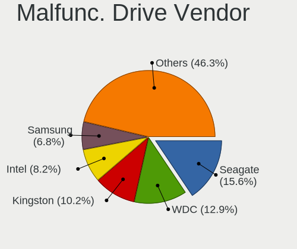
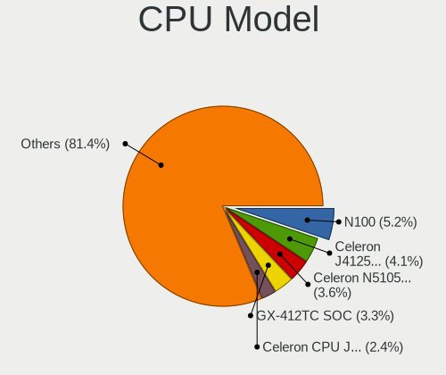
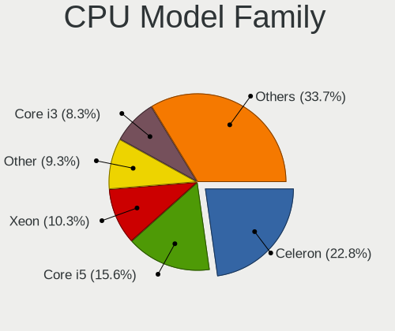
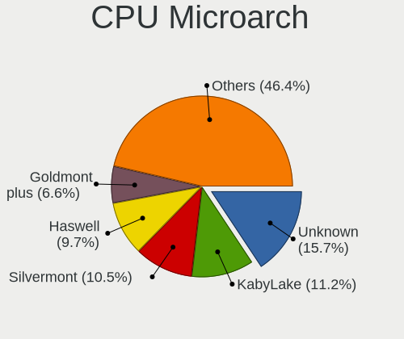
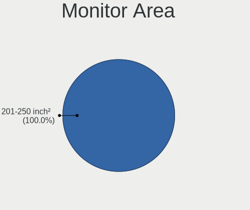
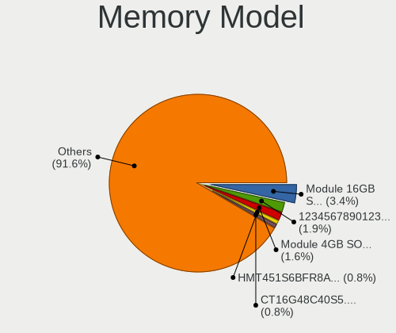
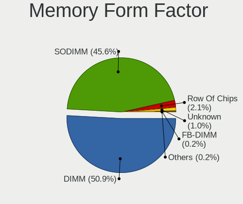

OPNsense - Tested Hardware & Statistics
---------------------------------------

A project to collect tested hardware configurations for OPNsense.

Anyone can contribute to this report by the [hw-probe](https://github.com/linuxhw/hw-probe/blob/master/INSTALL.BSD.md) tool:

    hw-probe -all -upload

Please contribute! Especially if your hardware is rare.

Contents
--------

* [ Test Cases ](#test-cases)

* [ System ](#system)
  - [ OS                       ](#os)
  - [ OS Family                ](#os-family)
  - [ Arch                     ](#arch)
  - [ DE                       ](#de)
  - [ Display Server           ](#display-server)
  - [ Display Manager          ](#display-manager)
  - [ OS Lang                  ](#os-lang)
  - [ Boot Mode                ](#boot-mode)
  - [ Filesystem               ](#filesystem)
  - [ Part. scheme             ](#part-scheme)

* [ Board ](#board)
  - [ Vendor                   ](#vendor)
  - [ Model                    ](#model)
  - [ Model Family             ](#model-family)
  - [ MFG Year                 ](#mfg-year)
  - [ Form Factor              ](#form-factor)
  - [ Coreboot                 ](#coreboot)
  - [ RAM Size                 ](#ram-size)
  - [ RAM Used                 ](#ram-used)
  - [ Total Drives             ](#total-drives)
  - [ Has CD-ROM               ](#has-cd-rom)
  - [ Has Ethernet             ](#has-ethernet)
  - [ Has WiFi                 ](#has-wifi)
  - [ Has Bluetooth            ](#has-bluetooth)

* [ Location ](#location)
  - [ Country                  ](#country)
  - [ City                     ](#city)

* [ Drives ](#drives)
  - [ Drive Vendor             ](#drive-vendor)
  - [ Drive Model              ](#drive-model)
  - [ HDD Vendor               ](#hdd-vendor)
  - [ SSD Vendor               ](#ssd-vendor)
  - [ Drive Kind               ](#drive-kind)
  - [ Drive Connector          ](#drive-connector)
  - [ Drive Size               ](#drive-size)
  - [ Space Total              ](#space-total)
  - [ Space Used               ](#space-used)
  - [ Malfunc. Drives          ](#malfunc-drives)
  - [ Malfunc. Drive Vendor    ](#malfunc-drive-vendor)
  - [ Malfunc. HDD Vendor      ](#malfunc-hdd-vendor)
  - [ Malfunc. Drive Kind      ](#malfunc-drive-kind)
  - [ Failed Drives            ](#failed-drives)
  - [ Failed Drive Vendor      ](#failed-drive-vendor)
  - [ Drive Status             ](#drive-status)

* [ Storage controller ](#storage-controller)
  - [ Storage Vendor           ](#storage-vendor)
  - [ Storage Model            ](#storage-model)
  - [ Storage Kind             ](#storage-kind)

* [ Processor ](#processor)
  - [ CPU Vendor               ](#cpu-vendor)
  - [ CPU Model                ](#cpu-model)
  - [ CPU Model Family         ](#cpu-model-family)
  - [ CPU Cores                ](#cpu-cores)
  - [ CPU Sockets              ](#cpu-sockets)
  - [ CPU Threads              ](#cpu-threads)
  - [ CPU Microarch            ](#cpu-microarch)

* [ Graphics ](#graphics)
  - [ GPU Vendor               ](#gpu-vendor)
  - [ GPU Model                ](#gpu-model)
  - [ GPU Combo                ](#gpu-combo)
  - [ GPU Driver               ](#gpu-driver)
  - [ GPU Memory               ](#gpu-memory)

* [ Monitor ](#monitor)
  - [ Monitor Vendor           ](#monitor-vendor)
  - [ Monitor Model            ](#monitor-model)
  - [ Monitor Resolution       ](#monitor-resolution)
  - [ Monitor Diagonal         ](#monitor-diagonal)
  - [ Monitor Width            ](#monitor-width)
  - [ Aspect Ratio             ](#aspect-ratio)
  - [ Monitor Area             ](#monitor-area)
  - [ Pixel Density            ](#pixel-density)
  - [ Multiple Monitors        ](#multiple-monitors)

* [ Network ](#network)
  - [ Net Controller Vendor    ](#net-controller-vendor)
  - [ Net Controller Model     ](#net-controller-model)
  - [ Wireless Vendor          ](#wireless-vendor)
  - [ Wireless Model           ](#wireless-model)
  - [ Ethernet Vendor          ](#ethernet-vendor)
  - [ Ethernet Model           ](#ethernet-model)
  - [ Net Controller Kind      ](#net-controller-kind)
  - [ Used Controller          ](#used-controller)
  - [ NICs                     ](#nics)
  - [ IPv6                     ](#ipv6)

* [ Bluetooth ](#bluetooth)
  - [ Bluetooth Vendor         ](#bluetooth-vendor)
  - [ Bluetooth Model          ](#bluetooth-model)

* [ Sound ](#sound)
  - [ Sound Vendor             ](#sound-vendor)
  - [ Sound Model              ](#sound-model)

* [ Memory ](#memory)
  - [ Memory Vendor            ](#memory-vendor)
  - [ Memory Model             ](#memory-model)
  - [ Memory Kind              ](#memory-kind)
  - [ Memory Form Factor       ](#memory-form-factor)
  - [ Memory Size              ](#memory-size)
  - [ Memory Speed             ](#memory-speed)

* [ Printers & scanners ](#printers--scanners)
  - [ Printer Vendor           ](#printer-vendor)
  - [ Printer Model            ](#printer-model)
  - [ Scanner Vendor           ](#scanner-vendor)
  - [ Scanner Model            ](#scanner-model)

* [ Camera ](#camera)
  - [ Camera Vendor            ](#camera-vendor)
  - [ Camera Model             ](#camera-model)

* [ Security ](#security)
  - [ Fingerprint Vendor       ](#fingerprint-vendor)
  - [ Fingerprint Model        ](#fingerprint-model)
  - [ Chipcard Vendor          ](#chipcard-vendor)
  - [ Chipcard Model           ](#chipcard-model)

* [ Unsupported ](#unsupported)
  - [ Unsupported Devices      ](#unsupported-devices)
  - [ Unsupported Device Types ](#unsupported-device-types)

Test Cases
----------

Total: 13014

| Vendor        | Model                       | Form-Factor | Probe                                                     | Date         |
|---------------|-----------------------------|-------------|-----------------------------------------------------------|--------------|
| Unknown       | Unknown                     | Desktop     | [f4fa8cc2cd](https://bsd-hardware.info/?probe=f4fa8cc2cd) | Feb 18, 2024 |
| Unknown       | Unknown                     | Desktop     | [7d606ad1ef](https://bsd-hardware.info/?probe=7d606ad1ef) | Feb 18, 2024 |
| Unknown       | Unknown                     | Desktop     | [7a484b8933](https://bsd-hardware.info/?probe=7a484b8933) | Feb 18, 2024 |
| MW            | GMLK-2_5G4L                 | Desktop     | [23cb8e1723](https://bsd-hardware.info/?probe=23cb8e1723) | Feb 18, 2024 |
| Gigabyte      | H170-Gaming 3               | Desktop     | [5333db4eb9](https://bsd-hardware.info/?probe=5333db4eb9) | Feb 18, 2024 |
| CWWK          | CW-AD4L-N V1                | Desktop     | [6f933374c6](https://bsd-hardware.info/?probe=6f933374c6) | Feb 18, 2024 |
| Dell          | 0D28YY A00                  | Desktop     | [15db3df1ca](https://bsd-hardware.info/?probe=15db3df1ca) | Feb 18, 2024 |
| CWWK          | CW-AD4L-N V1                | Desktop     | [45450ec330](https://bsd-hardware.info/?probe=45450ec330) | Feb 18, 2024 |
| ASRock        | B450M Pro4 R2.0             | Desktop     | [007b93e5c0](https://bsd-hardware.info/?probe=007b93e5c0) | Feb 18, 2024 |
| Unknown       | Unknown                     | Desktop     | [882809e2c7](https://bsd-hardware.info/?probe=882809e2c7) | Feb 18, 2024 |
| Unknown       | Unknown                     | Desktop     | [db839aa12a](https://bsd-hardware.info/?probe=db839aa12a) | Feb 18, 2024 |
| Protectli     | FW6 Ver                     | Desktop     | [35e8ff3d63](https://bsd-hardware.info/?probe=35e8ff3d63) | Feb 18, 2024 |
| Unknown       | J3160-4L                    | Desktop     | [e4b6344125](https://bsd-hardware.info/?probe=e4b6344125) | Feb 18, 2024 |
| Gigabyte      | H170-Gaming 3               | Desktop     | [4c03a20d4f](https://bsd-hardware.info/?probe=4c03a20d4f) | Feb 18, 2024 |
| Gigabyte      | Z590I VISION D              | Desktop     | [95add8c57a](https://bsd-hardware.info/?probe=95add8c57a) | Feb 18, 2024 |
| Sophos        | SG                          | Firewall    | [e38a7b380e](https://bsd-hardware.info/?probe=e38a7b380e) | Feb 18, 2024 |
| HPE           | ProLiant MicroServer Gen... | Server      | [0896863043](https://bsd-hardware.info/?probe=0896863043) | Feb 18, 2024 |
| HP            | 829E                        | Mini pc     | [428159acc1](https://bsd-hardware.info/?probe=428159acc1) | Feb 17, 2024 |
| Intel         | CM8I7CB8N K53740-202        | Mini pc     | [4e34435ef4](https://bsd-hardware.info/?probe=4e34435ef4) | Feb 17, 2024 |
| PC Engines    | apu6                        | Desktop     | [9f618d2d95](https://bsd-hardware.info/?probe=9f618d2d95) | Feb 17, 2024 |
| Unknown       | Unknown                     | Desktop     | [0a1749e911](https://bsd-hardware.info/?probe=0a1749e911) | Feb 17, 2024 |
| Unknown       | Unknown                     | Desktop     | [0d6264dd51](https://bsd-hardware.info/?probe=0d6264dd51) | Feb 17, 2024 |
| Unknown       | Unknown                     | Desktop     | [ac788598a6](https://bsd-hardware.info/?probe=ac788598a6) | Feb 17, 2024 |
| Intel         | J1900                       | Desktop     | [2fe6c55315](https://bsd-hardware.info/?probe=2fe6c55315) | Feb 17, 2024 |
| Intel         | J1900                       | Desktop     | [0f27ae5c3e](https://bsd-hardware.info/?probe=0f27ae5c3e) | Feb 17, 2024 |
| Unknown       | Unknown                     | Desktop     | [51de6543fd](https://bsd-hardware.info/?probe=51de6543fd) | Feb 17, 2024 |
| ASUSTek       | Q87T                        | Desktop     | [ca381bbbcc](https://bsd-hardware.info/?probe=ca381bbbcc) | Feb 17, 2024 |
| Unknown       | Unknown                     | Desktop     | [ca03a6b3b5](https://bsd-hardware.info/?probe=ca03a6b3b5) | Feb 17, 2024 |
| Deciso        | NetBoard-A20                | Notebook    | [ebbe4a0d21](https://bsd-hardware.info/?probe=ebbe4a0d21) | Feb 17, 2024 |
| Unknown       | Unknown                     | Desktop     | [ebfcb0f78b](https://bsd-hardware.info/?probe=ebfcb0f78b) | Feb 17, 2024 |
| Dell          | 0CN7CM A04                  | Server      | [c090e35a9f](https://bsd-hardware.info/?probe=c090e35a9f) | Feb 17, 2024 |
| Unknown       | Unknown                     | Desktop     | [2926d6511f](https://bsd-hardware.info/?probe=2926d6511f) | Feb 17, 2024 |
| Techvision    | TVI7309X B0                 | Desktop     | [135d71a048](https://bsd-hardware.info/?probe=135d71a048) | Feb 17, 2024 |
| Foxconn       | 2ABF                        | Desktop     | [a7fb944efe](https://bsd-hardware.info/?probe=a7fb944efe) | Feb 17, 2024 |
| Fujitsu       | D3313-E1 S26361-D3313-E1    | Desktop     | [8f0a5d2d0a](https://bsd-hardware.info/?probe=8f0a5d2d0a) | Feb 16, 2024 |
| CWWK          | CW-J6-6L                    | Desktop     | [ed704fa396](https://bsd-hardware.info/?probe=ed704fa396) | Feb 16, 2024 |
| GoWin Solu... | R86S                        | Desktop     | [1629545965](https://bsd-hardware.info/?probe=1629545965) | Feb 16, 2024 |
| AMI           | Aptio CRB                   | Mini pc     | [e9d1b23169](https://bsd-hardware.info/?probe=e9d1b23169) | Feb 16, 2024 |
| Sophos        | SG                          | Firewall    | [5224c7efa3](https://bsd-hardware.info/?probe=5224c7efa3) | Feb 16, 2024 |
| Unknown       | Unknown                     | Desktop     | [e5e747ec86](https://bsd-hardware.info/?probe=e5e747ec86) | Feb 16, 2024 |
| ECS           | APLD-MINI                   | Desktop     | [d0d3c5d2c3](https://bsd-hardware.info/?probe=d0d3c5d2c3) | Feb 16, 2024 |
| AMI           | Aptio CRB                   | Mini pc     | [85e7cae37d](https://bsd-hardware.info/?probe=85e7cae37d) | Feb 16, 2024 |
| Sophos        | SG                          | Firewall    | [6c3e05ea48](https://bsd-hardware.info/?probe=6c3e05ea48) | Feb 16, 2024 |
| HP            | 8AC4                        | Desktop     | [524b8cae7c](https://bsd-hardware.info/?probe=524b8cae7c) | Feb 16, 2024 |
| Supermicro    | X11SSQ-L-DE05BA             | Server      | [68029fc128](https://bsd-hardware.info/?probe=68029fc128) | Feb 16, 2024 |
| Lenovo        | 30D9 No DPK                 | Desktop     | [9c3c1f4f5d](https://bsd-hardware.info/?probe=9c3c1f4f5d) | Feb 16, 2024 |
| HP            | 304Bh                       | Desktop     | [d121a7198f](https://bsd-hardware.info/?probe=d121a7198f) | Feb 16, 2024 |
| Sophos        | XG                          | Firewall    | [740c7d4f5c](https://bsd-hardware.info/?probe=740c7d4f5c) | Feb 16, 2024 |
| Dell          | 0WMJ54 A01                  | Desktop     | [7ccce31d2d](https://bsd-hardware.info/?probe=7ccce31d2d) | Feb 16, 2024 |
| Unknown       | Unknown                     | Desktop     | [13c84b6db8](https://bsd-hardware.info/?probe=13c84b6db8) | Feb 16, 2024 |
| Unknown       | 0XFK4K A07                  | Server      | [fda628c852](https://bsd-hardware.info/?probe=fda628c852) | Feb 16, 2024 |
| Unknown       | Unknown                     | Desktop     | [a4781efc54](https://bsd-hardware.info/?probe=a4781efc54) | Feb 16, 2024 |
| BOSGAME       | DNB10M                      | Desktop     | [58f2362bf1](https://bsd-hardware.info/?probe=58f2362bf1) | Feb 16, 2024 |
| Dell          | 01Y1CJ A00                  | Mini pc     | [a3b94b00ad](https://bsd-hardware.info/?probe=a3b94b00ad) | Feb 15, 2024 |
| PC Engines    | APU2                        | Desktop     | [e2280e4159](https://bsd-hardware.info/?probe=e2280e4159) | Feb 15, 2024 |
| AWOW          | AK10                        | Desktop     | [4b512f8739](https://bsd-hardware.info/?probe=4b512f8739) | Feb 15, 2024 |
| Unknown       | Unknown                     | Desktop     | [b35fd5253d](https://bsd-hardware.info/?probe=b35fd5253d) | Feb 15, 2024 |
| Unknown       | Unknown                     | Desktop     | [7dc7c39f38](https://bsd-hardware.info/?probe=7dc7c39f38) | Feb 15, 2024 |
| Gigabyte      | B360N WIFI-CF               | Desktop     | [65cc201af1](https://bsd-hardware.info/?probe=65cc201af1) | Feb 15, 2024 |
| AMI           | Aptio CRB                   | Mini pc     | [947eabeecc](https://bsd-hardware.info/?probe=947eabeecc) | Feb 15, 2024 |
| Intel         | SKYBAY                      | Desktop     | [5288673757](https://bsd-hardware.info/?probe=5288673757) | Feb 15, 2024 |
| ASUSTek       | H110M-K                     | Desktop     | [8ad1731687](https://bsd-hardware.info/?probe=8ad1731687) | Feb 15, 2024 |
| Intel         | BayTrail Platform           | Tablet      | [11ee2ab5d0](https://bsd-hardware.info/?probe=11ee2ab5d0) | Feb 15, 2024 |
| Hardkernel    | ODROID-H2                   | Desktop     | [a4045617ec](https://bsd-hardware.info/?probe=a4045617ec) | Feb 14, 2024 |
| Unknown       | Unknown                     | Desktop     | [ef910cb303](https://bsd-hardware.info/?probe=ef910cb303) | Feb 14, 2024 |
| ASRock        | B550 Taichi                 | Desktop     | [814a0aba66](https://bsd-hardware.info/?probe=814a0aba66) | Feb 14, 2024 |
| Unknown       | Unknown                     | Desktop     | [c2a87f002c](https://bsd-hardware.info/?probe=c2a87f002c) | Feb 14, 2024 |
| Supermicro    | X11SDV-8C-TP8F              | Desktop     | [6a026289ce](https://bsd-hardware.info/?probe=6a026289ce) | Feb 14, 2024 |
| HP            | ProLiant MicroServer Gen... | Desktop     | [ee68dade44](https://bsd-hardware.info/?probe=ee68dade44) | Feb 14, 2024 |
| AZW           | EQ                          | Desktop     | [cfdbc24520](https://bsd-hardware.info/?probe=cfdbc24520) | Feb 14, 2024 |
| Gigabyte      | IMB1900TN                   | Desktop     | [d0c6d1e44b](https://bsd-hardware.info/?probe=d0c6d1e44b) | Feb 14, 2024 |
| Shuttle       | NC02U                       | Notebook    | [d559b380f0](https://bsd-hardware.info/?probe=d559b380f0) | Feb 14, 2024 |
| Dell          | 0WKGTH A02                  | Server      | [72aee7c16c](https://bsd-hardware.info/?probe=72aee7c16c) | Feb 14, 2024 |
| Unknown       | Unknown                     | Desktop     | [5da46d2f84](https://bsd-hardware.info/?probe=5da46d2f84) | Feb 14, 2024 |
| Protectli     | FW4B                        | Desktop     | [c9a2dee14e](https://bsd-hardware.info/?probe=c9a2dee14e) | Feb 14, 2024 |
| Sophos        | SG                          | Firewall    | [41c578e646](https://bsd-hardware.info/?probe=41c578e646) | Feb 14, 2024 |
| CncTion       | N5105-4L B0                 | Desktop     | [63fbf4cdbd](https://bsd-hardware.info/?probe=63fbf4cdbd) | Feb 14, 2024 |
| Dell          | 0YXT71 A00                  | Desktop     | [19c7684ced](https://bsd-hardware.info/?probe=19c7684ced) | Feb 14, 2024 |
| PC Engines    | APU2                        | Desktop     | [df18317865](https://bsd-hardware.info/?probe=df18317865) | Feb 14, 2024 |
| Gigabyte      | B550 AORUS ELITE V2         | Desktop     | [2159f2bebf](https://bsd-hardware.info/?probe=2159f2bebf) | Feb 14, 2024 |
| HP            | 1998                        | Desktop     | [6895f365c7](https://bsd-hardware.info/?probe=6895f365c7) | Feb 14, 2024 |
| Unknown       | Unknown                     | Desktop     | [9c184fe6fa](https://bsd-hardware.info/?probe=9c184fe6fa) | Feb 14, 2024 |
| MSI           | H110M ECO                   | Desktop     | [74ec4ebb63](https://bsd-hardware.info/?probe=74ec4ebb63) | Feb 13, 2024 |
| Sophos        | SG                          | Firewall    | [b23c7b93a3](https://bsd-hardware.info/?probe=b23c7b93a3) | Feb 13, 2024 |
| ASRock        | A520M-ITX/ac                | Desktop     | [63408627d9](https://bsd-hardware.info/?probe=63408627d9) | Feb 13, 2024 |
| Shuttle       | FH170                       | Desktop     | [e7eaced298](https://bsd-hardware.info/?probe=e7eaced298) | Feb 13, 2024 |
| Protectli     | FW2B                        | Desktop     | [09657632a4](https://bsd-hardware.info/?probe=09657632a4) | Feb 13, 2024 |
| IBM           | 94Y7614                     | Server      | [d2178f7e1a](https://bsd-hardware.info/?probe=d2178f7e1a) | Feb 13, 2024 |
| Dell          | 02YYK5 A00                  | Desktop     | [47e43f818a](https://bsd-hardware.info/?probe=47e43f818a) | Feb 13, 2024 |
| AMI           | Aptio CRB                   | Mini pc     | [52d7bc4280](https://bsd-hardware.info/?probe=52d7bc4280) | Feb 13, 2024 |
| MSI           | MS-N014                     | Notebook    | [f731e6df0a](https://bsd-hardware.info/?probe=f731e6df0a) | Feb 13, 2024 |
| Deciso        | Netboard A10 V2.1           | Desktop     | [9f620acb22](https://bsd-hardware.info/?probe=9f620acb22) | Feb 13, 2024 |
| HP            | ProLiant MicroServer        | Desktop     | [ab0d1d0078](https://bsd-hardware.info/?probe=ab0d1d0078) | Feb 13, 2024 |
| AMI           | Aptio CRB                   | Mini pc     | [825087e77c](https://bsd-hardware.info/?probe=825087e77c) | Feb 13, 2024 |
| Intel         | S1200BTL E98681-352         | Server      | [c7dd68f8a0](https://bsd-hardware.info/?probe=c7dd68f8a0) | Feb 13, 2024 |
| HP            | 8103 A01                    | Mini pc     | [92bebda2d7](https://bsd-hardware.info/?probe=92bebda2d7) | Feb 12, 2024 |
| Dell          | 07WP95 A02                  | Desktop     | [aad51ede2a](https://bsd-hardware.info/?probe=aad51ede2a) | Feb 12, 2024 |
| HP            | 18E7                        | Desktop     | [ce1c65da2d](https://bsd-hardware.info/?probe=ce1c65da2d) | Feb 12, 2024 |
| Protectli     | FW2B Ver                    | Desktop     | [d2280903ce](https://bsd-hardware.info/?probe=d2280903ce) | Feb 12, 2024 |
| AMI           | Aptio CRB                   | Mini pc     | [a2205533c6](https://bsd-hardware.info/?probe=a2205533c6) | Feb 12, 2024 |
| Intel         | SKYBAY                      | Desktop     | [7c8379fd02](https://bsd-hardware.info/?probe=7c8379fd02) | Feb 12, 2024 |
| AMI           | Aptio CRB                   | Mini pc     | [9376dd68e3](https://bsd-hardware.info/?probe=9376dd68e3) | Feb 12, 2024 |
| IceWhale T... | ZimaBoard 832 ZMB           | Desktop     | [5d8c1ea60c](https://bsd-hardware.info/?probe=5d8c1ea60c) | Feb 12, 2024 |
| ASUSTek       | M5A97 R2.0                  | Desktop     | [c3d95743df](https://bsd-hardware.info/?probe=c3d95743df) | Feb 12, 2024 |
| AZW           | EQ                          | Desktop     | [1f6f07cd11](https://bsd-hardware.info/?probe=1f6f07cd11) | Feb 12, 2024 |
| Supermicro    | X10SLH-N6-ST031             | Server      | [ebb87f307e](https://bsd-hardware.info/?probe=ebb87f307e) | Feb 12, 2024 |
| Supermicro    | X10SLH-N6-ST031             | Server      | [4888597805](https://bsd-hardware.info/?probe=4888597805) | Feb 12, 2024 |
| MSI           | 890GXM-G65                  | Desktop     | [96d9ab3e95](https://bsd-hardware.info/?probe=96d9ab3e95) | Feb 12, 2024 |
| PC Engines    | APU2                        | Desktop     | [70927f49d1](https://bsd-hardware.info/?probe=70927f49d1) | Feb 12, 2024 |
| PC Engines    | APU2                        | Desktop     | [251265d29e](https://bsd-hardware.info/?probe=251265d29e) | Feb 12, 2024 |
| Gigabyte      | B760I AORUS PRO DDR4        | Desktop     | [0074d80aa1](https://bsd-hardware.info/?probe=0074d80aa1) | Feb 12, 2024 |
| HP            | 1998                        | Desktop     | [58de92b13d](https://bsd-hardware.info/?probe=58de92b13d) | Feb 11, 2024 |
| Unknown       | YL-J3160L4                  | Desktop     | [7bb2930dfa](https://bsd-hardware.info/?probe=7bb2930dfa) | Feb 11, 2024 |
| AMI           | Aptio CRB                   | Mini pc     | [1073b283ec](https://bsd-hardware.info/?probe=1073b283ec) | Feb 11, 2024 |
| Acer          | Veriton X4660G V:1.0        | Desktop     | [768778b955](https://bsd-hardware.info/?probe=768778b955) | Feb 11, 2024 |
| Acer          | Veriton X4660G V:1.0        | Desktop     | [e46456819b](https://bsd-hardware.info/?probe=e46456819b) | Feb 11, 2024 |
| Unknown       | Unknown                     | Desktop     | [d05beec487](https://bsd-hardware.info/?probe=d05beec487) | Feb 11, 2024 |
| Supermicro    | X10SDV-TP8F                 | Server      | [08e1a91501](https://bsd-hardware.info/?probe=08e1a91501) | Feb 11, 2024 |
| Unknown       | Unknown                     | Notebook    | [2af11d5bbf](https://bsd-hardware.info/?probe=2af11d5bbf) | Feb 11, 2024 |
| Unknown       | Unknown                     | Desktop     | [d447aefaf0](https://bsd-hardware.info/?probe=d447aefaf0) | Feb 11, 2024 |
| Protectli     | FW6 Ver                     | Desktop     | [9a3b41d070](https://bsd-hardware.info/?probe=9a3b41d070) | Feb 11, 2024 |
| Dell          | 0H4VK7 A00                  | Desktop     | [64725f3ed7](https://bsd-hardware.info/?probe=64725f3ed7) | Feb 11, 2024 |
| Unknown       | Unknown                     | Desktop     | [e4b4c15b64](https://bsd-hardware.info/?probe=e4b4c15b64) | Feb 11, 2024 |
| Sophos        | XG                          | Firewall    | [4037edf714](https://bsd-hardware.info/?probe=4037edf714) | Feb 11, 2024 |
| Dell          | 00V62H A01                  | Desktop     | [e583d1ae8c](https://bsd-hardware.info/?probe=e583d1ae8c) | Feb 11, 2024 |
| Dell          | 0H4VK7 A00                  | Desktop     | [c321c66eea](https://bsd-hardware.info/?probe=c321c66eea) | Feb 11, 2024 |
| Unknown       | Unknown                     | Desktop     | [742f0ba15a](https://bsd-hardware.info/?probe=742f0ba15a) | Feb 11, 2024 |
| Intel         | HURONRIVER                  | Desktop     | [fd049a80db](https://bsd-hardware.info/?probe=fd049a80db) | Feb 10, 2024 |
| ASUSTek       | H97I-PLUS                   | Desktop     | [c5ca47db6b](https://bsd-hardware.info/?probe=c5ca47db6b) | Feb 10, 2024 |
| Advantech     | NAMB-3250 A102-1            | Desktop     | [09843ea5f1](https://bsd-hardware.info/?probe=09843ea5f1) | Feb 10, 2024 |
| AMI           | Aptio CRB                   | Mini pc     | [05fdd89379](https://bsd-hardware.info/?probe=05fdd89379) | Feb 10, 2024 |
| Sophos        | SG                          | Firewall    | [d2febdbbcd](https://bsd-hardware.info/?probe=d2febdbbcd) | Feb 10, 2024 |
| Gigabyte      | B760I AORUS PRO DDR4        | Desktop     | [ab109fa386](https://bsd-hardware.info/?probe=ab109fa386) | Feb 10, 2024 |
| Intel         | JSL MRD                     | Desktop     | [373f1bfecf](https://bsd-hardware.info/?probe=373f1bfecf) | Feb 10, 2024 |
| Techvision    | TVI7309X B0                 | Desktop     | [d4bdab4711](https://bsd-hardware.info/?probe=d4bdab4711) | Feb 10, 2024 |
| HP            | 339A                        | Desktop     | [5d1b482427](https://bsd-hardware.info/?probe=5d1b482427) | Feb 10, 2024 |
| Unknown       | Unknown                     | Desktop     | [ea4fe7a8cf](https://bsd-hardware.info/?probe=ea4fe7a8cf) | Feb 10, 2024 |
| Deciso        | NetBoard-A10                | Notebook    | [8403713b4f](https://bsd-hardware.info/?probe=8403713b4f) | Feb 10, 2024 |
| CWWK          | CW-J6-6L                    | Desktop     | [d859437053](https://bsd-hardware.info/?probe=d859437053) | Feb 10, 2024 |
| ASUSTek       | PRIME Z790M-PLUS D4         | Desktop     | [7f4338cdd1](https://bsd-hardware.info/?probe=7f4338cdd1) | Feb 10, 2024 |
| HP            | 8299                        | Desktop     | [2a8e07ec62](https://bsd-hardware.info/?probe=2a8e07ec62) | Feb 10, 2024 |
| Intel         | Q3XXG4-P V1.0               | Desktop     | [b3e9bf8bcd](https://bsd-hardware.info/?probe=b3e9bf8bcd) | Feb 10, 2024 |
| Dell          | 0F9NPY A02                  | Server      | [7298dc5ba3](https://bsd-hardware.info/?probe=7298dc5ba3) | Feb 10, 2024 |
| Unknown       | Unknown                     | Desktop     | [b13923c3f1](https://bsd-hardware.info/?probe=b13923c3f1) | Feb 10, 2024 |
| Unknown       | Unknown                     | Desktop     | [d0bf9601a7](https://bsd-hardware.info/?probe=d0bf9601a7) | Feb 10, 2024 |
| Unknown       | Unknown                     | Desktop     | [c3f71c8e39](https://bsd-hardware.info/?probe=c3f71c8e39) | Feb 10, 2024 |
| Sophos        | SG                          | Firewall    | [06bd59ff02](https://bsd-hardware.info/?probe=06bd59ff02) | Feb 10, 2024 |
| Unknown       | Unknown                     | Desktop     | [ea0996b777](https://bsd-hardware.info/?probe=ea0996b777) | Feb 10, 2024 |
| Intel         | NUC11DBBi7 M17027-404       | Mini pc     | [4b3438a1eb](https://bsd-hardware.info/?probe=4b3438a1eb) | Feb 09, 2024 |
| HP            | 213D A01                    | Desktop     | [e80039f387](https://bsd-hardware.info/?probe=e80039f387) | Feb 09, 2024 |
| Cisco         | ASA5515 A0                  | Desktop     | [8374ec4cca](https://bsd-hardware.info/?probe=8374ec4cca) | Feb 09, 2024 |
| Intel         | DQ77KB AAG81483-501         | Desktop     | [96f998dae3](https://bsd-hardware.info/?probe=96f998dae3) | Feb 09, 2024 |
| Unknown       | Unknown                     | Desktop     | [19e59c140c](https://bsd-hardware.info/?probe=19e59c140c) | Feb 09, 2024 |
| HP            | 17E2                        | Desktop     | [946d33d274](https://bsd-hardware.info/?probe=946d33d274) | Feb 09, 2024 |
| Unknown       | Unknown                     | Desktop     | [d8f999e5ce](https://bsd-hardware.info/?probe=d8f999e5ce) | Feb 09, 2024 |
| Sophos        | SG                          | Firewall    | [1bb50b3634](https://bsd-hardware.info/?probe=1bb50b3634) | Feb 09, 2024 |
| Unknown       | Unknown                     | Desktop     | [61ddfb16f5](https://bsd-hardware.info/?probe=61ddfb16f5) | Feb 09, 2024 |
| HP            | 1495                        | Desktop     | [570b4899ea](https://bsd-hardware.info/?probe=570b4899ea) | Feb 09, 2024 |
| HP            | ProLiant MicroServer Gen... | Desktop     | [01a632e124](https://bsd-hardware.info/?probe=01a632e124) | Feb 09, 2024 |
| Unknown       | Unknown                     | Desktop     | [eb03c1914f](https://bsd-hardware.info/?probe=eb03c1914f) | Feb 09, 2024 |
| HP            | ProLiant DL380 G4           | Server      | [1d58307095](https://bsd-hardware.info/?probe=1d58307095) | Feb 09, 2024 |
| PC Engines    | APU2                        | Desktop     | [2741a6da81](https://bsd-hardware.info/?probe=2741a6da81) | Feb 09, 2024 |
| Gigabyte      | B550 UD AC-Y1               | Desktop     | [1e285504a6](https://bsd-hardware.info/?probe=1e285504a6) | Feb 09, 2024 |
| Unknown       | TB100                       | Desktop     | [9075923143](https://bsd-hardware.info/?probe=9075923143) | Feb 09, 2024 |
| Fujitsu       | D3067-A1 S26361-D3067-A1    | Desktop     | [08ee39a7cf](https://bsd-hardware.info/?probe=08ee39a7cf) | Feb 09, 2024 |
| Foxconn       | 2ABF                        | Desktop     | [25d0533779](https://bsd-hardware.info/?probe=25d0533779) | Feb 09, 2024 |
| AMI           | Aptio CRB                   | Mini pc     | [1ea9b4724a](https://bsd-hardware.info/?probe=1ea9b4724a) | Feb 09, 2024 |
| Unknown       | Unknown                     | Desktop     | [09beb1cb7a](https://bsd-hardware.info/?probe=09beb1cb7a) | Feb 08, 2024 |
| Dell          | 0X9X1W A00                  | Desktop     | [56e5a43171](https://bsd-hardware.info/?probe=56e5a43171) | Feb 08, 2024 |
| Unknown       | Unknown                     | Notebook    | [f5ad3c2512](https://bsd-hardware.info/?probe=f5ad3c2512) | Feb 08, 2024 |
| MSI           | B450M MORTAR MAX            | Desktop     | [1401e42d48](https://bsd-hardware.info/?probe=1401e42d48) | Feb 08, 2024 |
| Lenovo        | 3136 SDK0J40697 WIN 3305... | Mini pc     | [7e7a97b09f](https://bsd-hardware.info/?probe=7e7a97b09f) | Feb 08, 2024 |
| Protectli     | VP2420                      | Desktop     | [70f6cd6041](https://bsd-hardware.info/?probe=70f6cd6041) | Feb 08, 2024 |
| AMI           | Aptio CRB                   | Mini pc     | [7ec9f0596a](https://bsd-hardware.info/?probe=7ec9f0596a) | Feb 08, 2024 |
| Micro Comp... | Venus series                | Notebook    | [20e602834b](https://bsd-hardware.info/?probe=20e602834b) | Feb 08, 2024 |
| Fujitsu       | D3430-U1 S26361-D3430-U1    | Desktop     | [9778043e6f](https://bsd-hardware.info/?probe=9778043e6f) | Feb 08, 2024 |
| Micro Comp... | Venus series                | Notebook    | [3a2455558f](https://bsd-hardware.info/?probe=3a2455558f) | Feb 08, 2024 |
| Unknown       | Unknown                     | Desktop     | [5e402c524a](https://bsd-hardware.info/?probe=5e402c524a) | Feb 08, 2024 |
| Intel         | Q3XXG4-P V1.0               | Desktop     | [34d8f9b987](https://bsd-hardware.info/?probe=34d8f9b987) | Feb 08, 2024 |
| GMKtec        | NucBox M5                   | Mini pc     | [2cdf090d24](https://bsd-hardware.info/?probe=2cdf090d24) | Feb 08, 2024 |
| CWWK          | CW-J6-6L                    | Desktop     | [dd96aebca7](https://bsd-hardware.info/?probe=dd96aebca7) | Feb 08, 2024 |
| AZW           | EQ                          | Desktop     | [5b83388da9](https://bsd-hardware.info/?probe=5b83388da9) | Feb 08, 2024 |
| Unknown       | J3160-4L                    | Desktop     | [353ac982bf](https://bsd-hardware.info/?probe=353ac982bf) | Feb 07, 2024 |
| Cisco         | C170 A0                     | Desktop     | [5d0362fa16](https://bsd-hardware.info/?probe=5d0362fa16) | Feb 07, 2024 |
| Dell          | 0F0XJ6 A13                  | Server      | [0493961490](https://bsd-hardware.info/?probe=0493961490) | Feb 07, 2024 |
| Supermicro    | X11SSL-CF                   | Server      | [8fcaaf3025](https://bsd-hardware.info/?probe=8fcaaf3025) | Feb 07, 2024 |
| Unknown       | Unknown                     | Desktop     | [1d24f65624](https://bsd-hardware.info/?probe=1d24f65624) | Feb 07, 2024 |
| SHANGZHAOY... | B85M-PRO V1.1               | Desktop     | [79ec97854e](https://bsd-hardware.info/?probe=79ec97854e) | Feb 07, 2024 |
| AAEON         | FWS-2251 V1.0               | Desktop     | [17853848cd](https://bsd-hardware.info/?probe=17853848cd) | Feb 07, 2024 |
| ASUSTek       | EX-B760M-V5 D4              | Desktop     | [852818ab9b](https://bsd-hardware.info/?probe=852818ab9b) | Feb 07, 2024 |
| PC Engines    | APU2                        | Desktop     | [6d52e4dad5](https://bsd-hardware.info/?probe=6d52e4dad5) | Feb 07, 2024 |
| HP            | 8717                        | Desktop     | [de846f4d11](https://bsd-hardware.info/?probe=de846f4d11) | Feb 07, 2024 |
| OEM           | 1.0                         | Desktop     | [dd3228b447](https://bsd-hardware.info/?probe=dd3228b447) | Feb 07, 2024 |
| PC Engines    | apu4                        | Desktop     | [fb60f908ae](https://bsd-hardware.info/?probe=fb60f908ae) | Feb 07, 2024 |
| Gigabyte      | B450M DS3H-CF               | Desktop     | [4073dda626](https://bsd-hardware.info/?probe=4073dda626) | Feb 07, 2024 |
| Inventec      | 0W63N3 A01                  | Mini pc     | [bcf9d3885f](https://bsd-hardware.info/?probe=bcf9d3885f) | Feb 07, 2024 |
| Unknown       | Unknown                     | Desktop     | [7b626b5a2c](https://bsd-hardware.info/?probe=7b626b5a2c) | Feb 07, 2024 |
| Datto         | SSD                         | Desktop     | [1d15370fce](https://bsd-hardware.info/?probe=1d15370fce) | Feb 07, 2024 |
| Inventec      | 0W63N3 A01                  | Mini pc     | [d2d44604ac](https://bsd-hardware.info/?probe=d2d44604ac) | Feb 07, 2024 |
| Fujitsu       | D3675-A1 S26361-D3675-A1... | Server      | [fd27edbdb6](https://bsd-hardware.info/?probe=fd27edbdb6) | Feb 07, 2024 |
| Fujitsu       | D3675-A1 S26361-D3675-A1... | Server      | [3b89904a49](https://bsd-hardware.info/?probe=3b89904a49) | Feb 07, 2024 |
| Unknown       | Unknown                     | Desktop     | [86614a836b](https://bsd-hardware.info/?probe=86614a836b) | Feb 07, 2024 |
| Deciso        | NetBoard-A10                | Notebook    | [6cfe3230e8](https://bsd-hardware.info/?probe=6cfe3230e8) | Feb 07, 2024 |
| AAEON         | FWS-2251 V1.0               | Desktop     | [1def0a68ec](https://bsd-hardware.info/?probe=1def0a68ec) | Feb 07, 2024 |
| Unknown       | Unknown                     | Desktop     | [9b6ebfd710](https://bsd-hardware.info/?probe=9b6ebfd710) | Feb 07, 2024 |
| Supermicro    | A1SAi 123456789             | Mini pc     | [ebb7e0a814](https://bsd-hardware.info/?probe=ebb7e0a814) | Feb 06, 2024 |
| NEOSMAY       | BQM5                        | Desktop     | [766c55f303](https://bsd-hardware.info/?probe=766c55f303) | Feb 06, 2024 |
| Unknown       | Unknown                     | Desktop     | [255257af13](https://bsd-hardware.info/?probe=255257af13) | Feb 06, 2024 |
| Unknown       | ROUTER                      | Desktop     | [b0ad906a1b](https://bsd-hardware.info/?probe=b0ad906a1b) | Feb 06, 2024 |
| Sophos        | SG                          | Firewall    | [5695f7cef3](https://bsd-hardware.info/?probe=5695f7cef3) | Feb 06, 2024 |
| Fujitsu       | D3313-A1 S26361-D3313-A1    | Desktop     | [ba3543c2a6](https://bsd-hardware.info/?probe=ba3543c2a6) | Feb 06, 2024 |
| ASUSTek       | STRIX H270I GAMING          | Desktop     | [852785036c](https://bsd-hardware.info/?probe=852785036c) | Feb 06, 2024 |
| Protectli     | FW1 Ver                     | Desktop     | [587c9145bc](https://bsd-hardware.info/?probe=587c9145bc) | Feb 06, 2024 |
| Fujitsu       | D3544-Sx S26361-D3544-Sx... | Mini pc     | [3f9cc1361f](https://bsd-hardware.info/?probe=3f9cc1361f) | Feb 06, 2024 |
| Unknown       | Unknown                     | Desktop     | [38a8200699](https://bsd-hardware.info/?probe=38a8200699) | Feb 06, 2024 |
| Unknown       | Unknown                     | Desktop     | [aa8c9dbf54](https://bsd-hardware.info/?probe=aa8c9dbf54) | Feb 06, 2024 |
| Unknown       | ITX-M41V                    | Desktop     | [957fb292ad](https://bsd-hardware.info/?probe=957fb292ad) | Feb 06, 2024 |
| Unknown       | Unknown                     | Desktop     | [7f960ac536](https://bsd-hardware.info/?probe=7f960ac536) | Feb 06, 2024 |
| Apple         | Mac-8ED6AF5B48C039E1 Mac... | Mini pc     | [22274a8184](https://bsd-hardware.info/?probe=22274a8184) | Feb 06, 2024 |
| Silver Pea... | Unknown                     | Firewall    | [30789cb5bd](https://bsd-hardware.info/?probe=30789cb5bd) | Feb 06, 2024 |
| Protectli     | FW4C Ver                    | Desktop     | [70908897af](https://bsd-hardware.info/?probe=70908897af) | Feb 06, 2024 |
| Unknown       | Unknown                     | Desktop     | [cf3dc1214b](https://bsd-hardware.info/?probe=cf3dc1214b) | Feb 06, 2024 |
| Unknown       | Unknown                     | Desktop     | [11b10e5acb](https://bsd-hardware.info/?probe=11b10e5acb) | Feb 06, 2024 |
| ASRock        | B450M Pro4 R2.0             | Desktop     | [55d74d88f2](https://bsd-hardware.info/?probe=55d74d88f2) | Feb 06, 2024 |
| ZOTAC         | ZBOX-CI329NANO              | Mini pc     | [411de8ca13](https://bsd-hardware.info/?probe=411de8ca13) | Feb 06, 2024 |
| OEM           | AR-B5800                    | Desktop     | [000d3c852f](https://bsd-hardware.info/?probe=000d3c852f) | Feb 05, 2024 |
| IceWhale T... | ZimaBoard 832 ZMB           | Desktop     | [a26afd4195](https://bsd-hardware.info/?probe=a26afd4195) | Feb 05, 2024 |
| ASRock        | Z390M-ITX/ac                | Desktop     | [d982b3a856](https://bsd-hardware.info/?probe=d982b3a856) | Feb 05, 2024 |
| Supermicro    | X9SCL/X9SCMA                | Desktop     | [494e0fc84e](https://bsd-hardware.info/?probe=494e0fc84e) | Feb 05, 2024 |
| Dell          | 086D43 A09                  | Server      | [e21f3074a6](https://bsd-hardware.info/?probe=e21f3074a6) | Feb 05, 2024 |
| Unknown       | Unknown                     | Desktop     | [4437069c86](https://bsd-hardware.info/?probe=4437069c86) | Feb 05, 2024 |
| Intel         | DENLOW_WS                   | Desktop     | [2d0479073b](https://bsd-hardware.info/?probe=2d0479073b) | Feb 05, 2024 |
| Unknown       | Unknown                     | Desktop     | [40908221ba](https://bsd-hardware.info/?probe=40908221ba) | Feb 05, 2024 |
| PC Engines    | apu4                        | Desktop     | [d0205e7f2b](https://bsd-hardware.info/?probe=d0205e7f2b) | Feb 05, 2024 |
| HP            | 83EE                        | Desktop     | [3fdb0e4625](https://bsd-hardware.info/?probe=3fdb0e4625) | Feb 05, 2024 |
| HP            | 83EE                        | Desktop     | [92258e181d](https://bsd-hardware.info/?probe=92258e181d) | Feb 05, 2024 |
| Supermicro    | X11SDV-4C-TP8F              | Desktop     | [112139bde4](https://bsd-hardware.info/?probe=112139bde4) | Feb 05, 2024 |
| Foxconn       | 2ABF                        | Desktop     | [6e35ed141f](https://bsd-hardware.info/?probe=6e35ed141f) | Feb 05, 2024 |
| Intel         | NUC7JYB J67969-404          | Mini pc     | [d5a88cb5c0](https://bsd-hardware.info/?probe=d5a88cb5c0) | Feb 05, 2024 |
| Silicom       | 80300-0134-g01              | Desktop     | [45cac52117](https://bsd-hardware.info/?probe=45cac52117) | Feb 05, 2024 |
| Unknown       | Unknown                     | Desktop     | [e217f9a442](https://bsd-hardware.info/?probe=e217f9a442) | Feb 05, 2024 |
| Unknown       | Unknown                     | Notebook    | [eec243257a](https://bsd-hardware.info/?probe=eec243257a) | Feb 05, 2024 |
| Unknown       | Unknown                     | Desktop     | [f206c1a24c](https://bsd-hardware.info/?probe=f206c1a24c) | Feb 05, 2024 |
| Unknown       | Unknown                     | Desktop     | [ff4514068b](https://bsd-hardware.info/?probe=ff4514068b) | Feb 05, 2024 |
| Protectli     | VP2410                      | Desktop     | [1e69300cbd](https://bsd-hardware.info/?probe=1e69300cbd) | Feb 05, 2024 |
| MSI           | A88XM-E45                   | Desktop     | [27c1aec350](https://bsd-hardware.info/?probe=27c1aec350) | Feb 04, 2024 |
| Lenovo        | 36C8 SDK0J40700 WIN 3258... | Desktop     | [ed12a75f82](https://bsd-hardware.info/?probe=ed12a75f82) | Feb 04, 2024 |
| ASRock        | H81M-ITX/WiFi               | Desktop     | [1b08d685ed](https://bsd-hardware.info/?probe=1b08d685ed) | Feb 04, 2024 |
| Unknown       | Unknown                     | Desktop     | [07bb97c05d](https://bsd-hardware.info/?probe=07bb97c05d) | Feb 04, 2024 |
| Lenovo        | 312D SDK0J40697 WIN 3305... | Mini pc     | [91937e4592](https://bsd-hardware.info/?probe=91937e4592) | Feb 04, 2024 |
| ASRock        | N68-VS3 UCC                 | Desktop     | [082906c4f9](https://bsd-hardware.info/?probe=082906c4f9) | Feb 04, 2024 |
| ASUSTek       | TUF B365M-PLUS GAMING       | Desktop     | [61580db8d6](https://bsd-hardware.info/?probe=61580db8d6) | Feb 04, 2024 |
| Protectli     | FW4B Ver                    | Desktop     | [f41dea5706](https://bsd-hardware.info/?probe=f41dea5706) | Feb 04, 2024 |
| Dell          | 0M5DCD A00                  | Desktop     | [1ce2ca36bf](https://bsd-hardware.info/?probe=1ce2ca36bf) | Feb 04, 2024 |
| Dell          | 03NXH8 A00                  | Mini pc     | [7d16a53b54](https://bsd-hardware.info/?probe=7d16a53b54) | Feb 04, 2024 |
| Techvision    | TVI7309X B0                 | Desktop     | [fa94c9a549](https://bsd-hardware.info/?probe=fa94c9a549) | Feb 04, 2024 |
| Fujitsu       | D3313-E1 S26361-D3313-E1    | Desktop     | [9e7d881690](https://bsd-hardware.info/?probe=9e7d881690) | Feb 04, 2024 |
| Supermicro    | A1SRi 123456789             | Mini pc     | [5b7342de3f](https://bsd-hardware.info/?probe=5b7342de3f) | Feb 04, 2024 |
| Unknown       | Unknown                     | Desktop     | [05745ae76a](https://bsd-hardware.info/?probe=05745ae76a) | Feb 04, 2024 |
| BESSTAR Te... | GK45                        | Convertible | [da0e40d971](https://bsd-hardware.info/?probe=da0e40d971) | Feb 04, 2024 |
| CWWK          | CW-AD4L-N V1                | Desktop     | [b578551813](https://bsd-hardware.info/?probe=b578551813) | Feb 04, 2024 |
| Intel         | MAHOBAY                     | Desktop     | [e2eba982ad](https://bsd-hardware.info/?probe=e2eba982ad) | Feb 04, 2024 |
| PC Engines    | APU2                        | Desktop     | [89f0caf8f9](https://bsd-hardware.info/?probe=89f0caf8f9) | Feb 04, 2024 |
| AMI           | Aptio CRB                   | Mini pc     | [93b7fdf97e](https://bsd-hardware.info/?probe=93b7fdf97e) | Feb 04, 2024 |
| Unknown       | Unknown                     | Desktop     | [aef9924665](https://bsd-hardware.info/?probe=aef9924665) | Feb 04, 2024 |
| Dell          | 00V62H A01                  | Desktop     | [307c51641d](https://bsd-hardware.info/?probe=307c51641d) | Feb 04, 2024 |
| AZW           | GK55                        | Desktop     | [1fee4341a2](https://bsd-hardware.info/?probe=1fee4341a2) | Feb 04, 2024 |
| PC Engines    | APU2                        | Desktop     | [82cc76def6](https://bsd-hardware.info/?probe=82cc76def6) | Feb 04, 2024 |
| Sophos        | UTM                         | Firewall    | [743e074269](https://bsd-hardware.info/?probe=743e074269) | Feb 04, 2024 |
| AZW           | EQ                          | Desktop     | [13a1514ea5](https://bsd-hardware.info/?probe=13a1514ea5) | Feb 04, 2024 |
| ASUSTek       | H110I-PLUS                  | Desktop     | [4cb8c45861](https://bsd-hardware.info/?probe=4cb8c45861) | Feb 03, 2024 |
| Unknown       | Unknown                     | Desktop     | [b9f334a078](https://bsd-hardware.info/?probe=b9f334a078) | Feb 03, 2024 |
| Protectli     | FW6 Ver                     | Desktop     | [97176aa00a](https://bsd-hardware.info/?probe=97176aa00a) | Feb 03, 2024 |
| Deciso        | NetBoard-A10                | Notebook    | [118bac872e](https://bsd-hardware.info/?probe=118bac872e) | Feb 03, 2024 |
| AZW           | EQ                          | Desktop     | [53f9e8c700](https://bsd-hardware.info/?probe=53f9e8c700) | Feb 03, 2024 |
| Dell          | 0D6H9T A00                  | Desktop     | [9454913bf3](https://bsd-hardware.info/?probe=9454913bf3) | Feb 03, 2024 |
| Protectli     | FW4B                        | Desktop     | [28f07a1d8b](https://bsd-hardware.info/?probe=28f07a1d8b) | Feb 03, 2024 |
| ASRock        | H570M-ITX/ac                | Desktop     | [df0fcc7727](https://bsd-hardware.info/?probe=df0fcc7727) | Feb 03, 2024 |
| Unknown       | Unknown                     | Desktop     | [0bf7e7f085](https://bsd-hardware.info/?probe=0bf7e7f085) | Feb 03, 2024 |
| Cisco         | ASA5515 A0                  | Desktop     | [366c1acc24](https://bsd-hardware.info/?probe=366c1acc24) | Feb 03, 2024 |
| Micro Comp... | Venus series                | Notebook    | [2fbda08743](https://bsd-hardware.info/?probe=2fbda08743) | Feb 03, 2024 |
| ZOTAC         | ZBOX-CI329NANO              | Mini pc     | [a301eadff9](https://bsd-hardware.info/?probe=a301eadff9) | Feb 03, 2024 |
| AMI           | Aptio CRB                   | Mini pc     | [39e92446fc](https://bsd-hardware.info/?probe=39e92446fc) | Feb 03, 2024 |
| ETegro Tec... | ETRS130G3 31S98MB0020       | Server      | [fcd2bfeb09](https://bsd-hardware.info/?probe=fcd2bfeb09) | Feb 03, 2024 |
| AMI           | Aptio CRB                   | Mini pc     | [8bb4c09136](https://bsd-hardware.info/?probe=8bb4c09136) | Feb 03, 2024 |
| CncTion       | N5105-4L B0                 | Desktop     | [899469419b](https://bsd-hardware.info/?probe=899469419b) | Feb 03, 2024 |
| Micro Comp... | Venus series                | Notebook    | [e7693b7781](https://bsd-hardware.info/?probe=e7693b7781) | Feb 03, 2024 |
| PAIQ          | EC3-BT19D4L A1              | Desktop     | [fad5bfc4a3](https://bsd-hardware.info/?probe=fad5bfc4a3) | Feb 03, 2024 |
| Intel         | DQ77MK AAG39642-500         | Desktop     | [1c126af269](https://bsd-hardware.info/?probe=1c126af269) | Feb 03, 2024 |
| AZW           | EQ                          | Desktop     | [e3022ba227](https://bsd-hardware.info/?probe=e3022ba227) | Feb 03, 2024 |
| Intel         | N5095-AIO T1 E1.0G          | All in one  | [49642a16c3](https://bsd-hardware.info/?probe=49642a16c3) | Feb 03, 2024 |
| Dell          | 03NXH8 A00                  | Mini pc     | [81aed2cc10](https://bsd-hardware.info/?probe=81aed2cc10) | Feb 03, 2024 |
| HP            | 213D A01                    | Desktop     | [4fdc25bc68](https://bsd-hardware.info/?probe=4fdc25bc68) | Feb 03, 2024 |
| Gigabyte      | B150N Phoenix-WIFI-CF       | Desktop     | [e5d18ced76](https://bsd-hardware.info/?probe=e5d18ced76) | Feb 03, 2024 |
| Techvision    | TVI7309X B0                 | Desktop     | [b6b8dbf4f5](https://bsd-hardware.info/?probe=b6b8dbf4f5) | Feb 03, 2024 |
| Intel         | NUC11DBBi7 M17027-404       | Mini pc     | [c29c522ede](https://bsd-hardware.info/?probe=c29c522ede) | Feb 03, 2024 |
| HP            | ProLiant MicroServer Gen... | Desktop     | [d118552b57](https://bsd-hardware.info/?probe=d118552b57) | Feb 03, 2024 |
| Gigabyte      | Z77M-D3H-MVP                | Desktop     | [da4216fca7](https://bsd-hardware.info/?probe=da4216fca7) | Feb 03, 2024 |
| Fujitsu       | D3543-A1 S26361-D3543-A1... | Desktop     | [f6b0ead009](https://bsd-hardware.info/?probe=f6b0ead009) | Feb 02, 2024 |
| PAIQ          | EC3-BT19D4L A1              | Desktop     | [d27398772f](https://bsd-hardware.info/?probe=d27398772f) | Feb 02, 2024 |
| Intel         | HM570                       | Desktop     | [ecdee25f5b](https://bsd-hardware.info/?probe=ecdee25f5b) | Feb 02, 2024 |
| Dell          | 03NVJ6 A02                  | Desktop     | [97d38286fb](https://bsd-hardware.info/?probe=97d38286fb) | Feb 02, 2024 |
| Unknown       | Unknown                     | Desktop     | [c02da607f1](https://bsd-hardware.info/?probe=c02da607f1) | Feb 02, 2024 |
| Gigabyte      | GA-880GM-UD2H               | Desktop     | [a531acf3f8](https://bsd-hardware.info/?probe=a531acf3f8) | Feb 02, 2024 |
| NU591         | 1.0                         | Desktop     | [deccea813e](https://bsd-hardware.info/?probe=deccea813e) | Feb 02, 2024 |
| Dell          | 06D7TR A00                  | Desktop     | [862dd029c4](https://bsd-hardware.info/?probe=862dd029c4) | Feb 02, 2024 |
| HP            | 8103 A01                    | Mini pc     | [57019ddd81](https://bsd-hardware.info/?probe=57019ddd81) | Feb 02, 2024 |
| Unknown       | ITX-M41V                    | Desktop     | [3ab7929f1b](https://bsd-hardware.info/?probe=3ab7929f1b) | Feb 02, 2024 |
| ASUSTek       | H110I-PLUS                  | Desktop     | [511747dd03](https://bsd-hardware.info/?probe=511747dd03) | Feb 02, 2024 |
| Deciso        | Netboard A20                | Notebook    | [53a429612f](https://bsd-hardware.info/?probe=53a429612f) | Feb 02, 2024 |
| Dell          | 00V62H A01                  | Desktop     | [dc3e12bf24](https://bsd-hardware.info/?probe=dc3e12bf24) | Feb 02, 2024 |
| Silver Pea... | Unknown                     | Firewall    | [c3d1105cb3](https://bsd-hardware.info/?probe=c3d1105cb3) | Feb 02, 2024 |
| GoWin Solu... | R86S                        | Desktop     | [99d3c2805f](https://bsd-hardware.info/?probe=99d3c2805f) | Feb 02, 2024 |
| Supermicro    | X9SCL/X9SCMA                | Desktop     | [f6dcaf9519](https://bsd-hardware.info/?probe=f6dcaf9519) | Feb 02, 2024 |
| Unknown       | Unknown                     | Desktop     | [a33d1e3c29](https://bsd-hardware.info/?probe=a33d1e3c29) | Feb 02, 2024 |
| PC Engines    | APU2                        | Desktop     | [0c9724263b](https://bsd-hardware.info/?probe=0c9724263b) | Feb 02, 2024 |
| ASRock        | B660M Steel Legend          | Desktop     | [3a5ae5a649](https://bsd-hardware.info/?probe=3a5ae5a649) | Feb 02, 2024 |
| Intel         | QHSW02                      | Desktop     | [90e2883020](https://bsd-hardware.info/?probe=90e2883020) | Feb 02, 2024 |
| AAEON         | FWS-2251 V1.0               | Desktop     | [492271b0b3](https://bsd-hardware.info/?probe=492271b0b3) | Feb 02, 2024 |
| Unknown       | Unknown                     | Desktop     | [9336d525a4](https://bsd-hardware.info/?probe=9336d525a4) | Feb 02, 2024 |
| ASRock        | ALiveNF7G-HD720p            | Desktop     | [2bc3971f16](https://bsd-hardware.info/?probe=2bc3971f16) | Feb 02, 2024 |
| Supermicro    | X11SDV-8C-TP8F              | Desktop     | [58701df17a](https://bsd-hardware.info/?probe=58701df17a) | Feb 01, 2024 |
| Fujitsu       | D3313-A1 S26361-D3313-A1    | Desktop     | [f3322d1b78](https://bsd-hardware.info/?probe=f3322d1b78) | Feb 01, 2024 |
| PC Engines    | APU2                        | Desktop     | [36ea8d39d4](https://bsd-hardware.info/?probe=36ea8d39d4) | Feb 01, 2024 |
| AMI           | Aptio CRB                   | Mini pc     | [43d0551feb](https://bsd-hardware.info/?probe=43d0551feb) | Feb 01, 2024 |
| Gigabyte      | IMB1900TN                   | Desktop     | [598cd03428](https://bsd-hardware.info/?probe=598cd03428) | Feb 01, 2024 |
| AMI           | Aptio CRB                   | Mini pc     | [98d2751465](https://bsd-hardware.info/?probe=98d2751465) | Feb 01, 2024 |
| HP            | 1495                        | Desktop     | [fc0f87fd50](https://bsd-hardware.info/?probe=fc0f87fd50) | Feb 01, 2024 |
| Unknown       | Unknown                     | Desktop     | [b8a094073a](https://bsd-hardware.info/?probe=b8a094073a) | Feb 01, 2024 |
| Protectli     | VP2410 10                   | Desktop     | [7d38bf7f11](https://bsd-hardware.info/?probe=7d38bf7f11) | Feb 01, 2024 |
| Unknown       | Unknown                     | Desktop     | [6755b6a350](https://bsd-hardware.info/?probe=6755b6a350) | Feb 01, 2024 |
| YANYU         | R250                        | Desktop     | [93dceedd1f](https://bsd-hardware.info/?probe=93dceedd1f) | Feb 01, 2024 |
| Unknown       | Unknown                     | Desktop     | [f8e937f20a](https://bsd-hardware.info/?probe=f8e937f20a) | Feb 01, 2024 |
| Unknown       | Unknown                     | Desktop     | [ddf7037afe](https://bsd-hardware.info/?probe=ddf7037afe) | Feb 01, 2024 |
| Foxconn       | 2ABF                        | Desktop     | [d145d7a650](https://bsd-hardware.info/?probe=d145d7a650) | Feb 01, 2024 |
| Gigabyte      | IMB1900TN                   | Desktop     | [60dd608790](https://bsd-hardware.info/?probe=60dd608790) | Feb 01, 2024 |
| HP            | 18E9                        | Desktop     | [ec3dc64c17](https://bsd-hardware.info/?probe=ec3dc64c17) | Feb 01, 2024 |
| Silver Pea... | Unknown                     | Firewall    | [49362ef497](https://bsd-hardware.info/?probe=49362ef497) | Feb 01, 2024 |
| Unknown       | Unknown                     | Desktop     | [925a562542](https://bsd-hardware.info/?probe=925a562542) | Feb 01, 2024 |
| Unknown       | QSKL01                      | Desktop     | [a61418dbc3](https://bsd-hardware.info/?probe=a61418dbc3) | Feb 01, 2024 |
| Unknown       | Unknown                     | Desktop     | [fb9640755b](https://bsd-hardware.info/?probe=fb9640755b) | Feb 01, 2024 |
| Dell          | 04MFRM A02                  | Desktop     | [d5eb2fb3f3](https://bsd-hardware.info/?probe=d5eb2fb3f3) | Feb 01, 2024 |
| ASRock        | H310CM-ITX/ac               | Desktop     | [e253bc0eb8](https://bsd-hardware.info/?probe=e253bc0eb8) | Feb 01, 2024 |
| Intel         | NUC5i3RYB H41000-507        | Mini pc     | [ee974b7142](https://bsd-hardware.info/?probe=ee974b7142) | Feb 01, 2024 |
| Supermicro    | X9SCL/X9SCMA                | Desktop     | [d372d51db1](https://bsd-hardware.info/?probe=d372d51db1) | Jan 31, 2024 |
| ASRock        | AB350 Pro4                  | Desktop     | [0847b0594d](https://bsd-hardware.info/?probe=0847b0594d) | Jan 31, 2024 |
| Gigabyte      | B760I AORUS PRO DDR4        | Desktop     | [ac68b46e30](https://bsd-hardware.info/?probe=ac68b46e30) | Jan 31, 2024 |
| Unknown       | Unknown                     | Desktop     | [d68431f0f2](https://bsd-hardware.info/?probe=d68431f0f2) | Jan 31, 2024 |
| OEM           | 1.0                         | Desktop     | [8029def9cd](https://bsd-hardware.info/?probe=8029def9cd) | Jan 31, 2024 |
| Gigabyte      | IMB1900TN                   | Desktop     | [99f34191a2](https://bsd-hardware.info/?probe=99f34191a2) | Jan 31, 2024 |
| HP            | 8054                        | Desktop     | [4404de3242](https://bsd-hardware.info/?probe=4404de3242) | Jan 31, 2024 |
| YANYU         | R250                        | Desktop     | [76a55db1e1](https://bsd-hardware.info/?probe=76a55db1e1) | Jan 31, 2024 |
| AMI           | Aptio CRB                   | Mini pc     | [b553c8bdff](https://bsd-hardware.info/?probe=b553c8bdff) | Jan 31, 2024 |
| Unknown       | Unknown                     | Desktop     | [6970c7fca7](https://bsd-hardware.info/?probe=6970c7fca7) | Jan 31, 2024 |
| ASRock        | B450M Pro4                  | Desktop     | [6d300ab2b6](https://bsd-hardware.info/?probe=6d300ab2b6) | Jan 31, 2024 |
| NU591         | 1.0                         | Desktop     | [1a28ec7585](https://bsd-hardware.info/?probe=1a28ec7585) | Jan 31, 2024 |
| AZW           | EQ                          | Desktop     | [543a7683f5](https://bsd-hardware.info/?probe=543a7683f5) | Jan 31, 2024 |
| Dell          | 0WR7PY A02                  | Desktop     | [f0eb82f1f3](https://bsd-hardware.info/?probe=f0eb82f1f3) | Jan 31, 2024 |
| SHANGZHAOY... | B85M-PRO V1.1               | Desktop     | [2da6441f53](https://bsd-hardware.info/?probe=2da6441f53) | Jan 31, 2024 |
| Dell          | 0NW6H5 A00                  | Desktop     | [043918562c](https://bsd-hardware.info/?probe=043918562c) | Jan 30, 2024 |
| Lenovo        | 3141 SDK0J40697 WIN 3305... | Desktop     | [08c2f02300](https://bsd-hardware.info/?probe=08c2f02300) | Jan 30, 2024 |
| Fujitsu       | D3313-A1 S26361-D3313-A1    | Desktop     | [101a551862](https://bsd-hardware.info/?probe=101a551862) | Jan 30, 2024 |
| GoWin Solu... | R86S                        | Desktop     | [048445952b](https://bsd-hardware.info/?probe=048445952b) | Jan 30, 2024 |
| LANCOM Sys... | UF-360                      | Desktop     | [c220e91992](https://bsd-hardware.info/?probe=c220e91992) | Jan 30, 2024 |
| FriendlyEl... | NanoPi-R4S                  | Desktop     | [6e0e965d05](https://bsd-hardware.info/?probe=6e0e965d05) | Jan 30, 2024 |
| CWWK          | MINIPC-G4                   | Desktop     | [dca38ae418](https://bsd-hardware.info/?probe=dca38ae418) | Jan 30, 2024 |
| PC Engines    | APU2                        | Desktop     | [591ead54fc](https://bsd-hardware.info/?probe=591ead54fc) | Jan 30, 2024 |
| Fujitsu       | D3313-A1 S26361-D3313-A1    | Desktop     | [eea1be78d8](https://bsd-hardware.info/?probe=eea1be78d8) | Jan 30, 2024 |
| Fujitsu       | D3313-A1 S26361-D3313-A1    | Desktop     | [72acb76c3b](https://bsd-hardware.info/?probe=72acb76c3b) | Jan 30, 2024 |
| HP            | 1998                        | Desktop     | [990f0da29b](https://bsd-hardware.info/?probe=990f0da29b) | Jan 30, 2024 |
| Silver Pea... | Unknown                     | Firewall    | [f350553825](https://bsd-hardware.info/?probe=f350553825) | Jan 30, 2024 |
| Fujitsu       | D3313-A1 S26361-D3313-A1    | Desktop     | [57d4964d77](https://bsd-hardware.info/?probe=57d4964d77) | Jan 30, 2024 |
| Lenovo        | 312D SDK0J40697 WIN 3305... | Mini pc     | [1d2c689952](https://bsd-hardware.info/?probe=1d2c689952) | Jan 30, 2024 |
| Yanling       | YL-CLU6L-V1                 | Desktop     | [dc64c3b9e2](https://bsd-hardware.info/?probe=dc64c3b9e2) | Jan 30, 2024 |
| Unknown       | Unknown                     | Desktop     | [85ef70c2a7](https://bsd-hardware.info/?probe=85ef70c2a7) | Jan 30, 2024 |
| Protectli     | FW2B Ver                    | Desktop     | [f8ddfd0269](https://bsd-hardware.info/?probe=f8ddfd0269) | Jan 30, 2024 |
| Protectli     | FW4C Ver                    | Desktop     | [eb2da2c88f](https://bsd-hardware.info/?probe=eb2da2c88f) | Jan 30, 2024 |
| Supermicro    | X8DTU                       | Server      | [050407cac0](https://bsd-hardware.info/?probe=050407cac0) | Jan 30, 2024 |
| ASRock Ind... | NUC-1240P                   | Desktop     | [9d86991181](https://bsd-hardware.info/?probe=9d86991181) | Jan 30, 2024 |
| Acer          | Veriton X275                | Desktop     | [8df1ac0855](https://bsd-hardware.info/?probe=8df1ac0855) | Jan 30, 2024 |
| CncTion       | N4505-4L B0                 | Desktop     | [2c14913b53](https://bsd-hardware.info/?probe=2c14913b53) | Jan 29, 2024 |
| CWWK          | CW-AD4L-N V1                | Desktop     | [294a66e260](https://bsd-hardware.info/?probe=294a66e260) | Jan 29, 2024 |
| Lenovo        | 312D SDK0J40697 WIN 3305... | Mini pc     | [5f9cb35b4a](https://bsd-hardware.info/?probe=5f9cb35b4a) | Jan 29, 2024 |
| Gigabyte      | B550 AORUS ELITE V2         | Desktop     | [700681aa4a](https://bsd-hardware.info/?probe=700681aa4a) | Jan 29, 2024 |
| Unknown       | Unknown                     | Desktop     | [f2406d4352](https://bsd-hardware.info/?probe=f2406d4352) | Jan 29, 2024 |
| CWWK          | CW-J6-6L                    | Desktop     | [116847fccd](https://bsd-hardware.info/?probe=116847fccd) | Jan 29, 2024 |
| OEM           | 1.0                         | Desktop     | [e3fca3cbaf](https://bsd-hardware.info/?probe=e3fca3cbaf) | Jan 29, 2024 |
| HP            | 8054                        | Desktop     | [5878ff14cf](https://bsd-hardware.info/?probe=5878ff14cf) | Jan 29, 2024 |
| Unknown       | Unknown                     | Desktop     | [f758178121](https://bsd-hardware.info/?probe=f758178121) | Jan 29, 2024 |
| Unknown       | Unknown                     | Desktop     | [b43584c0b2](https://bsd-hardware.info/?probe=b43584c0b2) | Jan 29, 2024 |
| Unknown       | Unknown                     | Desktop     | [b5924182bf](https://bsd-hardware.info/?probe=b5924182bf) | Jan 29, 2024 |
| Unknown       | Unknown                     | Desktop     | [4331604969](https://bsd-hardware.info/?probe=4331604969) | Jan 29, 2024 |
| Unknown       | Unknown                     | Desktop     | [e78b565b31](https://bsd-hardware.info/?probe=e78b565b31) | Jan 29, 2024 |
| Unknown       | Unknown                     | Desktop     | [754c764123](https://bsd-hardware.info/?probe=754c764123) | Jan 29, 2024 |
| CncTion       | N4505-4L B0                 | Desktop     | [f242be3f80](https://bsd-hardware.info/?probe=f242be3f80) | Jan 28, 2024 |
| Unknown       | YL-J3160L4                  | Desktop     | [4eaf392351](https://bsd-hardware.info/?probe=4eaf392351) | Jan 28, 2024 |
| Seco          | 0D02 A                      | Desktop     | [41fa3fa6ae](https://bsd-hardware.info/?probe=41fa3fa6ae) | Jan 28, 2024 |
| Seco          | 0D02 A                      | Desktop     | [076c8b8575](https://bsd-hardware.info/?probe=076c8b8575) | Jan 28, 2024 |
| Protectli     | FW1 Ver                     | Desktop     | [4b82e3a95d](https://bsd-hardware.info/?probe=4b82e3a95d) | Jan 28, 2024 |
| Unknown       | Unknown                     | Desktop     | [c28104b9b5](https://bsd-hardware.info/?probe=c28104b9b5) | Jan 28, 2024 |
| HP            | 17E2                        | Desktop     | [f5d50d721e](https://bsd-hardware.info/?probe=f5d50d721e) | Jan 28, 2024 |
| Unknown       | Unknown                     | Desktop     | [4795bee2b6](https://bsd-hardware.info/?probe=4795bee2b6) | Jan 28, 2024 |
| Dell          | 07HXY6 A01                  | Desktop     | [1f9ff2f86a](https://bsd-hardware.info/?probe=1f9ff2f86a) | Jan 28, 2024 |
| AMI           | Aptio CRB                   | Mini pc     | [41af949067](https://bsd-hardware.info/?probe=41af949067) | Jan 28, 2024 |
| Lenovo        | 312D SDK0J40697 WIN 3305... | Mini pc     | [8c7a8c5a07](https://bsd-hardware.info/?probe=8c7a8c5a07) | Jan 28, 2024 |
| Dell          | 07HXY6 A01                  | Desktop     | [55f2cc74d2](https://bsd-hardware.info/?probe=55f2cc74d2) | Jan 28, 2024 |
| Unknown       | QDNV01                      | Desktop     | [6e54e1cc98](https://bsd-hardware.info/?probe=6e54e1cc98) | Jan 28, 2024 |
| HP            | 8103 A01                    | Mini pc     | [cfd08a2707](https://bsd-hardware.info/?probe=cfd08a2707) | Jan 28, 2024 |
| ASRock        | H310M-ITX/ac                | Desktop     | [55ac417044](https://bsd-hardware.info/?probe=55ac417044) | Jan 28, 2024 |
| Gigabyte      | J3455N-D3H                  | Desktop     | [9a1adff9eb](https://bsd-hardware.info/?probe=9a1adff9eb) | Jan 28, 2024 |
| Unknown       | Unknown                     | Desktop     | [94fdaaffaf](https://bsd-hardware.info/?probe=94fdaaffaf) | Jan 27, 2024 |
| HP            | 8103 A01                    | Mini pc     | [6cde48b88b](https://bsd-hardware.info/?probe=6cde48b88b) | Jan 27, 2024 |
| ASUSTek       | PRIME A320M-K               | Desktop     | [eb8038d1b6](https://bsd-hardware.info/?probe=eb8038d1b6) | Jan 27, 2024 |
| Inventec      | Z CLASS A02                 | Desktop     | [7a16c15977](https://bsd-hardware.info/?probe=7a16c15977) | Jan 27, 2024 |
| Unknown       | Unknown                     | Desktop     | [9a629cc792](https://bsd-hardware.info/?probe=9a629cc792) | Jan 27, 2024 |
| MW            | GMLK-2_5G4L                 | Desktop     | [b6d9406a43](https://bsd-hardware.info/?probe=b6d9406a43) | Jan 27, 2024 |
| Unknown       | Unknown                     | Desktop     | [b1fc0c4096](https://bsd-hardware.info/?probe=b1fc0c4096) | Jan 27, 2024 |
| ECS           | H61H2-MV                    | Desktop     | [c67ef47dc8](https://bsd-hardware.info/?probe=c67ef47dc8) | Jan 27, 2024 |
| BESSTAR Te... | GB7                         | Mini pc     | [21fc9a3c78](https://bsd-hardware.info/?probe=21fc9a3c78) | Jan 27, 2024 |
| Unknown       | Unknown                     | Desktop     | [ac839a7f6c](https://bsd-hardware.info/?probe=ac839a7f6c) | Jan 27, 2024 |
| Unknown       | Unknown                     | Desktop     | [60507b5afd](https://bsd-hardware.info/?probe=60507b5afd) | Jan 27, 2024 |
| Dell          | 03X6X0 A00                  | Server      | [421497f7c6](https://bsd-hardware.info/?probe=421497f7c6) | Jan 26, 2024 |
| Unknown       | Unknown                     | Desktop     | [4ff002fe77](https://bsd-hardware.info/?probe=4ff002fe77) | Jan 26, 2024 |
| MW            | GMLK-2_5G4L                 | Desktop     | [41120c422b](https://bsd-hardware.info/?probe=41120c422b) | Jan 26, 2024 |
| AZW           | EQ                          | Desktop     | [a14d6a1470](https://bsd-hardware.info/?probe=a14d6a1470) | Jan 26, 2024 |
| Dell          | 06D7TR A00                  | Desktop     | [3ed86a4437](https://bsd-hardware.info/?probe=3ed86a4437) | Jan 26, 2024 |
| BESSTAR Te... | GB7                         | Mini pc     | [d280f919ce](https://bsd-hardware.info/?probe=d280f919ce) | Jan 26, 2024 |
| YANYU         | R250                        | Desktop     | [f6e4c67d9a](https://bsd-hardware.info/?probe=f6e4c67d9a) | Jan 26, 2024 |
| Unknown       | Unknown                     | Desktop     | [829691c455](https://bsd-hardware.info/?probe=829691c455) | Jan 26, 2024 |
| Dell          | 0WKGTH A02                  | Server      | [678374252e](https://bsd-hardware.info/?probe=678374252e) | Jan 26, 2024 |
| OEM           | 1.0                         | Desktop     | [a6c82ad3f1](https://bsd-hardware.info/?probe=a6c82ad3f1) | Jan 26, 2024 |
| NEXCOM        | NSA3110 B                   | Desktop     | [5ad36108e5](https://bsd-hardware.info/?probe=5ad36108e5) | Jan 26, 2024 |
| Unknown       | Unknown                     | Desktop     | [4b04b7d0f0](https://bsd-hardware.info/?probe=4b04b7d0f0) | Jan 26, 2024 |
| AZW           | EQ                          | Desktop     | [d278cdacc7](https://bsd-hardware.info/?probe=d278cdacc7) | Jan 26, 2024 |
| Dell          | 0JP3NX A01                  | Desktop     | [71b0b575da](https://bsd-hardware.info/?probe=71b0b575da) | Jan 26, 2024 |
| Unknown       | Unknown                     | Desktop     | [9d002ec65c](https://bsd-hardware.info/?probe=9d002ec65c) | Jan 25, 2024 |
| Unknown       | Unknown                     | Desktop     | [9cd2f0b2da](https://bsd-hardware.info/?probe=9cd2f0b2da) | Jan 25, 2024 |
| Unknown       | Unknown                     | Desktop     | [f67153fdd9](https://bsd-hardware.info/?probe=f67153fdd9) | Jan 25, 2024 |
| Unknown       | Unknown                     | Desktop     | [7c9b1e420d](https://bsd-hardware.info/?probe=7c9b1e420d) | Jan 25, 2024 |
| Dell          | 0VDX6J A01                  | Desktop     | [9b58c46acb](https://bsd-hardware.info/?probe=9b58c46acb) | Jan 25, 2024 |
| Intel         | CRESCENTBAY                 | Desktop     | [6d843bac76](https://bsd-hardware.info/?probe=6d843bac76) | Jan 25, 2024 |
| HP            | 8299                        | Desktop     | [1c2827051e](https://bsd-hardware.info/?probe=1c2827051e) | Jan 25, 2024 |
| Dell          | 0X9X1W A00                  | Desktop     | [e355ad49c0](https://bsd-hardware.info/?probe=e355ad49c0) | Jan 25, 2024 |
| Intel         | H81U                        | Notebook    | [9b68a7c006](https://bsd-hardware.info/?probe=9b68a7c006) | Jan 25, 2024 |
| Sophos        | SG                          | Firewall    | [7a20aae305](https://bsd-hardware.info/?probe=7a20aae305) | Jan 25, 2024 |
| HP            | 843F                        | Desktop     | [650b67d779](https://bsd-hardware.info/?probe=650b67d779) | Jan 25, 2024 |
| AZW           | EQ                          | Desktop     | [c49b4d4d49](https://bsd-hardware.info/?probe=c49b4d4d49) | Jan 24, 2024 |
| Lenovo        | 3141 SDK0J40697 WIN 3305... | Desktop     | [1d626439a4](https://bsd-hardware.info/?probe=1d626439a4) | Jan 24, 2024 |
| PC Engines    | apu4                        | Desktop     | [b3cc677cfa](https://bsd-hardware.info/?probe=b3cc677cfa) | Jan 24, 2024 |
| Unknown       | Unknown                     | Desktop     | [d4be439e34](https://bsd-hardware.info/?probe=d4be439e34) | Jan 24, 2024 |
| ASRock        | J3455-ITX                   | Desktop     | [2aa7476d4f](https://bsd-hardware.info/?probe=2aa7476d4f) | Jan 24, 2024 |
| Dell          | 0X9X1W A00                  | Desktop     | [ca96f4a2e7](https://bsd-hardware.info/?probe=ca96f4a2e7) | Jan 24, 2024 |
| Unknown       | Unknown                     | Desktop     | [2cd92781d8](https://bsd-hardware.info/?probe=2cd92781d8) | Jan 24, 2024 |
| ASUSTek       | P8H61-M LE/USB3             | Desktop     | [ecf7e26444](https://bsd-hardware.info/?probe=ecf7e26444) | Jan 24, 2024 |
| Intel         | H81U                        | Notebook    | [c36eaa9c79](https://bsd-hardware.info/?probe=c36eaa9c79) | Jan 24, 2024 |
| PC Engines    | APU2                        | Desktop     | [4665b895f7](https://bsd-hardware.info/?probe=4665b895f7) | Jan 24, 2024 |
| Unknown       | Unknown                     | Desktop     | [d70b467db3](https://bsd-hardware.info/?probe=d70b467db3) | Jan 24, 2024 |
| Supermicro    | X11SDV-8C-TP8F              | Desktop     | [17c3586ebc](https://bsd-hardware.info/?probe=17c3586ebc) | Jan 23, 2024 |
| AMI           | PEISIA E3845 VER1.0         | Desktop     | [2448066e32](https://bsd-hardware.info/?probe=2448066e32) | Jan 23, 2024 |
| Unknown       | Unknown                     | Desktop     | [de7d99595c](https://bsd-hardware.info/?probe=de7d99595c) | Jan 23, 2024 |
| ASRock        | G31M-S                      | Desktop     | [68920e4c81](https://bsd-hardware.info/?probe=68920e4c81) | Jan 23, 2024 |
| ASUSTek       | M5A97 PLUS                  | Desktop     | [d4b4d2b0a5](https://bsd-hardware.info/?probe=d4b4d2b0a5) | Jan 23, 2024 |
| HP            | 339A                        | Desktop     | [c61c3c0b1b](https://bsd-hardware.info/?probe=c61c3c0b1b) | Jan 23, 2024 |
| ASUSTek       | TUF Gaming B550M-PLUS       | Desktop     | [3b6a858906](https://bsd-hardware.info/?probe=3b6a858906) | Jan 23, 2024 |
| Lenovo        | 30D9 No DPK                 | Desktop     | [96a7f8e15d](https://bsd-hardware.info/?probe=96a7f8e15d) | Jan 23, 2024 |
| Dell          | 0CN7CM A04                  | Server      | [4f79959505](https://bsd-hardware.info/?probe=4f79959505) | Jan 23, 2024 |
| ASUSTek       | PRIME H310M-E R2.0          | Desktop     | [21e37fce27](https://bsd-hardware.info/?probe=21e37fce27) | Jan 23, 2024 |
| ASRock        | H81M-ITX/WiFi               | Desktop     | [e57514c59b](https://bsd-hardware.info/?probe=e57514c59b) | Jan 23, 2024 |
| ASRock        | AB350 Pro4                  | Desktop     | [20d9879f23](https://bsd-hardware.info/?probe=20d9879f23) | Jan 23, 2024 |
| ASRock        | H81M-ITX/WiFi               | Desktop     | [37e21779b0](https://bsd-hardware.info/?probe=37e21779b0) | Jan 23, 2024 |
| HP            | 2AF7                        | Desktop     | [b1eaa55d6c](https://bsd-hardware.info/?probe=b1eaa55d6c) | Jan 23, 2024 |
| Deciso        | Netboard A10                | Desktop     | [cf324e008b](https://bsd-hardware.info/?probe=cf324e008b) | Jan 22, 2024 |
| Lenovo        | SHARKBAY NOK                | Desktop     | [504b40ca9a](https://bsd-hardware.info/?probe=504b40ca9a) | Jan 22, 2024 |
| ZOTAC         | ZBOX-CI329NANO              | Mini pc     | [563d52f091](https://bsd-hardware.info/?probe=563d52f091) | Jan 22, 2024 |
| Gigabyte      | X570S AORUS ELITE           | Desktop     | [5862d464ac](https://bsd-hardware.info/?probe=5862d464ac) | Jan 22, 2024 |
| HP            | ProLiant DL360 G7           | Server      | [b9ddf83ccb](https://bsd-hardware.info/?probe=b9ddf83ccb) | Jan 22, 2024 |
| Intel         | NUC5PPYB H76558-102         | Mini pc     | [70673539c7](https://bsd-hardware.info/?probe=70673539c7) | Jan 22, 2024 |
| PC Engines    | apu4                        | Desktop     | [0e2082e8dc](https://bsd-hardware.info/?probe=0e2082e8dc) | Jan 22, 2024 |
| PC Engines    | apu4                        | Desktop     | [f36b7e423e](https://bsd-hardware.info/?probe=f36b7e423e) | Jan 22, 2024 |
| Fujitsu       | D3313-A1 S26361-D3313-A1    | Desktop     | [9c3c718fd6](https://bsd-hardware.info/?probe=9c3c718fd6) | Jan 22, 2024 |
| Intel         | D33217GKE G76540-205        | Desktop     | [a4e9b38ce9](https://bsd-hardware.info/?probe=a4e9b38ce9) | Jan 22, 2024 |
| Supermicro    | X11SDV-4C-TP8F              | Desktop     | [649257b7d4](https://bsd-hardware.info/?probe=649257b7d4) | Jan 22, 2024 |
| Protectli     | FW4B Ver                    | Desktop     | [c948e4d72d](https://bsd-hardware.info/?probe=c948e4d72d) | Jan 22, 2024 |
| MiTAC         | PD11TI AAPD11TI-100         | Desktop     | [71d42d0c05](https://bsd-hardware.info/?probe=71d42d0c05) | Jan 21, 2024 |
| Dell          | 07WP95 A02                  | Desktop     | [76cdddf230](https://bsd-hardware.info/?probe=76cdddf230) | Jan 21, 2024 |
| Unknown       | Unknown                     | Notebook    | [6fe553c729](https://bsd-hardware.info/?probe=6fe553c729) | Jan 21, 2024 |
| Unknown       | Unknown                     | Notebook    | [e85605ed72](https://bsd-hardware.info/?probe=e85605ed72) | Jan 21, 2024 |
| Unknown       | Unknown                     | Desktop     | [2f9d003e12](https://bsd-hardware.info/?probe=2f9d003e12) | Jan 21, 2024 |
| HP            | 17E2                        | Desktop     | [970b437e61](https://bsd-hardware.info/?probe=970b437e61) | Jan 21, 2024 |
| Unknown       | Unknown                     | Desktop     | [546b4e7e84](https://bsd-hardware.info/?probe=546b4e7e84) | Jan 21, 2024 |
| ASUSTek       | PRIME A320M-K               | Desktop     | [e06f220272](https://bsd-hardware.info/?probe=e06f220272) | Jan 21, 2024 |
| Protectli     | FW4B Ver                    | Desktop     | [75746599d1](https://bsd-hardware.info/?probe=75746599d1) | Jan 21, 2024 |
| Protectli     | FW4B Ver                    | Desktop     | [4d272356f7](https://bsd-hardware.info/?probe=4d272356f7) | Jan 21, 2024 |
| Dell          | 0YNVJG A02                  | Desktop     | [82620ff3ea](https://bsd-hardware.info/?probe=82620ff3ea) | Jan 21, 2024 |
| AWOW          | AK10                        | Desktop     | [c64b3f1413](https://bsd-hardware.info/?probe=c64b3f1413) | Jan 21, 2024 |
| AZW           | EQ                          | Desktop     | [bcaa597224](https://bsd-hardware.info/?probe=bcaa597224) | Jan 21, 2024 |
| Unknown       | Unknown                     | Desktop     | [4244a64777](https://bsd-hardware.info/?probe=4244a64777) | Jan 21, 2024 |
| ZOTAC         | ZBOX-CI329NANO              | Mini pc     | [01499997cb](https://bsd-hardware.info/?probe=01499997cb) | Jan 21, 2024 |
| Lenovo        | 312D SDK0J40697 WIN 3305... | Mini pc     | [03397059f1](https://bsd-hardware.info/?probe=03397059f1) | Jan 21, 2024 |
| Protectli     | VP2410 10                   | Desktop     | [e6396f76a1](https://bsd-hardware.info/?probe=e6396f76a1) | Jan 21, 2024 |
| Protectli     | VP2420                      | Desktop     | [dd5215657f](https://bsd-hardware.info/?probe=dd5215657f) | Jan 20, 2024 |
| Unknown       | Unknown                     | Desktop     | [4bee671423](https://bsd-hardware.info/?probe=4bee671423) | Jan 20, 2024 |
| Unknown       | Unknown                     | Desktop     | [5eb0f3d517](https://bsd-hardware.info/?probe=5eb0f3d517) | Jan 20, 2024 |
| Unknown       | Unknown                     | Desktop     | [89747e3a92](https://bsd-hardware.info/?probe=89747e3a92) | Jan 20, 2024 |
| Techvision    | TVI7309X B0                 | Desktop     | [0a384151b6](https://bsd-hardware.info/?probe=0a384151b6) | Jan 20, 2024 |
| Fujitsu       | D3313-B1 S26361-D3313-B1    | Desktop     | [78dedcaac0](https://bsd-hardware.info/?probe=78dedcaac0) | Jan 20, 2024 |
| Unknown       | Unknown                     | Desktop     | [a56d0b3643](https://bsd-hardware.info/?probe=a56d0b3643) | Jan 20, 2024 |
| Raspberry ... | Raspberry Pi                | Soc         | [278905d855](https://bsd-hardware.info/?probe=278905d855) | Jan 20, 2024 |
| Supermicro    | X13SAE-F                    | Server      | [3efe4df9e9](https://bsd-hardware.info/?probe=3efe4df9e9) | Jan 20, 2024 |
| Unknown       | Unknown                     | Desktop     | [492b9a5dd2](https://bsd-hardware.info/?probe=492b9a5dd2) | Jan 20, 2024 |
| Unknown       | Unknown                     | Desktop     | [c1a338bd53](https://bsd-hardware.info/?probe=c1a338bd53) | Jan 20, 2024 |
| AMD           | Inagua CRB                  | Desktop     | [57b700e854](https://bsd-hardware.info/?probe=57b700e854) | Jan 20, 2024 |
| CompuLab      | fitlet2                     | Mini pc     | [4602a02ddc](https://bsd-hardware.info/?probe=4602a02ddc) | Jan 20, 2024 |
| AMI           | Aptio CRB                   | Mini pc     | [e2d19736de](https://bsd-hardware.info/?probe=e2d19736de) | Jan 20, 2024 |
| AWOW          | AK10                        | Desktop     | [29b6179b7a](https://bsd-hardware.info/?probe=29b6179b7a) | Jan 20, 2024 |
| CWWK          | CW-AD4L-N V1                | Desktop     | [2f576f617d](https://bsd-hardware.info/?probe=2f576f617d) | Jan 20, 2024 |
| Sophos        | SG                          | Firewall    | [1dd695d794](https://bsd-hardware.info/?probe=1dd695d794) | Jan 20, 2024 |
| HP            | ProLiant DL360 G7           | Server      | [5414d17be7](https://bsd-hardware.info/?probe=5414d17be7) | Jan 19, 2024 |
| HP            | 213D A01                    | Desktop     | [23ae22cd46](https://bsd-hardware.info/?probe=23ae22cd46) | Jan 19, 2024 |
| AWOW          | AZ51                        | Mini pc     | [f5ad8addfd](https://bsd-hardware.info/?probe=f5ad8addfd) | Jan 19, 2024 |
| Intel         | CRESCENTBAY                 | Desktop     | [a5936e1878](https://bsd-hardware.info/?probe=a5936e1878) | Jan 19, 2024 |
| Unknown       | Unknown                     | Desktop     | [a944f4d913](https://bsd-hardware.info/?probe=a944f4d913) | Jan 19, 2024 |
| Unknown       | Unknown                     | Desktop     | [0b0142d5dd](https://bsd-hardware.info/?probe=0b0142d5dd) | Jan 19, 2024 |
| Unknown       | Unknown                     | Desktop     | [b225f25bd6](https://bsd-hardware.info/?probe=b225f25bd6) | Jan 19, 2024 |
| Unknown       | Unknown                     | Desktop     | [dc8b338a3e](https://bsd-hardware.info/?probe=dc8b338a3e) | Jan 19, 2024 |
| GoWin Solu... | R86S                        | Desktop     | [43c637977a](https://bsd-hardware.info/?probe=43c637977a) | Jan 19, 2024 |
| Unknown       | Unknown                     | Desktop     | [5e5a50f657](https://bsd-hardware.info/?probe=5e5a50f657) | Jan 19, 2024 |
| PC Engines    | APU2                        | Desktop     | [189362d834](https://bsd-hardware.info/?probe=189362d834) | Jan 19, 2024 |
| Unknown       | Unknown                     | Desktop     | [6afcd4a25f](https://bsd-hardware.info/?probe=6afcd4a25f) | Jan 19, 2024 |
| Dell          | 03X6X0 A00                  | Server      | [09718f21c0](https://bsd-hardware.info/?probe=09718f21c0) | Jan 19, 2024 |
| Supermicro    | A2SDi-4C-HLN4F              | Desktop     | [4f4dd028ff](https://bsd-hardware.info/?probe=4f4dd028ff) | Jan 19, 2024 |
| MSI           | PRO B660-A DDR4             | Desktop     | [494e5ac9b0](https://bsd-hardware.info/?probe=494e5ac9b0) | Jan 19, 2024 |
| Unknown       | Unknown                     | Desktop     | [d4754523f7](https://bsd-hardware.info/?probe=d4754523f7) | Jan 19, 2024 |
| Techvision    | TVI7309X B0                 | Desktop     | [b9e259b247](https://bsd-hardware.info/?probe=b9e259b247) | Jan 19, 2024 |
| Intel         | CD952                       | Desktop     | [8391836f3a](https://bsd-hardware.info/?probe=8391836f3a) | Jan 19, 2024 |
| HP            | 1494                        | Desktop     | [45c45d492a](https://bsd-hardware.info/?probe=45c45d492a) | Jan 18, 2024 |
| Dell          | 0F0XJ6 A11                  | Server      | [6b9538da44](https://bsd-hardware.info/?probe=6b9538da44) | Jan 18, 2024 |
| ASRock        | H81M-VG4 R2.0               | Desktop     | [ec9b6a27b9](https://bsd-hardware.info/?probe=ec9b6a27b9) | Jan 18, 2024 |
| CheckPoint    | T-140-00                    | Desktop     | [2e9240182d](https://bsd-hardware.info/?probe=2e9240182d) | Jan 18, 2024 |
| IceWhale T... | ZimaBoard 832 ZMB           | Desktop     | [9d74aa9072](https://bsd-hardware.info/?probe=9d74aa9072) | Jan 18, 2024 |
| HP            | ProLiant DL380 G7           | Server      | [58989c95cd](https://bsd-hardware.info/?probe=58989c95cd) | Jan 18, 2024 |
| BESSTAR Te... | U820                        | Notebook    | [9d1b8fbbd5](https://bsd-hardware.info/?probe=9d1b8fbbd5) | Jan 18, 2024 |
| Lenovo        | SHARKBAY 0B98401 WIN        | Desktop     | [3ac522759b](https://bsd-hardware.info/?probe=3ac522759b) | Jan 18, 2024 |
| BESSTAR Te... | U820                        | Notebook    | [7e38f4e795](https://bsd-hardware.info/?probe=7e38f4e795) | Jan 18, 2024 |
| Unknown       | Unknown                     | Desktop     | [609434dc71](https://bsd-hardware.info/?probe=609434dc71) | Jan 18, 2024 |
| Unknown       | QDNV01                      | Desktop     | [99d4f2dbf5](https://bsd-hardware.info/?probe=99d4f2dbf5) | Jan 18, 2024 |
| Unknown       | Unknown                     | Desktop     | [236d3f0732](https://bsd-hardware.info/?probe=236d3f0732) | Jan 18, 2024 |
| Ami Techno... | Unknown                     | Desktop     | [b1f54dcdf0](https://bsd-hardware.info/?probe=b1f54dcdf0) | Jan 18, 2024 |
| Supermicro    | X11SSH-F                    | Desktop     | [d273b1ed9f](https://bsd-hardware.info/?probe=d273b1ed9f) | Jan 18, 2024 |
| Sophos        | XG                          | Firewall    | [fc2835ce35](https://bsd-hardware.info/?probe=fc2835ce35) | Jan 18, 2024 |
| Unknown       | Unknown                     | Desktop     | [36e0f351c2](https://bsd-hardware.info/?probe=36e0f351c2) | Jan 18, 2024 |
| AZW           | EQ                          | Desktop     | [04e8043548](https://bsd-hardware.info/?probe=04e8043548) | Jan 17, 2024 |
| Unknown       | Unknown                     | Desktop     | [ad20eaae94](https://bsd-hardware.info/?probe=ad20eaae94) | Jan 17, 2024 |
| Sophos        | SG                          | Firewall    | [f8a0334608](https://bsd-hardware.info/?probe=f8a0334608) | Jan 17, 2024 |
| Supermicro    | X10SLM+-LN4F                | Server      | [36584a392c](https://bsd-hardware.info/?probe=36584a392c) | Jan 17, 2024 |
| Protectli     | FW4C Ver                    | Desktop     | [fa84143aec](https://bsd-hardware.info/?probe=fa84143aec) | Jan 17, 2024 |
| Lenovo        | SHARKBAY NOK                | Desktop     | [fcd8f97c05](https://bsd-hardware.info/?probe=fcd8f97c05) | Jan 17, 2024 |
| AWOW          | MC02                        | Mini pc     | [35fa6243c5](https://bsd-hardware.info/?probe=35fa6243c5) | Jan 17, 2024 |
| HP            | ProLiant DL120 Gen9         | Server      | [aa661caf4f](https://bsd-hardware.info/?probe=aa661caf4f) | Jan 17, 2024 |
| Intel         | Q3XXG4-P V1.0               | Desktop     | [d099195eba](https://bsd-hardware.info/?probe=d099195eba) | Jan 17, 2024 |
| Dell          | 03NXH8 A00                  | Mini pc     | [8634625b34](https://bsd-hardware.info/?probe=8634625b34) | Jan 16, 2024 |
| ZX            | H610ITXG                    | Desktop     | [8add6c6c8c](https://bsd-hardware.info/?probe=8add6c6c8c) | Jan 16, 2024 |
| ASRockRack    | W680D4U-2L2T/G5             | Server      | [19838b7ccc](https://bsd-hardware.info/?probe=19838b7ccc) | Jan 16, 2024 |
| Unknown       | Unknown                     | Desktop     | [8cb0bf9ef6](https://bsd-hardware.info/?probe=8cb0bf9ef6) | Jan 16, 2024 |
| Intel         | DH61AG AAG23736-400         | Desktop     | [89e63dd31d](https://bsd-hardware.info/?probe=89e63dd31d) | Jan 16, 2024 |
| Unknown       | Unknown                     | Desktop     | [3d15f64540](https://bsd-hardware.info/?probe=3d15f64540) | Jan 16, 2024 |
| Unknown       | Unknown                     | Desktop     | [6ef2456b35](https://bsd-hardware.info/?probe=6ef2456b35) | Jan 16, 2024 |
| HP            | 8103 A01                    | Mini pc     | [9d6f570421](https://bsd-hardware.info/?probe=9d6f570421) | Jan 16, 2024 |
| Fujitsu       | D3313-A1 S26361-D3313-A1    | Desktop     | [53acaf27b3](https://bsd-hardware.info/?probe=53acaf27b3) | Jan 16, 2024 |
| Sophos        | UTM                         | Firewall    | [8d4898c463](https://bsd-hardware.info/?probe=8d4898c463) | Jan 16, 2024 |
| Supermicro    | X11SSH-F                    | Desktop     | [e6e1960214](https://bsd-hardware.info/?probe=e6e1960214) | Jan 16, 2024 |
| HP            | 3397                        | Desktop     | [201c3be92b](https://bsd-hardware.info/?probe=201c3be92b) | Jan 16, 2024 |
| ASUSTek       | P9X79 LE                    | Desktop     | [fc3b560a10](https://bsd-hardware.info/?probe=fc3b560a10) | Jan 15, 2024 |
| Lenovo        | 312A SDK0J40697 WIN 3305... | Desktop     | [1dfff45a5e](https://bsd-hardware.info/?probe=1dfff45a5e) | Jan 15, 2024 |
| CncTion       | N5105-4L B0                 | Desktop     | [de84a99395](https://bsd-hardware.info/?probe=de84a99395) | Jan 15, 2024 |
| Deciso        | NetBoard-A20                | Notebook    | [76f9a185fe](https://bsd-hardware.info/?probe=76f9a185fe) | Jan 15, 2024 |
| HP            | 83E2                        | Desktop     | [f8de5b6abb](https://bsd-hardware.info/?probe=f8de5b6abb) | Jan 15, 2024 |
| Techvision    | TVI7309X B0                 | Desktop     | [a8dc13419d](https://bsd-hardware.info/?probe=a8dc13419d) | Jan 15, 2024 |
| CWWK          | CW-AD4L-N V1                | Desktop     | [c22ce22507](https://bsd-hardware.info/?probe=c22ce22507) | Jan 15, 2024 |
| PC Engines    | apu4                        | Desktop     | [2c857f37bd](https://bsd-hardware.info/?probe=2c857f37bd) | Jan 15, 2024 |
| Lenovo        | ThinkSystem ST50 V2 7D8J... | Desktop     | [8e68864915](https://bsd-hardware.info/?probe=8e68864915) | Jan 15, 2024 |
| AZW           | EQ                          | Desktop     | [16088b9f73](https://bsd-hardware.info/?probe=16088b9f73) | Jan 15, 2024 |
| Techvision    | TVI7309X B0                 | Desktop     | [0906af3cf9](https://bsd-hardware.info/?probe=0906af3cf9) | Jan 15, 2024 |
| Supermicro    | X11SSH-F                    | Server      | [530d4a5307](https://bsd-hardware.info/?probe=530d4a5307) | Jan 15, 2024 |
| HP            | 8299                        | Desktop     | [b9a3ce8513](https://bsd-hardware.info/?probe=b9a3ce8513) | Jan 15, 2024 |
| PC Engines    | APU2                        | Desktop     | [dd588cfada](https://bsd-hardware.info/?probe=dd588cfada) | Jan 15, 2024 |
| Unknown       | QD-CMU01                    | Desktop     | [f5b7d0415b](https://bsd-hardware.info/?probe=f5b7d0415b) | Jan 15, 2024 |
| ASRock        | H81M-VG4 R2.0               | Desktop     | [bece75e284](https://bsd-hardware.info/?probe=bece75e284) | Jan 14, 2024 |
| Fujitsu       | D3313-G1 S26361-D3313-G1    | Desktop     | [7640dd64be](https://bsd-hardware.info/?probe=7640dd64be) | Jan 14, 2024 |
| Unknown       | Unknown                     | Desktop     | [626aa9d90b](https://bsd-hardware.info/?probe=626aa9d90b) | Jan 14, 2024 |
| Dell          | 0F0XJ6 A13                  | Server      | [32b846d36d](https://bsd-hardware.info/?probe=32b846d36d) | Jan 14, 2024 |
| Gigabyte      | Z590 AORUS PRO AX           | Desktop     | [96bd0ccc8b](https://bsd-hardware.info/?probe=96bd0ccc8b) | Jan 14, 2024 |
| Shuttle       | FS110                       | Desktop     | [48cc3837da](https://bsd-hardware.info/?probe=48cc3837da) | Jan 14, 2024 |
| HP            | ProLiant DL160 G6           | Server      | [f3a679b206](https://bsd-hardware.info/?probe=f3a679b206) | Jan 14, 2024 |
| Dell          | 0WMJ54 A01                  | Desktop     | [ded0ee10a9](https://bsd-hardware.info/?probe=ded0ee10a9) | Jan 14, 2024 |
| Supermicro    | A2SDi-H-TF                  | Server      | [e8c04a2779](https://bsd-hardware.info/?probe=e8c04a2779) | Jan 14, 2024 |
| Dell          | 06D7TR A00                  | Desktop     | [730d70fa6f](https://bsd-hardware.info/?probe=730d70fa6f) | Jan 14, 2024 |
| Dell          | 0FRVY0 A03                  | Server      | [2b11fb3a7a](https://bsd-hardware.info/?probe=2b11fb3a7a) | Jan 14, 2024 |
| Supermicro    | X11SDV-8C-TP8F              | Server      | [686cce4b21](https://bsd-hardware.info/?probe=686cce4b21) | Jan 14, 2024 |
| Protectli     | FW4C                        | Desktop     | [2c1c42d709](https://bsd-hardware.info/?probe=2c1c42d709) | Jan 14, 2024 |
| Gigabyte      | Z690I A ULTRA LITE D4       | Desktop     | [7a7a48463f](https://bsd-hardware.info/?probe=7a7a48463f) | Jan 14, 2024 |
| Lenovo        | 3106 NOK                    | Desktop     | [d85ecfe2d4](https://bsd-hardware.info/?probe=d85ecfe2d4) | Jan 14, 2024 |
| Protectli     | FW6                         | Desktop     | [b17885bbf5](https://bsd-hardware.info/?probe=b17885bbf5) | Jan 13, 2024 |
| Unknown       | Unknown                     | Desktop     | [ba1f11421d](https://bsd-hardware.info/?probe=ba1f11421d) | Jan 13, 2024 |
| Unknown       | Unknown                     | Desktop     | [f516302dc5](https://bsd-hardware.info/?probe=f516302dc5) | Jan 13, 2024 |
| Gigabyte      | B550 UD AC-Y1               | Desktop     | [4e7a1908b5](https://bsd-hardware.info/?probe=4e7a1908b5) | Jan 13, 2024 |
| Itautec       | ST 4271 ST-4271 Padrao 0... | Desktop     | [2fb631cb20](https://bsd-hardware.info/?probe=2fb631cb20) | Jan 13, 2024 |
| Unknown       | Unknown                     | Desktop     | [037f8126cc](https://bsd-hardware.info/?probe=037f8126cc) | Jan 13, 2024 |
| AMI           | Aptio CRB                   | Mini pc     | [cd134cd4b9](https://bsd-hardware.info/?probe=cd134cd4b9) | Jan 13, 2024 |
| Gigabyte      | X570S AORUS ELITE           | Desktop     | [e013ea04db](https://bsd-hardware.info/?probe=e013ea04db) | Jan 13, 2024 |
| HP            | ProLiant MicroServer        | Desktop     | [ef2e4270b2](https://bsd-hardware.info/?probe=ef2e4270b2) | Jan 13, 2024 |
| AWOW          | PC BOX                      | Mini pc     | [27eda7d921](https://bsd-hardware.info/?probe=27eda7d921) | Jan 13, 2024 |
| ZOTAC         | ZBOX-CI329NANO              | Mini pc     | [6f8d412846](https://bsd-hardware.info/?probe=6f8d412846) | Jan 13, 2024 |
| Dell          | 02YYK5 A00                  | Desktop     | [336d472712](https://bsd-hardware.info/?probe=336d472712) | Jan 13, 2024 |
| AWOW          | PC BOX                      | Mini pc     | [1793034ea7](https://bsd-hardware.info/?probe=1793034ea7) | Jan 13, 2024 |
| ASUSTek       | TUF Gaming X570-PLUS        | Desktop     | [699a750910](https://bsd-hardware.info/?probe=699a750910) | Jan 13, 2024 |
| Micro Comp... | Venus series                | Notebook    | [fc242d0e50](https://bsd-hardware.info/?probe=fc242d0e50) | Jan 13, 2024 |
| Dell          | 01V648 A07                  | Server      | [2184f408a0](https://bsd-hardware.info/?probe=2184f408a0) | Jan 13, 2024 |
| Apple         | Mac-7BA5B2794B2CDB12 Mac... | Mini pc     | [c8a1dfc64e](https://bsd-hardware.info/?probe=c8a1dfc64e) | Jan 13, 2024 |
| Unknown       | Unknown                     | Desktop     | [f6388b9dc0](https://bsd-hardware.info/?probe=f6388b9dc0) | Jan 13, 2024 |
| maiyunda      | www.maiyunda.com            | Desktop     | [b9e2d9e273](https://bsd-hardware.info/?probe=b9e2d9e273) | Jan 13, 2024 |
| PC Engines    | apu4                        | Desktop     | [93f07ee3ad](https://bsd-hardware.info/?probe=93f07ee3ad) | Jan 13, 2024 |
| PC Engines    | apu4                        | Desktop     | [aabf377c9a](https://bsd-hardware.info/?probe=aabf377c9a) | Jan 13, 2024 |
| Unknown       | Unknown                     | Desktop     | [3687e92ca8](https://bsd-hardware.info/?probe=3687e92ca8) | Jan 12, 2024 |
| Unknown       | Unknown                     | Desktop     | [37558c7d54](https://bsd-hardware.info/?probe=37558c7d54) | Jan 12, 2024 |
| Dell          | 0F0XJ6 A11                  | Server      | [ee71a834fb](https://bsd-hardware.info/?probe=ee71a834fb) | Jan 12, 2024 |
| ASUSTek       | TUF Gaming X570-PLUS        | Desktop     | [a066488c25](https://bsd-hardware.info/?probe=a066488c25) | Jan 12, 2024 |
| Supermicro    | X11SSZ-TLN4F                | Server      | [7d665c2ac6](https://bsd-hardware.info/?probe=7d665c2ac6) | Jan 12, 2024 |
| Fujitsu       | D3675-A1 S26361-D3675-A1... | Server      | [c0221e7f65](https://bsd-hardware.info/?probe=c0221e7f65) | Jan 12, 2024 |
| HP            | 3031h                       | Desktop     | [9e089a221f](https://bsd-hardware.info/?probe=9e089a221f) | Jan 12, 2024 |
| Techvision    | TVI7309X B0                 | Desktop     | [f992fb318d](https://bsd-hardware.info/?probe=f992fb318d) | Jan 12, 2024 |
| JHZD          | BQM6                        | Desktop     | [da3f533607](https://bsd-hardware.info/?probe=da3f533607) | Jan 12, 2024 |
| Techvision    | TVI7309X B0                 | Desktop     | [023fd3c0ed](https://bsd-hardware.info/?probe=023fd3c0ed) | Jan 12, 2024 |
| Sophos        | SG                          | Firewall    | [6e5e687219](https://bsd-hardware.info/?probe=6e5e687219) | Jan 12, 2024 |
| Unknown       | Unknown                     | Desktop     | [4deb33f371](https://bsd-hardware.info/?probe=4deb33f371) | Jan 12, 2024 |
| ASRock        | Z97 Killer                  | Desktop     | [5dc4272ed5](https://bsd-hardware.info/?probe=5dc4272ed5) | Jan 12, 2024 |
| Protectli     | FW4C Ver                    | Desktop     | [e9903fc76b](https://bsd-hardware.info/?probe=e9903fc76b) | Jan 12, 2024 |
| Unknown       | Unknown                     | Desktop     | [3ba7f826bb](https://bsd-hardware.info/?probe=3ba7f826bb) | Jan 12, 2024 |
| Unknown       | Unknown                     | Desktop     | [54f9f65b05](https://bsd-hardware.info/?probe=54f9f65b05) | Jan 12, 2024 |
| AZW           | EQ                          | Desktop     | [b80d010809](https://bsd-hardware.info/?probe=b80d010809) | Jan 12, 2024 |
| HP            | 805D                        | Desktop     | [24e12cd258](https://bsd-hardware.info/?probe=24e12cd258) | Jan 12, 2024 |
| Standard      | SFFGL Series                | Mini pc     | [6984816362](https://bsd-hardware.info/?probe=6984816362) | Jan 12, 2024 |
| ASUSTek       | P10S-M Series               | Desktop     | [e9c51e6d9a](https://bsd-hardware.info/?probe=e9c51e6d9a) | Jan 12, 2024 |
| Sophos        | XG                          | Firewall    | [6c7c337b46](https://bsd-hardware.info/?probe=6c7c337b46) | Jan 12, 2024 |
| PC Engines    | APU2                        | Desktop     | [a382f94e4c](https://bsd-hardware.info/?probe=a382f94e4c) | Jan 11, 2024 |
| Unknown       | Unknown                     | Notebook    | [4b22a105d7](https://bsd-hardware.info/?probe=4b22a105d7) | Jan 11, 2024 |
| ZOTAC         | ZBOX-CI329NANO              | Mini pc     | [494a88f1ca](https://bsd-hardware.info/?probe=494a88f1ca) | Jan 11, 2024 |
| PC Engines    | APU2                        | Desktop     | [59c447670f](https://bsd-hardware.info/?probe=59c447670f) | Jan 11, 2024 |
| ASUSTek       | Q87M-E                      | Desktop     | [47ef5800dc](https://bsd-hardware.info/?probe=47ef5800dc) | Jan 11, 2024 |
| Unknown       | Unknown                     | Desktop     | [cb1e244e33](https://bsd-hardware.info/?probe=cb1e244e33) | Jan 11, 2024 |
| PC Engines    | apu4                        | Desktop     | [0154684e8f](https://bsd-hardware.info/?probe=0154684e8f) | Jan 11, 2024 |
| CWWK          | CW-AD4L-N V1                | Desktop     | [2e9333aba4](https://bsd-hardware.info/?probe=2e9333aba4) | Jan 11, 2024 |
| MSI           | B450M MORTAR MAX            | Desktop     | [f85bbcd879](https://bsd-hardware.info/?probe=f85bbcd879) | Jan 11, 2024 |
| AMI           | Aptio CRB                   | Mini pc     | [eecfaf7563](https://bsd-hardware.info/?probe=eecfaf7563) | Jan 11, 2024 |
| CheckPoint    | T-140-00                    | Desktop     | [ce7285dced](https://bsd-hardware.info/?probe=ce7285dced) | Jan 11, 2024 |
| Techvision    | TVI7309X B0                 | Desktop     | [c642669941](https://bsd-hardware.info/?probe=c642669941) | Jan 11, 2024 |
| Dell          | 0XCR8D A03                  | Desktop     | [67a92b675d](https://bsd-hardware.info/?probe=67a92b675d) | Jan 11, 2024 |
| Lenovo        | 312D NOK                    | Mini pc     | [068f7a9c1c](https://bsd-hardware.info/?probe=068f7a9c1c) | Jan 11, 2024 |
| Intel         | D410PT AAE76528-404         | Desktop     | [87da69a1ef](https://bsd-hardware.info/?probe=87da69a1ef) | Jan 10, 2024 |
| ASUSTek       | Q87M-E                      | Desktop     | [330076d1ca](https://bsd-hardware.info/?probe=330076d1ca) | Jan 10, 2024 |
| Protectli     | FW4C Ver                    | Desktop     | [62294dff5a](https://bsd-hardware.info/?probe=62294dff5a) | Jan 10, 2024 |
| Dell          | 05XKKK A05                  | Server      | [37c5277b8d](https://bsd-hardware.info/?probe=37c5277b8d) | Jan 10, 2024 |
| Foxconn       | 2ABF                        | Desktop     | [af74c92cd6](https://bsd-hardware.info/?probe=af74c92cd6) | Jan 10, 2024 |
| Deciso        | NetBoard-A20                | Notebook    | [aaadb904c1](https://bsd-hardware.info/?probe=aaadb904c1) | Jan 10, 2024 |
| Protectli     | FW2B Ver                    | Desktop     | [b628924ef5](https://bsd-hardware.info/?probe=b628924ef5) | Jan 10, 2024 |
| Intel         | S1200BTL E98681-352         | Server      | [9bf925dc48](https://bsd-hardware.info/?probe=9bf925dc48) | Jan 10, 2024 |
| AWOW          | AK10                        | Desktop     | [18ce2740c7](https://bsd-hardware.info/?probe=18ce2740c7) | Jan 10, 2024 |
| Sophos        | SG                          | Firewall    | [aa8ce9bcaa](https://bsd-hardware.info/?probe=aa8ce9bcaa) | Jan 10, 2024 |
| HP            | ProLiant DL360 Gen9         | Server      | [6d38562f32](https://bsd-hardware.info/?probe=6d38562f32) | Jan 10, 2024 |
| Unknown       | Unknown                     | Desktop     | [8f7bfe9126](https://bsd-hardware.info/?probe=8f7bfe9126) | Jan 10, 2024 |
| Unknown       | Unknown                     | Desktop     | [2885669c71](https://bsd-hardware.info/?probe=2885669c71) | Jan 10, 2024 |
| HP            | ProLiant MicroServer        | Desktop     | [7b04c4a5f6](https://bsd-hardware.info/?probe=7b04c4a5f6) | Jan 10, 2024 |
| Protectli     | FW2B Ver                    | Desktop     | [8735484351](https://bsd-hardware.info/?probe=8735484351) | Jan 10, 2024 |
| PC Engines    | APU2                        | Desktop     | [3c3e3a1426](https://bsd-hardware.info/?probe=3c3e3a1426) | Jan 10, 2024 |
| Techvision    | TVI7309X B0                 | Desktop     | [c43a31cf9e](https://bsd-hardware.info/?probe=c43a31cf9e) | Jan 10, 2024 |
| Techvision    | TVI7309X B0                 | Desktop     | [1dd0e8fc68](https://bsd-hardware.info/?probe=1dd0e8fc68) | Jan 10, 2024 |
| Gigabyte      | B450M DS3H-CF               | Desktop     | [67f7f97377](https://bsd-hardware.info/?probe=67f7f97377) | Jan 09, 2024 |
| Unknown       | Unknown                     | Desktop     | [f2dc1aea59](https://bsd-hardware.info/?probe=f2dc1aea59) | Jan 09, 2024 |
| Gigabyte      | GA-880GM-UD2H               | Desktop     | [a09dcb6d22](https://bsd-hardware.info/?probe=a09dcb6d22) | Jan 09, 2024 |
| Protectli     | FW6 Ver                     | Desktop     | [1d0dd537a8](https://bsd-hardware.info/?probe=1d0dd537a8) | Jan 09, 2024 |
| Protectli     | FW6                         | Desktop     | [ec96e60da6](https://bsd-hardware.info/?probe=ec96e60da6) | Jan 09, 2024 |
| Supermicro    | A2SDi-8C-HLN4F              | Server      | [d9e4994892](https://bsd-hardware.info/?probe=d9e4994892) | Jan 09, 2024 |
| MSI           | Z270M MORTAR                | Desktop     | [a359d80a45](https://bsd-hardware.info/?probe=a359d80a45) | Jan 09, 2024 |
| Unknown       | Unknown                     | Desktop     | [df4f6b185b](https://bsd-hardware.info/?probe=df4f6b185b) | Jan 09, 2024 |
| Techvision    | TVI7309X B0                 | Desktop     | [8e7dcc3e19](https://bsd-hardware.info/?probe=8e7dcc3e19) | Jan 09, 2024 |
| Unknown       | Unknown                     | Desktop     | [30e04b7a2a](https://bsd-hardware.info/?probe=30e04b7a2a) | Jan 09, 2024 |
| CWWK          | CW-AD4L-N V1                | Desktop     | [2dbe56a276](https://bsd-hardware.info/?probe=2dbe56a276) | Jan 09, 2024 |
| Dell          | 0NW6H5 A00                  | Desktop     | [77a712a874](https://bsd-hardware.info/?probe=77a712a874) | Jan 09, 2024 |
| AMI           | Aptio CRB                   | Mini pc     | [c2ed266687](https://bsd-hardware.info/?probe=c2ed266687) | Jan 09, 2024 |
| Intel         | ChiefRiver D                | Desktop     | [32d696d7cd](https://bsd-hardware.info/?probe=32d696d7cd) | Jan 09, 2024 |
| Supermicro    | X10SLH-N6-ST031             | Desktop     | [c877bf8ec0](https://bsd-hardware.info/?probe=c877bf8ec0) | Jan 09, 2024 |
| Dell          | 0VRWRC A00                  | Desktop     | [9bcf37b043](https://bsd-hardware.info/?probe=9bcf37b043) | Jan 09, 2024 |
| ASUSTek       | P8B-E Series                | Server      | [32d763e38e](https://bsd-hardware.info/?probe=32d763e38e) | Jan 08, 2024 |
| Unknown       | Unknown                     | Desktop     | [80a25c3416](https://bsd-hardware.info/?probe=80a25c3416) | Jan 08, 2024 |
| Unknown       | Unknown                     | Desktop     | [548ff32772](https://bsd-hardware.info/?probe=548ff32772) | Jan 08, 2024 |
| Unknown       | Unknown                     | Desktop     | [ef57a8bf7f](https://bsd-hardware.info/?probe=ef57a8bf7f) | Jan 08, 2024 |
| HP            | ProLiant ML110 G7           | Desktop     | [57c773fdc1](https://bsd-hardware.info/?probe=57c773fdc1) | Jan 08, 2024 |
| MW            | GMLK-2_5G4L                 | Desktop     | [8707b73983](https://bsd-hardware.info/?probe=8707b73983) | Jan 08, 2024 |
| Sophos        | XG                          | Firewall    | [65b6c56556](https://bsd-hardware.info/?probe=65b6c56556) | Jan 08, 2024 |
| Gigabyte      | Z690I A ULTRA LITE D4       | Desktop     | [a4f06776ee](https://bsd-hardware.info/?probe=a4f06776ee) | Jan 08, 2024 |
| Yanling       | YL-KBR6L Ver:1.00           | Desktop     | [f94d6ea323](https://bsd-hardware.info/?probe=f94d6ea323) | Jan 08, 2024 |
| Dell          | 0XFWHV A00                  | Desktop     | [41503413eb](https://bsd-hardware.info/?probe=41503413eb) | Jan 08, 2024 |
| Foxconn       | 2ABF                        | Desktop     | [69d3170ffd](https://bsd-hardware.info/?probe=69d3170ffd) | Jan 08, 2024 |
| ASRock        | H310M-ITX/ac                | Desktop     | [256c6f5e52](https://bsd-hardware.info/?probe=256c6f5e52) | Jan 07, 2024 |
| PC Engines    | APU2                        | Desktop     | [b08ca32731](https://bsd-hardware.info/?probe=b08ca32731) | Jan 07, 2024 |
| SHANGZHAOY... | B85M-PRO V1.1               | Desktop     | [aeed7e4a51](https://bsd-hardware.info/?probe=aeed7e4a51) | Jan 07, 2024 |
| CNCTION-IA... | Unknown                     | Desktop     | [52a8efdb73](https://bsd-hardware.info/?probe=52a8efdb73) | Jan 07, 2024 |
| Lenovo        | 312D SDK0J40697 WIN 3305... | Mini pc     | [36ab1d27f9](https://bsd-hardware.info/?probe=36ab1d27f9) | Jan 07, 2024 |
| Supermicro    | X10SDV-TLN4F                | Server      | [315bd14cff](https://bsd-hardware.info/?probe=315bd14cff) | Jan 07, 2024 |
| Unknown       | Unknown                     | Notebook    | [d840a2f953](https://bsd-hardware.info/?probe=d840a2f953) | Jan 07, 2024 |
| Lenovo        | 3136 SDK0J40697 WIN 3305... | Mini pc     | [e829cae9f1](https://bsd-hardware.info/?probe=e829cae9f1) | Jan 07, 2024 |
| Supermicro    | X10SDV-TP8F                 | Server      | [64fb8627ba](https://bsd-hardware.info/?probe=64fb8627ba) | Jan 07, 2024 |
| BESSTAR Te... | GB7                         | Mini pc     | [d2f553598a](https://bsd-hardware.info/?probe=d2f553598a) | Jan 07, 2024 |
| Yanling       | YL-KBR6L Ver:1.00           | Desktop     | [b594cce427](https://bsd-hardware.info/?probe=b594cce427) | Jan 07, 2024 |
| Unknown       | Unknown                     | Desktop     | [0ebacb4707](https://bsd-hardware.info/?probe=0ebacb4707) | Jan 07, 2024 |
| CWWK          | CW-J6-6L                    | Desktop     | [f4b8232caf](https://bsd-hardware.info/?probe=f4b8232caf) | Jan 07, 2024 |
| Lanner        | FW-7543 B-GA                | Desktop     | [6687c1ef69](https://bsd-hardware.info/?probe=6687c1ef69) | Jan 07, 2024 |
| Intel         | NUC6i3SYB H81132-505        | Mini pc     | [abe984f554](https://bsd-hardware.info/?probe=abe984f554) | Jan 07, 2024 |
| ZOTAC         | H67ITX-C-E 02/03/05         | Desktop     | [6aba0c53a6](https://bsd-hardware.info/?probe=6aba0c53a6) | Jan 06, 2024 |
| AMI           | Aptio CRB                   | Mini pc     | [e672a97121](https://bsd-hardware.info/?probe=e672a97121) | Jan 06, 2024 |
| Intel         | NUC5i5RYB K44993-500        | Mini pc     | [d9d2cde207](https://bsd-hardware.info/?probe=d9d2cde207) | Jan 06, 2024 |
| BESSTAR Te... | VB9                         | All in one  | [e6148f7091](https://bsd-hardware.info/?probe=e6148f7091) | Jan 06, 2024 |
| Gigabyte      | J1900N-D3V                  | Desktop     | [4d9e3faf1d](https://bsd-hardware.info/?probe=4d9e3faf1d) | Jan 06, 2024 |
| Unknown       | Unknown                     | Desktop     | [3250ebf7f4](https://bsd-hardware.info/?probe=3250ebf7f4) | Jan 06, 2024 |
| ASUSTek       | PRIME Z690M-PLUS D4         | Desktop     | [73ab2e3765](https://bsd-hardware.info/?probe=73ab2e3765) | Jan 06, 2024 |
| MW            | GMLK-2_5G4L                 | Desktop     | [965838c7b3](https://bsd-hardware.info/?probe=965838c7b3) | Jan 06, 2024 |
| AMI           | Aptio CRB                   | Mini pc     | [8796820698](https://bsd-hardware.info/?probe=8796820698) | Jan 06, 2024 |
| HP            | 8592                        | Desktop     | [3b487ce262](https://bsd-hardware.info/?probe=3b487ce262) | Jan 06, 2024 |
| CWWK          | MINIPC-G12                  | Desktop     | [cec3c2ba34](https://bsd-hardware.info/?probe=cec3c2ba34) | Jan 06, 2024 |
| Dell          | 0XFWHV A00                  | Desktop     | [ef7c13ea0e](https://bsd-hardware.info/?probe=ef7c13ea0e) | Jan 06, 2024 |
| Supermicro    | A2SDi-4C-HLN4F              | Server      | [0514d572ce](https://bsd-hardware.info/?probe=0514d572ce) | Jan 06, 2024 |
| Protectli     | FW2B Ver                    | Desktop     | [4a60768833](https://bsd-hardware.info/?probe=4a60768833) | Jan 06, 2024 |
| HP            | 0AACh                       | Desktop     | [b5cfe77f02](https://bsd-hardware.info/?probe=b5cfe77f02) | Jan 06, 2024 |
| Unknown       | Unknown                     | Desktop     | [d9db00092e](https://bsd-hardware.info/?probe=d9db00092e) | Jan 05, 2024 |
| PC Engines    | APU2                        | Desktop     | [680567c89b](https://bsd-hardware.info/?probe=680567c89b) | Jan 05, 2024 |
| HP            | ProLiant ML110 G7           | Desktop     | [9939bc50d4](https://bsd-hardware.info/?probe=9939bc50d4) | Jan 05, 2024 |
| HP            | 3646h                       | Desktop     | [38cea44a78](https://bsd-hardware.info/?probe=38cea44a78) | Jan 05, 2024 |
| ASUSTek       | H97M-PLUS                   | Desktop     | [22f439df81](https://bsd-hardware.info/?probe=22f439df81) | Jan 05, 2024 |
| Silicom       | 80300-0214-G01 R407         | Desktop     | [bed6767a1f](https://bsd-hardware.info/?probe=bed6767a1f) | Jan 05, 2024 |
| Deciso        | NetBoard-A20                | Notebook    | [cfcb03c18a](https://bsd-hardware.info/?probe=cfcb03c18a) | Jan 05, 2024 |
| Lenovo        | 3138 SDK0J40697 WIN 3305... | Desktop     | [319f5b8358](https://bsd-hardware.info/?probe=319f5b8358) | Jan 05, 2024 |
| ASRock        | N100DC-ITX                  | Desktop     | [221546eb8c](https://bsd-hardware.info/?probe=221546eb8c) | Jan 05, 2024 |
| Supermicro    | X13SEI-TF                   | Server      | [9f4419e2cb](https://bsd-hardware.info/?probe=9f4419e2cb) | Jan 05, 2024 |
| HP            | 304Bh                       | Desktop     | [08b5bc9dc7](https://bsd-hardware.info/?probe=08b5bc9dc7) | Jan 05, 2024 |
| Unknown       | Unknown                     | Desktop     | [3ae4489483](https://bsd-hardware.info/?probe=3ae4489483) | Jan 05, 2024 |
| HP            | 83EE                        | Desktop     | [cbfaae0ca7](https://bsd-hardware.info/?probe=cbfaae0ca7) | Jan 05, 2024 |
| HP            | 843F                        | Desktop     | [a0a5abafb6](https://bsd-hardware.info/?probe=a0a5abafb6) | Jan 05, 2024 |
| Unknown       | Unknown                     | Desktop     | [0d4b103495](https://bsd-hardware.info/?probe=0d4b103495) | Jan 04, 2024 |
| ZOTAC         | ZBOX-ID88/ID89/ID90         | Mini pc     | [b49d88d2ef](https://bsd-hardware.info/?probe=b49d88d2ef) | Jan 04, 2024 |
| Supermicro    | X10SLH-N6-ST031             | Server      | [677efc87c6](https://bsd-hardware.info/?probe=677efc87c6) | Jan 04, 2024 |
| Unknown       | Unknown                     | Desktop     | [4837846179](https://bsd-hardware.info/?probe=4837846179) | Jan 04, 2024 |
| Unknown       | Unknown                     | Desktop     | [0329eb81b9](https://bsd-hardware.info/?probe=0329eb81b9) | Jan 04, 2024 |
| Unknown       | MANIFOLD 2-C                | Desktop     | [02161442f5](https://bsd-hardware.info/?probe=02161442f5) | Jan 04, 2024 |
| Apple         | Mac-8ED6AF5B48C039E1 Mac... | Mini pc     | [fa6ca1d0f7](https://bsd-hardware.info/?probe=fa6ca1d0f7) | Jan 04, 2024 |
| Intel         | Q3XXG4-P V1.0               | Desktop     | [02a64e7c07](https://bsd-hardware.info/?probe=02a64e7c07) | Jan 04, 2024 |
| Lenovo        | SHARKBAY NOK                | Desktop     | [7aede6e8ce](https://bsd-hardware.info/?probe=7aede6e8ce) | Jan 04, 2024 |
| ASUSTek       | TUF Gaming X570-PLUS        | Desktop     | [bb0d74a396](https://bsd-hardware.info/?probe=bb0d74a396) | Jan 04, 2024 |
| ASRockRack    | EPYC3251D4I-2T              | Desktop     | [6e5054d1f1](https://bsd-hardware.info/?probe=6e5054d1f1) | Jan 04, 2024 |
| Intel         | QHSW02                      | Desktop     | [e505c16d73](https://bsd-hardware.info/?probe=e505c16d73) | Jan 04, 2024 |
| Sophos        | SG                          | Firewall    | [cd8c505af7](https://bsd-hardware.info/?probe=cd8c505af7) | Jan 04, 2024 |
| iKOOLCORE ... | R2                          | Desktop     | [b8be09aa4a](https://bsd-hardware.info/?probe=b8be09aa4a) | Jan 03, 2024 |
| Dell          | 0VRWRC A00                  | Desktop     | [47dd7460cc](https://bsd-hardware.info/?probe=47dd7460cc) | Jan 03, 2024 |
| Fujitsu       | D2949-B1 S26361-D2949-B1... | Server      | [18538b1bc2](https://bsd-hardware.info/?probe=18538b1bc2) | Jan 03, 2024 |
| Dell          | 0YXT71 A00                  | Desktop     | [3e716c2ad2](https://bsd-hardware.info/?probe=3e716c2ad2) | Jan 03, 2024 |
| Techvision    | TVI7309X B0                 | Desktop     | [766493f0dd](https://bsd-hardware.info/?probe=766493f0dd) | Jan 03, 2024 |
| Google        | Guado                       | Desktop     | [67b4a9c2dc](https://bsd-hardware.info/?probe=67b4a9c2dc) | Jan 03, 2024 |
| Supermicro    | X10SLH-N6-ST031             | Server      | [68531d8f73](https://bsd-hardware.info/?probe=68531d8f73) | Jan 03, 2024 |
| Huanan        | X99-F8 V2.0                 | Desktop     | [04c19f755d](https://bsd-hardware.info/?probe=04c19f755d) | Jan 03, 2024 |
| ASUSTek       | PRIME H410M-K R2.0          | Desktop     | [072ffad421](https://bsd-hardware.info/?probe=072ffad421) | Jan 03, 2024 |
| Intel         | S1200RP_SE G62252-406       | Server      | [503d617f7e](https://bsd-hardware.info/?probe=503d617f7e) | Jan 03, 2024 |
| Dell          | 0D02VH A01                  | Desktop     | [8e8fc6da64](https://bsd-hardware.info/?probe=8e8fc6da64) | Jan 03, 2024 |
| Sophos        | SG                          | Firewall    | [f6e7a34edc](https://bsd-hardware.info/?probe=f6e7a34edc) | Jan 03, 2024 |
| Unknown       | Unknown                     | Desktop     | [91b52b129d](https://bsd-hardware.info/?probe=91b52b129d) | Jan 03, 2024 |
| Unknown       | Unknown                     | Desktop     | [1032d282eb](https://bsd-hardware.info/?probe=1032d282eb) | Jan 03, 2024 |
| HP            | 18E5                        | Desktop     | [cdea726a3a](https://bsd-hardware.info/?probe=cdea726a3a) | Jan 03, 2024 |
| Intel         | Q3XXG4-P V1.0               | Desktop     | [52345f2706](https://bsd-hardware.info/?probe=52345f2706) | Jan 02, 2024 |
| Unknown       | QGLK03                      | Desktop     | [6bdc39f976](https://bsd-hardware.info/?probe=6bdc39f976) | Jan 02, 2024 |
| Dell          | 0TY019 A02                  | Server      | [0c569f887e](https://bsd-hardware.info/?probe=0c569f887e) | Jan 02, 2024 |
| Gigabyte      | MFLP7AP-00\2.x              | Desktop     | [fa13219efb](https://bsd-hardware.info/?probe=fa13219efb) | Jan 02, 2024 |
| Unknown       | Unknown                     | Desktop     | [1fddddcbc7](https://bsd-hardware.info/?probe=1fddddcbc7) | Jan 02, 2024 |
| Unknown       | Unknown                     | Notebook    | [c1d43f83f4](https://bsd-hardware.info/?probe=c1d43f83f4) | Jan 02, 2024 |
| Techvision    | TVI7309X B0                 | Desktop     | [c0f7a38e07](https://bsd-hardware.info/?probe=c0f7a38e07) | Jan 02, 2024 |
| Hardkernel    | ODROID-H2                   | Desktop     | [959e70a37e](https://bsd-hardware.info/?probe=959e70a37e) | Jan 02, 2024 |
| Unknown       | MANIFOLD 2-C                | Desktop     | [6a195bc48f](https://bsd-hardware.info/?probe=6a195bc48f) | Jan 02, 2024 |
| HP            | 8103 A01                    | Mini pc     | [d066ee0847](https://bsd-hardware.info/?probe=d066ee0847) | Jan 02, 2024 |
| ASUSTek       | P11C-M Series               | Desktop     | [37230a7cd9](https://bsd-hardware.info/?probe=37230a7cd9) | Jan 02, 2024 |
| AZW           | U59                         | Desktop     | [c8ffb92584](https://bsd-hardware.info/?probe=c8ffb92584) | Jan 02, 2024 |
| Intel         | JSL MRD                     | Desktop     | [6405a13f96](https://bsd-hardware.info/?probe=6405a13f96) | Jan 02, 2024 |
| AWOW          | AZ51                        | Mini pc     | [2dc5c759ac](https://bsd-hardware.info/?probe=2dc5c759ac) | Jan 02, 2024 |
| Protectli     | VP46xx                      | Desktop     | [f958569c30](https://bsd-hardware.info/?probe=f958569c30) | Jan 02, 2024 |
| Sophos        | XG                          | Firewall    | [6e9752e680](https://bsd-hardware.info/?probe=6e9752e680) | Jan 02, 2024 |
| Intel         | NUC11TNBi3 M11908-404       | Mini pc     | [5dac39e062](https://bsd-hardware.info/?probe=5dac39e062) | Jan 02, 2024 |
| Gowin Solu... | GW-MB-U01                   | Desktop     | [673266d486](https://bsd-hardware.info/?probe=673266d486) | Jan 01, 2024 |
| Sophos        | XG                          | Firewall    | [a472e0b686](https://bsd-hardware.info/?probe=a472e0b686) | Jan 01, 2024 |
| ASUSTek       | H97M-PLUS                   | Desktop     | [270a946916](https://bsd-hardware.info/?probe=270a946916) | Jan 01, 2024 |
| Fujitsu       | D3034-A1 S26361-D3034-A1... | Server      | [806449eded](https://bsd-hardware.info/?probe=806449eded) | Jan 01, 2024 |
| ASUSTek       | PRIME B450M-A               | Desktop     | [1c7bbcc0ca](https://bsd-hardware.info/?probe=1c7bbcc0ca) | Jan 01, 2024 |
| Protectli     | VP2420                      | Desktop     | [bc43bc2215](https://bsd-hardware.info/?probe=bc43bc2215) | Jan 01, 2024 |
| Protectli     | FW4B Ver                    | Desktop     | [3191952740](https://bsd-hardware.info/?probe=3191952740) | Jan 01, 2024 |
| MSI           | Z170A PC MATE               | Desktop     | [e05af13af9](https://bsd-hardware.info/?probe=e05af13af9) | Jan 01, 2024 |
| Protectli     | VP2420                      | Desktop     | [4b1f47b18e](https://bsd-hardware.info/?probe=4b1f47b18e) | Dec 31, 2023 |
| Supermicro    | X11SBA-LN4FA                | Server      | [dbf9225f63](https://bsd-hardware.info/?probe=dbf9225f63) | Dec 31, 2023 |
| PC Engines    | APU3                        | Desktop     | [d2074bd451](https://bsd-hardware.info/?probe=d2074bd451) | Dec 31, 2023 |
| GEEK+         | Mini PC                     | Mini pc     | [9e550a39c1](https://bsd-hardware.info/?probe=9e550a39c1) | Dec 31, 2023 |
| Dell          | 01PXF9 A00                  | Mini pc     | [7c785122a9](https://bsd-hardware.info/?probe=7c785122a9) | Dec 31, 2023 |
| Intel         | SHARKBAY                    | Desktop     | [bcbbfa0368](https://bsd-hardware.info/?probe=bcbbfa0368) | Dec 31, 2023 |
| Unknown       | Unknown                     | Desktop     | [56ecba336a](https://bsd-hardware.info/?probe=56ecba336a) | Dec 31, 2023 |
| HP            | 8103 A01                    | Mini pc     | [3c3e8d1f67](https://bsd-hardware.info/?probe=3c3e8d1f67) | Dec 30, 2023 |
| Dell          | 0NW6H5 A00                  | Desktop     | [d95f2f3534](https://bsd-hardware.info/?probe=d95f2f3534) | Dec 30, 2023 |
| MSI           | MAG Z790 TOMAHAWK WIFI D... | Desktop     | [715a274a2e](https://bsd-hardware.info/?probe=715a274a2e) | Dec 30, 2023 |
| Protectli     | FW4A Ver                    | Desktop     | [39c4ea3a24](https://bsd-hardware.info/?probe=39c4ea3a24) | Dec 30, 2023 |
| PC Engines    | APU2                        | Desktop     | [c0fcb231db](https://bsd-hardware.info/?probe=c0fcb231db) | Dec 30, 2023 |
| ASUSTek       | PRIME B450M-A               | Desktop     | [6f996518f6](https://bsd-hardware.info/?probe=6f996518f6) | Dec 30, 2023 |
| Dell          | 0F3KHR A02                  | Desktop     | [572ad429ae](https://bsd-hardware.info/?probe=572ad429ae) | Dec 30, 2023 |
| Protectli     | FW2B Ver                    | Desktop     | [3dbf91e1d4](https://bsd-hardware.info/?probe=3dbf91e1d4) | Dec 30, 2023 |
| Apple         | Mac-35C5E08120C7EEAF Mac... | Mini pc     | [e235575d34](https://bsd-hardware.info/?probe=e235575d34) | Dec 30, 2023 |
| Unknown       | QDNV01                      | Desktop     | [d2fed4bb5f](https://bsd-hardware.info/?probe=d2fed4bb5f) | Dec 30, 2023 |
| Dell          | 0KYJ8C A00                  | Desktop     | [34246adca9](https://bsd-hardware.info/?probe=34246adca9) | Dec 30, 2023 |
| Unknown       | Unknown                     | Desktop     | [63472bd5e6](https://bsd-hardware.info/?probe=63472bd5e6) | Dec 30, 2023 |
| Unknown       | Unknown                     | Desktop     | [ce3ae03b86](https://bsd-hardware.info/?probe=ce3ae03b86) | Dec 30, 2023 |
| Intel         | JSL MRD                     | Desktop     | [1c65a367b2](https://bsd-hardware.info/?probe=1c65a367b2) | Dec 30, 2023 |
| Gigabyte      | H110M-D2P-WG-CF             | Desktop     | [77e0d09bf1](https://bsd-hardware.info/?probe=77e0d09bf1) | Dec 29, 2023 |
| Intel         | BOX-J41L4A V3.01            | Desktop     | [dd8cccddff](https://bsd-hardware.info/?probe=dd8cccddff) | Dec 29, 2023 |
| Protectli     | FW6 Ver                     | Desktop     | [de6046d060](https://bsd-hardware.info/?probe=de6046d060) | Dec 29, 2023 |
| Intel         | BOX-J41L4A V3.01            | Desktop     | [9294250e89](https://bsd-hardware.info/?probe=9294250e89) | Dec 29, 2023 |
| Unknown       | Unknown                     | Desktop     | [cd6ce65004](https://bsd-hardware.info/?probe=cd6ce65004) | Dec 29, 2023 |
| Intel         | DQ77KB AAG81483-501         | Desktop     | [bf5cb7eb21](https://bsd-hardware.info/?probe=bf5cb7eb21) | Dec 29, 2023 |
| Deciso        | NetBoard-A10                | Notebook    | [1545839e21](https://bsd-hardware.info/?probe=1545839e21) | Dec 29, 2023 |
| AWOW          | AZ51                        | Mini pc     | [b177ac4213](https://bsd-hardware.info/?probe=b177ac4213) | Dec 29, 2023 |
| Unknown       | Unknown                     | Desktop     | [5354734c83](https://bsd-hardware.info/?probe=5354734c83) | Dec 29, 2023 |
| Dell          | 04YP6J A00                  | Desktop     | [9ed1a43f79](https://bsd-hardware.info/?probe=9ed1a43f79) | Dec 29, 2023 |
| Lenovo        | 312D SDK0J40697 WIN 3305... | Mini pc     | [49375afedd](https://bsd-hardware.info/?probe=49375afedd) | Dec 29, 2023 |
| Deciso        | NetBoard-A10                | Notebook    | [66f7dd1f06](https://bsd-hardware.info/?probe=66f7dd1f06) | Dec 29, 2023 |
| PC Engines    | apu4                        | Desktop     | [3901782984](https://bsd-hardware.info/?probe=3901782984) | Dec 29, 2023 |
| Intel         | Q3XXG4-P V1.0               | Desktop     | [bc5f165c4a](https://bsd-hardware.info/?probe=bc5f165c4a) | Dec 29, 2023 |
| Intel         | NUC5i5RYB H40999-502        | Mini pc     | [f9b91683f8](https://bsd-hardware.info/?probe=f9b91683f8) | Dec 28, 2023 |
| Dell          | 0GU083 A00                  | Desktop     | [caaa806343](https://bsd-hardware.info/?probe=caaa806343) | Dec 28, 2023 |
| Supermicro    | X8SIE                       | Desktop     | [a7e2e09ef4](https://bsd-hardware.info/?probe=a7e2e09ef4) | Dec 28, 2023 |
| Dell          | 0VRWRC A00                  | Desktop     | [ec4b676c4b](https://bsd-hardware.info/?probe=ec4b676c4b) | Dec 28, 2023 |
| Unknown       | Unknown                     | Desktop     | [eba2e80eee](https://bsd-hardware.info/?probe=eba2e80eee) | Dec 28, 2023 |
| Unknown       | QSKL01                      | Desktop     | [ba39338284](https://bsd-hardware.info/?probe=ba39338284) | Dec 28, 2023 |
| AZW           | Green G1                    | Desktop     | [c5bd9604b5](https://bsd-hardware.info/?probe=c5bd9604b5) | Dec 28, 2023 |
| Deciso        | Netboard A20                | Notebook    | [c545672f6f](https://bsd-hardware.info/?probe=c545672f6f) | Dec 28, 2023 |
| ASUSTek       | P8H61-M LE/USB3             | Desktop     | [c1f17be486](https://bsd-hardware.info/?probe=c1f17be486) | Dec 28, 2023 |
| Fujitsu       | D3090-A1 S26361-D3090-A1    | Server      | [1952b64d3d](https://bsd-hardware.info/?probe=1952b64d3d) | Dec 28, 2023 |
| AZW           | EQ                          | Desktop     | [fcbfcb31d5](https://bsd-hardware.info/?probe=fcbfcb31d5) | Dec 28, 2023 |
| Unknown       | Unknown                     | Desktop     | [23269a4f84](https://bsd-hardware.info/?probe=23269a4f84) | Dec 28, 2023 |
| Protectli     | VP2420                      | Desktop     | [39b80f6d35](https://bsd-hardware.info/?probe=39b80f6d35) | Dec 28, 2023 |
| HP            | 0B54h D                     | Desktop     | [0fc53a659f](https://bsd-hardware.info/?probe=0fc53a659f) | Dec 28, 2023 |
| Unknown       | Unknown                     | Desktop     | [f93ba42c7a](https://bsd-hardware.info/?probe=f93ba42c7a) | Dec 28, 2023 |
| Intel         | SHARKBAY                    | Desktop     | [55a9dc404b](https://bsd-hardware.info/?probe=55a9dc404b) | Dec 27, 2023 |
| Techvision    | TVI7309X B0                 | Desktop     | [429f1e855f](https://bsd-hardware.info/?probe=429f1e855f) | Dec 27, 2023 |
| Gigabyte      | B560M DS3H                  | Desktop     | [00abf2f109](https://bsd-hardware.info/?probe=00abf2f109) | Dec 27, 2023 |
| Supermicro    | X10DRi-T                    | Desktop     | [0001356297](https://bsd-hardware.info/?probe=0001356297) | Dec 27, 2023 |
| ZX            | H610ITXG                    | Desktop     | [8253eb826a](https://bsd-hardware.info/?probe=8253eb826a) | Dec 27, 2023 |
| Techvision    | TVI7309X B0                 | Desktop     | [1f28c229cb](https://bsd-hardware.info/?probe=1f28c229cb) | Dec 27, 2023 |
| Techvision    | TVI7309X B0                 | Desktop     | [d4f5a9c35a](https://bsd-hardware.info/?probe=d4f5a9c35a) | Dec 27, 2023 |
| HP            | 304Bh                       | Desktop     | [52ee1947b1](https://bsd-hardware.info/?probe=52ee1947b1) | Dec 27, 2023 |
| Techvision    | TVI7309X B0                 | Desktop     | [6f592981ce](https://bsd-hardware.info/?probe=6f592981ce) | Dec 27, 2023 |
| Protectli     | VP2420                      | Desktop     | [a7e60ab925](https://bsd-hardware.info/?probe=a7e60ab925) | Dec 27, 2023 |
| Unknown       | MANIFOLD 2-C                | Desktop     | [c2f3692204](https://bsd-hardware.info/?probe=c2f3692204) | Dec 27, 2023 |
| HP            | 1998                        | Desktop     | [8bebbb8dab](https://bsd-hardware.info/?probe=8bebbb8dab) | Dec 27, 2023 |
| Intel         | CRESCENTBAY                 | Desktop     | [412c714b49](https://bsd-hardware.info/?probe=412c714b49) | Dec 27, 2023 |
| Intel         | J1900                       | Desktop     | [2a647a5c54](https://bsd-hardware.info/?probe=2a647a5c54) | Dec 27, 2023 |
| Protectli     | FW6 Ver                     | Desktop     | [c910bb7b83](https://bsd-hardware.info/?probe=c910bb7b83) | Dec 26, 2023 |
| AZW           | Green G5                    | Desktop     | [a088cebb95](https://bsd-hardware.info/?probe=a088cebb95) | Dec 26, 2023 |
| Unknown       | Unknown                     | Desktop     | [b054d33e68](https://bsd-hardware.info/?probe=b054d33e68) | Dec 26, 2023 |
| Fujitsu       | D3544-A1 S26361-D3544-A1... | Desktop     | [3f1abe2cd8](https://bsd-hardware.info/?probe=3f1abe2cd8) | Dec 26, 2023 |
| ASRock        | J4005B-ITX                  | Desktop     | [8ad375a02f](https://bsd-hardware.info/?probe=8ad375a02f) | Dec 26, 2023 |
| Sophos        | XG                          | Firewall    | [c30f177b0f](https://bsd-hardware.info/?probe=c30f177b0f) | Dec 26, 2023 |
| Protectli     | FW4B                        | Desktop     | [cf4ead1922](https://bsd-hardware.info/?probe=cf4ead1922) | Dec 26, 2023 |
| HP            | 8062                        | Desktop     | [3f3a2202eb](https://bsd-hardware.info/?probe=3f3a2202eb) | Dec 26, 2023 |
| Unknown       | Unknown                     | Desktop     | [48677111e5](https://bsd-hardware.info/?probe=48677111e5) | Dec 26, 2023 |
| HP            | 1998                        | Desktop     | [2782adcac6](https://bsd-hardware.info/?probe=2782adcac6) | Dec 26, 2023 |
| ASUSTek       | B150M-A D3                  | Desktop     | [d416ce02f1](https://bsd-hardware.info/?probe=d416ce02f1) | Dec 26, 2023 |
| Unknown       | Unknown                     | Desktop     | [563547a218](https://bsd-hardware.info/?probe=563547a218) | Dec 26, 2023 |
| Unknown       | Unknown                     | Desktop     | [058859b9c4](https://bsd-hardware.info/?probe=058859b9c4) | Dec 26, 2023 |
| CWWK          | CW-ADLN-6L                  | Desktop     | [fa5891041a](https://bsd-hardware.info/?probe=fa5891041a) | Dec 26, 2023 |
| Unknown       | Unknown                     | Desktop     | [8f17cade1c](https://bsd-hardware.info/?probe=8f17cade1c) | Dec 25, 2023 |
| Apple         | MacBookAir6,2               | Notebook    | [47fdb04811](https://bsd-hardware.info/?probe=47fdb04811) | Dec 25, 2023 |
| Sophos        | UTM                         | Firewall    | [89d19cc2ab](https://bsd-hardware.info/?probe=89d19cc2ab) | Dec 25, 2023 |
| Unknown       | Unknown                     | Desktop     | [f712f3c6c0](https://bsd-hardware.info/?probe=f712f3c6c0) | Dec 25, 2023 |
| Unknown       | YL-J3160L4                  | Desktop     | [50f8c02769](https://bsd-hardware.info/?probe=50f8c02769) | Dec 25, 2023 |
| Supermicro    | X11SDW-16C-TP13F+           | Desktop     | [49ed0c6dca](https://bsd-hardware.info/?probe=49ed0c6dca) | Dec 25, 2023 |
| Unknown       | Unknown                     | Desktop     | [23ca4c0419](https://bsd-hardware.info/?probe=23ca4c0419) | Dec 25, 2023 |
| Lenovo        | ThinkCentre M72e 3629A15    | Desktop     | [90d6ad1083](https://bsd-hardware.info/?probe=90d6ad1083) | Dec 25, 2023 |
| AMI           | PEISIA E3845 VER1.0         | Desktop     | [6b85ccc7ed](https://bsd-hardware.info/?probe=6b85ccc7ed) | Dec 25, 2023 |
| Unknown       | Unknown                     | Desktop     | [72d02dbaa4](https://bsd-hardware.info/?probe=72d02dbaa4) | Dec 25, 2023 |
| Lenovo        | 3708 SDK0J40700 WIN 3258... | Desktop     | [7ad0451a6f](https://bsd-hardware.info/?probe=7ad0451a6f) | Dec 25, 2023 |
| Gigabyte      | Z690I A ULTRA LITE D4       | Desktop     | [304af7e00e](https://bsd-hardware.info/?probe=304af7e00e) | Dec 25, 2023 |
| Dell          | 081N4V A10                  | Server      | [62d49dec3c](https://bsd-hardware.info/?probe=62d49dec3c) | Dec 25, 2023 |
| Unknown       | Unknown                     | Desktop     | [03f7101d55](https://bsd-hardware.info/?probe=03f7101d55) | Dec 25, 2023 |
| ASUSTek       | TUF Gaming B550M-E WIFI     | Desktop     | [f1180b6e76](https://bsd-hardware.info/?probe=f1180b6e76) | Dec 25, 2023 |
| AMI           | Aptio CRB                   | Mini pc     | [e41699ae87](https://bsd-hardware.info/?probe=e41699ae87) | Dec 25, 2023 |
| Sophos        | XG                          | Firewall    | [f1a7e4eb38](https://bsd-hardware.info/?probe=f1a7e4eb38) | Dec 25, 2023 |
| Itautec       | ST 4271 ST-4271 Padrao 0... | Desktop     | [491c854348](https://bsd-hardware.info/?probe=491c854348) | Dec 25, 2023 |
| Unknown       | QGLK03                      | Desktop     | [4be2a41109](https://bsd-hardware.info/?probe=4be2a41109) | Dec 25, 2023 |
| Unknown       | QGLK03                      | Desktop     | [b187a024cb](https://bsd-hardware.info/?probe=b187a024cb) | Dec 25, 2023 |
| Unknown       | QSKL01                      | Desktop     | [f69898815d](https://bsd-hardware.info/?probe=f69898815d) | Dec 25, 2023 |
| Protectli     | VP2420                      | Desktop     | [5368ee9cc8](https://bsd-hardware.info/?probe=5368ee9cc8) | Dec 24, 2023 |
| AMI           | Aptio CRB                   | Mini pc     | [19c9105326](https://bsd-hardware.info/?probe=19c9105326) | Dec 24, 2023 |
| IGEL Techn... | H830C                       | Notebook    | [da070c0348](https://bsd-hardware.info/?probe=da070c0348) | Dec 24, 2023 |
| Intel         | Q3XXG4-P V1.0               | Desktop     | [80e8d502be](https://bsd-hardware.info/?probe=80e8d502be) | Dec 24, 2023 |
| Dell          | 0KV62T A00                  | Desktop     | [5844adb190](https://bsd-hardware.info/?probe=5844adb190) | Dec 24, 2023 |
| Intel         | SHARKBAY                    | Desktop     | [0ec70893dd](https://bsd-hardware.info/?probe=0ec70893dd) | Dec 24, 2023 |
| ASRock        | Z77 Extreme3                | Desktop     | [1656e8f6b0](https://bsd-hardware.info/?probe=1656e8f6b0) | Dec 24, 2023 |
| Unknown       | Unknown                     | Desktop     | [9876dcc6aa](https://bsd-hardware.info/?probe=9876dcc6aa) | Dec 24, 2023 |
| Protectli     | VP2420                      | Desktop     | [34e03b1271](https://bsd-hardware.info/?probe=34e03b1271) | Dec 24, 2023 |
| Unknown       | QGLK03                      | Desktop     | [a586279dd0](https://bsd-hardware.info/?probe=a586279dd0) | Dec 24, 2023 |
| Unknown       | Unknown                     | Desktop     | [9a23873dc4](https://bsd-hardware.info/?probe=9a23873dc4) | Dec 24, 2023 |
| Unknown       | Unknown                     | Desktop     | [da2b7d434e](https://bsd-hardware.info/?probe=da2b7d434e) | Dec 24, 2023 |
| YANYU         | H17SL                       | Desktop     | [464357d8c1](https://bsd-hardware.info/?probe=464357d8c1) | Dec 24, 2023 |
| Dell          | 01Y1CJ A00                  | Mini pc     | [69e3982549](https://bsd-hardware.info/?probe=69e3982549) | Dec 23, 2023 |
| Lenovo        | 312D SDK0J40697 WIN 3305... | Mini pc     | [13699f3359](https://bsd-hardware.info/?probe=13699f3359) | Dec 23, 2023 |
| Fujitsu       | D3543-A1 S26361-D3543-A1... | Desktop     | [ee768bd5a0](https://bsd-hardware.info/?probe=ee768bd5a0) | Dec 23, 2023 |
| Dell          | 01G5C3 A02                  | Server      | [7940d24d8e](https://bsd-hardware.info/?probe=7940d24d8e) | Dec 23, 2023 |
| Dell          | 0FDY5C A00                  | Desktop     | [e39c520eb6](https://bsd-hardware.info/?probe=e39c520eb6) | Dec 23, 2023 |
| PC Engines    | APU2                        | Desktop     | [79f4518fa1](https://bsd-hardware.info/?probe=79f4518fa1) | Dec 23, 2023 |
| Techvision    | TVI7309X B0                 | Desktop     | [609d9be189](https://bsd-hardware.info/?probe=609d9be189) | Dec 23, 2023 |
| Unknown       | Unknown                     | Desktop     | [4f79ea6f3a](https://bsd-hardware.info/?probe=4f79ea6f3a) | Dec 23, 2023 |
| Unknown       | Unknown                     | Desktop     | [684d183b51](https://bsd-hardware.info/?probe=684d183b51) | Dec 23, 2023 |
| Dell          | 0NC2VH A01                  | Desktop     | [06828fbfed](https://bsd-hardware.info/?probe=06828fbfed) | Dec 23, 2023 |
| Dell          | 03X6X0 A02                  | Server      | [1fc8559747](https://bsd-hardware.info/?probe=1fc8559747) | Dec 23, 2023 |
| Dell          | 0NC2VH A01                  | Desktop     | [3c06ec4635](https://bsd-hardware.info/?probe=3c06ec4635) | Dec 23, 2023 |
| AZW           | EQ                          | Desktop     | [9818e5f996](https://bsd-hardware.info/?probe=9818e5f996) | Dec 23, 2023 |
| Unknown       | Unknown                     | Desktop     | [97559370a8](https://bsd-hardware.info/?probe=97559370a8) | Dec 23, 2023 |
| Gigabyte      | MRZNVMS-00                  | Desktop     | [7c9af3e3cd](https://bsd-hardware.info/?probe=7c9af3e3cd) | Dec 23, 2023 |
| Unknown       | Unknown                     | Desktop     | [1a68705919](https://bsd-hardware.info/?probe=1a68705919) | Dec 23, 2023 |
| CWWK          | CW-ADLN-6L                  | Desktop     | [d8245df746](https://bsd-hardware.info/?probe=d8245df746) | Dec 23, 2023 |
| Lenovo        | ThinkCentre M72e 3629A15    | Desktop     | [8a92c95f65](https://bsd-hardware.info/?probe=8a92c95f65) | Dec 22, 2023 |
| Protectli     | FW4B Ver                    | Desktop     | [4b6a62bebe](https://bsd-hardware.info/?probe=4b6a62bebe) | Dec 22, 2023 |
| Orange Pi     | 5P                          | Soc         | [aa6c177cb0](https://bsd-hardware.info/?probe=aa6c177cb0) | Dec 22, 2023 |
| Dell          | 00V62H A01                  | Desktop     | [c4e5366baa](https://bsd-hardware.info/?probe=c4e5366baa) | Dec 22, 2023 |
| Seeed Stud... | ODYSSEY-X86J41X5 SD-BS-C... | Desktop     | [fbf8f52ea0](https://bsd-hardware.info/?probe=fbf8f52ea0) | Dec 22, 2023 |
| Unknown       | Unknown                     | Desktop     | [620fc27594](https://bsd-hardware.info/?probe=620fc27594) | Dec 22, 2023 |
| Fujitsu       | D3313-G1 S26361-D3313-G1    | Desktop     | [5ed362ce02](https://bsd-hardware.info/?probe=5ed362ce02) | Dec 22, 2023 |
| Pegatron      | 2ACF                        | Desktop     | [2556fa3be1](https://bsd-hardware.info/?probe=2556fa3be1) | Dec 22, 2023 |
| PC Engines    | apu4                        | Desktop     | [48a0e27e11](https://bsd-hardware.info/?probe=48a0e27e11) | Dec 22, 2023 |
| ZX            | H610ITXG                    | Desktop     | [11edcbeaff](https://bsd-hardware.info/?probe=11edcbeaff) | Dec 22, 2023 |
| Dell          | Latitude E7240              | Notebook    | [f2229124bf](https://bsd-hardware.info/?probe=f2229124bf) | Dec 22, 2023 |
| Unknown       | SKYBAY                      | Desktop     | [7f8968ee0a](https://bsd-hardware.info/?probe=7f8968ee0a) | Dec 22, 2023 |
| Supermicro    | X10SLH-N6-ST031             | Server      | [2463b12f4e](https://bsd-hardware.info/?probe=2463b12f4e) | Dec 22, 2023 |
| ASUSTek       | PRIME A320M-K               | Desktop     | [cfe1ed1212](https://bsd-hardware.info/?probe=cfe1ed1212) | Dec 22, 2023 |
| Lenovo        | 312D SDK0J40697 WIN 3305... | Mini pc     | [2e35364732](https://bsd-hardware.info/?probe=2e35364732) | Dec 22, 2023 |
| Unknown       | Unknown                     | Desktop     | [7b24999fbb](https://bsd-hardware.info/?probe=7b24999fbb) | Dec 22, 2023 |
| Lenovo        | SHARKBAY 0B98401 WIN        | Desktop     | [dbcb26f795](https://bsd-hardware.info/?probe=dbcb26f795) | Dec 22, 2023 |
| ASUSTek       | PRIME H610I-PLUS D4         | Desktop     | [3a435d185e](https://bsd-hardware.info/?probe=3a435d185e) | Dec 22, 2023 |
| MW            | GMLK-2_5G4L                 | Desktop     | [9eaa02c47c](https://bsd-hardware.info/?probe=9eaa02c47c) | Dec 22, 2023 |
| Gigabyte      | GA-880GM-UD2H               | Desktop     | [76495a4c85](https://bsd-hardware.info/?probe=76495a4c85) | Dec 22, 2023 |
| Supermicro    | X11SSH-LN4F                 | Server      | [132a8d8b6f](https://bsd-hardware.info/?probe=132a8d8b6f) | Dec 21, 2023 |
| Protectli     | VP2420                      | Desktop     | [04695d0802](https://bsd-hardware.info/?probe=04695d0802) | Dec 21, 2023 |
| Shuttle       | FS77U                       | Desktop     | [9c746c0d5c](https://bsd-hardware.info/?probe=9c746c0d5c) | Dec 21, 2023 |
| Unknown       | MANIFOLD 2-C                | Desktop     | [b2597a7f2b](https://bsd-hardware.info/?probe=b2597a7f2b) | Dec 21, 2023 |
| Unknown       | Unknown                     | Desktop     | [ec4c6d8fb5](https://bsd-hardware.info/?probe=ec4c6d8fb5) | Dec 21, 2023 |
| Yanling       | YL-CLU6L-V1                 | Desktop     | [9a0369cc72](https://bsd-hardware.info/?probe=9a0369cc72) | Dec 21, 2023 |
| Dell          | 012KND A00                  | Mini pc     | [9107aaa45d](https://bsd-hardware.info/?probe=9107aaa45d) | Dec 21, 2023 |
| Supermicro    | X10SLH-N6-ST031             | Server      | [70fe8567d6](https://bsd-hardware.info/?probe=70fe8567d6) | Dec 21, 2023 |
| Lenovo        | ThinkSystem ST50 V2 7D8J... | Desktop     | [a5eedba370](https://bsd-hardware.info/?probe=a5eedba370) | Dec 21, 2023 |
| Sophos        | UTM                         | Firewall    | [e1e002bdd4](https://bsd-hardware.info/?probe=e1e002bdd4) | Dec 21, 2023 |
| Dell          | 0KV62T A00                  | Desktop     | [8a2c7af96c](https://bsd-hardware.info/?probe=8a2c7af96c) | Dec 21, 2023 |
| PC Engines    | apu4                        | Desktop     | [7fa270657e](https://bsd-hardware.info/?probe=7fa270657e) | Dec 21, 2023 |
| Intel         | DH61AG AAG23736-400         | Desktop     | [e6a38faa07](https://bsd-hardware.info/?probe=e6a38faa07) | Dec 21, 2023 |
| ASUSTek       | TUF Gaming B550M-PLUS       | Desktop     | [f9fd749985](https://bsd-hardware.info/?probe=f9fd749985) | Dec 21, 2023 |
| Protectli     | VP2420                      | Desktop     | [9a4aba32a7](https://bsd-hardware.info/?probe=9a4aba32a7) | Dec 21, 2023 |
| Dell          | 0NV0M7 A01                  | Desktop     | [835ca2056c](https://bsd-hardware.info/?probe=835ca2056c) | Dec 21, 2023 |
| Protectli     | FW4B                        | Desktop     | [d67b8b063a](https://bsd-hardware.info/?probe=d67b8b063a) | Dec 21, 2023 |
| CWWK          | CW-ADLN-6L                  | Desktop     | [094d15625b](https://bsd-hardware.info/?probe=094d15625b) | Dec 21, 2023 |
| ASUSTek       | H110I-PLUS                  | Desktop     | [5c6e9bd18a](https://bsd-hardware.info/?probe=5c6e9bd18a) | Dec 20, 2023 |
| Fujitsu       | D3544-A1 S26361-D3544-A1... | Desktop     | [ec18d4f3a1](https://bsd-hardware.info/?probe=ec18d4f3a1) | Dec 20, 2023 |
| Lenovo        | 3136 SDK0J40697 WIN 3305... | Mini pc     | [760c7214cc](https://bsd-hardware.info/?probe=760c7214cc) | Dec 20, 2023 |
| Intel         | J1900                       | Desktop     | [2322789485](https://bsd-hardware.info/?probe=2322789485) | Dec 20, 2023 |
| Dell          | 02YYK5 A01                  | Desktop     | [6e070fbb90](https://bsd-hardware.info/?probe=6e070fbb90) | Dec 20, 2023 |
| Deciso        | NetBoard-A10                | Notebook    | [c728132d77](https://bsd-hardware.info/?probe=c728132d77) | Dec 20, 2023 |
| AMI           | Aptio CRB                   | Mini pc     | [2974d1c480](https://bsd-hardware.info/?probe=2974d1c480) | Dec 20, 2023 |
| Lenovo        | 3111 SDK0J40697 WIN 3305... | Desktop     | [321e9d7328](https://bsd-hardware.info/?probe=321e9d7328) | Dec 20, 2023 |
| Acer          | Aspire XC-1660G V:1.1       | Desktop     | [54b2061c80](https://bsd-hardware.info/?probe=54b2061c80) | Dec 19, 2023 |
| ASRock        | B550 Phantom Gaming 4       | Desktop     | [c00a69de7c](https://bsd-hardware.info/?probe=c00a69de7c) | Dec 19, 2023 |
| Unknown       | Unknown                     | Desktop     | [f11c353c61](https://bsd-hardware.info/?probe=f11c353c61) | Dec 19, 2023 |
| Unknown       | Unknown                     | Desktop     | [5f6cc807a3](https://bsd-hardware.info/?probe=5f6cc807a3) | Dec 19, 2023 |
| PC Engines    | APU2                        | Desktop     | [f3061d599c](https://bsd-hardware.info/?probe=f3061d599c) | Dec 19, 2023 |
| HP            | 83F2                        | Desktop     | [858392467f](https://bsd-hardware.info/?probe=858392467f) | Dec 19, 2023 |
| MW            | GMLK-2_5G4L                 | Desktop     | [841767c8f8](https://bsd-hardware.info/?probe=841767c8f8) | Dec 19, 2023 |
| PC Engines    | apu4                        | Desktop     | [97c6f1ef2a](https://bsd-hardware.info/?probe=97c6f1ef2a) | Dec 19, 2023 |
| Lenovo        | 3136 SDK0J40697 WIN 3305... | Mini pc     | [0716929be0](https://bsd-hardware.info/?probe=0716929be0) | Dec 19, 2023 |
| Advantech     | NAMB-3250 A102-1            | Desktop     | [bb91074237](https://bsd-hardware.info/?probe=bb91074237) | Dec 19, 2023 |
| HP            | 83F2                        | Desktop     | [8b1e24b86c](https://bsd-hardware.info/?probe=8b1e24b86c) | Dec 19, 2023 |
| Dell          | Latitude E7240              | Notebook    | [7d5e8bcb8a](https://bsd-hardware.info/?probe=7d5e8bcb8a) | Dec 19, 2023 |
| Dell          | 0T7D40 A01                  | Desktop     | [35283b08ff](https://bsd-hardware.info/?probe=35283b08ff) | Dec 19, 2023 |
| Dell          | 04YP6J A02                  | Desktop     | [abcaede8e1](https://bsd-hardware.info/?probe=abcaede8e1) | Dec 19, 2023 |
| ASUSTek       | P5B-VM                      | Desktop     | [00e7a346b2](https://bsd-hardware.info/?probe=00e7a346b2) | Dec 19, 2023 |
| ASRockRack    | C3558D4I-4L                 | Desktop     | [108b107783](https://bsd-hardware.info/?probe=108b107783) | Dec 18, 2023 |
| Lenovo        | 3136 SDK0J40697 WIN 3305... | Mini pc     | [6bc190970b](https://bsd-hardware.info/?probe=6bc190970b) | Dec 18, 2023 |
| Dell          | 00V62H A00                  | Desktop     | [b99ed60ab6](https://bsd-hardware.info/?probe=b99ed60ab6) | Dec 18, 2023 |
| Lenovo        | 3136 SDK0J40697 WIN 3305... | Mini pc     | [825a0f57e3](https://bsd-hardware.info/?probe=825a0f57e3) | Dec 18, 2023 |
| AMI           | Aptio CRB                   | Mini pc     | [4114a11fe7](https://bsd-hardware.info/?probe=4114a11fe7) | Dec 18, 2023 |
| Lenovo        | 312D SDK0J40697 WIN 3305... | Mini pc     | [ad0f62cef1](https://bsd-hardware.info/?probe=ad0f62cef1) | Dec 18, 2023 |
| Dell          | 04JN2K A03                  | Server      | [d56fe5aeb2](https://bsd-hardware.info/?probe=d56fe5aeb2) | Dec 18, 2023 |
| AMI           | Aptio CRB                   | Mini pc     | [c4a54e3710](https://bsd-hardware.info/?probe=c4a54e3710) | Dec 18, 2023 |
| Protectli     | FW4A Ver                    | Desktop     | [9660edcc5c](https://bsd-hardware.info/?probe=9660edcc5c) | Dec 18, 2023 |
| Unknown       | Unknown                     | Desktop     | [107e747798](https://bsd-hardware.info/?probe=107e747798) | Dec 17, 2023 |
| Supermicro    | X10SDV-4C-TLN2F             | Server      | [ea3bc70906](https://bsd-hardware.info/?probe=ea3bc70906) | Dec 17, 2023 |

...

See full list of test cases in the file [Test_Cases.md](</Dist/OPNsense/All/Test_Cases.md>).

System
------

OS
--

Installed operating systems

| Name             | Computers | Percent |
|------------------|-----------|---------|
| OPNsense 23.1.11 | 354       | 3.35%   |
| OPNsense 21.7.7  | 281       | 2.66%   |
| OPNsense 23.7.10 | 267       | 2.52%   |
| OPNsense 22.7.10 | 262       | 2.48%   |
| OPNsense 21.1    | 240       | 2.27%   |
| OPNsense 23.1    | 229       | 2.16%   |
| OPNsense 21.7.1  | 229       | 2.16%   |
| OPNsense 22.1    | 227       | 2.15%   |
| OPNsense 21.7.3  | 225       | 2.13%   |
| OPNsense 21.1.5  | 225       | 2.13%   |
| OPNsense 23.1.5  | 220       | 2.08%   |
| OPNsense 23.7.9  | 219       | 2.07%   |
| OPNsense 22.7.4  | 214       | 2.02%   |
| OPNsense 20.7.8  | 214       | 2.02%   |
| OPNsense 21.1.3  | 205       | 1.94%   |
| OPNsense 23.1.7  | 196       | 1.85%   |
| OPNsense 23.1.1  | 192       | 1.81%   |
| OPNsense 22.1.6  | 192       | 1.81%   |
| OPNsense 22.1.8  | 187       | 1.77%   |
| OPNsense 22.1.10 | 187       | 1.77%   |
| OPNsense 22.7.6  | 184       | 1.74%   |
| OPNsense 23.7.7  | 183       | 1.73%   |
| OPNsense 23.7.12 | 181       | 1.71%   |
| OPNsense 22.7.9  | 175       | 1.65%   |
| OPNsense 21.1.4  | 175       | 1.65%   |
| OPNsense 23.7.1  | 170       | 1.61%   |
| OPNsense 23.1.9  | 160       | 1.51%   |
| OPNsense 21.1.1  | 157       | 1.48%   |
| OPNsense 24.1.1  | 156       | 1.47%   |
| OPNsense 23.7.11 | 151       | 1.43%   |
| OPNsense 23.1.6  | 149       | 1.41%   |
| OPNsense 21.1.2  | 147       | 1.39%   |
| OPNsense 23.7.5  | 143       | 1.35%   |
| OPNsense 22.7.11 | 138       | 1.3%    |
| OPNsense 23.7.8  | 137       | 1.29%   |
| OPNsense 22.1.4  | 134       | 1.27%   |
| OPNsense 22.7    | 132       | 1.25%   |
| OPNsense 23.7.3  | 131       | 1.24%   |
| OPNsense 21.7.6  | 131       | 1.24%   |
| OPNsense 21.1.6  | 129       | 1.22%   |

OS Family
---------

OS without a version

| Name     | Computers | Percent |
|----------|-----------|---------|
| OPNsense | 7366      | 100%    |

Arch
----

OS architecture (x86_64, i586, etc.)

| Name  | Computers | Percent |
|-------|-----------|---------|
| amd64 | 7342      | 99.67%  |
| arm64 | 23        | 0.31%   |
| i386  | 1         | 0.01%   |

DE
--

Desktop Environment

| Name         | Computers | Percent |
|--------------|-----------|---------|
| Console      | 7365      | 99.95%  |
| TWM          | 1         | 0.01%   |
| helloDesktop | 1         | 0.01%   |
| GNOME        | 1         | 0.01%   |
| Fluxbox      | 1         | 0.01%   |

Display Server
--------------

X11 or Wayland

| Name    | Computers | Percent |
|---------|-----------|---------|
| Console | 7366      | 99.97%  |
| X11     | 1         | 0.01%   |
| Wayland | 1         | 0.01%   |

Display Manager
---------------

SDDM, LightDM, etc.

| Name    | Computers | Percent |
|---------|-----------|---------|
| Console | 7366      | 99.97%  |
| SLiM    | 1         | 0.01%   |
| GDM     | 1         | 0.01%   |

OS Lang
-------

Language

| Lang    | Computers | Percent |
|---------|-----------|---------|
| Unknown | 7258      | 97.94%  |
| C       | 151       | 2.04%   |
| en_US   | 2         | 0.03%   |

Boot Mode
---------

EFI or BIOS

| Mode | Computers | Percent |
|------|-----------|---------|
| EFI  | 6961      | 93.73%  |
| BIOS | 466       | 6.27%   |

Filesystem
----------

Type of filesystem

| Type   | Computers | Percent |
|--------|-----------|---------|
| Ufs    | 5054      | 66.79%  |
| Zfs    | 2511      | 33.18%  |
| Cd9660 | 2         | 0.03%   |

Part. scheme
------------

Scheme of partitioning

| Type    | Computers | Percent |
|---------|-----------|---------|
| GPT     | 7034      | 94.89%  |
| MBR     | 294       | 3.97%   |
| Unknown | 80        | 1.08%   |
| BSD     | 5         | 0.07%   |

Board
-----

Vendor
------

Motherboard manufacturer

| Name                       | Computers | Percent |
|----------------------------|-----------|---------|
| Unknown                    | 980       | 13.3%   |
| Dell                       | 763       | 10.36%  |
| Hewlett-Packard            | 586       | 7.96%   |
| Intel                      | 462       | 6.27%   |
| Supermicro                 | 447       | 6.07%   |
| Protectli                  | 382       | 5.19%   |
| PC Engines                 | 327       | 4.44%   |
| ASUSTek Computer           | 321       | 4.36%   |
| Lenovo                     | 288       | 3.91%   |
| ASRock                     | 246       | 3.34%   |
| AMI                        | 239       | 3.24%   |
| Gigabyte Technology        | 220       | 2.99%   |
| Sophos                     | 194       | 2.63%   |
| Fujitsu                    | 191       | 2.59%   |
| Techvision                 | 141       | 1.91%   |
| MSI                        | 136       | 1.85%   |
| Deciso                     | 108       | 1.47%   |
| ZOTAC                      | 106       | 1.44%   |
| BESSTAR Tech               | 72        | 0.98%   |
| Shuttle                    | 66        | 0.9%    |
| MW                         | 60        | 0.81%   |
| AZW                        | 55        | 0.75%   |
| CWWK                       | 44        | 0.6%    |
| Acer                       | 43        | 0.58%   |
| AWOW                       | 41        | 0.56%   |
| CncTion                    | 40        | 0.54%   |
| HARDKERNEL                 | 33        | 0.45%   |
| CompuLab                   | 32        | 0.43%   |
| IceWhale Technology        | 30        | 0.41%   |
| Biostar                    | 29        | 0.39%   |
| Apple                      | 25        | 0.34%   |
| ShenZhen MinWin Technology | 23        | 0.31%   |
| ASRockRack                 | 23        | 0.31%   |
| CheckPoint                 | 21        | 0.29%   |
| AAEON                      | 21        | 0.29%   |
| YANYU                      | 20        | 0.27%   |
| Cisco                      | 19        | 0.26%   |
| Yanling                    | 18        | 0.24%   |
| Foxconn                    | 18        | 0.24%   |
| GoWin Solution             | 17        | 0.23%   |

Model
-----

Motherboard model

| Name                                | Computers | Percent |
|-------------------------------------|-----------|---------|
| Unknown                             | 1005      | 13.64%  |
| AMI Aptio CRB                       | 177       | 2.4%    |
| PC Engines APU2                     | 163       | 2.21%   |
| Techvision TVI7309X                 | 141       | 1.91%   |
| Protectli FW4B                      | 130       | 1.76%   |
| Intel Q3XXG4-P V1.0                 | 130       | 1.76%   |
| Supermicro Super Server             | 129       | 1.75%   |
| Sophos SG                           | 108       | 1.47%   |
| PC Engines apu4                     | 108       | 1.47%   |
| Protectli FW6                       | 102       | 1.38%   |
| Fujitsu FUTRO S920                  | 88        | 1.19%   |
| HP t730 Thin Client                 | 62        | 0.84%   |
| MW GMLK-2_5G4L                      | 60        | 0.81%   |
| HP t620 PLUS Quad Core TC           | 59        | 0.8%    |
| Sophos XG                           | 51        | 0.69%   |
| Dell PowerEdge R210 II              | 49        | 0.67%   |
| ASUS All Series                     | 45        | 0.61%   |
| Dell OptiPlex 9020                  | 44        | 0.6%    |
| Dell OptiPlex 3020                  | 44        | 0.6%    |
| Dell OptiPlex 7010                  | 39        | 0.53%   |
| Dell Wyse 5070 Extended Thin Client | 35        | 0.48%   |
| Sophos UTM                          | 34        | 0.46%   |
| Protectli VP2420                    | 32        | 0.43%   |
| Supermicro X10SLH-N6-ST031          | 29        | 0.39%   |
| Protectli VP2410                    | 29        | 0.39%   |
| Supermicro A1SAi                    | 27        | 0.37%   |
| HP EliteDesk 800 G1 SFF             | 27        | 0.37%   |
| Hardkernel ODROID-H2                | 26        | 0.35%   |
| Deciso NetBoard-A10                 | 26        | 0.35%   |
| ZOTAC ZBOX-CI329NANO                | 25        | 0.34%   |
| Dell OptiPlex 7040                  | 25        | 0.34%   |
| CompuLab fitlet2                    | 25        | 0.34%   |
| BESSTAR Tech GK41                   | 25        | 0.34%   |
| Intel CRESCENTBAY                   | 24        | 0.33%   |
| PC Engines APU3                     | 23        | 0.31%   |
| Deciso Netboard A20                 | 23        | 0.31%   |
| AZW EQ                              | 23        | 0.31%   |
| Supermicro X9SCL/X9SCM              | 22        | 0.3%    |
| Protectli FW2B                      | 21        | 0.29%   |
| HP EliteDesk 800 G3 SFF             | 20        | 0.27%   |

Model Family
------------

Motherboard model prefix

| Name                       | Computers | Percent |
|----------------------------|-----------|---------|
| Unknown                    | 1005      | 13.64%  |
| Dell OptiPlex              | 379       | 5.15%   |
| Dell PowerEdge             | 253       | 3.43%   |
| Lenovo ThinkCentre         | 200       | 2.72%   |
| AMI Aptio                  | 179       | 2.43%   |
| PC Engines APU2            | 163       | 2.21%   |
| Techvision TVI7309X        | 141       | 1.91%   |
| Protectli FW4B             | 130       | 1.76%   |
| Intel Q3XXG4-P             | 130       | 1.76%   |
| Supermicro Super           | 129       | 1.75%   |
| Fujitsu FUTRO              | 123       | 1.67%   |
| HP ProLiant                | 116       | 1.57%   |
| Sophos SG                  | 108       | 1.47%   |
| PC Engines apu4            | 108       | 1.47%   |
| Protectli FW6              | 102       | 1.38%   |
| HP EliteDesk               | 98        | 1.33%   |
| HP ProDesk                 | 94        | 1.28%   |
| HP Compaq                  | 69        | 0.94%   |
| HP t730                    | 63        | 0.86%   |
| HP t620                    | 62        | 0.84%   |
| MW GMLK-2                  | 60        | 0.81%   |
| Sophos XG                  | 51        | 0.69%   |
| ASUS PRIME                 | 49        | 0.67%   |
| Deciso Netboard            | 48        | 0.65%   |
| Dell Wyse                  | 46        | 0.62%   |
| ASUS All                   | 45        | 0.61%   |
| Sophos UTM                 | 34        | 0.46%   |
| Protectli VP2420           | 32        | 0.43%   |
| Supermicro X10SLH-N6-ST031 | 29        | 0.39%   |
| Protectli VP2410           | 29        | 0.39%   |
| IceWhale ZimaBoard         | 29        | 0.39%   |
| Fujitsu ESPRIMO            | 28        | 0.38%   |
| Dell Precision             | 28        | 0.38%   |
| Supermicro A1SAi           | 27        | 0.37%   |
| Lenovo ThinkPad            | 27        | 0.37%   |
| Acer Aspire                | 27        | 0.37%   |
| HARDKERNEL ODROID-H2       | 26        | 0.35%   |
| Deciso NetBoard-A10        | 26        | 0.35%   |
| ZOTAC ZBOX-CI329NANO       | 25        | 0.34%   |
| Dell Inspiron              | 25        | 0.34%   |

MFG Year
--------

Motherboard manufacture year

| Year    | Computers | Percent |
|---------|-----------|---------|
| 2018    | 915       | 12.42%  |
| 2022    | 819       | 11.12%  |
| 2016    | 702       | 9.53%   |
| 2021    | 642       | 8.72%   |
| 2014    | 616       | 8.36%   |
| 2019    | 596       | 8.09%   |
| 2020    | 551       | 7.48%   |
| 2017    | 440       | 5.97%   |
| 2023    | 364       | 4.94%   |
| 2015    | 361       | 4.9%    |
| 2013    | 360       | 4.89%   |
| 2012    | 318       | 4.32%   |
| 2011    | 288       | 3.91%   |
| 2010    | 164       | 2.23%   |
| 2009    | 91        | 1.24%   |
| 2008    | 83        | 1.13%   |
| 2007    | 26        | 0.35%   |
| 2006    | 14        | 0.19%   |
| Unknown | 12        | 0.16%   |
| 2005    | 2         | 0.03%   |
| 2024    | 1         | 0.01%   |
| 2004    | 1         | 0.01%   |

Form Factor
-----------

Physical design of the computer

| Name           | Computers | Percent |
|----------------|-----------|---------|
| Desktop        | 5410      | 73.45%  |
| Mini pc        | 756       | 10.26%  |
| Server         | 684       | 9.29%   |
| Notebook       | 274       | 3.72%   |
| Firewall       | 223       | 3.03%   |
| All in one     | 8         | 0.11%   |
| System on chip | 6         | 0.08%   |
| Convertible    | 4         | 0.05%   |
| Tablet         | 1         | 0.01%   |

Coreboot
--------

Have coreboot on board

| Used | Computers | Percent |
|------|-----------|---------|
| No   | 6916      | 93.88%  |
| Yes  | 451       | 6.12%   |

RAM Size
--------

Total RAM memory

| Size in GB      | Computers | Percent |
|-----------------|-----------|---------|
| 8.01-16.0       | 3051      | 40.35%  |
| 16.01-24.0      | 1715      | 22.68%  |
| 4.01-8.0        | 1607      | 21.25%  |
| 32.01-64.0      | 581       | 7.68%   |
| 2.01-3.0        | 260       | 3.44%   |
| 64.01-256.0     | 196       | 2.59%   |
| 24.01-32.0      | 69        | 0.91%   |
| 3.01-4.0        | 44        | 0.58%   |
| 1.01-2.0        | 16        | 0.21%   |
| 0.51-1.0        | 15        | 0.2%    |
| More than 256.0 | 8         | 0.11%   |

RAM Used
--------

Used RAM memory

| Used GB     | Computers | Percent |
|-------------|-----------|---------|
| 0.01-0.5    | 4112      | 53.82%  |
| 0.51-1.0    | 2399      | 31.4%   |
| 1.01-2.0    | 737       | 9.65%   |
| 2.01-3.0    | 161       | 2.11%   |
| 4.01-8.0    | 94        | 1.23%   |
| 3.01-4.0    | 68        | 0.89%   |
| 8.01-16.0   | 42        | 0.55%   |
| 16.01-24.0  | 11        | 0.14%   |
| 24.01-32.0  | 6         | 0.08%   |
| 32.01-64.0  | 5         | 0.07%   |
| 64.01-256.0 | 3         | 0.04%   |
| 0           | 2         | 0.03%   |

Total Drives
------------

Number of drives on board

| Drives | Computers | Percent |
|--------|-----------|---------|
| 1      | 5990      | 79.77%  |
| 0      | 812       | 10.81%  |
| 2      | 607       | 8.08%   |
| 3      | 59        | 0.79%   |
| 4      | 31        | 0.41%   |
| 5      | 5         | 0.07%   |
| 25     | 2         | 0.03%   |
| 6      | 2         | 0.03%   |
| 8      | 1         | 0.01%   |

Has CD-ROM
----------

Has CD-ROM on board

| Presented | Computers | Percent |
|-----------|-----------|---------|
| No        | 6524      | 87.9%   |
| Yes       | 898       | 12.1%   |

Has Ethernet
------------

Has Ethernet on board

| Presented | Computers | Percent |
|-----------|-----------|---------|
| Yes       | 7345      | 99.7%   |
| No        | 22        | 0.3%    |

Has WiFi
--------

Has WiFi module

| Presented | Computers | Percent |
|-----------|-----------|---------|
| No        | 5972      | 80.19%  |
| Yes       | 1475      | 19.81%  |

Has Bluetooth
-------------

Has Bluetooth module

| Presented | Computers | Percent |
|-----------|-----------|---------|
| No        | 6547      | 88.35%  |
| Yes       | 863       | 11.65%  |

Location
--------

Country
-------

Geographic location (country)

| Country      | Computers | Percent |
|--------------|-----------|---------|
| USA          | 2194      | 29.68%  |
| Germany      | 1562      | 21.13%  |
| Canada       | 322       | 4.36%   |
| UK           | 308       | 4.17%   |
| France       | 265       | 3.58%   |
| Netherlands  | 214       | 2.9%    |
| Australia    | 199       | 2.69%   |
| Switzerland  | 162       | 2.19%   |
| Austria      | 157       | 2.12%   |
| Poland       | 154       | 2.08%   |
| Sweden       | 134       | 1.81%   |
| Brazil       | 128       | 1.73%   |
| Italy        | 117       | 1.58%   |
| Russia       | 108       | 1.46%   |
| Belgium      | 83        | 1.12%   |
| China        | 76        | 1.03%   |
| Spain        | 69        | 0.93%   |
| Romania      | 61        | 0.83%   |
| Finland      | 61        | 0.83%   |
| South Korea  | 60        | 0.81%   |
| Norway       | 60        | 0.81%   |
| Denmark      | 56        | 0.76%   |
| Portugal     | 49        | 0.66%   |
| South Africa | 45        | 0.61%   |
| Taiwan       | 44        | 0.6%    |
| New Zealand  | 41        | 0.55%   |
| Czechia      | 41        | 0.55%   |
| Indonesia    | 36        | 0.49%   |
| India        | 33        | 0.45%   |
| Hungary      | 31        | 0.42%   |
| Japan        | 30        | 0.41%   |
| Singapore    | 28        | 0.38%   |
| Bulgaria     | 27        | 0.37%   |
| Hong Kong    | 25        | 0.34%   |
| Mexico       | 20        | 0.27%   |
| Israel       | 20        | 0.27%   |
| Slovakia     | 19        | 0.26%   |
| Turkey       | 18        | 0.24%   |
| Lithuania    | 17        | 0.23%   |
| Vietnam      | 16        | 0.22%   |

City
----

Geographic location (city)

| City              | Computers | Percent |
|-------------------|-----------|---------|
| Berlin            | 122       | 1.44%   |
| Vienna            | 69        | 0.82%   |
| Munich            | 69        | 0.82%   |
| Hamburg           | 63        | 0.74%   |
| Paris             | 56        | 0.66%   |
| Sydney            | 55        | 0.65%   |
| Cologne           | 48        | 0.57%   |
| London            | 47        | 0.56%   |
| Frankfurt am Main | 44        | 0.52%   |
| Seattle           | 43        | 0.51%   |
| Melbourne         | 42        | 0.5%    |
| Toronto           | 41        | 0.48%   |
| Zurich            | 37        | 0.44%   |
| Moscow            | 37        | 0.44%   |
| Denver            | 36        | 0.43%   |
| Montreal          | 29        | 0.34%   |
| Bucharest         | 29        | 0.34%   |
| Warsaw            | 28        | 0.33%   |
| New York          | 28        | 0.33%   |
| Amsterdam         | 28        | 0.33%   |
| Stuttgart         | 27        | 0.32%   |
| Singapore         | 27        | 0.32%   |
| Dallas            | 27        | 0.32%   |
| Brisbane          | 27        | 0.32%   |
| Perth             | 26        | 0.31%   |
| Chicago           | 25        | 0.3%    |
| Calgary           | 24        | 0.28%   |
| Auckland          | 24        | 0.28%   |
| Stockholm         | 23        | 0.27%   |
| Madrid            | 23        | 0.27%   |
| Karlsruhe         | 22        | 0.26%   |
| Hanover           | 22        | 0.26%   |
| Austin            | 22        | 0.26%   |
| Oslo              | 21        | 0.25%   |
| Phoenix           | 20        | 0.24%   |
| Oakland           | 20        | 0.24%   |
| Los Angeles       | 20        | 0.24%   |
| Jakarta           | 20        | 0.24%   |
| Helsinki          | 20        | 0.24%   |
| Brooklyn          | 20        | 0.24%   |

Drives
------

Drive Vendor
------------

Hard drive vendors

| Vendor              | Computers | Drives | Percent |
|---------------------|-----------|--------|---------|
| Samsung Electronics | 1092      | 1677   | 15.09%  |
| Kingston            | 684       | 1031   | 9.45%   |
| Transcend           | 531       | 814    | 7.34%   |
| WDC                 | 496       | 797    | 6.86%   |
| Intel               | 356       | 561    | 4.92%   |
| Seagate             | 350       | 559    | 4.84%   |
| Crucial             | 341       | 547    | 4.71%   |
| SanDisk             | 328       | 461    | 4.53%   |
| China               | 243       | 361    | 3.36%   |
| Hoodisk             | 242       | 362    | 3.34%   |
| A-DATA Technology   | 170       | 252    | 2.35%   |
| Toshiba             | 159       | 275    | 2.2%    |
| Phison              | 140       | 206    | 1.94%   |
| FORESEE             | 103       | 154    | 1.42%   |
| Protectli           | 97        | 154    | 1.34%   |
| Hewlett-Packard     | 96        | 181    | 1.33%   |
| SPCC                | 94        | 157    | 1.3%    |
| SK hynix            | 92        | 134    | 1.27%   |
| Micron Technology   | 88        | 137    | 1.22%   |
| Hitachi             | 74        | 98     | 1.02%   |
| PNY                 | 72        | 113    | 1%      |
| Innodisk            | 71        | 91     | 0.98%   |
| OCZ                 | 69        | 102    | 0.95%   |
| Silicon Motion      | 64        | 81     | 0.88%   |
| Dogfish             | 63        | 112    | 0.87%   |
| Apacer              | 62        | 91     | 0.86%   |
| Patriot             | 53        | 81     | 0.73%   |
| Intenso             | 48        | 87     | 0.66%   |
| BIWIN               | 48        | 74     | 0.66%   |
| HGST                | 47        | 96     | 0.65%   |
| Fanxiang            | 42        | 62     | 0.58%   |
| LITEON              | 38        | 57     | 0.53%   |
| Corsair             | 38        | 66     | 0.53%   |
| Team                | 34        | 63     | 0.47%   |
| LITEONIT            | 30        | 39     | 0.41%   |
| Lexar               | 30        | 36     | 0.41%   |
| Gigabyte Technology | 30        | 42     | 0.41%   |
| ShiJi               | 29        | 41     | 0.4%    |
| KingSpec            | 29        | 36     | 0.4%    |
| ATP                 | 26        | 33     | 0.36%   |

Drive Model
-----------

Hard drive models

| Model                           | Computers | Percent |
|---------------------------------|-----------|---------|
| Kingston SA400S37120G 120GB     | 83        | 1.13%   |
| Kingston SA400S37240G 240GB     | 80        | 1.09%   |
| Hoodisk SSD 128GB               | 70        | 0.95%   |
| Samsung SSD 850 EVO 250GB       | 68        | 0.93%   |
| Hoodisk SSD 32GB                | 68        | 0.93%   |
| Hoodisk SSD 64GB                | 66        | 0.9%    |
| Kingston SUV500MS120G 120GB     | 64        | 0.87%   |
| Transcend TS128GMSA230S 128GB   | 62        | 0.84%   |
| Phison SATA SSD 16GB            | 62        | 0.84%   |
| Kingston SKC600MS256G 256GB     | 52        | 0.71%   |
| FORESEE 128GB SSD               | 51        | 0.69%   |
| China SATA SSD 16GB             | 51        | 0.69%   |
| Crucial CT240BX500SSD1 240GB    | 50        | 0.68%   |
| Seagate ST500DM002-1BD142 500GB | 41        | 0.56%   |
| HP RAID 1(1+0) 73GB             | 41        | 0.56%   |
| Crucial CT250MX500SSD1 250GB    | 41        | 0.56%   |
| Kingston SV300S37A120G 120GB    | 40        | 0.54%   |
| Samsung SSD 860 EVO 250GB       | 38        | 0.52%   |
| A-DATA IM2S3134N-064GM 64GB     | 37        | 0.5%    |
| Transcend TS64GMSA230S 64GB     | 36        | 0.49%   |
| Transcend TS256GMSA230S 256GB   | 36        | 0.49%   |
| Crucial CT120BX500SSD1 120GB    | 36        | 0.49%   |
| Transcend TS256GMTS952T2 256GB  | 35        | 0.48%   |
| Transcend TS64GSSD370 64GB      | 34        | 0.46%   |
| PNY CS900 120GB SSD             | 33        | 0.45%   |
| Kingston SUV500MS240G 240GB     | 33        | 0.45%   |
| Samsung SSD 870 EVO 250GB       | 32        | 0.44%   |
| Samsung SSD 840 EVO 120GB       | 31        | 0.42%   |
| BIWIN SSD 128GB                 | 31        | 0.42%   |
| FORESEE 64GB SSD                | 30        | 0.41%   |
| Samsung SSD 840 EVO 250GB       | 29        | 0.39%   |
| Samsung SSD 850 EVO 500GB       | 28        | 0.38%   |
| Samsung SSD 850 EVO 120GB       | 28        | 0.38%   |
| Samsung SSD 970 EVO Plus 500GB  | 27        | 0.37%   |
| Samsung SSD 860 EVO 500GB       | 27        | 0.37%   |
| Protectli 120GB mSATA           | 27        | 0.37%   |
| Samsung SSD 970 EVO Plus 250GB  | 26        | 0.35%   |
| A-DATA SU650 120GB              | 26        | 0.35%   |
| SPCC Solid State Disk 128GB     | 25        | 0.34%   |
| Innodisk DEMSR- 08GB mSATA 3ME3 | 24        | 0.33%   |

HDD Vendor
----------

Hard disk drive vendors

| Vendor               | Computers | Drives | Percent |
|----------------------|-----------|--------|---------|
| Seagate              | 327       | 513    | 32.03%  |
| WDC                  | 312       | 503    | 30.56%  |
| Toshiba              | 95        | 171    | 9.3%    |
| Hewlett-Packard      | 75        | 146    | 7.35%   |
| Hitachi              | 72        | 96     | 7.05%   |
| HGST                 | 46        | 95     | 4.51%   |
| Samsung Electronics  | 33        | 45     | 3.23%   |
| Maxtor               | 12        | 13     | 1.18%   |
| Fujitsu              | 7         | 8      | 0.69%   |
| Apple                | 7         | 9      | 0.69%   |
| LSI                  | 6         | 6      | 0.59%   |
| HPE                  | 5         | 17     | 0.49%   |
| China                | 4         | 6      | 0.39%   |
| Dell                 | 3         | 49     | 0.29%   |
| NETAPP               | 2         | 4      | 0.2%    |
| MARVELL              | 2         | 2      | 0.2%    |
| LSILOGIC             | 2         | 5      | 0.2%    |
| Lexar                | 2         | 3      | 0.2%    |
| Cisco                | 2         | 4      | 0.2%    |
| Adaptec              | 2         | 2      | 0.2%    |
| InnoLite             | 1         | 1      | 0.1%    |
| IBM-207x             | 1         | 1      | 0.1%    |
| FTS                  | 1         | 1      | 0.1%    |
| ExcelStor Technology | 1         | 1      | 0.1%    |
| Cactus               | 1         | 1      | 0.1%    |

SSD Vendor
----------

Solid state drive vendors

| Vendor              | Computers | Drives | Percent |
|---------------------|-----------|--------|---------|
| Samsung Electronics | 748       | 1134   | 14.71%  |
| Kingston            | 601       | 914    | 11.82%  |
| Transcend           | 476       | 743    | 9.36%   |
| SanDisk             | 326       | 459    | 6.41%   |
| Intel               | 296       | 477    | 5.82%   |
| Crucial             | 275       | 452    | 5.41%   |
| Hoodisk             | 240       | 360    | 4.72%   |
| China               | 239       | 355    | 4.7%    |
| A-DATA Technology   | 155       | 224    | 3.05%   |
| WDC                 | 106       | 153    | 2.08%   |
| Phison              | 98        | 134    | 1.93%   |
| Protectli           | 97        | 154    | 1.91%   |
| FORESEE             | 95        | 145    | 1.87%   |
| Micron Technology   | 75        | 116    | 1.48%   |
| Innodisk            | 71        | 91     | 1.4%    |
| OCZ                 | 69        | 102    | 1.36%   |
| SPCC                | 67        | 112    | 1.32%   |
| PNY                 | 66        | 104    | 1.3%    |
| Dogfish             | 63        | 112    | 1.24%   |
| Apacer              | 60        | 88     | 1.18%   |
| SK hynix            | 53        | 77     | 1.04%   |
| Intenso             | 47        | 86     | 0.92%   |
| BIWIN               | 41        | 67     | 0.81%   |
| Toshiba             | 35        | 61     | 0.69%   |
| LITEON              | 35        | 53     | 0.69%   |
| Patriot             | 31        | 56     | 0.61%   |
| Corsair             | 31        | 50     | 0.61%   |
| LITEONIT            | 30        | 39     | 0.59%   |
| KingSpec            | 29        | 36     | 0.57%   |
| ShiJi               | 25        | 37     | 0.49%   |
| Kston               | 23        | 31     | 0.45%   |
| ATP                 | 22        | 26     | 0.43%   |
| Lexar               | 18        | 21     | 0.35%   |
| Gigabyte Technology | 16        | 24     | 0.31%   |
| Hewlett-Packard     | 15        | 25     | 0.3%    |
| Team                | 14        | 35     | 0.28%   |
| Plextor             | 14        | 20     | 0.28%   |
| VICKTER             | 13        | 15     | 0.26%   |
| Verbatim            | 13        | 17     | 0.26%   |
| Seagate             | 13        | 35     | 0.26%   |

Drive Kind
----------

HDD or SSD

| Kind | Computers | Drives | Percent |
|------|-----------|--------|---------|
| SSD  | 4804      | 7760   | 69.8%   |
| NVMe | 1123      | 1684   | 16.32%  |
| HDD  | 956       | 1702   | 13.89%  |

Drive Connector
---------------

SATA, SAS, NVMe, etc.

| Type | Computers | Drives | Percent |
|------|-----------|--------|---------|
| SATA | 5593      | 9462   | 83.28%  |
| NVMe | 1123      | 1684   | 16.72%  |

Drive Size
----------

Size of hard drive

| Size in TB | Computers | Drives | Percent |
|------------|-----------|--------|---------|
| 0.01-0.5   | 5190      | 8582   | 90.77%  |
| 0.51-1.0   | 405       | 650    | 7.08%   |
| 1.01-2.0   | 94        | 163    | 1.64%   |
| 3.01-4.0   | 12        | 16     | 0.21%   |
| 2.01-3.0   | 11        | 14     | 0.19%   |
| 4.01-10.0  | 5         | 36     | 0.09%   |
| 10.01-20.0 | 1         | 1      | 0.02%   |

Space Total
-----------

Amount of disk space available on the file system

| Size in GB     | Computers | Percent |
|----------------|-----------|---------|
| 101-250        | 3703      | 48.69%  |
| 251-500        | 1129      | 14.85%  |
| 51-100         | 890       | 11.7%   |
| 21-50          | 849       | 11.16%  |
| 1-20           | 523       | 6.88%   |
| 501-1000       | 391       | 5.14%   |
| 1001-2000      | 85        | 1.12%   |
| More than 3000 | 17        | 0.22%   |
| 2001-3000      | 11        | 0.14%   |
| Unknown        | 7         | 0.09%   |

Space Used
----------

Amount of used disk space

| Used GB | Computers | Percent |
|---------|-----------|---------|
| 1-20    | 7202      | 94.78%  |
| 21-50   | 287       | 3.78%   |
| 51-100  | 79        | 1.04%   |
| 101-250 | 23        | 0.3%    |
| Unknown | 7         | 0.09%   |
| 251-500 | 1         | 0.01%   |

Malfunc. Drives
---------------

Drive models with a malfunction

| Model                                        | Computers | Drives | Percent |
|----------------------------------------------|-----------|--------|---------|
| Seagate ST500DM002-1BD142 500GB              | 18        | 32     | 2.49%   |
| Kingston SV300S37A120G 120GB                 | 16        | 21     | 2.22%   |
| Apacer 16GB SATA Flash Drive                 | 10        | 15     | 1.39%   |
| Kingston SV300S37A60G 64GB                   | 9         | 12     | 1.25%   |
| Kingston SMS200S3120G 120GB                  | 9         | 11     | 1.25%   |
| HGST HTS725050A7E630 500GB                   | 8         | 14     | 1.11%   |
| Seagate ST500LM021-1KJ152 500GB              | 6         | 6      | 0.83%   |
| Kingston SMS200S360G 64GB                    | 6         | 8      | 0.83%   |
| Crucial CT275MX300SSD1 275GB                 | 6         | 7      | 0.83%   |
| WDC WDS240G2G0A-00JH30 240GB                 | 5         | 9      | 0.69%   |
| Seagate ST3160815AS 160GB                    | 5         | 6      | 0.69%   |
| Kingston SHFS37A120G 120GB                   | 5         | 10     | 0.69%   |
| Intel SSDSA2M160G2GC 160GB                   | 5         | 7      | 0.69%   |
| WDC WD1600AAJS-75M0A0 160GB                  | 4         | 4      | 0.55%   |
| Seagate ST3160318AS 160GB                    | 4         | 7      | 0.55%   |
| Seagate ST250DM000-1BD141 250GB              | 4         | 4      | 0.55%   |
| Patriot Burst Elite 120GB                    | 4         | 6      | 0.55%   |
| Intel SSDSC2CT120A3 120GB                    | 4         | 4      | 0.55%   |
| Intel SSDSC2BW120H6 120GB                    | 4         | 5      | 0.55%   |
| Crucial CT128MX100SSD1 128GB                 | 4         | 7      | 0.55%   |
| WDC WDS120G2G0A-00JH30 120GB                 | 3         | 4      | 0.42%   |
| WDC WD5003ABYX-18WERA0 500GB                 | 3         | 6      | 0.42%   |
| WDC WD5000LPVX-22V0TT0 500GB                 | 3         | 4      | 0.42%   |
| WDC WD2500AAJS-75M0A0 250GB                  | 3         | 3      | 0.42%   |
| VisionTek mSATA 120GB                        | 3         | 7      | 0.42%   |
| Toshiba THNSNK128GCS8 SATA 128GB             | 3         | 5      | 0.42%   |
| Toshiba MQ01ABD100 1TB                       | 3         | 4      | 0.42%   |
| Toshiba DT01ACA100 1TB                       | 3         | 3      | 0.42%   |
| Seagate ST9320423AS 320GB                    | 3         | 3      | 0.42%   |
| Seagate ST500LT012-1DG142 500GB              | 3         | 4      | 0.42%   |
| Seagate ST3500418AS 500GB                    | 3         | 9      | 0.42%   |
| Seagate ST3250310AS 250GB                    | 3         | 3      | 0.42%   |
| Seagate ST320LT007-9ZV142 320GB              | 3         | 3      | 0.42%   |
| SanDisk SSD P4 16GB                          | 3         | 3      | 0.42%   |
| SanDisk SD8TB8U-256G-1006 256GB              | 3         | 14     | 0.42%   |
| Samsung Electronics SSD 840 PRO Series 256GB | 3         | 5      | 0.42%   |
| Samsung Electronics HM160HI 160GB            | 3         | 3      | 0.42%   |
| LITEON CV8-8E128-HP 128GB                    | 3         | 4      | 0.42%   |
| Kingston SUV400S37120G 120GB                 | 3         | 5      | 0.42%   |
| Kingston SNS4151S316G 16GB                   | 3         | 5      | 0.42%   |

Malfunc. Drive Vendor
---------------------

Vendors of faulty drives

| Vendor              | Computers | Drives | Percent |
|---------------------|-----------|--------|---------|
| Seagate             | 120       | 182    | 16.71%  |
| WDC                 | 92        | 135    | 12.81%  |
| Kingston            | 72        | 100    | 10.03%  |
| Intel               | 59        | 85     | 8.22%   |
| Samsung Electronics | 47        | 77     | 6.55%   |
| Crucial             | 33        | 57     | 4.6%    |
| Hitachi             | 31        | 37     | 4.32%   |
| Toshiba             | 29        | 40     | 4.04%   |
| SanDisk             | 29        | 47     | 4.04%   |
| HGST                | 17        | 24     | 2.37%   |
| China               | 15        | 19     | 2.09%   |
| Apacer              | 15        | 20     | 2.09%   |
| SK hynix            | 14        | 18     | 1.95%   |
| OCZ                 | 13        | 19     | 1.81%   |
| A-DATA Technology   | 13        | 17     | 1.81%   |
| Micron Technology   | 9         | 11     | 1.25%   |
| SPCC                | 7         | 10     | 0.97%   |
| Corsair             | 7         | 10     | 0.97%   |
| Patriot             | 6         | 10     | 0.84%   |
| HP Phison           | 6         | 6      | 0.84%   |
| Dogfish             | 6         | 14     | 0.84%   |
| LITEON              | 5         | 6      | 0.7%    |
| Hewlett-Packard     | 5         | 7      | 0.7%    |
| Transcend           | 4         | 7      | 0.56%   |
| Plextor             | 4         | 4      | 0.56%   |
| Maxtor              | 4         | 4      | 0.56%   |
| VisionTek           | 3         | 7      | 0.42%   |
| Phison              | 3         | 3      | 0.42%   |
| KingDian            | 3         | 6      | 0.42%   |
| BIWIN               | 3         | 5      | 0.42%   |
| SUNEAST             | 2         | 4      | 0.28%   |
| SSSTC               | 2         | 4      | 0.28%   |
| ShiJi               | 2         | 3      | 0.28%   |
| PNY                 | 2         | 2      | 0.28%   |
| MyDigitalSSD        | 2         | 4      | 0.28%   |
| KingSpec            | 2         | 3      | 0.28%   |
| Intenso             | 2         | 2      | 0.28%   |
| ZTC                 | 1         | 3      | 0.14%   |
| Wintec              | 1         | 1      | 0.14%   |
| VICK                | 1         | 1      | 0.14%   |

Malfunc. HDD Vendor
-------------------

Vendors of faulty HDD drives

| Vendor              | Computers | Drives | Percent |
|---------------------|-----------|--------|---------|
| Seagate             | 120       | 182    | 40%     |
| WDC                 | 83        | 121    | 27.67%  |
| Hitachi             | 31        | 37     | 10.33%  |
| Toshiba             | 21        | 24     | 7%      |
| Samsung Electronics | 16        | 20     | 5.33%   |
| HGST                | 16        | 23     | 5.33%   |
| Maxtor              | 4         | 4      | 1.33%   |
| Hewlett-Packard     | 3         | 4      | 1%      |
| China               | 3         | 5      | 1%      |
| InnoLite            | 1         | 1      | 0.33%   |
| HPE                 | 1         | 3      | 0.33%   |
| Cactus              | 1         | 1      | 0.33%   |

Malfunc. Drive Kind
-------------------

Kinds of faulty drives

| Kind | Computers | Drives | Percent |
|------|-----------|--------|---------|
| SSD  | 401       | 602    | 56.56%  |
| HDD  | 293       | 425    | 41.33%  |
| NVMe | 15        | 23     | 2.12%   |

Failed Drives
-------------

Failed drive models

| Model                                            | Computers | Drives | Percent |
|--------------------------------------------------|-----------|--------|---------|
| Samsung Electronics MZYLN256HCHP-000L2 256GB     | 2         | 2      | 5.26%   |
| WDC WD3200L 320GB                                | 1         | 1      | 2.63%   |
| WDC WD3200BPVT-16JJ5T0 320GB                     | 1         | 1      | 2.63%   |
| WDC WD10SPZX-00Z10T0 1TB                         | 1         | 1      | 2.63%   |
| WDC PC SN530 SDBPMPZ-256G-1101 256GB             | 1         | 1      | 2.63%   |
| Transcend TS32GSSD370S 32GB                      | 1         | 2      | 2.63%   |
| Transcend TS128GMTE110S 128GB                    | 1         | 1      | 2.63%   |
| Supermicro SSD 16GB                              | 1         | 1      | 2.63%   |
| SK hynix SC308 SATA 256GB                        | 1         | 1      | 2.63%   |
| SK hynix BC501 HFM256GDJTNG-8310A 256GB          | 1         | 1      | 2.63%   |
| Seagate ST4000NM0025 4TB                         | 1         | 2      | 2.63%   |
| Seagate ST3500418AS 500GB                        | 1         | 2      | 2.63%   |
| Seagate ST3160318AS 160GB                        | 1         | 1      | 2.63%   |
| SanDisk SD9SN8W-256G-1006 256GB                  | 1         | 1      | 2.63%   |
| SanDisk SD7TB6S256G1001 256GB                    | 1         | 2      | 2.63%   |
| Samsung Electronics SSD PM830 2.5-inch 7mm 256GB | 1         | 1      | 2.63%   |
| Samsung Electronics SSD 980 250GB                | 1         | 2      | 2.63%   |
| Samsung Electronics SSD 970 EVO Plus 500GB       | 1         | 1      | 2.63%   |
| Samsung Electronics PM981 NVMe 256GB             | 1         | 1      | 2.63%   |
| Samsung Electronics PM961 NVMe 256GB             | 1         | 1      | 2.63%   |
| Samsung Electronics MZVLW256HEHP-000H1 256GB     | 1         | 1      | 2.63%   |
| Samsung Electronics MZVLW256HEHP-00000 256GB     | 1         | 1      | 2.63%   |
| Samsung Electronics MZVLB256HBHQ-000H1 256GB     | 1         | 1      | 2.63%   |
| Samsung Electronics MZALQ256HBJD-00BL2 256GB     | 1         | 1      | 2.63%   |
| Micron Technology 1100_MTFDDAV256TBN 64GB        | 1         | 1      | 2.63%   |
| Kingston SV300S37A60G 64GB                       | 1         | 1      | 2.63%   |
| Kingston SMS200S360G 64GB                        | 1         | 1      | 2.63%   |
| Kingston SMS200S330G 32GB                        | 1         | 1      | 2.63%   |
| Kingston SM2280S3120G 120GB                      | 1         | 1      | 2.63%   |
| Kingston SA2000M8500G 500GB                      | 1         | 2      | 2.63%   |
| Intel SSDSC2KB019T8 1.9TB                        | 1         | 2      | 2.63%   |
| Intel SSDSC2BW120H6 120GB                        | 1         | 1      | 2.63%   |
| Intel SSDPEKKW128G7 128GB                        | 1         | 1      | 2.63%   |
| Intel SSDMCEAW120A4 120GB                        | 1         | 1      | 2.63%   |
| Hoodisk SSD 64GB                                 | 1         | 1      | 2.63%   |
| Crucial CT500P3SSD8 500GB                        | 1         | 1      | 2.63%   |
| Crucial CT250P2SSD8 250GB                        | 1         | 1      | 2.63%   |

Failed Drive Vendor
-------------------

Failed drive vendors

| Vendor              | Computers | Drives | Percent |
|---------------------|-----------|--------|---------|
| Samsung Electronics | 11        | 12     | 28.95%  |
| Kingston            | 5         | 6      | 13.16%  |
| WDC                 | 4         | 4      | 10.53%  |
| Intel               | 4         | 5      | 10.53%  |
| Seagate             | 3         | 5      | 7.89%   |
| Transcend           | 2         | 3      | 5.26%   |
| SK hynix            | 2         | 2      | 5.26%   |
| SanDisk             | 2         | 3      | 5.26%   |
| Crucial             | 2         | 2      | 5.26%   |
| Supermicro          | 1         | 1      | 2.63%   |
| Micron Technology   | 1         | 1      | 2.63%   |
| Hoodisk             | 1         | 1      | 2.63%   |

Drive Status
------------

Number of failed and malfunc. drives

| Status   | Computers | Drives | Percent |
|----------|-----------|--------|---------|
| Works    | 5952      | 9826   | 87.22%  |
| Malfunc  | 700       | 1050   | 10.26%  |
| Detected | 134       | 225    | 1.96%   |
| Failed   | 38        | 45     | 0.56%   |

Storage controller
------------------

Storage Vendor
--------------

Storage controller vendors

| Vendor                                  | Computers | Percent |
|-----------------------------------------|-----------|---------|
| Intel                                   | 5999      | 68.46%  |
| AMD                                     | 1052      | 12.01%  |
| Samsung Electronics                     | 329       | 3.75%   |
| Broadcom / LSI                          | 195       | 2.23%   |
| Silicon Motion                          | 148       | 1.69%   |
| SanDisk                                 | 139       | 1.59%   |
| Phison Electronics                      | 88        | 1%      |
| ASMedia Technology                      | 86        | 0.98%   |
| Kingston Technology Company             | 84        | 0.96%   |
| MAXIO Technology (Hangzhou)             | 79        | 0.9%    |
| Hewlett-Packard                         | 66        | 0.75%   |
| Micron/Crucial Technology               | 65        | 0.74%   |
| Transcend                               | 48        | 0.55%   |
| Marvell Technology Group                | 41        | 0.47%   |
| SK hynix                                | 39        | 0.45%   |
| Chelsio Communications                  | 34        | 0.39%   |
| Toshiba                                 | 32        | 0.37%   |
| JMicron Technology                      | 26        | 0.3%    |
| Realtek Semiconductor                   | 23        | 0.26%   |
| Shenzhen Longsys Electronics            | 19        | 0.22%   |
| KIOXIA                                  | 19        | 0.22%   |
| Micron Technology                       | 18        | 0.21%   |
| Hosin Global Electronics                | 18        | 0.21%   |
| Nvidia                                  | 16        | 0.18%   |
| ADATA Technology                        | 12        | 0.14%   |
| Seagate Technology                      | 10        | 0.11%   |
| Adaptec                                 | 8         | 0.09%   |
| Lite-On Technology                      | 7         | 0.08%   |
| VIA Technologies                        | 6         | 0.07%   |
| Silicon Image                           | 6         | 0.07%   |
| Netac Technology                        | 6         | 0.07%   |
| ATP ELECTRONICS                         | 6         | 0.07%   |
| Dell                                    | 5         | 0.06%   |
| Yangtze Memory Technologies             | 4         | 0.05%   |
| Solid State Storage Technology          | 3         | 0.03%   |
| Silicon Integrated Systems [SiS]        | 3         | 0.03%   |
| Shenzhen Unionmemory Information System | 3         | 0.03%   |
| Integrated Technology Express           | 3         | 0.03%   |
| Unknown                                 | 3         | 0.03%   |
| XenSource                               | 2         | 0.02%   |

Storage Model
-------------

Storage controller models

| Model                                                                            | Computers | Percent |
|----------------------------------------------------------------------------------|-----------|---------|
| AMD FCH SATA Controller [AHCI mode]                                              | 745       | 7.63%   |
| Intel 8 Series/C220 Series Chipset Family 6-port SATA Controller 1 [AHCI mode]   | 597       | 6.11%   |
| Intel Celeron/Pentium Silver Processor SATA Controller                           | 509       | 5.21%   |
| Intel Atom/Celeron/Pentium Processor x5-E8000/J3xxx/N3xxx Series SATA Controller | 375       | 3.84%   |
| Intel Atom Processor E3800 Series SATA AHCI Controller                           | 348       | 3.56%   |
| Intel Sunrise Point-LP SATA Controller [AHCI mode]                               | 341       | 3.49%   |
| Intel Jasper Lake SATA AHCI Controller                                           | 330       | 3.38%   |
| Intel Q170/Q150/B150/H170/H110/Z170/CM236 Chipset SATA Controller [AHCI Mode]    | 305       | 3.12%   |
| Intel 6 Series/C200 Series Chipset Family 6 port Desktop SATA AHCI Controller    | 289       | 2.96%   |
| Intel Celeron N3350/Pentium N4200/Atom E3900 Series SATA AHCI Controller         | 215       | 2.2%    |
| Intel Cannon Lake PCH SATA AHCI Controller                                       | 214       | 2.19%   |
| Intel 7 Series/C210 Series Chipset Family 6-port SATA Controller [AHCI mode]     | 160       | 1.64%   |
| Intel 200 Series PCH SATA controller [AHCI mode]                                 | 157       | 1.61%   |
| Intel SATA Controller [RAID mode]                                                | 150       | 1.54%   |
| Silicon Motion SM2263EN/SM2263XT (DRAM-less) NVMe SSD Controllers                | 145       | 1.48%   |
| Samsung NVMe SSD Controller SM981/PM981/PM983                                    | 144       | 1.47%   |
| Intel 8 Series SATA Controller 1 [AHCI mode]                                     | 138       | 1.41%   |
| Intel unknown                                                                    | 134       | 1.37%   |
| Intel Wildcat Point-LP SATA Controller [AHCI Mode]                               | 128       | 1.31%   |
| AMD FCH SATA Controller [IDE mode]                                               | 124       | 1.27%   |
| Intel 82801G (ICH7 Family) IDE Controller                                        | 116       | 1.19%   |
| Intel NM10/ICH7 Family SATA Controller [IDE mode]                                | 110       | 1.13%   |
| AMD SB7x0/SB8x0/SB9x0 SATA Controller [AHCI mode]                                | 103       | 1.05%   |
| Intel Atom processor C2000 AHCI SATA3 Controller                                 | 101       | 1.03%   |
| ASMedia ASM1061/ASM1062 Serial ATA Controller                                    | 82        | 0.84%   |
| MAXIO (Hangzhou) NVMe SSD Controller MAP1202 (DRAM-less)                         | 78        | 0.8%    |
| Intel Atom Processor C3000 Series SATA Controller 0                              | 77        | 0.79%   |
| Intel 5 Series/3400 Series Chipset 6 port SATA AHCI Controller                   | 76        | 0.78%   |
| AMD FCH IDE Controller                                                           | 75        | 0.77%   |
| Samsung NVMe SSD Controller 980 (DRAM-less)                                      | 74        | 0.76%   |
| Intel C600/X79 series chipset 6-Port SATA AHCI Controller                        | 74        | 0.76%   |
| Intel NM10/ICH7 Family SATA Controller [AHCI mode]                               | 71        | 0.73%   |
| Intel Elkhart Lake SATA AHCI                                                     | 71        | 0.73%   |
| Intel 82801HM/HEM (ICH8M/ICH8M-E) IDE Controller                                 | 70        | 0.72%   |
| Intel Comet Lake SATA AHCI Controller                                            | 69        | 0.71%   |
| Intel Atom Processor C3000 Series SATA Controller 1                              | 67        | 0.69%   |
| AMD 400 Series Chipset SATA Controller                                           | 64        | 0.66%   |
| Intel C620 Series Chipset Family SSATA Controller [AHCI mode]                    | 63        | 0.64%   |
| Intel Atom processor C2000 AHCI SATA2 Controller                                 | 60        | 0.61%   |
| Intel Cannon Point-LP SATA Controller [AHCI Mode]                                | 56        | 0.57%   |

Storage Kind
------------

Kind of storage controller (IDE, SATA, NVMe, SAS, ...)

| Kind | Computers | Percent |
|------|-----------|---------|
| SATA | 6322      | 70.91%  |
| NVMe | 1238      | 13.89%  |
| IDE  | 810       | 9.08%   |
| RAID | 426       | 4.78%   |
| SCSI | 62        | 0.7%    |
| SAS  | 58        | 0.65%   |

Processor
---------

CPU Vendor
----------

Processor vendors

| Vendor   | Computers | Percent |
|----------|-----------|---------|
| Intel    | 6233      | 84.38%  |
| AMD      | 1128      | 15.27%  |
| ARM      | 19        | 0.26%   |
| VIA      | 3         | 0.04%   |
| Unknown  | 3         | 0.04%   |
| Rockchip | 1         | 0.01%   |

CPU Model
---------

Processor models

| Model                                     | Computers | Percent |
|-------------------------------------------|-----------|---------|
| Intel Celeron J4125 CPU @ 2.00GHz         | 317       | 4.24%   |
| AMD GX-412TC SOC                          | 298       | 3.98%   |
| Intel Celeron N5105 @ 2.00GHz             | 271       | 3.62%   |
| Intel Celeron CPU J1900 @ 1.99GHz         | 200       | 2.67%   |
| Intel Celeron CPU J3160 @ 1.60GHz         | 190       | 2.54%   |
| Intel N100                                | 149       | 1.99%   |
| Intel Core i5-6500 CPU @ 3.20GHz          | 91        | 1.22%   |
| Intel Core i5-7200U CPU @ 2.50GHz         | 70        | 0.94%   |
| Intel Celeron CPU J3455 @ 1.50GHz         | 69        | 0.92%   |
| Intel Core i5-3470 CPU @ 3.20GHz          | 66        | 0.88%   |
| AMD RX-427BB with AMD Radeon R7 Graphics  | 66        | 0.88%   |
| AMD GX-420CA SOC with Radeon HD Graphics  | 65        | 0.87%   |
| AMD GX-415GA SOC with Radeon HD Graphics  | 65        | 0.87%   |
| Intel Core i5-4570 CPU @ 3.20GHz          | 61        | 0.82%   |
| Intel Core i5-4590 CPU @ 3.30GHz          | 58        | 0.78%   |
| Intel Pentium Silver N6005 @ 2.00GHz      | 57        | 0.76%   |
| Intel Atom CPU D525 @ 1.80GHz             | 57        | 0.76%   |
| Intel Atom CPU C3558 @ 2.20GHz            | 55        | 0.74%   |
| Intel Pentium Silver J5005 CPU @ 1.50GHz  | 54        | 0.72%   |
| Intel Celeron CPU N3450 @ 1.10GHz         | 54        | 0.72%   |
| Intel Celeron J4105 CPU @ 1.50GHz         | 52        | 0.7%    |
| Intel Core i5-8250U CPU @ 1.60GHz         | 43        | 0.57%   |
| Intel Atom CPU E3845 @ 1.91GHz            | 43        | 0.57%   |
| Intel Pentium CPU N3700 @ 1.60GHz         | 42        | 0.56%   |
| Intel Core i3-7100U CPU @ 2.40GHz         | 42        | 0.56%   |
| Intel Celeron J6412 @ 2.00GHz             | 41        | 0.55%   |
| Intel Celeron CPU 3865U @ 1.80GHz         | 41        | 0.55%   |
| Intel Celeron CPU N3150 @ 1.60GHz         | 40        | 0.53%   |
| AMD Ryzen Embedded V1500B                 | 37        | 0.49%   |
| Intel Core i7-7500U CPU @ 2.70GHz         | 36        | 0.48%   |
| Intel Celeron CPU N3160 @ 1.60GHz         | 35        | 0.47%   |
| AMD GX-222GC SOC with Radeon R5E Graphics | 35        | 0.47%   |
| Intel Celeron N4100 CPU @ 1.10GHz         | 34        | 0.45%   |
| AMD EPYC 3201 8-Core Processor            | 34        | 0.45%   |
| Intel Xeon CPU D-1518 @ 2.20GHz           | 33        | 0.44%   |
| Intel Core i7-3770 CPU @ 3.40GHz          | 33        | 0.44%   |
| Intel Core i5-7500 CPU @ 3.40GHz          | 33        | 0.44%   |
| Intel Core i3-6100 CPU @ 3.70GHz          | 33        | 0.44%   |
| Intel Atom CPU C2558 @ 2.40GHz            | 33        | 0.44%   |
| Intel Celeron CPU J1800 @ 2.41GHz         | 32        | 0.43%   |

CPU Model Family
----------------

Processor model prefix

| Model                   | Computers | Percent |
|-------------------------|-----------|---------|
| Intel Celeron           | 1788      | 24.01%  |
| Intel Core i5           | 1212      | 16.28%  |
| Intel Xeon              | 833       | 11.19%  |
| Intel Core i3           | 617       | 8.29%   |
| AMD GX                  | 520       | 6.98%   |
| Intel Atom              | 482       | 6.47%   |
| Intel Core i7           | 437       | 5.87%   |
| Other                   | 398       | 5.35%   |
| Intel Pentium           | 231       | 3.1%    |
| Intel Pentium Silver    | 124       | 1.67%   |
| AMD Ryzen 5             | 77        | 1.03%   |
| Intel Core 2 Duo        | 66        | 0.89%   |
| AMD EPYC                | 63        | 0.85%   |
| AMD G                   | 59        | 0.79%   |
| AMD Ryzen 7             | 54        | 0.73%   |
| Intel Core 2 Quad       | 48        | 0.64%   |
| AMD Ryzen Embedded      | 48        | 0.64%   |
| Intel Pentium Dual-Core | 38        | 0.51%   |
| AMD FX                  | 32        | 0.43%   |
| Intel Pentium Gold      | 31        | 0.42%   |
| AMD Athlon              | 30        | 0.4%    |
| AMD Ryzen 3             | 20        | 0.27%   |
| ARM Cortex              | 19        | 0.26%   |
| AMD Ryzen 5 PRO         | 17        | 0.23%   |
| Intel Xeon Silver       | 15        | 0.2%    |
| AMD A4                  | 15        | 0.2%    |
| Intel Pentium Dual      | 13        | 0.17%   |
| AMD A10                 | 13        | 0.17%   |
| Intel Xeon Gold         | 12        | 0.16%   |
| Intel Core 2            | 10        | 0.13%   |
| AMD Opteron             | 10        | 0.13%   |
| AMD E                   | 10        | 0.13%   |
| AMD A8                  | 10        | 0.13%   |
| Intel Genuine           | 8         | 0.11%   |
| AMD Ryzen 9             | 7         | 0.09%   |
| AMD Athlon 64 X2        | 7         | 0.09%   |
| AMD A6                  | 7         | 0.09%   |
| Intel Core i9           | 6         | 0.08%   |
| AMD Turion II Neo       | 6         | 0.08%   |
| AMD Phenom II X4        | 6         | 0.08%   |

CPU Cores
---------

Number of processor cores

| Number  | Computers | Percent |
|---------|-----------|---------|
| 4       | 4453      | 59.83%  |
| 2       | 1880      | 25.26%  |
| 8       | 367       | 4.93%   |
| 6       | 293       | 3.94%   |
| 12      | 140       | 1.88%   |
| 16      | 96        | 1.29%   |
| Unknown | 95        | 1.28%   |
| 1       | 51        | 0.69%   |
| 10      | 21        | 0.28%   |
| 24      | 11        | 0.15%   |
| 20      | 9         | 0.12%   |
| 32      | 8         | 0.11%   |
| 64      | 4         | 0.05%   |
| 3       | 4         | 0.05%   |
| 36      | 2         | 0.03%   |
| 28      | 2         | 0.03%   |
| 14      | 2         | 0.03%   |
| 128     | 1         | 0.01%   |
| 48      | 1         | 0.01%   |
| 40      | 1         | 0.01%   |
| 22      | 1         | 0.01%   |
| 5       | 1         | 0.01%   |

CPU Sockets
-----------

Number of sockets

| Number  | Computers | Percent |
|---------|-----------|---------|
| 1       | 7163      | 97.18%  |
| 2       | 183       | 2.48%   |
| Unknown | 21        | 0.28%   |
| 4       | 4         | 0.05%   |

CPU Threads
-----------

Threads per core (Hyper-Threading)

| Number  | Computers | Percent |
|---------|-----------|---------|
| 1       | 5035      | 67.96%  |
| 2       | 2277      | 30.73%  |
| Unknown | 96        | 1.3%    |
| 4       | 1         | 0.01%   |

CPU Microarch
-------------

Microarchitecture

| Name          | Computers | Percent |
|---------------|-----------|---------|
| Silvermont    | 845       | 11.35%  |
| KabyLake      | 839       | 11.27%  |
| Haswell       | 798       | 10.72%  |
| Unknown       | 792       | 10.64%  |
| Goldmont plus | 512       | 6.88%   |
| Skylake       | 445       | 5.98%   |
| IvyBridge     | 416       | 5.59%   |
| Puma          | 374       | 5.02%   |
| SandyBridge   | 349       | 4.69%   |
| Goldmont      | 319       | 4.28%   |
| Broadwell     | 214       | 2.87%   |
| Jaguar        | 184       | 2.47%   |
| Penryn        | 161       | 2.16%   |
| Bonnell       | 140       | 1.88%   |
| Zen           | 138       | 1.85%   |
| Westmere      | 123       | 1.65%   |
| CometLake     | 97        | 1.3%    |
| Nehalem       | 96        | 1.29%   |
| Core          | 91        | 1.22%   |
| Steamroller   | 80        | 1.07%   |
| Bobcat        | 73        | 0.98%   |
| Zen 3         | 60        | 0.81%   |
| Zen+          | 57        | 0.77%   |
| TigerLake     | 51        | 0.69%   |
| Zen 2         | 47        | 0.63%   |
| Piledriver    | 43        | 0.58%   |
| K10           | 25        | 0.34%   |
| Excavator     | 20        | 0.27%   |
| NetBurst      | 14        | 0.19%   |
| K8 Hammer     | 14        | 0.19%   |
| IceLake       | 14        | 0.19%   |
| Bulldozer     | 9         | 0.12%   |
| K10 Llano     | 5         | 0.07%   |

Graphics
--------

GPU Vendor
----------

Vendors of graphics cards

| Vendor                                       | Computers | Percent |
|----------------------------------------------|-----------|---------|
| Intel                                        | 5019      | 73.06%  |
| AMD                                          | 701       | 10.2%   |
| ASPEED Technology                            | 504       | 7.34%   |
| Matrox Electronics Systems                   | 450       | 6.55%   |
| Nvidia                                       | 176       | 2.56%   |
| XGI Technology (eXtreme Graphics Innovation) | 7         | 0.1%    |
| VIA Technologies                             | 3         | 0.04%   |
| Silicon Integrated Systems [SiS]             | 3         | 0.04%   |
| Silicon Motion                               | 2         | 0.03%   |
| S3 Graphics                                  | 2         | 0.03%   |
| Cirrus Logic                                 | 2         | 0.03%   |
| Tseng Labs                                   | 1         | 0.01%   |

GPU Model
---------

Graphics card models

| Model                                                                                    | Computers | Percent |
|------------------------------------------------------------------------------------------|-----------|---------|
| ASPEED Technology ASPEED Graphics Family                                                 | 504       | 7.25%   |
| Intel GeminiLake [UHD Graphics 600]                                                      | 449       | 6.46%   |
| Intel JasperLake [UHD Graphics]                                                          | 381       | 5.48%   |
| Intel Atom/Celeron/Pentium Processor x5-E8000/J3xxx/N3xxx Integrated Graphics Controller | 381       | 5.48%   |
| Intel Xeon E3-1200 v3/4th Gen Core Processor Integrated Graphics Controller              | 373       | 5.37%   |
| Intel Atom Processor Z36xxx/Z37xxx Series Graphics & Display                             | 353       | 5.08%   |
| Intel HD Graphics 530                                                                    | 239       | 3.44%   |
| Intel CoffeeLake-S GT2 [UHD Graphics 630]                                                | 207       | 2.98%   |
| Intel 2nd Generation Core Processor Family Integrated Graphics Controller                | 207       | 2.98%   |
| Matrox Electronics Systems MGA G200eW WPCM450                                            | 197       | 2.84%   |
| Intel HD Graphics 500                                                                    | 197       | 2.84%   |
| Intel Alder Lake-N [UHD Graphics]                                                        | 195       | 2.81%   |
| Intel Xeon E3-1200 v2/3rd Gen Core processor Graphics Controller                         | 168       | 2.42%   |
| Intel HD Graphics 620                                                                    | 158       | 2.27%   |
| Intel Haswell-ULT Integrated Graphics Controller                                         | 124       | 1.78%   |
| Intel 4 Series Chipset Integrated Graphics Controller                                    | 115       | 1.66%   |
| Intel HD Graphics 630                                                                    | 113       | 1.63%   |
| Intel 4th Generation Core Processor Family Integrated Graphics Controller                | 93        | 1.34%   |
| Matrox Electronics Systems G200eR2                                                       | 91        | 1.31%   |
| Intel Atom Processor D4xx/D5xx/N4xx/N5xx Integrated Graphics Controller                  | 86        | 1.24%   |
| Intel UHD Graphics 620                                                                   | 79        | 1.14%   |
| AMD Kaveri [Radeon R7 Graphics]                                                          | 78        | 1.12%   |
| Intel HD Graphics 5500                                                                   | 75        | 1.08%   |
| Intel Elkhart Lake [UHD Graphics Gen11 16EU]                                             | 72        | 1.04%   |
| Intel HD Graphics 610                                                                    | 65        | 0.94%   |
| AMD Kabini [Radeon HD 8400E]                                                             | 65        | 0.94%   |
| AMD Kabini [Radeon HD 8330E]                                                             | 65        | 0.94%   |
| Matrox Electronics Systems MGA G200EH                                                    | 64        | 0.92%   |
| Intel GeminiLake [UHD Graphics 605]                                                      | 63        | 0.91%   |
| AMD ES1000                                                                               | 62        | 0.89%   |
| Intel CometLake-S GT2 [UHD Graphics 630]                                                 | 61        | 0.88%   |
| Intel IvyBridge GT2 [HD Graphics 4000]                                                   | 59        | 0.85%   |
| Intel 3rd Gen Core processor Graphics Controller                                         | 58        | 0.83%   |
| AMD Mullins [Radeon R4/R5 Graphics]                                                      | 57        | 0.82%   |
| Matrox Electronics Systems MGA G200e [Pilot] ServerEngines (SEP1)                        | 52        | 0.75%   |
| Intel HD Graphics 510                                                                    | 47        | 0.68%   |
| AMD Cezanne [Radeon Vega Series / Radeon Vega Mobile Series]                             | 46        | 0.66%   |
| Intel WhiskeyLake-U GT2 [UHD Graphics 620]                                               | 43        | 0.62%   |
| Intel TigerLake-LP GT2 [Iris Xe Graphics]                                                | 41        | 0.59%   |
| AMD Picasso/Raven 2 [Radeon Vega Series / Radeon Vega Mobile Series]                     | 39        | 0.56%   |

GPU Combo
---------

Combinations of graphics cards

| Name                   | Computers | Percent |
|------------------------|-----------|---------|
| 1 x Intel              | 4800      | 64.73%  |
| 1 x AMD                | 681       | 9.18%   |
| Other                  | 614       | 8.28%   |
| 1 x ASPEED             | 471       | 6.35%   |
| 1 x Matrox             | 447       | 6.03%   |
| 2 x Intel              | 158       | 2.13%   |
| 1 x Nvidia             | 152       | 2.05%   |
| Intel + ASPEED         | 29        | 0.39%   |
| Intel + Nvidia         | 17        | 0.23%   |
| Intel + AMD            | 13        | 0.18%   |
| 1 x XGI                | 7         | 0.09%   |
| 2 x AMD                | 5         | 0.07%   |
| 1 x VIA                | 3         | 0.04%   |
| 1 x SiS                | 3         | 0.04%   |
| 1 x Silicon Motion     | 2         | 0.03%   |
| 1 x S3 Graphics        | 2         | 0.03%   |
| Nvidia + ASPEED        | 2         | 0.03%   |
| 1 x Cirrus Logic       | 2         | 0.03%   |
| AMD + ASPEED           | 2         | 0.03%   |
| 2 x Intel + 1 x Nvidia | 1         | 0.01%   |
| 1 x Tseng Labs         | 1         | 0.01%   |
| Nvidia + Matrox        | 1         | 0.01%   |
| Intel + 2 x AMD        | 1         | 0.01%   |
| Intel + Matrox         | 1         | 0.01%   |

GPU Driver
----------

Free vs proprietary

| Driver  | Computers | Percent |
|---------|-----------|---------|
| Free    | 6763      | 91.69%  |
| Unknown | 613       | 8.31%   |

GPU Memory
----------

Total video memory

| Size in GB | Computers | Percent |
|------------|-----------|---------|
| Unknown    | 7366      | 99.99%  |
| 1.01-2.0   | 1         | 0.01%   |

Monitor
-------

Monitor Vendor
--------------

Monitor vendors

| Vendor | Computers | Percent |
|--------|-----------|---------|
| Dell   | 1         | 100%    |

Monitor Model
-------------

Monitor models

| Model                                             | Computers | Percent |
|---------------------------------------------------|-----------|---------|
| Dell S2309W DELA041 1920x1080 510x290mm 23.1-inch | 1         | 100%    |

Monitor Resolution
------------------

Monitor screen resolution

| Resolution      | Computers | Percent |
|-----------------|-----------|---------|
| 1920x1080 (FHD) | 1         | 100%    |

Monitor Diagonal
----------------

Diagonal size in inches

| Inches | Computers | Percent |
|--------|-----------|---------|
| 23     | 1         | 100%    |

Monitor Width
-------------

Physical width

| Width in mm | Computers | Percent |
|-------------|-----------|---------|
| 501-600     | 1         | 100%    |

Aspect Ratio
------------

Proportional relationship between the width and the height

| Ratio | Computers | Percent |
|-------|-----------|---------|
| 16/9  | 1         | 100%    |

Monitor Area
------------

Area in inch

| Area in inch | Computers | Percent |
|----------------|-----------|---------|
| 201-250        | 1         | 100%    |

Pixel Density
-------------

Pixels per inch

| Density | Computers | Percent |
|---------|-----------|---------|
| 51-100  | 1         | 100%    |

Multiple Monitors
-----------------

Total monitors connected

| Total | Computers | Percent |
|-------|-----------|---------|
| 0     | 7366      | 99.97%  |
| 1     | 2         | 0.03%   |

Network
-------

Net Controller Vendor
---------------------

Controller vendors

| Vendor                          | Computers | Percent |
|---------------------------------|-----------|---------|
| Intel                           | 6230      | 60.49%  |
| Realtek Semiconductor           | 2265      | 21.99%  |
| Broadcom                        | 659       | 6.4%    |
| Qualcomm Atheros                | 342       | 3.32%   |
| Mellanox Technologies           | 97        | 0.94%   |
| AMD                             | 83        | 0.81%   |
| IMC Networks                    | 75        | 0.73%   |
| Chelsio Communications          | 49        | 0.48%   |
| Ralink Technology               | 43        | 0.42%   |
| U-Blox                          | 33        | 0.32%   |
| D-Link System                   | 32        | 0.31%   |
| TP-Link                         | 27        | 0.26%   |
| Marvell Technology Group        | 23        | 0.22%   |
| Solarflare Communications       | 20        | 0.19%   |
| MediaTek                        | 20        | 0.19%   |
| Huawei Technologies             | 17        | 0.17%   |
| Aquantia                        | 17        | 0.17%   |
| Ralink                          | 15        | 0.15%   |
| QLogic                          | 15        | 0.15%   |
| American Megatrends             | 15        | 0.15%   |
| Emulex                          | 14        | 0.14%   |
| ZTE WCDMA Technologies MSM      | 12        | 0.12%   |
| Edimax Technology               | 11        | 0.11%   |
| Seeed Technology                | 10        | 0.1%    |
| IBM                             | 10        | 0.1%    |
| Qualcomm Atheros Communications | 9         | 0.09%   |
| ICS Advent                      | 9         | 0.09%   |
| Dell                            | 9         | 0.09%   |
| VIA Technologies                | 8         | 0.08%   |
| Insyde Software                 | 8         | 0.08%   |
| ASUSTek Computer                | 8         | 0.08%   |
| 3Com                            | 8         | 0.08%   |
| Novatel Wireless                | 7         | 0.07%   |
| NetXen Incorporated             | 7         | 0.07%   |
| Samsung Electronics             | 6         | 0.06%   |
| Apple                           | 6         | 0.06%   |
| Google                          | 5         | 0.05%   |
| Nvidia                          | 4         | 0.04%   |
| Xiaomi                          | 3         | 0.03%   |
| Silicom                         | 3         | 0.03%   |

Net Controller Model
--------------------

Controller models

| Model                                                                         | Computers | Percent |
|-------------------------------------------------------------------------------|-----------|---------|
| Realtek RTL8111/8168/8211/8411 PCI Express Gigabit Ethernet Controller        | 1940      | 14.89%  |
| Intel I211 Gigabit Network Connection                                         | 1250      | 9.59%   |
| Intel I210 Gigabit Network Connection                                         | 855       | 6.56%   |
| Intel I350 Gigabit Network Connection                                         | 597       | 4.58%   |
| Intel Ethernet Controller I225-V                                              | 506       | 3.88%   |
| Intel Ethernet Controller I226-V                                              | 493       | 3.78%   |
| Intel 82574L Gigabit Network Connection                                       | 424       | 3.25%   |
| Intel 82579LM Gigabit Network Connection (Lewisville)                         | 273       | 2.09%   |
| Intel 82583V Gigabit Network Connection                                       | 251       | 1.93%   |
| Intel 82576 Gigabit Network Connection                                        | 241       | 1.85%   |
| Intel 82599ES 10-Gigabit SFI/SFP+ Network Connection                          | 225       | 1.73%   |
| Intel Ethernet Connection I217-LM                                             | 220       | 1.69%   |
| Intel 82580 Gigabit Network Connection                                        | 216       | 1.66%   |
| Intel 82571EB/82571GB Gigabit Ethernet Controller D0/D1 (copper applications) | 199       | 1.53%   |
| Realtek RTL8125 2.5GbE Controller                                             | 167       | 1.28%   |
| Intel 82571EB/82571GB Gigabit Ethernet Controller (Copper)                    | 156       | 1.2%    |
| Broadcom NetXtreme BCM5720 Gigabit Ethernet PCIe                              | 153       | 1.17%   |
| Intel Ethernet Controller 10-Gigabit X540-AT2                                 | 144       | 1.1%    |
| Intel Ethernet Connection (2) I219-LM                                         | 113       | 0.87%   |
| Broadcom NetXtreme II BCM5709 Gigabit Ethernet                                | 107       | 0.82%   |
| Realtek RTL8111/8168/8411 PCI Express Gigabit Ethernet Controller             | 105       | 0.81%   |
| Intel Ethernet Connection I354                                                | 104       | 0.8%    |
| Intel Wireless 3165                                                           | 94        | 0.72%   |
| Intel Ethernet Connection X553 1GbE                                           | 84        | 0.64%   |
| AMD XGMAC 10GbE Controller                                                    | 82        | 0.63%   |
| Broadcom NetXtreme II BCM5716 Gigabit Ethernet                                | 80        | 0.61%   |
| Intel Ethernet Connection (2) I219-V                                          | 77        | 0.59%   |
| Intel Ethernet Connection (7) I219-LM                                         | 76        | 0.58%   |
| IMC Networks 802.11 n/g/b Wireless LAN USB Mini-Card                          | 75        | 0.58%   |
| Intel Ethernet Controller X550                                                | 73        | 0.56%   |
| Intel Wi-Fi 6 AX200                                                           | 72        | 0.55%   |
| Broadcom NetXtreme BCM5719 Gigabit Ethernet PCIe                              | 72        | 0.55%   |
| Intel I210 Gigabit Fiber Network Connection                                   | 70        | 0.54%   |
| Intel Wireless 7265                                                           | 68        | 0.52%   |
| Intel Ethernet Connection (7) I219-V                                          | 61        | 0.47%   |
| Intel Gemini Lake PCH CNVi WiFi                                               | 60        | 0.46%   |
| Realtek RTL8821CE 802.11ac PCIe Wireless Network Adapter                      | 58        | 0.45%   |
| Mellanox MT27500 Family [ConnectX-3]                                          | 58        | 0.45%   |
| Intel Ethernet Controller X710 for 10GbE SFP+                                 | 56        | 0.43%   |
| Broadcom NetXtreme II BCM57810 10 Gigabit Ethernet                            | 56        | 0.43%   |

Wireless Vendor
---------------

Wireless vendors

| Vendor                                | Computers | Percent |
|---------------------------------------|-----------|---------|
| Intel                                 | 737       | 47.95%  |
| Qualcomm Atheros                      | 285       | 18.54%  |
| Realtek Semiconductor                 | 208       | 13.53%  |
| Broadcom                              | 81        | 5.27%   |
| IMC Networks                          | 75        | 4.88%   |
| Ralink Technology                     | 43        | 2.8%    |
| TP-Link                               | 26        | 1.69%   |
| MediaTek                              | 19        | 1.24%   |
| Ralink                                | 15        | 0.98%   |
| Edimax Technology                     | 11        | 0.72%   |
| Qualcomm Atheros Communications       | 9         | 0.59%   |
| ASUSTek Computer                      | 8         | 0.52%   |
| NetGear                               | 3         | 0.2%    |
| Sierra Wireless                       | 2         | 0.13%   |
| Mercucys                              | 2         | 0.13%   |
| Belkin Components                     | 2         | 0.13%   |
| ZyXEL Communications                  | 1         | 0.07%   |
| Sitecom Europe                        | 1         | 0.07%   |
| Senao                                 | 1         | 0.07%   |
| Marvell Technology Group              | 1         | 0.07%   |
| Linksys                               | 1         | 0.07%   |
| Gemtek                                | 1         | 0.07%   |
| Dell                                  | 1         | 0.07%   |
| D-Link System                         | 1         | 0.07%   |
| D-Link                                | 1         | 0.07%   |
| Accton Technology                     | 1         | 0.07%   |
| 802.11g Adapter [Linksys WUSB54GC v3] | 1         | 0.07%   |

Wireless Model
--------------

Wireless models

| Model                                                           | Computers | Percent |
|-----------------------------------------------------------------|-----------|---------|
| Intel Wireless 3165                                             | 94        | 6.06%   |
| IMC Networks 802.11 n/g/b Wireless LAN USB Mini-Card            | 75        | 4.83%   |
| Intel Wi-Fi 6 AX200                                             | 72        | 4.64%   |
| Intel Wireless 7265                                             | 68        | 4.38%   |
| Intel Gemini Lake PCH CNVi WiFi                                 | 60        | 3.87%   |
| Realtek RTL8821CE 802.11ac PCIe Wireless Network Adapter        | 58        | 3.74%   |
| Intel Wireless 7260                                             | 51        | 3.29%   |
| Intel Wireless 3160                                             | 48        | 3.09%   |
| Qualcomm Atheros AR928X Wireless Network Adapter (PCI-Express)  | 46        | 2.96%   |
| Qualcomm Atheros QCA9377 802.11ac Wireless Network Adapter      | 43        | 2.77%   |
| Qualcomm Atheros AR93xx Wireless Network Adapter                | 37        | 2.38%   |
| Intel Wireless 8265 / 8275                                      | 37        | 2.38%   |
| Intel Dual Band Wireless-AC 3168NGW [Stone Peak]                | 34        | 2.19%   |
| Qualcomm Atheros QCA986x/988x 802.11ac Wireless Network Adapter | 32        | 2.06%   |
| Intel Wireless 8260                                             | 31        | 2%      |
| Intel Wi-Fi 6E(802.11ax) AX210/AX1675* 2x2 [Typhoon Peak]       | 31        | 2%      |
| Qualcomm Atheros AR9485 Wireless Network Adapter                | 29        | 1.87%   |
| Intel CNVi: Wi-Fi                                               | 23        | 1.48%   |
| Realtek RTL8188EUS 802.11n Wireless Network Adapter             | 21        | 1.35%   |
| Intel Wi-Fi 6 AX201 160MHz                                      | 21        | 1.35%   |
| Intel Centrino Advanced-N 6235                                  | 21        | 1.35%   |
| Broadcom BCM43228 802.11a/b/g/n                                 | 21        | 1.35%   |
| Qualcomm Atheros AR9287 Wireless Network Adapter (PCI-Express)  | 20        | 1.29%   |
| Qualcomm Atheros AR9285 Wireless Network Adapter (PCI-Express)  | 19        | 1.22%   |
| Qualcomm Atheros QCA6174 802.11ac Wireless Network Adapter      | 18        | 1.16%   |
| Ralink RT5370 Wireless Adapter                                  | 17        | 1.1%    |
| Intel Centrino Advanced-N 6205 [Taylor Peak]                    | 17        | 1.1%    |
| Qualcomm Atheros AR9462 Wireless Network Adapter                | 16        | 1.03%   |
| Intel Wi-Fi 5(802.11ac) Wireless-AC 9x6x [Thunder Peak]         | 16        | 1.03%   |
| Realtek RTL8188EE Wireless Network Adapter                      | 15        | 0.97%   |
| MediaTek MT7921K (RZ608) Wi-Fi 6E 80MHz                         | 14        | 0.9%    |
| Intel Cannon Lake PCH CNVi WiFi                                 | 14        | 0.9%    |
| Intel Cannon Point-LP CNVi [Wireless-AC]                        | 13        | 0.84%   |
| Broadcom BCM4331 802.11a/b/g/n                                  | 13        | 0.84%   |
| Realtek RTL8822CE 802.11ac PCIe Wireless Network Adapter        | 12        | 0.77%   |
| Realtek RTL8821AE 802.11ac PCIe Wireless Network Adapter        | 11        | 0.71%   |
| Broadcom BCM4360 802.11ac Dual Band Wireless Network Adapter    | 11        | 0.71%   |
| Realtek RTL88x2bu [AC1200 Techkey]                              | 10        | 0.64%   |
| Realtek RTL8192CU 802.11n WLAN Adapter                          | 10        | 0.64%   |
| Qualcomm Atheros QCA9565 / AR9565 Wireless Network Adapter      | 10        | 0.64%   |

Ethernet Vendor
---------------

Ethernet vendors

| Vendor                            | Computers | Percent |
|-----------------------------------|-----------|---------|
| Intel                             | 5898      | 64.98%  |
| Realtek Semiconductor             | 2177      | 23.99%  |
| Broadcom                          | 602       | 6.63%   |
| AMD                               | 83        | 0.91%   |
| Qualcomm Atheros                  | 60        | 0.66%   |
| Chelsio Communications            | 34        | 0.37%   |
| D-Link System                     | 29        | 0.32%   |
| Solarflare Communications         | 20        | 0.22%   |
| Marvell Technology Group          | 20        | 0.22%   |
| Aquantia                          | 16        | 0.18%   |
| QLogic                            | 15        | 0.17%   |
| American Megatrends               | 15        | 0.17%   |
| Emulex                            | 12        | 0.13%   |
| ICS Advent                        | 9         | 0.1%    |
| VIA Technologies                  | 8         | 0.09%   |
| Insyde Software                   | 8         | 0.09%   |
| Novatel Wireless                  | 7         | 0.08%   |
| 3Com                              | 7         | 0.08%   |
| Samsung Electronics               | 6         | 0.07%   |
| Apple                             | 6         | 0.07%   |
| Nvidia                            | 4         | 0.04%   |
| Xiaomi                            | 3         | 0.03%   |
| Silicom                           | 3         | 0.03%   |
| Microsoft                         | 3         | 0.03%   |
| ZTE WCDMA Technologies MSM        | 2         | 0.02%   |
| TRENDnet                          | 2         | 0.02%   |
| T & A Mobile Phones               | 2         | 0.02%   |
| SysKonnect                        | 2         | 0.02%   |
| Huawei Technologies               | 2         | 0.02%   |
| Google                            | 2         | 0.02%   |
| Digital Equipment                 | 2         | 0.02%   |
| Davicom Semiconductor             | 2         | 0.02%   |
| TP-Link                           | 1         | 0.01%   |
| Tehuti Networks                   | 1         | 0.01%   |
| Sundance Technology Inc / IC Plus | 1         | 0.01%   |
| Standard Microsystems [SMC]       | 1         | 0.01%   |
| Realtek                           | 1         | 0.01%   |
| Qualcomm                          | 1         | 0.01%   |
| QNAP System                       | 1         | 0.01%   |
| Netchip Technology                | 1         | 0.01%   |

Ethernet Model
--------------

Ethernet models

| Model                                                                         | Computers | Percent |
|-------------------------------------------------------------------------------|-----------|---------|
| Realtek RTL8111/8168/8211/8411 PCI Express Gigabit Ethernet Controller        | 1940      | 17.33%  |
| Intel I211 Gigabit Network Connection                                         | 1250      | 11.17%  |
| Intel I210 Gigabit Network Connection                                         | 855       | 7.64%   |
| Intel I350 Gigabit Network Connection                                         | 597       | 5.33%   |
| Intel Ethernet Controller I225-V                                              | 506       | 4.52%   |
| Intel Ethernet Controller I226-V                                              | 493       | 4.4%    |
| Intel 82574L Gigabit Network Connection                                       | 424       | 3.79%   |
| Intel 82579LM Gigabit Network Connection (Lewisville)                         | 273       | 2.44%   |
| Intel 82583V Gigabit Network Connection                                       | 251       | 2.24%   |
| Intel 82576 Gigabit Network Connection                                        | 241       | 2.15%   |
| Intel 82599ES 10-Gigabit SFI/SFP+ Network Connection                          | 225       | 2.01%   |
| Intel Ethernet Connection I217-LM                                             | 220       | 1.97%   |
| Intel 82580 Gigabit Network Connection                                        | 216       | 1.93%   |
| Intel 82571EB/82571GB Gigabit Ethernet Controller D0/D1 (copper applications) | 199       | 1.78%   |
| Realtek RTL8125 2.5GbE Controller                                             | 166       | 1.48%   |
| Intel 82571EB/82571GB Gigabit Ethernet Controller (Copper)                    | 156       | 1.39%   |
| Broadcom NetXtreme BCM5720 Gigabit Ethernet PCIe                              | 153       | 1.37%   |
| Intel Ethernet Controller 10-Gigabit X540-AT2                                 | 144       | 1.29%   |
| Intel Ethernet Connection (2) I219-LM                                         | 113       | 1.01%   |
| Broadcom NetXtreme II BCM5709 Gigabit Ethernet                                | 107       | 0.96%   |
| Realtek RTL8111/8168/8411 PCI Express Gigabit Ethernet Controller             | 105       | 0.94%   |
| Intel Ethernet Connection I354                                                | 104       | 0.93%   |
| Intel Ethernet Connection X553 1GbE                                           | 84        | 0.75%   |
| AMD XGMAC 10GbE Controller                                                    | 82        | 0.73%   |
| Broadcom NetXtreme II BCM5716 Gigabit Ethernet                                | 80        | 0.71%   |
| Intel Ethernet Connection (2) I219-V                                          | 77        | 0.69%   |
| Intel Ethernet Connection (7) I219-LM                                         | 76        | 0.68%   |
| Intel Ethernet Controller X550                                                | 73        | 0.65%   |
| Broadcom NetXtreme BCM5719 Gigabit Ethernet PCIe                              | 72        | 0.64%   |
| Intel I210 Gigabit Fiber Network Connection                                   | 70        | 0.63%   |
| Intel Ethernet Connection (7) I219-V                                          | 61        | 0.54%   |
| Intel Ethernet Controller X710 for 10GbE SFP+                                 | 56        | 0.5%    |
| Broadcom NetXtreme II BCM57810 10 Gigabit Ethernet                            | 56        | 0.5%    |
| Intel 82575EB Gigabit Network Connection                                      | 52        | 0.46%   |
| Intel Ethernet Connection (5) I219-LM                                         | 49        | 0.44%   |
| Realtek RTL8169 PCI Gigabit Ethernet Controller                               | 43        | 0.38%   |
| Realtek RTL-8100/8101L/8139 PCI Fast Ethernet Adapter                         | 43        | 0.38%   |
| Intel Ethernet Connection X722 for 10GbE SFP+                                 | 43        | 0.38%   |
| Intel Ethernet Connection X722 for 10GBASE-T                                  | 40        | 0.36%   |
| Intel Ethernet Connection I217-V                                              | 39        | 0.35%   |

Net Controller Kind
-------------------

Ethernet, WiFi or modem

| Kind     | Computers | Percent |
|----------|-----------|---------|
| Ethernet | 7345      | 80.72%  |
| WiFi     | 1476      | 16.22%  |
| Unknown  | 203       | 2.23%   |
| Modem    | 75        | 0.82%   |

Used Controller
---------------

Currently used network controller

| Kind     | Computers | Percent |
|----------|-----------|---------|
| Ethernet | 7287      | 99.71%  |
| WiFi     | 20        | 0.27%   |
| Unknown  | 1         | 0.01%   |

NICs
----

Total network controllers on board

| Total | Computers | Percent |
|-------|-----------|---------|
| 4     | 2064      | 27.4%   |
| 3     | 1434      | 19.04%  |
| 2     | 1287      | 17.08%  |
| 6     | 1042      | 13.83%  |
| 5     | 772       | 10.25%  |
| 8     | 274       | 3.64%   |
| 1     | 236       | 3.13%   |
| 7     | 159       | 2.11%   |
| 10    | 87        | 1.15%   |
| 9     | 84        | 1.12%   |
| 12    | 28        | 0.37%   |
| 14    | 14        | 0.19%   |
| 13    | 12        | 0.16%   |
| 0     | 11        | 0.15%   |
| 11    | 10        | 0.13%   |
| 16    | 6         | 0.08%   |
| 15    | 6         | 0.08%   |
| 20    | 4         | 0.05%   |
| 17    | 3         | 0.04%   |

IPv6
----

IPv6 vs IPv4

| Used | Computers | Percent |
|------|-----------|---------|
| No   | 6065      | 78.78%  |
| Yes  | 1634      | 21.22%  |

Bluetooth
---------

Bluetooth Vendor
----------------

Controller vendors

| Vendor                          | Computers | Percent |
|---------------------------------|-----------|---------|
| Intel                           | 595       | 68.39%  |
| IMC Networks                    | 69        | 7.93%   |
| Realtek Semiconductor           | 63        | 7.24%   |
| Qualcomm Atheros Communications | 40        | 4.6%    |
| Apple                           | 25        | 2.87%   |
| Broadcom                        | 19        | 2.18%   |
| MediaTek                        | 15        | 1.72%   |
| Cambridge Silicon Radio         | 11        | 1.26%   |
| Lite-On Technology              | 10        | 1.15%   |
| Foxconn / Hon Hai               | 8         | 0.92%   |
| ASUSTek Computer                | 8         | 0.92%   |
| Dell                            | 4         | 0.46%   |
| Qcom                            | 1         | 0.11%   |
| Hewlett-Packard                 | 1         | 0.11%   |
| Dynex                           | 1         | 0.11%   |

Bluetooth Model
---------------

Controller models

| Model                                                       | Computers | Percent |
|-------------------------------------------------------------|-----------|---------|
| Intel Bluetooth wireless interface                          | 251       | 28.75%  |
| Intel Bluetooth 9460/9560 Jefferson Peak (JfP)              | 92        | 10.54%  |
| Intel AX200 Bluetooth                                       | 70        | 8.02%   |
| Intel AX201 Bluetooth                                       | 67        | 7.67%   |
| Realtek Bluetooth Adapter                                   | 45        | 5.15%   |
| Intel Wireless-AC 3168 Bluetooth                            | 36        | 4.12%   |
| Intel Centrino Bluetooth Wireless Transceiver               | 35        | 4.01%   |
| IMC Networks Qualcomm Atheros Bluetooth 4.1                 | 30        | 3.44%   |
| Intel AX210 Bluetooth                                       | 26        | 2.98%   |
| Apple Bluetooth Host Controller                             | 22        | 2.52%   |
| IMC Networks Realtek Bluetooth Adapter                      | 19        | 2.18%   |
| Qualcomm Atheros AR3012 Bluetooth 4.0                       | 17        | 1.95%   |
| Intel Wireless-AC 9260 Bluetooth Adapter                    | 15        | 1.72%   |
| MediaTek RZ608 Bluetooth Adapter                            | 14        | 1.6%    |
| IMC Networks Realtek Bluetooth 4.0 + High Speed Chip        | 14        | 1.6%    |
| Cambridge Silicon Radio Bluetooth Dongle (HCI mode)         | 11        | 1.26%   |
| Realtek  Bluetooth 4.2 Adapter                              | 8         | 0.92%   |
| Qualcomm Atheros QCA61x4 Bluetooth 4.0                      | 7         | 0.8%    |
| Lite-On Qualcomm Atheros QCA9377 Bluetooth                  | 5         | 0.57%   |
| Intel AX211 Bluetooth                                       | 5         | 0.57%   |
| Realtek Bluetooth 4.2 Adapter                               | 4         | 0.46%   |
| Qualcomm Atheros AR3011 Bluetooth (no firmware)             | 4         | 0.46%   |
| Broadcom BCM2045B (BDC-2.1)                                 | 4         | 0.46%   |
| ASUS Qualcomm Bluetooth 4.1                                 | 4         | 0.46%   |
| Realtek RTL8723A Bluetooth                                  | 3         | 0.34%   |
| Qualcomm Atheros AR9462 Bluetooth                           | 3         | 0.34%   |
| Foxconn / Hon Hai Bluetooth USB Module                      | 3         | 0.34%   |
| Broadcom BCM20702 Bluetooth 4.0 [ThinkPad]                  | 3         | 0.34%   |
| Realtek RTL8821A Bluetooth                                  | 2         | 0.23%   |
| Qualcomm Atheros QCA9377 Bluetooth 4.1                      | 2         | 0.23%   |
| Qualcomm Atheros Dell Wireless 1707 Bluetooth 4.0 LE Device | 2         | 0.23%   |
| Qualcomm Atheros AR9462 Bluetooth 3.0 + HS Adapter          | 2         | 0.23%   |
| Qualcomm Atheros AR3012 Bluetooth                           | 2         | 0.23%   |
| Lite-On Bluetooth USB Module                                | 2         | 0.23%   |
| IMC Networks Bluetooth Module                               | 2         | 0.23%   |
| IMC Networks Bluetooth                                      | 2         | 0.23%   |
| Dell Dell Wireless 380 Bluetooth 4.0 Module                 | 2         | 0.23%   |
| Broadcom HP Bluethunder                                     | 2         | 0.23%   |
| Broadcom 20702 Bluetooth 4.0 Adapter                        | 2         | 0.23%   |
| ASUS Broadcom BCM20702 Single-Chip Bluetooth 4.0 + LE       | 2         | 0.23%   |

Sound
-----

Sound Vendor
------------

Sound card vendors

| Vendor                                       | Computers | Percent |
|----------------------------------------------|-----------|---------|
| Intel                                        | 4264      | 81.31%  |
| AMD                                          | 756       | 14.42%  |
| Nvidia                                       | 131       | 2.5%    |
| Zoran Co. Personal Media Division (Nogatech) | 30        | 0.57%   |
| C-Media Electronics                          | 29        | 0.55%   |
| KTMicro                                      | 9         | 0.17%   |
| MosArt Semiconductor                         | 6         | 0.11%   |
| VIA Technologies                             | 3         | 0.06%   |
| Realtek Semiconductor                        | 3         | 0.06%   |
| Silicon Integrated Systems [SiS]             | 2         | 0.04%   |
| Giga-Byte Technology                         | 2         | 0.04%   |
| ESS Technology                               | 2         | 0.04%   |
| Nordic Semiconductor ASA                     | 1         | 0.02%   |
| Logitech                                     | 1         | 0.02%   |
| GN Netcom                                    | 1         | 0.02%   |
| Genesys Logic                                | 1         | 0.02%   |
| Generalplus Technology                       | 1         | 0.02%   |
| Creative Labs                                | 1         | 0.02%   |
| Apple                                        | 1         | 0.02%   |

Sound Model
-----------

Sound card models

| Model                                                                                             | Computers | Percent |
|---------------------------------------------------------------------------------------------------|-----------|---------|
| Intel Celeron/Pentium Silver Processor High Definition Audio                                      | 456       | 7.31%   |
| Intel Xeon E3-1200 v3/4th Gen Core Processor HD Audio Controller                                  | 438       | 7.02%   |
| Intel Jasper Lake HD Audio                                                                        | 377       | 6.04%   |
| Intel Atom/Celeron/Pentium Processor x5-E8000/J3xxx/N3xxx Series High Definition Audio Controller | 341       | 5.46%   |
| Intel 8 Series/C220 Series Chipset High Definition Audio Controller                               | 338       | 5.41%   |
| AMD FCH Azalia Controller                                                                         | 268       | 4.29%   |
| Intel Atom Processor Z36xxx/Z37xxx Series High Definition Audio Controller                        | 252       | 4.04%   |
| AMD Kabini HDMI/DP Audio                                                                          | 229       | 3.67%   |
| Intel 100 Series/C230 Series Chipset Family HD Audio Controller                                   | 226       | 3.62%   |
| Intel Sunrise Point-LP HD Audio                                                                   | 220       | 3.52%   |
| Intel 7 Series/C216 Chipset Family High Definition Audio Controller                               | 210       | 3.36%   |
| Intel 6 Series/C200 Series Chipset Family High Definition Audio Controller                        | 201       | 3.22%   |
| Intel Alder Lake-N PCH High Definition Audio Controller                                           | 181       | 2.9%    |
| Intel Cannon Lake PCH cAVS                                                                        | 163       | 2.61%   |
| Intel Celeron N3350/Pentium N4200/Atom E3900 Series Audio Cluster                                 | 153       | 2.45%   |
| AMD Family 17h/19h HD Audio Controller                                                            | 145       | 2.32%   |
| Intel 200 Series PCH HD Audio                                                                     | 140       | 2.24%   |
| Intel 8 Series HD Audio Controller                                                                | 131       | 2.1%    |
| Intel Haswell-ULT HD Audio Controller                                                             | 130       | 2.08%   |
| Intel Wildcat Point-LP High Definition Audio Controller                                           | 117       | 1.87%   |
| Intel Broadwell-U Audio Controller                                                                | 114       | 1.83%   |
| Intel NM10/ICH7 Family High Definition Audio Controller                                           | 85        | 1.36%   |
| AMD Kaveri HDMI/DP Audio Controller                                                               | 78        | 1.25%   |
| AMD SBx00 Azalia (Intel HDA)                                                                      | 70        | 1.12%   |
| Intel Elkhart Lake High Density Audio bus interface                                               | 69        | 1.11%   |
| AMD Raven/Raven2/Fenghuang HDMI/DP Audio Controller                                               | 69        | 1.11%   |
| AMD Renoir Radeon High Definition Audio Controller                                                | 66        | 1.06%   |
| AMD Family 17h (Models 00h-0fh) HD Audio Controller                                               | 66        | 1.06%   |
| Intel Cannon Point-LP High Definition Audio Controller                                            | 62        | 0.99%   |
| Intel Tiger Lake-LP Smart Sound Technology Audio Controller                                       | 48        | 0.77%   |
| Intel Comet Lake PCH-LP cAVS                                                                      | 42        | 0.67%   |
| AMD Wrestler HDMI Audio                                                                           | 39        | 0.62%   |
| Nvidia GK208 HDMI/DP Audio Controller                                                             | 37        | 0.59%   |
| Zoran Co. Personal Media Division (Nogatech) USB Audio and HID                                    | 30        | 0.48%   |
| Intel Alder Lake-S HD Audio Controller                                                            | 30        | 0.48%   |
| Intel 82801H (ICH8 Family) HD Audio Controller                                                    | 30        | 0.48%   |
| AMD Starship/Matisse HD Audio Controller                                                          | 30        | 0.48%   |
| Intel Alder Lake PCH-P High Definition Audio Controller                                           | 29        | 0.46%   |
| Intel 5 Series/3400 Series Chipset High Definition Audio                                          | 29        | 0.46%   |
| Intel 82801JI (ICH10 Family) HD Audio Controller                                                  | 27        | 0.43%   |

Memory
------

Memory Vendor
-------------

Memory module vendors

| Vendor                                  | Computers | Percent |
|-----------------------------------------|-----------|---------|
| Samsung Electronics                     | 1357      | 17.33%  |
| SK hynix                                | 935       | 11.94%  |
| Kingston                                | 872       | 11.14%  |
| Unknown                                 | 851       | 10.87%  |
| Crucial                                 | 848       | 10.83%  |
| Micron Technology                       | 662       | 8.46%   |
| Corsair                                 | 304       | 3.88%   |
| Unknown                                 | 265       | 3.38%   |
| G.Skill                                 | 257       | 3.28%   |
| Transcend                               | 187       | 2.39%   |
| Unknown (ABCD)                          | 161       | 2.06%   |
| A-DATA Technology                       | 130       | 1.66%   |
| Ramaxel Technology                      | 82        | 1.05%   |
| Team                                    | 81        | 1.03%   |
| Nanya Technology                        | 72        | 0.92%   |
| Kimtigo                                 | 64        | 0.82%   |
| Patriot                                 | 59        | 0.75%   |
| Apacer                                  | 48        | 0.61%   |
| Toshiba                                 | 41        | 0.52%   |
| Hewlett-Packard                         | 38        | 0.49%   |
| ATP                                     | 33        | 0.42%   |
| Elpida                                  | 30        | 0.38%   |
| Timetec                                 | 27        | 0.34%   |
| PNY                                     | 19        | 0.24%   |
| SK_Hynix                                | 17        | 0.22%   |
| Teikon                                  | 16        | 0.2%    |
| Smart                                   | 16        | 0.2%    |
| Silicon Power                           | 15        | 0.19%   |
| Innodisk                                | 15        | 0.19%   |
| Unknown (AB)                            | 13        | 0.17%   |
| Goodram                                 | 13        | 0.17%   |
| Wodposit                                | 11        | 0.14%   |
| tigo                                    | 11        | 0.14%   |
| Avant                                   | 11        | 0.14%   |
| Silicon Power Computer & Communications | 10        | 0.13%   |
| Smart Modular                           | 9         | 0.11%   |
| HPE                                     | 9         | 0.11%   |
| GeIL                                    | 9         | 0.11%   |
| CSX                                     | 8         | 0.1%    |
| Super Talent                            | 7         | 0.09%   |

Memory Model
------------

Memory module models

| Model                                                        | Computers | Percent |
|--------------------------------------------------------------|-----------|---------|
| Unknown                                                      | 265       | 3.2%    |
| Unknown RAM Module 4GB SODIMM DDR3 1333MT/s                  | 159       | 1.92%   |
| Unknown (ABCD) RAM 123456789012345678 4GB DIMM DDR4 2400MT/s | 159       | 1.92%   |
| SK hynix RAM HMT451S6BFR8A-PB 4GB SODIMM DDR3 1600MT/s       | 64        | 0.77%   |
| Unknown RAM Module 4GB DIMM DDR3 1333MT/s                    | 52        | 0.63%   |
| Samsung RAM M471B5173QH0-YK0 4GB SODIMM DDR3 1600MT/s        | 51        | 0.62%   |
| Transcend RAM TS1GLH64V6BL 8GB SODIMM DDR4 2667MT/s          | 47        | 0.57%   |
| Samsung RAM M471A1K43CB1-CTD 8GB SODIMM DDR4 2667MT/s        | 47        | 0.57%   |
| Samsung RAM M471B5173EB0-YK0 4GB SODIMM DDR3 1600MT/s        | 43        | 0.52%   |
| Unknown RAM Module 8GB DIMM DDR3 1600MT/s                    | 39        | 0.47%   |
| Unknown RAM Module 8GB 1600MT/s                              | 39        | 0.47%   |
| Kimtigo RAM KT8GS3EDF 8GB SODIMM DDR3 1600MT/s               | 36        | 0.43%   |
| Unknown RAM Module 2GB DIMM DDR2 800MT/s                     | 34        | 0.41%   |
| Micron RAM 8KTF51264HZ-1G9P1 4GB SODIMM DDR3 1867MT/s        | 33        | 0.4%    |
| Crucial RAM CT16G48C40S5.M8A1 16GB SODIMM DDR5 4800MT/s      | 33        | 0.4%    |
| Unknown RAM Module 4GB SODIMM DDR3 667MT/s                   | 32        | 0.39%   |
| Samsung RAM M471B1G73QH0-YK0 8GB DIMM DDR3 1600MT/s          | 32        | 0.39%   |
| Samsung RAM M471B1G73DB0-YK0 8GB DIMM DDR3 1600MT/s          | 32        | 0.39%   |
| Samsung RAM M378B5173DB0-CK0 4GB DIMM DDR3 1600MT/s          | 32        | 0.39%   |
| SK hynix RAM HMA81GS6AFR8N-UH 8GB SODIMM DDR4 2400MT/s       | 31        | 0.37%   |
| Micron RAM 8JTF51264AZ-1G6E1 4GB DIMM DDR3 1600MT/s          | 31        | 0.37%   |
| SK hynix RAM HMT351U6CFR8C-PB 4GB DIMM DDR3 1600MT/s         | 30        | 0.36%   |
| Samsung RAM M471B5173DB0-YK0 4GB SODIMM DDR3 1600MT/s        | 30        | 0.36%   |
| SK hynix RAM HMT451U6BFR8A-PB 4GB DIMM DDR3 1600MT/s         | 29        | 0.35%   |
| Unknown RAM Module 4GB DIMM DDR3 1600MT/s                    | 28        | 0.34%   |
| Crucial RAM CT102464BF160B.M16 8GB SODIMM DDR3 1600MT/s      | 28        | 0.34%   |
| Crucial RAM CT102464BF160B.C16 8GB SODIMM DDR3 1600MT/s      | 26        | 0.31%   |
| Crucial RAM CT102464BF160B.C16 8GB DIMM DDR3 1600MT/s        | 26        | 0.31%   |
| SK hynix RAM HMT451U6AFR8C-PB 4GB DIMM DDR3 1600MT/s         | 25        | 0.3%    |
| Samsung RAM M378B5173QH0-CK0 4GB DIMM DDR3 1600MT/s          | 25        | 0.3%    |
| Unknown RAM Module 2GB DIMM SDRAM                            | 24        | 0.29%   |
| Unknown RAM Module 8GB DIMM DDR3 1333MT/s                    | 23        | 0.28%   |
| Unknown RAM Module 2GB DIMM DDR3 1333MT/s                    | 23        | 0.28%   |
| Micron RAM Module 8GB Row Of Chips LPDDR4 3200MT/s           | 23        | 0.28%   |
| Unknown RAM Module 1GB DIMM SDRAM                            | 22        | 0.27%   |
| Crucial RAM CT102464BF160B.M16 8GB DIMM DDR3 1600MT/s        | 22        | 0.27%   |
| Samsung RAM M471B1G73EB0-YK0 8GB DIMM DDR3 1600MT/s          | 21        | 0.25%   |
| Micron RAM 8ATF1G64HZ-3G2R1 8GB SODIMM DDR4 3200MT/s         | 21        | 0.25%   |
| Unknown RAM Module 2GB SODIMM DDR3 800MT/s                   | 20        | 0.24%   |
| Unknown RAM Module 2GB SODIMM DDR3 1333MT/s                  | 20        | 0.24%   |

Memory Kind
-----------

Memory module kinds

| Kind            | Computers | Percent |
|-----------------|-----------|---------|
| DDR3            | 3397      | 48.1%   |
| DDR4            | 2745      | 38.86%  |
| DDR2            | 232       | 3.28%   |
| LPDDR4          | 231       | 3.27%   |
| DDR5            | 172       | 2.44%   |
| Unknown         | 158       | 2.24%   |
| SDRAM           | 70        | 0.99%   |
| LPDDR5          | 33        | 0.47%   |
| DDR             | 15        | 0.21%   |
| LPDDR3          | 4         | 0.06%   |
| DRAM            | 3         | 0.04%   |
| RAM             | 2         | 0.03%   |
| Logical non-vol | 1         | 0.01%   |

Memory Form Factor
------------------

Physical design of the memory module

| Name         | Computers | Percent |
|--------------|-----------|---------|
| DIMM         | 3762      | 53.56%  |
| SODIMM       | 3054      | 43.48%  |
| Row Of Chips | 96        | 1.37%   |
| Unknown      | 77        | 1.1%    |
| FB-DIMM      | 21        | 0.3%    |
| Chip         | 9         | 0.13%   |
| RIMM         | 5         | 0.07%   |

Memory Size
-----------

Memory module size

| Size   | Computers | Percent |
|--------|-----------|---------|
| 8192   | 2864      | 38.45%  |
| 4096   | 2414      | 32.41%  |
| 16384  | 1018      | 13.67%  |
| 2048   | 809       | 10.86%  |
| 32768  | 184       | 2.47%   |
| 1024   | 139       | 1.87%   |
| 512    | 10        | 0.13%   |
| 65536  | 4         | 0.05%   |
| 32767  | 2         | 0.03%   |
| 129728 | 1         | 0.01%   |
| 6144   | 1         | 0.01%   |
| 4092   | 1         | 0.01%   |
| 3072   | 1         | 0.01%   |
| 1556   | 1         | 0.01%   |

Memory Speed
------------

Memory module speed

| Speed   | Computers | Percent |
|---------|-----------|---------|
| 1600    | 2299      | 30.9%   |
| 1333    | 1008      | 13.55%  |
| 2400    | 978       | 13.14%  |
| 2667    | 762       | 10.24%  |
| 3200    | 670       | 9%      |
| 2133    | 437       | 5.87%   |
| 800     | 194       | 2.61%   |
| 667     | 169       | 2.27%   |
| 4800    | 143       | 1.92%   |
| 2666    | 129       | 1.73%   |
| 1066    | 93        | 1.25%   |
| 1867    | 86        | 1.16%   |
| Unknown | 83        | 1.12%   |
| 1067    | 56        | 0.75%   |
| 1866    | 48        | 0.65%   |
| 3000    | 42        | 0.56%   |
| 2933    | 41        | 0.55%   |
| 1334    | 41        | 0.55%   |
| 6400    | 34        | 0.46%   |
| 3600    | 25        | 0.34%   |
| 5600    | 24        | 0.32%   |
| 400     | 15        | 0.2%    |
| 4267    | 8         | 0.11%   |
| 1033    | 8         | 0.11%   |
| 4000    | 6         | 0.08%   |
| 533     | 6         | 0.08%   |
| 5200    | 5         | 0.07%   |
| 65535   | 4         | 0.05%   |
| 1400    | 4         | 0.05%   |
| 1332    | 4         | 0.05%   |
| 3733    | 3         | 0.04%   |
| 2600    | 2         | 0.03%   |
| 1200    | 2         | 0.03%   |
| 333     | 2         | 0.03%   |
| 133     | 2         | 0.03%   |
| 59392   | 1         | 0.01%   |
| 5354    | 1         | 0.01%   |
| 3534    | 1         | 0.01%   |
| 2800    | 1         | 0.01%   |
| 2048    | 1         | 0.01%   |

Printers & scanners
-------------------

Printer Vendor
--------------

Printer device vendors

Zero info for selected period =(

Printer Model
-------------

Printer device models

Zero info for selected period =(

Scanner Vendor
--------------

Scanner device vendors

Zero info for selected period =(

Scanner Model
-------------

Scanner device models

Zero info for selected period =(

Camera
------

Camera Vendor
-------------

Camera device vendors

| Vendor                        | Computers | Percent |
|-------------------------------|-----------|---------|
| Chicony Electronics           | 16        | 27.12%  |
| Bison Electronics             | 9         | 15.25%  |
| Suyin                         | 5         | 8.47%   |
| Realtek Semiconductor         | 5         | 8.47%   |
| Lite-On Technology            | 4         | 6.78%   |
| Apple                         | 4         | 6.78%   |
| Sunplus Innovation Technology | 3         | 5.08%   |
| Microdia                      | 3         | 5.08%   |
| Logitech                      | 2         | 3.39%   |
| Z-Star Microelectronics       | 1         | 1.69%   |
| Syntek                        | 1         | 1.69%   |
| SIMPLO Technology             | 1         | 1.69%   |
| Silicon Motion                | 1         | 1.69%   |
| Quanta                        | 1         | 1.69%   |
| Lenovo                        | 1         | 1.69%   |
| IMC Networks                  | 1         | 1.69%   |
| ALi                           | 1         | 1.69%   |

Camera Model
------------

Camera device models

| Model                                                       | Computers | Percent |
|-------------------------------------------------------------|-----------|---------|
| Bison Integrated Camera                                     | 5         | 8.47%   |
| Chicony Lenovo Integrated Camera (0.3MP)                    | 4         | 6.78%   |
| Chicony Integrated Camera                                   | 4         | 6.78%   |
| Apple FaceTime HD Camera                                    | 4         | 6.78%   |
| Lite-On Integrated Camera                                   | 3         | 5.08%   |
| Realtek Integrated_Webcam_HD                                | 2         | 3.39%   |
| Chicony Integrated Camera [ThinkPad]                        | 2         | 3.39%   |
| Chicony HP HD Webcam [Fixed]                                | 2         | 3.39%   |
| Bison Lenovo EasyCamera                                     | 2         | 3.39%   |
| Z-Star WebCam SC-03FFL11739P                                | 1         | 1.69%   |
| Syntek EasyCamera                                           | 1         | 1.69%   |
| Suyin UVC 1.3MPixel WebCam                                  | 1         | 1.69%   |
| Suyin HP Webcam                                             | 1         | 1.69%   |
| Suyin HD WebCam                                             | 1         | 1.69%   |
| Suyin Acer/Lenovo Webcam [CN0316]                           | 1         | 1.69%   |
| Suyin 1.3M WebCam (notebook emachines E730, Acer sub-brand) | 1         | 1.69%   |
| Sunplus Laptop_Integrated_Webcam_HD                         | 1         | 1.69%   |
| Sunplus Laptop_Integrated_Webcam_1.3M                       | 1         | 1.69%   |
| Sunplus Laptop Integrated Webcam HD                         | 1         | 1.69%   |
| SIMPLO USB 2.0 Camera                                       | 1         | 1.69%   |
| Silicon Motion WebCam SCB-0385N                             | 1         | 1.69%   |
| Realtek USB Camera                                          | 1         | 1.69%   |
| Realtek Integrated Webcam HD                                | 1         | 1.69%   |
| Realtek Acer 640 x 480 laptop camera                        | 1         | 1.69%   |
| Quanta Integrated Webcam                                    | 1         | 1.69%   |
| Microdia Laptop_Integrated_Webcam_HD                        | 1         | 1.69%   |
| Microdia Laptop_Integrated_Webcam_0.3M                      | 1         | 1.69%   |
| Microdia 1.3 MPixel Integrated Webcam                       | 1         | 1.69%   |
| Logitech Webcam C270                                        | 1         | 1.69%   |
| Logitech HD Pro Webcam C920                                 | 1         | 1.69%   |
| Lite-On HP HD Webcam [Fixed]                                | 1         | 1.69%   |
| Lenovo Integrated Camera                                    | 1         | 1.69%   |
| IMC Networks USB 2.0 UVC 1.3M WebCam                        | 1         | 1.69%   |
| Chicony Integrated Camera (1280x720@30)                     | 1         | 1.69%   |
| Chicony HD WebCam (Acer)                                    | 1         | 1.69%   |
| Chicony HD Webcam                                           | 1         | 1.69%   |
| Chicony Camera                                              | 1         | 1.69%   |
| Bison SunplusIT INC. Integrated Camera                      | 1         | 1.69%   |
| Bison Lenovo Integrated Webcam                              | 1         | 1.69%   |
| ALi Gateway Webcam                                          | 1         | 1.69%   |

Security
--------

Fingerprint Vendor
------------------

Fingerprint sensor vendors

| Vendor             | Computers | Percent |
|--------------------|-----------|---------|
| Validity Sensors   | 14        | 58.33%  |
| Upek               | 4         | 16.67%  |
| Broadcom           | 2         | 8.33%   |
| AuthenTec          | 2         | 8.33%   |
| Synaptics          | 1         | 4.17%   |
| STMicroelectronics | 1         | 4.17%   |

Fingerprint Model
-----------------

Fingerprint sensor models

| Model                                                                        | Computers | Percent |
|------------------------------------------------------------------------------|-----------|---------|
| Validity Sensors VFS 5011 fingerprint sensor                                 | 7         | 29.17%  |
| Upek Biometric Touchchip/Touchstrip Fingerprint Sensor                       | 4         | 16.67%  |
| Validity Sensors VFS495 Fingerprint Reader                                   | 3         | 12.5%   |
| Broadcom BCM5880 Secure Applications Processor with fingerprint swipe sensor | 2         | 8.33%   |
| AuthenTec AES2550 Fingerprint Sensor                                         | 2         | 8.33%   |
| Validity Sensors VFS7500 Touch Fingerprint Sensor                            | 1         | 4.17%   |
| Validity Sensors VFS491                                                      | 1         | 4.17%   |
| Validity Sensors VFS471 Fingerprint Reader                                   | 1         | 4.17%   |
| Validity Sensors Synaptics WBDI                                              | 1         | 4.17%   |
| Synaptics Metallica MIS Touch Fingerprint Reader                             | 1         | 4.17%   |
| STMicroelectronics Fingerprint Reader                                        | 1         | 4.17%   |

Chipcard Vendor
---------------

Chipcard module vendors

Zero info for selected period =(

Chipcard Model
--------------

Chipcard module models

Zero info for selected period =(

Unsupported
-----------

Unsupported Devices
-------------------

Total unsupported devices on board

| Total | Computers | Percent |
|-------|-----------|---------|
| 1     | 3403      | 45.04%  |
| 0     | 2621      | 34.69%  |
| 2     | 1010      | 13.37%  |
| 3     | 384       | 5.08%   |
| 4     | 116       | 1.54%   |
| 5     | 18        | 0.24%   |
| 6     | 2         | 0.03%   |
| 9     | 1         | 0.01%   |
| 8     | 1         | 0.01%   |

Unsupported Device Types
------------------------

Types of unsupported devices

| Type                     | Computers | Percent |
|--------------------------|-----------|---------|
| Communication controller | 4471      | 75.08%  |
| Bluetooth                | 532       | 8.93%   |
| Net/wireless             | 422       | 7.09%   |
| Card reader              | 192       | 3.22%   |
| Net/ethernet             | 95        | 1.6%    |
| Network                  | 82        | 1.38%   |
| Firewire controller      | 77        | 1.29%   |
| Sound                    | 46        | 0.77%   |
| Fingerprint reader       | 24        | 0.4%    |
| Storage/raid             | 9         | 0.15%   |
| Storage                  | 4         | 0.07%   |
| Modem                    | 1         | 0.02%   |

