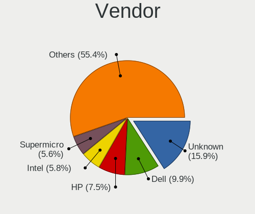
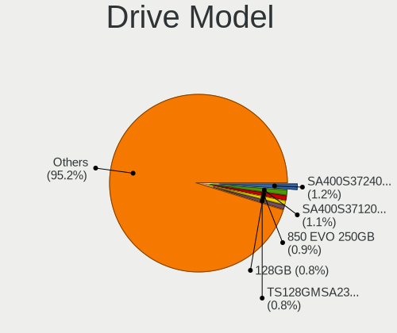
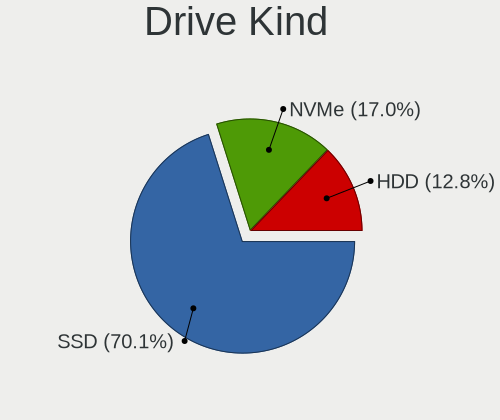
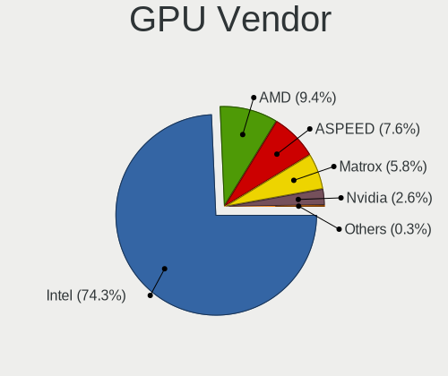
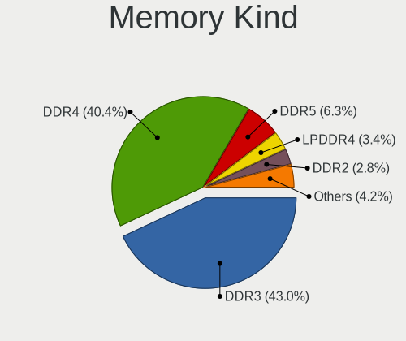

OPNsense - Tested Hardware & Statistics
---------------------------------------

A project to collect tested hardware configurations for OPNsense.

Anyone can contribute to this report by the [hw-probe](https://github.com/linuxhw/hw-probe/blob/master/INSTALL.BSD.md) tool:

    hw-probe -all -upload

Please contribute! Especially if your hardware is rare.

Contents
--------

* [ Test Cases ](#test-cases)

* [ System ](#system)
  - [ OS                       ](#os)
  - [ OS Family                ](#os-family)
  - [ Arch                     ](#arch)
  - [ DE                       ](#de)
  - [ Display Server           ](#display-server)
  - [ Display Manager          ](#display-manager)
  - [ OS Lang                  ](#os-lang)
  - [ Boot Mode                ](#boot-mode)
  - [ Filesystem               ](#filesystem)
  - [ Part. scheme             ](#part-scheme)

* [ Board ](#board)
  - [ Vendor                   ](#vendor)
  - [ Model                    ](#model)
  - [ Model Family             ](#model-family)
  - [ MFG Year                 ](#mfg-year)
  - [ Form Factor              ](#form-factor)
  - [ Coreboot                 ](#coreboot)
  - [ RAM Size                 ](#ram-size)
  - [ RAM Used                 ](#ram-used)
  - [ Total Drives             ](#total-drives)
  - [ Has CD-ROM               ](#has-cd-rom)
  - [ Has Ethernet             ](#has-ethernet)
  - [ Has WiFi                 ](#has-wifi)
  - [ Has Bluetooth            ](#has-bluetooth)

* [ Location ](#location)
  - [ Country                  ](#country)
  - [ City                     ](#city)

* [ Drives ](#drives)
  - [ Drive Vendor             ](#drive-vendor)
  - [ Drive Model              ](#drive-model)
  - [ HDD Vendor               ](#hdd-vendor)
  - [ SSD Vendor               ](#ssd-vendor)
  - [ Drive Kind               ](#drive-kind)
  - [ Drive Connector          ](#drive-connector)
  - [ Drive Size               ](#drive-size)
  - [ Space Total              ](#space-total)
  - [ Space Used               ](#space-used)
  - [ Malfunc. Drives          ](#malfunc-drives)
  - [ Malfunc. Drive Vendor    ](#malfunc-drive-vendor)
  - [ Malfunc. HDD Vendor      ](#malfunc-hdd-vendor)
  - [ Malfunc. Drive Kind      ](#malfunc-drive-kind)
  - [ Failed Drives            ](#failed-drives)
  - [ Failed Drive Vendor      ](#failed-drive-vendor)
  - [ Drive Status             ](#drive-status)

* [ Storage controller ](#storage-controller)
  - [ Storage Vendor           ](#storage-vendor)
  - [ Storage Model            ](#storage-model)
  - [ Storage Kind             ](#storage-kind)

* [ Processor ](#processor)
  - [ CPU Vendor               ](#cpu-vendor)
  - [ CPU Model                ](#cpu-model)
  - [ CPU Model Family         ](#cpu-model-family)
  - [ CPU Cores                ](#cpu-cores)
  - [ CPU Sockets              ](#cpu-sockets)
  - [ CPU Threads              ](#cpu-threads)
  - [ CPU Microarch            ](#cpu-microarch)

* [ Graphics ](#graphics)
  - [ GPU Vendor               ](#gpu-vendor)
  - [ GPU Model                ](#gpu-model)
  - [ GPU Combo                ](#gpu-combo)
  - [ GPU Driver               ](#gpu-driver)
  - [ GPU Memory               ](#gpu-memory)

* [ Monitor ](#monitor)
  - [ Monitor Vendor           ](#monitor-vendor)
  - [ Monitor Model            ](#monitor-model)
  - [ Monitor Resolution       ](#monitor-resolution)
  - [ Monitor Diagonal         ](#monitor-diagonal)
  - [ Monitor Width            ](#monitor-width)
  - [ Aspect Ratio             ](#aspect-ratio)
  - [ Monitor Area             ](#monitor-area)
  - [ Pixel Density            ](#pixel-density)
  - [ Multiple Monitors        ](#multiple-monitors)

* [ Network ](#network)
  - [ Net Controller Vendor    ](#net-controller-vendor)
  - [ Net Controller Model     ](#net-controller-model)
  - [ Wireless Vendor          ](#wireless-vendor)
  - [ Wireless Model           ](#wireless-model)
  - [ Ethernet Vendor          ](#ethernet-vendor)
  - [ Ethernet Model           ](#ethernet-model)
  - [ Net Controller Kind      ](#net-controller-kind)
  - [ Used Controller          ](#used-controller)
  - [ NICs                     ](#nics)
  - [ IPv6                     ](#ipv6)

* [ Bluetooth ](#bluetooth)
  - [ Bluetooth Vendor         ](#bluetooth-vendor)
  - [ Bluetooth Model          ](#bluetooth-model)

* [ Sound ](#sound)
  - [ Sound Vendor             ](#sound-vendor)
  - [ Sound Model              ](#sound-model)

* [ Memory ](#memory)
  - [ Memory Vendor            ](#memory-vendor)
  - [ Memory Model             ](#memory-model)
  - [ Memory Kind              ](#memory-kind)
  - [ Memory Form Factor       ](#memory-form-factor)
  - [ Memory Size              ](#memory-size)
  - [ Memory Speed             ](#memory-speed)

* [ Printers & scanners ](#printers--scanners)
  - [ Printer Vendor           ](#printer-vendor)
  - [ Printer Model            ](#printer-model)
  - [ Scanner Vendor           ](#scanner-vendor)
  - [ Scanner Model            ](#scanner-model)

* [ Camera ](#camera)
  - [ Camera Vendor            ](#camera-vendor)
  - [ Camera Model             ](#camera-model)

* [ Security ](#security)
  - [ Fingerprint Vendor       ](#fingerprint-vendor)
  - [ Fingerprint Model        ](#fingerprint-model)
  - [ Chipcard Vendor          ](#chipcard-vendor)
  - [ Chipcard Model           ](#chipcard-model)

* [ Unsupported ](#unsupported)
  - [ Unsupported Devices      ](#unsupported-devices)
  - [ Unsupported Device Types ](#unsupported-device-types)

Test Cases
----------

Total: 11429

| Vendor        | Model                       | Form-Factor | Probe                                                     | Date         |
|---------------|-----------------------------|-------------|-----------------------------------------------------------|--------------|
| Cisco         | ASA5525 A0                  | Desktop     | [f6eb14f059](https://bsd-hardware.info/?probe=f6eb14f059) | Nov 06, 2023 |
| Unknown       | Unknown                     | Desktop     | [8b1079a297](https://bsd-hardware.info/?probe=8b1079a297) | Nov 06, 2023 |
| Dell          | 0D24M8 A01                  | Desktop     | [4c874fa8af](https://bsd-hardware.info/?probe=4c874fa8af) | Nov 06, 2023 |
| Dell          | 0D24M8 A01                  | Desktop     | [3ca7f9b6d1](https://bsd-hardware.info/?probe=3ca7f9b6d1) | Nov 06, 2023 |
| ASUSTek       | PRIME H610M-E D4            | Desktop     | [9d467272c3](https://bsd-hardware.info/?probe=9d467272c3) | Nov 06, 2023 |
| Dell          | 05XGC8 A01                  | Desktop     | [9e054bbcb2](https://bsd-hardware.info/?probe=9e054bbcb2) | Nov 06, 2023 |
| Dell          | 0M788G A07                  | Server      | [a404997d9d](https://bsd-hardware.info/?probe=a404997d9d) | Nov 06, 2023 |
| CncTion       | N6000-4L B0                 | Desktop     | [7ee545bad3](https://bsd-hardware.info/?probe=7ee545bad3) | Nov 06, 2023 |
| Fujitsu       | D3313-G1 S26361-D3313-G1    | Desktop     | [b4c8864cef](https://bsd-hardware.info/?probe=b4c8864cef) | Nov 06, 2023 |
| Gigabyte      | B150N Phoenix-WIFI-CF       | Desktop     | [456fe0a275](https://bsd-hardware.info/?probe=456fe0a275) | Nov 06, 2023 |
| Gigabyte      | MZBSWAP-00                  | Desktop     | [a01a7d9576](https://bsd-hardware.info/?probe=a01a7d9576) | Nov 06, 2023 |
| Intel         | MAHOBAY                     | Desktop     | [70e36de90e](https://bsd-hardware.info/?probe=70e36de90e) | Nov 05, 2023 |
| MW            | GMLK-2_5G4L                 | Desktop     | [4fe0f6ef5e](https://bsd-hardware.info/?probe=4fe0f6ef5e) | Nov 05, 2023 |
| BESSTAR Te... | VB9                         | All in one  | [e750d16fb3](https://bsd-hardware.info/?probe=e750d16fb3) | Nov 05, 2023 |
| Unknown       | Unknown                     | Desktop     | [456d5ad8bf](https://bsd-hardware.info/?probe=456d5ad8bf) | Nov 05, 2023 |
| TYAN Compu... | S5517                       | Desktop     | [5545281cd4](https://bsd-hardware.info/?probe=5545281cd4) | Nov 05, 2023 |
| Shuttle       | FS61                        | Desktop     | [1ed38ceb8c](https://bsd-hardware.info/?probe=1ed38ceb8c) | Nov 05, 2023 |
| Raspberry ... | Raspberry Pi                | Soc         | [c69e655a86](https://bsd-hardware.info/?probe=c69e655a86) | Nov 05, 2023 |
| Unknown       | Unknown                     | Desktop     | [97f4527aab](https://bsd-hardware.info/?probe=97f4527aab) | Nov 05, 2023 |
| Unknown       | Unknown                     | Desktop     | [1a820d6364](https://bsd-hardware.info/?probe=1a820d6364) | Nov 05, 2023 |
| Dell          | 0XHGV1 A00                  | Desktop     | [ab650cfab8](https://bsd-hardware.info/?probe=ab650cfab8) | Nov 05, 2023 |
| Unknown       | Unknown                     | Desktop     | [2a768a9f63](https://bsd-hardware.info/?probe=2a768a9f63) | Nov 05, 2023 |
| Unknown       | Unknown                     | Desktop     | [5d0e537b3e](https://bsd-hardware.info/?probe=5d0e537b3e) | Nov 05, 2023 |
| HP            | ProLiant ML10               | Desktop     | [43badefe76](https://bsd-hardware.info/?probe=43badefe76) | Nov 05, 2023 |
| PICO PC       | MNHO-113                    | Desktop     | [7653a1705b](https://bsd-hardware.info/?probe=7653a1705b) | Nov 05, 2023 |
| Fujitsu       | D3313-A1 S26361-D3313-A1    | Desktop     | [ea78913e4c](https://bsd-hardware.info/?probe=ea78913e4c) | Nov 05, 2023 |
| Deciso        | Netboard A10 GEN2 Model ... | Desktop     | [e3852e0a81](https://bsd-hardware.info/?probe=e3852e0a81) | Nov 05, 2023 |
| HP            | 83EE                        | Desktop     | [1ab86be61a](https://bsd-hardware.info/?probe=1ab86be61a) | Nov 05, 2023 |
| HP            | 213D A01                    | Desktop     | [e7de264f61](https://bsd-hardware.info/?probe=e7de264f61) | Nov 05, 2023 |
| MSI           | MAG Z390 TOMAHAWK           | Desktop     | [d95762a0c0](https://bsd-hardware.info/?probe=d95762a0c0) | Nov 04, 2023 |
| Gigabyte      | B360N WIFI-CF               | Desktop     | [38b5f3b9ad](https://bsd-hardware.info/?probe=38b5f3b9ad) | Nov 04, 2023 |
| Lenovo        | 30D0 SDK0J40697 WIN 3305... | Desktop     | [ccb4fc0598](https://bsd-hardware.info/?probe=ccb4fc0598) | Nov 04, 2023 |
| CncTion       | N5105-4L B0                 | Desktop     | [86aa07c0ae](https://bsd-hardware.info/?probe=86aa07c0ae) | Nov 04, 2023 |
| Supermicro    | X10SLM+-LN4F                | Server      | [ed0fb62285](https://bsd-hardware.info/?probe=ed0fb62285) | Nov 04, 2023 |
| ASUSTek       | PRIME B460M-A               | Desktop     | [d3e438ea78](https://bsd-hardware.info/?probe=d3e438ea78) | Nov 04, 2023 |
| Dell          | 00V62H A00                  | Desktop     | [0b678c5e33](https://bsd-hardware.info/?probe=0b678c5e33) | Nov 04, 2023 |
| Techvision    | TVI7309X B0                 | Desktop     | [90a26f497a](https://bsd-hardware.info/?probe=90a26f497a) | Nov 04, 2023 |
| HP            | 18E4                        | Desktop     | [479b255034](https://bsd-hardware.info/?probe=479b255034) | Nov 03, 2023 |
| Unknown       | Unknown                     | Desktop     | [25d85a53af](https://bsd-hardware.info/?probe=25d85a53af) | Nov 03, 2023 |
| PC Engines    | apu1                        | Desktop     | [3b8272286a](https://bsd-hardware.info/?probe=3b8272286a) | Nov 03, 2023 |
| ASRock        | B365M-HDV                   | Desktop     | [368366454f](https://bsd-hardware.info/?probe=368366454f) | Nov 03, 2023 |
| Unknown       | Unknown                     | Desktop     | [790368b718](https://bsd-hardware.info/?probe=790368b718) | Nov 03, 2023 |
| Dell          | 03NXH8 A00                  | Mini pc     | [f6a8d5dbad](https://bsd-hardware.info/?probe=f6a8d5dbad) | Nov 03, 2023 |
| Fujitsu       | D3313-E1 S26361-D3313-E1    | Desktop     | [e6927b5eb8](https://bsd-hardware.info/?probe=e6927b5eb8) | Nov 03, 2023 |
| Protectli     | FW6 Ver                     | Desktop     | [13eb07060d](https://bsd-hardware.info/?probe=13eb07060d) | Nov 03, 2023 |
| PC Engines    | APU2                        | Desktop     | [c877a467bb](https://bsd-hardware.info/?probe=c877a467bb) | Nov 03, 2023 |
| PC Engines    | apu4                        | Desktop     | [b85acbe43d](https://bsd-hardware.info/?probe=b85acbe43d) | Nov 03, 2023 |
| Protectli     | FW6                         | Desktop     | [2dc16f3849](https://bsd-hardware.info/?probe=2dc16f3849) | Nov 03, 2023 |
| Shenzhen M... | RPBNB                       | Desktop     | [db0f05f919](https://bsd-hardware.info/?probe=db0f05f919) | Nov 03, 2023 |
| Shenzhen M... | RPBNB                       | Desktop     | [b729c4137a](https://bsd-hardware.info/?probe=b729c4137a) | Nov 03, 2023 |
| Unknown       | YL-SKUL6                    | Desktop     | [c639de5323](https://bsd-hardware.info/?probe=c639de5323) | Nov 03, 2023 |
| Dell          | 03NXH8 A00                  | Mini pc     | [8473035148](https://bsd-hardware.info/?probe=8473035148) | Nov 03, 2023 |
| HP            | 213D A01                    | Desktop     | [da7d91889e](https://bsd-hardware.info/?probe=da7d91889e) | Nov 03, 2023 |
| IceWhale T... | ZimaBoard 432 ZMB           | Desktop     | [018805dc37](https://bsd-hardware.info/?probe=018805dc37) | Nov 03, 2023 |
| BESSTAR Te... | GB7                         | Mini pc     | [1859b56be4](https://bsd-hardware.info/?probe=1859b56be4) | Nov 02, 2023 |
| Fujitsu Si... | D2584-A1 S26361-D2584-A1    | Desktop     | [d4298a293f](https://bsd-hardware.info/?probe=d4298a293f) | Nov 02, 2023 |
| Techvision    | TVI7309X B0                 | Desktop     | [b038d8a95d](https://bsd-hardware.info/?probe=b038d8a95d) | Nov 02, 2023 |
| Gigabyte      | MZBSWAP-00                  | Desktop     | [d52347dd3d](https://bsd-hardware.info/?probe=d52347dd3d) | Nov 02, 2023 |
| Lenovo        | 312D SDK0L22692 WIN 3306... | Mini pc     | [c958c2b087](https://bsd-hardware.info/?probe=c958c2b087) | Nov 02, 2023 |
| Unknown       | Unknown                     | Desktop     | [40c18e28da](https://bsd-hardware.info/?probe=40c18e28da) | Nov 02, 2023 |
| IBM           | FWA-3211 A102               | Server      | [8c4e5effec](https://bsd-hardware.info/?probe=8c4e5effec) | Nov 02, 2023 |
| CWWK          | MINIPC-G12                  | Desktop     | [4fd9e1d707](https://bsd-hardware.info/?probe=4fd9e1d707) | Nov 02, 2023 |
| HP            | ProLiant DL320e Gen8        | Server      | [5494a05301](https://bsd-hardware.info/?probe=5494a05301) | Nov 02, 2023 |
| CWWK          | CW-ADLN-6L                  | Desktop     | [59372d06e0](https://bsd-hardware.info/?probe=59372d06e0) | Nov 02, 2023 |
| Techvision    | TVI7309X B0                 | Desktop     | [dd3612a38f](https://bsd-hardware.info/?probe=dd3612a38f) | Nov 02, 2023 |
| Techvision    | TVI7309X B0                 | Desktop     | [11b5e187fc](https://bsd-hardware.info/?probe=11b5e187fc) | Nov 02, 2023 |
| Lenovo        | 3102 SDK0J40697 WIN 3305... | Desktop     | [e977a38199](https://bsd-hardware.info/?probe=e977a38199) | Nov 02, 2023 |
| Unknown       | Unknown                     | Desktop     | [691338cb44](https://bsd-hardware.info/?probe=691338cb44) | Nov 02, 2023 |
| Unknown       | Unknown                     | Desktop     | [c6610a58ac](https://bsd-hardware.info/?probe=c6610a58ac) | Nov 02, 2023 |
| Unknown       | Unknown                     | Desktop     | [743d5aec59](https://bsd-hardware.info/?probe=743d5aec59) | Nov 02, 2023 |
| Unknown       | Unknown                     | Desktop     | [a539a38ec1](https://bsd-hardware.info/?probe=a539a38ec1) | Nov 02, 2023 |
| Unknown       | Unknown                     | Desktop     | [f1e1a3e8c8](https://bsd-hardware.info/?probe=f1e1a3e8c8) | Nov 02, 2023 |
| MW            | GMLK-2_5G4L                 | Desktop     | [ff78edaee6](https://bsd-hardware.info/?probe=ff78edaee6) | Nov 02, 2023 |
| PICO PC       | MNHO-113                    | Desktop     | [a4175476a0](https://bsd-hardware.info/?probe=a4175476a0) | Nov 02, 2023 |
| Dell          | 0XCR8D A01                  | Desktop     | [224cc728f5](https://bsd-hardware.info/?probe=224cc728f5) | Nov 02, 2023 |
| Dell          | 0XCR8D A02                  | Desktop     | [f9df1890fa](https://bsd-hardware.info/?probe=f9df1890fa) | Nov 02, 2023 |
| Dell          | 0M788G A07                  | Server      | [3d5a1fc986](https://bsd-hardware.info/?probe=3d5a1fc986) | Nov 02, 2023 |
| Dell          | 0XCR8D A01                  | Desktop     | [83c8ab8d4b](https://bsd-hardware.info/?probe=83c8ab8d4b) | Nov 02, 2023 |
| Lenovo        | 312D SDK0J40697 WIN 3305... | Mini pc     | [3e55355c4b](https://bsd-hardware.info/?probe=3e55355c4b) | Nov 02, 2023 |
| Sophos        | SG                          | Firewall    | [24994d8e2f](https://bsd-hardware.info/?probe=24994d8e2f) | Nov 02, 2023 |
| Supermicro    | X10SLL-F                    | Server      | [8d3cf4e648](https://bsd-hardware.info/?probe=8d3cf4e648) | Nov 01, 2023 |
| Unknown       | Unknown                     | Desktop     | [3499447096](https://bsd-hardware.info/?probe=3499447096) | Nov 01, 2023 |
| ASUSTek       | P8Z77-V LX                  | Desktop     | [7077dec0a1](https://bsd-hardware.info/?probe=7077dec0a1) | Nov 01, 2023 |
| Fujitsu       | D3544-A1 S26361-D3544-A1... | Desktop     | [2fcac7d927](https://bsd-hardware.info/?probe=2fcac7d927) | Nov 01, 2023 |
| Dell          | 04Y8V0 A02                  | Desktop     | [7e2bda9790](https://bsd-hardware.info/?probe=7e2bda9790) | Nov 01, 2023 |
| Unknown       | Unknown                     | Desktop     | [4c83541e4d](https://bsd-hardware.info/?probe=4c83541e4d) | Nov 01, 2023 |
| Protectli     | VP2420                      | Desktop     | [7621eb7370](https://bsd-hardware.info/?probe=7621eb7370) | Nov 01, 2023 |
| Techvision    | TVI7309X B0                 | Desktop     | [8004cade7b](https://bsd-hardware.info/?probe=8004cade7b) | Nov 01, 2023 |
| CompuLab      | fitlet2                     | Mini pc     | [270b4170ef](https://bsd-hardware.info/?probe=270b4170ef) | Nov 01, 2023 |
| Lenovo        | 3111 SDK0J40697 WIN 3305... | Desktop     | [ade254cf11](https://bsd-hardware.info/?probe=ade254cf11) | Nov 01, 2023 |
| ATOPNUC       | MA90                        | Mini pc     | [7e40f68fc3](https://bsd-hardware.info/?probe=7e40f68fc3) | Nov 01, 2023 |
| Unknown       | Unknown                     | Desktop     | [d7f1c60cfb](https://bsd-hardware.info/?probe=d7f1c60cfb) | Nov 01, 2023 |
| Supermicro    | A2SDi-4C-HLN4F              | Server      | [5b6e9f8808](https://bsd-hardware.info/?probe=5b6e9f8808) | Oct 31, 2023 |
| Unknown       | Unknown                     | Desktop     | [fc605c1909](https://bsd-hardware.info/?probe=fc605c1909) | Oct 31, 2023 |
| Unknown       | QGLK03                      | Desktop     | [f51b216549](https://bsd-hardware.info/?probe=f51b216549) | Oct 31, 2023 |
| Dell          | 0NC2VH A01                  | Desktop     | [db40304707](https://bsd-hardware.info/?probe=db40304707) | Oct 31, 2023 |
| Dell          | 0XHGV1 A00                  | Desktop     | [a688954dd5](https://bsd-hardware.info/?probe=a688954dd5) | Oct 31, 2023 |
| Unknown       | Unknown                     | Desktop     | [b9d895ba2b](https://bsd-hardware.info/?probe=b9d895ba2b) | Oct 31, 2023 |
| HP            | 8299                        | Desktop     | [e3bdac8945](https://bsd-hardware.info/?probe=e3bdac8945) | Oct 31, 2023 |
| Shuttle       | FS61                        | Desktop     | [24158fbe17](https://bsd-hardware.info/?probe=24158fbe17) | Oct 31, 2023 |
| Shuttle       | FS61                        | Desktop     | [2efb16a5f4](https://bsd-hardware.info/?probe=2efb16a5f4) | Oct 31, 2023 |
| CheckPoint    | T-110-00                    | Desktop     | [970671ce27](https://bsd-hardware.info/?probe=970671ce27) | Oct 31, 2023 |
| Gigabyte      | H370M D3H-CF                | Desktop     | [6b2553e06c](https://bsd-hardware.info/?probe=6b2553e06c) | Oct 30, 2023 |
| Hardkernel    | ODROID-H2                   | Desktop     | [41c4097002](https://bsd-hardware.info/?probe=41c4097002) | Oct 30, 2023 |
| Dell          | 0NW6H5 A00                  | Desktop     | [ac76a862f8](https://bsd-hardware.info/?probe=ac76a862f8) | Oct 30, 2023 |
| Seeed Stud... | ODYSSEY-X86J41X5 SD-BS-C... | Desktop     | [da2fa90c43](https://bsd-hardware.info/?probe=da2fa90c43) | Oct 30, 2023 |
| Intel         | Q3XXG4-P V1.0               | Desktop     | [cac29f9a35](https://bsd-hardware.info/?probe=cac29f9a35) | Oct 30, 2023 |
| Apple         | Mac-8ED6AF5B48C039E1 Mac... | Mini pc     | [959b5f0be7](https://bsd-hardware.info/?probe=959b5f0be7) | Oct 30, 2023 |
| Dell          | 0KP561                      | Desktop     | [cd0ae50eb0](https://bsd-hardware.info/?probe=cd0ae50eb0) | Oct 30, 2023 |
| Sophos        | SG                          | Firewall    | [f9c46ab5cb](https://bsd-hardware.info/?probe=f9c46ab5cb) | Oct 30, 2023 |
| Dell          | 0WMJ54 A01                  | Desktop     | [10d46f39aa](https://bsd-hardware.info/?probe=10d46f39aa) | Oct 30, 2023 |
| PC Engines    | APU2                        | Desktop     | [78e2f0b5e4](https://bsd-hardware.info/?probe=78e2f0b5e4) | Oct 30, 2023 |
| CWWK          | CW-J6-6L                    | Desktop     | [7c9445a8f2](https://bsd-hardware.info/?probe=7c9445a8f2) | Oct 30, 2023 |
| Dell          | 0WMJ54 A01                  | Desktop     | [5995fa3115](https://bsd-hardware.info/?probe=5995fa3115) | Oct 30, 2023 |
| Shuttle       | DS437                       | Notebook    | [45c2e3460c](https://bsd-hardware.info/?probe=45c2e3460c) | Oct 30, 2023 |
| YANYU         | M9F baytrail                | Desktop     | [746772e77b](https://bsd-hardware.info/?probe=746772e77b) | Oct 30, 2023 |
| AZW           | EQ                          | Desktop     | [034b060507](https://bsd-hardware.info/?probe=034b060507) | Oct 30, 2023 |
| AAEON         | FWS-2362 V1.0               | Desktop     | [cddea934bd](https://bsd-hardware.info/?probe=cddea934bd) | Oct 30, 2023 |
| ShenZhen M... | MW-GMLK-2.5G6L              | Desktop     | [9567268d28](https://bsd-hardware.info/?probe=9567268d28) | Oct 30, 2023 |
| Dell          | 01PXF9 A00                  | Mini pc     | [c292bb52df](https://bsd-hardware.info/?probe=c292bb52df) | Oct 29, 2023 |
| Unknown       | Unknown                     | Desktop     | [a96d602ef7](https://bsd-hardware.info/?probe=a96d602ef7) | Oct 29, 2023 |
| Yanling       | YL-KBR6L Ver:1.01           | Desktop     | [bdc7be2258](https://bsd-hardware.info/?probe=bdc7be2258) | Oct 29, 2023 |
| ShenZhen M... | MW-GMLK-2.5G6L              | Desktop     | [709f8e1566](https://bsd-hardware.info/?probe=709f8e1566) | Oct 29, 2023 |
| Intel         | ChiefRiver D                | Desktop     | [8467546a46](https://bsd-hardware.info/?probe=8467546a46) | Oct 29, 2023 |
| Fujitsu       | D3041-A1 S26361-D3041-A1    | Desktop     | [bb195148f7](https://bsd-hardware.info/?probe=bb195148f7) | Oct 29, 2023 |
| ASRock        | G31M-S                      | Desktop     | [d0d58ceb87](https://bsd-hardware.info/?probe=d0d58ceb87) | Oct 29, 2023 |
| Protectli     | VP2410                      | Desktop     | [7fb31eb814](https://bsd-hardware.info/?probe=7fb31eb814) | Oct 29, 2023 |
| ASRock        | H81M-VG4 R2.0               | Desktop     | [dcfbd591f5](https://bsd-hardware.info/?probe=dcfbd591f5) | Oct 29, 2023 |
| Unknown       | Unknown                     | Desktop     | [873104973c](https://bsd-hardware.info/?probe=873104973c) | Oct 29, 2023 |
| MW            | GMLK-2_5G4L                 | Desktop     | [ec852f7037](https://bsd-hardware.info/?probe=ec852f7037) | Oct 29, 2023 |
| JHZD          | BQM6                        | Desktop     | [d54e6cd1fd](https://bsd-hardware.info/?probe=d54e6cd1fd) | Oct 29, 2023 |
| Unknown       | Unknown                     | Desktop     | [b688e6b635](https://bsd-hardware.info/?probe=b688e6b635) | Oct 28, 2023 |
| AMI           | Aptio CRB                   | Mini pc     | [c774066857](https://bsd-hardware.info/?probe=c774066857) | Oct 28, 2023 |
| Gigabyte      | H81M-S2V                    | Desktop     | [07f64c00f4](https://bsd-hardware.info/?probe=07f64c00f4) | Oct 28, 2023 |
| Dell          | 0JP3NX A01                  | Desktop     | [937bf733c5](https://bsd-hardware.info/?probe=937bf733c5) | Oct 28, 2023 |
| Unknown       | Unknown                     | Desktop     | [2df22c840a](https://bsd-hardware.info/?probe=2df22c840a) | Oct 28, 2023 |
| Fujitsu       | D3543-A1 S26361-D3543-A1... | Desktop     | [fc42f6db17](https://bsd-hardware.info/?probe=fc42f6db17) | Oct 28, 2023 |
| ASRock        | B450M Pro4 R2.0             | Desktop     | [b60083ef1f](https://bsd-hardware.info/?probe=b60083ef1f) | Oct 28, 2023 |
| ASRock        | H370M-ITX/ac                | Desktop     | [ace25d235f](https://bsd-hardware.info/?probe=ace25d235f) | Oct 28, 2023 |
| ASRock        | N100DC-ITX                  | Desktop     | [888d7c9d18](https://bsd-hardware.info/?probe=888d7c9d18) | Oct 28, 2023 |
| HP            | 1825                        | Desktop     | [8a0a258efc](https://bsd-hardware.info/?probe=8a0a258efc) | Oct 28, 2023 |
| Deciso        | OPNsense Appliance          | Notebook    | [9508bd06f5](https://bsd-hardware.info/?probe=9508bd06f5) | Oct 28, 2023 |
| Dell          | 0Y5DDC A00                  | Desktop     | [ff58ecae1d](https://bsd-hardware.info/?probe=ff58ecae1d) | Oct 28, 2023 |
| IGEL Techn... | D220                        | Desktop     | [3478db91ef](https://bsd-hardware.info/?probe=3478db91ef) | Oct 28, 2023 |
| HP            | 2AF7                        | Desktop     | [a45659c9d2](https://bsd-hardware.info/?probe=a45659c9d2) | Oct 28, 2023 |
| Unknown       | Unknown                     | Desktop     | [3e99a14af3](https://bsd-hardware.info/?probe=3e99a14af3) | Oct 28, 2023 |
| Supermicro    | X11SSH-F                    | Desktop     | [73160cea1d](https://bsd-hardware.info/?probe=73160cea1d) | Oct 28, 2023 |
| Intel         | NUC11TNBi3 M11908-500       | Mini pc     | [72634e7285](https://bsd-hardware.info/?probe=72634e7285) | Oct 28, 2023 |
| YanRay Tec... | B1904                       | Desktop     | [7d194ae12b](https://bsd-hardware.info/?probe=7d194ae12b) | Oct 28, 2023 |
| ASUSTek       | TUF Gaming Z490-PLUS        | Desktop     | [c2a5fe4d38](https://bsd-hardware.info/?probe=c2a5fe4d38) | Oct 28, 2023 |
| Dell          | 09WH54 A01                  | Desktop     | [a012c0e1c9](https://bsd-hardware.info/?probe=a012c0e1c9) | Oct 27, 2023 |
| Intel         | Q3XXG4-P V1.0               | Desktop     | [03ef00fab1](https://bsd-hardware.info/?probe=03ef00fab1) | Oct 27, 2023 |
| Protectli     | FW4B                        | Desktop     | [23c31e7f9f](https://bsd-hardware.info/?probe=23c31e7f9f) | Oct 27, 2023 |
| Intel         | JSL MRD                     | Desktop     | [328c764941](https://bsd-hardware.info/?probe=328c764941) | Oct 27, 2023 |
| Unknown       | Unknown                     | Desktop     | [7a9e2d88ed](https://bsd-hardware.info/?probe=7a9e2d88ed) | Oct 27, 2023 |
| Unknown       | Unknown                     | Desktop     | [c3c0c1e21b](https://bsd-hardware.info/?probe=c3c0c1e21b) | Oct 27, 2023 |
| Unknown       | Unknown                     | Desktop     | [51102e3f0d](https://bsd-hardware.info/?probe=51102e3f0d) | Oct 27, 2023 |
| Datto         | Unknown                     | Notebook    | [8b59510085](https://bsd-hardware.info/?probe=8b59510085) | Oct 27, 2023 |
| Gigabyte      | X570S UD                    | Desktop     | [fe3d35aef8](https://bsd-hardware.info/?probe=fe3d35aef8) | Oct 27, 2023 |
| Unknown       | Unknown                     | Desktop     | [850878776a](https://bsd-hardware.info/?probe=850878776a) | Oct 27, 2023 |
| Dell          | 0M5DCD A00                  | Desktop     | [f8ae786555](https://bsd-hardware.info/?probe=f8ae786555) | Oct 27, 2023 |
| YANYU         | M9F baytrail                | Desktop     | [f9e833a5f9](https://bsd-hardware.info/?probe=f9e833a5f9) | Oct 27, 2023 |
| HP            | 3397                        | Desktop     | [3dad1378f7](https://bsd-hardware.info/?probe=3dad1378f7) | Oct 27, 2023 |
| Supermicro    | M11SDV-8C-LN4F              | Server      | [8af7ab0e4d](https://bsd-hardware.info/?probe=8af7ab0e4d) | Oct 27, 2023 |
| PC Engines    | apu4                        | Desktop     | [7bbd252741](https://bsd-hardware.info/?probe=7bbd252741) | Oct 27, 2023 |
| Shenzhen M... | AHBNB OEM                   | Desktop     | [8a1a0cdc32](https://bsd-hardware.info/?probe=8a1a0cdc32) | Oct 27, 2023 |
| Supermicro    | X10SLM+-LN4F                | Server      | [53651e09ac](https://bsd-hardware.info/?probe=53651e09ac) | Oct 27, 2023 |
| Fujitsu       | D3313-A1 S26361-D3313-A1    | Desktop     | [1157df98bf](https://bsd-hardware.info/?probe=1157df98bf) | Oct 27, 2023 |
| Unknown       | Unknown                     | Desktop     | [04349022d0](https://bsd-hardware.info/?probe=04349022d0) | Oct 26, 2023 |
| Acer          | Veriton X4620G v1.0         | Desktop     | [bc374cdc01](https://bsd-hardware.info/?probe=bc374cdc01) | Oct 26, 2023 |
| CncTion       | N5105-4L B0                 | Desktop     | [1d3ba21cf9](https://bsd-hardware.info/?probe=1d3ba21cf9) | Oct 26, 2023 |
| Lenovo        | 312D SDK0J40697 WIN 3305... | Mini pc     | [17cdba9414](https://bsd-hardware.info/?probe=17cdba9414) | Oct 26, 2023 |
| Winston Ma... | PICO PC V1.2                | Desktop     | [244102bda8](https://bsd-hardware.info/?probe=244102bda8) | Oct 26, 2023 |
| Unknown       | Unknown                     | Desktop     | [376ab08c75](https://bsd-hardware.info/?probe=376ab08c75) | Oct 26, 2023 |
| Dell          | 0PRWNC A05                  | Server      | [9b44f96ab2](https://bsd-hardware.info/?probe=9b44f96ab2) | Oct 26, 2023 |
| Intel         | MAHOBAY                     | Desktop     | [9b797e809a](https://bsd-hardware.info/?probe=9b797e809a) | Oct 26, 2023 |
| Intel         | MAHOBAY                     | Desktop     | [4dd20af1a3](https://bsd-hardware.info/?probe=4dd20af1a3) | Oct 26, 2023 |
| AMI           | Aptio CRB                   | Mini pc     | [fa2f4e1f86](https://bsd-hardware.info/?probe=fa2f4e1f86) | Oct 26, 2023 |
| Intel         | MAHOBAY                     | Desktop     | [c66be142de](https://bsd-hardware.info/?probe=c66be142de) | Oct 26, 2023 |
| Supermicro    | X9SCL/X9SCMA                | Desktop     | [233d4d3b64](https://bsd-hardware.info/?probe=233d4d3b64) | Oct 26, 2023 |
| Unknown       | Unknown                     | Desktop     | [400f56d13c](https://bsd-hardware.info/?probe=400f56d13c) | Oct 26, 2023 |
| HPE           | ProLiant DL20 Gen10         | Server      | [3541caeb52](https://bsd-hardware.info/?probe=3541caeb52) | Oct 25, 2023 |
| Unknown       | Unknown                     | Desktop     | [d78f6f9dd2](https://bsd-hardware.info/?probe=d78f6f9dd2) | Oct 25, 2023 |
| Unknown       | Unknown                     | Desktop     | [f06cbf02dc](https://bsd-hardware.info/?probe=f06cbf02dc) | Oct 25, 2023 |
| Unknown       | Unknown                     | Desktop     | [0f9ff1c9ed](https://bsd-hardware.info/?probe=0f9ff1c9ed) | Oct 25, 2023 |
| Dell          | 0DPRKF A06                  | Server      | [2df912148d](https://bsd-hardware.info/?probe=2df912148d) | Oct 25, 2023 |
| Intel         | MAHOBAY                     | Desktop     | [980d0881bd](https://bsd-hardware.info/?probe=980d0881bd) | Oct 25, 2023 |
| PC Engines    | APU3                        | Desktop     | [fb68d3fbaf](https://bsd-hardware.info/?probe=fb68d3fbaf) | Oct 25, 2023 |
| Deciso        | NetBoard-A10                | Notebook    | [d0ee609c75](https://bsd-hardware.info/?probe=d0ee609c75) | Oct 25, 2023 |
| Unknown       | Unknown                     | Desktop     | [119cb746c8](https://bsd-hardware.info/?probe=119cb746c8) | Oct 25, 2023 |
| Protectli     | FW4B Ver                    | Desktop     | [0d97ba1ab0](https://bsd-hardware.info/?probe=0d97ba1ab0) | Oct 24, 2023 |
| Gigabyte      | MZGLKBP-00                  | Desktop     | [dcd8b6e432](https://bsd-hardware.info/?probe=dcd8b6e432) | Oct 24, 2023 |
| Dell          | 08NPPY A00                  | Desktop     | [dfc8115b4a](https://bsd-hardware.info/?probe=dfc8115b4a) | Oct 24, 2023 |
| Protectli     | FW6 Ver                     | Desktop     | [66f5010f59](https://bsd-hardware.info/?probe=66f5010f59) | Oct 24, 2023 |
| NEXCOM        | NSA3110 B                   | Desktop     | [84b88fd96d](https://bsd-hardware.info/?probe=84b88fd96d) | Oct 24, 2023 |
| Protectli     | FW6                         | Desktop     | [9ba0e874f4](https://bsd-hardware.info/?probe=9ba0e874f4) | Oct 24, 2023 |
| Cisco         | ASA5512 A0                  | Desktop     | [176871dd32](https://bsd-hardware.info/?probe=176871dd32) | Oct 24, 2023 |
| GoWin Solu... | R86S                        | Desktop     | [8668f0e8e9](https://bsd-hardware.info/?probe=8668f0e8e9) | Oct 24, 2023 |
| Deciso        | OPNsense Appliance          | Notebook    | [d9f0644c56](https://bsd-hardware.info/?probe=d9f0644c56) | Oct 24, 2023 |
| Gigabyte      | X570S UD                    | Desktop     | [dea9eee8a4](https://bsd-hardware.info/?probe=dea9eee8a4) | Oct 24, 2023 |
| Techvision    | TVI7309X B0                 | Desktop     | [38b1931562](https://bsd-hardware.info/?probe=38b1931562) | Oct 24, 2023 |
| Unknown       | Unknown                     | Desktop     | [b42465c967](https://bsd-hardware.info/?probe=b42465c967) | Oct 23, 2023 |
| Techvision    | TVI7309X B0                 | Desktop     | [2424acbde7](https://bsd-hardware.info/?probe=2424acbde7) | Oct 23, 2023 |
| Intel         | DQ77KB AAG81483-501         | Desktop     | [81e77caff8](https://bsd-hardware.info/?probe=81e77caff8) | Oct 23, 2023 |
| ZOTAC         | ZBOX-CI341                  | Mini pc     | [cca1027ab8](https://bsd-hardware.info/?probe=cca1027ab8) | Oct 23, 2023 |
| AMI           | Aptio CRB                   | Mini pc     | [2f3e0182f7](https://bsd-hardware.info/?probe=2f3e0182f7) | Oct 23, 2023 |
| Supermicro    | X10SLM-F                    | Desktop     | [8e622421c6](https://bsd-hardware.info/?probe=8e622421c6) | Oct 23, 2023 |
| AZW           | EQ                          | Desktop     | [8cb6ac80d2](https://bsd-hardware.info/?probe=8cb6ac80d2) | Oct 23, 2023 |
| HP            | 8103 A01                    | Mini pc     | [d621f08c5a](https://bsd-hardware.info/?probe=d621f08c5a) | Oct 23, 2023 |
| JHZD          | BQM6                        | Desktop     | [26c56ca564](https://bsd-hardware.info/?probe=26c56ca564) | Oct 23, 2023 |
| HP            | 8103 A01                    | Mini pc     | [9740c7419d](https://bsd-hardware.info/?probe=9740c7419d) | Oct 23, 2023 |
| Unknown       | Unknown                     | Desktop     | [ef592dc6ed](https://bsd-hardware.info/?probe=ef592dc6ed) | Oct 22, 2023 |
| Unknown       | YL-J3160L4                  | Desktop     | [3192ead8b5](https://bsd-hardware.info/?probe=3192ead8b5) | Oct 22, 2023 |
| ASRock        | G31M-S                      | Desktop     | [76a3ad20f3](https://bsd-hardware.info/?probe=76a3ad20f3) | Oct 22, 2023 |
| Lenovo        | 319E SEK0T35577 IOT 4247... | Mini pc     | [52715e6be9](https://bsd-hardware.info/?probe=52715e6be9) | Oct 22, 2023 |
| HP            | 3397                        | Desktop     | [2c004318d4](https://bsd-hardware.info/?probe=2c004318d4) | Oct 22, 2023 |
| Acer          | Aspire XC-830               | Desktop     | [6aea1130aa](https://bsd-hardware.info/?probe=6aea1130aa) | Oct 22, 2023 |
| Acer          | Aspire XC-830               | Desktop     | [3a4d822cfc](https://bsd-hardware.info/?probe=3a4d822cfc) | Oct 22, 2023 |
| ASUSTek       | M3A78-CM                    | Desktop     | [a40b6fde47](https://bsd-hardware.info/?probe=a40b6fde47) | Oct 22, 2023 |
| Lenovo        | SHARKBAY 0B98401 WIN        | Desktop     | [558a8a885e](https://bsd-hardware.info/?probe=558a8a885e) | Oct 22, 2023 |
| Seco          | UDOO x86                    | Notebook    | [260f8194ed](https://bsd-hardware.info/?probe=260f8194ed) | Oct 22, 2023 |
| Sophos        | SG                          | Firewall    | [cb44d7e49b](https://bsd-hardware.info/?probe=cb44d7e49b) | Oct 22, 2023 |
| Protectli     | FW6 Ver                     | Desktop     | [e12093f6bd](https://bsd-hardware.info/?probe=e12093f6bd) | Oct 22, 2023 |
| Unknown       | Unknown                     | Desktop     | [8c9f8e4f16](https://bsd-hardware.info/?probe=8c9f8e4f16) | Oct 21, 2023 |
| Unknown       | Unknown                     | Desktop     | [135c0112a4](https://bsd-hardware.info/?probe=135c0112a4) | Oct 21, 2023 |
| Unknown       | Unknown                     | Desktop     | [cc1a558efe](https://bsd-hardware.info/?probe=cc1a558efe) | Oct 21, 2023 |
| Sophos        | SG                          | Firewall    | [411f124671](https://bsd-hardware.info/?probe=411f124671) | Oct 21, 2023 |
| Unknown       | Unknown                     | Desktop     | [b1f5e25359](https://bsd-hardware.info/?probe=b1f5e25359) | Oct 21, 2023 |
| ASUSTek       | N73SV                       | Notebook    | [31fff3e92b](https://bsd-hardware.info/?probe=31fff3e92b) | Oct 21, 2023 |
| Unknown       | Unknown                     | Desktop     | [530528316f](https://bsd-hardware.info/?probe=530528316f) | Oct 21, 2023 |
| Unknown       | Unknown                     | Desktop     | [f15d15cba2](https://bsd-hardware.info/?probe=f15d15cba2) | Oct 21, 2023 |
| ASUSTek       | N73SV                       | Notebook    | [30726f25a0](https://bsd-hardware.info/?probe=30726f25a0) | Oct 21, 2023 |
| Dell          | 0M788G A07                  | Server      | [702549b133](https://bsd-hardware.info/?probe=702549b133) | Oct 21, 2023 |
| HP            | 8054                        | Desktop     | [71b61dc284](https://bsd-hardware.info/?probe=71b61dc284) | Oct 21, 2023 |
| Lenovo        | 312D SDK0J40697 WIN 3305... | Mini pc     | [3a35f074d9](https://bsd-hardware.info/?probe=3a35f074d9) | Oct 20, 2023 |
| Supermicro    | X11SBA-LN4FA                | Server      | [682d4aec9e](https://bsd-hardware.info/?probe=682d4aec9e) | Oct 20, 2023 |
| AZW           | EQ                          | Desktop     | [e119f62272](https://bsd-hardware.info/?probe=e119f62272) | Oct 20, 2023 |
| Supermicro    | H12SSL-i                    | Server      | [8943e5449f](https://bsd-hardware.info/?probe=8943e5449f) | Oct 20, 2023 |
| ASRockRack    | B650D4U-2L2T/BCM            | Server      | [b91ffc9125](https://bsd-hardware.info/?probe=b91ffc9125) | Oct 20, 2023 |
| Techvision    | TVI7309X B0                 | Desktop     | [48bb0077c3](https://bsd-hardware.info/?probe=48bb0077c3) | Oct 20, 2023 |
| Lenovo        | ThinkSystem ST50 V2 7D8J... | Desktop     | [b8cb4d78ac](https://bsd-hardware.info/?probe=b8cb4d78ac) | Oct 20, 2023 |
| Protectli     | FW4A Ver                    | Desktop     | [d40c67f9ca](https://bsd-hardware.info/?probe=d40c67f9ca) | Oct 20, 2023 |
| CWWK          | MINIPC-G12                  | Desktop     | [c51a6f8459](https://bsd-hardware.info/?probe=c51a6f8459) | Oct 20, 2023 |
| Dell          | 0HD5W2 A01                  | Desktop     | [3f7a4e2865](https://bsd-hardware.info/?probe=3f7a4e2865) | Oct 20, 2023 |
| Dell          | 0WR7PY A01                  | Desktop     | [7e2e07f641](https://bsd-hardware.info/?probe=7e2e07f641) | Oct 20, 2023 |
| CncTion       | N5105-4L B0                 | Desktop     | [ef42c969d5](https://bsd-hardware.info/?probe=ef42c969d5) | Oct 20, 2023 |
| Sophos        | SG                          | Firewall    | [7bdc18c407](https://bsd-hardware.info/?probe=7bdc18c407) | Oct 19, 2023 |
| Apple         | Mac-F60DEB81FF30ACF6 Mac... | Desktop     | [b09bb5811b](https://bsd-hardware.info/?probe=b09bb5811b) | Oct 19, 2023 |
| Apple         | Mac-F60DEB81FF30ACF6 Mac... | Desktop     | [e96fbf80a4](https://bsd-hardware.info/?probe=e96fbf80a4) | Oct 19, 2023 |
| AMI           | Aptio CRB                   | Mini pc     | [a8dd61b29b](https://bsd-hardware.info/?probe=a8dd61b29b) | Oct 19, 2023 |
| AMI           | Aptio CRB                   | Mini pc     | [e85b1bd1ee](https://bsd-hardware.info/?probe=e85b1bd1ee) | Oct 19, 2023 |
| HP            | 1589                        | Desktop     | [359343104e](https://bsd-hardware.info/?probe=359343104e) | Oct 19, 2023 |
| Gigabyte      | H510M H                     | Desktop     | [3cf75f0ae6](https://bsd-hardware.info/?probe=3cf75f0ae6) | Oct 19, 2023 |
| AMI           | Aptio CRB                   | Mini pc     | [44c276172a](https://bsd-hardware.info/?probe=44c276172a) | Oct 19, 2023 |
| AMI           | Aptio CRB                   | Mini pc     | [c8dea5d549](https://bsd-hardware.info/?probe=c8dea5d549) | Oct 19, 2023 |
| Gigabyte      | B85M-DS3H                   | Desktop     | [bd9d649fb6](https://bsd-hardware.info/?probe=bd9d649fb6) | Oct 19, 2023 |
| Unknown       | Unknown                     | Desktop     | [26d4882a9f](https://bsd-hardware.info/?probe=26d4882a9f) | Oct 19, 2023 |
| Unknown       | Unknown                     | Desktop     | [94f0b39689](https://bsd-hardware.info/?probe=94f0b39689) | Oct 19, 2023 |
| Fujitsu       | D3433-S2 S26361-D3433-S2    | Desktop     | [26a1b95e16](https://bsd-hardware.info/?probe=26a1b95e16) | Oct 19, 2023 |
| Unknown       | Unknown                     | Desktop     | [d63aebc59b](https://bsd-hardware.info/?probe=d63aebc59b) | Oct 19, 2023 |
| ASRock        | H97M Pro4                   | Desktop     | [12a09a39d5](https://bsd-hardware.info/?probe=12a09a39d5) | Oct 19, 2023 |
| Unknown       | Unknown                     | Notebook    | [363b63c1a1](https://bsd-hardware.info/?probe=363b63c1a1) | Oct 18, 2023 |
| ASRock        | 970 Extreme3 R2.0           | Desktop     | [6f6f1bf009](https://bsd-hardware.info/?probe=6f6f1bf009) | Oct 18, 2023 |
| CncTion       | J4125-4L-I225               | Desktop     | [d8114642f5](https://bsd-hardware.info/?probe=d8114642f5) | Oct 18, 2023 |
| Sophos        | SG                          | Firewall    | [164161ab82](https://bsd-hardware.info/?probe=164161ab82) | Oct 18, 2023 |
| Dell          | 0YXT71 A00                  | Desktop     | [1bf1c3b807](https://bsd-hardware.info/?probe=1bf1c3b807) | Oct 18, 2023 |
| Shenzhen M... | F6BFC                       | Desktop     | [3e57b220ce](https://bsd-hardware.info/?probe=3e57b220ce) | Oct 18, 2023 |
| Apple         | Mac-8ED6AF5B48C039E1 Mac... | Mini pc     | [ee39a109bc](https://bsd-hardware.info/?probe=ee39a109bc) | Oct 18, 2023 |
| AZW           | EQ                          | Desktop     | [0d647b68a6](https://bsd-hardware.info/?probe=0d647b68a6) | Oct 18, 2023 |
| AZW           | EQ                          | Desktop     | [71f6a16f5a](https://bsd-hardware.info/?probe=71f6a16f5a) | Oct 18, 2023 |
| Supermicro    | X10SDV-TP8F                 | Server      | [4a39ad1a98](https://bsd-hardware.info/?probe=4a39ad1a98) | Oct 18, 2023 |
| Lenovo        | 3136 SDK0J40697 WIN 3305... | Mini pc     | [4ef8d71781](https://bsd-hardware.info/?probe=4ef8d71781) | Oct 18, 2023 |
| HP            | 8299                        | Desktop     | [b4ba6a7e52](https://bsd-hardware.info/?probe=b4ba6a7e52) | Oct 18, 2023 |
| Unknown       | Unknown                     | Desktop     | [af12786272](https://bsd-hardware.info/?probe=af12786272) | Oct 18, 2023 |
| Intel         | H81U                        | Notebook    | [9ed05368b5](https://bsd-hardware.info/?probe=9ed05368b5) | Oct 18, 2023 |
| Unknown       | J3160-4L                    | Desktop     | [d69749afe5](https://bsd-hardware.info/?probe=d69749afe5) | Oct 18, 2023 |
| CncTion       | N5105-4L B0                 | Desktop     | [0f18316a17](https://bsd-hardware.info/?probe=0f18316a17) | Oct 18, 2023 |
| ASRock        | 970 Extreme3 R2.0           | Desktop     | [3dffc4d445](https://bsd-hardware.info/?probe=3dffc4d445) | Oct 18, 2023 |
| HP            | 8299                        | Desktop     | [8da92e01e0](https://bsd-hardware.info/?probe=8da92e01e0) | Oct 17, 2023 |
| Hardkernel    | ODROID-H3                   | Desktop     | [410f1d67d8](https://bsd-hardware.info/?probe=410f1d67d8) | Oct 17, 2023 |
| Dell          | 0N5JWR A00                  | Mini pc     | [234e989b41](https://bsd-hardware.info/?probe=234e989b41) | Oct 17, 2023 |
| Sophos        | SG                          | Firewall    | [2ee4ce0769](https://bsd-hardware.info/?probe=2ee4ce0769) | Oct 17, 2023 |
| Supermicro    | X11SCL-IF                   | Server      | [34ae4abdcc](https://bsd-hardware.info/?probe=34ae4abdcc) | Oct 17, 2023 |
| Unknown       | Unknown                     | Notebook    | [ea04f97748](https://bsd-hardware.info/?probe=ea04f97748) | Oct 17, 2023 |
| Dell          | 05XGC8 A01                  | Desktop     | [f1968d86dc](https://bsd-hardware.info/?probe=f1968d86dc) | Oct 17, 2023 |
| Unknown       | QDNV01                      | Desktop     | [df90627ba3](https://bsd-hardware.info/?probe=df90627ba3) | Oct 17, 2023 |
| Lenovo        | 3132 SDK0J40697 WIN 3305... | Desktop     | [a12be87189](https://bsd-hardware.info/?probe=a12be87189) | Oct 17, 2023 |
| Dell          | 0W3F1J A00                  | Mini pc     | [0139098ee3](https://bsd-hardware.info/?probe=0139098ee3) | Oct 16, 2023 |
| Fujitsu       | D3049-A1 S26361-D3049-A1... | Server      | [eadbd154ab](https://bsd-hardware.info/?probe=eadbd154ab) | Oct 16, 2023 |
| PC Engines    | APU2                        | Desktop     | [7fb59a92f0](https://bsd-hardware.info/?probe=7fb59a92f0) | Oct 16, 2023 |
| Dell          | 00V62H A00                  | Desktop     | [8ff0ba4fcb](https://bsd-hardware.info/?probe=8ff0ba4fcb) | Oct 16, 2023 |
| Supermicro    | X10SRi-FB                   | Server      | [3129e4f848](https://bsd-hardware.info/?probe=3129e4f848) | Oct 16, 2023 |
| Intel         | NUC11TNBi3 M11908-403       | Mini pc     | [bf6492c8f1](https://bsd-hardware.info/?probe=bf6492c8f1) | Oct 15, 2023 |
| ASUSTek       | P5QC                        | Desktop     | [dfb543f496](https://bsd-hardware.info/?probe=dfb543f496) | Oct 15, 2023 |
| ASRockRack    | B650D4U-2L2T/BCM            | Server      | [5a15dd2166](https://bsd-hardware.info/?probe=5a15dd2166) | Oct 15, 2023 |
| Dell          | 0782GW A00                  | Desktop     | [31887e656b](https://bsd-hardware.info/?probe=31887e656b) | Oct 15, 2023 |
| ASRock        | H110M-DVS R3.0              | Desktop     | [abe8593d6e](https://bsd-hardware.info/?probe=abe8593d6e) | Oct 15, 2023 |
| Sophos        | SG                          | Firewall    | [d825f1a130](https://bsd-hardware.info/?probe=d825f1a130) | Oct 15, 2023 |
| Intel         | DH55TC AAE70932-206         | Desktop     | [745b988354](https://bsd-hardware.info/?probe=745b988354) | Oct 15, 2023 |
| ZOTAC         | ZBOX-CI329NANO              | Mini pc     | [4fc886d589](https://bsd-hardware.info/?probe=4fc886d589) | Oct 15, 2023 |
| Dell          | 0WR7PY A03                  | Desktop     | [128323ada4](https://bsd-hardware.info/?probe=128323ada4) | Oct 15, 2023 |
| Techvision    | TVI7309X B0                 | Desktop     | [bf66ef021e](https://bsd-hardware.info/?probe=bf66ef021e) | Oct 15, 2023 |
| ASUSTek       | X455LD                      | Notebook    | [e61ce1bc9a](https://bsd-hardware.info/?probe=e61ce1bc9a) | Oct 15, 2023 |
| Unknown       | Unknown                     | Desktop     | [af333f2214](https://bsd-hardware.info/?probe=af333f2214) | Oct 15, 2023 |
| Protectli     | VP4650                      | Desktop     | [9c073eb854](https://bsd-hardware.info/?probe=9c073eb854) | Oct 15, 2023 |
| MW            | GMLK-2_5G4L                 | Desktop     | [eb383d6f22](https://bsd-hardware.info/?probe=eb383d6f22) | Oct 15, 2023 |
| Gigabyte      | Z68AP-D3                    | Desktop     | [ca5e8cfb2b](https://bsd-hardware.info/?probe=ca5e8cfb2b) | Oct 15, 2023 |
| Protectli     | VP2410                      | Desktop     | [aaffd45671](https://bsd-hardware.info/?probe=aaffd45671) | Oct 15, 2023 |
| Lenovo        | 312D SDK0J40697 WIN 3305... | Mini pc     | [9d81c598a9](https://bsd-hardware.info/?probe=9d81c598a9) | Oct 15, 2023 |
| HP            | 213D A01                    | Desktop     | [6a023bfe9f](https://bsd-hardware.info/?probe=6a023bfe9f) | Oct 14, 2023 |
| Dell          | 0654JC A02                  | Desktop     | [c5a88098ff](https://bsd-hardware.info/?probe=c5a88098ff) | Oct 14, 2023 |
| Supermicro    | A1SRi-2758F                 | Mini pc     | [88725f5ed5](https://bsd-hardware.info/?probe=88725f5ed5) | Oct 14, 2023 |
| Fujitsu       | D3543-A1 S26361-D3543-A1... | Desktop     | [4b685d7ff1](https://bsd-hardware.info/?probe=4b685d7ff1) | Oct 14, 2023 |
| AZW           | EQ                          | Desktop     | [0879dfe1d1](https://bsd-hardware.info/?probe=0879dfe1d1) | Oct 14, 2023 |
| Sophos        | SG                          | Firewall    | [93d1eca671](https://bsd-hardware.info/?probe=93d1eca671) | Oct 14, 2023 |
| Intel         | B75                         | Desktop     | [baead94277](https://bsd-hardware.info/?probe=baead94277) | Oct 14, 2023 |
| CWWK          | MINIPC-G4                   | Desktop     | [7762558ac6](https://bsd-hardware.info/?probe=7762558ac6) | Oct 14, 2023 |
| Deciso        | Netboard A20                | Notebook    | [879efbe255](https://bsd-hardware.info/?probe=879efbe255) | Oct 14, 2023 |
| MW            | GMLK-2_5G4L                 | Desktop     | [248c73db22](https://bsd-hardware.info/?probe=248c73db22) | Oct 14, 2023 |
| OEM           | H81 JHS359                  | Desktop     | [9d10d53885](https://bsd-hardware.info/?probe=9d10d53885) | Oct 14, 2023 |
| Unknown       | J3160-4L                    | Desktop     | [95e017977c](https://bsd-hardware.info/?probe=95e017977c) | Oct 14, 2023 |
| Dell          | 0WPMFG A00                  | Desktop     | [9b200a9e60](https://bsd-hardware.info/?probe=9b200a9e60) | Oct 14, 2023 |
| Dell          | 08NPPY A00                  | Desktop     | [a8d0be21e1](https://bsd-hardware.info/?probe=a8d0be21e1) | Oct 14, 2023 |
| MSI           | MS-S0891                    | Desktop     | [a46837faa3](https://bsd-hardware.info/?probe=a46837faa3) | Oct 14, 2023 |
| AZW           | EQ                          | Desktop     | [1f76967326](https://bsd-hardware.info/?probe=1f76967326) | Oct 14, 2023 |
| HP            | ProLiant DL380 G7           | Server      | [48e2572a0c](https://bsd-hardware.info/?probe=48e2572a0c) | Oct 13, 2023 |
| Unknown       | Unknown                     | Desktop     | [77a827631b](https://bsd-hardware.info/?probe=77a827631b) | Oct 13, 2023 |
| IceWhale T... | ZMB216-i ZMB                | Desktop     | [10dc3669ad](https://bsd-hardware.info/?probe=10dc3669ad) | Oct 13, 2023 |
| Sophos        | XG                          | Firewall    | [ab8b265b82](https://bsd-hardware.info/?probe=ab8b265b82) | Oct 13, 2023 |
| Deciso        | NetBoard-A20                | Notebook    | [7ed49c5f2f](https://bsd-hardware.info/?probe=7ed49c5f2f) | Oct 13, 2023 |
| HP            | 3397                        | Desktop     | [30884c4f37](https://bsd-hardware.info/?probe=30884c4f37) | Oct 13, 2023 |
| GoWin Solu... | R86S                        | Desktop     | [8ec0d67d48](https://bsd-hardware.info/?probe=8ec0d67d48) | Oct 13, 2023 |
| ASUSTek       | PRIME Z690-P                | Desktop     | [95653dd42d](https://bsd-hardware.info/?probe=95653dd42d) | Oct 13, 2023 |
| Protectli     | FW4C                        | Desktop     | [16326174bb](https://bsd-hardware.info/?probe=16326174bb) | Oct 13, 2023 |
| Sophos        | SG                          | Firewall    | [896045150c](https://bsd-hardware.info/?probe=896045150c) | Oct 13, 2023 |
| Dell          | 02YYK5 A00                  | Desktop     | [b57183cbb0](https://bsd-hardware.info/?probe=b57183cbb0) | Oct 13, 2023 |
| Unknown       | YL-J3160L4                  | Desktop     | [65acf27cad](https://bsd-hardware.info/?probe=65acf27cad) | Oct 13, 2023 |
| ASUSTek       | X455LD                      | Notebook    | [b1a7a3f656](https://bsd-hardware.info/?probe=b1a7a3f656) | Oct 13, 2023 |
| Dell          | 08CYF7 A05                  | Server      | [6b8bbc4ad9](https://bsd-hardware.info/?probe=6b8bbc4ad9) | Oct 13, 2023 |
| Supermicro    | X9SCL/X9SCMA                | Desktop     | [30f97615e6](https://bsd-hardware.info/?probe=30f97615e6) | Oct 13, 2023 |
| PICO PC       | MNHO-113                    | Desktop     | [12cd55971a](https://bsd-hardware.info/?probe=12cd55971a) | Oct 12, 2023 |
| Fujitsu       | D3313-E1 S26361-D3313-E1    | Desktop     | [516eda52f0](https://bsd-hardware.info/?probe=516eda52f0) | Oct 12, 2023 |
| Fujitsu       | D3313-A1 S26361-D3313-A1    | Desktop     | [fbb1d70a63](https://bsd-hardware.info/?probe=fbb1d70a63) | Oct 12, 2023 |
| Dell          | 0NC2VH A01                  | Desktop     | [916de10c11](https://bsd-hardware.info/?probe=916de10c11) | Oct 12, 2023 |
| Unknown       | Unknown                     | Desktop     | [9145630ed9](https://bsd-hardware.info/?probe=9145630ed9) | Oct 12, 2023 |
| Fujitsu       | D3313-A1 S26361-D3313-A1    | Desktop     | [418d78095d](https://bsd-hardware.info/?probe=418d78095d) | Oct 12, 2023 |
| Yanling       | YL-CLU6L-V1                 | Desktop     | [f3b384d87a](https://bsd-hardware.info/?probe=f3b384d87a) | Oct 12, 2023 |
| Lenovo        | ThinkPad X250 20CM004VFR    | Notebook    | [e4ab2acd8d](https://bsd-hardware.info/?probe=e4ab2acd8d) | Oct 11, 2023 |
| Unknown       | Unknown                     | Desktop     | [30ec824cf5](https://bsd-hardware.info/?probe=30ec824cf5) | Oct 11, 2023 |
| Unknown       | Unknown                     | Desktop     | [4c3132c17b](https://bsd-hardware.info/?probe=4c3132c17b) | Oct 11, 2023 |
| MW            | GMLK-2_5G4L                 | Desktop     | [3842802079](https://bsd-hardware.info/?probe=3842802079) | Oct 11, 2023 |
| MW            | GMLK-2_5G4L                 | Desktop     | [814bbea3a1](https://bsd-hardware.info/?probe=814bbea3a1) | Oct 11, 2023 |
| ASUSTek       | PRIME A320M-K               | Desktop     | [8c8ac1ca05](https://bsd-hardware.info/?probe=8c8ac1ca05) | Oct 11, 2023 |
| Unknown       | Unknown                     | Desktop     | [3d5abb3996](https://bsd-hardware.info/?probe=3d5abb3996) | Oct 11, 2023 |
| Pegatron      | 2AD5                        | Desktop     | [cdc40fe6a3](https://bsd-hardware.info/?probe=cdc40fe6a3) | Oct 11, 2023 |
| Techvision    | TVI7309X B0                 | Desktop     | [5cbdc1c618](https://bsd-hardware.info/?probe=5cbdc1c618) | Oct 10, 2023 |
| Unknown       | Unknown                     | Desktop     | [8b315e9b1e](https://bsd-hardware.info/?probe=8b315e9b1e) | Oct 10, 2023 |
| Unknown       | Unknown                     | Desktop     | [e4faecc5e8](https://bsd-hardware.info/?probe=e4faecc5e8) | Oct 10, 2023 |
| Deciso        | NetBoard-A20                | Notebook    | [b9c11f29c9](https://bsd-hardware.info/?probe=b9c11f29c9) | Oct 10, 2023 |
| ASUSTek       | EX-B760M-V5 D4              | Desktop     | [e8c7d65a36](https://bsd-hardware.info/?probe=e8c7d65a36) | Oct 10, 2023 |
| TONK          | TN2800                      | Desktop     | [a47aba3406](https://bsd-hardware.info/?probe=a47aba3406) | Oct 10, 2023 |
| Unknown       | Unknown                     | Desktop     | [5031b0a5a7](https://bsd-hardware.info/?probe=5031b0a5a7) | Oct 10, 2023 |
| Unknown       | Unknown                     | Desktop     | [1bb43f3258](https://bsd-hardware.info/?probe=1bb43f3258) | Oct 10, 2023 |
| iEi           | B509 V1.00                  | Desktop     | [7535a7bf4d](https://bsd-hardware.info/?probe=7535a7bf4d) | Oct 10, 2023 |
| Deciso        | NetBoard-A10                | Notebook    | [12b5a57360](https://bsd-hardware.info/?probe=12b5a57360) | Oct 10, 2023 |
| Yanling       | YL-CLU6L-V1                 | Desktop     | [cf15e11738](https://bsd-hardware.info/?probe=cf15e11738) | Oct 10, 2023 |
| Lenovo        | SHARKBAY SDK0A46860 WIN     | Desktop     | [da1e562510](https://bsd-hardware.info/?probe=da1e562510) | Oct 10, 2023 |
| Deciso        | NetBoard-A20                | Notebook    | [ddffd0a126](https://bsd-hardware.info/?probe=ddffd0a126) | Oct 10, 2023 |
| Unknown       | Unknown                     | Desktop     | [f55b11d45d](https://bsd-hardware.info/?probe=f55b11d45d) | Oct 10, 2023 |
| Intel         | Q3XXG4-P V1.0               | Desktop     | [3aa38e5b1f](https://bsd-hardware.info/?probe=3aa38e5b1f) | Oct 10, 2023 |
| AZW           | EQ                          | Desktop     | [ea7e5029de](https://bsd-hardware.info/?probe=ea7e5029de) | Oct 10, 2023 |
| Dell          | 03X6X0 A00                  | Server      | [26e755b8be](https://bsd-hardware.info/?probe=26e755b8be) | Oct 10, 2023 |
| Dell          | 0NW6H5 A00                  | Desktop     | [b2a20ba176](https://bsd-hardware.info/?probe=b2a20ba176) | Oct 10, 2023 |
| Lenovo        | SHARKBAY SDK0A46860 WIN     | Desktop     | [d7cf15da0c](https://bsd-hardware.info/?probe=d7cf15da0c) | Oct 09, 2023 |
| Unknown       | Unknown                     | Desktop     | [89d680cba1](https://bsd-hardware.info/?probe=89d680cba1) | Oct 09, 2023 |
| Fujitsu Si... | D2804-A1 S26361-D2804-A1    | Desktop     | [9e99e33fa3](https://bsd-hardware.info/?probe=9e99e33fa3) | Oct 09, 2023 |
| Unknown       | Unknown                     | Desktop     | [648234b9c2](https://bsd-hardware.info/?probe=648234b9c2) | Oct 09, 2023 |
| Unknown       | QD-CMU01                    | Desktop     | [8637821e57](https://bsd-hardware.info/?probe=8637821e57) | Oct 09, 2023 |
| Unknown       | Unknown                     | Desktop     | [e57d68ebd3](https://bsd-hardware.info/?probe=e57d68ebd3) | Oct 09, 2023 |
| Fujitsu Si... | D2804-A1 S26361-D2804-A1    | Desktop     | [08dab02121](https://bsd-hardware.info/?probe=08dab02121) | Oct 09, 2023 |
| Protectli     | FW4B Ver                    | Desktop     | [e2647b46bf](https://bsd-hardware.info/?probe=e2647b46bf) | Oct 09, 2023 |
| Sophos        | UTM                         | Firewall    | [002d6256fa](https://bsd-hardware.info/?probe=002d6256fa) | Oct 09, 2023 |
| Dell          | 065TRV A04                  | Server      | [2d07fc66b5](https://bsd-hardware.info/?probe=2d07fc66b5) | Oct 09, 2023 |
| ASRock        | A75M-HVS                    | Desktop     | [93709074ae](https://bsd-hardware.info/?probe=93709074ae) | Oct 09, 2023 |
| Gigabyte      | H470M DS3H                  | Desktop     | [80e01e48bf](https://bsd-hardware.info/?probe=80e01e48bf) | Oct 09, 2023 |
| Yanling       | YL-KBR6L Ver:1.01           | Desktop     | [53fab8363c](https://bsd-hardware.info/?probe=53fab8363c) | Oct 09, 2023 |
| BESSTAR Te... | GB7                         | Mini pc     | [862d0bbe4d](https://bsd-hardware.info/?probe=862d0bbe4d) | Oct 08, 2023 |
| ASRock        | Z690M Phantom Gaming 4      | Desktop     | [20ff855aec](https://bsd-hardware.info/?probe=20ff855aec) | Oct 08, 2023 |
| Unknown       | Unknown                     | Desktop     | [ce469807d3](https://bsd-hardware.info/?probe=ce469807d3) | Oct 08, 2023 |
| Sophos        | SG                          | Firewall    | [2e19b2128b](https://bsd-hardware.info/?probe=2e19b2128b) | Oct 08, 2023 |
| Unknown       | Unknown                     | Notebook    | [57e5ab8786](https://bsd-hardware.info/?probe=57e5ab8786) | Oct 08, 2023 |
| Hardkernel    | ODROID-H3                   | Desktop     | [dc147098c6](https://bsd-hardware.info/?probe=dc147098c6) | Oct 08, 2023 |
| Unknown       | Unknown                     | Desktop     | [a64ed6b5d1](https://bsd-hardware.info/?probe=a64ed6b5d1) | Oct 08, 2023 |
| ECS           | APLD-MINI                   | Desktop     | [d063eeb7d5](https://bsd-hardware.info/?probe=d063eeb7d5) | Oct 08, 2023 |
| Unknown       | Unknown                     | Notebook    | [1f7ab105e3](https://bsd-hardware.info/?probe=1f7ab105e3) | Oct 08, 2023 |
| Unknown       | Unknown                     | Desktop     | [bb66634f7c](https://bsd-hardware.info/?probe=bb66634f7c) | Oct 08, 2023 |
| Unknown       | Unknown                     | Desktop     | [a2a905898b](https://bsd-hardware.info/?probe=a2a905898b) | Oct 08, 2023 |
| ASUSTek       | SABERTOOTH 990FX R2.0       | Desktop     | [39894be424](https://bsd-hardware.info/?probe=39894be424) | Oct 07, 2023 |
| Intel         | DENLOW_WS                   | Desktop     | [11b0d7b64f](https://bsd-hardware.info/?probe=11b0d7b64f) | Oct 07, 2023 |
| Fujitsu       | D3313-A1 S26361-D3313-A1    | Desktop     | [d7a7e7338f](https://bsd-hardware.info/?probe=d7a7e7338f) | Oct 07, 2023 |
| Unknown       | Unknown                     | Desktop     | [af88ff7c18](https://bsd-hardware.info/?probe=af88ff7c18) | Oct 07, 2023 |
| AMI           | Aptio CRB                   | Mini pc     | [e3141878a9](https://bsd-hardware.info/?probe=e3141878a9) | Oct 07, 2023 |
| Intel         | DN2820FYK H24582-201        | Desktop     | [99260d8bdf](https://bsd-hardware.info/?probe=99260d8bdf) | Oct 07, 2023 |
| Dell          | 0N0992 A02                  | Desktop     | [1a0da77587](https://bsd-hardware.info/?probe=1a0da77587) | Oct 07, 2023 |
| Barracuda ... | Barracuda NG Firewall F2... | Firewall    | [bdf86afe1c](https://bsd-hardware.info/?probe=bdf86afe1c) | Oct 07, 2023 |
| Barracuda ... | Barracuda NG Firewall F2... | Firewall    | [f76e1fb940](https://bsd-hardware.info/?probe=f76e1fb940) | Oct 07, 2023 |
| Lenovo        | 312D SDK0J40697 WIN 3305... | Mini pc     | [46752213d9](https://bsd-hardware.info/?probe=46752213d9) | Oct 07, 2023 |
| Unknown       | Unknown                     | Desktop     | [13f17e09d4](https://bsd-hardware.info/?probe=13f17e09d4) | Oct 06, 2023 |
| Intel         | NUC9i7QNB K49245-402        | Mini pc     | [30be7bec3f](https://bsd-hardware.info/?probe=30be7bec3f) | Oct 06, 2023 |
| Dell          | 0PXXHP A03                  | Server      | [f3f37dd0e7](https://bsd-hardware.info/?probe=f3f37dd0e7) | Oct 06, 2023 |
| Intel         | CRESCENTBAY                 | Desktop     | [fb6d008bfc](https://bsd-hardware.info/?probe=fb6d008bfc) | Oct 06, 2023 |
| GoWin Solu... | R86S                        | Desktop     | [91b63fa5c7](https://bsd-hardware.info/?probe=91b63fa5c7) | Oct 06, 2023 |
| Unknown       | Unknown                     | Desktop     | [04dbabbf69](https://bsd-hardware.info/?probe=04dbabbf69) | Oct 06, 2023 |
| Fujitsu       | D3313-G1 S26361-D3313-G1    | Desktop     | [31c7e1d3f3](https://bsd-hardware.info/?probe=31c7e1d3f3) | Oct 06, 2023 |
| Gigabyte      | H410M S2H V3                | Desktop     | [18bd683b61](https://bsd-hardware.info/?probe=18bd683b61) | Oct 06, 2023 |
| Fujitsu       | D3543-A1 S26361-D3543-A1... | Desktop     | [5076395072](https://bsd-hardware.info/?probe=5076395072) | Oct 06, 2023 |
| Deciso        | Netboard A8                 | Desktop     | [cf3b678212](https://bsd-hardware.info/?probe=cf3b678212) | Oct 06, 2023 |
| HP            | 82B4                        | Desktop     | [daaf49e002](https://bsd-hardware.info/?probe=daaf49e002) | Oct 06, 2023 |
| Dell          | 0N0992 A02                  | Desktop     | [c0dad688e1](https://bsd-hardware.info/?probe=c0dad688e1) | Oct 06, 2023 |
| Intel         | QHSW02                      | Desktop     | [e0d4a273f5](https://bsd-hardware.info/?probe=e0d4a273f5) | Oct 06, 2023 |
| HP            | 8056                        | Desktop     | [7516a37588](https://bsd-hardware.info/?probe=7516a37588) | Oct 06, 2023 |
| Gigabyte      | P35-DS3R                    | Desktop     | [6f742cd646](https://bsd-hardware.info/?probe=6f742cd646) | Oct 05, 2023 |
| Unknown       | Unknown                     | Desktop     | [287480c8e6](https://bsd-hardware.info/?probe=287480c8e6) | Oct 05, 2023 |
| Advantech     | NAMB-3250 A102-1            | Desktop     | [2ff1690bcd](https://bsd-hardware.info/?probe=2ff1690bcd) | Oct 05, 2023 |
| Deciso        | Netboard A20                | Notebook    | [c549fc9540](https://bsd-hardware.info/?probe=c549fc9540) | Oct 05, 2023 |
| Dell          | 0XN8Y6 A09                  | Server      | [0aa4133255](https://bsd-hardware.info/?probe=0aa4133255) | Oct 05, 2023 |
| ASRock        | H81M-VG4 R2.0               | Desktop     | [a8a2d463fc](https://bsd-hardware.info/?probe=a8a2d463fc) | Oct 05, 2023 |
| Win elemen... | M600                        | Desktop     | [da4e03cd91](https://bsd-hardware.info/?probe=da4e03cd91) | Oct 05, 2023 |
| Win elemen... | M600                        | Desktop     | [27492e0298](https://bsd-hardware.info/?probe=27492e0298) | Oct 04, 2023 |
| Fujitsu       | D3313-A1 S26361-D3313-A1    | Desktop     | [c4dfb2a41b](https://bsd-hardware.info/?probe=c4dfb2a41b) | Oct 04, 2023 |
| Intel         | D54250WYK H13922-303        | Desktop     | [1bca98240a](https://bsd-hardware.info/?probe=1bca98240a) | Oct 04, 2023 |
| Fujitsu       | D3313-A1 S26361-D3313-A1    | Desktop     | [5d66fcb1f8](https://bsd-hardware.info/?probe=5d66fcb1f8) | Oct 04, 2023 |
| ASUSTek       | P8Z77-V LX                  | Desktop     | [9190b85f99](https://bsd-hardware.info/?probe=9190b85f99) | Oct 04, 2023 |
| Fujitsu       | D3633-S1 S26361-D3633-S1    | Desktop     | [5b33d7b22e](https://bsd-hardware.info/?probe=5b33d7b22e) | Oct 04, 2023 |
| Unknown       | Unknown                     | Desktop     | [c54bad3277](https://bsd-hardware.info/?probe=c54bad3277) | Oct 04, 2023 |
| PC Engines    | APU2                        | Desktop     | [626d74b530](https://bsd-hardware.info/?probe=626d74b530) | Oct 04, 2023 |
| Dell          | 0N051F A01                  | Server      | [6702155f9d](https://bsd-hardware.info/?probe=6702155f9d) | Oct 04, 2023 |
| PC Engines    | apu4                        | Desktop     | [0e813a0050](https://bsd-hardware.info/?probe=0e813a0050) | Oct 04, 2023 |
| Sophos        | SG                          | Firewall    | [c91ad52ddf](https://bsd-hardware.info/?probe=c91ad52ddf) | Oct 04, 2023 |
| Gigabyte      | B550M DS3H AC               | Desktop     | [245e0595e2](https://bsd-hardware.info/?probe=245e0595e2) | Oct 04, 2023 |
| Lenovo        | SHARKBAY 0B98401 WIN        | Desktop     | [17406f5021](https://bsd-hardware.info/?probe=17406f5021) | Oct 04, 2023 |
| Protectli     | FW4C                        | Desktop     | [671429444f](https://bsd-hardware.info/?probe=671429444f) | Oct 04, 2023 |
| Supermicro    | A2SDi-TP8F                  | Desktop     | [1792df4520](https://bsd-hardware.info/?probe=1792df4520) | Oct 04, 2023 |
| ASUSTek       | P8Z77-V LX                  | Desktop     | [914de9ed88](https://bsd-hardware.info/?probe=914de9ed88) | Oct 04, 2023 |
| AMI           | Aptio CRB                   | Mini pc     | [dfaa515b13](https://bsd-hardware.info/?probe=dfaa515b13) | Oct 04, 2023 |
| MSI           | MS-98G4                     | Desktop     | [fa88c3c925](https://bsd-hardware.info/?probe=fa88c3c925) | Oct 04, 2023 |
| CWWK          | CW-ADLN-6L                  | Desktop     | [12b9800a9f](https://bsd-hardware.info/?probe=12b9800a9f) | Oct 04, 2023 |
| AMI           | Aptio CRB                   | Mini pc     | [0718d64bf8](https://bsd-hardware.info/?probe=0718d64bf8) | Oct 04, 2023 |
| ASUSTek       | P8Z77-V LX                  | Desktop     | [ba9a892240](https://bsd-hardware.info/?probe=ba9a892240) | Oct 04, 2023 |
| Chuwi         | LarkBox X                   | Mini pc     | [4fa9bbbecf](https://bsd-hardware.info/?probe=4fa9bbbecf) | Oct 03, 2023 |
| Dell          | Latitude 5591               | Notebook    | [8f6ca1e82a](https://bsd-hardware.info/?probe=8f6ca1e82a) | Oct 03, 2023 |
| Techvision    | TVI7309X B0                 | Desktop     | [febaed1e4e](https://bsd-hardware.info/?probe=febaed1e4e) | Oct 03, 2023 |
| HP            | 1998                        | Desktop     | [66965d8659](https://bsd-hardware.info/?probe=66965d8659) | Oct 03, 2023 |
| HP            | 83E2                        | Desktop     | [dbb1010907](https://bsd-hardware.info/?probe=dbb1010907) | Oct 03, 2023 |
| Fujitsu       | D2863 S26361-D2863-A10 W... | Server      | [f2d65698fb](https://bsd-hardware.info/?probe=f2d65698fb) | Oct 03, 2023 |
| Techvision    | TVI7309X B0                 | Desktop     | [204667d485](https://bsd-hardware.info/?probe=204667d485) | Oct 03, 2023 |
| Lenovo        | 310B SDK0J40697 WIN 3305... | Desktop     | [66c5aee47e](https://bsd-hardware.info/?probe=66c5aee47e) | Oct 03, 2023 |
| Dell          | 0FDY5C A00                  | Desktop     | [acc8dea1e2](https://bsd-hardware.info/?probe=acc8dea1e2) | Oct 03, 2023 |
| AZW           | EQ                          | Desktop     | [81d0adbf96](https://bsd-hardware.info/?probe=81d0adbf96) | Oct 03, 2023 |
| Unknown       | Unknown                     | Desktop     | [cab6cdb306](https://bsd-hardware.info/?probe=cab6cdb306) | Oct 02, 2023 |
| CWWK          | MINIPC-G12                  | Desktop     | [5a9de12dfc](https://bsd-hardware.info/?probe=5a9de12dfc) | Oct 02, 2023 |
| AMI           | Aptio CRB                   | Mini pc     | [d5d794abdb](https://bsd-hardware.info/?probe=d5d794abdb) | Oct 02, 2023 |
| PC Engines    | apu4                        | Desktop     | [20c432e07b](https://bsd-hardware.info/?probe=20c432e07b) | Oct 02, 2023 |
| ShenZhen M... | 3865U-6L                    | Desktop     | [53a70ddb3b](https://bsd-hardware.info/?probe=53a70ddb3b) | Oct 02, 2023 |
| Unknown       | Unknown                     | Desktop     | [002103bb3a](https://bsd-hardware.info/?probe=002103bb3a) | Oct 02, 2023 |
| Techvision    | TVI7309X B0                 | Desktop     | [9748abc90d](https://bsd-hardware.info/?probe=9748abc90d) | Oct 02, 2023 |
| AWOW          | PC BOX                      | Mini pc     | [de28aee738](https://bsd-hardware.info/?probe=de28aee738) | Oct 02, 2023 |
| AWOW          | PC BOX                      | Mini pc     | [f2a8c7fa67](https://bsd-hardware.info/?probe=f2a8c7fa67) | Oct 02, 2023 |
| Protectli     | VP2420                      | Desktop     | [c77ef1792c](https://bsd-hardware.info/?probe=c77ef1792c) | Oct 02, 2023 |
| Lenovo        | 3136 SDK0J40697 WIN         | Mini pc     | [a7b161ff5e](https://bsd-hardware.info/?probe=a7b161ff5e) | Oct 01, 2023 |
| Unknown       | Unknown                     | Desktop     | [f5e7677e76](https://bsd-hardware.info/?probe=f5e7677e76) | Oct 01, 2023 |
| PC Engines    | APU2                        | Desktop     | [064fd13617](https://bsd-hardware.info/?probe=064fd13617) | Oct 01, 2023 |
| Dell          | 0NC2VH A01                  | Desktop     | [b957ce880e](https://bsd-hardware.info/?probe=b957ce880e) | Oct 01, 2023 |
| Protectli     | VP46xx                      | Desktop     | [4985863bd8](https://bsd-hardware.info/?probe=4985863bd8) | Oct 01, 2023 |
| Sophos        | SG                          | Firewall    | [40e14eca4b](https://bsd-hardware.info/?probe=40e14eca4b) | Oct 01, 2023 |
| Deciso        | NetBoard-A10                | Notebook    | [5524017014](https://bsd-hardware.info/?probe=5524017014) | Oct 01, 2023 |
| Sophos        | SG                          | Firewall    | [13acf2a462](https://bsd-hardware.info/?probe=13acf2a462) | Oct 01, 2023 |
| Supermicro    | A2SDi-4C-HLN4F              | Desktop     | [f97e242e6b](https://bsd-hardware.info/?probe=f97e242e6b) | Oct 01, 2023 |
| Dell          | 0GU083 A00                  | Desktop     | [1286478dc2](https://bsd-hardware.info/?probe=1286478dc2) | Oct 01, 2023 |
| Win elemen... | M600                        | Desktop     | [b5caabfd31](https://bsd-hardware.info/?probe=b5caabfd31) | Oct 01, 2023 |
| Win elemen... | M600                        | Desktop     | [7a1378a001](https://bsd-hardware.info/?probe=7a1378a001) | Oct 01, 2023 |
| Win elemen... | M600                        | Desktop     | [93cc6a1173](https://bsd-hardware.info/?probe=93cc6a1173) | Oct 01, 2023 |
| Techvision    | TVI7309X B0                 | Desktop     | [906fd7e198](https://bsd-hardware.info/?probe=906fd7e198) | Sep 30, 2023 |
| Unknown       | Unknown                     | Desktop     | [50418139b2](https://bsd-hardware.info/?probe=50418139b2) | Sep 30, 2023 |
| Unknown       | Unknown                     | Notebook    | [7cfd3d40eb](https://bsd-hardware.info/?probe=7cfd3d40eb) | Sep 30, 2023 |
| ASUSTek       | A88XM-A                     | Desktop     | [a32967cbc5](https://bsd-hardware.info/?probe=a32967cbc5) | Sep 30, 2023 |
| Unknown       | Unknown                     | Desktop     | [716f9b28ab](https://bsd-hardware.info/?probe=716f9b28ab) | Sep 30, 2023 |
| Gigabyte      | H470M DS3H                  | Desktop     | [604bce28c1](https://bsd-hardware.info/?probe=604bce28c1) | Sep 30, 2023 |
| Sophos        | SG                          | Firewall    | [c46ccbd5b9](https://bsd-hardware.info/?probe=c46ccbd5b9) | Sep 30, 2023 |
| ASUSTek       | P10S-C Series               | Desktop     | [cc0a5bb631](https://bsd-hardware.info/?probe=cc0a5bb631) | Sep 30, 2023 |
| Fujitsu       | D3543-A1 S26361-D3543-A1... | Desktop     | [8809e169a1](https://bsd-hardware.info/?probe=8809e169a1) | Sep 30, 2023 |
| Sophos        | SG                          | Firewall    | [273b148522](https://bsd-hardware.info/?probe=273b148522) | Sep 30, 2023 |
| Dell          | 0782GW A00                  | Desktop     | [dfb45f6202](https://bsd-hardware.info/?probe=dfb45f6202) | Sep 30, 2023 |
| Sophos        | SG                          | Firewall    | [1429a7de9a](https://bsd-hardware.info/?probe=1429a7de9a) | Sep 30, 2023 |
| HP            | 83EE                        | Desktop     | [88d80d215a](https://bsd-hardware.info/?probe=88d80d215a) | Sep 30, 2023 |
| Unknown       | Unknown                     | Desktop     | [20fb7f1ba8](https://bsd-hardware.info/?probe=20fb7f1ba8) | Sep 30, 2023 |
| Intel         | NUC11TNBi3 M11908-403       | Mini pc     | [9ceae969b0](https://bsd-hardware.info/?probe=9ceae969b0) | Sep 30, 2023 |
| Supermicro    | X9DRD-iF                    | Server      | [fc2ba7c8d8](https://bsd-hardware.info/?probe=fc2ba7c8d8) | Sep 30, 2023 |
| Win elemen... | M600                        | Desktop     | [abc175c93b](https://bsd-hardware.info/?probe=abc175c93b) | Sep 30, 2023 |
| Supermicro    | A2SDi-TP8F                  | Desktop     | [9a73be8c9c](https://bsd-hardware.info/?probe=9a73be8c9c) | Sep 30, 2023 |
| Win elemen... | M600                        | Desktop     | [5b7606e786](https://bsd-hardware.info/?probe=5b7606e786) | Sep 30, 2023 |
| Intel         | DN2820FYK H24582-201        | Desktop     | [ea832a672d](https://bsd-hardware.info/?probe=ea832a672d) | Sep 30, 2023 |
| IGEL Techn... | VX900                       | Desktop     | [eb65624dc3](https://bsd-hardware.info/?probe=eb65624dc3) | Sep 29, 2023 |
| Acer          | F672CR R01-B1               | Desktop     | [2008598c7e](https://bsd-hardware.info/?probe=2008598c7e) | Sep 29, 2023 |
| Deciso        | Netboard A20                | Notebook    | [3877143e37](https://bsd-hardware.info/?probe=3877143e37) | Sep 29, 2023 |
| Unknown       | Unknown                     | Desktop     | [fb21a44f71](https://bsd-hardware.info/?probe=fb21a44f71) | Sep 29, 2023 |
| AMI           | Aptio CRB                   | Mini pc     | [bfe4c8617a](https://bsd-hardware.info/?probe=bfe4c8617a) | Sep 29, 2023 |
| ASUSTek       | P10S-C Series               | Desktop     | [4e7d5e6cf9](https://bsd-hardware.info/?probe=4e7d5e6cf9) | Sep 29, 2023 |
| Dell          | 03NXH8 A00                  | Mini pc     | [c560c88351](https://bsd-hardware.info/?probe=c560c88351) | Sep 29, 2023 |
| Lenovo        | 312D SDK0J40697 WIN 3305... | Mini pc     | [cda7be3da8](https://bsd-hardware.info/?probe=cda7be3da8) | Sep 29, 2023 |
| Dell          | 03NXH8 A00                  | Mini pc     | [cc346350f3](https://bsd-hardware.info/?probe=cc346350f3) | Sep 29, 2023 |
| TONK          | TN2800                      | Desktop     | [bce9c62915](https://bsd-hardware.info/?probe=bce9c62915) | Sep 29, 2023 |
| HP            | 1998                        | Desktop     | [0f176c9cc9](https://bsd-hardware.info/?probe=0f176c9cc9) | Sep 29, 2023 |
| Unknown       | Unknown                     | Desktop     | [6ed3c7314d](https://bsd-hardware.info/?probe=6ed3c7314d) | Sep 29, 2023 |
| HP            | 82B4                        | Desktop     | [60d259ab3f](https://bsd-hardware.info/?probe=60d259ab3f) | Sep 29, 2023 |
| HP            | 0B54h D                     | Desktop     | [55122a1908](https://bsd-hardware.info/?probe=55122a1908) | Sep 29, 2023 |
| Unknown       | Unknown                     | Desktop     | [7e82c0f66d](https://bsd-hardware.info/?probe=7e82c0f66d) | Sep 29, 2023 |
| MSI           | MS-98G4                     | Desktop     | [a8ea23c0df](https://bsd-hardware.info/?probe=a8ea23c0df) | Sep 28, 2023 |
| Techvision    | TVI7309X B0                 | Desktop     | [f50d617197](https://bsd-hardware.info/?probe=f50d617197) | Sep 28, 2023 |
| Protectli     | VP2420                      | Desktop     | [ff0144d21a](https://bsd-hardware.info/?probe=ff0144d21a) | Sep 28, 2023 |
| Intel         | D33217GKE G76540-205        | Desktop     | [faef2ab5c6](https://bsd-hardware.info/?probe=faef2ab5c6) | Sep 28, 2023 |
| Dell          | 08D89F A00                  | Server      | [6a9c0620a0](https://bsd-hardware.info/?probe=6a9c0620a0) | Sep 28, 2023 |
| HP            | 8054                        | Desktop     | [650aa5ab8f](https://bsd-hardware.info/?probe=650aa5ab8f) | Sep 28, 2023 |
| Dell          | Latitude 5591               | Notebook    | [c30943def8](https://bsd-hardware.info/?probe=c30943def8) | Sep 28, 2023 |
| Unknown       | Unknown                     | Desktop     | [df07570acc](https://bsd-hardware.info/?probe=df07570acc) | Sep 28, 2023 |
| Sophos        | SG                          | Firewall    | [e6a4159f0c](https://bsd-hardware.info/?probe=e6a4159f0c) | Sep 28, 2023 |
| HP            | 83EE                        | Desktop     | [d08ae678b5](https://bsd-hardware.info/?probe=d08ae678b5) | Sep 28, 2023 |
| Dell          | 0NW6H5 A00                  | Desktop     | [b698f41785](https://bsd-hardware.info/?probe=b698f41785) | Sep 28, 2023 |
| Fujitsu       | D3221-A1 S26361-D3221-A1    | Desktop     | [b3f0a784ab](https://bsd-hardware.info/?probe=b3f0a784ab) | Sep 28, 2023 |
| Dell          | 08D89F A00                  | Server      | [de921e42d3](https://bsd-hardware.info/?probe=de921e42d3) | Sep 28, 2023 |
| ASUSTek       | SABERTOOTH 990FX R2.0       | Desktop     | [0f20928f2d](https://bsd-hardware.info/?probe=0f20928f2d) | Sep 28, 2023 |
| AMI           | Aptio CRB                   | Mini pc     | [0f1805a40e](https://bsd-hardware.info/?probe=0f1805a40e) | Sep 27, 2023 |
| AZW           | EQ                          | Desktop     | [bd702ed861](https://bsd-hardware.info/?probe=bd702ed861) | Sep 27, 2023 |
| Dell          | 05XGC8 A00                  | Desktop     | [a0d9fae143](https://bsd-hardware.info/?probe=a0d9fae143) | Sep 27, 2023 |
| PC Engines    | APU2                        | Desktop     | [252385ae71](https://bsd-hardware.info/?probe=252385ae71) | Sep 27, 2023 |
| AMI           | Aptio CRB                   | Mini pc     | [d86474bd03](https://bsd-hardware.info/?probe=d86474bd03) | Sep 27, 2023 |
| BESSTAR Te... | GB7                         | Mini pc     | [8d5549809c](https://bsd-hardware.info/?probe=8d5549809c) | Sep 27, 2023 |
| AMI           | Aptio CRB                   | Mini pc     | [57577a5f14](https://bsd-hardware.info/?probe=57577a5f14) | Sep 27, 2023 |
| Supermicro    | X9SCL/X9SCMA                | Desktop     | [8a4596eefa](https://bsd-hardware.info/?probe=8a4596eefa) | Sep 27, 2023 |
| Intel         | DENLOW_REFRESH_WS           | Desktop     | [9ca318e043](https://bsd-hardware.info/?probe=9ca318e043) | Sep 27, 2023 |
| AMI           | Aptio CRB                   | Mini pc     | [d7cdc9b73e](https://bsd-hardware.info/?probe=d7cdc9b73e) | Sep 26, 2023 |
| Protectli     | FW4B                        | Desktop     | [753b149819](https://bsd-hardware.info/?probe=753b149819) | Sep 26, 2023 |
| Lenovo        | 312D SDK0J40697 WIN 3305... | Mini pc     | [0b2b7195c1](https://bsd-hardware.info/?probe=0b2b7195c1) | Sep 26, 2023 |
| HPE           | ProLiant DL20 Gen10         | Server      | [3c10d0b8ed](https://bsd-hardware.info/?probe=3c10d0b8ed) | Sep 26, 2023 |
| HPE           | ProLiant DL20 Gen10         | Server      | [bc62c36654](https://bsd-hardware.info/?probe=bc62c36654) | Sep 25, 2023 |
| Supermicro    | X9SCI/X9SCA                 | Desktop     | [0f60a1a400](https://bsd-hardware.info/?probe=0f60a1a400) | Sep 25, 2023 |
| Dell          | 0VV3F2 A01                  | Server      | [69b9504be5](https://bsd-hardware.info/?probe=69b9504be5) | Sep 25, 2023 |
| HP            | 3396                        | Desktop     | [a60feb9960](https://bsd-hardware.info/?probe=a60feb9960) | Sep 25, 2023 |
| HP            | 18E5                        | Desktop     | [9c21b6e355](https://bsd-hardware.info/?probe=9c21b6e355) | Sep 25, 2023 |
| ASRock        | B760M-HDV/M.2 D4            | Desktop     | [886dc0272b](https://bsd-hardware.info/?probe=886dc0272b) | Sep 25, 2023 |
| Unknown       | Unknown                     | Desktop     | [a77db6c46a](https://bsd-hardware.info/?probe=a77db6c46a) | Sep 25, 2023 |
| Unknown       | Unknown                     | Desktop     | [05f45ba264](https://bsd-hardware.info/?probe=05f45ba264) | Sep 25, 2023 |
| Lenovo        | 312A SDK0J40697 WIN 3305... | Desktop     | [6153909c9e](https://bsd-hardware.info/?probe=6153909c9e) | Sep 25, 2023 |
| Unknown       | Unknown                     | Desktop     | [5232e5837b](https://bsd-hardware.info/?probe=5232e5837b) | Sep 25, 2023 |
| Unknown       | YL-J1900L4-V2               | Desktop     | [c186f8b50c](https://bsd-hardware.info/?probe=c186f8b50c) | Sep 25, 2023 |
| CncTion       | N4505-4L B0                 | Desktop     | [5880a22b30](https://bsd-hardware.info/?probe=5880a22b30) | Sep 25, 2023 |
| Seeed Stud... | ODYSSEY-X86J4105 SD-BS-C... | Desktop     | [64dac999bd](https://bsd-hardware.info/?probe=64dac999bd) | Sep 24, 2023 |
| Protectli     | VP4630                      | Desktop     | [d5c0fe73ef](https://bsd-hardware.info/?probe=d5c0fe73ef) | Sep 24, 2023 |
| ASUSTek       | PRIME X470-PRO              | Desktop     | [6a2ce1e29f](https://bsd-hardware.info/?probe=6a2ce1e29f) | Sep 24, 2023 |
| ShenZhen M... | 3865U-6L                    | Desktop     | [a488a0576d](https://bsd-hardware.info/?probe=a488a0576d) | Sep 24, 2023 |
| AMI           | Aptio CRB                   | Mini pc     | [c2291f803c](https://bsd-hardware.info/?probe=c2291f803c) | Sep 24, 2023 |
| AZW           | EQ                          | Desktop     | [1f9a2fcb6e](https://bsd-hardware.info/?probe=1f9a2fcb6e) | Sep 24, 2023 |
| Unknown       | Unknown                     | Desktop     | [a5643cabc4](https://bsd-hardware.info/?probe=a5643cabc4) | Sep 24, 2023 |
| Intel         | DQ77KB AAG40294-401         | Desktop     | [be147f7ff1](https://bsd-hardware.info/?probe=be147f7ff1) | Sep 24, 2023 |
| NU591         | 1.0                         | Desktop     | [99f3260ee0](https://bsd-hardware.info/?probe=99f3260ee0) | Sep 24, 2023 |
| Lenovo        | 310B SDK0J40697 WIN 3305... | Desktop     | [6c3728aa16](https://bsd-hardware.info/?probe=6c3728aa16) | Sep 24, 2023 |
| Protectli     | VP2420                      | Desktop     | [8644c80a4a](https://bsd-hardware.info/?probe=8644c80a4a) | Sep 24, 2023 |
| CncTion       | N5105-4L B0                 | Desktop     | [3b12ca9995](https://bsd-hardware.info/?probe=3b12ca9995) | Sep 23, 2023 |
| Intel         | NUC11TNBi5 M11904-500       | Mini pc     | [fd9c33d93c](https://bsd-hardware.info/?probe=fd9c33d93c) | Sep 23, 2023 |
| Supermicro    | X10SDV-TP8F                 | Server      | [d99ed8ecd0](https://bsd-hardware.info/?probe=d99ed8ecd0) | Sep 23, 2023 |
| Supermicro    | X10SDV-TP8F                 | Server      | [80f0800cee](https://bsd-hardware.info/?probe=80f0800cee) | Sep 23, 2023 |
| Unknown       | Unknown                     | Desktop     | [312bc5d526](https://bsd-hardware.info/?probe=312bc5d526) | Sep 23, 2023 |
| HP            | 8299                        | Desktop     | [fee80cc3e3](https://bsd-hardware.info/?probe=fee80cc3e3) | Sep 23, 2023 |
| AZW           | EQ                          | Desktop     | [c65840f9cf](https://bsd-hardware.info/?probe=c65840f9cf) | Sep 23, 2023 |
| PC Engines    | APU2                        | Desktop     | [3c7bd005ef](https://bsd-hardware.info/?probe=3c7bd005ef) | Sep 23, 2023 |
| Hardkernel    | ODROID-H3                   | Desktop     | [868f49643a](https://bsd-hardware.info/?probe=868f49643a) | Sep 23, 2023 |
| ShenZhen M... | 3865U-6L                    | Desktop     | [a4ebf601cd](https://bsd-hardware.info/?probe=a4ebf601cd) | Sep 23, 2023 |
| Protectli     | FW6 Ver                     | Desktop     | [d8ccddab5a](https://bsd-hardware.info/?probe=d8ccddab5a) | Sep 23, 2023 |
| Unknown       | Unknown                     | Desktop     | [3e1ef4a73c](https://bsd-hardware.info/?probe=3e1ef4a73c) | Sep 23, 2023 |
| Yanling       | YL-CLU6L-V1                 | Desktop     | [06d8f02eb7](https://bsd-hardware.info/?probe=06d8f02eb7) | Sep 22, 2023 |
| Unknown       | Unknown                     | Desktop     | [16640c7f04](https://bsd-hardware.info/?probe=16640c7f04) | Sep 22, 2023 |
| GoWin Solu... | R86S                        | Desktop     | [6d38812084](https://bsd-hardware.info/?probe=6d38812084) | Sep 22, 2023 |
| HP            | 18E5                        | Desktop     | [02b94adef6](https://bsd-hardware.info/?probe=02b94adef6) | Sep 22, 2023 |
| Unknown       | Unknown                     | Desktop     | [d8e6c9ffe6](https://bsd-hardware.info/?probe=d8e6c9ffe6) | Sep 22, 2023 |
| Intel         | Milstead Platform           | Notebook    | [04e544d5f1](https://bsd-hardware.info/?probe=04e544d5f1) | Sep 22, 2023 |
| IceWhale T... | ZimaBoard 216 ZMB           | Desktop     | [8386219e8f](https://bsd-hardware.info/?probe=8386219e8f) | Sep 22, 2023 |
| ShenZhen M... | MW-NANO-APL-4L              | Desktop     | [6bec3eae14](https://bsd-hardware.info/?probe=6bec3eae14) | Sep 22, 2023 |
| Sophos        | SG                          | Firewall    | [54ff756b5b](https://bsd-hardware.info/?probe=54ff756b5b) | Sep 22, 2023 |
| Unknown       | Unknown                     | Desktop     | [fcde651e99](https://bsd-hardware.info/?probe=fcde651e99) | Sep 21, 2023 |
| Dell          | 0KP561                      | Desktop     | [cf15aea783](https://bsd-hardware.info/?probe=cf15aea783) | Sep 21, 2023 |
| Gigabyte      | B150N Phoenix-WIFI-CF       | Desktop     | [e046bd9405](https://bsd-hardware.info/?probe=e046bd9405) | Sep 21, 2023 |
| Gigabyte      | B150N Phoenix-WIFI-CF       | Desktop     | [90f89eea16](https://bsd-hardware.info/?probe=90f89eea16) | Sep 21, 2023 |
| AMI           | Aptio CRB                   | Mini pc     | [9eb426c568](https://bsd-hardware.info/?probe=9eb426c568) | Sep 21, 2023 |
| ASRock        | J3455B-ITX                  | Desktop     | [c5a2093552](https://bsd-hardware.info/?probe=c5a2093552) | Sep 21, 2023 |
| HP            | 859B                        | Desktop     | [7b8592b129](https://bsd-hardware.info/?probe=7b8592b129) | Sep 21, 2023 |
| Gigabyte      | X570 AORUS PRO              | Desktop     | [9a9cdd30a2](https://bsd-hardware.info/?probe=9a9cdd30a2) | Sep 21, 2023 |
| PC Engines    | apu6                        | Desktop     | [1a45dd59a4](https://bsd-hardware.info/?probe=1a45dd59a4) | Sep 21, 2023 |
| Dell          | 0HD5W2 A01                  | Desktop     | [5478cff8a7](https://bsd-hardware.info/?probe=5478cff8a7) | Sep 21, 2023 |
| Premio        | BlueCat XMB3 00C            | Desktop     | [423687627b](https://bsd-hardware.info/?probe=423687627b) | Sep 21, 2023 |
| HP            | 8299                        | Desktop     | [2f1bdffe66](https://bsd-hardware.info/?probe=2f1bdffe66) | Sep 20, 2023 |
| Lenovo        | 312D SDK0J40697 WIN 3305... | Mini pc     | [e84cddfaaf](https://bsd-hardware.info/?probe=e84cddfaaf) | Sep 20, 2023 |
| Unknown       | Unknown                     | Desktop     | [3c479d7824](https://bsd-hardware.info/?probe=3c479d7824) | Sep 20, 2023 |
| Unknown       | Unknown                     | Desktop     | [13ba11c952](https://bsd-hardware.info/?probe=13ba11c952) | Sep 20, 2023 |
| Protectli     | FW4C Ver                    | Desktop     | [eae9f87345](https://bsd-hardware.info/?probe=eae9f87345) | Sep 20, 2023 |
| Unknown       | Unknown                     | Desktop     | [80a57145af](https://bsd-hardware.info/?probe=80a57145af) | Sep 20, 2023 |
| Supermicro    | X11SCL-IF                   | Server      | [da7e89f514](https://bsd-hardware.info/?probe=da7e89f514) | Sep 20, 2023 |
| Supermicro    | A1SRi-2758F                 | Desktop     | [6ee2f45613](https://bsd-hardware.info/?probe=6ee2f45613) | Sep 20, 2023 |
| Supermicro    | A1SRi-2758F                 | Desktop     | [34bffe0ed1](https://bsd-hardware.info/?probe=34bffe0ed1) | Sep 20, 2023 |
| Intel         | Q3XXG4-P V1.0               | Desktop     | [60a616adf4](https://bsd-hardware.info/?probe=60a616adf4) | Sep 20, 2023 |
| Lenovo        | SHARKBAY 0B98401 WIN        | Desktop     | [92da10b93b](https://bsd-hardware.info/?probe=92da10b93b) | Sep 20, 2023 |
| HP            | 8522 A01                    | Mini pc     | [dd5d9863aa](https://bsd-hardware.info/?probe=dd5d9863aa) | Sep 19, 2023 |
| Protectli     | VP2420                      | Desktop     | [bdc1cdb479](https://bsd-hardware.info/?probe=bdc1cdb479) | Sep 19, 2023 |
| Dell          | 0M5DCD A00                  | Desktop     | [c7e64c0893](https://bsd-hardware.info/?probe=c7e64c0893) | Sep 19, 2023 |
| Supermicro    | X11SCL-IF                   | Server      | [5a57c7066e](https://bsd-hardware.info/?probe=5a57c7066e) | Sep 19, 2023 |
| Shenzhen M... | RPBNB                       | Desktop     | [07698e61c2](https://bsd-hardware.info/?probe=07698e61c2) | Sep 19, 2023 |
| ASUSTek       | P5G41T-M LX3                | Desktop     | [621470728b](https://bsd-hardware.info/?probe=621470728b) | Sep 19, 2023 |
| Lenovo        | 367D 31900058 STD           | Desktop     | [efd07dfb64](https://bsd-hardware.info/?probe=efd07dfb64) | Sep 19, 2023 |
| MW            | GMLK-2_5G4L                 | Desktop     | [8ebba0ee37](https://bsd-hardware.info/?probe=8ebba0ee37) | Sep 19, 2023 |
| Dell          | 0D28YY A02                  | Desktop     | [6c195174db](https://bsd-hardware.info/?probe=6c195174db) | Sep 19, 2023 |
| AMI           | Aptio CRB                   | Mini pc     | [ed7bef076e](https://bsd-hardware.info/?probe=ed7bef076e) | Sep 19, 2023 |
| Unknown       | SKYBAY                      | Desktop     | [95286f41d9](https://bsd-hardware.info/?probe=95286f41d9) | Sep 19, 2023 |
| AMI           | Aptio CRB                   | Mini pc     | [7c6f946c9b](https://bsd-hardware.info/?probe=7c6f946c9b) | Sep 19, 2023 |
| Lenovo        | SHARKBAY SDK0E50510 WIN     | Desktop     | [0fe1aab1d8](https://bsd-hardware.info/?probe=0fe1aab1d8) | Sep 19, 2023 |
| Protectli     | VP2420                      | Desktop     | [c4599cac13](https://bsd-hardware.info/?probe=c4599cac13) | Sep 19, 2023 |
| Unknown       | Unknown                     | Desktop     | [f6f0fa8016](https://bsd-hardware.info/?probe=f6f0fa8016) | Sep 18, 2023 |
| Unknown       | Unknown                     | Desktop     | [0a9c074970](https://bsd-hardware.info/?probe=0a9c074970) | Sep 18, 2023 |
| Techvision    | TVI7309X B0                 | Desktop     | [5e7775568c](https://bsd-hardware.info/?probe=5e7775568c) | Sep 18, 2023 |
| GoWin Solu... | R86S                        | Desktop     | [0cfd79f7fe](https://bsd-hardware.info/?probe=0cfd79f7fe) | Sep 18, 2023 |
| HP            | ProLiant DL380 Gen9         | Server      | [65aa2c10a3](https://bsd-hardware.info/?probe=65aa2c10a3) | Sep 18, 2023 |
| AMI           | Aptio CRB                   | Mini pc     | [815d9f2867](https://bsd-hardware.info/?probe=815d9f2867) | Sep 18, 2023 |
| HP            | 1790                        | Desktop     | [17ace3bb2c](https://bsd-hardware.info/?probe=17ace3bb2c) | Sep 18, 2023 |
| CncTion       | Jasper-4L B0                | Desktop     | [96f81e84f6](https://bsd-hardware.info/?probe=96f81e84f6) | Sep 18, 2023 |
| Techvision    | TVI7309X B0                 | Desktop     | [7b6014f65f](https://bsd-hardware.info/?probe=7b6014f65f) | Sep 18, 2023 |
| Inventec      | DQ Class A02                | Desktop     | [e6e705b7cf](https://bsd-hardware.info/?probe=e6e705b7cf) | Sep 18, 2023 |
| Advantech     | NAMB-3250 A102-1            | Desktop     | [143c5f73fc](https://bsd-hardware.info/?probe=143c5f73fc) | Sep 17, 2023 |
| Unknown       | Unknown                     | Desktop     | [39e1d38287](https://bsd-hardware.info/?probe=39e1d38287) | Sep 17, 2023 |
| CWWK          | CW-AD4L-N V1                | Desktop     | [cdeddbf4be](https://bsd-hardware.info/?probe=cdeddbf4be) | Sep 17, 2023 |
| CncTion       | Jasper-4L B0                | Desktop     | [4254b5eac8](https://bsd-hardware.info/?probe=4254b5eac8) | Sep 17, 2023 |
| HP            | 82A2                        | Desktop     | [4f125fbc75](https://bsd-hardware.info/?probe=4f125fbc75) | Sep 17, 2023 |
| Techvision    | TVI7309X B0                 | Desktop     | [4a9993ca08](https://bsd-hardware.info/?probe=4a9993ca08) | Sep 17, 2023 |
| Dell          | 04415J A00                  | Mini pc     | [35fbb60b50](https://bsd-hardware.info/?probe=35fbb60b50) | Sep 17, 2023 |
| Intel         | Q3XXG4-P V1.0               | Desktop     | [4ee4930d11](https://bsd-hardware.info/?probe=4ee4930d11) | Sep 17, 2023 |
| Lenovo        | 312A SDK0J40697 WIN 3305... | Desktop     | [31455b0d33](https://bsd-hardware.info/?probe=31455b0d33) | Sep 17, 2023 |
| ASRock        | B450M Pro4-F                | Desktop     | [b6763a8d49](https://bsd-hardware.info/?probe=b6763a8d49) | Sep 17, 2023 |
| Lenovo        | 3136 SDK0J40697 WIN 3305... | Mini pc     | [3950a0580d](https://bsd-hardware.info/?probe=3950a0580d) | Sep 16, 2023 |
| Unknown       | Unknown                     | Desktop     | [31cf5dc87d](https://bsd-hardware.info/?probe=31cf5dc87d) | Sep 16, 2023 |
| Unknown       | Unknown                     | Desktop     | [f0b617a1bc](https://bsd-hardware.info/?probe=f0b617a1bc) | Sep 16, 2023 |
| Unknown       | Unknown                     | Notebook    | [5aebf0e729](https://bsd-hardware.info/?probe=5aebf0e729) | Sep 16, 2023 |
| Intel         | DENLOW_WS                   | Desktop     | [029b3cdd58](https://bsd-hardware.info/?probe=029b3cdd58) | Sep 16, 2023 |
| Gigabyte      | Q170TN                      | Desktop     | [f8baffb969](https://bsd-hardware.info/?probe=f8baffb969) | Sep 16, 2023 |
| Dell          | 0R5KP9 A09                  | Server      | [54ff0b9d41](https://bsd-hardware.info/?probe=54ff0b9d41) | Sep 16, 2023 |
| ZOTAC         | ZBOX-CI329NANO              | Mini pc     | [49593de0a0](https://bsd-hardware.info/?probe=49593de0a0) | Sep 16, 2023 |
| Supermicro    | X9SCL/X9SCMA                | Desktop     | [a054400ef6](https://bsd-hardware.info/?probe=a054400ef6) | Sep 16, 2023 |
| Hardkernel    | ODROID-H2                   | Desktop     | [35544a61bd](https://bsd-hardware.info/?probe=35544a61bd) | Sep 16, 2023 |
| Unknown       | MANIFOLD 2-C                | Desktop     | [80707f8712](https://bsd-hardware.info/?probe=80707f8712) | Sep 16, 2023 |
| Lenovo        | 312D SDK0J40697 WIN 3305... | Mini pc     | [1f54d2bb5b](https://bsd-hardware.info/?probe=1f54d2bb5b) | Sep 16, 2023 |
| Dell          | 02YYK5 A00                  | Desktop     | [a2d011d2d7](https://bsd-hardware.info/?probe=a2d011d2d7) | Sep 16, 2023 |
| Techvision    | TVI7309X B0                 | Desktop     | [9a30d2d88c](https://bsd-hardware.info/?probe=9a30d2d88c) | Sep 16, 2023 |
| Unknown       | Unknown                     | Desktop     | [d6acb378a1](https://bsd-hardware.info/?probe=d6acb378a1) | Sep 15, 2023 |
| MW            | GMLK-2_5G4L                 | Desktop     | [d36ff6181c](https://bsd-hardware.info/?probe=d36ff6181c) | Sep 15, 2023 |
| Unknown       | Unknown                     | Desktop     | [3fcc5727d3](https://bsd-hardware.info/?probe=3fcc5727d3) | Sep 15, 2023 |
| Deciso        | NetBoard-A20                | Notebook    | [0c65fb5e8c](https://bsd-hardware.info/?probe=0c65fb5e8c) | Sep 15, 2023 |
| Unknown       | Unknown                     | Desktop     | [fe010506e6](https://bsd-hardware.info/?probe=fe010506e6) | Sep 15, 2023 |
| Protectli     | FW4B Ver                    | Desktop     | [9790cd72bc](https://bsd-hardware.info/?probe=9790cd72bc) | Sep 15, 2023 |
| Dell          | OptiPlex 3020               | Desktop     | [dfb6cce27d](https://bsd-hardware.info/?probe=dfb6cce27d) | Sep 14, 2023 |
| Unknown       | YL-SKUL6                    | Desktop     | [fe04f35995](https://bsd-hardware.info/?probe=fe04f35995) | Sep 14, 2023 |
| Unknown       | Unknown                     | Desktop     | [f28bb4ffda](https://bsd-hardware.info/?probe=f28bb4ffda) | Sep 14, 2023 |
| AMI           | Aptio CRB                   | Mini pc     | [28f5d3aea6](https://bsd-hardware.info/?probe=28f5d3aea6) | Sep 14, 2023 |
| Dell          | 0D24M8 A03                  | Desktop     | [48441955a6](https://bsd-hardware.info/?probe=48441955a6) | Sep 14, 2023 |
| ASRock        | J1900D2Y                    | Desktop     | [2084583d47](https://bsd-hardware.info/?probe=2084583d47) | Sep 14, 2023 |
| Unknown       | Unknown                     | Desktop     | [3fe0e846fe](https://bsd-hardware.info/?probe=3fe0e846fe) | Sep 14, 2023 |
| Sophos        | SG                          | Firewall    | [960f408d24](https://bsd-hardware.info/?probe=960f408d24) | Sep 13, 2023 |
| Dell          | 0NW6H5 A00                  | Desktop     | [227062e965](https://bsd-hardware.info/?probe=227062e965) | Sep 13, 2023 |
| Deciso        | NetBoard-A10                | Notebook    | [0068732d33](https://bsd-hardware.info/?probe=0068732d33) | Sep 13, 2023 |
| ASRock        | J3455M                      | Desktop     | [f9809dfb0f](https://bsd-hardware.info/?probe=f9809dfb0f) | Sep 13, 2023 |
| Sophos        | SG                          | Firewall    | [3328f1aa70](https://bsd-hardware.info/?probe=3328f1aa70) | Sep 13, 2023 |
| Dell          | 0D28YY A02                  | Desktop     | [fe5635048a](https://bsd-hardware.info/?probe=fe5635048a) | Sep 13, 2023 |
| HP            | 8055                        | Desktop     | [be8554bed1](https://bsd-hardware.info/?probe=be8554bed1) | Sep 13, 2023 |
| Dell          | 0KM5PX A02                  | Server      | [2028895de0](https://bsd-hardware.info/?probe=2028895de0) | Sep 13, 2023 |
| Dell          | 02YYK5 A00                  | Desktop     | [ae320bd7de](https://bsd-hardware.info/?probe=ae320bd7de) | Sep 13, 2023 |
| Intel         | S1200BTL E98681-306         | Server      | [f3594b1f7c](https://bsd-hardware.info/?probe=f3594b1f7c) | Sep 13, 2023 |
| Fujitsu       | D3313-E1 S26361-D3313-E1    | Desktop     | [5c89a7a1f1](https://bsd-hardware.info/?probe=5c89a7a1f1) | Sep 13, 2023 |
| Protectli     | FW4B Ver                    | Desktop     | [984a64677e](https://bsd-hardware.info/?probe=984a64677e) | Sep 13, 2023 |
| ASRockRack    | X470D4U                     | Desktop     | [b0cd1ce0f4](https://bsd-hardware.info/?probe=b0cd1ce0f4) | Sep 13, 2023 |
| Sophos        | SG                          | Firewall    | [4bc5b044cd](https://bsd-hardware.info/?probe=4bc5b044cd) | Sep 12, 2023 |
| Hardkernel    | ODROID-H3                   | Desktop     | [d3c0559486](https://bsd-hardware.info/?probe=d3c0559486) | Sep 12, 2023 |
| Unknown       | Unknown                     | Desktop     | [8229339c2f](https://bsd-hardware.info/?probe=8229339c2f) | Sep 12, 2023 |
| Protectli     | VP2420                      | Desktop     | [626a91f30d](https://bsd-hardware.info/?probe=626a91f30d) | Sep 12, 2023 |
| Unknown       | Unknown                     | Desktop     | [0fccf590d4](https://bsd-hardware.info/?probe=0fccf590d4) | Sep 12, 2023 |
| Dell          | 0HD5W2 A00                  | Desktop     | [6857d78d0b](https://bsd-hardware.info/?probe=6857d78d0b) | Sep 12, 2023 |
| CheckPoint    | T-140-00                    | Desktop     | [670266bc8e](https://bsd-hardware.info/?probe=670266bc8e) | Sep 12, 2023 |
| MSI           | MS-S0891                    | Desktop     | [10b3300ed1](https://bsd-hardware.info/?probe=10b3300ed1) | Sep 12, 2023 |
| Dell          | 0782GW A00                  | Desktop     | [f5f0e573fe](https://bsd-hardware.info/?probe=f5f0e573fe) | Sep 11, 2023 |
| Unknown       | Unknown                     | Desktop     | [7af171368a](https://bsd-hardware.info/?probe=7af171368a) | Sep 11, 2023 |
| Protectli     | FW4B Ver                    | Desktop     | [015620b56d](https://bsd-hardware.info/?probe=015620b56d) | Sep 11, 2023 |
| Unknown       | Unknown                     | Desktop     | [0602673da0](https://bsd-hardware.info/?probe=0602673da0) | Sep 11, 2023 |
| Techvision    | TVI7309X B0                 | Desktop     | [6e9a9c509b](https://bsd-hardware.info/?probe=6e9a9c509b) | Sep 11, 2023 |
| Unknown       | Unknown                     | Desktop     | [fd131bd648](https://bsd-hardware.info/?probe=fd131bd648) | Sep 11, 2023 |
| AMI           | Aptio CRB                   | Mini pc     | [3352f08ec3](https://bsd-hardware.info/?probe=3352f08ec3) | Sep 11, 2023 |
| MW            | GMLK-2_5G4L                 | Desktop     | [7923196f55](https://bsd-hardware.info/?probe=7923196f55) | Sep 11, 2023 |
| MSI           | A520M-A PRO                 | Desktop     | [8b541c71a9](https://bsd-hardware.info/?probe=8b541c71a9) | Sep 11, 2023 |
| Unknown       | Unknown                     | Desktop     | [6610a56ab4](https://bsd-hardware.info/?probe=6610a56ab4) | Sep 11, 2023 |
| Unknown       | Unknown                     | Desktop     | [7c53ad8bea](https://bsd-hardware.info/?probe=7c53ad8bea) | Sep 10, 2023 |
| Unknown       | Unknown                     | Desktop     | [ccc62ac366](https://bsd-hardware.info/?probe=ccc62ac366) | Sep 10, 2023 |
| MSI           | MS-9899 11                  | Desktop     | [4916af75db](https://bsd-hardware.info/?probe=4916af75db) | Sep 10, 2023 |
| Intel         | NUC5i5MYBE H47797-205       | Mini pc     | [5ef436c661](https://bsd-hardware.info/?probe=5ef436c661) | Sep 10, 2023 |
| HP            | 8105                        | Desktop     | [ea4f88787c](https://bsd-hardware.info/?probe=ea4f88787c) | Sep 10, 2023 |
| Fujitsu       | D3313-A1 S26361-D3313-A1    | Desktop     | [0797783a1c](https://bsd-hardware.info/?probe=0797783a1c) | Sep 10, 2023 |
| ASRock        | 4X4-4000 Series             | Desktop     | [525ed7878c](https://bsd-hardware.info/?probe=525ed7878c) | Sep 10, 2023 |
| ASRock        | 4X4-4000 Series             | Desktop     | [0131f46755](https://bsd-hardware.info/?probe=0131f46755) | Sep 10, 2023 |
| ASUSTek       | H170M-E D3                  | Desktop     | [f9bde14ab2](https://bsd-hardware.info/?probe=f9bde14ab2) | Sep 10, 2023 |
| ASUSTek       | PRIME H310I-PLUS R2.0       | Desktop     | [5695984890](https://bsd-hardware.info/?probe=5695984890) | Sep 10, 2023 |
| HP            | 8105                        | Desktop     | [0e45394704](https://bsd-hardware.info/?probe=0e45394704) | Sep 10, 2023 |
| Supermicro    | A1SRi-2558F                 | Mini pc     | [04e0638cca](https://bsd-hardware.info/?probe=04e0638cca) | Sep 10, 2023 |
| AZW           | EQ                          | Desktop     | [c6f83de1e4](https://bsd-hardware.info/?probe=c6f83de1e4) | Sep 10, 2023 |
| Unknown       | Unknown                     | Desktop     | [65240d295c](https://bsd-hardware.info/?probe=65240d295c) | Sep 10, 2023 |
| HP            | 8054                        | Desktop     | [4a0fdf70fa](https://bsd-hardware.info/?probe=4a0fdf70fa) | Sep 10, 2023 |
| ASUSTek       | P8H67-M PRO                 | Desktop     | [7e4ea56868](https://bsd-hardware.info/?probe=7e4ea56868) | Sep 10, 2023 |
| ASUSTek       | P8H67-M PRO                 | Desktop     | [ee34cb0b60](https://bsd-hardware.info/?probe=ee34cb0b60) | Sep 10, 2023 |
| Gigabyte      | H81M-S2V                    | Desktop     | [f30ab73618](https://bsd-hardware.info/?probe=f30ab73618) | Sep 10, 2023 |
| Unknown       | QGLK03                      | Desktop     | [42ea8dfb44](https://bsd-hardware.info/?probe=42ea8dfb44) | Sep 10, 2023 |
| CWWK          | CW-AD4L-N V1                | Desktop     | [52764da7d8](https://bsd-hardware.info/?probe=52764da7d8) | Sep 10, 2023 |
| Unknown       | Unknown                     | Desktop     | [3c85271913](https://bsd-hardware.info/?probe=3c85271913) | Sep 10, 2023 |
| Unknown       | Unknown                     | Desktop     | [d28c125e99](https://bsd-hardware.info/?probe=d28c125e99) | Sep 10, 2023 |
| Supermicro    | X10SLM-F                    | Desktop     | [332a3f8516](https://bsd-hardware.info/?probe=332a3f8516) | Sep 09, 2023 |
| Unknown       | Unknown                     | Desktop     | [8579d5fa0d](https://bsd-hardware.info/?probe=8579d5fa0d) | Sep 09, 2023 |
| Protectli     | FW4C Ver                    | Desktop     | [7ea278ed7a](https://bsd-hardware.info/?probe=7ea278ed7a) | Sep 09, 2023 |
| Protectli     | FW4C Ver                    | Desktop     | [331f3de91a](https://bsd-hardware.info/?probe=331f3de91a) | Sep 09, 2023 |
| HP            | 8103 A01                    | Mini pc     | [ff26b688eb](https://bsd-hardware.info/?probe=ff26b688eb) | Sep 09, 2023 |
| Unknown       | Unknown                     | Desktop     | [ee507594a0](https://bsd-hardware.info/?probe=ee507594a0) | Sep 09, 2023 |
| HP            | 8103 A01                    | Mini pc     | [698cbedaa3](https://bsd-hardware.info/?probe=698cbedaa3) | Sep 09, 2023 |
| Unknown       | Unknown                     | Desktop     | [3bc1fc9c7b](https://bsd-hardware.info/?probe=3bc1fc9c7b) | Sep 09, 2023 |
| Sophos        | XG                          | Firewall    | [01ed655ea2](https://bsd-hardware.info/?probe=01ed655ea2) | Sep 09, 2023 |
| Lenovo        | ThinkPad X61 Tablet 7762... | Notebook    | [252fc12d3b](https://bsd-hardware.info/?probe=252fc12d3b) | Sep 09, 2023 |
| Unknown       | Unknown                     | Desktop     | [68a0e23945](https://bsd-hardware.info/?probe=68a0e23945) | Sep 09, 2023 |
| Dell          | 0CNCJW A05                  | Server      | [8a0e0d7726](https://bsd-hardware.info/?probe=8a0e0d7726) | Sep 09, 2023 |
| Lenovo        | MAHOBAY Win8 Pro DPK TPG    | Desktop     | [93234978cf](https://bsd-hardware.info/?probe=93234978cf) | Sep 09, 2023 |
| Intel         | Q3XXG4-P V1.0               | Desktop     | [07d197cf04](https://bsd-hardware.info/?probe=07d197cf04) | Sep 09, 2023 |
| Unknown       | Unknown                     | Desktop     | [2e51c11ed2](https://bsd-hardware.info/?probe=2e51c11ed2) | Sep 08, 2023 |
| Unknown       | Unknown                     | Desktop     | [480823e372](https://bsd-hardware.info/?probe=480823e372) | Sep 08, 2023 |
| Techvision    | TVI7309X B0                 | Desktop     | [fe6bcbc332](https://bsd-hardware.info/?probe=fe6bcbc332) | Sep 08, 2023 |
| Techvision    | TVI7309X B0                 | Desktop     | [37e25cbcec](https://bsd-hardware.info/?probe=37e25cbcec) | Sep 08, 2023 |
| Unknown       | Unknown                     | Desktop     | [7b1205d74f](https://bsd-hardware.info/?probe=7b1205d74f) | Sep 08, 2023 |
| Dell          | 0NC2VH A01                  | Desktop     | [122601f717](https://bsd-hardware.info/?probe=122601f717) | Sep 08, 2023 |
| Unknown       | Unknown                     | Desktop     | [2cfdb7cfa9](https://bsd-hardware.info/?probe=2cfdb7cfa9) | Sep 08, 2023 |
| ASUSTek       | P11C-M Series               | Desktop     | [584bcb6fec](https://bsd-hardware.info/?probe=584bcb6fec) | Sep 08, 2023 |
| AZW           | MINI S 10                   | Desktop     | [4580cb5481](https://bsd-hardware.info/?probe=4580cb5481) | Sep 08, 2023 |
| Lex           | Pineview-D                  | Desktop     | [351aabdb80](https://bsd-hardware.info/?probe=351aabdb80) | Sep 08, 2023 |
| Techvision    | TVI7309X B0                 | Desktop     | [aaeb12b1c6](https://bsd-hardware.info/?probe=aaeb12b1c6) | Sep 08, 2023 |
| Protectli     | VP2420                      | Desktop     | [2a8eb1b056](https://bsd-hardware.info/?probe=2a8eb1b056) | Sep 08, 2023 |
| Unknown       | Unknown                     | Desktop     | [fa747c859f](https://bsd-hardware.info/?probe=fa747c859f) | Sep 08, 2023 |
| Intel         | MAHOBAY                     | Desktop     | [a3e54e7628](https://bsd-hardware.info/?probe=a3e54e7628) | Sep 08, 2023 |
| Unknown       | Unknown                     | Desktop     | [35e9ee2a00](https://bsd-hardware.info/?probe=35e9ee2a00) | Sep 07, 2023 |
| PAIQ          | PICO PC A1                  | Desktop     | [5e8f943fdd](https://bsd-hardware.info/?probe=5e8f943fdd) | Sep 07, 2023 |
| PAIQ          | PICO PC A1                  | Desktop     | [125fb34054](https://bsd-hardware.info/?probe=125fb34054) | Sep 07, 2023 |
| ReachingTe... | DreamQuest Pro 2022         | Notebook    | [2e6af170b9](https://bsd-hardware.info/?probe=2e6af170b9) | Sep 07, 2023 |
| Techvision    | TVI7309X B0                 | Desktop     | [eff74e8df0](https://bsd-hardware.info/?probe=eff74e8df0) | Sep 07, 2023 |
| Unknown       | Unknown                     | Desktop     | [21e851e9e9](https://bsd-hardware.info/?probe=21e851e9e9) | Sep 07, 2023 |
| PAIQ          | PICO PC A1                  | Desktop     | [a88a2eb065](https://bsd-hardware.info/?probe=a88a2eb065) | Sep 07, 2023 |
| PC Engines    | APU3                        | Desktop     | [ad38dcf54a](https://bsd-hardware.info/?probe=ad38dcf54a) | Sep 07, 2023 |
| Unknown       | Unknown                     | Desktop     | [5ed026eccf](https://bsd-hardware.info/?probe=5ed026eccf) | Sep 07, 2023 |
| AAEON         | FWS-2280 V1.0               | Desktop     | [b5e0038e79](https://bsd-hardware.info/?probe=b5e0038e79) | Sep 07, 2023 |
| TYAN Compu... | S5510HE                     | Desktop     | [99d23c35ca](https://bsd-hardware.info/?probe=99d23c35ca) | Sep 07, 2023 |
| Dell          | 05XGC8 A01                  | Desktop     | [7c0acfa5b9](https://bsd-hardware.info/?probe=7c0acfa5b9) | Sep 07, 2023 |
| Unknown       | Unknown                     | Desktop     | [94d9b19ade](https://bsd-hardware.info/?probe=94d9b19ade) | Sep 07, 2023 |
| Lenovo        | 3136 SDK0J40697 WIN 3305... | Mini pc     | [b5aa3f010f](https://bsd-hardware.info/?probe=b5aa3f010f) | Sep 07, 2023 |
| PAIQ          | PICO PC A1                  | Desktop     | [9e77e09181](https://bsd-hardware.info/?probe=9e77e09181) | Sep 07, 2023 |
| AMI           | Aptio CRB                   | Mini pc     | [12145f939b](https://bsd-hardware.info/?probe=12145f939b) | Sep 07, 2023 |
| Supermicro    | A2SDi-4C-HLN4F              | Server      | [8ce94dea6c](https://bsd-hardware.info/?probe=8ce94dea6c) | Sep 06, 2023 |
| IceWhale T... | ZimaBoard 432 ZMB           | Desktop     | [451cfdf64f](https://bsd-hardware.info/?probe=451cfdf64f) | Sep 06, 2023 |
| Dell          | 0KM5PX A01                  | Server      | [67f910daa9](https://bsd-hardware.info/?probe=67f910daa9) | Sep 06, 2023 |
| Unknown       | Unknown                     | Desktop     | [6361addd62](https://bsd-hardware.info/?probe=6361addd62) | Sep 06, 2023 |
| Fujitsu       | D3313-G1 S26361-D3313-G1    | Desktop     | [48ca84af37](https://bsd-hardware.info/?probe=48ca84af37) | Sep 06, 2023 |
| Lenovo        | 0B98401 PRO                 | Desktop     | [4397f70291](https://bsd-hardware.info/?probe=4397f70291) | Sep 06, 2023 |
| Dell          | 0NC2VH A01                  | Desktop     | [34a855cc56](https://bsd-hardware.info/?probe=34a855cc56) | Sep 06, 2023 |
| AZW           | MINI S 10                   | Desktop     | [2daf516a05](https://bsd-hardware.info/?probe=2daf516a05) | Sep 06, 2023 |
| AMI           | Aptio CRB                   | Mini pc     | [43aff23d91](https://bsd-hardware.info/?probe=43aff23d91) | Sep 06, 2023 |
| ASUSTek       | P8H61-M LE R2.0             | Desktop     | [7c08d4cfb1](https://bsd-hardware.info/?probe=7c08d4cfb1) | Sep 06, 2023 |
| AMI           | Aptio CRB                   | Mini pc     | [37be445dbe](https://bsd-hardware.info/?probe=37be445dbe) | Sep 06, 2023 |
| PC Engines    | APU2                        | Desktop     | [d582e62190](https://bsd-hardware.info/?probe=d582e62190) | Sep 06, 2023 |
| Techvision    | TVI7309X B0                 | Desktop     | [f04224b44a](https://bsd-hardware.info/?probe=f04224b44a) | Sep 06, 2023 |
| Unknown       | Unknown                     | Desktop     | [19711ca08b](https://bsd-hardware.info/?probe=19711ca08b) | Sep 06, 2023 |
| Supermicro    | X9SCL/X9SCMA                | Desktop     | [3af68f2594](https://bsd-hardware.info/?probe=3af68f2594) | Sep 06, 2023 |
| ASUSTek       | P8H67-M PRO                 | Desktop     | [c06ec95a55](https://bsd-hardware.info/?probe=c06ec95a55) | Sep 06, 2023 |
| Dell          | 096JG8 A01                  | Desktop     | [ec3e0338eb](https://bsd-hardware.info/?probe=ec3e0338eb) | Sep 06, 2023 |
| Unknown       | Unknown                     | Desktop     | [f757c58686](https://bsd-hardware.info/?probe=f757c58686) | Sep 05, 2023 |
| IceWhale T... | ZimaBoard 432 ZMB           | Desktop     | [6e458d22a3](https://bsd-hardware.info/?probe=6e458d22a3) | Sep 05, 2023 |
| Dell          | 096JG8 A01                  | Desktop     | [84d768ee15](https://bsd-hardware.info/?probe=84d768ee15) | Sep 05, 2023 |
| Intel         | Q3XXG4-P V1.0               | Desktop     | [3fb536ecce](https://bsd-hardware.info/?probe=3fb536ecce) | Sep 05, 2023 |
| Dell          | 0X3D66 A02                  | Server      | [8dcfb77863](https://bsd-hardware.info/?probe=8dcfb77863) | Sep 05, 2023 |
| Unknown       | Unknown                     | Desktop     | [a27d64dbac](https://bsd-hardware.info/?probe=a27d64dbac) | Sep 05, 2023 |
| ASUSTek       | H97I-PLUS                   | Desktop     | [e92272bb87](https://bsd-hardware.info/?probe=e92272bb87) | Sep 05, 2023 |
| Unknown       | Unknown                     | Desktop     | [b95f409ccf](https://bsd-hardware.info/?probe=b95f409ccf) | Sep 05, 2023 |
| Supermicro    | X11SSH-F                    | Desktop     | [bff90e93d0](https://bsd-hardware.info/?probe=bff90e93d0) | Sep 05, 2023 |
| Lenovo        | ThinkPad X61 Tablet 7762... | Notebook    | [00dd1bd84e](https://bsd-hardware.info/?probe=00dd1bd84e) | Sep 04, 2023 |
| Unknown       | Unknown                     | Desktop     | [a4796e8170](https://bsd-hardware.info/?probe=a4796e8170) | Sep 04, 2023 |
| Dell          | 0NC2VH A01                  | Desktop     | [8cc0358a69](https://bsd-hardware.info/?probe=8cc0358a69) | Sep 04, 2023 |
| CWWK          | CW-AD4L-N V1                | Desktop     | [dd32d9d4e1](https://bsd-hardware.info/?probe=dd32d9d4e1) | Sep 04, 2023 |
| Gigabyte      | P35C-DS3R                   | Desktop     | [4424751223](https://bsd-hardware.info/?probe=4424751223) | Sep 04, 2023 |
| Dell          | 0PRWNC A05                  | Server      | [ded67b8cd6](https://bsd-hardware.info/?probe=ded67b8cd6) | Sep 04, 2023 |
| Unknown       | Unknown                     | Desktop     | [7d95befe6e](https://bsd-hardware.info/?probe=7d95befe6e) | Sep 04, 2023 |
| Shuttle       | DS67U                       | Notebook    | [55c2922a25](https://bsd-hardware.info/?probe=55c2922a25) | Sep 04, 2023 |
| Intel         | S1200KP AAG34877-201        | Desktop     | [1b07865ce7](https://bsd-hardware.info/?probe=1b07865ce7) | Sep 04, 2023 |
| Dell          | 03X6X0 A02                  | Server      | [8d9b81f936](https://bsd-hardware.info/?probe=8d9b81f936) | Sep 04, 2023 |
| Dell          | 0NC2VH A01                  | Desktop     | [7209f86fed](https://bsd-hardware.info/?probe=7209f86fed) | Sep 04, 2023 |
| Supermicro    | X10SDV-TP8F                 | Server      | [25cc035e73](https://bsd-hardware.info/?probe=25cc035e73) | Sep 03, 2023 |
| Gigabyte      | A520I AC                    | Desktop     | [58e061f420](https://bsd-hardware.info/?probe=58e061f420) | Sep 03, 2023 |
| ASRock        | H81M-DGS R2.0               | Desktop     | [1f823a8be7](https://bsd-hardware.info/?probe=1f823a8be7) | Sep 03, 2023 |
| ASRock        | H310CM-DVS                  | Desktop     | [604c9311bc](https://bsd-hardware.info/?probe=604c9311bc) | Sep 03, 2023 |
| PC Engines    | APU2                        | Desktop     | [c9d2cfe6fa](https://bsd-hardware.info/?probe=c9d2cfe6fa) | Sep 03, 2023 |
| Unknown       | Unknown                     | Desktop     | [53cee3b3c8](https://bsd-hardware.info/?probe=53cee3b3c8) | Sep 03, 2023 |
| MSI           | PRO Z790-P WIFI             | Desktop     | [fe53c55492](https://bsd-hardware.info/?probe=fe53c55492) | Sep 03, 2023 |
| Biostar       | J4105NHU                    | Desktop     | [2ac770aa55](https://bsd-hardware.info/?probe=2ac770aa55) | Sep 03, 2023 |
| Lenovo        | 30BC SDK0J40705 WIN 3425... | Desktop     | [a1c29072ea](https://bsd-hardware.info/?probe=a1c29072ea) | Sep 03, 2023 |
| Protectli     | FW6 Ver                     | Desktop     | [70992eb19b](https://bsd-hardware.info/?probe=70992eb19b) | Sep 02, 2023 |
| ASUSTek       | M5A97 PLUS                  | Desktop     | [77b461d3ad](https://bsd-hardware.info/?probe=77b461d3ad) | Sep 02, 2023 |
| Raspberry ... | Raspberry Pi                | Soc         | [ecfa93eb95](https://bsd-hardware.info/?probe=ecfa93eb95) | Sep 02, 2023 |
| Dell          | 08NPPY A00                  | Desktop     | [1ae33cfe72](https://bsd-hardware.info/?probe=1ae33cfe72) | Sep 02, 2023 |
| ASRock        | J3455M                      | Desktop     | [762d4d9370](https://bsd-hardware.info/?probe=762d4d9370) | Sep 02, 2023 |
| Dell          | 0XCR8D A00                  | Desktop     | [b89126c9d9](https://bsd-hardware.info/?probe=b89126c9d9) | Sep 02, 2023 |
| AMI           | Aptio CRB                   | Mini pc     | [b63ded7b81](https://bsd-hardware.info/?probe=b63ded7b81) | Sep 02, 2023 |
| Unknown       | Unknown                     | Desktop     | [94487109c2](https://bsd-hardware.info/?probe=94487109c2) | Sep 01, 2023 |
| Supermicro    | X9DRD-iF                    | Server      | [708af02c7b](https://bsd-hardware.info/?probe=708af02c7b) | Sep 01, 2023 |
| HP            | EliteBook 8540w             | Notebook    | [5e44dfed67](https://bsd-hardware.info/?probe=5e44dfed67) | Sep 01, 2023 |
| Deciso        | NetBoard-A10                | Notebook    | [f95d1da00c](https://bsd-hardware.info/?probe=f95d1da00c) | Sep 01, 2023 |
| Dell          | 042P49 A01                  | Desktop     | [383445ee26](https://bsd-hardware.info/?probe=383445ee26) | Sep 01, 2023 |
| Inventec      | Z CLASS A02                 | Desktop     | [1f4bf47cab](https://bsd-hardware.info/?probe=1f4bf47cab) | Sep 01, 2023 |
| Dell          | 0DRG19 A00                  | Mini pc     | [9e6cb6fe25](https://bsd-hardware.info/?probe=9e6cb6fe25) | Sep 01, 2023 |
| CompuLab      | fitlet2                     | Mini pc     | [525a1718ff](https://bsd-hardware.info/?probe=525a1718ff) | Sep 01, 2023 |
| Protectli     | FW6 Ver                     | Desktop     | [04de7aa059](https://bsd-hardware.info/?probe=04de7aa059) | Sep 01, 2023 |
| Shuttle       | FS77U                       | Desktop     | [149a8a1437](https://bsd-hardware.info/?probe=149a8a1437) | Sep 01, 2023 |
| Foxconn       | nT-A3000 series FAB         | Desktop     | [d9f360b4fe](https://bsd-hardware.info/?probe=d9f360b4fe) | Aug 31, 2023 |
| Dell          | 0WR7PY A02                  | Desktop     | [2557e04cf5](https://bsd-hardware.info/?probe=2557e04cf5) | Aug 31, 2023 |
| Techvision    | TVI7309X B0                 | Desktop     | [6adab2354e](https://bsd-hardware.info/?probe=6adab2354e) | Aug 31, 2023 |
| Intel         | NUC8i7HNB J68197-602        | Mini pc     | [f2806a3c65](https://bsd-hardware.info/?probe=f2806a3c65) | Aug 31, 2023 |
| ASUSTek       | PRIME H610M-E D4            | Desktop     | [9aafa8bedf](https://bsd-hardware.info/?probe=9aafa8bedf) | Aug 31, 2023 |
| Deciso        | NetBoard-A20                | Notebook    | [bf4ed827a5](https://bsd-hardware.info/?probe=bf4ed827a5) | Aug 31, 2023 |
| Gigabyte      | A520I AC                    | Desktop     | [e245a38088](https://bsd-hardware.info/?probe=e245a38088) | Aug 31, 2023 |
| Biostar       | A68N-5545                   | Desktop     | [b2a1070e2d](https://bsd-hardware.info/?probe=b2a1070e2d) | Aug 31, 2023 |
| CWWK          | CW-AD4L-N V1                | Desktop     | [363a27fb74](https://bsd-hardware.info/?probe=363a27fb74) | Aug 31, 2023 |
| AMI           | Aptio CRB                   | Mini pc     | [97975e788b](https://bsd-hardware.info/?probe=97975e788b) | Aug 30, 2023 |
| ASRock        | H81M-VG4 R2.0               | Desktop     | [fd3a7c75de](https://bsd-hardware.info/?probe=fd3a7c75de) | Aug 30, 2023 |
| Supermicro    | X11SCL-IF                   | Server      | [b8c6daa2c4](https://bsd-hardware.info/?probe=b8c6daa2c4) | Aug 30, 2023 |
| Sophos        | UTM                         | Firewall    | [01a7eea7b9](https://bsd-hardware.info/?probe=01a7eea7b9) | Aug 30, 2023 |
| Deciso        | NetBoard-A20                | Notebook    | [0119402f80](https://bsd-hardware.info/?probe=0119402f80) | Aug 30, 2023 |
| Unknown       | Unknown                     | Desktop     | [b59ce07b49](https://bsd-hardware.info/?probe=b59ce07b49) | Aug 30, 2023 |
| Unknown       | Unknown                     | Desktop     | [c0536b27d4](https://bsd-hardware.info/?probe=c0536b27d4) | Aug 30, 2023 |
| HP            | ProLiant DL360p Gen8        | Server      | [914608f1b7](https://bsd-hardware.info/?probe=914608f1b7) | Aug 30, 2023 |
| MW            | GMLK-2_5G4L                 | Desktop     | [56ac0149f8](https://bsd-hardware.info/?probe=56ac0149f8) | Aug 30, 2023 |
| Infoblox      | IB-810                      | Desktop     | [34c0fa6bec](https://bsd-hardware.info/?probe=34c0fa6bec) | Aug 30, 2023 |
| Supermicro    | X12SDV-8C-SPT8FA            | Server      | [c46557f737](https://bsd-hardware.info/?probe=c46557f737) | Aug 30, 2023 |
| Techvision    | TVI7309X B0                 | Desktop     | [259a7ec99d](https://bsd-hardware.info/?probe=259a7ec99d) | Aug 30, 2023 |
| Techvision    | TVI7309X B0                 | Desktop     | [20946147de](https://bsd-hardware.info/?probe=20946147de) | Aug 30, 2023 |
| Unknown       | Unknown                     | Desktop     | [8cfa60050b](https://bsd-hardware.info/?probe=8cfa60050b) | Aug 30, 2023 |
| Supermicro    | A1SRi-2758F                 | Desktop     | [c8b4f33fb1](https://bsd-hardware.info/?probe=c8b4f33fb1) | Aug 30, 2023 |
| Dell          | 0JCTF8 A00                  | Desktop     | [a2be5a5f0f](https://bsd-hardware.info/?probe=a2be5a5f0f) | Aug 30, 2023 |
| Dell          | 0NW6H5 A00                  | Desktop     | [8109e9f43f](https://bsd-hardware.info/?probe=8109e9f43f) | Aug 29, 2023 |
| PC Engines    | apu4                        | Desktop     | [2c5a47d3c4](https://bsd-hardware.info/?probe=2c5a47d3c4) | Aug 29, 2023 |
| CncTion       | N6000-4L B0                 | Desktop     | [81cbfbffca](https://bsd-hardware.info/?probe=81cbfbffca) | Aug 29, 2023 |
| Fujitsu       | D3090-A1 S26361-D3090-A1    | Server      | [f509d12cea](https://bsd-hardware.info/?probe=f509d12cea) | Aug 29, 2023 |
| Unknown       | YL-J3160L4                  | Desktop     | [6018dde257](https://bsd-hardware.info/?probe=6018dde257) | Aug 29, 2023 |
| Biostar       | A68N-5545                   | Desktop     | [c90edbc46a](https://bsd-hardware.info/?probe=c90edbc46a) | Aug 29, 2023 |
| Unknown       | Unknown                     | Desktop     | [f01bce7cd7](https://bsd-hardware.info/?probe=f01bce7cd7) | Aug 29, 2023 |
| AZW           | EQ                          | Desktop     | [fe5669c376](https://bsd-hardware.info/?probe=fe5669c376) | Aug 29, 2023 |
| Intel         | SKYBAY                      | Desktop     | [9d49471591](https://bsd-hardware.info/?probe=9d49471591) | Aug 29, 2023 |
| Lenovo        | 30D2 SDK0J40697 WIN 3305... | Desktop     | [cda96eed7a](https://bsd-hardware.info/?probe=cda96eed7a) | Aug 28, 2023 |
| ATOPNUC       | MA90                        | Mini pc     | [e0d13077ea](https://bsd-hardware.info/?probe=e0d13077ea) | Aug 28, 2023 |
| Unknown       | Unknown                     | Desktop     | [c5068ec761](https://bsd-hardware.info/?probe=c5068ec761) | Aug 28, 2023 |
| Unknown       | Unknown                     | Desktop     | [fc384f5de7](https://bsd-hardware.info/?probe=fc384f5de7) | Aug 28, 2023 |
| Unknown       | Unknown                     | Desktop     | [fcc9bcdede](https://bsd-hardware.info/?probe=fcc9bcdede) | Aug 28, 2023 |
| CncTion       | N6000-4L B0                 | Desktop     | [0cab2e3af3](https://bsd-hardware.info/?probe=0cab2e3af3) | Aug 28, 2023 |
| ShenZhen M... | 3865U-6L                    | Desktop     | [2835cc7062](https://bsd-hardware.info/?probe=2835cc7062) | Aug 28, 2023 |
| Sophos        | XG                          | Firewall    | [29789e14c0](https://bsd-hardware.info/?probe=29789e14c0) | Aug 28, 2023 |
| AMI           | Aptio CRB                   | Mini pc     | [44afefb7c1](https://bsd-hardware.info/?probe=44afefb7c1) | Aug 28, 2023 |
| Intel         | Q3XXG4-P V1.0               | Desktop     | [2d0c639c61](https://bsd-hardware.info/?probe=2d0c639c61) | Aug 28, 2023 |
| MSI           | AM1I                        | Desktop     | [50183030f8](https://bsd-hardware.info/?probe=50183030f8) | Aug 27, 2023 |
| Unknown       | Unknown                     | Desktop     | [f363eeaa25](https://bsd-hardware.info/?probe=f363eeaa25) | Aug 27, 2023 |
| IceWhale T... | ZimaBoard 432 ZMB           | Desktop     | [a47cd8ee32](https://bsd-hardware.info/?probe=a47cd8ee32) | Aug 27, 2023 |
| Gigabyte      | GA-890FXA-UD5               | Desktop     | [85b0bba1ea](https://bsd-hardware.info/?probe=85b0bba1ea) | Aug 27, 2023 |
| Dell          | 04Y8V0 A02                  | Desktop     | [a84c23941d](https://bsd-hardware.info/?probe=a84c23941d) | Aug 27, 2023 |
| AMI           | Aptio CRB                   | Mini pc     | [5025d5adb6](https://bsd-hardware.info/?probe=5025d5adb6) | Aug 27, 2023 |
| Protectli     | FW6                         | Desktop     | [37b744ff79](https://bsd-hardware.info/?probe=37b744ff79) | Aug 27, 2023 |
| Fujitsu       | D3313-E1 S26361-D3313-E1    | Desktop     | [a684024d8e](https://bsd-hardware.info/?probe=a684024d8e) | Aug 27, 2023 |
| Unknown       | Unknown                     | Desktop     | [0de8fccd23](https://bsd-hardware.info/?probe=0de8fccd23) | Aug 27, 2023 |
| HP            | 8103 A01                    | Mini pc     | [484d82cac6](https://bsd-hardware.info/?probe=484d82cac6) | Aug 27, 2023 |
| PC Engines    | APU                         | Desktop     | [3b29671556](https://bsd-hardware.info/?probe=3b29671556) | Aug 26, 2023 |
| HP            | ProLiant DL380 G7           | Server      | [785043a723](https://bsd-hardware.info/?probe=785043a723) | Aug 26, 2023 |
| Gigabyte      | X570S UD                    | Desktop     | [ed6162710b](https://bsd-hardware.info/?probe=ed6162710b) | Aug 26, 2023 |
| Dell          | 042P49 A01                  | Desktop     | [a06ab2449f](https://bsd-hardware.info/?probe=a06ab2449f) | Aug 26, 2023 |
| PC Engines    | APU2                        | Desktop     | [ed6839f08c](https://bsd-hardware.info/?probe=ed6839f08c) | Aug 26, 2023 |
| Dell          | 0NC2VH A01                  | Desktop     | [46499d5075](https://bsd-hardware.info/?probe=46499d5075) | Aug 26, 2023 |
| AMI           | Aptio CRB                   | Mini pc     | [ecd319ca19](https://bsd-hardware.info/?probe=ecd319ca19) | Aug 26, 2023 |
| IGEL Techn... | H830C                       | Notebook    | [da76c18be6](https://bsd-hardware.info/?probe=da76c18be6) | Aug 26, 2023 |
| IGEL Techn... | H830C                       | Notebook    | [9d25214ddb](https://bsd-hardware.info/?probe=9d25214ddb) | Aug 26, 2023 |
| Gigabyte      | H510M K                     | Desktop     | [17f15f19f4](https://bsd-hardware.info/?probe=17f15f19f4) | Aug 26, 2023 |
| Supermicro    | X11SDV-4C-TP8F-01           | Desktop     | [21e958a05d](https://bsd-hardware.info/?probe=21e958a05d) | Aug 26, 2023 |
| ASRock        | 970 Extreme3 R2.0           | Desktop     | [bf289c5941](https://bsd-hardware.info/?probe=bf289c5941) | Aug 26, 2023 |
| Unknown       | Unknown                     | Desktop     | [6619af0a29](https://bsd-hardware.info/?probe=6619af0a29) | Aug 26, 2023 |
| ASUSTek       | H110I-PLUS                  | Desktop     | [a487121854](https://bsd-hardware.info/?probe=a487121854) | Aug 26, 2023 |
| HP            | 8299                        | Desktop     | [77a077cb11](https://bsd-hardware.info/?probe=77a077cb11) | Aug 26, 2023 |
| Pegatron      | 2ACD                        | Desktop     | [c20fcb2b2f](https://bsd-hardware.info/?probe=c20fcb2b2f) | Aug 26, 2023 |
| Intel         | D2500CC AAG43156-303        | Desktop     | [281e4a541b](https://bsd-hardware.info/?probe=281e4a541b) | Aug 26, 2023 |
| IGEL Techn... | D220                        | Desktop     | [a7686520e1](https://bsd-hardware.info/?probe=a7686520e1) | Aug 26, 2023 |
| Intel         | D2500CC AAG43156-303        | Desktop     | [c5745af495](https://bsd-hardware.info/?probe=c5745af495) | Aug 26, 2023 |
| HP            | ProLiant DL380 G7           | Server      | [3188f262e0](https://bsd-hardware.info/?probe=3188f262e0) | Aug 25, 2023 |
| ASUSTek       | P8H61-MX R2.0               | Desktop     | [d724e54fc4](https://bsd-hardware.info/?probe=d724e54fc4) | Aug 25, 2023 |
| Techvision    | TVI7309X B0                 | Desktop     | [ebb4e825a3](https://bsd-hardware.info/?probe=ebb4e825a3) | Aug 25, 2023 |
| PC Engines    | APU2                        | Desktop     | [3d3b16c0cf](https://bsd-hardware.info/?probe=3d3b16c0cf) | Aug 25, 2023 |
| Techvision    | TVI7309X B0                 | Desktop     | [662ce63a50](https://bsd-hardware.info/?probe=662ce63a50) | Aug 25, 2023 |
| MW            | GMLK-2_5G4L                 | Desktop     | [8c6f7098f9](https://bsd-hardware.info/?probe=8c6f7098f9) | Aug 25, 2023 |
| AMI           | Aptio CRB                   | Mini pc     | [b8f1609842](https://bsd-hardware.info/?probe=b8f1609842) | Aug 25, 2023 |
| Unknown       | Unknown                     | Desktop     | [aad81c60fa](https://bsd-hardware.info/?probe=aad81c60fa) | Aug 25, 2023 |
| HP            | 8053                        | Desktop     | [1e99a9a6f6](https://bsd-hardware.info/?probe=1e99a9a6f6) | Aug 24, 2023 |
| Inventec      | Z CLASS A02                 | Desktop     | [8d7f83c319](https://bsd-hardware.info/?probe=8d7f83c319) | Aug 24, 2023 |
| CncTion       | N6000-4L B0                 | Desktop     | [d8a9af2435](https://bsd-hardware.info/?probe=d8a9af2435) | Aug 24, 2023 |
| Fujitsu       | D3313-A1 S26361-D3313-A1    | Desktop     | [a8fa821e5e](https://bsd-hardware.info/?probe=a8fa821e5e) | Aug 24, 2023 |
| YANYU         | R250                        | Desktop     | [69dbe1a014](https://bsd-hardware.info/?probe=69dbe1a014) | Aug 24, 2023 |
| Cisco         | ASA5515 A0                  | Desktop     | [d4540d9ae5](https://bsd-hardware.info/?probe=d4540d9ae5) | Aug 24, 2023 |
| Advantech     | FWA-3305U                   | Desktop     | [b83d93fa92](https://bsd-hardware.info/?probe=b83d93fa92) | Aug 24, 2023 |
| Advantech     | FWA-3305U                   | Desktop     | [aa39ffe903](https://bsd-hardware.info/?probe=aa39ffe903) | Aug 24, 2023 |
| CWWK          | MINIPC-G12                  | Desktop     | [036ece379c](https://bsd-hardware.info/?probe=036ece379c) | Aug 24, 2023 |
| Protectli     | FW4B                        | Desktop     | [4b358b0106](https://bsd-hardware.info/?probe=4b358b0106) | Aug 24, 2023 |
| Deciso        | NetBoard-A20                | Notebook    | [e9e295eae3](https://bsd-hardware.info/?probe=e9e295eae3) | Aug 24, 2023 |
| Unknown       | Unknown                     | Desktop     | [294eac42d4](https://bsd-hardware.info/?probe=294eac42d4) | Aug 24, 2023 |
| Intel         | DQ67SW AAG12527-310         | Desktop     | [f07be9b690](https://bsd-hardware.info/?probe=f07be9b690) | Aug 24, 2023 |
| ASUSTek       | TUF Gaming B550M-PLUS       | Desktop     | [e5cae16104](https://bsd-hardware.info/?probe=e5cae16104) | Aug 23, 2023 |
| Datto         | Unknown                     | Notebook    | [418eab5eaa](https://bsd-hardware.info/?probe=418eab5eaa) | Aug 23, 2023 |
| Supermicro    | H12SSW-iN                   | Server      | [d0be592303](https://bsd-hardware.info/?probe=d0be592303) | Aug 23, 2023 |
| MW            | GMLK-2_5G4L                 | Desktop     | [d07ade15d2](https://bsd-hardware.info/?probe=d07ade15d2) | Aug 23, 2023 |
| PC Engines    | apu4                        | Desktop     | [18b0f5e948](https://bsd-hardware.info/?probe=18b0f5e948) | Aug 23, 2023 |
| Techvision    | TVI7309X B0                 | Desktop     | [c3d92d6d2d](https://bsd-hardware.info/?probe=c3d92d6d2d) | Aug 23, 2023 |
| ASRock        | H61M-VG3                    | Desktop     | [a86acb4ebe](https://bsd-hardware.info/?probe=a86acb4ebe) | Aug 23, 2023 |
| MSI           | PRO B550-VC                 | Desktop     | [005e9c7b4c](https://bsd-hardware.info/?probe=005e9c7b4c) | Aug 23, 2023 |
| AZW           | EQ                          | Desktop     | [a43bd92291](https://bsd-hardware.info/?probe=a43bd92291) | Aug 23, 2023 |
| Lenovo        | 3102 SDK0J40705 WIN 3425... | Desktop     | [1fcc80636d](https://bsd-hardware.info/?probe=1fcc80636d) | Aug 22, 2023 |
| Dell          | 0KHP4K A03                  | Desktop     | [c54db98574](https://bsd-hardware.info/?probe=c54db98574) | Aug 22, 2023 |
| Dell          | 01PXF9 A00                  | Mini pc     | [f767bb3bed](https://bsd-hardware.info/?probe=f767bb3bed) | Aug 22, 2023 |
| Supermicro    | X9DRD-iF                    | Server      | [962bf51507](https://bsd-hardware.info/?probe=962bf51507) | Aug 22, 2023 |
| MW            | GMLK-2_5G4L                 | Desktop     | [dcfa60a51c](https://bsd-hardware.info/?probe=dcfa60a51c) | Aug 22, 2023 |
| Dell          | 0KHP4K A03                  | Desktop     | [dd1ad7af32](https://bsd-hardware.info/?probe=dd1ad7af32) | Aug 22, 2023 |
| Protectli     | VP2420                      | Desktop     | [3bc5eb1186](https://bsd-hardware.info/?probe=3bc5eb1186) | Aug 22, 2023 |
| Unknown       | Unknown                     | Desktop     | [74a7137090](https://bsd-hardware.info/?probe=74a7137090) | Aug 22, 2023 |
| ASRock        | A520M-ITX/ac                | Desktop     | [8622d78a7c](https://bsd-hardware.info/?probe=8622d78a7c) | Aug 22, 2023 |
| Gigabyte      | H610I DDR4                  | Desktop     | [f4310832c2](https://bsd-hardware.info/?probe=f4310832c2) | Aug 22, 2023 |
| Intel         | JSL MRD                     | Desktop     | [56165c654b](https://bsd-hardware.info/?probe=56165c654b) | Aug 22, 2023 |
| Unknown       | Unknown                     | Desktop     | [03da20b37e](https://bsd-hardware.info/?probe=03da20b37e) | Aug 22, 2023 |
| Unknown       | MANIFOLD 2-C                | Desktop     | [71e00307ae](https://bsd-hardware.info/?probe=71e00307ae) | Aug 22, 2023 |
| Gigabyte      | C1037UN-EU                  | Desktop     | [76945fc8cb](https://bsd-hardware.info/?probe=76945fc8cb) | Aug 22, 2023 |
| Protectli     | VP2420                      | Desktop     | [c033157bb2](https://bsd-hardware.info/?probe=c033157bb2) | Aug 22, 2023 |
| Techvision    | TVI7309X B0                 | Desktop     | [ff55eb5161](https://bsd-hardware.info/?probe=ff55eb5161) | Aug 22, 2023 |
| PC Engines    | APU2                        | Desktop     | [3e32acfdc4](https://bsd-hardware.info/?probe=3e32acfdc4) | Aug 22, 2023 |
| Unknown       | Unknown                     | Desktop     | [341152089f](https://bsd-hardware.info/?probe=341152089f) | Aug 21, 2023 |
| Protectli     | FW4B                        | Desktop     | [6041b7e153](https://bsd-hardware.info/?probe=6041b7e153) | Aug 21, 2023 |
| Intel         | JSL MRD                     | Desktop     | [0f3ef76fb8](https://bsd-hardware.info/?probe=0f3ef76fb8) | Aug 21, 2023 |
| IceWhale T... | ZimaBoard 432 ZMB           | Desktop     | [6ecafa8a0d](https://bsd-hardware.info/?probe=6ecafa8a0d) | Aug 21, 2023 |
| Techvision    | TVI7309X B0                 | Desktop     | [e59ce0fb84](https://bsd-hardware.info/?probe=e59ce0fb84) | Aug 21, 2023 |
| Cisco         | ASA5525 A0                  | Desktop     | [7c88ca29f7](https://bsd-hardware.info/?probe=7c88ca29f7) | Aug 21, 2023 |
| MSI           | AM1I                        | Desktop     | [0f74a7c547](https://bsd-hardware.info/?probe=0f74a7c547) | Aug 21, 2023 |
| Dell          | 0PXXHP A03                  | Server      | [e8eef1fb22](https://bsd-hardware.info/?probe=e8eef1fb22) | Aug 21, 2023 |
| ASUSTek       | B85M-G R2.0                 | Desktop     | [3941ce5fae](https://bsd-hardware.info/?probe=3941ce5fae) | Aug 21, 2023 |
| ASRock        | X570M Pro4                  | Desktop     | [c03bc6fa91](https://bsd-hardware.info/?probe=c03bc6fa91) | Aug 21, 2023 |
| Techvision    | TVI7309X B0                 | Desktop     | [0643b0062f](https://bsd-hardware.info/?probe=0643b0062f) | Aug 21, 2023 |
| Techvision    | TVI7309X B0                 | Desktop     | [ba3f84875e](https://bsd-hardware.info/?probe=ba3f84875e) | Aug 21, 2023 |
| Unknown       | Unknown                     | Desktop     | [a5535e9235](https://bsd-hardware.info/?probe=a5535e9235) | Aug 21, 2023 |
| Unknown       | Unknown                     | Desktop     | [e57d2d76d2](https://bsd-hardware.info/?probe=e57d2d76d2) | Aug 21, 2023 |
| Unknown       | J3160-4L                    | Desktop     | [cf30fa594f](https://bsd-hardware.info/?probe=cf30fa594f) | Aug 21, 2023 |
| Gigabyte      | H110M-D2P-WG-CF             | Desktop     | [a91c61e3e3](https://bsd-hardware.info/?probe=a91c61e3e3) | Aug 21, 2023 |
| Intel         | DQ67SW AAG12527-310         | Desktop     | [e6bfadb400](https://bsd-hardware.info/?probe=e6bfadb400) | Aug 21, 2023 |
| Unknown       | Unknown                     | Desktop     | [5ab27fdf53](https://bsd-hardware.info/?probe=5ab27fdf53) | Aug 21, 2023 |
| Unknown       | iKoolCore R1 iKoolCore R... | Desktop     | [ff47584ed9](https://bsd-hardware.info/?probe=ff47584ed9) | Aug 20, 2023 |
| Inventec      | Z CLASS A02                 | Desktop     | [3194978ea5](https://bsd-hardware.info/?probe=3194978ea5) | Aug 20, 2023 |
| HP            | 213D A01                    | Desktop     | [16e458bb75](https://bsd-hardware.info/?probe=16e458bb75) | Aug 20, 2023 |
| Advantech     | SYS-2USM02-6M01E            | Desktop     | [dd02b9879d](https://bsd-hardware.info/?probe=dd02b9879d) | Aug 20, 2023 |
| Intel         | Q3XXG4-P V1.0               | Desktop     | [ef28836f5c](https://bsd-hardware.info/?probe=ef28836f5c) | Aug 20, 2023 |
| HP            | 83EE                        | Desktop     | [6d5b431611](https://bsd-hardware.info/?probe=6d5b431611) | Aug 20, 2023 |
| IceWhale T... | ZimaBoard 832 ZMB           | Desktop     | [01d58784e6](https://bsd-hardware.info/?probe=01d58784e6) | Aug 20, 2023 |
| IceWhale T... | ZimaBoard 832 ZMB           | Desktop     | [97321f0843](https://bsd-hardware.info/?probe=97321f0843) | Aug 20, 2023 |
| HP            | 8594                        | Desktop     | [b3e5652c1b](https://bsd-hardware.info/?probe=b3e5652c1b) | Aug 20, 2023 |
| Dell          | 0D7449 A01                  | Server      | [33c9f97cb9](https://bsd-hardware.info/?probe=33c9f97cb9) | Aug 20, 2023 |
| MSI           | 990FXA-GD80                 | Desktop     | [70c65a5a34](https://bsd-hardware.info/?probe=70c65a5a34) | Aug 20, 2023 |
| Unknown       | Unknown                     | Desktop     | [3296816fc1](https://bsd-hardware.info/?probe=3296816fc1) | Aug 20, 2023 |
| HP            | 8594                        | Desktop     | [77d6ac3f77](https://bsd-hardware.info/?probe=77d6ac3f77) | Aug 20, 2023 |
| Supermicro    | X11SDW-8C-TP13F             | Desktop     | [da4385727b](https://bsd-hardware.info/?probe=da4385727b) | Aug 19, 2023 |
| ASRock        | J4105-ITX                   | Desktop     | [b7542c33b3](https://bsd-hardware.info/?probe=b7542c33b3) | Aug 19, 2023 |
| Protectli     | FW1 Ver                     | Desktop     | [8b49278bbd](https://bsd-hardware.info/?probe=8b49278bbd) | Aug 19, 2023 |
| Sophos        | XG                          | Firewall    | [2f35580968](https://bsd-hardware.info/?probe=2f35580968) | Aug 19, 2023 |
| Deciso        | NetBoard-A20                | Notebook    | [c38eb6b9bd](https://bsd-hardware.info/?probe=c38eb6b9bd) | Aug 19, 2023 |
| CompuLab      | fitlet2                     | Mini pc     | [4d1b602a0b](https://bsd-hardware.info/?probe=4d1b602a0b) | Aug 19, 2023 |
| Dell          | 04Y8V0 A02                  | Desktop     | [8f26de2199](https://bsd-hardware.info/?probe=8f26de2199) | Aug 19, 2023 |
| Techvision    | TVI7309X B0                 | Desktop     | [93c70115bd](https://bsd-hardware.info/?probe=93c70115bd) | Aug 19, 2023 |
| Supermicro    | A2SDi-4C-HLN4F              | Server      | [f5a3c00551](https://bsd-hardware.info/?probe=f5a3c00551) | Aug 19, 2023 |
| Supermicro    | A1SRi-2758F                 | Desktop     | [c9c0312302](https://bsd-hardware.info/?probe=c9c0312302) | Aug 19, 2023 |
| Sophos        | SG                          | Firewall    | [30708a275a](https://bsd-hardware.info/?probe=30708a275a) | Aug 18, 2023 |
| CncTion       | N5105-4L-I226 B0            | Desktop     | [40f2ba2800](https://bsd-hardware.info/?probe=40f2ba2800) | Aug 18, 2023 |
| Protectli     | FW2B Ver                    | Desktop     | [b200aabc73](https://bsd-hardware.info/?probe=b200aabc73) | Aug 18, 2023 |
| HP            | 8103 A01                    | Mini pc     | [d4394bc192](https://bsd-hardware.info/?probe=d4394bc192) | Aug 18, 2023 |
| Unknown       | Unknown                     | Desktop     | [b5a786e411](https://bsd-hardware.info/?probe=b5a786e411) | Aug 18, 2023 |
| Unknown       | Unknown                     | Desktop     | [f7c887c84f](https://bsd-hardware.info/?probe=f7c887c84f) | Aug 18, 2023 |
| ASRock        | E3C224D2I                   | Desktop     | [93bf9586db](https://bsd-hardware.info/?probe=93bf9586db) | Aug 18, 2023 |
| Dell          | 0GY6Y8 A00                  | Desktop     | [e982da98d2](https://bsd-hardware.info/?probe=e982da98d2) | Aug 18, 2023 |
| Dell          | Latitude 5591               | Notebook    | [972da999fb](https://bsd-hardware.info/?probe=972da999fb) | Aug 18, 2023 |

...

See full list of test cases in the file [Test_Cases.md](</Dist/OPNsense/All/Test_Cases.md>).

System
------

OS
--

Installed operating systems

| Name             | Computers | Percent |
|------------------|-----------|---------|
| OPNsense 23.1.11 | 341       | 3.68%   |
| OPNsense 21.7.7  | 281       | 3.03%   |
| OPNsense 22.7.10 | 262       | 2.83%   |
| OPNsense 21.1    | 240       | 2.59%   |
| OPNsense 23.1    | 229       | 2.47%   |
| OPNsense 21.7.1  | 229       | 2.47%   |
| OPNsense 22.1    | 227       | 2.45%   |
| OPNsense 21.7.3  | 225       | 2.43%   |
| OPNsense 21.1.5  | 225       | 2.43%   |
| OPNsense 23.1.5  | 219       | 2.36%   |
| OPNsense 22.7.4  | 214       | 2.31%   |
| OPNsense 20.7.8  | 214       | 2.31%   |
| OPNsense 21.1.3  | 205       | 2.21%   |
| OPNsense 23.1.7  | 196       | 2.11%   |
| OPNsense 23.1.1  | 192       | 2.07%   |
| OPNsense 22.1.6  | 192       | 2.07%   |
| OPNsense 22.1.8  | 187       | 2.02%   |
| OPNsense 22.7.6  | 184       | 1.98%   |
| OPNsense 22.1.10 | 184       | 1.98%   |
| OPNsense 22.7.9  | 175       | 1.89%   |
| OPNsense 21.1.4  | 175       | 1.89%   |
| OPNsense 23.7.1  | 169       | 1.82%   |
| OPNsense 23.1.9  | 160       | 1.73%   |
| OPNsense 21.1.1  | 157       | 1.69%   |
| OPNsense 23.1.6  | 149       | 1.61%   |
| OPNsense 21.1.2  | 147       | 1.59%   |
| OPNsense 23.7.7  | 142       | 1.53%   |
| OPNsense 23.7.5  | 138       | 1.49%   |
| OPNsense 22.7.11 | 137       | 1.48%   |
| OPNsense 22.1.4  | 134       | 1.45%   |
| OPNsense 23.7.3  | 131       | 1.41%   |
| OPNsense 21.7.6  | 131       | 1.41%   |
| OPNsense 22.7    | 130       | 1.4%    |
| OPNsense 21.1.6  | 129       | 1.39%   |
| OPNsense 21.1.7  | 127       | 1.37%   |
| OPNsense 22.7.8  | 125       | 1.35%   |
| OPNsense 23.7.6  | 124       | 1.34%   |
| OPNsense 22.7.2  | 123       | 1.33%   |
| OPNsense 21.1.8  | 122       | 1.32%   |
| OPNsense 23.7    | 121       | 1.31%   |

OS Family
---------

OS without a version

| Name     | Computers | Percent |
|----------|-----------|---------|
| OPNsense | 6507      | 100%    |

Arch
----

OS architecture (x86_64, i586, etc.)

| Name  | Computers | Percent |
|-------|-----------|---------|
| amd64 | 6487      | 99.69%  |
| arm64 | 19        | 0.29%   |
| i386  | 1         | 0.02%   |

DE
--

Desktop Environment

| Name         | Computers | Percent |
|--------------|-----------|---------|
| Console      | 6506      | 99.94%  |
| TWM          | 1         | 0.02%   |
| helloDesktop | 1         | 0.02%   |
| GNOME        | 1         | 0.02%   |
| Fluxbox      | 1         | 0.02%   |

Display Server
--------------

X11 or Wayland

| Name    | Computers | Percent |
|---------|-----------|---------|
| Console | 6507      | 99.97%  |
| X11     | 1         | 0.02%   |
| Wayland | 1         | 0.02%   |

Display Manager
---------------

SDDM, LightDM, etc.

| Name    | Computers | Percent |
|---------|-----------|---------|
| Console | 6507      | 99.97%  |
| SLiM    | 1         | 0.02%   |
| GDM     | 1         | 0.02%   |

OS Lang
-------

Language

| Lang    | Computers | Percent |
|---------|-----------|---------|
| Unknown | 6416      | 98.07%  |
| C       | 124       | 1.9%    |
| en_US   | 2         | 0.03%   |

Boot Mode
---------

EFI or BIOS

| Mode | Computers | Percent |
|------|-----------|---------|
| EFI  | 6118      | 93.22%  |
| BIOS | 445       | 6.78%   |

Filesystem
----------

Type of filesystem

| Type   | Computers | Percent |
|--------|-----------|---------|
| Ufs    | 4583      | 68.59%  |
| Zfs    | 2097      | 31.38%  |
| Cd9660 | 2         | 0.03%   |

Part. scheme
------------

Scheme of partitioning

| Type    | Computers | Percent |
|---------|-----------|---------|
| GPT     | 6185      | 94.44%  |
| MBR     | 285       | 4.35%   |
| Unknown | 75        | 1.15%   |
| BSD     | 4         | 0.06%   |

Board
-----

Vendor
------

Motherboard manufacturer

| Name                       | Computers | Percent |
|----------------------------|-----------|---------|
| Unknown                    | 802       | 12.33%  |
| Dell                       | 686       | 10.54%  |
| Hewlett-Packard            | 522       | 8.02%   |
| Intel                      | 412       | 6.33%   |
| Supermicro                 | 406       | 6.24%   |
| Protectli                  | 345       | 5.3%    |
| PC Engines                 | 297       | 4.56%   |
| ASUSTek Computer           | 287       | 4.41%   |
| Lenovo                     | 248       | 3.81%   |
| ASRock                     | 220       | 3.38%   |
| AMI                        | 217       | 3.33%   |
| Gigabyte Technology        | 198       | 3.04%   |
| Fujitsu                    | 167       | 2.57%   |
| Sophos                     | 164       | 2.52%   |
| Techvision                 | 127       | 1.95%   |
| MSI                        | 124       | 1.91%   |
| ZOTAC                      | 99        | 1.52%   |
| Deciso                     | 97        | 1.49%   |
| BESSTAR Tech               | 67        | 1.03%   |
| Shuttle                    | 63        | 0.97%   |
| MW                         | 53        | 0.81%   |
| AZW                        | 43        | 0.66%   |
| Acer                       | 41        | 0.63%   |
| CncTion                    | 36        | 0.55%   |
| Hardkernel                 | 33        | 0.51%   |
| AWOW                       | 33        | 0.51%   |
| CWWK                       | 31        | 0.48%   |
| CompuLab                   | 31        | 0.48%   |
| Biostar                    | 28        | 0.43%   |
| IceWhale Technology        | 26        | 0.4%    |
| ShenZhen MinWin Technology | 22        | 0.34%   |
| ASRockRack                 | 22        | 0.34%   |
| Apple                      | 22        | 0.34%   |
| CheckPoint                 | 20        | 0.31%   |
| YANYU                      | 18        | 0.28%   |
| AAEON                      | 18        | 0.28%   |
| Cisco                      | 16        | 0.25%   |
| Yanling                    | 15        | 0.23%   |
| Seeed Studio               | 15        | 0.23%   |
| Inventec                   | 15        | 0.23%   |

Model
-----

Motherboard model

| Name                                | Computers | Percent |
|-------------------------------------|-----------|---------|
| Unknown                             | 824       | 12.66%  |
| AMI Aptio CRB                       | 162       | 2.49%   |
| PC Engines APU2                     | 147       | 2.26%   |
| Techvision TVI7309X                 | 127       | 1.95%   |
| Protectli FW4B                      | 126       | 1.94%   |
| Intel Q3XXG4-P V1.0                 | 123       | 1.89%   |
| Supermicro Super Server             | 116       | 1.78%   |
| Protectli FW6                       | 97        | 1.49%   |
| PC Engines apu4                     | 97        | 1.49%   |
| Sophos SG                           | 93        | 1.43%   |
| Fujitsu FUTRO S920                  | 82        | 1.26%   |
| HP t620 PLUS Quad Core TC           | 54        | 0.83%   |
| MW GMLK-2_5G4L                      | 53        | 0.81%   |
| HP t730 Thin Client                 | 53        | 0.81%   |
| Dell PowerEdge R210 II              | 44        | 0.68%   |
| Sophos XG                           | 41        | 0.63%   |
| Dell OptiPlex 3020                  | 40        | 0.61%   |
| Dell OptiPlex 9020                  | 39        | 0.6%    |
| ASUS All Series                     | 39        | 0.6%    |
| Dell OptiPlex 7010                  | 36        | 0.55%   |
| Sophos UTM                          | 29        | 0.45%   |
| Dell Wyse 5070 Extended Thin Client | 29        | 0.45%   |
| Protectli VP2410                    | 27        | 0.41%   |
| Supermicro A1SAi                    | 26        | 0.4%    |
| HARDKERNEL ODROID-H2                | 26        | 0.4%    |
| Supermicro X10SLH-N6-ST031          | 25        | 0.38%   |
| HP EliteDesk 800 G1 SFF             | 25        | 0.38%   |
| CompuLab fitlet2                    | 24        | 0.37%   |
| ZOTAC ZBOX-CI329NANO                | 23        | 0.35%   |
| Dell OptiPlex 7040                  | 23        | 0.35%   |
| Deciso NetBoard-A10                 | 23        | 0.35%   |
| BESSTAR Tech GK41                   | 23        | 0.35%   |
| Deciso Netboard A20                 | 22        | 0.34%   |
| Supermicro X9SCL/X9SCM              | 21        | 0.32%   |
| Protectli VP2420                    | 21        | 0.32%   |
| PC Engines APU3                     | 20        | 0.31%   |
| Intel CRESCENTBAY                   | 20        | 0.31%   |
| HP EliteDesk 800 G3 SFF             | 19        | 0.29%   |
| AWOW PC BOX                         | 19        | 0.29%   |
| PC Engines APU                      | 18        | 0.28%   |

Model Family
------------

Motherboard model prefix

| Name                       | Computers | Percent |
|----------------------------|-----------|---------|
| Unknown                    | 824       | 12.66%  |
| Dell OptiPlex              | 339       | 5.21%   |
| Dell PowerEdge             | 232       | 3.57%   |
| Lenovo ThinkCentre         | 169       | 2.6%    |
| AMI Aptio                  | 164       | 2.52%   |
| PC Engines APU2            | 147       | 2.26%   |
| Techvision TVI7309X        | 127       | 1.95%   |
| Protectli FW4B             | 126       | 1.94%   |
| Intel Q3XXG4-P             | 123       | 1.89%   |
| Supermicro Super           | 116       | 1.78%   |
| Fujitsu FUTRO              | 111       | 1.71%   |
| HP ProLiant                | 105       | 1.61%   |
| Protectli FW6              | 97        | 1.49%   |
| PC Engines apu4            | 97        | 1.49%   |
| Sophos SG                  | 93        | 1.43%   |
| HP EliteDesk               | 89        | 1.37%   |
| HP ProDesk                 | 81        | 1.24%   |
| HP Compaq                  | 61        | 0.94%   |
| HP t620                    | 57        | 0.88%   |
| HP t730                    | 54        | 0.83%   |
| MW GMLK-2                  | 53        | 0.81%   |
| Deciso Netboard            | 43        | 0.66%   |
| ASUS PRIME                 | 43        | 0.66%   |
| Sophos XG                  | 41        | 0.63%   |
| ASUS All                   | 39        | 0.6%    |
| Dell Wyse                  | 37        | 0.57%   |
| Sophos UTM                 | 29        | 0.45%   |
| Protectli VP2410           | 27        | 0.41%   |
| Lenovo ThinkPad            | 27        | 0.41%   |
| Dell Precision             | 27        | 0.41%   |
| Supermicro A1SAi           | 26        | 0.4%    |
| Hardkernel ODROID-H2       | 26        | 0.4%    |
| Acer Aspire                | 26        | 0.4%    |
| Supermicro X10SLH-N6-ST031 | 25        | 0.38%   |
| IceWhale ZimaBoard         | 25        | 0.38%   |
| Fujitsu ESPRIMO            | 24        | 0.37%   |
| CompuLab fitlet2           | 24        | 0.37%   |
| ZOTAC ZBOX-CI329NANO       | 23        | 0.35%   |
| Deciso NetBoard-A10        | 23        | 0.35%   |
| BESSTAR Tech GK41          | 23        | 0.35%   |

MFG Year
--------

Motherboard manufacture year

| Year    | Computers | Percent |
|---------|-----------|---------|
| 2018    | 851       | 13.08%  |
| 2022    | 701       | 10.77%  |
| 2016    | 609       | 9.36%   |
| 2021    | 573       | 8.81%   |
| 2014    | 562       | 8.64%   |
| 2019    | 543       | 8.34%   |
| 2020    | 520       | 7.99%   |
| 2017    | 415       | 6.38%   |
| 2013    | 333       | 5.12%   |
| 2015    | 300       | 4.61%   |
| 2012    | 286       | 4.4%    |
| 2011    | 272       | 4.18%   |
| 2023    | 183       | 2.81%   |
| 2010    | 151       | 2.32%   |
| 2009    | 83        | 1.28%   |
| 2008    | 76        | 1.17%   |
| 2007    | 22        | 0.34%   |
| 2006    | 14        | 0.22%   |
| Unknown | 11        | 0.17%   |
| 2005    | 1         | 0.02%   |
| 2004    | 1         | 0.02%   |

Form Factor
-----------

Physical design of the computer

| Name           | Computers | Percent |
|----------------|-----------|---------|
| Desktop        | 4775      | 73.38%  |
| Mini pc        | 663       | 10.19%  |
| Server         | 617       | 9.48%   |
| Notebook       | 248       | 3.81%   |
| Firewall       | 191       | 2.94%   |
| All in one     | 6         | 0.09%   |
| System on chip | 4         | 0.06%   |
| Convertible    | 3         | 0.05%   |

Coreboot
--------

Have coreboot on board

| Used | Computers | Percent |
|------|-----------|---------|
| No   | 6099      | 93.72%  |
| Yes  | 409       | 6.28%   |

RAM Size
--------

Total RAM memory

| Size in GB      | Computers | Percent |
|-----------------|-----------|---------|
| 8.01-16.0       | 2707      | 40.53%  |
| 4.01-8.0        | 1483      | 22.2%   |
| 16.01-24.0      | 1454      | 21.77%  |
| 32.01-64.0      | 493       | 7.38%   |
| 2.01-3.0        | 247       | 3.7%    |
| 64.01-256.0     | 162       | 2.43%   |
| 24.01-32.0      | 60        | 0.9%    |
| 3.01-4.0        | 40        | 0.6%    |
| 1.01-2.0        | 15        | 0.22%   |
| 0.51-1.0        | 13        | 0.19%   |
| More than 256.0 | 5         | 0.07%   |

RAM Used
--------

Used RAM memory

| Used GB     | Computers | Percent |
|-------------|-----------|---------|
| 0.01-0.5    | 3734      | 55.3%   |
| 0.51-1.0    | 2044      | 30.27%  |
| 1.01-2.0    | 625       | 9.26%   |
| 2.01-3.0    | 134       | 1.98%   |
| 4.01-8.0    | 90        | 1.33%   |
| 3.01-4.0    | 61        | 0.9%    |
| 8.01-16.0   | 38        | 0.56%   |
| 16.01-24.0  | 11        | 0.16%   |
| 24.01-32.0  | 6         | 0.09%   |
| 32.01-64.0  | 5         | 0.07%   |
| 64.01-256.0 | 3         | 0.04%   |
| 0           | 1         | 0.01%   |

Total Drives
------------

Number of drives on board

| Drives | Computers | Percent |
|--------|-----------|---------|
| 1      | 5319      | 80.18%  |
| 0      | 695       | 10.48%  |
| 2      | 533       | 8.03%   |
| 3      | 52        | 0.78%   |
| 4      | 25        | 0.38%   |
| 5      | 5         | 0.08%   |
| 25     | 2         | 0.03%   |
| 6      | 2         | 0.03%   |
| 8      | 1         | 0.02%   |

Has CD-ROM
----------

Has CD-ROM on board

| Presented | Computers | Percent |
|-----------|-----------|---------|
| No        | 5736      | 87.51%  |
| Yes       | 819       | 12.49%  |

Has Ethernet
------------

Has Ethernet on board

| Presented | Computers | Percent |
|-----------|-----------|---------|
| Yes       | 6489      | 99.72%  |
| No        | 18        | 0.28%   |

Has WiFi
--------

Has WiFi module

| Presented | Computers | Percent |
|-----------|-----------|---------|
| No        | 5279      | 80.19%  |
| Yes       | 1304      | 19.81%  |

Has Bluetooth
-------------

Has Bluetooth module

| Presented | Computers | Percent |
|-----------|-----------|---------|
| No        | 5798      | 88.52%  |
| Yes       | 752       | 11.48%  |

Location
--------

Country
-------

Geographic location (country)

| Country      | Computers | Percent |
|--------------|-----------|---------|
| USA          | 1934      | 29.61%  |
| Germany      | 1394      | 21.34%  |
| Canada       | 280       | 4.29%   |
| UK           | 270       | 4.13%   |
| France       | 233       | 3.57%   |
| Netherlands  | 189       | 2.89%   |
| Australia    | 178       | 2.73%   |
| Switzerland  | 151       | 2.31%   |
| Austria      | 145       | 2.22%   |
| Poland       | 142       | 2.17%   |
| Brazil       | 117       | 1.79%   |
| Sweden       | 111       | 1.7%    |
| Italy        | 102       | 1.56%   |
| Russia       | 87        | 1.33%   |
| China        | 73        | 1.12%   |
| Belgium      | 71        | 1.09%   |
| Spain        | 61        | 0.93%   |
| Finland      | 53        | 0.81%   |
| Denmark      | 53        | 0.81%   |
| Romania      | 51        | 0.78%   |
| Norway       | 50        | 0.77%   |
| South Korea  | 48        | 0.73%   |
| Portugal     | 43        | 0.66%   |
| South Africa | 40        | 0.61%   |
| Czechia      | 39        | 0.6%    |
| Taiwan       | 36        | 0.55%   |
| New Zealand  | 34        | 0.52%   |
| Indonesia    | 34        | 0.52%   |
| India        | 30        | 0.46%   |
| Hungary      | 30        | 0.46%   |
| Japan        | 27        | 0.41%   |
| Bulgaria     | 26        | 0.4%    |
| Singapore    | 25        | 0.38%   |
| Hong Kong    | 21        | 0.32%   |
| Israel       | 20        | 0.31%   |
| Mexico       | 19        | 0.29%   |
| Vietnam      | 15        | 0.23%   |
| Lithuania    | 15        | 0.23%   |
| Turkey       | 14        | 0.21%   |
| Slovenia     | 14        | 0.21%   |

City
----

Geographic location (city)

| City              | Computers | Percent |
|-------------------|-----------|---------|
| Berlin            | 107       | 1.43%   |
| Vienna            | 61        | 0.82%   |
| Munich            | 59        | 0.79%   |
| Hamburg           | 59        | 0.79%   |
| Paris             | 51        | 0.68%   |
| Sydney            | 48        | 0.64%   |
| London            | 45        | 0.6%    |
| Frankfurt am Main | 41        | 0.55%   |
| Melbourne         | 40        | 0.54%   |
| Cologne           | 39        | 0.52%   |
| Seattle           | 36        | 0.48%   |
| Zurich            | 35        | 0.47%   |
| Toronto           | 33        | 0.44%   |
| Denver            | 33        | 0.44%   |
| Moscow            | 29        | 0.39%   |
| Bucharest         | 28        | 0.37%   |
| New York          | 27        | 0.36%   |
| Warsaw            | 26        | 0.35%   |
| Stuttgart         | 26        | 0.35%   |
| Chicago           | 25        | 0.33%   |
| Singapore         | 24        | 0.32%   |
| Perth             | 24        | 0.32%   |
| Montreal          | 24        | 0.32%   |
| Dallas            | 24        | 0.32%   |
| Amsterdam         | 24        | 0.32%   |
| Brisbane          | 22        | 0.29%   |
| Austin            | 22        | 0.29%   |
| Karlsruhe         | 21        | 0.28%   |
| Calgary           | 21        | 0.28%   |
| Madrid            | 20        | 0.27%   |
| Stockholm         | 19        | 0.25%   |
| Oslo              | 19        | 0.25%   |
| Los Angeles       | 19        | 0.25%   |
| Jakarta           | 19        | 0.25%   |
| Hanover           | 19        | 0.25%   |
| Phoenix           | 18        | 0.24%   |
| Helsinki          | 18        | 0.24%   |
| Columbus          | 18        | 0.24%   |
| Auckland          | 18        | 0.24%   |
| Mountain View     | 17        | 0.23%   |

Drives
------

Drive Vendor
------------

Hard drive vendors

| Vendor              | Computers | Drives | Percent |
|---------------------|-----------|--------|---------|
| Samsung Electronics | 945       | 1426   | 14.75%  |
| Kingston            | 615       | 924    | 9.6%    |
| Transcend           | 480       | 731    | 7.49%   |
| WDC                 | 457       | 729    | 7.14%   |
| Seagate             | 319       | 504    | 4.98%   |
| Intel               | 318       | 480    | 4.96%   |
| SanDisk             | 301       | 417    | 4.7%    |
| Crucial             | 299       | 477    | 4.67%   |
| Hoodisk             | 222       | 333    | 3.47%   |
| China               | 208       | 300    | 3.25%   |
| A-DATA Technology   | 149       | 219    | 2.33%   |
| Toshiba             | 142       | 248    | 2.22%   |
| Phison              | 135       | 192    | 2.11%   |
| FORESEE             | 94        | 142    | 1.47%   |
| Protectli           | 86        | 133    | 1.34%   |
| Hewlett-Packard     | 86        | 158    | 1.34%   |
| SPCC                | 77        | 124    | 1.2%    |
| Micron Technology   | 77        | 119    | 1.2%    |
| Hitachi             | 68        | 91     | 1.06%   |
| SK hynix            | 66        | 97     | 1.03%   |
| Innodisk            | 65        | 84     | 1.01%   |
| PNY                 | 63        | 97     | 0.98%   |
| OCZ                 | 62        | 90     | 0.97%   |
| Dogfish             | 60        | 104    | 0.94%   |
| Apacer              | 60        | 85     | 0.94%   |
| Silicon Motion      | 47        | 58     | 0.73%   |
| Intenso             | 44        | 81     | 0.69%   |
| HGST                | 44        | 93     | 0.69%   |
| Patriot             | 41        | 62     | 0.64%   |
| BIWIN               | 40        | 63     | 0.62%   |
| Fanxiang            | 38        | 48     | 0.59%   |
| Corsair             | 38        | 64     | 0.59%   |
| LITEON              | 31        | 49     | 0.48%   |
| LITEONIT            | 26        | 35     | 0.41%   |
| Gigabyte Technology | 24        | 33     | 0.37%   |
| ATP                 | 24        | 29     | 0.37%   |
| Team                | 23        | 43     | 0.36%   |
| ShiJi               | 22        | 33     | 0.34%   |
| Lexar               | 22        | 26     | 0.34%   |
| Kston               | 22        | 30     | 0.34%   |

Drive Model
-----------

Hard drive models

| Model                           | Computers | Percent |
|---------------------------------|-----------|---------|
| Kingston SA400S37240G 240GB     | 78        | 1.2%    |
| Kingston SA400S37120G 120GB     | 76        | 1.17%   |
| Samsung SSD 850 EVO 250GB       | 65        | 1%      |
| Hoodisk SSD 64GB                | 65        | 1%      |
| Hoodisk SSD 32GB                | 64        | 0.98%   |
| Phison SATA SSD 16GB            | 62        | 0.95%   |
| Kingston SUV500MS120G 120GB     | 62        | 0.95%   |
| Hoodisk SSD 128GB               | 58        | 0.89%   |
| Transcend TS128GMSA230S 128GB   | 57        | 0.88%   |
| FORESEE 128GB SSD               | 51        | 0.78%   |
| Crucial CT240BX500SSD1 240GB    | 46        | 0.71%   |
| China SATA SSD 16GB             | 46        | 0.71%   |
| Crucial CT250MX500SSD1 250GB    | 39        | 0.6%    |
| Kingston SKC600MS256G 256GB     | 38        | 0.58%   |
| HP RAID 1(1+0) 450GB            | 38        | 0.58%   |
| Seagate ST500DM002-1BD142 500GB | 36        | 0.55%   |
| Samsung SSD 860 EVO 250GB       | 36        | 0.55%   |
| Transcend TS64GMSA230S 64GB     | 35        | 0.54%   |
| Kingston SV300S37A120G 120GB    | 35        | 0.54%   |
| Crucial CT120BX500SSD1 120GB    | 34        | 0.52%   |
| Transcend TS256GMTS952T2 256GB  | 33        | 0.51%   |
| Transcend TS256GMSA230S 256GB   | 32        | 0.49%   |
| Kingston SUV500MS240G 240GB     | 32        | 0.49%   |
| PNY CS900 120GB SSD             | 31        | 0.48%   |
| A-DATA IM2S3134N-064GM 64GB     | 31        | 0.48%   |
| Samsung SSD 840 EVO 120GB       | 30        | 0.46%   |
| BIWIN SSD 128GB                 | 30        | 0.46%   |
| Transcend TS64GSSD370 64GB      | 29        | 0.45%   |
| FORESEE 64GB SSD                | 27        | 0.42%   |
| Samsung SSD 870 EVO 250GB       | 26        | 0.4%    |
| Samsung SSD 860 EVO 500GB       | 26        | 0.4%    |
| Samsung SSD 850 EVO 500GB       | 26        | 0.4%    |
| Samsung SSD 850 EVO 120GB       | 26        | 0.4%    |
| Protectli 120GB mSATA           | 25        | 0.38%   |
| A-DATA SU650 120GB              | 25        | 0.38%   |
| SPCC Solid State Disk 128GB     | 24        | 0.37%   |
| Samsung SSD 970 EVO Plus 500GB  | 24        | 0.37%   |
| Samsung SSD 970 EVO Plus 250GB  | 24        | 0.37%   |
| Samsung SSD 840 EVO 250GB       | 24        | 0.37%   |
| Innodisk DEMSR- 08GB mSATA 3ME3 | 23        | 0.35%   |

HDD Vendor
----------

Hard disk drive vendors

| Vendor              | Computers | Drives | Percent |
|---------------------|-----------|--------|---------|
| Seagate             | 298       | 462    | 31.8%   |
| WDC                 | 292       | 470    | 31.16%  |
| Toshiba             | 87        | 157    | 9.28%   |
| Hewlett-Packard     | 70        | 130    | 7.47%   |
| Hitachi             | 66        | 89     | 7.04%   |
| HGST                | 43        | 92     | 4.59%   |
| Samsung Electronics | 31        | 43     | 3.31%   |
| Maxtor              | 11        | 12     | 1.17%   |
| Fujitsu             | 7         | 8      | 0.75%   |
| Apple               | 7         | 9      | 0.75%   |
| HPE                 | 5         | 17     | 0.53%   |
| Dell                | 3         | 49     | 0.32%   |
| NETAPP              | 2         | 4      | 0.21%   |
| LSILOGIC            | 2         | 5      | 0.21%   |
| Lexar               | 2         | 3      | 0.21%   |
| Cisco               | 2         | 4      | 0.21%   |
| China               | 2         | 2      | 0.21%   |
| Adaptec             | 2         | 2      | 0.21%   |
| MARVELL             | 1         | 1      | 0.11%   |
| InnoLite            | 1         | 1      | 0.11%   |
| IBM-207x            | 1         | 1      | 0.11%   |
| FTS                 | 1         | 1      | 0.11%   |
| Cactus              | 1         | 1      | 0.11%   |

SSD Vendor
----------

Solid state drive vendors

| Vendor              | Computers | Drives | Percent |
|---------------------|-----------|--------|---------|
| Samsung Electronics | 669       | 990    | 14.61%  |
| Kingston            | 545       | 823    | 11.9%   |
| Transcend           | 432       | 673    | 9.43%   |
| SanDisk             | 299       | 415    | 6.53%   |
| Intel               | 269       | 417    | 5.87%   |
| Crucial             | 249       | 407    | 5.44%   |
| Hoodisk             | 221       | 332    | 4.83%   |
| China               | 206       | 298    | 4.5%    |
| A-DATA Technology   | 134       | 192    | 2.93%   |
| Phison              | 98        | 134    | 2.14%   |
| WDC                 | 95        | 134    | 2.07%   |
| FORESEE             | 91        | 138    | 1.99%   |
| Protectli           | 86        | 133    | 1.88%   |
| Micron Technology   | 66        | 101    | 1.44%   |
| Innodisk            | 65        | 84     | 1.42%   |
| OCZ                 | 62        | 90     | 1.35%   |
| SPCC                | 60        | 96     | 1.31%   |
| Dogfish             | 60        | 104    | 1.31%   |
| PNY                 | 58        | 92     | 1.27%   |
| Apacer              | 58        | 83     | 1.27%   |
| Intenso             | 44        | 81     | 0.96%   |
| SK hynix            | 40        | 61     | 0.87%   |
| BIWIN               | 40        | 63     | 0.87%   |
| Toshiba             | 33        | 56     | 0.72%   |
| Corsair             | 31        | 50     | 0.68%   |
| LITEON              | 28        | 45     | 0.61%   |
| Patriot             | 27        | 47     | 0.59%   |
| LITEONIT            | 26        | 35     | 0.57%   |
| Kston               | 22        | 30     | 0.48%   |
| KingSpec            | 22        | 27     | 0.48%   |
| ShiJi               | 21        | 32     | 0.46%   |
| ATP                 | 21        | 23     | 0.46%   |
| Plextor             | 14        | 20     | 0.31%   |
| Gigabyte Technology | 14        | 20     | 0.31%   |
| Seagate             | 13        | 33     | 0.28%   |
| Hewlett-Packard     | 13        | 22     | 0.28%   |
| Mushkin             | 12        | 18     | 0.26%   |
| Lexar               | 12        | 14     | 0.26%   |
| Verbatim            | 11        | 15     | 0.24%   |
| Team                | 11        | 26     | 0.24%   |

Drive Kind
----------

HDD or SSD

| Kind | Computers | Drives | Percent |
|------|-----------|--------|---------|
| SSD  | 4334      | 6908   | 71.13%  |
| NVMe | 884       | 1308   | 14.51%  |
| HDD  | 875       | 1563   | 14.36%  |

Drive Connector
---------------

SATA, SAS, NVMe, etc.

| Type | Computers | Drives | Percent |
|------|-----------|--------|---------|
| SATA | 5065      | 8471   | 85.14%  |
| NVMe | 884       | 1308   | 14.86%  |

Drive Size
----------

Size of hard drive

| Size in TB | Computers | Drives | Percent |
|------------|-----------|--------|---------|
| 0.01-0.5   | 4693      | 7662   | 90.65%  |
| 0.51-1.0   | 376       | 603    | 7.26%   |
| 1.01-2.0   | 86        | 147    | 1.66%   |
| 2.01-3.0   | 10        | 13     | 0.19%   |
| 3.01-4.0   | 7         | 10     | 0.14%   |
| 4.01-10.0  | 4         | 35     | 0.08%   |
| 10.01-20.0 | 1         | 1      | 0.02%   |

Space Total
-----------

Amount of disk space available on the file system

| Size in GB     | Computers | Percent |
|----------------|-----------|---------|
| 101-250        | 3221      | 48.01%  |
| 251-500        | 964       | 14.37%  |
| 51-100         | 817       | 12.18%  |
| 21-50          | 791       | 11.79%  |
| 1-20           | 477       | 7.11%   |
| 501-1000       | 337       | 5.02%   |
| 1001-2000      | 72        | 1.07%   |
| More than 3000 | 14        | 0.21%   |
| 2001-3000      | 10        | 0.15%   |
| Unknown        | 6         | 0.09%   |

Space Used
----------

Amount of used disk space

| Used GB | Computers | Percent |
|---------|-----------|---------|
| 1-20    | 6365      | 94.89%  |
| 21-50   | 248       | 3.7%    |
| 51-100  | 69        | 1.03%   |
| 101-250 | 19        | 0.28%   |
| Unknown | 6         | 0.09%   |
| 251-500 | 1         | 0.01%   |

Malfunc. Drives
---------------

Drive models with a malfunction

| Model                                        | Computers | Drives | Percent |
|----------------------------------------------|-----------|--------|---------|
| Seagate ST500DM002-1BD142 500GB              | 16        | 29     | 2.48%   |
| Kingston SV300S37A120G 120GB                 | 14        | 18     | 2.17%   |
| Kingston SV300S37A60G 64GB                   | 9         | 12     | 1.4%    |
| Apacer 16GB SATA Flash Drive                 | 9         | 14     | 1.4%    |
| Kingston SMS200S3120G 120GB                  | 8         | 9      | 1.24%   |
| HGST HTS725050A7E630 500GB                   | 7         | 13     | 1.09%   |
| Seagate ST500LM021-1KJ152 500GB              | 6         | 6      | 0.93%   |
| Kingston SMS200S360G 64GB                    | 6         | 6      | 0.93%   |
| WDC WDS240G2G0A-00JH30 240GB                 | 5         | 9      | 0.78%   |
| Seagate ST3160815AS 160GB                    | 5         | 6      | 0.78%   |
| Kingston SHFS37A120G 120GB                   | 5         | 7      | 0.78%   |
| Intel SSDSA2M160G2GC 160GB                   | 5         | 7      | 0.78%   |
| Crucial CT275MX300SSD1 275GB                 | 5         | 6      | 0.78%   |
| WDC WD1600AAJS-75M0A0 160GB                  | 4         | 4      | 0.62%   |
| Intel SSDSC2CT120A3 120GB                    | 4         | 4      | 0.62%   |
| Intel SSDSC2BW120H6 120GB                    | 4         | 5      | 0.62%   |
| WDC WDS120G2G0A-00JH30 120GB                 | 3         | 4      | 0.47%   |
| WDC WD5003ABYX-18WERA0 500GB                 | 3         | 6      | 0.47%   |
| WDC WD5000LPVX-22V0TT0 500GB                 | 3         | 4      | 0.47%   |
| WDC WD2500AAJS-75M0A0 250GB                  | 3         | 3      | 0.47%   |
| VisionTek mSATA 120GB                        | 3         | 7      | 0.47%   |
| Toshiba DT01ACA100 1TB                       | 3         | 3      | 0.47%   |
| Seagate ST500LT012-1DG142 500GB              | 3         | 4      | 0.47%   |
| Seagate ST3500418AS 500GB                    | 3         | 9      | 0.47%   |
| Seagate ST3250310AS 250GB                    | 3         | 3      | 0.47%   |
| Seagate ST320LT007-9ZV142 320GB              | 3         | 3      | 0.47%   |
| Seagate ST3160318AS 160GB                    | 3         | 6      | 0.47%   |
| Seagate ST250DM000-1BD141 250GB              | 3         | 3      | 0.47%   |
| SanDisk SSD P4 16GB                          | 3         | 3      | 0.47%   |
| SanDisk SD8TB8U-256G-1006 256GB              | 3         | 14     | 0.47%   |
| Samsung Electronics SSD 840 PRO Series 256GB | 3         | 5      | 0.47%   |
| Samsung Electronics HM160HI 160GB            | 3         | 3      | 0.47%   |
| Patriot Burst Elite 120GB                    | 3         | 3      | 0.47%   |
| LITEON CV8-8E128-HP 128GB                    | 3         | 4      | 0.47%   |
| Kingston SUV400S37120G 120GB                 | 3         | 5      | 0.47%   |
| Kingston SNS4151S316G 16GB                   | 3         | 5      | 0.47%   |
| Intel SSDSC2CW120A3 120GB                    | 3         | 4      | 0.47%   |
| Intel SSDSA2M080G2GC 80GB                    | 3         | 4      | 0.47%   |
| Hitachi HTS543232A7A384 320GB                | 3         | 3      | 0.47%   |
| Hitachi HDS721050CLA660 500GB                | 3         | 4      | 0.47%   |

Malfunc. Drive Vendor
---------------------

Vendors of faulty drives

| Vendor              | Computers | Drives | Percent |
|---------------------|-----------|--------|---------|
| Seagate             | 111       | 169    | 17.29%  |
| WDC                 | 86        | 125    | 13.4%   |
| Kingston            | 67        | 87     | 10.44%  |
| Intel               | 54        | 77     | 8.41%   |
| Samsung Electronics | 42        | 69     | 6.54%   |
| Crucial             | 29        | 49     | 4.52%   |
| Hitachi             | 27        | 33     | 4.21%   |
| SanDisk             | 26        | 43     | 4.05%   |
| Toshiba             | 25        | 34     | 3.89%   |
| HGST                | 15        | 22     | 2.34%   |
| Apacer              | 14        | 19     | 2.18%   |
| A-DATA Technology   | 12        | 16     | 1.87%   |
| SK hynix            | 11        | 14     | 1.71%   |
| OCZ                 | 11        | 16     | 1.71%   |
| China               | 11        | 12     | 1.71%   |
| Micron Technology   | 9         | 10     | 1.4%    |
| Corsair             | 7         | 10     | 1.09%   |
| Dogfish             | 6         | 14     | 0.93%   |
| SPCC                | 5         | 7      | 0.78%   |
| HP Phison           | 5         | 5      | 0.78%   |
| Transcend           | 4         | 6      | 0.62%   |
| Patriot             | 4         | 4      | 0.62%   |
| Maxtor              | 4         | 4      | 0.62%   |
| LITEON              | 4         | 5      | 0.62%   |
| VisionTek           | 3         | 7      | 0.47%   |
| Phison              | 3         | 3      | 0.47%   |
| KingDian            | 3         | 5      | 0.47%   |
| Hewlett-Packard     | 3         | 4      | 0.47%   |
| BIWIN               | 3         | 5      | 0.47%   |
| SSSTC               | 2         | 3      | 0.31%   |
| PNY                 | 2         | 2      | 0.31%   |
| Plextor             | 2         | 2      | 0.31%   |
| MyDigitalSSD        | 2         | 4      | 0.31%   |
| Intenso             | 2         | 2      | 0.31%   |
| ZTC                 | 1         | 3      | 0.16%   |
| Wintec              | 1         | 1      | 0.16%   |
| VICK                | 1         | 1      | 0.16%   |
| V-GeN               | 1         | 2      | 0.16%   |
| Terabit             | 1         | 1      | 0.16%   |
| SUNEAST             | 1         | 2      | 0.16%   |

Malfunc. HDD Vendor
-------------------

Vendors of faulty HDD drives

| Vendor              | Computers | Drives | Percent |
|---------------------|-----------|--------|---------|
| Seagate             | 111       | 169    | 40.51%  |
| WDC                 | 77        | 111    | 28.1%   |
| Hitachi             | 27        | 33     | 9.85%   |
| Toshiba             | 18        | 21     | 6.57%   |
| Samsung Electronics | 16        | 20     | 5.84%   |
| HGST                | 14        | 21     | 5.11%   |
| Maxtor              | 4         | 4      | 1.46%   |
| Hewlett-Packard     | 3         | 4      | 1.09%   |
| InnoLite            | 1         | 1      | 0.36%   |
| HPE                 | 1         | 3      | 0.36%   |
| China               | 1         | 1      | 0.36%   |
| Cactus              | 1         | 1      | 0.36%   |

Malfunc. Drive Kind
-------------------

Kinds of faulty drives

| Kind | Computers | Drives | Percent |
|------|-----------|--------|---------|
| SSD  | 357       | 522    | 56.31%  |
| HDD  | 268       | 389    | 42.27%  |
| NVMe | 9         | 16     | 1.42%   |

Failed Drives
-------------

Failed drive models

| Model                                            | Computers | Drives | Percent |
|--------------------------------------------------|-----------|--------|---------|
| Samsung Electronics MZYLN256HCHP-000L2 256GB     | 2         | 2      | 6.45%   |
| WDC WD3200L 320GB                                | 1         | 1      | 3.23%   |
| WDC WD3200BPVT-16JJ5T0 320GB                     | 1         | 1      | 3.23%   |
| WDC WD10SPZX-00Z10T0 1TB                         | 1         | 1      | 3.23%   |
| WDC PC SN530 SDBPMPZ-256G-1101 256GB             | 1         | 1      | 3.23%   |
| Transcend TS32GSSD370S 32GB                      | 1         | 2      | 3.23%   |
| Supermicro SSD 16GB                              | 1         | 1      | 3.23%   |
| SK hynix SC308 SATA 256GB                        | 1         | 1      | 3.23%   |
| SK hynix BC501 HFM256GDJTNG-8310A 256GB          | 1         | 1      | 3.23%   |
| Seagate ST4000NM0025 4TB                         | 1         | 2      | 3.23%   |
| Seagate ST3500418AS 500GB                        | 1         | 2      | 3.23%   |
| Seagate ST3160318AS 160GB                        | 1         | 1      | 3.23%   |
| SanDisk SD9SN8W-256G-1006 256GB                  | 1         | 1      | 3.23%   |
| Samsung Electronics SSD PM830 2.5-inch 7mm 256GB | 1         | 1      | 3.23%   |
| Samsung Electronics SSD 980 250GB                | 1         | 2      | 3.23%   |
| Samsung Electronics SSD 970 EVO Plus 500GB       | 1         | 1      | 3.23%   |
| Samsung Electronics PM981 NVMe 256GB             | 1         | 1      | 3.23%   |
| Samsung Electronics MZVLW256HEHP-00000 256GB     | 1         | 1      | 3.23%   |
| Samsung Electronics MZALQ256HBJD-00BL2 256GB     | 1         | 1      | 3.23%   |
| Micron Technology 1100_MTFDDAV256TBN 64GB        | 1         | 1      | 3.23%   |
| Kingston SV300S37A60G 64GB                       | 1         | 1      | 3.23%   |
| Kingston SMS200S360G 64GB                        | 1         | 1      | 3.23%   |
| Kingston SM2280S3120G 120GB                      | 1         | 1      | 3.23%   |
| Kingston SA2000M8500G 500GB                      | 1         | 2      | 3.23%   |
| Intel SSDSC2KB019T8 1.9TB                        | 1         | 2      | 3.23%   |
| Intel SSDSC2BW120H6 120GB                        | 1         | 1      | 3.23%   |
| Intel SSDMCEAW120A4 120GB                        | 1         | 1      | 3.23%   |
| Hoodisk SSD 64GB                                 | 1         | 1      | 3.23%   |
| Crucial CT500P3SSD8 500GB                        | 1         | 1      | 3.23%   |
| Crucial CT250P2SSD8 250GB                        | 1         | 1      | 3.23%   |

Failed Drive Vendor
-------------------

Failed drive vendors

| Vendor              | Computers | Drives | Percent |
|---------------------|-----------|--------|---------|
| Samsung Electronics | 8         | 9      | 25.81%  |
| WDC                 | 4         | 4      | 12.9%   |
| Kingston            | 4         | 5      | 12.9%   |
| Seagate             | 3         | 5      | 9.68%   |
| Intel               | 3         | 4      | 9.68%   |
| SK hynix            | 2         | 2      | 6.45%   |
| Crucial             | 2         | 2      | 6.45%   |
| Transcend           | 1         | 2      | 3.23%   |
| Supermicro          | 1         | 1      | 3.23%   |
| SanDisk             | 1         | 1      | 3.23%   |
| Micron Technology   | 1         | 1      | 3.23%   |
| Hoodisk             | 1         | 1      | 3.23%   |

Drive Status
------------

Number of failed and malfunc. drives

| Status   | Computers | Drives | Percent |
|----------|-----------|--------|---------|
| Works    | 5267      | 8612   | 87.04%  |
| Malfunc  | 628       | 927    | 10.38%  |
| Detected | 125       | 203    | 2.07%   |
| Failed   | 31        | 37     | 0.51%   |

Storage controller
------------------

Storage Vendor
--------------

Storage controller vendors

| Vendor                                  | Computers | Percent |
|-----------------------------------------|-----------|---------|
| Intel                                   | 5309      | 69.32%  |
| AMD                                     | 949       | 12.39%  |
| Samsung Electronics                     | 259       | 3.38%   |
| Broadcom / LSI                          | 175       | 2.28%   |
| Sandisk                                 | 118       | 1.54%   |
| Silicon Motion                          | 114       | 1.49%   |
| ASMedia Technology                      | 79        | 1.03%   |
| Phison Electronics                      | 75        | 0.98%   |
| Kingston Technology Company             | 71        | 0.93%   |
| Hewlett-Packard                         | 63        | 0.82%   |
| MAXIO Technology (Hangzhou)             | 52        | 0.68%   |
| Micron/Crucial Technology               | 51        | 0.67%   |
| Transcend                               | 41        | 0.54%   |
| Marvell Technology Group                | 39        | 0.51%   |
| Chelsio Communications                  | 32        | 0.42%   |
| SK hynix                                | 26        | 0.34%   |
| Toshiba                                 | 24        | 0.31%   |
| JMicron Technology                      | 22        | 0.29%   |
| Shenzhen Longsys Electronics            | 14        | 0.18%   |
| Micron Technology                       | 14        | 0.18%   |
| KIOXIA                                  | 14        | 0.18%   |
| Realtek Semiconductor                   | 13        | 0.17%   |
| Nvidia                                  | 13        | 0.17%   |
| ADATA Technology                        | 12        | 0.16%   |
| Seagate Technology                      | 8         | 0.1%    |
| Hosin Global Electronics                | 8         | 0.1%    |
| Adaptec                                 | 8         | 0.1%    |
| VIA Technologies                        | 6         | 0.08%   |
| Silicon Image                           | 6         | 0.08%   |
| Lite-On Technology                      | 5         | 0.07%   |
| Dell                                    | 5         | 0.07%   |
| ATP ELECTRONICS                         | 5         | 0.07%   |
| Netac Technology                        | 4         | 0.05%   |
| Solid State Storage Technology          | 3         | 0.04%   |
| Silicon Integrated Systems [SiS]        | 3         | 0.04%   |
| Shenzhen Unionmemory Information System | 3         | 0.04%   |
| Yangtze Memory Technologies             | 2         | 0.03%   |
| XenSource                               | 2         | 0.03%   |
| Union Memory (Shenzhen)                 | 2         | 0.03%   |
| Unknown                                 | 1         | 0.01%   |

Storage Model
-------------

Storage controller models

| Model                                                                                   | Computers | Percent |
|-----------------------------------------------------------------------------------------|-----------|---------|
| AMD FCH SATA Controller [AHCI mode]                                                     | 671       | 7.84%   |
| Intel 8 Series/C220 Series Chipset Family 6-port SATA Controller 1 [AHCI mode]          | 545       | 6.37%   |
| Intel Celeron/Pentium Silver Processor SATA Controller                                  | 453       | 5.29%   |
| Intel Atom/Celeron/Pentium Processor x5-E8000/J3xxx/N3xxx Series SATA Controller        | 345       | 4.03%   |
| Intel Sunrise Point-LP SATA Controller [AHCI mode]                                      | 324       | 3.79%   |
| Intel Atom Processor E3800 Series SATA AHCI Controller                                  | 321       | 3.75%   |
| Intel Jasper Lake SATA AHCI Controller                                                  | 285       | 3.33%   |
| Intel 6 Series/C200 Series Chipset Family 6 port Desktop SATA AHCI Controller           | 260       | 3.04%   |
| Intel Q170/Q150/B150/H170/H110/Z170/CM236 Chipset SATA Controller [AHCI Mode]           | 258       | 3.02%   |
| Intel Celeron N3350/Pentium N4200/Atom E3900 Series SATA AHCI Controller                | 196       | 2.29%   |
| Intel Cannon Lake PCH SATA AHCI Controller                                              | 179       | 2.09%   |
| Intel 7 Series/C210 Series Chipset Family 6-port SATA Controller [AHCI mode]            | 149       | 1.74%   |
| Intel 200 Series PCH SATA controller [AHCI mode]                                        | 138       | 1.61%   |
| Intel 8 Series SATA Controller 1 [AHCI mode]                                            | 124       | 1.45%   |
| Samsung NVMe SSD Controller SM981/PM981/PM983                                           | 120       | 1.4%    |
| AMD FCH SATA Controller [IDE mode]                                                      | 116       | 1.36%   |
| Intel Wildcat Point-LP SATA Controller [AHCI Mode]                                      | 115       | 1.34%   |
| Intel 82801G (ICH7 Family) IDE Controller                                               | 112       | 1.31%   |
| Silicon Motion SM2263EN/SM2263XT (DRAM-less) NVMe SSD Controllers                       | 111       | 1.3%    |
| Intel SATA Controller [RAID mode]                                                       | 110       | 1.29%   |
| Intel NM10/ICH7 Family SATA Controller [IDE mode]                                       | 105       | 1.23%   |
| AMD SB7x0/SB8x0/SB9x0 SATA Controller [AHCI mode]                                       | 96        | 1.12%   |
| Intel Atom processor C2000 AHCI SATA3 Controller                                        | 92        | 1.08%   |
| ASMedia ASM1062 Serial ATA Controller                                                   | 75        | 0.88%   |
| Intel 5 Series/3400 Series Chipset 6 port SATA AHCI Controller                          | 71        | 0.83%   |
| Intel C600/X79 series chipset 6-Port SATA AHCI Controller                               | 69        | 0.81%   |
| Unknown                                                                                 | 69        | 0.81%   |
| Intel Atom Processor C3000 Series SATA Controller 0                                     | 68        | 0.79%   |
| Intel 82801HM/HEM (ICH8M/ICH8M-E) IDE Controller                                        | 65        | 0.76%   |
| Intel NM10/ICH7 Family SATA Controller [AHCI mode]                                      | 64        | 0.75%   |
| AMD FCH IDE Controller                                                                  | 64        | 0.75%   |
| Intel Comet Lake SATA AHCI Controller                                                   | 60        | 0.7%    |
| Intel Atom Processor C3000 Series SATA Controller 1                                     | 60        | 0.7%    |
| Intel Atom processor C2000 AHCI SATA2 Controller                                        | 57        | 0.67%   |
| Intel Elkhart Lake SATA AHCI                                                            | 54        | 0.63%   |
| Samsung NVMe SSD Controller 980 (DRAM-less)                                             | 53        | 0.62%   |
| Intel C620 Series Chipset Family SSATA Controller [AHCI mode]                           | 53        | 0.62%   |
| Intel 7 Series Chipset Family 6-port SATA Controller [AHCI mode]                        | 52        | 0.61%   |
| Intel 6 Series/C200 Series Chipset Family Desktop SATA Controller (IDE mode, ports 4-5) | 52        | 0.61%   |
| Intel 6 Series/C200 Series Chipset Family Desktop SATA Controller (IDE mode, ports 0-3) | 52        | 0.61%   |

Storage Kind
------------

Kind of storage controller (IDE, SATA, NVMe, SAS, ...)

| Kind | Computers | Percent |
|------|-----------|---------|
| SATA | 5665      | 72.71%  |
| NVMe | 968       | 12.42%  |
| IDE  | 660       | 8.47%   |
| RAID | 393       | 5.04%   |
| SCSI | 57        | 0.73%   |
| SAS  | 48        | 0.62%   |

Processor
---------

CPU Vendor
----------

Processor vendors

| Vendor  | Computers | Percent |
|---------|-----------|---------|
| Intel   | 5489      | 84.11%  |
| AMD     | 1015      | 15.55%  |
| ARM     | 16        | 0.25%   |
| VIA     | 3         | 0.05%   |
| Unknown | 3         | 0.05%   |

CPU Model
---------

Processor models

| Model                                     | Computers | Percent |
|-------------------------------------------|-----------|---------|
| Intel Celeron J4125 CPU @ 2.00GHz         | 284       | 4.3%    |
| AMD GX-412TC SOC                          | 268       | 4.06%   |
| Intel Celeron N5105 @ 2.00GHz             | 234       | 3.54%   |
| Intel Celeron CPU J3160 @ 1.60GHz         | 183       | 2.77%   |
| Intel Celeron CPU J1900 @ 1.99GHz         | 182       | 2.75%   |
| Intel Core i5-6500 CPU @ 3.20GHz          | 81        | 1.23%   |
| Intel Core i5-7200U CPU @ 2.50GHz         | 67        | 1.01%   |
| Intel Celeron CPU J3455 @ 1.50GHz         | 64        | 0.97%   |
| Intel N100                                | 60        | 0.91%   |
| Intel Core i5-3470 CPU @ 3.20GHz          | 60        | 0.91%   |
| AMD GX-420CA SOC with Radeon HD Graphics  | 60        | 0.91%   |
| AMD GX-415GA SOC with Radeon HD Graphics  | 59        | 0.89%   |
| Intel Core i5-4570 CPU @ 3.20GHz          | 57        | 0.86%   |
| AMD RX-427BB with AMD Radeon R7 Graphics  | 56        | 0.85%   |
| Intel Atom CPU D525 @ 1.80GHz             | 54        | 0.82%   |
| Intel Pentium Silver N6005 @ 2.00GHz      | 52        | 0.79%   |
| Intel Core i5-4590 CPU @ 3.30GHz          | 52        | 0.79%   |
| Intel Celeron CPU N3450 @ 1.10GHz         | 50        | 0.76%   |
| Intel Atom CPU C3558 @ 2.20GHz            | 50        | 0.76%   |
| Intel Celeron J4105 CPU @ 1.50GHz         | 47        | 0.71%   |
| Intel Pentium Silver J5005 CPU @ 1.50GHz  | 43        | 0.65%   |
| Intel Core i3-7100U CPU @ 2.40GHz         | 41        | 0.62%   |
| Intel Celeron CPU 3865U @ 1.80GHz         | 41        | 0.62%   |
| Intel Pentium CPU N3700 @ 1.60GHz         | 40        | 0.61%   |
| Intel Core i5-8250U CPU @ 1.60GHz         | 40        | 0.61%   |
| Intel Celeron CPU N3150 @ 1.60GHz         | 38        | 0.57%   |
| Intel Atom CPU E3845 @ 1.91GHz            | 38        | 0.57%   |
| AMD Ryzen Embedded V1500B                 | 34        | 0.51%   |
| AMD GX-222GC SOC with Radeon R5E Graphics | 33        | 0.5%    |
| Intel Celeron N4100 CPU @ 1.10GHz         | 32        | 0.48%   |
| Intel Core i7-7500U CPU @ 2.70GHz         | 31        | 0.47%   |
| Intel Core i5-7500 CPU @ 3.40GHz          | 31        | 0.47%   |
| Intel Celeron CPU N3160 @ 1.60GHz         | 31        | 0.47%   |
| Intel Celeron CPU J1800 @ 2.41GHz         | 31        | 0.47%   |
| Intel Xeon CPU D-1518 @ 2.20GHz           | 30        | 0.45%   |
| Intel Atom CPU C2558 @ 2.40GHz            | 30        | 0.45%   |
| AMD EPYC 3201 8-Core Processor            | 30        | 0.45%   |
| Intel Celeron J6413 @ 1.80GHz             | 29        | 0.44%   |
| Intel Core i7-3770 CPU @ 3.40GHz          | 28        | 0.42%   |
| Intel Core i5-2400 CPU @ 3.10GHz          | 28        | 0.42%   |

CPU Model Family
----------------

Processor model prefix

| Model                   | Computers | Percent |
|-------------------------|-----------|---------|
| Intel Celeron           | 1618      | 24.6%   |
| Intel Core i5           | 1078      | 16.39%  |
| Intel Xeon              | 752       | 11.43%  |
| Intel Core i3           | 548       | 8.33%   |
| AMD GX                  | 470       | 7.15%   |
| Intel Atom              | 432       | 6.57%   |
| Intel Core i7           | 387       | 5.88%   |
| Other                   | 259       | 3.94%   |
| Intel Pentium           | 203       | 3.09%   |
| Intel Pentium Silver    | 108       | 1.64%   |
| AMD Ryzen 5             | 66        | 1%      |
| Intel Core 2 Duo        | 61        | 0.93%   |
| AMD EPYC                | 58        | 0.88%   |
| AMD G                   | 55        | 0.84%   |
| AMD Ryzen 7             | 49        | 0.74%   |
| AMD Ryzen Embedded      | 45        | 0.68%   |
| Intel Core 2 Quad       | 44        | 0.67%   |
| Intel Pentium Dual-Core | 35        | 0.53%   |
| AMD FX                  | 31        | 0.47%   |
| AMD Athlon              | 26        | 0.4%    |
| Intel Pentium Gold      | 25        | 0.38%   |
| ARM Cortex              | 16        | 0.24%   |
| AMD Ryzen 3             | 16        | 0.24%   |
| AMD Ryzen 5 PRO         | 14        | 0.21%   |
| AMD A4                  | 14        | 0.21%   |
| Intel Xeon Silver       | 13        | 0.2%    |
| Intel Pentium Dual      | 13        | 0.2%    |
| AMD A10                 | 11        | 0.17%   |
| Intel Xeon Gold         | 10        | 0.15%   |
| Intel Core 2            | 10        | 0.15%   |
| AMD E                   | 10        | 0.15%   |
| AMD A8                  | 9         | 0.14%   |
| AMD Opteron             | 8         | 0.12%   |
| Intel Genuine           | 7         | 0.11%   |
| AMD A6                  | 7         | 0.11%   |
| AMD Phenom II X4        | 6         | 0.09%   |
| Intel Pentium 4         | 5         | 0.08%   |
| Intel Core i9           | 5         | 0.08%   |
| AMD Turion II Neo       | 5         | 0.08%   |
| AMD Athlon 64 X2        | 5         | 0.08%   |

CPU Cores
---------

Number of processor cores

| Number  | Computers | Percent |
|---------|-----------|---------|
| 4       | 3912      | 59.5%   |
| 2       | 1715      | 26.08%  |
| 8       | 314       | 4.78%   |
| 6       | 244       | 3.71%   |
| 12      | 122       | 1.86%   |
| Unknown | 88        | 1.34%   |
| 16      | 84        | 1.28%   |
| 1       | 43        | 0.65%   |
| 10      | 15        | 0.23%   |
| 24      | 10        | 0.15%   |
| 20      | 7         | 0.11%   |
| 32      | 5         | 0.08%   |
| 64      | 4         | 0.06%   |
| 3       | 3         | 0.05%   |
| 36      | 2         | 0.03%   |
| 28      | 2         | 0.03%   |
| 128     | 1         | 0.02%   |
| 48      | 1         | 0.02%   |
| 40      | 1         | 0.02%   |
| 22      | 1         | 0.02%   |
| 5       | 1         | 0.02%   |

CPU Sockets
-----------

Number of sockets

| Number  | Computers | Percent |
|---------|-----------|---------|
| 1       | 6322      | 97.1%   |
| 2       | 168       | 2.58%   |
| Unknown | 17        | 0.26%   |
| 4       | 4         | 0.06%   |

CPU Threads
-----------

Threads per core (Hyper-Threading)

| Number  | Computers | Percent |
|---------|-----------|---------|
| 1       | 4421      | 67.55%  |
| 2       | 2034      | 31.08%  |
| Unknown | 89        | 1.36%   |
| 4       | 1         | 0.02%   |

CPU Microarch
-------------

Microarchitecture

| Name          | Computers | Percent |
|---------------|-----------|---------|
| Silvermont    | 777       | 11.82%  |
| KabyLake      | 748       | 11.37%  |
| Haswell       | 722       | 10.98%  |
| Unknown       | 573       | 8.71%   |
| Goldmont plus | 456       | 6.93%   |
| IvyBridge     | 382       | 5.81%   |
| Skylake       | 381       | 5.79%   |
| Puma          | 337       | 5.12%   |
| SandyBridge   | 317       | 4.82%   |
| Goldmont      | 288       | 4.38%   |
| Broadwell     | 195       | 2.97%   |
| Jaguar        | 168       | 2.55%   |
| Penryn        | 149       | 2.27%   |
| Bonnell       | 128       | 1.95%   |
| Zen           | 127       | 1.93%   |
| Westmere      | 108       | 1.64%   |
| Nehalem       | 92        | 1.4%    |
| Core          | 87        | 1.32%   |
| CometLake     | 87        | 1.32%   |
| Steamroller   | 69        | 1.05%   |
| Bobcat        | 69        | 1.05%   |
| Zen 3         | 50        | 0.76%   |
| Zen+          | 48        | 0.73%   |
| TigerLake     | 44        | 0.67%   |
| Zen 2         | 41        | 0.62%   |
| Piledriver    | 39        | 0.59%   |
| K10           | 22        | 0.33%   |
| Excavator     | 19        | 0.29%   |
| IceLake       | 14        | 0.21%   |
| NetBurst      | 13        | 0.2%    |
| K8 Hammer     | 12        | 0.18%   |
| Bulldozer     | 9         | 0.14%   |
| K10 Llano     | 5         | 0.08%   |

Graphics
--------

GPU Vendor
----------

Vendors of graphics cards

| Vendor                                       | Computers | Percent |
|----------------------------------------------|-----------|---------|
| Intel                                        | 4386      | 72.33%  |
| AMD                                          | 633       | 10.44%  |
| ASPEED Technology                            | 451       | 7.44%   |
| Matrox Electronics Systems                   | 410       | 6.76%   |
| Nvidia                                       | 164       | 2.7%    |
| XGI Technology (eXtreme Graphics Innovation) | 7         | 0.12%   |
| VIA Technologies                             | 3         | 0.05%   |
| Silicon Integrated Systems [SiS]             | 3         | 0.05%   |
| Silicon Motion                               | 2         | 0.03%   |
| S3 Graphics                                  | 2         | 0.03%   |
| Cirrus Logic                                 | 2         | 0.03%   |
| Tseng Labs                                   | 1         | 0.02%   |

GPU Model
---------

Graphics card models

| Model                                                                                    | Computers | Percent |
|------------------------------------------------------------------------------------------|-----------|---------|
| ASPEED Technology ASPEED Graphics Family                                                 | 451       | 7.36%   |
| Intel GeminiLake [UHD Graphics 600]                                                      | 404       | 6.59%   |
| Intel Atom/Celeron/Pentium Processor x5-E8000/J3xxx/N3xxx Integrated Graphics Controller | 351       | 5.73%   |
| Intel Xeon E3-1200 v3/4th Gen Core Processor Integrated Graphics Controller              | 343       | 5.6%    |
| Intel JasperLake [UHD Graphics]                                                          | 330       | 5.38%   |
| Intel Atom Processor Z36xxx/Z37xxx Series Graphics & Display                             | 325       | 5.3%    |
| Intel HD Graphics 530                                                                    | 201       | 3.28%   |
| Intel 2nd Generation Core Processor Family Integrated Graphics Controller                | 189       | 3.08%   |
| Matrox Electronics Systems MGA G200eW WPCM450                                            | 184       | 3%      |
| Intel HD Graphics 500                                                                    | 181       | 2.95%   |
| Intel CoffeeLake-S GT2 [UHD Graphics 630]                                                | 169       | 2.76%   |
| Intel Xeon E3-1200 v2/3rd Gen Core processor Graphics Controller                         | 157       | 2.56%   |
| Intel HD Graphics 620                                                                    | 148       | 2.41%   |
| Intel Haswell-ULT Integrated Graphics Controller                                         | 111       | 1.81%   |
| Intel 4 Series Chipset Integrated Graphics Controller                                    | 105       | 1.71%   |
| Intel HD Graphics 630                                                                    | 98        | 1.6%    |
| Intel 4th Generation Core Processor Family Integrated Graphics Controller                | 83        | 1.35%   |
| Matrox Electronics Systems G200eR2                                                       | 82        | 1.34%   |
| Intel Atom Processor D4xx/D5xx/N4xx/N5xx Integrated Graphics Controller                  | 78        | 1.27%   |
| Intel Alder Lake-N [UHD Graphics]                                                        | 78        | 1.27%   |
| Intel UHD Graphics 620                                                                   | 74        | 1.21%   |
| Intel HD Graphics 5500                                                                   | 69        | 1.13%   |
| AMD Kaveri [Radeon R7 Graphics]                                                          | 67        | 1.09%   |
| Intel HD Graphics 610                                                                    | 64        | 1.04%   |
| AMD Kabini [Radeon HD 8400E]                                                             | 60        | 0.98%   |
| AMD Kabini [Radeon HD 8330E]                                                             | 59        | 0.96%   |
| AMD ES1000                                                                               | 59        | 0.96%   |
| Matrox Electronics Systems MGA G200EH                                                    | 57        | 0.93%   |
| Intel Elkhart Lake [UHD Graphics Gen11 16EU]                                             | 55        | 0.9%    |
| Intel 3rd Gen Core processor Graphics Controller                                         | 54        | 0.88%   |
| Intel CometLake-S GT2 [UHD Graphics 630]                                                 | 53        | 0.86%   |
| Intel IvyBridge GT2 [HD Graphics 4000]                                                   | 52        | 0.85%   |
| Intel GeminiLake [UHD Graphics 605]                                                      | 52        | 0.85%   |
| AMD Mullins [Radeon R4/R5 Graphics]                                                      | 51        | 0.83%   |
| Matrox Electronics Systems MGA G200e [Pilot] ServerEngines (SEP1)                        | 46        | 0.75%   |
| Intel HD Graphics 510                                                                    | 42        | 0.69%   |
| Intel WhiskeyLake-U GT2 [UHD Graphics 620]                                               | 41        | 0.67%   |
| AMD Cezanne [Radeon Vega Series / Radeon Vega Mobile Series]                             | 38        | 0.62%   |
| Intel TigerLake-LP GT2 [Iris Xe Graphics]                                                | 35        | 0.57%   |
| Intel Xeon E3-1200 v3 Processor Integrated Graphics Controller                           | 33        | 0.54%   |

GPU Combo
---------

Combinations of graphics cards

| Name                   | Computers | Percent |
|------------------------|-----------|---------|
| 1 x Intel              | 4189      | 63.96%  |
| 1 x AMD                | 612       | 9.34%   |
| Other                  | 549       | 8.38%   |
| 1 x ASPEED             | 424       | 6.47%   |
| 1 x Matrox             | 407       | 6.21%   |
| 2 x Intel              | 142       | 2.17%   |
| 1 x Nvidia             | 140       | 2.14%   |
| Intel + ASPEED         | 23        | 0.35%   |
| Intel + Nvidia         | 17        | 0.26%   |
| Intel + AMD            | 13        | 0.2%    |
| 1 x XGI                | 7         | 0.11%   |
| 2 x AMD                | 5         | 0.08%   |
| 1 x VIA                | 3         | 0.05%   |
| 1 x SiS                | 3         | 0.05%   |
| 1 x Silicon Motion     | 2         | 0.03%   |
| 1 x S3 Graphics        | 2         | 0.03%   |
| Nvidia + ASPEED        | 2         | 0.03%   |
| 1 x Cirrus Logic       | 2         | 0.03%   |
| AMD + ASPEED           | 2         | 0.03%   |
| 2 x Intel + 1 x Nvidia | 1         | 0.02%   |
| 1 x Tseng Labs         | 1         | 0.02%   |
| Nvidia + Matrox        | 1         | 0.02%   |
| Intel + 2 x AMD        | 1         | 0.02%   |
| Intel + Matrox         | 1         | 0.02%   |

GPU Driver
----------

Free vs proprietary

| Driver  | Computers | Percent |
|---------|-----------|---------|
| Free    | 5968      | 91.59%  |
| Unknown | 548       | 8.41%   |

GPU Memory
----------

Total video memory

| Size in GB | Computers | Percent |
|------------|-----------|---------|
| Unknown    | 6507      | 99.98%  |
| 1.01-2.0   | 1         | 0.02%   |

Monitor
-------

Monitor Vendor
--------------

Monitor vendors

| Vendor | Computers | Percent |
|--------|-----------|---------|
| Dell   | 1         | 100%    |

Monitor Model
-------------

Monitor models

| Model                                             | Computers | Percent |
|---------------------------------------------------|-----------|---------|
| Dell S2309W DELA041 1920x1080 510x290mm 23.1-inch | 1         | 100%    |

Monitor Resolution
------------------

Monitor screen resolution

| Resolution      | Computers | Percent |
|-----------------|-----------|---------|
| 1920x1080 (FHD) | 1         | 100%    |

Monitor Diagonal
----------------

Diagonal size in inches

| Inches | Computers | Percent |
|--------|-----------|---------|
| 23     | 1         | 100%    |

Monitor Width
-------------

Physical width

| Width in mm | Computers | Percent |
|-------------|-----------|---------|
| 501-600     | 1         | 100%    |

Aspect Ratio
------------

Proportional relationship between the width and the height

| Ratio | Computers | Percent |
|-------|-----------|---------|
| 16/9  | 1         | 100%    |

Monitor Area
------------

Area in inch

| Area in inch | Computers | Percent |
|----------------|-----------|---------|
| 201-250        | 1         | 100%    |

Pixel Density
-------------

Pixels per inch

| Density | Computers | Percent |
|---------|-----------|---------|
| 51-100  | 1         | 100%    |

Multiple Monitors
-----------------

Total monitors connected

| Total | Computers | Percent |
|-------|-----------|---------|
| 0     | 6507      | 99.97%  |
| 1     | 2         | 0.03%   |

Network
-------

Net Controller Vendor
---------------------

Controller vendors

| Vendor                          | Computers | Percent |
|---------------------------------|-----------|---------|
| Intel                           | 5478      | 59.82%  |
| Realtek Semiconductor           | 2044      | 22.32%  |
| Broadcom                        | 606       | 6.62%   |
| Qualcomm Atheros                | 307       | 3.35%   |
| Mellanox Technologies           | 81        | 0.88%   |
| AMD                             | 76        | 0.83%   |
| IMC Networks                    | 65        | 0.71%   |
| Chelsio Communications          | 45        | 0.49%   |
| Ralink Technology               | 40        | 0.44%   |
| D-Link System                   | 30        | 0.33%   |
| U-Blox                          | 29        | 0.32%   |
| TP-Link                         | 26        | 0.28%   |
| Marvell Technology Group        | 23        | 0.25%   |
| Solarflare Communications       | 20        | 0.22%   |
| Aquantia                        | 17        | 0.19%   |
| Ralink                          | 15        | 0.16%   |
| MediaTek                        | 15        | 0.16%   |
| QLogic                          | 14        | 0.15%   |
| Emulex                          | 14        | 0.15%   |
| American Megatrends             | 13        | 0.14%   |
| ZTE WCDMA Technologies MSM      | 11        | 0.12%   |
| Huawei Technologies             | 11        | 0.12%   |
| Edimax Technology               | 10        | 0.11%   |
| Seeed Technology                | 9         | 0.1%    |
| Qualcomm Atheros Communications | 9         | 0.1%    |
| ICS Advent                      | 9         | 0.1%    |
| IBM                             | 9         | 0.1%    |
| Dell                            | 8         | 0.09%   |
| ASUSTek Computer                | 8         | 0.09%   |
| 3Com                            | 8         | 0.09%   |
| VIA Technologies                | 7         | 0.08%   |
| Novatel Wireless                | 7         | 0.08%   |
| NetXen Incorporated             | 7         | 0.08%   |
| Insyde Software                 | 6         | 0.07%   |
| Apple                           | 6         | 0.07%   |
| Samsung Electronics             | 5         | 0.05%   |
| Google                          | 4         | 0.04%   |
| Silicom                         | 3         | 0.03%   |
| Sequans Communications          | 3         | 0.03%   |
| Nvidia                          | 3         | 0.03%   |

Net Controller Model
--------------------

Controller models

| Model                                                                         | Computers | Percent |
|-------------------------------------------------------------------------------|-----------|---------|
| Realtek RTL8111/8168/8411 PCI Express Gigabit Ethernet Controller             | 1797      | 15.65%  |
| Intel I211 Gigabit Network Connection                                         | 1140      | 9.93%   |
| Intel I210 Gigabit Network Connection                                         | 780       | 6.79%   |
| Intel I350 Gigabit Network Connection                                         | 543       | 4.73%   |
| Intel Ethernet Controller I225-V                                              | 408       | 3.55%   |
| Intel 82574L Gigabit Network Connection                                       | 382       | 3.33%   |
| Intel Ethernet Controller I226-V                                              | 340       | 2.96%   |
| Intel 82579LM Gigabit Network Connection (Lewisville)                         | 255       | 2.22%   |
| Intel 82583V Gigabit Network Connection                                       | 233       | 2.03%   |
| Intel 82576 Gigabit Network Connection                                        | 220       | 1.92%   |
| Intel 82580 Gigabit Network Connection                                        | 201       | 1.75%   |
| Intel Ethernet Connection I217-LM                                             | 199       | 1.73%   |
| Intel 82599ES 10-Gigabit SFI/SFP+ Network Connection                          | 182       | 1.58%   |
| Intel 82571EB/82571GB Gigabit Ethernet Controller D0/D1 (copper applications) | 178       | 1.55%   |
| Realtek RTL8125 2.5GbE Controller                                             | 143       | 1.25%   |
| Intel 82571EB/82571GB Gigabit Ethernet Controller (Copper)                    | 141       | 1.23%   |
| Broadcom NetXtreme BCM5720 Gigabit Ethernet PCIe                              | 133       | 1.16%   |
| Intel Ethernet Controller 10-Gigabit X540-AT2                                 | 113       | 0.98%   |
| Broadcom NetXtreme II BCM5709 Gigabit Ethernet                                | 100       | 0.87%   |
| Intel Ethernet Connection (2) I219-LM                                         | 99        | 0.86%   |
| Intel Ethernet Connection I354                                                | 95        | 0.83%   |
| Intel Wireless 3165                                                           | 90        | 0.78%   |
| Intel Ethernet Connection X553 1GbE                                           | 76        | 0.66%   |
| AMD XGMAC 10GbE Controller                                                    | 75        | 0.65%   |
| Broadcom NetXtreme II BCM5716 Gigabit Ethernet                                | 73        | 0.64%   |
| Broadcom NetXtreme BCM5719 Gigabit Ethernet PCIe                              | 67        | 0.58%   |
| Intel Wi-Fi 6 AX200                                                           | 65        | 0.57%   |
| IMC Networks 802.11 n/g/b Wireless LAN USB Mini-Card                          | 65        | 0.57%   |
| Intel Ethernet Connection (7) I219-LM                                         | 63        | 0.55%   |
| Intel Ethernet Connection (2) I219-V                                          | 61        | 0.53%   |
| Intel I210 Gigabit Fiber Network Connection                                   | 60        | 0.52%   |
| Intel Ethernet Controller X550                                                | 57        | 0.5%    |
| Intel Wireless 7265                                                           | 55        | 0.48%   |
| Intel Gemini Lake PCH CNVi WiFi                                               | 54        | 0.47%   |
| Broadcom NetXtreme II BCM57810 10 Gigabit Ethernet                            | 51        | 0.44%   |
| Mellanox MT27500 Family [ConnectX-3]                                          | 49        | 0.43%   |
| Intel Ethernet Controller X710 for 10GbE SFP+                                 | 48        | 0.42%   |
| Intel Wireless 3160                                                           | 47        | 0.41%   |
| Intel Wireless 7260                                                           | 46        | 0.4%    |
| Intel Ethernet Connection (7) I219-V                                          | 46        | 0.4%    |

Wireless Vendor
---------------

Wireless vendors

| Vendor                          | Computers | Percent |
|---------------------------------|-----------|---------|
| Intel                           | 651       | 47.76%  |
| Qualcomm Atheros                | 255       | 18.71%  |
| Realtek Semiconductor           | 178       | 13.06%  |
| Broadcom                        | 75        | 5.5%    |
| IMC Networks                    | 65        | 4.77%   |
| Ralink Technology               | 40        | 2.93%   |
| TP-Link                         | 25        | 1.83%   |
| Ralink                          | 15        | 1.1%    |
| MediaTek                        | 14        | 1.03%   |
| Edimax Technology               | 10        | 0.73%   |
| Qualcomm Atheros Communications | 9         | 0.66%   |
| ASUSTek Computer                | 8         | 0.59%   |
| Sierra Wireless                 | 2         | 0.15%   |
| NetGear                         | 2         | 0.15%   |
| Mercucys                        | 2         | 0.15%   |
| Belkin Components               | 2         | 0.15%   |
| ZyXEL Communications            | 1         | 0.07%   |
| Sitecom Europe                  | 1         | 0.07%   |
| Senao                           | 1         | 0.07%   |
| Marvell Technology Group        | 1         | 0.07%   |
| Linksys                         | 1         | 0.07%   |
| Gemtek                          | 1         | 0.07%   |
| Dell                            | 1         | 0.07%   |
| D-Link System                   | 1         | 0.07%   |
| D-Link                          | 1         | 0.07%   |
| Accton Technology               | 1         | 0.07%   |

Wireless Model
--------------

Wireless models

| Model                                                           | Computers | Percent |
|-----------------------------------------------------------------|-----------|---------|
| Intel Wireless 3165                                             | 90        | 6.55%   |
| Intel Wi-Fi 6 AX200                                             | 65        | 4.73%   |
| IMC Networks 802.11 n/g/b Wireless LAN USB Mini-Card            | 65        | 4.73%   |
| Intel Wireless 7265                                             | 55        | 4%      |
| Intel Gemini Lake PCH CNVi WiFi                                 | 54        | 3.93%   |
| Intel Wireless 3160                                             | 47        | 3.42%   |
| Intel Wireless 7260                                             | 46        | 3.35%   |
| Realtek RTL8821CE 802.11ac PCIe Wireless Network Adapter        | 43        | 3.13%   |
| Qualcomm Atheros AR928X Wireless Network Adapter (PCI-Express)  | 41        | 2.98%   |
| Qualcomm Atheros QCA9377 802.11ac Wireless Network Adapter      | 40        | 2.91%   |
| Qualcomm Atheros AR93xx Wireless Network Adapter                | 33        | 2.4%    |
| Intel Wireless 8265 / 8275                                      | 32        | 2.33%   |
| Intel Dual Band Wireless-AC 3168NGW [Stone Peak]                | 30        | 2.18%   |
| Intel Wireless 8260                                             | 29        | 2.11%   |
| Intel Wi-Fi 6 AX210/AX211/AX411 160MHz                          | 28        | 2.04%   |
| Qualcomm Atheros QCA986x/988x 802.11ac Wireless Network Adapter | 27        | 1.96%   |
| Qualcomm Atheros AR9485 Wireless Network Adapter                | 25        | 1.82%   |
| Realtek RTL8188EUS 802.11n Wireless Network Adapter             | 20        | 1.45%   |
| Broadcom BCM43228 802.11a/b/g/n                                 | 20        | 1.45%   |
| Intel Centrino Advanced-N 6235                                  | 19        | 1.38%   |
| Qualcomm Atheros AR9287 Wireless Network Adapter (PCI-Express)  | 18        | 1.31%   |
| Qualcomm Atheros QCA6174 802.11ac Wireless Network Adapter      | 17        | 1.24%   |
| Qualcomm Atheros AR9285 Wireless Network Adapter (PCI-Express)  | 17        | 1.24%   |
| Intel Wi-Fi 6 AX201 160MHz                                      | 17        | 1.24%   |
| Ralink RT5370 Wireless Adapter                                  | 16        | 1.16%   |
| Intel Centrino Advanced-N 6205 [Taylor Peak]                    | 14        | 1.02%   |
| Realtek RTL8188EE Wireless Network Adapter                      | 13        | 0.95%   |
| Qualcomm Atheros AR9462 Wireless Network Adapter                | 13        | 0.95%   |
| Intel Wireless-AC 9260                                          | 13        | 0.95%   |
| Intel CNVi: Wi-Fi                                               | 12        | 0.87%   |
| Broadcom BCM4331 802.11a/b/g/n                                  | 12        | 0.87%   |
| Realtek RTL8822CE 802.11ac PCIe Wireless Network Adapter        | 11        | 0.8%    |
| Realtek RTL8821AE 802.11ac PCIe Wireless Network Adapter        | 11        | 0.8%    |
| MediaTek MT7921K (RZ608) Wi-Fi 6E 80MHz                         | 11        | 0.8%    |
| Intel Cannon Point-LP CNVi [Wireless-AC]                        | 11        | 0.8%    |
| Intel Cannon Lake PCH CNVi WiFi                                 | 11        | 0.8%    |
| Realtek RTL8192CU 802.11n WLAN Adapter                          | 10        | 0.73%   |
| Qualcomm Atheros QCA9565 / AR9565 Wireless Network Adapter      | 9         | 0.65%   |
| Intel Centrino Wireless-N 2230                                  | 9         | 0.65%   |
| Broadcom BCM4360 802.11ac Dual Band Wireless Network Adapter    | 9         | 0.65%   |

Ethernet Vendor
---------------

Ethernet vendors

| Vendor                            | Computers | Percent |
|-----------------------------------|-----------|---------|
| Intel                             | 5176      | 64.2%   |
| Realtek Semiconductor             | 1963      | 24.35%  |
| Broadcom                          | 553       | 6.86%   |
| AMD                               | 76        | 0.94%   |
| Qualcomm Atheros                  | 55        | 0.68%   |
| Chelsio Communications            | 32        | 0.4%    |
| D-Link System                     | 27        | 0.33%   |
| Solarflare Communications         | 20        | 0.25%   |
| Marvell Technology Group          | 20        | 0.25%   |
| Aquantia                          | 16        | 0.2%    |
| QLogic                            | 14        | 0.17%   |
| American Megatrends               | 13        | 0.16%   |
| Emulex                            | 12        | 0.15%   |
| ICS Advent                        | 9         | 0.11%   |
| VIA Technologies                  | 7         | 0.09%   |
| Novatel Wireless                  | 7         | 0.09%   |
| 3Com                              | 7         | 0.09%   |
| Insyde Software                   | 6         | 0.07%   |
| Apple                             | 6         | 0.07%   |
| Samsung Electronics               | 5         | 0.06%   |
| Silicom                           | 3         | 0.04%   |
| Nvidia                            | 3         | 0.04%   |
| Microsoft                         | 3         | 0.04%   |
| ZTE WCDMA Technologies MSM        | 2         | 0.02%   |
| Xiaomi                            | 2         | 0.02%   |
| TRENDnet                          | 2         | 0.02%   |
| T & A Mobile Phones               | 2         | 0.02%   |
| SysKonnect                        | 2         | 0.02%   |
| Huawei Technologies               | 2         | 0.02%   |
| Digital Equipment                 | 2         | 0.02%   |
| TP-Link                           | 1         | 0.01%   |
| Tehuti Networks                   | 1         | 0.01%   |
| Sundance Technology Inc / IC Plus | 1         | 0.01%   |
| Standard Microsystems [SMC]       | 1         | 0.01%   |
| Realtek                           | 1         | 0.01%   |
| QNAP System                       | 1         | 0.01%   |
| Netchip Technology                | 1         | 0.01%   |
| National Semiconductor            | 1         | 0.01%   |
| MYRICOM                           | 1         | 0.01%   |
| MediaTek                          | 1         | 0.01%   |

Ethernet Model
--------------

Ethernet models

| Model                                                                         | Computers | Percent |
|-------------------------------------------------------------------------------|-----------|---------|
| Realtek RTL8111/8168/8411 PCI Express Gigabit Ethernet Controller             | 1797      | 18.22%  |
| Intel I211 Gigabit Network Connection                                         | 1140      | 11.56%  |
| Intel I210 Gigabit Network Connection                                         | 780       | 7.91%   |
| Intel I350 Gigabit Network Connection                                         | 543       | 5.51%   |
| Intel Ethernet Controller I225-V                                              | 408       | 4.14%   |
| Intel 82574L Gigabit Network Connection                                       | 382       | 3.87%   |
| Intel Ethernet Controller I226-V                                              | 340       | 3.45%   |
| Intel 82579LM Gigabit Network Connection (Lewisville)                         | 255       | 2.59%   |
| Intel 82583V Gigabit Network Connection                                       | 233       | 2.36%   |
| Intel 82576 Gigabit Network Connection                                        | 220       | 2.23%   |
| Intel 82580 Gigabit Network Connection                                        | 201       | 2.04%   |
| Intel Ethernet Connection I217-LM                                             | 199       | 2.02%   |
| Intel 82599ES 10-Gigabit SFI/SFP+ Network Connection                          | 182       | 1.85%   |
| Intel 82571EB/82571GB Gigabit Ethernet Controller D0/D1 (copper applications) | 178       | 1.8%    |
| Realtek RTL8125 2.5GbE Controller                                             | 142       | 1.44%   |
| Intel 82571EB/82571GB Gigabit Ethernet Controller (Copper)                    | 141       | 1.43%   |
| Broadcom NetXtreme BCM5720 Gigabit Ethernet PCIe                              | 133       | 1.35%   |
| Intel Ethernet Controller 10-Gigabit X540-AT2                                 | 113       | 1.15%   |
| Broadcom NetXtreme II BCM5709 Gigabit Ethernet                                | 100       | 1.01%   |
| Intel Ethernet Connection (2) I219-LM                                         | 99        | 1%      |
| Intel Ethernet Connection I354                                                | 95        | 0.96%   |
| Intel Ethernet Connection X553 1GbE                                           | 76        | 0.77%   |
| AMD XGMAC 10GbE Controller                                                    | 75        | 0.76%   |
| Broadcom NetXtreme II BCM5716 Gigabit Ethernet                                | 73        | 0.74%   |
| Broadcom NetXtreme BCM5719 Gigabit Ethernet PCIe                              | 67        | 0.68%   |
| Intel Ethernet Connection (7) I219-LM                                         | 63        | 0.64%   |
| Intel Ethernet Connection (2) I219-V                                          | 61        | 0.62%   |
| Intel I210 Gigabit Fiber Network Connection                                   | 60        | 0.61%   |
| Intel Ethernet Controller X550                                                | 57        | 0.58%   |
| Broadcom NetXtreme II BCM57810 10 Gigabit Ethernet                            | 51        | 0.52%   |
| Intel Ethernet Controller X710 for 10GbE SFP+                                 | 48        | 0.49%   |
| Intel Ethernet Connection (7) I219-V                                          | 46        | 0.47%   |
| Intel 82575EB Gigabit Network Connection                                      | 44        | 0.45%   |
| Intel Ethernet Connection (5) I219-LM                                         | 43        | 0.44%   |
| Realtek RTL-8100/8101L/8139 PCI Fast Ethernet Adapter                         | 41        | 0.42%   |
| Realtek RTL8169 PCI Gigabit Ethernet Controller                               | 40        | 0.41%   |
| Intel Ethernet Connection I217-V                                              | 37        | 0.38%   |
| Intel Ethernet Connection X722 for 10GbE SFP+                                 | 35        | 0.35%   |
| Intel Ethernet Connection X552 10 GbE SFP+                                    | 34        | 0.34%   |
| Intel Ethernet Connection X722 for 10GBASE-T                                  | 33        | 0.33%   |

Net Controller Kind
-------------------

Ethernet, WiFi or modem

| Kind     | Computers | Percent |
|----------|-----------|---------|
| Ethernet | 6489      | 80.8%   |
| WiFi     | 1305      | 16.25%  |
| Unknown  | 170       | 2.12%   |
| Modem    | 67        | 0.83%   |

Used Controller
---------------

Currently used network controller

| Kind     | Computers | Percent |
|----------|-----------|---------|
| Ethernet | 6440      | 99.67%  |
| WiFi     | 20        | 0.31%   |
| Unknown  | 1         | 0.02%   |

NICs
----

Total network controllers on board

| Total | Computers | Percent |
|-------|-----------|---------|
| 4     | 1793      | 26.94%  |
| 3     | 1268      | 19.05%  |
| 2     | 1158      | 17.4%   |
| 6     | 920       | 13.82%  |
| 5     | 695       | 10.44%  |
| 8     | 240       | 3.61%   |
| 1     | 205       | 3.08%   |
| 7     | 145       | 2.18%   |
| 10    | 76        | 1.14%   |
| 9     | 74        | 1.11%   |
| 12    | 23        | 0.35%   |
| 14    | 12        | 0.18%   |
| 13    | 11        | 0.17%   |
| 11    | 10        | 0.15%   |
| 0     | 10        | 0.15%   |
| 15    | 6         | 0.09%   |
| 16    | 5         | 0.08%   |
| 20    | 4         | 0.06%   |
| 17    | 1         | 0.02%   |

IPv6
----

IPv6 vs IPv4

| Used | Computers | Percent |
|------|-----------|---------|
| No   | 5379      | 79.08%  |
| Yes  | 1423      | 20.92%  |

Bluetooth
---------

Bluetooth Vendor
----------------

Controller vendors

| Vendor                          | Computers | Percent |
|---------------------------------|-----------|---------|
| Intel                           | 520       | 68.51%  |
| IMC Networks                    | 65        | 8.56%   |
| Realtek Semiconductor           | 45        | 5.93%   |
| Qualcomm Atheros Communications | 36        | 4.74%   |
| Apple                           | 22        | 2.9%    |
| Broadcom                        | 19        | 2.5%    |
| MediaTek                        | 11        | 1.45%   |
| Cambridge Silicon Radio         | 11        | 1.45%   |
| Lite-On Technology              | 9         | 1.19%   |
| Foxconn / Hon Hai               | 7         | 0.92%   |
| ASUSTek Computer                | 7         | 0.92%   |
| Dell                            | 4         | 0.53%   |
| Qcom                            | 1         | 0.13%   |
| Hewlett-Packard                 | 1         | 0.13%   |
| Dynex                           | 1         | 0.13%   |

Bluetooth Model
---------------

Controller models

| Model                                                       | Computers | Percent |
|-------------------------------------------------------------|-----------|---------|
| Intel Bluetooth wireless interface                          | 224       | 29.43%  |
| Intel Bluetooth 9460/9560 Jefferson Peak (JfP)              | 80        | 10.51%  |
| Intel AX200 Bluetooth                                       | 63        | 8.28%   |
| Intel AX201 Bluetooth                                       | 48        | 6.31%   |
| Intel Wireless-AC 3168 Bluetooth                            | 32        | 4.2%    |
| Intel Centrino Bluetooth Wireless Transceiver               | 32        | 4.2%    |
| Realtek Bluetooth Adapter                                   | 31        | 4.07%   |
| IMC Networks Qualcomm Atheros Bluetooth 4.1                 | 28        | 3.68%   |
| Intel AX210 Bluetooth                                       | 25        | 3.29%   |
| Apple Bluetooth Host Controller                             | 20        | 2.63%   |
| IMC Networks Realtek Bluetooth Adapter                      | 17        | 2.23%   |
| Qualcomm Atheros AR3012 Bluetooth 4.0                       | 14        | 1.84%   |
| IMC Networks Realtek Bluetooth 4.0 + High Speed Chip        | 14        | 1.84%   |
| Intel Wireless-AC 9260 Bluetooth Adapter                    | 12        | 1.58%   |
| MediaTek RZ608 Bluetooth Adapter                            | 11        | 1.45%   |
| Cambridge Silicon Radio Bluetooth Dongle (HCI mode)         | 11        | 1.45%   |
| Qualcomm Atheros QCA61x4 Bluetooth 4.0                      | 7         | 0.92%   |
| Realtek  Bluetooth 4.2 Adapter                              | 6         | 0.79%   |
| Intel AX211 Bluetooth                                       | 5         | 0.66%   |
| Qualcomm Atheros AR3011 Bluetooth (no firmware)             | 4         | 0.53%   |
| Lite-On Qualcomm Atheros QCA9377 Bluetooth                  | 4         | 0.53%   |
| Broadcom BCM2045B (BDC-2.1)                                 | 4         | 0.53%   |
| Realtek RTL8723A Bluetooth                                  | 3         | 0.39%   |
| Qualcomm Atheros AR9462 Bluetooth                           | 3         | 0.39%   |
| Foxconn / Hon Hai Bluetooth USB Module                      | 3         | 0.39%   |
| Broadcom BCM20702 Bluetooth 4.0 [ThinkPad]                  | 3         | 0.39%   |
| ASUS Qualcomm Bluetooth 4.1                                 | 3         | 0.39%   |
| Realtek RTL8821A Bluetooth                                  | 2         | 0.26%   |
| Realtek Bluetooth 4.2 Adapter                               | 2         | 0.26%   |
| Qualcomm Atheros QCA9377 Bluetooth 4.1                      | 2         | 0.26%   |
| Qualcomm Atheros Dell Wireless 1707 Bluetooth 4.0 LE Device | 2         | 0.26%   |
| Qualcomm Atheros AR9462 Bluetooth 3.0 + HS Adapter          | 2         | 0.26%   |
| Lite-On Bluetooth USB Module                                | 2         | 0.26%   |
| IMC Networks Bluetooth Module                               | 2         | 0.26%   |
| IMC Networks Bluetooth                                      | 2         | 0.26%   |
| Dell Dell Wireless 380 Bluetooth 4.0 Module                 | 2         | 0.26%   |
| Broadcom HP Bluethunder                                     | 2         | 0.26%   |
| Broadcom 20702 Bluetooth 4.0 Adapter                        | 2         | 0.26%   |
| ASUS Broadcom BCM20702 Single-Chip Bluetooth 4.0 + LE       | 2         | 0.26%   |
| ASUS Bluetooth Controller                                   | 2         | 0.26%   |

Sound
-----

Sound Vendor
------------

Sound card vendors

| Vendor                                       | Computers | Percent |
|----------------------------------------------|-----------|---------|
| Intel                                        | 3706      | 80.86%  |
| AMD                                          | 685       | 14.95%  |
| Nvidia                                       | 121       | 2.64%   |
| C-Media Electronics                          | 22        | 0.48%   |
| Zoran Co. Personal Media Division (Nogatech) | 21        | 0.46%   |
| KTMicro                                      | 8         | 0.17%   |
| VIA Technologies                             | 3         | 0.07%   |
| MosArt Semiconductor                         | 3         | 0.07%   |
| Silicon Integrated Systems [SiS]             | 2         | 0.04%   |
| Realtek Semiconductor                        | 2         | 0.04%   |
| ESS Technology                               | 2         | 0.04%   |
| Nordic Semiconductor ASA                     | 1         | 0.02%   |
| Logitech                                     | 1         | 0.02%   |
| GN Netcom                                    | 1         | 0.02%   |
| Giga-Byte Technology                         | 1         | 0.02%   |
| Genesys Logic                                | 1         | 0.02%   |
| Generalplus Technology                       | 1         | 0.02%   |
| Creative Labs                                | 1         | 0.02%   |
| Apple                                        | 1         | 0.02%   |

Sound Model
-----------

Sound card models

| Model                                                                                             | Computers | Percent |
|---------------------------------------------------------------------------------------------------|-----------|---------|
| Intel Celeron/Pentium Silver Processor High Definition Audio                                      | 408       | 7.45%   |
| Intel Xeon E3-1200 v3/4th Gen Core Processor HD Audio Controller                                  | 404       | 7.38%   |
| Intel Jasper Lake HD Audio                                                                        | 327       | 5.97%   |
| Intel Atom/Celeron/Pentium Processor x5-E8000/J3xxx/N3xxx Series High Definition Audio Controller | 314       | 5.73%   |
| Intel 8 Series/C220 Series Chipset High Definition Audio Controller                               | 311       | 5.68%   |
| AMD FCH Azalia Controller                                                                         | 239       | 4.36%   |
| Intel Atom Processor Z36xxx/Z37xxx Series High Definition Audio Controller                        | 231       | 4.22%   |
| AMD Kabini HDMI/DP Audio                                                                          | 211       | 3.85%   |
| Intel Sunrise Point-LP HD Audio                                                                   | 205       | 3.74%   |
| Intel 7 Series/C216 Chipset Family High Definition Audio Controller                               | 193       | 3.52%   |
| Intel 100 Series/C230 Series Chipset Family HD Audio Controller                                   | 187       | 3.41%   |
| Intel 6 Series/C200 Series Chipset Family High Definition Audio Controller                        | 183       | 3.34%   |
| Intel Celeron N3350/Pentium N4200/Atom E3900 Series Audio Cluster                                 | 140       | 2.56%   |
| Intel Cannon Lake PCH cAVS                                                                        | 132       | 2.41%   |
| AMD Family 17h/19h HD Audio Controller                                                            | 124       | 2.26%   |
| Intel 200 Series PCH HD Audio                                                                     | 123       | 2.25%   |
| Intel Haswell-ULT HD Audio Controller                                                             | 117       | 2.14%   |
| Intel 8 Series HD Audio Controller                                                                | 116       | 2.12%   |
| Intel Wildcat Point-LP High Definition Audio Controller                                           | 106       | 1.94%   |
| Intel Broadwell-U Audio Controller                                                                | 103       | 1.88%   |
| Intel NM10/ICH7 Family High Definition Audio Controller                                           | 80        | 1.46%   |
| Intel Alder Lake-N HD Graphics SGPC                                                               | 68        | 1.24%   |
| AMD Kaveri HDMI/DP Audio Controller                                                               | 68        | 1.24%   |
| AMD SBx00 Azalia (Intel HDA)                                                                      | 64        | 1.17%   |
| AMD Family 17h (Models 00h-0fh) HD Audio Controller                                               | 64        | 1.17%   |
| AMD Raven/Raven2/Fenghuang HDMI/DP Audio Controller                                               | 58        | 1.06%   |
| Intel Cannon Point-LP High Definition Audio Controller                                            | 55        | 1%      |
| AMD Renoir Radeon High Definition Audio Controller                                                | 55        | 1%      |
| Intel Elkhart Lake High Density Audio bus interface                                               | 52        | 0.95%   |
| Intel Tiger Lake-LP Smart Sound Technology Audio Controller                                       | 41        | 0.75%   |
| Intel Comet Lake PCH-LP cAVS                                                                      | 37        | 0.68%   |
| AMD Wrestler HDMI Audio                                                                           | 36        | 0.66%   |
| Nvidia GK208 HDMI/DP Audio Controller                                                             | 35        | 0.64%   |
| Intel 82801H (ICH8 Family) HD Audio Controller                                                    | 29        | 0.53%   |
| Intel 82801I (ICH9 Family) HD Audio Controller                                                    | 26        | 0.47%   |
| AMD Starship/Matisse HD Audio Controller                                                          | 26        | 0.47%   |
| Intel 82801JI (ICH10 Family) HD Audio Controller                                                  | 25        | 0.46%   |
| Intel 5 Series/3400 Series Chipset High Definition Audio                                          | 24        | 0.44%   |
| Intel Comet Lake PCH cAVS                                                                         | 22        | 0.4%    |
| Zoran Co. Personal Media Division (Nogatech) USB Audio and HID                                    | 21        | 0.38%   |

Memory
------

Memory Vendor
-------------

Memory module vendors

| Vendor                                  | Computers | Percent |
|-----------------------------------------|-----------|---------|
| Samsung Electronics                     | 1170      | 16.88%  |
| SK hynix                                | 847       | 12.22%  |
| Kingston                                | 800       | 11.54%  |
| Unknown                                 | 787       | 11.35%  |
| Crucial                                 | 723       | 10.43%  |
| Micron Technology                       | 590       | 8.51%   |
| Corsair                                 | 265       | 3.82%   |
| Unknown                                 | 229       | 3.3%    |
| G.Skill                                 | 219       | 3.16%   |
| Transcend                               | 171       | 2.47%   |
| Unknown (ABCD)                          | 147       | 2.12%   |
| A-DATA Technology                       | 108       | 1.56%   |
| Ramaxel Technology                      | 72        | 1.04%   |
| Team                                    | 67        | 0.97%   |
| Nanya Technology                        | 67        | 0.97%   |
| Kimtigo                                 | 55        | 0.79%   |
| Patriot                                 | 54        | 0.78%   |
| Apacer                                  | 43        | 0.62%   |
| Toshiba                                 | 36        | 0.52%   |
| Hewlett-Packard                         | 34        | 0.49%   |
| ATP                                     | 29        | 0.42%   |
| Timetec                                 | 25        | 0.36%   |
| Elpida                                  | 25        | 0.36%   |
| PNY                                     | 18        | 0.26%   |
| Innodisk                                | 15        | 0.22%   |
| Teikon                                  | 14        | 0.2%    |
| Smart                                   | 14        | 0.2%    |
| Unknown (AB)                            | 13        | 0.19%   |
| Silicon Power                           | 13        | 0.19%   |
| GOODRAM                                 | 12        | 0.17%   |
| SK_Hynix                                | 11        | 0.16%   |
| Avant                                   | 11        | 0.16%   |
| Tigo                                    | 10        | 0.14%   |
| HPE                                     | 9         | 0.13%   |
| Wodposit                                | 8         | 0.12%   |
| Silicon Power Computer & Communications | 8         | 0.12%   |
| GeIL                                    | 8         | 0.12%   |
| Super Talent                            | 7         | 0.1%    |
| Smart Modular                           | 7         | 0.1%    |
| CSX                                     | 7         | 0.1%    |

Memory Model
------------

Memory module models

| Model                                                          | Computers | Percent |
|----------------------------------------------------------------|-----------|---------|
| Unknown                                                        | 229       | 3.12%   |
| Unknown (ABCD) RAM 123456789012345678 2GB DIMM LPDDR4 2400MT/s | 146       | 1.99%   |
| Unknown RAM Module 4GB SODIMM DDR3 1333MT/s                    | 139       | 1.9%    |
| SK hynix RAM HMT451S6BFR8A-PB 4GB SODIMM DDR3 1600MT/s         | 59        | 0.8%    |
| Unknown RAM Module 4GB DIMM DDR3 1333MT/s                      | 50        | 0.68%   |
| Samsung RAM M471B5173QH0-YK0 4GB SODIMM DDR3 1600MT/s          | 46        | 0.63%   |
| Transcend RAM TS1GLH64V6BL 8GB SODIMM DDR4 2667MT/s            | 43        | 0.59%   |
| Samsung RAM M471A1K43CB1-CTD 8GB SODIMM DDR4 2667MT/s          | 42        | 0.57%   |
| Unknown RAM Module 8GB 1600MT/s                                | 37        | 0.5%    |
| Samsung RAM M471B5173EB0-YK0 4GB SODIMM DDR3 1600MT/s          | 37        | 0.5%    |
| Unknown RAM Module 8GB DIMM DDR3 1600MT/s                      | 34        | 0.46%   |
| Micron RAM 8JTF51264AZ-1G6E1 4GB DIMM DDR3 1600MT/s            | 31        | 0.42%   |
| Kimtigo RAM KT8GS3EDF 8GB SODIMM DDR3 1600MT/s                 | 31        | 0.42%   |
| Unknown RAM Module 2GB DIMM DDR2 800MT/s                       | 30        | 0.41%   |
| Micron RAM 8KTF51264HZ-1G9P1 4GB SODIMM DDR3 1867MT/s          | 30        | 0.41%   |
| SK hynix RAM HMT351U6CFR8C-PB 4GB DIMM DDR3 1600MT/s           | 29        | 0.4%    |
| SK hynix RAM HMA81GS6AFR8N-UH 8GB SODIMM DDR4 2400MT/s         | 29        | 0.4%    |
| Samsung RAM M471B1G73DB0-YK0 8GB DIMM DDR3 1600MT/s            | 29        | 0.4%    |
| Unknown RAM Module 4GB DIMM DDR3 1600MT/s                      | 28        | 0.38%   |
| Samsung RAM M471B5173DB0-YK0 4GB SODIMM DDR3 1600MT/s          | 28        | 0.38%   |
| SK hynix RAM HMT451U6BFR8A-PB 4GB DIMM DDR3 1600MT/s           | 27        | 0.37%   |
| Samsung RAM M378B5173DB0-CK0 4GB DIMM DDR3 1600MT/s            | 27        | 0.37%   |
| Unknown RAM Module 4GB SODIMM DDR3 667MT/s                     | 26        | 0.35%   |
| Samsung RAM M471B1G73QH0-YK0 8GB DIMM DDR3 1600MT/s            | 25        | 0.34%   |
| Samsung RAM M378B5173QH0-CK0 4GB DIMM DDR3 1600MT/s            | 25        | 0.34%   |
| SK hynix RAM HMT451U6AFR8C-PB 4GB DIMM DDR3 1600MT/s           | 24        | 0.33%   |
| Crucial RAM CT102464BF160B.C16 8GB SODIMM DDR3 1600MT/s        | 24        | 0.33%   |
| Crucial RAM CT102464BF160B.C16 8GB DIMM DDR3 1600MT/s          | 24        | 0.33%   |
| Unknown RAM Module 2GB DIMM SDRAM                              | 23        | 0.31%   |
| Unknown RAM Module 2GB DIMM DDR3 1333MT/s                      | 23        | 0.31%   |
| Crucial RAM CT102464BF160B.M16 8GB SODIMM DDR3 1600MT/s        | 23        | 0.31%   |
| Unknown RAM Module 8GB DIMM DDR3 1333MT/s                      | 22        | 0.3%    |
| Unknown RAM Module 1GB DIMM SDRAM                              | 22        | 0.3%    |
| Crucial RAM CT102464BF160B.M16 8GB DIMM DDR3 1600MT/s          | 22        | 0.3%    |
| Unknown RAM Module 2GB SODIMM DDR3 1333MT/s                    | 20        | 0.27%   |
| Micron RAM Module 8GB Row Of Chips LPDDR4 3200MT/s             | 20        | 0.27%   |
| Unknown RAM Module 2GB SODIMM DDR3 800MT/s                     | 19        | 0.26%   |
| Samsung RAM M471A5244CB0-CRC 4GB SODIMM DDR4 2400MT/s          | 19        | 0.26%   |
| Micron RAM 8ATF1G64HZ-3G2R1 8GB SODIMM DDR4 3200MT/s           | 19        | 0.26%   |
| Unknown RAM Module 2GB SODIMM DDR2 667MT/s                     | 18        | 0.25%   |

Memory Kind
-----------

Memory module kinds

| Kind            | Computers | Percent |
|-----------------|-----------|---------|
| DDR3            | 3094      | 49.65%  |
| DDR4            | 2399      | 38.5%   |
| DDR2            | 215       | 3.45%   |
| LPDDR4          | 205       | 3.29%   |
| Unknown         | 145       | 2.33%   |
| DDR5            | 72        | 1.16%   |
| SDRAM           | 66        | 1.06%   |
| DDR             | 14        | 0.22%   |
| LPDDR5          | 12        | 0.19%   |
| LPDDR3          | 3         | 0.05%   |
| DRAM            | 3         | 0.05%   |
| RAM             | 2         | 0.03%   |
| Logical non-vol | 1         | 0.02%   |

Memory Form Factor
------------------

Physical design of the memory module

| Name         | Computers | Percent |
|--------------|-----------|---------|
| DIMM         | 3390      | 54.7%   |
| SODIMM       | 2638      | 42.57%  |
| Unknown      | 71        | 1.15%   |
| Row Of Chips | 65        | 1.05%   |
| FB-DIMM      | 20        | 0.32%   |
| Chip         | 8         | 0.13%   |
| RIMM         | 5         | 0.08%   |

Memory Size
-----------

Memory module size

| Size   | Computers | Percent |
|--------|-----------|---------|
| 8192   | 2522      | 38.35%  |
| 4096   | 2186      | 33.24%  |
| 16384  | 847       | 12.88%  |
| 2048   | 732       | 11.13%  |
| 32768  | 138       | 2.1%    |
| 1024   | 132       | 2.01%   |
| 512    | 9         | 0.14%   |
| 65536  | 3         | 0.05%   |
| 32767  | 2         | 0.03%   |
| 129728 | 1         | 0.02%   |
| 6144   | 1         | 0.02%   |
| 4092   | 1         | 0.02%   |
| 3072   | 1         | 0.02%   |
| 1556   | 1         | 0.02%   |

Memory Speed
------------

Memory module speed

| Speed   | Computers | Percent |
|---------|-----------|---------|
| 1600    | 2092      | 31.8%   |
| 1333    | 921       | 14%     |
| 2400    | 893       | 13.58%  |
| 2667    | 666       | 10.12%  |
| 3200    | 550       | 8.36%   |
| 2133    | 397       | 6.04%   |
| 800     | 178       | 2.71%   |
| 667     | 158       | 2.4%    |
| 2666    | 113       | 1.72%   |
| 1066    | 84        | 1.28%   |
| Unknown | 80        | 1.22%   |
| 1867    | 76        | 1.16%   |
| 4800    | 60        | 0.91%   |
| 1067    | 52        | 0.79%   |
| 1866    | 46        | 0.7%    |
| 1334    | 39        | 0.59%   |
| 3000    | 32        | 0.49%   |
| 2933    | 30        | 0.46%   |
| 3600    | 20        | 0.3%    |
| 6400    | 14        | 0.21%   |
| 400     | 12        | 0.18%   |
| 5600    | 10        | 0.15%   |
| 4267    | 7         | 0.11%   |
| 1033    | 7         | 0.11%   |
| 533     | 6         | 0.09%   |
| 1400    | 5         | 0.08%   |
| 65535   | 4         | 0.06%   |
| 4000    | 4         | 0.06%   |
| 1332    | 4         | 0.06%   |
| 5200    | 2         | 0.03%   |
| 3733    | 2         | 0.03%   |
| 2600    | 2         | 0.03%   |
| 1200    | 2         | 0.03%   |
| 333     | 2         | 0.03%   |
| 133     | 2         | 0.03%   |
| 59392   | 1         | 0.02%   |
| 5354    | 1         | 0.02%   |
| 3534    | 1         | 0.02%   |
| 1419    | 1         | 0.02%   |
| 933     | 1         | 0.02%   |

Printers & scanners
-------------------

Printer Vendor
--------------

Printer device vendors

Zero info for selected period =(

Printer Model
-------------

Printer device models

Zero info for selected period =(

Scanner Vendor
--------------

Scanner device vendors

Zero info for selected period =(

Scanner Model
-------------

Scanner device models

Zero info for selected period =(

Camera
------

Camera Vendor
-------------

Camera device vendors

| Vendor                        | Computers | Percent |
|-------------------------------|-----------|---------|
| Chicony Electronics           | 16        | 28.07%  |
| Bison Electronics             | 9         | 15.79%  |
| Realtek Semiconductor         | 5         | 8.77%   |
| Suyin                         | 4         | 7.02%   |
| Lite-On Technology            | 4         | 7.02%   |
| Apple                         | 4         | 7.02%   |
| Microdia                      | 3         | 5.26%   |
| Sunplus Innovation Technology | 2         | 3.51%   |
| Logitech                      | 2         | 3.51%   |
| Z-Star Microelectronics       | 1         | 1.75%   |
| Syntek                        | 1         | 1.75%   |
| SIMPLO Technology             | 1         | 1.75%   |
| Silicon Motion                | 1         | 1.75%   |
| Quanta                        | 1         | 1.75%   |
| Lenovo                        | 1         | 1.75%   |
| IMC Networks                  | 1         | 1.75%   |
| ALi                           | 1         | 1.75%   |

Camera Model
------------

Camera device models

| Model                                    | Computers | Percent |
|------------------------------------------|-----------|---------|
| Bison Integrated Camera                  | 5         | 8.77%   |
| Chicony Lenovo Integrated Camera (0.3MP) | 4         | 7.02%   |
| Chicony Integrated Camera                | 4         | 7.02%   |
| Apple FaceTime HD Camera                 | 4         | 7.02%   |
| Lite-On Integrated Camera                | 3         | 5.26%   |
| Realtek Integrated_Webcam_HD             | 2         | 3.51%   |
| Chicony Integrated Camera [ThinkPad]     | 2         | 3.51%   |
| Chicony HP HD Webcam [Fixed]             | 2         | 3.51%   |
| Bison Lenovo EasyCamera                  | 2         | 3.51%   |
| Z-Star WebCam SC-03FFL11739P             | 1         | 1.75%   |
| Syntek EasyCamera                        | 1         | 1.75%   |
| Suyin UVC 1.3MPixel WebCam               | 1         | 1.75%   |
| Suyin HP Webcam                          | 1         | 1.75%   |
| Suyin HD WebCam                          | 1         | 1.75%   |
| Suyin Acer/Lenovo Webcam [CN0316]        | 1         | 1.75%   |
| Sunplus Laptop_Integrated_Webcam_HD      | 1         | 1.75%   |
| Sunplus Laptop_Integrated_Webcam_1.3M    | 1         | 1.75%   |
| SIMPLO USB 2.0 Camera                    | 1         | 1.75%   |
| Silicon Motion WebCam SCB-0385N          | 1         | 1.75%   |
| Realtek USB Camera                       | 1         | 1.75%   |
| Realtek Integrated Webcam HD             | 1         | 1.75%   |
| Realtek Acer 640 x 480 laptop camera     | 1         | 1.75%   |
| Quanta Integrated Webcam                 | 1         | 1.75%   |
| Microdia Laptop_Integrated_Webcam_HD     | 1         | 1.75%   |
| Microdia Laptop_Integrated_Webcam_0.3M   | 1         | 1.75%   |
| Microdia 1.3 MPixel Integrated Webcam    | 1         | 1.75%   |
| Logitech Webcam C270                     | 1         | 1.75%   |
| Logitech HD Pro Webcam C920              | 1         | 1.75%   |
| Lite-On HP HD Webcam [Fixed]             | 1         | 1.75%   |
| Lenovo Integrated Camera                 | 1         | 1.75%   |
| IMC Networks USB 2.0 UVC 1.3M WebCam     | 1         | 1.75%   |
| Chicony Integrated Camera (1280x720@30)  | 1         | 1.75%   |
| Chicony HD WebCam (Acer)                 | 1         | 1.75%   |
| Chicony HD Webcam                        | 1         | 1.75%   |
| Chicony Camera                           | 1         | 1.75%   |
| Bison SunplusIT INC. Integrated Camera   | 1         | 1.75%   |
| Bison Lenovo Integrated Webcam           | 1         | 1.75%   |
| ALi Gateway Webcam                       | 1         | 1.75%   |

Security
--------

Fingerprint Vendor
------------------

Fingerprint sensor vendors

| Vendor             | Computers | Percent |
|--------------------|-----------|---------|
| Validity Sensors   | 14        | 58.33%  |
| Upek               | 4         | 16.67%  |
| Broadcom           | 2         | 8.33%   |
| AuthenTec          | 2         | 8.33%   |
| Synaptics          | 1         | 4.17%   |
| STMicroelectronics | 1         | 4.17%   |

Fingerprint Model
-----------------

Fingerprint sensor models

| Model                                                                        | Computers | Percent |
|------------------------------------------------------------------------------|-----------|---------|
| Validity Sensors VFS 5011 fingerprint sensor                                 | 7         | 29.17%  |
| Upek Biometric Touchchip/Touchstrip Fingerprint Sensor                       | 4         | 16.67%  |
| Validity Sensors VFS495 Fingerprint Reader                                   | 3         | 12.5%   |
| Broadcom BCM5880 Secure Applications Processor with fingerprint swipe sensor | 2         | 8.33%   |
| AuthenTec AES2550 Fingerprint Sensor                                         | 2         | 8.33%   |
| Validity Sensors VFS7500 Touch Fingerprint Sensor                            | 1         | 4.17%   |
| Validity Sensors VFS491                                                      | 1         | 4.17%   |
| Validity Sensors VFS471 Fingerprint Reader                                   | 1         | 4.17%   |
| Validity Sensors Synaptics WBDI                                              | 1         | 4.17%   |
| Synaptics Metallica MIS Touch Fingerprint Reader                             | 1         | 4.17%   |
| STMicroelectronics Fingerprint Reader                                        | 1         | 4.17%   |

Chipcard Vendor
---------------

Chipcard module vendors

Zero info for selected period =(

Chipcard Model
--------------

Chipcard module models

Zero info for selected period =(

Unsupported
-----------

Unsupported Devices
-------------------

Total unsupported devices on board

| Total | Computers | Percent |
|-------|-----------|---------|
| 1     | 2951      | 44.18%  |
| 0     | 2389      | 35.77%  |
| 2     | 881       | 13.19%  |
| 3     | 338       | 5.06%   |
| 4     | 99        | 1.48%   |
| 5     | 17        | 0.25%   |
| 6     | 2         | 0.03%   |
| 9     | 1         | 0.01%   |
| 8     | 1         | 0.01%   |

Unsupported Device Types
------------------------

Types of unsupported devices

| Type                     | Computers | Percent |
|--------------------------|-----------|---------|
| Communication controller | 3872      | 74.4%   |
| Bluetooth                | 459       | 8.82%   |
| Net/wireless             | 383       | 7.36%   |
| Card reader              | 175       | 3.36%   |
| Net/ethernet             | 88        | 1.69%   |
| Network                  | 73        | 1.4%    |
| Firewire controller      | 72        | 1.38%   |
| Sound                    | 44        | 0.85%   |
| Fingerprint reader       | 24        | 0.46%   |
| Storage/raid             | 9         | 0.17%   |
| Storage                  | 4         | 0.08%   |
| Modem                    | 1         | 0.02%   |

