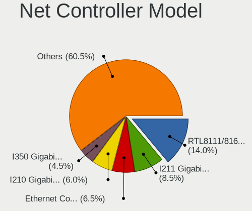
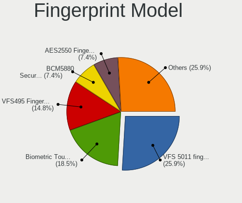

OPNsense - Tested Hardware & Statistics
---------------------------------------

A project to collect tested hardware configurations for OPNsense.

Anyone can contribute to this report by the [hw-probe](https://github.com/linuxhw/hw-probe/blob/master/INSTALL.BSD.md) tool:

    hw-probe -all -upload

Please contribute! Especially if your hardware is rare.

Contents
--------

* [ Test Cases ](#test-cases)

* [ System ](#system)
  - [ OS                       ](#os)
  - [ OS Family                ](#os-family)
  - [ Arch                     ](#arch)
  - [ DE                       ](#de)
  - [ Display Server           ](#display-server)
  - [ Display Manager          ](#display-manager)
  - [ OS Lang                  ](#os-lang)
  - [ Boot Mode                ](#boot-mode)
  - [ Filesystem               ](#filesystem)
  - [ Part. scheme             ](#part-scheme)

* [ Board ](#board)
  - [ Vendor                   ](#vendor)
  - [ Model                    ](#model)
  - [ Model Family             ](#model-family)
  - [ MFG Year                 ](#mfg-year)
  - [ Form Factor              ](#form-factor)
  - [ Coreboot                 ](#coreboot)
  - [ RAM Size                 ](#ram-size)
  - [ RAM Used                 ](#ram-used)
  - [ Total Drives             ](#total-drives)
  - [ Has CD-ROM               ](#has-cd-rom)
  - [ Has Ethernet             ](#has-ethernet)
  - [ Has WiFi                 ](#has-wifi)
  - [ Has Bluetooth            ](#has-bluetooth)

* [ Location ](#location)
  - [ Country                  ](#country)
  - [ City                     ](#city)

* [ Drives ](#drives)
  - [ Drive Vendor             ](#drive-vendor)
  - [ Drive Model              ](#drive-model)
  - [ HDD Vendor               ](#hdd-vendor)
  - [ SSD Vendor               ](#ssd-vendor)
  - [ Drive Kind               ](#drive-kind)
  - [ Drive Connector          ](#drive-connector)
  - [ Drive Size               ](#drive-size)
  - [ Space Total              ](#space-total)
  - [ Space Used               ](#space-used)
  - [ Malfunc. Drives          ](#malfunc-drives)
  - [ Malfunc. Drive Vendor    ](#malfunc-drive-vendor)
  - [ Malfunc. HDD Vendor      ](#malfunc-hdd-vendor)
  - [ Malfunc. Drive Kind      ](#malfunc-drive-kind)
  - [ Failed Drives            ](#failed-drives)
  - [ Failed Drive Vendor      ](#failed-drive-vendor)
  - [ Drive Status             ](#drive-status)

* [ Storage controller ](#storage-controller)
  - [ Storage Vendor           ](#storage-vendor)
  - [ Storage Model            ](#storage-model)
  - [ Storage Kind             ](#storage-kind)

* [ Processor ](#processor)
  - [ CPU Vendor               ](#cpu-vendor)
  - [ CPU Model                ](#cpu-model)
  - [ CPU Model Family         ](#cpu-model-family)
  - [ CPU Cores                ](#cpu-cores)
  - [ CPU Sockets              ](#cpu-sockets)
  - [ CPU Threads              ](#cpu-threads)
  - [ CPU Microarch            ](#cpu-microarch)

* [ Graphics ](#graphics)
  - [ GPU Vendor               ](#gpu-vendor)
  - [ GPU Model                ](#gpu-model)
  - [ GPU Combo                ](#gpu-combo)
  - [ GPU Driver               ](#gpu-driver)
  - [ GPU Memory               ](#gpu-memory)

* [ Monitor ](#monitor)
  - [ Monitor Vendor           ](#monitor-vendor)
  - [ Monitor Model            ](#monitor-model)
  - [ Monitor Resolution       ](#monitor-resolution)
  - [ Monitor Diagonal         ](#monitor-diagonal)
  - [ Monitor Width            ](#monitor-width)
  - [ Aspect Ratio             ](#aspect-ratio)
  - [ Monitor Area             ](#monitor-area)
  - [ Pixel Density            ](#pixel-density)
  - [ Multiple Monitors        ](#multiple-monitors)

* [ Network ](#network)
  - [ Net Controller Vendor    ](#net-controller-vendor)
  - [ Net Controller Model     ](#net-controller-model)
  - [ Wireless Vendor          ](#wireless-vendor)
  - [ Wireless Model           ](#wireless-model)
  - [ Ethernet Vendor          ](#ethernet-vendor)
  - [ Ethernet Model           ](#ethernet-model)
  - [ Net Controller Kind      ](#net-controller-kind)
  - [ Used Controller          ](#used-controller)
  - [ NICs                     ](#nics)
  - [ IPv6                     ](#ipv6)

* [ Bluetooth ](#bluetooth)
  - [ Bluetooth Vendor         ](#bluetooth-vendor)
  - [ Bluetooth Model          ](#bluetooth-model)

* [ Sound ](#sound)
  - [ Sound Vendor             ](#sound-vendor)
  - [ Sound Model              ](#sound-model)

* [ Memory ](#memory)
  - [ Memory Vendor            ](#memory-vendor)
  - [ Memory Model             ](#memory-model)
  - [ Memory Kind              ](#memory-kind)
  - [ Memory Form Factor       ](#memory-form-factor)
  - [ Memory Size              ](#memory-size)
  - [ Memory Speed             ](#memory-speed)

* [ Printers & scanners ](#printers--scanners)
  - [ Printer Vendor           ](#printer-vendor)
  - [ Printer Model            ](#printer-model)
  - [ Scanner Vendor           ](#scanner-vendor)
  - [ Scanner Model            ](#scanner-model)

* [ Camera ](#camera)
  - [ Camera Vendor            ](#camera-vendor)
  - [ Camera Model             ](#camera-model)

* [ Security ](#security)
  - [ Fingerprint Vendor       ](#fingerprint-vendor)
  - [ Fingerprint Model        ](#fingerprint-model)
  - [ Chipcard Vendor          ](#chipcard-vendor)
  - [ Chipcard Model           ](#chipcard-model)

* [ Unsupported ](#unsupported)
  - [ Unsupported Devices      ](#unsupported-devices)
  - [ Unsupported Device Types ](#unsupported-device-types)

Test Cases
----------

Total: 5916

| Vendor        | Model                       | Form-Factor | Probe                                                     | Date         |
|---------------|-----------------------------|-------------|-----------------------------------------------------------|--------------|
| Supermicro    | X10SDV-TP8F                 | Server      | [0b2d0398cd](https://bsd-hardware.info/?probe=0b2d0398cd) | Aug 01, 2022 |
| Intel         | H81U                        | Notebook    | [8f50dbe259](https://bsd-hardware.info/?probe=8f50dbe259) | Aug 01, 2022 |
| Protectli     | FW6 Ver                     | Desktop     | [b4745f3fbf](https://bsd-hardware.info/?probe=b4745f3fbf) | Aug 01, 2022 |
| Dell          | 0XHGV1 A00                  | Desktop     | [860b06cb6b](https://bsd-hardware.info/?probe=860b06cb6b) | Aug 01, 2022 |
| ASUSTek       | M5A78L-M/USB3               | Desktop     | [f2590dea4b](https://bsd-hardware.info/?probe=f2590dea4b) | Aug 01, 2022 |
| Gigabyte      | H610I DDR4                  | Desktop     | [d50ffab1cc](https://bsd-hardware.info/?probe=d50ffab1cc) | Aug 01, 2022 |
| ASUSTek       | P5W64 WS Pro                | Desktop     | [f05a901a30](https://bsd-hardware.info/?probe=f05a901a30) | Aug 01, 2022 |
| Dell          | 0GY6Y8 A03                  | Desktop     | [910403ba69](https://bsd-hardware.info/?probe=910403ba69) | Aug 01, 2022 |
| Dell          | 0GY6Y8 A03                  | Desktop     | [2257be098f](https://bsd-hardware.info/?probe=2257be098f) | Aug 01, 2022 |
| Cisco Syst... | UCSC-C240-M5SX 74-105773... | Server      | [b073195485](https://bsd-hardware.info/?probe=b073195485) | Aug 01, 2022 |
| Supermicro    | X10SLH-N6-ST031             | Server      | [7ba6844cb9](https://bsd-hardware.info/?probe=7ba6844cb9) | Jul 31, 2022 |
| HP            | 3397                        | Desktop     | [dac75fec6e](https://bsd-hardware.info/?probe=dac75fec6e) | Jul 31, 2022 |
| Protectli     | FW6                         | Desktop     | [b686fdf1c1](https://bsd-hardware.info/?probe=b686fdf1c1) | Jul 31, 2022 |
| Protectli     | FW4A Ver                    | Desktop     | [47bd308b5f](https://bsd-hardware.info/?probe=47bd308b5f) | Jul 31, 2022 |
| IP3 Tech      | IB2                         | Mini pc     | [9e304de7ad](https://bsd-hardware.info/?probe=9e304de7ad) | Jul 31, 2022 |
| Dell          | 05XGC8 A01                  | Desktop     | [0eaaa31106](https://bsd-hardware.info/?probe=0eaaa31106) | Jul 31, 2022 |
| Unknown       | Unknown                     | Notebook    | [3efcb47333](https://bsd-hardware.info/?probe=3efcb47333) | Jul 31, 2022 |
| HP            | 8055                        | Desktop     | [6a8a361dae](https://bsd-hardware.info/?probe=6a8a361dae) | Jul 31, 2022 |
| Unknown       | Unknown                     | Desktop     | [125a4a6501](https://bsd-hardware.info/?probe=125a4a6501) | Jul 31, 2022 |
| Dell          | 0TTDMJ A00                  | Desktop     | [900c62c2ba](https://bsd-hardware.info/?probe=900c62c2ba) | Jul 30, 2022 |
| ASRock        | X399 Professional Gaming    | Desktop     | [c17b2012a3](https://bsd-hardware.info/?probe=c17b2012a3) | Jul 30, 2022 |
| Dell          | 01V648 A03                  | Server      | [33aed2a5c1](https://bsd-hardware.info/?probe=33aed2a5c1) | Jul 30, 2022 |
| ASUSTek       | TUF Gaming Z590-PLUS        | Desktop     | [7c5137f2f8](https://bsd-hardware.info/?probe=7c5137f2f8) | Jul 30, 2022 |
| ASUSTek       | TUF Gaming Z590-PLUS        | Desktop     | [3f6e556a7c](https://bsd-hardware.info/?probe=3f6e556a7c) | Jul 30, 2022 |
| Dell          | 0RH817 A00                  | Server      | [7d7740d447](https://bsd-hardware.info/?probe=7d7740d447) | Jul 30, 2022 |
| ASUSTek       | CM6330_CM6630_CM6730_CM6... | Desktop     | [0887dc2e0e](https://bsd-hardware.info/?probe=0887dc2e0e) | Jul 30, 2022 |
| Unknown       | Unknown                     | Desktop     | [f891511390](https://bsd-hardware.info/?probe=f891511390) | Jul 30, 2022 |
| Unknown       | Unknown                     | Desktop     | [d6920a8af5](https://bsd-hardware.info/?probe=d6920a8af5) | Jul 30, 2022 |
| Lenovo        | SHARKBAY 0B98401 WIN        | Desktop     | [27b986a422](https://bsd-hardware.info/?probe=27b986a422) | Jul 30, 2022 |
| Dell          | 05GD68 A00                  | Desktop     | [4e108a3b49](https://bsd-hardware.info/?probe=4e108a3b49) | Jul 30, 2022 |
| Intel         | D54250WYK H13922-303        | Desktop     | [168056c169](https://bsd-hardware.info/?probe=168056c169) | Jul 30, 2022 |
| Intel         | Q3XXG4-P V1.0               | Desktop     | [d6a3d57165](https://bsd-hardware.info/?probe=d6a3d57165) | Jul 29, 2022 |
| WesternDig... | BBC 0001                    | Desktop     | [5673b5c8e8](https://bsd-hardware.info/?probe=5673b5c8e8) | Jul 29, 2022 |
| HP            | 18E7                        | Desktop     | [b483720843](https://bsd-hardware.info/?probe=b483720843) | Jul 29, 2022 |
| PC Engines    | APU2                        | Desktop     | [bb5d45a75d](https://bsd-hardware.info/?probe=bb5d45a75d) | Jul 29, 2022 |
| Deciso        | Netboard A10 GEN2 Model ... | Desktop     | [5c00da486d](https://bsd-hardware.info/?probe=5c00da486d) | Jul 29, 2022 |
| HP            | 213D A01                    | Desktop     | [c24cba449b](https://bsd-hardware.info/?probe=c24cba449b) | Jul 29, 2022 |
| Acer          | Veriton X275                | Desktop     | [8fdb6785a9](https://bsd-hardware.info/?probe=8fdb6785a9) | Jul 29, 2022 |
| AMD           | Inagua CRB                  | Desktop     | [0d0b0c3f9e](https://bsd-hardware.info/?probe=0d0b0c3f9e) | Jul 29, 2022 |
| HP            | 8055                        | Desktop     | [41d802a80a](https://bsd-hardware.info/?probe=41d802a80a) | Jul 29, 2022 |
| Gigabyte      | J4005ND2P-CF                | Desktop     | [2967d5275e](https://bsd-hardware.info/?probe=2967d5275e) | Jul 29, 2022 |
| AMD           | Larne CRB                   | Desktop     | [794541e833](https://bsd-hardware.info/?probe=794541e833) | Jul 29, 2022 |
| Gigabyte      | H310M S2H                   | Desktop     | [03d0919731](https://bsd-hardware.info/?probe=03d0919731) | Jul 29, 2022 |
| MW            | GMLK-2_5G4L                 | Desktop     | [69c0b0d218](https://bsd-hardware.info/?probe=69c0b0d218) | Jul 29, 2022 |
| Intel         | Q3XXG4-P V1.0               | Desktop     | [cd35c4b6ce](https://bsd-hardware.info/?probe=cd35c4b6ce) | Jul 29, 2022 |
| ASUSTek       | M5A97 PLUS                  | Desktop     | [7be6ba0021](https://bsd-hardware.info/?probe=7be6ba0021) | Jul 29, 2022 |
| AAEON         | MIX-TLUD1 V1.0              | Desktop     | [6b1ea56289](https://bsd-hardware.info/?probe=6b1ea56289) | Jul 29, 2022 |
| AWOW          | PC BOX                      | Mini pc     | [6cac72ef69](https://bsd-hardware.info/?probe=6cac72ef69) | Jul 28, 2022 |
| Unknown       | Unknown                     | Desktop     | [0b84314fbf](https://bsd-hardware.info/?probe=0b84314fbf) | Jul 28, 2022 |
| Wistron       | ProLiant ML110 G6           | Desktop     | [091fe7ca40](https://bsd-hardware.info/?probe=091fe7ca40) | Jul 28, 2022 |
| HP            | 82B4                        | Desktop     | [6c330371b3](https://bsd-hardware.info/?probe=6c330371b3) | Jul 28, 2022 |
| Unknown       | Unknown                     | Desktop     | [4e721b00d5](https://bsd-hardware.info/?probe=4e721b00d5) | Jul 28, 2022 |
| Intel         | SKYBAY                      | Desktop     | [c3bcf5c63d](https://bsd-hardware.info/?probe=c3bcf5c63d) | Jul 28, 2022 |
| Dell          | 0VHWTR A02                  | Desktop     | [eb7ac52c45](https://bsd-hardware.info/?probe=eb7ac52c45) | Jul 28, 2022 |
| HP            | 339A                        | Desktop     | [241e56a349](https://bsd-hardware.info/?probe=241e56a349) | Jul 27, 2022 |
| HP            | 18E9                        | Desktop     | [56460b095e](https://bsd-hardware.info/?probe=56460b095e) | Jul 27, 2022 |
| Biostar       | A10N-8800E                  | Desktop     | [fe4d305991](https://bsd-hardware.info/?probe=fe4d305991) | Jul 27, 2022 |
| Dell          | 0PC5F7 A03                  | Desktop     | [7cc4f8754f](https://bsd-hardware.info/?probe=7cc4f8754f) | Jul 27, 2022 |
| AMI           | Aptio CRB                   | Mini pc     | [fa1e69b519](https://bsd-hardware.info/?probe=fa1e69b519) | Jul 27, 2022 |
| HP            | 3397                        | Desktop     | [68eb683936](https://bsd-hardware.info/?probe=68eb683936) | Jul 27, 2022 |
| CNCTION-IA... | Unknown                     | Desktop     | [91165a8899](https://bsd-hardware.info/?probe=91165a8899) | Jul 27, 2022 |
| Protectli     | VP2410                      | Desktop     | [f9b42e4a75](https://bsd-hardware.info/?probe=f9b42e4a75) | Jul 27, 2022 |
| Protectli     | VP2410                      | Desktop     | [db66cc446e](https://bsd-hardware.info/?probe=db66cc446e) | Jul 27, 2022 |
| Supermicro    | X11SDV-4C-TP8F              | Desktop     | [d7b0e73f03](https://bsd-hardware.info/?probe=d7b0e73f03) | Jul 27, 2022 |
| Unknown       | Unknown                     | Firewall    | [15c779bfe1](https://bsd-hardware.info/?probe=15c779bfe1) | Jul 27, 2022 |
| Dell          | 0T7D40 A01                  | Desktop     | [3db94efbf6](https://bsd-hardware.info/?probe=3db94efbf6) | Jul 27, 2022 |
| Supermicro    | X10SLH-N6-ST031             | Server      | [9597e7c0cc](https://bsd-hardware.info/?probe=9597e7c0cc) | Jul 27, 2022 |
| ASUSTek       | M5A78L-M/USB3               | Desktop     | [9df3c644b9](https://bsd-hardware.info/?probe=9df3c644b9) | Jul 27, 2022 |
| Dell          | 0M877N A02                  | Server      | [c1623d6f23](https://bsd-hardware.info/?probe=c1623d6f23) | Jul 26, 2022 |
| AMI           | Aptio CRB                   | Mini pc     | [ee70a58bd6](https://bsd-hardware.info/?probe=ee70a58bd6) | Jul 26, 2022 |
| Unknown       | X79-P3                      | Desktop     | [32ed0bcfa9](https://bsd-hardware.info/?probe=32ed0bcfa9) | Jul 26, 2022 |
| HP            | 18E7                        | Desktop     | [0d18e24e2e](https://bsd-hardware.info/?probe=0d18e24e2e) | Jul 26, 2022 |
| Gigabyte      | Z87M-D3H                    | Desktop     | [59ae6fc283](https://bsd-hardware.info/?probe=59ae6fc283) | Jul 26, 2022 |
| MW            | GMLK-2_5G4L                 | Desktop     | [fd67eb14ae](https://bsd-hardware.info/?probe=fd67eb14ae) | Jul 26, 2022 |
| Dell          | 07F37C A01                  | Desktop     | [dfea879cdc](https://bsd-hardware.info/?probe=dfea879cdc) | Jul 26, 2022 |
| AMI           | Aptio CRB                   | Mini pc     | [d32a6452bb](https://bsd-hardware.info/?probe=d32a6452bb) | Jul 25, 2022 |
| ASUSTek       | M5A78L-M LX PLUS            | Desktop     | [9b3459c1ec](https://bsd-hardware.info/?probe=9b3459c1ec) | Jul 25, 2022 |
| Shuttle       | FS310                       | Desktop     | [4dd7894e83](https://bsd-hardware.info/?probe=4dd7894e83) | Jul 25, 2022 |
| Deciso        | Netboard A10                | Desktop     | [3f548f31e3](https://bsd-hardware.info/?probe=3f548f31e3) | Jul 25, 2022 |
| ZOTAC         | Unknown                     | Desktop     | [2f701b55fc](https://bsd-hardware.info/?probe=2f701b55fc) | Jul 25, 2022 |
| Protectli     | FW4B Ver                    | Desktop     | [b33527f3ee](https://bsd-hardware.info/?probe=b33527f3ee) | Jul 25, 2022 |
| Sophos        | SG                          | Firewall    | [8e461fa0e9](https://bsd-hardware.info/?probe=8e461fa0e9) | Jul 24, 2022 |
| AMI           | Aptio CRB                   | Mini pc     | [9760548ad1](https://bsd-hardware.info/?probe=9760548ad1) | Jul 24, 2022 |
| Supermicro    | X10SLH-N6-ST031             | Server      | [bf4826f24c](https://bsd-hardware.info/?probe=bf4826f24c) | Jul 24, 2022 |
| Acer          | Aspire XC-830               | Desktop     | [84cfd4b073](https://bsd-hardware.info/?probe=84cfd4b073) | Jul 24, 2022 |
| AAEON         | FWS-2350 V1.0               | Desktop     | [e16dd36daf](https://bsd-hardware.info/?probe=e16dd36daf) | Jul 24, 2022 |
| Unknown       | Unknown                     | Desktop     | [8830b5ba19](https://bsd-hardware.info/?probe=8830b5ba19) | Jul 24, 2022 |
| Dell          | 04Y8V0 A02                  | Desktop     | [4ab59b9029](https://bsd-hardware.info/?probe=4ab59b9029) | Jul 24, 2022 |
| Intel         | Q3XXG4-P V1.0               | Desktop     | [6daa6d0060](https://bsd-hardware.info/?probe=6daa6d0060) | Jul 24, 2022 |
| ASRock        | J3455B-ITX                  | Desktop     | [37ce098399](https://bsd-hardware.info/?probe=37ce098399) | Jul 23, 2022 |
| Sophos        | UTM                         | Firewall    | [4ba42eb6db](https://bsd-hardware.info/?probe=4ba42eb6db) | Jul 23, 2022 |
| ASUSTek       | TUF Gaming Z590-PLUS        | Desktop     | [b392e9fcc9](https://bsd-hardware.info/?probe=b392e9fcc9) | Jul 23, 2022 |
| Positivo      | POS-EINM70CS SIM            | Desktop     | [0b29806790](https://bsd-hardware.info/?probe=0b29806790) | Jul 23, 2022 |
| AWOW          | AK34Pro                     | Mini pc     | [dc862477ff](https://bsd-hardware.info/?probe=dc862477ff) | Jul 23, 2022 |
| HP            | 8103 A01                    | Mini pc     | [17be7e6c35](https://bsd-hardware.info/?probe=17be7e6c35) | Jul 23, 2022 |
| HP            | 213D A01                    | Desktop     | [26c8ae3969](https://bsd-hardware.info/?probe=26c8ae3969) | Jul 22, 2022 |
| Dell          | 0G7WYD A01                  | Server      | [81586f6d39](https://bsd-hardware.info/?probe=81586f6d39) | Jul 22, 2022 |
| Dell          | 0G7WYD A01                  | Server      | [ce43e9f067](https://bsd-hardware.info/?probe=ce43e9f067) | Jul 22, 2022 |
| Protectli     | FW4B Ver                    | Desktop     | [224d08a214](https://bsd-hardware.info/?probe=224d08a214) | Jul 22, 2022 |
| Supermicro    | X10SLH-N6-ST031             | Server      | [0bf33c9e69](https://bsd-hardware.info/?probe=0bf33c9e69) | Jul 22, 2022 |
| Intel         | DH77KC AAG39641-400         | Desktop     | [df31840a7e](https://bsd-hardware.info/?probe=df31840a7e) | Jul 22, 2022 |
| Lenovo        | 312D SDK0J40697 WIN 3305... | Mini pc     | [59c576a4ba](https://bsd-hardware.info/?probe=59c576a4ba) | Jul 22, 2022 |
| MW            | GMLK-2_5G4L                 | Desktop     | [3fe3a46a7a](https://bsd-hardware.info/?probe=3fe3a46a7a) | Jul 21, 2022 |
| ASRock        | N68-S3 UCC                  | Desktop     | [e503017a9f](https://bsd-hardware.info/?probe=e503017a9f) | Jul 21, 2022 |
| HP            | 82A2                        | Desktop     | [7ec5ec44a5](https://bsd-hardware.info/?probe=7ec5ec44a5) | Jul 21, 2022 |
| Dell          | 08VT7V A05                  | Server      | [681d1997eb](https://bsd-hardware.info/?probe=681d1997eb) | Jul 21, 2022 |
| Intel         | CRESCENTBAY                 | Desktop     | [8f910e599b](https://bsd-hardware.info/?probe=8f910e599b) | Jul 21, 2022 |
| ZOTAC         | ZBOX-CI329NANO              | Mini pc     | [b84f2ef8de](https://bsd-hardware.info/?probe=b84f2ef8de) | Jul 21, 2022 |
| ASRock        | A520M-ITX/ac                | Desktop     | [48854ed05e](https://bsd-hardware.info/?probe=48854ed05e) | Jul 21, 2022 |
| HP            | 3397                        | Desktop     | [73c621b9ad](https://bsd-hardware.info/?probe=73c621b9ad) | Jul 21, 2022 |
| Dell          | 0GDG8Y A02                  | Desktop     | [2f163e2a05](https://bsd-hardware.info/?probe=2f163e2a05) | Jul 21, 2022 |
| Protectli     | FW6                         | Desktop     | [5a13dd0c28](https://bsd-hardware.info/?probe=5a13dd0c28) | Jul 21, 2022 |
| Supermicro    | X10SLH-N6-ST031             | Server      | [7dfb067d40](https://bsd-hardware.info/?probe=7dfb067d40) | Jul 21, 2022 |
| Gigabyte      | Z87X-UD5H-CF                | Desktop     | [70c9122b95](https://bsd-hardware.info/?probe=70c9122b95) | Jul 20, 2022 |
| Sophos        | XG                          | Firewall    | [3f4d847974](https://bsd-hardware.info/?probe=3f4d847974) | Jul 20, 2022 |
| Lenovo        | SHARKBAY NOK                | Desktop     | [1ed99ad502](https://bsd-hardware.info/?probe=1ed99ad502) | Jul 20, 2022 |
| Unknown       | YL-E3854L4-V2               | Desktop     | [cd601ead3a](https://bsd-hardware.info/?probe=cd601ead3a) | Jul 20, 2022 |
| Dell          | 0T7D40 A00                  | Desktop     | [3d5e83cf1a](https://bsd-hardware.info/?probe=3d5e83cf1a) | Jul 20, 2022 |
| Biostar       | J4105NHU                    | Desktop     | [1b6748d4f7](https://bsd-hardware.info/?probe=1b6748d4f7) | Jul 19, 2022 |
| ASUSTek       | P5KPL-AM-CKD-VISUM-SI       | Desktop     | [f88fa027ab](https://bsd-hardware.info/?probe=f88fa027ab) | Jul 19, 2022 |
| HP            | 1998                        | Desktop     | [29c6e37b1a](https://bsd-hardware.info/?probe=29c6e37b1a) | Jul 19, 2022 |
| AWOW          | PC BOX                      | Mini pc     | [7ca3d2715c](https://bsd-hardware.info/?probe=7ca3d2715c) | Jul 19, 2022 |
| Gigabyte      | J1900N-D3V                  | Desktop     | [17aa06f41f](https://bsd-hardware.info/?probe=17aa06f41f) | Jul 18, 2022 |
| HP            | 82B4                        | Desktop     | [f8d2f26c54](https://bsd-hardware.info/?probe=f8d2f26c54) | Jul 18, 2022 |
| Dell          | 0T7D40 A00                  | Desktop     | [2aef6b2ab4](https://bsd-hardware.info/?probe=2aef6b2ab4) | Jul 18, 2022 |
| ASRock        | H570M-ITX/ac                | Desktop     | [4b0bdf58dd](https://bsd-hardware.info/?probe=4b0bdf58dd) | Jul 18, 2022 |
| Intel         | CRESCENTBAY                 | Desktop     | [aba61c0cd6](https://bsd-hardware.info/?probe=aba61c0cd6) | Jul 18, 2022 |
| Unknown       | X79-P3                      | Desktop     | [ae58265601](https://bsd-hardware.info/?probe=ae58265601) | Jul 18, 2022 |
| Fujitsu       | D3313-A1 S26361-D3313-A1    | Desktop     | [e3655742ba](https://bsd-hardware.info/?probe=e3655742ba) | Jul 18, 2022 |
| Lenovo        | SHARKBAY SDK0E50510 WIN     | Desktop     | [4b9e0bb7bb](https://bsd-hardware.info/?probe=4b9e0bb7bb) | Jul 18, 2022 |
| Protectli     | FW4B                        | Desktop     | [b1ac4ad0dd](https://bsd-hardware.info/?probe=b1ac4ad0dd) | Jul 18, 2022 |
| Fujitsu       | D3313-A1 S26361-D3313-A1    | Desktop     | [af1e80d15d](https://bsd-hardware.info/?probe=af1e80d15d) | Jul 18, 2022 |
| Deciso        | Netboard A20                | Notebook    | [2bc988b18a](https://bsd-hardware.info/?probe=2bc988b18a) | Jul 18, 2022 |
| Protectli     | FW6 Ver                     | Desktop     | [e4e89253c3](https://bsd-hardware.info/?probe=e4e89253c3) | Jul 17, 2022 |
| Deciso        | Netboard A20                | Notebook    | [a4be4171b6](https://bsd-hardware.info/?probe=a4be4171b6) | Jul 17, 2022 |
| PC Engines    | APU2                        | Desktop     | [c84cb618c0](https://bsd-hardware.info/?probe=c84cb618c0) | Jul 17, 2022 |
| Supermicro    | A2SAP-HA                    | Desktop     | [27c6228555](https://bsd-hardware.info/?probe=27c6228555) | Jul 17, 2022 |
| Lenovo        | 361A SDK0J40700 WIN 3258... | Desktop     | [8671985fad](https://bsd-hardware.info/?probe=8671985fad) | Jul 17, 2022 |
| YANYU         | H87SL VER:1.3               | Desktop     | [fda62409ee](https://bsd-hardware.info/?probe=fda62409ee) | Jul 17, 2022 |
| Dell          | 04Y8V0 A02                  | Desktop     | [5bba9aafa1](https://bsd-hardware.info/?probe=5bba9aafa1) | Jul 17, 2022 |
| MW            | GMLK-2_5G4L                 | Desktop     | [57da61c80c](https://bsd-hardware.info/?probe=57da61c80c) | Jul 17, 2022 |
| Intel         | Q3XXG4-P V1.0               | Desktop     | [bbca74a96f](https://bsd-hardware.info/?probe=bbca74a96f) | Jul 16, 2022 |
| Supermicro    | X10SLH-N6-ST031             | Server      | [23f1880e42](https://bsd-hardware.info/?probe=23f1880e42) | Jul 16, 2022 |
| Lenovo        | ThinkCentre M91 4518E4U     | Desktop     | [8dd1034cfa](https://bsd-hardware.info/?probe=8dd1034cfa) | Jul 16, 2022 |
| AMI           | Aptio CRB                   | Mini pc     | [9943585bfa](https://bsd-hardware.info/?probe=9943585bfa) | Jul 16, 2022 |
| HP            | 1589                        | Desktop     | [3f9d19b372](https://bsd-hardware.info/?probe=3f9d19b372) | Jul 16, 2022 |
| HP            | 3397                        | Desktop     | [d0bb5fe63f](https://bsd-hardware.info/?probe=d0bb5fe63f) | Jul 16, 2022 |
| Dell          | 0WR7PY A03                  | Desktop     | [d301b852df](https://bsd-hardware.info/?probe=d301b852df) | Jul 15, 2022 |
| PC Engines    | apu4                        | Desktop     | [4e24f7aa5b](https://bsd-hardware.info/?probe=4e24f7aa5b) | Jul 15, 2022 |
| Dell          | 051FJ8 A02                  | Desktop     | [39de8d3c92](https://bsd-hardware.info/?probe=39de8d3c92) | Jul 15, 2022 |
| Intel         | Q3XXG4-P V1.0               | Desktop     | [e294973f12](https://bsd-hardware.info/?probe=e294973f12) | Jul 15, 2022 |
| PC Engines    | APU3                        | Desktop     | [2b20f47024](https://bsd-hardware.info/?probe=2b20f47024) | Jul 15, 2022 |
| AWOW          | PC BOX                      | Mini pc     | [7530b2fc5f](https://bsd-hardware.info/?probe=7530b2fc5f) | Jul 15, 2022 |
| Unknown       | Unknown                     | Desktop     | [1058650b8e](https://bsd-hardware.info/?probe=1058650b8e) | Jul 15, 2022 |
| Unknown       | Unknown                     | Desktop     | [e4795fcc70](https://bsd-hardware.info/?probe=e4795fcc70) | Jul 15, 2022 |
| Gigabyte      | C847N                       | Desktop     | [4be8944950](https://bsd-hardware.info/?probe=4be8944950) | Jul 15, 2022 |
| HP            | ProLiant DL380 G7           | Server      | [9c6f76056f](https://bsd-hardware.info/?probe=9c6f76056f) | Jul 15, 2022 |
| Dell          | 0DVNTK A00                  | Mini pc     | [747bebe8d4](https://bsd-hardware.info/?probe=747bebe8d4) | Jul 14, 2022 |
| PC Engines    | APU2                        | Desktop     | [7d3a1f2825](https://bsd-hardware.info/?probe=7d3a1f2825) | Jul 14, 2022 |
| PC Engines    | APU2                        | Desktop     | [0dd60aeb9a](https://bsd-hardware.info/?probe=0dd60aeb9a) | Jul 14, 2022 |
| CompuLab      | fitlet2                     | Mini pc     | [f087f83248](https://bsd-hardware.info/?probe=f087f83248) | Jul 14, 2022 |
| Intel         | Q3XXG4-P V1.0               | Desktop     | [9e54e446ef](https://bsd-hardware.info/?probe=9e54e446ef) | Jul 14, 2022 |
| ASUSTek       | PRIME H310M-K R2.0          | Desktop     | [87d68034db](https://bsd-hardware.info/?probe=87d68034db) | Jul 14, 2022 |
| AZW           | Green G1                    | Desktop     | [9a2120ae5a](https://bsd-hardware.info/?probe=9a2120ae5a) | Jul 14, 2022 |
| Dell          | 02C2CP A04                  | Server      | [3c3ab6b2c6](https://bsd-hardware.info/?probe=3c3ab6b2c6) | Jul 14, 2022 |
| Dell          | 06D7TR A00                  | Desktop     | [e567cc10e7](https://bsd-hardware.info/?probe=e567cc10e7) | Jul 14, 2022 |
| Fujitsu       | D3313-G1 S26361-D3313-G1    | Desktop     | [2a52f27ffe](https://bsd-hardware.info/?probe=2a52f27ffe) | Jul 13, 2022 |
| MW            | GMLK-2_5G4L                 | Desktop     | [300b7cfcb6](https://bsd-hardware.info/?probe=300b7cfcb6) | Jul 13, 2022 |
| ASRock        | A520M-ITX/ac                | Desktop     | [be86d81d29](https://bsd-hardware.info/?probe=be86d81d29) | Jul 13, 2022 |
| AWOW          | PC BOX                      | Mini pc     | [6a372482ec](https://bsd-hardware.info/?probe=6a372482ec) | Jul 13, 2022 |
| Acer          | Revo 70                     | Desktop     | [aad484a882](https://bsd-hardware.info/?probe=aad484a882) | Jul 13, 2022 |
| Acer          | Revo 70                     | Desktop     | [c8b51a94bd](https://bsd-hardware.info/?probe=c8b51a94bd) | Jul 13, 2022 |
| Deciso        | OPNsense Appliance          | Notebook    | [05fb88304d](https://bsd-hardware.info/?probe=05fb88304d) | Jul 13, 2022 |
| Supermicro    | A1SRi-2558F                 | Mini pc     | [698d59d94e](https://bsd-hardware.info/?probe=698d59d94e) | Jul 13, 2022 |
| Protectli     | VP2410 10                   | Desktop     | [ffb2821bab](https://bsd-hardware.info/?probe=ffb2821bab) | Jul 13, 2022 |
| Dell          | 01G5C3 A02                  | Server      | [ca50b43cb8](https://bsd-hardware.info/?probe=ca50b43cb8) | Jul 13, 2022 |
| Deciso        | Netboard A20                | Notebook    | [743b330db3](https://bsd-hardware.info/?probe=743b330db3) | Jul 12, 2022 |
| Supermicro    | X11SDV-4C-TP8F              | Desktop     | [3f5548c246](https://bsd-hardware.info/?probe=3f5548c246) | Jul 12, 2022 |
| ASRock        | X570 PG Velocita            | Desktop     | [ceb7ed4c1e](https://bsd-hardware.info/?probe=ceb7ed4c1e) | Jul 12, 2022 |
| Kraftway      | KWH77                       | Desktop     | [c34f44a495](https://bsd-hardware.info/?probe=c34f44a495) | Jul 12, 2022 |
| AZW           | GK55                        | Desktop     | [40d9df6faa](https://bsd-hardware.info/?probe=40d9df6faa) | Jul 12, 2022 |
| PC Engines    | APU2                        | Desktop     | [57b035462a](https://bsd-hardware.info/?probe=57b035462a) | Jul 12, 2022 |
| ASRock        | Z97 Professional            | Desktop     | [c1c177fbb0](https://bsd-hardware.info/?probe=c1c177fbb0) | Jul 12, 2022 |
| Protectli     | FW2 Ver                     | Desktop     | [89ba2534c0](https://bsd-hardware.info/?probe=89ba2534c0) | Jul 12, 2022 |
| Dell          | 01G5C3 A02                  | Server      | [266891233d](https://bsd-hardware.info/?probe=266891233d) | Jul 11, 2022 |
| Unknown       | Unknown                     | Desktop     | [322ee9f1c9](https://bsd-hardware.info/?probe=322ee9f1c9) | Jul 11, 2022 |
| SmbiosType... | SmbiosType2_BoardProduct... | Desktop     | [eee15ff905](https://bsd-hardware.info/?probe=eee15ff905) | Jul 11, 2022 |
| Unknown       | Unknown                     | Desktop     | [abf18d0628](https://bsd-hardware.info/?probe=abf18d0628) | Jul 11, 2022 |
| Protectli     | FW6 Ver                     | Desktop     | [0ff1996217](https://bsd-hardware.info/?probe=0ff1996217) | Jul 11, 2022 |
| Intel         | Q3XXG4-P V1.0               | Desktop     | [ce9c6efd80](https://bsd-hardware.info/?probe=ce9c6efd80) | Jul 11, 2022 |
| HP            | 1790                        | Desktop     | [bc5988d764](https://bsd-hardware.info/?probe=bc5988d764) | Jul 11, 2022 |
| Unknown       | X79-P3                      | Desktop     | [b4f18ad479](https://bsd-hardware.info/?probe=b4f18ad479) | Jul 11, 2022 |
| Biostar       | H61MHV2                     | Desktop     | [58a61e6171](https://bsd-hardware.info/?probe=58a61e6171) | Jul 11, 2022 |
| HP            | 1495                        | Desktop     | [7ed22254af](https://bsd-hardware.info/?probe=7ed22254af) | Jul 11, 2022 |
| HP            | 1495                        | Desktop     | [1bf0dc0f98](https://bsd-hardware.info/?probe=1bf0dc0f98) | Jul 11, 2022 |
| Techvision    | TVI7309X B0                 | Desktop     | [b2aa5f61e2](https://bsd-hardware.info/?probe=b2aa5f61e2) | Jul 11, 2022 |
| Supermicro    | X10SBAB                     | Server      | [1bf38a759a](https://bsd-hardware.info/?probe=1bf38a759a) | Jul 10, 2022 |
| Intel         | S1200KP AAG34877-201        | Desktop     | [d43e397f02](https://bsd-hardware.info/?probe=d43e397f02) | Jul 10, 2022 |
| Gigabyte      | C1037UN-EU                  | Desktop     | [3644f56368](https://bsd-hardware.info/?probe=3644f56368) | Jul 10, 2022 |
| AMI           | Aptio CRB                   | Mini pc     | [bd1a86e875](https://bsd-hardware.info/?probe=bd1a86e875) | Jul 10, 2022 |
| NF541         | 1.0                         | Desktop     | [00cab93f40](https://bsd-hardware.info/?probe=00cab93f40) | Jul 10, 2022 |
| ASRock        | X399 Professional Gaming    | Desktop     | [3863f0dbdb](https://bsd-hardware.info/?probe=3863f0dbdb) | Jul 10, 2022 |
| Protectli     | FW6                         | Desktop     | [cf0a97896f](https://bsd-hardware.info/?probe=cf0a97896f) | Jul 10, 2022 |
| Unknown       | X79-P3                      | Desktop     | [eec1480bc7](https://bsd-hardware.info/?probe=eec1480bc7) | Jul 10, 2022 |
| Intel         | Q3XXG4-P V1.0               | Desktop     | [f9226218a0](https://bsd-hardware.info/?probe=f9226218a0) | Jul 09, 2022 |
| Fujitsu       | D3373-A1 S26361-D3373-A1... | Server      | [24732585a7](https://bsd-hardware.info/?probe=24732585a7) | Jul 09, 2022 |
| Supermicro    | X10SLH-N6-ST031             | Server      | [202827c443](https://bsd-hardware.info/?probe=202827c443) | Jul 09, 2022 |
| Unknown       | Unknown                     | Desktop     | [e42f50fe0f](https://bsd-hardware.info/?probe=e42f50fe0f) | Jul 09, 2022 |
| Unknown       | Unknown                     | Desktop     | [b0380fb22c](https://bsd-hardware.info/?probe=b0380fb22c) | Jul 09, 2022 |
| Unknown       | Unknown                     | Notebook    | [4ac86f5979](https://bsd-hardware.info/?probe=4ac86f5979) | Jul 09, 2022 |
| Fujitsu       | D3041-A1 S26361-D3041-A1    | Desktop     | [d3aba12432](https://bsd-hardware.info/?probe=d3aba12432) | Jul 09, 2022 |
| Supermicro    | X11SBA-LN4F                 | Desktop     | [fc85312fc7](https://bsd-hardware.info/?probe=fc85312fc7) | Jul 08, 2022 |
| Dell          | 05GD68 A00                  | Desktop     | [3c9057ab65](https://bsd-hardware.info/?probe=3c9057ab65) | Jul 08, 2022 |
| ASRock        | X399 Professional Gaming    | Desktop     | [12f349a02b](https://bsd-hardware.info/?probe=12f349a02b) | Jul 08, 2022 |
| Datto         | SSD                         | Desktop     | [639d28d449](https://bsd-hardware.info/?probe=639d28d449) | Jul 08, 2022 |
| Biostar       | H61MHV2                     | Desktop     | [2aa5e2a62d](https://bsd-hardware.info/?probe=2aa5e2a62d) | Jul 08, 2022 |
| Biostar       | A68N-5600E                  | Desktop     | [279925956f](https://bsd-hardware.info/?probe=279925956f) | Jul 08, 2022 |
| Supermicro    | X11SCH-F                    | Server      | [1ad1a2496b](https://bsd-hardware.info/?probe=1ad1a2496b) | Jul 08, 2022 |
| Dell          | 01TJ2K A02                  | Desktop     | [467070c750](https://bsd-hardware.info/?probe=467070c750) | Jul 08, 2022 |
| Lenovo        | SHARKBAY NOK                | Desktop     | [f68c3695ea](https://bsd-hardware.info/?probe=f68c3695ea) | Jul 08, 2022 |
| Intel         | CRESCENTBAY                 | Desktop     | [e7d923f138](https://bsd-hardware.info/?probe=e7d923f138) | Jul 07, 2022 |
| Protectli     | VP2410                      | Desktop     | [e5c8ed1549](https://bsd-hardware.info/?probe=e5c8ed1549) | Jul 07, 2022 |
| Shuttle       | DS437                       | Notebook    | [d7b076918a](https://bsd-hardware.info/?probe=d7b076918a) | Jul 07, 2022 |
| Shuttle       | DS437                       | Notebook    | [9fe84a8c9d](https://bsd-hardware.info/?probe=9fe84a8c9d) | Jul 07, 2022 |
| Supermicro    | X11SCH-LN4F                 | Server      | [db74ee9bf8](https://bsd-hardware.info/?probe=db74ee9bf8) | Jul 07, 2022 |
| ASRock        | B75M R2.0                   | Desktop     | [6011c70ca4](https://bsd-hardware.info/?probe=6011c70ca4) | Jul 07, 2022 |
| AWOW          | PC BOX                      | Mini pc     | [a945073364](https://bsd-hardware.info/?probe=a945073364) | Jul 07, 2022 |
| Deciso        | Netboard A20                | Notebook    | [c70ba0979e](https://bsd-hardware.info/?probe=c70ba0979e) | Jul 07, 2022 |
| Unknown       | YL-E3854L4-V2               | Desktop     | [1326524180](https://bsd-hardware.info/?probe=1326524180) | Jul 07, 2022 |
| Protectli     | FW6                         | Desktop     | [e82838534b](https://bsd-hardware.info/?probe=e82838534b) | Jul 06, 2022 |
| Supermicro    | X10SLH-N6-ST031             | Server      | [9e17b85d9b](https://bsd-hardware.info/?probe=9e17b85d9b) | Jul 06, 2022 |
| Intel         | ChiefRiver                  | Desktop     | [23eedfee28](https://bsd-hardware.info/?probe=23eedfee28) | Jul 06, 2022 |
| Techvision    | TVI7309X B0                 | Desktop     | [12279c8a4b](https://bsd-hardware.info/?probe=12279c8a4b) | Jul 06, 2022 |
| Intel         | CRESCENTBAY                 | Desktop     | [71efa2b0b9](https://bsd-hardware.info/?probe=71efa2b0b9) | Jul 06, 2022 |
| MiTAC         | PH11CMI                     | Desktop     | [9111d63b0a](https://bsd-hardware.info/?probe=9111d63b0a) | Jul 06, 2022 |
| ASRock        | X570 PG Velocita            | Desktop     | [08359c2723](https://bsd-hardware.info/?probe=08359c2723) | Jul 06, 2022 |
| Nitrokey      | NitroWall                   | Desktop     | [d0977e606e](https://bsd-hardware.info/?probe=d0977e606e) | Jul 05, 2022 |
| ASUSTek       | H110I-PLUS                  | Desktop     | [342ef61cdc](https://bsd-hardware.info/?probe=342ef61cdc) | Jul 05, 2022 |
| Techvision    | TVI7309X B0                 | Desktop     | [19a4b27ae7](https://bsd-hardware.info/?probe=19a4b27ae7) | Jul 05, 2022 |
| Protectli     | VP2410 10                   | Desktop     | [bc786895e5](https://bsd-hardware.info/?probe=bc786895e5) | Jul 05, 2022 |
| Dell          | 02YYK5 A00                  | Desktop     | [fb2e5bec61](https://bsd-hardware.info/?probe=fb2e5bec61) | Jul 05, 2022 |
| Pegatron      | 2AB5                        | Desktop     | [d48d3e4777](https://bsd-hardware.info/?probe=d48d3e4777) | Jul 05, 2022 |
| Deciso        | Netboard A10 GEN2 Model ... | Desktop     | [bfbac4efa5](https://bsd-hardware.info/?probe=bfbac4efa5) | Jul 05, 2022 |
| Dell          | 02YYK5 A00                  | Desktop     | [629de6cdb6](https://bsd-hardware.info/?probe=629de6cdb6) | Jul 05, 2022 |
| ASRock        | H370M-ITX/ac                | Desktop     | [ebc1f9cbf1](https://bsd-hardware.info/?probe=ebc1f9cbf1) | Jul 05, 2022 |
| MSI           | B550M PRO-VDH WIFI          | Desktop     | [5116ea39c1](https://bsd-hardware.info/?probe=5116ea39c1) | Jul 05, 2022 |
| Protectli     | FW6E                        | Desktop     | [efa044fab5](https://bsd-hardware.info/?probe=efa044fab5) | Jul 05, 2022 |
| Supermicro    | X11SDV-4C-TP8F              | Server      | [eb4105a1ba](https://bsd-hardware.info/?probe=eb4105a1ba) | Jul 05, 2022 |
| Supermicro    | X11SSV-M4                   | Desktop     | [444d9ed75e](https://bsd-hardware.info/?probe=444d9ed75e) | Jul 04, 2022 |
| Fujitsu       | D3313-G1 S26361-D3313-G1    | Desktop     | [ea22a644f6](https://bsd-hardware.info/?probe=ea22a644f6) | Jul 04, 2022 |
| Dell          | 042P49 A01                  | Desktop     | [85404f4f29](https://bsd-hardware.info/?probe=85404f4f29) | Jul 04, 2022 |
| ASUSTek       | ROG STRIX B450-F GAMING     | Desktop     | [041ad7f035](https://bsd-hardware.info/?probe=041ad7f035) | Jul 04, 2022 |
| Secudos       | Unknown                     | Desktop     | [beaf8ea459](https://bsd-hardware.info/?probe=beaf8ea459) | Jul 04, 2022 |
| ASRock        | H370M-ITX/ac                | Desktop     | [ce09ce2aa9](https://bsd-hardware.info/?probe=ce09ce2aa9) | Jul 04, 2022 |
| HP            | 1497                        | Desktop     | [3a45de000a](https://bsd-hardware.info/?probe=3a45de000a) | Jul 04, 2022 |
| NF541S        | 1.0                         | Desktop     | [937fe3af39](https://bsd-hardware.info/?probe=937fe3af39) | Jul 04, 2022 |
| Deciso        | NetBoard-A10                | Notebook    | [681bb27fbc](https://bsd-hardware.info/?probe=681bb27fbc) | Jul 04, 2022 |
| Secudos       | Unknown                     | Desktop     | [e54c622459](https://bsd-hardware.info/?probe=e54c622459) | Jul 04, 2022 |
| Fujitsu       | D3009-B1 S26361-D3009-B1    | Desktop     | [c8a69b3805](https://bsd-hardware.info/?probe=c8a69b3805) | Jul 04, 2022 |
| Dell          | 00V62H A00                  | Desktop     | [d62eedba12](https://bsd-hardware.info/?probe=d62eedba12) | Jul 04, 2022 |
| Dell          | 01TJ2K A02                  | Desktop     | [b9037d1fb0](https://bsd-hardware.info/?probe=b9037d1fb0) | Jul 04, 2022 |
| Fujitsu       | D3313-E1 S26361-D3313-E1    | Desktop     | [f261de9b25](https://bsd-hardware.info/?probe=f261de9b25) | Jul 03, 2022 |
| AWOW          | PC BOX                      | Mini pc     | [34ada293b1](https://bsd-hardware.info/?probe=34ada293b1) | Jul 03, 2022 |
| HP            | 213D A01                    | Desktop     | [0f58ab215e](https://bsd-hardware.info/?probe=0f58ab215e) | Jul 03, 2022 |
| Sophos        | SG                          | Firewall    | [d293fb6146](https://bsd-hardware.info/?probe=d293fb6146) | Jul 03, 2022 |
| ASUSTek       | ROG STRIX B550-E GAMING     | Desktop     | [0f36e9b5a4](https://bsd-hardware.info/?probe=0f36e9b5a4) | Jul 03, 2022 |
| Sophos        | SG                          | Firewall    | [13a5a5972e](https://bsd-hardware.info/?probe=13a5a5972e) | Jul 03, 2022 |
| ASRock        | H310CM-DVS                  | Desktop     | [907e22dbb6](https://bsd-hardware.info/?probe=907e22dbb6) | Jul 03, 2022 |
| HP            | 843F                        | Desktop     | [30700c4158](https://bsd-hardware.info/?probe=30700c4158) | Jul 03, 2022 |
| Intel         | Q3XXG4-P V1.0               | Desktop     | [720d51613e](https://bsd-hardware.info/?probe=720d51613e) | Jul 03, 2022 |
| HP            | ProLiant DL20 Gen9          | Server      | [f82d95a462](https://bsd-hardware.info/?probe=f82d95a462) | Jul 03, 2022 |
| Unknown       | Unknown                     | Desktop     | [5b79558a40](https://bsd-hardware.info/?probe=5b79558a40) | Jul 03, 2022 |
| Protectli     | FW4B                        | Desktop     | [c4e6db8739](https://bsd-hardware.info/?probe=c4e6db8739) | Jul 03, 2022 |
| Fujitsu       | D3313-A1 S26361-D3313-A1    | Desktop     | [40c8fdfafa](https://bsd-hardware.info/?probe=40c8fdfafa) | Jul 02, 2022 |
| Firewalla     | FirewallaGold               | Firewall    | [e7d2dca92d](https://bsd-hardware.info/?probe=e7d2dca92d) | Jul 02, 2022 |
| HP            | 213D A01                    | Desktop     | [21af8c270f](https://bsd-hardware.info/?probe=21af8c270f) | Jul 01, 2022 |
| Protectli     | FW4B Ver                    | Desktop     | [83349fd2bf](https://bsd-hardware.info/?probe=83349fd2bf) | Jul 01, 2022 |
| AMI           | Aptio CRB                   | Mini pc     | [d50a6fc56e](https://bsd-hardware.info/?probe=d50a6fc56e) | Jul 01, 2022 |
| Unknown       | J3160-4L                    | Desktop     | [adaa197bf6](https://bsd-hardware.info/?probe=adaa197bf6) | Jul 01, 2022 |
| Inventec      | D CLASS A02                 | Desktop     | [6b5f81700c](https://bsd-hardware.info/?probe=6b5f81700c) | Jul 01, 2022 |
| Intel         | CARLOW                      | Desktop     | [615107464b](https://bsd-hardware.info/?probe=615107464b) | Jul 01, 2022 |
| HP            | 1494                        | Desktop     | [3a61eb7bae](https://bsd-hardware.info/?probe=3a61eb7bae) | Jul 01, 2022 |
| HP            | 0A98h                       | Desktop     | [655fc531fb](https://bsd-hardware.info/?probe=655fc531fb) | Jun 30, 2022 |
| ASRock        | X399 Professional Gaming    | Desktop     | [ebe2f44212](https://bsd-hardware.info/?probe=ebe2f44212) | Jun 30, 2022 |
| ASRock        | X399 Professional Gaming    | Desktop     | [6ad75fcf1a](https://bsd-hardware.info/?probe=6ad75fcf1a) | Jun 30, 2022 |
| Supermicro    | X11SSQ-L-DE05BA             | Server      | [6244e44f35](https://bsd-hardware.info/?probe=6244e44f35) | Jun 30, 2022 |
| Unknown       | Unknown                     | Desktop     | [35f24d802a](https://bsd-hardware.info/?probe=35f24d802a) | Jun 30, 2022 |
| ASUSTek       | H110I-PLUS                  | Desktop     | [e8f496791d](https://bsd-hardware.info/?probe=e8f496791d) | Jun 30, 2022 |
| Dell          | 00V62H A00                  | Desktop     | [2ca42cd5d9](https://bsd-hardware.info/?probe=2ca42cd5d9) | Jun 30, 2022 |
| Acer          | AOD260                      | Notebook    | [08dc464d1b](https://bsd-hardware.info/?probe=08dc464d1b) | Jun 30, 2022 |
| Unknown       | Unknown                     | Desktop     | [8e6519f26f](https://bsd-hardware.info/?probe=8e6519f26f) | Jun 30, 2022 |
| Lenovo        | 3708 SDK0J40700 WIN 3258... | Desktop     | [e68d7a5dff](https://bsd-hardware.info/?probe=e68d7a5dff) | Jun 29, 2022 |
| Intel         | Q3XXG4-P V1.0               | Desktop     | [f8d0f1f7e0](https://bsd-hardware.info/?probe=f8d0f1f7e0) | Jun 29, 2022 |
| HP            | ProLiant DL160 G6           | Server      | [a4c075339a](https://bsd-hardware.info/?probe=a4c075339a) | Jun 29, 2022 |
| Pegatron      | 2ACF                        | Desktop     | [e461a4559d](https://bsd-hardware.info/?probe=e461a4559d) | Jun 29, 2022 |
| Unknown       | Unknown                     | Notebook    | [d9e6e5b83a](https://bsd-hardware.info/?probe=d9e6e5b83a) | Jun 29, 2022 |
| Unknown       | Unknown                     | Desktop     | [85c0c08d91](https://bsd-hardware.info/?probe=85c0c08d91) | Jun 29, 2022 |
| Deciso        | NetBoard-A10                | Notebook    | [ace8b06cd3](https://bsd-hardware.info/?probe=ace8b06cd3) | Jun 29, 2022 |
| Protectli     | VP2410 10                   | Desktop     | [7c1ae96d22](https://bsd-hardware.info/?probe=7c1ae96d22) | Jun 29, 2022 |
| ASRock        | N3700M                      | Desktop     | [3896fd5bc2](https://bsd-hardware.info/?probe=3896fd5bc2) | Jun 29, 2022 |
| CloudGenix    | ion 2000                    | Firewall    | [1c489d4e2e](https://bsd-hardware.info/?probe=1c489d4e2e) | Jun 28, 2022 |
| Intel         | CRESCENTBAY                 | Desktop     | [28928d9ad4](https://bsd-hardware.info/?probe=28928d9ad4) | Jun 28, 2022 |
| Intel         | Q3XXG4-P V1.0               | Desktop     | [f68b48b102](https://bsd-hardware.info/?probe=f68b48b102) | Jun 28, 2022 |
| PC Engines    | apu4                        | Desktop     | [b139faa593](https://bsd-hardware.info/?probe=b139faa593) | Jun 28, 2022 |
| HP            | 1998                        | Desktop     | [5a0e1908bc](https://bsd-hardware.info/?probe=5a0e1908bc) | Jun 28, 2022 |
| ASUSTek       | GRYPHON Z87                 | Desktop     | [56594ec74b](https://bsd-hardware.info/?probe=56594ec74b) | Jun 28, 2022 |
| Intel         | S5500BC E25124-452          | Server      | [801632fa6f](https://bsd-hardware.info/?probe=801632fa6f) | Jun 27, 2022 |
| Supermicro    | X10SBAA                     | Server      | [588a497894](https://bsd-hardware.info/?probe=588a497894) | Jun 27, 2022 |
| Intel         | Q3XXG4-P V1.0               | Desktop     | [7fcdb93a4b](https://bsd-hardware.info/?probe=7fcdb93a4b) | Jun 27, 2022 |
| HP            | 0A58h                       | Desktop     | [310c2ae941](https://bsd-hardware.info/?probe=310c2ae941) | Jun 27, 2022 |
| Dell          | 00V62H A00                  | Desktop     | [a3aff65df2](https://bsd-hardware.info/?probe=a3aff65df2) | Jun 27, 2022 |
| AWOW          | PC BOX                      | Mini pc     | [86bac086b3](https://bsd-hardware.info/?probe=86bac086b3) | Jun 27, 2022 |
| AZW           | Green G1                    | Desktop     | [8364810fca](https://bsd-hardware.info/?probe=8364810fca) | Jun 27, 2022 |
| AZW           | GK55                        | Desktop     | [82e212ab9e](https://bsd-hardware.info/?probe=82e212ab9e) | Jun 27, 2022 |
| Supermicro    | X10SRL-F                    | Server      | [1499a2903d](https://bsd-hardware.info/?probe=1499a2903d) | Jun 27, 2022 |
| AMI           | Aptio CRB                   | Mini pc     | [3f2f69321d](https://bsd-hardware.info/?probe=3f2f69321d) | Jun 27, 2022 |
| ASUSTek       | ROG STRIX Z590-I GAMING ... | Desktop     | [b628bb87a6](https://bsd-hardware.info/?probe=b628bb87a6) | Jun 26, 2022 |
| Unknown       | Unknown                     | Desktop     | [8ab4302d97](https://bsd-hardware.info/?probe=8ab4302d97) | Jun 26, 2022 |
| AMD           | Kabini CRB                  | Desktop     | [2ee9e57522](https://bsd-hardware.info/?probe=2ee9e57522) | Jun 26, 2022 |
| Intel         | Q3XXG4-P V1.0               | Desktop     | [ab2f42b567](https://bsd-hardware.info/?probe=ab2f42b567) | Jun 26, 2022 |
| Sophos        | SG                          | Firewall    | [3c15c394b7](https://bsd-hardware.info/?probe=3c15c394b7) | Jun 26, 2022 |
| Lenovo        | 312D SDK0J40697 WIN 3305... | Mini pc     | [a8b0c828f8](https://bsd-hardware.info/?probe=a8b0c828f8) | Jun 26, 2022 |
| PC Engines    | APU2                        | Desktop     | [3e4fbe09f1](https://bsd-hardware.info/?probe=3e4fbe09f1) | Jun 26, 2022 |
| Dell          | 0D6H9T A00                  | Desktop     | [b71ecdf543](https://bsd-hardware.info/?probe=b71ecdf543) | Jun 26, 2022 |
| AMI           | Aptio CRB                   | Mini pc     | [7f1781abf0](https://bsd-hardware.info/?probe=7f1781abf0) | Jun 26, 2022 |
| AWOW          | AK34Pro                     | Mini pc     | [ce4dc5e6ab](https://bsd-hardware.info/?probe=ce4dc5e6ab) | Jun 25, 2022 |
| Biostar       | J4105NHU                    | Desktop     | [9419973ba0](https://bsd-hardware.info/?probe=9419973ba0) | Jun 25, 2022 |
| AMI           | Aptio CRB                   | Mini pc     | [ab15560f42](https://bsd-hardware.info/?probe=ab15560f42) | Jun 25, 2022 |
| Protectli     | FW6 Ver                     | Desktop     | [ac861b1ee3](https://bsd-hardware.info/?probe=ac861b1ee3) | Jun 25, 2022 |
| ASRock        | J4005M                      | Desktop     | [8c1aa6964c](https://bsd-hardware.info/?probe=8c1aa6964c) | Jun 25, 2022 |
| Protectli     | FW6 Ver                     | Desktop     | [598ecb5457](https://bsd-hardware.info/?probe=598ecb5457) | Jun 25, 2022 |
| Dell          | 04JN2K A09                  | Server      | [ff8f57ee67](https://bsd-hardware.info/?probe=ff8f57ee67) | Jun 25, 2022 |
| Dell          | 0H5N7P A02                  | Server      | [7713da37a9](https://bsd-hardware.info/?probe=7713da37a9) | Jun 25, 2022 |
| Sophos        | SG                          | Firewall    | [532927ba49](https://bsd-hardware.info/?probe=532927ba49) | Jun 24, 2022 |
| Fujitsu       | D3313-A1 S26361-D3313-A1    | Desktop     | [6c72a0dca7](https://bsd-hardware.info/?probe=6c72a0dca7) | Jun 24, 2022 |
| Gigabyte      | H610I DDR4                  | Desktop     | [bfcc8f1f66](https://bsd-hardware.info/?probe=bfcc8f1f66) | Jun 24, 2022 |
| Supermicro    | X10SLH-F/X10SLM+-F          | Server      | [af1a9cf253](https://bsd-hardware.info/?probe=af1a9cf253) | Jun 24, 2022 |
| Unknown       | Unknown                     | Desktop     | [3d2f470da6](https://bsd-hardware.info/?probe=3d2f470da6) | Jun 24, 2022 |
| SmbiosType... | SmbiosType2_BoardProduct... | Desktop     | [d80af3d3b1](https://bsd-hardware.info/?probe=d80af3d3b1) | Jun 24, 2022 |
| HP            | ProLiant DL360 G7           | Server      | [7baa424bfd](https://bsd-hardware.info/?probe=7baa424bfd) | Jun 23, 2022 |
| Fujitsu       | D3009-B1 S26361-D3009-B1    | Desktop     | [18f9e5bf9c](https://bsd-hardware.info/?probe=18f9e5bf9c) | Jun 23, 2022 |
| AWOW          | PC BOX                      | Mini pc     | [a6a5de19ae](https://bsd-hardware.info/?probe=a6a5de19ae) | Jun 23, 2022 |
| Unknown       | Unknown                     | Desktop     | [43779a6f99](https://bsd-hardware.info/?probe=43779a6f99) | Jun 23, 2022 |
| PC Engines    | APU2                        | Desktop     | [de9163945f](https://bsd-hardware.info/?probe=de9163945f) | Jun 23, 2022 |
| Dell          | 0J3C2F A02                  | Desktop     | [58ff991ef8](https://bsd-hardware.info/?probe=58ff991ef8) | Jun 23, 2022 |
| Gigabyte      | X570 AORUS MASTER           | Desktop     | [34bb6613ee](https://bsd-hardware.info/?probe=34bb6613ee) | Jun 23, 2022 |
| Gigabyte      | GA-6LASV1B                  | Desktop     | [45c32fda66](https://bsd-hardware.info/?probe=45c32fda66) | Jun 23, 2022 |
| Supermicro    | X11SSH-LN4F                 | Server      | [e8f3acf486](https://bsd-hardware.info/?probe=e8f3acf486) | Jun 23, 2022 |
| Dell          | 0YDJK3 A10                  | Server      | [0fce035aee](https://bsd-hardware.info/?probe=0fce035aee) | Jun 22, 2022 |
| Fujitsu       | D3009-B1 S26361-D3009-B1    | Desktop     | [ae107d04c0](https://bsd-hardware.info/?probe=ae107d04c0) | Jun 22, 2022 |
| Lenovo        | 0B98401 PRO                 | Desktop     | [ef2ff887f3](https://bsd-hardware.info/?probe=ef2ff887f3) | Jun 22, 2022 |
| PC Engines    | apu4                        | Desktop     | [d7e6f088d0](https://bsd-hardware.info/?probe=d7e6f088d0) | Jun 22, 2022 |
| Protectli     | VP2410                      | Desktop     | [c914b2a6e7](https://bsd-hardware.info/?probe=c914b2a6e7) | Jun 22, 2022 |
| Dell          | 0M877N A02                  | Server      | [c6f1ccfe6d](https://bsd-hardware.info/?probe=c6f1ccfe6d) | Jun 22, 2022 |
| Supermicro    | A2SDi-LN4F                  | Desktop     | [72860a723c](https://bsd-hardware.info/?probe=72860a723c) | Jun 22, 2022 |
| Unknown       | Unknown                     | Desktop     | [62a2455a8b](https://bsd-hardware.info/?probe=62a2455a8b) | Jun 22, 2022 |
| Supermicro    | X10SDV-TP8F                 | Server      | [9dfcf12ab1](https://bsd-hardware.info/?probe=9dfcf12ab1) | Jun 22, 2022 |
| Unknown       | Unknown                     | Desktop     | [d7d6b654a4](https://bsd-hardware.info/?probe=d7d6b654a4) | Jun 22, 2022 |
| Unknown       | Unknown                     | Desktop     | [fb1ffe9c0d](https://bsd-hardware.info/?probe=fb1ffe9c0d) | Jun 22, 2022 |
| Unknown       | Unknown                     | Desktop     | [24b47422c7](https://bsd-hardware.info/?probe=24b47422c7) | Jun 22, 2022 |
| Intel         | MAHOBAY                     | Desktop     | [b2699ed86a](https://bsd-hardware.info/?probe=b2699ed86a) | Jun 22, 2022 |
| HP            | 8906 SMVB                   | Desktop     | [c7ea52a92e](https://bsd-hardware.info/?probe=c7ea52a92e) | Jun 22, 2022 |
| Protectli     | FW6 Ver                     | Desktop     | [c967a746db](https://bsd-hardware.info/?probe=c967a746db) | Jun 21, 2022 |
| PC Engines    | APU2                        | Desktop     | [4a1a8a69aa](https://bsd-hardware.info/?probe=4a1a8a69aa) | Jun 21, 2022 |
| Intel         | MAHOBAY                     | Desktop     | [ebc7d66f23](https://bsd-hardware.info/?probe=ebc7d66f23) | Jun 21, 2022 |
| Dell          | 0RC130 A03                  | Server      | [8b59f71f96](https://bsd-hardware.info/?probe=8b59f71f96) | Jun 21, 2022 |
| Protectli     | FW6 Ver                     | Desktop     | [b0a265f65f](https://bsd-hardware.info/?probe=b0a265f65f) | Jun 21, 2022 |
| Cisco         | ASA5515 A0                  | Desktop     | [790a2dfc05](https://bsd-hardware.info/?probe=790a2dfc05) | Jun 20, 2022 |
| Cisco         | ASA5515 A0                  | Desktop     | [40fb93ee86](https://bsd-hardware.info/?probe=40fb93ee86) | Jun 20, 2022 |
| ASUSTek       | H110T                       | Desktop     | [a4a51d110b](https://bsd-hardware.info/?probe=a4a51d110b) | Jun 20, 2022 |
| Protectli     | FW4B Ver                    | Desktop     | [0efa4b4878](https://bsd-hardware.info/?probe=0efa4b4878) | Jun 20, 2022 |
| AWOW          | PC BOX                      | Mini pc     | [153c93c827](https://bsd-hardware.info/?probe=153c93c827) | Jun 20, 2022 |
| ASUSTek       | ROG STRIX B450-F GAMING     | Desktop     | [081b5f8bec](https://bsd-hardware.info/?probe=081b5f8bec) | Jun 20, 2022 |
| AMI           | Aptio CRB                   | Mini pc     | [5c499767b0](https://bsd-hardware.info/?probe=5c499767b0) | Jun 20, 2022 |
| Dell          | 0WMJ54 A01                  | Desktop     | [aa5b395a20](https://bsd-hardware.info/?probe=aa5b395a20) | Jun 19, 2022 |
| Protectli     | FW4B Ver                    | Desktop     | [24d72267be](https://bsd-hardware.info/?probe=24d72267be) | Jun 19, 2022 |
| Dell          | 0CNCJW A08                  | Server      | [cd8960f886](https://bsd-hardware.info/?probe=cd8960f886) | Jun 19, 2022 |
| Lenovo        | 312D SDK0J40697 WIN 3305... | Mini pc     | [074e11906e](https://bsd-hardware.info/?probe=074e11906e) | Jun 19, 2022 |
| Dell          | 02YYK5 A00                  | Desktop     | [180af6a2da](https://bsd-hardware.info/?probe=180af6a2da) | Jun 19, 2022 |
| ASUSTek       | A88XM-A                     | Desktop     | [a464043744](https://bsd-hardware.info/?probe=a464043744) | Jun 19, 2022 |
| HP            | 82A2                        | Desktop     | [77c244bd43](https://bsd-hardware.info/?probe=77c244bd43) | Jun 19, 2022 |
| Dell          | 02YYK5 A00                  | Desktop     | [c58d529930](https://bsd-hardware.info/?probe=c58d529930) | Jun 19, 2022 |
| Unknown       | Unknown                     | Desktop     | [c9303dab91](https://bsd-hardware.info/?probe=c9303dab91) | Jun 19, 2022 |
| Sophos        | XG                          | Firewall    | [3a6746f663](https://bsd-hardware.info/?probe=3a6746f663) | Jun 19, 2022 |
| Sophos        | XG                          | Firewall    | [1555d3b7cb](https://bsd-hardware.info/?probe=1555d3b7cb) | Jun 19, 2022 |
| Intel         | SKYBAY                      | Desktop     | [ea4805c968](https://bsd-hardware.info/?probe=ea4805c968) | Jun 19, 2022 |
| Dell          | 0CNCJW A08                  | Server      | [912e4925e9](https://bsd-hardware.info/?probe=912e4925e9) | Jun 19, 2022 |
| Dell          | 0WMJ54 A01                  | Desktop     | [78716ab7b5](https://bsd-hardware.info/?probe=78716ab7b5) | Jun 19, 2022 |
| Protectli     | FW6D                        | Desktop     | [04f0fbbc41](https://bsd-hardware.info/?probe=04f0fbbc41) | Jun 19, 2022 |
| ASRock        | B85M-DGS                    | Desktop     | [7acea5ed78](https://bsd-hardware.info/?probe=7acea5ed78) | Jun 18, 2022 |
| MW            | GMLK-2_5G4L                 | Desktop     | [97e567c06b](https://bsd-hardware.info/?probe=97e567c06b) | Jun 18, 2022 |
| TYAN Compu... | Tiger K8W Dual AMD Opter... | Desktop     | [3129273bd4](https://bsd-hardware.info/?probe=3129273bd4) | Jun 18, 2022 |
| ShenZhen M... | MW-GMLK-2.5G6L              | Desktop     | [22d13957b5](https://bsd-hardware.info/?probe=22d13957b5) | Jun 18, 2022 |
| AWOW          | PC BOX                      | Mini pc     | [8fadaccd4b](https://bsd-hardware.info/?probe=8fadaccd4b) | Jun 18, 2022 |
| AWOW          | PC BOX                      | Mini pc     | [6f5a755297](https://bsd-hardware.info/?probe=6f5a755297) | Jun 18, 2022 |
| MSI           | B360I GMAING PRO AC         | Desktop     | [9d92cd0269](https://bsd-hardware.info/?probe=9d92cd0269) | Jun 18, 2022 |
| Supermicro    | A1SRM-2758F                 | Server      | [3c53a92a68](https://bsd-hardware.info/?probe=3c53a92a68) | Jun 17, 2022 |
| Unknown       | YL-E3854L4-V2               | Desktop     | [54003932e8](https://bsd-hardware.info/?probe=54003932e8) | Jun 17, 2022 |
| BESSTAR Te... | UM250 V1.0                  | Desktop     | [b576f09eec](https://bsd-hardware.info/?probe=b576f09eec) | Jun 17, 2022 |
| AMI           | Aptio CRB                   | Mini pc     | [1f93fa736b](https://bsd-hardware.info/?probe=1f93fa736b) | Jun 17, 2022 |
| AMI           | Aptio CRB                   | Mini pc     | [cf18b6d944](https://bsd-hardware.info/?probe=cf18b6d944) | Jun 17, 2022 |
| Unknown       | Unknown                     | Desktop     | [60f2838a12](https://bsd-hardware.info/?probe=60f2838a12) | Jun 17, 2022 |
| Intel         | S5000PAL0 FRU Ver           | Server      | [000910eefa](https://bsd-hardware.info/?probe=000910eefa) | Jun 17, 2022 |
| Biostar       | H61MGC                      | Desktop     | [c3328d9806](https://bsd-hardware.info/?probe=c3328d9806) | Jun 17, 2022 |
| Lanix         | X7DVL-3                     | Desktop     | [43dd17e929](https://bsd-hardware.info/?probe=43dd17e929) | Jun 16, 2022 |
| Biostar       | A10N-8800E                  | Desktop     | [60df3db3ab](https://bsd-hardware.info/?probe=60df3db3ab) | Jun 16, 2022 |
| Sophos        | XG                          | Firewall    | [13f5809685](https://bsd-hardware.info/?probe=13f5809685) | Jun 16, 2022 |
| Dell          | 0CNCJW A08                  | Server      | [8e0f43615e](https://bsd-hardware.info/?probe=8e0f43615e) | Jun 16, 2022 |
| Dell          | 0CNCJW A08                  | Server      | [8e5151768d](https://bsd-hardware.info/?probe=8e5151768d) | Jun 16, 2022 |
| Supermicro    | X11SSM-F                    | Server      | [626b058309](https://bsd-hardware.info/?probe=626b058309) | Jun 16, 2022 |
| Dell          | 0DVNTK A00                  | Mini pc     | [02c0f92734](https://bsd-hardware.info/?probe=02c0f92734) | Jun 16, 2022 |
| ASRock        | H81M-VG4 R2.0               | Desktop     | [e0dc604a38](https://bsd-hardware.info/?probe=e0dc604a38) | Jun 15, 2022 |
| Gigabyte      | C1007UN-D                   | Desktop     | [a8d5fadd58](https://bsd-hardware.info/?probe=a8d5fadd58) | Jun 15, 2022 |
| Dell          | 015TH9 A00                  | Server      | [9db5cc48b8](https://bsd-hardware.info/?probe=9db5cc48b8) | Jun 15, 2022 |
| AWOW          | PC BOX                      | Mini pc     | [29a05b66f3](https://bsd-hardware.info/?probe=29a05b66f3) | Jun 15, 2022 |
| Sophos        | UTM                         | Firewall    | [7d81c953d5](https://bsd-hardware.info/?probe=7d81c953d5) | Jun 15, 2022 |
| Deciso        | Netboard A20                | Notebook    | [8692e7d18b](https://bsd-hardware.info/?probe=8692e7d18b) | Jun 15, 2022 |
| Protectli     | FW6 Ver                     | Desktop     | [a9d98de213](https://bsd-hardware.info/?probe=a9d98de213) | Jun 15, 2022 |
| AMI           | Aptio CRB                   | Mini pc     | [7231380d11](https://bsd-hardware.info/?probe=7231380d11) | Jun 15, 2022 |
| Supermicro    | X11SSM-F                    | Server      | [ef0e973cad](https://bsd-hardware.info/?probe=ef0e973cad) | Jun 15, 2022 |
| AMI           | Aptio CRB                   | Mini pc     | [dfd321896a](https://bsd-hardware.info/?probe=dfd321896a) | Jun 14, 2022 |
| HP            | 83EE                        | Desktop     | [34235b8478](https://bsd-hardware.info/?probe=34235b8478) | Jun 14, 2022 |
| Supermicro    | X11SDV-8C-TP8F              | Desktop     | [5a180cc6aa](https://bsd-hardware.info/?probe=5a180cc6aa) | Jun 14, 2022 |
| Dell          | 0F6X5P A00                  | Desktop     | [fcadb83b9e](https://bsd-hardware.info/?probe=fcadb83b9e) | Jun 14, 2022 |
| ASUSTek       | PRIME H510M-E               | Desktop     | [730037422f](https://bsd-hardware.info/?probe=730037422f) | Jun 14, 2022 |
| Protectli     | FW4B Ver                    | Desktop     | [e06c029387](https://bsd-hardware.info/?probe=e06c029387) | Jun 14, 2022 |
| Unknown       | Unknown                     | Desktop     | [b7540c1e4a](https://bsd-hardware.info/?probe=b7540c1e4a) | Jun 14, 2022 |
| Unknown       | Unknown                     | Desktop     | [0f45bdf1ec](https://bsd-hardware.info/?probe=0f45bdf1ec) | Jun 14, 2022 |
| HP            | ProLiant DL360 G7           | Server      | [d0be82ee85](https://bsd-hardware.info/?probe=d0be82ee85) | Jun 14, 2022 |
| Gigabyte      | B450M DS3H-CF               | Desktop     | [a57a2f609c](https://bsd-hardware.info/?probe=a57a2f609c) | Jun 13, 2022 |
| Gigabyte      | N3150ND3V                   | Desktop     | [56999b6746](https://bsd-hardware.info/?probe=56999b6746) | Jun 13, 2022 |
| Dell          | 07T4MC A02                  | Desktop     | [5b60dfdcc1](https://bsd-hardware.info/?probe=5b60dfdcc1) | Jun 13, 2022 |
| Unknown       | Unknown                     | Desktop     | [fe9f636040](https://bsd-hardware.info/?probe=fe9f636040) | Jun 13, 2022 |
| Fujitsu       | D3313-A1 S26361-D3313-A1    | Desktop     | [7626993227](https://bsd-hardware.info/?probe=7626993227) | Jun 13, 2022 |
| Unknown       | Unknown                     | Desktop     | [1cc180ad27](https://bsd-hardware.info/?probe=1cc180ad27) | Jun 13, 2022 |
| Unknown       | EMB-B75A                    | Desktop     | [a2adb81748](https://bsd-hardware.info/?probe=a2adb81748) | Jun 13, 2022 |
| Unknown       | Unknown                     | Desktop     | [dbb7b0cb43](https://bsd-hardware.info/?probe=dbb7b0cb43) | Jun 13, 2022 |
| Dell          | 0NC2VH A01                  | Desktop     | [29a12ab775](https://bsd-hardware.info/?probe=29a12ab775) | Jun 13, 2022 |
| Supermicro    | X10SLH-N6-ST031             | Server      | [b627258b73](https://bsd-hardware.info/?probe=b627258b73) | Jun 13, 2022 |
| Supermicro    | X9SCL/X9SCMA                | Desktop     | [7b19e64a0e](https://bsd-hardware.info/?probe=7b19e64a0e) | Jun 13, 2022 |
| Dell          | PowerEdge R610              | Server      | [68bd058f04](https://bsd-hardware.info/?probe=68bd058f04) | Jun 13, 2022 |
| CompuLab      | fitlet2                     | Mini pc     | [db92ea33c8](https://bsd-hardware.info/?probe=db92ea33c8) | Jun 12, 2022 |
| AMI           | Aptio CRB                   | Mini pc     | [ccc77e76e0](https://bsd-hardware.info/?probe=ccc77e76e0) | Jun 12, 2022 |
| HP            | 1998                        | Desktop     | [1bb67075dd](https://bsd-hardware.info/?probe=1bb67075dd) | Jun 12, 2022 |
| Gigabyte      | H110M-M2-CF                 | Desktop     | [09d6e71897](https://bsd-hardware.info/?probe=09d6e71897) | Jun 12, 2022 |
| Apple         | Mac-F221BEC8                | Desktop     | [5054729300](https://bsd-hardware.info/?probe=5054729300) | Jun 11, 2022 |
| HP            | 1998                        | Desktop     | [54a6daf0a6](https://bsd-hardware.info/?probe=54a6daf0a6) | Jun 11, 2022 |
| PC Engines    | APU                         | Desktop     | [f41e59d78b](https://bsd-hardware.info/?probe=f41e59d78b) | Jun 11, 2022 |
| Unknown       | Unknown                     | Desktop     | [36f6b6f077](https://bsd-hardware.info/?probe=36f6b6f077) | Jun 11, 2022 |
| Pegatron      | 2A94h                       | Desktop     | [17078490f7](https://bsd-hardware.info/?probe=17078490f7) | Jun 11, 2022 |
| Gigabyte      | B450 I AORUS PRO WIFI-CF    | Desktop     | [4e0a906acb](https://bsd-hardware.info/?probe=4e0a906acb) | Jun 11, 2022 |
| HP            | ProLiant DL20 Gen9          | Server      | [0c5556ab5f](https://bsd-hardware.info/?probe=0c5556ab5f) | Jun 11, 2022 |
| AMI           | Aptio CRB                   | Mini pc     | [96c3b75436](https://bsd-hardware.info/?probe=96c3b75436) | Jun 11, 2022 |
| Lanner        | FW-7543 B-GA                | Desktop     | [bf1e373f8a](https://bsd-hardware.info/?probe=bf1e373f8a) | Jun 10, 2022 |
| NF692         | 1.0                         | Desktop     | [e87866bf5a](https://bsd-hardware.info/?probe=e87866bf5a) | Jun 10, 2022 |
| HP            | ProLiant DL20 Gen9          | Server      | [87ea02111d](https://bsd-hardware.info/?probe=87ea02111d) | Jun 10, 2022 |
| Gigabyte      | Z690I AORUS ULTRA           | Desktop     | [776a4892d0](https://bsd-hardware.info/?probe=776a4892d0) | Jun 10, 2022 |
| HP            | 806A                        | Desktop     | [c3051ac63e](https://bsd-hardware.info/?probe=c3051ac63e) | Jun 10, 2022 |
| Fujitsu       | D3003-A1 S26361-D3003-A1    | Desktop     | [50294d2beb](https://bsd-hardware.info/?probe=50294d2beb) | Jun 10, 2022 |
| YANYU         | EPIC-N31 Ver:1.1            | Desktop     | [559f610695](https://bsd-hardware.info/?probe=559f610695) | Jun 10, 2022 |
| PC Engines    | APU2                        | Desktop     | [b296296b84](https://bsd-hardware.info/?probe=b296296b84) | Jun 10, 2022 |
| Unknown       | Unknown                     | Desktop     | [23d5c4d92d](https://bsd-hardware.info/?probe=23d5c4d92d) | Jun 10, 2022 |
| AMI           | Aptio CRB 5A3               | Mini pc     | [88fbf69c15](https://bsd-hardware.info/?probe=88fbf69c15) | Jun 10, 2022 |
| Intel         | SKYBAY                      | Desktop     | [e9dafa8427](https://bsd-hardware.info/?probe=e9dafa8427) | Jun 10, 2022 |
| Seeed Stud... | ODYSSEY-X86J41X5 SD-BS-C... | Desktop     | [65540f1006](https://bsd-hardware.info/?probe=65540f1006) | Jun 09, 2022 |
| Pegatron      | 2A94h                       | Desktop     | [438d4f9b2f](https://bsd-hardware.info/?probe=438d4f9b2f) | Jun 09, 2022 |
| Intel         | CARLOW                      | Desktop     | [4278ef8bbe](https://bsd-hardware.info/?probe=4278ef8bbe) | Jun 09, 2022 |
| Unknown       | Unknown                     | Desktop     | [57a6f58607](https://bsd-hardware.info/?probe=57a6f58607) | Jun 09, 2022 |
| Intel         | MAHOBAY                     | Desktop     | [cf146946d3](https://bsd-hardware.info/?probe=cf146946d3) | Jun 09, 2022 |
| Dell          | 0TY019 A01                  | Server      | [1aeb1bf3bf](https://bsd-hardware.info/?probe=1aeb1bf3bf) | Jun 09, 2022 |
| Protectli     | VP2410 10                   | Desktop     | [61442e8deb](https://bsd-hardware.info/?probe=61442e8deb) | Jun 09, 2022 |
| MSI           | G41M-P26                    | Desktop     | [dce400cb30](https://bsd-hardware.info/?probe=dce400cb30) | Jun 09, 2022 |
| ASUSTek       | Pro B660M-C D4              | Desktop     | [302ea8252d](https://bsd-hardware.info/?probe=302ea8252d) | Jun 08, 2022 |
| HP            | ProLiant DL180 G6           | Server      | [2b7196cc4a](https://bsd-hardware.info/?probe=2b7196cc4a) | Jun 08, 2022 |
| HP            | ProLiant DL320e Gen8 v2     | Server      | [6de7c9cba0](https://bsd-hardware.info/?probe=6de7c9cba0) | Jun 08, 2022 |
| ASUSTek       | P5G41T-M LX V2              | Desktop     | [bba161b618](https://bsd-hardware.info/?probe=bba161b618) | Jun 08, 2022 |
| ASRock        | J4125B-ITX                  | Desktop     | [fd96faf8aa](https://bsd-hardware.info/?probe=fd96faf8aa) | Jun 08, 2022 |
| HP            | 1495                        | Desktop     | [ce6fa257fd](https://bsd-hardware.info/?probe=ce6fa257fd) | Jun 08, 2022 |
| HP            | 18E4                        | Desktop     | [d63cd86fb5](https://bsd-hardware.info/?probe=d63cd86fb5) | Jun 08, 2022 |
| Supermicro    | X7SPA-HF                    | Desktop     | [37a918bd43](https://bsd-hardware.info/?probe=37a918bd43) | Jun 08, 2022 |
| MSI           | B85M-E45                    | Desktop     | [10e7bbf38a](https://bsd-hardware.info/?probe=10e7bbf38a) | Jun 08, 2022 |
| AZW           | Green G1                    | Desktop     | [0443d21ba3](https://bsd-hardware.info/?probe=0443d21ba3) | Jun 08, 2022 |
| ASUSTek       | PRIME H310M-K R2.0          | Desktop     | [7be45ccc7e](https://bsd-hardware.info/?probe=7be45ccc7e) | Jun 08, 2022 |
| ASUSTek       | ROG STRIX B450-F GAMING     | Desktop     | [d54c86624e](https://bsd-hardware.info/?probe=d54c86624e) | Jun 08, 2022 |
| Gigabyte      | Z390 UD                     | Desktop     | [2e5eb217b5](https://bsd-hardware.info/?probe=2e5eb217b5) | Jun 08, 2022 |
| ADI           | MinnowBoard Turbot          | Desktop     | [917e897373](https://bsd-hardware.info/?probe=917e897373) | Jun 07, 2022 |
| Intel         | NUC8BEB J72692-308          | Mini pc     | [1751de42dc](https://bsd-hardware.info/?probe=1751de42dc) | Jun 07, 2022 |
| ASUSTek       | PRIME H510M-E               | Desktop     | [ec7eea74aa](https://bsd-hardware.info/?probe=ec7eea74aa) | Jun 07, 2022 |
| Protectli     | FW6                         | Desktop     | [85d825c3a6](https://bsd-hardware.info/?probe=85d825c3a6) | Jun 07, 2022 |
| Dell          | 0VHWTR A02                  | Desktop     | [af39fe65b7](https://bsd-hardware.info/?probe=af39fe65b7) | Jun 07, 2022 |
| ZOTAC         | ZBOX-CI327NANO-GS-01        | Mini pc     | [d42b40d22c](https://bsd-hardware.info/?probe=d42b40d22c) | Jun 06, 2022 |
| Fujitsu       | D3009-B1 S26361-D3009-B1    | Desktop     | [94e59b107f](https://bsd-hardware.info/?probe=94e59b107f) | Jun 06, 2022 |
| MW            | GMLK-2_5G4L                 | Desktop     | [6c9ccc6963](https://bsd-hardware.info/?probe=6c9ccc6963) | Jun 06, 2022 |
| Unknown       | Unknown                     | Desktop     | [8dcd891b10](https://bsd-hardware.info/?probe=8dcd891b10) | Jun 06, 2022 |
| Dell          | 0WMJ54 A00                  | Desktop     | [40510e311b](https://bsd-hardware.info/?probe=40510e311b) | Jun 06, 2022 |
| PC Engines    | APU2                        | Desktop     | [ad2b0dd980](https://bsd-hardware.info/?probe=ad2b0dd980) | Jun 06, 2022 |
| Gigabyte      | B450M DS3H-CF               | Desktop     | [26cd129290](https://bsd-hardware.info/?probe=26cd129290) | Jun 06, 2022 |
| Sophos        | SG                          | Firewall    | [2f235d7404](https://bsd-hardware.info/?probe=2f235d7404) | Jun 06, 2022 |
| Unknown       | Unknown                     | Desktop     | [03a994458a](https://bsd-hardware.info/?probe=03a994458a) | Jun 05, 2022 |
| Sophos        | UTM                         | Firewall    | [c6b9f29f41](https://bsd-hardware.info/?probe=c6b9f29f41) | Jun 05, 2022 |
| Unknown       | Unknown                     | Desktop     | [2de97a7ff6](https://bsd-hardware.info/?probe=2de97a7ff6) | Jun 05, 2022 |
| Fujitsu       | D3009-B1 S26361-D3009-B1    | Desktop     | [68df3fa256](https://bsd-hardware.info/?probe=68df3fa256) | Jun 05, 2022 |
| Unknown       | Unknown                     | Desktop     | [d8cd85e3d7](https://bsd-hardware.info/?probe=d8cd85e3d7) | Jun 05, 2022 |
| Biostar       | Hi-Fi B85N 3D               | Desktop     | [b88e0faba8](https://bsd-hardware.info/?probe=b88e0faba8) | Jun 05, 2022 |
| Dell          | 0MGK50 A02                  | Desktop     | [1de9982d19](https://bsd-hardware.info/?probe=1de9982d19) | Jun 05, 2022 |
| HP            | 8103 A01                    | Mini pc     | [97ef9e2512](https://bsd-hardware.info/?probe=97ef9e2512) | Jun 05, 2022 |
| AWOW          | PC BOX                      | Mini pc     | [a5bcab3428](https://bsd-hardware.info/?probe=a5bcab3428) | Jun 05, 2022 |
| Gigabyte      | H110M-M2-CF                 | Desktop     | [018c0120f3](https://bsd-hardware.info/?probe=018c0120f3) | Jun 05, 2022 |
| AWOW          | PC BOX                      | Mini pc     | [02dce569c9](https://bsd-hardware.info/?probe=02dce569c9) | Jun 04, 2022 |
| BESSTAR Te... | GB7                         | Mini pc     | [6a0c054bdd](https://bsd-hardware.info/?probe=6a0c054bdd) | Jun 04, 2022 |
| Dell          | 0D28YY A01                  | Desktop     | [b5c3cd883a](https://bsd-hardware.info/?probe=b5c3cd883a) | Jun 04, 2022 |
| ZOTAC         | ZBOX-CI323NANO              | Mini pc     | [53f89519ba](https://bsd-hardware.info/?probe=53f89519ba) | Jun 04, 2022 |
| MSI           | B360I GMAING PRO AC         | Desktop     | [f29f648413](https://bsd-hardware.info/?probe=f29f648413) | Jun 04, 2022 |
| AOpen         | iBTMx-DS R1.03 55DED10A0... | Desktop     | [94bdba6302](https://bsd-hardware.info/?probe=94bdba6302) | Jun 04, 2022 |
| Thomas-Kre... | LES network 6L              | Desktop     | [a3023b3f39](https://bsd-hardware.info/?probe=a3023b3f39) | Jun 04, 2022 |
| ASUSTek       | ROG STRIX B450-F GAMING     | Desktop     | [20ea25695a](https://bsd-hardware.info/?probe=20ea25695a) | Jun 04, 2022 |
| Dell          | 0WR7PY A01                  | Desktop     | [8fd5398904](https://bsd-hardware.info/?probe=8fd5398904) | Jun 04, 2022 |
| HP            | 8103 A01                    | Mini pc     | [4cddf5a2c8](https://bsd-hardware.info/?probe=4cddf5a2c8) | Jun 04, 2022 |
| Dell          | 0HHV7N A00                  | Desktop     | [f3c197bdfb](https://bsd-hardware.info/?probe=f3c197bdfb) | Jun 04, 2022 |
| Unknown       | Unknown                     | Notebook    | [e4d449d8dc](https://bsd-hardware.info/?probe=e4d449d8dc) | Jun 04, 2022 |
| ASUSTek       | M5A97 PLUS                  | Desktop     | [8e8ef96421](https://bsd-hardware.info/?probe=8e8ef96421) | Jun 04, 2022 |
| Intel         | NUC8BEB J72692-307          | Mini pc     | [41dc8e7ad5](https://bsd-hardware.info/?probe=41dc8e7ad5) | Jun 03, 2022 |
| Unknown       | Unknown                     | Desktop     | [6449ac13c1](https://bsd-hardware.info/?probe=6449ac13c1) | Jun 03, 2022 |
| Unknown       | Unknown                     | Desktop     | [344f24e6b7](https://bsd-hardware.info/?probe=344f24e6b7) | Jun 03, 2022 |
| Dell          | 02YYK5 A01                  | Desktop     | [dce99bec81](https://bsd-hardware.info/?probe=dce99bec81) | Jun 03, 2022 |
| HP            | 806A                        | Desktop     | [cc091ee2e2](https://bsd-hardware.info/?probe=cc091ee2e2) | Jun 03, 2022 |
| MSI           | B360I GMAING PRO AC         | Desktop     | [8754cf67fc](https://bsd-hardware.info/?probe=8754cf67fc) | Jun 03, 2022 |
| ASUSTek       | PRIME H310M-E R2.0          | Desktop     | [354415e4e3](https://bsd-hardware.info/?probe=354415e4e3) | Jun 03, 2022 |
| HP            | 8103 A01                    | Mini pc     | [544a5a6f8b](https://bsd-hardware.info/?probe=544a5a6f8b) | Jun 02, 2022 |
| MSI           | H81M-E33                    | Desktop     | [ac5f3c1ff9](https://bsd-hardware.info/?probe=ac5f3c1ff9) | Jun 02, 2022 |
| ASUSTek       | M5A97 PLUS                  | Desktop     | [8ca71ddf4d](https://bsd-hardware.info/?probe=8ca71ddf4d) | Jun 02, 2022 |
| Protectli     | FW4B Ver                    | Desktop     | [d55600f2bf](https://bsd-hardware.info/?probe=d55600f2bf) | Jun 02, 2022 |
| Dell          | 05GD68 A00                  | Desktop     | [207c4d519b](https://bsd-hardware.info/?probe=207c4d519b) | Jun 02, 2022 |
| Lenovo        | SHARKBAY 0B98405 STD        | Desktop     | [7820a44cbe](https://bsd-hardware.info/?probe=7820a44cbe) | Jun 01, 2022 |
| Dell          | 0DVNTK A00                  | Mini pc     | [d44f80f2d9](https://bsd-hardware.info/?probe=d44f80f2d9) | Jun 01, 2022 |
| Lenovo        | 312D SDK0J40697 WIN 3305... | Mini pc     | [32bda0f714](https://bsd-hardware.info/?probe=32bda0f714) | Jun 01, 2022 |
| ZOTAC         | ZBOX-CI331NANO              | Mini pc     | [467d85355c](https://bsd-hardware.info/?probe=467d85355c) | Jun 01, 2022 |
| ASRock        | Z77 Pro4-M                  | Desktop     | [4be827d8fe](https://bsd-hardware.info/?probe=4be827d8fe) | Jun 01, 2022 |
| Unknown       | Unknown                     | Desktop     | [c3b6058126](https://bsd-hardware.info/?probe=c3b6058126) | Jun 01, 2022 |
| AWOW          | PC BOX                      | Mini pc     | [bfe11a7156](https://bsd-hardware.info/?probe=bfe11a7156) | Jun 01, 2022 |
| AWOW          | PC BOX                      | Mini pc     | [9c86650e6a](https://bsd-hardware.info/?probe=9c86650e6a) | Jun 01, 2022 |
| AWOW          | PC BOX                      | Mini pc     | [cc70f5d86f](https://bsd-hardware.info/?probe=cc70f5d86f) | Jun 01, 2022 |
| Unknown       | Unknown                     | Desktop     | [4294ad5419](https://bsd-hardware.info/?probe=4294ad5419) | Jun 01, 2022 |
| AWOW          | AK34Pro                     | Mini pc     | [26f2eb61de](https://bsd-hardware.info/?probe=26f2eb61de) | Jun 01, 2022 |
| Unknown       | Unknown                     | Desktop     | [2da72109a6](https://bsd-hardware.info/?probe=2da72109a6) | Jun 01, 2022 |
| Protectli     | FW4B Ver                    | Desktop     | [f1838b29ff](https://bsd-hardware.info/?probe=f1838b29ff) | Jun 01, 2022 |
| Supermicro    | X11SSH-LN4F                 | Server      | [d3ba57cf29](https://bsd-hardware.info/?probe=d3ba57cf29) | Jun 01, 2022 |
| Seeed Stud... | ODYSSEY-X86J4105 SD-BS-C... | Desktop     | [31c49e462c](https://bsd-hardware.info/?probe=31c49e462c) | Jun 01, 2022 |
| Intel         | SKYBAY                      | Desktop     | [7a88f52138](https://bsd-hardware.info/?probe=7a88f52138) | Jun 01, 2022 |
| Unknown       | Unknown                     | Desktop     | [9ad9772ac7](https://bsd-hardware.info/?probe=9ad9772ac7) | May 31, 2022 |
| PC Engines    | apu4                        | Desktop     | [1067180759](https://bsd-hardware.info/?probe=1067180759) | May 31, 2022 |
| Dell          | 0WR7PY A01                  | Desktop     | [4154fda8ab](https://bsd-hardware.info/?probe=4154fda8ab) | May 31, 2022 |
| Intel         | NUC8BEB J72692-308          | Mini pc     | [0437356c37](https://bsd-hardware.info/?probe=0437356c37) | May 31, 2022 |
| ASRock        | B450M Pro4                  | Desktop     | [3e62c80025](https://bsd-hardware.info/?probe=3e62c80025) | May 31, 2022 |
| Fujitsu       | D3009-B1 S26361-D3009-B1    | Desktop     | [fa3ea36bad](https://bsd-hardware.info/?probe=fa3ea36bad) | May 31, 2022 |
| HP            | ProLiant DL380 G7           | Server      | [ee7e944260](https://bsd-hardware.info/?probe=ee7e944260) | May 31, 2022 |
| HP            | ProLiant DL380 G7           | Server      | [2c55c55a67](https://bsd-hardware.info/?probe=2c55c55a67) | May 31, 2022 |
| Deciso        | Netboard A10 V2.1           | Desktop     | [6beacad396](https://bsd-hardware.info/?probe=6beacad396) | May 31, 2022 |
| HP            | ProLiant MicroServer Gen... | Desktop     | [4b3b7a0929](https://bsd-hardware.info/?probe=4b3b7a0929) | May 31, 2022 |
| HP            | ProLiant MicroServer Gen... | Desktop     | [5d3db8382f](https://bsd-hardware.info/?probe=5d3db8382f) | May 31, 2022 |
| Radxa         | rock-pi-4                   | Desktop     | [787b9c55e2](https://bsd-hardware.info/?probe=787b9c55e2) | May 31, 2022 |
| Dell          | 05GD68 A00                  | Desktop     | [364b3d55e4](https://bsd-hardware.info/?probe=364b3d55e4) | May 31, 2022 |
| Supermicro    | X9SCL/X9SCM                 | Desktop     | [97f4daf2ad](https://bsd-hardware.info/?probe=97f4daf2ad) | May 30, 2022 |
| Unknown       | Unknown                     | Desktop     | [6acbc93101](https://bsd-hardware.info/?probe=6acbc93101) | May 30, 2022 |
| Unknown       | Unknown                     | Desktop     | [ef87e699fb](https://bsd-hardware.info/?probe=ef87e699fb) | May 30, 2022 |
| ZOTAC         | ZBOX-CI323NANO              | Mini pc     | [8253122f23](https://bsd-hardware.info/?probe=8253122f23) | May 30, 2022 |
| Supermicro    | X9DRW                       | Server      | [bdfce3deff](https://bsd-hardware.info/?probe=bdfce3deff) | May 30, 2022 |
| ASUSTek       | ROG STRIX B450-F GAMING     | Desktop     | [486ad2acae](https://bsd-hardware.info/?probe=486ad2acae) | May 30, 2022 |
| Protectli     | FW6                         | Desktop     | [edd47a3e43](https://bsd-hardware.info/?probe=edd47a3e43) | May 30, 2022 |
| MW            | GMLK-2_5G4L                 | Desktop     | [5893942a80](https://bsd-hardware.info/?probe=5893942a80) | May 30, 2022 |
| Protectli     | FW4B                        | Desktop     | [2b833c65c0](https://bsd-hardware.info/?probe=2b833c65c0) | May 29, 2022 |
| ASUSTek       | P5G41T-M LX3                | Desktop     | [3f39f21672](https://bsd-hardware.info/?probe=3f39f21672) | May 29, 2022 |
| Protectli     | VP2410 10                   | Desktop     | [0f275a65af](https://bsd-hardware.info/?probe=0f275a65af) | May 29, 2022 |
| Gigabyte      | Z690I AORUS ULTRA           | Desktop     | [9bacfc2b0e](https://bsd-hardware.info/?probe=9bacfc2b0e) | May 29, 2022 |
| HP            | 1495                        | Desktop     | [e7fcfd6634](https://bsd-hardware.info/?probe=e7fcfd6634) | May 29, 2022 |
| Lenovo        | 32E1 SDK0J40697 WIN 3305... | Desktop     | [479e0f44cd](https://bsd-hardware.info/?probe=479e0f44cd) | May 29, 2022 |
| Protectli     | FW6                         | Desktop     | [902d82819e](https://bsd-hardware.info/?probe=902d82819e) | May 29, 2022 |
| Dell          | 018D1Y A00                  | Desktop     | [cb624b7a18](https://bsd-hardware.info/?probe=cb624b7a18) | May 29, 2022 |
| Intel         | S1200KP AAG34877-201        | Desktop     | [f6bbaffaeb](https://bsd-hardware.info/?probe=f6bbaffaeb) | May 29, 2022 |
| ASUSTek       | M5A97 PLUS                  | Desktop     | [9d5edd9fa9](https://bsd-hardware.info/?probe=9d5edd9fa9) | May 29, 2022 |
| Intel         | Q3XXG4-P V1.0               | Desktop     | [95234abead](https://bsd-hardware.info/?probe=95234abead) | May 28, 2022 |
| Gigabyte      | J1900N-D3V                  | Desktop     | [a727b3a71b](https://bsd-hardware.info/?probe=a727b3a71b) | May 28, 2022 |
| MSI           | H81M-E33                    | Desktop     | [3784e1e14c](https://bsd-hardware.info/?probe=3784e1e14c) | May 28, 2022 |
| ASUSTek       | P5QL-VM DO                  | Desktop     | [33145067d8](https://bsd-hardware.info/?probe=33145067d8) | May 28, 2022 |
| Unknown       | Unknown                     | Desktop     | [607561a9a4](https://bsd-hardware.info/?probe=607561a9a4) | May 28, 2022 |
| Intel         | S1200KP AAG34877-201        | Desktop     | [5e08455bea](https://bsd-hardware.info/?probe=5e08455bea) | May 28, 2022 |
| Lenovo        | MAHOBAY NOK                 | Desktop     | [d134ba2206](https://bsd-hardware.info/?probe=d134ba2206) | May 28, 2022 |
| Dell          | 0WR7PY A03                  | Desktop     | [0ba89b7a25](https://bsd-hardware.info/?probe=0ba89b7a25) | May 28, 2022 |
| Dell          | 0PU052                      | Desktop     | [7e869f95f7](https://bsd-hardware.info/?probe=7e869f95f7) | May 27, 2022 |
| Unknown       | Unknown                     | Desktop     | [c67bf4af0a](https://bsd-hardware.info/?probe=c67bf4af0a) | May 27, 2022 |
| Sophos        | UTM                         | Firewall    | [3a45fbe46a](https://bsd-hardware.info/?probe=3a45fbe46a) | May 27, 2022 |
| AWOW          | PC BOX                      | Mini pc     | [3fa863fea9](https://bsd-hardware.info/?probe=3fa863fea9) | May 27, 2022 |
| Fujitsu       | D3313-A1 S26361-D3313-A1    | Desktop     | [cdddbb5d23](https://bsd-hardware.info/?probe=cdddbb5d23) | May 27, 2022 |
| Fujitsu       | D3313-A1 S26361-D3313-A1    | Desktop     | [7a47fcd920](https://bsd-hardware.info/?probe=7a47fcd920) | May 27, 2022 |
| Fujitsu       | D3313-A1 S26361-D3313-A1    | Desktop     | [a5446262b3](https://bsd-hardware.info/?probe=a5446262b3) | May 27, 2022 |
| HP            | ProLiant DL320e Gen8 v2     | Server      | [04a06df827](https://bsd-hardware.info/?probe=04a06df827) | May 27, 2022 |
| Dell          | 06D7TR A00                  | Desktop     | [9c70320d7f](https://bsd-hardware.info/?probe=9c70320d7f) | May 27, 2022 |
| ASRock        | B660M-HDV                   | Desktop     | [fadb382a5a](https://bsd-hardware.info/?probe=fadb382a5a) | May 26, 2022 |
| PC Engines    | apu4                        | Desktop     | [214bc37259](https://bsd-hardware.info/?probe=214bc37259) | May 26, 2022 |
| AAEON         | GENE-SKU7                   | Notebook    | [adecd2a0fc](https://bsd-hardware.info/?probe=adecd2a0fc) | May 26, 2022 |
| Dell          | 0VHWTR A02                  | Desktop     | [51c560673e](https://bsd-hardware.info/?probe=51c560673e) | May 26, 2022 |
| HP            | ProLiant MicroServer        | Desktop     | [154b7487aa](https://bsd-hardware.info/?probe=154b7487aa) | May 26, 2022 |
| ASUSTek       | PRIME H310M-E R2.0          | Desktop     | [604183e1cc](https://bsd-hardware.info/?probe=604183e1cc) | May 26, 2022 |
| Lenovo        | 32E1 SDK0J40697 WIN 3305... | Desktop     | [6906c16701](https://bsd-hardware.info/?probe=6906c16701) | May 26, 2022 |
| ZOTAC         | ZBOX-CI329NANO              | Mini pc     | [6a6fda6d6d](https://bsd-hardware.info/?probe=6a6fda6d6d) | May 26, 2022 |
| Gigabyte      | GA-6LASV1B                  | Desktop     | [7279e1f832](https://bsd-hardware.info/?probe=7279e1f832) | May 25, 2022 |
| Unknown       | Unknown                     | Desktop     | [b1f95e9759](https://bsd-hardware.info/?probe=b1f95e9759) | May 25, 2022 |
| Dell          | 06D7TR A00                  | Desktop     | [bcf5c6db64](https://bsd-hardware.info/?probe=bcf5c6db64) | May 25, 2022 |
| BCM Advanc... | MX57QM B1                   | Desktop     | [54bafab9d8](https://bsd-hardware.info/?probe=54bafab9d8) | May 25, 2022 |
| Protectli     | FW6 Ver                     | Desktop     | [82b16236c3](https://bsd-hardware.info/?probe=82b16236c3) | May 25, 2022 |
| Intel         | Q3XXG4-P V1.0               | Desktop     | [4b97b0c947](https://bsd-hardware.info/?probe=4b97b0c947) | May 25, 2022 |
| Supermicro    | X10SDV-8C-TLN4F             | Desktop     | [4d5f6d3aa1](https://bsd-hardware.info/?probe=4d5f6d3aa1) | May 24, 2022 |
| Intel         | Q3XXG4-P V1.0               | Desktop     | [ce4d7c01e5](https://bsd-hardware.info/?probe=ce4d7c01e5) | May 24, 2022 |
| HP            | ProLiant MicroServer        | Desktop     | [608efaa4ac](https://bsd-hardware.info/?probe=608efaa4ac) | May 24, 2022 |
| Protectli     | FW6                         | Desktop     | [0dc7509652](https://bsd-hardware.info/?probe=0dc7509652) | May 24, 2022 |
| Protectli     | FW2B Ver                    | Desktop     | [e4344c4913](https://bsd-hardware.info/?probe=e4344c4913) | May 24, 2022 |
| Unknown       | YL-J3160L4                  | Desktop     | [d1b5e4e700](https://bsd-hardware.info/?probe=d1b5e4e700) | May 24, 2022 |
| Seeed Stud... | ODYSSEY-X86J41X5 SD-BS-C... | Desktop     | [db99798754](https://bsd-hardware.info/?probe=db99798754) | May 24, 2022 |
| Protectli     | FW4B Ver                    | Desktop     | [c7ff34d878](https://bsd-hardware.info/?probe=c7ff34d878) | May 24, 2022 |
| Unknown       | Unknown                     | Desktop     | [3307493f4f](https://bsd-hardware.info/?probe=3307493f4f) | May 23, 2022 |
| Supermicro    | X10SRi-FB                   | Server      | [c8a2c831e9](https://bsd-hardware.info/?probe=c8a2c831e9) | May 23, 2022 |
| HP            | EliteBook 8530w             | Notebook    | [6401363886](https://bsd-hardware.info/?probe=6401363886) | May 23, 2022 |
| ASUSTek       | PRIME B250M-C               | Desktop     | [c956536edd](https://bsd-hardware.info/?probe=c956536edd) | May 23, 2022 |
| Deciso        | Netboard A20                | Notebook    | [eba0ffa870](https://bsd-hardware.info/?probe=eba0ffa870) | May 23, 2022 |
| ASUSTek       | PRIME A320M-K               | Desktop     | [8077329d2b](https://bsd-hardware.info/?probe=8077329d2b) | May 23, 2022 |
| Fujitsu       | D3009-B1 S26361-D3009-B1    | Desktop     | [e9e497fc7b](https://bsd-hardware.info/?probe=e9e497fc7b) | May 22, 2022 |
| HP            | ProLiant DL160 G5           | Server      | [e07440e3e0](https://bsd-hardware.info/?probe=e07440e3e0) | May 22, 2022 |
| Fujitsu       | D3009-B1 S26361-D3009-B1    | Desktop     | [b05a8f6ed8](https://bsd-hardware.info/?probe=b05a8f6ed8) | May 22, 2022 |
| Dell          | 0HHV7N A00                  | Desktop     | [6d7475e9c9](https://bsd-hardware.info/?probe=6d7475e9c9) | May 22, 2022 |
| Biostar       | J4105NHU                    | Desktop     | [88b74aaf3b](https://bsd-hardware.info/?probe=88b74aaf3b) | May 22, 2022 |
| AMI           | Aptio CRB                   | Mini pc     | [f04f129625](https://bsd-hardware.info/?probe=f04f129625) | May 22, 2022 |
| Shuttle       | DS10U                       | Desktop     | [573358361a](https://bsd-hardware.info/?probe=573358361a) | May 22, 2022 |
| Deciso        | Netboard A20                | Notebook    | [1fe95544bd](https://bsd-hardware.info/?probe=1fe95544bd) | May 22, 2022 |
| Lenovo        | SHARKBAY 0B98401 WIN        | Desktop     | [963fa158b5](https://bsd-hardware.info/?probe=963fa158b5) | May 22, 2022 |
| Dell          | 06D7TR A00                  | Desktop     | [c87e967424](https://bsd-hardware.info/?probe=c87e967424) | May 22, 2022 |
| HP            | ProLiant DL360 G7           | Server      | [f48cce1f02](https://bsd-hardware.info/?probe=f48cce1f02) | May 22, 2022 |
| Sophos        | SG                          | Firewall    | [9f76b20afd](https://bsd-hardware.info/?probe=9f76b20afd) | May 22, 2022 |
| Unknown       | Unknown                     | Desktop     | [796fe84e29](https://bsd-hardware.info/?probe=796fe84e29) | May 21, 2022 |
| ZOTAC         | ZBOX-ID18                   | Mini pc     | [26b6fef8c6](https://bsd-hardware.info/?probe=26b6fef8c6) | May 21, 2022 |
| HP            | EliteBook 8460p             | Notebook    | [b9350aeb55](https://bsd-hardware.info/?probe=b9350aeb55) | May 21, 2022 |
| PC Engines    | APU3                        | Desktop     | [bc289255c7](https://bsd-hardware.info/?probe=bc289255c7) | May 21, 2022 |
| Protectli     | FW4B Ver                    | Desktop     | [e1121aa6ec](https://bsd-hardware.info/?probe=e1121aa6ec) | May 21, 2022 |
| Dell          | 0WR7PY A01                  | Desktop     | [357e1739ca](https://bsd-hardware.info/?probe=357e1739ca) | May 21, 2022 |
| ZOTAC         | ZBOX-CI331NANO              | Mini pc     | [c1da3a6a28](https://bsd-hardware.info/?probe=c1da3a6a28) | May 21, 2022 |
| BESSTAR Te... | GB7                         | Mini pc     | [063d483b50](https://bsd-hardware.info/?probe=063d483b50) | May 20, 2022 |
| HP            | 843F                        | Desktop     | [5321d06a75](https://bsd-hardware.info/?probe=5321d06a75) | May 20, 2022 |
| Sophos        | SG                          | Firewall    | [aa183f4d0d](https://bsd-hardware.info/?probe=aa183f4d0d) | May 20, 2022 |
| Protectli     | FW4B Ver                    | Desktop     | [02f79b14cb](https://bsd-hardware.info/?probe=02f79b14cb) | May 20, 2022 |
| HP            | ProLiant DL380 G6           | Server      | [0a8ceaee27](https://bsd-hardware.info/?probe=0a8ceaee27) | May 20, 2022 |
| iEi           | SAE1 V1.04                  | Desktop     | [cb7d99b7d6](https://bsd-hardware.info/?probe=cb7d99b7d6) | May 20, 2022 |
| Intel         | MAHOBAY                     | Desktop     | [124b9406f2](https://bsd-hardware.info/?probe=124b9406f2) | May 20, 2022 |
| Protectli     | VP2410 10                   | Desktop     | [ce636a7fbe](https://bsd-hardware.info/?probe=ce636a7fbe) | May 20, 2022 |
| Deciso        | Netboard A20                | Notebook    | [f78f6b9abb](https://bsd-hardware.info/?probe=f78f6b9abb) | May 20, 2022 |
| HP            | 339A                        | Desktop     | [e6a9b68262](https://bsd-hardware.info/?probe=e6a9b68262) | May 20, 2022 |
| Unknown       | Unknown                     | Desktop     | [7c260c2423](https://bsd-hardware.info/?probe=7c260c2423) | May 20, 2022 |
| BESSTAR Te... | GB7                         | Mini pc     | [042f6c0b45](https://bsd-hardware.info/?probe=042f6c0b45) | May 19, 2022 |
| Dell          | 0D28YY A00                  | Desktop     | [8f25636c51](https://bsd-hardware.info/?probe=8f25636c51) | May 19, 2022 |
| Dell          | 0J8G6F A02                  | Desktop     | [51f6f467a6](https://bsd-hardware.info/?probe=51f6f467a6) | May 19, 2022 |
| AWOW          | PC BOX                      | Mini pc     | [5d31f6f5a8](https://bsd-hardware.info/?probe=5d31f6f5a8) | May 19, 2022 |
| Intel         | Q3XXG4-P V1.0               | Desktop     | [24d2bf3524](https://bsd-hardware.info/?probe=24d2bf3524) | May 19, 2022 |
| Dell          | 08V001 A03                  | Server      | [c34d5c2be3](https://bsd-hardware.info/?probe=c34d5c2be3) | May 19, 2022 |
| PC Engines    | APU2                        | Desktop     | [7132ae8216](https://bsd-hardware.info/?probe=7132ae8216) | May 19, 2022 |
| Dell          | 042P49 A01                  | Desktop     | [195d06f6c7](https://bsd-hardware.info/?probe=195d06f6c7) | May 19, 2022 |
| Dell          | 042P49 A01                  | Desktop     | [901a883013](https://bsd-hardware.info/?probe=901a883013) | May 19, 2022 |
| Supermicro    | A2SDi-LN4F                  | Desktop     | [acc4101dc1](https://bsd-hardware.info/?probe=acc4101dc1) | May 18, 2022 |
| Biostar       | H410MH S2                   | Desktop     | [1b218204b8](https://bsd-hardware.info/?probe=1b218204b8) | May 18, 2022 |
| HARDKERNEL    | ODROID-H2                   | Desktop     | [4467486a34](https://bsd-hardware.info/?probe=4467486a34) | May 18, 2022 |
| MSI           | B85M-E45                    | Desktop     | [83ab25156c](https://bsd-hardware.info/?probe=83ab25156c) | May 18, 2022 |
| YANYU         | EPIC-N31 Ver:1.1            | Desktop     | [c76ee429fc](https://bsd-hardware.info/?probe=c76ee429fc) | May 18, 2022 |
| Protectli     | FW4B Ver                    | Desktop     | [2769c8f286](https://bsd-hardware.info/?probe=2769c8f286) | May 17, 2022 |
| Unknown       | Unknown                     | Desktop     | [e13c8baa2d](https://bsd-hardware.info/?probe=e13c8baa2d) | May 17, 2022 |
| Unknown       | Unknown                     | Desktop     | [b8579c7f84](https://bsd-hardware.info/?probe=b8579c7f84) | May 17, 2022 |
| IBM           | 00KC500                     | Server      | [7f8395e815](https://bsd-hardware.info/?probe=7f8395e815) | May 17, 2022 |
| Unknown       | Unknown                     | Desktop     | [98b4dea15a](https://bsd-hardware.info/?probe=98b4dea15a) | May 17, 2022 |
| Intel         | Q3XXG4-P V1.0               | Desktop     | [8c2f853975](https://bsd-hardware.info/?probe=8c2f853975) | May 17, 2022 |
| Supermicro    | X11SCL-IF                   | Server      | [94ff07cdd9](https://bsd-hardware.info/?probe=94ff07cdd9) | May 17, 2022 |
| ASUSTek       | PRIME B250M-C               | Desktop     | [9ec22ea24c](https://bsd-hardware.info/?probe=9ec22ea24c) | May 17, 2022 |
| HP            | 82B4                        | Desktop     | [46957637e8](https://bsd-hardware.info/?probe=46957637e8) | May 17, 2022 |
| ASUSTek       | TUF Gaming B550M-PLUS       | Desktop     | [37ed1733b4](https://bsd-hardware.info/?probe=37ed1733b4) | May 16, 2022 |
| AMI           | Aptio CRB                   | Mini pc     | [214f7d6461](https://bsd-hardware.info/?probe=214f7d6461) | May 16, 2022 |
| ASUSTek       | A55BM-E                     | Desktop     | [d5773cd8b3](https://bsd-hardware.info/?probe=d5773cd8b3) | May 16, 2022 |
| ASUSTek       | A55BM-E                     | Desktop     | [34eddd04fc](https://bsd-hardware.info/?probe=34eddd04fc) | May 16, 2022 |
| Supermicro    | X10DRi-T                    | Desktop     | [d6fa145c7c](https://bsd-hardware.info/?probe=d6fa145c7c) | May 16, 2022 |
| Unknown       | Unknown                     | Desktop     | [e13416352c](https://bsd-hardware.info/?probe=e13416352c) | May 16, 2022 |
| HP            | 3397                        | Desktop     | [11269254e4](https://bsd-hardware.info/?probe=11269254e4) | May 16, 2022 |
| AWOW          | PC BOX                      | Mini pc     | [c7af1dd7bf](https://bsd-hardware.info/?probe=c7af1dd7bf) | May 16, 2022 |
| CNCTION-IA... | Unknown                     | Desktop     | [d6602975d3](https://bsd-hardware.info/?probe=d6602975d3) | May 16, 2022 |
| Unknown       | Unknown                     | Desktop     | [0c224d66be](https://bsd-hardware.info/?probe=0c224d66be) | May 15, 2022 |
| HP            | ProLiant DL360 G7           | Server      | [ed1ccabff0](https://bsd-hardware.info/?probe=ed1ccabff0) | May 15, 2022 |
| AWOW          | PC BOX                      | Mini pc     | [c071b686c2](https://bsd-hardware.info/?probe=c071b686c2) | May 15, 2022 |
| Lenovo        | MAHOBAY 0B98401 PRO         | Desktop     | [30cfcd5004](https://bsd-hardware.info/?probe=30cfcd5004) | May 15, 2022 |
| Protectli     | FW4A Ver                    | Desktop     | [2188b1004e](https://bsd-hardware.info/?probe=2188b1004e) | May 15, 2022 |
| Supermicro    | X11SDV-4C-TP8F              | Server      | [628efb3066](https://bsd-hardware.info/?probe=628efb3066) | May 15, 2022 |
| Supermicro    | X11SDV-4C-TP8F              | Server      | [9f87323412](https://bsd-hardware.info/?probe=9f87323412) | May 15, 2022 |
| Lenovo        | 32E1 SDK0J40697 WIN 3305... | Desktop     | [db440da034](https://bsd-hardware.info/?probe=db440da034) | May 15, 2022 |
| MSI           | MAG B550 TOMAHAWK           | Desktop     | [35ae334ef4](https://bsd-hardware.info/?probe=35ae334ef4) | May 14, 2022 |
| AWOW          | PC BOX                      | Mini pc     | [44ab2d6faa](https://bsd-hardware.info/?probe=44ab2d6faa) | May 14, 2022 |
| ASRock        | B85M-ITX                    | Desktop     | [9ecf454590](https://bsd-hardware.info/?probe=9ecf454590) | May 14, 2022 |
| Unknown       | Unknown                     | Desktop     | [4fad520626](https://bsd-hardware.info/?probe=4fad520626) | May 14, 2022 |
| Unknown       | 04JN2K A07                  | Server      | [b048dd3e4b](https://bsd-hardware.info/?probe=b048dd3e4b) | May 14, 2022 |
| Unknown       | Unknown                     | Desktop     | [2c02a4458a](https://bsd-hardware.info/?probe=2c02a4458a) | May 14, 2022 |
| Protectli     | FW4B Ver                    | Desktop     | [9af60bd6e4](https://bsd-hardware.info/?probe=9af60bd6e4) | May 14, 2022 |
| ASUSTek       | M5A97 PLUS                  | Desktop     | [fd066b2db9](https://bsd-hardware.info/?probe=fd066b2db9) | May 14, 2022 |
| ShenZhen M... | MW-GMLK-2.5G6L              | Desktop     | [3d0599f15d](https://bsd-hardware.info/?probe=3d0599f15d) | May 14, 2022 |
| Lenovo        | 32E1 SDK0J40697 WIN 3305... | Desktop     | [eba3ba986d](https://bsd-hardware.info/?probe=eba3ba986d) | May 14, 2022 |
| ASUSTek       | PRIME H510M-E               | Desktop     | [e136a2b278](https://bsd-hardware.info/?probe=e136a2b278) | May 13, 2022 |
| Sophos        | UTM                         | Firewall    | [fec90c3d92](https://bsd-hardware.info/?probe=fec90c3d92) | May 13, 2022 |
| Lenovo        | 32E1 SDK0J40697 WIN 3305... | Desktop     | [6fc43c37e6](https://bsd-hardware.info/?probe=6fc43c37e6) | May 13, 2022 |
| ASRock        | H81M-VG4 R2.0               | Desktop     | [53ea9ad754](https://bsd-hardware.info/?probe=53ea9ad754) | May 13, 2022 |
| MSI           | H81M-E33                    | Desktop     | [45aa118700](https://bsd-hardware.info/?probe=45aa118700) | May 13, 2022 |
| Unknown       | Unknown                     | Desktop     | [140107b87a](https://bsd-hardware.info/?probe=140107b87a) | May 13, 2022 |
| Dell          | 05Y15N A06                  | Server      | [047ecc3a64](https://bsd-hardware.info/?probe=047ecc3a64) | May 13, 2022 |
| Gigabyte      | H81M-S                      | Desktop     | [f54855a471](https://bsd-hardware.info/?probe=f54855a471) | May 13, 2022 |
| AMI           | Aptio CRB                   | Mini pc     | [f658f57d9a](https://bsd-hardware.info/?probe=f658f57d9a) | May 12, 2022 |
| Protectli     | FW2B Ver                    | Desktop     | [99ac04d77b](https://bsd-hardware.info/?probe=99ac04d77b) | May 12, 2022 |
| Lenovo        | 312D SDK0J40697 WIN 3305... | Mini pc     | [66ded9b857](https://bsd-hardware.info/?probe=66ded9b857) | May 12, 2022 |
| Protectli     | FW4B Ver                    | Desktop     | [045efeba21](https://bsd-hardware.info/?probe=045efeba21) | May 12, 2022 |
| AMI           | Aptio CRB                   | Mini pc     | [d6f1533e2d](https://bsd-hardware.info/?probe=d6f1533e2d) | May 12, 2022 |
| Intel         | D54250WYK H13922-303        | Desktop     | [8f9e0896d7](https://bsd-hardware.info/?probe=8f9e0896d7) | May 12, 2022 |
| Unknown       | Unknown                     | Desktop     | [0958a64385](https://bsd-hardware.info/?probe=0958a64385) | May 12, 2022 |
| MSI           | MAG B550 TOMAHAWK           | Desktop     | [abdd886f42](https://bsd-hardware.info/?probe=abdd886f42) | May 12, 2022 |
| Unknown       | Unknown                     | Notebook    | [be0027caae](https://bsd-hardware.info/?probe=be0027caae) | May 12, 2022 |
| Dell          | 0X4N41 A01                  | Desktop     | [d1596f34bf](https://bsd-hardware.info/?probe=d1596f34bf) | May 12, 2022 |
| Lenovo        | 312D SDK0J40697 WIN 3305... | Mini pc     | [51973c72f6](https://bsd-hardware.info/?probe=51973c72f6) | May 11, 2022 |
| AMI           | Aptio CRB                   | Mini pc     | [faec798f5c](https://bsd-hardware.info/?probe=faec798f5c) | May 11, 2022 |
| MW            | GMLK-2_5G4L                 | Desktop     | [7e90405ef1](https://bsd-hardware.info/?probe=7e90405ef1) | May 11, 2022 |
| Intel         | H81U                        | Notebook    | [550699602e](https://bsd-hardware.info/?probe=550699602e) | May 11, 2022 |
| MW            | GMLK-2_5G4L                 | Desktop     | [b5c7f923b8](https://bsd-hardware.info/?probe=b5c7f923b8) | May 11, 2022 |
| Pegatron      | 2AB5                        | Desktop     | [5cc0eb3e94](https://bsd-hardware.info/?probe=5cc0eb3e94) | May 11, 2022 |
| Dell          | 0PRWNC A05                  | Server      | [0b239c3286](https://bsd-hardware.info/?probe=0b239c3286) | May 11, 2022 |
| AWOW          | PC BOX                      | Mini pc     | [285ffa8252](https://bsd-hardware.info/?probe=285ffa8252) | May 11, 2022 |
| Dell          | 0WMJ54 A00                  | Desktop     | [e0cc5006c2](https://bsd-hardware.info/?probe=e0cc5006c2) | May 11, 2022 |
| Dell          | 07T4MC A02                  | Desktop     | [38bdad88cc](https://bsd-hardware.info/?probe=38bdad88cc) | May 11, 2022 |
| ASUSTek       | P8H61-M LX PLUS R2.0        | Desktop     | [62c634b13e](https://bsd-hardware.info/?probe=62c634b13e) | May 11, 2022 |
| HP            | 213D A01                    | Desktop     | [89955ba84f](https://bsd-hardware.info/?probe=89955ba84f) | May 11, 2022 |
| ASRock        | H81M-DGS R2.0               | Desktop     | [074bae91e3](https://bsd-hardware.info/?probe=074bae91e3) | May 10, 2022 |
| ZOTAC         | ZBOX-CI341                  | Mini pc     | [0ca5685ce0](https://bsd-hardware.info/?probe=0ca5685ce0) | May 10, 2022 |
| Dell          | 0WMJ54 A01                  | Desktop     | [c6faa8080e](https://bsd-hardware.info/?probe=c6faa8080e) | May 10, 2022 |
| Intel         | D54250WYK H13922-303        | Desktop     | [6dfeb3d80d](https://bsd-hardware.info/?probe=6dfeb3d80d) | May 10, 2022 |
| JGINYUE       | B85I PLUS V1.0              | Desktop     | [55e9734c09](https://bsd-hardware.info/?probe=55e9734c09) | May 10, 2022 |
| Protectli     | FW6D                        | Desktop     | [a1390bbbea](https://bsd-hardware.info/?probe=a1390bbbea) | May 10, 2022 |
| ASUSTek       | PRIME A320M-K               | Desktop     | [ffb2587425](https://bsd-hardware.info/?probe=ffb2587425) | May 10, 2022 |
| Unknown       | Unknown                     | Desktop     | [6cf944b0ef](https://bsd-hardware.info/?probe=6cf944b0ef) | May 10, 2022 |
| ASUSTek       | PRIME H310M-K R2.0          | Desktop     | [8675ff74d8](https://bsd-hardware.info/?probe=8675ff74d8) | May 09, 2022 |
| Intel         | HURONRIVER                  | Desktop     | [515172b464](https://bsd-hardware.info/?probe=515172b464) | May 09, 2022 |
| Deciso        | OPNsense Appliance          | Notebook    | [70c9fd07ac](https://bsd-hardware.info/?probe=70c9fd07ac) | May 09, 2022 |
| ASUSTek       | PRIME A320M-K               | Desktop     | [fe1055a1c3](https://bsd-hardware.info/?probe=fe1055a1c3) | May 09, 2022 |
| Dell          | 0N83VF A03                  | Server      | [847ca0acb9](https://bsd-hardware.info/?probe=847ca0acb9) | May 09, 2022 |
| Unknown       | Unknown                     | Desktop     | [0d62d4e3cd](https://bsd-hardware.info/?probe=0d62d4e3cd) | May 09, 2022 |
| ADI Engine... | RCC-VE                      | Desktop     | [84f7b057a0](https://bsd-hardware.info/?probe=84f7b057a0) | May 08, 2022 |
| HP            | 82A1                        | Desktop     | [34cb091e26](https://bsd-hardware.info/?probe=34cb091e26) | May 08, 2022 |
| HP            | 802E                        | Desktop     | [8de7dc0ac0](https://bsd-hardware.info/?probe=8de7dc0ac0) | May 08, 2022 |
| ASUSTek       | ROG STRIX B550-I GAMING     | Desktop     | [cf58c679ef](https://bsd-hardware.info/?probe=cf58c679ef) | May 08, 2022 |
| AMI           | Aptio CRB                   | Mini pc     | [eb4119e1d9](https://bsd-hardware.info/?probe=eb4119e1d9) | May 08, 2022 |
| ZOTAC         | ZBOX-CI323NANO              | Mini pc     | [d97560d02b](https://bsd-hardware.info/?probe=d97560d02b) | May 08, 2022 |
| AMI           | Aptio CRB                   | Mini pc     | [798707ccf1](https://bsd-hardware.info/?probe=798707ccf1) | May 07, 2022 |
| ASUSTek       | P5K-E                       | Desktop     | [fe9b1ec1cf](https://bsd-hardware.info/?probe=fe9b1ec1cf) | May 07, 2022 |
| Protectli     | FW4B Ver                    | Desktop     | [c6b6718765](https://bsd-hardware.info/?probe=c6b6718765) | May 07, 2022 |
| ZOTAC         | ZBOX-ID42-BE                | Mini pc     | [0c1eff3814](https://bsd-hardware.info/?probe=0c1eff3814) | May 07, 2022 |
| BESSTAR Te... | U820                        | Notebook    | [6f2aa2d02a](https://bsd-hardware.info/?probe=6f2aa2d02a) | May 07, 2022 |
| Unknown       | Unknown                     | Desktop     | [ba781c1c11](https://bsd-hardware.info/?probe=ba781c1c11) | May 07, 2022 |
| Unknown       | Unknown                     | Desktop     | [66432302a4](https://bsd-hardware.info/?probe=66432302a4) | May 07, 2022 |
| Dell          | 0D6H9T A03                  | Desktop     | [74b30f3577](https://bsd-hardware.info/?probe=74b30f3577) | May 07, 2022 |
| MW            | GMLK-2_5G4L                 | Desktop     | [fdab123532](https://bsd-hardware.info/?probe=fdab123532) | May 07, 2022 |
| AZW           | GK55                        | Desktop     | [4d1aea90c4](https://bsd-hardware.info/?probe=4d1aea90c4) | May 07, 2022 |
| AMI           | Aptio CRB                   | Mini pc     | [49b3bb1e1c](https://bsd-hardware.info/?probe=49b3bb1e1c) | May 06, 2022 |
| HP            | 8054                        | Desktop     | [6c53f040f5](https://bsd-hardware.info/?probe=6c53f040f5) | May 06, 2022 |
| Supermicro    | A1SAM-2550F                 | Server      | [919195c544](https://bsd-hardware.info/?probe=919195c544) | May 06, 2022 |
| Sophos        | SG                          | Firewall    | [9e16039d35](https://bsd-hardware.info/?probe=9e16039d35) | May 06, 2022 |
| BESSTAR Te... | DMAF5 V1.0                  | Desktop     | [dc534266df](https://bsd-hardware.info/?probe=dc534266df) | May 06, 2022 |
| BESSTAR Te... | IB9                         | Desktop     | [4a4e45585d](https://bsd-hardware.info/?probe=4a4e45585d) | May 06, 2022 |
| Gigabyte      | H81N                        | Desktop     | [d922327cdd](https://bsd-hardware.info/?probe=d922327cdd) | May 06, 2022 |
| MW            | GMLK-2_5G4L                 | Desktop     | [59083ac5ac](https://bsd-hardware.info/?probe=59083ac5ac) | May 06, 2022 |
| HP            | 17E2                        | Mini pc     | [ac74e1cc65](https://bsd-hardware.info/?probe=ac74e1cc65) | May 06, 2022 |
| ASUSTek       | P5Q-E                       | Desktop     | [d90bbcf4da](https://bsd-hardware.info/?probe=d90bbcf4da) | May 06, 2022 |
| Protectli     | FW2B Ver                    | Desktop     | [6c7485ba6b](https://bsd-hardware.info/?probe=6c7485ba6b) | May 06, 2022 |
| Unknown       | J3160-4L                    | Desktop     | [13815ff079](https://bsd-hardware.info/?probe=13815ff079) | May 06, 2022 |
| Intel         | CARLOW                      | Desktop     | [6f185d9b30](https://bsd-hardware.info/?probe=6f185d9b30) | May 06, 2022 |
| Supermicro    | A1SAM-2550F                 | Server      | [e797df7273](https://bsd-hardware.info/?probe=e797df7273) | May 05, 2022 |
| AWOW          | PC BOX                      | Mini pc     | [52b6c326c8](https://bsd-hardware.info/?probe=52b6c326c8) | May 05, 2022 |
| Intel         | H81U                        | Notebook    | [04646d1cc7](https://bsd-hardware.info/?probe=04646d1cc7) | May 05, 2022 |
| Supermicro    | X7SPA-HF                    | Desktop     | [990036445e](https://bsd-hardware.info/?probe=990036445e) | May 05, 2022 |
| Fujitsu       | D3041-A1 S26361-D3041-A1    | Desktop     | [5ff176fff8](https://bsd-hardware.info/?probe=5ff176fff8) | May 05, 2022 |
| Protectli     | VP2410                      | Desktop     | [d80da79148](https://bsd-hardware.info/?probe=d80da79148) | May 05, 2022 |
| Intel         | DENLOW_WS                   | Desktop     | [f2d69d582a](https://bsd-hardware.info/?probe=f2d69d582a) | May 05, 2022 |
| Intel         | CARLOW                      | Desktop     | [2240df9d2d](https://bsd-hardware.info/?probe=2240df9d2d) | May 04, 2022 |
| Acer          | Aspire E1-570G              | Notebook    | [7fd31252a2](https://bsd-hardware.info/?probe=7fd31252a2) | May 04, 2022 |
| Lenovo        | 312D SDK0J40697 WIN 3305... | Mini pc     | [59a9f35c23](https://bsd-hardware.info/?probe=59a9f35c23) | May 04, 2022 |
| ASRock        | H81M-DGS R2.0               | Desktop     | [f623e268d9](https://bsd-hardware.info/?probe=f623e268d9) | May 04, 2022 |
| friendlyel... | nanopi-r4s                  | Desktop     | [3db2ec8973](https://bsd-hardware.info/?probe=3db2ec8973) | May 04, 2022 |
| Protectli     | FW2B Ver                    | Desktop     | [b2eb9a10fa](https://bsd-hardware.info/?probe=b2eb9a10fa) | May 04, 2022 |
| Unknown       | Unknown                     | Desktop     | [cc25e2d869](https://bsd-hardware.info/?probe=cc25e2d869) | May 04, 2022 |
| ASUSTek       | H81M-E                      | Desktop     | [cf2f288b93](https://bsd-hardware.info/?probe=cf2f288b93) | May 04, 2022 |
| Gigabyte      | B550 AORUS ELITE V2         | Desktop     | [01a89aa67c](https://bsd-hardware.info/?probe=01a89aa67c) | May 04, 2022 |
| Intel         | DENLOW_WS                   | Desktop     | [bdf2b37260](https://bsd-hardware.info/?probe=bdf2b37260) | May 04, 2022 |
| Protectli     | FW4B Ver                    | Desktop     | [d4606bfb1a](https://bsd-hardware.info/?probe=d4606bfb1a) | May 04, 2022 |
| Protectli     | FW2B Ver                    | Desktop     | [632c881ec8](https://bsd-hardware.info/?probe=632c881ec8) | May 04, 2022 |
| Unknown       | Unknown                     | Desktop     | [b96fd74ab0](https://bsd-hardware.info/?probe=b96fd74ab0) | May 03, 2022 |
| Fujitsu       | D3224-A1 S26361-D3224-A1    | Desktop     | [54ead4b762](https://bsd-hardware.info/?probe=54ead4b762) | May 03, 2022 |
| Sophos        | XG                          | Firewall    | [19b1a90a3c](https://bsd-hardware.info/?probe=19b1a90a3c) | May 03, 2022 |
| Dell          | 0782GW A00                  | Desktop     | [3481513b0f](https://bsd-hardware.info/?probe=3481513b0f) | May 03, 2022 |
| Unknown       | Unknown                     | Desktop     | [75f07f113e](https://bsd-hardware.info/?probe=75f07f113e) | May 03, 2022 |
| Sophos        | SG                          | Firewall    | [5109c6e2e4](https://bsd-hardware.info/?probe=5109c6e2e4) | May 03, 2022 |
| ASRock        | J4125B-ITX                  | Desktop     | [14d02a8209](https://bsd-hardware.info/?probe=14d02a8209) | May 03, 2022 |
| MSI           | 2A9C                        | Desktop     | [506b970279](https://bsd-hardware.info/?probe=506b970279) | May 03, 2022 |
| iEi           | SAE1 V1.04                  | Desktop     | [fe3f27de60](https://bsd-hardware.info/?probe=fe3f27de60) | May 03, 2022 |
| AMI           | PEISIA E3845 VER1.0         | Desktop     | [57a2104026](https://bsd-hardware.info/?probe=57a2104026) | May 03, 2022 |
| Intel         | SKYBAY                      | Desktop     | [f29a8e96c3](https://bsd-hardware.info/?probe=f29a8e96c3) | May 03, 2022 |
| NEXCOM        | NSA3110 B                   | Desktop     | [1ad2c05c6c](https://bsd-hardware.info/?probe=1ad2c05c6c) | May 03, 2022 |
| Acer          | Aspire XC-1660G V:1.1       | Desktop     | [441a5f4a89](https://bsd-hardware.info/?probe=441a5f4a89) | May 03, 2022 |
| HP            | EliteBook 820 G2            | Notebook    | [3997ff79e4](https://bsd-hardware.info/?probe=3997ff79e4) | May 03, 2022 |
| Sophos        | XG                          | Firewall    | [bec4979a46](https://bsd-hardware.info/?probe=bec4979a46) | May 03, 2022 |
| SIEMENS       | SIMATIC IPC127E             | Notebook    | [334103ab86](https://bsd-hardware.info/?probe=334103ab86) | May 02, 2022 |
| AMI           | PEISIA E3845 VER1.0         | Desktop     | [dc9e80852d](https://bsd-hardware.info/?probe=dc9e80852d) | May 02, 2022 |
| Deciso        | OPNsense Appliance          | Notebook    | [8a8db12cf2](https://bsd-hardware.info/?probe=8a8db12cf2) | May 02, 2022 |
| HP            | ZBook 14                    | Notebook    | [a646255b51](https://bsd-hardware.info/?probe=a646255b51) | May 02, 2022 |
| Supermicro    | X9SCL/X9SCMA                | Desktop     | [478294cdd3](https://bsd-hardware.info/?probe=478294cdd3) | May 02, 2022 |
| AMI           | Aptio CRB                   | Mini pc     | [128b461a84](https://bsd-hardware.info/?probe=128b461a84) | May 02, 2022 |
| Intel         | CRESCENTBAY                 | Desktop     | [e4c8d6c787](https://bsd-hardware.info/?probe=e4c8d6c787) | May 01, 2022 |
| Supermicro    | X11SDV-4C-TP8F              | Desktop     | [6ccb91cdfe](https://bsd-hardware.info/?probe=6ccb91cdfe) | May 01, 2022 |
| Supermicro    | X11SDV-4C-TP8F              | Desktop     | [46c2b63c32](https://bsd-hardware.info/?probe=46c2b63c32) | May 01, 2022 |
| CompuLab      | fitlet                      | Mini pc     | [72072168ce](https://bsd-hardware.info/?probe=72072168ce) | May 01, 2022 |
| Unknown       | J3160-4L                    | Desktop     | [7ceaeb49f9](https://bsd-hardware.info/?probe=7ceaeb49f9) | May 01, 2022 |
| Lenovo        | 32E1 SDK0J40697 WIN 3305... | Desktop     | [a8c820c8c2](https://bsd-hardware.info/?probe=a8c820c8c2) | May 01, 2022 |
| Lenovo        | ThinkPad X240 20AMS1YG01    | Notebook    | [6e38eb1a4e](https://bsd-hardware.info/?probe=6e38eb1a4e) | May 01, 2022 |
| Lenovo        | 32E1 SDK0J40697 WIN 3305... | Desktop     | [e4970bf75f](https://bsd-hardware.info/?probe=e4970bf75f) | Apr 30, 2022 |
| MSI           | MEG X570 UNIFY              | Desktop     | [5e8168a980](https://bsd-hardware.info/?probe=5e8168a980) | Apr 30, 2022 |
| Sophos        | SG                          | Firewall    | [ca2608d67f](https://bsd-hardware.info/?probe=ca2608d67f) | Apr 30, 2022 |
| MSI           | 2AE0                        | Desktop     | [9ff97b3d86](https://bsd-hardware.info/?probe=9ff97b3d86) | Apr 30, 2022 |
| IceWhale T... | ZimaBoard 832 ZMB           | Desktop     | [e16c0616d6](https://bsd-hardware.info/?probe=e16c0616d6) | Apr 30, 2022 |
| HP            | 213D A01                    | Desktop     | [562722ac56](https://bsd-hardware.info/?probe=562722ac56) | Apr 30, 2022 |
| Intel         | NUC6CAYB J23203-405         | Mini pc     | [86ade7ce4b](https://bsd-hardware.info/?probe=86ade7ce4b) | Apr 30, 2022 |
| OEM           | 1.0                         | Desktop     | [36e78ab638](https://bsd-hardware.info/?probe=36e78ab638) | Apr 29, 2022 |
| PC Engines    | APU3                        | Desktop     | [2c9f328835](https://bsd-hardware.info/?probe=2c9f328835) | Apr 29, 2022 |
| Intel         | X79 V2.72A                  | Desktop     | [45677effb0](https://bsd-hardware.info/?probe=45677effb0) | Apr 29, 2022 |
| Dell          | 02C2CP A04                  | Server      | [6ea07b9e6c](https://bsd-hardware.info/?probe=6ea07b9e6c) | Apr 29, 2022 |
| Unknown       | YL-J1900-V1                 | Desktop     | [54fe9e7529](https://bsd-hardware.info/?probe=54fe9e7529) | Apr 29, 2022 |
| Deciso        | DEC2700 - OPNsense Appli... | Notebook    | [22b192afca](https://bsd-hardware.info/?probe=22b192afca) | Apr 28, 2022 |
| PC Engines    | APU2                        | Desktop     | [26be7dfcb8](https://bsd-hardware.info/?probe=26be7dfcb8) | Apr 28, 2022 |
| Winston Ma... | PICO PC                     | Desktop     | [62ac33569f](https://bsd-hardware.info/?probe=62ac33569f) | Apr 28, 2022 |
| HP            | 1588h                       | Desktop     | [51ce2c6d49](https://bsd-hardware.info/?probe=51ce2c6d49) | Apr 28, 2022 |
| Protectli     | FW6 Ver                     | Desktop     | [2bd964cc84](https://bsd-hardware.info/?probe=2bd964cc84) | Apr 28, 2022 |
| Unknown       | Unknown                     | Desktop     | [d036c00d6c](https://bsd-hardware.info/?probe=d036c00d6c) | Apr 28, 2022 |
| PC Engines    | APU2                        | Desktop     | [4405a65be4](https://bsd-hardware.info/?probe=4405a65be4) | Apr 28, 2022 |
| ASRock        | J3355B-ITX                  | Desktop     | [c0739686fb](https://bsd-hardware.info/?probe=c0739686fb) | Apr 28, 2022 |
| ASRock        | B450M-HDV R4.0              | Desktop     | [6ce315ed5c](https://bsd-hardware.info/?probe=6ce315ed5c) | Apr 28, 2022 |
| Sophos        | SG                          | Firewall    | [dd94f9dfe6](https://bsd-hardware.info/?probe=dd94f9dfe6) | Apr 28, 2022 |
| Supermicro    | X10SLH-N6-ST031             | Server      | [586d311314](https://bsd-hardware.info/?probe=586d311314) | Apr 28, 2022 |
| Supermicro    | X10DRi-T                    | Desktop     | [dcd02e012d](https://bsd-hardware.info/?probe=dcd02e012d) | Apr 28, 2022 |
| Unknown       | X79-P3                      | Desktop     | [337d593ce0](https://bsd-hardware.info/?probe=337d593ce0) | Apr 28, 2022 |
| Lenovo        | 32E1 SDK0J40697 WIN 3305... | Desktop     | [a4fa09b7c1](https://bsd-hardware.info/?probe=a4fa09b7c1) | Apr 28, 2022 |
| Seeed Stud... | ODYSSEY-X86J41X5 SD-BS-C... | Desktop     | [c1df1360a2](https://bsd-hardware.info/?probe=c1df1360a2) | Apr 28, 2022 |
| AMI           | Aptio CRB                   | Mini pc     | [60932d337b](https://bsd-hardware.info/?probe=60932d337b) | Apr 28, 2022 |
| Supermicro    | X9SCL/X9SCMA                | Desktop     | [0d32ec9fe4](https://bsd-hardware.info/?probe=0d32ec9fe4) | Apr 27, 2022 |
| Supermicro    | X8SIL                       | Desktop     | [ea89820a66](https://bsd-hardware.info/?probe=ea89820a66) | Apr 27, 2022 |
| PC Engines    | APU2                        | Desktop     | [920eae6f2e](https://bsd-hardware.info/?probe=920eae6f2e) | Apr 27, 2022 |
| HP            | Notebook                    | Notebook    | [eea4cff90b](https://bsd-hardware.info/?probe=eea4cff90b) | Apr 27, 2022 |
| PC Engines    | APU2                        | Desktop     | [a2b68686f0](https://bsd-hardware.info/?probe=a2b68686f0) | Apr 27, 2022 |
| PC Engines    | APU2                        | Desktop     | [5d79f85176](https://bsd-hardware.info/?probe=5d79f85176) | Apr 27, 2022 |
| HP            | ProLiant DL380 G6           | Server      | [718c945868](https://bsd-hardware.info/?probe=718c945868) | Apr 27, 2022 |
| Sophos        | SG                          | Firewall    | [92a32f4608](https://bsd-hardware.info/?probe=92a32f4608) | Apr 27, 2022 |
| Supermicro    | A1SRi-2558F                 | Mini pc     | [91f8607bd5](https://bsd-hardware.info/?probe=91f8607bd5) | Apr 27, 2022 |
| HP            | 17E2                        | Mini pc     | [4cd954cab1](https://bsd-hardware.info/?probe=4cd954cab1) | Apr 27, 2022 |
| HP            | 1998                        | Desktop     | [1244e0583b](https://bsd-hardware.info/?probe=1244e0583b) | Apr 27, 2022 |
| MSI           | 970A GAMING PRO CARBON      | Desktop     | [c36f9d6c1d](https://bsd-hardware.info/?probe=c36f9d6c1d) | Apr 26, 2022 |
| HP            | 8103 A01                    | Mini pc     | [d3234681fe](https://bsd-hardware.info/?probe=d3234681fe) | Apr 26, 2022 |
| Unknown       | Unknown                     | Desktop     | [b3d5defed1](https://bsd-hardware.info/?probe=b3d5defed1) | Apr 26, 2022 |
| Protectli     | VP2410                      | Desktop     | [481fce8e01](https://bsd-hardware.info/?probe=481fce8e01) | Apr 26, 2022 |
| Intel         | X79 V2.72A                  | Desktop     | [2f179ec7f7](https://bsd-hardware.info/?probe=2f179ec7f7) | Apr 26, 2022 |
| Protectli     | FW6 Ver                     | Desktop     | [8d2ca89ae5](https://bsd-hardware.info/?probe=8d2ca89ae5) | Apr 26, 2022 |
| PC Engines    | APU2                        | Desktop     | [3fe99889aa](https://bsd-hardware.info/?probe=3fe99889aa) | Apr 26, 2022 |
| AMI           | Aptio CRB                   | Mini pc     | [0ac430c0c9](https://bsd-hardware.info/?probe=0ac430c0c9) | Apr 25, 2022 |
| Fujitsu       | D3313-B1 S26361-D3313-B1    | Desktop     | [0d46ae5678](https://bsd-hardware.info/?probe=0d46ae5678) | Apr 25, 2022 |
| Lenovo        | 32E1 SDK0J40697 WIN 3305... | Desktop     | [b6b5897fb7](https://bsd-hardware.info/?probe=b6b5897fb7) | Apr 25, 2022 |
| Lenovo        | 3141 SDK0J40697 WIN 3305... | Desktop     | [cec7b77d55](https://bsd-hardware.info/?probe=cec7b77d55) | Apr 25, 2022 |
| Unknown       | Unknown                     | Desktop     | [095a279c7b](https://bsd-hardware.info/?probe=095a279c7b) | Apr 25, 2022 |
| Unknown       | MANIFOLD 2-C                | Desktop     | [637c28d728](https://bsd-hardware.info/?probe=637c28d728) | Apr 25, 2022 |
| Dell          | 0TP406                      | Desktop     | [775061bc83](https://bsd-hardware.info/?probe=775061bc83) | Apr 25, 2022 |
| ASUSTek       | AM1I-A                      | Desktop     | [8fce57c9e4](https://bsd-hardware.info/?probe=8fce57c9e4) | Apr 25, 2022 |
| MSI           | B450 GAMING PRO CARBON M... | Desktop     | [544b83da9f](https://bsd-hardware.info/?probe=544b83da9f) | Apr 24, 2022 |
| MSI           | MEG X570 UNIFY              | Desktop     | [6afa33e8f8](https://bsd-hardware.info/?probe=6afa33e8f8) | Apr 24, 2022 |
| Gigabyte      | B250M-D2V-CF                | Desktop     | [b66d0955eb](https://bsd-hardware.info/?probe=b66d0955eb) | Apr 24, 2022 |
| Supermicro    | X10SLQ                      | Server      | [94e031b1e8](https://bsd-hardware.info/?probe=94e031b1e8) | Apr 24, 2022 |
| Lenovo        | SKYBAY SDK0J40705 WIN 34... | Desktop     | [1ce660f88e](https://bsd-hardware.info/?probe=1ce660f88e) | Apr 24, 2022 |
| Lenovo        | 32E1 SDK0J40697 WIN 3305... | Desktop     | [10ca96dd0a](https://bsd-hardware.info/?probe=10ca96dd0a) | Apr 24, 2022 |
| AMI           | Aptio CRB 5A3               | Mini pc     | [d5e081498d](https://bsd-hardware.info/?probe=d5e081498d) | Apr 24, 2022 |
| PC Engines    | apu4                        | Desktop     | [2de45511cd](https://bsd-hardware.info/?probe=2de45511cd) | Apr 24, 2022 |
| Supermicro    | X7SPA-HF                    | Desktop     | [7de2e80795](https://bsd-hardware.info/?probe=7de2e80795) | Apr 23, 2022 |
| Lenovo        | 30C7 SDK0J40700 WIN 3258... | Desktop     | [66f185a3e5](https://bsd-hardware.info/?probe=66f185a3e5) | Apr 23, 2022 |
| AMI           | Aptio CRB                   | Mini pc     | [7dde4d8c3e](https://bsd-hardware.info/?probe=7dde4d8c3e) | Apr 23, 2022 |
| AMI           | Aptio CRB                   | Mini pc     | [0c01c184d4](https://bsd-hardware.info/?probe=0c01c184d4) | Apr 23, 2022 |
| Supermicro    | X12SCZ-TLN4FA               | Server      | [2a9ac1e6ee](https://bsd-hardware.info/?probe=2a9ac1e6ee) | Apr 23, 2022 |
| ASUSTek       | P5KR                        | Desktop     | [cf745ca0da](https://bsd-hardware.info/?probe=cf745ca0da) | Apr 23, 2022 |
| Sophos        | SG                          | Firewall    | [cbd2585bf3](https://bsd-hardware.info/?probe=cbd2585bf3) | Apr 23, 2022 |
| HP            | 82B4                        | Desktop     | [6b735a0f9f](https://bsd-hardware.info/?probe=6b735a0f9f) | Apr 23, 2022 |
| BESSTAR Te... | GB7                         | Mini pc     | [788d44f47d](https://bsd-hardware.info/?probe=788d44f47d) | Apr 23, 2022 |
| ASUSTek       | A55BM-E                     | Desktop     | [9758c067ec](https://bsd-hardware.info/?probe=9758c067ec) | Apr 23, 2022 |
| Unknown       | Unknown                     | Desktop     | [3b256304a0](https://bsd-hardware.info/?probe=3b256304a0) | Apr 23, 2022 |
| Shuttle       | FH61V                       | Desktop     | [6f4c78b7db](https://bsd-hardware.info/?probe=6f4c78b7db) | Apr 23, 2022 |
| Unknown       | Unknown                     | Desktop     | [3c5fcc2377](https://bsd-hardware.info/?probe=3c5fcc2377) | Apr 22, 2022 |
| Dell          | 0N051F A01                  | Server      | [0784468d7a](https://bsd-hardware.info/?probe=0784468d7a) | Apr 22, 2022 |
| Gigabyte      | 990FXA-UD3                  | Desktop     | [3813b46bc1](https://bsd-hardware.info/?probe=3813b46bc1) | Apr 22, 2022 |
| ASUSTek       | P9D-C Series                | Server      | [ac16999995](https://bsd-hardware.info/?probe=ac16999995) | Apr 22, 2022 |
| Lenovo        | 32E1 SDK0J40697 WIN 3305... | Desktop     | [362ff46a0a](https://bsd-hardware.info/?probe=362ff46a0a) | Apr 22, 2022 |
| ASUSTek       | AM1M-A                      | Desktop     | [76a2d4f148](https://bsd-hardware.info/?probe=76a2d4f148) | Apr 22, 2022 |
| AMI           | Aptio CRB                   | Mini pc     | [a2fc9672d6](https://bsd-hardware.info/?probe=a2fc9672d6) | Apr 22, 2022 |
| PC Engines    | apu4                        | Desktop     | [ae39e5adc0](https://bsd-hardware.info/?probe=ae39e5adc0) | Apr 22, 2022 |
| MSI           | H310M PRO-VDH PLUS          | Desktop     | [875d6b2da3](https://bsd-hardware.info/?probe=875d6b2da3) | Apr 22, 2022 |
| Intel         | CRESCENTBAY                 | Desktop     | [0d11258d3a](https://bsd-hardware.info/?probe=0d11258d3a) | Apr 22, 2022 |
| Supermicro    | X10SLH-N6-ST031             | Server      | [1365bb4de7](https://bsd-hardware.info/?probe=1365bb4de7) | Apr 21, 2022 |
| PC Engines    | APU2                        | Desktop     | [42f7130b57](https://bsd-hardware.info/?probe=42f7130b57) | Apr 21, 2022 |
| Dell          | 0TY179 A05                  | Server      | [124e42e2c1](https://bsd-hardware.info/?probe=124e42e2c1) | Apr 21, 2022 |
| Intel         | NUC5i5RYB H40999-502        | Mini pc     | [9a50fe43a7](https://bsd-hardware.info/?probe=9a50fe43a7) | Apr 21, 2022 |
| Biostar       | H61MHV2                     | Desktop     | [7d9806d719](https://bsd-hardware.info/?probe=7d9806d719) | Apr 21, 2022 |
| Fujitsu       | D3891-A1 S26361-D3891-A1... | Server      | [1e2811020e](https://bsd-hardware.info/?probe=1e2811020e) | Apr 21, 2022 |
| ASRock        | X79 Extreme6/GB             | Desktop     | [cd85d68dcd](https://bsd-hardware.info/?probe=cd85d68dcd) | Apr 21, 2022 |
| Intel         | Q3XXG4-P V1.0               | Desktop     | [a278852381](https://bsd-hardware.info/?probe=a278852381) | Apr 21, 2022 |
| Unknown       | Unknown                     | Desktop     | [4166c67369](https://bsd-hardware.info/?probe=4166c67369) | Apr 20, 2022 |
| Dell          | 03XKDV A02                  | Server      | [83ed89069c](https://bsd-hardware.info/?probe=83ed89069c) | Apr 20, 2022 |
| Lenovo        | 32E1 SDK0J40697 WIN 3305... | Desktop     | [9853d461a3](https://bsd-hardware.info/?probe=9853d461a3) | Apr 20, 2022 |
| HPE           | ProLiant ML110 Gen10        | Server      | [3a932d738c](https://bsd-hardware.info/?probe=3a932d738c) | Apr 20, 2022 |
| Lenovo        | MAHOBAY 0B98401 PRO         | Desktop     | [fc1611a3bf](https://bsd-hardware.info/?probe=fc1611a3bf) | Apr 20, 2022 |
| Lenovo        | 3132 SDK0J40697 WIN 3305... | Desktop     | [3322ad9dac](https://bsd-hardware.info/?probe=3322ad9dac) | Apr 20, 2022 |
| Lenovo        | 3132 SDK0J40697 WIN 3305... | Desktop     | [aa48329066](https://bsd-hardware.info/?probe=aa48329066) | Apr 20, 2022 |
| Protectli     | FW4B Ver                    | Desktop     | [da5f95b60d](https://bsd-hardware.info/?probe=da5f95b60d) | Apr 20, 2022 |
| CheckPoint    | T-140-00                    | Desktop     | [8e2c861ecf](https://bsd-hardware.info/?probe=8e2c861ecf) | Apr 19, 2022 |
| CheckPoint    | T-140-00                    | Desktop     | [8f0c5b5334](https://bsd-hardware.info/?probe=8f0c5b5334) | Apr 19, 2022 |
| Fujitsu       | D3891-A1 S26361-D3891-A1... | Server      | [0a8c9668d8](https://bsd-hardware.info/?probe=0a8c9668d8) | Apr 19, 2022 |
| PC Engines    | APU2                        | Desktop     | [47ddf6b2bd](https://bsd-hardware.info/?probe=47ddf6b2bd) | Apr 19, 2022 |
| Protectli     | FW6 Ver                     | Desktop     | [5616eb125e](https://bsd-hardware.info/?probe=5616eb125e) | Apr 19, 2022 |
| Lenovo        | SHARKBAY SDK0E50510 WIN     | Desktop     | [771bcda178](https://bsd-hardware.info/?probe=771bcda178) | Apr 19, 2022 |
| Protectli     | FW4B Ver                    | Desktop     | [c0c3696eab](https://bsd-hardware.info/?probe=c0c3696eab) | Apr 19, 2022 |
| Dell          | 0PM2CW A04                  | Server      | [7a591def91](https://bsd-hardware.info/?probe=7a591def91) | Apr 19, 2022 |
| ASUSTek       | PRIME H310M-K R2.0          | Desktop     | [8e64404e52](https://bsd-hardware.info/?probe=8e64404e52) | Apr 19, 2022 |
| ASUSTek       | ROG STRIX B550-F GAMING     | Desktop     | [6fc3367b15](https://bsd-hardware.info/?probe=6fc3367b15) | Apr 19, 2022 |
| HP            | Notebook                    | Notebook    | [eaff4f0fbf](https://bsd-hardware.info/?probe=eaff4f0fbf) | Apr 19, 2022 |
| Dell          | 0D28YY A01                  | Desktop     | [43610d2f8b](https://bsd-hardware.info/?probe=43610d2f8b) | Apr 19, 2022 |
| Unknown       | YL-SKUL6                    | Desktop     | [8e2a35a0c8](https://bsd-hardware.info/?probe=8e2a35a0c8) | Apr 19, 2022 |
| Gigabyte      | B85M-D3H                    | Desktop     | [8d7236247d](https://bsd-hardware.info/?probe=8d7236247d) | Apr 18, 2022 |
| ASUSTek       | ROG STRIX B550-F GAMING     | Desktop     | [b16f95dfea](https://bsd-hardware.info/?probe=b16f95dfea) | Apr 18, 2022 |
| Unknown       | Unknown                     | Desktop     | [fc6d1276b3](https://bsd-hardware.info/?probe=fc6d1276b3) | Apr 18, 2022 |
| ASRock        | B85M Pro3                   | Desktop     | [9ff2cbdcf1](https://bsd-hardware.info/?probe=9ff2cbdcf1) | Apr 18, 2022 |
| MSI           | 2A9C                        | Desktop     | [9417bdd744](https://bsd-hardware.info/?probe=9417bdd744) | Apr 18, 2022 |
| ASRock        | E350M1                      | Desktop     | [2257af75d3](https://bsd-hardware.info/?probe=2257af75d3) | Apr 18, 2022 |
| Supermicro    | X11SCL-IF                   | Server      | [9a63b99387](https://bsd-hardware.info/?probe=9a63b99387) | Apr 18, 2022 |
| MSI           | 2A9C                        | Desktop     | [595c9a1da2](https://bsd-hardware.info/?probe=595c9a1da2) | Apr 18, 2022 |
| Supermicro    | A2SDi-2C-HLN4F              | Server      | [3ac63aed2d](https://bsd-hardware.info/?probe=3ac63aed2d) | Apr 18, 2022 |
| MSI           | MAG B550 TOMAHAWK           | Desktop     | [bd82ff2e7e](https://bsd-hardware.info/?probe=bd82ff2e7e) | Apr 18, 2022 |
| HP            | 1998                        | Desktop     | [4f15447536](https://bsd-hardware.info/?probe=4f15447536) | Apr 18, 2022 |
| Deciso        | OPNsense Appliance          | Notebook    | [c78d18300d](https://bsd-hardware.info/?probe=c78d18300d) | Apr 18, 2022 |
| Packard Be... | APL00 PCB                   | Desktop     | [5a167ebb5d](https://bsd-hardware.info/?probe=5a167ebb5d) | Apr 17, 2022 |
| Unknown       | J3160-4L                    | Desktop     | [f76a36ab66](https://bsd-hardware.info/?probe=f76a36ab66) | Apr 17, 2022 |
| Protectli     | FW4B                        | Desktop     | [57bf44d58d](https://bsd-hardware.info/?probe=57bf44d58d) | Apr 17, 2022 |
| Dell          | 0PC5F7 A02                  | Desktop     | [58b39b90ba](https://bsd-hardware.info/?probe=58b39b90ba) | Apr 17, 2022 |
| ASUSTek       | PRIME X470-PRO              | Desktop     | [bb8e87daca](https://bsd-hardware.info/?probe=bb8e87daca) | Apr 17, 2022 |
| PC Engines    | APU3                        | Desktop     | [6874043930](https://bsd-hardware.info/?probe=6874043930) | Apr 17, 2022 |
| Gigabyte      | H81N                        | Desktop     | [aab74ddefb](https://bsd-hardware.info/?probe=aab74ddefb) | Apr 17, 2022 |
| Unknown       | J3160-4L                    | Desktop     | [54690d09fa](https://bsd-hardware.info/?probe=54690d09fa) | Apr 17, 2022 |
| HP            | ProLiant DL360p Gen8        | Server      | [01945539d9](https://bsd-hardware.info/?probe=01945539d9) | Apr 17, 2022 |
| Unknown       | YL-SKUL6-7 Series           | Desktop     | [8576efc312](https://bsd-hardware.info/?probe=8576efc312) | Apr 16, 2022 |
| Protectli     | FW6                         | Desktop     | [6f77a10d74](https://bsd-hardware.info/?probe=6f77a10d74) | Apr 16, 2022 |
| HP            | 8103 A01                    | Mini pc     | [b3d4d3c2db](https://bsd-hardware.info/?probe=b3d4d3c2db) | Apr 16, 2022 |
| HP            | 82B4                        | Desktop     | [99f1158234](https://bsd-hardware.info/?probe=99f1158234) | Apr 16, 2022 |
| Pegatron      | Benicia                     | Desktop     | [9045b4f449](https://bsd-hardware.info/?probe=9045b4f449) | Apr 16, 2022 |
| Sophos        | SG                          | Firewall    | [ed297e4274](https://bsd-hardware.info/?probe=ed297e4274) | Apr 16, 2022 |
| Unknown       | Unknown                     | Desktop     | [979e868c51](https://bsd-hardware.info/?probe=979e868c51) | Apr 16, 2022 |
| Unknown       | Unknown                     | Desktop     | [0914d63c72](https://bsd-hardware.info/?probe=0914d63c72) | Apr 16, 2022 |
| Unknown       | Unknown                     | Desktop     | [f58e088df2](https://bsd-hardware.info/?probe=f58e088df2) | Apr 16, 2022 |
| HP            | 82B4                        | Desktop     | [ee36840f5a](https://bsd-hardware.info/?probe=ee36840f5a) | Apr 16, 2022 |
| Unknown       | YL-SKUL6-7 Series           | Desktop     | [b547b5fbb9](https://bsd-hardware.info/?probe=b547b5fbb9) | Apr 16, 2022 |
| Protectli     | FW6 Ver                     | Desktop     | [a9702df869](https://bsd-hardware.info/?probe=a9702df869) | Apr 16, 2022 |
| Sophos        | SG                          | Firewall    | [cdf2f7cd49](https://bsd-hardware.info/?probe=cdf2f7cd49) | Apr 16, 2022 |
| Deciso        | Netboard A10                | Desktop     | [6e0b916230](https://bsd-hardware.info/?probe=6e0b916230) | Apr 16, 2022 |
| Supermicro    | M11SDV-4C-LN4F              | Server      | [e398b10cea](https://bsd-hardware.info/?probe=e398b10cea) | Apr 15, 2022 |
| Unknown       | Unknown                     | Desktop     | [24151da6a7](https://bsd-hardware.info/?probe=24151da6a7) | Apr 15, 2022 |
| Sophos        | UTM                         | Firewall    | [00731ba6eb](https://bsd-hardware.info/?probe=00731ba6eb) | Apr 15, 2022 |
| ASRock        | J3455B-ITX                  | Desktop     | [29be552d6a](https://bsd-hardware.info/?probe=29be552d6a) | Apr 15, 2022 |
| MSI           | 2A9C                        | Desktop     | [7f44d30f83](https://bsd-hardware.info/?probe=7f44d30f83) | Apr 15, 2022 |
| Protectli     | FW1 Ver                     | Desktop     | [09f1805532](https://bsd-hardware.info/?probe=09f1805532) | Apr 15, 2022 |
| AMI           | Intel                       | Notebook    | [db87d63d35](https://bsd-hardware.info/?probe=db87d63d35) | Apr 15, 2022 |
| Biostar       | H410MH S2                   | Desktop     | [d045a4acad](https://bsd-hardware.info/?probe=d045a4acad) | Apr 14, 2022 |
| AMI           | Intel                       | Notebook    | [8dc710d126](https://bsd-hardware.info/?probe=8dc710d126) | Apr 14, 2022 |
| Unknown       | Unknown                     | Desktop     | [2e4a7843ab](https://bsd-hardware.info/?probe=2e4a7843ab) | Apr 14, 2022 |
| BESSTAR Te... | GB1B                        | Mini pc     | [0aa324c0d5](https://bsd-hardware.info/?probe=0aa324c0d5) | Apr 14, 2022 |
| Gigabyte      | B85M-D3H                    | Desktop     | [3365444265](https://bsd-hardware.info/?probe=3365444265) | Apr 14, 2022 |
| Unknown       | Unknown                     | Desktop     | [4ec1e3548c](https://bsd-hardware.info/?probe=4ec1e3548c) | Apr 14, 2022 |
| Seeed Stud... | ODYSSEY-X86J4105 SD-BS-C... | Desktop     | [33bcf18e8d](https://bsd-hardware.info/?probe=33bcf18e8d) | Apr 14, 2022 |
| Dell          | 0J3C2F A00                  | Desktop     | [8188392376](https://bsd-hardware.info/?probe=8188392376) | Apr 14, 2022 |
| Intel         | CRESCENTBAY                 | Desktop     | [7810c76897](https://bsd-hardware.info/?probe=7810c76897) | Apr 14, 2022 |
| Unknown       | J3160-4L                    | Desktop     | [4b981630d7](https://bsd-hardware.info/?probe=4b981630d7) | Apr 13, 2022 |
| Acer          | Veriton X275                | Desktop     | [06390b6cb1](https://bsd-hardware.info/?probe=06390b6cb1) | Apr 13, 2022 |
| Intel         | Q3XXG4-P V1.0               | Desktop     | [efb76ec7fe](https://bsd-hardware.info/?probe=efb76ec7fe) | Apr 13, 2022 |
| Unknown       | Unknown                     | Desktop     | [ad14582532](https://bsd-hardware.info/?probe=ad14582532) | Apr 13, 2022 |
| Dell          | 04JGCK A01                  | Desktop     | [c3d7d0828b](https://bsd-hardware.info/?probe=c3d7d0828b) | Apr 13, 2022 |
| Dell          | 0T10XW A02                  | Desktop     | [06720f3c57](https://bsd-hardware.info/?probe=06720f3c57) | Apr 13, 2022 |
| Dell          | 01Y1CJ A00                  | Mini pc     | [01ffcc9ca5](https://bsd-hardware.info/?probe=01ffcc9ca5) | Apr 13, 2022 |
| Lenovo        | 3141 SDK0J40697 WIN 3305... | Desktop     | [828beb73ef](https://bsd-hardware.info/?probe=828beb73ef) | Apr 13, 2022 |
| Intel         | D53427RKE G87971-403        | Desktop     | [1a1de076c7](https://bsd-hardware.info/?probe=1a1de076c7) | Apr 13, 2022 |
| Unknown       | Unknown                     | Desktop     | [1173feae11](https://bsd-hardware.info/?probe=1173feae11) | Apr 13, 2022 |
| MW            | GMLK-2_5G4L                 | Desktop     | [fd04d22de9](https://bsd-hardware.info/?probe=fd04d22de9) | Apr 13, 2022 |
| Supermicro    | X11SDV-4C-TP8F              | Server      | [872a05c140](https://bsd-hardware.info/?probe=872a05c140) | Apr 13, 2022 |
| Alienware     | 0KM92T A00                  | Desktop     | [e96f2905eb](https://bsd-hardware.info/?probe=e96f2905eb) | Apr 13, 2022 |
| Lenovo        | 3141 SDK0J40697 WIN 3305... | Desktop     | [f96c32e29c](https://bsd-hardware.info/?probe=f96c32e29c) | Apr 13, 2022 |
| OEM           | NU93 Series                 | Desktop     | [e558435c70](https://bsd-hardware.info/?probe=e558435c70) | Apr 12, 2022 |
| Dell          | 0J3C2F A00                  | Desktop     | [b875a50291](https://bsd-hardware.info/?probe=b875a50291) | Apr 12, 2022 |
| HP            | 213D A01                    | Desktop     | [4dea775e1b](https://bsd-hardware.info/?probe=4dea775e1b) | Apr 12, 2022 |
| OEM           | NU93 Series                 | Desktop     | [505cbbac5d](https://bsd-hardware.info/?probe=505cbbac5d) | Apr 12, 2022 |
| Deciso        | Netboard A20                | Notebook    | [aa1f373bfb](https://bsd-hardware.info/?probe=aa1f373bfb) | Apr 12, 2022 |
| Unknown       | Unknown                     | Desktop     | [e6ba291c2d](https://bsd-hardware.info/?probe=e6ba291c2d) | Apr 12, 2022 |
| AWOW          | PC BOX                      | Mini pc     | [880174cb9b](https://bsd-hardware.info/?probe=880174cb9b) | Apr 12, 2022 |
| Lenovo        | 3141 SDK0J40697 WIN 3305... | Desktop     | [3e53ac9f18](https://bsd-hardware.info/?probe=3e53ac9f18) | Apr 12, 2022 |
| Supermicro    | X10SRi-FB                   | Server      | [970fa01d42](https://bsd-hardware.info/?probe=970fa01d42) | Apr 11, 2022 |
| AMI           | Aptio CRB                   | Mini pc     | [87306109c8](https://bsd-hardware.info/?probe=87306109c8) | Apr 11, 2022 |
| Gigabyte      | Z87X-UD5H-CF                | Desktop     | [4a23ea31be](https://bsd-hardware.info/?probe=4a23ea31be) | Apr 11, 2022 |
| ASRock        | H310CM-DVS                  | Desktop     | [63be5bc0bc](https://bsd-hardware.info/?probe=63be5bc0bc) | Apr 11, 2022 |
| Intel         | NUC6CAYB J26842-405         | Mini pc     | [534af14a9f](https://bsd-hardware.info/?probe=534af14a9f) | Apr 11, 2022 |
| Datto         | SSD                         | Desktop     | [f69d873f87](https://bsd-hardware.info/?probe=f69d873f87) | Apr 11, 2022 |
| ASUSTek       | AM1M-A                      | Desktop     | [754d45f24f](https://bsd-hardware.info/?probe=754d45f24f) | Apr 11, 2022 |
| Seeed Stud... | ODYSSEY-X86J4105 SD-BS-C... | Desktop     | [39ad080dfb](https://bsd-hardware.info/?probe=39ad080dfb) | Apr 11, 2022 |
| Deciso        | Netboard A20                | Notebook    | [d12cd9d1a1](https://bsd-hardware.info/?probe=d12cd9d1a1) | Apr 11, 2022 |
| Datto         | 1000                        | Notebook    | [745e356caa](https://bsd-hardware.info/?probe=745e356caa) | Apr 11, 2022 |
| Intel         | SKYBAY                      | Desktop     | [5f2a882529](https://bsd-hardware.info/?probe=5f2a882529) | Apr 11, 2022 |
| Jetway        | 1.0                         | Desktop     | [ac2ab09363](https://bsd-hardware.info/?probe=ac2ab09363) | Apr 11, 2022 |
| Jetway        | 1.0                         | Desktop     | [0048067292](https://bsd-hardware.info/?probe=0048067292) | Apr 11, 2022 |
| HP            | Notebook                    | Notebook    | [6a112cfe6c](https://bsd-hardware.info/?probe=6a112cfe6c) | Apr 11, 2022 |
| HP            | ProLiant DL380 G6           | Server      | [cb69d0d6cd](https://bsd-hardware.info/?probe=cb69d0d6cd) | Apr 11, 2022 |
| Dell          | 04YP6J A02                  | Desktop     | [f638ef3cbe](https://bsd-hardware.info/?probe=f638ef3cbe) | Apr 11, 2022 |
| HP            | Notebook                    | Notebook    | [a31dd5f48d](https://bsd-hardware.info/?probe=a31dd5f48d) | Apr 11, 2022 |
| ASUSTek       | CP6230                      | Desktop     | [a407409700](https://bsd-hardware.info/?probe=a407409700) | Apr 11, 2022 |
| HP            | ProLiant DL360 Gen9         | Server      | [f4098d352f](https://bsd-hardware.info/?probe=f4098d352f) | Apr 11, 2022 |
| Unknown       | Unknown                     | Desktop     | [4e208e9425](https://bsd-hardware.info/?probe=4e208e9425) | Apr 10, 2022 |
| Dell          | 04415J A00                  | Mini pc     | [82fc6dbaab](https://bsd-hardware.info/?probe=82fc6dbaab) | Apr 10, 2022 |
| Gigabyte      | MZBSWAP-K4                  | Desktop     | [752f962123](https://bsd-hardware.info/?probe=752f962123) | Apr 10, 2022 |
| Datto         | SSD                         | Desktop     | [6cd7c93838](https://bsd-hardware.info/?probe=6cd7c93838) | Apr 10, 2022 |
| Dell          | 0PC5F7 A02                  | Desktop     | [6c09c89949](https://bsd-hardware.info/?probe=6c09c89949) | Apr 10, 2022 |
| AWOW          | PC BOX                      | Mini pc     | [e2aa6d2b4d](https://bsd-hardware.info/?probe=e2aa6d2b4d) | Apr 10, 2022 |
| Protectli     | FW4B Ver                    | Desktop     | [7b790f0366](https://bsd-hardware.info/?probe=7b790f0366) | Apr 10, 2022 |
| PC Engines    | APU2                        | Desktop     | [ae2d120c7c](https://bsd-hardware.info/?probe=ae2d120c7c) | Apr 10, 2022 |
| Shuttle       | DS10U                       | Desktop     | [7d5919eb2b](https://bsd-hardware.info/?probe=7d5919eb2b) | Apr 10, 2022 |
| ASUSTek       | A55BM-E                     | Desktop     | [907da6ea08](https://bsd-hardware.info/?probe=907da6ea08) | Apr 10, 2022 |
| Protectli     | FW6E                        | Desktop     | [0a529f5f09](https://bsd-hardware.info/?probe=0a529f5f09) | Apr 10, 2022 |
| ASUSTek       | A55BM-E                     | Desktop     | [f71ea0931e](https://bsd-hardware.info/?probe=f71ea0931e) | Apr 10, 2022 |
| PC Engines    | APU2                        | Desktop     | [074d4aa53c](https://bsd-hardware.info/?probe=074d4aa53c) | Apr 10, 2022 |
| PC Engines    | apu4                        | Desktop     | [3cc45d9603](https://bsd-hardware.info/?probe=3cc45d9603) | Apr 09, 2022 |
| Sophos        | SG                          | Firewall    | [2b5126d5a1](https://bsd-hardware.info/?probe=2b5126d5a1) | Apr 09, 2022 |
| Dell          | 0T7D40 A01                  | Desktop     | [ef224ffce0](https://bsd-hardware.info/?probe=ef224ffce0) | Apr 09, 2022 |
| Gigabyte      | B560M DS3H                  | Desktop     | [a7470aa647](https://bsd-hardware.info/?probe=a7470aa647) | Apr 09, 2022 |
| Sophos        | SG                          | Firewall    | [53ba75464f](https://bsd-hardware.info/?probe=53ba75464f) | Apr 09, 2022 |
| Protectli     | VP2410 10                   | Desktop     | [e128e81c96](https://bsd-hardware.info/?probe=e128e81c96) | Apr 09, 2022 |
| ASRock        | B450 Steel Legend           | Desktop     | [c0528672e3](https://bsd-hardware.info/?probe=c0528672e3) | Apr 09, 2022 |
| Unknown       | Unknown                     | Desktop     | [6835aa43e3](https://bsd-hardware.info/?probe=6835aa43e3) | Apr 09, 2022 |
| Supermicro    | A2SDi-4C-HLN4F              | Server      | [d60f555cb9](https://bsd-hardware.info/?probe=d60f555cb9) | Apr 09, 2022 |
| PC Engines    | APU2                        | Desktop     | [e2504ac9dc](https://bsd-hardware.info/?probe=e2504ac9dc) | Apr 09, 2022 |
| Dell          | 08VT7V A05                  | Server      | [0026813838](https://bsd-hardware.info/?probe=0026813838) | Apr 09, 2022 |
| Sophos        | UTM                         | Firewall    | [37af5c0425](https://bsd-hardware.info/?probe=37af5c0425) | Apr 08, 2022 |
| ASRock        | B450 Steel Legend           | Desktop     | [5465a3f16c](https://bsd-hardware.info/?probe=5465a3f16c) | Apr 08, 2022 |
| BESSTAR Te... | GB7                         | Mini pc     | [2f24f06f29](https://bsd-hardware.info/?probe=2f24f06f29) | Apr 08, 2022 |
| Supermicro    | X10SLH-N6-ST031             | Server      | [32db8548c0](https://bsd-hardware.info/?probe=32db8548c0) | Apr 08, 2022 |
| Lenovo        | SHARKBAY NOK                | Desktop     | [e32f0f2130](https://bsd-hardware.info/?probe=e32f0f2130) | Apr 08, 2022 |
| Lenovo        | 7X08CTO1WW                  | Server      | [46c59d0de8](https://bsd-hardware.info/?probe=46c59d0de8) | Apr 08, 2022 |
| Intel         | MAHOBAY                     | Desktop     | [8b21109cd4](https://bsd-hardware.info/?probe=8b21109cd4) | Apr 08, 2022 |
| Protectli     | FW2 Ver                     | Desktop     | [9f73c4b7e5](https://bsd-hardware.info/?probe=9f73c4b7e5) | Apr 08, 2022 |
| Unknown       | J3160-4L                    | Desktop     | [e97a752648](https://bsd-hardware.info/?probe=e97a752648) | Apr 08, 2022 |
| ASRock        | H570M-ITX/ac                | Desktop     | [44327ad768](https://bsd-hardware.info/?probe=44327ad768) | Apr 07, 2022 |
| Protectli     | FW6 Ver                     | Desktop     | [b3acaf2f6d](https://bsd-hardware.info/?probe=b3acaf2f6d) | Apr 07, 2022 |
| ASUSTek       | A55BM-A/USB3                | Desktop     | [d3446cc96e](https://bsd-hardware.info/?probe=d3446cc96e) | Apr 07, 2022 |
| HP            | 829A                        | Mini pc     | [22070dd05c](https://bsd-hardware.info/?probe=22070dd05c) | Apr 07, 2022 |
| Deciso        | Netboard A20                | Notebook    | [c6217643cc](https://bsd-hardware.info/?probe=c6217643cc) | Apr 07, 2022 |
| Protectli     | VP2410 10                   | Desktop     | [d24fcb00e2](https://bsd-hardware.info/?probe=d24fcb00e2) | Apr 07, 2022 |
| Gigabyte      | MMLP7AP-00                  | Notebook    | [8116ea4eac](https://bsd-hardware.info/?probe=8116ea4eac) | Apr 07, 2022 |
| Sophos        | UTM                         | Firewall    | [8e79b3e5bf](https://bsd-hardware.info/?probe=8e79b3e5bf) | Apr 07, 2022 |
| Supermicro    | H12SSW-iN                   | Server      | [2e389db2dd](https://bsd-hardware.info/?probe=2e389db2dd) | Apr 07, 2022 |
| Unknown       | Unknown                     | Desktop     | [7d4820d983](https://bsd-hardware.info/?probe=7d4820d983) | Apr 07, 2022 |
| Unknown       | Unknown                     | Desktop     | [50833ab257](https://bsd-hardware.info/?probe=50833ab257) | Apr 07, 2022 |
| Protectli     | VP2410 10                   | Desktop     | [a083074e9a](https://bsd-hardware.info/?probe=a083074e9a) | Apr 07, 2022 |
| Intel         | NUC8BEB J72692-308          | Mini pc     | [7d620a78e7](https://bsd-hardware.info/?probe=7d620a78e7) | Apr 07, 2022 |
| Acer          | Veriton X275                | Desktop     | [412c31c1a9](https://bsd-hardware.info/?probe=412c31c1a9) | Apr 07, 2022 |
| HP            | 213D A01                    | Desktop     | [3f6e05c14d](https://bsd-hardware.info/?probe=3f6e05c14d) | Apr 07, 2022 |
| Supermicro    | X9SCL/X9SCMA                | Desktop     | [6328e7e06d](https://bsd-hardware.info/?probe=6328e7e06d) | Apr 07, 2022 |
| ASUSTek       | SABERTOOTH X99              | Desktop     | [8b56642d2d](https://bsd-hardware.info/?probe=8b56642d2d) | Apr 07, 2022 |
| PC Engines    | apu4                        | Desktop     | [beb62ed999](https://bsd-hardware.info/?probe=beb62ed999) | Apr 07, 2022 |
| Protectli     | FW6D                        | Desktop     | [e79304e1dc](https://bsd-hardware.info/?probe=e79304e1dc) | Apr 07, 2022 |
| Protectli     | FW4B                        | Desktop     | [f469a5ab23](https://bsd-hardware.info/?probe=f469a5ab23) | Apr 07, 2022 |
| Protectli     | FW1 Ver                     | Desktop     | [183df9ebd2](https://bsd-hardware.info/?probe=183df9ebd2) | Apr 07, 2022 |
| Deciso        | DEC2700 - OPNsense Appli... | Notebook    | [926afc7ac8](https://bsd-hardware.info/?probe=926afc7ac8) | Apr 07, 2022 |
| MSI           | A78M-E45                    | Desktop     | [6db716258a](https://bsd-hardware.info/?probe=6db716258a) | Apr 07, 2022 |
| ASRock        | 970 Pro3 R2.0               | Desktop     | [c807e1d8eb](https://bsd-hardware.info/?probe=c807e1d8eb) | Apr 07, 2022 |
| Supermicro    | X10SLL-F                    | Desktop     | [6e07653d46](https://bsd-hardware.info/?probe=6e07653d46) | Apr 07, 2022 |
| HP            | EliteBook 755 G3            | Notebook    | [f14d35a9d5](https://bsd-hardware.info/?probe=f14d35a9d5) | Apr 07, 2022 |
| AMI           | Aptio CRB                   | Mini pc     | [ceb43864a9](https://bsd-hardware.info/?probe=ceb43864a9) | Apr 06, 2022 |
| Sophos        | XG                          | Firewall    | [c98fff0cf2](https://bsd-hardware.info/?probe=c98fff0cf2) | Apr 06, 2022 |
| CompuLab      | fitlet2                     | Mini pc     | [0cee018772](https://bsd-hardware.info/?probe=0cee018772) | Apr 06, 2022 |
| Gigabyte      | D525TUD                     | Desktop     | [96b6671923](https://bsd-hardware.info/?probe=96b6671923) | Apr 06, 2022 |
| ZOTAC         | ZBOX-CI327NANO-GS-01        | Mini pc     | [3271551472](https://bsd-hardware.info/?probe=3271551472) | Apr 06, 2022 |
| Dell          | 081N4V A12                  | Server      | [20f8611419](https://bsd-hardware.info/?probe=20f8611419) | Apr 06, 2022 |
| ZOTAC         | ZBOX-CI323NANO              | Mini pc     | [5ed8eb5a88](https://bsd-hardware.info/?probe=5ed8eb5a88) | Apr 06, 2022 |
| Unknown       | Unknown                     | Desktop     | [27f9e39f9b](https://bsd-hardware.info/?probe=27f9e39f9b) | Apr 06, 2022 |
| Intel         | Q3XXG4-P V1.0               | Desktop     | [e44ebcb340](https://bsd-hardware.info/?probe=e44ebcb340) | Apr 06, 2022 |
| HP            | 8103 A01                    | Mini pc     | [60580ff26b](https://bsd-hardware.info/?probe=60580ff26b) | Apr 06, 2022 |
| ASRock        | B660M-HDV                   | Desktop     | [9ffa0cc352](https://bsd-hardware.info/?probe=9ffa0cc352) | Apr 06, 2022 |
| Supermicro    | X10SLH-N6-ST031             | Server      | [cd798576f8](https://bsd-hardware.info/?probe=cd798576f8) | Apr 06, 2022 |
| Dell          | 0TP406                      | Desktop     | [9a29305ef1](https://bsd-hardware.info/?probe=9a29305ef1) | Apr 06, 2022 |
| Protectli     | FW1 Ver                     | Desktop     | [a3af5d0e88](https://bsd-hardware.info/?probe=a3af5d0e88) | Apr 06, 2022 |
| Unknown       | Unknown                     | Desktop     | [7644cc6811](https://bsd-hardware.info/?probe=7644cc6811) | Apr 06, 2022 |
| Protectli     | FW4B                        | Desktop     | [a2f902524b](https://bsd-hardware.info/?probe=a2f902524b) | Apr 06, 2022 |
| Dell          | 0PC5F7 A02                  | Desktop     | [e77c0c0cf7](https://bsd-hardware.info/?probe=e77c0c0cf7) | Apr 06, 2022 |
| PC Engines    | APU2                        | Desktop     | [69304a74cc](https://bsd-hardware.info/?probe=69304a74cc) | Apr 06, 2022 |
| Protectli     | FW4B                        | Desktop     | [af9f2d81b5](https://bsd-hardware.info/?probe=af9f2d81b5) | Apr 06, 2022 |
| Supermicro    | X9SAE                       | Desktop     | [a800ac2857](https://bsd-hardware.info/?probe=a800ac2857) | Apr 06, 2022 |
| HP            | 1998                        | Desktop     | [bf9a8c9cb2](https://bsd-hardware.info/?probe=bf9a8c9cb2) | Apr 06, 2022 |
| AZW           | GK55                        | Desktop     | [9b22094ce6](https://bsd-hardware.info/?probe=9b22094ce6) | Apr 06, 2022 |
| MSI           | 990FXA-GD80                 | Desktop     | [1581e2f112](https://bsd-hardware.info/?probe=1581e2f112) | Apr 06, 2022 |
| MSI           | 990FXA-GD80                 | Desktop     | [9c0d3e7793](https://bsd-hardware.info/?probe=9c0d3e7793) | Apr 06, 2022 |
| HP            | 213D A01                    | Desktop     | [50a1e22c1d](https://bsd-hardware.info/?probe=50a1e22c1d) | Apr 06, 2022 |
| Unknown       | Unknown                     | Desktop     | [4cf896e25a](https://bsd-hardware.info/?probe=4cf896e25a) | Apr 06, 2022 |
| Supermicro    | X10SLL-F                    | Desktop     | [7b901b1d99](https://bsd-hardware.info/?probe=7b901b1d99) | Apr 05, 2022 |
| ASUSTek       | P5WD2-Premium               | Desktop     | [a2b5067552](https://bsd-hardware.info/?probe=a2b5067552) | Apr 05, 2022 |
| ShenZhen M... | MW-NANO-APL-4L              | Desktop     | [fbdd8d4f48](https://bsd-hardware.info/?probe=fbdd8d4f48) | Apr 05, 2022 |
| Protectli     | FW6                         | Desktop     | [9ab59de1ca](https://bsd-hardware.info/?probe=9ab59de1ca) | Apr 05, 2022 |
| Unknown       | Unknown                     | Desktop     | [3df3fa69b8](https://bsd-hardware.info/?probe=3df3fa69b8) | Apr 05, 2022 |
| AMI           | Aptio CRB                   | Mini pc     | [0911185155](https://bsd-hardware.info/?probe=0911185155) | Apr 05, 2022 |
| ASRock        | H61DE/S3                    | Desktop     | [00183a69ec](https://bsd-hardware.info/?probe=00183a69ec) | Apr 05, 2022 |
| Supermicro    | X10DRi-T                    | Desktop     | [e17bbe2186](https://bsd-hardware.info/?probe=e17bbe2186) | Apr 05, 2022 |
| Lenovo        | 319E SEK0T35577 IOT 4247... | Mini pc     | [634f184200](https://bsd-hardware.info/?probe=634f184200) | Apr 05, 2022 |
| ASUSTek       | PRIME B360M-A               | Desktop     | [90663f7aa0](https://bsd-hardware.info/?probe=90663f7aa0) | Apr 05, 2022 |
| HP            | 213D A01                    | Desktop     | [0c24a77be7](https://bsd-hardware.info/?probe=0c24a77be7) | Apr 05, 2022 |
| Fujitsu       | D3222-A1 S26361-D3222-A1    | Desktop     | [9a260e4d21](https://bsd-hardware.info/?probe=9a260e4d21) | Apr 05, 2022 |
| Protectli     | FW4B                        | Desktop     | [f51cc63f72](https://bsd-hardware.info/?probe=f51cc63f72) | Apr 05, 2022 |
| BESSTAR Te... | GB7                         | Mini pc     | [35dcbd74e9](https://bsd-hardware.info/?probe=35dcbd74e9) | Apr 05, 2022 |
| ASRock        | H110M-ITX                   | Desktop     | [946c8fd467](https://bsd-hardware.info/?probe=946c8fd467) | Apr 04, 2022 |
| Unknown       | Unknown                     | Desktop     | [4d52408404](https://bsd-hardware.info/?probe=4d52408404) | Apr 04, 2022 |
| Gigabyte      | H61M-DS2 x.x                | Desktop     | [2a7de69b4b](https://bsd-hardware.info/?probe=2a7de69b4b) | Apr 04, 2022 |
| Quanmax       | spo-book TECH QUAD B1       | Desktop     | [1b382db711](https://bsd-hardware.info/?probe=1b382db711) | Apr 04, 2022 |
| Dell          | 05GD68 A00                  | Desktop     | [d7efc57aa2](https://bsd-hardware.info/?probe=d7efc57aa2) | Apr 04, 2022 |
| ASUSTek       | M5A97 R2.0                  | Desktop     | [06bad6f773](https://bsd-hardware.info/?probe=06bad6f773) | Apr 04, 2022 |
| HP            | 8103 A01                    | Mini pc     | [1fa67a8d17](https://bsd-hardware.info/?probe=1fa67a8d17) | Apr 04, 2022 |
| HP            | 213D A01                    | Desktop     | [238d8bbcde](https://bsd-hardware.info/?probe=238d8bbcde) | Apr 04, 2022 |
| ASRock        | B450 Steel Legend           | Desktop     | [36a859ddb8](https://bsd-hardware.info/?probe=36a859ddb8) | Apr 03, 2022 |
| Protectli     | FW4B Ver                    | Desktop     | [746d840530](https://bsd-hardware.info/?probe=746d840530) | Apr 03, 2022 |
| HP            | 1495                        | Desktop     | [5e4e29bf54](https://bsd-hardware.info/?probe=5e4e29bf54) | Apr 03, 2022 |
| Dell          | 0GTK4K A02                  | Desktop     | [ebd8923391](https://bsd-hardware.info/?probe=ebd8923391) | Apr 03, 2022 |
| Biostar       | H61MGV3                     | Desktop     | [1ef10e5e36](https://bsd-hardware.info/?probe=1ef10e5e36) | Apr 03, 2022 |
| BESSTAR Te... | U820                        | Notebook    | [91486df199](https://bsd-hardware.info/?probe=91486df199) | Apr 03, 2022 |
| HP            | 8054                        | Desktop     | [ea77aa3506](https://bsd-hardware.info/?probe=ea77aa3506) | Apr 03, 2022 |
| Gigabyte      | X570S I AORUS PRO AX        | Desktop     | [82e48f7eb4](https://bsd-hardware.info/?probe=82e48f7eb4) | Apr 03, 2022 |
| Dell          | 0PC5F7 A02                  | Desktop     | [93d77b3755](https://bsd-hardware.info/?probe=93d77b3755) | Apr 03, 2022 |
| Dell          | 096JG8 A01                  | Desktop     | [7ee68eb371](https://bsd-hardware.info/?probe=7ee68eb371) | Apr 02, 2022 |
| Fujitsu       | D3230-A1 S26361-D3230-A1    | Desktop     | [6274858d8d](https://bsd-hardware.info/?probe=6274858d8d) | Apr 02, 2022 |
| PC Engines    | APU2                        | Desktop     | [69cb42c07b](https://bsd-hardware.info/?probe=69cb42c07b) | Apr 02, 2022 |
| PC Engines    | APU2                        | Desktop     | [5eb2e04d11](https://bsd-hardware.info/?probe=5eb2e04d11) | Apr 02, 2022 |
| BESSTAR Te... | GB7                         | Mini pc     | [43cbc2ef2c](https://bsd-hardware.info/?probe=43cbc2ef2c) | Apr 02, 2022 |
| Dell          | 096JG8 A01                  | Desktop     | [657c893958](https://bsd-hardware.info/?probe=657c893958) | Apr 02, 2022 |
| ASUSTek       | P5WD2-Premium               | Desktop     | [0511f92a0b](https://bsd-hardware.info/?probe=0511f92a0b) | Apr 02, 2022 |
| eMachines     | EL1360G                     | Desktop     | [0443d39e17](https://bsd-hardware.info/?probe=0443d39e17) | Apr 02, 2022 |
| PC Engines    | APU2                        | Desktop     | [439ce98ea1](https://bsd-hardware.info/?probe=439ce98ea1) | Apr 02, 2022 |
| PC Engines    | APU2                        | Desktop     | [d40e9ca10a](https://bsd-hardware.info/?probe=d40e9ca10a) | Apr 02, 2022 |
| PC Engines    | apu4                        | Desktop     | [00e4f2931b](https://bsd-hardware.info/?probe=00e4f2931b) | Apr 02, 2022 |
| Supermicro    | X11SCL-LN4F                 | Server      | [bc53356d96](https://bsd-hardware.info/?probe=bc53356d96) | Apr 02, 2022 |
| ASUSTek       | SABERTOOTH X99              | Desktop     | [eed228bca8](https://bsd-hardware.info/?probe=eed228bca8) | Apr 01, 2022 |
| Fujitsu       | D3313-A1 S26361-D3313-A1    | Desktop     | [1bdaf4bb77](https://bsd-hardware.info/?probe=1bdaf4bb77) | Apr 01, 2022 |
| HP            | 3396                        | Desktop     | [7a60daeaef](https://bsd-hardware.info/?probe=7a60daeaef) | Apr 01, 2022 |
| Supermicro    | X8DTU-LN4+                  | Server      | [99a1843021](https://bsd-hardware.info/?probe=99a1843021) | Apr 01, 2022 |
| Dell          | 04YP6J A02                  | Desktop     | [8be7c68dfb](https://bsd-hardware.info/?probe=8be7c68dfb) | Apr 01, 2022 |
| AWOW          | PC BOX                      | Mini pc     | [e79f120d82](https://bsd-hardware.info/?probe=e79f120d82) | Apr 01, 2022 |
| PC Engines    | APU                         | Desktop     | [c71152505f](https://bsd-hardware.info/?probe=c71152505f) | Apr 01, 2022 |
| Dell          | 0782GW A00                  | Desktop     | [c83fab9193](https://bsd-hardware.info/?probe=c83fab9193) | Apr 01, 2022 |
| AMI           | Aptio CRB                   | Mini pc     | [f3d26bfb04](https://bsd-hardware.info/?probe=f3d26bfb04) | Apr 01, 2022 |
| AMI           | Aptio CRB                   | Mini pc     | [6db000af8e](https://bsd-hardware.info/?probe=6db000af8e) | Apr 01, 2022 |
| Gigabyte      | GA-78LMT-S2P                | Desktop     | [01dcca775c](https://bsd-hardware.info/?probe=01dcca775c) | Apr 01, 2022 |
| Dell          | 081N4V A06                  | Server      | [700e5de168](https://bsd-hardware.info/?probe=700e5de168) | Apr 01, 2022 |
| Dell          | 05GD68 A00                  | Desktop     | [94d3e8af32](https://bsd-hardware.info/?probe=94d3e8af32) | Apr 01, 2022 |
| Dell          | 0GXM1W A00                  | Desktop     | [5bdcde54b1](https://bsd-hardware.info/?probe=5bdcde54b1) | Apr 01, 2022 |
| Fujitsu       | D3041-A1 S26361-D3041-A1    | Desktop     | [7b79164c18](https://bsd-hardware.info/?probe=7b79164c18) | Apr 01, 2022 |
| Datto         | 1000                        | Notebook    | [5974640141](https://bsd-hardware.info/?probe=5974640141) | Mar 31, 2022 |
| AMI           | Aptio CRB                   | Mini pc     | [137a301b9b](https://bsd-hardware.info/?probe=137a301b9b) | Mar 31, 2022 |
| ASRock        | H81M-DGS R2.0               | Desktop     | [395c6a87fd](https://bsd-hardware.info/?probe=395c6a87fd) | Mar 31, 2022 |
| Dell          | 0G261D A00                  | Desktop     | [b64ddb6733](https://bsd-hardware.info/?probe=b64ddb6733) | Mar 31, 2022 |
| ASUSTek       | SABERTOOTH X99              | Desktop     | [ab8fc5f359](https://bsd-hardware.info/?probe=ab8fc5f359) | Mar 31, 2022 |
| Fujitsu       | D3230-A1 S26361-D3230-A1    | Desktop     | [3df6a01030](https://bsd-hardware.info/?probe=3df6a01030) | Mar 31, 2022 |
| Supermicro    | X10DRi-T                    | Desktop     | [eae4612261](https://bsd-hardware.info/?probe=eae4612261) | Mar 31, 2022 |
| Seeed Stud... | ODYSSEY-X86J4105 SD-BS-C... | Desktop     | [b5ea7eaeb0](https://bsd-hardware.info/?probe=b5ea7eaeb0) | Mar 31, 2022 |
| ASUSTek       | PRIME A320I-K               | Desktop     | [bd9d4bb7a3](https://bsd-hardware.info/?probe=bd9d4bb7a3) | Mar 31, 2022 |
| Foxconn       | 2ADA                        | Desktop     | [9fae64765f](https://bsd-hardware.info/?probe=9fae64765f) | Mar 31, 2022 |
| Intel         | NUC8i7HVB J68196-502        | Mini pc     | [c84f270fba](https://bsd-hardware.info/?probe=c84f270fba) | Mar 31, 2022 |
| Protectli     | FW6 Ver                     | Desktop     | [bffcfb13e3](https://bsd-hardware.info/?probe=bffcfb13e3) | Mar 31, 2022 |
| Supermicro    | X9SAEA                      | Desktop     | [bdb1c8e931](https://bsd-hardware.info/?probe=bdb1c8e931) | Mar 31, 2022 |
| Sophos        | XG                          | Firewall    | [59d01ec60e](https://bsd-hardware.info/?probe=59d01ec60e) | Mar 30, 2022 |
| HP            | 17E2                        | Mini pc     | [f94c61b51a](https://bsd-hardware.info/?probe=f94c61b51a) | Mar 30, 2022 |
| Gigabyte      | GA-78LMT-S2P                | Desktop     | [653bba75e9](https://bsd-hardware.info/?probe=653bba75e9) | Mar 30, 2022 |
| Gigabyte      | GA-78LMT-S2P                | Desktop     | [cb50918ca3](https://bsd-hardware.info/?probe=cb50918ca3) | Mar 30, 2022 |
| ASUSTek       | SABERTOOTH X99              | Desktop     | [de37d9ad8c](https://bsd-hardware.info/?probe=de37d9ad8c) | Mar 30, 2022 |
| ASUSTek       | SABERTOOTH X99              | Desktop     | [c0da556bb3](https://bsd-hardware.info/?probe=c0da556bb3) | Mar 30, 2022 |
| MSI           | Z97 PC Mate                 | Desktop     | [6a276beb82](https://bsd-hardware.info/?probe=6a276beb82) | Mar 30, 2022 |
| PAIQ          | EC3-BT19D4L A1              | Desktop     | [9642cf3129](https://bsd-hardware.info/?probe=9642cf3129) | Mar 30, 2022 |
| Dell          | 0G261D A00                  | Desktop     | [97f0250f90](https://bsd-hardware.info/?probe=97f0250f90) | Mar 30, 2022 |
| ASUSTek       | A55BM-E                     | Desktop     | [eaa8d1a7d7](https://bsd-hardware.info/?probe=eaa8d1a7d7) | Mar 30, 2022 |
| Supermicro    | X10SLL-F                    | Server      | [ecb92e497e](https://bsd-hardware.info/?probe=ecb92e497e) | Mar 30, 2022 |
| Unknown       | Unknown                     | Desktop     | [b6b1ec9dc1](https://bsd-hardware.info/?probe=b6b1ec9dc1) | Mar 30, 2022 |
| Dell          | 0G261D A00                  | Desktop     | [91df634364](https://bsd-hardware.info/?probe=91df634364) | Mar 29, 2022 |
| AMI           | Aptio CRB                   | Mini pc     | [c597fb4337](https://bsd-hardware.info/?probe=c597fb4337) | Mar 29, 2022 |
| Dell          | 0GFKVD A00                  | Server      | [2b14dd2a23](https://bsd-hardware.info/?probe=2b14dd2a23) | Mar 29, 2022 |
| Unknown       | Unknown                     | Desktop     | [4383e28183](https://bsd-hardware.info/?probe=4383e28183) | Mar 29, 2022 |
| PC Engines    | APU                         | Desktop     | [e266947055](https://bsd-hardware.info/?probe=e266947055) | Mar 29, 2022 |
| Unknown       | Unknown                     | Firewall    | [b5c3949db8](https://bsd-hardware.info/?probe=b5c3949db8) | Mar 29, 2022 |
| Supermicro    | X8DTU-LN4+                  | Server      | [efd40250a4](https://bsd-hardware.info/?probe=efd40250a4) | Mar 29, 2022 |
| Dell          | 0GXM1W A00                  | Desktop     | [717721a634](https://bsd-hardware.info/?probe=717721a634) | Mar 29, 2022 |
| Intel         | DENLOW_REFRESH_WS           | Desktop     | [36896a719d](https://bsd-hardware.info/?probe=36896a719d) | Mar 29, 2022 |
| BESSTAR Te... | GB7                         | Mini pc     | [a4382a2a0b](https://bsd-hardware.info/?probe=a4382a2a0b) | Mar 29, 2022 |
| ASUSTek       | VX6                         | Notebook    | [c077198e38](https://bsd-hardware.info/?probe=c077198e38) | Mar 29, 2022 |
| ASRock        | Q1900M                      | Desktop     | [e2473b7f22](https://bsd-hardware.info/?probe=e2473b7f22) | Mar 29, 2022 |
| Dell          | 0HN7XN A01                  | Desktop     | [3e4a718671](https://bsd-hardware.info/?probe=3e4a718671) | Mar 29, 2022 |
| Unknown       | Unknown                     | Firewall    | [458ab5e193](https://bsd-hardware.info/?probe=458ab5e193) | Mar 29, 2022 |
| ZOTAC         | ZBOX-CI323NANO              | Mini pc     | [c24c0076af](https://bsd-hardware.info/?probe=c24c0076af) | Mar 29, 2022 |
| Protectli     | FW4B                        | Desktop     | [e140c22680](https://bsd-hardware.info/?probe=e140c22680) | Mar 29, 2022 |
| Supermicro    | X10SLH-N6-ST031             | Server      | [a51ca89399](https://bsd-hardware.info/?probe=a51ca89399) | Mar 28, 2022 |
| ASRock        | X79 Extreme6/GB             | Desktop     | [0646607953](https://bsd-hardware.info/?probe=0646607953) | Mar 28, 2022 |
| Supermicro    | X12STL-IF                   | Server      | [87912d52e4](https://bsd-hardware.info/?probe=87912d52e4) | Mar 28, 2022 |
| PC Engines    | apu4                        | Desktop     | [a35c56ca36](https://bsd-hardware.info/?probe=a35c56ca36) | Mar 28, 2022 |
| ShenZhen M... | MW-NANO-APL-4L              | Desktop     | [97f4960723](https://bsd-hardware.info/?probe=97f4960723) | Mar 28, 2022 |
| Intel         | Q3XXG4-P V1.0               | Desktop     | [730dd09705](https://bsd-hardware.info/?probe=730dd09705) | Mar 28, 2022 |
| Gigabyte      | Z87N-WIFI                   | Desktop     | [1800a41f61](https://bsd-hardware.info/?probe=1800a41f61) | Mar 28, 2022 |
| Inventec      | D CLASS A02                 | Desktop     | [2ea328c95d](https://bsd-hardware.info/?probe=2ea328c95d) | Mar 28, 2022 |
| Supermicro    | X10SRi-FB                   | Server      | [0467221645](https://bsd-hardware.info/?probe=0467221645) | Mar 28, 2022 |
| Unknown       | Unknown                     | Desktop     | [ef1a743845](https://bsd-hardware.info/?probe=ef1a743845) | Mar 28, 2022 |
| HP            | 8103 A01                    | Mini pc     | [5d554517f2](https://bsd-hardware.info/?probe=5d554517f2) | Mar 28, 2022 |
| Lenovo        | SHARKBAY 0B98401 WIN        | Desktop     | [1176fca4ab](https://bsd-hardware.info/?probe=1176fca4ab) | Mar 27, 2022 |
| Foxconn       | 2ADA                        | Desktop     | [8f507fcb9a](https://bsd-hardware.info/?probe=8f507fcb9a) | Mar 27, 2022 |
| Dell          | 0NC2VH A02                  | Desktop     | [2593acccf3](https://bsd-hardware.info/?probe=2593acccf3) | Mar 27, 2022 |
| PC Engines    | apu4                        | Desktop     | [618b2c7955](https://bsd-hardware.info/?probe=618b2c7955) | Mar 27, 2022 |
| MSI           | H61M-P25                    | Desktop     | [123cb1174a](https://bsd-hardware.info/?probe=123cb1174a) | Mar 27, 2022 |
| PC Engines    | APU                         | Desktop     | [941b9801bc](https://bsd-hardware.info/?probe=941b9801bc) | Mar 27, 2022 |
| Protectli     | FW6 Ver                     | Desktop     | [f09a26de6f](https://bsd-hardware.info/?probe=f09a26de6f) | Mar 27, 2022 |
| AMI           | Aptio CRB                   | Mini pc     | [e67af6e204](https://bsd-hardware.info/?probe=e67af6e204) | Mar 27, 2022 |
| Supermicro    | X11SDV-4C-TP8F              | Server      | [38c2741e61](https://bsd-hardware.info/?probe=38c2741e61) | Mar 27, 2022 |
| Dell          | 0M5DCD A00                  | Desktop     | [4c03d19a48](https://bsd-hardware.info/?probe=4c03d19a48) | Mar 27, 2022 |
| Dell          | 03KWTV A02                  | Desktop     | [7a341728eb](https://bsd-hardware.info/?probe=7a341728eb) | Mar 27, 2022 |
| Supermicro    | X11SDV-4C-TP8F              | Server      | [d7e343be80](https://bsd-hardware.info/?probe=d7e343be80) | Mar 27, 2022 |
| Protectli     | FW4A Ver                    | Desktop     | [32d9eff6fb](https://bsd-hardware.info/?probe=32d9eff6fb) | Mar 27, 2022 |
| Dell          | 05GD68 A00                  | Desktop     | [28f9e0596c](https://bsd-hardware.info/?probe=28f9e0596c) | Mar 27, 2022 |
| HP            | 829A                        | Mini pc     | [24de20b00b](https://bsd-hardware.info/?probe=24de20b00b) | Mar 27, 2022 |
| Sophos        | UTM                         | Firewall    | [6362bd5137](https://bsd-hardware.info/?probe=6362bd5137) | Mar 26, 2022 |
| AMI           | Aptio CRB                   | Mini pc     | [19ff042007](https://bsd-hardware.info/?probe=19ff042007) | Mar 26, 2022 |
| AMI           | Aptio CRB                   | Mini pc     | [92b08cda4a](https://bsd-hardware.info/?probe=92b08cda4a) | Mar 26, 2022 |
| Gigabyte      | MZBSWBP-00                  | Desktop     | [9e5d1c9daa](https://bsd-hardware.info/?probe=9e5d1c9daa) | Mar 26, 2022 |
| AZW           | GK mini                     | Mini pc     | [c50b531526](https://bsd-hardware.info/?probe=c50b531526) | Mar 26, 2022 |
| Deciso        | Netboard A20                | Notebook    | [51a8ceefee](https://bsd-hardware.info/?probe=51a8ceefee) | Mar 26, 2022 |
| Deciso        | Netboard A20                | Notebook    | [43a1f11ae0](https://bsd-hardware.info/?probe=43a1f11ae0) | Mar 26, 2022 |
| Unknown       | Unknown                     | Desktop     | [bd9b55ea13](https://bsd-hardware.info/?probe=bd9b55ea13) | Mar 26, 2022 |
| HP            | ProLiant ML150 G6           | Desktop     | [1e72ce88db](https://bsd-hardware.info/?probe=1e72ce88db) | Mar 26, 2022 |
| Lenovo        | MAHOBAY Win8 Pro DPK MM ... | Desktop     | [3c86d96e65](https://bsd-hardware.info/?probe=3c86d96e65) | Mar 26, 2022 |
| AMI           | Aptio CRB                   | Mini pc     | [a25c6f603c](https://bsd-hardware.info/?probe=a25c6f603c) | Mar 26, 2022 |
| Unknown       | Unknown                     | Desktop     | [da94141898](https://bsd-hardware.info/?probe=da94141898) | Mar 26, 2022 |
| PC Engines    | APU2                        | Desktop     | [5aef21bfc3](https://bsd-hardware.info/?probe=5aef21bfc3) | Mar 26, 2022 |
| Dell          | 0PU052                      | Desktop     | [000406d9a1](https://bsd-hardware.info/?probe=000406d9a1) | Mar 26, 2022 |
| PC Engines    | apu4                        | Desktop     | [d95599aa97](https://bsd-hardware.info/?probe=d95599aa97) | Mar 25, 2022 |
| Biostar       | NM70I-1037U                 | Desktop     | [d2c51a35cf](https://bsd-hardware.info/?probe=d2c51a35cf) | Mar 25, 2022 |
| Dell          | 0F0XJ6 A02                  | Server      | [def561d940](https://bsd-hardware.info/?probe=def561d940) | Mar 25, 2022 |
| Dell          | 09M8Y8 A01                  | Desktop     | [cb2d8d3a35](https://bsd-hardware.info/?probe=cb2d8d3a35) | Mar 25, 2022 |
| Lenovo        | 3098 0B98401 PRO            | Desktop     | [baae5fa37e](https://bsd-hardware.info/?probe=baae5fa37e) | Mar 25, 2022 |
| Lenovo        | 3098 0B98401 PRO            | Desktop     | [d47aafa608](https://bsd-hardware.info/?probe=d47aafa608) | Mar 25, 2022 |
| Dell          | 0N83VF A03                  | Server      | [c9ac400f6a](https://bsd-hardware.info/?probe=c9ac400f6a) | Mar 25, 2022 |
| Gigabyte      | 970A-D3P                    | Desktop     | [bf9b1d1835](https://bsd-hardware.info/?probe=bf9b1d1835) | Mar 25, 2022 |
| ASRockRack    | X570D4U-2L2T                | Desktop     | [7e042aa70d](https://bsd-hardware.info/?probe=7e042aa70d) | Mar 25, 2022 |
| Unknown       | Unknown                     | Firewall    | [55b930eb8f](https://bsd-hardware.info/?probe=55b930eb8f) | Mar 25, 2022 |
| PC Engines    | apu4                        | Desktop     | [bd2da0d21c](https://bsd-hardware.info/?probe=bd2da0d21c) | Mar 25, 2022 |
| Gigabyte      | Z87N-WIFI                   | Desktop     | [8f20a3214b](https://bsd-hardware.info/?probe=8f20a3214b) | Mar 25, 2022 |
| Protectli     | FW4B                        | Desktop     | [9a1d787beb](https://bsd-hardware.info/?probe=9a1d787beb) | Mar 25, 2022 |
| MSI           | G41M-P33 Combo              | Desktop     | [03d5b67d7b](https://bsd-hardware.info/?probe=03d5b67d7b) | Mar 25, 2022 |
| Supermicro    | X10SLL-F                    | Server      | [723f46ef7a](https://bsd-hardware.info/?probe=723f46ef7a) | Mar 25, 2022 |
| Unknown       | Unknown                     | Desktop     | [d0e7b62eda](https://bsd-hardware.info/?probe=d0e7b62eda) | Mar 25, 2022 |
| Gigabyte      | N3150ND3V                   | Desktop     | [f1b5190363](https://bsd-hardware.info/?probe=f1b5190363) | Mar 25, 2022 |
| Dell          | 0GTK4K A02                  | Desktop     | [352f47226a](https://bsd-hardware.info/?probe=352f47226a) | Mar 25, 2022 |
| HP            | 213D A01                    | Desktop     | [b8b1c05451](https://bsd-hardware.info/?probe=b8b1c05451) | Mar 25, 2022 |
| Gigabyte      | H270N-WIFI-CF               | Desktop     | [07af378490](https://bsd-hardware.info/?probe=07af378490) | Mar 25, 2022 |
| HPE           | ProLiant MicroServer Gen... | Desktop     | [04e77555a2](https://bsd-hardware.info/?probe=04e77555a2) | Mar 24, 2022 |
| ASUSTek       | P5G41T-M LX V2              | Desktop     | [64de6d6bb9](https://bsd-hardware.info/?probe=64de6d6bb9) | Mar 24, 2022 |
| HP            | ProLiant MicroServer Gen... | Desktop     | [7a991e2f31](https://bsd-hardware.info/?probe=7a991e2f31) | Mar 24, 2022 |
| AMI           | Aptio CRB                   | Mini pc     | [9913acc698](https://bsd-hardware.info/?probe=9913acc698) | Mar 24, 2022 |
| AMI           | Aptio CRB                   | Mini pc     | [e58663aeb0](https://bsd-hardware.info/?probe=e58663aeb0) | Mar 24, 2022 |
| Secudos       | Unknown                     | Desktop     | [970e9962ff](https://bsd-hardware.info/?probe=970e9962ff) | Mar 24, 2022 |
| Gigabyte      | GA-78LMT-S2P                | Desktop     | [574b11983b](https://bsd-hardware.info/?probe=574b11983b) | Mar 24, 2022 |
| Dell          | 0W0CHX A00                  | Desktop     | [9e9d0f7cb6](https://bsd-hardware.info/?probe=9e9d0f7cb6) | Mar 24, 2022 |
| Unknown       | J3160-4L                    | Desktop     | [e2717ea0eb](https://bsd-hardware.info/?probe=e2717ea0eb) | Mar 24, 2022 |
| ASRock        | D1800B-ITX                  | Desktop     | [d8a34a86be](https://bsd-hardware.info/?probe=d8a34a86be) | Mar 24, 2022 |
| Supermicro    | M11SDV-4CT-LN4FA            | Server      | [2c44e568ea](https://bsd-hardware.info/?probe=2c44e568ea) | Mar 24, 2022 |
| Supermicro    | M11SDV-8C-LN4F              | Server      | [15acb1b742](https://bsd-hardware.info/?probe=15acb1b742) | Mar 24, 2022 |
| HP            | 158A                        | Desktop     | [53c2f25159](https://bsd-hardware.info/?probe=53c2f25159) | Mar 24, 2022 |
| AMI           | Aptio CRB                   | Mini pc     | [e22897d1dd](https://bsd-hardware.info/?probe=e22897d1dd) | Mar 23, 2022 |
| Dell          | 0WMJ54 A00                  | Desktop     | [c9114be51e](https://bsd-hardware.info/?probe=c9114be51e) | Mar 23, 2022 |
| Unknown       | Unknown                     | Desktop     | [9b49ac0cf2](https://bsd-hardware.info/?probe=9b49ac0cf2) | Mar 23, 2022 |
| PC Engines    | APU3                        | Desktop     | [0a68bdf721](https://bsd-hardware.info/?probe=0a68bdf721) | Mar 23, 2022 |
| Fujitsu       | D3064-A1 S26361-D3064-A1    | Desktop     | [e0a7c6b62f](https://bsd-hardware.info/?probe=e0a7c6b62f) | Mar 23, 2022 |
| MSI           | 2A78h                       | Desktop     | [ed7c96aade](https://bsd-hardware.info/?probe=ed7c96aade) | Mar 23, 2022 |
| Supermicro    | X11SCL-IF                   | Server      | [0d1efa6544](https://bsd-hardware.info/?probe=0d1efa6544) | Mar 23, 2022 |
| Dell          | 09M8Y8 A01                  | Desktop     | [b2b3660a7d](https://bsd-hardware.info/?probe=b2b3660a7d) | Mar 23, 2022 |
| Dell          | 0782GW A00                  | Desktop     | [acb99d63ce](https://bsd-hardware.info/?probe=acb99d63ce) | Mar 23, 2022 |
| Intel         | DH61CR AAG14064-209         | Desktop     | [3812666505](https://bsd-hardware.info/?probe=3812666505) | Mar 23, 2022 |
| Fujitsu Si... | D2811-A1 S26361-D2811-A1    | Desktop     | [23055a27d9](https://bsd-hardware.info/?probe=23055a27d9) | Mar 23, 2022 |
| Unknown       | Unknown                     | Desktop     | [b7caab74c8](https://bsd-hardware.info/?probe=b7caab74c8) | Mar 22, 2022 |
| Unknown       | Unknown                     | Desktop     | [38c71bac61](https://bsd-hardware.info/?probe=38c71bac61) | Mar 22, 2022 |
| Supermicro    | X9SCL/X9SCMA                | Desktop     | [aebf58c95d](https://bsd-hardware.info/?probe=aebf58c95d) | Mar 22, 2022 |
| PC Engines    | apu4                        | Desktop     | [4f2d362dd2](https://bsd-hardware.info/?probe=4f2d362dd2) | Mar 22, 2022 |
| HP            | 1495                        | Desktop     | [af6b21fdff](https://bsd-hardware.info/?probe=af6b21fdff) | Mar 22, 2022 |
| Protectli     | FW4B Ver                    | Desktop     | [cf576c571d](https://bsd-hardware.info/?probe=cf576c571d) | Mar 22, 2022 |
| HP            | 8103 A01                    | Mini pc     | [f30a0c8dd5](https://bsd-hardware.info/?probe=f30a0c8dd5) | Mar 22, 2022 |
| Unknown       | Unknown                     | Desktop     | [05a81cb5d5](https://bsd-hardware.info/?probe=05a81cb5d5) | Mar 22, 2022 |
| Supermicro    | X7SPA-H                     | Desktop     | [c0415b128f](https://bsd-hardware.info/?probe=c0415b128f) | Mar 22, 2022 |
| Beckhoff A... | CB6464 G3                   | Desktop     | [6d49d88259](https://bsd-hardware.info/?probe=6d49d88259) | Mar 21, 2022 |
| Deciso        | Netboard A20                | Notebook    | [8ded6d9af6](https://bsd-hardware.info/?probe=8ded6d9af6) | Mar 21, 2022 |
| AWOW          | AK34Pro                     | Mini pc     | [82c6ad104b](https://bsd-hardware.info/?probe=82c6ad104b) | Mar 21, 2022 |
| Dell          | 0F0XJ6 A06                  | Server      | [e0599f5c69](https://bsd-hardware.info/?probe=e0599f5c69) | Mar 21, 2022 |
| ZOTAC         | ZBOX-CI341                  | Mini pc     | [fc5d42c3b7](https://bsd-hardware.info/?probe=fc5d42c3b7) | Mar 21, 2022 |
| Protectli     | FW6 Ver                     | Desktop     | [483cf54bfc](https://bsd-hardware.info/?probe=483cf54bfc) | Mar 21, 2022 |
| HP            | 1495                        | Desktop     | [ddcc87225d](https://bsd-hardware.info/?probe=ddcc87225d) | Mar 21, 2022 |
| HARDKERNEL    | ODROID-H2                   | Desktop     | [a1700b0347](https://bsd-hardware.info/?probe=a1700b0347) | Mar 21, 2022 |
| Gigabyte      | 970A-D3P                    | Desktop     | [3c22c57627](https://bsd-hardware.info/?probe=3c22c57627) | Mar 21, 2022 |
| Supermicro    | A1SRi 123456789             | Mini pc     | [3df56777e3](https://bsd-hardware.info/?probe=3df56777e3) | Mar 21, 2022 |
| MSI           | A78M-E45                    | Desktop     | [191e17803a](https://bsd-hardware.info/?probe=191e17803a) | Mar 21, 2022 |
| Unknown       | Unknown                     | Desktop     | [abb17bcb42](https://bsd-hardware.info/?probe=abb17bcb42) | Mar 21, 2022 |
| Deciso        | Netboard A10 V2.1           | Desktop     | [671c66ca19](https://bsd-hardware.info/?probe=671c66ca19) | Mar 21, 2022 |
| Dell          | 02YYK5 A01                  | Desktop     | [cddd1bf6a8](https://bsd-hardware.info/?probe=cddd1bf6a8) | Mar 20, 2022 |
| Seeed Stud... | ODYSSEY-X86J4105 SD-BS-C... | Desktop     | [87289f0c36](https://bsd-hardware.info/?probe=87289f0c36) | Mar 20, 2022 |
| MSI           | X79A-GD45 Plus              | Desktop     | [47e069c6d9](https://bsd-hardware.info/?probe=47e069c6d9) | Mar 20, 2022 |
| Unknown       | Unknown                     | Desktop     | [1d97ecbc95](https://bsd-hardware.info/?probe=1d97ecbc95) | Mar 20, 2022 |
| Unknown       | Unknown                     | Desktop     | [91d8f0be69](https://bsd-hardware.info/?probe=91d8f0be69) | Mar 20, 2022 |
| Supermicro    | A1SRi-2758F                 | Mini pc     | [afbf43e038](https://bsd-hardware.info/?probe=afbf43e038) | Mar 20, 2022 |
| Sophos        | SG                          | Firewall    | [866eb3c9cb](https://bsd-hardware.info/?probe=866eb3c9cb) | Mar 20, 2022 |
| Unknown       | Unknown                     | Desktop     | [8870903766](https://bsd-hardware.info/?probe=8870903766) | Mar 20, 2022 |
| ASRock        | AM1B-MDH                    | Desktop     | [2cd18e1270](https://bsd-hardware.info/?probe=2cd18e1270) | Mar 20, 2022 |
| Unknown       | J3160-4L                    | Desktop     | [848b4d2d85](https://bsd-hardware.info/?probe=848b4d2d85) | Mar 20, 2022 |
| Unknown       | Unknown                     | Desktop     | [b137fe659e](https://bsd-hardware.info/?probe=b137fe659e) | Mar 20, 2022 |
| ASUSTek       | H81M-A                      | Desktop     | [89a5b0a1e2](https://bsd-hardware.info/?probe=89a5b0a1e2) | Mar 20, 2022 |
| Acer          | Aptio CRB                   | Mini pc     | [f38b7df811](https://bsd-hardware.info/?probe=f38b7df811) | Mar 20, 2022 |
| HP            | 213D A01                    | Desktop     | [6baba4f9c1](https://bsd-hardware.info/?probe=6baba4f9c1) | Mar 20, 2022 |
| Supermicro    | X11SDV-4C-TP8F              | Server      | [ee37b7abf2](https://bsd-hardware.info/?probe=ee37b7abf2) | Mar 19, 2022 |
| GEEK+         | Mini PC                     | Mini pc     | [74c2f601fd](https://bsd-hardware.info/?probe=74c2f601fd) | Mar 19, 2022 |
| Unknown       | Unknown                     | Desktop     | [4aabccc99e](https://bsd-hardware.info/?probe=4aabccc99e) | Mar 19, 2022 |
| Intel         | Q3XXG4-P V1.0               | Desktop     | [1e9ea7cdbc](https://bsd-hardware.info/?probe=1e9ea7cdbc) | Mar 19, 2022 |
| Unknown       | Unknown                     | Desktop     | [f25a608944](https://bsd-hardware.info/?probe=f25a608944) | Mar 19, 2022 |
| Protectli     | FW4B                        | Desktop     | [0fc7d5fb74](https://bsd-hardware.info/?probe=0fc7d5fb74) | Mar 19, 2022 |
| ASUSTek       | P8Z68-V LE                  | Desktop     | [3727ba82af](https://bsd-hardware.info/?probe=3727ba82af) | Mar 19, 2022 |
| Seeed Stud... | ODYSSEY-X86J4105 SD-BS-C... | Desktop     | [c9fb46b179](https://bsd-hardware.info/?probe=c9fb46b179) | Mar 19, 2022 |
| Gigabyte      | H81N                        | Desktop     | [afffe00b26](https://bsd-hardware.info/?probe=afffe00b26) | Mar 19, 2022 |
| HP            | 213D A01                    | Desktop     | [88eb5a2df5](https://bsd-hardware.info/?probe=88eb5a2df5) | Mar 18, 2022 |
| Unknown       | Unknown                     | Desktop     | [bddd5d8963](https://bsd-hardware.info/?probe=bddd5d8963) | Mar 18, 2022 |
| Protectli     | FW6 Ver                     | Desktop     | [a4a1c8e5ca](https://bsd-hardware.info/?probe=a4a1c8e5ca) | Mar 18, 2022 |
| Unknown       | Unknown                     | Desktop     | [e169892276](https://bsd-hardware.info/?probe=e169892276) | Mar 18, 2022 |
| Dell          | 00V62H A00                  | Desktop     | [8da46f8dd0](https://bsd-hardware.info/?probe=8da46f8dd0) | Mar 18, 2022 |
| Lenovo        | 3098 0B98401 PRO            | Desktop     | [48dfdcf313](https://bsd-hardware.info/?probe=48dfdcf313) | Mar 18, 2022 |
| CNCTION-IA... | Unknown                     | Desktop     | [e3f0b82fea](https://bsd-hardware.info/?probe=e3f0b82fea) | Mar 18, 2022 |
| Unknown       | Unknown                     | Desktop     | [a54ee6f019](https://bsd-hardware.info/?probe=a54ee6f019) | Mar 18, 2022 |
| ASRock        | H270M-ITX/ac                | Desktop     | [2ea4f88d47](https://bsd-hardware.info/?probe=2ea4f88d47) | Mar 18, 2022 |
| Protectli     | FW6 Ver                     | Desktop     | [b9475ed44d](https://bsd-hardware.info/?probe=b9475ed44d) | Mar 18, 2022 |
| Supermicro    | M11SDV-4CT-LN4FA            | Server      | [16e7b1456b](https://bsd-hardware.info/?probe=16e7b1456b) | Mar 18, 2022 |
| ASRock        | H570M-ITX/ac                | Desktop     | [c81d79bbe7](https://bsd-hardware.info/?probe=c81d79bbe7) | Mar 18, 2022 |
| Intel         | Q3XXG4-P V1.0               | Desktop     | [fb3fd7ea82](https://bsd-hardware.info/?probe=fb3fd7ea82) | Mar 17, 2022 |
| MSI           | X79A-GD45 Plus              | Desktop     | [8aee77286e](https://bsd-hardware.info/?probe=8aee77286e) | Mar 17, 2022 |
| Dell          | 0X4N41 A01                  | Desktop     | [456b55de38](https://bsd-hardware.info/?probe=456b55de38) | Mar 17, 2022 |
| CNCTION-IA... | Unknown                     | Desktop     | [70bce2e7f3](https://bsd-hardware.info/?probe=70bce2e7f3) | Mar 17, 2022 |
| Unknown       | Unknown                     | Desktop     | [1ed23967fd](https://bsd-hardware.info/?probe=1ed23967fd) | Mar 17, 2022 |
| friendlyel... | nanopi-r2s                  | Desktop     | [f41d89a7e9](https://bsd-hardware.info/?probe=f41d89a7e9) | Mar 17, 2022 |
| ASRock        | B450M Steel Legend          | Desktop     | [ebdfd000c6](https://bsd-hardware.info/?probe=ebdfd000c6) | Mar 17, 2022 |
| Dell          | 0GXM1W A02                  | Desktop     | [d28bef2c37](https://bsd-hardware.info/?probe=d28bef2c37) | Mar 17, 2022 |
| Dell          | 0X4N41 A01                  | Desktop     | [4d7d8fd92b](https://bsd-hardware.info/?probe=4d7d8fd92b) | Mar 17, 2022 |
| Supermicro    | A1SAi 123456789             | Mini pc     | [0f1362e9a9](https://bsd-hardware.info/?probe=0f1362e9a9) | Mar 16, 2022 |
| ASRock        | B75M R2.0                   | Desktop     | [7aac0f4b94](https://bsd-hardware.info/?probe=7aac0f4b94) | Mar 16, 2022 |
| Fujitsu       | D3313-A1 S26361-D3313-A1    | Desktop     | [aa18c11016](https://bsd-hardware.info/?probe=aa18c11016) | Mar 16, 2022 |
| Unknown       | YL-E3854L4-V2               | Desktop     | [c3d9e88b9d](https://bsd-hardware.info/?probe=c3d9e88b9d) | Mar 16, 2022 |
| Thomas-Kre... | P9A-I/C2750/4L              | Firewall    | [e2d107e38a](https://bsd-hardware.info/?probe=e2d107e38a) | Mar 16, 2022 |
| Protectli     | FW6 Ver                     | Desktop     | [147ada1c7f](https://bsd-hardware.info/?probe=147ada1c7f) | Mar 16, 2022 |
| Lenovo        | 3098 0B98401 PRO            | Desktop     | [89f64e5fdd](https://bsd-hardware.info/?probe=89f64e5fdd) | Mar 16, 2022 |
| Unknown       | Unknown                     | Desktop     | [95154c4898](https://bsd-hardware.info/?probe=95154c4898) | Mar 16, 2022 |
| ASRock        | B450M Pro4                  | Desktop     | [5cf613062c](https://bsd-hardware.info/?probe=5cf613062c) | Mar 16, 2022 |
| PC Engines    | APU2                        | Desktop     | [ff8dfbf357](https://bsd-hardware.info/?probe=ff8dfbf357) | Mar 16, 2022 |
| Supermicro    | X10SLH-F/X10SLM+-F          | Server      | [e9dcb4c3da](https://bsd-hardware.info/?probe=e9dcb4c3da) | Mar 16, 2022 |
| HP            | 8299                        | Desktop     | [6876d2d37d](https://bsd-hardware.info/?probe=6876d2d37d) | Mar 16, 2022 |
| PC Engines    | APU2                        | Desktop     | [6ea85fac4f](https://bsd-hardware.info/?probe=6ea85fac4f) | Mar 15, 2022 |
| Supermicro    | X10SLH-F/X10SLM+-F          | Server      | [660c9f4c3d](https://bsd-hardware.info/?probe=660c9f4c3d) | Mar 15, 2022 |
| Protectli     | VP2410                      | Desktop     | [be162c6555](https://bsd-hardware.info/?probe=be162c6555) | Mar 15, 2022 |
| ZOTAC         | ZBOX-ID92/ZBOX-IQ01         | Mini pc     | [2c65cbd768](https://bsd-hardware.info/?probe=2c65cbd768) | Mar 15, 2022 |
| Fujitsu       | D3313-B1 S26361-D3313-B1    | Desktop     | [55515325c4](https://bsd-hardware.info/?probe=55515325c4) | Mar 15, 2022 |
| ZOTAC         | ZBOX-CI329NANO              | Mini pc     | [73726dfe1a](https://bsd-hardware.info/?probe=73726dfe1a) | Mar 15, 2022 |
| Lenovo        | 3098 0B98401 PRO            | Desktop     | [4d72d6ebc0](https://bsd-hardware.info/?probe=4d72d6ebc0) | Mar 15, 2022 |
| Intel         | SHARKBAY                    | Desktop     | [f22a45488b](https://bsd-hardware.info/?probe=f22a45488b) | Mar 15, 2022 |
| Dell          | OptiPlex 980                | Desktop     | [49579d1cb3](https://bsd-hardware.info/?probe=49579d1cb3) | Mar 15, 2022 |
| Intel         | Q3XXG4-P V1.0               | Desktop     | [0bd1ef2b48](https://bsd-hardware.info/?probe=0bd1ef2b48) | Mar 15, 2022 |
| Lenovo        | ThinkPad T410 2537BN8       | Notebook    | [bcd5bea2b7](https://bsd-hardware.info/?probe=bcd5bea2b7) | Mar 15, 2022 |
| Unknown       | YL-J3160L4                  | Desktop     | [2c002dc6a8](https://bsd-hardware.info/?probe=2c002dc6a8) | Mar 15, 2022 |
| HP            | ProLiant MicroServer Gen... | Desktop     | [b652261bda](https://bsd-hardware.info/?probe=b652261bda) | Mar 14, 2022 |
| PC Engines    | apu4                        | Desktop     | [395eb04c69](https://bsd-hardware.info/?probe=395eb04c69) | Mar 14, 2022 |
| Unknown       | Unknown                     | Desktop     | [c2b8c7eebb](https://bsd-hardware.info/?probe=c2b8c7eebb) | Mar 14, 2022 |
| Lenovo        | 312D SDK0J40697 WIN 3305... | Mini pc     | [72b461ded3](https://bsd-hardware.info/?probe=72b461ded3) | Mar 14, 2022 |
| Dell          | 0GXM1W A00                  | Desktop     | [a488c9af25](https://bsd-hardware.info/?probe=a488c9af25) | Mar 14, 2022 |
| PC Engines    | APU3                        | Desktop     | [f9531ab4ce](https://bsd-hardware.info/?probe=f9531ab4ce) | Mar 14, 2022 |
| BESSTAR Te... | GB7                         | Mini pc     | [23faf80bfe](https://bsd-hardware.info/?probe=23faf80bfe) | Mar 14, 2022 |
| Dell          | 09M8Y8 A01                  | Desktop     | [91f35751a8](https://bsd-hardware.info/?probe=91f35751a8) | Mar 14, 2022 |
| Lenovo        | ThinkPad T410 2537BN8       | Notebook    | [086f304f6d](https://bsd-hardware.info/?probe=086f304f6d) | Mar 14, 2022 |
| Unknown       | Unknown                     | Desktop     | [d08da1541a](https://bsd-hardware.info/?probe=d08da1541a) | Mar 14, 2022 |
| BESSTAR Te... | GB7                         | Mini pc     | [6d6b13abf9](https://bsd-hardware.info/?probe=6d6b13abf9) | Mar 14, 2022 |
| Dell          | 0PU052                      | Desktop     | [0f75361707](https://bsd-hardware.info/?probe=0f75361707) | Mar 14, 2022 |
| MSI           | B75MA-E33                   | Desktop     | [b0cd41d08a](https://bsd-hardware.info/?probe=b0cd41d08a) | Mar 14, 2022 |
| Intel         | D2500CC AAG81477-401        | Desktop     | [891baf81f6](https://bsd-hardware.info/?probe=891baf81f6) | Mar 14, 2022 |
| Protectli     | FW6 Ver                     | Desktop     | [c5d261e811](https://bsd-hardware.info/?probe=c5d261e811) | Mar 14, 2022 |
| Dell          | 05GD68 A00                  | Desktop     | [5426ab5339](https://bsd-hardware.info/?probe=5426ab5339) | Mar 13, 2022 |
| HP            | ProLiant MicroServer Gen... | Desktop     | [0a2a94839d](https://bsd-hardware.info/?probe=0a2a94839d) | Mar 13, 2022 |
| Intel         | DH67BL AAG10189-211         | Desktop     | [10a235fe8f](https://bsd-hardware.info/?probe=10a235fe8f) | Mar 13, 2022 |
| HP            | ProLiant DL380 G7           | Server      | [fc82e541dc](https://bsd-hardware.info/?probe=fc82e541dc) | Mar 13, 2022 |
| HP            | ProLiant MicroServer Gen... | Desktop     | [f9045f060a](https://bsd-hardware.info/?probe=f9045f060a) | Mar 13, 2022 |
| BESSTAR Te... | IB9                         | Desktop     | [d60b00e2c6](https://bsd-hardware.info/?probe=d60b00e2c6) | Mar 13, 2022 |
| Supermicro    | X9SCAA/-L                   | Desktop     | [fe27eac86a](https://bsd-hardware.info/?probe=fe27eac86a) | Mar 13, 2022 |
| Protectli     | FW4B                        | Desktop     | [5323027ba0](https://bsd-hardware.info/?probe=5323027ba0) | Mar 13, 2022 |
| ASRock        | B450M Pro4                  | Desktop     | [0e6ba0e5bc](https://bsd-hardware.info/?probe=0e6ba0e5bc) | Mar 13, 2022 |
| Dell          | 0FDY5C A00                  | Desktop     | [2ac306b67f](https://bsd-hardware.info/?probe=2ac306b67f) | Mar 13, 2022 |
| ASUSTek       | Q87T                        | Desktop     | [e407674aba](https://bsd-hardware.info/?probe=e407674aba) | Mar 13, 2022 |
| Dell          | 0FDY5C A00                  | Desktop     | [0baa77a129](https://bsd-hardware.info/?probe=0baa77a129) | Mar 13, 2022 |
| Unknown       | Unknown                     | Desktop     | [8152ca0911](https://bsd-hardware.info/?probe=8152ca0911) | Mar 13, 2022 |
| Gigabyte      | N3150ND3V                   | Desktop     | [382a3e1fbb](https://bsd-hardware.info/?probe=382a3e1fbb) | Mar 12, 2022 |
| MSI           | H81TI                       | Desktop     | [71d1d55fdc](https://bsd-hardware.info/?probe=71d1d55fdc) | Mar 12, 2022 |
| ASRock        | Z77 Extreme6                | Desktop     | [19ba4d2ee9](https://bsd-hardware.info/?probe=19ba4d2ee9) | Mar 12, 2022 |
| Unknown       | YL-J3160L4                  | Desktop     | [592ff80875](https://bsd-hardware.info/?probe=592ff80875) | Mar 12, 2022 |
| HP            | EliteBook x360 1030 G3      | Convertible | [130803fad8](https://bsd-hardware.info/?probe=130803fad8) | Mar 12, 2022 |
| AMI           | Aptio CRB                   | Mini pc     | [25f6419f30](https://bsd-hardware.info/?probe=25f6419f30) | Mar 12, 2022 |
| PC Engines    | APU2                        | Desktop     | [b8303d5089](https://bsd-hardware.info/?probe=b8303d5089) | Mar 12, 2022 |
| Inventec      | DQ Class A02                | Desktop     | [f617253042](https://bsd-hardware.info/?probe=f617253042) | Mar 12, 2022 |
| MSI           | MS-B1831                    | Desktop     | [346c445c21](https://bsd-hardware.info/?probe=346c445c21) | Mar 12, 2022 |
| Fujitsu       | D3373-A1 S26361-D3373-A1... | Server      | [c9b02e5d7b](https://bsd-hardware.info/?probe=c9b02e5d7b) | Mar 12, 2022 |
| Fujitsu       | D3373-A1 S26361-D3373-A1... | Server      | [d93bb959f3](https://bsd-hardware.info/?probe=d93bb959f3) | Mar 12, 2022 |
| Unknown       | Unknown                     | Desktop     | [65ada9d5da](https://bsd-hardware.info/?probe=65ada9d5da) | Mar 11, 2022 |
| Dell          | 0YF8P5 A00                  | Desktop     | [b55a699934](https://bsd-hardware.info/?probe=b55a699934) | Mar 11, 2022 |
| Cisco         | ASA5525 A0                  | Desktop     | [53a51ec160](https://bsd-hardware.info/?probe=53a51ec160) | Mar 11, 2022 |
| ASUSTek       | P5G41T-M LX V2              | Desktop     | [99ab8e7989](https://bsd-hardware.info/?probe=99ab8e7989) | Mar 11, 2022 |
| Unknown       | Unknown                     | Desktop     | [a556350922](https://bsd-hardware.info/?probe=a556350922) | Mar 11, 2022 |
| Intel         | Q3XXG4-P V1.0               | Desktop     | [b2653f69b2](https://bsd-hardware.info/?probe=b2653f69b2) | Mar 11, 2022 |
| Unknown       | Unknown                     | Desktop     | [d4c36f39a9](https://bsd-hardware.info/?probe=d4c36f39a9) | Mar 11, 2022 |
| ASRock        | X570 PG Velocita            | Desktop     | [d3596dff89](https://bsd-hardware.info/?probe=d3596dff89) | Mar 11, 2022 |
| Protectli     | VP2410 10                   | Desktop     | [4a7894f2d8](https://bsd-hardware.info/?probe=4a7894f2d8) | Mar 11, 2022 |
| Dell          | 0TDG4V A01                  | Desktop     | [097850ccbd](https://bsd-hardware.info/?probe=097850ccbd) | Mar 11, 2022 |
| Supermicro    | X10SLL-F                    | Server      | [045fa8357e](https://bsd-hardware.info/?probe=045fa8357e) | Mar 10, 2022 |
| MSI           | X79A-GD45 Plus              | Desktop     | [4f526205fb](https://bsd-hardware.info/?probe=4f526205fb) | Mar 10, 2022 |
| MSI           | X79A-GD45 Plus              | Desktop     | [dc59c075e8](https://bsd-hardware.info/?probe=dc59c075e8) | Mar 10, 2022 |
| HP            | 8103 A01                    | Mini pc     | [23b35e5b18](https://bsd-hardware.info/?probe=23b35e5b18) | Mar 10, 2022 |
| Supermicro    | X9SCAA/-L                   | Desktop     | [f7d3072736](https://bsd-hardware.info/?probe=f7d3072736) | Mar 10, 2022 |
| Dell          | 075CGM A00                  | Mini pc     | [ac38d3156d](https://bsd-hardware.info/?probe=ac38d3156d) | Mar 10, 2022 |
| Inventec      | 0VKXH3 A01                  | Mini pc     | [d018e86ea8](https://bsd-hardware.info/?probe=d018e86ea8) | Mar 10, 2022 |
| Unknown       | Unknown                     | Desktop     | [78b36d5068](https://bsd-hardware.info/?probe=78b36d5068) | Mar 10, 2022 |
| Unknown       | Unknown                     | Desktop     | [5a22c1d4ab](https://bsd-hardware.info/?probe=5a22c1d4ab) | Mar 10, 2022 |
| AOpen         | iBTMx-DS R1.04 55DED10A0... | Desktop     | [8faec8e7ed](https://bsd-hardware.info/?probe=8faec8e7ed) | Mar 10, 2022 |
| Dell          | 0GTK4K A02                  | Desktop     | [fb5e4dc5b1](https://bsd-hardware.info/?probe=fb5e4dc5b1) | Mar 09, 2022 |
| NF541         | 1.0                         | Desktop     | [fc2b2bb98d](https://bsd-hardware.info/?probe=fc2b2bb98d) | Mar 09, 2022 |
| Supermicro    | X9DRD-iF                    | Server      | [2475a7b110](https://bsd-hardware.info/?probe=2475a7b110) | Mar 09, 2022 |
| MSI           | H81TI                       | Desktop     | [181123c364](https://bsd-hardware.info/?probe=181123c364) | Mar 09, 2022 |
| ASUSTek       | P8H61-M LX3 PLUS R2.0       | Desktop     | [62474001e3](https://bsd-hardware.info/?probe=62474001e3) | Mar 09, 2022 |
| Unknown       | Unknown                     | Desktop     | [3ee10c1ab2](https://bsd-hardware.info/?probe=3ee10c1ab2) | Mar 09, 2022 |
| Protectli     | VP2410 10                   | Desktop     | [0b2fc3b509](https://bsd-hardware.info/?probe=0b2fc3b509) | Mar 09, 2022 |
| Protectli     | FW4A Ver                    | Desktop     | [9d724e72c3](https://bsd-hardware.info/?probe=9d724e72c3) | Mar 09, 2022 |
| Intel         | DENLOW_REFRESH_WS           | Desktop     | [a64041317e](https://bsd-hardware.info/?probe=a64041317e) | Mar 09, 2022 |
| Intel         | DENLOW_REFRESH_WS           | Desktop     | [c95222f0be](https://bsd-hardware.info/?probe=c95222f0be) | Mar 09, 2022 |
| HP            | 8103 A01                    | Mini pc     | [364241899f](https://bsd-hardware.info/?probe=364241899f) | Mar 09, 2022 |
| Intel         | Q3XXG4-P V1.0               | Desktop     | [4774a3bc2f](https://bsd-hardware.info/?probe=4774a3bc2f) | Mar 09, 2022 |
| Unknown       | Unknown                     | Desktop     | [fea4a692a9](https://bsd-hardware.info/?probe=fea4a692a9) | Mar 09, 2022 |
| Unknown       | Unknown                     | Desktop     | [e89b377c53](https://bsd-hardware.info/?probe=e89b377c53) | Mar 08, 2022 |
| Dell          | 01G5C3 A02                  | Server      | [da98b2ad6b](https://bsd-hardware.info/?probe=da98b2ad6b) | Mar 08, 2022 |
| Dell          | 03X6X0 A01                  | Server      | [00ccb7abb3](https://bsd-hardware.info/?probe=00ccb7abb3) | Mar 08, 2022 |
| SIEMENS       | SIMATIC IPC127E             | Notebook    | [d1eb8226eb](https://bsd-hardware.info/?probe=d1eb8226eb) | Mar 08, 2022 |
| Supermicro    | X11SDV-8C-TLN2F             | Server      | [e1fceaabc0](https://bsd-hardware.info/?probe=e1fceaabc0) | Mar 08, 2022 |
| Protectli     | FW6 Ver                     | Desktop     | [41a8089cbe](https://bsd-hardware.info/?probe=41a8089cbe) | Mar 08, 2022 |
| PC Engines    | apu4                        | Desktop     | [4d2e92a444](https://bsd-hardware.info/?probe=4d2e92a444) | Mar 08, 2022 |
| HPE           | ProLiant MicroServer Gen... | Desktop     | [a2c59d02ee](https://bsd-hardware.info/?probe=a2c59d02ee) | Mar 08, 2022 |
| Fujitsu       | D3064-A1 S26361-D3064-A1    | Desktop     | [bc73c8dc68](https://bsd-hardware.info/?probe=bc73c8dc68) | Mar 08, 2022 |
| MW            | GMLK-2_5G4L                 | Desktop     | [0902e5400a](https://bsd-hardware.info/?probe=0902e5400a) | Mar 08, 2022 |
| Gigabyte      | J1900N-D3V                  | Desktop     | [ec336ddab4](https://bsd-hardware.info/?probe=ec336ddab4) | Mar 08, 2022 |
| Gigabyte      | P85-D3                      | Desktop     | [cecac43923](https://bsd-hardware.info/?probe=cecac43923) | Mar 08, 2022 |
| Unknown       | Unknown                     | Desktop     | [359e795db4](https://bsd-hardware.info/?probe=359e795db4) | Mar 08, 2022 |
| Intel         | DENLOW_WS                   | Desktop     | [bab9d9dd6d](https://bsd-hardware.info/?probe=bab9d9dd6d) | Mar 08, 2022 |
| Biostar       | A68N-5545                   | Desktop     | [33b05fc05a](https://bsd-hardware.info/?probe=33b05fc05a) | Mar 08, 2022 |
| HPE           | ProLiant MicroServer Gen... | Desktop     | [099edf57ae](https://bsd-hardware.info/?probe=099edf57ae) | Mar 08, 2022 |
| ASRockRack    | C3558D4I-4L                 | Desktop     | [b35ba41e9a](https://bsd-hardware.info/?probe=b35ba41e9a) | Mar 07, 2022 |
| Sophos        | SG                          | Firewall    | [70d42d9a3a](https://bsd-hardware.info/?probe=70d42d9a3a) | Mar 07, 2022 |
| AEWIN         | CB-7979                     | Notebook    | [ec1e865bbd](https://bsd-hardware.info/?probe=ec1e865bbd) | Mar 07, 2022 |
| Intel         | SKYBAY                      | Desktop     | [a3366b0902](https://bsd-hardware.info/?probe=a3366b0902) | Mar 07, 2022 |
| Protectli     | FW2B                        | Desktop     | [f8f7cd07ed](https://bsd-hardware.info/?probe=f8f7cd07ed) | Mar 07, 2022 |
| Fujitsu       | D3064-A1 S26361-D3064-A1    | Desktop     | [e3698a706b](https://bsd-hardware.info/?probe=e3698a706b) | Mar 07, 2022 |
| Lenovo        | ThinkServer RS140           | Desktop     | [51ebc2c3fd](https://bsd-hardware.info/?probe=51ebc2c3fd) | Mar 07, 2022 |
| Unknown       | Unknown                     | Desktop     | [ce3fedcbaf](https://bsd-hardware.info/?probe=ce3fedcbaf) | Mar 07, 2022 |
| Lenovo        | ThinkPad T410 2537WEE       | Notebook    | [973ade9e4a](https://bsd-hardware.info/?probe=973ade9e4a) | Mar 07, 2022 |
| CNCTION-IA... | Unknown                     | Desktop     | [0051c86e4c](https://bsd-hardware.info/?probe=0051c86e4c) | Mar 07, 2022 |
| ASRock        | B550M Steel Legend          | Desktop     | [79d8e655a3](https://bsd-hardware.info/?probe=79d8e655a3) | Mar 06, 2022 |
| BESSTAR Te... | GB7                         | Mini pc     | [6044bde4fa](https://bsd-hardware.info/?probe=6044bde4fa) | Mar 06, 2022 |
| Dell          | 0GTK4K A02                  | Desktop     | [dda8f95842](https://bsd-hardware.info/?probe=dda8f95842) | Mar 06, 2022 |
| Unknown       | 0H47HH A07                  | Server      | [7cd73d4820](https://bsd-hardware.info/?probe=7cd73d4820) | Mar 06, 2022 |
| Supermicro    | X12STL-IF                   | Server      | [5054f03888](https://bsd-hardware.info/?probe=5054f03888) | Mar 06, 2022 |
| AWOW          | PC BOX                      | Mini pc     | [6024b9491d](https://bsd-hardware.info/?probe=6024b9491d) | Mar 06, 2022 |
| HP            | 1589                        | Desktop     | [8bd32670c2](https://bsd-hardware.info/?probe=8bd32670c2) | Mar 06, 2022 |
| Barracuda ... | Barracuda Firewall X50      | Firewall    | [9097f70cc6](https://bsd-hardware.info/?probe=9097f70cc6) | Mar 06, 2022 |
| Protectli     | VP2410                      | Desktop     | [3b3ae27cb3](https://bsd-hardware.info/?probe=3b3ae27cb3) | Mar 06, 2022 |
| Cisco         | ASA5525 A0                  | Desktop     | [dcd3ccf4bf](https://bsd-hardware.info/?probe=dcd3ccf4bf) | Mar 06, 2022 |
| Protectli     | FW2 Ver                     | Desktop     | [a2ef313477](https://bsd-hardware.info/?probe=a2ef313477) | Mar 05, 2022 |
| CheckPoint    | T-110-00                    | Desktop     | [ecbdeaf92b](https://bsd-hardware.info/?probe=ecbdeaf92b) | Mar 05, 2022 |
| MSI           | MS-7388                     | Desktop     | [ad8209dbdb](https://bsd-hardware.info/?probe=ad8209dbdb) | Mar 05, 2022 |
| MSI           | MS-7388                     | Desktop     | [a59bca8bde](https://bsd-hardware.info/?probe=a59bca8bde) | Mar 05, 2022 |
| PC Engines    | APU2                        | Desktop     | [c5ed9017c3](https://bsd-hardware.info/?probe=c5ed9017c3) | Mar 05, 2022 |
| MSI           | H81TI                       | Desktop     | [153dcd203c](https://bsd-hardware.info/?probe=153dcd203c) | Mar 05, 2022 |
| MSI           | H81TI                       | Desktop     | [3ee80df440](https://bsd-hardware.info/?probe=3ee80df440) | Mar 05, 2022 |
| MSI           | X79A-GD45 Plus              | Desktop     | [7835f12a48](https://bsd-hardware.info/?probe=7835f12a48) | Mar 05, 2022 |
| Supermicro    | X11SDV-4C-TP8F              | Server      | [68b13705c8](https://bsd-hardware.info/?probe=68b13705c8) | Mar 05, 2022 |
| AAEON         | UP-CHT01 V0.4               | Desktop     | [9aaa7c7a32](https://bsd-hardware.info/?probe=9aaa7c7a32) | Mar 05, 2022 |
| HP            | 1589                        | Desktop     | [ac5534a122](https://bsd-hardware.info/?probe=ac5534a122) | Mar 05, 2022 |
| AMI           | Aptio CRB                   | Mini pc     | [2ecb6faba3](https://bsd-hardware.info/?probe=2ecb6faba3) | Mar 05, 2022 |
| HP            | 805D                        | Desktop     | [629ff57837](https://bsd-hardware.info/?probe=629ff57837) | Mar 05, 2022 |
| ASRockRack    | X470D4U                     | Desktop     | [606d3086ce](https://bsd-hardware.info/?probe=606d3086ce) | Mar 05, 2022 |
| Dell          | 0WMJ54 A01                  | Desktop     | [77c308e93e](https://bsd-hardware.info/?probe=77c308e93e) | Mar 05, 2022 |
| Protectli     | VP2410                      | Desktop     | [1f650fc994](https://bsd-hardware.info/?probe=1f650fc994) | Mar 05, 2022 |
| Apple         | Mac-4BC72D62AD45599E Mac... | Mini pc     | [d73d3760ce](https://bsd-hardware.info/?probe=d73d3760ce) | Mar 04, 2022 |
| ASRock        | B460M-ITX/ac                | Desktop     | [b6d242a90e](https://bsd-hardware.info/?probe=b6d242a90e) | Mar 04, 2022 |
| Unknown       | Unknown                     | Desktop     | [61eee68565](https://bsd-hardware.info/?probe=61eee68565) | Mar 04, 2022 |
| HP            | ProLiant DL360 G7           | Server      | [a3611d42bc](https://bsd-hardware.info/?probe=a3611d42bc) | Mar 04, 2022 |
| ASRock        | B550M Steel Legend          | Desktop     | [91a52ea2f4](https://bsd-hardware.info/?probe=91a52ea2f4) | Mar 04, 2022 |
| Protectli     | FW2B                        | Desktop     | [d1feb95382](https://bsd-hardware.info/?probe=d1feb95382) | Mar 04, 2022 |
| HP            | 213D A01                    | Desktop     | [abd079ec21](https://bsd-hardware.info/?probe=abd079ec21) | Mar 04, 2022 |
| Dell          | 04JN2K A11                  | Server      | [e69ed4862d](https://bsd-hardware.info/?probe=e69ed4862d) | Mar 04, 2022 |
| Lenovo        | SHARKBAY 0B98401 WIN        | Desktop     | [a6abb45607](https://bsd-hardware.info/?probe=a6abb45607) | Mar 04, 2022 |
| HP            | 8054                        | Desktop     | [eb936bebde](https://bsd-hardware.info/?probe=eb936bebde) | Mar 04, 2022 |
| PC Engines    | APU2                        | Desktop     | [6e5badb880](https://bsd-hardware.info/?probe=6e5badb880) | Mar 04, 2022 |
| ASUSTek       | PRIME H510M-E               | Desktop     | [4e352ae90e](https://bsd-hardware.info/?probe=4e352ae90e) | Mar 03, 2022 |
| AMI           | Aptio CRB                   | Mini pc     | [19ed08c39c](https://bsd-hardware.info/?probe=19ed08c39c) | Mar 03, 2022 |
| Dell          | 0WMJ54 A01                  | Desktop     | [1ffc0a0805](https://bsd-hardware.info/?probe=1ffc0a0805) | Mar 03, 2022 |
| HP            | 8103 A01                    | Mini pc     | [6a0515c9ea](https://bsd-hardware.info/?probe=6a0515c9ea) | Mar 03, 2022 |
| Lanner        | FW-7543 B-GA                | Desktop     | [8ae57434a2](https://bsd-hardware.info/?probe=8ae57434a2) | Mar 03, 2022 |
| PC Engines    | apu1                        | Desktop     | [177dc1fbc8](https://bsd-hardware.info/?probe=177dc1fbc8) | Mar 03, 2022 |
| AMI           | Aptio CRB                   | Mini pc     | [3cfeb5c1b0](https://bsd-hardware.info/?probe=3cfeb5c1b0) | Mar 03, 2022 |
| Unknown       | Unknown                     | Desktop     | [c91c5fe588](https://bsd-hardware.info/?probe=c91c5fe588) | Mar 03, 2022 |
| Unknown       | Unknown                     | Desktop     | [05a41a936d](https://bsd-hardware.info/?probe=05a41a936d) | Mar 03, 2022 |
| MSI           | X79A-GD45 Plus              | Desktop     | [8f059f2995](https://bsd-hardware.info/?probe=8f059f2995) | Mar 03, 2022 |
| MSI           | X79A-GD45 Plus              | Desktop     | [72a3c4a9e8](https://bsd-hardware.info/?probe=72a3c4a9e8) | Mar 03, 2022 |
| Unknown       | Unknown                     | Desktop     | [bad54472f3](https://bsd-hardware.info/?probe=bad54472f3) | Mar 03, 2022 |
| ShenZhen M... | MW-NANO-APL-4L              | Desktop     | [b54ace2a34](https://bsd-hardware.info/?probe=b54ace2a34) | Mar 03, 2022 |
| Supermicro    | X10SDV-4C-TLN2F             | Server      | [e7b4f8151a](https://bsd-hardware.info/?probe=e7b4f8151a) | Mar 03, 2022 |
| HP            | 1998                        | Desktop     | [4d90be9b25](https://bsd-hardware.info/?probe=4d90be9b25) | Mar 03, 2022 |
| Gigabyte      | N3150ND3V                   | Desktop     | [bdf7beae56](https://bsd-hardware.info/?probe=bdf7beae56) | Mar 03, 2022 |
| AMI           | Aptio CRB                   | Mini pc     | [ea5f9680c5](https://bsd-hardware.info/?probe=ea5f9680c5) | Mar 03, 2022 |
| Protectli     | FW6                         | Desktop     | [c4aa8d3b10](https://bsd-hardware.info/?probe=c4aa8d3b10) | Mar 02, 2022 |
| BESSTAR Te... | GB7                         | Mini pc     | [b11757993d](https://bsd-hardware.info/?probe=b11757993d) | Mar 02, 2022 |
| Fujitsu       | D3222-A1 S26361-D3222-A1    | Desktop     | [43bfceb19d](https://bsd-hardware.info/?probe=43bfceb19d) | Mar 02, 2022 |
| Intel         | Q3XXG4-P V1.0               | Desktop     | [f5eef026f2](https://bsd-hardware.info/?probe=f5eef026f2) | Mar 02, 2022 |
| HP            | 3397                        | Desktop     | [841ed56816](https://bsd-hardware.info/?probe=841ed56816) | Mar 02, 2022 |
| Dell          | 08V001 A03                  | Server      | [6039440ce8](https://bsd-hardware.info/?probe=6039440ce8) | Mar 02, 2022 |
| ZOTAC         | ZBOX-CI329NANO              | Mini pc     | [8611347484](https://bsd-hardware.info/?probe=8611347484) | Mar 02, 2022 |
| MSI           | MS-B1831                    | Desktop     | [572bb2c98c](https://bsd-hardware.info/?probe=572bb2c98c) | Mar 02, 2022 |
| ASUSTek       | H110M-D                     | Desktop     | [db5d59eb88](https://bsd-hardware.info/?probe=db5d59eb88) | Mar 01, 2022 |
| Protectli     | VP2410                      | Desktop     | [880c57201a](https://bsd-hardware.info/?probe=880c57201a) | Mar 01, 2022 |
| ASUSTek       | H81M-PLUS                   | Desktop     | [26565f3d84](https://bsd-hardware.info/?probe=26565f3d84) | Mar 01, 2022 |
| ZOTAC         | ZBOX-CI323NANO              | Mini pc     | [59cee41440](https://bsd-hardware.info/?probe=59cee41440) | Mar 01, 2022 |
| BESSTAR Te... | HM90                        | Desktop     | [2d1bf5a79a](https://bsd-hardware.info/?probe=2d1bf5a79a) | Mar 01, 2022 |
| Intel         | H81U                        | Notebook    | [71068a0577](https://bsd-hardware.info/?probe=71068a0577) | Mar 01, 2022 |
| Supermicro    | X9SCL/X9SCMA                | Desktop     | [042c1efac3](https://bsd-hardware.info/?probe=042c1efac3) | Mar 01, 2022 |
| BESSTAR Te... | GB7                         | Mini pc     | [4367711bff](https://bsd-hardware.info/?probe=4367711bff) | Mar 01, 2022 |
| HARDKERNEL    | ODROID-H2                   | Desktop     | [df62b83093](https://bsd-hardware.info/?probe=df62b83093) | Feb 28, 2022 |
| Shuttle       | DS10U                       | Desktop     | [1300217458](https://bsd-hardware.info/?probe=1300217458) | Feb 28, 2022 |
| Supermicro    | X9SCL/X9SCMA                | Desktop     | [6f5348ed15](https://bsd-hardware.info/?probe=6f5348ed15) | Feb 28, 2022 |
| AMI           | Aptio CRB                   | Mini pc     | [c6caefebe6](https://bsd-hardware.info/?probe=c6caefebe6) | Feb 28, 2022 |
| ECS           | H61H2-MV                    | Desktop     | [876aac7da3](https://bsd-hardware.info/?probe=876aac7da3) | Feb 28, 2022 |
| HP            | 805D                        | Desktop     | [4c07559a11](https://bsd-hardware.info/?probe=4c07559a11) | Feb 28, 2022 |
| AMI           | Aptio CRB                   | Mini pc     | [c6a8bef94c](https://bsd-hardware.info/?probe=c6a8bef94c) | Feb 28, 2022 |
| Supermicro    | M11SDV-8C-LN4F              | Desktop     | [e4f7f31828](https://bsd-hardware.info/?probe=e4f7f31828) | Feb 28, 2022 |
| Supermicro    | X11SDW-4C-TP13F             | Desktop     | [30789867a9](https://bsd-hardware.info/?probe=30789867a9) | Feb 28, 2022 |
| Unknown       | YL-SKUL6-7 Series           | Desktop     | [6f969a5cf2](https://bsd-hardware.info/?probe=6f969a5cf2) | Feb 27, 2022 |
| ZOTAC         | ZBOX-CI329NANO              | Mini pc     | [a7e26ec0f5](https://bsd-hardware.info/?probe=a7e26ec0f5) | Feb 27, 2022 |
| Intel         | Q3XXG4-P V1.0               | Desktop     | [7da5182091](https://bsd-hardware.info/?probe=7da5182091) | Feb 27, 2022 |
| Sophos        | SG                          | Firewall    | [52b212df0e](https://bsd-hardware.info/?probe=52b212df0e) | Feb 27, 2022 |
| Dell          | 018D1Y A00                  | Desktop     | [56af4744a5](https://bsd-hardware.info/?probe=56af4744a5) | Feb 27, 2022 |
| AMI           | Aptio CRB                   | Mini pc     | [d5220b5a97](https://bsd-hardware.info/?probe=d5220b5a97) | Feb 27, 2022 |
| Intel         | Q3XXG4-P V1.0               | Desktop     | [74f28d34fd](https://bsd-hardware.info/?probe=74f28d34fd) | Feb 27, 2022 |
| SeeedStudi... | ODYSSEY-X86J4105 SD-BS-C... | Desktop     | [1e8ac02926](https://bsd-hardware.info/?probe=1e8ac02926) | Feb 26, 2022 |
| Dell          | 0GTK4K A02                  | Desktop     | [f0b1e3ec26](https://bsd-hardware.info/?probe=f0b1e3ec26) | Feb 26, 2022 |
| Supermicro    | X7SPA-H                     | Desktop     | [96f96ca6c8](https://bsd-hardware.info/?probe=96f96ca6c8) | Feb 26, 2022 |
| PC Engines    | apu4                        | Desktop     | [606d9c838c](https://bsd-hardware.info/?probe=606d9c838c) | Feb 26, 2022 |
| AAEON         | FWS-2280 V1.0               | Desktop     | [9fba128986](https://bsd-hardware.info/?probe=9fba128986) | Feb 26, 2022 |
| Lenovo        | ThinkStation S30 056839G    | Desktop     | [a341119c3e](https://bsd-hardware.info/?probe=a341119c3e) | Feb 26, 2022 |
| Dell          | 0782GW A00                  | Desktop     | [7b19f71ce1](https://bsd-hardware.info/?probe=7b19f71ce1) | Feb 26, 2022 |
| PC Engines    | APU2                        | Desktop     | [7daa150308](https://bsd-hardware.info/?probe=7daa150308) | Feb 26, 2022 |
| Protectli     | VP2410 10                   | Desktop     | [8d5986c1f4](https://bsd-hardware.info/?probe=8d5986c1f4) | Feb 26, 2022 |
| ASRock        | B85M-ITX                    | Desktop     | [da796979ac](https://bsd-hardware.info/?probe=da796979ac) | Feb 26, 2022 |
| Unknown       | Unknown                     | Desktop     | [a771f78447](https://bsd-hardware.info/?probe=a771f78447) | Feb 26, 2022 |
| AZW           | GK55                        | Desktop     | [37a7a11604](https://bsd-hardware.info/?probe=37a7a11604) | Feb 25, 2022 |
| Dell          | 0GTK4K A02                  | Desktop     | [90b1e3818f](https://bsd-hardware.info/?probe=90b1e3818f) | Feb 25, 2022 |
| PC Engines    | apu4                        | Desktop     | [8b42751f17](https://bsd-hardware.info/?probe=8b42751f17) | Feb 25, 2022 |
| Protectli     | FW1 Ver                     | Desktop     | [67dc6e81cb](https://bsd-hardware.info/?probe=67dc6e81cb) | Feb 25, 2022 |
| PC Engines    | apu4                        | Desktop     | [74c708a6cf](https://bsd-hardware.info/?probe=74c708a6cf) | Feb 25, 2022 |
| Unknown       | Unknown                     | Desktop     | [2bbb963d9f](https://bsd-hardware.info/?probe=2bbb963d9f) | Feb 25, 2022 |
| Shuttle       | FS77U                       | Desktop     | [11d762ad87](https://bsd-hardware.info/?probe=11d762ad87) | Feb 25, 2022 |
| ASRock        | 4X4-4000 Series             | Desktop     | [f80d11c4a6](https://bsd-hardware.info/?probe=f80d11c4a6) | Feb 25, 2022 |
| Protectli     | FW4B Ver                    | Desktop     | [2165adbc0b](https://bsd-hardware.info/?probe=2165adbc0b) | Feb 25, 2022 |
| Unknown       | Unknown                     | Desktop     | [c559dbe233](https://bsd-hardware.info/?probe=c559dbe233) | Feb 25, 2022 |
| Unknown       | Unknown                     | Desktop     | [85f4efdcce](https://bsd-hardware.info/?probe=85f4efdcce) | Feb 25, 2022 |
| HP            | 213D A01                    | Desktop     | [b9560ec339](https://bsd-hardware.info/?probe=b9560ec339) | Feb 24, 2022 |
| Seeed Stud... | ODYSSEY-X86J41X5 SD-BS-C... | Desktop     | [4c1f624666](https://bsd-hardware.info/?probe=4c1f624666) | Feb 24, 2022 |
| ASRock        | 4X4-V1000                   | Desktop     | [78d2871c20](https://bsd-hardware.info/?probe=78d2871c20) | Feb 24, 2022 |
| PC Engines    | APU2                        | Desktop     | [40ba1b35da](https://bsd-hardware.info/?probe=40ba1b35da) | Feb 24, 2022 |
| Dell          | 0M877N A01                  | Server      | [af93606e74](https://bsd-hardware.info/?probe=af93606e74) | Feb 24, 2022 |
| AMI           | Aptio CRB                   | Mini pc     | [e9bf3549fe](https://bsd-hardware.info/?probe=e9bf3549fe) | Feb 24, 2022 |
| Sophos        | UTM                         | Firewall    | [49c7a56907](https://bsd-hardware.info/?probe=49c7a56907) | Feb 24, 2022 |
| PC Engines    | apu1                        | Desktop     | [d904aa7790](https://bsd-hardware.info/?probe=d904aa7790) | Feb 24, 2022 |
| PC Engines    | apu4                        | Desktop     | [ed16e6ac1f](https://bsd-hardware.info/?probe=ed16e6ac1f) | Feb 24, 2022 |
| HPE           | ProLiant MicroServer Gen... | Desktop     | [8016115ff1](https://bsd-hardware.info/?probe=8016115ff1) | Feb 24, 2022 |
| Supermicro    | X9SCL/X9SCMA                | Desktop     | [e39bea0ecc](https://bsd-hardware.info/?probe=e39bea0ecc) | Feb 24, 2022 |
| YANYU         | M9F baytrail                | Desktop     | [3804d3fb1d](https://bsd-hardware.info/?probe=3804d3fb1d) | Feb 24, 2022 |
| Unknown       | Unknown                     | Desktop     | [96bae6432b](https://bsd-hardware.info/?probe=96bae6432b) | Feb 24, 2022 |
| Protectli     | FW2 Ver                     | Desktop     | [0dcaab5517](https://bsd-hardware.info/?probe=0dcaab5517) | Feb 23, 2022 |
| Biostar       | J3160NH                     | Desktop     | [536f856d94](https://bsd-hardware.info/?probe=536f856d94) | Feb 23, 2022 |
| Supermicro    | X11SBA-LN4F                 | Server      | [b64aeb3448](https://bsd-hardware.info/?probe=b64aeb3448) | Feb 23, 2022 |
| Intel         | CARLOW                      | Desktop     | [d46b68cc28](https://bsd-hardware.info/?probe=d46b68cc28) | Feb 23, 2022 |
| Protectli     | FW4B Ver                    | Desktop     | [db40fbe7ff](https://bsd-hardware.info/?probe=db40fbe7ff) | Feb 23, 2022 |
| ASUSTek       | P11C-I Series               | Desktop     | [f768f45dc2](https://bsd-hardware.info/?probe=f768f45dc2) | Feb 23, 2022 |
| Supermicro    | X10SDV-4C-TLN2F             | Server      | [9e5baf5188](https://bsd-hardware.info/?probe=9e5baf5188) | Feb 23, 2022 |
| Supermicro    | X9DRD-iF                    | Server      | [c810986bda](https://bsd-hardware.info/?probe=c810986bda) | Feb 23, 2022 |
| Shuttle       | DS77U                       | Notebook    | [1ca3d58dfc](https://bsd-hardware.info/?probe=1ca3d58dfc) | Feb 23, 2022 |
| Lenovo        | SHARKBAY 0B98401 WIN        | Desktop     | [6b2550968e](https://bsd-hardware.info/?probe=6b2550968e) | Feb 23, 2022 |
| HP            | 213D A01                    | Desktop     | [22c937b261](https://bsd-hardware.info/?probe=22c937b261) | Feb 23, 2022 |
| HP            | 8169                        | Desktop     | [f449b4cd6c](https://bsd-hardware.info/?probe=f449b4cd6c) | Feb 23, 2022 |
| ASRock        | ConRoe1333-D667             | Desktop     | [624b4f4de7](https://bsd-hardware.info/?probe=624b4f4de7) | Feb 23, 2022 |
| Sophos        | UTM                         | Firewall    | [516b85a53e](https://bsd-hardware.info/?probe=516b85a53e) | Feb 22, 2022 |
| AAEON         | FWS-2350 V1.0               | Desktop     | [370a1d5b35](https://bsd-hardware.info/?probe=370a1d5b35) | Feb 22, 2022 |
| CompuLab      | fitlet2                     | Mini pc     | [fd3cf39d29](https://bsd-hardware.info/?probe=fd3cf39d29) | Feb 22, 2022 |
| BESSTAR Te... | JB9                         | Desktop     | [e788cec5f5](https://bsd-hardware.info/?probe=e788cec5f5) | Feb 22, 2022 |
| Dell          | 0W13NR A07                  | Server      | [22846d44fb](https://bsd-hardware.info/?probe=22846d44fb) | Feb 22, 2022 |
| Dell          | Latitude 5591               | Notebook    | [d4d653fba8](https://bsd-hardware.info/?probe=d4d653fba8) | Feb 22, 2022 |
| Dell          | 0XCR8D A03                  | Desktop     | [2cdec939c5](https://bsd-hardware.info/?probe=2cdec939c5) | Feb 22, 2022 |
| Samsung       | 350V5C/350V5X/350V4C/350... | Notebook    | [51b0a953b5](https://bsd-hardware.info/?probe=51b0a953b5) | Feb 22, 2022 |
| Sophos        | XG                          | Firewall    | [44c92baffd](https://bsd-hardware.info/?probe=44c92baffd) | Feb 22, 2022 |
| Supermicro    | A1SRi 123456789             | Mini pc     | [7e87ceea76](https://bsd-hardware.info/?probe=7e87ceea76) | Feb 22, 2022 |
| Fujitsu       | D3313-A1 S26361-D3313-A1    | Desktop     | [e55cb672b2](https://bsd-hardware.info/?probe=e55cb672b2) | Feb 21, 2022 |
| Unknown       | Unknown                     | Desktop     | [db8e4dc1f5](https://bsd-hardware.info/?probe=db8e4dc1f5) | Feb 21, 2022 |
| PC Engines    | APU2                        | Desktop     | [3ac0b6f7c4](https://bsd-hardware.info/?probe=3ac0b6f7c4) | Feb 21, 2022 |
| AMI           | Aptio CRB                   | Mini pc     | [5d39002367](https://bsd-hardware.info/?probe=5d39002367) | Feb 21, 2022 |
| Samsung       | 350V5C/350V5X/350V4C/350... | Notebook    | [85441a65a9](https://bsd-hardware.info/?probe=85441a65a9) | Feb 21, 2022 |
| Supermicro    | X9SCL/X9SCMA                | Desktop     | [e0d9870e0d](https://bsd-hardware.info/?probe=e0d9870e0d) | Feb 21, 2022 |
| Intel         | NUC8i7HVB J68196-502        | Mini pc     | [3ab33909b0](https://bsd-hardware.info/?probe=3ab33909b0) | Feb 21, 2022 |
| HP            | 8299                        | Desktop     | [d0295b3c4c](https://bsd-hardware.info/?probe=d0295b3c4c) | Feb 21, 2022 |
| MSI           | H110I PRO                   | Desktop     | [40407ebfea](https://bsd-hardware.info/?probe=40407ebfea) | Feb 21, 2022 |
| Unknown       | Unknown                     | Desktop     | [9a280f5e25](https://bsd-hardware.info/?probe=9a280f5e25) | Feb 21, 2022 |
| Protectli     | FW4B                        | Desktop     | [a2d15f4ab8](https://bsd-hardware.info/?probe=a2d15f4ab8) | Feb 21, 2022 |
| Protectli     | FW6                         | Desktop     | [3890615c33](https://bsd-hardware.info/?probe=3890615c33) | Feb 21, 2022 |
| Protectli     | FW4A Ver                    | Desktop     | [0b51b7c3c2](https://bsd-hardware.info/?probe=0b51b7c3c2) | Feb 20, 2022 |
| Dell          | 07T4MC A02                  | Desktop     | [4503bc72fa](https://bsd-hardware.info/?probe=4503bc72fa) | Feb 20, 2022 |
| Protectli     | FW4B Ver                    | Desktop     | [08699b2a14](https://bsd-hardware.info/?probe=08699b2a14) | Feb 20, 2022 |
| MSI           | MS-AEC11                    | All in one  | [7863616b75](https://bsd-hardware.info/?probe=7863616b75) | Feb 20, 2022 |
| Dell          | 0TY019 A00                  | Server      | [5f750e021e](https://bsd-hardware.info/?probe=5f750e021e) | Feb 20, 2022 |
| Supermicro    | A1SRi-2358F                 | Mini pc     | [3385145494](https://bsd-hardware.info/?probe=3385145494) | Feb 20, 2022 |
| Unknown       | Unknown                     | Desktop     | [566fd652e7](https://bsd-hardware.info/?probe=566fd652e7) | Feb 20, 2022 |
| Lenovo        | ThinkPad T460 20FNCTO1WW    | Notebook    | [deac163b52](https://bsd-hardware.info/?probe=deac163b52) | Feb 19, 2022 |
| AMI           | Aptio CRB                   | Mini pc     | [0ea56ed26f](https://bsd-hardware.info/?probe=0ea56ed26f) | Feb 19, 2022 |
| Fujitsu       | D3003-A1 S26361-D3003-A1    | Desktop     | [57e2086302](https://bsd-hardware.info/?probe=57e2086302) | Feb 19, 2022 |
| BESSTAR Te... | JB9                         | Desktop     | [7df0c12efe](https://bsd-hardware.info/?probe=7df0c12efe) | Feb 19, 2022 |
| Dell          | 0X4N41 A01                  | Desktop     | [fea17bcf92](https://bsd-hardware.info/?probe=fea17bcf92) | Feb 19, 2022 |
| ASUSTek       | D500SA                      | Desktop     | [bc5703b5bb](https://bsd-hardware.info/?probe=bc5703b5bb) | Feb 19, 2022 |
| Intel         | CARLOW                      | Desktop     | [b64bf97293](https://bsd-hardware.info/?probe=b64bf97293) | Feb 19, 2022 |
| PC Engines    | APU2                        | Desktop     | [547be2fb61](https://bsd-hardware.info/?probe=547be2fb61) | Feb 19, 2022 |
| BESSTAR Te... | GB1B                        | Mini pc     | [6696106165](https://bsd-hardware.info/?probe=6696106165) | Feb 19, 2022 |
| ASUSTek       | D500SA                      | Desktop     | [cd9b485fa1](https://bsd-hardware.info/?probe=cd9b485fa1) | Feb 19, 2022 |
| Pegatron      | 2ACF                        | Desktop     | [e098f52d51](https://bsd-hardware.info/?probe=e098f52d51) | Feb 19, 2022 |
| Acer          | AO725                       | Notebook    | [f53f627e62](https://bsd-hardware.info/?probe=f53f627e62) | Feb 19, 2022 |
| Dell          | 0M5DCD A00                  | Desktop     | [cb96e68e6e](https://bsd-hardware.info/?probe=cb96e68e6e) | Feb 19, 2022 |
| Protectli     | FW6E                        | Desktop     | [7b7cab7a5d](https://bsd-hardware.info/?probe=7b7cab7a5d) | Feb 19, 2022 |
| Dell          | 01W23F A00                  | Server      | [f884c19600](https://bsd-hardware.info/?probe=f884c19600) | Feb 18, 2022 |
| Apple         | Mac-8ED6AF5B48C039E1 Mac... | Mini pc     | [8cd83326f3](https://bsd-hardware.info/?probe=8cd83326f3) | Feb 18, 2022 |
| Gigabyte      | C1037UN-EU                  | Desktop     | [5b6dd82da8](https://bsd-hardware.info/?probe=5b6dd82da8) | Feb 18, 2022 |
| Shuttle       | FH170                       | Desktop     | [5fd212645c](https://bsd-hardware.info/?probe=5fd212645c) | Feb 18, 2022 |
| ASUSTek       | AM1I-A                      | Desktop     | [abed13fd92](https://bsd-hardware.info/?probe=abed13fd92) | Feb 18, 2022 |
| HP            | 82B4                        | Desktop     | [82f060c834](https://bsd-hardware.info/?probe=82f060c834) | Feb 18, 2022 |
| AMI           | Aptio CRB                   | Mini pc     | [a5a8c71167](https://bsd-hardware.info/?probe=a5a8c71167) | Feb 18, 2022 |
| Protectli     | FW4B Ver                    | Desktop     | [e5148fc2d1](https://bsd-hardware.info/?probe=e5148fc2d1) | Feb 18, 2022 |
| ASRock        | AM1H-ITX                    | Desktop     | [03741351c2](https://bsd-hardware.info/?probe=03741351c2) | Feb 18, 2022 |
| HP            | 8103 A01                    | Mini pc     | [7c1d2a2218](https://bsd-hardware.info/?probe=7c1d2a2218) | Feb 18, 2022 |
| Protectli     | VP2410 10                   | Desktop     | [1d9eaaaf62](https://bsd-hardware.info/?probe=1d9eaaaf62) | Feb 18, 2022 |
| Supermicro    | X10SDV-4C-TLN2F             | Server      | [aeb1ea5ad2](https://bsd-hardware.info/?probe=aeb1ea5ad2) | Feb 18, 2022 |
| Sophos        | XG                          | Firewall    | [c5cdb64fd0](https://bsd-hardware.info/?probe=c5cdb64fd0) | Feb 17, 2022 |
| Dell          | 05KX61 A02                  | Server      | [5e72ec3104](https://bsd-hardware.info/?probe=5e72ec3104) | Feb 17, 2022 |
| Unknown       | Unknown                     | Desktop     | [883cf2382b](https://bsd-hardware.info/?probe=883cf2382b) | Feb 17, 2022 |
| ASRock        | H570M-ITX/ac                | Desktop     | [1e54f9ca54](https://bsd-hardware.info/?probe=1e54f9ca54) | Feb 17, 2022 |
| Protectli     | FW6 Ver                     | Desktop     | [55f90719ee](https://bsd-hardware.info/?probe=55f90719ee) | Feb 17, 2022 |
| Dell          | 096JG8 A01                  | Desktop     | [6baeaf5d48](https://bsd-hardware.info/?probe=6baeaf5d48) | Feb 17, 2022 |
| ASRock        | 4X4-R1000                   | Desktop     | [c25f53782a](https://bsd-hardware.info/?probe=c25f53782a) | Feb 17, 2022 |
| Dell          | 0R230R A00                  | Desktop     | [f3444924fd](https://bsd-hardware.info/?probe=f3444924fd) | Feb 17, 2022 |
| Dell          | 0782GW A00                  | Desktop     | [ef5cc6be72](https://bsd-hardware.info/?probe=ef5cc6be72) | Feb 17, 2022 |
| Unknown       | Unknown                     | Desktop     | [f172be6fb0](https://bsd-hardware.info/?probe=f172be6fb0) | Feb 17, 2022 |
| Supermicro    | X11SDV-8C-TP8F              | Desktop     | [18576ef86c](https://bsd-hardware.info/?probe=18576ef86c) | Feb 17, 2022 |
| Supermicro    | A1SAi 123456789             | Mini pc     | [98a6e928d3](https://bsd-hardware.info/?probe=98a6e928d3) | Feb 17, 2022 |
| Lenovo        | 3136 SDK0J40697 WIN 3305... | Mini pc     | [f1892cd12c](https://bsd-hardware.info/?probe=f1892cd12c) | Feb 17, 2022 |
| AMI           | Aptio CRB                   | Mini pc     | [36eba989d9](https://bsd-hardware.info/?probe=36eba989d9) | Feb 17, 2022 |
| Unknown       | Unknown                     | Desktop     | [d18945180c](https://bsd-hardware.info/?probe=d18945180c) | Feb 17, 2022 |
| HP            | 82B4                        | Desktop     | [d2815ddb5e](https://bsd-hardware.info/?probe=d2815ddb5e) | Feb 17, 2022 |
| Protectli     | FW4B Ver                    | Desktop     | [42fbb50b19](https://bsd-hardware.info/?probe=42fbb50b19) | Feb 17, 2022 |
| HP            | 213D A01                    | Desktop     | [1506ef3d9c](https://bsd-hardware.info/?probe=1506ef3d9c) | Feb 17, 2022 |
| Intel         | Q3XXG4-P V1.0               | Desktop     | [fbc24f90e5](https://bsd-hardware.info/?probe=fbc24f90e5) | Feb 17, 2022 |
| YANYU         | M9F baytrail                | Desktop     | [a568d8241d](https://bsd-hardware.info/?probe=a568d8241d) | Feb 16, 2022 |
| ASUSTek       | P11C-M Series               | Desktop     | [459ff0f748](https://bsd-hardware.info/?probe=459ff0f748) | Feb 16, 2022 |
| Dell          | 03X6X0 A02                  | Server      | [db0e0dbb14](https://bsd-hardware.info/?probe=db0e0dbb14) | Feb 16, 2022 |
| Intel         | Q3XXG4-P V1.0               | Desktop     | [df529a84b9](https://bsd-hardware.info/?probe=df529a84b9) | Feb 16, 2022 |
| HARDKERNEL    | ODROID-H2                   | Desktop     | [adcfe67709](https://bsd-hardware.info/?probe=adcfe67709) | Feb 16, 2022 |
| SeeedStudi... | ODYSSEY-X86J4105 SD-BS-C... | Desktop     | [f1dd03cdcb](https://bsd-hardware.info/?probe=f1dd03cdcb) | Feb 16, 2022 |
| HPE           | ProLiant MicroServer Gen... | Server      | [57721bf0f2](https://bsd-hardware.info/?probe=57721bf0f2) | Feb 16, 2022 |
| Intel         | Q3XXG4-P V1.0               | Desktop     | [b69015f0e0](https://bsd-hardware.info/?probe=b69015f0e0) | Feb 16, 2022 |
| Sophos        | XG                          | Firewall    | [666d1539ee](https://bsd-hardware.info/?probe=666d1539ee) | Feb 15, 2022 |
| Unknown       | Unknown                     | Desktop     | [756ecc26dc](https://bsd-hardware.info/?probe=756ecc26dc) | Feb 15, 2022 |
| ASUSTek       | ROG STRIX Z590-I GAMING ... | Desktop     | [39b116ccfc](https://bsd-hardware.info/?probe=39b116ccfc) | Feb 15, 2022 |
| Intel         | Q3XXG4-P V1.0               | Desktop     | [cb2ab6f97a](https://bsd-hardware.info/?probe=cb2ab6f97a) | Feb 15, 2022 |
| Unknown       | MANIFOLD 2-C                | Desktop     | [4980cae3eb](https://bsd-hardware.info/?probe=4980cae3eb) | Feb 15, 2022 |
| Protectli     | FW6 Ver                     | Desktop     | [99ffe0bf41](https://bsd-hardware.info/?probe=99ffe0bf41) | Feb 15, 2022 |
| ASRock        | H370M-ITX/ac                | Desktop     | [44fd3cd83c](https://bsd-hardware.info/?probe=44fd3cd83c) | Feb 15, 2022 |
| Protectli     | FW4A Ver                    | Desktop     | [8233c5f8f1](https://bsd-hardware.info/?probe=8233c5f8f1) | Feb 15, 2022 |
| MSI           | A320M-A PRO MAX             | Desktop     | [96015c2d83](https://bsd-hardware.info/?probe=96015c2d83) | Feb 15, 2022 |
| Biostar       | TZ77XE3                     | Desktop     | [404f794f29](https://bsd-hardware.info/?probe=404f794f29) | Feb 15, 2022 |
| Sophos        | UTM                         | Firewall    | [03a19078c1](https://bsd-hardware.info/?probe=03a19078c1) | Feb 14, 2022 |
| Sophos        | SG                          | Firewall    | [80702937ff](https://bsd-hardware.info/?probe=80702937ff) | Feb 14, 2022 |
| Protectli     | FW4B Ver                    | Desktop     | [2b1c9c2ac9](https://bsd-hardware.info/?probe=2b1c9c2ac9) | Feb 14, 2022 |
| HP            | EliteBook 840 G3            | Notebook    | [f259f73c17](https://bsd-hardware.info/?probe=f259f73c17) | Feb 14, 2022 |
| HP            | 8768 A                      | Desktop     | [65fbd31da1](https://bsd-hardware.info/?probe=65fbd31da1) | Feb 14, 2022 |
| PC Engines    | apu4                        | Desktop     | [09f27a0f23](https://bsd-hardware.info/?probe=09f27a0f23) | Feb 14, 2022 |
| Gigabyte      | H81N                        | Desktop     | [fc273bb51a](https://bsd-hardware.info/?probe=fc273bb51a) | Feb 14, 2022 |
| Supermicro    | X9SCL/X9SCMA                | Desktop     | [895aedc31f](https://bsd-hardware.info/?probe=895aedc31f) | Feb 14, 2022 |
| Intel         | Q3XXG4-P V1.0               | Desktop     | [53ec9f2960](https://bsd-hardware.info/?probe=53ec9f2960) | Feb 14, 2022 |
| Protectli     | VP2410 10                   | Desktop     | [c3badf2478](https://bsd-hardware.info/?probe=c3badf2478) | Feb 14, 2022 |
| Intel         | Q3XXG4-P V1.0               | Desktop     | [ea7cf2885f](https://bsd-hardware.info/?probe=ea7cf2885f) | Feb 13, 2022 |
| AAEON         | FWS-2350 V1.0               | Desktop     | [5e3ad5c095](https://bsd-hardware.info/?probe=5e3ad5c095) | Feb 13, 2022 |
| Apple         | Mac-8ED6AF5B48C039E1 Mac... | Mini pc     | [a1815b16c8](https://bsd-hardware.info/?probe=a1815b16c8) | Feb 13, 2022 |
| Apple         | Mac-8ED6AF5B48C039E1 Mac... | Mini pc     | [a624c1601d](https://bsd-hardware.info/?probe=a624c1601d) | Feb 13, 2022 |
| Dell          | 02YYK5 A01                  | Desktop     | [11123031c6](https://bsd-hardware.info/?probe=11123031c6) | Feb 13, 2022 |
| BESSTAR Te... | GB7                         | Mini pc     | [ee3a7740ec](https://bsd-hardware.info/?probe=ee3a7740ec) | Feb 13, 2022 |
| Gigabyte      | H81N                        | Desktop     | [5accd7ce0d](https://bsd-hardware.info/?probe=5accd7ce0d) | Feb 13, 2022 |
| Intel         | MAHOBAY                     | Desktop     | [d3d818c49f](https://bsd-hardware.info/?probe=d3d818c49f) | Feb 13, 2022 |
| CompuLab      | fitlet2                     | Mini pc     | [038b174183](https://bsd-hardware.info/?probe=038b174183) | Feb 13, 2022 |
| Intel         | Q3XXG4-P V1.0               | Desktop     | [73dca762ce](https://bsd-hardware.info/?probe=73dca762ce) | Feb 13, 2022 |
| ASRock        | H370M-ITX/ac                | Desktop     | [b008b252ec](https://bsd-hardware.info/?probe=b008b252ec) | Feb 13, 2022 |
| HP            | 18E9                        | Desktop     | [26b5a034ef](https://bsd-hardware.info/?probe=26b5a034ef) | Feb 13, 2022 |
| Protectli     | FW6                         | Desktop     | [d33b2f1244](https://bsd-hardware.info/?probe=d33b2f1244) | Feb 13, 2022 |
| ASRock        | C70M1                       | Desktop     | [bbb1e3ea53](https://bsd-hardware.info/?probe=bbb1e3ea53) | Feb 12, 2022 |
| Supermicro    | X11SDV-8C-TP8F              | Desktop     | [09a6920a4f](https://bsd-hardware.info/?probe=09a6920a4f) | Feb 12, 2022 |
| Intel         | Q3XXG4-P V1.0               | Desktop     | [6453c38c02](https://bsd-hardware.info/?probe=6453c38c02) | Feb 12, 2022 |
| HP            | 339A                        | Desktop     | [5364f6e168](https://bsd-hardware.info/?probe=5364f6e168) | Feb 12, 2022 |
| HP            | 213D A01                    | Desktop     | [0171663489](https://bsd-hardware.info/?probe=0171663489) | Feb 12, 2022 |
| HP            | ProLiant DL380 G6           | Server      | [7e329c839e](https://bsd-hardware.info/?probe=7e329c839e) | Feb 12, 2022 |
| AWOW          | PC BOX                      | Mini pc     | [04bee98c7e](https://bsd-hardware.info/?probe=04bee98c7e) | Feb 12, 2022 |
| Unknown       | Unknown                     | Desktop     | [923aba4efb](https://bsd-hardware.info/?probe=923aba4efb) | Feb 12, 2022 |
| AOpen         | i67QMx-DV R1.00TS2 55MP6... | Desktop     | [c3b6cdf519](https://bsd-hardware.info/?probe=c3b6cdf519) | Feb 12, 2022 |
| HP            | 8103 A01                    | Mini pc     | [d9222c59e5](https://bsd-hardware.info/?probe=d9222c59e5) | Feb 12, 2022 |
| CompuLab      | uSVR                        | Mini pc     | [9afa228b2a](https://bsd-hardware.info/?probe=9afa228b2a) | Feb 12, 2022 |
| Dell          | 07T4MC A02                  | Desktop     | [1945d30389](https://bsd-hardware.info/?probe=1945d30389) | Feb 12, 2022 |
| MW            | GMLK-2_5G4L                 | Desktop     | [2dd03795ba](https://bsd-hardware.info/?probe=2dd03795ba) | Feb 11, 2022 |
| Protectli     | FW6                         | Desktop     | [c68808d3b4](https://bsd-hardware.info/?probe=c68808d3b4) | Feb 11, 2022 |
| CheckPoint    | T-140-00                    | Desktop     | [e41ba68aa2](https://bsd-hardware.info/?probe=e41ba68aa2) | Feb 11, 2022 |
| AWOW          | PC BOX                      | Mini pc     | [bd63b06ea9](https://bsd-hardware.info/?probe=bd63b06ea9) | Feb 11, 2022 |
| Dell          | 0X4N41 A01                  | Desktop     | [a62eea5e4e](https://bsd-hardware.info/?probe=a62eea5e4e) | Feb 11, 2022 |
| Unknown       | Unknown                     | Desktop     | [64cb6534ff](https://bsd-hardware.info/?probe=64cb6534ff) | Feb 11, 2022 |
| Dell          | 0X4N41 A01                  | Desktop     | [55b7348a0c](https://bsd-hardware.info/?probe=55b7348a0c) | Feb 11, 2022 |
| BESSTAR Te... | GB7                         | Mini pc     | [61c103f80d](https://bsd-hardware.info/?probe=61c103f80d) | Feb 11, 2022 |
| ZOTAC         | ZBOX-CA621NANO              | Mini pc     | [9cf5790022](https://bsd-hardware.info/?probe=9cf5790022) | Feb 11, 2022 |
| Deciso        | Netboard A20                | Notebook    | [4d8f19ba12](https://bsd-hardware.info/?probe=4d8f19ba12) | Feb 11, 2022 |
| CheckPoint    | T-110-00                    | Desktop     | [d39b9bfdb5](https://bsd-hardware.info/?probe=d39b9bfdb5) | Feb 11, 2022 |
| Dell          | 0F0XJ6 A11                  | Server      | [924a792460](https://bsd-hardware.info/?probe=924a792460) | Feb 11, 2022 |
| Supermicro    | X11SBA-LN4FA                | Desktop     | [e547e2343a](https://bsd-hardware.info/?probe=e547e2343a) | Feb 10, 2022 |
| ASUSTek       | AM1I-A                      | Desktop     | [5f27a360e4](https://bsd-hardware.info/?probe=5f27a360e4) | Feb 10, 2022 |
| Sophos        | XG                          | Firewall    | [31a8174933](https://bsd-hardware.info/?probe=31a8174933) | Feb 10, 2022 |
| ASRock        | H97M Pro4                   | Desktop     | [bf3238a37a](https://bsd-hardware.info/?probe=bf3238a37a) | Feb 10, 2022 |
| Thomas-Kre... | LES network 6L              | Desktop     | [18df27c327](https://bsd-hardware.info/?probe=18df27c327) | Feb 10, 2022 |
| ASRock        | H97M Pro4                   | Desktop     | [a40da76ccc](https://bsd-hardware.info/?probe=a40da76ccc) | Feb 10, 2022 |
| Supermicro    | M11SDV-4CT-LN4FA            | Server      | [7326628267](https://bsd-hardware.info/?probe=7326628267) | Feb 10, 2022 |
| ASUSTek       | AM1I-A                      | Desktop     | [e5c942af98](https://bsd-hardware.info/?probe=e5c942af98) | Feb 10, 2022 |
| HP            | 213D A01                    | Desktop     | [55ddc2a2c8](https://bsd-hardware.info/?probe=55ddc2a2c8) | Feb 10, 2022 |
| MSI           | MS-B1831                    | Desktop     | [5bdc589f33](https://bsd-hardware.info/?probe=5bdc589f33) | Feb 10, 2022 |
| Pegatron      | 2AD5                        | Desktop     | [84219d3418](https://bsd-hardware.info/?probe=84219d3418) | Feb 10, 2022 |
| ZOTAC         | ZBOX-MI623/MI643 Rev.00     | Mini pc     | [3a72557967](https://bsd-hardware.info/?probe=3a72557967) | Feb 09, 2022 |
| PC Engines    | APU2                        | Desktop     | [566948b2c1](https://bsd-hardware.info/?probe=566948b2c1) | Feb 09, 2022 |
| AZW           | GK55                        | Desktop     | [96d4d3850b](https://bsd-hardware.info/?probe=96d4d3850b) | Feb 09, 2022 |
| Acer          | Aspire XC-885 V:1.1         | Desktop     | [76fadb9527](https://bsd-hardware.info/?probe=76fadb9527) | Feb 09, 2022 |
| Lenovo        | ThinkCentre M81 5048WG6     | Desktop     | [b127649e31](https://bsd-hardware.info/?probe=b127649e31) | Feb 09, 2022 |
| Seeed Stud... | ODYSSEY-X86J4105 SD-BS-C... | Desktop     | [837b90fc3d](https://bsd-hardware.info/?probe=837b90fc3d) | Feb 09, 2022 |
| Supermicro    | X9DRD-iF                    | Server      | [b1f78d8320](https://bsd-hardware.info/?probe=b1f78d8320) | Feb 09, 2022 |
| ASUSTek       | TUF Gaming Z590-PLUS        | Desktop     | [ba4779341e](https://bsd-hardware.info/?probe=ba4779341e) | Feb 09, 2022 |
| HP            | 82B4                        | Desktop     | [d800143bf8](https://bsd-hardware.info/?probe=d800143bf8) | Feb 09, 2022 |
| Supermicro    | X10SBA-LA                   | Server      | [9972006bf4](https://bsd-hardware.info/?probe=9972006bf4) | Feb 09, 2022 |
| Supermicro    | X8SIL                       | Desktop     | [76eb037c56](https://bsd-hardware.info/?probe=76eb037c56) | Feb 09, 2022 |
| Supermicro    | X8DTU-LN4+                  | Server      | [4a59c164c3](https://bsd-hardware.info/?probe=4a59c164c3) | Feb 09, 2022 |
| HP            | 83EE                        | Desktop     | [b7a03a99a8](https://bsd-hardware.info/?probe=b7a03a99a8) | Feb 09, 2022 |
| Unknown       | Q2XX V1.0                   | Desktop     | [1e3cfd4559](https://bsd-hardware.info/?probe=1e3cfd4559) | Feb 09, 2022 |
| Fujitsu Si... | D1859 S26361-D1859          | Server      | [dd33780e1b](https://bsd-hardware.info/?probe=dd33780e1b) | Feb 09, 2022 |
| AMI           | Aptio CRB                   | Mini pc     | [1d5147686f](https://bsd-hardware.info/?probe=1d5147686f) | Feb 09, 2022 |
| ASRock        | D1800M                      | Desktop     | [0902154c8e](https://bsd-hardware.info/?probe=0902154c8e) | Feb 08, 2022 |
| ASRock        | J5040-ITX                   | Desktop     | [5a614c6238](https://bsd-hardware.info/?probe=5a614c6238) | Feb 08, 2022 |
| Dell          | 0XHGV1 A00                  | Desktop     | [12ccb8699b](https://bsd-hardware.info/?probe=12ccb8699b) | Feb 08, 2022 |
| HP            | 0AA8h                       | Desktop     | [d92d840e17](https://bsd-hardware.info/?probe=d92d840e17) | Feb 08, 2022 |
| Sophos        | XG                          | Firewall    | [335e21cbaf](https://bsd-hardware.info/?probe=335e21cbaf) | Feb 08, 2022 |
| Dell          | 00NH4P A02                  | Server      | [5c1ea00df3](https://bsd-hardware.info/?probe=5c1ea00df3) | Feb 08, 2022 |
| Dell          | 0XHGV1 A00                  | Desktop     | [0d3b560aad](https://bsd-hardware.info/?probe=0d3b560aad) | Feb 08, 2022 |
| MSI           | X470 GAMING PLUS MAX        | Desktop     | [3dabf0503d](https://bsd-hardware.info/?probe=3dabf0503d) | Feb 08, 2022 |
| Sophos        | XG                          | Firewall    | [365e4cfbea](https://bsd-hardware.info/?probe=365e4cfbea) | Feb 08, 2022 |
| AMI           | Aptio CRB                   | Mini pc     | [b8bf99287a](https://bsd-hardware.info/?probe=b8bf99287a) | Feb 07, 2022 |
| BESSTAR Te... | GB7                         | Mini pc     | [8342bcccf5](https://bsd-hardware.info/?probe=8342bcccf5) | Feb 07, 2022 |
| MW            | GMLK-2_5G4L                 | Desktop     | [7a3744a41a](https://bsd-hardware.info/?probe=7a3744a41a) | Feb 07, 2022 |
| PC Engines    | APU2                        | Desktop     | [7dd667f7a7](https://bsd-hardware.info/?probe=7dd667f7a7) | Feb 07, 2022 |
| Fujitsu       | D3224-A1 S26361-D3224-A1    | Desktop     | [0117d61d81](https://bsd-hardware.info/?probe=0117d61d81) | Feb 07, 2022 |
| Unknown       | Unknown                     | Desktop     | [aff2852632](https://bsd-hardware.info/?probe=aff2852632) | Feb 07, 2022 |
| BESSTAR Te... | HM90                        | Desktop     | [619b239937](https://bsd-hardware.info/?probe=619b239937) | Feb 07, 2022 |
| ASRock        | Q1900M                      | Desktop     | [1bb0094772](https://bsd-hardware.info/?probe=1bb0094772) | Feb 07, 2022 |
| Fujitsu       | D3544-Sx S26361-D3544-Sx... | Desktop     | [e279b10250](https://bsd-hardware.info/?probe=e279b10250) | Feb 07, 2022 |
| ASUSTek       | P5G41T-M                    | Desktop     | [a7d5b65ba1](https://bsd-hardware.info/?probe=a7d5b65ba1) | Feb 07, 2022 |
| HP            | ProLiant MicroServer Gen... | Desktop     | [0cc80ca4ec](https://bsd-hardware.info/?probe=0cc80ca4ec) | Feb 07, 2022 |
| SeeedStudi... | ODYSSEY-X86J4105 SD-BS-C... | Desktop     | [53abdfa3b1](https://bsd-hardware.info/?probe=53abdfa3b1) | Feb 07, 2022 |
| PC Engines    | APU2                        | Desktop     | [ce4c04cb13](https://bsd-hardware.info/?probe=ce4c04cb13) | Feb 06, 2022 |
| Supermicro    | X10SLL-F                    | Server      | [0fa41ad797](https://bsd-hardware.info/?probe=0fa41ad797) | Feb 06, 2022 |
| PC Engines    | apu4                        | Desktop     | [1bde386ab2](https://bsd-hardware.info/?probe=1bde386ab2) | Feb 06, 2022 |
| Protectli     | FW6                         | Desktop     | [991d3c3dd1](https://bsd-hardware.info/?probe=991d3c3dd1) | Feb 06, 2022 |
| Gigabyte      | X570 GAMING X               | Desktop     | [0eb520b964](https://bsd-hardware.info/?probe=0eb520b964) | Feb 06, 2022 |
| ASRock        | Q1900M                      | Desktop     | [1840d289c9](https://bsd-hardware.info/?probe=1840d289c9) | Feb 06, 2022 |
| MSI           | H61M-P20                    | Desktop     | [98ec852f90](https://bsd-hardware.info/?probe=98ec852f90) | Feb 06, 2022 |
| Deciso        | Netboard A20                | Notebook    | [a6b7d2d5e8](https://bsd-hardware.info/?probe=a6b7d2d5e8) | Feb 06, 2022 |
| Intel         | CRESCENTBAY                 | Desktop     | [2764fb2282](https://bsd-hardware.info/?probe=2764fb2282) | Feb 06, 2022 |
| MSI           | MS-B1831                    | Desktop     | [c8072d090e](https://bsd-hardware.info/?probe=c8072d090e) | Feb 06, 2022 |
| HP            | 8522 A01                    | Mini pc     | [3cc1ba3677](https://bsd-hardware.info/?probe=3cc1ba3677) | Feb 06, 2022 |
| HP            | ProLiant DL20 Gen9          | Server      | [5b1ca4533f](https://bsd-hardware.info/?probe=5b1ca4533f) | Feb 06, 2022 |
| Unknown       | Unknown                     | Desktop     | [29fa6bef41](https://bsd-hardware.info/?probe=29fa6bef41) | Feb 06, 2022 |
| HP            | 8522 A01                    | Mini pc     | [cae055641a](https://bsd-hardware.info/?probe=cae055641a) | Feb 06, 2022 |
| Supermicro    | X9SCL/X9SCMA                | Desktop     | [cc8df9973a](https://bsd-hardware.info/?probe=cc8df9973a) | Feb 06, 2022 |
| Dell          | 0R230R A00                  | Desktop     | [91870de9fe](https://bsd-hardware.info/?probe=91870de9fe) | Feb 06, 2022 |
| Unknown       | Unknown                     | Desktop     | [2a3867a849](https://bsd-hardware.info/?probe=2a3867a849) | Feb 06, 2022 |
| Protectli     | FW2B Ver                    | Desktop     | [786c38a432](https://bsd-hardware.info/?probe=786c38a432) | Feb 06, 2022 |
| PC Engines    | APU2                        | Desktop     | [5dd41603ad](https://bsd-hardware.info/?probe=5dd41603ad) | Feb 06, 2022 |
| MSI           | H310M PRO-VDH PLUS          | Desktop     | [2accc42e21](https://bsd-hardware.info/?probe=2accc42e21) | Feb 06, 2022 |
| Unknown       | Q2XX V1.0                   | Desktop     | [633ad33c05](https://bsd-hardware.info/?probe=633ad33c05) | Feb 06, 2022 |
| Supermicro    | X10SLM+-LN4F                | Server      | [b35fe0072b](https://bsd-hardware.info/?probe=b35fe0072b) | Feb 06, 2022 |
| Dell          | 03X6X0 A03                  | Server      | [08e48565c1](https://bsd-hardware.info/?probe=08e48565c1) | Feb 06, 2022 |
| HP            | ProLiant DL20 Gen9          | Server      | [8454a78fb4](https://bsd-hardware.info/?probe=8454a78fb4) | Feb 05, 2022 |
| Dell          | 075CGM A00                  | Mini pc     | [5a9e6ea87f](https://bsd-hardware.info/?probe=5a9e6ea87f) | Feb 05, 2022 |
| Dell          | 0T10XW A02                  | Desktop     | [9213769810](https://bsd-hardware.info/?probe=9213769810) | Feb 05, 2022 |
| PAIQ          | EC3-BT19D4L A1              | Desktop     | [a3843d55ca](https://bsd-hardware.info/?probe=a3843d55ca) | Feb 05, 2022 |
| ASUSTek       | PRIME H410M-A               | Desktop     | [1dafdcc71a](https://bsd-hardware.info/?probe=1dafdcc71a) | Feb 05, 2022 |
| BESSTAR Te... | GB7                         | Mini pc     | [c0d2abfe5c](https://bsd-hardware.info/?probe=c0d2abfe5c) | Feb 05, 2022 |
| BESSTAR Te... | GB7                         | Mini pc     | [00cabbe0bf](https://bsd-hardware.info/?probe=00cabbe0bf) | Feb 05, 2022 |
| Protectli     | FW4B                        | Desktop     | [0cb1d3159c](https://bsd-hardware.info/?probe=0cb1d3159c) | Feb 05, 2022 |
| Intel         | S1200BTL E98681-353         | Server      | [d1ca9353b9](https://bsd-hardware.info/?probe=d1ca9353b9) | Feb 05, 2022 |
| Protectli     | FW4B Ver                    | Desktop     | [6eecbfde04](https://bsd-hardware.info/?probe=6eecbfde04) | Feb 05, 2022 |
| PC Engines    | APU2                        | Desktop     | [406df317c4](https://bsd-hardware.info/?probe=406df317c4) | Feb 05, 2022 |
| MSI           | H81I                        | Desktop     | [fe3a834f0b](https://bsd-hardware.info/?probe=fe3a834f0b) | Feb 05, 2022 |
| MSI           | Z87-G41 PC Mate             | Desktop     | [2812aba400](https://bsd-hardware.info/?probe=2812aba400) | Feb 05, 2022 |
| Lenovo        | ThinkCentre M91p 4480B2G    | Desktop     | [70fe6236b4](https://bsd-hardware.info/?probe=70fe6236b4) | Feb 04, 2022 |
| Intel         | J1900                       | Desktop     | [3b4b841677](https://bsd-hardware.info/?probe=3b4b841677) | Feb 04, 2022 |
| AMI           | Aptio CRB                   | Mini pc     | [77708f4e37](https://bsd-hardware.info/?probe=77708f4e37) | Feb 04, 2022 |
| Gigabyte      | H110M-S2H-CF                | Desktop     | [7987a8b851](https://bsd-hardware.info/?probe=7987a8b851) | Feb 04, 2022 |
| CheckPoint    | T-140-00                    | Desktop     | [92af3888c0](https://bsd-hardware.info/?probe=92af3888c0) | Feb 04, 2022 |
| CheckPoint    | T-110-00                    | Desktop     | [65f271c2c8](https://bsd-hardware.info/?probe=65f271c2c8) | Feb 04, 2022 |
| ASUSTek       | H81M-A                      | Desktop     | [d0c6e027a0](https://bsd-hardware.info/?probe=d0c6e027a0) | Feb 04, 2022 |
| ZOTAC         | ZBOX-MI522NANO/MI542NANO    | Mini pc     | [4cf0ffcbf6](https://bsd-hardware.info/?probe=4cf0ffcbf6) | Feb 04, 2022 |
| Dell          | 04YP6J A02                  | Desktop     | [c010a04c70](https://bsd-hardware.info/?probe=c010a04c70) | Feb 04, 2022 |
| Shuttle       | FS77U                       | Desktop     | [9c9ca91062](https://bsd-hardware.info/?probe=9c9ca91062) | Feb 04, 2022 |
| MW            | GMLK-2_5G4L                 | Desktop     | [f785bcb17a](https://bsd-hardware.info/?probe=f785bcb17a) | Feb 04, 2022 |
| Supermicro    | X10SLH-F/X10SLM+-F          | Server      | [0d9e3c927f](https://bsd-hardware.info/?probe=0d9e3c927f) | Feb 04, 2022 |
| PC Engines    | APU2                        | Desktop     | [7a73397b78](https://bsd-hardware.info/?probe=7a73397b78) | Feb 04, 2022 |
| Biostar       | Hi-Fi B85N 3D               | Desktop     | [42edcad649](https://bsd-hardware.info/?probe=42edcad649) | Feb 03, 2022 |
| ASRock        | A520M-ITX/ac                | Desktop     | [45d4853cd4](https://bsd-hardware.info/?probe=45d4853cd4) | Feb 03, 2022 |
| MW            | GMLK-2_5G4L                 | Desktop     | [96436a1882](https://bsd-hardware.info/?probe=96436a1882) | Feb 03, 2022 |
| Dell          | 04YP6J A02                  | Desktop     | [550e7feb7f](https://bsd-hardware.info/?probe=550e7feb7f) | Feb 03, 2022 |
| Dell          | 0W13NR A07                  | Server      | [1582d0700a](https://bsd-hardware.info/?probe=1582d0700a) | Feb 03, 2022 |
| Protectli     | FW6                         | Desktop     | [3623aa027a](https://bsd-hardware.info/?probe=3623aa027a) | Feb 03, 2022 |
| Intel         | Q3XXG4-P V1.0               | Desktop     | [84499af7c2](https://bsd-hardware.info/?probe=84499af7c2) | Feb 03, 2022 |
| ASRock        | J4105M                      | Desktop     | [09b9d104b9](https://bsd-hardware.info/?probe=09b9d104b9) | Feb 03, 2022 |
| Deciso        | Netboard A20                | Notebook    | [8cd43fcfd1](https://bsd-hardware.info/?probe=8cd43fcfd1) | Feb 03, 2022 |
| ASRock        | E3C224D2I                   | Desktop     | [392d132699](https://bsd-hardware.info/?probe=392d132699) | Feb 03, 2022 |
| Apple         | Mac-7BA5B2794B2CDB12 Mac... | Mini pc     | [c3394665a0](https://bsd-hardware.info/?probe=c3394665a0) | Feb 03, 2022 |
| Intel         | SKYBAY                      | Desktop     | [95c3231a3a](https://bsd-hardware.info/?probe=95c3231a3a) | Feb 03, 2022 |
| Unknown       | YL-E3845L4-V2               | Desktop     | [24e60f4686](https://bsd-hardware.info/?probe=24e60f4686) | Feb 02, 2022 |
| Supermicro    | X11SBA-LN4F                 | Server      | [5c5acbbb42](https://bsd-hardware.info/?probe=5c5acbbb42) | Feb 02, 2022 |
| ASRock        | 4X4-4000 Series             | Desktop     | [b686c6eaed](https://bsd-hardware.info/?probe=b686c6eaed) | Feb 02, 2022 |
| ASRock        | B450M-HDV R4.0              | Desktop     | [ee6e671e36](https://bsd-hardware.info/?probe=ee6e671e36) | Feb 02, 2022 |
| PAIQ          | EC3-BT19D4L A1              | Desktop     | [86cb857d00](https://bsd-hardware.info/?probe=86cb857d00) | Feb 02, 2022 |
| ASRock        | B85M Pro3                   | Desktop     | [6d1223c3d1](https://bsd-hardware.info/?probe=6d1223c3d1) | Feb 02, 2022 |
| Dell          | 0CN7CM A06                  | Server      | [b0af5d8891](https://bsd-hardware.info/?probe=b0af5d8891) | Feb 02, 2022 |
| PC Engines    | APU2                        | Desktop     | [c2337ada02](https://bsd-hardware.info/?probe=c2337ada02) | Feb 02, 2022 |
| Protectli     | FW4B Ver                    | Desktop     | [1b31ea8d07](https://bsd-hardware.info/?probe=1b31ea8d07) | Feb 02, 2022 |
| Intel         | DN2800MT AAG23738-800       | Desktop     | [ddf9b9d97d](https://bsd-hardware.info/?probe=ddf9b9d97d) | Feb 02, 2022 |
| ASRock        | J3455B-ITX                  | Desktop     | [3e1591e714](https://bsd-hardware.info/?probe=3e1591e714) | Feb 02, 2022 |
| Protectli     | FW6 Ver                     | Desktop     | [0f0f9b9a98](https://bsd-hardware.info/?probe=0f0f9b9a98) | Feb 02, 2022 |
| Protectli     | FW6 Ver                     | Desktop     | [d5118ab7e5](https://bsd-hardware.info/?probe=d5118ab7e5) | Feb 02, 2022 |
| ASUSTek       | PRIME B460M-A R2.0          | Desktop     | [b60a9dd4e3](https://bsd-hardware.info/?probe=b60a9dd4e3) | Feb 02, 2022 |
| Dell          | 0GM819                      | Desktop     | [bcacb06b06](https://bsd-hardware.info/?probe=bcacb06b06) | Feb 02, 2022 |
| Intel         | Q3XXG4-P V1.0               | Desktop     | [07d565ad8c](https://bsd-hardware.info/?probe=07d565ad8c) | Feb 02, 2022 |
| Sophos        | XG                          | Firewall    | [ea23451576](https://bsd-hardware.info/?probe=ea23451576) | Feb 01, 2022 |
| Unknown       | MANIFOLD 2-C                | Desktop     | [faff4c7609](https://bsd-hardware.info/?probe=faff4c7609) | Feb 01, 2022 |
| Supermicro    | X10SLH-N6-ST031             | Server      | [1b52653153](https://bsd-hardware.info/?probe=1b52653153) | Feb 01, 2022 |
| ZOTAC         | ZBOX-MI522NANO/MI542NANO    | Mini pc     | [8485be3985](https://bsd-hardware.info/?probe=8485be3985) | Feb 01, 2022 |
| Dell          | 00NH4P A03                  | Server      | [1fe915b90a](https://bsd-hardware.info/?probe=1fe915b90a) | Feb 01, 2022 |
| Unknown       | Unknown                     | Desktop     | [82d9df0427](https://bsd-hardware.info/?probe=82d9df0427) | Feb 01, 2022 |
| Supermicro    | X10SDV-TP8F                 | Server      | [ecaeff1a79](https://bsd-hardware.info/?probe=ecaeff1a79) | Feb 01, 2022 |
| PC Engines    | APU2                        | Desktop     | [0409aa82c2](https://bsd-hardware.info/?probe=0409aa82c2) | Feb 01, 2022 |
| Pegatron      | 2AD5                        | Desktop     | [2fe214dc2b](https://bsd-hardware.info/?probe=2fe214dc2b) | Feb 01, 2022 |
| PC Engines    | apu4                        | Desktop     | [992f4b4d14](https://bsd-hardware.info/?probe=992f4b4d14) | Feb 01, 2022 |
| Dell          | 0GDG8Y A02                  | Desktop     | [343129f659](https://bsd-hardware.info/?probe=343129f659) | Feb 01, 2022 |
| Intel         | MAHOBAY                     | Desktop     | [020a9098cd](https://bsd-hardware.info/?probe=020a9098cd) | Feb 01, 2022 |
| Dell          | 0J3C2F A02                  | Desktop     | [4b4b77d8f3](https://bsd-hardware.info/?probe=4b4b77d8f3) | Feb 01, 2022 |
| ZOTAC         | ZBOX-CI327NANO-GS-01        | Mini pc     | [c6a0bd2277](https://bsd-hardware.info/?probe=c6a0bd2277) | Feb 01, 2022 |
| ASRock        | B85M-ITX                    | Desktop     | [44e0dc9745](https://bsd-hardware.info/?probe=44e0dc9745) | Feb 01, 2022 |
| Dell          | 0H7TGR A00                  | Desktop     | [7201173441](https://bsd-hardware.info/?probe=7201173441) | Feb 01, 2022 |
| MSI           | MS-9A45 0A                  | Desktop     | [cfbfdf0e55](https://bsd-hardware.info/?probe=cfbfdf0e55) | Jan 31, 2022 |
| BESSTAR Te... | JB9                         | Desktop     | [8f1ac8e4bc](https://bsd-hardware.info/?probe=8f1ac8e4bc) | Jan 31, 2022 |
| Unknown       | YL-1900L4-V2                | Desktop     | [fccaf1b541](https://bsd-hardware.info/?probe=fccaf1b541) | Jan 31, 2022 |
| Supermicro    | X11SBA-LN4FA                | Desktop     | [d040ad4922](https://bsd-hardware.info/?probe=d040ad4922) | Jan 31, 2022 |
| Yanling       | YL-KBR6L Ver:1.01           | Desktop     | [a65a16decd](https://bsd-hardware.info/?probe=a65a16decd) | Jan 31, 2022 |
| Supermicro    | A2SDi-4C-HLN4F              | Server      | [67a2a6ba3e](https://bsd-hardware.info/?probe=67a2a6ba3e) | Jan 31, 2022 |
| Supermicro    | A2SDi-4C-HLN4F              | Server      | [1c6453e2e4](https://bsd-hardware.info/?probe=1c6453e2e4) | Jan 31, 2022 |
| Unknown       | Unknown                     | Desktop     | [000331f38e](https://bsd-hardware.info/?probe=000331f38e) | Jan 31, 2022 |
| HP            | 8169                        | Desktop     | [b03fb5d21a](https://bsd-hardware.info/?probe=b03fb5d21a) | Jan 31, 2022 |
| Protectli     | FW4B Ver                    | Desktop     | [b4cafacaa9](https://bsd-hardware.info/?probe=b4cafacaa9) | Jan 31, 2022 |
| NU591         | 1.0                         | Desktop     | [64707b8717](https://bsd-hardware.info/?probe=64707b8717) | Jan 31, 2022 |
| Lenovo        | ThinkCentre M58 7360BB6     | Desktop     | [8751a2776e](https://bsd-hardware.info/?probe=8751a2776e) | Jan 31, 2022 |
| Supermicro    | A1SRi-2758F                 | Mini pc     | [bab9a21997](https://bsd-hardware.info/?probe=bab9a21997) | Jan 31, 2022 |
| Unknown       | Unknown                     | Desktop     | [df6e313377](https://bsd-hardware.info/?probe=df6e313377) | Jan 31, 2022 |
| PC Engines    | APU3                        | Desktop     | [b03f53313d](https://bsd-hardware.info/?probe=b03f53313d) | Jan 31, 2022 |
| Unknown       | Unknown                     | Desktop     | [74b8fc0269](https://bsd-hardware.info/?probe=74b8fc0269) | Jan 30, 2022 |
| PC Engines    | apu4                        | Desktop     | [1f02497c18](https://bsd-hardware.info/?probe=1f02497c18) | Jan 30, 2022 |
| Supermicro    | X10SLH-F/X10SLM+-F          | Server      | [b90289bdfa](https://bsd-hardware.info/?probe=b90289bdfa) | Jan 30, 2022 |
| Intel         | NUC8BEB J72688-306          | Mini pc     | [ccda2302cf](https://bsd-hardware.info/?probe=ccda2302cf) | Jan 30, 2022 |
| Unknown       | Unknown                     | Desktop     | [2b6e82eb62](https://bsd-hardware.info/?probe=2b6e82eb62) | Jan 30, 2022 |
| HP            | 8169                        | Desktop     | [26c7800ed9](https://bsd-hardware.info/?probe=26c7800ed9) | Jan 30, 2022 |
| Supermicro    | A2SDi-4C-HLN4F              | Server      | [10649d7543](https://bsd-hardware.info/?probe=10649d7543) | Jan 30, 2022 |
| SIEMENS       | A5E38156881 RS-AE           | Desktop     | [d1d16a420e](https://bsd-hardware.info/?probe=d1d16a420e) | Jan 30, 2022 |
| Dell          | 0NKW6Y A00                  | Desktop     | [1ea6d60d70](https://bsd-hardware.info/?probe=1ea6d60d70) | Jan 30, 2022 |
| ZOTAC         | ZBOX-CI327NANO-GS-01        | Mini pc     | [3e78e7eb38](https://bsd-hardware.info/?probe=3e78e7eb38) | Jan 30, 2022 |
| HARDKERNEL    | ODROID-H2                   | Desktop     | [b27a7274cf](https://bsd-hardware.info/?probe=b27a7274cf) | Jan 30, 2022 |
| HARDKERNEL    | ODROID-H2                   | Desktop     | [292cb706a0](https://bsd-hardware.info/?probe=292cb706a0) | Jan 30, 2022 |
| HP            | 805D                        | Desktop     | [d7e312307f](https://bsd-hardware.info/?probe=d7e312307f) | Jan 30, 2022 |
| Dell          | 04YP6J A02                  | Desktop     | [2958542bdc](https://bsd-hardware.info/?probe=2958542bdc) | Jan 30, 2022 |
| HP            | ProLiant DL360e Gen8        | Server      | [f97e208e22](https://bsd-hardware.info/?probe=f97e208e22) | Jan 30, 2022 |
| HP            | ProLiant DL360e Gen8        | Server      | [c2431ee491](https://bsd-hardware.info/?probe=c2431ee491) | Jan 30, 2022 |
| Dell          | 0PM2CW A02                  | Server      | [74a0f773fb](https://bsd-hardware.info/?probe=74a0f773fb) | Jan 30, 2022 |
| Fujitsu       | D3028-A1 S26361-D3028-A1    | Desktop     | [f7e7df9416](https://bsd-hardware.info/?probe=f7e7df9416) | Jan 30, 2022 |
| Supermicro    | A1SRi 123456789             | Mini pc     | [f13e7340b1](https://bsd-hardware.info/?probe=f13e7340b1) | Jan 30, 2022 |
| Protectli     | FW6                         | Desktop     | [c5df895745](https://bsd-hardware.info/?probe=c5df895745) | Jan 30, 2022 |
| BESSTAR Te... | HM90                        | Desktop     | [74c01cf184](https://bsd-hardware.info/?probe=74c01cf184) | Jan 30, 2022 |
| ECS           | APLD-MINI                   | Desktop     | [e64118d206](https://bsd-hardware.info/?probe=e64118d206) | Jan 30, 2022 |
| PC Engines    | APU2                        | Desktop     | [f65e5a625b](https://bsd-hardware.info/?probe=f65e5a625b) | Jan 30, 2022 |
| Unknown       | YL-1900L4-V2                | Desktop     | [7b5649e83f](https://bsd-hardware.info/?probe=7b5649e83f) | Jan 29, 2022 |
| PC Engines    | APU2                        | Desktop     | [64708a6f30](https://bsd-hardware.info/?probe=64708a6f30) | Jan 29, 2022 |
| Dell          | 0CN7CM A09                  | Server      | [3ec53e21df](https://bsd-hardware.info/?probe=3ec53e21df) | Jan 29, 2022 |
| CheckPoint    | T-120-00                    | Desktop     | [8777e1a17d](https://bsd-hardware.info/?probe=8777e1a17d) | Jan 29, 2022 |
| HP            | 213D A01                    | Desktop     | [8419869d89](https://bsd-hardware.info/?probe=8419869d89) | Jan 29, 2022 |
| Unknown       | Unknown                     | Desktop     | [e23e51fc4d](https://bsd-hardware.info/?probe=e23e51fc4d) | Jan 29, 2022 |
| Protectli     | FW6                         | Desktop     | [dd3d00835b](https://bsd-hardware.info/?probe=dd3d00835b) | Jan 29, 2022 |
| Supermicro    | A2SAN-Ha                    | Server      | [cbb110122a](https://bsd-hardware.info/?probe=cbb110122a) | Jan 29, 2022 |
| Unknown       | J3160-4L                    | Desktop     | [9dc53740a9](https://bsd-hardware.info/?probe=9dc53740a9) | Jan 29, 2022 |
| Lenovo        | 30C9 NOK                    | Desktop     | [7169d2989c](https://bsd-hardware.info/?probe=7169d2989c) | Jan 29, 2022 |
| ASRock        | J3455B-ITX                  | Desktop     | [83975bd2b1](https://bsd-hardware.info/?probe=83975bd2b1) | Jan 29, 2022 |
| Dell          | 0NC2VH A01                  | Desktop     | [21e1806645](https://bsd-hardware.info/?probe=21e1806645) | Jan 29, 2022 |
| Yanling       | YL-KBR6L Ver:1.00           | Desktop     | [50b7edb511](https://bsd-hardware.info/?probe=50b7edb511) | Jan 29, 2022 |
| Protectli     | FW4B Ver                    | Desktop     | [cee618086f](https://bsd-hardware.info/?probe=cee618086f) | Jan 29, 2022 |
| HARDKERNEL    | ODROID-H2                   | Desktop     | [540757d1b7](https://bsd-hardware.info/?probe=540757d1b7) | Jan 29, 2022 |
| Dell          | 0NC2VH A01                  | Desktop     | [8587a16b51](https://bsd-hardware.info/?probe=8587a16b51) | Jan 29, 2022 |
| PC Engines    | APU2                        | Desktop     | [0a504f17ee](https://bsd-hardware.info/?probe=0a504f17ee) | Jan 29, 2022 |
| Supermicro    | A1SRi-2758F                 | Mini pc     | [7bb8b3aeff](https://bsd-hardware.info/?probe=7bb8b3aeff) | Jan 29, 2022 |
| Sophos        | UTM                         | Firewall    | [a85512e02c](https://bsd-hardware.info/?probe=a85512e02c) | Jan 29, 2022 |
| Protectli     | FW6                         | Desktop     | [4578cb668d](https://bsd-hardware.info/?probe=4578cb668d) | Jan 29, 2022 |
| Gigabyte      | J4005ND2P-CF                | Desktop     | [2acf9ac926](https://bsd-hardware.info/?probe=2acf9ac926) | Jan 29, 2022 |
| Intel         | D2500HN AAG81480-500        | Desktop     | [3a39fe5ec2](https://bsd-hardware.info/?probe=3a39fe5ec2) | Jan 29, 2022 |
| BESSTAR Te... | GB7                         | Mini pc     | [adb4b0f727](https://bsd-hardware.info/?probe=adb4b0f727) | Jan 29, 2022 |
| Lenovo        | SHARKBAY NOK                | Desktop     | [6ea3284f28](https://bsd-hardware.info/?probe=6ea3284f28) | Jan 29, 2022 |
| Gigabyte      | J4005ND2P-CF                | Desktop     | [268906bcbe](https://bsd-hardware.info/?probe=268906bcbe) | Jan 29, 2022 |
| Intel         | Q3XXG4-P V1.0               | Desktop     | [ff629a490d](https://bsd-hardware.info/?probe=ff629a490d) | Jan 29, 2022 |
| Protectli     | FW1 Ver                     | Desktop     | [e75384ef30](https://bsd-hardware.info/?probe=e75384ef30) | Jan 29, 2022 |
| AMI           | PEISIA E3845 VER1.0         | Desktop     | [227918cea2](https://bsd-hardware.info/?probe=227918cea2) | Jan 29, 2022 |
| ASRock        | B460M-HDV                   | Desktop     | [8a34a202ba](https://bsd-hardware.info/?probe=8a34a202ba) | Jan 29, 2022 |
| ASRock        | B85M-ITX                    | Desktop     | [3b9da2808d](https://bsd-hardware.info/?probe=3b9da2808d) | Jan 28, 2022 |
| Unknown       | YL-J3160L4                  | Desktop     | [763dc53716](https://bsd-hardware.info/?probe=763dc53716) | Jan 28, 2022 |
| AZW           | GK55                        | Desktop     | [8eb99ff408](https://bsd-hardware.info/?probe=8eb99ff408) | Jan 28, 2022 |
| ASUSTek       | PRIME Z490M-PLUS            | Desktop     | [d08074d468](https://bsd-hardware.info/?probe=d08074d468) | Jan 28, 2022 |
| BESSTAR Te... | GB7                         | Mini pc     | [eeb7cd8aa9](https://bsd-hardware.info/?probe=eeb7cd8aa9) | Jan 28, 2022 |
| Protectli     | FW4B Ver                    | Desktop     | [7a18839e8f](https://bsd-hardware.info/?probe=7a18839e8f) | Jan 28, 2022 |
| Deciso        | Netboard A20                | Notebook    | [43addbbe84](https://bsd-hardware.info/?probe=43addbbe84) | Jan 28, 2022 |
| PC Engines    | apu4                        | Desktop     | [c98754b292](https://bsd-hardware.info/?probe=c98754b292) | Jan 28, 2022 |
| Dell          | 0R230R A00                  | Desktop     | [cb50949dca](https://bsd-hardware.info/?probe=cb50949dca) | Jan 28, 2022 |
| Unknown       | Unknown                     | Desktop     | [aa4134c7e1](https://bsd-hardware.info/?probe=aa4134c7e1) | Jan 28, 2022 |
| Dell          | 05GD68 A00                  | Desktop     | [cbc57e2c23](https://bsd-hardware.info/?probe=cbc57e2c23) | Jan 28, 2022 |
| AWOW          | PC BOX                      | Mini pc     | [4e40830faa](https://bsd-hardware.info/?probe=4e40830faa) | Jan 28, 2022 |
| ASRock        | B460M-HDV                   | Desktop     | [4820df7f82](https://bsd-hardware.info/?probe=4820df7f82) | Jan 28, 2022 |
| Dell          | 00NH4P A02                  | Server      | [b456eb04b7](https://bsd-hardware.info/?probe=b456eb04b7) | Jan 28, 2022 |
| Protectli     | FW4B Ver                    | Desktop     | [ba4865faf2](https://bsd-hardware.info/?probe=ba4865faf2) | Jan 28, 2022 |
| Gigabyte      | J3455N-D3H                  | Desktop     | [461b538b72](https://bsd-hardware.info/?probe=461b538b72) | Jan 28, 2022 |
| AMD           | Larne CRB                   | Desktop     | [c6a85da1d5](https://bsd-hardware.info/?probe=c6a85da1d5) | Jan 28, 2022 |
| HP            | 82B4                        | Desktop     | [6db24ee866](https://bsd-hardware.info/?probe=6db24ee866) | Jan 28, 2022 |
| HPE           | ProLiant MicroServer Gen... | Desktop     | [502af52245](https://bsd-hardware.info/?probe=502af52245) | Jan 27, 2022 |
| Unknown       | PICO PC                     | Desktop     | [538ca6b389](https://bsd-hardware.info/?probe=538ca6b389) | Jan 27, 2022 |
| Deciso        | Netboard A20                | Notebook    | [5f9588cc87](https://bsd-hardware.info/?probe=5f9588cc87) | Jan 27, 2022 |
| Dell          | 0PC5F7 A03                  | Desktop     | [7a5d842d33](https://bsd-hardware.info/?probe=7a5d842d33) | Jan 27, 2022 |
| Intel         | Q3XXG4-P V1.0               | Desktop     | [d3de541d90](https://bsd-hardware.info/?probe=d3de541d90) | Jan 27, 2022 |
| Fujitsu       | D3028-A1 S26361-D3028-A1    | Desktop     | [fc63aa695e](https://bsd-hardware.info/?probe=fc63aa695e) | Jan 27, 2022 |
| Silicom       | 80300-0134-g01              | Desktop     | [629b185e76](https://bsd-hardware.info/?probe=629b185e76) | Jan 27, 2022 |
| PC Engines    | apu1                        | Desktop     | [33819c7652](https://bsd-hardware.info/?probe=33819c7652) | Jan 27, 2022 |
| HP            | 17E2                        | Mini pc     | [fcb0a5ff87](https://bsd-hardware.info/?probe=fcb0a5ff87) | Jan 27, 2022 |
| MSI           | A520M PRO                   | Desktop     | [eab7272687](https://bsd-hardware.info/?probe=eab7272687) | Jan 27, 2022 |
| ASUSTek       | P7H55-M LX                  | Desktop     | [72630c073d](https://bsd-hardware.info/?probe=72630c073d) | Jan 27, 2022 |
| Supermicro    | A2SDi-LN4F                  | Desktop     | [38f999c445](https://bsd-hardware.info/?probe=38f999c445) | Jan 27, 2022 |
| HP            | 18E4                        | Desktop     | [67080049c6](https://bsd-hardware.info/?probe=67080049c6) | Jan 27, 2022 |
| Lenovo        | ThinkCentre M58 7360BB6     | Desktop     | [f53622f02b](https://bsd-hardware.info/?probe=f53622f02b) | Jan 27, 2022 |
| Intel         | SHARKBAY                    | Desktop     | [3c34ac69a8](https://bsd-hardware.info/?probe=3c34ac69a8) | Jan 27, 2022 |
| Dell          | 0WMJ54 A01                  | Desktop     | [4b17ef7a18](https://bsd-hardware.info/?probe=4b17ef7a18) | Jan 27, 2022 |
| Intel         | SHARKBAY                    | Desktop     | [96c8f9bd7f](https://bsd-hardware.info/?probe=96c8f9bd7f) | Jan 27, 2022 |
| Supermicro    | X8DTU-LN4+                  | Server      | [fd60686ce0](https://bsd-hardware.info/?probe=fd60686ce0) | Jan 26, 2022 |
| PC Engines    | APU2                        | Desktop     | [52bd5dc1ce](https://bsd-hardware.info/?probe=52bd5dc1ce) | Jan 26, 2022 |
| PC Engines    | APU2                        | Desktop     | [54ada090c6](https://bsd-hardware.info/?probe=54ada090c6) | Jan 26, 2022 |
| HP            | 213D A01                    | Desktop     | [659a73beac](https://bsd-hardware.info/?probe=659a73beac) | Jan 26, 2022 |
| ASRock        | Z97 Killer                  | Desktop     | [2e715b6905](https://bsd-hardware.info/?probe=2e715b6905) | Jan 26, 2022 |
| Unknown       | Unknown                     | Desktop     | [6831896a2b](https://bsd-hardware.info/?probe=6831896a2b) | Jan 26, 2022 |
| HP            | 8103 A01                    | Mini pc     | [add1419968](https://bsd-hardware.info/?probe=add1419968) | Jan 26, 2022 |
| Dell          | 0XCR8D A01                  | Desktop     | [d8f0949991](https://bsd-hardware.info/?probe=d8f0949991) | Jan 26, 2022 |
| Intel         | SKYBAY                      | Desktop     | [f1c7ee0712](https://bsd-hardware.info/?probe=f1c7ee0712) | Jan 26, 2022 |
| HP            | 82B4                        | Desktop     | [67767fd5e2](https://bsd-hardware.info/?probe=67767fd5e2) | Jan 25, 2022 |
| ASRock        | IMB-1211-D                  | Desktop     | [f0e0f03e6d](https://bsd-hardware.info/?probe=f0e0f03e6d) | Jan 25, 2022 |
| Protectli     | FW1 Ver                     | Desktop     | [c9a7dc718b](https://bsd-hardware.info/?probe=c9a7dc718b) | Jan 25, 2022 |
| Dell          | 0HN7XN A01                  | Desktop     | [17a2e12924](https://bsd-hardware.info/?probe=17a2e12924) | Jan 25, 2022 |
| CheckPoint    | PB-10-00                    | Firewall    | [68b230df84](https://bsd-hardware.info/?probe=68b230df84) | Jan 25, 2022 |
| CheckPoint    | PB-10-00                    | Firewall    | [ef85ae90b3](https://bsd-hardware.info/?probe=ef85ae90b3) | Jan 25, 2022 |
| PC Engines    | APU                         | Desktop     | [5d88e3054b](https://bsd-hardware.info/?probe=5d88e3054b) | Jan 25, 2022 |
| ASRock        | Z97 Killer                  | Desktop     | [d64f8230ff](https://bsd-hardware.info/?probe=d64f8230ff) | Jan 25, 2022 |
| Lenovo        | Y50-70 20378                | Notebook    | [1feb455e8c](https://bsd-hardware.info/?probe=1feb455e8c) | Jan 25, 2022 |
| PC Engines    | apu4                        | Desktop     | [4f6a1c9c9a](https://bsd-hardware.info/?probe=4f6a1c9c9a) | Jan 25, 2022 |
| Fujitsu       | D3313-E1 S26361-D3313-E1    | Desktop     | [c9f915399a](https://bsd-hardware.info/?probe=c9f915399a) | Jan 25, 2022 |
| AMI           | Aptio CRB                   | Mini pc     | [d180b0d394](https://bsd-hardware.info/?probe=d180b0d394) | Jan 25, 2022 |
| Fujitsu       | D3313-E1 S26361-D3313-E1    | Desktop     | [6ca20b88e7](https://bsd-hardware.info/?probe=6ca20b88e7) | Jan 25, 2022 |
| ASRock        | H110M-ITX                   | Desktop     | [5c58d01f2d](https://bsd-hardware.info/?probe=5c58d01f2d) | Jan 25, 2022 |
| Protectli     | FW6                         | Desktop     | [b156e329de](https://bsd-hardware.info/?probe=b156e329de) | Jan 24, 2022 |
| Gigabyte      | C847N                       | Desktop     | [0d62b7756c](https://bsd-hardware.info/?probe=0d62b7756c) | Jan 24, 2022 |
| Deciso        | Netboard A10 V2.1           | Desktop     | [f4e3c83813](https://bsd-hardware.info/?probe=f4e3c83813) | Jan 24, 2022 |
| Dell          | 0CN7CM A06                  | Server      | [7c53db72f9](https://bsd-hardware.info/?probe=7c53db72f9) | Jan 24, 2022 |
| Wistron       | ProLiant DL120 G6           | Server      | [379fcf9804](https://bsd-hardware.info/?probe=379fcf9804) | Jan 24, 2022 |
| Biostar       | J4105NHU                    | Desktop     | [8513067567](https://bsd-hardware.info/?probe=8513067567) | Jan 24, 2022 |
| HP            | 1998                        | Desktop     | [ae736675f7](https://bsd-hardware.info/?probe=ae736675f7) | Jan 24, 2022 |
| Dell          | 0CNCJW A05                  | Server      | [3e35020209](https://bsd-hardware.info/?probe=3e35020209) | Jan 24, 2022 |
| Intel         | SHARKBAY                    | Desktop     | [e2493d7e67](https://bsd-hardware.info/?probe=e2493d7e67) | Jan 24, 2022 |
| RUNING        | B75M INTEL H3V              | Desktop     | [9a060df0a2](https://bsd-hardware.info/?probe=9a060df0a2) | Jan 23, 2022 |
| AWOW          | PC BOX                      | Mini pc     | [bb741e1b8a](https://bsd-hardware.info/?probe=bb741e1b8a) | Jan 23, 2022 |
| Intel         | MAHOBAY                     | Desktop     | [9ad0c66586](https://bsd-hardware.info/?probe=9ad0c66586) | Jan 23, 2022 |
| MSI           | MS-S0891                    | Desktop     | [6c4c4ff2d3](https://bsd-hardware.info/?probe=6c4c4ff2d3) | Jan 23, 2022 |
| MSI           | Z170A MPOWER GAMING TITA... | Desktop     | [688b39ccd4](https://bsd-hardware.info/?probe=688b39ccd4) | Jan 23, 2022 |
| BESSTAR Te... | GB1B                        | Mini pc     | [cd745d6377](https://bsd-hardware.info/?probe=cd745d6377) | Jan 23, 2022 |
| HP            | ProLiant MicroServer Gen... | Desktop     | [1f8161c0ae](https://bsd-hardware.info/?probe=1f8161c0ae) | Jan 23, 2022 |
| Intel         | Q3XXG4-P V1.0               | Desktop     | [04afa3aa4f](https://bsd-hardware.info/?probe=04afa3aa4f) | Jan 23, 2022 |
| Dell          | 0WR7PY A01                  | Desktop     | [cbf65c8423](https://bsd-hardware.info/?probe=cbf65c8423) | Jan 23, 2022 |
| Deciso        | Netboard A20                | Notebook    | [a25a10c535](https://bsd-hardware.info/?probe=a25a10c535) | Jan 22, 2022 |
| AAEON         | FWS-2362 V1.0               | Desktop     | [cf4c3dfc20](https://bsd-hardware.info/?probe=cf4c3dfc20) | Jan 22, 2022 |
| ASUSTek       | TUF GAMING Z690-PLUS WIF... | Desktop     | [20987053d9](https://bsd-hardware.info/?probe=20987053d9) | Jan 22, 2022 |
| HP            | 8103 A01                    | Mini pc     | [e55bb9f973](https://bsd-hardware.info/?probe=e55bb9f973) | Jan 22, 2022 |
| Unknown       | Unknown                     | Desktop     | [a7f37d93b9](https://bsd-hardware.info/?probe=a7f37d93b9) | Jan 22, 2022 |
| AMD           | Larne CRB                   | Desktop     | [6c37b91111](https://bsd-hardware.info/?probe=6c37b91111) | Jan 22, 2022 |
| Lenovo        | 0B98401 WIN                 | Desktop     | [c5430f00cf](https://bsd-hardware.info/?probe=c5430f00cf) | Jan 22, 2022 |
| Dell          | 0T10XW A02                  | Desktop     | [b01e6eb706](https://bsd-hardware.info/?probe=b01e6eb706) | Jan 22, 2022 |
| HP            | 8103 A01                    | Mini pc     | [147f49ca42](https://bsd-hardware.info/?probe=147f49ca42) | Jan 22, 2022 |
| Fujitsu       | D3230-A1 S26361-D3230-A1    | Desktop     | [277f5bacdd](https://bsd-hardware.info/?probe=277f5bacdd) | Jan 22, 2022 |
| Fujitsu       | D3313-A1 S26361-D3313-A1    | Desktop     | [8597e1c1e4](https://bsd-hardware.info/?probe=8597e1c1e4) | Jan 22, 2022 |
| Dell          | VEP-4600-V910 0PDG1JA02     | Desktop     | [63699d431a](https://bsd-hardware.info/?probe=63699d431a) | Jan 21, 2022 |
| Gigabyte      | B365M DS3H                  | Desktop     | [d2d10a1ffc](https://bsd-hardware.info/?probe=d2d10a1ffc) | Jan 21, 2022 |
| ASRock        | QC5000M-ITX/PH              | Desktop     | [6ea5e898fa](https://bsd-hardware.info/?probe=6ea5e898fa) | Jan 21, 2022 |
| Sophos        | SG                          | Firewall    | [4dbab1cdde](https://bsd-hardware.info/?probe=4dbab1cdde) | Jan 21, 2022 |
| Unknown       | Unknown                     | Desktop     | [ce8b8ddfea](https://bsd-hardware.info/?probe=ce8b8ddfea) | Jan 21, 2022 |
| ASUSTek       | J1800I-C/BR                 | Desktop     | [13d6d1ed51](https://bsd-hardware.info/?probe=13d6d1ed51) | Jan 21, 2022 |
| HARDKERNEL    | ODROID-H2                   | Desktop     | [61588fee59](https://bsd-hardware.info/?probe=61588fee59) | Jan 20, 2022 |
| ASRock        | 4X4-V1000                   | Desktop     | [5cce725cf3](https://bsd-hardware.info/?probe=5cce725cf3) | Jan 20, 2022 |
| HP            | ProLiant ML350 G6           | Desktop     | [4e059e9162](https://bsd-hardware.info/?probe=4e059e9162) | Jan 20, 2022 |
| HP            | 805D                        | Desktop     | [9f0932c9ca](https://bsd-hardware.info/?probe=9f0932c9ca) | Jan 19, 2022 |
| Deciso        | Netboard A10 V2.1           | Desktop     | [cd3e8f425a](https://bsd-hardware.info/?probe=cd3e8f425a) | Jan 19, 2022 |
| ASUSTek       | D630MT                      | Desktop     | [b28e457b24](https://bsd-hardware.info/?probe=b28e457b24) | Jan 19, 2022 |
| Unknown       | PICO PC                     | Desktop     | [70dca31596](https://bsd-hardware.info/?probe=70dca31596) | Jan 19, 2022 |
| ASUSTek       | TUF GAMING Z690-PLUS WIF... | Desktop     | [5efec69038](https://bsd-hardware.info/?probe=5efec69038) | Jan 19, 2022 |
| AZW           | GK55                        | Desktop     | [c0727a2a34](https://bsd-hardware.info/?probe=c0727a2a34) | Jan 19, 2022 |
| Protectli     | FW6                         | Desktop     | [27d90b39b2](https://bsd-hardware.info/?probe=27d90b39b2) | Jan 19, 2022 |
| Gigabyte      | Z390 GAMING X-CF            | Desktop     | [b6c9853b57](https://bsd-hardware.info/?probe=b6c9853b57) | Jan 19, 2022 |
| Protectli     | FW6                         | Desktop     | [8cc5732c04](https://bsd-hardware.info/?probe=8cc5732c04) | Jan 19, 2022 |
| Unknown       | Unknown                     | Desktop     | [b572e30460](https://bsd-hardware.info/?probe=b572e30460) | Jan 19, 2022 |
| Dell          | 03X6X0 A01                  | Server      | [1c3abdddf5](https://bsd-hardware.info/?probe=1c3abdddf5) | Jan 19, 2022 |
| ASUSTek       | AT5NM10-I                   | Desktop     | [dea1ec292d](https://bsd-hardware.info/?probe=dea1ec292d) | Jan 18, 2022 |
| AMI           | Aptio CRB                   | Mini pc     | [64105513c3](https://bsd-hardware.info/?probe=64105513c3) | Jan 18, 2022 |
| Cisco         | ASA5512 A0                  | Desktop     | [99d276f574](https://bsd-hardware.info/?probe=99d276f574) | Jan 18, 2022 |
| PC Engines    | apu1                        | Desktop     | [91324bc10a](https://bsd-hardware.info/?probe=91324bc10a) | Jan 18, 2022 |
| PC Engines    | apu4                        | Desktop     | [34de0caee1](https://bsd-hardware.info/?probe=34de0caee1) | Jan 18, 2022 |
| Unknown       | Unknown                     | Desktop     | [9c34dd06dc](https://bsd-hardware.info/?probe=9c34dd06dc) | Jan 18, 2022 |
| Supermicro    | X11SDV-4C-TP8F              | Desktop     | [3e4e829ec5](https://bsd-hardware.info/?probe=3e4e829ec5) | Jan 18, 2022 |
| Deciso        | Netboard A20                | Notebook    | [3559282047](https://bsd-hardware.info/?probe=3559282047) | Jan 18, 2022 |
| Intel CNCT... | Unknown                     | Desktop     | [0debf023f1](https://bsd-hardware.info/?probe=0debf023f1) | Jan 18, 2022 |
| ASRockRack    | X570D4I-2T                  | Desktop     | [9f06290060](https://bsd-hardware.info/?probe=9f06290060) | Jan 17, 2022 |
| ASRock        | H570M-ITX/ac                | Desktop     | [a188e2d1bc](https://bsd-hardware.info/?probe=a188e2d1bc) | Jan 17, 2022 |
| MSI           | A320M-A PRO MAX             | Desktop     | [34805f5f83](https://bsd-hardware.info/?probe=34805f5f83) | Jan 17, 2022 |
| Dell          | 0CN7CM A06                  | Server      | [b315e32645](https://bsd-hardware.info/?probe=b315e32645) | Jan 17, 2022 |
| HP            | ProLiant DL160 Gen9         | Server      | [f91d50ab48](https://bsd-hardware.info/?probe=f91d50ab48) | Jan 17, 2022 |
| Unknown       | Unknown                     | Desktop     | [92ee8c8c45](https://bsd-hardware.info/?probe=92ee8c8c45) | Jan 17, 2022 |
| HP            | ProLiant DL380 G7           | Server      | [55716e7c8b](https://bsd-hardware.info/?probe=55716e7c8b) | Jan 17, 2022 |
| Supermicro    | X10SLL-F                    | Server      | [b11f87a501](https://bsd-hardware.info/?probe=b11f87a501) | Jan 16, 2022 |
| Unknown       | Unknown                     | Notebook    | [699e8fdf32](https://bsd-hardware.info/?probe=699e8fdf32) | Jan 16, 2022 |
| HP            | 18E9                        | Desktop     | [42faa6b9cc](https://bsd-hardware.info/?probe=42faa6b9cc) | Jan 16, 2022 |
| HP            | 18E9                        | Desktop     | [6002f6df46](https://bsd-hardware.info/?probe=6002f6df46) | Jan 16, 2022 |
| Gigabyte      | MZBSWBP-00                  | Desktop     | [5e980b75bc](https://bsd-hardware.info/?probe=5e980b75bc) | Jan 16, 2022 |
| HP            | 3396                        | Desktop     | [020ccd74d8](https://bsd-hardware.info/?probe=020ccd74d8) | Jan 16, 2022 |
| Supermicro    | X8SIL                       | Desktop     | [b7d91f388e](https://bsd-hardware.info/?probe=b7d91f388e) | Jan 16, 2022 |
| AMI           | Aptio CRB                   | Mini pc     | [face78ad45](https://bsd-hardware.info/?probe=face78ad45) | Jan 16, 2022 |
| Gigabyte      | E2500N                      | Desktop     | [24e23f5911](https://bsd-hardware.info/?probe=24e23f5911) | Jan 16, 2022 |
| Unknown       | Unknown                     | Desktop     | [6baaab27fd](https://bsd-hardware.info/?probe=6baaab27fd) | Jan 15, 2022 |
| Unknown       | Unknown                     | Desktop     | [e5e7630114](https://bsd-hardware.info/?probe=e5e7630114) | Jan 15, 2022 |
| Sophos        | SG                          | Firewall    | [3c6601bf94](https://bsd-hardware.info/?probe=3c6601bf94) | Jan 15, 2022 |
| Intel         | Q3XXG4-P V1.0               | Desktop     | [d717550aab](https://bsd-hardware.info/?probe=d717550aab) | Jan 15, 2022 |
| Unknown       | Unknown                     | Desktop     | [010c0f9489](https://bsd-hardware.info/?probe=010c0f9489) | Jan 15, 2022 |
| MSI           | MS-98C8                     | Desktop     | [0102557f05](https://bsd-hardware.info/?probe=0102557f05) | Jan 15, 2022 |
| HP            | ProLiant DL160 Gen9         | Server      | [afafc15a7b](https://bsd-hardware.info/?probe=afafc15a7b) | Jan 15, 2022 |
| Unknown       | Unknown                     | Desktop     | [0749412e04](https://bsd-hardware.info/?probe=0749412e04) | Jan 15, 2022 |
| Fujitsu       | D3041-A1 S26361-D3041-A1    | Desktop     | [ed9f5d1a27](https://bsd-hardware.info/?probe=ed9f5d1a27) | Jan 15, 2022 |
| Gigabyte      | H61M-S2V-B3                 | Desktop     | [6c32638baf](https://bsd-hardware.info/?probe=6c32638baf) | Jan 14, 2022 |
| PC Engines    | APU2                        | Desktop     | [c2b05fc937](https://bsd-hardware.info/?probe=c2b05fc937) | Jan 14, 2022 |
| PC Engines    | APU2                        | Desktop     | [7062b84459](https://bsd-hardware.info/?probe=7062b84459) | Jan 14, 2022 |
| Acer          | Veriton N4640G              | Desktop     | [5b25e24ac7](https://bsd-hardware.info/?probe=5b25e24ac7) | Jan 14, 2022 |
| Apple         | Mac-35C5E08120C7EEAF Mac... | Mini pc     | [3adbeee734](https://bsd-hardware.info/?probe=3adbeee734) | Jan 14, 2022 |
| Intel         | SHARKBAY                    | Desktop     | [6bde480ecd](https://bsd-hardware.info/?probe=6bde480ecd) | Jan 14, 2022 |
| Supermicro    | X11SCM-LN8F                 | Server      | [bffb7756e2](https://bsd-hardware.info/?probe=bffb7756e2) | Jan 14, 2022 |
| Yanling       | YL-KBR6L Ver:1.01           | Desktop     | [1e5ce31a80](https://bsd-hardware.info/?probe=1e5ce31a80) | Jan 14, 2022 |
| Dell          | 0VNP2H A00                  | Desktop     | [f4d8160d05](https://bsd-hardware.info/?probe=f4d8160d05) | Jan 14, 2022 |
| Sophos        | SG                          | Firewall    | [b3eb53964e](https://bsd-hardware.info/?probe=b3eb53964e) | Jan 14, 2022 |
| ASRock        | 4X4-V1000                   | Desktop     | [d7c01566db](https://bsd-hardware.info/?probe=d7c01566db) | Jan 14, 2022 |
| ASRock        | 4X4-V1000                   | Desktop     | [22385dbd49](https://bsd-hardware.info/?probe=22385dbd49) | Jan 13, 2022 |
| Winston Ma... | PICO PC                     | Desktop     | [ac1014aab2](https://bsd-hardware.info/?probe=ac1014aab2) | Jan 13, 2022 |
| ASRock        | IMB-1211-D                  | Desktop     | [47c6e8a0bd](https://bsd-hardware.info/?probe=47c6e8a0bd) | Jan 13, 2022 |
| OEM           | 1.0                         | Desktop     | [2bc6be75f3](https://bsd-hardware.info/?probe=2bc6be75f3) | Jan 13, 2022 |
| Unknown       | Unknown                     | Desktop     | [f91f1d8ef0](https://bsd-hardware.info/?probe=f91f1d8ef0) | Jan 13, 2022 |
| Protectli     | FW1 Ver                     | Desktop     | [3e53a2000f](https://bsd-hardware.info/?probe=3e53a2000f) | Jan 13, 2022 |
| ZOTAC         | Unknown                     | Desktop     | [5a4f0231bd](https://bsd-hardware.info/?probe=5a4f0231bd) | Jan 13, 2022 |
| Protectli     | FW6 Ver                     | Desktop     | [68a4f78572](https://bsd-hardware.info/?probe=68a4f78572) | Jan 13, 2022 |
| MW            | GMLK-2_5G4L                 | Desktop     | [cb82c20c5a](https://bsd-hardware.info/?probe=cb82c20c5a) | Jan 13, 2022 |
| Acer          | Veriton N4640G              | Desktop     | [83d81ff445](https://bsd-hardware.info/?probe=83d81ff445) | Jan 13, 2022 |
| Lenovo        | ThinkCentre M71e 3134C3U    | Desktop     | [b68c6c249d](https://bsd-hardware.info/?probe=b68c6c249d) | Jan 13, 2022 |
| Protectli     | VP2410                      | Desktop     | [4dd1b9065c](https://bsd-hardware.info/?probe=4dd1b9065c) | Jan 13, 2022 |
| PC Engines    | APU2                        | Desktop     | [5ea082ddf9](https://bsd-hardware.info/?probe=5ea082ddf9) | Jan 13, 2022 |
| Biostar       | Hi-Fi B85N 3D               | Desktop     | [0c766195f9](https://bsd-hardware.info/?probe=0c766195f9) | Jan 13, 2022 |
| Protectli     | FW4B Ver                    | Desktop     | [e0eb7a3239](https://bsd-hardware.info/?probe=e0eb7a3239) | Jan 13, 2022 |
| PC Engines    | APU2                        | Desktop     | [b1f37f5ec0](https://bsd-hardware.info/?probe=b1f37f5ec0) | Jan 12, 2022 |
| Sophos        | XG                          | Firewall    | [be5bc3fcb9](https://bsd-hardware.info/?probe=be5bc3fcb9) | Jan 12, 2022 |
| Unknown       | YL-1900L4-V2                | Desktop     | [ec13024551](https://bsd-hardware.info/?probe=ec13024551) | Jan 12, 2022 |
| AMI           | Aptio CRB                   | Mini pc     | [1ff4a66d03](https://bsd-hardware.info/?probe=1ff4a66d03) | Jan 12, 2022 |
| SIEMENS       | A5E38156881 RS-AE           | Desktop     | [9940cdeaae](https://bsd-hardware.info/?probe=9940cdeaae) | Jan 12, 2022 |
| Foxconn       | 2A8C                        | Desktop     | [5b945151eb](https://bsd-hardware.info/?probe=5b945151eb) | Jan 12, 2022 |
| AMI           | Aptio CRB                   | Mini pc     | [61aaf6e1c9](https://bsd-hardware.info/?probe=61aaf6e1c9) | Jan 12, 2022 |
| HP            | ProLiant DL380 G7           | Server      | [e85c24b03a](https://bsd-hardware.info/?probe=e85c24b03a) | Jan 11, 2022 |
| Dell          | 05GD68 A00                  | Desktop     | [ed773887d5](https://bsd-hardware.info/?probe=ed773887d5) | Jan 11, 2022 |
| ZOTAC         | ZBOX-CI327NANO-GS-01        | Mini pc     | [462b721778](https://bsd-hardware.info/?probe=462b721778) | Jan 11, 2022 |
| AWOW          | PC BOX                      | Mini pc     | [3ed918615d](https://bsd-hardware.info/?probe=3ed918615d) | Jan 11, 2022 |
| HP            | 1589                        | Desktop     | [280cb294a5](https://bsd-hardware.info/?probe=280cb294a5) | Jan 11, 2022 |
| HP            | 3396                        | Desktop     | [236ed20a86](https://bsd-hardware.info/?probe=236ed20a86) | Jan 11, 2022 |
| Intel         | S3000AH D40859-208          | Desktop     | [c0f7d05243](https://bsd-hardware.info/?probe=c0f7d05243) | Jan 11, 2022 |
| Supermicro    | X10SRi-FB                   | Server      | [b5cf5a33a0](https://bsd-hardware.info/?probe=b5cf5a33a0) | Jan 11, 2022 |
| Lanner        | FW-7543 B-GA                | Desktop     | [20834b9ab3](https://bsd-hardware.info/?probe=20834b9ab3) | Jan 11, 2022 |
| PC Engines    | apu1                        | Desktop     | [1d0acc276d](https://bsd-hardware.info/?probe=1d0acc276d) | Jan 10, 2022 |
| HP            | 17E2                        | Mini pc     | [d394a8bcc5](https://bsd-hardware.info/?probe=d394a8bcc5) | Jan 10, 2022 |
| ASRock        | B75M R2.0                   | Desktop     | [7b99b0eaa6](https://bsd-hardware.info/?probe=7b99b0eaa6) | Jan 10, 2022 |
| HP            | 8103 A01                    | Mini pc     | [2f22679aa6](https://bsd-hardware.info/?probe=2f22679aa6) | Jan 10, 2022 |
| Dell          | 0TDG4V A01                  | Desktop     | [be6c67c620](https://bsd-hardware.info/?probe=be6c67c620) | Jan 10, 2022 |
| HP            | 213D A01                    | Desktop     | [3cbb73fdae](https://bsd-hardware.info/?probe=3cbb73fdae) | Jan 10, 2022 |
| AMI           | Aptio CRB                   | Mini pc     | [7863226bbe](https://bsd-hardware.info/?probe=7863226bbe) | Jan 09, 2022 |
| Dell          | Latitude E5510              | Notebook    | [5c6b94df97](https://bsd-hardware.info/?probe=5c6b94df97) | Jan 09, 2022 |
| Dell          | 05GD68 A00                  | Desktop     | [31b12dfd68](https://bsd-hardware.info/?probe=31b12dfd68) | Jan 09, 2022 |
| Fanless Mi... | Rev GMLR1                   | Mini pc     | [a9fc936957](https://bsd-hardware.info/?probe=a9fc936957) | Jan 09, 2022 |
| HP            | 3397                        | Desktop     | [7740208542](https://bsd-hardware.info/?probe=7740208542) | Jan 09, 2022 |
| HP            | ProLiant MicroServer Gen... | Desktop     | [9a24935dab](https://bsd-hardware.info/?probe=9a24935dab) | Jan 09, 2022 |
| Unknown       | Unknown                     | Desktop     | [ded64258b4](https://bsd-hardware.info/?probe=ded64258b4) | Jan 09, 2022 |
| Unknown       | Unknown                     | Firewall    | [ac861c4550](https://bsd-hardware.info/?probe=ac861c4550) | Jan 09, 2022 |
| Fujitsu       | D3230-A1 S26361-D3230-A1    | Desktop     | [ce54324df7](https://bsd-hardware.info/?probe=ce54324df7) | Jan 09, 2022 |
| Dell          | 0F0XJ6 A11                  | Server      | [0c84a2db52](https://bsd-hardware.info/?probe=0c84a2db52) | Jan 09, 2022 |
| Sophos        | SG                          | Firewall    | [82177170e4](https://bsd-hardware.info/?probe=82177170e4) | Jan 09, 2022 |
| Lenovo        | ThinkCentre M71e 3134C3U    | Desktop     | [70729c458c](https://bsd-hardware.info/?probe=70729c458c) | Jan 09, 2022 |
| Unknown       | Unknown                     | Firewall    | [e8bcef29fc](https://bsd-hardware.info/?probe=e8bcef29fc) | Jan 09, 2022 |
| HP            | 213D A01                    | Desktop     | [458ac2a375](https://bsd-hardware.info/?probe=458ac2a375) | Jan 09, 2022 |
| Fujitsu       | D3313-B1 S26361-D3313-B1    | Desktop     | [db01451a9c](https://bsd-hardware.info/?probe=db01451a9c) | Jan 08, 2022 |
| Sophos        | UTM                         | Firewall    | [fab7b9a634](https://bsd-hardware.info/?probe=fab7b9a634) | Jan 08, 2022 |
| Unknown       | Unknown                     | Desktop     | [e38915ac8c](https://bsd-hardware.info/?probe=e38915ac8c) | Jan 08, 2022 |
| ASRock        | Q1900M                      | Desktop     | [c10bf0783b](https://bsd-hardware.info/?probe=c10bf0783b) | Jan 08, 2022 |
| Unknown       | Unknown                     | Desktop     | [0a82e095ee](https://bsd-hardware.info/?probe=0a82e095ee) | Jan 08, 2022 |
| ASUSTek       | P8H77-I                     | Desktop     | [e15d67e8db](https://bsd-hardware.info/?probe=e15d67e8db) | Jan 08, 2022 |
| ASUSTek       | F1A55-M LX3 R2.0            | Desktop     | [5dfd3a1f1b](https://bsd-hardware.info/?probe=5dfd3a1f1b) | Jan 07, 2022 |
| ASUSTek       | K30AD_M31AD_M51AD_M32AD     | Desktop     | [7fb4c35298](https://bsd-hardware.info/?probe=7fb4c35298) | Jan 07, 2022 |
| PC Engines    | apu4                        | Desktop     | [53226e69c7](https://bsd-hardware.info/?probe=53226e69c7) | Jan 07, 2022 |
| ASRock        | E3C226D2I                   | Desktop     | [a31265ae13](https://bsd-hardware.info/?probe=a31265ae13) | Jan 07, 2022 |
| Unknown       | Unknown                     | Notebook    | [974e1f4e5e](https://bsd-hardware.info/?probe=974e1f4e5e) | Jan 07, 2022 |
| HP            | 213D A01                    | Desktop     | [b11b8d0a83](https://bsd-hardware.info/?probe=b11b8d0a83) | Jan 06, 2022 |
| Biostar       | N3050NH                     | Desktop     | [31e33326fa](https://bsd-hardware.info/?probe=31e33326fa) | Jan 06, 2022 |
| Supermicro    | X11SCM-LN8F                 | Server      | [f9101a24aa](https://bsd-hardware.info/?probe=f9101a24aa) | Jan 06, 2022 |
| ASRock        | C70M1                       | Desktop     | [36ad38fdcf](https://bsd-hardware.info/?probe=36ad38fdcf) | Jan 06, 2022 |
| Dell          | 0XCR8D A02                  | Desktop     | [e099f48d64](https://bsd-hardware.info/?probe=e099f48d64) | Jan 06, 2022 |
| ASRock        | 4X4-R1000                   | Desktop     | [52887278d6](https://bsd-hardware.info/?probe=52887278d6) | Jan 06, 2022 |
| Intel         | DENLOW_REFRESH_WS           | Desktop     | [a116296e11](https://bsd-hardware.info/?probe=a116296e11) | Jan 06, 2022 |
| Unknown       | Phitronics G31VS-M          | Desktop     | [820f706b46](https://bsd-hardware.info/?probe=820f706b46) | Jan 06, 2022 |
| ASUSTek       | TUF GAMING Z690-PLUS WIF... | Desktop     | [214026fb71](https://bsd-hardware.info/?probe=214026fb71) | Jan 05, 2022 |
| ASRock        | B85M-ITX                    | Desktop     | [949d453138](https://bsd-hardware.info/?probe=949d453138) | Jan 05, 2022 |
| HP            | ProLiant DL360 G7           | Server      | [8a79b30384](https://bsd-hardware.info/?probe=8a79b30384) | Jan 05, 2022 |
| ASUSTek       | TUF GAMING Z690-PLUS WIF... | Desktop     | [340bebd4bd](https://bsd-hardware.info/?probe=340bebd4bd) | Jan 05, 2022 |
| ASUSTek       | P8H77-I                     | Desktop     | [27960088a3](https://bsd-hardware.info/?probe=27960088a3) | Jan 05, 2022 |
| ZOTAC         | ZBOXNANO-ID63/ID64/ID65     | Mini pc     | [d8d2cea545](https://bsd-hardware.info/?probe=d8d2cea545) | Jan 05, 2022 |
| Dell          | 0MN1TX A03                  | Desktop     | [89308fe374](https://bsd-hardware.info/?probe=89308fe374) | Jan 05, 2022 |
| Fujitsu       | D3230-A1 S26361-D3230-A1    | Desktop     | [de6d713222](https://bsd-hardware.info/?probe=de6d713222) | Jan 05, 2022 |
| MSI           | H61I-E35 V2/W8              | Desktop     | [8ae05f9d72](https://bsd-hardware.info/?probe=8ae05f9d72) | Jan 05, 2022 |
| Unknown       | Unknown                     | Notebook    | [341401bb02](https://bsd-hardware.info/?probe=341401bb02) | Jan 04, 2022 |
| ZOTAC         | ZBOXNANO-ID67/ID68/ID69     | Mini pc     | [9bcbd09882](https://bsd-hardware.info/?probe=9bcbd09882) | Jan 04, 2022 |
| PC Engines    | APU                         | Desktop     | [efe2fbd850](https://bsd-hardware.info/?probe=efe2fbd850) | Jan 04, 2022 |
| Supermicro    | X9SCI/X9SCA                 | Desktop     | [bb6e24109b](https://bsd-hardware.info/?probe=bb6e24109b) | Jan 04, 2022 |
| Unknown       | Unknown                     | Desktop     | [8eda642f6a](https://bsd-hardware.info/?probe=8eda642f6a) | Jan 04, 2022 |
| XtReAmEr      | Unknown                     | Desktop     | [bd1315aa70](https://bsd-hardware.info/?probe=bd1315aa70) | Jan 04, 2022 |
| Deciso        | Netboard A20                | Notebook    | [7d859a2d87](https://bsd-hardware.info/?probe=7d859a2d87) | Jan 04, 2022 |
| ASRock        | H97M Pro4                   | Desktop     | [1b839c8bea](https://bsd-hardware.info/?probe=1b839c8bea) | Jan 04, 2022 |
| Deciso        | Netboard A20                | Notebook    | [3896ed1da8](https://bsd-hardware.info/?probe=3896ed1da8) | Jan 04, 2022 |
| Dell          | 0D28YY A03                  | Desktop     | [344b9070be](https://bsd-hardware.info/?probe=344b9070be) | Jan 04, 2022 |
| Deciso        | Netboard A20                | Notebook    | [c092bc0341](https://bsd-hardware.info/?probe=c092bc0341) | Jan 04, 2022 |
| ASRock        | N3700-ITX                   | Desktop     | [fb058e0b37](https://bsd-hardware.info/?probe=fb058e0b37) | Jan 03, 2022 |
| ASUSTek       | TUF GAMING Z690-PLUS WIF... | Desktop     | [3bec70e797](https://bsd-hardware.info/?probe=3bec70e797) | Jan 03, 2022 |
| Unknown       | Unknown                     | Desktop     | [8d607c1d19](https://bsd-hardware.info/?probe=8d607c1d19) | Jan 03, 2022 |
| Supermicro    | X10SDV-TP8F                 | Server      | [83610f9295](https://bsd-hardware.info/?probe=83610f9295) | Jan 03, 2022 |
| ASUSTek       | P8Z77-V LX2                 | Desktop     | [b4c202e009](https://bsd-hardware.info/?probe=b4c202e009) | Jan 03, 2022 |
| HP            | 1998                        | Desktop     | [1d46974005](https://bsd-hardware.info/?probe=1d46974005) | Jan 03, 2022 |
| HP            | 8054                        | Desktop     | [cfe68ed04d](https://bsd-hardware.info/?probe=cfe68ed04d) | Jan 03, 2022 |
| Supermicro    | X10SDV-4C-TLN2F             | Server      | [430341d742](https://bsd-hardware.info/?probe=430341d742) | Jan 03, 2022 |
| Unknown       | YL-E3854L4-V2               | Desktop     | [4991f69260](https://bsd-hardware.info/?probe=4991f69260) | Jan 02, 2022 |
| Gigabyte      | GA-78LMT-USB3               | Desktop     | [f0e29c5f4a](https://bsd-hardware.info/?probe=f0e29c5f4a) | Jan 02, 2022 |
| Supermicro    | X9DRD-iF                    | Server      | [4cbf240a3c](https://bsd-hardware.info/?probe=4cbf240a3c) | Jan 02, 2022 |
| Unknown       | YL-J3160L4                  | Desktop     | [28cc7e5002](https://bsd-hardware.info/?probe=28cc7e5002) | Jan 02, 2022 |
| Intel CNCT... | Unknown                     | Desktop     | [a5359393bb](https://bsd-hardware.info/?probe=a5359393bb) | Jan 02, 2022 |
| Dell          | 0XCR8D A01                  | Desktop     | [f786a17641](https://bsd-hardware.info/?probe=f786a17641) | Jan 02, 2022 |
| Dell          | 0NC2VH A02                  | Desktop     | [da970c0503](https://bsd-hardware.info/?probe=da970c0503) | Jan 01, 2022 |
| Gigabyte      | GA-78LMT-USB3               | Desktop     | [6bf364954f](https://bsd-hardware.info/?probe=6bf364954f) | Jan 01, 2022 |
| Fujitsu       | D3221-A1 S26361-D3221-A1    | Desktop     | [1684618e22](https://bsd-hardware.info/?probe=1684618e22) | Jan 01, 2022 |
| Dell          | 0GXM1W A02                  | Desktop     | [913ad0dfdb](https://bsd-hardware.info/?probe=913ad0dfdb) | Jan 01, 2022 |
| Intel         | SKYBAY                      | Desktop     | [64db889658](https://bsd-hardware.info/?probe=64db889658) | Jan 01, 2022 |
| Dell          | 0JD6X3 A05                  | Server      | [9eebd2154d](https://bsd-hardware.info/?probe=9eebd2154d) | Jan 01, 2022 |
| ASUSTek       | D630MT                      | Desktop     | [3aac086d96](https://bsd-hardware.info/?probe=3aac086d96) | Dec 31, 2021 |
| Supermicro    | A2SDi-8C-HLN4F              | Desktop     | [6aeb9adadb](https://bsd-hardware.info/?probe=6aeb9adadb) | Dec 31, 2021 |
| Deciso        | DEC2700 - OPNsense Appli... | Notebook    | [30590e8ccf](https://bsd-hardware.info/?probe=30590e8ccf) | Dec 31, 2021 |
| AWOW          | PC BOX                      | Mini pc     | [5d8397efae](https://bsd-hardware.info/?probe=5d8397efae) | Dec 31, 2021 |
| Lenovo        | SHARKBAY NOK                | Desktop     | [00a423476f](https://bsd-hardware.info/?probe=00a423476f) | Dec 31, 2021 |
| Intel         | Q3XXG4-P V1.0               | Desktop     | [410227a724](https://bsd-hardware.info/?probe=410227a724) | Dec 31, 2021 |
| ASUSTek       | P8Z77-V PRO                 | Desktop     | [6ceee057d4](https://bsd-hardware.info/?probe=6ceee057d4) | Dec 31, 2021 |
| Deciso        | Netboard A20                | Notebook    | [3499735c40](https://bsd-hardware.info/?probe=3499735c40) | Dec 31, 2021 |
| Protectli     | FW4A Ver                    | Desktop     | [fb9459221a](https://bsd-hardware.info/?probe=fb9459221a) | Dec 31, 2021 |
| Unknown       | Unknown                     | Desktop     | [0efa2c0531](https://bsd-hardware.info/?probe=0efa2c0531) | Dec 31, 2021 |
| Intel         | S1200KP AAG34877-201        | Desktop     | [92db3ec130](https://bsd-hardware.info/?probe=92db3ec130) | Dec 31, 2021 |
| Deciso        | Netboard A20                | Notebook    | [9d39675350](https://bsd-hardware.info/?probe=9d39675350) | Dec 30, 2021 |
| Deciso        | Netboard A20                | Notebook    | [41bc512034](https://bsd-hardware.info/?probe=41bc512034) | Dec 30, 2021 |
| AMI           | Cherry Trail CR             | Desktop     | [7d47d0db05](https://bsd-hardware.info/?probe=7d47d0db05) | Dec 30, 2021 |
| Deciso        | Netboard A20                | Notebook    | [291b7f2750](https://bsd-hardware.info/?probe=291b7f2750) | Dec 30, 2021 |
| Unknown       | Unknown                     | Desktop     | [8cc06cf106](https://bsd-hardware.info/?probe=8cc06cf106) | Dec 30, 2021 |
| Intel         | S1200KP AAG34877-201        | Desktop     | [307194cefa](https://bsd-hardware.info/?probe=307194cefa) | Dec 30, 2021 |
| Dell          | 0V52N7 A00                  | Server      | [b6139f57b9](https://bsd-hardware.info/?probe=b6139f57b9) | Dec 30, 2021 |
| Supermicro    | A2SDi-8C+-HLN4F             | Server      | [b9b71bfb18](https://bsd-hardware.info/?probe=b9b71bfb18) | Dec 30, 2021 |
| Lenovo        | SHARKBAY NOK                | Desktop     | [a5cc2ac2e5](https://bsd-hardware.info/?probe=a5cc2ac2e5) | Dec 30, 2021 |
| AMI           | Aptio CRB                   | Mini pc     | [6e8466b477](https://bsd-hardware.info/?probe=6e8466b477) | Dec 30, 2021 |
| Unknown       | Unknown                     | Desktop     | [9c67eb6ecd](https://bsd-hardware.info/?probe=9c67eb6ecd) | Dec 30, 2021 |
| Supermicro    | X8SIL                       | Desktop     | [447f2bd30c](https://bsd-hardware.info/?probe=447f2bd30c) | Dec 30, 2021 |
| ASRock        | B85M-ITX                    | Desktop     | [98eddbfc3b](https://bsd-hardware.info/?probe=98eddbfc3b) | Dec 29, 2021 |
| Unknown       | Unknown                     | Desktop     | [1c45cd1b45](https://bsd-hardware.info/?probe=1c45cd1b45) | Dec 29, 2021 |
| Supermicro    | M11SDV-4CT-LN4FA            | Server      | [7796ea242e](https://bsd-hardware.info/?probe=7796ea242e) | Dec 29, 2021 |
| Supermicro    | M11SDV-4CT-LN4FA            | Server      | [e9d4af462c](https://bsd-hardware.info/?probe=e9d4af462c) | Dec 29, 2021 |
| ASRock        | N3700-ITX                   | Desktop     | [dda4b4e02b](https://bsd-hardware.info/?probe=dda4b4e02b) | Dec 29, 2021 |
| HP            | ProLiant DL360 G5           | Server      | [8eaea61913](https://bsd-hardware.info/?probe=8eaea61913) | Dec 29, 2021 |
| ASUSTek       | TUF GAMING Z690-PLUS WIF... | Desktop     | [a97f7ba585](https://bsd-hardware.info/?probe=a97f7ba585) | Dec 29, 2021 |
| Unknown       | Unknown                     | Desktop     | [f3b41be5e0](https://bsd-hardware.info/?probe=f3b41be5e0) | Dec 29, 2021 |
| Advantech     | SYS-2USM02-6M01E            | Desktop     | [6952d74233](https://bsd-hardware.info/?probe=6952d74233) | Dec 29, 2021 |
| HP            | 8768 A                      | Desktop     | [c9e43a99bd](https://bsd-hardware.info/?probe=c9e43a99bd) | Dec 29, 2021 |
| Dell          | 0F9NPY A02                  | Server      | [1e0e3c3739](https://bsd-hardware.info/?probe=1e0e3c3739) | Dec 29, 2021 |
| Deciso        | DEC2700 - OPNsense Appli... | Notebook    | [41aa655316](https://bsd-hardware.info/?probe=41aa655316) | Dec 29, 2021 |
| Unknown       | Unknown                     | Notebook    | [46e5f9b021](https://bsd-hardware.info/?probe=46e5f9b021) | Dec 29, 2021 |
| Dell          | 00V62H A01                  | Desktop     | [c44dcd591f](https://bsd-hardware.info/?probe=c44dcd591f) | Dec 29, 2021 |
| ASUSTek       | AT5NM10-I                   | Desktop     | [726da55b5c](https://bsd-hardware.info/?probe=726da55b5c) | Dec 28, 2021 |
| ASUSTek       | AT5NM10-I                   | Desktop     | [07903fe3b2](https://bsd-hardware.info/?probe=07903fe3b2) | Dec 28, 2021 |
| ASRock        | B85M-ITX                    | Desktop     | [006bf61dfe](https://bsd-hardware.info/?probe=006bf61dfe) | Dec 28, 2021 |
| Chuwi         | HeroBox                     | Mini pc     | [f6164bce3e](https://bsd-hardware.info/?probe=f6164bce3e) | Dec 28, 2021 |
| Unknown       | Unknown                     | Desktop     | [79370c33df](https://bsd-hardware.info/?probe=79370c33df) | Dec 28, 2021 |
| Fujitsu       | D3164-C2 S26361-D3164-C2    | Desktop     | [765210be77](https://bsd-hardware.info/?probe=765210be77) | Dec 28, 2021 |
| NEXCOM        | NSA3110 B                   | Desktop     | [213dc9c3ef](https://bsd-hardware.info/?probe=213dc9c3ef) | Dec 28, 2021 |
| Dell          | 03X6X0 A03                  | Server      | [2a59c1bfa2](https://bsd-hardware.info/?probe=2a59c1bfa2) | Dec 28, 2021 |
| Dell          | 0VV3F2 A02                  | Server      | [2897e61a2f](https://bsd-hardware.info/?probe=2897e61a2f) | Dec 28, 2021 |
| Intel         | DQ67OW AAG12528-310         | Desktop     | [7a41b1560b](https://bsd-hardware.info/?probe=7a41b1560b) | Dec 28, 2021 |
| Unknown       | Unknown                     | Desktop     | [a3bbd9d497](https://bsd-hardware.info/?probe=a3bbd9d497) | Dec 28, 2021 |
| Unknown       | Unknown                     | Desktop     | [c5e31aaf52](https://bsd-hardware.info/?probe=c5e31aaf52) | Dec 28, 2021 |
| Unknown       | 1.21                        | Desktop     | [6f621660dc](https://bsd-hardware.info/?probe=6f621660dc) | Dec 27, 2021 |
| Unknown       | Unknown                     | Desktop     | [7cf18a3149](https://bsd-hardware.info/?probe=7cf18a3149) | Dec 27, 2021 |
| Unknown       | Unknown                     | Desktop     | [e8ea8ca2d4](https://bsd-hardware.info/?probe=e8ea8ca2d4) | Dec 27, 2021 |
| Unknown       | Unknown                     | Desktop     | [8081818610](https://bsd-hardware.info/?probe=8081818610) | Dec 27, 2021 |
| Intel         | Q3XXG4-P V1.0               | Desktop     | [cdb5578df8](https://bsd-hardware.info/?probe=cdb5578df8) | Dec 27, 2021 |
| Unknown       | Unknown                     | Desktop     | [ad85192939](https://bsd-hardware.info/?probe=ad85192939) | Dec 27, 2021 |
| Supermicro    | X10SLH-N6-ST031             | Server      | [16152e4bec](https://bsd-hardware.info/?probe=16152e4bec) | Dec 27, 2021 |
| HP            | 8103 A01                    | Mini pc     | [ef3e506a31](https://bsd-hardware.info/?probe=ef3e506a31) | Dec 27, 2021 |
| Unknown       | Unknown                     | Desktop     | [4c5ee75776](https://bsd-hardware.info/?probe=4c5ee75776) | Dec 26, 2021 |
| MSI           | H81TI                       | Desktop     | [3dd9949ada](https://bsd-hardware.info/?probe=3dd9949ada) | Dec 26, 2021 |
| Biostar       | A68N-5545                   | Desktop     | [d15662b69a](https://bsd-hardware.info/?probe=d15662b69a) | Dec 26, 2021 |
| Unknown       | Unknown                     | Desktop     | [2abd104d14](https://bsd-hardware.info/?probe=2abd104d14) | Dec 26, 2021 |
| AMI           | Aptio CRB                   | Mini pc     | [c84b5f57a1](https://bsd-hardware.info/?probe=c84b5f57a1) | Dec 26, 2021 |
| Dell          | 05GD68 A00                  | Desktop     | [8d388da134](https://bsd-hardware.info/?probe=8d388da134) | Dec 26, 2021 |
| Protectli     | FW6 Ver                     | Desktop     | [d6117ddfaf](https://bsd-hardware.info/?probe=d6117ddfaf) | Dec 26, 2021 |
| Sophos        | UTM                         | Firewall    | [cbbe4c292d](https://bsd-hardware.info/?probe=cbbe4c292d) | Dec 25, 2021 |
| ASRock        | J4105-ITX                   | Desktop     | [b1df0004ae](https://bsd-hardware.info/?probe=b1df0004ae) | Dec 25, 2021 |
| HP            | 1998                        | Desktop     | [fd5a36d128](https://bsd-hardware.info/?probe=fd5a36d128) | Dec 25, 2021 |
| Protectli     | FW6                         | Desktop     | [f9d06b6be7](https://bsd-hardware.info/?probe=f9d06b6be7) | Dec 25, 2021 |
| Unknown       | Unknown                     | Desktop     | [3628aecb52](https://bsd-hardware.info/?probe=3628aecb52) | Dec 25, 2021 |
| Advantech     | SYS-2USM02-6M01E            | Desktop     | [11ac580b34](https://bsd-hardware.info/?probe=11ac580b34) | Dec 25, 2021 |
| ASUSTek       | H81M-A                      | Desktop     | [2197e2ef44](https://bsd-hardware.info/?probe=2197e2ef44) | Dec 24, 2021 |
| Unknown       | SKYBAY                      | Desktop     | [360ea3b215](https://bsd-hardware.info/?probe=360ea3b215) | Dec 24, 2021 |
| NEXCOM        | NDIS B322                   | Desktop     | [d7bcdf16f2](https://bsd-hardware.info/?probe=d7bcdf16f2) | Dec 24, 2021 |
| Protectli     | FW4B Ver                    | Desktop     | [02cf0125f4](https://bsd-hardware.info/?probe=02cf0125f4) | Dec 24, 2021 |
| Intel         | Q3XXG4-P V1.0               | Desktop     | [30aab74fbc](https://bsd-hardware.info/?probe=30aab74fbc) | Dec 24, 2021 |
| Protectli     | FW6E                        | Desktop     | [96ae182705](https://bsd-hardware.info/?probe=96ae182705) | Dec 24, 2021 |
| Unknown       | J3160-4L                    | Desktop     | [e6a780468e](https://bsd-hardware.info/?probe=e6a780468e) | Dec 23, 2021 |
| Biostar       | A68N-2100                   | Desktop     | [ee2c42c12e](https://bsd-hardware.info/?probe=ee2c42c12e) | Dec 23, 2021 |
| Dell          | 0T10XW A01                  | Desktop     | [e28b542e9e](https://bsd-hardware.info/?probe=e28b542e9e) | Dec 23, 2021 |
| Dell          | 0XCR8D A01                  | Desktop     | [d2706bf513](https://bsd-hardware.info/?probe=d2706bf513) | Dec 23, 2021 |
| Unknown       | Unknown                     | Notebook    | [db4d12babd](https://bsd-hardware.info/?probe=db4d12babd) | Dec 23, 2021 |
| Dell          | 05GD68 A00                  | Desktop     | [12890f068e](https://bsd-hardware.info/?probe=12890f068e) | Dec 22, 2021 |
| Unknown       | Unknown                     | Desktop     | [98970512b2](https://bsd-hardware.info/?probe=98970512b2) | Dec 22, 2021 |
| ASRock        | J3355B-ITX                  | Desktop     | [f4648747b0](https://bsd-hardware.info/?probe=f4648747b0) | Dec 22, 2021 |
| Protectli     | FW6 Ver                     | Desktop     | [c3c1529f86](https://bsd-hardware.info/?probe=c3c1529f86) | Dec 22, 2021 |
| Unknown       | MANIFOLD 2-C                | Desktop     | [1008aaa183](https://bsd-hardware.info/?probe=1008aaa183) | Dec 21, 2021 |
| Intel         | SKYBAY                      | Desktop     | [eb8da01f85](https://bsd-hardware.info/?probe=eb8da01f85) | Dec 21, 2021 |
| Sophos        | XG                          | Firewall    | [35f890b945](https://bsd-hardware.info/?probe=35f890b945) | Dec 21, 2021 |
| ASUSTek       | TUF GAMING Z690-PLUS WIF... | Desktop     | [fe32734b19](https://bsd-hardware.info/?probe=fe32734b19) | Dec 21, 2021 |
| HARDKERNEL    | ODROID-H2                   | Desktop     | [50b4c0c3d8](https://bsd-hardware.info/?probe=50b4c0c3d8) | Dec 21, 2021 |
| Lenovo        | 312D SDK0J40697 WIN 3305... | Mini pc     | [90919a642f](https://bsd-hardware.info/?probe=90919a642f) | Dec 21, 2021 |
| ZOTAC         | ZBOX-CI327NANO-GS-01        | Mini pc     | [6529da52dc](https://bsd-hardware.info/?probe=6529da52dc) | Dec 21, 2021 |
| MSI           | H81M-P32                    | Desktop     | [bb4e756ca9](https://bsd-hardware.info/?probe=bb4e756ca9) | Dec 20, 2021 |
| Supermicro    | X11SSN-L-VDCA               | Server      | [2efe92bba7](https://bsd-hardware.info/?probe=2efe92bba7) | Dec 20, 2021 |
| OEM           | AR-B5800                    | Desktop     | [90f43e277a](https://bsd-hardware.info/?probe=90f43e277a) | Dec 20, 2021 |
| HP            | 1998                        | Desktop     | [2f41a15a89](https://bsd-hardware.info/?probe=2f41a15a89) | Dec 20, 2021 |
| HP            | ProLiant DL360p Gen8        | Server      | [fda420b944](https://bsd-hardware.info/?probe=fda420b944) | Dec 20, 2021 |
| ASUSTek       | TUF GAMING Z690-PLUS WIF... | Desktop     | [acc21bb25e](https://bsd-hardware.info/?probe=acc21bb25e) | Dec 20, 2021 |
| Supermicro    | X11SSL-F                    | Server      | [a5a440a7a7](https://bsd-hardware.info/?probe=a5a440a7a7) | Dec 20, 2021 |
| Intel         | NUC7JYB J67969-400          | Mini pc     | [5f657bdb2a](https://bsd-hardware.info/?probe=5f657bdb2a) | Dec 20, 2021 |
| Supermicro    | A1SRi-2758F                 | Mini pc     | [dbbd0ceebf](https://bsd-hardware.info/?probe=dbbd0ceebf) | Dec 20, 2021 |
| HP            | 213D A01                    | Desktop     | [8142963322](https://bsd-hardware.info/?probe=8142963322) | Dec 20, 2021 |
| Intel         | SKYBAY                      | Desktop     | [40d8768e52](https://bsd-hardware.info/?probe=40d8768e52) | Dec 20, 2021 |
| Dell          | 0D28YY A03                  | Desktop     | [cee408e7b3](https://bsd-hardware.info/?probe=cee408e7b3) | Dec 20, 2021 |
| ASRock        | Z590M-ITX/ax                | Desktop     | [124ac672b0](https://bsd-hardware.info/?probe=124ac672b0) | Dec 20, 2021 |
| ZOTAC         | ZBOX-CI327NANO-GS-01        | Mini pc     | [b099f26b73](https://bsd-hardware.info/?probe=b099f26b73) | Dec 20, 2021 |
| PC Engines    | apu4                        | Desktop     | [f72343bec1](https://bsd-hardware.info/?probe=f72343bec1) | Dec 19, 2021 |
| Fujitsu       | D3313-E1 S26361-D3313-E1    | Desktop     | [7e2700c4da](https://bsd-hardware.info/?probe=7e2700c4da) | Dec 19, 2021 |
| MSI           | G41M-P25                    | Desktop     | [841cce11e6](https://bsd-hardware.info/?probe=841cce11e6) | Dec 19, 2021 |
| HP            | 1998                        | Desktop     | [670cb75f92](https://bsd-hardware.info/?probe=670cb75f92) | Dec 19, 2021 |
| PC Engines    | APU                         | Desktop     | [a80dfddf5d](https://bsd-hardware.info/?probe=a80dfddf5d) | Dec 19, 2021 |
| MSI           | B360I GMAING PRO AC         | Desktop     | [bd61cdb712](https://bsd-hardware.info/?probe=bd61cdb712) | Dec 19, 2021 |
| Elitegroup... | Ultra Tiny PC               | Mini pc     | [8c6988dbe2](https://bsd-hardware.info/?probe=8c6988dbe2) | Dec 19, 2021 |
| Dell          | 042P49 A01                  | Desktop     | [d699c3e5cc](https://bsd-hardware.info/?probe=d699c3e5cc) | Dec 19, 2021 |
| Unknown       | Unknown                     | Desktop     | [721fb907d6](https://bsd-hardware.info/?probe=721fb907d6) | Dec 19, 2021 |
| Unknown       | Unknown                     | Desktop     | [1fdba3066a](https://bsd-hardware.info/?probe=1fdba3066a) | Dec 19, 2021 |
| PC Engines    | APU                         | Desktop     | [062a321fcc](https://bsd-hardware.info/?probe=062a321fcc) | Dec 19, 2021 |
| Gigabyte      | H110TN                      | Desktop     | [8b6f0f839d](https://bsd-hardware.info/?probe=8b6f0f839d) | Dec 18, 2021 |
| Supermicro    | A2SDi-4C-HLN4F              | Server      | [e393b30056](https://bsd-hardware.info/?probe=e393b30056) | Dec 18, 2021 |
| Unknown       | Unknown                     | Desktop     | [a684bd3927](https://bsd-hardware.info/?probe=a684bd3927) | Dec 18, 2021 |
| HP            | 8103 A01                    | Mini pc     | [0138a82561](https://bsd-hardware.info/?probe=0138a82561) | Dec 18, 2021 |
| Supermicro    | X11SSN-L-VDCA               | Server      | [5f9458870a](https://bsd-hardware.info/?probe=5f9458870a) | Dec 18, 2021 |
| Unknown       | MANIFOLD 2-C                | Desktop     | [2c117a5a05](https://bsd-hardware.info/?probe=2c117a5a05) | Dec 18, 2021 |
| Dell          | 0XCR8D A01                  | Desktop     | [7f93c3a163](https://bsd-hardware.info/?probe=7f93c3a163) | Dec 18, 2021 |
| Dell          | 0XCR8D A01                  | Desktop     | [87d334a369](https://bsd-hardware.info/?probe=87d334a369) | Dec 18, 2021 |
| Dell          | 0HD5W2 A00                  | Desktop     | [a96da2b00a](https://bsd-hardware.info/?probe=a96da2b00a) | Dec 17, 2021 |
| ZOTAC         | ZBOX-CI323NANO              | Mini pc     | [02d347af7f](https://bsd-hardware.info/?probe=02d347af7f) | Dec 17, 2021 |
| Unknown       | Unknown                     | Desktop     | [cd27dd3e2b](https://bsd-hardware.info/?probe=cd27dd3e2b) | Dec 17, 2021 |
| MSI           | B360I GMAING PRO AC         | Desktop     | [fe1f843bb8](https://bsd-hardware.info/?probe=fe1f843bb8) | Dec 17, 2021 |
| Intel         | CRESCENTBAY                 | Desktop     | [9e0ffaee60](https://bsd-hardware.info/?probe=9e0ffaee60) | Dec 17, 2021 |
| Dell          | 08NPPY A00                  | Desktop     | [40df9fcb1c](https://bsd-hardware.info/?probe=40df9fcb1c) | Dec 17, 2021 |
| Jetway        | 1.0                         | Desktop     | [da30ee0b65](https://bsd-hardware.info/?probe=da30ee0b65) | Dec 17, 2021 |
| HPE           | ProLiant MicroServer Gen... | Desktop     | [eb69483087](https://bsd-hardware.info/?probe=eb69483087) | Dec 17, 2021 |
| Protectli     | FW4B Ver                    | Desktop     | [4f57567b6d](https://bsd-hardware.info/?probe=4f57567b6d) | Dec 17, 2021 |
| Protectli     | FW6 Ver                     | Desktop     | [52ba0807f9](https://bsd-hardware.info/?probe=52ba0807f9) | Dec 17, 2021 |
| Unknown       | Unknown                     | Desktop     | [bb3183702b](https://bsd-hardware.info/?probe=bb3183702b) | Dec 17, 2021 |
| Supermicro    | X10SLM+-LN4F                | Server      | [b0b70293ca](https://bsd-hardware.info/?probe=b0b70293ca) | Dec 17, 2021 |
| Sophos        | SG                          | Firewall    | [14bc5a144f](https://bsd-hardware.info/?probe=14bc5a144f) | Dec 16, 2021 |
| Supermicro    | A1SRi-2758F                 | Mini pc     | [b6faea1d9a](https://bsd-hardware.info/?probe=b6faea1d9a) | Dec 16, 2021 |
| ASRock        | J5005-ITX                   | Desktop     | [8da08352a2](https://bsd-hardware.info/?probe=8da08352a2) | Dec 16, 2021 |
| PC Engines    | apu4                        | Desktop     | [3b69286939](https://bsd-hardware.info/?probe=3b69286939) | Dec 16, 2021 |
| Dell          | 0RC130 A03                  | Server      | [04f654ae47](https://bsd-hardware.info/?probe=04f654ae47) | Dec 16, 2021 |
| Sophos        | XG                          | Firewall    | [0108191dec](https://bsd-hardware.info/?probe=0108191dec) | Dec 15, 2021 |
| Sophos        | XG                          | Firewall    | [3403234de3](https://bsd-hardware.info/?probe=3403234de3) | Dec 15, 2021 |
| HP            | 0A80h                       | Desktop     | [14fae8edd1](https://bsd-hardware.info/?probe=14fae8edd1) | Dec 15, 2021 |
| Apple         | Mac-F223BEC8                | Desktop     | [7b2de50c60](https://bsd-hardware.info/?probe=7b2de50c60) | Dec 15, 2021 |
| Protectli     | FW4B Ver                    | Desktop     | [eb90b5c86c](https://bsd-hardware.info/?probe=eb90b5c86c) | Dec 15, 2021 |
| YANYU         | H67SL                       | Desktop     | [5ea6102b41](https://bsd-hardware.info/?probe=5ea6102b41) | Dec 15, 2021 |
| HP            | ProLiant MicroServer Gen... | Desktop     | [943e54b8aa](https://bsd-hardware.info/?probe=943e54b8aa) | Dec 15, 2021 |
| Fujitsu       | D2990-A3 S26361-D2990-A3    | Desktop     | [cd29b33f3b](https://bsd-hardware.info/?probe=cd29b33f3b) | Dec 15, 2021 |
| ASRock        | 4X4-4000 Series             | Desktop     | [4ceebfc921](https://bsd-hardware.info/?probe=4ceebfc921) | Dec 15, 2021 |
| Unknown       | Unknown                     | Notebook    | [aa872042e3](https://bsd-hardware.info/?probe=aa872042e3) | Dec 15, 2021 |
| Gigabyte      | H97N-WIFI                   | Desktop     | [3ccd5eace4](https://bsd-hardware.info/?probe=3ccd5eace4) | Dec 15, 2021 |
| Intel         | DH61AG AAG81491-600         | Desktop     | [fd9659a9fe](https://bsd-hardware.info/?probe=fd9659a9fe) | Dec 15, 2021 |
| Unknown       | J3160-4L                    | Desktop     | [146a32975f](https://bsd-hardware.info/?probe=146a32975f) | Dec 14, 2021 |
| Dell          | 0G261D A00                  | Desktop     | [aaa78b90c6](https://bsd-hardware.info/?probe=aaa78b90c6) | Dec 14, 2021 |
| Deciso        | Netboard A20                | Notebook    | [22eae64139](https://bsd-hardware.info/?probe=22eae64139) | Dec 14, 2021 |
| Supermicro    | X11SDV-8C-TP8F              | Desktop     | [62d5dfc3bc](https://bsd-hardware.info/?probe=62d5dfc3bc) | Dec 14, 2021 |
| ASRock        | B550 Taichi                 | Desktop     | [ed2fd72332](https://bsd-hardware.info/?probe=ed2fd72332) | Dec 14, 2021 |
| AWOW          | PC BOX                      | Mini pc     | [cc25ac7ea0](https://bsd-hardware.info/?probe=cc25ac7ea0) | Dec 13, 2021 |
| AMI           | Aptio CRB                   | Mini pc     | [53546180ba](https://bsd-hardware.info/?probe=53546180ba) | Dec 13, 2021 |
| ShenZhen M... | 3865U-6L                    | Desktop     | [09d0d26857](https://bsd-hardware.info/?probe=09d0d26857) | Dec 13, 2021 |
| ASUSTek       | P5G41T-M                    | Desktop     | [44bba395e8](https://bsd-hardware.info/?probe=44bba395e8) | Dec 13, 2021 |
| Fujitsu       | D3041-A1 S26361-D3041-A1    | Desktop     | [7a43524381](https://bsd-hardware.info/?probe=7a43524381) | Dec 13, 2021 |
| AMI           | Aptio CRB                   | Mini pc     | [0dd02a3ddf](https://bsd-hardware.info/?probe=0dd02a3ddf) | Dec 13, 2021 |
| Unknown       | Unknown                     | Notebook    | [eab0d6c6d3](https://bsd-hardware.info/?probe=eab0d6c6d3) | Dec 12, 2021 |
| Unknown       | Unknown                     | Desktop     | [225298bcd6](https://bsd-hardware.info/?probe=225298bcd6) | Dec 12, 2021 |
| Protectli     | FW4B                        | Desktop     | [10b5268650](https://bsd-hardware.info/?probe=10b5268650) | Dec 12, 2021 |
| Supermicro    | A2SDi-2C-HLN4F              | Server      | [92977964d1](https://bsd-hardware.info/?probe=92977964d1) | Dec 12, 2021 |
| Intel         | Q3XXG4-P V1.0               | Desktop     | [bc910b229a](https://bsd-hardware.info/?probe=bc910b229a) | Dec 12, 2021 |
| HP            | 805D                        | Desktop     | [324b4670b6](https://bsd-hardware.info/?probe=324b4670b6) | Dec 12, 2021 |
| Lenovo        | 3102 SDK0J40697 WIN 3305... | Desktop     | [0deb00b6e3](https://bsd-hardware.info/?probe=0deb00b6e3) | Dec 12, 2021 |
| ZOTAC         | ZBOX-CI327NANO-GS-01        | Mini pc     | [36edae9dff](https://bsd-hardware.info/?probe=36edae9dff) | Dec 12, 2021 |
| Dell          | 00V62H A01                  | Desktop     | [f506647253](https://bsd-hardware.info/?probe=f506647253) | Dec 12, 2021 |
| Unknown       | Unknown                     | Desktop     | [170ca711c2](https://bsd-hardware.info/?probe=170ca711c2) | Dec 12, 2021 |
| ASRock        | J4105-ITX                   | Desktop     | [48104dd7c0](https://bsd-hardware.info/?probe=48104dd7c0) | Dec 12, 2021 |
| Unknown       | Unknown                     | Notebook    | [8c3ba89ddd](https://bsd-hardware.info/?probe=8c3ba89ddd) | Dec 12, 2021 |
| Sophos        | UTM                         | Firewall    | [1072acecfd](https://bsd-hardware.info/?probe=1072acecfd) | Dec 12, 2021 |
| MSI           | H81TI                       | Desktop     | [7765c0b5c2](https://bsd-hardware.info/?probe=7765c0b5c2) | Dec 11, 2021 |
| Fujitsu       | D3003-A1 S26361-D3003-A1    | Desktop     | [e4bc8f2f5e](https://bsd-hardware.info/?probe=e4bc8f2f5e) | Dec 11, 2021 |
| Protectli     | FW4B Ver                    | Desktop     | [88467fcb17](https://bsd-hardware.info/?probe=88467fcb17) | Dec 11, 2021 |
| ZOTAC         | ZBOX-CI323NANO              | Mini pc     | [192f80dc2f](https://bsd-hardware.info/?probe=192f80dc2f) | Dec 11, 2021 |
| Unknown       | Unknown                     | Desktop     | [943365b2f1](https://bsd-hardware.info/?probe=943365b2f1) | Dec 11, 2021 |
| HP            | 82B4                        | Desktop     | [45e43510de](https://bsd-hardware.info/?probe=45e43510de) | Dec 11, 2021 |
| Fujitsu       | D3313-A1 S26361-D3313-A1    | Desktop     | [fd05f5bf41](https://bsd-hardware.info/?probe=fd05f5bf41) | Dec 11, 2021 |
| HP            | 8105                        | Desktop     | [e38c91e91e](https://bsd-hardware.info/?probe=e38c91e91e) | Dec 11, 2021 |
| HP            | 8105                        | Desktop     | [0b923d55bc](https://bsd-hardware.info/?probe=0b923d55bc) | Dec 11, 2021 |
| Sophos        | UTM                         | Firewall    | [f922a987e6](https://bsd-hardware.info/?probe=f922a987e6) | Dec 11, 2021 |
| Sophos        | XG                          | Firewall    | [59485a80e1](https://bsd-hardware.info/?probe=59485a80e1) | Dec 11, 2021 |
| Biostar       | A68N-5000                   | Desktop     | [5addbf0528](https://bsd-hardware.info/?probe=5addbf0528) | Dec 11, 2021 |
| HP            | 802E                        | Desktop     | [c2f79041a2](https://bsd-hardware.info/?probe=c2f79041a2) | Dec 11, 2021 |
| CheckPoint    | T-120-00                    | Desktop     | [39b54429ed](https://bsd-hardware.info/?probe=39b54429ed) | Dec 11, 2021 |
| Protectli     | FW6D                        | Desktop     | [33731d5933](https://bsd-hardware.info/?probe=33731d5933) | Dec 11, 2021 |
| Dell          | 042P49 A01                  | Desktop     | [1d6991f838](https://bsd-hardware.info/?probe=1d6991f838) | Dec 11, 2021 |
| ASUSTek       | AT5NM10-I                   | Desktop     | [99395ceca8](https://bsd-hardware.info/?probe=99395ceca8) | Dec 10, 2021 |
| Unknown       | Unknown                     | Notebook    | [48d1f61478](https://bsd-hardware.info/?probe=48d1f61478) | Dec 10, 2021 |
| Unknown       | Unknown                     | Notebook    | [46b91a9c0c](https://bsd-hardware.info/?probe=46b91a9c0c) | Dec 10, 2021 |
| ASUSTek       | D630MT                      | Desktop     | [c2137625b6](https://bsd-hardware.info/?probe=c2137625b6) | Dec 10, 2021 |
| BESSTAR Te... | IB9                         | Desktop     | [26717d3708](https://bsd-hardware.info/?probe=26717d3708) | Dec 10, 2021 |
| Dell          | 0T10XW A01                  | Desktop     | [dafed49b86](https://bsd-hardware.info/?probe=dafed49b86) | Dec 10, 2021 |
| HPE           | ProLiant MicroServer Gen... | Desktop     | [685a5fbe2b](https://bsd-hardware.info/?probe=685a5fbe2b) | Dec 10, 2021 |
| Lenovo        | ThinkPad T430s 2356JH4      | Notebook    | [0b6ab3ba1b](https://bsd-hardware.info/?probe=0b6ab3ba1b) | Dec 09, 2021 |
| PC Engines    | APU2                        | Desktop     | [4f7fed5b1e](https://bsd-hardware.info/?probe=4f7fed5b1e) | Dec 09, 2021 |
| Unknown       | YL-J3160L4                  | Desktop     | [51a0e11a8e](https://bsd-hardware.info/?probe=51a0e11a8e) | Dec 09, 2021 |
| ASUSTek       | P5G41T-M                    | Desktop     | [1fb865c4ae](https://bsd-hardware.info/?probe=1fb865c4ae) | Dec 09, 2021 |
| Unknown       | Unknown                     | Desktop     | [40cfa0e9f4](https://bsd-hardware.info/?probe=40cfa0e9f4) | Dec 09, 2021 |
| HP            | 339A                        | Desktop     | [991a4941b4](https://bsd-hardware.info/?probe=991a4941b4) | Dec 09, 2021 |
| OEM           | AR-B5800                    | Desktop     | [e4cff5e907](https://bsd-hardware.info/?probe=e4cff5e907) | Dec 09, 2021 |
| PC Engines    | apu4                        | Desktop     | [6e60c7097a](https://bsd-hardware.info/?probe=6e60c7097a) | Dec 09, 2021 |
| PC Engines    | apu4                        | Desktop     | [a06765ebb1](https://bsd-hardware.info/?probe=a06765ebb1) | Dec 09, 2021 |
| AMI           | Cherry Trail CR             | Desktop     | [624041b5db](https://bsd-hardware.info/?probe=624041b5db) | Dec 09, 2021 |
| Dell          | 0T10XW A01                  | Desktop     | [6263b9bb54](https://bsd-hardware.info/?probe=6263b9bb54) | Dec 08, 2021 |
| NU591         | 1.0                         | Desktop     | [4294dc97ee](https://bsd-hardware.info/?probe=4294dc97ee) | Dec 08, 2021 |
| Dell          | 0X4N41 A01                  | Desktop     | [015319ce8c](https://bsd-hardware.info/?probe=015319ce8c) | Dec 08, 2021 |
| PC Engines    | APU2                        | Desktop     | [dd0f74fd49](https://bsd-hardware.info/?probe=dd0f74fd49) | Dec 08, 2021 |
| Lex           | Pineview-D                  | Desktop     | [6cdb060f85](https://bsd-hardware.info/?probe=6cdb060f85) | Dec 08, 2021 |
| Supermicro    | A2SDi-8C-HLN4F              | Server      | [bb5a9b3a6f](https://bsd-hardware.info/?probe=bb5a9b3a6f) | Dec 08, 2021 |
| Unknown       | J3160-4L                    | Desktop     | [041d4640ec](https://bsd-hardware.info/?probe=041d4640ec) | Dec 08, 2021 |
| Gigabyte      | Z68XP-UD3                   | Desktop     | [9fca53da56](https://bsd-hardware.info/?probe=9fca53da56) | Dec 08, 2021 |
| OEM           | AR-B5800                    | Desktop     | [ec11b97e0e](https://bsd-hardware.info/?probe=ec11b97e0e) | Dec 08, 2021 |
| ZOTAC         | ZBOX-CI327NANO-GS-01        | Mini pc     | [6adb4ed848](https://bsd-hardware.info/?probe=6adb4ed848) | Dec 08, 2021 |
| Dell          | 00V62H A01                  | Desktop     | [32b2c0b8a9](https://bsd-hardware.info/?probe=32b2c0b8a9) | Dec 08, 2021 |
| Dell          | Precision M4300             | Notebook    | [08fe78379d](https://bsd-hardware.info/?probe=08fe78379d) | Dec 08, 2021 |
| Lenovo        | SHARKBAY SDK0J40700 WIN ... | Desktop     | [88be707589](https://bsd-hardware.info/?probe=88be707589) | Dec 08, 2021 |
| Intel         | D34010WYK H14771-304        | Desktop     | [49e201295e](https://bsd-hardware.info/?probe=49e201295e) | Dec 08, 2021 |
| Intel         | CRESCENTBAY                 | Desktop     | [320af631dc](https://bsd-hardware.info/?probe=320af631dc) | Dec 08, 2021 |
| Protectli     | FW4B                        | Desktop     | [6d9bf9e26b](https://bsd-hardware.info/?probe=6d9bf9e26b) | Dec 07, 2021 |
| Sophos        | XG                          | Firewall    | [09b35133c9](https://bsd-hardware.info/?probe=09b35133c9) | Dec 07, 2021 |
| Dell          | 07T4MC A01                  | Desktop     | [90a1fd1c58](https://bsd-hardware.info/?probe=90a1fd1c58) | Dec 07, 2021 |
| HP            | 18E7                        | Desktop     | [2390011492](https://bsd-hardware.info/?probe=2390011492) | Dec 07, 2021 |
| Deciso        | Netboard A20                | Notebook    | [593d123f0c](https://bsd-hardware.info/?probe=593d123f0c) | Dec 07, 2021 |
| HP            | ProLiant ML110 G7           | Desktop     | [f6d030e05d](https://bsd-hardware.info/?probe=f6d030e05d) | Dec 07, 2021 |
| Lenovo        | SHARKBAY SDK0E50510 WIN     | Desktop     | [dae7bbc334](https://bsd-hardware.info/?probe=dae7bbc334) | Dec 07, 2021 |
| HP            | 18E7                        | Desktop     | [5230b66421](https://bsd-hardware.info/?probe=5230b66421) | Dec 07, 2021 |
| ZOTAC         | ZBOX-CI527/CI547            | Mini pc     | [c301b3f8f3](https://bsd-hardware.info/?probe=c301b3f8f3) | Dec 06, 2021 |
| Unknown       | MANIFOLD 2-C                | Desktop     | [0b875499eb](https://bsd-hardware.info/?probe=0b875499eb) | Dec 06, 2021 |
| MSI           | G41M-P25                    | Desktop     | [c123efb259](https://bsd-hardware.info/?probe=c123efb259) | Dec 06, 2021 |
| ASRock        | IMB-181-L                   | Desktop     | [7f8235bd74](https://bsd-hardware.info/?probe=7f8235bd74) | Dec 06, 2021 |
| Protectli     | FW6D                        | Desktop     | [df9a7afeb0](https://bsd-hardware.info/?probe=df9a7afeb0) | Dec 06, 2021 |
| Netgate       | SG-5100 1                   | Desktop     | [f3d0538565](https://bsd-hardware.info/?probe=f3d0538565) | Dec 06, 2021 |
| ASRock        | B460M-HDV                   | Desktop     | [4ab0c0291b](https://bsd-hardware.info/?probe=4ab0c0291b) | Dec 05, 2021 |
| Protectli     | FW6E                        | Desktop     | [eae3fddb05](https://bsd-hardware.info/?probe=eae3fddb05) | Dec 05, 2021 |
| HP            | 3397                        | Desktop     | [ac295c89b0](https://bsd-hardware.info/?probe=ac295c89b0) | Dec 05, 2021 |
| Sophos        | XG                          | Firewall    | [d2e102174c](https://bsd-hardware.info/?probe=d2e102174c) | Dec 05, 2021 |
| Supermicro    | A1SAi 123456789             | Mini pc     | [0908aa7f42](https://bsd-hardware.info/?probe=0908aa7f42) | Dec 04, 2021 |
| Lenovo        | SHARKBAY SDK0J40700 WIN ... | Desktop     | [3471cccc2f](https://bsd-hardware.info/?probe=3471cccc2f) | Dec 04, 2021 |
| Fujitsu       | D3041-A1 S26361-D3041-A1    | Desktop     | [8812a8e8c8](https://bsd-hardware.info/?probe=8812a8e8c8) | Dec 04, 2021 |
| Lenovo        | ThinkPad T430s 2356JH4      | Notebook    | [bd49fb21be](https://bsd-hardware.info/?probe=bd49fb21be) | Dec 04, 2021 |
| Unknown       | Q2XX V1.1                   | Desktop     | [66d6a26e35](https://bsd-hardware.info/?probe=66d6a26e35) | Dec 04, 2021 |
| HP            | 213D A01                    | Desktop     | [0d4e3746df](https://bsd-hardware.info/?probe=0d4e3746df) | Dec 04, 2021 |
| PC Engines    | apu4                        | Desktop     | [044ab6e8f7](https://bsd-hardware.info/?probe=044ab6e8f7) | Dec 04, 2021 |
| Dell          | 042P49 A01                  | Desktop     | [80187abb53](https://bsd-hardware.info/?probe=80187abb53) | Dec 04, 2021 |
| Protectli     | FW6 Ver                     | Desktop     | [f7d098dd21](https://bsd-hardware.info/?probe=f7d098dd21) | Dec 04, 2021 |
| Fujitsu       | D3041-A1 S26361-D3041-A1    | Desktop     | [ddcab97db2](https://bsd-hardware.info/?probe=ddcab97db2) | Dec 03, 2021 |
| Sophos        | SG                          | Firewall    | [ef2f5519d8](https://bsd-hardware.info/?probe=ef2f5519d8) | Dec 03, 2021 |
| ASRockRack    | D1541D4U-2T8R               | Desktop     | [c04bbd635b](https://bsd-hardware.info/?probe=c04bbd635b) | Dec 03, 2021 |
| Supermicro    | X11SDW-4C-TP13F             | Desktop     | [f424260bfa](https://bsd-hardware.info/?probe=f424260bfa) | Dec 03, 2021 |
| Lenovo        | ThinkPad T430s 2356JH4      | Notebook    | [b1377872cd](https://bsd-hardware.info/?probe=b1377872cd) | Dec 03, 2021 |
| ASUSTek       | SABERTOOTH X79              | Desktop     | [a4964a3ce6](https://bsd-hardware.info/?probe=a4964a3ce6) | Dec 03, 2021 |
| ZOTAC         | ZBOX-CI321NANO              | Mini pc     | [f3e8035461](https://bsd-hardware.info/?probe=f3e8035461) | Dec 03, 2021 |
| PC Engines    | apu4                        | Desktop     | [b30e9d3491](https://bsd-hardware.info/?probe=b30e9d3491) | Dec 03, 2021 |
| Gigabyte      | GA-78LMT-USB3               | Desktop     | [13491e4533](https://bsd-hardware.info/?probe=13491e4533) | Dec 03, 2021 |
| Unknown       | Unknown                     | Desktop     | [dcf2bc4856](https://bsd-hardware.info/?probe=dcf2bc4856) | Dec 03, 2021 |
| Protectli     | FW6E                        | Desktop     | [3ddd9d297c](https://bsd-hardware.info/?probe=3ddd9d297c) | Dec 02, 2021 |
| PC Engines    | apu4                        | Desktop     | [fa4c280ef5](https://bsd-hardware.info/?probe=fa4c280ef5) | Dec 02, 2021 |
| ASRock        | N68-VS3 FX                  | Desktop     | [5d447c8fcf](https://bsd-hardware.info/?probe=5d447c8fcf) | Dec 02, 2021 |
| AWOW          | PC BOX                      | Mini pc     | [79d9964300](https://bsd-hardware.info/?probe=79d9964300) | Dec 02, 2021 |
| ASUSTek       | Rampage Formula             | Desktop     | [34633c2ca8](https://bsd-hardware.info/?probe=34633c2ca8) | Dec 02, 2021 |
| HP            | 1495                        | Desktop     | [dfb22f2bfa](https://bsd-hardware.info/?probe=dfb22f2bfa) | Dec 02, 2021 |
| HP            | 805D                        | Desktop     | [9213803dc1](https://bsd-hardware.info/?probe=9213803dc1) | Dec 01, 2021 |
| Dell          | 051FJ8 A01                  | Desktop     | [ccfb8336a0](https://bsd-hardware.info/?probe=ccfb8336a0) | Dec 01, 2021 |
| Dell          | 0N051F A01                  | Server      | [071ad110ab](https://bsd-hardware.info/?probe=071ad110ab) | Dec 01, 2021 |
| Intel         | ChiefRiver                  | Desktop     | [7476671b73](https://bsd-hardware.info/?probe=7476671b73) | Dec 01, 2021 |
| Sophos        | XG                          | Firewall    | [96c65be177](https://bsd-hardware.info/?probe=96c65be177) | Dec 01, 2021 |
| Dell          | 01V648 A02                  | Server      | [376ad93033](https://bsd-hardware.info/?probe=376ad93033) | Dec 01, 2021 |
| MSI           | Z270-A PRO                  | Desktop     | [1815adc011](https://bsd-hardware.info/?probe=1815adc011) | Nov 30, 2021 |
| HP            | ProLiant DL320e Gen8 v2     | Server      | [1480b8611e](https://bsd-hardware.info/?probe=1480b8611e) | Nov 30, 2021 |
| Colorful Y... | C.J1900A-BTC PLUS YV20      | Desktop     | [e115f87ef7](https://bsd-hardware.info/?probe=e115f87ef7) | Nov 30, 2021 |
| ASUSTek       | P8B-M Series                | Server      | [1347f15b56](https://bsd-hardware.info/?probe=1347f15b56) | Nov 30, 2021 |
| Inventec      | Z CLASS A02                 | Desktop     | [67556468e3](https://bsd-hardware.info/?probe=67556468e3) | Nov 30, 2021 |
| Dell          | 01CTXG A14                  | Server      | [b54739f9fa](https://bsd-hardware.info/?probe=b54739f9fa) | Nov 30, 2021 |
| ASUSTek       | E45M1-I DELUXE              | Desktop     | [733cb90db6](https://bsd-hardware.info/?probe=733cb90db6) | Nov 30, 2021 |
| Unknown       | Unknown                     | Notebook    | [5d1a3bbfe3](https://bsd-hardware.info/?probe=5d1a3bbfe3) | Nov 30, 2021 |
| RUNING        | B75M INTEL H3V              | Desktop     | [61312aa506](https://bsd-hardware.info/?probe=61312aa506) | Nov 30, 2021 |
| ASUSTek       | P10S-I Series               | Desktop     | [f9eb65c467](https://bsd-hardware.info/?probe=f9eb65c467) | Nov 30, 2021 |
| PC Engines    | APU2                        | Desktop     | [9d8179e835](https://bsd-hardware.info/?probe=9d8179e835) | Nov 30, 2021 |
| Shuttle       | DS437                       | Notebook    | [b5d1bcffdb](https://bsd-hardware.info/?probe=b5d1bcffdb) | Nov 29, 2021 |
| Gigabyte      | B75N                        | Desktop     | [5d89829097](https://bsd-hardware.info/?probe=5d89829097) | Nov 29, 2021 |
| Shuttle       | DH370                       | Desktop     | [1bb8118acd](https://bsd-hardware.info/?probe=1bb8118acd) | Nov 29, 2021 |
| AMI           | Aptio CRB                   | Mini pc     | [1e7eb2056b](https://bsd-hardware.info/?probe=1e7eb2056b) | Nov 29, 2021 |
| ASRock        | H570M-ITX/ac                | Desktop     | [015b50de55](https://bsd-hardware.info/?probe=015b50de55) | Nov 29, 2021 |
| Dell          | 040DDP A01                  | Desktop     | [82b5746428](https://bsd-hardware.info/?probe=82b5746428) | Nov 29, 2021 |
| ASRockRack    | X570D4I-2T                  | Desktop     | [7e937017e8](https://bsd-hardware.info/?probe=7e937017e8) | Nov 29, 2021 |
| HARDKERNEL    | ODROID-H2                   | Desktop     | [090f75c486](https://bsd-hardware.info/?probe=090f75c486) | Nov 28, 2021 |
| Fujitsu       | D3313-G1 S26361-D3313-G1    | Desktop     | [d5adfcc6da](https://bsd-hardware.info/?probe=d5adfcc6da) | Nov 28, 2021 |
| PC Engines    | apu4                        | Desktop     | [ecf1eda1a7](https://bsd-hardware.info/?probe=ecf1eda1a7) | Nov 28, 2021 |
| ASRock        | B85M-ITX                    | Desktop     | [7b90c75f03](https://bsd-hardware.info/?probe=7b90c75f03) | Nov 28, 2021 |
| PC Engines    | APU2                        | Desktop     | [93d5a9f80b](https://bsd-hardware.info/?probe=93d5a9f80b) | Nov 28, 2021 |
| Dell          | 051FJ8 A00                  | Desktop     | [011566c962](https://bsd-hardware.info/?probe=011566c962) | Nov 28, 2021 |
| Dell          | 040DDP A01                  | Desktop     | [af013c7319](https://bsd-hardware.info/?probe=af013c7319) | Nov 28, 2021 |
| HPE           | ProLiant MicroServer Gen... | Desktop     | [d4146fde77](https://bsd-hardware.info/?probe=d4146fde77) | Nov 27, 2021 |
| Unknown       | YL-J3160L4                  | Desktop     | [08e05cb54f](https://bsd-hardware.info/?probe=08e05cb54f) | Nov 27, 2021 |
| Unknown       | Unknown                     | Desktop     | [5b6fe36e9f](https://bsd-hardware.info/?probe=5b6fe36e9f) | Nov 27, 2021 |
| Dell          | 0TT6JF A08                  | Server      | [9db6b9cb7f](https://bsd-hardware.info/?probe=9db6b9cb7f) | Nov 27, 2021 |
| Dell          | 0TT6JF A08                  | Server      | [b6682d9527](https://bsd-hardware.info/?probe=b6682d9527) | Nov 27, 2021 |
| Gigabyte      | Z97X-SLI-CF                 | Desktop     | [dc9d060c7f](https://bsd-hardware.info/?probe=dc9d060c7f) | Nov 27, 2021 |
| HP            | 802E                        | Desktop     | [241a5411df](https://bsd-hardware.info/?probe=241a5411df) | Nov 27, 2021 |
| Shuttle       | DS437                       | Notebook    | [687fc514ba](https://bsd-hardware.info/?probe=687fc514ba) | Nov 27, 2021 |
| Unknown       | Unknown                     | Notebook    | [6d1fb7b4bb](https://bsd-hardware.info/?probe=6d1fb7b4bb) | Nov 27, 2021 |
| Shuttle       | DS437                       | Notebook    | [e65a62f5a5](https://bsd-hardware.info/?probe=e65a62f5a5) | Nov 27, 2021 |
| MSI           | MS-S0891                    | Desktop     | [e397bed490](https://bsd-hardware.info/?probe=e397bed490) | Nov 27, 2021 |
| Fujitsu       | D3402-B2 S26361-D3402-B2    | Desktop     | [d7adca8cac](https://bsd-hardware.info/?probe=d7adca8cac) | Nov 27, 2021 |
| MSI           | MS-9899 11                  | Desktop     | [8fa11e9966](https://bsd-hardware.info/?probe=8fa11e9966) | Nov 27, 2021 |
| Supermicro    | X8DTU-LN4+                  | Server      | [5765e2e263](https://bsd-hardware.info/?probe=5765e2e263) | Nov 26, 2021 |
| Unknown       | Unknown                     | Desktop     | [e1b80e8633](https://bsd-hardware.info/?probe=e1b80e8633) | Nov 26, 2021 |
| Unknown       | YL-SKUL6-7 Series           | Desktop     | [8a0b8d84c8](https://bsd-hardware.info/?probe=8a0b8d84c8) | Nov 26, 2021 |
| Unknown       | Unknown                     | Desktop     | [349ba79d0f](https://bsd-hardware.info/?probe=349ba79d0f) | Nov 25, 2021 |
| HP            | ProLiant DL360p Gen8        | Server      | [74a4364a7f](https://bsd-hardware.info/?probe=74a4364a7f) | Nov 25, 2021 |
| Dell          | 012KND A00                  | Mini pc     | [71f763e932](https://bsd-hardware.info/?probe=71f763e932) | Nov 25, 2021 |
| Dell          | VEP-4600-V930 034R2CA03     | Desktop     | [313d1b7032](https://bsd-hardware.info/?probe=313d1b7032) | Nov 25, 2021 |
| Dell          | 0YNVJG A01                  | Desktop     | [d42bf7df26](https://bsd-hardware.info/?probe=d42bf7df26) | Nov 25, 2021 |
| ASRock        | J4105-ITX                   | Desktop     | [dc01455b5c](https://bsd-hardware.info/?probe=dc01455b5c) | Nov 25, 2021 |
| Protectli     | FW2B                        | Desktop     | [d71495354f](https://bsd-hardware.info/?probe=d71495354f) | Nov 25, 2021 |
| AMI           | Aptio CRB                   | Mini pc     | [49a0a07721](https://bsd-hardware.info/?probe=49a0a07721) | Nov 25, 2021 |
| Protectli     | FW2B                        | Desktop     | [6eade3df28](https://bsd-hardware.info/?probe=6eade3df28) | Nov 25, 2021 |
| Dell          | 01V648 A04                  | Server      | [0f0265d958](https://bsd-hardware.info/?probe=0f0265d958) | Nov 25, 2021 |
| Supermicro    | A2SDi-8C-HLN4F              | Desktop     | [18fea5f65d](https://bsd-hardware.info/?probe=18fea5f65d) | Nov 24, 2021 |
| Supermicro    | A2SDi-8C-HLN4F              | Desktop     | [6b5b37db47](https://bsd-hardware.info/?probe=6b5b37db47) | Nov 24, 2021 |
| HP            | 18E7                        | Desktop     | [6baaa1e265](https://bsd-hardware.info/?probe=6baaa1e265) | Nov 24, 2021 |
| Unknown       | YL-J1900L4-V2               | Desktop     | [62b059e980](https://bsd-hardware.info/?probe=62b059e980) | Nov 24, 2021 |
| Unknown       | Unknown                     | Desktop     | [47b9ef1995](https://bsd-hardware.info/?probe=47b9ef1995) | Nov 24, 2021 |
| Intel         | NUC7i3BNB J22859-312        | Mini pc     | [f9af97f07a](https://bsd-hardware.info/?probe=f9af97f07a) | Nov 24, 2021 |
| Intel         | NUC7i3BNB J22859-312        | Mini pc     | [fdeae82fab](https://bsd-hardware.info/?probe=fdeae82fab) | Nov 24, 2021 |
| ASRock        | IMB-195                     | Desktop     | [58e7426808](https://bsd-hardware.info/?probe=58e7426808) | Nov 24, 2021 |
| Supermicro    | X12SCZ-TLN4FA               | Server      | [3debb4fe22](https://bsd-hardware.info/?probe=3debb4fe22) | Nov 24, 2021 |
| Dell          | 0WMJ54 A00                  | Desktop     | [5d25853298](https://bsd-hardware.info/?probe=5d25853298) | Nov 24, 2021 |
| Protectli     | FW6 Ver                     | Desktop     | [ed5e8a7247](https://bsd-hardware.info/?probe=ed5e8a7247) | Nov 24, 2021 |
| Intel         | Q3XXG4-P V1.0               | Desktop     | [16206960c4](https://bsd-hardware.info/?probe=16206960c4) | Nov 24, 2021 |
| Intel         | Q3XXG4-P V1.0               | Desktop     | [ab56e6eca2](https://bsd-hardware.info/?probe=ab56e6eca2) | Nov 23, 2021 |
| friendlyel... | nanopi-r4s                  | Desktop     | [b3749cdb3a](https://bsd-hardware.info/?probe=b3749cdb3a) | Nov 23, 2021 |
| Gigabyte      | B365M DS3H                  | Desktop     | [69194e4ead](https://bsd-hardware.info/?probe=69194e4ead) | Nov 23, 2021 |
| ASUSTek       | H110M-C/HDMI                | Desktop     | [b75827f3b9](https://bsd-hardware.info/?probe=b75827f3b9) | Nov 23, 2021 |
| HP            | 213D A01                    | Desktop     | [0059e5b645](https://bsd-hardware.info/?probe=0059e5b645) | Nov 23, 2021 |
| Unknown       | Unknown                     | Desktop     | [f104baa11a](https://bsd-hardware.info/?probe=f104baa11a) | Nov 23, 2021 |
| ASRock        | 4X4-4000 Series             | Desktop     | [d4b7282fa9](https://bsd-hardware.info/?probe=d4b7282fa9) | Nov 23, 2021 |
| MSI           | A78M-E35                    | Desktop     | [888be0d69e](https://bsd-hardware.info/?probe=888be0d69e) | Nov 22, 2021 |
| Unknown       | Unknown                     | Desktop     | [8a14d605ba](https://bsd-hardware.info/?probe=8a14d605ba) | Nov 22, 2021 |
| AWOW          | PC BOX                      | Mini pc     | [f922794063](https://bsd-hardware.info/?probe=f922794063) | Nov 22, 2021 |
| ASRockRack    | X570D4U-2L2T                | Desktop     | [b35a4b529c](https://bsd-hardware.info/?probe=b35a4b529c) | Nov 22, 2021 |
| BESSTAR Te... | GB7                         | Mini pc     | [940ea811ad](https://bsd-hardware.info/?probe=940ea811ad) | Nov 22, 2021 |
| Supermicro    | X9DRD-iF                    | Server      | [4e91b82819](https://bsd-hardware.info/?probe=4e91b82819) | Nov 21, 2021 |
| Unknown       | Unknown                     | Desktop     | [08f546f789](https://bsd-hardware.info/?probe=08f546f789) | Nov 21, 2021 |
| PC Engines    | APU2                        | Desktop     | [da1aa55106](https://bsd-hardware.info/?probe=da1aa55106) | Nov 21, 2021 |
| ASRock        | B450M-HDV R4.0              | Desktop     | [ab4be190bd](https://bsd-hardware.info/?probe=ab4be190bd) | Nov 21, 2021 |
| Dell          | 0020HJ A01                  | Server      | [6927503936](https://bsd-hardware.info/?probe=6927503936) | Nov 21, 2021 |
| Gigabyte      | Z170-Gaming K3-CF           | Desktop     | [716ff29660](https://bsd-hardware.info/?probe=716ff29660) | Nov 21, 2021 |
| SeeedStudi... | ODYSSEY-X86J41X5 SD-BS-C... | Desktop     | [645f845f43](https://bsd-hardware.info/?probe=645f845f43) | Nov 21, 2021 |
| HP            | 3031h                       | Desktop     | [056352a663](https://bsd-hardware.info/?probe=056352a663) | Nov 21, 2021 |
| ASUSTek       | ROG STRIX Z590-F GAMING ... | Desktop     | [94dce45210](https://bsd-hardware.info/?probe=94dce45210) | Nov 21, 2021 |
| CompuLab      | fitlet2                     | Mini pc     | [482c5cbf99](https://bsd-hardware.info/?probe=482c5cbf99) | Nov 21, 2021 |
| ASRock        | H470M-ITX/ac                | Desktop     | [f56cdd9fea](https://bsd-hardware.info/?probe=f56cdd9fea) | Nov 21, 2021 |
| HP            | ProLiant MicroServer Gen... | Desktop     | [ce24594597](https://bsd-hardware.info/?probe=ce24594597) | Nov 21, 2021 |
| AMI           | Aptio CRB                   | Mini pc     | [2276cb5406](https://bsd-hardware.info/?probe=2276cb5406) | Nov 20, 2021 |
| ASRock        | Z170 OC Formula             | Desktop     | [afc55af8dc](https://bsd-hardware.info/?probe=afc55af8dc) | Nov 20, 2021 |
| ASUSTek       | B85M-E                      | Desktop     | [2d07b50664](https://bsd-hardware.info/?probe=2d07b50664) | Nov 20, 2021 |
| Unknown       | YL-J3160L4                  | Desktop     | [773774770a](https://bsd-hardware.info/?probe=773774770a) | Nov 20, 2021 |
| AMI           | Aptio CRB                   | Mini pc     | [99ceb827fe](https://bsd-hardware.info/?probe=99ceb827fe) | Nov 20, 2021 |
| Deciso        | Netboard A20                | Notebook    | [6e7cf5b40b](https://bsd-hardware.info/?probe=6e7cf5b40b) | Nov 20, 2021 |
| Gigabyte      | Z87X-UD5H-CF                | Desktop     | [8f96dc5f9f](https://bsd-hardware.info/?probe=8f96dc5f9f) | Nov 20, 2021 |
| Intel         | Q3XXG4-P V1.0               | Desktop     | [959f1fcc60](https://bsd-hardware.info/?probe=959f1fcc60) | Nov 20, 2021 |
| Supermicro    | X10SDV-TP8F                 | Server      | [c860ecded3](https://bsd-hardware.info/?probe=c860ecded3) | Nov 20, 2021 |
| HP            | 339A                        | Desktop     | [a123d76249](https://bsd-hardware.info/?probe=a123d76249) | Nov 19, 2021 |
| Protectli     | FW2B Ver                    | Desktop     | [2baed0aaa0](https://bsd-hardware.info/?probe=2baed0aaa0) | Nov 19, 2021 |
| Fujitsu       | D3313-S3 S26361-D3313-S3    | Desktop     | [58befdd80b](https://bsd-hardware.info/?probe=58befdd80b) | Nov 19, 2021 |
| HARDKERNEL    | ODROID-H2                   | Desktop     | [dc97551c6f](https://bsd-hardware.info/?probe=dc97551c6f) | Nov 19, 2021 |
| HPE           | ProLiant MicroServer Gen... | Desktop     | [eaa0ab32ab](https://bsd-hardware.info/?probe=eaa0ab32ab) | Nov 19, 2021 |
| Gigabyte      | MX33-BS1-V1                 | Server      | [bccac8e3bb](https://bsd-hardware.info/?probe=bccac8e3bb) | Nov 19, 2021 |
| Intel         | CD1C64GK J48965-403         | Desktop     | [def5a082be](https://bsd-hardware.info/?probe=def5a082be) | Nov 19, 2021 |
| SeeedStudi... | ODYSSEY-X86J41X5 SD-BS-C... | Desktop     | [8a8efba0b3](https://bsd-hardware.info/?probe=8a8efba0b3) | Nov 19, 2021 |
| Supermicro    | X7SPA-HF                    | Desktop     | [7263f34697](https://bsd-hardware.info/?probe=7263f34697) | Nov 19, 2021 |
| Dell          | 00F82W A00                  | Desktop     | [e6a1051391](https://bsd-hardware.info/?probe=e6a1051391) | Nov 18, 2021 |
| Unknown       | Unknown                     | Desktop     | [d958c5d8f1](https://bsd-hardware.info/?probe=d958c5d8f1) | Nov 18, 2021 |
| Dell          | 00F82W A00                  | Desktop     | [87f4545597](https://bsd-hardware.info/?probe=87f4545597) | Nov 18, 2021 |
| Unknown       | SKYBAY                      | Desktop     | [28b24958d4](https://bsd-hardware.info/?probe=28b24958d4) | Nov 18, 2021 |
| MSI           | A520M PRO                   | Desktop     | [fc07cea0a3](https://bsd-hardware.info/?probe=fc07cea0a3) | Nov 18, 2021 |
| Protectli     | FW6 Ver                     | Desktop     | [53e6ac863a](https://bsd-hardware.info/?probe=53e6ac863a) | Nov 18, 2021 |
| Protectli     | FW4B Ver                    | Desktop     | [62e1d19bca](https://bsd-hardware.info/?probe=62e1d19bca) | Nov 18, 2021 |
| Intel         | NUC5i3RYB H41000-502        | Mini pc     | [1486dc195e](https://bsd-hardware.info/?probe=1486dc195e) | Nov 17, 2021 |
| Fujitsu       | D3003-B1 S26361-D3003-B1    | Desktop     | [09480528a6](https://bsd-hardware.info/?probe=09480528a6) | Nov 17, 2021 |
| Shuttle       | DS437                       | Notebook    | [0dc3d4619e](https://bsd-hardware.info/?probe=0dc3d4619e) | Nov 17, 2021 |
| Dell          | 081N4V A09                  | Server      | [88ab309aeb](https://bsd-hardware.info/?probe=88ab309aeb) | Nov 17, 2021 |
| PC Engines    | apu4                        | Desktop     | [ec71343e71](https://bsd-hardware.info/?probe=ec71343e71) | Nov 17, 2021 |
| Dell          | 0J3C2F A02                  | Desktop     | [56cd34ffef](https://bsd-hardware.info/?probe=56cd34ffef) | Nov 17, 2021 |
| HP            | 1497                        | Desktop     | [24a8d1bb7a](https://bsd-hardware.info/?probe=24a8d1bb7a) | Nov 17, 2021 |
| PC Engines    | APU                         | Desktop     | [ca05f41685](https://bsd-hardware.info/?probe=ca05f41685) | Nov 16, 2021 |
| Dell          | 05YDCW A01                  | Desktop     | [435e4bef92](https://bsd-hardware.info/?probe=435e4bef92) | Nov 16, 2021 |
| ASUSTek       | P8Z77-V PRO                 | Desktop     | [6bbe51bc60](https://bsd-hardware.info/?probe=6bbe51bc60) | Nov 16, 2021 |
| Supermicro    | A1SRi 123456789             | Desktop     | [2339a9d9d1](https://bsd-hardware.info/?probe=2339a9d9d1) | Nov 16, 2021 |
| Fujitsu       | D3313-A1 S26361-D3313-A1    | Desktop     | [a1b5a42cc1](https://bsd-hardware.info/?probe=a1b5a42cc1) | Nov 16, 2021 |
| HP            | 8103 A01                    | Mini pc     | [12763190f5](https://bsd-hardware.info/?probe=12763190f5) | Nov 16, 2021 |
| Dell          | 0R230R A00                  | Desktop     | [c2c6cf4b4d](https://bsd-hardware.info/?probe=c2c6cf4b4d) | Nov 16, 2021 |
| Unknown       | Unknown                     | Desktop     | [e83cc2a4e7](https://bsd-hardware.info/?probe=e83cc2a4e7) | Nov 16, 2021 |
| Intel         | DH55PJ AAE93812-303         | Desktop     | [c23ee16c3b](https://bsd-hardware.info/?probe=c23ee16c3b) | Nov 16, 2021 |
| HP            | 8169                        | Desktop     | [1af59afb39](https://bsd-hardware.info/?probe=1af59afb39) | Nov 16, 2021 |
| Dell          | 0F6X5P A00                  | Desktop     | [8451595212](https://bsd-hardware.info/?probe=8451595212) | Nov 16, 2021 |
| Dell          | 0YNVJG A01                  | Desktop     | [1e96a8e633](https://bsd-hardware.info/?probe=1e96a8e633) | Nov 16, 2021 |
| HP            | 3398                        | Desktop     | [bb2a90a8f9](https://bsd-hardware.info/?probe=bb2a90a8f9) | Nov 15, 2021 |
| Intel         | D510MO AAE76523-302         | Desktop     | [b27ae3eef8](https://bsd-hardware.info/?probe=b27ae3eef8) | Nov 15, 2021 |
| PC Engines    | APU2                        | Desktop     | [87d51288c8](https://bsd-hardware.info/?probe=87d51288c8) | Nov 15, 2021 |
| AZW           | BT3 PRO                     | Notebook    | [3454b5492b](https://bsd-hardware.info/?probe=3454b5492b) | Nov 15, 2021 |
| Dell          | 05XGC8 A01                  | Desktop     | [4b1a5f0ab0](https://bsd-hardware.info/?probe=4b1a5f0ab0) | Nov 15, 2021 |
| Winston Ma... | PICO PC                     | Desktop     | [27ee347cc5](https://bsd-hardware.info/?probe=27ee347cc5) | Nov 15, 2021 |
| Protectli     | FW2B Ver                    | Desktop     | [58bba7f038](https://bsd-hardware.info/?probe=58bba7f038) | Nov 15, 2021 |
| HP            | 8103 A01                    | Mini pc     | [8e779b15f3](https://bsd-hardware.info/?probe=8e779b15f3) | Nov 15, 2021 |
| AZW           | BT3 PRO                     | Notebook    | [5d4b48a3a3](https://bsd-hardware.info/?probe=5d4b48a3a3) | Nov 15, 2021 |
| Dell          | 0GXM1W A01                  | Desktop     | [e0c3737f7c](https://bsd-hardware.info/?probe=e0c3737f7c) | Nov 15, 2021 |
| Datto         | 1000                        | Notebook    | [294ee97676](https://bsd-hardware.info/?probe=294ee97676) | Nov 15, 2021 |
| Lenovo        | 3135 SDK0J40697 WIN 3305... | Mini pc     | [497dd29170](https://bsd-hardware.info/?probe=497dd29170) | Nov 15, 2021 |
| Protectli     | FW4B Ver                    | Desktop     | [366d784a93](https://bsd-hardware.info/?probe=366d784a93) | Nov 15, 2021 |
| Unknown       | Unknown                     | Desktop     | [c473c704a9](https://bsd-hardware.info/?probe=c473c704a9) | Nov 14, 2021 |
| Supermicro    | X11SCL-IF                   | Server      | [a1cf339702](https://bsd-hardware.info/?probe=a1cf339702) | Nov 14, 2021 |
| PC Engines    | APU                         | Desktop     | [092ef089e7](https://bsd-hardware.info/?probe=092ef089e7) | Nov 14, 2021 |
| ASUSTek       | M5A97 PLUS                  | Desktop     | [a26bc8f2b3](https://bsd-hardware.info/?probe=a26bc8f2b3) | Nov 14, 2021 |
| Lex           | Pineview-D                  | Desktop     | [ad05a6ff99](https://bsd-hardware.info/?probe=ad05a6ff99) | Nov 14, 2021 |
| ASUSTek       | K30AD_M31AD_M51AD_M32AD     | Desktop     | [600a6e2719](https://bsd-hardware.info/?probe=600a6e2719) | Nov 13, 2021 |
| Intel         | HURONRIVER                  | Desktop     | [741fd0e126](https://bsd-hardware.info/?probe=741fd0e126) | Nov 13, 2021 |
| HP            | 0A58h                       | Desktop     | [779ae4c4f5](https://bsd-hardware.info/?probe=779ae4c4f5) | Nov 13, 2021 |
| Intel         | Q3XXG4-P V1.0               | Desktop     | [5e72cb00ce](https://bsd-hardware.info/?probe=5e72cb00ce) | Nov 13, 2021 |
| Dell          | 0J6F4T A00                  | Server      | [545dacb881](https://bsd-hardware.info/?probe=545dacb881) | Nov 13, 2021 |
| Dell          | 0X4N41 A01                  | Desktop     | [d08d7fde4a](https://bsd-hardware.info/?probe=d08d7fde4a) | Nov 13, 2021 |
| PC Engines    | APU2                        | Desktop     | [32a291cf82](https://bsd-hardware.info/?probe=32a291cf82) | Nov 13, 2021 |
| Unknown       | Unknown                     | Desktop     | [d3e799d3a6](https://bsd-hardware.info/?probe=d3e799d3a6) | Nov 13, 2021 |
| ZOTAC         | ZBOX-CI327NANO-GS-01        | Mini pc     | [f3df627d3e](https://bsd-hardware.info/?probe=f3df627d3e) | Nov 13, 2021 |
| PC Engines    | apu4                        | Desktop     | [cd659f7c39](https://bsd-hardware.info/?probe=cd659f7c39) | Nov 13, 2021 |
| RUNING        | B75M INTEL H3V              | Desktop     | [5cfcc8c5f8](https://bsd-hardware.info/?probe=5cfcc8c5f8) | Nov 13, 2021 |
| Supermicro    | A2SDi-2C-HLN4F              | Server      | [5fd53f5d52](https://bsd-hardware.info/?probe=5fd53f5d52) | Nov 13, 2021 |
| Deciso        | Netboard A20                | Notebook    | [424007a067](https://bsd-hardware.info/?probe=424007a067) | Nov 13, 2021 |
| HARDKERNEL    | ODROID-H2                   | Desktop     | [9268d91d01](https://bsd-hardware.info/?probe=9268d91d01) | Nov 13, 2021 |
| HP            | ProLiant DL360e Gen8        | Server      | [d12db83eb6](https://bsd-hardware.info/?probe=d12db83eb6) | Nov 13, 2021 |
| Dell          | 0FJ365 A00                  | Server      | [e988626e65](https://bsd-hardware.info/?probe=e988626e65) | Nov 13, 2021 |
| Supermicro    | A2SDi-4C-HLN4F              | Desktop     | [4401dfa800](https://bsd-hardware.info/?probe=4401dfa800) | Nov 12, 2021 |
| Gigabyte      | MRZNVMS-00                  | Desktop     | [817cb3e603](https://bsd-hardware.info/?probe=817cb3e603) | Nov 12, 2021 |
| Unknown       | Unknown                     | Desktop     | [ec7dfabb51](https://bsd-hardware.info/?probe=ec7dfabb51) | Nov 12, 2021 |
| AMI           | Aptio CRB                   | Mini pc     | [c855fc2668](https://bsd-hardware.info/?probe=c855fc2668) | Nov 12, 2021 |
| Dell          | 0J3C2F A02                  | Desktop     | [a2bbadf4a5](https://bsd-hardware.info/?probe=a2bbadf4a5) | Nov 12, 2021 |
| Supermicro    | X8DTU-LN4+                  | Server      | [23d55e28a7](https://bsd-hardware.info/?probe=23d55e28a7) | Nov 12, 2021 |
| AMI           | Aptio CRB                   | Mini pc     | [20f07a4e46](https://bsd-hardware.info/?probe=20f07a4e46) | Nov 12, 2021 |
| HP            | 3397                        | Desktop     | [c739f27d57](https://bsd-hardware.info/?probe=c739f27d57) | Nov 12, 2021 |
| Unknown       | YL-SKUL6-7 Series           | Desktop     | [8c72c2f429](https://bsd-hardware.info/?probe=8c72c2f429) | Nov 12, 2021 |
| Deciso        | Netboard A20                | Notebook    | [127c951a65](https://bsd-hardware.info/?probe=127c951a65) | Nov 12, 2021 |
| Dell          | 01V648 A02                  | Server      | [d2ab8dc303](https://bsd-hardware.info/?probe=d2ab8dc303) | Nov 12, 2021 |
| NF841         | 1.0                         | Desktop     | [b1c784d41a](https://bsd-hardware.info/?probe=b1c784d41a) | Nov 11, 2021 |
| AAEON         | EMB-H61A V1.0               | Desktop     | [f13f63617f](https://bsd-hardware.info/?probe=f13f63617f) | Nov 11, 2021 |
| ASUSTek       | D500SA                      | Desktop     | [90eafebd5b](https://bsd-hardware.info/?probe=90eafebd5b) | Nov 11, 2021 |
| ASRock        | J4105-ITX                   | Desktop     | [b8e5d54121](https://bsd-hardware.info/?probe=b8e5d54121) | Nov 11, 2021 |
| HP            | 8103 A01                    | Mini pc     | [4846f1c003](https://bsd-hardware.info/?probe=4846f1c003) | Nov 11, 2021 |
| BESSTAR Te... | UM340 V1.0                  | Desktop     | [a14a31115f](https://bsd-hardware.info/?probe=a14a31115f) | Nov 10, 2021 |
| ASUSTek       | P5Q SE                      | Desktop     | [8f0de0c05c](https://bsd-hardware.info/?probe=8f0de0c05c) | Nov 10, 2021 |
| ASUSTek       | P5Q SE                      | Desktop     | [0a8786e532](https://bsd-hardware.info/?probe=0a8786e532) | Nov 10, 2021 |
| Protectli     | FW4B Ver                    | Desktop     | [fc32ac51e4](https://bsd-hardware.info/?probe=fc32ac51e4) | Nov 10, 2021 |
| Dell          | 0N28XX A02                  | Server      | [b640c5a644](https://bsd-hardware.info/?probe=b640c5a644) | Nov 10, 2021 |
| Dell          | 042P49 A01                  | Desktop     | [d04b0e8136](https://bsd-hardware.info/?probe=d04b0e8136) | Nov 10, 2021 |
| ECS           | H61H2-MV                    | Desktop     | [8c0edfcf72](https://bsd-hardware.info/?probe=8c0edfcf72) | Nov 10, 2021 |
| Dell          | 042P49 A01                  | Desktop     | [d1b79c7b3b](https://bsd-hardware.info/?probe=d1b79c7b3b) | Nov 10, 2021 |
| MSI           | A88XM-E45                   | Desktop     | [108da653df](https://bsd-hardware.info/?probe=108da653df) | Nov 10, 2021 |
| Protectli     | FW4B                        | Desktop     | [cb7b87cd57](https://bsd-hardware.info/?probe=cb7b87cd57) | Nov 09, 2021 |
| Dell          | 0W3F1J A00                  | Mini pc     | [29fc97472b](https://bsd-hardware.info/?probe=29fc97472b) | Nov 09, 2021 |
| Fujitsu       | D3230-A1 S26361-D3230-A1    | Desktop     | [f0c5f5ef97](https://bsd-hardware.info/?probe=f0c5f5ef97) | Nov 09, 2021 |
| Shuttle       | DH470                       | Desktop     | [9db52efae6](https://bsd-hardware.info/?probe=9db52efae6) | Nov 09, 2021 |
| PC Engines    | APU2                        | Desktop     | [e02c6cd460](https://bsd-hardware.info/?probe=e02c6cd460) | Nov 09, 2021 |
| Dell          | 0J6F4T A00                  | Server      | [695c9c306e](https://bsd-hardware.info/?probe=695c9c306e) | Nov 09, 2021 |
| AMI           | Aptio CRB                   | Mini pc     | [1ce2bc8c17](https://bsd-hardware.info/?probe=1ce2bc8c17) | Nov 09, 2021 |
| ASUSTek       | M5A97 PLUS                  | Desktop     | [970387f9d9](https://bsd-hardware.info/?probe=970387f9d9) | Nov 09, 2021 |
| Protectli     | FW4B                        | Desktop     | [e6be1d969e](https://bsd-hardware.info/?probe=e6be1d969e) | Nov 09, 2021 |
| ASRock        | H81M-DGS R2.0               | Desktop     | [0d8d2d3d5c](https://bsd-hardware.info/?probe=0d8d2d3d5c) | Nov 09, 2021 |
| ASUSTek       | Rampage Formula             | Desktop     | [09f67a9982](https://bsd-hardware.info/?probe=09f67a9982) | Nov 09, 2021 |
| MSI           | A88XM-E45                   | Desktop     | [c9bd4f21f2](https://bsd-hardware.info/?probe=c9bd4f21f2) | Nov 09, 2021 |
| Intel         | CRESCENTBAY                 | Desktop     | [ad0e7916b8](https://bsd-hardware.info/?probe=ad0e7916b8) | Nov 09, 2021 |
| PC Engines    | apu4                        | Desktop     | [64cad2ccf6](https://bsd-hardware.info/?probe=64cad2ccf6) | Nov 08, 2021 |
| ASUSTek       | Rampage Formula             | Desktop     | [183f1a8d62](https://bsd-hardware.info/?probe=183f1a8d62) | Nov 08, 2021 |
| Fujitsu       | D3224-A1 S26361-D3224-A1    | Desktop     | [27c22e7539](https://bsd-hardware.info/?probe=27c22e7539) | Nov 08, 2021 |
| HP            | 8103 A01                    | Mini pc     | [a6c494cc8f](https://bsd-hardware.info/?probe=a6c494cc8f) | Nov 08, 2021 |
| Intel         | Q3XXG4-P V1.0               | Desktop     | [22a18ba45e](https://bsd-hardware.info/?probe=22a18ba45e) | Nov 08, 2021 |
| Unknown       | Unknown                     | Desktop     | [ef259a919e](https://bsd-hardware.info/?probe=ef259a919e) | Nov 08, 2021 |
| Protectli     | FW6E                        | Desktop     | [ebe5b24dee](https://bsd-hardware.info/?probe=ebe5b24dee) | Nov 08, 2021 |
| Unknown       | Unknown                     | Desktop     | [9cbd1703be](https://bsd-hardware.info/?probe=9cbd1703be) | Nov 07, 2021 |
| Protectli     | FW6E                        | Desktop     | [6c12084410](https://bsd-hardware.info/?probe=6c12084410) | Nov 07, 2021 |
| ECS           | APLD-MINI                   | Desktop     | [402d7bc95c](https://bsd-hardware.info/?probe=402d7bc95c) | Nov 07, 2021 |
| Unknown       | Unknown                     | Notebook    | [21c1794d7e](https://bsd-hardware.info/?probe=21c1794d7e) | Nov 07, 2021 |
| BESSTAR Te... | GB7                         | Mini pc     | [ec34265ef9](https://bsd-hardware.info/?probe=ec34265ef9) | Nov 07, 2021 |
| ASUSTek       | D500SA                      | Desktop     | [699733f09d](https://bsd-hardware.info/?probe=699733f09d) | Nov 07, 2021 |
| ShenZhen M... | MW-NANO-APL-4L              | Desktop     | [4d9532acfa](https://bsd-hardware.info/?probe=4d9532acfa) | Nov 07, 2021 |
| GuoGuang      | IC2M1028V-6                 | Desktop     | [1aa8bbd5b2](https://bsd-hardware.info/?probe=1aa8bbd5b2) | Nov 07, 2021 |
| BESSTAR Te... | GB7                         | Mini pc     | [cbb2b06d05](https://bsd-hardware.info/?probe=cbb2b06d05) | Nov 07, 2021 |
| Sophos        | XG                          | Firewall    | [143bf2f555](https://bsd-hardware.info/?probe=143bf2f555) | Nov 06, 2021 |
| MSI           | MS-9899 11                  | Desktop     | [87e3cf51e8](https://bsd-hardware.info/?probe=87e3cf51e8) | Nov 06, 2021 |
| Unknown       | Unknown                     | Desktop     | [3cf3f13adf](https://bsd-hardware.info/?probe=3cf3f13adf) | Nov 06, 2021 |
| Supermicro    | X11SDV-4C-TP8F              | Server      | [bf8fc2b3b5](https://bsd-hardware.info/?probe=bf8fc2b3b5) | Nov 06, 2021 |
| Lenovo        | SHARKBAY SDK0E50510 WIN     | Desktop     | [92a8cad164](https://bsd-hardware.info/?probe=92a8cad164) | Nov 06, 2021 |
| Intel         | D2500CC AAG81477-400        | Desktop     | [d72502a707](https://bsd-hardware.info/?probe=d72502a707) | Nov 06, 2021 |
| Dell          | 05GD68 A00                  | Desktop     | [853d064c40](https://bsd-hardware.info/?probe=853d064c40) | Nov 06, 2021 |
| Dell          | 0XCR8D A02                  | Desktop     | [9c32023b10](https://bsd-hardware.info/?probe=9c32023b10) | Nov 06, 2021 |
| Dell          | 0T7D40 A01                  | Desktop     | [0072834141](https://bsd-hardware.info/?probe=0072834141) | Nov 05, 2021 |
| ASRock        | H570M-ITX/ac                | Desktop     | [0eacc5ecb8](https://bsd-hardware.info/?probe=0eacc5ecb8) | Nov 05, 2021 |
| Unknown       | Unknown                     | Desktop     | [8d1aa480c4](https://bsd-hardware.info/?probe=8d1aa480c4) | Nov 05, 2021 |
| Shuttle       | XS35V3                      | Desktop     | [0d40b0f9eb](https://bsd-hardware.info/?probe=0d40b0f9eb) | Nov 05, 2021 |
| Unknown       | Unknown                     | Firewall    | [053ec385f8](https://bsd-hardware.info/?probe=053ec385f8) | Nov 04, 2021 |
| Seneca        | pro469788                   | Desktop     | [4ca9e8e87b](https://bsd-hardware.info/?probe=4ca9e8e87b) | Nov 04, 2021 |
| Unknown       | Unknown                     | Desktop     | [1acc9793c6](https://bsd-hardware.info/?probe=1acc9793c6) | Nov 04, 2021 |
| Lenovo        | SHARKBAY SDK0E50510 WIN     | Desktop     | [4fb16826aa](https://bsd-hardware.info/?probe=4fb16826aa) | Nov 04, 2021 |
| Lenovo        | IdeaPad U430 Touch 20270    | Notebook    | [bf50a58600](https://bsd-hardware.info/?probe=bf50a58600) | Nov 04, 2021 |
| ASUSTek       | M5A97 PLUS                  | Desktop     | [99b5ab3e42](https://bsd-hardware.info/?probe=99b5ab3e42) | Nov 04, 2021 |
| ASUSTek       | P8H61-M LE/CSM R2.0         | Desktop     | [6cc4303787](https://bsd-hardware.info/?probe=6cc4303787) | Nov 04, 2021 |
| PC Engines    | APU2                        | Desktop     | [9a262221d5](https://bsd-hardware.info/?probe=9a262221d5) | Nov 03, 2021 |
| ASRock        | H370M-ITX/ac                | Desktop     | [bf37ad85e7](https://bsd-hardware.info/?probe=bf37ad85e7) | Nov 03, 2021 |
| Dell EMC      | VEP1445-V220-CPU A00        | Desktop     | [4b5de7c473](https://bsd-hardware.info/?probe=4b5de7c473) | Nov 03, 2021 |
| CheckPoint    | PB-05-00                    | Firewall    | [faab411c33](https://bsd-hardware.info/?probe=faab411c33) | Nov 03, 2021 |
| Dell          | 081N4V A05                  | Server      | [2492e3f933](https://bsd-hardware.info/?probe=2492e3f933) | Nov 03, 2021 |
| BESSTAR Te... | U820                        | Notebook    | [3bd9cd5b98](https://bsd-hardware.info/?probe=3bd9cd5b98) | Nov 03, 2021 |
| Dell          | 05XGC8 A01                  | Desktop     | [bec9a0c92f](https://bsd-hardware.info/?probe=bec9a0c92f) | Nov 03, 2021 |
| Acer          | Aspire X3990                | Desktop     | [3d2d538b68](https://bsd-hardware.info/?probe=3d2d538b68) | Nov 02, 2021 |
| Dell          | 04YP6J A02                  | Desktop     | [a685b27d49](https://bsd-hardware.info/?probe=a685b27d49) | Nov 02, 2021 |
| Dell          | 0XCR8D A02                  | Desktop     | [7b427cce44](https://bsd-hardware.info/?probe=7b427cce44) | Nov 02, 2021 |
| BESSTAR Te... | U820                        | Notebook    | [1a39d8a6e3](https://bsd-hardware.info/?probe=1a39d8a6e3) | Nov 02, 2021 |
| HP            | 82B4                        | Desktop     | [9c0037e53a](https://bsd-hardware.info/?probe=9c0037e53a) | Nov 02, 2021 |
| HP            | 21D0                        | Desktop     | [f3532d1a92](https://bsd-hardware.info/?probe=f3532d1a92) | Nov 02, 2021 |
| Dell          | 07T4MC A01                  | Desktop     | [6a24ef1834](https://bsd-hardware.info/?probe=6a24ef1834) | Nov 02, 2021 |
| Unknown       | Unknown                     | Desktop     | [d31ea9f041](https://bsd-hardware.info/?probe=d31ea9f041) | Nov 02, 2021 |
| Unknown       | J3160-4L                    | Desktop     | [b488be90bf](https://bsd-hardware.info/?probe=b488be90bf) | Nov 02, 2021 |
| Unknown       | Unknown                     | Desktop     | [579cf2ac1a](https://bsd-hardware.info/?probe=579cf2ac1a) | Oct 31, 2021 |
| Fujitsu       | D3224-A1 S26361-D3224-A1    | Desktop     | [7539eb5fc7](https://bsd-hardware.info/?probe=7539eb5fc7) | Oct 31, 2021 |
| Unknown       | Unknown                     | Desktop     | [f80c884b6f](https://bsd-hardware.info/?probe=f80c884b6f) | Oct 31, 2021 |
| Intel         | Q3XXG4-P V1.0               | Desktop     | [7abc8386ec](https://bsd-hardware.info/?probe=7abc8386ec) | Oct 31, 2021 |
| HP            | 3031h                       | Desktop     | [d63bbcfceb](https://bsd-hardware.info/?probe=d63bbcfceb) | Oct 31, 2021 |
| Lenovo        | 314D SDK0J40697 WIN 3305... | Mini pc     | [34dcf2865b](https://bsd-hardware.info/?probe=34dcf2865b) | Oct 31, 2021 |
| HP            | 3031h                       | Desktop     | [c5e39a5e6d](https://bsd-hardware.info/?probe=c5e39a5e6d) | Oct 31, 2021 |
| HP            | ProLiant DL320e Gen8 v2     | Server      | [8efcc17ffa](https://bsd-hardware.info/?probe=8efcc17ffa) | Oct 31, 2021 |
| Unknown       | Unknown                     | Desktop     | [4ed65ba418](https://bsd-hardware.info/?probe=4ed65ba418) | Oct 30, 2021 |
| AMI           | Aptio CRB                   | Mini pc     | [8007b490f1](https://bsd-hardware.info/?probe=8007b490f1) | Oct 30, 2021 |
| HP            | 8103 A01                    | Mini pc     | [1bd135da09](https://bsd-hardware.info/?probe=1bd135da09) | Oct 30, 2021 |
| Fujitsu       | D2990-A3 S26361-D2990-A3    | Desktop     | [feed581ab2](https://bsd-hardware.info/?probe=feed581ab2) | Oct 30, 2021 |
| Dell          | 0NC2VH A01                  | Desktop     | [1f3657128e](https://bsd-hardware.info/?probe=1f3657128e) | Oct 30, 2021 |
| Intel         | Q3XXG4-P V1.0               | Desktop     | [4f755f967a](https://bsd-hardware.info/?probe=4f755f967a) | Oct 30, 2021 |
| BESSTAR Te... | GB7                         | Mini pc     | [45a2da748c](https://bsd-hardware.info/?probe=45a2da748c) | Oct 30, 2021 |
| Sophos        | SG                          | Firewall    | [26b1c5fe8f](https://bsd-hardware.info/?probe=26b1c5fe8f) | Oct 30, 2021 |
| Supermicro    | X8SIL                       | Desktop     | [0a1aaded5e](https://bsd-hardware.info/?probe=0a1aaded5e) | Oct 30, 2021 |
| Dell          | 00V62H A01                  | Desktop     | [48a88b4e7f](https://bsd-hardware.info/?probe=48a88b4e7f) | Oct 30, 2021 |
| HP            | 1998                        | Desktop     | [6522ea54fb](https://bsd-hardware.info/?probe=6522ea54fb) | Oct 30, 2021 |
| HP            | 8054                        | Desktop     | [9493fe39d8](https://bsd-hardware.info/?probe=9493fe39d8) | Oct 30, 2021 |
| Dell          | 0JD6X3 A05                  | Server      | [76dc6d941d](https://bsd-hardware.info/?probe=76dc6d941d) | Oct 30, 2021 |
| MSI           | MS-9A45 0A                  | Desktop     | [e2db09bacb](https://bsd-hardware.info/?probe=e2db09bacb) | Oct 30, 2021 |
| Sophos        | SG                          | Firewall    | [b2b6315b35](https://bsd-hardware.info/?probe=b2b6315b35) | Oct 29, 2021 |
| Lenovo        | 3136 SDK0J40697 WIN         | Mini pc     | [bfc921bfbb](https://bsd-hardware.info/?probe=bfc921bfbb) | Oct 29, 2021 |
| Gigabyte      | J1900N-D3V                  | Desktop     | [e4958e59b0](https://bsd-hardware.info/?probe=e4958e59b0) | Oct 29, 2021 |
| Supermicro    | X9SCI/X9SCA                 | Desktop     | [0d99bcbc79](https://bsd-hardware.info/?probe=0d99bcbc79) | Oct 29, 2021 |
| Supermicro    | X9SCI/X9SCA                 | Desktop     | [6b1bd8fd76](https://bsd-hardware.info/?probe=6b1bd8fd76) | Oct 29, 2021 |
| ASRockRack    | C3558D4I-4L                 | Desktop     | [dfba84ce5a](https://bsd-hardware.info/?probe=dfba84ce5a) | Oct 29, 2021 |
| Unknown       | Unknown                     | Desktop     | [b93d0bb45e](https://bsd-hardware.info/?probe=b93d0bb45e) | Oct 29, 2021 |
| Dell          | 0D6H9T A01                  | Desktop     | [4710c66527](https://bsd-hardware.info/?probe=4710c66527) | Oct 29, 2021 |
| Winston Ma... | PICO PC                     | Desktop     | [518aaf77d6](https://bsd-hardware.info/?probe=518aaf77d6) | Oct 29, 2021 |
| HP            | ProLiant ML30 Gen9          | Desktop     | [4df1ceba34](https://bsd-hardware.info/?probe=4df1ceba34) | Oct 28, 2021 |
| Lenovo        | SHARKBAY SDK0A46860 PRO     | Desktop     | [9b545faf66](https://bsd-hardware.info/?probe=9b545faf66) | Oct 28, 2021 |
| HP            | ProLiant ML30 Gen9          | Desktop     | [b769efc5d4](https://bsd-hardware.info/?probe=b769efc5d4) | Oct 28, 2021 |
| BESSTAR Te... | IB9                         | Desktop     | [4f53f8feed](https://bsd-hardware.info/?probe=4f53f8feed) | Oct 28, 2021 |
| BESSTAR Te... | GB7                         | Mini pc     | [9cbbda9c03](https://bsd-hardware.info/?probe=9cbbda9c03) | Oct 28, 2021 |
| BESSTAR Te... | GB7                         | Mini pc     | [185eadf37c](https://bsd-hardware.info/?probe=185eadf37c) | Oct 28, 2021 |
| Supermicro    | X10SLH-N6-ST031             | Server      | [f6191d32df](https://bsd-hardware.info/?probe=f6191d32df) | Oct 28, 2021 |
| MSI           | Z87-G45 GAMING              | Desktop     | [fc9ded949f](https://bsd-hardware.info/?probe=fc9ded949f) | Oct 28, 2021 |
| AZW           | GK55                        | Desktop     | [91db367d18](https://bsd-hardware.info/?probe=91db367d18) | Oct 28, 2021 |
| Unknown       | MANIFOLD 2-C                | Desktop     | [d2b7af2b7d](https://bsd-hardware.info/?probe=d2b7af2b7d) | Oct 27, 2021 |
| HPE           | ProLiant MicroServer Gen... | Desktop     | [48e0e26329](https://bsd-hardware.info/?probe=48e0e26329) | Oct 27, 2021 |
| Lenovo        | SHARKBAY SDK0A46860 PRO     | Desktop     | [f269216a0d](https://bsd-hardware.info/?probe=f269216a0d) | Oct 27, 2021 |
| HP            | 18E9                        | Desktop     | [9c9a3a0297](https://bsd-hardware.info/?probe=9c9a3a0297) | Oct 27, 2021 |
| Dell          | 03X6X0 A00                  | Server      | [c350bfa241](https://bsd-hardware.info/?probe=c350bfa241) | Oct 27, 2021 |
| Kontron Eu... | COMe-mAL10.0                | Desktop     | [3d043074fd](https://bsd-hardware.info/?probe=3d043074fd) | Oct 27, 2021 |
| PC Engines    | APU2                        | Desktop     | [523db771da](https://bsd-hardware.info/?probe=523db771da) | Oct 26, 2021 |
| Unknown       | Unknown                     | Desktop     | [e0fdc6e80c](https://bsd-hardware.info/?probe=e0fdc6e80c) | Oct 26, 2021 |
| Shuttle       | FH170                       | Desktop     | [fa528c2e5e](https://bsd-hardware.info/?probe=fa528c2e5e) | Oct 26, 2021 |
| Winston Ma... | PICO PC  PICOPC             | Desktop     | [55a9e67b4c](https://bsd-hardware.info/?probe=55a9e67b4c) | Oct 26, 2021 |
| Intel         | Q3XXG4-P V1.0               | Desktop     | [5a85d1b190](https://bsd-hardware.info/?probe=5a85d1b190) | Oct 26, 2021 |
| SeeedStudi... | ODYSSEY-X86J4105 SD-BS-C... | Desktop     | [c3d6cddf87](https://bsd-hardware.info/?probe=c3d6cddf87) | Oct 25, 2021 |
| Intel         | Q3XXG4-P V1.0               | Desktop     | [e2167afc3b](https://bsd-hardware.info/?probe=e2167afc3b) | Oct 25, 2021 |
| AMI           | Aptio CRB                   | Mini pc     | [70da799fd0](https://bsd-hardware.info/?probe=70da799fd0) | Oct 25, 2021 |
| Unknown       | YL-J3160L4                  | Desktop     | [bc4b7f33d5](https://bsd-hardware.info/?probe=bc4b7f33d5) | Oct 25, 2021 |
| Deciso        | Netboard A20                | Notebook    | [9695ecaac9](https://bsd-hardware.info/?probe=9695ecaac9) | Oct 25, 2021 |
| HPE           | ProLiant MicroServer Gen... | Desktop     | [b4f115c04a](https://bsd-hardware.info/?probe=b4f115c04a) | Oct 25, 2021 |
| HP            | ProLiant DL360p Gen8        | Server      | [eeb1efdd74](https://bsd-hardware.info/?probe=eeb1efdd74) | Oct 25, 2021 |
| Lenovo        | Annapurna CRB 0B98401 PR... | Desktop     | [6a43492765](https://bsd-hardware.info/?probe=6a43492765) | Oct 25, 2021 |
| Supermicro    | X10SDV-8C-TLN4F+            | Server      | [dc389f7eea](https://bsd-hardware.info/?probe=dc389f7eea) | Oct 24, 2021 |
| Dell          | 09T7VV A02                  | Server      | [a6f0d2f328](https://bsd-hardware.info/?probe=a6f0d2f328) | Oct 24, 2021 |
| BESSTAR Te... | VB9                         | All in one  | [ac1f5a3339](https://bsd-hardware.info/?probe=ac1f5a3339) | Oct 24, 2021 |
| Dell          | 09T7VV A02                  | Server      | [54ef87169b](https://bsd-hardware.info/?probe=54ef87169b) | Oct 24, 2021 |
| Gigabyte      | J1900N-D3V                  | Desktop     | [f004879c80](https://bsd-hardware.info/?probe=f004879c80) | Oct 24, 2021 |
| PC Engines    | APU2                        | Desktop     | [3e11707f6a](https://bsd-hardware.info/?probe=3e11707f6a) | Oct 24, 2021 |
| Supermicro    | X9SAEA                      | Desktop     | [ca1db64c12](https://bsd-hardware.info/?probe=ca1db64c12) | Oct 24, 2021 |
| HP            | 82B4                        | Desktop     | [5537f716b1](https://bsd-hardware.info/?probe=5537f716b1) | Oct 24, 2021 |
| MSI           | A68HM-E33 V2                | Desktop     | [d781b2fad4](https://bsd-hardware.info/?probe=d781b2fad4) | Oct 23, 2021 |
| HP            | ProLiant EC200a             | Desktop     | [0e17122d4b](https://bsd-hardware.info/?probe=0e17122d4b) | Oct 23, 2021 |
| Acer          | Aspire X3990                | Desktop     | [5bb633147c](https://bsd-hardware.info/?probe=5bb633147c) | Oct 23, 2021 |
| Shuttle       | FH170                       | Desktop     | [b09d4a8748](https://bsd-hardware.info/?probe=b09d4a8748) | Oct 23, 2021 |
| Supermicro    | X8SIL                       | Desktop     | [51ab552166](https://bsd-hardware.info/?probe=51ab552166) | Oct 23, 2021 |
| HP            | ProLiant DL360 G7           | Server      | [5c6ee51d15](https://bsd-hardware.info/?probe=5c6ee51d15) | Oct 23, 2021 |
| ASRock        | 4X4-V1000                   | Desktop     | [dad41d7334](https://bsd-hardware.info/?probe=dad41d7334) | Oct 22, 2021 |
| Supermicro    | X10SLH-N6-ST031             | Desktop     | [7f3c55a93f](https://bsd-hardware.info/?probe=7f3c55a93f) | Oct 22, 2021 |
| Intel         | Q3XXG4-P V1.0               | Desktop     | [b5f7f970d8](https://bsd-hardware.info/?probe=b5f7f970d8) | Oct 22, 2021 |
| Lenovo        | 312D SDK0J40697 WIN 3305... | Mini pc     | [457dd4a967](https://bsd-hardware.info/?probe=457dd4a967) | Oct 22, 2021 |
| Dell          | 05XKKK A04                  | Server      | [0c40d38f1d](https://bsd-hardware.info/?probe=0c40d38f1d) | Oct 22, 2021 |
| Deciso        | Netboard A20                | Notebook    | [d0a79955c6](https://bsd-hardware.info/?probe=d0a79955c6) | Oct 22, 2021 |
| ZOTAC         | ZBOX-RI323NANO              | Mini pc     | [d8343dc26f](https://bsd-hardware.info/?probe=d8343dc26f) | Oct 22, 2021 |
| Intel         | Q3XXG4-P V1.0               | Desktop     | [3f5b148e23](https://bsd-hardware.info/?probe=3f5b148e23) | Oct 22, 2021 |
| MSI           | MAG B460M MORTAR            | Desktop     | [f9c5120643](https://bsd-hardware.info/?probe=f9c5120643) | Oct 22, 2021 |
| Protectli     | FW4B Ver                    | Desktop     | [e3f5f05084](https://bsd-hardware.info/?probe=e3f5f05084) | Oct 22, 2021 |
| Unknown       | Unknown                     | Desktop     | [ebe6ec1c2e](https://bsd-hardware.info/?probe=ebe6ec1c2e) | Oct 21, 2021 |
| PC Engines    | APU2                        | Desktop     | [951dbe7c31](https://bsd-hardware.info/?probe=951dbe7c31) | Oct 21, 2021 |
| Intel         | X79 V2.72A                  | Desktop     | [2e02ec3fbb](https://bsd-hardware.info/?probe=2e02ec3fbb) | Oct 21, 2021 |
| Dell          | 0GXM1W A02                  | Desktop     | [97170c4e9a](https://bsd-hardware.info/?probe=97170c4e9a) | Oct 21, 2021 |
| Intel         | CRESCENTBAY                 | Desktop     | [5c8f3708b1](https://bsd-hardware.info/?probe=5c8f3708b1) | Oct 21, 2021 |
| Deciso        | Netboard A20                | Notebook    | [36387cac1a](https://bsd-hardware.info/?probe=36387cac1a) | Oct 21, 2021 |
| Dell          | 0DR845                      | Desktop     | [d8324d1639](https://bsd-hardware.info/?probe=d8324d1639) | Oct 21, 2021 |
| AZW           | GK55                        | Desktop     | [51cdf4c00f](https://bsd-hardware.info/?probe=51cdf4c00f) | Oct 21, 2021 |
| Foxconn       | 45CS                        | Desktop     | [a6c12cc8dd](https://bsd-hardware.info/?probe=a6c12cc8dd) | Oct 20, 2021 |
| Supermicro    | M11SDV-8C-LN4F              | Desktop     | [54c792ac8a](https://bsd-hardware.info/?probe=54c792ac8a) | Oct 20, 2021 |
| Intel         | Q3XXG4-P V1.0               | Desktop     | [6f019f05b6](https://bsd-hardware.info/?probe=6f019f05b6) | Oct 20, 2021 |
| AMI           | PEISIA E3845 VER1.0         | Desktop     | [a6b7ceeada](https://bsd-hardware.info/?probe=a6b7ceeada) | Oct 20, 2021 |
| ShenZhen M... | MW-NANO-APL-4L              | Desktop     | [4fdd90135a](https://bsd-hardware.info/?probe=4fdd90135a) | Oct 20, 2021 |
| Intel         | MAHOBAY                     | Desktop     | [ca3d773843](https://bsd-hardware.info/?probe=ca3d773843) | Oct 20, 2021 |
| Intel         | MAHOBAY                     | Desktop     | [6f683b9670](https://bsd-hardware.info/?probe=6f683b9670) | Oct 20, 2021 |
| Dell          | 0F6X5P A00                  | Desktop     | [66578fc7f6](https://bsd-hardware.info/?probe=66578fc7f6) | Oct 20, 2021 |
| Unknown       | Unknown                     | Desktop     | [5a78ddf55a](https://bsd-hardware.info/?probe=5a78ddf55a) | Oct 20, 2021 |
| PC Engines    | APU                         | Desktop     | [e650814990](https://bsd-hardware.info/?probe=e650814990) | Oct 19, 2021 |
| MSI           | Z87-G41 PC Mate             | Desktop     | [65fc461366](https://bsd-hardware.info/?probe=65fc461366) | Oct 19, 2021 |
| Supermicro    | X11SCH-LN4F                 | Server      | [eb0dc0b18e](https://bsd-hardware.info/?probe=eb0dc0b18e) | Oct 19, 2021 |
| Dell          | 0G261D A00                  | Desktop     | [6a2b8f1bd1](https://bsd-hardware.info/?probe=6a2b8f1bd1) | Oct 19, 2021 |
| Dell          | 0G261D A00                  | Desktop     | [46a33b7175](https://bsd-hardware.info/?probe=46a33b7175) | Oct 19, 2021 |
| BESSTAR Te... | UM270 V1.0                  | Desktop     | [aa7ee48846](https://bsd-hardware.info/?probe=aa7ee48846) | Oct 19, 2021 |
| PC Engines    | APU2                        | Desktop     | [6580ee2c23](https://bsd-hardware.info/?probe=6580ee2c23) | Oct 19, 2021 |
| Unknown       | J3160-4L                    | Desktop     | [1aca52cbb5](https://bsd-hardware.info/?probe=1aca52cbb5) | Oct 18, 2021 |
| Unknown       | Unknown                     | Desktop     | [734ec7d9fc](https://bsd-hardware.info/?probe=734ec7d9fc) | Oct 18, 2021 |
| Dell          | 081N4V A10                  | Server      | [937ea04791](https://bsd-hardware.info/?probe=937ea04791) | Oct 18, 2021 |
| Dell          | 05XGC8 A01                  | Desktop     | [8d7a4f8aec](https://bsd-hardware.info/?probe=8d7a4f8aec) | Oct 18, 2021 |
| Supermicro    | X7SPA-HF                    | Desktop     | [37726be36a](https://bsd-hardware.info/?probe=37726be36a) | Oct 18, 2021 |
| Supermicro    | X10SLL-F                    | Server      | [3012cf9d6d](https://bsd-hardware.info/?probe=3012cf9d6d) | Oct 18, 2021 |
| Unknown       | Unknown                     | Desktop     | [296dc1c312](https://bsd-hardware.info/?probe=296dc1c312) | Oct 18, 2021 |
| HPE           | ProLiant MicroServer Gen... | Desktop     | [14cc9a517e](https://bsd-hardware.info/?probe=14cc9a517e) | Oct 17, 2021 |
| Dell          | 04415J A00                  | Mini pc     | [540abfbf96](https://bsd-hardware.info/?probe=540abfbf96) | Oct 17, 2021 |
| Unknown       | Unknown                     | Desktop     | [4ecab88e78](https://bsd-hardware.info/?probe=4ecab88e78) | Oct 17, 2021 |
| Protectli     | FW6                         | Desktop     | [2f82d55f44](https://bsd-hardware.info/?probe=2f82d55f44) | Oct 17, 2021 |
| Protectli     | FW6                         | Desktop     | [1b31a606a1](https://bsd-hardware.info/?probe=1b31a606a1) | Oct 17, 2021 |
| HP            | 213D A01                    | Desktop     | [4b4903dfb2](https://bsd-hardware.info/?probe=4b4903dfb2) | Oct 17, 2021 |
| Lenovo        | MAHOBAY NO DPK              | Desktop     | [9456a460f6](https://bsd-hardware.info/?probe=9456a460f6) | Oct 17, 2021 |
| Supermicro    | X11SDV-4C-TP8F              | Server      | [6e54087cde](https://bsd-hardware.info/?probe=6e54087cde) | Oct 17, 2021 |
| Unknown       | YL-J1900L4-V2               | Desktop     | [160efd232c](https://bsd-hardware.info/?probe=160efd232c) | Oct 17, 2021 |
| PC Engines    | APU2                        | Desktop     | [4b8fb7992f](https://bsd-hardware.info/?probe=4b8fb7992f) | Oct 16, 2021 |
| Barracuda ... | Barracuda NG Firewall F1... | Firewall    | [9ed491d56a](https://bsd-hardware.info/?probe=9ed491d56a) | Oct 16, 2021 |
| AOpen         | i67QMx-DV R1.00TS2 55MP6... | Desktop     | [c5a904869c](https://bsd-hardware.info/?probe=c5a904869c) | Oct 16, 2021 |
| Supermicro    | A1SRi 123456789             | Mini pc     | [34d35b4b64](https://bsd-hardware.info/?probe=34d35b4b64) | Oct 16, 2021 |
| HARDKERNEL    | ODROID-H2                   | Desktop     | [63850e668d](https://bsd-hardware.info/?probe=63850e668d) | Oct 16, 2021 |
| HP            | 805D                        | Desktop     | [b61f6f9d52](https://bsd-hardware.info/?probe=b61f6f9d52) | Oct 16, 2021 |
| Lenovo        | SHARKBAY 0B98401 WIN        | Desktop     | [aab1689079](https://bsd-hardware.info/?probe=aab1689079) | Oct 16, 2021 |
| Protectli     | FW4B                        | Desktop     | [1df97b5875](https://bsd-hardware.info/?probe=1df97b5875) | Oct 16, 2021 |
| HP            | 8169                        | Desktop     | [16d559b801](https://bsd-hardware.info/?probe=16d559b801) | Oct 16, 2021 |
| Gigabyte      | E2500N                      | Desktop     | [f0ee7f4140](https://bsd-hardware.info/?probe=f0ee7f4140) | Oct 16, 2021 |
| Protectli     | FW4B                        | Desktop     | [e20e889703](https://bsd-hardware.info/?probe=e20e889703) | Oct 16, 2021 |
| Intel         | D2500CC AAG81477-401        | Desktop     | [4e4d615aa4](https://bsd-hardware.info/?probe=4e4d615aa4) | Oct 16, 2021 |
| Supermicro    | A1SAi 123456789             | Mini pc     | [925e585345](https://bsd-hardware.info/?probe=925e585345) | Oct 16, 2021 |
| AOpen         | D1007 0BBB                  | Desktop     | [c774c3d39f](https://bsd-hardware.info/?probe=c774c3d39f) | Oct 15, 2021 |
| ASUSTek       | PRIME H510M-E               | Desktop     | [47bc2caa82](https://bsd-hardware.info/?probe=47bc2caa82) | Oct 15, 2021 |
| HP            | ProLiant DL360 Gen9         | Server      | [5e82a5d94b](https://bsd-hardware.info/?probe=5e82a5d94b) | Oct 15, 2021 |
| Intel         | Q3XXG4-P V1.0               | Desktop     | [7f0b11f08e](https://bsd-hardware.info/?probe=7f0b11f08e) | Oct 15, 2021 |
| Intel         | Q3XXG4-P V1.0               | Desktop     | [7b12949f91](https://bsd-hardware.info/?probe=7b12949f91) | Oct 15, 2021 |
| Sophos        | SG                          | Firewall    | [adab446130](https://bsd-hardware.info/?probe=adab446130) | Oct 14, 2021 |
| ASRock        | B460M Pro4                  | Desktop     | [e0fbe78c7e](https://bsd-hardware.info/?probe=e0fbe78c7e) | Oct 14, 2021 |
| PC Engines    | APU                         | Desktop     | [92830ddc69](https://bsd-hardware.info/?probe=92830ddc69) | Oct 14, 2021 |
| PC Engines    | apu4                        | Desktop     | [238ab7bd60](https://bsd-hardware.info/?probe=238ab7bd60) | Oct 14, 2021 |
| AAEON         | GENE-SKU7                   | Notebook    | [372c1b80bd](https://bsd-hardware.info/?probe=372c1b80bd) | Oct 14, 2021 |
| ZOTAC         | ZBOX-CI329NANO              | Mini pc     | [b88f2a42ed](https://bsd-hardware.info/?probe=b88f2a42ed) | Oct 14, 2021 |
| ASRock        | H510M-HDV/M.2               | Desktop     | [39c65baf01](https://bsd-hardware.info/?probe=39c65baf01) | Oct 14, 2021 |
| Gigabyte      | H61M-DS2 x.x                | Desktop     | [8e11143a1d](https://bsd-hardware.info/?probe=8e11143a1d) | Oct 14, 2021 |
| Unknown       | Unknown                     | Desktop     | [443eccc90a](https://bsd-hardware.info/?probe=443eccc90a) | Oct 14, 2021 |
| HP            | 1495                        | Desktop     | [e6117da66f](https://bsd-hardware.info/?probe=e6117da66f) | Oct 14, 2021 |
| Supermicro    | X10SLM+-LN4F                | Server      | [3fc2ea4439](https://bsd-hardware.info/?probe=3fc2ea4439) | Oct 13, 2021 |
| Dell          | 0V52N7 A00                  | Server      | [c5226ff226](https://bsd-hardware.info/?probe=c5226ff226) | Oct 13, 2021 |
| Pegatron      | 2ACF                        | Desktop     | [ca23d3bbf0](https://bsd-hardware.info/?probe=ca23d3bbf0) | Oct 13, 2021 |
| Unknown       | YL-J3160L4                  | Desktop     | [3d0a63b493](https://bsd-hardware.info/?probe=3d0a63b493) | Oct 12, 2021 |
| AEWIN         | CB-7979                     | Notebook    | [d467c75b84](https://bsd-hardware.info/?probe=d467c75b84) | Oct 12, 2021 |
| Pegatron      | 2ACF                        | Desktop     | [97aa5e56e4](https://bsd-hardware.info/?probe=97aa5e56e4) | Oct 12, 2021 |
| Fujitsu       | D3313-B1 S26361-D3313-B1    | Desktop     | [c8b057c4e4](https://bsd-hardware.info/?probe=c8b057c4e4) | Oct 12, 2021 |
| HP            | 83EE                        | Desktop     | [57f7fc2820](https://bsd-hardware.info/?probe=57f7fc2820) | Oct 12, 2021 |
| Intel         | Q3XXG4-P V1.0               | Desktop     | [67e62d9dd3](https://bsd-hardware.info/?probe=67e62d9dd3) | Oct 11, 2021 |
| ASUSTek       | PRIME A320I-K               | Desktop     | [f1f9badf9f](https://bsd-hardware.info/?probe=f1f9badf9f) | Oct 11, 2021 |
| HPE           | ProLiant MicroServer Gen... | Desktop     | [01a12ab58a](https://bsd-hardware.info/?probe=01a12ab58a) | Oct 11, 2021 |
| Dell          | 09T7VV A05                  | Server      | [398d957306](https://bsd-hardware.info/?probe=398d957306) | Oct 11, 2021 |
| ASRock        | X570 Pro4                   | Desktop     | [97ee657402](https://bsd-hardware.info/?probe=97ee657402) | Oct 11, 2021 |
| MSI           | H310M PRO-M2 PLUS           | Desktop     | [f842095195](https://bsd-hardware.info/?probe=f842095195) | Oct 11, 2021 |
| Protectli     | FW4B Ver                    | Desktop     | [7214a7eea0](https://bsd-hardware.info/?probe=7214a7eea0) | Oct 11, 2021 |
| HP            | ProLiant DL380 G7           | Server      | [4ecdb6038a](https://bsd-hardware.info/?probe=4ecdb6038a) | Oct 10, 2021 |
| Dell          | 0V52N7 A00                  | Server      | [4ad37c1848](https://bsd-hardware.info/?probe=4ad37c1848) | Oct 10, 2021 |
| HP            | ProLiant DL380 G5           | Server      | [ae37f4eb2d](https://bsd-hardware.info/?probe=ae37f4eb2d) | Oct 10, 2021 |
| Deciso        | Netboard A20                | Notebook    | [e4698339bc](https://bsd-hardware.info/?probe=e4698339bc) | Oct 10, 2021 |
| MSI           | B360I GMAING PRO AC         | Desktop     | [9d99055e07](https://bsd-hardware.info/?probe=9d99055e07) | Oct 10, 2021 |
| HP            | ProLiant DL360 G7           | Server      | [4b25e8e063](https://bsd-hardware.info/?probe=4b25e8e063) | Oct 10, 2021 |
| Unknown       | Unknown                     | Desktop     | [2fd62acb45](https://bsd-hardware.info/?probe=2fd62acb45) | Oct 10, 2021 |
| ASRock        | A520M-ITX/ac                | Desktop     | [847d5b709c](https://bsd-hardware.info/?probe=847d5b709c) | Oct 10, 2021 |
| ASRock        | J5005-ITX                   | Desktop     | [a7f333eedb](https://bsd-hardware.info/?probe=a7f333eedb) | Oct 10, 2021 |
| HP            | 1998                        | Desktop     | [03d928d441](https://bsd-hardware.info/?probe=03d928d441) | Oct 10, 2021 |
| Deciso        | Netboard A20                | Notebook    | [bde99a9c6a](https://bsd-hardware.info/?probe=bde99a9c6a) | Oct 10, 2021 |
| SeeedStudi... | ODYSSEY-X86J4105 SD-BS-C... | Desktop     | [eb1fdf2987](https://bsd-hardware.info/?probe=eb1fdf2987) | Oct 10, 2021 |
| Dell          | 0T7D40 A01                  | Desktop     | [27f6c4ab97](https://bsd-hardware.info/?probe=27f6c4ab97) | Oct 10, 2021 |
| Dell          | 0D6H9T A01                  | Desktop     | [f3139dd3db](https://bsd-hardware.info/?probe=f3139dd3db) | Oct 10, 2021 |
| Unknown       | Unknown                     | Desktop     | [cd6ab3dbbd](https://bsd-hardware.info/?probe=cd6ab3dbbd) | Oct 10, 2021 |
| Raspberry ... | Raspberry Pi                | Soc         | [31612196ff](https://bsd-hardware.info/?probe=31612196ff) | Oct 09, 2021 |
| Raspberry ... | Raspberry Pi                | Soc         | [2508457c37](https://bsd-hardware.info/?probe=2508457c37) | Oct 09, 2021 |
| Supermicro    | X10SRA                      | Server      | [e1eba3b8f0](https://bsd-hardware.info/?probe=e1eba3b8f0) | Oct 09, 2021 |
| Fujitsu       | D2990-A3 S26361-D2990-A3    | Desktop     | [8092d9074e](https://bsd-hardware.info/?probe=8092d9074e) | Oct 09, 2021 |
| HP            | ProLiant DL380 G5           | Server      | [296a114164](https://bsd-hardware.info/?probe=296a114164) | Oct 09, 2021 |
| Dell          | 0FJ365 A00                  | Server      | [d0290355fb](https://bsd-hardware.info/?probe=d0290355fb) | Oct 09, 2021 |
| Silicom       | MinnowBoard Turbot          | Desktop     | [0c6c98cbd3](https://bsd-hardware.info/?probe=0c6c98cbd3) | Oct 09, 2021 |
| ASRock        | A320M-ITX                   | Desktop     | [06a8c0d2ac](https://bsd-hardware.info/?probe=06a8c0d2ac) | Oct 08, 2021 |
| ASRock        | B550 Taichi                 | Desktop     | [7599775c70](https://bsd-hardware.info/?probe=7599775c70) | Oct 08, 2021 |
| Intel         | Q3XXG4-P V1.0               | Desktop     | [8919eb9ecf](https://bsd-hardware.info/?probe=8919eb9ecf) | Oct 08, 2021 |
| PC Engines    | APU2                        | Desktop     | [7a21594bf7](https://bsd-hardware.info/?probe=7a21594bf7) | Oct 08, 2021 |
| Supermicro    | X10SLH-N6-ST031             | Server      | [3f4e9db35a](https://bsd-hardware.info/?probe=3f4e9db35a) | Oct 08, 2021 |
| ASUSTek       | M5A97 PLUS                  | Desktop     | [cc419789f8](https://bsd-hardware.info/?probe=cc419789f8) | Oct 08, 2021 |
| ASRock        | J5005-ITX                   | Desktop     | [6589a62805](https://bsd-hardware.info/?probe=6589a62805) | Oct 08, 2021 |
| Unknown       | Unknown                     | Desktop     | [93783e754a](https://bsd-hardware.info/?probe=93783e754a) | Oct 08, 2021 |
| Protectli     | FW6                         | Desktop     | [693d7d3cf9](https://bsd-hardware.info/?probe=693d7d3cf9) | Oct 07, 2021 |
| ASRock        | J4125B-ITX                  | Desktop     | [53fd304513](https://bsd-hardware.info/?probe=53fd304513) | Oct 07, 2021 |
| Supermicro    | X9SCI/X9SCA                 | Desktop     | [105614d0b7](https://bsd-hardware.info/?probe=105614d0b7) | Oct 07, 2021 |
| Dell          | 0WMJ54 A01                  | Desktop     | [329d72f3dc](https://bsd-hardware.info/?probe=329d72f3dc) | Oct 07, 2021 |
| ECS           | H87H3-CM                    | Desktop     | [d440fee385](https://bsd-hardware.info/?probe=d440fee385) | Oct 07, 2021 |
| Unknown       | Unknown                     | Desktop     | [41c563505c](https://bsd-hardware.info/?probe=41c563505c) | Oct 07, 2021 |
| Supermicro    | X10SLM+-LN4F                | Server      | [f7daa45878](https://bsd-hardware.info/?probe=f7daa45878) | Oct 07, 2021 |
| Supermicro    | X10SLM+-LN4F                | Server      | [cd58b63951](https://bsd-hardware.info/?probe=cd58b63951) | Oct 07, 2021 |
| Intel         | NUC9i5QNB K49247-403        | Mini pc     | [fc0aea9e0b](https://bsd-hardware.info/?probe=fc0aea9e0b) | Oct 06, 2021 |
| HP            | ProLiant DL380 G6           | Server      | [724d31cb0f](https://bsd-hardware.info/?probe=724d31cb0f) | Oct 06, 2021 |
| ASUSTek       | P5K-E                       | Desktop     | [598274c921](https://bsd-hardware.info/?probe=598274c921) | Oct 06, 2021 |
| Unknown       | Unknown                     | Desktop     | [b20c94e68f](https://bsd-hardware.info/?probe=b20c94e68f) | Oct 06, 2021 |
| ASRock        | J4125B-ITX                  | Desktop     | [e70b3a12ce](https://bsd-hardware.info/?probe=e70b3a12ce) | Oct 06, 2021 |
| Supermicro    | X10SLH-N6-ST031             | Server      | [9449add5c6](https://bsd-hardware.info/?probe=9449add5c6) | Oct 06, 2021 |
| Unknown       | 0H47HH A07                  | Server      | [4c0e898b0e](https://bsd-hardware.info/?probe=4c0e898b0e) | Oct 06, 2021 |
| PC Engines    | apu6                        | Desktop     | [a184c5f1b2](https://bsd-hardware.info/?probe=a184c5f1b2) | Oct 06, 2021 |
| Intel         | J1900                       | Desktop     | [9d6c7612d3](https://bsd-hardware.info/?probe=9d6c7612d3) | Oct 05, 2021 |
| HP            | 83EE                        | Desktop     | [e8e85c1ca0](https://bsd-hardware.info/?probe=e8e85c1ca0) | Oct 05, 2021 |
| Protectli     | FW6 Ver                     | Desktop     | [f0f1e40ba6](https://bsd-hardware.info/?probe=f0f1e40ba6) | Oct 05, 2021 |
| AAEON         | UP-APL01 V0.4               | Desktop     | [a90e88f5d0](https://bsd-hardware.info/?probe=a90e88f5d0) | Oct 05, 2021 |
| Fujitsu       | D3003-A1 S26361-D3003-A1    | Desktop     | [b70c576fc9](https://bsd-hardware.info/?probe=b70c576fc9) | Oct 05, 2021 |
| Lenovo        | 3138                        | Desktop     | [8b5cf892d0](https://bsd-hardware.info/?probe=8b5cf892d0) | Oct 04, 2021 |
| Gigabyte      | H81M-DS2                    | Desktop     | [c1e08ba8a2](https://bsd-hardware.info/?probe=c1e08ba8a2) | Oct 04, 2021 |
| Supermicro    | X10SL7-F                    | Server      | [d26ebdbb9f](https://bsd-hardware.info/?probe=d26ebdbb9f) | Oct 04, 2021 |
| Supermicro    | X10SLM+-LN4F                | Server      | [99731485cc](https://bsd-hardware.info/?probe=99731485cc) | Oct 04, 2021 |
| Protectli     | FW6E                        | Desktop     | [036c9924e2](https://bsd-hardware.info/?probe=036c9924e2) | Oct 03, 2021 |
| Dell          | 03X6X0 A00                  | Server      | [f5df89a711](https://bsd-hardware.info/?probe=f5df89a711) | Oct 03, 2021 |
| HARDKERNEL    | ODROID-H2                   | Desktop     | [36cc46c31f](https://bsd-hardware.info/?probe=36cc46c31f) | Oct 03, 2021 |
| Acer          | Veriton X2610G              | Desktop     | [1e9ed23164](https://bsd-hardware.info/?probe=1e9ed23164) | Oct 03, 2021 |
| Supermicro    | A1SRi 123456789             | Mini pc     | [376e25ad97](https://bsd-hardware.info/?probe=376e25ad97) | Oct 03, 2021 |
| HP            | Zako                        | Desktop     | [87b782a50d](https://bsd-hardware.info/?probe=87b782a50d) | Oct 03, 2021 |
| PC Engines    | APU2                        | Desktop     | [d36e631149](https://bsd-hardware.info/?probe=d36e631149) | Oct 03, 2021 |
| Lenovo        | ThinkCentre M58e 7268A9U    | Desktop     | [00bafc5f7c](https://bsd-hardware.info/?probe=00bafc5f7c) | Oct 03, 2021 |
| Gigabyte      | J3455N-D3H                  | Desktop     | [40aba3842c](https://bsd-hardware.info/?probe=40aba3842c) | Oct 03, 2021 |
| Protectli     | FW4A Ver                    | Desktop     | [ad535308b9](https://bsd-hardware.info/?probe=ad535308b9) | Oct 03, 2021 |
| Dell          | 07T4MC A01                  | Desktop     | [3faa61c6b6](https://bsd-hardware.info/?probe=3faa61c6b6) | Oct 02, 2021 |
| Intel         | SHARKBAY                    | Desktop     | [96448603f5](https://bsd-hardware.info/?probe=96448603f5) | Oct 02, 2021 |
| Intel         | MAHOBAY                     | Desktop     | [12a6275ec8](https://bsd-hardware.info/?probe=12a6275ec8) | Oct 02, 2021 |
| Dell          | 00V62H A01                  | Desktop     | [1fb8ec812d](https://bsd-hardware.info/?probe=1fb8ec812d) | Oct 02, 2021 |
| Colorful Y... | C.J1900A-BTC PLUS YV20      | Desktop     | [84f06376e2](https://bsd-hardware.info/?probe=84f06376e2) | Oct 02, 2021 |
| Sophos        | XG                          | Firewall    | [f76723d370](https://bsd-hardware.info/?probe=f76723d370) | Oct 02, 2021 |
| Unknown       | Unknown                     | Desktop     | [b3b0308132](https://bsd-hardware.info/?probe=b3b0308132) | Oct 02, 2021 |
| ASUSTek       | P9D-M Series                | Server      | [8da8628142](https://bsd-hardware.info/?probe=8da8628142) | Oct 01, 2021 |
| Shuttle       | FS81                        | Desktop     | [4b940ba173](https://bsd-hardware.info/?probe=4b940ba173) | Oct 01, 2021 |
| Dell          | 0773VG A00                  | Desktop     | [b3fe66a906](https://bsd-hardware.info/?probe=b3fe66a906) | Oct 01, 2021 |
| Gigabyte      | Z87M-D3H                    | Desktop     | [8cb8c4dbf4](https://bsd-hardware.info/?probe=8cb8c4dbf4) | Oct 01, 2021 |
| Acer          | Veriton X4610G              | Desktop     | [2ca4d093d3](https://bsd-hardware.info/?probe=2ca4d093d3) | Oct 01, 2021 |

...

See full list of test cases in the file [Test_Cases.md](</Dist/OPNsense/All/Test_Cases.md>).

System
------

OS
--

Installed operating systems

| Name                   | Computers | Percent |
|------------------------|-----------|---------|
| OPNsense 21.7.7        | 281       | 6.01%   |
| OPNsense 21.1          | 240       | 5.13%   |
| OPNsense 21.7.1        | 229       | 4.9%    |
| OPNsense 22.1          | 225       | 4.81%   |
| OPNsense 21.7.3        | 225       | 4.81%   |
| OPNsense 21.1.5        | 225       | 4.81%   |
| OPNsense 20.7.8        | 214       | 4.57%   |
| OPNsense 21.1.3        | 205       | 4.38%   |
| OPNsense 22.1.6        | 191       | 4.08%   |
| OPNsense 22.1.8        | 185       | 3.95%   |
| OPNsense 21.1.4        | 175       | 3.74%   |
| OPNsense 21.1.1        | 157       | 3.36%   |
| OPNsense 21.1.2        | 147       | 3.14%   |
| OPNsense 22.1.4        | 134       | 2.86%   |
| OPNsense 21.7.6        | 130       | 2.78%   |
| OPNsense 21.1.6        | 129       | 2.76%   |
| OPNsense 22.1.10       | 128       | 2.74%   |
| OPNsense 21.1.7        | 127       | 2.71%   |
| OPNsense 21.1.8        | 122       | 2.61%   |
| OPNsense 22.1.2        | 120       | 2.57%   |
| OPNsense 22.1.1        | 115       | 2.46%   |
| OPNsense 21.7.5        | 113       | 2.42%   |
| OPNsense 22.1.7        | 106       | 2.27%   |
| OPNsense 21.7.2        | 95        | 2.03%   |
| OPNsense 21.7.4        | 93        | 1.99%   |
| OPNsense 21.7          | 92        | 1.97%   |
| OPNsense 22.1.9        | 88        | 1.88%   |
| OPNsense 22.1.3        | 76        | 1.62%   |
| OPNsense 21.7.8        | 75        | 1.6%    |
| OPNsense 22.1.5        | 63        | 1.35%   |
| OPNsense 22.7          | 58        | 1.24%   |
| OPNsense 21.1.9        | 41        | 0.88%   |
| OPNsense 20.7.7        | 17        | 0.36%   |
| OPNsense 20.7          | 13        | 0.28%   |
| OPNsense 22.4.1        | 6         | 0.13%   |
| OPNsense 20.7.3        | 6         | 0.13%   |
| OPNsense 12.1-p21-HBSD | 5         | 0.11%   |
| OPNsense 20.7.5        | 4         | 0.09%   |
| OPNsense 12.1-p20-HBSD | 4         | 0.09%   |
| OPNsense 22.4.2        | 3         | 0.06%   |
| OPNsense 22.4          | 3         | 0.06%   |
| OPNsense 12.1-p19-HBSD | 3         | 0.06%   |
| OPNsense 20.7.4        | 2         | 0.04%   |
| OPNsense 20.1.7        | 2         | 0.04%   |
| OPNsense 12.1-p16-HBSD | 2         | 0.04%   |
| OPNsense 23.1          | 1         | 0.02%   |
| OPNsense 20.1.9        | 1         | 0.02%   |
| OPNsense 20.1.8        | 1         | 0.02%   |
| OPNsense 12.1-p15-HBSD | 1         | 0.02%   |

OS Family
---------

OS without a version

| Name     | Computers | Percent |
|----------|-----------|---------|
| OPNsense | 3425      | 100%    |

Arch
----

OS architecture (x86_64, i586, etc.)

| Name  | Computers | Percent |
|-------|-----------|---------|
| amd64 | 3413      | 99.65%  |
| arm64 | 11        | 0.32%   |
| i386  | 1         | 0.03%   |

DE
--

Desktop Environment

| Name         | Computers | Percent |
|--------------|-----------|---------|
| Console      | 3424      | 99.97%  |
| helloDesktop | 1         | 0.03%   |

Display Server
--------------

X11 or Wayland

| Name    | Computers | Percent |
|---------|-----------|---------|
| Console | 3425      | 100%    |

Display Manager
---------------

SDDM, LightDM, etc.

| Name    | Computers | Percent |
|---------|-----------|---------|
| Console | 3425      | 100%    |

OS Lang
-------

Language

| Lang    | Computers | Percent |
|---------|-----------|---------|
| Unknown | 3400      | 98.84%  |
| C       | 39        | 1.13%   |
| en_US   | 1         | 0.03%   |

Boot Mode
---------

EFI or BIOS

| Mode | Computers | Percent |
|------|-----------|---------|
| EFI  | 3125      | 90.37%  |
| BIOS | 333       | 9.63%   |

Filesystem
----------

Type of filesystem

| Type | Computers | Percent |
|------|-----------|---------|
| Ufs  | 2811      | 80.38%  |
| Zfs  | 686       | 19.62%  |

Part. scheme
------------

Scheme of partitioning

| Type    | Computers | Percent |
|---------|-----------|---------|
| GPT     | 3167      | 91.77%  |
| MBR     | 238       | 6.9%    |
| Unknown | 43        | 1.25%   |
| BSD     | 3         | 0.09%   |

Board
-----

Vendor
------

Motherboard manufacturer

| Name                       | Computers | Percent |
|----------------------------|-----------|---------|
| Dell                       | 367       | 10.72%  |
| Unknown                    | 343       | 10.01%  |
| Hewlett-Packard            | 293       | 8.55%   |
| Supermicro                 | 255       | 7.45%   |
| Intel                      | 217       | 6.34%   |
| Protectli                  | 204       | 5.96%   |
| PC Engines                 | 204       | 5.96%   |
| ASUSTek Computer           | 164       | 4.79%   |
| ASRock                     | 142       | 4.15%   |
| AMI                        | 125       | 3.65%   |
| Lenovo                     | 114       | 3.33%   |
| Gigabyte Technology        | 105       | 3.07%   |
| MSI                        | 81        | 2.36%   |
| Sophos                     | 79        | 2.31%   |
| Fujitsu                    | 68        | 1.99%   |
| ZOTAC                      | 67        | 1.96%   |
| BESSTAR Tech               | 47        | 1.37%   |
| Shuttle                    | 43        | 1.26%   |
| Deciso                     | 43        | 1.26%   |
| AWOW                       | 24        | 0.7%    |
| HARDKERNEL                 | 23        | 0.67%   |
| Biostar                    | 22        | 0.64%   |
| CompuLab                   | 20        | 0.58%   |
| Acer                       | 18        | 0.53%   |
| MW                         | 15        | 0.44%   |
| AZW                        | 14        | 0.41%   |
| ASRockRack                 | 13        | 0.38%   |
| ShenZhen MinWin Technology | 12        | 0.35%   |
| CheckPoint                 | 12        | 0.35%   |
| HPE                        | 11        | 0.32%   |
| Apple                      | 11        | 0.32%   |
| AAEON                      | 11        | 0.32%   |
| Thomas-Krenn.AG            | 10        | 0.29%   |
| SeeedStudio                | 10        | 0.29%   |
| Inventec                   | 9         | 0.26%   |
| Foxconn                    | 9         | 0.26%   |
| YANYU                      | 8         | 0.23%   |
| NF541                      | 8         | 0.23%   |
| Yanling                    | 7         | 0.2%    |
| Seeed Studio               | 7         | 0.2%    |
| Pegatron                   | 7         | 0.2%    |
| NEXCOM                     | 7         | 0.2%    |
| IBM                        | 7         | 0.2%    |
| ECS                        | 7         | 0.2%    |
| OEM                        | 5         | 0.15%   |
| Barracuda Networks         | 5         | 0.15%   |
| AOpen                      | 5         | 0.15%   |
| Winston Marriot            | 4         | 0.12%   |
| NU591                      | 4         | 0.12%   |
| Jetway                     | 4         | 0.12%   |
| friendlyelec               | 4         | 0.12%   |
| Datto                      | 4         | 0.12%   |
| Advantech                  | 4         | 0.12%   |
| Wistron                    | 3         | 0.09%   |
| PAIQ                       | 3         | 0.09%   |
| MiTAC                      | 3         | 0.09%   |
| Lex                        | 3         | 0.09%   |
| Lanner                     | 3         | 0.09%   |
| Intel CNCTION-IAF          | 3         | 0.09%   |
| CNCTION-IAF-E3845          | 3         | 0.09%   |

Model
-----

Motherboard model

| Name                                | Computers | Percent |
|-------------------------------------|-----------|---------|
| Unknown                             | 357       | 10.42%  |
| AMI Aptio CRB                       | 100       | 2.92%   |
| PC Engines APU2                     | 99        | 2.89%   |
| Intel Q3XXG4-P V1.0                 | 84        | 2.45%   |
| Protectli FW4B                      | 82        | 2.39%   |
| Supermicro Super Server             | 76        | 2.22%   |
| PC Engines apu4                     | 71        | 2.07%   |
| Protectli FW6                       | 65        | 1.9%    |
| Sophos SG                           | 36        | 1.05%   |
| HP t620 PLUS Quad Core TC           | 36        | 1.05%   |
| HP t730 Thin Client                 | 32        | 0.93%   |
| Dell PowerEdge R210 II              | 29        | 0.85%   |
| ASUS All Series                     | 28        | 0.82%   |
| Dell OptiPlex 9020                  | 25        | 0.73%   |
| Sophos XG                           | 24        | 0.7%    |
| HARDKERNEL ODROID-H2                | 23        | 0.67%   |
| Fujitsu FUTRO S920                  | 21        | 0.61%   |
| Dell OptiPlex 7010                  | 21        | 0.61%   |
| Dell OptiPlex 3020                  | 21        | 0.61%   |
| Sophos UTM                          | 19        | 0.55%   |
| Deciso Netboard A20                 | 19        | 0.55%   |
| AWOW PC BOX                         | 18        | 0.53%   |
| Supermicro X10SLH-N6-ST031          | 17        | 0.5%    |
| Supermicro A1SAi                    | 17        | 0.5%    |
| HP EliteDesk 800 G1 SFF             | 17        | 0.5%    |
| CompuLab fitlet2                    | 16        | 0.47%   |
| Supermicro X9SCL/X9SCM              | 15        | 0.44%   |
| PC Engines APU3                     | 15        | 0.44%   |
| MW GMLK-2_5G4L                      | 15        | 0.44%   |
| Protectli VP2410                    | 14        | 0.41%   |
| PC Engines APU                      | 14        | 0.41%   |
| BESSTAR Tech GK41                   | 14        | 0.41%   |
| ZOTAC ZBOX-CI329NANO                | 13        | 0.38%   |
| ZOTAC ZBOX-CI327NANO-GS-01          | 13        | 0.38%   |
| ZOTAC ZBOX-CI323NANO                | 12        | 0.35%   |
| Protectli FW2B                      | 12        | 0.35%   |
| Dell PowerEdge R610                 | 12        | 0.35%   |
| HP ProLiant MicroServer Gen8        | 11        | 0.32%   |
| Dell OptiPlex 790                   | 11        | 0.32%   |
| BESSTAR Tech X35G                   | 11        | 0.32%   |
| Intel CRESCENTBAY                   | 10        | 0.29%   |
| Dell OptiPlex 990                   | 10        | 0.29%   |
| AZW GK55                            | 10        | 0.29%   |
| ShenZhen MinWin MW-NANO-APL-4L      | 9         | 0.26%   |
| Protectli FW6E                      | 9         | 0.26%   |
| HP Compaq Elite 8300 SFF            | 9         | 0.26%   |
| Dell PowerEdge R710                 | 9         | 0.26%   |
| Protectli FW6D                      | 8         | 0.23%   |
| NF541 1.0                           | 8         | 0.23%   |
| Intel SKYBAY                        | 8         | 0.23%   |
| HP ProLiant DL360 G7                | 8         | 0.23%   |
| Dell Wyse 5070 Extended Thin Client | 8         | 0.23%   |
| Dell PowerEdge R220                 | 8         | 0.23%   |
| Dell OptiPlex 9010                  | 8         | 0.23%   |
| Dell OptiPlex 5040                  | 8         | 0.23%   |
| Dell OptiPlex 390                   | 8         | 0.23%   |
| Dell OptiPlex 3040                  | 8         | 0.23%   |
| Supermicro X7SPA-HF                 | 7         | 0.2%    |
| Shuttle DS10U                       | 7         | 0.2%    |
| Protectli FW1                       | 7         | 0.2%    |

Model Family
------------

Motherboard model prefix

| Name                           | Computers | Percent |
|--------------------------------|-----------|---------|
| Unknown                        | 357       | 10.42%  |
| Dell OptiPlex                  | 174       | 5.08%   |
| Dell PowerEdge                 | 141       | 4.12%   |
| AMI Aptio                      | 102       | 2.98%   |
| PC Engines APU2                | 99        | 2.89%   |
| Intel Q3XXG4-P                 | 84        | 2.45%   |
| Protectli FW4B                 | 82        | 2.39%   |
| Supermicro Super               | 76        | 2.22%   |
| Lenovo ThinkCentre             | 75        | 2.19%   |
| HP ProLiant                    | 74        | 2.16%   |
| PC Engines apu4                | 71        | 2.07%   |
| Protectli FW6                  | 65        | 1.9%    |
| HP t620                        | 37        | 1.08%   |
| HP ProDesk                     | 37        | 1.08%   |
| HP Compaq                      | 37        | 1.08%   |
| Sophos SG                      | 36        | 1.05%   |
| HP EliteDesk                   | 35        | 1.02%   |
| Fujitsu FUTRO                  | 34        | 0.99%   |
| HP t730                        | 32        | 0.93%   |
| Deciso Netboard                | 32        | 0.93%   |
| ASUS All                       | 28        | 0.82%   |
| Sophos XG                      | 24        | 0.7%    |
| HARDKERNEL ODROID-H2           | 23        | 0.67%   |
| ASUS PRIME                     | 21        | 0.61%   |
| Sophos UTM                     | 19        | 0.55%   |
| Fujitsu ESPRIMO                | 18        | 0.53%   |
| AWOW PC                        | 18        | 0.53%   |
| Supermicro X10SLH-N6-ST031     | 17        | 0.5%    |
| Supermicro A1SAi               | 17        | 0.5%    |
| CompuLab fitlet2               | 16        | 0.47%   |
| Supermicro X9SCL               | 15        | 0.44%   |
| PC Engines APU3                | 15        | 0.44%   |
| MW GMLK-2                      | 15        | 0.44%   |
| Supermicro 1HE                 | 14        | 0.41%   |
| Protectli VP2410               | 14        | 0.41%   |
| PC Engines APU                 | 14        | 0.41%   |
| Dell Precision                 | 14        | 0.41%   |
| BESSTAR Tech GK41              | 14        | 0.41%   |
| ZOTAC ZBOX-CI329NANO           | 13        | 0.38%   |
| ZOTAC ZBOX-CI327NANO-GS-01     | 13        | 0.38%   |
| Lenovo ThinkPad                | 13        | 0.38%   |
| ZOTAC ZBOX-CI323NANO           | 12        | 0.35%   |
| Protectli FW2B                 | 12        | 0.35%   |
| BESSTAR Tech X35G              | 11        | 0.32%   |
| Intel CRESCENTBAY              | 10        | 0.29%   |
| HPE ProLiant                   | 10        | 0.29%   |
| Dell Wyse                      | 10        | 0.29%   |
| Dell Inspiron                  | 10        | 0.29%   |
| AZW GK55                       | 10        | 0.29%   |
| ShenZhen MinWin MW-NANO-APL-4L | 9         | 0.26%   |
| Protectli FW6E                 | 9         | 0.26%   |
| Fujitsu PRIMERGY               | 9         | 0.26%   |
| Dell Latitude                  | 9         | 0.26%   |
| ASUS ROG                       | 9         | 0.26%   |
| Acer Aspire                    | 9         | 0.26%   |
| Thomas-Krenn.AG LES            | 8         | 0.23%   |
| Protectli FW6D                 | 8         | 0.23%   |
| NF541 1.0                      | 8         | 0.23%   |
| Intel SKYBAY                   | 8         | 0.23%   |
| HP EliteBook                   | 8         | 0.23%   |

MFG Year
--------

Motherboard manufacture year

| Year    | Computers | Percent |
|---------|-----------|---------|
| 2018    | 526       | 15.36%  |
| 2020    | 386       | 11.27%  |
| 2019    | 384       | 11.21%  |
| 2016    | 368       | 10.74%  |
| 2021    | 304       | 8.88%   |
| 2014    | 303       | 8.85%   |
| 2013    | 206       | 6.01%   |
| 2017    | 203       | 5.93%   |
| 2015    | 192       | 5.61%   |
| 2011    | 160       | 4.67%   |
| 2012    | 141       | 4.12%   |
| 2010    | 92        | 2.69%   |
| 2009    | 60        | 1.75%   |
| 2022    | 38        | 1.11%   |
| 2008    | 34        | 0.99%   |
| 2007    | 14        | 0.41%   |
| 2006    | 7         | 0.2%    |
| Unknown | 5         | 0.15%   |
| 2005    | 1         | 0.03%   |
| 2004    | 1         | 0.03%   |

Form Factor
-----------

Physical design of the computer

| Name           | Computers | Percent |
|----------------|-----------|---------|
| Desktop        | 2432      | 71.01%  |
| Server         | 383       | 11.18%  |
| Mini pc        | 379       | 11.07%  |
| Notebook       | 126       | 3.68%   |
| Firewall       | 98        | 2.86%   |
| All in one     | 4         | 0.12%   |
| Convertible    | 2         | 0.06%   |
| System on chip | 1         | 0.03%   |

Coreboot
--------

Have coreboot on board

| Used | Computers | Percent |
|------|-----------|---------|
| No   | 3146      | 91.85%  |
| Yes  | 279       | 8.15%   |

RAM Size
--------

Total RAM memory

| Size in GB      | Computers | Percent |
|-----------------|-----------|---------|
| 8.01-16.0       | 1403      | 40.18%  |
| 4.01-8.0        | 910       | 26.06%  |
| 16.01-24.0      | 641       | 18.36%  |
| 32.01-64.0      | 231       | 6.62%   |
| 2.01-3.0        | 146       | 4.18%   |
| 64.01-256.0     | 75        | 2.15%   |
| 24.01-32.0      | 31        | 0.89%   |
| 3.01-4.0        | 30        | 0.86%   |
| 1.01-2.0        | 14        | 0.4%    |
| 0.51-1.0        | 8         | 0.23%   |
| More than 256.0 | 3         | 0.09%   |

RAM Used
--------

Used RAM memory

| Used GB     | Computers | Percent |
|-------------|-----------|---------|
| 0.01-0.5    | 2096      | 58.65%  |
| 0.51-1.0    | 930       | 26.02%  |
| 1.01-2.0    | 297       | 8.31%   |
| 2.01-3.0    | 79        | 2.21%   |
| 4.01-8.0    | 75        | 2.1%    |
| 3.01-4.0    | 43        | 1.2%    |
| 8.01-16.0   | 33        | 0.92%   |
| 16.01-24.0  | 9         | 0.25%   |
| 24.01-32.0  | 6         | 0.17%   |
| 32.01-64.0  | 3         | 0.08%   |
| 64.01-256.0 | 2         | 0.06%   |
| 0           | 1         | 0.03%   |

Total Drives
------------

Number of drives on board

| Drives | Computers | Percent |
|--------|-----------|---------|
| 1      | 2838      | 81.65%  |
| 0      | 318       | 9.15%   |
| 2      | 278       | 8%      |
| 3      | 21        | 0.6%    |
| 4      | 15        | 0.43%   |
| 5      | 3         | 0.09%   |
| 25     | 1         | 0.03%   |
| 8      | 1         | 0.03%   |
| 6      | 1         | 0.03%   |

Has CD-ROM
----------

Has CD-ROM on board

| Presented | Computers | Percent |
|-----------|-----------|---------|
| No        | 2977      | 86.49%  |
| Yes       | 465       | 13.51%  |

Has Ethernet
------------

Has Ethernet on board

| Presented | Computers | Percent |
|-----------|-----------|---------|
| Yes       | 3415      | 99.71%  |
| No        | 10        | 0.29%   |

Has WiFi
--------

Has WiFi module

| Presented | Computers | Percent |
|-----------|-----------|---------|
| No        | 2783      | 80.41%  |
| Yes       | 678       | 19.59%  |

Has Bluetooth
-------------

Has Bluetooth module

| Presented | Computers | Percent |
|-----------|-----------|---------|
| No        | 3099      | 89.98%  |
| Yes       | 345       | 10.02%  |

Location
--------

Country
-------

Geographic location (country)

| Country            | Computers | Percent |
|--------------------|-----------|---------|
| USA                | 980       | 28.55%  |
| Germany            | 816       | 23.77%  |
| UK                 | 144       | 4.19%   |
| Canada             | 133       | 3.87%   |
| France             | 128       | 3.73%   |
| Netherlands        | 106       | 3.09%   |
| Austria            | 88        | 2.56%   |
| Switzerland        | 87        | 2.53%   |
| Australia          | 87        | 2.53%   |
| Sweden             | 63        | 1.84%   |
| Poland             | 63        | 1.84%   |
| Brazil             | 51        | 1.49%   |
| Italy              | 45        | 1.31%   |
| Russia             | 44        | 1.28%   |
| China              | 44        | 1.28%   |
| Spain              | 38        | 1.11%   |
| Romania            | 27        | 0.79%   |
| Belgium            | 27        | 0.79%   |
| Portugal           | 26        | 0.76%   |
| Finland            | 24        | 0.7%    |
| South Africa       | 23        | 0.67%   |
| Norway             | 23        | 0.67%   |
| Denmark            | 21        | 0.61%   |
| Czechia            | 21        | 0.61%   |
| Hungary            | 20        | 0.58%   |
| Taiwan             | 18        | 0.52%   |
| South Korea        | 17        | 0.5%    |
| Indonesia          | 17        | 0.5%    |
| Japan              | 15        | 0.44%   |
| Singapore          | 14        | 0.41%   |
| New Zealand        | 13        | 0.38%   |
| Mexico             | 13        | 0.38%   |
| Hong Kong          | 12        | 0.35%   |
| Israel             | 11        | 0.32%   |
| India              | 11        | 0.32%   |
| Ukraine            | 8         | 0.23%   |
| Slovenia           | 8         | 0.23%   |
| Slovakia           | 8         | 0.23%   |
| Latvia             | 8         | 0.23%   |
| Lithuania          | 7         | 0.2%    |
| Chile              | 7         | 0.2%    |
| Bulgaria           | 7         | 0.2%    |
| Turkey             | 6         | 0.17%   |
| Colombia           | 6         | 0.17%   |
| Argentina          | 6         | 0.17%   |
| Thailand           | 5         | 0.15%   |
| Luxembourg         | 5         | 0.15%   |
| Vietnam            | 4         | 0.12%   |
| Egypt              | 4         | 0.12%   |
| Dominican Republic | 4         | 0.12%   |
| UAE                | 3         | 0.09%   |
| Philippines        | 3         | 0.09%   |
| Paraguay           | 3         | 0.09%   |
| Pakistan           | 3         | 0.09%   |
| Malaysia           | 3         | 0.09%   |
| Greece             | 3         | 0.09%   |
| Estonia            | 3         | 0.09%   |
| Costa Rica         | 3         | 0.09%   |
| Belarus            | 3         | 0.09%   |
| Qatar              | 2         | 0.06%   |

City
----

Geographic location (city)

| City              | Computers | Percent |
|-------------------|-----------|---------|
| Berlin            | 71        | 1.85%   |
| Munich            | 39        | 1.02%   |
| Vienna            | 38        | 0.99%   |
| Hamburg           | 37        | 0.96%   |
| Paris             | 29        | 0.76%   |
| Frankfurt am Main | 25        | 0.65%   |
| Cologne           | 25        | 0.65%   |
| Zurich            | 21        | 0.55%   |
| Moscow            | 19        | 0.49%   |
| Toronto           | 18        | 0.47%   |
| Sydney            | 18        | 0.47%   |
| Denver            | 18        | 0.47%   |
| Bucharest         | 18        | 0.47%   |
| Melbourne         | 17        | 0.44%   |
| Stuttgart         | 16        | 0.42%   |
| Seattle           | 14        | 0.36%   |
| Brisbane          | 14        | 0.36%   |
| Singapore         | 13        | 0.34%   |
| London            | 13        | 0.34%   |
| Dallas            | 13        | 0.34%   |
| Columbus          | 13        | 0.34%   |
| Amsterdam         | 13        | 0.34%   |
| Warsaw            | 12        | 0.31%   |
| Perth             | 12        | 0.31%   |
| Mountain View     | 12        | 0.31%   |
| Karlsruhe         | 12        | 0.31%   |
| Chicago           | 12        | 0.31%   |
| Ottawa            | 11        | 0.29%   |
| New York          | 11        | 0.29%   |
| Jakarta           | 11        | 0.29%   |
| Hanover           | 11        | 0.29%   |
| Austin            | 11        | 0.29%   |
| So Paulo      | 10        | 0.26%   |
| Madrid            | 10        | 0.26%   |
| Krakow            | 10        | 0.26%   |
| Johannesburg      | 10        | 0.26%   |
| Stockholm         | 9         | 0.23%   |
| Shanghai          | 9         | 0.23%   |
| Montreal          | 9         | 0.23%   |
| Los Angeles       | 9         | 0.23%   |
| Las Vegas         | 9         | 0.23%   |
| Graz              | 9         | 0.23%   |
| Dresden           | 9         | 0.23%   |
| Toulouse          | 8         | 0.21%   |
| San Jose          | 8         | 0.21%   |
| Rochester         | 8         | 0.21%   |
| Prague            | 8         | 0.21%   |
| Oslo              | 8         | 0.21%   |
| Milan             | 8         | 0.21%   |
| Heidelberg        | 8         | 0.21%   |
| Dortmund          | 8         | 0.21%   |
| Bothell           | 8         | 0.21%   |
| Beijing           | 8         | 0.21%   |
| Victoria          | 7         | 0.18%   |
| Salt Lake City    | 7         | 0.18%   |
| Rome              | 7         | 0.18%   |
| Milwaukee         | 7         | 0.18%   |
| Madison           | 7         | 0.18%   |
| Helsinki          | 7         | 0.18%   |
| Gachnang          | 7         | 0.18%   |

Drives
------

Drive Vendor
------------

Hard drive vendors

| Vendor              | Computers | Drives | Percent |
|---------------------|-----------|--------|---------|
| Samsung Electronics | 495       | 701    | 14.61%  |
| Kingston            | 318       | 469    | 9.39%   |
| WDC                 | 266       | 399    | 7.85%   |
| Transcend           | 259       | 356    | 7.64%   |
| Seagate             | 197       | 316    | 5.81%   |
| SanDisk             | 193       | 256    | 5.7%    |
| Intel               | 171       | 252    | 5.05%   |
| Crucial             | 157       | 240    | 4.63%   |
| Hoodisk             | 139       | 195    | 4.1%    |
| Phison              | 105       | 147    | 3.1%    |
| China               | 78        | 109    | 2.3%    |
| Toshiba             | 74        | 133    | 2.18%   |
| A-DATA Technology   | 62        | 94     | 1.83%   |
| Hewlett-Packard     | 54        | 94     | 1.59%   |
| FORESEE             | 54        | 82     | 1.59%   |
| Protectli           | 43        | 65     | 1.27%   |
| Dogfish             | 43        | 64     | 1.27%   |
| Hitachi             | 41        | 59     | 1.21%   |
| OCZ                 | 40        | 56     | 1.18%   |
| Micron Technology   | 38        | 60     | 1.12%   |
| SPCC                | 33        | 49     | 0.97%   |
| Apacer              | 31        | 39     | 0.91%   |
| Intenso             | 28        | 49     | 0.83%   |
| HGST                | 27        | 55     | 0.8%    |
| Corsair             | 27        | 41     | 0.8%    |
| BIWIN               | 26        | 39     | 0.77%   |
| PNY                 | 25        | 35     | 0.74%   |
| SK hynix            | 19        | 26     | 0.56%   |
| LITEONIT            | 19        | 22     | 0.56%   |
| Kston               | 18        | 23     | 0.53%   |
| Innodisk            | 18        | 21     | 0.53%   |
| ATP                 | 18        | 21     | 0.53%   |
| LITEON              | 16        | 22     | 0.47%   |
| KingSpec            | 16        | 19     | 0.47%   |
| Plextor             | 12        | 17     | 0.35%   |
| Patriot             | 11        | 17     | 0.32%   |
| Gigabyte Technology | 10        | 15     | 0.3%    |
| HPE                 | 9         | 25     | 0.27%   |
| ShiJi               | 8         | 12     | 0.24%   |
| Netac               | 8         | 9      | 0.24%   |
| TCSUNBOW            | 7         | 12     | 0.21%   |
| Mushkin             | 7         | 11     | 0.21%   |
| Maxtor              | 7         | 8      | 0.21%   |
| Team                | 6         | 7      | 0.18%   |
| Lexar               | 6         | 8      | 0.18%   |
| Supermicro          | 5         | 5      | 0.15%   |
| MEMXPRO             | 5         | 7      | 0.15%   |
| KingDian            | 5         | 6      | 0.15%   |
| Fujitsu             | 5         | 6      | 0.15%   |
| Faspeed             | 5         | 8      | 0.15%   |
| Apple               | 5         | 7      | 0.15%   |
| Zheino              | 4         | 8      | 0.12%   |
| Verbatim            | 4         | 4      | 0.12%   |
| Fordisk             | 4         | 4      | 0.12%   |
| Advantech           | 4         | 8      | 0.12%   |
| VisionTek           | 3         | 7      | 0.09%   |
| Vaseky              | 3         | 3      | 0.09%   |
| MyDigitalSSD        | 3         | 5      | 0.09%   |
| KIOXIA              | 3         | 7      | 0.09%   |
| INDMEM              | 3         | 5      | 0.09%   |

Drive Model
-----------

Hard drive models

| Model                           | Computers | Percent |
|---------------------------------|-----------|---------|
| Phison SATA SSD 16GB            | 62        | 1.81%   |
| Kingston SUV500MS120G 120GB     | 48        | 1.4%    |
| Kingston SA400S37120G 120GB     | 43        | 1.25%   |
| Samsung SSD 850 EVO 250GB       | 39        | 1.14%   |
| Hoodisk SSD 128GB               | 39        | 1.14%   |
| Hoodisk SSD 64GB                | 38        | 1.11%   |
| Transcend TS128GMSA230S 128GB   | 36        | 1.05%   |
| Kingston SA400S37240G 240GB     | 36        | 1.05%   |
| Hoodisk SSD 32GB                | 35        | 1.02%   |
| FORESEE 128GB SSD               | 33        | 0.96%   |
| HP RAID 1(1+0) 146GB            | 27        | 0.79%   |
| Kingston SUV500MS240G 240GB     | 26        | 0.76%   |
| Crucial CT240BX500SSD1 240GB    | 26        | 0.76%   |
| Crucial CT120BX500SSD1 120GB    | 24        | 0.7%    |
| Transcend TS64GMSA230S 64GB     | 22        | 0.64%   |
| Crucial CT250MX500SSD1 250GB    | 22        | 0.64%   |
| Seagate ST500DM002-1BD142 500GB | 21        | 0.61%   |
| Samsung SSD 860 EVO 250GB       | 20        | 0.58%   |
| Protectli 120GB mSATA           | 20        | 0.58%   |
| BIWIN SSD 128GB                 | 20        | 0.58%   |
| Transcend TS256GMSA230S 256GB   | 19        | 0.55%   |
| Samsung SSD 840 EVO 250GB       | 18        | 0.52%   |
| Transcend TS256GMTS952T2 256GB  | 17        | 0.5%    |
| Kingston SV300S37A120G 120GB    | 17        | 0.5%    |
| Transcend TS64GMSA370 64GB      | 16        | 0.47%   |
| SanDisk SDSSDA120G 120GB        | 16        | 0.47%   |
| Samsung SSD 870 EVO 250GB       | 16        | 0.47%   |
| WDC WDS120G2G0A-00JH30 120GB    | 15        | 0.44%   |
| SPCC Solid State Disk 128GB     | 15        | 0.44%   |
| SanDisk SDSA6MM-016G-1006 16GB  | 15        | 0.44%   |
| Samsung SSD 970 EVO Plus 250GB  | 15        | 0.44%   |
| Samsung SSD 860 EVO 500GB       | 15        | 0.44%   |
| Samsung SSD 840 EVO 120GB       | 15        | 0.44%   |
| PNY CS900 120GB SSD             | 15        | 0.44%   |
| Samsung SSD 850 EVO 500GB       | 14        | 0.41%   |
| Kingston SKC600MS256G 256GB     | 14        | 0.41%   |
| Hoodisk SSD 16GB                | 14        | 0.41%   |
| Phison SATA SSD 32GB            | 13        | 0.38%   |
| FORESEE 64GB SSD                | 13        | 0.38%   |
| Dogfish SSD 128GB               | 13        | 0.38%   |
| A-DATA SU650 120GB              | 13        | 0.38%   |
| SanDisk SSD PLUS 120GB          | 12        | 0.35%   |
| Samsung SSD 850 EVO 120GB       | 12        | 0.35%   |
| HP RAID 0 240GB                 | 12        | 0.35%   |
| China SATA SSD 16GB             | 12        | 0.35%   |
| Transcend TS32GSSD370S 32GB     | 11        | 0.32%   |
| Transcend TS128GMSA370 128GB    | 11        | 0.32%   |
| Samsung SSD 860 PRO 256GB       | 11        | 0.32%   |
| Samsung SSD 860 EVO M.2 250GB   | 11        | 0.32%   |
| Apacer 16GB SATA Flash Drive    | 11        | 0.32%   |
| WDC WD2503ABYX-01WERA1 256GB    | 10        | 0.29%   |
| Transcend TS64GSSD370 64GB      | 10        | 0.29%   |
| Toshiba DT01ACA050 500GB        | 10        | 0.29%   |
| SanDisk SSD PLUS 240GB          | 10        | 0.29%   |
| Samsung SSD 840 Series 120GB    | 10        | 0.29%   |
| Kingston SV300S37A60G 64GB      | 10        | 0.29%   |
| Hoodisk SSD 256GB               | 10        | 0.29%   |
| Dogfish SSD 256GB               | 10        | 0.29%   |
| WDC WDS240G2G0A-00JH30 240GB    | 9         | 0.26%   |
| WDC WDS120G2G0B-00EPW0 120GB    | 9         | 0.26%   |

HDD Vendor
----------

Hard disk drive vendors

| Vendor              | Computers | Drives | Percent |
|---------------------|-----------|--------|---------|
| WDC                 | 182       | 280    | 30.85%  |
| Seagate             | 180       | 285    | 30.51%  |
| Toshiba             | 55        | 97     | 9.32%   |
| Hewlett-Packard     | 48        | 85     | 8.14%   |
| Hitachi             | 41        | 59     | 6.95%   |
| HGST                | 27        | 55     | 4.58%   |
| Samsung Electronics | 24        | 31     | 4.07%   |
| Maxtor              | 7         | 8      | 1.19%   |
| HPE                 | 5         | 17     | 0.85%   |
| Fujitsu             | 5         | 6      | 0.85%   |
| Apple               | 3         | 5      | 0.51%   |
| LSILOGIC            | 2         | 5      | 0.34%   |
| Dell                | 2         | 26     | 0.34%   |
| Adaptec             | 2         | 2      | 0.34%   |
| NETAPP              | 1         | 2      | 0.17%   |
| LSI                 | 1         | 1      | 0.17%   |
| InnoLite            | 1         | 1      | 0.17%   |
| IBM-207x            | 1         | 1      | 0.17%   |
| Cisco               | 1         | 1      | 0.17%   |
| China               | 1         | 1      | 0.17%   |
| Cactus              | 1         | 1      | 0.17%   |

SSD Vendor
----------

Solid state drive vendors

| Vendor              | Computers | Drives | Percent |
|---------------------|-----------|--------|---------|
| Samsung Electronics | 378       | 518    | 14.88%  |
| Kingston            | 293       | 432    | 11.53%  |
| Transcend           | 244       | 339    | 9.6%    |
| SanDisk             | 192       | 255    | 7.56%   |
| Intel               | 159       | 235    | 6.26%   |
| Crucial             | 144       | 220    | 5.67%   |
| Hoodisk             | 139       | 195    | 5.47%   |
| Phison              | 96        | 131    | 3.78%   |
| China               | 77        | 108    | 3.03%   |
| WDC                 | 54        | 77     | 2.13%   |
| A-DATA Technology   | 54        | 78     | 2.13%   |
| FORESEE             | 53        | 81     | 2.09%   |
| Protectli           | 43        | 65     | 1.69%   |
| Dogfish             | 43        | 64     | 1.69%   |
| OCZ                 | 40        | 56     | 1.57%   |
| Micron Technology   | 35        | 55     | 1.38%   |
| SPCC                | 32        | 44     | 1.26%   |
| Apacer              | 31        | 39     | 1.22%   |
| Intenso             | 28        | 49     | 1.1%    |
| BIWIN               | 26        | 39     | 1.02%   |
| PNY                 | 25        | 35     | 0.98%   |
| Corsair             | 23        | 34     | 0.91%   |
| LITEONIT            | 19        | 22     | 0.75%   |
| Kston               | 18        | 23     | 0.71%   |
| Innodisk            | 18        | 21     | 0.71%   |
| KingSpec            | 16        | 19     | 0.63%   |
| Toshiba             | 15        | 28     | 0.59%   |
| LITEON              | 15        | 21     | 0.59%   |
| ATP                 | 15        | 15     | 0.59%   |
| SK hynix            | 11        | 13     | 0.43%   |
| Seagate             | 11        | 24     | 0.43%   |
| Plextor             | 11        | 16     | 0.43%   |
| Patriot             | 11        | 17     | 0.43%   |
| Netac               | 8         | 9      | 0.31%   |
| TCSUNBOW            | 7         | 12     | 0.28%   |
| ShiJi               | 7         | 11     | 0.28%   |
| Mushkin             | 7         | 11     | 0.28%   |
| Hewlett-Packard     | 6         | 9      | 0.24%   |
| Gigabyte Technology | 6         | 11     | 0.24%   |
| Supermicro          | 5         | 5      | 0.2%    |
| MEMXPRO             | 5         | 7      | 0.2%    |
| Lexar               | 5         | 6      | 0.2%    |
| KingDian            | 5         | 6      | 0.2%    |
| Faspeed             | 5         | 8      | 0.2%    |
| Zheino              | 4         | 8      | 0.16%   |
| Verbatim            | 4         | 4      | 0.16%   |
| Team                | 4         | 5      | 0.16%   |
| HPE                 | 4         | 8      | 0.16%   |
| Fordisk             | 4         | 4      | 0.16%   |
| Advantech           | 4         | 8      | 0.16%   |
| VisionTek           | 3         | 7      | 0.12%   |
| Vaseky              | 3         | 3      | 0.12%   |
| MyDigitalSSD        | 3         | 5      | 0.12%   |
| INDMEM              | 3         | 5      | 0.12%   |
| Indilinx            | 3         | 8      | 0.12%   |
| Drevo               | 3         | 8      | 0.12%   |
| AirDisk             | 3         | 3      | 0.12%   |
| XUNZHE              | 2         | 2      | 0.08%   |
| XrayDisk            | 2         | 2      | 0.08%   |
| Wicgtyp             | 2         | 3      | 0.08%   |

Drive Kind
----------

HDD or SSD

| Kind | Computers | Drives | Percent |
|------|-----------|--------|---------|
| SSD  | 2427      | 3624   | 74.93%  |
| HDD  | 553       | 969    | 17.07%  |
| NVMe | 259       | 396    | 8%      |

Drive Connector
---------------

SATA, SAS, NVMe, etc.

| Type | Computers | Drives | Percent |
|------|-----------|--------|---------|
| SATA | 2894      | 4593   | 91.79%  |
| NVMe | 259       | 396    | 8.21%   |

Drive Size
----------

Size of hard drive

| Size in TB | Computers | Drives | Percent |
|------------|-----------|--------|---------|
| 0.01-0.5   | 2710      | 4189   | 91.8%   |
| 0.51-1.0   | 198       | 305    | 6.71%   |
| 1.01-2.0   | 33        | 68     | 1.12%   |
| 2.01-3.0   | 5         | 6      | 0.17%   |
| 3.01-4.0   | 3         | 4      | 0.1%    |
| 4.01-10.0  | 3         | 21     | 0.1%    |

Space Total
-----------

Amount of disk space available on the file system

| Size in GB     | Computers | Percent |
|----------------|-----------|---------|
| 101-250        | 1620      | 46.08%  |
| 21-50          | 487       | 13.85%  |
| 51-100         | 483       | 13.74%  |
| 251-500        | 448       | 12.74%  |
| 1-20           | 271       | 7.71%   |
| 501-1000       | 163       | 4.64%   |
| 1001-2000      | 31        | 0.88%   |
| More than 3000 | 8         | 0.23%   |
| Unknown        | 3         | 0.09%   |
| 2001-3000      | 2         | 0.06%   |

Space Used
----------

Amount of used disk space

| Used GB | Computers | Percent |
|---------|-----------|---------|
| 1-20    | 3352      | 95.28%  |
| 21-50   | 113       | 3.21%   |
| 51-100  | 37        | 1.05%   |
| 101-250 | 13        | 0.37%   |
| Unknown | 3         | 0.09%   |

Malfunc. Drives
---------------

Drive models with a malfunction

| Model                                 | Computers | Drives | Percent |
|---------------------------------------|-----------|--------|---------|
| Seagate ST500DM002-1BD142 500GB       | 10        | 17     | 2.82%   |
| Kingston SV300S37A120G 120GB          | 9         | 11     | 2.54%   |
| Seagate ST500LM021-1KJ152 500GB       | 5         | 5      | 1.41%   |
| Seagate ST3160815AS 160GB             | 5         | 6      | 1.41%   |
| Kingston SV300S37A60G 64GB            | 5         | 5      | 1.41%   |
| Apacer 16GB SATA Flash Drive          | 5         | 7      | 1.41%   |
| WDC WD1600AAJS-75M0A0 160GB           | 3         | 3      | 0.85%   |
| VisionTek mSATA 120GB                 | 3         | 7      | 0.85%   |
| Seagate ST3250310AS 250GB             | 3         | 3      | 0.85%   |
| Seagate ST3160318AS 160GB             | 3         | 5      | 0.85%   |
| LITEON CV8-8E128-HP 128GB             | 3         | 4      | 0.85%   |
| Kingston SMS200S360G 64GB             | 3         | 3      | 0.85%   |
| Kingston SMS200S3120G 120GB           | 3         | 4      | 0.85%   |
| Intel SSDSA2M160G2GC 160GB            | 3         | 4      | 0.85%   |
| Hitachi HDS721050CLA660 500GB         | 3         | 4      | 0.85%   |
| HGST HTS725050A7E630 500GB            | 3         | 3      | 0.85%   |
| Crucial CT275MX300SSD1 275GB          | 3         | 4      | 0.85%   |
| WDC WDS120G2G0A-00JH30 120GB          | 2         | 3      | 0.56%   |
| WDC WD800JD-60LSA5 80GB               | 2         | 2      | 0.56%   |
| WDC WD5000LPVX-22V0TT0 500GB          | 2         | 3      | 0.56%   |
| WDC WD5000AAKS-22V1A0 500GB           | 2         | 2      | 0.56%   |
| Toshiba MQ01ABD075 752GB              | 2         | 2      | 0.56%   |
| Toshiba DT01ACA050 500GB              | 2         | 2      | 0.56%   |
| SK hynix SC210 mSATA 256GB            | 2         | 2      | 0.56%   |
| Seagate ST9320423AS 320GB             | 2         | 2      | 0.56%   |
| Seagate ST500LT012-9WS142 500GB       | 2         | 3      | 0.56%   |
| Seagate ST500LT012-1DG142 500GB       | 2         | 3      | 0.56%   |
| Seagate ST3500418AS 500GB             | 2         | 8      | 0.56%   |
| Seagate ST320LT007-9ZV142 320GB       | 2         | 2      | 0.56%   |
| Seagate ST3160310CS 160GB             | 2         | 2      | 0.56%   |
| Seagate ST1000NM0011 1TB              | 2         | 3      | 0.56%   |
| Seagate ST1000LM024 HN-M101MBB 1TB    | 2         | 3      | 0.56%   |
| SanDisk SSD P4 16GB                   | 2         | 2      | 0.56%   |
| SanDisk SDSSDA240G 240GB              | 2         | 3      | 0.56%   |
| SanDisk SDCFHS-016G                   | 2         | 2      | 0.56%   |
| SanDisk SD8TB8U-256G-1006 256GB       | 2         | 9      | 0.56%   |
| Samsung Electronics SSD 840 EVO 120GB | 2         | 2      | 0.56%   |
| Samsung Electronics HM160HI 160GB     | 2         | 2      | 0.56%   |
| Phison SATA SSD 32GB                  | 2         | 2      | 0.56%   |
| OCZ VERTEX3 120GB                     | 2         | 2      | 0.56%   |
| MyDigitalSSD SB2 128GB                | 2         | 4      | 0.56%   |
| Kingston SUV400S37120G 120GB          | 2         | 4      | 0.56%   |
| Kingston SNS4151S316G 16GB            | 2         | 3      | 0.56%   |
| Intenso SSD SATAIII 120GB             | 2         | 2      | 0.56%   |
| Intel SSDSC2CW060A3 64GB              | 2         | 3      | 0.56%   |
| Intel SSDSC2CT120A3 120GB             | 2         | 2      | 0.56%   |
| Hitachi HTS543232A7A384 320GB         | 2         | 2      | 0.56%   |
| Hitachi HTS541612J9SA00 120GB         | 2         | 3      | 0.56%   |
| Dogfish SSD 480GB                     | 2         | 3      | 0.56%   |
| Dogfish SSD 128GB                     | 2         | 6      | 0.56%   |
| Crucial CT525MX300SSD1 528GB          | 2         | 3      | 0.56%   |
| Crucial CT240M500SSD1 240GB           | 2         | 2      | 0.56%   |
| Crucial CT128MX100SSD1 128GB          | 2         | 4      | 0.56%   |
| Corsair Force 3 SSD 120GB             | 2         | 4      | 0.56%   |
| Apacer 32GB SATA Flash Drive          | 2         | 2      | 0.56%   |
| A-DATA Technology SX300 128GB         | 2         | 3      | 0.56%   |
| A-DATA Technology SU650 120GB         | 2         | 3      | 0.56%   |
| ZTC SM201-064G                        | 1         | 3      | 0.28%   |
| Wintec 120GB SATA3 SF2281 SSD         | 1         | 1      | 0.28%   |
| WDC WDS500G2B0A-00SM50 500GB          | 1         | 1      | 0.28%   |

Malfunc. Drive Vendor
---------------------

Vendors of faulty drives

| Vendor              | Computers | Drives | Percent |
|---------------------|-----------|--------|---------|
| Seagate             | 70        | 111    | 19.77%  |
| WDC                 | 49        | 67     | 13.84%  |
| Kingston            | 35        | 44     | 9.89%   |
| Intel               | 29        | 43     | 8.19%   |
| Samsung Electronics | 25        | 33     | 7.06%   |
| Crucial             | 19        | 28     | 5.37%   |
| Hitachi             | 18        | 24     | 5.08%   |
| SanDisk             | 14        | 24     | 3.95%   |
| Toshiba             | 10        | 13     | 2.82%   |
| OCZ                 | 8         | 10     | 2.26%   |
| Apacer              | 8         | 10     | 2.26%   |
| HGST                | 6         | 7      | 1.69%   |
| Dogfish             | 5         | 10     | 1.41%   |
| China               | 5         | 6      | 1.41%   |
| SK hynix            | 4         | 5      | 1.13%   |
| Corsair             | 4         | 7      | 1.13%   |
| A-DATA Technology   | 4         | 6      | 1.13%   |
| VisionTek           | 3         | 7      | 0.85%   |
| Micron Technology   | 3         | 3      | 0.85%   |
| LITEON              | 3         | 4      | 0.85%   |
| Transcend           | 2         | 3      | 0.56%   |
| SPCC                | 2         | 4      | 0.56%   |
| Phison              | 2         | 2      | 0.56%   |
| MyDigitalSSD        | 2         | 4      | 0.56%   |
| Maxtor              | 2         | 2      | 0.56%   |
| Intenso             | 2         | 2      | 0.56%   |
| Hewlett-Packard     | 2         | 3      | 0.56%   |
| BIWIN               | 2         | 4      | 0.56%   |
| ZTC                 | 1         | 3      | 0.28%   |
| Wintec              | 1         | 1      | 0.28%   |
| V-GeN               | 1         | 1      | 0.28%   |
| Terabit             | 1         | 1      | 0.28%   |
| SMI                 | 1         | 1      | 0.28%   |
| Plextor             | 1         | 1      | 0.28%   |
| Marvell             | 1         | 1      | 0.28%   |
| Kston               | 1         | 1      | 0.28%   |
| KingDian            | 1         | 1      | 0.28%   |
| Kingchuxing         | 1         | 1      | 0.28%   |
| InnoLite            | 1         | 1      | 0.28%   |
| Innodisk            | 1         | 1      | 0.28%   |
| HPE                 | 1         | 3      | 0.28%   |
| HP Phison           | 1         | 1      | 0.28%   |
| Colorful            | 1         | 1      | 0.28%   |
| Cactus              | 1         | 1      | 0.28%   |

Malfunc. HDD Vendor
-------------------

Vendors of faulty HDD drives

| Vendor              | Computers | Drives | Percent |
|---------------------|-----------|--------|---------|
| Seagate             | 70        | 111    | 42.42%  |
| WDC                 | 45        | 62     | 27.27%  |
| Hitachi             | 18        | 24     | 10.91%  |
| Samsung Electronics | 10        | 12     | 6.06%   |
| Toshiba             | 8         | 8      | 4.85%   |
| HGST                | 6         | 7      | 3.64%   |
| Maxtor              | 2         | 2      | 1.21%   |
| Hewlett-Packard     | 2         | 3      | 1.21%   |
| InnoLite            | 1         | 1      | 0.61%   |
| HPE                 | 1         | 3      | 0.61%   |
| China               | 1         | 1      | 0.61%   |
| Cactus              | 1         | 1      | 0.61%   |

Malfunc. Drive Kind
-------------------

Kinds of faulty drives

| Kind | Computers | Drives | Percent |
|------|-----------|--------|---------|
| SSD  | 186       | 267    | 53.14%  |
| HDD  | 162       | 235    | 46.29%  |
| NVMe | 2         | 4      | 0.57%   |

Failed Drives
-------------

Failed drive models

| Model                                        | Computers | Drives | Percent |
|----------------------------------------------|-----------|--------|---------|
| Samsung Electronics MZYLN256HCHP-000L2 256GB | 2         | 2      | 28.57%  |
| WDC WD10SPZX-00Z10T0 1TB                     | 1         | 1      | 14.29%  |
| Seagate ST4000NM0025 4TB                     | 1         | 2      | 14.29%  |
| Micron Technology 1100_MTFDDAV256TBN 256GB   | 1         | 1      | 14.29%  |
| Kingston SV300S37A60G 64GB                   | 1         | 1      | 14.29%  |
| Intel SSDSC2BW120H6 120GB                    | 1         | 1      | 14.29%  |

Failed Drive Vendor
-------------------

Failed drive vendors

| Vendor              | Computers | Drives | Percent |
|---------------------|-----------|--------|---------|
| Samsung Electronics | 2         | 2      | 28.57%  |
| WDC                 | 1         | 1      | 14.29%  |
| Seagate             | 1         | 2      | 14.29%  |
| Micron Technology   | 1         | 1      | 14.29%  |
| Kingston            | 1         | 1      | 14.29%  |
| Intel               | 1         | 1      | 14.29%  |

Drive Status
------------

Number of failed and malfunc. drives

| Status   | Computers | Drives | Percent |
|----------|-----------|--------|---------|
| Works    | 2784      | 4351   | 86.46%  |
| Malfunc  | 347       | 506    | 10.78%  |
| Detected | 82        | 124    | 2.55%   |
| Failed   | 7         | 8      | 0.22%   |

Storage controller
------------------

Storage Vendor
--------------

Storage controller vendors

| Vendor                           | Computers | Percent |
|----------------------------------|-----------|---------|
| Intel                            | 2782      | 72.11%  |
| AMD                              | 540       | 14%     |
| Broadcom / LSI                   | 104       | 2.7%    |
| Samsung Electronics              | 98        | 2.54%   |
| ASMedia Technology               | 46        | 1.19%   |
| Hewlett-Packard                  | 41        | 1.06%   |
| SanDisk                          | 34        | 0.88%   |
| Kingston Technology Company      | 26        | 0.67%   |
| Chelsio Communications           | 23        | 0.6%    |
| Marvell Technology Group         | 22        | 0.57%   |
| Phison Electronics               | 21        | 0.54%   |
| Micron/Crucial Technology        | 12        | 0.31%   |
| Unknown                          | 12        | 0.31%   |
| JMicron Technology               | 10        | 0.26%   |
| Nvidia                           | 9         | 0.23%   |
| SK hynix                         | 8         | 0.21%   |
| Silicon Motion                   | 7         | 0.18%   |
| ADATA Technology                 | 7         | 0.18%   |
| Silicon Image                    | 6         | 0.16%   |
| Seagate Technology               | 6         | 0.16%   |
| Shenzhen Longsys Electronics     | 5         | 0.13%   |
| Micron Technology                | 5         | 0.13%   |
| ATP ELECTRONICS                  | 5         | 0.13%   |
| Adaptec                          | 5         | 0.13%   |
| Toshiba                          | 4         | 0.1%    |
| KIOXIA                           | 3         | 0.08%   |
| Dell                             | 3         | 0.08%   |
| XenSource                        | 2         | 0.05%   |
| VIA Technologies                 | 2         | 0.05%   |
| Solid State Storage Technology   | 2         | 0.05%   |
| Realtek Semiconductor            | 2         | 0.05%   |
| Lite-On Technology               | 2         | 0.05%   |
| Unknown                          | 1         | 0.03%   |
| Union Memory (Shenzhen)          | 1         | 0.03%   |
| Silicon Integrated Systems [SiS] | 1         | 0.03%   |
| Integrated Technology Express    | 1         | 0.03%   |

Storage Model
-------------

Storage controller models

| Model                                                                                   | Computers | Percent |
|-----------------------------------------------------------------------------------------|-----------|---------|
| AMD FCH SATA Controller [AHCI mode]                                                     | 376       | 8.6%    |
| Intel 8 Series/C220 Series Chipset Family 6-port SATA Controller 1 [AHCI mode]          | 316       | 7.23%   |
| Intel Sunrise Point-LP SATA Controller [AHCI mode]                                      | 232       | 5.31%   |
| Intel Atom/Celeron/Pentium Processor x5-E8000/J3xxx/N3xxx Series SATA Controller        | 218       | 4.99%   |
| Intel Atom Processor E3800 Series SATA AHCI Controller                                  | 202       | 4.62%   |
| Intel Celeron/Pentium Silver Processor SATA Controller                                  | 191       | 4.37%   |
| Intel 6 Series/C200 Series Chipset Family 6 port Desktop SATA AHCI Controller           | 171       | 3.91%   |
| Intel Q170/Q150/B150/H170/H110/Z170/CM236 Chipset SATA Controller [AHCI Mode]           | 128       | 2.93%   |
| Intel Celeron N3350/Pentium N4200/Atom E3900 Series SATA AHCI Controller                | 121       | 2.77%   |
| Intel 7 Series/C210 Series Chipset Family 6-port SATA Controller [AHCI mode]            | 89        | 2.04%   |
| Intel Cannon Lake PCH SATA AHCI Controller                                              | 79        | 1.81%   |
| Intel 82801G (ICH7 Family) IDE Controller                                               | 77        | 1.76%   |
| Intel 8 Series SATA Controller 1 [AHCI mode]                                            | 75        | 1.72%   |
| AMD FCH SATA Controller [IDE mode]                                                      | 74        | 1.69%   |
| Intel Wildcat Point-LP SATA Controller [AHCI Mode]                                      | 70        | 1.6%    |
| Intel NM10/ICH7 Family SATA Controller [IDE mode]                                       | 69        | 1.58%   |
| AMD SB7x0/SB8x0/SB9x0 SATA Controller [AHCI mode]                                       | 56        | 1.28%   |
| Intel Atom processor C2000 AHCI SATA3 Controller                                        | 53        | 1.21%   |
| Intel 200 Series PCH SATA controller [AHCI mode]                                        | 52        | 1.19%   |
| Intel SATA Controller [RAID mode]                                                       | 51        | 1.17%   |
| ASMedia ASM1062 Serial ATA Controller                                                   | 46        | 1.05%   |
| Samsung NVMe SSD Controller SM981/PM981/PM983                                           | 45        | 1.03%   |
| Intel NM10/ICH7 Family SATA Controller [AHCI mode]                                      | 44        | 1.01%   |
| Unknown                                                                                 | 43        | 0.98%   |
| Intel 82801HM/HEM (ICH8M/ICH8M-E) IDE Controller                                        | 38        | 0.87%   |
| Intel Cannon Point-LP SATA Controller [AHCI Mode]                                       | 37        | 0.85%   |
| Intel C600/X79 series chipset 6-Port SATA AHCI Controller                               | 37        | 0.85%   |
| Intel 5 Series/3400 Series Chipset 6 port SATA AHCI Controller                          | 37        | 0.85%   |
| Intel Atom Processor C3000 Series SATA Controller 1                                     | 36        | 0.82%   |
| Intel Atom processor C2000 AHCI SATA2 Controller                                        | 36        | 0.82%   |
| AMD FCH IDE Controller                                                                  | 36        | 0.82%   |
| Intel Atom Processor C3000 Series SATA Controller 0                                     | 35        | 0.8%    |
| Intel C620 Series Chipset Family SSATA Controller [AHCI mode]                           | 31        | 0.71%   |
| Intel 6 Series/C200 Series Chipset Family Desktop SATA Controller (IDE mode, ports 4-5) | 31        | 0.71%   |
| Intel 6 Series/C200 Series Chipset Family Desktop SATA Controller (IDE mode, ports 0-3) | 31        | 0.71%   |
| Intel 82801JI (ICH10 Family) 4 port SATA IDE Controller #1                              | 30        | 0.69%   |
| Intel 7 Series Chipset Family 6-port SATA Controller [AHCI mode]                        | 30        | 0.69%   |
| AMD 400 Series Chipset SATA Controller                                                  | 29        | 0.66%   |
| Intel Comet Lake SATA AHCI Controller                                                   | 28        | 0.64%   |
| Intel C620 Series Chipset Family SATA Controller [AHCI mode]                            | 26        | 0.59%   |
| HP Smart Array G6 controllers                                                           | 24        | 0.55%   |
| Intel 82801JI (ICH10 Family) SATA AHCI Controller                                       | 22        | 0.5%    |
| AMD SB7x0/SB8x0/SB9x0 IDE Controller                                                    | 22        | 0.5%    |
| Intel 82801HM/HEM (ICH8M/ICH8M-E) SATA Controller [IDE mode]                            | 20        | 0.46%   |
| Intel 82801 Mobile SATA Controller [RAID mode]                                          | 20        | 0.46%   |
| Intel 82801JI (ICH10 Family) 2 port SATA IDE Controller #2                              | 19        | 0.43%   |
| Intel 82801IB (ICH9) 2 port SATA Controller [IDE mode]                                  | 19        | 0.43%   |
| Samsung NVMe SSD Controller SM961/PM961/SM963                                           | 18        | 0.41%   |
| Intel C610/X99 series chipset 6-Port SATA Controller [AHCI mode]                        | 18        | 0.41%   |
| Intel 82801HM/HEM (ICH8M/ICH8M-E) SATA Controller [AHCI mode]                           | 18        | 0.41%   |
| Intel 6 Series/C200 Series Chipset Family 6 port Mobile SATA AHCI Controller            | 18        | 0.41%   |
| Samsung NVMe SSD Controller 980                                                         | 17        | 0.39%   |
| Intel C610/X99 series chipset sSATA Controller [AHCI mode]                              | 17        | 0.39%   |
| Intel 82801IR/IO/IH (ICH9R/DO/DH) 4 port SATA Controller [IDE mode]                     | 17        | 0.39%   |
| Intel 82801I (ICH9 Family) 2 port SATA Controller [IDE mode]                            | 17        | 0.39%   |
| Intel 82801IR/IO/IH (ICH9R/DO/DH) 6 port SATA Controller [AHCI mode]                    | 15        | 0.34%   |
| Intel 500 Series Chipset Family SATA AHCI Controller                                    | 15        | 0.34%   |
| Broadcom / LSI MegaRAID SAS 1078                                                        | 15        | 0.34%   |
| Broadcom / LSI MegaRAID SAS 2108 [Liberator]                                            | 14        | 0.32%   |
| AMD SB7x0/SB8x0/SB9x0 SATA Controller [IDE mode]                                        | 14        | 0.32%   |

Storage Kind
------------

Kind of storage controller (IDE, SATA, NVMe, SAS, ...)

| Kind | Computers | Percent |
|------|-----------|---------|
| SATA | 2919      | 74.11%  |
| IDE  | 460       | 11.68%  |
| NVMe | 268       | 6.8%    |
| RAID | 224       | 5.69%   |
| SCSI | 42        | 1.07%   |
| SAS  | 26        | 0.66%   |

Processor
---------

CPU Vendor
----------

Processor vendors

| Vendor  | Computers | Percent |
|---------|-----------|---------|
| Intel   | 2853      | 83.18%  |
| AMD     | 565       | 16.47%  |
| ARM     | 8         | 0.23%   |
| Unknown | 3         | 0.09%   |
| VIA     | 1         | 0.03%   |

CPU Model
---------

Processor models

| Model                                    | Computers | Percent |
|------------------------------------------|-----------|---------|
| AMD GX-412TC SOC                         | 185       | 5.35%   |
| Intel Celeron CPU J3160 @ 1.60GHz        | 127       | 3.67%   |
| Intel Celeron CPU J1900 @ 1.99GHz        | 116       | 3.36%   |
| Intel Celeron J4125 CPU @ 2.00GHz        | 106       | 3.07%   |
| Intel Core i5-7200U CPU @ 2.50GHz        | 48        | 1.39%   |
| Intel Celeron CPU J3455 @ 1.50GHz        | 47        | 1.36%   |
| AMD GX-420CA SOC with Radeon HD Graphics | 38        | 1.1%    |
| Intel Core i5-3470 CPU @ 3.20GHz         | 37        | 1.07%   |
| Intel Core i5-6500 CPU @ 3.20GHz         | 36        | 1.04%   |
| Intel Atom CPU D525 @ 1.80GHz            | 35        | 1.01%   |
| Intel Core i5-4570 CPU @ 3.20GHz         | 33        | 0.95%   |
| AMD RX-427BB with AMD Radeon R7 Graphics | 33        | 0.95%   |
| Intel Core i3-7100U CPU @ 2.40GHz        | 32        | 0.93%   |
| Intel Celeron CPU 3865U @ 1.80GHz        | 30        | 0.87%   |
| Intel Core i5-4590 CPU @ 3.30GHz         | 29        | 0.84%   |
| Intel Core i5-8250U CPU @ 1.60GHz        | 28        | 0.81%   |
| Intel Atom CPU C3558 @ 2.20GHz           | 28        | 0.81%   |
| Intel Celeron CPU N3450 @ 1.10GHz        | 27        | 0.78%   |
| Intel Celeron CPU N3150 @ 1.60GHz        | 27        | 0.78%   |
| Intel Celeron J4105 CPU @ 1.50GHz        | 26        | 0.75%   |
| Intel Atom CPU E3845 @ 1.91GHz           | 24        | 0.69%   |
| Intel Core i7-7500U CPU @ 2.70GHz        | 22        | 0.64%   |
| Intel Xeon CPU D-1518 @ 2.20GHz          | 20        | 0.58%   |
| Intel Pentium CPU N3700 @ 1.60GHz        | 20        | 0.58%   |
| Intel Celeron J4115 CPU @ 1.80GHz        | 20        | 0.58%   |
| Intel Core i5-2400 CPU @ 3.10GHz         | 19        | 0.55%   |
| Intel Celeron CPU J1800 @ 2.41GHz        | 19        | 0.55%   |
| Intel Core i7-3770 CPU @ 3.40GHz         | 18        | 0.52%   |
| Intel Celeron N4100 CPU @ 1.10GHz        | 18        | 0.52%   |
| Intel Celeron CPU N3160 @ 1.60GHz        | 18        | 0.52%   |
| AMD G-T40E Processor                     | 18        | 0.52%   |
| Intel Xeon CPU E3-1220 v3 @ 3.10GHz      | 17        | 0.49%   |
| Intel Celeron CPU N2940 @ 1.83GHz        | 17        | 0.49%   |
| Intel Atom CPU C2558 @ 2.40GHz           | 17        | 0.49%   |
| Intel Xeon CPU E31220 @ 3.10GHz          | 16        | 0.46%   |
| Intel Core i7-8550U CPU @ 1.80GHz        | 16        | 0.46%   |
| Intel Core i7-4790 CPU @ 3.60GHz         | 16        | 0.46%   |
| Intel Core i5-5250U CPU @ 1.60GHz        | 16        | 0.46%   |
| Intel Core 2 Duo                         | 16        | 0.46%   |
| AMD GX-415GA SOC with Radeon HD Graphics | 16        | 0.46%   |
| Intel Core i3-4130 CPU @ 3.40GHz         | 15        | 0.43%   |
| Intel Celeron CPU J3060 @ 1.60GHz        | 15        | 0.43%   |
| Intel Atom CPU C2358 @ 1.74GHz           | 15        | 0.43%   |
| Intel Xeon D-2123IT CPU @ 2.20GHz        | 14        | 0.41%   |
| Intel Pentium Silver J5005 CPU @ 1.50GHz | 14        | 0.41%   |
| Intel Core i5-5200U CPU @ 2.20GHz        | 14        | 0.41%   |
| Intel Xeon CPU E3-1270 v3 @ 3.50GHz      | 13        | 0.38%   |
| Intel Xeon CPU E3-1220 V2 @ 3.10GHz      | 13        | 0.38%   |
| Intel Core i3-6100 CPU @ 3.70GHz         | 13        | 0.38%   |
| Intel Atom Processor E3930 @ 1.30GHz     | 13        | 0.38%   |
| AMD EPYC 3201 8-Core Processor           | 13        | 0.38%   |
| Intel Xeon CPU X3430 @ 2.40GHz           | 12        | 0.35%   |
| Intel Core i5-8365U CPU @ 1.60GHz        | 12        | 0.35%   |
| Intel Core i5-3570 CPU @ 3.40GHz         | 12        | 0.35%   |
| Intel Core i3-8100 CPU @ 3.60GHz         | 12        | 0.35%   |
| Intel Core i3-4160 CPU @ 3.60GHz         | 12        | 0.35%   |
| Intel Core i3-4150 CPU @ 3.50GHz         | 12        | 0.35%   |
| Intel Core i3-1005G1 CPU @ 1.20GHz       | 12        | 0.35%   |
| Intel Xeon                               | 11        | 0.32%   |
| Intel Core i5-4200U CPU @ 1.60GHz        | 11        | 0.32%   |

CPU Model Family
----------------

Processor model prefix

| Model                   | Computers | Percent |
|-------------------------|-----------|---------|
| Intel Celeron           | 764       | 22.18%  |
| Intel Core i5           | 592       | 17.19%  |
| Intel Xeon              | 436       | 12.66%  |
| Intel Core i3           | 322       | 9.35%   |
| AMD GX                  | 272       | 7.9%    |
| Intel Atom              | 249       | 7.23%   |
| Intel Core i7           | 211       | 6.13%   |
| Intel Pentium           | 108       | 3.14%   |
| Other                   | 69        | 2%      |
| Intel Core 2 Duo        | 37        | 1.07%   |
| AMD G                   | 34        | 0.99%   |
| AMD Ryzen 5             | 32        | 0.93%   |
| Intel Core 2 Quad       | 29        | 0.84%   |
| AMD EPYC                | 27        | 0.78%   |
| Intel Pentium Dual-Core | 21        | 0.61%   |
| AMD Ryzen 7             | 20        | 0.58%   |
| AMD FX                  | 20        | 0.58%   |
| AMD Ryzen Embedded      | 18        | 0.52%   |
| AMD Athlon              | 18        | 0.52%   |
| Intel Pentium Silver    | 16        | 0.46%   |
| Intel Pentium Gold      | 16        | 0.46%   |
| Intel Pentium Dual      | 10        | 0.29%   |
| AMD A4                  | 10        | 0.29%   |
| Intel Xeon Silver       | 9         | 0.26%   |
| AMD Ryzen 3             | 9         | 0.26%   |
| ARM Cortex              | 8         | 0.23%   |
| AMD Ryzen 5 PRO         | 8         | 0.23%   |
| Intel Core 2            | 6         | 0.17%   |
| AMD Opteron             | 6         | 0.17%   |
| AMD E                   | 6         | 0.17%   |
| AMD Athlon 64 X2        | 5         | 0.15%   |
| AMD A10                 | 5         | 0.15%   |
| Intel Xeon Gold         | 4         | 0.12%   |
| Intel Genuine           | 4         | 0.12%   |
| AMD Turion II Neo       | 4         | 0.12%   |
| AMD A6                  | 4         | 0.12%   |
| Intel Pentium 4         | 3         | 0.09%   |
| Intel Core i9           | 3         | 0.09%   |
| AMD PRO A10             | 3         | 0.09%   |
| AMD E1                  | 3         | 0.09%   |
| AMD A8                  | 3         | 0.09%   |
| AMD PRO A8              | 2         | 0.06%   |
| AMD E2                  | 2         | 0.06%   |
| AMD Athlon II X2        | 2         | 0.06%   |
| Intel Xeon Platinum     | 1         | 0.03%   |
| Intel Xeon Bronze       | 1         | 0.03%   |
| Intel Pentium D         | 1         | 0.03%   |
| AMD Sempron             | 1         | 0.03%   |
| AMD Ryzen Threadripper  | 1         | 0.03%   |
| AMD Ryzen 9             | 1         | 0.03%   |
| AMD Ryzen 7 PRO         | 1         | 0.03%   |
| AMD Ryzen 3 PRO         | 1         | 0.03%   |
| AMD Phenom II X6        | 1         | 0.03%   |
| AMD Phenom II X4        | 1         | 0.03%   |
| AMD C-70                | 1         | 0.03%   |
| AMD C-60                | 1         | 0.03%   |
| AMD Athlon X4           | 1         | 0.03%   |
| AMD Athlon Dual Core    | 1         | 0.03%   |

CPU Cores
---------

Number of processor cores

| Number  | Computers | Percent |
|---------|-----------|---------|
| 4       | 1941      | 56.38%  |
| 2       | 1040      | 30.21%  |
| 8       | 168       | 4.88%   |
| 6       | 98        | 2.85%   |
| 12      | 56        | 1.63%   |
| Unknown | 55        | 1.6%    |
| 16      | 35        | 1.02%   |
| 1       | 27        | 0.78%   |
| 10      | 9         | 0.26%   |
| 24      | 4         | 0.12%   |
| 64      | 3         | 0.09%   |
| 32      | 2         | 0.06%   |
| 28      | 2         | 0.06%   |
| 20      | 2         | 0.06%   |
| 128     | 1         | 0.03%   |

CPU Sockets
-----------

Number of sockets

| Number  | Computers | Percent |
|---------|-----------|---------|
| 1       | 3316      | 96.76%  |
| 2       | 101       | 2.95%   |
| Unknown | 8         | 0.23%   |
| 4       | 2         | 0.06%   |

CPU Threads
-----------

Threads per core (Hyper-Threading)

| Number  | Computers | Percent |
|---------|-----------|---------|
| 1       | 2218      | 64.55%  |
| 2       | 1161      | 33.79%  |
| Unknown | 56        | 1.63%   |
| 4       | 1         | 0.03%   |

CPU Microarch
-------------

Microarchitecture

| Name          | Computers | Percent |
|---------------|-----------|---------|
| Silvermont    | 486       | 14.13%  |
| KabyLake      | 427       | 12.41%  |
| Haswell       | 412       | 11.98%  |
| IvyBridge     | 224       | 6.51%   |
| Puma          | 206       | 5.99%   |
| SandyBridge   | 197       | 5.73%   |
| Skylake       | 195       | 5.67%   |
| Goldmont plus | 194       | 5.64%   |
| Goldmont      | 169       | 4.91%   |
| Broadwell     | 114       | 3.31%   |
| Jaguar        | 90        | 2.62%   |
| Penryn        | 88        | 2.56%   |
| Bonnell       | 83        | 2.41%   |
| Westmere      | 70        | 2.03%   |
| Core          | 62        | 1.8%    |
| Zen           | 59        | 1.72%   |
| Nehalem       | 51        | 1.48%   |
| Bobcat        | 43        | 1.25%   |
| Steamroller   | 39        | 1.13%   |
| CometLake     | 39        | 1.13%   |
| Unknown       | 37        | 1.08%   |
| Zen+          | 29        | 0.84%   |
| Piledriver    | 26        | 0.76%   |
| Zen 2         | 23        | 0.67%   |
| Zen 3         | 14        | 0.41%   |
| IceLake       | 12        | 0.35%   |
| Excavator     | 11        | 0.32%   |
| K8 Hammer     | 10        | 0.29%   |
| K10           | 9         | 0.26%   |
| NetBurst      | 8         | 0.23%   |
| TigerLake     | 7         | 0.2%    |
| Bulldozer     | 4         | 0.12%   |
| K10 Llano     | 2         | 0.06%   |

Graphics
--------

GPU Vendor
----------

Vendors of graphics cards

| Vendor                                       | Computers | Percent |
|----------------------------------------------|-----------|---------|
| Intel                                        | 2210      | 70.43%  |
| AMD                                          | 332       | 10.58%  |
| Matrox Electronics Systems                   | 248       | 7.9%    |
| ASPEED Technology                            | 245       | 7.81%   |
| Nvidia                                       | 92        | 2.93%   |
| XGI Technology (eXtreme Graphics Innovation) | 4         | 0.13%   |
| Cirrus Logic                                 | 2         | 0.06%   |
| VIA Technologies                             | 1         | 0.03%   |
| Tseng Labs                                   | 1         | 0.03%   |
| Silicon Motion                               | 1         | 0.03%   |
| Silicon Integrated Systems [SiS]             | 1         | 0.03%   |
| S3 Graphics                                  | 1         | 0.03%   |

GPU Model
---------

Graphics card models

| Model                                                                                    | Computers | Percent |
|------------------------------------------------------------------------------------------|-----------|---------|
| ASPEED Technology ASPEED Graphics Family                                                 | 245       | 7.76%   |
| Intel Atom/Celeron/Pentium Processor x5-E8000/J3xxx/N3xxx Integrated Graphics Controller | 221       | 7%      |
| Intel Atom Processor Z36xxx/Z37xxx Series Graphics & Display                             | 205       | 6.5%    |
| Intel Xeon E3-1200 v3/4th Gen Core Processor Integrated Graphics Controller              | 189       | 5.99%   |
| Intel GeminiLake [UHD Graphics 600]                                                      | 178       | 5.64%   |
| Matrox Electronics Systems MGA G200eW WPCM450                                            | 120       | 3.8%    |
| Intel 2nd Generation Core Processor Family Integrated Graphics Controller                | 115       | 3.64%   |
| Intel HD Graphics 500                                                                    | 113       | 3.58%   |
| Intel HD Graphics 620                                                                    | 107       | 3.39%   |
| Intel Xeon E3-1200 v2/3rd Gen Core processor Graphics Controller                         | 88        | 2.79%   |
| Intel HD Graphics 530                                                                    | 82        | 2.6%    |
| Intel 4 Series Chipset Integrated Graphics Controller                                    | 69        | 2.19%   |
| Intel Haswell-ULT Integrated Graphics Controller                                         | 67        | 2.12%   |
| Intel CoffeeLake-S GT2 [UHD Graphics 630]                                                | 66        | 2.09%   |
| Intel 4th Generation Core Processor Family Integrated Graphics Controller                | 54        | 1.71%   |
| Intel Atom Processor D4xx/D5xx/N4xx/N5xx Integrated Graphics Controller                  | 48        | 1.52%   |
| Intel UHD Graphics 620                                                                   | 47        | 1.49%   |
| Matrox Electronics Systems G200eR2                                                       | 44        | 1.39%   |
| AMD ES1000                                                                               | 41        | 1.3%    |
| AMD Kaveri [Radeon R7 Graphics]                                                          | 39        | 1.24%   |
| Intel HD Graphics 5500                                                                   | 38        | 1.2%    |
| AMD Kabini [Radeon HD 8400E]                                                             | 38        | 1.2%    |
| Matrox Electronics Systems MGA G200EH                                                    | 37        | 1.17%   |
| Intel Kaby Lake-U GT1 Integrated Graphics Controller                                     | 37        | 1.17%   |
| Intel IvyBridge GT2 [HD Graphics 4000]                                                   | 37        | 1.17%   |
| Intel HD Graphics 630                                                                    | 37        | 1.17%   |
| Intel WhiskeyLake-U GT2 [UHD Graphics 620]                                               | 34        | 1.08%   |
| Intel 3rd Gen Core processor Graphics Controller                                         | 28        | 0.89%   |
| Intel CometLake-S GT2 [UHD Graphics 630]                                                 | 27        | 0.86%   |
| Intel HD Graphics 510                                                                    | 26        | 0.82%   |
| Intel HD Graphics 6000                                                                   | 25        | 0.79%   |
| Intel Skylake GT2 [HD Graphics 520]                                                      | 24        | 0.76%   |
| Matrox Electronics Systems MGA G200e [Pilot] ServerEngines (SEP1)                        | 22        | 0.7%    |
| AMD Picasso/Raven 2 [Radeon Vega Series / Radeon Vega Mobile Series]                     | 22        | 0.7%    |
| Intel Atom Processor D2xxx/N2xxx Integrated Graphics Controller                          | 19        | 0.6%    |
| AMD Raven Ridge [Radeon Vega Series / Radeon Vega Mobile Series]                         | 19        | 0.6%    |
| Intel Core Processor Integrated Graphics Controller                                      | 18        | 0.57%   |
| Intel Xeon E3-1200 v3 Processor Integrated Graphics Controller                           | 17        | 0.54%   |
| Nvidia GK208B [GeForce GT 710]                                                           | 16        | 0.51%   |
| Intel GeminiLake [UHD Graphics 605]                                                      | 16        | 0.51%   |
| Intel CometLake-U GT2 [UHD Graphics]                                                     | 16        | 0.51%   |
| AMD Kabini [Radeon HD 8330E]                                                             | 16        | 0.51%   |
| Matrox Electronics Systems Integrated Matrox G200eW3 Graphics Controller                 | 15        | 0.48%   |
| AMD Mullins [Radeon R4/R5 Graphics]                                                      | 14        | 0.44%   |
| Intel Iris Plus Graphics G1 (Ice Lake)                                                   | 12        | 0.38%   |
| Intel CoffeeLake-S GT1 [UHD Graphics 610]                                                | 12        | 0.38%   |
| Intel 82G33/G31 Express Integrated Graphics Controller                                   | 12        | 0.38%   |
| AMD Cezanne                                                                              | 11        | 0.35%   |
| Intel Celeron N3350/Pentium N4200/Atom E3900 Series Integrated Graphics Controller       | 10        | 0.32%   |
| Intel 82Q35 Express Integrated Graphics Controller                                       | 10        | 0.32%   |
| Intel 82945G/GZ Integrated Graphics Controller                                           | 10        | 0.32%   |
| AMD Wani [Radeon R5/R6/R7 Graphics]                                                      | 10        | 0.32%   |
| AMD Kabini [Radeon HD 8400 / R3 Series]                                                  | 10        | 0.32%   |
| Intel Haswell-ULT High Definition Audio Controller [HD Graphics]                         | 9         | 0.29%   |
| Intel CoffeeLake-U GT3e [Iris Plus Graphics 655]                                         | 8         | 0.25%   |
| AMD Wrestler [Radeon HD 6320]                                                            | 8         | 0.25%   |
| AMD RS780L [Radeon 3000]                                                                 | 8         | 0.25%   |
| Intel HD Graphics 610                                                                    | 7         | 0.22%   |
| AMD Renoir                                                                               | 7         | 0.22%   |
| Matrox Electronics Systems MGA G200eH3                                                   | 6         | 0.19%   |

GPU Combo
---------

Combinations of graphics cards

| Name                   | Computers | Percent |
|------------------------|-----------|---------|
| 1 x Intel              | 2095      | 60.94%  |
| Other                  | 333       | 9.69%   |
| 1 x AMD                | 322       | 9.37%   |
| 1 x Matrox             | 246       | 7.16%   |
| 1 x ASPEED             | 230       | 6.69%   |
| 2 x Intel              | 87        | 2.53%   |
| 1 x Nvidia             | 82        | 2.39%   |
| Intel + ASPEED         | 13        | 0.38%   |
| Intel + AMD            | 7         | 0.2%    |
| Intel + Nvidia         | 6         | 0.17%   |
| 1 x XGI                | 4         | 0.12%   |
| 2 x AMD                | 2         | 0.06%   |
| 1 x Cirrus Logic       | 2         | 0.06%   |
| 2 x Intel + 1 x Nvidia | 1         | 0.03%   |
| 1 x VIA                | 1         | 0.03%   |
| 1 x Tseng Labs         | 1         | 0.03%   |
| 1 x SiS                | 1         | 0.03%   |
| 1 x Silicon Motion     | 1         | 0.03%   |
| 1 x S3 Graphics        | 1         | 0.03%   |
| Nvidia + Matrox        | 1         | 0.03%   |
| Nvidia + ASPEED        | 1         | 0.03%   |
| AMD + ASPEED           | 1         | 0.03%   |

GPU Driver
----------

Free vs proprietary

| Driver  | Computers | Percent |
|---------|-----------|---------|
| Free    | 3098      | 90.32%  |
| Unknown | 332       | 9.68%   |

GPU Memory
----------

Total video memory

| Size in GB | Computers | Percent |
|------------|-----------|---------|
| Unknown    | 3424      | 99.97%  |
| 1.01-2.0   | 1         | 0.03%   |

Monitor
-------

Monitor Vendor
--------------

Monitor vendors

Zero info for selected period =(

Monitor Model
-------------

Monitor models

Zero info for selected period =(

Monitor Resolution
------------------

Monitor screen resolution

Zero info for selected period =(

Monitor Diagonal
----------------

Diagonal size in inches

Zero info for selected period =(

Monitor Width
-------------

Physical width

Zero info for selected period =(

Aspect Ratio
------------

Proportional relationship between the width and the height

Zero info for selected period =(

Monitor Area
------------

Area in inch

Zero info for selected period =(

Pixel Density
-------------

Pixels per inch

Zero info for selected period =(

Multiple Monitors
-----------------

Total monitors connected

| Total | Computers | Percent |
|-------|-----------|---------|
| 0     | 3425      | 99.97%  |
| 1     | 1         | 0.03%   |

Network
-------

Net Controller Vendor
---------------------

Controller vendors

| Vendor                            | Computers | Percent |
|-----------------------------------|-----------|---------|
| Intel                             | 2876      | 59.12%  |
| Realtek Semiconductor             | 1118      | 22.98%  |
| Broadcom                          | 340       | 6.99%   |
| Qualcomm Atheros                  | 179       | 3.68%   |
| IMC Networks                      | 40        | 0.82%   |
| Chelsio Communications            | 32        | 0.66%   |
| AMD                               | 30        | 0.62%   |
| Ralink Technology                 | 25        | 0.51%   |
| Mellanox Technologies             | 24        | 0.49%   |
| D-Link System                     | 18        | 0.37%   |
| Marvell Technology Group          | 12        | 0.25%   |
| U-Blox                            | 11        | 0.23%   |
| TP-Link                           | 10        | 0.21%   |
| Ralink                            | 10        | 0.21%   |
| QLogic                            | 9         | 0.18%   |
| American Megatrends               | 9         | 0.18%   |
| Solarflare Communications         | 8         | 0.16%   |
| Emulex                            | 8         | 0.16%   |
| Aquantia                          | 8         | 0.16%   |
| IBM                               | 6         | 0.12%   |
| Huawei Technologies               | 6         | 0.12%   |
| Edimax Technology                 | 6         | 0.12%   |
| ZTE WCDMA Technologies MSM        | 5         | 0.1%    |
| VIA Technologies                  | 5         | 0.1%    |
| Seeed Technology                  | 5         | 0.1%    |
| Novatel Wireless                  | 5         | 0.1%    |
| ICS Advent                        | 5         | 0.1%    |
| Qualcomm Atheros Communications   | 4         | 0.08%   |
| MediaTek                          | 4         | 0.08%   |
| Apple                             | 4         | 0.08%   |
| NetXen Incorporated               | 3         | 0.06%   |
| Dell                              | 3         | 0.06%   |
| ASUSTek Computer                  | 3         | 0.06%   |
| Xiaomi                            | 2         | 0.04%   |
| Silicom                           | 2         | 0.04%   |
| Microsoft                         | 2         | 0.04%   |
| Insyde Software                   | 2         | 0.04%   |
| Ericsson Business Mobile Networks | 2         | 0.04%   |
| Digital Equipment                 | 2         | 0.04%   |
| 3Com                              | 2         | 0.04%   |
| Texas Instruments                 | 1         | 0.02%   |
| Standard Microsystems [SMC]       | 1         | 0.02%   |
| Sierra Wireless                   | 1         | 0.02%   |
| Sequans Communications            | 1         | 0.02%   |
| Samsung Electronics               | 1         | 0.02%   |
| Red Hat                           | 1         | 0.02%   |
| Realtek                           | 1         | 0.02%   |
| Nvidia                            | 1         | 0.02%   |
| NetGear                           | 1         | 0.02%   |
| National Semiconductor            | 1         | 0.02%   |
| Napatech A/S                      | 1         | 0.02%   |
| MYRICOM                           | 1         | 0.02%   |
| Mercucys                          | 1         | 0.02%   |
| Hewlett-Packard                   | 1         | 0.02%   |
| Gemtek                            | 1         | 0.02%   |
| Digium                            | 1         | 0.02%   |
| Davicom Semiconductor             | 1         | 0.02%   |
| D-Link                            | 1         | 0.02%   |
| Bluegiga Technologies             | 1         | 0.02%   |
| Belkin Components                 | 1         | 0.02%   |

Net Controller Model
--------------------

Controller models

| Model                                                                         | Computers | Percent |
|-------------------------------------------------------------------------------|-----------|---------|
| Realtek RTL8111/8168/8411 PCI Express Gigabit Ethernet Controller             | 981       | 16.22%  |
| Intel I211 Gigabit Network Connection                                         | 714       | 11.81%  |
| Intel I210 Gigabit Network Connection                                         | 496       | 8.2%    |
| Intel I350 Gigabit Network Connection                                         | 307       | 5.08%   |
| Intel 82574L Gigabit Network Connection                                       | 228       | 3.77%   |
| Intel 82579LM Gigabit Network Connection (Lewisville)                         | 155       | 2.56%   |
| Intel 82583V Gigabit Network Connection                                       | 143       | 2.36%   |
| Intel 82576 Gigabit Network Connection                                        | 130       | 2.15%   |
| Intel 82580 Gigabit Network Connection                                        | 120       | 1.98%   |
| Intel Ethernet Connection I217-LM                                             | 115       | 1.9%    |
| Intel 82571EB/82571GB Gigabit Ethernet Controller D0/D1 (copper applications) | 104       | 1.72%   |
| Intel 82571EB/82571GB Gigabit Ethernet Controller (Copper)                    | 87        | 1.44%   |
| Broadcom NetXtreme BCM5720 Gigabit Ethernet PCIe                              | 82        | 1.36%   |
| Intel 82599ES 10-Gigabit SFI/SFP+ Network Connection                          | 75        | 1.24%   |
| Realtek RTL8125 2.5GbE Controller                                             | 73        | 1.21%   |
| Broadcom NetXtreme II BCM5709 Gigabit Ethernet                                | 63        | 1.04%   |
| Intel Ethernet Controller 10-Gigabit X540-AT2                                 | 59        | 0.98%   |
| Intel Wireless 3165                                                           | 58        | 0.96%   |
| Intel Ethernet Connection I354                                                | 55        | 0.91%   |
| Intel Ethernet Controller I225-V                                              | 47        | 0.78%   |
| Broadcom NetXtreme II BCM5716 Gigabit Ethernet                                | 45        | 0.74%   |
| Intel Ethernet Connection (2) I219-LM                                         | 41        | 0.68%   |
| IMC Networks 802.11 n/g/b Wireless LAN USB Mini-Card                          | 40        | 0.66%   |
| Intel Ethernet Connection X553 1GbE                                           | 39        | 0.64%   |
| Intel Wi-Fi 6 AX200                                                           | 37        | 0.61%   |
| Intel Ethernet Connection (2) I219-V                                          | 35        | 0.58%   |
| Qualcomm Atheros AR928X Wireless Network Adapter (PCI-Express)                | 34        | 0.56%   |
| Intel Wireless 7265                                                           | 34        | 0.56%   |
| Intel Wireless 3160                                                           | 31        | 0.51%   |
| Intel Gemini Lake PCH CNVi WiFi                                               | 31        | 0.51%   |
| Intel Ethernet Controller X550                                                | 30        | 0.5%    |
| AMD Family 17h Processor 10 Gb Ethernet Controller Port 0                     | 29        | 0.48%   |
| Broadcom NetXtreme BCM5719 Gigabit Ethernet PCIe                              | 28        | 0.46%   |
| Realtek RTL-8100/8101L/8139 PCI Fast Ethernet Adapter                         | 26        | 0.43%   |
| Qualcomm Atheros QCA9377 802.11ac Wireless Network Adapter                    | 25        | 0.41%   |
| Intel Ethernet Controller X710 for 10GbE SFP+                                 | 25        | 0.41%   |
| Broadcom NetXtreme II BCM57810 10 Gigabit Ethernet                            | 25        | 0.41%   |
| Intel I210 Gigabit Fiber Network Connection                                   | 24        | 0.4%    |
| Realtek RTL8169 PCI Gigabit Ethernet Controller                               | 23        | 0.38%   |
| Intel Ethernet Connection I217-V                                              | 23        | 0.38%   |
| Intel 82579V Gigabit Network Connection                                       | 22        | 0.36%   |
| Intel Wireless 7260                                                           | 21        | 0.35%   |
| Intel Ethernet Connection X722 for 10GbE SFP+                                 | 21        | 0.35%   |
| Intel Ethernet Connection X552 10 GbE SFP+                                    | 21        | 0.35%   |
| Intel Ethernet Connection (7) I219-LM                                         | 21        | 0.35%   |
| Intel Ethernet Connection X722 for 10GBASE-T                                  | 20        | 0.33%   |
| Intel 82572EI Gigabit Ethernet Controller (Copper)                            | 20        | 0.33%   |
| Intel Ethernet Connection (7) I219-V                                          | 19        | 0.31%   |
| Qualcomm Atheros AR93xx Wireless Network Adapter                              | 18        | 0.3%    |
| Intel Dual Band Wireless-AC 3168NGW [Stone Peak]                              | 18        | 0.3%    |
| Realtek RTL810xE PCI Express Fast Ethernet controller                         | 17        | 0.28%   |
| Intel 82541PI Gigabit Ethernet Controller                                     | 17        | 0.28%   |
| Intel I350 Gigabit Fiber Network Connection                                   | 16        | 0.26%   |
| Intel Ethernet Connection I219-LM                                             | 16        | 0.26%   |
| Intel 82575GB Gigabit Network Connection                                      | 16        | 0.26%   |
| Intel NM10/ICH7 Family LAN Controller                                         | 15        | 0.25%   |
| Broadcom NetXtreme BCM5722 Gigabit Ethernet PCI Express                       | 15        | 0.25%   |
| Qualcomm Atheros QCA986x/988x 802.11ac Wireless Network Adapter               | 14        | 0.23%   |
| Intel Wireless 8260                                                           | 14        | 0.23%   |
| Broadcom BCM43228 802.11a/b/g/n                                               | 14        | 0.23%   |

Wireless Vendor
---------------

Wireless vendors

| Vendor                          | Computers | Percent |
|---------------------------------|-----------|---------|
| Intel                           | 328       | 46.52%  |
| Qualcomm Atheros                | 146       | 20.71%  |
| Realtek Semiconductor           | 78        | 11.06%  |
| Broadcom                        | 44        | 6.24%   |
| IMC Networks                    | 40        | 5.67%   |
| Ralink Technology               | 25        | 3.55%   |
| TP-Link                         | 10        | 1.42%   |
| Ralink                          | 10        | 1.42%   |
| Edimax Technology               | 6         | 0.85%   |
| Qualcomm Atheros Communications | 4         | 0.57%   |
| MediaTek                        | 4         | 0.57%   |
| ASUSTek Computer                | 3         | 0.43%   |
| Sierra Wireless                 | 1         | 0.14%   |
| NetGear                         | 1         | 0.14%   |
| Mercucys                        | 1         | 0.14%   |
| Gemtek                          | 1         | 0.14%   |
| Dell                            | 1         | 0.14%   |
| D-Link                          | 1         | 0.14%   |
| Belkin Components               | 1         | 0.14%   |

Wireless Model
--------------

Wireless models

| Model                                                                   | Computers | Percent |
|-------------------------------------------------------------------------|-----------|---------|
| Intel Wireless 3165                                                     | 58        | 8.15%   |
| IMC Networks 802.11 n/g/b Wireless LAN USB Mini-Card                    | 40        | 5.62%   |
| Intel Wi-Fi 6 AX200                                                     | 37        | 5.2%    |
| Qualcomm Atheros AR928X Wireless Network Adapter (PCI-Express)          | 34        | 4.78%   |
| Intel Wireless 7265                                                     | 34        | 4.78%   |
| Intel Wireless 3160                                                     | 31        | 4.35%   |
| Intel Gemini Lake PCH CNVi WiFi                                         | 31        | 4.35%   |
| Qualcomm Atheros QCA9377 802.11ac Wireless Network Adapter              | 25        | 3.51%   |
| Intel Wireless 7260                                                     | 21        | 2.95%   |
| Qualcomm Atheros AR93xx Wireless Network Adapter                        | 18        | 2.53%   |
| Intel Dual Band Wireless-AC 3168NGW [Stone Peak]                        | 18        | 2.53%   |
| Qualcomm Atheros QCA986x/988x 802.11ac Wireless Network Adapter         | 14        | 1.97%   |
| Intel Wireless 8260                                                     | 14        | 1.97%   |
| Broadcom BCM43228 802.11a/b/g/n                                         | 14        | 1.97%   |
| Realtek RTL8821CE 802.11ac PCIe Wireless Network Adapter                | 13        | 1.83%   |
| Ralink RT5370 Wireless Adapter                                          | 13        | 1.83%   |
| Qualcomm Atheros AR9485 Wireless Network Adapter                        | 12        | 1.69%   |
| Qualcomm Atheros AR9285 Wireless Network Adapter (PCI-Express)          | 12        | 1.69%   |
| Realtek RTL8188EUS 802.11n Wireless Network Adapter                     | 10        | 1.4%    |
| Intel Wireless 8265 / 8275                                              | 10        | 1.4%    |
| Intel Cannon Point-LP CNVi [Wireless-AC]                                | 10        | 1.4%    |
| Realtek RTL8821AE 802.11ac PCIe Wireless Network Adapter                | 9         | 1.26%   |
| Intel Centrino Advanced-N 6205 [Taylor Peak]                            | 9         | 1.26%   |
| Qualcomm Atheros QCA6174 802.11ac Wireless Network Adapter              | 7         | 0.98%   |
| Broadcom BCM4331 802.11a/b/g/n                                          | 7         | 0.98%   |
| Broadcom BCM4313 802.11bgn Wireless Network Adapter                     | 7         | 0.98%   |
| Qualcomm Atheros AR9462 Wireless Network Adapter                        | 6         | 0.84%   |
| Qualcomm Atheros AR9287 Wireless Network Adapter (PCI-Express)          | 6         | 0.84%   |
| Intel WiFi Link 5100                                                    | 6         | 0.84%   |
| Intel Centrino Advanced-N 6235                                          | 6         | 0.84%   |
| Realtek RTL8723BE PCIe Wireless Network Adapter                         | 5         | 0.7%    |
| Realtek RTL8188EE Wireless Network Adapter                              | 5         | 0.7%    |
| Realtek RTL8188CE 802.11b/g/n WiFi Adapter                              | 5         | 0.7%    |
| Ralink RT5572 Wireless Adapter                                          | 5         | 0.7%    |
| Intel Wireless-AC 9260                                                  | 5         | 0.7%    |
| Intel Wi-Fi 6 AX210/AX211/AX411 160MHz                                  | 5         | 0.7%    |
| Intel Comet Lake PCH-LP CNVi WiFi                                       | 5         | 0.7%    |
| Ralink RT3572 Wireless Adapter                                          | 4         | 0.56%   |
| Qualcomm Atheros AR9271 802.11n                                         | 4         | 0.56%   |
| Qualcomm Atheros AR242x / AR542x Wireless Network Adapter (PCI-Express) | 4         | 0.56%   |
| Intel Centrino Wireless-N 2230                                          | 4         | 0.56%   |
| Intel Cannon Lake PCH CNVi WiFi                                         | 4         | 0.56%   |
| Edimax EW-7811Un 802.11n Wireless Adapter [Realtek RTL8188CUS]          | 4         | 0.56%   |
| Broadcom BCM4360 802.11ac Wireless Network Adapter                      | 4         | 0.56%   |
| Broadcom BCM4352 802.11ac Wireless Network Adapter                      | 4         | 0.56%   |
| Broadcom BCM43224 802.11a/b/g/n                                         | 4         | 0.56%   |
| TP-Link RTL8812AU Archer T4U 802.11ac                                   | 3         | 0.42%   |
| Realtek RTL8822CE 802.11ac PCIe Wireless Network Adapter                | 3         | 0.42%   |
| Realtek RTL8811AU 802.11a/b/g/n/ac WLAN Adapter                         | 3         | 0.42%   |
| Realtek RTL8192CU 802.11n WLAN Adapter                                  | 3         | 0.42%   |
| Realtek RTL8192CE PCIe Wireless Network Adapter                         | 3         | 0.42%   |
| Qualcomm Atheros AR922X Wireless Network Adapter                        | 3         | 0.42%   |
| Intel Centrino Wireless-N 1000 [Condor Peak]                            | 3         | 0.42%   |
| Broadcom BCM43225 802.11b/g/n                                           | 3         | 0.42%   |
| TP-Link TP-Link Wireless MU-MIMO USB Adapter                            | 2         | 0.28%   |
| TP-Link TL-WN823N v2/v3 [Realtek RTL8192EU]                             | 2         | 0.28%   |
| TP-Link TL-WN821N v5/v6 [RTL8192EU]                                     | 2         | 0.28%   |
| Realtek RTL88x2bu [AC1200 Techkey]                                      | 2         | 0.28%   |
| Realtek RTL8822BE 802.11a/b/g/n/ac WiFi adapter                         | 2         | 0.28%   |
| Realtek RTL8814AU 802.11a/b/g/n/ac Wireless Adapter                     | 2         | 0.28%   |

Ethernet Vendor
---------------

Ethernet vendors

| Vendor                      | Computers | Percent |
|-----------------------------|-----------|---------|
| Intel                       | 2685      | 63%     |
| Realtek Semiconductor       | 1075      | 25.22%  |
| Broadcom                    | 306       | 7.18%   |
| Qualcomm Atheros            | 35        | 0.82%   |
| AMD                         | 30        | 0.7%    |
| Chelsio Communications      | 23        | 0.54%   |
| D-Link System               | 16        | 0.38%   |
| Marvell Technology Group    | 12        | 0.28%   |
| QLogic                      | 9         | 0.21%   |
| American Megatrends         | 9         | 0.21%   |
| Solarflare Communications   | 8         | 0.19%   |
| Emulex                      | 8         | 0.19%   |
| Aquantia                    | 8         | 0.19%   |
| VIA Technologies            | 5         | 0.12%   |
| Novatel Wireless            | 5         | 0.12%   |
| ICS Advent                  | 5         | 0.12%   |
| Apple                       | 4         | 0.09%   |
| Xiaomi                      | 2         | 0.05%   |
| Silicom                     | 2         | 0.05%   |
| Microsoft                   | 2         | 0.05%   |
| Insyde Software             | 2         | 0.05%   |
| Digital Equipment           | 2         | 0.05%   |
| 3Com                        | 2         | 0.05%   |
| ZTE WCDMA Technologies MSM  | 1         | 0.02%   |
| Standard Microsystems [SMC] | 1         | 0.02%   |
| Samsung Electronics         | 1         | 0.02%   |
| Realtek                     | 1         | 0.02%   |
| Nvidia                      | 1         | 0.02%   |
| National Semiconductor      | 1         | 0.02%   |
| Davicom Semiconductor       | 1         | 0.02%   |

Ethernet Model
--------------

Ethernet models

| Model                                                                         | Computers | Percent |
|-------------------------------------------------------------------------------|-----------|---------|
| Realtek RTL8111/8168/8411 PCI Express Gigabit Ethernet Controller             | 981       | 18.76%  |
| Intel I211 Gigabit Network Connection                                         | 714       | 13.65%  |
| Intel I210 Gigabit Network Connection                                         | 496       | 9.49%   |
| Intel I350 Gigabit Network Connection                                         | 307       | 5.87%   |
| Intel 82574L Gigabit Network Connection                                       | 228       | 4.36%   |
| Intel 82579LM Gigabit Network Connection (Lewisville)                         | 155       | 2.96%   |
| Intel 82583V Gigabit Network Connection                                       | 143       | 2.73%   |
| Intel 82576 Gigabit Network Connection                                        | 130       | 2.49%   |
| Intel 82580 Gigabit Network Connection                                        | 120       | 2.29%   |
| Intel Ethernet Connection I217-LM                                             | 115       | 2.2%    |
| Intel 82571EB/82571GB Gigabit Ethernet Controller D0/D1 (copper applications) | 104       | 1.99%   |
| Intel 82571EB/82571GB Gigabit Ethernet Controller (Copper)                    | 87        | 1.66%   |
| Broadcom NetXtreme BCM5720 Gigabit Ethernet PCIe                              | 82        | 1.57%   |
| Intel 82599ES 10-Gigabit SFI/SFP+ Network Connection                          | 75        | 1.43%   |
| Realtek RTL8125 2.5GbE Controller                                             | 72        | 1.38%   |
| Broadcom NetXtreme II BCM5709 Gigabit Ethernet                                | 63        | 1.2%    |
| Intel Ethernet Controller 10-Gigabit X540-AT2                                 | 59        | 1.13%   |
| Intel Ethernet Connection I354                                                | 55        | 1.05%   |
| Intel Ethernet Controller I225-V                                              | 47        | 0.9%    |
| Broadcom NetXtreme II BCM5716 Gigabit Ethernet                                | 45        | 0.86%   |
| Intel Ethernet Connection (2) I219-LM                                         | 41        | 0.78%   |
| Intel Ethernet Connection X553 1GbE                                           | 39        | 0.75%   |
| Intel Ethernet Connection (2) I219-V                                          | 35        | 0.67%   |
| Intel Ethernet Controller X550                                                | 30        | 0.57%   |
| AMD Family 17h Processor 10 Gb Ethernet Controller Port 0                     | 29        | 0.55%   |
| Broadcom NetXtreme BCM5719 Gigabit Ethernet PCIe                              | 28        | 0.54%   |
| Realtek RTL-8100/8101L/8139 PCI Fast Ethernet Adapter                         | 26        | 0.5%    |
| Intel Ethernet Controller X710 for 10GbE SFP+                                 | 25        | 0.48%   |
| Broadcom NetXtreme II BCM57810 10 Gigabit Ethernet                            | 25        | 0.48%   |
| Intel I210 Gigabit Fiber Network Connection                                   | 24        | 0.46%   |
| Realtek RTL8169 PCI Gigabit Ethernet Controller                               | 23        | 0.44%   |
| Intel Ethernet Connection I217-V                                              | 23        | 0.44%   |
| Intel 82579V Gigabit Network Connection                                       | 22        | 0.42%   |
| Intel Ethernet Connection X722 for 10GbE SFP+                                 | 21        | 0.4%    |
| Intel Ethernet Connection X552 10 GbE SFP+                                    | 21        | 0.4%    |
| Intel Ethernet Connection (7) I219-LM                                         | 21        | 0.4%    |
| Intel Ethernet Connection X722 for 10GBASE-T                                  | 20        | 0.38%   |
| Intel 82572EI Gigabit Ethernet Controller (Copper)                            | 20        | 0.38%   |
| Intel Ethernet Connection (7) I219-V                                          | 19        | 0.36%   |
| Realtek RTL810xE PCI Express Fast Ethernet controller                         | 17        | 0.33%   |
| Intel 82541PI Gigabit Ethernet Controller                                     | 17        | 0.33%   |
| Intel I350 Gigabit Fiber Network Connection                                   | 16        | 0.31%   |
| Intel Ethernet Connection I219-LM                                             | 16        | 0.31%   |
| Intel 82575GB Gigabit Network Connection                                      | 16        | 0.31%   |
| Intel NM10/ICH7 Family LAN Controller                                         | 15        | 0.29%   |
| Broadcom NetXtreme BCM5722 Gigabit Ethernet PCI Express                       | 15        | 0.29%   |
| Intel Ethernet 10G 2P X520 Adapter                                            | 13        | 0.25%   |
| D-Link System DGE-528T Gigabit Ethernet Adapter                               | 13        | 0.25%   |
| Intel Ethernet Connection X552/X557-AT 10GBASE-T                              | 12        | 0.23%   |
| Intel Ethernet Connection (5) I219-LM                                         | 11        | 0.21%   |
| Intel 82575EB Gigabit Network Connection                                      | 11        | 0.21%   |
| Intel 82541GI Gigabit Ethernet Controller                                     | 11        | 0.21%   |
| Chelsio T520-CR Unified Wire Ethernet Controller                              | 10        | 0.19%   |
| Broadcom NetXtreme BCM57762 Gigabit Ethernet PCIe                             | 10        | 0.19%   |
| Intel Ethernet Connection (14) I219-V                                         | 9         | 0.17%   |
| Intel 82573L Gigabit Ethernet Controller                                      | 9         | 0.17%   |
| Intel 82567LM-3 Gigabit Network Connection                                    | 9         | 0.17%   |
| Broadcom NetXtreme BCM5721 Gigabit Ethernet PCI Express                       | 9         | 0.17%   |
| American Megatrends Virtual Ethernet                                          | 9         | 0.17%   |
| Qualcomm Atheros AR8161 Gigabit Ethernet                                      | 8         | 0.15%   |

Net Controller Kind
-------------------

Ethernet, WiFi or modem

| Kind     | Computers | Percent |
|----------|-----------|---------|
| Ethernet | 3415      | 81.35%  |
| WiFi     | 679       | 16.17%  |
| Unknown  | 73        | 1.74%   |
| Modem    | 31        | 0.74%   |

Used Controller
---------------

Currently used network controller

| Kind     | Computers | Percent |
|----------|-----------|---------|
| Ethernet | 3390      | 99.41%  |
| WiFi     | 19        | 0.56%   |
| Unknown  | 1         | 0.03%   |

NICs
----

Total network controllers on board

| Total | Computers | Percent |
|-------|-----------|---------|
| 4     | 836       | 24.03%  |
| 3     | 696       | 20.01%  |
| 2     | 636       | 18.28%  |
| 6     | 510       | 14.66%  |
| 5     | 352       | 10.12%  |
| 8     | 132       | 3.79%   |
| 1     | 109       | 3.13%   |
| 7     | 83        | 2.39%   |
| 10    | 43        | 1.24%   |
| 9     | 32        | 0.92%   |
| 12    | 16        | 0.46%   |
| 14    | 10        | 0.29%   |
| 11    | 7         | 0.2%    |
| 0     | 6         | 0.17%   |
| 13    | 5         | 0.14%   |
| 15    | 3         | 0.09%   |
| 16    | 2         | 0.06%   |
| 20    | 1         | 0.03%   |

IPv6
----

IPv6 vs IPv4

| Used | Computers | Percent |
|------|-----------|---------|
| No   | 2919      | 81.7%   |
| Yes  | 654       | 18.3%   |

Bluetooth
---------

Bluetooth Vendor
----------------

Controller vendors

| Vendor                          | Computers | Percent |
|---------------------------------|-----------|---------|
| Intel                           | 230       | 66.09%  |
| IMC Networks                    | 43        | 12.36%  |
| Qualcomm Atheros Communications | 17        | 4.89%   |
| Broadcom                        | 14        | 4.02%   |
| Apple                           | 11        | 3.16%   |
| Realtek Semiconductor           | 8         | 2.3%    |
| Cambridge Silicon Radio         | 7         | 2.01%   |
| Lite-On Technology              | 4         | 1.15%   |
| Dell                            | 4         | 1.15%   |
| Foxconn / Hon Hai               | 3         | 0.86%   |
| ASUSTek Computer                | 3         | 0.86%   |
| MediaTek                        | 2         | 0.57%   |
| Qcom                            | 1         | 0.29%   |
| Dynex                           | 1         | 0.29%   |

Bluetooth Model
---------------

Controller models

| Model                                                       | Computers | Percent |
|-------------------------------------------------------------|-----------|---------|
| Intel Bluetooth wireless interface                          | 101       | 29.02%  |
| Intel Bluetooth 9460/9560 Jefferson Peak (JfP)              | 45        | 12.93%  |
| Intel AX200 Bluetooth                                       | 37        | 10.63%  |
| Intel Wireless-AC 3168 Bluetooth                            | 18        | 5.17%   |
| IMC Networks Qualcomm Atheros Bluetooth 4.1                 | 18        | 5.17%   |
| Intel Centrino Bluetooth Wireless Transceiver               | 12        | 3.45%   |
| IMC Networks Realtek Bluetooth 4.0 + High Speed Chip        | 11        | 3.16%   |
| Apple Bluetooth Host Controller                             | 9         | 2.59%   |
| Intel AX201 Bluetooth                                       | 8         | 2.3%    |
| IMC Networks Realtek Bluetooth Adapter                      | 8         | 2.3%    |
| Cambridge Silicon Radio Bluetooth Dongle (HCI mode)         | 7         | 2.01%   |
| Intel AX210 Bluetooth                                       | 6         | 1.72%   |
| Qualcomm Atheros AR3012 Bluetooth 4.0                       | 5         | 1.44%   |
| Realtek  Bluetooth 4.2 Adapter                              | 4         | 1.15%   |
| Qualcomm Atheros QCA61x4 Bluetooth 4.0                      | 4         | 1.15%   |
| Qualcomm Atheros AR3011 Bluetooth (no firmware)             | 3         | 0.86%   |
| Intel Wireless-AC 9260 Bluetooth Adapter                    | 3         | 0.86%   |
| IMC Networks Bluetooth Radio                                | 3         | 0.86%   |
| Broadcom BCM2045B (BDC-2.1)                                 | 3         | 0.86%   |
| Realtek RTL8821A Bluetooth                                  | 2         | 0.57%   |
| Qualcomm Atheros  QCA9377 Bluetooth 4.1                     | 2         | 0.57%   |
| MediaTek Wireless_Device                                    | 2         | 0.57%   |
| Foxconn / Hon Hai Bluetooth USB Module                      | 2         | 0.57%   |
| Dell Dell Wireless 380 Bluetooth 4.0 Module                 | 2         | 0.57%   |
| Broadcom HP Bluethunder                                     | 2         | 0.57%   |
| Broadcom Broadcom 20702 Bluetooth 4.0 Adapter               | 2         | 0.57%   |
| Broadcom BCM20702 Bluetooth 4.0 [ThinkPad]                  | 2         | 0.57%   |
| ASUS Bluetooth Controller                                   | 2         | 0.57%   |
| Realtek RTL8822BE Bluetooth 4.2 Adapter                     | 1         | 0.29%   |
| Realtek RTL8723A Bluetooth                                  | 1         | 0.29%   |
| Qualcomm Atheros Dell Wireless 1820 Bluetooth 4.1LE         | 1         | 0.29%   |
| Qualcomm Atheros Atheros AR9462 Bluetooth 3.0 + HS Adapter  | 1         | 0.29%   |
| Qualcomm Atheros AR3012 Bluetooth                           | 1         | 0.29%   |
| Qcom Broadcom BCM2070 Bluetooth 2.1+EDR USB Device          | 1         | 0.29%   |
| Lite-On Qualcomm Atheros QCA9377 Bluetooth                  | 1         | 0.29%   |
| Lite-On Qualcomm Atheros QCA61x4A Bluetooth 4.1             | 1         | 0.29%   |
| Lite-On Bluetooth USB Module                                | 1         | 0.29%   |
| Lite-On Atheros AR3012 Bluetooth                            | 1         | 0.29%   |
| IMC Networks Realtek Bluetooth 4.0 Adapter                  | 1         | 0.29%   |
| IMC Networks Bluetooth module                               | 1         | 0.29%   |
| IMC Networks Atheros AR3012 Bluetooth 4.0 Adapter           | 1         | 0.29%   |
| Foxconn / Hon Hai Qualcomm Atheros AR3011 Bluetooth Adapter | 1         | 0.29%   |
| Dynex Bluetooth 4.0 Adapter [Broadcom, 1.12, BCM20702A0]    | 1         | 0.29%   |
| Dell Dell Wireless 355C Bluetooth 2.0 + EDR module          | 1         | 0.29%   |
| Dell Broadcom BCM20702A0 Bluetooth                          | 1         | 0.29%   |
| Broadcom Broadcom Bluetooth 4.0 Adapter                     | 1         | 0.29%   |
| Broadcom BCM20702A0 Bluetooth 4.0                           | 1         | 0.29%   |
| Broadcom BCM2070 Bluetooth 2.1 + EDR                        | 1         | 0.29%   |
| Broadcom BCM2045B (BDC-2) [Bluetooth Controller]            | 1         | 0.29%   |
| Broadcom BCM2045 Bluetooth                                  | 1         | 0.29%   |
| ASUS Broadcom BCM20702 Single-Chip Bluetooth 4.0 + LE       | 1         | 0.29%   |
| Apple Built-in Bluetooth 2.0+EDR HCI                        | 1         | 0.29%   |
| Apple Apple Broadcom Built-in Bluetooth                     | 1         | 0.29%   |

Sound
-----

Sound Vendor
------------

Sound card vendors

| Vendor                                       | Computers | Percent |
|----------------------------------------------|-----------|---------|
| Intel                                        | 1817      | 81.08%  |
| AMD                                          | 340       | 15.17%  |
| Nvidia                                       | 66        | 2.95%   |
| C-Media Electronics                          | 8         | 0.36%   |
| Zoran Co. Personal Media Division (Nogatech) | 3         | 0.13%   |
| VIA Technologies                             | 1         | 0.04%   |
| Silicon Integrated Systems [SiS]             | 1         | 0.04%   |
| Logitech                                     | 1         | 0.04%   |
| GN Netcom                                    | 1         | 0.04%   |
| Giga-Byte Technology                         | 1         | 0.04%   |
| Genesys Logic                                | 1         | 0.04%   |
| ESS Technology                               | 1         | 0.04%   |

Sound Model
-----------

Sound card models

| Model                                                                                             | Computers | Percent |
|---------------------------------------------------------------------------------------------------|-----------|---------|
| Intel Xeon E3-1200 v3/4th Gen Core Processor HD Audio Controller                                  | 233       | 8.56%   |
| Intel Atom/Celeron/Pentium Processor x5-E8000/J3xxx/N3xxx Series High Definition Audio Controller | 194       | 7.13%   |
| Intel 8 Series/C220 Series Chipset High Definition Audio Controller                               | 181       | 6.65%   |
| Intel Celeron/Pentium Silver Processor High Definition Audio                                      | 175       | 6.43%   |
| Intel Atom Processor Z36xxx/Z37xxx Series High Definition Audio Controller                        | 150       | 5.51%   |
| Intel Sunrise Point-LP HD Audio                                                                   | 139       | 5.11%   |
| AMD FCH Azalia Controller                                                                         | 126       | 4.63%   |
| Intel 6 Series/C200 Series Chipset Family High Definition Audio Controller                        | 112       | 4.12%   |
| Intel 7 Series/C216 Chipset Family High Definition Audio Controller                               | 109       | 4.01%   |
| AMD Kabini HDMI/DP Audio                                                                          | 95        | 3.49%   |
| Intel 100 Series/C230 Series Chipset Family HD Audio Controller                                   | 94        | 3.45%   |
| Intel Celeron N3350/Pentium N4200/Atom E3900 Series Audio Cluster                                 | 90        | 3.31%   |
| Intel Haswell-ULT HD Audio Controller                                                             | 71        | 2.61%   |
| Intel 8 Series HD Audio Controller                                                                | 69        | 2.54%   |
| Intel Wildcat Point-LP High Definition Audio Controller                                           | 63        | 2.32%   |
| Intel Broadwell-U Audio Controller                                                                | 61        | 2.24%   |
| Intel Cannon Lake PCH cAVS                                                                        | 56        | 2.06%   |
| Intel NM10/ICH7 Family High Definition Audio Controller                                           | 53        | 1.95%   |
| AMD Family 17h/19h HD Audio Controller                                                            | 50        | 1.84%   |
| Intel 200 Series PCH HD Audio                                                                     | 47        | 1.73%   |
| Intel Cannon Point-LP High Definition Audio Controller                                            | 41        | 1.51%   |
| AMD Raven/Raven2/Fenghuang HDMI/DP Audio Controller                                               | 40        | 1.47%   |
| AMD Kaveri HDMI/DP Audio Controller                                                               | 39        | 1.43%   |
| AMD SBx00 Azalia (Intel HDA)                                                                      | 35        | 1.29%   |
| AMD Family 17h (Models 00h-0fh) HD Audio Controller                                               | 28        | 1.03%   |
| AMD Wrestler HDMI Audio                                                                           | 23        | 0.85%   |
| Intel 82801H (ICH8 Family) HD Audio Controller                                                    | 19        | 0.7%    |
| Nvidia GK208 HDMI/DP Audio Controller                                                             | 18        | 0.66%   |
| AMD Starship/Matisse HD Audio Controller                                                          | 18        | 0.66%   |
| AMD Renoir Radeon High Definition Audio Controller                                                | 18        | 0.66%   |
| Intel 5 Series/3400 Series Chipset High Definition Audio                                          | 17        | 0.62%   |
| Intel Comet Lake PCH-LP cAVS                                                                      | 14        | 0.51%   |
| Intel Comet Lake PCH-V cAVS                                                                       | 13        | 0.48%   |
| Intel Comet Lake PCH cAVS                                                                         | 13        | 0.48%   |
| Intel 82801I (ICH9 Family) HD Audio Controller                                                    | 13        | 0.48%   |
| Nvidia High Definition Audio Controller                                                           | 12        | 0.44%   |
| Intel Ice Lake-LP Smart Sound Technology Audio Controller                                         | 12        | 0.44%   |
| Intel 82801JI (ICH10 Family) HD Audio Controller                                                  | 12        | 0.44%   |
| Intel 82801JD/DO (ICH10 Family) HD Audio Controller                                               | 12        | 0.44%   |
| Intel C600/X79 series chipset High Definition Audio Controller                                    | 10        | 0.37%   |
| Nvidia GF108 High Definition Audio Controller                                                     | 9         | 0.33%   |
| Intel 9 Series Chipset Family HD Audio Controller                                                 | 9         | 0.33%   |
| Intel Tiger Lake-LP Smart Sound Technology Audio Controller                                       | 7         | 0.26%   |
| AMD Caicos HDMI Audio [Radeon HD 6450 / 7450/8450/8490 OEM / R5 230/235/235X OEM]                 | 7         | 0.26%   |
| Intel Tiger Lake-H HD Audio Controller                                                            | 6         | 0.22%   |
| Intel Jasper Lake HD Audio                                                                        | 6         | 0.22%   |
| AMD Trinity HDMI Audio Controller                                                                 | 6         | 0.22%   |
| AMD RS780 HDMI Audio [Radeon 3000/3100 / HD 3200/3300]                                            | 6         | 0.22%   |
| Intel Alder Lake-S HD Audio Controller                                                            | 5         | 0.18%   |
| AMD Family 15h (Models 60h-6fh) Audio Controller                                                  | 5         | 0.18%   |
| Unknown                                                                                           | 5         | 0.18%   |
| Nvidia GK107 HDMI Audio Controller                                                                | 4         | 0.15%   |
| Intel C610/X99 series chipset HD Audio Controller                                                 | 4         | 0.15%   |
| AMD Turks HDMI Audio [Radeon HD 6500/6600 / 6700M Series]                                         | 4         | 0.15%   |
| AMD Oland/Hainan/Cape Verde/Pitcairn HDMI Audio [Radeon HD 7000 Series]                           | 4         | 0.15%   |
| AMD Cedar HDMI Audio [Radeon HD 5400/6300/7300 Series]                                            | 4         | 0.15%   |
| Zoran Co. Personal Media Division (Nogatech) USB Audio and HID                                    | 3         | 0.11%   |
| Nvidia GP108 High Definition Audio Controller                                                     | 3         | 0.11%   |
| Nvidia GF106 High Definition Audio Controller                                                     | 3         | 0.11%   |
| C-Media Electronics Audio Adapter (Unitek Y-247A)                                                 | 3         | 0.11%   |

Memory
------

Memory Vendor
-------------

Memory module vendors

| Vendor                 | Computers | Percent |
|------------------------|-----------|---------|
| Samsung Electronics    | 617       | 17.28%  |
| Unknown                | 522       | 14.62%  |
| Kingston               | 471       | 13.19%  |
| SK hynix               | 419       | 11.74%  |
| Crucial                | 346       | 9.69%   |
| Micron Technology      | 268       | 7.51%   |
| Corsair                | 140       | 3.92%   |
| G.Skill                | 112       | 3.14%   |
| Unknown (ABCD)         | 86        | 2.41%   |
| Unknown                | 78        | 2.18%   |
| Transcend              | 75        | 2.1%    |
| Nanya Technology       | 41        | 1.15%   |
| A-DATA Technology      | 36        | 1.01%   |
| Ramaxel Technology     | 33        | 0.92%   |
| Patriot                | 31        | 0.87%   |
| Toshiba                | 24        | 0.67%   |
| Apacer                 | 24        | 0.67%   |
| Kimtigo                | 22        | 0.62%   |
| Team                   | 20        | 0.56%   |
| Hewlett-Packard        | 18        | 0.5%    |
| ATP                    | 18        | 0.5%    |
| Elpida                 | 15        | 0.42%   |
| TIMETEC                | 10        | 0.28%   |
| PNY                    | 10        | 0.28%   |
| Innodisk               | 9         | 0.25%   |
| Tigo                   | 8         | 0.22%   |
| Teikon                 | 8         | 0.22%   |
| Super Talent           | 7         | 0.2%    |
| Smart                  | 6         | 0.17%   |
| HPE                    | 6         | 0.17%   |
| Goldenmars             | 5         | 0.14%   |
| GeIL                   | 5         | 0.14%   |
| Silicon Power          | 4         | 0.11%   |
| Goodram                | 4         | 0.11%   |
| Unknown (07FB)         | 3         | 0.08%   |
| Qimonda                | 3         | 0.08%   |
| CSX                    | 3         | 0.08%   |
| Avant                  | 3         | 0.08%   |
| Atermiter              | 3         | 0.08%   |
| Unifosa                | 2         | 0.06%   |
| Smart Modular          | 2         | 0.06%   |
| SK_Hynix               | 2         | 0.06%   |
| Sesame                 | 2         | 0.06%   |
| OCZ                    | 2         | 0.06%   |
| Neo Forza              | 2         | 0.06%   |
| KLEVV                  | 2         | 0.06%   |
| Kingmax                | 2         | 0.06%   |
| Intel                  | 2         | 0.06%   |
| GSkill                 | 2         | 0.06%   |
| Cors                   | 2         | 0.06%   |
| 019400B300CE           | 2         | 0.06%   |
| V-GeN                  | 1         | 0.03%   |
| Unknown (F301)         | 1         | 0.03%   |
| Unknown (AB)           | 1         | 0.03%   |
| Unknown (8A26)         | 1         | 0.03%   |
| Unknown (0x0C26)       | 1         | 0.03%   |
| Unknown (0B38)         | 1         | 0.03%   |
| Unknown (00000000FFFF) | 1         | 0.03%   |
| TakeMS                 | 1         | 0.03%   |
| SHARETRONIC            | 1         | 0.03%   |

Memory Model
------------

Memory module models

| Model                                                             | Computers | Percent |
|-------------------------------------------------------------------|-----------|---------|
| Unknown RAM Module 4GB SODIMM DDR3 1333MT/s                       | 94        | 2.49%   |
| Unknown (ABCD) RAM 123456789012345678 1536MB DIMM LPDDR4 2400MT/s | 86        | 2.27%   |
| Unknown                                                           | 78        | 2.06%   |
| Unknown RAM Module 4GB DIMM DDR3 1333MT/s                         | 39        | 1.03%   |
| Samsung RAM M471B5173QH0-YK0 4GB SODIMM DDR3 1600MT/s             | 30        | 0.79%   |
| SK hynix RAM HMT451S6BFR8A-PB 4GB SODIMM DDR3 1600MT/s            | 25        | 0.66%   |
| Unknown RAM Module 8GB DIMM DDR3 1600MT/s                         | 24        | 0.63%   |
| SK hynix RAM HMT351U6CFR8C-PB 4GB DIMM DDR3 1600MT/s              | 21        | 0.56%   |
| Samsung RAM M471B5173EB0-YK0 4GB SODIMM DDR3 1600MT/s             | 21        | 0.56%   |
| Unknown RAM Module 8GB 1600MT/s                                   | 20        | 0.53%   |
| Unknown RAM Module 4GB SODIMM DDR3 667MT/s                        | 20        | 0.53%   |
| Crucial RAM CT102464BF160B.C16 8GB DIMM DDR3 1600MT/s             | 19        | 0.5%    |
| Unknown RAM Module 2GB DIMM DDR2 800MT/s                          | 18        | 0.48%   |
| Crucial RAM CT102464BF160B.C16 8GB SODIMM DDR3 1600MT/s           | 18        | 0.48%   |
| Unknown RAM Module 4GB DIMM DDR3 1600MT/s                         | 17        | 0.45%   |
| Samsung RAM M471B1G73QH0-YK0 8GB DIMM DDR3 1600MT/s               | 17        | 0.45%   |
| Crucial RAM CT102464BF160B.M16 8GB DIMM DDR3 1600MT/s             | 17        | 0.45%   |
| Samsung RAM M378B5173QH0-CK0 4GB DIMM DDR3 1600MT/s               | 16        | 0.42%   |
| SK hynix RAM HMT451U6AFR8C-PB 4GB DIMM DDR3 1600MT/s              | 15        | 0.4%    |
| Samsung RAM M471B5173DB0-YK0 4GB SODIMM DDR3 1600MT/s             | 15        | 0.4%    |
| Samsung RAM M471B1G73DB0-YK0 8GB DIMM DDR3 1600MT/s               | 15        | 0.4%    |
| Unknown RAM Module 8GB DIMM DDR3 1333MT/s                         | 14        | 0.37%   |
| Unknown RAM Module 2GB DIMM SDRAM                                 | 14        | 0.37%   |
| Unknown RAM Module 2GB DIMM DDR3 1333MT/s                         | 14        | 0.37%   |
| SK hynix RAM HMT451U6BFR8A-PB 4GB DIMM DDR3 1600MT/s              | 14        | 0.37%   |
| Samsung RAM M471B5173QH0-YK0 4GB DIMM DDR3 1600MT/s               | 14        | 0.37%   |
| Samsung RAM M471A1K43CB1-CTD 8GB SODIMM DDR4 2667MT/s             | 14        | 0.37%   |
| Micron RAM 8JTF51264AZ-1G6E1 4GB DIMM DDR3 1600MT/s               | 14        | 0.37%   |
| Kingston RAM 99U5469-045.A00LF 4GB DIMM DDR3 1600MT/s             | 14        | 0.37%   |
| Unknown RAM Module 2GB SODIMM DDR3 800MT/s                        | 13        | 0.34%   |
| Samsung RAM M471B5273DH0-CH9 4GB SODIMM DDR3 1334MT/s             | 13        | 0.34%   |
| Samsung RAM M378B5173DB0-CK0 4GB DIMM DDR3 1600MT/s               | 13        | 0.34%   |
| Micron RAM 8KTF51264HZ-1G9P1 4GB SODIMM DDR3 1867MT/s             | 13        | 0.34%   |
| Unknown RAM Module 1GB DIMM SDRAM                                 | 12        | 0.32%   |
| Samsung RAM M471B1G73DB0-YK0 8GB SODIMM DDR3 1600MT/s             | 12        | 0.32%   |
| Kimtigo RAM KT8GS3EDF 8GB SODIMM DDR3 1600MT/s                    | 12        | 0.32%   |
| Unknown RAM Module 2GB SODIMM DDR2 667MT/s                        | 11        | 0.29%   |
| Unknown RAM Module 2GB DIMM DDR2 667MT/s                          | 11        | 0.29%   |
| Micron RAM Module 8GB Row Of Chips LPDDR4 3200MT/s                | 11        | 0.29%   |
| Crucial RAM CT102464BF160B.M16 8GB SODIMM DDR3 1600MT/s           | 11        | 0.29%   |
| Unknown RAM Module 8GB SODIMM DDR3 1600MT/s                       | 10        | 0.26%   |
| Unknown RAM Module 2GB SODIMM DDR3 1333MT/s                       | 10        | 0.26%   |
| Unknown RAM Module 2GB SODIMM DDR2 800MT/s                        | 10        | 0.26%   |
| Transcend RAM TS1GLH64V6BL 8GB SODIMM DDR4 2667MT/s               | 10        | 0.26%   |
| Transcend RAM TS1GLH64V6B3 8GB SODIMM DDR4 1333MT/s               | 9         | 0.24%   |
| SK hynix RAM HMT451U6BFR8C-PB 4GB DIMM DDR3 1600MT/s              | 9         | 0.24%   |
| SK hynix RAM HMT351U6EFR8C-PB 4GB DIMM DDR3 1600MT/s              | 9         | 0.24%   |
| Samsung RAM M471B1G73DH0-YK0 8GB DIMM DDR3 1600MT/s               | 9         | 0.24%   |
| Samsung RAM M471A2K43CB1-CTD 16GB SODIMM DDR4 2667MT/s            | 9         | 0.24%   |
| Samsung RAM M378B5673FH0-CH9 2GB DIMM DDR3 1333MT/s               | 9         | 0.24%   |
| Samsung RAM M378B1G73DB0-CK0 8GB DIMM DDR3 1600MT/s               | 9         | 0.24%   |
| SK hynix RAM HMT325U6CFR8C-PB 2GB DIMM DDR3 1600MT/s              | 8         | 0.21%   |
| SK hynix RAM HMT325U6CFR8C-H9 2GB DIMM DDR3 1333MT/s              | 8         | 0.21%   |
| Samsung RAM M471B1G73EB0-YK0 8GB DIMM DDR3 1600MT/s               | 8         | 0.21%   |
| Samsung RAM M471A5244CB0-CTD 4GB SODIMM DDR4 2667MT/s             | 8         | 0.21%   |
| Samsung RAM M471A5244CB0-CRC 4GB SODIMM DDR4 2400MT/s             | 8         | 0.21%   |
| Samsung RAM M393A2G40DB0-CPB 16GB DIMM DDR4 2133MT/s              | 8         | 0.21%   |
| Samsung RAM M391B1G73QH0-YK0 8GB DIMM DDR3 1600MT/s               | 8         | 0.21%   |
| Kingston RAM 99U5428-018.A00LF 8GB SODIMM DDR3 1600MT/s           | 8         | 0.21%   |
| Kingston RAM 99U5428-018.A00LF 8GB DIMM DDR3 1600MT/s             | 8         | 0.21%   |

Memory Kind
-----------

Memory module kinds

| Kind            | Computers | Percent |
|-----------------|-----------|---------|
| DDR3            | 1869      | 57.81%  |
| DDR4            | 993       | 30.71%  |
| DDR2            | 134       | 4.14%   |
| LPDDR4          | 102       | 3.15%   |
| Unknown         | 79        | 2.44%   |
| SDRAM           | 36        | 1.11%   |
| DDR             | 13        | 0.4%    |
| RAM             | 2         | 0.06%   |
| LPDDR3          | 2         | 0.06%   |
| DRAM            | 2         | 0.06%   |
| Logical non-vol | 1         | 0.03%   |

Memory Form Factor
------------------

Physical design of the memory module

| Name         | Computers | Percent |
|--------------|-----------|---------|
| DIMM         | 1953      | 60.69%  |
| SODIMM       | 1191      | 37.01%  |
| Unknown      | 43        | 1.34%   |
| Row Of Chips | 13        | 0.4%    |
| FB-DIMM      | 9         | 0.28%   |
| Chip         | 5         | 0.16%   |
| RIMM         | 4         | 0.12%   |

Memory Size
-----------

Memory module size

| Size   | Computers | Percent |
|--------|-----------|---------|
| 4096   | 1261      | 37.24%  |
| 8192   | 1181      | 34.88%  |
| 2048   | 436       | 12.88%  |
| 16384  | 375       | 11.08%  |
| 1024   | 77        | 2.27%   |
| 32768  | 41        | 1.21%   |
| 512    | 8         | 0.24%   |
| 65536  | 2         | 0.06%   |
| 129728 | 1         | 0.03%   |
| 32767  | 1         | 0.03%   |
| 6144   | 1         | 0.03%   |
| 4092   | 1         | 0.03%   |
| 1556   | 1         | 0.03%   |

Memory Speed
------------

Memory module speed

| Speed   | Computers | Percent |
|---------|-----------|---------|
| 1600    | 1189      | 35.06%  |
| 1333    | 601       | 17.72%  |
| 2400    | 453       | 13.36%  |
| 2667    | 268       | 7.9%    |
| 2133    | 204       | 6.02%   |
| 800     | 108       | 3.18%   |
| 3200    | 105       | 3.1%    |
| 667     | 98        | 2.89%   |
| 1066    | 59        | 1.74%   |
| 2666    | 58        | 1.71%   |
| Unknown | 49        | 1.45%   |
| 1867    | 39        | 1.15%   |
| 1334    | 32        | 0.94%   |
| 1067    | 27        | 0.8%    |
| 1866    | 21        | 0.62%   |
| 2933    | 17        | 0.5%    |
| 400     | 10        | 0.29%   |
| 3600    | 9         | 0.27%   |
| 3000    | 8         | 0.24%   |
| 1033    | 5         | 0.15%   |
| 65535   | 4         | 0.12%   |
| 533     | 4         | 0.12%   |
| 1332    | 3         | 0.09%   |
| 2600    | 2         | 0.06%   |
| 1777    | 2         | 0.06%   |
| 1400    | 2         | 0.06%   |
| 1200    | 2         | 0.06%   |
| 133     | 2         | 0.06%   |
| 59392   | 1         | 0.03%   |
| 6400    | 1         | 0.03%   |
| 5200    | 1         | 0.03%   |
| 4000    | 1         | 0.03%   |
| 3534    | 1         | 0.03%   |
| 2134    | 1         | 0.03%   |
| 1419    | 1         | 0.03%   |
| 933     | 1         | 0.03%   |
| 333     | 1         | 0.03%   |
| 200     | 1         | 0.03%   |

Printers & scanners
-------------------

Printer Vendor
--------------

Printer device vendors

Zero info for selected period =(

Printer Model
-------------

Printer device models

Zero info for selected period =(

Scanner Vendor
--------------

Scanner device vendors

Zero info for selected period =(

Scanner Model
-------------

Scanner device models

Zero info for selected period =(

Camera
------

Camera Vendor
-------------

Camera device vendors

| Vendor                        | Computers | Percent |
|-------------------------------|-----------|---------|
| Chicony Electronics           | 9         | 27.27%  |
| Acer                          | 5         | 15.15%  |
| Realtek Semiconductor         | 3         | 9.09%   |
| Microdia                      | 3         | 9.09%   |
| Suyin                         | 2         | 6.06%   |
| Sunplus Innovation Technology | 2         | 6.06%   |
| Apple                         | 2         | 6.06%   |
| Z-Star Microelectronics       | 1         | 3.03%   |
| Syntek                        | 1         | 3.03%   |
| Sonix Technology              | 1         | 3.03%   |
| Lite-On Technology            | 1         | 3.03%   |
| Lenovo                        | 1         | 3.03%   |
| IMC Networks                  | 1         | 3.03%   |
| ALi                           | 1         | 3.03%   |

Camera Model
------------

Camera device models

| Model                                    | Computers | Percent |
|------------------------------------------|-----------|---------|
| Chicony Integrated Camera                | 3         | 9.09%   |
| Acer Integrated Camera                   | 3         | 9.09%   |
| Realtek Integrated_Webcam_HD             | 2         | 6.06%   |
| Chicony Lenovo Integrated Camera (0.3MP) | 2         | 6.06%   |
| Chicony HP HD Webcam [Fixed]             | 2         | 6.06%   |
| Apple FaceTime HD Camera                 | 2         | 6.06%   |
| Acer Lenovo EasyCamera                   | 2         | 6.06%   |
| Z-Star WebCam SC-03FFL11739P             | 1         | 3.03%   |
| Syntek EasyCamera                        | 1         | 3.03%   |
| Suyin UVC 1.3MPixel WebCam               | 1         | 3.03%   |
| Suyin HD WebCam                          | 1         | 3.03%   |
| Sunplus Laptop_Integrated_Webcam_HD      | 1         | 3.03%   |
| Sunplus Laptop_Integrated_Webcam_1.3M    | 1         | 3.03%   |
| Sonix USB 2.0 Camera                     | 1         | 3.03%   |
| Realtek Integrated Webcam HD             | 1         | 3.03%   |
| Microdia Laptop_Integrated_Webcam_HD     | 1         | 3.03%   |
| Microdia Laptop_Integrated_Webcam_0.3M   | 1         | 3.03%   |
| Microdia 1.3 MPixel Integrated Webcam    | 1         | 3.03%   |
| Lite-On HP HD Webcam [Fixed]             | 1         | 3.03%   |
| Lenovo Integrated Camera                 | 1         | 3.03%   |
| IMC Networks USB2.0 UVC 1.3M WebCam      | 1         | 3.03%   |
| Chicony HD WebCam (Acer)                 | 1         | 3.03%   |
| Chicony Camera                           | 1         | 3.03%   |
| ALi Gateway Webcam                       | 1         | 3.03%   |

Security
--------

Fingerprint Vendor
------------------

Fingerprint sensor vendors

| Vendor           | Computers | Percent |
|------------------|-----------|---------|
| Validity Sensors | 7         | 58.33%  |
| Upek             | 2         | 16.67%  |
| AuthenTec        | 2         | 16.67%  |
| Broadcom         | 1         | 8.33%   |

Fingerprint Model
-----------------

Fingerprint sensor models

| Model                                                                        | Computers | Percent |
|------------------------------------------------------------------------------|-----------|---------|
| Validity Sensors VFS495 Fingerprint Reader                                   | 2         | 16.67%  |
| Validity Sensors VFS 5011 fingerprint sensor                                 | 2         | 16.67%  |
| Upek Biometric Touchchip/Touchstrip Fingerprint Sensor                       | 2         | 16.67%  |
| AuthenTec AES2550 Fingerprint Sensor                                         | 2         | 16.67%  |
| Validity Sensors VFS491                                                      | 1         | 8.33%   |
| Validity Sensors VFS471 Fingerprint Reader                                   | 1         | 8.33%   |
| Validity Sensors Synaptics WBDI                                              | 1         | 8.33%   |
| Broadcom BCM5880 Secure Applications Processor with fingerprint swipe sensor | 1         | 8.33%   |

Chipcard Vendor
---------------

Chipcard module vendors

Zero info for selected period =(

Chipcard Model
--------------

Chipcard module models

Zero info for selected period =(

Unsupported
-----------

Unsupported Devices
-------------------

Total unsupported devices on board

| Total | Computers | Percent |
|-------|-----------|---------|
| 0     | 1434      | 40.95%  |
| 1     | 1407      | 40.18%  |
| 2     | 408       | 11.65%  |
| 3     | 171       | 4.88%   |
| 4     | 67        | 1.91%   |
| 5     | 15        | 0.43%   |

Unsupported Device Types
------------------------

Types of unsupported devices

| Type                     | Computers | Percent |
|--------------------------|-----------|---------|
| Communication controller | 1851      | 71.88%  |
| Net/wireless             | 228       | 8.85%   |
| Bluetooth                | 185       | 7.18%   |
| Card reader              | 131       | 5.09%   |
| Net/ethernet             | 53        | 2.06%   |
| Firewire controller      | 43        | 1.67%   |
| Network                  | 39        | 1.51%   |
| Sound                    | 25        | 0.97%   |
| Fingerprint reader       | 12        | 0.47%   |
| Storage/raid             | 5         | 0.19%   |
| Storage                  | 3         | 0.12%   |

