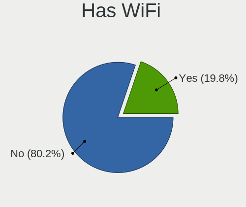
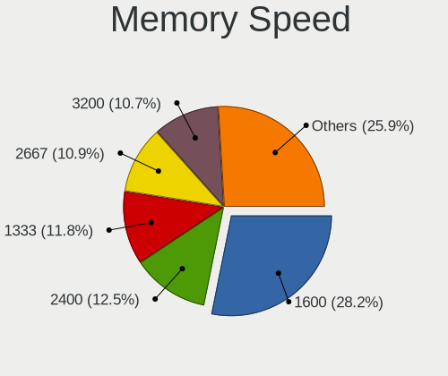

OPNsense - Tested Hardware & Statistics
---------------------------------------

A project to collect tested hardware configurations for OPNsense.

Anyone can contribute to this report by the [hw-probe](https://github.com/linuxhw/hw-probe/blob/master/INSTALL.BSD.md) tool:

    hw-probe -all -upload

Please contribute! Especially if your hardware is rare.

Contents
--------

* [ Test Cases ](#test-cases)

* [ System ](#system)
  - [ OS                       ](#os)
  - [ OS Family                ](#os-family)
  - [ Arch                     ](#arch)
  - [ DE                       ](#de)
  - [ Display Server           ](#display-server)
  - [ Display Manager          ](#display-manager)
  - [ OS Lang                  ](#os-lang)
  - [ Boot Mode                ](#boot-mode)
  - [ Filesystem               ](#filesystem)
  - [ Part. scheme             ](#part-scheme)

* [ Board ](#board)
  - [ Vendor                   ](#vendor)
  - [ Model                    ](#model)
  - [ Model Family             ](#model-family)
  - [ MFG Year                 ](#mfg-year)
  - [ Form Factor              ](#form-factor)
  - [ Coreboot                 ](#coreboot)
  - [ RAM Size                 ](#ram-size)
  - [ RAM Used                 ](#ram-used)
  - [ Total Drives             ](#total-drives)
  - [ Has CD-ROM               ](#has-cd-rom)
  - [ Has Ethernet             ](#has-ethernet)
  - [ Has WiFi                 ](#has-wifi)
  - [ Has Bluetooth            ](#has-bluetooth)

* [ Location ](#location)
  - [ Country                  ](#country)
  - [ City                     ](#city)

* [ Drives ](#drives)
  - [ Drive Vendor             ](#drive-vendor)
  - [ Drive Model              ](#drive-model)
  - [ HDD Vendor               ](#hdd-vendor)
  - [ SSD Vendor               ](#ssd-vendor)
  - [ Drive Kind               ](#drive-kind)
  - [ Drive Connector          ](#drive-connector)
  - [ Drive Size               ](#drive-size)
  - [ Space Total              ](#space-total)
  - [ Space Used               ](#space-used)
  - [ Malfunc. Drives          ](#malfunc-drives)
  - [ Malfunc. Drive Vendor    ](#malfunc-drive-vendor)
  - [ Malfunc. HDD Vendor      ](#malfunc-hdd-vendor)
  - [ Malfunc. Drive Kind      ](#malfunc-drive-kind)
  - [ Failed Drives            ](#failed-drives)
  - [ Failed Drive Vendor      ](#failed-drive-vendor)
  - [ Drive Status             ](#drive-status)

* [ Storage controller ](#storage-controller)
  - [ Storage Vendor           ](#storage-vendor)
  - [ Storage Model            ](#storage-model)
  - [ Storage Kind             ](#storage-kind)

* [ Processor ](#processor)
  - [ CPU Vendor               ](#cpu-vendor)
  - [ CPU Model                ](#cpu-model)
  - [ CPU Model Family         ](#cpu-model-family)
  - [ CPU Cores                ](#cpu-cores)
  - [ CPU Sockets              ](#cpu-sockets)
  - [ CPU Threads              ](#cpu-threads)
  - [ CPU Microarch            ](#cpu-microarch)

* [ Graphics ](#graphics)
  - [ GPU Vendor               ](#gpu-vendor)
  - [ GPU Model                ](#gpu-model)
  - [ GPU Combo                ](#gpu-combo)
  - [ GPU Driver               ](#gpu-driver)
  - [ GPU Memory               ](#gpu-memory)

* [ Monitor ](#monitor)
  - [ Monitor Vendor           ](#monitor-vendor)
  - [ Monitor Model            ](#monitor-model)
  - [ Monitor Resolution       ](#monitor-resolution)
  - [ Monitor Diagonal         ](#monitor-diagonal)
  - [ Monitor Width            ](#monitor-width)
  - [ Aspect Ratio             ](#aspect-ratio)
  - [ Monitor Area             ](#monitor-area)
  - [ Pixel Density            ](#pixel-density)
  - [ Multiple Monitors        ](#multiple-monitors)

* [ Network ](#network)
  - [ Net Controller Vendor    ](#net-controller-vendor)
  - [ Net Controller Model     ](#net-controller-model)
  - [ Wireless Vendor          ](#wireless-vendor)
  - [ Wireless Model           ](#wireless-model)
  - [ Ethernet Vendor          ](#ethernet-vendor)
  - [ Ethernet Model           ](#ethernet-model)
  - [ Net Controller Kind      ](#net-controller-kind)
  - [ Used Controller          ](#used-controller)
  - [ NICs                     ](#nics)
  - [ IPv6                     ](#ipv6)

* [ Bluetooth ](#bluetooth)
  - [ Bluetooth Vendor         ](#bluetooth-vendor)
  - [ Bluetooth Model          ](#bluetooth-model)

* [ Sound ](#sound)
  - [ Sound Vendor             ](#sound-vendor)
  - [ Sound Model              ](#sound-model)

* [ Memory ](#memory)
  - [ Memory Vendor            ](#memory-vendor)
  - [ Memory Model             ](#memory-model)
  - [ Memory Kind              ](#memory-kind)
  - [ Memory Form Factor       ](#memory-form-factor)
  - [ Memory Size              ](#memory-size)
  - [ Memory Speed             ](#memory-speed)

* [ Printers & scanners ](#printers--scanners)
  - [ Printer Vendor           ](#printer-vendor)
  - [ Printer Model            ](#printer-model)
  - [ Scanner Vendor           ](#scanner-vendor)
  - [ Scanner Model            ](#scanner-model)

* [ Camera ](#camera)
  - [ Camera Vendor            ](#camera-vendor)
  - [ Camera Model             ](#camera-model)

* [ Security ](#security)
  - [ Fingerprint Vendor       ](#fingerprint-vendor)
  - [ Fingerprint Model        ](#fingerprint-model)
  - [ Chipcard Vendor          ](#chipcard-vendor)
  - [ Chipcard Model           ](#chipcard-model)

* [ Unsupported ](#unsupported)
  - [ Unsupported Devices      ](#unsupported-devices)
  - [ Unsupported Device Types ](#unsupported-device-types)

Test Cases
----------

Total: 18096

| Vendor        | Model                       | Form-Factor | Probe                                                     | Date         |
|---------------|-----------------------------|-------------|-----------------------------------------------------------|--------------|
| HP            | 8954                        | Desktop     | [80434f997e](https://bsd-hardware.info/?probe=80434f997e) | Jan 06, 2025 |
| AMI           | Aptio CRB                   | Mini pc     | [cad64ca5db](https://bsd-hardware.info/?probe=cad64ca5db) | Jan 06, 2025 |
| MSI           | Z270M MORTAR                | Desktop     | [52d87b1ad7](https://bsd-hardware.info/?probe=52d87b1ad7) | Jan 06, 2025 |
| Lenovo        | 312A SDK0J40697 WIN 3305... | Desktop     | [f8cd5798b5](https://bsd-hardware.info/?probe=f8cd5798b5) | Jan 06, 2025 |
| MW            | GMLK-2_5G4L                 | Desktop     | [aef8a88a74](https://bsd-hardware.info/?probe=aef8a88a74) | Jan 06, 2025 |
| MW            | GMLK-2_5G4L                 | Desktop     | [56c096c579](https://bsd-hardware.info/?probe=56c096c579) | Jan 06, 2025 |
| Unknown       | Unknown                     | Desktop     | [72473eb7c0](https://bsd-hardware.info/?probe=72473eb7c0) | Jan 06, 2025 |
| Fujitsu       | D3313-A1 S26361-D3313-A1    | Desktop     | [89ce4b4a9f](https://bsd-hardware.info/?probe=89ce4b4a9f) | Jan 06, 2025 |
| Unknown       | Unknown                     | Desktop     | [07d989d275](https://bsd-hardware.info/?probe=07d989d275) | Jan 06, 2025 |
| Supermicro    | A1SRi-2758F                 | Desktop     | [3e6fbd3ab8](https://bsd-hardware.info/?probe=3e6fbd3ab8) | Jan 06, 2025 |
| Unknown       | Unknown                     | Desktop     | [10fb87670b](https://bsd-hardware.info/?probe=10fb87670b) | Jan 05, 2025 |
| Sophos        | SG                          | Firewall    | [4befb4b39e](https://bsd-hardware.info/?probe=4befb4b39e) | Jan 05, 2025 |
| iEi           | SAE1 V1.04                  | Desktop     | [97651c6ab6](https://bsd-hardware.info/?probe=97651c6ab6) | Jan 05, 2025 |
| Lenovo        | 312D SDK0J40697 WIN 3305... | Mini pc     | [3431d0bef2](https://bsd-hardware.info/?probe=3431d0bef2) | Jan 05, 2025 |
| Unknown       | QDNV01                      | Desktop     | [ca2dd0099d](https://bsd-hardware.info/?probe=ca2dd0099d) | Jan 05, 2025 |
| AZW           | EQ                          | Desktop     | [79c6c2f2fb](https://bsd-hardware.info/?probe=79c6c2f2fb) | Jan 05, 2025 |
| ASUSTek       | H110M-K                     | Desktop     | [05fd1da0a8](https://bsd-hardware.info/?probe=05fd1da0a8) | Jan 05, 2025 |
| ASRock        | Z690M-ITX/ax                | Desktop     | [9d38560d6a](https://bsd-hardware.info/?probe=9d38560d6a) | Jan 05, 2025 |
| Dell          | 04Y8V0 A02                  | Desktop     | [1d20d5fd79](https://bsd-hardware.info/?probe=1d20d5fd79) | Jan 05, 2025 |
| Lenovo        | 312D SDK0J40697 WIN 3305... | Mini pc     | [692f11c086](https://bsd-hardware.info/?probe=692f11c086) | Jan 05, 2025 |
| ASUSTek       | P9D-I Series                | Server      | [a45536700a](https://bsd-hardware.info/?probe=a45536700a) | Jan 05, 2025 |
| Lenovo        | 3106 SDK0J40697 WIN 3305... | Desktop     | [25f299d953](https://bsd-hardware.info/?probe=25f299d953) | Jan 05, 2025 |
| ASUSTek       | P10S-E Series               | Desktop     | [689f54b56f](https://bsd-hardware.info/?probe=689f54b56f) | Jan 05, 2025 |
| Unknown       | Unknown                     | Desktop     | [c3815ed438](https://bsd-hardware.info/?probe=c3815ed438) | Jan 05, 2025 |
| Supermicro    | X10SLH-N6-ST031             | Server      | [f7579f2fad](https://bsd-hardware.info/?probe=f7579f2fad) | Jan 05, 2025 |
| PC Engines    | APU2                        | Desktop     | [4548693f59](https://bsd-hardware.info/?probe=4548693f59) | Jan 05, 2025 |
| Protectli     | FW2B Ver                    | Desktop     | [705883b807](https://bsd-hardware.info/?probe=705883b807) | Jan 04, 2025 |
| Dell          | 0FDY5C A00                  | Desktop     | [ccba495e89](https://bsd-hardware.info/?probe=ccba495e89) | Jan 04, 2025 |
| Protectli     | VP2420                      | Desktop     | [a3a282fc47](https://bsd-hardware.info/?probe=a3a282fc47) | Jan 04, 2025 |
| Sophos        | SG                          | Firewall    | [0f1b34d89c](https://bsd-hardware.info/?probe=0f1b34d89c) | Jan 04, 2025 |
| AZW           | EQ                          | Mini pc     | [40f6440619](https://bsd-hardware.info/?probe=40f6440619) | Jan 04, 2025 |
| CWWK          | CW-J6-6L                    | Desktop     | [938c3dd6d1](https://bsd-hardware.info/?probe=938c3dd6d1) | Jan 04, 2025 |
| Sophos        | XG                          | Firewall    | [acc9b2772a](https://bsd-hardware.info/?probe=acc9b2772a) | Jan 04, 2025 |
| MSI           | Z270M MORTAR                | Desktop     | [6c0213efea](https://bsd-hardware.info/?probe=6c0213efea) | Jan 04, 2025 |
| Lenovo        | 316A SDK0J40697 WIN 3305... | Mini pc     | [a9c1f616a2](https://bsd-hardware.info/?probe=a9c1f616a2) | Jan 04, 2025 |
| PC Engines    | apu4                        | Desktop     | [aba651f461](https://bsd-hardware.info/?probe=aba651f461) | Jan 04, 2025 |
| Dell          | 0YDJK3 A02                  | Server      | [db63c0a016](https://bsd-hardware.info/?probe=db63c0a016) | Jan 04, 2025 |
| Dell          | 0WMJ54 A01                  | Desktop     | [a87d1a2609](https://bsd-hardware.info/?probe=a87d1a2609) | Jan 04, 2025 |
| ASRock        | H570M-ITX/ac                | Desktop     | [5b40284fbe](https://bsd-hardware.info/?probe=5b40284fbe) | Jan 04, 2025 |
| Dell          | 0FDY5C A00                  | Desktop     | [f0d39986e9](https://bsd-hardware.info/?probe=f0d39986e9) | Jan 04, 2025 |
| SJRC          | ADLN-6L                     | Desktop     | [9afe02f983](https://bsd-hardware.info/?probe=9afe02f983) | Jan 03, 2025 |
| ASUSTek       | B150M-PLUS D3               | Desktop     | [d269e833ba](https://bsd-hardware.info/?probe=d269e833ba) | Jan 03, 2025 |
| MiTAC         | E220                        | Desktop     | [f869a33762](https://bsd-hardware.info/?probe=f869a33762) | Jan 03, 2025 |
| Intel         | MAHOBAY                     | Desktop     | [e1fbd3a5ef](https://bsd-hardware.info/?probe=e1fbd3a5ef) | Jan 03, 2025 |
| Protectli     | FW6 Ver                     | Desktop     | [e66a74f63e](https://bsd-hardware.info/?probe=e66a74f63e) | Jan 03, 2025 |
| CWWK          | CW-ADLN-6L                  | Desktop     | [5eecb1d87a](https://bsd-hardware.info/?probe=5eecb1d87a) | Jan 03, 2025 |
| Lenovo        | 3136 SDK0J40697 WIN 3305... | Mini pc     | [1ae378d1c0](https://bsd-hardware.info/?probe=1ae378d1c0) | Jan 03, 2025 |
| ASRock        | N100DC-ITX                  | Desktop     | [16cfe5b33f](https://bsd-hardware.info/?probe=16cfe5b33f) | Jan 03, 2025 |
| ASUSTek       | PRIME H310M-E R2.0          | Desktop     | [d5f369f5da](https://bsd-hardware.info/?probe=d5f369f5da) | Jan 03, 2025 |
| Unknown       | Unknown                     | Desktop     | [89041bb816](https://bsd-hardware.info/?probe=89041bb816) | Jan 03, 2025 |
| Unknown       | Unknown                     | Desktop     | [d79c2c64e7](https://bsd-hardware.info/?probe=d79c2c64e7) | Jan 03, 2025 |
| ASUSTek       | P8Z77-V                     | Desktop     | [d3e6e71d15](https://bsd-hardware.info/?probe=d3e6e71d15) | Jan 03, 2025 |
| Supermicro    | A1SRM-2758F                 | Server      | [63e9e4d254](https://bsd-hardware.info/?probe=63e9e4d254) | Jan 03, 2025 |
| Lenovo        | 3136 SDK0J40697 WIN 3305... | Mini pc     | [cbde580f7e](https://bsd-hardware.info/?probe=cbde580f7e) | Jan 03, 2025 |
| Lenovo        | 3102 SDK0J40697 WIN 3305... | Desktop     | [686b424a28](https://bsd-hardware.info/?probe=686b424a28) | Jan 02, 2025 |
| AMI           | Aptio CRB                   | Mini pc     | [b1eaa92834](https://bsd-hardware.info/?probe=b1eaa92834) | Jan 02, 2025 |
| Techvision    | TVI7309X B0                 | Desktop     | [e3b91fef39](https://bsd-hardware.info/?probe=e3b91fef39) | Jan 02, 2025 |
| Dell          | 0WMJ54 A01                  | Desktop     | [2fb7873b0b](https://bsd-hardware.info/?probe=2fb7873b0b) | Jan 02, 2025 |
| Supermicro    | X12STL-IF                   | Server      | [d5a836a447](https://bsd-hardware.info/?probe=d5a836a447) | Jan 02, 2025 |
| SJRC          | ADLN-6L                     | Desktop     | [90498561c8](https://bsd-hardware.info/?probe=90498561c8) | Jan 02, 2025 |
| Intel         | D54250WYK H13922-303        | Desktop     | [a0f4632238](https://bsd-hardware.info/?probe=a0f4632238) | Jan 02, 2025 |
| Unknown       | Unknown                     | Notebook    | [1d7ea0d455](https://bsd-hardware.info/?probe=1d7ea0d455) | Jan 02, 2025 |
| Deciso        | NetBoard-A10                | Notebook    | [3ce7f19f0b](https://bsd-hardware.info/?probe=3ce7f19f0b) | Jan 02, 2025 |
| ASUSTek       | P8Z77-V                     | Desktop     | [657957bf41](https://bsd-hardware.info/?probe=657957bf41) | Jan 02, 2025 |
| Unknown       | Unknown                     | Desktop     | [2c400cdb2c](https://bsd-hardware.info/?probe=2c400cdb2c) | Jan 02, 2025 |
| HP            | 8062                        | Desktop     | [4ea2077640](https://bsd-hardware.info/?probe=4ea2077640) | Jan 02, 2025 |
| Sophos        | SG                          | Firewall    | [6ed95430e7](https://bsd-hardware.info/?probe=6ed95430e7) | Jan 02, 2025 |
| MSI           | MAG B550M MORTAR WIFI       | Desktop     | [9b908a1339](https://bsd-hardware.info/?probe=9b908a1339) | Jan 02, 2025 |
| Protectli     | V1410                       | Desktop     | [2f503f2fc2](https://bsd-hardware.info/?probe=2f503f2fc2) | Jan 02, 2025 |
| Unknown       | Unknown                     | Desktop     | [3b5881e6d2](https://bsd-hardware.info/?probe=3b5881e6d2) | Jan 02, 2025 |
| Dell          | 0WMJ54 A01                  | Desktop     | [f5ab48d136](https://bsd-hardware.info/?probe=f5ab48d136) | Jan 02, 2025 |
| HP            | 1998                        | Desktop     | [fea249da53](https://bsd-hardware.info/?probe=fea249da53) | Jan 02, 2025 |
| Shenzhen M... | AHWSA                       | Desktop     | [871f8c208c](https://bsd-hardware.info/?probe=871f8c208c) | Jan 02, 2025 |
| Yanling       | YL-GML4 V1                  | Desktop     | [0f2a512dec](https://bsd-hardware.info/?probe=0f2a512dec) | Jan 02, 2025 |
| PICO PC       | MNHO-113                    | Desktop     | [9ac6a7a9ad](https://bsd-hardware.info/?probe=9ac6a7a9ad) | Jan 02, 2025 |
| Lenovo        | 312D SDK0J40697 WIN 3305... | Mini pc     | [85f2416827](https://bsd-hardware.info/?probe=85f2416827) | Jan 01, 2025 |
| Intel         | S1200KP AAG34877-201        | Desktop     | [80e080363c](https://bsd-hardware.info/?probe=80e080363c) | Jan 01, 2025 |
| Trigkey       | Green G5                    | Desktop     | [b319e43076](https://bsd-hardware.info/?probe=b319e43076) | Jan 01, 2025 |
| Dell          | 08NPPY A00                  | Desktop     | [a9e88edfae](https://bsd-hardware.info/?probe=a9e88edfae) | Jan 01, 2025 |
| Unknown       | Unknown                     | Desktop     | [c23c86dc99](https://bsd-hardware.info/?probe=c23c86dc99) | Jan 01, 2025 |
| Biostar       | A68N-2100K                  | Desktop     | [441011550c](https://bsd-hardware.info/?probe=441011550c) | Jan 01, 2025 |
| Apple         | Mac-35C5E08120C7EEAF Mac... | Mini pc     | [d1c43670ee](https://bsd-hardware.info/?probe=d1c43670ee) | Jan 01, 2025 |
| Intel         | NUC11TNBi3 M11908-404       | Mini pc     | [399b611f07](https://bsd-hardware.info/?probe=399b611f07) | Jan 01, 2025 |
| Unknown       | adnasc01                    | Desktop     | [e4417d31c4](https://bsd-hardware.info/?probe=e4417d31c4) | Jan 01, 2025 |
| Sophos        | XG                          | Firewall    | [996007cc63](https://bsd-hardware.info/?probe=996007cc63) | Jan 01, 2025 |
| Seeed Stud... | ODYSSEY-X86J41X5 SD-BS-C... | Desktop     | [6c1907d15b](https://bsd-hardware.info/?probe=6c1907d15b) | Jan 01, 2025 |
| Intel         | CARLOW                      | Desktop     | [01eb3deae5](https://bsd-hardware.info/?probe=01eb3deae5) | Jan 01, 2025 |
| ASUSTek       | Z97I-PLUS                   | Desktop     | [280124bd49](https://bsd-hardware.info/?probe=280124bd49) | Dec 31, 2024 |
| HP            | 8768 A                      | Desktop     | [8ccd99787b](https://bsd-hardware.info/?probe=8ccd99787b) | Dec 31, 2024 |
| ASRock        | FM2A55M-HD+ R2.0            | Desktop     | [f7a1fd8000](https://bsd-hardware.info/?probe=f7a1fd8000) | Dec 31, 2024 |
| Apple         | Mac-35C5E08120C7EEAF Mac... | Mini pc     | [7a72c07594](https://bsd-hardware.info/?probe=7a72c07594) | Dec 31, 2024 |
| Intel         | SHARKBAY                    | Desktop     | [3528375180](https://bsd-hardware.info/?probe=3528375180) | Dec 31, 2024 |
| Intel         | SKYBAY                      | Desktop     | [d3adf28494](https://bsd-hardware.info/?probe=d3adf28494) | Dec 31, 2024 |
| Unknown       | Unknown                     | Desktop     | [4fe58c5abf](https://bsd-hardware.info/?probe=4fe58c5abf) | Dec 31, 2024 |
| Unknown       | Unknown                     | Desktop     | [d06ccdd495](https://bsd-hardware.info/?probe=d06ccdd495) | Dec 31, 2024 |
| ASRock        | N100DC-ITX                  | Desktop     | [766a7f64f0](https://bsd-hardware.info/?probe=766a7f64f0) | Dec 31, 2024 |
| Dell          | 081N4V A04                  | Server      | [029563c5c1](https://bsd-hardware.info/?probe=029563c5c1) | Dec 31, 2024 |
| BESSTAR Te... | IB9                         | Desktop     | [3dfca3d175](https://bsd-hardware.info/?probe=3dfca3d175) | Dec 31, 2024 |
| Unknown       | Unknown                     | Desktop     | [0a3b121141](https://bsd-hardware.info/?probe=0a3b121141) | Dec 31, 2024 |
| Unknown       | Unknown                     | Desktop     | [d3e2ebffab](https://bsd-hardware.info/?probe=d3e2ebffab) | Dec 31, 2024 |
| IceWhale T... | ZimaBoard 832 ZMB           | Desktop     | [02de1482a6](https://bsd-hardware.info/?probe=02de1482a6) | Dec 31, 2024 |
| Protectli     | FW4B                        | Desktop     | [fddeda1514](https://bsd-hardware.info/?probe=fddeda1514) | Dec 31, 2024 |
| Techvision    | TVI7309X B0                 | Desktop     | [588468f004](https://bsd-hardware.info/?probe=588468f004) | Dec 31, 2024 |
| Unknown       | Unknown                     | Desktop     | [1c2ec43b47](https://bsd-hardware.info/?probe=1c2ec43b47) | Dec 31, 2024 |
| ASUSTek       | Z97-PRO GAMER               | Desktop     | [8fe128b9b2](https://bsd-hardware.info/?probe=8fe128b9b2) | Dec 31, 2024 |
| Advantech     | NAMB-3250 A102-1            | Desktop     | [975b60a167](https://bsd-hardware.info/?probe=975b60a167) | Dec 31, 2024 |
| AZW           | EQ                          | Desktop     | [89e2185696](https://bsd-hardware.info/?probe=89e2185696) | Dec 31, 2024 |
| Intel         | SKYBAY                      | Desktop     | [83a2dfc9d6](https://bsd-hardware.info/?probe=83a2dfc9d6) | Dec 31, 2024 |
| Dell          | 0T7D40 A01                  | Desktop     | [cc8dddd1e8](https://bsd-hardware.info/?probe=cc8dddd1e8) | Dec 30, 2024 |
| Unknown       | Unknown                     | Desktop     | [f85ed259c8](https://bsd-hardware.info/?probe=f85ed259c8) | Dec 30, 2024 |
| Intel         | JSL MRD                     | Desktop     | [91ddafe16b](https://bsd-hardware.info/?probe=91ddafe16b) | Dec 30, 2024 |
| HP            | 1998                        | Desktop     | [da5ac06da2](https://bsd-hardware.info/?probe=da5ac06da2) | Dec 30, 2024 |
| Intel         | CM8I7CB8N K53740-202        | Mini pc     | [5eb4da6e62](https://bsd-hardware.info/?probe=5eb4da6e62) | Dec 30, 2024 |
| Protectli     | VP2420                      | Desktop     | [4cbb5eb9ba](https://bsd-hardware.info/?probe=4cbb5eb9ba) | Dec 30, 2024 |
| Supermicro    | X9SCL/X9SCMA                | Desktop     | [7b307c888b](https://bsd-hardware.info/?probe=7b307c888b) | Dec 30, 2024 |
| Unknown       | Unknown                     | Desktop     | [115a8d681e](https://bsd-hardware.info/?probe=115a8d681e) | Dec 30, 2024 |
| ASRock        | X570 Phantom Gaming-ITX/... | Desktop     | [f72205b123](https://bsd-hardware.info/?probe=f72205b123) | Dec 30, 2024 |
| ASUSTek       | P11C-E Series               | Desktop     | [01492d552c](https://bsd-hardware.info/?probe=01492d552c) | Dec 30, 2024 |
| ZOTAC         | ZBOX-CI323NANO              | Mini pc     | [4cbc277f66](https://bsd-hardware.info/?probe=4cbc277f66) | Dec 30, 2024 |
| HP            | Presario CQ57               | Notebook    | [97f4e3b3f9](https://bsd-hardware.info/?probe=97f4e3b3f9) | Dec 30, 2024 |
| ZOTAC         | ZBOX-CI323NANO              | Mini pc     | [55689ced36](https://bsd-hardware.info/?probe=55689ced36) | Dec 30, 2024 |
| Dell EMC      | EDGE680-CPU A00             | Desktop     | [b5233e4ced](https://bsd-hardware.info/?probe=b5233e4ced) | Dec 30, 2024 |
| Unknown       | adnasc01                    | Desktop     | [b813bc581d](https://bsd-hardware.info/?probe=b813bc581d) | Dec 30, 2024 |
| ASUSTek       | Maximus V FORMULA           | Desktop     | [3e59dc6c59](https://bsd-hardware.info/?probe=3e59dc6c59) | Dec 30, 2024 |
| ASUSTek       | Maximus VIII RANGER         | Desktop     | [2d3eb6c2f5](https://bsd-hardware.info/?probe=2d3eb6c2f5) | Dec 30, 2024 |
| Unknown       | Unknown                     | Desktop     | [8b06420b87](https://bsd-hardware.info/?probe=8b06420b87) | Dec 29, 2024 |
| Dell          | OptiPlex 5070               | Desktop     | [e2e08cab4b](https://bsd-hardware.info/?probe=e2e08cab4b) | Dec 29, 2024 |
| Fujitsu       | D3313-G1 S26361-D3313-G1    | Desktop     | [e55c0423ee](https://bsd-hardware.info/?probe=e55c0423ee) | Dec 29, 2024 |
| ASRock        | 4X4-5000 Series             | Desktop     | [a6b64a93c5](https://bsd-hardware.info/?probe=a6b64a93c5) | Dec 29, 2024 |
| ASUSTek       | PRIME Z270-A                | Desktop     | [601c3c7a49](https://bsd-hardware.info/?probe=601c3c7a49) | Dec 29, 2024 |
| Intel         | QHSW02                      | Desktop     | [07fd887929](https://bsd-hardware.info/?probe=07fd887929) | Dec 29, 2024 |
| Techvision    | TVI7309X B0                 | Desktop     | [a86118e267](https://bsd-hardware.info/?probe=a86118e267) | Dec 29, 2024 |
| Sophos        | UTM                         | Firewall    | [7aa2380626](https://bsd-hardware.info/?probe=7aa2380626) | Dec 29, 2024 |
| Unknown       | Unknown                     | Desktop     | [6218f9a3c9](https://bsd-hardware.info/?probe=6218f9a3c9) | Dec 29, 2024 |
| ASUSTek       | P8Z77-V                     | Desktop     | [ae387d9e4c](https://bsd-hardware.info/?probe=ae387d9e4c) | Dec 29, 2024 |
| Unknown       | Unknown                     | Desktop     | [b96103dfcb](https://bsd-hardware.info/?probe=b96103dfcb) | Dec 29, 2024 |
| EXTRA Comp... | Pokini Firewall 4P          | Firewall    | [84369f2593](https://bsd-hardware.info/?probe=84369f2593) | Dec 29, 2024 |
| Unknown       | Unknown                     | Desktop     | [b9ca7abc2d](https://bsd-hardware.info/?probe=b9ca7abc2d) | Dec 29, 2024 |
| Deciso        | Netboard A20                | Notebook    | [8fab4ef775](https://bsd-hardware.info/?probe=8fab4ef775) | Dec 29, 2024 |
| Protectli     | VP4670                      | Desktop     | [1649d4be0f](https://bsd-hardware.info/?probe=1649d4be0f) | Dec 29, 2024 |
| CWWK          | MINIPC-G12                  | Desktop     | [e85c1bdb99](https://bsd-hardware.info/?probe=e85c1bdb99) | Dec 29, 2024 |
| AZW           | EQ                          | Desktop     | [69a1ed7f82](https://bsd-hardware.info/?probe=69a1ed7f82) | Dec 29, 2024 |
| Unknown       | Unknown                     | Desktop     | [2e57c5140f](https://bsd-hardware.info/?probe=2e57c5140f) | Dec 29, 2024 |
| Dell          | OptiPlex 5070               | Desktop     | [12d5d8ce92](https://bsd-hardware.info/?probe=12d5d8ce92) | Dec 29, 2024 |
| Trigkey       | Green G5                    | Desktop     | [560c067a01](https://bsd-hardware.info/?probe=560c067a01) | Dec 29, 2024 |
| AZW           | EQ                          | Mini pc     | [dd50b4053f](https://bsd-hardware.info/?probe=dd50b4053f) | Dec 29, 2024 |
| Protectli     | FW2B Ver                    | Desktop     | [0f9a74892c](https://bsd-hardware.info/?probe=0f9a74892c) | Dec 29, 2024 |
| Shenzhen M... | AHWSA                       | Desktop     | [f7c0f4e47a](https://bsd-hardware.info/?probe=f7c0f4e47a) | Dec 29, 2024 |
| Dell          | 02YYK5 A01                  | Desktop     | [bf55691036](https://bsd-hardware.info/?probe=bf55691036) | Dec 29, 2024 |
| Sophos        | UTM                         | Firewall    | [a4fb95d9e1](https://bsd-hardware.info/?probe=a4fb95d9e1) | Dec 29, 2024 |
| Fujitsu       | D3313-B1 S26361-D3313-B1    | Desktop     | [95345d4887](https://bsd-hardware.info/?probe=95345d4887) | Dec 29, 2024 |
| Unknown       | Unknown                     | Desktop     | [a93b8e4a89](https://bsd-hardware.info/?probe=a93b8e4a89) | Dec 28, 2024 |
| Unknown       | Unknown                     | Desktop     | [cf9c0fcf94](https://bsd-hardware.info/?probe=cf9c0fcf94) | Dec 28, 2024 |
| Dell          | 0NW6H5 A00                  | Desktop     | [d2f12e9d57](https://bsd-hardware.info/?probe=d2f12e9d57) | Dec 28, 2024 |
| ZOTAC         | ZBOX-CI325NANO              | Mini pc     | [29528fef20](https://bsd-hardware.info/?probe=29528fef20) | Dec 28, 2024 |
| Unknown       | Unknown                     | Desktop     | [f9f7981d89](https://bsd-hardware.info/?probe=f9f7981d89) | Dec 28, 2024 |
| ASRockRack    | W680D4U-2L2T/G5             | Server      | [3b35f35036](https://bsd-hardware.info/?probe=3b35f35036) | Dec 28, 2024 |
| ASUSTek       | P8Z77-V                     | Desktop     | [548a9b376e](https://bsd-hardware.info/?probe=548a9b376e) | Dec 28, 2024 |
| ASUSTek       | Maximus V FORMULA           | Desktop     | [6a110d5e92](https://bsd-hardware.info/?probe=6a110d5e92) | Dec 28, 2024 |
| Intel         | DQ77KB AAG40294-402         | Desktop     | [9db11dd0c9](https://bsd-hardware.info/?probe=9db11dd0c9) | Dec 28, 2024 |
| Intel         | QHSW02                      | Desktop     | [0e73244f65](https://bsd-hardware.info/?probe=0e73244f65) | Dec 28, 2024 |
| Unknown       | Unknown                     | Desktop     | [7d2cac7c1c](https://bsd-hardware.info/?probe=7d2cac7c1c) | Dec 27, 2024 |
| Unknown       | Unknown                     | Desktop     | [392370d6f2](https://bsd-hardware.info/?probe=392370d6f2) | Dec 27, 2024 |
| Intel         | S3000AH D40859-208          | Desktop     | [89e23969cc](https://bsd-hardware.info/?probe=89e23969cc) | Dec 27, 2024 |
| Supermicro    | X10SDE-DF                   | Desktop     | [ce805c4c07](https://bsd-hardware.info/?probe=ce805c4c07) | Dec 27, 2024 |
| Unknown       | Unknown                     | Desktop     | [7649637b96](https://bsd-hardware.info/?probe=7649637b96) | Dec 27, 2024 |
| Protectli     | V1410                       | Desktop     | [b6727da944](https://bsd-hardware.info/?probe=b6727da944) | Dec 27, 2024 |
| Fujitsu       | D3544-Sx S26361-D3544-Sx... | Desktop     | [0dcc64e192](https://bsd-hardware.info/?probe=0dcc64e192) | Dec 27, 2024 |
| Unknown       | Unknown                     | Desktop     | [0d44758f02](https://bsd-hardware.info/?probe=0d44758f02) | Dec 27, 2024 |
| Techvision    | TVI7309X B0                 | Desktop     | [9c1b74e17e](https://bsd-hardware.info/?probe=9c1b74e17e) | Dec 27, 2024 |
| Sophos        | UTM                         | Firewall    | [9a8c35f467](https://bsd-hardware.info/?probe=9a8c35f467) | Dec 27, 2024 |
| Protectli     | V1410                       | Desktop     | [09e8629eb8](https://bsd-hardware.info/?probe=09e8629eb8) | Dec 27, 2024 |
| Unknown       | Unknown                     | Desktop     | [a92bf0ef02](https://bsd-hardware.info/?probe=a92bf0ef02) | Dec 27, 2024 |
| Inventec      | ZQ Class A02                | Desktop     | [9d4dc92f21](https://bsd-hardware.info/?probe=9d4dc92f21) | Dec 27, 2024 |
| Dell          | OptiPlex 5070               | Desktop     | [5a98f9dd3a](https://bsd-hardware.info/?probe=5a98f9dd3a) | Dec 27, 2024 |
| ASUSTek       | PRIME B450M-GAMING/BR       | Desktop     | [e03720a10c](https://bsd-hardware.info/?probe=e03720a10c) | Dec 27, 2024 |
| HP            | 86E9 A                      | Desktop     | [355a0a1775](https://bsd-hardware.info/?probe=355a0a1775) | Dec 27, 2024 |
| Dell          | OptiPlex 5070               | Desktop     | [7ee0a90c4b](https://bsd-hardware.info/?probe=7ee0a90c4b) | Dec 27, 2024 |
| Intel         | Q3XXG4-P V1.0               | Desktop     | [fe167a9e36](https://bsd-hardware.info/?probe=fe167a9e36) | Dec 27, 2024 |
| Sophos        | XG                          | Firewall    | [758480d9fd](https://bsd-hardware.info/?probe=758480d9fd) | Dec 27, 2024 |
| AZW           | EQ                          | Desktop     | [45a01b3cb6](https://bsd-hardware.info/?probe=45a01b3cb6) | Dec 26, 2024 |
| Dell          | 07F37C A01                  | Desktop     | [6518ba4c6c](https://bsd-hardware.info/?probe=6518ba4c6c) | Dec 26, 2024 |
| Unknown       | Unknown                     | Desktop     | [7a016a0770](https://bsd-hardware.info/?probe=7a016a0770) | Dec 26, 2024 |
| HP            | 86E9 A                      | Desktop     | [5c61053e94](https://bsd-hardware.info/?probe=5c61053e94) | Dec 26, 2024 |
| Fujitsu       | D3313-A1 S26361-D3313-A1    | Desktop     | [60caaaf52b](https://bsd-hardware.info/?probe=60caaaf52b) | Dec 26, 2024 |
| MW            | GMLK-2_5G4L                 | Desktop     | [1dbdbd867c](https://bsd-hardware.info/?probe=1dbdbd867c) | Dec 26, 2024 |
| AMI           | Aptio CRB                   | Mini pc     | [19959aeb9f](https://bsd-hardware.info/?probe=19959aeb9f) | Dec 26, 2024 |
| Unknown       | Unknown                     | Desktop     | [71050a52a4](https://bsd-hardware.info/?probe=71050a52a4) | Dec 26, 2024 |
| Protectli     | VP2420                      | Desktop     | [afa30d870b](https://bsd-hardware.info/?probe=afa30d870b) | Dec 26, 2024 |
| Unknown       | Unknown                     | Desktop     | [6d669bbdc7](https://bsd-hardware.info/?probe=6d669bbdc7) | Dec 26, 2024 |
| Unknown       | Unknown                     | Desktop     | [78aee3d790](https://bsd-hardware.info/?probe=78aee3d790) | Dec 26, 2024 |
| Unknown       | Unknown                     | Desktop     | [63fd28f073](https://bsd-hardware.info/?probe=63fd28f073) | Dec 26, 2024 |
| Shenzhen S... | SI-B160                     | Desktop     | [c0fc40baea](https://bsd-hardware.info/?probe=c0fc40baea) | Dec 26, 2024 |
| Dell          | Latitude 5500               | Notebook    | [36b6d99530](https://bsd-hardware.info/?probe=36b6d99530) | Dec 26, 2024 |
| GoWin Solu... | R86S                        | Desktop     | [1a6fdb5298](https://bsd-hardware.info/?probe=1a6fdb5298) | Dec 26, 2024 |
| Gigabyte      | B760M C                     | Desktop     | [b3926cb9a9](https://bsd-hardware.info/?probe=b3926cb9a9) | Dec 26, 2024 |
| Gigabyte      | B760M C                     | Desktop     | [c01a3f3d27](https://bsd-hardware.info/?probe=c01a3f3d27) | Dec 26, 2024 |
| ASUSTek       | ROG STRIX B760-I GAMING ... | Desktop     | [befeba6938](https://bsd-hardware.info/?probe=befeba6938) | Dec 26, 2024 |
| Sophos        | XG                          | Firewall    | [2cd9277c4f](https://bsd-hardware.info/?probe=2cd9277c4f) | Dec 26, 2024 |
| Unknown       | Unknown                     | Desktop     | [76ca94279b](https://bsd-hardware.info/?probe=76ca94279b) | Dec 26, 2024 |
| Unknown       | Unknown                     | Desktop     | [9f549fa7ce](https://bsd-hardware.info/?probe=9f549fa7ce) | Dec 26, 2024 |
| Unknown       | Unknown                     | Desktop     | [4937ea1ef5](https://bsd-hardware.info/?probe=4937ea1ef5) | Dec 25, 2024 |
| Unknown       | Unknown                     | Desktop     | [846b02424a](https://bsd-hardware.info/?probe=846b02424a) | Dec 25, 2024 |
| Dell          | 0HD5W2 A01                  | Desktop     | [5e50386e5c](https://bsd-hardware.info/?probe=5e50386e5c) | Dec 25, 2024 |
| Dell          | 0GK35Y A00                  | Desktop     | [48c856834f](https://bsd-hardware.info/?probe=48c856834f) | Dec 25, 2024 |
| Techvision    | TVI7309X B0                 | Desktop     | [94fd7f7082](https://bsd-hardware.info/?probe=94fd7f7082) | Dec 25, 2024 |
| AZW           | U59                         | Desktop     | [17a9a9d767](https://bsd-hardware.info/?probe=17a9a9d767) | Dec 25, 2024 |
| PC Engines    | apu4                        | Desktop     | [c9b7343baf](https://bsd-hardware.info/?probe=c9b7343baf) | Dec 25, 2024 |
| AMI           | Aptio CRB                   | Mini pc     | [7b462d43e7](https://bsd-hardware.info/?probe=7b462d43e7) | Dec 25, 2024 |
| Dell          | 0WMJ54 A01                  | Desktop     | [e677c34698](https://bsd-hardware.info/?probe=e677c34698) | Dec 25, 2024 |
| Unknown       | Unknown                     | Desktop     | [f3922a40a8](https://bsd-hardware.info/?probe=f3922a40a8) | Dec 24, 2024 |
| Protectli     | VP6630                      | Desktop     | [4a4726113b](https://bsd-hardware.info/?probe=4a4726113b) | Dec 24, 2024 |
| BESSTAR Te... | IB9                         | Desktop     | [b54b487e6a](https://bsd-hardware.info/?probe=b54b487e6a) | Dec 24, 2024 |
| Deciso        | OPNsense Appliance          | Notebook    | [5185740988](https://bsd-hardware.info/?probe=5185740988) | Dec 24, 2024 |
| AMI           | Aptio CRB                   | Mini pc     | [d8ee2926d8](https://bsd-hardware.info/?probe=d8ee2926d8) | Dec 24, 2024 |
| Unknown       | Unknown                     | Desktop     | [25a20f4c0e](https://bsd-hardware.info/?probe=25a20f4c0e) | Dec 24, 2024 |
| Fujitsu       | D3313-G1 S26361-D3313-G1    | Desktop     | [338d76f96f](https://bsd-hardware.info/?probe=338d76f96f) | Dec 24, 2024 |
| ASUSTek       | H110M-K                     | Desktop     | [e8ab923caa](https://bsd-hardware.info/?probe=e8ab923caa) | Dec 24, 2024 |
| MSI           | 970 GAMING                  | Desktop     | [7caa8db16a](https://bsd-hardware.info/?probe=7caa8db16a) | Dec 24, 2024 |
| Unknown       | QDNV01                      | Desktop     | [fcdc78df83](https://bsd-hardware.info/?probe=fcdc78df83) | Dec 24, 2024 |
| ASUSTek       | H110M-K                     | Desktop     | [14959f9c62](https://bsd-hardware.info/?probe=14959f9c62) | Dec 24, 2024 |
| NF692         | 1.0                         | Desktop     | [b129c164c5](https://bsd-hardware.info/?probe=b129c164c5) | Dec 24, 2024 |
| Unknown       | Unknown                     | Desktop     | [2e05274300](https://bsd-hardware.info/?probe=2e05274300) | Dec 24, 2024 |
| IBM           | 00J6086                     | Server      | [61cdfa8b70](https://bsd-hardware.info/?probe=61cdfa8b70) | Dec 24, 2024 |
| HP            | 339A                        | Desktop     | [ad9ed0ee8d](https://bsd-hardware.info/?probe=ad9ed0ee8d) | Dec 24, 2024 |
| Dell          | 0JP3NX A00                  | Desktop     | [27d474564d](https://bsd-hardware.info/?probe=27d474564d) | Dec 24, 2024 |
| Protectli     | VP2420                      | Desktop     | [6fe419fedc](https://bsd-hardware.info/?probe=6fe419fedc) | Dec 24, 2024 |
| Firebat_Co... | T8_Plus                     | Desktop     | [b4c2c32c72](https://bsd-hardware.info/?probe=b4c2c32c72) | Dec 24, 2024 |
| Shenzhen M... | AHWSA                       | Desktop     | [929e0f0aa1](https://bsd-hardware.info/?probe=929e0f0aa1) | Dec 23, 2024 |
| Infoblox      | IB-810                      | Desktop     | [94e43c90e0](https://bsd-hardware.info/?probe=94e43c90e0) | Dec 23, 2024 |
| Protectli     | V1410                       | Desktop     | [6e4b1262e4](https://bsd-hardware.info/?probe=6e4b1262e4) | Dec 23, 2024 |
| Dell          | 0YXT71 A00                  | Desktop     | [fc782b729d](https://bsd-hardware.info/?probe=fc782b729d) | Dec 23, 2024 |
| Lenovo        | [3633AC1] STC               | Server      | [04693e20ee](https://bsd-hardware.info/?probe=04693e20ee) | Dec 23, 2024 |
| Unknown       | Unknown                     | Notebook    | [4c4387237d](https://bsd-hardware.info/?probe=4c4387237d) | Dec 23, 2024 |
| MW            | GMLK-2_5G4L                 | Desktop     | [bd781ad496](https://bsd-hardware.info/?probe=bd781ad496) | Dec 23, 2024 |
| Unknown       | Unknown                     | Desktop     | [f2bc43b0a8](https://bsd-hardware.info/?probe=f2bc43b0a8) | Dec 23, 2024 |
| Unknown       | Unknown                     | Desktop     | [1ea5fa36d2](https://bsd-hardware.info/?probe=1ea5fa36d2) | Dec 23, 2024 |
| HP            | 1998                        | Desktop     | [ba1d68d913](https://bsd-hardware.info/?probe=ba1d68d913) | Dec 22, 2024 |
| Sophos        | UTM                         | Firewall    | [8d1a7ecb6c](https://bsd-hardware.info/?probe=8d1a7ecb6c) | Dec 22, 2024 |
| Techvision    | TVI7309X B0                 | Desktop     | [92cefa8a8c](https://bsd-hardware.info/?probe=92cefa8a8c) | Dec 22, 2024 |
| Dell          | 08NPPY A00                  | Desktop     | [a94c82e978](https://bsd-hardware.info/?probe=a94c82e978) | Dec 22, 2024 |
| Dell          | 0FDY5C A00                  | Desktop     | [97a894078c](https://bsd-hardware.info/?probe=97a894078c) | Dec 22, 2024 |
| Alienware     | 0VDT73 A00                  | Desktop     | [cc0448c975](https://bsd-hardware.info/?probe=cc0448c975) | Dec 22, 2024 |
| Deciso        | Netboard A20                | Notebook    | [932588d77a](https://bsd-hardware.info/?probe=932588d77a) | Dec 22, 2024 |
| PC Engines    | APU2                        | Desktop     | [4f7eeb78f6](https://bsd-hardware.info/?probe=4f7eeb78f6) | Dec 22, 2024 |
| PC Engines    | apu4                        | Desktop     | [c41bf918c5](https://bsd-hardware.info/?probe=c41bf918c5) | Dec 22, 2024 |
| Techvision    | TVI7309X B0                 | Desktop     | [887c112b05](https://bsd-hardware.info/?probe=887c112b05) | Dec 22, 2024 |
| Unknown       | Unknown                     | Desktop     | [8befdf2a04](https://bsd-hardware.info/?probe=8befdf2a04) | Dec 22, 2024 |
| Unknown       | QDNV01                      | Desktop     | [877dbd28c5](https://bsd-hardware.info/?probe=877dbd28c5) | Dec 22, 2024 |
| ASRock        | H570M-ITX/ac                | Desktop     | [eb9e3863e0](https://bsd-hardware.info/?probe=eb9e3863e0) | Dec 22, 2024 |
| Unknown       | Unknown                     | Desktop     | [02119a1b45](https://bsd-hardware.info/?probe=02119a1b45) | Dec 22, 2024 |
| Protectli     | FW6 Ver                     | Desktop     | [f8133ffca6](https://bsd-hardware.info/?probe=f8133ffca6) | Dec 22, 2024 |
| Dell          | 0HC3G4 A00                  | Mini pc     | [1b29bfe2b3](https://bsd-hardware.info/?probe=1b29bfe2b3) | Dec 22, 2024 |
| ZOTAC         | ZBOX-CI325NANO              | Mini pc     | [a06d9a4f80](https://bsd-hardware.info/?probe=a06d9a4f80) | Dec 22, 2024 |
| Supermicro    | X9SCL/X9SCM                 | Desktop     | [dd220a27af](https://bsd-hardware.info/?probe=dd220a27af) | Dec 22, 2024 |
| IceWhale T... | ZimaBoard 832 ZMB           | Desktop     | [0fd27a04f7](https://bsd-hardware.info/?probe=0fd27a04f7) | Dec 22, 2024 |
| ASRock        | B550 Phantom Gaming 4       | Desktop     | [ce9a08d930](https://bsd-hardware.info/?probe=ce9a08d930) | Dec 22, 2024 |
| IGEL Techn... | H830C                       | Notebook    | [8865063b5a](https://bsd-hardware.info/?probe=8865063b5a) | Dec 21, 2024 |
| AAEON         | UP-APL01 V0.4               | Desktop     | [32312b45f8](https://bsd-hardware.info/?probe=32312b45f8) | Dec 21, 2024 |
| Supermicro    | X10SDE-DF                   | Desktop     | [d625d92899](https://bsd-hardware.info/?probe=d625d92899) | Dec 21, 2024 |
| Dell          | 0D28YY A00                  | Desktop     | [97d068af1e](https://bsd-hardware.info/?probe=97d068af1e) | Dec 21, 2024 |
| ASUSTek       | Z97-PRO GAMER               | Desktop     | [e7c1d45a38](https://bsd-hardware.info/?probe=e7c1d45a38) | Dec 21, 2024 |
| Dell          | 00V62H A01                  | Desktop     | [3048d1b957](https://bsd-hardware.info/?probe=3048d1b957) | Dec 21, 2024 |
| Unknown       | Unknown                     | Desktop     | [cf2ef7e381](https://bsd-hardware.info/?probe=cf2ef7e381) | Dec 21, 2024 |
| Unknown       | Unknown                     | Desktop     | [d46840aa6c](https://bsd-hardware.info/?probe=d46840aa6c) | Dec 21, 2024 |
| HP            | 1998                        | Desktop     | [e4d863c249](https://bsd-hardware.info/?probe=e4d863c249) | Dec 21, 2024 |
| Unknown       | QDNV01                      | Desktop     | [95d17434b8](https://bsd-hardware.info/?probe=95d17434b8) | Dec 21, 2024 |
| MSI           | Z270M MORTAR                | Desktop     | [1bf2d8a709](https://bsd-hardware.info/?probe=1bf2d8a709) | Dec 21, 2024 |
| Shenzhen S... | SI-B160                     | Desktop     | [299cbc4d07](https://bsd-hardware.info/?probe=299cbc4d07) | Dec 21, 2024 |
| Unknown       | Unknown                     | Desktop     | [bba86ddcba](https://bsd-hardware.info/?probe=bba86ddcba) | Dec 21, 2024 |
| MSI           | Z97I AC                     | Desktop     | [b6ff881901](https://bsd-hardware.info/?probe=b6ff881901) | Dec 21, 2024 |
| Unknown       | Unknown                     | Desktop     | [67b79bee6d](https://bsd-hardware.info/?probe=67b79bee6d) | Dec 21, 2024 |
| Unknown       | Unknown                     | Desktop     | [f43114f35b](https://bsd-hardware.info/?probe=f43114f35b) | Dec 21, 2024 |
| Techvision    | TVI7309X B0                 | Desktop     | [c16b1e23d4](https://bsd-hardware.info/?probe=c16b1e23d4) | Dec 21, 2024 |
| HP            | 1998                        | Desktop     | [a875c0ccf0](https://bsd-hardware.info/?probe=a875c0ccf0) | Dec 20, 2024 |
| Unknown       | Unknown                     | Desktop     | [e1da8dd697](https://bsd-hardware.info/?probe=e1da8dd697) | Dec 20, 2024 |
| ASRock        | E3C226D2I                   | Desktop     | [37b9937cf0](https://bsd-hardware.info/?probe=37b9937cf0) | Dec 20, 2024 |
| Unknown       | MANIFOLD 2-C                | Desktop     | [652d97d116](https://bsd-hardware.info/?probe=652d97d116) | Dec 20, 2024 |
| Dell          | 05KX61 A02                  | Server      | [b578e02bf0](https://bsd-hardware.info/?probe=b578e02bf0) | Dec 20, 2024 |
| Dell          | 0F9NPY A02                  | Server      | [dc772d383e](https://bsd-hardware.info/?probe=dc772d383e) | Dec 20, 2024 |
| AMI           | Aptio CRB                   | Mini pc     | [55ff386a59](https://bsd-hardware.info/?probe=55ff386a59) | Dec 20, 2024 |
| Protectli     | FW6                         | Desktop     | [221484fba7](https://bsd-hardware.info/?probe=221484fba7) | Dec 20, 2024 |
| ASUSTek       | PRIME Z270-A                | Desktop     | [9a8a0a932a](https://bsd-hardware.info/?probe=9a8a0a932a) | Dec 20, 2024 |
| HP            | 0B4Ch D                     | Desktop     | [4278f18694](https://bsd-hardware.info/?probe=4278f18694) | Dec 20, 2024 |
| Unknown       | Unknown                     | Desktop     | [806a7126ca](https://bsd-hardware.info/?probe=806a7126ca) | Dec 20, 2024 |
| Unknown       | Unknown                     | Desktop     | [19ffcf2c92](https://bsd-hardware.info/?probe=19ffcf2c92) | Dec 20, 2024 |
| CncTion       | N5000-4L-I226               | Desktop     | [268b1832be](https://bsd-hardware.info/?probe=268b1832be) | Dec 20, 2024 |
| Unknown       | Unknown                     | Desktop     | [9925fe2a58](https://bsd-hardware.info/?probe=9925fe2a58) | Dec 20, 2024 |
| Gigabyte      | Z490I AORUS ULTRA           | Desktop     | [12aa966592](https://bsd-hardware.info/?probe=12aa966592) | Dec 20, 2024 |
| MSI           | MAG B550M MORTAR WIFI       | Desktop     | [84a86156de](https://bsd-hardware.info/?probe=84a86156de) | Dec 20, 2024 |
| Intel         | RUT40R                      | Desktop     | [3c84746b3e](https://bsd-hardware.info/?probe=3c84746b3e) | Dec 20, 2024 |
| ASRock        | N100DC-ITX                  | Desktop     | [c43b796867](https://bsd-hardware.info/?probe=c43b796867) | Dec 19, 2024 |
| Lenovo        | 312D SDK0J40697 WIN 3305... | Mini pc     | [f5f874d438](https://bsd-hardware.info/?probe=f5f874d438) | Dec 19, 2024 |
| Supermicro    | X11SSH-F                    | Server      | [d8e4317cbc](https://bsd-hardware.info/?probe=d8e4317cbc) | Dec 19, 2024 |
| Dell          | 0WMJ54 A01                  | Desktop     | [79aa961e28](https://bsd-hardware.info/?probe=79aa961e28) | Dec 19, 2024 |
| PC Engines    | apu4                        | Desktop     | [1245a959bc](https://bsd-hardware.info/?probe=1245a959bc) | Dec 19, 2024 |
| Sophos        | XG                          | Firewall    | [6108d04192](https://bsd-hardware.info/?probe=6108d04192) | Dec 19, 2024 |
| Hardkernel    | ODROID-H4                   | Desktop     | [b58dd6c714](https://bsd-hardware.info/?probe=b58dd6c714) | Dec 19, 2024 |
| Unknown       | Unknown                     | Desktop     | [bd10f68ea1](https://bsd-hardware.info/?probe=bd10f68ea1) | Dec 19, 2024 |
| Hardkernel    | ODROID-H4                   | Desktop     | [52dfaeca63](https://bsd-hardware.info/?probe=52dfaeca63) | Dec 19, 2024 |
| Dell          | 0HD5W2 A01                  | Desktop     | [075230a87b](https://bsd-hardware.info/?probe=075230a87b) | Dec 19, 2024 |
| Sophos        | XG                          | Firewall    | [9e3c0c6821](https://bsd-hardware.info/?probe=9e3c0c6821) | Dec 19, 2024 |
| Bomgar        | 0XN8Y6 A07                  | Server      | [86114cd837](https://bsd-hardware.info/?probe=86114cd837) | Dec 19, 2024 |
| Unknown       | Unknown                     | Desktop     | [95c73f09bb](https://bsd-hardware.info/?probe=95c73f09bb) | Dec 19, 2024 |
| HP            | 1998                        | Desktop     | [b1709549d3](https://bsd-hardware.info/?probe=b1709549d3) | Dec 19, 2024 |
| Lenovo        | 312D SDK0J40697 WIN 3305... | Mini pc     | [43f2fae544](https://bsd-hardware.info/?probe=43f2fae544) | Dec 19, 2024 |
| Unknown       | Unknown                     | Desktop     | [200a584a04](https://bsd-hardware.info/?probe=200a584a04) | Dec 19, 2024 |
| Unknown       | Unknown                     | Desktop     | [e79ae3cc67](https://bsd-hardware.info/?probe=e79ae3cc67) | Dec 19, 2024 |
| Lenovo        | 312D SDK0J40697 WIN 3305... | Mini pc     | [e635bff760](https://bsd-hardware.info/?probe=e635bff760) | Dec 18, 2024 |
| Protectli     | FW4C Ver                    | Desktop     | [97feee6904](https://bsd-hardware.info/?probe=97feee6904) | Dec 18, 2024 |
| Unknown       | YL-SKUL6-7 Series           | Desktop     | [58389edbfa](https://bsd-hardware.info/?probe=58389edbfa) | Dec 18, 2024 |
| ASUSTek       | PRIME B450M-GAMING/BR       | Desktop     | [34c03dc287](https://bsd-hardware.info/?probe=34c03dc287) | Dec 18, 2024 |
| Unknown       | Unknown                     | Desktop     | [4d58aebb29](https://bsd-hardware.info/?probe=4d58aebb29) | Dec 18, 2024 |
| Gigabyte      | P67A-UD3-B3                 | Desktop     | [a4c1e32308](https://bsd-hardware.info/?probe=a4c1e32308) | Dec 18, 2024 |
| Unknown       | Unknown                     | Desktop     | [90c615583a](https://bsd-hardware.info/?probe=90c615583a) | Dec 18, 2024 |
| Unknown       | Unknown                     | Desktop     | [a36cfd03b0](https://bsd-hardware.info/?probe=a36cfd03b0) | Dec 18, 2024 |
| HPE           | ProLiant MicroServer Gen... | Server      | [a79ab43d5b](https://bsd-hardware.info/?probe=a79ab43d5b) | Dec 18, 2024 |
| HPE           | ProLiant MicroServer Gen... | Server      | [eba843b9d2](https://bsd-hardware.info/?probe=eba843b9d2) | Dec 18, 2024 |
| Unknown       | Unknown                     | Desktop     | [8dd4d42057](https://bsd-hardware.info/?probe=8dd4d42057) | Dec 18, 2024 |
| Unknown       | QDNV01                      | Desktop     | [ee2f8547cf](https://bsd-hardware.info/?probe=ee2f8547cf) | Dec 18, 2024 |
| Intel         | CARLOW                      | Desktop     | [076b8b224e](https://bsd-hardware.info/?probe=076b8b224e) | Dec 18, 2024 |
| Protectli     | FW4B                        | Desktop     | [ae842a3368](https://bsd-hardware.info/?probe=ae842a3368) | Dec 18, 2024 |
| Sophos        | XG                          | Firewall    | [27bcf16efc](https://bsd-hardware.info/?probe=27bcf16efc) | Dec 18, 2024 |
| PC Engines    | apu4                        | Desktop     | [93fbf8a948](https://bsd-hardware.info/?probe=93fbf8a948) | Dec 18, 2024 |
| Dell          | 0WMJ54 A01                  | Desktop     | [122081b48c](https://bsd-hardware.info/?probe=122081b48c) | Dec 18, 2024 |
| HP            | 82A2                        | Desktop     | [7f93f17101](https://bsd-hardware.info/?probe=7f93f17101) | Dec 18, 2024 |
| Unknown       | Unknown                     | Desktop     | [f7191720f2](https://bsd-hardware.info/?probe=f7191720f2) | Dec 18, 2024 |
| Protectli     | V1210                       | Desktop     | [0fc656d941](https://bsd-hardware.info/?probe=0fc656d941) | Dec 18, 2024 |
| Lenovo        | MAHOBAY NO DPK              | Desktop     | [2ef3b3fe38](https://bsd-hardware.info/?probe=2ef3b3fe38) | Dec 17, 2024 |
| Shenzhen M... | F4BHD                       | Desktop     | [9bf5dfe95c](https://bsd-hardware.info/?probe=9bf5dfe95c) | Dec 17, 2024 |
| Fujitsu       | D3600-A1 S26361-D3600-A1    | Desktop     | [3474ea7f6b](https://bsd-hardware.info/?probe=3474ea7f6b) | Dec 17, 2024 |
| OEM           | PB-1900-A                   | Desktop     | [3696d9609a](https://bsd-hardware.info/?probe=3696d9609a) | Dec 17, 2024 |
| AZW           | EQ                          | Desktop     | [9f5e6afa05](https://bsd-hardware.info/?probe=9f5e6afa05) | Dec 17, 2024 |
| MSI           | GF615M-P33 V2               | Desktop     | [79f42224b7](https://bsd-hardware.info/?probe=79f42224b7) | Dec 17, 2024 |
| HP            | 8103 A01                    | Mini pc     | [01260ea01d](https://bsd-hardware.info/?probe=01260ea01d) | Dec 17, 2024 |
| Fujitsu       | D3433-S2 S26361-D3433-S2    | Desktop     | [c6673ef4fb](https://bsd-hardware.info/?probe=c6673ef4fb) | Dec 17, 2024 |
| Unknown       | Unknown                     | Desktop     | [c5fbbd0d6e](https://bsd-hardware.info/?probe=c5fbbd0d6e) | Dec 17, 2024 |
| Unknown       | Unknown                     | Desktop     | [c522c98609](https://bsd-hardware.info/?probe=c522c98609) | Dec 17, 2024 |
| SHENZHEN Y... | M1                          | Mini pc     | [d2695d230e](https://bsd-hardware.info/?probe=d2695d230e) | Dec 17, 2024 |
| Lenovo        | 30D0 SDK0J40705 WIN 3425... | Desktop     | [bc05ffdf29](https://bsd-hardware.info/?probe=bc05ffdf29) | Dec 17, 2024 |
| Unknown       | Unknown                     | Desktop     | [40eb87fd37](https://bsd-hardware.info/?probe=40eb87fd37) | Dec 17, 2024 |
| Protectli     | VP2420                      | Desktop     | [382e7903c2](https://bsd-hardware.info/?probe=382e7903c2) | Dec 17, 2024 |
| IceWhale T... | ZimaBoard 832 ZMB           | Desktop     | [4e95e42770](https://bsd-hardware.info/?probe=4e95e42770) | Dec 17, 2024 |
| AZW           | EQ                          | Desktop     | [5fb971011a](https://bsd-hardware.info/?probe=5fb971011a) | Dec 17, 2024 |
| Unknown       | Unknown                     | Desktop     | [74f49835b1](https://bsd-hardware.info/?probe=74f49835b1) | Dec 17, 2024 |
| AAEON         | UP-APL01 V0.4               | Desktop     | [2d4c35ab71](https://bsd-hardware.info/?probe=2d4c35ab71) | Dec 17, 2024 |
| Intel         | JSL MRD                     | Desktop     | [f6604db757](https://bsd-hardware.info/?probe=f6604db757) | Dec 17, 2024 |
| Supermicro    | X11SSL-F                    | Server      | [d01d1b37b8](https://bsd-hardware.info/?probe=d01d1b37b8) | Dec 17, 2024 |
| Dell          | 0PJDGF A02                  | Desktop     | [d00367bec2](https://bsd-hardware.info/?probe=d00367bec2) | Dec 17, 2024 |
| BESSTAR Te... | GB7                         | Mini pc     | [07d0fa2add](https://bsd-hardware.info/?probe=07d0fa2add) | Dec 17, 2024 |
| Lenovo        | 30D0 SDK0J40705 WIN 3425... | Desktop     | [6c2b52a263](https://bsd-hardware.info/?probe=6c2b52a263) | Dec 17, 2024 |
| Fujitsu       | D3544-A1 S26361-D3544-A1... | Desktop     | [4255ac5657](https://bsd-hardware.info/?probe=4255ac5657) | Dec 17, 2024 |
| Fujitsu       | D3544-A1 S26361-D3544-A1... | Desktop     | [98197d2139](https://bsd-hardware.info/?probe=98197d2139) | Dec 16, 2024 |
| Cisco         | ASA5545 A0                  | Desktop     | [bdd19ad5e0](https://bsd-hardware.info/?probe=bdd19ad5e0) | Dec 16, 2024 |
| Protectli     | VP2420                      | Desktop     | [0d08c397dc](https://bsd-hardware.info/?probe=0d08c397dc) | Dec 16, 2024 |
| Techvision    | TVI7309X B0                 | Desktop     | [e9ef186dcc](https://bsd-hardware.info/?probe=e9ef186dcc) | Dec 16, 2024 |
| Supermicro    | X11SDV-4C-TP8F              | Desktop     | [f031d48a53](https://bsd-hardware.info/?probe=f031d48a53) | Dec 16, 2024 |
| Supermicro    | X10SLH-N6-ST031             | Server      | [a3ac5117c7](https://bsd-hardware.info/?probe=a3ac5117c7) | Dec 16, 2024 |
| AMI           | Aptio CRB                   | Mini pc     | [f9de8b880f](https://bsd-hardware.info/?probe=f9de8b880f) | Dec 16, 2024 |
| Fujitsu       | D3313-E1 S26361-D3313-E1    | Desktop     | [cf9666db46](https://bsd-hardware.info/?probe=cf9666db46) | Dec 16, 2024 |
| Supermicro    | X11SDV-4C-TP8F              | Desktop     | [1eb9f463b0](https://bsd-hardware.info/?probe=1eb9f463b0) | Dec 16, 2024 |
| AMI           | Aptio CRB                   | Mini pc     | [ced3ab3213](https://bsd-hardware.info/?probe=ced3ab3213) | Dec 16, 2024 |
| AAEON         | UP-APL01 V0.4               | Desktop     | [4093aeb156](https://bsd-hardware.info/?probe=4093aeb156) | Dec 16, 2024 |
| Unknown       | Unknown                     | Desktop     | [b4adf727f6](https://bsd-hardware.info/?probe=b4adf727f6) | Dec 16, 2024 |
| Protectli     | VP4670                      | Desktop     | [8d641a410f](https://bsd-hardware.info/?probe=8d641a410f) | Dec 16, 2024 |
| Unknown       | Unknown                     | Desktop     | [931a89f2d1](https://bsd-hardware.info/?probe=931a89f2d1) | Dec 16, 2024 |
| AMI           | Aptio CRB                   | Mini pc     | [8f0f26fb2b](https://bsd-hardware.info/?probe=8f0f26fb2b) | Dec 16, 2024 |
| Unknown       | Unknown                     | Desktop     | [e2839ab569](https://bsd-hardware.info/?probe=e2839ab569) | Dec 16, 2024 |
| Pegatron      | 2A84h                       | Desktop     | [e60211eff8](https://bsd-hardware.info/?probe=e60211eff8) | Dec 16, 2024 |
| HP            | EliteBook 840 G2            | Notebook    | [e70fd95a13](https://bsd-hardware.info/?probe=e70fd95a13) | Dec 16, 2024 |
| MiTAC         | E220 E220DF-600             | Desktop     | [fca6d5b218](https://bsd-hardware.info/?probe=fca6d5b218) | Dec 16, 2024 |
| Intel         | J1900                       | Desktop     | [1eabaeb91b](https://bsd-hardware.info/?probe=1eabaeb91b) | Dec 16, 2024 |
| Supermicro    | X10DRL-i                    | Server      | [6722a0cdd6](https://bsd-hardware.info/?probe=6722a0cdd6) | Dec 16, 2024 |
| Dell          | 07WP95 A01                  | Desktop     | [7dccc03284](https://bsd-hardware.info/?probe=7dccc03284) | Dec 16, 2024 |
| BESSTAR Te... | GB7                         | Mini pc     | [d963e6e8b6](https://bsd-hardware.info/?probe=d963e6e8b6) | Dec 15, 2024 |
| AMI           | Aptio CRB                   | Mini pc     | [78fc5bf7e9](https://bsd-hardware.info/?probe=78fc5bf7e9) | Dec 15, 2024 |
| AZW           | EQ                          | Desktop     | [cdc2be64c3](https://bsd-hardware.info/?probe=cdc2be64c3) | Dec 15, 2024 |
| Unknown       | Unknown                     | Desktop     | [fb58e59524](https://bsd-hardware.info/?probe=fb58e59524) | Dec 15, 2024 |
| Chuwi         | LarkBox X                   | Mini pc     | [49533a833d](https://bsd-hardware.info/?probe=49533a833d) | Dec 15, 2024 |
| ASRock        | 4X4-V1000                   | Desktop     | [015174d6be](https://bsd-hardware.info/?probe=015174d6be) | Dec 15, 2024 |
| ASRock        | 4X4-V1000                   | Desktop     | [7b81b98e82](https://bsd-hardware.info/?probe=7b81b98e82) | Dec 15, 2024 |
| Fujitsu       | D3313-E1 S26361-D3313-E1    | Desktop     | [0a6c6691da](https://bsd-hardware.info/?probe=0a6c6691da) | Dec 15, 2024 |
| Fujitsu       | D3600-A1 S26361-D3600-A1    | Desktop     | [6d52e1dac9](https://bsd-hardware.info/?probe=6d52e1dac9) | Dec 15, 2024 |
| AAEON         | UP-APL01 V0.4               | Desktop     | [42837ef09d](https://bsd-hardware.info/?probe=42837ef09d) | Dec 15, 2024 |
| Unknown       | Unknown                     | Desktop     | [db147012b7](https://bsd-hardware.info/?probe=db147012b7) | Dec 15, 2024 |
| Unknown       | Unknown                     | Desktop     | [297a23351f](https://bsd-hardware.info/?probe=297a23351f) | Dec 15, 2024 |
| CncTion       | N5000-4L-I226               | Desktop     | [2272738f3f](https://bsd-hardware.info/?probe=2272738f3f) | Dec 15, 2024 |
| Dell          | 0WR7PY A01                  | Desktop     | [cac8fa73da](https://bsd-hardware.info/?probe=cac8fa73da) | Dec 15, 2024 |
| Supermicro    | X9SCL/X9SCMA                | Desktop     | [f520de0eef](https://bsd-hardware.info/?probe=f520de0eef) | Dec 15, 2024 |
| AZW           | EQ                          | Desktop     | [427eade38e](https://bsd-hardware.info/?probe=427eade38e) | Dec 15, 2024 |
| Unknown       | Unknown                     | Desktop     | [c736e28271](https://bsd-hardware.info/?probe=c736e28271) | Dec 15, 2024 |
| Protectli     | FW6 Ver                     | Desktop     | [f6adfa6006](https://bsd-hardware.info/?probe=f6adfa6006) | Dec 15, 2024 |
| Dell          | 0HC3G4 A00                  | Mini pc     | [15bd94eb6d](https://bsd-hardware.info/?probe=15bd94eb6d) | Dec 15, 2024 |
| Chuwi         | LarkBox X                   | Mini pc     | [992ad315d3](https://bsd-hardware.info/?probe=992ad315d3) | Dec 15, 2024 |
| PC Engines    | APU2                        | Desktop     | [7bae6fb820](https://bsd-hardware.info/?probe=7bae6fb820) | Dec 14, 2024 |
| Unknown       | Unknown                     | Desktop     | [f57757a059](https://bsd-hardware.info/?probe=f57757a059) | Dec 14, 2024 |
| EXTRA Comp... | Pokini Firewall 4P          | Firewall    | [05b0094eeb](https://bsd-hardware.info/?probe=05b0094eeb) | Dec 14, 2024 |
| Supermicro    | X11SSL-F                    | Server      | [c40294f0b5](https://bsd-hardware.info/?probe=c40294f0b5) | Dec 14, 2024 |
| Unknown       | Unknown                     | Desktop     | [6364afb18c](https://bsd-hardware.info/?probe=6364afb18c) | Dec 14, 2024 |
| HP            | 213D A01                    | Desktop     | [9d6c8369c5](https://bsd-hardware.info/?probe=9d6c8369c5) | Dec 14, 2024 |
| Gigabyte      | Z490I AORUS ULTRA           | Desktop     | [d2cec3b140](https://bsd-hardware.info/?probe=d2cec3b140) | Dec 14, 2024 |
| Dell          | 0WMJ54 A01                  | Desktop     | [bc26b0ad7f](https://bsd-hardware.info/?probe=bc26b0ad7f) | Dec 14, 2024 |
| Supermicro    | M11SDV-8C-LN4F              | Server      | [d3c097cc6b](https://bsd-hardware.info/?probe=d3c097cc6b) | Dec 14, 2024 |
| AZW           | EQ                          | Desktop     | [2828b59ca4](https://bsd-hardware.info/?probe=2828b59ca4) | Dec 14, 2024 |
| Unknown       | QGLK03                      | Desktop     | [f11efa36fc](https://bsd-hardware.info/?probe=f11efa36fc) | Dec 14, 2024 |
| Unknown       | QDNV01                      | Desktop     | [6d7de0a35e](https://bsd-hardware.info/?probe=6d7de0a35e) | Dec 14, 2024 |
| Protectli     | VP6630                      | Desktop     | [c4d391ee74](https://bsd-hardware.info/?probe=c4d391ee74) | Dec 14, 2024 |
| Lenovo        | 312D SDK0J40697 WIN 3305... | Mini pc     | [d513a44bf8](https://bsd-hardware.info/?probe=d513a44bf8) | Dec 14, 2024 |
| Lenovo        | ThinkStation E30 7783RR8    | Desktop     | [65fdcf73df](https://bsd-hardware.info/?probe=65fdcf73df) | Dec 14, 2024 |
| Deciso        | NetBoard-A10_Gen.3          | Notebook    | [9f6f476877](https://bsd-hardware.info/?probe=9f6f476877) | Dec 14, 2024 |
| Supermicro    | X9DRD-iF                    | Server      | [06958bbf47](https://bsd-hardware.info/?probe=06958bbf47) | Dec 14, 2024 |
| Lenovo        | 312D SDK0J40697 WIN 3305... | Mini pc     | [26bea1ebf1](https://bsd-hardware.info/?probe=26bea1ebf1) | Dec 13, 2024 |
| GoWin Solu... | R86S                        | Desktop     | [fec0e025ff](https://bsd-hardware.info/?probe=fec0e025ff) | Dec 13, 2024 |
| Unknown       | Unknown                     | Desktop     | [04c8beca54](https://bsd-hardware.info/?probe=04c8beca54) | Dec 13, 2024 |
| Protectli     | V1410                       | Desktop     | [8b38528c6a](https://bsd-hardware.info/?probe=8b38528c6a) | Dec 13, 2024 |
| Unknown       | Unknown                     | Desktop     | [b41e72e0a7](https://bsd-hardware.info/?probe=b41e72e0a7) | Dec 13, 2024 |
| MSI           | Z97I AC                     | Desktop     | [844a11760c](https://bsd-hardware.info/?probe=844a11760c) | Dec 13, 2024 |
| Intel         | DH61AG AAG23736-400         | Desktop     | [ac76ab9cf5](https://bsd-hardware.info/?probe=ac76ab9cf5) | Dec 13, 2024 |
| Unknown       | Unknown                     | Desktop     | [94d37d7a1e](https://bsd-hardware.info/?probe=94d37d7a1e) | Dec 13, 2024 |
| MSI           | MAG B550 TOMAHAWK           | Desktop     | [2fb19b27c9](https://bsd-hardware.info/?probe=2fb19b27c9) | Dec 13, 2024 |
| Unknown       | Unknown                     | Desktop     | [696aedf790](https://bsd-hardware.info/?probe=696aedf790) | Dec 13, 2024 |
| Dell          | 02YYK5 A00                  | Desktop     | [dfd626feb6](https://bsd-hardware.info/?probe=dfd626feb6) | Dec 13, 2024 |
| Intel         | BayTrail Platform           | Tablet      | [583d923026](https://bsd-hardware.info/?probe=583d923026) | Dec 13, 2024 |
| Unknown       | Unknown                     | Desktop     | [ed46ec5a1f](https://bsd-hardware.info/?probe=ed46ec5a1f) | Dec 13, 2024 |
| Unknown       | Unknown                     | Desktop     | [dd2a5f051e](https://bsd-hardware.info/?probe=dd2a5f051e) | Dec 13, 2024 |
| VGKE          | N95                         | Desktop     | [456e2dd02e](https://bsd-hardware.info/?probe=456e2dd02e) | Dec 13, 2024 |
| Unknown       | Unknown                     | Desktop     | [806188d557](https://bsd-hardware.info/?probe=806188d557) | Dec 13, 2024 |
| ASRock        | B550 Phantom Gaming 4       | Desktop     | [132bcb0d2a](https://bsd-hardware.info/?probe=132bcb0d2a) | Dec 13, 2024 |
| Supermicro    | A1SAM-2550F                 | Server      | [d71dbbb668](https://bsd-hardware.info/?probe=d71dbbb668) | Dec 13, 2024 |
| Unknown       | Unknown                     | Notebook    | [e02dd09c46](https://bsd-hardware.info/?probe=e02dd09c46) | Dec 12, 2024 |
| HP            | 802E                        | Desktop     | [a73cbe8149](https://bsd-hardware.info/?probe=a73cbe8149) | Dec 12, 2024 |
| Gigabyte      | A520I AC                    | Desktop     | [124adee472](https://bsd-hardware.info/?probe=124adee472) | Dec 12, 2024 |
| BESSTAR Te... | IB9                         | Desktop     | [6918b9ed8d](https://bsd-hardware.info/?probe=6918b9ed8d) | Dec 12, 2024 |
| Dell          | 07WP95 A02                  | Desktop     | [8d3eeb9ac4](https://bsd-hardware.info/?probe=8d3eeb9ac4) | Dec 12, 2024 |
| Unknown       | QCML02                      | Desktop     | [8d92456bd9](https://bsd-hardware.info/?probe=8d92456bd9) | Dec 12, 2024 |
| Unknown       | QDNV01                      | Desktop     | [f2df17ea71](https://bsd-hardware.info/?probe=f2df17ea71) | Dec 12, 2024 |
| Dell          | 0C2XKD A00                  | Desktop     | [fe6d8c49a7](https://bsd-hardware.info/?probe=fe6d8c49a7) | Dec 12, 2024 |
| ASRock        | Z370M Pro4                  | Desktop     | [e97904a981](https://bsd-hardware.info/?probe=e97904a981) | Dec 12, 2024 |
| IceWhale T... | ZimaBoard 832 ZMB           | Desktop     | [28d155dd95](https://bsd-hardware.info/?probe=28d155dd95) | Dec 12, 2024 |
| Techvision    | TVI7309X B0                 | Desktop     | [e3793b6d53](https://bsd-hardware.info/?probe=e3793b6d53) | Dec 12, 2024 |
| Gigabyte      | N3050ND3H                   | Desktop     | [87c12ec031](https://bsd-hardware.info/?probe=87c12ec031) | Dec 12, 2024 |
| Unknown       | ROUTER                      | Desktop     | [64ce081f31](https://bsd-hardware.info/?probe=64ce081f31) | Dec 12, 2024 |
| Protectli     | VP4630                      | Desktop     | [04f464a725](https://bsd-hardware.info/?probe=04f464a725) | Dec 11, 2024 |
| Unknown       | QDNV01                      | Desktop     | [61510207af](https://bsd-hardware.info/?probe=61510207af) | Dec 11, 2024 |
| PC Engines    | APU2                        | Desktop     | [dfc440d7ec](https://bsd-hardware.info/?probe=dfc440d7ec) | Dec 11, 2024 |
| Protectli     | VP4630                      | Desktop     | [90fd44ca00](https://bsd-hardware.info/?probe=90fd44ca00) | Dec 11, 2024 |
| CncTion       | N4100-4L                    | Desktop     | [1be77b1e74](https://bsd-hardware.info/?probe=1be77b1e74) | Dec 11, 2024 |
| Unknown       | QDNV01                      | Desktop     | [4dddcbe501](https://bsd-hardware.info/?probe=4dddcbe501) | Dec 11, 2024 |
| Intel         | ADL-4L                      | Desktop     | [f3c65c2394](https://bsd-hardware.info/?probe=f3c65c2394) | Dec 11, 2024 |
| Supermicro    | X11SSL-F                    | Server      | [d993d1bb66](https://bsd-hardware.info/?probe=d993d1bb66) | Dec 11, 2024 |
| Unknown       | Unknown                     | Desktop     | [d2d0edc563](https://bsd-hardware.info/?probe=d2d0edc563) | Dec 11, 2024 |
| Dell          | 03X6X0 A00                  | Server      | [178d3bd582](https://bsd-hardware.info/?probe=178d3bd582) | Dec 11, 2024 |
| Silicom       | 80300-0134-g01              | Desktop     | [9c18dc951c](https://bsd-hardware.info/?probe=9c18dc951c) | Dec 11, 2024 |
| Shenzhen M... | AHWSA                       | Desktop     | [fef7a06892](https://bsd-hardware.info/?probe=fef7a06892) | Dec 11, 2024 |
| Unknown       | Unknown                     | Desktop     | [fa422c4eec](https://bsd-hardware.info/?probe=fa422c4eec) | Dec 11, 2024 |
| HP            | ProLiant DL360 Gen9         | Server      | [1482aa1063](https://bsd-hardware.info/?probe=1482aa1063) | Dec 11, 2024 |
| Dell          | 0KCJ3G A00                  | Mini pc     | [455eb0cd2a](https://bsd-hardware.info/?probe=455eb0cd2a) | Dec 11, 2024 |
| Unknown       | Unknown                     | Desktop     | [3d5becd141](https://bsd-hardware.info/?probe=3d5becd141) | Dec 11, 2024 |
| ASUSTek       | P5KR                        | Desktop     | [9ee55170f1](https://bsd-hardware.info/?probe=9ee55170f1) | Dec 11, 2024 |
| Dell          | 0D24M8 A01                  | Desktop     | [a4e2581285](https://bsd-hardware.info/?probe=a4e2581285) | Dec 11, 2024 |
| Protectli     | FW6                         | Desktop     | [85c85ff13e](https://bsd-hardware.info/?probe=85c85ff13e) | Dec 11, 2024 |
| Unknown       | Unknown                     | Desktop     | [91490047ad](https://bsd-hardware.info/?probe=91490047ad) | Dec 11, 2024 |
| Dell          | 0MGK50 A00                  | Desktop     | [43ded3b6d5](https://bsd-hardware.info/?probe=43ded3b6d5) | Dec 10, 2024 |
| Deciso        | NetBoard-A20                | Notebook    | [d253682d99](https://bsd-hardware.info/?probe=d253682d99) | Dec 10, 2024 |
| Supermicro    | X10SLM+-LN4F                | Server      | [537fff76dc](https://bsd-hardware.info/?probe=537fff76dc) | Dec 10, 2024 |
| Sophos        | SG                          | Firewall    | [509a702478](https://bsd-hardware.info/?probe=509a702478) | Dec 10, 2024 |
| Dell          | 0GXH08 A03                  | Server      | [2fd65d9cd9](https://bsd-hardware.info/?probe=2fd65d9cd9) | Dec 10, 2024 |
| Apple         | Mac-F65AE981FFA204ED Mac... | Mini pc     | [9963fc5832](https://bsd-hardware.info/?probe=9963fc5832) | Dec 10, 2024 |
| Dell          | 0T7D40 A00                  | Desktop     | [84fb65d887](https://bsd-hardware.info/?probe=84fb65d887) | Dec 10, 2024 |
| MSI           | H110M ECO                   | Desktop     | [1a319ab9cb](https://bsd-hardware.info/?probe=1a319ab9cb) | Dec 10, 2024 |
| AMI           | Aptio CRB                   | Mini pc     | [9a23532e0a](https://bsd-hardware.info/?probe=9a23532e0a) | Dec 10, 2024 |
| AMI           | Aptio CRB                   | Mini pc     | [af6b1bbdb9](https://bsd-hardware.info/?probe=af6b1bbdb9) | Dec 10, 2024 |
| ASRock        | E3C226D2I                   | Desktop     | [0aa040bcda](https://bsd-hardware.info/?probe=0aa040bcda) | Dec 10, 2024 |
| ASUSTek       | P5KR                        | Desktop     | [8b47c8c93a](https://bsd-hardware.info/?probe=8b47c8c93a) | Dec 10, 2024 |
| Hardkernel    | ODROID-H4                   | Desktop     | [e5e3440bd6](https://bsd-hardware.info/?probe=e5e3440bd6) | Dec 10, 2024 |
| Lenovo        | ThinkPad T495 20NKS01Y00    | Notebook    | [08608b8653](https://bsd-hardware.info/?probe=08608b8653) | Dec 10, 2024 |
| Unknown       | Unknown                     | Desktop     | [c3010f06f3](https://bsd-hardware.info/?probe=c3010f06f3) | Dec 10, 2024 |
| HP            | 8054                        | Desktop     | [252f0cf51b](https://bsd-hardware.info/?probe=252f0cf51b) | Dec 10, 2024 |
| Dell          | 0CU409                      | Desktop     | [4a9ae9da54](https://bsd-hardware.info/?probe=4a9ae9da54) | Dec 10, 2024 |
| GoWin Solu... | R86S                        | Desktop     | [971f443507](https://bsd-hardware.info/?probe=971f443507) | Dec 09, 2024 |
| Unknown       | Unknown                     | Notebook    | [0fa7499053](https://bsd-hardware.info/?probe=0fa7499053) | Dec 09, 2024 |
| Unknown       | QDNV01                      | Desktop     | [881aa7c3be](https://bsd-hardware.info/?probe=881aa7c3be) | Dec 09, 2024 |
| ASRock        | B550 PG Riptide             | Desktop     | [183c138b5d](https://bsd-hardware.info/?probe=183c138b5d) | Dec 09, 2024 |
| Quanmax       | KEEX-1660 B1                | Desktop     | [e965dc9713](https://bsd-hardware.info/?probe=e965dc9713) | Dec 09, 2024 |
| Dell          | 0YJMC0 A02                  | Desktop     | [8a6e226054](https://bsd-hardware.info/?probe=8a6e226054) | Dec 09, 2024 |
| ShenZhen M... | MW-GMLK-2.5G6L              | Desktop     | [89c3e8f75c](https://bsd-hardware.info/?probe=89c3e8f75c) | Dec 09, 2024 |
| Unknown       | QCML02                      | Desktop     | [a6f3640fd8](https://bsd-hardware.info/?probe=a6f3640fd8) | Dec 09, 2024 |
| Gigabyte      | H310M S2H                   | Desktop     | [d514bee926](https://bsd-hardware.info/?probe=d514bee926) | Dec 09, 2024 |
| BESSTAR Te... | GB7                         | Mini pc     | [2e959ea19a](https://bsd-hardware.info/?probe=2e959ea19a) | Dec 09, 2024 |
| HP            | 8055                        | Desktop     | [21547fc9c7](https://bsd-hardware.info/?probe=21547fc9c7) | Dec 09, 2024 |
| Protectli     | FW6 Ver                     | Desktop     | [ba507c395e](https://bsd-hardware.info/?probe=ba507c395e) | Dec 09, 2024 |
| Unknown       | QCML02                      | Desktop     | [30378a61c3](https://bsd-hardware.info/?probe=30378a61c3) | Dec 09, 2024 |
| Sophos        | SG                          | Firewall    | [bb3256eef8](https://bsd-hardware.info/?probe=bb3256eef8) | Dec 09, 2024 |
| Dell          | 0T7D40 A01                  | Desktop     | [4cfeb93125](https://bsd-hardware.info/?probe=4cfeb93125) | Dec 09, 2024 |
| Dell          | 05KX61 A02                  | Server      | [11260fea94](https://bsd-hardware.info/?probe=11260fea94) | Dec 09, 2024 |
| Dell          | 0F9NPY A02                  | Server      | [358deee0d5](https://bsd-hardware.info/?probe=358deee0d5) | Dec 09, 2024 |
| Protectli     | VP2420                      | Desktop     | [c539321419](https://bsd-hardware.info/?probe=c539321419) | Dec 09, 2024 |
| Unknown       | Unknown                     | Desktop     | [ee2c8960a2](https://bsd-hardware.info/?probe=ee2c8960a2) | Dec 08, 2024 |
| Unknown       | YL-J3160L4                  | Desktop     | [9dcc470797](https://bsd-hardware.info/?probe=9dcc470797) | Dec 08, 2024 |
| Unknown       | Unknown                     | Desktop     | [af42fdfbde](https://bsd-hardware.info/?probe=af42fdfbde) | Dec 08, 2024 |
| Unknown       | QDNV01                      | Desktop     | [fed4778ce8](https://bsd-hardware.info/?probe=fed4778ce8) | Dec 08, 2024 |
| BESSTAR Te... | GB7                         | Mini pc     | [d434e3a571](https://bsd-hardware.info/?probe=d434e3a571) | Dec 08, 2024 |
| Barracuda ... | Barracuda CloudGen Firew... | Firewall    | [0f70f62be7](https://bsd-hardware.info/?probe=0f70f62be7) | Dec 08, 2024 |
| Deciso        | Netboard A20                | Notebook    | [7a9c98faa1](https://bsd-hardware.info/?probe=7a9c98faa1) | Dec 08, 2024 |
| Protectli     | FW1 Ver                     | Desktop     | [0886b7bcf1](https://bsd-hardware.info/?probe=0886b7bcf1) | Dec 08, 2024 |
| Dell          | 0D28YY A00                  | Desktop     | [bd7757d88d](https://bsd-hardware.info/?probe=bd7757d88d) | Dec 08, 2024 |
| Dell          | 02YYK5 A01                  | Desktop     | [eff61a5b5a](https://bsd-hardware.info/?probe=eff61a5b5a) | Dec 08, 2024 |
| Unknown       | Unknown                     | Desktop     | [2323c300a7](https://bsd-hardware.info/?probe=2323c300a7) | Dec 08, 2024 |
| Lenovo        | 3106                        | Desktop     | [05891a3893](https://bsd-hardware.info/?probe=05891a3893) | Dec 08, 2024 |
| Lenovo        | SHARKBAY SDK0E50510 PRO ... | Desktop     | [1b2c50f225](https://bsd-hardware.info/?probe=1b2c50f225) | Dec 08, 2024 |
| Unknown       | Unknown                     | Mini pc     | [137ac383dd](https://bsd-hardware.info/?probe=137ac383dd) | Dec 08, 2024 |
| Unknown       | Unknown                     | Desktop     | [de026455d9](https://bsd-hardware.info/?probe=de026455d9) | Dec 08, 2024 |
| Supermicro    | A2SDi-8C+-HLN4F             | Server      | [aa0d856587](https://bsd-hardware.info/?probe=aa0d856587) | Dec 08, 2024 |
| AMI           | Aptio CRB                   | Mini pc     | [37f092637e](https://bsd-hardware.info/?probe=37f092637e) | Dec 08, 2024 |
| CncTion       | N4100-4L                    | Desktop     | [fba638f954](https://bsd-hardware.info/?probe=fba638f954) | Dec 07, 2024 |
| Unknown       | Unknown                     | Desktop     | [ccaad34955](https://bsd-hardware.info/?probe=ccaad34955) | Dec 07, 2024 |
| Huanan        | X58-RX3.0 V110              | Desktop     | [7aa0eb6533](https://bsd-hardware.info/?probe=7aa0eb6533) | Dec 07, 2024 |
| Dell          | 08NPPY A00                  | Desktop     | [977d532fb8](https://bsd-hardware.info/?probe=977d532fb8) | Dec 07, 2024 |
| Unknown       | Unknown                     | Desktop     | [5c01d44547](https://bsd-hardware.info/?probe=5c01d44547) | Dec 07, 2024 |
| Lenovo        | SKYBAY SDK0J40705 WIN 34... | Desktop     | [fb966a942a](https://bsd-hardware.info/?probe=fb966a942a) | Dec 07, 2024 |
| Unknown       | Unknown                     | Desktop     | [33069a50a3](https://bsd-hardware.info/?probe=33069a50a3) | Dec 07, 2024 |
| Unknown       | Unknown                     | Desktop     | [3a099cfc0b](https://bsd-hardware.info/?probe=3a099cfc0b) | Dec 07, 2024 |
| Unknown       | Unknown                     | Desktop     | [6435c060c8](https://bsd-hardware.info/?probe=6435c060c8) | Dec 07, 2024 |
| ASUSTek       | Q87I-PLUS                   | Desktop     | [9d857bfe96](https://bsd-hardware.info/?probe=9d857bfe96) | Dec 07, 2024 |
| Protectli     | V1410                       | Desktop     | [78a29a9a78](https://bsd-hardware.info/?probe=78a29a9a78) | Dec 07, 2024 |
| HPE           | ProLiant MicroServer Gen... | Desktop     | [ffa899367f](https://bsd-hardware.info/?probe=ffa899367f) | Dec 07, 2024 |
| Inventec      | Z CLASS A02                 | Desktop     | [57e4852f95](https://bsd-hardware.info/?probe=57e4852f95) | Dec 07, 2024 |
| Protectli     | VP2410 10                   | Desktop     | [0d08c971b8](https://bsd-hardware.info/?probe=0d08c971b8) | Dec 07, 2024 |
| Dell          | 0KYWH7 A03                  | Desktop     | [622105821f](https://bsd-hardware.info/?probe=622105821f) | Dec 07, 2024 |
| GoWin Solu... | R86S                        | Desktop     | [55685eeb85](https://bsd-hardware.info/?probe=55685eeb85) | Dec 07, 2024 |
| Unknown       | Unknown                     | Desktop     | [e1de59d2b5](https://bsd-hardware.info/?probe=e1de59d2b5) | Dec 06, 2024 |
| Lenovo        | 1052 NOK                    | Desktop     | [44cfb1316c](https://bsd-hardware.info/?probe=44cfb1316c) | Dec 06, 2024 |
| Dell          | 0D24M8 A01                  | Desktop     | [24aae85abb](https://bsd-hardware.info/?probe=24aae85abb) | Dec 06, 2024 |
| Unknown       | Unknown                     | Desktop     | [3ad310c1ca](https://bsd-hardware.info/?probe=3ad310c1ca) | Dec 06, 2024 |
| ASUSTek       | EX-B760M-V5 D4              | Desktop     | [3bd2d25d6f](https://bsd-hardware.info/?probe=3bd2d25d6f) | Dec 06, 2024 |
| Sophos        | XG                          | Firewall    | [10b1989db1](https://bsd-hardware.info/?probe=10b1989db1) | Dec 06, 2024 |
| Supermicro    | X9SRE/X9SRE-3F/X9SRi/X9S... | Server      | [0ea05d2389](https://bsd-hardware.info/?probe=0ea05d2389) | Dec 06, 2024 |
| HP            | EliteBook 840 G2            | Notebook    | [65370691ec](https://bsd-hardware.info/?probe=65370691ec) | Dec 06, 2024 |
| Dell          | 05GD68 A00                  | Desktop     | [eb955cee95](https://bsd-hardware.info/?probe=eb955cee95) | Dec 06, 2024 |
| Supermicro    | X11SSL-F                    | Server      | [f9113e9725](https://bsd-hardware.info/?probe=f9113e9725) | Dec 06, 2024 |
| HP            | 8267 A01                    | Mini pc     | [0bf934ba41](https://bsd-hardware.info/?probe=0bf934ba41) | Dec 06, 2024 |
| Lenovo        | ThinkPad T495 20NKS01Y00    | Notebook    | [4e006e39f5](https://bsd-hardware.info/?probe=4e006e39f5) | Dec 06, 2024 |
| ASUSTek       | D500SA                      | Desktop     | [d1a788187e](https://bsd-hardware.info/?probe=d1a788187e) | Dec 06, 2024 |
| Unknown       | Unknown                     | Desktop     | [365e2536fc](https://bsd-hardware.info/?probe=365e2536fc) | Dec 06, 2024 |
| Deciso        | Netboard A20                | Notebook    | [02f8326943](https://bsd-hardware.info/?probe=02f8326943) | Dec 06, 2024 |
| AMD           | Kabini CRB                  | Desktop     | [fb4786e02b](https://bsd-hardware.info/?probe=fb4786e02b) | Dec 06, 2024 |
| Dell          | 07WP95 A01                  | Desktop     | [18aef5be33](https://bsd-hardware.info/?probe=18aef5be33) | Dec 06, 2024 |
| ASUSTek       | K30AD_M31AD_M51AD_M32AD     | Desktop     | [827453a946](https://bsd-hardware.info/?probe=827453a946) | Dec 06, 2024 |
| Unknown       | Unknown                     | Desktop     | [a485fb61cf](https://bsd-hardware.info/?probe=a485fb61cf) | Dec 06, 2024 |
| Lenovo        | 312D SDK0J40697 WIN 3305... | Mini pc     | [7ea9d5b1c0](https://bsd-hardware.info/?probe=7ea9d5b1c0) | Dec 06, 2024 |
| AMI           | Aptio CRB                   | Mini pc     | [2f0fa2dd03](https://bsd-hardware.info/?probe=2f0fa2dd03) | Dec 05, 2024 |
| Sophos        | SG                          | Firewall    | [a7e440194c](https://bsd-hardware.info/?probe=a7e440194c) | Dec 05, 2024 |
| Fujitsu       | D3313-G1 S26361-D3313-G1    | Desktop     | [f61562fa69](https://bsd-hardware.info/?probe=f61562fa69) | Dec 05, 2024 |
| Shenzhen M... | AHWSA                       | Desktop     | [fa4c1042c1](https://bsd-hardware.info/?probe=fa4c1042c1) | Dec 05, 2024 |
| Protectli     | FW6 Ver                     | Desktop     | [d35bd9310c](https://bsd-hardware.info/?probe=d35bd9310c) | Dec 05, 2024 |
| Intel         | MAHOBAY                     | Desktop     | [c666ac8dd4](https://bsd-hardware.info/?probe=c666ac8dd4) | Dec 05, 2024 |
| ASUSTek       | PRIME B450M-A II            | Desktop     | [a33cf87751](https://bsd-hardware.info/?probe=a33cf87751) | Dec 05, 2024 |
| Protectli     | V1410                       | Desktop     | [f48eb4cb19](https://bsd-hardware.info/?probe=f48eb4cb19) | Dec 05, 2024 |
| Dell          | 0MFXTY A02                  | Server      | [38dcdd5ffe](https://bsd-hardware.info/?probe=38dcdd5ffe) | Dec 05, 2024 |
| ASUSTek       | Z170 PRO GAMING             | Desktop     | [cb46ad0735](https://bsd-hardware.info/?probe=cb46ad0735) | Dec 05, 2024 |
| Unknown       | QGLK03                      | Desktop     | [1008c6a720](https://bsd-hardware.info/?probe=1008c6a720) | Dec 05, 2024 |
| Bomgar        | 0XN8Y6 A07                  | Server      | [4088468706](https://bsd-hardware.info/?probe=4088468706) | Dec 05, 2024 |
| Gigabyte      | H81M-S2PV                   | Desktop     | [63de24e596](https://bsd-hardware.info/?probe=63de24e596) | Dec 05, 2024 |
| Unknown       | Unknown                     | Desktop     | [ddcf515a46](https://bsd-hardware.info/?probe=ddcf515a46) | Dec 05, 2024 |
| HP            | ProLiant DL360 G5           | Server      | [fb8e9a36d8](https://bsd-hardware.info/?probe=fb8e9a36d8) | Dec 05, 2024 |
| Deciso        | NetBoard-A20                | Notebook    | [664484892c](https://bsd-hardware.info/?probe=664484892c) | Dec 05, 2024 |
| Unknown       | ROUTER                      | Desktop     | [9af72def1f](https://bsd-hardware.info/?probe=9af72def1f) | Dec 05, 2024 |
| ASRock        | A520M-ITX/ac                | Desktop     | [4bc73334bc](https://bsd-hardware.info/?probe=4bc73334bc) | Dec 04, 2024 |
| Cisco         | ASA5545 A0                  | Desktop     | [b125a557db](https://bsd-hardware.info/?probe=b125a557db) | Dec 04, 2024 |
| Dell          | 03X6X0 A08                  | Server      | [b5582e05c4](https://bsd-hardware.info/?probe=b5582e05c4) | Dec 04, 2024 |
| PC Engines    | APU2                        | Desktop     | [897b7914d9](https://bsd-hardware.info/?probe=897b7914d9) | Dec 04, 2024 |
| Intel         | D34010WYK H14771-303        | Desktop     | [cc9f37f097](https://bsd-hardware.info/?probe=cc9f37f097) | Dec 04, 2024 |
| Dell          | Latitude 5591               | Notebook    | [fd917cf2f0](https://bsd-hardware.info/?probe=fd917cf2f0) | Dec 04, 2024 |
| Jetway        | NU93 Series                 | Desktop     | [2c30a868ac](https://bsd-hardware.info/?probe=2c30a868ac) | Dec 04, 2024 |
| Lenovo        | 3135 SDK0J40697 WIN 3305... | Mini pc     | [ce8e9f61b2](https://bsd-hardware.info/?probe=ce8e9f61b2) | Dec 04, 2024 |
| Unknown       | QDNV01                      | Desktop     | [a53dc0648b](https://bsd-hardware.info/?probe=a53dc0648b) | Dec 04, 2024 |
| Dell          | 0RY206                      | Desktop     | [e72ddbe6c0](https://bsd-hardware.info/?probe=e72ddbe6c0) | Dec 04, 2024 |
| Techvision    | TVI7309X B0                 | Desktop     | [8cb6acf4a0](https://bsd-hardware.info/?probe=8cb6acf4a0) | Dec 04, 2024 |
| Supermicro    | X11SDV-4C-TP8F              | Desktop     | [ff4d9d279d](https://bsd-hardware.info/?probe=ff4d9d279d) | Dec 04, 2024 |
| Unknown       | Unknown                     | Desktop     | [8c4864ab24](https://bsd-hardware.info/?probe=8c4864ab24) | Dec 04, 2024 |
| Gigabyte      | 2AC8                        | Desktop     | [c18b3da04b](https://bsd-hardware.info/?probe=c18b3da04b) | Dec 04, 2024 |
| SJRC          | ADLN-6L                     | Desktop     | [c0b65456f2](https://bsd-hardware.info/?probe=c0b65456f2) | Dec 04, 2024 |
| Gigabyte      | H81M-HD2                    | Desktop     | [2c74776cf6](https://bsd-hardware.info/?probe=2c74776cf6) | Dec 04, 2024 |
| ASUSTek       | ROG STRIX B550-F GAMING     | Desktop     | [ba4099f218](https://bsd-hardware.info/?probe=ba4099f218) | Dec 04, 2024 |
| Dell          | 0TPV56 A02                  | Desktop     | [e219128ad8](https://bsd-hardware.info/?probe=e219128ad8) | Dec 04, 2024 |
| Supermicro    | X7DBU                       | Desktop     | [fc50e5a8a4](https://bsd-hardware.info/?probe=fc50e5a8a4) | Dec 04, 2024 |
| Protectli     | FW4B Ver                    | Desktop     | [6078d4ac6d](https://bsd-hardware.info/?probe=6078d4ac6d) | Dec 04, 2024 |
| Foxconn       | AHD1S                       | Desktop     | [de4e6051ae](https://bsd-hardware.info/?probe=de4e6051ae) | Dec 04, 2024 |
| AZW           | EQ                          | Desktop     | [8f20d42e6e](https://bsd-hardware.info/?probe=8f20d42e6e) | Dec 04, 2024 |
| Supermicro    | X10SLL-F                    | Server      | [20dfe1669b](https://bsd-hardware.info/?probe=20dfe1669b) | Dec 04, 2024 |
| Intel         | MAHOBAY                     | Desktop     | [c27e4750d2](https://bsd-hardware.info/?probe=c27e4750d2) | Dec 03, 2024 |
| ASUSTek       | P9D-C Series                | Server      | [fe5531ec9b](https://bsd-hardware.info/?probe=fe5531ec9b) | Dec 03, 2024 |
| Supermicro    | A1SRi-2758F                 | Desktop     | [7c779086d3](https://bsd-hardware.info/?probe=7c779086d3) | Dec 03, 2024 |
| ASRock        | H310M-STX                   | Desktop     | [5dd43541fe](https://bsd-hardware.info/?probe=5dd43541fe) | Dec 03, 2024 |
| ZOTAC         | ZBOX-CI331NANO              | Mini pc     | [d403025ca9](https://bsd-hardware.info/?probe=d403025ca9) | Dec 03, 2024 |
| ASRock        | N100M                       | Desktop     | [530dd6daef](https://bsd-hardware.info/?probe=530dd6daef) | Dec 03, 2024 |
| Shenzhen M... | AHWSA                       | Desktop     | [51b951d5b3](https://bsd-hardware.info/?probe=51b951d5b3) | Dec 03, 2024 |
| Shenzhen M... | AHWSA                       | Desktop     | [fc7a91a826](https://bsd-hardware.info/?probe=fc7a91a826) | Dec 03, 2024 |
| Gigabyte      | B450 I AORUS PRO WIFI-CF    | Desktop     | [82f3611fe4](https://bsd-hardware.info/?probe=82f3611fe4) | Dec 03, 2024 |
| Unknown       | Unknown                     | Desktop     | [368413d1e9](https://bsd-hardware.info/?probe=368413d1e9) | Dec 03, 2024 |
| Dell          | Latitude 5591               | Notebook    | [9515359a66](https://bsd-hardware.info/?probe=9515359a66) | Dec 03, 2024 |
| Unknown       | QGLK03                      | Desktop     | [876aab4f16](https://bsd-hardware.info/?probe=876aab4f16) | Dec 03, 2024 |
| Unknown       | Unknown                     | Desktop     | [deb68a93e0](https://bsd-hardware.info/?probe=deb68a93e0) | Dec 03, 2024 |
| Deciso        | NetBoard-A10_Gen.3          | Notebook    | [449237e52a](https://bsd-hardware.info/?probe=449237e52a) | Dec 03, 2024 |
| PC Engines    | APU2                        | Desktop     | [f80121914d](https://bsd-hardware.info/?probe=f80121914d) | Dec 03, 2024 |
| ASUSTek       | PRIME B450M-GAMING/BR       | Desktop     | [06d16e6428](https://bsd-hardware.info/?probe=06d16e6428) | Dec 03, 2024 |
| Sophos        | SG                          | Firewall    | [6cd8acdd05](https://bsd-hardware.info/?probe=6cd8acdd05) | Dec 03, 2024 |
| Protectli     | V1410                       | Desktop     | [de051ba319](https://bsd-hardware.info/?probe=de051ba319) | Dec 03, 2024 |
| HP            | 213D A01                    | Desktop     | [a005929c96](https://bsd-hardware.info/?probe=a005929c96) | Dec 02, 2024 |
| Advantech     | FWA-6520 A103-1             | Server      | [4ac3494599](https://bsd-hardware.info/?probe=4ac3494599) | Dec 02, 2024 |
| HP            | ProLiant DL380 G6           | Server      | [8ac50a3d1f](https://bsd-hardware.info/?probe=8ac50a3d1f) | Dec 02, 2024 |
| Unknown       | Unknown                     | Desktop     | [dba4648bab](https://bsd-hardware.info/?probe=dba4648bab) | Dec 02, 2024 |
| MSI           | B560M-A PRO                 | Desktop     | [0b5305f2bd](https://bsd-hardware.info/?probe=0b5305f2bd) | Dec 02, 2024 |
| Intel         | QHSW02                      | Desktop     | [0815e2b553](https://bsd-hardware.info/?probe=0815e2b553) | Dec 02, 2024 |
| Lenovo        | MAHOBAY Win8 Pro DPK MM ... | Desktop     | [4b79e0bdbe](https://bsd-hardware.info/?probe=4b79e0bdbe) | Dec 02, 2024 |
| Unknown       | Unknown                     | Desktop     | [6348954925](https://bsd-hardware.info/?probe=6348954925) | Dec 02, 2024 |
| Unknown       | Unknown                     | Desktop     | [bac0d075d9](https://bsd-hardware.info/?probe=bac0d075d9) | Dec 02, 2024 |
| Unknown       | Unknown                     | Desktop     | [c3a9c1cbc8](https://bsd-hardware.info/?probe=c3a9c1cbc8) | Dec 02, 2024 |
| Intel         | DCP847SKE G80890-105        | Desktop     | [29d05d280a](https://bsd-hardware.info/?probe=29d05d280a) | Dec 02, 2024 |
| Unknown       | Unknown                     | Desktop     | [d5087399ae](https://bsd-hardware.info/?probe=d5087399ae) | Dec 02, 2024 |
| Dell          | 02YYK5 A01                  | Desktop     | [5e6a2a3b36](https://bsd-hardware.info/?probe=5e6a2a3b36) | Dec 02, 2024 |
| Dell          | 0YJMC0 A02                  | Desktop     | [e266af3c4c](https://bsd-hardware.info/?probe=e266af3c4c) | Dec 01, 2024 |
| Techvision    | TVI7309X B0                 | Desktop     | [2774e932cb](https://bsd-hardware.info/?probe=2774e932cb) | Dec 01, 2024 |
| Sophos        | SG                          | Firewall    | [a870c9860d](https://bsd-hardware.info/?probe=a870c9860d) | Dec 01, 2024 |
| Unknown       | Unknown                     | Desktop     | [d39e379bda](https://bsd-hardware.info/?probe=d39e379bda) | Dec 01, 2024 |
| Quanmax       | KEEX-1660 B1                | Desktop     | [4943149603](https://bsd-hardware.info/?probe=4943149603) | Dec 01, 2024 |
| Supermicro    | X10SDV-F                    | Server      | [d08d4af555](https://bsd-hardware.info/?probe=d08d4af555) | Dec 01, 2024 |
| Unknown       | QGLK03                      | Desktop     | [80b9c73d39](https://bsd-hardware.info/?probe=80b9c73d39) | Dec 01, 2024 |
| Unknown       | QDNV01                      | Desktop     | [0a9ff22c6f](https://bsd-hardware.info/?probe=0a9ff22c6f) | Dec 01, 2024 |
| Supermicro    | X11SDV-4C-TP8F              | Desktop     | [c1d1a0a203](https://bsd-hardware.info/?probe=c1d1a0a203) | Dec 01, 2024 |
| Supermicro    | A1SRi 123456789             | Desktop     | [745f4b6682](https://bsd-hardware.info/?probe=745f4b6682) | Dec 01, 2024 |
| Protectli     | FW6                         | Desktop     | [3d8bb2e6ef](https://bsd-hardware.info/?probe=3d8bb2e6ef) | Dec 01, 2024 |
| HP            | 0A64h                       | Desktop     | [4d668a54a4](https://bsd-hardware.info/?probe=4d668a54a4) | Dec 01, 2024 |
| Unknown       | Unknown                     | Desktop     | [f2d5915c37](https://bsd-hardware.info/?probe=f2d5915c37) | Dec 01, 2024 |
| Sophos        | XG                          | Firewall    | [8baa06b96b](https://bsd-hardware.info/?probe=8baa06b96b) | Dec 01, 2024 |
| Dell          | 0YY62T A00                  | Mini pc     | [ce9217ba9c](https://bsd-hardware.info/?probe=ce9217ba9c) | Dec 01, 2024 |
| Techvision    | TVI7309X B0                 | Desktop     | [648268f0e3](https://bsd-hardware.info/?probe=648268f0e3) | Dec 01, 2024 |
| Protectli     | V1410                       | Desktop     | [c5b18a7a48](https://bsd-hardware.info/?probe=c5b18a7a48) | Dec 01, 2024 |
| Techvision    | TVI7309X B0                 | Desktop     | [936f1cf164](https://bsd-hardware.info/?probe=936f1cf164) | Dec 01, 2024 |
| Gigabyte      | C1037UN                     | Desktop     | [881fe2dddd](https://bsd-hardware.info/?probe=881fe2dddd) | Nov 30, 2024 |
| ASUSTek       | PRIME B450M-A II            | Desktop     | [20d9d6bd7b](https://bsd-hardware.info/?probe=20d9d6bd7b) | Nov 30, 2024 |
| OEM           | BayTrail JHS60K             | Desktop     | [0e795e9e06](https://bsd-hardware.info/?probe=0e795e9e06) | Nov 30, 2024 |
| Fujitsu       | D3373-B1 S26361-D3373-B1... | Server      | [f2cfb3ce5d](https://bsd-hardware.info/?probe=f2cfb3ce5d) | Nov 30, 2024 |
| Protectli     | FW4C Ver                    | Desktop     | [60b74703c8](https://bsd-hardware.info/?probe=60b74703c8) | Nov 30, 2024 |
| Intel         | CM8I7CB8N K53740-202        | Mini pc     | [d29fa868ad](https://bsd-hardware.info/?probe=d29fa868ad) | Nov 30, 2024 |
| Supermicro    | X10SLH-F/X10SLM+-F          | Server      | [62ebe21a62](https://bsd-hardware.info/?probe=62ebe21a62) | Nov 30, 2024 |
| Supermicro    | M11SDV-8C-LN4F              | Desktop     | [fbca60a68a](https://bsd-hardware.info/?probe=fbca60a68a) | Nov 30, 2024 |
| Unknown       | Unknown                     | Desktop     | [b3d7bdb73f](https://bsd-hardware.info/?probe=b3d7bdb73f) | Nov 30, 2024 |
| CompuLab      | fitlet2                     | Mini pc     | [7775874cc7](https://bsd-hardware.info/?probe=7775874cc7) | Nov 30, 2024 |
| Techvision    | TVI7309X B0                 | Desktop     | [528aaeeba1](https://bsd-hardware.info/?probe=528aaeeba1) | Nov 30, 2024 |
| Unknown       | Unknown                     | Desktop     | [14ff86c47b](https://bsd-hardware.info/?probe=14ff86c47b) | Nov 29, 2024 |
| Unknown       | Unknown                     | Desktop     | [6c64235fcd](https://bsd-hardware.info/?probe=6c64235fcd) | Nov 29, 2024 |
| Unknown       | Unknown                     | Desktop     | [9c1cc3a80d](https://bsd-hardware.info/?probe=9c1cc3a80d) | Nov 29, 2024 |
| Yanling       | YL-KBR6L Ver:1.00           | Desktop     | [2af8f99a1c](https://bsd-hardware.info/?probe=2af8f99a1c) | Nov 29, 2024 |
| Dell          | 0YXT71 A00                  | Desktop     | [11cad93f24](https://bsd-hardware.info/?probe=11cad93f24) | Nov 29, 2024 |
| Lenovo        | 0x30F617AA SDK0J40705 WI... | Desktop     | [793b039943](https://bsd-hardware.info/?probe=793b039943) | Nov 29, 2024 |
| Deciso        | NetBoard-A10_Gen.3          | Notebook    | [c97d6bf769](https://bsd-hardware.info/?probe=c97d6bf769) | Nov 29, 2024 |
| Unknown       | Unknown                     | Desktop     | [28543148fe](https://bsd-hardware.info/?probe=28543148fe) | Nov 29, 2024 |
| Supermicro    | X7SPA-H                     | Desktop     | [dbfc4db35b](https://bsd-hardware.info/?probe=dbfc4db35b) | Nov 29, 2024 |
| Intel         | B75 V1.5                    | Desktop     | [a579cb0709](https://bsd-hardware.info/?probe=a579cb0709) | Nov 29, 2024 |
| Unknown       | Unknown                     | Desktop     | [6493258074](https://bsd-hardware.info/?probe=6493258074) | Nov 29, 2024 |
| Unknown       | PICO PC                     | Desktop     | [8734e8b7c0](https://bsd-hardware.info/?probe=8734e8b7c0) | Nov 29, 2024 |
| ASUSTek       | Crosshair IV Formula        | Desktop     | [2e7399f5db](https://bsd-hardware.info/?probe=2e7399f5db) | Nov 29, 2024 |
| Sophos        | SG                          | Firewall    | [9d11a1ad73](https://bsd-hardware.info/?probe=9d11a1ad73) | Nov 29, 2024 |
| Unknown       | Unknown                     | Desktop     | [809babc888](https://bsd-hardware.info/?probe=809babc888) | Nov 29, 2024 |
| ASUSTek       | AM1M-A                      | Desktop     | [473deeae6a](https://bsd-hardware.info/?probe=473deeae6a) | Nov 29, 2024 |
| ASUSTek       | ROG STRIX B550-I GAMING     | Desktop     | [b9694f6726](https://bsd-hardware.info/?probe=b9694f6726) | Nov 29, 2024 |
| Unknown       | Unknown                     | Desktop     | [7bb427cd81](https://bsd-hardware.info/?probe=7bb427cd81) | Nov 28, 2024 |
| Protectli     | FW1 Ver                     | Desktop     | [a8e980a004](https://bsd-hardware.info/?probe=a8e980a004) | Nov 28, 2024 |
| Supermicro    | A1SRi-2758F                 | Desktop     | [adacb50c52](https://bsd-hardware.info/?probe=adacb50c52) | Nov 28, 2024 |
| Unknown       | Unknown                     | Desktop     | [df4118ff92](https://bsd-hardware.info/?probe=df4118ff92) | Nov 28, 2024 |
| Unknown       | Unknown                     | Desktop     | [88f7fc5770](https://bsd-hardware.info/?probe=88f7fc5770) | Nov 28, 2024 |
| CNCTION-IA... | Unknown                     | Desktop     | [84b6701f11](https://bsd-hardware.info/?probe=84b6701f11) | Nov 28, 2024 |
| ASRock        | E3C226D2I                   | Desktop     | [b872c811d8](https://bsd-hardware.info/?probe=b872c811d8) | Nov 28, 2024 |
| ASUSTek       | Crosshair IV Formula        | Desktop     | [ec03b89f9b](https://bsd-hardware.info/?probe=ec03b89f9b) | Nov 28, 2024 |
| AZW           | GK mini                     | Mini pc     | [9825440c1f](https://bsd-hardware.info/?probe=9825440c1f) | Nov 28, 2024 |
| Intel         | Q3XXG4-P V1.0               | Desktop     | [63226167b4](https://bsd-hardware.info/?probe=63226167b4) | Nov 28, 2024 |
| Unknown       | Unknown                     | Desktop     | [cd7af4ce2e](https://bsd-hardware.info/?probe=cd7af4ce2e) | Nov 28, 2024 |
| Intel         | S1200RP_SE G62252-406       | Server      | [99d48c9cc8](https://bsd-hardware.info/?probe=99d48c9cc8) | Nov 28, 2024 |
| Unknown       | Unknown                     | Desktop     | [369db2518f](https://bsd-hardware.info/?probe=369db2518f) | Nov 28, 2024 |
| Unknown       | Unknown                     | Desktop     | [751c115ce9](https://bsd-hardware.info/?probe=751c115ce9) | Nov 27, 2024 |
| Sophos        | XG                          | Firewall    | [b5a6f6ee7e](https://bsd-hardware.info/?probe=b5a6f6ee7e) | Nov 27, 2024 |
| Unknown       | Unknown                     | Desktop     | [6b95721cd2](https://bsd-hardware.info/?probe=6b95721cd2) | Nov 27, 2024 |
| Intel         | HURONRIVER                  | Desktop     | [d74d9a6d06](https://bsd-hardware.info/?probe=d74d9a6d06) | Nov 27, 2024 |
| HPE           | ProLiant MicroServer Gen... | Desktop     | [c7a9e9bf80](https://bsd-hardware.info/?probe=c7a9e9bf80) | Nov 27, 2024 |
| Lenovo        | 3135 SDK0J40697 WIN 3305... | Mini pc     | [c37d3ec1c3](https://bsd-hardware.info/?probe=c37d3ec1c3) | Nov 27, 2024 |
| Lenovo        | 3106                        | Desktop     | [e7b6dda1e1](https://bsd-hardware.info/?probe=e7b6dda1e1) | Nov 27, 2024 |
| HP            | ProLiant DL180 G6           | Server      | [f13e4185c7](https://bsd-hardware.info/?probe=f13e4185c7) | Nov 27, 2024 |
| Dell          | 02C2CP A02                  | Server      | [1de5f56857](https://bsd-hardware.info/?probe=1de5f56857) | Nov 27, 2024 |
| Unknown       | Unknown                     | Desktop     | [a54f295009](https://bsd-hardware.info/?probe=a54f295009) | Nov 27, 2024 |
| Lex           | Pineview-D                  | Desktop     | [6f71f5ede3](https://bsd-hardware.info/?probe=6f71f5ede3) | Nov 27, 2024 |
| Unknown       | J3160-4L                    | Desktop     | [aec90e7441](https://bsd-hardware.info/?probe=aec90e7441) | Nov 27, 2024 |
| Unknown       | Unknown                     | Desktop     | [81d5169045](https://bsd-hardware.info/?probe=81d5169045) | Nov 27, 2024 |
| CncTion       | J4125-4L-I225               | Desktop     | [a6541ec947](https://bsd-hardware.info/?probe=a6541ec947) | Nov 27, 2024 |
| Protectli     | FW6 Ver                     | Desktop     | [ff2f3667a7](https://bsd-hardware.info/?probe=ff2f3667a7) | Nov 27, 2024 |
| AMI           | Aptio CRB                   | Mini pc     | [37485fe00d](https://bsd-hardware.info/?probe=37485fe00d) | Nov 27, 2024 |
| AMI           | Aptio CRB                   | Mini pc     | [0c14321a2f](https://bsd-hardware.info/?probe=0c14321a2f) | Nov 27, 2024 |
| SJRC          | ADLN-6L                     | Desktop     | [3791b6b9f6](https://bsd-hardware.info/?probe=3791b6b9f6) | Nov 27, 2024 |
| PC Engines    | APU2                        | Desktop     | [3bb3762d21](https://bsd-hardware.info/?probe=3bb3762d21) | Nov 27, 2024 |
| DFI           | CM100-C                     | Desktop     | [d2f2f98f5f](https://bsd-hardware.info/?probe=d2f2f98f5f) | Nov 26, 2024 |
| Supermicro    | X9SRE/X9SRE-3F/X9SRi/X9S... | Server      | [282a433650](https://bsd-hardware.info/?probe=282a433650) | Nov 26, 2024 |
| Protectli     | V1210                       | Desktop     | [e53f0f593a](https://bsd-hardware.info/?probe=e53f0f593a) | Nov 26, 2024 |
| Techvision    | TVI7309X B0                 | Desktop     | [6d2e2757a1](https://bsd-hardware.info/?probe=6d2e2757a1) | Nov 26, 2024 |
| Unknown       | QDNV01                      | Desktop     | [12a6adb846](https://bsd-hardware.info/?probe=12a6adb846) | Nov 26, 2024 |
| PC Engines    | APU                         | Desktop     | [71452ad950](https://bsd-hardware.info/?probe=71452ad950) | Nov 26, 2024 |
| MW            | GMLK-2_5G4L                 | Desktop     | [ae71831e6c](https://bsd-hardware.info/?probe=ae71831e6c) | Nov 26, 2024 |
| ETegro Tec... | ETRS130G3 31S98MB0020       | Server      | [1578aa6cfd](https://bsd-hardware.info/?probe=1578aa6cfd) | Nov 26, 2024 |
| Gigabyte      | C1037UN-EU                  | Desktop     | [5efd7ff2d7](https://bsd-hardware.info/?probe=5efd7ff2d7) | Nov 26, 2024 |
| Unknown       | QDNV01                      | Desktop     | [98aafbcae9](https://bsd-hardware.info/?probe=98aafbcae9) | Nov 26, 2024 |
| Unknown       | Unknown                     | Desktop     | [9fe8114bf0](https://bsd-hardware.info/?probe=9fe8114bf0) | Nov 26, 2024 |
| Protectli     | FW6                         | Desktop     | [c05460d9ae](https://bsd-hardware.info/?probe=c05460d9ae) | Nov 26, 2024 |
| ShenZhen M... | MW-GMLK-2.5G6L              | Desktop     | [f58d8e2122](https://bsd-hardware.info/?probe=f58d8e2122) | Nov 26, 2024 |
| Dell          | 0NW6H5 A00                  | Desktop     | [a25be40b42](https://bsd-hardware.info/?probe=a25be40b42) | Nov 26, 2024 |
| Lenovo        | SKYBAY SDK0J40705 WIN 34... | Desktop     | [6cae463825](https://bsd-hardware.info/?probe=6cae463825) | Nov 26, 2024 |
| ASRock        | A520M-ITX/ac                | Desktop     | [3caad40c2a](https://bsd-hardware.info/?probe=3caad40c2a) | Nov 25, 2024 |
| Unknown       | Unknown                     | Desktop     | [300e6c8024](https://bsd-hardware.info/?probe=300e6c8024) | Nov 25, 2024 |
| Gowin Solu... | GW-MB-U01                   | Desktop     | [2626f42aad](https://bsd-hardware.info/?probe=2626f42aad) | Nov 25, 2024 |
| Unknown       | QDNV01                      | Desktop     | [b61894118e](https://bsd-hardware.info/?probe=b61894118e) | Nov 25, 2024 |
| NU591         | 1.0                         | Desktop     | [4d0ba5d745](https://bsd-hardware.info/?probe=4d0ba5d745) | Nov 25, 2024 |
| Deciso        | Netboard A10 V2.1           | Desktop     | [3227464ae4](https://bsd-hardware.info/?probe=3227464ae4) | Nov 25, 2024 |
| AMI           | Aptio CRB                   | Mini pc     | [c472067efe](https://bsd-hardware.info/?probe=c472067efe) | Nov 25, 2024 |
| Deciso        | NetBoard-A20                | Notebook    | [5ab919a780](https://bsd-hardware.info/?probe=5ab919a780) | Nov 25, 2024 |
| PC Engines    | APU3                        | Desktop     | [87ce049caa](https://bsd-hardware.info/?probe=87ce049caa) | Nov 25, 2024 |
| ASRock        | FM2A55M-HD+ R2.0            | Desktop     | [6554ebbcca](https://bsd-hardware.info/?probe=6554ebbcca) | Nov 25, 2024 |
| Supermicro    | X11SDW-8C-TP13F             | Desktop     | [27385b062c](https://bsd-hardware.info/?probe=27385b062c) | Nov 25, 2024 |
| Dell          | 0T7D40 A01                  | Desktop     | [e5d3e617f3](https://bsd-hardware.info/?probe=e5d3e617f3) | Nov 25, 2024 |
| Lenovo        | 3111 SDK0J40697 WIN 3305... | Desktop     | [6379c6aa6d](https://bsd-hardware.info/?probe=6379c6aa6d) | Nov 25, 2024 |
| iEi           | B542 V1.00                  | Desktop     | [fc2b00d368](https://bsd-hardware.info/?probe=fc2b00d368) | Nov 24, 2024 |
| Sophos        | XG                          | Firewall    | [1dcbc78986](https://bsd-hardware.info/?probe=1dcbc78986) | Nov 24, 2024 |
| Unknown       | Unknown                     | Desktop     | [39f209659c](https://bsd-hardware.info/?probe=39f209659c) | Nov 24, 2024 |
| Intel         | SKYBAY                      | Desktop     | [7e0118128c](https://bsd-hardware.info/?probe=7e0118128c) | Nov 24, 2024 |
| PC Engines    | APU2                        | Desktop     | [9b16a6c6f0](https://bsd-hardware.info/?probe=9b16a6c6f0) | Nov 24, 2024 |
| Unknown       | Unknown                     | Desktop     | [984986d630](https://bsd-hardware.info/?probe=984986d630) | Nov 24, 2024 |
| HP            | EliteBook 840 G5            | Notebook    | [1abb405f84](https://bsd-hardware.info/?probe=1abb405f84) | Nov 24, 2024 |
| AMI           | Aptio CRB                   | Mini pc     | [d30555f031](https://bsd-hardware.info/?probe=d30555f031) | Nov 24, 2024 |
| Dell          | 08NPPY A00                  | Desktop     | [89939b2c85](https://bsd-hardware.info/?probe=89939b2c85) | Nov 24, 2024 |
| Trigkey       | Green G5                    | Desktop     | [610e4d3506](https://bsd-hardware.info/?probe=610e4d3506) | Nov 24, 2024 |
| HP            | Pavilion g6                 | Notebook    | [25f47fd8d4](https://bsd-hardware.info/?probe=25f47fd8d4) | Nov 24, 2024 |
| Deciso        | Netboard A8                 | Desktop     | [5b1cde4aac](https://bsd-hardware.info/?probe=5b1cde4aac) | Nov 24, 2024 |
| Lenovo        | 3136 SDK0J40697 WIN 3305... | Mini pc     | [7453fe50fc](https://bsd-hardware.info/?probe=7453fe50fc) | Nov 23, 2024 |
| ETegro Tec... | ETRS130G3 31S98MB0020       | Server      | [153808018a](https://bsd-hardware.info/?probe=153808018a) | Nov 23, 2024 |
| Dell          | 0W3F1J A00                  | Mini pc     | [23d366fbc4](https://bsd-hardware.info/?probe=23d366fbc4) | Nov 23, 2024 |
| Unknown       | Unknown                     | Desktop     | [916dbf4386](https://bsd-hardware.info/?probe=916dbf4386) | Nov 23, 2024 |
| PC Engines    | APU2                        | Desktop     | [8b9f47de00](https://bsd-hardware.info/?probe=8b9f47de00) | Nov 23, 2024 |
| Dell          | 0PJDGF A02                  | Desktop     | [4a83b7b9c8](https://bsd-hardware.info/?probe=4a83b7b9c8) | Nov 23, 2024 |
| Lenovo        | SKYBAY SDK0J40705 WIN 34... | Desktop     | [8a4a441c60](https://bsd-hardware.info/?probe=8a4a441c60) | Nov 23, 2024 |
| Unknown       | Unknown                     | Desktop     | [3315220d61](https://bsd-hardware.info/?probe=3315220d61) | Nov 23, 2024 |
| Unknown       | Unknown                     | Desktop     | [b68fea4f7c](https://bsd-hardware.info/?probe=b68fea4f7c) | Nov 23, 2024 |
| Supermicro    | A2SAP-H                     | Desktop     | [a4f5dc75b5](https://bsd-hardware.info/?probe=a4f5dc75b5) | Nov 23, 2024 |
| Lenovo        | SKYBAY SDK0J40705 WIN 34... | Desktop     | [1dcf4cbd3d](https://bsd-hardware.info/?probe=1dcf4cbd3d) | Nov 23, 2024 |
| Sophos        | SG                          | Firewall    | [4014fa281a](https://bsd-hardware.info/?probe=4014fa281a) | Nov 23, 2024 |
| Unknown       | Unknown                     | Desktop     | [7484fd56ed](https://bsd-hardware.info/?probe=7484fd56ed) | Nov 23, 2024 |
| Dell          | 00V62H A01                  | Desktop     | [c4ffe49c04](https://bsd-hardware.info/?probe=c4ffe49c04) | Nov 23, 2024 |
| Protectli     | V1410                       | Desktop     | [2d61c7d7cf](https://bsd-hardware.info/?probe=2d61c7d7cf) | Nov 23, 2024 |
| Lenovo        | 3136 SDK0J40697 WIN 3305... | Mini pc     | [0eaec7896b](https://bsd-hardware.info/?probe=0eaec7896b) | Nov 23, 2024 |
| Dell          | 0H0P0M A00                  | Desktop     | [67846a1472](https://bsd-hardware.info/?probe=67846a1472) | Nov 23, 2024 |
| Bomgar        | 0XN8Y6 A07                  | Server      | [695d0d32ba](https://bsd-hardware.info/?probe=695d0d32ba) | Nov 23, 2024 |
| Shenzhen M... | AHWSA                       | Desktop     | [90f5e4c5de](https://bsd-hardware.info/?probe=90f5e4c5de) | Nov 23, 2024 |
| Protectli     | FW4B Ver                    | Desktop     | [e0e42cac94](https://bsd-hardware.info/?probe=e0e42cac94) | Nov 23, 2024 |
| Deciso        | Netboard A8V2               | Desktop     | [a6f87a0a77](https://bsd-hardware.info/?probe=a6f87a0a77) | Nov 23, 2024 |
| Supermicro    | X12SDV-4C-SP6F              | Desktop     | [24538ad488](https://bsd-hardware.info/?probe=24538ad488) | Nov 23, 2024 |
| Deciso        | NetBoard-A20                | Notebook    | [85c8370a30](https://bsd-hardware.info/?probe=85c8370a30) | Nov 22, 2024 |
| Dell          | 08VT7V A00                  | Server      | [7aac7f770e](https://bsd-hardware.info/?probe=7aac7f770e) | Nov 22, 2024 |
| HP            | 8103 A01                    | Mini pc     | [5febe7df60](https://bsd-hardware.info/?probe=5febe7df60) | Nov 22, 2024 |
| Dell          | 02YYK5 A00                  | Desktop     | [250074e8ce](https://bsd-hardware.info/?probe=250074e8ce) | Nov 22, 2024 |
| Unknown       | QDNV01                      | Desktop     | [3c7e558c94](https://bsd-hardware.info/?probe=3c7e558c94) | Nov 22, 2024 |
| AZW           | EQ                          | Desktop     | [c9ffc39bdc](https://bsd-hardware.info/?probe=c9ffc39bdc) | Nov 22, 2024 |
| Acer          | Revo RL80                   | Desktop     | [51e0b0c016](https://bsd-hardware.info/?probe=51e0b0c016) | Nov 22, 2024 |
| Unknown       | Unknown                     | Desktop     | [ba56222c51](https://bsd-hardware.info/?probe=ba56222c51) | Nov 22, 2024 |
| Protectli     | FW2B Ver                    | Desktop     | [eaf91534c2](https://bsd-hardware.info/?probe=eaf91534c2) | Nov 22, 2024 |
| Sophos        | SG                          | Firewall    | [f9c087cb84](https://bsd-hardware.info/?probe=f9c087cb84) | Nov 22, 2024 |
| Lenovo        | 312D SDK0J40700 WIN 3258... | Mini pc     | [e02f4734ba](https://bsd-hardware.info/?probe=e02f4734ba) | Nov 22, 2024 |
| Deciso        | NetBoard-A20                | Notebook    | [3ec1ba816d](https://bsd-hardware.info/?probe=3ec1ba816d) | Nov 22, 2024 |
| ASUSTek       | PRIME H410M-K R2.0          | Desktop     | [42e6b67463](https://bsd-hardware.info/?probe=42e6b67463) | Nov 22, 2024 |
| Intel         | HM570                       | Desktop     | [ed04f558f8](https://bsd-hardware.info/?probe=ed04f558f8) | Nov 22, 2024 |
| Unknown       | Unknown                     | Desktop     | [1e8eb4f28c](https://bsd-hardware.info/?probe=1e8eb4f28c) | Nov 22, 2024 |
| Protectli     | VP6650                      | Desktop     | [db351cd4d9](https://bsd-hardware.info/?probe=db351cd4d9) | Nov 22, 2024 |
| ASUSTek       | PRIME N100I-D D4            | Desktop     | [e634c55da0](https://bsd-hardware.info/?probe=e634c55da0) | Nov 22, 2024 |
| Unknown       | Unknown                     | Desktop     | [0590c8c01c](https://bsd-hardware.info/?probe=0590c8c01c) | Nov 22, 2024 |
| Lenovo        | 312D SDK0J40697 WIN 3305... | Mini pc     | [42adc68ab8](https://bsd-hardware.info/?probe=42adc68ab8) | Nov 22, 2024 |
| HP            | ProLiant DL380 G5           | Server      | [7f23b4f835](https://bsd-hardware.info/?probe=7f23b4f835) | Nov 22, 2024 |
| PC Engines    | apu4                        | Desktop     | [127cbf9c1e](https://bsd-hardware.info/?probe=127cbf9c1e) | Nov 21, 2024 |
| Intel         | CARLOW                      | Desktop     | [b58da7d85d](https://bsd-hardware.info/?probe=b58da7d85d) | Nov 21, 2024 |
| Unknown       | Unknown                     | Desktop     | [c7e7359910](https://bsd-hardware.info/?probe=c7e7359910) | Nov 21, 2024 |
| ASRock        | B550 Taichi                 | Desktop     | [8ef9cf51fb](https://bsd-hardware.info/?probe=8ef9cf51fb) | Nov 21, 2024 |
| Intel         | MAHOBAY                     | Desktop     | [03e1a3a88b](https://bsd-hardware.info/?probe=03e1a3a88b) | Nov 21, 2024 |
| Dell          | 08NPPY A00                  | Desktop     | [f1e99521b6](https://bsd-hardware.info/?probe=f1e99521b6) | Nov 21, 2024 |
| ASUSTek       | PRIME N100I-D D4            | Desktop     | [474fc0e77e](https://bsd-hardware.info/?probe=474fc0e77e) | Nov 21, 2024 |
| Shenzhen M... | AHWSA                       | Desktop     | [9662bec2ec](https://bsd-hardware.info/?probe=9662bec2ec) | Nov 21, 2024 |
| Fujitsu       | D3032-A1 S26361-D3032-A1... | Server      | [11b9ce5e42](https://bsd-hardware.info/?probe=11b9ce5e42) | Nov 21, 2024 |
| AMI           | Aptio CRB                   | Mini pc     | [3424525cd7](https://bsd-hardware.info/?probe=3424525cd7) | Nov 21, 2024 |
| Lenovo        | 312D SDK0J40697 WIN 3305... | Mini pc     | [f1401d5aee](https://bsd-hardware.info/?probe=f1401d5aee) | Nov 21, 2024 |
| Shenzhen M... | AHWSA                       | Desktop     | [26f56da44b](https://bsd-hardware.info/?probe=26f56da44b) | Nov 21, 2024 |
| AMI           | Aptio CRB                   | Mini pc     | [88032dcf96](https://bsd-hardware.info/?probe=88032dcf96) | Nov 21, 2024 |
| Unknown       | QDNV01                      | Desktop     | [e70e28cd40](https://bsd-hardware.info/?probe=e70e28cd40) | Nov 21, 2024 |
| Supermicro    | X10SLM+-LN4F                | Server      | [2feec23495](https://bsd-hardware.info/?probe=2feec23495) | Nov 21, 2024 |
| Protectli     | VP6630                      | Desktop     | [b0ab6a5c54](https://bsd-hardware.info/?probe=b0ab6a5c54) | Nov 20, 2024 |
| Unknown       | Unknown                     | Desktop     | [00cdcaf301](https://bsd-hardware.info/?probe=00cdcaf301) | Nov 20, 2024 |
| Intel         | J1900                       | Desktop     | [e6c410d6de](https://bsd-hardware.info/?probe=e6c410d6de) | Nov 20, 2024 |
| Dell          | 00V62H A00                  | Desktop     | [22f8452e6d](https://bsd-hardware.info/?probe=22f8452e6d) | Nov 20, 2024 |
| Apple         | Mac-F223BEC8                | Desktop     | [6c8eff9f8a](https://bsd-hardware.info/?probe=6c8eff9f8a) | Nov 20, 2024 |
| Unknown       | Unknown                     | Desktop     | [3ce3c94861](https://bsd-hardware.info/?probe=3ce3c94861) | Nov 20, 2024 |
| MSI           | H110M PRO-VH PLUS           | Desktop     | [d66aa72ddf](https://bsd-hardware.info/?probe=d66aa72ddf) | Nov 20, 2024 |
| Dell          | 096JG8 A01                  | Desktop     | [7e1caf1e87](https://bsd-hardware.info/?probe=7e1caf1e87) | Nov 20, 2024 |
| Unknown       | Unknown                     | Notebook    | [c5db5961d4](https://bsd-hardware.info/?probe=c5db5961d4) | Nov 20, 2024 |
| Supermicro    | X9SCL/X9SCMA                | Desktop     | [cd9dc8fa65](https://bsd-hardware.info/?probe=cd9dc8fa65) | Nov 20, 2024 |
| AZW           | EQ                          | Mini pc     | [683e30ba16](https://bsd-hardware.info/?probe=683e30ba16) | Nov 20, 2024 |
| Gigabyte      | Z370P D3-CF                 | Desktop     | [64114abd6e](https://bsd-hardware.info/?probe=64114abd6e) | Nov 20, 2024 |
| Unknown       | Unknown                     | Desktop     | [c44306e40a](https://bsd-hardware.info/?probe=c44306e40a) | Nov 20, 2024 |
| HP            | G62                         | Notebook    | [e7c43bf813](https://bsd-hardware.info/?probe=e7c43bf813) | Nov 20, 2024 |
| HP            | G62                         | Notebook    | [2452e5dec0](https://bsd-hardware.info/?probe=2452e5dec0) | Nov 20, 2024 |
| Lenovo        | MAHOBAY Win8 Pro DPK MM ... | Desktop     | [b5bccd485a](https://bsd-hardware.info/?probe=b5bccd485a) | Nov 20, 2024 |
| HP            | 802F                        | Desktop     | [7685aa4970](https://bsd-hardware.info/?probe=7685aa4970) | Nov 20, 2024 |
| Fujitsu       | D3313-A1 S26361-D3313-A1    | Desktop     | [4fd991795f](https://bsd-hardware.info/?probe=4fd991795f) | Nov 20, 2024 |
| Unknown       | Unknown                     | Desktop     | [5c3daa7361](https://bsd-hardware.info/?probe=5c3daa7361) | Nov 20, 2024 |
| Unknown       | Unknown                     | Desktop     | [0d7c205328](https://bsd-hardware.info/?probe=0d7c205328) | Nov 20, 2024 |
| Unknown       | Unknown                     | Desktop     | [b63c750759](https://bsd-hardware.info/?probe=b63c750759) | Nov 19, 2024 |
| Shuttle       | FH61V                       | Desktop     | [1770dc6006](https://bsd-hardware.info/?probe=1770dc6006) | Nov 19, 2024 |
| ASRock        | B150M Pro4                  | Desktop     | [75488faac8](https://bsd-hardware.info/?probe=75488faac8) | Nov 19, 2024 |
| ZX            | H610ITXG                    | Desktop     | [9a06de614c](https://bsd-hardware.info/?probe=9a06de614c) | Nov 19, 2024 |
| Deciso        | NetBoard-A20                | Notebook    | [d3e65107db](https://bsd-hardware.info/?probe=d3e65107db) | Nov 19, 2024 |
| Unknown       | Unknown                     | Desktop     | [20fdece3ba](https://bsd-hardware.info/?probe=20fdece3ba) | Nov 19, 2024 |
| Unknown       | Unknown                     | Desktop     | [22bf25c3f0](https://bsd-hardware.info/?probe=22bf25c3f0) | Nov 19, 2024 |
| CncTion       | N4100-4L                    | Desktop     | [b9384daea6](https://bsd-hardware.info/?probe=b9384daea6) | Nov 19, 2024 |
| Unknown       | Unknown                     | Desktop     | [89843a75ad](https://bsd-hardware.info/?probe=89843a75ad) | Nov 19, 2024 |
| ASUSTek       | ROG STRIX B550-F GAMING     | Desktop     | [51118016ec](https://bsd-hardware.info/?probe=51118016ec) | Nov 19, 2024 |
| Dell          | 0WR7PY A01                  | Desktop     | [717d2d2065](https://bsd-hardware.info/?probe=717d2d2065) | Nov 19, 2024 |
| Unknown       | QDNV01                      | Desktop     | [94efe1f339](https://bsd-hardware.info/?probe=94efe1f339) | Nov 19, 2024 |
| Unknown       | Unknown                     | Mini pc     | [66d8860fdd](https://bsd-hardware.info/?probe=66d8860fdd) | Nov 19, 2024 |
| Supermicro    | X10DRL-i                    | Server      | [a2873f05e0](https://bsd-hardware.info/?probe=a2873f05e0) | Nov 19, 2024 |
| Supermicro    | X8SIE                       | Desktop     | [f9fe22450b](https://bsd-hardware.info/?probe=f9fe22450b) | Nov 19, 2024 |
| CncTion       | J4125-4L-I225               | Desktop     | [a9a6c5847e](https://bsd-hardware.info/?probe=a9a6c5847e) | Nov 18, 2024 |
| Protectli     | FW4A Ver                    | Desktop     | [53c26b5311](https://bsd-hardware.info/?probe=53c26b5311) | Nov 18, 2024 |
| ASRock        | J4125B-ITX                  | Desktop     | [ed36d2eb54](https://bsd-hardware.info/?probe=ed36d2eb54) | Nov 18, 2024 |
| Dell          | 096JG8 A01                  | Desktop     | [bcb0eacfea](https://bsd-hardware.info/?probe=bcb0eacfea) | Nov 18, 2024 |
| Intel         | NUC9VXQNB K47179-403        | Mini pc     | [6dfba9c2d8](https://bsd-hardware.info/?probe=6dfba9c2d8) | Nov 18, 2024 |
| Unknown       | Unknown                     | Desktop     | [42cf75c4b6](https://bsd-hardware.info/?probe=42cf75c4b6) | Nov 18, 2024 |
| Techvision    | TVI7309X B0                 | Desktop     | [aa78bf0a87](https://bsd-hardware.info/?probe=aa78bf0a87) | Nov 18, 2024 |
| Techvision    | TVI7309X B0                 | Desktop     | [3c8118f66a](https://bsd-hardware.info/?probe=3c8118f66a) | Nov 18, 2024 |
| Unknown       | Unknown                     | Desktop     | [1e2b735b1d](https://bsd-hardware.info/?probe=1e2b735b1d) | Nov 18, 2024 |
| HP            | 8523 A01                    | Mini pc     | [179c001dfa](https://bsd-hardware.info/?probe=179c001dfa) | Nov 18, 2024 |
| ASRock        | J4105B-ITX                  | Desktop     | [7fd6c94e26](https://bsd-hardware.info/?probe=7fd6c94e26) | Nov 18, 2024 |
| Foxconn       | PANGU-B 1A32N3500-600-G     | Desktop     | [07f16ac5d7](https://bsd-hardware.info/?probe=07f16ac5d7) | Nov 18, 2024 |
| MSI           | 760GA-P43                   | Desktop     | [7ccfc4fcb1](https://bsd-hardware.info/?probe=7ccfc4fcb1) | Nov 18, 2024 |
| Protectli     | FW4A Ver                    | Desktop     | [8a17eff754](https://bsd-hardware.info/?probe=8a17eff754) | Nov 18, 2024 |
| Dell          | 08K0X7 A00                  | Desktop     | [9d6151ce25](https://bsd-hardware.info/?probe=9d6151ce25) | Nov 18, 2024 |
| Intel         | MB331                       | Desktop     | [34901a8dcc](https://bsd-hardware.info/?probe=34901a8dcc) | Nov 18, 2024 |
| Protectli     | FW4C Ver                    | Desktop     | [5ef0329d5f](https://bsd-hardware.info/?probe=5ef0329d5f) | Nov 18, 2024 |
| ASUSTek       | P9D-C Series                | Server      | [b8e7d1f3a2](https://bsd-hardware.info/?probe=b8e7d1f3a2) | Nov 18, 2024 |
| Intel         | DENLOW_REFRESH_WS           | Desktop     | [70346b61e6](https://bsd-hardware.info/?probe=70346b61e6) | Nov 18, 2024 |
| Protectli     | V1210                       | Desktop     | [a289a5950c](https://bsd-hardware.info/?probe=a289a5950c) | Nov 17, 2024 |
| Dell          | 0H0P0M A00                  | Desktop     | [5e1cccc11c](https://bsd-hardware.info/?probe=5e1cccc11c) | Nov 17, 2024 |
| Unknown       | Unknown                     | Desktop     | [9ec63a77da](https://bsd-hardware.info/?probe=9ec63a77da) | Nov 17, 2024 |
| Unknown       | Unknown                     | Desktop     | [28acc05f2f](https://bsd-hardware.info/?probe=28acc05f2f) | Nov 17, 2024 |
| Unknown       | Unknown                     | Desktop     | [84e42c2a22](https://bsd-hardware.info/?probe=84e42c2a22) | Nov 17, 2024 |
| Unknown       | Unknown                     | Desktop     | [81287e9bb1](https://bsd-hardware.info/?probe=81287e9bb1) | Nov 17, 2024 |
| HP            | 829A                        | Mini pc     | [e52cbe48ba](https://bsd-hardware.info/?probe=e52cbe48ba) | Nov 17, 2024 |
| Intel         | MB331                       | Desktop     | [b70c88d0d7](https://bsd-hardware.info/?probe=b70c88d0d7) | Nov 17, 2024 |
| Apple         | Mac-F22C86C8                | Mini pc     | [4e7ca33867](https://bsd-hardware.info/?probe=4e7ca33867) | Nov 17, 2024 |
| Unknown       | YL-SKUL6-7 Series           | Desktop     | [20d3085651](https://bsd-hardware.info/?probe=20d3085651) | Nov 17, 2024 |
| ASUSTek       | TUF Gaming B550M-PLUS       | Desktop     | [bc58379358](https://bsd-hardware.info/?probe=bc58379358) | Nov 17, 2024 |
| Unknown       | Unknown                     | Desktop     | [a1a22fe34f](https://bsd-hardware.info/?probe=a1a22fe34f) | Nov 17, 2024 |
| CWWK          | CW-ADLN-6L                  | Desktop     | [f27cc16c09](https://bsd-hardware.info/?probe=f27cc16c09) | Nov 17, 2024 |
| Unknown       | Unknown                     | Desktop     | [1f711d9ed6](https://bsd-hardware.info/?probe=1f711d9ed6) | Nov 17, 2024 |
| Intel         | S1200RP_SE G62252-406       | Server      | [1db3ef4192](https://bsd-hardware.info/?probe=1db3ef4192) | Nov 17, 2024 |
| HP            | 8158 A01                    | Mini pc     | [a33d6d7672](https://bsd-hardware.info/?probe=a33d6d7672) | Nov 17, 2024 |
| Supermicro    | A2SDi-4C-HLN4F              | Server      | [d168c3a0d5](https://bsd-hardware.info/?probe=d168c3a0d5) | Nov 17, 2024 |
| Protectli     | FW6 Ver                     | Desktop     | [ffe2e8cde2](https://bsd-hardware.info/?probe=ffe2e8cde2) | Nov 17, 2024 |
| MSI           | 970 GAMING                  | Desktop     | [c0436dfea6](https://bsd-hardware.info/?probe=c0436dfea6) | Nov 17, 2024 |
| Dell          | 07HXY6 A01                  | Desktop     | [910a689bfa](https://bsd-hardware.info/?probe=910a689bfa) | Nov 17, 2024 |
| Unknown       | Unknown                     | Desktop     | [c3f9ae3321](https://bsd-hardware.info/?probe=c3f9ae3321) | Nov 17, 2024 |
| ASUSTek       | M5A97 LE R2.0               | Desktop     | [7aae707db6](https://bsd-hardware.info/?probe=7aae707db6) | Nov 17, 2024 |
| Gigabyte      | B450 AORUS M                | Desktop     | [ed01f027f5](https://bsd-hardware.info/?probe=ed01f027f5) | Nov 17, 2024 |
| Fujitsu       | D3313-B1 S26361-D3313-B1    | Desktop     | [71bb455b8e](https://bsd-hardware.info/?probe=71bb455b8e) | Nov 16, 2024 |
| Fujitsu       | D3313-E1 S26361-D3313-E1    | Desktop     | [116b3e2fd4](https://bsd-hardware.info/?probe=116b3e2fd4) | Nov 16, 2024 |
| HP            | 83F3                        | Desktop     | [d2abb825d0](https://bsd-hardware.info/?probe=d2abb825d0) | Nov 16, 2024 |
| Dell          | 05XGC8 A01                  | Desktop     | [89fb23c74a](https://bsd-hardware.info/?probe=89fb23c74a) | Nov 16, 2024 |
| ASUSTek       | ROG STRIX B550-F GAMING     | Desktop     | [523072e069](https://bsd-hardware.info/?probe=523072e069) | Nov 16, 2024 |
| Dell          | 01PXF9 A00                  | Mini pc     | [c55a88e041](https://bsd-hardware.info/?probe=c55a88e041) | Nov 16, 2024 |
| HP            | 0A64h                       | Desktop     | [132bd7b8cc](https://bsd-hardware.info/?probe=132bd7b8cc) | Nov 16, 2024 |
| Lenovo        | ThinkPad X270 W10DG 20K5... | Notebook    | [317947a879](https://bsd-hardware.info/?probe=317947a879) | Nov 16, 2024 |
| Lenovo        | 312D SDK0J40697 WIN 3305... | Mini pc     | [c40f2846d6](https://bsd-hardware.info/?probe=c40f2846d6) | Nov 16, 2024 |
| Dell          | 00V62H A00                  | Desktop     | [8e25f36144](https://bsd-hardware.info/?probe=8e25f36144) | Nov 16, 2024 |
| Biostar       | B550MH                      | Desktop     | [13016fffa1](https://bsd-hardware.info/?probe=13016fffa1) | Nov 16, 2024 |
| Protectli     | V1410                       | Desktop     | [338cc5bf3d](https://bsd-hardware.info/?probe=338cc5bf3d) | Nov 16, 2024 |
| Supermicro    | X10SDV-4C-TLN2F             | Server      | [0f921001e2](https://bsd-hardware.info/?probe=0f921001e2) | Nov 16, 2024 |
| Unknown       | QDNV01                      | Desktop     | [ada3ae66fe](https://bsd-hardware.info/?probe=ada3ae66fe) | Nov 16, 2024 |
| Ami Techno... | Unknown                     | Desktop     | [8c0f078308](https://bsd-hardware.info/?probe=8c0f078308) | Nov 16, 2024 |
| Unknown       | Unknown                     | Desktop     | [9411c1202b](https://bsd-hardware.info/?probe=9411c1202b) | Nov 16, 2024 |
| ASUSTek       | D500SA                      | Desktop     | [c21aeb779b](https://bsd-hardware.info/?probe=c21aeb779b) | Nov 16, 2024 |
| AZW           | EQ                          | Desktop     | [1878949c41](https://bsd-hardware.info/?probe=1878949c41) | Nov 16, 2024 |
| Firebat_Co... | T8_Plus                     | Desktop     | [f5418c1437](https://bsd-hardware.info/?probe=f5418c1437) | Nov 16, 2024 |
| Gigabyte      | B560M DS3H                  | Desktop     | [4b237d329e](https://bsd-hardware.info/?probe=4b237d329e) | Nov 15, 2024 |
| ASUSTek       | D500SA                      | Desktop     | [9c9fb2b595](https://bsd-hardware.info/?probe=9c9fb2b595) | Nov 15, 2024 |
| GoWin Solu... | R86S                        | Desktop     | [63defc5602](https://bsd-hardware.info/?probe=63defc5602) | Nov 15, 2024 |
| ASUSTek       | PN65                        | Mini pc     | [c17badf262](https://bsd-hardware.info/?probe=c17badf262) | Nov 15, 2024 |
| ASRock        | FM2A55M-HD+ R2.0            | Desktop     | [989b523126](https://bsd-hardware.info/?probe=989b523126) | Nov 15, 2024 |
| AZW           | EQ                          | Desktop     | [07180434c7](https://bsd-hardware.info/?probe=07180434c7) | Nov 15, 2024 |
| Unknown       | QGLK03                      | Desktop     | [12de5b893b](https://bsd-hardware.info/?probe=12de5b893b) | Nov 15, 2024 |
| CompuLab      | Intense-PC                  | Mini pc     | [02f1f514ae](https://bsd-hardware.info/?probe=02f1f514ae) | Nov 15, 2024 |
| MSI           | PRO B760M-P DDR4            | Desktop     | [6bb1eb040a](https://bsd-hardware.info/?probe=6bb1eb040a) | Nov 15, 2024 |
| Unknown       | Unknown                     | Desktop     | [75fae19e94](https://bsd-hardware.info/?probe=75fae19e94) | Nov 15, 2024 |
| Unknown       | QDNV01                      | Desktop     | [2cf695cde4](https://bsd-hardware.info/?probe=2cf695cde4) | Nov 15, 2024 |
| HP            | 8523 A01                    | Mini pc     | [c3d48e8b0c](https://bsd-hardware.info/?probe=c3d48e8b0c) | Nov 15, 2024 |
| Fujitsu       | D3032-A1 S26361-D3032-A1... | Server      | [93f995f022](https://bsd-hardware.info/?probe=93f995f022) | Nov 15, 2024 |
| Protectli     | VP6670                      | Desktop     | [08a6c0e92d](https://bsd-hardware.info/?probe=08a6c0e92d) | Nov 15, 2024 |
| Fujitsu       | D3313-E1 S26361-D3313-E1    | Desktop     | [e089d473ad](https://bsd-hardware.info/?probe=e089d473ad) | Nov 15, 2024 |
| ASRock        | J3455-ITX                   | Desktop     | [e744ed49f2](https://bsd-hardware.info/?probe=e744ed49f2) | Nov 15, 2024 |
| Unknown       | Unknown                     | Desktop     | [6a968626a1](https://bsd-hardware.info/?probe=6a968626a1) | Nov 15, 2024 |
| Unknown       | Unknown                     | Desktop     | [10ead77144](https://bsd-hardware.info/?probe=10ead77144) | Nov 15, 2024 |
| AMI           | Aptio CRB                   | Mini pc     | [c6f55ced2b](https://bsd-hardware.info/?probe=c6f55ced2b) | Nov 15, 2024 |
| Supermicro    | A2SDi-4C-HLN4F              | Server      | [05afb2ca93](https://bsd-hardware.info/?probe=05afb2ca93) | Nov 15, 2024 |
| GoWin Solu... | R86S                        | Desktop     | [99b2c399dd](https://bsd-hardware.info/?probe=99b2c399dd) | Nov 15, 2024 |
| Supermicro    | X11SDW-8C-TP13F             | Desktop     | [fc0bf710f5](https://bsd-hardware.info/?probe=fc0bf710f5) | Nov 15, 2024 |
| Unknown       | Unknown                     | Desktop     | [e7a6f01e0a](https://bsd-hardware.info/?probe=e7a6f01e0a) | Nov 15, 2024 |
| Supermicro    | X10SLM+-LN4F                | Server      | [02cc7465e1](https://bsd-hardware.info/?probe=02cc7465e1) | Nov 15, 2024 |
| Unknown       | Unknown                     | Desktop     | [87f9bf6741](https://bsd-hardware.info/?probe=87f9bf6741) | Nov 15, 2024 |
| Dell          | 03NXH8 A00                  | Mini pc     | [92e34f0e71](https://bsd-hardware.info/?probe=92e34f0e71) | Nov 14, 2024 |
| CompuLab      | Intense-PC                  | Mini pc     | [c8222dd17e](https://bsd-hardware.info/?probe=c8222dd17e) | Nov 14, 2024 |
| Sophos        | SG                          | Firewall    | [340f9013bd](https://bsd-hardware.info/?probe=340f9013bd) | Nov 14, 2024 |
| ASRock        | N100M                       | Desktop     | [62d2f6b522](https://bsd-hardware.info/?probe=62d2f6b522) | Nov 14, 2024 |
| Lenovo        | IdeaPad U410                | Notebook    | [545bec78ee](https://bsd-hardware.info/?probe=545bec78ee) | Nov 14, 2024 |
| Gigabyte      | Z390 AORUS PRO WIFI-CF      | Desktop     | [f54bc7d733](https://bsd-hardware.info/?probe=f54bc7d733) | Nov 14, 2024 |
| Shenzhen M... | AHWSA                       | Desktop     | [8e58ca6121](https://bsd-hardware.info/?probe=8e58ca6121) | Nov 14, 2024 |
| Protectli     | V1210                       | Desktop     | [8c540d1973](https://bsd-hardware.info/?probe=8c540d1973) | Nov 14, 2024 |
| PC Engines    | APU                         | Desktop     | [933dc34c47](https://bsd-hardware.info/?probe=933dc34c47) | Nov 14, 2024 |
| Unknown       | Unknown                     | Desktop     | [5968379d4e](https://bsd-hardware.info/?probe=5968379d4e) | Nov 14, 2024 |
| Unknown       | QDNV01                      | Desktop     | [2193b1c1f0](https://bsd-hardware.info/?probe=2193b1c1f0) | Nov 14, 2024 |
| ASUSTek       | UX360CAK                    | Convertible | [f6177b63e7](https://bsd-hardware.info/?probe=f6177b63e7) | Nov 14, 2024 |
| Dell          | 0XCR8D A01                  | Desktop     | [2ab0785e7a](https://bsd-hardware.info/?probe=2ab0785e7a) | Nov 14, 2024 |
| Unknown       | Unknown                     | Desktop     | [fb6c41f228](https://bsd-hardware.info/?probe=fb6c41f228) | Nov 14, 2024 |
| Unknown       | Unknown                     | Desktop     | [57fb6e98cb](https://bsd-hardware.info/?probe=57fb6e98cb) | Nov 14, 2024 |
| Fujitsu       | D3313-A1 S26361-D3313-A1    | Desktop     | [8b74f88be7](https://bsd-hardware.info/?probe=8b74f88be7) | Nov 14, 2024 |
| Barracuda ... | Barracuda NG Firewall F2... | Firewall    | [458e76a59b](https://bsd-hardware.info/?probe=458e76a59b) | Nov 14, 2024 |
| Firebat_Co... | T8_Plus                     | Desktop     | [41c3610485](https://bsd-hardware.info/?probe=41c3610485) | Nov 14, 2024 |
| BESSTAR Te... | GB7                         | Mini pc     | [49aa1a0ac7](https://bsd-hardware.info/?probe=49aa1a0ac7) | Nov 14, 2024 |
| ASUSTek       | ROG STRIX B450-F GAMING ... | Desktop     | [e337ee0494](https://bsd-hardware.info/?probe=e337ee0494) | Nov 14, 2024 |
| Unknown       | Unknown                     | Desktop     | [a6fbafbb55](https://bsd-hardware.info/?probe=a6fbafbb55) | Nov 13, 2024 |
| Unknown       | J3160-4L                    | Desktop     | [60e64ba75c](https://bsd-hardware.info/?probe=60e64ba75c) | Nov 13, 2024 |
| Unknown       | Unknown                     | Desktop     | [681635fa73](https://bsd-hardware.info/?probe=681635fa73) | Nov 13, 2024 |
| Deciso        | NetBoard-A10_Gen.3          | Notebook    | [8b34dd537f](https://bsd-hardware.info/?probe=8b34dd537f) | Nov 13, 2024 |
| CWWK          | CW-AD4L-N V1                | Desktop     | [6ff228e26d](https://bsd-hardware.info/?probe=6ff228e26d) | Nov 13, 2024 |
| CWWK          | CW-AD4L-N V1                | Desktop     | [86b849d8a6](https://bsd-hardware.info/?probe=86b849d8a6) | Nov 13, 2024 |
| Supermicro    | A2SDi-4C-HLN4F              | Server      | [ad327ec109](https://bsd-hardware.info/?probe=ad327ec109) | Nov 13, 2024 |
| Unknown       | Unknown                     | Desktop     | [9108766b12](https://bsd-hardware.info/?probe=9108766b12) | Nov 13, 2024 |
| ChangWang     | CW56-58                     | Desktop     | [4e42f97f48](https://bsd-hardware.info/?probe=4e42f97f48) | Nov 13, 2024 |
| Lenovo        | ThinkPad T530 2392AQU       | Notebook    | [b614df64c1](https://bsd-hardware.info/?probe=b614df64c1) | Nov 13, 2024 |
| Dell          | 04YP6J A02                  | Desktop     | [ce2354f59f](https://bsd-hardware.info/?probe=ce2354f59f) | Nov 13, 2024 |
| Lenovo        | ThinkPad T530 2392AQU       | Notebook    | [4f62b90287](https://bsd-hardware.info/?probe=4f62b90287) | Nov 13, 2024 |
| HP            | EliteBook 840 G1            | Notebook    | [8d3420db99](https://bsd-hardware.info/?probe=8d3420db99) | Nov 13, 2024 |
| AMI           | Aptio CRB                   | Mini pc     | [a53ffa9bf6](https://bsd-hardware.info/?probe=a53ffa9bf6) | Nov 13, 2024 |
| AMI           | Aptio CRB                   | Mini pc     | [4b829e1b6d](https://bsd-hardware.info/?probe=4b829e1b6d) | Nov 13, 2024 |
| Shenzhen M... | AHWSA                       | Desktop     | [d296c3e157](https://bsd-hardware.info/?probe=d296c3e157) | Nov 13, 2024 |
| Intel         | NUC9VXQNB K47179-403        | Mini pc     | [1966e7dab9](https://bsd-hardware.info/?probe=1966e7dab9) | Nov 13, 2024 |
| CncTion       | N4505-4L B0                 | Desktop     | [9ca957ccbb](https://bsd-hardware.info/?probe=9ca957ccbb) | Nov 13, 2024 |
| AMI           | Aptio CRB                   | Mini pc     | [f567913486](https://bsd-hardware.info/?probe=f567913486) | Nov 13, 2024 |
| Dell          | 02YYK5 A00                  | Desktop     | [4d8e9ed13c](https://bsd-hardware.info/?probe=4d8e9ed13c) | Nov 13, 2024 |
| Unknown       | Unknown                     | Desktop     | [63cfd20e8c](https://bsd-hardware.info/?probe=63cfd20e8c) | Nov 13, 2024 |
| Dell          | 0Y0MYH A01                  | Desktop     | [d47ec33ba4](https://bsd-hardware.info/?probe=d47ec33ba4) | Nov 13, 2024 |
| Unknown       | Unknown                     | Desktop     | [63da6bf4a3](https://bsd-hardware.info/?probe=63da6bf4a3) | Nov 13, 2024 |
| Unknown       | Unknown                     | Desktop     | [debe1da53c](https://bsd-hardware.info/?probe=debe1da53c) | Nov 13, 2024 |
| Unknown       | Unknown                     | Desktop     | [8ff615858c](https://bsd-hardware.info/?probe=8ff615858c) | Nov 13, 2024 |
| Unknown       | Unknown                     | Desktop     | [17a5e76c42](https://bsd-hardware.info/?probe=17a5e76c42) | Nov 12, 2024 |
| Unknown       | Unknown                     | Desktop     | [a656bb922f](https://bsd-hardware.info/?probe=a656bb922f) | Nov 12, 2024 |
| Techvision    | TVI7309X B0                 | Desktop     | [ef59765ba7](https://bsd-hardware.info/?probe=ef59765ba7) | Nov 12, 2024 |
| Protectli     | FW4B                        | Desktop     | [da3c96b1f2](https://bsd-hardware.info/?probe=da3c96b1f2) | Nov 12, 2024 |
| Unknown       | Unknown                     | Desktop     | [4b2601f5d4](https://bsd-hardware.info/?probe=4b2601f5d4) | Nov 12, 2024 |
| Intel         | ADL-4L                      | Desktop     | [7e2b5782e0](https://bsd-hardware.info/?probe=7e2b5782e0) | Nov 12, 2024 |
| PC Engines    | apu4                        | Desktop     | [0dcd7d17ac](https://bsd-hardware.info/?probe=0dcd7d17ac) | Nov 12, 2024 |
| ASRock        | B75M-DGS                    | Desktop     | [dad230e4fa](https://bsd-hardware.info/?probe=dad230e4fa) | Nov 12, 2024 |
| Dell          | 0HD5W2 A01                  | Desktop     | [b9b0b10a15](https://bsd-hardware.info/?probe=b9b0b10a15) | Nov 12, 2024 |
| Protectli     | VP2420                      | Desktop     | [ece38de1cc](https://bsd-hardware.info/?probe=ece38de1cc) | Nov 12, 2024 |
| Gigabyte      | 2AC8                        | Desktop     | [0866ab9c03](https://bsd-hardware.info/?probe=0866ab9c03) | Nov 12, 2024 |
| Protectli     | FW4B                        | Desktop     | [3fd1232ac4](https://bsd-hardware.info/?probe=3fd1232ac4) | Nov 12, 2024 |
| Unknown       | Unknown                     | Desktop     | [851de38361](https://bsd-hardware.info/?probe=851de38361) | Nov 12, 2024 |
| HP            | 3048h                       | Desktop     | [9a81b371b5](https://bsd-hardware.info/?probe=9a81b371b5) | Nov 12, 2024 |
| CWWK          | MINIPC-G12                  | Desktop     | [95728c8f3f](https://bsd-hardware.info/?probe=95728c8f3f) | Nov 12, 2024 |
| ASUSTek       | TUF Gaming B460M-PLUS       | Desktop     | [36fb402076](https://bsd-hardware.info/?probe=36fb402076) | Nov 11, 2024 |
| HP            | ProLiant DL20 Gen9          | Server      | [f7f230fc4f](https://bsd-hardware.info/?probe=f7f230fc4f) | Nov 11, 2024 |
| Ami Techno... | Unknown                     | Desktop     | [4533cea69a](https://bsd-hardware.info/?probe=4533cea69a) | Nov 11, 2024 |
| Unknown       | Unknown                     | Desktop     | [47767f4737](https://bsd-hardware.info/?probe=47767f4737) | Nov 11, 2024 |
| SHENZHEN Y... | M1                          | Mini pc     | [5e350e49d5](https://bsd-hardware.info/?probe=5e350e49d5) | Nov 11, 2024 |
| Unknown       | Unknown                     | Desktop     | [66f4c037b4](https://bsd-hardware.info/?probe=66f4c037b4) | Nov 11, 2024 |
| HP            | 213D A01                    | Desktop     | [5aa14c4391](https://bsd-hardware.info/?probe=5aa14c4391) | Nov 11, 2024 |
| G57IX         | Unknown                     | Desktop     | [f136ef38b5](https://bsd-hardware.info/?probe=f136ef38b5) | Nov 11, 2024 |
| HP            | 8103 A01                    | Mini pc     | [9e3a0cd776](https://bsd-hardware.info/?probe=9e3a0cd776) | Nov 11, 2024 |
| CncTion       | N4505-4L B0                 | Desktop     | [949d78a500](https://bsd-hardware.info/?probe=949d78a500) | Nov 11, 2024 |
| MSI           | 970 GAMING                  | Desktop     | [690e504a65](https://bsd-hardware.info/?probe=690e504a65) | Nov 11, 2024 |
| PC Engines    | APU2                        | Desktop     | [e0e2e53327](https://bsd-hardware.info/?probe=e0e2e53327) | Nov 11, 2024 |
| SJRC          | ADLN-6L                     | Desktop     | [03ac4a08b7](https://bsd-hardware.info/?probe=03ac4a08b7) | Nov 11, 2024 |
| MSI           | PRO Z790-P WIFI DDR4        | Desktop     | [91ff3e1c4e](https://bsd-hardware.info/?probe=91ff3e1c4e) | Nov 11, 2024 |
| Shenzhen M... | AHWSA                       | Desktop     | [3565c4d1ce](https://bsd-hardware.info/?probe=3565c4d1ce) | Nov 11, 2024 |
| ASUSTek       | TUF Gaming B460M-PLUS       | Desktop     | [7306c02351](https://bsd-hardware.info/?probe=7306c02351) | Nov 11, 2024 |
| HP            | 83E2                        | Desktop     | [e5c43ed134](https://bsd-hardware.info/?probe=e5c43ed134) | Nov 11, 2024 |
| Intel         | NUC7i5BNB J31144-307        | Mini pc     | [513f1b1ab4](https://bsd-hardware.info/?probe=513f1b1ab4) | Nov 11, 2024 |
| Unknown       | Unknown                     | Desktop     | [d596c27b1e](https://bsd-hardware.info/?probe=d596c27b1e) | Nov 11, 2024 |
| Supermicro    | A3SSV-8C-SPLN10F            | Server      | [a616577a77](https://bsd-hardware.info/?probe=a616577a77) | Nov 10, 2024 |
| HP            | 8103 A01                    | Mini pc     | [63c5852e76](https://bsd-hardware.info/?probe=63c5852e76) | Nov 10, 2024 |
| Lenovo        | 3111 SDK0J40697 WIN 3305... | Mini pc     | [35add40d90](https://bsd-hardware.info/?probe=35add40d90) | Nov 10, 2024 |
| Dell          | 0WR7PY A02                  | Desktop     | [56b4e815b5](https://bsd-hardware.info/?probe=56b4e815b5) | Nov 10, 2024 |
| CWWK          | CW-AD4L-N V1                | Desktop     | [42691f38a8](https://bsd-hardware.info/?probe=42691f38a8) | Nov 10, 2024 |

...

See full list of test cases in the file [Test_Cases.md](</Dist/OPNsense/All/Test_Cases.md>).

System
------

OS
--

Installed operating systems

| Name             | Computers | Percent |
|------------------|-----------|---------|
| OPNsense 23.1.11 | 367       | 2.47%   |
| OPNsense 24.1.6  | 297       | 2%      |
| OPNsense 21.7.7  | 281       | 1.89%   |
| OPNsense 23.7.10 | 270       | 1.82%   |
| OPNsense 22.7.10 | 262       | 1.77%   |
| OPNsense 24.7.11 | 253       | 1.71%   |
| OPNsense 23.7.12 | 242       | 1.63%   |
| OPNsense 21.1    | 240       | 1.62%   |
| OPNsense 23.1    | 230       | 1.55%   |
| OPNsense 21.7.1  | 229       | 1.54%   |
| OPNsense 24.7    | 227       | 1.53%   |
| OPNsense 22.1    | 227       | 1.53%   |
| OPNsense 24.1.10 | 226       | 1.52%   |
| OPNsense 21.7.3  | 225       | 1.52%   |
| OPNsense 21.1.5  | 224       | 1.51%   |
| OPNsense 23.1.5  | 221       | 1.49%   |
| OPNsense 23.7.9  | 220       | 1.48%   |
| OPNsense 24.1.9  | 217       | 1.46%   |
| OPNsense 22.7.4  | 214       | 1.44%   |
| OPNsense 20.7.8  | 214       | 1.44%   |
| OPNsense 24.7.8  | 213       | 1.44%   |
| OPNsense 21.1.3  | 205       | 1.38%   |
| OPNsense 24.7.4  | 197       | 1.33%   |
| OPNsense 23.1.7  | 196       | 1.32%   |
| OPNsense 24.1.4  | 192       | 1.29%   |
| OPNsense 23.1.1  | 192       | 1.29%   |
| OPNsense 22.1.6  | 192       | 1.29%   |
| OPNsense 22.1.10 | 192       | 1.29%   |
| OPNsense 24.7.7  | 191       | 1.29%   |
| OPNsense 24.7.5  | 189       | 1.27%   |
| OPNsense 24.7.6  | 188       | 1.27%   |
| OPNsense 22.1.8  | 187       | 1.26%   |
| OPNsense 24.7.3  | 184       | 1.24%   |
| OPNsense 24.1.7  | 184       | 1.24%   |
| OPNsense 23.7.7  | 184       | 1.24%   |
| OPNsense 22.7.6  | 184       | 1.24%   |
| OPNsense 24.7.10 | 181       | 1.22%   |
| OPNsense 24.1.1  | 177       | 1.19%   |
| OPNsense 22.7.9  | 175       | 1.18%   |
| OPNsense 21.1.4  | 175       | 1.18%   |

OS Family
---------

OS without a version

| Name     | Computers | Percent |
|----------|-----------|---------|
| OPNsense | 10044     | 100%    |

Arch
----

OS architecture (x86_64, i586, etc.)

| Name  | Computers | Percent |
|-------|-----------|---------|
| amd64 | 10019     | 99.75%  |
| arm64 | 24        | 0.24%   |
| i386  | 1         | 0.01%   |

DE
--

Desktop Environment

| Name         | Computers | Percent |
|--------------|-----------|---------|
| Console      | 10043     | 99.96%  |
| TWM          | 1         | 0.01%   |
| helloDesktop | 1         | 0.01%   |
| GNOME        | 1         | 0.01%   |
| Fluxbox      | 1         | 0.01%   |

Display Server
--------------

X11 or Wayland

| Name    | Computers | Percent |
|---------|-----------|---------|
| Console | 10044     | 99.98%  |
| X11     | 1         | 0.01%   |
| Wayland | 1         | 0.01%   |

Display Manager
---------------

SDDM, LightDM, etc.

| Name    | Computers | Percent |
|---------|-----------|---------|
| Console | 10044     | 99.98%  |
| SLiM    | 1         | 0.01%   |
| GDM     | 1         | 0.01%   |

OS Lang
-------

Language

| Lang    | Computers | Percent |
|---------|-----------|---------|
| Unknown | 9885      | 97.64%  |
| C       | 237       | 2.34%   |
| en_US   | 2         | 0.02%   |

Boot Mode
---------

EFI or BIOS

| Mode | Computers | Percent |
|------|-----------|---------|
| EFI  | 9587      | 94.83%  |
| BIOS | 523       | 5.17%   |

Filesystem
----------

Type of filesystem

| Type    | Computers | Percent |
|---------|-----------|---------|
| Ufs     | 6126      | 59.27%  |
| Zfs     | 4206      | 40.69%  |
| Cd9660  | 3         | 0.03%   |
| Msdosfs | 1         | 0.01%   |

Part. scheme
------------

Scheme of partitioning

| Type    | Computers | Percent |
|---------|-----------|---------|
| GPT     | 9684      | 95.92%  |
| MBR     | 308       | 3.05%   |
| Unknown | 96        | 0.95%   |
| BSD     | 8         | 0.08%   |

Board
-----

Vendor
------

Motherboard manufacturer

| Name                                 | Computers | Percent |
|--------------------------------------|-----------|---------|
| Unknown                              | 1599      | 15.92%  |
| Dell                                 | 991       | 9.87%   |
| Hewlett-Packard                      | 754       | 7.51%   |
| Intel                                | 580       | 5.77%   |
| Supermicro                           | 558       | 5.56%   |
| Protectli                            | 531       | 5.29%   |
| Lenovo                               | 429       | 4.27%   |
| ASUSTek Computer                     | 422       | 4.2%    |
| PC Engines                           | 371       | 3.69%   |
| ASRock                               | 306       | 3.05%   |
| AMI                                  | 296       | 2.95%   |
| Sophos                               | 295       | 2.94%   |
| Gigabyte Technology                  | 287       | 2.86%   |
| Fujitsu                              | 250       | 2.49%   |
| Techvision                           | 191       | 1.9%    |
| MSI                                  | 178       | 1.77%   |
| Deciso                               | 174       | 1.73%   |
| ZOTAC                                | 126       | 1.25%   |
| AZW                                  | 102       | 1.02%   |
| BESSTAR Tech                         | 85        | 0.85%   |
| Shuttle                              | 80        | 0.8%    |
| MW                                   | 70        | 0.7%    |
| CWWK                                 | 68        | 0.68%   |
| CncTion                              | 55        | 0.55%   |
| IceWhale Technology                  | 53        | 0.53%   |
| Acer                                 | 50        | 0.5%    |
| AWOW                                 | 45        | 0.45%   |
| Shenzhen Meigao Electronic Equipment | 43        | 0.43%   |
| Hardkernel                           | 41        | 0.41%   |
| GoWin Solution                       | 37        | 0.37%   |
| CompuLab                             | 37        | 0.37%   |
| Apple                                | 35        | 0.35%   |
| AAEON                                | 33        | 0.33%   |
| CheckPoint                           | 31        | 0.31%   |
| Biostar                              | 31        | 0.31%   |
| ASRockRack                           | 31        | 0.31%   |
| Advantech                            | 26        | 0.26%   |
| Cisco                                | 25        | 0.25%   |
| ShenZhen MinWin Technology           | 24        | 0.24%   |
| Foxconn                              | 24        | 0.24%   |

Model
-----

Motherboard model

| Name                                              | Computers | Percent |
|---------------------------------------------------|-----------|---------|
| Unknown                                           | 1630      | 16.23%  |
| AMI Aptio CRB                                     | 219       | 2.18%   |
| Techvision TVI7309X                               | 191       | 1.9%    |
| PC Engines APU2                                   | 180       | 1.79%   |
| Sophos SG                                         | 164       | 1.63%   |
| Supermicro Super Server                           | 158       | 1.57%   |
| Protectli FW4B                                    | 150       | 1.49%   |
| Intel Q3XXG4-P V1.0                               | 145       | 1.44%   |
| PC Engines apu4                                   | 122       | 1.21%   |
| Protectli FW6                                     | 116       | 1.15%   |
| Fujitsu FUTRO S920                                | 115       | 1.14%   |
| Sophos XG                                         | 91        | 0.91%   |
| HP t730 Thin Client                               | 75        | 0.75%   |
| MW GMLK-2_5G4L                                    | 70        | 0.7%    |
| HP t620 PLUS Quad Core TC                         | 66        | 0.66%   |
| Protectli VP2420                                  | 64        | 0.64%   |
| AZW EQ                                            | 61        | 0.61%   |
| ASUS All Series                                   | 60        | 0.6%    |
| Dell PowerEdge R210 II                            | 58        | 0.58%   |
| Dell OptiPlex 9020                                | 55        | 0.55%   |
| Dell OptiPlex 3020                                | 53        | 0.53%   |
| Dell OptiPlex 7010                                | 49        | 0.49%   |
| Dell Wyse 5070 Extended Thin Client               | 45        | 0.45%   |
| Deciso NetBoard-A20                               | 44        | 0.44%   |
| Protectli FW4C                                    | 40        | 0.4%    |
| Sophos UTM                                        | 38        | 0.38%   |
| Shenzhen Meigao Electronic Equipment Venus Series | 38        | 0.38%   |
| HP EliteDesk 800 G1 SFF                           | 38        | 0.38%   |
| Supermicro X10SLH-N6-ST031                        | 37        | 0.37%   |
| BESSTAR Tech GK41                                 | 37        | 0.37%   |
| Protectli VP2410                                  | 36        | 0.36%   |
| IceWhale ZimaBoard 832 ZMB                        | 35        | 0.35%   |
| Dell OptiPlex 7040                                | 35        | 0.35%   |
| Supermicro A1SAi                                  | 33        | 0.33%   |
| Protectli FW2B                                    | 30        | 0.3%    |
| Hardkernel ODROID-H2                              | 30        | 0.3%    |
| GoWin Solution R86S                               | 30        | 0.3%    |
| CompuLab fitlet2                                  | 29        | 0.29%   |
| Deciso NetBoard-A10                               | 28        | 0.28%   |
| CWWK CW-AD4L-N V1                                 | 28        | 0.28%   |

Model Family
------------

Motherboard model prefix

| Name                                       | Computers | Percent |
|--------------------------------------------|-----------|---------|
| Unknown                                    | 1630      | 16.23%  |
| Dell OptiPlex                              | 518       | 5.16%   |
| Lenovo ThinkCentre                         | 310       | 3.09%   |
| Dell PowerEdge                             | 301       | 3%      |
| AMI Aptio                                  | 221       | 2.2%    |
| Techvision TVI7309X                        | 191       | 1.9%    |
| PC Engines APU2                            | 180       | 1.79%   |
| Sophos SG                                  | 164       | 1.63%   |
| Fujitsu FUTRO                              | 163       | 1.62%   |
| Supermicro Super                           | 158       | 1.57%   |
| Protectli FW4B                             | 150       | 1.49%   |
| Intel Q3XXG4-P                             | 145       | 1.44%   |
| HP EliteDesk                               | 141       | 1.4%    |
| HP ProLiant                                | 139       | 1.38%   |
| PC Engines apu4                            | 122       | 1.21%   |
| HP ProDesk                                 | 120       | 1.19%   |
| Protectli FW6                              | 116       | 1.15%   |
| Sophos XG                                  | 91        | 0.91%   |
| HP Compaq                                  | 84        | 0.84%   |
| HP t730                                    | 76        | 0.76%   |
| ASUS PRIME                                 | 72        | 0.72%   |
| MW GMLK-2                                  | 70        | 0.7%    |
| HP t620                                    | 69        | 0.69%   |
| Dell Wyse                                  | 67        | 0.67%   |
| Protectli VP2420                           | 64        | 0.64%   |
| AZW EQ                                     | 61        | 0.61%   |
| ASUS All                                   | 60        | 0.6%    |
| Deciso Netboard                            | 59        | 0.59%   |
| IceWhale ZimaBoard                         | 49        | 0.49%   |
| Deciso NetBoard-A20                        | 44        | 0.44%   |
| Deciso NetBoard-A10                        | 41        | 0.41%   |
| Protectli FW4C                             | 40        | 0.4%    |
| Dell Precision                             | 40        | 0.4%    |
| Sophos UTM                                 | 38        | 0.38%   |
| Shenzhen Meigao Electronic Equipment Venus | 38        | 0.38%   |
| Supermicro X10SLH-N6-ST031                 | 37        | 0.37%   |
| BESSTAR Tech GK41                          | 37        | 0.37%   |
| Protectli VP2410                           | 36        | 0.36%   |
| Fujitsu ESPRIMO                            | 36        | 0.36%   |
| Lenovo ThinkPad                            | 35        | 0.35%   |

MFG Year
--------

Motherboard manufacture year

| Year    | Computers | Percent |
|---------|-----------|---------|
| 2022    | 1121      | 11.16%  |
| 2018    | 1074      | 10.69%  |
| 2023    | 937       | 9.33%   |
| 2021    | 823       | 8.19%   |
| 2016    | 816       | 8.12%   |
| 2014    | 788       | 7.85%   |
| 2017    | 696       | 6.93%   |
| 2019    | 674       | 6.71%   |
| 2020    | 648       | 6.45%   |
| 2013    | 508       | 5.06%   |
| 2015    | 444       | 4.42%   |
| 2012    | 412       | 4.1%    |
| 2011    | 353       | 3.51%   |
| 2024    | 286       | 2.85%   |
| 2010    | 186       | 1.85%   |
| 2009    | 107       | 1.07%   |
| 2008    | 104       | 1.04%   |
| 2007    | 35        | 0.35%   |
| 2006    | 16        | 0.16%   |
| Unknown | 13        | 0.13%   |
| 2005    | 2         | 0.02%   |
| 2004    | 1         | 0.01%   |

Form Factor
-----------

Physical design of the computer

| Name           | Computers | Percent |
|----------------|-----------|---------|
| Desktop        | 7400      | 73.68%  |
| Mini pc        | 1054      | 10.49%  |
| Server         | 849       | 8.45%   |
| Notebook       | 375       | 3.73%   |
| Firewall       | 344       | 3.42%   |
| All in one     | 9         | 0.09%   |
| System on chip | 6         | 0.06%   |
| Convertible    | 5         | 0.05%   |
| Tablet         | 2         | 0.02%   |

Coreboot
--------

Have coreboot on board

| Used | Computers | Percent |
|------|-----------|---------|
| No   | 9515      | 94.71%  |
| Yes  | 531       | 5.29%   |

RAM Size
--------

Total RAM memory

| Size in GB      | Computers | Percent |
|-----------------|-----------|---------|
| 8.01-16.0       | 4071      | 39.43%  |
| 16.01-24.0      | 2584      | 25.03%  |
| 4.01-8.0        | 1936      | 18.75%  |
| 32.01-64.0      | 928       | 8.99%   |
| 64.01-256.0     | 309       | 2.99%   |
| 2.01-3.0        | 305       | 2.95%   |
| 24.01-32.0      | 100       | 0.97%   |
| 3.01-4.0        | 47        | 0.46%   |
| 0.51-1.0        | 16        | 0.15%   |
| 1.01-2.0        | 15        | 0.15%   |
| More than 256.0 | 13        | 0.13%   |

RAM Used
--------

Used RAM memory

| Used GB     | Computers | Percent |
|-------------|-----------|---------|
| 0.01-0.5    | 5148      | 49.51%  |
| 0.51-1.0    | 3612      | 34.74%  |
| 1.01-2.0    | 1144      | 11%     |
| 2.01-3.0    | 225       | 2.16%   |
| 4.01-8.0    | 104       | 1%      |
| 3.01-4.0    | 87        | 0.84%   |
| 8.01-16.0   | 48        | 0.46%   |
| 16.01-24.0  | 12        | 0.12%   |
| 32.01-64.0  | 6         | 0.06%   |
| 24.01-32.0  | 6         | 0.06%   |
| 64.01-256.0 | 3         | 0.03%   |
| 0           | 2         | 0.02%   |

Total Drives
------------

Number of drives on board

| Drives | Computers | Percent |
|--------|-----------|---------|
| 1      | 7682      | 73.85%  |
| 0      | 1762      | 16.94%  |
| 2      | 827       | 7.95%   |
| 3      | 75        | 0.72%   |
| 4      | 44        | 0.42%   |
| 5      | 6         | 0.06%   |
| 25     | 2         | 0.02%   |
| 8      | 2         | 0.02%   |
| 6      | 2         | 0.02%   |

Has CD-ROM
----------

Has CD-ROM on board

| Presented | Computers | Percent |
|-----------|-----------|---------|
| No        | 9003      | 88.94%  |
| Yes       | 1120      | 11.06%  |

Has Ethernet
------------

Has Ethernet on board

| Presented | Computers | Percent |
|-----------|-----------|---------|
| Yes       | 10025     | 99.8%   |
| No        | 20        | 0.2%    |

Has WiFi
--------

Has WiFi module

| Presented | Computers | Percent |
|-----------|-----------|---------|
| No        | 8150      | 80.19%  |
| Yes       | 2013      | 19.81%  |

Has Bluetooth
-------------

Has Bluetooth module

| Presented | Computers | Percent |
|-----------|-----------|---------|
| No        | 8834      | 87.38%  |
| Yes       | 1276      | 12.62%  |

Location
--------

Country
-------

Geographic location (country)

| Country      | Computers | Percent |
|--------------|-----------|---------|
| USA          | 3043      | 30.17%  |
| Germany      | 2031      | 20.13%  |
| Canada       | 443       | 4.39%   |
| UK           | 428       | 4.24%   |
| France       | 335       | 3.32%   |
| Australia    | 302       | 2.99%   |
| Netherlands  | 269       | 2.67%   |
| Switzerland  | 215       | 2.13%   |
| Poland       | 211       | 2.09%   |
| Austria      | 208       | 2.06%   |
| Sweden       | 174       | 1.72%   |
| Brazil       | 172       | 1.71%   |
| Russia       | 162       | 1.61%   |
| Italy        | 162       | 1.61%   |
| Belgium      | 106       | 1.05%   |
| Spain        | 98        | 0.97%   |
| China        | 98        | 0.97%   |
| Norway       | 94        | 0.93%   |
| Finland      | 93        | 0.92%   |
| Romania      | 85        | 0.84%   |
| Portugal     | 78        | 0.77%   |
| Denmark      | 75        | 0.74%   |
| South Korea  | 73        | 0.72%   |
| New Zealand  | 58        | 0.57%   |
| Taiwan       | 55        | 0.55%   |
| Czechia      | 55        | 0.55%   |
| South Africa | 50        | 0.5%    |
| India        | 49        | 0.49%   |
| Japan        | 48        | 0.48%   |
| Indonesia    | 48        | 0.48%   |
| Hungary      | 43        | 0.43%   |
| Singapore    | 41        | 0.41%   |
| Bulgaria     | 41        | 0.41%   |
| Hong Kong    | 34        | 0.34%   |
| Slovakia     | 32        | 0.32%   |
| Israel       | 30        | 0.3%    |
| Vietnam      | 28        | 0.28%   |
| Turkey       | 28        | 0.28%   |
| Mexico       | 27        | 0.27%   |
| Lithuania    | 26        | 0.26%   |

City
----

Geographic location (city)

| City              | Computers | Percent |
|-------------------|-----------|---------|
| Berlin            | 159       | 1.37%   |
| Vienna            | 92        | 0.79%   |
| Munich            | 84        | 0.72%   |
| Sydney            | 82        | 0.71%   |
| Hamburg           | 75        | 0.65%   |
| Paris             | 72        | 0.62%   |
| Seattle           | 69        | 0.6%    |
| Cologne           | 66        | 0.57%   |
| Moscow            | 63        | 0.54%   |
| Melbourne         | 60        | 0.52%   |
| Frankfurt am Main | 60        | 0.52%   |
| London            | 57        | 0.49%   |
| Toronto           | 50        | 0.43%   |
| Denver            | 50        | 0.43%   |
| Zurich            | 48        | 0.41%   |
| Brisbane          | 46        | 0.4%    |
| Montreal          | 43        | 0.37%   |
| Warsaw            | 40        | 0.35%   |
| Singapore         | 40        | 0.35%   |
| Stockholm         | 37        | 0.32%   |
| Perth             | 37        | 0.32%   |
| Chicago           | 36        | 0.31%   |
| Bucharest         | 36        | 0.31%   |
| Amsterdam         | 36        | 0.31%   |
| Stuttgart         | 35        | 0.3%    |
| New York          | 35        | 0.3%    |
| Oslo              | 33        | 0.28%   |
| Madrid            | 33        | 0.28%   |
| Dallas            | 33        | 0.28%   |
| Auckland          | 33        | 0.28%   |
| Los Angeles       | 32        | 0.28%   |
| Helsinki          | 32        | 0.28%   |
| Oakland           | 31        | 0.27%   |
| Hanover           | 31        | 0.27%   |
| Calgary           | 30        | 0.26%   |
| Austin            | 30        | 0.26%   |
| Columbus          | 28        | 0.24%   |
| Philadelphia      | 26        | 0.22%   |
| Jakarta           | 26        | 0.22%   |
| Brooklyn          | 26        | 0.22%   |

Drives
------

Drive Vendor
------------

Hard drive vendors

| Vendor              | Computers | Drives | Percent |
|---------------------|-----------|--------|---------|
| Samsung Electronics | 1397      | 2237   | 14.96%  |
| Kingston            | 873       | 1369   | 9.35%   |
| Transcend           | 669       | 1052   | 7.16%   |
| WDC                 | 635       | 1032   | 6.8%    |
| Intel               | 465       | 760    | 4.98%   |
| Crucial             | 443       | 725    | 4.74%   |
| Seagate             | 428       | 705    | 4.58%   |
| SanDisk             | 414       | 586    | 4.43%   |
| China               | 335       | 492    | 3.59%   |
| Hoodisk             | 271       | 426    | 2.9%    |
| A-DATA Technology   | 250       | 360    | 2.68%   |
| Toshiba             | 199       | 345    | 2.13%   |
| Phison              | 168       | 248    | 1.8%    |
| FORESEE             | 145       | 219    | 1.55%   |
| Protectli           | 138       | 229    | 1.48%   |
| SK hynix            | 128       | 201    | 1.37%   |
| Micron Technology   | 124       | 193    | 1.33%   |
| SPCC                | 117       | 213    | 1.25%   |
| Hewlett-Packard     | 116       | 228    | 1.24%   |
| Apacer              | 93        | 134    | 1%      |
| PNY                 | 90        | 153    | 0.96%   |
| Innodisk            | 89        | 118    | 0.95%   |
| Hitachi             | 89        | 130    | 0.95%   |
| Silicon Motion      | 87        | 120    | 0.93%   |
| Patriot             | 85        | 140    | 0.91%   |
| OCZ                 | 83        | 129    | 0.89%   |
| Dogfish             | 69        | 127    | 0.74%   |
| Intenso             | 67        | 124    | 0.72%   |
| HGST                | 61        | 113    | 0.65%   |
| BIWIN               | 57        | 87     | 0.61%   |
| Team                | 56        | 107    | 0.6%    |
| ShiJi               | 48        | 67     | 0.51%   |
| Corsair             | 47        | 81     | 0.5%    |
| LITEON              | 45        | 74     | 0.48%   |
| Fanxiang            | 45        | 75     | 0.48%   |
| LITEONIT            | 42        | 59     | 0.45%   |
| Lexar               | 42        | 54     | 0.45%   |
| KingSpec            | 37        | 48     | 0.4%    |
| Gigabyte Technology | 37        | 51     | 0.4%    |
| ATP                 | 35        | 46     | 0.37%   |

Drive Model
-----------

Hard drive models

| Model                           | Computers | Percent |
|---------------------------------|-----------|---------|
| Kingston SA400S37240G 240GB     | 111       | 1.17%   |
| Kingston SA400S37120G 120GB     | 100       | 1.05%   |
| Samsung SSD 850 EVO 250GB       | 88        | 0.93%   |
| Hoodisk SSD 128GB               | 79        | 0.83%   |
| Transcend TS128GMSA230S 128GB   | 78        | 0.82%   |
| Hoodisk SSD 32GB                | 78        | 0.82%   |
| China SATA SSD 16GB             | 70        | 0.74%   |
| Kingston SUV500MS120G 120GB     | 69        | 0.73%   |
| Kingston SKC600MS256G 256GB     | 69        | 0.73%   |
| Hoodisk SSD 64GB                | 69        | 0.73%   |
| FORESEE 128GB SSD               | 67        | 0.7%    |
| Phison SATA SSD 16GB            | 62        | 0.65%   |
| Crucial CT240BX500SSD1 240GB    | 61        | 0.64%   |
| A-DATA IM2S3134N-064GM 64GB     | 60        | 0.63%   |
| Kingston SV300S37A120G 120GB    | 55        | 0.58%   |
| Samsung SSD 860 EVO 250GB       | 51        | 0.54%   |
| Crucial CT250MX500SSD1 250GB    | 51        | 0.54%   |
| Seagate ST500DM002-1BD142 500GB | 49        | 0.52%   |
| HP RAID 1(1+0) 240GB            | 46        | 0.48%   |
| Transcend TS64GMSA230S 64GB     | 44        | 0.46%   |
| Samsung SSD 870 EVO 250GB       | 43        | 0.45%   |
| Transcend TS64GSSD370 64GB      | 42        | 0.44%   |
| FORESEE 64GB SSD                | 41        | 0.43%   |
| Crucial CT120BX500SSD1 120GB    | 41        | 0.43%   |
| Transcend TS256GMTS952T2 256GB  | 40        | 0.42%   |
| Transcend TS256GMSA230S 256GB   | 39        | 0.41%   |
| Protectli 120GB mSATA           | 39        | 0.41%   |
| PNY CS900 120GB SSD             | 38        | 0.4%    |
| Samsung SSD 870 EVO 500GB       | 37        | 0.39%   |
| BIWIN SSD 128GB                 | 37        | 0.39%   |
| Samsung SSD 850 EVO 500GB       | 36        | 0.38%   |
| Kingston SUV500MS240G 240GB     | 35        | 0.37%   |
| Samsung SSD 860 EVO 500GB       | 34        | 0.36%   |
| Samsung SSD 840 EVO 250GB       | 34        | 0.36%   |
| Samsung SSD 840 EVO 120GB       | 34        | 0.36%   |
| Samsung SSD 970 EVO Plus 500GB  | 33        | 0.35%   |
| Kingston SA400S37480G 480GB     | 32        | 0.34%   |
| Samsung SSD 970 EVO Plus 250GB  | 30        | 0.32%   |
| Samsung SSD 850 EVO 120GB       | 30        | 0.32%   |
| SanDisk SSD PLUS 120GB          | 29        | 0.31%   |

HDD Vendor
----------

Hard disk drive vendors

| Vendor               | Computers | Drives | Percent |
|----------------------|-----------|--------|---------|
| Seagate              | 401       | 652    | 32.87%  |
| WDC                  | 391       | 646    | 32.05%  |
| Toshiba              | 118       | 209    | 9.67%   |
| Hitachi              | 86        | 127    | 7.05%   |
| HGST                 | 60        | 112    | 4.92%   |
| Hewlett-Packard      | 46        | 93     | 3.77%   |
| Samsung Electronics  | 41        | 57     | 3.36%   |
| Maxtor               | 13        | 14     | 1.07%   |
| Apple                | 10        | 13     | 0.82%   |
| HPE                  | 9         | 24     | 0.74%   |
| Fujitsu              | 8         | 9      | 0.66%   |
| LSI                  | 6         | 6      | 0.49%   |
| China                | 5         | 7      | 0.41%   |
| MARVELL              | 3         | 3      | 0.25%   |
| Dell                 | 3         | 49     | 0.25%   |
| Adaptec              | 3         | 3      | 0.25%   |
| NETAPP               | 2         | 4      | 0.16%   |
| LSILOGIC             | 2         | 5      | 0.16%   |
| Lexar                | 2         | 3      | 0.16%   |
| IBM-207x             | 2         | 2      | 0.16%   |
| Cisco                | 2         | 4      | 0.16%   |
| Synology             | 1         | 1      | 0.08%   |
| QEMU                 | 1         | 1      | 0.08%   |
| InnoLite             | 1         | 1      | 0.08%   |
| FTS                  | 1         | 1      | 0.08%   |
| ExcelStor Technology | 1         | 1      | 0.08%   |
| Cactus               | 1         | 1      | 0.08%   |
| ASMedia              | 1         | 2      | 0.08%   |

SSD Vendor
----------

Solid state drive vendors

| Vendor              | Computers | Drives | Percent |
|---------------------|-----------|--------|---------|
| Samsung Electronics | 965       | 1531   | 14.62%  |
| Kingston            | 761       | 1206   | 11.53%  |
| Transcend           | 576       | 929    | 8.73%   |
| SanDisk             | 411       | 583    | 6.23%   |
| Intel               | 383       | 640    | 5.8%    |
| Crucial             | 356       | 590    | 5.39%   |
| China               | 330       | 485    | 5%      |
| Hoodisk             | 269       | 424    | 4.08%   |
| A-DATA Technology   | 229       | 325    | 3.47%   |
| WDC                 | 145       | 219    | 2.2%    |
| Protectli           | 138       | 229    | 2.09%   |
| FORESEE             | 132       | 202    | 2%      |
| Micron Technology   | 107       | 167    | 1.62%   |
| Phison              | 101       | 138    | 1.53%   |
| Apacer              | 91        | 130    | 1.38%   |
| Innodisk            | 89        | 118    | 1.35%   |
| SPCC                | 88        | 156    | 1.33%   |
| PNY                 | 84        | 143    | 1.27%   |
| OCZ                 | 83        | 129    | 1.26%   |
| SK hynix            | 72        | 115    | 1.09%   |
| Dogfish             | 69        | 127    | 1.05%   |
| Hewlett-Packard     | 66        | 119    | 1%      |
| Intenso             | 60        | 112    | 0.91%   |
| Patriot             | 48        | 89     | 0.73%   |
| BIWIN               | 47        | 76     | 0.71%   |
| Toshiba             | 46        | 82     | 0.7%    |
| LITEONIT            | 42        | 59     | 0.64%   |
| LITEON              | 42        | 70     | 0.64%   |
| Corsair             | 39        | 63     | 0.59%   |
| KingSpec            | 37        | 48     | 0.56%   |
| ShiJi               | 34        | 50     | 0.52%   |
| ATP                 | 30        | 38     | 0.45%   |
| Team                | 28        | 69     | 0.42%   |
| Kston               | 28        | 41     | 0.42%   |
| Lexar               | 25        | 32     | 0.38%   |
| Netac               | 21        | 31     | 0.32%   |
| Gigabyte Technology | 21        | 31     | 0.32%   |
| Verbatim            | 18        | 23     | 0.27%   |
| Mushkin             | 18        | 26     | 0.27%   |
| Seagate             | 17        | 40     | 0.26%   |

Drive Kind
----------

HDD or SSD

| Kind | Computers | Drives | Percent |
|------|-----------|--------|---------|
| SSD  | 6231      | 10386  | 70.13%  |
| NVMe | 1514      | 2338   | 17.04%  |
| HDD  | 1140      | 2050   | 12.83%  |

Drive Connector
---------------

SATA, SAS, NVMe, etc.

| Type | Computers | Drives | Percent |
|------|-----------|--------|---------|
| SATA | 7146      | 12436  | 82.52%  |
| NVMe | 1514      | 2338   | 17.48%  |

Drive Size
----------

Size of hard drive

| Size in TB | Computers | Drives | Percent |
|------------|-----------|--------|---------|
| 0.01-0.5   | 6532      | 11062  | 89.14%  |
| 0.51-1.0   | 613       | 1030   | 8.37%   |
| 1.01-2.0   | 139       | 249    | 1.9%    |
| 3.01-4.0   | 19        | 26     | 0.26%   |
| 2.01-3.0   | 14        | 24     | 0.19%   |
| 4.01-10.0  | 9         | 42     | 0.12%   |
| 10.01-20.0 | 2         | 3      | 0.03%   |

Space Total
-----------

Amount of disk space available on the file system

| Size in GB     | Computers | Percent |
|----------------|-----------|---------|
| 101-250        | 5108      | 49.21%  |
| 251-500        | 1688      | 16.26%  |
| 51-100         | 1121      | 10.8%   |
| 21-50          | 1041      | 10.03%  |
| 1-20           | 636       | 6.13%   |
| 501-1000       | 619       | 5.96%   |
| 1001-2000      | 119       | 1.15%   |
| More than 3000 | 28        | 0.27%   |
| 2001-3000      | 12        | 0.12%   |
| Unknown        | 7         | 0.07%   |

Space Used
----------

Amount of used disk space

| Used GB | Computers | Percent |
|---------|-----------|---------|
| 1-20    | 9812      | 94.25%  |
| 21-50   | 429       | 4.12%   |
| 51-100  | 118       | 1.13%   |
| 101-250 | 41        | 0.39%   |
| Unknown | 7         | 0.07%   |
| 251-500 | 4         | 0.04%   |

Malfunc. Drives
---------------

Drive models with a malfunction

| Model                                  | Computers | Drives | Percent |
|----------------------------------------|-----------|--------|---------|
| Seagate ST500DM002-1BD142 500GB        | 21        | 38     | 2.2%    |
| Kingston SV300S37A120G 120GB           | 18        | 23     | 1.88%   |
| Apacer 16GB SATA Flash Drive           | 13        | 20     | 1.36%   |
| Kingston SV300S37A60G 64GB             | 10        | 13     | 1.05%   |
| Kingston SMS200S3120G 120GB            | 9         | 15     | 0.94%   |
| Kingston SMS200S360G 64GB              | 8         | 11     | 0.84%   |
| HGST HTS725050A7E630 500GB             | 8         | 14     | 0.84%   |
| Crucial CT275MX300SSD1 275GB           | 8         | 10     | 0.84%   |
| Seagate ST500LM021-1KJ152 500GB        | 7         | 7      | 0.73%   |
| Kingston SHFS37A120G 120GB             | 7         | 17     | 0.73%   |
| WDC WDS240G2G0A-00JH30 240GB           | 6         | 10     | 0.63%   |
| Seagate ST3160815AS 160GB              | 6         | 9      | 0.63%   |
| Intel SSDSC2CT120A3 120GB              | 6         | 6      | 0.63%   |
| Crucial CT128MX100SSD1 128GB           | 6         | 13     | 0.63%   |
| WDC WDS120G2G0A-00JH30 120GB           | 5         | 6      | 0.52%   |
| Seagate ST3500418AS 500GB              | 5         | 12     | 0.52%   |
| Patriot Burst Elite 120GB              | 5         | 7      | 0.52%   |
| Kingston SA400S37240G 240GB            | 5         | 5      | 0.52%   |
| Intel SSDSC2BW120H6 120GB              | 5         | 6      | 0.52%   |
| Intel SSDSA2M160G2GC 160GB             | 5         | 7      | 0.52%   |
| Intel SSDSA2M080G2GC 80GB              | 5         | 8      | 0.52%   |
| Crucial CT120M500SSD1 120GB            | 5         | 7      | 0.52%   |
| WDC WD1600AAJS-75M0A0 160GB            | 4         | 4      | 0.42%   |
| SK hynix SC308 SATA 128GB              | 4         | 6      | 0.42%   |
| Seagate ST500LT012-9WS142 500GB        | 4         | 6      | 0.42%   |
| Seagate ST3160318AS 160GB              | 4         | 8      | 0.42%   |
| Seagate ST250DM000-1BD141 250GB        | 4         | 4      | 0.42%   |
| LITEON CV8-8E128-HP 128GB              | 4         | 9      | 0.42%   |
| Kingston SUV400S37120G 120GB           | 4         | 9      | 0.42%   |
| Kingston SNS4151S316GD 16GB            | 4         | 8      | 0.42%   |
| Intel SSDSC2CW120A3 120GB              | 4         | 6      | 0.42%   |
| Dogfish SSD 128GB                      | 4         | 13     | 0.42%   |
| Crucial CT240M500SSD1 240GB            | 4         | 5      | 0.42%   |
| China CF 2GB                           | 4         | 6      | 0.42%   |
| Apacer 32GB SATA Flash Drive           | 4         | 4      | 0.42%   |
| A-DATA Technology ASU800SS-256GT 256GB | 4         | 4      | 0.42%   |
| WDC WD5003ABYX-18WERA0 500GB           | 3         | 7      | 0.31%   |
| WDC WD5000LPVX-22V0TT0 500GB           | 3         | 4      | 0.31%   |
| WDC WD5000AAKX-75U6AA0 500GB           | 3         | 4      | 0.31%   |
| WDC WD5000AAKS-00V1A0 500GB            | 3         | 4      | 0.31%   |

Malfunc. Drive Vendor
---------------------

Vendors of faulty drives

| Vendor              | Computers | Drives | Percent |
|---------------------|-----------|--------|---------|
| Seagate             | 148       | 230    | 15.61%  |
| WDC                 | 122       | 187    | 12.87%  |
| Kingston            | 97        | 144    | 10.23%  |
| Intel               | 78        | 111    | 8.23%   |
| Samsung Electronics | 64        | 108    | 6.75%   |
| Crucial             | 46        | 82     | 4.85%   |
| SanDisk             | 43        | 62     | 4.54%   |
| Hitachi             | 38        | 51     | 4.01%   |
| Toshiba             | 36        | 50     | 3.8%    |
| HGST                | 24        | 32     | 2.53%   |
| SK hynix            | 22        | 32     | 2.32%   |
| China               | 22        | 27     | 2.32%   |
| Apacer              | 21        | 28     | 2.22%   |
| A-DATA Technology   | 19        | 25     | 2%      |
| OCZ                 | 15        | 22     | 1.58%   |
| Micron Technology   | 15        | 21     | 1.58%   |
| Corsair             | 10        | 14     | 1.05%   |
| Transcend           | 9         | 12     | 0.95%   |
| SPCC                | 8         | 12     | 0.84%   |
| Patriot             | 8         | 13     | 0.84%   |
| HP Phison           | 7         | 10     | 0.74%   |
| Dogfish             | 7         | 17     | 0.74%   |
| LITEON              | 6         | 12     | 0.63%   |
| Hewlett-Packard     | 6         | 10     | 0.63%   |
| Maxtor              | 5         | 5      | 0.53%   |
| Plextor             | 4         | 4      | 0.42%   |
| Phison              | 4         | 5      | 0.42%   |
| KingSpec            | 4         | 5      | 0.42%   |
| BIWIN               | 4         | 6      | 0.42%   |
| VisionTek           | 3         | 7      | 0.32%   |
| Netac               | 3         | 4      | 0.32%   |
| Mushkin             | 3         | 4      | 0.32%   |
| KingDian            | 3         | 6      | 0.32%   |
| SUNEAST             | 2         | 6      | 0.21%   |
| SSSTC               | 2         | 4      | 0.21%   |
| ShiJi               | 2         | 3      | 0.21%   |
| PNY                 | 2         | 2      | 0.21%   |
| MyDigitalSSD        | 2         | 4      | 0.21%   |
| Intenso             | 2         | 2      | 0.21%   |
| HPE                 | 2         | 5      | 0.21%   |

Malfunc. HDD Vendor
-------------------

Vendors of faulty HDD drives

| Vendor              | Computers | Drives | Percent |
|---------------------|-----------|--------|---------|
| Seagate             | 147       | 229    | 38.79%  |
| WDC                 | 109       | 169    | 28.76%  |
| Hitachi             | 38        | 51     | 10.03%  |
| Toshiba             | 26        | 30     | 6.86%   |
| HGST                | 23        | 31     | 6.07%   |
| Samsung Electronics | 19        | 25     | 5.01%   |
| Maxtor              | 5         | 5      | 1.32%   |
| Hewlett-Packard     | 4         | 5      | 1.06%   |
| China               | 4         | 6      | 1.06%   |
| HPE                 | 2         | 5      | 0.53%   |
| InnoLite            | 1         | 1      | 0.26%   |
| Cactus              | 1         | 1      | 0.26%   |

Malfunc. Drive Kind
-------------------

Kinds of faulty drives

| Kind | Computers | Drives | Percent |
|------|-----------|--------|---------|
| SSD  | 546       | 842    | 58.27%  |
| HDD  | 371       | 558    | 39.59%  |
| NVMe | 20        | 28     | 2.13%   |

Failed Drives
-------------

Failed drive models

| Model                                            | Computers | Drives | Percent |
|--------------------------------------------------|-----------|--------|---------|
| Transcend TS128GMTE110S 128GB                    | 2         | 2      | 3.77%   |
| SK hynix SC308 SATA 256GB                        | 2         | 2      | 3.77%   |
| Seagate ST3160318AS 160GB                        | 2         | 2      | 3.77%   |
| Samsung Electronics MZYLN256HCHP-000L2 256GB     | 2         | 2      | 3.77%   |
| Crucial CT500P3SSD8 500GB                        | 2         | 2      | 3.77%   |
| WDC WD3200L 320GB                                | 1         | 1      | 1.89%   |
| WDC WD3200BPVT-16JJ5T0 320GB                     | 1         | 1      | 1.89%   |
| WDC WD10SPZX-00Z10T0 1TB                         | 1         | 1      | 1.89%   |
| WDC PC SN530 SDBPMPZ-256G-1101 256GB             | 1         | 1      | 1.89%   |
| Vaseky V900-120G                                 | 1         | 1      | 1.89%   |
| Transcend TS32GSSD370S 32GB                      | 1         | 4      | 1.89%   |
| Toshiba THNSNK128GCS8 SATA 128GB                 | 1         | 1      | 1.89%   |
| Toshiba KXG50ZNV256G NVMe 256GB                  | 1         | 1      | 1.89%   |
| Supermicro SSD 16GB                              | 1         | 1      | 1.89%   |
| SK hynix SC308 SATA 128GB                        | 1         | 1      | 1.89%   |
| SK hynix BC501 HFM256GDJTNG-8310A 256GB          | 1         | 1      | 1.89%   |
| Seagate ST4000NM0025 4TB                         | 1         | 2      | 1.89%   |
| Seagate ST3500418AS 500GB                        | 1         | 2      | 1.89%   |
| SanDisk SD9SN8W-256G-1006 256GB                  | 1         | 1      | 1.89%   |
| SanDisk SD7TB6S256G1001 256GB                    | 1         | 2      | 1.89%   |
| Samsung Electronics SSD PM830 2.5-inch 7mm 256GB | 1         | 1      | 1.89%   |
| Samsung Electronics SSD 980 250GB                | 1         | 2      | 1.89%   |
| Samsung Electronics SSD 970 EVO Plus 500GB       | 1         | 1      | 1.89%   |
| Samsung Electronics SSD 960 EVO 500GB            | 1         | 1      | 1.89%   |
| Samsung Electronics PM981 NVMe 256GB             | 1         | 1      | 1.89%   |
| Samsung Electronics PM961 NVMe 256GB             | 1         | 1      | 1.89%   |
| Samsung Electronics MZVLW256HEHP-000L7 256GB     | 1         | 1      | 1.89%   |
| Samsung Electronics MZVLW256HEHP-000H1 256GB     | 1         | 2      | 1.89%   |
| Samsung Electronics MZVLW256HEHP-00000 256GB     | 1         | 1      | 1.89%   |
| Samsung Electronics MZVLB256HBHQ-000H1 256GB     | 1         | 1      | 1.89%   |
| Samsung Electronics MZVLB256HAHQ-000L7 256GB     | 1         | 1      | 1.89%   |
| Samsung Electronics MZALQ256HBJD-00BL2 256GB     | 1         | 1      | 1.89%   |
| Phison PCIe SSD 128GB                            | 1         | 1      | 1.89%   |
| Patriot M.2 P310 240GB                           | 1         | 1      | 1.89%   |
| Micron Technology 1100_MTFDDAV256TBN 256GB       | 1         | 1      | 1.89%   |
| Kingston SV300S37A60G 64GB                       | 1         | 1      | 1.89%   |
| Kingston SMS200S360G 64GB                        | 1         | 1      | 1.89%   |
| Kingston SMS200S330G 32GB                        | 1         | 1      | 1.89%   |
| Kingston SM2280S3120G 120GB                      | 1         | 1      | 1.89%   |
| Kingston SA2000M8500G 500GB                      | 1         | 2      | 1.89%   |

Failed Drive Vendor
-------------------

Failed drive vendors

| Vendor              | Computers | Drives | Percent |
|---------------------|-----------|--------|---------|
| Samsung Electronics | 14        | 16     | 26.42%  |
| Kingston            | 5         | 6      | 9.43%   |
| WDC                 | 4         | 4      | 7.55%   |
| SK hynix            | 4         | 4      | 7.55%   |
| Seagate             | 4         | 6      | 7.55%   |
| Intel               | 4         | 5      | 7.55%   |
| Crucial             | 4         | 4      | 7.55%   |
| Transcend           | 3         | 6      | 5.66%   |
| Toshiba             | 2         | 2      | 3.77%   |
| SanDisk             | 2         | 3      | 3.77%   |
| Vaseky              | 1         | 1      | 1.89%   |
| Supermicro          | 1         | 1      | 1.89%   |
| Phison              | 1         | 1      | 1.89%   |
| Patriot             | 1         | 1      | 1.89%   |
| Micron Technology   | 1         | 1      | 1.89%   |
| KingDian            | 1         | 1      | 1.89%   |
| Hoodisk             | 1         | 1      | 1.89%   |

Drive Status
------------

Number of failed and malfunc. drives

| Status   | Computers | Drives | Percent |
|----------|-----------|--------|---------|
| Works    | 7682      | 13021  | 87.09%  |
| Malfunc  | 927       | 1428   | 10.51%  |
| Detected | 159       | 262    | 1.8%    |
| Failed   | 53        | 63     | 0.6%    |

Storage controller
------------------

Storage Vendor
--------------

Storage controller vendors

| Vendor                                  | Computers | Percent |
|-----------------------------------------|-----------|---------|
| Intel                                   | 8169      | 66.46%  |
| AMD                                     | 1304      | 10.61%  |
| Samsung Electronics                     | 515       | 4.19%   |
| Silicon Motion                          | 290       | 2.36%   |
| SanDisk                                 | 241       | 1.96%   |
| Broadcom / LSI                          | 227       | 1.85%   |
| MAXIO Technology (Hangzhou)             | 180       | 1.46%   |
| Phison Electronics                      | 159       | 1.29%   |
| Kingston Technology Company             | 158       | 1.29%   |
| ASMedia Technology                      | 109       | 0.89%   |
| Transcend                               | 104       | 0.85%   |
| Micron/Crucial Technology               | 88        | 0.72%   |
| Hewlett-Packard                         | 80        | 0.65%   |
| SK hynix                                | 77        | 0.63%   |
| Micron Technology                       | 68        | 0.55%   |
| Toshiba                                 | 60        | 0.49%   |
| Marvell Technology Group                | 49        | 0.4%    |
| Chelsio Communications                  | 42        | 0.34%   |
| Realtek Semiconductor                   | 41        | 0.33%   |
| Hosin Global Electronics                | 40        | 0.33%   |
| Shenzhen Longsys Electronics            | 39        | 0.32%   |
| JMicron Technology                      | 39        | 0.32%   |
| KIOXIA                                  | 35        | 0.28%   |
| Nvidia                                  | 26        | 0.21%   |
| ADATA Technology                        | 19        | 0.15%   |
| Seagate Technology                      | 11        | 0.09%   |
| Adaptec                                 | 11        | 0.09%   |
| Yangtze Memory Technologies             | 10        | 0.08%   |
| Netac Technology                        | 10        | 0.08%   |
| Unknown                                 | 9         | 0.07%   |
| Lite-On Technology                      | 8         | 0.07%   |
| Silicon Image                           | 7         | 0.06%   |
| Shenzhen Unionmemory Information System | 7         | 0.06%   |
| INNOGRIT                                | 7         | 0.06%   |
| ATP ELECTRONICS                         | 7         | 0.06%   |
| VIA Technologies                        | 6         | 0.05%   |
| Solid State Storage Technology          | 6         | 0.05%   |
| Solidigm                                | 5         | 0.04%   |
| Dell                                    | 5         | 0.04%   |
| Biwin Storage Technology                | 4         | 0.03%   |

Storage Model
-------------

Storage controller models

| Model                                                                            | Computers | Percent |
|----------------------------------------------------------------------------------|-----------|---------|
| AMD FCH SATA Controller [AHCI mode]                                              | 911       | 6.7%    |
| Intel 8 Series/C220 Series Chipset Family 6-port SATA Controller 1 [AHCI mode]   | 750       | 5.51%   |
| Intel Celeron/Pentium Silver Processor SATA Controller                           | 662       | 4.87%   |
| Intel Alder Lake-N SATA AHCI Controller                                          | 510       | 3.75%   |
| Intel Atom/Celeron/Pentium Processor x5-E8000/J3xxx/N3xxx Series SATA Controller | 471       | 3.46%   |
| Intel Q170/Q150/B150/H170/H110/Z170/CM236 Chipset SATA Controller [AHCI Mode]    | 454       | 3.34%   |
| Intel Jasper Lake SATA AHCI Controller                                           | 445       | 3.27%   |
| Intel Atom Processor E3800 Series SATA AHCI Controller                           | 428       | 3.15%   |
| Intel Sunrise Point-LP SATA Controller [AHCI mode]                               | 396       | 2.91%   |
| Intel 6 Series/C200 Series Chipset Family 6 port Desktop SATA AHCI Controller    | 367       | 2.7%    |
| Intel Cannon Lake PCH SATA AHCI Controller                                       | 350       | 2.57%   |
| Silicon Motion SM2263EN/SM2263XT (DRAM-less) NVMe SSD Controllers                | 282       | 2.07%   |
| Intel Celeron N3350/Pentium N4200/Atom E3900 Series SATA AHCI Controller         | 268       | 1.97%   |
| Intel 200 Series PCH SATA controller [AHCI mode]                                 | 222       | 1.63%   |
| Samsung NVMe SSD Controller SM981/PM981/PM983                                    | 215       | 1.58%   |
| Intel 7 Series/C210 Series Chipset Family 6-port SATA Controller [AHCI mode]     | 194       | 1.43%   |
| Intel SATA Controller [RAID mode]                                                | 193       | 1.42%   |
| MAXIO (Hangzhou) NVMe SSD Controller MAP1202 (DRAM-less)                         | 175       | 1.29%   |
| Intel 8 Series SATA Controller 1 [AHCI mode]                                     | 166       | 1.22%   |
| Intel Atom Processor C3000 Series SATA Controller 0                              | 163       | 1.2%    |
| Intel Wildcat Point-LP SATA Controller [AHCI Mode]                               | 149       | 1.1%    |
| AMD FCH SATA Controller [IDE mode]                                               | 144       | 1.06%   |
| Intel Atom Processor C3000 Series SATA Controller 1                              | 138       | 1.01%   |
| Intel Atom processor C2000 AHCI SATA3 Controller                                 | 136       | 1%      |
| AMD SB7x0/SB8x0/SB9x0 SATA Controller [AHCI mode]                                | 130       | 0.96%   |
| Intel Elkhart Lake SATA AHCI                                                     | 127       | 0.93%   |
| Intel 82801G (ICH7 Family) IDE Controller                                        | 127       | 0.93%   |
| Intel NM10/ICH7 Family SATA Controller [IDE mode]                                | 124       | 0.91%   |
| Samsung NVMe SSD Controller 980 (DRAM-less)                                      | 113       | 0.83%   |
| Intel Comet Lake SATA AHCI Controller                                            | 103       | 0.76%   |
| ASMedia ASM1061/ASM1062 Serial ATA Controller                                    | 97        | 0.71%   |
| Intel Alder Lake-P SATA AHCI Controller                                          | 92        | 0.68%   |
| Intel 5 Series/3400 Series Chipset 6 port SATA AHCI Controller                   | 92        | 0.68%   |
| AMD FCH IDE Controller                                                           | 91        | 0.67%   |
| Phison PS5013-E13 PCIe3 NVMe Controller (DRAM-less)                              | 85        | 0.62%   |
| AMD 400 Series Chipset SATA Controller                                           | 85        | 0.62%   |
| Samsung NVMe SSD Controller SM961/PM961/SM963                                    | 84        | 0.62%   |
| Intel C600/X79 series chipset 6-Port SATA AHCI Controller                        | 84        | 0.62%   |
| Intel Atom processor C2000 AHCI SATA2 Controller                                 | 81        | 0.6%    |
| Intel 82801HM/HEM (ICH8M/ICH8M-E) IDE Controller                                 | 81        | 0.6%    |

Storage Kind
------------

Kind of storage controller (IDE, SATA, NVMe, SAS, ...)

| Kind | Computers | Percent |
|------|-----------|---------|
| SATA | 8608      | 69.11%  |
| NVMe | 2231      | 17.91%  |
| IDE  | 948       | 7.61%   |
| RAID | 525       | 4.21%   |
| SCSI | 74        | 0.59%   |
| SAS  | 70        | 0.56%   |

Processor
---------

CPU Vendor
----------

Processor vendors

| Vendor   | Computers | Percent |
|----------|-----------|---------|
| Intel    | 8593      | 85.31%  |
| AMD      | 1451      | 14.4%   |
| ARM      | 20        | 0.2%    |
| VIA      | 3         | 0.03%   |
| Unknown  | 3         | 0.03%   |
| Rockchip | 1         | 0.01%   |
| Red Hat  | 1         | 0.01%   |
| QEMU     | 1         | 0.01%   |

CPU Model
---------

Processor models

| Model                                    | Computers | Percent |
|------------------------------------------|-----------|---------|
| Intel N100                               | 528       | 5.17%   |
| Intel Celeron J4125 CPU @ 2.00GHz        | 422       | 4.14%   |
| Intel Celeron N5105 @ 2.00GHz            | 371       | 3.64%   |
| AMD GX-412TC SOC                         | 333       | 3.26%   |
| Intel Celeron CPU J1900 @ 1.99GHz        | 246       | 2.41%   |
| Intel Celeron CPU J3160 @ 1.60GHz        | 221       | 2.17%   |
| Intel Core i5-6500 CPU @ 3.20GHz         | 127       | 1.24%   |
| AMD GX-415GA SOC with Radeon HD Graphics | 87        | 0.85%   |
| Intel Core i5-3470 CPU @ 3.20GHz         | 85        | 0.83%   |
| Intel Atom CPU C3558 @ 2.20GHz           | 84        | 0.82%   |
| Intel Celeron J6412 @ 2.00GHz            | 83        | 0.81%   |
| AMD RX-427BB with AMD Radeon R7 Graphics | 80        | 0.78%   |
| Intel Core i3-N305                       | 78        | 0.76%   |
| Intel Celeron CPU J3455 @ 1.50GHz        | 78        | 0.76%   |
| Intel Core i5-7200U CPU @ 2.50GHz        | 77        | 0.75%   |
| AMD GX-420CA SOC with Radeon HD Graphics | 77        | 0.75%   |
| Intel Core i5-4590 CPU @ 3.30GHz         | 76        | 0.74%   |
| Intel Pentium Silver J5005 CPU @ 1.50GHz | 74        | 0.73%   |
| Intel Celeron CPU N3450 @ 1.10GHz        | 74        | 0.73%   |
| Intel Core i5-4570 CPU @ 3.20GHz         | 73        | 0.72%   |
| Intel Celeron J4105 CPU @ 1.50GHz        | 71        | 0.7%    |
| Intel Atom CPU D525 @ 1.80GHz            | 68        | 0.67%   |
| Intel Pentium Silver N6005 @ 2.00GHz     | 67        | 0.66%   |
| AMD Ryzen Embedded V1500B                | 60        | 0.59%   |
| AMD EPYC 3201 8-Core Processor           | 59        | 0.58%   |
| Intel Atom CPU E3845 @ 1.91GHz           | 54        | 0.53%   |
| Intel Pentium CPU N3700 @ 1.60GHz        | 53        | 0.52%   |
| Intel Core i5-8500T CPU @ 2.10GHz        | 52        | 0.51%   |
| Intel Core i3-6100 CPU @ 3.70GHz         | 52        | 0.51%   |
| Intel Celeron CPU N3160 @ 1.60GHz        | 49        | 0.48%   |
| Intel Celeron CPU 3865U @ 1.80GHz        | 49        | 0.48%   |
| Intel Core i5-7500 CPU @ 3.40GHz         | 48        | 0.47%   |
| Intel Celeron CPU N3150 @ 1.60GHz        | 48        | 0.47%   |
| Intel Core i5-8250U CPU @ 1.60GHz        | 47        | 0.46%   |
| Intel Core i7-6700 CPU @ 3.40GHz         | 46        | 0.45%   |
| Intel Core i3-7100U CPU @ 2.40GHz        | 45        | 0.44%   |
| Intel Core i5-6500T CPU @ 2.50GHz        | 44        | 0.43%   |
| Intel Celeron J6413 @ 1.80GHz            | 44        | 0.43%   |
| Intel Atom CPU C2558 @ 2.40GHz           | 44        | 0.43%   |
| Intel Xeon CPU D-1518 @ 2.20GHz          | 42        | 0.41%   |

CPU Model Family
----------------

Processor model prefix

| Model                   | Computers | Percent |
|-------------------------|-----------|---------|
| Intel Celeron           | 2316      | 22.79%  |
| Intel Core i5           | 1583      | 15.58%  |
| Intel Xeon              | 1050      | 10.33%  |
| Other                   | 948       | 9.33%   |
| Intel Core i3           | 840       | 8.27%   |
| Intel Atom              | 685       | 6.74%   |
| AMD GX                  | 618       | 6.08%   |
| Intel Core i7           | 573       | 5.64%   |
| Intel Pentium           | 315       | 3.1%    |
| Intel Pentium Silver    | 156       | 1.54%   |
| AMD Ryzen 5             | 114       | 1.12%   |
| AMD EPYC                | 105       | 1.03%   |
| AMD Ryzen 7             | 81        | 0.8%    |
| Intel Core 2 Duo        | 80        | 0.79%   |
| AMD Ryzen Embedded      | 79        | 0.78%   |
| AMD G                   | 73        | 0.72%   |
| Intel Core 2 Quad       | 53        | 0.52%   |
| Intel Pentium Gold      | 52        | 0.51%   |
| AMD FX                  | 43        | 0.42%   |
| Intel Pentium Dual-Core | 41        | 0.4%    |
| AMD Athlon              | 34        | 0.33%   |
| AMD Ryzen 3             | 26        | 0.26%   |
| AMD Ryzen 5 PRO         | 21        | 0.21%   |
| ARM Cortex              | 20        | 0.2%    |
| Intel Xeon Silver       | 17        | 0.17%   |
| Intel Xeon Gold         | 16        | 0.16%   |
| AMD A10                 | 16        | 0.16%   |
| AMD A4                  | 15        | 0.15%   |
| AMD A8                  | 14        | 0.14%   |
| Intel Pentium Dual      | 13        | 0.13%   |
| AMD Athlon 64 X2        | 13        | 0.13%   |
| AMD Opteron             | 12        | 0.12%   |
| AMD E                   | 12        | 0.12%   |
| Intel Core 2            | 11        | 0.11%   |
| AMD Ryzen 9             | 10        | 0.1%    |
| Intel Core i9           | 9         | 0.09%   |
| Intel Genuine           | 8         | 0.08%   |
| AMD A6                  | 7         | 0.07%   |
| AMD Turion II Neo       | 6         | 0.06%   |
| AMD Ryzen 3 PRO         | 6         | 0.06%   |

CPU Cores
---------

Number of processor cores

| Number  | Computers | Percent |
|---------|-----------|---------|
| 4       | 6117      | 60.09%  |
| 2       | 2334      | 22.93%  |
| 8       | 625       | 6.14%   |
| 6       | 485       | 4.76%   |
| 12      | 190       | 1.87%   |
| 16      | 131       | 1.29%   |
| Unknown | 108       | 1.06%   |
| 1       | 57        | 0.56%   |
| 10      | 39        | 0.38%   |
| 20      | 23        | 0.23%   |
| 3       | 15        | 0.15%   |
| 32      | 14        | 0.14%   |
| 24      | 14        | 0.14%   |
| 28      | 5         | 0.05%   |
| 14      | 5         | 0.05%   |
| 64      | 4         | 0.04%   |
| 48      | 3         | 0.03%   |
| 36      | 3         | 0.03%   |
| 128     | 2         | 0.02%   |
| 40      | 2         | 0.02%   |
| 22      | 2         | 0.02%   |
| 5       | 1         | 0.01%   |

CPU Sockets
-----------

Number of sockets

| Number  | Computers | Percent |
|---------|-----------|---------|
| 1       | 9801      | 97.51%  |
| 2       | 223       | 2.22%   |
| Unknown | 23        | 0.23%   |
| 4       | 4         | 0.04%   |

CPU Threads
-----------

Threads per core (Hyper-Threading)

| Number  | Computers | Percent |
|---------|-----------|---------|
| 1       | 7042      | 69.43%  |
| 2       | 2990      | 29.48%  |
| Unknown | 109       | 1.07%   |
| 4       | 1         | 0.01%   |

CPU Microarch
-------------

Microarchitecture

| Name          | Computers | Percent |
|---------------|-----------|---------|
| Unknown       | 1593      | 15.69%  |
| KabyLake      | 1132      | 11.15%  |
| Silvermont    | 1064      | 10.48%  |
| Haswell       | 987       | 9.72%   |
| Goldmont plus | 667       | 6.57%   |
| Skylake       | 627       | 6.18%   |
| IvyBridge     | 528       | 5.2%    |
| Goldmont      | 477       | 4.7%    |
| Puma          | 429       | 4.23%   |
| SandyBridge   | 423       | 4.17%   |
| Broadwell     | 272       | 2.68%   |
| Jaguar        | 229       | 2.26%   |
| Zen           | 211       | 2.08%   |
| Penryn        | 185       | 1.82%   |
| Bonnell       | 163       | 1.61%   |
| Westmere      | 142       | 1.4%    |
| CometLake     | 136       | 1.34%   |
| Nehalem       | 114       | 1.12%   |
| Core          | 103       | 1.01%   |
| Steamroller   | 98        | 0.97%   |
| Zen 3         | 97        | 0.96%   |
| Bobcat        | 90        | 0.89%   |
| Zen+          | 72        | 0.71%   |
| Zen 2         | 66        | 0.65%   |
| TigerLake     | 65        | 0.64%   |
| Piledriver    | 55        | 0.54%   |
| K10           | 34        | 0.33%   |
| Excavator     | 26        | 0.26%   |
| K8 Hammer     | 21        | 0.21%   |
| NetBurst      | 15        | 0.15%   |
| IceLake       | 14        | 0.14%   |
| Bulldozer     | 11        | 0.11%   |
| K10 Llano     | 5         | 0.05%   |

Graphics
--------

GPU Vendor
----------

Vendors of graphics cards

| Vendor                                       | Computers | Percent |
|----------------------------------------------|-----------|---------|
| Intel                                        | 6995      | 74.31%  |
| AMD                                          | 888       | 9.43%   |
| ASPEED Technology                            | 712       | 7.56%   |
| Matrox Electronics Systems                   | 549       | 5.83%   |
| Nvidia                                       | 243       | 2.58%   |
| XGI Technology (eXtreme Graphics Innovation) | 8         | 0.08%   |
| VIA Technologies                             | 3         | 0.03%   |
| Silicon Motion                               | 3         | 0.03%   |
| Silicon Integrated Systems [SiS]             | 3         | 0.03%   |
| RDC Semiconductor                            | 3         | 0.03%   |
| S3 Graphics                                  | 2         | 0.02%   |
| Red Hat                                      | 2         | 0.02%   |
| Tseng Labs                                   | 1         | 0.01%   |
| Cirrus Logic                                 | 1         | 0.01%   |

GPU Model
---------

Graphics card models

| Model                                                                                    | Computers | Percent |
|------------------------------------------------------------------------------------------|-----------|---------|
| ASPEED Technology ASPEED Graphics Family                                                 | 712       | 7.48%   |
| Intel Alder Lake-N [UHD Graphics]                                                        | 661       | 6.94%   |
| Intel GeminiLake [UHD Graphics 600]                                                      | 582       | 6.11%   |
| Intel JasperLake [UHD Graphics]                                                          | 516       | 5.42%   |
| Intel Atom/Celeron/Pentium Processor x5-E8000/J3xxx/N3xxx Integrated Graphics Controller | 483       | 5.07%   |
| Intel Xeon E3-1200 v3/4th Gen Core Processor Integrated Graphics Controller              | 470       | 4.93%   |
| Intel Atom Processor Z36xxx/Z37xxx Series Graphics & Display                             | 433       | 4.55%   |
| Intel HD Graphics 530                                                                    | 353       | 3.71%   |
| Intel CoffeeLake-S GT2 [UHD Graphics 630]                                                | 346       | 3.63%   |
| Intel 2nd Generation Core Processor Family Integrated Graphics Controller                | 255       | 2.68%   |
| Intel HD Graphics 500                                                                    | 245       | 2.57%   |
| Matrox Electronics Systems MGA G200eW WPCM450                                            | 233       | 2.45%   |
| Intel Xeon E3-1200 v2/3rd Gen Core processor Graphics Controller                         | 216       | 2.27%   |
| Intel HD Graphics 620                                                                    | 176       | 1.85%   |
| Intel HD Graphics 630                                                                    | 164       | 1.72%   |
| Intel Haswell-ULT Integrated Graphics Controller                                         | 148       | 1.55%   |
| Intel 4 Series Chipset Integrated Graphics Controller                                    | 130       | 1.36%   |
| Intel Elkhart Lake [UHD Graphics Gen11 16EU]                                             | 127       | 1.33%   |
| Matrox Electronics Systems G200eR2                                                       | 116       | 1.22%   |
| Intel 4th Generation Core Processor Family Integrated Graphics Controller                | 116       | 1.22%   |
| Intel Atom Processor D4xx/D5xx/N4xx/N5xx Integrated Graphics Controller                  | 99        | 1.04%   |
| AMD Kaveri [Radeon R7 Graphics]                                                          | 96        | 1.01%   |
| Intel UHD Graphics 620                                                                   | 92        | 0.97%   |
| AMD Kabini [Radeon HD 8330E]                                                             | 87        | 0.91%   |
| Intel HD Graphics 5500                                                                   | 86        | 0.9%    |
| Intel GeminiLake [UHD Graphics 605]                                                      | 85        | 0.89%   |
| Intel HD Graphics 610                                                                    | 82        | 0.86%   |
| Matrox Electronics Systems MGA G200EH                                                    | 81        | 0.85%   |
| Intel CometLake-S GT2 [UHD Graphics 630]                                                 | 79        | 0.83%   |
| AMD Kabini [Radeon HD 8400E]                                                             | 78        | 0.82%   |
| Intel HD Graphics 510                                                                    | 76        | 0.8%    |
| Intel 3rd Gen Core processor Graphics Controller                                         | 73        | 0.77%   |
| Intel IvyBridge GT2 [HD Graphics 4000]                                                   | 72        | 0.76%   |
| AMD Cezanne [Radeon Vega Series / Radeon Vega Mobile Series]                             | 72        | 0.76%   |
| AMD Mullins [Radeon R4/R5 Graphics]                                                      | 70        | 0.73%   |
| AMD ES1000                                                                               | 70        | 0.73%   |
| Matrox Electronics Systems MGA G200e [Pilot] ServerEngines (SEP1)                        | 62        | 0.65%   |
| Intel WhiskeyLake-U GT2 [UHD Graphics 620]                                               | 50        | 0.52%   |
| AMD Picasso/Raven 2 [Radeon Vega Series / Radeon Vega Mobile Series]                     | 50        | 0.52%   |
| Intel TigerLake-LP GT2 [Iris Xe Graphics]                                                | 49        | 0.51%   |

GPU Combo
---------

Combinations of graphics cards

| Name                   | Computers | Percent |
|------------------------|-----------|---------|
| 1 x Intel              | 6739      | 66.64%  |
| 1 x AMD                | 860       | 8.5%    |
| Other                  | 788       | 7.79%   |
| 1 x ASPEED             | 674       | 6.66%   |
| 1 x Matrox             | 544       | 5.38%   |
| 1 x Nvidia             | 209       | 2.07%   |
| 2 x Intel              | 181       | 1.79%   |
| Intel + ASPEED         | 32        | 0.32%   |
| Intel + Nvidia         | 23        | 0.23%   |
| Intel + AMD            | 17        | 0.17%   |
| 1 x XGI                | 8         | 0.08%   |
| 2 x AMD                | 6         | 0.06%   |
| AMD + ASPEED           | 4         | 0.04%   |
| 1 x VIA                | 3         | 0.03%   |
| 1 x SiS                | 3         | 0.03%   |
| 1 x Silicon Motion     | 3         | 0.03%   |
| 1 x RDC Semiconductor  | 3         | 0.03%   |
| Nvidia + Matrox        | 3         | 0.03%   |
| 1 x S3 Graphics        | 2         | 0.02%   |
| 1 x Red Hat            | 2         | 0.02%   |
| Nvidia + ASPEED        | 2         | 0.02%   |
| 2 x Nvidia             | 1         | 0.01%   |
| 2 x Intel + 1 x Nvidia | 1         | 0.01%   |
| 1 x Tseng Labs         | 1         | 0.01%   |
| Intel + 2 x AMD        | 1         | 0.01%   |
| Intel + Matrox         | 1         | 0.01%   |
| 1 x Cirrus Logic       | 1         | 0.01%   |
| AMD + Nvidia           | 1         | 0.01%   |

GPU Driver
----------

Free vs proprietary

| Driver  | Computers | Percent |
|---------|-----------|---------|
| Free    | 9271      | 92.16%  |
| Unknown | 789       | 7.84%   |

GPU Memory
----------

Total video memory

| Size in GB | Computers | Percent |
|------------|-----------|---------|
| Unknown    | 10044     | 99.99%  |
| 1.01-2.0   | 1         | 0.01%   |

Monitor
-------

Monitor Vendor
--------------

Monitor vendors

| Vendor | Computers | Percent |
|--------|-----------|---------|
| Dell   | 1         | 100%    |

Monitor Model
-------------

Monitor models

| Model                                             | Computers | Percent |
|---------------------------------------------------|-----------|---------|
| Dell S2309W DELA041 1920x1080 510x290mm 23.1-inch | 1         | 100%    |

Monitor Resolution
------------------

Monitor screen resolution

| Resolution      | Computers | Percent |
|-----------------|-----------|---------|
| 1920x1080 (FHD) | 1         | 100%    |

Monitor Diagonal
----------------

Diagonal size in inches

| Inches | Computers | Percent |
|--------|-----------|---------|
| 23     | 1         | 100%    |

Monitor Width
-------------

Physical width

| Width in mm | Computers | Percent |
|-------------|-----------|---------|
| 501-600     | 1         | 100%    |

Aspect Ratio
------------

Proportional relationship between the width and the height

| Ratio | Computers | Percent |
|-------|-----------|---------|
| 16/9  | 1         | 100%    |

Monitor Area
------------

Area in inch

| Area in inch | Computers | Percent |
|----------------|-----------|---------|
| 201-250        | 1         | 100%    |

Pixel Density
-------------

Pixels per inch

| Density | Computers | Percent |
|---------|-----------|---------|
| 51-100  | 1         | 100%    |

Multiple Monitors
-----------------

Total monitors connected

| Total | Computers | Percent |
|-------|-----------|---------|
| 0     | 10044     | 99.98%  |
| 1     | 2         | 0.02%   |

Network
-------

Net Controller Vendor
---------------------

Controller vendors

| Vendor                          | Computers | Percent |
|---------------------------------|-----------|---------|
| Intel                           | 8590      | 61.42%  |
| Realtek Semiconductor           | 3003      | 21.47%  |
| Broadcom                        | 816       | 5.83%   |
| Qualcomm Atheros                | 446       | 3.19%   |
| Mellanox Technologies           | 162       | 1.16%   |
| AMD                             | 141       | 1.01%   |
| IMC Networks                    | 94        | 0.67%   |
| Chelsio Communications          | 59        | 0.42%   |
| Ralink Technology               | 52        | 0.37%   |
| MediaTek                        | 49        | 0.35%   |
| D-Link System                   | 47        | 0.34%   |
| U-Blox                          | 46        | 0.33%   |
| TP-Link                         | 38        | 0.27%   |
| Marvell Technology Group        | 27        | 0.19%   |
| Solarflare Communications       | 23        | 0.16%   |
| American Megatrends             | 23        | 0.16%   |
| Emulex                          | 22        | 0.16%   |
| Huawei Technologies             | 21        | 0.15%   |
| Aquantia                        | 20        | 0.14%   |
| Ralink                          | 16        | 0.11%   |
| QLogic                          | 16        | 0.11%   |
| Insyde Software                 | 16        | 0.11%   |
| Seeed Technology                | 15        | 0.11%   |
| Edimax Technology               | 15        | 0.11%   |
| ZTE WCDMA Technologies MSM      | 13        | 0.09%   |
| IBM                             | 13        | 0.09%   |
| 3Com                            | 11        | 0.08%   |
| VIA Technologies                | 10        | 0.07%   |
| Samsung Electronics             | 10        | 0.07%   |
| Qualcomm Atheros Communications | 9         | 0.06%   |
| ICS Advent                      | 9         | 0.06%   |
| Dell                            | 9         | 0.06%   |
| Novatel Wireless                | 8         | 0.06%   |
| NetXen Incorporated             | 8         | 0.06%   |
| Google                          | 8         | 0.06%   |
| ASUSTek Computer                | 8         | 0.06%   |
| Nvidia                          | 6         | 0.04%   |
| Apple                           | 6         | 0.04%   |
| Xiaomi                          | 4         | 0.03%   |
| Sequans Communications          | 4         | 0.03%   |

Net Controller Model
--------------------

Controller models

| Model                                                                         | Computers | Percent |
|-------------------------------------------------------------------------------|-----------|---------|
| Realtek RTL8111/8168/8211/8411 PCI Express Gigabit Ethernet Controller        | 2518      | 13.96%  |
| Intel I211 Gigabit Network Connection                                         | 1541      | 8.54%   |
| Intel Ethernet Controller I226-V                                              | 1171      | 6.49%   |
| Intel I210 Gigabit Network Connection                                         | 1090      | 6.04%   |
| Intel I350 Gigabit Network Connection                                         | 812       | 4.5%    |
| Intel Ethernet Controller I225-V                                              | 809       | 4.49%   |
| Intel 82574L Gigabit Network Connection                                       | 511       | 2.83%   |
| Intel 82599ES 10-Gigabit SFI/SFP+ Network Connection                          | 378       | 2.1%    |
| Intel 82579LM Gigabit Network Connection (Lewisville)                         | 341       | 1.89%   |
| Intel 82576 Gigabit Network Connection                                        | 296       | 1.64%   |
| Intel 82583V Gigabit Network Connection                                       | 289       | 1.6%    |
| Intel Ethernet Connection I217-LM                                             | 271       | 1.5%    |
| Intel 82580 Gigabit Network Connection                                        | 266       | 1.47%   |
| Realtek RTL8125 2.5GbE Controller                                             | 261       | 1.45%   |
| Intel 82571EB/82571GB Gigabit Ethernet Controller D0/D1 (copper applications) | 237       | 1.31%   |
| Intel Ethernet Controller 10-Gigabit X540-AT2                                 | 219       | 1.21%   |
| Broadcom NetXtreme BCM5720 Gigabit Ethernet PCIe                              | 186       | 1.03%   |
| Intel 82571EB/82571GB Gigabit Ethernet Controller (Copper)                    | 180       | 1%      |
| Intel Ethernet Connection (2) I219-LM                                         | 162       | 0.9%    |
| AMD XGMAC 10GbE Controller                                                    | 140       | 0.78%   |
| Intel Ethernet Connection I354                                                | 139       | 0.77%   |
| Intel I210 Gigabit Fiber Network Connection                                   | 131       | 0.73%   |
| Intel Ethernet Connection (7) I219-LM                                         | 128       | 0.71%   |
| Intel Ethernet Connection X553 1GbE                                           | 127       | 0.7%    |
| Realtek RTL8111/8168/8411 PCI Express Gigabit Ethernet Controller             | 126       | 0.7%    |
| Broadcom NetXtreme II BCM5709 Gigabit Ethernet                                | 124       | 0.69%   |
| Intel Ethernet Controller X710 for 10GbE SFP+                                 | 123       | 0.68%   |
| Intel Ethernet Connection (7) I219-V                                          | 114       | 0.63%   |
| Intel Ethernet Controller X550                                                | 113       | 0.63%   |
| Intel Ethernet Connection (2) I219-V                                          | 113       | 0.63%   |
| Realtek RTL8821CE 802.11ac PCIe Wireless Network Adapter                      | 110       | 0.61%   |
| Intel Wireless 3165                                                           | 105       | 0.58%   |
| Broadcom NetXtreme BCM5719 Gigabit Ethernet PCIe                              | 97        | 0.54%   |
| Intel Wi-Fi 6 AX200                                                           | 94        | 0.52%   |
| IMC Networks 802.11 n/g/b Wireless LAN USB Mini-Card                          | 94        | 0.52%   |
| Broadcom NetXtreme II BCM5716 Gigabit Ethernet                                | 91        | 0.5%    |
| Intel Wireless 7265                                                           | 89        | 0.49%   |
| Intel Ethernet Connection X553 10 GbE SFP+                                    | 89        | 0.49%   |
| Mellanox MT27500 Family [ConnectX-3]                                          | 88        | 0.49%   |
| Broadcom NetXtreme II BCM57810 10 Gigabit Ethernet                            | 78        | 0.43%   |

Wireless Vendor
---------------

Wireless vendors

| Vendor                                | Computers | Percent |
|---------------------------------------|-----------|---------|
| Intel                                 | 992       | 47.37%  |
| Qualcomm Atheros                      | 380       | 18.15%  |
| Realtek Semiconductor                 | 310       | 14.8%   |
| Broadcom                              | 107       | 5.11%   |
| IMC Networks                          | 94        | 4.49%   |
| Ralink Technology                     | 52        | 2.48%   |
| MediaTek                              | 47        | 2.24%   |
| TP-Link                               | 36        | 1.72%   |
| Ralink                                | 16        | 0.76%   |
| Edimax Technology                     | 15        | 0.72%   |
| Qualcomm Atheros Communications       | 9         | 0.43%   |
| ASUSTek Computer                      | 8         | 0.38%   |
| D-Link                                | 4         | 0.19%   |
| NetGear                               | 3         | 0.14%   |
| Marvell Technology Group              | 3         | 0.14%   |
| ZyXEL Communications                  | 2         | 0.1%    |
| Sierra Wireless                       | 2         | 0.1%    |
| Mercucys                              | 2         | 0.1%    |
| D-Link System                         | 2         | 0.1%    |
| Belkin Components                     | 2         | 0.1%    |
| Sitecom Europe                        | 1         | 0.05%   |
| Senao                                 | 1         | 0.05%   |
| Linksys                               | 1         | 0.05%   |
| Gemtek                                | 1         | 0.05%   |
| Dell                                  | 1         | 0.05%   |
| BUFFALO                               | 1         | 0.05%   |
| Accton Technology                     | 1         | 0.05%   |
| 802.11g Adapter [Linksys WUSB54GC v3] | 1         | 0.05%   |

Wireless Model
--------------

Wireless models

| Model                                                           | Computers | Percent |
|-----------------------------------------------------------------|-----------|---------|
| Realtek RTL8821CE 802.11ac PCIe Wireless Network Adapter        | 110       | 5.2%    |
| Intel Wireless 3165                                             | 105       | 4.96%   |
| Intel Wi-Fi 6 AX200                                             | 94        | 4.44%   |
| IMC Networks 802.11 n/g/b Wireless LAN USB Mini-Card            | 94        | 4.44%   |
| Intel Wireless 7265                                             | 89        | 4.21%   |
| Intel CNVi: Wi-Fi                                               | 74        | 3.5%    |
| Intel Gemini Lake PCH CNVi WiFi                                 | 69        | 3.26%   |
| Qualcomm Atheros AR928X Wireless Network Adapter (PCI-Express)  | 62        | 2.93%   |
| Intel Wireless 7260                                             | 60        | 2.84%   |
| Intel Wireless 8265 / 8275                                      | 58        | 2.74%   |
| Qualcomm Atheros QCA9377 802.11ac Wireless Network Adapter      | 57        | 2.7%    |
| Qualcomm Atheros AR93xx Wireless Network Adapter                | 54        | 2.55%   |
| Intel Wireless 3160                                             | 54        | 2.55%   |
| Qualcomm Atheros QCA986x/988x 802.11ac Wireless Network Adapter | 48        | 2.27%   |
| Intel Wi-Fi 6E(802.11ax) AX210/AX1675* 2x2 [Typhoon Peak]       | 45        | 2.13%   |
| Intel Dual Band Wireless-AC 3168NGW [Stone Peak]                | 39        | 1.84%   |
| Qualcomm Atheros AR9485 Wireless Network Adapter                | 38        | 1.8%    |
| Intel Wireless 8260                                             | 38        | 1.8%    |
| Intel Wi-Fi 6 AX201 160MHz                                      | 35        | 1.65%   |
| Realtek RTL8188EUS 802.11n Wireless Network Adapter             | 28        | 1.32%   |
| Qualcomm Atheros QCA6174 802.11ac Wireless Network Adapter      | 27        | 1.28%   |
| Intel Centrino Advanced-N 6205 [Taylor Peak]                    | 27        | 1.28%   |
| Intel Cannon Lake PCH CNVi WiFi                                 | 27        | 1.28%   |
| Broadcom BCM43228 802.11a/b/g/n                                 | 27        | 1.28%   |
| Intel Centrino Advanced-N 6235                                  | 24        | 1.13%   |
| Qualcomm Atheros AR9462 Wireless Network Adapter                | 23        | 1.09%   |
| Qualcomm Atheros AR9287 Wireless Network Adapter (PCI-Express)  | 23        | 1.09%   |
| Intel Wi-Fi 5(802.11ac) Wireless-AC 9x6x [Thunder Peak]         | 23        | 1.09%   |
| Qualcomm Atheros AR9285 Wireless Network Adapter (PCI-Express)  | 21        | 0.99%   |
| Realtek RTL8188EE Wireless Network Adapter                      | 20        | 0.95%   |
| Ralink RT5370 Wireless Adapter                                  | 20        | 0.95%   |
| MediaTek MT7922 802.11ax PCI Express Wireless Network Adapter   | 20        | 0.95%   |
| MediaTek MT7921K (RZ608) Wi-Fi 6E 80MHz                         | 20        | 0.95%   |
| Realtek RTL8852BE PCIe 802.11ax Wireless Network Controller     | 17        | 0.8%    |
| Broadcom BCM4331 802.11a/b/g/n                                  | 17        | 0.8%    |
| Intel Cannon Point-LP CNVi [Wireless-AC]                        | 16        | 0.76%   |
| Broadcom BCM4360 802.11ac Dual Band Wireless Network Adapter    | 16        | 0.76%   |
| Realtek RTL8821AE 802.11ac PCIe Wireless Network Adapter        | 15        | 0.71%   |
| Qualcomm Atheros QCA9565 / AR9565 Wireless Network Adapter      | 14        | 0.66%   |
| Realtek RTL8822CE 802.11ac PCIe Wireless Network Adapter        | 12        | 0.57%   |

Ethernet Vendor
---------------

Ethernet vendors

| Vendor                            | Computers | Percent |
|-----------------------------------|-----------|---------|
| Intel                             | 8179      | 66.13%  |
| Realtek Semiconductor             | 2873      | 23.23%  |
| Broadcom                          | 743       | 6.01%   |
| AMD                               | 141       | 1.14%   |
| Qualcomm Atheros                  | 71        | 0.57%   |
| D-Link System                     | 43        | 0.35%   |
| Chelsio Communications            | 42        | 0.34%   |
| Solarflare Communications         | 23        | 0.19%   |
| American Megatrends               | 23        | 0.19%   |
| Marvell Technology Group          | 22        | 0.18%   |
| Emulex                            | 20        | 0.16%   |
| Aquantia                          | 19        | 0.15%   |
| QLogic                            | 16        | 0.13%   |
| Insyde Software                   | 16        | 0.13%   |
| IBM                               | 13        | 0.11%   |
| ZTE WCDMA Technologies MSM        | 12        | 0.1%    |
| VIA Technologies                  | 10        | 0.08%   |
| Samsung Electronics               | 10        | 0.08%   |
| 3Com                              | 10        | 0.08%   |
| ICS Advent                        | 9         | 0.07%   |
| Novatel Wireless                  | 8         | 0.06%   |
| Nvidia                            | 6         | 0.05%   |
| Apple                             | 6         | 0.05%   |
| Xiaomi                            | 4         | 0.03%   |
| Microsoft                         | 4         | 0.03%   |
| Silicom                           | 3         | 0.02%   |
| Huawei Technologies               | 3         | 0.02%   |
| Google                            | 3         | 0.02%   |
| Davicom Semiconductor             | 3         | 0.02%   |
| TRENDnet                          | 2         | 0.02%   |
| TP-Link                           | 2         | 0.02%   |
| T & A Mobile Phones               | 2         | 0.02%   |
| SysKonnect                        | 2         | 0.02%   |
| National Semiconductor            | 2         | 0.02%   |
| MYRICOM                           | 2         | 0.02%   |
| Mobile                            | 2         | 0.02%   |
| MediaTek                          | 2         | 0.02%   |
| Digital Equipment                 | 2         | 0.02%   |
| Tehuti Networks                   | 1         | 0.01%   |
| Sundance Technology Inc / IC Plus | 1         | 0.01%   |

Ethernet Model
--------------

Ethernet models

| Model                                                                         | Computers | Percent |
|-------------------------------------------------------------------------------|-----------|---------|
| Realtek RTL8111/8168/8211/8411 PCI Express Gigabit Ethernet Controller        | 2518      | 16.21%  |
| Intel I211 Gigabit Network Connection                                         | 1541      | 9.92%   |
| Intel Ethernet Controller I226-V                                              | 1171      | 7.54%   |
| Intel I210 Gigabit Network Connection                                         | 1090      | 7.02%   |
| Intel I350 Gigabit Network Connection                                         | 812       | 5.23%   |
| Intel Ethernet Controller I225-V                                              | 809       | 5.21%   |
| Intel 82574L Gigabit Network Connection                                       | 511       | 3.29%   |
| Intel 82599ES 10-Gigabit SFI/SFP+ Network Connection                          | 378       | 2.43%   |
| Intel 82579LM Gigabit Network Connection (Lewisville)                         | 341       | 2.19%   |
| Intel 82576 Gigabit Network Connection                                        | 296       | 1.91%   |
| Intel 82583V Gigabit Network Connection                                       | 289       | 1.86%   |
| Intel Ethernet Connection I217-LM                                             | 271       | 1.74%   |
| Intel 82580 Gigabit Network Connection                                        | 266       | 1.71%   |
| Realtek RTL8125 2.5GbE Controller                                             | 260       | 1.67%   |
| Intel 82571EB/82571GB Gigabit Ethernet Controller D0/D1 (copper applications) | 237       | 1.53%   |
| Intel Ethernet Controller 10-Gigabit X540-AT2                                 | 219       | 1.41%   |
| Broadcom NetXtreme BCM5720 Gigabit Ethernet PCIe                              | 186       | 1.2%    |
| Intel 82571EB/82571GB Gigabit Ethernet Controller (Copper)                    | 180       | 1.16%   |
| Intel Ethernet Connection (2) I219-LM                                         | 162       | 1.04%   |
| AMD XGMAC 10GbE Controller                                                    | 140       | 0.9%    |
| Intel Ethernet Connection I354                                                | 139       | 0.89%   |
| Intel I210 Gigabit Fiber Network Connection                                   | 131       | 0.84%   |
| Intel Ethernet Connection (7) I219-LM                                         | 128       | 0.82%   |
| Intel Ethernet Connection X553 1GbE                                           | 127       | 0.82%   |
| Realtek RTL8111/8168/8411 PCI Express Gigabit Ethernet Controller             | 126       | 0.81%   |
| Broadcom NetXtreme II BCM5709 Gigabit Ethernet                                | 124       | 0.8%    |
| Intel Ethernet Controller X710 for 10GbE SFP+                                 | 123       | 0.79%   |
| Intel Ethernet Connection (7) I219-V                                          | 114       | 0.73%   |
| Intel Ethernet Controller X550                                                | 113       | 0.73%   |
| Intel Ethernet Connection (2) I219-V                                          | 113       | 0.73%   |
| Broadcom NetXtreme BCM5719 Gigabit Ethernet PCIe                              | 97        | 0.62%   |
| Broadcom NetXtreme II BCM5716 Gigabit Ethernet                                | 91        | 0.59%   |
| Intel Ethernet Connection X553 10 GbE SFP+                                    | 89        | 0.57%   |
| Broadcom NetXtreme II BCM57810 10 Gigabit Ethernet                            | 78        | 0.5%    |
| Intel 82575EB Gigabit Network Connection                                      | 75        | 0.48%   |
| Intel Ethernet Connection (5) I219-LM                                         | 69        | 0.44%   |
| Realtek RTL8169 PCI Gigabit Ethernet Controller                               | 64        | 0.41%   |
| Intel Ethernet Connection X722 for 10GbE SFP+                                 | 53        | 0.34%   |
| Realtek RTL-8100/8101L/8139 PCI Fast Ethernet Adapter                         | 52        | 0.33%   |
| Realtek USB 2.5GbE Controller                                                 | 51        | 0.33%   |

Net Controller Kind
-------------------

Ethernet, WiFi or modem

| Kind     | Computers | Percent |
|----------|-----------|---------|
| Ethernet | 10025     | 80.79%  |
| WiFi     | 2011      | 16.21%  |
| Unknown  | 292       | 2.35%   |
| Modem    | 80        | 0.64%   |

Used Controller
---------------

Currently used network controller

| Kind     | Computers | Percent |
|----------|-----------|---------|
| Ethernet | 9937      | 99.78%  |
| WiFi     | 21        | 0.21%   |
| Unknown  | 1         | 0.01%   |

NICs
----

Total network controllers on board

| Total | Computers | Percent |
|-------|-----------|---------|
| 4     | 2859      | 27.81%  |
| 3     | 1898      | 18.46%  |
| 2     | 1703      | 16.57%  |
| 6     | 1425      | 13.86%  |
| 5     | 1045      | 10.17%  |
| 8     | 374       | 3.64%   |
| 1     | 302       | 2.94%   |
| 7     | 215       | 2.09%   |
| 9     | 187       | 1.82%   |
| 10    | 125       | 1.22%   |
| 12    | 51        | 0.5%    |
| 14    | 25        | 0.24%   |
| 13    | 15        | 0.15%   |
| 11    | 14        | 0.14%   |
| 16    | 13        | 0.13%   |
| 0     | 12        | 0.12%   |
| 15    | 8         | 0.08%   |
| 20    | 4         | 0.04%   |
| 17    | 4         | 0.04%   |

IPv6
----

IPv6 vs IPv4

| Used | Computers | Percent |
|------|-----------|---------|
| No   | 8210      | 77.89%  |
| Yes  | 2330      | 22.11%  |

Bluetooth
---------

Bluetooth Vendor
----------------

Controller vendors

| Vendor                          | Computers | Percent |
|---------------------------------|-----------|---------|
| Intel                           | 846       | 65.73%  |
| Realtek Semiconductor           | 128       | 9.95%   |
| IMC Networks                    | 93        | 7.23%   |
| Qualcomm Atheros Communications | 58        | 4.51%   |
| MediaTek                        | 50        | 3.89%   |
| Apple                           | 34        | 2.64%   |
| Broadcom                        | 22        | 1.71%   |
| Cambridge Silicon Radio         | 14        | 1.09%   |
| ASUSTek Computer                | 14        | 1.09%   |
| Lite-On Technology              | 11        | 0.85%   |
| Foxconn / Hon Hai               | 9         | 0.7%    |
| Dell                            | 4         | 0.31%   |
| Qcom                            | 1         | 0.08%   |
| Hewlett-Packard                 | 1         | 0.08%   |
| Dynex                           | 1         | 0.08%   |
| AMPAK Technology                | 1         | 0.08%   |

Bluetooth Model
---------------

Controller models

| Model                                                       | Computers | Percent |
|-------------------------------------------------------------|-----------|---------|
| Intel Bluetooth wireless interface                          | 328       | 25.41%  |
| Intel Bluetooth 9460/9560 Jefferson Peak (JfP)              | 131       | 10.15%  |
| Intel AX201 Bluetooth                                       | 131       | 10.15%  |
| Realtek Bluetooth Adapter                                   | 100       | 7.75%   |
| Intel AX200 Bluetooth                                       | 92        | 7.13%   |
| Intel Centrino Bluetooth Wireless Transceiver               | 44        | 3.41%   |
| IMC Networks Qualcomm Atheros Bluetooth 4.1                 | 42        | 3.25%   |
| Intel Wireless-AC 3168 Bluetooth                            | 41        | 3.18%   |
| Intel AX210 Bluetooth                                       | 41        | 3.18%   |
| Apple Bluetooth Host Controller                             | 28        | 2.17%   |
| Qualcomm Atheros AR3012 Bluetooth 4.0                       | 23        | 1.78%   |
| IMC Networks Realtek Bluetooth Adapter                      | 23        | 1.78%   |
| Intel Wireless-AC 9260 Bluetooth Adapter                    | 22        | 1.7%    |
| MediaTek Wireless_Device                                    | 21        | 1.63%   |
| MediaTek RZ608 Bluetooth Adapter                            | 20        | 1.55%   |
| IMC Networks Realtek Bluetooth 4.0 + High Speed Chip        | 18        | 1.39%   |
| Intel AX211 Bluetooth                                       | 16        | 1.24%   |
| Cambridge Silicon Radio Bluetooth Dongle (HCI mode)         | 14        | 1.08%   |
| Realtek  Bluetooth 4.2 Adapter                              | 13        | 1.01%   |
| Qualcomm Atheros QCA61x4 Bluetooth 4.0                      | 13        | 1.01%   |
| Qualcomm Atheros AR3011 Bluetooth (no firmware)             | 6         | 0.46%   |
| MediaTek Bluetooth Adapter                                  | 6         | 0.46%   |
| Realtek Bluetooth 4.2 Adapter                               | 5         | 0.39%   |
| Qualcomm Atheros AR9462 Bluetooth                           | 5         | 0.39%   |
| Lite-On Qualcomm Atheros QCA9377 Bluetooth                  | 5         | 0.39%   |
| Broadcom BCM2045B (BDC-2.1)                                 | 5         | 0.39%   |
| ASUS Qualcomm Bluetooth 4.1                                 | 5         | 0.39%   |
| Realtek RTL8723A Bluetooth                                  | 4         | 0.31%   |
| IMC Networks Bluetooth Module                               | 4         | 0.31%   |
| Foxconn / Hon Hai Bluetooth USB Module                      | 4         | 0.31%   |
| Apple Broadcom Built-in Bluetooth                           | 4         | 0.31%   |
| Qualcomm Atheros QCA9377 Bluetooth 4.1                      | 3         | 0.23%   |
| Qualcomm Atheros Dell Wireless 1707 Bluetooth 4.0 LE Device | 3         | 0.23%   |
| MediaTek RZ616 Bluetooth Adapter                            | 3         | 0.23%   |
| Lite-On Bluetooth USB Module                                | 3         | 0.23%   |
| IMC Networks Bluetooth                                      | 3         | 0.23%   |
| Broadcom HP Bluethunder                                     | 3         | 0.23%   |
| Broadcom BCM20702 Bluetooth 4.0 [ThinkPad]                  | 3         | 0.23%   |
| Broadcom 20702 Bluetooth 4.0 Adapter                        | 3         | 0.23%   |
| ASUS Bluetooth USB module                                   | 3         | 0.23%   |

Sound
-----

Sound Vendor
------------

Sound card vendors

| Vendor                                       | Computers | Percent |
|----------------------------------------------|-----------|---------|
| Intel                                        | 6007      | 82.09%  |
| AMD                                          | 982       | 13.42%  |
| Nvidia                                       | 181       | 2.47%   |
| Zoran Co. Personal Media Division (Nogatech) | 58        | 0.79%   |
| C-Media Electronics                          | 37        | 0.51%   |
| KTMicro                                      | 12        | 0.16%   |
| MosArt Semiconductor                         | 7         | 0.1%    |
| ESS Technology                               | 7         | 0.1%    |
| Realtek Semiconductor                        | 4         | 0.05%   |
| Walmart                                      | 3         | 0.04%   |
| VIA Technologies                             | 3         | 0.04%   |
| Nordic Semiconductor ASA                     | 3         | 0.04%   |
| Silicon Integrated Systems [SiS]             | 2         | 0.03%   |
| Micro Star International                     | 2         | 0.03%   |
| Giga-Byte Technology                         | 2         | 0.03%   |
| Creative Labs                                | 2         | 0.03%   |
| Logitech                                     | 1         | 0.01%   |
| Lenovo                                       | 1         | 0.01%   |
| GN Netcom                                    | 1         | 0.01%   |
| Genesys Logic                                | 1         | 0.01%   |
| Generalplus Technology                       | 1         | 0.01%   |
| Apple                                        | 1         | 0.01%   |

Sound Model
-----------

Sound card models

| Model                                                                                             | Computers | Percent |
|---------------------------------------------------------------------------------------------------|-----------|---------|
| Intel Alder Lake-N PCH High Definition Audio Controller                                           | 607       | 7.06%   |
| Intel Celeron/Pentium Silver Processor High Definition Audio                                      | 591       | 6.88%   |
| Intel Xeon E3-1200 v3/4th Gen Core Processor HD Audio Controller                                  | 551       | 6.41%   |
| Intel Jasper Lake HD Audio                                                                        | 511       | 5.95%   |
| Intel Atom/Celeron/Pentium Processor x5-E8000/J3xxx/N3xxx Series High Definition Audio Controller | 436       | 5.07%   |
| Intel 8 Series/C220 Series Chipset High Definition Audio Controller                               | 411       | 4.78%   |
| Intel 100 Series/C230 Series Chipset Family HD Audio Controller                                   | 342       | 3.98%   |
| AMD FCH Azalia Controller                                                                         | 330       | 3.84%   |
| Intel Atom Processor Z36xxx/Z37xxx Series High Definition Audio Controller                        | 311       | 3.62%   |
| AMD Kabini HDMI/DP Audio                                                                          | 288       | 3.35%   |
| Intel Cannon Lake PCH cAVS                                                                        | 287       | 3.34%   |
| Intel Sunrise Point-LP HD Audio                                                                   | 263       | 3.06%   |
| Intel 7 Series/C216 Chipset Family High Definition Audio Controller                               | 263       | 3.06%   |
| Intel 6 Series/C200 Series Chipset Family High Definition Audio Controller                        | 254       | 2.96%   |
| AMD Family 17h/19h/1ah HD Audio Controller                                                        | 226       | 2.63%   |
| Intel 200 Series PCH HD Audio                                                                     | 205       | 2.39%   |
| Intel Celeron N3350/Pentium N4200/Atom E3900 Series Audio Cluster                                 | 186       | 2.16%   |
| Intel 8 Series HD Audio Controller                                                                | 158       | 1.84%   |
| Intel Haswell-ULT HD Audio Controller                                                             | 156       | 1.82%   |
| Intel Wildcat Point-LP High Definition Audio Controller                                           | 136       | 1.58%   |
| Intel Broadwell-U Audio Controller                                                                | 136       | 1.58%   |
| Intel Elkhart Lake High Density Audio bus interface                                               | 121       | 1.41%   |
| AMD Renoir Radeon High Definition Audio Controller                                                | 109       | 1.27%   |
| AMD Kaveri HDMI/DP Audio Controller                                                               | 96        | 1.12%   |
| Intel NM10/ICH7 Family High Definition Audio Controller                                           | 93        | 1.08%   |
| AMD Raven/Raven2/Fenghuang HDMI/DP Audio Controller                                               | 88        | 1.02%   |
| AMD SBx00 Azalia (Intel HDA)                                                                      | 87        | 1.01%   |
| Intel Alder Lake PCH-P High Definition Audio Controller                                           | 86        | 1%      |
| AMD Family 17h (Models 00h-0fh) HD Audio Controller                                               | 78        | 0.91%   |
| Intel Cannon Point-LP High Definition Audio Controller                                            | 69        | 0.8%    |
| Intel Comet Lake PCH-LP cAVS                                                                      | 68        | 0.79%   |
| Intel Tiger Lake-LP Smart Sound Technology Audio Controller                                       | 60        | 0.7%    |
| Zoran Co. Personal Media Division (Nogatech) USB Audio and HID                                    | 58        | 0.67%   |
| Intel Alder Lake-S HD Audio Controller                                                            | 52        | 0.61%   |
| AMD Wrestler HDMI Audio                                                                           | 45        | 0.52%   |
| Nvidia GK208 HDMI/DP Audio Controller                                                             | 42        | 0.49%   |
| AMD Starship/Matisse HD Audio Controller                                                          | 41        | 0.48%   |
| Intel 5 Series/3400 Series Chipset High Definition Audio                                          | 37        | 0.43%   |
| Intel 82801I (ICH9 Family) HD Audio Controller                                                    | 35        | 0.41%   |
| Intel 82801JI (ICH10 Family) HD Audio Controller                                                  | 34        | 0.4%    |

Memory
------

Memory Vendor
-------------

Memory module vendors

| Vendor                                  | Computers | Percent |
|-----------------------------------------|-----------|---------|
| Samsung Electronics                     | 1849      | 17.27%  |
| SK hynix                                | 1292      | 12.07%  |
| Crucial                                 | 1269      | 11.85%  |
| Kingston                                | 1159      | 10.82%  |
| Unknown                                 | 1006      | 9.4%    |
| Micron Technology                       | 967       | 9.03%   |
| Corsair                                 | 409       | 3.82%   |
| Unknown                                 | 389       | 3.63%   |
| G.Skill                                 | 323       | 3.02%   |
| Transcend                               | 286       | 2.67%   |
| Unknown (ABCD)                          | 212       | 1.98%   |
| A-DATA Technology                       | 198       | 1.85%   |
| Team                                    | 117       | 1.09%   |
| Ramaxel Technology                      | 108       | 1.01%   |
| Nanya Technology                        | 86        | 0.8%    |
| Patriot                                 | 75        | 0.7%    |
| Kimtigo                                 | 74        | 0.69%   |
| Apacer                                  | 60        | 0.56%   |
| Toshiba                                 | 59        | 0.55%   |
| Hewlett-Packard                         | 48        | 0.45%   |
| Timetec                                 | 43        | 0.4%    |
| ATP                                     | 43        | 0.4%    |
| Elpida                                  | 37        | 0.35%   |
| SK_Hynix                                | 24        | 0.22%   |
| PNY                                     | 23        | 0.21%   |
| Silicon Power                           | 21        | 0.2%    |
| Unknown (AB)                            | 20        | 0.19%   |
| Innodisk                                | 20        | 0.19%   |
| Smart                                   | 19        | 0.18%   |
| Teikon                                  | 18        | 0.17%   |
| Avant                                   | 16        | 0.15%   |
| Lexar Co Limited                        | 15        | 0.14%   |
| Goodram                                 | 15        | 0.14%   |
| Silicon Power Computer & Communications | 14        | 0.13%   |
| Wodposit                                | 13        | 0.12%   |
| Smart Modular                           | 13        | 0.12%   |
| Tigo                                    | 12        | 0.11%   |
| Patriot Memory (PDP Systems)            | 12        | 0.11%   |
| HPE                                     | 12        | 0.11%   |
| GeIL                                    | 11        | 0.1%    |

Memory Model
------------

Memory module models

| Model                                                          | Computers | Percent |
|----------------------------------------------------------------|-----------|---------|
| Unknown                                                        | 389       | 3.44%   |
| Unknown (ABCD) RAM 123456789012345678 2GB DIMM LPDDR4 2133MT/s | 210       | 1.86%   |
| Unknown RAM Module 4GB SODIMM DDR3 1333MT/s                    | 179       | 1.58%   |
| SK hynix RAM HMT451S6BFR8A-PB 4GB SODIMM DDR3 1600MT/s         | 86        | 0.76%   |
| Crucial RAM CT16G48C40S5.M8A1 16GB SODIMM DDR5 4800MT/s        | 86        | 0.76%   |
| Transcend RAM TS1GLH64V6BL 8GB SODIMM DDR4 2667MT/s            | 83        | 0.73%   |
| Samsung RAM M471A1K43CB1-CTD 8GB SODIMM DDR4 2667MT/s          | 67        | 0.59%   |
| Crucial RAM CT16G56C46S5.M8G1 16GB SODIMM DDR5 5600MT/s        | 62        | 0.55%   |
| Unknown RAM Module 4GB DIMM DDR3 1333MT/s                      | 60        | 0.53%   |
| Samsung RAM M471B5173QH0-YK0 4GB SODIMM DDR3 1600MT/s          | 60        | 0.53%   |
| Unknown RAM Module 8GB DIMM DDR3 1600MT/s                      | 58        | 0.51%   |
| Samsung RAM M425R1GB4BB0-CQKOL 8GB SODIMM DDR5 4800MT/s        | 55        | 0.49%   |
| Samsung RAM M471B5173EB0-YK0 4GB SODIMM DDR3 1600MT/s          | 54        | 0.48%   |
| Unknown RAM Module 8GB 1600MT/s                                | 52        | 0.46%   |
| SK hynix RAM HMA81GS6AFR8N-UH 8GB SODIMM DDR4 2400MT/s         | 50        | 0.44%   |
| Samsung RAM M378B5173DB0-CK0 4GB DIMM DDR3 1600MT/s            | 41        | 0.36%   |
| Kimtigo RAM KT8GS3EDF 8GB SODIMM DDR3 1600MT/s                 | 41        | 0.36%   |
| Crucial RAM CT8G48C40S5.M4A1 8GB SODIMM DDR5 4800MT/s          | 41        | 0.36%   |
| Samsung RAM M471B1G73DB0-YK0 8GB DIMM DDR3 1600MT/s            | 39        | 0.35%   |
| Micron RAM 8JTF51264AZ-1G6E1 4GB DIMM DDR3 1600MT/s            | 39        | 0.35%   |
| Samsung RAM M471B5173DB0-YK0 4GB SODIMM DDR3 1600MT/s          | 38        | 0.34%   |
| Unknown RAM Module 4GB SODIMM DDR3 667MT/s                     | 37        | 0.33%   |
| SK hynix RAM HMT351U6CFR8C-PB 4GB DIMM DDR3 1600MT/s           | 37        | 0.33%   |
| Samsung RAM M471B1G73QH0-YK0 8GB DIMM DDR3 1600MT/s            | 37        | 0.33%   |
| Unknown RAM Module 2GB DIMM DDR2 800MT/s                       | 36        | 0.32%   |
| Micron RAM 8KTF51264HZ-1G9P1 4GB SODIMM DDR3 1867MT/s          | 36        | 0.32%   |
| SK hynix RAM HMT451U6AFR8C-PB 4GB DIMM DDR3 1600MT/s           | 35        | 0.31%   |
| SK hynix RAM HMT451U6BFR8A-PB 4GB DIMM DDR3 1600MT/s           | 32        | 0.28%   |
| Micron RAM Module 8GB Row Of Chips LPDDR4 3200MT/s             | 32        | 0.28%   |
| Crucial RAM CT102464BF160B.M16 8GB SODIMM DDR3 1600MT/s        | 31        | 0.27%   |
| Crucial RAM CT102464BF160B.C16 8GB SODIMM DDR3 1600MT/s        | 31        | 0.27%   |
| Unknown RAM Module 4GB DIMM DDR3 1600MT/s                      | 30        | 0.27%   |
| Samsung RAM M471A1K43DB1-CTD 8GB SODIMM DDR4 2667MT/s          | 30        | 0.27%   |
| Samsung RAM M378B5173QH0-CK0 4GB DIMM DDR3 1600MT/s            | 30        | 0.27%   |
| Unknown RAM Module 8GB DIMM DDR3 1333MT/s                      | 29        | 0.26%   |
| Samsung RAM M471B1G73EB0-YK0 8GB DIMM DDR3 1600MT/s            | 29        | 0.26%   |
| Samsung RAM M471A5244CB0-CTD 4GB SODIMM DDR4 2667MT/s          | 29        | 0.26%   |
| Micron RAM 8ATF1G64HZ-3G2R1 8GB SODIMM DDR4 3200MT/s           | 29        | 0.26%   |
| Crucial RAM CT102464BF160B.C16 8GB DIMM DDR3 1600MT/s          | 29        | 0.26%   |
| Unknown RAM Module 2GB DIMM SDRAM                              | 28        | 0.25%   |

Memory Kind
-----------

Memory module kinds

| Kind            | Computers | Percent |
|-----------------|-----------|---------|
| DDR3            | 4152      | 43.03%  |
| DDR4            | 3898      | 40.39%  |
| DDR5            | 605       | 6.27%   |
| LPDDR4          | 325       | 3.37%   |
| DDR2            | 268       | 2.78%   |
| Unknown         | 193       | 2%      |
| LPDDR5          | 95        | 0.98%   |
| SDRAM           | 82        | 0.85%   |
| DDR             | 17        | 0.18%   |
| LPDDR3          | 6         | 0.06%   |
| DRAM            | 6         | 0.06%   |
| RAM             | 2         | 0.02%   |
| Logical non-vol | 1         | 0.01%   |

Memory Form Factor
------------------

Physical design of the memory module

| Name         | Computers | Percent |
|--------------|-----------|---------|
| DIMM         | 4881      | 50.88%  |
| SODIMM       | 4376      | 45.61%  |
| Row Of Chips | 199       | 2.07%   |
| Unknown      | 98        | 1.02%   |
| FB-DIMM      | 22        | 0.23%   |
| Chip         | 11        | 0.11%   |
| RIMM         | 7         | 0.07%   |

Memory Size
-----------

Memory module size

| Size   | Computers | Percent |
|--------|-----------|---------|
| 8192   | 3885      | 38.15%  |
| 4096   | 3005      | 29.51%  |
| 16384  | 1747      | 17.15%  |
| 2048   | 972       | 9.54%   |
| 32768  | 376       | 3.69%   |
| 1024   | 162       | 1.59%   |
| 512    | 11        | 0.11%   |
| 3072   | 10        | 0.1%    |
| 65536  | 8         | 0.08%   |
| 49152  | 3         | 0.03%   |
| 32767  | 2         | 0.02%   |
| 6144   | 2         | 0.02%   |
| 131072 | 1         | 0.01%   |

Memory Speed
------------

Memory module speed

| Speed   | Computers | Percent |
|---------|-----------|---------|
| 1600    | 2868      | 28.16%  |
| 2400    | 1275      | 12.52%  |
| 1333    | 1204      | 11.82%  |
| 2667    | 1108      | 10.88%  |
| 3200    | 1086      | 10.66%  |
| 2133    | 596       | 5.85%   |
| 4800    | 465       | 4.57%   |
| 800     | 231       | 2.27%   |
| 667     | 186       | 1.83%   |
| 2666    | 171       | 1.68%   |
| 5600    | 152       | 1.49%   |
| 1066    | 103       | 1.01%   |
| Unknown | 102       | 1%      |
| 1867    | 101       | 0.99%   |
| 6400    | 79        | 0.78%   |
| 1866    | 75        | 0.74%   |
| 1067    | 63        | 0.62%   |
| 3000    | 53        | 0.52%   |
| 2933    | 50        | 0.49%   |
| 1334    | 50        | 0.49%   |
| 3600    | 43        | 0.42%   |
| 400     | 17        | 0.17%   |
| 4267    | 15        | 0.15%   |
| 4000    | 14        | 0.14%   |
| 5200    | 13        | 0.13%   |
| 533     | 10        | 0.1%    |
| 1033    | 8         | 0.08%   |
| 65535   | 4         | 0.04%   |
| 2600    | 4         | 0.04%   |
| 1400    | 4         | 0.04%   |
| 1332    | 4         | 0.04%   |
| 3733    | 3         | 0.03%   |
| 333     | 3         | 0.03%   |
| 6600    | 2         | 0.02%   |
| 2800    | 2         | 0.02%   |
| 2048    | 2         | 0.02%   |
| 1200    | 2         | 0.02%   |
| 1088    | 2         | 0.02%   |
| 933     | 2         | 0.02%   |
| 133     | 2         | 0.02%   |

Printers & scanners
-------------------

Printer Vendor
--------------

Printer device vendors

| Vendor | Computers | Percent |
|--------|-----------|---------|
| Apple  | 1         | 100%    |

Printer Model
-------------

Printer device models

| Model                  | Computers | Percent |
|------------------------|-----------|---------|
| Apple Gamesir-G3v 1.00 | 1         | 100%    |

Scanner Vendor
--------------

Scanner device vendors

Zero info for selected period =(

Scanner Model
-------------

Scanner device models

Zero info for selected period =(

Camera
------

Camera Vendor
-------------

Camera device vendors

| Vendor                                 | Computers | Percent |
|----------------------------------------|-----------|---------|
| Chicony Electronics                    | 22        | 30.56%  |
| Bison Electronics                      | 10        | 13.89%  |
| Suyin                                  | 6         | 8.33%   |
| Realtek Semiconductor                  | 6         | 8.33%   |
| Lite-On Technology                     | 4         | 5.56%   |
| Apple                                  | 4         | 5.56%   |
| Sunplus Innovation Technology          | 3         | 4.17%   |
| Microdia                               | 3         | 4.17%   |
| Logitech                               | 3         | 4.17%   |
| Quanta                                 | 2         | 2.78%   |
| IMC Networks                           | 2         | 2.78%   |
| Z-Star Microelectronics                | 1         | 1.39%   |
| Syntek                                 | 1         | 1.39%   |
| SIMPLO Technology                      | 1         | 1.39%   |
| Silicon Motion                         | 1         | 1.39%   |
| Lenovo                                 | 1         | 1.39%   |
| Cheng Uei Precision Industry (Foxlink) | 1         | 1.39%   |
| ALi                                    | 1         | 1.39%   |

Camera Model
------------

Camera device models

| Model                                                       | Computers | Percent |
|-------------------------------------------------------------|-----------|---------|
| Chicony Lenovo Integrated Camera (0.3MP)                    | 5         | 6.94%   |
| Chicony Integrated Camera                                   | 5         | 6.94%   |
| Bison Integrated Camera                                     | 5         | 6.94%   |
| Apple FaceTime HD Camera                                    | 4         | 5.56%   |
| Realtek Integrated_Webcam_HD                                | 3         | 4.17%   |
| Lite-On Integrated Camera                                   | 3         | 4.17%   |
| Chicony HP HD Webcam [Fixed]                                | 3         | 4.17%   |
| Suyin 1.3M WebCam (notebook emachines E730, Acer sub-brand) | 2         | 2.78%   |
| Chicony Integrated Camera [ThinkPad]                        | 2         | 2.78%   |
| Bison Lenovo Integrated Webcam                              | 2         | 2.78%   |
| Bison Lenovo EasyCamera                                     | 2         | 2.78%   |
| Z-Star WebCam SC-03FFL11739P                                | 1         | 1.39%   |
| Syntek EasyCamera                                           | 1         | 1.39%   |
| Suyin UVC 1.3MPixel WebCam                                  | 1         | 1.39%   |
| Suyin HP Webcam                                             | 1         | 1.39%   |
| Suyin HD WebCam                                             | 1         | 1.39%   |
| Suyin Acer/Lenovo Webcam [CN0316]                           | 1         | 1.39%   |
| Sunplus Laptop_Integrated_Webcam_HD                         | 1         | 1.39%   |
| Sunplus Laptop_Integrated_Webcam_1.3M                       | 1         | 1.39%   |
| Sunplus Laptop Integrated Webcam HD                         | 1         | 1.39%   |
| SIMPLO USB 2.0 Camera                                       | 1         | 1.39%   |
| Silicon Motion WebCam SCB-0385N                             | 1         | 1.39%   |
| Realtek USB Camera                                          | 1         | 1.39%   |
| Realtek Integrated Webcam HD                                | 1         | 1.39%   |
| Realtek Acer 640 x 480 laptop camera                        | 1         | 1.39%   |
| Quanta Integrated Webcam                                    | 1         | 1.39%   |
| Quanta HP Universal Camera                                  | 1         | 1.39%   |
| Microdia Laptop_Integrated_Webcam_HD                        | 1         | 1.39%   |
| Microdia Laptop_Integrated_Webcam_0.3M                      | 1         | 1.39%   |
| Microdia 1.3 MPixel Integrated Webcam                       | 1         | 1.39%   |
| Logitech Webcam C930e                                       | 1         | 1.39%   |
| Logitech Webcam C270                                        | 1         | 1.39%   |
| Logitech HD Pro Webcam C920                                 | 1         | 1.39%   |
| Lite-On HP HD Webcam [Fixed]                                | 1         | 1.39%   |
| Lenovo Integrated Camera                                    | 1         | 1.39%   |
| IMC Networks USB 2.0 UVC 1.3M WebCam                        | 1         | 1.39%   |
| IMC Networks Integrated Camera                              | 1         | 1.39%   |
| Chicony USB 2.0 Camera                                      | 1         | 1.39%   |
| Chicony thinkpad t430s camera                               | 1         | 1.39%   |
| Chicony Integrated Camera (1280x720@30)                     | 1         | 1.39%   |

Security
--------

Fingerprint Vendor
------------------

Fingerprint sensor vendors

| Vendor             | Computers | Percent |
|--------------------|-----------|---------|
| Validity Sensors   | 15        | 55.56%  |
| Upek               | 5         | 18.52%  |
| Synaptics          | 2         | 7.41%   |
| Broadcom           | 2         | 7.41%   |
| AuthenTec          | 2         | 7.41%   |
| STMicroelectronics | 1         | 3.7%    |

Fingerprint Model
-----------------

Fingerprint sensor models

| Model                                                                        | Computers | Percent |
|------------------------------------------------------------------------------|-----------|---------|
| Validity Sensors VFS 5011 fingerprint sensor                                 | 7         | 25.93%  |
| Upek Biometric Touchchip/Touchstrip Fingerprint Sensor                       | 5         | 18.52%  |
| Validity Sensors VFS495 Fingerprint Reader                                   | 4         | 14.81%  |
| Broadcom BCM5880 Secure Applications Processor with fingerprint swipe sensor | 2         | 7.41%   |
| AuthenTec AES2550 Fingerprint Sensor                                         | 2         | 7.41%   |
| Validity Sensors VFS7500 Touch Fingerprint Sensor                            | 1         | 3.7%    |
| Validity Sensors VFS491                                                      | 1         | 3.7%    |
| Validity Sensors VFS471 Fingerprint Reader                                   | 1         | 3.7%    |
| Validity Sensors Synaptics WBDI                                              | 1         | 3.7%    |
| Synaptics Prometheus MIS Touch Fingerprint Reader                            | 1         | 3.7%    |
| Synaptics Metallica MIS Touch Fingerprint Reader                             | 1         | 3.7%    |
| STMicroelectronics Fingerprint Reader                                        | 1         | 3.7%    |

Chipcard Vendor
---------------

Chipcard module vendors

Zero info for selected period =(

Chipcard Model
--------------

Chipcard module models

Zero info for selected period =(

Unsupported
-----------

Unsupported Devices
-------------------

Total unsupported devices on board

| Total | Computers | Percent |
|-------|-----------|---------|
| 1     | 4810      | 46.64%  |
| 0     | 3295      | 31.95%  |
| 2     | 1468      | 14.24%  |
| 3     | 568       | 5.51%   |
| 4     | 145       | 1.41%   |
| 5     | 22        | 0.21%   |
| 6     | 2         | 0.02%   |
| 9     | 1         | 0.01%   |
| 8     | 1         | 0.01%   |

Unsupported Device Types
------------------------

Types of unsupported devices

| Type                     | Computers | Percent |
|--------------------------|-----------|---------|
| Communication controller | 6405      | 76.11%  |
| Bluetooth                | 782       | 9.29%   |
| Net/wireless             | 586       | 6.96%   |
| Card reader              | 226       | 2.69%   |
| Net/ethernet             | 118       | 1.4%    |
| Network                  | 104       | 1.24%   |
| Firewire controller      | 97        | 1.15%   |
| Sound                    | 54        | 0.64%   |
| Fingerprint reader       | 27        | 0.32%   |
| Storage/raid             | 11        | 0.13%   |
| Storage                  | 5         | 0.06%   |
| Modem                    | 1         | 0.01%   |

