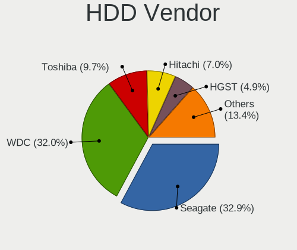
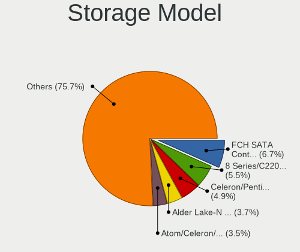
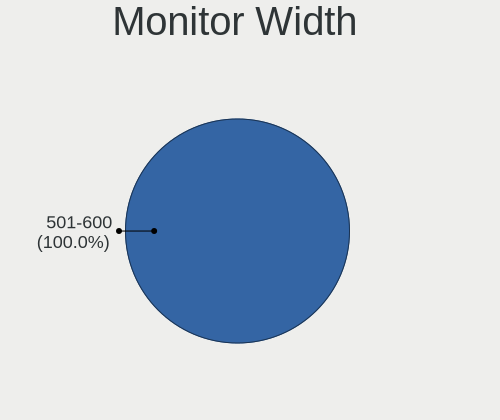
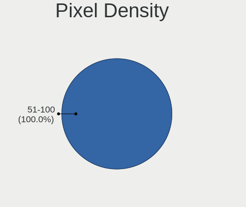
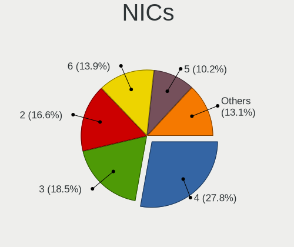

OPNsense - Tested Hardware & Statistics
---------------------------------------

A project to collect tested hardware configurations for OPNsense.

Anyone can contribute to this report by the [hw-probe](https://github.com/linuxhw/hw-probe/blob/master/INSTALL.BSD.md) tool:

    hw-probe -all -upload

Please contribute! Especially if your hardware is rare.

Contents
--------

* [ Test Cases ](#test-cases)

* [ System ](#system)
  - [ OS                       ](#os)
  - [ OS Family                ](#os-family)
  - [ Arch                     ](#arch)
  - [ DE                       ](#de)
  - [ Display Server           ](#display-server)
  - [ Display Manager          ](#display-manager)
  - [ OS Lang                  ](#os-lang)
  - [ Boot Mode                ](#boot-mode)
  - [ Filesystem               ](#filesystem)
  - [ Part. scheme             ](#part-scheme)

* [ Board ](#board)
  - [ Vendor                   ](#vendor)
  - [ Model                    ](#model)
  - [ Model Family             ](#model-family)
  - [ MFG Year                 ](#mfg-year)
  - [ Form Factor              ](#form-factor)
  - [ Coreboot                 ](#coreboot)
  - [ RAM Size                 ](#ram-size)
  - [ RAM Used                 ](#ram-used)
  - [ Total Drives             ](#total-drives)
  - [ Has CD-ROM               ](#has-cd-rom)
  - [ Has Ethernet             ](#has-ethernet)
  - [ Has WiFi                 ](#has-wifi)
  - [ Has Bluetooth            ](#has-bluetooth)

* [ Location ](#location)
  - [ Country                  ](#country)
  - [ City                     ](#city)

* [ Drives ](#drives)
  - [ Drive Vendor             ](#drive-vendor)
  - [ Drive Model              ](#drive-model)
  - [ HDD Vendor               ](#hdd-vendor)
  - [ SSD Vendor               ](#ssd-vendor)
  - [ Drive Kind               ](#drive-kind)
  - [ Drive Connector          ](#drive-connector)
  - [ Drive Size               ](#drive-size)
  - [ Space Total              ](#space-total)
  - [ Space Used               ](#space-used)
  - [ Malfunc. Drives          ](#malfunc-drives)
  - [ Malfunc. Drive Vendor    ](#malfunc-drive-vendor)
  - [ Malfunc. HDD Vendor      ](#malfunc-hdd-vendor)
  - [ Malfunc. Drive Kind      ](#malfunc-drive-kind)
  - [ Failed Drives            ](#failed-drives)
  - [ Failed Drive Vendor      ](#failed-drive-vendor)
  - [ Drive Status             ](#drive-status)

* [ Storage controller ](#storage-controller)
  - [ Storage Vendor           ](#storage-vendor)
  - [ Storage Model            ](#storage-model)
  - [ Storage Kind             ](#storage-kind)

* [ Processor ](#processor)
  - [ CPU Vendor               ](#cpu-vendor)
  - [ CPU Model                ](#cpu-model)
  - [ CPU Model Family         ](#cpu-model-family)
  - [ CPU Cores                ](#cpu-cores)
  - [ CPU Sockets              ](#cpu-sockets)
  - [ CPU Threads              ](#cpu-threads)
  - [ CPU Microarch            ](#cpu-microarch)

* [ Graphics ](#graphics)
  - [ GPU Vendor               ](#gpu-vendor)
  - [ GPU Model                ](#gpu-model)
  - [ GPU Combo                ](#gpu-combo)
  - [ GPU Driver               ](#gpu-driver)
  - [ GPU Memory               ](#gpu-memory)

* [ Monitor ](#monitor)
  - [ Monitor Vendor           ](#monitor-vendor)
  - [ Monitor Model            ](#monitor-model)
  - [ Monitor Resolution       ](#monitor-resolution)
  - [ Monitor Diagonal         ](#monitor-diagonal)
  - [ Monitor Width            ](#monitor-width)
  - [ Aspect Ratio             ](#aspect-ratio)
  - [ Monitor Area             ](#monitor-area)
  - [ Pixel Density            ](#pixel-density)
  - [ Multiple Monitors        ](#multiple-monitors)

* [ Network ](#network)
  - [ Net Controller Vendor    ](#net-controller-vendor)
  - [ Net Controller Model     ](#net-controller-model)
  - [ Wireless Vendor          ](#wireless-vendor)
  - [ Wireless Model           ](#wireless-model)
  - [ Ethernet Vendor          ](#ethernet-vendor)
  - [ Ethernet Model           ](#ethernet-model)
  - [ Net Controller Kind      ](#net-controller-kind)
  - [ Used Controller          ](#used-controller)
  - [ NICs                     ](#nics)
  - [ IPv6                     ](#ipv6)

* [ Bluetooth ](#bluetooth)
  - [ Bluetooth Vendor         ](#bluetooth-vendor)
  - [ Bluetooth Model          ](#bluetooth-model)

* [ Sound ](#sound)
  - [ Sound Vendor             ](#sound-vendor)
  - [ Sound Model              ](#sound-model)

* [ Memory ](#memory)
  - [ Memory Vendor            ](#memory-vendor)
  - [ Memory Model             ](#memory-model)
  - [ Memory Kind              ](#memory-kind)
  - [ Memory Form Factor       ](#memory-form-factor)
  - [ Memory Size              ](#memory-size)
  - [ Memory Speed             ](#memory-speed)

* [ Printers & scanners ](#printers--scanners)
  - [ Printer Vendor           ](#printer-vendor)
  - [ Printer Model            ](#printer-model)
  - [ Scanner Vendor           ](#scanner-vendor)
  - [ Scanner Model            ](#scanner-model)

* [ Camera ](#camera)
  - [ Camera Vendor            ](#camera-vendor)
  - [ Camera Model             ](#camera-model)

* [ Security ](#security)
  - [ Fingerprint Vendor       ](#fingerprint-vendor)
  - [ Fingerprint Model        ](#fingerprint-model)
  - [ Chipcard Vendor          ](#chipcard-vendor)
  - [ Chipcard Model           ](#chipcard-model)

* [ Unsupported ](#unsupported)
  - [ Unsupported Devices      ](#unsupported-devices)
  - [ Unsupported Device Types ](#unsupported-device-types)

Test Cases
----------

Total: 9791

| Vendor        | Model                       | Form-Factor | Probe                                                     | Date         |
|---------------|-----------------------------|-------------|-----------------------------------------------------------|--------------|
| Protectli     | FW6 Ver                     | Desktop     | [61c7be6541](https://bsd-hardware.info/?probe=61c7be6541) | Jul 01, 2023 |
| CWWK          | CW-AD4L-N V1                | Desktop     | [3d03ade7ab](https://bsd-hardware.info/?probe=3d03ade7ab) | Jul 01, 2023 |
| Techvision    | TVI7309X B0                 | Desktop     | [7c71b88b22](https://bsd-hardware.info/?probe=7c71b88b22) | Jun 30, 2023 |
| PC Engines    | apu4                        | Desktop     | [62f0b60653](https://bsd-hardware.info/?probe=62f0b60653) | Jun 30, 2023 |
| Lenovo        | 3136 SDK0J40697 WIN 3305... | Mini pc     | [0e1a626160](https://bsd-hardware.info/?probe=0e1a626160) | Jun 30, 2023 |
| Unknown       | Unknown                     | Desktop     | [ff012340d5](https://bsd-hardware.info/?probe=ff012340d5) | Jun 30, 2023 |
| HP            | 1998                        | Desktop     | [d1df8f0773](https://bsd-hardware.info/?probe=d1df8f0773) | Jun 30, 2023 |
| Protectli     | FW6 Ver                     | Desktop     | [5c6f36540d](https://bsd-hardware.info/?probe=5c6f36540d) | Jun 29, 2023 |
| Intel         | Q3XXG4-P V1.0               | Desktop     | [3e8f4fb0a8](https://bsd-hardware.info/?probe=3e8f4fb0a8) | Jun 29, 2023 |
| Dell          | 00V62H A01                  | Desktop     | [d60c967edb](https://bsd-hardware.info/?probe=d60c967edb) | Jun 29, 2023 |
| Protectli     | VP2420                      | Desktop     | [950ff902c2](https://bsd-hardware.info/?probe=950ff902c2) | Jun 29, 2023 |
| Sophos        | XG                          | Firewall    | [b84ed2de3a](https://bsd-hardware.info/?probe=b84ed2de3a) | Jun 29, 2023 |
| HP            | 82A2                        | Desktop     | [4b8d139419](https://bsd-hardware.info/?probe=4b8d139419) | Jun 29, 2023 |
| Intel         | DQ67SW AAG12527-310         | Desktop     | [5b272b02cb](https://bsd-hardware.info/?probe=5b272b02cb) | Jun 29, 2023 |
| Apple         | Mac-35C5E08120C7EEAF Mac... | Mini pc     | [ddeb9d00a6](https://bsd-hardware.info/?probe=ddeb9d00a6) | Jun 29, 2023 |
| Unknown       | Unknown                     | Desktop     | [e57d17e272](https://bsd-hardware.info/?probe=e57d17e272) | Jun 29, 2023 |
| Unknown       | Unknown                     | Desktop     | [4c5d9c5da3](https://bsd-hardware.info/?probe=4c5d9c5da3) | Jun 29, 2023 |
| Dell          | 0NW6H5 A00                  | Desktop     | [0cdc2b47b2](https://bsd-hardware.info/?probe=0cdc2b47b2) | Jun 29, 2023 |
| HP            | 8595                        | Desktop     | [e1a82ff0c5](https://bsd-hardware.info/?probe=e1a82ff0c5) | Jun 29, 2023 |
| Unknown       | Unknown                     | Desktop     | [41e020bc03](https://bsd-hardware.info/?probe=41e020bc03) | Jun 29, 2023 |
| Intel         | MAHOBAY                     | Desktop     | [4053bc358e](https://bsd-hardware.info/?probe=4053bc358e) | Jun 29, 2023 |
| Unknown       | Unknown                     | Desktop     | [075deef24f](https://bsd-hardware.info/?probe=075deef24f) | Jun 28, 2023 |
| CWWK          | MINIPC-G4                   | Desktop     | [ebfa9abcd3](https://bsd-hardware.info/?probe=ebfa9abcd3) | Jun 28, 2023 |
| Inventec      | D CLASS A02                 | Desktop     | [c96df95354](https://bsd-hardware.info/?probe=c96df95354) | Jun 28, 2023 |
| CncTion       | J4125-4L-I225               | Desktop     | [1785cb2fa3](https://bsd-hardware.info/?probe=1785cb2fa3) | Jun 28, 2023 |
| Dell          | 0NC2VH A01                  | Desktop     | [d5a7320a8a](https://bsd-hardware.info/?probe=d5a7320a8a) | Jun 28, 2023 |
| Techvision    | TVI7309X B0                 | Desktop     | [0dbf4904dc](https://bsd-hardware.info/?probe=0dbf4904dc) | Jun 28, 2023 |
| Deciso        | NetBoard-A10                | Notebook    | [2eff359d8f](https://bsd-hardware.info/?probe=2eff359d8f) | Jun 28, 2023 |
| Unknown       | Unknown                     | Desktop     | [5080e84698](https://bsd-hardware.info/?probe=5080e84698) | Jun 28, 2023 |
| Deciso        | DEC2700 - OPNsense Appli... | Notebook    | [aedd3a8255](https://bsd-hardware.info/?probe=aedd3a8255) | Jun 28, 2023 |
| Dell          | 03X6X0 A00                  | Server      | [88c047f069](https://bsd-hardware.info/?probe=88c047f069) | Jun 28, 2023 |
| Unknown       | Unknown                     | Desktop     | [9d98798bc8](https://bsd-hardware.info/?probe=9d98798bc8) | Jun 27, 2023 |
| HP            | 339A                        | Desktop     | [b08e1fc092](https://bsd-hardware.info/?probe=b08e1fc092) | Jun 27, 2023 |
| Lenovo        | 3136 SDK0J40697 WIN 3305... | Mini pc     | [30240eb64b](https://bsd-hardware.info/?probe=30240eb64b) | Jun 27, 2023 |
| MW            | GMLK-2_5G4L                 | Desktop     | [1ef9818928](https://bsd-hardware.info/?probe=1ef9818928) | Jun 27, 2023 |
| Unknown       | Unknown                     | Desktop     | [23cdf1d4af](https://bsd-hardware.info/?probe=23cdf1d4af) | Jun 27, 2023 |
| Unknown       | Unknown                     | Desktop     | [a548b021da](https://bsd-hardware.info/?probe=a548b021da) | Jun 27, 2023 |
| YANYU         | H67SL                       | Desktop     | [5d5fd8a8cd](https://bsd-hardware.info/?probe=5d5fd8a8cd) | Jun 27, 2023 |
| ASUSTek       | PRIME A320M-K               | Desktop     | [a53c1176ba](https://bsd-hardware.info/?probe=a53c1176ba) | Jun 27, 2023 |
| Supermicro    | X11SDV-4C-TP8F              | Desktop     | [bc448a4c10](https://bsd-hardware.info/?probe=bc448a4c10) | Jun 27, 2023 |
| Fujitsu       | D3313-G1 S26361-D3313-G1    | Desktop     | [bcad942162](https://bsd-hardware.info/?probe=bcad942162) | Jun 26, 2023 |
| Unknown       | YL-SKUL6                    | Desktop     | [1512f63972](https://bsd-hardware.info/?probe=1512f63972) | Jun 26, 2023 |
| Fujitsu       | D3313-A1 S26361-D3313-A1    | Desktop     | [96917bdb04](https://bsd-hardware.info/?probe=96917bdb04) | Jun 26, 2023 |
| Deciso        | OPNsense Appliance          | Notebook    | [be0008eb2a](https://bsd-hardware.info/?probe=be0008eb2a) | Jun 26, 2023 |
| ASUSTek       | N3700T                      | Desktop     | [16b73b05ef](https://bsd-hardware.info/?probe=16b73b05ef) | Jun 26, 2023 |
| HP            | 1998                        | Desktop     | [b6a89cea25](https://bsd-hardware.info/?probe=b6a89cea25) | Jun 26, 2023 |
| Cisco         | ASA5515 A0                  | Desktop     | [9d8eedf081](https://bsd-hardware.info/?probe=9d8eedf081) | Jun 26, 2023 |
| Protectli     | FW6 Ver                     | Desktop     | [fa177a2538](https://bsd-hardware.info/?probe=fa177a2538) | Jun 26, 2023 |
| Protectli     | FW6 Ver                     | Desktop     | [54ef7dc131](https://bsd-hardware.info/?probe=54ef7dc131) | Jun 26, 2023 |
| Protectli     | FW6 Ver                     | Desktop     | [b056cd0426](https://bsd-hardware.info/?probe=b056cd0426) | Jun 26, 2023 |
| HP            | 18E9                        | Desktop     | [aba608120b](https://bsd-hardware.info/?probe=aba608120b) | Jun 26, 2023 |
| Unknown       | Unknown                     | Desktop     | [18da718e9e](https://bsd-hardware.info/?probe=18da718e9e) | Jun 26, 2023 |
| HP            | 1495                        | Desktop     | [564ff2ef77](https://bsd-hardware.info/?probe=564ff2ef77) | Jun 26, 2023 |
| Dell          | 0TW855 A07                  | Server      | [6b0d9156a9](https://bsd-hardware.info/?probe=6b0d9156a9) | Jun 26, 2023 |
| Supermicro    | X9SCL/X9SCMA                | Desktop     | [489b7b6bae](https://bsd-hardware.info/?probe=489b7b6bae) | Jun 26, 2023 |
| Unknown       | Unknown                     | Desktop     | [cd3b925f27](https://bsd-hardware.info/?probe=cd3b925f27) | Jun 26, 2023 |
| Gigabyte      | C1037UN                     | Desktop     | [fccc3f4b80](https://bsd-hardware.info/?probe=fccc3f4b80) | Jun 26, 2023 |
| Protectli     | FW6 Ver                     | Desktop     | [03eb1a54c8](https://bsd-hardware.info/?probe=03eb1a54c8) | Jun 25, 2023 |
| Dell          | 0J8G6F A02                  | Desktop     | [e4a7fc0f0e](https://bsd-hardware.info/?probe=e4a7fc0f0e) | Jun 25, 2023 |
| Lenovo        | 3102 SDK0J40697 WIN 3305... | Desktop     | [e76d3511a1](https://bsd-hardware.info/?probe=e76d3511a1) | Jun 25, 2023 |
| Unknown       | Unknown                     | Desktop     | [27bbec5905](https://bsd-hardware.info/?probe=27bbec5905) | Jun 25, 2023 |
| AZW           | EQ                          | Desktop     | [c410cd5c1c](https://bsd-hardware.info/?probe=c410cd5c1c) | Jun 25, 2023 |
| Unknown       | Unknown                     | Desktop     | [c660f668dc](https://bsd-hardware.info/?probe=c660f668dc) | Jun 25, 2023 |
| Unknown       | J3160-4L                    | Desktop     | [5ad411cd6b](https://bsd-hardware.info/?probe=5ad411cd6b) | Jun 25, 2023 |
| Gigabyte      | B450M DS3H-CF               | Desktop     | [dc937eee63](https://bsd-hardware.info/?probe=dc937eee63) | Jun 25, 2023 |
| Unknown       | Unknown                     | Desktop     | [b44e00cdf3](https://bsd-hardware.info/?probe=b44e00cdf3) | Jun 25, 2023 |
| Hardkernel    | ODROID-H3                   | Desktop     | [8a2ea60929](https://bsd-hardware.info/?probe=8a2ea60929) | Jun 25, 2023 |
| Unknown       | Unknown                     | Desktop     | [32e290d370](https://bsd-hardware.info/?probe=32e290d370) | Jun 25, 2023 |
| Gigabyte      | H610I DDR4                  | Desktop     | [dea4808206](https://bsd-hardware.info/?probe=dea4808206) | Jun 24, 2023 |
| Sophos        | SG                          | Firewall    | [11e1176b5e](https://bsd-hardware.info/?probe=11e1176b5e) | Jun 24, 2023 |
| Supermicro    | X10SRL-FB                   | Server      | [24770c65d3](https://bsd-hardware.info/?probe=24770c65d3) | Jun 24, 2023 |
| Gigabyte      | Z77N-WIFI                   | Desktop     | [aca5df3113](https://bsd-hardware.info/?probe=aca5df3113) | Jun 24, 2023 |
| HP            | 8103 A01                    | Mini pc     | [feb4e78649](https://bsd-hardware.info/?probe=feb4e78649) | Jun 24, 2023 |
| AZW           | EQ                          | Desktop     | [a76336474d](https://bsd-hardware.info/?probe=a76336474d) | Jun 24, 2023 |
| Shuttle       | DH370                       | Desktop     | [95eb3bd4a8](https://bsd-hardware.info/?probe=95eb3bd4a8) | Jun 24, 2023 |
| AMI           | Aptio CRB                   | Mini pc     | [c72cc8a340](https://bsd-hardware.info/?probe=c72cc8a340) | Jun 24, 2023 |
| ASRock        | J4105-ITX                   | Desktop     | [bfe12f97ba](https://bsd-hardware.info/?probe=bfe12f97ba) | Jun 24, 2023 |
| Protectli     | FW6 Ver                     | Desktop     | [6210e8f0bc](https://bsd-hardware.info/?probe=6210e8f0bc) | Jun 24, 2023 |
| Techvision    | TVI7309X B0                 | Desktop     | [93213fc931](https://bsd-hardware.info/?probe=93213fc931) | Jun 24, 2023 |
| Unknown       | Unknown                     | Desktop     | [b67ce69ea4](https://bsd-hardware.info/?probe=b67ce69ea4) | Jun 23, 2023 |
| Supermicro    | X10SLL-F                    | Server      | [fdf31a6e78](https://bsd-hardware.info/?probe=fdf31a6e78) | Jun 23, 2023 |
| Dell          | 02YRK5 A03                  | Desktop     | [2d631e9745](https://bsd-hardware.info/?probe=2d631e9745) | Jun 23, 2023 |
| Techvision    | TVI7309X B0                 | Desktop     | [18cf91f3a4](https://bsd-hardware.info/?probe=18cf91f3a4) | Jun 23, 2023 |
| Intel         | Q3XXG4-P V1.0               | Desktop     | [bb4dc2b1a2](https://bsd-hardware.info/?probe=bb4dc2b1a2) | Jun 23, 2023 |
| Unknown       | Unknown                     | Notebook    | [b324d1f4fc](https://bsd-hardware.info/?probe=b324d1f4fc) | Jun 23, 2023 |
| Unknown       | Unknown                     | Desktop     | [16ceade742](https://bsd-hardware.info/?probe=16ceade742) | Jun 23, 2023 |
| Lenovo        | SDK0E50510 WIN              | Desktop     | [a411832c7d](https://bsd-hardware.info/?probe=a411832c7d) | Jun 23, 2023 |
| HP            | 213D A01                    | Desktop     | [eccc48bb80](https://bsd-hardware.info/?probe=eccc48bb80) | Jun 23, 2023 |
| Unknown       | Unknown                     | Desktop     | [6e8085380f](https://bsd-hardware.info/?probe=6e8085380f) | Jun 23, 2023 |
| Protectli     | FW4B                        | Desktop     | [6c993e8f34](https://bsd-hardware.info/?probe=6c993e8f34) | Jun 23, 2023 |
| Intel         | SKYBAY                      | Desktop     | [940adce39f](https://bsd-hardware.info/?probe=940adce39f) | Jun 23, 2023 |
| Dell          | 0Y7WYT A00                  | Desktop     | [a931ed9f0a](https://bsd-hardware.info/?probe=a931ed9f0a) | Jun 23, 2023 |
| Lenovo        | 312A SDK0J40697 WIN 3305... | Desktop     | [b6916f61a8](https://bsd-hardware.info/?probe=b6916f61a8) | Jun 23, 2023 |
| ASRock        | 4X4-4000 Series             | Desktop     | [c9420276e7](https://bsd-hardware.info/?probe=c9420276e7) | Jun 23, 2023 |
| Unknown       | Unknown                     | Desktop     | [97583c2b74](https://bsd-hardware.info/?probe=97583c2b74) | Jun 23, 2023 |
| AZW           | EQ                          | Desktop     | [8a85da80b2](https://bsd-hardware.info/?probe=8a85da80b2) | Jun 23, 2023 |
| Unknown       | Unknown                     | Desktop     | [508aa0bdb4](https://bsd-hardware.info/?probe=508aa0bdb4) | Jun 23, 2023 |
| Unknown       | Unknown                     | Desktop     | [eb49ebcc0c](https://bsd-hardware.info/?probe=eb49ebcc0c) | Jun 22, 2023 |
| BESSTAR Te... | GB7                         | Mini pc     | [bc8c23b6ff](https://bsd-hardware.info/?probe=bc8c23b6ff) | Jun 22, 2023 |
| NetGear       | ReadyNAS 3130               | Firewall    | [7fa1d24d06](https://bsd-hardware.info/?probe=7fa1d24d06) | Jun 22, 2023 |
| CWWK          | CW-AD4L-N V1                | Desktop     | [b7ca7c7195](https://bsd-hardware.info/?probe=b7ca7c7195) | Jun 22, 2023 |
| Lenovo        | ThinkCentre M55 880894U     | Desktop     | [e406083f25](https://bsd-hardware.info/?probe=e406083f25) | Jun 22, 2023 |
| Unknown       | Unknown                     | Desktop     | [f73625157c](https://bsd-hardware.info/?probe=f73625157c) | Jun 22, 2023 |
| Protectli     | VP2410                      | Desktop     | [94e2177a56](https://bsd-hardware.info/?probe=94e2177a56) | Jun 22, 2023 |
| Sophos        | SG                          | Firewall    | [6763145000](https://bsd-hardware.info/?probe=6763145000) | Jun 22, 2023 |
| Dell          | 0NW6H5 A00                  | Desktop     | [7d3a60d628](https://bsd-hardware.info/?probe=7d3a60d628) | Jun 22, 2023 |
| Techvision    | TVI7309X B0                 | Desktop     | [0b667bc4e7](https://bsd-hardware.info/?probe=0b667bc4e7) | Jun 22, 2023 |
| HP            | ProLiant DL360 G7           | Server      | [ed967db034](https://bsd-hardware.info/?probe=ed967db034) | Jun 22, 2023 |
| ASRock        | H110M-ITX                   | Desktop     | [1180da18fb](https://bsd-hardware.info/?probe=1180da18fb) | Jun 22, 2023 |
| Techvision    | TVI7309X B0                 | Desktop     | [178a67ff39](https://bsd-hardware.info/?probe=178a67ff39) | Jun 21, 2023 |
| Supermicro    | X10SLH-N6-ST031             | Server      | [572c03a709](https://bsd-hardware.info/?probe=572c03a709) | Jun 21, 2023 |
| HP            | 8592                        | Desktop     | [154f28878a](https://bsd-hardware.info/?probe=154f28878a) | Jun 21, 2023 |
| HPE           | ProLiant DL20 Gen10 Plus    | Server      | [7d5925b21e](https://bsd-hardware.info/?probe=7d5925b21e) | Jun 21, 2023 |
| Dell          | 0NC2VH A01                  | Desktop     | [f094606e8f](https://bsd-hardware.info/?probe=f094606e8f) | Jun 21, 2023 |
| Hardkernel    | ODROID-H3                   | Desktop     | [8f550b0d75](https://bsd-hardware.info/?probe=8f550b0d75) | Jun 21, 2023 |
| BESSTAR Te... | TH50                        | Desktop     | [efc396837c](https://bsd-hardware.info/?probe=efc396837c) | Jun 21, 2023 |
| Techvision    | TVI7309X B0                 | Desktop     | [12d57aa9d9](https://bsd-hardware.info/?probe=12d57aa9d9) | Jun 21, 2023 |
| CWWK          | CW-AD4L-N V1                | Desktop     | [a09d71cc14](https://bsd-hardware.info/?probe=a09d71cc14) | Jun 21, 2023 |
| HP            | 802E                        | Desktop     | [595a5d4f60](https://bsd-hardware.info/?probe=595a5d4f60) | Jun 21, 2023 |
| BESSTAR Te... | GB7                         | Mini pc     | [4f80d81bbe](https://bsd-hardware.info/?probe=4f80d81bbe) | Jun 20, 2023 |
| CWWK          | CW-AD4L-N V1                | Desktop     | [19b4d842d4](https://bsd-hardware.info/?probe=19b4d842d4) | Jun 20, 2023 |
| Protectli     | VP2420                      | Desktop     | [6d1ca53e48](https://bsd-hardware.info/?probe=6d1ca53e48) | Jun 20, 2023 |
| Unknown       | Unknown                     | Desktop     | [e798ae3230](https://bsd-hardware.info/?probe=e798ae3230) | Jun 20, 2023 |
| Unknown       | Unknown                     | Desktop     | [d0c184ae86](https://bsd-hardware.info/?probe=d0c184ae86) | Jun 20, 2023 |
| ASUSTek       | PRIME A320M-K               | Desktop     | [b870037532](https://bsd-hardware.info/?probe=b870037532) | Jun 20, 2023 |
| ASUSTek       | PRIME A320M-K               | Desktop     | [a0409cd187](https://bsd-hardware.info/?probe=a0409cd187) | Jun 20, 2023 |
| Lenovo        | SHARKBAY NOK                | Desktop     | [0027ab7bbf](https://bsd-hardware.info/?probe=0027ab7bbf) | Jun 20, 2023 |
| Fujitsu       | D3373-B1 S26361-D3373-B1... | Server      | [daf34373d3](https://bsd-hardware.info/?probe=daf34373d3) | Jun 19, 2023 |
| Unknown       | Unknown                     | Notebook    | [c017b848dc](https://bsd-hardware.info/?probe=c017b848dc) | Jun 19, 2023 |
| Supermicro    | M11SDV-4CT-LN4F             | Server      | [18f6f78915](https://bsd-hardware.info/?probe=18f6f78915) | Jun 19, 2023 |
| Yanling       | YL-KBRL2 Series Ver:1.02    | Desktop     | [9e8d6110f4](https://bsd-hardware.info/?probe=9e8d6110f4) | Jun 19, 2023 |
| Techvision    | TVI7309X B0                 | Desktop     | [1fa198f78d](https://bsd-hardware.info/?probe=1fa198f78d) | Jun 19, 2023 |
| HP            | 339A                        | Desktop     | [c019d583c9](https://bsd-hardware.info/?probe=c019d583c9) | Jun 19, 2023 |
| LANCOM Sys... | UF-60                       | Desktop     | [96904b8bdd](https://bsd-hardware.info/?probe=96904b8bdd) | Jun 19, 2023 |
| Intel         | CRESCENTBAY                 | Desktop     | [e8c8da464a](https://bsd-hardware.info/?probe=e8c8da464a) | Jun 19, 2023 |
| AMI           | Aptio CRB                   | Mini pc     | [1b3b10c231](https://bsd-hardware.info/?probe=1b3b10c231) | Jun 19, 2023 |
| Unknown       | Unknown                     | Desktop     | [5fc629699d](https://bsd-hardware.info/?probe=5fc629699d) | Jun 18, 2023 |
| Unknown       | Unknown                     | Desktop     | [29313e36c9](https://bsd-hardware.info/?probe=29313e36c9) | Jun 18, 2023 |
| Intel         | ChiefRiver D                | Desktop     | [ce6d6e7e9e](https://bsd-hardware.info/?probe=ce6d6e7e9e) | Jun 18, 2023 |
| Unknown       | Unknown                     | Desktop     | [2cc06a4553](https://bsd-hardware.info/?probe=2cc06a4553) | Jun 18, 2023 |
| Dell          | 07F37C A01                  | Desktop     | [16e5a062a2](https://bsd-hardware.info/?probe=16e5a062a2) | Jun 18, 2023 |
| Dell          | 05KX61 A02                  | Server      | [7131f9450f](https://bsd-hardware.info/?probe=7131f9450f) | Jun 18, 2023 |
| Fujitsu       | D3313-G1 S26361-D3313-G1    | Desktop     | [c15bb7d984](https://bsd-hardware.info/?probe=c15bb7d984) | Jun 18, 2023 |
| ASRock        | Z97 Professional            | Desktop     | [c978ddda86](https://bsd-hardware.info/?probe=c978ddda86) | Jun 18, 2023 |
| Sophos        | SG                          | Firewall    | [94a6b615cb](https://bsd-hardware.info/?probe=94a6b615cb) | Jun 17, 2023 |
| Dell          | 04415J A00                  | Mini pc     | [31c6e3d0b1](https://bsd-hardware.info/?probe=31c6e3d0b1) | Jun 17, 2023 |
| Samsung       | NC210/NC110                 | Notebook    | [06f5a9210b](https://bsd-hardware.info/?probe=06f5a9210b) | Jun 17, 2023 |
| Unknown       | Unknown                     | Desktop     | [b20059737f](https://bsd-hardware.info/?probe=b20059737f) | Jun 17, 2023 |
| Unknown       | Unknown                     | Desktop     | [81268da610](https://bsd-hardware.info/?probe=81268da610) | Jun 17, 2023 |
| Gigabyte      | J4005ND2P-CF                | Desktop     | [ee61a4b160](https://bsd-hardware.info/?probe=ee61a4b160) | Jun 17, 2023 |
| Unknown       | ITX-M41E                    | Desktop     | [2e8c62d163](https://bsd-hardware.info/?probe=2e8c62d163) | Jun 16, 2023 |
| Dell          | 0HC3G4 A00                  | Mini pc     | [72ac0afa21](https://bsd-hardware.info/?probe=72ac0afa21) | Jun 16, 2023 |
| Unknown       | ITX-M41E                    | Desktop     | [671e67a42d](https://bsd-hardware.info/?probe=671e67a42d) | Jun 16, 2023 |
| AMD           | Kabini CRB                  | Desktop     | [b774a8b586](https://bsd-hardware.info/?probe=b774a8b586) | Jun 16, 2023 |
| HP            | 83E9                        | Desktop     | [23ec260317](https://bsd-hardware.info/?probe=23ec260317) | Jun 16, 2023 |
| CNCTION-IA... | Unknown                     | Desktop     | [1a0573767e](https://bsd-hardware.info/?probe=1a0573767e) | Jun 16, 2023 |
| Unknown       | Unknown                     | Desktop     | [a6d5232f75](https://bsd-hardware.info/?probe=a6d5232f75) | Jun 16, 2023 |
| CWWK          | CW-AD4L-N V1                | Desktop     | [31cba7b0c6](https://bsd-hardware.info/?probe=31cba7b0c6) | Jun 15, 2023 |
| Unknown       | Unknown                     | Desktop     | [06754d9e71](https://bsd-hardware.info/?probe=06754d9e71) | Jun 15, 2023 |
| CncTion       | N5105-4L B0                 | Desktop     | [b9c5b6ec05](https://bsd-hardware.info/?probe=b9c5b6ec05) | Jun 15, 2023 |
| ASUSTek       | H110M-R                     | Desktop     | [cc5fe45365](https://bsd-hardware.info/?probe=cc5fe45365) | Jun 15, 2023 |
| ASUSTek       | M5A97 PLUS                  | Desktop     | [39e7195baf](https://bsd-hardware.info/?probe=39e7195baf) | Jun 15, 2023 |
| Fujitsu       | D3034-A1 S26361-D3034-A1... | Server      | [a14227cbb3](https://bsd-hardware.info/?probe=a14227cbb3) | Jun 15, 2023 |
| Unknown       | Unknown                     | Desktop     | [93dcd13cb6](https://bsd-hardware.info/?probe=93dcd13cb6) | Jun 15, 2023 |
| Unknown       | Unknown                     | Notebook    | [e218344894](https://bsd-hardware.info/?probe=e218344894) | Jun 15, 2023 |
| Intel         | J1900                       | Desktop     | [4a3a52030b](https://bsd-hardware.info/?probe=4a3a52030b) | Jun 15, 2023 |
| Dell          | 08NPPY A00                  | Desktop     | [8586467924](https://bsd-hardware.info/?probe=8586467924) | Jun 15, 2023 |
| MW            | GMLK-2_5G4L                 | Desktop     | [3274745a08](https://bsd-hardware.info/?probe=3274745a08) | Jun 15, 2023 |
| Deciso        | OPNsense Appliance          | Notebook    | [43936f5f1c](https://bsd-hardware.info/?probe=43936f5f1c) | Jun 15, 2023 |
| Unknown       | Unknown                     | Desktop     | [7def20c99d](https://bsd-hardware.info/?probe=7def20c99d) | Jun 14, 2023 |
| Dell          | 0H7TGR A00                  | Desktop     | [da72cc4da4](https://bsd-hardware.info/?probe=da72cc4da4) | Jun 14, 2023 |
| Lenovo        | 3102 SDK0J40697 WIN 3305... | Desktop     | [2e81fe65c8](https://bsd-hardware.info/?probe=2e81fe65c8) | Jun 14, 2023 |
| Lenovo        | 312D SDK0J40697 WIN 3305... | Mini pc     | [355639e85e](https://bsd-hardware.info/?probe=355639e85e) | Jun 14, 2023 |
| Protectli     | FW4B Ver                    | Desktop     | [3484cbbf9f](https://bsd-hardware.info/?probe=3484cbbf9f) | Jun 14, 2023 |
| PC Engines    | apu4                        | Desktop     | [ea036662ca](https://bsd-hardware.info/?probe=ea036662ca) | Jun 14, 2023 |
| Dell          | 0VWT90 A00                  | Server      | [884ea7a785](https://bsd-hardware.info/?probe=884ea7a785) | Jun 14, 2023 |
| Protectli     | VP2420                      | Desktop     | [82ecf3a046](https://bsd-hardware.info/?probe=82ecf3a046) | Jun 14, 2023 |
| Apple         | Mac-35C5E08120C7EEAF Mac... | Mini pc     | [644e9b9d90](https://bsd-hardware.info/?probe=644e9b9d90) | Jun 14, 2023 |
| Intel         | D2500CC AAG81477-401        | Desktop     | [15329a007b](https://bsd-hardware.info/?probe=15329a007b) | Jun 14, 2023 |
| Unknown       | Unknown                     | Desktop     | [229e573059](https://bsd-hardware.info/?probe=229e573059) | Jun 13, 2023 |
| Dell          | 0HD5W2 A01                  | Desktop     | [a6c6c43f64](https://bsd-hardware.info/?probe=a6c6c43f64) | Jun 13, 2023 |
| Unknown       | J3160-4L                    | Desktop     | [4a6667249e](https://bsd-hardware.info/?probe=4a6667249e) | Jun 13, 2023 |
| Techvision    | TVI7309X B0                 | Desktop     | [080be9d6f5](https://bsd-hardware.info/?probe=080be9d6f5) | Jun 13, 2023 |
| Lenovo        | ThinkPad T530 2429AP0       | Notebook    | [ddf37e7b17](https://bsd-hardware.info/?probe=ddf37e7b17) | Jun 13, 2023 |
| Gigabyte      | Z77N-WIFI                   | Desktop     | [f96302f46c](https://bsd-hardware.info/?probe=f96302f46c) | Jun 13, 2023 |
| Samsung       | NC210/NC110                 | Notebook    | [dad27d6099](https://bsd-hardware.info/?probe=dad27d6099) | Jun 13, 2023 |
| MSI           | X370 GAMING PRO CARBON      | Desktop     | [33b64d3084](https://bsd-hardware.info/?probe=33b64d3084) | Jun 13, 2023 |
| Dell          | 02YYK5 A00                  | Desktop     | [0dc0eab687](https://bsd-hardware.info/?probe=0dc0eab687) | Jun 13, 2023 |
| Fujitsu       | D3313-E1 S26361-D3313-E1    | Desktop     | [015a5d839a](https://bsd-hardware.info/?probe=015a5d839a) | Jun 13, 2023 |
| Pegatron      | 2AD5                        | Desktop     | [751e307940](https://bsd-hardware.info/?probe=751e307940) | Jun 13, 2023 |
| Unknown       | Unknown                     | Desktop     | [27617e1ca6](https://bsd-hardware.info/?probe=27617e1ca6) | Jun 13, 2023 |
| Apple         | Mac-35C5E08120C7EEAF Mac... | Mini pc     | [1307c1f267](https://bsd-hardware.info/?probe=1307c1f267) | Jun 13, 2023 |
| HP            | 3397                        | Desktop     | [a918ce0c4b](https://bsd-hardware.info/?probe=a918ce0c4b) | Jun 12, 2023 |
| ASUSTek       | SABERTOOTH Z77              | Desktop     | [ffe9b51f78](https://bsd-hardware.info/?probe=ffe9b51f78) | Jun 12, 2023 |
| CWWK          | MINIPC-G12                  | Desktop     | [04ae7435e5](https://bsd-hardware.info/?probe=04ae7435e5) | Jun 12, 2023 |
| Unknown       | Unknown                     | Desktop     | [9d271bc94c](https://bsd-hardware.info/?probe=9d271bc94c) | Jun 12, 2023 |
| MSI           | A320M GRENADE               | Desktop     | [6e0b1f598f](https://bsd-hardware.info/?probe=6e0b1f598f) | Jun 12, 2023 |
| Dell          | 0VWT90 A00                  | Server      | [1860066c89](https://bsd-hardware.info/?probe=1860066c89) | Jun 12, 2023 |
| HP            | 213D A01                    | Desktop     | [2a6603c79a](https://bsd-hardware.info/?probe=2a6603c79a) | Jun 12, 2023 |
| Intel         | NUC11PABi5 M68265-500       | Mini pc     | [1db246e3ab](https://bsd-hardware.info/?probe=1db246e3ab) | Jun 12, 2023 |
| Fujitsu       | D3313-A1 S26361-D3313-A1    | Desktop     | [02509df772](https://bsd-hardware.info/?probe=02509df772) | Jun 12, 2023 |
| Dell          | 00V62H A00                  | Desktop     | [bc5f37ced7](https://bsd-hardware.info/?probe=bc5f37ced7) | Jun 12, 2023 |
| Unknown       | Unknown                     | Desktop     | [193c7d152b](https://bsd-hardware.info/?probe=193c7d152b) | Jun 11, 2023 |
| AMI           | Aptio CRB                   | Mini pc     | [83c176517e](https://bsd-hardware.info/?probe=83c176517e) | Jun 11, 2023 |
| IP3 Tech      | VB2                         | Mini pc     | [38575bac1f](https://bsd-hardware.info/?probe=38575bac1f) | Jun 11, 2023 |
| CWWK          | CW-J6-6L                    | Desktop     | [a380503321](https://bsd-hardware.info/?probe=a380503321) | Jun 11, 2023 |
| AMI           | Aptio CRB                   | Mini pc     | [55a858846e](https://bsd-hardware.info/?probe=55a858846e) | Jun 11, 2023 |
| Sophos        | UTM                         | Firewall    | [d4856d7798](https://bsd-hardware.info/?probe=d4856d7798) | Jun 11, 2023 |
| ASUSTek       | TUF Gaming B650M-PLUS       | Desktop     | [2d2052de27](https://bsd-hardware.info/?probe=2d2052de27) | Jun 11, 2023 |
| Dell          | 0D28YY A00                  | Desktop     | [9f14962984](https://bsd-hardware.info/?probe=9f14962984) | Jun 11, 2023 |
| Techvision    | TVI7309X B0                 | Desktop     | [3679eb8cd4](https://bsd-hardware.info/?probe=3679eb8cd4) | Jun 11, 2023 |
| Protectli     | FW6 Ver                     | Desktop     | [3f8a97d0e7](https://bsd-hardware.info/?probe=3f8a97d0e7) | Jun 11, 2023 |
| Supermicro    | X11SBA-LN4FA                | Server      | [be7bf70aff](https://bsd-hardware.info/?probe=be7bf70aff) | Jun 11, 2023 |
| Supermicro    | A1SRi 123456789             | Mini pc     | [1c8e1c1e80](https://bsd-hardware.info/?probe=1c8e1c1e80) | Jun 11, 2023 |
| Unknown       | Unknown                     | Desktop     | [8988baa83b](https://bsd-hardware.info/?probe=8988baa83b) | Jun 10, 2023 |
| Intel         | S1200KP AAG34877-201        | Desktop     | [39eba90e6a](https://bsd-hardware.info/?probe=39eba90e6a) | Jun 10, 2023 |
| Unknown       | Unknown                     | Desktop     | [88a421e275](https://bsd-hardware.info/?probe=88a421e275) | Jun 10, 2023 |
| Fujitsu       | D3313-A1 S26361-D3313-A1    | Desktop     | [fe412825f2](https://bsd-hardware.info/?probe=fe412825f2) | Jun 10, 2023 |
| Unknown       | Unknown                     | Desktop     | [40bb474319](https://bsd-hardware.info/?probe=40bb474319) | Jun 10, 2023 |
| AZW           | EQ                          | Desktop     | [f1f980d130](https://bsd-hardware.info/?probe=f1f980d130) | Jun 10, 2023 |
| AMI           | Aptio CRB                   | Mini pc     | [ffeca6e776](https://bsd-hardware.info/?probe=ffeca6e776) | Jun 10, 2023 |
| Gigabyte      | C1037UN                     | Desktop     | [d8f7cea73b](https://bsd-hardware.info/?probe=d8f7cea73b) | Jun 10, 2023 |
| Intel         | S1200KP AAG34877-201        | Desktop     | [ec04f3f6d5](https://bsd-hardware.info/?probe=ec04f3f6d5) | Jun 10, 2023 |
| Protectli     | FW4B Ver                    | Desktop     | [af56081a76](https://bsd-hardware.info/?probe=af56081a76) | Jun 10, 2023 |
| Protectli     | FW6 Ver                     | Desktop     | [6cc2f54681](https://bsd-hardware.info/?probe=6cc2f54681) | Jun 10, 2023 |
| Unknown       | Unknown                     | Notebook    | [9afa1aea18](https://bsd-hardware.info/?probe=9afa1aea18) | Jun 10, 2023 |
| AMI           | Aptio CRB                   | Mini pc     | [83e8a9252f](https://bsd-hardware.info/?probe=83e8a9252f) | Jun 09, 2023 |
| ASRock        | B85M-HDS                    | Desktop     | [09a4700a14](https://bsd-hardware.info/?probe=09a4700a14) | Jun 09, 2023 |
| HP            | ProLiant DL360 Gen9         | Server      | [d21bdf0cdb](https://bsd-hardware.info/?probe=d21bdf0cdb) | Jun 09, 2023 |
| ASUSTek       | PRIME B760M-A D4            | Desktop     | [7d23d1c91f](https://bsd-hardware.info/?probe=7d23d1c91f) | Jun 09, 2023 |
| PC Engines    | APU2                        | Desktop     | [24545e8f90](https://bsd-hardware.info/?probe=24545e8f90) | Jun 09, 2023 |
| Dell          | 0YXT71 A02                  | Desktop     | [e42082ba89](https://bsd-hardware.info/?probe=e42082ba89) | Jun 09, 2023 |
| HP            | 82B4                        | Desktop     | [7fc20afdeb](https://bsd-hardware.info/?probe=7fc20afdeb) | Jun 08, 2023 |
| Wortmann      | terra Nettop 2700           | Desktop     | [e4a90ea530](https://bsd-hardware.info/?probe=e4a90ea530) | Jun 08, 2023 |
| Intel         | Q3XXG4-P V1.0               | Desktop     | [1ae49c4706](https://bsd-hardware.info/?probe=1ae49c4706) | Jun 08, 2023 |
| Sophos        | SG                          | Firewall    | [6cf087f800](https://bsd-hardware.info/?probe=6cf087f800) | Jun 08, 2023 |
| Sophos        | SG                          | Firewall    | [cde6f61458](https://bsd-hardware.info/?probe=cde6f61458) | Jun 08, 2023 |
| CWWK          | MINIPC-G12                  | Desktop     | [dbb8ffe645](https://bsd-hardware.info/?probe=dbb8ffe645) | Jun 08, 2023 |
| maiyunda      | www.maiyunda.com            | Desktop     | [7b43dea184](https://bsd-hardware.info/?probe=7b43dea184) | Jun 08, 2023 |
| Intel         | SKYBAY                      | Desktop     | [f1b649ed11](https://bsd-hardware.info/?probe=f1b649ed11) | Jun 08, 2023 |
| IceWhale T... | ZimaBoard 832 ZMB           | Desktop     | [15a71633ec](https://bsd-hardware.info/?probe=15a71633ec) | Jun 08, 2023 |
| ASUSTek       | P8Z68-V LE                  | Desktop     | [48833ba1a3](https://bsd-hardware.info/?probe=48833ba1a3) | Jun 08, 2023 |
| Techvision    | TVI7309X B0                 | Desktop     | [14ed4c80da](https://bsd-hardware.info/?probe=14ed4c80da) | Jun 08, 2023 |
| Dell          | 05XGC8 A00                  | Desktop     | [f79924e37b](https://bsd-hardware.info/?probe=f79924e37b) | Jun 08, 2023 |
| MSI           | MS-7360                     | Desktop     | [f54096f3e5](https://bsd-hardware.info/?probe=f54096f3e5) | Jun 08, 2023 |
| Lanner        | FW-7543 B-GA                | Desktop     | [ee85efd1c0](https://bsd-hardware.info/?probe=ee85efd1c0) | Jun 08, 2023 |
| PC Engines    | APU2                        | Desktop     | [f644f33061](https://bsd-hardware.info/?probe=f644f33061) | Jun 07, 2023 |
| Protectli     | VP2420                      | Desktop     | [45e550e09f](https://bsd-hardware.info/?probe=45e550e09f) | Jun 07, 2023 |
| LANCOM Sys... | UF-60                       | Desktop     | [204f10b60f](https://bsd-hardware.info/?probe=204f10b60f) | Jun 07, 2023 |
| ASUSTek       | M11AD                       | Desktop     | [7ffef5814d](https://bsd-hardware.info/?probe=7ffef5814d) | Jun 07, 2023 |
| HP            | 18E7                        | Desktop     | [6daf82289e](https://bsd-hardware.info/?probe=6daf82289e) | Jun 07, 2023 |
| MW            | GMLK-2_5G4L                 | Desktop     | [54c23902c7](https://bsd-hardware.info/?probe=54c23902c7) | Jun 07, 2023 |
| Deciso        | NetBoard-A20                | Notebook    | [0754642fe6](https://bsd-hardware.info/?probe=0754642fe6) | Jun 07, 2023 |
| Unknown       | Unknown                     | Notebook    | [422b9d51a7](https://bsd-hardware.info/?probe=422b9d51a7) | Jun 06, 2023 |
| Intel         | Q3XXG4-P V1.0               | Desktop     | [f0f13f5cea](https://bsd-hardware.info/?probe=f0f13f5cea) | Jun 06, 2023 |
| Pegatron      | 2AD5                        | Desktop     | [e50d3f9b86](https://bsd-hardware.info/?probe=e50d3f9b86) | Jun 06, 2023 |
| Intel         | Q3XXG4-P V1.0               | Desktop     | [4e57bbcdb5](https://bsd-hardware.info/?probe=4e57bbcdb5) | Jun 06, 2023 |
| CncTion       | N4100-4L                    | Desktop     | [68ccae3895](https://bsd-hardware.info/?probe=68ccae3895) | Jun 06, 2023 |
| Dell          | 0NC2VH A01                  | Desktop     | [0b9ad8d7d8](https://bsd-hardware.info/?probe=0b9ad8d7d8) | Jun 06, 2023 |
| AMI           | Aptio CRB                   | Mini pc     | [9fcd05daa7](https://bsd-hardware.info/?probe=9fcd05daa7) | Jun 06, 2023 |
| Dell          | 04415J A00                  | Mini pc     | [eb7049ca10](https://bsd-hardware.info/?probe=eb7049ca10) | Jun 06, 2023 |
| HP            | 843F                        | Desktop     | [57b6c258ad](https://bsd-hardware.info/?probe=57b6c258ad) | Jun 06, 2023 |
| GuoGuang      | IC2M1028V-J                 | Desktop     | [ae2e2693e1](https://bsd-hardware.info/?probe=ae2e2693e1) | Jun 06, 2023 |
| Apple         | Mac-35C5E08120C7EEAF Mac... | Mini pc     | [5de35aa3bb](https://bsd-hardware.info/?probe=5de35aa3bb) | Jun 06, 2023 |
| Acer          | Aspire XC-1660G V:1.1       | Desktop     | [e07bfb044b](https://bsd-hardware.info/?probe=e07bfb044b) | Jun 06, 2023 |
| Intel         | DENLOW_WS                   | Desktop     | [ce3bef7b5a](https://bsd-hardware.info/?probe=ce3bef7b5a) | Jun 06, 2023 |
| CncTion       | N6000-4L B0                 | Desktop     | [c9ec51aa84](https://bsd-hardware.info/?probe=c9ec51aa84) | Jun 05, 2023 |
| YANYU         | N39SL                       | Desktop     | [e487646fbf](https://bsd-hardware.info/?probe=e487646fbf) | Jun 05, 2023 |
| Apple         | Mac-35C5E08120C7EEAF Mac... | Mini pc     | [e32011137f](https://bsd-hardware.info/?probe=e32011137f) | Jun 05, 2023 |
| Deciso        | Netboard A20                | Notebook    | [eb03ae7215](https://bsd-hardware.info/?probe=eb03ae7215) | Jun 05, 2023 |
| HP            | 3397                        | Desktop     | [6783902b93](https://bsd-hardware.info/?probe=6783902b93) | Jun 05, 2023 |
| Techvision    | TVI7309X B0                 | Desktop     | [16fe649f16](https://bsd-hardware.info/?probe=16fe649f16) | Jun 05, 2023 |
| WlanCN        | 6000 Series                 | Desktop     | [d2e71531b6](https://bsd-hardware.info/?probe=d2e71531b6) | Jun 05, 2023 |
| Hardkernel    | ODROID-H3                   | Desktop     | [42e80f8003](https://bsd-hardware.info/?probe=42e80f8003) | Jun 05, 2023 |
| Unknown       | Unknown                     | Firewall    | [f971e964cd](https://bsd-hardware.info/?probe=f971e964cd) | Jun 05, 2023 |
| MW            | GMLK-2_5G4L                 | Desktop     | [e137b3e686](https://bsd-hardware.info/?probe=e137b3e686) | Jun 05, 2023 |
| HP            | 339A                        | Desktop     | [74f857c400](https://bsd-hardware.info/?probe=74f857c400) | Jun 05, 2023 |
| Apple         | Mac-35C5E08120C7EEAF Mac... | Mini pc     | [70fa6667b0](https://bsd-hardware.info/?probe=70fa6667b0) | Jun 05, 2023 |
| HP            | 1495                        | Desktop     | [a7a24624d7](https://bsd-hardware.info/?probe=a7a24624d7) | Jun 05, 2023 |
| Supermicro    | X10SL7-F                    | Server      | [7dbcaa598b](https://bsd-hardware.info/?probe=7dbcaa598b) | Jun 04, 2023 |
| Sophos        | UTM                         | Firewall    | [05ee8903b5](https://bsd-hardware.info/?probe=05ee8903b5) | Jun 04, 2023 |
| Deciso        | NetBoard-A10                | Notebook    | [ab3919bc32](https://bsd-hardware.info/?probe=ab3919bc32) | Jun 04, 2023 |
| Fujitsu       | D3313-A1 S26361-D3313-A1    | Desktop     | [bb5ee3d3fb](https://bsd-hardware.info/?probe=bb5ee3d3fb) | Jun 04, 2023 |
| Dell          | 0PC5F7 A03                  | Desktop     | [23bd5ef252](https://bsd-hardware.info/?probe=23bd5ef252) | Jun 04, 2023 |
| Fujitsu       | D3313-A1 S26361-D3313-A1    | Desktop     | [95ceb1335c](https://bsd-hardware.info/?probe=95ceb1335c) | Jun 04, 2023 |
| Intel         | SKYBAY                      | Desktop     | [afe36b0540](https://bsd-hardware.info/?probe=afe36b0540) | Jun 04, 2023 |
| HP            | 802E                        | Desktop     | [2af6f8a101](https://bsd-hardware.info/?probe=2af6f8a101) | Jun 04, 2023 |
| Acer          | Aspire XC-1660G V:1.1       | Desktop     | [cf05481728](https://bsd-hardware.info/?probe=cf05481728) | Jun 04, 2023 |
| Intel         | NUC10i7FNB M38062-307       | Mini pc     | [b8b790ffd8](https://bsd-hardware.info/?probe=b8b790ffd8) | Jun 04, 2023 |
| Unknown       | Unknown                     | Notebook    | [a243045cc3](https://bsd-hardware.info/?probe=a243045cc3) | Jun 04, 2023 |
| Protectli     | FW4B Ver                    | Desktop     | [5fc38b17d3](https://bsd-hardware.info/?probe=5fc38b17d3) | Jun 04, 2023 |
| Acer          | Aspire TC-230               | Desktop     | [d7eacfafe1](https://bsd-hardware.info/?probe=d7eacfafe1) | Jun 04, 2023 |
| HP            | 805A                        | Desktop     | [3ad8551330](https://bsd-hardware.info/?probe=3ad8551330) | Jun 04, 2023 |
| BESSTAR Te... | GB7                         | Mini pc     | [22b95ae10b](https://bsd-hardware.info/?probe=22b95ae10b) | Jun 04, 2023 |
| Protectli     | FW4B Ver                    | Desktop     | [0f5b2ad316](https://bsd-hardware.info/?probe=0f5b2ad316) | Jun 03, 2023 |
| HP            | 18E7                        | Desktop     | [4ca0d96863](https://bsd-hardware.info/?probe=4ca0d96863) | Jun 03, 2023 |
| Fujitsu       | D3313-A1 S26361-D3313-A1    | Desktop     | [56a9981ff3](https://bsd-hardware.info/?probe=56a9981ff3) | Jun 03, 2023 |
| Unknown       | Unknown                     | Desktop     | [ffb4544d8c](https://bsd-hardware.info/?probe=ffb4544d8c) | Jun 03, 2023 |
| Intel         | JSL MRD                     | Desktop     | [f4606f2c25](https://bsd-hardware.info/?probe=f4606f2c25) | Jun 03, 2023 |
| Intel         | JSL MRD                     | Desktop     | [3d5e12d1cf](https://bsd-hardware.info/?probe=3d5e12d1cf) | Jun 03, 2023 |
| Protectli     | FW6 Ver                     | Desktop     | [a42fcbbc12](https://bsd-hardware.info/?probe=a42fcbbc12) | Jun 03, 2023 |
| Dell          | 08NPPY A00                  | Desktop     | [538e16bf08](https://bsd-hardware.info/?probe=538e16bf08) | Jun 03, 2023 |
| Lenovo        | ThinkPad X240 20AMS0250T    | Notebook    | [047c7b72b4](https://bsd-hardware.info/?probe=047c7b72b4) | Jun 02, 2023 |
| Dell          | 05XGC8 A00                  | Desktop     | [98ebd3efdb](https://bsd-hardware.info/?probe=98ebd3efdb) | Jun 02, 2023 |
| AAEON         | FWS-2360 V1.0               | Desktop     | [bcb707d6d0](https://bsd-hardware.info/?probe=bcb707d6d0) | Jun 02, 2023 |
| Unknown       | Unknown                     | Desktop     | [2702f3486a](https://bsd-hardware.info/?probe=2702f3486a) | Jun 02, 2023 |
| Unknown       | Unknown                     | Desktop     | [09b74995b7](https://bsd-hardware.info/?probe=09b74995b7) | Jun 02, 2023 |
| Supermicro    | X9SCL/X9SCMA                | Desktop     | [2348a2736e](https://bsd-hardware.info/?probe=2348a2736e) | Jun 02, 2023 |
| Gigabyte      | Z77N-WIFI                   | Desktop     | [c1c30d3223](https://bsd-hardware.info/?probe=c1c30d3223) | Jun 02, 2023 |
| Techvision    | TVI7309X B0                 | Desktop     | [5be94420c2](https://bsd-hardware.info/?probe=5be94420c2) | Jun 02, 2023 |
| PC Engines    | APU2                        | Desktop     | [31c697459b](https://bsd-hardware.info/?probe=31c697459b) | Jun 02, 2023 |
| Deciso        | NetBoard-A20                | Notebook    | [48a63a2328](https://bsd-hardware.info/?probe=48a63a2328) | Jun 02, 2023 |
| Unknown       | Unknown                     | Desktop     | [a3bc187a6b](https://bsd-hardware.info/?probe=a3bc187a6b) | Jun 02, 2023 |
| HP            | 805A                        | Desktop     | [b50fd38c94](https://bsd-hardware.info/?probe=b50fd38c94) | Jun 01, 2023 |
| ASUSTek       | P8H61-M LE R2.0             | Desktop     | [d7f48dc5e3](https://bsd-hardware.info/?probe=d7f48dc5e3) | Jun 01, 2023 |
| Advantech     | FWA-1320 A103               | Server      | [0b78bc1741](https://bsd-hardware.info/?probe=0b78bc1741) | Jun 01, 2023 |
| Intel         | Q3XXG4-P V1.0               | Desktop     | [ef66603fb9](https://bsd-hardware.info/?probe=ef66603fb9) | Jun 01, 2023 |
| ASRock        | FM2A78M-ITX+                | Desktop     | [aecc8b1372](https://bsd-hardware.info/?probe=aecc8b1372) | Jun 01, 2023 |
| ASUSTek       | P8H61-M LE R2.0             | Desktop     | [3eebac6c6a](https://bsd-hardware.info/?probe=3eebac6c6a) | Jun 01, 2023 |
| Gigabyte      | Z77N-WIFI                   | Desktop     | [45cb709a24](https://bsd-hardware.info/?probe=45cb709a24) | Jun 01, 2023 |
| ASRock        | H470M-ITX/ac                | Desktop     | [50b2ac1b5f](https://bsd-hardware.info/?probe=50b2ac1b5f) | Jun 01, 2023 |
| Unknown       | Unknown                     | Desktop     | [b3bbf99641](https://bsd-hardware.info/?probe=b3bbf99641) | Jun 01, 2023 |
| Dell          | 05XGC8 A01                  | Desktop     | [c40e01cab3](https://bsd-hardware.info/?probe=c40e01cab3) | Jun 01, 2023 |
| Dell          | 00V62H A01                  | Desktop     | [a87429607b](https://bsd-hardware.info/?probe=a87429607b) | Jun 01, 2023 |
| Intel         | JSL MRD                     | Desktop     | [df234921d7](https://bsd-hardware.info/?probe=df234921d7) | Jun 01, 2023 |
| Unknown       | Unknown                     | Desktop     | [e4b5670ca7](https://bsd-hardware.info/?probe=e4b5670ca7) | Jun 01, 2023 |
| HP            | ProLiant DL360 Gen9         | Server      | [a11ca8795e](https://bsd-hardware.info/?probe=a11ca8795e) | Jun 01, 2023 |
| Lenovo        | ThinkServer TS140           | Desktop     | [baf926fc3d](https://bsd-hardware.info/?probe=baf926fc3d) | Jun 01, 2023 |
| PC Engines    | apu4                        | Desktop     | [f130ecbaa3](https://bsd-hardware.info/?probe=f130ecbaa3) | Jun 01, 2023 |
| Techvision    | TVI7309X B0                 | Desktop     | [682af498d7](https://bsd-hardware.info/?probe=682af498d7) | May 31, 2023 |
| HP            | 8299                        | Desktop     | [80dd7dadf4](https://bsd-hardware.info/?probe=80dd7dadf4) | May 31, 2023 |
| Acer          | Aspire XC-1660G V:1.1       | Desktop     | [8b0669a87d](https://bsd-hardware.info/?probe=8b0669a87d) | May 31, 2023 |
| Techvision    | TVI7309X B0                 | Desktop     | [ed0c6cf73c](https://bsd-hardware.info/?probe=ed0c6cf73c) | May 31, 2023 |
| Supermicro    | X10DRi-T                    | Desktop     | [c72eaa89d7](https://bsd-hardware.info/?probe=c72eaa89d7) | May 31, 2023 |
| HP            | 802E                        | Desktop     | [2b1f2776cd](https://bsd-hardware.info/?probe=2b1f2776cd) | May 31, 2023 |
| Intel         | QHSW02                      | Desktop     | [ed6d01bc2b](https://bsd-hardware.info/?probe=ed6d01bc2b) | May 31, 2023 |
| HP            | 212B                        | Desktop     | [4623e0c5b4](https://bsd-hardware.info/?probe=4623e0c5b4) | May 31, 2023 |
| Gigabyte      | C1037UN                     | Desktop     | [7502577edc](https://bsd-hardware.info/?probe=7502577edc) | May 31, 2023 |
| CWWK          | CW-AD4L-N V1                | Desktop     | [d5a2882e49](https://bsd-hardware.info/?probe=d5a2882e49) | May 31, 2023 |
| Intel         | QHSW02                      | Desktop     | [9f3d95a494](https://bsd-hardware.info/?probe=9f3d95a494) | May 31, 2023 |
| GuoGuang      | IC2M1028V-J                 | Desktop     | [f6dd08d6d0](https://bsd-hardware.info/?probe=f6dd08d6d0) | May 31, 2023 |
| Unknown       | Unknown                     | Desktop     | [f6643f3b06](https://bsd-hardware.info/?probe=f6643f3b06) | May 31, 2023 |
| Unknown       | Unknown                     | Desktop     | [13c80903b5](https://bsd-hardware.info/?probe=13c80903b5) | May 31, 2023 |
| Fujitsu       | D3313-G1 S26361-D3313-G1    | Desktop     | [c7f2f78173](https://bsd-hardware.info/?probe=c7f2f78173) | May 31, 2023 |
| Fujitsu       | D3313-A1 S26361-D3313-A1    | Desktop     | [073e2870cd](https://bsd-hardware.info/?probe=073e2870cd) | May 30, 2023 |
| Supermicro    | X10SDV-4C-TLN2F             | Server      | [d186c4c443](https://bsd-hardware.info/?probe=d186c4c443) | May 30, 2023 |
| Gigabyte      | C1037UN                     | Desktop     | [79e0162b9c](https://bsd-hardware.info/?probe=79e0162b9c) | May 30, 2023 |
| MW            | GMLK-2_5G4L                 | Desktop     | [b560671947](https://bsd-hardware.info/?probe=b560671947) | May 30, 2023 |
| HP            | ProLiant DL360p Gen8        | Server      | [300b958d60](https://bsd-hardware.info/?probe=300b958d60) | May 30, 2023 |
| HP            | 3031h                       | Desktop     | [5454d331f2](https://bsd-hardware.info/?probe=5454d331f2) | May 30, 2023 |
| Lenovo        | 3102 SDK0J40697 WIN 3305... | Desktop     | [d35bf58882](https://bsd-hardware.info/?probe=d35bf58882) | May 30, 2023 |
| Protectli     | FW4B Ver                    | Desktop     | [1587da94da](https://bsd-hardware.info/?probe=1587da94da) | May 30, 2023 |
| Apple         | Mac-35C5E08120C7EEAF Mac... | Mini pc     | [e968a467d5](https://bsd-hardware.info/?probe=e968a467d5) | May 30, 2023 |
| Intel         | S1200KP AAG34877-201        | Desktop     | [b264e962d0](https://bsd-hardware.info/?probe=b264e962d0) | May 30, 2023 |
| Dell          | 00V62H A01                  | Desktop     | [7d2e30807a](https://bsd-hardware.info/?probe=7d2e30807a) | May 30, 2023 |
| Unknown       | Unknown                     | Desktop     | [086747eef4](https://bsd-hardware.info/?probe=086747eef4) | May 29, 2023 |
| Protectli     | FW6 Ver                     | Desktop     | [21bad05407](https://bsd-hardware.info/?probe=21bad05407) | May 29, 2023 |
| Dell          | 0GXM1W A01                  | Desktop     | [c9959faf54](https://bsd-hardware.info/?probe=c9959faf54) | May 29, 2023 |
| HP            | 3397                        | Desktop     | [1f8a9a4f27](https://bsd-hardware.info/?probe=1f8a9a4f27) | May 29, 2023 |
| Acer          | EG43M                       | Desktop     | [d58b8c242d](https://bsd-hardware.info/?probe=d58b8c242d) | May 29, 2023 |
| Intel         | SKYBAY                      | Desktop     | [86747c5b22](https://bsd-hardware.info/?probe=86747c5b22) | May 29, 2023 |
| Unknown       | Unknown                     | Firewall    | [0183a5030d](https://bsd-hardware.info/?probe=0183a5030d) | May 29, 2023 |
| IGEL Techn... | H830C                       | Notebook    | [01e377524a](https://bsd-hardware.info/?probe=01e377524a) | May 29, 2023 |
| Unknown       | iKoolCore R1 iKoolCore R... | Desktop     | [a12b5d1715](https://bsd-hardware.info/?probe=a12b5d1715) | May 29, 2023 |
| Intel         | JSL MRD                     | Desktop     | [61f2c83020](https://bsd-hardware.info/?probe=61f2c83020) | May 29, 2023 |
| AMI           | IBDR V109                   | Desktop     | [e825f7640e](https://bsd-hardware.info/?probe=e825f7640e) | May 29, 2023 |
| Unknown       | Unknown                     | Desktop     | [e057606b14](https://bsd-hardware.info/?probe=e057606b14) | May 29, 2023 |
| ASRockRack    | E3C242D4U                   | Desktop     | [ae8287e8fd](https://bsd-hardware.info/?probe=ae8287e8fd) | May 29, 2023 |
| ASRockRack    | X470D4U2-2T                 | Desktop     | [2827d90215](https://bsd-hardware.info/?probe=2827d90215) | May 28, 2023 |
| HP            | 82B4                        | Desktop     | [e295491b8b](https://bsd-hardware.info/?probe=e295491b8b) | May 28, 2023 |
| Apple         | Mac-35C5E08120C7EEAF Mac... | Mini pc     | [a9f82c093e](https://bsd-hardware.info/?probe=a9f82c093e) | May 28, 2023 |
| NU591R        | 1.0                         | Desktop     | [e4bdd753d1](https://bsd-hardware.info/?probe=e4bdd753d1) | May 28, 2023 |
| Dell          | System XPS L702X            | Notebook    | [f56d7090f9](https://bsd-hardware.info/?probe=f56d7090f9) | May 28, 2023 |
| Sophos        | SG                          | Firewall    | [2cae094f95](https://bsd-hardware.info/?probe=2cae094f95) | May 28, 2023 |
| Intel         | JSL MRD                     | Desktop     | [6fa703d206](https://bsd-hardware.info/?probe=6fa703d206) | May 28, 2023 |
| Deciso        | OPNsense Appliance          | Notebook    | [c47f62b522](https://bsd-hardware.info/?probe=c47f62b522) | May 28, 2023 |
| Intel         | JSL MRD                     | Desktop     | [fc7970abd1](https://bsd-hardware.info/?probe=fc7970abd1) | May 28, 2023 |
| Dell          | 0HD5W2 A00                  | Desktop     | [bd3ea7e1d6](https://bsd-hardware.info/?probe=bd3ea7e1d6) | May 28, 2023 |
| Google        | Teemo                       | Desktop     | [f90a40bad7](https://bsd-hardware.info/?probe=f90a40bad7) | May 28, 2023 |
| PC Engines    | APU2                        | Desktop     | [4c27451012](https://bsd-hardware.info/?probe=4c27451012) | May 28, 2023 |
| PC Engines    | APU2                        | Desktop     | [6b276a70c5](https://bsd-hardware.info/?probe=6b276a70c5) | May 28, 2023 |
| Unknown       | Unknown                     | Desktop     | [c1854cc5f2](https://bsd-hardware.info/?probe=c1854cc5f2) | May 27, 2023 |
| Unknown       | iKoolCore R1 iKoolCore R... | Desktop     | [3560dcfedc](https://bsd-hardware.info/?probe=3560dcfedc) | May 27, 2023 |
| Unknown       | iKoolCore R1 iKoolCore R... | Desktop     | [2caaa9f6cf](https://bsd-hardware.info/?probe=2caaa9f6cf) | May 27, 2023 |
| ASRock        | H270M-ITX/ac                | Desktop     | [69aaebd77e](https://bsd-hardware.info/?probe=69aaebd77e) | May 27, 2023 |
| Dell          | 0GDG8Y A02                  | Desktop     | [fc6906c72a](https://bsd-hardware.info/?probe=fc6906c72a) | May 27, 2023 |
| CWWK          | MINIPC-G12                  | Desktop     | [6b6914e2fa](https://bsd-hardware.info/?probe=6b6914e2fa) | May 27, 2023 |
| Axiomtek      | NA362-DAMI-c3768-US         | Desktop     | [243efb73f6](https://bsd-hardware.info/?probe=243efb73f6) | May 27, 2023 |
| HP            | 3397                        | Desktop     | [036d4e087c](https://bsd-hardware.info/?probe=036d4e087c) | May 27, 2023 |
| Intel         | J1900                       | Desktop     | [4d849f4f34](https://bsd-hardware.info/?probe=4d849f4f34) | May 27, 2023 |
| HP            | 3397                        | Desktop     | [19abd8768e](https://bsd-hardware.info/?probe=19abd8768e) | May 27, 2023 |
| Unknown       | Unknown                     | Desktop     | [88e6cd10c6](https://bsd-hardware.info/?probe=88e6cd10c6) | May 27, 2023 |
| Unknown       | Unknown                     | Desktop     | [0918049f45](https://bsd-hardware.info/?probe=0918049f45) | May 27, 2023 |
| HP            | ProLiant DL360 G5           | Server      | [d8496263d4](https://bsd-hardware.info/?probe=d8496263d4) | May 27, 2023 |
| Protectli     | FW4B                        | Desktop     | [c5c9276f48](https://bsd-hardware.info/?probe=c5c9276f48) | May 27, 2023 |
| Intel         | S1200KP AAG34877-201        | Desktop     | [5bf84ec376](https://bsd-hardware.info/?probe=5bf84ec376) | May 27, 2023 |
| Protectli     | FW6                         | Desktop     | [f7626db73e](https://bsd-hardware.info/?probe=f7626db73e) | May 27, 2023 |
| ASUSTek       | Z97-E/USB                   | Desktop     | [dbda738a56](https://bsd-hardware.info/?probe=dbda738a56) | May 27, 2023 |
| Dell          | 051FJ8 A02                  | Desktop     | [d0d211e4e7](https://bsd-hardware.info/?probe=d0d211e4e7) | May 27, 2023 |
| ChangWang     | CW56-58                     | Desktop     | [b6b902639c](https://bsd-hardware.info/?probe=b6b902639c) | May 27, 2023 |
| Dell          | 051FJ8 A02                  | Desktop     | [8ba976666f](https://bsd-hardware.info/?probe=8ba976666f) | May 27, 2023 |
| Unknown       | Unknown                     | Desktop     | [e80a97aec3](https://bsd-hardware.info/?probe=e80a97aec3) | May 27, 2023 |
| YENTEK        | R250                        | Desktop     | [33ba1ec16a](https://bsd-hardware.info/?probe=33ba1ec16a) | May 26, 2023 |
| Dell          | 05XGC8 A00                  | Desktop     | [b121b2cba9](https://bsd-hardware.info/?probe=b121b2cba9) | May 26, 2023 |
| Fujitsu       | D3313-A1 S26361-D3313-A1    | Desktop     | [d08f309c4c](https://bsd-hardware.info/?probe=d08f309c4c) | May 26, 2023 |
| Unknown       | Unknown                     | Desktop     | [1070ff80a8](https://bsd-hardware.info/?probe=1070ff80a8) | May 26, 2023 |
| CWWK          | CW-AD4L-N V1                | Desktop     | [310da4e6e5](https://bsd-hardware.info/?probe=310da4e6e5) | May 26, 2023 |
| Dell          | 096JG8 A01                  | Desktop     | [f350405f61](https://bsd-hardware.info/?probe=f350405f61) | May 26, 2023 |
| Lenovo        | 36C5 SDK0L77767 WIN 3423... | Desktop     | [a19f434ae4](https://bsd-hardware.info/?probe=a19f434ae4) | May 26, 2023 |
| HP            | 18E7                        | Desktop     | [5ab1548fe9](https://bsd-hardware.info/?probe=5ab1548fe9) | May 26, 2023 |
| Supermicro    | X9SCL/X9SCMA                | Desktop     | [19c6226530](https://bsd-hardware.info/?probe=19c6226530) | May 26, 2023 |
| Supermicro    | X10SDV-4C-TLN2F             | Server      | [acdcef4b1c](https://bsd-hardware.info/?probe=acdcef4b1c) | May 26, 2023 |
| Protectli     | VP2420                      | Desktop     | [2b716b3dd3](https://bsd-hardware.info/?probe=2b716b3dd3) | May 26, 2023 |
| Unknown       | Unknown                     | Desktop     | [6ec9e0f7ab](https://bsd-hardware.info/?probe=6ec9e0f7ab) | May 25, 2023 |
| ShenZhen M... | 3865U-6L                    | Desktop     | [5733ad3c03](https://bsd-hardware.info/?probe=5733ad3c03) | May 25, 2023 |
| Intel         | Q3XXG4-P V1.0               | Desktop     | [9160d45441](https://bsd-hardware.info/?probe=9160d45441) | May 25, 2023 |
| CompuLab      | fitlet2                     | Mini pc     | [629ee32349](https://bsd-hardware.info/?probe=629ee32349) | May 25, 2023 |
| Dell          | 0GXM1W A01                  | Desktop     | [364d24b4f4](https://bsd-hardware.info/?probe=364d24b4f4) | May 25, 2023 |
| Protectli     | FW4B Ver                    | Desktop     | [90b4ae806f](https://bsd-hardware.info/?probe=90b4ae806f) | May 25, 2023 |
| NORCO         | HB133                       | Desktop     | [1d59c53b9b](https://bsd-hardware.info/?probe=1d59c53b9b) | May 25, 2023 |
| Intel         | S1200RP                     | Server      | [f3143ec0e1](https://bsd-hardware.info/?probe=f3143ec0e1) | May 25, 2023 |
| Deciso        | NetBoard-A20                | Notebook    | [0c5fd49340](https://bsd-hardware.info/?probe=0c5fd49340) | May 25, 2023 |
| ASUSTek       | PRIME B460M-A               | Desktop     | [8f22385ff1](https://bsd-hardware.info/?probe=8f22385ff1) | May 25, 2023 |
| ASRock        | E3C224D2I                   | Desktop     | [57353597b3](https://bsd-hardware.info/?probe=57353597b3) | May 25, 2023 |
| Dell          | 0GXM1W A01                  | Desktop     | [afa4b1b0df](https://bsd-hardware.info/?probe=afa4b1b0df) | May 25, 2023 |
| Dell          | System XPS L702X            | Notebook    | [857016be75](https://bsd-hardware.info/?probe=857016be75) | May 24, 2023 |
| HP            | 8299                        | Desktop     | [14a7b5fc70](https://bsd-hardware.info/?probe=14a7b5fc70) | May 24, 2023 |
| AMI           | Aptio CRB                   | Mini pc     | [add2238f2a](https://bsd-hardware.info/?probe=add2238f2a) | May 24, 2023 |
| Inventec      | R CLASS A02                 | Desktop     | [85f3673aa8](https://bsd-hardware.info/?probe=85f3673aa8) | May 24, 2023 |
| Unknown       | Unknown                     | Notebook    | [3b4be5b07a](https://bsd-hardware.info/?probe=3b4be5b07a) | May 24, 2023 |
| AMI           | Aptio CRB                   | Mini pc     | [aad8268158](https://bsd-hardware.info/?probe=aad8268158) | May 24, 2023 |
| Intel         | J1900                       | Desktop     | [52081bc55b](https://bsd-hardware.info/?probe=52081bc55b) | May 24, 2023 |
| Intel         | CARLOW                      | Desktop     | [e70e96cedd](https://bsd-hardware.info/?probe=e70e96cedd) | May 24, 2023 |
| Unknown       | Unknown                     | Desktop     | [a9d20f955e](https://bsd-hardware.info/?probe=a9d20f955e) | May 24, 2023 |
| Dell          | 0NC2VH A01                  | Desktop     | [572d966731](https://bsd-hardware.info/?probe=572d966731) | May 24, 2023 |
| Nitrokey      | NitroWall                   | Desktop     | [1b3b451dee](https://bsd-hardware.info/?probe=1b3b451dee) | May 24, 2023 |
| AMI           | Aptio CRB                   | Mini pc     | [fff8a7a86f](https://bsd-hardware.info/?probe=fff8a7a86f) | May 24, 2023 |
| Unknown       | Unknown                     | Desktop     | [8b5ec8c5f4](https://bsd-hardware.info/?probe=8b5ec8c5f4) | May 23, 2023 |
| Unknown       | Unknown                     | Desktop     | [4c7e1d476d](https://bsd-hardware.info/?probe=4c7e1d476d) | May 23, 2023 |
| Intel         | S1200RP                     | Server      | [59ee73a435](https://bsd-hardware.info/?probe=59ee73a435) | May 23, 2023 |
| AMI           | Aptio CRB                   | Mini pc     | [f78258f0dd](https://bsd-hardware.info/?probe=f78258f0dd) | May 23, 2023 |
| ASUSTek       | PRIME A520M-E               | Desktop     | [efd50a99b7](https://bsd-hardware.info/?probe=efd50a99b7) | May 23, 2023 |
| ASUSTek       | PRIME A520M-E               | Desktop     | [6e82e43784](https://bsd-hardware.info/?probe=6e82e43784) | May 23, 2023 |
| HP            | 18E7                        | Desktop     | [a4d64c1a5e](https://bsd-hardware.info/?probe=a4d64c1a5e) | May 23, 2023 |
| Nitrokey      | NitroWall                   | Desktop     | [ef701f3991](https://bsd-hardware.info/?probe=ef701f3991) | May 23, 2023 |
| HP            | ProLiant DL360 Gen9         | Server      | [14583f30e3](https://bsd-hardware.info/?probe=14583f30e3) | May 22, 2023 |
| Unknown       | QD-WHLU01                   | Desktop     | [700bcad7cc](https://bsd-hardware.info/?probe=700bcad7cc) | May 22, 2023 |
| Supermicro    | X8SIL                       | Desktop     | [21823c6dbd](https://bsd-hardware.info/?probe=21823c6dbd) | May 22, 2023 |
| HP            | 18E7                        | Desktop     | [f6986c366c](https://bsd-hardware.info/?probe=f6986c366c) | May 22, 2023 |
| Unknown       | Unknown                     | Desktop     | [fe3f8769f8](https://bsd-hardware.info/?probe=fe3f8769f8) | May 22, 2023 |
| Intel         | JSL MRD                     | Desktop     | [d1525b459c](https://bsd-hardware.info/?probe=d1525b459c) | May 21, 2023 |
| Unknown       | Unknown                     | Desktop     | [b5e5e8e2cc](https://bsd-hardware.info/?probe=b5e5e8e2cc) | May 21, 2023 |
| ReachingTe... | Dream Quest Office 2021     | Mini pc     | [860479dab3](https://bsd-hardware.info/?probe=860479dab3) | May 21, 2023 |
| PC Engines    | apu6                        | Desktop     | [cfebc05e50](https://bsd-hardware.info/?probe=cfebc05e50) | May 21, 2023 |
| PC Engines    | apu6                        | Desktop     | [320d6a85a3](https://bsd-hardware.info/?probe=320d6a85a3) | May 21, 2023 |
| Unknown       | Unknown                     | Desktop     | [93b82a3fdd](https://bsd-hardware.info/?probe=93b82a3fdd) | May 21, 2023 |
| Unknown       | Unknown                     | Desktop     | [7d1b71f5c8](https://bsd-hardware.info/?probe=7d1b71f5c8) | May 21, 2023 |
| Intel         | Q3XXG4-P V1.0               | Desktop     | [7c28bf2d83](https://bsd-hardware.info/?probe=7c28bf2d83) | May 20, 2023 |
| Supermicro    | X10SLH-N6-ST031             | Server      | [9d1ee9fb7c](https://bsd-hardware.info/?probe=9d1ee9fb7c) | May 20, 2023 |
| Unknown       | Unknown                     | Notebook    | [2a2b4272f9](https://bsd-hardware.info/?probe=2a2b4272f9) | May 20, 2023 |
| Gigabyte      | X570 UD                     | Desktop     | [5576c293d8](https://bsd-hardware.info/?probe=5576c293d8) | May 20, 2023 |
| HP            | 213D A01                    | Desktop     | [8e1d1d5670](https://bsd-hardware.info/?probe=8e1d1d5670) | May 20, 2023 |
| Dell          | 03X6X0 A02                  | Server      | [0c153dcf2d](https://bsd-hardware.info/?probe=0c153dcf2d) | May 20, 2023 |
| Supermicro    | X9SRE/X9SRE-3F/X9SRi/X9S... | Server      | [4528db7fba](https://bsd-hardware.info/?probe=4528db7fba) | May 20, 2023 |
| Intel         | JSL MRD                     | Desktop     | [f41f754b13](https://bsd-hardware.info/?probe=f41f754b13) | May 20, 2023 |
| Apple         | Mac-35C5E08120C7EEAF Mac... | Mini pc     | [2fec675050](https://bsd-hardware.info/?probe=2fec675050) | May 20, 2023 |
| Techvision    | TVI7309X B0                 | Desktop     | [6c9384395e](https://bsd-hardware.info/?probe=6c9384395e) | May 19, 2023 |
| ZOTAC         | Unknown                     | Desktop     | [8156e3fede](https://bsd-hardware.info/?probe=8156e3fede) | May 19, 2023 |
| Lenovo        | ThinkServer TS140           | Desktop     | [368321fd0f](https://bsd-hardware.info/?probe=368321fd0f) | May 19, 2023 |
| ASUSTek       | TUF Gaming B650M-PLUS       | Desktop     | [612e3a21d4](https://bsd-hardware.info/?probe=612e3a21d4) | May 19, 2023 |
| Lenovo        | ThinkServer TS140           | Desktop     | [f918b82795](https://bsd-hardware.info/?probe=f918b82795) | May 19, 2023 |
| CWWK          | MINIPC-G4                   | Desktop     | [2bf8555f8d](https://bsd-hardware.info/?probe=2bf8555f8d) | May 19, 2023 |
| Dell          | 0DRG19 A00                  | Mini pc     | [bf9eb20343](https://bsd-hardware.info/?probe=bf9eb20343) | May 19, 2023 |
| ASUSTek       | Z97-E/USB                   | Desktop     | [484774ff19](https://bsd-hardware.info/?probe=484774ff19) | May 19, 2023 |
| Sophos        | SG                          | Firewall    | [a27da0f165](https://bsd-hardware.info/?probe=a27da0f165) | May 19, 2023 |
| Dell          | 096JG8 A01                  | Desktop     | [3abf2c7ee2](https://bsd-hardware.info/?probe=3abf2c7ee2) | May 19, 2023 |
| Dell          | 096JG8 A01                  | Desktop     | [6f7bcae20b](https://bsd-hardware.info/?probe=6f7bcae20b) | May 19, 2023 |
| HP            | 18E7                        | Desktop     | [477f3d4c80](https://bsd-hardware.info/?probe=477f3d4c80) | May 19, 2023 |
| Medion        | MS-7633                     | Desktop     | [c01f7b9894](https://bsd-hardware.info/?probe=c01f7b9894) | May 18, 2023 |
| Intel         | NUC5PPYB H76558-102         | Mini pc     | [52a0191a95](https://bsd-hardware.info/?probe=52a0191a95) | May 18, 2023 |
| Shuttle       | FH270                       | Desktop     | [95b532312a](https://bsd-hardware.info/?probe=95b532312a) | May 18, 2023 |
| Supermicro    | H8DM8-2                     | Desktop     | [68c51b6006](https://bsd-hardware.info/?probe=68c51b6006) | May 18, 2023 |
| CncTion       | N5105-4L-I226 B0            | Desktop     | [75f5674d44](https://bsd-hardware.info/?probe=75f5674d44) | May 18, 2023 |
| Deciso        | NetBoard-A20                | Notebook    | [313796fd3e](https://bsd-hardware.info/?probe=313796fd3e) | May 18, 2023 |
| Supermicro    | X7SBL                       | Desktop     | [b5ba4ba0e8](https://bsd-hardware.info/?probe=b5ba4ba0e8) | May 18, 2023 |
| Lenovo        | MAHOBAY NOK                 | Desktop     | [98dc975f91](https://bsd-hardware.info/?probe=98dc975f91) | May 18, 2023 |
| ASUSTek       | P8Z68-V PRO                 | Desktop     | [b40bd6aa16](https://bsd-hardware.info/?probe=b40bd6aa16) | May 18, 2023 |
| HP            | 3397                        | Desktop     | [d405f14bb9](https://bsd-hardware.info/?probe=d405f14bb9) | May 18, 2023 |
| ASUSTek       | P8Z68-V PRO                 | Desktop     | [28ad19749c](https://bsd-hardware.info/?probe=28ad19749c) | May 18, 2023 |
| Protectli     | FW4C                        | Desktop     | [a8252edc71](https://bsd-hardware.info/?probe=a8252edc71) | May 18, 2023 |
| HP            | 8299                        | Desktop     | [6d2f149a51](https://bsd-hardware.info/?probe=6d2f149a51) | May 18, 2023 |
| MSI           | B450I GAMING PLUS AC        | Desktop     | [cc4c36977f](https://bsd-hardware.info/?probe=cc4c36977f) | May 18, 2023 |
| Dell          | 0M5DCD A00                  | Desktop     | [9e1f65bb29](https://bsd-hardware.info/?probe=9e1f65bb29) | May 18, 2023 |
| HP            | 8299                        | Desktop     | [f5ecf1eaeb](https://bsd-hardware.info/?probe=f5ecf1eaeb) | May 17, 2023 |
| CWWK          | MINIPC-G12                  | Desktop     | [b26aab0f0d](https://bsd-hardware.info/?probe=b26aab0f0d) | May 17, 2023 |
| Unknown       | Unknown                     | Desktop     | [fff8127c3f](https://bsd-hardware.info/?probe=fff8127c3f) | May 17, 2023 |
| Unknown       | Unknown                     | Desktop     | [cc27c738be](https://bsd-hardware.info/?probe=cc27c738be) | May 17, 2023 |
| Lenovo        | ThinkCentre M81 1730A1G     | Desktop     | [8f59660eca](https://bsd-hardware.info/?probe=8f59660eca) | May 17, 2023 |
| Gigabyte      | GA-78LMT-USB3 R2 sex        | Desktop     | [146e566478](https://bsd-hardware.info/?probe=146e566478) | May 17, 2023 |
| ASRock        | IMB-181-L                   | Desktop     | [0347664bbc](https://bsd-hardware.info/?probe=0347664bbc) | May 17, 2023 |
| Techvision    | TVI7309X B0                 | Desktop     | [c4546c2b83](https://bsd-hardware.info/?probe=c4546c2b83) | May 17, 2023 |
| AMI           | Aptio CRB                   | Mini pc     | [2f5ff5fa71](https://bsd-hardware.info/?probe=2f5ff5fa71) | May 17, 2023 |
| Dell          | 03X6X0 A03                  | Server      | [b2287aeafe](https://bsd-hardware.info/?probe=b2287aeafe) | May 17, 2023 |
| MW            | GMLK-2_5G4L                 | Desktop     | [39516c2e91](https://bsd-hardware.info/?probe=39516c2e91) | May 16, 2023 |
| Dell          | 0XN8Y6 A09                  | Server      | [f130e8ac22](https://bsd-hardware.info/?probe=f130e8ac22) | May 16, 2023 |
| PC Engines    | apu4                        | Desktop     | [7fe2bf9ad6](https://bsd-hardware.info/?probe=7fe2bf9ad6) | May 16, 2023 |
| PC Engines    | apu4                        | Desktop     | [7723fe0a0a](https://bsd-hardware.info/?probe=7723fe0a0a) | May 16, 2023 |
| PC Engines    | apu4                        | Desktop     | [1d4c0fad6a](https://bsd-hardware.info/?probe=1d4c0fad6a) | May 16, 2023 |
| Dell          | 0CNWVK A00                  | Desktop     | [0d1e1a3ca4](https://bsd-hardware.info/?probe=0d1e1a3ca4) | May 16, 2023 |
| MSI           | Z170A PC MATE               | Desktop     | [9c08a669ab](https://bsd-hardware.info/?probe=9c08a669ab) | May 16, 2023 |
| MSI           | Z170A PC MATE               | Desktop     | [75a9fd684a](https://bsd-hardware.info/?probe=75a9fd684a) | May 16, 2023 |
| AMI           | Aptio CRB                   | Mini pc     | [ed8e952359](https://bsd-hardware.info/?probe=ed8e952359) | May 16, 2023 |
| MSI           | H81TI                       | Desktop     | [798ddd2aa1](https://bsd-hardware.info/?probe=798ddd2aa1) | May 16, 2023 |
| Unknown       | Unknown                     | Desktop     | [d8bec309da](https://bsd-hardware.info/?probe=d8bec309da) | May 16, 2023 |
| Dell          | 0D7449 A01                  | Server      | [9e81eed411](https://bsd-hardware.info/?probe=9e81eed411) | May 16, 2023 |
| PC Engines    | apu4                        | Desktop     | [94bdc05090](https://bsd-hardware.info/?probe=94bdc05090) | May 16, 2023 |
| Intel         | DENLOW_WS                   | Desktop     | [9fa611cb9d](https://bsd-hardware.info/?probe=9fa611cb9d) | May 15, 2023 |
| Dell          | 08NPPY A00                  | Desktop     | [c27d2cfe8b](https://bsd-hardware.info/?probe=c27d2cfe8b) | May 15, 2023 |
| ASUSTek       | H110I-PLUS                  | Desktop     | [37922a69a6](https://bsd-hardware.info/?probe=37922a69a6) | May 15, 2023 |
| Lenovo        | SHARKBAY NOK                | Desktop     | [2b4ece70c9](https://bsd-hardware.info/?probe=2b4ece70c9) | May 15, 2023 |
| Supermicro    | X11SCL-IF                   | Server      | [e44ad0928d](https://bsd-hardware.info/?probe=e44ad0928d) | May 15, 2023 |
| Intel         | DENLOW_WS                   | Desktop     | [b4417e578e](https://bsd-hardware.info/?probe=b4417e578e) | May 15, 2023 |
| MW            | GMLK-2_5G4L                 | Desktop     | [40b5182f45](https://bsd-hardware.info/?probe=40b5182f45) | May 15, 2023 |
| Techvision    | TVI7309X B0                 | Desktop     | [b39ccff319](https://bsd-hardware.info/?probe=b39ccff319) | May 15, 2023 |
| ASRock        | AM1B-ITX                    | Desktop     | [8ad16a1805](https://bsd-hardware.info/?probe=8ad16a1805) | May 15, 2023 |
| Supermicro    | X10SDV-6C-TLN4F             | Server      | [acf561c8dd](https://bsd-hardware.info/?probe=acf561c8dd) | May 15, 2023 |
| Techvision    | TVI7309X B0                 | Desktop     | [a75ff519b0](https://bsd-hardware.info/?probe=a75ff519b0) | May 15, 2023 |
| MW            | GMLK-2_5G4L                 | Desktop     | [bc475b9528](https://bsd-hardware.info/?probe=bc475b9528) | May 15, 2023 |
| Protectli     | FW6 Ver                     | Desktop     | [ea9ff40bdb](https://bsd-hardware.info/?probe=ea9ff40bdb) | May 14, 2023 |
| IceWhale T... | ZimaBoard 432 ZMB           | Desktop     | [819076e07f](https://bsd-hardware.info/?probe=819076e07f) | May 14, 2023 |
| ASRock        | 4X4-V1000                   | Desktop     | [189073c58e](https://bsd-hardware.info/?probe=189073c58e) | May 14, 2023 |
| HP            | 83EE                        | Desktop     | [cbc809f633](https://bsd-hardware.info/?probe=cbc809f633) | May 14, 2023 |
| HP            | 8054                        | Desktop     | [1ffc97728a](https://bsd-hardware.info/?probe=1ffc97728a) | May 14, 2023 |
| HP            | 83EE                        | Desktop     | [79112ed3d4](https://bsd-hardware.info/?probe=79112ed3d4) | May 14, 2023 |
| Supermicro    | X9DRD-iF                    | Server      | [895dfa9596](https://bsd-hardware.info/?probe=895dfa9596) | May 14, 2023 |
| Intel         | NUC8BEB J72692-309          | Mini pc     | [31beba4f9c](https://bsd-hardware.info/?probe=31beba4f9c) | May 14, 2023 |
| Unknown       | Unknown                     | Desktop     | [d678e62c0c](https://bsd-hardware.info/?probe=d678e62c0c) | May 14, 2023 |
| Intel         | NUC8BEB J72692-309          | Mini pc     | [41cf5e3d74](https://bsd-hardware.info/?probe=41cf5e3d74) | May 14, 2023 |
| Fujitsu       | D3313-A1 S26361-D3313-A1    | Desktop     | [7332aba586](https://bsd-hardware.info/?probe=7332aba586) | May 14, 2023 |
| Protectli     | FW1 Ver                     | Desktop     | [824016ccf0](https://bsd-hardware.info/?probe=824016ccf0) | May 14, 2023 |
| Protectli     | FW2B                        | Desktop     | [aa52b30ddf](https://bsd-hardware.info/?probe=aa52b30ddf) | May 14, 2023 |
| Supermicro    | X8SIL                       | Desktop     | [bb30062fc1](https://bsd-hardware.info/?probe=bb30062fc1) | May 14, 2023 |
| MW            | GMLK-2_5G4L                 | Desktop     | [7b02526ba4](https://bsd-hardware.info/?probe=7b02526ba4) | May 14, 2023 |
| Dell          | 0MGK50 A01                  | Desktop     | [4222f2f8a5](https://bsd-hardware.info/?probe=4222f2f8a5) | May 13, 2023 |
| Unknown       | N4000                       | Desktop     | [48742290f1](https://bsd-hardware.info/?probe=48742290f1) | May 13, 2023 |
| Lenovo        | 3136 SDK0J40697 WIN 3305... | Mini pc     | [2eb7679f0a](https://bsd-hardware.info/?probe=2eb7679f0a) | May 13, 2023 |
| PC Engines    | apu6                        | Desktop     | [3733cf215f](https://bsd-hardware.info/?probe=3733cf215f) | May 13, 2023 |
| ASUSTek       | EX-B760M-V5 D4              | Desktop     | [fb98a9059d](https://bsd-hardware.info/?probe=fb98a9059d) | May 13, 2023 |
| Unknown       | Unknown                     | Desktop     | [b26eac2277](https://bsd-hardware.info/?probe=b26eac2277) | May 13, 2023 |
| Unknown       | Unknown                     | Desktop     | [00a94d98fb](https://bsd-hardware.info/?probe=00a94d98fb) | May 13, 2023 |
| PC Engines    | APU3                        | Desktop     | [2e7b6f8719](https://bsd-hardware.info/?probe=2e7b6f8719) | May 13, 2023 |
| Supermicro    | A1SRi 123456789             | Mini pc     | [362cbefc66](https://bsd-hardware.info/?probe=362cbefc66) | May 13, 2023 |
| AMI           | Aptio CRB                   | Mini pc     | [3e685e1db0](https://bsd-hardware.info/?probe=3e685e1db0) | May 13, 2023 |
| Dell          | 05XGC8 A00                  | Desktop     | [dd2b0657d0](https://bsd-hardware.info/?probe=dd2b0657d0) | May 13, 2023 |
| Unknown       | Unknown                     | Desktop     | [2e9d95aed5](https://bsd-hardware.info/?probe=2e9d95aed5) | May 13, 2023 |
| MSI           | PRO B550M-VC WIFI           | Desktop     | [1daa68fb84](https://bsd-hardware.info/?probe=1daa68fb84) | May 13, 2023 |
| AMI           | Aptio CRB                   | Mini pc     | [c258ecb4bc](https://bsd-hardware.info/?probe=c258ecb4bc) | May 13, 2023 |
| Fujitsu       | D3313-A1 S26361-D3313-A1    | Desktop     | [1dac5a7bb2](https://bsd-hardware.info/?probe=1dac5a7bb2) | May 13, 2023 |
| Dell          | 02YYK5 A00                  | Desktop     | [71e4a5f1ec](https://bsd-hardware.info/?probe=71e4a5f1ec) | May 13, 2023 |
| MSI           | B450I GAMING PLUS AC        | Desktop     | [432b2a27c3](https://bsd-hardware.info/?probe=432b2a27c3) | May 13, 2023 |
| BCM Advanc... | MX81HV/MX81H 10             | Desktop     | [f58c8bdd86](https://bsd-hardware.info/?probe=f58c8bdd86) | May 13, 2023 |
| Supermicro    | X11SDW-16C-TP13F+           | Desktop     | [1cc0308686](https://bsd-hardware.info/?probe=1cc0308686) | May 13, 2023 |
| Intel         | S1200BTL E98681-306         | Server      | [ac2a74785a](https://bsd-hardware.info/?probe=ac2a74785a) | May 13, 2023 |
| Supermicro    | X10SDV-6C-TLN4F             | Server      | [bced2662cd](https://bsd-hardware.info/?probe=bced2662cd) | May 13, 2023 |
| Dell          | 05XGC8 A00                  | Desktop     | [131214e3a7](https://bsd-hardware.info/?probe=131214e3a7) | May 12, 2023 |
| Supermicro    | X10SDV-6C-TLN4F             | Server      | [819210fd5f](https://bsd-hardware.info/?probe=819210fd5f) | May 12, 2023 |
| CWWK          | MINIPC-G4                   | Desktop     | [109675decf](https://bsd-hardware.info/?probe=109675decf) | May 12, 2023 |
| CWWK          | MINIPC-G4                   | Desktop     | [1f837b4bf8](https://bsd-hardware.info/?probe=1f837b4bf8) | May 12, 2023 |
| Hardkernel    | ODROID-H2                   | Desktop     | [3966c4828d](https://bsd-hardware.info/?probe=3966c4828d) | May 12, 2023 |
| Supermicro    | X11SBA-LN4FA                | Server      | [66569d2c7d](https://bsd-hardware.info/?probe=66569d2c7d) | May 12, 2023 |
| MW            | GMLK-2_5G4L                 | Desktop     | [488a5022ca](https://bsd-hardware.info/?probe=488a5022ca) | May 12, 2023 |
| Biostar       | H61MGC                      | Desktop     | [001611da7e](https://bsd-hardware.info/?probe=001611da7e) | May 12, 2023 |
| HP            | 213D A01                    | Desktop     | [92c8d4c54e](https://bsd-hardware.info/?probe=92c8d4c54e) | May 12, 2023 |
| Unknown       | YL-J3160L4                  | Desktop     | [fc9a0ecef6](https://bsd-hardware.info/?probe=fc9a0ecef6) | May 12, 2023 |
| Lenovo        | 312D SDK0J40697 WIN 3305... | Mini pc     | [5dadf3509b](https://bsd-hardware.info/?probe=5dadf3509b) | May 12, 2023 |
| JHZD          | BQM5                        | Desktop     | [6b32c22615](https://bsd-hardware.info/?probe=6b32c22615) | May 12, 2023 |
| ZOTAC         | ZBOX-CI325NANO              | Mini pc     | [f64e789401](https://bsd-hardware.info/?probe=f64e789401) | May 11, 2023 |
| Unknown       | Unknown                     | Desktop     | [bf8246ecb5](https://bsd-hardware.info/?probe=bf8246ecb5) | May 11, 2023 |
| JHZD          | BQM5                        | Desktop     | [fbbaf0b924](https://bsd-hardware.info/?probe=fbbaf0b924) | May 11, 2023 |
| Unknown       | Unknown                     | Desktop     | [769820bf96](https://bsd-hardware.info/?probe=769820bf96) | May 11, 2023 |
| DS            | FJ04D JHS60K                | Desktop     | [7561a5e28b](https://bsd-hardware.info/?probe=7561a5e28b) | May 11, 2023 |
| Fujitsu       | D3823-A2 S26361-D3823-Ax... | Desktop     | [2528087de1](https://bsd-hardware.info/?probe=2528087de1) | May 11, 2023 |
| ZOTAC         | ZBOX-CI622/CI642/CI662NA... | Mini pc     | [9e251579f5](https://bsd-hardware.info/?probe=9e251579f5) | May 11, 2023 |
| Protectli     | FW6 Ver                     | Desktop     | [fc8375381d](https://bsd-hardware.info/?probe=fc8375381d) | May 11, 2023 |
| Intel         | HuronRiver Platform         | Notebook    | [83494ffd65](https://bsd-hardware.info/?probe=83494ffd65) | May 11, 2023 |
| ASRock        | H370M-ITX/ac                | Desktop     | [1e9cfaf845](https://bsd-hardware.info/?probe=1e9cfaf845) | May 11, 2023 |
| ASUSTek       | ROG STRIX B450-F GAMING     | Desktop     | [834174a5a8](https://bsd-hardware.info/?probe=834174a5a8) | May 11, 2023 |
| Dell          | 0KM5PX A04                  | Server      | [be6bc7d334](https://bsd-hardware.info/?probe=be6bc7d334) | May 11, 2023 |
| Unknown       | Unknown                     | Desktop     | [eee23dec87](https://bsd-hardware.info/?probe=eee23dec87) | May 11, 2023 |
| HP            | 1588h                       | Desktop     | [f1d543fb77](https://bsd-hardware.info/?probe=f1d543fb77) | May 11, 2023 |
| Protectli     | FW6 Ver                     | Desktop     | [f76a340f4a](https://bsd-hardware.info/?probe=f76a340f4a) | May 11, 2023 |
| Unknown       | Unknown                     | Desktop     | [46ea081c71](https://bsd-hardware.info/?probe=46ea081c71) | May 10, 2023 |
| Protectli     | FW6                         | Desktop     | [37432c6de1](https://bsd-hardware.info/?probe=37432c6de1) | May 10, 2023 |
| Supermicro    | X8SIL                       | Desktop     | [a39ebc1c3a](https://bsd-hardware.info/?probe=a39ebc1c3a) | May 10, 2023 |
| Gigabyte      | GA-78LMT-S2                 | Desktop     | [ee26d3fbb1](https://bsd-hardware.info/?probe=ee26d3fbb1) | May 10, 2023 |
| Intel         | Q3XXG4-P V1.0               | Desktop     | [b59d4df4df](https://bsd-hardware.info/?probe=b59d4df4df) | May 10, 2023 |
| Intel         | CRESCENTBAY                 | Desktop     | [afbb775351](https://bsd-hardware.info/?probe=afbb775351) | May 10, 2023 |
| Dell          | 0HD5W2 A00                  | Desktop     | [5e5f24af1f](https://bsd-hardware.info/?probe=5e5f24af1f) | May 10, 2023 |
| Gigabyte      | H61M-DS2H                   | Desktop     | [e1856048c0](https://bsd-hardware.info/?probe=e1856048c0) | May 10, 2023 |
| ASUSTek       | H110I-PLUS                  | Desktop     | [2543ed83b9](https://bsd-hardware.info/?probe=2543ed83b9) | May 10, 2023 |
| Sophos        | SG                          | Firewall    | [420ac95a25](https://bsd-hardware.info/?probe=420ac95a25) | May 10, 2023 |
| PC Engines    | apu4                        | Desktop     | [2589a0c02c](https://bsd-hardware.info/?probe=2589a0c02c) | May 10, 2023 |
| Dell          | 0N83VF A03                  | Server      | [9181ca8edb](https://bsd-hardware.info/?probe=9181ca8edb) | May 10, 2023 |
| Dell          | 0Y7WYT A00                  | Desktop     | [89abd9548b](https://bsd-hardware.info/?probe=89abd9548b) | May 10, 2023 |
| Lenovo        | 3111 SDK0J40705 WIN 3425... | Desktop     | [42b97c3277](https://bsd-hardware.info/?probe=42b97c3277) | May 10, 2023 |
| MW            | GMLK-2_5G4L                 | Desktop     | [deb6e3ffa7](https://bsd-hardware.info/?probe=deb6e3ffa7) | May 10, 2023 |
| Dell          | 0NV0M7 A01                  | Desktop     | [72cdd452c8](https://bsd-hardware.info/?probe=72cdd452c8) | May 10, 2023 |
| Intel         | Q3XXG4-P V1.0               | Desktop     | [3359e9a10e](https://bsd-hardware.info/?probe=3359e9a10e) | May 10, 2023 |
| Fujitsu       | D3644-B1 S26361-D3644-B1    | Desktop     | [b2e52b5677](https://bsd-hardware.info/?probe=b2e52b5677) | May 10, 2023 |
| Lenovo        | 3111 SDK0J40705 WIN 3425... | Desktop     | [df84be1ef9](https://bsd-hardware.info/?probe=df84be1ef9) | May 10, 2023 |
| Lenovo        | 0B98401 PRO                 | Desktop     | [c61a0b39fa](https://bsd-hardware.info/?probe=c61a0b39fa) | May 09, 2023 |
| Techvision    | TVI7309X B0                 | Desktop     | [fbf3fde510](https://bsd-hardware.info/?probe=fbf3fde510) | May 09, 2023 |
| Fujitsu       | D3313-A1 S26361-D3313-A1    | Desktop     | [96abd89bab](https://bsd-hardware.info/?probe=96abd89bab) | May 09, 2023 |
| HP            | ProLiant MicroServer        | Desktop     | [5d9c74e468](https://bsd-hardware.info/?probe=5d9c74e468) | May 09, 2023 |
| Intel         | CRESCENTBAY                 | Desktop     | [ff40ba0d4c](https://bsd-hardware.info/?probe=ff40ba0d4c) | May 09, 2023 |
| Deciso        | NetBoard-A10                | Notebook    | [37ee98e0b6](https://bsd-hardware.info/?probe=37ee98e0b6) | May 09, 2023 |
| Fujitsu       | D3313-A1 S26361-D3313-A1    | Desktop     | [38243e0313](https://bsd-hardware.info/?probe=38243e0313) | May 09, 2023 |
| Supermicro    | X11SCL-IF                   | Server      | [4932220de5](https://bsd-hardware.info/?probe=4932220de5) | May 09, 2023 |
| AWOW          | AK34Pro                     | Mini pc     | [463ffd90f0](https://bsd-hardware.info/?probe=463ffd90f0) | May 08, 2023 |
| Unknown       | Unknown                     | Desktop     | [8b403d4350](https://bsd-hardware.info/?probe=8b403d4350) | May 08, 2023 |
| PC Engines    | APU2                        | Desktop     | [6aff35010a](https://bsd-hardware.info/?probe=6aff35010a) | May 08, 2023 |
| Dell          | 0UR033 A01                  | Server      | [fe17f9d56f](https://bsd-hardware.info/?probe=fe17f9d56f) | May 08, 2023 |
| Unknown       | Unknown                     | Desktop     | [678ab85729](https://bsd-hardware.info/?probe=678ab85729) | May 08, 2023 |
| Unknown       | Unknown                     | Desktop     | [d574fd446b](https://bsd-hardware.info/?probe=d574fd446b) | May 08, 2023 |
| Hardkernel    | ODROID-H3                   | Desktop     | [5b669f261f](https://bsd-hardware.info/?probe=5b669f261f) | May 08, 2023 |
| Supermicro    | X11SCL-IF                   | Server      | [d4916dbd5f](https://bsd-hardware.info/?probe=d4916dbd5f) | May 08, 2023 |
| Barracuda ... | Barracuda NG Firewall F1... | Firewall    | [d7b4814da7](https://bsd-hardware.info/?probe=d7b4814da7) | May 08, 2023 |
| ASUSTek       | P10S-E Series               | Desktop     | [37451da8a7](https://bsd-hardware.info/?probe=37451da8a7) | May 08, 2023 |
| HP            | 8103 A01                    | Mini pc     | [7fcf1a72ee](https://bsd-hardware.info/?probe=7fcf1a72ee) | May 08, 2023 |
| Sophos        | SG                          | Firewall    | [67e0c0dc71](https://bsd-hardware.info/?probe=67e0c0dc71) | May 07, 2023 |
| Intel         | Q3XXG4-P V1.0               | Desktop     | [52110244c4](https://bsd-hardware.info/?probe=52110244c4) | May 07, 2023 |
| Unknown       | T100                        | Desktop     | [fb9c6bff7b](https://bsd-hardware.info/?probe=fb9c6bff7b) | May 07, 2023 |
| ASRock        | H110M-ITX                   | Desktop     | [5526aa67e8](https://bsd-hardware.info/?probe=5526aa67e8) | May 07, 2023 |
| BESSTAR Te... | GB7                         | Mini pc     | [45a1c497b6](https://bsd-hardware.info/?probe=45a1c497b6) | May 07, 2023 |
| HP            | ProLiant MicroServer        | Desktop     | [153587b928](https://bsd-hardware.info/?probe=153587b928) | May 07, 2023 |
| Dell          | 040DDP A01                  | Desktop     | [d5fa48cd90](https://bsd-hardware.info/?probe=d5fa48cd90) | May 07, 2023 |
| MW            | GMLK-2_5G4L                 | Desktop     | [9fea438eba](https://bsd-hardware.info/?probe=9fea438eba) | May 07, 2023 |
| Deciso        | OPNsense Appliance          | Notebook    | [2745eadfd9](https://bsd-hardware.info/?probe=2745eadfd9) | May 07, 2023 |
| Supermicro    | X11SDV-4C-TP8F-01           | Desktop     | [733c921923](https://bsd-hardware.info/?probe=733c921923) | May 07, 2023 |
| ASUSTek       | P11C-M Series               | Desktop     | [8114acc225](https://bsd-hardware.info/?probe=8114acc225) | May 07, 2023 |
| Sophos        | SG                          | Firewall    | [19b5a03391](https://bsd-hardware.info/?probe=19b5a03391) | May 07, 2023 |
| Dell          | 096JG8 A01                  | Desktop     | [633fa55df0](https://bsd-hardware.info/?probe=633fa55df0) | May 07, 2023 |
| AMI           | Aptio CRB                   | Mini pc     | [9ae7407dc4](https://bsd-hardware.info/?probe=9ae7407dc4) | May 07, 2023 |
| Dell          | 0HD5W2 A01                  | Desktop     | [a583770abc](https://bsd-hardware.info/?probe=a583770abc) | May 07, 2023 |
| Unknown       | Unknown                     | Desktop     | [40548f07f0](https://bsd-hardware.info/?probe=40548f07f0) | May 07, 2023 |
| Dell          | 0W3F1J A00                  | Mini pc     | [80d3f65191](https://bsd-hardware.info/?probe=80d3f65191) | May 06, 2023 |
| Lenovo        | SHARKBAY 0B98401 PRO        | Desktop     | [f2ea102ee1](https://bsd-hardware.info/?probe=f2ea102ee1) | May 06, 2023 |
| ASRock        | X570 PG Velocita            | Desktop     | [46925c3dda](https://bsd-hardware.info/?probe=46925c3dda) | May 06, 2023 |
| Supermicro    | X12STN-C-WOHS               | Desktop     | [d8cf344aee](https://bsd-hardware.info/?probe=d8cf344aee) | May 06, 2023 |
| MSI           | B560M-A PRO                 | Desktop     | [dee362a232](https://bsd-hardware.info/?probe=dee362a232) | May 06, 2023 |
| ASUSTek       | TUF Gaming B550M-E WIFI     | Desktop     | [0d86c21153](https://bsd-hardware.info/?probe=0d86c21153) | May 06, 2023 |
| Unknown       | Unknown                     | Desktop     | [349e1709cd](https://bsd-hardware.info/?probe=349e1709cd) | May 06, 2023 |
| Dell          | 0YC03K A04                  | Desktop     | [979aea14cc](https://bsd-hardware.info/?probe=979aea14cc) | May 06, 2023 |
| AZW           | MINI S 10                   | Desktop     | [123024f70d](https://bsd-hardware.info/?probe=123024f70d) | May 06, 2023 |
| Dell          | 0Y7WYT A00                  | Desktop     | [dfb339020a](https://bsd-hardware.info/?probe=dfb339020a) | May 06, 2023 |
| Fujitsu       | D3313-A1 S26361-D3313-A1    | Desktop     | [c29d140ee6](https://bsd-hardware.info/?probe=c29d140ee6) | May 06, 2023 |
| Dell          | 0NV0M7 A01                  | Desktop     | [85256a78f6](https://bsd-hardware.info/?probe=85256a78f6) | May 05, 2023 |
| Unknown       | Unknown                     | Desktop     | [2002ddd198](https://bsd-hardware.info/?probe=2002ddd198) | May 05, 2023 |
| Intel         | NUC62R 2C                   | Mini pc     | [a1cb2ad4f4](https://bsd-hardware.info/?probe=a1cb2ad4f4) | May 05, 2023 |
| Protectli     | VP2420                      | Desktop     | [3fcbd494fc](https://bsd-hardware.info/?probe=3fcbd494fc) | May 05, 2023 |
| HP            | 8299                        | Desktop     | [751db6e634](https://bsd-hardware.info/?probe=751db6e634) | May 05, 2023 |
| HP            | 8299                        | Desktop     | [853ed798e0](https://bsd-hardware.info/?probe=853ed798e0) | May 05, 2023 |
| Supermicro    | X11SCV-Q                    | Desktop     | [7a6949713d](https://bsd-hardware.info/?probe=7a6949713d) | May 05, 2023 |
| Gigabyte      | J1800M-D3P                  | Desktop     | [1edb12fdd0](https://bsd-hardware.info/?probe=1edb12fdd0) | May 05, 2023 |
| CWWK          | MINIPC-G12                  | Desktop     | [f2ab15324b](https://bsd-hardware.info/?probe=f2ab15324b) | May 05, 2023 |
| ASUSTek       | PRIME B560M-A AC            | Desktop     | [bdd112ce9b](https://bsd-hardware.info/?probe=bdd112ce9b) | May 05, 2023 |
| Gigabyte      | GA-78LMT-S2                 | Desktop     | [b1568acde7](https://bsd-hardware.info/?probe=b1568acde7) | May 05, 2023 |
| Unknown       | Unknown                     | Desktop     | [ed836ce6e5](https://bsd-hardware.info/?probe=ed836ce6e5) | May 05, 2023 |
| Supermicro    | X9SCL/X9SCMA                | Desktop     | [982f87fd4d](https://bsd-hardware.info/?probe=982f87fd4d) | May 05, 2023 |
| Dell          | 0F6X5P A00                  | Desktop     | [ba619e879e](https://bsd-hardware.info/?probe=ba619e879e) | May 04, 2023 |
| GoWin Solu... | R86S                        | Desktop     | [a1274a9d0c](https://bsd-hardware.info/?probe=a1274a9d0c) | May 04, 2023 |
| Intel         | DQ77KB AAG81483-501         | Desktop     | [38f47bf53f](https://bsd-hardware.info/?probe=38f47bf53f) | May 04, 2023 |
| Protectli     | FW6 Ver                     | Desktop     | [5e30b0e6b1](https://bsd-hardware.info/?probe=5e30b0e6b1) | May 04, 2023 |
| Gigabyte      | H81M-D2V                    | Desktop     | [5f9bbf2d15](https://bsd-hardware.info/?probe=5f9bbf2d15) | May 04, 2023 |
| Supermicro    | X10SLH-N6-ST031             | Server      | [797f0c4b0e](https://bsd-hardware.info/?probe=797f0c4b0e) | May 04, 2023 |
| Unknown       | Unknown                     | Desktop     | [c430ceb253](https://bsd-hardware.info/?probe=c430ceb253) | May 04, 2023 |
| Supermicro    | X10SLH-N6-ST031             | Server      | [baaf2935c4](https://bsd-hardware.info/?probe=baaf2935c4) | May 04, 2023 |
| ASUSTek       | PRIME B760M-A D4            | Desktop     | [31c9c606ab](https://bsd-hardware.info/?probe=31c9c606ab) | May 04, 2023 |
| AMI           | Aptio CRB                   | Mini pc     | [deeed22abd](https://bsd-hardware.info/?probe=deeed22abd) | May 04, 2023 |
| Intel         | ITX-M2F VER:1.2A            | Desktop     | [09c5a536c7](https://bsd-hardware.info/?probe=09c5a536c7) | May 04, 2023 |
| Unknown       | Unknown                     | Desktop     | [6cc74ec4bd](https://bsd-hardware.info/?probe=6cc74ec4bd) | May 04, 2023 |
| Unknown       | Unknown                     | Desktop     | [4277dc49d0](https://bsd-hardware.info/?probe=4277dc49d0) | May 04, 2023 |
| Gigabyte      | H510M K                     | Desktop     | [e4a5065086](https://bsd-hardware.info/?probe=e4a5065086) | May 03, 2023 |
| Lanner        | FW-7543 B-GA                | Desktop     | [8346fdf608](https://bsd-hardware.info/?probe=8346fdf608) | May 03, 2023 |
| HP            | 213D A01                    | Desktop     | [6810604547](https://bsd-hardware.info/?probe=6810604547) | May 03, 2023 |
| Apple         | MacBookPro11,5              | Notebook    | [45bffd3275](https://bsd-hardware.info/?probe=45bffd3275) | May 03, 2023 |
| Colorful T... | C.J1900A-BTC PLUS V20       | Desktop     | [07add98717](https://bsd-hardware.info/?probe=07add98717) | May 03, 2023 |
| Sophos        | XG                          | Firewall    | [cda12ab89f](https://bsd-hardware.info/?probe=cda12ab89f) | May 03, 2023 |
| ASUSTek       | P11C-M Series               | Desktop     | [2c5d0e597f](https://bsd-hardware.info/?probe=2c5d0e597f) | May 03, 2023 |
| Gigabyte      | A320M-H-CF                  | Desktop     | [3fbe359db7](https://bsd-hardware.info/?probe=3fbe359db7) | May 03, 2023 |
| AMI           | Aptio CRB                   | Mini pc     | [9a5da4c646](https://bsd-hardware.info/?probe=9a5da4c646) | May 02, 2023 |
| HP            | 82B4                        | Desktop     | [1bcefd3823](https://bsd-hardware.info/?probe=1bcefd3823) | May 02, 2023 |
| ASRock        | A520M-ITX/ac                | Desktop     | [70b09db335](https://bsd-hardware.info/?probe=70b09db335) | May 02, 2023 |
| Fujitsu       | D3034-A1 S26361-D3034-A1... | Server      | [f94bed3cc6](https://bsd-hardware.info/?probe=f94bed3cc6) | May 02, 2023 |
| Lenovo        | ThinkCentre M58 7360EUU     | Desktop     | [b0c462fbd5](https://bsd-hardware.info/?probe=b0c462fbd5) | May 02, 2023 |
| Supermicro    | X10SLH-N6-ST031             | Server      | [e1628ea30a](https://bsd-hardware.info/?probe=e1628ea30a) | May 02, 2023 |
| Intel         | NUC5PPYB H76558-102         | Mini pc     | [9972265a41](https://bsd-hardware.info/?probe=9972265a41) | May 02, 2023 |
| Intel         | D54250WYK H13922-303        | Desktop     | [f9366e2ccc](https://bsd-hardware.info/?probe=f9366e2ccc) | May 01, 2023 |
| Colorful T... | C.J1900A-BTC PLUS V20       | Desktop     | [b718c75566](https://bsd-hardware.info/?probe=b718c75566) | May 01, 2023 |
| Unknown       | Unknown                     | Desktop     | [5c6c169e73](https://bsd-hardware.info/?probe=5c6c169e73) | May 01, 2023 |
| PC Engines    | apu4                        | Desktop     | [3ce8b4290e](https://bsd-hardware.info/?probe=3ce8b4290e) | May 01, 2023 |
| Intel         | ChiefRiver D                | Desktop     | [6bee5e5ddc](https://bsd-hardware.info/?probe=6bee5e5ddc) | May 01, 2023 |
| Unknown       | Unknown                     | Desktop     | [d572f5ff91](https://bsd-hardware.info/?probe=d572f5ff91) | May 01, 2023 |
| ASRock        | A520M-ITX/ac                | Desktop     | [eb61af55d5](https://bsd-hardware.info/?probe=eb61af55d5) | May 01, 2023 |
| Unknown       | Unknown                     | Desktop     | [73f9fac4f8](https://bsd-hardware.info/?probe=73f9fac4f8) | May 01, 2023 |
| Fujitsu       | D3313-G1 S26361-D3313-G1    | Desktop     | [8227d6d32c](https://bsd-hardware.info/?probe=8227d6d32c) | Apr 30, 2023 |
| HP            | ProLiant DL320e Gen8        | Server      | [03255b960a](https://bsd-hardware.info/?probe=03255b960a) | Apr 30, 2023 |
| IceWhale T... | ZimaBoard 832 ZMB           | Desktop     | [a59b6fc6dc](https://bsd-hardware.info/?probe=a59b6fc6dc) | Apr 30, 2023 |
| ZOTAC         | Unknown                     | Desktop     | [f6c39a3582](https://bsd-hardware.info/?probe=f6c39a3582) | Apr 30, 2023 |
| IceWhale T... | ZimaBoard 832 ZMB           | Desktop     | [2cc6521d1f](https://bsd-hardware.info/?probe=2cc6521d1f) | Apr 30, 2023 |
| ASUSTek       | EX-B760M-V5 D4              | Desktop     | [d913324f82](https://bsd-hardware.info/?probe=d913324f82) | Apr 30, 2023 |
| ASUSTek       | M5A78L-M/USB3               | Desktop     | [f86a94eb66](https://bsd-hardware.info/?probe=f86a94eb66) | Apr 30, 2023 |
| CWWK          | MINIPC-G12                  | Desktop     | [0ef2320816](https://bsd-hardware.info/?probe=0ef2320816) | Apr 30, 2023 |
| ReachingTe... | DreamQuest Pro 2022         | Notebook    | [afd28a7425](https://bsd-hardware.info/?probe=afd28a7425) | Apr 30, 2023 |
| Gigabyte      | B450M DS3H-CF               | Desktop     | [2b922b7925](https://bsd-hardware.info/?probe=2b922b7925) | Apr 30, 2023 |
| ASUSTek       | AT5IONT-I                   | Desktop     | [1984165524](https://bsd-hardware.info/?probe=1984165524) | Apr 30, 2023 |
| HP            | 213D A01                    | Desktop     | [1722a91083](https://bsd-hardware.info/?probe=1722a91083) | Apr 30, 2023 |
| HP            | 83E1                        | Desktop     | [d3e5e9a563](https://bsd-hardware.info/?probe=d3e5e9a563) | Apr 30, 2023 |
| Protectli     | VP2420                      | Desktop     | [4ea8453453](https://bsd-hardware.info/?probe=4ea8453453) | Apr 30, 2023 |
| Protectli     | VP2420                      | Desktop     | [46a00b21d9](https://bsd-hardware.info/?probe=46a00b21d9) | Apr 30, 2023 |
| CWWK          | MINIPC-G12                  | Desktop     | [4806dc7d9a](https://bsd-hardware.info/?probe=4806dc7d9a) | Apr 29, 2023 |
| HP            | 8103 A01                    | Mini pc     | [51ec1cdb56](https://bsd-hardware.info/?probe=51ec1cdb56) | Apr 29, 2023 |
| Dell          | 00NH4P A03                  | Server      | [85fb3b322e](https://bsd-hardware.info/?probe=85fb3b322e) | Apr 29, 2023 |
| Supermicro    | A1SAi 123456789             | Mini pc     | [38dc0b126e](https://bsd-hardware.info/?probe=38dc0b126e) | Apr 29, 2023 |
| Unknown       | Unknown                     | Desktop     | [1774da050f](https://bsd-hardware.info/?probe=1774da050f) | Apr 29, 2023 |
| Gigabyte      | Z370 HD3-CF                 | Desktop     | [b3aedc1990](https://bsd-hardware.info/?probe=b3aedc1990) | Apr 29, 2023 |
| Dell          | 00V62H A00                  | Desktop     | [ad97036f62](https://bsd-hardware.info/?probe=ad97036f62) | Apr 29, 2023 |
| Unknown       | Unknown                     | Desktop     | [73fa910249](https://bsd-hardware.info/?probe=73fa910249) | Apr 29, 2023 |
| HP            | ProLiant DL320e Gen8        | Server      | [b1c41e5e29](https://bsd-hardware.info/?probe=b1c41e5e29) | Apr 29, 2023 |
| Gigabyte      | H510M K                     | Desktop     | [a952664d92](https://bsd-hardware.info/?probe=a952664d92) | Apr 29, 2023 |
| ASUSTek       | PRIME H610I-PLUS D4         | Desktop     | [472c5fb78e](https://bsd-hardware.info/?probe=472c5fb78e) | Apr 29, 2023 |
| Supermicro    | X11SDV-4C-TP8F              | Desktop     | [dbdb6539fb](https://bsd-hardware.info/?probe=dbdb6539fb) | Apr 29, 2023 |
| AMI           | Aptio CRB                   | Mini pc     | [ec520be044](https://bsd-hardware.info/?probe=ec520be044) | Apr 29, 2023 |
| Supermicro    | A2SDi-H-TF                  | Server      | [cae933d56e](https://bsd-hardware.info/?probe=cae933d56e) | Apr 29, 2023 |
| Protectli     | FW4B                        | Desktop     | [048da71e18](https://bsd-hardware.info/?probe=048da71e18) | Apr 29, 2023 |
| iBASE         | Mi956                       | Desktop     | [e2c1e52a68](https://bsd-hardware.info/?probe=e2c1e52a68) | Apr 29, 2023 |
| Sophos        | SG                          | Firewall    | [b0c4592563](https://bsd-hardware.info/?probe=b0c4592563) | Apr 29, 2023 |
| MSI           | X470 GAMING PLUS MAX        | Desktop     | [8acf41eb6b](https://bsd-hardware.info/?probe=8acf41eb6b) | Apr 28, 2023 |
| Protectli     | FW4C Ver                    | Desktop     | [29ecd63e1e](https://bsd-hardware.info/?probe=29ecd63e1e) | Apr 28, 2023 |
| Unknown       | iKoolCore R1 iKoolCore R... | Desktop     | [9495b45b30](https://bsd-hardware.info/?probe=9495b45b30) | Apr 28, 2023 |
| Deciso        | NetBoard-A10                | Notebook    | [79c36f752c](https://bsd-hardware.info/?probe=79c36f752c) | Apr 28, 2023 |
| Protectli     | VP2420                      | Desktop     | [b980175f4f](https://bsd-hardware.info/?probe=b980175f4f) | Apr 28, 2023 |
| Gigabyte      | Z590 AORUS ULTRA            | Desktop     | [f6200a69eb](https://bsd-hardware.info/?probe=f6200a69eb) | Apr 28, 2023 |
| Supermicro    | A2SDi-4C-HLN4F              | Server      | [9dc9ca0768](https://bsd-hardware.info/?probe=9dc9ca0768) | Apr 28, 2023 |
| Unknown       | Unknown                     | Desktop     | [28253dd080](https://bsd-hardware.info/?probe=28253dd080) | Apr 28, 2023 |
| Deciso        | NetBoard-A20                | Notebook    | [baa443b8ea](https://bsd-hardware.info/?probe=baa443b8ea) | Apr 28, 2023 |
| Intel         | SHARKBAY                    | Desktop     | [d4848171e4](https://bsd-hardware.info/?probe=d4848171e4) | Apr 28, 2023 |
| Protectli     | FW4B Ver                    | Desktop     | [ef3774c8f2](https://bsd-hardware.info/?probe=ef3774c8f2) | Apr 28, 2023 |
| Dell          | 03X6X0 A02                  | Server      | [95a05a3e59](https://bsd-hardware.info/?probe=95a05a3e59) | Apr 28, 2023 |
| PC Engines    | apu1                        | Desktop     | [1a37e9d978](https://bsd-hardware.info/?probe=1a37e9d978) | Apr 27, 2023 |
| Unknown       | Unknown                     | Desktop     | [15c2e0790b](https://bsd-hardware.info/?probe=15c2e0790b) | Apr 27, 2023 |
| Deciso        | Netboard A10 GEN2 Model ... | Desktop     | [e7e7a6470d](https://bsd-hardware.info/?probe=e7e7a6470d) | Apr 27, 2023 |
| Deciso        | Netboard A10 GEN2 Model ... | Desktop     | [b517729fb4](https://bsd-hardware.info/?probe=b517729fb4) | Apr 27, 2023 |
| Protectli     | VP2420                      | Desktop     | [8b2758be02](https://bsd-hardware.info/?probe=8b2758be02) | Apr 27, 2023 |
| iBASE         | Mi956                       | Desktop     | [cb08976732](https://bsd-hardware.info/?probe=cb08976732) | Apr 27, 2023 |
| Lenovo        | SHARKBAY NOK                | Desktop     | [2a9fc1af29](https://bsd-hardware.info/?probe=2a9fc1af29) | Apr 27, 2023 |
| Apple         | MacBookPro8,3               | Notebook    | [08e155a558](https://bsd-hardware.info/?probe=08e155a558) | Apr 27, 2023 |
| Dell          | 081N4V A05                  | Server      | [e5f9ddcee3](https://bsd-hardware.info/?probe=e5f9ddcee3) | Apr 27, 2023 |
| HP            | 8299                        | Desktop     | [f26926526d](https://bsd-hardware.info/?probe=f26926526d) | Apr 27, 2023 |
| ASUSTek       | PRIME B760M-A D4            | Desktop     | [9d15e108e6](https://bsd-hardware.info/?probe=9d15e108e6) | Apr 27, 2023 |
| Lenovo        | 312D SDK0J40697 WIN 3305... | Mini pc     | [8a4ea432e6](https://bsd-hardware.info/?probe=8a4ea432e6) | Apr 27, 2023 |
| Intel         | CRESCENTBAY                 | Desktop     | [b32c8cbec8](https://bsd-hardware.info/?probe=b32c8cbec8) | Apr 27, 2023 |
| Supermicro    | X11SCM-LN8F                 | Server      | [32afb6ef58](https://bsd-hardware.info/?probe=32afb6ef58) | Apr 27, 2023 |
| Lenovo        | 30D9 SDK0J40705 WIN 3425... | Desktop     | [8476daf227](https://bsd-hardware.info/?probe=8476daf227) | Apr 27, 2023 |
| HP            | 18E5                        | Desktop     | [9f82560327](https://bsd-hardware.info/?probe=9f82560327) | Apr 26, 2023 |
| HP            | 83EE                        | Desktop     | [b5a00cabd1](https://bsd-hardware.info/?probe=b5a00cabd1) | Apr 26, 2023 |
| Unknown       | Unknown                     | Desktop     | [f061353360](https://bsd-hardware.info/?probe=f061353360) | Apr 26, 2023 |
| Unknown       | Unknown                     | Desktop     | [290fabd69d](https://bsd-hardware.info/?probe=290fabd69d) | Apr 26, 2023 |
| Fujitsu       | D3313-A1 S26361-D3313-A1    | Desktop     | [989f3b44bf](https://bsd-hardware.info/?probe=989f3b44bf) | Apr 26, 2023 |
| Unknown       | Unknown                     | Desktop     | [ece1b6bacb](https://bsd-hardware.info/?probe=ece1b6bacb) | Apr 26, 2023 |
| Supermicro    | A1SRi 123456789             | Mini pc     | [acb9ca23c8](https://bsd-hardware.info/?probe=acb9ca23c8) | Apr 26, 2023 |
| PC Engines    | APU2                        | Desktop     | [94bbc28953](https://bsd-hardware.info/?probe=94bbc28953) | Apr 26, 2023 |
| HP            | 859B                        | Desktop     | [357ef27be4](https://bsd-hardware.info/?probe=357ef27be4) | Apr 26, 2023 |
| HP            | 82B4                        | Desktop     | [58c58b6a82](https://bsd-hardware.info/?probe=58c58b6a82) | Apr 26, 2023 |
| HP            | 872D                        | Desktop     | [bd02a2ddb8](https://bsd-hardware.info/?probe=bd02a2ddb8) | Apr 26, 2023 |
| Techvision    | TVI7309X B0                 | Desktop     | [dcacaf8c50](https://bsd-hardware.info/?probe=dcacaf8c50) | Apr 26, 2023 |
| HP            | 1998                        | Desktop     | [41b5bbe52c](https://bsd-hardware.info/?probe=41b5bbe52c) | Apr 26, 2023 |
| Supermicro    | X11SDW-8C-TP13F             | Desktop     | [94316d20c8](https://bsd-hardware.info/?probe=94316d20c8) | Apr 26, 2023 |
| AZW           | EQ                          | Desktop     | [8dd15b5070](https://bsd-hardware.info/?probe=8dd15b5070) | Apr 26, 2023 |
| Lenovo        | 3132 SDK0J40697 WIN 3305... | Desktop     | [6efffdce00](https://bsd-hardware.info/?probe=6efffdce00) | Apr 25, 2023 |
| ShenZhen M... | 3865U-6L                    | Desktop     | [1548471a4d](https://bsd-hardware.info/?probe=1548471a4d) | Apr 25, 2023 |
| Intel         | Q3XXG4-P V1.0               | Desktop     | [b46f671e20](https://bsd-hardware.info/?probe=b46f671e20) | Apr 25, 2023 |
| Intel         | NUC8i7HVB J68196-602        | Mini pc     | [d831c83343](https://bsd-hardware.info/?probe=d831c83343) | Apr 25, 2023 |
| ASUSTek       | P10S-E Series               | Desktop     | [e6d1a90732](https://bsd-hardware.info/?probe=e6d1a90732) | Apr 25, 2023 |
| HP            | 83E1                        | Desktop     | [865bd9b84e](https://bsd-hardware.info/?probe=865bd9b84e) | Apr 25, 2023 |
| Deciso        | NetBoard-A20                | Notebook    | [3d0f6b629d](https://bsd-hardware.info/?probe=3d0f6b629d) | Apr 25, 2023 |
| Supermicro    | X11SDV-8C-TP8F              | Desktop     | [b56e27db28](https://bsd-hardware.info/?probe=b56e27db28) | Apr 25, 2023 |
| Shuttle       | DS437                       | Notebook    | [284decb573](https://bsd-hardware.info/?probe=284decb573) | Apr 25, 2023 |
| AZW           | GK55                        | Desktop     | [31a99b9d2a](https://bsd-hardware.info/?probe=31a99b9d2a) | Apr 25, 2023 |
| Dell          | 0F0XJ6 A11                  | Server      | [2d4f063c9f](https://bsd-hardware.info/?probe=2d4f063c9f) | Apr 25, 2023 |
| ASRock        | H81M-VG4 R2.0               | Desktop     | [d249003a15](https://bsd-hardware.info/?probe=d249003a15) | Apr 25, 2023 |
| Dell          | 0NV0M7 A01                  | Desktop     | [601f819826](https://bsd-hardware.info/?probe=601f819826) | Apr 25, 2023 |
| Protectli     | FW4B                        | Desktop     | [111e2f7b3b](https://bsd-hardware.info/?probe=111e2f7b3b) | Apr 25, 2023 |
| Supermicro    | X11SDV-4C-TP8F-01           | Desktop     | [02d2e2ea42](https://bsd-hardware.info/?probe=02d2e2ea42) | Apr 25, 2023 |
| BYTENUC       | AZ51                        | Mini pc     | [89f1d3809e](https://bsd-hardware.info/?probe=89f1d3809e) | Apr 25, 2023 |
| Intel GMLV... | GMLR115 GMLR115             | Desktop     | [56d2fcc6e9](https://bsd-hardware.info/?probe=56d2fcc6e9) | Apr 24, 2023 |
| HP            | 18E7                        | Desktop     | [777359d3c1](https://bsd-hardware.info/?probe=777359d3c1) | Apr 24, 2023 |
| AWOW          | AK34Pro                     | Mini pc     | [0471af8c22](https://bsd-hardware.info/?probe=0471af8c22) | Apr 24, 2023 |
| Sophos        | SG                          | Firewall    | [b5452a27b6](https://bsd-hardware.info/?probe=b5452a27b6) | Apr 24, 2023 |
| Protectli     | FW4C Ver                    | Desktop     | [39d17845fb](https://bsd-hardware.info/?probe=39d17845fb) | Apr 24, 2023 |
| AZW           | EQ                          | Desktop     | [fe3205803d](https://bsd-hardware.info/?probe=fe3205803d) | Apr 24, 2023 |
| MiTAC         | PH13CMI                     | Desktop     | [5d3e954049](https://bsd-hardware.info/?probe=5d3e954049) | Apr 24, 2023 |
| ZOTAC         | ZBOX-CI323NANO              | Mini pc     | [c452485a00](https://bsd-hardware.info/?probe=c452485a00) | Apr 24, 2023 |
| Unknown       | Unknown                     | Desktop     | [389267d68d](https://bsd-hardware.info/?probe=389267d68d) | Apr 24, 2023 |
| Dell          | 0NV0M7 A01                  | Desktop     | [280ab26f33](https://bsd-hardware.info/?probe=280ab26f33) | Apr 24, 2023 |
| Lenovo        | ThinkCentre M57p 6073ATU    | Desktop     | [b1e7583e6b](https://bsd-hardware.info/?probe=b1e7583e6b) | Apr 24, 2023 |
| Supermicro    | A1SRi-2758F                 | Desktop     | [750e44f983](https://bsd-hardware.info/?probe=750e44f983) | Apr 24, 2023 |
| AWOW          | PC BOX                      | Mini pc     | [cfd318affb](https://bsd-hardware.info/?probe=cfd318affb) | Apr 23, 2023 |
| Dell          | 0WR7PY A03                  | Desktop     | [e461f7862c](https://bsd-hardware.info/?probe=e461f7862c) | Apr 23, 2023 |
| ASUSTek       | TUF Gaming B650M-PLUS       | Desktop     | [0c8a0100c5](https://bsd-hardware.info/?probe=0c8a0100c5) | Apr 23, 2023 |
| Unknown       | Unknown                     | Desktop     | [19f2756a1d](https://bsd-hardware.info/?probe=19f2756a1d) | Apr 23, 2023 |
| AWOW          | AK34Pro                     | Mini pc     | [30062ec670](https://bsd-hardware.info/?probe=30062ec670) | Apr 23, 2023 |
| Sophos        | XG                          | Firewall    | [5202fd70b1](https://bsd-hardware.info/?probe=5202fd70b1) | Apr 23, 2023 |
| ASRock        | H110M-ITX                   | Desktop     | [ed0c2c1af7](https://bsd-hardware.info/?probe=ed0c2c1af7) | Apr 23, 2023 |
| Dell          | 02YYK5 A01                  | Desktop     | [9f7ba08cb2](https://bsd-hardware.info/?probe=9f7ba08cb2) | Apr 23, 2023 |
| MW            | GMLK-2_5G4L                 | Desktop     | [b3a756536a](https://bsd-hardware.info/?probe=b3a756536a) | Apr 23, 2023 |
| Techvision    | TVI7309X B0                 | Desktop     | [ad73cda832](https://bsd-hardware.info/?probe=ad73cda832) | Apr 23, 2023 |
| Intel         | Q3XXG4-P V1.0               | Desktop     | [7891ca8e09](https://bsd-hardware.info/?probe=7891ca8e09) | Apr 23, 2023 |
| HP            | 82B4                        | Desktop     | [9ec1e6d6f4](https://bsd-hardware.info/?probe=9ec1e6d6f4) | Apr 23, 2023 |
| Protectli     | VP2410 10                   | Desktop     | [463567a3e6](https://bsd-hardware.info/?probe=463567a3e6) | Apr 23, 2023 |
| Sophos        | SG                          | Firewall    | [7adec1bab7](https://bsd-hardware.info/?probe=7adec1bab7) | Apr 23, 2023 |
| Techvision    | TVI7309X B0                 | Desktop     | [dab120ab36](https://bsd-hardware.info/?probe=dab120ab36) | Apr 23, 2023 |
| PC Engines    | APU2                        | Desktop     | [47eb1b9bf1](https://bsd-hardware.info/?probe=47eb1b9bf1) | Apr 23, 2023 |
| PC Engines    | apu1                        | Desktop     | [9838a040ba](https://bsd-hardware.info/?probe=9838a040ba) | Apr 22, 2023 |
| PC Engines    | apu1                        | Desktop     | [6e3df79f6d](https://bsd-hardware.info/?probe=6e3df79f6d) | Apr 22, 2023 |
| BYTENUC       | AZ51                        | Mini pc     | [0743e8fcc3](https://bsd-hardware.info/?probe=0743e8fcc3) | Apr 22, 2023 |
| ASUSTek       | TUF Gaming B650M-PLUS       | Desktop     | [775424cbff](https://bsd-hardware.info/?probe=775424cbff) | Apr 22, 2023 |
| Supermicro    | A2SDi-4C-HLN4F              | Desktop     | [631a166cee](https://bsd-hardware.info/?probe=631a166cee) | Apr 22, 2023 |
| Gigabyte      | N3050MD3P                   | Desktop     | [66e9ccbef8](https://bsd-hardware.info/?probe=66e9ccbef8) | Apr 22, 2023 |
| Protectli     | FW4B Ver                    | Desktop     | [f241a78410](https://bsd-hardware.info/?probe=f241a78410) | Apr 22, 2023 |
| Dell          | 012KND A00                  | Mini pc     | [0195145b80](https://bsd-hardware.info/?probe=0195145b80) | Apr 22, 2023 |
| Techvision    | TVI7309X B0                 | Desktop     | [fb86b7611d](https://bsd-hardware.info/?probe=fb86b7611d) | Apr 22, 2023 |
| Fujitsu       | D3313-A1 S26361-D3313-A1    | Desktop     | [7a5fcaf0d0](https://bsd-hardware.info/?probe=7a5fcaf0d0) | Apr 22, 2023 |
| Techvision    | TVI7309X B0                 | Desktop     | [a4bc168937](https://bsd-hardware.info/?probe=a4bc168937) | Apr 22, 2023 |
| Intel         | SKYBAY                      | Desktop     | [03dd920110](https://bsd-hardware.info/?probe=03dd920110) | Apr 22, 2023 |
| HP            | 82B4                        | Desktop     | [35360c7568](https://bsd-hardware.info/?probe=35360c7568) | Apr 22, 2023 |
| Unknown       | Unknown                     | Desktop     | [66614019db](https://bsd-hardware.info/?probe=66614019db) | Apr 22, 2023 |
| Supermicro    | X9SCL/X9SCMA                | Desktop     | [9b975ac704](https://bsd-hardware.info/?probe=9b975ac704) | Apr 22, 2023 |
| Supermicro    | A2SDi-4C-HLN4F              | Server      | [8e138145ca](https://bsd-hardware.info/?probe=8e138145ca) | Apr 22, 2023 |
| ASUSTek       | AT5IONT-I                   | Desktop     | [b943bb55f8](https://bsd-hardware.info/?probe=b943bb55f8) | Apr 21, 2023 |
| Dell          | 09KPNV A01                  | Desktop     | [ace3ed09b3](https://bsd-hardware.info/?probe=ace3ed09b3) | Apr 21, 2023 |
| Unknown       | Unknown                     | Desktop     | [7f3a49a5e2](https://bsd-hardware.info/?probe=7f3a49a5e2) | Apr 21, 2023 |
| HP            | 8103 A01                    | Mini pc     | [e9c239c897](https://bsd-hardware.info/?probe=e9c239c897) | Apr 21, 2023 |
| PC Engines    | APU                         | Desktop     | [c4238a76d1](https://bsd-hardware.info/?probe=c4238a76d1) | Apr 21, 2023 |
| PC Engines    | APU                         | Desktop     | [ae3ce982fe](https://bsd-hardware.info/?probe=ae3ce982fe) | Apr 21, 2023 |
| Unknown       | Unknown                     | Desktop     | [b755911f65](https://bsd-hardware.info/?probe=b755911f65) | Apr 21, 2023 |
| Unknown       | Unknown                     | Desktop     | [5cd7c515c9](https://bsd-hardware.info/?probe=5cd7c515c9) | Apr 21, 2023 |
| Unknown       | Unknown                     | Desktop     | [0d7a1b58ed](https://bsd-hardware.info/?probe=0d7a1b58ed) | Apr 21, 2023 |
| Sophos        | UTM                         | Firewall    | [85bf260703](https://bsd-hardware.info/?probe=85bf260703) | Apr 21, 2023 |
| ASUSTek       | C8HM70-I/HDMI               | Desktop     | [2701240671](https://bsd-hardware.info/?probe=2701240671) | Apr 21, 2023 |
| Techvision    | TVI7309X B0                 | Desktop     | [db14ca34c2](https://bsd-hardware.info/?probe=db14ca34c2) | Apr 21, 2023 |
| Techvision    | TVI7309X B0                 | Desktop     | [215364d870](https://bsd-hardware.info/?probe=215364d870) | Apr 21, 2023 |
| HP            | 83F2                        | Desktop     | [1ff683e02b](https://bsd-hardware.info/?probe=1ff683e02b) | Apr 20, 2023 |
| Acer          | Aspire TC-885 V:1.1         | Desktop     | [6f85c5453c](https://bsd-hardware.info/?probe=6f85c5453c) | Apr 20, 2023 |
| PC Engines    | APU2                        | Desktop     | [4337168a3a](https://bsd-hardware.info/?probe=4337168a3a) | Apr 20, 2023 |
| ReachingTe... | DreamQuest Pro 2022         | Notebook    | [c4b2619dda](https://bsd-hardware.info/?probe=c4b2619dda) | Apr 20, 2023 |
| GoWin Solu... | R86S                        | Desktop     | [5e94539f7f](https://bsd-hardware.info/?probe=5e94539f7f) | Apr 20, 2023 |
| Dell          | 04Y8V0 A02                  | Desktop     | [24379ebf10](https://bsd-hardware.info/?probe=24379ebf10) | Apr 20, 2023 |
| Protectli     | FW4B Ver                    | Desktop     | [156f934077](https://bsd-hardware.info/?probe=156f934077) | Apr 20, 2023 |
| ASUSTek       | TUF Gaming B550M-E WIFI     | Desktop     | [79411cd83e](https://bsd-hardware.info/?probe=79411cd83e) | Apr 20, 2023 |
| Supermicro    | M11SDV-8C-LN4F              | Desktop     | [49a95f197c](https://bsd-hardware.info/?probe=49a95f197c) | Apr 20, 2023 |
| Lenovo        | 310B SDK0J40697 WIN 3305... | Desktop     | [94507dfaf6](https://bsd-hardware.info/?probe=94507dfaf6) | Apr 20, 2023 |
| ASUSTek       | P11C-M Series               | Desktop     | [4695b46b47](https://bsd-hardware.info/?probe=4695b46b47) | Apr 20, 2023 |
| HP            | 82B4                        | Desktop     | [b75bb5fe83](https://bsd-hardware.info/?probe=b75bb5fe83) | Apr 20, 2023 |
| MW            | GMLK-2_5G4L                 | Desktop     | [24162b26be](https://bsd-hardware.info/?probe=24162b26be) | Apr 20, 2023 |
| Dell          | 081N4V A05                  | Server      | [8189917b77](https://bsd-hardware.info/?probe=8189917b77) | Apr 20, 2023 |
| Techvision    | TVI7309X B0                 | Desktop     | [fdbbde509c](https://bsd-hardware.info/?probe=fdbbde509c) | Apr 20, 2023 |
| PC Engines    | APU3                        | Desktop     | [110d848c38](https://bsd-hardware.info/?probe=110d848c38) | Apr 19, 2023 |
| Sophos        | SG                          | Firewall    | [c05ad03e84](https://bsd-hardware.info/?probe=c05ad03e84) | Apr 19, 2023 |
| PC Engines    | APU2                        | Desktop     | [59b3a3eebf](https://bsd-hardware.info/?probe=59b3a3eebf) | Apr 19, 2023 |
| Sophos        | XG                          | Firewall    | [1aabb70504](https://bsd-hardware.info/?probe=1aabb70504) | Apr 19, 2023 |
| Protectli     | FW4B Ver                    | Desktop     | [d727bd2723](https://bsd-hardware.info/?probe=d727bd2723) | Apr 19, 2023 |
| Techvision    | TVI7309X B0                 | Desktop     | [aaec523cac](https://bsd-hardware.info/?probe=aaec523cac) | Apr 19, 2023 |
| Lenovo        | 31B7                        | Mini pc     | [f5f3f45db9](https://bsd-hardware.info/?probe=f5f3f45db9) | Apr 19, 2023 |
| Gigabyte      | H81M-DS2                    | Desktop     | [de82761612](https://bsd-hardware.info/?probe=de82761612) | Apr 19, 2023 |
| Sophos        | UTM                         | Firewall    | [d45ac19cd1](https://bsd-hardware.info/?probe=d45ac19cd1) | Apr 19, 2023 |
| Dell          | 05XGC8 A01                  | Desktop     | [d89f79132d](https://bsd-hardware.info/?probe=d89f79132d) | Apr 19, 2023 |
| Dell          | 060J9C A00                  | Mini pc     | [1cec8655b7](https://bsd-hardware.info/?probe=1cec8655b7) | Apr 19, 2023 |
| Dell          | 060J9C A00                  | Mini pc     | [92b99c6f08](https://bsd-hardware.info/?probe=92b99c6f08) | Apr 19, 2023 |
| HP            | 8299                        | Desktop     | [a9e845749a](https://bsd-hardware.info/?probe=a9e845749a) | Apr 19, 2023 |
| Intel         | Q3XXG4-P V1.0               | Desktop     | [c626643f89](https://bsd-hardware.info/?probe=c626643f89) | Apr 18, 2023 |
| Unknown       | Unknown                     | Desktop     | [311e89be7a](https://bsd-hardware.info/?probe=311e89be7a) | Apr 18, 2023 |
| Intel         | D54250WYK H13922-303        | Desktop     | [4539fe8a93](https://bsd-hardware.info/?probe=4539fe8a93) | Apr 18, 2023 |
| HP            | 8055                        | Desktop     | [83ecb873fe](https://bsd-hardware.info/?probe=83ecb873fe) | Apr 18, 2023 |
| Techvision    | TVI7309X B0                 | Desktop     | [28c2a703c7](https://bsd-hardware.info/?probe=28c2a703c7) | Apr 18, 2023 |
| ASUSTek       | P8H67-M EVO                 | Desktop     | [9d189f3b10](https://bsd-hardware.info/?probe=9d189f3b10) | Apr 18, 2023 |
| Pegatron      | 2AD0                        | Desktop     | [52c8c370bc](https://bsd-hardware.info/?probe=52c8c370bc) | Apr 18, 2023 |
| AZW           | EQ                          | Desktop     | [c9fe4601ec](https://bsd-hardware.info/?probe=c9fe4601ec) | Apr 18, 2023 |
| MSI           | 2A78h                       | Desktop     | [8560ebd69c](https://bsd-hardware.info/?probe=8560ebd69c) | Apr 18, 2023 |
| Dell          | 0CNWVK A00                  | Desktop     | [6642a4b35d](https://bsd-hardware.info/?probe=6642a4b35d) | Apr 18, 2023 |
| CncTion       | J4125-4L-I225               | Desktop     | [b4fd4e35b2](https://bsd-hardware.info/?probe=b4fd4e35b2) | Apr 18, 2023 |
| Apple         | Mac-35C5E08120C7EEAF Mac... | Mini pc     | [73ccbd2631](https://bsd-hardware.info/?probe=73ccbd2631) | Apr 18, 2023 |
| Supermicro    | X11SDW-8C-TP13F             | Desktop     | [20fac0b7a5](https://bsd-hardware.info/?probe=20fac0b7a5) | Apr 18, 2023 |
| PC Engines    | APU2                        | Desktop     | [5d714a9c0d](https://bsd-hardware.info/?probe=5d714a9c0d) | Apr 18, 2023 |
| Intel         | SKYBAY                      | Desktop     | [99dc2ee0d7](https://bsd-hardware.info/?probe=99dc2ee0d7) | Apr 18, 2023 |
| BYTENUC       | AZ51                        | Mini pc     | [d03887218d](https://bsd-hardware.info/?probe=d03887218d) | Apr 18, 2023 |
| Protectli     | FW4B                        | Desktop     | [4decd3bce3](https://bsd-hardware.info/?probe=4decd3bce3) | Apr 18, 2023 |
| ZOTAC         | Unknown                     | Desktop     | [8c3cdf29a2](https://bsd-hardware.info/?probe=8c3cdf29a2) | Apr 17, 2023 |
| Sophos        | SG                          | Firewall    | [fa6f321ece](https://bsd-hardware.info/?probe=fa6f321ece) | Apr 17, 2023 |
| Unknown       | Unknown                     | Desktop     | [f5153e1b18](https://bsd-hardware.info/?probe=f5153e1b18) | Apr 17, 2023 |
| Lenovo        | 31B7                        | Mini pc     | [c011240962](https://bsd-hardware.info/?probe=c011240962) | Apr 17, 2023 |
| CncTion       | N5105-4L B0                 | Desktop     | [6de7890035](https://bsd-hardware.info/?probe=6de7890035) | Apr 17, 2023 |
| ASUSTek       | Crosshair IV Formula        | Desktop     | [a7830f5244](https://bsd-hardware.info/?probe=a7830f5244) | Apr 17, 2023 |
| Sophos        | SG                          | Firewall    | [4280767cdb](https://bsd-hardware.info/?probe=4280767cdb) | Apr 17, 2023 |
| Unknown       | Unknown                     | Desktop     | [6fb32a976a](https://bsd-hardware.info/?probe=6fb32a976a) | Apr 16, 2023 |
| ASRock        | B250M-HDV                   | Desktop     | [3608477e76](https://bsd-hardware.info/?probe=3608477e76) | Apr 16, 2023 |
| Unknown       | Unknown                     | Desktop     | [f8fefc6cad](https://bsd-hardware.info/?probe=f8fefc6cad) | Apr 16, 2023 |
| Fujitsu       | D3313-A1 S26361-D3313-A1    | Desktop     | [d343800c53](https://bsd-hardware.info/?probe=d343800c53) | Apr 16, 2023 |
| ChangWang     | CW56-58                     | Desktop     | [98a2dbcb2a](https://bsd-hardware.info/?probe=98a2dbcb2a) | Apr 16, 2023 |
| Unknown       | Unknown                     | Desktop     | [56505e8956](https://bsd-hardware.info/?probe=56505e8956) | Apr 16, 2023 |
| Intel         | Q3XXG4-P V1.0               | Desktop     | [4fbc5291d9](https://bsd-hardware.info/?probe=4fbc5291d9) | Apr 16, 2023 |
| Techvision    | TVI7309X B0                 | Desktop     | [4110309ccc](https://bsd-hardware.info/?probe=4110309ccc) | Apr 16, 2023 |
| Unknown       | Unknown                     | Desktop     | [fb756bb34e](https://bsd-hardware.info/?probe=fb756bb34e) | Apr 16, 2023 |
| Fujitsu       | D3313-A1 S26361-D3313-A1    | Desktop     | [a29966f9ee](https://bsd-hardware.info/?probe=a29966f9ee) | Apr 16, 2023 |
| AMI           | Aptio CRB                   | Mini pc     | [19b7b614dc](https://bsd-hardware.info/?probe=19b7b614dc) | Apr 15, 2023 |
| Lenovo        | 31B7                        | Mini pc     | [d02a767df8](https://bsd-hardware.info/?probe=d02a767df8) | Apr 15, 2023 |
| Unknown       | Unknown                     | Desktop     | [cff3d92e32](https://bsd-hardware.info/?probe=cff3d92e32) | Apr 15, 2023 |
| ASUSTek       | P5BV-E                      | Desktop     | [f134ff34ba](https://bsd-hardware.info/?probe=f134ff34ba) | Apr 15, 2023 |
| Gigabyte      | B560M DS3H V2               | Desktop     | [737250a1c8](https://bsd-hardware.info/?probe=737250a1c8) | Apr 15, 2023 |
| Techvision    | TVI7309X B0                 | Desktop     | [3b0562fe2a](https://bsd-hardware.info/?probe=3b0562fe2a) | Apr 15, 2023 |
| Supermicro    | X11SSQ-L-DE05BA             | Server      | [dcbd42abdd](https://bsd-hardware.info/?probe=dcbd42abdd) | Apr 15, 2023 |
| PICO PC       | MNHO-113                    | Desktop     | [ad485d27af](https://bsd-hardware.info/?probe=ad485d27af) | Apr 15, 2023 |
| MW            | GMLK-2_5G4L                 | Desktop     | [4127e0b00d](https://bsd-hardware.info/?probe=4127e0b00d) | Apr 15, 2023 |
| Protectli     | FW6                         | Desktop     | [15753be1b9](https://bsd-hardware.info/?probe=15753be1b9) | Apr 15, 2023 |
| Unknown       | Unknown                     | Desktop     | [6d44a8e8c8](https://bsd-hardware.info/?probe=6d44a8e8c8) | Apr 15, 2023 |
| MW            | GMLK-2_5G4L                 | Desktop     | [e665283e47](https://bsd-hardware.info/?probe=e665283e47) | Apr 15, 2023 |
| Unknown       | Unknown                     | Notebook    | [c221bccd5d](https://bsd-hardware.info/?probe=c221bccd5d) | Apr 14, 2023 |
| iBASE         | Mi956                       | Desktop     | [0d4d63b29b](https://bsd-hardware.info/?probe=0d4d63b29b) | Apr 14, 2023 |
| PC Engines    | apu4                        | Desktop     | [9217e1982f](https://bsd-hardware.info/?probe=9217e1982f) | Apr 14, 2023 |
| Dell          | 0HD5W2 A00                  | Desktop     | [1835073ded](https://bsd-hardware.info/?probe=1835073ded) | Apr 14, 2023 |
| Unknown       | Unknown                     | Desktop     | [94151c41f1](https://bsd-hardware.info/?probe=94151c41f1) | Apr 14, 2023 |
| Lenovo        | MAHOBAY NOK                 | Desktop     | [e60ecd753e](https://bsd-hardware.info/?probe=e60ecd753e) | Apr 14, 2023 |
| Protectli     | VP2410                      | Desktop     | [c783d949cd](https://bsd-hardware.info/?probe=c783d949cd) | Apr 14, 2023 |
| Lenovo        | 3098 SDK0E50510 WIN         | Desktop     | [da326137b5](https://bsd-hardware.info/?probe=da326137b5) | Apr 14, 2023 |
| ASRock        | J4005B-ITX                  | Desktop     | [f10e227b3c](https://bsd-hardware.info/?probe=f10e227b3c) | Apr 14, 2023 |
| AZW           | GK55                        | Desktop     | [cc5a32800f](https://bsd-hardware.info/?probe=cc5a32800f) | Apr 14, 2023 |
| Supermicro    | M11SDV-4CT-LN4F             | Server      | [57a82eb257](https://bsd-hardware.info/?probe=57a82eb257) | Apr 14, 2023 |
| BYTENUC       | AZ51                        | Mini pc     | [1b2a188c77](https://bsd-hardware.info/?probe=1b2a188c77) | Apr 14, 2023 |
| Intel BOX4... | Geminilake                  | Desktop     | [79d72cc60f](https://bsd-hardware.info/?probe=79d72cc60f) | Apr 13, 2023 |
| Dell          | 0TP412                      | Desktop     | [34033bf393](https://bsd-hardware.info/?probe=34033bf393) | Apr 13, 2023 |
| MSI           | Z87-G41 PC Mate             | Desktop     | [3958a90c04](https://bsd-hardware.info/?probe=3958a90c04) | Apr 13, 2023 |
| Protectli     | FW4B Ver                    | Desktop     | [d2f19cb660](https://bsd-hardware.info/?probe=d2f19cb660) | Apr 13, 2023 |
| Unknown       | YL-SKUL6-7 Series           | Desktop     | [627e7a86c6](https://bsd-hardware.info/?probe=627e7a86c6) | Apr 13, 2023 |
| ASUSTek       | H110I-PLUS                  | Desktop     | [7a4a7582be](https://bsd-hardware.info/?probe=7a4a7582be) | Apr 13, 2023 |
| MW            | GMLK-2_5G4L                 | Desktop     | [93632f99ad](https://bsd-hardware.info/?probe=93632f99ad) | Apr 13, 2023 |
| CheckPoint    | T-110-00                    | Desktop     | [05b38059f1](https://bsd-hardware.info/?probe=05b38059f1) | Apr 13, 2023 |
| Dell          | 0CNCJW A08                  | Server      | [d5e9373c53](https://bsd-hardware.info/?probe=d5e9373c53) | Apr 13, 2023 |
| MW            | GMLK-2_5G4L                 | Desktop     | [41bf2600a5](https://bsd-hardware.info/?probe=41bf2600a5) | Apr 13, 2023 |
| Dell          | 02YYK5 A00                  | Desktop     | [3f95d84c6f](https://bsd-hardware.info/?probe=3f95d84c6f) | Apr 13, 2023 |
| CncTion       | N5105-4L-I226 B0            | Desktop     | [0c7855ee11](https://bsd-hardware.info/?probe=0c7855ee11) | Apr 13, 2023 |
| ASUSTek       | STRIX Z270I GAMING          | Desktop     | [036b48e4c3](https://bsd-hardware.info/?probe=036b48e4c3) | Apr 13, 2023 |
| Intel         | S3420GP E51974-403          | Server      | [e65290edd3](https://bsd-hardware.info/?probe=e65290edd3) | Apr 12, 2023 |
| Acer          | Veriton X4630G              | Desktop     | [93987b345d](https://bsd-hardware.info/?probe=93987b345d) | Apr 12, 2023 |
| Intel         | S3420GP E51974-403          | Server      | [00c76c0db0](https://bsd-hardware.info/?probe=00c76c0db0) | Apr 12, 2023 |
| Deciso        | Netboard A10                | Desktop     | [d9bdae8a74](https://bsd-hardware.info/?probe=d9bdae8a74) | Apr 12, 2023 |
| Unknown       | Unknown                     | Desktop     | [d43aa16dfc](https://bsd-hardware.info/?probe=d43aa16dfc) | Apr 12, 2023 |
| Hardkernel    | ODROID-H3                   | Desktop     | [8e31cb6790](https://bsd-hardware.info/?probe=8e31cb6790) | Apr 12, 2023 |
| IBM           | NAMB-3221 A102              | Desktop     | [74490d0fe9](https://bsd-hardware.info/?probe=74490d0fe9) | Apr 12, 2023 |
| Unknown       | Unknown                     | Desktop     | [6d090668b0](https://bsd-hardware.info/?probe=6d090668b0) | Apr 12, 2023 |
| Dell          | 03NVJ6 A00                  | Desktop     | [128489e571](https://bsd-hardware.info/?probe=128489e571) | Apr 12, 2023 |
| ASUSTek       | P8Z77-V LX                  | Desktop     | [6622d21ee9](https://bsd-hardware.info/?probe=6622d21ee9) | Apr 12, 2023 |
| ASUSTek       | P10S-M Series               | Desktop     | [0b060edc48](https://bsd-hardware.info/?probe=0b060edc48) | Apr 12, 2023 |
| Intel         | MAHOBAY                     | Desktop     | [37aeaf5716](https://bsd-hardware.info/?probe=37aeaf5716) | Apr 12, 2023 |
| Lenovo        | 314D SDK0J40700 WIN 3258... | Mini pc     | [a3dbe88338](https://bsd-hardware.info/?probe=a3dbe88338) | Apr 11, 2023 |
| ASUSTek       | P11C-X Series               | Desktop     | [3ad59a1588](https://bsd-hardware.info/?probe=3ad59a1588) | Apr 11, 2023 |
| Techvision    | TVI7309X B0                 | Desktop     | [64b66f1fed](https://bsd-hardware.info/?probe=64b66f1fed) | Apr 11, 2023 |
| Supermicro    | C7SIM-Q                     | Desktop     | [dca54cc956](https://bsd-hardware.info/?probe=dca54cc956) | Apr 11, 2023 |
| Techvision    | TVI7309X B0                 | Desktop     | [9ee2a1ee72](https://bsd-hardware.info/?probe=9ee2a1ee72) | Apr 11, 2023 |
| Unknown       | Unknown                     | Desktop     | [ceebb96d61](https://bsd-hardware.info/?probe=ceebb96d61) | Apr 11, 2023 |
| Techvision    | TVI7309X B0                 | Desktop     | [f44190a72a](https://bsd-hardware.info/?probe=f44190a72a) | Apr 11, 2023 |
| MW            | GMLK-2_5G4L                 | Desktop     | [9b1dbe0b9a](https://bsd-hardware.info/?probe=9b1dbe0b9a) | Apr 11, 2023 |
| Unknown       | Unknown                     | Desktop     | [cfa755bf6d](https://bsd-hardware.info/?probe=cfa755bf6d) | Apr 11, 2023 |
| AMI           | Aptio CRB                   | Mini pc     | [7145e5aea1](https://bsd-hardware.info/?probe=7145e5aea1) | Apr 11, 2023 |
| Protectli     | FW4B Ver                    | Desktop     | [c9d3e3ccd9](https://bsd-hardware.info/?probe=c9d3e3ccd9) | Apr 11, 2023 |
| Sophos        | SG                          | Firewall    | [3a2796626e](https://bsd-hardware.info/?probe=3a2796626e) | Apr 11, 2023 |
| Protectli     | FW4C Ver                    | Desktop     | [14e9a37e55](https://bsd-hardware.info/?probe=14e9a37e55) | Apr 11, 2023 |
| Unknown       | Unknown                     | Desktop     | [841a3fbc71](https://bsd-hardware.info/?probe=841a3fbc71) | Apr 10, 2023 |
| CWWK          | CW-J6-6L                    | Desktop     | [b89912af4b](https://bsd-hardware.info/?probe=b89912af4b) | Apr 10, 2023 |
| Unknown       | Unknown                     | Desktop     | [e163926e69](https://bsd-hardware.info/?probe=e163926e69) | Apr 10, 2023 |
| HP            | 2175                        | Desktop     | [f6724a8d78](https://bsd-hardware.info/?probe=f6724a8d78) | Apr 10, 2023 |
| PC Engines    | APU2                        | Desktop     | [766755078c](https://bsd-hardware.info/?probe=766755078c) | Apr 10, 2023 |
| Shuttle       | DS10U                       | Desktop     | [7f98ef1865](https://bsd-hardware.info/?probe=7f98ef1865) | Apr 10, 2023 |
| Techvision    | TVI7309X B0                 | Desktop     | [ab8a1de878](https://bsd-hardware.info/?probe=ab8a1de878) | Apr 10, 2023 |
| YENTEK        | ITX-B75R1                   | Desktop     | [7443f81ab1](https://bsd-hardware.info/?probe=7443f81ab1) | Apr 10, 2023 |
| HP            | ProLiant DL360 G7           | Server      | [9e860251ae](https://bsd-hardware.info/?probe=9e860251ae) | Apr 10, 2023 |
| Dell          | 04JGCK A01                  | Desktop     | [5eb06957e2](https://bsd-hardware.info/?probe=5eb06957e2) | Apr 10, 2023 |
| Dell          | 04JGCK A01                  | Desktop     | [43e509c47b](https://bsd-hardware.info/?probe=43e509c47b) | Apr 10, 2023 |
| Kontron       | KT780/ATX 61810000          | Desktop     | [c7251f0149](https://bsd-hardware.info/?probe=c7251f0149) | Apr 10, 2023 |
| ASRock        | X570S PG Riptide            | Desktop     | [db8071335a](https://bsd-hardware.info/?probe=db8071335a) | Apr 10, 2023 |
| Intel         | DG35EC AAE29266-205         | Desktop     | [821368d0f0](https://bsd-hardware.info/?probe=821368d0f0) | Apr 09, 2023 |
| Shuttle       | FS61                        | Desktop     | [9c3df7e926](https://bsd-hardware.info/?probe=9c3df7e926) | Apr 09, 2023 |
| ASRockRack    | D1520D4I                    | Desktop     | [5d7713cb69](https://bsd-hardware.info/?probe=5d7713cb69) | Apr 09, 2023 |
| Unknown       | Unknown                     | Desktop     | [f2fbd3c3ad](https://bsd-hardware.info/?probe=f2fbd3c3ad) | Apr 09, 2023 |
| Protectli     | VP2410                      | Desktop     | [260d8c9bfd](https://bsd-hardware.info/?probe=260d8c9bfd) | Apr 09, 2023 |
| CncTion       | N5105-4L-I226 B0            | Desktop     | [65d80d8aeb](https://bsd-hardware.info/?probe=65d80d8aeb) | Apr 09, 2023 |
| HP            | 2820h                       | Desktop     | [e304f130aa](https://bsd-hardware.info/?probe=e304f130aa) | Apr 09, 2023 |
| Unknown       | Unknown                     | Notebook    | [5bfbfb213e](https://bsd-hardware.info/?probe=5bfbfb213e) | Apr 09, 2023 |
| HP            | 2820h                       | Desktop     | [ff9500303d](https://bsd-hardware.info/?probe=ff9500303d) | Apr 09, 2023 |
| ASRock        | X570S PG Riptide            | Desktop     | [217ba19dbd](https://bsd-hardware.info/?probe=217ba19dbd) | Apr 09, 2023 |
| Techvision    | TVI7309X B0                 | Desktop     | [d3756c5ab8](https://bsd-hardware.info/?probe=d3756c5ab8) | Apr 09, 2023 |
| Intel         | SKYBAY                      | Desktop     | [39c55b0bdc](https://bsd-hardware.info/?probe=39c55b0bdc) | Apr 09, 2023 |

...

See full list of test cases in the file [Test_Cases.md](</Dist/OPNsense/All/Test_Cases.md>).

System
------

OS
--

Installed operating systems

| Name             | Computers | Percent |
|------------------|-----------|---------|
| OPNsense 21.7.7  | 281       | 3.55%   |
| OPNsense 22.7.10 | 262       | 3.31%   |
| OPNsense 21.1    | 240       | 3.03%   |
| OPNsense 21.7.1  | 229       | 2.89%   |
| OPNsense 23.1    | 227       | 2.87%   |
| OPNsense 22.1    | 227       | 2.87%   |
| OPNsense 21.7.3  | 225       | 2.84%   |
| OPNsense 21.1.5  | 225       | 2.84%   |
| OPNsense 23.1.5  | 218       | 2.75%   |
| OPNsense 22.7.4  | 214       | 2.7%    |
| OPNsense 20.7.8  | 214       | 2.7%    |
| OPNsense 21.1.3  | 205       | 2.59%   |
| OPNsense 23.1.7  | 193       | 2.44%   |
| OPNsense 22.1.6  | 192       | 2.42%   |
| OPNsense 23.1.1  | 191       | 2.41%   |
| OPNsense 22.1.8  | 187       | 2.36%   |
| OPNsense 22.7.6  | 183       | 2.31%   |
| OPNsense 22.1.10 | 180       | 2.27%   |
| OPNsense 21.1.4  | 175       | 2.21%   |
| OPNsense 22.7.9  | 174       | 2.2%    |
| OPNsense 21.1.1  | 157       | 1.98%   |
| OPNsense 23.1.9  | 153       | 1.93%   |
| OPNsense 23.1.6  | 148       | 1.87%   |
| OPNsense 21.1.2  | 147       | 1.86%   |
| OPNsense 22.1.4  | 134       | 1.69%   |
| OPNsense 21.7.6  | 131       | 1.65%   |
| OPNsense 22.7    | 129       | 1.63%   |
| OPNsense 21.1.6  | 129       | 1.63%   |
| OPNsense 22.7.11 | 128       | 1.62%   |
| OPNsense 21.1.7  | 127       | 1.6%    |
| OPNsense 22.7.8  | 124       | 1.57%   |
| OPNsense 22.7.2  | 123       | 1.55%   |
| OPNsense 21.1.8  | 122       | 1.54%   |
| OPNsense 22.1.2  | 120       | 1.52%   |
| OPNsense 22.7.7  | 116       | 1.46%   |
| OPNsense 22.1.1  | 116       | 1.46%   |
| OPNsense 21.7.5  | 113       | 1.43%   |
| OPNsense 23.1.3  | 107       | 1.35%   |
| OPNsense 22.1.7  | 106       | 1.34%   |
| OPNsense 23.1.4  | 95        | 1.2%    |

OS Family
---------

OS without a version

| Name     | Computers | Percent |
|----------|-----------|---------|
| OPNsense | 5616      | 100%    |

Arch
----

OS architecture (x86_64, i586, etc.)

| Name  | Computers | Percent |
|-------|-----------|---------|
| amd64 | 5603      | 99.77%  |
| arm64 | 12        | 0.21%   |
| i386  | 1         | 0.02%   |

DE
--

Desktop Environment

| Name         | Computers | Percent |
|--------------|-----------|---------|
| Console      | 5615      | 99.95%  |
| TWM          | 1         | 0.02%   |
| helloDesktop | 1         | 0.02%   |
| Fluxbox      | 1         | 0.02%   |

Display Server
--------------

X11 or Wayland

| Name    | Computers | Percent |
|---------|-----------|---------|
| Console | 5616      | 99.96%  |
| X11     | 1         | 0.02%   |
| Wayland | 1         | 0.02%   |

Display Manager
---------------

SDDM, LightDM, etc.

| Name    | Computers | Percent |
|---------|-----------|---------|
| Console | 5616      | 99.98%  |
| SLiM    | 1         | 0.02%   |

OS Lang
-------

Language

| Lang    | Computers | Percent |
|---------|-----------|---------|
| Unknown | 5547      | 98.26%  |
| C       | 96        | 1.7%    |
| en_US   | 2         | 0.04%   |

Boot Mode
---------

EFI or BIOS

| Mode | Computers | Percent |
|------|-----------|---------|
| EFI  | 5257      | 92.73%  |
| BIOS | 412       | 7.27%   |

Filesystem
----------

Type of filesystem

| Type   | Computers | Percent |
|--------|-----------|---------|
| Ufs    | 4106      | 71.2%   |
| Zfs    | 1659      | 28.77%  |
| Cd9660 | 2         | 0.03%   |

Part. scheme
------------

Scheme of partitioning

| Type    | Computers | Percent |
|---------|-----------|---------|
| GPT     | 5315      | 93.95%  |
| MBR     | 272       | 4.81%   |
| Unknown | 66        | 1.17%   |
| BSD     | 4         | 0.07%   |

Board
-----

Vendor
------

Motherboard manufacturer

| Name                       | Computers | Percent |
|----------------------------|-----------|---------|
| Unknown                    | 652       | 11.61%  |
| Dell                       | 593       | 10.56%  |
| Hewlett-Packard            | 462       | 8.23%   |
| Supermicro                 | 373       | 6.64%   |
| Intel                      | 363       | 6.46%   |
| Protectli                  | 300       | 5.34%   |
| PC Engines                 | 267       | 4.75%   |
| ASUSTek Computer           | 256       | 4.56%   |
| Lenovo                     | 207       | 3.69%   |
| ASRock                     | 201       | 3.58%   |
| AMI                        | 192       | 3.42%   |
| Gigabyte Technology        | 171       | 3.04%   |
| Fujitsu                    | 143       | 2.55%   |
| Sophos                     | 139       | 2.48%   |
| MSI                        | 116       | 2.07%   |
| Techvision                 | 95        | 1.69%   |
| ZOTAC                      | 91        | 1.62%   |
| Deciso                     | 80        | 1.42%   |
| BESSTAR Tech               | 62        | 1.1%    |
| Shuttle                    | 56        | 1%      |
| MW                         | 43        | 0.77%   |
| Acer                       | 36        | 0.64%   |
| AWOW                       | 32        | 0.57%   |
| AZW                        | 31        | 0.55%   |
| CompuLab                   | 28        | 0.5%    |
| HARDKERNEL                 | 27        | 0.48%   |
| CncTion                    | 26        | 0.46%   |
| Biostar                    | 26        | 0.46%   |
| ASRockRack                 | 19        | 0.34%   |
| ShenZhen MinWin Technology | 18        | 0.32%   |
| CheckPoint                 | 18        | 0.32%   |
| Apple                      | 18        | 0.32%   |
| YANYU                      | 17        | 0.3%    |
| CWWK                       | 17        | 0.3%    |
| AAEON                      | 16        | 0.28%   |
| Inventec                   | 14        | 0.25%   |
| Seeed Studio               | 13        | 0.23%   |
| Foxconn                    | 13        | 0.23%   |
| Cisco                      | 13        | 0.23%   |
| Thomas-Krenn.AG            | 12        | 0.21%   |

Model
-----

Motherboard model

| Name                                | Computers | Percent |
|-------------------------------------|-----------|---------|
| Unknown                             | 672       | 11.97%  |
| AMI Aptio CRB                       | 147       | 2.62%   |
| PC Engines APU2                     | 131       | 2.33%   |
| Protectli FW4B                      | 115       | 2.05%   |
| Intel Q3XXG4-P V1.0                 | 115       | 2.05%   |
| Supermicro Super Server             | 106       | 1.89%   |
| Techvision TVI7309X                 | 95        | 1.69%   |
| Protectli FW6                       | 89        | 1.58%   |
| PC Engines apu4                     | 89        | 1.58%   |
| Sophos SG                           | 77        | 1.37%   |
| Fujitsu FUTRO S920                  | 70        | 1.25%   |
| HP t620 PLUS Quad Core TC           | 49        | 0.87%   |
| HP t730 Thin Client                 | 47        | 0.84%   |
| MW GMLK-2_5G4L                      | 43        | 0.77%   |
| Dell PowerEdge R210 II              | 40        | 0.71%   |
| ASUS All Series                     | 37        | 0.66%   |
| Dell OptiPlex 9020                  | 36        | 0.64%   |
| Dell OptiPlex 3020                  | 36        | 0.64%   |
| Sophos XG                           | 35        | 0.62%   |
| Dell OptiPlex 7010                  | 32        | 0.57%   |
| Sophos UTM                          | 27        | 0.48%   |
| Supermicro X10SLH-N6-ST031          | 24        | 0.43%   |
| Protectli VP2410                    | 24        | 0.43%   |
| HP EliteDesk 800 G1 SFF             | 24        | 0.43%   |
| HARDKERNEL ODROID-H2                | 24        | 0.43%   |
| Dell Wyse 5070 Extended Thin Client | 24        | 0.43%   |
| Supermicro A1SAi                    | 23        | 0.41%   |
| Supermicro X9SCL/X9SCM              | 21        | 0.37%   |
| CompuLab fitlet2                    | 21        | 0.37%   |
| ZOTAC ZBOX-CI329NANO                | 20        | 0.36%   |
| Deciso Netboard A20                 | 20        | 0.36%   |
| BESSTAR Tech GK41                   | 19        | 0.34%   |
| AWOW PC BOX                         | 19        | 0.34%   |
| PC Engines APU3                     | 18        | 0.32%   |
| PC Engines APU                      | 17        | 0.3%    |
| Intel CRESCENTBAY                   | 17        | 0.3%    |
| Dell OptiPlex 7040                  | 17        | 0.3%    |
| Deciso NetBoard-A10                 | 17        | 0.3%    |
| ZOTAC ZBOX-CI323NANO                | 15        | 0.27%   |
| Protectli FW2B                      | 15        | 0.27%   |

Model Family
------------

Motherboard model prefix

| Name                       | Computers | Percent |
|----------------------------|-----------|---------|
| Unknown                    | 672       | 11.97%  |
| Dell OptiPlex              | 284       | 5.06%   |
| Dell PowerEdge             | 205       | 3.65%   |
| AMI Aptio                  | 149       | 2.65%   |
| Lenovo ThinkCentre         | 138       | 2.46%   |
| PC Engines APU2            | 131       | 2.33%   |
| Protectli FW4B             | 115       | 2.05%   |
| Intel Q3XXG4-P             | 115       | 2.05%   |
| Supermicro Super           | 106       | 1.89%   |
| HP ProLiant                | 96        | 1.71%   |
| Techvision TVI7309X        | 95        | 1.69%   |
| Fujitsu FUTRO              | 92        | 1.64%   |
| Protectli FW6              | 89        | 1.58%   |
| PC Engines apu4            | 89        | 1.58%   |
| Sophos SG                  | 77        | 1.37%   |
| HP ProDesk                 | 74        | 1.32%   |
| HP EliteDesk               | 70        | 1.25%   |
| HP Compaq                  | 55        | 0.98%   |
| HP t620                    | 52        | 0.93%   |
| HP t730                    | 48        | 0.85%   |
| MW GMLK-2                  | 43        | 0.77%   |
| Deciso Netboard            | 39        | 0.69%   |
| ASUS All                   | 37        | 0.66%   |
| Sophos XG                  | 35        | 0.62%   |
| ASUS PRIME                 | 35        | 0.62%   |
| Dell Wyse                  | 32        | 0.57%   |
| Sophos UTM                 | 27        | 0.48%   |
| Supermicro X10SLH-N6-ST031 | 24        | 0.43%   |
| Protectli VP2410           | 24        | 0.43%   |
| Lenovo ThinkPad            | 24        | 0.43%   |
| HARDKERNEL ODROID-H2       | 24        | 0.43%   |
| Dell Precision             | 24        | 0.43%   |
| Supermicro A1SAi           | 23        | 0.41%   |
| Fujitsu ESPRIMO            | 23        | 0.41%   |
| Acer Aspire                | 23        | 0.41%   |
| Supermicro X9SCL           | 21        | 0.37%   |
| CompuLab fitlet2           | 21        | 0.37%   |
| ZOTAC ZBOX-CI329NANO       | 20        | 0.36%   |
| Dell Inspiron              | 20        | 0.36%   |
| BESSTAR Tech GK41          | 19        | 0.34%   |

MFG Year
--------

Motherboard manufacture year

| Year    | Computers | Percent |
|---------|-----------|---------|
| 2018    | 725       | 12.91%  |
| 2019    | 544       | 9.69%   |
| 2016    | 540       | 9.62%   |
| 2022    | 533       | 9.49%   |
| 2014    | 496       | 8.83%   |
| 2020    | 492       | 8.76%   |
| 2021    | 488       | 8.69%   |
| 2017    | 354       | 6.3%    |
| 2013    | 322       | 5.73%   |
| 2015    | 271       | 4.83%   |
| 2012    | 250       | 4.45%   |
| 2011    | 239       | 4.26%   |
| 2010    | 141       | 2.51%   |
| 2009    | 78        | 1.39%   |
| 2008    | 67        | 1.19%   |
| 2023    | 38        | 0.68%   |
| 2007    | 19        | 0.34%   |
| 2006    | 11        | 0.2%    |
| Unknown | 6         | 0.11%   |
| 2005    | 1         | 0.02%   |
| 2004    | 1         | 0.02%   |

Form Factor
-----------

Physical design of the computer

| Name           | Computers | Percent |
|----------------|-----------|---------|
| Desktop        | 4087      | 72.77%  |
| Mini pc        | 584       | 10.4%   |
| Server         | 555       | 9.88%   |
| Notebook       | 214       | 3.81%   |
| Firewall       | 165       | 2.94%   |
| All in one     | 6         | 0.11%   |
| Convertible    | 3         | 0.05%   |
| System on chip | 2         | 0.04%   |

Coreboot
--------

Have coreboot on board

| Used | Computers | Percent |
|------|-----------|---------|
| No   | 5243      | 93.36%  |
| Yes  | 373       | 6.64%   |

RAM Size
--------

Total RAM memory

| Size in GB      | Computers | Percent |
|-----------------|-----------|---------|
| 8.01-16.0       | 2358      | 40.91%  |
| 4.01-8.0        | 1347      | 23.37%  |
| 16.01-24.0      | 1187      | 20.59%  |
| 32.01-64.0      | 405       | 7.03%   |
| 2.01-3.0        | 223       | 3.87%   |
| 64.01-256.0     | 124       | 2.15%   |
| 24.01-32.0      | 53        | 0.92%   |
| 3.01-4.0        | 38        | 0.66%   |
| 1.01-2.0        | 15        | 0.26%   |
| 0.51-1.0        | 10        | 0.17%   |
| More than 256.0 | 4         | 0.07%   |

RAM Used
--------

Used RAM memory

| Used GB     | Computers | Percent |
|-------------|-----------|---------|
| 0.01-0.5    | 3324      | 56.93%  |
| 0.51-1.0    | 1693      | 28.99%  |
| 1.01-2.0    | 507       | 8.68%   |
| 2.01-3.0    | 112       | 1.92%   |
| 4.01-8.0    | 85        | 1.46%   |
| 3.01-4.0    | 58        | 0.99%   |
| 8.01-16.0   | 37        | 0.63%   |
| 16.01-24.0  | 10        | 0.17%   |
| 24.01-32.0  | 6         | 0.1%    |
| 32.01-64.0  | 3         | 0.05%   |
| 64.01-256.0 | 3         | 0.05%   |
| 0           | 1         | 0.02%   |

Total Drives
------------

Number of drives on board

| Drives | Computers | Percent |
|--------|-----------|---------|
| 1      | 4623      | 80.74%  |
| 0      | 569       | 9.94%   |
| 2      | 454       | 7.93%   |
| 3      | 47        | 0.82%   |
| 4      | 23        | 0.4%    |
| 5      | 5         | 0.09%   |
| 25     | 2         | 0.03%   |
| 6      | 2         | 0.03%   |
| 8      | 1         | 0.02%   |

Has CD-ROM
----------

Has CD-ROM on board

| Presented | Computers | Percent |
|-----------|-----------|---------|
| No        | 4922      | 87.01%  |
| Yes       | 735       | 12.99%  |

Has Ethernet
------------

Has Ethernet on board

| Presented | Computers | Percent |
|-----------|-----------|---------|
| Yes       | 5603      | 99.77%  |
| No        | 13        | 0.23%   |

Has WiFi
--------

Has WiFi module

| Presented | Computers | Percent |
|-----------|-----------|---------|
| No        | 4557      | 80.24%  |
| Yes       | 1122      | 19.76%  |

Has Bluetooth
-------------

Has Bluetooth module

| Presented | Computers | Percent |
|-----------|-----------|---------|
| No        | 5019      | 88.82%  |
| Yes       | 632       | 11.18%  |

Location
--------

Country
-------

Geographic location (country)

| Country      | Computers | Percent |
|--------------|-----------|---------|
| USA          | 1665      | 29.52%  |
| Germany      | 1227      | 21.76%  |
| UK           | 233       | 4.13%   |
| Canada       | 233       | 4.13%   |
| France       | 209       | 3.71%   |
| Netherlands  | 162       | 2.87%   |
| Australia    | 150       | 2.66%   |
| Austria      | 132       | 2.34%   |
| Switzerland  | 129       | 2.29%   |
| Poland       | 121       | 2.15%   |
| Brazil       | 101       | 1.79%   |
| Sweden       | 96        | 1.7%    |
| Italy        | 86        | 1.52%   |
| Russia       | 76        | 1.35%   |
| China        | 62        | 1.1%    |
| Spain        | 57        | 1.01%   |
| Belgium      | 56        | 0.99%   |
| Denmark      | 44        | 0.78%   |
| Romania      | 43        | 0.76%   |
| Finland      | 43        | 0.76%   |
| Norway       | 42        | 0.74%   |
| Portugal     | 41        | 0.73%   |
| South Korea  | 39        | 0.69%   |
| Czechia      | 35        | 0.62%   |
| South Africa | 34        | 0.6%    |
| Indonesia    | 33        | 0.59%   |
| Taiwan       | 29        | 0.51%   |
| Hungary      | 29        | 0.51%   |
| New Zealand  | 28        | 0.5%    |
| India        | 22        | 0.39%   |
| Bulgaria     | 22        | 0.39%   |
| Singapore    | 19        | 0.34%   |
| Japan        | 19        | 0.34%   |
| Israel       | 19        | 0.34%   |
| Mexico       | 17        | 0.3%    |
| Hong Kong    | 16        | 0.28%   |
| Lithuania    | 15        | 0.27%   |
| Slovakia     | 14        | 0.25%   |
| Turkey       | 12        | 0.21%   |
| Slovenia     | 12        | 0.21%   |

City
----

Geographic location (city)

| City              | Computers | Percent |
|-------------------|-----------|---------|
| Berlin            | 99        | 1.55%   |
| Vienna            | 55        | 0.86%   |
| Munich            | 54        | 0.84%   |
| Hamburg           | 52        | 0.81%   |
| Paris             | 45        | 0.7%    |
| Sydney            | 40        | 0.62%   |
| Cologne           | 37        | 0.58%   |
| London            | 36        | 0.56%   |
| Frankfurt am Main | 35        | 0.55%   |
| Melbourne         | 33        | 0.52%   |
| Zurich            | 29        | 0.45%   |
| Toronto           | 29        | 0.45%   |
| Seattle           | 29        | 0.45%   |
| Denver            | 29        | 0.45%   |
| Moscow            | 27        | 0.42%   |
| Warsaw            | 25        | 0.39%   |
| Bucharest         | 24        | 0.37%   |
| Stuttgart         | 23        | 0.36%   |
| New York          | 23        | 0.36%   |
| Chicago           | 23        | 0.36%   |
| Dallas            | 21        | 0.33%   |
| Austin            | 21        | 0.33%   |
| Amsterdam         | 20        | 0.31%   |
| Montreal          | 19        | 0.3%    |
| Madrid            | 19        | 0.3%    |
| Singapore         | 18        | 0.28%   |
| Karlsruhe         | 18        | 0.28%   |
| Jakarta           | 18        | 0.28%   |
| Brisbane          | 18        | 0.28%   |
| Perth             | 17        | 0.27%   |
| Hanover           | 17        | 0.27%   |
| Phoenix           | 16        | 0.25%   |
| Oslo              | 16        | 0.25%   |
| Los Angeles       | 16        | 0.25%   |
| Stockholm         | 15        | 0.23%   |
| Mountain View     | 15        | 0.23%   |
| Columbus          | 15        | 0.23%   |
| Calgary           | 15        | 0.23%   |
| San Francisco     | 14        | 0.22%   |
| Johannesburg      | 14        | 0.22%   |

Drives
------

Drive Vendor
------------

Hard drive vendors

| Vendor              | Computers | Drives | Percent |
|---------------------|-----------|--------|---------|
| Samsung Electronics | 805       | 1190   | 14.48%  |
| Kingston            | 541       | 799    | 9.73%   |
| Transcend           | 413       | 622    | 7.43%   |
| WDC                 | 400       | 640    | 7.2%    |
| Seagate             | 291       | 463    | 5.23%   |
| Intel               | 274       | 406    | 4.93%   |
| SanDisk             | 272       | 372    | 4.89%   |
| Crucial             | 248       | 392    | 4.46%   |
| Hoodisk             | 204       | 293    | 3.67%   |
| China               | 179       | 258    | 3.22%   |
| Toshiba             | 126       | 216    | 2.27%   |
| A-DATA Technology   | 126       | 188    | 2.27%   |
| Phison              | 125       | 182    | 2.25%   |
| FORESEE             | 86        | 126    | 1.55%   |
| Hewlett-Packard     | 77        | 138    | 1.39%   |
| Protectli           | 71        | 110    | 1.28%   |
| SPCC                | 65        | 100    | 1.17%   |
| Hitachi             | 65        | 88     | 1.17%   |
| Micron Technology   | 62        | 91     | 1.12%   |
| OCZ                 | 57        | 82     | 1.03%   |
| Dogfish             | 57        | 98     | 1.03%   |
| Apacer              | 56        | 73     | 1.01%   |
| SK hynix            | 54        | 77     | 0.97%   |
| PNY                 | 54        | 82     | 0.97%   |
| Innodisk            | 52        | 64     | 0.94%   |
| HGST                | 39        | 87     | 0.7%    |
| Intenso             | 38        | 71     | 0.68%   |
| Corsair             | 36        | 59     | 0.65%   |
| BIWIN               | 35        | 55     | 0.63%   |
| Patriot             | 32        | 48     | 0.58%   |
| Silicon Motion      | 29        | 36     | 0.52%   |
| LITEON              | 28        | 41     | 0.5%    |
| LITEONIT            | 25        | 33     | 0.45%   |
| Fanxiang            | 24        | 28     | 0.43%   |
| Kston               | 22        | 30     | 0.4%    |
| ShiJi               | 20        | 31     | 0.36%   |
| KingSpec            | 20        | 24     | 0.36%   |
| Gigabyte Technology | 20        | 29     | 0.36%   |
| ATP                 | 20        | 23     | 0.36%   |
| Team                | 18        | 31     | 0.32%   |

Drive Model
-----------

Hard drive models

| Model                           | Computers | Percent |
|---------------------------------|-----------|---------|
| Kingston SA400S37240G 240GB     | 70        | 1.24%   |
| Kingston SA400S37120G 120GB     | 69        | 1.22%   |
| Phison SATA SSD 16GB            | 62        | 1.1%    |
| Kingston SUV500MS120G 120GB     | 58        | 1.03%   |
| Hoodisk SSD 32GB                | 58        | 1.03%   |
| Samsung SSD 850 EVO 250GB       | 57        | 1.01%   |
| Hoodisk SSD 64GB                | 57        | 1.01%   |
| Hoodisk SSD 128GB               | 54        | 0.96%   |
| Transcend TS128GMSA230S 128GB   | 50        | 0.89%   |
| FORESEE 128GB SSD               | 48        | 0.85%   |
| Crucial CT240BX500SSD1 240GB    | 42        | 0.74%   |
| China SATA SSD 16GB             | 39        | 0.69%   |
| HP RAID 1(1+0) 1TB              | 36        | 0.64%   |
| Seagate ST500DM002-1BD142 500GB | 34        | 0.6%    |
| Kingston SV300S37A120G 120GB    | 34        | 0.6%    |
| Crucial CT120BX500SSD1 120GB    | 34        | 0.6%    |
| Crucial CT250MX500SSD1 250GB    | 33        | 0.58%   |
| Transcend TS64GMSA230S 64GB     | 30        | 0.53%   |
| Kingston SUV500MS240G 240GB     | 30        | 0.53%   |
| Samsung SSD 860 EVO 250GB       | 29        | 0.51%   |
| Transcend TS256GMTS952T2 256GB  | 27        | 0.48%   |
| Transcend TS256GMSA230S 256GB   | 27        | 0.48%   |
| PNY CS900 120GB SSD             | 27        | 0.48%   |
| BIWIN SSD 128GB                 | 27        | 0.48%   |
| Kingston SKC600MS256G 256GB     | 26        | 0.46%   |
| Samsung SSD 860 EVO 500GB       | 25        | 0.44%   |
| Samsung SSD 840 EVO 120GB       | 25        | 0.44%   |
| Samsung SSD 850 EVO 120GB       | 24        | 0.43%   |
| FORESEE 64GB SSD                | 24        | 0.43%   |
| A-DATA SU650 120GB              | 24        | 0.43%   |
| A-DATA IM2S3134N-064GM 64GB     | 24        | 0.43%   |
| Transcend TS64GSSD370 64GB      | 22        | 0.39%   |
| SPCC Solid State Disk 128GB     | 22        | 0.39%   |
| Samsung SSD 850 EVO 500GB       | 22        | 0.39%   |
| Samsung SSD 840 EVO 250GB       | 22        | 0.39%   |
| SanDisk SDSSDA120G 120GB        | 21        | 0.37%   |
| Samsung SSD 870 EVO 250GB       | 21        | 0.37%   |
| Protectli 120GB mSATA           | 21        | 0.37%   |
| Transcend TS256GMTE652T2 256GB  | 20        | 0.35%   |
| Samsung SSD 970 EVO Plus 250GB  | 20        | 0.35%   |

HDD Vendor
----------

Hard disk drive vendors

| Vendor              | Computers | Drives | Percent |
|---------------------|-----------|--------|---------|
| Seagate             | 271       | 424    | 31.4%   |
| WDC                 | 263       | 424    | 30.48%  |
| Toshiba             | 80        | 143    | 9.27%   |
| Hewlett-Packard     | 66        | 122    | 7.65%   |
| Hitachi             | 64        | 87     | 7.42%   |
| HGST                | 38        | 86     | 4.4%    |
| Samsung Electronics | 31        | 43     | 3.59%   |
| Maxtor              | 11        | 12     | 1.27%   |
| Fujitsu             | 7         | 8      | 0.81%   |
| Apple               | 7         | 9      | 0.81%   |
| HPE                 | 5         | 17     | 0.58%   |
| Dell                | 3         | 49     | 0.35%   |
| NETAPP              | 2         | 4      | 0.23%   |
| LSILOGIC            | 2         | 5      | 0.23%   |
| Lexar               | 2         | 2      | 0.23%   |
| Cisco               | 2         | 4      | 0.23%   |
| China               | 2         | 2      | 0.23%   |
| Adaptec             | 2         | 2      | 0.23%   |
| MARVELL             | 1         | 1      | 0.12%   |
| InnoLite            | 1         | 1      | 0.12%   |
| IBM-207x            | 1         | 1      | 0.12%   |
| FTS                 | 1         | 1      | 0.12%   |
| Cactus              | 1         | 1      | 0.12%   |

SSD Vendor
----------

Solid state drive vendors

| Vendor              | Computers | Drives | Percent |
|---------------------|-----------|--------|---------|
| Samsung Electronics | 584       | 842    | 14.48%  |
| Kingston            | 479       | 712    | 11.87%  |
| Transcend           | 375       | 577    | 9.3%    |
| SanDisk             | 270       | 370    | 6.69%   |
| Intel               | 238       | 361    | 5.9%    |
| Crucial             | 220       | 350    | 5.45%   |
| Hoodisk             | 203       | 292    | 5.03%   |
| China               | 177       | 256    | 4.39%   |
| A-DATA Technology   | 113       | 164    | 2.8%    |
| Phison              | 98        | 134    | 2.43%   |
| FORESEE             | 84        | 123    | 2.08%   |
| WDC                 | 80        | 114    | 1.98%   |
| Protectli           | 71        | 110    | 1.76%   |
| OCZ                 | 57        | 82     | 1.41%   |
| Dogfish             | 57        | 98     | 1.41%   |
| Micron Technology   | 56        | 83     | 1.39%   |
| Apacer              | 56        | 73     | 1.39%   |
| SPCC                | 52        | 78     | 1.29%   |
| Innodisk            | 52        | 64     | 1.29%   |
| PNY                 | 50        | 78     | 1.24%   |
| Intenso             | 38        | 71     | 0.94%   |
| BIWIN               | 35        | 55     | 0.87%   |
| SK hynix            | 34        | 49     | 0.84%   |
| Toshiba             | 29        | 47     | 0.72%   |
| Corsair             | 29        | 46     | 0.72%   |
| LITEONIT            | 25        | 33     | 0.62%   |
| LITEON              | 25        | 37     | 0.62%   |
| Patriot             | 22        | 37     | 0.55%   |
| Kston               | 22        | 30     | 0.55%   |
| KingSpec            | 20        | 24     | 0.5%    |
| ShiJi               | 19        | 30     | 0.47%   |
| ATP                 | 17        | 17     | 0.42%   |
| Seagate             | 12        | 30     | 0.3%    |
| Plextor             | 12        | 18     | 0.3%    |
| Mushkin             | 12        | 17     | 0.3%    |
| Gigabyte Technology | 12        | 18     | 0.3%    |
| Team                | 11        | 22     | 0.27%   |
| Netac               | 10        | 14     | 0.25%   |
| Lexar               | 10        | 12     | 0.25%   |
| Hewlett-Packard     | 10        | 15     | 0.25%   |

Drive Kind
----------

HDD or SSD

| Kind | Computers | Drives | Percent |
|------|-----------|--------|---------|
| SSD  | 3825      | 5962   | 72.25%  |
| HDD  | 806       | 1448   | 15.22%  |
| NVMe | 663       | 982    | 12.52%  |

Drive Connector
---------------

SATA, SAS, NVMe, etc.

| Type | Computers | Drives | Percent |
|------|-----------|--------|---------|
| SATA | 4499      | 7410   | 87.16%  |
| NVMe | 663       | 982    | 12.84%  |

Drive Size
----------

Size of hard drive

| Size in TB | Computers | Drives | Percent |
|------------|-----------|--------|---------|
| 0.01-0.5   | 4158      | 6696   | 90.45%  |
| 0.51-1.0   | 348       | 532    | 7.57%   |
| 1.01-2.0   | 71        | 128    | 1.54%   |
| 2.01-3.0   | 10        | 13     | 0.22%   |
| 3.01-4.0   | 5         | 6      | 0.11%   |
| 4.01-10.0  | 4         | 34     | 0.09%   |
| 10.01-20.0 | 1         | 1      | 0.02%   |

Space Total
-----------

Amount of disk space available on the file system

| Size in GB     | Computers | Percent |
|----------------|-----------|---------|
| 101-250        | 2767      | 47.73%  |
| 251-500        | 801       | 13.82%  |
| 51-100         | 730       | 12.59%  |
| 21-50          | 713       | 12.3%   |
| 1-20           | 423       | 7.3%    |
| 501-1000       | 278       | 4.8%    |
| 1001-2000      | 61        | 1.05%   |
| More than 3000 | 11        | 0.19%   |
| 2001-3000      | 7         | 0.12%   |
| Unknown        | 6         | 0.1%    |

Space Used
----------

Amount of used disk space

| Used GB | Computers | Percent |
|---------|-----------|---------|
| 1-20    | 5499      | 95.15%  |
| 21-50   | 202       | 3.5%    |
| 51-100  | 56        | 0.97%   |
| 101-250 | 16        | 0.28%   |
| Unknown | 6         | 0.1%    |

Malfunc. Drives
---------------

Drive models with a malfunction

| Model                                        | Computers | Drives | Percent |
|----------------------------------------------|-----------|--------|---------|
| Seagate ST500DM002-1BD142 500GB              | 15        | 26     | 2.63%   |
| Kingston SV300S37A120G 120GB                 | 13        | 17     | 2.28%   |
| Apacer 16GB SATA Flash Drive                 | 9         | 12     | 1.58%   |
| Kingston SV300S37A60G 64GB                   | 8         | 10     | 1.4%    |
| Kingston SMS200S3120G 120GB                  | 7         | 8      | 1.23%   |
| HGST HTS725050A7E630 500GB                   | 7         | 13     | 1.23%   |
| Seagate ST500LM021-1KJ152 500GB              | 6         | 6      | 1.05%   |
| WDC WDS240G2G0A-00JH30 240GB                 | 5         | 9      | 0.88%   |
| Seagate ST3160815AS 160GB                    | 5         | 6      | 0.88%   |
| Kingston SMS200S360G 64GB                    | 5         | 5      | 0.88%   |
| Intel SSDSA2M160G2GC 160GB                   | 5         | 7      | 0.88%   |
| Crucial CT275MX300SSD1 275GB                 | 5         | 6      | 0.88%   |
| WDC WD1600AAJS-75M0A0 160GB                  | 4         | 4      | 0.7%    |
| Intel SSDSC2CT120A3 120GB                    | 4         | 4      | 0.7%    |
| Intel SSDSC2BW120H6 120GB                    | 4         | 5      | 0.7%    |
| WDC WDS120G2G0A-00JH30 120GB                 | 3         | 4      | 0.53%   |
| WDC WD5000LPVX-22V0TT0 500GB                 | 3         | 4      | 0.53%   |
| VisionTek mSATA 120GB                        | 3         | 7      | 0.53%   |
| Toshiba DT01ACA100 1TB                       | 3         | 3      | 0.53%   |
| Seagate ST500LT012-1DG142 500GB              | 3         | 4      | 0.53%   |
| Seagate ST3500418AS 500GB                    | 3         | 9      | 0.53%   |
| Seagate ST3250310AS 250GB                    | 3         | 3      | 0.53%   |
| Seagate ST320LT007-9ZV142 320GB              | 3         | 3      | 0.53%   |
| Seagate ST3160318AS 160GB                    | 3         | 6      | 0.53%   |
| Seagate ST250DM000-1BD141 250GB              | 3         | 3      | 0.53%   |
| Samsung Electronics SSD 840 PRO Series 256GB | 3         | 5      | 0.53%   |
| Samsung Electronics HM160HI 160GB            | 3         | 3      | 0.53%   |
| LITEON CV8-8E128-HP 128GB                    | 3         | 4      | 0.53%   |
| Kingston SUV400S37120G 120GB                 | 3         | 5      | 0.53%   |
| Kingston SNS4151S316G 16GB                   | 3         | 5      | 0.53%   |
| Kingston SHFS37A120G 120GB                   | 3         | 4      | 0.53%   |
| Intel SSDSA2M080G2GC 80GB                    | 3         | 4      | 0.53%   |
| Hitachi HTS543232A7A384 320GB                | 3         | 3      | 0.53%   |
| Hitachi HDS721050CLA660 500GB                | 3         | 4      | 0.53%   |
| Dogfish SSD 128GB                            | 3         | 9      | 0.53%   |
| Crucial CT128MX100SSD1 128GB                 | 3         | 5      | 0.53%   |
| Apacer 32GB SATA Flash Drive                 | 3         | 3      | 0.53%   |
| WDC WD800JD-60LSA5 80GB                      | 2         | 2      | 0.35%   |
| WDC WD6400AAKS-22A7B2 640GB                  | 2         | 7      | 0.35%   |
| WDC WD5000AAKS-22V1A0 500GB                  | 2         | 2      | 0.35%   |

Malfunc. Drive Vendor
---------------------

Vendors of faulty drives

| Vendor              | Computers | Drives | Percent |
|---------------------|-----------|--------|---------|
| Seagate             | 101       | 154    | 17.81%  |
| WDC                 | 74        | 109    | 13.05%  |
| Kingston            | 57        | 73     | 10.05%  |
| Intel               | 49        | 71     | 8.64%   |
| Samsung Electronics | 39        | 62     | 6.88%   |
| Hitachi             | 27        | 33     | 4.76%   |
| Crucial             | 27        | 44     | 4.76%   |
| Toshiba             | 23        | 29     | 4.06%   |
| SanDisk             | 20        | 36     | 3.53%   |
| Apacer              | 14        | 17     | 2.47%   |
| HGST                | 13        | 20     | 2.29%   |
| OCZ                 | 10        | 14     | 1.76%   |
| SK hynix            | 9         | 12     | 1.59%   |
| China               | 9         | 10     | 1.59%   |
| A-DATA Technology   | 9         | 13     | 1.59%   |
| Micron Technology   | 6         | 6      | 1.06%   |
| Dogfish             | 6         | 13     | 1.06%   |
| Corsair             | 5         | 8      | 0.88%   |
| SPCC                | 4         | 6      | 0.71%   |
| Maxtor              | 4         | 4      | 0.71%   |
| LITEON              | 4         | 5      | 0.71%   |
| HP Phison           | 4         | 4      | 0.71%   |
| VisionTek           | 3         | 7      | 0.53%   |
| Transcend           | 3         | 5      | 0.53%   |
| Phison              | 3         | 3      | 0.53%   |
| KingDian            | 3         | 4      | 0.53%   |
| Hewlett-Packard     | 3         | 4      | 0.53%   |
| BIWIN               | 3         | 5      | 0.53%   |
| SSSTC               | 2         | 2      | 0.35%   |
| PNY                 | 2         | 2      | 0.35%   |
| MyDigitalSSD        | 2         | 4      | 0.35%   |
| Intenso             | 2         | 2      | 0.35%   |
| ZTC                 | 1         | 3      | 0.18%   |
| Wintec              | 1         | 1      | 0.18%   |
| V-GeN               | 1         | 1      | 0.18%   |
| Terabit             | 1         | 1      | 0.18%   |
| SMI                 | 1         | 1      | 0.18%   |
| ShiJi               | 1         | 2      | 0.18%   |
| Plextor             | 1         | 1      | 0.18%   |
| Patriot             | 1         | 1      | 0.18%   |

Malfunc. HDD Vendor
-------------------

Vendors of faulty HDD drives

| Vendor              | Computers | Drives | Percent |
|---------------------|-----------|--------|---------|
| Seagate             | 101       | 154    | 40.4%   |
| WDC                 | 65        | 95     | 26%     |
| Hitachi             | 27        | 33     | 10.8%   |
| Toshiba             | 18        | 20     | 7.2%    |
| Samsung Electronics | 16        | 20     | 6.4%    |
| HGST                | 12        | 19     | 4.8%    |
| Maxtor              | 4         | 4      | 1.6%    |
| Hewlett-Packard     | 3         | 4      | 1.2%    |
| InnoLite            | 1         | 1      | 0.4%    |
| HPE                 | 1         | 3      | 0.4%    |
| China               | 1         | 1      | 0.4%    |
| Cactus              | 1         | 1      | 0.4%    |

Malfunc. Drive Kind
-------------------

Kinds of faulty drives

| Kind | Computers | Drives | Percent |
|------|-----------|--------|---------|
| SSD  | 309       | 448    | 55.28%  |
| HDD  | 244       | 355    | 43.65%  |
| NVMe | 6         | 13     | 1.07%   |

Failed Drives
-------------

Failed drive models

| Model                                        | Computers | Drives | Percent |
|----------------------------------------------|-----------|--------|---------|
| Samsung Electronics MZYLN256HCHP-000L2 256GB | 2         | 2      | 9.52%   |
| WDC WD3200BPVT-16JJ5T0 320GB                 | 1         | 1      | 4.76%   |
| WDC WD10SPZX-00Z10T0 1TB                     | 1         | 1      | 4.76%   |
| WDC PC SN530 SDBPMPZ-256G-1101 256GB         | 1         | 1      | 4.76%   |
| Transcend TS32GSSD370S 32GB                  | 1         | 1      | 4.76%   |
| Supermicro SSD 16GB                          | 1         | 1      | 4.76%   |
| SK hynix SC308 SATA 256GB                    | 1         | 1      | 4.76%   |
| Seagate ST4000NM0025 4TB                     | 1         | 2      | 4.76%   |
| Seagate ST3500418AS 500GB                    | 1         | 2      | 4.76%   |
| Seagate ST3160318AS 160GB                    | 1         | 1      | 4.76%   |
| SanDisk SD9SN8W-256G-1006 256GB              | 1         | 1      | 4.76%   |
| Samsung Electronics SSD 980 250GB            | 1         | 2      | 4.76%   |
| Samsung Electronics SSD 970 EVO Plus 500GB   | 1         | 1      | 4.76%   |
| Samsung Electronics PM981 NVMe 256GB         | 1         | 1      | 4.76%   |
| Micron Technology 1100_MTFDDAV256TBN 256GB   | 1         | 1      | 4.76%   |
| Kingston SV300S37A60G 64GB                   | 1         | 1      | 4.76%   |
| Kingston SMS200S360G 64GB                    | 1         | 1      | 4.76%   |
| Kingston SA2000M8500G 500GB                  | 1         | 1      | 4.76%   |
| Intel SSDSC2BW120H6 120GB                    | 1         | 1      | 4.76%   |
| Crucial CT250P2SSD8 250GB                    | 1         | 1      | 4.76%   |

Failed Drive Vendor
-------------------

Failed drive vendors

| Vendor              | Computers | Drives | Percent |
|---------------------|-----------|--------|---------|
| Samsung Electronics | 5         | 6      | 23.81%  |
| WDC                 | 3         | 3      | 14.29%  |
| Seagate             | 3         | 5      | 14.29%  |
| Kingston            | 3         | 3      | 14.29%  |
| Transcend           | 1         | 1      | 4.76%   |
| Supermicro          | 1         | 1      | 4.76%   |
| SK hynix            | 1         | 1      | 4.76%   |
| SanDisk             | 1         | 1      | 4.76%   |
| Micron Technology   | 1         | 1      | 4.76%   |
| Intel               | 1         | 1      | 4.76%   |
| Crucial             | 1         | 1      | 4.76%   |

Drive Status
------------

Number of failed and malfunc. drives

| Status   | Computers | Drives | Percent |
|----------|-----------|--------|---------|
| Works    | 4569      | 7367   | 86.86%  |
| Malfunc  | 553       | 816    | 10.51%  |
| Detected | 117       | 185    | 2.22%   |
| Failed   | 21        | 24     | 0.4%    |

Storage controller
------------------

Storage Vendor
--------------

Storage controller vendors

| Vendor                                  | Computers | Percent |
|-----------------------------------------|-----------|---------|
| Intel                                   | 4586      | 70.39%  |
| AMD                                     | 836       | 12.83%  |
| Samsung Electronics                     | 200       | 3.07%   |
| Broadcom / LSI                          | 155       | 2.38%   |
| SanDisk                                 | 92        | 1.41%   |
| Silicon Motion                          | 72        | 1.11%   |
| ASMedia Technology                      | 70        | 1.07%   |
| Kingston Technology Company             | 62        | 0.95%   |
| Phison Electronics                      | 58        | 0.89%   |
| Hewlett-Packard                         | 57        | 0.87%   |
| Marvell Technology Group                | 34        | 0.52%   |
| MAXIO Technology (Hangzhou)             | 33        | 0.51%   |
| Transcend                               | 32        | 0.49%   |
| Micron/Crucial Technology               | 29        | 0.45%   |
| Chelsio Communications                  | 28        | 0.43%   |
| SK hynix                                | 20        | 0.31%   |
| Toshiba                                 | 18        | 0.28%   |
| JMicron Technology                      | 18        | 0.28%   |
| Nvidia                                  | 13        | 0.2%    |
| ADATA Technology                        | 11        | 0.17%   |
| Shenzhen Longsys Electronics            | 9         | 0.14%   |
| Micron Technology                       | 9         | 0.14%   |
| Seagate Technology                      | 8         | 0.12%   |
| KIOXIA                                  | 8         | 0.12%   |
| Adaptec                                 | 7         | 0.11%   |
| Silicon Image                           | 6         | 0.09%   |
| Realtek Semiconductor                   | 5         | 0.08%   |
| ATP ELECTRONICS                         | 5         | 0.08%   |
| Lite-On Technology                      | 4         | 0.06%   |
| Dell                                    | 4         | 0.06%   |
| VIA Technologies                        | 3         | 0.05%   |
| Solid State Storage Technology          | 3         | 0.05%   |
| Netac Technology                        | 3         | 0.05%   |
| Yangtze Memory Technologies             | 2         | 0.03%   |
| XenSource                               | 2         | 0.03%   |
| Union Memory (Shenzhen)                 | 2         | 0.03%   |
| Silicon Integrated Systems [SiS]        | 2         | 0.03%   |
| Shenzhen Unionmemory Information System | 2         | 0.03%   |
| Unknown                                 | 1         | 0.02%   |
| Integrated Technology Express           | 1         | 0.02%   |

Storage Model
-------------

Storage controller models

| Model                                                                                   | Computers | Percent |
|-----------------------------------------------------------------------------------------|-----------|---------|
| AMD FCH SATA Controller [AHCI mode]                                                     | 590       | 8.05%   |
| Intel 8 Series/C220 Series Chipset Family 6-port SATA Controller 1 [AHCI mode]          | 492       | 6.71%   |
| Intel Celeron/Pentium Silver Processor SATA Controller                                  | 400       | 5.46%   |
| Intel Atom/Celeron/Pentium Processor x5-E8000/J3xxx/N3xxx Series SATA Controller        | 315       | 4.3%    |
| Intel Sunrise Point-LP SATA Controller [AHCI mode]                                      | 301       | 4.11%   |
| Intel Atom Processor E3800 Series SATA AHCI Controller                                  | 284       | 3.87%   |
| Intel 6 Series/C200 Series Chipset Family 6 port Desktop SATA AHCI Controller           | 237       | 3.23%   |
| Intel Q170/Q150/B150/H170/H110/Z170/CM236 Chipset SATA Controller [AHCI Mode]           | 222       | 3.03%   |
| Intel Jasper Lake SATA AHCI Controller                                                  | 205       | 2.8%    |
| Intel Celeron N3350/Pentium N4200/Atom E3900 Series SATA AHCI Controller                | 169       | 2.3%    |
| Intel Cannon Lake PCH SATA AHCI Controller                                              | 144       | 1.96%   |
| Intel 7 Series/C210 Series Chipset Family 6-port SATA Controller [AHCI mode]            | 133       | 1.81%   |
| Intel 8 Series SATA Controller 1 [AHCI mode]                                            | 115       | 1.57%   |
| Intel 200 Series PCH SATA controller [AHCI mode]                                        | 109       | 1.49%   |
| Intel 82801G (ICH7 Family) IDE Controller                                               | 106       | 1.45%   |
| Intel Wildcat Point-LP SATA Controller [AHCI Mode]                                      | 103       | 1.4%    |
| AMD FCH SATA Controller [IDE mode]                                                      | 103       | 1.4%    |
| Intel NM10/ICH7 Family SATA Controller [IDE mode]                                       | 101       | 1.38%   |
| Intel SATA Controller [RAID mode]                                                       | 100       | 1.36%   |
| Samsung NVMe SSD Controller SM981/PM981/PM983                                           | 92        | 1.25%   |
| AMD SB7x0/SB8x0/SB9x0 SATA Controller [AHCI mode]                                       | 90        | 1.23%   |
| Intel Atom processor C2000 AHCI SATA3 Controller                                        | 84        | 1.15%   |
| Unknown                                                                                 | 84        | 1.15%   |
| Silicon Motion SM2263EN/SM2263XT SSD Controller                                         | 69        | 0.94%   |
| ASMedia ASM1062 Serial ATA Controller                                                   | 68        | 0.93%   |
| Intel 5 Series/3400 Series Chipset 6 port SATA AHCI Controller                          | 63        | 0.86%   |
| Intel C600/X79 series chipset 6-Port SATA AHCI Controller                               | 60        | 0.82%   |
| Intel 82801HM/HEM (ICH8M/ICH8M-E) IDE Controller                                        | 60        | 0.82%   |
| Intel Atom Processor C3000 Series SATA Controller 0                                     | 59        | 0.8%    |
| AMD FCH IDE Controller                                                                  | 58        | 0.79%   |
| Intel NM10/ICH7 Family SATA Controller [AHCI mode]                                      | 57        | 0.78%   |
| Intel Atom Processor C3000 Series SATA Controller 1                                     | 54        | 0.74%   |
| Intel Atom processor C2000 AHCI SATA2 Controller                                        | 54        | 0.74%   |
| Intel C620 Series Chipset Family SSATA Controller [AHCI mode]                           | 49        | 0.67%   |
| Intel 7 Series Chipset Family 6-port SATA Controller [AHCI mode]                        | 49        | 0.67%   |
| Intel Cannon Point-LP SATA Controller [AHCI Mode]                                       | 48        | 0.65%   |
| AMD 400 Series Chipset SATA Controller                                                  | 47        | 0.64%   |
| Intel 6 Series/C200 Series Chipset Family Desktop SATA Controller (IDE mode, ports 4-5) | 46        | 0.63%   |
| Intel 6 Series/C200 Series Chipset Family Desktop SATA Controller (IDE mode, ports 0-3) | 46        | 0.63%   |
| Intel Comet Lake SATA AHCI Controller                                                   | 45        | 0.61%   |

Storage Kind
------------

Kind of storage controller (IDE, SATA, NVMe, SAS, ...)

| Kind | Computers | Percent |
|------|-----------|---------|
| SATA | 4814      | 72.45%  |
| NVMe | 711       | 10.7%   |
| IDE  | 676       | 10.17%  |
| RAID | 347       | 5.22%   |
| SCSI | 52        | 0.78%   |
| SAS  | 45        | 0.68%   |

Processor
---------

CPU Vendor
----------

Processor vendors

| Vendor  | Computers | Percent |
|---------|-----------|---------|
| Intel   | 4726      | 83.94%  |
| AMD     | 890       | 15.81%  |
| ARM     | 9         | 0.16%   |
| Unknown | 3         | 0.05%   |
| VIA     | 2         | 0.04%   |

CPU Model
---------

Processor models

| Model                                     | Computers | Percent |
|-------------------------------------------|-----------|---------|
| Intel Celeron J4125 CPU @ 2.00GHz         | 248       | 4.35%   |
| AMD GX-412TC SOC                          | 241       | 4.23%   |
| Intel Celeron N5105 @ 2.00GHz             | 172       | 3.02%   |
| Intel Celeron CPU J3160 @ 1.60GHz         | 169       | 2.96%   |
| Intel Celeron CPU J1900 @ 1.99GHz         | 162       | 2.84%   |
| Intel Core i5-6500 CPU @ 3.20GHz          | 64        | 1.12%   |
| Intel Core i5-7200U CPU @ 2.50GHz         | 61        | 1.07%   |
| Intel Celeron CPU J3455 @ 1.50GHz         | 59        | 1.03%   |
| AMD GX-420CA SOC with Radeon HD Graphics  | 54        | 0.95%   |
| Intel Core i5-3470 CPU @ 3.20GHz          | 53        | 0.93%   |
| AMD GX-415GA SOC with Radeon HD Graphics  | 52        | 0.91%   |
| Intel Atom CPU D525 @ 1.80GHz             | 51        | 0.89%   |
| Intel Core i5-4570 CPU @ 3.20GHz          | 50        | 0.88%   |
| AMD RX-427BB with AMD Radeon R7 Graphics  | 50        | 0.88%   |
| Intel Core i5-4590 CPU @ 3.30GHz          | 48        | 0.84%   |
| Intel Celeron J4105 CPU @ 1.50GHz         | 45        | 0.79%   |
| Intel Atom CPU C3558 @ 2.20GHz            | 41        | 0.72%   |
| Intel Core i3-7100U CPU @ 2.40GHz         | 39        | 0.68%   |
| Intel Celeron CPU N3450 @ 1.10GHz         | 38        | 0.67%   |
| Intel Celeron CPU 3865U @ 1.80GHz         | 38        | 0.67%   |
| Intel Pentium CPU N3700 @ 1.60GHz         | 37        | 0.65%   |
| Intel Core i5-8250U CPU @ 1.60GHz         | 37        | 0.65%   |
| Intel Pentium Silver N6005 @ 2.00GHz      | 35        | 0.61%   |
| Intel Pentium Silver J5005 CPU @ 1.50GHz  | 35        | 0.61%   |
| Intel Celeron CPU N3150 @ 1.60GHz         | 35        | 0.61%   |
| Intel Atom CPU E3845 @ 1.91GHz            | 34        | 0.6%    |
| Intel Core i7-7500U CPU @ 2.70GHz         | 31        | 0.54%   |
| Intel Xeon CPU D-1518 @ 2.20GHz           | 29        | 0.51%   |
| Intel Celeron N4100 CPU @ 1.10GHz         | 28        | 0.49%   |
| Intel Celeron CPU N3160 @ 1.60GHz         | 28        | 0.49%   |
| Intel Celeron CPU J1800 @ 2.41GHz         | 28        | 0.49%   |
| AMD Ryzen Embedded V1500B                 | 28        | 0.49%   |
| Intel Core i7-3770 CPU @ 3.40GHz          | 27        | 0.47%   |
| Intel Core i5-2400 CPU @ 3.10GHz          | 26        | 0.46%   |
| Intel Atom CPU C2558 @ 2.40GHz            | 26        | 0.46%   |
| AMD GX-222GC SOC with Radeon R5E Graphics | 26        | 0.46%   |
| Intel Xeon CPU E3-1220 v3 @ 3.10GHz       | 25        | 0.44%   |
| Intel Core i5-7500 CPU @ 3.40GHz          | 25        | 0.44%   |
| Intel Core i3-4160 CPU @ 3.60GHz          | 25        | 0.44%   |
| AMD G-T40E Processor                      | 25        | 0.44%   |

CPU Model Family
----------------

Processor model prefix

| Model                   | Computers | Percent |
|-------------------------|-----------|---------|
| Intel Celeron           | 1388      | 24.45%  |
| Intel Core i5           | 930       | 16.38%  |
| Intel Xeon              | 678       | 11.95%  |
| Intel Core i3           | 487       | 8.58%   |
| AMD GX                  | 416       | 7.33%   |
| Intel Atom              | 386       | 6.8%    |
| Intel Core i7           | 344       | 6.06%   |
| Intel Pentium           | 183       | 3.22%   |
| Other                   | 154       | 2.71%   |
| Intel Pentium Silver    | 80        | 1.41%   |
| Intel Core 2 Duo        | 54        | 0.95%   |
| AMD Ryzen 5             | 53        | 0.93%   |
| AMD G                   | 52        | 0.92%   |
| AMD EPYC                | 45        | 0.79%   |
| Intel Core 2 Quad       | 41        | 0.72%   |
| AMD Ryzen 7             | 40        | 0.7%    |
| AMD Ryzen Embedded      | 37        | 0.65%   |
| Intel Pentium Dual-Core | 33        | 0.58%   |
| AMD FX                  | 29        | 0.51%   |
| AMD Athlon              | 24        | 0.42%   |
| Intel Pentium Gold      | 22        | 0.39%   |
| AMD Ryzen 3             | 16        | 0.28%   |
| AMD A4                  | 14        | 0.25%   |
| Intel Pentium Dual      | 13        | 0.23%   |
| AMD Ryzen 5 PRO         | 13        | 0.23%   |
| AMD E                   | 10        | 0.18%   |
| AMD A10                 | 10        | 0.18%   |
| Intel Xeon Silver       | 9         | 0.16%   |
| Intel Xeon Gold         | 9         | 0.16%   |
| ARM Cortex              | 9         | 0.16%   |
| Intel Core 2            | 8         | 0.14%   |
| Intel Genuine           | 7         | 0.12%   |
| AMD Opteron             | 7         | 0.12%   |
| AMD A8                  | 7         | 0.12%   |
| AMD A6                  | 6         | 0.11%   |
| Intel Pentium 4         | 5         | 0.09%   |
| AMD Turion II Neo       | 5         | 0.09%   |
| AMD Phenom II X4        | 5         | 0.09%   |
| AMD Athlon 64 X2        | 5         | 0.09%   |
| Intel Core i9           | 4         | 0.07%   |

CPU Cores
---------

Number of processor cores

| Number  | Computers | Percent |
|---------|-----------|---------|
| 4       | 3327      | 58.66%  |
| 2       | 1554      | 27.4%   |
| 8       | 274       | 4.83%   |
| 6       | 197       | 3.47%   |
| 12      | 95        | 1.67%   |
| Unknown | 75        | 1.32%   |
| 16      | 69        | 1.22%   |
| 1       | 41        | 0.72%   |
| 10      | 12        | 0.21%   |
| 24      | 6         | 0.11%   |
| 20      | 5         | 0.09%   |
| 64      | 4         | 0.07%   |
| 32      | 4         | 0.07%   |
| 36      | 2         | 0.04%   |
| 28      | 2         | 0.04%   |
| 3       | 2         | 0.04%   |
| 128     | 1         | 0.02%   |
| 48      | 1         | 0.02%   |
| 40      | 1         | 0.02%   |

CPU Sockets
-----------

Number of sockets

| Number  | Computers | Percent |
|---------|-----------|---------|
| 1       | 5455      | 97.08%  |
| 2       | 150       | 2.67%   |
| Unknown | 10        | 0.18%   |
| 4       | 4         | 0.07%   |

CPU Threads
-----------

Threads per core (Hyper-Threading)

| Number  | Computers | Percent |
|---------|-----------|---------|
| 1       | 3771      | 66.76%  |
| 2       | 1801      | 31.88%  |
| Unknown | 76        | 1.35%   |
| 4       | 1         | 0.02%   |

CPU Microarch
-------------

Microarchitecture

| Name          | Computers | Percent |
|---------------|-----------|---------|
| Silvermont    | 700       | 12.34%  |
| Haswell       | 657       | 11.58%  |
| KabyLake      | 656       | 11.56%  |
| Goldmont plus | 403       | 7.1%    |
| Unknown       | 354       | 6.24%   |
| IvyBridge     | 341       | 6.01%   |
| Skylake       | 320       | 5.64%   |
| Puma          | 294       | 5.18%   |
| SandyBridge   | 283       | 4.99%   |
| Goldmont      | 248       | 4.37%   |
| Broadwell     | 177       | 3.12%   |
| Jaguar        | 153       | 2.7%    |
| Penryn        | 136       | 2.4%    |
| Bonnell       | 119       | 2.1%    |
| Zen           | 105       | 1.85%   |
| Westmere      | 98        | 1.73%   |
| Nehalem       | 84        | 1.48%   |
| Core          | 80        | 1.41%   |
| CometLake     | 72        | 1.27%   |
| Bobcat        | 66        | 1.16%   |
| Steamroller   | 61        | 1.08%   |
| Zen+          | 42        | 0.74%   |
| Zen 2         | 38        | 0.67%   |
| Zen 3         | 37        | 0.65%   |
| Piledriver    | 36        | 0.63%   |
| TigerLake     | 29        | 0.51%   |
| K10           | 20        | 0.35%   |
| Excavator     | 16        | 0.28%   |
| IceLake       | 13        | 0.23%   |
| NetBurst      | 12        | 0.21%   |
| K8 Hammer     | 12        | 0.21%   |
| Bulldozer     | 7         | 0.12%   |
| K10 Llano     | 5         | 0.09%   |

Graphics
--------

GPU Vendor
----------

Vendors of graphics cards

| Vendor                                       | Computers | Percent |
|----------------------------------------------|-----------|---------|
| Intel                                        | 3731      | 71.43%  |
| AMD                                          | 556       | 10.65%  |
| ASPEED Technology                            | 402       | 7.7%    |
| Matrox Electronics Systems                   | 369       | 7.06%   |
| Nvidia                                       | 147       | 2.81%   |
| XGI Technology (eXtreme Graphics Innovation) | 7         | 0.13%   |
| VIA Technologies                             | 2         | 0.04%   |
| Silicon Motion                               | 2         | 0.04%   |
| Silicon Integrated Systems [SiS]             | 2         | 0.04%   |
| S3 Graphics                                  | 2         | 0.04%   |
| Cirrus Logic                                 | 2         | 0.04%   |
| Tseng Labs                                   | 1         | 0.02%   |

GPU Model
---------

Graphics card models

| Model                                                                                    | Computers | Percent |
|------------------------------------------------------------------------------------------|-----------|---------|
| ASPEED Technology ASPEED Graphics Family                                                 | 402       | 7.62%   |
| Intel GeminiLake [UHD Graphics 600]                                                      | 359       | 6.8%    |
| Intel Atom/Celeron/Pentium Processor x5-E8000/J3xxx/N3xxx Integrated Graphics Controller | 321       | 6.08%   |
| Intel Xeon E3-1200 v3/4th Gen Core Processor Integrated Graphics Controller              | 305       | 5.78%   |
| Intel Atom Processor Z36xxx/Z37xxx Series Graphics & Display                             | 287       | 5.44%   |
| Intel JasperLake [UHD Graphics]                                                          | 235       | 4.45%   |
| Matrox Electronics Systems MGA G200eW WPCM450                                            | 171       | 3.24%   |
| Intel 2nd Generation Core Processor Family Integrated Graphics Controller                | 165       | 3.13%   |
| Intel HD Graphics 530                                                                    | 160       | 3.03%   |
| Intel HD Graphics 500                                                                    | 156       | 2.96%   |
| Intel HD Graphics 620                                                                    | 140       | 2.65%   |
| Intel Xeon E3-1200 v2/3rd Gen Core processor Graphics Controller                         | 137       | 2.6%    |
| Intel CoffeeLake-S GT2 [UHD Graphics 630]                                                | 133       | 2.52%   |
| Intel Haswell-ULT Integrated Graphics Controller                                         | 102       | 1.93%   |
| Intel 4 Series Chipset Integrated Graphics Controller                                    | 99        | 1.88%   |
| Intel HD Graphics 630                                                                    | 81        | 1.53%   |
| Intel 4th Generation Core Processor Family Integrated Graphics Controller                | 78        | 1.48%   |
| Matrox Electronics Systems G200eR2                                                       | 76        | 1.44%   |
| Intel Atom Processor D4xx/D5xx/N4xx/N5xx Integrated Graphics Controller                  | 72        | 1.36%   |
| Intel UHD Graphics 620                                                                   | 68        | 1.29%   |
| Intel HD Graphics 610                                                                    | 60        | 1.14%   |
| Intel HD Graphics 5500                                                                   | 59        | 1.12%   |
| AMD Kaveri [Radeon R7 Graphics]                                                          | 59        | 1.12%   |
| AMD ES1000                                                                               | 56        | 1.06%   |
| AMD Kabini [Radeon HD 8400E]                                                             | 54        | 1.02%   |
| AMD Kabini [Radeon HD 8330E]                                                             | 52        | 0.99%   |
| Matrox Electronics Systems MGA G200EH                                                    | 50        | 0.95%   |
| Intel 3rd Gen Core processor Graphics Controller                                         | 50        | 0.95%   |
| Intel IvyBridge GT2 [HD Graphics 4000]                                                   | 49        | 0.93%   |
| Intel CometLake-S GT2 [UHD Graphics 630]                                                 | 45        | 0.85%   |
| Intel GeminiLake [UHD Graphics 605]                                                      | 44        | 0.83%   |
| Matrox Electronics Systems MGA G200e [Pilot] ServerEngines (SEP1)                        | 42        | 0.8%    |
| Intel WhiskeyLake-U GT2 [UHD Graphics 620]                                               | 40        | 0.76%   |
| AMD Mullins [Radeon R4/R5 Graphics]                                                      | 39        | 0.74%   |
| Intel Elkhart Lake [UHD Graphics Gen11 16EU]                                             | 35        | 0.66%   |
| Intel HD Graphics 510                                                                    | 34        | 0.64%   |
| Intel HD Graphics 6000                                                                   | 30        | 0.57%   |
| Intel Xeon E3-1200 v3 Processor Integrated Graphics Controller                           | 28        | 0.53%   |
| AMD Picasso/Raven 2 [Radeon Vega Series / Radeon Vega Mobile Series]                     | 28        | 0.53%   |
| AMD Cezanne [Radeon Vega Series / Radeon Vega Mobile Series]                             | 27        | 0.51%   |

GPU Combo
---------

Combinations of graphics cards

| Name                   | Computers | Percent |
|------------------------|-----------|---------|
| 1 x Intel              | 3553      | 62.87%  |
| 1 x AMD                | 540       | 9.56%   |
| Other                  | 486       | 8.6%    |
| 1 x ASPEED             | 377       | 6.67%   |
| 1 x Matrox             | 366       | 6.48%   |
| 2 x Intel              | 128       | 2.27%   |
| 1 x Nvidia             | 126       | 2.23%   |
| Intel + ASPEED         | 22        | 0.39%   |
| Intel + Nvidia         | 14        | 0.25%   |
| Intel + AMD            | 11        | 0.19%   |
| 1 x XGI                | 7         | 0.12%   |
| 2 x AMD                | 4         | 0.07%   |
| 1 x VIA                | 2         | 0.04%   |
| 1 x SiS                | 2         | 0.04%   |
| 1 x Silicon Motion     | 2         | 0.04%   |
| 1 x S3 Graphics        | 2         | 0.04%   |
| Nvidia + ASPEED        | 2         | 0.04%   |
| 1 x Cirrus Logic       | 2         | 0.04%   |
| 2 x Intel + 1 x Nvidia | 1         | 0.02%   |
| 1 x Tseng Labs         | 1         | 0.02%   |
| Nvidia + Matrox        | 1         | 0.02%   |
| Intel + Matrox         | 1         | 0.02%   |
| AMD + ASPEED           | 1         | 0.02%   |

GPU Driver
----------

Free vs proprietary

| Driver  | Computers | Percent |
|---------|-----------|---------|
| Free    | 5140      | 91.38%  |
| Unknown | 485       | 8.62%   |

GPU Memory
----------

Total video memory

| Size in GB | Computers | Percent |
|------------|-----------|---------|
| Unknown    | 5616      | 99.98%  |
| 1.01-2.0   | 1         | 0.02%   |

Monitor
-------

Monitor Vendor
--------------

Monitor vendors

| Vendor | Computers | Percent |
|--------|-----------|---------|
| Dell   | 1         | 100%    |

Monitor Model
-------------

Monitor models

| Model                                             | Computers | Percent |
|---------------------------------------------------|-----------|---------|
| Dell S2309W DELA041 1920x1080 510x290mm 23.1-inch | 1         | 100%    |

Monitor Resolution
------------------

Monitor screen resolution

| Resolution      | Computers | Percent |
|-----------------|-----------|---------|
| 1920x1080 (FHD) | 1         | 100%    |

Monitor Diagonal
----------------

Diagonal size in inches

| Inches | Computers | Percent |
|--------|-----------|---------|
| 23     | 1         | 100%    |

Monitor Width
-------------

Physical width

| Width in mm | Computers | Percent |
|-------------|-----------|---------|
| 501-600     | 1         | 100%    |

Aspect Ratio
------------

Proportional relationship between the width and the height

| Ratio | Computers | Percent |
|-------|-----------|---------|
| 16/9  | 1         | 100%    |

Monitor Area
------------

Area in inch

| Area in inch | Computers | Percent |
|----------------|-----------|---------|
| 201-250        | 1         | 100%    |

Pixel Density
-------------

Pixels per inch

| Density | Computers | Percent |
|---------|-----------|---------|
| 51-100  | 1         | 100%    |

Multiple Monitors
-----------------

Total monitors connected

| Total | Computers | Percent |
|-------|-----------|---------|
| 0     | 5616      | 99.96%  |
| 1     | 2         | 0.04%   |

Network
-------

Net Controller Vendor
---------------------

Controller vendors

| Vendor                          | Computers | Percent |
|---------------------------------|-----------|---------|
| Intel                           | 4723      | 59.57%  |
| Realtek Semiconductor           | 1787      | 22.54%  |
| Broadcom                        | 527       | 6.65%   |
| Qualcomm Atheros                | 273       | 3.44%   |
| AMD                             | 61        | 0.77%   |
| Mellanox Technologies           | 59        | 0.74%   |
| IMC Networks                    | 56        | 0.71%   |
| Chelsio Communications          | 40        | 0.5%    |
| Ralink Technology               | 35        | 0.44%   |
| D-Link System                   | 27        | 0.34%   |
| U-Blox                          | 24        | 0.3%    |
| Marvell Technology Group        | 20        | 0.25%   |
| TP-Link                         | 19        | 0.24%   |
| Solarflare Communications       | 19        | 0.24%   |
| Ralink                          | 14        | 0.18%   |
| Aquantia                        | 14        | 0.18%   |
| QLogic                          | 13        | 0.16%   |
| Emulex                          | 12        | 0.15%   |
| MediaTek                        | 11        | 0.14%   |
| American Megatrends             | 11        | 0.14%   |
| ZTE WCDMA Technologies MSM      | 10        | 0.13%   |
| Huawei Technologies             | 10        | 0.13%   |
| IBM                             | 9         | 0.11%   |
| Edimax Technology               | 9         | 0.11%   |
| Seeed Technology                | 8         | 0.1%    |
| Qualcomm Atheros Communications | 8         | 0.1%    |
| ICS Advent                      | 8         | 0.1%    |
| ASUSTek Computer                | 8         | 0.1%    |
| VIA Technologies                | 7         | 0.09%   |
| Novatel Wireless                | 7         | 0.09%   |
| Dell                            | 7         | 0.09%   |
| 3Com                            | 7         | 0.09%   |
| NetXen Incorporated             | 6         | 0.08%   |
| Apple                           | 6         | 0.08%   |
| Samsung Electronics             | 4         | 0.05%   |
| Insyde Software                 | 4         | 0.05%   |
| Silicom                         | 3         | 0.04%   |
| Sequans Communications          | 3         | 0.04%   |
| Nvidia                          | 3         | 0.04%   |
| Google                          | 3         | 0.04%   |

Net Controller Model
--------------------

Controller models

| Model                                                                         | Computers | Percent |
|-------------------------------------------------------------------------------|-----------|---------|
| Realtek RTL8111/8168/8411 PCI Express Gigabit Ethernet Controller             | 1577      | 15.9%   |
| Intel I211 Gigabit Network Connection                                         | 1028      | 10.37%  |
| Intel I210 Gigabit Network Connection                                         | 704       | 7.1%    |
| Intel I350 Gigabit Network Connection                                         | 474       | 4.78%   |
| Intel 82574L Gigabit Network Connection                                       | 352       | 3.55%   |
| Intel Ethernet Controller I225-V                                              | 306       | 3.09%   |
| Intel 82579LM Gigabit Network Connection (Lewisville)                         | 231       | 2.33%   |
| Intel 82583V Gigabit Network Connection                                       | 209       | 2.11%   |
| Intel Ethernet Controller I226-V                                              | 196       | 1.98%   |
| Intel 82576 Gigabit Network Connection                                        | 192       | 1.94%   |
| Intel 82580 Gigabit Network Connection                                        | 183       | 1.85%   |
| Intel Ethernet Connection I217-LM                                             | 178       | 1.79%   |
| Intel 82571EB/82571GB Gigabit Ethernet Controller D0/D1 (copper applications) | 162       | 1.63%   |
| Intel 82599ES 10-Gigabit SFI/SFP+ Network Connection                          | 147       | 1.48%   |
| Intel 82571EB/82571GB Gigabit Ethernet Controller (Copper)                    | 126       | 1.27%   |
| Realtek RTL8125 2.5GbE Controller                                             | 115       | 1.16%   |
| Broadcom NetXtreme BCM5720 Gigabit Ethernet PCIe                              | 115       | 1.16%   |
| Intel Ethernet Controller 10-Gigabit X540-AT2                                 | 101       | 1.02%   |
| Broadcom NetXtreme II BCM5709 Gigabit Ethernet                                | 90        | 0.91%   |
| Intel Wireless 3165                                                           | 87        | 0.88%   |
| Intel Ethernet Connection I354                                                | 86        | 0.87%   |
| Intel Ethernet Connection (2) I219-LM                                         | 82        | 0.83%   |
| Intel Ethernet Connection X553 1GbE                                           | 66        | 0.67%   |
| Broadcom NetXtreme II BCM5716 Gigabit Ethernet                                | 65        | 0.66%   |
| AMD Family 17h Processor 10 Gb Ethernet Controller Port 0                     | 60        | 0.61%   |
| Intel Wi-Fi 6 AX200                                                           | 57        | 0.57%   |
| IMC Networks 802.11 n/g/b Wireless LAN USB Mini-Card                          | 56        | 0.56%   |
| Intel Ethernet Connection (2) I219-V                                          | 52        | 0.52%   |
| Broadcom NetXtreme BCM5719 Gigabit Ethernet PCIe                              | 51        | 0.51%   |
| Intel Ethernet Controller X550                                                | 49        | 0.49%   |
| Intel Gemini Lake PCH CNVi WiFi                                               | 48        | 0.48%   |
| Intel Ethernet Connection (7) I219-LM                                         | 48        | 0.48%   |
| Intel Wireless 7265                                                           | 47        | 0.47%   |
| Intel I210 Gigabit Fiber Network Connection                                   | 45        | 0.45%   |
| Broadcom NetXtreme II BCM57810 10 Gigabit Ethernet                            | 44        | 0.44%   |
| Intel Wireless 3160                                                           | 43        | 0.43%   |
| Qualcomm Atheros AR928X Wireless Network Adapter (PCI-Express)                | 39        | 0.39%   |
| Intel Wireless 7260                                                           | 39        | 0.39%   |
| Intel Ethernet Controller X710 for 10GbE SFP+                                 | 39        | 0.39%   |
| Realtek RTL-8100/8101L/8139 PCI Fast Ethernet Adapter                         | 38        | 0.38%   |

Wireless Vendor
---------------

Wireless vendors

| Vendor                          | Computers | Percent |
|---------------------------------|-----------|---------|
| Intel                           | 557       | 47.57%  |
| Qualcomm Atheros                | 225       | 19.21%  |
| Realtek Semiconductor           | 146       | 12.47%  |
| Broadcom                        | 67        | 5.72%   |
| IMC Networks                    | 56        | 4.78%   |
| Ralink Technology               | 35        | 2.99%   |
| TP-Link                         | 19        | 1.62%   |
| Ralink                          | 14        | 1.2%    |
| MediaTek                        | 10        | 0.85%   |
| Edimax Technology               | 9         | 0.77%   |
| Qualcomm Atheros Communications | 8         | 0.68%   |
| ASUSTek Computer                | 8         | 0.68%   |
| Sierra Wireless                 | 2         | 0.17%   |
| NetGear                         | 2         | 0.17%   |
| Mercucys                        | 2         | 0.17%   |
| ZyXEL Communications            | 1         | 0.09%   |
| Sitecom Europe                  | 1         | 0.09%   |
| Senao                           | 1         | 0.09%   |
| Marvell Technology Group        | 1         | 0.09%   |
| Linksys                         | 1         | 0.09%   |
| Gemtek                          | 1         | 0.09%   |
| Dell                            | 1         | 0.09%   |
| D-Link System                   | 1         | 0.09%   |
| D-Link                          | 1         | 0.09%   |
| Belkin Components               | 1         | 0.09%   |
| Accton Technology               | 1         | 0.09%   |

Wireless Model
--------------

Wireless models

| Model                                                           | Computers | Percent |
|-----------------------------------------------------------------|-----------|---------|
| Intel Wireless 3165                                             | 87        | 7.35%   |
| Intel Wi-Fi 6 AX200                                             | 57        | 4.82%   |
| IMC Networks 802.11 n/g/b Wireless LAN USB Mini-Card            | 56        | 4.73%   |
| Intel Gemini Lake PCH CNVi WiFi                                 | 48        | 4.06%   |
| Intel Wireless 7265                                             | 47        | 3.97%   |
| Intel Wireless 3160                                             | 43        | 3.63%   |
| Qualcomm Atheros AR928X Wireless Network Adapter (PCI-Express)  | 39        | 3.3%    |
| Intel Wireless 7260                                             | 39        | 3.3%    |
| Qualcomm Atheros QCA9377 802.11ac Wireless Network Adapter      | 34        | 2.87%   |
| Realtek RTL8821CE 802.11ac PCIe Wireless Network Adapter        | 30        | 2.54%   |
| Qualcomm Atheros AR93xx Wireless Network Adapter                | 27        | 2.28%   |
| Intel Dual Band Wireless-AC 3168NGW [Stone Peak]                | 27        | 2.28%   |
| Qualcomm Atheros QCA986x/988x 802.11ac Wireless Network Adapter | 26        | 2.2%    |
| Intel Wireless 8265 / 8275                                      | 25        | 2.11%   |
| Intel Wi-Fi 6 AX210/AX211/AX411 160MHz                          | 25        | 2.11%   |
| Intel Wireless 8260                                             | 24        | 2.03%   |
| Qualcomm Atheros AR9485 Wireless Network Adapter                | 21        | 1.78%   |
| Broadcom BCM43228 802.11a/b/g/n                                 | 20        | 1.69%   |
| Intel Centrino Advanced-N 6235                                  | 19        | 1.61%   |
| Realtek RTL8188EUS 802.11n Wireless Network Adapter             | 17        | 1.44%   |
| Qualcomm Atheros AR9285 Wireless Network Adapter (PCI-Express)  | 16        | 1.35%   |
| Ralink RT5370 Wireless Adapter                                  | 14        | 1.18%   |
| Qualcomm Atheros QCA6174 802.11ac Wireless Network Adapter      | 13        | 1.1%    |
| Qualcomm Atheros AR9462 Wireless Network Adapter                | 13        | 1.1%    |
| Qualcomm Atheros AR9287 Wireless Network Adapter (PCI-Express)  | 13        | 1.1%    |
| Intel Centrino Advanced-N 6205 [Taylor Peak]                    | 12        | 1.01%   |
| Realtek RTL8821AE 802.11ac PCIe Wireless Network Adapter        | 11        | 0.93%   |
| Intel Wireless-AC 9260                                          | 11        | 0.93%   |
| Intel Cannon Point-LP CNVi [Wireless-AC]                        | 11        | 0.93%   |
| Realtek RTL8188EE Wireless Network Adapter                      | 10        | 0.85%   |
| Realtek RTL8822CE 802.11ac PCIe Wireless Network Adapter        | 9         | 0.76%   |
| Qualcomm Atheros QCA9565 / AR9565 Wireless Network Adapter      | 9         | 0.76%   |
| Intel Centrino Wireless-N 2230                                  | 9         | 0.76%   |
| Broadcom BCM4331 802.11a/b/g/n                                  | 9         | 0.76%   |
| Realtek RTL8188CE 802.11b/g/n WiFi Adapter                      | 8         | 0.68%   |
| MediaTek MT7921K (RZ608) Wi-Fi 6E 80MHz                         | 8         | 0.68%   |
| Intel Wi-Fi 6 AX201 160MHz                                      | 8         | 0.68%   |
| Intel Comet Lake PCH-LP CNVi WiFi                               | 8         | 0.68%   |
| Intel Cannon Lake PCH CNVi WiFi                                 | 8         | 0.68%   |
| Broadcom BCM43224 802.11a/b/g/n                                 | 8         | 0.68%   |

Ethernet Vendor
---------------

Ethernet vendors

| Vendor                            | Computers | Percent |
|-----------------------------------|-----------|---------|
| Intel                             | 4447      | 63.83%  |
| Realtek Semiconductor             | 1714      | 24.6%   |
| Broadcom                          | 478       | 6.86%   |
| AMD                               | 61        | 0.88%   |
| Qualcomm Atheros                  | 51        | 0.73%   |
| Chelsio Communications            | 28        | 0.4%    |
| D-Link System                     | 24        | 0.34%   |
| Solarflare Communications         | 19        | 0.27%   |
| Marvell Technology Group          | 19        | 0.27%   |
| Aquantia                          | 14        | 0.2%    |
| QLogic                            | 13        | 0.19%   |
| American Megatrends               | 11        | 0.16%   |
| Emulex                            | 10        | 0.14%   |
| ICS Advent                        | 8         | 0.11%   |
| VIA Technologies                  | 7         | 0.1%    |
| Novatel Wireless                  | 7         | 0.1%    |
| 3Com                              | 7         | 0.1%    |
| Apple                             | 6         | 0.09%   |
| Samsung Electronics               | 4         | 0.06%   |
| Insyde Software                   | 4         | 0.06%   |
| Silicom                           | 3         | 0.04%   |
| Nvidia                            | 3         | 0.04%   |
| ZTE WCDMA Technologies MSM        | 2         | 0.03%   |
| Xiaomi                            | 2         | 0.03%   |
| TRENDnet                          | 2         | 0.03%   |
| T & A Mobile Phones               | 2         | 0.03%   |
| SysKonnect                        | 2         | 0.03%   |
| Microsoft                         | 2         | 0.03%   |
| Huawei Technologies               | 2         | 0.03%   |
| Digital Equipment                 | 2         | 0.03%   |
| Tehuti Networks                   | 1         | 0.01%   |
| Sundance Technology Inc / IC Plus | 1         | 0.01%   |
| Standard Microsystems [SMC]       | 1         | 0.01%   |
| Realtek                           | 1         | 0.01%   |
| QNAP System                       | 1         | 0.01%   |
| Netchip Technology                | 1         | 0.01%   |
| National Semiconductor            | 1         | 0.01%   |
| MYRICOM                           | 1         | 0.01%   |
| MediaTek                          | 1         | 0.01%   |
| Linksys                           | 1         | 0.01%   |

Ethernet Model
--------------

Ethernet models

| Model                                                                         | Computers | Percent |
|-------------------------------------------------------------------------------|-----------|---------|
| Realtek RTL8111/8168/8411 PCI Express Gigabit Ethernet Controller             | 1577      | 18.48%  |
| Intel I211 Gigabit Network Connection                                         | 1028      | 12.05%  |
| Intel I210 Gigabit Network Connection                                         | 704       | 8.25%   |
| Intel I350 Gigabit Network Connection                                         | 474       | 5.55%   |
| Intel 82574L Gigabit Network Connection                                       | 352       | 4.13%   |
| Intel Ethernet Controller I225-V                                              | 306       | 3.59%   |
| Intel 82579LM Gigabit Network Connection (Lewisville)                         | 231       | 2.71%   |
| Intel 82583V Gigabit Network Connection                                       | 209       | 2.45%   |
| Intel Ethernet Controller I226-V                                              | 196       | 2.3%    |
| Intel 82576 Gigabit Network Connection                                        | 192       | 2.25%   |
| Intel 82580 Gigabit Network Connection                                        | 183       | 2.14%   |
| Intel Ethernet Connection I217-LM                                             | 178       | 2.09%   |
| Intel 82571EB/82571GB Gigabit Ethernet Controller D0/D1 (copper applications) | 162       | 1.9%    |
| Intel 82599ES 10-Gigabit SFI/SFP+ Network Connection                          | 147       | 1.72%   |
| Intel 82571EB/82571GB Gigabit Ethernet Controller (Copper)                    | 126       | 1.48%   |
| Broadcom NetXtreme BCM5720 Gigabit Ethernet PCIe                              | 115       | 1.35%   |
| Realtek RTL8125 2.5GbE Controller                                             | 114       | 1.34%   |
| Intel Ethernet Controller 10-Gigabit X540-AT2                                 | 101       | 1.18%   |
| Broadcom NetXtreme II BCM5709 Gigabit Ethernet                                | 90        | 1.05%   |
| Intel Ethernet Connection I354                                                | 86        | 1.01%   |
| Intel Ethernet Connection (2) I219-LM                                         | 82        | 0.96%   |
| Intel Ethernet Connection X553 1GbE                                           | 66        | 0.77%   |
| Broadcom NetXtreme II BCM5716 Gigabit Ethernet                                | 65        | 0.76%   |
| AMD Family 17h Processor 10 Gb Ethernet Controller Port 0                     | 60        | 0.7%    |
| Intel Ethernet Connection (2) I219-V                                          | 52        | 0.61%   |
| Broadcom NetXtreme BCM5719 Gigabit Ethernet PCIe                              | 51        | 0.6%    |
| Intel Ethernet Controller X550                                                | 49        | 0.57%   |
| Intel Ethernet Connection (7) I219-LM                                         | 48        | 0.56%   |
| Intel I210 Gigabit Fiber Network Connection                                   | 45        | 0.53%   |
| Broadcom NetXtreme II BCM57810 10 Gigabit Ethernet                            | 44        | 0.52%   |
| Intel Ethernet Controller X710 for 10GbE SFP+                                 | 39        | 0.46%   |
| Realtek RTL-8100/8101L/8139 PCI Fast Ethernet Adapter                         | 38        | 0.45%   |
| Realtek RTL8169 PCI Gigabit Ethernet Controller                               | 35        | 0.41%   |
| Intel Ethernet Connection X722 for 10GbE SFP+                                 | 34        | 0.4%    |
| Intel Ethernet Connection I217-V                                              | 34        | 0.4%    |
| Intel 82575EB Gigabit Network Connection                                      | 34        | 0.4%    |
| Intel Ethernet Connection X552 10 GbE SFP+                                    | 33        | 0.39%   |
| Intel Ethernet Connection X722 for 10GBASE-T                                  | 32        | 0.38%   |
| Intel Ethernet Connection (7) I219-V                                          | 32        | 0.38%   |
| Intel Ethernet Connection (5) I219-LM                                         | 30        | 0.35%   |

Net Controller Kind
-------------------

Ethernet, WiFi or modem

| Kind     | Computers | Percent |
|----------|-----------|---------|
| Ethernet | 5603      | 80.97%  |
| WiFi     | 1123      | 16.23%  |
| Unknown  | 135       | 1.95%   |
| Modem    | 59        | 0.85%   |

Used Controller
---------------

Currently used network controller

| Kind     | Computers | Percent |
|----------|-----------|---------|
| Ethernet | 5563      | 99.62%  |
| WiFi     | 20        | 0.36%   |
| Unknown  | 1         | 0.02%   |

NICs
----

Total network controllers on board

| Total | Computers | Percent |
|-------|-----------|---------|
| 4     | 1531      | 26.66%  |
| 3     | 1104      | 19.23%  |
| 2     | 1011      | 17.61%  |
| 6     | 781       | 13.6%   |
| 5     | 587       | 10.22%  |
| 8     | 214       | 3.73%   |
| 1     | 182       | 3.17%   |
| 7     | 132       | 2.3%    |
| 10    | 68        | 1.18%   |
| 9     | 63        | 1.1%    |
| 12    | 20        | 0.35%   |
| 14    | 12        | 0.21%   |
| 13    | 10        | 0.17%   |
| 11    | 8         | 0.14%   |
| 0     | 7         | 0.12%   |
| 16    | 5         | 0.09%   |
| 20    | 3         | 0.05%   |
| 15    | 3         | 0.05%   |
| 17    | 1         | 0.02%   |

IPv6
----

IPv6 vs IPv4

| Used | Computers | Percent |
|------|-----------|---------|
| No   | 4677      | 79.74%  |
| Yes  | 1188      | 20.26%  |

Bluetooth
---------

Bluetooth Vendor
----------------

Controller vendors

| Vendor                          | Computers | Percent |
|---------------------------------|-----------|---------|
| Intel                           | 435       | 68.08%  |
| IMC Networks                    | 59        | 9.23%   |
| Qualcomm Atheros Communications | 33        | 5.16%   |
| Realtek Semiconductor           | 32        | 5.01%   |
| Broadcom                        | 18        | 2.82%   |
| Apple                           | 17        | 2.66%   |
| Cambridge Silicon Radio         | 10        | 1.56%   |
| MediaTek                        | 8         | 1.25%   |
| Lite-On Technology              | 7         | 1.1%    |
| Foxconn / Hon Hai               | 7         | 1.1%    |
| ASUSTek Computer                | 6         | 0.94%   |
| Dell                            | 4         | 0.63%   |
| Qcom                            | 1         | 0.16%   |
| Hewlett-Packard                 | 1         | 0.16%   |
| Dynex                           | 1         | 0.16%   |

Bluetooth Model
---------------

Controller models

| Model                                                       | Computers | Percent |
|-------------------------------------------------------------|-----------|---------|
| Intel Bluetooth wireless interface                          | 189       | 29.49%  |
| Intel Bluetooth 9460/9560 Jefferson Peak (JfP)              | 69        | 10.76%  |
| Intel AX200 Bluetooth                                       | 54        | 8.42%   |
| Intel Centrino Bluetooth Wireless Transceiver               | 32        | 4.99%   |
| Intel Wireless-AC 3168 Bluetooth                            | 28        | 4.37%   |
| Intel AX201 Bluetooth                                       | 26        | 4.06%   |
| IMC Networks Qualcomm Atheros Bluetooth 4.1                 | 25        | 3.9%    |
| Intel AX210 Bluetooth                                       | 23        | 3.59%   |
| Realtek Bluetooth Adapter                                   | 18        | 2.81%   |
| IMC Networks Realtek Bluetooth Adapter                      | 15        | 2.34%   |
| Apple Bluetooth Host Controller                             | 15        | 2.34%   |
| Qualcomm Atheros AR3012 Bluetooth 4.0                       | 13        | 2.03%   |
| IMC Networks Realtek Bluetooth 4.0 + High Speed Chip        | 13        | 2.03%   |
| Intel Wireless-AC 9260 Bluetooth Adapter                    | 10        | 1.56%   |
| Cambridge Silicon Radio Bluetooth Dongle (HCI mode)         | 10        | 1.56%   |
| MediaTek RZ608 Bluetooth Adapter                            | 8         | 1.25%   |
| Realtek  Bluetooth 4.2 Adapter                              | 6         | 0.94%   |
| Qualcomm Atheros QCA61x4 Bluetooth 4.0                      | 5         | 0.78%   |
| Intel Wireless Bluetooth                                    | 5         | 0.78%   |
| Qualcomm Atheros AR3011 Bluetooth (no firmware)             | 4         | 0.62%   |
| Realtek RTL8723A Bluetooth                                  | 3         | 0.47%   |
| Qualcomm Atheros AR9462 Bluetooth                           | 3         | 0.47%   |
| Lite-On Qualcomm Atheros QCA9377 Bluetooth                  | 3         | 0.47%   |
| Foxconn / Hon Hai Bluetooth USB Module                      | 3         | 0.47%   |
| Broadcom BCM20702 Bluetooth 4.0 [ThinkPad]                  | 3         | 0.47%   |
| Broadcom BCM2045B (BDC-2.1)                                 | 3         | 0.47%   |
| Realtek RTL8821A Bluetooth                                  | 2         | 0.31%   |
| Realtek Bluetooth 4.2 Adapter                               | 2         | 0.31%   |
| Qualcomm Atheros QCA9377 Bluetooth 4.1                      | 2         | 0.31%   |
| Qualcomm Atheros Dell Wireless 1707 Bluetooth 4.0 LE Device | 2         | 0.31%   |
| Qualcomm Atheros AR9462 Bluetooth 3.0 + HS Adapter          | 2         | 0.31%   |
| Lite-On Bluetooth USB Module                                | 2         | 0.31%   |
| IMC Networks Bluetooth Module                               | 2         | 0.31%   |
| IMC Networks Bluetooth                                      | 2         | 0.31%   |
| Dell Dell Wireless 380 Bluetooth 4.0 Module                 | 2         | 0.31%   |
| Broadcom HP Bluethunder                                     | 2         | 0.31%   |
| Broadcom 20702 Bluetooth 4.0 Adapter                        | 2         | 0.31%   |
| ASUS Qualcomm Bluetooth 4.1                                 | 2         | 0.31%   |
| ASUS Broadcom BCM20702 Single-Chip Bluetooth 4.0 + LE       | 2         | 0.31%   |
| ASUS Bluetooth Controller                                   | 2         | 0.31%   |

Sound
-----

Sound Vendor
------------

Sound card vendors

| Vendor                                       | Computers | Percent |
|----------------------------------------------|-----------|---------|
| Intel                                        | 3137      | 80.68%  |
| AMD                                          | 592       | 15.23%  |
| Nvidia                                       | 110       | 2.83%   |
| C-Media Electronics                          | 17        | 0.44%   |
| Zoran Co. Personal Media Division (Nogatech) | 11        | 0.28%   |
| KTMicro                                      | 6         | 0.15%   |
| MosArt Semiconductor                         | 3         | 0.08%   |
| VIA Technologies                             | 2         | 0.05%   |
| Silicon Integrated Systems [SiS]             | 2         | 0.05%   |
| Nordic Semiconductor ASA                     | 1         | 0.03%   |
| Logitech                                     | 1         | 0.03%   |
| GN Netcom                                    | 1         | 0.03%   |
| Giga-Byte Technology                         | 1         | 0.03%   |
| Genesys Logic                                | 1         | 0.03%   |
| ESS Technology                               | 1         | 0.03%   |
| Creative Labs                                | 1         | 0.03%   |
| Apple                                        | 1         | 0.03%   |

Sound Model
-----------

Sound card models

| Model                                                                                             | Computers | Percent |
|---------------------------------------------------------------------------------------------------|-----------|---------|
| Intel Xeon E3-1200 v3/4th Gen Core Processor HD Audio Controller                                  | 364       | 7.78%   |
| Intel Celeron/Pentium Silver Processor High Definition Audio                                      | 359       | 7.67%   |
| Intel Atom/Celeron/Pentium Processor x5-E8000/J3xxx/N3xxx Series High Definition Audio Controller | 286       | 6.11%   |
| Intel 8 Series/C220 Series Chipset High Definition Audio Controller                               | 279       | 5.96%   |
| Intel Jasper Lake HD Audio                                                                        | 233       | 4.98%   |
| AMD FCH Azalia Controller                                                                         | 210       | 4.49%   |
| Intel Atom Processor Z36xxx/Z37xxx Series High Definition Audio Controller                        | 206       | 4.4%    |
| Intel Sunrise Point-LP HD Audio                                                                   | 189       | 4.04%   |
| AMD Kabini HDMI/DP Audio                                                                          | 182       | 3.89%   |
| Intel 7 Series/C216 Chipset Family High Definition Audio Controller                               | 175       | 3.74%   |
| Intel 6 Series/C200 Series Chipset Family High Definition Audio Controller                        | 161       | 3.44%   |
| Intel 100 Series/C230 Series Chipset Family HD Audio Controller                                   | 160       | 3.42%   |
| Intel Celeron N3350/Pentium N4200/Atom E3900 Series Audio Cluster                                 | 122       | 2.61%   |
| Intel Haswell-ULT HD Audio Controller                                                             | 108       | 2.31%   |
| Intel 8 Series HD Audio Controller                                                                | 107       | 2.29%   |
| Intel Cannon Lake PCH cAVS                                                                        | 106       | 2.27%   |
| Intel 200 Series PCH HD Audio                                                                     | 99        | 2.12%   |
| AMD Family 17h/19h HD Audio Controller                                                            | 99        | 2.12%   |
| Intel Wildcat Point-LP High Definition Audio Controller                                           | 94        | 2.01%   |
| Intel Broadwell-U Audio Controller                                                                | 92        | 1.97%   |
| Intel NM10/ICH7 Family High Definition Audio Controller                                           | 77        | 1.65%   |
| AMD SBx00 Azalia (Intel HDA)                                                                      | 60        | 1.28%   |
| AMD Kaveri HDMI/DP Audio Controller                                                               | 60        | 1.28%   |
| Intel Cannon Point-LP High Definition Audio Controller                                            | 53        | 1.13%   |
| AMD Family 17h (Models 00h-0fh) HD Audio Controller                                               | 53        | 1.13%   |
| AMD Raven/Raven2/Fenghuang HDMI/DP Audio Controller                                               | 51        | 1.09%   |
| AMD Renoir Radeon High Definition Audio Controller                                                | 43        | 0.92%   |
| AMD Wrestler HDMI Audio                                                                           | 36        | 0.77%   |
| Intel Elkhart Lake High Density Audio bus interface                                               | 34        | 0.73%   |
| Nvidia GK208 HDMI/DP Audio Controller                                                             | 32        | 0.68%   |
| Intel Tiger Lake-LP Smart Sound Technology Audio Controller                                       | 27        | 0.58%   |
| Intel 82801H (ICH8 Family) HD Audio Controller                                                    | 25        | 0.53%   |
| AMD Starship/Matisse HD Audio Controller                                                          | 25        | 0.53%   |
| Intel Comet Lake PCH-LP cAVS                                                                      | 24        | 0.51%   |
| Intel 82801I (ICH9 Family) HD Audio Controller                                                    | 23        | 0.49%   |
| Intel 5 Series/3400 Series Chipset High Definition Audio                                          | 22        | 0.47%   |
| Intel 82801JI (ICH10 Family) HD Audio Controller                                                  | 21        | 0.45%   |
| Intel Comet Lake PCH cAVS                                                                         | 20        | 0.43%   |
| Intel Comet Lake PCH-V cAVS                                                                       | 19        | 0.41%   |
| Intel 9 Series Chipset Family HD Audio Controller                                                 | 18        | 0.38%   |

Memory
------

Memory Vendor
-------------

Memory module vendors

| Vendor                                  | Computers | Percent |
|-----------------------------------------|-----------|---------|
| Samsung Electronics                     | 989       | 16.54%  |
| SK hynix                                | 735       | 12.29%  |
| Kingston                                | 735       | 12.29%  |
| Unknown                                 | 714       | 11.94%  |
| Crucial                                 | 599       | 10.02%  |
| Micron Technology                       | 502       | 8.39%   |
| Corsair                                 | 226       | 3.78%   |
| Unknown                                 | 193       | 3.23%   |
| G.Skill                                 | 186       | 3.11%   |
| Transcend                               | 147       | 2.46%   |
| Unknown (ABCD)                          | 126       | 2.11%   |
| A-DATA Technology                       | 86        | 1.44%   |
| Nanya Technology                        | 62        | 1.04%   |
| Ramaxel Technology                      | 60        | 1%      |
| Patriot                                 | 47        | 0.79%   |
| Team                                    | 46        | 0.77%   |
| Kimtigo                                 | 46        | 0.77%   |
| Apacer                                  | 38        | 0.64%   |
| Toshiba                                 | 33        | 0.55%   |
| Hewlett-Packard                         | 29        | 0.48%   |
| Elpida                                  | 23        | 0.38%   |
| ATP                                     | 23        | 0.38%   |
| Timetec                                 | 21        | 0.35%   |
| PNY                                     | 16        | 0.27%   |
| Innodisk                                | 14        | 0.23%   |
| Teikon                                  | 13        | 0.22%   |
| Smart                                   | 13        | 0.22%   |
| Silicon Power                           | 12        | 0.2%    |
| GOODRAM                                 | 11        | 0.18%   |
| Tigo                                    | 10        | 0.17%   |
| SK_Hynix                                | 10        | 0.17%   |
| Avant                                   | 9         | 0.15%   |
| GeIL                                    | 8         | 0.13%   |
| Super Talent                            | 7         | 0.12%   |
| Smart Modular                           | 7         | 0.12%   |
| Silicon Power Computer & Communications | 7         | 0.12%   |
| HPE                                     | 7         | 0.12%   |
| Shenzhen Jinge Information              | 5         | 0.08%   |
| OCZ                                     | 5         | 0.08%   |
| Heoriady                                | 5         | 0.08%   |

Memory Model
------------

Memory module models

| Model                                                        | Computers | Percent |
|--------------------------------------------------------------|-----------|---------|
| Unknown                                                      | 193       | 3.05%   |
| Unknown RAM Module 4GB SODIMM DDR3 1333MT/s                  | 125       | 1.98%   |
| Unknown (ABCD) RAM 123456789012345678 4GB DIMM DDR4 2400MT/s | 125       | 1.98%   |
| SK hynix RAM HMT451S6BFR8A-PB 4GB SODIMM DDR3 1600MT/s       | 48        | 0.76%   |
| Unknown RAM Module 4GB DIMM DDR3 1333MT/s                    | 46        | 0.73%   |
| Samsung RAM M471B5173QH0-YK0 4GB SODIMM DDR3 1600MT/s        | 42        | 0.66%   |
| Unknown RAM Module 8GB 1600MT/s                              | 34        | 0.54%   |
| Transcend RAM TS1GLH64V6BL 8GB SODIMM DDR4 2667MT/s          | 33        | 0.52%   |
| Unknown RAM Module 8GB DIMM DDR3 1600MT/s                    | 32        | 0.51%   |
| Samsung RAM M471A1K43CB1-CTD 8GB SODIMM DDR4 2667MT/s        | 32        | 0.51%   |
| SK hynix RAM HMT351U6CFR8C-PB 4GB DIMM DDR3 1600MT/s         | 29        | 0.46%   |
| Samsung RAM M471B5173EB0-YK0 4GB SODIMM DDR3 1600MT/s        | 29        | 0.46%   |
| Micron RAM 8JTF51264AZ-1G6E1 4GB DIMM DDR3 1600MT/s          | 29        | 0.46%   |
| Unknown RAM Module 2GB DIMM DDR2 800MT/s                     | 27        | 0.43%   |
| Unknown RAM Module 4GB DIMM DDR3 1600MT/s                    | 26        | 0.41%   |
| Samsung RAM M471B1G73DB0-YK0 8GB DIMM DDR3 1600MT/s          | 26        | 0.41%   |
| Kimtigo RAM KT8GS3EDF 8GB SODIMM DDR3 1600MT/s               | 26        | 0.41%   |
| Samsung RAM M471B5173DB0-YK0 4GB SODIMM DDR3 1600MT/s        | 25        | 0.4%    |
| Unknown RAM Module 4GB SODIMM DDR3 667MT/s                   | 24        | 0.38%   |
| Micron RAM 8KTF51264HZ-1G9P1 4GB SODIMM DDR3 1867MT/s        | 24        | 0.38%   |
| Crucial RAM CT102464BF160B.C16 8GB SODIMM DDR3 1600MT/s      | 24        | 0.38%   |
| Samsung RAM M471B1G73QH0-YK0 8GB DIMM DDR3 1600MT/s          | 23        | 0.36%   |
| Unknown RAM Module 2GB DIMM SDRAM                            | 22        | 0.35%   |
| SK hynix RAM HMT451U6BFR8A-PB 4GB DIMM DDR3 1600MT/s         | 22        | 0.35%   |
| SK hynix RAM HMT451U6AFR8C-PB 4GB DIMM DDR3 1600MT/s         | 22        | 0.35%   |
| Samsung RAM M378B5173QH0-CK0 4GB DIMM DDR3 1600MT/s          | 22        | 0.35%   |
| Samsung RAM M378B5173DB0-CK0 4GB DIMM DDR3 1600MT/s          | 22        | 0.35%   |
| Unknown RAM Module 2GB DIMM DDR3 1333MT/s                    | 21        | 0.33%   |
| SK hynix RAM HMA81GS6AFR8N-UH 8GB SODIMM DDR4 2400MT/s       | 21        | 0.33%   |
| Crucial RAM CT102464BF160B.C16 8GB DIMM DDR3 1600MT/s        | 21        | 0.33%   |
| Unknown RAM Module 1GB DIMM SDRAM                            | 20        | 0.32%   |
| Crucial RAM CT102464BF160B.M16 8GB SODIMM DDR3 1600MT/s      | 20        | 0.32%   |
| Crucial RAM CT102464BF160B.M16 8GB DIMM DDR3 1600MT/s        | 19        | 0.3%    |
| Unknown RAM Module 2GB SODIMM DDR3 800MT/s                   | 18        | 0.28%   |
| Unknown RAM Module 8GB DIMM DDR3 1333MT/s                    | 17        | 0.27%   |
| Unknown RAM Module 2GB SODIMM DDR2 667MT/s                   | 17        | 0.27%   |
| Samsung RAM M471B5173QH0-YK0 4GB DIMM DDR3 1600MT/s          | 17        | 0.27%   |
| Samsung RAM M471A5244CB0-CRC 4GB SODIMM DDR4 2400MT/s        | 17        | 0.27%   |
| Kingston RAM 99U5469-045.A00LF 4GB DIMM DDR3 1600MT/s        | 16        | 0.25%   |
| Unknown RAM Module 2GB SODIMM DDR3 1333MT/s                  | 15        | 0.24%   |

Memory Kind
-----------

Memory module kinds

| Kind            | Computers | Percent |
|-----------------|-----------|---------|
| DDR3            | 2783      | 51.79%  |
| DDR4            | 1995      | 37.12%  |
| DDR2            | 195       | 3.63%   |
| LPDDR4          | 170       | 3.16%   |
| Unknown         | 133       | 2.47%   |
| SDRAM           | 61        | 1.14%   |
| DDR5            | 14        | 0.26%   |
| DDR             | 14        | 0.26%   |
| LPDDR3          | 3         | 0.06%   |
| RAM             | 2         | 0.04%   |
| DRAM            | 2         | 0.04%   |
| LPDDR5          | 1         | 0.02%   |
| Logical non-vol | 1         | 0.02%   |

Memory Form Factor
------------------

Physical design of the memory module

| Name         | Computers | Percent |
|--------------|-----------|---------|
| DIMM         | 3006      | 56.28%  |
| SODIMM       | 2198      | 41.15%  |
| Unknown      | 66        | 1.24%   |
| Row Of Chips | 40        | 0.75%   |
| FB-DIMM      | 18        | 0.34%   |
| Chip         | 8         | 0.15%   |
| RIMM         | 5         | 0.09%   |

Memory Size
-----------

Memory module size

| Size   | Computers | Percent |
|--------|-----------|---------|
| 8192   | 2128      | 37.59%  |
| 4096   | 1964      | 34.69%  |
| 16384  | 687       | 12.14%  |
| 2048   | 662       | 11.69%  |
| 1024   | 116       | 2.05%   |
| 32768  | 87        | 1.54%   |
| 512    | 8         | 0.14%   |
| 65536  | 3         | 0.05%   |
| 32767  | 2         | 0.04%   |
| 129728 | 1         | 0.02%   |
| 6144   | 1         | 0.02%   |
| 4092   | 1         | 0.02%   |
| 1556   | 1         | 0.02%   |

Memory Speed
------------

Memory module speed

| Speed   | Computers | Percent |
|---------|-----------|---------|
| 1600    | 1855      | 32.78%  |
| 1333    | 838       | 14.81%  |
| 2400    | 779       | 13.77%  |
| 2667    | 555       | 9.81%   |
| 3200    | 399       | 7.05%   |
| 2133    | 348       | 6.15%   |
| 800     | 167       | 2.95%   |
| 667     | 143       | 2.53%   |
| 2666    | 91        | 1.61%   |
| 1066    | 74        | 1.31%   |
| Unknown | 74        | 1.31%   |
| 1867    | 66        | 1.17%   |
| 1067    | 47        | 0.83%   |
| 1866    | 42        | 0.74%   |
| 1334    | 38        | 0.67%   |
| 3000    | 28        | 0.49%   |
| 2933    | 27        | 0.48%   |
| 3600    | 16        | 0.28%   |
| 4800    | 11        | 0.19%   |
| 400     | 11        | 0.19%   |
| 1033    | 5         | 0.09%   |
| 533     | 5         | 0.09%   |
| 65535   | 4         | 0.07%   |
| 4267    | 4         | 0.07%   |
| 1400    | 4         | 0.07%   |
| 1332    | 4         | 0.07%   |
| 5600    | 3         | 0.05%   |
| 4000    | 3         | 0.05%   |
| 6400    | 2         | 0.04%   |
| 2600    | 2         | 0.04%   |
| 1200    | 2         | 0.04%   |
| 333     | 2         | 0.04%   |
| 133     | 2         | 0.04%   |
| 59392   | 1         | 0.02%   |
| 5354    | 1         | 0.02%   |
| 5200    | 1         | 0.02%   |
| 3733    | 1         | 0.02%   |
| 3534    | 1         | 0.02%   |
| 1419    | 1         | 0.02%   |
| 933     | 1         | 0.02%   |

Printers & scanners
-------------------

Printer Vendor
--------------

Printer device vendors

Zero info for selected period =(

Printer Model
-------------

Printer device models

Zero info for selected period =(

Scanner Vendor
--------------

Scanner device vendors

Zero info for selected period =(

Scanner Model
-------------

Scanner device models

Zero info for selected period =(

Camera
------

Camera Vendor
-------------

Camera device vendors

| Vendor                        | Computers | Percent |
|-------------------------------|-----------|---------|
| Chicony Electronics           | 15        | 27.78%  |
| Bison Electronics             | 8         | 14.81%  |
| Suyin                         | 4         | 7.41%   |
| Realtek Semiconductor         | 4         | 7.41%   |
| Lite-On Technology            | 4         | 7.41%   |
| Apple                         | 4         | 7.41%   |
| Microdia                      | 3         | 5.56%   |
| Sunplus Innovation Technology | 2         | 3.7%    |
| Logitech                      | 2         | 3.7%    |
| Z-Star Microelectronics       | 1         | 1.85%   |
| Syntek                        | 1         | 1.85%   |
| SIMPLO Technology             | 1         | 1.85%   |
| Silicon Motion                | 1         | 1.85%   |
| Quanta                        | 1         | 1.85%   |
| Lenovo                        | 1         | 1.85%   |
| IMC Networks                  | 1         | 1.85%   |
| ALi                           | 1         | 1.85%   |

Camera Model
------------

Camera device models

| Model                                    | Computers | Percent |
|------------------------------------------|-----------|---------|
| Chicony Integrated Camera                | 4         | 7.41%   |
| Bison Integrated Camera                  | 4         | 7.41%   |
| Apple FaceTime HD Camera                 | 4         | 7.41%   |
| Lite-On Integrated Camera                | 3         | 5.56%   |
| Chicony Lenovo Integrated Camera (0.3MP) | 3         | 5.56%   |
| Realtek Integrated_Webcam_HD             | 2         | 3.7%    |
| Chicony Integrated Camera [ThinkPad]     | 2         | 3.7%    |
| Chicony HP HD Webcam [Fixed]             | 2         | 3.7%    |
| Bison Lenovo EasyCamera                  | 2         | 3.7%    |
| Z-Star WebCam SC-03FFL11739P             | 1         | 1.85%   |
| Syntek EasyCamera                        | 1         | 1.85%   |
| Suyin UVC 1.3MPixel WebCam               | 1         | 1.85%   |
| Suyin HP Webcam                          | 1         | 1.85%   |
| Suyin HD WebCam                          | 1         | 1.85%   |
| Suyin Acer/Lenovo Webcam [CN0316]        | 1         | 1.85%   |
| Sunplus Laptop_Integrated_Webcam_HD      | 1         | 1.85%   |
| Sunplus Laptop_Integrated_Webcam_1.3M    | 1         | 1.85%   |
| SIMPLO USB 2.0 Camera                    | 1         | 1.85%   |
| Silicon Motion WebCam SCB-0385N          | 1         | 1.85%   |
| Realtek Integrated Webcam HD             | 1         | 1.85%   |
| Realtek Acer 640 x 480 laptop camera     | 1         | 1.85%   |
| Quanta Integrated Webcam                 | 1         | 1.85%   |
| Microdia Laptop_Integrated_Webcam_HD     | 1         | 1.85%   |
| Microdia Laptop_Integrated_Webcam_0.3M   | 1         | 1.85%   |
| Microdia 1.3 MPixel Integrated Webcam    | 1         | 1.85%   |
| Logitech Webcam C270                     | 1         | 1.85%   |
| Logitech HD Pro Webcam C920              | 1         | 1.85%   |
| Lite-On HP HD Webcam [Fixed]             | 1         | 1.85%   |
| Lenovo Integrated Camera                 | 1         | 1.85%   |
| IMC Networks USB 2.0 UVC 1.3M WebCam     | 1         | 1.85%   |
| Chicony Integrated Camera (1280x720@30)  | 1         | 1.85%   |
| Chicony HD WebCam (Acer)                 | 1         | 1.85%   |
| Chicony HD Webcam                        | 1         | 1.85%   |
| Chicony Camera                           | 1         | 1.85%   |
| Bison SunplusIT INC. Integrated Camera   | 1         | 1.85%   |
| Bison Lenovo Integrated Webcam           | 1         | 1.85%   |
| ALi Gateway Webcam                       | 1         | 1.85%   |

Security
--------

Fingerprint Vendor
------------------

Fingerprint sensor vendors

| Vendor           | Computers | Percent |
|------------------|-----------|---------|
| Validity Sensors | 13        | 61.9%   |
| Upek             | 3         | 14.29%  |
| Broadcom         | 2         | 9.52%   |
| AuthenTec        | 2         | 9.52%   |
| Synaptics        | 1         | 4.76%   |

Fingerprint Model
-----------------

Fingerprint sensor models

| Model                                                                        | Computers | Percent |
|------------------------------------------------------------------------------|-----------|---------|
| Validity Sensors VFS 5011 fingerprint sensor                                 | 6         | 28.57%  |
| Validity Sensors VFS495 Fingerprint Reader                                   | 3         | 14.29%  |
| Upek Biometric Touchchip/Touchstrip Fingerprint Sensor                       | 3         | 14.29%  |
| Broadcom BCM5880 Secure Applications Processor with fingerprint swipe sensor | 2         | 9.52%   |
| AuthenTec AES2550 Fingerprint Sensor                                         | 2         | 9.52%   |
| Validity Sensors VFS7500 Touch Fingerprint Sensor                            | 1         | 4.76%   |
| Validity Sensors VFS491                                                      | 1         | 4.76%   |
| Validity Sensors VFS471 Fingerprint Reader                                   | 1         | 4.76%   |
| Validity Sensors Synaptics WBDI                                              | 1         | 4.76%   |
| Synaptics Metallica MIS Touch Fingerprint Reader                             | 1         | 4.76%   |

Chipcard Vendor
---------------

Chipcard module vendors

Zero info for selected period =(

Chipcard Model
--------------

Chipcard module models

Zero info for selected period =(

Unsupported
-----------

Unsupported Devices
-------------------

Total unsupported devices on board

| Total | Computers | Percent |
|-------|-----------|---------|
| 1     | 2489      | 43.23%  |
| 0     | 2131      | 37.01%  |
| 2     | 731       | 12.7%   |
| 3     | 299       | 5.19%   |
| 4     | 88        | 1.53%   |
| 5     | 17        | 0.3%    |
| 6     | 2         | 0.03%   |
| 8     | 1         | 0.02%   |

Unsupported Device Types
------------------------

Types of unsupported devices

| Type                     | Computers | Percent |
|--------------------------|-----------|---------|
| Communication controller | 3268      | 73.74%  |
| Bluetooth                | 375       | 8.46%   |
| Net/wireless             | 341       | 7.69%   |
| Card reader              | 169       | 3.81%   |
| Net/ethernet             | 79        | 1.78%   |
| Network                  | 63        | 1.42%   |
| Firewire controller      | 63        | 1.42%   |
| Sound                    | 40        | 0.9%    |
| Fingerprint reader       | 21        | 0.47%   |
| Storage/raid             | 8         | 0.18%   |
| Storage                  | 4         | 0.09%   |
| Modem                    | 1         | 0.02%   |

