OpenBSD - Tested Hardware & Statistics
--------------------------------------

A project to collect tested hardware configurations for OpenBSD.

Anyone can contribute to this report by the [hw-probe](https://github.com/linuxhw/hw-probe/blob/master/INSTALL.BSD.md) tool:

    hw-probe -all -upload

Please contribute! Especially if your hardware is rare.

This is a report for all computer types. See also reports for [desktops](/Dist/OpenBSD/Desktop/README.md) and [notebooks](/Dist/OpenBSD/Notebook/README.md).

Contents
--------

* [ Test Cases ](#test-cases)

* [ System ](#system)
  - [ OS                       ](#os)
  - [ OS Family                ](#os-family)
  - [ Arch                     ](#arch)
  - [ DE                       ](#de)
  - [ Display Server           ](#display-server)
  - [ Display Manager          ](#display-manager)
  - [ OS Lang                  ](#os-lang)
  - [ Boot Mode                ](#boot-mode)
  - [ Filesystem               ](#filesystem)
  - [ Part. scheme             ](#part-scheme)

* [ Board ](#board)
  - [ Vendor                   ](#vendor)
  - [ Model                    ](#model)
  - [ Model Family             ](#model-family)
  - [ MFG Year                 ](#mfg-year)
  - [ Form Factor              ](#form-factor)
  - [ Coreboot                 ](#coreboot)
  - [ RAM Size                 ](#ram-size)
  - [ RAM Used                 ](#ram-used)
  - [ Total Drives             ](#total-drives)
  - [ Has CD-ROM               ](#has-cd-rom)
  - [ Has Ethernet             ](#has-ethernet)
  - [ Has WiFi                 ](#has-wifi)
  - [ Has Bluetooth            ](#has-bluetooth)

* [ Location ](#location)
  - [ Country                  ](#country)
  - [ City                     ](#city)

* [ Drives ](#drives)
  - [ Drive Vendor             ](#drive-vendor)
  - [ Drive Model              ](#drive-model)
  - [ HDD Vendor               ](#hdd-vendor)
  - [ SSD Vendor               ](#ssd-vendor)
  - [ Drive Kind               ](#drive-kind)
  - [ Drive Connector          ](#drive-connector)
  - [ Drive Size               ](#drive-size)
  - [ Space Total              ](#space-total)
  - [ Space Used               ](#space-used)
  - [ Malfunc. Drives          ](#malfunc-drives)
  - [ Malfunc. Drive Vendor    ](#malfunc-drive-vendor)
  - [ Malfunc. HDD Vendor      ](#malfunc-hdd-vendor)
  - [ Malfunc. Drive Kind      ](#malfunc-drive-kind)
  - [ Failed Drives            ](#failed-drives)
  - [ Failed Drive Vendor      ](#failed-drive-vendor)
  - [ Drive Status             ](#drive-status)

* [ Storage controller ](#storage-controller)
  - [ Storage Vendor           ](#storage-vendor)
  - [ Storage Model            ](#storage-model)
  - [ Storage Kind             ](#storage-kind)

* [ Processor ](#processor)
  - [ CPU Vendor               ](#cpu-vendor)
  - [ CPU Model                ](#cpu-model)
  - [ CPU Model Family         ](#cpu-model-family)
  - [ CPU Cores                ](#cpu-cores)
  - [ CPU Sockets              ](#cpu-sockets)
  - [ CPU Threads              ](#cpu-threads)
  - [ CPU Microarch            ](#cpu-microarch)

* [ Graphics ](#graphics)
  - [ GPU Vendor               ](#gpu-vendor)
  - [ GPU Model                ](#gpu-model)
  - [ GPU Combo                ](#gpu-combo)
  - [ GPU Driver               ](#gpu-driver)
  - [ GPU Memory               ](#gpu-memory)

* [ Monitor ](#monitor)
  - [ Monitor Vendor           ](#monitor-vendor)
  - [ Monitor Model            ](#monitor-model)
  - [ Monitor Resolution       ](#monitor-resolution)
  - [ Monitor Diagonal         ](#monitor-diagonal)
  - [ Monitor Width            ](#monitor-width)
  - [ Aspect Ratio             ](#aspect-ratio)
  - [ Monitor Area             ](#monitor-area)
  - [ Pixel Density            ](#pixel-density)
  - [ Multiple Monitors        ](#multiple-monitors)

* [ Network ](#network)
  - [ Net Controller Vendor    ](#net-controller-vendor)
  - [ Net Controller Model     ](#net-controller-model)
  - [ Wireless Vendor          ](#wireless-vendor)
  - [ Wireless Model           ](#wireless-model)
  - [ Ethernet Vendor          ](#ethernet-vendor)
  - [ Ethernet Model           ](#ethernet-model)
  - [ Net Controller Kind      ](#net-controller-kind)
  - [ Used Controller          ](#used-controller)
  - [ NICs                     ](#nics)
  - [ IPv6                     ](#ipv6)

* [ Bluetooth ](#bluetooth)
  - [ Bluetooth Vendor         ](#bluetooth-vendor)
  - [ Bluetooth Model          ](#bluetooth-model)

* [ Sound ](#sound)
  - [ Sound Vendor             ](#sound-vendor)
  - [ Sound Model              ](#sound-model)

* [ Memory ](#memory)
  - [ Memory Vendor            ](#memory-vendor)
  - [ Memory Model             ](#memory-model)
  - [ Memory Kind              ](#memory-kind)
  - [ Memory Form Factor       ](#memory-form-factor)
  - [ Memory Size              ](#memory-size)
  - [ Memory Speed             ](#memory-speed)

* [ Printers & scanners ](#printers--scanners)
  - [ Printer Vendor           ](#printer-vendor)
  - [ Printer Model            ](#printer-model)
  - [ Scanner Vendor           ](#scanner-vendor)
  - [ Scanner Model            ](#scanner-model)

* [ Camera ](#camera)
  - [ Camera Vendor            ](#camera-vendor)
  - [ Camera Model             ](#camera-model)

* [ Security ](#security)
  - [ Fingerprint Vendor       ](#fingerprint-vendor)
  - [ Fingerprint Model        ](#fingerprint-model)
  - [ Chipcard Vendor          ](#chipcard-vendor)
  - [ Chipcard Model           ](#chipcard-model)

* [ Unsupported ](#unsupported)
  - [ Unsupported Devices      ](#unsupported-devices)
  - [ Unsupported Device Types ](#unsupported-device-types)

Test Cases
----------

Total: 1111

| Vendor        | Model                       | Form-Factor | Probe                                                     | Date         |
|---------------|-----------------------------|-------------|-----------------------------------------------------------|--------------|
| Gigabyte      | H310M DS2 2.0               | Desktop     | [0ace2c80f5](https://bsd-hardware.info/?probe=0ace2c80f5) | Jan 06, 2025 |
| Gigabyte      | H310M DS2 2.0               | Desktop     | [bfa6a720f4](https://bsd-hardware.info/?probe=bfa6a720f4) | Jan 06, 2025 |
| Lenovo        | ThinkStation P320 Tiny 3... | Desktop     | [c8a55cde50](https://bsd-hardware.info/?probe=c8a55cde50) | Jan 04, 2025 |
| ASUSTek       | SABERTOOTH X58              | Desktop     | [92e2cb380a](https://bsd-hardware.info/?probe=92e2cb380a) | Jan 03, 2025 |
| Lenovo        | 3106 SDK0J40697 WIN 3305... | Desktop     | [9f03b43d72](https://bsd-hardware.info/?probe=9f03b43d72) | Jan 03, 2025 |
| IGEL Techn... | IGEL-D220                   | Desktop     | [9d3ca29f8a](https://bsd-hardware.info/?probe=9d3ca29f8a) | Dec 30, 2024 |
| BOSGAME       | Ecolite Series              | Desktop     | [c1083a8777](https://bsd-hardware.info/?probe=c1083a8777) | Dec 28, 2024 |
| Lenovo        | ThinkPad T490 20N20028US    | Notebook    | [609bd09ed4](https://bsd-hardware.info/?probe=609bd09ed4) | Dec 28, 2024 |
| Intel         | D2500HN                     | Desktop     | [a316391d86](https://bsd-hardware.info/?probe=a316391d86) | Dec 27, 2024 |
| Lenovo        | ThinkPad X270 20HN0015MX    | Notebook    | [66b1686a32](https://bsd-hardware.info/?probe=66b1686a32) | Dec 25, 2024 |
| Dell          | Latitude D620               | Notebook    | [df7fa9c810](https://bsd-hardware.info/?probe=df7fa9c810) | Dec 25, 2024 |
| Acer          | Aspire A315-510P            | Notebook    | [757979fc58](https://bsd-hardware.info/?probe=757979fc58) | Dec 22, 2024 |
| ASUSTek       | 900                         | Notebook    | [a4c9546642](https://bsd-hardware.info/?probe=a4c9546642) | Dec 15, 2024 |
| IBM           | ThinkPad T43 1871F1G        | Notebook    | [1fc4bc2661](https://bsd-hardware.info/?probe=1fc4bc2661) | Dec 12, 2024 |
| Lenovo        | ThinkPad X60s 1704R8G       | Notebook    | [cad87ee9a5](https://bsd-hardware.info/?probe=cad87ee9a5) | Dec 12, 2024 |
| ASUSTek       | SABERTOOTH X58              | Desktop     | [f34dc483d5](https://bsd-hardware.info/?probe=f34dc483d5) | Dec 11, 2024 |
| Lenovo        | ThinkPad L13 Yoga 20R6S3... | Convertible | [aa358442b4](https://bsd-hardware.info/?probe=aa358442b4) | Dec 08, 2024 |
| Lenovo        | ThinkPad L13 Yoga 20R6S3... | Convertible | [3aaaa724f1](https://bsd-hardware.info/?probe=3aaaa724f1) | Dec 08, 2024 |
| Unknown       | Unknown                     | Desktop     | [23b03d29a7](https://bsd-hardware.info/?probe=23b03d29a7) | Dec 06, 2024 |
| HP            | 829A                        | Mini pc     | [25abfdcee7](https://bsd-hardware.info/?probe=25abfdcee7) | Dec 06, 2024 |
| Biostar       | B450MH                      | Desktop     | [9596d106ab](https://bsd-hardware.info/?probe=9596d106ab) | Dec 01, 2024 |
| Lenovo        | ThinkCentre M715q 10M2S0... | Desktop     | [9082d8b443](https://bsd-hardware.info/?probe=9082d8b443) | Dec 01, 2024 |
| Framework     | Laptop 13 (Intel Core Ul... | Notebook    | [2bd04e188a](https://bsd-hardware.info/?probe=2bd04e188a) | Nov 29, 2024 |
| Samsung       | 535U3C                      | Notebook    | [615b4a9430](https://bsd-hardware.info/?probe=615b4a9430) | Nov 18, 2024 |
| Panasonic     | CFSX4-1                     | Notebook    | [2bfe5665da](https://bsd-hardware.info/?probe=2bfe5665da) | Nov 14, 2024 |
| Panasonic     | CFSX4-1                     | Notebook    | [3b6c29e294](https://bsd-hardware.info/?probe=3b6c29e294) | Nov 13, 2024 |
| Lenovo        | ThinkCentre M715q 10M2S0... | Desktop     | [bb5dc8520d](https://bsd-hardware.info/?probe=bb5dc8520d) | Nov 13, 2024 |
| Lenovo        | ThinkPad T490 20N3SFCE00    | Notebook    | [f5e420121b](https://bsd-hardware.info/?probe=f5e420121b) | Nov 10, 2024 |
| Biostar       | B450MH                      | Desktop     | [51f3b1e55e](https://bsd-hardware.info/?probe=51f3b1e55e) | Nov 09, 2024 |
| MSI           | MS-7C02                     | Desktop     | [6f6f894d63](https://bsd-hardware.info/?probe=6f6f894d63) | Nov 05, 2024 |
| Sony          | SVS1312J3EW                 | Notebook    | [3451ac064b](https://bsd-hardware.info/?probe=3451ac064b) | Nov 02, 2024 |
| Google        | Morphius                    | Notebook    | [d7948b7b2a](https://bsd-hardware.info/?probe=d7948b7b2a) | Oct 31, 2024 |
| Sony          | SVS1312J3EW                 | Notebook    | [c96da35c3f](https://bsd-hardware.info/?probe=c96da35c3f) | Oct 28, 2024 |
| Lenovo        | Yoga 900S-12ISK 80ML        | Notebook    | [c16eee5fcc](https://bsd-hardware.info/?probe=c16eee5fcc) | Oct 27, 2024 |
| Panasonic     | CF-52PFPBSFQ                | Notebook    | [96e9c16dc5](https://bsd-hardware.info/?probe=96e9c16dc5) | Oct 26, 2024 |
| Panasonic     | CFSZ6-2                     | Notebook    | [db3492b574](https://bsd-hardware.info/?probe=db3492b574) | Oct 25, 2024 |
| Dell          | Latitude 7490               | Notebook    | [46b2b68262](https://bsd-hardware.info/?probe=46b2b68262) | Oct 24, 2024 |
| ASUSTek       | 1000HE                      | Notebook    | [1a04fd3a79](https://bsd-hardware.info/?probe=1a04fd3a79) | Oct 22, 2024 |
| Gigabyte      | A620M H                     | Desktop     | [c1e5a0fe6f](https://bsd-hardware.info/?probe=c1e5a0fe6f) | Oct 22, 2024 |
| Unknown       | Cubietech Cubietruck        | Desktop     | [4b4a38865a](https://bsd-hardware.info/?probe=4b4a38865a) | Oct 21, 2024 |
| Matsushita... | CF-51RCVDNLM                | Notebook    | [d911fcdc27](https://bsd-hardware.info/?probe=d911fcdc27) | Oct 21, 2024 |
| Panasonic     | CF-54-1                     | Notebook    | [2c0a3bc2e3](https://bsd-hardware.info/?probe=2c0a3bc2e3) | Oct 18, 2024 |
| Fujitsu       | ESPRIMO_P556                | Desktop     | [acfba13c5e](https://bsd-hardware.info/?probe=acfba13c5e) | Oct 18, 2024 |
| Lenovo        | ThinkPad T410 2537N24       | Notebook    | [e7b0a90d19](https://bsd-hardware.info/?probe=e7b0a90d19) | Oct 13, 2024 |
| HP            | Compaq Presario CQ50        | Desktop     | [462666f013](https://bsd-hardware.info/?probe=462666f013) | Oct 13, 2024 |
| HP            | 240 G3                      | Desktop     | [7e732aa2d4](https://bsd-hardware.info/?probe=7e732aa2d4) | Oct 13, 2024 |
| ASUSTek       | PRIME B650-PLUS             | Desktop     | [6d6ba6974b](https://bsd-hardware.info/?probe=6d6ba6974b) | Oct 12, 2024 |
| Raspberry ... | Raspberry Pi 4 Model B      | Desktop     | [e556651aa4](https://bsd-hardware.info/?probe=e556651aa4) | Oct 11, 2024 |
| Lenovo        | ThinkPad X260 20F5S2GM00    | Notebook    | [dbdce5230f](https://bsd-hardware.info/?probe=dbdce5230f) | Oct 11, 2024 |
| Shuttle       | DS77U                       | Desktop     | [9386a947f0](https://bsd-hardware.info/?probe=9386a947f0) | Oct 10, 2024 |
| Gigabyte      | X99-UD4P-CF                 | Desktop     | [19fac4e1e4](https://bsd-hardware.info/?probe=19fac4e1e4) | Oct 10, 2024 |
| Panasonic     | CF-53AAGHYDM                | Notebook    | [bbda83e57b](https://bsd-hardware.info/?probe=bbda83e57b) | Oct 10, 2024 |
| Apple         | MacBookPro11,1              | Notebook    | [7fef5366cf](https://bsd-hardware.info/?probe=7fef5366cf) | Oct 10, 2024 |
| Fujitsu       | LIFEBOOK E752               | Notebook    | [01fa981bc4](https://bsd-hardware.info/?probe=01fa981bc4) | Oct 10, 2024 |
| Gigabyte      | X99-UD4P-CF                 | Desktop     | [ac773e52cd](https://bsd-hardware.info/?probe=ac773e52cd) | Oct 10, 2024 |
| Dell          | OptiPlex 9020               | Desktop     | [e7027118cd](https://bsd-hardware.info/?probe=e7027118cd) | Oct 10, 2024 |
| Lenovo        | ThinkPad X270 W10DG 20K5... | Notebook    | [37252abbb6](https://bsd-hardware.info/?probe=37252abbb6) | Oct 09, 2024 |
| Lenovo        | ThinkPad T430 2347GZU       | Notebook    | [075e5d2557](https://bsd-hardware.info/?probe=075e5d2557) | Oct 08, 2024 |
| Panasonic     | CFSZ6-2                     | Notebook    | [52aa021161](https://bsd-hardware.info/?probe=52aa021161) | Oct 03, 2024 |
| Panasonic     | CFSZ6-2                     | Notebook    | [3c534a62ac](https://bsd-hardware.info/?probe=3c534a62ac) | Oct 03, 2024 |
| MSI           | MS-7D16                     | Desktop     | [e9bddb011d](https://bsd-hardware.info/?probe=e9bddb011d) | Oct 01, 2024 |
| Dell          | Latitude E7250              | Notebook    | [025ea9ef12](https://bsd-hardware.info/?probe=025ea9ef12) | Sep 30, 2024 |
| Dell          | Latitude E7250              | Notebook    | [2dfb20ed35](https://bsd-hardware.info/?probe=2dfb20ed35) | Sep 27, 2024 |
| Lenovo        | ThinkPad X230 2325WMM       | Notebook    | [06cb50192c](https://bsd-hardware.info/?probe=06cb50192c) | Sep 27, 2024 |
| Framework     | Laptop                      | Notebook    | [db5ecf38bc](https://bsd-hardware.info/?probe=db5ecf38bc) | Sep 25, 2024 |
| SJRC          | ADLN-6L                     | Desktop     | [6b77a00921](https://bsd-hardware.info/?probe=6b77a00921) | Sep 25, 2024 |
| HP            | EliteBook 8440p             | Notebook    | [4ca237f74c](https://bsd-hardware.info/?probe=4ca237f74c) | Sep 24, 2024 |
| ASUSTek       | SABERTOOTH X58              | Desktop     | [47138b3361](https://bsd-hardware.info/?probe=47138b3361) | Sep 24, 2024 |
| Lenovo        | ThinkPad T420 41786UU       | Notebook    | [81062d2bf1](https://bsd-hardware.info/?probe=81062d2bf1) | Sep 17, 2024 |
| ASUSTek       | SABERTOOTH X58              | Desktop     | [90220b30ee](https://bsd-hardware.info/?probe=90220b30ee) | Sep 09, 2024 |
| Panasonic     | CFSX4-1                     | Notebook    | [545a918b07](https://bsd-hardware.info/?probe=545a918b07) | Sep 07, 2024 |
| ASRock        | B360M Pro4                  | Desktop     | [64d222278e](https://bsd-hardware.info/?probe=64d222278e) | Sep 06, 2024 |
| Panasonic     | CF-C1BT02EGE                | Notebook    | [e2dcfb8821](https://bsd-hardware.info/?probe=e2dcfb8821) | Sep 06, 2024 |
| ASUSTek       | PRIME B650M-A WIFI II       | Desktop     | [9b18fc2e82](https://bsd-hardware.info/?probe=9b18fc2e82) | Sep 01, 2024 |
| ASRock        | Z87M Pro4                   | Desktop     | [dbbdcc1fe6](https://bsd-hardware.info/?probe=dbbdcc1fe6) | Aug 31, 2024 |
| Intel         | Q3XXG4-P                    | Desktop     | [072a3b6857](https://bsd-hardware.info/?probe=072a3b6857) | Aug 29, 2024 |
| ASUSTek       | UX305FA                     | Notebook    | [8f27558fdf](https://bsd-hardware.info/?probe=8f27558fdf) | Aug 29, 2024 |
| Acer          | Aspire 5551                 | Notebook    | [861d3a83cc](https://bsd-hardware.info/?probe=861d3a83cc) | Aug 27, 2024 |
| ASRock        | Z87M Pro4                   | Desktop     | [2ddfd242d0](https://bsd-hardware.info/?probe=2ddfd242d0) | Aug 27, 2024 |
| Panasonic     | CFSX4-1                     | Notebook    | [afe54c104a](https://bsd-hardware.info/?probe=afe54c104a) | Aug 24, 2024 |
| Fujitsu       | LIFEBOOK E752               | Notebook    | [1be0ff70bb](https://bsd-hardware.info/?probe=1be0ff70bb) | Aug 21, 2024 |
| ' '           | Unknown                     | Notebook    | [ad1210fffc](https://bsd-hardware.info/?probe=ad1210fffc) | Aug 21, 2024 |
| HP            | EliteBook 8440p             | Notebook    | [d2e93eb2d7](https://bsd-hardware.info/?probe=d2e93eb2d7) | Aug 11, 2024 |
| ASUSTek       | X541UAK                     | Notebook    | [35a1818a41](https://bsd-hardware.info/?probe=35a1818a41) | Aug 11, 2024 |
| Lenovo        | 334A NOK                    | Mini pc     | [a173938fb3](https://bsd-hardware.info/?probe=a173938fb3) | Aug 10, 2024 |
| Lenovo        | ThinkPad T480s 20L8S6JH0... | Notebook    | [5f5e0baa4e](https://bsd-hardware.info/?probe=5f5e0baa4e) | Aug 05, 2024 |
| Lenovo        | ThinkPad X260 20F5S10W0H    | Notebook    | [ed6539c0d5](https://bsd-hardware.info/?probe=ed6539c0d5) | Aug 03, 2024 |
| Panasonic     | CFSX4-1                     | Notebook    | [78d6d40878](https://bsd-hardware.info/?probe=78d6d40878) | Aug 02, 2024 |
| Supermicro    | X11SDV-4C-TLN2F             | Desktop     | [b2bd066528](https://bsd-hardware.info/?probe=b2bd066528) | Aug 02, 2024 |
| Supermicro    | X11SDV-4C-TLN2F             | Desktop     | [be116a0073](https://bsd-hardware.info/?probe=be116a0073) | Aug 02, 2024 |
| ASUSTek       | SABERTOOTH X58              | Desktop     | [240e3487f6](https://bsd-hardware.info/?probe=240e3487f6) | Jul 28, 2024 |
| Lenovo        | ThinkPad X260 20F6005LUS    | Notebook    | [e23e2f1aaa](https://bsd-hardware.info/?probe=e23e2f1aaa) | Jul 26, 2024 |
| HP            | ProBook 6470b               | Notebook    | [80be308f90](https://bsd-hardware.info/?probe=80be308f90) | Jul 24, 2024 |
| Dell          | OptiPlex 3050               | Desktop     | [0cffdab939](https://bsd-hardware.info/?probe=0cffdab939) | Jul 19, 2024 |
| ASUSTek       | SABERTOOTH X58              | Desktop     | [42ada28689](https://bsd-hardware.info/?probe=42ada28689) | Jul 19, 2024 |
| Lenovo        | ThinkPad T400 6475FA4       | Notebook    | [ebe23829a9](https://bsd-hardware.info/?probe=ebe23829a9) | Jul 18, 2024 |
| Lenovo        | Yoga Slim 7 14Q8X9 83ED     | Desktop     | [3a770b9efd](https://bsd-hardware.info/?probe=3a770b9efd) | Jul 15, 2024 |
| Lenovo        | Yoga Slim 7 14Q8X9 83ED     | Desktop     | [cb9978d493](https://bsd-hardware.info/?probe=cb9978d493) | Jul 15, 2024 |
| Lenovo        | ThinkPad X220 429137G       | Notebook    | [f6d3e4a448](https://bsd-hardware.info/?probe=f6d3e4a448) | Jul 13, 2024 |
| Gigabyte      | H170M-D3H                   | Desktop     | [7fc1b74405](https://bsd-hardware.info/?probe=7fc1b74405) | Jul 11, 2024 |
| Lenovo        | ThinkPad X220 429137G       | Notebook    | [1e0500cb46](https://bsd-hardware.info/?probe=1e0500cb46) | Jul 09, 2024 |
| Apple         | PowerBook6,8                | Notebook    | [91910550d4](https://bsd-hardware.info/?probe=91910550d4) | Jul 09, 2024 |
| Panasonic     | CFSX4-1                     | Notebook    | [2bba859d5a](https://bsd-hardware.info/?probe=2bba859d5a) | Jul 06, 2024 |
| Lenovo        | ThinkPad X220 429137G       | Notebook    | [2d398edd49](https://bsd-hardware.info/?probe=2d398edd49) | Jul 02, 2024 |
| Lenovo        | ThinkPad X220 429137G       | Notebook    | [c78a57178a](https://bsd-hardware.info/?probe=c78a57178a) | Jul 02, 2024 |
| AZW           | SER                         | Desktop     | [e226d0b9f4](https://bsd-hardware.info/?probe=e226d0b9f4) | Jul 01, 2024 |
| AZW           | SER                         | Desktop     | [f7be2f6fd7](https://bsd-hardware.info/?probe=f7be2f6fd7) | Jul 01, 2024 |
| FUJI wortm... | D1547                       | Desktop     | [b0c75a2f48](https://bsd-hardware.info/?probe=b0c75a2f48) | Jul 01, 2024 |
| Intel(R) C... | NUC13ANKi5                  | Mini pc     | [17f7122809](https://bsd-hardware.info/?probe=17f7122809) | Jul 01, 2024 |
| Gigabyte      | X670 GAMING X AX V2         | Desktop     | [4ba8f14215](https://bsd-hardware.info/?probe=4ba8f14215) | Jun 23, 2024 |
| Lenovo        | ThinkPad X1 Extreme 2nd ... | Notebook    | [a74ac046b0](https://bsd-hardware.info/?probe=a74ac046b0) | Jun 19, 2024 |
| ASUSTek       | VivoBook_ASUSLaptop X512... | Notebook    | [0d82249e6b](https://bsd-hardware.info/?probe=0d82249e6b) | Jun 18, 2024 |
| Maibenben     | MaiBook M                   | Notebook    | [e6ab2b3bf7](https://bsd-hardware.info/?probe=e6ab2b3bf7) | Jun 18, 2024 |
| Intel(R) C... | NUC6CAYH                    | Mini pc     | [dbe33d4967](https://bsd-hardware.info/?probe=dbe33d4967) | Jun 18, 2024 |
| Acer          | TravelMate P214-52          | Notebook    | [6ff322bb68](https://bsd-hardware.info/?probe=6ff322bb68) | Jun 15, 2024 |
| Acer          | TravelMate P214-52          | Notebook    | [2ecfeb9814](https://bsd-hardware.info/?probe=2ecfeb9814) | Jun 15, 2024 |
| TUXEDO        | Pulse 15 Gen1               | Notebook    | [863d61d71e](https://bsd-hardware.info/?probe=863d61d71e) | Jun 12, 2024 |
| Intel         | S2600WT2R                   | Desktop     | [406818a434](https://bsd-hardware.info/?probe=406818a434) | Jun 03, 2024 |
| Lenovo        | G550 20023                  | Notebook    | [cb5ba2b818](https://bsd-hardware.info/?probe=cb5ba2b818) | Jun 01, 2024 |
| Lenovo        | ThinkPad T460 20FMA09CGE    | Notebook    | [f65532b888](https://bsd-hardware.info/?probe=f65532b888) | Jun 01, 2024 |
| Acer          | Aspire X3-780               | Desktop     | [65c4e9c26d](https://bsd-hardware.info/?probe=65c4e9c26d) | May 27, 2024 |
| Lenovo        | G560 0679                   | Notebook    | [50faff095e](https://bsd-hardware.info/?probe=50faff095e) | May 27, 2024 |
| Lenovo        | ThinkPad YOGA260 20FES2X... | Notebook    | [e49d3164c9](https://bsd-hardware.info/?probe=e49d3164c9) | May 26, 2024 |
| Matsushita... | CF-48V4KNDQM                | Notebook    | [9297aa94a7](https://bsd-hardware.info/?probe=9297aa94a7) | May 24, 2024 |
| Dell          | Inspiron 1545               | Notebook    | [84bb977e77](https://bsd-hardware.info/?probe=84bb977e77) | May 22, 2024 |
| Dell          | Inspiron 1545               | Notebook    | [6fa29eb23c](https://bsd-hardware.info/?probe=6fa29eb23c) | May 22, 2024 |
| Matsushita... | CF-51RCVDNLM                | Notebook    | [c20eb22761](https://bsd-hardware.info/?probe=c20eb22761) | May 21, 2024 |
| Lenovo        | ThinkPad T470 W10DG 20JN... | Notebook    | [9d43b94e3a](https://bsd-hardware.info/?probe=9d43b94e3a) | May 19, 2024 |
| Panasonic     | CFSX4-1                     | Notebook    | [0032ef2a58](https://bsd-hardware.info/?probe=0032ef2a58) | May 18, 2024 |
| Gigabyte      | Z790 EAGLE AX               | Desktop     | [011ed158e0](https://bsd-hardware.info/?probe=011ed158e0) | May 18, 2024 |
| Gigabyte      | Z790 EAGLE AX               | Desktop     | [d96abdd063](https://bsd-hardware.info/?probe=d96abdd063) | May 17, 2024 |
| Apple         | PowerBook6,8                | Notebook    | [d0f3a361a3](https://bsd-hardware.info/?probe=d0f3a361a3) | May 13, 2024 |
| Apple         | PowerBook6,8                | Notebook    | [272fd15611](https://bsd-hardware.info/?probe=272fd15611) | May 12, 2024 |
| Supermicro    | Super Server                | Server      | [700eedf3f6](https://bsd-hardware.info/?probe=700eedf3f6) | May 11, 2024 |
| ASUSTek       | 1000HE                      | Notebook    | [65db5ea354](https://bsd-hardware.info/?probe=65db5ea354) | May 11, 2024 |
| Panasonic     | CF-54-1                     | Notebook    | [00de332c2c](https://bsd-hardware.info/?probe=00de332c2c) | May 04, 2024 |
| ASUSTek       | PRIME B650-PLUS             | Desktop     | [3e01e5ffbf](https://bsd-hardware.info/?probe=3e01e5ffbf) | May 03, 2024 |
| Panasonic     | CF-52PFPBSFQ                | Notebook    | [48423bbece](https://bsd-hardware.info/?probe=48423bbece) | May 03, 2024 |
| Apple         | PowerBook6,8                | Notebook    | [fa66040f75](https://bsd-hardware.info/?probe=fa66040f75) | May 02, 2024 |
| Lenovo        | ThinkPad X1 Carbon Gen 1... | Notebook    | [49d6f53542](https://bsd-hardware.info/?probe=49d6f53542) | Apr 30, 2024 |
| Lenovo        | ThinkPad T470 20HES18R05    | Notebook    | [9b76000646](https://bsd-hardware.info/?probe=9b76000646) | Apr 30, 2024 |
| ASRock        | Z87M Pro4                   | Desktop     | [91a487bad5](https://bsd-hardware.info/?probe=91a487bad5) | Apr 29, 2024 |
| Lenovo        | ThinkPad T410 2537N24       | Notebook    | [04370189ed](https://bsd-hardware.info/?probe=04370189ed) | Apr 29, 2024 |
| Lenovo        | ThinkPad T430 2347GZU       | Notebook    | [f49f1b3ac2](https://bsd-hardware.info/?probe=f49f1b3ac2) | Apr 28, 2024 |
| Panasonic     | CFSX4-1                     | Notebook    | [58c0214ae8](https://bsd-hardware.info/?probe=58c0214ae8) | Apr 25, 2024 |
| Dell          | Latitude 7490               | Notebook    | [510590d1c7](https://bsd-hardware.info/?probe=510590d1c7) | Apr 24, 2024 |
| Lenovo        | ThinkPad X270 W10DG 20K5... | Notebook    | [bf89bc5c69](https://bsd-hardware.info/?probe=bf89bc5c69) | Apr 24, 2024 |
| ASRock        | A320M Pro4-F                | Desktop     | [b02849b872](https://bsd-hardware.info/?probe=b02849b872) | Apr 23, 2024 |
| Lenovo        | ThinkPad X260 20F5S2GM00    | Notebook    | [8a37e6930f](https://bsd-hardware.info/?probe=8a37e6930f) | Apr 23, 2024 |
| Panasonic     | CF-53AAGHYDM                | Notebook    | [3eac3d5a68](https://bsd-hardware.info/?probe=3eac3d5a68) | Apr 23, 2024 |
| Notebook      | NV4XMB,ME,MZ                | Notebook    | [bf1d7a54d1](https://bsd-hardware.info/?probe=bf1d7a54d1) | Apr 22, 2024 |
| ASUSTek       | TUF Gaming B550-PLUS        | Desktop     | [44758d3d74](https://bsd-hardware.info/?probe=44758d3d74) | Apr 16, 2024 |
| Unknown       | QDNV01                      | Desktop     | [0cb0009f73](https://bsd-hardware.info/?probe=0cb0009f73) | Apr 15, 2024 |
| Dell          | Latitude 7490               | Notebook    | [e2af0367f5](https://bsd-hardware.info/?probe=e2af0367f5) | Apr 11, 2024 |
| ASUSTek       | TUF Gaming B550M-PLUS (W... | Desktop     | [1257111a5f](https://bsd-hardware.info/?probe=1257111a5f) | Apr 10, 2024 |
| Lenovo        | ThinkPad T470 20HES18R05    | Notebook    | [e081ad3727](https://bsd-hardware.info/?probe=e081ad3727) | Apr 08, 2024 |
| Intel         | NUC7i3BNHX                  | Mini pc     | [be1566e796](https://bsd-hardware.info/?probe=be1566e796) | Apr 07, 2024 |
| Apple         | MacBookAir7,2               | Notebook    | [435faeda9e](https://bsd-hardware.info/?probe=435faeda9e) | Apr 07, 2024 |
| Gigabyte      | G431-MM0-OT                 | Desktop     | [16c58f7ccb](https://bsd-hardware.info/?probe=16c58f7ccb) | Apr 07, 2024 |
| ASUSTek       | TUF Gaming B550-PLUS        | Desktop     | [d0ce6ee00b](https://bsd-hardware.info/?probe=d0ce6ee00b) | Apr 05, 2024 |
| Samsung       | 100NZC                      | Notebook    | [2b36397928](https://bsd-hardware.info/?probe=2b36397928) | Apr 03, 2024 |
| Dell          | Vostro 3268                 | Desktop     | [3492b3ebb5](https://bsd-hardware.info/?probe=3492b3ebb5) | Mar 31, 2024 |
| Apple         | MacBookAir7,2               | Notebook    | [a5003ca56a](https://bsd-hardware.info/?probe=a5003ca56a) | Mar 25, 2024 |
| ASUSTek       | PRIME B550M-A (WI-FI)       | Desktop     | [feb3803dbc](https://bsd-hardware.info/?probe=feb3803dbc) | Mar 24, 2024 |
| Dell          | Inspiron 5521               | Desktop     | [15446ac441](https://bsd-hardware.info/?probe=15446ac441) | Mar 24, 2024 |
| Lenovo        | ThinkPad X1 Carbon 5th 2... | Notebook    | [6e8c7ec804](https://bsd-hardware.info/?probe=6e8c7ec804) | Mar 21, 2024 |
| Sun           | SUNW,Ultra-1                | Desktop     | [33ed69952b](https://bsd-hardware.info/?probe=33ed69952b) | Mar 17, 2024 |
| HP            | ProLiant ML370 G4           | Desktop     | [e3d8ea32d4](https://bsd-hardware.info/?probe=e3d8ea32d4) | Mar 13, 2024 |
| ASUSTek       | TUF Gaming B550M-PLUS (W... | Desktop     | [9015dcf1b5](https://bsd-hardware.info/?probe=9015dcf1b5) | Mar 12, 2024 |
| Lenovo        | ThinkPad T420 4236JY2       | Notebook    | [0111e4442e](https://bsd-hardware.info/?probe=0111e4442e) | Mar 11, 2024 |
| Lenovo        | ThinkCentre M75n 11BXS00... | Desktop     | [6ed6f9c86f](https://bsd-hardware.info/?probe=6ed6f9c86f) | Mar 09, 2024 |
| Lenovo        | ThinkPad X1 Carbon 6th 2... | Notebook    | [637e2678c5](https://bsd-hardware.info/?probe=637e2678c5) | Mar 09, 2024 |
| Lenovo        | ThinkPad X1 Carbon 6th 2... | Notebook    | [f6e67c7e6e](https://bsd-hardware.info/?probe=f6e67c7e6e) | Mar 09, 2024 |
| Google        | Droid                       | Notebook    | [47f0dcc73c](https://bsd-hardware.info/?probe=47f0dcc73c) | Mar 06, 2024 |
| Lenovo        | ThinkPad X260 20F5S10W0H    | Notebook    | [ba0295b8ea](https://bsd-hardware.info/?probe=ba0295b8ea) | Mar 05, 2024 |
| Lenovo        | ThinkBook 15 G4 IAP 21DJ    | Notebook    | [a716cc542a](https://bsd-hardware.info/?probe=a716cc542a) | Mar 04, 2024 |
| Panasonic     | CFSX4-1                     | Notebook    | [5821783809](https://bsd-hardware.info/?probe=5821783809) | Mar 01, 2024 |
| Apple         | MacBookPro12,1              | Notebook    | [736c13e863](https://bsd-hardware.info/?probe=736c13e863) | Feb 25, 2024 |
| Intel(R) C... | NUC10i3FNH                  | Mini pc     | [924461c416](https://bsd-hardware.info/?probe=924461c416) | Feb 22, 2024 |
| Intel         | NUC7i3BNHX                  | Mini pc     | [cf452e34d1](https://bsd-hardware.info/?probe=cf452e34d1) | Feb 20, 2024 |
| Dell          | Latitude E5510              | Notebook    | [4155c54a6c](https://bsd-hardware.info/?probe=4155c54a6c) | Feb 19, 2024 |
| Dell          | Latitude E5510              | Notebook    | [1bc1ac66c3](https://bsd-hardware.info/?probe=1bc1ac66c3) | Feb 18, 2024 |
| Biostar       | B450NH                      | Desktop     | [9f4dedfcd6](https://bsd-hardware.info/?probe=9f4dedfcd6) | Feb 17, 2024 |
| Lenovo        | ThinkPad T450 20BU000GUS    | Notebook    | [e1d99a4966](https://bsd-hardware.info/?probe=e1d99a4966) | Feb 13, 2024 |
| ASUSTek       | ASUS TUF Gaming A16 FA61... | Notebook    | [5306df5921](https://bsd-hardware.info/?probe=5306df5921) | Feb 12, 2024 |
| Sony          | Unknown                     | Notebook    | [c0013719ab](https://bsd-hardware.info/?probe=c0013719ab) | Feb 12, 2024 |
| Sony          | Unknown                     | Notebook    | [a17ecdd804](https://bsd-hardware.info/?probe=a17ecdd804) | Feb 12, 2024 |
| Lenovo        | ThinkCentre M91p 7052C1G    | Desktop     | [3aeb926332](https://bsd-hardware.info/?probe=3aeb926332) | Feb 08, 2024 |
| Lenovo        | ThinkPad Helix 2nd 20CHS... | Notebook    | [5b06b87ef0](https://bsd-hardware.info/?probe=5b06b87ef0) | Feb 06, 2024 |
| MSI           | MS-7D15                     | Desktop     | [a22ee27a4a](https://bsd-hardware.info/?probe=a22ee27a4a) | Feb 03, 2024 |
| MSI           | MS-7D15                     | Desktop     | [476be56dc7](https://bsd-hardware.info/?probe=476be56dc7) | Feb 03, 2024 |
| Gigabyte      | Z690 UD DDR4                | Desktop     | [f6f19ac329](https://bsd-hardware.info/?probe=f6f19ac329) | Feb 02, 2024 |
| Chuwi         | LarkBox X                   | Mini pc     | [b2ecf149ab](https://bsd-hardware.info/?probe=b2ecf149ab) | Jan 31, 2024 |
| AZW           | MINI S                      | Desktop     | [99c79c2cc8](https://bsd-hardware.info/?probe=99c79c2cc8) | Jan 30, 2024 |
| Panasonic     | CFSX4-1                     | Notebook    | [d998c9373a](https://bsd-hardware.info/?probe=d998c9373a) | Jan 25, 2024 |
| IBM           | 830381U                     | Desktop     | [a3f2d51f21](https://bsd-hardware.info/?probe=a3f2d51f21) | Jan 21, 2024 |
| Dell          | Latitude 7320 Detachable    | Notebook    | [d29b86c141](https://bsd-hardware.info/?probe=d29b86c141) | Jan 21, 2024 |
| IBM           | 830381U                     | Desktop     | [e44647b8cd](https://bsd-hardware.info/?probe=e44647b8cd) | Jan 20, 2024 |
| Microsoft     | Windows Dev Kit 2023        | Desktop     | [2cd25bfacf](https://bsd-hardware.info/?probe=2cd25bfacf) | Jan 19, 2024 |
| HP            | s5-1210br                   | Desktop     | [9ce94bc2b7](https://bsd-hardware.info/?probe=9ce94bc2b7) | Jan 19, 2024 |
| Dell          | Latitude 7320 Detachable    | Notebook    | [b1f9acd523](https://bsd-hardware.info/?probe=b1f9acd523) | Jan 18, 2024 |
| Lenovo        | ThinkPad E15 Gen 2 20TD0... | Notebook    | [fcc009f8ba](https://bsd-hardware.info/?probe=fcc009f8ba) | Jan 15, 2024 |
| HP            | Pavilion g7                 | Notebook    | [25ccdb00f6](https://bsd-hardware.info/?probe=25ccdb00f6) | Jan 09, 2024 |
| Panasonic     | CFSX4-1                     | Notebook    | [e54393775b](https://bsd-hardware.info/?probe=e54393775b) | Dec 29, 2023 |
| Apple         | MacBookPro7,1               | Notebook    | [f43cf3565a](https://bsd-hardware.info/?probe=f43cf3565a) | Dec 27, 2023 |
| HP            | ProBook 455 G7              | Notebook    | [11764c4c5e](https://bsd-hardware.info/?probe=11764c4c5e) | Dec 20, 2023 |
| Apple         | PowerBook3,5                | Notebook    | [53313e58d8](https://bsd-hardware.info/?probe=53313e58d8) | Dec 20, 2023 |
| Toshiba       | Portable PC                 | Notebook    | [bee6ea8f18](https://bsd-hardware.info/?probe=bee6ea8f18) | Dec 15, 2023 |
| Lenovo        | ThinkPad P70 20ESS1L600     | Notebook    | [2e3870f2ee](https://bsd-hardware.info/?probe=2e3870f2ee) | Dec 07, 2023 |
| Apple         | MacBookAir7,2               | Notebook    | [3784a39a41](https://bsd-hardware.info/?probe=3784a39a41) | Dec 06, 2023 |
| HP            | Pavilion g7                 | Notebook    | [4c1bc19902](https://bsd-hardware.info/?probe=4c1bc19902) | Dec 03, 2023 |
| Star Labs     | LabTop                      | Notebook    | [e8dcf01d78](https://bsd-hardware.info/?probe=e8dcf01d78) | Dec 02, 2023 |
| Unknown       | Unknown                     | Desktop     | [2a34bc9613](https://bsd-hardware.info/?probe=2a34bc9613) | Nov 28, 2023 |
| AZW           | SER                         | Desktop     | [48a259ae28](https://bsd-hardware.info/?probe=48a259ae28) | Nov 28, 2023 |
| Apple         | MacBookAir4,1               | Notebook    | [4661b8933c](https://bsd-hardware.info/?probe=4661b8933c) | Nov 25, 2023 |
| Lenovo        | ThinkPad X1 Carbon 4th 2... | Notebook    | [9762745c92](https://bsd-hardware.info/?probe=9762745c92) | Nov 23, 2023 |
| Lenovo        | ThinkCentre M90n-1 11AHS... | Desktop     | [eca5b59407](https://bsd-hardware.info/?probe=eca5b59407) | Nov 23, 2023 |
| Lenovo        | ThinkCentre M720s 10SUSB... | Desktop     | [a44a9f3526](https://bsd-hardware.info/?probe=a44a9f3526) | Nov 23, 2023 |
| Lenovo        | ThinkPad X260 20F5S2GM00    | Notebook    | [b5be73085a](https://bsd-hardware.info/?probe=b5be73085a) | Nov 23, 2023 |
| Lenovo        | ThinkPad X270 W10DG 20K5... | Notebook    | [0d706d98b4](https://bsd-hardware.info/?probe=0d706d98b4) | Nov 23, 2023 |
| Fujitsu       | LIFEBOOK E752               | Notebook    | [1da7551908](https://bsd-hardware.info/?probe=1da7551908) | Nov 23, 2023 |
| Dell          | Latitude 7490               | Notebook    | [e860d3dbcf](https://bsd-hardware.info/?probe=e860d3dbcf) | Nov 23, 2023 |
| HP            | Compaq CQ45                 | Desktop     | [4f3c176253](https://bsd-hardware.info/?probe=4f3c176253) | Nov 14, 2023 |
| Unknown       | Raspberry Pi                | Soc         | [de988c2e66](https://bsd-hardware.info/?probe=de988c2e66) | Nov 14, 2023 |
| Panasonic     | CFSX4-1                     | Notebook    | [f0f418db58](https://bsd-hardware.info/?probe=f0f418db58) | Nov 11, 2023 |
| Fujitsu       | LIFEBOOK E752               | Notebook    | [ee95b41634](https://bsd-hardware.info/?probe=ee95b41634) | Nov 10, 2023 |
| Panasonic     | CF-54-1                     | Notebook    | [c530bdbd88](https://bsd-hardware.info/?probe=c530bdbd88) | Nov 10, 2023 |
| ASUSTek       | TUF Gaming B550-PLUS        | Desktop     | [700d52c2dd](https://bsd-hardware.info/?probe=700d52c2dd) | Nov 07, 2023 |
| Unknown       | Raspberry Pi                | Soc         | [e2a506d1b7](https://bsd-hardware.info/?probe=e2a506d1b7) | Nov 07, 2023 |
| Apple         | MacPro4,1                   | Desktop     | [5960492992](https://bsd-hardware.info/?probe=5960492992) | Nov 07, 2023 |
| Intel         | DCP847SKE                   | Desktop     | [3b5b83d95f](https://bsd-hardware.info/?probe=3b5b83d95f) | Oct 30, 2023 |
| Panasonic     | CFSX4-1                     | Notebook    | [32b7f19d78](https://bsd-hardware.info/?probe=32b7f19d78) | Oct 30, 2023 |
| Panasonic     | CFSX4-1                     | Notebook    | [522298f90a](https://bsd-hardware.info/?probe=522298f90a) | Oct 29, 2023 |
| ASUSTek       | MINIPC PN53-G               | Desktop     | [57d8823b4b](https://bsd-hardware.info/?probe=57d8823b4b) | Oct 28, 2023 |
| IBM           | ThinkPad R51 2889W11        | Notebook    | [26d2e55032](https://bsd-hardware.info/?probe=26d2e55032) | Oct 28, 2023 |
| Dell          | PowerEdge T110 II           | Desktop     | [f93395bc11](https://bsd-hardware.info/?probe=f93395bc11) | Oct 28, 2023 |
| Sun           | SUNW,SPARC-Enterprise-T5... | Desktop     | [50457ff825](https://bsd-hardware.info/?probe=50457ff825) | Oct 27, 2023 |
| Panasonic     | CF-C2CEAZXCM                | Notebook    | [a871fb0596](https://bsd-hardware.info/?probe=a871fb0596) | Oct 27, 2023 |
| Gigabyte      | H81M-S2PV                   | Desktop     | [310fcb9763](https://bsd-hardware.info/?probe=310fcb9763) | Oct 26, 2023 |
| MECHREVO      | Unknown                     | Desktop     | [2dac22205c](https://bsd-hardware.info/?probe=2dac22205c) | Oct 23, 2023 |
| Panasonic     | CF-52PFPBSFQ                | Notebook    | [4a97ab307a](https://bsd-hardware.info/?probe=4a97ab307a) | Oct 22, 2023 |
| Lenovo        | ThinkPad T430 2347GZU       | Notebook    | [88ae89f787](https://bsd-hardware.info/?probe=88ae89f787) | Oct 22, 2023 |
| Panasonic     | CF-53AAGHYDM                | Notebook    | [6f29731875](https://bsd-hardware.info/?probe=6f29731875) | Oct 22, 2023 |
| ASUSTek       | 1000HE                      | Notebook    | [249959fd2c](https://bsd-hardware.info/?probe=249959fd2c) | Oct 21, 2023 |
| Matsushita... | CF-51RCVDNLM                | Notebook    | [ec5aff8b6b](https://bsd-hardware.info/?probe=ec5aff8b6b) | Oct 21, 2023 |
| Matsushita... | CF-48V4KNDQM                | Notebook    | [625f272fcd](https://bsd-hardware.info/?probe=625f272fcd) | Oct 21, 2023 |
| Lenovo        | ThinkPad T410 2518C3U       | Notebook    | [e4b35a3ff6](https://bsd-hardware.info/?probe=e4b35a3ff6) | Oct 21, 2023 |
| Lenovo        | ThinkPad T410 2537N24       | Notebook    | [fd75aab1c6](https://bsd-hardware.info/?probe=fd75aab1c6) | Oct 20, 2023 |
| Panasonic     | CFSX4-1                     | Notebook    | [d3ad63aa13](https://bsd-hardware.info/?probe=d3ad63aa13) | Oct 19, 2023 |
| IBM           | ThinkPad R51 2889W11        | Notebook    | [45836fafc3](https://bsd-hardware.info/?probe=45836fafc3) | Oct 12, 2023 |
| Wistron       | ProLiant ML110 G6           | Desktop     | [d5676f7895](https://bsd-hardware.info/?probe=d5676f7895) | Oct 10, 2023 |
| Lenovo        | ThinkPad X220 4286CTO       | Notebook    | [b192196423](https://bsd-hardware.info/?probe=b192196423) | Oct 08, 2023 |
| Dell          | Vostro 3700                 | Notebook    | [8262e3923f](https://bsd-hardware.info/?probe=8262e3923f) | Oct 08, 2023 |
| PC Engines    | APU                         | Desktop     | [ca9bc2faa7](https://bsd-hardware.info/?probe=ca9bc2faa7) | Sep 29, 2023 |
| PC Engines    | APU                         | Desktop     | [067872c1f5](https://bsd-hardware.info/?probe=067872c1f5) | Sep 29, 2023 |
| ASUSTek       | PRIME A520M-A II            | Desktop     | [29bcb3ca3e](https://bsd-hardware.info/?probe=29bcb3ca3e) | Sep 29, 2023 |
| Panasonic     | CFSX4-1                     | Notebook    | [86abd76c4e](https://bsd-hardware.info/?probe=86abd76c4e) | Sep 27, 2023 |
| GPD           | G1619-04                    | Notebook    | [30ad9b72b5](https://bsd-hardware.info/?probe=30ad9b72b5) | Sep 23, 2023 |
| Dell          | Latitude E7470              | Notebook    | [11cf3b211c](https://bsd-hardware.info/?probe=11cf3b211c) | Sep 22, 2023 |
| Apple         | MacPro4,1                   | Desktop     | [c368087050](https://bsd-hardware.info/?probe=c368087050) | Sep 20, 2023 |
| Panasonic     | CFSX4-1                     | Notebook    | [398d7a6f26](https://bsd-hardware.info/?probe=398d7a6f26) | Sep 20, 2023 |
| Dell          | XPS 9320                    | Notebook    | [d80b3d5a54](https://bsd-hardware.info/?probe=d80b3d5a54) | Sep 14, 2023 |
| Dell          | Latitude E6420              | Notebook    | [b90b748742](https://bsd-hardware.info/?probe=b90b748742) | Sep 14, 2023 |
| Huanan        | X99-F8D PLUS V1.3           | Desktop     | [53d31a28bf](https://bsd-hardware.info/?probe=53d31a28bf) | Sep 14, 2023 |
| Lenovo        | ThinkPad X140e 20BMS03E0... | Notebook    | [54b04ea958](https://bsd-hardware.info/?probe=54b04ea958) | Sep 12, 2023 |
| ASUSTek       | TUF Gaming B550M-PLUS (W... | Desktop     | [89a601d720](https://bsd-hardware.info/?probe=89a601d720) | Sep 12, 2023 |
| Supermicro    | X8DTH-i/6/iF/6F             | Desktop     | [df114e1b94](https://bsd-hardware.info/?probe=df114e1b94) | Sep 09, 2023 |
| Apple         | PowerMac3,6                 | Desktop     | [36daf7ce75](https://bsd-hardware.info/?probe=36daf7ce75) | Sep 09, 2023 |
| Panasonic     | CFSX4-1                     | Notebook    | [8f54654916](https://bsd-hardware.info/?probe=8f54654916) | Sep 01, 2023 |
| VIA Techno... | VT8623-8235                 | Desktop     | [3274cd095e](https://bsd-hardware.info/?probe=3274cd095e) | Aug 31, 2023 |
| MSI           | MS-7125                     | Desktop     | [3dfb767d80](https://bsd-hardware.info/?probe=3dfb767d80) | Aug 30, 2023 |
| Dell          | Latitude 7280               | Notebook    | [c858f191cf](https://bsd-hardware.info/?probe=c858f191cf) | Aug 27, 2023 |
| Lenovo        | ThinkPad X1 Carbon 7th 2... | Notebook    | [c8e95f3772](https://bsd-hardware.info/?probe=c8e95f3772) | Aug 26, 2023 |
| Getac         | V110G2                      | Notebook    | [884803a6bd](https://bsd-hardware.info/?probe=884803a6bd) | Aug 25, 2023 |
| ASUSTek       | P5M2-R                      | Desktop     | [73135bf26d](https://bsd-hardware.info/?probe=73135bf26d) | Aug 25, 2023 |
| Lenovo        | Legion 5 Pro 16ACH6H 82J... | Notebook    | [27cf2b3e46](https://bsd-hardware.info/?probe=27cf2b3e46) | Aug 19, 2023 |
| MSI           | MS-7721                     | Desktop     | [a577019634](https://bsd-hardware.info/?probe=a577019634) | Aug 18, 2023 |
| ASUSTek       | VivoBook_ASUSLaptop M150... | Notebook    | [9beb5f6126](https://bsd-hardware.info/?probe=9beb5f6126) | Aug 17, 2023 |
| Fujitsu Si... | LIFEBOOK P1610              | Notebook    | [bb055a94f0](https://bsd-hardware.info/?probe=bb055a94f0) | Aug 12, 2023 |
| HP            | ProLiant DL360 Gen9         | Server      | [63c10b6ae5](https://bsd-hardware.info/?probe=63c10b6ae5) | Aug 11, 2023 |
| Apple         | MacBookAir4,2               | Notebook    | [b1c97a3a9d](https://bsd-hardware.info/?probe=b1c97a3a9d) | Aug 09, 2023 |
| MSI           | MS-7623                     | Desktop     | [189fb4d7cc](https://bsd-hardware.info/?probe=189fb4d7cc) | Aug 08, 2023 |
| Apple         | MacBookAir4,2               | Notebook    | [4fdd124b61](https://bsd-hardware.info/?probe=4fdd124b61) | Aug 07, 2023 |
| ASUSTek       | PRIME B650-PLUS             | Desktop     | [e74d459c5a](https://bsd-hardware.info/?probe=e74d459c5a) | Jul 28, 2023 |
| Lenovo        | ThinkPad T410 2522NP6       | Notebook    | [194b8efa98](https://bsd-hardware.info/?probe=194b8efa98) | Jul 25, 2023 |
| MSI           | G41M-P33 Combo              | Desktop     | [d4a26f9214](https://bsd-hardware.info/?probe=d4a26f9214) | Jul 24, 2023 |
| Panasonic     | CFSX4-1                     | Notebook    | [461ad23cc9](https://bsd-hardware.info/?probe=461ad23cc9) | Jul 24, 2023 |
| Lenovo        | B590 20208                  | Notebook    | [ce1aade2c0](https://bsd-hardware.info/?probe=ce1aade2c0) | Jul 24, 2023 |
| Panasonic     | CFSX4-1                     | Notebook    | [1ac1ddd084](https://bsd-hardware.info/?probe=1ac1ddd084) | Jul 24, 2023 |
| HP            | Pavilion Gaming Laptop 1... | Notebook    | [173fe60308](https://bsd-hardware.info/?probe=173fe60308) | Jul 23, 2023 |
| HP            | Pavilion Gaming Laptop 1... | Notebook    | [26e44ab6e6](https://bsd-hardware.info/?probe=26e44ab6e6) | Jul 23, 2023 |
| ASUSTek       | 900                         | Notebook    | [2e55f5d4cc](https://bsd-hardware.info/?probe=2e55f5d4cc) | Jul 20, 2023 |
| Lenovo        | ThinkPad X260 20F5S10W0H    | Notebook    | [386a80104d](https://bsd-hardware.info/?probe=386a80104d) | Jul 19, 2023 |
| IBM           | ThinkPad T43 1871F1G        | Notebook    | [d6fbc6ebfb](https://bsd-hardware.info/?probe=d6fbc6ebfb) | Jul 18, 2023 |
| Lenovo        | B590 20208                  | Notebook    | [f734b93999](https://bsd-hardware.info/?probe=f734b93999) | Jul 16, 2023 |
| ASUSTek       | P5KPL-AM SE                 | Desktop     | [57f449130a](https://bsd-hardware.info/?probe=57f449130a) | Jul 16, 2023 |
| Sony          | VPCX115KX                   | Notebook    | [9dab449a23](https://bsd-hardware.info/?probe=9dab449a23) | Jul 15, 2023 |
| Tactus        | GeoBook 140                 | Notebook    | [4b7383c876](https://bsd-hardware.info/?probe=4b7383c876) | Jul 11, 2023 |
| Sony          | VGC-RB41M                   | Desktop     | [95804a1f40](https://bsd-hardware.info/?probe=95804a1f40) | Jun 28, 2023 |
| ASUSTek       | TUF Gaming B550M-PLUS (W... | Desktop     | [4d99bc4b63](https://bsd-hardware.info/?probe=4d99bc4b63) | Jun 27, 2023 |
| ASUSTek       | TUF Gaming B550M-PLUS (W... | Desktop     | [8866724f46](https://bsd-hardware.info/?probe=8866724f46) | Jun 27, 2023 |
| Panasonic     | CFSX4-1                     | Notebook    | [ff83a965d2](https://bsd-hardware.info/?probe=ff83a965d2) | Jun 15, 2023 |
| Lenovo        | ThinkPad T430 2344BZU       | Notebook    | [01df487b47](https://bsd-hardware.info/?probe=01df487b47) | Jun 14, 2023 |
| Gigabyte      | G41MT-S2                    | Desktop     | [355202536f](https://bsd-hardware.info/?probe=355202536f) | Jun 07, 2023 |
| Lenovo        | ThinkPad E15 Gen 4 21EDC... | Notebook    | [9f18b1b304](https://bsd-hardware.info/?probe=9f18b1b304) | Jun 06, 2023 |
| Lenovo        | ThinkPad E15 Gen 4 21EDC... | Notebook    | [85c18dbbb5](https://bsd-hardware.info/?probe=85c18dbbb5) | Jun 06, 2023 |
| Toshiba       | NB250                       | Notebook    | [62c572e895](https://bsd-hardware.info/?probe=62c572e895) | May 27, 2023 |
| Tactus        | GeoFlex 110                 | Notebook    | [df93ad7e83](https://bsd-hardware.info/?probe=df93ad7e83) | May 27, 2023 |
| Lenovo        | ThinkPad X140e 20BMS03E0... | Notebook    | [580c52399f](https://bsd-hardware.info/?probe=580c52399f) | May 25, 2023 |
| Lenovo        | ThinkPad X140e 20BMS03E0... | Notebook    | [84e3ac62d5](https://bsd-hardware.info/?probe=84e3ac62d5) | May 23, 2023 |
| Unknown       | Apple MacBook Pro (13-in... | Notebook    | [5e25a49c65](https://bsd-hardware.info/?probe=5e25a49c65) | May 20, 2023 |
| ASUSTek       | PRIME B460M-A               | Desktop     | [4c8047dca3](https://bsd-hardware.info/?probe=4c8047dca3) | May 19, 2023 |
| VIA Techno... | VT82C597                    | Desktop     | [d73db58e48](https://bsd-hardware.info/?probe=d73db58e48) | May 19, 2023 |
| Lenovo        | ThinkPad X201 3323BBG       | Notebook    | [7b529b0888](https://bsd-hardware.info/?probe=7b529b0888) | May 17, 2023 |
| HP            | 0A60h                       | Desktop     | [98e9deff3d](https://bsd-hardware.info/?probe=98e9deff3d) | May 16, 2023 |
| Lenovo        | ThinkPad T61 7659AS5        | Notebook    | [7732b2cfa7](https://bsd-hardware.info/?probe=7732b2cfa7) | May 15, 2023 |
| PC Engines    | APU2                        | Desktop     | [62fef2616b](https://bsd-hardware.info/?probe=62fef2616b) | May 15, 2023 |
| Lenovo        | ThinkPad T61 7659AS5        | Notebook    | [b6071c549a](https://bsd-hardware.info/?probe=b6071c549a) | May 15, 2023 |
| Gigabyte      | B250M-Gaming 3-CF           | Desktop     | [2ce057e389](https://bsd-hardware.info/?probe=2ce057e389) | May 14, 2023 |
| ASUSTek       | M3A78-EMH HDMI              | Desktop     | [b4bf04ac2f](https://bsd-hardware.info/?probe=b4bf04ac2f) | May 13, 2023 |
| Lenovo        | V14 G2 ITL 82NM             | Notebook    | [fa87f4741a](https://bsd-hardware.info/?probe=fa87f4741a) | May 13, 2023 |
| Lenovo        | V14 G2 ITL 82NM             | Notebook    | [bd81294acc](https://bsd-hardware.info/?probe=bd81294acc) | May 13, 2023 |
| Gigabyte      | B250M-Gaming 3-CF           | Desktop     | [cace71018f](https://bsd-hardware.info/?probe=cace71018f) | May 11, 2023 |
| Gigabyte      | B250M-Gaming 3-CF           | Desktop     | [4353bb0195](https://bsd-hardware.info/?probe=4353bb0195) | May 09, 2023 |
| ASUSTek       | PRIME B650-PLUS             | Desktop     | [be83fbb0f2](https://bsd-hardware.info/?probe=be83fbb0f2) | May 09, 2023 |
| Lenovo        | ThinkPad T410 2537N24       | Notebook    | [6cd0f02045](https://bsd-hardware.info/?probe=6cd0f02045) | May 08, 2023 |
| Matsushita... | CF-48V4KNDQM                | Notebook    | [79f10d24d6](https://bsd-hardware.info/?probe=79f10d24d6) | May 07, 2023 |
| ASUSTek       | 1000HE                      | Notebook    | [36214f8bed](https://bsd-hardware.info/?probe=36214f8bed) | May 07, 2023 |
| Lenovo        | ThinkPad T14 Gen 1 20UES... | Notebook    | [d2bd7a8764](https://bsd-hardware.info/?probe=d2bd7a8764) | May 07, 2023 |
| Lenovo        | ThinkPad T500 205663G       | Notebook    | [d706da9400](https://bsd-hardware.info/?probe=d706da9400) | May 06, 2023 |
| Lenovo        | ThinkPad T480s 20L8A00KC... | Notebook    | [44ddee0eec](https://bsd-hardware.info/?probe=44ddee0eec) | May 06, 2023 |
| Matsushita... | CF-51RCVDNLM                | Notebook    | [105a885451](https://bsd-hardware.info/?probe=105a885451) | May 05, 2023 |
| Lenovo        | ThinkPad T420s 41742BU      | Notebook    | [161fe49de4](https://bsd-hardware.info/?probe=161fe49de4) | May 05, 2023 |
| Lenovo        | ThinkPad X230 2325T4T       | Notebook    | [00303b7a59](https://bsd-hardware.info/?probe=00303b7a59) | May 05, 2023 |
| Lenovo        | ThinkPad X220 429043U       | Notebook    | [bb714a4350](https://bsd-hardware.info/?probe=bb714a4350) | May 05, 2023 |
| Lenovo        | ThinkPad X1 Carbon 4th 2... | Notebook    | [28e76d5531](https://bsd-hardware.info/?probe=28e76d5531) | May 04, 2023 |
| Lenovo        | ThinkPad T430 2347GZU       | Notebook    | [8c3f486dbc](https://bsd-hardware.info/?probe=8c3f486dbc) | May 03, 2023 |
| Panasonic     | CF-52PFPBSFQ                | Notebook    | [e2c3df29b5](https://bsd-hardware.info/?probe=e2c3df29b5) | May 03, 2023 |
| Panasonic     | CF-53AAGHYDM                | Notebook    | [c7daf17edb](https://bsd-hardware.info/?probe=c7daf17edb) | May 02, 2023 |
| Lenovo        | ThinkPad X260 20F5S2GM00    | Notebook    | [c4af168c4a](https://bsd-hardware.info/?probe=c4af168c4a) | May 01, 2023 |
| Lenovo        | ThinkPad X270 W10DG 20K5... | Notebook    | [cf504f51df](https://bsd-hardware.info/?probe=cf504f51df) | May 01, 2023 |
| Fujitsu       | LIFEBOOK E752               | Notebook    | [44ea9fb6ae](https://bsd-hardware.info/?probe=44ea9fb6ae) | Apr 30, 2023 |
| HP            | Pavilion Notebook           | Notebook    | [247810c987](https://bsd-hardware.info/?probe=247810c987) | Apr 24, 2023 |
| Lenovo        | V14 G2 ITL 82NM             | Notebook    | [827308827b](https://bsd-hardware.info/?probe=827308827b) | Apr 24, 2023 |
| HP            | Pavilion Notebook           | Notebook    | [243a9c2f22](https://bsd-hardware.info/?probe=243a9c2f22) | Apr 22, 2023 |
| ASUSTek       | TUF Gaming B550-PLUS        | Desktop     | [c26c1111c6](https://bsd-hardware.info/?probe=c26c1111c6) | Apr 21, 2023 |
| Lenovo        | V14 G2 ITL 82NM             | Notebook    | [a6141b809a](https://bsd-hardware.info/?probe=a6141b809a) | Apr 21, 2023 |
| Lenovo        | G570 20079                  | Notebook    | [0ebba481d1](https://bsd-hardware.info/?probe=0ebba481d1) | Apr 14, 2023 |
| Lenovo        | ThinkPad T440s 20ARA07PL... | Notebook    | [04ddab3620](https://bsd-hardware.info/?probe=04ddab3620) | Apr 14, 2023 |
| Lenovo        | ThinkPad X230 23257EP       | Notebook    | [e94085cd2d](https://bsd-hardware.info/?probe=e94085cd2d) | Apr 12, 2023 |
| ASUSTek       | P10S-I Series               | Desktop     | [5084c2b77f](https://bsd-hardware.info/?probe=5084c2b77f) | Apr 11, 2023 |
| Apple         | MacPro1,1                   | Desktop     | [6843822d8c](https://bsd-hardware.info/?probe=6843822d8c) | Apr 11, 2023 |
| PC Engines    | APU2                        | Desktop     | [cdcdfe6e0b](https://bsd-hardware.info/?probe=cdcdfe6e0b) | Apr 10, 2023 |
| Gigabyte      | B250M-Gaming 3-CF           | Desktop     | [a149d0b4b5](https://bsd-hardware.info/?probe=a149d0b4b5) | Apr 10, 2023 |
| HP            | Pavilion g6                 | Desktop     | [eeffda8d57](https://bsd-hardware.info/?probe=eeffda8d57) | Apr 09, 2023 |
| Gigabyte      | B250M-Gaming 3-CF           | Desktop     | [ffbe23b7d8](https://bsd-hardware.info/?probe=ffbe23b7d8) | Apr 09, 2023 |
| Fujitsu       | LIFEBOOK U810               | Notebook    | [3073cd605c](https://bsd-hardware.info/?probe=3073cd605c) | Apr 06, 2023 |
| Fujitsu       | LIFEBOOK U810               | Notebook    | [c7718b4aa3](https://bsd-hardware.info/?probe=c7718b4aa3) | Apr 03, 2023 |
| Apple         | MacBookPro12,1              | Notebook    | [640aad419a](https://bsd-hardware.info/?probe=640aad419a) | Apr 02, 2023 |
| Lenovo        | ThinkPad T450s 20BW001KL... | Notebook    | [4f6a7e2739](https://bsd-hardware.info/?probe=4f6a7e2739) | Apr 02, 2023 |
| Sun           | SUNW,T5140                  | Desktop     | [a285e4f43a](https://bsd-hardware.info/?probe=a285e4f43a) | Apr 02, 2023 |
| Lenovo        | ThinkPad T410 2518A37       | Notebook    | [f5537face6](https://bsd-hardware.info/?probe=f5537face6) | Mar 27, 2023 |
| Dell          | G5 5587                     | Notebook    | [9b7714cbab](https://bsd-hardware.info/?probe=9b7714cbab) | Mar 24, 2023 |
| Dell          | G5 5587                     | Notebook    | [c118e0665f](https://bsd-hardware.info/?probe=c118e0665f) | Mar 24, 2023 |
| Lenovo        | ThinkPad T410 2518A37       | Notebook    | [42fffdf3f2](https://bsd-hardware.info/?probe=42fffdf3f2) | Mar 23, 2023 |
| Lenovo        | ThinkCentre M910q 10MVCT... | Desktop     | [5459ed9c31](https://bsd-hardware.info/?probe=5459ed9c31) | Mar 22, 2023 |
| ASUSTek       | PRIME H410M-A               | Desktop     | [cbbeb5c41c](https://bsd-hardware.info/?probe=cbbeb5c41c) | Mar 22, 2023 |
| Apple         | iMac18,1                    | All in one  | [c6c12705af](https://bsd-hardware.info/?probe=c6c12705af) | Mar 20, 2023 |
| Intel         | S1200RP_SE                  | Notebook    | [5ae9400f0b](https://bsd-hardware.info/?probe=5ae9400f0b) | Mar 17, 2023 |
| OEGStone      | W54_55SU1,SUW               | Notebook    | [7a2b28c47f](https://bsd-hardware.info/?probe=7a2b28c47f) | Mar 17, 2023 |
| Acer          | Nitro AN515-55              | Notebook    | [e023282dcd](https://bsd-hardware.info/?probe=e023282dcd) | Mar 13, 2023 |
| Gigabyte      | B450M K                     | Desktop     | [0d0433284e](https://bsd-hardware.info/?probe=0d0433284e) | Mar 11, 2023 |
| Elpitech      | ET101-A1                    | Desktop     | [0172697883](https://bsd-hardware.info/?probe=0172697883) | Mar 10, 2023 |
| HP            | EliteBook 2530p             | Notebook    | [e70d97f7d6](https://bsd-hardware.info/?probe=e70d97f7d6) | Mar 09, 2023 |
| Unknown       | Unknown                     | Desktop     | [13ac9d6b7e](https://bsd-hardware.info/?probe=13ac9d6b7e) | Mar 01, 2023 |
| HP            | 240 G6 Notebook PC          | Notebook    | [d872652e25](https://bsd-hardware.info/?probe=d872652e25) | Feb 28, 2023 |
| HP            | Pavilion g6                 | Desktop     | [39a7b609d6](https://bsd-hardware.info/?probe=39a7b609d6) | Feb 27, 2023 |
| Lenovo        | ThinkPad L14 Gen 3 21C5C... | Notebook    | [aef791947c](https://bsd-hardware.info/?probe=aef791947c) | Feb 23, 2023 |
| PC Engines    | apu1                        | Desktop     | [41fe7362c4](https://bsd-hardware.info/?probe=41fe7362c4) | Feb 22, 2023 |
| Apple         | PowerMac3,6                 | Desktop     | [f31181f95c](https://bsd-hardware.info/?probe=f31181f95c) | Feb 20, 2023 |
| Apple         | MacBookPro11,1              | Notebook    | [673f6c0a01](https://bsd-hardware.info/?probe=673f6c0a01) | Feb 17, 2023 |
| Dell          | OptiPlex 9020               | Desktop     | [0c8a5f8dfa](https://bsd-hardware.info/?probe=0c8a5f8dfa) | Feb 13, 2023 |
| Apple         | MacBookAir6,1               | Notebook    | [96fa5325d1](https://bsd-hardware.info/?probe=96fa5325d1) | Feb 11, 2023 |
| Framework     | Laptop (12th Gen Intel C... | Notebook    | [4d69517a13](https://bsd-hardware.info/?probe=4d69517a13) | Feb 07, 2023 |
| Panasonic     | CF-30KAPAXAM                | Notebook    | [baa7612257](https://bsd-hardware.info/?probe=baa7612257) | Feb 07, 2023 |
| Lenovo        | ThinkPad X260 20F5S10W0H    | Notebook    | [bccdd2f331](https://bsd-hardware.info/?probe=bccdd2f331) | Jan 30, 2023 |
| ASUSTek       | TUF Gaming B550-PLUS        | Desktop     | [4c25e80924](https://bsd-hardware.info/?probe=4c25e80924) | Jan 29, 2023 |
| ASUSTek       | PRIME B460M-A               | Desktop     | [a6b109939f](https://bsd-hardware.info/?probe=a6b109939f) | Jan 28, 2023 |
| Google        | Kefka                       | Notebook    | [83771661c6](https://bsd-hardware.info/?probe=83771661c6) | Jan 27, 2023 |
| Lenovo        | ThinkCentre Edge72 34971... | Desktop     | [9c392dab85](https://bsd-hardware.info/?probe=9c392dab85) | Jan 24, 2023 |
| Dell          | OptiPlex 3040               | Desktop     | [9c925f4e7f](https://bsd-hardware.info/?probe=9c925f4e7f) | Jan 23, 2023 |
| Lenovo        | ThinkPad X1 Carbon Gen 9... | Notebook    | [1d040b684b](https://bsd-hardware.info/?probe=1d040b684b) | Jan 21, 2023 |
| ASUSTek       | PRO A520M-C                 | Desktop     | [bebcd1a008](https://bsd-hardware.info/?probe=bebcd1a008) | Jan 20, 2023 |
| Fujitsu       | PRIMERGY RX200 S6           | Desktop     | [4bcc8752f4](https://bsd-hardware.info/?probe=4bcc8752f4) | Jan 20, 2023 |
| Lenovo        | H30-05 90BJ0085SP           | Desktop     | [1424b3641c](https://bsd-hardware.info/?probe=1424b3641c) | Jan 18, 2023 |
| Dell          | PowerEdge R710              | Desktop     | [720e99b25e](https://bsd-hardware.info/?probe=720e99b25e) | Jan 17, 2023 |
| Lenovo        | ThinkPad E15 Gen 4 21EDC... | Notebook    | [dcdf55f06e](https://bsd-hardware.info/?probe=dcdf55f06e) | Jan 17, 2023 |
| Apple         | MacBookAir7,2               | Notebook    | [d8007634f3](https://bsd-hardware.info/?probe=d8007634f3) | Jan 17, 2023 |
| HP            | ProBook 455 G7              | Notebook    | [600f7f4f4f](https://bsd-hardware.info/?probe=600f7f4f4f) | Jan 16, 2023 |
| Lenovo        | ThinkPad E14 Gen 4 21EB0... | Notebook    | [ced6c29193](https://bsd-hardware.info/?probe=ced6c29193) | Jan 14, 2023 |
| Dell          | OptiPlex 3040               | Desktop     | [07abf8e8b2](https://bsd-hardware.info/?probe=07abf8e8b2) | Jan 14, 2023 |
| HP            | Presario V2000 (EZ621UA#... | Notebook    | [847af5b70f](https://bsd-hardware.info/?probe=847af5b70f) | Jan 14, 2023 |
| Gigabyte      | Z390 AORUS ELITE            | Desktop     | [53a5719c6a](https://bsd-hardware.info/?probe=53a5719c6a) | Jan 12, 2023 |
| Lenovo        | ThinkPad T410 2518C3U       | Notebook    | [82e9263905](https://bsd-hardware.info/?probe=82e9263905) | Jan 11, 2023 |
| Lenovo        | G50-80 80E5                 | Notebook    | [549b75038e](https://bsd-hardware.info/?probe=549b75038e) | Jan 08, 2023 |
| Lenovo        | G50-80 80E5                 | Notebook    | [5e81493c8d](https://bsd-hardware.info/?probe=5e81493c8d) | Jan 08, 2023 |
| Lenovo        | ThinkPad T480 20L5CTO1WW    | Notebook    | [4014cc42ed](https://bsd-hardware.info/?probe=4014cc42ed) | Jan 08, 2023 |
| Lenovo        | ThinkStation D20 415575G    | Desktop     | [0a15d989e3](https://bsd-hardware.info/?probe=0a15d989e3) | Jan 08, 2023 |
| Supermicro    | Super Server                | Server      | [841407deb7](https://bsd-hardware.info/?probe=841407deb7) | Jan 07, 2023 |
| ASUSTek       | F2A85-M                     | Desktop     | [e25da8b10a](https://bsd-hardware.info/?probe=e25da8b10a) | Jan 06, 2023 |
| PC Engines    | apu4                        | Desktop     | [62e6e7e679](https://bsd-hardware.info/?probe=62e6e7e679) | Jan 03, 2023 |
| Notebook      | NS5x_NS7xPU                 | Notebook    | [7dc1fdfadb](https://bsd-hardware.info/?probe=7dc1fdfadb) | Jan 02, 2023 |
| Gigabyte      | Z390 AORUS ELITE            | Desktop     | [dcf6e2df1a](https://bsd-hardware.info/?probe=dcf6e2df1a) | Jan 02, 2023 |
| Lenovo        | ThinkPad T410 2518C3U       | Notebook    | [3b0ef08599](https://bsd-hardware.info/?probe=3b0ef08599) | Jan 01, 2023 |
| Lenovo        | ThinkPad T410 2518C3U       | Notebook    | [c791e3e3fd](https://bsd-hardware.info/?probe=c791e3e3fd) | Dec 30, 2022 |
| ASUSTek       | ASUS EXPERTBOOK B9450FA_... | Notebook    | [d5fa6c651c](https://bsd-hardware.info/?probe=d5fa6c651c) | Dec 30, 2022 |
| Raspberry ... | Raspberry Pi 4 Model B      | Desktop     | [888de76acd](https://bsd-hardware.info/?probe=888de76acd) | Dec 28, 2022 |
| Star Labs     | Lite                        | Notebook    | [9ad15636dd](https://bsd-hardware.info/?probe=9ad15636dd) | Dec 25, 2022 |
| Gigabyte      | Z390 AORUS ELITE            | Desktop     | [91b7417b84](https://bsd-hardware.info/?probe=91b7417b84) | Dec 24, 2022 |
| Tactus        | GeoFlex 110                 | Notebook    | [955c355b47](https://bsd-hardware.info/?probe=955c355b47) | Dec 23, 2022 |
| Toshiba       | Satellite BE96-F299         | Notebook    | [ca475dd1d0](https://bsd-hardware.info/?probe=ca475dd1d0) | Dec 23, 2022 |
| TUXEDO        | InfinityBook Pro 14 Gen6    | Notebook    | [b38d32b139](https://bsd-hardware.info/?probe=b38d32b139) | Dec 23, 2022 |
| Lenovo        | ThinkPad T480 20L6S13100    | Notebook    | [67daa912fa](https://bsd-hardware.info/?probe=67daa912fa) | Dec 23, 2022 |
| Raspberry ... | Raspberry Pi 400            | Desktop     | [ee9cac334f](https://bsd-hardware.info/?probe=ee9cac334f) | Dec 21, 2022 |
| Lenovo        | ThinkPad T60 1951A47        | Notebook    | [e254601f07](https://bsd-hardware.info/?probe=e254601f07) | Dec 21, 2022 |
| TUXEDO        | Pulse 15 Gen1               | Notebook    | [af2a9d1a42](https://bsd-hardware.info/?probe=af2a9d1a42) | Dec 20, 2022 |
| MSI           | MS-7922                     | Desktop     | [95dbf4f7a8](https://bsd-hardware.info/?probe=95dbf4f7a8) | Dec 19, 2022 |
| Unknown       | Pine64 RockPro64 v2.1       | Desktop     | [59525051d3](https://bsd-hardware.info/?probe=59525051d3) | Dec 19, 2022 |
| Lenovo        | ThinkPad X200 Tablet 744... | Notebook    | [ea686f63f5](https://bsd-hardware.info/?probe=ea686f63f5) | Dec 19, 2022 |
| Framework     | Laptop                      | Notebook    | [9dcd3592db](https://bsd-hardware.info/?probe=9dcd3592db) | Dec 19, 2022 |
| Lenovo        | ThinkCentre M93p 10A8S0C... | Desktop     | [11d5b82cdd](https://bsd-hardware.info/?probe=11d5b82cdd) | Dec 17, 2022 |
| Unknown       | Unknown                     | Desktop     | [9b5307f44d](https://bsd-hardware.info/?probe=9b5307f44d) | Dec 15, 2022 |
| HP            | ProBook 430 G7              | Notebook    | [0e2278affa](https://bsd-hardware.info/?probe=0e2278affa) | Dec 14, 2022 |
| ASUSTek       | ROG STRIX X670E-I GAMING... | Desktop     | [15b2363325](https://bsd-hardware.info/?probe=15b2363325) | Dec 05, 2022 |
| Acer          | Aspire XC-105               | Desktop     | [250b12c3f2](https://bsd-hardware.info/?probe=250b12c3f2) | Dec 05, 2022 |
| Panasonic     | CF-54-1                     | Notebook    | [0c5820ea0d](https://bsd-hardware.info/?probe=0c5820ea0d) | Dec 01, 2022 |
| ASRock        | X570 Pro4                   | Desktop     | [b23f59a068](https://bsd-hardware.info/?probe=b23f59a068) | Nov 27, 2022 |
| ASUSTek       | P11C-X Series               | Desktop     | [6860cd72f8](https://bsd-hardware.info/?probe=6860cd72f8) | Nov 26, 2022 |
| ASUSTek       | P11C-X Series               | Desktop     | [cfdb06e761](https://bsd-hardware.info/?probe=cfdb06e761) | Nov 26, 2022 |
| Dell          | Vostro 3501                 | Notebook    | [61f8a35700](https://bsd-hardware.info/?probe=61f8a35700) | Nov 25, 2022 |
| Unknown       | Unknown                     | Desktop     | [0760ed34c3](https://bsd-hardware.info/?probe=0760ed34c3) | Nov 21, 2022 |
| Lenovo        | ThinkPad X230 2325T4T       | Notebook    | [f0cc17c7eb](https://bsd-hardware.info/?probe=f0cc17c7eb) | Nov 21, 2022 |
| Lenovo        | ThinkPad X1 Carbon 4th 2... | Notebook    | [4044f32351](https://bsd-hardware.info/?probe=4044f32351) | Nov 12, 2022 |
| Lenovo        | ThinkPad X260 20F5S2GM00    | Notebook    | [b8874a6df3](https://bsd-hardware.info/?probe=b8874a6df3) | Nov 10, 2022 |
| ASUSTek       | Rampage V EDITION 10        | Desktop     | [5dcd51844e](https://bsd-hardware.info/?probe=5dcd51844e) | Nov 09, 2022 |
| Lenovo        | ThinkPad X270 W10DG 20K5... | Notebook    | [e8aea441aa](https://bsd-hardware.info/?probe=e8aea441aa) | Nov 06, 2022 |
| ASUSTek       | PRIME B560M-A               | Desktop     | [95d5580fd7](https://bsd-hardware.info/?probe=95d5580fd7) | Nov 05, 2022 |
| ASUSTek       | Z170-K                      | Desktop     | [907b8c2402](https://bsd-hardware.info/?probe=907b8c2402) | Nov 05, 2022 |
| Lenovo        | ThinkPad X220 429043U       | Notebook    | [e5716f886a](https://bsd-hardware.info/?probe=e5716f886a) | Oct 30, 2022 |
| Lenovo        | ThinkPad T420s 41742BU      | Notebook    | [34f0a2bc03](https://bsd-hardware.info/?probe=34f0a2bc03) | Oct 30, 2022 |
| Fujitsu       | LIFEBOOK E752               | Notebook    | [e3c5057898](https://bsd-hardware.info/?probe=e3c5057898) | Oct 29, 2022 |
| Panasonic     | CF-53AAGHYDM                | Notebook    | [f2fafaa9e3](https://bsd-hardware.info/?probe=f2fafaa9e3) | Oct 27, 2022 |
| Matsushita... | CF-48V4KNDQM                | Notebook    | [d96fbc17b5](https://bsd-hardware.info/?probe=d96fbc17b5) | Oct 27, 2022 |
| Panasonic     | CF-52PFPBSFQ                | Notebook    | [088e0245af](https://bsd-hardware.info/?probe=088e0245af) | Oct 27, 2022 |
| Matsushita... | CF-51RCVDNLM                | Notebook    | [6e8067d4d8](https://bsd-hardware.info/?probe=6e8067d4d8) | Oct 26, 2022 |
| Lenovo        | ThinkPad T420s 4174DL7      | Notebook    | [82d774e711](https://bsd-hardware.info/?probe=82d774e711) | Oct 26, 2022 |
| Lenovo        | ThinkPad T410 2537N24       | Notebook    | [b7a4ee06a6](https://bsd-hardware.info/?probe=b7a4ee06a6) | Oct 26, 2022 |
| Fujitsu       | LIFEBOOK E752               | Notebook    | [06e6c07e90](https://bsd-hardware.info/?probe=06e6c07e90) | Oct 25, 2022 |
| PC Engines    | APU2                        | Desktop     | [d52e3d0ce3](https://bsd-hardware.info/?probe=d52e3d0ce3) | Oct 25, 2022 |
| Lenovo        | ThinkPad T430 2347GZU       | Notebook    | [f2236f17ee](https://bsd-hardware.info/?probe=f2236f17ee) | Oct 25, 2022 |
| ASUSTek       | 1000HE                      | Notebook    | [c4bbcf9537](https://bsd-hardware.info/?probe=c4bbcf9537) | Oct 24, 2022 |
| ASUSTek       | K53TA                       | Notebook    | [521283b723](https://bsd-hardware.info/?probe=521283b723) | Oct 22, 2022 |
| Alienware     | m15                         | Notebook    | [3304a767ba](https://bsd-hardware.info/?probe=3304a767ba) | Oct 22, 2022 |
| ASUSTek       | P8Z68-V GEN3                | Desktop     | [d7b32200a5](https://bsd-hardware.info/?probe=d7b32200a5) | Oct 22, 2022 |
| PC Engines    | APU2                        | Desktop     | [cf1abf5e46](https://bsd-hardware.info/?probe=cf1abf5e46) | Oct 21, 2022 |
| Supermicro    | X8DTH-i/6/iF/6F             | Desktop     | [12f7ac40ac](https://bsd-hardware.info/?probe=12f7ac40ac) | Oct 21, 2022 |
| Unknown       | Unknown                     | Desktop     | [d5586487b4](https://bsd-hardware.info/?probe=d5586487b4) | Oct 21, 2022 |
| ASUSTek       | P10S-I Series               | Desktop     | [ceb58e75b8](https://bsd-hardware.info/?probe=ceb58e75b8) | Oct 20, 2022 |
| ASUSTek       | TUF Gaming B550-PLUS        | Desktop     | [7ecffc1ca3](https://bsd-hardware.info/?probe=7ecffc1ca3) | Oct 20, 2022 |
| ASUSTek       | TUF Gaming B550-PLUS        | Desktop     | [eb6eda641d](https://bsd-hardware.info/?probe=eb6eda641d) | Oct 20, 2022 |
| ASRock        | Q1900M                      | Desktop     | [7d0380e2d0](https://bsd-hardware.info/?probe=7d0380e2d0) | Oct 15, 2022 |
| HP            | 260 G3 DM                   | Desktop     | [3ad5292d71](https://bsd-hardware.info/?probe=3ad5292d71) | Oct 13, 2022 |
| HP            | Compaq nw8440 (RND39ET)     | Desktop     | [55bef385e3](https://bsd-hardware.info/?probe=55bef385e3) | Oct 13, 2022 |
| Clevo         | R130T                       | Desktop     | [6f8a6bf77c](https://bsd-hardware.info/?probe=6f8a6bf77c) | Oct 10, 2022 |
| Soekris En... | net6501                     | Desktop     | [1cb23f6bda](https://bsd-hardware.info/?probe=1cb23f6bda) | Oct 08, 2022 |
| Soekris En... | net6501                     | Desktop     | [03ee772b1f](https://bsd-hardware.info/?probe=03ee772b1f) | Oct 08, 2022 |
| Lenovo        | ThinkPad T60 2613CTO        | Desktop     | [cb649b809c](https://bsd-hardware.info/?probe=cb649b809c) | Oct 04, 2022 |
| Dell          | Latitude E6420              | Notebook    | [07b078fdef](https://bsd-hardware.info/?probe=07b078fdef) | Oct 04, 2022 |
| Lenovo        | ThinkPad T410 2518C3U       | Notebook    | [627206d154](https://bsd-hardware.info/?probe=627206d154) | Oct 04, 2022 |
| Lenovo        | IdeaPad 5 15ITL05 82FG      | Desktop     | [e001150f93](https://bsd-hardware.info/?probe=e001150f93) | Oct 03, 2022 |
| Tactus        | GeoFlex 110                 | Notebook    | [0b93b5f915](https://bsd-hardware.info/?probe=0b93b5f915) | Sep 28, 2022 |
| ASUSTek       | All Series                  | Desktop     | [ab3b339cf0](https://bsd-hardware.info/?probe=ab3b339cf0) | Sep 24, 2022 |
| ASRock        | X570 Phantom Gaming 4       | Desktop     | [1a89d78fa4](https://bsd-hardware.info/?probe=1a89d78fa4) | Sep 22, 2022 |
| Toshiba       | Satellite BE96-F299         | Notebook    | [15b93c9f4b](https://bsd-hardware.info/?probe=15b93c9f4b) | Sep 21, 2022 |
| Toshiba       | Satellite BE96-F299         | Notebook    | [9beae1547d](https://bsd-hardware.info/?probe=9beae1547d) | Sep 21, 2022 |
| Gigabyte      | H81M-S1                     | Desktop     | [fe9eecb935](https://bsd-hardware.info/?probe=fe9eecb935) | Sep 18, 2022 |
| CncTion       | N5105-4L                    | Desktop     | [2a34dc3fe0](https://bsd-hardware.info/?probe=2a34dc3fe0) | Sep 05, 2022 |
| Dell          | PowerEdge R620              | Desktop     | [66db9eb745](https://bsd-hardware.info/?probe=66db9eb745) | Aug 25, 2022 |
| ASUSTek       | PRIME B460M-A               | Desktop     | [21fed03fa2](https://bsd-hardware.info/?probe=21fed03fa2) | Aug 24, 2022 |
| ASUSTek       | PRIME B460M-A               | Desktop     | [48210e4d2a](https://bsd-hardware.info/?probe=48210e4d2a) | Aug 24, 2022 |
| Lenovo        | ThinkPad X270 W10DG 20K5... | Notebook    | [7576399c3c](https://bsd-hardware.info/?probe=7576399c3c) | Aug 20, 2022 |
| Lenovo        | ThinkPad X260 20F5S10W0H    | Notebook    | [2e7d570822](https://bsd-hardware.info/?probe=2e7d570822) | Aug 20, 2022 |
| Lenovo        | ThinkPad X260 20F5S10W0H    | Notebook    | [7afa139f4f](https://bsd-hardware.info/?probe=7afa139f4f) | Aug 20, 2022 |
| Fujitsu       | PRIMERGY RX200 S6           | Desktop     | [9267873961](https://bsd-hardware.info/?probe=9267873961) | Aug 13, 2022 |
| Alienware     | m15 R4                      | Notebook    | [769c5c43f3](https://bsd-hardware.info/?probe=769c5c43f3) | Aug 13, 2022 |
| HUAWEI        | BOM-WXX9                    | Notebook    | [4ba15a31d9](https://bsd-hardware.info/?probe=4ba15a31d9) | Aug 10, 2022 |
| Dell          | XPS 13 9360                 | Notebook    | [1d342196fb](https://bsd-hardware.info/?probe=1d342196fb) | Aug 08, 2022 |
| Biostar       | TA880GU3+                   | Desktop     | [8b0c8541b3](https://bsd-hardware.info/?probe=8b0c8541b3) | Aug 06, 2022 |
| Intel         | NUC5PPYB H76558-102         | Mini pc     | [9124f0eb45](https://bsd-hardware.info/?probe=9124f0eb45) | Aug 05, 2022 |
| ASUSTek       | P5QL-ASUS-SE                | Desktop     | [f2836f4a6c](https://bsd-hardware.info/?probe=f2836f4a6c) | Aug 01, 2022 |
| ASRock        | A320M-DVS R4.0              | Desktop     | [77f61a8711](https://bsd-hardware.info/?probe=77f61a8711) | Aug 01, 2022 |
| ASUSTek       | VivoBook_ASUSLaptop X545... | Notebook    | [bf5cea4ab5](https://bsd-hardware.info/?probe=bf5cea4ab5) | Jul 30, 2022 |
| Intel         | NUC5PPYB H76558-102         | Mini pc     | [d9a4a9745d](https://bsd-hardware.info/?probe=d9a4a9745d) | Jul 28, 2022 |
| Gigabyte      | H87-HD3                     | Desktop     | [e6a9b0dd8b](https://bsd-hardware.info/?probe=e6a9b0dd8b) | Jul 25, 2022 |
| Dell          | 0G7W4R A00                  | Server      | [4aa8b5487a](https://bsd-hardware.info/?probe=4aa8b5487a) | Jul 20, 2022 |
| Lenovo        | ThinkPad X200 7458NP9       | Notebook    | [4192abf903](https://bsd-hardware.info/?probe=4192abf903) | Jul 20, 2022 |
| ASUSTek       | M4A785TD-M EVO              | Desktop     | [def87ec245](https://bsd-hardware.info/?probe=def87ec245) | Jul 18, 2022 |
| ASUSTek       | PRIME H410M-A               | Desktop     | [7b6faf5301](https://bsd-hardware.info/?probe=7b6faf5301) | Jul 14, 2022 |
| ASUSTek       | X751LB                      | Notebook    | [5c2ef28301](https://bsd-hardware.info/?probe=5c2ef28301) | Jul 12, 2022 |
| ASUSTek       | PRIME H410M-A               | Desktop     | [ba243fa7c4](https://bsd-hardware.info/?probe=ba243fa7c4) | Jul 09, 2022 |
| Acer          | Nitro AN515-55              | Notebook    | [f98a69101e](https://bsd-hardware.info/?probe=f98a69101e) | Jul 08, 2022 |
| Lenovo        | IdeaPad S12 20021,2959      | Notebook    | [c1bf998d6a](https://bsd-hardware.info/?probe=c1bf998d6a) | Jul 07, 2022 |
| Dell          | OptiPlex 580                | Desktop     | [620888d077](https://bsd-hardware.info/?probe=620888d077) | Jul 02, 2022 |
| Dell          | Inspiron 5515               | Notebook    | [dca437b993](https://bsd-hardware.info/?probe=dca437b993) | Jul 01, 2022 |
| ASUSTek       | TUF Gaming B550-PLUS        | Desktop     | [77acc9f5cf](https://bsd-hardware.info/?probe=77acc9f5cf) | Jul 01, 2022 |
| ASUSTek       | TUF Gaming B550-PLUS        | Desktop     | [ffa0086c70](https://bsd-hardware.info/?probe=ffa0086c70) | Jul 01, 2022 |
| Gigabyte      | G41MT-S2                    | Desktop     | [0563158740](https://bsd-hardware.info/?probe=0563158740) | Jun 28, 2022 |
| ASUSTek       | K53TA                       | Notebook    | [6ce39c5e61](https://bsd-hardware.info/?probe=6ce39c5e61) | Jun 27, 2022 |
| MSI           | MS-7C02                     | Desktop     | [65265eea62](https://bsd-hardware.info/?probe=65265eea62) | Jun 20, 2022 |
| Lenovo        | ThinkPad T530 24292VG       | Desktop     | [6f744019ce](https://bsd-hardware.info/?probe=6f744019ce) | Jun 19, 2022 |
| HP            | EliteBook 8440p             | Notebook    | [25d5a77b59](https://bsd-hardware.info/?probe=25d5a77b59) | Jun 17, 2022 |
| Apple         | MacPro4,1                   | Desktop     | [65380f3847](https://bsd-hardware.info/?probe=65380f3847) | Jun 06, 2022 |
| Lenovo        | ThinkPad L530 24812TG       | Notebook    | [5b66684c4a](https://bsd-hardware.info/?probe=5b66684c4a) | Jun 05, 2022 |
| Lenovo        | ThinkPad Yoga 260 20FES1... | Notebook    | [73ab89b8f0](https://bsd-hardware.info/?probe=73ab89b8f0) | Jun 05, 2022 |
| Lenovo        | ThinkPad Yoga 260 20FES1... | Notebook    | [637f87f44e](https://bsd-hardware.info/?probe=637f87f44e) | Jun 05, 2022 |
| ASUSTek       | PRIME H410M-E               | Desktop     | [8099e7abaf](https://bsd-hardware.info/?probe=8099e7abaf) | Jun 03, 2022 |
| MSI           | MS-6788                     | Desktop     | [f750cb83e3](https://bsd-hardware.info/?probe=f750cb83e3) | May 31, 2022 |
| Apple         | MacBookPro5,3               | Notebook    | [3b03bdf595](https://bsd-hardware.info/?probe=3b03bdf595) | May 29, 2022 |
| Unknown       | Raspberry Pi 4 Model B R... | Desktop     | [ade09344b8](https://bsd-hardware.info/?probe=ade09344b8) | May 26, 2022 |
| Unknown       | Raspberry Pi 4 Model B R... | Desktop     | [cc37ea1b7d](https://bsd-hardware.info/?probe=cc37ea1b7d) | May 26, 2022 |
| Unknown       | Raspberry Pi 4 Model B R... | Desktop     | [abacee12a9](https://bsd-hardware.info/?probe=abacee12a9) | May 26, 2022 |
| Unknown       | Raspberry Pi 3 Model B P... | Desktop     | [21fa41e4c1](https://bsd-hardware.info/?probe=21fa41e4c1) | May 26, 2022 |
| Gigabyte      | H81M-S2PV                   | Desktop     | [1937e77b97](https://bsd-hardware.info/?probe=1937e77b97) | May 22, 2022 |
| Biostar       | G31-M7 TE                   | Desktop     | [5c7af4b143](https://bsd-hardware.info/?probe=5c7af4b143) | May 21, 2022 |
| ASUSTek       | PRIME B550M-K               | Desktop     | [ce5ddde5ad](https://bsd-hardware.info/?probe=ce5ddde5ad) | May 18, 2022 |
| MSI           | MS-7C82                     | Desktop     | [2ad883afec](https://bsd-hardware.info/?probe=2ad883afec) | May 15, 2022 |
| Lenovo        | ThinkPad X250 20CLS4WV08    | Notebook    | [0419c52079](https://bsd-hardware.info/?probe=0419c52079) | May 11, 2022 |
| ASUSTek       | PRIME X470-PRO              | Desktop     | [9f6b4f114d](https://bsd-hardware.info/?probe=9f6b4f114d) | May 11, 2022 |
| Lenovo        | ThinkPad E14 Gen 2 20T60... | Notebook    | [64600e1c24](https://bsd-hardware.info/?probe=64600e1c24) | May 11, 2022 |
| TUXEDO        | Aura 15 Gen1                | Notebook    | [49d1cd3009](https://bsd-hardware.info/?probe=49d1cd3009) | May 10, 2022 |
| Unknown       | Raspberry Pi 4 Model B R... | Desktop     | [154799d7fa](https://bsd-hardware.info/?probe=154799d7fa) | May 08, 2022 |
| Fujitsu       | LIFEBOOK E752               | Notebook    | [3e60a82218](https://bsd-hardware.info/?probe=3e60a82218) | May 06, 2022 |
| ASUSTek       | 1000HE                      | Notebook    | [a6393754b4](https://bsd-hardware.info/?probe=a6393754b4) | May 05, 2022 |
| Matsushita... | CF-48V4KNDQM                | Notebook    | [774cab5326](https://bsd-hardware.info/?probe=774cab5326) | May 03, 2022 |
| Matsushita... | CF-51RCVDNLM                | Notebook    | [4b1abdd507](https://bsd-hardware.info/?probe=4b1abdd507) | May 03, 2022 |
| Lenovo        | ThinkPad T410 2537N24       | Notebook    | [2884106c6b](https://bsd-hardware.info/?probe=2884106c6b) | May 03, 2022 |
| Lenovo        | ThinkPad T430 2347GZU       | Notebook    | [00ba6ca9f8](https://bsd-hardware.info/?probe=00ba6ca9f8) | May 03, 2022 |
| Intel         | Q3XXG4-P                    | Desktop     | [ed04988a23](https://bsd-hardware.info/?probe=ed04988a23) | May 03, 2022 |
| Lenovo        | ThinkPad T420s 41742BU      | Notebook    | [6b77fe651f](https://bsd-hardware.info/?probe=6b77fe651f) | May 03, 2022 |
| Lenovo        | ThinkPad X220 429043U       | Notebook    | [f3c30a6190](https://bsd-hardware.info/?probe=f3c30a6190) | May 02, 2022 |
| Panasonic     | CF-53AAGHYDM                | Notebook    | [abd8754907](https://bsd-hardware.info/?probe=abd8754907) | May 01, 2022 |
| Panasonic     | CF-52PFPBSFQ                | Notebook    | [1ce63e2214](https://bsd-hardware.info/?probe=1ce63e2214) | Apr 29, 2022 |
| MSI           | MS-7C37                     | Desktop     | [aaab7cf22a](https://bsd-hardware.info/?probe=aaab7cf22a) | Apr 28, 2022 |
| MSI           | Modern 14 B11MOL            | Notebook    | [9a61443be9](https://bsd-hardware.info/?probe=9a61443be9) | Apr 25, 2022 |
| ASUSTek       | M4A88TD-V EVO/USB3          | Desktop     | [12cc40cc60](https://bsd-hardware.info/?probe=12cc40cc60) | Apr 23, 2022 |
| PC Engines    | APU2                        | Desktop     | [04a6549c99](https://bsd-hardware.info/?probe=04a6549c99) | Apr 23, 2022 |
| Apple         | PowerMac10,1                | Desktop     | [e054e605fa](https://bsd-hardware.info/?probe=e054e605fa) | Apr 23, 2022 |
| Intel         | DH67BL                      | Desktop     | [3c3c9e12da](https://bsd-hardware.info/?probe=3c3c9e12da) | Apr 22, 2022 |
| KOHJINSHA     | SH series                   | Desktop     | [3136a0ca03](https://bsd-hardware.info/?probe=3136a0ca03) | Apr 22, 2022 |
| Lenovo        | ThinkPad X240 20ALA0AHRT    | Desktop     | [062a08c811](https://bsd-hardware.info/?probe=062a08c811) | Apr 22, 2022 |
| DEXP          | NAVIS P100                  | Notebook    | [a9c8814bf8](https://bsd-hardware.info/?probe=a9c8814bf8) | Apr 22, 2022 |
| Sony          | VPCL22Z1R                   | Desktop     | [f199d57905](https://bsd-hardware.info/?probe=f199d57905) | Apr 22, 2022 |
| Lenovo        | ThinkPad X121e 3053A52      | Notebook    | [68d0bf2a99](https://bsd-hardware.info/?probe=68d0bf2a99) | Apr 22, 2022 |
| Samsung       | DP700A3D-X01RU SEC_SW_RE... | All in one  | [22febd212f](https://bsd-hardware.info/?probe=22febd212f) | Apr 22, 2022 |
| ASUSTek       | Z170-K                      | Desktop     | [b16705bbbd](https://bsd-hardware.info/?probe=b16705bbbd) | Apr 22, 2022 |
| ASUSTek       | P10S-I Series               | Desktop     | [aca13dba36](https://bsd-hardware.info/?probe=aca13dba36) | Apr 22, 2022 |
| TUXEDO        | Pulse 15 Gen1               | Notebook    | [b4a6761ab3](https://bsd-hardware.info/?probe=b4a6761ab3) | Apr 21, 2022 |
| Dell          | G5 5090                     | Desktop     | [8b24170852](https://bsd-hardware.info/?probe=8b24170852) | Apr 17, 2022 |
| Lenovo        | ThinkPad X220 4291QT1       | Notebook    | [f7aa3576ae](https://bsd-hardware.info/?probe=f7aa3576ae) | Apr 13, 2022 |
| TUXEDO        | Pulse 15 Gen1               | Notebook    | [0e836941e0](https://bsd-hardware.info/?probe=0e836941e0) | Apr 11, 2022 |
| Apple         | MacBook5,1                  | Notebook    | [41d62dde7d](https://bsd-hardware.info/?probe=41d62dde7d) | Apr 10, 2022 |
| Apple         | MacBook5,1                  | Notebook    | [c5f7b5499a](https://bsd-hardware.info/?probe=c5f7b5499a) | Apr 10, 2022 |
| PC Engines    | apu4                        | Desktop     | [62df504364](https://bsd-hardware.info/?probe=62df504364) | Apr 09, 2022 |
| Unknown       | Raspberry Pi 3 Model B R... | Desktop     | [040f37113c](https://bsd-hardware.info/?probe=040f37113c) | Apr 06, 2022 |
| Lenovo        | ThinkPad X260 20F5S08Q00    | Notebook    | [1d1db3eab4](https://bsd-hardware.info/?probe=1d1db3eab4) | Apr 03, 2022 |
| Intel         | DCP847SKE                   | Desktop     | [a79e298be3](https://bsd-hardware.info/?probe=a79e298be3) | Apr 03, 2022 |
| IBM           | 2658MNG                     | Notebook    | [e3a5a587fa](https://bsd-hardware.info/?probe=e3a5a587fa) | Mar 28, 2022 |
| Lenovo        | ThinkPad X200 745969G       | Notebook    | [086a58a68f](https://bsd-hardware.info/?probe=086a58a68f) | Mar 24, 2022 |
| Lenovo        | ThinkCentre M93p 10AAS25... | Desktop     | [32d27b9404](https://bsd-hardware.info/?probe=32d27b9404) | Mar 19, 2022 |
| Lenovo        | ThinkCentre M93p 10AAS25... | Desktop     | [7361628ed9](https://bsd-hardware.info/?probe=7361628ed9) | Mar 19, 2022 |
| Lenovo        | ThinkPad X200 745969G       | Notebook    | [e973d1e806](https://bsd-hardware.info/?probe=e973d1e806) | Mar 18, 2022 |
| HP            | Pavilion Laptop 15-cs0xx... | Notebook    | [ed0add65a3](https://bsd-hardware.info/?probe=ed0add65a3) | Mar 14, 2022 |
| HP            | EliteBook 2530p             | Notebook    | [e5c8017afb](https://bsd-hardware.info/?probe=e5c8017afb) | Mar 12, 2022 |
| Lenovo        | Yoga 330-11IGM 81A6         | Notebook    | [621ae0501b](https://bsd-hardware.info/?probe=621ae0501b) | Mar 10, 2022 |
| Lenovo        | Flex 2-15 20405             | Notebook    | [3b77055bd4](https://bsd-hardware.info/?probe=3b77055bd4) | Mar 07, 2022 |
| Unknown       | LeMaker Banana Pi           | Desktop     | [37e7d1912b](https://bsd-hardware.info/?probe=37e7d1912b) | Mar 05, 2022 |
| Dell          | Vostro 3550                 | Notebook    | [4bc5573cf5](https://bsd-hardware.info/?probe=4bc5573cf5) | Mar 02, 2022 |
| Intel         | D945GSEJT                   | Desktop     | [bf6a38dfcb](https://bsd-hardware.info/?probe=bf6a38dfcb) | Feb 26, 2022 |
| Dell          | OptiPlex 755                | Desktop     | [9ddfe010c4](https://bsd-hardware.info/?probe=9ddfe010c4) | Feb 24, 2022 |
| Lenovo        | ThinkPad X200 745969G       | Notebook    | [a4341268d0](https://bsd-hardware.info/?probe=a4341268d0) | Feb 23, 2022 |
| Dell          | Vostro 3550                 | Notebook    | [11bed21472](https://bsd-hardware.info/?probe=11bed21472) | Feb 21, 2022 |
| Acer          | Aspire A114-33              | Notebook    | [62f4e0a060](https://bsd-hardware.info/?probe=62f4e0a060) | Feb 21, 2022 |
| Acer          | Aspire A514-52              | Notebook    | [60f9683fb1](https://bsd-hardware.info/?probe=60f9683fb1) | Feb 21, 2022 |
| Gigabyte      | X58A-UD5                    | Desktop     | [58d57520c1](https://bsd-hardware.info/?probe=58d57520c1) | Feb 20, 2022 |
| Unknown       | Raspberry Pi 4 Model B R... | Desktop     | [04e528ca9f](https://bsd-hardware.info/?probe=04e528ca9f) | Feb 19, 2022 |
| ASRock        | FM2A88X Extreme6+           | Desktop     | [07546b5925](https://bsd-hardware.info/?probe=07546b5925) | Feb 18, 2022 |
| Lenovo        | ThinkPad X250 20CLS59400    | Notebook    | [92333ad60b](https://bsd-hardware.info/?probe=92333ad60b) | Feb 17, 2022 |
| MSI           | MS-7253                     | Desktop     | [c4e971ea82](https://bsd-hardware.info/?probe=c4e971ea82) | Feb 16, 2022 |
| Lenovo        | Flex 2-15 20405             | Notebook    | [1e8904f4fc](https://bsd-hardware.info/?probe=1e8904f4fc) | Feb 15, 2022 |
| Raspberry ... | Raspberry Pi 400            | Desktop     | [dd56609ceb](https://bsd-hardware.info/?probe=dd56609ceb) | Feb 14, 2022 |
| Lenovo        | ThinkPad T400 2768W3A       | Desktop     | [4691fdb146](https://bsd-hardware.info/?probe=4691fdb146) | Feb 13, 2022 |
| Lenovo        | ThinkPad T400 2768W3A       | Desktop     | [97788dfb1a](https://bsd-hardware.info/?probe=97788dfb1a) | Feb 13, 2022 |
| Lenovo        | Flex 2-15 20405             | Notebook    | [b77b926f9b](https://bsd-hardware.info/?probe=b77b926f9b) | Feb 13, 2022 |
| Lenovo        | ThinkPad X240 20AMS2QD0C    | Notebook    | [ae597455a4](https://bsd-hardware.info/?probe=ae597455a4) | Feb 13, 2022 |
| Lenovo        | ThinkPad X200 745969G       | Notebook    | [c024d383e7](https://bsd-hardware.info/?probe=c024d383e7) | Feb 13, 2022 |
| Unknown       | LeMaker Banana Pi           | Desktop     | [77413a3d9d](https://bsd-hardware.info/?probe=77413a3d9d) | Feb 12, 2022 |
| HP            | t620 Quad Core TC           | Desktop     | [965ced51e6](https://bsd-hardware.info/?probe=965ced51e6) | Feb 12, 2022 |
| MSI           | MS-7C96                     | Desktop     | [c08331ad58](https://bsd-hardware.info/?probe=c08331ad58) | Feb 06, 2022 |
| Lenovo        | ThinkPad X200 745969G       | Notebook    | [f107f7c1b1](https://bsd-hardware.info/?probe=f107f7c1b1) | Feb 06, 2022 |
| Lenovo        | ThinkPad X200 745969G       | Notebook    | [f8476c0ea7](https://bsd-hardware.info/?probe=f8476c0ea7) | Feb 01, 2022 |
| Raspberry ... | Raspberry Pi 400            | Desktop     | [b35265f8f4](https://bsd-hardware.info/?probe=b35265f8f4) | Jan 29, 2022 |
| Lenovo        | ThinkPad X1 Carbon Gen 9... | Notebook    | [2d65265b52](https://bsd-hardware.info/?probe=2d65265b52) | Jan 29, 2022 |
| Gigabyte      | Z590 VISION G               | Desktop     | [9c73c01062](https://bsd-hardware.info/?probe=9c73c01062) | Jan 28, 2022 |
| Apple         | MacBookPro9,2               | Notebook    | [208819a667](https://bsd-hardware.info/?probe=208819a667) | Jan 27, 2022 |
| WYSE          | D CLASS                     | Desktop     | [5f31ae866c](https://bsd-hardware.info/?probe=5f31ae866c) | Jan 24, 2022 |
| ASRock        | X570 Pro4                   | Desktop     | [d77aae8064](https://bsd-hardware.info/?probe=d77aae8064) | Jan 23, 2022 |
| MSI           | MS-7C56                     | Desktop     | [962ac1c7b0](https://bsd-hardware.info/?probe=962ac1c7b0) | Jan 20, 2022 |
| Lenovo        | ThinkPad X1 Carbon 5th 2... | Notebook    | [c36023a724](https://bsd-hardware.info/?probe=c36023a724) | Jan 17, 2022 |
| Microsoft     | Surface Pro 7               | Tablet      | [26ccd8e3c5](https://bsd-hardware.info/?probe=26ccd8e3c5) | Jan 16, 2022 |
| HP            | EliteBook 2530p             | Notebook    | [42eb986a58](https://bsd-hardware.info/?probe=42eb986a58) | Jan 11, 2022 |
| Lenovo        | V130-15IGM 81HL             | Notebook    | [e0e7b21668](https://bsd-hardware.info/?probe=e0e7b21668) | Jan 09, 2022 |
| Framework     | Laptop                      | Notebook    | [324f0fdebc](https://bsd-hardware.info/?probe=324f0fdebc) | Jan 05, 2022 |
| Framework     | Laptop                      | Notebook    | [ba81f48282](https://bsd-hardware.info/?probe=ba81f48282) | Jan 05, 2022 |
| Dell          | Latitude 3400               | Notebook    | [41bf32aff1](https://bsd-hardware.info/?probe=41bf32aff1) | Jan 02, 2022 |
| Lenovo        | ThinkPad T480 20L5S1S000    | Notebook    | [0925acabe4](https://bsd-hardware.info/?probe=0925acabe4) | Dec 31, 2021 |
| Unknown       | TI AM335x BeagleBone Bla... | Desktop     | [14d6cfb7a4](https://bsd-hardware.info/?probe=14d6cfb7a4) | Dec 27, 2021 |
| Unknown       | TI AM335x BeagleBone Bla... | Desktop     | [ce75fa56bd](https://bsd-hardware.info/?probe=ce75fa56bd) | Dec 27, 2021 |
| Unknown       | TI AM335x BeagleBone Bla... | Desktop     | [612825abe3](https://bsd-hardware.info/?probe=612825abe3) | Dec 27, 2021 |
| Gigabyte      | X470 AORUS ULTRA GAMING     | Desktop     | [2ee4c7fefe](https://bsd-hardware.info/?probe=2ee4c7fefe) | Dec 27, 2021 |
| Lenovo        | IdeaPad 330-15ARR 81D2      | Notebook    | [4bb84a33fa](https://bsd-hardware.info/?probe=4bb84a33fa) | Dec 26, 2021 |
| Casper        | EXCALIBUR G900              | Notebook    | [539cf08655](https://bsd-hardware.info/?probe=539cf08655) | Dec 24, 2021 |
| Samsung       | 530XBB                      | Notebook    | [fe0adb59d8](https://bsd-hardware.info/?probe=fe0adb59d8) | Dec 20, 2021 |
| Samsung       | R720                        | Notebook    | [620195d4aa](https://bsd-hardware.info/?probe=620195d4aa) | Dec 20, 2021 |
| HP            | Compaq 15                   | Notebook    | [1e8b1ce39b](https://bsd-hardware.info/?probe=1e8b1ce39b) | Dec 20, 2021 |
| PC Engines    | APU2                        | Desktop     | [d271c4a29f](https://bsd-hardware.info/?probe=d271c4a29f) | Dec 15, 2021 |
| Intel         | SharkBay Platform           | Notebook    | [383d1e31c9](https://bsd-hardware.info/?probe=383d1e31c9) | Dec 14, 2021 |
| Lenovo        | ThinkPad Edge E430 3254A... | Notebook    | [0215354bfc](https://bsd-hardware.info/?probe=0215354bfc) | Dec 13, 2021 |
| Lenovo        | ThinkPad T420s 41742BU      | Notebook    | [a86326d049](https://bsd-hardware.info/?probe=a86326d049) | Dec 11, 2021 |
| Dell          | G15 5510                    | Notebook    | [2da7a07664](https://bsd-hardware.info/?probe=2da7a07664) | Dec 07, 2021 |
| Lenovo        | ThinkPad X61 7675H7U        | Notebook    | [545cbe065d](https://bsd-hardware.info/?probe=545cbe065d) | Dec 06, 2021 |
| Gigabyte      | H81M-S2PV                   | Desktop     | [0d4c532744](https://bsd-hardware.info/?probe=0d4c532744) | Nov 29, 2021 |
| Dell          | G15 5510                    | Notebook    | [8846b3fd69](https://bsd-hardware.info/?probe=8846b3fd69) | Nov 27, 2021 |
| Dell          | Vostro 3500                 | Notebook    | [923a99fade](https://bsd-hardware.info/?probe=923a99fade) | Nov 27, 2021 |
| Lenovo        | ThinkPad X220 429043U       | Notebook    | [339779baad](https://bsd-hardware.info/?probe=339779baad) | Nov 26, 2021 |
| MSI           | MS-7C56                     | Desktop     | [d4e3f14ad4](https://bsd-hardware.info/?probe=d4e3f14ad4) | Nov 23, 2021 |
| Lenovo        | ThinkPad E490 20N8CTO1WW    | Notebook    | [8b178d13c7](https://bsd-hardware.info/?probe=8b178d13c7) | Nov 22, 2021 |
| Alienware     | m15                         | Notebook    | [20afd3904b](https://bsd-hardware.info/?probe=20afd3904b) | Nov 21, 2021 |
| Dell          | Vostro 3500                 | Notebook    | [63443924f3](https://bsd-hardware.info/?probe=63443924f3) | Nov 19, 2021 |
| Acer          | AO722                       | Notebook    | [98b88ae138](https://bsd-hardware.info/?probe=98b88ae138) | Nov 15, 2021 |
| Lenovo        | ThinkPad T420 4236MBG       | Notebook    | [0391bf9ea4](https://bsd-hardware.info/?probe=0391bf9ea4) | Nov 14, 2021 |
| PC Engines    | APU2                        | Desktop     | [15a26da041](https://bsd-hardware.info/?probe=15a26da041) | Nov 14, 2021 |
| Dell          | Vostro 3500                 | Notebook    | [34d905d6f3](https://bsd-hardware.info/?probe=34d905d6f3) | Nov 11, 2021 |
| Apple         | iMac13,1                    | All in one  | [3da0012112](https://bsd-hardware.info/?probe=3da0012112) | Nov 06, 2021 |
| Unknown       | Hardkernel ODROID-N2        | Desktop     | [42f6e357c9](https://bsd-hardware.info/?probe=42f6e357c9) | Nov 05, 2021 |
| Google        | Grunt                       | Notebook    | [aa07a1dd40](https://bsd-hardware.info/?probe=aa07a1dd40) | Nov 05, 2021 |
| Lenovo        | ThinkPad Yoga 11e 20DAS0... | Notebook    | [cdccf02902](https://bsd-hardware.info/?probe=cdccf02902) | Nov 04, 2021 |
| Lenovo        | ThinkPad Yoga 11e 20DAS0... | Notebook    | [2471e3f337](https://bsd-hardware.info/?probe=2471e3f337) | Nov 04, 2021 |
| Yanling       | YL-KBR6L                    | Desktop     | [35f1c905eb](https://bsd-hardware.info/?probe=35f1c905eb) | Nov 04, 2021 |
| Google        | Grunt                       | Notebook    | [c87e033731](https://bsd-hardware.info/?probe=c87e033731) | Nov 01, 2021 |
| Panasonic     | CF-53AAGHYDM                | Notebook    | [721ef0235c](https://bsd-hardware.info/?probe=721ef0235c) | Oct 30, 2021 |
| HP            | 0A60h                       | Desktop     | [5c227c5b61](https://bsd-hardware.info/?probe=5c227c5b61) | Oct 27, 2021 |
| HP            | ProDesk 600 G1 SFF          | Desktop     | [7f19a8a566](https://bsd-hardware.info/?probe=7f19a8a566) | Oct 26, 2021 |
| Matsushita... | CF-48V4KNDQM                | Notebook    | [9e254ab443](https://bsd-hardware.info/?probe=9e254ab443) | Oct 23, 2021 |
| Supermicro    | X7SBL                       | Desktop     | [f5b4e8e7ab](https://bsd-hardware.info/?probe=f5b4e8e7ab) | Oct 23, 2021 |
| ASUSTek       | 1000HE                      | Notebook    | [1d5e3e5bc3](https://bsd-hardware.info/?probe=1d5e3e5bc3) | Oct 22, 2021 |
| Lenovo        | ThinkPad T430 2347GZU       | Notebook    | [3337c00433](https://bsd-hardware.info/?probe=3337c00433) | Oct 22, 2021 |
| Matsushita... | CF-51RCVDNLM                | Notebook    | [b20953f2f4](https://bsd-hardware.info/?probe=b20953f2f4) | Oct 18, 2021 |
| Panasonic     | CF-52PFPBSFQ                | Notebook    | [bbdfde368b](https://bsd-hardware.info/?probe=bbdfde368b) | Oct 18, 2021 |
| Lenovo        | ThinkPad L14 Gen 1 20U10... | Notebook    | [b4ba704356](https://bsd-hardware.info/?probe=b4ba704356) | Oct 17, 2021 |
| Google        | Grunt                       | Notebook    | [e6d4421a4d](https://bsd-hardware.info/?probe=e6d4421a4d) | Oct 16, 2021 |
| Lenovo        | SHARKBAY No DPK             | Desktop     | [e762f9146e](https://bsd-hardware.info/?probe=e762f9146e) | Oct 16, 2021 |
| Lenovo        | ThinkPad T410 2537N24       | Notebook    | [1a5bae2227](https://bsd-hardware.info/?probe=1a5bae2227) | Oct 15, 2021 |
| ASUSTek       | P10S-I Series               | Desktop     | [d086bf947a](https://bsd-hardware.info/?probe=d086bf947a) | Oct 15, 2021 |
| Gigabyte      | B450M DS3H                  | Desktop     | [445b53ddba](https://bsd-hardware.info/?probe=445b53ddba) | Oct 15, 2021 |
| Protectli     | FW6                         | Desktop     | [de39c4e316](https://bsd-hardware.info/?probe=de39c4e316) | Oct 15, 2021 |
| Google        | Grunt                       | Notebook    | [ee9b2d7ad3](https://bsd-hardware.info/?probe=ee9b2d7ad3) | Oct 15, 2021 |
| Dell          | Inspiron 5570               | Notebook    | [9eab523504](https://bsd-hardware.info/?probe=9eab523504) | Oct 14, 2021 |
| MSI           | MS-7D54                     | Desktop     | [ac1f6ee8a6](https://bsd-hardware.info/?probe=ac1f6ee8a6) | Oct 13, 2021 |
| Google        | Grunt                       | Notebook    | [e76c73d9a3](https://bsd-hardware.info/?probe=e76c73d9a3) | Oct 11, 2021 |
| Supermicro    | X11SCE-F                    | Server      | [5731b09f69](https://bsd-hardware.info/?probe=5731b09f69) | Oct 11, 2021 |
| Gigabyte      | B450M DS3H                  | Desktop     | [50e4e13ee0](https://bsd-hardware.info/?probe=50e4e13ee0) | Oct 07, 2021 |
| MSI           | MS-7B53                     | Desktop     | [c7104d301e](https://bsd-hardware.info/?probe=c7104d301e) | Oct 05, 2021 |
| Unknown       | Raspberry Pi 4 Model B R... | Desktop     | [49173900e7](https://bsd-hardware.info/?probe=49173900e7) | Oct 04, 2021 |
| Unknown       | Raspberry Pi 4 Model B R... | Desktop     | [d05a877535](https://bsd-hardware.info/?probe=d05a877535) | Oct 03, 2021 |
| ASUSTek       | X555LB                      | Notebook    | [e3443d9f27](https://bsd-hardware.info/?probe=e3443d9f27) | Oct 02, 2021 |
| ASUSTek       | ROG STRIX X470-F GAMING     | Desktop     | [46672cf89f](https://bsd-hardware.info/?probe=46672cf89f) | Oct 01, 2021 |
| IBM           | ThinkPad H 1846AQG          | Notebook    | [5e5c7247ca](https://bsd-hardware.info/?probe=5e5c7247ca) | Oct 01, 2021 |
| ASUSTek       | ROG STRIX X470-F GAMING     | Desktop     | [838a177f57](https://bsd-hardware.info/?probe=838a177f57) | Sep 30, 2021 |
| ASUSTek       | UX305FA                     | Notebook    | [decf219ff2](https://bsd-hardware.info/?probe=decf219ff2) | Sep 30, 2021 |
| Lenovo        | ThinkPad X1 Carbon 5th 2... | Notebook    | [d9762d6c2d](https://bsd-hardware.info/?probe=d9762d6c2d) | Sep 23, 2021 |
| Lenovo        | ThinkPad X1 Carbon 5th 2... | Notebook    | [0d00ce5de9](https://bsd-hardware.info/?probe=0d00ce5de9) | Sep 22, 2021 |
| HP            | Pro3500 Series              | Desktop     | [abf3223f32](https://bsd-hardware.info/?probe=abf3223f32) | Sep 19, 2021 |
| ASUSTek       | ROG STRIX B550-I GAMING     | Desktop     | [7a800aec88](https://bsd-hardware.info/?probe=7a800aec88) | Sep 15, 2021 |
| Dell          | XPS 13 7390 2-in-1          | Notebook    | [577e0ed7fe](https://bsd-hardware.info/?probe=577e0ed7fe) | Sep 13, 2021 |
| NF541         | Unknown                     | Desktop     | [deb29af749](https://bsd-hardware.info/?probe=deb29af749) | Sep 11, 2021 |
| MSI           | MS-7A34                     | Desktop     | [decfe43121](https://bsd-hardware.info/?probe=decfe43121) | Sep 10, 2021 |
| HP            | 250 G5 Notebook PC          | Notebook    | [6e50039406](https://bsd-hardware.info/?probe=6e50039406) | Sep 09, 2021 |
| PC Engines    | apu4                        | Desktop     | [9557835b54](https://bsd-hardware.info/?probe=9557835b54) | Sep 09, 2021 |
| Gigabyte      | BRi3(H)-10110               | Desktop     | [9aa3540749](https://bsd-hardware.info/?probe=9aa3540749) | Sep 09, 2021 |
| Apple         | MacBookPro6,2               | Notebook    | [4632683b4b](https://bsd-hardware.info/?probe=4632683b4b) | Sep 08, 2021 |
| Gigabyte      | B550I AORUS PRO AX          | Desktop     | [f860e13b6b](https://bsd-hardware.info/?probe=f860e13b6b) | Sep 08, 2021 |
| Lenovo        | ThinkPad E14 Gen 2 20T6S... | Notebook    | [4cc349d29a](https://bsd-hardware.info/?probe=4cc349d29a) | Sep 08, 2021 |
| Lenovo        | ThinkPad X250 20CM0046US    | Notebook    | [1ed50b75f1](https://bsd-hardware.info/?probe=1ed50b75f1) | Sep 08, 2021 |
| ASUSTek       | ROG STRIX B550-I GAMING     | Desktop     | [1b6bf4666c](https://bsd-hardware.info/?probe=1b6bf4666c) | Sep 05, 2021 |
| Sony          | VGN-P698E                   | Notebook    | [c8274e858d](https://bsd-hardware.info/?probe=c8274e858d) | Aug 30, 2021 |
| Lenovo        | FLEX 3-1120 80LX            | Notebook    | [2f1a1a42b8](https://bsd-hardware.info/?probe=2f1a1a42b8) | Aug 29, 2021 |
| Lenovo        | ThinkPad P73 20QRS00200     | Notebook    | [dfc86a0368](https://bsd-hardware.info/?probe=dfc86a0368) | Aug 29, 2021 |
| Gigabyte      | GA-7VT600                   | Desktop     | [83b86f3e8c](https://bsd-hardware.info/?probe=83b86f3e8c) | Aug 23, 2021 |
| Acer          | Aspire ES1-132              | Notebook    | [43c82b1b16](https://bsd-hardware.info/?probe=43c82b1b16) | Aug 22, 2021 |
| IBM           | ThinkPad T42 2374K46        | Notebook    | [d93b6d68fa](https://bsd-hardware.info/?probe=d93b6d68fa) | Aug 18, 2021 |
| Lenovo        | IdeaPad 1 11IGL05 81VT      | Notebook    | [f7725f06df](https://bsd-hardware.info/?probe=f7725f06df) | Aug 18, 2021 |
| Lenovo        | Yoga 6 13ARE05 82FN         | Notebook    | [6f7976c329](https://bsd-hardware.info/?probe=6f7976c329) | Aug 16, 2021 |
| Standard      | TF                          | Notebook    | [c7995f2022](https://bsd-hardware.info/?probe=c7995f2022) | Aug 12, 2021 |
| HP            | Notebook                    | Notebook    | [a3c3297cd2](https://bsd-hardware.info/?probe=a3c3297cd2) | Aug 08, 2021 |
| HP            | Notebook                    | Notebook    | [0c316107a4](https://bsd-hardware.info/?probe=0c316107a4) | Aug 08, 2021 |
| Unknown       | FriendlyElec NanoPi R4S     | Desktop     | [ac10928ac3](https://bsd-hardware.info/?probe=ac10928ac3) | Aug 05, 2021 |
| Lenovo        | ThinkPad T430 2349U2B       | Notebook    | [90d85e011f](https://bsd-hardware.info/?probe=90d85e011f) | Jul 31, 2021 |
| Lenovo        | Yoga 330-11IGM 81A6         | Notebook    | [5404f763dd](https://bsd-hardware.info/?probe=5404f763dd) | Jul 26, 2021 |
| Lenovo        | ThinkPad T400 2767WSB       | Notebook    | [36ce1d1e00](https://bsd-hardware.info/?probe=36ce1d1e00) | Jul 24, 2021 |
| Unknown       | Pine64 Rock64               | Desktop     | [0df3f7572c](https://bsd-hardware.info/?probe=0df3f7572c) | Jul 23, 2021 |
| MSI           | MS-1613                     | Notebook    | [795e61c1a3](https://bsd-hardware.info/?probe=795e61c1a3) | Jul 21, 2021 |
| ASUSTek       | B202                        | Desktop     | [9f5f0a4117](https://bsd-hardware.info/?probe=9f5f0a4117) | Jul 21, 2021 |
| Lenovo        | ThinkPad X270 20HNA006ID    | Notebook    | [6fc7c972a5](https://bsd-hardware.info/?probe=6fc7c972a5) | Jul 19, 2021 |
| Lenovo        | ThinkPad T420 4236MBG       | Notebook    | [5b43300a93](https://bsd-hardware.info/?probe=5b43300a93) | Jul 13, 2021 |
| Unknown       | Pine64 Rock64               | Desktop     | [83c18360fc](https://bsd-hardware.info/?probe=83c18360fc) | Jul 12, 2021 |
| Samsung       | 3570R/370R/470R/450R/510... | Notebook    | [740c5182d3](https://bsd-hardware.info/?probe=740c5182d3) | Jul 11, 2021 |
| HP            | ProLiant DL360e Gen8        | Desktop     | [30eeb098b0](https://bsd-hardware.info/?probe=30eeb098b0) | Jul 10, 2021 |
| HP            | ProLiant DL320 G5           | Desktop     | [3b4ee33976](https://bsd-hardware.info/?probe=3b4ee33976) | Jul 10, 2021 |
| Foxconn       | AT-7000 Series              | Desktop     | [3802fb98b5](https://bsd-hardware.info/?probe=3802fb98b5) | Jul 10, 2021 |
| Lenovo        | ThinkPad X230 232578G       | Notebook    | [a8c497b58b](https://bsd-hardware.info/?probe=a8c497b58b) | Jul 09, 2021 |
| Unknown       | Pine64 Rock64               | Desktop     | [9cffa29c69](https://bsd-hardware.info/?probe=9cffa29c69) | Jul 08, 2021 |
| ASUSTek       | PRIME B560M-A               | Desktop     | [55f46bc85d](https://bsd-hardware.info/?probe=55f46bc85d) | Jul 07, 2021 |
| HP            | Pavilion dm1                | Notebook    | [a863347147](https://bsd-hardware.info/?probe=a863347147) | Jul 03, 2021 |
| Lenovo        | Yoga 330-11IGM 81A6         | Notebook    | [72e208aa92](https://bsd-hardware.info/?probe=72e208aa92) | Jul 02, 2021 |
| Unknown       | Unknown                     | Desktop     | [cfb0e172cb](https://bsd-hardware.info/?probe=cfb0e172cb) | Jun 27, 2021 |
| HP            | Pavilion Gaming Laptop 1... | Notebook    | [443817737d](https://bsd-hardware.info/?probe=443817737d) | Jun 24, 2021 |
| Microsoft     | Surface Pro 7               | Tablet      | [1b8d66e5f0](https://bsd-hardware.info/?probe=1b8d66e5f0) | Jun 22, 2021 |
| Dell          | 0GTK4K A02                  | Desktop     | [bb610333d0](https://bsd-hardware.info/?probe=bb610333d0) | Jun 22, 2021 |
| Unknown       | Unknown                     | Notebook    | [f37bf77853](https://bsd-hardware.info/?probe=f37bf77853) | Jun 20, 2021 |
| ASRock        | X99 WS                      | Desktop     | [201a7417a5](https://bsd-hardware.info/?probe=201a7417a5) | Jun 11, 2021 |
| Supermicro    | X8DTH-i/6/iF/6F             | Desktop     | [1e8ac47693](https://bsd-hardware.info/?probe=1e8ac47693) | Jun 08, 2021 |
| Supermicro    | X8DTH-i/6/iF/6F             | Desktop     | [bd4a74c5e5](https://bsd-hardware.info/?probe=bd4a74c5e5) | Jun 08, 2021 |
| Supermicro    | X10SLH-N6-ST031             | Desktop     | [e54175f99f](https://bsd-hardware.info/?probe=e54175f99f) | Jun 06, 2021 |
| Lenovo        | ThinkPad X250 20CLS7WY04    | Notebook    | [b60f4a19ee](https://bsd-hardware.info/?probe=b60f4a19ee) | Jun 06, 2021 |
| ASRock        | Z68 Extreme4 Gen3           | Desktop     | [58c8cdc060](https://bsd-hardware.info/?probe=58c8cdc060) | Jun 05, 2021 |
| Lenovo        | ThinkPad T430 23511A6       | Notebook    | [89fb2aa493](https://bsd-hardware.info/?probe=89fb2aa493) | Jun 05, 2021 |
| Lenovo        | ThinkPad T400 6475K43       | Notebook    | [1b3e80e2e9](https://bsd-hardware.info/?probe=1b3e80e2e9) | Jun 03, 2021 |
| Supermicro    | Super Server                | Server      | [68579d4660](https://bsd-hardware.info/?probe=68579d4660) | Jun 03, 2021 |
| Lenovo        | IdeaPad S210 Touch 20257    | Notebook    | [392df069bd](https://bsd-hardware.info/?probe=392df069bd) | Jun 02, 2021 |
| Apple         | PowerBook5,2                | Notebook    | [8cc0aab53c](https://bsd-hardware.info/?probe=8cc0aab53c) | May 31, 2021 |
| Shuttle       | DS77U                       | Desktop     | [5d1c78145e](https://bsd-hardware.info/?probe=5d1c78145e) | May 30, 2021 |
| ASUSTek       | PRIME B560M-A               | Desktop     | [ca05acd52f](https://bsd-hardware.info/?probe=ca05acd52f) | May 30, 2021 |
| HP            | 530 Notebook PC(KP477AA#... | Notebook    | [9c7b85c190](https://bsd-hardware.info/?probe=9c7b85c190) | May 30, 2021 |
| ASRock        | X570M Pro4                  | Desktop     | [1d1a5afcfb](https://bsd-hardware.info/?probe=1d1a5afcfb) | May 28, 2021 |
| Alienware     | Aurora Ryzen Edition        | Desktop     | [b9dc8b182c](https://bsd-hardware.info/?probe=b9dc8b182c) | May 28, 2021 |
| Unknown       | Unknown                     | Desktop     | [d098ba539d](https://bsd-hardware.info/?probe=d098ba539d) | May 27, 2021 |
| ASUSTek       | B202                        | Desktop     | [0b66a5fd20](https://bsd-hardware.info/?probe=0b66a5fd20) | May 21, 2021 |
| Unknown       | Unknown                     | Notebook    | [b296fb35e2](https://bsd-hardware.info/?probe=b296fb35e2) | May 19, 2021 |
| Unknown       | Unknown                     | Notebook    | [750e01de05](https://bsd-hardware.info/?probe=750e01de05) | May 19, 2021 |
| Panasonic     | CF-53AAGHYDM                | Notebook    | [ef5e9ec095](https://bsd-hardware.info/?probe=ef5e9ec095) | May 18, 2021 |
| Panasonic     | CF-52PFPBSFQ                | Notebook    | [65f5931910](https://bsd-hardware.info/?probe=65f5931910) | May 18, 2021 |
| Lenovo        | ThinkPad T430 2347GZU       | Notebook    | [1e9f399d73](https://bsd-hardware.info/?probe=1e9f399d73) | May 17, 2021 |
| Lenovo        | ThinkPad T410 2537N24       | Notebook    | [109f3afa21](https://bsd-hardware.info/?probe=109f3afa21) | May 17, 2021 |
| ASUSTek       | 1000HE                      | Notebook    | [f92f43bc54](https://bsd-hardware.info/?probe=f92f43bc54) | May 17, 2021 |
| Matsushita... | CF-51RCVDNLM                | Notebook    | [33bc82e701](https://bsd-hardware.info/?probe=33bc82e701) | May 17, 2021 |
| Matsushita... | CF-48V4KNDQM                | Notebook    | [bf76401b74](https://bsd-hardware.info/?probe=bf76401b74) | May 17, 2021 |
| PC Engines    | APU2                        | Desktop     | [c99a0b0e4d](https://bsd-hardware.info/?probe=c99a0b0e4d) | May 05, 2021 |
| ASRock        | X99 WS                      | Desktop     | [eb20367455](https://bsd-hardware.info/?probe=eb20367455) | May 05, 2021 |
| Supermicro    | X8STi                       | Desktop     | [c615ef1edf](https://bsd-hardware.info/?probe=c615ef1edf) | May 04, 2021 |
| ASUSTek       | UX430UNR                    | Notebook    | [bfe7ec0975](https://bsd-hardware.info/?probe=bfe7ec0975) | May 03, 2021 |
| Lenovo        | ThinkCentre M93p 10AAS25... | Desktop     | [a9bbd07ad9](https://bsd-hardware.info/?probe=a9bbd07ad9) | May 03, 2021 |
| PC Engines    | apu1                        | Desktop     | [7b4678c7ef](https://bsd-hardware.info/?probe=7b4678c7ef) | May 03, 2021 |
| Acer          | AO531h                      | Notebook    | [614326a3d3](https://bsd-hardware.info/?probe=614326a3d3) | May 03, 2021 |
| Acer          | AO531h                      | Notebook    | [9de7465352](https://bsd-hardware.info/?probe=9de7465352) | May 03, 2021 |
| ASUSTek       | P10S-I Series               | Desktop     | [6548ae7d88](https://bsd-hardware.info/?probe=6548ae7d88) | May 01, 2021 |
| PC Engines    | apu1                        | Desktop     | [c5ae3337e7](https://bsd-hardware.info/?probe=c5ae3337e7) | May 01, 2021 |
| Lenovo        | ThinkPad T14 Gen 1 20S1S... | Notebook    | [6e8891f184](https://bsd-hardware.info/?probe=6e8891f184) | Apr 24, 2021 |
| Lenovo        | ThinkPad T14 Gen 1 20S1S... | Notebook    | [7ec73fe36d](https://bsd-hardware.info/?probe=7ec73fe36d) | Apr 23, 2021 |
| ASUSTek       | All Series                  | Desktop     | [ef6afe88d7](https://bsd-hardware.info/?probe=ef6afe88d7) | Apr 17, 2021 |
| Lenovo        | ThinkPad X201 Tablet 298... | Notebook    | [4faceaf6e5](https://bsd-hardware.info/?probe=4faceaf6e5) | Apr 17, 2021 |
| ASUSTek       | UX430UNR                    | Notebook    | [f31eda4c16](https://bsd-hardware.info/?probe=f31eda4c16) | Apr 16, 2021 |
| Lenovo        | ThinkPad E490 20N8CTO1WW    | Notebook    | [403a237513](https://bsd-hardware.info/?probe=403a237513) | Apr 14, 2021 |
| Lenovo        | ThinkPad X250 20CLS1LC13    | Notebook    | [dcf202ea95](https://bsd-hardware.info/?probe=dcf202ea95) | Apr 10, 2021 |
| Lenovo        | ThinkPad X250 20CLS1LC13    | Notebook    | [ee371f3e8f](https://bsd-hardware.info/?probe=ee371f3e8f) | Apr 08, 2021 |
| ECT           | One Computer AMD A10-785... | Desktop     | [de7e23b3e3](https://bsd-hardware.info/?probe=de7e23b3e3) | Apr 07, 2021 |
| HP            | t630 Thin Client            | Mini pc     | [994a246318](https://bsd-hardware.info/?probe=994a246318) | Apr 06, 2021 |
| Gigabyte      | GB-BXBT-2807                | Desktop     | [25e9765fc0](https://bsd-hardware.info/?probe=25e9765fc0) | Apr 03, 2021 |
| Lenovo        | ThinkPad Edge 05796AU       | Notebook    | [4a094815c0](https://bsd-hardware.info/?probe=4a094815c0) | Mar 24, 2021 |
| ASUSTek       | All Series                  | Desktop     | [c5bc64e4e9](https://bsd-hardware.info/?probe=c5bc64e4e9) | Mar 22, 2021 |
| Lenovo        | ThinkPad X220 4291ON5       | Notebook    | [8d81204137](https://bsd-hardware.info/?probe=8d81204137) | Mar 22, 2021 |
| ASUSTek       | All Series                  | Desktop     | [700ff7d378](https://bsd-hardware.info/?probe=700ff7d378) | Mar 22, 2021 |
| Lenovo        | ThinkPad X220 4291EM4       | Notebook    | [9d393db103](https://bsd-hardware.info/?probe=9d393db103) | Mar 20, 2021 |
| Dell          | Latitude E7270              | Notebook    | [5ba79f9aa5](https://bsd-hardware.info/?probe=5ba79f9aa5) | Mar 19, 2021 |
| Dell          | Inspiron 15-3567            | Notebook    | [b35adf782c](https://bsd-hardware.info/?probe=b35adf782c) | Mar 17, 2021 |
| HP            | ProLiant DL360 Gen9         | Desktop     | [b283b34881](https://bsd-hardware.info/?probe=b283b34881) | Mar 17, 2021 |
| Supermicro    | Super Server                | Server      | [ec1e532ea9](https://bsd-hardware.info/?probe=ec1e532ea9) | Mar 17, 2021 |
| Lenovo        | ThinkPad X280 20KESA000B    | Notebook    | [e2b586d597](https://bsd-hardware.info/?probe=e2b586d597) | Mar 17, 2021 |
| HP            | ProLiant DL360 Gen9         | Desktop     | [bf440e72a1](https://bsd-hardware.info/?probe=bf440e72a1) | Mar 17, 2021 |
| HP            | EliteDesk 800 G5 SFF        | Desktop     | [aaf9bc1c12](https://bsd-hardware.info/?probe=aaf9bc1c12) | Mar 17, 2021 |
| ASUSTek       | X510UA                      | Notebook    | [440f1ef3ec](https://bsd-hardware.info/?probe=440f1ef3ec) | Mar 14, 2021 |
| Apple         | MacBookAir6,2               | Notebook    | [52584aaa97](https://bsd-hardware.info/?probe=52584aaa97) | Mar 14, 2021 |
| Apple         | iMac12,1                    | All in one  | [17466db7fd](https://bsd-hardware.info/?probe=17466db7fd) | Mar 14, 2021 |
| Apple         | MacBookAir6,2               | Notebook    | [fb136a79e7](https://bsd-hardware.info/?probe=fb136a79e7) | Mar 13, 2021 |
| Panasonic     | CF-30KTP48NL                | Notebook    | [119b4875e9](https://bsd-hardware.info/?probe=119b4875e9) | Mar 12, 2021 |
| Lenovo        | ThinkPad T440p 20AWS1HL0... | Notebook    | [954c65dbcf](https://bsd-hardware.info/?probe=954c65dbcf) | Mar 11, 2021 |
| HP            | ProBook 450 G2              | Notebook    | [9f4a3cd83d](https://bsd-hardware.info/?probe=9f4a3cd83d) | Mar 08, 2021 |
| ASUSTek       | All Series                  | Desktop     | [b4aec46644](https://bsd-hardware.info/?probe=b4aec46644) | Mar 07, 2021 |
| ASUSTek       | All Series                  | Desktop     | [f7b1921594](https://bsd-hardware.info/?probe=f7b1921594) | Mar 07, 2021 |
| Lenovo        | ThinkPad T400 6475P1G       | Notebook    | [6a0907b5e8](https://bsd-hardware.info/?probe=6a0907b5e8) | Mar 06, 2021 |
| ASUSTek       | X510UA                      | Notebook    | [f22eeba366](https://bsd-hardware.info/?probe=f22eeba366) | Mar 04, 2021 |
| Lenovo        | ThinkPad X1 Carbon 7th 2... | Notebook    | [7d1ff5416d](https://bsd-hardware.info/?probe=7d1ff5416d) | Mar 01, 2021 |
| Acer          | Spin SP111-32N              | Notebook    | [9f44af71aa](https://bsd-hardware.info/?probe=9f44af71aa) | Feb 28, 2021 |
| Dell          | Inspiron 1000               | Notebook    | [70604dcbfa](https://bsd-hardware.info/?probe=70604dcbfa) | Feb 28, 2021 |
| Lenovo        | ThinkPad E14 20RBCTO1WW     | Notebook    | [fb890afc86](https://bsd-hardware.info/?probe=fb890afc86) | Feb 28, 2021 |
| ASRock        | G31M-VS2                    | Desktop     | [6c7150dc1b](https://bsd-hardware.info/?probe=6c7150dc1b) | Feb 24, 2021 |
| ASRock        | J4205-ITX                   | Desktop     | [c8e0b22858](https://bsd-hardware.info/?probe=c8e0b22858) | Feb 23, 2021 |
| Apple         | MacBook5,1                  | Notebook    | [41ea02c8bc](https://bsd-hardware.info/?probe=41ea02c8bc) | Feb 21, 2021 |
| Acer          | AOA150                      | Notebook    | [91e5ec60b9](https://bsd-hardware.info/?probe=91e5ec60b9) | Feb 21, 2021 |
| IBM           | ThinkPad T42 2374K46        | Notebook    | [311f93ab37](https://bsd-hardware.info/?probe=311f93ab37) | Feb 20, 2021 |
| ASUSTek       | X102BA                      | Notebook    | [529baeb345](https://bsd-hardware.info/?probe=529baeb345) | Feb 20, 2021 |
| ASUSTek       | X102BA                      | Notebook    | [65f1904b56](https://bsd-hardware.info/?probe=65f1904b56) | Feb 20, 2021 |
| Dell          | XPS 13 9360                 | Notebook    | [c2dded2160](https://bsd-hardware.info/?probe=c2dded2160) | Feb 19, 2021 |
| PC Engines    | apu4                        | Desktop     | [b30884fc0e](https://bsd-hardware.info/?probe=b30884fc0e) | Feb 18, 2021 |
| PC Engines    | APU3                        | Desktop     | [449967354c](https://bsd-hardware.info/?probe=449967354c) | Feb 18, 2021 |
| PC Engines    | APU2                        | Desktop     | [b911e3bec2](https://bsd-hardware.info/?probe=b911e3bec2) | Feb 18, 2021 |
| Clevo         | W240EU/W250EUQ/W270EUQ      | Notebook    | [4f646f53e9](https://bsd-hardware.info/?probe=4f646f53e9) | Feb 14, 2021 |
| Shuttle       | DS77U                       | Desktop     | [2d0bd0e99a](https://bsd-hardware.info/?probe=2d0bd0e99a) | Feb 14, 2021 |
| Dell          | Inspiron 1000               | Notebook    | [104175ae13](https://bsd-hardware.info/?probe=104175ae13) | Feb 13, 2021 |
| Sony          | VPCX115KX                   | Notebook    | [fef3d94e6c](https://bsd-hardware.info/?probe=fef3d94e6c) | Feb 12, 2021 |
| Acer          | Extensa 5635Z               | Notebook    | [3b4a7e7fc2](https://bsd-hardware.info/?probe=3b4a7e7fc2) | Feb 10, 2021 |
| Sony          | VPCF12C5E                   | Notebook    | [df8c1de8a5](https://bsd-hardware.info/?probe=df8c1de8a5) | Feb 07, 2021 |
| Gigabyte      | Z68A-D3H-B3                 | Desktop     | [e1c3b89d0d](https://bsd-hardware.info/?probe=e1c3b89d0d) | Feb 06, 2021 |
| HP            | Spectre x360 Convertible... | Convertible | [b35f7a5610](https://bsd-hardware.info/?probe=b35f7a5610) | Feb 05, 2021 |
| Microsoft     | Surface Go 2                | Tablet      | [69c8123ec6](https://bsd-hardware.info/?probe=69c8123ec6) | Feb 01, 2021 |
| ASUSTek       | PRIME X470-PRO              | Desktop     | [828a9df369](https://bsd-hardware.info/?probe=828a9df369) | Feb 01, 2021 |
| IBM           | ThinkPad T42 2373K9G        | Notebook    | [a12c3a0b21](https://bsd-hardware.info/?probe=a12c3a0b21) | Feb 01, 2021 |
| Lenovo        | ThinkCentre M93p 10A8S0C... | Desktop     | [c8af335c01](https://bsd-hardware.info/?probe=c8af335c01) | Jan 29, 2021 |
| Lenovo        | ThinkPad T61 7661AU5        | Notebook    | [23e498234e](https://bsd-hardware.info/?probe=23e498234e) | Jan 28, 2021 |
| Raspberry ... | Raspberry Pi 4 Model B      | Desktop     | [8c953bac3f](https://bsd-hardware.info/?probe=8c953bac3f) | Jan 25, 2021 |
| ASUSTek       | All Series                  | Desktop     | [7ebe6eee38](https://bsd-hardware.info/?probe=7ebe6eee38) | Jan 25, 2021 |
| ASUSTek       | PRIME X370-PRO              | Desktop     | [2a81a1bd1f](https://bsd-hardware.info/?probe=2a81a1bd1f) | Jan 24, 2021 |
| Sun           | SUNW,Sun-Blade-1500         | Desktop     | [647618a0ca](https://bsd-hardware.info/?probe=647618a0ca) | Jan 22, 2021 |
| PC Engines    | apu1                        | Desktop     | [a5d18dcbbc](https://bsd-hardware.info/?probe=a5d18dcbbc) | Jan 21, 2021 |
| PC Engines    | apu1                        | Desktop     | [70918da1e7](https://bsd-hardware.info/?probe=70918da1e7) | Jan 21, 2021 |
| Lenovo        | ThinkPad X1 Carbon 7th 2... | Notebook    | [5f469ceeb9](https://bsd-hardware.info/?probe=5f469ceeb9) | Jan 20, 2021 |
| Sun           | SUNW,Sun-Blade-100          | Desktop     | [299c76eb85](https://bsd-hardware.info/?probe=299c76eb85) | Jan 18, 2021 |
| Lenovo        | ThinkCentre M93p 10A8S0C... | Desktop     | [36ef631bfe](https://bsd-hardware.info/?probe=36ef631bfe) | Jan 05, 2021 |
| Dell          | XPS 15 7590                 | Notebook    | [6cd195aa69](https://bsd-hardware.info/?probe=6cd195aa69) | Jan 05, 2021 |
| Dell          | XPS 15 7590                 | Notebook    | [50ca36db01](https://bsd-hardware.info/?probe=50ca36db01) | Jan 05, 2021 |
| ASUSTek       | X101CH                      | Notebook    | [112792b300](https://bsd-hardware.info/?probe=112792b300) | Jan 02, 2021 |
| ASUSTek       | X101CH                      | Notebook    | [8b571cc947](https://bsd-hardware.info/?probe=8b571cc947) | Jan 02, 2021 |
| ASUSTek       | X102BA                      | Notebook    | [893b9111c6](https://bsd-hardware.info/?probe=893b9111c6) | Dec 27, 2020 |
| HP            | 240 G1                      | Notebook    | [3ee90471d0](https://bsd-hardware.info/?probe=3ee90471d0) | Dec 26, 2020 |
| Apple         | PowerBook5,8                | Notebook    | [96f550a537](https://bsd-hardware.info/?probe=96f550a537) | Dec 24, 2020 |
| Gigabyte      | 970A-DS3P                   | Desktop     | [f0b9687ab8](https://bsd-hardware.info/?probe=f0b9687ab8) | Dec 22, 2020 |
| Lenovo        | ThinkPad T400 6475K43       | Notebook    | [30500a25d3](https://bsd-hardware.info/?probe=30500a25d3) | Dec 18, 2020 |
| HP            | OMEN Laptop 15-en0xxx       | Notebook    | [d019e14245](https://bsd-hardware.info/?probe=d019e14245) | Dec 18, 2020 |
| Lenovo        | ThinkPad X1 Carbon 7th 2... | Notebook    | [7e80ced15e](https://bsd-hardware.info/?probe=7e80ced15e) | Dec 16, 2020 |
| Unknown       | ODYSSEY-X86J4105            | Desktop     | [17749e13c8](https://bsd-hardware.info/?probe=17749e13c8) | Dec 16, 2020 |
| Unknown       | Spring Peak                 | Notebook    | [b61f5c268a](https://bsd-hardware.info/?probe=b61f5c268a) | Dec 15, 2020 |
| ASUSTek       | PRIME B450M-A               | Desktop     | [d13e0a1749](https://bsd-hardware.info/?probe=d13e0a1749) | Dec 15, 2020 |
| Supermicro    | X11DDW-L                    | Desktop     | [57a5022e27](https://bsd-hardware.info/?probe=57a5022e27) | Dec 14, 2020 |
| Lenovo        | IdeaPad L340-15API 81LW     | Notebook    | [3a78e7dc1a](https://bsd-hardware.info/?probe=3a78e7dc1a) | Dec 11, 2020 |
| Dell          | Latitude 3300               | Notebook    | [108a030875](https://bsd-hardware.info/?probe=108a030875) | Dec 07, 2020 |
| Fujitsu       | LIFEBOOK P1610              | Notebook    | [e8ee627d6e](https://bsd-hardware.info/?probe=e8ee627d6e) | Dec 07, 2020 |
| Clevo         | W240EU/W250EUQ/W270EUQ      | Notebook    | [2544123f79](https://bsd-hardware.info/?probe=2544123f79) | Dec 06, 2020 |
| Lenovo        | ThinkPad T410 2537NB5       | Notebook    | [d6a3aa6f8d](https://bsd-hardware.info/?probe=d6a3aa6f8d) | Dec 06, 2020 |
| Lenovo        | ThinkPad X201 3680FAG       | Notebook    | [1ba69078df](https://bsd-hardware.info/?probe=1ba69078df) | Dec 06, 2020 |
| ASUSTek       | P4P800-VM                   | Desktop     | [4fe4c14195](https://bsd-hardware.info/?probe=4fe4c14195) | Dec 05, 2020 |
| Apple         | Xserve3,1                   | Desktop     | [7329a7650d](https://bsd-hardware.info/?probe=7329a7650d) | Dec 05, 2020 |
| Gigabyte      | Unknown                     | Desktop     | [8a9ae48d42](https://bsd-hardware.info/?probe=8a9ae48d42) | Dec 01, 2020 |
| Lenovo        | ThinkPad W520 42763JU       | Notebook    | [5c50582307](https://bsd-hardware.info/?probe=5c50582307) | Nov 30, 2020 |
| HP            | Compaq dc7800 Small Form... | Desktop     | [2b49eb75dc](https://bsd-hardware.info/?probe=2b49eb75dc) | Nov 27, 2020 |
| HP            | Compaq dc7800 Small Form... | Desktop     | [3fe6528682](https://bsd-hardware.info/?probe=3fe6528682) | Nov 27, 2020 |
| Dell          | OptiPlex GX1 500M+          | Desktop     | [deb0d463ab](https://bsd-hardware.info/?probe=deb0d463ab) | Nov 27, 2020 |
| Dell          | OptiPlex GX1 500M+          | Desktop     | [5186eb9e52](https://bsd-hardware.info/?probe=5186eb9e52) | Nov 26, 2020 |
| Lenovo        | Yoga 720-13IKB 81C3         | Notebook    | [467a6fc001](https://bsd-hardware.info/?probe=467a6fc001) | Nov 26, 2020 |
| Lenovo        | Unknown                     | Notebook    | [1cf65625a7](https://bsd-hardware.info/?probe=1cf65625a7) | Nov 24, 2020 |
| HP            | Setzer                      | Notebook    | [da7914cdd5](https://bsd-hardware.info/?probe=da7914cdd5) | Nov 22, 2020 |
| ASUSTek       | PRIME X370-PRO              | Desktop     | [9cf79cf54b](https://bsd-hardware.info/?probe=9cf79cf54b) | Nov 22, 2020 |
| ASUSTek       | PRIME X370-PRO              | Desktop     | [cab036429d](https://bsd-hardware.info/?probe=cab036429d) | Nov 22, 2020 |
| Unknown       | cavium,ubnt_e300            | Desktop     | [b8524b5002](https://bsd-hardware.info/?probe=b8524b5002) | Nov 20, 2020 |
| Raspberry ... | Raspberry Pi 4 Model B      | Desktop     | [c030400069](https://bsd-hardware.info/?probe=c030400069) | Nov 19, 2020 |
| ASRock        | IMB-191                     | Desktop     | [76991234cd](https://bsd-hardware.info/?probe=76991234cd) | Nov 18, 2020 |
| HARDKERNEL    | ODROID-H2                   | Desktop     | [c03bc18b3a](https://bsd-hardware.info/?probe=c03bc18b3a) | Nov 18, 2020 |
| MSI           | MS-B09012                   | Desktop     | [7ba791108f](https://bsd-hardware.info/?probe=7ba791108f) | Nov 18, 2020 |
| PC Engines    | APU2                        | Desktop     | [b4f5d7d344](https://bsd-hardware.info/?probe=b4f5d7d344) | Nov 16, 2020 |
| Supermicro    | X8DTH-i/6/iF/6F             | Desktop     | [778cb9f428](https://bsd-hardware.info/?probe=778cb9f428) | Nov 16, 2020 |
| Lenovo        | ThinkPad T450 20BVA020AU    | Notebook    | [5d8bce59e8](https://bsd-hardware.info/?probe=5d8bce59e8) | Nov 16, 2020 |
| Gigabyte      | GB-BXBT-2807                | Desktop     | [c11b475d28](https://bsd-hardware.info/?probe=c11b475d28) | Nov 13, 2020 |
| Lenovo        | ThinkPad T60 87445BU        | Notebook    | [bfd9130d4b](https://bsd-hardware.info/?probe=bfd9130d4b) | Nov 10, 2020 |
| Lenovo        | ThinkCentre M92p 3212AD2    | Desktop     | [579528e284](https://bsd-hardware.info/?probe=579528e284) | Nov 10, 2020 |
| Lenovo        | ThinkPad T490 20N3S8PB00    | Notebook    | [6a0f910601](https://bsd-hardware.info/?probe=6a0f910601) | Nov 10, 2020 |
| Lenovo        | ThinkPad T490 20N3S8PB00    | Notebook    | [6dca4cdd18](https://bsd-hardware.info/?probe=6dca4cdd18) | Nov 10, 2020 |
| Lenovo        | ThinkPad T450s 20BWS2XS0... | Notebook    | [0b04a395a7](https://bsd-hardware.info/?probe=0b04a395a7) | Nov 10, 2020 |
| Gigabyte      | M61SME-S2L                  | Desktop     | [d8809eb5e7](https://bsd-hardware.info/?probe=d8809eb5e7) | Nov 09, 2020 |
| Gigabyte      | M61SME-S2L                  | Desktop     | [e5f658c70a](https://bsd-hardware.info/?probe=e5f658c70a) | Nov 09, 2020 |
| Pegatron      | SKLD4-P1                    | Desktop     | [ea548b4c71](https://bsd-hardware.info/?probe=ea548b4c71) | Nov 08, 2020 |
| Lenovo        | ThinkPad T460 20FN003LGE    | Notebook    | [1b7b105e5c](https://bsd-hardware.info/?probe=1b7b105e5c) | Nov 08, 2020 |
| IBM           | ThinkPad T42 2373K9G        | Notebook    | [e041100bb6](https://bsd-hardware.info/?probe=e041100bb6) | Nov 08, 2020 |
| Soekris En... | net5501                     | Desktop     | [bd9930a18a](https://bsd-hardware.info/?probe=bd9930a18a) | Nov 06, 2020 |
| Soekris En... | net6501                     | Desktop     | [fdf124653b](https://bsd-hardware.info/?probe=fdf124653b) | Nov 06, 2020 |
| Lenovo        | Yoga 720-13IKB 81C3         | Notebook    | [bdc2de68ce](https://bsd-hardware.info/?probe=bdc2de68ce) | Nov 05, 2020 |
| Lenovo        | Yoga 720-13IKB 81C3         | Notebook    | [8cfb32120b](https://bsd-hardware.info/?probe=8cfb32120b) | Nov 05, 2020 |
| Lenovo        | ThinkPad T14 Gen 1 20UD0... | Notebook    | [ebd246c141](https://bsd-hardware.info/?probe=ebd246c141) | Nov 04, 2020 |
| Lenovo        | ThinkPad T14 Gen 1 20UD0... | Notebook    | [f2e085e11a](https://bsd-hardware.info/?probe=f2e085e11a) | Nov 04, 2020 |
| MSI           | MS-7A34                     | Desktop     | [8c87d6b643](https://bsd-hardware.info/?probe=8c87d6b643) | Nov 03, 2020 |
| Lenovo        | ThinkPad X1 Carbon 6th 2... | Notebook    | [9b6b24708e](https://bsd-hardware.info/?probe=9b6b24708e) | Nov 03, 2020 |
| Dell          | Precision M4800             | Notebook    | [ca6d4c4bb7](https://bsd-hardware.info/?probe=ca6d4c4bb7) | Nov 03, 2020 |
| Dell          | Precision M4800             | Notebook    | [c6a7b68c75](https://bsd-hardware.info/?probe=c6a7b68c75) | Nov 03, 2020 |
| Lenovo        | ThinkPad T500 2087A16       | Notebook    | [334eacfe16](https://bsd-hardware.info/?probe=334eacfe16) | Nov 03, 2020 |
| Lenovo        | ThinkPad W530 2436CTO       | Notebook    | [ded161fe2e](https://bsd-hardware.info/?probe=ded161fe2e) | Oct 31, 2020 |
| Lenovo        | ThinkPad W530 2436CTO       | Notebook    | [e108d4a375](https://bsd-hardware.info/?probe=e108d4a375) | Oct 31, 2020 |
| PC Engines    | APU2                        | Desktop     | [e0361ddbad](https://bsd-hardware.info/?probe=e0361ddbad) | Oct 31, 2020 |
| Intel         | NUC7i5BNH                   | Mini pc     | [ea59613cff](https://bsd-hardware.info/?probe=ea59613cff) | Oct 31, 2020 |
| ASUSTek       | B75M-A                      | Desktop     | [43ece33e8c](https://bsd-hardware.info/?probe=43ece33e8c) | Oct 31, 2020 |
| Intel         | D945GCLF2                   | Desktop     | [58678b0643](https://bsd-hardware.info/?probe=58678b0643) | Oct 30, 2020 |
| Intel         | D945GCLF2                   | Desktop     | [3354fb903b](https://bsd-hardware.info/?probe=3354fb903b) | Oct 30, 2020 |
| Gigabyte      | X570 AORUS ELITE            | Desktop     | [973b62551f](https://bsd-hardware.info/?probe=973b62551f) | Oct 30, 2020 |
| eMachines     | EL1200                      | Desktop     | [ae59908738](https://bsd-hardware.info/?probe=ae59908738) | Oct 30, 2020 |
| Acer          | Veriton M6610G              | Desktop     | [7dd00aa8b1](https://bsd-hardware.info/?probe=7dd00aa8b1) | Oct 30, 2020 |
| eMachines     | EL1200                      | Desktop     | [5bc54351be](https://bsd-hardware.info/?probe=5bc54351be) | Oct 30, 2020 |
| ECS           | BSWI-D2                     | Desktop     | [c5b07f5c31](https://bsd-hardware.info/?probe=c5b07f5c31) | Oct 30, 2020 |
| Acer          | Extensa 2540                | Notebook    | [26670a4ae9](https://bsd-hardware.info/?probe=26670a4ae9) | Oct 30, 2020 |
| ASRock        | N3160-NUC IPC               | Desktop     | [8d13af2f0b](https://bsd-hardware.info/?probe=8d13af2f0b) | Oct 28, 2020 |
| ASRock        | N3160-NUC IPC               | Desktop     | [8714fe0665](https://bsd-hardware.info/?probe=8714fe0665) | Oct 28, 2020 |
| ASUSTek       | PRIME B250M-C               | Desktop     | [4594c1084c](https://bsd-hardware.info/?probe=4594c1084c) | Oct 28, 2020 |
| Shuttle       | DS77U                       | Desktop     | [c70e526574](https://bsd-hardware.info/?probe=c70e526574) | Oct 27, 2020 |
| Intel         | NUC5CPYB                    | Mini pc     | [1ec5c12f0b](https://bsd-hardware.info/?probe=1ec5c12f0b) | Oct 27, 2020 |
| Lenovo        | ThinkPad T450 20BV0005US    | Notebook    | [603e66300a](https://bsd-hardware.info/?probe=603e66300a) | Oct 27, 2020 |
| PC Engines    | APU2                        | Desktop     | [ce4c41d466](https://bsd-hardware.info/?probe=ce4c41d466) | Oct 26, 2020 |
| Dell          | PowerEdge R230              | Desktop     | [1422e9737b](https://bsd-hardware.info/?probe=1422e9737b) | Oct 26, 2020 |
| Supermicro    | X8STi                       | Desktop     | [1b64902781](https://bsd-hardware.info/?probe=1b64902781) | Oct 26, 2020 |
| HP            | 120-1136                    | Desktop     | [12f3eb0227](https://bsd-hardware.info/?probe=12f3eb0227) | Oct 25, 2020 |
| Lenovo        | ThinkPad T500 2087A16       | Notebook    | [cf8228f878](https://bsd-hardware.info/?probe=cf8228f878) | Oct 25, 2020 |
| HP            | ProLiant MicroServer        | Desktop     | [04b6ad9952](https://bsd-hardware.info/?probe=04b6ad9952) | Oct 25, 2020 |
| Supermicro    | X11SSW-F                    | Desktop     | [ca07d7ef48](https://bsd-hardware.info/?probe=ca07d7ef48) | Oct 25, 2020 |
| Gigabyte      | X58A-UD5                    | Desktop     | [6e642641e5](https://bsd-hardware.info/?probe=6e642641e5) | Oct 25, 2020 |
| AZW           | Z83 II                      | Desktop     | [9416876f20](https://bsd-hardware.info/?probe=9416876f20) | Oct 24, 2020 |
| AZW           | Z83 II                      | Desktop     | [19b1b4d85d](https://bsd-hardware.info/?probe=19b1b4d85d) | Oct 24, 2020 |
| Dell          | Precision WorkStation T7... | Desktop     | [c01ce9ec81](https://bsd-hardware.info/?probe=c01ce9ec81) | Oct 24, 2020 |
| Lenovo        | Unknown                     | Notebook    | [7bab490506](https://bsd-hardware.info/?probe=7bab490506) | Oct 23, 2020 |
| Lenovo        | ThinkPad X1 Carbon 3rd 2... | Notebook    | [03602ed2c0](https://bsd-hardware.info/?probe=03602ed2c0) | Oct 23, 2020 |
| Lenovo        | Unknown                     | Notebook    | [c659708e94](https://bsd-hardware.info/?probe=c659708e94) | Oct 23, 2020 |
| IBM           | ThinkPad X41 2525F8G        | Notebook    | [c58f946d2a](https://bsd-hardware.info/?probe=c58f946d2a) | Oct 22, 2020 |
| PC Engines    | APU2                        | Desktop     | [5cee7fa636](https://bsd-hardware.info/?probe=5cee7fa636) | Oct 22, 2020 |
| MSI           | MS-7345                     | Desktop     | [96cc99accc](https://bsd-hardware.info/?probe=96cc99accc) | Oct 22, 2020 |
| Dell          | Precision 3510              | Notebook    | [85a55ab7c3](https://bsd-hardware.info/?probe=85a55ab7c3) | Oct 22, 2020 |
| MSI           | MS-7816                     | Desktop     | [337e5b8e0c](https://bsd-hardware.info/?probe=337e5b8e0c) | Oct 22, 2020 |
| Lenovo        | ThinkPad E485 20KUCTO1WW    | Notebook    | [f4aa59ba56](https://bsd-hardware.info/?probe=f4aa59ba56) | Oct 22, 2020 |
| ASRock        | DN2800MT                    | Desktop     | [b475aa2ead](https://bsd-hardware.info/?probe=b475aa2ead) | Oct 21, 2020 |
| Intel         | D2500HN                     | Desktop     | [6dbc4dfa33](https://bsd-hardware.info/?probe=6dbc4dfa33) | Oct 21, 2020 |
| Intel         | CRESCENTBAY                 | Desktop     | [42d114559b](https://bsd-hardware.info/?probe=42d114559b) | Oct 21, 2020 |
| PC Engines    | APU2                        | Desktop     | [d1ca549fe7](https://bsd-hardware.info/?probe=d1ca549fe7) | Oct 21, 2020 |
| Lenovo        | ThinkPad X230 2325AJ9       | Notebook    | [176044b6b8](https://bsd-hardware.info/?probe=176044b6b8) | Oct 21, 2020 |
| Lenovo        | ThinkPad S5-S540 20B3001... | Notebook    | [7e6cb69989](https://bsd-hardware.info/?probe=7e6cb69989) | Oct 21, 2020 |
| Dell          | Latitude C400               | Notebook    | [1dcc5e7972](https://bsd-hardware.info/?probe=1dcc5e7972) | Oct 21, 2020 |
| Dell          | Latitude C400               | Notebook    | [8330d23bd7](https://bsd-hardware.info/?probe=8330d23bd7) | Oct 21, 2020 |
| ZOTAC         | XXXXXX                      | Desktop     | [0f8960bdd3](https://bsd-hardware.info/?probe=0f8960bdd3) | Oct 21, 2020 |
| Lenovo        | ThinkPad X60s 17033JM       | Notebook    | [67e701adb7](https://bsd-hardware.info/?probe=67e701adb7) | Oct 21, 2020 |
| Lenovo        | ThinkPad W540 20BG001KUK    | Notebook    | [1b1327ac93](https://bsd-hardware.info/?probe=1b1327ac93) | Oct 21, 2020 |
| IBM           | Board                       | Desktop     | [11b0b7012f](https://bsd-hardware.info/?probe=11b0b7012f) | Oct 21, 2020 |
| IBM           | Board                       | Desktop     | [a92c08a920](https://bsd-hardware.info/?probe=a92c08a920) | Oct 21, 2020 |
| IBM           | Board                       | Desktop     | [80d5f15a63](https://bsd-hardware.info/?probe=80d5f15a63) | Oct 21, 2020 |
| Lenovo        | ThinkPad X230 2325R74       | Notebook    | [82398321f6](https://bsd-hardware.info/?probe=82398321f6) | Oct 21, 2020 |
| Lenovo        | ThinkPad X230 2325R74       | Notebook    | [1cc3cc20e8](https://bsd-hardware.info/?probe=1cc3cc20e8) | Oct 21, 2020 |
| Gigabyte      | GA-MA770T-UD3P              | Desktop     | [2cb76e5886](https://bsd-hardware.info/?probe=2cb76e5886) | Oct 21, 2020 |
| Lenovo        | ThinkPad T430 2347GZU       | Notebook    | [f287de215c](https://bsd-hardware.info/?probe=f287de215c) | Oct 20, 2020 |
| PC Engines    | APU2                        | Desktop     | [e6ee8a14d5](https://bsd-hardware.info/?probe=e6ee8a14d5) | Oct 20, 2020 |
| ASUSTek       | Z170-K                      | Desktop     | [19cb3ccc34](https://bsd-hardware.info/?probe=19cb3ccc34) | Oct 20, 2020 |
| Lenovo        | ThinkPad X230 2325Y36       | Notebook    | [b2e65dd4c5](https://bsd-hardware.info/?probe=b2e65dd4c5) | Oct 20, 2020 |
| Intel         | S3000AH                     | Desktop     | [f5b858601a](https://bsd-hardware.info/?probe=f5b858601a) | Oct 20, 2020 |
| Lenovo        | ThinkPad Edge E531 68852... | Notebook    | [e6b45d36e5](https://bsd-hardware.info/?probe=e6b45d36e5) | Oct 20, 2020 |
| Apple         | MacBookAir7,2               | Notebook    | [901c82d31e](https://bsd-hardware.info/?probe=901c82d31e) | Oct 20, 2020 |
| Intel         | D2500HN                     | Desktop     | [4b432dcb3d](https://bsd-hardware.info/?probe=4b432dcb3d) | Oct 20, 2020 |
| PC Engines    | APU2                        | Desktop     | [b95ef9962d](https://bsd-hardware.info/?probe=b95ef9962d) | Oct 20, 2020 |
| PC Engines    | APU2                        | Desktop     | [aecf376503](https://bsd-hardware.info/?probe=aecf376503) | Oct 20, 2020 |
| Lenovo        | ThinkPad X250 20CLS4WV08    | Notebook    | [2808d1dd6a](https://bsd-hardware.info/?probe=2808d1dd6a) | Oct 20, 2020 |
| Unknown       | Unknown                     | Desktop     | [bedb4a4b37](https://bsd-hardware.info/?probe=bedb4a4b37) | Oct 20, 2020 |
| Lenovo        | ThinkPad T410 2537N24       | Notebook    | [f846609c80](https://bsd-hardware.info/?probe=f846609c80) | Oct 20, 2020 |
| Unknown       | Unknown                     | Desktop     | [a28ef1d2b8](https://bsd-hardware.info/?probe=a28ef1d2b8) | Oct 20, 2020 |
| Lenovo        | ThinkPad X240 20AL00DKRT    | Notebook    | [623801416c](https://bsd-hardware.info/?probe=623801416c) | Oct 20, 2020 |
| Panasonic     | CF-52PFPBSFQ                | Notebook    | [feb1da0406](https://bsd-hardware.info/?probe=feb1da0406) | Oct 20, 2020 |
| PC Engines    | apu1                        | Desktop     | [c77b06b3eb](https://bsd-hardware.info/?probe=c77b06b3eb) | Oct 20, 2020 |
| Intel         | NUC5i3RYB                   | Mini pc     | [3d03473ea9](https://bsd-hardware.info/?probe=3d03473ea9) | Oct 20, 2020 |
| Matsushita... | CF-51RCVDNLM                | Notebook    | [efece2abf7](https://bsd-hardware.info/?probe=efece2abf7) | Oct 20, 2020 |
| Apple         | Macmini7,1                  | Mini pc     | [5caa1e1c7b](https://bsd-hardware.info/?probe=5caa1e1c7b) | Oct 19, 2020 |
| Dell          | PowerEdge R620              | Desktop     | [7671a495d1](https://bsd-hardware.info/?probe=7671a495d1) | Oct 19, 2020 |
| Dell          | PowerEdge R620              | Desktop     | [c1a2bc7a51](https://bsd-hardware.info/?probe=c1a2bc7a51) | Oct 19, 2020 |
| Dell          | PowerEdge R620              | Desktop     | [c1c5ee566c](https://bsd-hardware.info/?probe=c1c5ee566c) | Oct 19, 2020 |
| Dell          | PowerEdge R620              | Desktop     | [af87ddbbaa](https://bsd-hardware.info/?probe=af87ddbbaa) | Oct 19, 2020 |
| ASUSTek       | P10S-I Series               | Desktop     | [1a0e9f0100](https://bsd-hardware.info/?probe=1a0e9f0100) | Oct 19, 2020 |
| ASUSTek       | K53SV                       | Notebook    | [e776458c9e](https://bsd-hardware.info/?probe=e776458c9e) | Oct 19, 2020 |
| Lenovo        | ThinkPad T560 20FJS0CE00    | Notebook    | [be16cb1839](https://bsd-hardware.info/?probe=be16cb1839) | Oct 19, 2020 |
| Lenovo        | ThinkPad X240 20AMS2QD0C    | Notebook    | [fdc7310ca7](https://bsd-hardware.info/?probe=fdc7310ca7) | Oct 19, 2020 |
| Unknown       | Unknown                     | Desktop     | [a3db8641e6](https://bsd-hardware.info/?probe=a3db8641e6) | Oct 19, 2020 |
| ASUSTek       | 1000HE                      | Notebook    | [621df26e0c](https://bsd-hardware.info/?probe=621df26e0c) | Oct 19, 2020 |
| PC Engines    | apu4                        | Desktop     | [e4cd6d0b48](https://bsd-hardware.info/?probe=e4cd6d0b48) | Oct 19, 2020 |
| PC Engines    | APU                         | Desktop     | [0cf4f6a5f9](https://bsd-hardware.info/?probe=0cf4f6a5f9) | Oct 19, 2020 |
| Lenovo        | SHARKBAY WIN                | Desktop     | [53feb1fec6](https://bsd-hardware.info/?probe=53feb1fec6) | Oct 19, 2020 |
| ASRock        | IMB-191                     | Desktop     | [4ac9e9cf2a](https://bsd-hardware.info/?probe=4ac9e9cf2a) | Oct 19, 2020 |

...

See full list of test cases in the file [Test_Cases.md](</Dist/OpenBSD/All/Test_Cases.md>).

System
------

OS
--

Installed operating systems

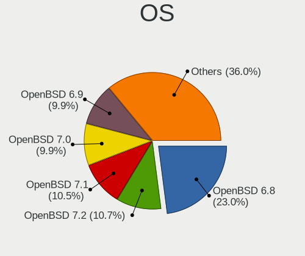

| Name        | Computers | Percent |
|-------------|-----------|---------|
| OpenBSD 6.8 | 208       | 22.96%  |
| OpenBSD 7.2 | 97        | 10.71%  |
| OpenBSD 7.1 | 95        | 10.49%  |
| OpenBSD 7.0 | 90        | 9.93%   |
| OpenBSD 6.9 | 90        | 9.93%   |
| OpenBSD 7.3 | 82        | 9.05%   |
| OpenBSD 7.5 | 75        | 8.28%   |
| OpenBSD 7.4 | 72        | 7.95%   |
| OpenBSD 6.7 | 50        | 5.52%   |
| OpenBSD 7.6 | 44        | 4.86%   |
| OpenBSD 6.6 | 3         | 0.33%   |

OS Family
---------

OS without a version

| Name    | Computers | Percent |
|---------|-----------|---------|
| OpenBSD | 730       | 100%    |

Arch
----

OS architecture (x86_64, i586, etc.)

| Name    | Computers | Percent |
|---------|-----------|---------|
| amd64   | 630       | 86.18%  |
| i386    | 57        | 7.8%    |
| arm64   | 25        | 3.42%   |
| macppc  | 9         | 1.23%   |
| sparc64 | 5         | 0.68%   |
| armv7   | 3         | 0.41%   |
| octeon  | 2         | 0.27%   |

DE
--

Desktop Environment

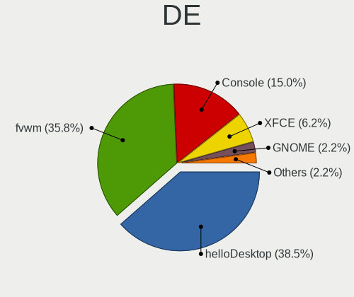

| Name          | Computers | Percent |
|---------------|-----------|---------|
| helloDesktop  | 297       | 38.52%  |
| fvwm          | 276       | 35.8%   |
| Console       | 116       | 15.05%  |
| XFCE          | 48        | 6.23%   |
| GNOME         | 17        | 2.2%    |
| MATE          | 3         | 0.39%   |
| i3            | 3         | 0.39%   |
| Mutter        | 2         | 0.26%   |
| LXQT          | 2         | 0.26%   |
| stumpwm       | 1         | 0.13%   |
| Openbox       | 1         | 0.13%   |
| Lumina        | 1         | 0.13%   |
| KDE6          | 1         | 0.13%   |
| KDE5          | 1         | 0.13%   |
| iwm           | 1         | 0.13%   |
| Enlightenment | 1         | 0.13%   |

Display Server
--------------

X11 or Wayland

| Name    | Computers | Percent |
|---------|-----------|---------|
| X11     | 542       | 73.44%  |
| Console | 196       | 26.56%  |

Display Manager
---------------

SDDM, LightDM, etc.

| Name    | Computers | Percent |
|---------|-----------|---------|
| Console | 686       | 92.83%  |
| SLiM    | 31        | 4.19%   |
| GDM     | 22        | 2.98%   |

OS Lang
-------

Language

| Lang       | Computers | Percent |
|------------|-----------|---------|
| Unknown    | 591       | 79.33%  |
| en_US      | 69        | 9.26%   |
| ru_RU      | 24        | 3.22%   |
| C          | 16        | 2.15%   |
| fr_FR      | 12        | 1.61%   |
| en_GB      | 5         | 0.67%   |
| de_DE      | 5         | 0.67%   |
| pl_PL      | 3         | 0.4%    |
| es_CO      | 3         | 0.4%    |
| zh_TW      | 2         | 0.27%   |
| ja_JP      | 2         | 0.27%   |
| es_ES      | 2         | 0.27%   |
| en_EN      | 2         | 0.27%   |
| en_AU      | 2         | 0.27%   |
| zh_CN      | 1         | 0.13%   |
| pt_PT      | 1         | 0.13%   |
| ISO8859-15 | 1         | 0.13%   |
| fr_CA      | 1         | 0.13%   |
| es_PY      | 1         | 0.13%   |
| en_CA      | 1         | 0.13%   |
| de.DE      | 1         | 0.13%   |

Boot Mode
---------

EFI or BIOS

| Mode | Computers | Percent |
|------|-----------|---------|
| EFI  | 402       | 54.32%  |
| BIOS | 338       | 45.68%  |

Filesystem
----------

Type of filesystem

| Type | Computers | Percent |
|------|-----------|---------|
| Ffs  | 730       | 100%    |

Part. scheme
------------

Scheme of partitioning

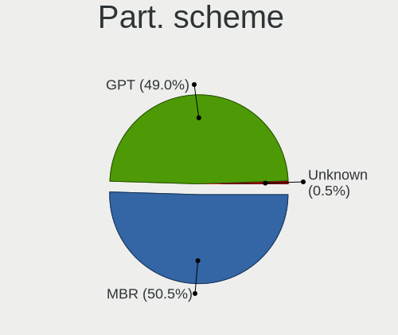

| Type    | Computers | Percent |
|---------|-----------|---------|
| MBR     | 372       | 50.47%  |
| GPT     | 361       | 48.98%  |
| Unknown | 4         | 0.54%   |

Board
-----

Vendor
------

Motherboard manufacturer

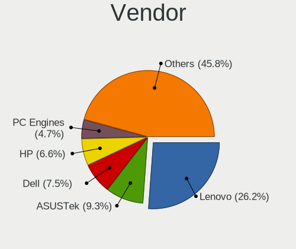

| Name                           | Computers | Percent |
|--------------------------------|-----------|---------|
| Lenovo                         | 191       | 26.16%  |
| ASUSTek Computer               | 68        | 9.32%   |
| Dell                           | 55        | 7.53%   |
| Hewlett-Packard                | 48        | 6.58%   |
| PC Engines                     | 34        | 4.66%   |
| Apple                          | 34        | 4.66%   |
| Unknown                        | 34        | 4.66%   |
| Gigabyte Technology            | 31        | 4.25%   |
| MSI                            | 24        | 3.29%   |
| Intel                          | 19        | 2.6%    |
| ASRock                         | 19        | 2.6%    |
| Acer                           | 18        | 2.47%   |
| Supermicro                     | 12        | 1.64%   |
| IBM                            | 11        | 1.51%   |
| Panasonic                      | 10        | 1.37%   |
| Sony                           | 7         | 0.96%   |
| Raspberry Pi Foundation        | 7         | 0.96%   |
| Fujitsu                        | 7         | 0.96%   |
| Samsung Electronics            | 6         | 0.82%   |
| Sun                            | 5         | 0.68%   |
| Framework                      | 5         | 0.68%   |
| TUXEDO                         | 4         | 0.55%   |
| Toshiba                        | 4         | 0.55%   |
| Microsoft                      | 4         | 0.55%   |
| Google                         | 4         | 0.55%   |
| Biostar                        | 4         | 0.55%   |
| AZW                            | 4         | 0.55%   |
| Soekris Engineering            | 3         | 0.41%   |
| Intel(R) Client Systems        | 3         | 0.41%   |
| Alienware                      | 3         | 0.41%   |
| VIA Technologies               | 2         | 0.27%   |
| Tactus                         | 2         | 0.27%   |
| Star Labs                      | 2         | 0.27%   |
| Shuttle                        | 2         | 0.27%   |
| Pegatron                       | 2         | 0.27%   |
| Notebook                       | 2         | 0.27%   |
| Matsushita Electric Industrial | 2         | 0.27%   |
| Clevo                          | 2         | 0.27%   |
| ZOTAC                          | 1         | 0.14%   |
| Yanling                        | 1         | 0.14%   |

Model
-----

Motherboard model

| Name                                     | Computers | Percent |
|------------------------------------------|-----------|---------|
| Unknown                                  | 41        | 5.62%   |
| PC Engines APU2                          | 15        | 2.05%   |
| PC Engines apu4                          | 9         | 1.23%   |
| Lenovo ThinkPad X200 745969G             | 6         | 0.82%   |
| PC Engines apu1                          | 5         | 0.68%   |
| Dell PowerEdge R620                      | 5         | 0.68%   |
| Supermicro Super Server                  | 4         | 0.55%   |
| RPi Raspberry Pi 4 Model B               | 4         | 0.55%   |
| ASUS PRIME B650-PLUS                     | 4         | 0.55%   |
| ASUS All Series                          | 4         | 0.55%   |
| Apple MacBookAir7,2                      | 4         | 0.55%   |
| RPi Raspberry Pi 400                     | 3         | 0.41%   |
| PC Engines APU3                          | 3         | 0.41%   |
| Framework Laptop                         | 3         | 0.41%   |
| ASUS PRIME H410M-A                       | 3         | 0.41%   |
| TUXEDO Pulse 15 Gen1                     | 2         | 0.27%   |
| Soekris Engineering net6501              | 2         | 0.27%   |
| PC Engines APU                           | 2         | 0.27%   |
| Panasonic CF-C1BT02EGE                   | 2         | 0.27%   |
| MSI MS-7C02                              | 2         | 0.27%   |
| MSI MS-7A34                              | 2         | 0.27%   |
| Microsoft Surface Pro 7                  | 2         | 0.27%   |
| Lenovo ThinkPad X1 Carbon 3rd 20BSCTO1WW | 2         | 0.27%   |
| Intel Q3XXG4-P                           | 2         | 0.27%   |
| Intel D2500HN                            | 2         | 0.27%   |
| HP ZBook 15 G4                           | 2         | 0.27%   |
| HP ProLiant DL360 Gen9                   | 2         | 0.27%   |
| Gigabyte M68MT-S2P                       | 2         | 0.27%   |
| Fujitsu LIFEBOOK E752                    | 2         | 0.27%   |
| Dell XPS 13 9360                         | 2         | 0.27%   |
| AZW SER                                  | 2         | 0.27%   |
| ASUS X102BA                              | 2         | 0.27%   |
| ASUS UX305FA                             | 2         | 0.27%   |
| ASUS TUF Gaming B550M-PLUS (WI-FI)       | 2         | 0.27%   |
| ASUS PRIME X370-PRO                      | 2         | 0.27%   |
| Apple PowerMac3,6                        | 2         | 0.27%   |
| Apple MacPro4,1                          | 2         | 0.27%   |
| Apple MacBookPro12,1                     | 2         | 0.27%   |
| Apple MacBookAir6,2                      | 2         | 0.27%   |
| Apple MacBook5,1                         | 2         | 0.27%   |

Model Family
------------

Motherboard model prefix

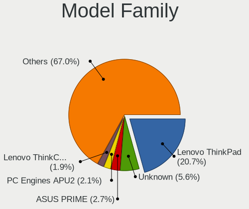

| Name                        | Computers | Percent |
|-----------------------------|-----------|---------|
| Lenovo ThinkPad             | 151       | 20.68%  |
| Unknown                     | 41        | 5.62%   |
| ASUS PRIME                  | 20        | 2.74%   |
| PC Engines APU2             | 15        | 2.05%   |
| Lenovo ThinkCentre          | 14        | 1.92%   |
| Dell Latitude               | 12        | 1.64%   |
| Dell PowerEdge              | 11        | 1.51%   |
| PC Engines apu4             | 9         | 1.23%   |
| Dell OptiPlex               | 9         | 1.23%   |
| Acer Aspire                 | 8         | 1.1%    |
| RPi Raspberry               | 7         | 0.96%   |
| IBM ThinkPad                | 7         | 0.96%   |
| HP Pavilion                 | 7         | 0.96%   |
| Lenovo IdeaPad              | 6         | 0.82%   |
| HP ProLiant                 | 6         | 0.82%   |
| HP Compaq                   | 6         | 0.82%   |
| Dell Inspiron               | 6         | 0.82%   |
| Sun SUNW                    | 5         | 0.68%   |
| PC Engines apu1             | 5         | 0.68%   |
| Lenovo Yoga                 | 5         | 0.68%   |
| Fujitsu LIFEBOOK            | 5         | 0.68%   |
| Framework Laptop            | 5         | 0.68%   |
| Dell XPS                    | 5         | 0.68%   |
| Dell Vostro                 | 5         | 0.68%   |
| ASUS VivoBook               | 5         | 0.68%   |
| Supermicro Super            | 4         | 0.55%   |
| HP ProBook                  | 4         | 0.55%   |
| Dell Precision              | 4         | 0.55%   |
| ASUS All                    | 4         | 0.55%   |
| Apple MacBookAir7           | 4         | 0.55%   |
| PC Engines APU3             | 3         | 0.41%   |
| Microsoft Surface           | 3         | 0.41%   |
| HP 240                      | 3         | 0.41%   |
| ASUS TUF                    | 3         | 0.41%   |
| ASUS ROG                    | 3         | 0.41%   |
| Apple MacBookAir6           | 3         | 0.41%   |
| TUXEDO Pulse                | 2         | 0.27%   |
| Toshiba Satellite           | 2         | 0.27%   |
| Soekris Engineering net6501 | 2         | 0.27%   |
| PC Engines APU              | 2         | 0.27%   |

MFG Year
--------

Motherboard manufacture year

| Year    | Computers | Percent |
|---------|-----------|---------|
| 2020    | 66        | 9.04%   |
| 2019    | 62        | 8.49%   |
| 2018    | 59        | 8.08%   |
| 2021    | 49        | 6.71%   |
| Unknown | 44        | 6.03%   |
| 2011    | 41        | 5.62%   |
| 2016    | 38        | 5.21%   |
| 2015    | 37        | 5.07%   |
| 2023    | 35        | 4.79%   |
| 2022    | 35        | 4.79%   |
| 2017    | 35        | 4.79%   |
| 2012    | 35        | 4.79%   |
| 2013    | 32        | 4.38%   |
| 2010    | 32        | 4.38%   |
| 2014    | 29        | 3.97%   |
| 2009    | 28        | 3.84%   |
| 2007    | 17        | 2.33%   |
| 2006    | 15        | 2.05%   |
| 2008    | 14        | 1.92%   |
| 2024    | 11        | 1.51%   |
| 2005    | 6         | 0.82%   |
| 2004    | 4         | 0.55%   |
| 2003    | 4         | 0.55%   |
| 2002    | 1         | 0.14%   |
| 2001    | 1         | 0.14%   |

Form Factor
-----------

Physical design of the computer

| Name           | Computers | Percent |
|----------------|-----------|---------|
| Notebook       | 362       | 49.59%  |
| Desktop        | 336       | 46.03%  |
| Mini pc        | 14        | 1.92%   |
| Server         | 7         | 0.96%   |
| All in one     | 4         | 0.55%   |
| Tablet         | 3         | 0.41%   |
| System on chip | 2         | 0.27%   |
| Convertible    | 2         | 0.27%   |

Coreboot
--------

Have coreboot on board

| Used | Computers | Percent |
|------|-----------|---------|
| No   | 684       | 93.7%   |
| Yes  | 46        | 6.3%    |

RAM Size
--------

Total RAM memory

| Size in GB      | Computers | Percent |
|-----------------|-----------|---------|
| 8.01-16.0       | 199       | 26.78%  |
| 4.01-8.0        | 145       | 19.52%  |
| 16.01-24.0      | 123       | 16.55%  |
| 32.01-64.0      | 64        | 8.61%   |
| 3.01-4.0        | 62        | 8.34%   |
| 2.01-3.0        | 39        | 5.25%   |
| 1.01-2.0        | 31        | 4.17%   |
| 64.01-256.0     | 23        | 3.1%    |
| 0.51-1.0        | 23        | 3.1%    |
| 0.01-0.5        | 16        | 2.15%   |
| 24.01-32.0      | 15        | 2.02%   |
| More than 256.0 | 3         | 0.4%    |

RAM Used
--------

Used RAM memory

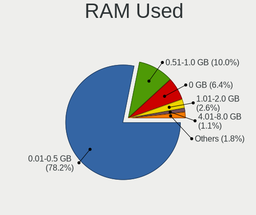

| Used GB    | Computers | Percent |
|------------|-----------|---------|
| 0.01-0.5   | 576       | 78.15%  |
| 0.51-1.0   | 74        | 10.04%  |
| 0          | 47        | 6.38%   |
| 1.01-2.0   | 19        | 2.58%   |
| 4.01-8.0   | 8         | 1.09%   |
| Unknown    | 7         | 0.95%   |
| 3.01-4.0   | 2         | 0.27%   |
| 8.01-16.0  | 2         | 0.27%   |
| 2.01-3.0   | 1         | 0.14%   |
| 16.01-24.0 | 1         | 0.14%   |

Total Drives
------------

Number of drives on board

| Drives | Computers | Percent |
|--------|-----------|---------|
| 1      | 381       | 50%     |
| 2      | 238       | 31.23%  |
| 3      | 73        | 9.58%   |
| 4      | 34        | 4.46%   |
| 0      | 19        | 2.49%   |
| 5      | 6         | 0.79%   |
| 6      | 4         | 0.52%   |
| 10     | 2         | 0.26%   |
| 7      | 2         | 0.26%   |
| 14     | 1         | 0.13%   |
| 12     | 1         | 0.13%   |
| 8      | 1         | 0.13%   |

Has CD-ROM
----------

Has CD-ROM on board

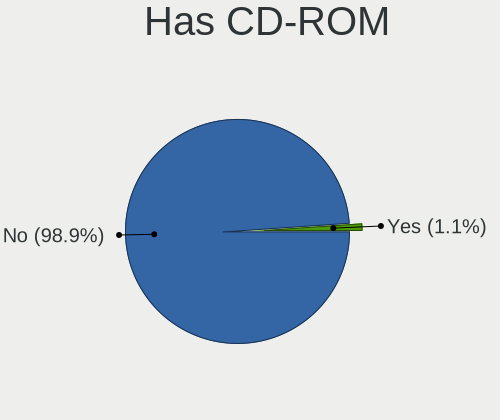

| Presented | Computers | Percent |
|-----------|-----------|---------|
| No        | 723       | 98.91%  |
| Yes       | 8         | 1.09%   |

Has Ethernet
------------

Has Ethernet on board

| Presented | Computers | Percent |
|-----------|-----------|---------|
| Yes       | 626       | 85.75%  |
| No        | 104       | 14.25%  |

Has WiFi
--------

Has WiFi module

| Presented | Computers | Percent |
|-----------|-----------|---------|
| Yes       | 462       | 63.11%  |
| No        | 270       | 36.89%  |

Has Bluetooth
-------------

Has Bluetooth module

| Presented | Computers | Percent |
|-----------|-----------|---------|
| No        | 433       | 58.83%  |
| Yes       | 303       | 41.17%  |

Location
--------

Country
-------

Geographic location (country)

| Country     | Computers | Percent |
|-------------|-----------|---------|
| USA         | 135       | 18.37%  |
| Russia      | 91        | 12.38%  |
| Germany     | 82        | 11.16%  |
| France      | 45        | 6.12%   |
| Canada      | 33        | 4.49%   |
| Italy       | 32        | 4.35%   |
| UK          | 31        | 4.22%   |
| Poland      | 29        | 3.95%   |
| Netherlands | 25        | 3.4%    |
| Spain       | 20        | 2.72%   |
| Sweden      | 17        | 2.31%   |
| Switzerland | 16        | 2.18%   |
| Brazil      | 13        | 1.77%   |
| Ukraine     | 12        | 1.63%   |
| Australia   | 12        | 1.63%   |
| Norway      | 9         | 1.22%   |
| Austria     | 9         | 1.22%   |
| Taiwan      | 7         | 0.95%   |
| Romania     | 7         | 0.95%   |
| Colombia    | 7         | 0.95%   |
| Finland     | 6         | 0.82%   |
| Czechia     | 6         | 0.82%   |
| Mexico      | 5         | 0.68%   |
| Latvia      | 5         | 0.68%   |
| Japan       | 5         | 0.68%   |
| India       | 5         | 0.68%   |
| Croatia     | 5         | 0.68%   |
| Turkey      | 4         | 0.54%   |
| Malaysia    | 4         | 0.54%   |
| China       | 4         | 0.54%   |
| Uruguay     | 3         | 0.41%   |
| Portugal    | 3         | 0.41%   |
| Philippines | 3         | 0.41%   |
| Indonesia   | 3         | 0.41%   |
| Denmark     | 3         | 0.41%   |
| Cyprus      | 3         | 0.41%   |
| Bulgaria    | 3         | 0.41%   |
| Argentina   | 3         | 0.41%   |
| Vietnam     | 2         | 0.27%   |
| Slovakia    | 2         | 0.27%   |

City
----

Geographic location (city)

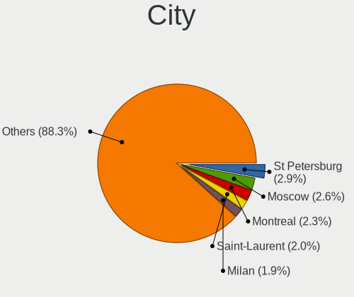

| City              | Computers | Percent |
|-------------------|-----------|---------|
| St Petersburg     | 23        | 2.89%   |
| Moscow            | 21        | 2.64%   |
| Montreal          | 18        | 2.26%   |
| Saint-Laurent     | 16        | 2.01%   |
| Milan             | 15        | 1.89%   |
| Amsterdam         | 15        | 1.89%   |
| Berlin            | 14        | 1.76%   |
| Paris             | 13        | 1.64%   |
| Vladivostok       | 11        | 1.38%   |
| Gdansk            | 8         | 1.01%   |
| Zurich            | 6         | 0.75%   |
| Vienna            | 6         | 0.75%   |
| New Taipei        | 6         | 0.75%   |
| Sydney            | 5         | 0.63%   |
| Sun Prairie       | 5         | 0.63%   |
| Riga              | 5         | 0.63%   |
| Qubec         | 5         | 0.63%   |
| Puebla City       | 5         | 0.63%   |
| New York          | 5         | 0.63%   |
| Malmo             | 5         | 0.63%   |
| Brooklyn          | 5         | 0.63%   |
| Blumenau          | 5         | 0.63%   |
| Prague            | 4         | 0.5%    |
| Poortugaal        | 4         | 0.5%    |
| Oslo              | 4         | 0.5%    |
| Nuremberg         | 4         | 0.5%    |
| Miedziana Gora    | 4         | 0.5%    |
| Mcon            | 4         | 0.5%    |
| Lodz              | 4         | 0.5%    |
| Ibiza Town        | 4         | 0.5%    |
| Gummersbach       | 4         | 0.5%    |
| Frankfurt am Main | 4         | 0.5%    |
| Cherepovets       | 4         | 0.5%    |
| Yekaterinburg     | 3         | 0.38%   |
| Wroclaw           | 3         | 0.38%   |
| Wolfsburg         | 3         | 0.38%   |
| Wittersham        | 3         | 0.38%   |
| Syeverodonets'k   | 3         | 0.38%   |
| Sofia             | 3         | 0.38%   |
| Sao Paulo         | 3         | 0.38%   |

Drives
------

Drive Vendor
------------

Hard drive vendors

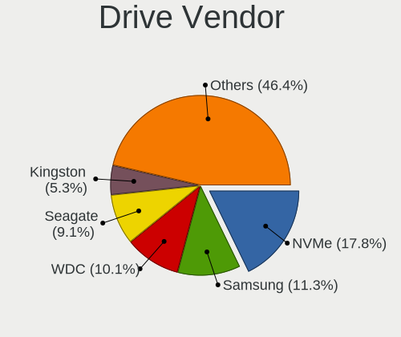

| Vendor                             | Computers | Drives | Percent |
|------------------------------------|-----------|--------|---------|
| NVMe                               | 168       | 229    | 17.8%   |
| Samsung Electronics                | 107       | 187    | 11.33%  |
| WDC                                | 95        | 176    | 10.06%  |
| Seagate                            | 86        | 145    | 9.11%   |
| Kingston                           | 50        | 65     | 5.3%    |
| SanDisk                            | 41        | 50     | 4.34%   |
| Toshiba                            | 38        | 59     | 4.03%   |
| Crucial                            | 35        | 46     | 3.71%   |
| Hitachi                            | 28        | 44     | 2.97%   |
| Intel                              | 27        | 33     | 2.86%   |
| OPENBSD                            | 18        | 30     | 1.91%   |
| HGST                               | 17        | 28     | 1.8%    |
| Apple                              | 16        | 18     | 1.69%   |
| Phison                             | 14        | 16     | 1.48%   |
| A-DATA Technology                  | 12        | 20     | 1.27%   |
| Transcend                          | 11        | 18     | 1.17%   |
| PNY                                | 11        | 26     | 1.17%   |
| SK hynix                           | 8         | 8      | 0.85%   |
| Hewlett-Packard                    | 7         | 12     | 0.74%   |
| Generic                            | 7         | 7      | 0.74%   |
| Dell                               | 7         | 12     | 0.74%   |
| Apacer                             | 7         | 11     | 0.74%   |
| USB                                | 5         | 5      | 0.53%   |
| SPCC                               | 5         | 5      | 0.53%   |
| LITEONIT                           | 5         | 6      | 0.53%   |
| Fujitsu                            | 5         | 6      | 0.53%   |
| China                              | 5         | 5      | 0.53%   |
| Product:              USB DISK 2.0 | 4         | 4      | 0.42%   |
| Patriot                            | 4         | 4      | 0.42%   |
| Micron Technology                  | 4         | 4      | 0.42%   |
| Lexar                              | 4         | 6      | 0.42%   |
| KingSpec                           | 4         | 4      | 0.42%   |
| Intenso                            | 4         | 4      | 0.42%   |
| OCZ                                | 3         | 3      | 0.32%   |
| Netac                              | 3         | 3      | 0.32%   |
| LSI                                | 3         | 7      | 0.32%   |
| JetFlash                           | 3         | 3      | 0.32%   |
| Innostor                           | 3         | 3      | 0.32%   |
| Corsair                            | 3         | 3      | 0.32%   |
| ASMT                               | 3         | 3      | 0.32%   |

Drive Model
-----------

Hard drive models

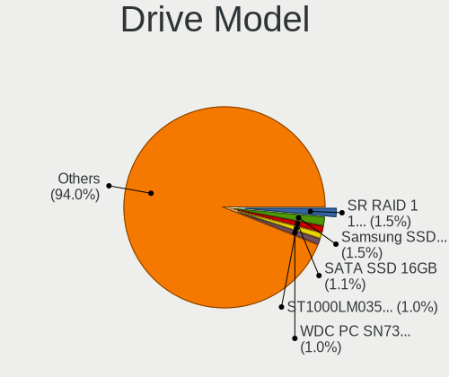

| Model                                                | Computers | Percent |
|------------------------------------------------------|-----------|---------|
| OPENBSD SR RAID 1 128GB                              | 15        | 1.48%   |
| NVMe Samsung SSD 980 1TB                             | 15        | 1.48%   |
| Phison SATA SSD 16GB                                 | 11        | 1.09%   |
| Seagate ST1000LM035-1RK172 1TB                       | 10        | 0.99%   |
| NVMe WDC PC SN730 SDB 256GB                          | 10        | 0.99%   |
| NVMe Samsung SSD 970 500GB                           | 10        | 0.99%   |
| Kingston SA400S37240G 240GB                          | 10        | 0.99%   |
| Samsung HM321HI 320GB                                | 6         | 0.59%   |
| NVMe SAMSUNG MZVLB256 256GB                          | 6         | 0.59%   |
| Kingston SA400S37480G 480GB                          | 6         | 0.59%   |
| WDC WD1600BEVT-22ZCT0 160GB                          | 5         | 0.49%   |
| USB SanDisk 3.2Gen1 64GB                             | 5         | 0.49%   |
| SanDisk Cruzer Blade 16GB                            | 5         | 0.49%   |
| Samsung SSD 860 EVO 500GB                            | 5         | 0.49%   |
| Samsung SSD 860 EVO 250GB                            | 5         | 0.49%   |
| Samsung SSD 850 EVO 500GB                            | 5         | 0.49%   |
| NVMe SAMSUNG MZVLW256 256GB                          | 5         | 0.49%   |
| Intel SSDSC2BW480H6 480GB                            | 5         | 0.49%   |
| Crucial CT240BX500SSD1 240GB                         | 5         | 0.49%   |
| Crucial CT1000MX500SSD1 1TB                          | 5         | 0.49%   |
| Apple SSD SM0128G 121GB                              | 5         | 0.49%   |
| Toshiba MQ04ABF100 1TB                               | 4         | 0.4%    |
| Seagate ST1000DM010-2EP102 1TB                       | 4         | 0.4%    |
| SanDisk Ultra Fit 128GB                              | 4         | 0.4%    |
| Samsung SSD 870 EVO 250GB                            | 4         | 0.4%    |
| Samsung SSD 860 EVO mSATA 500GB                      | 4         | 0.4%    |
| Samsung SSD 860 EVO 1TB                              | 4         | 0.4%    |
| Samsung SSD 850 EVO 250GB                            | 4         | 0.4%    |
| Samsung SSD 850 EVO 1TB                              | 4         | 0.4%    |
| Samsung SSD 840 EVO 250GB                            | 4         | 0.4%    |
| Product:              USB DISK 2.0 USB DISK 2.0 16GB | 4         | 0.4%    |
| NVMe Samsung SSD 960 500GB                           | 4         | 0.4%    |
| NVMe CT500P2SSD8 500GB                               | 4         | 0.4%    |
| Kingston SUV500MS240G 240GB                          | 4         | 0.4%    |
| Kingston SA400S37120G 120GB                          | 4         | 0.4%    |
| Dell PERC H710 282GB                                 | 4         | 0.4%    |
| Crucial CT500MX500SSD1 500GB                         | 4         | 0.4%    |
| WDC WD6400AARS-00Y5B1 640GB                          | 3         | 0.3%    |
| Seagate ST500LM012 HN-M500MBB 500GB                  | 3         | 0.3%    |
| Seagate ST3250318AS 250GB                            | 3         | 0.3%    |

HDD Vendor
----------

Hard disk drive vendors

| Vendor                                 | Computers | Drives | Percent |
|----------------------------------------|-----------|--------|---------|
| NVMe                                   | 108       | 147    | 23.23%  |
| Seagate                                | 86        | 145    | 18.49%  |
| WDC                                    | 82        | 162    | 17.63%  |
| Toshiba                                | 32        | 53     | 6.88%   |
| Hitachi                                | 28        | 44     | 6.02%   |
| Samsung Electronics                    | 21        | 31     | 4.52%   |
| OPENBSD                                | 18        | 30     | 3.87%   |
| HGST                                   | 17        | 28     | 3.66%   |
| Generic                                | 7         | 7      | 1.51%   |
| Dell                                   | 7         | 12     | 1.51%   |
| USB                                    | 5         | 5      | 1.08%   |
| Fujitsu                                | 5         | 6      | 1.08%   |
| Product:              USB DISK 2.0     | 4         | 4      | 0.86%   |
| Hewlett-Packard                        | 4         | 8      | 0.86%   |
| Apple                                  | 4         | 4      | 0.86%   |
| LSI                                    | 3         | 7      | 0.65%   |
| JetFlash                               | 3         | 3      | 0.65%   |
| ASMT                                   | 3         | 3      | 0.65%   |
| StoreJet                               | 2         | 2      | 0.43%   |
| Multiple                               | 2         | 2      | 0.43%   |
| Maxtor                                 | 2         | 3      | 0.43%   |
| Lexar                                  | 2         | 2      | 0.43%   |
| General                                | 2         | 2      | 0.43%   |
| Verbatim                               | 1         | 1      | 0.22%   |
| USB3.0                                 | 1         | 2      | 0.22%   |
| UFD 2.0                                | 1         | 1      | 0.22%   |
| SSDPR-CX                               | 1         | 1      | 0.22%   |
| SMI                                    | 1         | 1      | 0.22%   |
| SABRENT                                | 1         | 1      | 0.22%   |
| Product:              USB DISK 3.0 Pro | 1         | 1      | 0.22%   |
| Product:              USB DISK 3.0     | 1         | 1      | 0.22%   |
| Product:                               | 1         | 1      | 0.22%   |
| Memorex                                | 1         | 1      | 0.22%   |
| MaxDigital                             | 1         | 1      | 0.22%   |
| LSILOGIC                               | 1         | 1      | 0.22%   |
| LDLC F6+                               | 1         | 1      | 0.22%   |
| Intenso                                | 1         | 1      | 0.22%   |
| IBM-ESXS                               | 1         | 1      | 0.22%   |
| IBM                                    | 1         | 1      | 0.22%   |
| External                               | 1         | 1      | 0.22%   |

SSD Vendor
----------

Solid state drive vendors

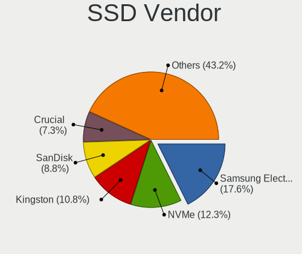

| Vendor              | Computers | Drives | Percent |
|---------------------|-----------|--------|---------|
| Samsung Electronics | 82        | 151    | 17.63%  |
| NVMe                | 57        | 68     | 12.26%  |
| Kingston            | 50        | 65     | 10.75%  |
| SanDisk             | 41        | 50     | 8.82%   |
| Crucial             | 34        | 45     | 7.31%   |
| Intel               | 27        | 33     | 5.81%   |
| Phison              | 14        | 16     | 3.01%   |
| Apple               | 12        | 14     | 2.58%   |
| A-DATA Technology   | 12        | 20     | 2.58%   |
| WDC                 | 11        | 12     | 2.37%   |
| Transcend           | 11        | 18     | 2.37%   |
| PNY                 | 11        | 26     | 2.37%   |
| SK hynix            | 8         | 8      | 1.72%   |
| Apacer              | 7         | 11     | 1.51%   |
| LITEONIT            | 5         | 6      | 1.08%   |
| Toshiba             | 4         | 4      | 0.86%   |
| SPCC                | 4         | 4      | 0.86%   |
| Patriot             | 4         | 4      | 0.86%   |
| Micron Technology   | 4         | 4      | 0.86%   |
| KingSpec            | 4         | 4      | 0.86%   |
| China               | 4         | 4      | 0.86%   |
| OCZ                 | 3         | 3      | 0.65%   |
| Netac               | 3         | 3      | 0.65%   |
| Intenso             | 3         | 3      | 0.65%   |
| Innostor            | 3         | 3      | 0.65%   |
| Hewlett-Packard     | 3         | 4      | 0.65%   |
| Corsair             | 3         | 3      | 0.65%   |
| Team                | 2         | 2      | 0.43%   |
| Plextor             | 2         | 2      | 0.43%   |
| LITEON              | 2         | 2      | 0.43%   |
| Lexar               | 2         | 4      | 0.43%   |
| KIOXIA-EXCERIA      | 2         | 2      | 0.43%   |
| Hoodisk             | 2         | 3      | 0.43%   |
| AMD                 | 2         | 2      | 0.43%   |
| Zheino              | 1         | 2      | 0.22%   |
| XPG                 | 1         | 1      | 0.22%   |
| Union Memory        | 1         | 1      | 0.22%   |
| UDinfo              | 1         | 1      | 0.22%   |
| Star Drive          | 1         | 1      | 0.22%   |
| SATA3 60            | 1         | 1      | 0.22%   |

Drive Kind
----------

HDD or SSD

| Kind | Computers | Drives | Percent |
|------|-----------|--------|---------|
| SSD  | 404       | 636    | 49.69%  |
| HDD  | 385       | 729    | 47.36%  |
| NVMe | 24        | 26     | 2.95%   |

Drive Connector
---------------

SATA, SAS, NVMe, etc.

| Type | Computers | Drives | Percent |
|------|-----------|--------|---------|
| SATA | 673       | 1365   | 96.56%  |
| NVMe | 24        | 26     | 3.44%   |

Drive Size
----------

Size of hard drive

| Size in TB      | Computers | Drives | Percent |
|-----------------|-----------|--------|---------|
| 0.01-0.5        | 543       | 866    | 66.79%  |
| 0.51-1.0        | 182       | 288    | 22.39%  |
| 1.01-2.0        | 55        | 151    | 6.77%   |
| 3.01-4.0        | 15        | 23     | 1.85%   |
| 4.01-10.0       | 11        | 28     | 1.35%   |
| 2.01-3.0        | 4         | 6      | 0.49%   |
| More than 100.0 | 2         | 2      | 0.25%   |
| 0               | 1         | 1      | 0.12%   |

Space Total
-----------

Amount of disk space available on the file system

| Size in GB     | Computers | Percent |
|----------------|-----------|---------|
| 101-250        | 266       | 35%     |
| 251-500        | 223       | 29.34%  |
| 51-100         | 75        | 9.87%   |
| 21-50          | 60        | 7.89%   |
| 1-20           | 54        | 7.11%   |
| 501-1000       | 37        | 4.87%   |
| 1001-2000      | 25        | 3.29%   |
| More than 3000 | 15        | 1.97%   |
| 2001-3000      | 5         | 0.66%   |

Space Used
----------

Amount of used disk space

| Used GB        | Computers | Percent |
|----------------|-----------|---------|
| 1-20           | 543       | 70.8%   |
| 21-50          | 81        | 10.56%  |
| 51-100         | 50        | 6.52%   |
| 101-250        | 48        | 6.26%   |
| 251-500        | 18        | 2.35%   |
| 501-1000       | 13        | 1.69%   |
| 1001-2000      | 8         | 1.04%   |
| More than 3000 | 4         | 0.52%   |
| 2001-3000      | 2         | 0.26%   |

Malfunc. Drives
---------------

Drive models with a malfunction

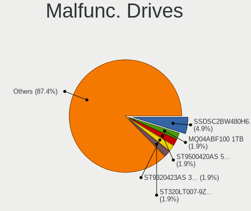

| Model                                 | Computers | Drives | Percent |
|---------------------------------------|-----------|--------|---------|
| Intel SSDSC2BW480H6 480GB             | 5         | 5      | 4.85%   |
| Toshiba MQ04ABF100 1TB                | 2         | 2      | 1.94%   |
| Seagate ST9500420AS 500GB             | 2         | 3      | 1.94%   |
| Seagate ST9320423AS 320GB             | 2         | 4      | 1.94%   |
| Seagate ST320LT007-9ZV142 320GB       | 2         | 2      | 1.94%   |
| Samsung Electronics SSD 840 EVO 250GB | 2         | 4      | 1.94%   |
| OCZ VERTEX3 120GB                     | 2         | 2      | 1.94%   |
| Kingston SMS200S330G 32GB             | 2         | 4      | 1.94%   |
| Intel SSDSC2KF256H6L 256GB            | 2         | 2      | 1.94%   |
| HGST HTS541010A7E630 1TB              | 2         | 4      | 1.94%   |
| A-DATA Technology SP550 240GB         | 2         | 2      | 1.94%   |
| XPG SX950U 240GB                      | 1         | 1      | 0.97%   |
| WDC WD7500AACS-00ZJB0 752GB           | 1         | 1      | 0.97%   |
| WDC WD6400AAKS-22A7B0 640GB           | 1         | 1      | 0.97%   |
| WDC WD5000AAKX-60U6AA0 500GB          | 1         | 2      | 0.97%   |
| WDC WD2500BEVS-22UST0 250GB           | 1         | 1      | 0.97%   |
| WDC WD1600BEVT-22ZCT0 160GB           | 1         | 1      | 0.97%   |
| WDC WD1600BEVE-00UYT0 160GB           | 1         | 1      | 0.97%   |
| WDC WD15EARS-00Z5B1 1.5TB             | 1         | 1      | 0.97%   |
| WDC WD10SPZX-24Z10 1TB                | 1         | 1      | 0.97%   |
| WDC WD10JPVT-75A1YT0 1TB              | 1         | 1      | 0.97%   |
| WDC WD10EADS-00M2B0 1TB               | 1         | 1      | 0.97%   |
| Transcend 3E128-TS2-550B01 100GB      | 1         | 4      | 0.97%   |
| Toshiba MQ01ACF032 320GB              | 1         | 3      | 0.97%   |
| Toshiba MQ01ABD050 500GB              | 1         | 2      | 0.97%   |
| Toshiba MK6475GSX 640GB               | 1         | 2      | 0.97%   |
| Toshiba MK6465GSX 640GB               | 1         | 1      | 0.97%   |
| Toshiba MK6006GAH 64GB                | 1         | 1      | 0.97%   |
| Toshiba MK5065GSX 500GB               | 1         | 1      | 0.97%   |
| Toshiba MK1629GSGF 160GB              | 1         | 3      | 0.97%   |
| Toshiba DT01ACA100 1TB                | 1         | 2      | 0.97%   |
| Toshiba DT01ACA050 500GB              | 1         | 2      | 0.97%   |
| SK hynix HFS128G39TND-N210A 128GB     | 1         | 1      | 0.97%   |
| Seagate ST9500325AS 500GB             | 1         | 1      | 0.97%   |
| Seagate ST9160310AS 160GB             | 1         | 2      | 0.97%   |
| Seagate ST750LM022 HN-M750MBB 752GB   | 1         | 1      | 0.97%   |
| Seagate ST500LT012-9WS142 500GB       | 1         | 1      | 0.97%   |
| Seagate ST500DM002-1BD142 500GB       | 1         | 1      | 0.97%   |
| Seagate ST380815AS 80GB               | 1         | 1      | 0.97%   |
| Seagate ST3750640NS 752GB             | 1         | 6      | 0.97%   |

Malfunc. Drive Vendor
---------------------

Vendors of faulty drives

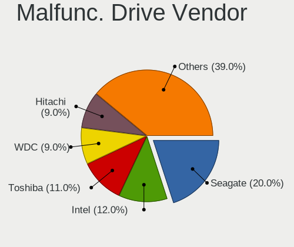

| Vendor              | Computers | Drives | Percent |
|---------------------|-----------|--------|---------|
| Seagate             | 20        | 35     | 20%     |
| Intel               | 12        | 12     | 12%     |
| Toshiba             | 11        | 19     | 11%     |
| WDC                 | 9         | 11     | 9%      |
| Hitachi             | 9         | 10     | 9%      |
| Samsung Electronics | 8         | 13     | 8%      |
| HGST                | 7         | 10     | 7%      |
| Kingston            | 5         | 7      | 5%      |
| A-DATA Technology   | 4         | 12     | 4%      |
| SanDisk             | 2         | 3      | 2%      |
| OCZ                 | 2         | 2      | 2%      |
| KingSpec            | 2         | 2      | 2%      |
| XPG                 | 1         | 1      | 1%      |
| Transcend           | 1         | 4      | 1%      |
| SK hynix            | 1         | 1      | 1%      |
| Micron Technology   | 1         | 1      | 1%      |
| LITEONIT            | 1         | 1      | 1%      |
| Hewlett-Packard     | 1         | 1      | 1%      |
| GLOWAY              | 1         | 1      | 1%      |
| Corsair             | 1         | 1      | 1%      |
| Apple               | 1         | 1      | 1%      |

Malfunc. HDD Vendor
-------------------

Vendors of faulty HDD drives

| Vendor              | Computers | Drives | Percent |
|---------------------|-----------|--------|---------|
| Seagate             | 20        | 35     | 32.26%  |
| Toshiba             | 11        | 19     | 17.74%  |
| WDC                 | 9         | 11     | 14.52%  |
| Hitachi             | 9         | 10     | 14.52%  |
| HGST                | 7         | 10     | 11.29%  |
| Samsung Electronics | 5         | 8      | 8.06%   |
| Hewlett-Packard     | 1         | 1      | 1.61%   |

Malfunc. Drive Kind
-------------------

Kinds of faulty drives

| Kind | Computers | Drives | Percent |
|------|-----------|--------|---------|
| HDD  | 62        | 94     | 62%     |
| SSD  | 38        | 54     | 38%     |

Failed Drives
-------------

Failed drive models

| Model                           | Computers | Drives | Percent |
|---------------------------------|-----------|--------|---------|
| WDC WD6400AARS-00Y5B1 640GB     | 1         | 2      | 50%     |
| Samsung Electronics HD204UI 2TB | 1         | 2      | 50%     |

Failed Drive Vendor
-------------------

Failed drive vendors

| Vendor              | Computers | Drives | Percent |
|---------------------|-----------|--------|---------|
| WDC                 | 1         | 2      | 50%     |
| Samsung Electronics | 1         | 2      | 50%     |

Drive Status
------------

Number of failed and malfunc. drives

| Status   | Computers | Drives | Percent |
|----------|-----------|--------|---------|
| Works    | 484       | 890    | 59.83%  |
| Detected | 224       | 349    | 27.69%  |
| Malfunc  | 99        | 148    | 12.24%  |
| Failed   | 2         | 4      | 0.25%   |

Storage controller
------------------

Storage Vendor
--------------

Storage controller vendors

| Vendor                                  | Computers | Percent |
|-----------------------------------------|-----------|---------|
| Intel                                   | 436       | 53.3%   |
| AMD                                     | 130       | 15.89%  |
| Samsung Electronics                     | 78        | 9.54%   |
| SanDisk                                 | 40        | 4.89%   |
| Broadcom / LSI                          | 16        | 1.96%   |
| KIOXIA                                  | 12        | 1.47%   |
| Kingston Technology Company             | 11        | 1.34%   |
| Phison Electronics                      | 10        | 1.22%   |
| Nvidia                                  | 10        | 1.22%   |
| Micron/Crucial Technology               | 8         | 0.98%   |
| Marvell Technology Group                | 8         | 0.98%   |
| SK hynix                                | 6         | 0.73%   |
| VIA Technologies                        | 5         | 0.61%   |
| ASMedia Technology                      | 5         | 0.61%   |
| ADATA Technology                        | 5         | 0.61%   |
| Toshiba                                 | 3         | 0.37%   |
| Silicon Motion                          | 3         | 0.37%   |
| Shenzhen Longsys Electronics            | 3         | 0.37%   |
| Micron Technology                       | 3         | 0.37%   |
| Lenovo                                  | 3         | 0.37%   |
| Hewlett-Packard                         | 3         | 0.37%   |
| ULi Electronics                         | 2         | 0.24%   |
| Solid State Storage Technology          | 2         | 0.24%   |
| MAXIO Technology (Hangzhou)             | 2         | 0.24%   |
| Biwin Storage Technology                | 2         | 0.24%   |
| Union Memory (Shenzhen)                 | 1         | 0.12%   |
| Silicon Integrated Systems [SiS]        | 1         | 0.12%   |
| Silicon Image                           | 1         | 0.12%   |
| Shenzhen Unionmemory Information System | 1         | 0.12%   |
| Seagate Technology                      | 1         | 0.12%   |
| Realtek Semiconductor                   | 1         | 0.12%   |
| JMicron Technology                      | 1         | 0.12%   |
| HighPoint Technologies                  | 1         | 0.12%   |
| Dell                                    | 1         | 0.12%   |
| Compaq Computer                         | 1         | 0.12%   |
| Artop Electronic                        | 1         | 0.12%   |
| Unknown                                 | 1         | 0.12%   |

Storage Model
-------------

Storage controller models

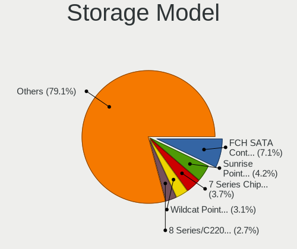

| Model                                                                          | Computers | Percent |
|--------------------------------------------------------------------------------|-----------|---------|
| AMD FCH SATA Controller [AHCI mode]                                            | 65        | 7.14%   |
| Intel Sunrise Point-LP SATA Controller [AHCI mode]                             | 38        | 4.17%   |
| Intel 7 Series Chipset Family 6-port SATA Controller [AHCI mode]               | 34        | 3.73%   |
| Intel Wildcat Point-LP SATA Controller [AHCI Mode]                             | 28        | 3.07%   |
| Intel 8 Series/C220 Series Chipset Family 6-port SATA Controller 1 [AHCI mode] | 25        | 2.74%   |
| Intel 6 Series/C200 Series Chipset Family 6 port Mobile SATA AHCI Controller   | 25        | 2.74%   |
| Intel 82801G (ICH7 Family) IDE Controller                                      | 24        | 2.63%   |
| Samsung NVMe SSD Controller SM981/PM981/PM983                                  | 23        | 2.52%   |
| Intel 82801IBM/IEM (ICH9M/ICH9M-E) 4 port SATA Controller [AHCI mode]          | 21        | 2.31%   |
| AMD SB7x0/SB8x0/SB9x0 SATA Controller [AHCI mode]                              | 21        | 2.31%   |
| AMD FCH SATA Controller [IDE mode]                                             | 18        | 1.98%   |
| SanDisk Extreme Pro / WD Black SN750 / PC SN730 / Red SN700 NVMe SSD           | 17        | 1.87%   |
| Samsung NVMe SSD Controller SM961/PM961/SM963                                  | 15        | 1.65%   |
| Samsung NVMe SSD Controller PM9A1/PM9A3/980PRO                                 | 15        | 1.65%   |
| Intel Q170/Q150/B150/H170/H110/Z170/CM236 Chipset SATA Controller [AHCI Mode]  | 15        | 1.65%   |
| Intel 8 Series SATA Controller 1 [AHCI mode]                                   | 13        | 1.43%   |
| Intel 5 Series/3400 Series Chipset 6 port SATA AHCI Controller                 | 12        | 1.32%   |
| Intel Cannon Lake PCH SATA AHCI Controller                                     | 11        | 1.21%   |
| AMD 500 Series Chipset SATA Controller                                         | 11        | 1.21%   |
| AMD 400 Series Chipset SATA Controller                                         | 11        | 1.21%   |
| Intel NM10/ICH7 Family SATA Controller [IDE mode]                              | 10        | 1.1%    |
| Intel 82801GBM/GHM (ICH7-M Family) SATA Controller [AHCI mode]                 | 10        | 1.1%    |
| Intel 6 Series/C200 Series Chipset Family 6 port Desktop SATA AHCI Controller  | 10        | 1.1%    |
| Samsung NVMe SSD Controller 980 (DRAM-less)                                    | 9         | 0.99%   |
| Intel Celeron/Pentium Silver Processor SATA Controller                         | 9         | 0.99%   |
| Intel 82801GBM/GHM (ICH7-M Family) SATA Controller [IDE mode]                  | 9         | 0.99%   |
| AMD SB7x0/SB8x0/SB9x0 IDE Controller                                           | 9         | 0.99%   |
| KIOXIA NVMe SSD Controller BG4 (DRAM-less)                                     | 8         | 0.88%   |
| Intel Atom Processor E3800 Series SATA AHCI Controller                         | 8         | 0.88%   |
| Intel 82801JI (ICH10 Family) SATA AHCI Controller                              | 8         | 0.88%   |
| Intel 400 Series Chipset Family SATA AHCI Controller                           | 8         | 0.88%   |
| Intel 200 Series PCH SATA controller [AHCI mode]                               | 8         | 0.88%   |
| AMD 600 Series Chipset SATA Controller                                         | 8         | 0.88%   |
| Samsung S4LN058A01[SSUBX] AHCI SSD Controller (Apple slot)                     | 7         | 0.77%   |
| Intel Comet Lake SATA AHCI Controller                                          | 7         | 0.77%   |
| Intel Celeron N3350/Pentium N4200/Atom E3900 Series SATA AHCI Controller       | 7         | 0.77%   |
| Micron/Crucial P2 [Nick P2] / P3 / P3 Plus NVMe PCIe SSD (DRAM-less)           | 6         | 0.66%   |
| Intel Cannon Lake Mobile PCH SATA AHCI Controller                              | 6         | 0.66%   |
| Intel C600/X79 series chipset 6-Port SATA AHCI Controller                      | 6         | 0.66%   |
| Intel 82801FBM (ICH6M) SATA Controller                                         | 6         | 0.66%   |

Storage Kind
------------

Kind of storage controller (IDE, SATA, NVMe, SAS, ...)

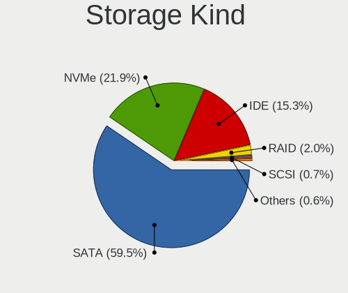

| Kind | Computers | Percent |
|------|-----------|---------|
| SATA | 498       | 59.5%   |
| NVMe | 183       | 21.86%  |
| IDE  | 128       | 15.29%  |
| RAID | 17        | 2.03%   |
| SCSI | 6         | 0.72%   |
| SAS  | 5         | 0.6%    |

Processor
---------

CPU Vendor
----------

Processor vendors

| Vendor  | Computers | Percent |
|---------|-----------|---------|
| Intel   | 520       | 71.23%  |
| AMD     | 163       | 22.33%  |
| ARM     | 26        | 3.56%   |
| Unknown | 13        | 1.78%   |
| PowerPC | 5         | 0.68%   |
| 11th    | 2         | 0.27%   |
| VIA     | 1         | 0.14%   |

CPU Model
---------

Processor models

| Model                                                    | Computers | Percent |
|----------------------------------------------------------|-----------|---------|
| AMD GX-412TC SOC                                         | 27        | 3.65%   |
| Intel Core i5-2520M CPU @ 2.50GHz                        | 17        | 2.3%    |
| ARM Cortex-A72 r0p3                                      | 14        | 1.89%   |
| Intel Core i5-6300U CPU @ 2.40GHz                        | 13        | 1.76%   |
|                                                          | 13        | 1.76%   |
| Intel Core i5-3320M CPU @ 2.60GHz                        | 11        | 1.49%   |
| Intel Core i5-5300U CPU @ 2.30GHz                        | 10        | 1.35%   |
| Intel Core 2 Duo CPU P8600 @ 2.40GHz                     | 8         | 1.08%   |
| Intel Core i5-8250U CPU @ 1.60GHz                        | 7         | 0.95%   |
| Intel 11th Gen Core i5-1135G7 @ 2.40GHz                  | 7         | 0.95%   |
| ARM Cortex-A53 r0p4                                      | 7         | 0.95%   |
| AMD G-T40E Processor                                     | 7         | 0.95%   |
| Intel Core i7-8565U CPU @ 1.80GHz                        | 6         | 0.81%   |
| Intel Core i7-8550U CPU @ 1.80GHz                        | 5         | 0.68%   |
| Intel Core i7-7500U CPU @ 2.70GHz                        | 5         | 0.68%   |
| Intel Core i5-5200U CPU @ 2.20GHz                        | 5         | 0.68%   |
| Intel Atom CPU N270 @ 1.60GHz ("GenuineIntel" 686-class) | 5         | 0.68%   |
| Intel Core i7-8650U CPU @ 1.90GHz                        | 4         | 0.54%   |
| Intel Core i5-8265U CPU @ 1.60GHz                        | 4         | 0.54%   |
| Intel Core i5-7300U CPU @ 2.60GHz                        | 4         | 0.54%   |
| Intel Core i5-6200U CPU @ 2.30GHz                        | 4         | 0.54%   |
| Intel Core i5-4570 CPU @ 3.20GHz                         | 4         | 0.54%   |
| Intel Core i5-4300U CPU @ 1.90GHz                        | 4         | 0.54%   |
| Intel Core i5-10210U CPU @ 1.60GHz                       | 4         | 0.54%   |
| Intel Core i5 CPU M 520 @ 2.40GHz                        | 4         | 0.54%   |
| Intel Core i3-6006U CPU @ 2.00GHz                        | 4         | 0.54%   |
| Intel Core i3-10110U CPU @ 2.10GHz                       | 4         | 0.54%   |
| Intel Core 2 Duo CPU T9400 @ 2.53GHz                     | 4         | 0.54%   |
| Intel Celeron N4020 CPU @ 1.10GHz                        | 4         | 0.54%   |
| AMD Ryzen 7 5800X 8-Core Processor                       | 4         | 0.54%   |
| AMD Ryzen 7 4800H with Radeon Graphics                   | 4         | 0.54%   |
| AMD Ryzen 7 4700U with Radeon Graphics                   | 4         | 0.54%   |
| AMD Ryzen 7 3700X 8-Core Processor                       | 4         | 0.54%   |
| Intel Xeon CPU E5-2620 v3 @ 2.40GHz                      | 3         | 0.41%   |
| Intel Pentium M processor                                | 3         | 0.41%   |
| Intel N100                                               | 3         | 0.41%   |
| Intel Core i7-8750H CPU @ 2.20GHz                        | 3         | 0.41%   |
| Intel Core i7-6600U CPU @ 2.60GHz                        | 3         | 0.41%   |
| Intel Core i7-5600U CPU @ 2.60GHz                        | 3         | 0.41%   |
| Intel Core i7-3520M CPU @ 2.90GHz                        | 3         | 0.41%   |

CPU Model Family
----------------

Processor model prefix

| Model                   | Computers | Percent |
|-------------------------|-----------|---------|
| Intel Core i5           | 163       | 22.3%   |
| Intel Core i7           | 80        | 10.94%  |
| Other                   | 56        | 7.66%   |
| Intel Xeon              | 43        | 5.88%   |
| Intel Core i3           | 41        | 5.61%   |
| Intel Celeron           | 36        | 4.92%   |
| AMD Ryzen 7             | 35        | 4.79%   |
| Intel Core 2 Duo        | 31        | 4.24%   |
| AMD GX                  | 28        | 3.83%   |
| ARM Cortex              | 26        | 3.56%   |
| AMD Ryzen 5             | 22        | 3.01%   |
| Intel Atom              | 19        | 2.6%    |
| Intel Pentium           | 9         | 1.23%   |
| Intel Pentium M         | 8         | 1.09%   |
| Intel Pentium 4         | 8         | 1.09%   |
| AMD G                   | 8         | 1.09%   |
| Intel Genuine           | 7         | 0.96%   |
| Intel Core 2            | 7         | 0.96%   |
| AMD Ryzen 9             | 7         | 0.96%   |
| AMD Ryzen 7 PRO         | 6         | 0.82%   |
| Intel Pentium Dual-Core | 5         | 0.68%   |
| AMD Ryzen 3             | 5         | 0.68%   |
| AMD A4                  | 5         | 0.68%   |
| Intel Pentium Silver    | 4         | 0.55%   |
| Intel Core Duo          | 4         | 0.55%   |
| AMD A6                  | 4         | 0.55%   |
| Intel Core i9           | 3         | 0.41%   |
| Intel Core 2 Quad       | 3         | 0.41%   |
| AMD E2                  | 3         | 0.41%   |
| AMD E1                  | 3         | 0.41%   |
| AMD Athlon              | 3         | 0.41%   |
| Intel Xeon Gold         | 2         | 0.27%   |
| Intel Pentium III       | 2         | 0.27%   |
| Intel Core m3           | 2         | 0.27%   |
| Intel Core M            | 2         | 0.27%   |
| Intel Celeron M         | 2         | 0.27%   |
| AMD Ryzen 5 PRO         | 2         | 0.27%   |
| AMD Phenom II X4        | 2         | 0.27%   |
| AMD Geode Integrated    | 2         | 0.27%   |
| AMD E                   | 2         | 0.27%   |

CPU Cores
---------

Number of processor cores

| Number  | Computers | Percent |
|---------|-----------|---------|
| 2       | 234       | 32.01%  |
| 4       | 197       | 26.95%  |
| Unknown | 126       | 17.24%  |
| 1       | 50        | 6.84%   |
| 16      | 32        | 4.38%   |
| 8       | 31        | 4.24%   |
| 6       | 27        | 3.69%   |
| 12      | 22        | 3.01%   |
| 32      | 4         | 0.55%   |
| 36      | 2         | 0.27%   |
| 24      | 2         | 0.27%   |
| 3       | 2         | 0.27%   |
| 14      | 1         | 0.14%   |
| 9       | 1         | 0.14%   |

CPU Sockets
-----------

Number of sockets

| Number  | Computers | Percent |
|---------|-----------|---------|
| 1       | 568       | 77.17%  |
| Unknown | 156       | 21.2%   |
| 2       | 12        | 1.63%   |

CPU Threads
-----------

Threads per core (Hyper-Threading)

| Number  | Computers | Percent |
|---------|-----------|---------|
| 2       | 322       | 44.11%  |
| 1       | 240       | 32.88%  |
| Unknown | 168       | 23.01%  |

CPU Microarch
-------------

Microarchitecture

| Name          | Computers | Percent |
|---------------|-----------|---------|
| Unknown       | 97        | 13.25%  |
| KabyLake      | 88        | 12.02%  |
| Haswell       | 46        | 6.28%   |
| SandyBridge   | 43        | 5.87%   |
| Broadwell     | 41        | 5.6%    |
| Skylake       | 40        | 5.46%   |
| IvyBridge     | 39        | 5.33%   |
| Penryn        | 35        | 4.78%   |
| Zen 2         | 28        | 3.83%   |
| Puma          | 28        | 3.83%   |
| P6            | 24        | 3.28%   |
| Westmere      | 22        | 3.01%   |
| Bonnell       | 17        | 2.32%   |
| Core          | 16        | 2.19%   |
| Silvermont    | 15        | 2.05%   |
| Zen 3         | 14        | 1.91%   |
| K10           | 14        | 1.91%   |
| NetBurst      | 13        | 1.78%   |
| Bobcat        | 13        | 1.78%   |
| TigerLake     | 12        | 1.64%   |
| Goldmont plus | 12        | 1.64%   |
| Zen           | 10        | 1.37%   |
| Zen+          | 9         | 1.23%   |
| Goldmont      | 9         | 1.23%   |
| CometLake     | 9         | 1.23%   |
| Nehalem       | 7         | 0.96%   |
| Jaguar        | 6         | 0.82%   |
| Piledriver    | 5         | 0.68%   |
| K8 Hammer     | 4         | 0.55%   |
| K10 Llano     | 4         | 0.55%   |
| IceLake       | 4         | 0.55%   |
| Geode         | 3         | 0.41%   |
| Excavator     | 3         | 0.41%   |
| Steamroller   | 1         | 0.14%   |
| K6            | 1         | 0.14%   |

Graphics
--------

GPU Vendor
----------

Vendors of graphics cards

| Vendor                                       | Computers | Percent |
|----------------------------------------------|-----------|---------|
| Intel                                        | 413       | 57.92%  |
| AMD                                          | 190       | 26.65%  |
| Nvidia                                       | 73        | 10.24%  |
| Matrox Electronics Systems                   | 19        | 2.66%   |
| ASPEED Technology                            | 13        | 1.82%   |
| XGI Technology (eXtreme Graphics Innovation) | 1         | 0.14%   |
| VIA Technologies                             | 1         | 0.14%   |
| Silicon Integrated Systems [SiS]             | 1         | 0.14%   |
| NVidia / SGS Thomson (Joint Venture)         | 1         | 0.14%   |
| 3DLabs                                       | 1         | 0.14%   |

GPU Model
---------

Graphics card models

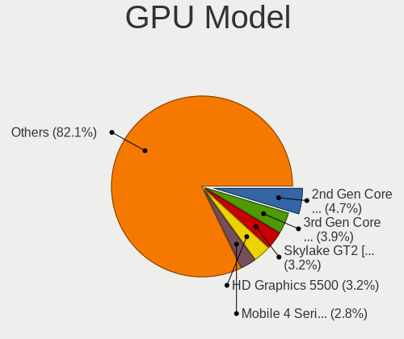

| Model                                                                                    | Computers | Percent |
|------------------------------------------------------------------------------------------|-----------|---------|
| Intel 2nd Generation Core Processor Family Integrated Graphics Controller                | 35        | 4.7%    |
| Intel 3rd Gen Core processor Graphics Controller                                         | 29        | 3.89%   |
| Intel Skylake GT2 [HD Graphics 520]                                                      | 24        | 3.22%   |
| Intel HD Graphics 5500                                                                   | 24        | 3.22%   |
| Intel Mobile 4 Series Chipset Integrated Graphics Controller                             | 21        | 2.82%   |
| Intel UHD Graphics 620                                                                   | 18        | 2.42%   |
| Intel Mobile 945GM/GMS/GME, 943/940GML Express Integrated Graphics Controller            | 18        | 2.42%   |
| Intel Haswell-ULT Integrated Graphics Controller                                         | 17        | 2.28%   |
| AMD Renoir [Radeon Vega Series / Radeon Vega Mobile Series]                              | 17        | 2.28%   |
| Intel HD Graphics 620                                                                    | 15        | 2.01%   |
| ASPEED Technology ASPEED Graphics Family                                                 | 13        | 1.74%   |
| Intel Xeon E3-1200 v3/4th Gen Core Processor Integrated Graphics Controller              | 12        | 1.61%   |
| Intel TigerLake-LP GT2 [Iris Xe Graphics]                                                | 12        | 1.61%   |
| AMD Ellesmere [Radeon RX 470/480/570/570X/580/580X/590]                                  | 12        | 1.61%   |
| Intel WhiskeyLake-U GT2 [UHD Graphics 620]                                               | 11        | 1.48%   |
| Intel Mobile 945GM/GMS, 943/940GML Express Integrated Graphics Controller                | 11        | 1.48%   |
| Intel Core Processor Integrated Graphics Controller                                      | 11        | 1.48%   |
| Intel CometLake-U GT2 [UHD Graphics]                                                     | 11        | 1.48%   |
| Intel GeminiLake [UHD Graphics 600]                                                      | 9         | 1.21%   |
| Intel Atom Processor Z36xxx/Z37xxx Series Graphics & Display                             | 8         | 1.07%   |
| Matrox Electronics Systems G200eR2                                                       | 7         | 0.94%   |
| Intel Mobile 945GSE Express Integrated Graphics Controller                               | 7         | 0.94%   |
| Intel HD Graphics 530                                                                    | 7         | 0.94%   |
| Intel Atom/Celeron/Pentium Processor x5-E8000/J3xxx/N3xxx Integrated Graphics Controller | 7         | 0.94%   |
| Intel 4th Gen Core Processor Integrated Graphics Controller                              | 7         | 0.94%   |
| AMD Picasso/Raven 2 [Radeon Vega Series / Radeon Vega Mobile Series]                     | 7         | 0.94%   |
| AMD Navi 22 [Radeon RX 6700/6700 XT/6750 XT / 6800M/6850M XT]                            | 7         | 0.94%   |
| AMD Navi 10 [Radeon RX 5600 OEM/5600 XT / 5700/5700 XT]                                  | 7         | 0.94%   |
| Intel HD Graphics 6000                                                                   | 6         | 0.81%   |
| Intel CoffeeLake-H GT2 [UHD Graphics 630]                                                | 6         | 0.81%   |
| AMD Cezanne [Radeon Vega Series / Radeon Vega Mobile Series]                             | 6         | 0.81%   |
| AMD Caicos [Radeon HD 6450/7450/8450 / R5 230 OEM]                                       | 6         | 0.81%   |
| Matrox Electronics Systems MGA G200eW WPCM450                                            | 5         | 0.67%   |
| Intel Mobile 915GM/GMS/910GML Express Graphics Controller                                | 5         | 0.67%   |
| Intel Atom Processor D2xxx/N2xxx Integrated Graphics Controller                          | 5         | 0.67%   |
| Intel Alder Lake-N [UHD Graphics]                                                        | 5         | 0.67%   |
| AMD Raven Ridge [Radeon Vega Series / Radeon Vega Mobile Series]                         | 5         | 0.67%   |
| AMD Raphael                                                                              | 5         | 0.67%   |
| Nvidia TU117M [GeForce GTX 1650 Mobile / Max-Q]                                          | 4         | 0.54%   |
| Matrox Electronics Systems MGA G200e [Pilot] ServerEngines (SEP1)                        | 4         | 0.54%   |

GPU Combo
---------

Combinations of graphics cards

| Name                                     | Computers | Percent |
|------------------------------------------|-----------|---------|
| 1 x Intel                                | 322       | 43.81%  |
| 1 x AMD                                  | 161       | 21.9%   |
| Other                                    | 72        | 9.8%    |
| 2 x Intel                                | 49        | 6.67%   |
| 1 x Nvidia                               | 36        | 4.9%    |
| Intel + Nvidia                           | 30        | 4.08%   |
| 1 x Matrox                               | 17        | 2.31%   |
| Intel + AMD                              | 13        | 1.77%   |
| 1 x ASPEED                               | 13        | 1.77%   |
| 2 x AMD                                  | 8         | 1.09%   |
| AMD + Nvidia                             | 6         | 0.82%   |
| AMD + Matrox                             | 2         | 0.27%   |
| 2 x Nvidia                               | 1         | 0.14%   |
| 1 x XGI                                  | 1         | 0.14%   |
| 1 x VIA                                  | 1         | 0.14%   |
| 1 x SiS                                  | 1         | 0.14%   |
| 1 x NVidia / SGS Thomson (Joint Venture) | 1         | 0.14%   |
| 1 x 3DLabs                               | 1         | 0.14%   |

GPU Driver
----------

Free vs proprietary

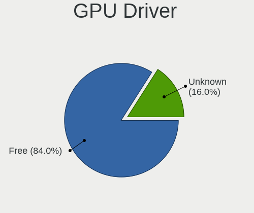

| Driver  | Computers | Percent |
|---------|-----------|---------|
| Free    | 616       | 84.04%  |
| Unknown | 117       | 15.96%  |

GPU Memory
----------

Total video memory

| Size in GB | Computers | Percent |
|------------|-----------|---------|
| Unknown    | 730       | 100%    |

Monitor
-------

Monitor Vendor
--------------

Monitor vendors

| Vendor                  | Computers | Percent |
|-------------------------|-----------|---------|
| AU Optronics            | 62        | 13.84%  |
| LG Display              | 51        | 11.38%  |
| BOE                     | 45        | 10.04%  |
| Samsung Electronics     | 37        | 8.26%   |
| Philips                 | 30        | 6.7%    |
| Chimei Innolux          | 30        | 6.7%    |
| Lenovo                  | 25        | 5.58%   |
| Dell                    | 23        | 5.13%   |
| Goldstar                | 17        | 3.79%   |
| Apple                   | 17        | 3.79%   |
| Ancor Communications    | 11        | 2.46%   |
| BenQ                    | 9         | 2.01%   |
| Acer                    | 9         | 2.01%   |
| ASUSTek Computer        | 8         | 1.79%   |
| Iiyama                  | 7         | 1.56%   |
| AOC                     | 7         | 1.56%   |
| ViewSonic               | 6         | 1.34%   |
| Sharp                   | 6         | 1.34%   |
| NEC Computers           | 5         | 1.12%   |
| Hewlett-Packard         | 5         | 1.12%   |
| InfoVision              | 4         | 0.89%   |
| PANDA                   | 3         | 0.67%   |
| MSI                     | 3         | 0.67%   |
| Eizo                    | 3         | 0.67%   |
| CSO                     | 3         | 0.67%   |
| Chi Mei Optoelectronics | 3         | 0.67%   |
| LG Philips              | 2         | 0.45%   |
| IBM                     | 2         | 0.45%   |
| Vizio                   | 1         | 0.22%   |
| TRU                     | 1         | 0.22%   |
| SHI                     | 1         | 0.22%   |
| Sceptre Tech            | 1         | 0.22%   |
| Quanta Display          | 1         | 0.22%   |
| Panasonic               | 1         | 0.22%   |
| Medion                  | 1         | 0.22%   |
| LTM                     | 1         | 0.22%   |
| JDI                     | 1         | 0.22%   |
| Huion                   | 1         | 0.22%   |
| HKC                     | 1         | 0.22%   |
| HannStar                | 1         | 0.22%   |

Monitor Model
-------------

Monitor models

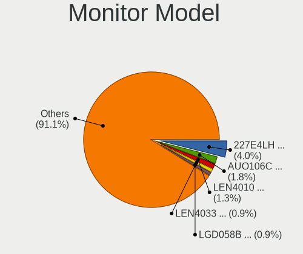

| Model                                                                | Computers | Percent |
|----------------------------------------------------------------------|-----------|---------|
| Philips 227E4LH PHLC0AC 1920x1080 480x270mm 21.7-inch                | 18        | 3.99%   |
| AU Optronics LCD Monitor AUO106C 1366x768 280x160mm 12.7-inch        | 8         | 1.77%   |
| Lenovo LCD Monitor LEN4010 1280x800 260x160mm 12.0-inch              | 6         | 1.33%   |
| LG Display LCD Monitor LGD058B 2560x1440 310x170mm 13.9-inch         | 4         | 0.89%   |
| Lenovo LCD Monitor LEN4033 1440x900 300x190mm 14.0-inch              | 4         | 0.89%   |
| Samsung Electronics SyncMaster SAM03CF 1280x1024 340x270mm 17.1-inch | 3         | 0.67%   |
| Philips 170S PHL0839 1280x1024 340x270mm 17.1-inch                   | 3         | 0.67%   |
| LG Display LCD Monitor LGD03CD 1366x768 280x160mm 12.7-inch          | 3         | 0.67%   |
| Lenovo LCD Monitor LEN4011 1280x800 260x160mm 12.0-inch              | 3         | 0.67%   |
| Chimei Innolux LCD Monitor CMN1239 1920x1080 280x160mm 12.7-inch     | 3         | 0.67%   |
| BOE LCD Monitor BOE095F 2256x1504 280x190mm 13.3-inch                | 3         | 0.67%   |
| AU Optronics LCD Monitor AUO315C 1366x768 260x140mm 11.6-inch        | 3         | 0.67%   |
| Apple Color LCD APPA01B 1440x900 290x180mm 13.4-inch                 | 3         | 0.67%   |
| Ancor Communications ASUS VW199 ACI19ED 1440x900 410x260mm 19.1-inch | 3         | 0.67%   |
| Samsung Electronics SyncMaster SAM026F 1280x1024 380x300mm 19.1-inch | 2         | 0.44%   |
| Samsung Electronics S24F350 SAM0D20 1920x1080 520x290mm 23.4-inch    | 2         | 0.44%   |
| Samsung Electronics LCD Monitor SEC324C 1600x900 310x170mm 13.9-inch | 2         | 0.44%   |
| NEC Computers EX341R NEC2C7A 3440x1440 800x330mm 34.1-inch           | 2         | 0.44%   |
| MSI MP242 MSI30A1 1920x1080 530x300mm 24.0-inch                      | 2         | 0.44%   |
| LG Display LCD Monitor LGD05FA 1920x1080 310x170mm 13.9-inch         | 2         | 0.44%   |
| LG Display LCD Monitor LGD057E 1920x1080 340x190mm 15.3-inch         | 2         | 0.44%   |
| LG Display LCD Monitor LGD0555 2736x1824 260x170mm 12.2-inch         | 2         | 0.44%   |
| LG Display LCD Monitor LGD045E 1366x768 310x170mm 13.9-inch          | 2         | 0.44%   |
| LG Display LCD Monitor LGD0437 1920x1080 280x160mm 12.7-inch         | 2         | 0.44%   |
| LG Display LCD Monitor LGD0418 2560x1440 310x170mm 13.9-inch         | 2         | 0.44%   |
| LG Display LCD Monitor LGD02D8 1366x768 280x160mm 12.7-inch          | 2         | 0.44%   |
| Lenovo LCD Monitor LEN40B2 1920x1080 340x190mm 15.3-inch             | 2         | 0.44%   |
| Lenovo LCD Monitor LEN4035 1280x800 300x190mm 14.0-inch              | 2         | 0.44%   |
| InfoVision LCD Monitor IVO04E3 1366x768 280x160mm 12.7-inch          | 2         | 0.44%   |
| Iiyama PL2779QQ IVM6641 3840x2160 600x330mm 27.0-inch                | 2         | 0.44%   |
| Iiyama PL2474H IVM6137 1920x1080 520x290mm 23.4-inch                 | 2         | 0.44%   |
| IBM LCD Monitor IBM2887 1680x1050 330x210mm 15.4-inch                | 2         | 0.44%   |
| Hewlett-Packard LA2405 HWP284B 1920x1200 520x320mm 24.0-inch         | 2         | 0.44%   |
| Eizo EV2450 ENC2530 1920x1080 530x300mm 24.0-inch                    | 2         | 0.44%   |
| Dell UP2715K DEL40B6 848x480 600x340mm 27.2-inch                     | 2         | 0.44%   |
| Chimei Innolux LCD Monitor CMN15F5 1920x1080 340x190mm 15.3-inch     | 2         | 0.44%   |
| Chimei Innolux LCD Monitor CMN15DB 1366x768 340x190mm 15.3-inch      | 2         | 0.44%   |
| Chimei Innolux LCD Monitor CMN14D6 1366x768 310x170mm 13.9-inch      | 2         | 0.44%   |
| Chimei Innolux LCD Monitor CMN14D4 1920x1080 310x170mm 13.9-inch     | 2         | 0.44%   |
| Chimei Innolux LCD Monitor CMN14C9 1920x1080 310x170mm 13.9-inch     | 2         | 0.44%   |

Monitor Resolution
------------------

Monitor screen resolution

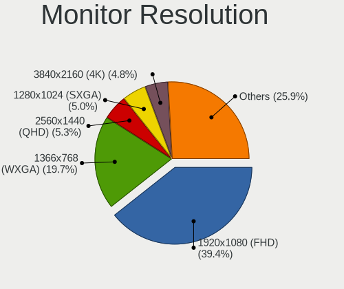

| Resolution         | Computers | Percent |
|--------------------|-----------|---------|
| 1920x1080 (FHD)    | 172       | 39.36%  |
| 1366x768 (WXGA)    | 86        | 19.68%  |
| 2560x1440 (QHD)    | 23        | 5.26%   |
| 1280x1024 (SXGA)   | 22        | 5.03%   |
| 3840x2160 (4K)     | 21        | 4.81%   |
| 1440x900 (WXGA+)   | 19        | 4.35%   |
| 1280x800 (WXGA)    | 19        | 4.35%   |
| 1920x1200 (WUXGA)  | 13        | 2.97%   |
| 1600x900 (HD+)     | 12        | 2.75%   |
| 3440x1440          | 8         | 1.83%   |
| 1680x1050 (WSXGA+) | 7         | 1.6%    |
| 2256x1504          | 4         | 0.92%   |
| 3840x1080          | 3         | 0.69%   |
| 2560x1600          | 3         | 0.69%   |
| 2736x1824          | 2         | 0.46%   |
| 2560x1080          | 2         | 0.46%   |
| 1920x1280          | 2         | 0.46%   |
| 1600x1200          | 2         | 0.46%   |
| 1360x768           | 2         | 0.46%   |
| 1280x854           | 2         | 0.46%   |
| 1024x768 (XGA)     | 2         | 0.46%   |
| 720x1280           | 1         | 0.23%   |
| 3840x2400          | 1         | 0.23%   |
| 3456x2160          | 1         | 0.23%   |
| 3200x1800 (QHD+)   | 1         | 0.23%   |
| 2880x1800          | 1         | 0.23%   |
| 2200x1650          | 1         | 0.23%   |
| 2048x1152          | 1         | 0.23%   |
| 1440x960           | 1         | 0.23%   |
| 1400x1050          | 1         | 0.23%   |
| 1280x768           | 1         | 0.23%   |
| 1024x600           | 1         | 0.23%   |

Monitor Diagonal
----------------

Diagonal size in inches

| Inches  | Computers | Percent |
|---------|-----------|---------|
| 13      | 100       | 22.62%  |
| 15      | 76        | 17.19%  |
| 12      | 47        | 10.63%  |
| 24      | 33        | 7.47%   |
| 21      | 31        | 7.01%   |
| 27      | 22        | 4.98%   |
| 23      | 21        | 4.75%   |
| 19      | 17        | 3.85%   |
| 17      | 17        | 3.85%   |
| 11      | 17        | 3.85%   |
| 14      | 16        | 3.62%   |
| 34      | 9         | 2.04%   |
| 31      | 8         | 1.81%   |
| 18      | 5         | 1.13%   |
| 10      | 3         | 0.68%   |
| 54      | 2         | 0.45%   |
| 49      | 2         | 0.45%   |
| 22      | 2         | 0.45%   |
| 20      | 2         | 0.45%   |
| 9       | 2         | 0.45%   |
| Unknown | 2         | 0.45%   |
| 48      | 1         | 0.23%   |
| 40      | 1         | 0.23%   |
| 35      | 1         | 0.23%   |
| 32      | 1         | 0.23%   |
| 28      | 1         | 0.23%   |
| 26      | 1         | 0.23%   |
| 16      | 1         | 0.23%   |
| 6       | 1         | 0.23%   |

Monitor Width
-------------

Physical width

| Width in mm | Computers | Percent |
|-------------|-----------|---------|
| 301-350     | 159       | 35.97%  |
| 201-300     | 114       | 25.79%  |
| 501-600     | 73        | 16.52%  |
| 401-500     | 48        | 10.86%  |
| 351-400     | 14        | 3.17%   |
| 601-700     | 12        | 2.71%   |
| 701-800     | 10        | 2.26%   |
| 1001-1500   | 5         | 1.13%   |
| 101-200     | 3         | 0.68%   |
| 801-900     | 2         | 0.45%   |
| Unknown     | 2         | 0.45%   |

Aspect Ratio
------------

Proportional relationship between the width and the height

| Ratio | Computers | Percent |
|-------|-----------|---------|
| 16/9  | 314       | 73.02%  |
| 16/10 | 59        | 13.72%  |
| 5/4   | 22        | 5.12%   |
| 3/2   | 16        | 3.72%   |
| 21/9  | 10        | 2.33%   |
| 4/3   | 6         | 1.4%    |
| 32/9  | 3         | 0.7%    |

Monitor Area
------------

Area in inch

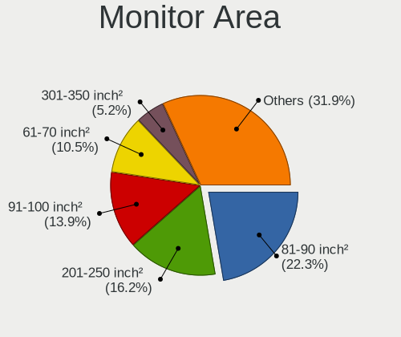

| Area in inch | Computers | Percent |
|----------------|-----------|---------|
| 81-90          | 98        | 22.32%  |
| 201-250        | 71        | 16.17%  |
| 91-100         | 61        | 13.9%   |
| 61-70          | 46        | 10.48%  |
| 301-350        | 23        | 5.24%   |
| 151-200        | 23        | 5.24%   |
| 351-500        | 19        | 4.33%   |
| 51-60          | 18        | 4.1%    |
| 71-80          | 17        | 3.87%   |
| 141-150        | 17        | 3.87%   |
| 101-110        | 16        | 3.64%   |
| 251-300        | 11        | 2.51%   |
| 121-130        | 5         | 1.14%   |
| 501-1000       | 4         | 0.91%   |
| 41-50          | 3         | 0.68%   |
| More than 1000 | 2         | 0.46%   |
| 1-40           | 2         | 0.46%   |
| Unknown        | 2         | 0.46%   |
| 111-120        | 1         | 0.23%   |

Pixel Density
-------------

Pixels per inch

| Density       | Computers | Percent |
|---------------|-----------|---------|
| 121-160       | 161       | 36.67%  |
| 51-100        | 112       | 25.51%  |
| 101-120       | 97        | 22.1%   |
| 161-240       | 51        | 11.62%  |
| More than 240 | 12        | 2.73%   |
| 1-50          | 4         | 0.91%   |
| Unknown       | 2         | 0.46%   |

Multiple Monitors
-----------------

Total monitors connected

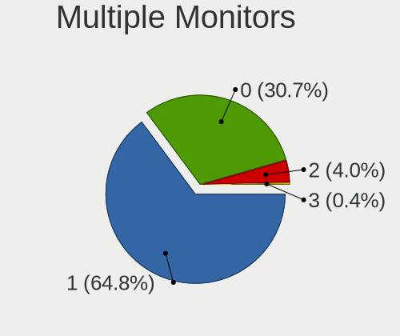

| Total | Computers | Percent |
|-------|-----------|---------|
| 1     | 481       | 64.82%  |
| 0     | 228       | 30.73%  |
| 2     | 30        | 4.04%   |
| 3     | 3         | 0.4%    |

Network
-------

Net Controller Vendor
---------------------

Controller vendors

| Vendor                            | Computers | Percent |
|-----------------------------------|-----------|---------|
| Intel                             | 448       | 46.19%  |
| Realtek Semiconductor             | 270       | 27.84%  |
| Broadcom                          | 66        | 6.8%    |
| Qualcomm Atheros                  | 64        | 6.6%    |
| Qualcomm Atheros Communications   | 10        | 1.03%   |
| Apple                             | 10        | 1.03%   |
| TP-Link                           | 9         | 0.93%   |
| Marvell Technology Group          | 9         | 0.93%   |
| Sierra Wireless                   | 7         | 0.72%   |
| Ericsson Business Mobile Networks | 7         | 0.72%   |
| MediaTek                          | 6         | 0.62%   |
| Edimax Technology                 | 6         | 0.62%   |
| Ralink                            | 5         | 0.52%   |
| VIA Technologies                  | 4         | 0.41%   |
| U-Blox                            | 4         | 0.41%   |
| ASUSTek Computer                  | 4         | 0.41%   |
| Samsung Electronics               | 3         | 0.31%   |
| Ralink Technology                 | 3         | 0.31%   |
| Nvidia                            | 3         | 0.31%   |
| D-Link System                     | 3         | 0.31%   |
| 3Com                              | 3         | 0.31%   |
| Qualcomm Technologies             | 2         | 0.21%   |
| Oracle/SUN                        | 2         | 0.21%   |
| Dell                              | 2         | 0.21%   |
| Xiaomi                            | 1         | 0.1%    |
| Silicon Integrated Systems [SiS]  | 1         | 0.1%    |
| Qcom                              | 1         | 0.1%    |
| National Semiconductor            | 1         | 0.1%    |
| Motorola PCS                      | 1         | 0.1%    |
| Microsoft                         | 1         | 0.1%    |
| Micro Star International          | 1         | 0.1%    |
| LG Electronics                    | 1         | 0.1%    |
| Huawei Technologies               | 1         | 0.1%    |
| Hewlett-Packard                   | 1         | 0.1%    |
| Google                            | 1         | 0.1%    |
| Fibocom                           | 1         | 0.1%    |
| Emulex                            | 1         | 0.1%    |
| Davicom Semiconductor             | 1         | 0.1%    |
| D-Link                            | 1         | 0.1%    |
| AVM                               | 1         | 0.1%    |

Net Controller Model
--------------------

Controller models

| Model                                                                   | Computers | Percent |
|-------------------------------------------------------------------------|-----------|---------|
| Realtek RTL8111/8168/8211/8411 PCI Express Gigabit Ethernet Controller  | 187       | 15.23%  |
| Intel 82579LM Gigabit Network Connection (Lewisville)                   | 38        | 3.09%   |
| Intel Wireless 8265 / 8275                                              | 32        | 2.61%   |
| Intel Wi-Fi 6 AX200                                                     | 31        | 2.52%   |
| Intel Centrino Advanced-N 6205 [Taylor Peak]                            | 31        | 2.52%   |
| Intel I211 Gigabit Network Connection                                   | 28        | 2.28%   |
| Realtek RTL810xE PCI Express Fast Ethernet controller                   | 27        | 2.2%    |
| Intel Wireless 7265                                                     | 26        | 2.12%   |
| Intel I210 Gigabit Network Connection                                   | 26        | 2.12%   |
| Intel Wireless 7260                                                     | 22        | 1.79%   |
| Realtek RTL8125 2.5GbE Controller                                       | 21        | 1.71%   |
| Intel Wireless 8260                                                     | 21        | 1.71%   |
| Intel 82567LM Gigabit Network Connection                                | 17        | 1.38%   |
| Intel Ethernet Connection I219-LM                                       | 16        | 1.3%    |
| Intel Ethernet Connection (3) I218-LM                                   | 14        | 1.14%   |
| Intel 82574L Gigabit Network Connection                                 | 14        | 1.14%   |
| Intel Wi-Fi 6 AX201                                                     | 13        | 1.06%   |
| Intel PRO/Wireless 3945ABG [Golan] Network Connection                   | 12        | 0.98%   |
| Qualcomm Atheros AR9285 Wireless Network Adapter (PCI-Express)          | 11        | 0.9%    |
| Intel I350 Gigabit Network Connection                                   | 11        | 0.9%    |
| Intel Ethernet Connection (4) I219-LM                                   | 11        | 0.9%    |
| Realtek RTL8188EUS 802.11n Wireless Network Adapter                     | 10        | 0.81%   |
| Intel Ultimate N WiFi Link 5300                                         | 10        | 0.81%   |
| Intel Ethernet Connection I217-LM                                       | 10        | 0.81%   |
| Intel Ethernet Connection (4) I219-V                                    | 10        | 0.81%   |
| Intel 82577LM Gigabit Network Connection                                | 10        | 0.81%   |
| Broadcom BCM4360 802.11ac Dual Band Wireless Network Adapter            | 10        | 0.81%   |
| Realtek RTL-8100/8101L/8139 PCI Fast Ethernet Adapter                   | 9         | 0.73%   |
| Realtek RTL8821CE 802.11ac PCIe Wireless Network Adapter                | 8         | 0.65%   |
| Qualcomm Atheros AR9485 Wireless Network Adapter                        | 8         | 0.65%   |
| Intel Wi-Fi 6E(802.11ax) AX210/AX1675* 2x2 [Typhoon Peak]               | 8         | 0.65%   |
| Intel Comet Lake PCH-LP CNVi WiFi                                       | 8         | 0.65%   |
| Intel Cannon Point-LP CNVi [Wireless-AC]                                | 8         | 0.65%   |
| Realtek RTL8188CE 802.11b/g/n WiFi Adapter                              | 7         | 0.57%   |
| Qualcomm Atheros AR9271 802.11n                                         | 7         | 0.57%   |
| Qualcomm Atheros AR242x / AR542x Wireless Network Adapter (PCI-Express) | 7         | 0.57%   |
| Intel Ethernet Connection (6) I219-V                                    | 7         | 0.57%   |
| Intel Ethernet Connection (2) I219-LM                                   | 7         | 0.57%   |
| Intel Dual Band Wireless-AC 3168NGW [Stone Peak]                        | 7         | 0.57%   |
| Intel Centrino Advanced-N 6200                                          | 7         | 0.57%   |

Wireless Vendor
---------------

Wireless vendors

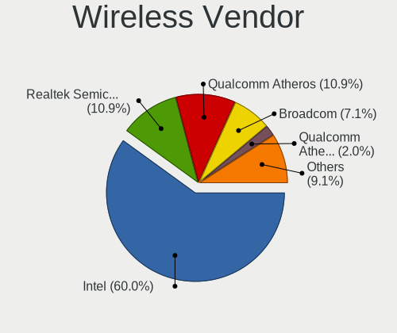

| Vendor                          | Computers | Percent |
|---------------------------------|-----------|---------|
| Intel                           | 303       | 60%     |
| Realtek Semiconductor           | 55        | 10.89%  |
| Qualcomm Atheros                | 55        | 10.89%  |
| Broadcom                        | 36        | 7.13%   |
| Qualcomm Atheros Communications | 10        | 1.98%   |
| TP-Link                         | 9         | 1.78%   |
| Sierra Wireless                 | 6         | 1.19%   |
| Edimax Technology               | 6         | 1.19%   |
| Ralink                          | 5         | 0.99%   |
| MediaTek                        | 5         | 0.99%   |
| ASUSTek Computer                | 4         | 0.79%   |
| Ralink Technology               | 3         | 0.59%   |
| Dell                            | 2         | 0.4%    |
| D-Link System                   | 2         | 0.4%    |
| Qualcomm Technologies           | 1         | 0.2%    |
| Qcom                            | 1         | 0.2%    |
| Micro Star International        | 1         | 0.2%    |
| D-Link                          | 1         | 0.2%    |

Wireless Model
--------------

Wireless models

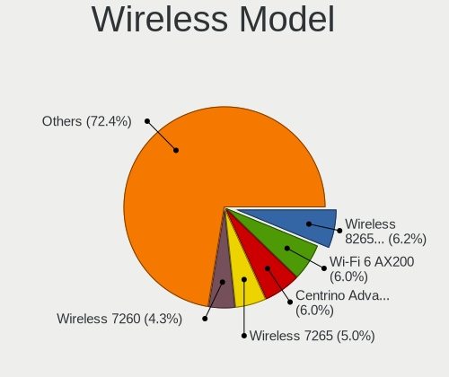

| Model                                                                   | Computers | Percent |
|-------------------------------------------------------------------------|-----------|---------|
| Intel Wireless 8265 / 8275                                              | 32        | 6.21%   |
| Intel Wi-Fi 6 AX200                                                     | 31        | 6.02%   |
| Intel Centrino Advanced-N 6205 [Taylor Peak]                            | 31        | 6.02%   |
| Intel Wireless 7265                                                     | 26        | 5.05%   |
| Intel Wireless 7260                                                     | 22        | 4.27%   |
| Intel Wireless 8260                                                     | 21        | 4.08%   |
| Intel Wi-Fi 6 AX201                                                     | 13        | 2.52%   |
| Intel PRO/Wireless 3945ABG [Golan] Network Connection                   | 12        | 2.33%   |
| Qualcomm Atheros AR9285 Wireless Network Adapter (PCI-Express)          | 11        | 2.14%   |
| Realtek RTL8188EUS 802.11n Wireless Network Adapter                     | 10        | 1.94%   |
| Intel Ultimate N WiFi Link 5300                                         | 10        | 1.94%   |
| Broadcom BCM4360 802.11ac Dual Band Wireless Network Adapter            | 10        | 1.94%   |
| Realtek RTL8821CE 802.11ac PCIe Wireless Network Adapter                | 8         | 1.55%   |
| Qualcomm Atheros AR9485 Wireless Network Adapter                        | 8         | 1.55%   |
| Intel Wi-Fi 6E(802.11ax) AX210/AX1675* 2x2 [Typhoon Peak]               | 8         | 1.55%   |
| Intel Comet Lake PCH-LP CNVi WiFi                                       | 8         | 1.55%   |
| Intel Cannon Point-LP CNVi [Wireless-AC]                                | 8         | 1.55%   |
| Realtek RTL8188CE 802.11b/g/n WiFi Adapter                              | 7         | 1.36%   |
| Qualcomm Atheros AR9271 802.11n                                         | 7         | 1.36%   |
| Qualcomm Atheros AR242x / AR542x Wireless Network Adapter (PCI-Express) | 7         | 1.36%   |
| Intel Dual Band Wireless-AC 3168NGW [Stone Peak]                        | 7         | 1.36%   |
| Intel Centrino Advanced-N 6200                                          | 7         | 1.36%   |
| Qualcomm Atheros AR928X Wireless Network Adapter (PCI-Express)          | 6         | 1.17%   |
| Intel Wireless 3165                                                     | 6         | 1.17%   |
| Sierra Wireless EM7455                                                  | 5         | 0.97%   |
| Realtek RTL8852BE PCIe 802.11ax Wireless Network Controller             | 5         | 0.97%   |
| Qualcomm Atheros QCA9565 / AR9565 Wireless Network Adapter              | 5         | 0.97%   |
| Qualcomm Atheros QCA9377 802.11ac Wireless Network Adapter              | 5         | 0.97%   |
| Intel Centrino Wireless-N 2230                                          | 5         | 0.97%   |
| Realtek RTL8723BE PCIe Wireless Network Adapter                         | 4         | 0.78%   |
| Realtek RTL8192EU 802.11b/g/n WLAN Adapter                              | 4         | 0.78%   |
| Realtek RTL8188CUS 802.11n WLAN Adapter                                 | 4         | 0.78%   |
| Intel Wireless 3160                                                     | 4         | 0.78%   |
| Intel Wi-Fi 5(802.11ac) Wireless-AC 9x6x [Thunder Peak]                 | 4         | 0.78%   |
| Intel PRO/Wireless 5100 AGN [Shiloh] Network Connection                 | 4         | 0.78%   |
| Intel PRO/Wireless 2915ABG [Calexico2] Network Connection               | 4         | 0.78%   |
| Intel Ice Lake-LP PCH CNVi WiFi                                         | 4         | 0.78%   |
| Edimax EW-7811Un 802.11n Wireless Adapter [Realtek RTL8188CUS]          | 4         | 0.78%   |
| Broadcom BCM43224 802.11a/b/g/n                                         | 4         | 0.78%   |
| Broadcom BCM4322 802.11a/b/g/n Wireless LAN Controller                  | 4         | 0.78%   |

Ethernet Vendor
---------------

Ethernet vendors

| Vendor                           | Computers | Percent |
|----------------------------------|-----------|---------|
| Intel                            | 302       | 46.32%  |
| Realtek Semiconductor            | 251       | 38.5%   |
| Broadcom                         | 39        | 5.98%   |
| Qualcomm Atheros                 | 15        | 2.3%    |
| Marvell Technology Group         | 9         | 1.38%   |
| Apple                            | 8         | 1.23%   |
| VIA Technologies                 | 4         | 0.61%   |
| Samsung Electronics              | 3         | 0.46%   |
| Nvidia                           | 3         | 0.46%   |
| 3Com                             | 3         | 0.46%   |
| Oracle/SUN                       | 2         | 0.31%   |
| Xiaomi                           | 1         | 0.15%   |
| Silicon Integrated Systems [SiS] | 1         | 0.15%   |
| National Semiconductor           | 1         | 0.15%   |
| Motorola PCS                     | 1         | 0.15%   |
| Microsoft                        | 1         | 0.15%   |
| MediaTek                         | 1         | 0.15%   |
| Google                           | 1         | 0.15%   |
| Emulex                           | 1         | 0.15%   |
| Davicom Semiconductor            | 1         | 0.15%   |
| D-Link System                    | 1         | 0.15%   |
| Aquantia                         | 1         | 0.15%   |
| American Megatrends              | 1         | 0.15%   |
| Accton Technology                | 1         | 0.15%   |

Ethernet Model
--------------

Ethernet models

| Model                                                                         | Computers | Percent |
|-------------------------------------------------------------------------------|-----------|---------|
| Realtek RTL8111/8168/8211/8411 PCI Express Gigabit Ethernet Controller        | 187       | 27.5%   |
| Intel 82579LM Gigabit Network Connection (Lewisville)                         | 38        | 5.59%   |
| Intel I211 Gigabit Network Connection                                         | 28        | 4.12%   |
| Realtek RTL810xE PCI Express Fast Ethernet controller                         | 27        | 3.97%   |
| Intel I210 Gigabit Network Connection                                         | 26        | 3.82%   |
| Realtek RTL8125 2.5GbE Controller                                             | 21        | 3.09%   |
| Intel 82567LM Gigabit Network Connection                                      | 17        | 2.5%    |
| Intel Ethernet Connection I219-LM                                             | 16        | 2.35%   |
| Intel Ethernet Connection (3) I218-LM                                         | 14        | 2.06%   |
| Intel 82574L Gigabit Network Connection                                       | 14        | 2.06%   |
| Intel I350 Gigabit Network Connection                                         | 11        | 1.62%   |
| Intel Ethernet Connection (4) I219-LM                                         | 11        | 1.62%   |
| Intel Ethernet Connection I217-LM                                             | 10        | 1.47%   |
| Intel Ethernet Connection (4) I219-V                                          | 10        | 1.47%   |
| Intel 82577LM Gigabit Network Connection                                      | 10        | 1.47%   |
| Realtek RTL-8100/8101L/8139 PCI Fast Ethernet Adapter                         | 9         | 1.32%   |
| Intel Ethernet Connection (6) I219-V                                          | 7         | 1.03%   |
| Intel Ethernet Connection (2) I219-LM                                         | 7         | 1.03%   |
| Apple UniNorth 2 GMAC (Sun GEM)                                               | 7         | 1.03%   |
| Intel Ethernet Connection I218-LM                                             | 6         | 0.88%   |
| Intel Ethernet Connection (10) I219-V                                         | 6         | 0.88%   |
| Intel 82573L Gigabit Ethernet Controller                                      | 6         | 0.88%   |
| Intel Ethernet Controller I225-V                                              | 5         | 0.74%   |
| Intel 82579V Gigabit Network Connection                                       | 5         | 0.74%   |
| Qualcomm Atheros AR8152 v2.0 Fast Ethernet                                    | 4         | 0.59%   |
| Marvell Group 88E8057 PCI-E Gigabit Ethernet Controller                       | 4         | 0.59%   |
| Intel Ethernet Connection (7) I219-LM                                         | 4         | 0.59%   |
| Intel Ethernet Connection (2) I219-V                                          | 4         | 0.59%   |
| Broadcom NetXtreme BCM5751M Gigabit Ethernet PCI Express                      | 4         | 0.59%   |
| Broadcom NetXtreme BCM5719 Gigabit Ethernet PCIe                              | 4         | 0.59%   |
| Realtek Killer E2600 GbE Controller                                           | 3         | 0.44%   |
| Nvidia MCP79 Ethernet                                                         | 3         | 0.44%   |
| Marvell Group 88E8055 PCI-E Gigabit Ethernet Controller                       | 3         | 0.44%   |
| Intel Ethernet Controller I226-V                                              | 3         | 0.44%   |
| Intel Ethernet Connection I219-V                                              | 3         | 0.44%   |
| Intel Ethernet Connection I217-V                                              | 3         | 0.44%   |
| Intel Ethernet Connection (7) I219-V                                          | 3         | 0.44%   |
| Intel Ethernet Connection (3) I218-V                                          | 3         | 0.44%   |
| Intel 82599ES 10-Gigabit SFI/SFP+ Network Connection                          | 3         | 0.44%   |
| Intel 82571EB/82571GB Gigabit Ethernet Controller D0/D1 (copper applications) | 3         | 0.44%   |

Net Controller Kind
-------------------

Ethernet, WiFi or modem

| Kind     | Computers | Percent |
|----------|-----------|---------|
| Ethernet | 627       | 55.78%  |
| WiFi     | 464       | 41.28%  |
| Modem    | 19        | 1.69%   |
| Unknown  | 14        | 1.25%   |

Used Controller
---------------

Currently used network controller

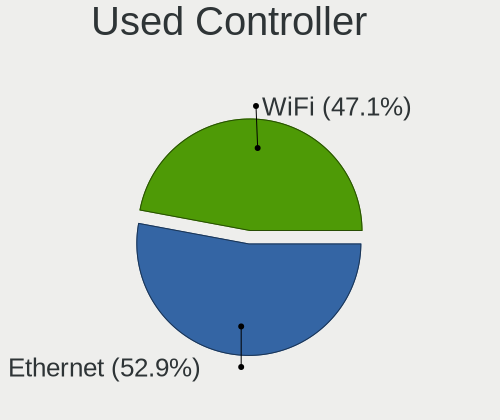

| Kind     | Computers | Percent |
|----------|-----------|---------|
| Ethernet | 343       | 52.93%  |
| WiFi     | 305       | 47.07%  |

NICs
----

Total network controllers on board

| Total | Computers | Percent |
|-------|-----------|---------|
| 2     | 384       | 52.39%  |
| 1     | 223       | 30.42%  |
| 3     | 45        | 6.14%   |
| 0     | 34        | 4.64%   |
| 4     | 32        | 4.37%   |
| 6     | 4         | 0.55%   |
| 5     | 4         | 0.55%   |
| 8     | 3         | 0.41%   |
| 7     | 2         | 0.27%   |
| 12    | 1         | 0.14%   |
| 9     | 1         | 0.14%   |

IPv6
----

IPv6 vs IPv4

| Used | Computers | Percent |
|------|-----------|---------|
| No   | 722       | 98.5%   |
| Yes  | 11        | 1.5%    |

Bluetooth
---------

Bluetooth Vendor
----------------

Controller vendors

| Vendor                          | Computers | Percent |
|---------------------------------|-----------|---------|
| Intel                           | 176       | 57.33%  |
| Broadcom                        | 35        | 11.4%   |
| Apple                           | 25        | 8.14%   |
| Realtek Semiconductor           | 15        | 4.89%   |
| IMC Networks                    | 14        | 4.56%   |
| Qualcomm Atheros Communications | 10        | 3.26%   |
| Foxconn / Hon Hai               | 9         | 2.93%   |
| Alps Electric                   | 7         | 2.28%   |
| Cambridge Silicon Radio         | 4         | 1.3%    |
| Taiyo Yuden                     | 2         | 0.65%   |
| Ralink                          | 2         | 0.65%   |
| Hewlett-Packard                 | 2         | 0.65%   |
| ASUSTek Computer                | 2         | 0.65%   |
| Skylight Digital                | 1         | 0.33%   |
| Lite-On Technology              | 1         | 0.33%   |
| Dell                            | 1         | 0.33%   |
| Creative Technology             | 1         | 0.33%   |

Bluetooth Model
---------------

Controller models

| Model                                                       | Computers | Percent |
|-------------------------------------------------------------|-----------|---------|
| Intel Bluetooth wireless interface                          | 82        | 26.71%  |
| Intel AX201 Bluetooth                                       | 28        | 9.12%   |
| Intel AX200 Bluetooth                                       | 26        | 8.47%   |
| Intel Bluetooth 9460/9560 Jefferson Peak (JfP)              | 13        | 4.23%   |
| Realtek Bluetooth Adapter                                   | 11        | 3.58%   |
| Broadcom BCM20702 Bluetooth 4.0 [ThinkPad]                  | 10        | 3.26%   |
| Broadcom BCM2045B (BDC-2.1)                                 | 10        | 3.26%   |
| Apple Broadcom Built-in Bluetooth                           | 10        | 3.26%   |
| Apple Bluetooth Host Controller                             | 10        | 3.26%   |
| Intel Centrino Bluetooth Wireless Transceiver               | 8         | 2.61%   |
| Intel Wireless-AC 3168 Bluetooth                            | 7         | 2.28%   |
| Intel AX210 Bluetooth                                       | 7         | 2.28%   |
| Qualcomm Atheros AR3012 Bluetooth 4.0                       | 6         | 1.95%   |
| Broadcom BCM2045B (BDC-2.1) [Bluetooth Controller]          | 6         | 1.95%   |
| Apple Built-in Bluetooth 2.0+EDR HCI                        | 5         | 1.63%   |
| Alps Electric UGTZ4 Bluetooth                               | 5         | 1.63%   |
| IMC Networks Realtek Bluetooth Adapter                      | 4         | 1.3%    |
| Cambridge Silicon Radio Bluetooth Dongle (HCI mode)         | 4         | 1.3%    |
| IMC Networks Realtek Bluetooth 4.0 + High Speed Chip        | 3         | 0.98%   |
| IMC Networks Qualcomm Atheros Bluetooth 4.1                 | 3         | 0.98%   |
| Broadcom BCM20702A0 Bluetooth 4.0                           | 3         | 0.98%   |
| Taiyo Yuden Bluetooth Device (V2.0+EDR)                     | 2         | 0.65%   |
| Realtek Bluetooth 4.0 Adapter                               | 2         | 0.65%   |
| Ralink RT3290 Bluetooth                                     | 2         | 0.65%   |
| Intel Wireless-AC 9260 Bluetooth Adapter                    | 2         | 0.65%   |
| Intel AX211 Bluetooth                                       | 2         | 0.65%   |
| IMC Networks Qualcomm Atheros Bluetooth 4.0 + HS            | 2         | 0.65%   |
| IMC Networks Asus Integrated Bluetooth module [AR3011]      | 2         | 0.65%   |
| HP Bluetooth 2.0 Interface [Broadcom BCM2045]               | 2         | 0.65%   |
| Foxconn / Hon Hai RZ616 Bluetooth Adapter                   | 2         | 0.65%   |
| Foxconn / Hon Hai Broadcom BCM20702 Bluetooth USB Device    | 2         | 0.65%   |
| Broadcom BCM2045B (BDC-2) [Bluetooth Controller]            | 2         | 0.65%   |
| Alps Electric BCM2046 Bluetooth Device                      | 2         | 0.65%   |
| Skylight Digital Realtek Bluetooth Adapter                  | 1         | 0.33%   |
| Realtek  Bluetooth 4.2 Adapter                              | 1         | 0.33%   |
| Realtek Bluetooth 4.2 Adapter                               | 1         | 0.33%   |
| Qualcomm Atheros QCA9377 Bluetooth 4.1                      | 1         | 0.33%   |
| Qualcomm Atheros Dell Wireless 1820 Bluetooth 4.1LE         | 1         | 0.33%   |
| Qualcomm Atheros Dell Wireless 1707 Bluetooth 4.0 LE Device | 1         | 0.33%   |
| Qualcomm Atheros Bluetooth                                  | 1         | 0.33%   |

Sound
-----

Sound Vendor
------------

Sound card vendors

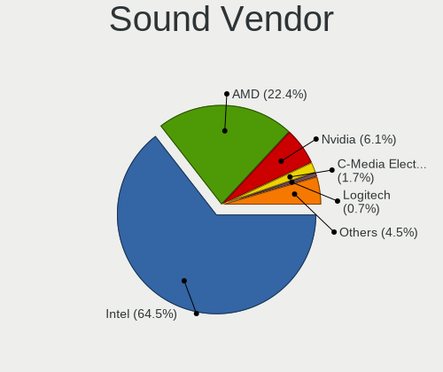

| Vendor                                       | Computers | Percent |
|----------------------------------------------|-----------|---------|
| Intel                                        | 454       | 64.49%  |
| AMD                                          | 158       | 22.44%  |
| Nvidia                                       | 43        | 6.11%   |
| C-Media Electronics                          | 12        | 1.7%    |
| Logitech                                     | 5         | 0.71%   |
| VIA Technologies                             | 4         | 0.57%   |
| Creative Labs                                | 4         | 0.57%   |
| ESS Technology                               | 3         | 0.43%   |
| ULi Electronics                              | 2         | 0.28%   |
| Texas Instruments                            | 2         | 0.28%   |
| JMTek                                        | 2         | 0.28%   |
| Generalplus Technology                       | 2         | 0.28%   |
| Focusrite-Novation                           | 2         | 0.28%   |
| Creative Technology                          | 2         | 0.28%   |
| Zoran Co. Personal Media Division (Nogatech) | 1         | 0.14%   |
| Thesycon Systemsoftware & Consulting         | 1         | 0.14%   |
| Silicon Integrated Systems [SiS]             | 1         | 0.14%   |
| Samson Technologies                          | 1         | 0.14%   |
| Lenovo                                       | 1         | 0.14%   |
| KTMicro                                      | 1         | 0.14%   |
| Elgato Systems                               | 1         | 0.14%   |
| Dell                                         | 1         | 0.14%   |
| Blue Microphones                             | 1         | 0.14%   |

Sound Model
-----------

Sound card models

| Model                                                                             | Computers | Percent |
|-----------------------------------------------------------------------------------|-----------|---------|
| Intel Sunrise Point-LP HD Audio                                                   | 63        | 7.18%   |
| AMD Family 17h/19h/1ah HD Audio Controller                                        | 50        | 5.7%    |
| Intel 7 Series/C216 Chipset Family High Definition Audio Controller               | 38        | 4.33%   |
| Intel 6 Series/C200 Series Chipset Family High Definition Audio Controller        | 36        | 4.1%    |
| Intel Broadwell-U Audio Controller                                                | 35        | 3.99%   |
| Intel Wildcat Point-LP High Definition Audio Controller                           | 34        | 3.88%   |
| Intel NM10/ICH7 Family High Definition Audio Controller                           | 31        | 3.53%   |
| Intel 82801I (ICH9 Family) HD Audio Controller                                    | 27        | 3.08%   |
| AMD Renoir Radeon High Definition Audio Controller                                | 26        | 2.96%   |
| Intel 8 Series/C220 Series Chipset High Definition Audio Controller               | 20        | 2.28%   |
| AMD Starship/Matisse HD Audio Controller                                          | 20        | 2.28%   |
| Intel Xeon E3-1200 v3/4th Gen Core Processor HD Audio Controller                  | 18        | 2.05%   |
| Intel Haswell-ULT HD Audio Controller                                             | 17        | 1.94%   |
| Intel 8 Series HD Audio Controller                                                | 17        | 1.94%   |
| AMD SBx00 Azalia (Intel HDA)                                                      | 17        | 1.94%   |
| Intel Cannon Lake PCH cAVS                                                        | 16        | 1.82%   |
| Intel 5 Series/3400 Series Chipset High Definition Audio                          | 16        | 1.82%   |
| AMD FCH Azalia Controller                                                         | 16        | 1.82%   |
| AMD Navi 21/23 HDMI/DP Audio Controller                                           | 15        | 1.71%   |
| Intel Tiger Lake-LP Smart Sound Technology Audio Controller                       | 13        | 1.48%   |
| AMD Rembrandt Radeon High Definition Audio Controller                             | 12        | 1.37%   |
| AMD Raven/Raven2/Fenghuang HDMI/DP Audio Controller                               | 12        | 1.37%   |
| AMD Ellesmere HDMI Audio [Radeon RX 470/480 / 570/580/590]                        | 12        | 1.37%   |
| Intel Comet Lake PCH-LP cAVS                                                      | 11        | 1.25%   |
| Intel Celeron/Pentium Silver Processor High Definition Audio                      | 11        | 1.25%   |
| Intel Cannon Point-LP High Definition Audio Controller                            | 11        | 1.25%   |
| Intel 100 Series/C230 Series Chipset Family HD Audio Controller                   | 10        | 1.14%   |
| AMD Navi 10 HDMI Audio                                                            | 9         | 1.03%   |
| AMD Kabini HDMI/DP Audio                                                          | 9         | 1.03%   |
| Intel 200 Series PCH HD Audio                                                     | 8         | 0.91%   |
| AMD Family 17h (Models 00h-0fh) HD Audio Controller                               | 7         | 0.8%    |
| AMD Caicos HDMI Audio [Radeon HD 6450 / 7450/8450/8490 OEM / R5 230/235/235X OEM] | 7         | 0.8%    |
| Intel Celeron N3350/Pentium N4200/Atom E3900 Series Audio Cluster                 | 6         | 0.68%   |
| Intel Atom Processor Z36xxx/Z37xxx Series High Definition Audio Controller        | 6         | 0.68%   |
| Intel 82801JI (ICH10 Family) HD Audio Controller                                  | 6         | 0.68%   |
| Intel 82801H (ICH8 Family) HD Audio Controller                                    | 6         | 0.68%   |
| AMD RS880 HDMI Audio [Radeon HD 4200 Series]                                      | 6         | 0.68%   |
| AMD Oland/Hainan/Cape Verde/Pitcairn HDMI Audio [Radeon HD 7000 Series]           | 6         | 0.68%   |
| Nvidia High Definition Audio Controller                                           | 5         | 0.57%   |
| Intel Comet Lake PCH-V cAVS                                                       | 5         | 0.57%   |

Memory
------

Memory Vendor
-------------

Memory module vendors

| Vendor              | Computers | Percent |
|---------------------|-----------|---------|
| Unknown             | 26        | 24.3%   |
| Samsung Electronics | 23        | 21.5%   |
| SK hynix            | 14        | 13.08%  |
| Kingston            | 9         | 8.41%   |
| Micron Technology   | 8         | 7.48%   |
| Unknown             | 8         | 7.48%   |
| Elpida              | 4         | 3.74%   |
| Crucial             | 4         | 3.74%   |
| Transcend           | 2         | 1.87%   |
| Ramaxel Technology  | 2         | 1.87%   |
| Corsair             | 2         | 1.87%   |
| A-DATA Technology   | 2         | 1.87%   |
| Smart               | 1         | 0.93%   |
| Nanya Technology    | 1         | 0.93%   |
| Hewlett-Packard     | 1         | 0.93%   |

Memory Model
------------

Memory module models

| Model                                                   | Computers | Percent |
|---------------------------------------------------------|-----------|---------|
| Unknown                                                 | 8         | 6.67%   |
| Samsung RAM M471B5273DH0-CH9 4GB SODIMM DDR3 1334MT/s   | 5         | 4.17%   |
| Unknown RAM Module 4GB SODIMM DDR3 1333MT/s             | 4         | 3.33%   |
| Kingston RAM KHX2400C15/8G 8GB DIMM DDR4 2400MT/s       | 3         | 2.5%    |
| Unknown RAM Module 4096MB SODIMM DDR3 1333MT/s          | 2         | 1.67%   |
| Unknown RAM Module 1GB SODIMM DDR2                      | 2         | 1.67%   |
| Unknown RAM Module 1GB SODIMM DDR                       | 2         | 1.67%   |
| SK hynix RAM HMT351S6CFR8C-PB 4GB SODIMM DDR3 1600MT/s  | 2         | 1.67%   |
| Samsung RAM M471B5773DH0-CH9 2GB SODIMM DDR3 1334MT/s   | 2         | 1.67%   |
| Samsung RAM M471B5673FH0-CF8 2GB SODIMM DDR3 1067MT/s   | 2         | 1.67%   |
| Samsung RAM M471B5273DH0-CK0 8GB SODIMM DDR3 1600MT/s   | 2         | 1.67%   |
| Samsung RAM M471B5173QH0-YK0 4GB SODIMM DDR3 1600MT/s   | 2         | 1.67%   |
| Samsung RAM M471B5173BH0-CK0 4GB SODIMM DDR3 1600MT/s   | 2         | 1.67%   |
| Samsung RAM M471A1K43BB0-CPB 8GB SODIMM DDR4 2133MT/s   | 2         | 1.67%   |
| Micron RAM 16KTF1G64HZ-1G6E1 8GB SODIMM DDR3 1600MT/s   | 2         | 1.67%   |
| Kingston RAM KHX2400C15D4/4G 4GB DIMM DDR4 2400MT/s     | 2         | 1.67%   |
| Crucial RAM CT8G3S1339M 8GB SODIMM DDR3 1333MT/s        | 2         | 1.67%   |
| Crucial RAM CT102464BF160B.M16 8GB SODIMM DDR3 1600MT/s | 2         | 1.67%   |
| Unknown RAM Module 512MB SODIMM SDRAM                   | 1         | 0.83%   |
| Unknown RAM Module 512MB SODIMM DDR                     | 1         | 0.83%   |
| Unknown RAM Module 512MB DIMM SDRAM                     | 1         | 0.83%   |
| Unknown RAM Module 512MB DIMM DDR 400MT/s               | 1         | 0.83%   |
| Unknown RAM Module 512MB DIMM 400MT/s                   | 1         | 0.83%   |
| Unknown RAM Module 2GB SODIMM DDR3 1333MT/s             | 1         | 0.83%   |
| Unknown RAM Module 2GB SODIMM DDR3 1067MT/s             | 1         | 0.83%   |
| Unknown RAM Module 2GB SODIMM DDR2 667MT/s              | 1         | 0.83%   |
| Unknown RAM Module 2GB DIMM DDR3 1332MT/s               | 1         | 0.83%   |
| Unknown RAM Module 2GB DIMM DDR2 667MT/s                | 1         | 0.83%   |
| Unknown RAM Module 256MB SODIMM DRAM                    | 1         | 0.83%   |
| Unknown RAM Module 256MB DIMM 333MT/s                   | 1         | 0.83%   |
| Unknown RAM Module 2048MB SODIMM DDR3 1333MT/s          | 1         | 0.83%   |
| Unknown RAM Module 2048MB SODIMM DDR2                   | 1         | 0.83%   |
| Unknown RAM Module 2048MB DIMM DDR2 266MT/s             | 1         | 0.83%   |
| Unknown RAM Module 1GB DIMM 400MT/s                     | 1         | 0.83%   |
| Unknown RAM Module 128MB SODIMM DRAM                    | 1         | 0.83%   |
| Unknown RAM Module 1024MB SODIMM DDR                    | 1         | 0.83%   |
| Unknown RAM Module 1024MB DIMM DDR                      | 1         | 0.83%   |
| Unknown RAM Module 1024MB DIMM 800MT/s                  | 1         | 0.83%   |
| Transcend RAM TS1GSK64W6H 8GB DIMM DDR3 1600MT/s        | 1         | 0.83%   |
| Transcend RAM TS128MLQ64V6J 1GB DIMM DDR2 667MT/s       | 1         | 0.83%   |

Memory Kind
-----------

Memory module kinds

| Kind    | Computers | Percent |
|---------|-----------|---------|
| DDR3    | 40        | 42.55%  |
| DDR4    | 21        | 22.34%  |
| DDR2    | 13        | 13.83%  |
| DDR     | 5         | 5.32%   |
| Unknown | 5         | 5.32%   |
| SDRAM   | 4         | 4.26%   |
| DDR5    | 3         | 3.19%   |
| DRAM    | 2         | 2.13%   |
| LPDDR3  | 1         | 1.06%   |

Memory Form Factor
------------------

Physical design of the memory module

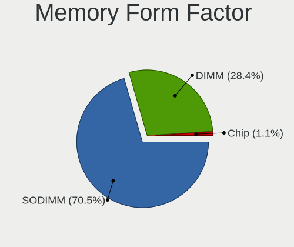

| Name   | Computers | Percent |
|--------|-----------|---------|
| SODIMM | 67        | 70.53%  |
| DIMM   | 27        | 28.42%  |
| Chip   | 1         | 1.05%   |

Memory Size
-----------

Memory module size

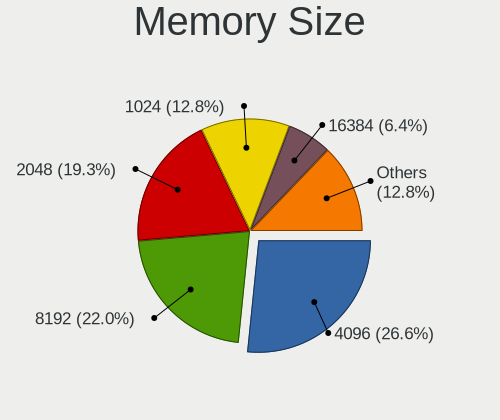

| Size  | Computers | Percent |
|-------|-----------|---------|
| 4096  | 29        | 26.61%  |
| 8192  | 24        | 22.02%  |
| 2048  | 21        | 19.27%  |
| 1024  | 14        | 12.84%  |
| 16384 | 7         | 6.42%   |
| 512   | 6         | 5.5%    |
| 32768 | 5         | 4.59%   |
| 256   | 2         | 1.83%   |
| 128   | 1         | 0.92%   |

Memory Speed
------------

Memory module speed

| Speed   | Computers | Percent |
|---------|-----------|---------|
| 1600    | 21        | 20.79%  |
| Unknown | 15        | 14.85%  |
| 1333    | 11        | 10.89%  |
| 2400    | 7         | 6.93%   |
| 1334    | 7         | 6.93%   |
| 3200    | 5         | 4.95%   |
| 2667    | 4         | 3.96%   |
| 1067    | 4         | 3.96%   |
| 800     | 4         | 3.96%   |
| 667     | 4         | 3.96%   |
| 2133    | 3         | 2.97%   |
| 400     | 3         | 2.97%   |
| 4800    | 2         | 1.98%   |
| 266     | 2         | 1.98%   |
| 5600    | 1         | 0.99%   |
| 3000    | 1         | 0.99%   |
| 2666    | 1         | 0.99%   |
| 1867    | 1         | 0.99%   |
| 1332    | 1         | 0.99%   |
| 1066    | 1         | 0.99%   |
| 975     | 1         | 0.99%   |
| 533     | 1         | 0.99%   |
| 333     | 1         | 0.99%   |

Printers & scanners
-------------------

Printer Vendor
--------------

Printer device vendors

Zero info for selected period =(

Printer Model
-------------

Printer device models

Zero info for selected period =(

Scanner Vendor
--------------

Scanner device vendors

| Vendor      | Computers | Percent |
|-------------|-----------|---------|
| Seiko Epson | 1         | 100%    |

Scanner Model
-------------

Scanner device models

| Model                                               | Computers | Percent |
|-----------------------------------------------------|-----------|---------|
| Seiko Epson GT-F520/GT-F570 [Perfection 3590 PHOTO] | 1         | 100%    |

Camera
------

Camera Vendor
-------------

Camera device vendors

| Vendor                                 | Computers | Percent |
|----------------------------------------|-----------|---------|
| Chicony Electronics                    | 78        | 30.59%  |
| Bison Electronics                      | 36        | 14.12%  |
| IMC Networks                           | 24        | 9.41%   |
| Realtek Semiconductor                  | 16        | 6.27%   |
| Lite-On Technology                     | 14        | 5.49%   |
| Microdia                               | 12        | 4.71%   |
| Sunplus Innovation Technology          | 8         | 3.14%   |
| Silicon Motion                         | 7         | 2.75%   |
| Logitech                               | 7         | 2.75%   |
| Lenovo                                 | 7         | 2.75%   |
| Apple                                  | 6         | 2.35%   |
| Quanta                                 | 5         | 1.96%   |
| Cheng Uei Precision Industry (Foxlink) | 5         | 1.96%   |
| Ricoh                                  | 4         | 1.57%   |
| Syntek                                 | 3         | 1.18%   |
| Suyin                                  | 3         | 1.18%   |
| Alcor Micro                            | 3         | 1.18%   |
| Z-Star Microelectronics                | 2         | 0.78%   |
| Tripath Technology                     | 2         | 0.78%   |
| Luxvisions Innotech Limited            | 2         | 0.78%   |
| ALi                                    | 2         | 0.78%   |
| Trust                                  | 1         | 0.39%   |
| SunplusIT                              | 1         | 0.39%   |
| Shenzhen Kingcome Optoelectronic       | 1         | 0.39%   |
| Jiangxi Shinetech Optical              | 1         | 0.39%   |
| Genesys Logic                          | 1         | 0.39%   |
| Generalplus Technology                 | 1         | 0.39%   |
| Framework                              | 1         | 0.39%   |
| Foxconn / Hon Hai                      | 1         | 0.39%   |
| Denron                                 | 1         | 0.39%   |

Camera Model
------------

Camera device models

| Model                                                                      | Computers | Percent |
|----------------------------------------------------------------------------|-----------|---------|
| Chicony Integrated Camera                                                  | 35        | 13.46%  |
| Bison Integrated Camera                                                    | 16        | 6.15%   |
| Lite-On Integrated Camera                                                  | 13        | 5%      |
| IMC Networks Integrated Camera                                             | 11        | 4.23%   |
| Chicony Integrated Camera [ThinkPad]                                       | 7         | 2.69%   |
| Chicony Lenovo Integrated Camera (0.3MP)                                   | 6         | 2.31%   |
| Chicony Integrated IR Camera                                               | 5         | 1.92%   |
| Bison SunplusIT Integrated Camera                                          | 5         | 1.92%   |
| Realtek Integrated_Webcam_HD                                               | 4         | 1.54%   |
| Microdia Integrated_Webcam_HD                                              | 4         | 1.54%   |
| Lenovo Integrated Webcam                                                   | 4         | 1.54%   |
| Realtek Integrated Webcam HD                                               | 3         | 1.15%   |
| Lenovo Integrated Webcam [R5U877]                                          | 3         | 1.15%   |
| Chicony Integrated Camera (1280x720@30)                                    | 3         | 1.15%   |
| Bison USB HD Webcam                                                        | 3         | 1.15%   |
| Bison Lenovo EasyCamera                                                    | 3         | 1.15%   |
| Tripath USB Camera                                                         | 2         | 0.77%   |
| Syntek Lenovo EasyCamera                                                   | 2         | 0.77%   |
| Sunplus LTD, NexiGo N930AF FHD Webcam                                      | 2         | 0.77%   |
| Silicon Motion Realtek USB 2.0 PC Camera                                   | 2         | 0.77%   |
| Silicon Motion Lenovo EasyCamera                                           | 2         | 0.77%   |
| Realtek USB 2.0 Webcam                                                     | 2         | 0.77%   |
| Realtek Laptop Camera                                                      | 2         | 0.77%   |
| Microdia Integrated Webcam                                                 | 2         | 0.77%   |
| Logitech Webcam C270                                                       | 2         | 0.77%   |
| IMC Networks USB2.0 VGA UVC WebCam                                         | 2         | 0.77%   |
| IMC Networks Realtek PC Camera                                             | 2         | 0.77%   |
| IMC Networks Realtek DMFT RGB                                              | 2         | 0.77%   |
| IMC Networks EasyCamera                                                    | 2         | 0.77%   |
| Chicony VGA Webcam                                                         | 2         | 0.77%   |
| Chicony ThinkPad T490 Webcam                                               | 2         | 0.77%   |
| Chicony thinkpad t430s camera                                              | 2         | 0.77%   |
| Chicony Sonix ST50220 USB Video Camera                                     | 2         | 0.77%   |
| Chicony FJ Camera                                                          | 2         | 0.77%   |
| Cheng Uei Precision Industry (Foxlink) HP Wide Vision HD Integrated Webcam | 2         | 0.77%   |
| Bison ThinkPad P50 Integrated Camera                                       | 2         | 0.77%   |
| Bison ThinkPad Integrated Camera                                           | 2         | 0.77%   |
| Bison Lenovo Integrated Webcam                                             | 2         | 0.77%   |
| Bison EasyCamera                                                           | 2         | 0.77%   |
| Apple FaceTime HD Camera (Built-in)                                        | 2         | 0.77%   |

Security
--------

Fingerprint Vendor
------------------

Fingerprint sensor vendors

| Vendor                     | Computers | Percent |
|----------------------------|-----------|---------|
| Validity Sensors           | 32        | 34.41%  |
| Synaptics                  | 17        | 18.28%  |
| Upek                       | 12        | 12.9%   |
| AuthenTec                  | 12        | 12.9%   |
| STMicroelectronics         | 10        | 10.75%  |
| Shenzhen Goodix Technology | 6         | 6.45%   |
| Elan Microelectronics      | 2         | 2.15%   |
| Samsung Electronics        | 1         | 1.08%   |
| LighTuning Technology      | 1         | 1.08%   |

Fingerprint Model
-----------------

Fingerprint sensor models

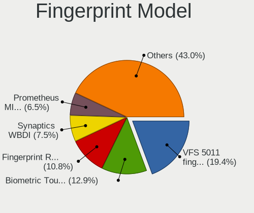

| Model                                                    | Computers | Percent |
|----------------------------------------------------------|-----------|---------|
| Validity Sensors VFS 5011 fingerprint sensor             | 18        | 19.35%  |
| Upek Biometric Touchchip/Touchstrip Fingerprint Sensor   | 12        | 12.9%   |
| STMicroelectronics Fingerprint Reader                    | 10        | 10.75%  |
| Validity Sensors Synaptics WBDI                          | 7         | 7.53%   |
| Synaptics Prometheus MIS Touch Fingerprint Reader        | 6         | 6.45%   |
| AuthenTec AES2810                                        | 6         | 6.45%   |
| Shenzhen Goodix Fingerprint Reader                       | 5         | 5.38%   |
| AuthenTec AES2501 Fingerprint Sensor                     | 5         | 5.38%   |
| Validity Sensors VFS7500 Touch Fingerprint Sensor        | 4         | 4.3%    |
| Synaptics Metallica MIS Touch Fingerprint Reader         | 4         | 4.3%    |
| Synaptics WBDI                                           | 3         | 3.23%   |
| Validity Sensors VFS5011 Fingerprint Reader              | 2         | 2.15%   |
| Synaptics FS7604 Touch Fingerprint Sensor with PurePrint | 2         | 2.15%   |
| Elan Fingerprint Sensor                                  | 2         | 2.15%   |
| Validity Sensors VFS451 Fingerprint Reader               | 1         | 1.08%   |
| Synaptics UWP WBDI Device                                | 1         | 1.08%   |
| Synaptics Metallica MOH Touch Fingerprint Reader         | 1         | 1.08%   |
| Shenzhen Goodix Fingerprint Reader SGX                   | 1         | 1.08%   |
| Samsung CanvasBio Fingerprint Reader                     | 1         | 1.08%   |
| LighTuning ES603 Swipe Fingerprint Sensor                | 1         | 1.08%   |
| AuthenTec AES2660                                        | 1         | 1.08%   |

Chipcard Vendor
---------------

Chipcard module vendors

Zero info for selected period =(

Chipcard Model
--------------

Chipcard module models

Zero info for selected period =(

Unsupported
-----------

Unsupported Devices
-------------------

Total unsupported devices on board

| Total | Computers | Percent |
|-------|-----------|---------|
| 1     | 319       | 43.05%  |
| 0     | 204       | 27.53%  |
| 2     | 151       | 20.38%  |
| 3     | 35        | 4.72%   |
| 4     | 17        | 2.29%   |
| 5     | 8         | 1.08%   |
| 7     | 3         | 0.4%    |
| 6     | 3         | 0.4%    |
| 8     | 1         | 0.13%   |

Unsupported Device Types
------------------------

Types of unsupported devices

| Type                     | Computers | Percent |
|--------------------------|-----------|---------|
| Communication controller | 392       | 49.94%  |
| Graphics card            | 130       | 16.56%  |
| Net/wireless             | 91        | 11.59%  |
| Firewire controller      | 64        | 8.15%   |
| Sound                    | 26        | 3.31%   |
| Storage/ata              | 23        | 2.93%   |
| Net/ethernet             | 18        | 2.29%   |
| Network                  | 13        | 1.66%   |
| Modem                    | 10        | 1.27%   |
| Storage                  | 7         | 0.89%   |
| Storage/ide              | 4         | 0.51%   |
| Card reader              | 3         | 0.38%   |
| Bluetooth                | 2         | 0.25%   |
| Storage/raid             | 1         | 0.13%   |
| Storage/nvme             | 1         | 0.13%   |

