OpenBSD - Tested Hardware & Statistics
--------------------------------------

A project to collect tested hardware configurations for OpenBSD.

Anyone can contribute to this report by the [hw-probe](https://github.com/linuxhw/hw-probe/blob/master/INSTALL.BSD.md) tool:

    hw-probe -all -upload

Please contribute! Especially if your hardware is rare.

This is a report for all computer types. See also reports for [desktops](/Dist/OpenBSD/Desktop/README.md) and [notebooks](/Dist/OpenBSD/Notebook/README.md).

Contents
--------

* [ Test Cases ](#test-cases)

* [ System ](#system)
  - [ OS                       ](#os)
  - [ OS Family                ](#os-family)
  - [ Arch                     ](#arch)
  - [ DE                       ](#de)
  - [ Display Server           ](#display-server)
  - [ Display Manager          ](#display-manager)
  - [ OS Lang                  ](#os-lang)
  - [ Boot Mode                ](#boot-mode)
  - [ Filesystem               ](#filesystem)
  - [ Part. scheme             ](#part-scheme)

* [ Board ](#board)
  - [ Vendor                   ](#vendor)
  - [ Model                    ](#model)
  - [ Model Family             ](#model-family)
  - [ MFG Year                 ](#mfg-year)
  - [ Form Factor              ](#form-factor)
  - [ Coreboot                 ](#coreboot)
  - [ RAM Size                 ](#ram-size)
  - [ RAM Used                 ](#ram-used)
  - [ Total Drives             ](#total-drives)
  - [ Has CD-ROM               ](#has-cd-rom)
  - [ Has Ethernet             ](#has-ethernet)
  - [ Has WiFi                 ](#has-wifi)
  - [ Has Bluetooth            ](#has-bluetooth)

* [ Location ](#location)
  - [ Country                  ](#country)
  - [ City                     ](#city)

* [ Drives ](#drives)
  - [ Drive Vendor             ](#drive-vendor)
  - [ Drive Model              ](#drive-model)
  - [ HDD Vendor               ](#hdd-vendor)
  - [ SSD Vendor               ](#ssd-vendor)
  - [ Drive Kind               ](#drive-kind)
  - [ Drive Connector          ](#drive-connector)
  - [ Drive Size               ](#drive-size)
  - [ Space Total              ](#space-total)
  - [ Space Used               ](#space-used)
  - [ Malfunc. Drives          ](#malfunc-drives)
  - [ Malfunc. Drive Vendor    ](#malfunc-drive-vendor)
  - [ Malfunc. HDD Vendor      ](#malfunc-hdd-vendor)
  - [ Malfunc. Drive Kind      ](#malfunc-drive-kind)
  - [ Failed Drives            ](#failed-drives)
  - [ Failed Drive Vendor      ](#failed-drive-vendor)
  - [ Drive Status             ](#drive-status)

* [ Storage controller ](#storage-controller)
  - [ Storage Vendor           ](#storage-vendor)
  - [ Storage Model            ](#storage-model)
  - [ Storage Kind             ](#storage-kind)

* [ Processor ](#processor)
  - [ CPU Vendor               ](#cpu-vendor)
  - [ CPU Model                ](#cpu-model)
  - [ CPU Model Family         ](#cpu-model-family)
  - [ CPU Cores                ](#cpu-cores)
  - [ CPU Sockets              ](#cpu-sockets)
  - [ CPU Threads              ](#cpu-threads)
  - [ CPU Microarch            ](#cpu-microarch)

* [ Graphics ](#graphics)
  - [ GPU Vendor               ](#gpu-vendor)
  - [ GPU Model                ](#gpu-model)
  - [ GPU Combo                ](#gpu-combo)
  - [ GPU Driver               ](#gpu-driver)
  - [ GPU Memory               ](#gpu-memory)

* [ Monitor ](#monitor)
  - [ Monitor Vendor           ](#monitor-vendor)
  - [ Monitor Model            ](#monitor-model)
  - [ Monitor Resolution       ](#monitor-resolution)
  - [ Monitor Diagonal         ](#monitor-diagonal)
  - [ Monitor Width            ](#monitor-width)
  - [ Aspect Ratio             ](#aspect-ratio)
  - [ Monitor Area             ](#monitor-area)
  - [ Pixel Density            ](#pixel-density)
  - [ Multiple Monitors        ](#multiple-monitors)

* [ Network ](#network)
  - [ Net Controller Vendor    ](#net-controller-vendor)
  - [ Net Controller Model     ](#net-controller-model)
  - [ Wireless Vendor          ](#wireless-vendor)
  - [ Wireless Model           ](#wireless-model)
  - [ Ethernet Vendor          ](#ethernet-vendor)
  - [ Ethernet Model           ](#ethernet-model)
  - [ Net Controller Kind      ](#net-controller-kind)
  - [ Used Controller          ](#used-controller)
  - [ NICs                     ](#nics)
  - [ IPv6                     ](#ipv6)

* [ Bluetooth ](#bluetooth)
  - [ Bluetooth Vendor         ](#bluetooth-vendor)
  - [ Bluetooth Model          ](#bluetooth-model)

* [ Sound ](#sound)
  - [ Sound Vendor             ](#sound-vendor)
  - [ Sound Model              ](#sound-model)

* [ Memory ](#memory)
  - [ Memory Vendor            ](#memory-vendor)
  - [ Memory Model             ](#memory-model)
  - [ Memory Kind              ](#memory-kind)
  - [ Memory Form Factor       ](#memory-form-factor)
  - [ Memory Size              ](#memory-size)
  - [ Memory Speed             ](#memory-speed)

* [ Printers & scanners ](#printers--scanners)
  - [ Printer Vendor           ](#printer-vendor)
  - [ Printer Model            ](#printer-model)
  - [ Scanner Vendor           ](#scanner-vendor)
  - [ Scanner Model            ](#scanner-model)

* [ Camera ](#camera)
  - [ Camera Vendor            ](#camera-vendor)
  - [ Camera Model             ](#camera-model)

* [ Security ](#security)
  - [ Fingerprint Vendor       ](#fingerprint-vendor)
  - [ Fingerprint Model        ](#fingerprint-model)
  - [ Chipcard Vendor          ](#chipcard-vendor)
  - [ Chipcard Model           ](#chipcard-model)

* [ Unsupported ](#unsupported)
  - [ Unsupported Devices      ](#unsupported-devices)
  - [ Unsupported Device Types ](#unsupported-device-types)

Test Cases
----------

Total: 636

| Vendor        | Model                       | Form-Factor | Probe                                                     | Date         |
|---------------|-----------------------------|-------------|-----------------------------------------------------------|--------------|
| Tactus        | GeoFlex 110                 | Notebook    | [0b93b5f915](https://bsd-hardware.info/?probe=0b93b5f915) | Sep 28, 2022 |
| ASUSTek       | All Series                  | Desktop     | [ab3b339cf0](https://bsd-hardware.info/?probe=ab3b339cf0) | Sep 24, 2022 |
| ASRock        | X570 Phantom Gaming 4       | Desktop     | [1a89d78fa4](https://bsd-hardware.info/?probe=1a89d78fa4) | Sep 22, 2022 |
| Toshiba       | Satellite BE96-F299         | Notebook    | [15b93c9f4b](https://bsd-hardware.info/?probe=15b93c9f4b) | Sep 21, 2022 |
| Toshiba       | Satellite BE96-F299         | Notebook    | [9beae1547d](https://bsd-hardware.info/?probe=9beae1547d) | Sep 21, 2022 |
| Gigabyte      | H81M-S1                     | Desktop     | [fe9eecb935](https://bsd-hardware.info/?probe=fe9eecb935) | Sep 18, 2022 |
| CncTion       | N5105-4L                    | Desktop     | [2a34dc3fe0](https://bsd-hardware.info/?probe=2a34dc3fe0) | Sep 05, 2022 |
| Dell          | PowerEdge R620              | Desktop     | [66db9eb745](https://bsd-hardware.info/?probe=66db9eb745) | Aug 25, 2022 |
| ASUSTek       | PRIME B460M-A               | Desktop     | [21fed03fa2](https://bsd-hardware.info/?probe=21fed03fa2) | Aug 24, 2022 |
| ASUSTek       | PRIME B460M-A               | Desktop     | [48210e4d2a](https://bsd-hardware.info/?probe=48210e4d2a) | Aug 24, 2022 |
| Lenovo        | ThinkPad X270 W10DG 20K5... | Notebook    | [7576399c3c](https://bsd-hardware.info/?probe=7576399c3c) | Aug 20, 2022 |
| Lenovo        | ThinkPad X260 20F5S10W0H    | Notebook    | [2e7d570822](https://bsd-hardware.info/?probe=2e7d570822) | Aug 20, 2022 |
| Lenovo        | ThinkPad X260 20F5S10W0H    | Notebook    | [7afa139f4f](https://bsd-hardware.info/?probe=7afa139f4f) | Aug 20, 2022 |
| Fujitsu       | PRIMERGY RX200 S6           | Desktop     | [9267873961](https://bsd-hardware.info/?probe=9267873961) | Aug 13, 2022 |
| Alienware     | m15 R4                      | Notebook    | [769c5c43f3](https://bsd-hardware.info/?probe=769c5c43f3) | Aug 13, 2022 |
| HUAWEI        | BOM-WXX9                    | Notebook    | [4ba15a31d9](https://bsd-hardware.info/?probe=4ba15a31d9) | Aug 10, 2022 |
| Dell          | XPS 13 9360                 | Notebook    | [1d342196fb](https://bsd-hardware.info/?probe=1d342196fb) | Aug 08, 2022 |
| Biostar       | TA880GU3+                   | Desktop     | [8b0c8541b3](https://bsd-hardware.info/?probe=8b0c8541b3) | Aug 06, 2022 |
| Intel         | NUC5PPYB                    | Mini pc     | [9124f0eb45](https://bsd-hardware.info/?probe=9124f0eb45) | Aug 05, 2022 |
| ASUSTek       | P5QL-ASUS-SE                | Desktop     | [f2836f4a6c](https://bsd-hardware.info/?probe=f2836f4a6c) | Aug 01, 2022 |
| ASRock        | A320M-DVS R4.0              | Desktop     | [77f61a8711](https://bsd-hardware.info/?probe=77f61a8711) | Aug 01, 2022 |
| ASUSTek       | VivoBook_ASUSLaptop X545... | Notebook    | [bf5cea4ab5](https://bsd-hardware.info/?probe=bf5cea4ab5) | Jul 30, 2022 |
| Intel         | NUC5PPYB                    | Mini pc     | [d9a4a9745d](https://bsd-hardware.info/?probe=d9a4a9745d) | Jul 28, 2022 |
| Gigabyte      | H87-HD3                     | Desktop     | [e6a9b0dd8b](https://bsd-hardware.info/?probe=e6a9b0dd8b) | Jul 25, 2022 |
| Dell          | 0G7W4R A00                  | Server      | [4aa8b5487a](https://bsd-hardware.info/?probe=4aa8b5487a) | Jul 20, 2022 |
| Lenovo        | ThinkPad X200 7458NP9       | Notebook    | [4192abf903](https://bsd-hardware.info/?probe=4192abf903) | Jul 20, 2022 |
| ASUSTek       | M4A785TD-M EVO              | Desktop     | [def87ec245](https://bsd-hardware.info/?probe=def87ec245) | Jul 18, 2022 |
| ASUSTek       | PRIME H410M-A               | Desktop     | [7b6faf5301](https://bsd-hardware.info/?probe=7b6faf5301) | Jul 14, 2022 |
| ASUSTek       | X751LB                      | Notebook    | [5c2ef28301](https://bsd-hardware.info/?probe=5c2ef28301) | Jul 12, 2022 |
| ASUSTek       | PRIME H410M-A               | Desktop     | [ba243fa7c4](https://bsd-hardware.info/?probe=ba243fa7c4) | Jul 09, 2022 |
| Acer          | Nitro AN515-55              | Notebook    | [f98a69101e](https://bsd-hardware.info/?probe=f98a69101e) | Jul 08, 2022 |
| Lenovo        | IdeaPad S12 20021,2959      | Notebook    | [c1bf998d6a](https://bsd-hardware.info/?probe=c1bf998d6a) | Jul 07, 2022 |
| Dell          | OptiPlex 580                | Desktop     | [620888d077](https://bsd-hardware.info/?probe=620888d077) | Jul 02, 2022 |
| Dell          | Inspiron 5515               | Notebook    | [dca437b993](https://bsd-hardware.info/?probe=dca437b993) | Jul 01, 2022 |
| ASUSTek       | TUF Gaming B550-PLUS        | Desktop     | [77acc9f5cf](https://bsd-hardware.info/?probe=77acc9f5cf) | Jul 01, 2022 |
| ASUSTek       | TUF Gaming B550-PLUS        | Desktop     | [ffa0086c70](https://bsd-hardware.info/?probe=ffa0086c70) | Jul 01, 2022 |
| Gigabyte      | G41MT-S2                    | Desktop     | [0563158740](https://bsd-hardware.info/?probe=0563158740) | Jun 28, 2022 |
| ASUSTek       | K53TA                       | Notebook    | [6ce39c5e61](https://bsd-hardware.info/?probe=6ce39c5e61) | Jun 27, 2022 |
| MSI           | MS-7C02                     | Desktop     | [65265eea62](https://bsd-hardware.info/?probe=65265eea62) | Jun 20, 2022 |
| Lenovo        | ThinkPad T530 24292VG       | Desktop     | [6f744019ce](https://bsd-hardware.info/?probe=6f744019ce) | Jun 19, 2022 |
| HP            | EliteBook 8440p             | Notebook    | [25d5a77b59](https://bsd-hardware.info/?probe=25d5a77b59) | Jun 17, 2022 |
| Apple         | MacPro4,1                   | Desktop     | [65380f3847](https://bsd-hardware.info/?probe=65380f3847) | Jun 06, 2022 |
| Lenovo        | ThinkPad L530 24812TG       | Notebook    | [5b66684c4a](https://bsd-hardware.info/?probe=5b66684c4a) | Jun 05, 2022 |
| Lenovo        | ThinkPad Yoga 260 20FES1... | Notebook    | [73ab89b8f0](https://bsd-hardware.info/?probe=73ab89b8f0) | Jun 05, 2022 |
| Lenovo        | ThinkPad Yoga 260 20FES1... | Notebook    | [637f87f44e](https://bsd-hardware.info/?probe=637f87f44e) | Jun 05, 2022 |
| ASUSTek       | PRIME H410M-E               | Desktop     | [8099e7abaf](https://bsd-hardware.info/?probe=8099e7abaf) | Jun 03, 2022 |
| MSI           | MS-6788                     | Desktop     | [f750cb83e3](https://bsd-hardware.info/?probe=f750cb83e3) | May 31, 2022 |
| Apple         | MacBookPro5,3               | Notebook    | [3b03bdf595](https://bsd-hardware.info/?probe=3b03bdf595) | May 29, 2022 |
| Unknown       | Raspberry Pi 4 Model B R... | Desktop     | [ade09344b8](https://bsd-hardware.info/?probe=ade09344b8) | May 26, 2022 |
| Unknown       | Raspberry Pi 4 Model B R... | Desktop     | [cc37ea1b7d](https://bsd-hardware.info/?probe=cc37ea1b7d) | May 26, 2022 |
| Unknown       | Raspberry Pi 4 Model B R... | Desktop     | [abacee12a9](https://bsd-hardware.info/?probe=abacee12a9) | May 26, 2022 |
| Unknown       | Raspberry Pi 3 Model B P... | Desktop     | [21fa41e4c1](https://bsd-hardware.info/?probe=21fa41e4c1) | May 26, 2022 |
| Gigabyte      | H81M-S2PV                   | Desktop     | [1937e77b97](https://bsd-hardware.info/?probe=1937e77b97) | May 22, 2022 |
| Biostar       | G31-M7 TE                   | Desktop     | [5c7af4b143](https://bsd-hardware.info/?probe=5c7af4b143) | May 21, 2022 |
| ASUSTek       | PRIME B550M-K               | Desktop     | [ce5ddde5ad](https://bsd-hardware.info/?probe=ce5ddde5ad) | May 18, 2022 |
| MSI           | MS-7C82                     | Desktop     | [2ad883afec](https://bsd-hardware.info/?probe=2ad883afec) | May 15, 2022 |
| Lenovo        | ThinkPad X250 20CLS4WV08    | Notebook    | [0419c52079](https://bsd-hardware.info/?probe=0419c52079) | May 11, 2022 |
| ASUSTek       | PRIME X470-PRO              | Desktop     | [9f6b4f114d](https://bsd-hardware.info/?probe=9f6b4f114d) | May 11, 2022 |
| Lenovo        | ThinkPad E14 Gen 2 20T60... | Notebook    | [64600e1c24](https://bsd-hardware.info/?probe=64600e1c24) | May 11, 2022 |
| TUXEDO        | Aura 15 Gen1                | Notebook    | [49d1cd3009](https://bsd-hardware.info/?probe=49d1cd3009) | May 10, 2022 |
| Unknown       | Raspberry Pi 4 Model B R... | Desktop     | [154799d7fa](https://bsd-hardware.info/?probe=154799d7fa) | May 08, 2022 |
| Fujitsu       | LIFEBOOK E752               | Notebook    | [3e60a82218](https://bsd-hardware.info/?probe=3e60a82218) | May 06, 2022 |
| ASUSTek       | 1000HE                      | Notebook    | [a6393754b4](https://bsd-hardware.info/?probe=a6393754b4) | May 05, 2022 |
| Matsushita... | CF-48V4KNDQM                | Notebook    | [774cab5326](https://bsd-hardware.info/?probe=774cab5326) | May 03, 2022 |
| Matsushita... | CF-51RCVDNLM                | Notebook    | [4b1abdd507](https://bsd-hardware.info/?probe=4b1abdd507) | May 03, 2022 |
| Lenovo        | ThinkPad T410 2537N24       | Notebook    | [2884106c6b](https://bsd-hardware.info/?probe=2884106c6b) | May 03, 2022 |
| Lenovo        | ThinkPad T430 2347GZU       | Notebook    | [00ba6ca9f8](https://bsd-hardware.info/?probe=00ba6ca9f8) | May 03, 2022 |
| Intel         | Q3XXG4-P                    | Desktop     | [ed04988a23](https://bsd-hardware.info/?probe=ed04988a23) | May 03, 2022 |
| Lenovo        | ThinkPad T420s 41742BU      | Notebook    | [6b77fe651f](https://bsd-hardware.info/?probe=6b77fe651f) | May 03, 2022 |
| Lenovo        | ThinkPad X220 429043U       | Notebook    | [f3c30a6190](https://bsd-hardware.info/?probe=f3c30a6190) | May 02, 2022 |
| Panasonic     | CF-53AAGHYDM                | Notebook    | [abd8754907](https://bsd-hardware.info/?probe=abd8754907) | May 01, 2022 |
| Panasonic     | CF-52PFPBSFQ                | Notebook    | [1ce63e2214](https://bsd-hardware.info/?probe=1ce63e2214) | Apr 29, 2022 |
| MSI           | MS-7C37                     | Desktop     | [aaab7cf22a](https://bsd-hardware.info/?probe=aaab7cf22a) | Apr 28, 2022 |
| MSI           | Modern 14 B11MOL            | Notebook    | [9a61443be9](https://bsd-hardware.info/?probe=9a61443be9) | Apr 25, 2022 |
| ASUSTek       | M4A88TD-V EVO/USB3          | Desktop     | [12cc40cc60](https://bsd-hardware.info/?probe=12cc40cc60) | Apr 23, 2022 |
| PC Engines    | APU2                        | Desktop     | [04a6549c99](https://bsd-hardware.info/?probe=04a6549c99) | Apr 23, 2022 |
| Apple         | PowerMac10,1                | Desktop     | [e054e605fa](https://bsd-hardware.info/?probe=e054e605fa) | Apr 23, 2022 |
| Intel         | DH67BL                      | Desktop     | [3c3c9e12da](https://bsd-hardware.info/?probe=3c3c9e12da) | Apr 22, 2022 |
| KOHJINSHA     | SH series                   | Desktop     | [3136a0ca03](https://bsd-hardware.info/?probe=3136a0ca03) | Apr 22, 2022 |
| Lenovo        | ThinkPad X240 20ALA0AHRT    | Desktop     | [062a08c811](https://bsd-hardware.info/?probe=062a08c811) | Apr 22, 2022 |
| DEXP          | NAVIS P100                  | Notebook    | [a9c8814bf8](https://bsd-hardware.info/?probe=a9c8814bf8) | Apr 22, 2022 |
| Sony          | VPCL22Z1R                   | Desktop     | [f199d57905](https://bsd-hardware.info/?probe=f199d57905) | Apr 22, 2022 |
| Lenovo        | ThinkPad X121e 3053A52      | Notebook    | [68d0bf2a99](https://bsd-hardware.info/?probe=68d0bf2a99) | Apr 22, 2022 |
| Samsung       | DP700A3D-X01RU SEC_SW_RE... | All in one  | [22febd212f](https://bsd-hardware.info/?probe=22febd212f) | Apr 22, 2022 |
| ASUSTek       | Z170-K                      | Desktop     | [b16705bbbd](https://bsd-hardware.info/?probe=b16705bbbd) | Apr 22, 2022 |
| ASUSTek       | P10S-I Series               | Desktop     | [aca13dba36](https://bsd-hardware.info/?probe=aca13dba36) | Apr 22, 2022 |
| TUXEDO        | Pulse 15 Gen1               | Notebook    | [b4a6761ab3](https://bsd-hardware.info/?probe=b4a6761ab3) | Apr 21, 2022 |
| Dell          | G5 5090                     | Desktop     | [8b24170852](https://bsd-hardware.info/?probe=8b24170852) | Apr 17, 2022 |
| Lenovo        | ThinkPad X220 4291QT1       | Notebook    | [f7aa3576ae](https://bsd-hardware.info/?probe=f7aa3576ae) | Apr 13, 2022 |
| TUXEDO        | Pulse 15 Gen1               | Notebook    | [0e836941e0](https://bsd-hardware.info/?probe=0e836941e0) | Apr 11, 2022 |
| Apple         | MacBook5,1                  | Notebook    | [41d62dde7d](https://bsd-hardware.info/?probe=41d62dde7d) | Apr 10, 2022 |
| Apple         | MacBook5,1                  | Notebook    | [c5f7b5499a](https://bsd-hardware.info/?probe=c5f7b5499a) | Apr 10, 2022 |
| PC Engines    | apu4                        | Desktop     | [62df504364](https://bsd-hardware.info/?probe=62df504364) | Apr 09, 2022 |
| Unknown       | Raspberry Pi 3 Model B R... | Desktop     | [040f37113c](https://bsd-hardware.info/?probe=040f37113c) | Apr 06, 2022 |
| Lenovo        | ThinkPad X260 20F5S08Q00    | Notebook    | [1d1db3eab4](https://bsd-hardware.info/?probe=1d1db3eab4) | Apr 03, 2022 |
| Intel         | DCP847SKE                   | Desktop     | [a79e298be3](https://bsd-hardware.info/?probe=a79e298be3) | Apr 03, 2022 |
| IBM           | 2658MNG                     | Notebook    | [e3a5a587fa](https://bsd-hardware.info/?probe=e3a5a587fa) | Mar 28, 2022 |
| Lenovo        | ThinkPad X200 745969G       | Notebook    | [086a58a68f](https://bsd-hardware.info/?probe=086a58a68f) | Mar 24, 2022 |
| Lenovo        | ThinkCentre M93p 10AAS25... | Desktop     | [32d27b9404](https://bsd-hardware.info/?probe=32d27b9404) | Mar 19, 2022 |
| Lenovo        | ThinkCentre M93p 10AAS25... | Desktop     | [7361628ed9](https://bsd-hardware.info/?probe=7361628ed9) | Mar 19, 2022 |
| Lenovo        | ThinkPad X200 745969G       | Notebook    | [e973d1e806](https://bsd-hardware.info/?probe=e973d1e806) | Mar 18, 2022 |
| HP            | Pavilion Laptop 15-cs0xx... | Notebook    | [ed0add65a3](https://bsd-hardware.info/?probe=ed0add65a3) | Mar 14, 2022 |
| HP            | EliteBook 2530p             | Notebook    | [e5c8017afb](https://bsd-hardware.info/?probe=e5c8017afb) | Mar 12, 2022 |
| Lenovo        | Yoga 330-11IGM 81A6         | Notebook    | [621ae0501b](https://bsd-hardware.info/?probe=621ae0501b) | Mar 10, 2022 |
| Lenovo        | Flex 2-15 20405             | Notebook    | [3b77055bd4](https://bsd-hardware.info/?probe=3b77055bd4) | Mar 07, 2022 |
| Unknown       | LeMaker Banana Pi           | Desktop     | [37e7d1912b](https://bsd-hardware.info/?probe=37e7d1912b) | Mar 05, 2022 |
| Dell          | Vostro 3550                 | Notebook    | [4bc5573cf5](https://bsd-hardware.info/?probe=4bc5573cf5) | Mar 02, 2022 |
| Intel         | D945GSEJT                   | Desktop     | [bf6a38dfcb](https://bsd-hardware.info/?probe=bf6a38dfcb) | Feb 26, 2022 |
| Dell          | OptiPlex 755                | Desktop     | [9ddfe010c4](https://bsd-hardware.info/?probe=9ddfe010c4) | Feb 24, 2022 |
| Lenovo        | ThinkPad X200 745969G       | Notebook    | [a4341268d0](https://bsd-hardware.info/?probe=a4341268d0) | Feb 23, 2022 |
| Dell          | Vostro 3550                 | Notebook    | [11bed21472](https://bsd-hardware.info/?probe=11bed21472) | Feb 21, 2022 |
| Acer          | Aspire A114-33              | Notebook    | [62f4e0a060](https://bsd-hardware.info/?probe=62f4e0a060) | Feb 21, 2022 |
| Acer          | Aspire A514-52              | Notebook    | [60f9683fb1](https://bsd-hardware.info/?probe=60f9683fb1) | Feb 21, 2022 |
| Gigabyte      | X58A-UD5                    | Desktop     | [58d57520c1](https://bsd-hardware.info/?probe=58d57520c1) | Feb 20, 2022 |
| Unknown       | Raspberry Pi 4 Model B R... | Desktop     | [04e528ca9f](https://bsd-hardware.info/?probe=04e528ca9f) | Feb 19, 2022 |
| ASRock        | FM2A88X Extreme6+           | Desktop     | [07546b5925](https://bsd-hardware.info/?probe=07546b5925) | Feb 18, 2022 |
| Lenovo        | ThinkPad X250 20CLS59400    | Notebook    | [92333ad60b](https://bsd-hardware.info/?probe=92333ad60b) | Feb 17, 2022 |
| MSI           | MS-7253                     | Desktop     | [c4e971ea82](https://bsd-hardware.info/?probe=c4e971ea82) | Feb 16, 2022 |
| Lenovo        | Flex 2-15 20405             | Notebook    | [1e8904f4fc](https://bsd-hardware.info/?probe=1e8904f4fc) | Feb 15, 2022 |
| HP            | EliteBook 2530p             | Notebook    | [dd52bb1163](https://bsd-hardware.info/?probe=dd52bb1163) | Feb 15, 2022 |
| Raspberry ... | Raspberry Pi 400            | Desktop     | [dd56609ceb](https://bsd-hardware.info/?probe=dd56609ceb) | Feb 14, 2022 |
| Lenovo        | ThinkPad T400 2768W3A       | Desktop     | [4691fdb146](https://bsd-hardware.info/?probe=4691fdb146) | Feb 13, 2022 |
| Lenovo        | ThinkPad T400 2768W3A       | Desktop     | [97788dfb1a](https://bsd-hardware.info/?probe=97788dfb1a) | Feb 13, 2022 |
| Lenovo        | Flex 2-15 20405             | Notebook    | [b77b926f9b](https://bsd-hardware.info/?probe=b77b926f9b) | Feb 13, 2022 |
| Lenovo        | ThinkPad X240 20AMS2QD0C    | Notebook    | [ae597455a4](https://bsd-hardware.info/?probe=ae597455a4) | Feb 13, 2022 |
| Lenovo        | ThinkPad X200 745969G       | Notebook    | [c024d383e7](https://bsd-hardware.info/?probe=c024d383e7) | Feb 13, 2022 |
| Unknown       | LeMaker Banana Pi           | Desktop     | [77413a3d9d](https://bsd-hardware.info/?probe=77413a3d9d) | Feb 12, 2022 |
| HP            | t620 Quad Core TC           | Desktop     | [965ced51e6](https://bsd-hardware.info/?probe=965ced51e6) | Feb 12, 2022 |
| MSI           | MS-7C96                     | Desktop     | [c08331ad58](https://bsd-hardware.info/?probe=c08331ad58) | Feb 06, 2022 |
| Lenovo        | ThinkPad X200 745969G       | Notebook    | [f107f7c1b1](https://bsd-hardware.info/?probe=f107f7c1b1) | Feb 06, 2022 |
| Lenovo        | ThinkPad X200 745969G       | Notebook    | [f8476c0ea7](https://bsd-hardware.info/?probe=f8476c0ea7) | Feb 01, 2022 |
| Raspberry ... | Raspberry Pi 400            | Desktop     | [b35265f8f4](https://bsd-hardware.info/?probe=b35265f8f4) | Jan 29, 2022 |
| Lenovo        | ThinkPad X1 Carbon Gen 9... | Notebook    | [2d65265b52](https://bsd-hardware.info/?probe=2d65265b52) | Jan 29, 2022 |
| Gigabyte      | Z590 VISION G               | Desktop     | [9c73c01062](https://bsd-hardware.info/?probe=9c73c01062) | Jan 28, 2022 |
| Apple         | MacBookPro9,2               | Notebook    | [208819a667](https://bsd-hardware.info/?probe=208819a667) | Jan 27, 2022 |
| WYSE          | D CLASS                     | Desktop     | [5f31ae866c](https://bsd-hardware.info/?probe=5f31ae866c) | Jan 24, 2022 |
| ASRock        | X570 Pro4                   | Desktop     | [d77aae8064](https://bsd-hardware.info/?probe=d77aae8064) | Jan 23, 2022 |
| MSI           | MS-7C56                     | Desktop     | [962ac1c7b0](https://bsd-hardware.info/?probe=962ac1c7b0) | Jan 20, 2022 |
| Lenovo        | ThinkPad X1 Carbon 5th 2... | Notebook    | [c36023a724](https://bsd-hardware.info/?probe=c36023a724) | Jan 17, 2022 |
| Microsoft     | Surface Pro 7               | Tablet      | [26ccd8e3c5](https://bsd-hardware.info/?probe=26ccd8e3c5) | Jan 16, 2022 |
| HP            | EliteBook 2530p             | Notebook    | [42eb986a58](https://bsd-hardware.info/?probe=42eb986a58) | Jan 11, 2022 |
| Lenovo        | V130-15IGM 81HL             | Notebook    | [e0e7b21668](https://bsd-hardware.info/?probe=e0e7b21668) | Jan 09, 2022 |
| Framework     | Laptop                      | Notebook    | [324f0fdebc](https://bsd-hardware.info/?probe=324f0fdebc) | Jan 05, 2022 |
| Framework     | Laptop                      | Notebook    | [ba81f48282](https://bsd-hardware.info/?probe=ba81f48282) | Jan 05, 2022 |
| Dell          | Latitude 3400               | Notebook    | [41bf32aff1](https://bsd-hardware.info/?probe=41bf32aff1) | Jan 02, 2022 |
| Lenovo        | ThinkPad T480 20L5S1S000    | Notebook    | [0925acabe4](https://bsd-hardware.info/?probe=0925acabe4) | Dec 31, 2021 |
| Unknown       | TI AM335x BeagleBone Bla... | Desktop     | [14d6cfb7a4](https://bsd-hardware.info/?probe=14d6cfb7a4) | Dec 27, 2021 |
| Unknown       | TI AM335x BeagleBone Bla... | Desktop     | [ce75fa56bd](https://bsd-hardware.info/?probe=ce75fa56bd) | Dec 27, 2021 |
| Unknown       | TI AM335x BeagleBone Bla... | Desktop     | [612825abe3](https://bsd-hardware.info/?probe=612825abe3) | Dec 27, 2021 |
| Gigabyte      | X470 AORUS ULTRA GAMING     | Desktop     | [2ee4c7fefe](https://bsd-hardware.info/?probe=2ee4c7fefe) | Dec 27, 2021 |
| Lenovo        | IdeaPad 330-15ARR 81D2      | Notebook    | [4bb84a33fa](https://bsd-hardware.info/?probe=4bb84a33fa) | Dec 26, 2021 |
| Casper        | EXCALIBUR G900              | Notebook    | [539cf08655](https://bsd-hardware.info/?probe=539cf08655) | Dec 24, 2021 |
| Samsung       | 530XBB                      | Notebook    | [fe0adb59d8](https://bsd-hardware.info/?probe=fe0adb59d8) | Dec 20, 2021 |
| Samsung       | R720                        | Notebook    | [620195d4aa](https://bsd-hardware.info/?probe=620195d4aa) | Dec 20, 2021 |
| HP            | Compaq 15                   | Notebook    | [1e8b1ce39b](https://bsd-hardware.info/?probe=1e8b1ce39b) | Dec 20, 2021 |
| PC Engines    | APU2                        | Desktop     | [d271c4a29f](https://bsd-hardware.info/?probe=d271c4a29f) | Dec 15, 2021 |
| Intel         | SharkBay Platform           | Notebook    | [383d1e31c9](https://bsd-hardware.info/?probe=383d1e31c9) | Dec 14, 2021 |
| Lenovo        | ThinkPad Edge E430 3254A... | Notebook    | [0215354bfc](https://bsd-hardware.info/?probe=0215354bfc) | Dec 13, 2021 |
| Lenovo        | ThinkPad T420s 41742BU      | Notebook    | [a86326d049](https://bsd-hardware.info/?probe=a86326d049) | Dec 11, 2021 |
| Dell          | G15 5510                    | Notebook    | [2da7a07664](https://bsd-hardware.info/?probe=2da7a07664) | Dec 07, 2021 |
| Lenovo        | ThinkPad X61 7675H7U        | Notebook    | [545cbe065d](https://bsd-hardware.info/?probe=545cbe065d) | Dec 06, 2021 |
| Gigabyte      | H81M-S2PV                   | Desktop     | [0d4c532744](https://bsd-hardware.info/?probe=0d4c532744) | Nov 29, 2021 |
| Dell          | G15 5510                    | Notebook    | [8846b3fd69](https://bsd-hardware.info/?probe=8846b3fd69) | Nov 27, 2021 |
| Dell          | Vostro 3500                 | Notebook    | [923a99fade](https://bsd-hardware.info/?probe=923a99fade) | Nov 27, 2021 |
| Lenovo        | ThinkPad X220 429043U       | Notebook    | [339779baad](https://bsd-hardware.info/?probe=339779baad) | Nov 26, 2021 |
| MSI           | MS-7C56                     | Desktop     | [d4e3f14ad4](https://bsd-hardware.info/?probe=d4e3f14ad4) | Nov 23, 2021 |
| Lenovo        | ThinkPad E490 20N8CTO1WW    | Notebook    | [8b178d13c7](https://bsd-hardware.info/?probe=8b178d13c7) | Nov 22, 2021 |
| Alienware     | m15                         | Notebook    | [20afd3904b](https://bsd-hardware.info/?probe=20afd3904b) | Nov 21, 2021 |
| Dell          | Vostro 3500                 | Notebook    | [63443924f3](https://bsd-hardware.info/?probe=63443924f3) | Nov 19, 2021 |
| Acer          | AO722                       | Notebook    | [98b88ae138](https://bsd-hardware.info/?probe=98b88ae138) | Nov 15, 2021 |
| Lenovo        | ThinkPad T420 4236MBG       | Notebook    | [0391bf9ea4](https://bsd-hardware.info/?probe=0391bf9ea4) | Nov 14, 2021 |
| PC Engines    | APU2                        | Desktop     | [15a26da041](https://bsd-hardware.info/?probe=15a26da041) | Nov 14, 2021 |
| Dell          | Vostro 3500                 | Notebook    | [34d905d6f3](https://bsd-hardware.info/?probe=34d905d6f3) | Nov 11, 2021 |
| Apple         | iMac13,1                    | All in one  | [3da0012112](https://bsd-hardware.info/?probe=3da0012112) | Nov 06, 2021 |
| Unknown       | Hardkernel ODROID-N2        | Desktop     | [42f6e357c9](https://bsd-hardware.info/?probe=42f6e357c9) | Nov 05, 2021 |
| Google        | Grunt                       | Notebook    | [aa07a1dd40](https://bsd-hardware.info/?probe=aa07a1dd40) | Nov 05, 2021 |
| Lenovo        | ThinkPad Yoga 11e 20DAS0... | Notebook    | [cdccf02902](https://bsd-hardware.info/?probe=cdccf02902) | Nov 04, 2021 |
| Lenovo        | ThinkPad Yoga 11e 20DAS0... | Notebook    | [2471e3f337](https://bsd-hardware.info/?probe=2471e3f337) | Nov 04, 2021 |
| Yanling       | YL-KBR6L                    | Desktop     | [35f1c905eb](https://bsd-hardware.info/?probe=35f1c905eb) | Nov 04, 2021 |
| Google        | Grunt                       | Notebook    | [c87e033731](https://bsd-hardware.info/?probe=c87e033731) | Nov 01, 2021 |
| Panasonic     | CF-53AAGHYDM                | Notebook    | [721ef0235c](https://bsd-hardware.info/?probe=721ef0235c) | Oct 30, 2021 |
| HP            | 0A60h                       | Desktop     | [5c227c5b61](https://bsd-hardware.info/?probe=5c227c5b61) | Oct 27, 2021 |
| HP            | ProDesk 600 G1 SFF          | Desktop     | [7f19a8a566](https://bsd-hardware.info/?probe=7f19a8a566) | Oct 26, 2021 |
| Matsushita... | CF-48V4KNDQM                | Notebook    | [9e254ab443](https://bsd-hardware.info/?probe=9e254ab443) | Oct 23, 2021 |
| Supermicro    | X7SBL                       | Desktop     | [f5b4e8e7ab](https://bsd-hardware.info/?probe=f5b4e8e7ab) | Oct 23, 2021 |
| ASUSTek       | 1000HE                      | Notebook    | [1d5e3e5bc3](https://bsd-hardware.info/?probe=1d5e3e5bc3) | Oct 22, 2021 |
| Google        | Grunt                       | Notebook    | [259f96d9c8](https://bsd-hardware.info/?probe=259f96d9c8) | Oct 22, 2021 |
| Lenovo        | ThinkPad T430 2347GZU       | Notebook    | [3337c00433](https://bsd-hardware.info/?probe=3337c00433) | Oct 22, 2021 |
| Matsushita... | CF-51RCVDNLM                | Notebook    | [b20953f2f4](https://bsd-hardware.info/?probe=b20953f2f4) | Oct 18, 2021 |
| Panasonic     | CF-52PFPBSFQ                | Notebook    | [bbdfde368b](https://bsd-hardware.info/?probe=bbdfde368b) | Oct 18, 2021 |
| Lenovo        | ThinkPad L14 Gen 1 20U10... | Notebook    | [b4ba704356](https://bsd-hardware.info/?probe=b4ba704356) | Oct 17, 2021 |
| Google        | Grunt                       | Notebook    | [e6d4421a4d](https://bsd-hardware.info/?probe=e6d4421a4d) | Oct 16, 2021 |
| Lenovo        | SHARKBAY No DPK             | Desktop     | [e762f9146e](https://bsd-hardware.info/?probe=e762f9146e) | Oct 16, 2021 |
| Lenovo        | ThinkPad T410 2537N24       | Notebook    | [1a5bae2227](https://bsd-hardware.info/?probe=1a5bae2227) | Oct 15, 2021 |
| ASUSTek       | P10S-I Series               | Desktop     | [d086bf947a](https://bsd-hardware.info/?probe=d086bf947a) | Oct 15, 2021 |
| Gigabyte      | B450M DS3H                  | Desktop     | [445b53ddba](https://bsd-hardware.info/?probe=445b53ddba) | Oct 15, 2021 |
| Protectli     | FW6                         | Desktop     | [de39c4e316](https://bsd-hardware.info/?probe=de39c4e316) | Oct 15, 2021 |
| Google        | Grunt                       | Notebook    | [ee9b2d7ad3](https://bsd-hardware.info/?probe=ee9b2d7ad3) | Oct 15, 2021 |
| Dell          | Inspiron 5570               | Notebook    | [9eab523504](https://bsd-hardware.info/?probe=9eab523504) | Oct 14, 2021 |
| MSI           | MS-7D54                     | Desktop     | [ac1f6ee8a6](https://bsd-hardware.info/?probe=ac1f6ee8a6) | Oct 13, 2021 |
| Google        | Grunt                       | Notebook    | [e76c73d9a3](https://bsd-hardware.info/?probe=e76c73d9a3) | Oct 11, 2021 |
| Supermicro    | X11SCE-F                    | Server      | [5731b09f69](https://bsd-hardware.info/?probe=5731b09f69) | Oct 11, 2021 |
| Gigabyte      | B450M DS3H                  | Desktop     | [50e4e13ee0](https://bsd-hardware.info/?probe=50e4e13ee0) | Oct 07, 2021 |
| MSI           | MS-7B53                     | Desktop     | [c7104d301e](https://bsd-hardware.info/?probe=c7104d301e) | Oct 05, 2021 |
| Unknown       | Raspberry Pi 4 Model B R... | Desktop     | [49173900e7](https://bsd-hardware.info/?probe=49173900e7) | Oct 04, 2021 |
| Unknown       | Raspberry Pi 4 Model B R... | Desktop     | [d05a877535](https://bsd-hardware.info/?probe=d05a877535) | Oct 03, 2021 |
| ASUSTek       | X555LB                      | Notebook    | [e3443d9f27](https://bsd-hardware.info/?probe=e3443d9f27) | Oct 02, 2021 |
| ASUSTek       | ROG STRIX X470-F GAMING     | Desktop     | [46672cf89f](https://bsd-hardware.info/?probe=46672cf89f) | Oct 01, 2021 |
| IBM           | ThinkPad H 1846AQG          | Notebook    | [5e5c7247ca](https://bsd-hardware.info/?probe=5e5c7247ca) | Oct 01, 2021 |
| ASUSTek       | ROG STRIX X470-F GAMING     | Desktop     | [838a177f57](https://bsd-hardware.info/?probe=838a177f57) | Sep 30, 2021 |
| ASUSTek       | UX305FA                     | Notebook    | [decf219ff2](https://bsd-hardware.info/?probe=decf219ff2) | Sep 30, 2021 |
| Lenovo        | ThinkPad X1 Carbon 5th 2... | Notebook    | [d9762d6c2d](https://bsd-hardware.info/?probe=d9762d6c2d) | Sep 23, 2021 |
| Lenovo        | ThinkPad X1 Carbon 5th 2... | Notebook    | [0d00ce5de9](https://bsd-hardware.info/?probe=0d00ce5de9) | Sep 22, 2021 |
| HP            | Pro3500 Series              | Desktop     | [abf3223f32](https://bsd-hardware.info/?probe=abf3223f32) | Sep 19, 2021 |
| ASUSTek       | ROG STRIX B550-I GAMING     | Desktop     | [7a800aec88](https://bsd-hardware.info/?probe=7a800aec88) | Sep 15, 2021 |
| Dell          | XPS 13 7390 2-in-1          | Notebook    | [577e0ed7fe](https://bsd-hardware.info/?probe=577e0ed7fe) | Sep 13, 2021 |
| NF541         | Unknown                     | Desktop     | [deb29af749](https://bsd-hardware.info/?probe=deb29af749) | Sep 11, 2021 |
| MSI           | MS-7A34                     | Desktop     | [decfe43121](https://bsd-hardware.info/?probe=decfe43121) | Sep 10, 2021 |
| HP            | 250 G5 Notebook PC          | Notebook    | [6e50039406](https://bsd-hardware.info/?probe=6e50039406) | Sep 09, 2021 |
| PC Engines    | apu4                        | Desktop     | [9557835b54](https://bsd-hardware.info/?probe=9557835b54) | Sep 09, 2021 |
| Gigabyte      | BRi3(H)-10110               | Desktop     | [9aa3540749](https://bsd-hardware.info/?probe=9aa3540749) | Sep 09, 2021 |
| Apple         | MacBookPro6,2               | Notebook    | [4632683b4b](https://bsd-hardware.info/?probe=4632683b4b) | Sep 08, 2021 |
| Gigabyte      | B550I AORUS PRO AX          | Desktop     | [f860e13b6b](https://bsd-hardware.info/?probe=f860e13b6b) | Sep 08, 2021 |
| Lenovo        | ThinkPad E14 Gen 2 20T6S... | Notebook    | [4cc349d29a](https://bsd-hardware.info/?probe=4cc349d29a) | Sep 08, 2021 |
| Lenovo        | ThinkPad X250 20CM0046US    | Notebook    | [1ed50b75f1](https://bsd-hardware.info/?probe=1ed50b75f1) | Sep 08, 2021 |
| ASUSTek       | ROG STRIX B550-I GAMING     | Desktop     | [1b6bf4666c](https://bsd-hardware.info/?probe=1b6bf4666c) | Sep 05, 2021 |
| Sony          | VGN-P698E                   | Notebook    | [c8274e858d](https://bsd-hardware.info/?probe=c8274e858d) | Aug 30, 2021 |
| Lenovo        | FLEX 3-1120 80LX            | Notebook    | [2f1a1a42b8](https://bsd-hardware.info/?probe=2f1a1a42b8) | Aug 29, 2021 |
| Lenovo        | ThinkPad P73 20QRS00200     | Notebook    | [dfc86a0368](https://bsd-hardware.info/?probe=dfc86a0368) | Aug 29, 2021 |
| Gigabyte      | GA-7VT600                   | Desktop     | [83b86f3e8c](https://bsd-hardware.info/?probe=83b86f3e8c) | Aug 23, 2021 |
| Acer          | Aspire ES1-132              | Notebook    | [43c82b1b16](https://bsd-hardware.info/?probe=43c82b1b16) | Aug 22, 2021 |
| IBM           | ThinkPad T42 2374K46        | Notebook    | [d93b6d68fa](https://bsd-hardware.info/?probe=d93b6d68fa) | Aug 18, 2021 |
| Lenovo        | IdeaPad 1 11IGL05 81VT      | Notebook    | [f7725f06df](https://bsd-hardware.info/?probe=f7725f06df) | Aug 18, 2021 |
| Lenovo        | Yoga 6 13ARE05 82FN         | Notebook    | [6f7976c329](https://bsd-hardware.info/?probe=6f7976c329) | Aug 16, 2021 |
| Standard      | TF                          | Notebook    | [c7995f2022](https://bsd-hardware.info/?probe=c7995f2022) | Aug 12, 2021 |
| HP            | Notebook                    | Notebook    | [a3c3297cd2](https://bsd-hardware.info/?probe=a3c3297cd2) | Aug 08, 2021 |
| HP            | Notebook                    | Notebook    | [0c316107a4](https://bsd-hardware.info/?probe=0c316107a4) | Aug 08, 2021 |
| Unknown       | FriendlyElec NanoPi R4S     | Desktop     | [ac10928ac3](https://bsd-hardware.info/?probe=ac10928ac3) | Aug 05, 2021 |
| Lenovo        | ThinkPad T430 2349U2B       | Notebook    | [90d85e011f](https://bsd-hardware.info/?probe=90d85e011f) | Jul 31, 2021 |
| Lenovo        | Yoga 330-11IGM 81A6         | Notebook    | [5404f763dd](https://bsd-hardware.info/?probe=5404f763dd) | Jul 26, 2021 |
| Lenovo        | ThinkPad T400 2767WSB       | Notebook    | [36ce1d1e00](https://bsd-hardware.info/?probe=36ce1d1e00) | Jul 24, 2021 |
| Unknown       | Pine64 Rock64               | Desktop     | [0df3f7572c](https://bsd-hardware.info/?probe=0df3f7572c) | Jul 23, 2021 |
| MSI           | MS-1613                     | Notebook    | [795e61c1a3](https://bsd-hardware.info/?probe=795e61c1a3) | Jul 21, 2021 |
| ASUSTek       | B202                        | Desktop     | [9f5f0a4117](https://bsd-hardware.info/?probe=9f5f0a4117) | Jul 21, 2021 |
| Lenovo        | ThinkPad X270 20HNA006ID    | Notebook    | [6fc7c972a5](https://bsd-hardware.info/?probe=6fc7c972a5) | Jul 19, 2021 |
| Lenovo        | ThinkPad T420 4236MBG       | Notebook    | [5b43300a93](https://bsd-hardware.info/?probe=5b43300a93) | Jul 13, 2021 |
| Unknown       | Pine64 Rock64               | Desktop     | [83c18360fc](https://bsd-hardware.info/?probe=83c18360fc) | Jul 12, 2021 |
| Samsung       | 3570R/370R/470R/450R/510... | Notebook    | [740c5182d3](https://bsd-hardware.info/?probe=740c5182d3) | Jul 11, 2021 |
| HP            | ProLiant DL360e Gen8        | Desktop     | [30eeb098b0](https://bsd-hardware.info/?probe=30eeb098b0) | Jul 10, 2021 |
| HP            | ProLiant DL320 G5           | Desktop     | [3b4ee33976](https://bsd-hardware.info/?probe=3b4ee33976) | Jul 10, 2021 |
| Foxconn       | AT-7000 Series              | Desktop     | [3802fb98b5](https://bsd-hardware.info/?probe=3802fb98b5) | Jul 10, 2021 |
| Unknown       | Pine64 Rock64               | Desktop     | [106c7823a8](https://bsd-hardware.info/?probe=106c7823a8) | Jul 10, 2021 |
| Lenovo        | ThinkPad X230 232578G       | Notebook    | [a8c497b58b](https://bsd-hardware.info/?probe=a8c497b58b) | Jul 09, 2021 |
| Unknown       | Pine64 Rock64               | Desktop     | [9cffa29c69](https://bsd-hardware.info/?probe=9cffa29c69) | Jul 08, 2021 |
| ASUSTek       | PRIME B560M-A               | Desktop     | [55f46bc85d](https://bsd-hardware.info/?probe=55f46bc85d) | Jul 07, 2021 |
| HP            | Pavilion dm1                | Notebook    | [a863347147](https://bsd-hardware.info/?probe=a863347147) | Jul 03, 2021 |
| Lenovo        | Yoga 330-11IGM 81A6         | Notebook    | [72e208aa92](https://bsd-hardware.info/?probe=72e208aa92) | Jul 02, 2021 |
| Unknown       | Unknown                     | Desktop     | [cfb0e172cb](https://bsd-hardware.info/?probe=cfb0e172cb) | Jun 27, 2021 |
| HP            | Pavilion Gaming Laptop 1... | Notebook    | [443817737d](https://bsd-hardware.info/?probe=443817737d) | Jun 24, 2021 |
| Microsoft     | Surface Pro 7               | Tablet      | [1b8d66e5f0](https://bsd-hardware.info/?probe=1b8d66e5f0) | Jun 22, 2021 |
| Dell          | 0GTK4K A02                  | Desktop     | [bb610333d0](https://bsd-hardware.info/?probe=bb610333d0) | Jun 22, 2021 |
| Unknown       | Unknown                     | Notebook    | [f37bf77853](https://bsd-hardware.info/?probe=f37bf77853) | Jun 20, 2021 |
| ASRock        | X99 WS                      | Desktop     | [201a7417a5](https://bsd-hardware.info/?probe=201a7417a5) | Jun 11, 2021 |
| Supermicro    | X8DTH-i/6/iF/6F             | Desktop     | [1e8ac47693](https://bsd-hardware.info/?probe=1e8ac47693) | Jun 08, 2021 |
| Supermicro    | X8DTH-i/6/iF/6F             | Desktop     | [bd4a74c5e5](https://bsd-hardware.info/?probe=bd4a74c5e5) | Jun 08, 2021 |
| Supermicro    | X10SLH-N6-ST031             | Desktop     | [e54175f99f](https://bsd-hardware.info/?probe=e54175f99f) | Jun 06, 2021 |
| Lenovo        | ThinkPad X250 20CLS7WY04    | Notebook    | [b60f4a19ee](https://bsd-hardware.info/?probe=b60f4a19ee) | Jun 06, 2021 |
| ASRock        | Z68 Extreme4 Gen3           | Desktop     | [58c8cdc060](https://bsd-hardware.info/?probe=58c8cdc060) | Jun 05, 2021 |
| Lenovo        | ThinkPad T430 23511A6       | Notebook    | [89fb2aa493](https://bsd-hardware.info/?probe=89fb2aa493) | Jun 05, 2021 |
| Lenovo        | ThinkPad T400 6475K43       | Notebook    | [1b3e80e2e9](https://bsd-hardware.info/?probe=1b3e80e2e9) | Jun 03, 2021 |
| Supermicro    | Super Server                | Server      | [68579d4660](https://bsd-hardware.info/?probe=68579d4660) | Jun 03, 2021 |
| Lenovo        | IdeaPad S210 Touch 20257    | Notebook    | [392df069bd](https://bsd-hardware.info/?probe=392df069bd) | Jun 02, 2021 |
| Apple         | PowerBook5,2                | Notebook    | [8cc0aab53c](https://bsd-hardware.info/?probe=8cc0aab53c) | May 31, 2021 |
| Shuttle       | DS77U                       | Desktop     | [5d1c78145e](https://bsd-hardware.info/?probe=5d1c78145e) | May 30, 2021 |
| ASUSTek       | PRIME B560M-A               | Desktop     | [ca05acd52f](https://bsd-hardware.info/?probe=ca05acd52f) | May 30, 2021 |
| HP            | 530 Notebook PC(KP477AA#... | Notebook    | [9c7b85c190](https://bsd-hardware.info/?probe=9c7b85c190) | May 30, 2021 |
| ASRock        | X570M Pro4                  | Desktop     | [1d1a5afcfb](https://bsd-hardware.info/?probe=1d1a5afcfb) | May 28, 2021 |
| Alienware     | Aurora Ryzen Edition        | Desktop     | [b9dc8b182c](https://bsd-hardware.info/?probe=b9dc8b182c) | May 28, 2021 |
| Apple         | PowerMac10,1                | Desktop     | [d098ba539d](https://bsd-hardware.info/?probe=d098ba539d) | May 27, 2021 |
| ASUSTek       | B202                        | Desktop     | [0b66a5fd20](https://bsd-hardware.info/?probe=0b66a5fd20) | May 21, 2021 |
| Unknown       | Unknown                     | Notebook    | [b296fb35e2](https://bsd-hardware.info/?probe=b296fb35e2) | May 19, 2021 |
| Unknown       | Unknown                     | Notebook    | [750e01de05](https://bsd-hardware.info/?probe=750e01de05) | May 19, 2021 |
| Panasonic     | CF-53AAGHYDM                | Notebook    | [ef5e9ec095](https://bsd-hardware.info/?probe=ef5e9ec095) | May 18, 2021 |
| Panasonic     | CF-52PFPBSFQ                | Notebook    | [65f5931910](https://bsd-hardware.info/?probe=65f5931910) | May 18, 2021 |
| Lenovo        | ThinkPad T430 2347GZU       | Notebook    | [1e9f399d73](https://bsd-hardware.info/?probe=1e9f399d73) | May 17, 2021 |
| Lenovo        | ThinkPad T410 2537N24       | Notebook    | [109f3afa21](https://bsd-hardware.info/?probe=109f3afa21) | May 17, 2021 |
| ASUSTek       | 1000HE                      | Notebook    | [f92f43bc54](https://bsd-hardware.info/?probe=f92f43bc54) | May 17, 2021 |
| Matsushita... | CF-51RCVDNLM                | Notebook    | [33bc82e701](https://bsd-hardware.info/?probe=33bc82e701) | May 17, 2021 |
| Matsushita... | CF-48V4KNDQM                | Notebook    | [bf76401b74](https://bsd-hardware.info/?probe=bf76401b74) | May 17, 2021 |
| PC Engines    | APU2                        | Desktop     | [c99a0b0e4d](https://bsd-hardware.info/?probe=c99a0b0e4d) | May 05, 2021 |
| ASRock        | X99 WS                      | Desktop     | [eb20367455](https://bsd-hardware.info/?probe=eb20367455) | May 05, 2021 |
| Supermicro    | X8STi                       | Desktop     | [c615ef1edf](https://bsd-hardware.info/?probe=c615ef1edf) | May 04, 2021 |
| ASUSTek       | UX430UNR                    | Notebook    | [bfe7ec0975](https://bsd-hardware.info/?probe=bfe7ec0975) | May 03, 2021 |
| Lenovo        | ThinkCentre M93p 10AAS25... | Desktop     | [a9bbd07ad9](https://bsd-hardware.info/?probe=a9bbd07ad9) | May 03, 2021 |
| PC Engines    | apu1                        | Desktop     | [7b4678c7ef](https://bsd-hardware.info/?probe=7b4678c7ef) | May 03, 2021 |
| Acer          | AO531h                      | Notebook    | [614326a3d3](https://bsd-hardware.info/?probe=614326a3d3) | May 03, 2021 |
| Acer          | AO531h                      | Notebook    | [9de7465352](https://bsd-hardware.info/?probe=9de7465352) | May 03, 2021 |
| ASUSTek       | P10S-I Series               | Desktop     | [6548ae7d88](https://bsd-hardware.info/?probe=6548ae7d88) | May 01, 2021 |
| PC Engines    | apu1                        | Desktop     | [c5ae3337e7](https://bsd-hardware.info/?probe=c5ae3337e7) | May 01, 2021 |
| Lenovo        | ThinkPad T14 Gen 1 20S1S... | Notebook    | [6e8891f184](https://bsd-hardware.info/?probe=6e8891f184) | Apr 24, 2021 |
| Lenovo        | ThinkPad T14 Gen 1 20S1S... | Notebook    | [7ec73fe36d](https://bsd-hardware.info/?probe=7ec73fe36d) | Apr 23, 2021 |
| ASUSTek       | All Series                  | Desktop     | [ef6afe88d7](https://bsd-hardware.info/?probe=ef6afe88d7) | Apr 17, 2021 |
| Lenovo        | ThinkPad X201 Tablet 298... | Notebook    | [4faceaf6e5](https://bsd-hardware.info/?probe=4faceaf6e5) | Apr 17, 2021 |
| ASUSTek       | UX430UNR                    | Notebook    | [f31eda4c16](https://bsd-hardware.info/?probe=f31eda4c16) | Apr 16, 2021 |
| Lenovo        | ThinkPad E490 20N8CTO1WW    | Notebook    | [403a237513](https://bsd-hardware.info/?probe=403a237513) | Apr 14, 2021 |
| Lenovo        | ThinkPad X250 20CLS1LC13    | Notebook    | [dcf202ea95](https://bsd-hardware.info/?probe=dcf202ea95) | Apr 10, 2021 |
| Lenovo        | ThinkPad X250 20CLS1LC13    | Notebook    | [ee371f3e8f](https://bsd-hardware.info/?probe=ee371f3e8f) | Apr 08, 2021 |
| ECT           | One Computer AMD A10-785... | Desktop     | [de7e23b3e3](https://bsd-hardware.info/?probe=de7e23b3e3) | Apr 07, 2021 |
| HP            | t630 Thin Client            | Mini pc     | [994a246318](https://bsd-hardware.info/?probe=994a246318) | Apr 06, 2021 |
| Gigabyte      | GB-BXBT-2807                | Desktop     | [25e9765fc0](https://bsd-hardware.info/?probe=25e9765fc0) | Apr 03, 2021 |
| Lenovo        | ThinkPad Edge 05796AU       | Notebook    | [4a094815c0](https://bsd-hardware.info/?probe=4a094815c0) | Mar 24, 2021 |
| ASUSTek       | All Series                  | Desktop     | [c5bc64e4e9](https://bsd-hardware.info/?probe=c5bc64e4e9) | Mar 22, 2021 |
| Lenovo        | ThinkPad X220 4291ON5       | Notebook    | [8d81204137](https://bsd-hardware.info/?probe=8d81204137) | Mar 22, 2021 |
| ASUSTek       | All Series                  | Desktop     | [700ff7d378](https://bsd-hardware.info/?probe=700ff7d378) | Mar 22, 2021 |
| Lenovo        | ThinkPad X220 4291EM4       | Notebook    | [9d393db103](https://bsd-hardware.info/?probe=9d393db103) | Mar 20, 2021 |
| Dell          | Latitude E7270              | Notebook    | [5ba79f9aa5](https://bsd-hardware.info/?probe=5ba79f9aa5) | Mar 19, 2021 |
| Dell          | Inspiron 15-3567            | Notebook    | [b35adf782c](https://bsd-hardware.info/?probe=b35adf782c) | Mar 17, 2021 |
| HP            | ProLiant DL360 Gen9         | Desktop     | [b283b34881](https://bsd-hardware.info/?probe=b283b34881) | Mar 17, 2021 |
| Supermicro    | Super Server                | Server      | [ec1e532ea9](https://bsd-hardware.info/?probe=ec1e532ea9) | Mar 17, 2021 |
| Lenovo        | ThinkPad X280 20KESA000B    | Notebook    | [e2b586d597](https://bsd-hardware.info/?probe=e2b586d597) | Mar 17, 2021 |
| HP            | ProLiant DL360 Gen9         | Desktop     | [bf440e72a1](https://bsd-hardware.info/?probe=bf440e72a1) | Mar 17, 2021 |
| HP            | EliteDesk 800 G5 SFF        | Desktop     | [aaf9bc1c12](https://bsd-hardware.info/?probe=aaf9bc1c12) | Mar 17, 2021 |
| ASUSTek       | X510UA                      | Notebook    | [440f1ef3ec](https://bsd-hardware.info/?probe=440f1ef3ec) | Mar 14, 2021 |
| Apple         | MacBookAir6,2               | Notebook    | [52584aaa97](https://bsd-hardware.info/?probe=52584aaa97) | Mar 14, 2021 |
| Apple         | iMac12,1                    | All in one  | [17466db7fd](https://bsd-hardware.info/?probe=17466db7fd) | Mar 14, 2021 |
| Apple         | MacBookAir6,2               | Notebook    | [fb136a79e7](https://bsd-hardware.info/?probe=fb136a79e7) | Mar 13, 2021 |
| Panasonic     | CF-30KTP48NL                | Notebook    | [119b4875e9](https://bsd-hardware.info/?probe=119b4875e9) | Mar 12, 2021 |
| Lenovo        | ThinkPad T440p 20AWS1HL0... | Desktop     | [954c65dbcf](https://bsd-hardware.info/?probe=954c65dbcf) | Mar 11, 2021 |
| HP            | ProBook 450 G2              | Notebook    | [9f4a3cd83d](https://bsd-hardware.info/?probe=9f4a3cd83d) | Mar 08, 2021 |
| ASUSTek       | All Series                  | Desktop     | [b4aec46644](https://bsd-hardware.info/?probe=b4aec46644) | Mar 07, 2021 |
| ASUSTek       | All Series                  | Desktop     | [f7b1921594](https://bsd-hardware.info/?probe=f7b1921594) | Mar 07, 2021 |
| Lenovo        | ThinkPad T400 6475P1G       | Notebook    | [6a0907b5e8](https://bsd-hardware.info/?probe=6a0907b5e8) | Mar 06, 2021 |
| ASUSTek       | X510UA                      | Notebook    | [f22eeba366](https://bsd-hardware.info/?probe=f22eeba366) | Mar 04, 2021 |
| Lenovo        | ThinkPad X1 Carbon 7th 2... | Notebook    | [7d1ff5416d](https://bsd-hardware.info/?probe=7d1ff5416d) | Mar 01, 2021 |
| Acer          | Spin SP111-32N              | Notebook    | [9f44af71aa](https://bsd-hardware.info/?probe=9f44af71aa) | Feb 28, 2021 |
| Dell          | Inspiron 1000               | Notebook    | [70604dcbfa](https://bsd-hardware.info/?probe=70604dcbfa) | Feb 28, 2021 |
| Lenovo        | ThinkPad E14 20RBCTO1WW     | Notebook    | [fb890afc86](https://bsd-hardware.info/?probe=fb890afc86) | Feb 28, 2021 |
| ASRock        | G31M-VS2                    | Desktop     | [6c7150dc1b](https://bsd-hardware.info/?probe=6c7150dc1b) | Feb 24, 2021 |
| ASRock        | J4205-ITX                   | Desktop     | [c8e0b22858](https://bsd-hardware.info/?probe=c8e0b22858) | Feb 23, 2021 |
| Apple         | MacBook5,1                  | Notebook    | [41ea02c8bc](https://bsd-hardware.info/?probe=41ea02c8bc) | Feb 21, 2021 |
| Acer          | AOA150                      | Notebook    | [91e5ec60b9](https://bsd-hardware.info/?probe=91e5ec60b9) | Feb 21, 2021 |
| IBM           | ThinkPad T42 2374K46        | Notebook    | [311f93ab37](https://bsd-hardware.info/?probe=311f93ab37) | Feb 20, 2021 |
| ASUSTek       | X102BA                      | Notebook    | [529baeb345](https://bsd-hardware.info/?probe=529baeb345) | Feb 20, 2021 |
| ASUSTek       | X102BA                      | Notebook    | [65f1904b56](https://bsd-hardware.info/?probe=65f1904b56) | Feb 20, 2021 |
| Dell          | XPS 13 9360                 | Notebook    | [c2dded2160](https://bsd-hardware.info/?probe=c2dded2160) | Feb 19, 2021 |
| PC Engines    | apu4                        | Desktop     | [b30884fc0e](https://bsd-hardware.info/?probe=b30884fc0e) | Feb 18, 2021 |
| PC Engines    | APU3                        | Desktop     | [449967354c](https://bsd-hardware.info/?probe=449967354c) | Feb 18, 2021 |
| PC Engines    | APU2                        | Desktop     | [b911e3bec2](https://bsd-hardware.info/?probe=b911e3bec2) | Feb 18, 2021 |
| Clevo         | W240EU/W250EUQ/W270EUQ      | Notebook    | [4f646f53e9](https://bsd-hardware.info/?probe=4f646f53e9) | Feb 14, 2021 |
| Shuttle       | DS77U                       | Desktop     | [2d0bd0e99a](https://bsd-hardware.info/?probe=2d0bd0e99a) | Feb 14, 2021 |
| Dell          | Inspiron 1000               | Notebook    | [104175ae13](https://bsd-hardware.info/?probe=104175ae13) | Feb 13, 2021 |
| Sony          | VPCX115KX                   | Notebook    | [fef3d94e6c](https://bsd-hardware.info/?probe=fef3d94e6c) | Feb 12, 2021 |
| Acer          | Extensa 5635Z               | Notebook    | [3b4a7e7fc2](https://bsd-hardware.info/?probe=3b4a7e7fc2) | Feb 10, 2021 |
| Sony          | VPCF12C5E                   | Notebook    | [df8c1de8a5](https://bsd-hardware.info/?probe=df8c1de8a5) | Feb 07, 2021 |
| Gigabyte      | Z68A-D3H-B3                 | Desktop     | [e1c3b89d0d](https://bsd-hardware.info/?probe=e1c3b89d0d) | Feb 06, 2021 |
| HP            | Spectre x360 Convertible... | Convertible | [b35f7a5610](https://bsd-hardware.info/?probe=b35f7a5610) | Feb 05, 2021 |
| Microsoft     | Surface Go 2                | Tablet      | [69c8123ec6](https://bsd-hardware.info/?probe=69c8123ec6) | Feb 01, 2021 |
| ASUSTek       | PRIME X470-PRO              | Desktop     | [828a9df369](https://bsd-hardware.info/?probe=828a9df369) | Feb 01, 2021 |
| IBM           | ThinkPad T42 2373K9G        | Notebook    | [a12c3a0b21](https://bsd-hardware.info/?probe=a12c3a0b21) | Feb 01, 2021 |
| Lenovo        | ThinkCentre M93p 10A8S0C... | Desktop     | [c8af335c01](https://bsd-hardware.info/?probe=c8af335c01) | Jan 29, 2021 |
| Lenovo        | ThinkPad T61 7661AU5        | Notebook    | [23e498234e](https://bsd-hardware.info/?probe=23e498234e) | Jan 28, 2021 |
| Raspberry ... | Raspberry Pi 4 Model B      | Desktop     | [8c953bac3f](https://bsd-hardware.info/?probe=8c953bac3f) | Jan 25, 2021 |
| ASUSTek       | All Series                  | Desktop     | [7ebe6eee38](https://bsd-hardware.info/?probe=7ebe6eee38) | Jan 25, 2021 |
| ASUSTek       | PRIME X370-PRO              | Desktop     | [2a81a1bd1f](https://bsd-hardware.info/?probe=2a81a1bd1f) | Jan 24, 2021 |
| Sun           | SUNW,Sun-Blade-1500         | Desktop     | [647618a0ca](https://bsd-hardware.info/?probe=647618a0ca) | Jan 22, 2021 |
| PC Engines    | apu1                        | Desktop     | [a5d18dcbbc](https://bsd-hardware.info/?probe=a5d18dcbbc) | Jan 21, 2021 |
| PC Engines    | apu1                        | Desktop     | [70918da1e7](https://bsd-hardware.info/?probe=70918da1e7) | Jan 21, 2021 |
| Lenovo        | ThinkPad X1 Carbon 7th 2... | Notebook    | [5f469ceeb9](https://bsd-hardware.info/?probe=5f469ceeb9) | Jan 20, 2021 |
| Sun           | SUNW,Sun-Blade-100          | Desktop     | [299c76eb85](https://bsd-hardware.info/?probe=299c76eb85) | Jan 18, 2021 |
| Lenovo        | ThinkCentre M93p 10A8S0C... | Desktop     | [36ef631bfe](https://bsd-hardware.info/?probe=36ef631bfe) | Jan 05, 2021 |
| Dell          | XPS 15 7590                 | Notebook    | [6cd195aa69](https://bsd-hardware.info/?probe=6cd195aa69) | Jan 05, 2021 |
| Dell          | XPS 15 7590                 | Notebook    | [50ca36db01](https://bsd-hardware.info/?probe=50ca36db01) | Jan 05, 2021 |
| ASUSTek       | X101CH                      | Notebook    | [112792b300](https://bsd-hardware.info/?probe=112792b300) | Jan 02, 2021 |
| ASUSTek       | X101CH                      | Notebook    | [8b571cc947](https://bsd-hardware.info/?probe=8b571cc947) | Jan 02, 2021 |
| ASUSTek       | X102BA                      | Notebook    | [893b9111c6](https://bsd-hardware.info/?probe=893b9111c6) | Dec 27, 2020 |
| HP            | 240 G1                      | Notebook    | [3ee90471d0](https://bsd-hardware.info/?probe=3ee90471d0) | Dec 26, 2020 |
| Apple         | PowerBook5,8                | Notebook    | [96f550a537](https://bsd-hardware.info/?probe=96f550a537) | Dec 24, 2020 |
| Gigabyte      | 970A-DS3P                   | Desktop     | [f0b9687ab8](https://bsd-hardware.info/?probe=f0b9687ab8) | Dec 22, 2020 |
| Lenovo        | ThinkPad T400 6475K43       | Notebook    | [30500a25d3](https://bsd-hardware.info/?probe=30500a25d3) | Dec 18, 2020 |
| HP            | OMEN Laptop 15-en0xxx       | Notebook    | [d019e14245](https://bsd-hardware.info/?probe=d019e14245) | Dec 18, 2020 |
| Lenovo        | ThinkPad X1 Carbon 7th 2... | Notebook    | [7e80ced15e](https://bsd-hardware.info/?probe=7e80ced15e) | Dec 16, 2020 |
| Unknown       | ODYSSEY-X86J4105            | Desktop     | [17749e13c8](https://bsd-hardware.info/?probe=17749e13c8) | Dec 16, 2020 |
| Unknown       | Spring Peak                 | Notebook    | [b61f5c268a](https://bsd-hardware.info/?probe=b61f5c268a) | Dec 15, 2020 |
| ASUSTek       | PRIME B450M-A               | Desktop     | [d13e0a1749](https://bsd-hardware.info/?probe=d13e0a1749) | Dec 15, 2020 |
| Supermicro    | X11DDW-L                    | Desktop     | [57a5022e27](https://bsd-hardware.info/?probe=57a5022e27) | Dec 14, 2020 |
| Lenovo        | IdeaPad L340-15API 81LW     | Notebook    | [3a78e7dc1a](https://bsd-hardware.info/?probe=3a78e7dc1a) | Dec 11, 2020 |
| Dell          | Latitude 3300               | Notebook    | [108a030875](https://bsd-hardware.info/?probe=108a030875) | Dec 07, 2020 |
| Fujitsu       | LIFEBOOK P1610              | Notebook    | [e8ee627d6e](https://bsd-hardware.info/?probe=e8ee627d6e) | Dec 07, 2020 |
| Clevo         | W240EU/W250EUQ/W270EUQ      | Notebook    | [2544123f79](https://bsd-hardware.info/?probe=2544123f79) | Dec 06, 2020 |
| Lenovo        | ThinkPad T410 2537NB5       | Notebook    | [d6a3aa6f8d](https://bsd-hardware.info/?probe=d6a3aa6f8d) | Dec 06, 2020 |
| Lenovo        | ThinkPad X201 3680FAG       | Notebook    | [1ba69078df](https://bsd-hardware.info/?probe=1ba69078df) | Dec 06, 2020 |
| ASUSTek       | P4P800-VM                   | Desktop     | [4fe4c14195](https://bsd-hardware.info/?probe=4fe4c14195) | Dec 05, 2020 |
| Apple         | Xserve3,1                   | Desktop     | [7329a7650d](https://bsd-hardware.info/?probe=7329a7650d) | Dec 05, 2020 |
| Gigabyte      | Unknown                     | Desktop     | [8a9ae48d42](https://bsd-hardware.info/?probe=8a9ae48d42) | Dec 01, 2020 |
| Lenovo        | ThinkPad W520 42763JU       | Notebook    | [5c50582307](https://bsd-hardware.info/?probe=5c50582307) | Nov 30, 2020 |
| HP            | Compaq dc7800 Small Form... | Desktop     | [2b49eb75dc](https://bsd-hardware.info/?probe=2b49eb75dc) | Nov 27, 2020 |
| HP            | Compaq dc7800 Small Form... | Desktop     | [3fe6528682](https://bsd-hardware.info/?probe=3fe6528682) | Nov 27, 2020 |
| Dell          | OptiPlex GX1 500M+          | Desktop     | [deb0d463ab](https://bsd-hardware.info/?probe=deb0d463ab) | Nov 27, 2020 |
| Dell          | OptiPlex GX1 500M+          | Desktop     | [5186eb9e52](https://bsd-hardware.info/?probe=5186eb9e52) | Nov 26, 2020 |
| Lenovo        | Yoga 720-13IKB 81C3         | Notebook    | [467a6fc001](https://bsd-hardware.info/?probe=467a6fc001) | Nov 26, 2020 |
| Lenovo        | Unknown                     | Notebook    | [1cf65625a7](https://bsd-hardware.info/?probe=1cf65625a7) | Nov 24, 2020 |
| HP            | Setzer                      | Notebook    | [da7914cdd5](https://bsd-hardware.info/?probe=da7914cdd5) | Nov 22, 2020 |
| ASUSTek       | PRIME X370-PRO              | Desktop     | [9cf79cf54b](https://bsd-hardware.info/?probe=9cf79cf54b) | Nov 22, 2020 |
| ASUSTek       | PRIME X370-PRO              | Desktop     | [cab036429d](https://bsd-hardware.info/?probe=cab036429d) | Nov 22, 2020 |
| Unknown       | cavium,ubnt_e300            | Desktop     | [b8524b5002](https://bsd-hardware.info/?probe=b8524b5002) | Nov 20, 2020 |
| Raspberry ... | Raspberry Pi 4 Model B      | Desktop     | [c030400069](https://bsd-hardware.info/?probe=c030400069) | Nov 19, 2020 |
| ASRock        | IMB-191                     | Desktop     | [76991234cd](https://bsd-hardware.info/?probe=76991234cd) | Nov 18, 2020 |
| HARDKERNEL    | ODROID-H2                   | Desktop     | [c03bc18b3a](https://bsd-hardware.info/?probe=c03bc18b3a) | Nov 18, 2020 |
| MSI           | MS-B09012                   | Desktop     | [7ba791108f](https://bsd-hardware.info/?probe=7ba791108f) | Nov 18, 2020 |
| PC Engines    | APU2                        | Desktop     | [b4f5d7d344](https://bsd-hardware.info/?probe=b4f5d7d344) | Nov 16, 2020 |
| Supermicro    | X8DTH-i/6/iF/6F             | Desktop     | [778cb9f428](https://bsd-hardware.info/?probe=778cb9f428) | Nov 16, 2020 |
| Lenovo        | ThinkPad T450 20BVA020AU    | Notebook    | [5d8bce59e8](https://bsd-hardware.info/?probe=5d8bce59e8) | Nov 16, 2020 |
| Gigabyte      | GB-BXBT-2807                | Desktop     | [c11b475d28](https://bsd-hardware.info/?probe=c11b475d28) | Nov 13, 2020 |
| Lenovo        | ThinkPad T60 87445BU        | Notebook    | [bfd9130d4b](https://bsd-hardware.info/?probe=bfd9130d4b) | Nov 10, 2020 |
| Lenovo        | ThinkCentre M92p 3212AD2    | Desktop     | [579528e284](https://bsd-hardware.info/?probe=579528e284) | Nov 10, 2020 |
| Lenovo        | ThinkPad T490 20N3S8PB00    | Notebook    | [6a0f910601](https://bsd-hardware.info/?probe=6a0f910601) | Nov 10, 2020 |
| Lenovo        | ThinkPad T490 20N3S8PB00    | Notebook    | [6dca4cdd18](https://bsd-hardware.info/?probe=6dca4cdd18) | Nov 10, 2020 |
| Lenovo        | ThinkPad T450s 20BWS2XS0... | Notebook    | [0b04a395a7](https://bsd-hardware.info/?probe=0b04a395a7) | Nov 10, 2020 |
| Gigabyte      | M61SME-S2L                  | Desktop     | [d8809eb5e7](https://bsd-hardware.info/?probe=d8809eb5e7) | Nov 09, 2020 |
| Gigabyte      | M61SME-S2L                  | Desktop     | [e5f658c70a](https://bsd-hardware.info/?probe=e5f658c70a) | Nov 09, 2020 |
| Pegatron      | SKLD4-P1                    | Desktop     | [ea548b4c71](https://bsd-hardware.info/?probe=ea548b4c71) | Nov 08, 2020 |
| Lenovo        | ThinkPad T460 20FN003LGE    | Notebook    | [1b7b105e5c](https://bsd-hardware.info/?probe=1b7b105e5c) | Nov 08, 2020 |
| IBM           | ThinkPad T42 2373K9G        | Notebook    | [e041100bb6](https://bsd-hardware.info/?probe=e041100bb6) | Nov 08, 2020 |
| Soekris En... | net5501                     | Desktop     | [bd9930a18a](https://bsd-hardware.info/?probe=bd9930a18a) | Nov 06, 2020 |
| Soekris En... | net6501                     | Desktop     | [fdf124653b](https://bsd-hardware.info/?probe=fdf124653b) | Nov 06, 2020 |
| Lenovo        | Yoga 720-13IKB 81C3         | Notebook    | [bdc2de68ce](https://bsd-hardware.info/?probe=bdc2de68ce) | Nov 05, 2020 |
| Lenovo        | Yoga 720-13IKB 81C3         | Notebook    | [8cfb32120b](https://bsd-hardware.info/?probe=8cfb32120b) | Nov 05, 2020 |
| Lenovo        | ThinkPad T14 Gen 1 20UD0... | Notebook    | [ebd246c141](https://bsd-hardware.info/?probe=ebd246c141) | Nov 04, 2020 |
| Lenovo        | ThinkPad T14 Gen 1 20UD0... | Notebook    | [f2e085e11a](https://bsd-hardware.info/?probe=f2e085e11a) | Nov 04, 2020 |
| MSI           | MS-7A34                     | Desktop     | [8c87d6b643](https://bsd-hardware.info/?probe=8c87d6b643) | Nov 03, 2020 |
| Lenovo        | ThinkPad X1 Carbon 6th 2... | Notebook    | [9b6b24708e](https://bsd-hardware.info/?probe=9b6b24708e) | Nov 03, 2020 |
| Dell          | Precision M4800             | Notebook    | [ca6d4c4bb7](https://bsd-hardware.info/?probe=ca6d4c4bb7) | Nov 03, 2020 |
| Dell          | Precision M4800             | Notebook    | [c6a7b68c75](https://bsd-hardware.info/?probe=c6a7b68c75) | Nov 03, 2020 |
| Lenovo        | ThinkPad T500 2087A16       | Notebook    | [334eacfe16](https://bsd-hardware.info/?probe=334eacfe16) | Nov 03, 2020 |
| Lenovo        | ThinkPad W530 2436CTO       | Notebook    | [ded161fe2e](https://bsd-hardware.info/?probe=ded161fe2e) | Oct 31, 2020 |
| Lenovo        | ThinkPad W530 2436CTO       | Notebook    | [e108d4a375](https://bsd-hardware.info/?probe=e108d4a375) | Oct 31, 2020 |
| ASUSTek       | X102BA                      | Notebook    | [9156250b96](https://bsd-hardware.info/?probe=9156250b96) | Oct 31, 2020 |
| PC Engines    | APU2                        | Desktop     | [e0361ddbad](https://bsd-hardware.info/?probe=e0361ddbad) | Oct 31, 2020 |
| Intel         | NUC7i5BNH                   | Mini pc     | [ea59613cff](https://bsd-hardware.info/?probe=ea59613cff) | Oct 31, 2020 |
| ASUSTek       | B75M-A                      | Desktop     | [43ece33e8c](https://bsd-hardware.info/?probe=43ece33e8c) | Oct 31, 2020 |
| Intel         | D945GCLF2                   | Desktop     | [58678b0643](https://bsd-hardware.info/?probe=58678b0643) | Oct 30, 2020 |
| Intel         | D945GCLF2                   | Desktop     | [3354fb903b](https://bsd-hardware.info/?probe=3354fb903b) | Oct 30, 2020 |
| Gigabyte      | X570 AORUS ELITE            | Desktop     | [973b62551f](https://bsd-hardware.info/?probe=973b62551f) | Oct 30, 2020 |
| eMachines     | EL1200                      | Desktop     | [ae59908738](https://bsd-hardware.info/?probe=ae59908738) | Oct 30, 2020 |
| Acer          | Veriton M6610G              | Desktop     | [7dd00aa8b1](https://bsd-hardware.info/?probe=7dd00aa8b1) | Oct 30, 2020 |
| eMachines     | EL1200                      | Desktop     | [5bc54351be](https://bsd-hardware.info/?probe=5bc54351be) | Oct 30, 2020 |
| ECS           | BSWI-D2                     | Desktop     | [c5b07f5c31](https://bsd-hardware.info/?probe=c5b07f5c31) | Oct 30, 2020 |
| Acer          | Extensa 2540                | Notebook    | [26670a4ae9](https://bsd-hardware.info/?probe=26670a4ae9) | Oct 30, 2020 |
| ASRock        | N3160-NUC IPC               | Desktop     | [8d13af2f0b](https://bsd-hardware.info/?probe=8d13af2f0b) | Oct 28, 2020 |
| ASRock        | N3160-NUC IPC               | Desktop     | [8714fe0665](https://bsd-hardware.info/?probe=8714fe0665) | Oct 28, 2020 |
| ASUSTek       | PRIME B250M-C               | Desktop     | [4594c1084c](https://bsd-hardware.info/?probe=4594c1084c) | Oct 28, 2020 |
| Shuttle       | DS77U                       | Desktop     | [c70e526574](https://bsd-hardware.info/?probe=c70e526574) | Oct 27, 2020 |
| Intel         | NUC5CPYB                    | Mini pc     | [1ec5c12f0b](https://bsd-hardware.info/?probe=1ec5c12f0b) | Oct 27, 2020 |
| Lenovo        | ThinkPad T450 20BV0005US    | Notebook    | [603e66300a](https://bsd-hardware.info/?probe=603e66300a) | Oct 27, 2020 |
| PC Engines    | APU2                        | Desktop     | [ce4c41d466](https://bsd-hardware.info/?probe=ce4c41d466) | Oct 26, 2020 |
| Dell          | PowerEdge R230              | Desktop     | [1422e9737b](https://bsd-hardware.info/?probe=1422e9737b) | Oct 26, 2020 |
| Supermicro    | X8STi                       | Desktop     | [1b64902781](https://bsd-hardware.info/?probe=1b64902781) | Oct 26, 2020 |
| HP            | 120-1136                    | Desktop     | [12f3eb0227](https://bsd-hardware.info/?probe=12f3eb0227) | Oct 25, 2020 |
| Lenovo        | ThinkPad T500 2087A16       | Notebook    | [cf8228f878](https://bsd-hardware.info/?probe=cf8228f878) | Oct 25, 2020 |
| HP            | ProLiant MicroServer        | Desktop     | [04b6ad9952](https://bsd-hardware.info/?probe=04b6ad9952) | Oct 25, 2020 |
| Supermicro    | X11SSW-F                    | Desktop     | [ca07d7ef48](https://bsd-hardware.info/?probe=ca07d7ef48) | Oct 25, 2020 |
| Gigabyte      | X58A-UD5                    | Desktop     | [6e642641e5](https://bsd-hardware.info/?probe=6e642641e5) | Oct 25, 2020 |
| AZW           | Z83 II                      | Desktop     | [9416876f20](https://bsd-hardware.info/?probe=9416876f20) | Oct 24, 2020 |
| AZW           | Z83 II                      | Desktop     | [19b1b4d85d](https://bsd-hardware.info/?probe=19b1b4d85d) | Oct 24, 2020 |
| Dell          | Precision WorkStation T7... | Desktop     | [c01ce9ec81](https://bsd-hardware.info/?probe=c01ce9ec81) | Oct 24, 2020 |
| Lenovo        | Unknown                     | Notebook    | [7bab490506](https://bsd-hardware.info/?probe=7bab490506) | Oct 23, 2020 |
| Lenovo        | ThinkPad X1 Carbon 3rd 2... | Notebook    | [03602ed2c0](https://bsd-hardware.info/?probe=03602ed2c0) | Oct 23, 2020 |
| Lenovo        | Unknown                     | Notebook    | [c659708e94](https://bsd-hardware.info/?probe=c659708e94) | Oct 23, 2020 |
| IBM           | ThinkPad X41 2525F8G        | Notebook    | [c58f946d2a](https://bsd-hardware.info/?probe=c58f946d2a) | Oct 22, 2020 |
| PC Engines    | APU2                        | Desktop     | [5cee7fa636](https://bsd-hardware.info/?probe=5cee7fa636) | Oct 22, 2020 |
| MSI           | MS-7345                     | Desktop     | [96cc99accc](https://bsd-hardware.info/?probe=96cc99accc) | Oct 22, 2020 |
| Dell          | Precision 3510              | Notebook    | [85a55ab7c3](https://bsd-hardware.info/?probe=85a55ab7c3) | Oct 22, 2020 |
| MSI           | MS-7816                     | Desktop     | [337e5b8e0c](https://bsd-hardware.info/?probe=337e5b8e0c) | Oct 22, 2020 |
| Lenovo        | ThinkPad E485 20KUCTO1WW    | Notebook    | [f4aa59ba56](https://bsd-hardware.info/?probe=f4aa59ba56) | Oct 22, 2020 |
| ASRock        | DN2800MT                    | Desktop     | [b475aa2ead](https://bsd-hardware.info/?probe=b475aa2ead) | Oct 21, 2020 |
| Intel         | D2500HN                     | Desktop     | [6dbc4dfa33](https://bsd-hardware.info/?probe=6dbc4dfa33) | Oct 21, 2020 |
| Intel         | CRESCENTBAY                 | Desktop     | [42d114559b](https://bsd-hardware.info/?probe=42d114559b) | Oct 21, 2020 |
| PC Engines    | APU2                        | Desktop     | [d1ca549fe7](https://bsd-hardware.info/?probe=d1ca549fe7) | Oct 21, 2020 |
| Lenovo        | ThinkPad X230 2325AJ9       | Notebook    | [176044b6b8](https://bsd-hardware.info/?probe=176044b6b8) | Oct 21, 2020 |
| Lenovo        | ThinkPad S5-S540 20B3001... | Notebook    | [7e6cb69989](https://bsd-hardware.info/?probe=7e6cb69989) | Oct 21, 2020 |
| Dell          | Latitude C400               | Notebook    | [1dcc5e7972](https://bsd-hardware.info/?probe=1dcc5e7972) | Oct 21, 2020 |
| Dell          | Latitude C400               | Notebook    | [8330d23bd7](https://bsd-hardware.info/?probe=8330d23bd7) | Oct 21, 2020 |
| ZOTAC         | XXXXXX                      | Desktop     | [0f8960bdd3](https://bsd-hardware.info/?probe=0f8960bdd3) | Oct 21, 2020 |
| Lenovo        | ThinkPad X60s 17033JM       | Notebook    | [67e701adb7](https://bsd-hardware.info/?probe=67e701adb7) | Oct 21, 2020 |
| Lenovo        | ThinkPad W540 20BG001KUK    | Notebook    | [1b1327ac93](https://bsd-hardware.info/?probe=1b1327ac93) | Oct 21, 2020 |
| IBM           | Board                       | Desktop     | [11b0b7012f](https://bsd-hardware.info/?probe=11b0b7012f) | Oct 21, 2020 |
| IBM           | Board                       | Desktop     | [a92c08a920](https://bsd-hardware.info/?probe=a92c08a920) | Oct 21, 2020 |
| IBM           | Board                       | Desktop     | [80d5f15a63](https://bsd-hardware.info/?probe=80d5f15a63) | Oct 21, 2020 |
| Lenovo        | ThinkPad X230 2325R74       | Notebook    | [82398321f6](https://bsd-hardware.info/?probe=82398321f6) | Oct 21, 2020 |
| Lenovo        | ThinkPad X230 2325R74       | Notebook    | [1cc3cc20e8](https://bsd-hardware.info/?probe=1cc3cc20e8) | Oct 21, 2020 |
| Gigabyte      | GA-MA770T-UD3P              | Desktop     | [2cb76e5886](https://bsd-hardware.info/?probe=2cb76e5886) | Oct 21, 2020 |
| Lenovo        | ThinkPad T430 2347GZU       | Notebook    | [f287de215c](https://bsd-hardware.info/?probe=f287de215c) | Oct 20, 2020 |
| PC Engines    | APU2                        | Desktop     | [e6ee8a14d5](https://bsd-hardware.info/?probe=e6ee8a14d5) | Oct 20, 2020 |
| ASUSTek       | Z170-K                      | Desktop     | [19cb3ccc34](https://bsd-hardware.info/?probe=19cb3ccc34) | Oct 20, 2020 |
| Lenovo        | ThinkPad X230 2325Y36       | Notebook    | [b2e65dd4c5](https://bsd-hardware.info/?probe=b2e65dd4c5) | Oct 20, 2020 |
| Intel         | S3000AH                     | Desktop     | [f5b858601a](https://bsd-hardware.info/?probe=f5b858601a) | Oct 20, 2020 |
| Lenovo        | ThinkPad Edge E531 68852... | Notebook    | [e6b45d36e5](https://bsd-hardware.info/?probe=e6b45d36e5) | Oct 20, 2020 |
| Apple         | MacBookAir7,2               | Notebook    | [901c82d31e](https://bsd-hardware.info/?probe=901c82d31e) | Oct 20, 2020 |
| Intel         | D2500HN                     | Desktop     | [4b432dcb3d](https://bsd-hardware.info/?probe=4b432dcb3d) | Oct 20, 2020 |
| PC Engines    | APU2                        | Desktop     | [b95ef9962d](https://bsd-hardware.info/?probe=b95ef9962d) | Oct 20, 2020 |
| PC Engines    | APU2                        | Desktop     | [aecf376503](https://bsd-hardware.info/?probe=aecf376503) | Oct 20, 2020 |
| Lenovo        | ThinkPad X250 20CLS4WV08    | Notebook    | [2808d1dd6a](https://bsd-hardware.info/?probe=2808d1dd6a) | Oct 20, 2020 |
| Unknown       | Unknown                     | Desktop     | [bedb4a4b37](https://bsd-hardware.info/?probe=bedb4a4b37) | Oct 20, 2020 |
| Lenovo        | ThinkPad T410 2537N24       | Notebook    | [f846609c80](https://bsd-hardware.info/?probe=f846609c80) | Oct 20, 2020 |
| Unknown       | Unknown                     | Desktop     | [a28ef1d2b8](https://bsd-hardware.info/?probe=a28ef1d2b8) | Oct 20, 2020 |
| Lenovo        | ThinkPad X240 20AL00DKRT    | Notebook    | [623801416c](https://bsd-hardware.info/?probe=623801416c) | Oct 20, 2020 |
| Panasonic     | CF-52PFPBSFQ                | Notebook    | [feb1da0406](https://bsd-hardware.info/?probe=feb1da0406) | Oct 20, 2020 |
| PC Engines    | apu1                        | Desktop     | [c77b06b3eb](https://bsd-hardware.info/?probe=c77b06b3eb) | Oct 20, 2020 |
| Intel         | NUC5i3RYB                   | Mini pc     | [3d03473ea9](https://bsd-hardware.info/?probe=3d03473ea9) | Oct 20, 2020 |
| Matsushita... | CF-51RCVDNLM                | Notebook    | [efece2abf7](https://bsd-hardware.info/?probe=efece2abf7) | Oct 20, 2020 |
| Apple         | Macmini7,1                  | Mini pc     | [5caa1e1c7b](https://bsd-hardware.info/?probe=5caa1e1c7b) | Oct 19, 2020 |
| Dell          | PowerEdge R620              | Desktop     | [7671a495d1](https://bsd-hardware.info/?probe=7671a495d1) | Oct 19, 2020 |
| Dell          | PowerEdge R620              | Desktop     | [c1a2bc7a51](https://bsd-hardware.info/?probe=c1a2bc7a51) | Oct 19, 2020 |
| Dell          | PowerEdge R620              | Desktop     | [c1c5ee566c](https://bsd-hardware.info/?probe=c1c5ee566c) | Oct 19, 2020 |
| Dell          | PowerEdge R620              | Desktop     | [af87ddbbaa](https://bsd-hardware.info/?probe=af87ddbbaa) | Oct 19, 2020 |
| ASUSTek       | P10S-I Series               | Desktop     | [1a0e9f0100](https://bsd-hardware.info/?probe=1a0e9f0100) | Oct 19, 2020 |
| ASUSTek       | K53SV                       | Notebook    | [e776458c9e](https://bsd-hardware.info/?probe=e776458c9e) | Oct 19, 2020 |
| Lenovo        | ThinkPad T560 20FJS0CE00    | Notebook    | [be16cb1839](https://bsd-hardware.info/?probe=be16cb1839) | Oct 19, 2020 |
| Lenovo        | ThinkPad X240 20AMS2QD0C    | Notebook    | [fdc7310ca7](https://bsd-hardware.info/?probe=fdc7310ca7) | Oct 19, 2020 |
| Unknown       | Unknown                     | Desktop     | [a3db8641e6](https://bsd-hardware.info/?probe=a3db8641e6) | Oct 19, 2020 |
| ASUSTek       | 1000HE                      | Notebook    | [621df26e0c](https://bsd-hardware.info/?probe=621df26e0c) | Oct 19, 2020 |
| PC Engines    | apu4                        | Desktop     | [e4cd6d0b48](https://bsd-hardware.info/?probe=e4cd6d0b48) | Oct 19, 2020 |
| PC Engines    | APU                         | Desktop     | [0cf4f6a5f9](https://bsd-hardware.info/?probe=0cf4f6a5f9) | Oct 19, 2020 |
| Lenovo        | SHARKBAY WIN                | Desktop     | [53feb1fec6](https://bsd-hardware.info/?probe=53feb1fec6) | Oct 19, 2020 |
| ASRock        | IMB-191                     | Desktop     | [4ac9e9cf2a](https://bsd-hardware.info/?probe=4ac9e9cf2a) | Oct 19, 2020 |
| PC Engines    | APU2                        | Desktop     | [064e7167a0](https://bsd-hardware.info/?probe=064e7167a0) | Oct 19, 2020 |
| Dell          | OptiPlex 3060               | Desktop     | [13992dbb10](https://bsd-hardware.info/?probe=13992dbb10) | Oct 19, 2020 |
| PC Engines    | APU2                        | Desktop     | [a5b1c3a559](https://bsd-hardware.info/?probe=a5b1c3a559) | Oct 19, 2020 |
| Acer          | Aspire 5251                 | Notebook    | [da9ebcf25e](https://bsd-hardware.info/?probe=da9ebcf25e) | Oct 19, 2020 |
| Lenovo        | ThinkPad X1 Carbon 2nd 2... | Notebook    | [857f9809b7](https://bsd-hardware.info/?probe=857f9809b7) | Oct 19, 2020 |
| Dell          | PowerEdge T320              | Desktop     | [75c395f941](https://bsd-hardware.info/?probe=75c395f941) | Oct 19, 2020 |
| Dell          | PowerEdge 1950              | Desktop     | [3cfcdfce6d](https://bsd-hardware.info/?probe=3cfcdfce6d) | Oct 19, 2020 |
| Dell          | PowerEdge 1950              | Desktop     | [0865193e7e](https://bsd-hardware.info/?probe=0865193e7e) | Oct 19, 2020 |
| Dell          | PowerEdge R610              | Desktop     | [2ea539bbd3](https://bsd-hardware.info/?probe=2ea539bbd3) | Oct 19, 2020 |
| Dell          | OptiPlex 7020               | Desktop     | [293e6af35e](https://bsd-hardware.info/?probe=293e6af35e) | Oct 19, 2020 |
| Lenovo        | ThinkPad X270 20HNA004CD    | Notebook    | [79160b17c4](https://bsd-hardware.info/?probe=79160b17c4) | Oct 19, 2020 |
| PC Engines    | APU2                        | Desktop     | [2ab3051cb8](https://bsd-hardware.info/?probe=2ab3051cb8) | Oct 19, 2020 |
| PC Engines    | apu4                        | Desktop     | [f0116986e0](https://bsd-hardware.info/?probe=f0116986e0) | Oct 19, 2020 |
| IBM           | Board                       | Desktop     | [af2f64a7a8](https://bsd-hardware.info/?probe=af2f64a7a8) | Oct 19, 2020 |
| ASUSTek       | X102BA                      | Notebook    | [47e04c9378](https://bsd-hardware.info/?probe=47e04c9378) | Oct 19, 2020 |
| Lenovo        | G50-80 80E5                 | Notebook    | [e06605a92b](https://bsd-hardware.info/?probe=e06605a92b) | Oct 19, 2020 |
| Panasonic     | CF-C1BT02EGE                | Notebook    | [8a80fb614e](https://bsd-hardware.info/?probe=8a80fb614e) | Oct 19, 2020 |
| Lenovo        | ThinkPad X1 Carbon 5th 2... | Notebook    | [bee732e516](https://bsd-hardware.info/?probe=bee732e516) | Oct 19, 2020 |
| Apple         | PowerBook6,7                | Notebook    | [7ac5f5530a](https://bsd-hardware.info/?probe=7ac5f5530a) | Oct 19, 2020 |
| Foxconn       | AT-7000 Series              | Desktop     | [dc7b96e637](https://bsd-hardware.info/?probe=dc7b96e637) | Oct 19, 2020 |
| Foxconn       | AT-7000 Series              | Desktop     | [0184fcedcf](https://bsd-hardware.info/?probe=0184fcedcf) | Oct 19, 2020 |
| Alienware     | m15                         | Notebook    | [8f8cf7d956](https://bsd-hardware.info/?probe=8f8cf7d956) | Oct 19, 2020 |
| Lenovo        | ThinkPad T480 20L6S4GR02    | Notebook    | [6c2d8a57ea](https://bsd-hardware.info/?probe=6c2d8a57ea) | Oct 19, 2020 |
| ASUSTek       | PRIME X570-P                | Desktop     | [b33e2a5177](https://bsd-hardware.info/?probe=b33e2a5177) | Oct 19, 2020 |
| PC Engines    | apu1                        | Desktop     | [576f4db9e1](https://bsd-hardware.info/?probe=576f4db9e1) | Oct 19, 2020 |
| PC Engines    | APU2                        | Desktop     | [e4030e5ee2](https://bsd-hardware.info/?probe=e4030e5ee2) | Oct 19, 2020 |
| PC Engines    | APU2                        | Desktop     | [ca0480a30d](https://bsd-hardware.info/?probe=ca0480a30d) | Oct 19, 2020 |
| Bluechip C... | bluechip BUSINESSline Wo... | Desktop     | [6dc86d6a5b](https://bsd-hardware.info/?probe=6dc86d6a5b) | Oct 19, 2020 |
| Unknown       | Unknown                     | Notebook    | [fd77b4658f](https://bsd-hardware.info/?probe=fd77b4658f) | Oct 19, 2020 |
| Apple         | MacBookAir6,2               | Notebook    | [9f80fdafb0](https://bsd-hardware.info/?probe=9f80fdafb0) | Oct 19, 2020 |
| Unknown       | Unknown                     | Desktop     | [e36fc2b2b2](https://bsd-hardware.info/?probe=e36fc2b2b2) | Oct 19, 2020 |
| ASUSTek       | VivoBook_ASUSLaptop X545... | Notebook    | [017b41dfd7](https://bsd-hardware.info/?probe=017b41dfd7) | Oct 19, 2020 |
| ASUSTek       | VivoBook_ASUSLaptop X570... | Notebook    | [4f54c8f399](https://bsd-hardware.info/?probe=4f54c8f399) | Oct 19, 2020 |
| ASRock        | N68C-S UCC                  | Desktop     | [027fbd78f5](https://bsd-hardware.info/?probe=027fbd78f5) | Oct 19, 2020 |
| HP            | OmniBook PC                 | Notebook    | [0e0656d228](https://bsd-hardware.info/?probe=0e0656d228) | Oct 19, 2020 |
| HP            | OmniBook PC                 | Notebook    | [60e72f1c10](https://bsd-hardware.info/?probe=60e72f1c10) | Oct 19, 2020 |
| Lenovo        | ThinkPad T460 20FMS1BC01    | Notebook    | [bf6d6d155b](https://bsd-hardware.info/?probe=bf6d6d155b) | Oct 19, 2020 |
| Lenovo        | 3000 N100 0768B9G           | Notebook    | [c44a86f589](https://bsd-hardware.info/?probe=c44a86f589) | Oct 19, 2020 |
| ASRock        | A75M-ITX                    | Desktop     | [dff827c2ae](https://bsd-hardware.info/?probe=dff827c2ae) | Oct 19, 2020 |
| PC Engines    | apu1                        | Desktop     | [8aade944d5](https://bsd-hardware.info/?probe=8aade944d5) | Oct 19, 2020 |
| ASUSTek       | G551JW                      | Notebook    | [594e6f28fb](https://bsd-hardware.info/?probe=594e6f28fb) | Oct 19, 2020 |
| PC Engines    | apu4                        | Desktop     | [ee8a1317f9](https://bsd-hardware.info/?probe=ee8a1317f9) | Oct 19, 2020 |
| Lenovo        | ThinkPad X1 Carbon 3rd 2... | Notebook    | [ee1f866775](https://bsd-hardware.info/?probe=ee1f866775) | Oct 13, 2020 |
| Lenovo        | ThinkPad X395 20NL000HGE    | Notebook    | [fbf90aaf0d](https://bsd-hardware.info/?probe=fbf90aaf0d) | Sep 11, 2020 |
| Lenovo        | ThinkPad X395 20NL000HGE    | Notebook    | [e06815d9dc](https://bsd-hardware.info/?probe=e06815d9dc) | Sep 11, 2020 |
| Lenovo        | ThinkPad X230 2325Y36       | Notebook    | [1f28f1c311](https://bsd-hardware.info/?probe=1f28f1c311) | Aug 30, 2020 |
| Lenovo        | ThinkPad X230 2325Y36       | Notebook    | [11a0bbb73f](https://bsd-hardware.info/?probe=11a0bbb73f) | Aug 30, 2020 |
| Protectli     | FW6                         | Desktop     | [1454991c98](https://bsd-hardware.info/?probe=1454991c98) | Aug 27, 2020 |
| PC Engines    | apu4                        | Desktop     | [8f4ed98a45](https://bsd-hardware.info/?probe=8f4ed98a45) | Aug 21, 2020 |
| Lenovo        | ThinkPad P40 Yoga 20GQ00... | Notebook    | [ac92b69122](https://bsd-hardware.info/?probe=ac92b69122) | Aug 20, 2020 |
| Lenovo        | ThinkPad X1 Carbon 3rd 2... | Notebook    | [3032cd9409](https://bsd-hardware.info/?probe=3032cd9409) | Aug 20, 2020 |
| HP            | Laptop 15-dw0xxx            | Notebook    | [547b36ea62](https://bsd-hardware.info/?probe=547b36ea62) | Aug 19, 2020 |
| HCL Infosy... | Calistoga & ICH7M Chipse... | Notebook    | [6adc98922d](https://bsd-hardware.info/?probe=6adc98922d) | Aug 19, 2020 |
| Gigabyte      | X58A-UD5                    | Desktop     | [63a429ad0e](https://bsd-hardware.info/?probe=63a429ad0e) | Aug 16, 2020 |
| Dell          | OptiPlex 745                | Desktop     | [6de04c2c9c](https://bsd-hardware.info/?probe=6de04c2c9c) | Aug 14, 2020 |
| IBM           | ThinkPad T42 2373K9G        | Notebook    | [fa35e7ec26](https://bsd-hardware.info/?probe=fa35e7ec26) | Aug 11, 2020 |
| PC Engines    | apu4                        | Desktop     | [f0f8a22656](https://bsd-hardware.info/?probe=f0f8a22656) | Aug 05, 2020 |
| Intel         | ChiefRiver                  | Desktop     | [022d2761b9](https://bsd-hardware.info/?probe=022d2761b9) | Aug 03, 2020 |
| PC Engines    | APU3                        | Desktop     | [1eaf8a1484](https://bsd-hardware.info/?probe=1eaf8a1484) | Aug 03, 2020 |
| PC Engines    | APU3                        | Desktop     | [4980462667](https://bsd-hardware.info/?probe=4980462667) | Aug 03, 2020 |
| PC Engines    | APU3                        | Desktop     | [975e23e09d](https://bsd-hardware.info/?probe=975e23e09d) | Aug 03, 2020 |
| HP            | ZBook 15 G4                 | Notebook    | [a8953b4964](https://bsd-hardware.info/?probe=a8953b4964) | Aug 03, 2020 |
| HP            | ZBook 15 G4                 | Notebook    | [a97053c5d4](https://bsd-hardware.info/?probe=a97053c5d4) | Aug 03, 2020 |
| Shuttle       | DS437                       | Desktop     | [aa350b6b92](https://bsd-hardware.info/?probe=aa350b6b92) | Aug 03, 2020 |
| PC Engines    | APU2                        | Desktop     | [fe5c2f4838](https://bsd-hardware.info/?probe=fe5c2f4838) | Aug 03, 2020 |
| Lenovo        | ThinkPad X1 Carbon 5th 2... | Notebook    | [20f3e760eb](https://bsd-hardware.info/?probe=20f3e760eb) | Aug 03, 2020 |
| Lenovo        | ThinkPad X1 Carbon 5th 2... | Notebook    | [b305c0df5e](https://bsd-hardware.info/?probe=b305c0df5e) | Aug 03, 2020 |
| Lenovo        | ThinkPad W540 20BG001KUK    | Notebook    | [f3e2acbb66](https://bsd-hardware.info/?probe=f3e2acbb66) | Jul 31, 2020 |
| Lenovo        | ThinkPad W540 20BG001KUK    | Notebook    | [7ae8c247e9](https://bsd-hardware.info/?probe=7ae8c247e9) | Jul 31, 2020 |
| Lenovo        | ThinkPad T60 87445BU        | Notebook    | [37a42caa92](https://bsd-hardware.info/?probe=37a42caa92) | Jul 30, 2020 |
| Lenovo        | ThinkCentre M92p 3212AD2    | Desktop     | [ca76cc5467](https://bsd-hardware.info/?probe=ca76cc5467) | Jul 30, 2020 |
| Lenovo        | ThinkPad X1 Carbon 5th 2... | Notebook    | [ac13b0591f](https://bsd-hardware.info/?probe=ac13b0591f) | Jul 27, 2020 |
| ASRock        | E350M1                      | Desktop     | [08eec78cdf](https://bsd-hardware.info/?probe=08eec78cdf) | Jul 25, 2020 |
| Pegatron      | 2A73                        | Desktop     | [05dea28605](https://bsd-hardware.info/?probe=05dea28605) | Jul 21, 2020 |
| PC Engines    | apu4                        | Desktop     | [52c611855b](https://bsd-hardware.info/?probe=52c611855b) | Jul 12, 2020 |
| AMI           | Aptio CRB                   | Mini pc     | [c1f2cdf7a8](https://bsd-hardware.info/?probe=c1f2cdf7a8) | Jul 03, 2020 |
| AMI           | Aptio CRB                   | Mini pc     | [b79f3127ee](https://bsd-hardware.info/?probe=b79f3127ee) | Jul 03, 2020 |
| ASUSTek       | VivoBook 15_ASUS Laptop ... | Notebook    | [dfef5fdcbf](https://bsd-hardware.info/?probe=dfef5fdcbf) | Jun 10, 2020 |
| ASUSTek       | All Series                  | Desktop     | [e4f1a19012](https://bsd-hardware.info/?probe=e4f1a19012) | Jun 05, 2020 |
| Toshiba       | Satellite L775D             | Notebook    | [bb218a14a6](https://bsd-hardware.info/?probe=bb218a14a6) | Jun 03, 2020 |
| Toshiba       | Satellite L775D             | Notebook    | [f0ec90217a](https://bsd-hardware.info/?probe=f0ec90217a) | Jun 03, 2020 |
| Unknown       | Unknown                     | Desktop     | [4e3b87cc6c](https://bsd-hardware.info/?probe=4e3b87cc6c) | Jun 01, 2020 |
| Lenovo        | ThinkPad X220 4291C35       | Notebook    | [f22c83f68b](https://bsd-hardware.info/?probe=f22c83f68b) | May 31, 2020 |
| Panasonic     | CF-19ADUAX1M                | Notebook    | [cefc742c62](https://bsd-hardware.info/?probe=cefc742c62) | May 29, 2020 |
| Sony UK       | Raspberry Pi 4 Model B      | Desktop     | [483af3998c](https://bsd-hardware.info/?probe=483af3998c) | May 28, 2020 |
| Unknown       | Unknown                     | Desktop     | [80a1eda96f](https://bsd-hardware.info/?probe=80a1eda96f) | May 28, 2020 |
| Dell          | PowerEdge T320              | Desktop     | [eec750b5c5](https://bsd-hardware.info/?probe=eec750b5c5) | May 28, 2020 |
| Gigabyte      | M68MT-S2P                   | Desktop     | [08534174df](https://bsd-hardware.info/?probe=08534174df) | May 27, 2020 |
| Unknown       | TI AM335x BeagleBone Bla... | Desktop     | [8e0f831fd8](https://bsd-hardware.info/?probe=8e0f831fd8) | May 27, 2020 |
| Gigabyte      | M68MT-S2P                   | Desktop     | [03ea0992c4](https://bsd-hardware.info/?probe=03ea0992c4) | May 27, 2020 |
| IBM           | Board                       | Desktop     | [1bcc2b8e0b](https://bsd-hardware.info/?probe=1bcc2b8e0b) | May 27, 2020 |
| Unknown       | TI AM335x BeagleBone Bla... | Desktop     | [74b9526162](https://bsd-hardware.info/?probe=74b9526162) | May 27, 2020 |
| Fujitsu       | LIFEBOOK A357               | Notebook    | [b02640458b](https://bsd-hardware.info/?probe=b02640458b) | May 26, 2020 |
| Lenovo        | ThinkPad X230 2324A57       | Notebook    | [6ea713bf51](https://bsd-hardware.info/?probe=6ea713bf51) | May 25, 2020 |
| Lenovo        | ThinkPad X230 2324A57       | Notebook    | [7b67911c5a](https://bsd-hardware.info/?probe=7b67911c5a) | May 25, 2020 |
| Lenovo        | ThinkPad X1 Carbon 6th 2... | Notebook    | [b4ca8bbc46](https://bsd-hardware.info/?probe=b4ca8bbc46) | May 25, 2020 |
| Gigabyte      | Unknown                     | Desktop     | [576771182b](https://bsd-hardware.info/?probe=576771182b) | May 25, 2020 |
| Gigabyte      | Unknown                     | Desktop     | [05e8154b2c](https://bsd-hardware.info/?probe=05e8154b2c) | May 25, 2020 |
| Lenovo        | ThinkPad T420 4180B39       | Notebook    | [916596bfa8](https://bsd-hardware.info/?probe=916596bfa8) | May 25, 2020 |
| IBM           | ThinkPad X41 2525FAG        | Notebook    | [1e849f86cf](https://bsd-hardware.info/?probe=1e849f86cf) | May 25, 2020 |
| ASUSTek       | P4P800-VM                   | Desktop     | [8b9481baf2](https://bsd-hardware.info/?probe=8b9481baf2) | May 25, 2020 |
| ASUSTek       | P4P800-VM                   | Desktop     | [33c4579f99](https://bsd-hardware.info/?probe=33c4579f99) | May 25, 2020 |
| Lenovo        | ThinkPad T440 20B7S1C600    | Notebook    | [a4a62cb85e](https://bsd-hardware.info/?probe=a4a62cb85e) | May 24, 2020 |
| Lenovo        | ThinkPad T440s 20AR003VM... | Notebook    | [3f72b76851](https://bsd-hardware.info/?probe=3f72b76851) | May 23, 2020 |
| Lenovo        | ThinkPad T495 20NJCTO1WW    | Notebook    | [fa71e5839a](https://bsd-hardware.info/?probe=fa71e5839a) | May 23, 2020 |
| Lenovo        | ThinkPad X260 20F5S1H800    | Notebook    | [85567202a8](https://bsd-hardware.info/?probe=85567202a8) | May 23, 2020 |
| Lenovo        | ThinkPad T440p 20AN00DEU... | Notebook    | [9ff1537692](https://bsd-hardware.info/?probe=9ff1537692) | May 23, 2020 |
| Lenovo        | G570 20079                  | Notebook    | [8212868b9f](https://bsd-hardware.info/?probe=8212868b9f) | May 19, 2020 |
| Lenovo        | G570 20079                  | Notebook    | [bdd93164cf](https://bsd-hardware.info/?probe=bdd93164cf) | May 17, 2020 |
| ASUSTek       | A3L                         | Notebook    | [0c73038abc](https://bsd-hardware.info/?probe=0c73038abc) | May 06, 2020 |
| ASUSTek       | A3L                         | Notebook    | [ff5b6e3024](https://bsd-hardware.info/?probe=ff5b6e3024) | May 06, 2020 |

...

See full list of test cases in the file [Test_Cases.md](</Dist/OpenBSD/All/Test_Cases.md>).

System
------

OS
--

Installed operating systems

| Name        | Computers | Percent |
|-------------|-----------|---------|
| OpenBSD 6.8 | 208       | 39.69%  |
| OpenBSD 6.9 | 89        | 16.98%  |
| OpenBSD 7.0 | 86        | 16.41%  |
| OpenBSD 7.1 | 83        | 15.84%  |
| OpenBSD 6.7 | 50        | 9.54%   |
| OpenBSD 7.2 | 5         | 0.95%   |
| OpenBSD 6.6 | 3         | 0.57%   |

OS Family
---------

OS without a version

| Name    | Computers | Percent |
|---------|-----------|---------|
| OpenBSD | 460       | 100%    |

Arch
----

OS architecture (x86_64, i586, etc.)

| Name    | Computers | Percent |
|---------|-----------|---------|
| amd64   | 396       | 86.09%  |
| i386    | 38        | 8.26%   |
| arm64   | 15        | 3.26%   |
| macppc  | 5         | 1.09%   |
| sparc64 | 2         | 0.43%   |
| octeon  | 2         | 0.43%   |
| armv7   | 2         | 0.43%   |

DE
--

Desktop Environment

| Name          | Computers | Percent |
|---------------|-----------|---------|
| fvwm          | 273       | 56.52%  |
| Console       | 115       | 23.81%  |
| helloDesktop  | 70        | 14.49%  |
| XFCE          | 13        | 2.69%   |
| i3            | 3         | 0.62%   |
| Mutter        | 2         | 0.41%   |
| GNOME         | 2         | 0.41%   |
| Openbox       | 1         | 0.21%   |
| MATE          | 1         | 0.21%   |
| Lumina        | 1         | 0.21%   |
| iwm           | 1         | 0.21%   |
| Enlightenment | 1         | 0.21%   |

Display Server
--------------

X11 or Wayland

| Name    | Computers | Percent |
|---------|-----------|---------|
| X11     | 316       | 68.25%  |
| Console | 147       | 31.75%  |

Display Manager
---------------

SDDM, LightDM, etc.

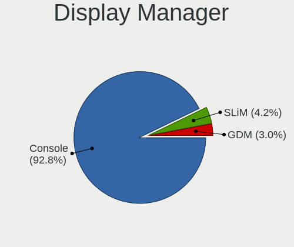

| Name    | Computers | Percent |
|---------|-----------|---------|
| Console | 416       | 88.89%  |
| SLiM    | 30        | 6.41%   |
| GDM     | 22        | 4.7%    |

OS Lang
-------

Language

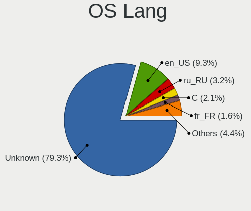

| Lang    | Computers | Percent |
|---------|-----------|---------|
| Unknown | 367       | 78.59%  |
| en_US   | 40        | 8.57%   |
| ru_RU   | 23        | 4.93%   |
| C       | 11        | 2.36%   |
| fr_FR   | 5         | 1.07%   |
| en_GB   | 5         | 1.07%   |
| de_DE   | 4         | 0.86%   |
| pl_PL   | 2         | 0.43%   |
| es_CO   | 2         | 0.43%   |
| en_AU   | 2         | 0.43%   |
| zh_CN   | 1         | 0.21%   |
| ja_JP   | 1         | 0.21%   |
| fr_CA   | 1         | 0.21%   |
| es_ES   | 1         | 0.21%   |
| en_EN   | 1         | 0.21%   |
| en_CA   | 1         | 0.21%   |

Boot Mode
---------

EFI or BIOS

| Mode | Computers | Percent |
|------|-----------|---------|
| BIOS | 241       | 51.72%  |
| EFI  | 225       | 48.28%  |

Filesystem
----------

Type of filesystem

| Type | Computers | Percent |
|------|-----------|---------|
| Ffs  | 460       | 100%    |

Part. scheme
------------

Scheme of partitioning

| Type    | Computers | Percent |
|---------|-----------|---------|
| MBR     | 263       | 56.56%  |
| GPT     | 198       | 42.58%  |
| Unknown | 4         | 0.86%   |

Board
-----

Vendor
------

Motherboard manufacturer

| Name                           | Computers | Percent |
|--------------------------------|-----------|---------|
| Lenovo                         | 117       | 25.43%  |
| ASUSTek Computer               | 41        | 8.91%   |
| Dell                           | 35        | 7.61%   |
| PC Engines                     | 32        | 6.96%   |
| Hewlett-Packard                | 30        | 6.52%   |
| Unknown                        | 23        | 5%      |
| Gigabyte Technology            | 21        | 4.57%   |
| Apple                          | 18        | 3.91%   |
| MSI                            | 16        | 3.48%   |
| ASRock                         | 15        | 3.26%   |
| Intel                          | 14        | 3.04%   |
| Acer                           | 12        | 2.61%   |
| Supermicro                     | 9         | 1.96%   |
| IBM                            | 8         | 1.74%   |
| Panasonic                      | 5         | 1.09%   |
| Sony                           | 4         | 0.87%   |
| Samsung Electronics            | 4         | 0.87%   |
| Raspberry Pi Foundation        | 4         | 0.87%   |
| Fujitsu                        | 4         | 0.87%   |
| Microsoft                      | 3         | 0.65%   |
| Alienware                      | 3         | 0.65%   |
| TUXEDO                         | 2         | 0.43%   |
| Toshiba                        | 2         | 0.43%   |
| Sun                            | 2         | 0.43%   |
| Soekris Engineering            | 2         | 0.43%   |
| Shuttle                        | 2         | 0.43%   |
| Pegatron                       | 2         | 0.43%   |
| Matsushita Electric Industrial | 2         | 0.43%   |
| Biostar                        | 2         | 0.43%   |
| ZOTAC                          | 1         | 0.22%   |
| Yanling                        | 1         | 0.22%   |
| WYSE                           | 1         | 0.22%   |
| Unknown                        | 1         | 0.22%   |
| Tactus                         | 1         | 0.22%   |
| Standard                       | 1         | 0.22%   |
| Sony UK                        | 1         | 0.22%   |
| Protectli                      | 1         | 0.22%   |
| NF541                          | 1         | 0.22%   |
| KOHJINSHA                      | 1         | 0.22%   |
| HUAWEI                         | 1         | 0.22%   |

Model
-----

Motherboard model

| Name                                     | Computers | Percent |
|------------------------------------------|-----------|---------|
| Unknown                                  | 28        | 6.09%   |
| PC Engines APU2                          | 14        | 3.04%   |
| PC Engines apu4                          | 9         | 1.96%   |
| Lenovo ThinkPad X200 745969G             | 6         | 1.3%    |
| PC Engines apu1                          | 5         | 1.09%   |
| Dell PowerEdge R620                      | 5         | 1.09%   |
| ASUS All Series                          | 4         | 0.87%   |
| PC Engines APU3                          | 3         | 0.65%   |
| Supermicro Super Server                  | 2         | 0.43%   |
| RPi Raspberry Pi 400                     | 2         | 0.43%   |
| RPi Raspberry Pi 4 Model B               | 2         | 0.43%   |
| MSI MS-7A34                              | 2         | 0.43%   |
| Microsoft Surface Pro 7                  | 2         | 0.43%   |
| Lenovo ThinkPad X1 Carbon 3rd 20BSCTO1WW | 2         | 0.43%   |
| HP ZBook 15 G4                           | 2         | 0.43%   |
| Gigabyte M68MT-S2P                       | 2         | 0.43%   |
| Dell XPS 13 9360                         | 2         | 0.43%   |
| ASUS X102BA                              | 2         | 0.43%   |
| ASUS PRIME X370-PRO                      | 2         | 0.43%   |
| ASUS PRIME H410M-A                       | 2         | 0.43%   |
| Apple PowerMac10,1                       | 2         | 0.43%   |
| Apple MacBookAir6,2                      | 2         | 0.43%   |
| Apple MacBook5,1                         | 2         | 0.43%   |
| ZOTAC XXXXXX                             | 1         | 0.22%   |
| Yanling YL-KBR6L                         | 1         | 0.22%   |
| WYSE D CLASS                             | 1         | 0.22%   |
| TUXEDO Pulse 15 Gen1                     | 1         | 0.22%   |
| TUXEDO Aura 15 Gen1                      | 1         | 0.22%   |
| Toshiba Satellite L775D                  | 1         | 0.22%   |
| Toshiba Satellite BE96-F299              | 1         | 0.22%   |
| Tactus GeoFlex 110                       | 1         | 0.22%   |
| Supermicro X8STi                         | 1         | 0.22%   |
| Supermicro X8DTH-i/6/iF/6F               | 1         | 0.22%   |
| Supermicro X7SBL                         | 1         | 0.22%   |
| Supermicro X11SSW-F                      | 1         | 0.22%   |
| Supermicro X11SCE-F                      | 1         | 0.22%   |
| Supermicro X11DDW-L                      | 1         | 0.22%   |
| Supermicro X10SLH-N6-ST031               | 1         | 0.22%   |
| Sun SUNW,Sun-Blade-1500                  | 1         | 0.22%   |
| Sun SUNW,Sun-Blade-100                   | 1         | 0.22%   |

Model Family
------------

Motherboard model prefix

| Name               | Computers | Percent |
|--------------------|-----------|---------|
| Lenovo ThinkPad    | 98        | 21.3%   |
| Unknown            | 28        | 6.09%   |
| PC Engines APU2    | 14        | 3.04%   |
| ASUS PRIME         | 12        | 2.61%   |
| PC Engines apu4    | 9         | 1.96%   |
| Dell PowerEdge     | 9         | 1.96%   |
| Dell OptiPlex      | 6         | 1.3%    |
| PC Engines apu1    | 5         | 1.09%   |
| Lenovo ThinkCentre | 5         | 1.09%   |
| Lenovo IdeaPad     | 5         | 1.09%   |
| IBM ThinkPad       | 5         | 1.09%   |
| RPi Raspberry      | 4         | 0.87%   |
| HP ProLiant        | 4         | 0.87%   |
| Dell XPS           | 4         | 0.87%   |
| Dell Precision     | 4         | 0.87%   |
| Dell Latitude      | 4         | 0.87%   |
| Dell Inspiron      | 4         | 0.87%   |
| ASUS All           | 4         | 0.87%   |
| Acer Aspire        | 4         | 0.87%   |
| PC Engines APU3    | 3         | 0.65%   |
| Microsoft Surface  | 3         | 0.65%   |
| Lenovo Yoga        | 3         | 0.65%   |
| HP Pavilion        | 3         | 0.65%   |
| HP Compaq          | 3         | 0.65%   |
| Fujitsu LIFEBOOK   | 3         | 0.65%   |
| ASUS VivoBook      | 3         | 0.65%   |
| Toshiba Satellite  | 2         | 0.43%   |
| Supermicro Super   | 2         | 0.43%   |
| Sun SUNW           | 2         | 0.43%   |
| MSI MS-7A34        | 2         | 0.43%   |
| Lenovo Flex        | 2         | 0.43%   |
| HP ZBook           | 2         | 0.43%   |
| HP EliteBook       | 2         | 0.43%   |
| Gigabyte M68MT-S2P | 2         | 0.43%   |
| Dell Vostro        | 2         | 0.43%   |
| ASUS X102BA        | 2         | 0.43%   |
| ASUS ROG           | 2         | 0.43%   |
| ASRock X570        | 2         | 0.43%   |
| Apple PowerMac10   | 2         | 0.43%   |
| Apple PowerBook5   | 2         | 0.43%   |

MFG Year
--------

Motherboard manufacture year

| Year    | Computers | Percent |
|---------|-----------|---------|
| 2020    | 53        | 11.52%  |
| 2019    | 51        | 11.09%  |
| 2018    | 41        | 8.91%   |
| Unknown | 32        | 6.96%   |
| 2016    | 29        | 6.3%    |
| 2021    | 28        | 6.09%   |
| 2015    | 28        | 6.09%   |
| 2011    | 27        | 5.87%   |
| 2012    | 22        | 4.78%   |
| 2009    | 22        | 4.78%   |
| 2017    | 21        | 4.57%   |
| 2013    | 21        | 4.57%   |
| 2014    | 19        | 4.13%   |
| 2010    | 19        | 4.13%   |
| 2008    | 13        | 2.83%   |
| 2007    | 10        | 2.17%   |
| 2006    | 9         | 1.96%   |
| 2022    | 5         | 1.09%   |
| 2004    | 3         | 0.65%   |
| 2003    | 3         | 0.65%   |
| 2005    | 2         | 0.43%   |
| 2002    | 1         | 0.22%   |
| 2001    | 1         | 0.22%   |

Form Factor
-----------

Physical design of the computer

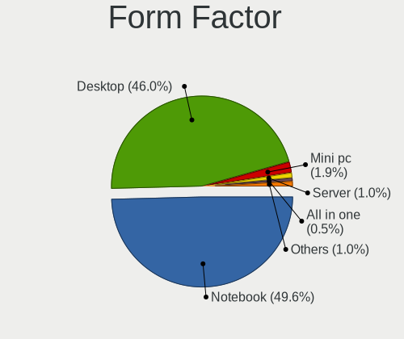

| Name        | Computers | Percent |
|-------------|-----------|---------|
| Notebook    | 222       | 48.26%  |
| Desktop     | 220       | 47.83%  |
| Mini pc     | 7         | 1.52%   |
| Server      | 4         | 0.87%   |
| Tablet      | 3         | 0.65%   |
| All in one  | 3         | 0.65%   |
| Convertible | 1         | 0.22%   |

Coreboot
--------

Have coreboot on board

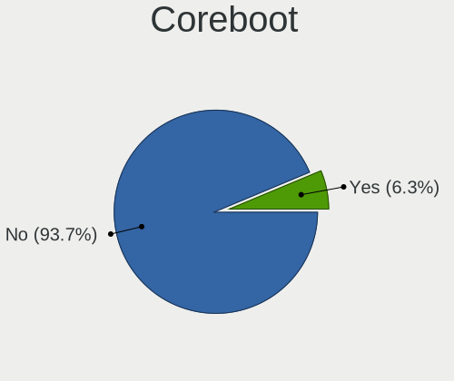

| Used | Computers | Percent |
|------|-----------|---------|
| No   | 423       | 91.96%  |
| Yes  | 37        | 8.04%   |

RAM Size
--------

Total RAM memory

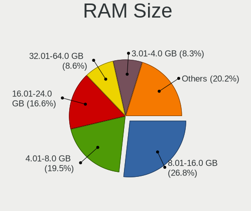

| Size in GB      | Computers | Percent |
|-----------------|-----------|---------|
| 8.01-16.0       | 125       | 27.17%  |
| 4.01-8.0        | 103       | 22.39%  |
| 16.01-24.0      | 64        | 13.91%  |
| 3.01-4.0        | 43        | 9.35%   |
| 32.01-64.0      | 29        | 6.3%    |
| 2.01-3.0        | 28        | 6.09%   |
| 1.01-2.0        | 22        | 4.78%   |
| 0.51-1.0        | 16        | 3.48%   |
| 64.01-256.0     | 10        | 2.17%   |
| 0.01-0.5        | 10        | 2.17%   |
| 24.01-32.0      | 7         | 1.52%   |
| More than 256.0 | 3         | 0.65%   |

RAM Used
--------

Used RAM memory

| Used GB    | Computers | Percent |
|------------|-----------|---------|
| 0.01-0.5   | 372       | 80.69%  |
| 0.51-1.0   | 33        | 7.16%   |
| 0          | 33        | 7.16%   |
| 1.01-2.0   | 7         | 1.52%   |
| Unknown    | 7         | 1.52%   |
| 4.01-8.0   | 5         | 1.08%   |
| 8.01-16.0  | 2         | 0.43%   |
| 3.01-4.0   | 1         | 0.22%   |
| 16.01-24.0 | 1         | 0.22%   |

Total Drives
------------

Number of drives on board

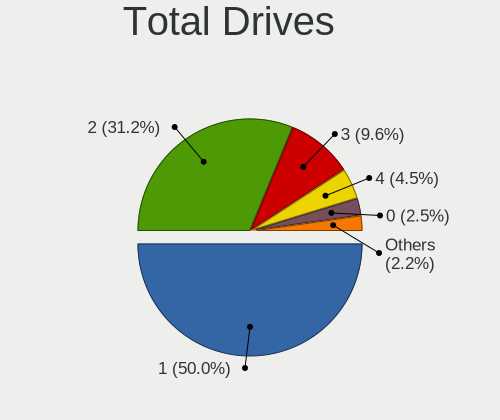

| Drives | Computers | Percent |
|--------|-----------|---------|
| 1      | 237       | 50%     |
| 2      | 147       | 31.01%  |
| 3      | 45        | 9.49%   |
| 4      | 27        | 5.7%    |
| 0      | 6         | 1.27%   |
| 5      | 4         | 0.84%   |
| 10     | 2         | 0.42%   |
| 7      | 2         | 0.42%   |
| 6      | 2         | 0.42%   |
| 12     | 1         | 0.21%   |
| 8      | 1         | 0.21%   |

Has CD-ROM
----------

Has CD-ROM on board

| Presented | Computers | Percent |
|-----------|-----------|---------|
| No        | 458       | 99.35%  |
| Yes       | 3         | 0.65%   |

Has Ethernet
------------

Has Ethernet on board

| Presented | Computers | Percent |
|-----------|-----------|---------|
| Yes       | 401       | 87.17%  |
| No        | 59        | 12.83%  |

Has WiFi
--------

Has WiFi module

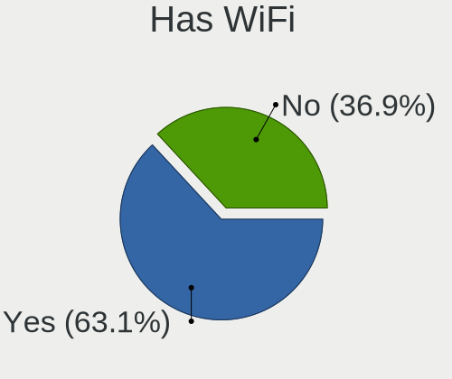

| Presented | Computers | Percent |
|-----------|-----------|---------|
| Yes       | 278       | 60.3%   |
| No        | 183       | 39.7%   |

Has Bluetooth
-------------

Has Bluetooth module

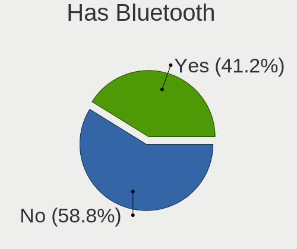

| Presented | Computers | Percent |
|-----------|-----------|---------|
| No        | 296       | 64.07%  |
| Yes       | 166       | 35.93%  |

Location
--------

Country
-------

Geographic location (country)

| Country      | Computers | Percent |
|--------------|-----------|---------|
| USA          | 83        | 17.93%  |
| Russia       | 61        | 13.17%  |
| Germany      | 61        | 13.17%  |
| France       | 29        | 6.26%   |
| Poland       | 21        | 4.54%   |
| Netherlands  | 20        | 4.32%   |
| UK           | 19        | 4.1%    |
| Canada       | 17        | 3.67%   |
| Sweden       | 15        | 3.24%   |
| Switzerland  | 12        | 2.59%   |
| Spain        | 12        | 2.59%   |
| Italy        | 11        | 2.38%   |
| Ukraine      | 8         | 1.73%   |
| Norway       | 8         | 1.73%   |
| Austria      | 8         | 1.73%   |
| Taiwan       | 5         | 1.08%   |
| Australia    | 5         | 1.08%   |
| Latvia       | 4         | 0.86%   |
| India        | 4         | 0.86%   |
| Czechia      | 4         | 0.86%   |
| Portugal     | 3         | 0.65%   |
| Philippines  | 3         | 0.65%   |
| Japan        | 3         | 0.65%   |
| Finland      | 3         | 0.65%   |
| Croatia      | 3         | 0.65%   |
| Brazil       | 3         | 0.65%   |
| Turkey       | 2         | 0.43%   |
| Saudi Arabia | 2         | 0.43%   |
| Romania      | 2         | 0.43%   |
| Malaysia     | 2         | 0.43%   |
| Indonesia    | 2         | 0.43%   |
| Egypt        | 2         | 0.43%   |
| Denmark      | 2         | 0.43%   |
| Colombia     | 2         | 0.43%   |
| Bulgaria     | 2         | 0.43%   |
| Argentina    | 2         | 0.43%   |
| Vietnam      | 1         | 0.22%   |
| UAE          | 1         | 0.22%   |
| Slovenia     | 1         | 0.22%   |
| Slovakia     | 1         | 0.22%   |

City
----

Geographic location (city)

| City                    | Computers | Percent |
|-------------------------|-----------|---------|
| Moscow                  | 16        | 3.26%   |
| Berlin                  | 13        | 2.65%   |
| Amsterdam               | 12        | 2.44%   |
| Vladivostok             | 11        | 2.24%   |
| Montreal                | 11        | 2.24%   |
| Saint-Laurent           | 9         | 1.83%   |
| St Petersburg           | 8         | 1.63%   |
| Paris                   | 7         | 1.43%   |
| Gdansk                  | 7         | 1.43%   |
| Zurich                  | 6         | 1.22%   |
| Vienna                  | 6         | 1.22%   |
| Qubec               | 5         | 1.02%   |
| New Taipei              | 5         | 1.02%   |
| Brooklyn                | 5         | 1.02%   |
| Riga                    | 4         | 0.81%   |
| Poortugaal              | 4         | 0.81%   |
| Oslo                    | 4         | 0.81%   |
| Milan                   | 4         | 0.81%   |
| Miedziana Gora          | 4         | 0.81%   |
| Malmo                   | 4         | 0.81%   |
| Ibiza Town              | 4         | 0.81%   |
| Gummersbach             | 4         | 0.81%   |
| Frankfurt am Main       | 4         | 0.81%   |
| Yekaterinburg           | 3         | 0.61%   |
| Wittersham              | 3         | 0.61%   |
| Syeverodonets'k         | 3         | 0.61%   |
| Sydney                  | 3         | 0.61%   |
| Portland                | 3         | 0.61%   |
| Nuremberg               | 3         | 0.61%   |
| Los Angeles             | 3         | 0.61%   |
| Lausanne                | 3         | 0.61%   |
| Zhukovskiy              | 2         | 0.41%   |
| Wroclaw                 | 2         | 0.41%   |
| Wolfsburg               | 2         | 0.41%   |
| Svenstrup               | 2         | 0.41%   |
| Sofia                   | 2         | 0.41%   |
| Skien                   | 2         | 0.41%   |
| Saint-Martin-d'Hres | 2         | 0.41%   |
| Saint-Herblain          | 2         | 0.41%   |
| Quezon City             | 2         | 0.41%   |

Drives
------

Drive Vendor
------------

Hard drive vendors

| Vendor              | Computers | Drives | Percent |
|---------------------|-----------|--------|---------|
| NVMe                | 88        | 115    | 14.72%  |
| WDC                 | 74        | 105    | 12.37%  |
| Samsung Electronics | 74        | 104    | 12.37%  |
| Seagate             | 64        | 99     | 10.7%   |
| Kingston            | 31        | 37     | 5.18%   |
| Toshiba             | 24        | 33     | 4.01%   |
| SanDisk             | 23        | 28     | 3.85%   |
| Crucial             | 22        | 32     | 3.68%   |
| Hitachi             | 20        | 27     | 3.34%   |
| Phison              | 14        | 16     | 2.34%   |
| Intel               | 14        | 18     | 2.34%   |
| OPENBSD             | 12        | 16     | 2.01%   |
| HGST                | 12        | 20     | 2.01%   |
| Transcend           | 10        | 17     | 1.67%   |
| Apple               | 7         | 7      | 1.17%   |
| A-DATA Technology   | 7         | 10     | 1.17%   |
| SK hynix            | 6         | 6      | 1%      |
| PNY                 | 6         | 6      | 1%      |
| Dell                | 6         | 10     | 1%      |
| USB                 | 4         | 4      | 0.67%   |
| Hewlett-Packard     | 4         | 9      | 0.67%   |
| Generic             | 4         | 4      | 0.67%   |
| Apacer              | 4         | 4      | 0.67%   |
| SPCC                | 3         | 3      | 0.5%    |
| LSI                 | 3         | 5      | 0.5%    |
| Innostor            | 3         | 3      | 0.5%    |
| StoreJet            | 2         | 2      | 0.33%   |
| Plextor             | 2         | 2      | 0.33%   |
| Patriot             | 2         | 2      | 0.33%   |
| OCZ                 | 2         | 2      | 0.33%   |
| Netac               | 2         | 2      | 0.33%   |
| Multiple            | 2         | 2      | 0.33%   |
| Micron Technology   | 2         | 2      | 0.33%   |
| Maxtor              | 2         | 3      | 0.33%   |
| LITEONIT            | 2         | 2      | 0.33%   |
| Lexar               | 2         | 2      | 0.33%   |
| KingSpec            | 2         | 2      | 0.33%   |
| Hoodisk             | 2         | 3      | 0.33%   |
| Corsair             | 2         | 2      | 0.33%   |
| ASMT                | 2         | 2      | 0.33%   |

Drive Model
-----------

Hard drive models

| Model                              | Computers | Percent |
|------------------------------------|-----------|---------|
| Phison SATA SSD 16GB               | 11        | 1.74%   |
| OPENBSD SR RAID 1 752GB            | 10        | 1.58%   |
| NVMe Samsung SSD 970 250GB         | 9         | 1.42%   |
| NVMe WDC PC SN730 SDB 256GB        | 8         | 1.26%   |
| Seagate ST1000LM035-1RK172 1TB     | 7         | 1.1%    |
| Samsung HM321HI 320GB              | 6         | 0.95%   |
| WDC WD1600BEVT-22ZCT0 160GB        | 5         | 0.79%   |
| NVMe Samsung SSD 980 1TB           | 5         | 0.79%   |
| Crucial CT1000MX500SSD1 1TB        | 5         | 0.79%   |
| USB SanDisk 3.2Gen1 64GB           | 4         | 0.63%   |
| Seagate ST1000DM010-2EP102 1TB     | 4         | 0.63%   |
| Samsung SSD 860 EVO mSATA 500GB    | 4         | 0.63%   |
| Samsung SSD 860 EVO 250GB          | 4         | 0.63%   |
| Samsung SSD 850 EVO 500GB          | 4         | 0.63%   |
| Samsung SSD 850 EVO 250GB          | 4         | 0.63%   |
| NVMe Samsung SSD 960 500GB         | 4         | 0.63%   |
| NVMe SAMSUNG MZVLB256 256GB        | 4         | 0.63%   |
| Kingston SUV500MS240G 240GB        | 4         | 0.63%   |
| Kingston SA400S37240G 240GB        | 4         | 0.63%   |
| Dell PERC H710 282GB               | 4         | 0.63%   |
| WDC WD6400AARS-00Y5B1 640GB        | 3         | 0.47%   |
| Toshiba MQ04ABF100 1TB             | 3         | 0.47%   |
| Seagate ST3250318AS 250GB          | 3         | 0.47%   |
| Seagate ST250DM000-1BD141 250GB    | 3         | 0.47%   |
| Seagate ST1000LM024 HN-M101MBB 1TB | 3         | 0.47%   |
| SanDisk Ultra Fit 16GB             | 3         | 0.47%   |
| Samsung SSD 860 EVO 500GB          | 3         | 0.47%   |
| Samsung SSD 850 EVO 1TB            | 3         | 0.47%   |
| Samsung Flash Drive FIT 32GB       | 3         | 0.47%   |
| PNY CS900 120GB SSD                | 3         | 0.47%   |
| Kingston SA400S37480G 480GB        | 3         | 0.47%   |
| Innostor SSD 15GB                  | 3         | 0.47%   |
| HGST HUS724020ALA640 2TB           | 3         | 0.47%   |
| Generic Flash Disk 2GB             | 3         | 0.47%   |
| Crucial CT240BX500SSD1 240GB       | 3         | 0.47%   |
| Crucial CT120BX500SSD1 120GB       | 3         | 0.47%   |
| WDC WDS500G2B0A-00SM50 500GB       | 2         | 0.32%   |
| WDC WDS240G2G0B-00EPW0 240GB       | 2         | 0.32%   |
| WDC WDS240G2G0A-00JH30 240GB       | 2         | 0.32%   |
| WDC WD10JPLX-00MBPT0 1TB           | 2         | 0.32%   |

HDD Vendor
----------

Hard disk drive vendors

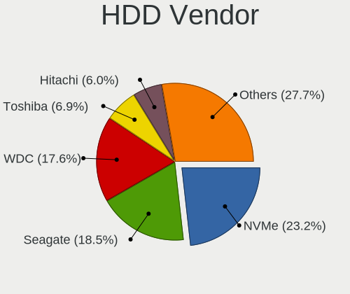

| Vendor                             | Computers | Drives | Percent |
|------------------------------------|-----------|--------|---------|
| WDC                                | 64        | 94     | 20.38%  |
| Seagate                            | 64        | 99     | 20.38%  |
| NVMe                               | 58        | 75     | 18.47%  |
| Toshiba                            | 21        | 30     | 6.69%   |
| Hitachi                            | 20        | 27     | 6.37%   |
| Samsung Electronics                | 17        | 23     | 5.41%   |
| OPENBSD                            | 12        | 16     | 3.82%   |
| HGST                               | 12        | 20     | 3.82%   |
| Dell                               | 6         | 10     | 1.91%   |
| USB                                | 4         | 4      | 1.27%   |
| Generic                            | 4         | 4      | 1.27%   |
| Apple                              | 4         | 4      | 1.27%   |
| LSI                                | 3         | 5      | 0.96%   |
| StoreJet                           | 2         | 2      | 0.64%   |
| Multiple                           | 2         | 2      | 0.64%   |
| Maxtor                             | 2         | 3      | 0.64%   |
| Lexar                              | 2         | 2      | 0.64%   |
| Hewlett-Packard                    | 2         | 6      | 0.64%   |
| ASMT                               | 2         | 2      | 0.64%   |
| UFD 2.0                            | 1         | 1      | 0.32%   |
| SSDPR-CX                           | 1         | 1      | 0.32%   |
| SABRENT                            | 1         | 1      | 0.32%   |
| Product:              USB DISK 3.0 | 1         | 1      | 0.32%   |
| Product:              USB DISK 2.0 | 1         | 1      | 0.32%   |
| Product:                           | 1         | 1      | 0.32%   |
| MaxDigital                         | 1         | 1      | 0.32%   |
| LDLC F6+                           | 1         | 1      | 0.32%   |
| JetFlash                           | 1         | 1      | 0.32%   |
| IBM                                | 1         | 1      | 0.32%   |
| General                            | 1         | 1      | 0.32%   |
| Fujitsu                            | 1         | 1      | 0.32%   |
| China                              | 1         | 1      | 0.32%   |

SSD Vendor
----------

Solid state drive vendors

| Vendor              | Computers | Drives | Percent |
|---------------------|-----------|--------|---------|
| Samsung Electronics | 58        | 81     | 20.71%  |
| Kingston            | 31        | 37     | 11.07%  |
| NVMe                | 25        | 29     | 8.93%   |
| SanDisk             | 23        | 28     | 8.21%   |
| Crucial             | 22        | 32     | 7.86%   |
| Phison              | 14        | 16     | 5%      |
| Intel               | 14        | 18     | 5%      |
| WDC                 | 10        | 11     | 3.57%   |
| Transcend           | 10        | 17     | 3.57%   |
| A-DATA Technology   | 7         | 10     | 2.5%    |
| SK hynix            | 6         | 6      | 2.14%   |
| PNY                 | 6         | 6      | 2.14%   |
| Apacer              | 4         | 4      | 1.43%   |
| Toshiba             | 3         | 3      | 1.07%   |
| SPCC                | 3         | 3      | 1.07%   |
| Innostor            | 3         | 3      | 1.07%   |
| Apple               | 3         | 3      | 1.07%   |
| Plextor             | 2         | 2      | 0.71%   |
| Patriot             | 2         | 2      | 0.71%   |
| OCZ                 | 2         | 2      | 0.71%   |
| Netac               | 2         | 2      | 0.71%   |
| Micron Technology   | 2         | 2      | 0.71%   |
| LITEONIT            | 2         | 2      | 0.71%   |
| KingSpec            | 2         | 2      | 0.71%   |
| Hoodisk             | 2         | 3      | 0.71%   |
| Hewlett-Packard     | 2         | 3      | 0.71%   |
| Corsair             | 2         | 2      | 0.71%   |
| Zheino              | 1         | 2      | 0.36%   |
| XPG                 | 1         | 1      | 0.36%   |
| UDinfo              | 1         | 1      | 0.36%   |
| Team                | 1         | 1      | 0.36%   |
| SATA3 60            | 1         | 1      | 0.36%   |
| Qumo                | 1         | 1      | 0.36%   |
| OWC                 | 1         | 1      | 0.36%   |
| MidasForce          | 1         | 1      | 0.36%   |
| MEMXPRO             | 1         | 1      | 0.36%   |
| LITEON              | 1         | 1      | 0.36%   |
| Leven               | 1         | 1      | 0.36%   |
| HPE                 | 1         | 2      | 0.36%   |
| GOODRAM             | 1         | 1      | 0.36%   |

Drive Kind
----------

HDD or SSD

| Kind | Computers | Drives | Percent |
|------|-----------|--------|---------|
| HDD  | 252       | 441    | 50%     |
| SSD  | 243       | 349    | 48.21%  |
| NVMe | 9         | 11     | 1.79%   |

Drive Connector
---------------

SATA, SAS, NVMe, etc.

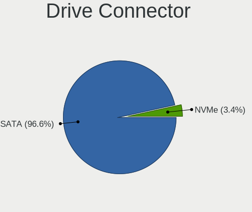

| Type | Computers | Drives | Percent |
|------|-----------|--------|---------|
| SATA | 432       | 790    | 97.96%  |
| NVMe | 9         | 11     | 2.04%   |

Drive Size
----------

Size of hard drive

| Size in TB      | Computers | Drives | Percent |
|-----------------|-----------|--------|---------|
| 0.01-0.5        | 353       | 517    | 67.75%  |
| 0.51-1.0        | 117       | 166    | 22.46%  |
| 1.01-2.0        | 29        | 74     | 5.57%   |
| 3.01-4.0        | 10        | 14     | 1.92%   |
| 4.01-10.0       | 6         | 11     | 1.15%   |
| 2.01-3.0        | 3         | 5      | 0.58%   |
| More than 100.0 | 2         | 2      | 0.38%   |
| 0               | 1         | 1      | 0.19%   |

Space Total
-----------

Amount of disk space available on the file system

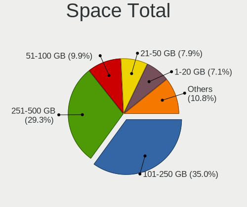

| Size in GB     | Computers | Percent |
|----------------|-----------|---------|
| 101-250        | 160       | 33.9%   |
| 251-500        | 120       | 25.42%  |
| 51-100         | 57        | 12.08%  |
| 21-50          | 42        | 8.9%    |
| 1-20           | 42        | 8.9%    |
| 501-1000       | 24        | 5.08%   |
| 1001-2000      | 14        | 2.97%   |
| More than 3000 | 9         | 1.91%   |
| 2001-3000      | 4         | 0.85%   |

Space Used
----------

Amount of used disk space

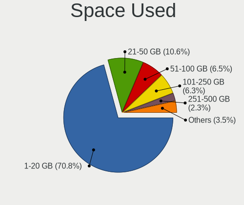

| Used GB        | Computers | Percent |
|----------------|-----------|---------|
| 1-20           | 329       | 69.56%  |
| 21-50          | 45        | 9.51%   |
| 101-250        | 38        | 8.03%   |
| 51-100         | 34        | 7.19%   |
| 251-500        | 11        | 2.33%   |
| 501-1000       | 8         | 1.69%   |
| 1001-2000      | 6         | 1.27%   |
| More than 3000 | 1         | 0.21%   |
| 2001-3000      | 1         | 0.21%   |

Malfunc. Drives
---------------

Drive models with a malfunction

| Model                             | Computers | Drives | Percent |
|-----------------------------------|-----------|--------|---------|
| Toshiba MQ04ABF100 1TB            | 2         | 2      | 3.28%   |
| Seagate ST9320423AS 320GB         | 2         | 2      | 3.28%   |
| Kingston SMS200S330G 32GB         | 2         | 3      | 3.28%   |
| Intel SSDSC2KF256H6L 256GB        | 2         | 2      | 3.28%   |
| HGST HTS541010A7E630 1TB          | 2         | 3      | 3.28%   |
| XPG SX950U 240GB                  | 1         | 1      | 1.64%   |
| WDC WD6400AAKS-22A7B0 640GB       | 1         | 1      | 1.64%   |
| WDC WD5000AAKX-60U6AA0 500GB      | 1         | 1      | 1.64%   |
| WDC WD1600BEVT-22ZCT0 160GB       | 1         | 1      | 1.64%   |
| WDC WD1600BEVE-00UYT0 160GB       | 1         | 1      | 1.64%   |
| WDC WD10SPZX-24Z10 1TB            | 1         | 1      | 1.64%   |
| WDC WD10EADS-00M2B0 1TB           | 1         | 1      | 1.64%   |
| Transcend 3E128-TS2-550B01 100GB  | 1         | 4      | 1.64%   |
| Toshiba MK6475GSX 640GB           | 1         | 1      | 1.64%   |
| Toshiba MK6006GAH 64GB            | 1         | 1      | 1.64%   |
| Toshiba MK1629GSGF 160GB          | 1         | 3      | 1.64%   |
| Seagate ST9500420AS 500GB         | 1         | 2      | 1.64%   |
| Seagate ST9500325AS 500GB         | 1         | 1      | 1.64%   |
| Seagate ST9160310AS 160GB         | 1         | 2      | 1.64%   |
| Seagate ST500LT012-9WS142 500GB   | 1         | 1      | 1.64%   |
| Seagate ST500DM002-1BD142 500GB   | 1         | 1      | 1.64%   |
| Seagate ST380815AS 80GB           | 1         | 1      | 1.64%   |
| Seagate ST3750640NS 752GB         | 1         | 4      | 1.64%   |
| Seagate ST3500418AS 500GB         | 1         | 1      | 1.64%   |
| Seagate ST3320418AS 320GB         | 1         | 1      | 1.64%   |
| Seagate ST3160212SCE 160GB        | 1         | 1      | 1.64%   |
| Seagate ST3120211AS 120GB         | 1         | 1      | 1.64%   |
| Seagate ST250DM000-1BD141 250GB   | 1         | 2      | 1.64%   |
| Seagate ST2000DM006-2DM164 2TB    | 1         | 1      | 1.64%   |
| Seagate ST1000DM003-1CH162 1TB    | 1         | 1      | 1.64%   |
| SanDisk SD7UB3Q256G1001 256GB     | 1         | 2      | 1.64%   |
| Samsung Electronics HM500JI 500GB | 1         | 2      | 1.64%   |
| Samsung Electronics HD753LJ 752GB | 1         | 1      | 1.64%   |
| Samsung Electronics HD161HJ 160GB | 1         | 1      | 1.64%   |
| Samsung Electronics HD154UI 1.5TB | 1         | 1      | 1.64%   |
| OCZ VERTEX3 120GB                 | 1         | 1      | 1.64%   |
| Kingston SV300S37A120G 120GB      | 1         | 1      | 1.64%   |
| Kingston SMSM151S3128GD 128GB     | 1         | 1      | 1.64%   |
| Kingston SMS200S3120G 120GB       | 1         | 1      | 1.64%   |
| KingSpec KSD-PA25.6-032MS 32GB    | 1         | 1      | 1.64%   |

Malfunc. Drive Vendor
---------------------

Vendors of faulty drives

| Vendor              | Computers | Drives | Percent |
|---------------------|-----------|--------|---------|
| Seagate             | 15        | 22     | 25%     |
| WDC                 | 6         | 6      | 10%     |
| Hitachi             | 6         | 7      | 10%     |
| Toshiba             | 5         | 7      | 8.33%   |
| Kingston            | 5         | 6      | 8.33%   |
| Intel               | 5         | 5      | 8.33%   |
| Samsung Electronics | 4         | 5      | 6.67%   |
| HGST                | 4         | 6      | 6.67%   |
| A-DATA Technology   | 3         | 6      | 5%      |
| XPG                 | 1         | 1      | 1.67%   |
| Transcend           | 1         | 4      | 1.67%   |
| SanDisk             | 1         | 2      | 1.67%   |
| OCZ                 | 1         | 1      | 1.67%   |
| KingSpec            | 1         | 1      | 1.67%   |
| GLOWAY              | 1         | 1      | 1.67%   |
| Apple               | 1         | 1      | 1.67%   |

Malfunc. HDD Vendor
-------------------

Vendors of faulty HDD drives

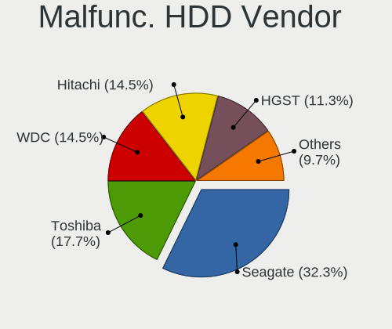

| Vendor              | Computers | Drives | Percent |
|---------------------|-----------|--------|---------|
| Seagate             | 15        | 22     | 37.5%   |
| WDC                 | 6         | 6      | 15%     |
| Hitachi             | 6         | 7      | 15%     |
| Toshiba             | 5         | 7      | 12.5%   |
| Samsung Electronics | 4         | 5      | 10%     |
| HGST                | 4         | 6      | 10%     |

Malfunc. Drive Kind
-------------------

Kinds of faulty drives

| Kind | Computers | Drives | Percent |
|------|-----------|--------|---------|
| HDD  | 40        | 53     | 66.67%  |
| SSD  | 20        | 28     | 33.33%  |

Failed Drives
-------------

Failed drive models

| Model                           | Computers | Drives | Percent |
|---------------------------------|-----------|--------|---------|
| WDC WD6400AARS-00Y5B1 640GB     | 1         | 2      | 50%     |
| Samsung Electronics HD204UI 2TB | 1         | 2      | 50%     |

Failed Drive Vendor
-------------------

Failed drive vendors

| Vendor              | Computers | Drives | Percent |
|---------------------|-----------|--------|---------|
| WDC                 | 1         | 2      | 50%     |
| Samsung Electronics | 1         | 2      | 50%     |

Drive Status
------------

Number of failed and malfunc. drives

| Status   | Computers | Drives | Percent |
|----------|-----------|--------|---------|
| Works    | 322       | 527    | 63.14%  |
| Detected | 127       | 189    | 24.9%   |
| Malfunc  | 59        | 81     | 11.57%  |
| Failed   | 2         | 4      | 0.39%   |

Storage controller
------------------

Storage Vendor
--------------

Storage controller vendors

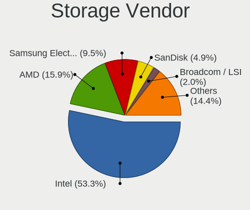

| Vendor                           | Computers | Percent |
|----------------------------------|-----------|---------|
| Intel                            | 283       | 56.15%  |
| AMD                              | 93        | 18.45%  |
| Samsung Electronics              | 36        | 7.14%   |
| SanDisk                          | 22        | 4.37%   |
| Broadcom / LSI                   | 12        | 2.38%   |
| Nvidia                           | 8         | 1.59%   |
| KIOXIA                           | 7         | 1.39%   |
| SK hynix                         | 5         | 0.99%   |
| Phison Electronics               | 5         | 0.99%   |
| Marvell Technology Group         | 4         | 0.79%   |
| Kingston Technology Company      | 4         | 0.79%   |
| ASMedia Technology               | 4         | 0.79%   |
| VIA Technologies                 | 3         | 0.6%    |
| Lenovo                           | 3         | 0.6%    |
| ULi Electronics                  | 2         | 0.4%    |
| Toshiba                          | 2         | 0.4%    |
| Hewlett-Packard                  | 2         | 0.4%    |
| ADATA Technology                 | 2         | 0.4%    |
| Union Memory (Shenzhen)          | 1         | 0.2%    |
| Silicon Integrated Systems [SiS] | 1         | 0.2%    |
| Silicon Image                    | 1         | 0.2%    |
| Shenzhen Longsys Electronics     | 1         | 0.2%    |
| Seagate Technology               | 1         | 0.2%    |
| HighPoint Technologies           | 1         | 0.2%    |
| Dell                             | 1         | 0.2%    |

Storage Model
-------------

Storage controller models

| Model                                                                          | Computers | Percent |
|--------------------------------------------------------------------------------|-----------|---------|
| AMD FCH SATA Controller [AHCI mode]                                            | 50        | 8.77%   |
| Intel 7 Series Chipset Family 6-port SATA Controller [AHCI mode]               | 24        | 4.21%   |
| Intel Sunrise Point-LP SATA Controller [AHCI mode]                             | 23        | 4.04%   |
| Intel Wildcat Point-LP SATA Controller [AHCI Mode]                             | 19        | 3.33%   |
| Intel 8 Series/C220 Series Chipset Family 6-port SATA Controller 1 [AHCI mode] | 18        | 3.16%   |
| AMD SB7x0/SB8x0/SB9x0 SATA Controller [AHCI mode]                              | 18        | 3.16%   |
| Samsung NVMe SSD Controller SM981/PM981/PM983                                  | 17        | 2.98%   |
| Intel 6 Series/C200 Series Chipset Family 6 port Mobile SATA AHCI Controller   | 16        | 2.81%   |
| Intel 82801IBM/IEM (ICH9M/ICH9M-E) 4 port SATA Controller [AHCI mode]          | 15        | 2.63%   |
| Intel 82801G (ICH7 Family) IDE Controller                                      | 15        | 2.63%   |
| AMD FCH SATA Controller [IDE mode]                                             | 15        | 2.63%   |
| SanDisk WD Black SN750 / PC SN730 NVMe SSD                                     | 11        | 1.93%   |
| Intel 8 Series SATA Controller 1 [AHCI mode]                                   | 10        | 1.75%   |
| Samsung NVMe SSD Controller SM961/PM961/SM963                                  | 9         | 1.58%   |
| Intel Q170/Q150/B150/H170/H110/Z170/CM236 Chipset SATA Controller [AHCI Mode]  | 9         | 1.58%   |
| Intel 82801GBM/GHM (ICH7-M Family) SATA Controller [IDE mode]                  | 8         | 1.4%    |
| Intel NM10/ICH7 Family SATA Controller [IDE mode]                              | 7         | 1.23%   |
| AMD SB7x0/SB8x0/SB9x0 IDE Controller                                           | 7         | 1.23%   |
| AMD 400 Series Chipset SATA Controller                                         | 7         | 1.23%   |
| Intel Celeron/Pentium Silver Processor SATA Controller                         | 6         | 1.05%   |
| Intel Celeron N3350/Pentium N4200/Atom E3900 Series SATA AHCI Controller       | 6         | 1.05%   |
| Intel Cannon Lake PCH SATA AHCI Controller                                     | 6         | 1.05%   |
| Intel C600/X79 series chipset 6-Port SATA AHCI Controller                      | 6         | 1.05%   |
| Intel Atom Processor E3800 Series SATA AHCI Controller                         | 6         | 1.05%   |
| Intel 82801GBM/GHM (ICH7-M Family) SATA Controller [AHCI mode]                 | 6         | 1.05%   |
| Intel 5 Series/3400 Series Chipset 6 port SATA AHCI Controller                 | 6         | 1.05%   |
| Intel 400 Series Chipset Family SATA AHCI Controller                           | 6         | 1.05%   |
| AMD 500 Series Chipset SATA Controller                                         | 6         | 1.05%   |
| Samsung NVMe SSD Controller PM9A1/PM9A3/980PRO                                 | 5         | 0.88%   |
| Nvidia MCP61 SATA Controller                                                   | 5         | 0.88%   |
| KIOXIA NVMe SSD Controller BG4                                                 | 5         | 0.88%   |
| Intel 6 Series/C200 Series Chipset Family 6 port Desktop SATA AHCI Controller  | 5         | 0.88%   |
| Broadcom / LSI MegaRAID SAS 2208 [Thunderbolt]                                 | 5         | 0.88%   |
| Sandisk unknown                                                                | 4         | 0.7%    |
| Intel SSD Pro 7600p/760p/E 6100p Series                                        | 4         | 0.7%    |
| Intel Comet Lake SATA AHCI Controller                                          | 4         | 0.7%    |
| Intel Cannon Lake Mobile PCH SATA AHCI Controller                              | 4         | 0.7%    |
| Intel 82801JI (ICH10 Family) SATA AHCI Controller                              | 4         | 0.7%    |
| Intel 82801IR/IO/IH (ICH9R/DO/DH) 6 port SATA Controller [AHCI mode]           | 4         | 0.7%    |
| Intel 82801CAM IDE U100 Controller                                             | 4         | 0.7%    |

Storage Kind
------------

Kind of storage controller (IDE, SATA, NVMe, SAS, ...)

| Kind | Computers | Percent |
|------|-----------|---------|
| SATA | 323       | 61.88%  |
| IDE  | 91        | 17.43%  |
| NVMe | 88        | 16.86%  |
| RAID | 14        | 2.68%   |
| SAS  | 5         | 0.96%   |
| SCSI | 1         | 0.19%   |

Processor
---------

CPU Vendor
----------

Processor vendors

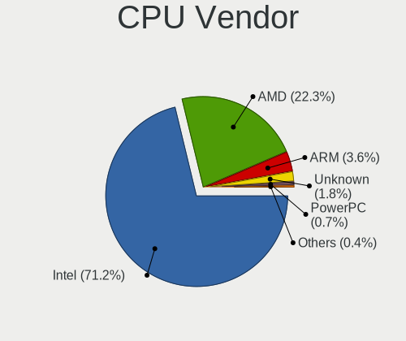

| Vendor  | Computers | Percent |
|---------|-----------|---------|
| Intel   | 324       | 70.43%  |
| AMD     | 109       | 23.7%   |
| ARM     | 17        | 3.7%    |
| Unknown | 5         | 1.09%   |
| PowerPC | 4         | 0.87%   |
| 11th    | 1         | 0.22%   |

CPU Model
---------

Processor models

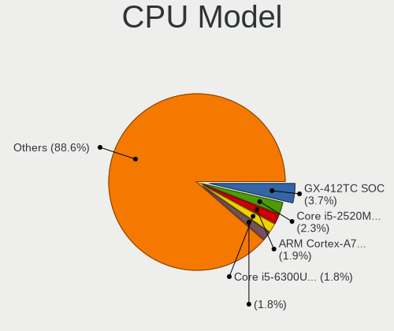

| Model                                                        | Computers | Percent |
|--------------------------------------------------------------|-----------|---------|
| AMD GX-412TC SOC                                             | 26        | 5.58%   |
| Intel Core i5-2520M CPU @ 2.50GHz                            | 12        | 2.58%   |
| ARM Cortex-A72 r0p3                                          | 10        | 2.15%   |
| Intel Core i5-6300U CPU @ 2.40GHz                            | 7         | 1.5%    |
| Intel Core i5-3320M CPU @ 2.60GHz                            | 7         | 1.5%    |
| Intel Core 2 Duo CPU P8600 @ 2.40GHz                         | 7         | 1.5%    |
| Intel Core i5-8250U CPU @ 1.60GHz                            | 6         | 1.29%   |
| AMD G-T40E Processor                                         | 6         | 1.29%   |
| Intel Core i7-7500U CPU @ 2.70GHz                            | 5         | 1.07%   |
| Intel Core i5-5300U CPU @ 2.30GHz                            | 5         | 1.07%   |
| Intel Atom CPU N270 @ 1.60GHz ("GenuineIntel" 686-class)     | 5         | 1.07%   |
| ARM Cortex-A53 r0p4                                          | 5         | 1.07%   |
|                                                              | 5         | 1.07%   |
| Intel Core i7-8565U CPU @ 1.80GHz                            | 4         | 0.86%   |
| Intel Core i5-5200U CPU @ 2.20GHz                            | 4         | 0.86%   |
| AMD Ryzen 7 5800X 8-Core Processor                           | 4         | 0.86%   |
| Intel Core i7-8550U CPU @ 1.80GHz                            | 3         | 0.64%   |
| Intel Core i7-5600U CPU @ 2.60GHz                            | 3         | 0.64%   |
| Intel Core i7-3520M CPU @ 2.90GHz                            | 3         | 0.64%   |
| Intel Core i5-8265U CPU @ 1.60GHz                            | 3         | 0.64%   |
| Intel Core i5-4570 CPU @ 3.20GHz                             | 3         | 0.64%   |
| Intel Core i3-6006U CPU @ 2.00GHz                            | 3         | 0.64%   |
| Intel Core 2 Duo CPU T9400 @ 2.53GHz                         | 3         | 0.64%   |
| AMD Ryzen 7 4800H with Radeon Graphics                       | 3         | 0.64%   |
| AMD Ryzen 7 4700U with Radeon Graphics                       | 3         | 0.64%   |
| AMD Ryzen 5 3600 6-Core Processor                            | 3         | 0.64%   |
| PowerPC 7447A (Revision 0x105)                               | 2         | 0.43%   |
| Intel Xeon CPU E5520 @ 2.27GHz                               | 2         | 0.43%   |
| Intel Xeon CPU E5-2640 0 @ 2.50GHz                           | 2         | 0.43%   |
| Intel Xeon CPU E5-2630 0 @ 2.30GHz                           | 2         | 0.43%   |
| Intel Xeon CPU E5-2620 v3 @ 2.40GHz                          | 2         | 0.43%   |
| Intel Xeon CPU E3-1505M v6 @ 3.00GHz                         | 2         | 0.43%   |
| Intel Xeon CPU E3-1220 v5 @ 3.00GHz                          | 2         | 0.43%   |
| Intel Pentium M processor 1.70GHz ("GenuineIntel" 686-class) | 2         | 0.43%   |
| Intel Pentium CPU N4200 @ 1.10GHz                            | 2         | 0.43%   |
| Intel Core i7-8750H CPU @ 2.20GHz                            | 2         | 0.43%   |
| Intel Core i7-6600U CPU @ 2.60GHz                            | 2         | 0.43%   |
| Intel Core i7-5500U CPU @ 2.40GHz                            | 2         | 0.43%   |
| Intel Core i7-4770K CPU @ 3.50GHz                            | 2         | 0.43%   |
| Intel Core i7-3770 CPU @ 3.40GHz                             | 2         | 0.43%   |

CPU Model Family
----------------

Processor model prefix

| Model                   | Computers | Percent |
|-------------------------|-----------|---------|
| Intel Core i5           | 95        | 20.61%  |
| Intel Core i7           | 56        | 12.15%  |
| Intel Xeon              | 28        | 6.07%   |
| Intel Celeron           | 27        | 5.86%   |
| AMD GX                  | 27        | 5.86%   |
| Intel Core i3           | 26        | 5.64%   |
| Intel Core 2 Duo        | 22        | 4.77%   |
| Other                   | 20        | 4.34%   |
| AMD Ryzen 7             | 19        | 4.12%   |
| ARM Cortex              | 17        | 3.69%   |
| Intel Atom              | 14        | 3.04%   |
| AMD Ryzen 5             | 11        | 2.39%   |
| AMD G                   | 7         | 1.52%   |
| Intel Pentium M         | 5         | 1.08%   |
| Intel Pentium 4         | 5         | 1.08%   |
| Intel Pentium           | 5         | 1.08%   |
| AMD Ryzen 3             | 5         | 1.08%   |
| Intel Pentium Dual-Core | 4         | 0.87%   |
| Intel Genuine           | 4         | 0.87%   |
| Intel Core 2            | 4         | 0.87%   |
| AMD Ryzen 7 PRO         | 4         | 0.87%   |
| AMD A4                  | 4         | 0.87%   |
| Intel Pentium Silver    | 3         | 0.65%   |
| Intel Xeon Gold         | 2         | 0.43%   |
| Intel Core m3           | 2         | 0.43%   |
| Intel Core i9           | 2         | 0.43%   |
| Intel Core Duo          | 2         | 0.43%   |
| AMD Ryzen 9             | 2         | 0.43%   |
| AMD Phenom II X4        | 2         | 0.43%   |
| AMD Geode Integrated    | 2         | 0.43%   |
| AMD E2                  | 2         | 0.43%   |
| AMD E                   | 2         | 0.43%   |
| AMD Athlon II X3        | 2         | 0.43%   |
| AMD Athlon 64 X2        | 2         | 0.43%   |
| AMD Athlon              | 2         | 0.43%   |
| AMD A6                  | 2         | 0.43%   |
| Intel Pentium III       | 1         | 0.22%   |
| Intel Pentium Dual      | 1         | 0.22%   |
| Intel Pentium D         | 1         | 0.22%   |
| Intel Mobile Pentium 4  | 1         | 0.22%   |

CPU Cores
---------

Number of processor cores

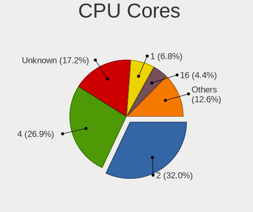

| Number  | Computers | Percent |
|---------|-----------|---------|
| 2       | 149       | 32.39%  |
| 4       | 132       | 28.7%   |
| Unknown | 83        | 18.04%  |
| 1       | 32        | 6.96%   |
| 8       | 19        | 4.13%   |
| 6       | 15        | 3.26%   |
| 16      | 13        | 2.83%   |
| 12      | 12        | 2.61%   |
| 3       | 2         | 0.43%   |
| 36      | 1         | 0.22%   |
| 32      | 1         | 0.22%   |
| 24      | 1         | 0.22%   |

CPU Sockets
-----------

Number of sockets

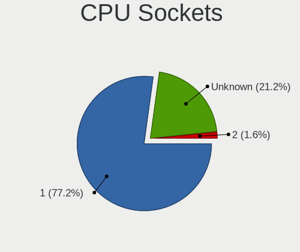

| Number  | Computers | Percent |
|---------|-----------|---------|
| 1       | 349       | 75.22%  |
| Unknown | 106       | 22.84%  |
| 2       | 9         | 1.94%   |

CPU Threads
-----------

Threads per core (Hyper-Threading)

| Number  | Computers | Percent |
|---------|-----------|---------|
| 2       | 196       | 42.61%  |
| 1       | 154       | 33.48%  |
| Unknown | 110       | 23.91%  |

CPU Microarch
-------------

Microarchitecture

| Name          | Computers | Percent |
|---------------|-----------|---------|
| KabyLake      | 52        | 11.26%  |
| Unknown       | 45        | 9.74%   |
| Haswell       | 34        | 7.36%   |
| SandyBridge   | 30        | 6.49%   |
| IvyBridge     | 27        | 5.84%   |
| Puma          | 26        | 5.63%   |
| Penryn        | 26        | 5.63%   |
| Broadwell     | 23        | 4.98%   |
| Skylake       | 20        | 4.33%   |
| Zen 2         | 18        | 3.9%    |
| P6            | 15        | 3.25%   |
| Westmere      | 13        | 2.81%   |
| Bonnell       | 13        | 2.81%   |
| Silvermont    | 12        | 2.6%    |
| Bobcat        | 12        | 2.6%    |
| K10           | 11        | 2.38%   |
| NetBurst      | 9         | 1.95%   |
| Zen           | 8         | 1.73%   |
| Goldmont plus | 8         | 1.73%   |
| Core          | 8         | 1.73%   |
| Zen+          | 7         | 1.52%   |
| Goldmont      | 7         | 1.52%   |
| CometLake     | 7         | 1.52%   |
| Zen 3         | 5         | 1.08%   |
| Nehalem       | 4         | 0.87%   |
| Jaguar        | 4         | 0.87%   |
| TigerLake     | 3         | 0.65%   |
| K10 Llano     | 3         | 0.65%   |
| IceLake       | 3         | 0.65%   |
| Piledriver    | 2         | 0.43%   |
| K8 Hammer     | 2         | 0.43%   |
| Geode         | 2         | 0.43%   |
| Excavator     | 2         | 0.43%   |
| K6            | 1         | 0.22%   |

Graphics
--------

GPU Vendor
----------

Vendors of graphics cards

| Vendor                                       | Computers | Percent |
|----------------------------------------------|-----------|---------|
| Intel                                        | 255       | 57.43%  |
| AMD                                          | 116       | 26.13%  |
| Nvidia                                       | 50        | 11.26%  |
| Matrox Electronics Systems                   | 13        | 2.93%   |
| ASPEED Technology                            | 7         | 1.58%   |
| XGI Technology (eXtreme Graphics Innovation) | 1         | 0.23%   |
| Silicon Integrated Systems [SiS]             | 1         | 0.23%   |
| 3DLabs                                       | 1         | 0.23%   |

GPU Model
---------

Graphics card models

| Model                                                                                    | Computers | Percent |
|------------------------------------------------------------------------------------------|-----------|---------|
| Intel 2nd Generation Core Processor Family Integrated Graphics Controller                | 23        | 4.97%   |
| Intel 3rd Gen Core processor Graphics Controller                                         | 20        | 4.32%   |
| Intel HD Graphics 5500                                                                   | 18        | 3.89%   |
| Intel Mobile 4 Series Chipset Integrated Graphics Controller                             | 15        | 3.24%   |
| Intel Mobile 945GM/GMS/GME, 943/940GML Express Integrated Graphics Controller            | 14        | 3.02%   |
| Intel Skylake GT2 [HD Graphics 520]                                                      | 13        | 2.81%   |
| Intel Haswell-ULT Integrated Graphics Controller                                         | 12        | 2.59%   |
| Intel UHD Graphics 620                                                                   | 11        | 2.38%   |
| Intel Xeon E3-1200 v3/4th Gen Core Processor Integrated Graphics Controller              | 10        | 2.16%   |
| AMD Renoir                                                                               | 10        | 2.16%   |
| AMD Ellesmere [Radeon RX 470/480/570/570X/580/580X/590]                                  | 10        | 2.16%   |
| Intel HD Graphics 620                                                                    | 9         | 1.94%   |
| Matrox Electronics Systems G200eR2                                                       | 7         | 1.51%   |
| Intel WhiskeyLake-U GT2 [UHD Graphics 620]                                               | 7         | 1.51%   |
| Intel Mobile 945GSE Express Integrated Graphics Controller                               | 7         | 1.51%   |
| Intel Mobile 945GM/GMS, 943/940GML Express Integrated Graphics Controller                | 7         | 1.51%   |
| ASPEED Technology ASPEED Graphics Family                                                 | 7         | 1.51%   |
| Intel GeminiLake [UHD Graphics 600]                                                      | 6         | 1.3%    |
| Intel Core Processor Integrated Graphics Controller                                      | 6         | 1.3%    |
| Intel CometLake-U GT2 [UHD Graphics]                                                     | 6         | 1.3%    |
| Intel Atom/Celeron/Pentium Processor x5-E8000/J3xxx/N3xxx Integrated Graphics Controller | 6         | 1.3%    |
| Intel Atom Processor Z36xxx/Z37xxx Series Graphics & Display                             | 6         | 1.3%    |
| AMD Navi 10 [Radeon RX 5600 OEM/5600 XT / 5700/5700 XT]                                  | 6         | 1.3%    |
| Intel 4th Gen Core Processor Integrated Graphics Controller                              | 5         | 1.08%   |
| AMD Raven Ridge [Radeon Vega Series / Radeon Vega Mobile Series]                         | 5         | 1.08%   |
| AMD Caicos [Radeon HD 6450/7450/8450 / R5 230 OEM]                                       | 5         | 1.08%   |
| Intel TigerLake-LP GT2 [Iris Xe Graphics]                                                | 4         | 0.86%   |
| AMD Picasso/Raven 2 [Radeon Vega Series / Radeon Vega Mobile Series]                     | 4         | 0.86%   |
| Nvidia C79 [GeForce 9400M]                                                               | 3         | 0.65%   |
| Matrox Electronics Systems MGA G200eW WPCM450                                            | 3         | 0.65%   |
| Intel HD Graphics 500                                                                    | 3         | 0.65%   |
| Intel CoffeeLake-H GT2 [UHD Graphics 630]                                                | 3         | 0.65%   |
| Intel Celeron N3350/Pentium N4200/Atom E3900 Series Integrated Graphics Controller       | 3         | 0.65%   |
| Intel Atom Processor D2xxx/N2xxx Integrated Graphics Controller                          | 3         | 0.65%   |
| AMD Whistler [Radeon HD 6630M/6650M/6750M/7670M/7690M]                                   | 3         | 0.65%   |
| AMD RV710/M92 [Mobility Radeon HD 4350/4550]                                             | 3         | 0.65%   |
| AMD RV200/M7 [Mobility Radeon 7500]                                                      | 3         | 0.65%   |
| AMD RS880M [Mobility Radeon HD 4225/4250]                                                | 3         | 0.65%   |
| AMD ES1000                                                                               | 3         | 0.65%   |
| AMD Cedar [Radeon HD 5000/6000/7350/8350 Series]                                         | 3         | 0.65%   |

GPU Combo
---------

Combinations of graphics cards

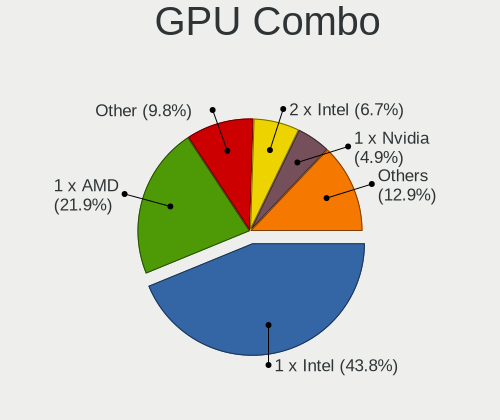

| Name           | Computers | Percent |
|----------------|-----------|---------|
| 1 x Intel      | 190       | 41.13%  |
| 1 x AMD        | 100       | 21.65%  |
| Other          | 54        | 11.69%  |
| 2 x Intel      | 34        | 7.36%   |
| 1 x Nvidia     | 23        | 4.98%   |
| Intel + Nvidia | 22        | 4.76%   |
| 1 x Matrox     | 12        | 2.6%    |
| Intel + AMD    | 9         | 1.95%   |
| 1 x ASPEED     | 7         | 1.52%   |
| AMD + Nvidia   | 4         | 0.87%   |
| 2 x AMD        | 2         | 0.43%   |
| 2 x Nvidia     | 1         | 0.22%   |
| 1 x XGI        | 1         | 0.22%   |
| 1 x SiS        | 1         | 0.22%   |
| AMD + Matrox   | 1         | 0.22%   |
| 1 x 3DLabs     | 1         | 0.22%   |

GPU Driver
----------

Free vs proprietary

| Driver  | Computers | Percent |
|---------|-----------|---------|
| Free    | 375       | 81.34%  |
| Unknown | 86        | 18.66%  |

GPU Memory
----------

Total video memory

| Size in GB | Computers | Percent |
|------------|-----------|---------|
| Unknown    | 460       | 100%    |

Monitor
-------

Monitor Vendor
--------------

Monitor vendors

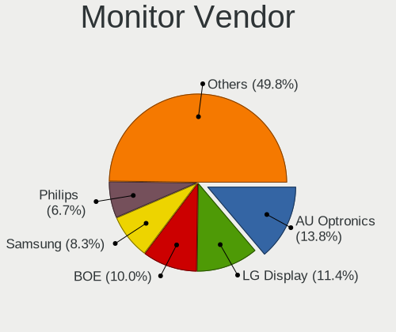

| Vendor                  | Computers | Percent |
|-------------------------|-----------|---------|
| LG Display              | 37        | 14.23%  |
| AU Optronics            | 33        | 12.69%  |
| BOE                     | 26        | 10%     |
| Samsung Electronics     | 22        | 8.46%   |
| Lenovo                  | 18        | 6.92%   |
| Chimei Innolux          | 18        | 6.92%   |
| Dell                    | 13        | 5%      |
| Philips                 | 11        | 4.23%   |
| Goldstar                | 11        | 4.23%   |
| Ancor Communications    | 8         | 3.08%   |
| Apple                   | 7         | 2.69%   |
| Iiyama                  | 5         | 1.92%   |
| NEC Computers           | 4         | 1.54%   |
| Hewlett-Packard         | 4         | 1.54%   |
| BenQ                    | 4         | 1.54%   |
| ViewSonic               | 3         | 1.15%   |
| Sharp                   | 3         | 1.15%   |
| PANDA                   | 3         | 1.15%   |
| InfoVision              | 3         | 1.15%   |
| Chi Mei Optoelectronics | 3         | 1.15%   |
| AOC                     | 3         | 1.15%   |
| Acer                    | 3         | 1.15%   |
| MSI                     | 2         | 0.77%   |
| IBM                     | 2         | 0.77%   |
| Eizo                    | 2         | 0.77%   |
| ASUSTek Computer        | 2         | 0.77%   |
| Vizio                   | 1         | 0.38%   |
| TRU                     | 1         | 0.38%   |
| SHI                     | 1         | 0.38%   |
| Sceptre Tech            | 1         | 0.38%   |
| Medion                  | 1         | 0.38%   |
| LTM                     | 1         | 0.38%   |
| LG Philips              | 1         | 0.38%   |
| HannStar                | 1         | 0.38%   |
| Gigabyte Technology     | 1         | 0.38%   |
| CSO                     | 1         | 0.38%   |

Monitor Model
-------------

Monitor models

| Model                                                                    | Computers | Percent |
|--------------------------------------------------------------------------|-----------|---------|
| Philips 227E4LH PHLC0AC 1920x1080 480x270mm 21.7-inch                    | 6         | 2.29%   |
| Lenovo LCD Monitor LEN4010 1280x800 260x160mm 12.0-inch                  | 6         | 2.29%   |
| AU Optronics LCD Monitor AUO106C 1366x768 280x160mm 12.7-inch            | 6         | 2.29%   |
| LG Display LCD Monitor LGD058B 2560x1440 310x170mm 13.9-inch             | 3         | 1.15%   |
| Lenovo LCD Monitor LEN4033 1440x900 300x190mm 14.0-inch                  | 3         | 1.15%   |
| Ancor Communications ASUS VW199 ACI19ED 1440x900 410x260mm 19.1-inch     | 3         | 1.15%   |
| Samsung Electronics LCD Monitor SEC324C 1600x900 310x170mm 13.9-inch     | 2         | 0.76%   |
| LG Display LCD Monitor LGD05FA 1920x1080 310x170mm 13.9-inch             | 2         | 0.76%   |
| LG Display LCD Monitor LGD057E 1920x1080 340x190mm 15.3-inch             | 2         | 0.76%   |
| LG Display LCD Monitor LGD0555 2736x1824 260x170mm 12.2-inch             | 2         | 0.76%   |
| LG Display LCD Monitor LGD0437 1920x1080 280x160mm 12.7-inch             | 2         | 0.76%   |
| LG Display LCD Monitor LGD0418 2560x1440 310x170mm 13.9-inch             | 2         | 0.76%   |
| LG Display LCD Monitor LGD03CD 1366x768 280x160mm 12.7-inch              | 2         | 0.76%   |
| Lenovo LCD Monitor LEN40B2 1920x1080 340x190mm 15.3-inch                 | 2         | 0.76%   |
| Lenovo LCD Monitor LEN4011 1280x800 260x170mm 12.2-inch                  | 2         | 0.76%   |
| Iiyama PL2779QQ IVM6641 3840x2160 600x330mm 27.0-inch                    | 2         | 0.76%   |
| Iiyama PL2474H IVM6137 1920x1080 520x290mm 23.4-inch                     | 2         | 0.76%   |
| IBM LCD Monitor IBM2887 1680x1050 330x210mm 15.4-inch                    | 2         | 0.76%   |
| Hewlett-Packard LA2405 HWP284B 1920x1200 520x320mm 24.0-inch             | 2         | 0.76%   |
| Eizo EV2450 ENC2530 1920x1080 530x300mm 24.0-inch                        | 2         | 0.76%   |
| Dell UP2715K DEL40B6 848x480 600x340mm 27.2-inch                         | 2         | 0.76%   |
| Chimei Innolux LCD Monitor CMN15DB 1366x768 340x190mm 15.3-inch          | 2         | 0.76%   |
| Chimei Innolux LCD Monitor CMN14D6 1366x768 310x170mm 13.9-inch          | 2         | 0.76%   |
| Chimei Innolux LCD Monitor CMN1132 1366x768 260x140mm 11.6-inch          | 2         | 0.76%   |
| Chi Mei Optoelectronics LCD Monitor CMO15A7 1366x768 350x190mm 15.7-inch | 2         | 0.76%   |
| BOE LCD Monitor BOE07C8 3840x2160 310x170mm 13.9-inch                    | 2         | 0.76%   |
| AU Optronics LCD Monitor AUO573D 1920x1080 310x170mm 13.9-inch           | 2         | 0.76%   |
| AU Optronics LCD Monitor AUO34ED 1920x1080 340x190mm 15.3-inch           | 2         | 0.76%   |
| AU Optronics LCD Monitor AUO315C 1366x768 260x140mm 11.6-inch            | 2         | 0.76%   |
| AU Optronics LCD Monitor AUO226D 1920x1080 280x160mm 12.7-inch           | 2         | 0.76%   |
| AU Optronics LCD Monitor AUO21EC 1366x768 340x190mm 15.3-inch            | 2         | 0.76%   |
| Vizio E320i-A0 VIZ0091 1366x768 700x390mm 31.5-inch                      | 1         | 0.38%   |
| ViewSonic LCD Monitor VSCE032 2560x1440 530x300mm 24.0-inch              | 1         | 0.38%   |
| ViewSonic LCD Monitor VSCD22B 1920x1080 520x290mm 23.4-inch              | 1         | 0.38%   |
| ViewSonic LCD Monitor VSCC42B 1920x1080 480x270mm 21.7-inch              | 1         | 0.38%   |
| TRU LCD Monitor TRU235C 1366x768 260x140mm 11.6-inch                     | 1         | 0.38%   |
| SHI LCD-TV**** SHI6102 1360x768 700x390mm 31.5-inch                      | 1         | 0.38%   |
| Sharp LQ156M1JW01 SHP14C3 1920x1080 340x190mm 15.3-inch                  | 1         | 0.38%   |
| Sharp LCD Monitor SHP14BA 1920x1080 340x190mm 15.3-inch                  | 1         | 0.38%   |
| Sharp LCD Monitor SHP1449 1920x1080 290x170mm 13.2-inch                  | 1         | 0.38%   |

Monitor Resolution
------------------

Monitor screen resolution

| Resolution         | Computers | Percent |
|--------------------|-----------|---------|
| 1920x1080 (FHD)    | 94        | 37.01%  |
| 1366x768 (WXGA)    | 59        | 23.23%  |
| 1280x800 (WXGA)    | 15        | 5.91%   |
| 3840x2160 (4K)     | 13        | 5.12%   |
| 2560x1440 (QHD)    | 11        | 4.33%   |
| 1440x900 (WXGA+)   | 11        | 4.33%   |
| 1280x1024 (SXGA)   | 11        | 4.33%   |
| 3440x1440          | 7         | 2.76%   |
| 1600x900 (HD+)     | 7         | 2.76%   |
| 1920x1200 (WUXGA)  | 6         | 2.36%   |
| 1680x1050 (WSXGA+) | 4         | 1.57%   |
| 2736x1824          | 2         | 0.79%   |
| 1360x768           | 2         | 0.79%   |
| 1024x768 (XGA)     | 2         | 0.79%   |
| 720x1280           | 1         | 0.39%   |
| 3840x2400          | 1         | 0.39%   |
| 3840x1080          | 1         | 0.39%   |
| 3200x1800 (QHD+)   | 1         | 0.39%   |
| 2256x1504          | 1         | 0.39%   |
| 1920x1280          | 1         | 0.39%   |
| 1600x1200          | 1         | 0.39%   |
| 1440x960           | 1         | 0.39%   |
| 1280x854           | 1         | 0.39%   |
| 1024x600           | 1         | 0.39%   |

Monitor Diagonal
----------------

Diagonal size in inches

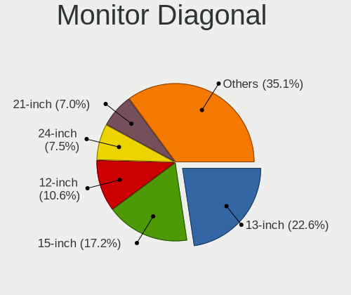

| Inches | Computers | Percent |
|--------|-----------|---------|
| 15     | 52        | 20.31%  |
| 13     | 52        | 20.31%  |
| 12     | 33        | 12.89%  |
| 24     | 16        | 6.25%   |
| 23     | 15        | 5.86%   |
| 21     | 13        | 5.08%   |
| 19     | 11        | 4.3%    |
| 11     | 11        | 4.3%    |
| 27     | 10        | 3.91%   |
| 17     | 8         | 3.13%   |
| 14     | 8         | 3.13%   |
| 34     | 6         | 2.34%   |
| 31     | 5         | 1.95%   |
| 18     | 4         | 1.56%   |
| 10     | 3         | 1.17%   |
| 54     | 2         | 0.78%   |
| 49     | 1         | 0.39%   |
| 35     | 1         | 0.39%   |
| 28     | 1         | 0.39%   |
| 22     | 1         | 0.39%   |
| 20     | 1         | 0.39%   |
| 9      | 1         | 0.39%   |
| 6      | 1         | 0.39%   |

Monitor Width
-------------

Physical width

| Width in mm | Computers | Percent |
|-------------|-----------|---------|
| 301-350     | 96        | 37.5%   |
| 201-300     | 69        | 26.95%  |
| 501-600     | 39        | 15.23%  |
| 401-500     | 26        | 10.16%  |
| 601-700     | 7         | 2.73%   |
| 351-400     | 7         | 2.73%   |
| 701-800     | 6         | 2.34%   |
| 1001-1500   | 3         | 1.17%   |
| 101-200     | 2         | 0.78%   |
| 801-900     | 1         | 0.39%   |

Aspect Ratio
------------

Proportional relationship between the width and the height

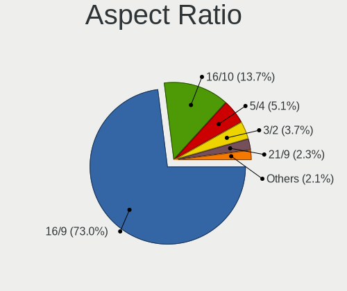

| Ratio | Computers | Percent |
|-------|-----------|---------|
| 16/9  | 182       | 73.39%  |
| 16/10 | 35        | 14.11%  |
| 5/4   | 11        | 4.44%   |
| 3/2   | 9         | 3.63%   |
| 21/9  | 7         | 2.82%   |
| 4/3   | 3         | 1.21%   |
| 32/9  | 1         | 0.4%    |

Monitor Area
------------

Area in inch

| Area in inch | Computers | Percent |
|----------------|-----------|---------|
| 81-90          | 50        | 19.69%  |
| 91-100         | 42        | 16.54%  |
| 201-250        | 38        | 14.96%  |
| 61-70          | 33        | 12.99%  |
| 351-500        | 13        | 5.12%   |
| 51-60          | 12        | 4.72%   |
| 151-200        | 12        | 4.72%   |
| 101-110        | 11        | 4.33%   |
| 301-350        | 10        | 3.94%   |
| 141-150        | 10        | 3.94%   |
| 71-80          | 9         | 3.54%   |
| 251-300        | 5         | 1.97%   |
| More than 1000 | 2         | 0.79%   |
| 41-50          | 2         | 0.79%   |
| 1-40           | 2         | 0.79%   |
| 121-130        | 2         | 0.79%   |
| 501-1000       | 1         | 0.39%   |

Pixel Density
-------------

Pixels per inch

| Density       | Computers | Percent |
|---------------|-----------|---------|
| 121-160       | 100       | 39.22%  |
| 51-100        | 63        | 24.71%  |
| 101-120       | 55        | 21.57%  |
| 161-240       | 25        | 9.8%    |
| More than 240 | 8         | 3.14%   |
| 1-50          | 4         | 1.57%   |

Multiple Monitors
-----------------

Total monitors connected

| Total | Computers | Percent |
|-------|-----------|---------|
| 1     | 280       | 60.34%  |
| 0     | 166       | 35.78%  |
| 2     | 16        | 3.45%   |
| 3     | 2         | 0.43%   |

Network
-------

Net Controller Vendor
---------------------

Controller vendors

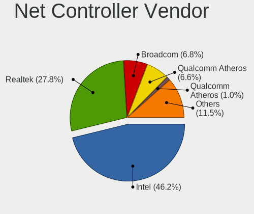

| Vendor                            | Computers | Percent |
|-----------------------------------|-----------|---------|
| Intel                             | 284       | 46.56%  |
| Realtek Semiconductor             | 164       | 26.89%  |
| Qualcomm Atheros                  | 47        | 7.7%    |
| Broadcom                          | 35        | 5.74%   |
| Qualcomm Atheros Communications   | 10        | 1.64%   |
| Marvell Technology Group          | 7         | 1.15%   |
| TP-Link                           | 6         | 0.98%   |
| Ericsson Business Mobile Networks | 6         | 0.98%   |
| Apple                             | 5         | 0.82%   |
| U-Blox                            | 4         | 0.66%   |
| Ralink                            | 4         | 0.66%   |
| Edimax Technology                 | 4         | 0.66%   |
| VIA Technologies                  | 3         | 0.49%   |
| Sierra Wireless                   | 3         | 0.49%   |
| Nvidia                            | 3         | 0.49%   |
| 3Com                              | 3         | 0.49%   |
| Ralink Technology                 | 2         | 0.33%   |
| Xiaomi                            | 1         | 0.16%   |
| Silicon Integrated Systems [SiS]  | 1         | 0.16%   |
| Samsung Electronics               | 1         | 0.16%   |
| Qcom                              | 1         | 0.16%   |
| Oracle/SUN                        | 1         | 0.16%   |
| National Semiconductor            | 1         | 0.16%   |
| Microsoft                         | 1         | 0.16%   |
| Micro Star International          | 1         | 0.16%   |
| MediaTek                          | 1         | 0.16%   |
| LG Electronics                    | 1         | 0.16%   |
| Google                            | 1         | 0.16%   |
| Fibocom                           | 1         | 0.16%   |
| Emulex                            | 1         | 0.16%   |
| Dell                              | 1         | 0.16%   |
| Davicom Semiconductor             | 1         | 0.16%   |
| D-Link System                     | 1         | 0.16%   |
| D-Link                            | 1         | 0.16%   |
| AVM                               | 1         | 0.16%   |
| ASUSTek Computer                  | 1         | 0.16%   |
| Accton Technology                 | 1         | 0.16%   |

Net Controller Model
--------------------

Controller models

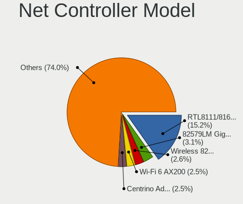

| Model                                                                   | Computers | Percent |
|-------------------------------------------------------------------------|-----------|---------|
| Realtek RTL8111/8168/8411 PCI Express Gigabit Ethernet Controller       | 124       | 16.19%  |
| Intel I211 Gigabit Network Connection                                   | 27        | 3.52%   |
| Intel 82579LM Gigabit Network Connection (Lewisville)                   | 26        | 3.39%   |
| Intel I210 Gigabit Network Connection                                   | 20        | 2.61%   |
| Intel Centrino Advanced-N 6205 [Taylor Peak]                            | 20        | 2.61%   |
| Intel Wi-Fi 6 AX200                                                     | 19        | 2.48%   |
| Intel Wireless 8265 / 8275                                              | 17        | 2.22%   |
| Intel Wireless 7265                                                     | 16        | 2.09%   |
| Realtek RTL810xE PCI Express Fast Ethernet controller                   | 15        | 1.96%   |
| Intel Wireless 7260                                                     | 15        | 1.96%   |
| Intel 82567LM Gigabit Network Connection                                | 14        | 1.83%   |
| Intel Wireless 8260                                                     | 11        | 1.44%   |
| Intel 82574L Gigabit Network Connection                                 | 11        | 1.44%   |
| Intel Ethernet Connection I219-LM                                       | 10        | 1.31%   |
| Intel Ultimate N WiFi Link 5300                                         | 9         | 1.17%   |
| Intel Ethernet Connection I217-LM                                       | 9         | 1.17%   |
| Qualcomm Atheros AR9285 Wireless Network Adapter (PCI-Express)          | 8         | 1.04%   |
| Intel I350 Gigabit Network Connection                                   | 8         | 1.04%   |
| Intel Ethernet Connection (3) I218-LM                                   | 8         | 1.04%   |
| Realtek RTL8188CE 802.11b/g/n WiFi Adapter                              | 7         | 0.91%   |
| Qualcomm Atheros AR9271 802.11n                                         | 7         | 0.91%   |
| Realtek RTL8821CE 802.11ac PCIe Wireless Network Adapter                | 6         | 0.78%   |
| Qualcomm Atheros AR928X Wireless Network Adapter (PCI-Express)          | 6         | 0.78%   |
| Intel PRO/Wireless 3945ABG [Golan] Network Connection                   | 6         | 0.78%   |
| Intel Ethernet Connection (4) I219-V                                    | 6         | 0.78%   |
| Intel Centrino Advanced-N 6200                                          | 6         | 0.78%   |
| Intel 82577LM Gigabit Network Connection                                | 6         | 0.78%   |
| Realtek RTL8188EUS 802.11n Wireless Network Adapter                     | 5         | 0.65%   |
| Realtek RTL8125 2.5GbE Controller                                       | 5         | 0.65%   |
| Realtek RTL-8100/8101L/8139 PCI Fast Ethernet Adapter                   | 5         | 0.65%   |
| Qualcomm Atheros AR9485 Wireless Network Adapter                        | 5         | 0.65%   |
| Qualcomm Atheros AR242x / AR542x Wireless Network Adapter (PCI-Express) | 5         | 0.65%   |
| Intel Wireless 3165                                                     | 5         | 0.65%   |
| Broadcom BCM4360 802.11ac Wireless Network Adapter                      | 5         | 0.65%   |
| U-Blox [u-blox 8]                                                       | 4         | 0.52%   |
| Qualcomm Atheros QCA9377 802.11ac Wireless Network Adapter              | 4         | 0.52%   |
| Marvell Group 88E8057 PCI-E Gigabit Ethernet Controller                 | 4         | 0.52%   |
| Intel Wireless-AC 9260                                                  | 4         | 0.52%   |
| Intel Wi-Fi 6 AX201                                                     | 4         | 0.52%   |
| Intel Ethernet Connection I218-LM                                       | 4         | 0.52%   |

Wireless Vendor
---------------

Wireless vendors

| Vendor                          | Computers | Percent |
|---------------------------------|-----------|---------|
| Intel                           | 179       | 58.5%   |
| Qualcomm Atheros                | 41        | 13.4%   |
| Realtek Semiconductor           | 32        | 10.46%  |
| Broadcom                        | 18        | 5.88%   |
| Qualcomm Atheros Communications | 10        | 3.27%   |
| TP-Link                         | 6         | 1.96%   |
| Ralink                          | 4         | 1.31%   |
| Edimax Technology               | 4         | 1.31%   |
| Sierra Wireless                 | 3         | 0.98%   |
| Ralink Technology               | 2         | 0.65%   |
| Qcom                            | 1         | 0.33%   |
| Micro Star International        | 1         | 0.33%   |
| MediaTek                        | 1         | 0.33%   |
| Dell                            | 1         | 0.33%   |
| D-Link System                   | 1         | 0.33%   |
| D-Link                          | 1         | 0.33%   |
| ASUSTek Computer                | 1         | 0.33%   |

Wireless Model
--------------

Wireless models

| Model                                                                   | Computers | Percent |
|-------------------------------------------------------------------------|-----------|---------|
| Intel Centrino Advanced-N 6205 [Taylor Peak]                            | 20        | 6.51%   |
| Intel Wi-Fi 6 AX200                                                     | 19        | 6.19%   |
| Intel Wireless 8265 / 8275                                              | 17        | 5.54%   |
| Intel Wireless 7265                                                     | 16        | 5.21%   |
| Intel Wireless 7260                                                     | 15        | 4.89%   |
| Intel Wireless 8260                                                     | 11        | 3.58%   |
| Intel Ultimate N WiFi Link 5300                                         | 9         | 2.93%   |
| Qualcomm Atheros AR9285 Wireless Network Adapter (PCI-Express)          | 8         | 2.61%   |
| Realtek RTL8188CE 802.11b/g/n WiFi Adapter                              | 7         | 2.28%   |
| Qualcomm Atheros AR9271 802.11n                                         | 7         | 2.28%   |
| Realtek RTL8821CE 802.11ac PCIe Wireless Network Adapter                | 6         | 1.95%   |
| Qualcomm Atheros AR928X Wireless Network Adapter (PCI-Express)          | 6         | 1.95%   |
| Intel PRO/Wireless 3945ABG [Golan] Network Connection                   | 6         | 1.95%   |
| Intel Centrino Advanced-N 6200                                          | 6         | 1.95%   |
| Realtek RTL8188EUS 802.11n Wireless Network Adapter                     | 5         | 1.63%   |
| Qualcomm Atheros AR9485 Wireless Network Adapter                        | 5         | 1.63%   |
| Qualcomm Atheros AR242x / AR542x Wireless Network Adapter (PCI-Express) | 5         | 1.63%   |
| Intel Wireless 3165                                                     | 5         | 1.63%   |
| Broadcom BCM4360 802.11ac Wireless Network Adapter                      | 5         | 1.63%   |
| Qualcomm Atheros QCA9377 802.11ac Wireless Network Adapter              | 4         | 1.3%    |
| Intel Wireless-AC 9260                                                  | 4         | 1.3%    |
| Intel Wi-Fi 6 AX201                                                     | 4         | 1.3%    |
| Intel Dual Band Wireless-AC 3168NGW [Stone Peak]                        | 4         | 1.3%    |
| Intel Centrino Wireless-N 2230                                          | 4         | 1.3%    |
| Intel Cannon Point-LP CNVi [Wireless-AC]                                | 4         | 1.3%    |
| Edimax EW-7811Un 802.11n Wireless Adapter [Realtek RTL8188CUS]          | 4         | 1.3%    |
| Broadcom BCM4322 802.11a/b/g/n Wireless LAN Controller                  | 4         | 1.3%    |
| Realtek RTL8723BE PCIe Wireless Network Adapter                         | 3         | 0.98%   |
| Qualcomm Atheros QCA9565 / AR9565 Wireless Network Adapter              | 3         | 0.98%   |
| Intel Wireless 3160                                                     | 3         | 0.98%   |
| Intel PRO/Wireless 5100 AGN [Shiloh] Network Connection                 | 3         | 0.98%   |
| Intel PRO/Wireless 2915ABG [Calexico2] Network Connection               | 3         | 0.98%   |
| Intel Ice Lake-LP PCH CNVi WiFi                                         | 3         | 0.98%   |
| Intel Comet Lake PCH-LP CNVi WiFi                                       | 3         | 0.98%   |
| Intel Centrino Wireless-N 2200                                          | 3         | 0.98%   |
| TP-Link TL-WN823N v2/v3 [Realtek RTL8192EU]                             | 2         | 0.65%   |
| TP-Link TL-WN722N v2/v3 [Realtek RTL8188EUS]                            | 2         | 0.65%   |
| Sierra Wireless EM7455                                                  | 2         | 0.65%   |
| Realtek RTL8822CE 802.11ac PCIe Wireless Network Adapter                | 2         | 0.65%   |
| Realtek RTL8188CUS 802.11n WLAN Adapter                                 | 2         | 0.65%   |

Ethernet Vendor
---------------

Ethernet vendors

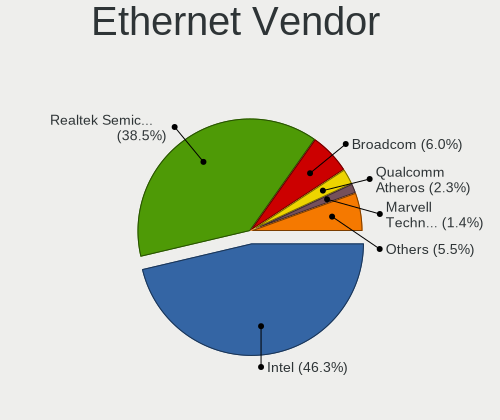

| Vendor                           | Computers | Percent |
|----------------------------------|-----------|---------|
| Intel                            | 202       | 48.33%  |
| Realtek Semiconductor            | 153       | 36.6%   |
| Broadcom                         | 23        | 5.5%    |
| Qualcomm Atheros                 | 10        | 2.39%   |
| Marvell Technology Group         | 7         | 1.67%   |
| Apple                            | 4         | 0.96%   |
| VIA Technologies                 | 3         | 0.72%   |
| Nvidia                           | 3         | 0.72%   |
| 3Com                             | 3         | 0.72%   |
| Xiaomi                           | 1         | 0.24%   |
| Silicon Integrated Systems [SiS] | 1         | 0.24%   |
| Samsung Electronics              | 1         | 0.24%   |
| Oracle/SUN                       | 1         | 0.24%   |
| National Semiconductor           | 1         | 0.24%   |
| Microsoft                        | 1         | 0.24%   |
| Google                           | 1         | 0.24%   |
| Emulex                           | 1         | 0.24%   |
| Davicom Semiconductor            | 1         | 0.24%   |
| Accton Technology                | 1         | 0.24%   |

Ethernet Model
--------------

Ethernet models

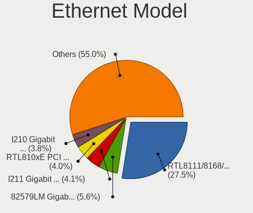

| Model                                                             | Computers | Percent |
|-------------------------------------------------------------------|-----------|---------|
| Realtek RTL8111/8168/8411 PCI Express Gigabit Ethernet Controller | 124       | 28.38%  |
| Intel I211 Gigabit Network Connection                             | 27        | 6.18%   |
| Intel 82579LM Gigabit Network Connection (Lewisville)             | 26        | 5.95%   |
| Intel I210 Gigabit Network Connection                             | 20        | 4.58%   |
| Realtek RTL810xE PCI Express Fast Ethernet controller             | 15        | 3.43%   |
| Intel 82567LM Gigabit Network Connection                          | 14        | 3.2%    |
| Intel 82574L Gigabit Network Connection                           | 11        | 2.52%   |
| Intel Ethernet Connection I219-LM                                 | 10        | 2.29%   |
| Intel Ethernet Connection I217-LM                                 | 9         | 2.06%   |
| Intel I350 Gigabit Network Connection                             | 8         | 1.83%   |
| Intel Ethernet Connection (3) I218-LM                             | 8         | 1.83%   |
| Intel Ethernet Connection (4) I219-V                              | 6         | 1.37%   |
| Intel 82577LM Gigabit Network Connection                          | 6         | 1.37%   |
| Realtek RTL8125 2.5GbE Controller                                 | 5         | 1.14%   |
| Realtek RTL-8100/8101L/8139 PCI Fast Ethernet Adapter             | 5         | 1.14%   |
| Marvell Group 88E8057 PCI-E Gigabit Ethernet Controller           | 4         | 0.92%   |
| Intel Ethernet Connection I218-LM                                 | 4         | 0.92%   |
| Intel Ethernet Connection (6) I219-V                              | 4         | 0.92%   |
| Apple UniNorth 2 GMAC (Sun GEM)                                   | 4         | 0.92%   |
| Qualcomm Atheros AR8152 v2.0 Fast Ethernet                        | 3         | 0.69%   |
| Nvidia MCP79 Ethernet                                             | 3         | 0.69%   |
| Intel Ethernet Controller I225-V                                  | 3         | 0.69%   |
| Intel Ethernet Connection (7) I219-LM                             | 3         | 0.69%   |
| Intel Ethernet Connection (4) I219-LM                             | 3         | 0.69%   |
| Intel Ethernet Connection (3) I218-V                              | 3         | 0.69%   |
| Intel Ethernet Connection (2) I219-LM                             | 3         | 0.69%   |
| Intel 82599ES 10-Gigabit SFI/SFP+ Network Connection              | 3         | 0.69%   |
| Intel 82573L Gigabit Ethernet Controller                          | 3         | 0.69%   |
| Broadcom NetXtreme BCM5751M Gigabit Ethernet PCI Express          | 3         | 0.69%   |
| VIA VT6105M [Rhine-III]                                           | 2         | 0.46%   |
| Realtek RTL8169 PCI Gigabit Ethernet Controller                   | 2         | 0.46%   |
| Realtek Killer E2600 Gigabit Ethernet Controller                  | 2         | 0.46%   |
| Qualcomm Atheros AR8121/AR8113/AR8114 Gigabit or Fast Ethernet    | 2         | 0.46%   |
| Marvell Group 88E8055 PCI-E Gigabit Ethernet Controller           | 2         | 0.46%   |
| Intel Ethernet Connection I218-V                                  | 2         | 0.46%   |
| Intel Ethernet Connection I217-V                                  | 2         | 0.46%   |
| Intel Ethernet Connection (2) I219-V                              | 2         | 0.46%   |
| Intel Ethernet Connection (10) I219-V                             | 2         | 0.46%   |
| Intel 82579V Gigabit Network Connection                           | 2         | 0.46%   |
| Intel 82576 Gigabit Network Connection                            | 2         | 0.46%   |

Net Controller Kind
-------------------

Ethernet, WiFi or modem

| Kind     | Computers | Percent |
|----------|-----------|---------|
| Ethernet | 402       | 57.1%   |
| WiFi     | 280       | 39.77%  |
| Modem    | 14        | 1.99%   |
| Unknown  | 8         | 1.14%   |

Used Controller
---------------

Currently used network controller

| Kind     | Computers | Percent |
|----------|-----------|---------|
| Ethernet | 220       | 53.53%  |
| WiFi     | 191       | 46.47%  |

NICs
----

Total network controllers on board

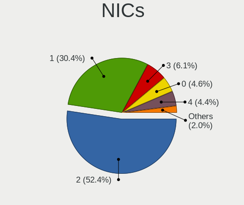

| Total | Computers | Percent |
|-------|-----------|---------|
| 2     | 236       | 51.3%   |
| 1     | 129       | 28.04%  |
| 3     | 36        | 7.83%   |
| 4     | 24        | 5.22%   |
| 0     | 24        | 5.22%   |
| 8     | 3         | 0.65%   |
| 5     | 3         | 0.65%   |
| 7     | 2         | 0.43%   |
| 6     | 2         | 0.43%   |
| 12    | 1         | 0.22%   |

IPv6
----

IPv6 vs IPv4

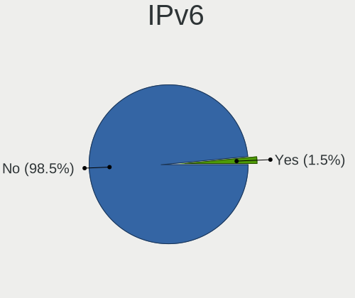

| Used | Computers | Percent |
|------|-----------|---------|
| No   | 459       | 99.78%  |
| Yes  | 1         | 0.22%   |

Bluetooth
---------

Bluetooth Vendor
----------------

Controller vendors

| Vendor                          | Computers | Percent |
|---------------------------------|-----------|---------|
| Intel                           | 94        | 56.29%  |
| Broadcom                        | 22        | 13.17%  |
| Apple                           | 13        | 7.78%   |
| IMC Networks                    | 9         | 5.39%   |
| Alps Electric                   | 7         | 4.19%   |
| Realtek Semiconductor           | 6         | 3.59%   |
| Qualcomm Atheros Communications | 5         | 2.99%   |
| Foxconn / Hon Hai               | 3         | 1.8%    |
| Cambridge Silicon Radio         | 2         | 1.2%    |
| ASUSTek Computer                | 2         | 1.2%    |
| Realtek                         | 1         | 0.6%    |
| Ralink                          | 1         | 0.6%    |
| Lite-On Technology              | 1         | 0.6%    |
| Creative Technology             | 1         | 0.6%    |

Bluetooth Model
---------------

Controller models

| Model                                                                               | Computers | Percent |
|-------------------------------------------------------------------------------------|-----------|---------|
| Intel Bluetooth wireless interface                                                  | 47        | 28.14%  |
| Intel AX200 Bluetooth                                                               | 16        | 9.58%   |
| Intel AX201 Bluetooth                                                               | 11        | 6.59%   |
| Broadcom BCM2045B (BDC-2.1)                                                         | 7         | 4.19%   |
| Intel Centrino Bluetooth Wireless Transceiver                                       | 6         | 3.59%   |
| Broadcom BCM20702 Bluetooth 4.0 [ThinkPad]                                          | 6         | 3.59%   |
| Apple Apple Broadcom Built-in Bluetooth                                             | 6         | 3.59%   |
| Intel Bluetooth 9460/9560 Jefferson Peak (JfP)                                      | 5         | 2.99%   |
| Broadcom BCM2045B (BDC-2.1) [Bluetooth Controller]                                  | 5         | 2.99%   |
| Apple Bluetooth Host Controller                                                     | 5         | 2.99%   |
| Alps Electric UGTZ4 Bluetooth                                                       | 5         | 2.99%   |
| Intel Wireless-AC 3168 Bluetooth                                                    | 4         | 2.4%    |
| Realtek  Bluetooth Adapter                                                          | 3         | 1.8%    |
| Qualcomm Atheros AR3012 Bluetooth 4.0                                               | 3         | 1.8%    |
| Realtek  Bluetooth 4.2 Adapter                                                      | 2         | 1.2%    |
| Intel Wireless-AC 9260 Bluetooth Adapter                                            | 2         | 1.2%    |
| Intel AX210 Bluetooth                                                               | 2         | 1.2%    |
| IMC Networks Realtek Bluetooth 4.0 + High Speed Chip                                | 2         | 1.2%    |
| IMC Networks Qualcomm Atheros Bluetooth 4.1                                         | 2         | 1.2%    |
| IMC Networks Qualcomm Atheros Bluetooth 4.0 + HS                                    | 2         | 1.2%    |
| IMC Networks Asus Integrated Bluetooth module [AR3011]                              | 2         | 1.2%    |
| Cambridge Silicon Radio Bluetooth Dongle (HCI mode)                                 | 2         | 1.2%    |
| Apple Built-in Bluetooth 2.0+EDR HCI                                                | 2         | 1.2%    |
| Alps Electric BCM2046 Bluetooth Device                                              | 2         | 1.2%    |
| Realtek  Bluetooth 4.0 Adapter                                                      | 1         | 0.6%    |
| Realtek Bluetooth Radio                                                             | 1         | 0.6%    |
| Ralink RT3290 Bluetooth                                                             | 1         | 0.6%    |
| Qualcomm Atheros  QCA9377 Bluetooth 4.1                                             | 1         | 0.6%    |
| Qualcomm Atheros Dell Wireless 1820 Bluetooth 4.1LE                                 | 1         | 0.6%    |
| Lite-On Atheros AR3012 Bluetooth                                                    | 1         | 0.6%    |
| Intel Centrino Advanced-N 6230 Bluetooth adapter                                    | 1         | 0.6%    |
| IMC Networks Realtek Bluetooth Adapter                                              | 1         | 0.6%    |
| Foxconn / Hon Hai Qualcomm Atheros AR3011 Bluetooth Adapter                         | 1         | 0.6%    |
| Foxconn / Hon Hai Foxconn T77H114 BCM2070 [Single-Chip Bluetooth 2.1 + EDR Adapter] | 1         | 0.6%    |
| Foxconn / Hon Hai Broadcom BCM20702 Bluetooth USB Device                            | 1         | 0.6%    |
| Creative Creative Bluetooth Audio W2                                                | 1         | 0.6%    |
| Broadcom BCM43142A0 Bluetooth Module                                                | 1         | 0.6%    |
| Broadcom BCM20702A0 Bluetooth 4.0                                                   | 1         | 0.6%    |
| Broadcom BCM2046 Bluetooth Device                                                   | 1         | 0.6%    |
| Broadcom BCM2045 Bluetooth                                                          | 1         | 0.6%    |

Sound
-----

Sound Vendor
------------

Sound card vendors

| Vendor                           | Computers | Percent |
|----------------------------------|-----------|---------|
| Intel                            | 277       | 65.8%   |
| AMD                              | 94        | 22.33%  |
| Nvidia                           | 30        | 7.13%   |
| C-Media Electronics              | 6         | 1.43%   |
| VIA Technologies                 | 2         | 0.48%   |
| ULi Electronics                  | 2         | 0.48%   |
| ESS Technology                   | 2         | 0.48%   |
| Creative Labs                    | 2         | 0.48%   |
| Silicon Integrated Systems [SiS] | 1         | 0.24%   |
| Logitech                         | 1         | 0.24%   |
| Lenovo                           | 1         | 0.24%   |
| JMTek                            | 1         | 0.24%   |
| Generalplus Technology           | 1         | 0.24%   |
| Blue Microphones                 | 1         | 0.24%   |

Sound Model
-----------

Sound card models

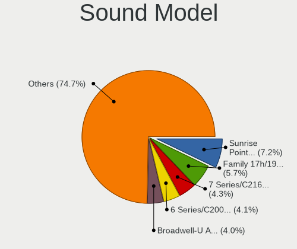

| Model                                                                             | Computers | Percent |
|-----------------------------------------------------------------------------------|-----------|---------|
| Intel Sunrise Point-LP HD Audio                                                   | 37        | 7.1%    |
| Intel 7 Series/C216 Chipset Family High Definition Audio Controller               | 28        | 5.37%   |
| Intel 6 Series/C200 Series Chipset Family High Definition Audio Controller        | 23        | 4.41%   |
| Intel Wildcat Point-LP High Definition Audio Controller                           | 21        | 4.03%   |
| Intel Broadwell-U Audio Controller                                                | 21        | 4.03%   |
| AMD Family 17h/19h HD Audio Controller                                            | 21        | 4.03%   |
| Intel NM10/ICH7 Family High Definition Audio Controller                           | 20        | 3.84%   |
| Intel 82801I (ICH9 Family) HD Audio Controller                                    | 20        | 3.84%   |
| Intel 8 Series/C220 Series Chipset High Definition Audio Controller               | 15        | 2.88%   |
| Intel Xeon E3-1200 v3/4th Gen Core Processor HD Audio Controller                  | 14        | 2.69%   |
| AMD Starship/Matisse HD Audio Controller                                          | 14        | 2.69%   |
| AMD SBx00 Azalia (Intel HDA)                                                      | 14        | 2.69%   |
| Intel Haswell-ULT HD Audio Controller                                             | 12        | 2.3%    |
| Intel 8 Series HD Audio Controller                                                | 12        | 2.3%    |
| AMD Renoir Radeon High Definition Audio Controller                                | 12        | 2.3%    |
| AMD Ellesmere HDMI Audio [Radeon RX 470/480 / 570/580/590]                        | 10        | 1.92%   |
| Intel Cannon Lake PCH cAVS                                                        | 9         | 1.73%   |
| Intel 5 Series/3400 Series Chipset High Definition Audio                          | 9         | 1.73%   |
| AMD Raven/Raven2/Fenghuang HDMI/DP Audio Controller                               | 9         | 1.73%   |
| AMD FCH Azalia Controller                                                         | 8         | 1.54%   |
| Intel Celeron/Pentium Silver Processor High Definition Audio                      | 7         | 1.34%   |
| Intel Cannon Point-LP High Definition Audio Controller                            | 7         | 1.34%   |
| AMD Navi 10 HDMI Audio                                                            | 7         | 1.34%   |
| Intel Comet Lake PCH-LP cAVS                                                      | 6         | 1.15%   |
| AMD Family 17h (Models 00h-0fh) HD Audio Controller                               | 6         | 1.15%   |
| AMD Caicos HDMI Audio [Radeon HD 6450 / 7450/8450/8490 OEM / R5 230/235/235X OEM] | 6         | 1.15%   |
| Intel Celeron N3350/Pentium N4200/Atom E3900 Series Audio Cluster                 | 5         | 0.96%   |
| AMD RS880 HDMI Audio [Radeon HD 4200 Series]                                      | 5         | 0.96%   |
| AMD Kabini HDMI/DP Audio                                                          | 5         | 0.96%   |
| Nvidia MCP61 High Definition Audio                                                | 4         | 0.77%   |
| Intel Tiger Lake-LP Smart Sound Technology Audio Controller                       | 4         | 0.77%   |
| Intel Comet Lake PCH-V cAVS                                                       | 4         | 0.77%   |
| Intel Atom Processor Z36xxx/Z37xxx Series High Definition Audio Controller        | 4         | 0.77%   |
| Intel 82801JI (ICH10 Family) HD Audio Controller                                  | 4         | 0.77%   |
| Intel 82801H (ICH8 Family) HD Audio Controller                                    | 4         | 0.77%   |
| Intel 100 Series/C230 Series Chipset Family HD Audio Controller                   | 4         | 0.77%   |
| AMD Wrestler HDMI Audio                                                           | 4         | 0.77%   |
| AMD RV710/730 HDMI Audio [Radeon HD 4000 series]                                  | 4         | 0.77%   |
| Nvidia MCP79 High Definition Audio                                                | 3         | 0.58%   |
| Nvidia High Definition Audio Controller                                           | 3         | 0.58%   |

Memory
------

Memory Vendor
-------------

Memory module vendors

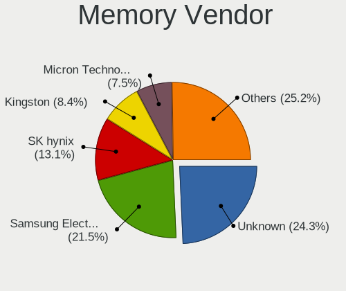

| Vendor              | Computers | Percent |
|---------------------|-----------|---------|
| Unknown             | 19        | 32.2%   |
| Samsung Electronics | 12        | 20.34%  |
| SK hynix            | 7         | 11.86%  |
| Kingston            | 5         | 8.47%   |
| Micron Technology   | 3         | 5.08%   |
| Elpida              | 3         | 5.08%   |
| Transcend           | 2         | 3.39%   |
| Ramaxel Technology  | 2         | 3.39%   |
| Crucial             | 2         | 3.39%   |
| Nanya Technology    | 1         | 1.69%   |
| Corsair             | 1         | 1.69%   |
| A-DATA Technology   | 1         | 1.69%   |
| Unknown             | 1         | 1.69%   |

Memory Model
------------

Memory module models

| Model                                                   | Computers | Percent |
|---------------------------------------------------------|-----------|---------|
| Unknown RAM Module 4GB SODIMM DDR3 1333MT/s             | 3         | 4.55%   |
| Samsung RAM M471B5273DH0-CH9 4GB SODIMM DDR3 1334MT/s   | 3         | 4.55%   |
| Unknown RAM Module 4096MB SODIMM DDR3 1333MT/s          | 2         | 3.03%   |
| SK hynix RAM HMT351S6CFR8C-PB 4GB SODIMM DDR3 1600MT/s  | 2         | 3.03%   |
| Kingston RAM KHX2400C15D4/4G 4GB DIMM DDR4 2400MT/s     | 2         | 3.03%   |
| Kingston RAM KHX2400C15/8G 8GB DIMM DDR4 2400MT/s       | 2         | 3.03%   |
| Crucial RAM CT102464BF160B.M16 8GB SODIMM DDR3 1600MT/s | 2         | 3.03%   |
| Unknown RAM Module 512MB SODIMM SDRAM                   | 1         | 1.52%   |
| Unknown RAM Module 512MB SODIMM DDR                     | 1         | 1.52%   |
| Unknown RAM Module 512MB DIMM SDRAM                     | 1         | 1.52%   |
| Unknown RAM Module 512MB DIMM DDR 400MT/s               | 1         | 1.52%   |
| Unknown RAM Module 512MB DIMM 400MT/s                   | 1         | 1.52%   |
| Unknown RAM Module 2GB SODIMM DDR3 1067MT/s             | 1         | 1.52%   |
| Unknown RAM Module 256MB SODIMM DRAM                    | 1         | 1.52%   |
| Unknown RAM Module 256MB DIMM 333MT/s                   | 1         | 1.52%   |
| Unknown RAM Module 2048MB SODIMM DDR3 1333MT/s          | 1         | 1.52%   |
| Unknown RAM Module 2048MB SODIMM DDR2                   | 1         | 1.52%   |
| Unknown RAM Module 2048MB DIMM DDR2 266MT/s             | 1         | 1.52%   |
| Unknown RAM Module 1GB SODIMM DDR2                      | 1         | 1.52%   |
| Unknown RAM Module 1GB DIMM 400MT/s                     | 1         | 1.52%   |
| Unknown RAM Module 128MB SODIMM DRAM                    | 1         | 1.52%   |
| Unknown RAM Module 1024MB SODIMM DDR                    | 1         | 1.52%   |
| Unknown RAM Module 1024MB DIMM DDR                      | 1         | 1.52%   |
| Unknown RAM Module 1024MB DIMM 800MT/s                  | 1         | 1.52%   |
| Transcend RAM TS1GSK64W6H 8GB DIMM DDR3 1600MT/s        | 1         | 1.52%   |
| Transcend RAM TS128MLQ64V6J 1GB DIMM DDR2 667MT/s       | 1         | 1.52%   |
| SK hynix RAM HYMP112U64CP8-Y5 1GB DIMM DDR2 667MT/s     | 1         | 1.52%   |
| SK hynix RAM HMT351S6EFR8A-PB 4GB SODIMM DDR3 1600MT/s  | 1         | 1.52%   |
| SK hynix RAM HMT325S6BFR8C-H9 2GB SODIMM DDR3 1333MT/s  | 1         | 1.52%   |
| SK hynix RAM HMA81GR7AFR8N-VK 8GB DIMM DDR4 2666MT/s    | 1         | 1.52%   |
| SK hynix RAM 484D543332355336 2GB SODIMM DDR3 1333MT/s  | 1         | 1.52%   |
| Samsung RAM M471B5773DH0-CH9 2GB SODIMM DDR3 1334MT/s   | 1         | 1.52%   |
| Samsung RAM M471B5673FH0-CF8 2GB SODIMM DDR3 1067MT/s   | 1         | 1.52%   |
| Samsung RAM M471B5673EH1-CF8 2GB SODIMM DDR3 1067MT/s   | 1         | 1.52%   |
| Samsung RAM M471B5273DH0-CK0 4GB SODIMM DDR3 1600MT/s   | 1         | 1.52%   |
| Samsung RAM M471B5173QH0-YK0 4GB SODIMM DDR3 1600MT/s   | 1         | 1.52%   |
| Samsung RAM M471B5173DB0-YK0 4GB SODIMM DDR3 1600MT/s   | 1         | 1.52%   |
| Samsung RAM M471B5173BH0-CK0 4GB SODIMM DDR3 1600MT/s   | 1         | 1.52%   |
| Samsung RAM M471B1G73DB0-YK0 8GB SODIMM DDR3 1600MT/s   | 1         | 1.52%   |
| Samsung RAM M471A5244CB0-CWE 4GB SODIMM DDR4 3200MT/s   | 1         | 1.52%   |

Memory Kind
-----------

Memory module kinds

| Kind    | Computers | Percent |
|---------|-----------|---------|
| DDR3    | 28        | 54.9%   |
| DDR4    | 7         | 13.73%  |
| DDR2    | 6         | 11.76%  |
| SDRAM   | 3         | 5.88%   |
| DDR     | 3         | 5.88%   |
| DRAM    | 2         | 3.92%   |
| Unknown | 2         | 3.92%   |

Memory Form Factor
------------------

Physical design of the memory module

| Name   | Computers | Percent |
|--------|-----------|---------|
| SODIMM | 37        | 72.55%  |
| DIMM   | 14        | 27.45%  |

Memory Size
-----------

Memory module size

| Size  | Computers | Percent |
|-------|-----------|---------|
| 4096  | 21        | 35.59%  |
| 8192  | 9         | 15.25%  |
| 2048  | 9         | 15.25%  |
| 1024  | 9         | 15.25%  |
| 512   | 5         | 8.47%   |
| 16384 | 2         | 3.39%   |
| 256   | 2         | 3.39%   |
| 32768 | 1         | 1.69%   |
| 128   | 1         | 1.69%   |

Memory Speed
------------

Memory module speed

| Speed   | Computers | Percent |
|---------|-----------|---------|
| 1600    | 15        | 27.78%  |
| Unknown | 9         | 16.67%  |
| 1333    | 8         | 14.81%  |
| 1334    | 4         | 7.41%   |
| 3200    | 3         | 5.56%   |
| 2400    | 3         | 5.56%   |
| 800     | 3         | 5.56%   |
| 1067    | 2         | 3.7%    |
| 400     | 2         | 3.7%    |
| 2666    | 1         | 1.85%   |
| 667     | 1         | 1.85%   |
| 533     | 1         | 1.85%   |
| 333     | 1         | 1.85%   |
| 266     | 1         | 1.85%   |

Printers & scanners
-------------------

Printer Vendor
--------------

Printer device vendors

Zero info for selected period =(

Printer Model
-------------

Printer device models

Zero info for selected period =(

Scanner Vendor
--------------

Scanner device vendors

Zero info for selected period =(

Scanner Model
-------------

Scanner device models

Zero info for selected period =(

Camera
------

Camera Vendor
-------------

Camera device vendors

| Vendor                                 | Computers | Percent |
|----------------------------------------|-----------|---------|
| Chicony Electronics                    | 52        | 34.67%  |
| Acer                                   | 18        | 12%     |
| IMC Networks                           | 16        | 10.67%  |
| Realtek Semiconductor                  | 10        | 6.67%   |
| Lite-On Technology                     | 8         | 5.33%   |
| Microdia                               | 7         | 4.67%   |
| Logitech                               | 5         | 3.33%   |
| Syntek                                 | 3         | 2%      |
| Suyin                                  | 3         | 2%      |
| Sunplus Innovation Technology          | 3         | 2%      |
| Silicon Motion                         | 3         | 2%      |
| Ricoh                                  | 3         | 2%      |
| Quanta                                 | 3         | 2%      |
| Apple                                  | 3         | 2%      |
| Alcor Micro                            | 3         | 2%      |
| Luxvisions Innotech Limited            | 2         | 1.33%   |
| Lenovo                                 | 2         | 1.33%   |
| Cheng Uei Precision Industry (Foxlink) | 2         | 1.33%   |
| Z-Star Microelectronics                | 1         | 0.67%   |
| Tripath Technology                     | 1         | 0.67%   |
| Denron                                 | 1         | 0.67%   |
| ALi                                    | 1         | 0.67%   |

Camera Model
------------

Camera device models

| Model                                                       | Computers | Percent |
|-------------------------------------------------------------|-----------|---------|
| Chicony Integrated Camera                                   | 22        | 14.57%  |
| Lite-On Integrated Camera                                   | 8         | 5.3%    |
| IMC Networks Integrated Camera                              | 7         | 4.64%   |
| Chicony Lenovo Integrated Camera (0.3MP)                    | 5         | 3.31%   |
| Chicony Integrated Camera [ThinkPad]                        | 5         | 3.31%   |
| Acer Integrated Camera                                      | 5         | 3.31%   |
| Realtek Integrated_Webcam_HD                                | 3         | 1.99%   |
| IMC Networks USB2.0 VGA UVC WebCam                          | 3         | 1.99%   |
| Acer EasyCamera                                             | 3         | 1.99%   |
| Syntek Lenovo EasyCamera                                    | 2         | 1.32%   |
| Realtek USB 2 Webcam                                        | 2         | 1.32%   |
| Microdia Integrated_Webcam_HD                               | 2         | 1.32%   |
| Lenovo Integrated Webcam                                    | 2         | 1.32%   |
| Chicony ThinkPad T490 Webcam                                | 2         | 1.32%   |
| Chicony Integrated Camera (1280x720@30)                     | 2         | 1.32%   |
| Chicony HD Webcam                                           | 2         | 1.32%   |
| Chicony FJ Camera                                           | 2         | 1.32%   |
| Apple FaceTime HD Camera                                    | 2         | 1.32%   |
| Acer SunplusIT Integrated Camera                            | 2         | 1.32%   |
| Acer Lenovo EasyCamera                                      | 2         | 1.32%   |
| Z-Star Integrated Camera                                    | 1         | 0.66%   |
| Tripath PC Camera                                           | 1         | 0.66%   |
| Syntek EasyCamera                                           | 1         | 0.66%   |
| Suyin Asus Integrated Webcam                                | 1         | 0.66%   |
| Suyin Acer/Lenovo Webcam [CN0316]                           | 1         | 0.66%   |
| Suyin 1.3M WebCam (notebook emachines E730, Acer sub-brand) | 1         | 0.66%   |
| Sunplus Integrated_Webcam_HD                                | 1         | 0.66%   |
| Sunplus Integrated_Webcam_FHD                               | 1         | 0.66%   |
| Sunplus Dell E5570 integrated webcam                        | 1         | 0.66%   |
| Silicon Motion WebCam SC-10IRQ12340N                        | 1         | 0.66%   |
| Silicon Motion Web Camera                                   | 1         | 0.66%   |
| Silicon Motion Realtek USB2.0 PC Camera                     | 1         | 0.66%   |
| Ricoh USB2.0 Camera                                         | 1         | 0.66%   |
| Ricoh Sony Visual Communication Camera                      | 1         | 0.66%   |
| Ricoh Integrated Webcam                                     | 1         | 0.66%   |
| Realtek USB2.0 HD UVC WebCam                                | 1         | 0.66%   |
| Realtek USB Camera                                          | 1         | 0.66%   |
| Realtek Integrated Webcam                                   | 1         | 0.66%   |
| Realtek EasyCamera                                          | 1         | 0.66%   |
| Realtek Acer 640 x 480 laptop camera                        | 1         | 0.66%   |

Security
--------

Fingerprint Vendor
------------------

Fingerprint sensor vendors

| Vendor                     | Computers | Percent |
|----------------------------|-----------|---------|
| Validity Sensors           | 19        | 36.54%  |
| Upek                       | 9         | 17.31%  |
| Synaptics                  | 7         | 13.46%  |
| STMicroelectronics         | 6         | 11.54%  |
| AuthenTec                  | 6         | 11.54%  |
| Shenzhen Goodix Technology | 3         | 5.77%   |
| Samsung Electronics        | 1         | 1.92%   |
| Elan Microelectronics      | 1         | 1.92%   |

Fingerprint Model
-----------------

Fingerprint sensor models

| Model                                                  | Computers | Percent |
|--------------------------------------------------------|-----------|---------|
| Validity Sensors VFS 5011 fingerprint sensor           | 12        | 23.08%  |
| Upek Biometric Touchchip/Touchstrip Fingerprint Sensor | 9         | 17.31%  |
| STMicroelectronics Fingerprint Reader                  | 6         | 11.54%  |
| Validity Sensors Synaptics WBDI                        | 3         | 5.77%   |
| Synaptics Prometheus MIS Touch Fingerprint Reader      | 3         | 5.77%   |
| AuthenTec AES2810                                      | 3         | 5.77%   |
| Validity Sensors VFS5011 Fingerprint Reader            | 2         | 3.85%   |
| Synaptics product 0x00be                               | 2         | 3.85%   |
| Shenzhen Goodix Fingerprint Reader                     | 2         | 3.85%   |
| AuthenTec AES2501 Fingerprint Sensor                   | 2         | 3.85%   |
| Validity Sensors VFS7500 Touch Fingerprint Sensor      | 1         | 1.92%   |
| Validity Sensors VFS451 Fingerprint Reader             | 1         | 1.92%   |
| Synaptics  WBDI                                        | 1         | 1.92%   |
| Synaptics Metallica MOH Touch Fingerprint Reader       | 1         | 1.92%   |
| Shenzhen Goodix  FingerPrint Device                    | 1         | 1.92%   |
| Samsung Fingerprint Device                             | 1         | 1.92%   |
| Elan ELAN WBF Fingerprint Sensor                       | 1         | 1.92%   |
| AuthenTec AuthenTec Inc. AES2660                       | 1         | 1.92%   |

Chipcard Vendor
---------------

Chipcard module vendors

Zero info for selected period =(

Chipcard Model
--------------

Chipcard module models

Zero info for selected period =(

Unsupported
-----------

Unsupported Devices
-------------------

Total unsupported devices on board

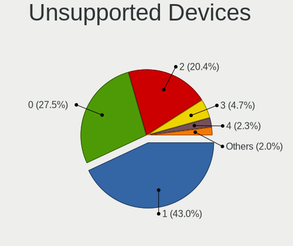

| Total | Computers | Percent |
|-------|-----------|---------|
| 1     | 187       | 40.04%  |
| 0     | 139       | 29.76%  |
| 2     | 99        | 21.2%   |
| 3     | 20        | 4.28%   |
| 4     | 11        | 2.36%   |
| 5     | 4         | 0.86%   |
| 7     | 3         | 0.64%   |
| 6     | 3         | 0.64%   |
| 8     | 1         | 0.21%   |

Unsupported Device Types
------------------------

Types of unsupported devices

| Type                     | Computers | Percent |
|--------------------------|-----------|---------|
| Communication controller | 242       | 49.19%  |
| Graphics card            | 90        | 18.29%  |
| Net/wireless             | 52        | 10.57%  |
| Firewire controller      | 42        | 8.54%   |
| Sound                    | 17        | 3.46%   |
| Storage/ata              | 12        | 2.44%   |
| Net/ethernet             | 12        | 2.44%   |
| Network                  | 7         | 1.42%   |
| Modem                    | 7         | 1.42%   |
| Storage/ide              | 4         | 0.81%   |
| Storage                  | 2         | 0.41%   |
| Card reader              | 2         | 0.41%   |
| Storage/raid             | 1         | 0.2%    |
| Storage/nvme             | 1         | 0.2%    |
| Bluetooth                | 1         | 0.2%    |

