OpenBSD - Tested Hardware & Statistics (Desktops)
-------------------------------------------------

A project to collect tested hardware configurations for OpenBSD.

Anyone can contribute to this report by the [hw-probe](https://github.com/linuxhw/hw-probe/blob/master/INSTALL.BSD.md) tool:

    hw-probe -all -upload

Please contribute! Especially if your hardware is rare.

Contents
--------

* [ Test Cases ](#test-cases)

* [ System ](#system)
  - [ OS                       ](#os)
  - [ OS Family                ](#os-family)
  - [ Arch                     ](#arch)
  - [ DE                       ](#de)
  - [ Display Server           ](#display-server)
  - [ Display Manager          ](#display-manager)
  - [ OS Lang                  ](#os-lang)
  - [ Boot Mode                ](#boot-mode)
  - [ Filesystem               ](#filesystem)
  - [ Part. scheme             ](#part-scheme)

* [ Board ](#board)
  - [ Vendor                   ](#vendor)
  - [ Model                    ](#model)
  - [ Model Family             ](#model-family)
  - [ MFG Year                 ](#mfg-year)
  - [ Form Factor              ](#form-factor)
  - [ Coreboot                 ](#coreboot)
  - [ RAM Size                 ](#ram-size)
  - [ RAM Used                 ](#ram-used)
  - [ Total Drives             ](#total-drives)
  - [ Has CD-ROM               ](#has-cd-rom)
  - [ Has Ethernet             ](#has-ethernet)
  - [ Has WiFi                 ](#has-wifi)
  - [ Has Bluetooth            ](#has-bluetooth)

* [ Location ](#location)
  - [ Country                  ](#country)
  - [ City                     ](#city)

* [ Drives ](#drives)
  - [ Drive Vendor             ](#drive-vendor)
  - [ Drive Model              ](#drive-model)
  - [ HDD Vendor               ](#hdd-vendor)
  - [ SSD Vendor               ](#ssd-vendor)
  - [ Drive Kind               ](#drive-kind)
  - [ Drive Connector          ](#drive-connector)
  - [ Drive Size               ](#drive-size)
  - [ Space Total              ](#space-total)
  - [ Space Used               ](#space-used)
  - [ Malfunc. Drives          ](#malfunc-drives)
  - [ Malfunc. Drive Vendor    ](#malfunc-drive-vendor)
  - [ Malfunc. HDD Vendor      ](#malfunc-hdd-vendor)
  - [ Malfunc. Drive Kind      ](#malfunc-drive-kind)
  - [ Failed Drives            ](#failed-drives)
  - [ Failed Drive Vendor      ](#failed-drive-vendor)
  - [ Drive Status             ](#drive-status)

* [ Storage controller ](#storage-controller)
  - [ Storage Vendor           ](#storage-vendor)
  - [ Storage Model            ](#storage-model)
  - [ Storage Kind             ](#storage-kind)

* [ Processor ](#processor)
  - [ CPU Vendor               ](#cpu-vendor)
  - [ CPU Model                ](#cpu-model)
  - [ CPU Model Family         ](#cpu-model-family)
  - [ CPU Cores                ](#cpu-cores)
  - [ CPU Sockets              ](#cpu-sockets)
  - [ CPU Threads              ](#cpu-threads)
  - [ CPU Microarch            ](#cpu-microarch)

* [ Graphics ](#graphics)
  - [ GPU Vendor               ](#gpu-vendor)
  - [ GPU Model                ](#gpu-model)
  - [ GPU Combo                ](#gpu-combo)
  - [ GPU Driver               ](#gpu-driver)
  - [ GPU Memory               ](#gpu-memory)

* [ Monitor ](#monitor)
  - [ Monitor Vendor           ](#monitor-vendor)
  - [ Monitor Model            ](#monitor-model)
  - [ Monitor Resolution       ](#monitor-resolution)
  - [ Monitor Diagonal         ](#monitor-diagonal)
  - [ Monitor Width            ](#monitor-width)
  - [ Aspect Ratio             ](#aspect-ratio)
  - [ Monitor Area             ](#monitor-area)
  - [ Pixel Density            ](#pixel-density)
  - [ Multiple Monitors        ](#multiple-monitors)

* [ Network ](#network)
  - [ Net Controller Vendor    ](#net-controller-vendor)
  - [ Net Controller Model     ](#net-controller-model)
  - [ Wireless Vendor          ](#wireless-vendor)
  - [ Wireless Model           ](#wireless-model)
  - [ Ethernet Vendor          ](#ethernet-vendor)
  - [ Ethernet Model           ](#ethernet-model)
  - [ Net Controller Kind      ](#net-controller-kind)
  - [ Used Controller          ](#used-controller)
  - [ NICs                     ](#nics)
  - [ IPv6                     ](#ipv6)

* [ Bluetooth ](#bluetooth)
  - [ Bluetooth Vendor         ](#bluetooth-vendor)
  - [ Bluetooth Model          ](#bluetooth-model)

* [ Sound ](#sound)
  - [ Sound Vendor             ](#sound-vendor)
  - [ Sound Model              ](#sound-model)

* [ Memory ](#memory)
  - [ Memory Vendor            ](#memory-vendor)
  - [ Memory Model             ](#memory-model)
  - [ Memory Kind              ](#memory-kind)
  - [ Memory Form Factor       ](#memory-form-factor)
  - [ Memory Size              ](#memory-size)
  - [ Memory Speed             ](#memory-speed)

* [ Printers & scanners ](#printers--scanners)
  - [ Printer Vendor           ](#printer-vendor)
  - [ Printer Model            ](#printer-model)
  - [ Scanner Vendor           ](#scanner-vendor)
  - [ Scanner Model            ](#scanner-model)

* [ Camera ](#camera)
  - [ Camera Vendor            ](#camera-vendor)
  - [ Camera Model             ](#camera-model)

* [ Security ](#security)
  - [ Fingerprint Vendor       ](#fingerprint-vendor)
  - [ Fingerprint Model        ](#fingerprint-model)
  - [ Chipcard Vendor          ](#chipcard-vendor)
  - [ Chipcard Model           ](#chipcard-model)

* [ Unsupported ](#unsupported)
  - [ Unsupported Devices      ](#unsupported-devices)
  - [ Unsupported Device Types ](#unsupported-device-types)

Test Cases
----------

Total: 555

| Vendor        | Model                       | Probe                                                     | Date         |
|---------------|-----------------------------|-----------------------------------------------------------|--------------|
| Dell          | OptiPlex 7010               | [b67e89db64](https://bsd-hardware.info/?probe=b67e89db64) | Dec 29, 2025 |
| ASRock        | X570 Pro4                   | [81962180fa](https://bsd-hardware.info/?probe=81962180fa) | Dec 25, 2025 |
| ASUSTek       | PRIME B450M-K               | [e1151277ab](https://bsd-hardware.info/?probe=e1151277ab) | Dec 24, 2025 |
| HP            | 09F8h                       | [44c36202bc](https://bsd-hardware.info/?probe=44c36202bc) | Dec 24, 2025 |
| HP            | 0A60h                       | [373be94207](https://bsd-hardware.info/?probe=373be94207) | Dec 24, 2025 |
| Gigabyte      | A520M K V2                  | [a46f92fa01](https://bsd-hardware.info/?probe=a46f92fa01) | Dec 14, 2025 |
| NEC Comput... | NEC Versa Premium           | [ed974ec3ae](https://bsd-hardware.info/?probe=ed974ec3ae) | Dec 13, 2025 |
| Fujitsu Si... | AMILO PRO V3515             | [67271836ec](https://bsd-hardware.info/?probe=67271836ec) | Dec 01, 2025 |
| ASUSTek       | TUF Gaming B550-PLUS        | [994ed28579](https://bsd-hardware.info/?probe=994ed28579) | Nov 13, 2025 |
| Dell          | OptiPlex 7010               | [4b38db0081](https://bsd-hardware.info/?probe=4b38db0081) | Nov 10, 2025 |
| Intel         | D2500HN                     | [348da412f3](https://bsd-hardware.info/?probe=348da412f3) | Nov 09, 2025 |
| Dell          | OptiPlex 7010               | [805e22268e](https://bsd-hardware.info/?probe=805e22268e) | Nov 05, 2025 |
| Unknown       | Unknown                     | [dbed6bfcc3](https://bsd-hardware.info/?probe=dbed6bfcc3) | Oct 31, 2025 |
| ASUSTek       | PRIME B550M-A (WI-FI)       | [7ef166fedf](https://bsd-hardware.info/?probe=7ef166fedf) | Oct 30, 2025 |
| Lenovo        | IdeaPad 1 15IAU7 82VY       | [e03b7ff8d7](https://bsd-hardware.info/?probe=e03b7ff8d7) | Oct 27, 2025 |
| Dell          | OptiPlex 7010               | [692f1aa54a](https://bsd-hardware.info/?probe=692f1aa54a) | Oct 26, 2025 |
| ASUSTek       | P10S-I Series               | [1eda43e21e](https://bsd-hardware.info/?probe=1eda43e21e) | Oct 21, 2025 |
| Dell          | OptiPlex 7010               | [0bcd5ae58c](https://bsd-hardware.info/?probe=0bcd5ae58c) | Oct 14, 2025 |
| MSI           | MS-7D73                     | [d29930c054](https://bsd-hardware.info/?probe=d29930c054) | Oct 06, 2025 |
| Dell          | OptiPlex 7010               | [9c9cf22c77](https://bsd-hardware.info/?probe=9c9cf22c77) | Oct 05, 2025 |
| Dell          | OptiPlex 7010               | [8538bef190](https://bsd-hardware.info/?probe=8538bef190) | Sep 25, 2025 |
| HP            | Compaq dc7800p Small For... | [e2121505f3](https://bsd-hardware.info/?probe=e2121505f3) | Sep 23, 2025 |
| HP            | Compaq dc7800p Small For... | [28b04457b1](https://bsd-hardware.info/?probe=28b04457b1) | Sep 23, 2025 |
| Raspberry ... | Raspberry Pi 5 Model B R... | [101e39e3b9](https://bsd-hardware.info/?probe=101e39e3b9) | Sep 22, 2025 |
| Dell          | OptiPlex 7010               | [a61df6a112](https://bsd-hardware.info/?probe=a61df6a112) | Sep 15, 2025 |
| Gigabyte      | X570 AORUS ELITE            | [707d6b12a2](https://bsd-hardware.info/?probe=707d6b12a2) | Sep 07, 2025 |
| Dell          | OptiPlex 7010               | [df0888c7ac](https://bsd-hardware.info/?probe=df0888c7ac) | Sep 07, 2025 |
| Unknown       | Unknown                     | [7e9ca24ac4](https://bsd-hardware.info/?probe=7e9ca24ac4) | Aug 25, 2025 |
| HP            | Z420 Workstation            | [1ff8b8627f](https://bsd-hardware.info/?probe=1ff8b8627f) | Aug 19, 2025 |
| Lenovo        | ThinkStation P520c 30BX0... | [6767ecf883](https://bsd-hardware.info/?probe=6767ecf883) | Aug 19, 2025 |
| GEEKOM        | A5                          | [2cce4efc81](https://bsd-hardware.info/?probe=2cce4efc81) | Aug 15, 2025 |
| ASUSTek       | ROG STRIX Z390-F GAMING     | [649cb32a72](https://bsd-hardware.info/?probe=649cb32a72) | Aug 12, 2025 |
| IBM           | 656367G                     | [e2e3fdfeb4](https://bsd-hardware.info/?probe=e2e3fdfeb4) | Aug 07, 2025 |
| GEEKOM        | A5                          | [4ab2cf96b8](https://bsd-hardware.info/?probe=4ab2cf96b8) | Aug 06, 2025 |
| Dell          | OptiPlex 7010               | [4832e129a2](https://bsd-hardware.info/?probe=4832e129a2) | Jul 23, 2025 |
| Gigabyte      | X58A-UD5                    | [589d9a9b10](https://bsd-hardware.info/?probe=589d9a9b10) | Jul 20, 2025 |
| HP            | Compaq 8000 Elite CMT PC    | [55dce3d3b6](https://bsd-hardware.info/?probe=55dce3d3b6) | Jul 17, 2025 |
| PC Engines    | APU2                        | [6824c194a5](https://bsd-hardware.info/?probe=6824c194a5) | Jul 13, 2025 |
| ASUSTek       | NUC12WSK-B                  | [ba6cf411aa](https://bsd-hardware.info/?probe=ba6cf411aa) | Jul 11, 2025 |
| Gigabyte      | H310M DS2 2.0               | [3dd8e30e79](https://bsd-hardware.info/?probe=3dd8e30e79) | Jun 22, 2025 |
| ASUSTek       | TUF Gaming B650-PLUS WIF... | [10ec197050](https://bsd-hardware.info/?probe=10ec197050) | Jun 17, 2025 |
| Lenovo        | ThinkCentre M910q 10MVCT... | [762f06356b](https://bsd-hardware.info/?probe=762f06356b) | May 29, 2025 |
| Hetzner       | B665D4U-1L                  | [137b033f5d](https://bsd-hardware.info/?probe=137b033f5d) | May 27, 2025 |
| Gigabyte      | X58A-UD5                    | [8d9aeab7fa](https://bsd-hardware.info/?probe=8d9aeab7fa) | May 19, 2025 |
| Fujitsu       | ESPRIMO Q920                | [40d213982c](https://bsd-hardware.info/?probe=40d213982c) | May 09, 2025 |
| Gigabyte      | X58A-UD5                    | [f7154d6bfc](https://bsd-hardware.info/?probe=f7154d6bfc) | May 05, 2025 |
| Unknown       | Unknown                     | [de2f486d92](https://bsd-hardware.info/?probe=de2f486d92) | May 02, 2025 |
| Gigabyte      | X58A-UD5                    | [c437a18dc8](https://bsd-hardware.info/?probe=c437a18dc8) | Apr 30, 2025 |
| ASUSTek       | Z170-K                      | [b09b5d3ee9](https://bsd-hardware.info/?probe=b09b5d3ee9) | Apr 28, 2025 |
| ASUSTek       | P10S-I Series               | [9faf7ee625](https://bsd-hardware.info/?probe=9faf7ee625) | Apr 28, 2025 |
| Dell          | OptiPlex 3020               | [fbf5490874](https://bsd-hardware.info/?probe=fbf5490874) | Apr 28, 2025 |
| xunlong       | Orange Pi 3B v1.1           | [bb61dc152d](https://bsd-hardware.info/?probe=bb61dc152d) | Apr 28, 2025 |
| Gigabyte      | X58A-UD5                    | [66cd09e8ec](https://bsd-hardware.info/?probe=66cd09e8ec) | Apr 24, 2025 |
| HP            | EliteDesk 800 G3 SFF        | [59793c040f](https://bsd-hardware.info/?probe=59793c040f) | Apr 24, 2025 |
| Unknown       | Unknown                     | [46cc0b8a8f](https://bsd-hardware.info/?probe=46cc0b8a8f) | Apr 20, 2025 |
| HP            | EliteDesk 800 G2 DM 65W     | [f575ed65e4](https://bsd-hardware.info/?probe=f575ed65e4) | Apr 14, 2025 |
| Gigabyte      | X58A-UD5                    | [25a9779b08](https://bsd-hardware.info/?probe=25a9779b08) | Apr 11, 2025 |
| ASUSTek       | P13R-M Series               | [85d1427084](https://bsd-hardware.info/?probe=85d1427084) | Apr 03, 2025 |
| ASUSTek       | PRIME A620M-A               | [cfaef0f33c](https://bsd-hardware.info/?probe=cfaef0f33c) | Mar 28, 2025 |
| Gigabyte      | X58A-UD5                    | [9adeca088e](https://bsd-hardware.info/?probe=9adeca088e) | Mar 23, 2025 |
| Lenovo        | ThinkCentre M900 10FLS19... | [bde213c63d](https://bsd-hardware.info/?probe=bde213c63d) | Mar 22, 2025 |
| Dell          | OptiPlex 9010               | [b80c6041c4](https://bsd-hardware.info/?probe=b80c6041c4) | Mar 15, 2025 |
| HP            | EliteDesk 800 G5 Desktop... | [fd79588978](https://bsd-hardware.info/?probe=fd79588978) | Mar 11, 2025 |
| Gigabyte      | X58A-UD5                    | [8de5673523](https://bsd-hardware.info/?probe=8de5673523) | Mar 08, 2025 |
| ASUSTek       | ROG STRIX B650E-I GAMING... | [20674abcce](https://bsd-hardware.info/?probe=20674abcce) | Mar 04, 2025 |
| Lenovo        | ThinkCentre M900 10FLS19... | [b905d638d9](https://bsd-hardware.info/?probe=b905d638d9) | Feb 28, 2025 |
| HP            | EliteDesk 800 G3 DM 65W     | [16bd6a365a](https://bsd-hardware.info/?probe=16bd6a365a) | Feb 27, 2025 |
| AZW           | EQ                          | [987f788d96](https://bsd-hardware.info/?probe=987f788d96) | Feb 27, 2025 |
| ASUSTek       | ROG STRIX B650E-I GAMING... | [b8b958e1a0](https://bsd-hardware.info/?probe=b8b958e1a0) | Feb 26, 2025 |
| ASUSTek       | SABERTOOTH X58              | [ad2a43e06b](https://bsd-hardware.info/?probe=ad2a43e06b) | Feb 23, 2025 |
| Legend QDI    | PLATINIX-8                  | [68a34cafa8](https://bsd-hardware.info/?probe=68a34cafa8) | Feb 18, 2025 |
| ASUSTek       | SABERTOOTH X58              | [3a0bd5fc51](https://bsd-hardware.info/?probe=3a0bd5fc51) | Feb 18, 2025 |
| MSI           | MS-7623                     | [eebc601f92](https://bsd-hardware.info/?probe=eebc601f92) | Feb 16, 2025 |
| Fujitsu       | ESPRIMO Q920                | [1ba76bf7e5](https://bsd-hardware.info/?probe=1ba76bf7e5) | Feb 15, 2025 |
| ASRock        | Z77 Pro4                    | [f4a2218557](https://bsd-hardware.info/?probe=f4a2218557) | Feb 08, 2025 |
| Gigabyte      | H310M DS2 2.0               | [72585b13b5](https://bsd-hardware.info/?probe=72585b13b5) | Feb 02, 2025 |
| xunlong       | Orange Pi 3B v1.1           | [99d7cd5d62](https://bsd-hardware.info/?probe=99d7cd5d62) | Jan 31, 2025 |
| Dell          | Precision T1650             | [3b9943f0fa](https://bsd-hardware.info/?probe=3b9943f0fa) | Jan 27, 2025 |
| HONOR         | MRO-XXX                     | [0c86aeddec](https://bsd-hardware.info/?probe=0c86aeddec) | Jan 21, 2025 |
| HONOR         | MRO-XXX                     | [6c50a8bda8](https://bsd-hardware.info/?probe=6c50a8bda8) | Jan 21, 2025 |
| Unknown       | DH61BR G32662-203           | [0189aa0eb9](https://bsd-hardware.info/?probe=0189aa0eb9) | Jan 14, 2025 |
| Gigabyte      | H310M DS2 2.0               | [0ace2c80f5](https://bsd-hardware.info/?probe=0ace2c80f5) | Jan 06, 2025 |
| Gigabyte      | H310M DS2 2.0               | [bfa6a720f4](https://bsd-hardware.info/?probe=bfa6a720f4) | Jan 06, 2025 |
| Lenovo        | ThinkStation P320 Tiny 3... | [c8a55cde50](https://bsd-hardware.info/?probe=c8a55cde50) | Jan 04, 2025 |
| ASUSTek       | SABERTOOTH X58              | [92e2cb380a](https://bsd-hardware.info/?probe=92e2cb380a) | Jan 03, 2025 |
| Lenovo        | 3106 SDK0J40697 WIN 3305... | [9f03b43d72](https://bsd-hardware.info/?probe=9f03b43d72) | Jan 03, 2025 |
| IGEL Techn... | IGEL-D220                   | [9d3ca29f8a](https://bsd-hardware.info/?probe=9d3ca29f8a) | Dec 30, 2024 |
| BOSGAME       | Ecolite Series              | [c1083a8777](https://bsd-hardware.info/?probe=c1083a8777) | Dec 28, 2024 |
| Intel         | D2500HN                     | [a316391d86](https://bsd-hardware.info/?probe=a316391d86) | Dec 27, 2024 |
| ASUSTek       | SABERTOOTH X58              | [f34dc483d5](https://bsd-hardware.info/?probe=f34dc483d5) | Dec 11, 2024 |
| Unknown       | Unknown                     | [23b03d29a7](https://bsd-hardware.info/?probe=23b03d29a7) | Dec 06, 2024 |
| Biostar       | B450MH                      | [9596d106ab](https://bsd-hardware.info/?probe=9596d106ab) | Dec 01, 2024 |
| Lenovo        | ThinkCentre M715q 10M2S0... | [9082d8b443](https://bsd-hardware.info/?probe=9082d8b443) | Dec 01, 2024 |
| Lenovo        | ThinkCentre M715q 10M2S0... | [bb5dc8520d](https://bsd-hardware.info/?probe=bb5dc8520d) | Nov 13, 2024 |
| Biostar       | B450MH                      | [51f3b1e55e](https://bsd-hardware.info/?probe=51f3b1e55e) | Nov 09, 2024 |
| MSI           | MS-7C02                     | [6f6f894d63](https://bsd-hardware.info/?probe=6f6f894d63) | Nov 05, 2024 |
| Gigabyte      | A620M H                     | [c1e5a0fe6f](https://bsd-hardware.info/?probe=c1e5a0fe6f) | Oct 22, 2024 |
| Unknown       | Cubietech Cubietruck        | [4b4a38865a](https://bsd-hardware.info/?probe=4b4a38865a) | Oct 21, 2024 |
| Fujitsu       | ESPRIMO_P556                | [acfba13c5e](https://bsd-hardware.info/?probe=acfba13c5e) | Oct 18, 2024 |
| HP            | Compaq Presario CQ50        | [462666f013](https://bsd-hardware.info/?probe=462666f013) | Oct 13, 2024 |
| HP            | 240 G3                      | [7e732aa2d4](https://bsd-hardware.info/?probe=7e732aa2d4) | Oct 13, 2024 |
| ASUSTek       | PRIME B650-PLUS             | [6d6ba6974b](https://bsd-hardware.info/?probe=6d6ba6974b) | Oct 12, 2024 |
| Raspberry ... | Raspberry Pi 4 Model B      | [e556651aa4](https://bsd-hardware.info/?probe=e556651aa4) | Oct 11, 2024 |
| Shuttle       | DS77U                       | [9386a947f0](https://bsd-hardware.info/?probe=9386a947f0) | Oct 10, 2024 |
| Gigabyte      | X99-UD4P-CF                 | [19fac4e1e4](https://bsd-hardware.info/?probe=19fac4e1e4) | Oct 10, 2024 |
| Gigabyte      | X99-UD4P-CF                 | [ac773e52cd](https://bsd-hardware.info/?probe=ac773e52cd) | Oct 10, 2024 |
| Dell          | OptiPlex 9020               | [e7027118cd](https://bsd-hardware.info/?probe=e7027118cd) | Oct 10, 2024 |
| MSI           | MS-7D16                     | [e9bddb011d](https://bsd-hardware.info/?probe=e9bddb011d) | Oct 01, 2024 |
| SJRC          | ADLN-6L                     | [6b77a00921](https://bsd-hardware.info/?probe=6b77a00921) | Sep 25, 2024 |
| ASUSTek       | SABERTOOTH X58              | [47138b3361](https://bsd-hardware.info/?probe=47138b3361) | Sep 24, 2024 |
| ASUSTek       | SABERTOOTH X58              | [90220b30ee](https://bsd-hardware.info/?probe=90220b30ee) | Sep 09, 2024 |
| ASRock        | B360M Pro4                  | [64d222278e](https://bsd-hardware.info/?probe=64d222278e) | Sep 06, 2024 |
| ASUSTek       | PRIME B650M-A WIFI II       | [9b18fc2e82](https://bsd-hardware.info/?probe=9b18fc2e82) | Sep 01, 2024 |
| ASRock        | Z87M Pro4                   | [dbbdcc1fe6](https://bsd-hardware.info/?probe=dbbdcc1fe6) | Aug 31, 2024 |
| Intel         | Q3XXG4-P                    | [072a3b6857](https://bsd-hardware.info/?probe=072a3b6857) | Aug 29, 2024 |
| ASRock        | Z87M Pro4                   | [2ddfd242d0](https://bsd-hardware.info/?probe=2ddfd242d0) | Aug 27, 2024 |
| Supermicro    | X11SDV-4C-TLN2F             | [b2bd066528](https://bsd-hardware.info/?probe=b2bd066528) | Aug 02, 2024 |
| Supermicro    | X11SDV-4C-TLN2F             | [be116a0073](https://bsd-hardware.info/?probe=be116a0073) | Aug 02, 2024 |
| ASUSTek       | SABERTOOTH X58              | [240e3487f6](https://bsd-hardware.info/?probe=240e3487f6) | Jul 28, 2024 |
| Dell          | OptiPlex 3050               | [0cffdab939](https://bsd-hardware.info/?probe=0cffdab939) | Jul 19, 2024 |
| ASUSTek       | SABERTOOTH X58              | [42ada28689](https://bsd-hardware.info/?probe=42ada28689) | Jul 19, 2024 |
| Lenovo        | Yoga Slim 7 14Q8X9 83ED     | [3a770b9efd](https://bsd-hardware.info/?probe=3a770b9efd) | Jul 15, 2024 |
| Lenovo        | Yoga Slim 7 14Q8X9 83ED     | [cb9978d493](https://bsd-hardware.info/?probe=cb9978d493) | Jul 15, 2024 |
| Gigabyte      | H170M-D3H                   | [7fc1b74405](https://bsd-hardware.info/?probe=7fc1b74405) | Jul 11, 2024 |
| AZW           | SER                         | [e226d0b9f4](https://bsd-hardware.info/?probe=e226d0b9f4) | Jul 01, 2024 |
| AZW           | SER                         | [f7be2f6fd7](https://bsd-hardware.info/?probe=f7be2f6fd7) | Jul 01, 2024 |
| FUJI wortm... | D1547                       | [b0c75a2f48](https://bsd-hardware.info/?probe=b0c75a2f48) | Jul 01, 2024 |
| Gigabyte      | X670 GAMING X AX V2         | [4ba8f14215](https://bsd-hardware.info/?probe=4ba8f14215) | Jun 23, 2024 |
| Intel         | S2600WT2R                   | [406818a434](https://bsd-hardware.info/?probe=406818a434) | Jun 03, 2024 |
| Acer          | Aspire X3-780               | [65c4e9c26d](https://bsd-hardware.info/?probe=65c4e9c26d) | May 27, 2024 |
| Gigabyte      | Z790 EAGLE AX               | [011ed158e0](https://bsd-hardware.info/?probe=011ed158e0) | May 18, 2024 |
| Gigabyte      | Z790 EAGLE AX               | [d96abdd063](https://bsd-hardware.info/?probe=d96abdd063) | May 17, 2024 |
| ASUSTek       | PRIME B650-PLUS             | [3e01e5ffbf](https://bsd-hardware.info/?probe=3e01e5ffbf) | May 03, 2024 |
| ASRock        | Z87M Pro4                   | [91a487bad5](https://bsd-hardware.info/?probe=91a487bad5) | Apr 29, 2024 |
| ASRock        | A320M Pro4-F                | [b02849b872](https://bsd-hardware.info/?probe=b02849b872) | Apr 23, 2024 |
| ASUSTek       | TUF Gaming B550-PLUS        | [44758d3d74](https://bsd-hardware.info/?probe=44758d3d74) | Apr 16, 2024 |
| Unknown       | QDNV01                      | [0cb0009f73](https://bsd-hardware.info/?probe=0cb0009f73) | Apr 15, 2024 |
| ASUSTek       | TUF Gaming B550M-PLUS (W... | [1257111a5f](https://bsd-hardware.info/?probe=1257111a5f) | Apr 10, 2024 |
| Gigabyte      | G431-MM0-OT                 | [16c58f7ccb](https://bsd-hardware.info/?probe=16c58f7ccb) | Apr 07, 2024 |
| ASUSTek       | TUF Gaming B550-PLUS        | [d0ce6ee00b](https://bsd-hardware.info/?probe=d0ce6ee00b) | Apr 05, 2024 |
| Dell          | Vostro 3268                 | [3492b3ebb5](https://bsd-hardware.info/?probe=3492b3ebb5) | Mar 31, 2024 |
| ASUSTek       | PRIME B550M-A (WI-FI)       | [feb3803dbc](https://bsd-hardware.info/?probe=feb3803dbc) | Mar 24, 2024 |
| Dell          | Inspiron 5521               | [15446ac441](https://bsd-hardware.info/?probe=15446ac441) | Mar 24, 2024 |
| Sun           | SUNW,Ultra-1                | [33ed69952b](https://bsd-hardware.info/?probe=33ed69952b) | Mar 17, 2024 |
| HP            | ProLiant ML370 G4           | [e3d8ea32d4](https://bsd-hardware.info/?probe=e3d8ea32d4) | Mar 13, 2024 |
| ASUSTek       | TUF Gaming B550M-PLUS (W... | [9015dcf1b5](https://bsd-hardware.info/?probe=9015dcf1b5) | Mar 12, 2024 |
| Lenovo        | ThinkCentre M75n 11BXS00... | [6ed6f9c86f](https://bsd-hardware.info/?probe=6ed6f9c86f) | Mar 09, 2024 |
| Biostar       | B450NH                      | [9f4dedfcd6](https://bsd-hardware.info/?probe=9f4dedfcd6) | Feb 17, 2024 |
| Lenovo        | ThinkCentre M91p 7052C1G    | [3aeb926332](https://bsd-hardware.info/?probe=3aeb926332) | Feb 08, 2024 |
| MSI           | MS-7D15                     | [a22ee27a4a](https://bsd-hardware.info/?probe=a22ee27a4a) | Feb 03, 2024 |
| MSI           | MS-7D15                     | [476be56dc7](https://bsd-hardware.info/?probe=476be56dc7) | Feb 03, 2024 |
| Gigabyte      | Z690 UD DDR4                | [f6f19ac329](https://bsd-hardware.info/?probe=f6f19ac329) | Feb 02, 2024 |
| AZW           | MINI S                      | [99c79c2cc8](https://bsd-hardware.info/?probe=99c79c2cc8) | Jan 30, 2024 |
| IBM           | 830381U                     | [a3f2d51f21](https://bsd-hardware.info/?probe=a3f2d51f21) | Jan 21, 2024 |
| IBM           | 830381U                     | [e44647b8cd](https://bsd-hardware.info/?probe=e44647b8cd) | Jan 20, 2024 |
| Microsoft     | Windows Dev Kit 2023        | [2cd25bfacf](https://bsd-hardware.info/?probe=2cd25bfacf) | Jan 19, 2024 |
| HP            | s5-1210br                   | [9ce94bc2b7](https://bsd-hardware.info/?probe=9ce94bc2b7) | Jan 19, 2024 |
| Unknown       | Unknown                     | [2a34bc9613](https://bsd-hardware.info/?probe=2a34bc9613) | Nov 28, 2023 |
| AZW           | SER                         | [48a259ae28](https://bsd-hardware.info/?probe=48a259ae28) | Nov 28, 2023 |
| Lenovo        | ThinkCentre M90n-1 11AHS... | [eca5b59407](https://bsd-hardware.info/?probe=eca5b59407) | Nov 23, 2023 |
| Lenovo        | ThinkCentre M720s 10SUSB... | [a44a9f3526](https://bsd-hardware.info/?probe=a44a9f3526) | Nov 23, 2023 |
| HP            | Compaq CQ45                 | [4f3c176253](https://bsd-hardware.info/?probe=4f3c176253) | Nov 14, 2023 |
| ASUSTek       | TUF Gaming B550-PLUS        | [700d52c2dd](https://bsd-hardware.info/?probe=700d52c2dd) | Nov 07, 2023 |
| Apple         | MacPro4,1                   | [5960492992](https://bsd-hardware.info/?probe=5960492992) | Nov 07, 2023 |
| Intel         | DCP847SKE                   | [3b5b83d95f](https://bsd-hardware.info/?probe=3b5b83d95f) | Oct 30, 2023 |
| ASUSTek       | MINIPC PN53-G               | [57d8823b4b](https://bsd-hardware.info/?probe=57d8823b4b) | Oct 28, 2023 |
| Dell          | PowerEdge T110 II           | [f93395bc11](https://bsd-hardware.info/?probe=f93395bc11) | Oct 28, 2023 |
| Sun           | SUNW,SPARC-Enterprise-T5... | [50457ff825](https://bsd-hardware.info/?probe=50457ff825) | Oct 27, 2023 |
| Gigabyte      | H81M-S2PV                   | [310fcb9763](https://bsd-hardware.info/?probe=310fcb9763) | Oct 26, 2023 |
| MECHREVO      | Unknown                     | [2dac22205c](https://bsd-hardware.info/?probe=2dac22205c) | Oct 23, 2023 |
| Wistron       | ProLiant ML110 G6           | [d5676f7895](https://bsd-hardware.info/?probe=d5676f7895) | Oct 10, 2023 |
| PC Engines    | APU                         | [ca9bc2faa7](https://bsd-hardware.info/?probe=ca9bc2faa7) | Sep 29, 2023 |
| PC Engines    | APU                         | [067872c1f5](https://bsd-hardware.info/?probe=067872c1f5) | Sep 29, 2023 |
| ASUSTek       | PRIME A520M-A II            | [29bcb3ca3e](https://bsd-hardware.info/?probe=29bcb3ca3e) | Sep 29, 2023 |
| Apple         | MacPro4,1                   | [c368087050](https://bsd-hardware.info/?probe=c368087050) | Sep 20, 2023 |
| Huanan        | X99-F8D PLUS V1.3           | [53d31a28bf](https://bsd-hardware.info/?probe=53d31a28bf) | Sep 14, 2023 |
| ASUSTek       | TUF Gaming B550M-PLUS (W... | [89a601d720](https://bsd-hardware.info/?probe=89a601d720) | Sep 12, 2023 |
| Supermicro    | X8DTH-i/6/iF/6F             | [df114e1b94](https://bsd-hardware.info/?probe=df114e1b94) | Sep 09, 2023 |
| Apple         | PowerMac3,6                 | [36daf7ce75](https://bsd-hardware.info/?probe=36daf7ce75) | Sep 09, 2023 |
| VIA Techno... | VT8623-8235                 | [3274cd095e](https://bsd-hardware.info/?probe=3274cd095e) | Aug 31, 2023 |
| MSI           | MS-7125                     | [3dfb767d80](https://bsd-hardware.info/?probe=3dfb767d80) | Aug 30, 2023 |
| ASUSTek       | P5M2-R                      | [73135bf26d](https://bsd-hardware.info/?probe=73135bf26d) | Aug 25, 2023 |
| MSI           | MS-7721                     | [a577019634](https://bsd-hardware.info/?probe=a577019634) | Aug 18, 2023 |
| MSI           | MS-7623                     | [189fb4d7cc](https://bsd-hardware.info/?probe=189fb4d7cc) | Aug 08, 2023 |
| ASUSTek       | PRIME B650-PLUS             | [e74d459c5a](https://bsd-hardware.info/?probe=e74d459c5a) | Jul 28, 2023 |
| MSI           | G41M-P33 Combo              | [d4a26f9214](https://bsd-hardware.info/?probe=d4a26f9214) | Jul 24, 2023 |
| ASUSTek       | P5KPL-AM SE                 | [57f449130a](https://bsd-hardware.info/?probe=57f449130a) | Jul 16, 2023 |
| Sony          | VGC-RB41M                   | [95804a1f40](https://bsd-hardware.info/?probe=95804a1f40) | Jun 28, 2023 |
| ASUSTek       | TUF Gaming B550M-PLUS (W... | [4d99bc4b63](https://bsd-hardware.info/?probe=4d99bc4b63) | Jun 27, 2023 |
| ASUSTek       | TUF Gaming B550M-PLUS (W... | [8866724f46](https://bsd-hardware.info/?probe=8866724f46) | Jun 27, 2023 |
| Gigabyte      | G41MT-S2                    | [355202536f](https://bsd-hardware.info/?probe=355202536f) | Jun 07, 2023 |
| ASUSTek       | PRIME B460M-A               | [4c8047dca3](https://bsd-hardware.info/?probe=4c8047dca3) | May 19, 2023 |
| VIA Techno... | VT82C597                    | [d73db58e48](https://bsd-hardware.info/?probe=d73db58e48) | May 19, 2023 |
| HP            | 0A60h                       | [98e9deff3d](https://bsd-hardware.info/?probe=98e9deff3d) | May 16, 2023 |
| PC Engines    | APU2                        | [62fef2616b](https://bsd-hardware.info/?probe=62fef2616b) | May 15, 2023 |
| Gigabyte      | B250M-Gaming 3-CF           | [2ce057e389](https://bsd-hardware.info/?probe=2ce057e389) | May 14, 2023 |
| ASUSTek       | M3A78-EMH HDMI              | [b4bf04ac2f](https://bsd-hardware.info/?probe=b4bf04ac2f) | May 13, 2023 |
| Gigabyte      | B250M-Gaming 3-CF           | [cace71018f](https://bsd-hardware.info/?probe=cace71018f) | May 11, 2023 |
| Gigabyte      | B250M-Gaming 3-CF           | [4353bb0195](https://bsd-hardware.info/?probe=4353bb0195) | May 09, 2023 |
| ASUSTek       | PRIME B650-PLUS             | [be83fbb0f2](https://bsd-hardware.info/?probe=be83fbb0f2) | May 09, 2023 |
| ASUSTek       | TUF Gaming B550-PLUS        | [c26c1111c6](https://bsd-hardware.info/?probe=c26c1111c6) | Apr 21, 2023 |
| ASUSTek       | P10S-I Series               | [5084c2b77f](https://bsd-hardware.info/?probe=5084c2b77f) | Apr 11, 2023 |
| Apple         | MacPro1,1                   | [6843822d8c](https://bsd-hardware.info/?probe=6843822d8c) | Apr 11, 2023 |
| PC Engines    | APU2                        | [cdcdfe6e0b](https://bsd-hardware.info/?probe=cdcdfe6e0b) | Apr 10, 2023 |
| Gigabyte      | B250M-Gaming 3-CF           | [a149d0b4b5](https://bsd-hardware.info/?probe=a149d0b4b5) | Apr 10, 2023 |
| HP            | Pavilion g6                 | [eeffda8d57](https://bsd-hardware.info/?probe=eeffda8d57) | Apr 09, 2023 |
| Gigabyte      | B250M-Gaming 3-CF           | [ffbe23b7d8](https://bsd-hardware.info/?probe=ffbe23b7d8) | Apr 09, 2023 |
| Sun           | SUNW,T5140                  | [a285e4f43a](https://bsd-hardware.info/?probe=a285e4f43a) | Apr 02, 2023 |
| Lenovo        | ThinkCentre M910q 10MVCT... | [5459ed9c31](https://bsd-hardware.info/?probe=5459ed9c31) | Mar 22, 2023 |
| ASUSTek       | PRIME H410M-A               | [cbbeb5c41c](https://bsd-hardware.info/?probe=cbbeb5c41c) | Mar 22, 2023 |
| Gigabyte      | B450M K                     | [0d0433284e](https://bsd-hardware.info/?probe=0d0433284e) | Mar 11, 2023 |
| Elpitech      | ET101-A1                    | [0172697883](https://bsd-hardware.info/?probe=0172697883) | Mar 10, 2023 |
| Unknown       | Unknown                     | [13ac9d6b7e](https://bsd-hardware.info/?probe=13ac9d6b7e) | Mar 01, 2023 |
| HP            | Pavilion g6                 | [39a7b609d6](https://bsd-hardware.info/?probe=39a7b609d6) | Feb 27, 2023 |
| PC Engines    | apu1                        | [41fe7362c4](https://bsd-hardware.info/?probe=41fe7362c4) | Feb 22, 2023 |
| Apple         | PowerMac3,6                 | [f31181f95c](https://bsd-hardware.info/?probe=f31181f95c) | Feb 20, 2023 |
| Dell          | OptiPlex 9020               | [0c8a5f8dfa](https://bsd-hardware.info/?probe=0c8a5f8dfa) | Feb 13, 2023 |
| ASUSTek       | TUF Gaming B550-PLUS        | [4c25e80924](https://bsd-hardware.info/?probe=4c25e80924) | Jan 29, 2023 |
| ASUSTek       | PRIME B460M-A               | [a6b109939f](https://bsd-hardware.info/?probe=a6b109939f) | Jan 28, 2023 |
| Lenovo        | ThinkCentre Edge72 34971... | [9c392dab85](https://bsd-hardware.info/?probe=9c392dab85) | Jan 24, 2023 |
| Dell          | OptiPlex 3040               | [9c925f4e7f](https://bsd-hardware.info/?probe=9c925f4e7f) | Jan 23, 2023 |
| ASUSTek       | PRO A520M-C                 | [bebcd1a008](https://bsd-hardware.info/?probe=bebcd1a008) | Jan 20, 2023 |
| Fujitsu       | PRIMERGY RX200 S6           | [4bcc8752f4](https://bsd-hardware.info/?probe=4bcc8752f4) | Jan 20, 2023 |
| Lenovo        | H30-05 90BJ0085SP           | [1424b3641c](https://bsd-hardware.info/?probe=1424b3641c) | Jan 18, 2023 |
| Dell          | PowerEdge R710              | [720e99b25e](https://bsd-hardware.info/?probe=720e99b25e) | Jan 17, 2023 |
| Dell          | OptiPlex 3040               | [07abf8e8b2](https://bsd-hardware.info/?probe=07abf8e8b2) | Jan 14, 2023 |
| Gigabyte      | Z390 AORUS ELITE            | [53a5719c6a](https://bsd-hardware.info/?probe=53a5719c6a) | Jan 12, 2023 |
| Lenovo        | ThinkStation D20 415575G    | [0a15d989e3](https://bsd-hardware.info/?probe=0a15d989e3) | Jan 08, 2023 |
| ASUSTek       | F2A85-M                     | [e25da8b10a](https://bsd-hardware.info/?probe=e25da8b10a) | Jan 06, 2023 |
| PC Engines    | apu4                        | [62e6e7e679](https://bsd-hardware.info/?probe=62e6e7e679) | Jan 03, 2023 |
| Gigabyte      | Z390 AORUS ELITE            | [dcf6e2df1a](https://bsd-hardware.info/?probe=dcf6e2df1a) | Jan 02, 2023 |
| Raspberry ... | Raspberry Pi 4 Model B      | [888de76acd](https://bsd-hardware.info/?probe=888de76acd) | Dec 28, 2022 |
| Gigabyte      | Z390 AORUS ELITE            | [91b7417b84](https://bsd-hardware.info/?probe=91b7417b84) | Dec 24, 2022 |
| Raspberry ... | Raspberry Pi 400            | [ee9cac334f](https://bsd-hardware.info/?probe=ee9cac334f) | Dec 21, 2022 |
| MSI           | MS-7922                     | [95dbf4f7a8](https://bsd-hardware.info/?probe=95dbf4f7a8) | Dec 19, 2022 |
| Unknown       | Pine64 RockPro64 v2.1       | [59525051d3](https://bsd-hardware.info/?probe=59525051d3) | Dec 19, 2022 |
| Lenovo        | ThinkCentre M93p 10A8S0C... | [11d5b82cdd](https://bsd-hardware.info/?probe=11d5b82cdd) | Dec 17, 2022 |
| Unknown       | Unknown                     | [9b5307f44d](https://bsd-hardware.info/?probe=9b5307f44d) | Dec 15, 2022 |
| ASUSTek       | ROG STRIX X670E-I GAMING... | [15b2363325](https://bsd-hardware.info/?probe=15b2363325) | Dec 05, 2022 |
| Acer          | Aspire XC-105               | [250b12c3f2](https://bsd-hardware.info/?probe=250b12c3f2) | Dec 05, 2022 |
| ASRock        | X570 Pro4                   | [b23f59a068](https://bsd-hardware.info/?probe=b23f59a068) | Nov 27, 2022 |
| ASUSTek       | P11C-X Series               | [6860cd72f8](https://bsd-hardware.info/?probe=6860cd72f8) | Nov 26, 2022 |
| ASUSTek       | P11C-X Series               | [cfdb06e761](https://bsd-hardware.info/?probe=cfdb06e761) | Nov 26, 2022 |
| Unknown       | Unknown                     | [0760ed34c3](https://bsd-hardware.info/?probe=0760ed34c3) | Nov 21, 2022 |
| ASUSTek       | Rampage V EDITION 10        | [5dcd51844e](https://bsd-hardware.info/?probe=5dcd51844e) | Nov 09, 2022 |
| ASUSTek       | PRIME B560M-A               | [95d5580fd7](https://bsd-hardware.info/?probe=95d5580fd7) | Nov 05, 2022 |
| ASUSTek       | Z170-K                      | [907b8c2402](https://bsd-hardware.info/?probe=907b8c2402) | Nov 05, 2022 |
| PC Engines    | APU2                        | [d52e3d0ce3](https://bsd-hardware.info/?probe=d52e3d0ce3) | Oct 25, 2022 |
| ASUSTek       | P8Z68-V GEN3                | [d7b32200a5](https://bsd-hardware.info/?probe=d7b32200a5) | Oct 22, 2022 |
| PC Engines    | APU2                        | [cf1abf5e46](https://bsd-hardware.info/?probe=cf1abf5e46) | Oct 21, 2022 |
| Supermicro    | X8DTH-i/6/iF/6F             | [12f7ac40ac](https://bsd-hardware.info/?probe=12f7ac40ac) | Oct 21, 2022 |
| Unknown       | Unknown                     | [d5586487b4](https://bsd-hardware.info/?probe=d5586487b4) | Oct 21, 2022 |
| ASUSTek       | P10S-I Series               | [ceb58e75b8](https://bsd-hardware.info/?probe=ceb58e75b8) | Oct 20, 2022 |
| ASUSTek       | TUF Gaming B550-PLUS        | [7ecffc1ca3](https://bsd-hardware.info/?probe=7ecffc1ca3) | Oct 20, 2022 |
| ASUSTek       | TUF Gaming B550-PLUS        | [eb6eda641d](https://bsd-hardware.info/?probe=eb6eda641d) | Oct 20, 2022 |
| ASRock        | Q1900M                      | [7d0380e2d0](https://bsd-hardware.info/?probe=7d0380e2d0) | Oct 15, 2022 |
| HP            | 260 G3 DM                   | [3ad5292d71](https://bsd-hardware.info/?probe=3ad5292d71) | Oct 13, 2022 |
| HP            | Compaq nw8440 (RND39ET)     | [55bef385e3](https://bsd-hardware.info/?probe=55bef385e3) | Oct 13, 2022 |
| Clevo         | R130T                       | [6f8a6bf77c](https://bsd-hardware.info/?probe=6f8a6bf77c) | Oct 10, 2022 |
| Soekris En... | net6501                     | [1cb23f6bda](https://bsd-hardware.info/?probe=1cb23f6bda) | Oct 08, 2022 |
| Soekris En... | net6501                     | [03ee772b1f](https://bsd-hardware.info/?probe=03ee772b1f) | Oct 08, 2022 |
| Lenovo        | ThinkPad T60 2613CTO        | [cb649b809c](https://bsd-hardware.info/?probe=cb649b809c) | Oct 04, 2022 |
| Lenovo        | IdeaPad 5 15ITL05 82FG      | [e001150f93](https://bsd-hardware.info/?probe=e001150f93) | Oct 03, 2022 |
| ASUSTek       | All Series                  | [ab3b339cf0](https://bsd-hardware.info/?probe=ab3b339cf0) | Sep 24, 2022 |
| ASRock        | X570 Phantom Gaming 4       | [1a89d78fa4](https://bsd-hardware.info/?probe=1a89d78fa4) | Sep 22, 2022 |
| Gigabyte      | H81M-S1                     | [fe9eecb935](https://bsd-hardware.info/?probe=fe9eecb935) | Sep 18, 2022 |
| CncTion       | N5105-4L                    | [2a34dc3fe0](https://bsd-hardware.info/?probe=2a34dc3fe0) | Sep 05, 2022 |
| Dell          | PowerEdge R620              | [66db9eb745](https://bsd-hardware.info/?probe=66db9eb745) | Aug 25, 2022 |
| ASUSTek       | PRIME B460M-A               | [21fed03fa2](https://bsd-hardware.info/?probe=21fed03fa2) | Aug 24, 2022 |
| ASUSTek       | PRIME B460M-A               | [48210e4d2a](https://bsd-hardware.info/?probe=48210e4d2a) | Aug 24, 2022 |
| Fujitsu       | PRIMERGY RX200 S6           | [9267873961](https://bsd-hardware.info/?probe=9267873961) | Aug 13, 2022 |
| Biostar       | TA880GU3+                   | [8b0c8541b3](https://bsd-hardware.info/?probe=8b0c8541b3) | Aug 06, 2022 |
| ASUSTek       | P5QL-ASUS-SE                | [f2836f4a6c](https://bsd-hardware.info/?probe=f2836f4a6c) | Aug 01, 2022 |
| ASRock        | A320M-DVS R4.0              | [77f61a8711](https://bsd-hardware.info/?probe=77f61a8711) | Aug 01, 2022 |
| Gigabyte      | H87-HD3                     | [e6a9b0dd8b](https://bsd-hardware.info/?probe=e6a9b0dd8b) | Jul 25, 2022 |
| ASUSTek       | M4A785TD-M EVO              | [def87ec245](https://bsd-hardware.info/?probe=def87ec245) | Jul 18, 2022 |
| ASUSTek       | PRIME H410M-A               | [7b6faf5301](https://bsd-hardware.info/?probe=7b6faf5301) | Jul 14, 2022 |
| ASUSTek       | PRIME H410M-A               | [ba243fa7c4](https://bsd-hardware.info/?probe=ba243fa7c4) | Jul 09, 2022 |
| Dell          | OptiPlex 580                | [620888d077](https://bsd-hardware.info/?probe=620888d077) | Jul 02, 2022 |
| ASUSTek       | TUF Gaming B550-PLUS        | [77acc9f5cf](https://bsd-hardware.info/?probe=77acc9f5cf) | Jul 01, 2022 |
| ASUSTek       | TUF Gaming B550-PLUS        | [ffa0086c70](https://bsd-hardware.info/?probe=ffa0086c70) | Jul 01, 2022 |
| Gigabyte      | G41MT-S2                    | [0563158740](https://bsd-hardware.info/?probe=0563158740) | Jun 28, 2022 |
| MSI           | MS-7C02                     | [65265eea62](https://bsd-hardware.info/?probe=65265eea62) | Jun 20, 2022 |
| Lenovo        | ThinkPad T530 24292VG       | [6f744019ce](https://bsd-hardware.info/?probe=6f744019ce) | Jun 19, 2022 |
| Apple         | MacPro4,1                   | [65380f3847](https://bsd-hardware.info/?probe=65380f3847) | Jun 06, 2022 |
| ASUSTek       | PRIME H410M-E               | [8099e7abaf](https://bsd-hardware.info/?probe=8099e7abaf) | Jun 03, 2022 |
| MSI           | MS-6788                     | [f750cb83e3](https://bsd-hardware.info/?probe=f750cb83e3) | May 31, 2022 |
| Unknown       | Raspberry Pi 4 Model B R... | [ade09344b8](https://bsd-hardware.info/?probe=ade09344b8) | May 26, 2022 |
| Unknown       | Raspberry Pi 4 Model B R... | [cc37ea1b7d](https://bsd-hardware.info/?probe=cc37ea1b7d) | May 26, 2022 |
| Unknown       | Raspberry Pi 4 Model B R... | [abacee12a9](https://bsd-hardware.info/?probe=abacee12a9) | May 26, 2022 |
| Unknown       | Raspberry Pi 3 Model B P... | [21fa41e4c1](https://bsd-hardware.info/?probe=21fa41e4c1) | May 26, 2022 |
| Gigabyte      | H81M-S2PV                   | [1937e77b97](https://bsd-hardware.info/?probe=1937e77b97) | May 22, 2022 |
| Biostar       | G31-M7 TE                   | [5c7af4b143](https://bsd-hardware.info/?probe=5c7af4b143) | May 21, 2022 |
| ASUSTek       | PRIME B550M-K               | [ce5ddde5ad](https://bsd-hardware.info/?probe=ce5ddde5ad) | May 18, 2022 |
| MSI           | MS-7C82                     | [2ad883afec](https://bsd-hardware.info/?probe=2ad883afec) | May 15, 2022 |
| ASUSTek       | PRIME X470-PRO              | [9f6b4f114d](https://bsd-hardware.info/?probe=9f6b4f114d) | May 11, 2022 |
| Unknown       | Raspberry Pi 4 Model B R... | [154799d7fa](https://bsd-hardware.info/?probe=154799d7fa) | May 08, 2022 |
| Intel         | Q3XXG4-P                    | [ed04988a23](https://bsd-hardware.info/?probe=ed04988a23) | May 03, 2022 |
| MSI           | MS-7C37                     | [aaab7cf22a](https://bsd-hardware.info/?probe=aaab7cf22a) | Apr 28, 2022 |
| ASUSTek       | M4A88TD-V EVO/USB3          | [12cc40cc60](https://bsd-hardware.info/?probe=12cc40cc60) | Apr 23, 2022 |
| PC Engines    | APU2                        | [04a6549c99](https://bsd-hardware.info/?probe=04a6549c99) | Apr 23, 2022 |
| Apple         | PowerMac10,1                | [e054e605fa](https://bsd-hardware.info/?probe=e054e605fa) | Apr 23, 2022 |
| Intel         | DH67BL                      | [3c3c9e12da](https://bsd-hardware.info/?probe=3c3c9e12da) | Apr 22, 2022 |
| KOHJINSHA     | SH series                   | [3136a0ca03](https://bsd-hardware.info/?probe=3136a0ca03) | Apr 22, 2022 |
| Lenovo        | ThinkPad X240 20ALA0AHRT    | [062a08c811](https://bsd-hardware.info/?probe=062a08c811) | Apr 22, 2022 |
| Sony          | VPCL22Z1R                   | [f199d57905](https://bsd-hardware.info/?probe=f199d57905) | Apr 22, 2022 |
| ASUSTek       | Z170-K                      | [b16705bbbd](https://bsd-hardware.info/?probe=b16705bbbd) | Apr 22, 2022 |
| ASUSTek       | P10S-I Series               | [aca13dba36](https://bsd-hardware.info/?probe=aca13dba36) | Apr 22, 2022 |
| Dell          | G5 5090                     | [8b24170852](https://bsd-hardware.info/?probe=8b24170852) | Apr 17, 2022 |
| PC Engines    | apu4                        | [62df504364](https://bsd-hardware.info/?probe=62df504364) | Apr 09, 2022 |
| Unknown       | Raspberry Pi 3 Model B R... | [040f37113c](https://bsd-hardware.info/?probe=040f37113c) | Apr 06, 2022 |
| Intel         | DCP847SKE                   | [a79e298be3](https://bsd-hardware.info/?probe=a79e298be3) | Apr 03, 2022 |
| Lenovo        | ThinkCentre M93p 10AAS25... | [32d27b9404](https://bsd-hardware.info/?probe=32d27b9404) | Mar 19, 2022 |
| Lenovo        | ThinkCentre M93p 10AAS25... | [7361628ed9](https://bsd-hardware.info/?probe=7361628ed9) | Mar 19, 2022 |
| Unknown       | LeMaker Banana Pi           | [37e7d1912b](https://bsd-hardware.info/?probe=37e7d1912b) | Mar 05, 2022 |
| Intel         | D945GSEJT                   | [bf6a38dfcb](https://bsd-hardware.info/?probe=bf6a38dfcb) | Feb 26, 2022 |
| Dell          | OptiPlex 755                | [9ddfe010c4](https://bsd-hardware.info/?probe=9ddfe010c4) | Feb 24, 2022 |
| Gigabyte      | X58A-UD5                    | [58d57520c1](https://bsd-hardware.info/?probe=58d57520c1) | Feb 20, 2022 |
| Unknown       | Raspberry Pi 4 Model B R... | [04e528ca9f](https://bsd-hardware.info/?probe=04e528ca9f) | Feb 19, 2022 |
| ASRock        | FM2A88X Extreme6+           | [07546b5925](https://bsd-hardware.info/?probe=07546b5925) | Feb 18, 2022 |
| MSI           | MS-7253                     | [c4e971ea82](https://bsd-hardware.info/?probe=c4e971ea82) | Feb 16, 2022 |
| Raspberry ... | Raspberry Pi 400            | [dd56609ceb](https://bsd-hardware.info/?probe=dd56609ceb) | Feb 14, 2022 |
| Lenovo        | ThinkPad T400 2768W3A       | [4691fdb146](https://bsd-hardware.info/?probe=4691fdb146) | Feb 13, 2022 |
| Lenovo        | ThinkPad T400 2768W3A       | [97788dfb1a](https://bsd-hardware.info/?probe=97788dfb1a) | Feb 13, 2022 |
| Unknown       | LeMaker Banana Pi           | [77413a3d9d](https://bsd-hardware.info/?probe=77413a3d9d) | Feb 12, 2022 |
| HP            | t620 Quad Core TC           | [965ced51e6](https://bsd-hardware.info/?probe=965ced51e6) | Feb 12, 2022 |
| MSI           | MS-7C96                     | [c08331ad58](https://bsd-hardware.info/?probe=c08331ad58) | Feb 06, 2022 |
| Raspberry ... | Raspberry Pi 400            | [b35265f8f4](https://bsd-hardware.info/?probe=b35265f8f4) | Jan 29, 2022 |
| Gigabyte      | Z590 VISION G               | [9c73c01062](https://bsd-hardware.info/?probe=9c73c01062) | Jan 28, 2022 |
| WYSE          | D CLASS                     | [5f31ae866c](https://bsd-hardware.info/?probe=5f31ae866c) | Jan 24, 2022 |
| ASRock        | X570 Pro4                   | [d77aae8064](https://bsd-hardware.info/?probe=d77aae8064) | Jan 23, 2022 |
| MSI           | MS-7C56                     | [962ac1c7b0](https://bsd-hardware.info/?probe=962ac1c7b0) | Jan 20, 2022 |
| Unknown       | TI AM335x BeagleBone Bla... | [14d6cfb7a4](https://bsd-hardware.info/?probe=14d6cfb7a4) | Dec 27, 2021 |
| Unknown       | TI AM335x BeagleBone Bla... | [ce75fa56bd](https://bsd-hardware.info/?probe=ce75fa56bd) | Dec 27, 2021 |
| Unknown       | TI AM335x BeagleBone Bla... | [612825abe3](https://bsd-hardware.info/?probe=612825abe3) | Dec 27, 2021 |
| Gigabyte      | X470 AORUS ULTRA GAMING     | [2ee4c7fefe](https://bsd-hardware.info/?probe=2ee4c7fefe) | Dec 27, 2021 |
| PC Engines    | APU2                        | [d271c4a29f](https://bsd-hardware.info/?probe=d271c4a29f) | Dec 15, 2021 |
| Gigabyte      | H81M-S2PV                   | [0d4c532744](https://bsd-hardware.info/?probe=0d4c532744) | Nov 29, 2021 |
| MSI           | MS-7C56                     | [d4e3f14ad4](https://bsd-hardware.info/?probe=d4e3f14ad4) | Nov 23, 2021 |
| PC Engines    | APU2                        | [15a26da041](https://bsd-hardware.info/?probe=15a26da041) | Nov 14, 2021 |
| Unknown       | Hardkernel ODROID-N2        | [42f6e357c9](https://bsd-hardware.info/?probe=42f6e357c9) | Nov 05, 2021 |
| Yanling       | YL-KBR6L                    | [35f1c905eb](https://bsd-hardware.info/?probe=35f1c905eb) | Nov 04, 2021 |
| HP            | 0A60h                       | [5c227c5b61](https://bsd-hardware.info/?probe=5c227c5b61) | Oct 27, 2021 |
| HP            | ProDesk 600 G1 SFF          | [7f19a8a566](https://bsd-hardware.info/?probe=7f19a8a566) | Oct 26, 2021 |
| Supermicro    | X7SBL                       | [f5b4e8e7ab](https://bsd-hardware.info/?probe=f5b4e8e7ab) | Oct 23, 2021 |
| Lenovo        | SHARKBAY No DPK             | [e762f9146e](https://bsd-hardware.info/?probe=e762f9146e) | Oct 16, 2021 |
| ASUSTek       | P10S-I Series               | [d086bf947a](https://bsd-hardware.info/?probe=d086bf947a) | Oct 15, 2021 |
| Gigabyte      | B450M DS3H                  | [445b53ddba](https://bsd-hardware.info/?probe=445b53ddba) | Oct 15, 2021 |
| Protectli     | FW6                         | [de39c4e316](https://bsd-hardware.info/?probe=de39c4e316) | Oct 15, 2021 |
| MSI           | MS-7D54                     | [ac1f6ee8a6](https://bsd-hardware.info/?probe=ac1f6ee8a6) | Oct 13, 2021 |
| Gigabyte      | B450M DS3H                  | [50e4e13ee0](https://bsd-hardware.info/?probe=50e4e13ee0) | Oct 07, 2021 |
| MSI           | MS-7B53                     | [c7104d301e](https://bsd-hardware.info/?probe=c7104d301e) | Oct 05, 2021 |
| Unknown       | Raspberry Pi 4 Model B R... | [49173900e7](https://bsd-hardware.info/?probe=49173900e7) | Oct 04, 2021 |
| Unknown       | Raspberry Pi 4 Model B R... | [d05a877535](https://bsd-hardware.info/?probe=d05a877535) | Oct 03, 2021 |
| ASUSTek       | ROG STRIX X470-F GAMING     | [46672cf89f](https://bsd-hardware.info/?probe=46672cf89f) | Oct 01, 2021 |
| ASUSTek       | ROG STRIX X470-F GAMING     | [838a177f57](https://bsd-hardware.info/?probe=838a177f57) | Sep 30, 2021 |
| HP            | Pro3500 Series              | [abf3223f32](https://bsd-hardware.info/?probe=abf3223f32) | Sep 19, 2021 |
| ASUSTek       | ROG STRIX B550-I GAMING     | [7a800aec88](https://bsd-hardware.info/?probe=7a800aec88) | Sep 15, 2021 |
| NF541         | Unknown                     | [deb29af749](https://bsd-hardware.info/?probe=deb29af749) | Sep 11, 2021 |
| MSI           | MS-7A34                     | [decfe43121](https://bsd-hardware.info/?probe=decfe43121) | Sep 10, 2021 |
| PC Engines    | apu4                        | [9557835b54](https://bsd-hardware.info/?probe=9557835b54) | Sep 09, 2021 |
| Gigabyte      | BRi3(H)-10110               | [9aa3540749](https://bsd-hardware.info/?probe=9aa3540749) | Sep 09, 2021 |
| Gigabyte      | B550I AORUS PRO AX          | [f860e13b6b](https://bsd-hardware.info/?probe=f860e13b6b) | Sep 08, 2021 |
| ASUSTek       | ROG STRIX B550-I GAMING     | [1b6bf4666c](https://bsd-hardware.info/?probe=1b6bf4666c) | Sep 05, 2021 |
| Gigabyte      | GA-7VT600                   | [83b86f3e8c](https://bsd-hardware.info/?probe=83b86f3e8c) | Aug 23, 2021 |
| Unknown       | FriendlyElec NanoPi R4S     | [ac10928ac3](https://bsd-hardware.info/?probe=ac10928ac3) | Aug 05, 2021 |
| Unknown       | Pine64 Rock64               | [0df3f7572c](https://bsd-hardware.info/?probe=0df3f7572c) | Jul 23, 2021 |
| ASUSTek       | B202                        | [9f5f0a4117](https://bsd-hardware.info/?probe=9f5f0a4117) | Jul 21, 2021 |
| Unknown       | Pine64 Rock64               | [83c18360fc](https://bsd-hardware.info/?probe=83c18360fc) | Jul 12, 2021 |
| HP            | ProLiant DL360e Gen8        | [30eeb098b0](https://bsd-hardware.info/?probe=30eeb098b0) | Jul 10, 2021 |
| HP            | ProLiant DL320 G5           | [3b4ee33976](https://bsd-hardware.info/?probe=3b4ee33976) | Jul 10, 2021 |
| Foxconn       | AT-7000 Series              | [3802fb98b5](https://bsd-hardware.info/?probe=3802fb98b5) | Jul 10, 2021 |
| Unknown       | Pine64 Rock64               | [9cffa29c69](https://bsd-hardware.info/?probe=9cffa29c69) | Jul 08, 2021 |
| ASUSTek       | PRIME B560M-A               | [55f46bc85d](https://bsd-hardware.info/?probe=55f46bc85d) | Jul 07, 2021 |
| Unknown       | Unknown                     | [cfb0e172cb](https://bsd-hardware.info/?probe=cfb0e172cb) | Jun 27, 2021 |
| Dell          | 0GTK4K A02                  | [bb610333d0](https://bsd-hardware.info/?probe=bb610333d0) | Jun 22, 2021 |
| ASRock        | X99 WS                      | [201a7417a5](https://bsd-hardware.info/?probe=201a7417a5) | Jun 11, 2021 |
| Supermicro    | X8DTH-i/6/iF/6F             | [1e8ac47693](https://bsd-hardware.info/?probe=1e8ac47693) | Jun 08, 2021 |
| Supermicro    | X8DTH-i/6/iF/6F             | [bd4a74c5e5](https://bsd-hardware.info/?probe=bd4a74c5e5) | Jun 08, 2021 |
| Supermicro    | X10SLH-N6-ST031             | [e54175f99f](https://bsd-hardware.info/?probe=e54175f99f) | Jun 06, 2021 |
| ASRock        | Z68 Extreme4 Gen3           | [58c8cdc060](https://bsd-hardware.info/?probe=58c8cdc060) | Jun 05, 2021 |
| Shuttle       | DS77U                       | [5d1c78145e](https://bsd-hardware.info/?probe=5d1c78145e) | May 30, 2021 |
| ASUSTek       | PRIME B560M-A               | [ca05acd52f](https://bsd-hardware.info/?probe=ca05acd52f) | May 30, 2021 |
| ASRock        | X570M Pro4                  | [1d1a5afcfb](https://bsd-hardware.info/?probe=1d1a5afcfb) | May 28, 2021 |
| Alienware     | Aurora Ryzen Edition        | [b9dc8b182c](https://bsd-hardware.info/?probe=b9dc8b182c) | May 28, 2021 |
| Unknown       | Unknown                     | [d098ba539d](https://bsd-hardware.info/?probe=d098ba539d) | May 27, 2021 |
| ASUSTek       | B202                        | [0b66a5fd20](https://bsd-hardware.info/?probe=0b66a5fd20) | May 21, 2021 |
| PC Engines    | APU2                        | [c99a0b0e4d](https://bsd-hardware.info/?probe=c99a0b0e4d) | May 05, 2021 |
| ASRock        | X99 WS                      | [eb20367455](https://bsd-hardware.info/?probe=eb20367455) | May 05, 2021 |
| Supermicro    | X8STi                       | [c615ef1edf](https://bsd-hardware.info/?probe=c615ef1edf) | May 04, 2021 |
| Lenovo        | ThinkCentre M93p 10AAS25... | [a9bbd07ad9](https://bsd-hardware.info/?probe=a9bbd07ad9) | May 03, 2021 |
| PC Engines    | apu1                        | [7b4678c7ef](https://bsd-hardware.info/?probe=7b4678c7ef) | May 03, 2021 |
| ASUSTek       | P10S-I Series               | [6548ae7d88](https://bsd-hardware.info/?probe=6548ae7d88) | May 01, 2021 |
| PC Engines    | apu1                        | [c5ae3337e7](https://bsd-hardware.info/?probe=c5ae3337e7) | May 01, 2021 |
| ASUSTek       | All Series                  | [ef6afe88d7](https://bsd-hardware.info/?probe=ef6afe88d7) | Apr 17, 2021 |
| ECT           | One Computer AMD A10-785... | [de7e23b3e3](https://bsd-hardware.info/?probe=de7e23b3e3) | Apr 07, 2021 |
| Gigabyte      | GB-BXBT-2807                | [25e9765fc0](https://bsd-hardware.info/?probe=25e9765fc0) | Apr 03, 2021 |
| ASUSTek       | All Series                  | [c5bc64e4e9](https://bsd-hardware.info/?probe=c5bc64e4e9) | Mar 22, 2021 |
| ASUSTek       | All Series                  | [700ff7d378](https://bsd-hardware.info/?probe=700ff7d378) | Mar 22, 2021 |
| HP            | ProLiant DL360 Gen9         | [b283b34881](https://bsd-hardware.info/?probe=b283b34881) | Mar 17, 2021 |
| HP            | ProLiant DL360 Gen9         | [bf440e72a1](https://bsd-hardware.info/?probe=bf440e72a1) | Mar 17, 2021 |
| HP            | EliteDesk 800 G5 SFF        | [aaf9bc1c12](https://bsd-hardware.info/?probe=aaf9bc1c12) | Mar 17, 2021 |
| ASUSTek       | All Series                  | [b4aec46644](https://bsd-hardware.info/?probe=b4aec46644) | Mar 07, 2021 |
| ASUSTek       | All Series                  | [f7b1921594](https://bsd-hardware.info/?probe=f7b1921594) | Mar 07, 2021 |
| ASRock        | G31M-VS2                    | [6c7150dc1b](https://bsd-hardware.info/?probe=6c7150dc1b) | Feb 24, 2021 |
| ASRock        | J4205-ITX                   | [c8e0b22858](https://bsd-hardware.info/?probe=c8e0b22858) | Feb 23, 2021 |
| PC Engines    | apu4                        | [b30884fc0e](https://bsd-hardware.info/?probe=b30884fc0e) | Feb 18, 2021 |
| PC Engines    | APU3                        | [449967354c](https://bsd-hardware.info/?probe=449967354c) | Feb 18, 2021 |
| PC Engines    | APU2                        | [b911e3bec2](https://bsd-hardware.info/?probe=b911e3bec2) | Feb 18, 2021 |
| Shuttle       | DS77U                       | [2d0bd0e99a](https://bsd-hardware.info/?probe=2d0bd0e99a) | Feb 14, 2021 |
| Gigabyte      | Z68A-D3H-B3                 | [e1c3b89d0d](https://bsd-hardware.info/?probe=e1c3b89d0d) | Feb 06, 2021 |
| ASUSTek       | PRIME X470-PRO              | [828a9df369](https://bsd-hardware.info/?probe=828a9df369) | Feb 01, 2021 |
| Lenovo        | ThinkCentre M93p 10A8S0C... | [c8af335c01](https://bsd-hardware.info/?probe=c8af335c01) | Jan 29, 2021 |
| Raspberry ... | Raspberry Pi 4 Model B      | [8c953bac3f](https://bsd-hardware.info/?probe=8c953bac3f) | Jan 25, 2021 |
| ASUSTek       | All Series                  | [7ebe6eee38](https://bsd-hardware.info/?probe=7ebe6eee38) | Jan 25, 2021 |
| ASUSTek       | PRIME X370-PRO              | [2a81a1bd1f](https://bsd-hardware.info/?probe=2a81a1bd1f) | Jan 24, 2021 |
| Sun           | SUNW,Sun-Blade-1500         | [647618a0ca](https://bsd-hardware.info/?probe=647618a0ca) | Jan 22, 2021 |
| PC Engines    | apu1                        | [a5d18dcbbc](https://bsd-hardware.info/?probe=a5d18dcbbc) | Jan 21, 2021 |
| PC Engines    | apu1                        | [70918da1e7](https://bsd-hardware.info/?probe=70918da1e7) | Jan 21, 2021 |
| Sun           | SUNW,Sun-Blade-100          | [299c76eb85](https://bsd-hardware.info/?probe=299c76eb85) | Jan 18, 2021 |
| Lenovo        | ThinkCentre M93p 10A8S0C... | [36ef631bfe](https://bsd-hardware.info/?probe=36ef631bfe) | Jan 05, 2021 |
| Gigabyte      | 970A-DS3P                   | [f0b9687ab8](https://bsd-hardware.info/?probe=f0b9687ab8) | Dec 22, 2020 |
| Unknown       | ODYSSEY-X86J4105            | [17749e13c8](https://bsd-hardware.info/?probe=17749e13c8) | Dec 16, 2020 |
| ASUSTek       | PRIME B450M-A               | [d13e0a1749](https://bsd-hardware.info/?probe=d13e0a1749) | Dec 15, 2020 |
| Supermicro    | X11DDW-L                    | [57a5022e27](https://bsd-hardware.info/?probe=57a5022e27) | Dec 14, 2020 |
| ASUSTek       | P4P800-VM                   | [4fe4c14195](https://bsd-hardware.info/?probe=4fe4c14195) | Dec 05, 2020 |
| Apple         | Xserve3,1                   | [7329a7650d](https://bsd-hardware.info/?probe=7329a7650d) | Dec 05, 2020 |
| Gigabyte      | Unknown                     | [8a9ae48d42](https://bsd-hardware.info/?probe=8a9ae48d42) | Dec 01, 2020 |
| HP            | Compaq dc7800 Small Form... | [2b49eb75dc](https://bsd-hardware.info/?probe=2b49eb75dc) | Nov 27, 2020 |
| HP            | Compaq dc7800 Small Form... | [3fe6528682](https://bsd-hardware.info/?probe=3fe6528682) | Nov 27, 2020 |
| Dell          | OptiPlex GX1 500M+          | [deb0d463ab](https://bsd-hardware.info/?probe=deb0d463ab) | Nov 27, 2020 |
| Dell          | OptiPlex GX1 500M+          | [5186eb9e52](https://bsd-hardware.info/?probe=5186eb9e52) | Nov 26, 2020 |
| ASUSTek       | PRIME X370-PRO              | [9cf79cf54b](https://bsd-hardware.info/?probe=9cf79cf54b) | Nov 22, 2020 |
| ASUSTek       | PRIME X370-PRO              | [cab036429d](https://bsd-hardware.info/?probe=cab036429d) | Nov 22, 2020 |
| Unknown       | cavium,ubnt_e300            | [b8524b5002](https://bsd-hardware.info/?probe=b8524b5002) | Nov 20, 2020 |
| Raspberry ... | Raspberry Pi 4 Model B      | [c030400069](https://bsd-hardware.info/?probe=c030400069) | Nov 19, 2020 |
| ASRock        | IMB-191                     | [76991234cd](https://bsd-hardware.info/?probe=76991234cd) | Nov 18, 2020 |
| HARDKERNEL    | ODROID-H2                   | [c03bc18b3a](https://bsd-hardware.info/?probe=c03bc18b3a) | Nov 18, 2020 |
| MSI           | MS-B09012                   | [7ba791108f](https://bsd-hardware.info/?probe=7ba791108f) | Nov 18, 2020 |
| PC Engines    | APU2                        | [b4f5d7d344](https://bsd-hardware.info/?probe=b4f5d7d344) | Nov 16, 2020 |
| Supermicro    | X8DTH-i/6/iF/6F             | [778cb9f428](https://bsd-hardware.info/?probe=778cb9f428) | Nov 16, 2020 |
| Gigabyte      | GB-BXBT-2807                | [c11b475d28](https://bsd-hardware.info/?probe=c11b475d28) | Nov 13, 2020 |
| Lenovo        | ThinkCentre M92p 3212AD2    | [579528e284](https://bsd-hardware.info/?probe=579528e284) | Nov 10, 2020 |
| Gigabyte      | M61SME-S2L                  | [d8809eb5e7](https://bsd-hardware.info/?probe=d8809eb5e7) | Nov 09, 2020 |
| Gigabyte      | M61SME-S2L                  | [e5f658c70a](https://bsd-hardware.info/?probe=e5f658c70a) | Nov 09, 2020 |
| Pegatron      | SKLD4-P1                    | [ea548b4c71](https://bsd-hardware.info/?probe=ea548b4c71) | Nov 08, 2020 |
| Soekris En... | net5501                     | [bd9930a18a](https://bsd-hardware.info/?probe=bd9930a18a) | Nov 06, 2020 |
| Soekris En... | net6501                     | [fdf124653b](https://bsd-hardware.info/?probe=fdf124653b) | Nov 06, 2020 |
| MSI           | MS-7A34                     | [8c87d6b643](https://bsd-hardware.info/?probe=8c87d6b643) | Nov 03, 2020 |
| PC Engines    | APU2                        | [e0361ddbad](https://bsd-hardware.info/?probe=e0361ddbad) | Oct 31, 2020 |
| ASUSTek       | B75M-A                      | [43ece33e8c](https://bsd-hardware.info/?probe=43ece33e8c) | Oct 31, 2020 |
| Intel         | D945GCLF2                   | [58678b0643](https://bsd-hardware.info/?probe=58678b0643) | Oct 30, 2020 |
| Intel         | D945GCLF2                   | [3354fb903b](https://bsd-hardware.info/?probe=3354fb903b) | Oct 30, 2020 |
| Gigabyte      | X570 AORUS ELITE            | [973b62551f](https://bsd-hardware.info/?probe=973b62551f) | Oct 30, 2020 |
| eMachines     | EL1200                      | [ae59908738](https://bsd-hardware.info/?probe=ae59908738) | Oct 30, 2020 |
| Acer          | Veriton M6610G              | [7dd00aa8b1](https://bsd-hardware.info/?probe=7dd00aa8b1) | Oct 30, 2020 |
| eMachines     | EL1200                      | [5bc54351be](https://bsd-hardware.info/?probe=5bc54351be) | Oct 30, 2020 |
| ECS           | BSWI-D2                     | [c5b07f5c31](https://bsd-hardware.info/?probe=c5b07f5c31) | Oct 30, 2020 |
| ASRock        | N3160-NUC IPC               | [8d13af2f0b](https://bsd-hardware.info/?probe=8d13af2f0b) | Oct 28, 2020 |
| ASRock        | N3160-NUC IPC               | [8714fe0665](https://bsd-hardware.info/?probe=8714fe0665) | Oct 28, 2020 |
| ASUSTek       | PRIME B250M-C               | [4594c1084c](https://bsd-hardware.info/?probe=4594c1084c) | Oct 28, 2020 |
| Shuttle       | DS77U                       | [c70e526574](https://bsd-hardware.info/?probe=c70e526574) | Oct 27, 2020 |
| PC Engines    | APU2                        | [ce4c41d466](https://bsd-hardware.info/?probe=ce4c41d466) | Oct 26, 2020 |
| Dell          | PowerEdge R230              | [1422e9737b](https://bsd-hardware.info/?probe=1422e9737b) | Oct 26, 2020 |
| Supermicro    | X8STi                       | [1b64902781](https://bsd-hardware.info/?probe=1b64902781) | Oct 26, 2020 |
| HP            | 120-1136                    | [12f3eb0227](https://bsd-hardware.info/?probe=12f3eb0227) | Oct 25, 2020 |
| HP            | ProLiant MicroServer        | [04b6ad9952](https://bsd-hardware.info/?probe=04b6ad9952) | Oct 25, 2020 |
| Supermicro    | X11SSW-F                    | [ca07d7ef48](https://bsd-hardware.info/?probe=ca07d7ef48) | Oct 25, 2020 |
| Gigabyte      | X58A-UD5                    | [6e642641e5](https://bsd-hardware.info/?probe=6e642641e5) | Oct 25, 2020 |
| AZW           | Z83 II                      | [9416876f20](https://bsd-hardware.info/?probe=9416876f20) | Oct 24, 2020 |
| AZW           | Z83 II                      | [19b1b4d85d](https://bsd-hardware.info/?probe=19b1b4d85d) | Oct 24, 2020 |
| Dell          | Precision WorkStation T7... | [c01ce9ec81](https://bsd-hardware.info/?probe=c01ce9ec81) | Oct 24, 2020 |
| PC Engines    | APU2                        | [5cee7fa636](https://bsd-hardware.info/?probe=5cee7fa636) | Oct 22, 2020 |
| MSI           | MS-7345                     | [96cc99accc](https://bsd-hardware.info/?probe=96cc99accc) | Oct 22, 2020 |
| MSI           | MS-7816                     | [337e5b8e0c](https://bsd-hardware.info/?probe=337e5b8e0c) | Oct 22, 2020 |
| ASRock        | DN2800MT                    | [b475aa2ead](https://bsd-hardware.info/?probe=b475aa2ead) | Oct 21, 2020 |
| Intel         | D2500HN                     | [6dbc4dfa33](https://bsd-hardware.info/?probe=6dbc4dfa33) | Oct 21, 2020 |
| Intel         | CRESCENTBAY                 | [42d114559b](https://bsd-hardware.info/?probe=42d114559b) | Oct 21, 2020 |
| PC Engines    | APU2                        | [d1ca549fe7](https://bsd-hardware.info/?probe=d1ca549fe7) | Oct 21, 2020 |
| ZOTAC         | XXXXXX                      | [0f8960bdd3](https://bsd-hardware.info/?probe=0f8960bdd3) | Oct 21, 2020 |
| IBM           | Board                       | [11b0b7012f](https://bsd-hardware.info/?probe=11b0b7012f) | Oct 21, 2020 |
| IBM           | Board                       | [a92c08a920](https://bsd-hardware.info/?probe=a92c08a920) | Oct 21, 2020 |
| IBM           | Board                       | [80d5f15a63](https://bsd-hardware.info/?probe=80d5f15a63) | Oct 21, 2020 |
| Gigabyte      | GA-MA770T-UD3P              | [2cb76e5886](https://bsd-hardware.info/?probe=2cb76e5886) | Oct 21, 2020 |
| PC Engines    | APU2                        | [e6ee8a14d5](https://bsd-hardware.info/?probe=e6ee8a14d5) | Oct 20, 2020 |
| ASUSTek       | Z170-K                      | [19cb3ccc34](https://bsd-hardware.info/?probe=19cb3ccc34) | Oct 20, 2020 |
| Intel         | S3000AH                     | [f5b858601a](https://bsd-hardware.info/?probe=f5b858601a) | Oct 20, 2020 |
| Intel         | D2500HN                     | [4b432dcb3d](https://bsd-hardware.info/?probe=4b432dcb3d) | Oct 20, 2020 |
| PC Engines    | APU2                        | [b95ef9962d](https://bsd-hardware.info/?probe=b95ef9962d) | Oct 20, 2020 |
| PC Engines    | APU2                        | [aecf376503](https://bsd-hardware.info/?probe=aecf376503) | Oct 20, 2020 |
| Unknown       | Unknown                     | [bedb4a4b37](https://bsd-hardware.info/?probe=bedb4a4b37) | Oct 20, 2020 |
| Unknown       | Unknown                     | [a28ef1d2b8](https://bsd-hardware.info/?probe=a28ef1d2b8) | Oct 20, 2020 |
| PC Engines    | apu1                        | [c77b06b3eb](https://bsd-hardware.info/?probe=c77b06b3eb) | Oct 20, 2020 |
| Dell          | PowerEdge R620              | [7671a495d1](https://bsd-hardware.info/?probe=7671a495d1) | Oct 19, 2020 |
| Dell          | PowerEdge R620              | [c1a2bc7a51](https://bsd-hardware.info/?probe=c1a2bc7a51) | Oct 19, 2020 |
| Dell          | PowerEdge R620              | [c1c5ee566c](https://bsd-hardware.info/?probe=c1c5ee566c) | Oct 19, 2020 |
| Dell          | PowerEdge R620              | [af87ddbbaa](https://bsd-hardware.info/?probe=af87ddbbaa) | Oct 19, 2020 |
| ASUSTek       | P10S-I Series               | [1a0e9f0100](https://bsd-hardware.info/?probe=1a0e9f0100) | Oct 19, 2020 |
| Unknown       | Unknown                     | [a3db8641e6](https://bsd-hardware.info/?probe=a3db8641e6) | Oct 19, 2020 |
| PC Engines    | apu4                        | [e4cd6d0b48](https://bsd-hardware.info/?probe=e4cd6d0b48) | Oct 19, 2020 |
| PC Engines    | APU                         | [0cf4f6a5f9](https://bsd-hardware.info/?probe=0cf4f6a5f9) | Oct 19, 2020 |
| Lenovo        | SHARKBAY WIN                | [53feb1fec6](https://bsd-hardware.info/?probe=53feb1fec6) | Oct 19, 2020 |
| ASRock        | IMB-191                     | [4ac9e9cf2a](https://bsd-hardware.info/?probe=4ac9e9cf2a) | Oct 19, 2020 |
| PC Engines    | APU2                        | [064e7167a0](https://bsd-hardware.info/?probe=064e7167a0) | Oct 19, 2020 |
| Dell          | OptiPlex 3060               | [13992dbb10](https://bsd-hardware.info/?probe=13992dbb10) | Oct 19, 2020 |
| PC Engines    | APU2                        | [a5b1c3a559](https://bsd-hardware.info/?probe=a5b1c3a559) | Oct 19, 2020 |
| Dell          | PowerEdge T320              | [75c395f941](https://bsd-hardware.info/?probe=75c395f941) | Oct 19, 2020 |
| Dell          | PowerEdge 1950              | [3cfcdfce6d](https://bsd-hardware.info/?probe=3cfcdfce6d) | Oct 19, 2020 |
| Dell          | PowerEdge 1950              | [0865193e7e](https://bsd-hardware.info/?probe=0865193e7e) | Oct 19, 2020 |
| Dell          | PowerEdge R610              | [2ea539bbd3](https://bsd-hardware.info/?probe=2ea539bbd3) | Oct 19, 2020 |
| Dell          | OptiPlex 7020               | [293e6af35e](https://bsd-hardware.info/?probe=293e6af35e) | Oct 19, 2020 |
| PC Engines    | APU2                        | [2ab3051cb8](https://bsd-hardware.info/?probe=2ab3051cb8) | Oct 19, 2020 |
| PC Engines    | apu4                        | [f0116986e0](https://bsd-hardware.info/?probe=f0116986e0) | Oct 19, 2020 |
| IBM           | Board                       | [af2f64a7a8](https://bsd-hardware.info/?probe=af2f64a7a8) | Oct 19, 2020 |
| Foxconn       | AT-7000 Series              | [dc7b96e637](https://bsd-hardware.info/?probe=dc7b96e637) | Oct 19, 2020 |
| Foxconn       | AT-7000 Series              | [0184fcedcf](https://bsd-hardware.info/?probe=0184fcedcf) | Oct 19, 2020 |
| ASUSTek       | PRIME X570-P                | [b33e2a5177](https://bsd-hardware.info/?probe=b33e2a5177) | Oct 19, 2020 |
| PC Engines    | apu1                        | [576f4db9e1](https://bsd-hardware.info/?probe=576f4db9e1) | Oct 19, 2020 |
| PC Engines    | APU2                        | [e4030e5ee2](https://bsd-hardware.info/?probe=e4030e5ee2) | Oct 19, 2020 |
| PC Engines    | APU2                        | [ca0480a30d](https://bsd-hardware.info/?probe=ca0480a30d) | Oct 19, 2020 |
| Bluechip C... | bluechip BUSINESSline Wo... | [6dc86d6a5b](https://bsd-hardware.info/?probe=6dc86d6a5b) | Oct 19, 2020 |
| Unknown       | Unknown                     | [e36fc2b2b2](https://bsd-hardware.info/?probe=e36fc2b2b2) | Oct 19, 2020 |
| ASRock        | N68C-S UCC                  | [027fbd78f5](https://bsd-hardware.info/?probe=027fbd78f5) | Oct 19, 2020 |
| ASRock        | A75M-ITX                    | [dff827c2ae](https://bsd-hardware.info/?probe=dff827c2ae) | Oct 19, 2020 |
| PC Engines    | apu1                        | [8aade944d5](https://bsd-hardware.info/?probe=8aade944d5) | Oct 19, 2020 |
| PC Engines    | apu4                        | [ee8a1317f9](https://bsd-hardware.info/?probe=ee8a1317f9) | Oct 19, 2020 |
| Protectli     | FW6                         | [1454991c98](https://bsd-hardware.info/?probe=1454991c98) | Aug 27, 2020 |
| PC Engines    | apu4                        | [8f4ed98a45](https://bsd-hardware.info/?probe=8f4ed98a45) | Aug 21, 2020 |
| Gigabyte      | X58A-UD5                    | [63a429ad0e](https://bsd-hardware.info/?probe=63a429ad0e) | Aug 16, 2020 |
| Dell          | OptiPlex 745                | [6de04c2c9c](https://bsd-hardware.info/?probe=6de04c2c9c) | Aug 14, 2020 |
| PC Engines    | apu4                        | [f0f8a22656](https://bsd-hardware.info/?probe=f0f8a22656) | Aug 05, 2020 |
| Intel         | ChiefRiver                  | [022d2761b9](https://bsd-hardware.info/?probe=022d2761b9) | Aug 03, 2020 |
| PC Engines    | APU3                        | [1eaf8a1484](https://bsd-hardware.info/?probe=1eaf8a1484) | Aug 03, 2020 |
| PC Engines    | APU3                        | [4980462667](https://bsd-hardware.info/?probe=4980462667) | Aug 03, 2020 |
| PC Engines    | APU3                        | [975e23e09d](https://bsd-hardware.info/?probe=975e23e09d) | Aug 03, 2020 |
| Shuttle       | DS437                       | [aa350b6b92](https://bsd-hardware.info/?probe=aa350b6b92) | Aug 03, 2020 |
| PC Engines    | APU2                        | [fe5c2f4838](https://bsd-hardware.info/?probe=fe5c2f4838) | Aug 03, 2020 |
| Lenovo        | ThinkCentre M92p 3212AD2    | [ca76cc5467](https://bsd-hardware.info/?probe=ca76cc5467) | Jul 30, 2020 |
| ASRock        | E350M1                      | [08eec78cdf](https://bsd-hardware.info/?probe=08eec78cdf) | Jul 25, 2020 |
| Pegatron      | 2A73                        | [05dea28605](https://bsd-hardware.info/?probe=05dea28605) | Jul 21, 2020 |
| PC Engines    | apu4                        | [52c611855b](https://bsd-hardware.info/?probe=52c611855b) | Jul 12, 2020 |
| ASUSTek       | All Series                  | [e4f1a19012](https://bsd-hardware.info/?probe=e4f1a19012) | Jun 05, 2020 |
| Unknown       | Unknown                     | [4e3b87cc6c](https://bsd-hardware.info/?probe=4e3b87cc6c) | Jun 01, 2020 |
| Sony UK       | Raspberry Pi 4 Model B      | [483af3998c](https://bsd-hardware.info/?probe=483af3998c) | May 28, 2020 |
| Unknown       | Unknown                     | [80a1eda96f](https://bsd-hardware.info/?probe=80a1eda96f) | May 28, 2020 |
| Dell          | PowerEdge T320              | [eec750b5c5](https://bsd-hardware.info/?probe=eec750b5c5) | May 28, 2020 |
| Gigabyte      | M68MT-S2P                   | [08534174df](https://bsd-hardware.info/?probe=08534174df) | May 27, 2020 |
| Unknown       | TI AM335x BeagleBone Bla... | [8e0f831fd8](https://bsd-hardware.info/?probe=8e0f831fd8) | May 27, 2020 |
| Gigabyte      | M68MT-S2P                   | [03ea0992c4](https://bsd-hardware.info/?probe=03ea0992c4) | May 27, 2020 |
| IBM           | Board                       | [1bcc2b8e0b](https://bsd-hardware.info/?probe=1bcc2b8e0b) | May 27, 2020 |
| Unknown       | TI AM335x BeagleBone Bla... | [74b9526162](https://bsd-hardware.info/?probe=74b9526162) | May 27, 2020 |
| Gigabyte      | J3455N-D3H                  | [576771182b](https://bsd-hardware.info/?probe=576771182b) | May 25, 2020 |
| Gigabyte      | J3455N-D3H                  | [05e8154b2c](https://bsd-hardware.info/?probe=05e8154b2c) | May 25, 2020 |
| ASUSTek       | P4P800-VM                   | [8b9481baf2](https://bsd-hardware.info/?probe=8b9481baf2) | May 25, 2020 |
| ASUSTek       | P4P800-VM                   | [33c4579f99](https://bsd-hardware.info/?probe=33c4579f99) | May 25, 2020 |

...

See full list of test cases in the file [Test_Cases.md](</Dist/OpenBSD/Desktop/Test_Cases.md>).

System
------

OS
--

Installed operating systems

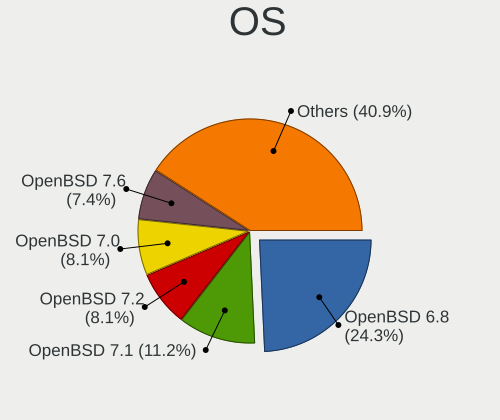

| Name        | Desktops | Percent |
|-------------|----------|---------|
| OpenBSD 6.8 | 108      | 24.27%  |
| OpenBSD 7.1 | 50       | 11.24%  |
| OpenBSD 7.2 | 36       | 8.09%   |
| OpenBSD 7.0 | 36       | 8.09%   |
| OpenBSD 7.6 | 33       | 7.42%   |
| OpenBSD 6.9 | 32       | 7.19%   |
| OpenBSD 7.4 | 30       | 6.74%   |
| OpenBSD 7.3 | 29       | 6.52%   |
| OpenBSD 7.5 | 26       | 5.84%   |
| OpenBSD 6.7 | 26       | 5.84%   |
| OpenBSD 7.7 | 22       | 4.94%   |
| OpenBSD 7.8 | 16       | 3.6%    |
| OpenBSD 6.6 | 1        | 0.22%   |

OS Family
---------

OS without a version

| Name    | Desktops | Percent |
|---------|----------|---------|
| OpenBSD | 376      | 100%    |

Arch
----

OS architecture (x86_64, i586, etc.)

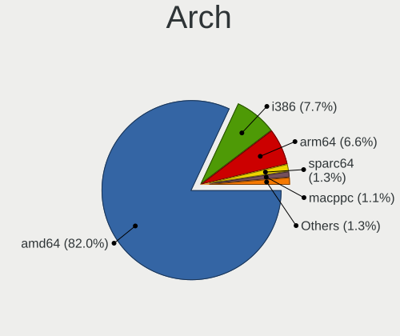

| Name    | Desktops | Percent |
|---------|----------|---------|
| amd64   | 309      | 81.96%  |
| i386    | 29       | 7.69%   |
| arm64   | 25       | 6.63%   |
| sparc64 | 5        | 1.33%   |
| macppc  | 4        | 1.06%   |
| armv7   | 3        | 0.8%    |
| octeon  | 2        | 0.53%   |

DE
--

Desktop Environment

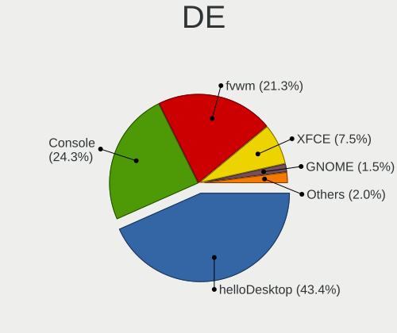

| Name          | Desktops | Percent |
|---------------|----------|---------|
| helloDesktop  | 173      | 43.36%  |
| Console       | 97       | 24.31%  |
| fvwm          | 85       | 21.3%   |
| XFCE          | 30       | 7.52%   |
| GNOME         | 6        | 1.5%    |
| stumpwm       | 3        | 0.75%   |
| MATE          | 1        | 0.25%   |
| KDE6          | 1        | 0.25%   |
| KDE5          | 1        | 0.25%   |
| i3            | 1        | 0.25%   |
| Enlightenment | 1        | 0.25%   |

Display Server
--------------

X11 or Wayland

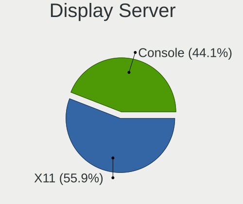

| Name    | Desktops | Percent |
|---------|----------|---------|
| X11     | 213      | 55.91%  |
| Console | 168      | 44.09%  |

Display Manager
---------------

SDDM, LightDM, etc.

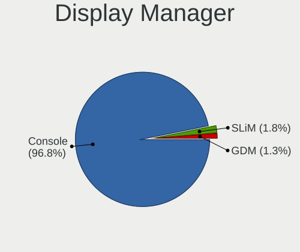

| Name    | Desktops | Percent |
|---------|----------|---------|
| Console | 367      | 96.83%  |
| SLiM    | 7        | 1.85%   |
| GDM     | 5        | 1.32%   |

OS Lang
-------

Language

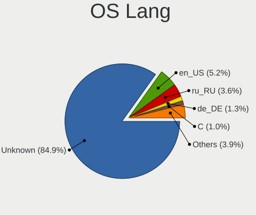

| Lang       | Desktops | Percent |
|------------|----------|---------|
| Unknown    | 326      | 84.9%   |
| en_US      | 20       | 5.21%   |
| ru_RU      | 14       | 3.65%   |
| de_DE      | 5        | 1.3%    |
| C          | 4        | 1.04%   |
| fr_FR      | 3        | 0.78%   |
| pl_PL      | 2        | 0.52%   |
| en_AU      | 2        | 0.52%   |
| sv_SE      | 1        | 0.26%   |
| pt_PT      | 1        | 0.26%   |
| ISO8859-15 | 1        | 0.26%   |
| es_PY      | 1        | 0.26%   |
| es_CO      | 1        | 0.26%   |
| en_GB      | 1        | 0.26%   |
| en_EN      | 1        | 0.26%   |
| de.DE      | 1        | 0.26%   |

Boot Mode
---------

EFI or BIOS

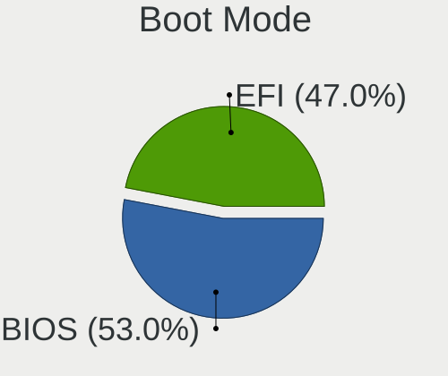

| Mode | Desktops | Percent |
|------|----------|---------|
| BIOS | 203      | 53%     |
| EFI  | 180      | 47%     |

Filesystem
----------

Type of filesystem

| Type | Desktops | Percent |
|------|----------|---------|
| Ffs  | 376      | 100%    |

Part. scheme
------------

Scheme of partitioning

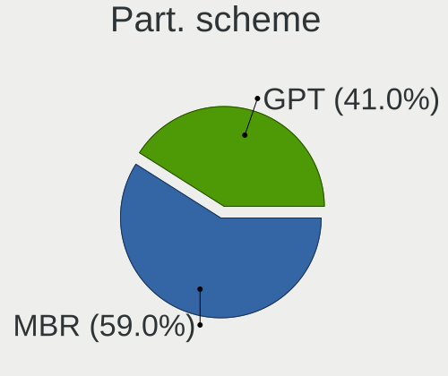

| Type | Desktops | Percent |
|------|----------|---------|
| MBR  | 223      | 58.99%  |
| GPT  | 155      | 41.01%  |

Board
-----

Vendor
------

Motherboard manufacturer

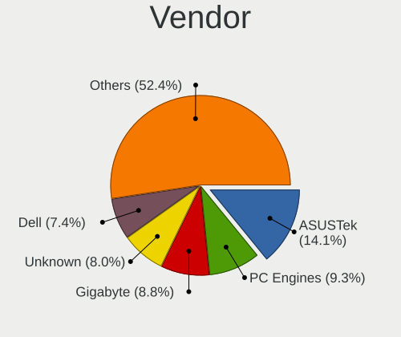

| Name                    | Desktops | Percent |
|-------------------------|----------|---------|
| ASUSTek Computer        | 53       | 14.1%   |
| PC Engines              | 35       | 9.31%   |
| Gigabyte Technology     | 33       | 8.78%   |
| Unknown                 | 30       | 7.98%   |
| Dell                    | 28       | 7.45%   |
| Hewlett-Packard         | 27       | 7.18%   |
| Lenovo                  | 25       | 6.65%   |
| MSI                     | 23       | 6.12%   |
| ASRock                  | 20       | 5.32%   |
| Intel                   | 12       | 3.19%   |
| Raspberry Pi Foundation | 8        | 2.13%   |
| Supermicro              | 7        | 1.86%   |
| Apple                   | 7        | 1.86%   |
| Sun                     | 5        | 1.33%   |
| AZW                     | 5        | 1.33%   |
| IBM                     | 4        | 1.06%   |
| Biostar                 | 4        | 1.06%   |
| Soekris Engineering     | 3        | 0.8%    |
| Fujitsu                 | 3        | 0.8%    |
| Acer                    | 3        | 0.8%    |
| VIA Technologies        | 2        | 0.53%   |
| Sony                    | 2        | 0.53%   |
| Shuttle                 | 2        | 0.53%   |
| Pegatron                | 2        | 0.53%   |
| ZOTAC                   | 1        | 0.27%   |
| Yanling                 | 1        | 0.27%   |
| xunlong                 | 1        | 0.27%   |
| WYSE                    | 1        | 0.27%   |
| Wistron                 | 1        | 0.27%   |
| Unknown                 | 1        | 0.27%   |
| Sony UK                 | 1        | 0.27%   |
| SJRC                    | 1        | 0.27%   |
| Protectli               | 1        | 0.27%   |
| NF541                   | 1        | 0.27%   |
| NEC Computers           | 1        | 0.27%   |
| Microsoft               | 1        | 0.27%   |
| MECHREVO                | 1        | 0.27%   |
| Legend QDI              | 1        | 0.27%   |
| KOHJINSHA               | 1        | 0.27%   |
| IGEL Technology         | 1        | 0.27%   |

Model
-----

Motherboard model

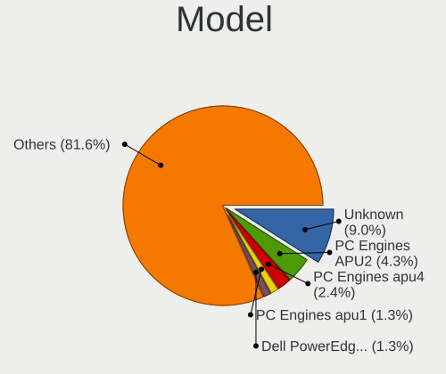

| Name                               | Desktops | Percent |
|------------------------------------|----------|---------|
| Unknown                            | 34       | 9.04%   |
| PC Engines APU2                    | 16       | 4.26%   |
| PC Engines apu4                    | 9        | 2.39%   |
| PC Engines apu1                    | 5        | 1.33%   |
| Dell PowerEdge R620                | 5        | 1.33%   |
| RPi Raspberry Pi 4 Model B         | 4        | 1.06%   |
| ASUS PRIME B650-PLUS               | 4        | 1.06%   |
| ASUS All Series                    | 4        | 1.06%   |
| RPi Raspberry Pi 400               | 3        | 0.8%    |
| PC Engines APU3                    | 3        | 0.8%    |
| ASUS PRIME H410M-A                 | 3        | 0.8%    |
| Soekris Engineering net6501        | 2        | 0.53%   |
| PC Engines APU                     | 2        | 0.53%   |
| MSI MS-7C02                        | 2        | 0.53%   |
| MSI MS-7A34                        | 2        | 0.53%   |
| Intel Q3XXG4-P                     | 2        | 0.53%   |
| Intel D2500HN                      | 2        | 0.53%   |
| Gigabyte X58A-UD5                  | 2        | 0.53%   |
| Gigabyte M68MT-S2P                 | 2        | 0.53%   |
| AZW SER                            | 2        | 0.53%   |
| ASUS TUF Gaming B550M-PLUS (WI-FI) | 2        | 0.53%   |
| ASUS PRIME X370-PRO                | 2        | 0.53%   |
| Apple PowerMac3,6                  | 2        | 0.53%   |
| Apple MacPro4,1                    | 2        | 0.53%   |
| ZOTAC XXXXXX                       | 1        | 0.27%   |
| Yanling YL-KBR6L                   | 1        | 0.27%   |
| xunlong Orange Pi 3B v1.1          | 1        | 0.27%   |
| WYSE D CLASS                       | 1        | 0.27%   |
| Wistron ProLiant ML110 G6          | 1        | 0.27%   |
| VIA VT8623-8235                    | 1        | 0.27%   |
| VIA VT82C597                       | 1        | 0.27%   |
| Supermicro X8STi                   | 1        | 0.27%   |
| Supermicro X8DTH-i/6/iF/6F         | 1        | 0.27%   |
| Supermicro X7SBL                   | 1        | 0.27%   |
| Supermicro X11SSW-F                | 1        | 0.27%   |
| Supermicro X11DDW-L                | 1        | 0.27%   |
| Supermicro X10SLH-N6-ST031         | 1        | 0.27%   |
| Supermicro SYS-E300-9D             | 1        | 0.27%   |
| Sun SUNW,Ultra-1                   | 1        | 0.27%   |
| Sun SUNW,T5140                     | 1        | 0.27%   |

Model Family
------------

Motherboard model prefix

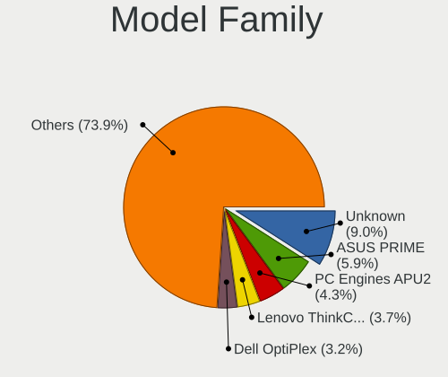

| Name                        | Desktops | Percent |
|-----------------------------|----------|---------|
| Unknown                     | 34       | 9.04%   |
| ASUS PRIME                  | 22       | 5.85%   |
| PC Engines APU2             | 16       | 4.26%   |
| Lenovo ThinkCentre          | 14       | 3.72%   |
| Dell OptiPlex               | 12       | 3.19%   |
| Dell PowerEdge              | 11       | 2.93%   |
| PC Engines apu4             | 9        | 2.39%   |
| RPi Raspberry               | 8        | 2.13%   |
| HP Compaq                   | 7        | 1.86%   |
| Sun SUNW                    | 5        | 1.33%   |
| PC Engines apu1             | 5        | 1.33%   |
| HP ProLiant                 | 5        | 1.33%   |
| HP EliteDesk                | 5        | 1.33%   |
| ASUS ROG                    | 5        | 1.33%   |
| Lenovo ThinkPad             | 4        | 1.06%   |
| ASUS TUF                    | 4        | 1.06%   |
| ASUS All                    | 4        | 1.06%   |
| PC Engines APU3             | 3        | 0.8%    |
| Lenovo ThinkStation         | 3        | 0.8%    |
| Soekris Engineering net6501 | 2        | 0.53%   |
| PC Engines APU              | 2        | 0.53%   |
| MSI MS-7C02                 | 2        | 0.53%   |
| MSI MS-7A34                 | 2        | 0.53%   |
| Lenovo IdeaPad              | 2        | 0.53%   |
| Intel Q3XXG4-P              | 2        | 0.53%   |
| Intel D2500HN               | 2        | 0.53%   |
| Gigabyte X58A-UD5           | 2        | 0.53%   |
| Gigabyte M68MT-S2P          | 2        | 0.53%   |
| Gigabyte B450M              | 2        | 0.53%   |
| Fujitsu ESPRIMO             | 2        | 0.53%   |
| Dell Precision              | 2        | 0.53%   |
| AZW SER                     | 2        | 0.53%   |
| ASRock X570                 | 2        | 0.53%   |
| Apple PowerMac3             | 2        | 0.53%   |
| Apple MacPro4               | 2        | 0.53%   |
| Acer Aspire                 | 2        | 0.53%   |
| ZOTAC XXXXXX                | 1        | 0.27%   |
| Yanling YL-KBR6L            | 1        | 0.27%   |
| xunlong Orange              | 1        | 0.27%   |
| WYSE D                      | 1        | 0.27%   |

MFG Year
--------

Motherboard manufacture year

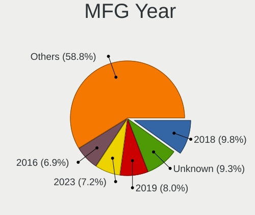

| Year    | Desktops | Percent |
|---------|----------|---------|
| 2018    | 37       | 9.84%   |
| Unknown | 35       | 9.31%   |
| 2019    | 30       | 7.98%   |
| 2023    | 27       | 7.18%   |
| 2016    | 26       | 6.91%   |
| 2020    | 25       | 6.65%   |
| 2014    | 20       | 5.32%   |
| 2021    | 19       | 5.05%   |
| 2013    | 16       | 4.26%   |
| 2010    | 16       | 4.26%   |
| 2022    | 15       | 3.99%   |
| 2017    | 15       | 3.99%   |
| 2012    | 15       | 3.99%   |
| 2025    | 12       | 3.19%   |
| 2011    | 10       | 2.66%   |
| 2024    | 9        | 2.39%   |
| 2009    | 9        | 2.39%   |
| 2007    | 9        | 2.39%   |
| 2015    | 8        | 2.13%   |
| 2008    | 8        | 2.13%   |
| 2006    | 4        | 1.06%   |
| 2005    | 3        | 0.8%    |
| 2004    | 3        | 0.8%    |
| 2003    | 2        | 0.53%   |
| 2002    | 1        | 0.27%   |
| 2001    | 1        | 0.27%   |
| 2000    | 1        | 0.27%   |

Form Factor
-----------

Physical design of the computer

| Name    | Desktops | Percent |
|---------|----------|---------|
| Desktop | 376      | 100%    |

Coreboot
--------

Have coreboot on board

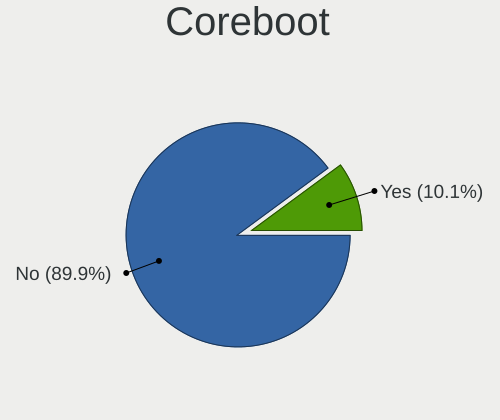

| Used | Desktops | Percent |
|------|----------|---------|
| No   | 338      | 89.89%  |
| Yes  | 38       | 10.11%  |

RAM Size
--------

Total RAM memory

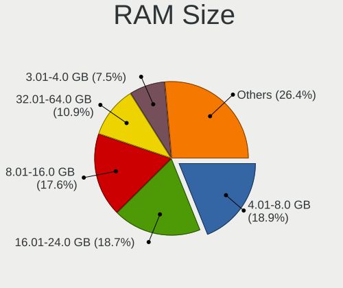

| Size in GB      | Desktops | Percent |
|-----------------|----------|---------|
| 4.01-8.0        | 73       | 18.91%  |
| 16.01-24.0      | 72       | 18.65%  |
| 8.01-16.0       | 68       | 17.62%  |
| 32.01-64.0      | 42       | 10.88%  |
| 3.01-4.0        | 29       | 7.51%   |
| 2.01-3.0        | 24       | 6.22%   |
| 64.01-256.0     | 21       | 5.44%   |
| 1.01-2.0        | 20       | 5.18%   |
| 0.01-0.5        | 13       | 3.37%   |
| 24.01-32.0      | 12       | 3.11%   |
| 0.51-1.0        | 9        | 2.33%   |
| More than 256.0 | 3        | 0.78%   |

RAM Used
--------

Used RAM memory

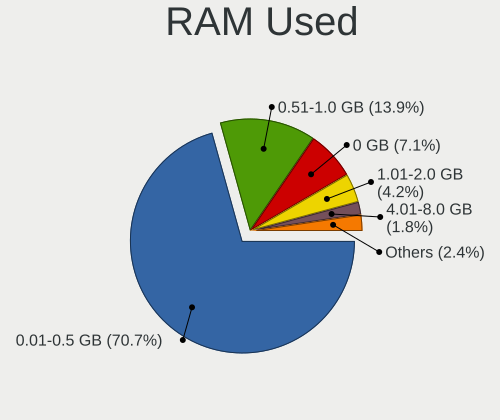

| Used GB    | Desktops | Percent |
|------------|----------|---------|
| 0.01-0.5   | 270      | 70.68%  |
| 0.51-1.0   | 53       | 13.87%  |
| 0          | 27       | 7.07%   |
| 1.01-2.0   | 16       | 4.19%   |
| 4.01-8.0   | 7        | 1.83%   |
| Unknown    | 3        | 0.79%   |
| 3.01-4.0   | 2        | 0.52%   |
| 8.01-16.0  | 2        | 0.52%   |
| 2.01-3.0   | 1        | 0.26%   |
| 16.01-24.0 | 1        | 0.26%   |

Total Drives
------------

Number of drives on board

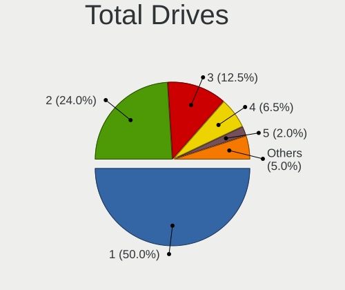

| Drives | Desktops | Percent |
|--------|----------|---------|
| 1      | 200      | 50%     |
| 2      | 96       | 24%     |
| 3      | 50       | 12.5%   |
| 4      | 26       | 6.5%    |
| 5      | 8        | 2%      |
| 0      | 8        | 2%      |
| 6      | 4        | 1%      |
| 7      | 3        | 0.75%   |
| 10     | 2        | 0.5%    |
| 14     | 1        | 0.25%   |
| 12     | 1        | 0.25%   |
| 8      | 1        | 0.25%   |

Has CD-ROM
----------

Has CD-ROM on board

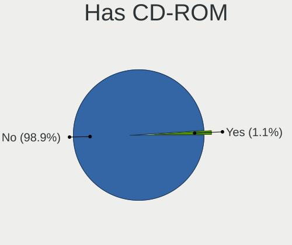

| Presented | Desktops | Percent |
|-----------|----------|---------|
| No        | 373      | 98.94%  |
| Yes       | 4        | 1.06%   |

Has Ethernet
------------

Has Ethernet on board

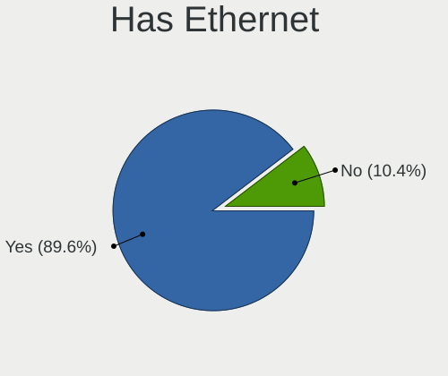

| Presented | Desktops | Percent |
|-----------|----------|---------|
| Yes       | 337      | 89.63%  |
| No        | 39       | 10.37%  |

Has WiFi
--------

Has WiFi module

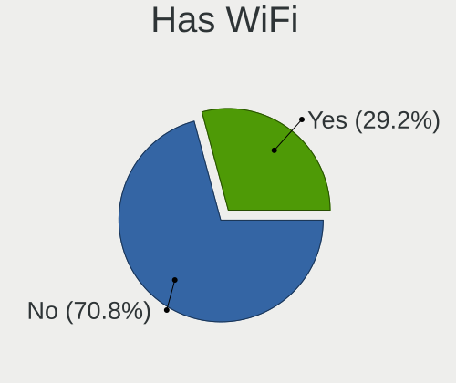

| Presented | Desktops | Percent |
|-----------|----------|---------|
| No        | 267      | 70.82%  |
| Yes       | 110      | 29.18%  |

Has Bluetooth
-------------

Has Bluetooth module

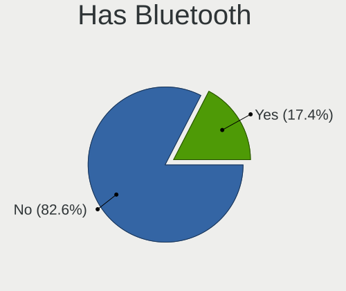

| Presented | Desktops | Percent |
|-----------|----------|---------|
| No        | 313      | 82.59%  |
| Yes       | 66       | 17.41%  |

Location
--------

Country
-------

Geographic location (country)

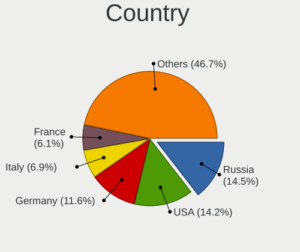

| Country      | Desktops | Percent |
|--------------|----------|---------|
| Russia       | 55       | 14.51%  |
| USA          | 54       | 14.25%  |
| Germany      | 44       | 11.61%  |
| Italy        | 26       | 6.86%   |
| France       | 23       | 6.07%   |
| UK           | 15       | 3.96%   |
| Poland       | 15       | 3.96%   |
| Switzerland  | 14       | 3.69%   |
| Spain        | 14       | 3.69%   |
| Netherlands  | 13       | 3.43%   |
| Austria      | 9        | 2.37%   |
| Sweden       | 8        | 2.11%   |
| Canada       | 8        | 2.11%   |
| Australia    | 8        | 2.11%   |
| Ukraine      | 6        | 1.58%   |
| Finland      | 6        | 1.58%   |
| Brazil       | 6        | 1.58%   |
| Taiwan       | 5        | 1.32%   |
| Romania      | 5        | 1.32%   |
| Norway       | 4        | 1.06%   |
| Mexico       | 4        | 1.06%   |
| Bulgaria     | 4        | 1.06%   |
| Latvia       | 3        | 0.79%   |
| Denmark      | 3        | 0.79%   |
| Colombia     | 3        | 0.79%   |
| Saudi Arabia | 2        | 0.53%   |
| Lithuania    | 2        | 0.53%   |
| Hungary      | 2        | 0.53%   |
| Cyprus       | 2        | 0.53%   |
| UAE          | 1        | 0.26%   |
| Turkey       | 1        | 0.26%   |
| South Korea  | 1        | 0.26%   |
| Paraguay     | 1        | 0.26%   |
| New Zealand  | 1        | 0.26%   |
| Montenegro   | 1        | 0.26%   |
| Moldova      | 1        | 0.26%   |
| Japan        | 1        | 0.26%   |
| Jamaica      | 1        | 0.26%   |
| India        | 1        | 0.26%   |
| Estonia      | 1        | 0.26%   |

City
----

Geographic location (city)

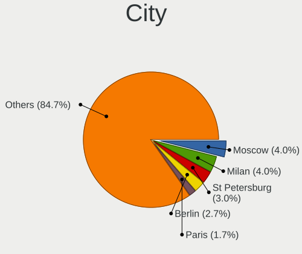

| City                    | Desktops | Percent |
|-------------------------|----------|---------|
| Moscow                  | 16       | 3.95%   |
| Milan                   | 16       | 3.95%   |
| St Petersburg           | 12       | 2.96%   |
| Berlin                  | 11       | 2.72%   |
| Paris                   | 7        | 1.73%   |
| Amsterdam               | 7        | 1.73%   |
| Vladivostok             | 5        | 1.23%   |
| Vienna                  | 5        | 1.23%   |
| New Taipei              | 5        | 1.23%   |
| Sydney                  | 4        | 0.99%   |
| Poortugaal              | 4        | 0.99%   |
| Malmo                   | 4        | 0.99%   |
| Cherepovets             | 4        | 0.99%   |
| Zurich                  | 3        | 0.74%   |
| Wittersham              | 3        | 0.74%   |
| Syeverodonets'k         | 3        | 0.74%   |
| Riga                    | 3        | 0.74%   |
| Puebla City             | 3        | 0.74%   |
| Nuremberg               | 3        | 0.74%   |
| New York                | 3        | 0.74%   |
| Miedziana Gora          | 3        | 0.74%   |
| Madison                 | 3        | 0.74%   |
| Lodz                    | 3        | 0.74%   |
| Lausanne                | 3        | 0.74%   |
| Ibiza Town              | 3        | 0.74%   |
| Wroclaw                 | 2        | 0.49%   |
| Wolfsburg               | 2        | 0.49%   |
| Tampere                 | 2        | 0.49%   |
| Svenstrup               | 2        | 0.49%   |
| Sofia                   | 2        | 0.49%   |
| Skien                   | 2        | 0.49%   |
| Saint-Martin-d'HГЁres | 2        | 0.49%   |
| Reutov                  | 2        | 0.49%   |
| Orsk                    | 2        | 0.49%   |
| Onalaska                | 2        | 0.49%   |
| Oensingen               | 2        | 0.49%   |
| Medellín               | 2        | 0.49%   |
| London                  | 2        | 0.49%   |
| Lebanon                 | 2        | 0.49%   |
| Larnaca                 | 2        | 0.49%   |

Drives
------

Drive Vendor
------------

Hard drive vendors

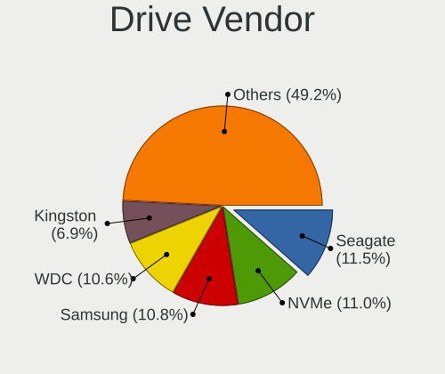

| Vendor                             | Desktops | Drives | Percent |
|------------------------------------|----------|--------|---------|
| Seagate                            | 63       | 120    | 11.52%  |
| NVMe                               | 60       | 86     | 10.97%  |
| Samsung Electronics                | 59       | 135    | 10.79%  |
| WDC                                | 58       | 98     | 10.6%   |
| Kingston                           | 38       | 50     | 6.95%   |
| Crucial                            | 22       | 34     | 4.02%   |
| SanDisk                            | 19       | 23     | 3.47%   |
| Toshiba                            | 18       | 30     | 3.29%   |
| OPENBSD                            | 18       | 34     | 3.29%   |
| Hitachi                            | 17       | 34     | 3.11%   |
| Intel                              | 16       | 22     | 2.93%   |
| Phison                             | 13       | 15     | 2.38%   |
| A-DATA Technology                  | 11       | 15     | 2.01%   |
| HGST                               | 10       | 21     | 1.83%   |
| Hewlett-Packard                    | 7        | 12     | 1.28%   |
| Dell                               | 7        | 12     | 1.28%   |
| Transcend                          | 6        | 13     | 1.1%    |
| PNY                                | 6        | 17     | 1.1%    |
| SPCC                               | 5        | 5      | 0.91%   |
| China                              | 5        | 5      | 0.91%   |
| SK hynix                           | 4        | 4      | 0.73%   |
| Fujitsu                            | 4        | 4      | 0.73%   |
| USB                                | 3        | 3      | 0.55%   |
| Product:              USB DISK 2.0 | 3        | 3      | 0.55%   |
| Patriot                            | 3        | 3      | 0.55%   |
| OCZ                                | 3        | 3      | 0.55%   |
| Micron Technology                  | 3        | 3      | 0.55%   |
| LSI                                | 3        | 7      | 0.55%   |
| LITEONIT                           | 3        | 4      | 0.55%   |
| Lexar                              | 3        | 6      | 0.55%   |
| KingSpec                           | 3        | 3      | 0.55%   |
| Generic                            | 3        | 3      | 0.55%   |
| Corsair                            | 3        | 3      | 0.55%   |
| StoreJet                           | 2        | 2      | 0.37%   |
| Multiple                           | 2        | 2      | 0.37%   |
| Maxtor                             | 2        | 3      | 0.37%   |
| Hoodisk                            | 2        | 3      | 0.37%   |
| ASMT                               | 2        | 2      | 0.37%   |
| Apacer                             | 2        | 2      | 0.37%   |
| AMD                                | 2        | 2      | 0.37%   |

Drive Model
-----------

Hard drive models

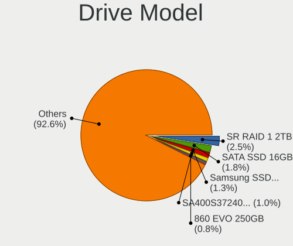

| Model                                               | Desktops | Percent |
|-----------------------------------------------------|----------|---------|
| OPENBSD SR RAID 1 2TB                               | 15       | 2.46%   |
| Phison SATA SSD 16GB                                | 11       | 1.81%   |
| NVMe Samsung SSD 980 1TB                            | 8        | 1.31%   |
| Kingston SA400S37240G 240GB                         | 6        | 0.99%   |
| Samsung SSD 860 EVO 250GB                           | 5        | 0.82%   |
| NVMe Samsung SSD 970 500GB                          | 5        | 0.82%   |
| Seagate ST2000DM008-2FR102 2TB                      | 4        | 0.66%   |
| SanDisk Cruzer Blade 16GB                           | 4        | 0.66%   |
| Samsung SSD 990 PRO 1TB                             | 4        | 0.66%   |
| Samsung SSD 860 EVO mSATA 500GB                     | 4        | 0.66%   |
| Samsung SSD 860 EVO 500GB                           | 4        | 0.66%   |
| Intel SSDSC2BW480H6 480GB                           | 4        | 0.66%   |
| Dell PERC H710 282GB                                | 4        | 0.66%   |
| WDC WD6400AARS-00Y5B1 640GB                         | 3        | 0.49%   |
| USB SanDisk 3.2Gen1 64GB                            | 3        | 0.49%   |
| Toshiba MQ04ABF100 1TB                              | 3        | 0.49%   |
| Seagate ST3250318AS 250GB                           | 3        | 0.49%   |
| Seagate ST250DM000-1BD141 250GB                     | 3        | 0.49%   |
| Seagate ST1000LM035-1RK172 1TB                      | 3        | 0.49%   |
| Seagate ST1000DM010-2EP102 1TB                      | 3        | 0.49%   |
| Seagate ST1000DM003-1CH162 1TB                      | 3        | 0.49%   |
| SanDisk Ultra Fit 128GB                             | 3        | 0.49%   |
| Samsung SSD 850 EVO 1TB                             | 3        | 0.49%   |
| Samsung SSD 840 EVO 250GB                           | 3        | 0.49%   |
| Product:              USB DISK 2.0 USB DISK 2.0 8GB | 3        | 0.49%   |
| PNY CS900 1TB SSD                                   | 3        | 0.49%   |
| NVMe CT500P2SSD8 500GB                              | 3        | 0.49%   |
| Kingston SUV500MS240G 240GB                         | 3        | 0.49%   |
| Kingston SEDC500M480G 480GB                         | 3        | 0.49%   |
| HGST HUS724020ALA640 2TB                            | 3        | 0.49%   |
| Crucial CT120BX500SSD1 120GB                        | 3        | 0.49%   |
| Crucial CT1000MX500SSD1 1TB                         | 3        | 0.49%   |
| A-DATA SU630 240GB                                  | 3        | 0.49%   |
| WDC WDS250G2B0A-00SM50 250GB                        | 2        | 0.33%   |
| WDC WD5003ABYZ-011FA0 500GB                         | 2        | 0.33%   |
| WDC WD5000AZLX-00K2TA0 500GB                        | 2        | 0.33%   |
| WDC WD10JPVT-75A1YT0 1TB                            | 2        | 0.33%   |
| WDC WD10EZEX-00BN5A0 1TB                            | 2        | 0.33%   |
| WDC WD10EADS-00M2B0 1TB                             | 2        | 0.33%   |
| WDC WD Elements 25A1 4TB                            | 2        | 0.33%   |

HDD Vendor
----------

Hard disk drive vendors

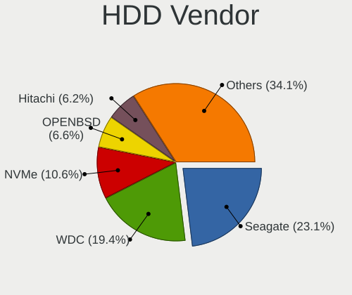

| Vendor                                 | Desktops | Drives | Percent |
|----------------------------------------|----------|--------|---------|
| Seagate                                | 63       | 120    | 23.08%  |
| WDC                                    | 53       | 89     | 19.41%  |
| NVMe                                   | 29       | 45     | 10.62%  |
| OPENBSD                                | 18       | 34     | 6.59%   |
| Hitachi                                | 17       | 34     | 6.23%   |
| Toshiba                                | 16       | 28     | 5.86%   |
| Samsung Electronics                    | 14       | 24     | 5.13%   |
| HGST                                   | 10       | 21     | 3.66%   |
| Dell                                   | 7        | 12     | 2.56%   |
| Hewlett-Packard                        | 5        | 9      | 1.83%   |
| Fujitsu                                | 4        | 4      | 1.47%   |
| USB                                    | 3        | 3      | 1.1%    |
| Product:              USB DISK 2.0     | 3        | 3      | 1.1%    |
| LSI                                    | 3        | 7      | 1.1%    |
| Generic                                | 3        | 3      | 1.1%    |
| StoreJet                               | 2        | 2      | 0.73%   |
| Multiple                               | 2        | 2      | 0.73%   |
| Maxtor                                 | 2        | 3      | 0.73%   |
| ASMT                                   | 2        | 2      | 0.73%   |
| USB3.0                                 | 1        | 2      | 0.37%   |
| SSDPR-CX                               | 1        | 1      | 0.37%   |
| SABRENT                                | 1        | 1      | 0.37%   |
| Product:              USB DISK 3.0 Pro | 1        | 1      | 0.37%   |
| Product:              USB DISK 3.0     | 1        | 1      | 0.37%   |
| Product:                               | 1        | 1      | 0.37%   |
| Memorex                                | 1        | 1      | 0.37%   |
| MaxDigital                             | 1        | 1      | 0.37%   |
| LSILOGIC                               | 1        | 1      | 0.37%   |
| Lexar                                  | 1        | 1      | 0.37%   |
| JetFlash                               | 1        | 1      | 0.37%   |
| Intenso                                | 1        | 1      | 0.37%   |
| IBM-ESXS                               | 1        | 1      | 0.37%   |
| IBM                                    | 1        | 1      | 0.37%   |
| General                                | 1        | 1      | 0.37%   |
| China                                  | 1        | 1      | 0.37%   |
| Apple                                  | 1        | 1      | 0.37%   |

SSD Vendor
----------

Solid state drive vendors

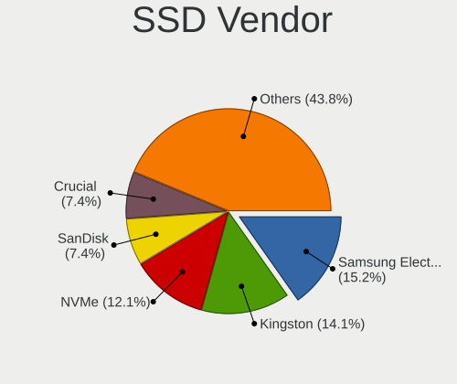

| Vendor              | Desktops | Drives | Percent |
|---------------------|----------|--------|---------|
| Samsung Electronics | 39       | 103    | 15.23%  |
| Kingston            | 36       | 48     | 14.06%  |
| NVMe                | 31       | 38     | 12.11%  |
| SanDisk             | 19       | 23     | 7.42%   |
| Crucial             | 19       | 30     | 7.42%   |
| Intel               | 16       | 22     | 6.25%   |
| Phison              | 13       | 15     | 5.08%   |
| A-DATA Technology   | 11       | 15     | 4.3%    |
| Transcend           | 6        | 13     | 2.34%   |
| PNY                 | 6        | 17     | 2.34%   |
| WDC                 | 5        | 7      | 1.95%   |
| China               | 4        | 4      | 1.56%   |
| SPCC                | 3        | 3      | 1.17%   |
| SK hynix            | 3        | 3      | 1.17%   |
| Patriot             | 3        | 3      | 1.17%   |
| OCZ                 | 3        | 3      | 1.17%   |
| LITEONIT            | 3        | 4      | 1.17%   |
| KingSpec            | 3        | 3      | 1.17%   |
| Corsair             | 3        | 3      | 1.17%   |
| Micron Technology   | 2        | 2      | 0.78%   |
| Lexar               | 2        | 5      | 0.78%   |
| Hoodisk             | 2        | 3      | 0.78%   |
| Apacer              | 2        | 2      | 0.78%   |
| AMD                 | 2        | 2      | 0.78%   |
| XPG                 | 1        | 1      | 0.39%   |
| Wicgtyp             | 1        | 1      | 0.39%   |
| Qumo                | 1        | 1      | 0.39%   |
| Netac               | 1        | 1      | 0.39%   |
| MEMXPRO             | 1        | 1      | 0.39%   |
| KOOTION             | 1        | 1      | 0.39%   |
| KIOXIA-EXCERIA      | 1        | 1      | 0.39%   |
| KingDian            | 1        | 1      | 0.39%   |
| Kimtigo             | 1        | 2      | 0.39%   |
| HPE                 | 1        | 2      | 0.39%   |
| Hewlett-Packard     | 1        | 2      | 0.39%   |
| GOODRAM             | 1        | 1      | 0.39%   |
| GLOWAY              | 1        | 1      | 0.39%   |
| Fanxiang            | 1        | 2      | 0.39%   |
| External            | 1        | 1      | 0.39%   |
| DEXP                | 1        | 1      | 0.39%   |

Drive Kind
----------

HDD or SSD

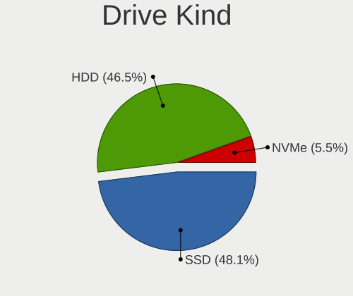

| Kind | Desktops | Drives | Percent |
|------|----------|--------|---------|
| SSD  | 211      | 395    | 48.06%  |
| HDD  | 204      | 463    | 46.47%  |
| NVMe | 24       | 26     | 5.47%   |

Drive Connector
---------------

SATA, SAS, NVMe, etc.

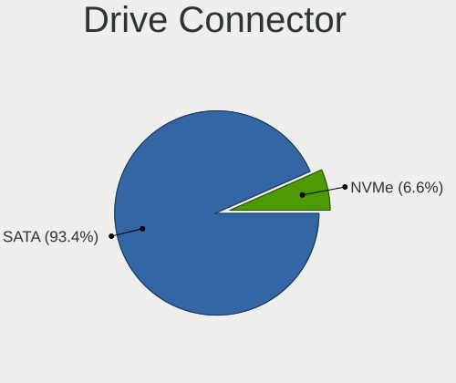

| Type | Desktops | Drives | Percent |
|------|----------|--------|---------|
| SATA | 339      | 858    | 93.39%  |
| NVMe | 24       | 26     | 6.61%   |

Drive Size
----------

Size of hard drive

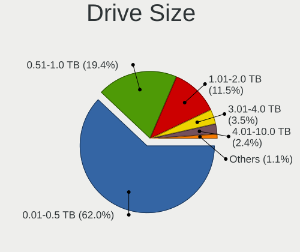

| Size in TB      | Desktops | Drives | Percent |
|-----------------|----------|--------|---------|
| 0.01-0.5        | 281      | 473    | 62.03%  |
| 0.51-1.0        | 88       | 153    | 19.43%  |
| 1.01-2.0        | 52       | 171    | 11.48%  |
| 3.01-4.0        | 16       | 24     | 3.53%   |
| 4.01-10.0       | 11       | 30     | 2.43%   |
| 2.01-3.0        | 4        | 6      | 0.88%   |
| More than 100.0 | 1        | 1      | 0.22%   |

Space Total
-----------

Amount of disk space available on the file system

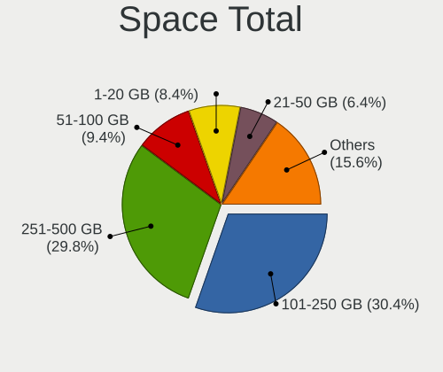

| Size in GB     | Desktops | Percent |
|----------------|----------|---------|
| 101-250        | 119      | 30.36%  |
| 251-500        | 117      | 29.85%  |
| 51-100         | 37       | 9.44%   |
| 1-20           | 33       | 8.42%   |
| 21-50          | 25       | 6.38%   |
| 501-1000       | 22       | 5.61%   |
| 1001-2000      | 17       | 4.34%   |
| More than 3000 | 16       | 4.08%   |
| 2001-3000      | 6        | 1.53%   |

Space Used
----------

Amount of used disk space

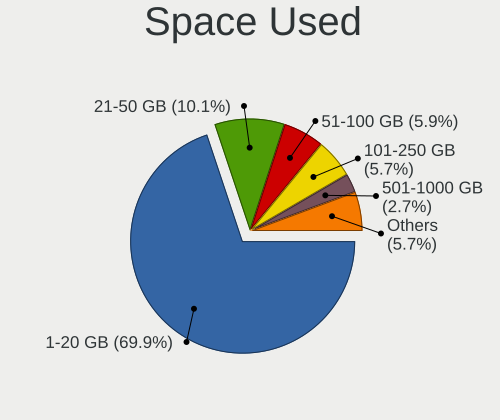

| Used GB        | Desktops | Percent |
|----------------|----------|---------|
| 1-20           | 283      | 69.88%  |
| 21-50          | 41       | 10.12%  |
| 51-100         | 24       | 5.93%   |
| 101-250        | 23       | 5.68%   |
| 501-1000       | 11       | 2.72%   |
| 1001-2000      | 9        | 2.22%   |
| 251-500        | 8        | 1.98%   |
| More than 3000 | 4        | 0.99%   |
| 2001-3000      | 2        | 0.49%   |

Malfunc. Drives
---------------

Drive models with a malfunction

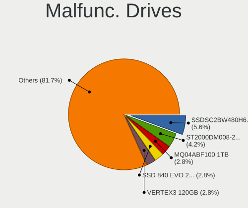

| Model                                 | Desktops | Drives | Percent |
|---------------------------------------|----------|--------|---------|
| Intel SSDSC2BW480H6 480GB             | 4        | 4      | 5.63%   |
| Seagate ST2000DM008-2FR102 2TB        | 3        | 8      | 4.23%   |
| Toshiba MQ04ABF100 1TB                | 2        | 2      | 2.82%   |
| Samsung Electronics SSD 840 EVO 250GB | 2        | 4      | 2.82%   |
| OCZ VERTEX3 120GB                     | 2        | 2      | 2.82%   |
| Kingston SV300S37A120G 120GB          | 2        | 2      | 2.82%   |
| Kingston SMS200S330G 32GB             | 2        | 4      | 2.82%   |
| HGST HTS541010A7E630 1TB              | 2        | 4      | 2.82%   |
| XPG SX950U 240GB                      | 1        | 1      | 1.41%   |
| WDC WD7500AACS-00ZJB0 752GB           | 1        | 1      | 1.41%   |
| WDC WD6400AAKS-22A7B0 640GB           | 1        | 1      | 1.41%   |
| WDC WD5000AAKX-60U6AA0 500GB          | 1        | 2      | 1.41%   |
| WDC WD5000AADS-00S9B0 500GB           | 1        | 1      | 1.41%   |
| WDC WD2500BEKT-66PVMT0 250GB          | 1        | 1      | 1.41%   |
| WDC WD1600BEVE-00UYT0 160GB           | 1        | 1      | 1.41%   |
| WDC WD15EARS-00Z5B1 1.5TB             | 1        | 1      | 1.41%   |
| WDC WD10SPZX-24Z10 1TB                | 1        | 1      | 1.41%   |
| WDC WD10JPVT-75A1YT0 1TB              | 1        | 1      | 1.41%   |
| WDC WD10EADS-00M2B0 1TB               | 1        | 1      | 1.41%   |
| Transcend 3E128-TS2-550B01 100GB      | 1        | 4      | 1.41%   |
| Toshiba MK5065GSX 500GB               | 1        | 1      | 1.41%   |
| Toshiba DT01ACA100 1TB                | 1        | 2      | 1.41%   |
| Toshiba DT01ACA050 500GB              | 1        | 2      | 1.41%   |
| SK hynix HFS128G39TND-N210A 128GB     | 1        | 1      | 1.41%   |
| Seagate ST9500325AS 500GB             | 1        | 1      | 1.41%   |
| Seagate ST9160310AS 160GB             | 1        | 2      | 1.41%   |
| Seagate ST750LM022 HN-M750MBB 752GB   | 1        | 1      | 1.41%   |
| Seagate ST500LT012-9WS142 500GB       | 1        | 1      | 1.41%   |
| Seagate ST500DM002-1BD142 500GB       | 1        | 1      | 1.41%   |
| Seagate ST380815AS 80GB               | 1        | 1      | 1.41%   |
| Seagate ST3750640NS 752GB             | 1        | 8      | 1.41%   |
| Seagate ST3320418AS 320GB             | 1        | 1      | 1.41%   |
| Seagate ST3160212SCE 160GB            | 1        | 1      | 1.41%   |
| Seagate ST3120211AS 120GB             | 1        | 1      | 1.41%   |
| Seagate ST250DM000-1BD141 250GB       | 1        | 3      | 1.41%   |
| Seagate ST2000DM006-2DM164 2TB        | 1        | 1      | 1.41%   |
| Seagate ST1000DM003-1CH162 1TB        | 1        | 1      | 1.41%   |
| SanDisk SSD PLUS 240GB                | 1        | 1      | 1.41%   |
| Samsung Electronics SSD 870 EVO 500GB | 1        | 1      | 1.41%   |
| Samsung Electronics HM160HI 160GB     | 1        | 2      | 1.41%   |

Malfunc. Drive Vendor
---------------------

Vendors of faulty drives

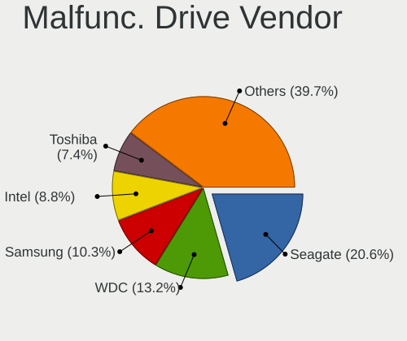

| Vendor              | Desktops | Drives | Percent |
|---------------------|----------|--------|---------|
| Seagate             | 14       | 31     | 20.59%  |
| WDC                 | 9        | 11     | 13.24%  |
| Samsung Electronics | 7        | 11     | 10.29%  |
| Intel               | 6        | 6      | 8.82%   |
| Toshiba             | 5        | 7      | 7.35%   |
| Kingston            | 5        | 7      | 7.35%   |
| Hitachi             | 5        | 6      | 7.35%   |
| HGST                | 4        | 6      | 5.88%   |
| OCZ                 | 2        | 2      | 2.94%   |
| A-DATA Technology   | 2        | 3      | 2.94%   |
| XPG                 | 1        | 1      | 1.47%   |
| Transcend           | 1        | 4      | 1.47%   |
| SK hynix            | 1        | 1      | 1.47%   |
| SanDisk             | 1        | 1      | 1.47%   |
| LITEONIT            | 1        | 1      | 1.47%   |
| KingSpec            | 1        | 1      | 1.47%   |
| Hewlett-Packard     | 1        | 1      | 1.47%   |
| GLOWAY              | 1        | 1      | 1.47%   |
| Corsair             | 1        | 1      | 1.47%   |

Malfunc. HDD Vendor
-------------------

Vendors of faulty HDD drives

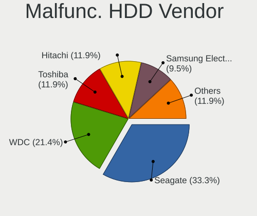

| Vendor              | Desktops | Drives | Percent |
|---------------------|----------|--------|---------|
| Seagate             | 14       | 31     | 33.33%  |
| WDC                 | 9        | 11     | 21.43%  |
| Toshiba             | 5        | 7      | 11.9%   |
| Hitachi             | 5        | 6      | 11.9%   |
| Samsung Electronics | 4        | 6      | 9.52%   |
| HGST                | 4        | 6      | 9.52%   |
| Hewlett-Packard     | 1        | 1      | 2.38%   |

Malfunc. Drive Kind
-------------------

Kinds of faulty drives

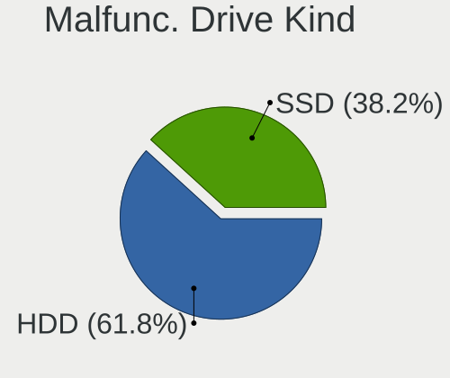

| Kind | Desktops | Drives | Percent |
|------|----------|--------|---------|
| HDD  | 42       | 68     | 61.76%  |
| SSD  | 26       | 34     | 38.24%  |

Failed Drives
-------------

Failed drive models

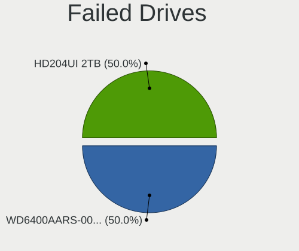

| Model                           | Desktops | Drives | Percent |
|---------------------------------|----------|--------|---------|
| WDC WD6400AARS-00Y5B1 640GB     | 1        | 2      | 50%     |
| Samsung Electronics HD204UI 2TB | 1        | 2      | 50%     |

Failed Drive Vendor
-------------------

Failed drive vendors

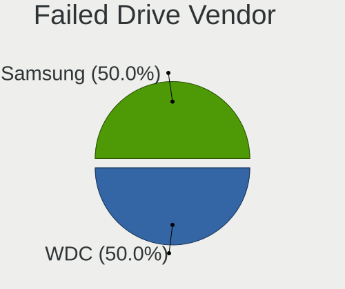

| Vendor              | Desktops | Drives | Percent |
|---------------------|----------|--------|---------|
| WDC                 | 1        | 2      | 50%     |
| Samsung Electronics | 1        | 2      | 50%     |

Drive Status
------------

Number of failed and malfunc. drives

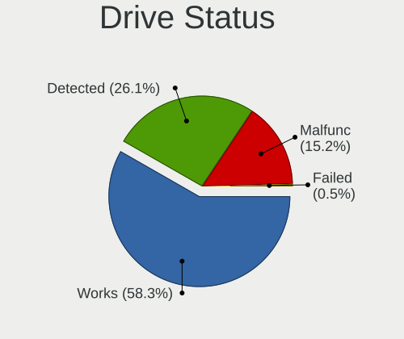

| Status   | Desktops | Drives | Percent |
|----------|----------|--------|---------|
| Works    | 257      | 573    | 58.28%  |
| Detected | 115      | 205    | 26.08%  |
| Malfunc  | 67       | 102    | 15.19%  |
| Failed   | 2        | 4      | 0.45%   |

Storage controller
------------------

Storage Vendor
--------------

Storage controller vendors

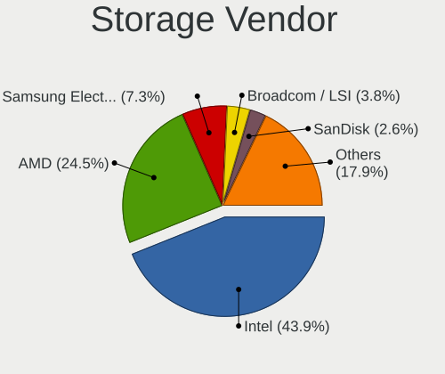

| Vendor                        | Desktops | Percent |
|-------------------------------|----------|---------|
| Intel                         | 199      | 43.93%  |
| AMD                           | 111      | 24.5%   |
| Samsung Electronics           | 33       | 7.28%   |
| Broadcom / LSI                | 17       | 3.75%   |
| SanDisk                       | 12       | 2.65%   |
| Micron/Crucial Technology     | 10       | 2.21%   |
| VIA Technologies              | 8        | 1.77%   |
| Phison Electronics            | 6        | 1.32%   |
| Nvidia                        | 6        | 1.32%   |
| ASMedia Technology            | 6        | 1.32%   |
| Marvell Technology Group      | 5        | 1.1%    |
| Kingston Technology Company   | 5        | 1.1%    |
| Toshiba                       | 3        | 0.66%   |
| Silicon Motion                | 3        | 0.66%   |
| Shenzhen Longsys Electronics  | 3        | 0.66%   |
| KIOXIA                        | 3        | 0.66%   |
| ULi Electronics               | 2        | 0.44%   |
| SK hynix                      | 2        | 0.44%   |
| Micron Technology             | 2        | 0.44%   |
| MAXIO Technology (Hangzhou)   | 2        | 0.44%   |
| JMicron Technology            | 2        | 0.44%   |
| Hewlett-Packard               | 2        | 0.44%   |
| ADATA Technology              | 2        | 0.44%   |
| Silicon Image                 | 1        | 0.22%   |
| Shenzhen Wodposit Electronics | 1        | 0.22%   |
| Seagate Technology            | 1        | 0.22%   |
| HighPoint Technologies        | 1        | 0.22%   |
| Dell                          | 1        | 0.22%   |
| Compaq Computer               | 1        | 0.22%   |
| Biwin Storage Technology      | 1        | 0.22%   |
| Artop Electronic              | 1        | 0.22%   |
| Unknown                       | 1        | 0.22%   |

Storage Model
-------------

Storage controller models

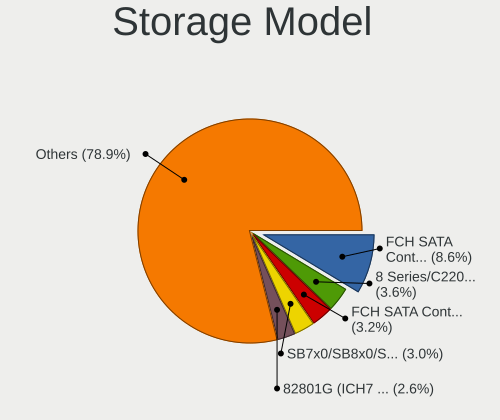

| Model                                                                          | Desktops | Percent |
|--------------------------------------------------------------------------------|----------|---------|
| AMD FCH SATA Controller [AHCI mode]                                            | 46       | 8.65%   |
| Intel 8 Series/C220 Series Chipset Family 6-port SATA Controller 1 [AHCI mode] | 19       | 3.57%   |
| AMD FCH SATA Controller [IDE mode]                                             | 17       | 3.2%    |
| AMD SB7x0/SB8x0/SB9x0 SATA Controller [AHCI mode]                              | 16       | 3.01%   |
| Intel 82801G (ICH7 Family) IDE Controller                                      | 14       | 2.63%   |
| Intel Q170/Q150/B150/H170/H110/Z170/CM236 Chipset SATA Controller [AHCI Mode]  | 13       | 2.44%   |
| AMD 600 Series Chipset SATA Controller                                         | 13       | 2.44%   |
| AMD 500 Series Chipset SATA Controller                                         | 12       | 2.26%   |
| AMD 400 Series Chipset SATA Controller                                         | 12       | 2.26%   |
| Intel Cannon Lake PCH SATA AHCI Controller                                     | 11       | 2.07%   |
| Intel NM10/ICH7 Family SATA Controller [IDE mode]                              | 10       | 1.88%   |
| Intel 6 Series/C200 Series Chipset Family 6 port Desktop SATA AHCI Controller  | 10       | 1.88%   |
| Intel 200 Series PCH SATA controller [AHCI mode]                               | 10       | 1.88%   |
| Samsung NVMe SSD Controller SM981/PM981/PM983                                  | 9        | 1.69%   |
| Intel 82801JI (ICH10 Family) SATA AHCI Controller                              | 9        | 1.69%   |
| AMD SB7x0/SB8x0/SB9x0 IDE Controller                                           | 8        | 1.5%    |
| VIA VT82C586A/B/VT82C686/A/B/VT823x/A/C PIPC Bus Master IDE                    | 7        | 1.32%   |
| Samsung NVMe SSD Controller S4LV008[Pascal]                                    | 7        | 1.32%   |
| Samsung NVMe SSD Controller PM9A1/PM9A3/980PRO                                 | 7        | 1.32%   |
| Intel C600/X79 series chipset 6-Port SATA AHCI Controller                      | 7        | 1.32%   |
| Intel 7 Series Chipset Family 6-port SATA Controller [AHCI mode]               | 7        | 1.32%   |
| SanDisk Extreme Pro / WD Black SN750 / PC SN730 / Red SN700 NVMe SSD           | 6        | 1.13%   |
| Micron/Crucial P2 [Nick P2] / P3 / P3 Plus NVMe PCIe SSD (DRAM-less)           | 6        | 1.13%   |
| Intel 7 Series/C210 Series Chipset Family 6-port SATA Controller [AHCI mode]   | 6        | 1.13%   |
| Intel 400 Series Chipset Family SATA AHCI Controller                           | 6        | 1.13%   |
| ASMedia ASM1061/ASM1062 Serial ATA Controller                                  | 6        | 1.13%   |
| Samsung NVMe SSD Controller 980 (DRAM-less)                                    | 5        | 0.94%   |
| Nvidia MCP61 SATA Controller                                                   | 5        | 0.94%   |
| Intel Sunrise Point-LP SATA Controller [AHCI mode]                             | 5        | 0.94%   |
| Intel C610/X99 series chipset 6-Port SATA Controller [AHCI mode]               | 5        | 0.94%   |
| Intel Atom Processor E3800 Series SATA AHCI Controller                         | 5        | 0.94%   |
| Intel 82801IR/IO/IH (ICH9R/DO/DH) 6 port SATA Controller [AHCI mode]           | 5        | 0.94%   |
| Broadcom / LSI MegaRAID SAS 2208 [Thunderbolt]                                 | 5        | 0.94%   |
| Intel NM10/ICH7 Family SATA Controller [AHCI mode]                             | 4        | 0.75%   |
| Intel 500 Series Chipset Family SATA AHCI Controller                           | 4        | 0.75%   |
| Silicon Motion SM2263EN/SM2263XT (DRAM-less) NVMe SSD Controllers              | 3        | 0.56%   |
| Samsung NVMe SSD Controller SM961/PM961/SM963                                  | 3        | 0.56%   |
| Phison E12 NVMe Controller                                                     | 3        | 0.56%   |
| Nvidia MCP61 IDE                                                               | 3        | 0.56%   |
| Kingston Company A2000 NVMe SSD [SM2263EN]                                     | 3        | 0.56%   |

Storage Kind
------------

Kind of storage controller (IDE, SATA, NVMe, SAS, ...)

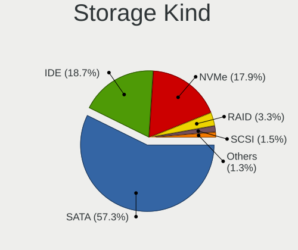

| Kind | Desktops | Percent |
|------|----------|---------|
| SATA | 263      | 57.3%   |
| IDE  | 86       | 18.74%  |
| NVMe | 82       | 17.86%  |
| RAID | 15       | 3.27%   |
| SCSI | 7        | 1.53%   |
| SAS  | 6        | 1.31%   |

Processor
---------

CPU Vendor
----------

Processor vendors

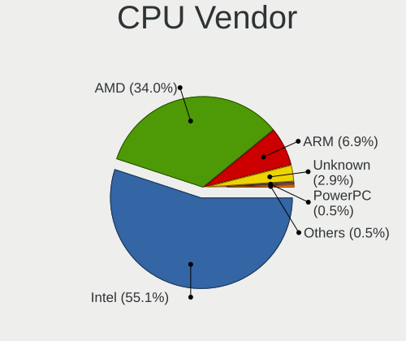

| Vendor  | Desktops | Percent |
|---------|----------|---------|
| Intel   | 207      | 55.05%  |
| AMD     | 128      | 34.04%  |
| ARM     | 26       | 6.91%   |
| Unknown | 11       | 2.93%   |
| PowerPC | 2        | 0.53%   |
| VIA     | 1        | 0.27%   |
| 11th    | 1        | 0.27%   |

CPU Model
---------

Processor models

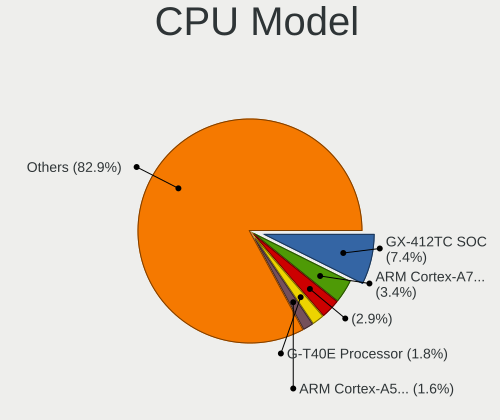

| Model                                                        | Desktops | Percent |
|--------------------------------------------------------------|----------|---------|
| AMD GX-412TC SOC                                             | 28       | 7.37%   |
| ARM Cortex-A72 r0p3                                          | 13       | 3.42%   |
|                                                              | 11       | 2.89%   |
| AMD G-T40E Processor                                         | 7        | 1.84%   |
| ARM Cortex-A53 r0p4                                          | 6        | 1.58%   |
| Intel Core i5-4570 CPU @ 3.20GHz                             | 4        | 1.05%   |
| AMD Ryzen 9 7950X 16-Core Processor                          | 4        | 1.05%   |
| AMD Ryzen 7 5800X 8-Core Processor                           | 4        | 1.05%   |
| AMD Ryzen 7 3700X 8-Core Processor                           | 4        | 1.05%   |
| Intel Xeon CPU E5-2620 v3 @ 2.40GHz                          | 3        | 0.79%   |
| Intel Core i7-6700 CPU @ 3.40GHz                             | 3        | 0.79%   |
| Intel Core i5-7500 CPU @ 3.40GHz                             | 3        | 0.79%   |
| Intel Core 2 Duo CPU E8400 @ 3.00GHz                         | 3        | 0.79%   |
| AMD Ryzen 7 7700X 8-Core Processor                           | 3        | 0.79%   |
| AMD Ryzen 7 2700 Eight-Core Processor                        | 3        | 0.79%   |
| AMD Ryzen 5 3600 6-Core Processor                            | 3        | 0.79%   |
| Intel Xeon CPU E5520 @ 2.27GHz                               | 2        | 0.53%   |
| Intel Xeon CPU E5-2640 0 @ 2.50GHz                           | 2        | 0.53%   |
| Intel Xeon CPU E5-2630 0 @ 2.30GHz                           | 2        | 0.53%   |
| Intel Xeon CPU E3-1220 v5 @ 3.00GHz                          | 2        | 0.53%   |
| Intel Pentium III ("GenuineIntel" 686-class, 512KB L2 cache) | 2        | 0.53%   |
| Intel Pentium CPU G4560 @ 3.50GHz                            | 2        | 0.53%   |
| Intel Pentium 4 CPU 2.66GHz ("GenuineIntel" 686-class)       | 2        | 0.53%   |
| Intel Pentium 4 CPU 2.40GHz ("GenuineIntel" 686-class)       | 2        | 0.53%   |
| Intel N100                                                   | 2        | 0.53%   |
| Intel Core i7-9700K CPU @ 3.60GHz                            | 2        | 0.53%   |
| Intel Core i7-4770K CPU @ 3.50GHz                            | 2        | 0.53%   |
| Intel Core i7-4770 CPU @ 3.40GHz                             | 2        | 0.53%   |
| Intel Core i7-3770 CPU @ 3.40GHz                             | 2        | 0.53%   |
| Intel Core i7 CPU 960 @ 3.20GHz                              | 2        | 0.53%   |
| Intel Core i5-9500 CPU @ 3.00GHz                             | 2        | 0.53%   |
| Intel Core i5-7400 CPU @ 3.00GHz                             | 2        | 0.53%   |
| Intel Core i5-5250U CPU @ 1.60GHz                            | 2        | 0.53%   |
| Intel Core i5-4570T CPU @ 2.90GHz                            | 2        | 0.53%   |
| Intel Core i5-3570K CPU @ 3.40GHz                            | 2        | 0.53%   |
| Intel Core i5-3470 CPU @ 3.20GHz                             | 2        | 0.53%   |
| Intel Core i5-10400F CPU @ 2.90GHz                           | 2        | 0.53%   |
| Intel Core i3-10100F CPU @ 3.60GHz                           | 2        | 0.53%   |
| Intel Core i3-10100 CPU @ 3.60GHz                            | 2        | 0.53%   |
| Intel Core 2 Quad CPU Q6600 @ 2.40GHz                        | 2        | 0.53%   |

CPU Model Family
----------------

Processor model prefix

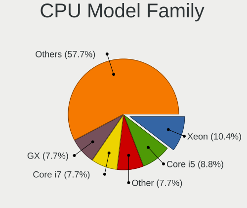

| Model                   | Desktops | Percent |
|-------------------------|----------|---------|
| Intel Xeon              | 39       | 10.37%  |
| Intel Core i5           | 33       | 8.78%   |
| Other                   | 29       | 7.71%   |
| Intel Core i7           | 29       | 7.71%   |
| AMD GX                  | 29       | 7.71%   |
| ARM Cortex              | 26       | 6.91%   |
| AMD Ryzen 7             | 25       | 6.65%   |
| Intel Core i3           | 20       | 5.32%   |
| Intel Celeron           | 20       | 5.32%   |
| AMD Ryzen 5             | 16       | 4.26%   |
| Intel Atom              | 9        | 2.39%   |
| AMD Ryzen 9             | 9        | 2.39%   |
| Intel Pentium 4         | 8        | 2.13%   |
| Intel Pentium           | 8        | 2.13%   |
| AMD G                   | 8        | 2.13%   |
| Intel Core 2 Duo        | 6        | 1.6%    |
| Intel Pentium Dual-Core | 4        | 1.06%   |
| Intel Core 2 Quad       | 4        | 1.06%   |
| Intel Core 2            | 4        | 1.06%   |
| Intel Pentium III       | 3        | 0.8%    |
| Intel Genuine           | 3        | 0.8%    |
| AMD Ryzen 3             | 3        | 0.8%    |
| AMD Athlon              | 3        | 0.8%    |
| Intel Pentium D         | 2        | 0.53%   |
| AMD Ryzen 7 PRO         | 2        | 0.53%   |
| AMD Phenom II X4        | 2        | 0.53%   |
| AMD Geode Integrated    | 2        | 0.53%   |
| AMD E2                  | 2        | 0.53%   |
| AMD Athlon II X3        | 2        | 0.53%   |
| AMD Athlon II X2        | 2        | 0.53%   |
| AMD Athlon 64 X2        | 2        | 0.53%   |
| AMD A4                  | 2        | 0.53%   |
| AMD A10                 | 2        | 0.53%   |
| Intel Xeon Gold         | 1        | 0.27%   |
| Intel Pentium Dual      | 1        | 0.27%   |
| Intel Core i9           | 1        | 0.27%   |
| Intel Celeron M         | 1        | 0.27%   |
| Intel Celeron D         | 1        | 0.27%   |
| AMD Turion II Neo       | 1        | 0.27%   |
| AMD Ryzen 5 PRO         | 1        | 0.27%   |

CPU Cores
---------

Number of processor cores

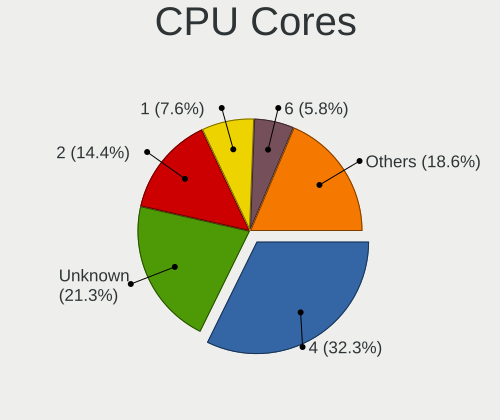

| Number  | Desktops | Percent |
|---------|----------|---------|
| 4       | 123      | 32.28%  |
| Unknown | 81       | 21.26%  |
| 2       | 55       | 14.44%  |
| 1       | 29       | 7.61%   |
| 6       | 22       | 5.77%   |
| 16      | 21       | 5.51%   |
| 8       | 20       | 5.25%   |
| 12      | 19       | 4.99%   |
| 32      | 5        | 1.31%   |
| 24      | 2        | 0.52%   |
| 3       | 2        | 0.52%   |
| 36      | 1        | 0.26%   |
| 14      | 1        | 0.26%   |

CPU Sockets
-----------

Number of sockets

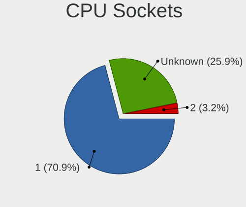

| Number  | Desktops | Percent |
|---------|----------|---------|
| 1       | 268      | 70.9%   |
| Unknown | 98       | 25.93%  |
| 2       | 12       | 3.17%   |

CPU Threads
-----------

Threads per core (Hyper-Threading)

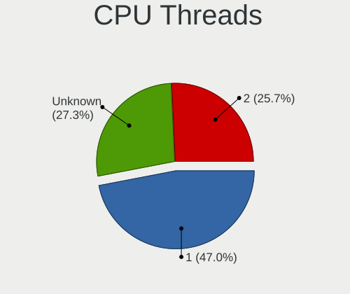

| Number  | Desktops | Percent |
|---------|----------|---------|
| 1       | 179      | 46.98%  |
| Unknown | 104      | 27.3%   |
| 2       | 98       | 25.72%  |

CPU Microarch
-------------

Microarchitecture

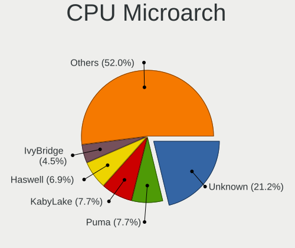

| Name          | Desktops | Percent |
|---------------|----------|---------|
| Unknown       | 80       | 21.22%  |
| Puma          | 29       | 7.69%   |
| KabyLake      | 29       | 7.69%   |
| Haswell       | 26       | 6.9%    |
| IvyBridge     | 17       | 4.51%   |
| SandyBridge   | 16       | 4.24%   |
| Zen 3         | 14       | 3.71%   |
| Zen 2         | 14       | 3.71%   |
| Skylake       | 14       | 3.71%   |
| Penryn        | 12       | 3.18%   |
| NetBurst      | 12       | 3.18%   |
| K10           | 11       | 2.92%   |
| Bobcat        | 11       | 2.92%   |
| Core          | 10       | 2.65%   |
| Silvermont    | 8        | 2.12%   |
| Bonnell       | 8        | 2.12%   |
| Zen           | 7        | 1.86%   |
| Westmere      | 7        | 1.86%   |
| Nehalem       | 7        | 1.86%   |
| Broadwell     | 6        | 1.59%   |
| Zen+          | 5        | 1.33%   |
| P6            | 5        | 1.33%   |
| CometLake     | 5        | 1.33%   |
| Piledriver    | 4        | 1.06%   |
| Goldmont      | 4        | 1.06%   |
| K8 Hammer     | 3        | 0.8%    |
| Geode         | 3        | 0.8%    |
| K6            | 2        | 0.53%   |
| Jaguar        | 2        | 0.53%   |
| Goldmont plus | 2        | 0.53%   |
| TigerLake     | 1        | 0.27%   |
| Steamroller   | 1        | 0.27%   |
| K10 Llano     | 1        | 0.27%   |
| Excavator     | 1        | 0.27%   |

Graphics
--------

GPU Vendor
----------

Vendors of graphics cards

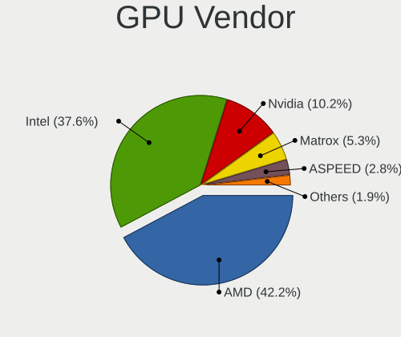

| Vendor                                       | Desktops | Percent |
|----------------------------------------------|----------|---------|
| AMD                                          | 136      | 42.24%  |
| Intel                                        | 121      | 37.58%  |
| Nvidia                                       | 33       | 10.25%  |
| Matrox Electronics Systems                   | 17       | 5.28%   |
| ASPEED Technology                            | 9        | 2.8%    |
| VIA Technologies                             | 2        | 0.62%   |
| XGI Technology (eXtreme Graphics Innovation) | 1        | 0.31%   |
| S3 Graphics                                  | 1        | 0.31%   |
| NVidia / SGS Thomson (Joint Venture)         | 1        | 0.31%   |
| 3DLabs                                       | 1        | 0.31%   |

GPU Model
---------

Graphics card models

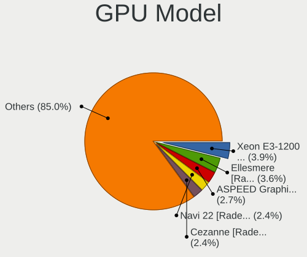

| Model                                                                                    | Desktops | Percent |
|------------------------------------------------------------------------------------------|----------|---------|
| Intel Xeon E3-1200 v3/4th Gen Core Processor Integrated Graphics Controller              | 13       | 3.89%   |
| AMD Ellesmere [Radeon RX 470/480/570/570X/580/580X/590]                                  | 12       | 3.59%   |
| ASPEED Technology ASPEED Graphics Family                                                 | 9        | 2.69%   |
| AMD Navi 22 [Radeon RX 6700/6700 XT/6750 XT / 6800M/6850M XT]                            | 8        | 2.4%    |
| AMD Cezanne [Radeon Vega Series / Radeon Vega Mobile Series]                             | 8        | 2.4%    |
| Matrox Electronics Systems G200eR2                                                       | 7        | 2.1%    |
| Intel 2nd Generation Core Processor Family Integrated Graphics Controller                | 7        | 2.1%    |
| AMD Raphael                                                                              | 7        | 2.1%    |
| AMD Navi 10 [Radeon RX 5600 OEM/5600 XT / 5700/5700 XT]                                  | 7        | 2.1%    |
| AMD Caicos [Radeon HD 6450/7450/8450 / R5 230 OEM]                                       | 7        | 2.1%    |
| Intel Skylake-S GT2 [HD Graphics 530]                                                    | 6        | 1.8%    |
| Intel Kaby Lake-S GT2 [HD Graphics 630]                                                  | 6        | 1.8%    |
| Matrox Electronics Systems MGA G200eW WPCM450                                            | 5        | 1.5%    |
| Intel Xeon E3-1200 v2/3rd Gen Core processor Graphics Controller                         | 5        | 1.5%    |
| Intel CoffeeLake-S GT2 [UHD Graphics 630]                                                | 5        | 1.5%    |
| Intel Atom Processor Z36xxx/Z37xxx Series Graphics & Display                             | 5        | 1.5%    |
| Intel IvyBridge GT2 [HD Graphics 4000]                                                   | 4        | 1.2%    |
| Intel 3rd Gen Core processor Graphics Controller                                         | 4        | 1.2%    |
| AMD Navi 23 [Radeon RX 6600/6600 XT/6600M]                                               | 4        | 1.2%    |
| AMD ES1000                                                                               | 4        | 1.2%    |
| AMD Cedar [Radeon HD 5000/6000/7350/8350 Series]                                         | 4        | 1.2%    |
| Matrox Electronics Systems MGA G200e [Pilot] ServerEngines (SEP1)                        | 3        | 0.9%    |
| Intel Mobile 945GM/GMS/GME, 943/940GML Express Integrated Graphics Controller            | 3        | 0.9%    |
| Intel Mobile 4 Series Chipset Integrated Graphics Controller                             | 3        | 0.9%    |
| Intel JasperLake [UHD Graphics]                                                          | 3        | 0.9%    |
| Intel CometLake-S GT2 [UHD Graphics 630]                                                 | 3        | 0.9%    |
| Intel Atom/Celeron/Pentium Processor x5-E8000/J3xxx/N3xxx Integrated Graphics Controller | 3        | 0.9%    |
| Intel Atom Processor D2xxx/N2xxx Integrated Graphics Controller                          | 3        | 0.9%    |
| Intel Alder Lake-N [UHD Graphics]                                                        | 3        | 0.9%    |
| AMD RV711/M93 [Mobility Radeon HD 4350/4550/530v/540v/545v / FirePro RG220]              | 3        | 0.9%    |
| AMD RV280 [Radeon 9200]                                                                  | 3        | 0.9%    |
| AMD Renoir [Radeon Vega Series / Radeon Vega Mobile Series]                              | 3        | 0.9%    |
| AMD Phoenix1                                                                             | 3        | 0.9%    |
| AMD Lexa PRO [Radeon 540/540X/550/550X / RX 540X/550/550X]                               | 3        | 0.9%    |
| Nvidia GP108 [GeForce GT 1030]                                                           | 2        | 0.6%    |
| Nvidia GP106 [GeForce GTX 1060 6GB]                                                      | 2        | 0.6%    |
| Nvidia GP106 [GeForce GTX 1060 3GB]                                                      | 2        | 0.6%    |
| Nvidia GK208B [GeForce GT 710]                                                           | 2        | 0.6%    |
| Nvidia G96C [GeForce 9500 GT]                                                            | 2        | 0.6%    |
| Matrox Electronics Systems MGA G200EH                                                    | 2        | 0.6%    |

GPU Combo
---------

Combinations of graphics cards

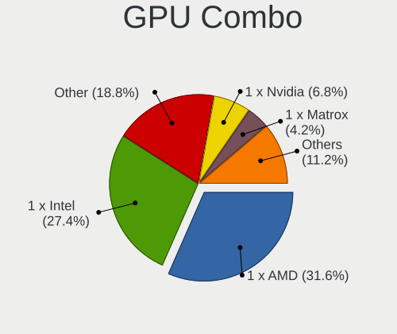

| Name                                     | Desktops | Percent |
|------------------------------------------|----------|---------|
| 1 x AMD                                  | 121      | 31.59%  |
| 1 x Intel                                | 105      | 27.42%  |
| Other                                    | 72       | 18.8%   |
| 1 x Nvidia                               | 26       | 6.79%   |
| 1 x Matrox                               | 16       | 4.18%   |
| 1 x ASPEED                               | 9        | 2.35%   |
| 2 x Intel                                | 8        | 2.09%   |
| 2 x AMD                                  | 6        | 1.57%   |
| Intel + AMD                              | 6        | 1.57%   |
| AMD + Nvidia                             | 4        | 1.04%   |
| Intel + Nvidia                           | 3        | 0.78%   |
| 1 x VIA                                  | 2        | 0.52%   |
| 1 x XGI                                  | 1        | 0.26%   |
| 1 x S3 Graphics                          | 1        | 0.26%   |
| 1 x NVidia / SGS Thomson (Joint Venture) | 1        | 0.26%   |
| AMD + Matrox                             | 1        | 0.26%   |
| 1 x 3DLabs                               | 1        | 0.26%   |

GPU Driver
----------

Free vs proprietary

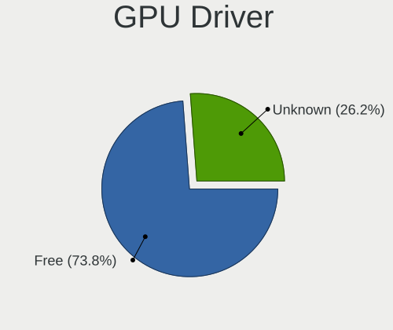

| Driver  | Desktops | Percent |
|---------|----------|---------|
| Free    | 279      | 73.81%  |
| Unknown | 99       | 26.19%  |

GPU Memory
----------

Total video memory

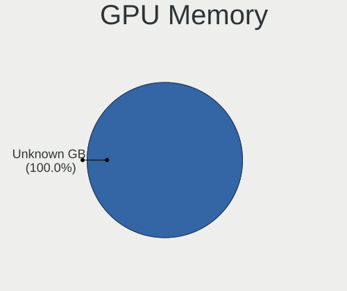

| Size in GB | Desktops | Percent |
|------------|----------|---------|
| Unknown    | 376      | 100%    |

Monitor
-------

Monitor Vendor
--------------

Monitor vendors

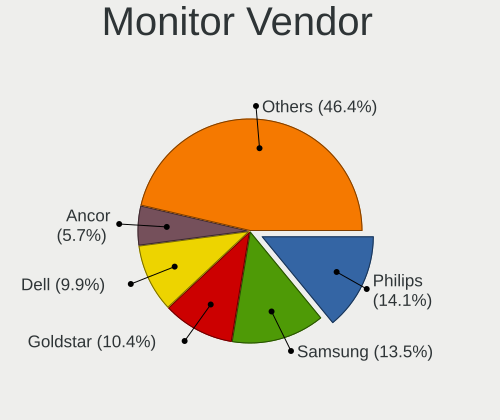

| Vendor               | Desktops | Percent |
|----------------------|----------|---------|
| Philips              | 27       | 14.06%  |
| Samsung Electronics  | 26       | 13.54%  |
| Goldstar             | 20       | 10.42%  |
| Dell                 | 19       | 9.9%    |
| Ancor Communications | 11       | 5.73%   |
| ASUSTek Computer     | 9        | 4.69%   |
| Acer                 | 8        | 4.17%   |
| Lenovo               | 7        | 3.65%   |
| Iiyama               | 7        | 3.65%   |
| AOC                  | 7        | 3.65%   |
| BenQ                 | 6        | 3.13%   |
| ViewSonic            | 5        | 2.6%    |
| NEC Computers        | 5        | 2.6%    |
| Hewlett-Packard      | 5        | 2.6%    |
| MSI                  | 3        | 1.56%   |
| Eizo                 | 3        | 1.56%   |
| AU Optronics         | 3        | 1.56%   |
| LG Philips           | 2        | 1.04%   |
| LG Display           | 2        | 1.04%   |
| Vizio                | 1        | 0.52%   |
| SHI                  | 1        | 0.52%   |
| Sceptre Tech         | 1        | 0.52%   |
| Medion               | 1        | 0.52%   |
| InfoVision           | 1        | 0.52%   |
| IBM                  | 1        | 0.52%   |
| Huion                | 1        | 0.52%   |
| HKC                  | 1        | 0.52%   |
| Gigabyte Technology  | 1        | 0.52%   |
| DZX                  | 1        | 0.52%   |
| DSC                  | 1        | 0.52%   |
| CVT                  | 1        | 0.52%   |
| CS_                  | 1        | 0.52%   |
| CMT                  | 1        | 0.52%   |
| CJT                  | 1        | 0.52%   |
| BOE                  | 1        | 0.52%   |
| Apple                | 1        | 0.52%   |

Monitor Model
-------------

Monitor models

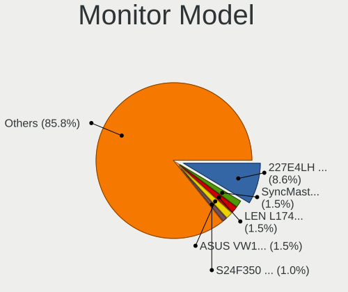

| Model                                                                | Desktops | Percent |
|----------------------------------------------------------------------|----------|---------|
| Philips 227E4LH PHLC0AC 1920x1080 480x270mm 21.7-inch                | 17       | 8.63%   |
| Samsung Electronics SyncMaster SAM03CF 1280x1024 340x270mm 17.1-inch | 3        | 1.52%   |
| Lenovo LEN L174 LEN240B 1280x1024 340x270mm 17.1-inch                | 3        | 1.52%   |
| Ancor Communications ASUS VW199 ACI19ED 1440x900 410x260mm 19.1-inch | 3        | 1.52%   |
| Samsung Electronics S24F350 SAM0D20 1920x1080 520x290mm 23.4-inch    | 2        | 1.02%   |
| Philips 170S PHL0839 1280x1024 340x270mm 17.1-inch                   | 2        | 1.02%   |
| NEC Computers EX341R NEC2C7A 3440x1440 800x330mm 34.1-inch           | 2        | 1.02%   |
| MSI MP242 MSI30A1 1920x1080 530x300mm 24.0-inch                      | 2        | 1.02%   |
| Iiyama PL2779QQ IVM6641 3840x2160 600x330mm 27.0-inch                | 2        | 1.02%   |
| Hewlett-Packard LA2405 HWP284B 1920x1200 520x320mm 24.0-inch         | 2        | 1.02%   |
| Goldstar LG IPS FULLHD GSM5AB8 1920x1080 480x270mm 21.7-inch         | 2        | 1.02%   |
| Eizo EV2450 ENC2530 1920x1080 530x300mm 24.0-inch                    | 2        | 1.02%   |
| Dell UP2715K DEL40B6 848x480 600x340mm 27.2-inch                     | 2        | 1.02%   |
| ASUSTek Computer XG49WCR AUS4932 3840x1080 1190x340mm 48.7-inch      | 2        | 1.02%   |
| ASUSTek Computer PA279 AUS2768 3840x2160 600x340mm 27.2-inch         | 2        | 1.02%   |
| AOC Q27G2WG4 AOC2702 2560x1440 600x340mm 27.2-inch                   | 2        | 1.02%   |
| Acer V223HQ ACR0070 1920x1080 470x270mm 21.3-inch                    | 2        | 1.02%   |
| Vizio E320i-A0 VIZ0091 1366x768 700x390mm 31.5-inch                  | 1        | 0.51%   |
| ViewSonic VG2239 Series VSCC42B 1920x1080 480x270mm 21.7-inch        | 1        | 0.51%   |
| ViewSonic VA703-4SERIES VSC6A1E 1280x1024 340x270mm 17.1-inch        | 1        | 0.51%   |
| ViewSonic VA2418-FHD VSCD739 1920x1080 530x300mm 24.0-inch           | 1        | 0.51%   |
| ViewSonic VA2026w VSC5020 1680x1050 430x270mm 20.0-inch              | 1        | 0.51%   |
| ViewSonic LCD Monitor VSCE032 2560x1440 530x300mm 24.0-inch          | 1        | 0.51%   |
| SHI LCD-TV**** SHI6102 1360x768 700x390mm 31.5-inch                  | 1        | 0.51%   |
| Sceptre Tech Sceptre C35 SPT0DB7 3440x1440 820x350mm 35.1-inch       | 1        | 0.51%   |
| Samsung Electronics U28E590 SAM0C4D 3840x2160 610x350mm 27.7-inch    | 1        | 0.51%   |
| Samsung Electronics T24D390 SAM0B6E 1920x1080 520x290mm 23.4-inch    | 1        | 0.51%   |
| Samsung Electronics SyncMaster SAM041E 2048x1152 510x290mm 23.1-inch | 1        | 0.51%   |
| Samsung Electronics SyncMaster SAM03EF 1680x1050 470x300mm 22.0-inch | 1        | 0.51%   |
| Samsung Electronics SyncMaster SAM026F 1280x1024 380x300mm 19.1-inch | 1        | 0.51%   |
| Samsung Electronics SyncMaster SAM022B 1280x1024 340x270mm 17.1-inch | 1        | 0.51%   |
| Samsung Electronics SyncMaster SAM0226 1440x900 410x260mm 19.1-inch  | 1        | 0.51%   |
| Samsung Electronics SyncMaster SAM00A1 1280x1024 340x270mm 17.1-inch | 1        | 0.51%   |
| Samsung Electronics SMB2340 SAM0691 1920x1080 510x290mm 23.1-inch    | 1        | 0.51%   |
| Samsung Electronics SE790C SAM0BFE 3440x1440 800x330mm 34.1-inch     | 1        | 0.51%   |
| Samsung Electronics S24E650 SAM0CC3 1920x1200 520x320mm 24.0-inch    | 1        | 0.51%   |
| Samsung Electronics S24D390 SAM0B65 1920x1080 520x290mm 23.4-inch    | 1        | 0.51%   |
| Samsung Electronics S24D300 SAM0B43 1920x1080 530x300mm 24.0-inch    | 1        | 0.51%   |
| Samsung Electronics S24B350 SAM08DA 1920x1080 530x300mm 24.0-inch    | 1        | 0.51%   |
| Samsung Electronics S22A33x SAM7122 1920x1080 480x260mm 21.5-inch    | 1        | 0.51%   |

Monitor Resolution
------------------

Monitor screen resolution

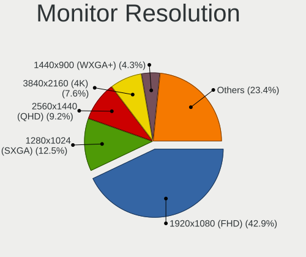

| Resolution         | Desktops | Percent |
|--------------------|----------|---------|
| 1920x1080 (FHD)    | 79       | 42.93%  |
| 1280x1024 (SXGA)   | 23       | 12.5%   |
| 2560x1440 (QHD)    | 17       | 9.24%   |
| 3840x2160 (4K)     | 14       | 7.61%   |
| 1440x900 (WXGA+)   | 8        | 4.35%   |
| 1366x768 (WXGA)    | 8        | 4.35%   |
| 1920x1200 (WUXGA)  | 7        | 3.8%    |
| 3440x1440          | 6        | 3.26%   |
| 3840x1080          | 4        | 2.17%   |
| 1680x1050 (WSXGA+) | 3        | 1.63%   |
| 1280x800 (WXGA)    | 3        | 1.63%   |
| 2560x1080          | 2        | 1.09%   |
| 1600x900 (HD+)     | 2        | 1.09%   |
| 1600x1200          | 2        | 1.09%   |
| 1360x768           | 2        | 1.09%   |
| 2200x1650          | 1        | 0.54%   |
| 2048x1152          | 1        | 0.54%   |
| 1400x1050          | 1        | 0.54%   |
| 1024x768 (XGA)     | 1        | 0.54%   |

Monitor Diagonal
----------------

Diagonal size in inches

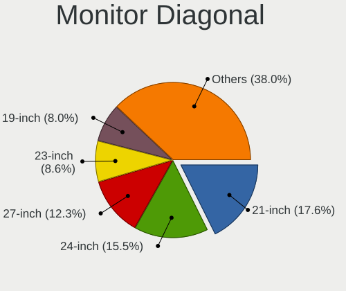

| Inches  | Desktops | Percent |
|---------|----------|---------|
| 21      | 33       | 17.65%  |
| 24      | 29       | 15.51%  |
| 27      | 23       | 12.3%   |
| 23      | 16       | 8.56%   |
| 19      | 15       | 8.02%   |
| 17      | 15       | 8.02%   |
| 31      | 13       | 6.95%   |
| 15      | 9        | 4.81%   |
| 34      | 7        | 3.74%   |
| 18      | 3        | 1.6%    |
| 14      | 3        | 1.6%    |
| 13      | 3        | 1.6%    |
| 49      | 2        | 1.07%   |
| 48      | 2        | 1.07%   |
| 26      | 2        | 1.07%   |
| 22      | 2        | 1.07%   |
| 20      | 2        | 1.07%   |
| Unknown | 2        | 1.07%   |
| 54      | 1        | 0.53%   |
| 46      | 1        | 0.53%   |
| 35      | 1        | 0.53%   |
| 16      | 1        | 0.53%   |
| 12      | 1        | 0.53%   |
| 9       | 1        | 0.53%   |

Monitor Width
-------------

Physical width

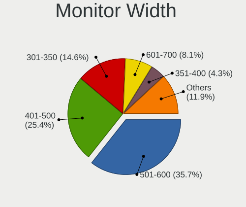

| Width in mm | Desktops | Percent |
|-------------|----------|---------|
| 501-600     | 66       | 35.68%  |
| 401-500     | 47       | 25.41%  |
| 301-350     | 27       | 14.59%  |
| 601-700     | 15       | 8.11%   |
| 351-400     | 8        | 4.32%   |
| 701-800     | 7        | 3.78%   |
| 201-300     | 5        | 2.7%    |
| 1001-1500   | 5        | 2.7%    |
| Unknown     | 2        | 1.08%   |
| 801-900     | 1        | 0.54%   |
| 101-200     | 1        | 0.54%   |
| 901-1000    | 1        | 0.54%   |

Aspect Ratio
------------

Proportional relationship between the width and the height

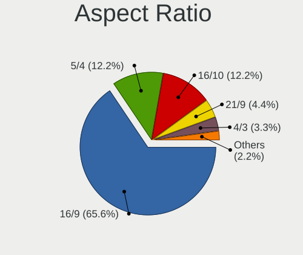

| Ratio | Desktops | Percent |
|-------|----------|---------|
| 16/9  | 118      | 65.56%  |
| 5/4   | 22       | 12.22%  |
| 16/10 | 22       | 12.22%  |
| 21/9  | 8        | 4.44%   |
| 4/3   | 6        | 3.33%   |
| 32/9  | 4        | 2.22%   |

Monitor Area
------------

Area in inch²

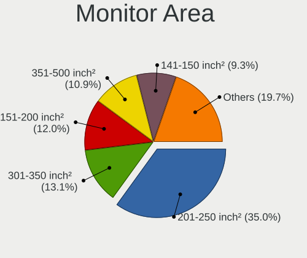

| Area in inch² | Desktops | Percent |
|----------------|----------|---------|
| 201-250        | 64       | 34.97%  |
| 301-350        | 24       | 13.11%  |
| 151-200        | 22       | 12.02%  |
| 351-500        | 20       | 10.93%  |
| 141-150        | 17       | 9.29%   |
| 251-300        | 10       | 5.46%   |
| 101-110        | 5        | 2.73%   |
| 501-1000       | 5        | 2.73%   |
| 91-100         | 5        | 2.73%   |
| 81-90          | 4        | 2.19%   |
| Unknown        | 2        | 1.09%   |
| More than 1000 | 1        | 0.55%   |
| 61-70          | 1        | 0.55%   |
| 41-50          | 1        | 0.55%   |
| 121-130        | 1        | 0.55%   |
| 111-120        | 1        | 0.55%   |

Pixel Density
-------------

Pixels per inch

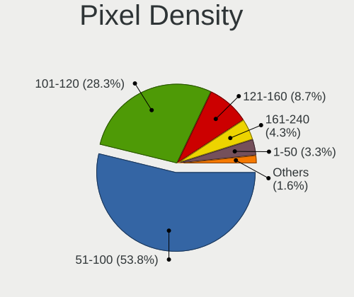

| Density       | Desktops | Percent |
|---------------|----------|---------|
| 51-100        | 99       | 53.8%   |
| 101-120       | 52       | 28.26%  |
| 121-160       | 16       | 8.7%    |
| 161-240       | 8        | 4.35%   |
| 1-50          | 6        | 3.26%   |
| Unknown       | 2        | 1.09%   |
| More than 240 | 1        | 0.54%   |

Multiple Monitors
-----------------

Total monitors connected

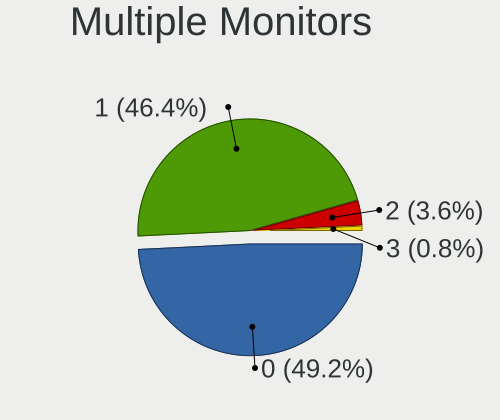

| Total | Desktops | Percent |
|-------|----------|---------|
| 0     | 190      | 49.22%  |
| 1     | 179      | 46.37%  |
| 2     | 14       | 3.63%   |
| 3     | 3        | 0.78%   |

Network
-------

Net Controller Vendor
---------------------

Controller vendors

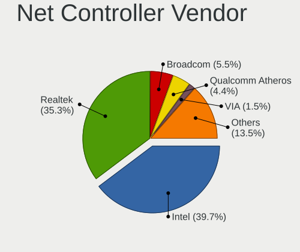

| Vendor                            | Desktops | Percent |
|-----------------------------------|----------|---------|
| Intel                             | 180      | 39.74%  |
| Realtek Semiconductor             | 160      | 35.32%  |
| Broadcom                          | 25       | 5.52%   |
| Qualcomm Atheros                  | 20       | 4.42%   |
| VIA Technologies                  | 7        | 1.55%   |
| Qualcomm Atheros Communications   | 7        | 1.55%   |
| TP-Link                           | 6        | 1.32%   |
| MediaTek                          | 6        | 1.32%   |
| U-Blox                            | 4        | 0.88%   |
| Ralink                            | 4        | 0.88%   |
| Apple                             | 4        | 0.88%   |
| Qualcomm Technologies             | 3        | 0.66%   |
| Oracle/SUN                        | 2        | 0.44%   |
| D-Link System                     | 2        | 0.44%   |
| ASUSTek Computer                  | 2        | 0.44%   |
| American Megatrends               | 2        | 0.44%   |
| 3Com                              | 2        | 0.44%   |
| Raspberry Pi                      | 1        | 0.22%   |
| Ralink Technology                 | 1        | 0.22%   |
| Qcom                              | 1        | 0.22%   |
| National Semiconductor            | 1        | 0.22%   |
| Motorola PCS                      | 1        | 0.22%   |
| Microchip Technology              | 1        | 0.22%   |
| LG Electronics                    | 1        | 0.22%   |
| Huawei Technologies               | 1        | 0.22%   |
| Ericsson Business Mobile Networks | 1        | 0.22%   |
| Emulex                            | 1        | 0.22%   |
| Edimax Technology                 | 1        | 0.22%   |
| Davicom Semiconductor             | 1        | 0.22%   |
| D-Link                            | 1        | 0.22%   |
| AVM                               | 1        | 0.22%   |
| Atheros                           | 1        | 0.22%   |
| Aquantia                          | 1        | 0.22%   |
| Accton Technology                 | 1        | 0.22%   |

Net Controller Model
--------------------

Controller models

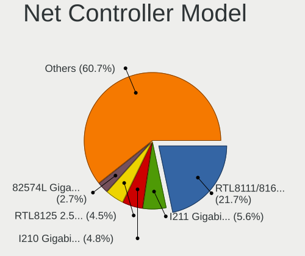

| Model                                                                         | Desktops | Percent |
|-------------------------------------------------------------------------------|----------|---------|
| Realtek RTL8111/8168/8211/8411 PCI Express Gigabit Ethernet Controller        | 112      | 21.71%  |
| Intel I211 Gigabit Network Connection                                         | 29       | 5.62%   |
| Intel I210 Gigabit Network Connection                                         | 25       | 4.84%   |
| Realtek RTL8125 2.5GbE Controller                                             | 23       | 4.46%   |
| Intel 82574L Gigabit Network Connection                                       | 14       | 2.71%   |
| Intel Wi-Fi 6 AX200                                                           | 12       | 2.33%   |
| Realtek RTL810xE PCI Express Fast Ethernet controller                         | 11       | 2.13%   |
| Intel I350 Gigabit Network Connection                                         | 10       | 1.94%   |
| Intel 82579LM Gigabit Network Connection (Lewisville)                         | 9        | 1.74%   |
| Intel Ethernet Connection I217-LM                                             | 8        | 1.55%   |
| Intel Ethernet Controller I225-V                                              | 7        | 1.36%   |
| Intel Ethernet Connection (2) I219-LM                                         | 6        | 1.16%   |
| VIA VT6102/VT6103 [Rhine-II]                                                  | 5        | 0.97%   |
| Realtek RTL-8100/8101L/8139 PCI Fast Ethernet Adapter                         | 5        | 0.97%   |
| Qualcomm Atheros AR9271 802.11n                                               | 5        | 0.97%   |
| U-Blox [u-blox 8]                                                             | 4        | 0.78%   |
| Qualcomm Atheros AR928X Wireless Network Adapter (PCI-Express)                | 4        | 0.78%   |
| MediaTek MT7922 802.11ax PCI Express Wireless Network Adapter                 | 4        | 0.78%   |
| Intel Wireless 7260                                                           | 4        | 0.78%   |
| Intel Wi-Fi 6E(802.11ax) AX210/AX1675* 2x2 [Typhoon Peak]                     | 4        | 0.78%   |
| Intel Ethernet Connection (7) I219-V                                          | 4        | 0.78%   |
| Intel Ethernet Connection (7) I219-LM                                         | 4        | 0.78%   |
| Intel Ethernet Connection (2) I219-V                                          | 4        | 0.78%   |
| Intel 82579V Gigabit Network Connection                                       | 4        | 0.78%   |
| Apple UniNorth 2 GMAC (Sun GEM)                                               | 4        | 0.78%   |
| Realtek RTL8852BE PCIe 802.11ax Wireless Network Controller                   | 3        | 0.58%   |
| Realtek RTL8188EUS 802.11n Wireless Network Adapter                           | 3        | 0.58%   |
| Qualcomm Atheros AR5212/5213/2414 Wireless Network Adapter                    | 3        | 0.58%   |
| Intel Wireless 7265                                                           | 3        | 0.58%   |
| Intel Ethernet Connection I217-V                                              | 3        | 0.58%   |
| Intel 82599ES 10-Gigabit SFI/SFP+ Network Connection                          | 3        | 0.58%   |
| Intel 82571EB/82571GB Gigabit Ethernet Controller D0/D1 (copper applications) | 3        | 0.58%   |
| Intel 82566DM-2 Gigabit Network Connection                                    | 3        | 0.58%   |
| Broadcom NetXtreme BCM5720 Gigabit Ethernet PCIe                              | 3        | 0.58%   |
| Broadcom NetXtreme BCM5719 Gigabit Ethernet PCIe                              | 3        | 0.58%   |
| VIA VT6105M [Rhine-III]                                                       | 2        | 0.39%   |
| TP-Link TL-WN722N v2/v3 [Realtek RTL8188EUS]                                  | 2        | 0.39%   |
| Realtek RTL8821CE 802.11ac PCIe Wireless Network Adapter                      | 2        | 0.39%   |
| Realtek RTL8723BE PCIe Wireless Network Adapter                               | 2        | 0.39%   |
| Realtek RTL8169 PCI Gigabit Ethernet Controller                               | 2        | 0.39%   |

Wireless Vendor
---------------

Wireless vendors

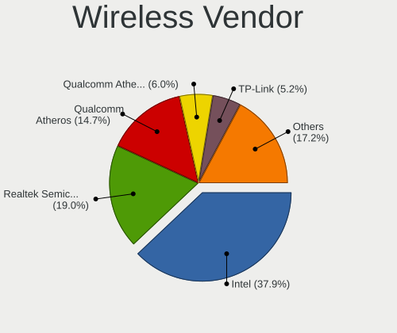

| Vendor                          | Desktops | Percent |
|---------------------------------|----------|---------|
| Intel                           | 44       | 37.93%  |
| Realtek Semiconductor           | 22       | 18.97%  |
| Qualcomm Atheros                | 17       | 14.66%  |
| Qualcomm Atheros Communications | 7        | 6.03%   |
| TP-Link                         | 6        | 5.17%   |
| MediaTek                        | 5        | 4.31%   |
| Ralink                          | 4        | 3.45%   |
| Broadcom                        | 2        | 1.72%   |
| ASUSTek Computer                | 2        | 1.72%   |
| Ralink Technology               | 1        | 0.86%   |
| Qualcomm Technologies           | 1        | 0.86%   |
| Qcom                            | 1        | 0.86%   |
| Edimax Technology               | 1        | 0.86%   |
| D-Link System                   | 1        | 0.86%   |
| D-Link                          | 1        | 0.86%   |
| Atheros                         | 1        | 0.86%   |

Wireless Model
--------------

Wireless models

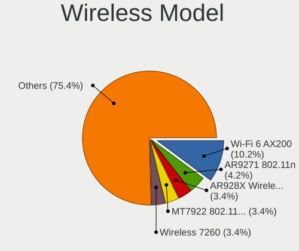

| Model                                                          | Desktops | Percent |
|----------------------------------------------------------------|----------|---------|
| Intel Wi-Fi 6 AX200                                            | 12       | 10.17%  |
| Qualcomm Atheros AR9271 802.11n                                | 5        | 4.24%   |
| Qualcomm Atheros AR928X Wireless Network Adapter (PCI-Express) | 4        | 3.39%   |
| MediaTek MT7922 802.11ax PCI Express Wireless Network Adapter  | 4        | 3.39%   |
| Intel Wireless 7260                                            | 4        | 3.39%   |
| Intel Wi-Fi 6E(802.11ax) AX210/AX1675* 2x2 [Typhoon Peak]      | 4        | 3.39%   |
| Realtek RTL8852BE PCIe 802.11ax Wireless Network Controller    | 3        | 2.54%   |
| Realtek RTL8188EUS 802.11n Wireless Network Adapter            | 3        | 2.54%   |
| Qualcomm Atheros AR5212/5213/2414 Wireless Network Adapter     | 3        | 2.54%   |
| Intel Wireless 7265                                            | 3        | 2.54%   |
| TP-Link TL-WN722N v2/v3 [Realtek RTL8188EUS]                   | 2        | 1.69%   |
| Realtek RTL8821CE 802.11ac PCIe Wireless Network Adapter       | 2        | 1.69%   |
| Realtek RTL8723BE PCIe Wireless Network Adapter                | 2        | 1.69%   |
| Ralink RT2790 Wireless 802.11n 1T/2R PCIe                      | 2        | 1.69%   |
| Qualcomm Atheros QCA9565 / AR9565 Wireless Network Adapter     | 2        | 1.69%   |
| Qualcomm Atheros AR9485 Wireless Network Adapter               | 2        | 1.69%   |
| Qualcomm Atheros AR9285 Wireless Network Adapter (PCI-Express) | 2        | 1.69%   |
| Intel Wireless 8265 / 8275                                     | 2        | 1.69%   |
| Intel PRO/Wireless 3945ABG [Golan] Network Connection          | 2        | 1.69%   |
| Intel Dual Band Wireless-AC 3168NGW [Stone Peak]               | 2        | 1.69%   |
| Intel Centrino Wireless-N 2230                                 | 2        | 1.69%   |
| Intel Alder Lake-P PCH CNVi WiFi                               | 2        | 1.69%   |
| TP-Link Wireless USB Adapter                                   | 1        | 0.85%   |
| TP-Link TL-WN821N v5/v6 [RTL8192EU]                            | 1        | 0.85%   |
| TP-Link Archer T3U [Realtek RTL8812BU]                         | 1        | 0.85%   |
| TP-Link Archer T2U PLUS [RTL8821AU]                            | 1        | 0.85%   |
| TP-Link AC600 wireless Realtek RTL8811AU [Archer T2U Nano]     | 1        | 0.85%   |
| Realtek RTL8852CE PCIe 802.11ax Wireless Network Controller    | 1        | 0.85%   |
| Realtek RTL8822CE 802.11ac PCIe Wireless Network Adapter       | 1        | 0.85%   |
| Realtek RTL8812AE 802.11ac PCIe Wireless Network Adapter       | 1        | 0.85%   |
| Realtek RTL8192EU 802.11b/g/n WLAN Adapter                     | 1        | 0.85%   |
| Realtek RTL8192EE PCIe Wireless Network Adapter                | 1        | 0.85%   |
| Realtek RTL8192CE PCIe Wireless Network Adapter                | 1        | 0.85%   |
| Realtek RTL8191SU 802.11n WLAN Adapter                         | 1        | 0.85%   |
| Realtek RTL8191SEvB Wireless LAN Controller                    | 1        | 0.85%   |
| Realtek RTL8188EE Wireless Network Adapter                     | 1        | 0.85%   |
| Realtek RTL8188CUS 802.11n WLAN Adapter                        | 1        | 0.85%   |
| Realtek RTL8188CE 802.11b/g/n WiFi Adapter                     | 1        | 0.85%   |
| Realtek 802.11n WLAN Adapter                                   | 1        | 0.85%   |
| Ralink RT2870/RT3070 Wireless Adapter                          | 1        | 0.85%   |

Ethernet Vendor
---------------

Ethernet vendors

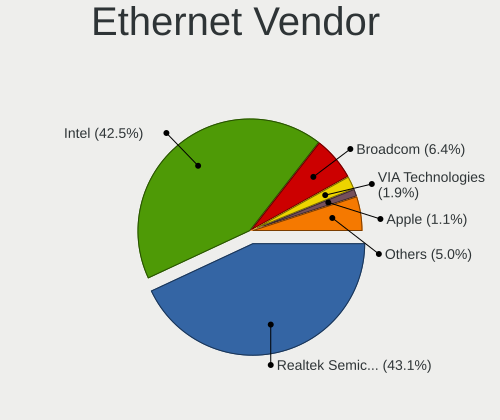

| Vendor                 | Desktops | Percent |
|------------------------|----------|---------|
| Realtek Semiconductor  | 155      | 43.06%  |
| Intel                  | 153      | 42.5%   |
| Broadcom               | 23       | 6.39%   |
| VIA Technologies       | 7        | 1.94%   |
| Apple                  | 4        | 1.11%   |
| Qualcomm Atheros       | 3        | 0.83%   |
| Oracle/SUN             | 2        | 0.56%   |
| American Megatrends    | 2        | 0.56%   |
| 3Com                   | 2        | 0.56%   |
| National Semiconductor | 1        | 0.28%   |
| Motorola PCS           | 1        | 0.28%   |
| Microchip Technology   | 1        | 0.28%   |
| MediaTek               | 1        | 0.28%   |
| Emulex                 | 1        | 0.28%   |
| Davicom Semiconductor  | 1        | 0.28%   |
| D-Link System          | 1        | 0.28%   |
| Aquantia               | 1        | 0.28%   |
| Accton Technology      | 1        | 0.28%   |

Ethernet Model
--------------

Ethernet models

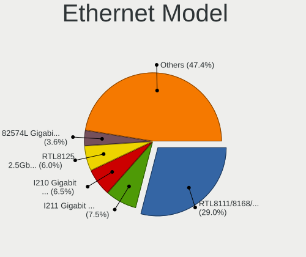

| Model                                                                         | Desktops | Percent |
|-------------------------------------------------------------------------------|----------|---------|
| Realtek RTL8111/8168/8211/8411 PCI Express Gigabit Ethernet Controller        | 112      | 29.02%  |
| Intel I211 Gigabit Network Connection                                         | 29       | 7.51%   |
| Intel I210 Gigabit Network Connection                                         | 25       | 6.48%   |
| Realtek RTL8125 2.5GbE Controller                                             | 23       | 5.96%   |
| Intel 82574L Gigabit Network Connection                                       | 14       | 3.63%   |
| Realtek RTL810xE PCI Express Fast Ethernet controller                         | 11       | 2.85%   |
| Intel I350 Gigabit Network Connection                                         | 10       | 2.59%   |
| Intel 82579LM Gigabit Network Connection (Lewisville)                         | 9        | 2.33%   |
| Intel Ethernet Connection I217-LM                                             | 8        | 2.07%   |
| Intel Ethernet Controller I225-V                                              | 7        | 1.81%   |
| Intel Ethernet Connection (2) I219-LM                                         | 6        | 1.55%   |
| VIA VT6102/VT6103 [Rhine-II]                                                  | 5        | 1.3%    |
| Realtek RTL-8100/8101L/8139 PCI Fast Ethernet Adapter                         | 5        | 1.3%    |
| Intel Ethernet Connection (7) I219-V                                          | 4        | 1.04%   |
| Intel Ethernet Connection (7) I219-LM                                         | 4        | 1.04%   |
| Intel Ethernet Connection (2) I219-V                                          | 4        | 1.04%   |
| Intel 82579V Gigabit Network Connection                                       | 4        | 1.04%   |
| Apple UniNorth 2 GMAC (Sun GEM)                                               | 4        | 1.04%   |
| Intel Ethernet Connection I217-V                                              | 3        | 0.78%   |
| Intel 82599ES 10-Gigabit SFI/SFP+ Network Connection                          | 3        | 0.78%   |
| Intel 82571EB/82571GB Gigabit Ethernet Controller D0/D1 (copper applications) | 3        | 0.78%   |
| Intel 82566DM-2 Gigabit Network Connection                                    | 3        | 0.78%   |
| Broadcom NetXtreme BCM5720 Gigabit Ethernet PCIe                              | 3        | 0.78%   |
| Broadcom NetXtreme BCM5719 Gigabit Ethernet PCIe                              | 3        | 0.78%   |
| VIA VT6105M [Rhine-III]                                                       | 2        | 0.52%   |
| Realtek RTL8169 PCI Gigabit Ethernet Controller                               | 2        | 0.52%   |
| Intel Platform Controller Hub EG20T Gigabit Ethernet Controller               | 2        | 0.52%   |
| Intel Ethernet Controller I226-V                                              | 2        | 0.52%   |
| Intel Ethernet Connection (5) I219-LM                                         | 2        | 0.52%   |
| Intel 82801DB PRO/100 VE (LOM) Ethernet Controller                            | 2        | 0.52%   |
| Intel 82576 Gigabit Network Connection                                        | 2        | 0.52%   |
| Intel 82573L Gigabit Ethernet Controller                                      | 2        | 0.52%   |
| Intel 82573E Gigabit Ethernet Controller (Copper)                             | 2        | 0.52%   |
| Broadcom NetXtreme II BCM5709 Gigabit Ethernet                                | 2        | 0.52%   |
| Broadcom NetXtreme BCM5755 Gigabit Ethernet PCI Express                       | 2        | 0.52%   |
| Broadcom NetXtreme BCM5754 Gigabit Ethernet PCI Express                       | 2        | 0.52%   |
| Broadcom NetXtreme BCM5723 Gigabit Ethernet PCIe                              | 2        | 0.52%   |
| Broadcom NetXtreme BCM5703 Gigabit Ethernet                                   | 2        | 0.52%   |
| American Megatrends Virtual Ethernet                                          | 2        | 0.52%   |
| Realtek RTL8111/8168/8411 PCI Express Gigabit Ethernet Controller             | 1        | 0.26%   |

Net Controller Kind
-------------------

Ethernet, WiFi or modem

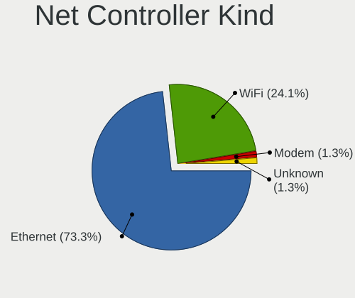

| Kind     | Desktops | Percent |
|----------|----------|---------|
| Ethernet | 337      | 73.26%  |
| WiFi     | 111      | 24.13%  |
| Modem    | 6        | 1.3%    |
| Unknown  | 6        | 1.3%    |

Used Controller
---------------

Currently used network controller

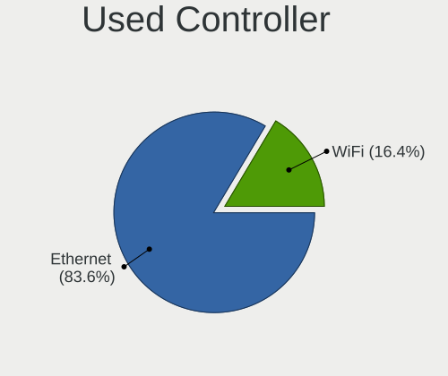

| Kind     | Desktops | Percent |
|----------|----------|---------|
| Ethernet | 249      | 83.56%  |
| WiFi     | 49       | 16.44%  |

NICs
----

Total network controllers on board

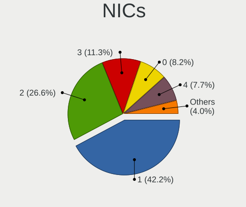

| Total | Desktops | Percent |
|-------|----------|---------|
| 1     | 160      | 42.22%  |
| 2     | 101      | 26.65%  |
| 3     | 43       | 11.35%  |
| 0     | 31       | 8.18%   |
| 4     | 29       | 7.65%   |
| 6     | 4        | 1.06%   |
| 5     | 4        | 1.06%   |
| 8     | 3        | 0.79%   |
| 7     | 2        | 0.53%   |
| 12    | 1        | 0.26%   |
| 9     | 1        | 0.26%   |

IPv6
----

IPv6 vs IPv4

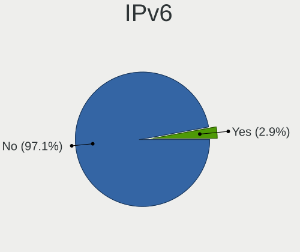

| Used | Desktops | Percent |
|------|----------|---------|
| No   | 372      | 97.13%  |
| Yes  | 11       | 2.87%   |

Bluetooth
---------

Bluetooth Vendor
----------------

Controller vendors

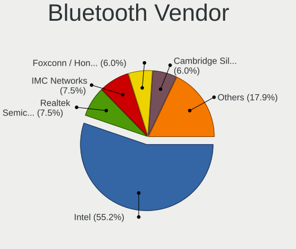

| Vendor                          | Desktops | Percent |
|---------------------------------|----------|---------|
| Intel                           | 37       | 55.22%  |
| Realtek Semiconductor           | 5        | 7.46%   |
| IMC Networks                    | 5        | 7.46%   |
| Foxconn / Hon Hai               | 4        | 5.97%   |
| Cambridge Silicon Radio         | 4        | 5.97%   |
| Qualcomm Atheros Communications | 3        | 4.48%   |
| Apple                           | 3        | 4.48%   |
| Broadcom                        | 2        | 2.99%   |
| Ralink                          | 1        | 1.49%   |
| MediaTek                        | 1        | 1.49%   |
| Hewlett-Packard                 | 1        | 1.49%   |
| ASUSTek Computer                | 1        | 1.49%   |

Bluetooth Model
---------------

Controller models

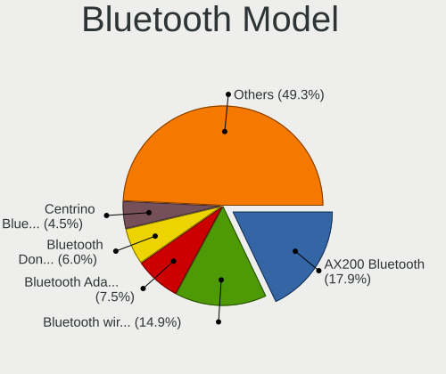

| Model                                                       | Desktops | Percent |
|-------------------------------------------------------------|----------|---------|
| Intel AX200 Bluetooth                                       | 12       | 17.91%  |
| Intel Bluetooth wireless interface                          | 10       | 14.93%  |
| Realtek Bluetooth Adapter                                   | 5        | 7.46%   |
| Cambridge Silicon Radio Bluetooth Dongle (HCI mode)         | 4        | 5.97%   |
| Intel Centrino Bluetooth Wireless Transceiver               | 3        | 4.48%   |
| Intel Bluetooth 9460/9560 Jefferson Peak (JfP)              | 3        | 4.48%   |
| Intel AX210 Bluetooth                                       | 3        | 4.48%   |
| Intel AX201 Bluetooth                                       | 3        | 4.48%   |
| IMC Networks Realtek Bluetooth Adapter                      | 3        | 4.48%   |
| Foxconn / Hon Hai RZ616 Bluetooth Adapter                   | 3        | 4.48%   |
| Qualcomm Atheros AR3012 Bluetooth 4.0                       | 2        | 2.99%   |
| Intel Wireless-AC 3168 Bluetooth                            | 2        | 2.99%   |
| IMC Networks Realtek Bluetooth 4.0 + High Speed Chip        | 2        | 2.99%   |
| Apple Built-in Bluetooth 2.0+EDR HCI                        | 2        | 2.99%   |
| Ralink RT3290 Bluetooth                                     | 1        | 1.49%   |
| Qualcomm Atheros Dell Wireless 1707 Bluetooth 4.0 LE Device | 1        | 1.49%   |
| MediaTek RZ616 Bluetooth Adapter                            | 1        | 1.49%   |
| Intel AX211 Bluetooth                                       | 1        | 1.49%   |
| HP Bluetooth 2.0 Interface [Broadcom BCM2045]               | 1        | 1.49%   |
| Foxconn / Hon Hai Qualcomm Atheros AR3011 Bluetooth Adapter | 1        | 1.49%   |
| Broadcom BCM20702A0 Bluetooth 4.0                           | 1        | 1.49%   |
| Broadcom BCM2045B (BDC-2) [Bluetooth Controller]            | 1        | 1.49%   |
| ASUS Broadcom BCM20702A0 Bluetooth                          | 1        | 1.49%   |
| Apple Bluetooth Host Controller                             | 1        | 1.49%   |

Sound
-----

Sound Vendor
------------

Sound card vendors

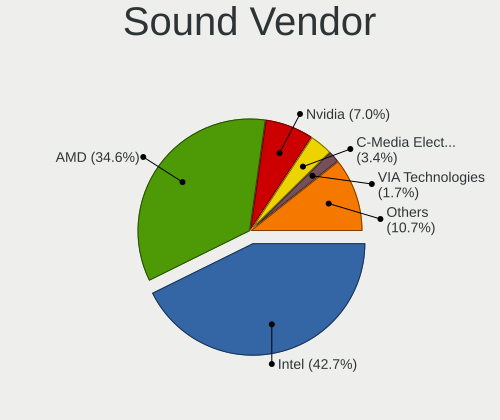

| Vendor                                       | Desktops | Percent |
|----------------------------------------------|----------|---------|
| Intel                                        | 152      | 42.7%   |
| AMD                                          | 123      | 34.55%  |
| Nvidia                                       | 25       | 7.02%   |
| C-Media Electronics                          | 12       | 3.37%   |
| VIA Technologies                             | 6        | 1.69%   |
| Creative Labs                                | 5        | 1.4%    |
| Texas Instruments                            | 3        | 0.84%   |
| Logitech                                     | 3        | 0.84%   |
| Generalplus Technology                       | 3        | 0.84%   |
| ESS Technology                               | 3        | 0.84%   |
| ULi Electronics                              | 2        | 0.56%   |
| JMTek                                        | 2        | 0.56%   |
| Creative Technology                          | 2        | 0.56%   |
| Zoran Co. Personal Media Division (Nogatech) | 1        | 0.28%   |
| XMOS                                         | 1        | 0.28%   |
| Thesycon Systemsoftware & Consulting         | 1        | 0.28%   |
| Sony                                         | 1        | 0.28%   |
| Samson Technologies                          | 1        | 0.28%   |
| Lenovo                                       | 1        | 0.28%   |
| KTMicro                                      | 1        | 0.28%   |
| Kingston Technology                          | 1        | 0.28%   |
| Focusrite-Novation                           | 1        | 0.28%   |
| Elgato Systems                               | 1        | 0.28%   |
| Dell                                         | 1        | 0.28%   |
| Corsair                                      | 1        | 0.28%   |
| Cambridge Silicon Radio                      | 1        | 0.28%   |
| Blue Microphones                             | 1        | 0.28%   |
| ASUSTek Computer                             | 1        | 0.28%   |

Sound Model
-----------

Sound card models

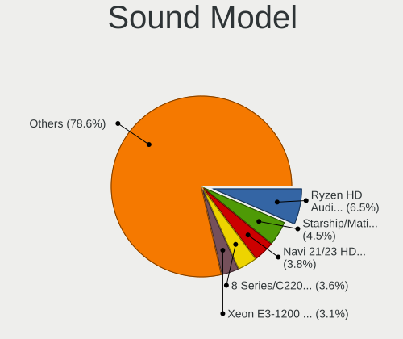

| Model                                                                             | Desktops | Percent |
|-----------------------------------------------------------------------------------|----------|---------|
| AMD Ryzen HD Audio Controller                                                     | 29       | 6.47%   |
| AMD Starship/Matisse HD Audio Controller                                          | 20       | 4.46%   |
| AMD Navi 21/23 HDMI/DP Audio Controller                                           | 17       | 3.79%   |
| Intel 8 Series/C220 Series Chipset High Definition Audio Controller               | 16       | 3.57%   |
| Intel Xeon E3-1200 v3/4th Gen Core Processor HD Audio Controller                  | 14       | 3.13%   |
| Intel NM10/ICH7 Family High Definition Audio Controller                           | 13       | 2.9%    |
| Intel 7 Series/C216 Chipset Family High Definition Audio Controller               | 13       | 2.9%    |
| Intel Cannon Lake PCH cAVS                                                        | 12       | 2.68%   |
| AMD SBx00 Azalia (Intel HDA)                                                      | 12       | 2.68%   |
| AMD Renoir/Cezanne HDMI/DP Audio Controller                                       | 12       | 2.68%   |
| AMD Radeon High Definition Audio Controller                                       | 12       | 2.68%   |
| AMD Ellesmere HDMI Audio [Radeon RX 470/480 / 570/580/590]                        | 12       | 2.68%   |
| Intel 6 Series/C200 Series Chipset Family High Definition Audio Controller        | 10       | 2.23%   |
| Intel 200 Series PCH HD Audio                                                     | 10       | 2.23%   |
| Intel 100 Series/C230 Series Chipset Family HD Audio Controller                   | 10       | 2.23%   |
| AMD Oland/Hainan/Cape Verde/Pitcairn HDMI Audio [Radeon HD 7000 Series]           | 9        | 2.01%   |
| AMD Navi 10 HDMI Audio                                                            | 9        | 2.01%   |
| Intel 82801I (ICH9 Family) HD Audio Controller                                    | 8        | 1.79%   |
| AMD FCH Azalia Controller                                                         | 8        | 1.79%   |
| AMD Family 17h (Models 00h-0fh) HD Audio Controller                               | 8        | 1.79%   |
| AMD Caicos HDMI Audio [Radeon HD 6450 / 7450/8450/8490 OEM / R5 230/235/235X OEM] | 8        | 1.79%   |
| Intel 82801JI (ICH10 Family) HD Audio Controller                                  | 7        | 1.56%   |
| AMD Baffin HDMI/DP Audio [Radeon RX 550 640SP / RX 560/560X]                      | 6        | 1.34%   |
| Intel Comet Lake PCH-V cAVS                                                       | 5        | 1.12%   |
| Nvidia MCP61 High Definition Audio                                                | 4        | 0.89%   |
| Nvidia GP106 High Definition Audio Controller                                     | 4        | 0.89%   |
| AMD Raven/Raven2/Fenghuang HDMI/DP Audio Controller                               | 4        | 0.89%   |
| AMD Kabini HDMI/DP Audio                                                          | 4        | 0.89%   |
| AMD Cedar HDMI Audio [Radeon HD 5400/6300/7300 Series]                            | 4        | 0.89%   |
| VIA Technologies VT8233/A/8235/8237 AC97 Audio Controller                         | 3        | 0.67%   |
| Texas Instruments PCM2902 Audio Codec                                             | 3        | 0.67%   |
| Nvidia GK208 HDMI/DP Audio Controller                                             | 3        | 0.67%   |
| Intel Wildcat Point-LP High Definition Audio Controller                           | 3        | 0.67%   |
| Intel Tiger Lake-H HD Audio Controller                                            | 3        | 0.67%   |
| Intel Sunrise Point-LP HD Audio                                                   | 3        | 0.67%   |
| Intel Jasper Lake HD Audio                                                        | 3        | 0.67%   |
| Intel Broadwell-U Audio Controller                                                | 3        | 0.67%   |
| Intel Atom Processor Z36xxx/Z37xxx Series High Definition Audio Controller        | 3        | 0.67%   |
| Intel Alder Lake-N PCH High Definition Audio Controller                           | 3        | 0.67%   |
| Intel 82801DB/DBL/DBM (ICH4/ICH4-L/ICH4-M) AC'97 Audio Controller                 | 3        | 0.67%   |

Memory
------

Memory Vendor
-------------

Memory module vendors

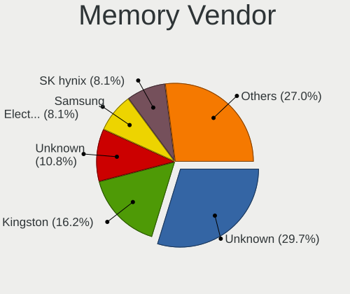

| Vendor              | Desktops | Percent |
|---------------------|----------|---------|
| Unknown             | 11       | 29.73%  |
| Kingston            | 6        | 16.22%  |
| Unknown             | 4        | 10.81%  |
| SK hynix            | 3        | 8.11%   |
| Samsung Electronics | 3        | 8.11%   |
| Transcend           | 2        | 5.41%   |
| Nanya Technology    | 2        | 5.41%   |
| Corsair             | 2        | 5.41%   |
| Ramaxel Technology  | 1        | 2.7%    |
| Patriot Memory      | 1        | 2.7%    |
| Micron Technology   | 1        | 2.7%    |
| Elpida              | 1        | 2.7%    |

Memory Model
------------

Memory module models

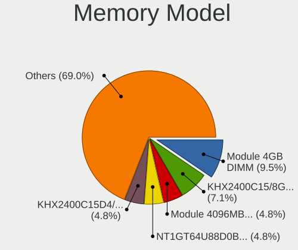

| Model                                                   | Desktops | Percent |
|---------------------------------------------------------|----------|---------|
| Unknown                                                 | 4        | 9.52%   |
| Kingston RAM KHX2400C15/8G 8GB DIMM DDR4 2400MT/s       | 3        | 7.14%   |
| Unknown RAM Module 4096MB SODIMM DDR3 1333MT/s          | 2        | 4.76%   |
| Nanya RAM NT1GT64U88D0BY-AD 1GB DIMM DDR2 800MT/s       | 2        | 4.76%   |
| Kingston RAM KHX2400C15D4/4G 4GB DIMM DDR4 2400MT/s     | 2        | 4.76%   |
| Unknown RAM Module 512MB DIMM SDRAM                     | 1        | 2.38%   |
| Unknown RAM Module 512MB DIMM DDR 400MT/s               | 1        | 2.38%   |
| Unknown RAM Module 512MB DIMM 400MT/s                   | 1        | 2.38%   |
| Unknown RAM Module 4GB SODIMM DDR3 1333MT/s             | 1        | 2.38%   |
| Unknown RAM Module 2GB DIMM DDR3 1332MT/s               | 1        | 2.38%   |
| Unknown RAM Module 2GB DIMM DDR2 667MT/s                | 1        | 2.38%   |
| Unknown RAM Module 256MB DIMM 333MT/s                   | 1        | 2.38%   |
| Unknown RAM Module 2048MB DIMM DDR2 266MT/s             | 1        | 2.38%   |
| Unknown RAM Module 1GB DIMM 400MT/s                     | 1        | 2.38%   |
| Unknown RAM Module 1024MB DIMM DDR                      | 1        | 2.38%   |
| Unknown RAM Module 1024MB DIMM 800MT/s                  | 1        | 2.38%   |
| Transcend RAM TS1GSK64W6H 8GB DIMM DDR3 1600MT/s        | 1        | 2.38%   |
| Transcend RAM TS128MLQ64V6J 1GB DIMM DDR2 667MT/s       | 1        | 2.38%   |
| SK hynix RAM HYMP112U64CP8-Y5 1GB DIMM DDR2 667MT/s     | 1        | 2.38%   |
| SK hynix RAM HMA84GR7DJR4N-XN 32GB DIMM DDR4 3200MT/s   | 1        | 2.38%   |
| SK hynix RAM HMA81GU6AFR8N-UH 8GB DIMM DDR4 2400MT/s    | 1        | 2.38%   |
| Samsung RAM M471B5173QH0-YK0 4GB SODIMM DDR3 1600MT/s   | 1        | 2.38%   |
| Samsung RAM M471B5173DB0-YK0 4GB SODIMM DDR3 1600MT/s   | 1        | 2.38%   |
| Samsung RAM M393A4K40CB1-CRC 32GB DIMM DDR4 2400MT/s    | 1        | 2.38%   |
| Samsung RAM M3 78T2953CZ3-CE6 1GB DIMM DDR2 667MT/s     | 1        | 2.38%   |
| Ramaxel RAM RMT3170ME68F9F1600 4GB SODIMM DDR3 1600MT/s | 1        | 2.38%   |
| Patriot Memory RAM PSD48G266681 8GB DIMM DDR4 2666MT/s  | 1        | 2.38%   |
| Micron RAM 8HTF12864AY-800E1 1GB DIMM DDR2 800MT/s      | 1        | 2.38%   |
| Kingston RAM KF560C36-16 16GB DIMM DDR5 4800MT/s        | 1        | 2.38%   |
| Kingston RAM KF3600C18D4/32GX 32GB DIMM DDR4 3600MT/s   | 1        | 2.38%   |
| Kingston RAM 9905316-005.A04LF 1GB DIMM DDR2 667MT/s    | 1        | 2.38%   |
| Elpida RAM EBE11UD8AJWA-8G-E 1024MB DIMM DDR2 800MT/s   | 1        | 2.38%   |
| Corsair RAM CML16GX3M2A1600C9 8GB DIMM DDR3 1600MT/s    | 1        | 2.38%   |
| Corsair RAM CMK64GX5M2B5200C40 32GB DIMM DDR5 4800MT/s  | 1        | 2.38%   |

Memory Kind
-----------

Memory module kinds

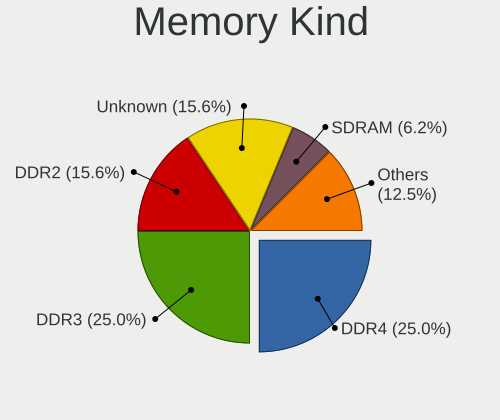

| Kind    | Desktops | Percent |
|---------|----------|---------|
| DDR4    | 8        | 25%     |
| DDR3    | 8        | 25%     |
| DDR2    | 5        | 15.63%  |
| Unknown | 5        | 15.63%  |
| SDRAM   | 2        | 6.25%   |
| DDR5    | 2        | 6.25%   |
| DDR     | 2        | 6.25%   |

Memory Form Factor
------------------

Physical design of the memory module

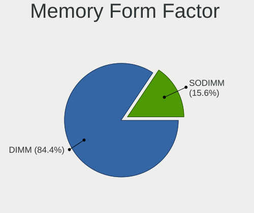

| Name   | Desktops | Percent |
|--------|----------|---------|
| DIMM   | 27       | 84.38%  |
| SODIMM | 5        | 15.63%  |

Memory Size
-----------

Memory module size

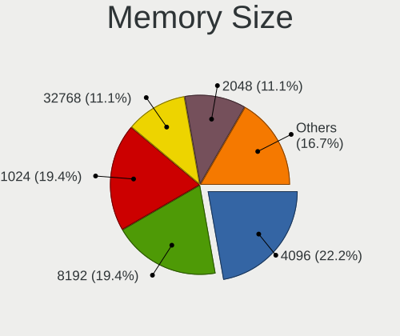

| Size  | Desktops | Percent |
|-------|----------|---------|
| 4096  | 8        | 22.22%  |
| 8192  | 7        | 19.44%  |
| 1024  | 7        | 19.44%  |
| 32768 | 4        | 11.11%  |
| 2048  | 4        | 11.11%  |
| 512   | 4        | 11.11%  |
| 16384 | 1        | 2.78%   |
| 256   | 1        | 2.78%   |

Memory Speed
------------

Memory module speed

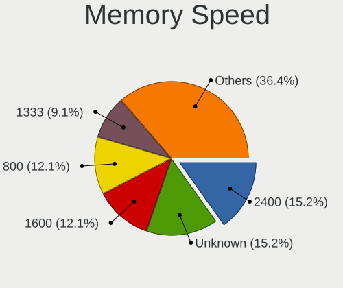

| Speed   | Desktops | Percent |
|---------|----------|---------|
| 2400    | 5        | 15.15%  |
| Unknown | 5        | 15.15%  |
| 1600    | 4        | 12.12%  |
| 800     | 4        | 12.12%  |
| 1333    | 3        | 9.09%   |
| 4800    | 2        | 6.06%   |
| 667     | 2        | 6.06%   |
| 400     | 2        | 6.06%   |
| 3600    | 1        | 3.03%   |
| 3200    | 1        | 3.03%   |
| 2666    | 1        | 3.03%   |
| 1332    | 1        | 3.03%   |
| 333     | 1        | 3.03%   |
| 266     | 1        | 3.03%   |

Printers & scanners
-------------------

Printer Vendor
--------------

Printer device vendors

Zero info for selected period =(

Printer Model
-------------

Printer device models

Zero info for selected period =(

Scanner Vendor
--------------

Scanner device vendors

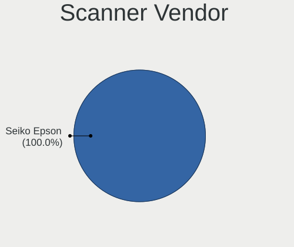

| Vendor      | Desktops | Percent |
|-------------|----------|---------|
| Seiko Epson | 1        | 100%    |

Scanner Model
-------------

Scanner device models

| Model                                               | Desktops | Percent |
|-----------------------------------------------------|----------|---------|
| Seiko Epson GT-F520/GT-F570 [Perfection 3590 PHOTO] | 1        | 100%    |

Camera
------

Camera Vendor
-------------

Camera device vendors

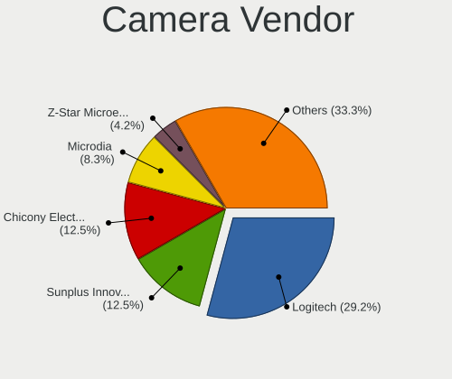

| Vendor                        | Desktops | Percent |
|-------------------------------|----------|---------|
| Logitech                      | 7        | 29.17%  |
| Sunplus Innovation Technology | 3        | 12.5%   |
| Chicony Electronics           | 3        | 12.5%   |
| Microdia                      | 2        | 8.33%   |
| Z-Star Microelectronics       | 1        | 4.17%   |
| Trust                         | 1        | 4.17%   |
| Ricoh                         | 1        | 4.17%   |
| Realtek Semiconductor         | 1        | 4.17%   |
| Jiangxi Shinetech Optical     | 1        | 4.17%   |
| Hewlett-Packard               | 1        | 4.17%   |
| Generalplus Technology        | 1        | 4.17%   |
| Bison Electronics             | 1        | 4.17%   |
| Asuscom Network               | 1        | 4.17%   |

Camera Model
------------

Camera device models

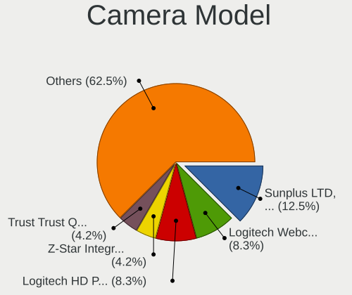

| Model                                 | Desktops | Percent |
|---------------------------------------|----------|---------|
| Sunplus LTD, NexiGo N930AF FHD Webcam | 3        | 12.5%   |
| Logitech Webcam C270                  | 2        | 8.33%   |
| Logitech HD Pro Webcam C920           | 2        | 8.33%   |
| Z-Star Integrated Camera              | 1        | 4.17%   |
| Trust Trust QHD Webcam                | 1        | 4.17%   |
| Ricoh USB2.0 Camera                   | 1        | 4.17%   |
| Realtek Integrated Webcam HD          | 1        | 4.17%   |
| Microdia USB  Live camera             | 1        | 4.17%   |
| Microdia Ltd., USB  Live camera       | 1        | 4.17%   |
| Logitech Webcam C310                  | 1        | 4.17%   |
| Logitech C920 PRO HD Webcam           | 1        | 4.17%   |
| Logitech C920 HD Pro Webcam           | 1        | 4.17%   |
| Jiangxi Shinetech Optical FHD Camera  | 1        | 4.17%   |
| HP HP FHD Webcam 620/625              | 1        | 4.17%   |
| Generalplus HD Webcam                 | 1        | 4.17%   |
| Chicony Webcam                        | 1        | 4.17%   |
| Chicony Ltd., HP 0.3MP Webcam         | 1        | 4.17%   |
| Chicony Integrated Camera [ThinkPad]  | 1        | 4.17%   |
| Bison Integrated Camera               | 1        | 4.17%   |
| Asuscom Network Depstech webcam       | 1        | 4.17%   |

Security
--------

Fingerprint Vendor
------------------

Fingerprint sensor vendors

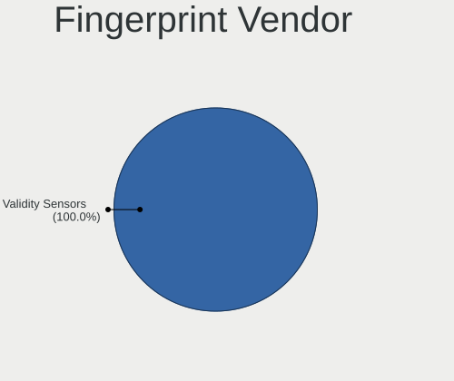

| Vendor                     | Desktops | Percent |
|----------------------------|----------|---------|
| Validity Sensors           | 1        | 20%     |
| Upek                       | 1        | 20%     |
| STMicroelectronics         | 1        | 20%     |
| Shenzhen Goodix Technology | 1        | 20%     |
| AuthenTec                  | 1        | 20%     |

Fingerprint Model
-----------------

Fingerprint sensor models

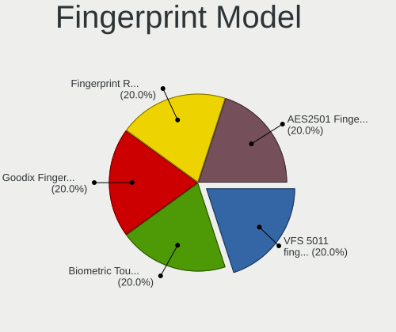

| Model                                                  | Desktops | Percent |
|--------------------------------------------------------|----------|---------|
| Validity Sensors VFS 5011 fingerprint sensor           | 1        | 20%     |
| Upek Biometric Touchchip/Touchstrip Fingerprint Sensor | 1        | 20%     |
| STMicroelectronics Fingerprint Reader                  | 1        | 20%     |
| Shenzhen Goodix Fingerprint Reader                     | 1        | 20%     |
| AuthenTec AES2501 Fingerprint Sensor                   | 1        | 20%     |

Chipcard Vendor
---------------

Chipcard module vendors

Zero info for selected period =(

Chipcard Model
--------------

Chipcard module models

Zero info for selected period =(

Unsupported
-----------

Unsupported Devices
-------------------

Total unsupported devices on board

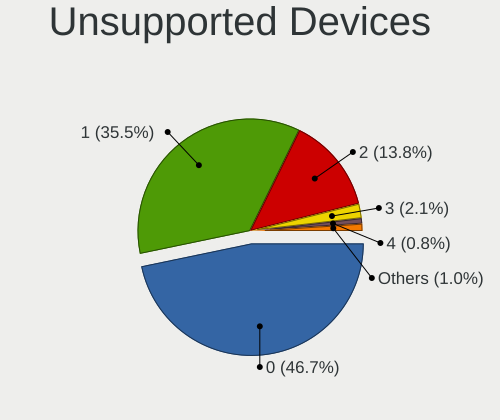

| Total | Desktops | Percent |
|-------|----------|---------|
| 0     | 179      | 46.74%  |
| 1     | 136      | 35.51%  |
| 2     | 53       | 13.84%  |
| 3     | 8        | 2.09%   |
| 4     | 3        | 0.78%   |
| 7     | 2        | 0.52%   |
| 5     | 2        | 0.52%   |

Unsupported Device Types
------------------------

Types of unsupported devices

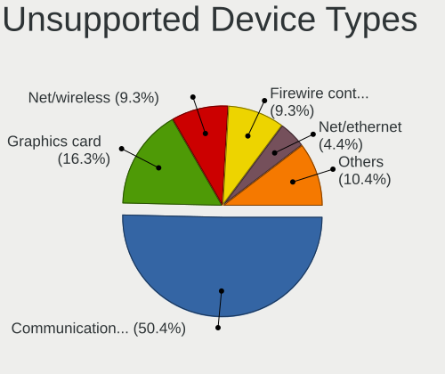

| Type                     | Desktops | Percent |
|--------------------------|----------|---------|
| Communication controller | 136      | 50.37%  |
| Graphics card            | 44       | 16.3%   |
| Net/wireless             | 25       | 9.26%   |
| Firewire controller      | 25       | 9.26%   |
| Net/ethernet             | 12       | 4.44%   |
| Storage/ata              | 11       | 4.07%   |
| Sound                    | 10       | 3.7%    |
| Storage                  | 2        | 0.74%   |
| Network                  | 2        | 0.74%   |
| Storage/raid             | 1        | 0.37%   |
| Storage/ide              | 1        | 0.37%   |
| Bluetooth                | 1        | 0.37%   |

