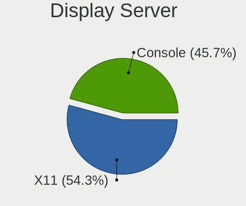
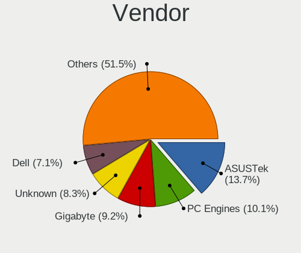
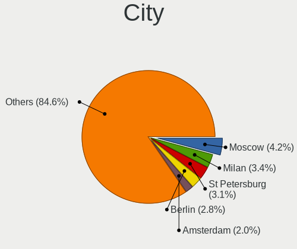
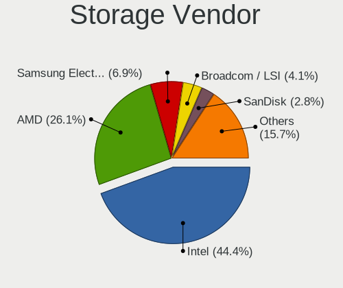
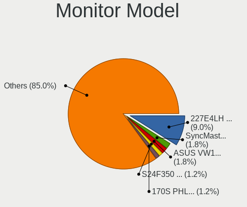
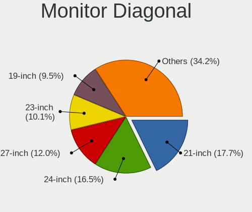
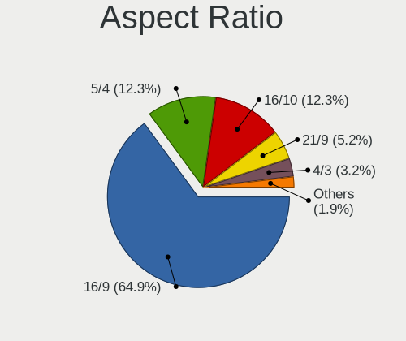
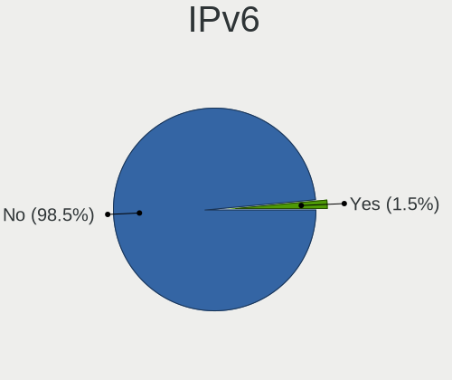
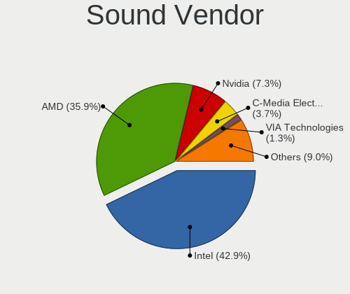

OpenBSD - Tested Hardware & Statistics (Desktops)
-------------------------------------------------

A project to collect tested hardware configurations for OpenBSD.

Anyone can contribute to this report by the [hw-probe](https://github.com/linuxhw/hw-probe/blob/master/INSTALL.BSD.md) tool:

    hw-probe -all -upload

Please contribute! Especially if your hardware is rare.

Contents
--------

* [ Test Cases ](#test-cases)

* [ System ](#system)
  - [ OS                       ](#os)
  - [ OS Family                ](#os-family)
  - [ Arch                     ](#arch)
  - [ DE                       ](#de)
  - [ Display Server           ](#display-server)
  - [ Display Manager          ](#display-manager)
  - [ OS Lang                  ](#os-lang)
  - [ Boot Mode                ](#boot-mode)
  - [ Filesystem               ](#filesystem)
  - [ Part. scheme             ](#part-scheme)

* [ Board ](#board)
  - [ Vendor                   ](#vendor)
  - [ Model                    ](#model)
  - [ Model Family             ](#model-family)
  - [ MFG Year                 ](#mfg-year)
  - [ Form Factor              ](#form-factor)
  - [ Coreboot                 ](#coreboot)
  - [ RAM Size                 ](#ram-size)
  - [ RAM Used                 ](#ram-used)
  - [ Total Drives             ](#total-drives)
  - [ Has CD-ROM               ](#has-cd-rom)
  - [ Has Ethernet             ](#has-ethernet)
  - [ Has WiFi                 ](#has-wifi)
  - [ Has Bluetooth            ](#has-bluetooth)

* [ Location ](#location)
  - [ Country                  ](#country)
  - [ City                     ](#city)

* [ Drives ](#drives)
  - [ Drive Vendor             ](#drive-vendor)
  - [ Drive Model              ](#drive-model)
  - [ HDD Vendor               ](#hdd-vendor)
  - [ SSD Vendor               ](#ssd-vendor)
  - [ Drive Kind               ](#drive-kind)
  - [ Drive Connector          ](#drive-connector)
  - [ Drive Size               ](#drive-size)
  - [ Space Total              ](#space-total)
  - [ Space Used               ](#space-used)
  - [ Malfunc. Drives          ](#malfunc-drives)
  - [ Malfunc. Drive Vendor    ](#malfunc-drive-vendor)
  - [ Malfunc. HDD Vendor      ](#malfunc-hdd-vendor)
  - [ Malfunc. Drive Kind      ](#malfunc-drive-kind)
  - [ Failed Drives            ](#failed-drives)
  - [ Failed Drive Vendor      ](#failed-drive-vendor)
  - [ Drive Status             ](#drive-status)

* [ Storage controller ](#storage-controller)
  - [ Storage Vendor           ](#storage-vendor)
  - [ Storage Model            ](#storage-model)
  - [ Storage Kind             ](#storage-kind)

* [ Processor ](#processor)
  - [ CPU Vendor               ](#cpu-vendor)
  - [ CPU Model                ](#cpu-model)
  - [ CPU Model Family         ](#cpu-model-family)
  - [ CPU Cores                ](#cpu-cores)
  - [ CPU Sockets              ](#cpu-sockets)
  - [ CPU Threads              ](#cpu-threads)
  - [ CPU Microarch            ](#cpu-microarch)

* [ Graphics ](#graphics)
  - [ GPU Vendor               ](#gpu-vendor)
  - [ GPU Model                ](#gpu-model)
  - [ GPU Combo                ](#gpu-combo)
  - [ GPU Driver               ](#gpu-driver)
  - [ GPU Memory               ](#gpu-memory)

* [ Monitor ](#monitor)
  - [ Monitor Vendor           ](#monitor-vendor)
  - [ Monitor Model            ](#monitor-model)
  - [ Monitor Resolution       ](#monitor-resolution)
  - [ Monitor Diagonal         ](#monitor-diagonal)
  - [ Monitor Width            ](#monitor-width)
  - [ Aspect Ratio             ](#aspect-ratio)
  - [ Monitor Area             ](#monitor-area)
  - [ Pixel Density            ](#pixel-density)
  - [ Multiple Monitors        ](#multiple-monitors)

* [ Network ](#network)
  - [ Net Controller Vendor    ](#net-controller-vendor)
  - [ Net Controller Model     ](#net-controller-model)
  - [ Wireless Vendor          ](#wireless-vendor)
  - [ Wireless Model           ](#wireless-model)
  - [ Ethernet Vendor          ](#ethernet-vendor)
  - [ Ethernet Model           ](#ethernet-model)
  - [ Net Controller Kind      ](#net-controller-kind)
  - [ Used Controller          ](#used-controller)
  - [ NICs                     ](#nics)
  - [ IPv6                     ](#ipv6)

* [ Bluetooth ](#bluetooth)
  - [ Bluetooth Vendor         ](#bluetooth-vendor)
  - [ Bluetooth Model          ](#bluetooth-model)

* [ Sound ](#sound)
  - [ Sound Vendor             ](#sound-vendor)
  - [ Sound Model              ](#sound-model)

* [ Memory ](#memory)
  - [ Memory Vendor            ](#memory-vendor)
  - [ Memory Model             ](#memory-model)
  - [ Memory Kind              ](#memory-kind)
  - [ Memory Form Factor       ](#memory-form-factor)
  - [ Memory Size              ](#memory-size)
  - [ Memory Speed             ](#memory-speed)

* [ Printers & scanners ](#printers--scanners)
  - [ Printer Vendor           ](#printer-vendor)
  - [ Printer Model            ](#printer-model)
  - [ Scanner Vendor           ](#scanner-vendor)
  - [ Scanner Model            ](#scanner-model)

* [ Camera ](#camera)
  - [ Camera Vendor            ](#camera-vendor)
  - [ Camera Model             ](#camera-model)

* [ Security ](#security)
  - [ Fingerprint Vendor       ](#fingerprint-vendor)
  - [ Fingerprint Model        ](#fingerprint-model)
  - [ Chipcard Vendor          ](#chipcard-vendor)
  - [ Chipcard Model           ](#chipcard-model)

* [ Unsupported ](#unsupported)
  - [ Unsupported Devices      ](#unsupported-devices)
  - [ Unsupported Device Types ](#unsupported-device-types)

Test Cases
----------

Total: 278

| Vendor        | Model                       | Probe                                                     | Date         |
|---------------|-----------------------------|-----------------------------------------------------------|--------------|
| ASUSTek       | TUF Gaming B550-PLUS        | [77acc9f5cf](https://bsd-hardware.info/?probe=77acc9f5cf) | Jul 01, 2022 |
| ASUSTek       | TUF Gaming B550-PLUS        | [ffa0086c70](https://bsd-hardware.info/?probe=ffa0086c70) | Jul 01, 2022 |
| Gigabyte      | G41MT-S2                    | [0563158740](https://bsd-hardware.info/?probe=0563158740) | Jun 28, 2022 |
| MSI           | MS-7C02                     | [65265eea62](https://bsd-hardware.info/?probe=65265eea62) | Jun 20, 2022 |
| Lenovo        | ThinkPad T530 24292VG       | [6f744019ce](https://bsd-hardware.info/?probe=6f744019ce) | Jun 19, 2022 |
| Apple         | MacPro4,1                   | [65380f3847](https://bsd-hardware.info/?probe=65380f3847) | Jun 06, 2022 |
| ASUSTek       | PRIME H410M-E               | [8099e7abaf](https://bsd-hardware.info/?probe=8099e7abaf) | Jun 03, 2022 |
| MSI           | MS-6788                     | [f750cb83e3](https://bsd-hardware.info/?probe=f750cb83e3) | May 31, 2022 |
| Unknown       | Raspberry Pi 4 Model B R... | [ade09344b8](https://bsd-hardware.info/?probe=ade09344b8) | May 26, 2022 |
| Unknown       | Raspberry Pi 4 Model B R... | [cc37ea1b7d](https://bsd-hardware.info/?probe=cc37ea1b7d) | May 26, 2022 |
| Unknown       | Raspberry Pi 4 Model B R... | [abacee12a9](https://bsd-hardware.info/?probe=abacee12a9) | May 26, 2022 |
| Unknown       | Raspberry Pi 3 Model B P... | [21fa41e4c1](https://bsd-hardware.info/?probe=21fa41e4c1) | May 26, 2022 |
| Gigabyte      | H81M-S2PV                   | [1937e77b97](https://bsd-hardware.info/?probe=1937e77b97) | May 22, 2022 |
| Biostar       | G31-M7 TE                   | [5c7af4b143](https://bsd-hardware.info/?probe=5c7af4b143) | May 21, 2022 |
| ASUSTek       | PRIME B550M-K               | [ce5ddde5ad](https://bsd-hardware.info/?probe=ce5ddde5ad) | May 18, 2022 |
| MSI           | MS-7C82                     | [2ad883afec](https://bsd-hardware.info/?probe=2ad883afec) | May 15, 2022 |
| ASUSTek       | PRIME X470-PRO              | [9f6b4f114d](https://bsd-hardware.info/?probe=9f6b4f114d) | May 11, 2022 |
| Unknown       | Raspberry Pi 4 Model B R... | [154799d7fa](https://bsd-hardware.info/?probe=154799d7fa) | May 08, 2022 |
| Intel         | Q3XXG4-P                    | [ed04988a23](https://bsd-hardware.info/?probe=ed04988a23) | May 03, 2022 |
| MSI           | MS-7C37                     | [aaab7cf22a](https://bsd-hardware.info/?probe=aaab7cf22a) | Apr 28, 2022 |
| ASUSTek       | M4A88TD-V EVO/USB3          | [12cc40cc60](https://bsd-hardware.info/?probe=12cc40cc60) | Apr 23, 2022 |
| PC Engines    | APU2                        | [04a6549c99](https://bsd-hardware.info/?probe=04a6549c99) | Apr 23, 2022 |
| Apple         | PowerMac10,1                | [e054e605fa](https://bsd-hardware.info/?probe=e054e605fa) | Apr 23, 2022 |
| Intel         | DH67BL                      | [3c3c9e12da](https://bsd-hardware.info/?probe=3c3c9e12da) | Apr 22, 2022 |
| KOHJINSHA     | SH series                   | [3136a0ca03](https://bsd-hardware.info/?probe=3136a0ca03) | Apr 22, 2022 |
| Lenovo        | ThinkPad X240 20ALA0AHRT    | [062a08c811](https://bsd-hardware.info/?probe=062a08c811) | Apr 22, 2022 |
| Sony          | VPCL22Z1R                   | [f199d57905](https://bsd-hardware.info/?probe=f199d57905) | Apr 22, 2022 |
| ASUSTek       | Z170-K                      | [b16705bbbd](https://bsd-hardware.info/?probe=b16705bbbd) | Apr 22, 2022 |
| ASUSTek       | P10S-I Series               | [aca13dba36](https://bsd-hardware.info/?probe=aca13dba36) | Apr 22, 2022 |
| Dell          | G5 5090                     | [8b24170852](https://bsd-hardware.info/?probe=8b24170852) | Apr 17, 2022 |
| PC Engines    | apu4                        | [62df504364](https://bsd-hardware.info/?probe=62df504364) | Apr 09, 2022 |
| Unknown       | Raspberry Pi 3 Model B R... | [040f37113c](https://bsd-hardware.info/?probe=040f37113c) | Apr 06, 2022 |
| Intel         | DCP847SKE                   | [a79e298be3](https://bsd-hardware.info/?probe=a79e298be3) | Apr 03, 2022 |
| Lenovo        | ThinkCentre M93p 10AAS25... | [32d27b9404](https://bsd-hardware.info/?probe=32d27b9404) | Mar 19, 2022 |
| Lenovo        | ThinkCentre M93p 10AAS25... | [7361628ed9](https://bsd-hardware.info/?probe=7361628ed9) | Mar 19, 2022 |
| Unknown       | LeMaker Banana Pi           | [37e7d1912b](https://bsd-hardware.info/?probe=37e7d1912b) | Mar 05, 2022 |
| Intel         | D945GSEJT                   | [bf6a38dfcb](https://bsd-hardware.info/?probe=bf6a38dfcb) | Feb 26, 2022 |
| Dell          | OptiPlex 755                | [9ddfe010c4](https://bsd-hardware.info/?probe=9ddfe010c4) | Feb 24, 2022 |
| Gigabyte      | X58A-UD5                    | [58d57520c1](https://bsd-hardware.info/?probe=58d57520c1) | Feb 20, 2022 |
| Unknown       | Raspberry Pi 4 Model B R... | [04e528ca9f](https://bsd-hardware.info/?probe=04e528ca9f) | Feb 19, 2022 |
| ASRock        | FM2A88X Extreme6+           | [07546b5925](https://bsd-hardware.info/?probe=07546b5925) | Feb 18, 2022 |
| MSI           | MS-7253                     | [c4e971ea82](https://bsd-hardware.info/?probe=c4e971ea82) | Feb 16, 2022 |
| Raspberry ... | Raspberry Pi 400            | [dd56609ceb](https://bsd-hardware.info/?probe=dd56609ceb) | Feb 14, 2022 |
| Lenovo        | ThinkPad T400 2768W3A       | [4691fdb146](https://bsd-hardware.info/?probe=4691fdb146) | Feb 13, 2022 |
| Lenovo        | ThinkPad T400 2768W3A       | [97788dfb1a](https://bsd-hardware.info/?probe=97788dfb1a) | Feb 13, 2022 |
| Unknown       | LeMaker Banana Pi           | [77413a3d9d](https://bsd-hardware.info/?probe=77413a3d9d) | Feb 12, 2022 |
| HP            | t620 Quad Core TC           | [965ced51e6](https://bsd-hardware.info/?probe=965ced51e6) | Feb 12, 2022 |
| MSI           | MS-7C96                     | [c08331ad58](https://bsd-hardware.info/?probe=c08331ad58) | Feb 06, 2022 |
| Raspberry ... | Raspberry Pi 400            | [b35265f8f4](https://bsd-hardware.info/?probe=b35265f8f4) | Jan 29, 2022 |
| Gigabyte      | Z590 VISION G               | [9c73c01062](https://bsd-hardware.info/?probe=9c73c01062) | Jan 28, 2022 |
| WYSE          | D CLASS                     | [5f31ae866c](https://bsd-hardware.info/?probe=5f31ae866c) | Jan 24, 2022 |
| ASRock        | X570 Pro4                   | [d77aae8064](https://bsd-hardware.info/?probe=d77aae8064) | Jan 23, 2022 |
| MSI           | MS-7C56                     | [962ac1c7b0](https://bsd-hardware.info/?probe=962ac1c7b0) | Jan 20, 2022 |
| Unknown       | TI AM335x BeagleBone Bla... | [14d6cfb7a4](https://bsd-hardware.info/?probe=14d6cfb7a4) | Dec 27, 2021 |
| Unknown       | TI AM335x BeagleBone Bla... | [ce75fa56bd](https://bsd-hardware.info/?probe=ce75fa56bd) | Dec 27, 2021 |
| Unknown       | TI AM335x BeagleBone Bla... | [612825abe3](https://bsd-hardware.info/?probe=612825abe3) | Dec 27, 2021 |
| Gigabyte      | X470 AORUS ULTRA GAMING     | [2ee4c7fefe](https://bsd-hardware.info/?probe=2ee4c7fefe) | Dec 27, 2021 |
| PC Engines    | APU2                        | [d271c4a29f](https://bsd-hardware.info/?probe=d271c4a29f) | Dec 15, 2021 |
| Gigabyte      | H81M-S2PV                   | [0d4c532744](https://bsd-hardware.info/?probe=0d4c532744) | Nov 29, 2021 |
| MSI           | MS-7C56                     | [d4e3f14ad4](https://bsd-hardware.info/?probe=d4e3f14ad4) | Nov 23, 2021 |
| PC Engines    | APU2                        | [15a26da041](https://bsd-hardware.info/?probe=15a26da041) | Nov 14, 2021 |
| Unknown       | Hardkernel ODROID-N2        | [42f6e357c9](https://bsd-hardware.info/?probe=42f6e357c9) | Nov 05, 2021 |
| Yanling       | YL-KBR6L                    | [35f1c905eb](https://bsd-hardware.info/?probe=35f1c905eb) | Nov 04, 2021 |
| HP            | 0A60h                       | [5c227c5b61](https://bsd-hardware.info/?probe=5c227c5b61) | Oct 27, 2021 |
| HP            | ProDesk 600 G1 SFF          | [7f19a8a566](https://bsd-hardware.info/?probe=7f19a8a566) | Oct 26, 2021 |
| Supermicro    | X7SBL                       | [f5b4e8e7ab](https://bsd-hardware.info/?probe=f5b4e8e7ab) | Oct 23, 2021 |
| Lenovo        | SHARKBAY No DPK             | [e762f9146e](https://bsd-hardware.info/?probe=e762f9146e) | Oct 16, 2021 |
| ASUSTek       | P10S-I Series               | [d086bf947a](https://bsd-hardware.info/?probe=d086bf947a) | Oct 15, 2021 |
| Gigabyte      | B450M DS3H                  | [445b53ddba](https://bsd-hardware.info/?probe=445b53ddba) | Oct 15, 2021 |
| Protectli     | FW6                         | [de39c4e316](https://bsd-hardware.info/?probe=de39c4e316) | Oct 15, 2021 |
| MSI           | MS-7D54                     | [ac1f6ee8a6](https://bsd-hardware.info/?probe=ac1f6ee8a6) | Oct 13, 2021 |
| Gigabyte      | B450M DS3H                  | [50e4e13ee0](https://bsd-hardware.info/?probe=50e4e13ee0) | Oct 07, 2021 |
| MSI           | MS-7B53                     | [c7104d301e](https://bsd-hardware.info/?probe=c7104d301e) | Oct 05, 2021 |
| Unknown       | Raspberry Pi 4 Model B R... | [49173900e7](https://bsd-hardware.info/?probe=49173900e7) | Oct 04, 2021 |
| Unknown       | Raspberry Pi 4 Model B R... | [d05a877535](https://bsd-hardware.info/?probe=d05a877535) | Oct 03, 2021 |
| ASUSTek       | ROG STRIX X470-F GAMING     | [46672cf89f](https://bsd-hardware.info/?probe=46672cf89f) | Oct 01, 2021 |
| ASUSTek       | ROG STRIX X470-F GAMING     | [838a177f57](https://bsd-hardware.info/?probe=838a177f57) | Sep 30, 2021 |
| HP            | Pro3500 Series              | [abf3223f32](https://bsd-hardware.info/?probe=abf3223f32) | Sep 19, 2021 |
| ASUSTek       | ROG STRIX B550-I GAMING     | [7a800aec88](https://bsd-hardware.info/?probe=7a800aec88) | Sep 15, 2021 |
| NF541         | Unknown                     | [deb29af749](https://bsd-hardware.info/?probe=deb29af749) | Sep 11, 2021 |
| MSI           | MS-7A34                     | [decfe43121](https://bsd-hardware.info/?probe=decfe43121) | Sep 10, 2021 |
| PC Engines    | apu4                        | [9557835b54](https://bsd-hardware.info/?probe=9557835b54) | Sep 09, 2021 |
| Gigabyte      | BRi3(H)-10110               | [9aa3540749](https://bsd-hardware.info/?probe=9aa3540749) | Sep 09, 2021 |
| Gigabyte      | B550I AORUS PRO AX          | [f860e13b6b](https://bsd-hardware.info/?probe=f860e13b6b) | Sep 08, 2021 |
| ASUSTek       | ROG STRIX B550-I GAMING     | [1b6bf4666c](https://bsd-hardware.info/?probe=1b6bf4666c) | Sep 05, 2021 |
| Gigabyte      | GA-7VT600                   | [83b86f3e8c](https://bsd-hardware.info/?probe=83b86f3e8c) | Aug 23, 2021 |
| Unknown       | FriendlyElec NanoPi R4S     | [ac10928ac3](https://bsd-hardware.info/?probe=ac10928ac3) | Aug 05, 2021 |
| Unknown       | Pine64 Rock64               | [0df3f7572c](https://bsd-hardware.info/?probe=0df3f7572c) | Jul 23, 2021 |
| ASUSTek       | B202                        | [9f5f0a4117](https://bsd-hardware.info/?probe=9f5f0a4117) | Jul 21, 2021 |
| Unknown       | Pine64 Rock64               | [83c18360fc](https://bsd-hardware.info/?probe=83c18360fc) | Jul 12, 2021 |
| HP            | ProLiant DL360e Gen8        | [30eeb098b0](https://bsd-hardware.info/?probe=30eeb098b0) | Jul 10, 2021 |
| HP            | ProLiant DL320 G5           | [3b4ee33976](https://bsd-hardware.info/?probe=3b4ee33976) | Jul 10, 2021 |
| Foxconn       | AT-7000 Series              | [3802fb98b5](https://bsd-hardware.info/?probe=3802fb98b5) | Jul 10, 2021 |
| Unknown       | Pine64 Rock64               | [106c7823a8](https://bsd-hardware.info/?probe=106c7823a8) | Jul 10, 2021 |
| Unknown       | Pine64 Rock64               | [9cffa29c69](https://bsd-hardware.info/?probe=9cffa29c69) | Jul 08, 2021 |
| ASUSTek       | PRIME B560M-A               | [55f46bc85d](https://bsd-hardware.info/?probe=55f46bc85d) | Jul 07, 2021 |
| Unknown       | Unknown                     | [cfb0e172cb](https://bsd-hardware.info/?probe=cfb0e172cb) | Jun 27, 2021 |
| Dell          | 0GTK4K A02                  | [bb610333d0](https://bsd-hardware.info/?probe=bb610333d0) | Jun 22, 2021 |
| ASRock        | X99 WS                      | [201a7417a5](https://bsd-hardware.info/?probe=201a7417a5) | Jun 11, 2021 |
| Supermicro    | X8DTH-i/6/iF/6F             | [1e8ac47693](https://bsd-hardware.info/?probe=1e8ac47693) | Jun 08, 2021 |
| Supermicro    | X8DTH-i/6/iF/6F             | [bd4a74c5e5](https://bsd-hardware.info/?probe=bd4a74c5e5) | Jun 08, 2021 |
| Supermicro    | X10SLH-N6-ST031             | [e54175f99f](https://bsd-hardware.info/?probe=e54175f99f) | Jun 06, 2021 |
| ASRock        | Z68 Extreme4 Gen3           | [58c8cdc060](https://bsd-hardware.info/?probe=58c8cdc060) | Jun 05, 2021 |
| Shuttle       | DS77U                       | [5d1c78145e](https://bsd-hardware.info/?probe=5d1c78145e) | May 30, 2021 |
| ASUSTek       | PRIME B560M-A               | [ca05acd52f](https://bsd-hardware.info/?probe=ca05acd52f) | May 30, 2021 |
| ASRock        | X570M Pro4                  | [1d1a5afcfb](https://bsd-hardware.info/?probe=1d1a5afcfb) | May 28, 2021 |
| Alienware     | Aurora Ryzen Edition        | [b9dc8b182c](https://bsd-hardware.info/?probe=b9dc8b182c) | May 28, 2021 |
| Apple         | PowerMac10,1                | [d098ba539d](https://bsd-hardware.info/?probe=d098ba539d) | May 27, 2021 |
| ASUSTek       | B202                        | [0b66a5fd20](https://bsd-hardware.info/?probe=0b66a5fd20) | May 21, 2021 |
| PC Engines    | APU2                        | [c99a0b0e4d](https://bsd-hardware.info/?probe=c99a0b0e4d) | May 05, 2021 |
| ASRock        | X99 WS                      | [eb20367455](https://bsd-hardware.info/?probe=eb20367455) | May 05, 2021 |
| Supermicro    | X8STi                       | [c615ef1edf](https://bsd-hardware.info/?probe=c615ef1edf) | May 04, 2021 |
| Lenovo        | ThinkCentre M93p 10AAS25... | [a9bbd07ad9](https://bsd-hardware.info/?probe=a9bbd07ad9) | May 03, 2021 |
| PC Engines    | apu1                        | [7b4678c7ef](https://bsd-hardware.info/?probe=7b4678c7ef) | May 03, 2021 |
| ASUSTek       | P10S-I Series               | [6548ae7d88](https://bsd-hardware.info/?probe=6548ae7d88) | May 01, 2021 |
| PC Engines    | apu1                        | [c5ae3337e7](https://bsd-hardware.info/?probe=c5ae3337e7) | May 01, 2021 |
| ASUSTek       | All Series                  | [ef6afe88d7](https://bsd-hardware.info/?probe=ef6afe88d7) | Apr 17, 2021 |
| ECT           | One Computer AMD A10-785... | [de7e23b3e3](https://bsd-hardware.info/?probe=de7e23b3e3) | Apr 07, 2021 |
| Gigabyte      | GB-BXBT-2807                | [25e9765fc0](https://bsd-hardware.info/?probe=25e9765fc0) | Apr 03, 2021 |
| ASUSTek       | All Series                  | [c5bc64e4e9](https://bsd-hardware.info/?probe=c5bc64e4e9) | Mar 22, 2021 |
| ASUSTek       | All Series                  | [700ff7d378](https://bsd-hardware.info/?probe=700ff7d378) | Mar 22, 2021 |
| HP            | ProLiant DL360 Gen9         | [b283b34881](https://bsd-hardware.info/?probe=b283b34881) | Mar 17, 2021 |
| HP            | ProLiant DL360 Gen9         | [bf440e72a1](https://bsd-hardware.info/?probe=bf440e72a1) | Mar 17, 2021 |
| HP            | EliteDesk 800 G5 SFF        | [aaf9bc1c12](https://bsd-hardware.info/?probe=aaf9bc1c12) | Mar 17, 2021 |
| Lenovo        | ThinkPad T440p 20AWS1HL0... | [954c65dbcf](https://bsd-hardware.info/?probe=954c65dbcf) | Mar 11, 2021 |
| ASUSTek       | All Series                  | [b4aec46644](https://bsd-hardware.info/?probe=b4aec46644) | Mar 07, 2021 |
| ASUSTek       | All Series                  | [f7b1921594](https://bsd-hardware.info/?probe=f7b1921594) | Mar 07, 2021 |
| ASRock        | G31M-VS2                    | [6c7150dc1b](https://bsd-hardware.info/?probe=6c7150dc1b) | Feb 24, 2021 |
| ASRock        | J4205-ITX                   | [c8e0b22858](https://bsd-hardware.info/?probe=c8e0b22858) | Feb 23, 2021 |
| PC Engines    | apu4                        | [b30884fc0e](https://bsd-hardware.info/?probe=b30884fc0e) | Feb 18, 2021 |
| PC Engines    | APU3                        | [449967354c](https://bsd-hardware.info/?probe=449967354c) | Feb 18, 2021 |
| PC Engines    | APU2                        | [b911e3bec2](https://bsd-hardware.info/?probe=b911e3bec2) | Feb 18, 2021 |
| Shuttle       | DS77U                       | [2d0bd0e99a](https://bsd-hardware.info/?probe=2d0bd0e99a) | Feb 14, 2021 |
| Gigabyte      | Z68A-D3H-B3                 | [e1c3b89d0d](https://bsd-hardware.info/?probe=e1c3b89d0d) | Feb 06, 2021 |
| ASUSTek       | PRIME X470-PRO              | [828a9df369](https://bsd-hardware.info/?probe=828a9df369) | Feb 01, 2021 |
| Lenovo        | ThinkCentre M93p 10A8S0C... | [c8af335c01](https://bsd-hardware.info/?probe=c8af335c01) | Jan 29, 2021 |
| Raspberry ... | Raspberry Pi 4 Model B      | [8c953bac3f](https://bsd-hardware.info/?probe=8c953bac3f) | Jan 25, 2021 |
| ASUSTek       | All Series                  | [7ebe6eee38](https://bsd-hardware.info/?probe=7ebe6eee38) | Jan 25, 2021 |
| ASUSTek       | PRIME X370-PRO              | [2a81a1bd1f](https://bsd-hardware.info/?probe=2a81a1bd1f) | Jan 24, 2021 |
| Sun           | SUNW,Sun-Blade-1500         | [647618a0ca](https://bsd-hardware.info/?probe=647618a0ca) | Jan 22, 2021 |
| PC Engines    | apu1                        | [a5d18dcbbc](https://bsd-hardware.info/?probe=a5d18dcbbc) | Jan 21, 2021 |
| PC Engines    | apu1                        | [70918da1e7](https://bsd-hardware.info/?probe=70918da1e7) | Jan 21, 2021 |
| Sun           | SUNW,Sun-Blade-100          | [299c76eb85](https://bsd-hardware.info/?probe=299c76eb85) | Jan 18, 2021 |
| Lenovo        | ThinkCentre M93p 10A8S0C... | [36ef631bfe](https://bsd-hardware.info/?probe=36ef631bfe) | Jan 05, 2021 |
| Gigabyte      | 970A-DS3P                   | [f0b9687ab8](https://bsd-hardware.info/?probe=f0b9687ab8) | Dec 22, 2020 |
| Unknown       | ODYSSEY-X86J4105            | [17749e13c8](https://bsd-hardware.info/?probe=17749e13c8) | Dec 16, 2020 |
| ASUSTek       | PRIME B450M-A               | [d13e0a1749](https://bsd-hardware.info/?probe=d13e0a1749) | Dec 15, 2020 |
| Supermicro    | X11DDW-L                    | [57a5022e27](https://bsd-hardware.info/?probe=57a5022e27) | Dec 14, 2020 |
| ASUSTek       | P4P800-VM                   | [4fe4c14195](https://bsd-hardware.info/?probe=4fe4c14195) | Dec 05, 2020 |
| Apple         | Xserve3,1                   | [7329a7650d](https://bsd-hardware.info/?probe=7329a7650d) | Dec 05, 2020 |
| Gigabyte      | Unknown                     | [8a9ae48d42](https://bsd-hardware.info/?probe=8a9ae48d42) | Dec 01, 2020 |
| HP            | Compaq dc7800 Small Form... | [2b49eb75dc](https://bsd-hardware.info/?probe=2b49eb75dc) | Nov 27, 2020 |
| HP            | Compaq dc7800 Small Form... | [3fe6528682](https://bsd-hardware.info/?probe=3fe6528682) | Nov 27, 2020 |
| Dell          | OptiPlex GX1 500M+          | [deb0d463ab](https://bsd-hardware.info/?probe=deb0d463ab) | Nov 27, 2020 |
| Dell          | OptiPlex GX1 500M+          | [5186eb9e52](https://bsd-hardware.info/?probe=5186eb9e52) | Nov 26, 2020 |
| ASUSTek       | PRIME X370-PRO              | [9cf79cf54b](https://bsd-hardware.info/?probe=9cf79cf54b) | Nov 22, 2020 |
| ASUSTek       | PRIME X370-PRO              | [cab036429d](https://bsd-hardware.info/?probe=cab036429d) | Nov 22, 2020 |
| Unknown       | cavium,ubnt_e300            | [b8524b5002](https://bsd-hardware.info/?probe=b8524b5002) | Nov 20, 2020 |
| Raspberry ... | Raspberry Pi 4 Model B      | [c030400069](https://bsd-hardware.info/?probe=c030400069) | Nov 19, 2020 |
| ASRock        | IMB-191                     | [76991234cd](https://bsd-hardware.info/?probe=76991234cd) | Nov 18, 2020 |
| HARDKERNEL    | ODROID-H2                   | [c03bc18b3a](https://bsd-hardware.info/?probe=c03bc18b3a) | Nov 18, 2020 |
| MSI           | MS-B09012                   | [7ba791108f](https://bsd-hardware.info/?probe=7ba791108f) | Nov 18, 2020 |
| PC Engines    | APU2                        | [b4f5d7d344](https://bsd-hardware.info/?probe=b4f5d7d344) | Nov 16, 2020 |
| Supermicro    | X8DTH-i/6/iF/6F             | [778cb9f428](https://bsd-hardware.info/?probe=778cb9f428) | Nov 16, 2020 |
| Gigabyte      | GB-BXBT-2807                | [c11b475d28](https://bsd-hardware.info/?probe=c11b475d28) | Nov 13, 2020 |
| Lenovo        | ThinkCentre M92p 3212AD2    | [579528e284](https://bsd-hardware.info/?probe=579528e284) | Nov 10, 2020 |
| Gigabyte      | M61SME-S2L                  | [d8809eb5e7](https://bsd-hardware.info/?probe=d8809eb5e7) | Nov 09, 2020 |
| Gigabyte      | M61SME-S2L                  | [e5f658c70a](https://bsd-hardware.info/?probe=e5f658c70a) | Nov 09, 2020 |
| Pegatron      | SKLD4-P1                    | [ea548b4c71](https://bsd-hardware.info/?probe=ea548b4c71) | Nov 08, 2020 |
| Soekris En... | net5501                     | [bd9930a18a](https://bsd-hardware.info/?probe=bd9930a18a) | Nov 06, 2020 |
| Soekris En... | net6501                     | [fdf124653b](https://bsd-hardware.info/?probe=fdf124653b) | Nov 06, 2020 |
| MSI           | MS-7A34                     | [8c87d6b643](https://bsd-hardware.info/?probe=8c87d6b643) | Nov 03, 2020 |
| PC Engines    | APU2                        | [e0361ddbad](https://bsd-hardware.info/?probe=e0361ddbad) | Oct 31, 2020 |
| ASUSTek       | B75M-A                      | [43ece33e8c](https://bsd-hardware.info/?probe=43ece33e8c) | Oct 31, 2020 |
| Intel         | D945GCLF2                   | [58678b0643](https://bsd-hardware.info/?probe=58678b0643) | Oct 30, 2020 |
| Intel         | D945GCLF2                   | [3354fb903b](https://bsd-hardware.info/?probe=3354fb903b) | Oct 30, 2020 |
| Gigabyte      | X570 AORUS ELITE            | [973b62551f](https://bsd-hardware.info/?probe=973b62551f) | Oct 30, 2020 |
| eMachines     | EL1200                      | [ae59908738](https://bsd-hardware.info/?probe=ae59908738) | Oct 30, 2020 |
| Acer          | Veriton M6610G              | [7dd00aa8b1](https://bsd-hardware.info/?probe=7dd00aa8b1) | Oct 30, 2020 |
| eMachines     | EL1200                      | [5bc54351be](https://bsd-hardware.info/?probe=5bc54351be) | Oct 30, 2020 |
| ECS           | BSWI-D2                     | [c5b07f5c31](https://bsd-hardware.info/?probe=c5b07f5c31) | Oct 30, 2020 |
| ASRock        | N3160-NUC IPC               | [8d13af2f0b](https://bsd-hardware.info/?probe=8d13af2f0b) | Oct 28, 2020 |
| ASRock        | N3160-NUC IPC               | [8714fe0665](https://bsd-hardware.info/?probe=8714fe0665) | Oct 28, 2020 |
| ASUSTek       | PRIME B250M-C               | [4594c1084c](https://bsd-hardware.info/?probe=4594c1084c) | Oct 28, 2020 |
| Shuttle       | DS77U                       | [c70e526574](https://bsd-hardware.info/?probe=c70e526574) | Oct 27, 2020 |
| PC Engines    | APU2                        | [ce4c41d466](https://bsd-hardware.info/?probe=ce4c41d466) | Oct 26, 2020 |
| Dell          | PowerEdge R230              | [1422e9737b](https://bsd-hardware.info/?probe=1422e9737b) | Oct 26, 2020 |
| Supermicro    | X8STi                       | [1b64902781](https://bsd-hardware.info/?probe=1b64902781) | Oct 26, 2020 |
| HP            | 120-1136                    | [12f3eb0227](https://bsd-hardware.info/?probe=12f3eb0227) | Oct 25, 2020 |
| HP            | ProLiant MicroServer        | [04b6ad9952](https://bsd-hardware.info/?probe=04b6ad9952) | Oct 25, 2020 |
| Supermicro    | X11SSW-F                    | [ca07d7ef48](https://bsd-hardware.info/?probe=ca07d7ef48) | Oct 25, 2020 |
| Gigabyte      | X58A-UD5                    | [6e642641e5](https://bsd-hardware.info/?probe=6e642641e5) | Oct 25, 2020 |
| AZW           | Z83 II                      | [9416876f20](https://bsd-hardware.info/?probe=9416876f20) | Oct 24, 2020 |
| AZW           | Z83 II                      | [19b1b4d85d](https://bsd-hardware.info/?probe=19b1b4d85d) | Oct 24, 2020 |
| Dell          | Precision WorkStation T7... | [c01ce9ec81](https://bsd-hardware.info/?probe=c01ce9ec81) | Oct 24, 2020 |
| PC Engines    | APU2                        | [5cee7fa636](https://bsd-hardware.info/?probe=5cee7fa636) | Oct 22, 2020 |
| MSI           | MS-7345                     | [96cc99accc](https://bsd-hardware.info/?probe=96cc99accc) | Oct 22, 2020 |
| MSI           | MS-7816                     | [337e5b8e0c](https://bsd-hardware.info/?probe=337e5b8e0c) | Oct 22, 2020 |
| ASRock        | DN2800MT                    | [b475aa2ead](https://bsd-hardware.info/?probe=b475aa2ead) | Oct 21, 2020 |
| Intel         | D2500HN                     | [6dbc4dfa33](https://bsd-hardware.info/?probe=6dbc4dfa33) | Oct 21, 2020 |
| Intel         | CRESCENTBAY                 | [42d114559b](https://bsd-hardware.info/?probe=42d114559b) | Oct 21, 2020 |
| PC Engines    | APU2                        | [d1ca549fe7](https://bsd-hardware.info/?probe=d1ca549fe7) | Oct 21, 2020 |
| ZOTAC         | XXXXXX                      | [0f8960bdd3](https://bsd-hardware.info/?probe=0f8960bdd3) | Oct 21, 2020 |
| IBM           | Board                       | [11b0b7012f](https://bsd-hardware.info/?probe=11b0b7012f) | Oct 21, 2020 |
| IBM           | Board                       | [a92c08a920](https://bsd-hardware.info/?probe=a92c08a920) | Oct 21, 2020 |
| IBM           | Board                       | [80d5f15a63](https://bsd-hardware.info/?probe=80d5f15a63) | Oct 21, 2020 |
| Gigabyte      | GA-MA770T-UD3P              | [2cb76e5886](https://bsd-hardware.info/?probe=2cb76e5886) | Oct 21, 2020 |
| PC Engines    | APU2                        | [e6ee8a14d5](https://bsd-hardware.info/?probe=e6ee8a14d5) | Oct 20, 2020 |
| ASUSTek       | Z170-K                      | [19cb3ccc34](https://bsd-hardware.info/?probe=19cb3ccc34) | Oct 20, 2020 |
| Intel         | S3000AH                     | [f5b858601a](https://bsd-hardware.info/?probe=f5b858601a) | Oct 20, 2020 |
| Intel         | D2500HN                     | [4b432dcb3d](https://bsd-hardware.info/?probe=4b432dcb3d) | Oct 20, 2020 |
| PC Engines    | APU2                        | [b95ef9962d](https://bsd-hardware.info/?probe=b95ef9962d) | Oct 20, 2020 |
| PC Engines    | APU2                        | [aecf376503](https://bsd-hardware.info/?probe=aecf376503) | Oct 20, 2020 |
| Unknown       | Unknown                     | [bedb4a4b37](https://bsd-hardware.info/?probe=bedb4a4b37) | Oct 20, 2020 |
| Unknown       | Unknown                     | [a28ef1d2b8](https://bsd-hardware.info/?probe=a28ef1d2b8) | Oct 20, 2020 |
| PC Engines    | apu1                        | [c77b06b3eb](https://bsd-hardware.info/?probe=c77b06b3eb) | Oct 20, 2020 |
| Dell          | PowerEdge R620              | [7671a495d1](https://bsd-hardware.info/?probe=7671a495d1) | Oct 19, 2020 |
| Dell          | PowerEdge R620              | [c1a2bc7a51](https://bsd-hardware.info/?probe=c1a2bc7a51) | Oct 19, 2020 |
| Dell          | PowerEdge R620              | [c1c5ee566c](https://bsd-hardware.info/?probe=c1c5ee566c) | Oct 19, 2020 |
| Dell          | PowerEdge R620              | [af87ddbbaa](https://bsd-hardware.info/?probe=af87ddbbaa) | Oct 19, 2020 |
| ASUSTek       | P10S-I Series               | [1a0e9f0100](https://bsd-hardware.info/?probe=1a0e9f0100) | Oct 19, 2020 |
| Unknown       | Unknown                     | [a3db8641e6](https://bsd-hardware.info/?probe=a3db8641e6) | Oct 19, 2020 |
| PC Engines    | apu4                        | [e4cd6d0b48](https://bsd-hardware.info/?probe=e4cd6d0b48) | Oct 19, 2020 |
| PC Engines    | APU                         | [0cf4f6a5f9](https://bsd-hardware.info/?probe=0cf4f6a5f9) | Oct 19, 2020 |
| Lenovo        | SHARKBAY WIN                | [53feb1fec6](https://bsd-hardware.info/?probe=53feb1fec6) | Oct 19, 2020 |
| ASRock        | IMB-191                     | [4ac9e9cf2a](https://bsd-hardware.info/?probe=4ac9e9cf2a) | Oct 19, 2020 |
| PC Engines    | APU2                        | [064e7167a0](https://bsd-hardware.info/?probe=064e7167a0) | Oct 19, 2020 |
| Dell          | OptiPlex 3060               | [13992dbb10](https://bsd-hardware.info/?probe=13992dbb10) | Oct 19, 2020 |
| PC Engines    | APU2                        | [a5b1c3a559](https://bsd-hardware.info/?probe=a5b1c3a559) | Oct 19, 2020 |
| Dell          | PowerEdge T320              | [75c395f941](https://bsd-hardware.info/?probe=75c395f941) | Oct 19, 2020 |
| Dell          | PowerEdge 1950              | [3cfcdfce6d](https://bsd-hardware.info/?probe=3cfcdfce6d) | Oct 19, 2020 |
| Dell          | PowerEdge 1950              | [0865193e7e](https://bsd-hardware.info/?probe=0865193e7e) | Oct 19, 2020 |
| Dell          | PowerEdge R610              | [2ea539bbd3](https://bsd-hardware.info/?probe=2ea539bbd3) | Oct 19, 2020 |
| Dell          | OptiPlex 7020               | [293e6af35e](https://bsd-hardware.info/?probe=293e6af35e) | Oct 19, 2020 |
| PC Engines    | APU2                        | [2ab3051cb8](https://bsd-hardware.info/?probe=2ab3051cb8) | Oct 19, 2020 |
| PC Engines    | apu4                        | [f0116986e0](https://bsd-hardware.info/?probe=f0116986e0) | Oct 19, 2020 |
| IBM           | Board                       | [af2f64a7a8](https://bsd-hardware.info/?probe=af2f64a7a8) | Oct 19, 2020 |
| Foxconn       | AT-7000 Series              | [dc7b96e637](https://bsd-hardware.info/?probe=dc7b96e637) | Oct 19, 2020 |
| Foxconn       | AT-7000 Series              | [0184fcedcf](https://bsd-hardware.info/?probe=0184fcedcf) | Oct 19, 2020 |
| ASUSTek       | PRIME X570-P                | [b33e2a5177](https://bsd-hardware.info/?probe=b33e2a5177) | Oct 19, 2020 |
| PC Engines    | apu1                        | [576f4db9e1](https://bsd-hardware.info/?probe=576f4db9e1) | Oct 19, 2020 |
| PC Engines    | APU2                        | [e4030e5ee2](https://bsd-hardware.info/?probe=e4030e5ee2) | Oct 19, 2020 |
| PC Engines    | APU2                        | [ca0480a30d](https://bsd-hardware.info/?probe=ca0480a30d) | Oct 19, 2020 |
| Bluechip C... | bluechip BUSINESSline Wo... | [6dc86d6a5b](https://bsd-hardware.info/?probe=6dc86d6a5b) | Oct 19, 2020 |
| Unknown       | Unknown                     | [e36fc2b2b2](https://bsd-hardware.info/?probe=e36fc2b2b2) | Oct 19, 2020 |
| ASRock        | N68C-S UCC                  | [027fbd78f5](https://bsd-hardware.info/?probe=027fbd78f5) | Oct 19, 2020 |
| ASRock        | A75M-ITX                    | [dff827c2ae](https://bsd-hardware.info/?probe=dff827c2ae) | Oct 19, 2020 |
| PC Engines    | apu1                        | [8aade944d5](https://bsd-hardware.info/?probe=8aade944d5) | Oct 19, 2020 |
| PC Engines    | apu4                        | [ee8a1317f9](https://bsd-hardware.info/?probe=ee8a1317f9) | Oct 19, 2020 |
| Protectli     | FW6                         | [1454991c98](https://bsd-hardware.info/?probe=1454991c98) | Aug 27, 2020 |
| PC Engines    | apu4                        | [8f4ed98a45](https://bsd-hardware.info/?probe=8f4ed98a45) | Aug 21, 2020 |
| Gigabyte      | X58A-UD5                    | [63a429ad0e](https://bsd-hardware.info/?probe=63a429ad0e) | Aug 16, 2020 |
| Dell          | OptiPlex 745                | [6de04c2c9c](https://bsd-hardware.info/?probe=6de04c2c9c) | Aug 14, 2020 |
| PC Engines    | apu4                        | [f0f8a22656](https://bsd-hardware.info/?probe=f0f8a22656) | Aug 05, 2020 |
| Intel         | ChiefRiver                  | [022d2761b9](https://bsd-hardware.info/?probe=022d2761b9) | Aug 03, 2020 |
| PC Engines    | APU3                        | [1eaf8a1484](https://bsd-hardware.info/?probe=1eaf8a1484) | Aug 03, 2020 |
| PC Engines    | APU3                        | [4980462667](https://bsd-hardware.info/?probe=4980462667) | Aug 03, 2020 |
| PC Engines    | APU3                        | [975e23e09d](https://bsd-hardware.info/?probe=975e23e09d) | Aug 03, 2020 |
| Shuttle       | DS437                       | [aa350b6b92](https://bsd-hardware.info/?probe=aa350b6b92) | Aug 03, 2020 |
| PC Engines    | APU2                        | [fe5c2f4838](https://bsd-hardware.info/?probe=fe5c2f4838) | Aug 03, 2020 |
| Lenovo        | ThinkCentre M92p 3212AD2    | [ca76cc5467](https://bsd-hardware.info/?probe=ca76cc5467) | Jul 30, 2020 |
| ASRock        | E350M1                      | [08eec78cdf](https://bsd-hardware.info/?probe=08eec78cdf) | Jul 25, 2020 |
| Pegatron      | 2A73                        | [05dea28605](https://bsd-hardware.info/?probe=05dea28605) | Jul 21, 2020 |
| PC Engines    | apu4                        | [52c611855b](https://bsd-hardware.info/?probe=52c611855b) | Jul 12, 2020 |
| ASUSTek       | All Series                  | [e4f1a19012](https://bsd-hardware.info/?probe=e4f1a19012) | Jun 05, 2020 |
| Unknown       | Unknown                     | [4e3b87cc6c](https://bsd-hardware.info/?probe=4e3b87cc6c) | Jun 01, 2020 |
| Sony UK       | Raspberry Pi 4 Model B      | [483af3998c](https://bsd-hardware.info/?probe=483af3998c) | May 28, 2020 |
| Unknown       | Unknown                     | [80a1eda96f](https://bsd-hardware.info/?probe=80a1eda96f) | May 28, 2020 |
| Dell          | PowerEdge T320              | [eec750b5c5](https://bsd-hardware.info/?probe=eec750b5c5) | May 28, 2020 |
| Gigabyte      | M68MT-S2P                   | [08534174df](https://bsd-hardware.info/?probe=08534174df) | May 27, 2020 |
| Unknown       | TI AM335x BeagleBone Bla... | [8e0f831fd8](https://bsd-hardware.info/?probe=8e0f831fd8) | May 27, 2020 |
| Gigabyte      | M68MT-S2P                   | [03ea0992c4](https://bsd-hardware.info/?probe=03ea0992c4) | May 27, 2020 |
| IBM           | Board                       | [1bcc2b8e0b](https://bsd-hardware.info/?probe=1bcc2b8e0b) | May 27, 2020 |
| Unknown       | TI AM335x BeagleBone Bla... | [74b9526162](https://bsd-hardware.info/?probe=74b9526162) | May 27, 2020 |
| Gigabyte      | Unknown                     | [576771182b](https://bsd-hardware.info/?probe=576771182b) | May 25, 2020 |
| Gigabyte      | Unknown                     | [05e8154b2c](https://bsd-hardware.info/?probe=05e8154b2c) | May 25, 2020 |
| ASUSTek       | P4P800-VM                   | [8b9481baf2](https://bsd-hardware.info/?probe=8b9481baf2) | May 25, 2020 |
| ASUSTek       | P4P800-VM                   | [33c4579f99](https://bsd-hardware.info/?probe=33c4579f99) | May 25, 2020 |

System
------

OS
--

Installed operating systems

| Name        | Desktops | Percent |
|-------------|----------|---------|
| OpenBSD 6.8 | 109      | 47.39%  |
| OpenBSD 7.0 | 33       | 14.35%  |
| OpenBSD 6.9 | 31       | 13.48%  |
| OpenBSD 7.1 | 30       | 13.04%  |
| OpenBSD 6.7 | 26       | 11.3%   |
| OpenBSD 6.6 | 1        | 0.43%   |

OS Family
---------

OS without a version

| Name    | Desktops | Percent |
|---------|----------|---------|
| OpenBSD | 206      | 100%    |

Arch
----

OS architecture (x86_64, i586, etc.)

| Name    | Desktops | Percent |
|---------|----------|---------|
| amd64   | 168      | 81.55%  |
| i386    | 15       | 7.28%   |
| arm64   | 15       | 7.28%   |
| sparc64 | 2        | 0.97%   |
| octeon  | 2        | 0.97%   |
| macppc  | 2        | 0.97%   |
| armv7   | 2        | 0.97%   |

DE
--

Desktop Environment

| Name          | Desktops | Percent |
|---------------|----------|---------|
| Console       | 96       | 44.86%  |
| fvwm          | 85       | 39.72%  |
| helloDesktop  | 25       | 11.68%  |
| XFCE          | 5        | 2.34%   |
| i3            | 1        | 0.47%   |
| GNOME         | 1        | 0.47%   |
| Enlightenment | 1        | 0.47%   |

Display Server
--------------

X11 or Wayland

| Name    | Desktops | Percent |
|---------|----------|---------|
| Console | 118      | 56.73%  |
| X11     | 90       | 43.27%  |

Display Manager
---------------

SDDM, LightDM, etc.

| Name    | Desktops | Percent |
|---------|----------|---------|
| Console | 198      | 94.74%  |
| SLiM    | 6        | 2.87%   |
| GDM     | 5        | 2.39%   |

OS Lang
-------

Language

| Lang    | Desktops | Percent |
|---------|----------|---------|
| Unknown | 176      | 84.62%  |
| ru_RU   | 14       | 6.73%   |
| en_US   | 8        | 3.85%   |
| C       | 4        | 1.92%   |
| de_DE   | 3        | 1.44%   |
| pl_PL   | 1        | 0.48%   |
| fr_FR   | 1        | 0.48%   |
| en_AU   | 1        | 0.48%   |

Boot Mode
---------

EFI or BIOS

| Mode | Desktops | Percent |
|------|----------|---------|
| BIOS | 132      | 63.16%  |
| EFI  | 77       | 36.84%  |

Filesystem
----------

Type of filesystem

| Type | Desktops | Percent |
|------|----------|---------|
| Ffs  | 206      | 100%    |

Part. scheme
------------

Scheme of partitioning

| Type | Desktops | Percent |
|------|----------|---------|
| MBR  | 145      | 70.05%  |
| GPT  | 62       | 29.95%  |

Board
-----

Vendor
------

Motherboard manufacturer

| Name                    | Desktops | Percent |
|-------------------------|----------|---------|
| PC Engines              | 32       | 15.53%  |
| ASUSTek Computer        | 21       | 10.19%  |
| Unknown                 | 21       | 10.19%  |
| Gigabyte Technology     | 19       | 9.22%   |
| Dell                    | 15       | 7.28%   |
| MSI                     | 14       | 6.8%    |
| ASRock                  | 13       | 6.31%   |
| Hewlett-Packard         | 11       | 5.34%   |
| Lenovo                  | 9        | 4.37%   |
| Intel                   | 9        | 4.37%   |
| Supermicro              | 6        | 2.91%   |
| Raspberry Pi Foundation | 4        | 1.94%   |
| Apple                   | 4        | 1.94%   |
| Sun                     | 2        | 0.97%   |
| Soekris Engineering     | 2        | 0.97%   |
| Shuttle                 | 2        | 0.97%   |
| Pegatron                | 2        | 0.97%   |
| IBM                     | 2        | 0.97%   |
| ZOTAC                   | 1        | 0.49%   |
| Yanling                 | 1        | 0.49%   |
| WYSE                    | 1        | 0.49%   |
| Sony UK                 | 1        | 0.49%   |
| Sony                    | 1        | 0.49%   |
| Protectli               | 1        | 0.49%   |
| NF541                   | 1        | 0.49%   |
| KOHJINSHA               | 1        | 0.49%   |
| HARDKERNEL              | 1        | 0.49%   |
| Foxconn                 | 1        | 0.49%   |
| eMachines               | 1        | 0.49%   |
| ECT                     | 1        | 0.49%   |
| ECS                     | 1        | 0.49%   |
| Bluechip Computer       | 1        | 0.49%   |
| Biostar                 | 1        | 0.49%   |
| AZW                     | 1        | 0.49%   |
| Alienware               | 1        | 0.49%   |
| Acer                    | 1        | 0.49%   |

Model
-----

Motherboard model

| Name                               | Desktops | Percent |
|------------------------------------|----------|---------|
| Unknown                            | 24       | 11.65%  |
| PC Engines APU2                    | 14       | 6.8%    |
| PC Engines apu4                    | 9        | 4.37%   |
| PC Engines apu1                    | 5        | 2.43%   |
| Dell PowerEdge R620                | 4        | 1.94%   |
| PC Engines APU3                    | 3        | 1.46%   |
| ASUS All Series                    | 3        | 1.46%   |
| RPi Raspberry Pi 400               | 2        | 0.97%   |
| RPi Raspberry Pi 4 Model B         | 2        | 0.97%   |
| MSI MS-7A34                        | 2        | 0.97%   |
| Gigabyte M68MT-S2P                 | 2        | 0.97%   |
| ASUS PRIME X370-PRO                | 2        | 0.97%   |
| Apple PowerMac10,1                 | 2        | 0.97%   |
| ZOTAC XXXXXX                       | 1        | 0.49%   |
| Yanling YL-KBR6L                   | 1        | 0.49%   |
| WYSE D CLASS                       | 1        | 0.49%   |
| Supermicro X8STi                   | 1        | 0.49%   |
| Supermicro X8DTH-i/6/iF/6F         | 1        | 0.49%   |
| Supermicro X7SBL                   | 1        | 0.49%   |
| Supermicro X11SSW-F                | 1        | 0.49%   |
| Supermicro X11DDW-L                | 1        | 0.49%   |
| Supermicro X10SLH-N6-ST031         | 1        | 0.49%   |
| Sun SUNW,Sun-Blade-1500            | 1        | 0.49%   |
| Sun SUNW,Sun-Blade-100             | 1        | 0.49%   |
| Sony VPCL22Z1R                     | 1        | 0.49%   |
| Sony UK Raspberry Pi 4 Model B     | 1        | 0.49%   |
| Soekris Engineering net6501        | 1        | 0.49%   |
| Soekris Engineering net5501        | 1        | 0.49%   |
| Shuttle DS77U                      | 1        | 0.49%   |
| Shuttle DS437                      | 1        | 0.49%   |
| Protectli FW6                      | 1        | 0.49%   |
| Pegatron SKLD4-P1                  | 1        | 0.49%   |
| Pegatron Compaq dx2400 Microtower  | 1        | 0.49%   |
| PC Engines APU                     | 1        | 0.49%   |
| MSI MS-B09012                      | 1        | 0.49%   |
| MSI MS-7D54                        | 1        | 0.49%   |
| MSI MS-7C96                        | 1        | 0.49%   |
| MSI MS-7C82                        | 1        | 0.49%   |
| MSI MS-7C56                        | 1        | 0.49%   |
| MSI MS-7C37                        | 1        | 0.49%   |
| MSI MS-7C02                        | 1        | 0.49%   |
| MSI MS-7B53                        | 1        | 0.49%   |
| MSI MS-7816                        | 1        | 0.49%   |
| MSI MS-7345                        | 1        | 0.49%   |
| MSI MS-7253                        | 1        | 0.49%   |
| MSI MS-6788                        | 1        | 0.49%   |
| Lenovo ThinkPad X240 20ALA0AHRT    | 1        | 0.49%   |
| Lenovo ThinkPad T530 24292VG       | 1        | 0.49%   |
| Lenovo ThinkPad T440p 20AWS1HL00   | 1        | 0.49%   |
| Lenovo ThinkPad T400 2768W3A       | 1        | 0.49%   |
| Lenovo ThinkCentre M93p 10AAS25M00 | 1        | 0.49%   |
| Lenovo ThinkCentre M93p 10AAS1MD00 | 1        | 0.49%   |
| Lenovo ThinkCentre M93p 10A8S0CE09 | 1        | 0.49%   |
| Lenovo ThinkCentre M92p 3212AD2    | 1        | 0.49%   |
| Lenovo ThinkCentre M73z 10BB001DRU | 1        | 0.49%   |
| KOHJINSHA SH series                | 1        | 0.49%   |
| Intel S3000AH                      | 1        | 0.49%   |
| Intel Q3XXG4-P                     | 1        | 0.49%   |
| Intel DH67BL                       | 1        | 0.49%   |
| Intel DCP847SKE                    | 1        | 0.49%   |

Model Family
------------

Motherboard model prefix

| Name                        | Desktops | Percent |
|-----------------------------|----------|---------|
| Unknown                     | 24       | 11.65%  |
| PC Engines APU2             | 14       | 6.8%    |
| PC Engines apu4             | 9        | 4.37%   |
| ASUS PRIME                  | 9        | 4.37%   |
| Dell PowerEdge              | 8        | 3.88%   |
| PC Engines apu1             | 5        | 2.43%   |
| Lenovo ThinkCentre          | 5        | 2.43%   |
| Dell OptiPlex               | 5        | 2.43%   |
| RPi Raspberry               | 4        | 1.94%   |
| Lenovo ThinkPad             | 4        | 1.94%   |
| HP ProLiant                 | 4        | 1.94%   |
| PC Engines APU3             | 3        | 1.46%   |
| ASUS All                    | 3        | 1.46%   |
| Sun SUNW                    | 2        | 0.97%   |
| MSI MS-7A34                 | 2        | 0.97%   |
| HP Compaq                   | 2        | 0.97%   |
| Gigabyte M68MT-S2P          | 2        | 0.97%   |
| ASUS ROG                    | 2        | 0.97%   |
| Apple PowerMac10            | 2        | 0.97%   |
| ZOTAC XXXXXX                | 1        | 0.49%   |
| Yanling YL-KBR6L            | 1        | 0.49%   |
| WYSE D                      | 1        | 0.49%   |
| Supermicro X8STi            | 1        | 0.49%   |
| Supermicro X8DTH-i          | 1        | 0.49%   |
| Supermicro X7SBL            | 1        | 0.49%   |
| Supermicro X11SSW-F         | 1        | 0.49%   |
| Supermicro X11DDW-L         | 1        | 0.49%   |
| Supermicro X10SLH-N6-ST031  | 1        | 0.49%   |
| Sony VPCL22Z1R              | 1        | 0.49%   |
| Sony UK Raspberry           | 1        | 0.49%   |
| Soekris Engineering net6501 | 1        | 0.49%   |
| Soekris Engineering net5501 | 1        | 0.49%   |
| Shuttle DS77U               | 1        | 0.49%   |
| Shuttle DS437               | 1        | 0.49%   |
| Protectli FW6               | 1        | 0.49%   |
| Pegatron SKLD4-P1           | 1        | 0.49%   |
| Pegatron Compaq             | 1        | 0.49%   |
| PC Engines APU              | 1        | 0.49%   |
| MSI MS-B09012               | 1        | 0.49%   |
| MSI MS-7D54                 | 1        | 0.49%   |
| MSI MS-7C96                 | 1        | 0.49%   |
| MSI MS-7C82                 | 1        | 0.49%   |
| MSI MS-7C56                 | 1        | 0.49%   |
| MSI MS-7C37                 | 1        | 0.49%   |
| MSI MS-7C02                 | 1        | 0.49%   |
| MSI MS-7B53                 | 1        | 0.49%   |
| MSI MS-7816                 | 1        | 0.49%   |
| MSI MS-7345                 | 1        | 0.49%   |
| MSI MS-7253                 | 1        | 0.49%   |
| MSI MS-6788                 | 1        | 0.49%   |
| KOHJINSHA SH                | 1        | 0.49%   |
| Intel S3000AH               | 1        | 0.49%   |
| Intel Q3XXG4-P              | 1        | 0.49%   |
| Intel DH67BL                | 1        | 0.49%   |
| Intel DCP847SKE             | 1        | 0.49%   |
| Intel D945GSEJT             | 1        | 0.49%   |
| Intel D945GCLF2             | 1        | 0.49%   |
| Intel D2500HN               | 1        | 0.49%   |
| Intel CRESCENTBAY           | 1        | 0.49%   |
| Intel ChiefRiver            | 1        | 0.49%   |

MFG Year
--------

Motherboard manufacture year

| Year    | Desktops | Percent |
|---------|----------|---------|
| 2018    | 26       | 12.62%  |
| Unknown | 25       | 12.14%  |
| 2019    | 22       | 10.68%  |
| 2020    | 21       | 10.19%  |
| 2016    | 20       | 9.71%   |
| 2014    | 14       | 6.8%    |
| 2017    | 9        | 4.37%   |
| 2013    | 8        | 3.88%   |
| 2012    | 8        | 3.88%   |
| 2011    | 8        | 3.88%   |
| 2008    | 8        | 3.88%   |
| 2021    | 7        | 3.4%    |
| 2010    | 7        | 3.4%    |
| 2015    | 5        | 2.43%   |
| 2007    | 5        | 2.43%   |
| 2009    | 4        | 1.94%   |
| 2022    | 3        | 1.46%   |
| 2006    | 2        | 0.97%   |
| 2005    | 1        | 0.49%   |
| 2004    | 1        | 0.49%   |
| 2003    | 1        | 0.49%   |
| 2001    | 1        | 0.49%   |

Form Factor
-----------

Physical design of the computer

| Name    | Desktops | Percent |
|---------|----------|---------|
| Desktop | 206      | 100%    |

Coreboot
--------

Have coreboot on board

| Used | Desktops | Percent |
|------|----------|---------|
| No   | 173      | 83.98%  |
| Yes  | 33       | 16.02%  |

RAM Size
--------

Total RAM memory

| Size in GB      | Desktops | Percent |
|-----------------|----------|---------|
| 4.01-8.0        | 55       | 26.7%   |
| 8.01-16.0       | 34       | 16.5%   |
| 16.01-24.0      | 27       | 13.11%  |
| 3.01-4.0        | 17       | 8.25%   |
| 32.01-64.0      | 14       | 6.8%    |
| 2.01-3.0        | 14       | 6.8%    |
| 1.01-2.0        | 12       | 5.83%   |
| 64.01-256.0     | 9        | 4.37%   |
| 0.51-1.0        | 8        | 3.88%   |
| 24.01-32.0      | 7        | 3.4%    |
| 0.01-0.5        | 7        | 3.4%    |
| More than 256.0 | 2        | 0.97%   |

RAM Used
--------

Used RAM memory

| Used GB    | Desktops | Percent |
|------------|----------|---------|
| 0.01-0.5   | 153      | 74.27%  |
| 0.51-1.0   | 20       | 9.71%   |
| 0          | 17       | 8.25%   |
| 1.01-2.0   | 6        | 2.91%   |
| 4.01-8.0   | 5        | 2.43%   |
| Unknown    | 3        | 1.46%   |
| 16.01-24.0 | 1        | 0.49%   |
| 8.01-16.0  | 1        | 0.49%   |

Total Drives
------------

Number of drives on board

| Drives | Desktops | Percent |
|--------|----------|---------|
| 1      | 108      | 50.23%  |
| 2      | 50       | 23.26%  |
| 3      | 24       | 11.16%  |
| 4      | 17       | 7.91%   |
| 5      | 4        | 1.86%   |
| 0      | 4        | 1.86%   |
| 10     | 2        | 0.93%   |
| 7      | 2        | 0.93%   |
| 6      | 2        | 0.93%   |
| 12     | 1        | 0.47%   |
| 8      | 1        | 0.47%   |

Has CD-ROM
----------

Has CD-ROM on board

| Presented | Desktops | Percent |
|-----------|----------|---------|
| No        | 205      | 99.51%  |
| Yes       | 1        | 0.49%   |

Has Ethernet
------------

Has Ethernet on board

| Presented | Desktops | Percent |
|-----------|----------|---------|
| Yes       | 183      | 88.83%  |
| No        | 23       | 11.17%  |

Has WiFi
--------

Has WiFi module

| Presented | Desktops | Percent |
|-----------|----------|---------|
| No        | 158      | 76.33%  |
| Yes       | 49       | 23.67%  |

Has Bluetooth
-------------

Has Bluetooth module

| Presented | Desktops | Percent |
|-----------|----------|---------|
| No        | 184      | 89.32%  |
| Yes       | 22       | 10.68%  |

Location
--------

Country
-------

Geographic location (country)

| Country      | Desktops | Percent |
|--------------|----------|---------|
| Russia       | 37       | 17.87%  |
| USA          | 35       | 16.91%  |
| Germany      | 29       | 14.01%  |
| Netherlands  | 11       | 5.31%   |
| France       | 11       | 5.31%   |
| UK           | 9        | 4.35%   |
| Switzerland  | 9        | 4.35%   |
| Poland       | 9        | 4.35%   |
| Austria      | 6        | 2.9%    |
| Taiwan       | 5        | 2.42%   |
| Sweden       | 5        | 2.42%   |
| Spain        | 5        | 2.42%   |
| Italy        | 5        | 2.42%   |
| Ukraine      | 4        | 1.93%   |
| Norway       | 3        | 1.45%   |
| Romania      | 2        | 0.97%   |
| Denmark      | 2        | 0.97%   |
| Canada       | 2        | 0.97%   |
| UAE          | 1        | 0.48%   |
| Saudi Arabia | 1        | 0.48%   |
| New Zealand  | 1        | 0.48%   |
| Moldova      | 1        | 0.48%   |
| Lithuania    | 1        | 0.48%   |
| Jamaica      | 1        | 0.48%   |
| Indonesia    | 1        | 0.48%   |
| India        | 1        | 0.48%   |
| Hungary      | 1        | 0.48%   |
| Finland      | 1        | 0.48%   |
| Estonia      | 1        | 0.48%   |
| Czechia      | 1        | 0.48%   |
| Cyprus       | 1        | 0.48%   |
| Croatia      | 1        | 0.48%   |
| Bulgaria     | 1        | 0.48%   |
| Brazil       | 1        | 0.48%   |
| Australia    | 1        | 0.48%   |
| Argentina    | 1        | 0.48%   |

City
----

Geographic location (city)

| City                       | Desktops | Percent |
|----------------------------|----------|---------|
| Moscow                     | 14       | 6.57%   |
| Berlin                     | 9        | 4.23%   |
| Amsterdam                  | 6        | 2.82%   |
| Vladivostok                | 5        | 2.35%   |
| New Taipei                 | 5        | 2.35%   |
| Vienna                     | 4        | 1.88%   |
| St Petersburg              | 4        | 1.88%   |
| Poortugaal                 | 4        | 1.88%   |
| Zurich                     | 3        | 1.41%   |
| Wittersham                 | 3        | 1.41%   |
| Syeverodonets'k            | 3        | 1.41%   |
| Miedziana Gora             | 3        | 1.41%   |
| Malmo                      | 3        | 1.41%   |
| Lausanne                   | 3        | 1.41%   |
| Ibiza Town                 | 3        | 1.41%   |
| Wroclaw                    | 2        | 0.94%   |
| Svenstrup                  | 2        | 0.94%   |
| Skien                      | 2        | 0.94%   |
| Saint-Martin-d'Hres    | 2        | 0.94%   |
| Paris                      | 2        | 0.94%   |
| Orsk                       | 2        | 0.94%   |
| Onalaska                   | 2        | 0.94%   |
| Oensingen                  | 2        | 0.94%   |
| Nuremberg                  | 2        | 0.94%   |
| Milan                      | 2        | 0.94%   |
| Lebanon                    | 2        | 0.94%   |
| Gummersbach                | 2        | 0.94%   |
| Gdansk                     | 2        | 0.94%   |
| Braunschweig               | 2        | 0.94%   |
| Atlanta                    | 2        | 0.94%   |
| Zhukovskiy                 | 1        | 0.47%   |
| Zagreb                     | 1        | 0.47%   |
| Zagnansk                   | 1        | 0.47%   |
| Wolverhampton              | 1        | 0.47%   |
| Wolfsburg                  | 1        | 0.47%   |
| Wheaton                    | 1        | 0.47%   |
| Waukesha                   | 1        | 0.47%   |
| Voskresensk                | 1        | 0.47%   |
| Volgograd                  | 1        | 0.47%   |
| Vechta                     | 1        | 0.47%   |
| Varpalota                  | 1        | 0.47%   |
| Van Nuys                   | 1        | 0.47%   |
| Ust'-Charyshskaya Pristan' | 1        | 0.47%   |
| Turrivalignani             | 1        | 0.47%   |
| Tambov                     | 1        | 0.47%   |
| Tallinn                    | 1        | 0.47%   |
| Sydney                     | 1        | 0.47%   |
| Surgut                     | 1        | 0.47%   |
| Sundbyberg                 | 1        | 0.47%   |
| Stockholm                  | 1        | 0.47%   |
| St. Albert                 | 1        | 0.47%   |
| Springfield                | 1        | 0.47%   |
| Soresina                   | 1        | 0.47%   |
| Sofia                      | 1        | 0.47%   |
| Sheffield                  | 1        | 0.47%   |
| Sedavi                     | 1        | 0.47%   |
| Seattle                    | 1        | 0.47%   |
| Saint-Herblain             | 1        | 0.47%   |
| Ryazan                     | 1        | 0.47%   |
| Rubtsovsk                  | 1        | 0.47%   |

Drives
------

Drive Vendor
------------

Hard drive vendors

| Vendor                             | Desktops | Drives | Percent |
|------------------------------------|----------|--------|---------|
| Seagate                            | 41       | 70     | 13.8%   |
| WDC                                | 39       | 53     | 13.13%  |
| Samsung Electronics                | 28       | 50     | 9.43%   |
| NVMe                               | 24       | 32     | 8.08%   |
| Kingston                           | 21       | 26     | 7.07%   |
| Phison                             | 13       | 15     | 4.38%   |
| Hitachi                            | 12       | 18     | 4.04%   |
| Crucial                            | 12       | 22     | 4.04%   |
| OPENBSD                            | 10       | 14     | 3.37%   |
| Toshiba                            | 8        | 11     | 2.69%   |
| SanDisk                            | 8        | 10     | 2.69%   |
| Intel                              | 8        | 12     | 2.69%   |
| HGST                               | 7        | 13     | 2.36%   |
| Dell                               | 6        | 10     | 2.02%   |
| Transcend                          | 5        | 12     | 1.68%   |
| A-DATA Technology                  | 4        | 5      | 1.35%   |
| USB                                | 3        | 3      | 1.01%   |
| Hewlett-Packard                    | 3        | 8      | 1.01%   |
| StoreJet                           | 2        | 2      | 0.67%   |
| SK hynix                           | 2        | 2      | 0.67%   |
| OCZ                                | 2        | 2      | 0.67%   |
| Multiple                           | 2        | 2      | 0.67%   |
| Maxtor                             | 2        | 3      | 0.67%   |
| LSI                                | 2        | 4      | 0.67%   |
| Hoodisk                            | 2        | 3      | 0.67%   |
| Generic                            | 2        | 2      | 0.67%   |
| Corsair                            | 2        | 2      | 0.67%   |
| ASMT                               | 2        | 2      | 0.67%   |
| XPG                                | 1        | 1      | 0.34%   |
| SSDPR-CX                           | 1        | 1      | 0.34%   |
| SABRENT                            | 1        | 1      | 0.34%   |
| Qumo                               | 1        | 1      | 0.34%   |
| Product:              USB DISK 3.0 | 1        | 1      | 0.34%   |
| Product:              USB DISK 2.0 | 1        | 1      | 0.34%   |
| Product:                           | 1        | 1      | 0.34%   |
| PNY                                | 1        | 1      | 0.34%   |
| Patriot                            | 1        | 1      | 0.34%   |
| MidasForce                         | 1        | 1      | 0.34%   |
| Micron Technology                  | 1        | 1      | 0.34%   |
| MEMXPRO                            | 1        | 1      | 0.34%   |
| MaxDigital                         | 1        | 1      | 0.34%   |
| LITEONIT                           | 1        | 1      | 0.34%   |
| Lexar                              | 1        | 1      | 0.34%   |
| KingSpec                           | 1        | 1      | 0.34%   |
| JetFlash                           | 1        | 1      | 0.34%   |
| IBM                                | 1        | 1      | 0.34%   |
| HPE                                | 1        | 2      | 0.34%   |
| GLOWAY                             | 1        | 1      | 0.34%   |
| General                            | 1        | 1      | 0.34%   |
| China                              | 1        | 1      | 0.34%   |
| ASMedia                            | 1        | 1      | 0.34%   |
| Apple                              | 1        | 1      | 0.34%   |
| Apacer                             | 1        | 1      | 0.34%   |

Drive Model
-----------

Hard drive models

| Model                              | Desktops | Percent |
|------------------------------------|----------|---------|
| Phison SATA SSD 16GB               | 11       | 3.41%   |
| OPENBSD SR RAID 1 752GB            | 9        | 2.79%   |
| NVMe Samsung SSD 970 250GB         | 5        | 1.55%   |
| Samsung SSD 860 EVO mSATA 500GB    | 4        | 1.24%   |
| Dell PERC H710 282GB               | 4        | 1.24%   |
| WDC WD6400AARS-00Y5B1 640GB        | 3        | 0.93%   |
| USB SanDisk 3.2Gen1 64GB           | 3        | 0.93%   |
| Toshiba MQ04ABF100 1TB             | 3        | 0.93%   |
| Seagate ST3250318AS 250GB          | 3        | 0.93%   |
| Seagate ST250DM000-1BD141 250GB    | 3        | 0.93%   |
| Seagate ST1000DM010-2EP102 1TB     | 3        | 0.93%   |
| Samsung SSD 860 EVO 250GB          | 3        | 0.93%   |
| NVMe Samsung SSD 980 1TB           | 3        | 0.93%   |
| Kingston SUV500MS240G 240GB        | 3        | 0.93%   |
| HGST HUS724020ALA640 2TB           | 3        | 0.93%   |
| Crucial CT120BX500SSD1 120GB       | 3        | 0.93%   |
| Crucial CT1000MX500SSD1 1TB        | 3        | 0.93%   |
| WDC WD10EADS-00M2B0 1TB            | 2        | 0.62%   |
| WDC WD Elements 25A1 4TB           | 2        | 0.62%   |
| StoreJet Transcend 120GB           | 2        | 0.62%   |
| Seagate ST3320418AS 320GB          | 2        | 0.62%   |
| Seagate ST1000LM035-1RK172 1TB     | 2        | 0.62%   |
| Seagate ST1000LM024 HN-M101MBB 1TB | 2        | 0.62%   |
| SanDisk Ultra Fit 16GB             | 2        | 0.62%   |
| SanDisk Ultra 32GB                 | 2        | 0.62%   |
| Samsung SSD 860 EVO M.2 1TB        | 2        | 0.62%   |
| Samsung SSD 850 EVO M.2 250GB      | 2        | 0.62%   |
| Samsung SSD 850 EVO 1TB            | 2        | 0.62%   |
| Samsung HD161HJ 160GB              | 2        | 0.62%   |
| Samsung Flash Drive FIT 32GB       | 2        | 0.62%   |
| NVMe Samsung SSD 960 500GB         | 2        | 0.62%   |
| Multiple Card Reader               | 2        | 0.62%   |
| Kingston SUV500MS120G 120GB        | 2        | 0.62%   |
| Kingston SUV500240G 240GB          | 2        | 0.62%   |
| Kingston SMS200S360G 64GB          | 2        | 0.62%   |
| Kingston SMS200S330G 32GB          | 2        | 0.62%   |
| Kingston SA400S37240G 240GB        | 2        | 0.62%   |
| Intel SSDSC2BW240H6 240GB          | 2        | 0.62%   |
| HGST HTS541010A7E630 1TB           | 2        | 0.62%   |
| Generic Flash Disk 2GB             | 2        | 0.62%   |
| Crucial M4-CT064M4SSD2 64GB        | 2        | 0.62%   |
| Crucial CT256MX100SSD1 256GB       | 2        | 0.62%   |
| Crucial CT240BX500SSD1 240GB       | 2        | 0.62%   |
| ASMT 2115 500GB                    | 2        | 0.62%   |
| XPG SX950U 240GB                   | 1        | 0.31%   |
| WDC WDS500G2B0A-00SM50 500GB       | 1        | 0.31%   |
| WDC WDS250G2B0A-00SM50 250GB       | 1        | 0.31%   |
| WDC WDS240G2G0B-00EPW0 240GB       | 1        | 0.31%   |
| WDC WD82PURZ-85TEUY0 8TB           | 1        | 0.31%   |
| WDC WD800JD-60LSA5 80GB            | 1        | 0.31%   |
| WDC WD5003AZEX-00K1GA0 500GB       | 1        | 0.31%   |
| WDC WD5003ABYX-01WERA2 500GB       | 1        | 0.31%   |
| WDC WD5000LUCT-63C26Y0 500GB       | 1        | 0.31%   |
| WDC WD5000BPKX-00HPJT0 500GB       | 1        | 0.31%   |
| WDC WD5000AAKX-60U6AA0 500GB       | 1        | 0.31%   |
| WDC WD5000AAKX-603CA0 500GB        | 1        | 0.31%   |
| WDC WD5000AAKS-00UU3A0 500GB       | 1        | 0.31%   |
| WDC WD5000AAKS-00D2B0 500GB        | 1        | 0.31%   |
| WDC WD40EFZX-68AWUN0 4TB           | 1        | 0.31%   |
| WDC WD30EZRZ-00Z5HB0 3TB           | 1        | 0.31%   |

HDD Vendor
----------

Hard disk drive vendors

| Vendor                             | Desktops | Drives | Percent |
|------------------------------------|----------|--------|---------|
| Seagate                            | 41       | 70     | 24.4%   |
| WDC                                | 36       | 50     | 21.43%  |
| Hitachi                            | 12       | 18     | 7.14%   |
| NVMe                               | 11       | 16     | 6.55%   |
| OPENBSD                            | 10       | 14     | 5.95%   |
| Toshiba                            | 8        | 11     | 4.76%   |
| Samsung Electronics                | 8        | 12     | 4.76%   |
| HGST                               | 7        | 13     | 4.17%   |
| Dell                               | 6        | 10     | 3.57%   |
| USB                                | 3        | 3      | 1.79%   |
| StoreJet                           | 2        | 2      | 1.19%   |
| Multiple                           | 2        | 2      | 1.19%   |
| Maxtor                             | 2        | 3      | 1.19%   |
| LSI                                | 2        | 4      | 1.19%   |
| Hewlett-Packard                    | 2        | 6      | 1.19%   |
| Generic                            | 2        | 2      | 1.19%   |
| ASMT                               | 2        | 2      | 1.19%   |
| SSDPR-CX                           | 1        | 1      | 0.6%    |
| SABRENT                            | 1        | 1      | 0.6%    |
| Product:              USB DISK 3.0 | 1        | 1      | 0.6%    |
| Product:              USB DISK 2.0 | 1        | 1      | 0.6%    |
| Product:                           | 1        | 1      | 0.6%    |
| MaxDigital                         | 1        | 1      | 0.6%    |
| Lexar                              | 1        | 1      | 0.6%    |
| JetFlash                           | 1        | 1      | 0.6%    |
| IBM                                | 1        | 1      | 0.6%    |
| General                            | 1        | 1      | 0.6%    |
| China                              | 1        | 1      | 0.6%    |
| Apple                              | 1        | 1      | 0.6%    |

SSD Vendor
----------

Solid state drive vendors

| Vendor              | Desktops | Drives | Percent |
|---------------------|----------|--------|---------|
| Kingston            | 21       | 26     | 16.41%  |
| Samsung Electronics | 20       | 38     | 15.63%  |
| Phison              | 13       | 15     | 10.16%  |
| NVMe                | 12       | 14     | 9.38%   |
| Crucial             | 12       | 22     | 9.38%   |
| SanDisk             | 8        | 10     | 6.25%   |
| Intel               | 8        | 12     | 6.25%   |
| Transcend           | 5        | 12     | 3.91%   |
| A-DATA Technology   | 4        | 5      | 3.13%   |
| WDC                 | 3        | 3      | 2.34%   |
| SK hynix            | 2        | 2      | 1.56%   |
| OCZ                 | 2        | 2      | 1.56%   |
| Hoodisk             | 2        | 3      | 1.56%   |
| Corsair             | 2        | 2      | 1.56%   |
| XPG                 | 1        | 1      | 0.78%   |
| Qumo                | 1        | 1      | 0.78%   |
| PNY                 | 1        | 1      | 0.78%   |
| Patriot             | 1        | 1      | 0.78%   |
| MidasForce          | 1        | 1      | 0.78%   |
| Micron Technology   | 1        | 1      | 0.78%   |
| MEMXPRO             | 1        | 1      | 0.78%   |
| LITEONIT            | 1        | 1      | 0.78%   |
| KingSpec            | 1        | 1      | 0.78%   |
| HPE                 | 1        | 2      | 0.78%   |
| Hewlett-Packard     | 1        | 2      | 0.78%   |
| GLOWAY              | 1        | 1      | 0.78%   |
| ASMedia             | 1        | 1      | 0.78%   |
| Apacer              | 1        | 1      | 0.78%   |

Drive Kind
----------

HDD or SSD

| Kind | Desktops | Drives | Percent |
|------|----------|--------|---------|
| HDD  | 116      | 250    | 51.33%  |
| SSD  | 108      | 182    | 47.79%  |
| NVMe | 2        | 2      | 0.88%   |

Drive Connector
---------------

SATA, SAS, NVMe, etc.

| Type | Desktops | Drives | Percent |
|------|----------|--------|---------|
| SATA | 193      | 432    | 98.97%  |
| NVMe | 2        | 2      | 1.03%   |

Drive Size
----------

Size of hard drive

| Size in TB      | Desktops | Drives | Percent |
|-----------------|----------|--------|---------|
| 0.01-0.5        | 163      | 260    | 64.43%  |
| 0.51-1.0        | 56       | 91     | 22.13%  |
| 1.01-2.0        | 18       | 57     | 7.11%   |
| 3.01-4.0        | 9        | 13     | 3.56%   |
| 2.01-3.0        | 3        | 5      | 1.19%   |
| 4.01-10.0       | 3        | 5      | 1.19%   |
| More than 100.0 | 1        | 1      | 0.4%    |

Space Total
-----------

Amount of disk space available on the file system

| Size in GB     | Desktops | Percent |
|----------------|----------|---------|
| 101-250        | 63       | 30.29%  |
| 251-500        | 46       | 22.12%  |
| 1-20           | 28       | 13.46%  |
| 51-100         | 25       | 12.02%  |
| 21-50          | 19       | 9.13%   |
| More than 3000 | 9        | 4.33%   |
| 501-1000       | 9        | 4.33%   |
| 1001-2000      | 6        | 2.88%   |
| 2001-3000      | 3        | 1.44%   |

Space Used
----------

Amount of used disk space

| Used GB        | Desktops | Percent |
|----------------|----------|---------|
| 1-20           | 149      | 70.28%  |
| 21-50          | 20       | 9.43%   |
| 101-250        | 17       | 8.02%   |
| 51-100         | 11       | 5.19%   |
| 501-1000       | 6        | 2.83%   |
| 1001-2000      | 4        | 1.89%   |
| 251-500        | 3        | 1.42%   |
| More than 3000 | 1        | 0.47%   |
| 2001-3000      | 1        | 0.47%   |

Malfunc. Drives
---------------

Drive models with a malfunction

| Model                             | Desktops | Drives | Percent |
|-----------------------------------|----------|--------|---------|
| Toshiba MQ04ABF100 1TB            | 2        | 2      | 6.25%   |
| Kingston SMS200S330G 32GB         | 2        | 3      | 6.25%   |
| HGST HTS541010A7E630 1TB          | 2        | 3      | 6.25%   |
| XPG SX950U 240GB                  | 1        | 1      | 3.13%   |
| WDC WD5000AAKX-60U6AA0 500GB      | 1        | 1      | 3.13%   |
| WDC WD1600BEVE-00UYT0 160GB       | 1        | 1      | 3.13%   |
| WDC WD10SPZX-24Z10 1TB            | 1        | 1      | 3.13%   |
| WDC WD10EADS-00M2B0 1TB           | 1        | 1      | 3.13%   |
| Transcend 3E128-TS2-550B01 100GB  | 1        | 4      | 3.13%   |
| Seagate ST9500325AS 500GB         | 1        | 1      | 3.13%   |
| Seagate ST9160310AS 160GB         | 1        | 2      | 3.13%   |
| Seagate ST3750640NS 752GB         | 1        | 4      | 3.13%   |
| Seagate ST3320418AS 320GB         | 1        | 1      | 3.13%   |
| Seagate ST3120211AS 120GB         | 1        | 1      | 3.13%   |
| Seagate ST250DM000-1BD141 250GB   | 1        | 2      | 3.13%   |
| Seagate ST2000DM006-2DM164 2TB    | 1        | 1      | 3.13%   |
| Seagate ST1000DM003-1CH162 1TB    | 1        | 1      | 3.13%   |
| Samsung Electronics HD753LJ 752GB | 1        | 1      | 3.13%   |
| Samsung Electronics HD161HJ 160GB | 1        | 1      | 3.13%   |
| Samsung Electronics HD154UI 1.5TB | 1        | 1      | 3.13%   |
| OCZ VERTEX3 120GB                 | 1        | 1      | 3.13%   |
| Kingston SV300S37A120G 120GB      | 1        | 1      | 3.13%   |
| Kingston SMS200S3120G 120GB       | 1        | 1      | 3.13%   |
| Intel SSDSC2CT180A4 180GB         | 1        | 1      | 3.13%   |
| Intel SSDSC2BB080G4 80GB          | 1        | 1      | 3.13%   |
| Hitachi HDS721010CLA332 1TB       | 1        | 2      | 3.13%   |
| Hitachi HDP725016GLA380 160GB     | 1        | 1      | 3.13%   |
| GLOWAY FER60GS3-S7 64GB           | 1        | 1      | 3.13%   |
| A-DATA Technology SU630 240GB     | 1        | 2      | 3.13%   |

Malfunc. Drive Vendor
---------------------

Vendors of faulty drives

| Vendor              | Desktops | Drives | Percent |
|---------------------|----------|--------|---------|
| Seagate             | 8        | 13     | 25%     |
| WDC                 | 4        | 4      | 12.5%   |
| Kingston            | 4        | 5      | 12.5%   |
| Samsung Electronics | 3        | 3      | 9.38%   |
| Toshiba             | 2        | 2      | 6.25%   |
| Intel               | 2        | 2      | 6.25%   |
| Hitachi             | 2        | 3      | 6.25%   |
| HGST                | 2        | 3      | 6.25%   |
| XPG                 | 1        | 1      | 3.13%   |
| Transcend           | 1        | 4      | 3.13%   |
| OCZ                 | 1        | 1      | 3.13%   |
| GLOWAY              | 1        | 1      | 3.13%   |
| A-DATA Technology   | 1        | 2      | 3.13%   |

Malfunc. HDD Vendor
-------------------

Vendors of faulty HDD drives

| Vendor              | Desktops | Drives | Percent |
|---------------------|----------|--------|---------|
| Seagate             | 8        | 13     | 38.1%   |
| WDC                 | 4        | 4      | 19.05%  |
| Samsung Electronics | 3        | 3      | 14.29%  |
| Toshiba             | 2        | 2      | 9.52%   |
| Hitachi             | 2        | 3      | 9.52%   |
| HGST                | 2        | 3      | 9.52%   |

Malfunc. Drive Kind
-------------------

Kinds of faulty drives

| Kind | Desktops | Drives | Percent |
|------|----------|--------|---------|
| HDD  | 21       | 28     | 65.63%  |
| SSD  | 11       | 16     | 34.38%  |

Failed Drives
-------------

Failed drive models

| Model                           | Desktops | Drives | Percent |
|---------------------------------|----------|--------|---------|
| WDC WD6400AARS-00Y5B1 640GB     | 1        | 2      | 50%     |
| Samsung Electronics HD204UI 2TB | 1        | 2      | 50%     |

Failed Drive Vendor
-------------------

Failed drive vendors

| Vendor              | Desktops | Drives | Percent |
|---------------------|----------|--------|---------|
| WDC                 | 1        | 2      | 50%     |
| Samsung Electronics | 1        | 2      | 50%     |

Drive Status
------------

Number of failed and malfunc. drives

| Status   | Desktops | Drives | Percent |
|----------|----------|--------|---------|
| Works    | 150      | 287    | 62.24%  |
| Detected | 58       | 99     | 24.07%  |
| Malfunc  | 31       | 44     | 12.86%  |
| Failed   | 2        | 4      | 0.83%   |

Storage controller
------------------

Storage Vendor
--------------

Storage controller vendors

| Vendor                      | Desktops | Percent |
|-----------------------------|----------|---------|
| Intel                       | 103      | 45.37%  |
| AMD                         | 69       | 30.4%   |
| Samsung Electronics         | 13       | 5.73%   |
| Broadcom / LSI              | 10       | 4.41%   |
| SanDisk                     | 6        | 2.64%   |
| Nvidia                      | 5        | 2.2%    |
| ASMedia Technology          | 4        | 1.76%   |
| VIA Technologies            | 3        | 1.32%   |
| ULi Electronics             | 2        | 0.88%   |
| Phison Electronics          | 2        | 0.88%   |
| Marvell Technology Group    | 2        | 0.88%   |
| Hewlett-Packard             | 2        | 0.88%   |
| Toshiba                     | 1        | 0.44%   |
| Silicon Image               | 1        | 0.44%   |
| Kingston Technology Company | 1        | 0.44%   |
| HighPoint Technologies      | 1        | 0.44%   |
| Dell                        | 1        | 0.44%   |
| ADATA Technology            | 1        | 0.44%   |

Storage Model
-------------

Storage controller models

| Model                                                                            | Desktops | Percent |
|----------------------------------------------------------------------------------|----------|---------|
| AMD FCH SATA Controller [AHCI mode]                                              | 33       | 12.13%  |
| AMD FCH SATA Controller [IDE mode]                                               | 15       | 5.51%   |
| Intel 8 Series/C220 Series Chipset Family 6-port SATA Controller 1 [AHCI mode]   | 11       | 4.04%   |
| AMD SB7x0/SB8x0/SB9x0 SATA Controller [AHCI mode]                                | 11       | 4.04%   |
| Intel 82801G (ICH7 Family) IDE Controller                                        | 8        | 2.94%   |
| Samsung NVMe SSD Controller SM981/PM981/PM983                                    | 7        | 2.57%   |
| Intel NM10/ICH7 Family SATA Controller [IDE mode]                                | 7        | 2.57%   |
| AMD 400 Series Chipset SATA Controller                                           | 7        | 2.57%   |
| Intel Q170/Q150/B150/H170/H110/Z170/CM236 Chipset SATA Controller [AHCI Mode]    | 6        | 2.21%   |
| AMD 500 Series Chipset SATA Controller                                           | 6        | 2.21%   |
| Nvidia MCP61 SATA Controller                                                     | 5        | 1.84%   |
| Intel Cannon Lake PCH SATA AHCI Controller                                       | 5        | 1.84%   |
| Intel C600/X79 series chipset 6-Port SATA AHCI Controller                        | 5        | 1.84%   |
| Intel 7 Series Chipset Family 6-port SATA Controller [AHCI mode]                 | 5        | 1.84%   |
| Broadcom / LSI MegaRAID SAS 2208 [Thunderbolt]                                   | 5        | 1.84%   |
| Intel Sunrise Point-LP SATA Controller [AHCI mode]                               | 4        | 1.47%   |
| Intel 82801JI (ICH10 Family) SATA AHCI Controller                                | 4        | 1.47%   |
| Intel 82801IR/IO/IH (ICH9R/DO/DH) 6 port SATA Controller [AHCI mode]             | 4        | 1.47%   |
| Intel 6 Series/C200 Series Chipset Family 6 port Desktop SATA AHCI Controller    | 4        | 1.47%   |
| ASMedia ASM1062 Serial ATA Controller                                            | 4        | 1.47%   |
| SanDisk WD Black SN750 / PC SN730 NVMe SSD                                       | 3        | 1.1%    |
| Nvidia MCP61 IDE                                                                 | 3        | 1.1%    |
| Intel Celeron N3350/Pentium N4200/Atom E3900 Series SATA AHCI Controller         | 3        | 1.1%    |
| Intel C610/X99 series chipset 6-Port SATA Controller [AHCI mode]                 | 3        | 1.1%    |
| Intel Atom Processor E3800 Series SATA AHCI Controller                           | 3        | 1.1%    |
| Intel 82801GBM/GHM (ICH7-M Family) SATA Controller [IDE mode]                    | 3        | 1.1%    |
| Intel 82801EB (ICH5) SATA Controller                                             | 3        | 1.1%    |
| AMD SB7x0/SB8x0/SB9x0 IDE Controller                                             | 3        | 1.1%    |
| VIA VT82C586A/B/VT82C686/A/B/VT823x/A/C PIPC Bus Master IDE                      | 2        | 0.74%   |
| ULi M5229 IDE                                                                    | 2        | 0.74%   |
| SanDisk unknown                                                                  | 2        | 0.74%   |
| Samsung NVMe SSD Controller SM961/PM961/SM963                                    | 2        | 0.74%   |
| Samsung NVMe SSD Controller PM9A1/PM9A3/980PRO                                   | 2        | 0.74%   |
| Phison E12 NVMe Controller                                                       | 2        | 0.74%   |
| Intel Wildcat Point-LP SATA Controller [AHCI Mode]                               | 2        | 0.74%   |
| Intel NM10/ICH7 Family SATA Controller [AHCI mode]                               | 2        | 0.74%   |
| Intel Celeron/Pentium Silver Processor SATA Controller                           | 2        | 0.74%   |
| Intel Atom/Celeron/Pentium Processor x5-E8000/J3xxx/N3xxx Series SATA Controller | 2        | 0.74%   |
| Intel 82Q35 Express PT IDER Controller                                           | 2        | 0.74%   |
| Intel 82801HR/HO/HH (ICH8R/DO/DH) 2 port SATA Controller [IDE mode]              | 2        | 0.74%   |
| Intel 82801H (ICH8 Family) 4 port SATA Controller [IDE mode]                     | 2        | 0.74%   |
| Intel 82801EB/ER (ICH5/ICH5R) IDE Controller                                     | 2        | 0.74%   |
| Intel 82371AB/EB/MB PIIX4 IDE                                                    | 2        | 0.74%   |
| Intel 7 Series/C210 Series Chipset Family 6-port SATA Controller [AHCI mode]     | 2        | 0.74%   |
| Intel 500 Series Chipset Family SATA AHCI Controller                             | 2        | 0.74%   |
| Intel 400 Series Chipset Family SATA AHCI Controller                             | 2        | 0.74%   |
| Broadcom / LSI SAS2008 PCI-Express Fusion-MPT SAS-2 [Falcon]                     | 2        | 0.74%   |
| AMD X370 Series Chipset SATA Controller                                          | 2        | 0.74%   |
| AMD FCH IDE Controller                                                           | 2        | 0.74%   |
| AMD CS5536 [Geode companion] IDE                                                 | 2        | 0.74%   |
| AMD 300 Series Chipset SATA Controller                                           | 2        | 0.74%   |
| VIA VT8237A SATA 2-Port Controller                                               | 1        | 0.37%   |
| VIA VT6415 PATA IDE Host Controller                                              | 1        | 0.37%   |
| Toshiba BG3 NVMe SSD Controller                                                  | 1        | 0.37%   |
| Silicon Image SiI 3114 [SATALink/SATARaid] Serial ATA Controller                 | 1        | 0.37%   |
| SanDisk WD PC SN810 / Black SN850 NVMe SSD                                       | 1        | 0.37%   |
| SanDisk PC SN520 NVMe SSD                                                        | 1        | 0.37%   |
| Samsung NVMe SSD Controller SM951/PM951                                          | 1        | 0.37%   |
| Samsung NVMe SSD Controller 980                                                  | 1        | 0.37%   |
| Marvell Group 88SE9215 PCIe 2.0 x1 4-port SATA 6 Gb/s Controller                 | 1        | 0.37%   |

Storage Kind
------------

Kind of storage controller (IDE, SATA, NVMe, SAS, ...)

| Kind | Desktops | Percent |
|------|----------|---------|
| SATA | 140      | 60.34%  |
| IDE  | 51       | 21.98%  |
| NVMe | 24       | 10.34%  |
| RAID | 12       | 5.17%   |
| SAS  | 4        | 1.72%   |
| SCSI | 1        | 0.43%   |

Processor
---------

CPU Vendor
----------

Processor vendors

| Vendor  | Desktops | Percent |
|---------|----------|---------|
| Intel   | 107      | 51.94%  |
| AMD     | 76       | 36.89%  |
| ARM     | 17       | 8.25%   |
| Unknown | 4        | 1.94%   |
| PowerPC | 2        | 0.97%   |

CPU Model
---------

Processor models

| Model                                                            | Desktops | Percent |
|------------------------------------------------------------------|----------|---------|
| AMD GX-412TC SOC                                                 | 26       | 12.56%  |
| ARM Cortex-A72 r0p3                                              | 10       | 4.83%   |
| AMD G-T40E Processor                                             | 6        | 2.9%    |
| ARM Cortex-A53 r0p4                                              | 5        | 2.42%   |
| AMD Ryzen 7 5800X 8-Core Processor                               | 4        | 1.93%   |
|                                                                  | 4        | 1.93%   |
| AMD Ryzen 5 3600 6-Core Processor                                | 3        | 1.45%   |
| Intel Xeon CPU E5520 @ 2.27GHz                                   | 2        | 0.97%   |
| Intel Xeon CPU E5-2630 0 @ 2.30GHz                               | 2        | 0.97%   |
| Intel Xeon CPU E5-2620 v3 @ 2.40GHz                              | 2        | 0.97%   |
| Intel Xeon CPU E3-1220 v5 @ 3.00GHz                              | 2        | 0.97%   |
| Intel Core i7-4770K CPU @ 3.50GHz                                | 2        | 0.97%   |
| Intel Core i7-3770 CPU @ 3.40GHz                                 | 2        | 0.97%   |
| Intel Core i5-4570T CPU @ 2.90GHz                                | 2        | 0.97%   |
| Intel Core 2 Duo CPU E8400 @ 3.00GHz                             | 2        | 0.97%   |
| Intel Celeron CPU 3865U @ 1.80GHz                                | 2        | 0.97%   |
| Intel Atom CPU N270 @ 1.60GHz ("GenuineIntel" 686-class)         | 2        | 0.97%   |
| AMD Ryzen 7 5700G with Radeon Graphics                           | 2        | 0.97%   |
| AMD Ryzen 7 2700 Eight-Core Processor                            | 2        | 0.97%   |
| AMD Ryzen 3 2200G with Radeon Vega Graphics                      | 2        | 0.97%   |
| AMD Geode Integrated Processor by PCS ("AuthenticAMD" 586-class) | 2        | 0.97%   |
| AMD E2-1800 APU with Radeon HD Graphics                          | 2        | 0.97%   |
| AMD Athlon II X3 455 Processor                                   | 2        | 0.97%   |
| PowerPC 7447A (Revision 0x102)                                   | 1        | 0.48%   |
| PowerPC 7447A (Revision 0x101)                                   | 1        | 0.48%   |
| Intel Xeon Gold 5220 CPU @ 2.20GHz                               | 1        | 0.48%   |
| Intel Xeon E-2278G CPU @ 3.40GHz                                 | 1        | 0.48%   |
| Intel Xeon CPU X5680 @ 3.33GHz                                   | 1        | 0.48%   |
| Intel Xeon CPU X5675 @ 3.07GHz                                   | 1        | 0.48%   |
| Intel Xeon CPU W3530 @ 2.80GHz                                   | 1        | 0.48%   |
| Intel Xeon CPU E5620 @ 2.40GHz                                   | 1        | 0.48%   |
| Intel Xeon CPU E5410 @ 2.33GHz                                   | 1        | 0.48%   |
| Intel Xeon CPU E5320 @ 1.86GHz                                   | 1        | 0.48%   |
| Intel Xeon CPU E5-2690 0 @ 2.90GHz                               | 1        | 0.48%   |
| Intel Xeon CPU E5-2640 0 @ 2.50GHz                               | 1        | 0.48%   |
| Intel Xeon CPU E5-2407 0 @ 2.20GHz                               | 1        | 0.48%   |
| Intel Xeon CPU E5-2403 0 @ 1.80GHz                               | 1        | 0.48%   |
| Intel Xeon CPU E3-1270 v3 @ 3.50GHz                              | 1        | 0.48%   |
| Intel Xeon CPU E3-1230 v6 @ 3.50GHz                              | 1        | 0.48%   |
| Intel Xeon CPU 3065 @ 2.33GHz ("GenuineIntel" 686-class)         | 1        | 0.48%   |
| Intel Pentium III ("GenuineIntel" 686-class, 512KB L2 cache)     | 1        | 0.48%   |
| Intel Pentium Dual-Core CPU E6600 @ 3.06GHz                      | 1        | 0.48%   |
| Intel Pentium Dual-Core CPU E5800 @ 3.20GHz                      | 1        | 0.48%   |
| Intel Pentium Dual-Core CPU E5700 @ 3.00GHz                      | 1        | 0.48%   |
| Intel Pentium Dual CPU E2200 @ 2.20GHz                           | 1        | 0.48%   |
| Intel Pentium D CPU 2.80GHz                                      | 1        | 0.48%   |
| Intel Pentium CPU N4200 @ 1.10GHz                                | 1        | 0.48%   |
| Intel Pentium CPU J4205 @ 1.50GHz                                | 1        | 0.48%   |
| Intel Pentium CPU G4560 @ 3.50GHz                                | 1        | 0.48%   |
| Intel Pentium 4 CPU 3.20GHz ("GenuineIntel" 686-class)           | 1        | 0.48%   |
| Intel Pentium 4 CPU 2.80GHz ("GenuineIntel" 686-class)           | 1        | 0.48%   |
| Intel Pentium 4 CPU 2.80GHz                                      | 1        | 0.48%   |
| Intel Pentium 4 CPU 2.66GHz                                      | 1        | 0.48%   |
| Intel Pentium 4 CPU 2.40GHz ("GenuineIntel" 686-class)           | 1        | 0.48%   |
| Intel Genuine processor 600MHz ("GenuineIntel" 686-class)        | 1        | 0.48%   |
| Intel Genuine CPU @ 600MHz                                       | 1        | 0.48%   |
| Intel Core i7-9700K CPU @ 3.60GHz                                | 1        | 0.48%   |
| Intel Core i7-8750H CPU @ 2.20GHz                                | 1        | 0.48%   |
| Intel Core i7-8550U CPU @ 1.80GHz                                | 1        | 0.48%   |
| Intel Core i7-7700K CPU @ 4.20GHz                                | 1        | 0.48%   |

CPU Model Family
----------------

Processor model prefix

| Model                   | Desktops | Percent |
|-------------------------|----------|---------|
| AMD GX                  | 27       | 13.11%  |
| Intel Xeon              | 22       | 10.68%  |
| ARM Cortex              | 17       | 8.25%   |
| Intel Core i7           | 16       | 7.77%   |
| Intel Core i5           | 15       | 7.28%   |
| Intel Celeron           | 15       | 7.28%   |
| AMD Ryzen 7             | 13       | 6.31%   |
| Other                   | 8        | 3.88%   |
| Intel Core i3           | 8        | 3.88%   |
| AMD G                   | 7        | 3.4%    |
| Intel Atom              | 6        | 2.91%   |
| AMD Ryzen 5             | 6        | 2.91%   |
| Intel Pentium 4         | 4        | 1.94%   |
| Intel Pentium Dual-Core | 3        | 1.46%   |
| Intel Pentium           | 3        | 1.46%   |
| Intel Core 2 Duo        | 3        | 1.46%   |
| AMD Ryzen 3             | 3        | 1.46%   |
| Intel Genuine           | 2        | 0.97%   |
| Intel Core 2            | 2        | 0.97%   |
| AMD Geode Integrated    | 2        | 0.97%   |
| AMD E2                  | 2        | 0.97%   |
| AMD Athlon II X3        | 2        | 0.97%   |
| AMD Athlon 64 X2        | 2        | 0.97%   |
| Intel Xeon Gold         | 1        | 0.49%   |
| Intel Pentium III       | 1        | 0.49%   |
| Intel Pentium Dual      | 1        | 0.49%   |
| Intel Pentium D         | 1        | 0.49%   |
| Intel Core 2 Quad       | 1        | 0.49%   |
| Intel Celeron D         | 1        | 0.49%   |
| AMD Turion II Neo       | 1        | 0.49%   |
| AMD Ryzen 9             | 1        | 0.49%   |
| AMD Ryzen 7 PRO         | 1        | 0.49%   |
| AMD Phenom II X6        | 1        | 0.49%   |
| AMD Phenom II X4        | 1        | 0.49%   |
| AMD FX                  | 1        | 0.49%   |
| AMD E                   | 1        | 0.49%   |
| AMD Athlon XP           | 1        | 0.49%   |
| AMD Athlon II X4        | 1        | 0.49%   |
| AMD Athlon              | 1        | 0.49%   |
| AMD A4                  | 1        | 0.49%   |
| AMD A10                 | 1        | 0.49%   |

CPU Cores
---------

Number of processor cores

| Number  | Desktops | Percent |
|---------|----------|---------|
| 4       | 67       | 32.52%  |
| Unknown | 48       | 23.3%   |
| 2       | 35       | 16.99%  |
| 1       | 17       | 8.25%   |
| 6       | 11       | 5.34%   |
| 16      | 9        | 4.37%   |
| 8       | 9        | 4.37%   |
| 12      | 6        | 2.91%   |
| 3       | 2        | 0.97%   |
| 36      | 1        | 0.49%   |
| 32      | 1        | 0.49%   |

CPU Sockets
-----------

Number of sockets

| Number  | Desktops | Percent |
|---------|----------|---------|
| 1       | 141      | 68.12%  |
| Unknown | 59       | 28.5%   |
| 2       | 7        | 3.38%   |

CPU Threads
-----------

Threads per core (Hyper-Threading)

| Number  | Desktops | Percent |
|---------|----------|---------|
| 1       | 99       | 48.06%  |
| Unknown | 61       | 29.61%  |
| 2       | 46       | 22.33%  |

CPU Microarch
-------------

Microarchitecture

| Name          | Desktops | Percent |
|---------------|----------|---------|
| Unknown       | 34       | 16.5%   |
| Puma          | 26       | 12.62%  |
| Haswell       | 16       | 7.77%   |
| KabyLake      | 12       | 5.83%   |
| SandyBridge   | 11       | 5.34%   |
| Bobcat        | 10       | 4.85%   |
| Zen 2         | 8        | 3.88%   |
| IvyBridge     | 8        | 3.88%   |
| Penryn        | 7        | 3.4%    |
| Silvermont    | 6        | 2.91%   |
| NetBurst      | 6        | 2.91%   |
| K10           | 6        | 2.91%   |
| Bonnell       | 6        | 2.91%   |
| Zen 3         | 5        | 2.43%   |
| Zen           | 5        | 2.43%   |
| Skylake       | 5        | 2.43%   |
| Core          | 5        | 2.43%   |
| Westmere      | 4        | 1.94%   |
| Zen+          | 3        | 1.46%   |
| Nehalem       | 3        | 1.46%   |
| Goldmont      | 3        | 1.46%   |
| Broadwell     | 3        | 1.46%   |
| Piledriver    | 2        | 0.97%   |
| P6            | 2        | 0.97%   |
| K8 Hammer     | 2        | 0.97%   |
| Goldmont plus | 2        | 0.97%   |
| Geode         | 2        | 0.97%   |
| K6            | 1        | 0.49%   |
| K10 Llano     | 1        | 0.49%   |
| Jaguar        | 1        | 0.49%   |
| CometLake     | 1        | 0.49%   |

Graphics
--------

GPU Vendor
----------

Vendors of graphics cards

| Vendor                                       | Desktops | Percent |
|----------------------------------------------|----------|---------|
| Intel                                        | 62       | 39.49%  |
| AMD                                          | 61       | 38.85%  |
| Nvidia                                       | 17       | 10.83%  |
| Matrox Electronics Systems                   | 11       | 7.01%   |
| ASPEED Technology                            | 4        | 2.55%   |
| XGI Technology (eXtreme Graphics Innovation) | 1        | 0.64%   |
| 3DLabs                                       | 1        | 0.64%   |

GPU Model
---------

Graphics card models

| Model                                                                                    | Desktops | Percent |
|------------------------------------------------------------------------------------------|----------|---------|
| AMD Ellesmere [Radeon RX 470/480/570/570X/580/580X/590]                                  | 9        | 5.59%   |
| Intel Xeon E3-1200 v3/4th Gen Core Processor Integrated Graphics Controller              | 8        | 4.97%   |
| Matrox Electronics Systems G200eR2                                                       | 6        | 3.73%   |
| AMD Navi 10 [Radeon RX 5600 OEM/5600 XT / 5700/5700 XT]                                  | 6        | 3.73%   |
| Intel 2nd Generation Core Processor Family Integrated Graphics Controller                | 4        | 2.48%   |
| ASPEED Technology ASPEED Graphics Family                                                 | 4        | 2.48%   |
| AMD Caicos [Radeon HD 6450/7450/8450 / R5 230 OEM]                                       | 4        | 2.48%   |
| Matrox Electronics Systems MGA G200eW WPCM450                                            | 3        | 1.86%   |
| Intel Mobile 945GM/GMS/GME, 943/940GML Express Integrated Graphics Controller            | 3        | 1.86%   |
| Intel Atom/Celeron/Pentium Processor x5-E8000/J3xxx/N3xxx Integrated Graphics Controller | 3        | 1.86%   |
| Intel Atom Processor Z36xxx/Z37xxx Series Graphics & Display                             | 3        | 1.86%   |
| Intel 3rd Gen Core processor Graphics Controller                                         | 3        | 1.86%   |
| AMD RV710/M92 [Mobility Radeon HD 4350/4550]                                             | 3        | 1.86%   |
| AMD ES1000                                                                               | 3        | 1.86%   |
| AMD Cedar [Radeon HD 5000/6000/7350/8350 Series]                                         | 3        | 1.86%   |
| Nvidia GP106 [GeForce GTX 1060 3GB]                                                      | 2        | 1.24%   |
| Matrox Electronics Systems MGA G200EH                                                    | 2        | 1.24%   |
| Intel Mobile 945GSE Express Integrated Graphics Controller                               | 2        | 1.24%   |
| Intel Kaby Lake-U GT1 Integrated Graphics Controller                                     | 2        | 1.24%   |
| Intel IvyBridge GT2 [HD Graphics 4000]                                                   | 2        | 1.24%   |
| Intel GeminiLake [UHD Graphics 600]                                                      | 2        | 1.24%   |
| Intel CoffeeLake-S GT2 [UHD Graphics 630]                                                | 2        | 1.24%   |
| Intel Celeron N3350/Pentium N4200/Atom E3900 Series Integrated Graphics Controller       | 2        | 1.24%   |
| Intel Atom Processor D2xxx/N2xxx Integrated Graphics Controller                          | 2        | 1.24%   |
| Intel 82Q963/Q965 Integrated Graphics Controller                                         | 2        | 1.24%   |
| Intel 82865G Integrated Graphics Controller                                              | 2        | 1.24%   |
| AMD Wrestler [Radeon HD 7340]                                                            | 2        | 1.24%   |
| AMD RV280 [Radeon 9200]                                                                  | 2        | 1.24%   |
| AMD Raven Ridge [Radeon Vega Series / Radeon Vega Mobile Series]                         | 2        | 1.24%   |
| AMD Oland PRO [Radeon R7 240/340 / Radeon 520]                                           | 2        | 1.24%   |
| AMD Navi 22 [Radeon RX 6700/6700 XT/6750 XT / 6800M]                                     | 2        | 1.24%   |
| AMD Cezanne                                                                              | 2        | 1.24%   |
| XGI Technology (eXtreme Graphics Innovation) Z9s/Z9m (XG21 core)                         | 1        | 0.62%   |
| Nvidia TU104 [GeForce RTX 2080 Rev. A]                                                   | 1        | 0.62%   |
| Nvidia NV28 [GeForce4 Ti 4200 AGP 8x]                                                    | 1        | 0.62%   |
| Nvidia GT218 [GeForce 8400 GS Rev. 3]                                                    | 1        | 0.62%   |
| Nvidia GP107M [GeForce GTX 1050 Mobile]                                                  | 1        | 0.62%   |
| Nvidia GP106 [GeForce GTX 1060 6GB]                                                      | 1        | 0.62%   |
| Nvidia GM204 [GeForce GTX 970]                                                           | 1        | 0.62%   |
| Nvidia GK208B [GeForce GT 710]                                                           | 1        | 0.62%   |
| Nvidia GF110 [GeForce GTX 580]                                                           | 1        | 0.62%   |
| Nvidia GF108M [NVS 5400M]                                                                | 1        | 0.62%   |
| Nvidia GF108M [GeForce GT 540M]                                                          | 1        | 0.62%   |
| Nvidia G96C [GeForce 9500 GT]                                                            | 1        | 0.62%   |
| Nvidia G96 [GeForce GT 120 Mac Edition]                                                  | 1        | 0.62%   |
| Nvidia G92 [GeForce GTS 250]                                                             | 1        | 0.62%   |
| Nvidia C61 [GeForce 6150SE nForce 430]                                                   | 1        | 0.62%   |
| Nvidia C61 [GeForce 6100 nForce 405]                                                     | 1        | 0.62%   |
| Intel Xeon E3-1200 v2/3rd Gen Core processor Graphics Controller                         | 1        | 0.62%   |
| Intel UHD Graphics 620                                                                   | 1        | 0.62%   |
| Intel RocketLake-S GT1 [UHD Graphics 750]                                                | 1        | 0.62%   |
| Intel Mobile 945GM/GMS, 943/940GML Express Integrated Graphics Controller                | 1        | 0.62%   |
| Intel Mobile 4 Series Chipset Integrated Graphics Controller                             | 1        | 0.62%   |
| Intel HD Graphics 610                                                                    | 1        | 0.62%   |
| Intel HD Graphics 6000                                                                   | 1        | 0.62%   |
| Intel HD Graphics 5500                                                                   | 1        | 0.62%   |
| Intel HD Graphics 530                                                                    | 1        | 0.62%   |
| Intel HD Graphics 510                                                                    | 1        | 0.62%   |
| Intel HD Graphics 500                                                                    | 1        | 0.62%   |
| Intel Haswell-ULT Integrated Graphics Controller                                         | 1        | 0.62%   |

GPU Combo
---------

Combinations of graphics cards

| Name           | Desktops | Percent |
|----------------|----------|---------|
| 1 x AMD        | 58       | 27.88%  |
| Other          | 54       | 25.96%  |
| 1 x Intel      | 53       | 25.48%  |
| 1 x Nvidia     | 15       | 7.21%   |
| 1 x Matrox     | 10       | 4.81%   |
| 2 x Intel      | 6        | 2.88%   |
| 1 x ASPEED     | 4        | 1.92%   |
| Intel + Nvidia | 2        | 0.96%   |
| Intel + AMD    | 2        | 0.96%   |
| 2 x AMD        | 1        | 0.48%   |
| 1 x XGI        | 1        | 0.48%   |
| AMD + Matrox   | 1        | 0.48%   |
| 1 x 3DLabs     | 1        | 0.48%   |

GPU Driver
----------

Free vs proprietary

| Driver  | Desktops | Percent |
|---------|----------|---------|
| Free    | 135      | 65.22%  |
| Unknown | 72       | 34.78%  |

GPU Memory
----------

Total video memory

| Size in GB | Desktops | Percent |
|------------|----------|---------|
| Unknown    | 206      | 100%    |

Monitor
-------

Monitor Vendor
--------------

Monitor vendors

| Vendor               | Desktops | Percent |
|----------------------|----------|---------|
| Dell                 | 10       | 13.33%  |
| Samsung Electronics  | 9        | 12%     |
| Goldstar             | 9        | 12%     |
| Philips              | 7        | 9.33%   |
| Ancor Communications | 7        | 9.33%   |
| NEC Computers        | 4        | 5.33%   |
| Iiyama               | 4        | 5.33%   |
| Lenovo               | 3        | 4%      |
| Hewlett-Packard      | 3        | 4%      |
| ViewSonic            | 2        | 2.67%   |
| LG Display           | 2        | 2.67%   |
| Eizo                 | 2        | 2.67%   |
| BenQ                 | 2        | 2.67%   |
| ASUSTek Computer     | 2        | 2.67%   |
| AOC                  | 2        | 2.67%   |
| Acer                 | 2        | 2.67%   |
| Vizio                | 1        | 1.33%   |
| SHI                  | 1        | 1.33%   |
| MSI                  | 1        | 1.33%   |
| Medion               | 1        | 1.33%   |
| InfoVision           | 1        | 1.33%   |

Monitor Model
-------------

Monitor models

| Model                                                                  | Desktops | Percent |
|------------------------------------------------------------------------|----------|---------|
| Philips 227E4LH PHLC0AC 1920x1080 480x270mm 21.7-inch                  | 3        | 3.9%    |
| Ancor Communications ASUS VW199 ACI19ED 1440x900 410x260mm 19.1-inch   | 3        | 3.9%    |
| Iiyama PL2779QQ IVM6641 3840x2160 600x330mm 27.0-inch                  | 2        | 2.6%    |
| Hewlett-Packard LA2405 HWP284B 1920x1200 520x320mm 24.0-inch           | 2        | 2.6%    |
| Eizo EV2450 ENC2530 1920x1080 530x300mm 24.0-inch                      | 2        | 2.6%    |
| Dell UP2715K DEL40B6 848x480 600x340mm 27.2-inch                       | 2        | 2.6%    |
| Vizio E320i-A0 VIZ0091 1366x768 700x390mm 31.5-inch                    | 1        | 1.3%    |
| ViewSonic LCD Monitor VSCE032 2560x1440 530x300mm 24.0-inch            | 1        | 1.3%    |
| ViewSonic LCD Monitor VSCC42B 1920x1080 480x270mm 21.7-inch            | 1        | 1.3%    |
| SHI LCD-TV**** SHI6102 1360x768 700x390mm 31.5-inch                    | 1        | 1.3%    |
| Samsung Electronics T24D390 SAM0B6E 1920x1080 520x290mm 23.4-inch      | 1        | 1.3%    |
| Samsung Electronics SyncMaster SAM03EF 1680x1050 470x300mm 22.0-inch   | 1        | 1.3%    |
| Samsung Electronics SyncMaster SAM026F 1280x1024 380x300mm 19.1-inch   | 1        | 1.3%    |
| Samsung Electronics SyncMaster SAM00A1 1280x1024 340x270mm 17.1-inch   | 1        | 1.3%    |
| Samsung Electronics SMB2340 SAM0691 1920x1080 510x290mm 23.1-inch      | 1        | 1.3%    |
| Samsung Electronics SE790C SAM0BFE 3440x1440 800x330mm 34.1-inch       | 1        | 1.3%    |
| Samsung Electronics S24D390 SAM0B65 1920x1080 520x290mm 23.4-inch      | 1        | 1.3%    |
| Samsung Electronics LCD Monitor SAM7103 3840x2160 700x390mm 31.5-inch  | 1        | 1.3%    |
| Samsung Electronics LCD Monitor SAM7004 3840x2160 1210x680mm 54.6-inch | 1        | 1.3%    |
| Philips PHL 328E9Q PHLC180 1920x1080 700x390mm 31.5-inch               | 1        | 1.3%    |
| Philips PHL 276E8V PHLC18F 3840x2160 600x340mm 27.2-inch               | 1        | 1.3%    |
| Philips LCD Monitor PHLC00B 1280x1024 340x270mm 17.1-inch              | 1        | 1.3%    |
| Philips 190S PHL086B 1280x1024 380x300mm 19.1-inch                     | 1        | 1.3%    |
| NEC Computers LCD1970NX NEC6662 1280x1024 380x300mm 19.1-inch          | 1        | 1.3%    |
| NEC Computers LCD190V NEC66D3 1280x1024 380x300mm 19.1-inch            | 1        | 1.3%    |
| NEC Computers EX341R NEC2C7A 3440x1440 800x330mm 34.1-inch             | 1        | 1.3%    |
| NEC Computers EA243WM NEC6866 1920x1200 520x320mm 24.0-inch            | 1        | 1.3%    |
| MSI MAG241C MSI3EA2 1920x1080 520x290mm 23.4-inch                      | 1        | 1.3%    |
| Medion LCD Monitor MED09A3 1280x1024 380x300mm 19.1-inch               | 1        | 1.3%    |
| LG Display LCD Monitor LGD05D8 1920x1080 340x190mm 15.3-inch           | 1        | 1.3%    |
| LG Display LCD Monitor LGD040A 1920x1080 310x170mm 13.9-inch           | 1        | 1.3%    |
| Lenovo LEN T24i-10 LEN61CE 1920x1080 530x300mm 24.0-inch               | 1        | 1.3%    |
| Lenovo LEN S24e-10 LEN61CA 1920x1080 530x300mm 24.0-inch               | 1        | 1.3%    |
| Lenovo LCD Monitor LEN4033 1440x900 300x190mm 14.0-inch                | 1        | 1.3%    |
| InfoVision LCD Monitor IVO04E3 1366x768 280x160mm 12.7-inch            | 1        | 1.3%    |
| Iiyama PL3288UH IVM7610 3840x2160 700x390mm 31.5-inch                  | 1        | 1.3%    |
| Iiyama PL2888UH IVM7104 3840x2160 620x340mm 27.8-inch                  | 1        | 1.3%    |
| Iiyama PL2474H IVM6137 1920x1080 520x290mm 23.4-inch                   | 1        | 1.3%    |
| Hewlett-Packard LCD Monitor HWP4218 1600x900 440x250mm 19.9-inch       | 1        | 1.3%    |
| Goldstar LG ULTRAWIDE GSM5AE2 3440x1440 800x340mm 34.2-inch            | 1        | 1.3%    |
| Goldstar LG Ultra HD GSM5B08 3840x2160 600x340mm 27.2-inch             | 1        | 1.3%    |
| Goldstar LG HDR 4K GSM7706 3840x2160 600x340mm 27.2-inch               | 1        | 1.3%    |
| Goldstar LG FULL HD GSM5B55 1920x1080 480x270mm 21.7-inch              | 1        | 1.3%    |
| Goldstar L1753S GSM446F 1280x1024 340x270mm 17.1-inch                  | 1        | 1.3%    |
| Goldstar L1752T GSM4434 1280x1024 340x270mm 17.1-inch                  | 1        | 1.3%    |
| Goldstar L1715S GSM436F 1280x1024 340x270mm 17.1-inch                  | 1        | 1.3%    |
| Goldstar L1530P GSM3B99 1024x768 300x230mm 14.9-inch                   | 1        | 1.3%    |
| Goldstar 27MP33 GSM5AAE 1920x1080 600x340mm 27.2-inch                  | 1        | 1.3%    |
| Dell UP2715K DEL40B8 3840x2160 600x340mm 27.2-inch                     | 1        | 1.3%    |
| Dell U4919DW DELA107 3840x1080 1200x340mm 49.1-inch                    | 1        | 1.3%    |
| Dell U2715H DELD065 2560x1440 600x340mm 27.2-inch                      | 1        | 1.3%    |
| Dell P2417H DELA0DC 1920x1080 530x300mm 24.0-inch                      | 1        | 1.3%    |
| Dell P2312H DEL4076 1920x1080 510x290mm 23.1-inch                      | 1        | 1.3%    |
| Dell E2214H DELA09E 1920x1080 480x270mm 21.7-inch                      | 1        | 1.3%    |
| Dell E1916H DELF064 1366x768 410x230mm 18.5-inch                       | 1        | 1.3%    |
| Dell 2001FP DELA007 1600x1200 410x310mm 20.2-inch                      | 1        | 1.3%    |
| Dell 1909W DELA03D 1440x900 410x260mm 19.1-inch                        | 1        | 1.3%    |
| BenQ GL940 BNQ7883 1366x768 410x230mm 18.5-inch                        | 1        | 1.3%    |
| BenQ GL2760 BNQ78D5 1920x1080 600x340mm 27.2-inch                      | 1        | 1.3%    |
| ASUSTek Computer VP247 AUS24CA 1920x1080 520x290mm 23.4-inch           | 1        | 1.3%    |

Monitor Resolution
------------------

Monitor screen resolution

| Resolution         | Desktops | Percent |
|--------------------|----------|---------|
| 1920x1080 (FHD)    | 27       | 36.99%  |
| 1280x1024 (SXGA)   | 10       | 13.7%   |
| 3840x2160 (4K)     | 8        | 10.96%  |
| 2560x1440 (QHD)    | 5        | 6.85%   |
| 1440x900 (WXGA+)   | 5        | 6.85%   |
| 3440x1440          | 4        | 5.48%   |
| 1920x1200 (WUXGA)  | 4        | 5.48%   |
| 1366x768 (WXGA)    | 4        | 5.48%   |
| 3840x1080          | 1        | 1.37%   |
| 1680x1050 (WSXGA+) | 1        | 1.37%   |
| 1600x900 (HD+)     | 1        | 1.37%   |
| 1600x1200          | 1        | 1.37%   |
| 1360x768           | 1        | 1.37%   |
| 1024x768 (XGA)     | 1        | 1.37%   |

Monitor Diagonal
----------------

Diagonal size in inches

| Inches | Desktops | Percent |
|--------|----------|---------|
| 24     | 10       | 13.89%  |
| 23     | 10       | 13.89%  |
| 19     | 10       | 13.89%  |
| 27     | 9        | 12.5%   |
| 21     | 8        | 11.11%  |
| 31     | 5        | 6.94%   |
| 17     | 5        | 6.94%   |
| 34     | 4        | 5.56%   |
| 18     | 2        | 2.78%   |
| 14     | 2        | 2.78%   |
| 54     | 1        | 1.39%   |
| 49     | 1        | 1.39%   |
| 22     | 1        | 1.39%   |
| 20     | 1        | 1.39%   |
| 15     | 1        | 1.39%   |
| 13     | 1        | 1.39%   |
| 12     | 1        | 1.39%   |

Monitor Width
-------------

Physical width

| Width in mm | Desktops | Percent |
|-------------|----------|---------|
| 501-600     | 28       | 38.89%  |
| 401-500     | 17       | 23.61%  |
| 301-350     | 7        | 9.72%   |
| 601-700     | 6        | 8.33%   |
| 351-400     | 5        | 6.94%   |
| 701-800     | 4        | 5.56%   |
| 201-300     | 3        | 4.17%   |
| 1001-1500   | 2        | 2.78%   |

Aspect Ratio
------------

Proportional relationship between the width and the height

| Ratio | Desktops | Percent |
|-------|----------|---------|
| 16/9  | 44       | 61.97%  |
| 5/4   | 10       | 14.08%  |
| 16/10 | 10       | 14.08%  |
| 21/9  | 4        | 5.63%   |
| 4/3   | 2        | 2.82%   |
| 32/9  | 1        | 1.41%   |

Monitor Area
------------

Area in inch

| Area in inch | Desktops | Percent |
|----------------|----------|---------|
| 201-250        | 24       | 33.8%   |
| 151-200        | 11       | 15.49%  |
| 351-500        | 9        | 12.68%  |
| 301-350        | 9        | 12.68%  |
| 141-150        | 7        | 9.86%   |
| 251-300        | 4        | 5.63%   |
| 81-90          | 2        | 2.82%   |
| More than 1000 | 1        | 1.41%   |
| 61-70          | 1        | 1.41%   |
| 101-110        | 1        | 1.41%   |
| 501-1000       | 1        | 1.41%   |
| 91-100         | 1        | 1.41%   |

Pixel Density
-------------

Pixels per inch

| Density | Desktops | Percent |
|---------|----------|---------|
| 51-100  | 41       | 56.94%  |
| 101-120 | 14       | 19.44%  |
| 121-160 | 8        | 11.11%  |
| 161-240 | 5        | 6.94%   |
| 1-50    | 4        | 5.56%   |

Multiple Monitors
-----------------

Total monitors connected

| Total | Desktops | Percent |
|-------|----------|---------|
| 0     | 129      | 61.72%  |
| 1     | 74       | 35.41%  |
| 2     | 5        | 2.39%   |
| 3     | 1        | 0.48%   |

Network
-------

Net Controller Vendor
---------------------

Controller vendors

| Vendor                            | Desktops | Percent |
|-----------------------------------|----------|---------|
| Intel                             | 102      | 42.68%  |
| Realtek Semiconductor             | 76       | 31.8%   |
| Broadcom                          | 15       | 6.28%   |
| Qualcomm Atheros                  | 13       | 5.44%   |
| Qualcomm Atheros Communications   | 6        | 2.51%   |
| U-Blox                            | 4        | 1.67%   |
| VIA Technologies                  | 3        | 1.26%   |
| TP-Link                           | 3        | 1.26%   |
| Ralink                            | 3        | 1.26%   |
| Apple                             | 2        | 0.84%   |
| 3Com                              | 2        | 0.84%   |
| Qcom                              | 1        | 0.42%   |
| Oracle/SUN                        | 1        | 0.42%   |
| National Semiconductor            | 1        | 0.42%   |
| MediaTek                          | 1        | 0.42%   |
| LG Electronics                    | 1        | 0.42%   |
| Ericsson Business Mobile Networks | 1        | 0.42%   |
| Emulex                            | 1        | 0.42%   |
| Davicom Semiconductor             | 1        | 0.42%   |
| AVM                               | 1        | 0.42%   |
| Accton Technology                 | 1        | 0.42%   |

Net Controller Model
--------------------

Controller models

| Model                                                                                | Desktops | Percent |
|--------------------------------------------------------------------------------------|----------|---------|
| Realtek RTL8111/8168/8411 PCI Express Gigabit Ethernet Controller                    | 58       | 21.17%  |
| Intel I211 Gigabit Network Connection                                                | 26       | 9.49%   |
| Intel I210 Gigabit Network Connection                                                | 19       | 6.93%   |
| Intel 82574L Gigabit Network Connection                                              | 11       | 4.01%   |
| Intel I350 Gigabit Network Connection                                                | 7        | 2.55%   |
| Intel Ethernet Connection I217-LM                                                    | 7        | 2.55%   |
| Realtek RTL8125 2.5GbE Controller                                                    | 5        | 1.82%   |
| Intel Wi-Fi 6 AX200                                                                  | 5        | 1.82%   |
| U-Blox [u-blox 8]                                                                    | 4        | 1.46%   |
| Realtek RTL810xE PCI Express Fast Ethernet controller                                | 4        | 1.46%   |
| Qualcomm Atheros AR9271 802.11n                                                      | 4        | 1.46%   |
| Qualcomm Atheros AR928X Wireless Network Adapter (PCI-Express)                       | 4        | 1.46%   |
| Intel 82579LM Gigabit Network Connection (Lewisville)                                | 4        | 1.46%   |
| Realtek RTL-8100/8101L/8139 PCI Fast Ethernet Adapter                                | 3        | 1.09%   |
| Intel Wireless 7260                                                                  | 3        | 1.09%   |
| VIA VT6105M [Rhine-III]                                                              | 2        | 0.73%   |
| TP-Link TL-WN722N v2/v3 [Realtek RTL8188EUS]                                         | 2        | 0.73%   |
| Realtek RTL8723BE PCIe Wireless Network Adapter                                      | 2        | 0.73%   |
| Realtek RTL8169 PCI Gigabit Ethernet Controller                                      | 2        | 0.73%   |
| Ralink RT2790 Wireless 802.11n 1T/2R PCIe                                            | 2        | 0.73%   |
| Qualcomm Atheros AR9285 Wireless Network Adapter (PCI-Express)                       | 2        | 0.73%   |
| Qualcomm Atheros AR5212/5213/2414 Wireless Network Adapter                           | 2        | 0.73%   |
| Intel Ethernet Controller I225-V                                                     | 2        | 0.73%   |
| Intel Ethernet Connection I217-V                                                     | 2        | 0.73%   |
| Intel Ethernet Connection (7) I219-LM                                                | 2        | 0.73%   |
| Intel Ethernet Connection (2) I219-V                                                 | 2        | 0.73%   |
| Intel 82599ES 10-Gigabit SFI/SFP+ Network Connection                                 | 2        | 0.73%   |
| Intel 82579V Gigabit Network Connection                                              | 2        | 0.73%   |
| Intel 82576 Gigabit Network Connection                                               | 2        | 0.73%   |
| Intel 82573E Gigabit Ethernet Controller (Copper)                                    | 2        | 0.73%   |
| Intel 82566DM-2 Gigabit Network Connection                                           | 2        | 0.73%   |
| Broadcom NetXtreme BCM5720 Gigabit Ethernet PCIe                                     | 2        | 0.73%   |
| Broadcom NetXtreme BCM5719 Gigabit Ethernet PCIe                                     | 2        | 0.73%   |
| Apple UniNorth 2 GMAC (Sun GEM)                                                      | 2        | 0.73%   |
| VIA VT6102/VT6103 [Rhine-II]                                                         | 1        | 0.36%   |
| TP-Link TP-LINK Wireless USB Adapter                                                 | 1        | 0.36%   |
| Realtek RTL8821CE 802.11ac PCIe Wireless Network Adapter                             | 1        | 0.36%   |
| Realtek RTL8192CE PCIe Wireless Network Adapter                                      | 1        | 0.36%   |
| Realtek RTL8191SU 802.11n WLAN Adapter                                               | 1        | 0.36%   |
| Realtek RTL8188EUS 802.11n Wireless Network Adapter                                  | 1        | 0.36%   |
| Realtek RTL8188EE Wireless Network Adapter                                           | 1        | 0.36%   |
| Realtek RTL8188CE 802.11b/g/n WiFi Adapter                                           | 1        | 0.36%   |
| Realtek Killer E2600 Gigabit Ethernet Controller                                     | 1        | 0.36%   |
| Realtek Killer E2500 Gigabit Ethernet Controller                                     | 1        | 0.36%   |
| Realtek 802.11n WLAN Adapter                                                         | 1        | 0.36%   |
| Ralink RT5390 Wireless 802.11n 1T/1R PCIe                                            | 1        | 0.36%   |
| Qualcomm Atheros QCA9377 802.11ac Wireless Network Adapter                           | 1        | 0.36%   |
| Qualcomm Atheros QCA8171 Gigabit Ethernet                                            | 1        | 0.36%   |
| Qualcomm Atheros TP-Link TL-WN821N v3 / TL-WN822N v2 802.11n [Atheros AR7010+AR9287] | 1        | 0.36%   |
| Qualcomm Atheros TP-Link TL-WN821N v2 / TL-WN822N v1 802.11n [Atheros AR9170]        | 1        | 0.36%   |
| Qualcomm Atheros AR9485 Wireless Network Adapter                                     | 1        | 0.36%   |
| Qualcomm Atheros AR9287 Wireless Network Adapter (PCI-Express)                       | 1        | 0.36%   |
| Qualcomm Atheros AR8151 v1.0 Gigabit Ethernet                                        | 1        | 0.36%   |
| Qcom RT73 USB Wireless LAN Card                                                      | 1        | 0.36%   |
| Oracle/SUN RIO 10/100 Ethernet [eri]                                                 | 1        | 0.36%   |
| National DP83815 (MacPhyter) Ethernet Controller                                     | 1        | 0.36%   |
| MediaTek 802.11ac Wireless LAN Card                                                  | 1        | 0.36%   |
| LG Optimus Android Phone [USB tethering mode]                                        | 1        | 0.36%   |
| Intel Wireless 3160                                                                  | 1        | 0.36%   |
| Intel Wi-Fi 6 AX210/AX211/AX411 160MHz                                               | 1        | 0.36%   |

Wireless Vendor
---------------

Wireless vendors

| Vendor                          | Desktops | Percent |
|---------------------------------|----------|---------|
| Intel                           | 16       | 30.77%  |
| Qualcomm Atheros                | 11       | 21.15%  |
| Realtek Semiconductor           | 9        | 17.31%  |
| Qualcomm Atheros Communications | 6        | 11.54%  |
| TP-Link                         | 3        | 5.77%   |
| Ralink                          | 3        | 5.77%   |
| Broadcom                        | 2        | 3.85%   |
| Qcom                            | 1        | 1.92%   |
| MediaTek                        | 1        | 1.92%   |

Wireless Model
--------------

Wireless models

| Model                                                                                | Desktops | Percent |
|--------------------------------------------------------------------------------------|----------|---------|
| Intel Wi-Fi 6 AX200                                                                  | 5        | 9.62%   |
| Qualcomm Atheros AR9271 802.11n                                                      | 4        | 7.69%   |
| Qualcomm Atheros AR928X Wireless Network Adapter (PCI-Express)                       | 4        | 7.69%   |
| Intel Wireless 7260                                                                  | 3        | 5.77%   |
| TP-Link TL-WN722N v2/v3 [Realtek RTL8188EUS]                                         | 2        | 3.85%   |
| Realtek RTL8723BE PCIe Wireless Network Adapter                                      | 2        | 3.85%   |
| Ralink RT2790 Wireless 802.11n 1T/2R PCIe                                            | 2        | 3.85%   |
| Qualcomm Atheros AR9285 Wireless Network Adapter (PCI-Express)                       | 2        | 3.85%   |
| Qualcomm Atheros AR5212/5213/2414 Wireless Network Adapter                           | 2        | 3.85%   |
| TP-Link TP-LINK Wireless USB Adapter                                                 | 1        | 1.92%   |
| Realtek RTL8821CE 802.11ac PCIe Wireless Network Adapter                             | 1        | 1.92%   |
| Realtek RTL8192CE PCIe Wireless Network Adapter                                      | 1        | 1.92%   |
| Realtek RTL8191SU 802.11n WLAN Adapter                                               | 1        | 1.92%   |
| Realtek RTL8188EUS 802.11n Wireless Network Adapter                                  | 1        | 1.92%   |
| Realtek RTL8188EE Wireless Network Adapter                                           | 1        | 1.92%   |
| Realtek RTL8188CE 802.11b/g/n WiFi Adapter                                           | 1        | 1.92%   |
| Realtek 802.11n WLAN Adapter                                                         | 1        | 1.92%   |
| Ralink RT5390 Wireless 802.11n 1T/1R PCIe                                            | 1        | 1.92%   |
| Qualcomm Atheros QCA9377 802.11ac Wireless Network Adapter                           | 1        | 1.92%   |
| Qualcomm Atheros TP-Link TL-WN821N v3 / TL-WN822N v2 802.11n [Atheros AR7010+AR9287] | 1        | 1.92%   |
| Qualcomm Atheros TP-Link TL-WN821N v2 / TL-WN822N v1 802.11n [Atheros AR9170]        | 1        | 1.92%   |
| Qualcomm Atheros AR9485 Wireless Network Adapter                                     | 1        | 1.92%   |
| Qualcomm Atheros AR9287 Wireless Network Adapter (PCI-Express)                       | 1        | 1.92%   |
| Qcom RT73 USB Wireless LAN Card                                                      | 1        | 1.92%   |
| MediaTek 802.11ac Wireless LAN Card                                                  | 1        | 1.92%   |
| Intel Wireless 3160                                                                  | 1        | 1.92%   |
| Intel Wi-Fi 6 AX210/AX211/AX411 160MHz                                               | 1        | 1.92%   |
| Intel Ultimate N WiFi Link 5300                                                      | 1        | 1.92%   |
| Intel Dual Band Wireless-AC 3168NGW [Stone Peak]                                     | 1        | 1.92%   |
| Intel Centrino Wireless-N 2230                                                       | 1        | 1.92%   |
| Intel Centrino Wireless-N 2200                                                       | 1        | 1.92%   |
| Intel Centrino Advanced-N 6205 [Taylor Peak]                                         | 1        | 1.92%   |
| Intel Cannon Lake PCH CNVi WiFi                                                      | 1        | 1.92%   |
| Broadcom BCM4360 802.11ac Wireless Network Adapter                                   | 1        | 1.92%   |
| Broadcom BCM4322 802.11a/b/g/n Wireless LAN Controller                               | 1        | 1.92%   |

Ethernet Vendor
---------------

Ethernet vendors

| Vendor                 | Desktops | Percent |
|------------------------|----------|---------|
| Intel                  | 97       | 49.24%  |
| Realtek Semiconductor  | 73       | 37.06%  |
| Broadcom               | 13       | 6.6%    |
| VIA Technologies       | 3        | 1.52%   |
| Qualcomm Atheros       | 2        | 1.02%   |
| Apple                  | 2        | 1.02%   |
| 3Com                   | 2        | 1.02%   |
| Oracle/SUN             | 1        | 0.51%   |
| National Semiconductor | 1        | 0.51%   |
| Emulex                 | 1        | 0.51%   |
| Davicom Semiconductor  | 1        | 0.51%   |
| Accton Technology      | 1        | 0.51%   |

Ethernet Model
--------------

Ethernet models

| Model                                                                         | Desktops | Percent |
|-------------------------------------------------------------------------------|----------|---------|
| Realtek RTL8111/8168/8411 PCI Express Gigabit Ethernet Controller             | 58       | 27.1%   |
| Intel I211 Gigabit Network Connection                                         | 26       | 12.15%  |
| Intel I210 Gigabit Network Connection                                         | 19       | 8.88%   |
| Intel 82574L Gigabit Network Connection                                       | 11       | 5.14%   |
| Intel I350 Gigabit Network Connection                                         | 7        | 3.27%   |
| Intel Ethernet Connection I217-LM                                             | 7        | 3.27%   |
| Realtek RTL8125 2.5GbE Controller                                             | 5        | 2.34%   |
| Realtek RTL810xE PCI Express Fast Ethernet controller                         | 4        | 1.87%   |
| Intel 82579LM Gigabit Network Connection (Lewisville)                         | 4        | 1.87%   |
| Realtek RTL-8100/8101L/8139 PCI Fast Ethernet Adapter                         | 3        | 1.4%    |
| VIA VT6105M [Rhine-III]                                                       | 2        | 0.93%   |
| Realtek RTL8169 PCI Gigabit Ethernet Controller                               | 2        | 0.93%   |
| Intel Ethernet Controller I225-V                                              | 2        | 0.93%   |
| Intel Ethernet Connection I217-V                                              | 2        | 0.93%   |
| Intel Ethernet Connection (7) I219-LM                                         | 2        | 0.93%   |
| Intel Ethernet Connection (2) I219-V                                          | 2        | 0.93%   |
| Intel 82599ES 10-Gigabit SFI/SFP+ Network Connection                          | 2        | 0.93%   |
| Intel 82579V Gigabit Network Connection                                       | 2        | 0.93%   |
| Intel 82576 Gigabit Network Connection                                        | 2        | 0.93%   |
| Intel 82573E Gigabit Ethernet Controller (Copper)                             | 2        | 0.93%   |
| Intel 82566DM-2 Gigabit Network Connection                                    | 2        | 0.93%   |
| Broadcom NetXtreme BCM5720 Gigabit Ethernet PCIe                              | 2        | 0.93%   |
| Broadcom NetXtreme BCM5719 Gigabit Ethernet PCIe                              | 2        | 0.93%   |
| Apple UniNorth 2 GMAC (Sun GEM)                                               | 2        | 0.93%   |
| VIA VT6102/VT6103 [Rhine-II]                                                  | 1        | 0.47%   |
| Realtek Killer E2600 Gigabit Ethernet Controller                              | 1        | 0.47%   |
| Realtek Killer E2500 Gigabit Ethernet Controller                              | 1        | 0.47%   |
| Qualcomm Atheros QCA8171 Gigabit Ethernet                                     | 1        | 0.47%   |
| Qualcomm Atheros AR8151 v1.0 Gigabit Ethernet                                 | 1        | 0.47%   |
| Oracle/SUN RIO 10/100 Ethernet [eri]                                          | 1        | 0.47%   |
| National DP83815 (MacPhyter) Ethernet Controller                              | 1        | 0.47%   |
| Intel Platform Controller Hub EG20T Gigabit Ethernet Controller               | 1        | 0.47%   |
| Intel NM10/ICH7 Family LAN Controller                                         | 1        | 0.47%   |
| Intel I210 Gigabit Fiber Network Connection                                   | 1        | 0.47%   |
| Intel Ethernet Controller 10-Gigabit X540-AT2                                 | 1        | 0.47%   |
| Intel Ethernet Connection X722 for 1GbE                                       | 1        | 0.47%   |
| Intel Ethernet Connection I219-LM                                             | 1        | 0.47%   |
| Intel Ethernet Connection I218-LM                                             | 1        | 0.47%   |
| Intel Ethernet Connection (6) I219-V                                          | 1        | 0.47%   |
| Intel Ethernet Connection (2) I218-V                                          | 1        | 0.47%   |
| Intel Ethernet Connection (14) I219-V                                         | 1        | 0.47%   |
| Intel 82583V Gigabit Network Connection                                       | 1        | 0.47%   |
| Intel 82573L Gigabit Ethernet Controller                                      | 1        | 0.47%   |
| Intel 82571EB/82571GB Gigabit Ethernet Controller D0/D1 (copper applications) | 1        | 0.47%   |
| Intel 82567LM Gigabit Network Connection                                      | 1        | 0.47%   |
| Intel 82562EZ 10/100 Ethernet Controller                                      | 1        | 0.47%   |
| Intel 82557/8/9/0/1 Ethernet Pro 100                                          | 1        | 0.47%   |
| Intel 82546EB Gigabit Ethernet Controller (Copper)                            | 1        | 0.47%   |
| Intel 82541GI Gigabit Ethernet Controller                                     | 1        | 0.47%   |
| Intel 82541EI Gigabit Ethernet Controller                                     | 1        | 0.47%   |
| Intel 82540EM Gigabit Ethernet Controller                                     | 1        | 0.47%   |
| Emulex OneConnect 10Gb NIC (be3)                                              | 1        | 0.47%   |
| Davicom DM9102 Fast Ethernet Controller                                       | 1        | 0.47%   |
| Broadcom NetXtreme II BCM5709 Gigabit Ethernet                                | 1        | 0.47%   |
| Broadcom NetXtreme II BCM5708 Gigabit Ethernet                                | 1        | 0.47%   |
| Broadcom NetXtreme BCM5761 Gigabit Ethernet PCIe                              | 1        | 0.47%   |
| Broadcom NetXtreme BCM5755 Gigabit Ethernet PCI Express                       | 1        | 0.47%   |
| Broadcom NetXtreme BCM5754 Gigabit Ethernet PCI Express                       | 1        | 0.47%   |
| Broadcom NetXtreme BCM5723 Gigabit Ethernet PCIe                              | 1        | 0.47%   |
| Broadcom NetXtreme BCM5714 Gigabit Ethernet                                   | 1        | 0.47%   |

Net Controller Kind
-------------------

Ethernet, WiFi or modem

| Kind     | Desktops | Percent |
|----------|----------|---------|
| Ethernet | 183      | 76.25%  |
| WiFi     | 49       | 20.42%  |
| Modem    | 6        | 2.5%    |
| Unknown  | 2        | 0.83%   |

Used Controller
---------------

Currently used network controller

| Kind     | Desktops | Percent |
|----------|----------|---------|
| Ethernet | 128      | 83.12%  |
| WiFi     | 26       | 16.88%  |

NICs
----

Total network controllers on board

| Total | Desktops | Percent |
|-------|----------|---------|
| 1     | 72       | 34.95%  |
| 2     | 49       | 23.79%  |
| 3     | 32       | 15.53%  |
| 0     | 22       | 10.68%  |
| 4     | 21       | 10.19%  |
| 8     | 3        | 1.46%   |
| 7     | 2        | 0.97%   |
| 6     | 2        | 0.97%   |
| 5     | 2        | 0.97%   |
| 12    | 1        | 0.49%   |

IPv6
----

IPv6 vs IPv4

| Used | Desktops | Percent |
|------|----------|---------|
| No   | 206      | 100%    |

Bluetooth
---------

Bluetooth Vendor
----------------

Controller vendors

| Vendor                          | Desktops | Percent |
|---------------------------------|----------|---------|
| Intel                           | 13       | 59.09%  |
| IMC Networks                    | 2        | 9.09%   |
| Apple                           | 2        | 9.09%   |
| Realtek Semiconductor           | 1        | 4.55%   |
| Qualcomm Atheros Communications | 1        | 4.55%   |
| Foxconn / Hon Hai               | 1        | 4.55%   |
| Cambridge Silicon Radio         | 1        | 4.55%   |
| ASUSTek Computer                | 1        | 4.55%   |

Bluetooth Model
---------------

Controller models

| Model                                                       | Desktops | Percent |
|-------------------------------------------------------------|----------|---------|
| Intel AX200 Bluetooth                                       | 5        | 22.73%  |
| Intel Bluetooth wireless interface                          | 3        | 13.64%  |
| Intel Centrino Bluetooth Wireless Transceiver               | 2        | 9.09%   |
| IMC Networks Realtek Bluetooth 4.0 + High Speed Chip        | 2        | 9.09%   |
| Realtek  Bluetooth Adapter                                  | 1        | 4.55%   |
| Qualcomm Atheros AR3012 Bluetooth 4.0                       | 1        | 4.55%   |
| Intel Wireless-AC 3168 Bluetooth                            | 1        | 4.55%   |
| Intel Bluetooth 9460/9560 Jefferson Peak (JfP)              | 1        | 4.55%   |
| Intel AX210 Bluetooth                                       | 1        | 4.55%   |
| Foxconn / Hon Hai Qualcomm Atheros AR3011 Bluetooth Adapter | 1        | 4.55%   |
| Cambridge Silicon Radio Bluetooth Dongle (HCI mode)         | 1        | 4.55%   |
| ASUS Broadcom BCM20702A0 Bluetooth                          | 1        | 4.55%   |
| Apple Built-in Bluetooth 2.0+EDR HCI                        | 1        | 4.55%   |
| Apple Apple Broadcom Built-in Bluetooth                     | 1        | 4.55%   |

Sound
-----

Sound Vendor
------------

Sound card vendors

| Vendor              | Desktops | Percent |
|---------------------|----------|---------|
| Intel               | 69       | 45.1%   |
| AMD                 | 56       | 36.6%   |
| Nvidia              | 14       | 9.15%   |
| C-Media Electronics | 4        | 2.61%   |
| VIA Technologies    | 2        | 1.31%   |
| ULi Electronics     | 2        | 1.31%   |
| Creative Labs       | 2        | 1.31%   |
| Lenovo              | 1        | 0.65%   |
| JMTek               | 1        | 0.65%   |
| ESS Technology      | 1        | 0.65%   |
| Blue Microphones    | 1        | 0.65%   |

Sound Model
-----------

Sound card models

| Model                                                                                             | Desktops | Percent |
|---------------------------------------------------------------------------------------------------|----------|---------|
| AMD Starship/Matisse HD Audio Controller                                                          | 13       | 6.88%   |
| AMD Ellesmere HDMI Audio [Radeon RX 470/480 / 570/580/590]                                        | 9        | 4.76%   |
| Intel Xeon E3-1200 v3/4th Gen Core Processor HD Audio Controller                                  | 8        | 4.23%   |
| Intel 8 Series/C220 Series Chipset High Definition Audio Controller                               | 8        | 4.23%   |
| Intel NM10/ICH7 Family High Definition Audio Controller                                           | 7        | 3.7%    |
| Intel 7 Series/C216 Chipset Family High Definition Audio Controller                               | 7        | 3.7%    |
| AMD SBx00 Azalia (Intel HDA)                                                                      | 7        | 3.7%    |
| AMD Navi 10 HDMI Audio                                                                            | 7        | 3.7%    |
| Intel Cannon Lake PCH cAVS                                                                        | 6        | 3.17%   |
| Intel 6 Series/C200 Series Chipset Family High Definition Audio Controller                        | 6        | 3.17%   |
| AMD Family 17h (Models 00h-0fh) HD Audio Controller                                               | 6        | 3.17%   |
| Intel 82801I (ICH9 Family) HD Audio Controller                                                    | 5        | 2.65%   |
| AMD Caicos HDMI Audio [Radeon HD 6450 / 7450/8450/8490 OEM / R5 230/235/235X OEM]                 | 5        | 2.65%   |
| Nvidia MCP61 High Definition Audio                                                                | 4        | 2.12%   |
| Intel 82801JI (ICH10 Family) HD Audio Controller                                                  | 4        | 2.12%   |
| AMD Family 17h/19h HD Audio Controller                                                            | 4        | 2.12%   |
| Nvidia GP106 High Definition Audio Controller                                                     | 3        | 1.59%   |
| Intel 100 Series/C230 Series Chipset Family HD Audio Controller                                   | 3        | 1.59%   |
| AMD RV710/730 HDMI Audio [Radeon HD 4000 series]                                                  | 3        | 1.59%   |
| AMD Renoir Radeon High Definition Audio Controller                                                | 3        | 1.59%   |
| AMD Oland/Hainan/Cape Verde/Pitcairn HDMI Audio [Radeon HD 7000 Series]                           | 3        | 1.59%   |
| AMD Navi 21/23 HDMI/DP Audio Controller                                                           | 3        | 1.59%   |
| AMD FCH Azalia Controller                                                                         | 3        | 1.59%   |
| AMD Cedar HDMI Audio [Radeon HD 5400/6300/7300 Series]                                            | 3        | 1.59%   |
| ULi Electronics M5451 PCI AC-Link Controller Audio Device                                         | 2        | 1.06%   |
| Nvidia GF108 High Definition Audio Controller                                                     | 2        | 1.06%   |
| Intel Wildcat Point-LP High Definition Audio Controller                                           | 2        | 1.06%   |
| Intel Tiger Lake-H HD Audio Controller                                                            | 2        | 1.06%   |
| Intel Sunrise Point-LP HD Audio                                                                   | 2        | 1.06%   |
| Intel Celeron N3350/Pentium N4200/Atom E3900 Series Audio Cluster                                 | 2        | 1.06%   |
| Intel Broadwell-U Audio Controller                                                                | 2        | 1.06%   |
| Intel 82801H (ICH8 Family) HD Audio Controller                                                    | 2        | 1.06%   |
| Intel 82801EB/ER (ICH5/ICH5R) AC'97 Audio Controller                                              | 2        | 1.06%   |
| C-Media Electronics Digital Hifi Audio Digital Hifi Audio SPDIFs                                  | 2        | 1.06%   |
| C-Media Electronics CMI8788 [Oxygen HD Audio]                                                     | 2        | 1.06%   |
| AMD Wrestler HDMI Audio                                                                           | 2        | 1.06%   |
| AMD RS880 HDMI Audio [Radeon HD 4200 Series]                                                      | 2        | 1.06%   |
| AMD Raven/Raven2/Fenghuang HDMI/DP Audio Controller                                               | 2        | 1.06%   |
| VIA Technologies VX900/VT8xxx High Definition Audio Controller                                    | 1        | 0.53%   |
| VIA Technologies VT8233/A/8235/8237 AC97 Audio Controller                                         | 1        | 0.53%   |
| Nvidia TU104 HD Audio Controller                                                                  | 1        | 0.53%   |
| Nvidia High Definition Audio Controller                                                           | 1        | 0.53%   |
| Nvidia GM204 High Definition Audio Controller                                                     | 1        | 0.53%   |
| Nvidia GK208 HDMI/DP Audio Controller                                                             | 1        | 0.53%   |
| Nvidia GF110 High Definition Audio Controller                                                     | 1        | 0.53%   |
| Lenovo Lenovo USB Soundbar                                                                        | 1        | 0.53%   |
| JMTek USB PnP Audio Device                                                                        | 1        | 0.53%   |
| Intel Haswell-ULT HD Audio Controller                                                             | 1        | 0.53%   |
| Intel Crystal Well HD Audio Controller                                                            | 1        | 0.53%   |
| Intel Comet Lake PCH-V cAVS                                                                       | 1        | 0.53%   |
| Intel Comet Lake PCH-LP cAVS                                                                      | 1        | 0.53%   |
| Intel Celeron/Pentium Silver Processor High Definition Audio                                      | 1        | 0.53%   |
| Intel C610/X99 series chipset HD Audio Controller                                                 | 1        | 0.53%   |
| Intel Atom/Celeron/Pentium Processor x5-E8000/J3xxx/N3xxx Series High Definition Audio Controller | 1        | 0.53%   |
| Intel Atom Processor Z36xxx/Z37xxx Series High Definition Audio Controller                        | 1        | 0.53%   |
| Intel 8 Series HD Audio Controller                                                                | 1        | 0.53%   |
| Intel 200 Series PCH HD Audio                                                                     | 1        | 0.53%   |
| ESS Technology ES1968 Maestro 2                                                                   | 1        | 0.53%   |
| Creative Labs Sound Core3D [Sound Blaster Recon3D / Z-Series]                                     | 1        | 0.53%   |
| Creative Labs EMU10k1 [Sound Blaster Live! Series]                                                | 1        | 0.53%   |

Memory
------

Memory Vendor
-------------

Memory module vendors

| Vendor              | Desktops | Percent |
|---------------------|----------|---------|
| Unknown             | 9        | 45%     |
| Kingston            | 3        | 15%     |
| Transcend           | 2        | 10%     |
| Samsung Electronics | 2        | 10%     |
| SK hynix            | 1        | 5%      |
| Ramaxel Technology  | 1        | 5%      |
| Nanya Technology    | 1        | 5%      |
| Elpida              | 1        | 5%      |

Memory Model
------------

Memory module models

| Model                                                   | Desktops | Percent |
|---------------------------------------------------------|----------|---------|
| Unknown                                                 | 9        | 39.13%  |
| Kingston RAM KHX2400C15D4/4G 4GB DIMM DDR4 2400MT/s     | 2        | 8.7%    |
| Kingston RAM KHX2400C15/8G 8GB DIMM DDR4 2400MT/s       | 2        | 8.7%    |
| Transcend RAM TS1GSK64W6H 8GB DIMM DDR3 1600MT/s        | 1        | 4.35%   |
| Transcend RAM TS128MLQ64V6J 1GB DIMM DDR2 667MT/s       | 1        | 4.35%   |
| SK hynix RAM HYMP112U64CP8-Y5 1GB DIMM DDR2 667MT/s     | 1        | 4.35%   |
| Samsung RAM M471B5173QH0-YK0 4GB SODIMM DDR3 1600MT/s   | 1        | 4.35%   |
| Samsung RAM M471B5173DB0-YK0 4GB SODIMM DDR3 1600MT/s   | 1        | 4.35%   |
| Samsung RAM M3 78T2953CZ3-CE6 1GB DIMM DDR2 667MT/s     | 1        | 4.35%   |
| Ramaxel RAM RMT3170ME68F9F1600 4GB SODIMM DDR3 1600MT/s | 1        | 4.35%   |
| Nanya RAM NT1GT64U88D0BY-AD 1024MB DIMM DDR2 800MT/s    | 1        | 4.35%   |
| Kingston RAM KF3600C18D4/32GX 32GB DIMM DDR4 2400MT/s   | 1        | 4.35%   |
| Elpida RAM EBE11UD8AJWA-8G-E 1024MB DIMM DDR2 800MT/s   | 1        | 4.35%   |

Memory Kind
-----------

Memory module kinds

| Kind    | Desktops | Percent |
|---------|----------|---------|
| DDR3    | 6        | 35.29%  |
| DDR4    | 3        | 17.65%  |
| DDR2    | 3        | 17.65%  |
| DDR     | 2        | 11.76%  |
| Unknown | 2        | 11.76%  |
| SDRAM   | 1        | 5.88%   |

Memory Form Factor
------------------

Physical design of the memory module

| Name   | Desktops | Percent |
|--------|----------|---------|
| DIMM   | 12       | 70.59%  |
| SODIMM | 5        | 29.41%  |

Memory Size
-----------

Memory module size

| Size  | Desktops | Percent |
|-------|----------|---------|
| 4096  | 7        | 33.33%  |
| 1024  | 5        | 23.81%  |
| 8192  | 3        | 14.29%  |
| 512   | 3        | 14.29%  |
| 32768 | 1        | 4.76%   |
| 2048  | 1        | 4.76%   |
| 256   | 1        | 4.76%   |

Memory Speed
------------

Memory module speed

| Speed   | Desktops | Percent |
|---------|----------|---------|
| 2400    | 3        | 16.67%  |
| 1600    | 3        | 16.67%  |
| 1333    | 3        | 16.67%  |
| 800     | 2        | 11.11%  |
| 400     | 2        | 11.11%  |
| Unknown | 2        | 11.11%  |
| 667     | 1        | 5.56%   |
| 333     | 1        | 5.56%   |
| 266     | 1        | 5.56%   |

Printers & scanners
-------------------

Printer Vendor
--------------

Printer device vendors

Zero info for selected period =(

Printer Model
-------------

Printer device models

Zero info for selected period =(

Scanner Vendor
--------------

Scanner device vendors

Zero info for selected period =(

Scanner Model
-------------

Scanner device models

Zero info for selected period =(

Camera
------

Camera Vendor
-------------

Camera device vendors

| Vendor                  | Desktops | Percent |
|-------------------------|----------|---------|
| Logitech                | 4        | 40%     |
| Chicony Electronics     | 3        | 30%     |
| Z-Star Microelectronics | 1        | 10%     |
| Ricoh                   | 1        | 10%     |
| Microdia                | 1        | 10%     |

Camera Model
------------

Camera device models

| Model                                | Desktops | Percent |
|--------------------------------------|----------|---------|
| Z-Star Integrated Camera             | 1        | 10%     |
| Ricoh USB2.0 Camera                  | 1        | 10%     |
| Microdia Ltd., USB  Live camera      | 1        | 10%     |
| Logitech Webcam C310                 | 1        | 10%     |
| Logitech Webcam C270                 | 1        | 10%     |
| Logitech HD Pro Webcam C920          | 1        | 10%     |
| Logitech C920 HD Pro Webcam          | 1        | 10%     |
| Chicony Ltd., HP 0.3MP Webcam        | 1        | 10%     |
| Chicony Integrated Camera [ThinkPad] | 1        | 10%     |
| Chicony Integrated Camera            | 1        | 10%     |

Security
--------

Fingerprint Vendor
------------------

Fingerprint sensor vendors

| Vendor           | Desktops | Percent |
|------------------|----------|---------|
| Validity Sensors | 1        | 100%    |

Fingerprint Model
-----------------

Fingerprint sensor models

| Model                                        | Desktops | Percent |
|----------------------------------------------|----------|---------|
| Validity Sensors VFS 5011 fingerprint sensor | 1        | 100%    |

Chipcard Vendor
---------------

Chipcard module vendors

Zero info for selected period =(

Chipcard Model
--------------

Chipcard module models

Zero info for selected period =(

Unsupported
-----------

Unsupported Devices
-------------------

Total unsupported devices on board

| Total | Desktops | Percent |
|-------|----------|---------|
| 0     | 112      | 53.59%  |
| 1     | 58       | 27.75%  |
| 2     | 31       | 14.83%  |
| 3     | 5        | 2.39%   |
| 7     | 2        | 0.96%   |
| 5     | 1        | 0.48%   |

Unsupported Device Types
------------------------

Types of unsupported devices

| Type                     | Desktops | Percent |
|--------------------------|----------|---------|
| Communication controller | 66       | 49.25%  |
| Graphics card            | 26       | 19.4%   |
| Firewire controller      | 13       | 9.7%    |
| Net/wireless             | 8        | 5.97%   |
| Net/ethernet             | 7        | 5.22%   |
| Sound                    | 6        | 4.48%   |
| Storage/ata              | 5        | 3.73%   |
| Storage/raid             | 1        | 0.75%   |
| Storage                  | 1        | 0.75%   |
| Network                  | 1        | 0.75%   |

