OpenBSD - Tested Hardware & Statistics (Notebooks)
--------------------------------------------------

A project to collect tested hardware configurations for OpenBSD.

Anyone can contribute to this report by the [hw-probe](https://github.com/linuxhw/hw-probe/blob/master/INSTALL.BSD.md) tool:

    hw-probe -all -upload

Please contribute! Especially if your hardware is rare.

Contents
--------

* [ Test Cases ](#test-cases)

* [ System ](#system)
  - [ OS                       ](#os)
  - [ OS Family                ](#os-family)
  - [ Arch                     ](#arch)
  - [ DE                       ](#de)
  - [ Display Server           ](#display-server)
  - [ Display Manager          ](#display-manager)
  - [ OS Lang                  ](#os-lang)
  - [ Boot Mode                ](#boot-mode)
  - [ Filesystem               ](#filesystem)
  - [ Part. scheme             ](#part-scheme)

* [ Board ](#board)
  - [ Vendor                   ](#vendor)
  - [ Model                    ](#model)
  - [ Model Family             ](#model-family)
  - [ MFG Year                 ](#mfg-year)
  - [ Form Factor              ](#form-factor)
  - [ Coreboot                 ](#coreboot)
  - [ RAM Size                 ](#ram-size)
  - [ RAM Used                 ](#ram-used)
  - [ Total Drives             ](#total-drives)
  - [ Has CD-ROM               ](#has-cd-rom)
  - [ Has Ethernet             ](#has-ethernet)
  - [ Has WiFi                 ](#has-wifi)
  - [ Has Bluetooth            ](#has-bluetooth)

* [ Location ](#location)
  - [ Country                  ](#country)
  - [ City                     ](#city)

* [ Drives ](#drives)
  - [ Drive Vendor             ](#drive-vendor)
  - [ Drive Model              ](#drive-model)
  - [ HDD Vendor               ](#hdd-vendor)
  - [ SSD Vendor               ](#ssd-vendor)
  - [ Drive Kind               ](#drive-kind)
  - [ Drive Connector          ](#drive-connector)
  - [ Drive Size               ](#drive-size)
  - [ Space Total              ](#space-total)
  - [ Space Used               ](#space-used)
  - [ Malfunc. Drives          ](#malfunc-drives)
  - [ Malfunc. Drive Vendor    ](#malfunc-drive-vendor)
  - [ Malfunc. HDD Vendor      ](#malfunc-hdd-vendor)
  - [ Malfunc. Drive Kind      ](#malfunc-drive-kind)
  - [ Failed Drives            ](#failed-drives)
  - [ Failed Drive Vendor      ](#failed-drive-vendor)
  - [ Drive Status             ](#drive-status)

* [ Storage controller ](#storage-controller)
  - [ Storage Vendor           ](#storage-vendor)
  - [ Storage Model            ](#storage-model)
  - [ Storage Kind             ](#storage-kind)

* [ Processor ](#processor)
  - [ CPU Vendor               ](#cpu-vendor)
  - [ CPU Model                ](#cpu-model)
  - [ CPU Model Family         ](#cpu-model-family)
  - [ CPU Cores                ](#cpu-cores)
  - [ CPU Sockets              ](#cpu-sockets)
  - [ CPU Threads              ](#cpu-threads)
  - [ CPU Microarch            ](#cpu-microarch)

* [ Graphics ](#graphics)
  - [ GPU Vendor               ](#gpu-vendor)
  - [ GPU Model                ](#gpu-model)
  - [ GPU Combo                ](#gpu-combo)
  - [ GPU Driver               ](#gpu-driver)
  - [ GPU Memory               ](#gpu-memory)

* [ Monitor ](#monitor)
  - [ Monitor Vendor           ](#monitor-vendor)
  - [ Monitor Model            ](#monitor-model)
  - [ Monitor Resolution       ](#monitor-resolution)
  - [ Monitor Diagonal         ](#monitor-diagonal)
  - [ Monitor Width            ](#monitor-width)
  - [ Aspect Ratio             ](#aspect-ratio)
  - [ Monitor Area             ](#monitor-area)
  - [ Pixel Density            ](#pixel-density)
  - [ Multiple Monitors        ](#multiple-monitors)

* [ Network ](#network)
  - [ Net Controller Vendor    ](#net-controller-vendor)
  - [ Net Controller Model     ](#net-controller-model)
  - [ Wireless Vendor          ](#wireless-vendor)
  - [ Wireless Model           ](#wireless-model)
  - [ Ethernet Vendor          ](#ethernet-vendor)
  - [ Ethernet Model           ](#ethernet-model)
  - [ Net Controller Kind      ](#net-controller-kind)
  - [ Used Controller          ](#used-controller)
  - [ NICs                     ](#nics)
  - [ IPv6                     ](#ipv6)

* [ Bluetooth ](#bluetooth)
  - [ Bluetooth Vendor         ](#bluetooth-vendor)
  - [ Bluetooth Model          ](#bluetooth-model)

* [ Sound ](#sound)
  - [ Sound Vendor             ](#sound-vendor)
  - [ Sound Model              ](#sound-model)

* [ Memory ](#memory)
  - [ Memory Vendor            ](#memory-vendor)
  - [ Memory Model             ](#memory-model)
  - [ Memory Kind              ](#memory-kind)
  - [ Memory Form Factor       ](#memory-form-factor)
  - [ Memory Size              ](#memory-size)
  - [ Memory Speed             ](#memory-speed)

* [ Printers & scanners ](#printers--scanners)
  - [ Printer Vendor           ](#printer-vendor)
  - [ Printer Model            ](#printer-model)
  - [ Scanner Vendor           ](#scanner-vendor)
  - [ Scanner Model            ](#scanner-model)

* [ Camera ](#camera)
  - [ Camera Vendor            ](#camera-vendor)
  - [ Camera Model             ](#camera-model)

* [ Security ](#security)
  - [ Fingerprint Vendor       ](#fingerprint-vendor)
  - [ Fingerprint Model        ](#fingerprint-model)
  - [ Chipcard Vendor          ](#chipcard-vendor)
  - [ Chipcard Model           ](#chipcard-model)

* [ Unsupported ](#unsupported)
  - [ Unsupported Devices      ](#unsupported-devices)
  - [ Unsupported Device Types ](#unsupported-device-types)

Test Cases
----------

Total: 372

| Vendor        | Model                       | Probe                                                     | Date         |
|---------------|-----------------------------|-----------------------------------------------------------|--------------|
| HP            | 240 G6 Notebook PC          | [d872652e25](https://bsd-hardware.info/?probe=d872652e25) | Feb 28, 2023 |
| Lenovo        | ThinkPad L14 Gen 3 21C5C... | [aef791947c](https://bsd-hardware.info/?probe=aef791947c) | Feb 23, 2023 |
| Apple         | MacBookPro11,1              | [673f6c0a01](https://bsd-hardware.info/?probe=673f6c0a01) | Feb 17, 2023 |
| Apple         | MacBookAir6,1               | [96fa5325d1](https://bsd-hardware.info/?probe=96fa5325d1) | Feb 11, 2023 |
| Framework     | Laptop (12th Gen Intel C... | [4d69517a13](https://bsd-hardware.info/?probe=4d69517a13) | Feb 07, 2023 |
| Panasonic     | CF-30KAPAXAM                | [baa7612257](https://bsd-hardware.info/?probe=baa7612257) | Feb 07, 2023 |
| Lenovo        | ThinkPad X260 20F5S10W0H    | [bccdd2f331](https://bsd-hardware.info/?probe=bccdd2f331) | Jan 30, 2023 |
| Google        | Kefka                       | [83771661c6](https://bsd-hardware.info/?probe=83771661c6) | Jan 27, 2023 |
| Lenovo        | ThinkPad X1 Carbon Gen 9... | [1d040b684b](https://bsd-hardware.info/?probe=1d040b684b) | Jan 21, 2023 |
| Lenovo        | ThinkPad E15 Gen 4 21EDC... | [dcdf55f06e](https://bsd-hardware.info/?probe=dcdf55f06e) | Jan 17, 2023 |
| Apple         | MacBookAir7,2               | [d8007634f3](https://bsd-hardware.info/?probe=d8007634f3) | Jan 17, 2023 |
| HP            | ProBook 455 G7              | [600f7f4f4f](https://bsd-hardware.info/?probe=600f7f4f4f) | Jan 16, 2023 |
| Lenovo        | ThinkPad E14 Gen 4 21EB0... | [ced6c29193](https://bsd-hardware.info/?probe=ced6c29193) | Jan 14, 2023 |
| HP            | Presario V2000 (EZ621UA#... | [847af5b70f](https://bsd-hardware.info/?probe=847af5b70f) | Jan 14, 2023 |
| Lenovo        | ThinkPad T410 2518C3U       | [82e9263905](https://bsd-hardware.info/?probe=82e9263905) | Jan 11, 2023 |
| Lenovo        | G50-80 80E5                 | [549b75038e](https://bsd-hardware.info/?probe=549b75038e) | Jan 08, 2023 |
| Lenovo        | G50-80 80E5                 | [5e81493c8d](https://bsd-hardware.info/?probe=5e81493c8d) | Jan 08, 2023 |
| Lenovo        | ThinkPad T480 20L5CTO1WW    | [4014cc42ed](https://bsd-hardware.info/?probe=4014cc42ed) | Jan 08, 2023 |
| Notebook      | NS5x_NS7xPU                 | [7dc1fdfadb](https://bsd-hardware.info/?probe=7dc1fdfadb) | Jan 02, 2023 |
| Lenovo        | ThinkPad T410 2518C3U       | [3b0ef08599](https://bsd-hardware.info/?probe=3b0ef08599) | Jan 01, 2023 |
| Lenovo        | ThinkPad T410 2518C3U       | [c791e3e3fd](https://bsd-hardware.info/?probe=c791e3e3fd) | Dec 30, 2022 |
| ASUSTek       | ASUS EXPERTBOOK B9450FA_... | [d5fa6c651c](https://bsd-hardware.info/?probe=d5fa6c651c) | Dec 30, 2022 |
| Star Labs     | Lite                        | [9ad15636dd](https://bsd-hardware.info/?probe=9ad15636dd) | Dec 25, 2022 |
| Tactus        | GeoFlex 110                 | [955c355b47](https://bsd-hardware.info/?probe=955c355b47) | Dec 23, 2022 |
| Toshiba       | Satellite BE96-F299         | [ca475dd1d0](https://bsd-hardware.info/?probe=ca475dd1d0) | Dec 23, 2022 |
| TUXEDO        | InfinityBook Pro 14 Gen6    | [b38d32b139](https://bsd-hardware.info/?probe=b38d32b139) | Dec 23, 2022 |
| Lenovo        | ThinkPad T480 20L6S13100    | [67daa912fa](https://bsd-hardware.info/?probe=67daa912fa) | Dec 23, 2022 |
| Lenovo        | ThinkPad T60 1951A47        | [e254601f07](https://bsd-hardware.info/?probe=e254601f07) | Dec 21, 2022 |
| TUXEDO        | Pulse 15 Gen1               | [af2a9d1a42](https://bsd-hardware.info/?probe=af2a9d1a42) | Dec 20, 2022 |
| Lenovo        | ThinkPad X200 Tablet 744... | [ea686f63f5](https://bsd-hardware.info/?probe=ea686f63f5) | Dec 19, 2022 |
| Framework     | Laptop                      | [9dcd3592db](https://bsd-hardware.info/?probe=9dcd3592db) | Dec 19, 2022 |
| HP            | ProBook 430 G7              | [0e2278affa](https://bsd-hardware.info/?probe=0e2278affa) | Dec 14, 2022 |
| Panasonic     | CF-54-1                     | [0c5820ea0d](https://bsd-hardware.info/?probe=0c5820ea0d) | Dec 01, 2022 |
| Dell          | Vostro 3501                 | [61f8a35700](https://bsd-hardware.info/?probe=61f8a35700) | Nov 25, 2022 |
| Lenovo        | ThinkPad X230 2325T4T       | [f0cc17c7eb](https://bsd-hardware.info/?probe=f0cc17c7eb) | Nov 21, 2022 |
| Lenovo        | ThinkPad X1 Carbon 4th 2... | [4044f32351](https://bsd-hardware.info/?probe=4044f32351) | Nov 12, 2022 |
| Lenovo        | ThinkPad X260 20F5S2GM00    | [b8874a6df3](https://bsd-hardware.info/?probe=b8874a6df3) | Nov 10, 2022 |
| Lenovo        | ThinkPad X270 W10DG 20K5... | [e8aea441aa](https://bsd-hardware.info/?probe=e8aea441aa) | Nov 06, 2022 |
| Lenovo        | ThinkPad X220 429043U       | [e5716f886a](https://bsd-hardware.info/?probe=e5716f886a) | Oct 30, 2022 |
| Lenovo        | ThinkPad T420s 41742BU      | [34f0a2bc03](https://bsd-hardware.info/?probe=34f0a2bc03) | Oct 30, 2022 |
| Fujitsu       | LIFEBOOK E752               | [e3c5057898](https://bsd-hardware.info/?probe=e3c5057898) | Oct 29, 2022 |
| Panasonic     | CF-53AAGHYDM                | [f2fafaa9e3](https://bsd-hardware.info/?probe=f2fafaa9e3) | Oct 27, 2022 |
| Matsushita... | CF-48V4KNDQM                | [d96fbc17b5](https://bsd-hardware.info/?probe=d96fbc17b5) | Oct 27, 2022 |
| Panasonic     | CF-52PFPBSFQ                | [088e0245af](https://bsd-hardware.info/?probe=088e0245af) | Oct 27, 2022 |
| Matsushita... | CF-51RCVDNLM                | [6e8067d4d8](https://bsd-hardware.info/?probe=6e8067d4d8) | Oct 26, 2022 |
| Lenovo        | ThinkPad T420s 4174DL7      | [82d774e711](https://bsd-hardware.info/?probe=82d774e711) | Oct 26, 2022 |
| Lenovo        | ThinkPad T410 2537N24       | [b7a4ee06a6](https://bsd-hardware.info/?probe=b7a4ee06a6) | Oct 26, 2022 |
| Fujitsu       | LIFEBOOK E752               | [06e6c07e90](https://bsd-hardware.info/?probe=06e6c07e90) | Oct 25, 2022 |
| Lenovo        | ThinkPad T430 2347GZU       | [f2236f17ee](https://bsd-hardware.info/?probe=f2236f17ee) | Oct 25, 2022 |
| ASUSTek       | 1000HE                      | [c4bbcf9537](https://bsd-hardware.info/?probe=c4bbcf9537) | Oct 24, 2022 |
| ASUSTek       | K53TA                       | [521283b723](https://bsd-hardware.info/?probe=521283b723) | Oct 22, 2022 |
| Alienware     | m15                         | [3304a767ba](https://bsd-hardware.info/?probe=3304a767ba) | Oct 22, 2022 |
| Dell          | Latitude E6420              | [07b078fdef](https://bsd-hardware.info/?probe=07b078fdef) | Oct 04, 2022 |
| Lenovo        | ThinkPad T410 2518C3U       | [627206d154](https://bsd-hardware.info/?probe=627206d154) | Oct 04, 2022 |
| Tactus        | GeoFlex 110                 | [0b93b5f915](https://bsd-hardware.info/?probe=0b93b5f915) | Sep 28, 2022 |
| Toshiba       | Satellite BE96-F299         | [15b93c9f4b](https://bsd-hardware.info/?probe=15b93c9f4b) | Sep 21, 2022 |
| Toshiba       | Satellite BE96-F299         | [9beae1547d](https://bsd-hardware.info/?probe=9beae1547d) | Sep 21, 2022 |
| Lenovo        | ThinkPad X270 W10DG 20K5... | [7576399c3c](https://bsd-hardware.info/?probe=7576399c3c) | Aug 20, 2022 |
| Lenovo        | ThinkPad X260 20F5S10W0H    | [2e7d570822](https://bsd-hardware.info/?probe=2e7d570822) | Aug 20, 2022 |
| Lenovo        | ThinkPad X260 20F5S10W0H    | [7afa139f4f](https://bsd-hardware.info/?probe=7afa139f4f) | Aug 20, 2022 |
| Alienware     | m15 R4                      | [769c5c43f3](https://bsd-hardware.info/?probe=769c5c43f3) | Aug 13, 2022 |
| HUAWEI        | BOM-WXX9                    | [4ba15a31d9](https://bsd-hardware.info/?probe=4ba15a31d9) | Aug 10, 2022 |
| Dell          | XPS 13 9360                 | [1d342196fb](https://bsd-hardware.info/?probe=1d342196fb) | Aug 08, 2022 |
| ASUSTek       | VivoBook_ASUSLaptop X545... | [bf5cea4ab5](https://bsd-hardware.info/?probe=bf5cea4ab5) | Jul 30, 2022 |
| Lenovo        | ThinkPad X200 7458NP9       | [4192abf903](https://bsd-hardware.info/?probe=4192abf903) | Jul 20, 2022 |
| ASUSTek       | X751LB                      | [5c2ef28301](https://bsd-hardware.info/?probe=5c2ef28301) | Jul 12, 2022 |
| Acer          | Nitro AN515-55              | [f98a69101e](https://bsd-hardware.info/?probe=f98a69101e) | Jul 08, 2022 |
| Lenovo        | IdeaPad S12 20021,2959      | [c1bf998d6a](https://bsd-hardware.info/?probe=c1bf998d6a) | Jul 07, 2022 |
| Dell          | Inspiron 5515               | [dca437b993](https://bsd-hardware.info/?probe=dca437b993) | Jul 01, 2022 |
| ASUSTek       | K53TA                       | [6ce39c5e61](https://bsd-hardware.info/?probe=6ce39c5e61) | Jun 27, 2022 |
| HP            | EliteBook 8440p             | [25d5a77b59](https://bsd-hardware.info/?probe=25d5a77b59) | Jun 17, 2022 |
| Lenovo        | ThinkPad L530 24812TG       | [5b66684c4a](https://bsd-hardware.info/?probe=5b66684c4a) | Jun 05, 2022 |
| Lenovo        | ThinkPad Yoga 260 20FES1... | [73ab89b8f0](https://bsd-hardware.info/?probe=73ab89b8f0) | Jun 05, 2022 |
| Lenovo        | ThinkPad Yoga 260 20FES1... | [637f87f44e](https://bsd-hardware.info/?probe=637f87f44e) | Jun 05, 2022 |
| Apple         | MacBookPro5,3               | [3b03bdf595](https://bsd-hardware.info/?probe=3b03bdf595) | May 29, 2022 |
| Lenovo        | ThinkPad X250 20CLS4WV08    | [0419c52079](https://bsd-hardware.info/?probe=0419c52079) | May 11, 2022 |
| Lenovo        | ThinkPad E14 Gen 2 20T60... | [64600e1c24](https://bsd-hardware.info/?probe=64600e1c24) | May 11, 2022 |
| TUXEDO        | Aura 15 Gen1                | [49d1cd3009](https://bsd-hardware.info/?probe=49d1cd3009) | May 10, 2022 |
| Fujitsu       | LIFEBOOK E752               | [3e60a82218](https://bsd-hardware.info/?probe=3e60a82218) | May 06, 2022 |
| ASUSTek       | 1000HE                      | [a6393754b4](https://bsd-hardware.info/?probe=a6393754b4) | May 05, 2022 |
| Matsushita... | CF-48V4KNDQM                | [774cab5326](https://bsd-hardware.info/?probe=774cab5326) | May 03, 2022 |
| Matsushita... | CF-51RCVDNLM                | [4b1abdd507](https://bsd-hardware.info/?probe=4b1abdd507) | May 03, 2022 |
| Lenovo        | ThinkPad T410 2537N24       | [2884106c6b](https://bsd-hardware.info/?probe=2884106c6b) | May 03, 2022 |
| Lenovo        | ThinkPad T430 2347GZU       | [00ba6ca9f8](https://bsd-hardware.info/?probe=00ba6ca9f8) | May 03, 2022 |
| Lenovo        | ThinkPad T420s 41742BU      | [6b77fe651f](https://bsd-hardware.info/?probe=6b77fe651f) | May 03, 2022 |
| Lenovo        | ThinkPad X220 429043U       | [f3c30a6190](https://bsd-hardware.info/?probe=f3c30a6190) | May 02, 2022 |
| Panasonic     | CF-53AAGHYDM                | [abd8754907](https://bsd-hardware.info/?probe=abd8754907) | May 01, 2022 |
| Panasonic     | CF-52PFPBSFQ                | [1ce63e2214](https://bsd-hardware.info/?probe=1ce63e2214) | Apr 29, 2022 |
| MSI           | Modern 14 B11MOL            | [9a61443be9](https://bsd-hardware.info/?probe=9a61443be9) | Apr 25, 2022 |
| DEXP          | NAVIS P100                  | [a9c8814bf8](https://bsd-hardware.info/?probe=a9c8814bf8) | Apr 22, 2022 |
| Lenovo        | ThinkPad X121e 3053A52      | [68d0bf2a99](https://bsd-hardware.info/?probe=68d0bf2a99) | Apr 22, 2022 |
| TUXEDO        | Pulse 15 Gen1               | [b4a6761ab3](https://bsd-hardware.info/?probe=b4a6761ab3) | Apr 21, 2022 |
| Lenovo        | ThinkPad X220 4291QT1       | [f7aa3576ae](https://bsd-hardware.info/?probe=f7aa3576ae) | Apr 13, 2022 |
| TUXEDO        | Pulse 15 Gen1               | [0e836941e0](https://bsd-hardware.info/?probe=0e836941e0) | Apr 11, 2022 |
| Apple         | MacBook5,1                  | [41d62dde7d](https://bsd-hardware.info/?probe=41d62dde7d) | Apr 10, 2022 |
| Apple         | MacBook5,1                  | [c5f7b5499a](https://bsd-hardware.info/?probe=c5f7b5499a) | Apr 10, 2022 |
| Lenovo        | ThinkPad X260 20F5S08Q00    | [1d1db3eab4](https://bsd-hardware.info/?probe=1d1db3eab4) | Apr 03, 2022 |
| IBM           | 2658MNG                     | [e3a5a587fa](https://bsd-hardware.info/?probe=e3a5a587fa) | Mar 28, 2022 |
| Lenovo        | ThinkPad X200 745969G       | [086a58a68f](https://bsd-hardware.info/?probe=086a58a68f) | Mar 24, 2022 |
| Lenovo        | ThinkPad X200 745969G       | [e973d1e806](https://bsd-hardware.info/?probe=e973d1e806) | Mar 18, 2022 |
| HP            | Pavilion Laptop 15-cs0xx... | [ed0add65a3](https://bsd-hardware.info/?probe=ed0add65a3) | Mar 14, 2022 |
| HP            | EliteBook 2530p             | [e5c8017afb](https://bsd-hardware.info/?probe=e5c8017afb) | Mar 12, 2022 |
| Lenovo        | Yoga 330-11IGM 81A6         | [621ae0501b](https://bsd-hardware.info/?probe=621ae0501b) | Mar 10, 2022 |
| Lenovo        | Flex 2-15 20405             | [3b77055bd4](https://bsd-hardware.info/?probe=3b77055bd4) | Mar 07, 2022 |
| Dell          | Vostro 3550                 | [4bc5573cf5](https://bsd-hardware.info/?probe=4bc5573cf5) | Mar 02, 2022 |
| Lenovo        | ThinkPad X200 745969G       | [a4341268d0](https://bsd-hardware.info/?probe=a4341268d0) | Feb 23, 2022 |
| Dell          | Vostro 3550                 | [11bed21472](https://bsd-hardware.info/?probe=11bed21472) | Feb 21, 2022 |
| Acer          | Aspire A114-33              | [62f4e0a060](https://bsd-hardware.info/?probe=62f4e0a060) | Feb 21, 2022 |
| Acer          | Aspire A514-52              | [60f9683fb1](https://bsd-hardware.info/?probe=60f9683fb1) | Feb 21, 2022 |
| Lenovo        | ThinkPad X250 20CLS59400    | [92333ad60b](https://bsd-hardware.info/?probe=92333ad60b) | Feb 17, 2022 |
| Lenovo        | Flex 2-15 20405             | [1e8904f4fc](https://bsd-hardware.info/?probe=1e8904f4fc) | Feb 15, 2022 |
| Lenovo        | Flex 2-15 20405             | [b77b926f9b](https://bsd-hardware.info/?probe=b77b926f9b) | Feb 13, 2022 |
| Lenovo        | ThinkPad X240 20AMS2QD0C    | [ae597455a4](https://bsd-hardware.info/?probe=ae597455a4) | Feb 13, 2022 |
| Lenovo        | ThinkPad X200 745969G       | [c024d383e7](https://bsd-hardware.info/?probe=c024d383e7) | Feb 13, 2022 |
| Lenovo        | ThinkPad X200 745969G       | [f107f7c1b1](https://bsd-hardware.info/?probe=f107f7c1b1) | Feb 06, 2022 |
| Lenovo        | ThinkPad X200 745969G       | [f8476c0ea7](https://bsd-hardware.info/?probe=f8476c0ea7) | Feb 01, 2022 |
| Lenovo        | ThinkPad X1 Carbon Gen 9... | [2d65265b52](https://bsd-hardware.info/?probe=2d65265b52) | Jan 29, 2022 |
| Apple         | MacBookPro9,2               | [208819a667](https://bsd-hardware.info/?probe=208819a667) | Jan 27, 2022 |
| Lenovo        | ThinkPad X1 Carbon 5th 2... | [c36023a724](https://bsd-hardware.info/?probe=c36023a724) | Jan 17, 2022 |
| HP            | EliteBook 2530p             | [42eb986a58](https://bsd-hardware.info/?probe=42eb986a58) | Jan 11, 2022 |
| Lenovo        | V130-15IGM 81HL             | [e0e7b21668](https://bsd-hardware.info/?probe=e0e7b21668) | Jan 09, 2022 |
| Framework     | Laptop                      | [324f0fdebc](https://bsd-hardware.info/?probe=324f0fdebc) | Jan 05, 2022 |
| Framework     | Laptop                      | [ba81f48282](https://bsd-hardware.info/?probe=ba81f48282) | Jan 05, 2022 |
| Dell          | Latitude 3400               | [41bf32aff1](https://bsd-hardware.info/?probe=41bf32aff1) | Jan 02, 2022 |
| Lenovo        | ThinkPad T480 20L5S1S000    | [0925acabe4](https://bsd-hardware.info/?probe=0925acabe4) | Dec 31, 2021 |
| Lenovo        | IdeaPad 330-15ARR 81D2      | [4bb84a33fa](https://bsd-hardware.info/?probe=4bb84a33fa) | Dec 26, 2021 |
| Casper        | EXCALIBUR G900              | [539cf08655](https://bsd-hardware.info/?probe=539cf08655) | Dec 24, 2021 |
| Samsung       | 530XBB                      | [fe0adb59d8](https://bsd-hardware.info/?probe=fe0adb59d8) | Dec 20, 2021 |
| Samsung       | R720                        | [620195d4aa](https://bsd-hardware.info/?probe=620195d4aa) | Dec 20, 2021 |
| HP            | Compaq 15                   | [1e8b1ce39b](https://bsd-hardware.info/?probe=1e8b1ce39b) | Dec 20, 2021 |
| Intel         | SharkBay Platform           | [383d1e31c9](https://bsd-hardware.info/?probe=383d1e31c9) | Dec 14, 2021 |
| Lenovo        | ThinkPad Edge E430 3254A... | [0215354bfc](https://bsd-hardware.info/?probe=0215354bfc) | Dec 13, 2021 |
| Lenovo        | ThinkPad T420s 41742BU      | [a86326d049](https://bsd-hardware.info/?probe=a86326d049) | Dec 11, 2021 |
| Dell          | G15 5510                    | [2da7a07664](https://bsd-hardware.info/?probe=2da7a07664) | Dec 07, 2021 |
| Lenovo        | ThinkPad X61 7675H7U        | [545cbe065d](https://bsd-hardware.info/?probe=545cbe065d) | Dec 06, 2021 |
| Dell          | G15 5510                    | [8846b3fd69](https://bsd-hardware.info/?probe=8846b3fd69) | Nov 27, 2021 |
| Dell          | Vostro 3500                 | [923a99fade](https://bsd-hardware.info/?probe=923a99fade) | Nov 27, 2021 |
| Lenovo        | ThinkPad X220 429043U       | [339779baad](https://bsd-hardware.info/?probe=339779baad) | Nov 26, 2021 |
| Lenovo        | ThinkPad E490 20N8CTO1WW    | [8b178d13c7](https://bsd-hardware.info/?probe=8b178d13c7) | Nov 22, 2021 |
| Alienware     | m15                         | [20afd3904b](https://bsd-hardware.info/?probe=20afd3904b) | Nov 21, 2021 |
| Dell          | Vostro 3500                 | [63443924f3](https://bsd-hardware.info/?probe=63443924f3) | Nov 19, 2021 |
| Acer          | AO722                       | [98b88ae138](https://bsd-hardware.info/?probe=98b88ae138) | Nov 15, 2021 |
| Lenovo        | ThinkPad T420 4236MBG       | [0391bf9ea4](https://bsd-hardware.info/?probe=0391bf9ea4) | Nov 14, 2021 |
| Dell          | Vostro 3500                 | [34d905d6f3](https://bsd-hardware.info/?probe=34d905d6f3) | Nov 11, 2021 |
| Google        | Grunt                       | [aa07a1dd40](https://bsd-hardware.info/?probe=aa07a1dd40) | Nov 05, 2021 |
| Lenovo        | ThinkPad Yoga 11e 20DAS0... | [cdccf02902](https://bsd-hardware.info/?probe=cdccf02902) | Nov 04, 2021 |
| Lenovo        | ThinkPad Yoga 11e 20DAS0... | [2471e3f337](https://bsd-hardware.info/?probe=2471e3f337) | Nov 04, 2021 |
| Google        | Grunt                       | [c87e033731](https://bsd-hardware.info/?probe=c87e033731) | Nov 01, 2021 |
| Panasonic     | CF-53AAGHYDM                | [721ef0235c](https://bsd-hardware.info/?probe=721ef0235c) | Oct 30, 2021 |
| Matsushita... | CF-48V4KNDQM                | [9e254ab443](https://bsd-hardware.info/?probe=9e254ab443) | Oct 23, 2021 |
| ASUSTek       | 1000HE                      | [1d5e3e5bc3](https://bsd-hardware.info/?probe=1d5e3e5bc3) | Oct 22, 2021 |
| Lenovo        | ThinkPad T430 2347GZU       | [3337c00433](https://bsd-hardware.info/?probe=3337c00433) | Oct 22, 2021 |
| Matsushita... | CF-51RCVDNLM                | [b20953f2f4](https://bsd-hardware.info/?probe=b20953f2f4) | Oct 18, 2021 |
| Panasonic     | CF-52PFPBSFQ                | [bbdfde368b](https://bsd-hardware.info/?probe=bbdfde368b) | Oct 18, 2021 |
| Lenovo        | ThinkPad L14 Gen 1 20U10... | [b4ba704356](https://bsd-hardware.info/?probe=b4ba704356) | Oct 17, 2021 |
| Google        | Grunt                       | [e6d4421a4d](https://bsd-hardware.info/?probe=e6d4421a4d) | Oct 16, 2021 |
| Lenovo        | ThinkPad T410 2537N24       | [1a5bae2227](https://bsd-hardware.info/?probe=1a5bae2227) | Oct 15, 2021 |
| Google        | Grunt                       | [ee9b2d7ad3](https://bsd-hardware.info/?probe=ee9b2d7ad3) | Oct 15, 2021 |
| Dell          | Inspiron 5570               | [9eab523504](https://bsd-hardware.info/?probe=9eab523504) | Oct 14, 2021 |
| Google        | Grunt                       | [e76c73d9a3](https://bsd-hardware.info/?probe=e76c73d9a3) | Oct 11, 2021 |
| ASUSTek       | X555LB                      | [e3443d9f27](https://bsd-hardware.info/?probe=e3443d9f27) | Oct 02, 2021 |
| IBM           | ThinkPad H 1846AQG          | [5e5c7247ca](https://bsd-hardware.info/?probe=5e5c7247ca) | Oct 01, 2021 |
| ASUSTek       | UX305FA                     | [decf219ff2](https://bsd-hardware.info/?probe=decf219ff2) | Sep 30, 2021 |
| Lenovo        | ThinkPad X1 Carbon 5th 2... | [d9762d6c2d](https://bsd-hardware.info/?probe=d9762d6c2d) | Sep 23, 2021 |
| Lenovo        | ThinkPad X1 Carbon 5th 2... | [0d00ce5de9](https://bsd-hardware.info/?probe=0d00ce5de9) | Sep 22, 2021 |
| Dell          | XPS 13 7390 2-in-1          | [577e0ed7fe](https://bsd-hardware.info/?probe=577e0ed7fe) | Sep 13, 2021 |
| HP            | 250 G5 Notebook PC          | [6e50039406](https://bsd-hardware.info/?probe=6e50039406) | Sep 09, 2021 |
| Apple         | MacBookPro6,2               | [4632683b4b](https://bsd-hardware.info/?probe=4632683b4b) | Sep 08, 2021 |
| Lenovo        | ThinkPad E14 Gen 2 20T6S... | [4cc349d29a](https://bsd-hardware.info/?probe=4cc349d29a) | Sep 08, 2021 |
| Lenovo        | ThinkPad X250 20CM0046US    | [1ed50b75f1](https://bsd-hardware.info/?probe=1ed50b75f1) | Sep 08, 2021 |
| Sony          | VGN-P698E                   | [c8274e858d](https://bsd-hardware.info/?probe=c8274e858d) | Aug 30, 2021 |
| Lenovo        | FLEX 3-1120 80LX            | [2f1a1a42b8](https://bsd-hardware.info/?probe=2f1a1a42b8) | Aug 29, 2021 |
| Lenovo        | ThinkPad P73 20QRS00200     | [dfc86a0368](https://bsd-hardware.info/?probe=dfc86a0368) | Aug 29, 2021 |
| Acer          | Aspire ES1-132              | [43c82b1b16](https://bsd-hardware.info/?probe=43c82b1b16) | Aug 22, 2021 |
| IBM           | ThinkPad T42 2374K46        | [d93b6d68fa](https://bsd-hardware.info/?probe=d93b6d68fa) | Aug 18, 2021 |
| Lenovo        | IdeaPad 1 11IGL05 81VT      | [f7725f06df](https://bsd-hardware.info/?probe=f7725f06df) | Aug 18, 2021 |
| Lenovo        | Yoga 6 13ARE05 82FN         | [6f7976c329](https://bsd-hardware.info/?probe=6f7976c329) | Aug 16, 2021 |
| Standard      | TF                          | [c7995f2022](https://bsd-hardware.info/?probe=c7995f2022) | Aug 12, 2021 |
| HP            | Notebook                    | [a3c3297cd2](https://bsd-hardware.info/?probe=a3c3297cd2) | Aug 08, 2021 |
| HP            | Notebook                    | [0c316107a4](https://bsd-hardware.info/?probe=0c316107a4) | Aug 08, 2021 |
| Lenovo        | ThinkPad T430 2349U2B       | [90d85e011f](https://bsd-hardware.info/?probe=90d85e011f) | Jul 31, 2021 |
| Lenovo        | Yoga 330-11IGM 81A6         | [5404f763dd](https://bsd-hardware.info/?probe=5404f763dd) | Jul 26, 2021 |
| Lenovo        | ThinkPad T400 2767WSB       | [36ce1d1e00](https://bsd-hardware.info/?probe=36ce1d1e00) | Jul 24, 2021 |
| MSI           | MS-1613                     | [795e61c1a3](https://bsd-hardware.info/?probe=795e61c1a3) | Jul 21, 2021 |
| Lenovo        | ThinkPad X270 20HNA006ID    | [6fc7c972a5](https://bsd-hardware.info/?probe=6fc7c972a5) | Jul 19, 2021 |
| Lenovo        | ThinkPad T420 4236MBG       | [5b43300a93](https://bsd-hardware.info/?probe=5b43300a93) | Jul 13, 2021 |
| Samsung       | 3570R/370R/470R/450R/510... | [740c5182d3](https://bsd-hardware.info/?probe=740c5182d3) | Jul 11, 2021 |
| Lenovo        | ThinkPad X230 232578G       | [a8c497b58b](https://bsd-hardware.info/?probe=a8c497b58b) | Jul 09, 2021 |
| HP            | Pavilion dm1                | [a863347147](https://bsd-hardware.info/?probe=a863347147) | Jul 03, 2021 |
| Lenovo        | Yoga 330-11IGM 81A6         | [72e208aa92](https://bsd-hardware.info/?probe=72e208aa92) | Jul 02, 2021 |
| HP            | Pavilion Gaming Laptop 1... | [443817737d](https://bsd-hardware.info/?probe=443817737d) | Jun 24, 2021 |
| Unknown       | Unknown                     | [f37bf77853](https://bsd-hardware.info/?probe=f37bf77853) | Jun 20, 2021 |
| Lenovo        | ThinkPad X250 20CLS7WY04    | [b60f4a19ee](https://bsd-hardware.info/?probe=b60f4a19ee) | Jun 06, 2021 |
| Lenovo        | ThinkPad T430 23511A6       | [89fb2aa493](https://bsd-hardware.info/?probe=89fb2aa493) | Jun 05, 2021 |
| Lenovo        | ThinkPad T400 6475K43       | [1b3e80e2e9](https://bsd-hardware.info/?probe=1b3e80e2e9) | Jun 03, 2021 |
| Lenovo        | IdeaPad S210 Touch 20257    | [392df069bd](https://bsd-hardware.info/?probe=392df069bd) | Jun 02, 2021 |
| Apple         | PowerBook5,2                | [8cc0aab53c](https://bsd-hardware.info/?probe=8cc0aab53c) | May 31, 2021 |
| HP            | 530 Notebook PC(KP477AA#... | [9c7b85c190](https://bsd-hardware.info/?probe=9c7b85c190) | May 30, 2021 |
| Unknown       | Unknown                     | [b296fb35e2](https://bsd-hardware.info/?probe=b296fb35e2) | May 19, 2021 |
| Unknown       | Unknown                     | [750e01de05](https://bsd-hardware.info/?probe=750e01de05) | May 19, 2021 |
| Panasonic     | CF-53AAGHYDM                | [ef5e9ec095](https://bsd-hardware.info/?probe=ef5e9ec095) | May 18, 2021 |
| Panasonic     | CF-52PFPBSFQ                | [65f5931910](https://bsd-hardware.info/?probe=65f5931910) | May 18, 2021 |
| Lenovo        | ThinkPad T430 2347GZU       | [1e9f399d73](https://bsd-hardware.info/?probe=1e9f399d73) | May 17, 2021 |
| Lenovo        | ThinkPad T410 2537N24       | [109f3afa21](https://bsd-hardware.info/?probe=109f3afa21) | May 17, 2021 |
| ASUSTek       | 1000HE                      | [f92f43bc54](https://bsd-hardware.info/?probe=f92f43bc54) | May 17, 2021 |
| Matsushita... | CF-51RCVDNLM                | [33bc82e701](https://bsd-hardware.info/?probe=33bc82e701) | May 17, 2021 |
| Matsushita... | CF-48V4KNDQM                | [bf76401b74](https://bsd-hardware.info/?probe=bf76401b74) | May 17, 2021 |
| ASUSTek       | UX430UNR                    | [bfe7ec0975](https://bsd-hardware.info/?probe=bfe7ec0975) | May 03, 2021 |
| Acer          | AO531h                      | [614326a3d3](https://bsd-hardware.info/?probe=614326a3d3) | May 03, 2021 |
| Acer          | AO531h                      | [9de7465352](https://bsd-hardware.info/?probe=9de7465352) | May 03, 2021 |
| Lenovo        | ThinkPad T14 Gen 1 20S1S... | [6e8891f184](https://bsd-hardware.info/?probe=6e8891f184) | Apr 24, 2021 |
| Lenovo        | ThinkPad T14 Gen 1 20S1S... | [7ec73fe36d](https://bsd-hardware.info/?probe=7ec73fe36d) | Apr 23, 2021 |
| Lenovo        | ThinkPad X201 Tablet 298... | [4faceaf6e5](https://bsd-hardware.info/?probe=4faceaf6e5) | Apr 17, 2021 |
| ASUSTek       | UX430UNR                    | [f31eda4c16](https://bsd-hardware.info/?probe=f31eda4c16) | Apr 16, 2021 |
| Lenovo        | ThinkPad E490 20N8CTO1WW    | [403a237513](https://bsd-hardware.info/?probe=403a237513) | Apr 14, 2021 |
| Lenovo        | ThinkPad X250 20CLS1LC13    | [dcf202ea95](https://bsd-hardware.info/?probe=dcf202ea95) | Apr 10, 2021 |
| Lenovo        | ThinkPad X250 20CLS1LC13    | [ee371f3e8f](https://bsd-hardware.info/?probe=ee371f3e8f) | Apr 08, 2021 |
| Lenovo        | ThinkPad Edge 05796AU       | [4a094815c0](https://bsd-hardware.info/?probe=4a094815c0) | Mar 24, 2021 |
| Lenovo        | ThinkPad X220 4291ON5       | [8d81204137](https://bsd-hardware.info/?probe=8d81204137) | Mar 22, 2021 |
| Lenovo        | ThinkPad X220 4291EM4       | [9d393db103](https://bsd-hardware.info/?probe=9d393db103) | Mar 20, 2021 |
| Dell          | Latitude E7270              | [5ba79f9aa5](https://bsd-hardware.info/?probe=5ba79f9aa5) | Mar 19, 2021 |
| Dell          | Inspiron 15-3567            | [b35adf782c](https://bsd-hardware.info/?probe=b35adf782c) | Mar 17, 2021 |
| Lenovo        | ThinkPad X280 20KESA000B    | [e2b586d597](https://bsd-hardware.info/?probe=e2b586d597) | Mar 17, 2021 |
| ASUSTek       | X510UA                      | [440f1ef3ec](https://bsd-hardware.info/?probe=440f1ef3ec) | Mar 14, 2021 |
| Apple         | MacBookAir6,2               | [52584aaa97](https://bsd-hardware.info/?probe=52584aaa97) | Mar 14, 2021 |
| Apple         | MacBookAir6,2               | [fb136a79e7](https://bsd-hardware.info/?probe=fb136a79e7) | Mar 13, 2021 |
| Panasonic     | CF-30KTP48NL                | [119b4875e9](https://bsd-hardware.info/?probe=119b4875e9) | Mar 12, 2021 |
| HP            | ProBook 450 G2              | [9f4a3cd83d](https://bsd-hardware.info/?probe=9f4a3cd83d) | Mar 08, 2021 |
| Lenovo        | ThinkPad T400 6475P1G       | [6a0907b5e8](https://bsd-hardware.info/?probe=6a0907b5e8) | Mar 06, 2021 |
| ASUSTek       | X510UA                      | [f22eeba366](https://bsd-hardware.info/?probe=f22eeba366) | Mar 04, 2021 |
| Lenovo        | ThinkPad X1 Carbon 7th 2... | [7d1ff5416d](https://bsd-hardware.info/?probe=7d1ff5416d) | Mar 01, 2021 |
| Acer          | Spin SP111-32N              | [9f44af71aa](https://bsd-hardware.info/?probe=9f44af71aa) | Feb 28, 2021 |
| Dell          | Inspiron 1000               | [70604dcbfa](https://bsd-hardware.info/?probe=70604dcbfa) | Feb 28, 2021 |
| Lenovo        | ThinkPad E14 20RBCTO1WW     | [fb890afc86](https://bsd-hardware.info/?probe=fb890afc86) | Feb 28, 2021 |
| Apple         | MacBook5,1                  | [41ea02c8bc](https://bsd-hardware.info/?probe=41ea02c8bc) | Feb 21, 2021 |
| Acer          | AOA150                      | [91e5ec60b9](https://bsd-hardware.info/?probe=91e5ec60b9) | Feb 21, 2021 |
| IBM           | ThinkPad T42 2374K46        | [311f93ab37](https://bsd-hardware.info/?probe=311f93ab37) | Feb 20, 2021 |
| ASUSTek       | X102BA                      | [529baeb345](https://bsd-hardware.info/?probe=529baeb345) | Feb 20, 2021 |
| ASUSTek       | X102BA                      | [65f1904b56](https://bsd-hardware.info/?probe=65f1904b56) | Feb 20, 2021 |
| Dell          | XPS 13 9360                 | [c2dded2160](https://bsd-hardware.info/?probe=c2dded2160) | Feb 19, 2021 |
| Clevo         | W240EU/W250EUQ/W270EUQ      | [4f646f53e9](https://bsd-hardware.info/?probe=4f646f53e9) | Feb 14, 2021 |
| Dell          | Inspiron 1000               | [104175ae13](https://bsd-hardware.info/?probe=104175ae13) | Feb 13, 2021 |
| Sony          | VPCX115KX                   | [fef3d94e6c](https://bsd-hardware.info/?probe=fef3d94e6c) | Feb 12, 2021 |
| Acer          | Extensa 5635Z               | [3b4a7e7fc2](https://bsd-hardware.info/?probe=3b4a7e7fc2) | Feb 10, 2021 |
| Sony          | VPCF12C5E                   | [df8c1de8a5](https://bsd-hardware.info/?probe=df8c1de8a5) | Feb 07, 2021 |
| IBM           | ThinkPad T42 2373K9G        | [a12c3a0b21](https://bsd-hardware.info/?probe=a12c3a0b21) | Feb 01, 2021 |
| Lenovo        | ThinkPad T61 7661AU5        | [23e498234e](https://bsd-hardware.info/?probe=23e498234e) | Jan 28, 2021 |
| Lenovo        | ThinkPad X1 Carbon 7th 2... | [5f469ceeb9](https://bsd-hardware.info/?probe=5f469ceeb9) | Jan 20, 2021 |
| Dell          | XPS 15 7590                 | [6cd195aa69](https://bsd-hardware.info/?probe=6cd195aa69) | Jan 05, 2021 |
| Dell          | XPS 15 7590                 | [50ca36db01](https://bsd-hardware.info/?probe=50ca36db01) | Jan 05, 2021 |
| ASUSTek       | X101CH                      | [112792b300](https://bsd-hardware.info/?probe=112792b300) | Jan 02, 2021 |
| ASUSTek       | X101CH                      | [8b571cc947](https://bsd-hardware.info/?probe=8b571cc947) | Jan 02, 2021 |
| ASUSTek       | X102BA                      | [893b9111c6](https://bsd-hardware.info/?probe=893b9111c6) | Dec 27, 2020 |
| HP            | 240 G1                      | [3ee90471d0](https://bsd-hardware.info/?probe=3ee90471d0) | Dec 26, 2020 |
| Apple         | PowerBook5,8                | [96f550a537](https://bsd-hardware.info/?probe=96f550a537) | Dec 24, 2020 |
| Lenovo        | ThinkPad T400 6475K43       | [30500a25d3](https://bsd-hardware.info/?probe=30500a25d3) | Dec 18, 2020 |
| HP            | OMEN Laptop 15-en0xxx       | [d019e14245](https://bsd-hardware.info/?probe=d019e14245) | Dec 18, 2020 |
| Lenovo        | ThinkPad X1 Carbon 7th 2... | [7e80ced15e](https://bsd-hardware.info/?probe=7e80ced15e) | Dec 16, 2020 |
| Unknown       | Spring Peak                 | [b61f5c268a](https://bsd-hardware.info/?probe=b61f5c268a) | Dec 15, 2020 |
| Lenovo        | IdeaPad L340-15API 81LW     | [3a78e7dc1a](https://bsd-hardware.info/?probe=3a78e7dc1a) | Dec 11, 2020 |
| Dell          | Latitude 3300               | [108a030875](https://bsd-hardware.info/?probe=108a030875) | Dec 07, 2020 |
| Fujitsu       | LIFEBOOK P1610              | [e8ee627d6e](https://bsd-hardware.info/?probe=e8ee627d6e) | Dec 07, 2020 |
| Clevo         | W240EU/W250EUQ/W270EUQ      | [2544123f79](https://bsd-hardware.info/?probe=2544123f79) | Dec 06, 2020 |
| Lenovo        | ThinkPad T410 2537NB5       | [d6a3aa6f8d](https://bsd-hardware.info/?probe=d6a3aa6f8d) | Dec 06, 2020 |
| Lenovo        | ThinkPad X201 3680FAG       | [1ba69078df](https://bsd-hardware.info/?probe=1ba69078df) | Dec 06, 2020 |
| Lenovo        | ThinkPad W520 42763JU       | [5c50582307](https://bsd-hardware.info/?probe=5c50582307) | Nov 30, 2020 |
| Lenovo        | Yoga 720-13IKB 81C3         | [467a6fc001](https://bsd-hardware.info/?probe=467a6fc001) | Nov 26, 2020 |
| Lenovo        | Unknown                     | [1cf65625a7](https://bsd-hardware.info/?probe=1cf65625a7) | Nov 24, 2020 |
| HP            | Setzer                      | [da7914cdd5](https://bsd-hardware.info/?probe=da7914cdd5) | Nov 22, 2020 |
| Lenovo        | ThinkPad T450 20BVA020AU    | [5d8bce59e8](https://bsd-hardware.info/?probe=5d8bce59e8) | Nov 16, 2020 |
| Lenovo        | ThinkPad T60 87445BU        | [bfd9130d4b](https://bsd-hardware.info/?probe=bfd9130d4b) | Nov 10, 2020 |
| Lenovo        | ThinkPad T490 20N3S8PB00    | [6a0f910601](https://bsd-hardware.info/?probe=6a0f910601) | Nov 10, 2020 |
| Lenovo        | ThinkPad T490 20N3S8PB00    | [6dca4cdd18](https://bsd-hardware.info/?probe=6dca4cdd18) | Nov 10, 2020 |
| Lenovo        | ThinkPad T450s 20BWS2XS0... | [0b04a395a7](https://bsd-hardware.info/?probe=0b04a395a7) | Nov 10, 2020 |
| Lenovo        | ThinkPad T460 20FN003LGE    | [1b7b105e5c](https://bsd-hardware.info/?probe=1b7b105e5c) | Nov 08, 2020 |
| IBM           | ThinkPad T42 2373K9G        | [e041100bb6](https://bsd-hardware.info/?probe=e041100bb6) | Nov 08, 2020 |
| Lenovo        | Yoga 720-13IKB 81C3         | [bdc2de68ce](https://bsd-hardware.info/?probe=bdc2de68ce) | Nov 05, 2020 |
| Lenovo        | Yoga 720-13IKB 81C3         | [8cfb32120b](https://bsd-hardware.info/?probe=8cfb32120b) | Nov 05, 2020 |
| Lenovo        | ThinkPad T14 Gen 1 20UD0... | [ebd246c141](https://bsd-hardware.info/?probe=ebd246c141) | Nov 04, 2020 |
| Lenovo        | ThinkPad T14 Gen 1 20UD0... | [f2e085e11a](https://bsd-hardware.info/?probe=f2e085e11a) | Nov 04, 2020 |
| Lenovo        | ThinkPad X1 Carbon 6th 2... | [9b6b24708e](https://bsd-hardware.info/?probe=9b6b24708e) | Nov 03, 2020 |
| Dell          | Precision M4800             | [ca6d4c4bb7](https://bsd-hardware.info/?probe=ca6d4c4bb7) | Nov 03, 2020 |
| Dell          | Precision M4800             | [c6a7b68c75](https://bsd-hardware.info/?probe=c6a7b68c75) | Nov 03, 2020 |
| Lenovo        | ThinkPad T500 2087A16       | [334eacfe16](https://bsd-hardware.info/?probe=334eacfe16) | Nov 03, 2020 |
| Lenovo        | ThinkPad W530 2436CTO       | [ded161fe2e](https://bsd-hardware.info/?probe=ded161fe2e) | Oct 31, 2020 |
| Lenovo        | ThinkPad W530 2436CTO       | [e108d4a375](https://bsd-hardware.info/?probe=e108d4a375) | Oct 31, 2020 |
| Acer          | Extensa 2540                | [26670a4ae9](https://bsd-hardware.info/?probe=26670a4ae9) | Oct 30, 2020 |
| Lenovo        | ThinkPad T450 20BV0005US    | [603e66300a](https://bsd-hardware.info/?probe=603e66300a) | Oct 27, 2020 |
| Lenovo        | ThinkPad T500 2087A16       | [cf8228f878](https://bsd-hardware.info/?probe=cf8228f878) | Oct 25, 2020 |
| Lenovo        | Unknown                     | [7bab490506](https://bsd-hardware.info/?probe=7bab490506) | Oct 23, 2020 |
| Lenovo        | ThinkPad X1 Carbon 3rd 2... | [03602ed2c0](https://bsd-hardware.info/?probe=03602ed2c0) | Oct 23, 2020 |
| Lenovo        | Unknown                     | [c659708e94](https://bsd-hardware.info/?probe=c659708e94) | Oct 23, 2020 |
| IBM           | ThinkPad X41 2525F8G        | [c58f946d2a](https://bsd-hardware.info/?probe=c58f946d2a) | Oct 22, 2020 |
| Dell          | Precision 3510              | [85a55ab7c3](https://bsd-hardware.info/?probe=85a55ab7c3) | Oct 22, 2020 |
| Lenovo        | ThinkPad E485 20KUCTO1WW    | [f4aa59ba56](https://bsd-hardware.info/?probe=f4aa59ba56) | Oct 22, 2020 |
| Lenovo        | ThinkPad X230 2325AJ9       | [176044b6b8](https://bsd-hardware.info/?probe=176044b6b8) | Oct 21, 2020 |
| Lenovo        | ThinkPad S5-S540 20B3001... | [7e6cb69989](https://bsd-hardware.info/?probe=7e6cb69989) | Oct 21, 2020 |
| Dell          | Latitude C400               | [1dcc5e7972](https://bsd-hardware.info/?probe=1dcc5e7972) | Oct 21, 2020 |
| Dell          | Latitude C400               | [8330d23bd7](https://bsd-hardware.info/?probe=8330d23bd7) | Oct 21, 2020 |
| Lenovo        | ThinkPad X60s 17033JM       | [67e701adb7](https://bsd-hardware.info/?probe=67e701adb7) | Oct 21, 2020 |
| Lenovo        | ThinkPad W540 20BG001KUK    | [1b1327ac93](https://bsd-hardware.info/?probe=1b1327ac93) | Oct 21, 2020 |
| Lenovo        | ThinkPad X230 2325R74       | [82398321f6](https://bsd-hardware.info/?probe=82398321f6) | Oct 21, 2020 |
| Lenovo        | ThinkPad X230 2325R74       | [1cc3cc20e8](https://bsd-hardware.info/?probe=1cc3cc20e8) | Oct 21, 2020 |
| Lenovo        | ThinkPad T430 2347GZU       | [f287de215c](https://bsd-hardware.info/?probe=f287de215c) | Oct 20, 2020 |
| Lenovo        | ThinkPad X230 2325Y36       | [b2e65dd4c5](https://bsd-hardware.info/?probe=b2e65dd4c5) | Oct 20, 2020 |
| Lenovo        | ThinkPad Edge E531 68852... | [e6b45d36e5](https://bsd-hardware.info/?probe=e6b45d36e5) | Oct 20, 2020 |
| Apple         | MacBookAir7,2               | [901c82d31e](https://bsd-hardware.info/?probe=901c82d31e) | Oct 20, 2020 |
| Lenovo        | ThinkPad X250 20CLS4WV08    | [2808d1dd6a](https://bsd-hardware.info/?probe=2808d1dd6a) | Oct 20, 2020 |
| Lenovo        | ThinkPad T410 2537N24       | [f846609c80](https://bsd-hardware.info/?probe=f846609c80) | Oct 20, 2020 |
| Lenovo        | ThinkPad X240 20AL00DKRT    | [623801416c](https://bsd-hardware.info/?probe=623801416c) | Oct 20, 2020 |
| Panasonic     | CF-52PFPBSFQ                | [feb1da0406](https://bsd-hardware.info/?probe=feb1da0406) | Oct 20, 2020 |
| Matsushita... | CF-51RCVDNLM                | [efece2abf7](https://bsd-hardware.info/?probe=efece2abf7) | Oct 20, 2020 |
| ASUSTek       | K53SV                       | [e776458c9e](https://bsd-hardware.info/?probe=e776458c9e) | Oct 19, 2020 |
| Lenovo        | ThinkPad T560 20FJS0CE00    | [be16cb1839](https://bsd-hardware.info/?probe=be16cb1839) | Oct 19, 2020 |
| Lenovo        | ThinkPad X240 20AMS2QD0C    | [fdc7310ca7](https://bsd-hardware.info/?probe=fdc7310ca7) | Oct 19, 2020 |
| ASUSTek       | 1000HE                      | [621df26e0c](https://bsd-hardware.info/?probe=621df26e0c) | Oct 19, 2020 |
| Acer          | Aspire 5251                 | [da9ebcf25e](https://bsd-hardware.info/?probe=da9ebcf25e) | Oct 19, 2020 |
| Lenovo        | ThinkPad X1 Carbon 2nd 2... | [857f9809b7](https://bsd-hardware.info/?probe=857f9809b7) | Oct 19, 2020 |
| Lenovo        | ThinkPad X270 20HNA004CD    | [79160b17c4](https://bsd-hardware.info/?probe=79160b17c4) | Oct 19, 2020 |
| ASUSTek       | X102BA                      | [47e04c9378](https://bsd-hardware.info/?probe=47e04c9378) | Oct 19, 2020 |
| Lenovo        | G50-80 80E5                 | [e06605a92b](https://bsd-hardware.info/?probe=e06605a92b) | Oct 19, 2020 |
| Panasonic     | CF-C1BT02EGE                | [8a80fb614e](https://bsd-hardware.info/?probe=8a80fb614e) | Oct 19, 2020 |
| Lenovo        | ThinkPad X1 Carbon 5th 2... | [bee732e516](https://bsd-hardware.info/?probe=bee732e516) | Oct 19, 2020 |
| Apple         | PowerBook6,7                | [7ac5f5530a](https://bsd-hardware.info/?probe=7ac5f5530a) | Oct 19, 2020 |
| Alienware     | m15                         | [8f8cf7d956](https://bsd-hardware.info/?probe=8f8cf7d956) | Oct 19, 2020 |
| Lenovo        | ThinkPad T480 20L6S4GR02    | [6c2d8a57ea](https://bsd-hardware.info/?probe=6c2d8a57ea) | Oct 19, 2020 |
| Unknown       | Unknown                     | [fd77b4658f](https://bsd-hardware.info/?probe=fd77b4658f) | Oct 19, 2020 |
| Apple         | MacBookAir6,2               | [9f80fdafb0](https://bsd-hardware.info/?probe=9f80fdafb0) | Oct 19, 2020 |
| ASUSTek       | VivoBook_ASUSLaptop X545... | [017b41dfd7](https://bsd-hardware.info/?probe=017b41dfd7) | Oct 19, 2020 |
| ASUSTek       | VivoBook_ASUSLaptop X570... | [4f54c8f399](https://bsd-hardware.info/?probe=4f54c8f399) | Oct 19, 2020 |
| HP            | OmniBook PC                 | [0e0656d228](https://bsd-hardware.info/?probe=0e0656d228) | Oct 19, 2020 |
| HP            | OmniBook PC                 | [60e72f1c10](https://bsd-hardware.info/?probe=60e72f1c10) | Oct 19, 2020 |
| Lenovo        | ThinkPad T460 20FMS1BC01    | [bf6d6d155b](https://bsd-hardware.info/?probe=bf6d6d155b) | Oct 19, 2020 |
| Lenovo        | 3000 N100 0768B9G           | [c44a86f589](https://bsd-hardware.info/?probe=c44a86f589) | Oct 19, 2020 |
| ASUSTek       | G551JW                      | [594e6f28fb](https://bsd-hardware.info/?probe=594e6f28fb) | Oct 19, 2020 |
| Lenovo        | ThinkPad X1 Carbon 3rd 2... | [ee1f866775](https://bsd-hardware.info/?probe=ee1f866775) | Oct 13, 2020 |
| Lenovo        | ThinkPad X395 20NL000HGE    | [fbf90aaf0d](https://bsd-hardware.info/?probe=fbf90aaf0d) | Sep 11, 2020 |
| Lenovo        | ThinkPad X395 20NL000HGE    | [e06815d9dc](https://bsd-hardware.info/?probe=e06815d9dc) | Sep 11, 2020 |
| Lenovo        | ThinkPad X230 2325Y36       | [1f28f1c311](https://bsd-hardware.info/?probe=1f28f1c311) | Aug 30, 2020 |
| Lenovo        | ThinkPad X230 2325Y36       | [11a0bbb73f](https://bsd-hardware.info/?probe=11a0bbb73f) | Aug 30, 2020 |
| Lenovo        | ThinkPad P40 Yoga 20GQ00... | [ac92b69122](https://bsd-hardware.info/?probe=ac92b69122) | Aug 20, 2020 |
| Lenovo        | ThinkPad X1 Carbon 3rd 2... | [3032cd9409](https://bsd-hardware.info/?probe=3032cd9409) | Aug 20, 2020 |
| HP            | Laptop 15-dw0xxx            | [547b36ea62](https://bsd-hardware.info/?probe=547b36ea62) | Aug 19, 2020 |
| HCL Infosy... | Calistoga & ICH7M Chipse... | [6adc98922d](https://bsd-hardware.info/?probe=6adc98922d) | Aug 19, 2020 |
| IBM           | ThinkPad T42 2373K9G        | [fa35e7ec26](https://bsd-hardware.info/?probe=fa35e7ec26) | Aug 11, 2020 |
| HP            | ZBook 15 G4                 | [a8953b4964](https://bsd-hardware.info/?probe=a8953b4964) | Aug 03, 2020 |
| HP            | ZBook 15 G4                 | [a97053c5d4](https://bsd-hardware.info/?probe=a97053c5d4) | Aug 03, 2020 |
| Lenovo        | ThinkPad X1 Carbon 5th 2... | [20f3e760eb](https://bsd-hardware.info/?probe=20f3e760eb) | Aug 03, 2020 |
| Lenovo        | ThinkPad W540 20BG001KUK    | [f3e2acbb66](https://bsd-hardware.info/?probe=f3e2acbb66) | Jul 31, 2020 |
| Lenovo        | ThinkPad W540 20BG001KUK    | [7ae8c247e9](https://bsd-hardware.info/?probe=7ae8c247e9) | Jul 31, 2020 |
| Lenovo        | ThinkPad T60 87445BU        | [37a42caa92](https://bsd-hardware.info/?probe=37a42caa92) | Jul 30, 2020 |
| Lenovo        | ThinkPad X1 Carbon 5th 2... | [ac13b0591f](https://bsd-hardware.info/?probe=ac13b0591f) | Jul 27, 2020 |
| ASUSTek       | VivoBook 15_ASUS Laptop ... | [dfef5fdcbf](https://bsd-hardware.info/?probe=dfef5fdcbf) | Jun 10, 2020 |
| Toshiba       | Satellite L775D             | [bb218a14a6](https://bsd-hardware.info/?probe=bb218a14a6) | Jun 03, 2020 |
| Toshiba       | Satellite L775D             | [f0ec90217a](https://bsd-hardware.info/?probe=f0ec90217a) | Jun 03, 2020 |
| Lenovo        | ThinkPad X220 4291C35       | [f22c83f68b](https://bsd-hardware.info/?probe=f22c83f68b) | May 31, 2020 |
| Panasonic     | CF-19ADUAX1M                | [cefc742c62](https://bsd-hardware.info/?probe=cefc742c62) | May 29, 2020 |
| Fujitsu       | LIFEBOOK A357               | [b02640458b](https://bsd-hardware.info/?probe=b02640458b) | May 26, 2020 |
| Lenovo        | ThinkPad X230 2324A57       | [6ea713bf51](https://bsd-hardware.info/?probe=6ea713bf51) | May 25, 2020 |
| Lenovo        | ThinkPad X230 2324A57       | [7b67911c5a](https://bsd-hardware.info/?probe=7b67911c5a) | May 25, 2020 |
| Lenovo        | ThinkPad X1 Carbon 6th 2... | [b4ca8bbc46](https://bsd-hardware.info/?probe=b4ca8bbc46) | May 25, 2020 |
| Lenovo        | ThinkPad T420 4180B39       | [916596bfa8](https://bsd-hardware.info/?probe=916596bfa8) | May 25, 2020 |
| IBM           | ThinkPad X41 2525FAG        | [1e849f86cf](https://bsd-hardware.info/?probe=1e849f86cf) | May 25, 2020 |
| Lenovo        | ThinkPad T440 20B7S1C600    | [a4a62cb85e](https://bsd-hardware.info/?probe=a4a62cb85e) | May 24, 2020 |
| Lenovo        | ThinkPad T440s 20AR003VM... | [3f72b76851](https://bsd-hardware.info/?probe=3f72b76851) | May 23, 2020 |
| Lenovo        | ThinkPad T495 20NJCTO1WW    | [fa71e5839a](https://bsd-hardware.info/?probe=fa71e5839a) | May 23, 2020 |
| Lenovo        | ThinkPad X260 20F5S1H800    | [85567202a8](https://bsd-hardware.info/?probe=85567202a8) | May 23, 2020 |
| Lenovo        | ThinkPad T440p 20AN00DEU... | [9ff1537692](https://bsd-hardware.info/?probe=9ff1537692) | May 23, 2020 |
| Lenovo        | G570 20079                  | [8212868b9f](https://bsd-hardware.info/?probe=8212868b9f) | May 19, 2020 |
| Lenovo        | G570 20079                  | [bdd93164cf](https://bsd-hardware.info/?probe=bdd93164cf) | May 17, 2020 |
| ASUSTek       | A3L                         | [0c73038abc](https://bsd-hardware.info/?probe=0c73038abc) | May 06, 2020 |
| ASUSTek       | A3L                         | [ff5b6e3024](https://bsd-hardware.info/?probe=ff5b6e3024) | May 06, 2020 |

System
------

OS
--

Installed operating systems

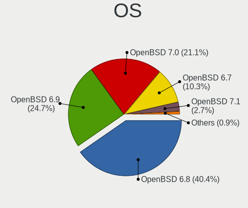

| Name        | Notebooks | Percent |
|-------------|-----------|---------|
| OpenBSD 6.8 | 90        | 29.13%  |
| OpenBSD 6.9 | 55        | 17.8%   |
| OpenBSD 7.0 | 50        | 16.18%  |
| OpenBSD 7.2 | 49        | 15.86%  |
| OpenBSD 7.1 | 40        | 12.94%  |
| OpenBSD 6.7 | 23        | 7.44%   |
| OpenBSD 6.6 | 2         | 0.65%   |

OS Family
---------

OS without a version

| Name    | Notebooks | Percent |
|---------|-----------|---------|
| OpenBSD | 255       | 100%    |

Arch
----

OS architecture (x86_64, i586, etc.)

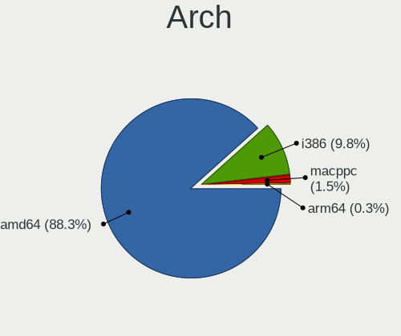

| Name   | Notebooks | Percent |
|--------|-----------|---------|
| amd64  | 228       | 89.41%  |
| i386   | 24        | 9.41%   |
| macppc | 3         | 1.18%   |

DE
--

Desktop Environment

| Name         | Notebooks | Percent |
|--------------|-----------|---------|
| fvwm         | 181       | 66.54%  |
| helloDesktop | 63        | 23.16%  |
| Console      | 11        | 4.04%   |
| XFCE         | 6         | 2.21%   |
| GNOME        | 4         | 1.47%   |
| Mutter       | 2         | 0.74%   |
| MATE         | 2         | 0.74%   |
| Openbox      | 1         | 0.37%   |
| iwm          | 1         | 0.37%   |
| i3           | 1         | 0.37%   |

Display Server
--------------

X11 or Wayland

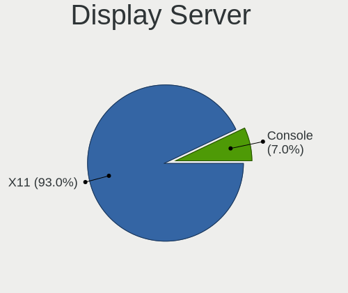

| Name    | Notebooks | Percent |
|---------|-----------|---------|
| X11     | 238       | 92.97%  |
| Console | 18        | 7.03%   |

Display Manager
---------------

SDDM, LightDM, etc.

| Name    | Notebooks | Percent |
|---------|-----------|---------|
| Console | 221       | 84.67%  |
| SLiM    | 24        | 9.2%    |
| GDM     | 16        | 6.13%   |

OS Lang
-------

Language

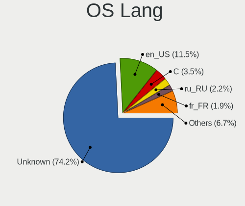

| Lang    | Notebooks | Percent |
|---------|-----------|---------|
| Unknown | 196       | 74.52%  |
| en_US   | 29        | 11.03%  |
| C       | 9         | 3.42%   |
| ru_RU   | 7         | 2.66%   |
| fr_FR   | 5         | 1.9%    |
| en_GB   | 5         | 1.9%    |
| ja_JP   | 2         | 0.76%   |
| es_CO   | 2         | 0.76%   |
| zh_CN   | 1         | 0.38%   |
| pl_PL   | 1         | 0.38%   |
| fr_CA   | 1         | 0.38%   |
| es_ES   | 1         | 0.38%   |
| en_EN   | 1         | 0.38%   |
| en_CA   | 1         | 0.38%   |
| en_AU   | 1         | 0.38%   |
| de_DE   | 1         | 0.38%   |

Boot Mode
---------

EFI or BIOS

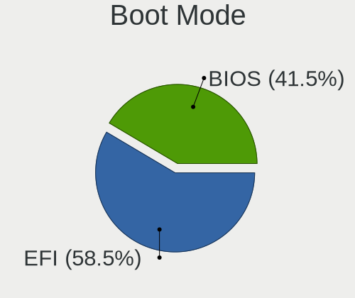

| Mode | Notebooks | Percent |
|------|-----------|---------|
| EFI  | 151       | 58.53%  |
| BIOS | 107       | 41.47%  |

Filesystem
----------

Type of filesystem

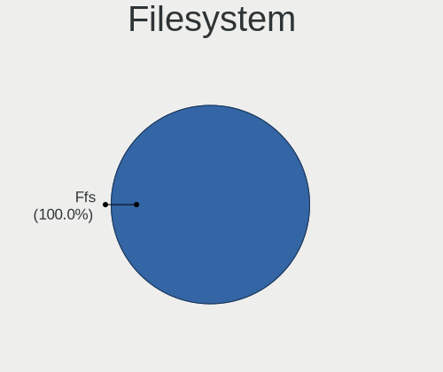

| Type | Notebooks | Percent |
|------|-----------|---------|
| Ffs  | 255       | 100%    |

Part. scheme
------------

Scheme of partitioning

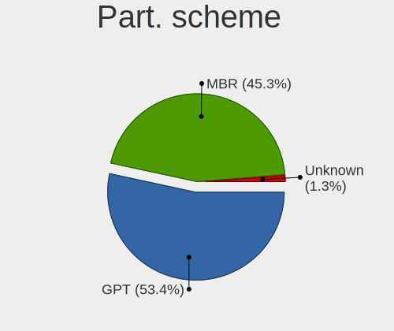

| Type    | Notebooks | Percent |
|---------|-----------|---------|
| GPT     | 139       | 53.67%  |
| MBR     | 116       | 44.79%  |
| Unknown | 4         | 1.54%   |

Board
-----

Vendor
------

Motherboard manufacturer

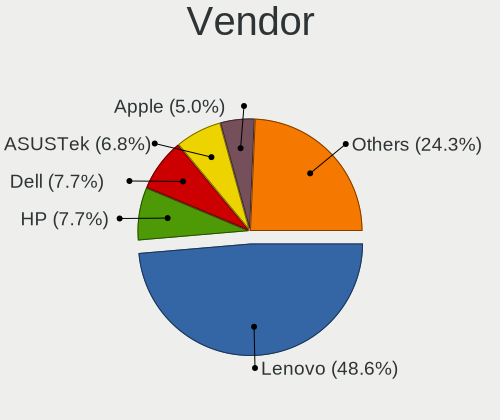

| Name                           | Notebooks | Percent |
|--------------------------------|-----------|---------|
| Lenovo                         | 122       | 47.84%  |
| Hewlett-Packard                | 21        | 8.24%   |
| Dell                           | 19        | 7.45%   |
| ASUSTek Computer               | 16        | 6.27%   |
| Apple                          | 14        | 5.49%   |
| Acer                           | 11        | 4.31%   |
| Panasonic                      | 6         | 2.35%   |
| IBM                            | 6         | 2.35%   |
| TUXEDO                         | 4         | 1.57%   |
| Fujitsu                        | 4         | 1.57%   |
| Sony                           | 3         | 1.18%   |
| Samsung Electronics            | 3         | 1.18%   |
| Framework                      | 3         | 1.18%   |
| Unknown                        | 3         | 1.18%   |
| Toshiba                        | 2         | 0.78%   |
| MSI                            | 2         | 0.78%   |
| Matsushita Electric Industrial | 2         | 0.78%   |
| Google                         | 2         | 0.78%   |
| Alienware                      | 2         | 0.78%   |
| Tactus                         | 1         | 0.39%   |
| Star Labs                      | 1         | 0.39%   |
| Standard                       | 1         | 0.39%   |
| Notebook                       | 1         | 0.39%   |
| Intel                          | 1         | 0.39%   |
| HUAWEI                         | 1         | 0.39%   |
| HCL Infosystems Limited        | 1         | 0.39%   |
| DEXP                           | 1         | 0.39%   |
| Clevo                          | 1         | 0.39%   |
| Casper                         | 1         | 0.39%   |

Model
-----

Motherboard model

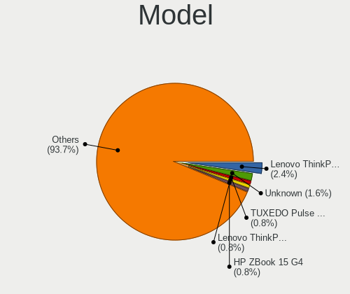

| Name                                        | Notebooks | Percent |
|---------------------------------------------|-----------|---------|
| Lenovo ThinkPad X200 745969G                | 6         | 2.35%   |
| Unknown                                     | 4         | 1.57%   |
| TUXEDO Pulse 15 Gen1                        | 2         | 0.78%   |
| Lenovo ThinkPad X1 Carbon 3rd 20BSCTO1WW    | 2         | 0.78%   |
| HP ZBook 15 G4                              | 2         | 0.78%   |
| Fujitsu LIFEBOOK E752                       | 2         | 0.78%   |
| Framework Laptop                            | 2         | 0.78%   |
| Dell XPS 13 9360                            | 2         | 0.78%   |
| ASUS X102BA                                 | 2         | 0.78%   |
| Apple MacBookAir7,2                         | 2         | 0.78%   |
| Apple MacBookAir6,2                         | 2         | 0.78%   |
| Apple MacBook5,1                            | 2         | 0.78%   |
| TUXEDO InfinityBook Pro 14 Gen6             | 1         | 0.39%   |
| TUXEDO Aura 15 Gen1                         | 1         | 0.39%   |
| Toshiba Satellite L775D                     | 1         | 0.39%   |
| Toshiba Satellite BE96-F299                 | 1         | 0.39%   |
| Tactus GeoFlex 110                          | 1         | 0.39%   |
| Star Labs Lite                              | 1         | 0.39%   |
| Standard TF                                 | 1         | 0.39%   |
| Sony VPCX115KX                              | 1         | 0.39%   |
| Sony VPCF12C5E                              | 1         | 0.39%   |
| Sony VGN-P698E                              | 1         | 0.39%   |
| Samsung R720                                | 1         | 0.39%   |
| Samsung 530XBB                              | 1         | 0.39%   |
| Samsung 3570R/370R/470R/450R/510R/4450RV    | 1         | 0.39%   |
| Panasonic CF-C1BT02EGE                      | 1         | 0.39%   |
| Panasonic CF-54-1                           | 1         | 0.39%   |
| Panasonic CF-53AAGHYDM                      | 1         | 0.39%   |
| Panasonic CF-52PFPBSFQ                      | 1         | 0.39%   |
| Panasonic CF-30KTP48NL                      | 1         | 0.39%   |
| Panasonic CF-19ADUAX1M                      | 1         | 0.39%   |
| Notebook NS5x_NS7xPU                        | 1         | 0.39%   |
| MSI MS-1613                                 | 1         | 0.39%   |
| MSI Modern 14 B11MOL                        | 1         | 0.39%   |
| Matsushita Electric Industrial CF-51RCVDNLM | 1         | 0.39%   |
| Matsushita Electric Industrial CF-48V4KNDQM | 1         | 0.39%   |
| Lenovo Yoga 720-13IKB 81C3                  | 1         | 0.39%   |
| Lenovo Yoga 6 13ARE05 82FN                  | 1         | 0.39%   |
| Lenovo Yoga 330-11IGM 81A6                  | 1         | 0.39%   |
| Lenovo V130-15IGM 81HL                      | 1         | 0.39%   |

Model Family
------------

Motherboard model prefix

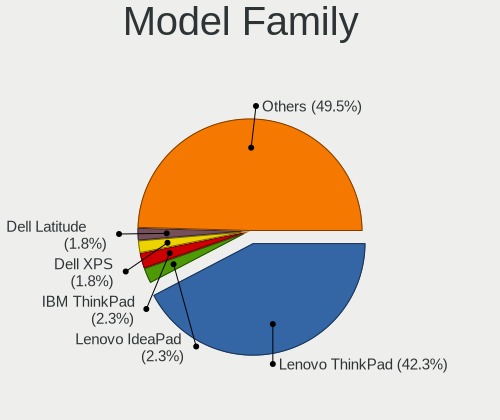

| Name                | Notebooks | Percent |
|---------------------|-----------|---------|
| Lenovo ThinkPad     | 108       | 42.35%  |
| Lenovo IdeaPad      | 5         | 1.96%   |
| IBM ThinkPad        | 5         | 1.96%   |
| Dell Latitude       | 5         | 1.96%   |
| Fujitsu LIFEBOOK    | 4         | 1.57%   |
| Dell XPS            | 4         | 1.57%   |
| Dell Inspiron       | 4         | 1.57%   |
| Acer Aspire         | 4         | 1.57%   |
| Unknown             | 4         | 1.57%   |
| Lenovo Yoga         | 3         | 1.18%   |
| HP ProBook          | 3         | 1.18%   |
| HP Pavilion         | 3         | 1.18%   |
| Framework Laptop    | 3         | 1.18%   |
| Dell Vostro         | 3         | 1.18%   |
| ASUS VivoBook       | 3         | 1.18%   |
| Apple MacBookAir6   | 3         | 1.18%   |
| TUXEDO Pulse        | 2         | 0.78%   |
| Toshiba Satellite   | 2         | 0.78%   |
| Lenovo Flex         | 2         | 0.78%   |
| HP ZBook            | 2         | 0.78%   |
| HP EliteBook        | 2         | 0.78%   |
| HP 240              | 2         | 0.78%   |
| Dell Precision      | 2         | 0.78%   |
| ASUS X102BA         | 2         | 0.78%   |
| Apple PowerBook5    | 2         | 0.78%   |
| Apple MacBookAir7   | 2         | 0.78%   |
| Apple MacBook5      | 2         | 0.78%   |
| Alienware m15       | 2         | 0.78%   |
| Acer Extensa        | 2         | 0.78%   |
| TUXEDO InfinityBook | 1         | 0.39%   |
| TUXEDO Aura         | 1         | 0.39%   |
| Tactus GeoFlex      | 1         | 0.39%   |
| Star Labs Lite      | 1         | 0.39%   |
| Standard TF         | 1         | 0.39%   |
| Sony VPCX115KX      | 1         | 0.39%   |
| Sony VPCF12C5E      | 1         | 0.39%   |
| Sony VGN-P698E      | 1         | 0.39%   |
| Samsung R720        | 1         | 0.39%   |
| Samsung 530XBB      | 1         | 0.39%   |
| Samsung 3570R       | 1         | 0.39%   |

MFG Year
--------

Motherboard manufacture year

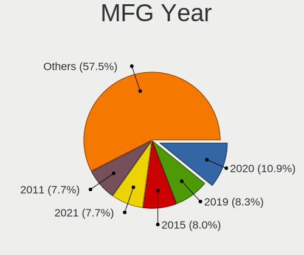

| Year    | Notebooks | Percent |
|---------|-----------|---------|
| 2020    | 27        | 10.59%  |
| 2019    | 24        | 9.41%   |
| 2015    | 22        | 8.63%   |
| 2021    | 21        | 8.24%   |
| 2011    | 20        | 7.84%   |
| 2009    | 18        | 7.06%   |
| 2018    | 17        | 6.67%   |
| 2012    | 15        | 5.88%   |
| 2022    | 12        | 4.71%   |
| 2013    | 12        | 4.71%   |
| 2010    | 11        | 4.31%   |
| 2017    | 10        | 3.92%   |
| 2016    | 10        | 3.92%   |
| 2006    | 9         | 3.53%   |
| Unknown | 6         | 2.35%   |
| 2008    | 5         | 1.96%   |
| 2007    | 5         | 1.96%   |
| 2014    | 4         | 1.57%   |
| 2004    | 2         | 0.78%   |
| 2003    | 2         | 0.78%   |
| 2023    | 1         | 0.39%   |
| 2005    | 1         | 0.39%   |
| 2002    | 1         | 0.39%   |

Form Factor
-----------

Physical design of the computer

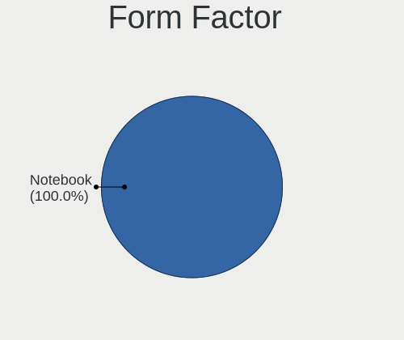

| Name     | Notebooks | Percent |
|----------|-----------|---------|
| Notebook | 255       | 100%    |

Coreboot
--------

Have coreboot on board

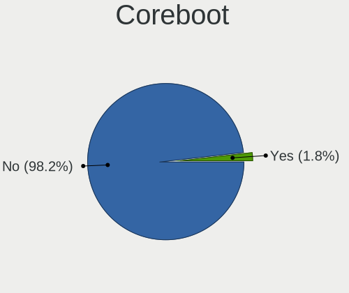

| Used | Notebooks | Percent |
|------|-----------|---------|
| No   | 248       | 97.25%  |
| Yes  | 7         | 2.75%   |

RAM Size
--------

Total RAM memory

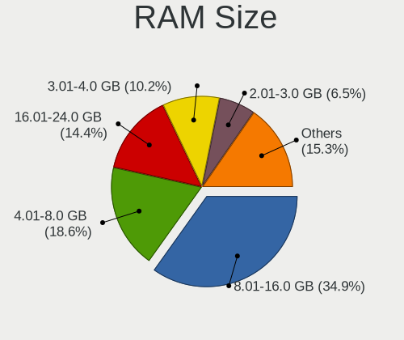

| Size in GB  | Notebooks | Percent |
|-------------|-----------|---------|
| 8.01-16.0   | 89        | 34.9%   |
| 4.01-8.0    | 48        | 18.82%  |
| 16.01-24.0  | 37        | 14.51%  |
| 3.01-4.0    | 26        | 10.2%   |
| 32.01-64.0  | 16        | 6.27%   |
| 2.01-3.0    | 14        | 5.49%   |
| 1.01-2.0    | 11        | 4.31%   |
| 0.51-1.0    | 8         | 3.14%   |
| 64.01-256.0 | 3         | 1.18%   |
| 0.01-0.5    | 3         | 1.18%   |

RAM Used
--------

Used RAM memory

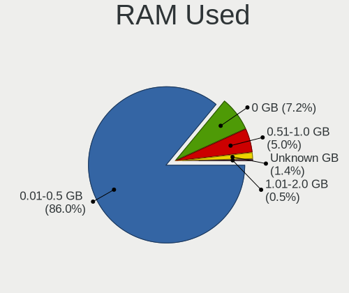

| Used GB  | Notebooks | Percent |
|----------|-----------|---------|
| 0.01-0.5 | 219       | 85.55%  |
| 0        | 16        | 6.25%   |
| 0.51-1.0 | 14        | 5.47%   |
| 1.01-2.0 | 4         | 1.56%   |
| Unknown  | 3         | 1.17%   |

Total Drives
------------

Number of drives on board

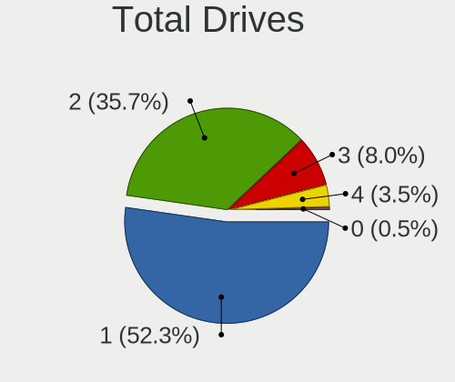

| Drives | Notebooks | Percent |
|--------|-----------|---------|
| 1      | 135       | 51.72%  |
| 2      | 97        | 37.16%  |
| 3      | 18        | 6.9%    |
| 4      | 7         | 2.68%   |
| 0      | 4         | 1.53%   |

Has CD-ROM
----------

Has CD-ROM on board

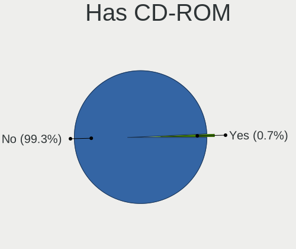

| Presented | Notebooks | Percent |
|-----------|-----------|---------|
| No        | 255       | 99.61%  |
| Yes       | 1         | 0.39%   |

Has Ethernet
------------

Has Ethernet on board

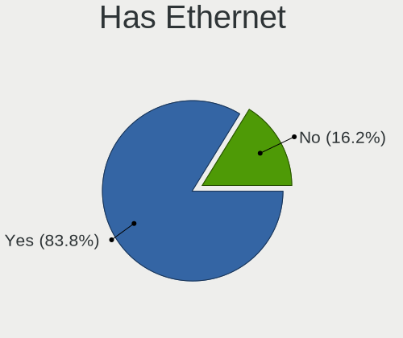

| Presented | Notebooks | Percent |
|-----------|-----------|---------|
| Yes       | 214       | 83.92%  |
| No        | 41        | 16.08%  |

Has WiFi
--------

Has WiFi module

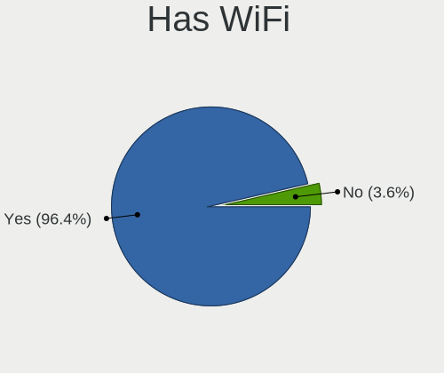

| Presented | Notebooks | Percent |
|-----------|-----------|---------|
| Yes       | 247       | 96.86%  |
| No        | 8         | 3.14%   |

Has Bluetooth
-------------

Has Bluetooth module

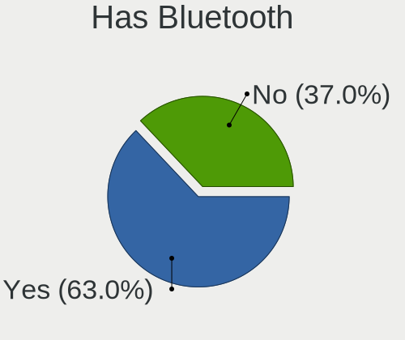

| Presented | Notebooks | Percent |
|-----------|-----------|---------|
| Yes       | 159       | 61.87%  |
| No        | 98        | 38.13%  |

Location
--------

Country
-------

Geographic location (country)

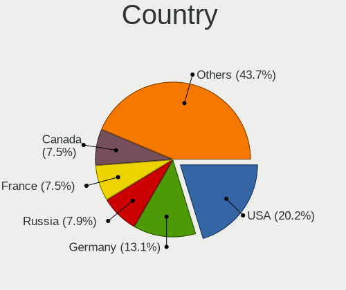

| Country            | Notebooks | Percent |
|--------------------|-----------|---------|
| USA                | 52        | 20.16%  |
| Germany            | 33        | 12.79%  |
| Russia             | 20        | 7.75%   |
| France             | 20        | 7.75%   |
| Canada             | 19        | 7.36%   |
| UK                 | 11        | 4.26%   |
| Poland             | 11        | 4.26%   |
| Netherlands        | 8         | 3.1%    |
| Sweden             | 7         | 2.71%   |
| Spain              | 7         | 2.71%   |
| Norway             | 5         | 1.94%   |
| Australia          | 5         | 1.94%   |
| Latvia             | 4         | 1.55%   |
| Ukraine            | 3         | 1.16%   |
| Switzerland        | 3         | 1.16%   |
| Portugal           | 3         | 1.16%   |
| Philippines        | 3         | 1.16%   |
| Japan              | 3         | 1.16%   |
| Italy              | 3         | 1.16%   |
| India              | 3         | 1.16%   |
| Czechia            | 3         | 1.16%   |
| Brazil             | 3         | 1.16%   |
| Turkey             | 2         | 0.78%   |
| Slovakia           | 2         | 0.78%   |
| Malaysia           | 2         | 0.78%   |
| Finland            | 2         | 0.78%   |
| Croatia            | 2         | 0.78%   |
| Colombia           | 2         | 0.78%   |
| Vietnam            | 1         | 0.39%   |
| Slovenia           | 1         | 0.39%   |
| Saudi Arabia       | 1         | 0.39%   |
| Montserrat         | 1         | 0.39%   |
| Mexico             | 1         | 0.39%   |
| Indonesia          | 1         | 0.39%   |
| Honduras           | 1         | 0.39%   |
| Egypt              | 1         | 0.39%   |
| Ecuador            | 1         | 0.39%   |
| Dominican Republic | 1         | 0.39%   |
| Cyprus             | 1         | 0.39%   |
| Costa Rica         | 1         | 0.39%   |

City
----

Geographic location (city)

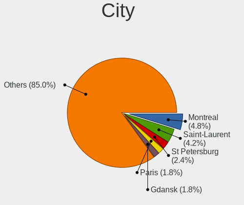

| City               | Notebooks | Percent |
|--------------------|-----------|---------|
| Montreal           | 16        | 5.65%   |
| Saint-Laurent      | 9         | 3.18%   |
| Paris              | 6         | 2.12%   |
| Vladivostok        | 5         | 1.77%   |
| QuГ©bec          | 5         | 1.77%   |
| Gdansk             | 5         | 1.77%   |
| Amsterdam          | 5         | 1.77%   |
| Riga               | 4         | 1.41%   |
| Berlin             | 4         | 1.41%   |
| Zurich             | 3         | 1.06%   |
| Yekaterinburg      | 3         | 1.06%   |
| St Petersburg      | 3         | 1.06%   |
| Portland           | 3         | 1.06%   |
| Oslo               | 3         | 1.06%   |
| Krakow             | 3         | 1.06%   |
| Frankfurt am Main  | 3         | 1.06%   |
| Brooklyn           | 3         | 1.06%   |
| Sydney             | 2         | 0.71%   |
| Quezon City        | 2         | 0.71%   |
| Prague             | 2         | 0.71%   |
| Plymouth           | 2         | 0.71%   |
| Pine Mountain Club | 2         | 0.71%   |
| Papillion          | 2         | 0.71%   |
| Navalcarnero       | 2         | 0.71%   |
| Moscow             | 2         | 0.71%   |
| Madrid             | 2         | 0.71%   |
| Mâcon             | 2         | 0.71%   |
| Lübeck            | 2         | 0.71%   |
| Los Angeles        | 2         | 0.71%   |
| Lafayette          | 2         | 0.71%   |
| Henan              | 2         | 0.71%   |
| Gummersbach        | 2         | 0.71%   |
| Gettysburg         | 2         | 0.71%   |
| Fayetteville       | 2         | 0.71%   |
| Dublin             | 2         | 0.71%   |
| 's-Hertogenbosch   | 2         | 0.71%   |
| Zhukovskiy         | 1         | 0.35%   |
| Yoshkar-Ola        | 1         | 0.35%   |
| Yokohama           | 1         | 0.35%   |
| Wolfsburg          | 1         | 0.35%   |

Drives
------

Drive Vendor
------------

Hard drive vendors

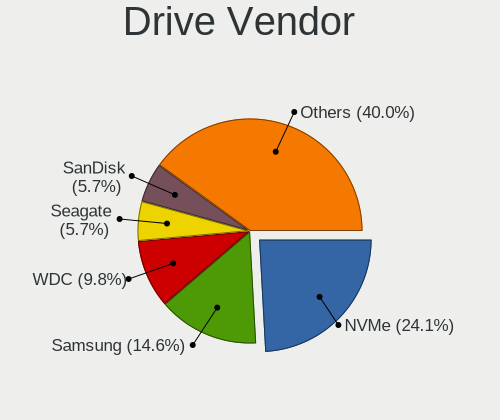

| Vendor              | Notebooks | Drives | Percent |
|---------------------|-----------|--------|---------|
| NVMe                | 72        | 95     | 24.91%  |
| Samsung Electronics | 44        | 53     | 15.22%  |
| WDC                 | 31        | 54     | 10.73%  |
| Toshiba             | 16        | 22     | 5.54%   |
| Seagate             | 16        | 21     | 5.54%   |
| SanDisk             | 15        | 18     | 5.19%   |
| Kingston            | 10        | 11     | 3.46%   |
| Crucial             | 10        | 10     | 3.46%   |
| Hitachi             | 8         | 11     | 2.77%   |
| Apple               | 7         | 7      | 2.42%   |
| Intel               | 6         | 6      | 2.08%   |
| HGST                | 5         | 7      | 1.73%   |
| Transcend           | 4         | 4      | 1.38%   |
| PNY                 | 4         | 4      | 1.38%   |
| SK hynix            | 3         | 3      | 1.04%   |
| Apacer              | 3         | 4      | 1.04%   |
| Team                | 2         | 2      | 0.69%   |
| SPCC                | 2         | 2      | 0.69%   |
| Plextor             | 2         | 2      | 0.69%   |
| Netac               | 2         | 2      | 0.69%   |
| Innostor            | 2         | 2      | 0.69%   |
| Generic             | 2         | 2      | 0.69%   |
| A-DATA Technology   | 2         | 5      | 0.69%   |
| Zheino              | 1         | 2      | 0.35%   |
| USB                 | 1         | 1      | 0.35%   |
| UFD 2.0             | 1         | 1      | 0.35%   |
| Star Drive          | 1         | 1      | 0.35%   |
| SATA3 60            | 1         | 1      | 0.35%   |
| Patriot             | 1         | 1      | 0.35%   |
| OWC                 | 1         | 1      | 0.35%   |
| OPENBSD             | 1         | 1      | 0.35%   |
| Micron Technology   | 1         | 1      | 0.35%   |
| LITEONIT            | 1         | 1      | 0.35%   |
| LITEON              | 1         | 1      | 0.35%   |
| Lexar               | 1         | 1      | 0.35%   |
| Leven               | 1         | 1      | 0.35%   |
| LDLC F6+            | 1         | 1      | 0.35%   |
| KingSpec            | 1         | 1      | 0.35%   |
| Intenso             | 1         | 1      | 0.35%   |
| Hewlett-Packard     | 1         | 1      | 0.35%   |

Drive Model
-----------

Hard drive models

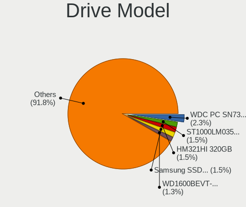

| Model                               | Notebooks | Percent |
|-------------------------------------|-----------|---------|
| NVMe WDC PC SN730 SDB 256GB         | 8         | 2.69%   |
| Samsung HM321HI 320GB               | 6         | 2.02%   |
| NVMe Samsung SSD 980 1TB            | 6         | 2.02%   |
| WDC WD1600BEVT-22ZCT0 160GB         | 5         | 1.68%   |
| Seagate ST1000LM035-1RK172 1TB      | 5         | 1.68%   |
| Samsung SSD 850 EVO 500GB           | 4         | 1.35%   |
| NVMe SAMSUNG MZVLB256 256GB         | 4         | 1.35%   |
| Kingston SA400S37240G 240GB         | 4         | 1.35%   |
| Samsung SSD 860 EVO 1TB             | 3         | 1.01%   |
| Samsung SSD 850 EVO 250GB           | 3         | 1.01%   |
| NVMe Samsung SSD 970 250GB          | 3         | 1.01%   |
| NVMe SAMSUNG MZVLW256 256GB         | 3         | 1.01%   |
| Apple SSD SD0128F 121GB             | 3         | 1.01%   |
| WDC WDS240G2G0A-00JH30 240GB        | 2         | 0.67%   |
| WDC WD10JPLX-00MBPT0 1TB            | 2         | 0.67%   |
| Toshiba MK8025GAS 80GB              | 2         | 0.67%   |
| Toshiba MK2556GSY 250GB             | 2         | 0.67%   |
| SK hynix SC311 SATA 256GB           | 2         | 0.67%   |
| Seagate ST9320423AS 320GB           | 2         | 0.67%   |
| Seagate ST500LT012-9WS142 500GB     | 2         | 0.67%   |
| Seagate ST500LM012 HN-M500MBB 500GB | 2         | 0.67%   |
| SanDisk SSD U110 16GB               | 2         | 0.67%   |
| SanDisk Cruzer Blade 16GB           | 2         | 0.67%   |
| Samsung SSD 850 PRO 256GB           | 2         | 0.67%   |
| Samsung MZ7TD256HAFV-000L7 256GB    | 2         | 0.67%   |
| Samsung MZ7PC128HAFU-000L1 128GB    | 2         | 0.67%   |
| PNY CS900 120GB SSD                 | 2         | 0.67%   |
| NVMe WDC PC SN720 SDA 512GB         | 2         | 0.67%   |
| NVMe WDC PC SN530 SDB 256GB         | 2         | 0.67%   |
| NVMe Samsung SSD 960 500GB          | 2         | 0.67%   |
| NVMe SAMSUNG MZVLB1T0 1TB           | 2         | 0.67%   |
| NVMe LENSE20256GMSP34 256GB         | 2         | 0.67%   |
| NVMe INTEL SSDPEKNW51 512GB         | 2         | 0.67%   |
| NVMe INTEL SSDPEKKF25 256GB         | 2         | 0.67%   |
| Kingston SA400S37480G 480GB         | 2         | 0.67%   |
| Intel SSDSC2KF256H6L 256GB          | 2         | 0.67%   |
| Innostor SSD 15GB                   | 2         | 0.67%   |
| Crucial CT500MX500SSD1 500GB        | 2         | 0.67%   |
| Crucial CT1000MX500SSD1 1TB         | 2         | 0.67%   |
| Apple SSD SM0128G 121GB             | 2         | 0.67%   |

HDD Vendor
----------

Hard disk drive vendors

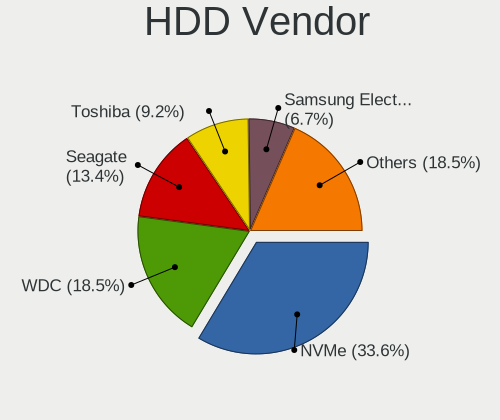

| Vendor              | Notebooks | Drives | Percent |
|---------------------|-----------|--------|---------|
| NVMe                | 51        | 65     | 37.78%  |
| WDC                 | 24        | 46     | 17.78%  |
| Seagate             | 16        | 21     | 11.85%  |
| Toshiba             | 13        | 19     | 9.63%   |
| Samsung Electronics | 8         | 10     | 5.93%   |
| Hitachi             | 8         | 11     | 5.93%   |
| HGST                | 5         | 7      | 3.7%    |
| Generic             | 2         | 2      | 1.48%   |
| USB                 | 1         | 1      | 0.74%   |
| UFD 2.0             | 1         | 1      | 0.74%   |
| OPENBSD             | 1         | 1      | 0.74%   |
| Lexar               | 1         | 1      | 0.74%   |
| LDLC F6+            | 1         | 1      | 0.74%   |
| General             | 1         | 1      | 0.74%   |
| Fujitsu             | 1         | 1      | 0.74%   |
| Apple               | 1         | 1      | 0.74%   |

SSD Vendor
----------

Solid state drive vendors

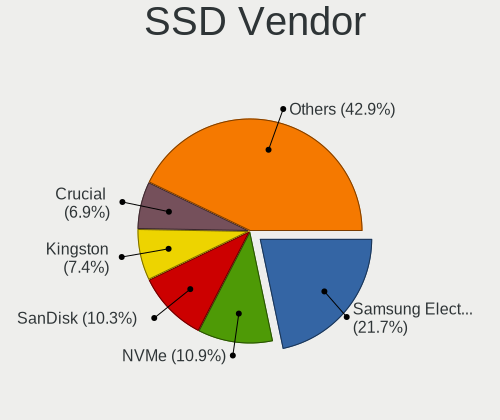

| Vendor              | Notebooks | Drives | Percent |
|---------------------|-----------|--------|---------|
| Samsung Electronics | 36        | 43     | 24%     |
| NVMe                | 17        | 20     | 11.33%  |
| SanDisk             | 15        | 18     | 10%     |
| Kingston            | 10        | 11     | 6.67%   |
| Crucial             | 10        | 10     | 6.67%   |
| WDC                 | 7         | 8      | 4.67%   |
| Intel               | 6         | 6      | 4%      |
| Apple               | 6         | 6      | 4%      |
| Transcend           | 4         | 4      | 2.67%   |
| PNY                 | 4         | 4      | 2.67%   |
| Toshiba             | 3         | 3      | 2%      |
| SK hynix            | 3         | 3      | 2%      |
| Apacer              | 3         | 4      | 2%      |
| Team                | 2         | 2      | 1.33%   |
| SPCC                | 2         | 2      | 1.33%   |
| Plextor             | 2         | 2      | 1.33%   |
| Netac               | 2         | 2      | 1.33%   |
| Innostor            | 2         | 2      | 1.33%   |
| A-DATA Technology   | 2         | 5      | 1.33%   |
| Zheino              | 1         | 2      | 0.67%   |
| Star Drive          | 1         | 1      | 0.67%   |
| SATA3 60            | 1         | 1      | 0.67%   |
| Patriot             | 1         | 1      | 0.67%   |
| OWC                 | 1         | 1      | 0.67%   |
| Micron Technology   | 1         | 1      | 0.67%   |
| LITEONIT            | 1         | 1      | 0.67%   |
| LITEON              | 1         | 1      | 0.67%   |
| Leven               | 1         | 1      | 0.67%   |
| KingSpec            | 1         | 1      | 0.67%   |
| Intenso             | 1         | 1      | 0.67%   |
| Hewlett-Packard     | 1         | 1      | 0.67%   |
| Gigabyte Technology | 1         | 1      | 0.67%   |
| Dogfish             | 1         | 1      | 0.67%   |

Drive Kind
----------

HDD or SSD

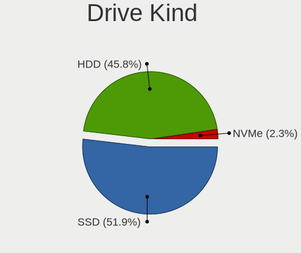

| Kind | Notebooks | Drives | Percent |
|------|-----------|--------|---------|
| SSD  | 135       | 170    | 50.19%  |
| HDD  | 126       | 189    | 46.84%  |
| NVMe | 8         | 10     | 2.97%   |

Drive Connector
---------------

SATA, SAS, NVMe, etc.

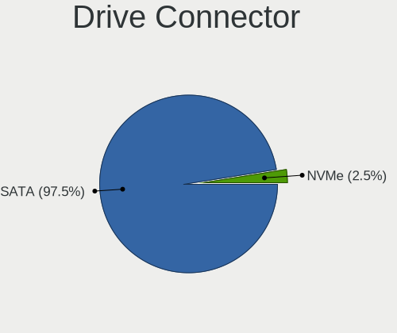

| Type | Notebooks | Drives | Percent |
|------|-----------|--------|---------|
| SATA | 239       | 359    | 96.76%  |
| NVMe | 8         | 10     | 3.24%   |

Drive Size
----------

Size of hard drive

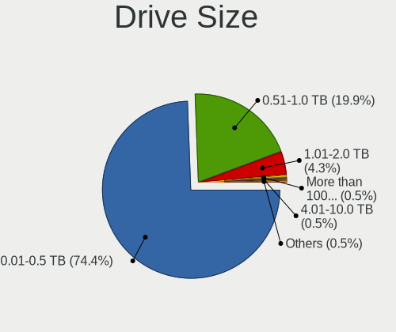

| Size in TB      | Notebooks | Drives | Percent |
|-----------------|-----------|--------|---------|
| 0.01-0.5        | 181       | 249    | 68.56%  |
| 0.51-1.0        | 69        | 88     | 26.14%  |
| 1.01-2.0        | 11        | 19     | 4.17%   |
| More than 100.0 | 1         | 1      | 0.38%   |
| 4.01-10.0       | 1         | 1      | 0.38%   |
| 0               | 1         | 1      | 0.38%   |

Space Total
-----------

Amount of disk space available on the file system

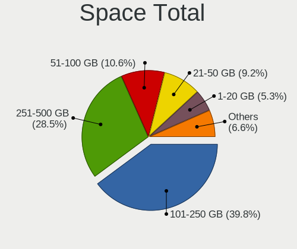

| Size in GB | Notebooks | Percent |
|------------|-----------|---------|
| 101-250    | 95        | 35.85%  |
| 251-500    | 77        | 29.06%  |
| 51-100     | 33        | 12.45%  |
| 21-50      | 26        | 9.81%   |
| 501-1000   | 14        | 5.28%   |
| 1-20       | 13        | 4.91%   |
| 1001-2000  | 7         | 2.64%   |

Space Used
----------

Amount of used disk space

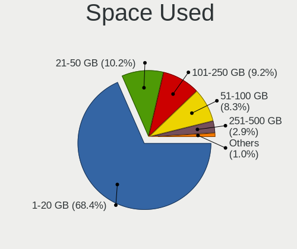

| Used GB  | Notebooks | Percent |
|----------|-----------|---------|
| 1-20     | 181       | 68.56%  |
| 21-50    | 28        | 10.61%  |
| 51-100   | 23        | 8.71%   |
| 101-250  | 21        | 7.95%   |
| 251-500  | 8         | 3.03%   |
| 501-1000 | 3         | 1.14%   |

Malfunc. Drives
---------------

Drive models with a malfunction

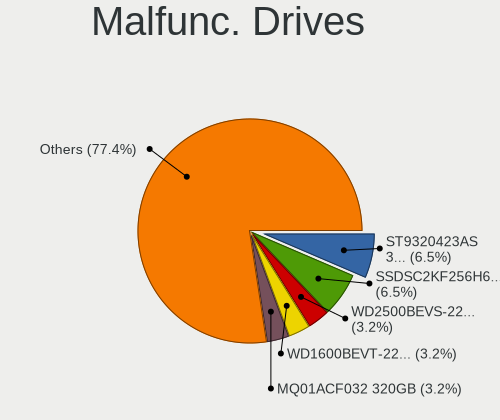

| Model                             | Notebooks | Drives | Percent |
|-----------------------------------|-----------|--------|---------|
| Seagate ST9320423AS 320GB         | 2         | 2      | 7.69%   |
| Intel SSDSC2KF256H6L 256GB        | 2         | 2      | 7.69%   |
| WDC WD2500BEVS-22UST0 250GB       | 1         | 1      | 3.85%   |
| WDC WD1600BEVT-22ZCT0 160GB       | 1         | 1      | 3.85%   |
| Toshiba MQ01ACF032 320GB          | 1         | 3      | 3.85%   |
| Toshiba MK6475GSX 640GB           | 1         | 2      | 3.85%   |
| Toshiba MK6006GAH 64GB            | 1         | 1      | 3.85%   |
| Toshiba MK1629GSGF 160GB          | 1         | 2      | 3.85%   |
| Seagate ST9500420AS 500GB         | 1         | 2      | 3.85%   |
| Seagate ST500LT012-9WS142 500GB   | 1         | 1      | 3.85%   |
| SanDisk SD7UB3Q256G1001 256GB     | 1         | 2      | 3.85%   |
| Samsung Electronics HM500JI 500GB | 1         | 2      | 3.85%   |
| Kingston SMSM151S3128GD 128GB     | 1         | 1      | 3.85%   |
| KingSpec KSD-PA25.6-032MS 32GB    | 1         | 1      | 3.85%   |
| Intel SSDSA2M080G2GC 80GB         | 1         | 1      | 3.85%   |
| Hitachi HTS722010K9SA00 100GB     | 1         | 1      | 3.85%   |
| Hitachi HTS541060G9SA00 64GB      | 1         | 1      | 3.85%   |
| Hitachi HTC426060G9AT00 64GB      | 1         | 1      | 3.85%   |
| Hitachi DK23AA-12 12GB            | 1         | 1      | 3.85%   |
| HGST HTS545050A7E660 500GB        | 1         | 2      | 3.85%   |
| HGST HTE725032A7E630 320GB        | 1         | 1      | 3.85%   |
| Apple SSD SD0128F 121GB           | 1         | 1      | 3.85%   |
| A-DATA Technology SP550 480GB     | 1         | 4      | 3.85%   |
| A-DATA Technology SP550 240GB     | 1         | 1      | 3.85%   |

Malfunc. Drive Vendor
---------------------

Vendors of faulty drives

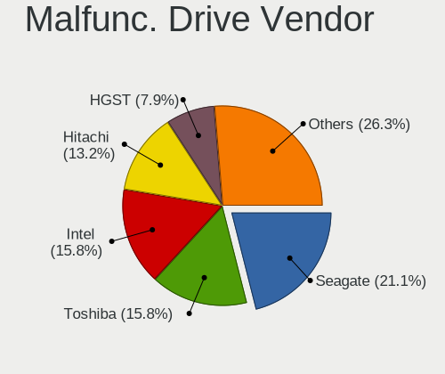

| Vendor              | Notebooks | Drives | Percent |
|---------------------|-----------|--------|---------|
| Toshiba             | 4         | 8      | 15.38%  |
| Seagate             | 4         | 5      | 15.38%  |
| Hitachi             | 4         | 4      | 15.38%  |
| Intel               | 3         | 3      | 11.54%  |
| WDC                 | 2         | 2      | 7.69%   |
| HGST                | 2         | 3      | 7.69%   |
| A-DATA Technology   | 2         | 5      | 7.69%   |
| SanDisk             | 1         | 2      | 3.85%   |
| Samsung Electronics | 1         | 2      | 3.85%   |
| Kingston            | 1         | 1      | 3.85%   |
| KingSpec            | 1         | 1      | 3.85%   |
| Apple               | 1         | 1      | 3.85%   |

Malfunc. HDD Vendor
-------------------

Vendors of faulty HDD drives

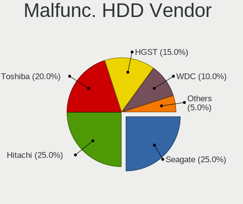

| Vendor              | Notebooks | Drives | Percent |
|---------------------|-----------|--------|---------|
| Toshiba             | 4         | 8      | 23.53%  |
| Seagate             | 4         | 5      | 23.53%  |
| Hitachi             | 4         | 4      | 23.53%  |
| WDC                 | 2         | 2      | 11.76%  |
| HGST                | 2         | 3      | 11.76%  |
| Samsung Electronics | 1         | 2      | 5.88%   |

Malfunc. Drive Kind
-------------------

Kinds of faulty drives

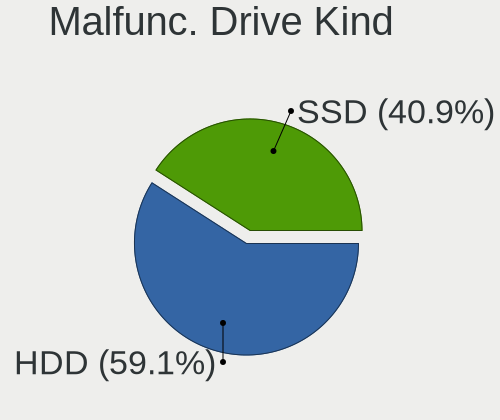

| Kind | Notebooks | Drives | Percent |
|------|-----------|--------|---------|
| HDD  | 17        | 24     | 65.38%  |
| SSD  | 9         | 13     | 34.62%  |

Failed Drives
-------------

Failed drive models

Zero info for selected period =(

Failed Drive Vendor
-------------------

Failed drive vendors

Zero info for selected period =(

Drive Status
------------

Number of failed and malfunc. drives

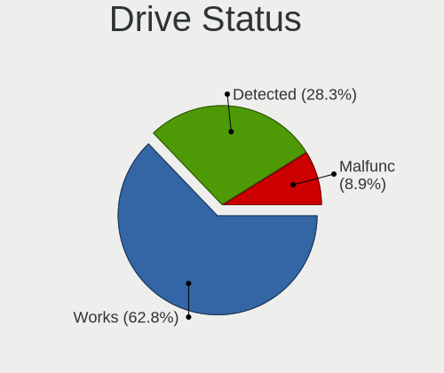

| Status   | Notebooks | Drives | Percent |
|----------|-----------|--------|---------|
| Works    | 166       | 232    | 62.17%  |
| Detected | 75        | 100    | 28.09%  |
| Malfunc  | 26        | 37     | 9.74%   |

Storage controller
------------------

Storage Vendor
--------------

Storage controller vendors

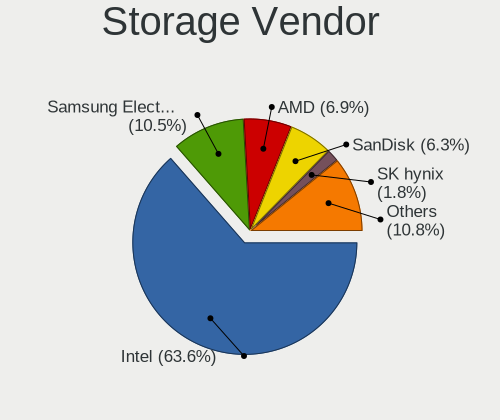

| Vendor                           | Notebooks | Percent |
|----------------------------------|-----------|---------|
| Intel                            | 173       | 62.23%  |
| Samsung Electronics              | 30        | 10.79%  |
| AMD                              | 21        | 7.55%   |
| SanDisk                          | 19        | 6.83%   |
| SK hynix                         | 6         | 2.16%   |
| Marvell Technology Group         | 4         | 1.44%   |
| KIOXIA                           | 4         | 1.44%   |
| Phison Electronics               | 3         | 1.08%   |
| Nvidia                           | 3         | 1.08%   |
| Lenovo                           | 3         | 1.08%   |
| Kingston Technology Company      | 3         | 1.08%   |
| ADATA Technology                 | 3         | 1.08%   |
| Micron Technology                | 2         | 0.72%   |
| Union Memory (Shenzhen)          | 1         | 0.36%   |
| Toshiba                          | 1         | 0.36%   |
| Silicon Integrated Systems [SiS] | 1         | 0.36%   |
| Micron/Crucial Technology        | 1         | 0.36%   |

Storage Model
-------------

Storage controller models

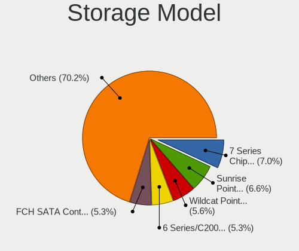

| Model                                                                          | Notebooks | Percent |
|--------------------------------------------------------------------------------|-----------|---------|
| Intel 7 Series Chipset Family 6-port SATA Controller [AHCI mode]               | 21        | 7.12%   |
| Intel Sunrise Point-LP SATA Controller [AHCI mode]                             | 20        | 6.78%   |
| Intel Wildcat Point-LP SATA Controller [AHCI Mode]                             | 17        | 5.76%   |
| Intel 6 Series/C200 Series Chipset Family 6 port Mobile SATA AHCI Controller   | 16        | 5.42%   |
| AMD FCH SATA Controller [AHCI mode]                                            | 16        | 5.42%   |
| Intel 82801IBM/IEM (ICH9M/ICH9M-E) 4 port SATA Controller [AHCI mode]          | 15        | 5.08%   |
| SanDisk WD Black SN750 / PC SN730 NVMe SSD                                     | 9         | 3.05%   |
| Samsung NVMe SSD Controller SM981/PM981/PM983                                  | 9         | 3.05%   |
| Intel 82801G (ICH7 Family) IDE Controller                                      | 8         | 2.71%   |
| Intel 8 Series SATA Controller 1 [AHCI mode]                                   | 8         | 2.71%   |
| Samsung NVMe SSD Controller SM961/PM961/SM963                                  | 7         | 2.37%   |
| Samsung NVMe SSD Controller PM9A1/PM9A3/980PRO                                 | 7         | 2.37%   |
| Intel 82801GBM/GHM (ICH7-M Family) SATA Controller [AHCI mode]                 | 7         | 2.37%   |
| Intel 5 Series/3400 Series Chipset 6 port SATA AHCI Controller                 | 7         | 2.37%   |
| Intel Celeron/Pentium Silver Processor SATA Controller                         | 6         | 2.03%   |
| Intel 82801GBM/GHM (ICH7-M Family) SATA Controller [IDE mode]                  | 5         | 1.69%   |
| Intel Comet Lake SATA AHCI Controller                                          | 4         | 1.36%   |
| Intel 82801CAM IDE U100 Controller                                             | 4         | 1.36%   |
| AMD SB7x0/SB8x0/SB9x0 SATA Controller [AHCI mode]                              | 4         | 1.36%   |
| SanDisk unknown                                                                | 3         | 1.02%   |
| Samsung SM951 AHCI                                                             | 3         | 1.02%   |
| Samsung NVMe SSD Controller 980                                                | 3         | 1.02%   |
| Marvell Group 88SS9183 PCIe SSD Controller                                     | 3         | 1.02%   |
| Lenovo unknown                                                                 | 3         | 1.02%   |
| KIOXIA NVMe SSD Controller BG4                                                 | 3         | 1.02%   |
| Intel SSD Pro 7600p/760p/E 6100p Series                                        | 3         | 1.02%   |
| Intel Q170/Q150/B150/H170/H110/Z170/CM236 Chipset SATA Controller [AHCI Mode]  | 3         | 1.02%   |
| Intel Celeron N3350/Pentium N4200/Atom E3900 Series SATA AHCI Controller       | 3         | 1.02%   |
| Intel Cannon Lake Mobile PCH SATA AHCI Controller                              | 3         | 1.02%   |
| Intel 82801FBM (ICH6M) SATA Controller                                         | 3         | 1.02%   |
| Intel 8 Series/C220 Series Chipset Family 6-port SATA Controller 1 [AHCI mode] | 3         | 1.02%   |
| SK hynix hynix unknown                                                         | 2         | 0.68%   |
| SK hynix BC501 NVMe Solid State Drive                                          | 2         | 0.68%   |
| SanDisk WD Black 2018/SN750 / PC SN720 NVMe SSD                                | 2         | 0.68%   |
| SanDisk PC SN520 NVMe SSD                                                      | 2         | 0.68%   |
| Phison PS5013 E13 NVMe Controller                                              | 2         | 0.68%   |
| Nvidia MCP79 AHCI Controller                                                   | 2         | 0.68%   |
| Micron unknown                                                                 | 2         | 0.68%   |
| Kingston Company OM3PDP3 NVMe SSD                                              | 2         | 0.68%   |
| Intel US15W/US15X/US15L/UL11L SCH [Poulsbo] IDE Controller                     | 2         | 0.68%   |

Storage Kind
------------

Kind of storage controller (IDE, SATA, NVMe, SAS, ...)

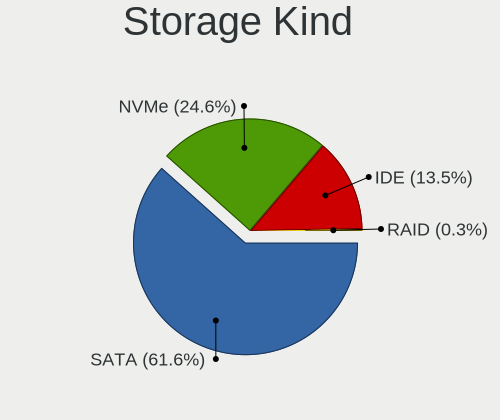

| Kind | Notebooks | Percent |
|------|-----------|---------|
| SATA | 175       | 60.98%  |
| NVMe | 72        | 25.09%  |
| IDE  | 39        | 13.59%  |
| RAID | 1         | 0.35%   |

Processor
---------

CPU Vendor
----------

Processor vendors

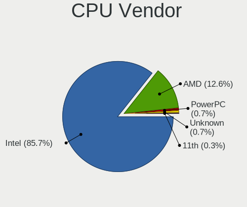

| Vendor  | Notebooks | Percent |
|---------|-----------|---------|
| Intel   | 218       | 85.49%  |
| AMD     | 33        | 12.94%  |
| PowerPC | 2         | 0.78%   |
| 11th    | 1         | 0.39%   |
| Unknown | 1         | 0.39%   |

CPU Model
---------

Processor models

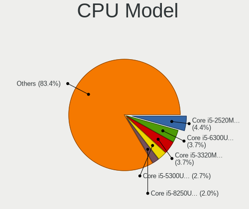

| Model                                                        | Notebooks | Percent |
|--------------------------------------------------------------|-----------|---------|
| Intel Core i5-2520M CPU @ 2.50GHz                            | 13        | 5%      |
| Intel Core i5-6300U CPU @ 2.40GHz                            | 10        | 3.85%   |
| Intel Core i5-3320M CPU @ 2.60GHz                            | 9         | 3.46%   |
| Intel Core i5-8250U CPU @ 1.60GHz                            | 6         | 2.31%   |
| Intel Core i5-5300U CPU @ 2.30GHz                            | 6         | 2.31%   |
| Intel Core 2 Duo CPU P8600 @ 2.40GHz                         | 6         | 2.31%   |
| Intel Core i7-7500U CPU @ 2.70GHz                            | 5         | 1.92%   |
| Intel Core i7-8565U CPU @ 1.80GHz                            | 4         | 1.54%   |
| Intel Core i5-5200U CPU @ 2.20GHz                            | 4         | 1.54%   |
| AMD Ryzen 7 4800H with Radeon Graphics                       | 4         | 1.54%   |
| Intel Core i7-8550U CPU @ 1.80GHz                            | 3         | 1.15%   |
| Intel Core i7-5600U CPU @ 2.60GHz                            | 3         | 1.15%   |
| Intel Core i7-3520M CPU @ 2.90GHz                            | 3         | 1.15%   |
| Intel Core i7-10510U CPU @ 1.80GHz                           | 3         | 1.15%   |
| Intel Core i5-8265U CPU @ 1.60GHz                            | 3         | 1.15%   |
| Intel Core i5-2540M CPU @ 2.60GHz                            | 3         | 1.15%   |
| Intel Core i5-10210U CPU @ 1.60GHz                           | 3         | 1.15%   |
| Intel Core i3-6006U CPU @ 2.00GHz                            | 3         | 1.15%   |
| Intel Core 2 Duo CPU T9400 @ 2.53GHz                         | 3         | 1.15%   |
| Intel Atom CPU N270 @ 1.60GHz ("GenuineIntel" 686-class)     | 3         | 1.15%   |
| Intel 11th Gen Core i5-1135G7 @ 2.40GHz                      | 3         | 1.15%   |
| AMD Ryzen 7 4700U with Radeon Graphics                       | 3         | 1.15%   |
| PowerPC 7447A (Revision 0x105)                               | 2         | 0.77%   |
| Intel Xeon CPU E3-1505M v6 @ 3.00GHz                         | 2         | 0.77%   |
| Intel Pentium Silver N5030 CPU @ 1.10GHz                     | 2         | 0.77%   |
| Intel Pentium M processor 1.70GHz ("GenuineIntel" 686-class) | 2         | 0.77%   |
| Intel Core i7-8650U CPU @ 1.90GHz                            | 2         | 0.77%   |
| Intel Core i7-6600U CPU @ 2.60GHz                            | 2         | 0.77%   |
| Intel Core i7-5500U CPU @ 2.40GHz                            | 2         | 0.77%   |
| Intel Core i5-4300U CPU @ 1.90GHz                            | 2         | 0.77%   |
| Intel Core i5-4260U CPU @ 1.40GHz                            | 2         | 0.77%   |
| Intel Core i5-4200U CPU @ 1.60GHz                            | 2         | 0.77%   |
| Intel Core i5-3230M CPU @ 2.60GHz                            | 2         | 0.77%   |
| Intel Core i5 CPU M 560 @ 2.67GHz                            | 2         | 0.77%   |
| Intel Core i5 CPU M 540 @ 2.53GHz                            | 2         | 0.77%   |
| Intel Core i5 CPU M 520 @ 2.40GHz                            | 2         | 0.77%   |
| Intel Core i3-5005U CPU @ 2.00GHz                            | 2         | 0.77%   |
| Intel Core 2 Duo CPU P7350 @ 2.00GHz                         | 2         | 0.77%   |
| Intel Core 2 Duo CPU L9600 @ 2.13GHz                         | 2         | 0.77%   |
| Intel Celeron N4020 CPU @ 1.10GHz                            | 2         | 0.77%   |

CPU Model Family
----------------

Processor model prefix

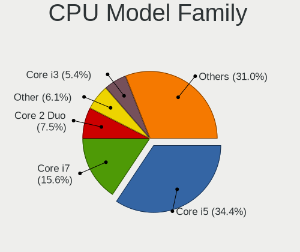

| Model                   | Notebooks | Percent |
|-------------------------|-----------|---------|
| Intel Core i5           | 84        | 32.81%  |
| Intel Core i7           | 42        | 16.41%  |
| Intel Core 2 Duo        | 20        | 7.81%   |
| Other                   | 16        | 6.25%   |
| Intel Core i3           | 14        | 5.47%   |
| Intel Celeron           | 11        | 4.3%    |
| AMD Ryzen 7             | 8         | 3.13%   |
| Intel Atom              | 7         | 2.73%   |
| AMD Ryzen 5             | 7         | 2.73%   |
| Intel Pentium M         | 5         | 1.95%   |
| Intel Pentium Silver    | 4         | 1.56%   |
| AMD Ryzen 7 PRO         | 4         | 1.56%   |
| Intel Core Duo          | 3         | 1.17%   |
| AMD A4                  | 3         | 1.17%   |
| Intel Xeon              | 2         | 0.78%   |
| Intel Genuine           | 2         | 0.78%   |
| Intel Core i9           | 2         | 0.78%   |
| Intel Core 2            | 2         | 0.78%   |
| AMD Ryzen 3             | 2         | 0.78%   |
| AMD A6                  | 2         | 0.78%   |
| Intel Pentium Dual-Core | 1         | 0.39%   |
| Intel Pentium 4         | 1         | 0.39%   |
| Intel Pentium           | 1         | 0.39%   |
| Intel Mobile Pentium 4  | 1         | 0.39%   |
| Intel Mobile Celeron    | 1         | 0.39%   |
| Intel Core Solo         | 1         | 0.39%   |
| Intel Core m3           | 1         | 0.39%   |
| Intel Core M            | 1         | 0.39%   |
| Intel Celeron M         | 1         | 0.39%   |
| AMD V120                | 1         | 0.39%   |
| AMD Turion 64 Mobile    | 1         | 0.39%   |
| AMD Ryzen 5 PRO         | 1         | 0.39%   |
| AMD E1                  | 1         | 0.39%   |
| AMD E                   | 1         | 0.39%   |
| AMD C-50                | 1         | 0.39%   |
| AMD Athlon II Neo       | 1         | 0.39%   |

CPU Cores
---------

Number of processor cores

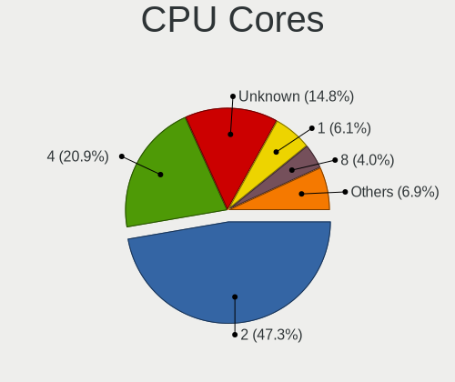

| Number  | Notebooks | Percent |
|---------|-----------|---------|
| 2       | 119       | 46.67%  |
| 4       | 56        | 21.96%  |
| Unknown | 37        | 14.51%  |
| 1       | 16        | 6.27%   |
| 8       | 11        | 4.31%   |
| 16      | 8         | 3.14%   |
| 12      | 5         | 1.96%   |
| 6       | 3         | 1.18%   |

CPU Sockets
-----------

Number of sockets

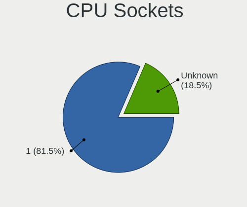

| Number  | Notebooks | Percent |
|---------|-----------|---------|
| 1       | 209       | 81.01%  |
| Unknown | 49        | 18.99%  |

CPU Threads
-----------

Threads per core (Hyper-Threading)

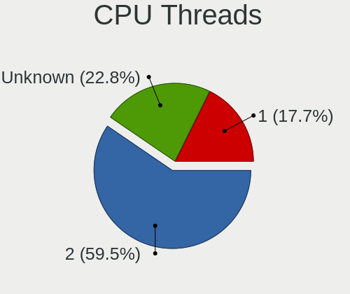

| Number  | Notebooks | Percent |
|---------|-----------|---------|
| 2       | 154       | 60.39%  |
| Unknown | 51        | 20%     |
| 1       | 50        | 19.61%  |

CPU Microarch
-------------

Microarchitecture

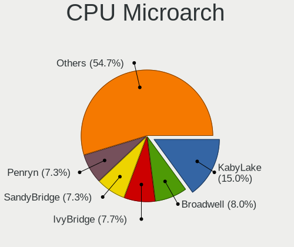

| Name          | Notebooks | Percent |
|---------------|-----------|---------|
| KabyLake      | 40        | 15.56%  |
| Penryn        | 20        | 7.78%   |
| Broadwell     | 20        | 7.78%   |
| SandyBridge   | 19        | 7.39%   |
| IvyBridge     | 19        | 7.39%   |
| Skylake       | 17        | 6.61%   |
| Haswell       | 16        | 6.23%   |
| P6            | 14        | 5.45%   |
| Unknown       | 12        | 4.67%   |
| Zen 2         | 11        | 4.28%   |
| Westmere      | 9         | 3.5%    |
| Goldmont plus | 8         | 3.11%   |
| Bonnell       | 7         | 2.72%   |
| TigerLake     | 6         | 2.33%   |
| Silvermont    | 4         | 1.56%   |
| Zen+          | 3         | 1.17%   |
| Zen 3         | 3         | 1.17%   |
| Zen           | 3         | 1.17%   |
| NetBurst      | 3         | 1.17%   |
| Jaguar        | 3         | 1.17%   |
| Goldmont      | 3         | 1.17%   |
| Core          | 3         | 1.17%   |
| CometLake     | 3         | 1.17%   |
| K10 Llano     | 2         | 0.78%   |
| K10           | 2         | 0.78%   |
| IceLake       | 2         | 0.78%   |
| Bobcat        | 2         | 0.78%   |
| Nehalem       | 1         | 0.39%   |
| K8 Hammer     | 1         | 0.39%   |
| Excavator     | 1         | 0.39%   |

Graphics
--------

GPU Vendor
----------

Vendors of graphics cards

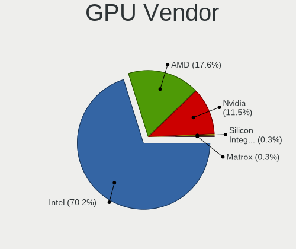

| Vendor                           | Notebooks | Percent |
|----------------------------------|-----------|---------|
| Intel                            | 204       | 71.08%  |
| AMD                              | 51        | 17.77%  |
| Nvidia                           | 31        | 10.8%   |
| Silicon Integrated Systems [SiS] | 1         | 0.35%   |

GPU Model
---------

Graphics card models

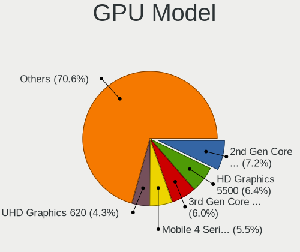

| Model                                                                                    | Notebooks | Percent |
|------------------------------------------------------------------------------------------|-----------|---------|
| Intel 2nd Generation Core Processor Family Integrated Graphics Controller                | 20        | 6.6%    |
| Intel 3rd Gen Core processor Graphics Controller                                         | 19        | 6.27%   |
| Intel HD Graphics 5500                                                                   | 17        | 5.61%   |
| Intel Skylake GT2 [HD Graphics 520]                                                      | 16        | 5.28%   |
| Intel Mobile 4 Series Chipset Integrated Graphics Controller                             | 15        | 4.95%   |
| Intel UHD Graphics 620                                                                   | 12        | 3.96%   |
| Intel Mobile 945GM/GMS/GME, 943/940GML Express Integrated Graphics Controller            | 12        | 3.96%   |
| Intel Haswell-ULT Integrated Graphics Controller                                         | 12        | 3.96%   |
| AMD Renoir                                                                               | 11        | 3.63%   |
| Intel HD Graphics 620                                                                    | 8         | 2.64%   |
| Intel WhiskeyLake-U GT2 [UHD Graphics 620]                                               | 7         | 2.31%   |
| Intel TigerLake-LP GT2 [Iris Xe Graphics]                                                | 7         | 2.31%   |
| Intel Mobile 945GM/GMS, 943/940GML Express Integrated Graphics Controller                | 7         | 2.31%   |
| Intel Core Processor Integrated Graphics Controller                                      | 7         | 2.31%   |
| Intel CometLake-U GT2 [UHD Graphics]                                                     | 7         | 2.31%   |
| Intel Mobile 945GSE Express Integrated Graphics Controller                               | 5         | 1.65%   |
| Intel GeminiLake [UHD Graphics 600]                                                      | 5         | 1.65%   |
| Intel 4th Gen Core Processor Integrated Graphics Controller                              | 4         | 1.32%   |
| Nvidia C79 [GeForce 9400M]                                                               | 3         | 0.99%   |
| Intel GeminiLake [UHD Graphics 605]                                                      | 3         | 0.99%   |
| AMD RV200/M7 [Mobility Radeon 7500]                                                      | 3         | 0.99%   |
| AMD Raven Ridge [Radeon Vega Series / Radeon Vega Mobile Series]                         | 3         | 0.99%   |
| AMD Picasso/Raven 2 [Radeon Vega Series / Radeon Vega Mobile Series]                     | 3         | 0.99%   |
| AMD Barcelo                                                                              | 3         | 0.99%   |
| Nvidia TU117M                                                                            | 2         | 0.66%   |
| Nvidia GT218M [NVS 3100M]                                                                | 2         | 0.66%   |
| Nvidia GT216M [GeForce GT 330M]                                                          | 2         | 0.66%   |
| Nvidia GP108M [GeForce MX150]                                                            | 2         | 0.66%   |
| Nvidia GM206GLM [Quadro M2200 Mobile]                                                    | 2         | 0.66%   |
| Nvidia GM108M [GeForce 940M]                                                             | 2         | 0.66%   |
| Intel US15W/US15X SCH [Poulsbo] Graphics Controller                                      | 2         | 0.66%   |
| Intel Mobile GM965/GL960 Integrated Graphics Controller (secondary)                      | 2         | 0.66%   |
| Intel Mobile GM965/GL960 Integrated Graphics Controller (primary)                        | 2         | 0.66%   |
| Intel Mobile 915GM/GMS/910GML Express Graphics Controller                                | 2         | 0.66%   |
| Intel HD Graphics P630                                                                   | 2         | 0.66%   |
| Intel HD Graphics 6000                                                                   | 2         | 0.66%   |
| Intel HD Graphics 500                                                                    | 2         | 0.66%   |
| Intel CometLake-H GT2 [UHD Graphics]                                                     | 2         | 0.66%   |
| Intel CoffeeLake-H GT2 [UHD Graphics 630]                                                | 2         | 0.66%   |
| Intel Atom/Celeron/Pentium Processor x5-E8000/J3xxx/N3xxx Integrated Graphics Controller | 2         | 0.66%   |

GPU Combo
---------

Combinations of graphics cards

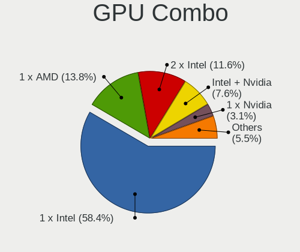

| Name           | Notebooks | Percent |
|----------------|-----------|---------|
| 1 x Intel      | 147       | 57.42%  |
| 1 x AMD        | 40        | 15.63%  |
| 2 x Intel      | 30        | 11.72%  |
| Intel + Nvidia | 21        | 8.2%    |
| 1 x Nvidia     | 6         | 2.34%   |
| Intel + AMD    | 6         | 2.34%   |
| AMD + Nvidia   | 3         | 1.17%   |
| 2 x Nvidia     | 1         | 0.39%   |
| 2 x AMD        | 1         | 0.39%   |
| 1 x SiS        | 1         | 0.39%   |

GPU Driver
----------

Free vs proprietary

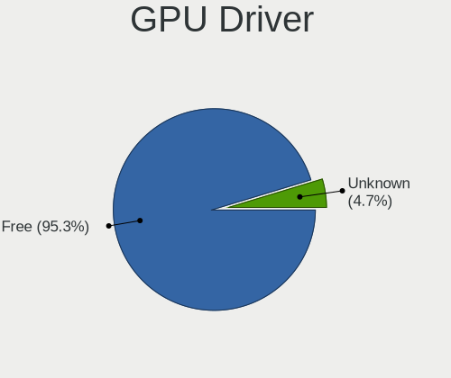

| Driver  | Notebooks | Percent |
|---------|-----------|---------|
| Free    | 245       | 96.08%  |
| Unknown | 10        | 3.92%   |

GPU Memory
----------

Total video memory

| Size in GB | Notebooks | Percent |
|------------|-----------|---------|
| Unknown    | 255       | 100%    |

Monitor
-------

Monitor Vendor
--------------

Monitor vendors

| Vendor                  | Notebooks | Percent |
|-------------------------|-----------|---------|
| LG Display              | 39        | 20.1%   |
| AU Optronics            | 39        | 20.1%   |
| BOE                     | 32        | 16.49%  |
| Chimei Innolux          | 19        | 9.79%   |
| Lenovo                  | 18        | 9.28%   |
| Samsung Electronics     | 8         | 4.12%   |
| Apple                   | 8         | 4.12%   |
| Sharp                   | 3         | 1.55%   |
| PANDA                   | 3         | 1.55%   |
| Dell                    | 3         | 1.55%   |
| Chi Mei Optoelectronics | 3         | 1.55%   |
| InfoVision              | 2         | 1.03%   |
| IBM                     | 2         | 1.03%   |
| Goldstar                | 2         | 1.03%   |
| CSO                     | 2         | 1.03%   |
| TRU                     | 1         | 0.52%   |
| Quanta Display          | 1         | 0.52%   |
| Philips                 | 1         | 0.52%   |
| LTM                     | 1         | 0.52%   |
| LG Philips              | 1         | 0.52%   |
| Iiyama                  | 1         | 0.52%   |
| HannStar                | 1         | 0.52%   |
| Gigabyte Technology     | 1         | 0.52%   |
| BenQ                    | 1         | 0.52%   |
| Ancor Communications    | 1         | 0.52%   |
| Acer                    | 1         | 0.52%   |

Monitor Model
-------------

Monitor models

| Model                                                                    | Notebooks | Percent |
|--------------------------------------------------------------------------|-----------|---------|
| Lenovo LCD Monitor LEN4010 1280x800 260x160mm 12.0-inch                  | 6         | 3.09%   |
| AU Optronics LCD Monitor AUO106C 1366x768 280x160mm 12.7-inch            | 6         | 3.09%   |
| LG Display LCD Monitor LGD058B 2560x1440 310x170mm 13.9-inch             | 4         | 2.06%   |
| LG Display LCD Monitor LGD03CD 1366x768 280x160mm 12.7-inch              | 3         | 1.55%   |
| Lenovo LCD Monitor LEN4011 1280x800 260x160mm 12.0-inch                  | 3         | 1.55%   |
| Samsung Electronics LCD Monitor SEC324C 1600x900 310x170mm 13.9-inch     | 2         | 1.03%   |
| LG Display LCD Monitor LGD05FA 1920x1080 310x170mm 13.9-inch             | 2         | 1.03%   |
| LG Display LCD Monitor LGD057E 1920x1080 340x190mm 15.3-inch             | 2         | 1.03%   |
| LG Display LCD Monitor LGD045E 1366x768 310x170mm 13.9-inch              | 2         | 1.03%   |
| LG Display LCD Monitor LGD0437 1920x1080 280x160mm 12.7-inch             | 2         | 1.03%   |
| LG Display LCD Monitor LGD0418 2560x1440 310x170mm 13.9-inch             | 2         | 1.03%   |
| LG Display LCD Monitor LGD02D8 1366x768 280x160mm 12.7-inch              | 2         | 1.03%   |
| Lenovo LCD Monitor LEN40B2 1920x1080 340x190mm 15.3-inch                 | 2         | 1.03%   |
| Lenovo LCD Monitor LEN4035 1280x800 300x190mm 14.0-inch                  | 2         | 1.03%   |
| Lenovo LCD Monitor LEN4033 1440x900 300x190mm 14.0-inch                  | 2         | 1.03%   |
| IBM LCD Monitor IBM2887 1680x1050 330x210mm 15.4-inch                    | 2         | 1.03%   |
| Chimei Innolux LCD Monitor CMN15DB 1366x768 340x190mm 15.3-inch          | 2         | 1.03%   |
| Chimei Innolux LCD Monitor CMN14D6 1366x768 310x170mm 13.9-inch          | 2         | 1.03%   |
| Chimei Innolux LCD Monitor CMN1239 1920x1080 280x160mm 12.7-inch         | 2         | 1.03%   |
| Chimei Innolux LCD Monitor CMN1132 1366x768 260x140mm 11.6-inch          | 2         | 1.03%   |
| Chi Mei Optoelectronics LCD Monitor CMO15A7 1366x768 350x190mm 15.7-inch | 2         | 1.03%   |
| BOE LCD Monitor BOE095F 2256x1504 280x190mm 13.3-inch                    | 2         | 1.03%   |
| BOE LCD Monitor BOE0900 1920x1080 340x190mm 15.3-inch                    | 2         | 1.03%   |
| BOE LCD Monitor BOE07C8 3840x2160 310x170mm 13.9-inch                    | 2         | 1.03%   |
| AU Optronics LCD Monitor AUO573D 1920x1080 310x170mm 13.9-inch           | 2         | 1.03%   |
| AU Optronics LCD Monitor AUO34ED 1920x1080 340x190mm 15.3-inch           | 2         | 1.03%   |
| AU Optronics LCD Monitor AUO315C 1366x768 260x140mm 11.6-inch            | 2         | 1.03%   |
| AU Optronics LCD Monitor AUO226D 1920x1080 280x160mm 12.7-inch           | 2         | 1.03%   |
| AU Optronics LCD Monitor AUO21EC 1366x768 340x190mm 15.3-inch            | 2         | 1.03%   |
| TRU LCD Monitor TRU235C 1366x768 260x140mm 11.6-inch                     | 1         | 0.52%   |
| Sharp LQ156M1JW01 SHP14C3 1920x1080 340x190mm 15.3-inch                  | 1         | 0.52%   |
| Sharp LCD Monitor SHP14BA 1920x1080 340x190mm 15.3-inch                  | 1         | 0.52%   |
| Sharp LCD Monitor SHP1449 1920x1080 290x170mm 13.2-inch                  | 1         | 0.52%   |
| Samsung Electronics LCD Monitor SEC544B 1600x900 310x170mm 13.9-inch     | 1         | 0.52%   |
| Samsung Electronics LCD Monitor SEC304C 1366x768 310x170mm 13.9-inch     | 1         | 0.52%   |
| Samsung Electronics LCD Monitor SDC4852 1366x768 340x190mm 15.3-inch     | 1         | 0.52%   |
| Samsung Electronics LCD Monitor SDC374A 3200x1800 290x170mm 13.2-inch    | 1         | 0.52%   |
| Samsung Electronics LCD Monitor SDC314D 1366x768 310x170mm 13.9-inch     | 1         | 0.52%   |
| Samsung Electronics C34H89x SAM0E25 3440x1440 800x330mm 34.1-inch        | 1         | 0.52%   |
| Quanta Display LCD Monitor QDS0020 1280x768 310x180mm 14.1-inch          | 1         | 0.52%   |

Monitor Resolution
------------------

Monitor screen resolution

| Resolution         | Notebooks | Percent |
|--------------------|-----------|---------|
| 1920x1080 (FHD)    | 67        | 34.9%   |
| 1366x768 (WXGA)    | 61        | 31.77%  |
| 1280x800 (WXGA)    | 17        | 8.85%   |
| 2560x1440 (QHD)    | 9         | 4.69%   |
| 1600x900 (HD+)     | 8         | 4.17%   |
| 1440x900 (WXGA+)   | 6         | 3.13%   |
| 3840x2160 (4K)     | 4         | 2.08%   |
| 1920x1200 (WUXGA)  | 3         | 1.56%   |
| 1680x1050 (WSXGA+) | 3         | 1.56%   |
| 2256x1504          | 2         | 1.04%   |
| 720x1280           | 1         | 0.52%   |
| 3840x2400          | 1         | 0.52%   |
| 3440x1440          | 1         | 0.52%   |
| 3200x1800 (QHD+)   | 1         | 0.52%   |
| 2880x1800          | 1         | 0.52%   |
| 1440x960           | 1         | 0.52%   |
| 1360x768           | 1         | 0.52%   |
| 1280x854           | 1         | 0.52%   |
| 1280x768           | 1         | 0.52%   |
| 1280x1024 (SXGA)   | 1         | 0.52%   |
| 1024x768 (XGA)     | 1         | 0.52%   |
| 1024x600           | 1         | 0.52%   |

Monitor Diagonal
----------------

Diagonal size in inches

| Inches | Notebooks | Percent |
|--------|-----------|---------|
| 13     | 61        | 31.44%  |
| 15     | 57        | 29.38%  |
| 12     | 34        | 17.53%  |
| 11     | 13        | 6.7%    |
| 14     | 10        | 5.15%   |
| 24     | 3         | 1.55%   |
| 23     | 2         | 1.03%   |
| 18     | 2         | 1.03%   |
| 17     | 2         | 1.03%   |
| 10     | 2         | 1.03%   |
| 34     | 1         | 0.52%   |
| 28     | 1         | 0.52%   |
| 27     | 1         | 0.52%   |
| 26     | 1         | 0.52%   |
| 21     | 1         | 0.52%   |
| 19     | 1         | 0.52%   |
| 9      | 1         | 0.52%   |
| 6      | 1         | 0.52%   |

Monitor Width
-------------

Physical width

| Width in mm | Notebooks | Percent |
|-------------|-----------|---------|
| 301-350     | 103       | 53.09%  |
| 201-300     | 74        | 38.14%  |
| 501-600     | 6         | 3.09%   |
| 401-500     | 4         | 2.06%   |
| 351-400     | 3         | 1.55%   |
| 101-200     | 2         | 1.03%   |
| 701-800     | 1         | 0.52%   |
| 601-700     | 1         | 0.52%   |

Aspect Ratio
------------

Proportional relationship between the width and the height

| Ratio | Notebooks | Percent |
|-------|-----------|---------|
| 16/9  | 148       | 79.14%  |
| 16/10 | 28        | 14.97%  |
| 3/2   | 8         | 4.28%   |
| 5/4   | 1         | 0.53%   |
| 4/3   | 1         | 0.53%   |
| 21/9  | 1         | 0.53%   |

Monitor Area
------------

Area in inch²

| Area in inch² | Notebooks | Percent |
|----------------|-----------|---------|
| 81-90          | 62        | 31.96%  |
| 91-100         | 46        | 23.71%  |
| 61-70          | 34        | 17.53%  |
| 51-60          | 13        | 6.7%    |
| 101-110        | 11        | 5.67%   |
| 71-80          | 9         | 4.64%   |
| 201-250        | 5         | 2.58%   |
| 351-500        | 2         | 1.03%   |
| 41-50          | 2         | 1.03%   |
| 1-40           | 2         | 1.03%   |
| 301-350        | 2         | 1.03%   |
| 141-150        | 2         | 1.03%   |
| 121-130        | 2         | 1.03%   |
| 251-300        | 1         | 0.52%   |
| 151-200        | 1         | 0.52%   |

Pixel Density
-------------

Pixels per inch

| Density       | Notebooks | Percent |
|---------------|-----------|---------|
| 121-160       | 105       | 54.4%   |
| 101-120       | 42        | 21.76%  |
| 161-240       | 25        | 12.95%  |
| 51-100        | 14        | 7.25%   |
| More than 240 | 7         | 3.63%   |

Multiple Monitors
-----------------

Total monitors connected

| Total | Notebooks | Percent |
|-------|-----------|---------|
| 1     | 218       | 84.82%  |
| 0     | 26        | 10.12%  |
| 2     | 13        | 5.06%   |

Network
-------

Net Controller Vendor
---------------------

Controller vendors

| Vendor                            | Notebooks | Percent |
|-----------------------------------|-----------|---------|
| Intel                             | 192       | 50.53%  |
| Realtek Semiconductor             | 84        | 22.11%  |
| Qualcomm Atheros                  | 34        | 8.95%   |
| Broadcom                          | 20        | 5.26%   |
| Marvell Technology Group          | 7         | 1.84%   |
| Ericsson Business Mobile Networks | 6         | 1.58%   |
| Sierra Wireless                   | 5         | 1.32%   |
| Edimax Technology                 | 4         | 1.05%   |
| Qualcomm Atheros Communications   | 3         | 0.79%   |
| Nvidia                            | 3         | 0.79%   |
| Apple                             | 3         | 0.79%   |
| TP-Link                           | 2         | 0.53%   |
| Ralink Technology                 | 2         | 0.53%   |
| MediaTek                          | 2         | 0.53%   |
| Xiaomi                            | 1         | 0.26%   |
| Silicon Integrated Systems [SiS]  | 1         | 0.26%   |
| Samsung Electronics               | 1         | 0.26%   |
| Ralink                            | 1         | 0.26%   |
| Micro Star International          | 1         | 0.26%   |
| Google                            | 1         | 0.26%   |
| Fibocom                           | 1         | 0.26%   |
| Dell                              | 1         | 0.26%   |
| D-Link System                     | 1         | 0.26%   |
| D-Link                            | 1         | 0.26%   |
| ASUSTek Computer                  | 1         | 0.26%   |
| AMD                               | 1         | 0.26%   |
| 3Com                              | 1         | 0.26%   |

Net Controller Model
--------------------

Controller models

| Model                                                                       | Notebooks | Percent |
|-----------------------------------------------------------------------------|-----------|---------|
| Realtek RTL8111/8168/8411 PCI Express Gigabit Ethernet Controller           | 61        | 11.89%  |
| Intel 82579LM Gigabit Network Connection (Lewisville)                       | 25        | 4.87%   |
| Intel Centrino Advanced-N 6205 [Taylor Peak]                                | 23        | 4.48%   |
| Intel Wireless 8265 / 8275                                                  | 18        | 3.51%   |
| Intel Wireless 7265                                                         | 17        | 3.31%   |
| Intel Wi-Fi 6 AX200                                                         | 16        | 3.12%   |
| Intel Wireless 8260                                                         | 14        | 2.73%   |
| Intel 82567LM Gigabit Network Connection                                    | 14        | 2.73%   |
| Intel Wireless 7260                                                         | 12        | 2.34%   |
| Intel Ethernet Connection I219-LM                                           | 12        | 2.34%   |
| Realtek RTL810xE PCI Express Fast Ethernet controller                       | 11        | 2.14%   |
| Intel Ethernet Connection (3) I218-LM                                       | 9         | 1.75%   |
| Intel Ultimate N WiFi Link 5300                                             | 8         | 1.56%   |
| Qualcomm Atheros AR9285 Wireless Network Adapter (PCI-Express)              | 7         | 1.36%   |
| Intel Wi-Fi 6 AX201                                                         | 7         | 1.36%   |
| Intel 82577LM Gigabit Network Connection                                    | 7         | 1.36%   |
| Realtek RTL8188CE 802.11b/g/n WiFi Adapter                                  | 6         | 1.17%   |
| Intel PRO/Wireless 3945ABG [Golan] Network Connection                       | 6         | 1.17%   |
| Intel Ethernet Connection (4) I219-V                                        | 6         | 1.17%   |
| Intel Centrino Advanced-N 6200                                              | 6         | 1.17%   |
| Broadcom BCM4360 802.11ac Wireless Network Adapter                          | 6         | 1.17%   |
| Realtek RTL8821CE 802.11ac PCIe Wireless Network Adapter                    | 5         | 0.97%   |
| Realtek RTL8188EUS 802.11n Wireless Network Adapter                         | 5         | 0.97%   |
| Qualcomm Atheros AR242x / AR542x Wireless Network Adapter (PCI-Express)     | 5         | 0.97%   |
| Intel Comet Lake PCH-LP CNVi WiFi                                           | 5         | 0.97%   |
| Qualcomm Atheros AR9485 Wireless Network Adapter                            | 4         | 0.78%   |
| Marvell Group 88E8057 PCI-E Gigabit Ethernet Controller                     | 4         | 0.78%   |
| Intel Wireless-AC 9260                                                      | 4         | 0.78%   |
| Intel Wireless 3165                                                         | 4         | 0.78%   |
| Intel Ethernet Connection (4) I219-LM                                       | 4         | 0.78%   |
| Intel Cannon Point-LP CNVi [Wireless-AC]                                    | 4         | 0.78%   |
| Ericsson Business Mobile Networks F5521 gw Mobile Broadband Serial Port III | 4         | 0.78%   |
| Edimax EW-7811Un 802.11n Wireless Adapter [Realtek RTL8188CUS]              | 4         | 0.78%   |
| Sierra Wireless EM7455                                                      | 3         | 0.58%   |
| Realtek RTL8188CUS 802.11n WLAN Adapter                                     | 3         | 0.58%   |
| Realtek RTL-8100/8101L/8139 PCI Fast Ethernet Adapter                       | 3         | 0.58%   |
| Qualcomm Atheros QCA9565 / AR9565 Wireless Network Adapter                  | 3         | 0.58%   |
| Qualcomm Atheros QCA9377 802.11ac Wireless Network Adapter                  | 3         | 0.58%   |
| Qualcomm Atheros AR8152 v2.0 Fast Ethernet                                  | 3         | 0.58%   |
| Qualcomm Atheros AR5212 802.11abg NIC                                       | 3         | 0.58%   |

Wireless Vendor
---------------

Wireless vendors

| Vendor                          | Notebooks | Percent |
|---------------------------------|-----------|---------|
| Intel                           | 179       | 65.57%  |
| Qualcomm Atheros                | 30        | 10.99%  |
| Realtek Semiconductor           | 24        | 8.79%   |
| Broadcom                        | 17        | 6.23%   |
| Sierra Wireless                 | 4         | 1.47%   |
| Edimax Technology               | 4         | 1.47%   |
| Qualcomm Atheros Communications | 3         | 1.1%    |
| TP-Link                         | 2         | 0.73%   |
| Ralink Technology               | 2         | 0.73%   |
| MediaTek                        | 2         | 0.73%   |
| Ralink                          | 1         | 0.37%   |
| Micro Star International        | 1         | 0.37%   |
| Dell                            | 1         | 0.37%   |
| D-Link System                   | 1         | 0.37%   |
| D-Link                          | 1         | 0.37%   |
| ASUSTek Computer                | 1         | 0.37%   |

Wireless Model
--------------

Wireless models

| Model                                                                   | Notebooks | Percent |
|-------------------------------------------------------------------------|-----------|---------|
| Intel Centrino Advanced-N 6205 [Taylor Peak]                            | 23        | 8.3%    |
| Intel Wireless 8265 / 8275                                              | 18        | 6.5%    |
| Intel Wireless 7265                                                     | 17        | 6.14%   |
| Intel Wi-Fi 6 AX200                                                     | 16        | 5.78%   |
| Intel Wireless 8260                                                     | 14        | 5.05%   |
| Intel Wireless 7260                                                     | 12        | 4.33%   |
| Intel Ultimate N WiFi Link 5300                                         | 8         | 2.89%   |
| Qualcomm Atheros AR9285 Wireless Network Adapter (PCI-Express)          | 7         | 2.53%   |
| Intel Wi-Fi 6 AX201                                                     | 7         | 2.53%   |
| Realtek RTL8188CE 802.11b/g/n WiFi Adapter                              | 6         | 2.17%   |
| Intel PRO/Wireless 3945ABG [Golan] Network Connection                   | 6         | 2.17%   |
| Intel Centrino Advanced-N 6200                                          | 6         | 2.17%   |
| Broadcom BCM4360 802.11ac Wireless Network Adapter                      | 6         | 2.17%   |
| Realtek RTL8821CE 802.11ac PCIe Wireless Network Adapter                | 5         | 1.81%   |
| Realtek RTL8188EUS 802.11n Wireless Network Adapter                     | 5         | 1.81%   |
| Qualcomm Atheros AR242x / AR542x Wireless Network Adapter (PCI-Express) | 5         | 1.81%   |
| Intel Comet Lake PCH-LP CNVi WiFi                                       | 5         | 1.81%   |
| Qualcomm Atheros AR9485 Wireless Network Adapter                        | 4         | 1.44%   |
| Intel Wireless-AC 9260                                                  | 4         | 1.44%   |
| Intel Wireless 3165                                                     | 4         | 1.44%   |
| Intel Cannon Point-LP CNVi [Wireless-AC]                                | 4         | 1.44%   |
| Edimax EW-7811Un 802.11n Wireless Adapter [Realtek RTL8188CUS]          | 4         | 1.44%   |
| Sierra Wireless EM7455                                                  | 3         | 1.08%   |
| Realtek RTL8188CUS 802.11n WLAN Adapter                                 | 3         | 1.08%   |
| Qualcomm Atheros QCA9565 / AR9565 Wireless Network Adapter              | 3         | 1.08%   |
| Qualcomm Atheros QCA9377 802.11ac Wireless Network Adapter              | 3         | 1.08%   |
| Qualcomm Atheros AR5212 802.11abg NIC                                   | 3         | 1.08%   |
| Intel Wi-Fi 6 AX210/AX211/AX411 160MHz                                  | 3         | 1.08%   |
| Intel PRO/Wireless 5100 AGN [Shiloh] Network Connection                 | 3         | 1.08%   |
| Intel PRO/Wireless 2915ABG [Calexico2] Network Connection               | 3         | 1.08%   |
| Intel Centrino Wireless-N 2230                                          | 3         | 1.08%   |
| Broadcom BCM4322 802.11a/b/g/n Wireless LAN Controller                  | 3         | 1.08%   |
| TP-Link TL-WN823N v2/v3 [Realtek RTL8192EU]                             | 2         | 0.72%   |
| Realtek RTL8822CE 802.11ac PCIe Wireless Network Adapter                | 2         | 0.72%   |
| Qualcomm Atheros AR9271 802.11n                                         | 2         | 0.72%   |
| Qualcomm Atheros AR928X Wireless Network Adapter (PCI-Express)          | 2         | 0.72%   |
| Intel Wireless 3160                                                     | 2         | 0.72%   |
| Intel PRO/Wireless 4965 AG or AGN [Kedron] Network Connection           | 2         | 0.72%   |
| Intel Ice Lake-LP PCH CNVi WiFi                                         | 2         | 0.72%   |
| Intel Gemini Lake PCH CNVi WiFi                                         | 2         | 0.72%   |

Ethernet Vendor
---------------

Ethernet vendors

| Vendor                           | Notebooks | Percent |
|----------------------------------|-----------|---------|
| Intel                            | 109       | 50.23%  |
| Realtek Semiconductor            | 76        | 35.02%  |
| Qualcomm Atheros                 | 8         | 3.69%   |
| Marvell Technology Group         | 7         | 3.23%   |
| Broadcom                         | 7         | 3.23%   |
| Nvidia                           | 3         | 1.38%   |
| Apple                            | 2         | 0.92%   |
| Xiaomi                           | 1         | 0.46%   |
| Silicon Integrated Systems [SiS] | 1         | 0.46%   |
| Samsung Electronics              | 1         | 0.46%   |
| Google                           | 1         | 0.46%   |
| 3Com                             | 1         | 0.46%   |

Ethernet Model
--------------

Ethernet models

| Model                                                             | Notebooks | Percent |
|-------------------------------------------------------------------|-----------|---------|
| Realtek RTL8111/8168/8411 PCI Express Gigabit Ethernet Controller | 61        | 28.11%  |
| Intel 82579LM Gigabit Network Connection (Lewisville)             | 25        | 11.52%  |
| Intel 82567LM Gigabit Network Connection                          | 14        | 6.45%   |
| Intel Ethernet Connection I219-LM                                 | 12        | 5.53%   |
| Realtek RTL810xE PCI Express Fast Ethernet controller             | 11        | 5.07%   |
| Intel Ethernet Connection (3) I218-LM                             | 9         | 4.15%   |
| Intel 82577LM Gigabit Network Connection                          | 7         | 3.23%   |
| Intel Ethernet Connection (4) I219-V                              | 6         | 2.76%   |
| Marvell Group 88E8057 PCI-E Gigabit Ethernet Controller           | 4         | 1.84%   |
| Intel Ethernet Connection (4) I219-LM                             | 4         | 1.84%   |
| Realtek RTL-8100/8101L/8139 PCI Fast Ethernet Adapter             | 3         | 1.38%   |
| Qualcomm Atheros AR8152 v2.0 Fast Ethernet                        | 3         | 1.38%   |
| Nvidia MCP79 Ethernet                                             | 3         | 1.38%   |
| Intel Ethernet Connection I218-LM                                 | 3         | 1.38%   |
| Intel Ethernet Connection (6) I219-V                              | 3         | 1.38%   |
| Intel Ethernet Connection (2) I219-LM                             | 3         | 1.38%   |
| Intel Ethernet Connection (10) I219-V                             | 3         | 1.38%   |
| Intel 82573L Gigabit Ethernet Controller                          | 3         | 1.38%   |
| Broadcom NetXtreme BCM5751M Gigabit Ethernet PCI Express          | 3         | 1.38%   |
| Qualcomm Atheros AR8121/AR8113/AR8114 Gigabit or Fast Ethernet    | 2         | 0.92%   |
| Marvell Group 88E8055 PCI-E Gigabit Ethernet Controller           | 2         | 0.92%   |
| Intel Ethernet Connection I218-V                                  | 2         | 0.92%   |
| Intel Ethernet Connection I217-LM                                 | 2         | 0.92%   |
| Intel Ethernet Connection (3) I218-V                              | 2         | 0.92%   |
| Intel 82566MM Gigabit Network Connection                          | 2         | 0.92%   |
| Intel 82540EP Gigabit Ethernet Controller (Mobile)                | 2         | 0.92%   |
| Apple UniNorth 2 GMAC (Sun GEM)                                   | 2         | 0.92%   |
| Xiaomi Mi/Redmi series (RNDIS)                                    | 1         | 0.46%   |
| Silicon Integrated Systems [SiS] SiS900 PCI Fast Ethernet         | 1         | 0.46%   |
| Samsung Galaxy series, misc. (tethering mode)                     | 1         | 0.46%   |
| Realtek Killer E2600 Gigabit Ethernet Controller                  | 1         | 0.46%   |
| Qualcomm Atheros Killer E2500 Gigabit Ethernet Controller         | 1         | 0.46%   |
| Qualcomm Atheros AR8151 v2.0 Gigabit Ethernet                     | 1         | 0.46%   |
| Qualcomm Atheros AR8131 Gigabit Ethernet                          | 1         | 0.46%   |
| Marvell Group 88E8053 PCI-E Gigabit Ethernet Controller           | 1         | 0.46%   |
| Intel I225-K2                                                     | 1         | 0.46%   |
| Intel Ethernet Connection I219-V                                  | 1         | 0.46%   |
| Intel Ethernet Connection (7) I219-LM                             | 1         | 0.46%   |
| Intel 82801CAM (ICH3) PRO/100 VM (KM) Ethernet Controller         | 1         | 0.46%   |
| Intel 82801CAM (ICH3) PRO/100 VE (LOM) Ethernet Controller        | 1         | 0.46%   |

Net Controller Kind
-------------------

Ethernet, WiFi or modem

| Kind     | Notebooks | Percent |
|----------|-----------|---------|
| WiFi     | 248       | 51.56%  |
| Ethernet | 215       | 44.7%   |
| Modem    | 10        | 2.08%   |
| Unknown  | 8         | 1.66%   |

Used Controller
---------------

Currently used network controller

| Kind     | Notebooks | Percent |
|----------|-----------|---------|
| WiFi     | 184       | 69.96%  |
| Ethernet | 78        | 29.66%  |
| Unknown  | 1         | 0.38%   |

NICs
----

Total network controllers on board

| Total | Notebooks | Percent |
|-------|-----------|---------|
| 2     | 201       | 78.82%  |
| 1     | 50        | 19.61%  |
| 3     | 3         | 1.18%   |
| 0     | 1         | 0.39%   |

IPv6
----

IPv6 vs IPv4

| Used | Notebooks | Percent |
|------|-----------|---------|
| No   | 253       | 99.22%  |
| Yes  | 2         | 0.78%   |

Bluetooth
---------

Bluetooth Vendor
----------------

Controller vendors

| Vendor                          | Notebooks | Percent |
|---------------------------------|-----------|---------|
| Intel                           | 91        | 56.88%  |
| Broadcom                        | 26        | 16.25%  |
| Apple                           | 11        | 6.88%   |
| IMC Networks                    | 7         | 4.38%   |
| Alps Electric                   | 7         | 4.38%   |
| Realtek Semiconductor           | 5         | 3.13%   |
| Foxconn / Hon Hai               | 5         | 3.13%   |
| Qualcomm Atheros Communications | 3         | 1.88%   |
| Realtek                         | 1         | 0.63%   |
| Ralink                          | 1         | 0.63%   |
| Lite-On Technology              | 1         | 0.63%   |
| Creative Technology             | 1         | 0.63%   |
| ASUSTek Computer                | 1         | 0.63%   |

Bluetooth Model
---------------

Controller models

| Model                                                                               | Notebooks | Percent |
|-------------------------------------------------------------------------------------|-----------|---------|
| Intel Bluetooth wireless interface                                                  | 47        | 29.38%  |
| Intel AX201 Bluetooth                                                               | 13        | 8.13%   |
| Intel AX200 Bluetooth                                                               | 13        | 8.13%   |
| Broadcom BCM2045B (BDC-2.1)                                                         | 8         | 5%      |
| Broadcom BCM20702 Bluetooth 4.0 [ThinkPad]                                          | 7         | 4.38%   |
| Intel Bluetooth 9460/9560 Jefferson Peak (JfP)                                      | 6         | 3.75%   |
| Broadcom BCM2045B (BDC-2.1) [Bluetooth Controller]                                  | 6         | 3.75%   |
| Apple Apple Broadcom Built-in Bluetooth                                             | 6         | 3.75%   |
| Apple Bluetooth Host Controller                                                     | 5         | 3.13%   |
| Alps Electric UGTZ4 Bluetooth                                                       | 5         | 3.13%   |
| Intel Centrino Bluetooth Wireless Transceiver                                       | 4         | 2.5%    |
| Intel AX210 Bluetooth                                                               | 3         | 1.88%   |
| Realtek  Bluetooth Adapter                                                          | 2         | 1.25%   |
| Realtek  Bluetooth 4.2 Adapter                                                      | 2         | 1.25%   |
| Intel Wireless-AC 9260 Bluetooth Adapter                                            | 2         | 1.25%   |
| Intel Wireless-AC 3168 Bluetooth                                                    | 2         | 1.25%   |
| IMC Networks Qualcomm Atheros Bluetooth 4.1                                         | 2         | 1.25%   |
| IMC Networks Qualcomm Atheros Bluetooth 4.0 + HS                                    | 2         | 1.25%   |
| IMC Networks Asus Integrated Bluetooth module [AR3011]                              | 2         | 1.25%   |
| Foxconn / Hon Hai Broadcom BCM20702 Bluetooth USB Device                            | 2         | 1.25%   |
| Alps Electric BCM2046 Bluetooth Device                                              | 2         | 1.25%   |
| Realtek  Bluetooth 4.0 Adapter                                                      | 1         | 0.63%   |
| Realtek Bluetooth Radio                                                             | 1         | 0.63%   |
| Ralink RT3290 Bluetooth                                                             | 1         | 0.63%   |
| Qualcomm Atheros  QCA9377 Bluetooth 4.1                                             | 1         | 0.63%   |
| Qualcomm Atheros Dell Wireless 1820 Bluetooth 4.1LE                                 | 1         | 0.63%   |
| Qualcomm Atheros AR3012 Bluetooth 4.0                                               | 1         | 0.63%   |
| Lite-On Atheros AR3012 Bluetooth                                                    | 1         | 0.63%   |
| Intel Centrino Advanced-N 6230 Bluetooth adapter                                    | 1         | 0.63%   |
| IMC Networks Realtek Bluetooth Adapter                                              | 1         | 0.63%   |
| Foxconn / Hon Hai Wireless_Device                                                   | 1         | 0.63%   |
| Foxconn / Hon Hai MediaTek Bluetooth Adapter                                        | 1         | 0.63%   |
| Foxconn / Hon Hai Foxconn T77H114 BCM2070 [Single-Chip Bluetooth 2.1 + EDR Adapter] | 1         | 0.63%   |
| Creative Creative Bluetooth Audio W2                                                | 1         | 0.63%   |
| Broadcom BCM43142A0 Bluetooth Module                                                | 1         | 0.63%   |
| Broadcom BCM20702A0 Bluetooth 4.0                                                   | 1         | 0.63%   |
| Broadcom BCM2046 Bluetooth Device                                                   | 1         | 0.63%   |
| Broadcom BCM2045B (BDC-2) [Bluetooth Controller]                                    | 1         | 0.63%   |
| Broadcom BCM2045 Bluetooth                                                          | 1         | 0.63%   |
| ASUS Broadcom Bluetooth 2.1                                                         | 1         | 0.63%   |

Sound
-----

Sound Vendor
------------

Sound card vendors

| Vendor                           | Notebooks | Percent |
|----------------------------------|-----------|---------|
| Intel                            | 215       | 80.22%  |
| AMD                              | 34        | 12.69%  |
| Nvidia                           | 14        | 5.22%   |
| Silicon Integrated Systems [SiS] | 1         | 0.37%   |
| Logitech                         | 1         | 0.37%   |
| Generalplus Technology           | 1         | 0.37%   |
| ESS Technology                   | 1         | 0.37%   |
| C-Media Electronics              | 1         | 0.37%   |

Sound Model
-----------

Sound card models

| Model                                                                                             | Notebooks | Percent |
|---------------------------------------------------------------------------------------------------|-----------|---------|
| Intel Sunrise Point-LP HD Audio                                                                   | 37        | 11.14%  |
| Intel 7 Series/C216 Chipset Family High Definition Audio Controller                               | 21        | 6.33%   |
| AMD Family 17h/19h HD Audio Controller                                                            | 21        | 6.33%   |
| Intel Wildcat Point-LP High Definition Audio Controller                                           | 20        | 6.02%   |
| Intel Broadwell-U Audio Controller                                                                | 20        | 6.02%   |
| Intel 6 Series/C200 Series Chipset Family High Definition Audio Controller                        | 18        | 5.42%   |
| Intel 82801I (ICH9 Family) HD Audio Controller                                                    | 16        | 4.82%   |
| Intel NM10/ICH7 Family High Definition Audio Controller                                           | 14        | 4.22%   |
| AMD Renoir Radeon High Definition Audio Controller                                                | 14        | 4.22%   |
| Intel Haswell-ULT HD Audio Controller                                                             | 12        | 3.61%   |
| Intel 8 Series HD Audio Controller                                                                | 12        | 3.61%   |
| Intel 5 Series/3400 Series Chipset High Definition Audio                                          | 10        | 3.01%   |
| Intel Celeron/Pentium Silver Processor High Definition Audio                                      | 8         | 2.41%   |
| Intel Tiger Lake-LP Smart Sound Technology Audio Controller                                       | 7         | 2.11%   |
| Intel Comet Lake PCH-LP cAVS                                                                      | 7         | 2.11%   |
| Intel Cannon Point-LP High Definition Audio Controller                                            | 7         | 2.11%   |
| AMD Raven/Raven2/Fenghuang HDMI/DP Audio Controller                                               | 6         | 1.81%   |
| AMD FCH Azalia Controller                                                                         | 5         | 1.51%   |
| Intel Xeon E3-1200 v3/4th Gen Core Processor HD Audio Controller                                  | 4         | 1.2%    |
| Intel 8 Series/C220 Series Chipset High Definition Audio Controller                               | 4         | 1.2%    |
| AMD SBx00 Azalia (Intel HDA)                                                                      | 4         | 1.2%    |
| Nvidia MCP79 High Definition Audio                                                                | 3         | 0.9%    |
| Intel Comet Lake PCH cAVS                                                                         | 3         | 0.9%    |
| Intel Celeron N3350/Pentium N4200/Atom E3900 Series Audio Cluster                                 | 3         | 0.9%    |
| Intel Cannon Lake PCH cAVS                                                                        | 3         | 0.9%    |
| Intel 82801FB/FBM/FR/FW/FRW (ICH6 Family) AC'97 Audio Controller                                  | 3         | 0.9%    |
| Intel 82801CA/CAM AC'97 Audio Controller                                                          | 3         | 0.9%    |
| AMD Kabini HDMI/DP Audio                                                                          | 3         | 0.9%    |
| Nvidia TU107 GeForce GTX 1650 High Definition Audio Controller                                    | 2         | 0.6%    |
| Nvidia High Definition Audio Controller                                                           | 2         | 0.6%    |
| Nvidia GT216 HDMI Audio Controller                                                                | 2         | 0.6%    |
| Intel US15W/US15X/US15L/UL11L SCH [Poulsbo] HD Audio Controller                                   | 2         | 0.6%    |
| Intel Ice Lake-LP Smart Sound Technology Audio Controller                                         | 2         | 0.6%    |
| Intel CM238 HD Audio Controller                                                                   | 2         | 0.6%    |
| Intel Atom/Celeron/Pentium Processor x5-E8000/J3xxx/N3xxx Series High Definition Audio Controller | 2         | 0.6%    |
| Intel Atom Processor Z36xxx/Z37xxx Series High Definition Audio Controller                        | 2         | 0.6%    |
| Intel Alder Lake PCH-P High Definition Audio Controller                                           | 2         | 0.6%    |
| Intel 82801H (ICH8 Family) HD Audio Controller                                                    | 2         | 0.6%    |
| Intel 82801DB/DBL/DBM (ICH4/ICH4-L/ICH4-M) AC'97 Audio Controller                                 | 2         | 0.6%    |
| AMD Wrestler HDMI Audio                                                                           | 2         | 0.6%    |

Memory
------

Memory Vendor
-------------

Memory module vendors

| Vendor              | Notebooks | Percent |
|---------------------|-----------|---------|
| Samsung Electronics | 13        | 30.95%  |
| Unknown             | 10        | 23.81%  |
| SK hynix            | 6         | 14.29%  |
| Micron Technology   | 4         | 9.52%   |
| Elpida              | 3         | 7.14%   |
| Kingston            | 2         | 4.76%   |
| Crucial             | 2         | 4.76%   |
| Ramaxel Technology  | 1         | 2.38%   |
| Unknown             | 1         | 2.38%   |

Memory Model
------------

Memory module models

| Model                                                   | Notebooks | Percent |
|---------------------------------------------------------|-----------|---------|
| Samsung RAM M471B5273DH0-CH9 4GB SODIMM DDR3 1334MT/s   | 3         | 6.52%   |
| Unknown RAM Module 4GB SODIMM DDR3 1333MT/s             | 2         | 4.35%   |
| SK hynix RAM HMT351S6CFR8C-PB 4GB SODIMM DDR3 1600MT/s  | 2         | 4.35%   |
| Crucial RAM CT102464BF160B.M16 8GB SODIMM DDR3 1600MT/s | 2         | 4.35%   |
| Unknown RAM Module 512MB SODIMM SDRAM                   | 1         | 2.17%   |
| Unknown RAM Module 512MB SODIMM DDR                     | 1         | 2.17%   |
| Unknown RAM Module 2GB SODIMM DDR3 1067MT/s             | 1         | 2.17%   |
| Unknown RAM Module 256MB SODIMM DRAM                    | 1         | 2.17%   |
| Unknown RAM Module 2048MB SODIMM DDR3 1333MT/s          | 1         | 2.17%   |
| Unknown RAM Module 2048MB SODIMM DDR2                   | 1         | 2.17%   |
| Unknown RAM Module 1GB SODIMM DDR2                      | 1         | 2.17%   |
| Unknown RAM Module 128MB SODIMM DRAM                    | 1         | 2.17%   |
| Unknown RAM Module 1024MB SODIMM DDR                    | 1         | 2.17%   |
| SK hynix RAM HMT351S6EFR8A-PB 4GB SODIMM DDR3 1600MT/s  | 1         | 2.17%   |
| SK hynix RAM HMT325S6BFR8C-H9 2GB SODIMM DDR3 1333MT/s  | 1         | 2.17%   |
| SK hynix RAM H9CCNNNBJTMLAR 4GB SODIMM LPDDR3 1867MT/s  | 1         | 2.17%   |
| SK hynix RAM H9CCNNNBJTMLAR 4GB Chip LPDDR3 1867MT/s    | 1         | 2.17%   |
| SK hynix RAM 484D543332355336 2GB SODIMM DDR3 1333MT/s  | 1         | 2.17%   |
| Samsung RAM M471B5773DH0-CH9 2GB SODIMM DDR3 1334MT/s   | 1         | 2.17%   |
| Samsung RAM M471B5673FH0-CF8 2GB SODIMM DDR3 1067MT/s   | 1         | 2.17%   |
| Samsung RAM M471B5673EH1-CF8 2GB SODIMM 1067MT/s        | 1         | 2.17%   |
| Samsung RAM M471B5273DH0-CK0 4GB SODIMM DDR3 1600MT/s   | 1         | 2.17%   |
| Samsung RAM M471B5173QH0-YK0 4GB SODIMM DDR3 1600MT/s   | 1         | 2.17%   |
| Samsung RAM M471B5173BH0-CK0 4GB SODIMM DDR3 1600MT/s   | 1         | 2.17%   |
| Samsung RAM M471B1G73DB0-YK0 8GB SODIMM DDR3 1600MT/s   | 1         | 2.17%   |
| Samsung RAM M471A5244CB0-CWE 4GB SODIMM DDR4 3200MT/s   | 1         | 2.17%   |
| Samsung RAM M471A2G44AM0-CWE 16GB SODIMM DDR4 3200MT/s  | 1         | 2.17%   |
| Samsung RAM M471A1K43CB1-CRC 8GB SODIMM DDR4 2400MT/s   | 1         | 2.17%   |
| Samsung RAM M471A1K43BB0-CPB 8GB SODIMM DDR4 2133MT/s   | 1         | 2.17%   |
| Ramaxel RAM RMT3170MN68F9F1600 4GB SODIMM DDR3 1600MT/s | 1         | 2.17%   |
| Micron RAM 8KTF51264HZ-1G6E1 4GB SODIMM DDR3 1600MT/s   | 1         | 2.17%   |
| Micron RAM 8JSF12864HZ-1G1F1 1GB SODIMM DDR3 800MT/s    | 1         | 2.17%   |
| Micron RAM 4ATS2G64HZ-3G2B1 16GB SODIMM DDR4 3200MT/s   | 1         | 2.17%   |
| Micron RAM 16ATF2G64HZ-2G6E1 16GB SODIMM DDR4 2667MT/s  | 1         | 2.17%   |
| Kingston RAM KHX1600C9S3L/8G 8GB SODIMM DDR3 1600MT/s   | 1         | 2.17%   |
| Kingston RAM 4143523531325836 4GB SODIMM DDR3 1333MT/s  | 1         | 2.17%   |
| Elpida RAM Module 1GB SODIMM DDR2 533MT/s               | 1         | 2.17%   |
| Elpida RAM EDJ4216EFBG-L 2048MB SODIMM DDR3 1600MT/s    | 1         | 2.17%   |
| Elpida RAM EBJ41UF8BCS0-DJ-F 4GB SODIMM DDR3 1334MT/s   | 1         | 2.17%   |
| Elpida RAM EBJ21UE8BDS0-AE-F 2GB SODIMM DDR3 1067MT/s   | 1         | 2.17%   |

Memory Kind
-----------

Memory module kinds

| Kind   | Notebooks | Percent |
|--------|-----------|---------|
| DDR3   | 22        | 59.46%  |
| DDR4   | 6         | 16.22%  |
| DDR2   | 3         | 8.11%   |
| SDRAM  | 2         | 5.41%   |
| DRAM   | 2         | 5.41%   |
| LPDDR3 | 1         | 2.7%    |
| DDR    | 1         | 2.7%    |

Memory Form Factor
------------------

Physical design of the memory module

| Name   | Notebooks | Percent |
|--------|-----------|---------|
| SODIMM | 37        | 97.37%  |
| Chip   | 1         | 2.63%   |

Memory Size
-----------

Memory module size

| Size  | Notebooks | Percent |
|-------|-----------|---------|
| 4096  | 16        | 38.1%   |
| 2048  | 9         | 21.43%  |
| 8192  | 6         | 14.29%  |
| 1024  | 4         | 9.52%   |
| 16384 | 3         | 7.14%   |
| 512   | 2         | 4.76%   |
| 256   | 1         | 2.38%   |
| 128   | 1         | 2.38%   |

Memory Speed
------------

Memory module speed

| Speed   | Notebooks | Percent |
|---------|-----------|---------|
| 1600    | 11        | 27.5%   |
| Unknown | 7         | 17.5%   |
| 1334    | 5         | 12.5%   |
| 1333    | 5         | 12.5%   |
| 3200    | 3         | 7.5%    |
| 1067    | 3         | 7.5%    |
| 2667    | 1         | 2.5%    |
| 2400    | 1         | 2.5%    |
| 2133    | 1         | 2.5%    |
| 1867    | 1         | 2.5%    |
| 800     | 1         | 2.5%    |
| 533     | 1         | 2.5%    |

Printers & scanners
-------------------

Printer Vendor
--------------

Printer device vendors

Zero info for selected period =(

Printer Model
-------------

Printer device models

Zero info for selected period =(

Scanner Vendor
--------------

Scanner device vendors

Zero info for selected period =(

Scanner Model
-------------

Scanner device models

Zero info for selected period =(

Camera
------

Camera Vendor
-------------

Camera device vendors

| Vendor                                 | Notebooks | Percent |
|----------------------------------------|-----------|---------|
| Chicony Electronics                    | 55        | 34.59%  |
| Bison Electronics                      | 22        | 13.84%  |
| IMC Networks                           | 18        | 11.32%  |
| Realtek Semiconductor                  | 12        | 7.55%   |
| Lite-On Technology                     | 9         | 5.66%   |
| Microdia                               | 8         | 5.03%   |
| Sunplus Innovation Technology          | 4         | 2.52%   |
| Quanta                                 | 4         | 2.52%   |
| Syntek                                 | 3         | 1.89%   |
| Suyin                                  | 3         | 1.89%   |
| Ricoh                                  | 3         | 1.89%   |
| Lenovo                                 | 3         | 1.89%   |
| Cheng Uei Precision Industry (Foxlink) | 3         | 1.89%   |
| Alcor Micro                            | 3         | 1.89%   |
| Silicon Motion                         | 2         | 1.26%   |
| Luxvisions Innotech Limited            | 2         | 1.26%   |
| Tripath Technology                     | 1         | 0.63%   |
| Logitech                               | 1         | 0.63%   |
| Denron                                 | 1         | 0.63%   |
| Apple                                  | 1         | 0.63%   |
| ALi                                    | 1         | 0.63%   |

Camera Model
------------

Camera device models

| Model                                                                      | Notebooks | Percent |
|----------------------------------------------------------------------------|-----------|---------|
| Chicony integrated camera                                                  | 22        | 13.58%  |
| Lite-On Integrated Camera                                                  | 9         | 5.56%   |
| IMC Networks Integrated Camera                                             | 8         | 4.94%   |
| Bison Integrated Camera                                                    | 8         | 4.94%   |
| Chicony Lenovo Integrated Camera (0.3MP)                                   | 5         | 3.09%   |
| Chicony Integrated Camera [ThinkPad]                                       | 5         | 3.09%   |
| Realtek Integrated_Webcam_HD                                               | 4         | 2.47%   |
| Bison SunplusIT Integrated Camera                                          | 4         | 2.47%   |
| Microdia Integrated_Webcam_HD                                              | 3         | 1.85%   |
| IMC Networks USB2.0 VGA UVC WebCam                                         | 3         | 1.85%   |
| Chicony Integrated IR Camera                                               | 3         | 1.85%   |
| Bison EasyCamera                                                           | 3         | 1.85%   |
| Syntek Lenovo EasyCamera                                                   | 2         | 1.23%   |
| Realtek USB 2 Webcam                                                       | 2         | 1.23%   |
| Lenovo Integrated Webcam                                                   | 2         | 1.23%   |
| Chicony VGA Webcam                                                         | 2         | 1.23%   |
| Chicony ThinkPad T490 Webcam                                               | 2         | 1.23%   |
| Chicony Ltd., Integrated Camera                                            | 2         | 1.23%   |
| Chicony Integrated Camera (1280x720@30)                                    | 2         | 1.23%   |
| Chicony FJ Camera                                                          | 2         | 1.23%   |
| Cheng Uei Precision Industry (Foxlink) HP Wide Vision HD Integrated Webcam | 2         | 1.23%   |
| Bison Lenovo EasyCamera                                                    | 2         | 1.23%   |
| Tripath PC Camera                                                          | 1         | 0.62%   |
| Syntek EasyCamera                                                          | 1         | 0.62%   |
| Suyin Asus Integrated Webcam                                               | 1         | 0.62%   |
| Suyin Acer/Lenovo Webcam [CN0316]                                          | 1         | 0.62%   |
| Suyin 1.3M WebCam (notebook emachines E730, Acer sub-brand)                | 1         | 0.62%   |
| Sunplus Integrated_Webcam_HD                                               | 1         | 0.62%   |
| Sunplus Integrated_Webcam_FHD                                              | 1         | 0.62%   |
| Sunplus HP TrueVision HD Camera                                            | 1         | 0.62%   |
| Sunplus Dell E5570 integrated webcam                                       | 1         | 0.62%   |
| Silicon Motion Web Camera                                                  | 1         | 0.62%   |
| Silicon Motion Realtek USB2.0 PC Camera                                    | 1         | 0.62%   |
| Ricoh Sony Visual Communication Camera                                     | 1         | 0.62%   |
| Ricoh Laptop_Integrated_Webcam_FHD                                         | 1         | 0.62%   |
| Ricoh Integrated Webcam                                                    | 1         | 0.62%   |
| Realtek USB2.0 HD UVC WebCam                                               | 1         | 0.62%   |
| Realtek USB Camera                                                         | 1         | 0.62%   |
| Realtek Laptop Camera                                                      | 1         | 0.62%   |
| Realtek Integrated Webcam                                                  | 1         | 0.62%   |

Security
--------

Fingerprint Vendor
------------------

Fingerprint sensor vendors

| Vendor                     | Notebooks | Percent |
|----------------------------|-----------|---------|
| Validity Sensors           | 20        | 33.33%  |
| Synaptics                  | 11        | 18.33%  |
| Upek                       | 10        | 16.67%  |
| AuthenTec                  | 7         | 11.67%  |
| STMicroelectronics         | 6         | 10%     |
| Shenzhen Goodix Technology | 4         | 6.67%   |
| Samsung Electronics        | 1         | 1.67%   |
| Elan Microelectronics      | 1         | 1.67%   |

Fingerprint Model
-----------------

Fingerprint sensor models

| Model                                                     | Notebooks | Percent |
|-----------------------------------------------------------|-----------|---------|
| Validity Sensors VFS 5011 fingerprint sensor              | 12        | 20%     |
| Upek Biometric Touchchip/Touchstrip Fingerprint Sensor    | 10        | 16.67%  |
| STMicroelectronics Fingerprint Reader                     | 6         | 10%     |
| AuthenTec AES2810                                         | 4         | 6.67%   |
| Validity Sensors Synaptics WBDI                           | 3         | 5%      |
| Synaptics Prometheus MIS Touch Fingerprint Reader         | 3         | 5%      |
| Shenzhen Goodix Fingerprint Reader                        | 3         | 5%      |
| Validity Sensors VFS7500 Touch Fingerprint Sensor         | 2         | 3.33%   |
| Validity Sensors VFS5011 Fingerprint Reader               | 2         | 3.33%   |
| Synaptics  FS7604 Touch Fingerprint Sensor with PurePrint | 2         | 3.33%   |
| Synaptics product 0x00be                                  | 2         | 3.33%   |
| AuthenTec AES2501 Fingerprint Sensor                      | 2         | 3.33%   |
| Validity Sensors VFS451 Fingerprint Reader                | 1         | 1.67%   |
| Synaptics  WBDI                                           | 1         | 1.67%   |
| Synaptics product 0x00f9                                  | 1         | 1.67%   |
| Synaptics Metallica MOH Touch Fingerprint Reader          | 1         | 1.67%   |
| Synaptics Metallica MIS Touch Fingerprint Reader          | 1         | 1.67%   |
| Shenzhen Goodix  FingerPrint Device                       | 1         | 1.67%   |
| Samsung Fingerprint Device                                | 1         | 1.67%   |
| Elan ELAN WBF Fingerprint Sensor                          | 1         | 1.67%   |
| AuthenTec AuthenTec Inc. AES2660                          | 1         | 1.67%   |

Chipcard Vendor
---------------

Chipcard module vendors

Zero info for selected period =(

Chipcard Model
--------------

Chipcard module models

Zero info for selected period =(

Unsupported
-----------

Unsupported Devices
-------------------

Total unsupported devices on board

| Total | Notebooks | Percent |
|-------|-----------|---------|
| 1     | 133       | 51.15%  |
| 2     | 69        | 26.54%  |
| 0     | 27        | 10.38%  |
| 3     | 16        | 6.15%   |
| 4     | 8         | 3.08%   |
| 5     | 3         | 1.15%   |
| 6     | 2         | 0.77%   |
| 8     | 1         | 0.38%   |
| 7     | 1         | 0.38%   |

Unsupported Device Types
------------------------

Types of unsupported devices

| Type                     | Notebooks | Percent |
|--------------------------|-----------|---------|
| Communication controller | 177       | 49.58%  |
| Graphics card            | 62        | 17.37%  |
| Net/wireless             | 45        | 12.61%  |
| Firewire controller      | 28        | 7.84%   |
| Sound                    | 11        | 3.08%   |
| Modem                    | 8         | 2.24%   |
| Network                  | 7         | 1.96%   |
| Storage/ata              | 6         | 1.68%   |
| Net/ethernet             | 4         | 1.12%   |
| Storage                  | 3         | 0.84%   |
| Storage/ide              | 2         | 0.56%   |
| Card reader              | 2         | 0.56%   |
| Storage/nvme             | 1         | 0.28%   |
| Bluetooth                | 1         | 0.28%   |

