OpenBSD - Tested Hardware & Statistics (Notebooks)
--------------------------------------------------

A project to collect tested hardware configurations for OpenBSD.

Anyone can contribute to this report by the [hw-probe](https://github.com/linuxhw/hw-probe/blob/master/INSTALL.BSD.md) tool:

    hw-probe -all -upload

Please contribute! Especially if your hardware is rare.

Contents
--------

* [ Test Cases ](#test-cases)

* [ System ](#system)
  - [ OS                       ](#os)
  - [ OS Family                ](#os-family)
  - [ Arch                     ](#arch)
  - [ DE                       ](#de)
  - [ Display Server           ](#display-server)
  - [ Display Manager          ](#display-manager)
  - [ OS Lang                  ](#os-lang)
  - [ Boot Mode                ](#boot-mode)
  - [ Filesystem               ](#filesystem)
  - [ Part. scheme             ](#part-scheme)

* [ Board ](#board)
  - [ Vendor                   ](#vendor)
  - [ Model                    ](#model)
  - [ Model Family             ](#model-family)
  - [ MFG Year                 ](#mfg-year)
  - [ Form Factor              ](#form-factor)
  - [ Coreboot                 ](#coreboot)
  - [ RAM Size                 ](#ram-size)
  - [ RAM Used                 ](#ram-used)
  - [ Total Drives             ](#total-drives)
  - [ Has CD-ROM               ](#has-cd-rom)
  - [ Has Ethernet             ](#has-ethernet)
  - [ Has WiFi                 ](#has-wifi)
  - [ Has Bluetooth            ](#has-bluetooth)

* [ Location ](#location)
  - [ Country                  ](#country)
  - [ City                     ](#city)

* [ Drives ](#drives)
  - [ Drive Vendor             ](#drive-vendor)
  - [ Drive Model              ](#drive-model)
  - [ HDD Vendor               ](#hdd-vendor)
  - [ SSD Vendor               ](#ssd-vendor)
  - [ Drive Kind               ](#drive-kind)
  - [ Drive Connector          ](#drive-connector)
  - [ Drive Size               ](#drive-size)
  - [ Space Total              ](#space-total)
  - [ Space Used               ](#space-used)
  - [ Malfunc. Drives          ](#malfunc-drives)
  - [ Malfunc. Drive Vendor    ](#malfunc-drive-vendor)
  - [ Malfunc. HDD Vendor      ](#malfunc-hdd-vendor)
  - [ Malfunc. Drive Kind      ](#malfunc-drive-kind)
  - [ Failed Drives            ](#failed-drives)
  - [ Failed Drive Vendor      ](#failed-drive-vendor)
  - [ Drive Status             ](#drive-status)

* [ Storage controller ](#storage-controller)
  - [ Storage Vendor           ](#storage-vendor)
  - [ Storage Model            ](#storage-model)
  - [ Storage Kind             ](#storage-kind)

* [ Processor ](#processor)
  - [ CPU Vendor               ](#cpu-vendor)
  - [ CPU Model                ](#cpu-model)
  - [ CPU Model Family         ](#cpu-model-family)
  - [ CPU Cores                ](#cpu-cores)
  - [ CPU Sockets              ](#cpu-sockets)
  - [ CPU Threads              ](#cpu-threads)
  - [ CPU Microarch            ](#cpu-microarch)

* [ Graphics ](#graphics)
  - [ GPU Vendor               ](#gpu-vendor)
  - [ GPU Model                ](#gpu-model)
  - [ GPU Combo                ](#gpu-combo)
  - [ GPU Driver               ](#gpu-driver)
  - [ GPU Memory               ](#gpu-memory)

* [ Monitor ](#monitor)
  - [ Monitor Vendor           ](#monitor-vendor)
  - [ Monitor Model            ](#monitor-model)
  - [ Monitor Resolution       ](#monitor-resolution)
  - [ Monitor Diagonal         ](#monitor-diagonal)
  - [ Monitor Width            ](#monitor-width)
  - [ Aspect Ratio             ](#aspect-ratio)
  - [ Monitor Area             ](#monitor-area)
  - [ Pixel Density            ](#pixel-density)
  - [ Multiple Monitors        ](#multiple-monitors)

* [ Network ](#network)
  - [ Net Controller Vendor    ](#net-controller-vendor)
  - [ Net Controller Model     ](#net-controller-model)
  - [ Wireless Vendor          ](#wireless-vendor)
  - [ Wireless Model           ](#wireless-model)
  - [ Ethernet Vendor          ](#ethernet-vendor)
  - [ Ethernet Model           ](#ethernet-model)
  - [ Net Controller Kind      ](#net-controller-kind)
  - [ Used Controller          ](#used-controller)
  - [ NICs                     ](#nics)
  - [ IPv6                     ](#ipv6)

* [ Bluetooth ](#bluetooth)
  - [ Bluetooth Vendor         ](#bluetooth-vendor)
  - [ Bluetooth Model          ](#bluetooth-model)

* [ Sound ](#sound)
  - [ Sound Vendor             ](#sound-vendor)
  - [ Sound Model              ](#sound-model)

* [ Memory ](#memory)
  - [ Memory Vendor            ](#memory-vendor)
  - [ Memory Model             ](#memory-model)
  - [ Memory Kind              ](#memory-kind)
  - [ Memory Form Factor       ](#memory-form-factor)
  - [ Memory Size              ](#memory-size)
  - [ Memory Speed             ](#memory-speed)

* [ Printers & scanners ](#printers--scanners)
  - [ Printer Vendor           ](#printer-vendor)
  - [ Printer Model            ](#printer-model)
  - [ Scanner Vendor           ](#scanner-vendor)
  - [ Scanner Model            ](#scanner-model)

* [ Camera ](#camera)
  - [ Camera Vendor            ](#camera-vendor)
  - [ Camera Model             ](#camera-model)

* [ Security ](#security)
  - [ Fingerprint Vendor       ](#fingerprint-vendor)
  - [ Fingerprint Model        ](#fingerprint-model)
  - [ Chipcard Vendor          ](#chipcard-vendor)
  - [ Chipcard Model           ](#chipcard-model)

* [ Unsupported ](#unsupported)
  - [ Unsupported Devices      ](#unsupported-devices)
  - [ Unsupported Device Types ](#unsupported-device-types)

Test Cases
----------

Total: 601

| Vendor        | Model                       | Probe                                                     | Date         |
|---------------|-----------------------------|-----------------------------------------------------------|--------------|
| Lenovo        | ThinkPad T490 20N20028US    | [609bd09ed4](https://bsd-hardware.info/?probe=609bd09ed4) | Dec 28, 2024 |
| Lenovo        | ThinkPad X270 20HN0015MX    | [66b1686a32](https://bsd-hardware.info/?probe=66b1686a32) | Dec 25, 2024 |
| Dell          | Latitude D620               | [df7fa9c810](https://bsd-hardware.info/?probe=df7fa9c810) | Dec 25, 2024 |
| Acer          | Aspire A315-510P            | [757979fc58](https://bsd-hardware.info/?probe=757979fc58) | Dec 22, 2024 |
| ASUSTek       | 900                         | [a4c9546642](https://bsd-hardware.info/?probe=a4c9546642) | Dec 15, 2024 |
| IBM           | ThinkPad T43 1871F1G        | [1fc4bc2661](https://bsd-hardware.info/?probe=1fc4bc2661) | Dec 12, 2024 |
| Lenovo        | ThinkPad X60s 1704R8G       | [cad87ee9a5](https://bsd-hardware.info/?probe=cad87ee9a5) | Dec 12, 2024 |
| Framework     | Laptop 13 (Intel Core Ul... | [2bd04e188a](https://bsd-hardware.info/?probe=2bd04e188a) | Nov 29, 2024 |
| Samsung       | 535U3C                      | [615b4a9430](https://bsd-hardware.info/?probe=615b4a9430) | Nov 18, 2024 |
| Panasonic     | CFSX4-1                     | [2bfe5665da](https://bsd-hardware.info/?probe=2bfe5665da) | Nov 14, 2024 |
| Panasonic     | CFSX4-1                     | [3b6c29e294](https://bsd-hardware.info/?probe=3b6c29e294) | Nov 13, 2024 |
| Lenovo        | ThinkPad T490 20N3SFCE00    | [f5e420121b](https://bsd-hardware.info/?probe=f5e420121b) | Nov 10, 2024 |
| Sony          | SVS1312J3EW                 | [3451ac064b](https://bsd-hardware.info/?probe=3451ac064b) | Nov 02, 2024 |
| Google        | Morphius                    | [d7948b7b2a](https://bsd-hardware.info/?probe=d7948b7b2a) | Oct 31, 2024 |
| Sony          | SVS1312J3EW                 | [c96da35c3f](https://bsd-hardware.info/?probe=c96da35c3f) | Oct 28, 2024 |
| Lenovo        | Yoga 900S-12ISK 80ML        | [c16eee5fcc](https://bsd-hardware.info/?probe=c16eee5fcc) | Oct 27, 2024 |
| Panasonic     | CF-52PFPBSFQ                | [96e9c16dc5](https://bsd-hardware.info/?probe=96e9c16dc5) | Oct 26, 2024 |
| Panasonic     | CFSZ6-2                     | [db3492b574](https://bsd-hardware.info/?probe=db3492b574) | Oct 25, 2024 |
| Dell          | Latitude 7490               | [46b2b68262](https://bsd-hardware.info/?probe=46b2b68262) | Oct 24, 2024 |
| ASUSTek       | 1000HE                      | [1a04fd3a79](https://bsd-hardware.info/?probe=1a04fd3a79) | Oct 22, 2024 |
| Matsushita... | CF-51RCVDNLM                | [d911fcdc27](https://bsd-hardware.info/?probe=d911fcdc27) | Oct 21, 2024 |
| Panasonic     | CF-54-1                     | [2c0a3bc2e3](https://bsd-hardware.info/?probe=2c0a3bc2e3) | Oct 18, 2024 |
| Lenovo        | ThinkPad T410 2537N24       | [e7b0a90d19](https://bsd-hardware.info/?probe=e7b0a90d19) | Oct 13, 2024 |
| Lenovo        | ThinkPad X260 20F5S2GM00    | [dbdce5230f](https://bsd-hardware.info/?probe=dbdce5230f) | Oct 11, 2024 |
| Panasonic     | CF-53AAGHYDM                | [bbda83e57b](https://bsd-hardware.info/?probe=bbda83e57b) | Oct 10, 2024 |
| Apple         | MacBookPro11,1              | [7fef5366cf](https://bsd-hardware.info/?probe=7fef5366cf) | Oct 10, 2024 |
| Fujitsu       | LIFEBOOK E752               | [01fa981bc4](https://bsd-hardware.info/?probe=01fa981bc4) | Oct 10, 2024 |
| Lenovo        | ThinkPad X270 W10DG 20K5... | [37252abbb6](https://bsd-hardware.info/?probe=37252abbb6) | Oct 09, 2024 |
| Lenovo        | ThinkPad T430 2347GZU       | [075e5d2557](https://bsd-hardware.info/?probe=075e5d2557) | Oct 08, 2024 |
| Panasonic     | CFSZ6-2                     | [52aa021161](https://bsd-hardware.info/?probe=52aa021161) | Oct 03, 2024 |
| Panasonic     | CFSZ6-2                     | [3c534a62ac](https://bsd-hardware.info/?probe=3c534a62ac) | Oct 03, 2024 |
| Dell          | Latitude E7250              | [025ea9ef12](https://bsd-hardware.info/?probe=025ea9ef12) | Sep 30, 2024 |
| Dell          | Latitude E7250              | [2dfb20ed35](https://bsd-hardware.info/?probe=2dfb20ed35) | Sep 27, 2024 |
| Lenovo        | ThinkPad X230 2325WMM       | [06cb50192c](https://bsd-hardware.info/?probe=06cb50192c) | Sep 27, 2024 |
| Framework     | Laptop                      | [db5ecf38bc](https://bsd-hardware.info/?probe=db5ecf38bc) | Sep 25, 2024 |
| HP            | EliteBook 8440p             | [4ca237f74c](https://bsd-hardware.info/?probe=4ca237f74c) | Sep 24, 2024 |
| Lenovo        | ThinkPad T420 41786UU       | [81062d2bf1](https://bsd-hardware.info/?probe=81062d2bf1) | Sep 17, 2024 |
| Panasonic     | CFSX4-1                     | [545a918b07](https://bsd-hardware.info/?probe=545a918b07) | Sep 07, 2024 |
| Panasonic     | CF-C1BT02EGE                | [e2dcfb8821](https://bsd-hardware.info/?probe=e2dcfb8821) | Sep 06, 2024 |
| ASUSTek       | UX305FA                     | [8f27558fdf](https://bsd-hardware.info/?probe=8f27558fdf) | Aug 29, 2024 |
| Acer          | Aspire 5551                 | [861d3a83cc](https://bsd-hardware.info/?probe=861d3a83cc) | Aug 27, 2024 |
| Panasonic     | CFSX4-1                     | [afe54c104a](https://bsd-hardware.info/?probe=afe54c104a) | Aug 24, 2024 |
| Fujitsu       | LIFEBOOK E752               | [1be0ff70bb](https://bsd-hardware.info/?probe=1be0ff70bb) | Aug 21, 2024 |
| ' '           | Unknown                     | [ad1210fffc](https://bsd-hardware.info/?probe=ad1210fffc) | Aug 21, 2024 |
| HP            | EliteBook 8440p             | [d2e93eb2d7](https://bsd-hardware.info/?probe=d2e93eb2d7) | Aug 11, 2024 |
| ASUSTek       | X541UAK                     | [35a1818a41](https://bsd-hardware.info/?probe=35a1818a41) | Aug 11, 2024 |
| Lenovo        | ThinkPad T480s 20L8S6JH0... | [5f5e0baa4e](https://bsd-hardware.info/?probe=5f5e0baa4e) | Aug 05, 2024 |
| Lenovo        | ThinkPad X260 20F5S10W0H    | [ed6539c0d5](https://bsd-hardware.info/?probe=ed6539c0d5) | Aug 03, 2024 |
| Panasonic     | CFSX4-1                     | [78d6d40878](https://bsd-hardware.info/?probe=78d6d40878) | Aug 02, 2024 |
| Lenovo        | ThinkPad X260 20F6005LUS    | [e23e2f1aaa](https://bsd-hardware.info/?probe=e23e2f1aaa) | Jul 26, 2024 |
| HP            | ProBook 6470b               | [80be308f90](https://bsd-hardware.info/?probe=80be308f90) | Jul 24, 2024 |
| Lenovo        | ThinkPad T400 6475FA4       | [ebe23829a9](https://bsd-hardware.info/?probe=ebe23829a9) | Jul 18, 2024 |
| Lenovo        | ThinkPad X220 429137G       | [f6d3e4a448](https://bsd-hardware.info/?probe=f6d3e4a448) | Jul 13, 2024 |
| Lenovo        | ThinkPad X220 429137G       | [1e0500cb46](https://bsd-hardware.info/?probe=1e0500cb46) | Jul 09, 2024 |
| Apple         | PowerBook6,8                | [91910550d4](https://bsd-hardware.info/?probe=91910550d4) | Jul 09, 2024 |
| Panasonic     | CFSX4-1                     | [2bba859d5a](https://bsd-hardware.info/?probe=2bba859d5a) | Jul 06, 2024 |
| Lenovo        | ThinkPad X220 429137G       | [2d398edd49](https://bsd-hardware.info/?probe=2d398edd49) | Jul 02, 2024 |
| Lenovo        | ThinkPad X220 429137G       | [c78a57178a](https://bsd-hardware.info/?probe=c78a57178a) | Jul 02, 2024 |
| Lenovo        | ThinkPad X1 Extreme 2nd ... | [a74ac046b0](https://bsd-hardware.info/?probe=a74ac046b0) | Jun 19, 2024 |
| ASUSTek       | VivoBook_ASUSLaptop X512... | [0d82249e6b](https://bsd-hardware.info/?probe=0d82249e6b) | Jun 18, 2024 |
| Maibenben     | MaiBook M                   | [e6ab2b3bf7](https://bsd-hardware.info/?probe=e6ab2b3bf7) | Jun 18, 2024 |
| Acer          | TravelMate P214-52          | [6ff322bb68](https://bsd-hardware.info/?probe=6ff322bb68) | Jun 15, 2024 |
| Acer          | TravelMate P214-52          | [2ecfeb9814](https://bsd-hardware.info/?probe=2ecfeb9814) | Jun 15, 2024 |
| TUXEDO        | Pulse 15 Gen1               | [863d61d71e](https://bsd-hardware.info/?probe=863d61d71e) | Jun 12, 2024 |
| Lenovo        | G550 20023                  | [cb5ba2b818](https://bsd-hardware.info/?probe=cb5ba2b818) | Jun 01, 2024 |
| Lenovo        | ThinkPad T460 20FMA09CGE    | [f65532b888](https://bsd-hardware.info/?probe=f65532b888) | Jun 01, 2024 |
| Lenovo        | G560 0679                   | [50faff095e](https://bsd-hardware.info/?probe=50faff095e) | May 27, 2024 |
| Lenovo        | ThinkPad YOGA260 20FES2X... | [e49d3164c9](https://bsd-hardware.info/?probe=e49d3164c9) | May 26, 2024 |
| Matsushita... | CF-48V4KNDQM                | [9297aa94a7](https://bsd-hardware.info/?probe=9297aa94a7) | May 24, 2024 |
| Dell          | Inspiron 1545               | [84bb977e77](https://bsd-hardware.info/?probe=84bb977e77) | May 22, 2024 |
| Dell          | Inspiron 1545               | [6fa29eb23c](https://bsd-hardware.info/?probe=6fa29eb23c) | May 22, 2024 |
| Matsushita... | CF-51RCVDNLM                | [c20eb22761](https://bsd-hardware.info/?probe=c20eb22761) | May 21, 2024 |
| Lenovo        | ThinkPad T470 W10DG 20JN... | [9d43b94e3a](https://bsd-hardware.info/?probe=9d43b94e3a) | May 19, 2024 |
| Panasonic     | CFSX4-1                     | [0032ef2a58](https://bsd-hardware.info/?probe=0032ef2a58) | May 18, 2024 |
| Apple         | PowerBook6,8                | [d0f3a361a3](https://bsd-hardware.info/?probe=d0f3a361a3) | May 13, 2024 |
| Apple         | PowerBook6,8                | [272fd15611](https://bsd-hardware.info/?probe=272fd15611) | May 12, 2024 |
| ASUSTek       | 1000HE                      | [65db5ea354](https://bsd-hardware.info/?probe=65db5ea354) | May 11, 2024 |
| Panasonic     | CF-54-1                     | [00de332c2c](https://bsd-hardware.info/?probe=00de332c2c) | May 04, 2024 |
| Panasonic     | CF-52PFPBSFQ                | [48423bbece](https://bsd-hardware.info/?probe=48423bbece) | May 03, 2024 |
| Apple         | PowerBook6,8                | [fa66040f75](https://bsd-hardware.info/?probe=fa66040f75) | May 02, 2024 |
| Lenovo        | ThinkPad X1 Carbon Gen 1... | [49d6f53542](https://bsd-hardware.info/?probe=49d6f53542) | Apr 30, 2024 |
| Lenovo        | ThinkPad T470 20HES18R05    | [9b76000646](https://bsd-hardware.info/?probe=9b76000646) | Apr 30, 2024 |
| Lenovo        | ThinkPad T410 2537N24       | [04370189ed](https://bsd-hardware.info/?probe=04370189ed) | Apr 29, 2024 |
| Lenovo        | ThinkPad T430 2347GZU       | [f49f1b3ac2](https://bsd-hardware.info/?probe=f49f1b3ac2) | Apr 28, 2024 |
| Panasonic     | CFSX4-1                     | [58c0214ae8](https://bsd-hardware.info/?probe=58c0214ae8) | Apr 25, 2024 |
| Dell          | Latitude 7490               | [510590d1c7](https://bsd-hardware.info/?probe=510590d1c7) | Apr 24, 2024 |
| Lenovo        | ThinkPad X270 W10DG 20K5... | [bf89bc5c69](https://bsd-hardware.info/?probe=bf89bc5c69) | Apr 24, 2024 |
| Lenovo        | ThinkPad X260 20F5S2GM00    | [8a37e6930f](https://bsd-hardware.info/?probe=8a37e6930f) | Apr 23, 2024 |
| Panasonic     | CF-53AAGHYDM                | [3eac3d5a68](https://bsd-hardware.info/?probe=3eac3d5a68) | Apr 23, 2024 |
| Notebook      | NV4XMB,ME,MZ                | [bf1d7a54d1](https://bsd-hardware.info/?probe=bf1d7a54d1) | Apr 22, 2024 |
| Dell          | Latitude 7490               | [e2af0367f5](https://bsd-hardware.info/?probe=e2af0367f5) | Apr 11, 2024 |
| Lenovo        | ThinkPad T470 20HES18R05    | [e081ad3727](https://bsd-hardware.info/?probe=e081ad3727) | Apr 08, 2024 |
| Apple         | MacBookAir7,2               | [435faeda9e](https://bsd-hardware.info/?probe=435faeda9e) | Apr 07, 2024 |
| Samsung       | 100NZC                      | [2b36397928](https://bsd-hardware.info/?probe=2b36397928) | Apr 03, 2024 |
| Apple         | MacBookAir7,2               | [a5003ca56a](https://bsd-hardware.info/?probe=a5003ca56a) | Mar 25, 2024 |
| Lenovo        | ThinkPad X1 Carbon 5th 2... | [6e8c7ec804](https://bsd-hardware.info/?probe=6e8c7ec804) | Mar 21, 2024 |
| Lenovo        | ThinkPad T420 4236JY2       | [0111e4442e](https://bsd-hardware.info/?probe=0111e4442e) | Mar 11, 2024 |
| Lenovo        | ThinkPad X1 Carbon 6th 2... | [637e2678c5](https://bsd-hardware.info/?probe=637e2678c5) | Mar 09, 2024 |
| Lenovo        | ThinkPad X1 Carbon 6th 2... | [f6e67c7e6e](https://bsd-hardware.info/?probe=f6e67c7e6e) | Mar 09, 2024 |
| Google        | Droid                       | [47f0dcc73c](https://bsd-hardware.info/?probe=47f0dcc73c) | Mar 06, 2024 |
| Lenovo        | ThinkPad X260 20F5S10W0H    | [ba0295b8ea](https://bsd-hardware.info/?probe=ba0295b8ea) | Mar 05, 2024 |
| Lenovo        | ThinkBook 15 G4 IAP 21DJ    | [a716cc542a](https://bsd-hardware.info/?probe=a716cc542a) | Mar 04, 2024 |
| Panasonic     | CFSX4-1                     | [5821783809](https://bsd-hardware.info/?probe=5821783809) | Mar 01, 2024 |
| Apple         | MacBookPro12,1              | [736c13e863](https://bsd-hardware.info/?probe=736c13e863) | Feb 25, 2024 |
| Dell          | Latitude E5510              | [4155c54a6c](https://bsd-hardware.info/?probe=4155c54a6c) | Feb 19, 2024 |
| Dell          | Latitude E5510              | [1bc1ac66c3](https://bsd-hardware.info/?probe=1bc1ac66c3) | Feb 18, 2024 |
| Lenovo        | ThinkPad T450 20BU000GUS    | [e1d99a4966](https://bsd-hardware.info/?probe=e1d99a4966) | Feb 13, 2024 |
| ASUSTek       | ASUS TUF Gaming A16 FA61... | [5306df5921](https://bsd-hardware.info/?probe=5306df5921) | Feb 12, 2024 |
| Sony          | Unknown                     | [c0013719ab](https://bsd-hardware.info/?probe=c0013719ab) | Feb 12, 2024 |
| Sony          | Unknown                     | [a17ecdd804](https://bsd-hardware.info/?probe=a17ecdd804) | Feb 12, 2024 |
| Lenovo        | ThinkPad Helix 2nd 20CHS... | [5b06b87ef0](https://bsd-hardware.info/?probe=5b06b87ef0) | Feb 06, 2024 |
| Panasonic     | CFSX4-1                     | [d998c9373a](https://bsd-hardware.info/?probe=d998c9373a) | Jan 25, 2024 |
| Dell          | Latitude 7320 Detachable    | [d29b86c141](https://bsd-hardware.info/?probe=d29b86c141) | Jan 21, 2024 |
| Dell          | Latitude 7320 Detachable    | [b1f9acd523](https://bsd-hardware.info/?probe=b1f9acd523) | Jan 18, 2024 |
| Lenovo        | ThinkPad E15 Gen 2 20TD0... | [fcc009f8ba](https://bsd-hardware.info/?probe=fcc009f8ba) | Jan 15, 2024 |
| HP            | Pavilion g7                 | [25ccdb00f6](https://bsd-hardware.info/?probe=25ccdb00f6) | Jan 09, 2024 |
| Panasonic     | CFSX4-1                     | [e54393775b](https://bsd-hardware.info/?probe=e54393775b) | Dec 29, 2023 |
| Apple         | MacBookPro7,1               | [f43cf3565a](https://bsd-hardware.info/?probe=f43cf3565a) | Dec 27, 2023 |
| HP            | ProBook 455 G7              | [11764c4c5e](https://bsd-hardware.info/?probe=11764c4c5e) | Dec 20, 2023 |
| Apple         | PowerBook3,5                | [53313e58d8](https://bsd-hardware.info/?probe=53313e58d8) | Dec 20, 2023 |
| Toshiba       | Portable PC                 | [bee6ea8f18](https://bsd-hardware.info/?probe=bee6ea8f18) | Dec 15, 2023 |
| Lenovo        | ThinkPad P70 20ESS1L600     | [2e3870f2ee](https://bsd-hardware.info/?probe=2e3870f2ee) | Dec 07, 2023 |
| Apple         | MacBookAir7,2               | [3784a39a41](https://bsd-hardware.info/?probe=3784a39a41) | Dec 06, 2023 |
| HP            | Pavilion g7                 | [4c1bc19902](https://bsd-hardware.info/?probe=4c1bc19902) | Dec 03, 2023 |
| Star Labs     | LabTop                      | [e8dcf01d78](https://bsd-hardware.info/?probe=e8dcf01d78) | Dec 02, 2023 |
| Apple         | MacBookAir4,1               | [4661b8933c](https://bsd-hardware.info/?probe=4661b8933c) | Nov 25, 2023 |
| Lenovo        | ThinkPad X1 Carbon 4th 2... | [9762745c92](https://bsd-hardware.info/?probe=9762745c92) | Nov 23, 2023 |
| Lenovo        | ThinkPad X260 20F5S2GM00    | [b5be73085a](https://bsd-hardware.info/?probe=b5be73085a) | Nov 23, 2023 |
| Lenovo        | ThinkPad X270 W10DG 20K5... | [0d706d98b4](https://bsd-hardware.info/?probe=0d706d98b4) | Nov 23, 2023 |
| Fujitsu       | LIFEBOOK E752               | [1da7551908](https://bsd-hardware.info/?probe=1da7551908) | Nov 23, 2023 |
| Dell          | Latitude 7490               | [e860d3dbcf](https://bsd-hardware.info/?probe=e860d3dbcf) | Nov 23, 2023 |
| Panasonic     | CFSX4-1                     | [f0f418db58](https://bsd-hardware.info/?probe=f0f418db58) | Nov 11, 2023 |
| Fujitsu       | LIFEBOOK E752               | [ee95b41634](https://bsd-hardware.info/?probe=ee95b41634) | Nov 10, 2023 |
| Panasonic     | CF-54-1                     | [c530bdbd88](https://bsd-hardware.info/?probe=c530bdbd88) | Nov 10, 2023 |
| Panasonic     | CFSX4-1                     | [32b7f19d78](https://bsd-hardware.info/?probe=32b7f19d78) | Oct 30, 2023 |
| Panasonic     | CFSX4-1                     | [522298f90a](https://bsd-hardware.info/?probe=522298f90a) | Oct 29, 2023 |
| IBM           | ThinkPad R51 2889W11        | [26d2e55032](https://bsd-hardware.info/?probe=26d2e55032) | Oct 28, 2023 |
| Panasonic     | CF-C2CEAZXCM                | [a871fb0596](https://bsd-hardware.info/?probe=a871fb0596) | Oct 27, 2023 |
| Panasonic     | CF-52PFPBSFQ                | [4a97ab307a](https://bsd-hardware.info/?probe=4a97ab307a) | Oct 22, 2023 |
| Lenovo        | ThinkPad T430 2347GZU       | [88ae89f787](https://bsd-hardware.info/?probe=88ae89f787) | Oct 22, 2023 |
| Panasonic     | CF-53AAGHYDM                | [6f29731875](https://bsd-hardware.info/?probe=6f29731875) | Oct 22, 2023 |
| ASUSTek       | 1000HE                      | [249959fd2c](https://bsd-hardware.info/?probe=249959fd2c) | Oct 21, 2023 |
| Matsushita... | CF-51RCVDNLM                | [ec5aff8b6b](https://bsd-hardware.info/?probe=ec5aff8b6b) | Oct 21, 2023 |
| Matsushita... | CF-48V4KNDQM                | [625f272fcd](https://bsd-hardware.info/?probe=625f272fcd) | Oct 21, 2023 |
| Lenovo        | ThinkPad T410 2518C3U       | [e4b35a3ff6](https://bsd-hardware.info/?probe=e4b35a3ff6) | Oct 21, 2023 |
| Lenovo        | ThinkPad T410 2537N24       | [fd75aab1c6](https://bsd-hardware.info/?probe=fd75aab1c6) | Oct 20, 2023 |
| Panasonic     | CFSX4-1                     | [d3ad63aa13](https://bsd-hardware.info/?probe=d3ad63aa13) | Oct 19, 2023 |
| IBM           | ThinkPad R51 2889W11        | [45836fafc3](https://bsd-hardware.info/?probe=45836fafc3) | Oct 12, 2023 |
| Lenovo        | ThinkPad X220 4286CTO       | [b192196423](https://bsd-hardware.info/?probe=b192196423) | Oct 08, 2023 |
| Dell          | Vostro 3700                 | [8262e3923f](https://bsd-hardware.info/?probe=8262e3923f) | Oct 08, 2023 |
| Panasonic     | CFSX4-1                     | [86abd76c4e](https://bsd-hardware.info/?probe=86abd76c4e) | Sep 27, 2023 |
| GPD           | G1619-04                    | [30ad9b72b5](https://bsd-hardware.info/?probe=30ad9b72b5) | Sep 23, 2023 |
| Dell          | Latitude E7470              | [11cf3b211c](https://bsd-hardware.info/?probe=11cf3b211c) | Sep 22, 2023 |
| Panasonic     | CFSX4-1                     | [398d7a6f26](https://bsd-hardware.info/?probe=398d7a6f26) | Sep 20, 2023 |
| Dell          | XPS 9320                    | [d80b3d5a54](https://bsd-hardware.info/?probe=d80b3d5a54) | Sep 14, 2023 |
| Dell          | Latitude E6420              | [b90b748742](https://bsd-hardware.info/?probe=b90b748742) | Sep 14, 2023 |
| Lenovo        | ThinkPad X140e 20BMS03E0... | [54b04ea958](https://bsd-hardware.info/?probe=54b04ea958) | Sep 12, 2023 |
| Panasonic     | CFSX4-1                     | [8f54654916](https://bsd-hardware.info/?probe=8f54654916) | Sep 01, 2023 |
| Dell          | Latitude 7280               | [c858f191cf](https://bsd-hardware.info/?probe=c858f191cf) | Aug 27, 2023 |
| Lenovo        | ThinkPad X1 Carbon 7th 2... | [c8e95f3772](https://bsd-hardware.info/?probe=c8e95f3772) | Aug 26, 2023 |
| Getac         | V110G2                      | [884803a6bd](https://bsd-hardware.info/?probe=884803a6bd) | Aug 25, 2023 |
| Lenovo        | Legion 5 Pro 16ACH6H 82J... | [27cf2b3e46](https://bsd-hardware.info/?probe=27cf2b3e46) | Aug 19, 2023 |
| ASUSTek       | VivoBook_ASUSLaptop M150... | [9beb5f6126](https://bsd-hardware.info/?probe=9beb5f6126) | Aug 17, 2023 |
| Fujitsu Si... | LIFEBOOK P1610              | [bb055a94f0](https://bsd-hardware.info/?probe=bb055a94f0) | Aug 12, 2023 |
| Apple         | MacBookAir4,2               | [b1c97a3a9d](https://bsd-hardware.info/?probe=b1c97a3a9d) | Aug 09, 2023 |
| Apple         | MacBookAir4,2               | [4fdd124b61](https://bsd-hardware.info/?probe=4fdd124b61) | Aug 07, 2023 |
| Lenovo        | ThinkPad T410 2522NP6       | [194b8efa98](https://bsd-hardware.info/?probe=194b8efa98) | Jul 25, 2023 |
| Panasonic     | CFSX4-1                     | [461ad23cc9](https://bsd-hardware.info/?probe=461ad23cc9) | Jul 24, 2023 |
| Lenovo        | B590 20208                  | [ce1aade2c0](https://bsd-hardware.info/?probe=ce1aade2c0) | Jul 24, 2023 |
| Panasonic     | CFSX4-1                     | [1ac1ddd084](https://bsd-hardware.info/?probe=1ac1ddd084) | Jul 24, 2023 |
| HP            | Pavilion Gaming Laptop 1... | [173fe60308](https://bsd-hardware.info/?probe=173fe60308) | Jul 23, 2023 |
| HP            | Pavilion Gaming Laptop 1... | [26e44ab6e6](https://bsd-hardware.info/?probe=26e44ab6e6) | Jul 23, 2023 |
| ASUSTek       | 900                         | [2e55f5d4cc](https://bsd-hardware.info/?probe=2e55f5d4cc) | Jul 20, 2023 |
| Lenovo        | ThinkPad X260 20F5S10W0H    | [386a80104d](https://bsd-hardware.info/?probe=386a80104d) | Jul 19, 2023 |
| IBM           | ThinkPad T43 1871F1G        | [d6fbc6ebfb](https://bsd-hardware.info/?probe=d6fbc6ebfb) | Jul 18, 2023 |
| Lenovo        | B590 20208                  | [f734b93999](https://bsd-hardware.info/?probe=f734b93999) | Jul 16, 2023 |
| Sony          | VPCX115KX                   | [9dab449a23](https://bsd-hardware.info/?probe=9dab449a23) | Jul 15, 2023 |
| Tactus        | GeoBook 140                 | [4b7383c876](https://bsd-hardware.info/?probe=4b7383c876) | Jul 11, 2023 |
| Panasonic     | CFSX4-1                     | [ff83a965d2](https://bsd-hardware.info/?probe=ff83a965d2) | Jun 15, 2023 |
| Lenovo        | ThinkPad T430 2344BZU       | [01df487b47](https://bsd-hardware.info/?probe=01df487b47) | Jun 14, 2023 |
| Lenovo        | ThinkPad E15 Gen 4 21EDC... | [9f18b1b304](https://bsd-hardware.info/?probe=9f18b1b304) | Jun 06, 2023 |
| Lenovo        | ThinkPad E15 Gen 4 21EDC... | [85c18dbbb5](https://bsd-hardware.info/?probe=85c18dbbb5) | Jun 06, 2023 |
| Toshiba       | NB250                       | [62c572e895](https://bsd-hardware.info/?probe=62c572e895) | May 27, 2023 |
| Tactus        | GeoFlex 110                 | [df93ad7e83](https://bsd-hardware.info/?probe=df93ad7e83) | May 27, 2023 |
| Lenovo        | ThinkPad X140e 20BMS03E0... | [580c52399f](https://bsd-hardware.info/?probe=580c52399f) | May 25, 2023 |
| Lenovo        | ThinkPad X140e 20BMS03E0... | [84e3ac62d5](https://bsd-hardware.info/?probe=84e3ac62d5) | May 23, 2023 |
| Unknown       | Apple MacBook Pro (13-in... | [5e25a49c65](https://bsd-hardware.info/?probe=5e25a49c65) | May 20, 2023 |
| Lenovo        | ThinkPad X201 3323BBG       | [7b529b0888](https://bsd-hardware.info/?probe=7b529b0888) | May 17, 2023 |
| Lenovo        | ThinkPad T61 7659AS5        | [7732b2cfa7](https://bsd-hardware.info/?probe=7732b2cfa7) | May 15, 2023 |
| Lenovo        | ThinkPad T61 7659AS5        | [b6071c549a](https://bsd-hardware.info/?probe=b6071c549a) | May 15, 2023 |
| Lenovo        | V14 G2 ITL 82NM             | [fa87f4741a](https://bsd-hardware.info/?probe=fa87f4741a) | May 13, 2023 |
| Lenovo        | V14 G2 ITL 82NM             | [bd81294acc](https://bsd-hardware.info/?probe=bd81294acc) | May 13, 2023 |
| Lenovo        | ThinkPad T410 2537N24       | [6cd0f02045](https://bsd-hardware.info/?probe=6cd0f02045) | May 08, 2023 |
| Matsushita... | CF-48V4KNDQM                | [79f10d24d6](https://bsd-hardware.info/?probe=79f10d24d6) | May 07, 2023 |
| ASUSTek       | 1000HE                      | [36214f8bed](https://bsd-hardware.info/?probe=36214f8bed) | May 07, 2023 |
| Lenovo        | ThinkPad T14 Gen 1 20UES... | [d2bd7a8764](https://bsd-hardware.info/?probe=d2bd7a8764) | May 07, 2023 |
| Lenovo        | ThinkPad T500 205663G       | [d706da9400](https://bsd-hardware.info/?probe=d706da9400) | May 06, 2023 |
| Lenovo        | ThinkPad T480s 20L8A00KC... | [44ddee0eec](https://bsd-hardware.info/?probe=44ddee0eec) | May 06, 2023 |
| Matsushita... | CF-51RCVDNLM                | [105a885451](https://bsd-hardware.info/?probe=105a885451) | May 05, 2023 |
| Lenovo        | ThinkPad T420s 41742BU      | [161fe49de4](https://bsd-hardware.info/?probe=161fe49de4) | May 05, 2023 |
| Lenovo        | ThinkPad X230 2325T4T       | [00303b7a59](https://bsd-hardware.info/?probe=00303b7a59) | May 05, 2023 |
| Lenovo        | ThinkPad X220 429043U       | [bb714a4350](https://bsd-hardware.info/?probe=bb714a4350) | May 05, 2023 |
| Lenovo        | ThinkPad X1 Carbon 4th 2... | [28e76d5531](https://bsd-hardware.info/?probe=28e76d5531) | May 04, 2023 |
| Lenovo        | ThinkPad T430 2347GZU       | [8c3f486dbc](https://bsd-hardware.info/?probe=8c3f486dbc) | May 03, 2023 |
| Panasonic     | CF-52PFPBSFQ                | [e2c3df29b5](https://bsd-hardware.info/?probe=e2c3df29b5) | May 03, 2023 |
| Panasonic     | CF-53AAGHYDM                | [c7daf17edb](https://bsd-hardware.info/?probe=c7daf17edb) | May 02, 2023 |
| Lenovo        | ThinkPad X260 20F5S2GM00    | [c4af168c4a](https://bsd-hardware.info/?probe=c4af168c4a) | May 01, 2023 |
| Lenovo        | ThinkPad X270 W10DG 20K5... | [cf504f51df](https://bsd-hardware.info/?probe=cf504f51df) | May 01, 2023 |
| Fujitsu       | LIFEBOOK E752               | [44ea9fb6ae](https://bsd-hardware.info/?probe=44ea9fb6ae) | Apr 30, 2023 |
| HP            | Pavilion Notebook           | [247810c987](https://bsd-hardware.info/?probe=247810c987) | Apr 24, 2023 |
| Lenovo        | V14 G2 ITL 82NM             | [827308827b](https://bsd-hardware.info/?probe=827308827b) | Apr 24, 2023 |
| HP            | Pavilion Notebook           | [243a9c2f22](https://bsd-hardware.info/?probe=243a9c2f22) | Apr 22, 2023 |
| Lenovo        | V14 G2 ITL 82NM             | [a6141b809a](https://bsd-hardware.info/?probe=a6141b809a) | Apr 21, 2023 |
| Lenovo        | G570 20079                  | [0ebba481d1](https://bsd-hardware.info/?probe=0ebba481d1) | Apr 14, 2023 |
| Lenovo        | ThinkPad T440s 20ARA07PL... | [04ddab3620](https://bsd-hardware.info/?probe=04ddab3620) | Apr 14, 2023 |
| Lenovo        | ThinkPad X230 23257EP       | [e94085cd2d](https://bsd-hardware.info/?probe=e94085cd2d) | Apr 12, 2023 |
| Fujitsu       | LIFEBOOK U810               | [3073cd605c](https://bsd-hardware.info/?probe=3073cd605c) | Apr 06, 2023 |
| Fujitsu       | LIFEBOOK U810               | [c7718b4aa3](https://bsd-hardware.info/?probe=c7718b4aa3) | Apr 03, 2023 |
| Apple         | MacBookPro12,1              | [640aad419a](https://bsd-hardware.info/?probe=640aad419a) | Apr 02, 2023 |
| Lenovo        | ThinkPad T450s 20BW001KL... | [4f6a7e2739](https://bsd-hardware.info/?probe=4f6a7e2739) | Apr 02, 2023 |
| Lenovo        | ThinkPad T410 2518A37       | [f5537face6](https://bsd-hardware.info/?probe=f5537face6) | Mar 27, 2023 |
| Dell          | G5 5587                     | [9b7714cbab](https://bsd-hardware.info/?probe=9b7714cbab) | Mar 24, 2023 |
| Dell          | G5 5587                     | [c118e0665f](https://bsd-hardware.info/?probe=c118e0665f) | Mar 24, 2023 |
| Lenovo        | ThinkPad T410 2518A37       | [42fffdf3f2](https://bsd-hardware.info/?probe=42fffdf3f2) | Mar 23, 2023 |
| Intel         | S1200RP_SE                  | [5ae9400f0b](https://bsd-hardware.info/?probe=5ae9400f0b) | Mar 17, 2023 |
| OEGStone      | W54_55SU1,SUW               | [7a2b28c47f](https://bsd-hardware.info/?probe=7a2b28c47f) | Mar 17, 2023 |
| Acer          | Nitro AN515-55              | [e023282dcd](https://bsd-hardware.info/?probe=e023282dcd) | Mar 13, 2023 |
| HP            | EliteBook 2530p             | [e70d97f7d6](https://bsd-hardware.info/?probe=e70d97f7d6) | Mar 09, 2023 |
| HP            | 240 G6 Notebook PC          | [d872652e25](https://bsd-hardware.info/?probe=d872652e25) | Feb 28, 2023 |
| Lenovo        | ThinkPad L14 Gen 3 21C5C... | [aef791947c](https://bsd-hardware.info/?probe=aef791947c) | Feb 23, 2023 |
| Apple         | MacBookPro11,1              | [673f6c0a01](https://bsd-hardware.info/?probe=673f6c0a01) | Feb 17, 2023 |
| Apple         | MacBookAir6,1               | [96fa5325d1](https://bsd-hardware.info/?probe=96fa5325d1) | Feb 11, 2023 |
| Framework     | Laptop (12th Gen Intel C... | [4d69517a13](https://bsd-hardware.info/?probe=4d69517a13) | Feb 07, 2023 |
| Panasonic     | CF-30KAPAXAM                | [baa7612257](https://bsd-hardware.info/?probe=baa7612257) | Feb 07, 2023 |
| Lenovo        | ThinkPad X260 20F5S10W0H    | [bccdd2f331](https://bsd-hardware.info/?probe=bccdd2f331) | Jan 30, 2023 |
| Google        | Kefka                       | [83771661c6](https://bsd-hardware.info/?probe=83771661c6) | Jan 27, 2023 |
| Lenovo        | ThinkPad X1 Carbon Gen 9... | [1d040b684b](https://bsd-hardware.info/?probe=1d040b684b) | Jan 21, 2023 |
| Lenovo        | ThinkPad E15 Gen 4 21EDC... | [dcdf55f06e](https://bsd-hardware.info/?probe=dcdf55f06e) | Jan 17, 2023 |
| Apple         | MacBookAir7,2               | [d8007634f3](https://bsd-hardware.info/?probe=d8007634f3) | Jan 17, 2023 |
| HP            | ProBook 455 G7              | [600f7f4f4f](https://bsd-hardware.info/?probe=600f7f4f4f) | Jan 16, 2023 |
| Lenovo        | ThinkPad E14 Gen 4 21EB0... | [ced6c29193](https://bsd-hardware.info/?probe=ced6c29193) | Jan 14, 2023 |
| HP            | Presario V2000 (EZ621UA#... | [847af5b70f](https://bsd-hardware.info/?probe=847af5b70f) | Jan 14, 2023 |
| Lenovo        | ThinkPad T410 2518C3U       | [82e9263905](https://bsd-hardware.info/?probe=82e9263905) | Jan 11, 2023 |
| Lenovo        | G50-80 80E5                 | [549b75038e](https://bsd-hardware.info/?probe=549b75038e) | Jan 08, 2023 |
| Lenovo        | G50-80 80E5                 | [5e81493c8d](https://bsd-hardware.info/?probe=5e81493c8d) | Jan 08, 2023 |
| Lenovo        | ThinkPad T480 20L5CTO1WW    | [4014cc42ed](https://bsd-hardware.info/?probe=4014cc42ed) | Jan 08, 2023 |
| Notebook      | NS5x_NS7xPU                 | [7dc1fdfadb](https://bsd-hardware.info/?probe=7dc1fdfadb) | Jan 02, 2023 |
| Lenovo        | ThinkPad T410 2518C3U       | [3b0ef08599](https://bsd-hardware.info/?probe=3b0ef08599) | Jan 01, 2023 |
| Lenovo        | ThinkPad T410 2518C3U       | [c791e3e3fd](https://bsd-hardware.info/?probe=c791e3e3fd) | Dec 30, 2022 |
| ASUSTek       | ASUS EXPERTBOOK B9450FA_... | [d5fa6c651c](https://bsd-hardware.info/?probe=d5fa6c651c) | Dec 30, 2022 |
| Star Labs     | Lite                        | [9ad15636dd](https://bsd-hardware.info/?probe=9ad15636dd) | Dec 25, 2022 |
| Tactus        | GeoFlex 110                 | [955c355b47](https://bsd-hardware.info/?probe=955c355b47) | Dec 23, 2022 |
| Toshiba       | Satellite BE96-F299         | [ca475dd1d0](https://bsd-hardware.info/?probe=ca475dd1d0) | Dec 23, 2022 |
| TUXEDO        | InfinityBook Pro 14 Gen6    | [b38d32b139](https://bsd-hardware.info/?probe=b38d32b139) | Dec 23, 2022 |
| Lenovo        | ThinkPad T480 20L6S13100    | [67daa912fa](https://bsd-hardware.info/?probe=67daa912fa) | Dec 23, 2022 |
| Lenovo        | ThinkPad T60 1951A47        | [e254601f07](https://bsd-hardware.info/?probe=e254601f07) | Dec 21, 2022 |
| TUXEDO        | Pulse 15 Gen1               | [af2a9d1a42](https://bsd-hardware.info/?probe=af2a9d1a42) | Dec 20, 2022 |
| Lenovo        | ThinkPad X200 Tablet 744... | [ea686f63f5](https://bsd-hardware.info/?probe=ea686f63f5) | Dec 19, 2022 |
| Framework     | Laptop                      | [9dcd3592db](https://bsd-hardware.info/?probe=9dcd3592db) | Dec 19, 2022 |
| HP            | ProBook 430 G7              | [0e2278affa](https://bsd-hardware.info/?probe=0e2278affa) | Dec 14, 2022 |
| Panasonic     | CF-54-1                     | [0c5820ea0d](https://bsd-hardware.info/?probe=0c5820ea0d) | Dec 01, 2022 |
| Dell          | Vostro 3501                 | [61f8a35700](https://bsd-hardware.info/?probe=61f8a35700) | Nov 25, 2022 |
| Lenovo        | ThinkPad X230 2325T4T       | [f0cc17c7eb](https://bsd-hardware.info/?probe=f0cc17c7eb) | Nov 21, 2022 |
| Lenovo        | ThinkPad X1 Carbon 4th 2... | [4044f32351](https://bsd-hardware.info/?probe=4044f32351) | Nov 12, 2022 |
| Lenovo        | ThinkPad X260 20F5S2GM00    | [b8874a6df3](https://bsd-hardware.info/?probe=b8874a6df3) | Nov 10, 2022 |
| Lenovo        | ThinkPad X270 W10DG 20K5... | [e8aea441aa](https://bsd-hardware.info/?probe=e8aea441aa) | Nov 06, 2022 |
| Lenovo        | ThinkPad X220 429043U       | [e5716f886a](https://bsd-hardware.info/?probe=e5716f886a) | Oct 30, 2022 |
| Lenovo        | ThinkPad T420s 41742BU      | [34f0a2bc03](https://bsd-hardware.info/?probe=34f0a2bc03) | Oct 30, 2022 |
| Fujitsu       | LIFEBOOK E752               | [e3c5057898](https://bsd-hardware.info/?probe=e3c5057898) | Oct 29, 2022 |
| Panasonic     | CF-53AAGHYDM                | [f2fafaa9e3](https://bsd-hardware.info/?probe=f2fafaa9e3) | Oct 27, 2022 |
| Matsushita... | CF-48V4KNDQM                | [d96fbc17b5](https://bsd-hardware.info/?probe=d96fbc17b5) | Oct 27, 2022 |
| Panasonic     | CF-52PFPBSFQ                | [088e0245af](https://bsd-hardware.info/?probe=088e0245af) | Oct 27, 2022 |
| Matsushita... | CF-51RCVDNLM                | [6e8067d4d8](https://bsd-hardware.info/?probe=6e8067d4d8) | Oct 26, 2022 |
| Lenovo        | ThinkPad T420s 4174DL7      | [82d774e711](https://bsd-hardware.info/?probe=82d774e711) | Oct 26, 2022 |
| Lenovo        | ThinkPad T410 2537N24       | [b7a4ee06a6](https://bsd-hardware.info/?probe=b7a4ee06a6) | Oct 26, 2022 |
| Fujitsu       | LIFEBOOK E752               | [06e6c07e90](https://bsd-hardware.info/?probe=06e6c07e90) | Oct 25, 2022 |
| Lenovo        | ThinkPad T430 2347GZU       | [f2236f17ee](https://bsd-hardware.info/?probe=f2236f17ee) | Oct 25, 2022 |
| ASUSTek       | 1000HE                      | [c4bbcf9537](https://bsd-hardware.info/?probe=c4bbcf9537) | Oct 24, 2022 |
| ASUSTek       | K53TA                       | [521283b723](https://bsd-hardware.info/?probe=521283b723) | Oct 22, 2022 |
| Alienware     | m15                         | [3304a767ba](https://bsd-hardware.info/?probe=3304a767ba) | Oct 22, 2022 |
| Dell          | Latitude E6420              | [07b078fdef](https://bsd-hardware.info/?probe=07b078fdef) | Oct 04, 2022 |
| Lenovo        | ThinkPad T410 2518C3U       | [627206d154](https://bsd-hardware.info/?probe=627206d154) | Oct 04, 2022 |
| Tactus        | GeoFlex 110                 | [0b93b5f915](https://bsd-hardware.info/?probe=0b93b5f915) | Sep 28, 2022 |
| Toshiba       | Satellite BE96-F299         | [15b93c9f4b](https://bsd-hardware.info/?probe=15b93c9f4b) | Sep 21, 2022 |
| Toshiba       | Satellite BE96-F299         | [9beae1547d](https://bsd-hardware.info/?probe=9beae1547d) | Sep 21, 2022 |
| Lenovo        | ThinkPad X270 W10DG 20K5... | [7576399c3c](https://bsd-hardware.info/?probe=7576399c3c) | Aug 20, 2022 |
| Lenovo        | ThinkPad X260 20F5S10W0H    | [2e7d570822](https://bsd-hardware.info/?probe=2e7d570822) | Aug 20, 2022 |
| Lenovo        | ThinkPad X260 20F5S10W0H    | [7afa139f4f](https://bsd-hardware.info/?probe=7afa139f4f) | Aug 20, 2022 |
| Alienware     | m15 R4                      | [769c5c43f3](https://bsd-hardware.info/?probe=769c5c43f3) | Aug 13, 2022 |
| HUAWEI        | BOM-WXX9                    | [4ba15a31d9](https://bsd-hardware.info/?probe=4ba15a31d9) | Aug 10, 2022 |
| Dell          | XPS 13 9360                 | [1d342196fb](https://bsd-hardware.info/?probe=1d342196fb) | Aug 08, 2022 |
| ASUSTek       | VivoBook_ASUSLaptop X545... | [bf5cea4ab5](https://bsd-hardware.info/?probe=bf5cea4ab5) | Jul 30, 2022 |
| Lenovo        | ThinkPad X200 7458NP9       | [4192abf903](https://bsd-hardware.info/?probe=4192abf903) | Jul 20, 2022 |
| ASUSTek       | X751LB                      | [5c2ef28301](https://bsd-hardware.info/?probe=5c2ef28301) | Jul 12, 2022 |
| Acer          | Nitro AN515-55              | [f98a69101e](https://bsd-hardware.info/?probe=f98a69101e) | Jul 08, 2022 |
| Lenovo        | IdeaPad S12 20021,2959      | [c1bf998d6a](https://bsd-hardware.info/?probe=c1bf998d6a) | Jul 07, 2022 |
| Dell          | Inspiron 5515               | [dca437b993](https://bsd-hardware.info/?probe=dca437b993) | Jul 01, 2022 |
| ASUSTek       | K53TA                       | [6ce39c5e61](https://bsd-hardware.info/?probe=6ce39c5e61) | Jun 27, 2022 |
| HP            | EliteBook 8440p             | [25d5a77b59](https://bsd-hardware.info/?probe=25d5a77b59) | Jun 17, 2022 |
| Lenovo        | ThinkPad L530 24812TG       | [5b66684c4a](https://bsd-hardware.info/?probe=5b66684c4a) | Jun 05, 2022 |
| Lenovo        | ThinkPad Yoga 260 20FES1... | [73ab89b8f0](https://bsd-hardware.info/?probe=73ab89b8f0) | Jun 05, 2022 |
| Lenovo        | ThinkPad Yoga 260 20FES1... | [637f87f44e](https://bsd-hardware.info/?probe=637f87f44e) | Jun 05, 2022 |
| Apple         | MacBookPro5,3               | [3b03bdf595](https://bsd-hardware.info/?probe=3b03bdf595) | May 29, 2022 |
| Lenovo        | ThinkPad X250 20CLS4WV08    | [0419c52079](https://bsd-hardware.info/?probe=0419c52079) | May 11, 2022 |
| Lenovo        | ThinkPad E14 Gen 2 20T60... | [64600e1c24](https://bsd-hardware.info/?probe=64600e1c24) | May 11, 2022 |
| TUXEDO        | Aura 15 Gen1                | [49d1cd3009](https://bsd-hardware.info/?probe=49d1cd3009) | May 10, 2022 |
| Fujitsu       | LIFEBOOK E752               | [3e60a82218](https://bsd-hardware.info/?probe=3e60a82218) | May 06, 2022 |
| ASUSTek       | 1000HE                      | [a6393754b4](https://bsd-hardware.info/?probe=a6393754b4) | May 05, 2022 |
| Matsushita... | CF-48V4KNDQM                | [774cab5326](https://bsd-hardware.info/?probe=774cab5326) | May 03, 2022 |
| Matsushita... | CF-51RCVDNLM                | [4b1abdd507](https://bsd-hardware.info/?probe=4b1abdd507) | May 03, 2022 |
| Lenovo        | ThinkPad T410 2537N24       | [2884106c6b](https://bsd-hardware.info/?probe=2884106c6b) | May 03, 2022 |
| Lenovo        | ThinkPad T430 2347GZU       | [00ba6ca9f8](https://bsd-hardware.info/?probe=00ba6ca9f8) | May 03, 2022 |
| Lenovo        | ThinkPad T420s 41742BU      | [6b77fe651f](https://bsd-hardware.info/?probe=6b77fe651f) | May 03, 2022 |
| Lenovo        | ThinkPad X220 429043U       | [f3c30a6190](https://bsd-hardware.info/?probe=f3c30a6190) | May 02, 2022 |
| Panasonic     | CF-53AAGHYDM                | [abd8754907](https://bsd-hardware.info/?probe=abd8754907) | May 01, 2022 |
| Panasonic     | CF-52PFPBSFQ                | [1ce63e2214](https://bsd-hardware.info/?probe=1ce63e2214) | Apr 29, 2022 |
| MSI           | Modern 14 B11MOL            | [9a61443be9](https://bsd-hardware.info/?probe=9a61443be9) | Apr 25, 2022 |
| DEXP          | NAVIS P100                  | [a9c8814bf8](https://bsd-hardware.info/?probe=a9c8814bf8) | Apr 22, 2022 |
| Lenovo        | ThinkPad X121e 3053A52      | [68d0bf2a99](https://bsd-hardware.info/?probe=68d0bf2a99) | Apr 22, 2022 |
| TUXEDO        | Pulse 15 Gen1               | [b4a6761ab3](https://bsd-hardware.info/?probe=b4a6761ab3) | Apr 21, 2022 |
| Lenovo        | ThinkPad X220 4291QT1       | [f7aa3576ae](https://bsd-hardware.info/?probe=f7aa3576ae) | Apr 13, 2022 |
| TUXEDO        | Pulse 15 Gen1               | [0e836941e0](https://bsd-hardware.info/?probe=0e836941e0) | Apr 11, 2022 |
| Apple         | MacBook5,1                  | [41d62dde7d](https://bsd-hardware.info/?probe=41d62dde7d) | Apr 10, 2022 |
| Apple         | MacBook5,1                  | [c5f7b5499a](https://bsd-hardware.info/?probe=c5f7b5499a) | Apr 10, 2022 |
| Lenovo        | ThinkPad X260 20F5S08Q00    | [1d1db3eab4](https://bsd-hardware.info/?probe=1d1db3eab4) | Apr 03, 2022 |
| IBM           | 2658MNG                     | [e3a5a587fa](https://bsd-hardware.info/?probe=e3a5a587fa) | Mar 28, 2022 |
| Lenovo        | ThinkPad X200 745969G       | [086a58a68f](https://bsd-hardware.info/?probe=086a58a68f) | Mar 24, 2022 |
| Lenovo        | ThinkPad X200 745969G       | [e973d1e806](https://bsd-hardware.info/?probe=e973d1e806) | Mar 18, 2022 |
| HP            | Pavilion Laptop 15-cs0xx... | [ed0add65a3](https://bsd-hardware.info/?probe=ed0add65a3) | Mar 14, 2022 |
| HP            | EliteBook 2530p             | [e5c8017afb](https://bsd-hardware.info/?probe=e5c8017afb) | Mar 12, 2022 |
| Lenovo        | Yoga 330-11IGM 81A6         | [621ae0501b](https://bsd-hardware.info/?probe=621ae0501b) | Mar 10, 2022 |
| Lenovo        | Flex 2-15 20405             | [3b77055bd4](https://bsd-hardware.info/?probe=3b77055bd4) | Mar 07, 2022 |
| Dell          | Vostro 3550                 | [4bc5573cf5](https://bsd-hardware.info/?probe=4bc5573cf5) | Mar 02, 2022 |
| Lenovo        | ThinkPad X200 745969G       | [a4341268d0](https://bsd-hardware.info/?probe=a4341268d0) | Feb 23, 2022 |
| Dell          | Vostro 3550                 | [11bed21472](https://bsd-hardware.info/?probe=11bed21472) | Feb 21, 2022 |
| Acer          | Aspire A114-33              | [62f4e0a060](https://bsd-hardware.info/?probe=62f4e0a060) | Feb 21, 2022 |
| Acer          | Aspire A514-52              | [60f9683fb1](https://bsd-hardware.info/?probe=60f9683fb1) | Feb 21, 2022 |
| Lenovo        | ThinkPad X250 20CLS59400    | [92333ad60b](https://bsd-hardware.info/?probe=92333ad60b) | Feb 17, 2022 |
| Lenovo        | Flex 2-15 20405             | [1e8904f4fc](https://bsd-hardware.info/?probe=1e8904f4fc) | Feb 15, 2022 |
| Lenovo        | Flex 2-15 20405             | [b77b926f9b](https://bsd-hardware.info/?probe=b77b926f9b) | Feb 13, 2022 |
| Lenovo        | ThinkPad X240 20AMS2QD0C    | [ae597455a4](https://bsd-hardware.info/?probe=ae597455a4) | Feb 13, 2022 |
| Lenovo        | ThinkPad X200 745969G       | [c024d383e7](https://bsd-hardware.info/?probe=c024d383e7) | Feb 13, 2022 |
| Lenovo        | ThinkPad X200 745969G       | [f107f7c1b1](https://bsd-hardware.info/?probe=f107f7c1b1) | Feb 06, 2022 |
| Lenovo        | ThinkPad X200 745969G       | [f8476c0ea7](https://bsd-hardware.info/?probe=f8476c0ea7) | Feb 01, 2022 |
| Lenovo        | ThinkPad X1 Carbon Gen 9... | [2d65265b52](https://bsd-hardware.info/?probe=2d65265b52) | Jan 29, 2022 |
| Apple         | MacBookPro9,2               | [208819a667](https://bsd-hardware.info/?probe=208819a667) | Jan 27, 2022 |
| Lenovo        | ThinkPad X1 Carbon 5th 2... | [c36023a724](https://bsd-hardware.info/?probe=c36023a724) | Jan 17, 2022 |
| HP            | EliteBook 2530p             | [42eb986a58](https://bsd-hardware.info/?probe=42eb986a58) | Jan 11, 2022 |
| Lenovo        | V130-15IGM 81HL             | [e0e7b21668](https://bsd-hardware.info/?probe=e0e7b21668) | Jan 09, 2022 |
| Framework     | Laptop                      | [324f0fdebc](https://bsd-hardware.info/?probe=324f0fdebc) | Jan 05, 2022 |
| Framework     | Laptop                      | [ba81f48282](https://bsd-hardware.info/?probe=ba81f48282) | Jan 05, 2022 |
| Dell          | Latitude 3400               | [41bf32aff1](https://bsd-hardware.info/?probe=41bf32aff1) | Jan 02, 2022 |
| Lenovo        | ThinkPad T480 20L5S1S000    | [0925acabe4](https://bsd-hardware.info/?probe=0925acabe4) | Dec 31, 2021 |
| Lenovo        | IdeaPad 330-15ARR 81D2      | [4bb84a33fa](https://bsd-hardware.info/?probe=4bb84a33fa) | Dec 26, 2021 |
| Casper        | EXCALIBUR G900              | [539cf08655](https://bsd-hardware.info/?probe=539cf08655) | Dec 24, 2021 |
| Samsung       | 530XBB                      | [fe0adb59d8](https://bsd-hardware.info/?probe=fe0adb59d8) | Dec 20, 2021 |
| Samsung       | R720                        | [620195d4aa](https://bsd-hardware.info/?probe=620195d4aa) | Dec 20, 2021 |
| HP            | Compaq 15                   | [1e8b1ce39b](https://bsd-hardware.info/?probe=1e8b1ce39b) | Dec 20, 2021 |
| Intel         | SharkBay Platform           | [383d1e31c9](https://bsd-hardware.info/?probe=383d1e31c9) | Dec 14, 2021 |
| Lenovo        | ThinkPad Edge E430 3254A... | [0215354bfc](https://bsd-hardware.info/?probe=0215354bfc) | Dec 13, 2021 |
| Lenovo        | ThinkPad T420s 41742BU      | [a86326d049](https://bsd-hardware.info/?probe=a86326d049) | Dec 11, 2021 |
| Dell          | G15 5510                    | [2da7a07664](https://bsd-hardware.info/?probe=2da7a07664) | Dec 07, 2021 |
| Lenovo        | ThinkPad X61 7675H7U        | [545cbe065d](https://bsd-hardware.info/?probe=545cbe065d) | Dec 06, 2021 |
| Dell          | G15 5510                    | [8846b3fd69](https://bsd-hardware.info/?probe=8846b3fd69) | Nov 27, 2021 |
| Dell          | Vostro 3500                 | [923a99fade](https://bsd-hardware.info/?probe=923a99fade) | Nov 27, 2021 |
| Lenovo        | ThinkPad X220 429043U       | [339779baad](https://bsd-hardware.info/?probe=339779baad) | Nov 26, 2021 |
| Lenovo        | ThinkPad E490 20N8CTO1WW    | [8b178d13c7](https://bsd-hardware.info/?probe=8b178d13c7) | Nov 22, 2021 |
| Alienware     | m15                         | [20afd3904b](https://bsd-hardware.info/?probe=20afd3904b) | Nov 21, 2021 |
| Dell          | Vostro 3500                 | [63443924f3](https://bsd-hardware.info/?probe=63443924f3) | Nov 19, 2021 |
| Acer          | AO722                       | [98b88ae138](https://bsd-hardware.info/?probe=98b88ae138) | Nov 15, 2021 |
| Lenovo        | ThinkPad T420 4236MBG       | [0391bf9ea4](https://bsd-hardware.info/?probe=0391bf9ea4) | Nov 14, 2021 |
| Dell          | Vostro 3500                 | [34d905d6f3](https://bsd-hardware.info/?probe=34d905d6f3) | Nov 11, 2021 |
| Google        | Grunt                       | [aa07a1dd40](https://bsd-hardware.info/?probe=aa07a1dd40) | Nov 05, 2021 |
| Lenovo        | ThinkPad Yoga 11e 20DAS0... | [cdccf02902](https://bsd-hardware.info/?probe=cdccf02902) | Nov 04, 2021 |
| Lenovo        | ThinkPad Yoga 11e 20DAS0... | [2471e3f337](https://bsd-hardware.info/?probe=2471e3f337) | Nov 04, 2021 |
| Google        | Grunt                       | [c87e033731](https://bsd-hardware.info/?probe=c87e033731) | Nov 01, 2021 |
| Panasonic     | CF-53AAGHYDM                | [721ef0235c](https://bsd-hardware.info/?probe=721ef0235c) | Oct 30, 2021 |
| Matsushita... | CF-48V4KNDQM                | [9e254ab443](https://bsd-hardware.info/?probe=9e254ab443) | Oct 23, 2021 |
| ASUSTek       | 1000HE                      | [1d5e3e5bc3](https://bsd-hardware.info/?probe=1d5e3e5bc3) | Oct 22, 2021 |
| Lenovo        | ThinkPad T430 2347GZU       | [3337c00433](https://bsd-hardware.info/?probe=3337c00433) | Oct 22, 2021 |
| Matsushita... | CF-51RCVDNLM                | [b20953f2f4](https://bsd-hardware.info/?probe=b20953f2f4) | Oct 18, 2021 |
| Panasonic     | CF-52PFPBSFQ                | [bbdfde368b](https://bsd-hardware.info/?probe=bbdfde368b) | Oct 18, 2021 |
| Lenovo        | ThinkPad L14 Gen 1 20U10... | [b4ba704356](https://bsd-hardware.info/?probe=b4ba704356) | Oct 17, 2021 |
| Google        | Grunt                       | [e6d4421a4d](https://bsd-hardware.info/?probe=e6d4421a4d) | Oct 16, 2021 |
| Lenovo        | ThinkPad T410 2537N24       | [1a5bae2227](https://bsd-hardware.info/?probe=1a5bae2227) | Oct 15, 2021 |
| Google        | Grunt                       | [ee9b2d7ad3](https://bsd-hardware.info/?probe=ee9b2d7ad3) | Oct 15, 2021 |
| Dell          | Inspiron 5570               | [9eab523504](https://bsd-hardware.info/?probe=9eab523504) | Oct 14, 2021 |
| Google        | Grunt                       | [e76c73d9a3](https://bsd-hardware.info/?probe=e76c73d9a3) | Oct 11, 2021 |
| ASUSTek       | X555LB                      | [e3443d9f27](https://bsd-hardware.info/?probe=e3443d9f27) | Oct 02, 2021 |
| IBM           | ThinkPad H 1846AQG          | [5e5c7247ca](https://bsd-hardware.info/?probe=5e5c7247ca) | Oct 01, 2021 |
| ASUSTek       | UX305FA                     | [decf219ff2](https://bsd-hardware.info/?probe=decf219ff2) | Sep 30, 2021 |
| Lenovo        | ThinkPad X1 Carbon 5th 2... | [d9762d6c2d](https://bsd-hardware.info/?probe=d9762d6c2d) | Sep 23, 2021 |
| Lenovo        | ThinkPad X1 Carbon 5th 2... | [0d00ce5de9](https://bsd-hardware.info/?probe=0d00ce5de9) | Sep 22, 2021 |
| Dell          | XPS 13 7390 2-in-1          | [577e0ed7fe](https://bsd-hardware.info/?probe=577e0ed7fe) | Sep 13, 2021 |
| HP            | 250 G5 Notebook PC          | [6e50039406](https://bsd-hardware.info/?probe=6e50039406) | Sep 09, 2021 |
| Apple         | MacBookPro6,2               | [4632683b4b](https://bsd-hardware.info/?probe=4632683b4b) | Sep 08, 2021 |
| Lenovo        | ThinkPad E14 Gen 2 20T6S... | [4cc349d29a](https://bsd-hardware.info/?probe=4cc349d29a) | Sep 08, 2021 |
| Lenovo        | ThinkPad X250 20CM0046US    | [1ed50b75f1](https://bsd-hardware.info/?probe=1ed50b75f1) | Sep 08, 2021 |
| Sony          | VGN-P698E                   | [c8274e858d](https://bsd-hardware.info/?probe=c8274e858d) | Aug 30, 2021 |
| Lenovo        | FLEX 3-1120 80LX            | [2f1a1a42b8](https://bsd-hardware.info/?probe=2f1a1a42b8) | Aug 29, 2021 |
| Lenovo        | ThinkPad P73 20QRS00200     | [dfc86a0368](https://bsd-hardware.info/?probe=dfc86a0368) | Aug 29, 2021 |
| Acer          | Aspire ES1-132              | [43c82b1b16](https://bsd-hardware.info/?probe=43c82b1b16) | Aug 22, 2021 |
| IBM           | ThinkPad T42 2374K46        | [d93b6d68fa](https://bsd-hardware.info/?probe=d93b6d68fa) | Aug 18, 2021 |
| Lenovo        | IdeaPad 1 11IGL05 81VT      | [f7725f06df](https://bsd-hardware.info/?probe=f7725f06df) | Aug 18, 2021 |
| Lenovo        | Yoga 6 13ARE05 82FN         | [6f7976c329](https://bsd-hardware.info/?probe=6f7976c329) | Aug 16, 2021 |
| Standard      | TF                          | [c7995f2022](https://bsd-hardware.info/?probe=c7995f2022) | Aug 12, 2021 |
| HP            | Notebook                    | [a3c3297cd2](https://bsd-hardware.info/?probe=a3c3297cd2) | Aug 08, 2021 |
| HP            | Notebook                    | [0c316107a4](https://bsd-hardware.info/?probe=0c316107a4) | Aug 08, 2021 |
| Lenovo        | ThinkPad T430 2349U2B       | [90d85e011f](https://bsd-hardware.info/?probe=90d85e011f) | Jul 31, 2021 |
| Lenovo        | Yoga 330-11IGM 81A6         | [5404f763dd](https://bsd-hardware.info/?probe=5404f763dd) | Jul 26, 2021 |
| Lenovo        | ThinkPad T400 2767WSB       | [36ce1d1e00](https://bsd-hardware.info/?probe=36ce1d1e00) | Jul 24, 2021 |
| MSI           | MS-1613                     | [795e61c1a3](https://bsd-hardware.info/?probe=795e61c1a3) | Jul 21, 2021 |
| Lenovo        | ThinkPad X270 20HNA006ID    | [6fc7c972a5](https://bsd-hardware.info/?probe=6fc7c972a5) | Jul 19, 2021 |
| Lenovo        | ThinkPad T420 4236MBG       | [5b43300a93](https://bsd-hardware.info/?probe=5b43300a93) | Jul 13, 2021 |
| Samsung       | 3570R/370R/470R/450R/510... | [740c5182d3](https://bsd-hardware.info/?probe=740c5182d3) | Jul 11, 2021 |
| Lenovo        | ThinkPad X230 232578G       | [a8c497b58b](https://bsd-hardware.info/?probe=a8c497b58b) | Jul 09, 2021 |
| HP            | Pavilion dm1                | [a863347147](https://bsd-hardware.info/?probe=a863347147) | Jul 03, 2021 |
| Lenovo        | Yoga 330-11IGM 81A6         | [72e208aa92](https://bsd-hardware.info/?probe=72e208aa92) | Jul 02, 2021 |
| HP            | Pavilion Gaming Laptop 1... | [443817737d](https://bsd-hardware.info/?probe=443817737d) | Jun 24, 2021 |
| Unknown       | Unknown                     | [f37bf77853](https://bsd-hardware.info/?probe=f37bf77853) | Jun 20, 2021 |
| Lenovo        | ThinkPad X250 20CLS7WY04    | [b60f4a19ee](https://bsd-hardware.info/?probe=b60f4a19ee) | Jun 06, 2021 |
| Lenovo        | ThinkPad T430 23511A6       | [89fb2aa493](https://bsd-hardware.info/?probe=89fb2aa493) | Jun 05, 2021 |
| Lenovo        | ThinkPad T400 6475K43       | [1b3e80e2e9](https://bsd-hardware.info/?probe=1b3e80e2e9) | Jun 03, 2021 |
| Lenovo        | IdeaPad S210 Touch 20257    | [392df069bd](https://bsd-hardware.info/?probe=392df069bd) | Jun 02, 2021 |
| Apple         | PowerBook5,2                | [8cc0aab53c](https://bsd-hardware.info/?probe=8cc0aab53c) | May 31, 2021 |
| HP            | 530 Notebook PC(KP477AA#... | [9c7b85c190](https://bsd-hardware.info/?probe=9c7b85c190) | May 30, 2021 |
| Unknown       | Unknown                     | [b296fb35e2](https://bsd-hardware.info/?probe=b296fb35e2) | May 19, 2021 |
| Unknown       | Unknown                     | [750e01de05](https://bsd-hardware.info/?probe=750e01de05) | May 19, 2021 |
| Panasonic     | CF-53AAGHYDM                | [ef5e9ec095](https://bsd-hardware.info/?probe=ef5e9ec095) | May 18, 2021 |
| Panasonic     | CF-52PFPBSFQ                | [65f5931910](https://bsd-hardware.info/?probe=65f5931910) | May 18, 2021 |
| Lenovo        | ThinkPad T430 2347GZU       | [1e9f399d73](https://bsd-hardware.info/?probe=1e9f399d73) | May 17, 2021 |
| Lenovo        | ThinkPad T410 2537N24       | [109f3afa21](https://bsd-hardware.info/?probe=109f3afa21) | May 17, 2021 |
| ASUSTek       | 1000HE                      | [f92f43bc54](https://bsd-hardware.info/?probe=f92f43bc54) | May 17, 2021 |
| Matsushita... | CF-51RCVDNLM                | [33bc82e701](https://bsd-hardware.info/?probe=33bc82e701) | May 17, 2021 |
| Matsushita... | CF-48V4KNDQM                | [bf76401b74](https://bsd-hardware.info/?probe=bf76401b74) | May 17, 2021 |
| ASUSTek       | UX430UNR                    | [bfe7ec0975](https://bsd-hardware.info/?probe=bfe7ec0975) | May 03, 2021 |
| Acer          | AO531h                      | [614326a3d3](https://bsd-hardware.info/?probe=614326a3d3) | May 03, 2021 |
| Acer          | AO531h                      | [9de7465352](https://bsd-hardware.info/?probe=9de7465352) | May 03, 2021 |
| Lenovo        | ThinkPad T14 Gen 1 20S1S... | [6e8891f184](https://bsd-hardware.info/?probe=6e8891f184) | Apr 24, 2021 |
| Lenovo        | ThinkPad T14 Gen 1 20S1S... | [7ec73fe36d](https://bsd-hardware.info/?probe=7ec73fe36d) | Apr 23, 2021 |
| Lenovo        | ThinkPad X201 Tablet 298... | [4faceaf6e5](https://bsd-hardware.info/?probe=4faceaf6e5) | Apr 17, 2021 |
| ASUSTek       | UX430UNR                    | [f31eda4c16](https://bsd-hardware.info/?probe=f31eda4c16) | Apr 16, 2021 |
| Lenovo        | ThinkPad E490 20N8CTO1WW    | [403a237513](https://bsd-hardware.info/?probe=403a237513) | Apr 14, 2021 |
| Lenovo        | ThinkPad X250 20CLS1LC13    | [dcf202ea95](https://bsd-hardware.info/?probe=dcf202ea95) | Apr 10, 2021 |
| Lenovo        | ThinkPad X250 20CLS1LC13    | [ee371f3e8f](https://bsd-hardware.info/?probe=ee371f3e8f) | Apr 08, 2021 |
| Lenovo        | ThinkPad Edge 05796AU       | [4a094815c0](https://bsd-hardware.info/?probe=4a094815c0) | Mar 24, 2021 |
| Lenovo        | ThinkPad X220 4291ON5       | [8d81204137](https://bsd-hardware.info/?probe=8d81204137) | Mar 22, 2021 |
| Lenovo        | ThinkPad X220 4291EM4       | [9d393db103](https://bsd-hardware.info/?probe=9d393db103) | Mar 20, 2021 |
| Dell          | Latitude E7270              | [5ba79f9aa5](https://bsd-hardware.info/?probe=5ba79f9aa5) | Mar 19, 2021 |
| Dell          | Inspiron 15-3567            | [b35adf782c](https://bsd-hardware.info/?probe=b35adf782c) | Mar 17, 2021 |
| Lenovo        | ThinkPad X280 20KESA000B    | [e2b586d597](https://bsd-hardware.info/?probe=e2b586d597) | Mar 17, 2021 |
| ASUSTek       | X510UA                      | [440f1ef3ec](https://bsd-hardware.info/?probe=440f1ef3ec) | Mar 14, 2021 |
| Apple         | MacBookAir6,2               | [52584aaa97](https://bsd-hardware.info/?probe=52584aaa97) | Mar 14, 2021 |
| Apple         | MacBookAir6,2               | [fb136a79e7](https://bsd-hardware.info/?probe=fb136a79e7) | Mar 13, 2021 |
| Panasonic     | CF-30KTP48NL                | [119b4875e9](https://bsd-hardware.info/?probe=119b4875e9) | Mar 12, 2021 |
| Lenovo        | ThinkPad T440p 20AWS1HL0... | [954c65dbcf](https://bsd-hardware.info/?probe=954c65dbcf) | Mar 11, 2021 |
| HP            | ProBook 450 G2              | [9f4a3cd83d](https://bsd-hardware.info/?probe=9f4a3cd83d) | Mar 08, 2021 |
| Lenovo        | ThinkPad T400 6475P1G       | [6a0907b5e8](https://bsd-hardware.info/?probe=6a0907b5e8) | Mar 06, 2021 |
| ASUSTek       | X510UA                      | [f22eeba366](https://bsd-hardware.info/?probe=f22eeba366) | Mar 04, 2021 |
| Lenovo        | ThinkPad X1 Carbon 7th 2... | [7d1ff5416d](https://bsd-hardware.info/?probe=7d1ff5416d) | Mar 01, 2021 |
| Acer          | Spin SP111-32N              | [9f44af71aa](https://bsd-hardware.info/?probe=9f44af71aa) | Feb 28, 2021 |
| Dell          | Inspiron 1000               | [70604dcbfa](https://bsd-hardware.info/?probe=70604dcbfa) | Feb 28, 2021 |
| Lenovo        | ThinkPad E14 20RBCTO1WW     | [fb890afc86](https://bsd-hardware.info/?probe=fb890afc86) | Feb 28, 2021 |
| Apple         | MacBook5,1                  | [41ea02c8bc](https://bsd-hardware.info/?probe=41ea02c8bc) | Feb 21, 2021 |
| Acer          | AOA150                      | [91e5ec60b9](https://bsd-hardware.info/?probe=91e5ec60b9) | Feb 21, 2021 |
| IBM           | ThinkPad T42 2374K46        | [311f93ab37](https://bsd-hardware.info/?probe=311f93ab37) | Feb 20, 2021 |
| ASUSTek       | X102BA                      | [529baeb345](https://bsd-hardware.info/?probe=529baeb345) | Feb 20, 2021 |
| ASUSTek       | X102BA                      | [65f1904b56](https://bsd-hardware.info/?probe=65f1904b56) | Feb 20, 2021 |
| Dell          | XPS 13 9360                 | [c2dded2160](https://bsd-hardware.info/?probe=c2dded2160) | Feb 19, 2021 |
| Clevo         | W240EU/W250EUQ/W270EUQ      | [4f646f53e9](https://bsd-hardware.info/?probe=4f646f53e9) | Feb 14, 2021 |
| Dell          | Inspiron 1000               | [104175ae13](https://bsd-hardware.info/?probe=104175ae13) | Feb 13, 2021 |
| Sony          | VPCX115KX                   | [fef3d94e6c](https://bsd-hardware.info/?probe=fef3d94e6c) | Feb 12, 2021 |
| Acer          | Extensa 5635Z               | [3b4a7e7fc2](https://bsd-hardware.info/?probe=3b4a7e7fc2) | Feb 10, 2021 |
| Sony          | VPCF12C5E                   | [df8c1de8a5](https://bsd-hardware.info/?probe=df8c1de8a5) | Feb 07, 2021 |
| IBM           | ThinkPad T42 2373K9G        | [a12c3a0b21](https://bsd-hardware.info/?probe=a12c3a0b21) | Feb 01, 2021 |
| Lenovo        | ThinkPad T61 7661AU5        | [23e498234e](https://bsd-hardware.info/?probe=23e498234e) | Jan 28, 2021 |
| Lenovo        | ThinkPad X1 Carbon 7th 2... | [5f469ceeb9](https://bsd-hardware.info/?probe=5f469ceeb9) | Jan 20, 2021 |
| Dell          | XPS 15 7590                 | [6cd195aa69](https://bsd-hardware.info/?probe=6cd195aa69) | Jan 05, 2021 |
| Dell          | XPS 15 7590                 | [50ca36db01](https://bsd-hardware.info/?probe=50ca36db01) | Jan 05, 2021 |
| ASUSTek       | X101CH                      | [112792b300](https://bsd-hardware.info/?probe=112792b300) | Jan 02, 2021 |
| ASUSTek       | X101CH                      | [8b571cc947](https://bsd-hardware.info/?probe=8b571cc947) | Jan 02, 2021 |
| ASUSTek       | X102BA                      | [893b9111c6](https://bsd-hardware.info/?probe=893b9111c6) | Dec 27, 2020 |
| HP            | 240 G1                      | [3ee90471d0](https://bsd-hardware.info/?probe=3ee90471d0) | Dec 26, 2020 |
| Apple         | PowerBook5,8                | [96f550a537](https://bsd-hardware.info/?probe=96f550a537) | Dec 24, 2020 |
| Lenovo        | ThinkPad T400 6475K43       | [30500a25d3](https://bsd-hardware.info/?probe=30500a25d3) | Dec 18, 2020 |
| HP            | OMEN Laptop 15-en0xxx       | [d019e14245](https://bsd-hardware.info/?probe=d019e14245) | Dec 18, 2020 |
| Lenovo        | ThinkPad X1 Carbon 7th 2... | [7e80ced15e](https://bsd-hardware.info/?probe=7e80ced15e) | Dec 16, 2020 |
| Unknown       | Spring Peak                 | [b61f5c268a](https://bsd-hardware.info/?probe=b61f5c268a) | Dec 15, 2020 |
| Lenovo        | IdeaPad L340-15API 81LW     | [3a78e7dc1a](https://bsd-hardware.info/?probe=3a78e7dc1a) | Dec 11, 2020 |
| Dell          | Latitude 3300               | [108a030875](https://bsd-hardware.info/?probe=108a030875) | Dec 07, 2020 |
| Fujitsu       | LIFEBOOK P1610              | [e8ee627d6e](https://bsd-hardware.info/?probe=e8ee627d6e) | Dec 07, 2020 |
| Clevo         | W240EU/W250EUQ/W270EUQ      | [2544123f79](https://bsd-hardware.info/?probe=2544123f79) | Dec 06, 2020 |
| Lenovo        | ThinkPad T410 2537NB5       | [d6a3aa6f8d](https://bsd-hardware.info/?probe=d6a3aa6f8d) | Dec 06, 2020 |
| Lenovo        | ThinkPad X201 3680FAG       | [1ba69078df](https://bsd-hardware.info/?probe=1ba69078df) | Dec 06, 2020 |
| Lenovo        | ThinkPad W520 42763JU       | [5c50582307](https://bsd-hardware.info/?probe=5c50582307) | Nov 30, 2020 |
| Lenovo        | Yoga 720-13IKB 81C3         | [467a6fc001](https://bsd-hardware.info/?probe=467a6fc001) | Nov 26, 2020 |
| Lenovo        | Unknown                     | [1cf65625a7](https://bsd-hardware.info/?probe=1cf65625a7) | Nov 24, 2020 |
| HP            | Setzer                      | [da7914cdd5](https://bsd-hardware.info/?probe=da7914cdd5) | Nov 22, 2020 |
| Lenovo        | ThinkPad T450 20BVA020AU    | [5d8bce59e8](https://bsd-hardware.info/?probe=5d8bce59e8) | Nov 16, 2020 |
| Lenovo        | ThinkPad T60 87445BU        | [bfd9130d4b](https://bsd-hardware.info/?probe=bfd9130d4b) | Nov 10, 2020 |
| Lenovo        | ThinkPad T490 20N3S8PB00    | [6a0f910601](https://bsd-hardware.info/?probe=6a0f910601) | Nov 10, 2020 |
| Lenovo        | ThinkPad T490 20N3S8PB00    | [6dca4cdd18](https://bsd-hardware.info/?probe=6dca4cdd18) | Nov 10, 2020 |
| Lenovo        | ThinkPad T450s 20BWS2XS0... | [0b04a395a7](https://bsd-hardware.info/?probe=0b04a395a7) | Nov 10, 2020 |
| Lenovo        | ThinkPad T460 20FN003LGE    | [1b7b105e5c](https://bsd-hardware.info/?probe=1b7b105e5c) | Nov 08, 2020 |
| IBM           | ThinkPad T42 2373K9G        | [e041100bb6](https://bsd-hardware.info/?probe=e041100bb6) | Nov 08, 2020 |
| Lenovo        | Yoga 720-13IKB 81C3         | [bdc2de68ce](https://bsd-hardware.info/?probe=bdc2de68ce) | Nov 05, 2020 |
| Lenovo        | Yoga 720-13IKB 81C3         | [8cfb32120b](https://bsd-hardware.info/?probe=8cfb32120b) | Nov 05, 2020 |
| Lenovo        | ThinkPad T14 Gen 1 20UD0... | [ebd246c141](https://bsd-hardware.info/?probe=ebd246c141) | Nov 04, 2020 |
| Lenovo        | ThinkPad T14 Gen 1 20UD0... | [f2e085e11a](https://bsd-hardware.info/?probe=f2e085e11a) | Nov 04, 2020 |
| Lenovo        | ThinkPad X1 Carbon 6th 2... | [9b6b24708e](https://bsd-hardware.info/?probe=9b6b24708e) | Nov 03, 2020 |
| Dell          | Precision M4800             | [ca6d4c4bb7](https://bsd-hardware.info/?probe=ca6d4c4bb7) | Nov 03, 2020 |
| Dell          | Precision M4800             | [c6a7b68c75](https://bsd-hardware.info/?probe=c6a7b68c75) | Nov 03, 2020 |
| Lenovo        | ThinkPad T500 2087A16       | [334eacfe16](https://bsd-hardware.info/?probe=334eacfe16) | Nov 03, 2020 |
| Lenovo        | ThinkPad W530 2436CTO       | [ded161fe2e](https://bsd-hardware.info/?probe=ded161fe2e) | Oct 31, 2020 |
| Lenovo        | ThinkPad W530 2436CTO       | [e108d4a375](https://bsd-hardware.info/?probe=e108d4a375) | Oct 31, 2020 |
| Acer          | Extensa 2540                | [26670a4ae9](https://bsd-hardware.info/?probe=26670a4ae9) | Oct 30, 2020 |
| Lenovo        | ThinkPad T450 20BV0005US    | [603e66300a](https://bsd-hardware.info/?probe=603e66300a) | Oct 27, 2020 |
| Lenovo        | ThinkPad T500 2087A16       | [cf8228f878](https://bsd-hardware.info/?probe=cf8228f878) | Oct 25, 2020 |
| Lenovo        | Unknown                     | [7bab490506](https://bsd-hardware.info/?probe=7bab490506) | Oct 23, 2020 |
| Lenovo        | ThinkPad X1 Carbon 3rd 2... | [03602ed2c0](https://bsd-hardware.info/?probe=03602ed2c0) | Oct 23, 2020 |
| Lenovo        | Unknown                     | [c659708e94](https://bsd-hardware.info/?probe=c659708e94) | Oct 23, 2020 |
| IBM           | ThinkPad X41 2525F8G        | [c58f946d2a](https://bsd-hardware.info/?probe=c58f946d2a) | Oct 22, 2020 |
| Dell          | Precision 3510              | [85a55ab7c3](https://bsd-hardware.info/?probe=85a55ab7c3) | Oct 22, 2020 |
| Lenovo        | ThinkPad E485 20KUCTO1WW    | [f4aa59ba56](https://bsd-hardware.info/?probe=f4aa59ba56) | Oct 22, 2020 |
| Lenovo        | ThinkPad X230 2325AJ9       | [176044b6b8](https://bsd-hardware.info/?probe=176044b6b8) | Oct 21, 2020 |
| Lenovo        | ThinkPad S5-S540 20B3001... | [7e6cb69989](https://bsd-hardware.info/?probe=7e6cb69989) | Oct 21, 2020 |
| Dell          | Latitude C400               | [1dcc5e7972](https://bsd-hardware.info/?probe=1dcc5e7972) | Oct 21, 2020 |
| Dell          | Latitude C400               | [8330d23bd7](https://bsd-hardware.info/?probe=8330d23bd7) | Oct 21, 2020 |
| Lenovo        | ThinkPad X60s 17033JM       | [67e701adb7](https://bsd-hardware.info/?probe=67e701adb7) | Oct 21, 2020 |
| Lenovo        | ThinkPad W540 20BG001KUK    | [1b1327ac93](https://bsd-hardware.info/?probe=1b1327ac93) | Oct 21, 2020 |
| Lenovo        | ThinkPad X230 2325R74       | [82398321f6](https://bsd-hardware.info/?probe=82398321f6) | Oct 21, 2020 |
| Lenovo        | ThinkPad X230 2325R74       | [1cc3cc20e8](https://bsd-hardware.info/?probe=1cc3cc20e8) | Oct 21, 2020 |
| Lenovo        | ThinkPad T430 2347GZU       | [f287de215c](https://bsd-hardware.info/?probe=f287de215c) | Oct 20, 2020 |
| Lenovo        | ThinkPad X230 2325Y36       | [b2e65dd4c5](https://bsd-hardware.info/?probe=b2e65dd4c5) | Oct 20, 2020 |
| Lenovo        | ThinkPad Edge E531 68852... | [e6b45d36e5](https://bsd-hardware.info/?probe=e6b45d36e5) | Oct 20, 2020 |
| Apple         | MacBookAir7,2               | [901c82d31e](https://bsd-hardware.info/?probe=901c82d31e) | Oct 20, 2020 |
| Lenovo        | ThinkPad X250 20CLS4WV08    | [2808d1dd6a](https://bsd-hardware.info/?probe=2808d1dd6a) | Oct 20, 2020 |
| Lenovo        | ThinkPad T410 2537N24       | [f846609c80](https://bsd-hardware.info/?probe=f846609c80) | Oct 20, 2020 |
| Lenovo        | ThinkPad X240 20AL00DKRT    | [623801416c](https://bsd-hardware.info/?probe=623801416c) | Oct 20, 2020 |
| Panasonic     | CF-52PFPBSFQ                | [feb1da0406](https://bsd-hardware.info/?probe=feb1da0406) | Oct 20, 2020 |
| Matsushita... | CF-51RCVDNLM                | [efece2abf7](https://bsd-hardware.info/?probe=efece2abf7) | Oct 20, 2020 |
| ASUSTek       | K53SV                       | [e776458c9e](https://bsd-hardware.info/?probe=e776458c9e) | Oct 19, 2020 |
| Lenovo        | ThinkPad T560 20FJS0CE00    | [be16cb1839](https://bsd-hardware.info/?probe=be16cb1839) | Oct 19, 2020 |
| Lenovo        | ThinkPad X240 20AMS2QD0C    | [fdc7310ca7](https://bsd-hardware.info/?probe=fdc7310ca7) | Oct 19, 2020 |
| ASUSTek       | 1000HE                      | [621df26e0c](https://bsd-hardware.info/?probe=621df26e0c) | Oct 19, 2020 |
| Acer          | Aspire 5251                 | [da9ebcf25e](https://bsd-hardware.info/?probe=da9ebcf25e) | Oct 19, 2020 |
| Lenovo        | ThinkPad X1 Carbon 2nd 2... | [857f9809b7](https://bsd-hardware.info/?probe=857f9809b7) | Oct 19, 2020 |
| Lenovo        | ThinkPad X270 20HNA004CD    | [79160b17c4](https://bsd-hardware.info/?probe=79160b17c4) | Oct 19, 2020 |
| ASUSTek       | X102BA                      | [47e04c9378](https://bsd-hardware.info/?probe=47e04c9378) | Oct 19, 2020 |
| Lenovo        | G50-80 80E5                 | [e06605a92b](https://bsd-hardware.info/?probe=e06605a92b) | Oct 19, 2020 |
| Panasonic     | CF-C1BT02EGE                | [8a80fb614e](https://bsd-hardware.info/?probe=8a80fb614e) | Oct 19, 2020 |
| Lenovo        | ThinkPad X1 Carbon 5th 2... | [bee732e516](https://bsd-hardware.info/?probe=bee732e516) | Oct 19, 2020 |
| Apple         | PowerBook6,7                | [7ac5f5530a](https://bsd-hardware.info/?probe=7ac5f5530a) | Oct 19, 2020 |
| Alienware     | m15                         | [8f8cf7d956](https://bsd-hardware.info/?probe=8f8cf7d956) | Oct 19, 2020 |
| Lenovo        | ThinkPad T480 20L6S4GR02    | [6c2d8a57ea](https://bsd-hardware.info/?probe=6c2d8a57ea) | Oct 19, 2020 |
| Unknown       | Unknown                     | [fd77b4658f](https://bsd-hardware.info/?probe=fd77b4658f) | Oct 19, 2020 |
| Apple         | MacBookAir6,2               | [9f80fdafb0](https://bsd-hardware.info/?probe=9f80fdafb0) | Oct 19, 2020 |
| ASUSTek       | VivoBook_ASUSLaptop X545... | [017b41dfd7](https://bsd-hardware.info/?probe=017b41dfd7) | Oct 19, 2020 |
| ASUSTek       | VivoBook_ASUSLaptop X570... | [4f54c8f399](https://bsd-hardware.info/?probe=4f54c8f399) | Oct 19, 2020 |
| HP            | OmniBook PC                 | [0e0656d228](https://bsd-hardware.info/?probe=0e0656d228) | Oct 19, 2020 |
| HP            | OmniBook PC                 | [60e72f1c10](https://bsd-hardware.info/?probe=60e72f1c10) | Oct 19, 2020 |
| Lenovo        | ThinkPad T460 20FMS1BC01    | [bf6d6d155b](https://bsd-hardware.info/?probe=bf6d6d155b) | Oct 19, 2020 |
| Lenovo        | 3000 N100 0768B9G           | [c44a86f589](https://bsd-hardware.info/?probe=c44a86f589) | Oct 19, 2020 |
| ASUSTek       | G551JW                      | [594e6f28fb](https://bsd-hardware.info/?probe=594e6f28fb) | Oct 19, 2020 |
| Lenovo        | ThinkPad X1 Carbon 3rd 2... | [ee1f866775](https://bsd-hardware.info/?probe=ee1f866775) | Oct 13, 2020 |
| Lenovo        | ThinkPad X395 20NL000HGE    | [fbf90aaf0d](https://bsd-hardware.info/?probe=fbf90aaf0d) | Sep 11, 2020 |
| Lenovo        | ThinkPad X395 20NL000HGE    | [e06815d9dc](https://bsd-hardware.info/?probe=e06815d9dc) | Sep 11, 2020 |
| Lenovo        | ThinkPad X230 2325Y36       | [1f28f1c311](https://bsd-hardware.info/?probe=1f28f1c311) | Aug 30, 2020 |
| Lenovo        | ThinkPad X230 2325Y36       | [11a0bbb73f](https://bsd-hardware.info/?probe=11a0bbb73f) | Aug 30, 2020 |
| Lenovo        | ThinkPad P40 Yoga 20GQ00... | [ac92b69122](https://bsd-hardware.info/?probe=ac92b69122) | Aug 20, 2020 |
| Lenovo        | ThinkPad X1 Carbon 3rd 2... | [3032cd9409](https://bsd-hardware.info/?probe=3032cd9409) | Aug 20, 2020 |
| HP            | Laptop 15-dw0xxx            | [547b36ea62](https://bsd-hardware.info/?probe=547b36ea62) | Aug 19, 2020 |
| HCL Infosy... | Calistoga & ICH7M Chipse... | [6adc98922d](https://bsd-hardware.info/?probe=6adc98922d) | Aug 19, 2020 |
| IBM           | ThinkPad T42 2373K9G        | [fa35e7ec26](https://bsd-hardware.info/?probe=fa35e7ec26) | Aug 11, 2020 |
| HP            | ZBook 15 G4                 | [a8953b4964](https://bsd-hardware.info/?probe=a8953b4964) | Aug 03, 2020 |
| HP            | ZBook 15 G4                 | [a97053c5d4](https://bsd-hardware.info/?probe=a97053c5d4) | Aug 03, 2020 |
| Lenovo        | ThinkPad X1 Carbon 5th 2... | [20f3e760eb](https://bsd-hardware.info/?probe=20f3e760eb) | Aug 03, 2020 |
| Lenovo        | ThinkPad W540 20BG001KUK    | [f3e2acbb66](https://bsd-hardware.info/?probe=f3e2acbb66) | Jul 31, 2020 |
| Lenovo        | ThinkPad W540 20BG001KUK    | [7ae8c247e9](https://bsd-hardware.info/?probe=7ae8c247e9) | Jul 31, 2020 |
| Lenovo        | ThinkPad T60 87445BU        | [37a42caa92](https://bsd-hardware.info/?probe=37a42caa92) | Jul 30, 2020 |
| Lenovo        | ThinkPad X1 Carbon 5th 2... | [ac13b0591f](https://bsd-hardware.info/?probe=ac13b0591f) | Jul 27, 2020 |
| ASUSTek       | VivoBook 15_ASUS Laptop ... | [dfef5fdcbf](https://bsd-hardware.info/?probe=dfef5fdcbf) | Jun 10, 2020 |
| Toshiba       | Satellite L775D             | [bb218a14a6](https://bsd-hardware.info/?probe=bb218a14a6) | Jun 03, 2020 |
| Toshiba       | Satellite L775D             | [f0ec90217a](https://bsd-hardware.info/?probe=f0ec90217a) | Jun 03, 2020 |
| Lenovo        | ThinkPad X220 4291C35       | [f22c83f68b](https://bsd-hardware.info/?probe=f22c83f68b) | May 31, 2020 |
| Panasonic     | CF-19ADUAX1M                | [cefc742c62](https://bsd-hardware.info/?probe=cefc742c62) | May 29, 2020 |
| Fujitsu       | LIFEBOOK A357               | [b02640458b](https://bsd-hardware.info/?probe=b02640458b) | May 26, 2020 |
| Lenovo        | ThinkPad X230 2324A57       | [6ea713bf51](https://bsd-hardware.info/?probe=6ea713bf51) | May 25, 2020 |
| Lenovo        | ThinkPad X230 2324A57       | [7b67911c5a](https://bsd-hardware.info/?probe=7b67911c5a) | May 25, 2020 |
| Lenovo        | ThinkPad X1 Carbon 6th 2... | [b4ca8bbc46](https://bsd-hardware.info/?probe=b4ca8bbc46) | May 25, 2020 |
| Lenovo        | ThinkPad T420 4180B39       | [916596bfa8](https://bsd-hardware.info/?probe=916596bfa8) | May 25, 2020 |
| IBM           | ThinkPad X41 2525FAG        | [1e849f86cf](https://bsd-hardware.info/?probe=1e849f86cf) | May 25, 2020 |
| Lenovo        | ThinkPad T440 20B7S1C600    | [a4a62cb85e](https://bsd-hardware.info/?probe=a4a62cb85e) | May 24, 2020 |
| Lenovo        | ThinkPad T440s 20AR003VM... | [3f72b76851](https://bsd-hardware.info/?probe=3f72b76851) | May 23, 2020 |
| Lenovo        | ThinkPad T495 20NJCTO1WW    | [fa71e5839a](https://bsd-hardware.info/?probe=fa71e5839a) | May 23, 2020 |
| Lenovo        | ThinkPad X260 20F5S1H800    | [85567202a8](https://bsd-hardware.info/?probe=85567202a8) | May 23, 2020 |
| Lenovo        | ThinkPad T440p 20AN00DEU... | [9ff1537692](https://bsd-hardware.info/?probe=9ff1537692) | May 23, 2020 |
| Lenovo        | G570 20079                  | [8212868b9f](https://bsd-hardware.info/?probe=8212868b9f) | May 19, 2020 |
| Lenovo        | G570 20079                  | [bdd93164cf](https://bsd-hardware.info/?probe=bdd93164cf) | May 17, 2020 |
| ASUSTek       | A3L                         | [0c73038abc](https://bsd-hardware.info/?probe=0c73038abc) | May 06, 2020 |
| ASUSTek       | A3L                         | [ff5b6e3024](https://bsd-hardware.info/?probe=ff5b6e3024) | May 06, 2020 |

...

See full list of test cases in the file [Test_Cases.md](</Dist/OpenBSD/Notebook/Test_Cases.md>).

System
------

OS
--

Installed operating systems

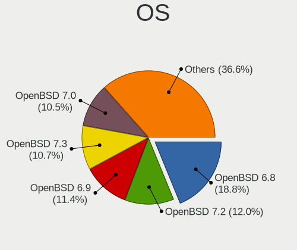

| Name        | Notebooks | Percent |
|-------------|-----------|---------|
| OpenBSD 6.8 | 91        | 18.8%   |
| OpenBSD 7.2 | 58        | 11.98%  |
| OpenBSD 6.9 | 55        | 11.36%  |
| OpenBSD 7.3 | 52        | 10.74%  |
| OpenBSD 7.0 | 51        | 10.54%  |
| OpenBSD 7.5 | 45        | 9.3%    |
| OpenBSD 7.1 | 43        | 8.88%   |
| OpenBSD 7.4 | 39        | 8.06%   |
| OpenBSD 7.6 | 25        | 5.17%   |
| OpenBSD 6.7 | 23        | 4.75%   |
| OpenBSD 6.6 | 2         | 0.41%   |

OS Family
---------

OS without a version

| Name    | Notebooks | Percent |
|---------|-----------|---------|
| OpenBSD | 362       | 100%    |

Arch
----

OS architecture (x86_64, i586, etc.)

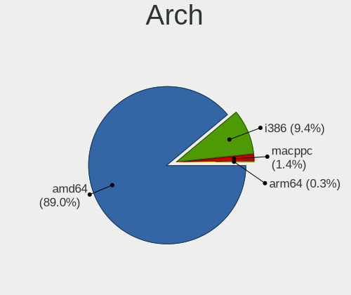

| Name   | Notebooks | Percent |
|--------|-----------|---------|
| amd64  | 322       | 88.95%  |
| i386   | 34        | 9.39%   |
| macppc | 5         | 1.38%   |
| arm64  | 1         | 0.28%   |

DE
--

Desktop Environment

| Name         | Notebooks | Percent |
|--------------|-----------|---------|
| fvwm         | 184       | 47.92%  |
| helloDesktop | 148       | 38.54%  |
| XFCE         | 18        | 4.69%   |
| GNOME        | 13        | 3.39%   |
| Console      | 11        | 2.86%   |
| MATE         | 3         | 0.78%   |
| Mutter       | 2         | 0.52%   |
| LXQt         | 2         | 0.52%   |
| Openbox      | 1         | 0.26%   |
| iwm          | 1         | 0.26%   |
| i3           | 1         | 0.26%   |

Display Server
--------------

X11 or Wayland

| Name    | Notebooks | Percent |
|---------|-----------|---------|
| X11     | 338       | 92.6%   |
| Console | 27        | 7.4%    |

Display Manager
---------------

SDDM, LightDM, etc.

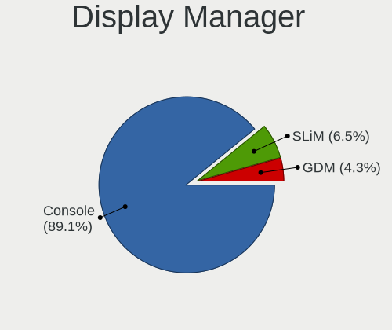

| Name    | Notebooks | Percent |
|---------|-----------|---------|
| Console | 328       | 89.13%  |
| SLiM    | 24        | 6.52%   |
| GDM     | 16        | 4.35%   |

OS Lang
-------

Language

| Lang    | Notebooks | Percent |
|---------|-----------|---------|
| Unknown | 274       | 73.66%  |
| en_US   | 48        | 12.9%   |
| C       | 11        | 2.96%   |
| fr_FR   | 9         | 2.42%   |
| ru_RU   | 8         | 2.15%   |
| en_GB   | 5         | 1.34%   |
| zh_TW   | 2         | 0.54%   |
| ja_JP   | 2         | 0.54%   |
| es_ES   | 2         | 0.54%   |
| es_CO   | 2         | 0.54%   |
| en_EN   | 2         | 0.54%   |
| de_DE   | 2         | 0.54%   |
| zh_CN   | 1         | 0.27%   |
| pl_PL   | 1         | 0.27%   |
| fr_CA   | 1         | 0.27%   |
| en_CA   | 1         | 0.27%   |
| en_AU   | 1         | 0.27%   |

Boot Mode
---------

EFI or BIOS

| Mode | Notebooks | Percent |
|------|-----------|---------|
| EFI  | 224       | 61.04%  |
| BIOS | 143       | 38.96%  |

Filesystem
----------

Type of filesystem

| Type | Notebooks | Percent |
|------|-----------|---------|
| Ffs  | 362       | 100%    |

Part. scheme
------------

Scheme of partitioning

| Type    | Notebooks | Percent |
|---------|-----------|---------|
| GPT     | 209       | 56.79%  |
| MBR     | 155       | 42.12%  |
| Unknown | 4         | 1.09%   |

Board
-----

Vendor
------

Motherboard manufacturer

| Name                           | Notebooks | Percent |
|--------------------------------|-----------|---------|
| Lenovo                         | 167       | 46.13%  |
| Dell                           | 30        | 8.29%   |
| Hewlett-Packard                | 25        | 6.91%   |
| Apple                          | 23        | 6.35%   |
| ASUSTek Computer               | 22        | 6.08%   |
| Acer                           | 15        | 4.14%   |
| Panasonic                      | 10        | 2.76%   |
| IBM                            | 8         | 2.21%   |
| Sony                           | 5         | 1.38%   |
| Samsung Electronics            | 5         | 1.38%   |
| Fujitsu                        | 5         | 1.38%   |
| Framework                      | 5         | 1.38%   |
| TUXEDO                         | 4         | 1.1%    |
| Toshiba                        | 4         | 1.1%    |
| Google                         | 4         | 1.1%    |
| Unknown                        | 4         | 1.1%    |
| Tactus                         | 2         | 0.55%   |
| Star Labs                      | 2         | 0.55%   |
| Notebook                       | 2         | 0.55%   |
| MSI                            | 2         | 0.55%   |
| Matsushita Electric Industrial | 2         | 0.55%   |
| Intel                          | 2         | 0.55%   |
| Alienware                      | 2         | 0.55%   |
| Standard                       | 1         | 0.28%   |
| OEGStone                       | 1         | 0.28%   |
| Maibenben                      | 1         | 0.28%   |
| HUAWEI                         | 1         | 0.28%   |
| HCL Infosystems Limited        | 1         | 0.28%   |
| GPD                            | 1         | 0.28%   |
| Getac                          | 1         | 0.28%   |
| Fujitsu Siemens                | 1         | 0.28%   |
| DEXP                           | 1         | 0.28%   |
| Clevo                          | 1         | 0.28%   |
| Casper                         | 1         | 0.28%   |
| ' '                            | 1         | 0.28%   |

Model
-----

Motherboard model

| Name                                     | Notebooks | Percent |
|------------------------------------------|-----------|---------|
| Unknown                                  | 7         | 1.93%   |
| Lenovo ThinkPad X200 745969G             | 6         | 1.66%   |
| Apple MacBookAir7,2                      | 4         | 1.1%    |
| Framework Laptop                         | 3         | 0.83%   |
| TUXEDO Pulse 15 Gen1                     | 2         | 0.55%   |
| Panasonic CF-C1BT02EGE                   | 2         | 0.55%   |
| Lenovo ThinkPad X1 Carbon 3rd 20BSCTO1WW | 2         | 0.55%   |
| HP ZBook 15 G4                           | 2         | 0.55%   |
| Fujitsu LIFEBOOK E752                    | 2         | 0.55%   |
| Dell XPS 13 9360                         | 2         | 0.55%   |
| ASUS X102BA                              | 2         | 0.55%   |
| ASUS UX305FA                             | 2         | 0.55%   |
| Apple MacBookPro12,1                     | 2         | 0.55%   |
| Apple MacBookAir6,2                      | 2         | 0.55%   |
| Apple MacBook5,1                         | 2         | 0.55%   |
| Acer Nitro AN515-55                      | 2         | 0.55%   |
| TUXEDO InfinityBook Pro 14 Gen6          | 1         | 0.28%   |
| TUXEDO Aura 15 Gen1                      | 1         | 0.28%   |
| Toshiba Satellite L775D                  | 1         | 0.28%   |
| Toshiba Satellite BE96-F299              | 1         | 0.28%   |
| Toshiba Portable PC                      | 1         | 0.28%   |
| Toshiba NB250                            | 1         | 0.28%   |
| Tactus GeoFlex 110                       | 1         | 0.28%   |
| Tactus GeoBook 140                       | 1         | 0.28%   |
| Star Labs Lite                           | 1         | 0.28%   |
| Star Labs LabTop                         | 1         | 0.28%   |
| Standard TF                              | 1         | 0.28%   |
| Sony VPCX115KX                           | 1         | 0.28%   |
| Sony VPCF12C5E                           | 1         | 0.28%   |
| Sony VGN-P698E                           | 1         | 0.28%   |
| Sony SVS1312J3EW                         | 1         | 0.28%   |
| Samsung R720                             | 1         | 0.28%   |
| Samsung 535U3C                           | 1         | 0.28%   |
| Samsung 530XBB                           | 1         | 0.28%   |
| Samsung 3570R/370R/470R/450R/510R/4450RV | 1         | 0.28%   |
| Samsung 100NZC                           | 1         | 0.28%   |
| Panasonic CFSZ6-2                        | 1         | 0.28%   |
| Panasonic CFSX4-1                        | 1         | 0.28%   |
| Panasonic CF-C2CEAZXCM                   | 1         | 0.28%   |
| Panasonic CF-54-1                        | 1         | 0.28%   |

Model Family
------------

Motherboard model prefix

| Name                   | Notebooks | Percent |
|------------------------|-----------|---------|
| Lenovo ThinkPad        | 146       | 40.33%  |
| Dell Latitude          | 12        | 3.31%   |
| IBM ThinkPad           | 7         | 1.93%   |
| Unknown                | 7         | 1.93%   |
| HP Pavilion            | 6         | 1.66%   |
| Acer Aspire            | 6         | 1.66%   |
| Lenovo IdeaPad         | 5         | 1.38%   |
| Fujitsu LIFEBOOK       | 5         | 1.38%   |
| Framework Laptop       | 5         | 1.38%   |
| Dell XPS               | 5         | 1.38%   |
| Dell Inspiron          | 5         | 1.38%   |
| ASUS VivoBook          | 5         | 1.38%   |
| Lenovo Yoga            | 4         | 1.1%    |
| HP ProBook             | 4         | 1.1%    |
| Dell Vostro            | 4         | 1.1%    |
| Apple MacBookAir7      | 4         | 1.1%    |
| Apple MacBookAir6      | 3         | 0.83%   |
| TUXEDO Pulse           | 2         | 0.55%   |
| Toshiba Satellite      | 2         | 0.55%   |
| Panasonic CF-C1BT02EGE | 2         | 0.55%   |
| Lenovo Flex            | 2         | 0.55%   |
| HP ZBook               | 2         | 0.55%   |
| HP EliteBook           | 2         | 0.55%   |
| HP 240                 | 2         | 0.55%   |
| Dell Precision         | 2         | 0.55%   |
| ASUS X102BA            | 2         | 0.55%   |
| ASUS UX305FA           | 2         | 0.55%   |
| ASUS ASUS              | 2         | 0.55%   |
| Apple PowerBook6       | 2         | 0.55%   |
| Apple PowerBook5       | 2         | 0.55%   |
| Apple MacBookPro12     | 2         | 0.55%   |
| Apple MacBookAir4      | 2         | 0.55%   |
| Apple MacBook5         | 2         | 0.55%   |
| Alienware m15          | 2         | 0.55%   |
| Acer Nitro             | 2         | 0.55%   |
| Acer Extensa           | 2         | 0.55%   |
| TUXEDO InfinityBook    | 1         | 0.28%   |
| TUXEDO Aura            | 1         | 0.28%   |
| Toshiba Portable       | 1         | 0.28%   |
| Toshiba NB250          | 1         | 0.28%   |

MFG Year
--------

Motherboard manufacture year

| Year    | Notebooks | Percent |
|---------|-----------|---------|
| 2020    | 37        | 10.22%  |
| 2011    | 30        | 8.29%   |
| 2015    | 28        | 7.73%   |
| 2019    | 26        | 7.18%   |
| 2021    | 25        | 6.91%   |
| 2018    | 25        | 6.91%   |
| 2009    | 21        | 5.8%    |
| 2022    | 20        | 5.52%   |
| 2012    | 20        | 5.52%   |
| 2017    | 18        | 4.97%   |
| 2013    | 18        | 4.97%   |
| 2010    | 18        | 4.97%   |
| 2016    | 13        | 3.59%   |
| 2006    | 11        | 3.04%   |
| 2007    | 9         | 2.49%   |
| Unknown | 9         | 2.49%   |
| 2023    | 8         | 2.21%   |
| 2014    | 8         | 2.21%   |
| 2008    | 6         | 1.66%   |
| 2024    | 4         | 1.1%    |
| 2005    | 3         | 0.83%   |
| 2004    | 2         | 0.55%   |
| 2003    | 2         | 0.55%   |
| 2002    | 1         | 0.28%   |

Form Factor
-----------

Physical design of the computer

| Name     | Notebooks | Percent |
|----------|-----------|---------|
| Notebook | 362       | 100%    |

Coreboot
--------

Have coreboot on board

| Used | Notebooks | Percent |
|------|-----------|---------|
| No   | 352       | 97.24%  |
| Yes  | 10        | 2.76%   |

RAM Size
--------

Total RAM memory

| Size in GB  | Notebooks | Percent |
|-------------|-----------|---------|
| 8.01-16.0   | 125       | 34.15%  |
| 4.01-8.0    | 71        | 19.4%   |
| 16.01-24.0  | 59        | 16.12%  |
| 3.01-4.0    | 31        | 8.47%   |
| 32.01-64.0  | 24        | 6.56%   |
| 2.01-3.0    | 18        | 4.92%   |
| 1.01-2.0    | 14        | 3.83%   |
| 0.51-1.0    | 13        | 3.55%   |
| 24.01-32.0  | 4         | 1.09%   |
| 0.01-0.5    | 4         | 1.09%   |
| 64.01-256.0 | 3         | 0.82%   |

RAM Used
--------

Used RAM memory

| Used GB  | Notebooks | Percent |
|----------|-----------|---------|
| 0.01-0.5 | 308       | 84.62%  |
| 0.51-1.0 | 24        | 6.59%   |
| 0        | 23        | 6.32%   |
| 1.01-2.0 | 6         | 1.65%   |
| Unknown  | 3         | 0.82%   |

Total Drives
------------

Number of drives on board

| Drives | Notebooks | Percent |
|--------|-----------|---------|
| 1      | 189       | 50.53%  |
| 2      | 141       | 37.7%   |
| 3      | 27        | 7.22%   |
| 0      | 10        | 2.67%   |
| 4      | 7         | 1.87%   |

Has CD-ROM
----------

Has CD-ROM on board

| Presented | Notebooks | Percent |
|-----------|-----------|---------|
| No        | 359       | 98.9%   |
| Yes       | 4         | 1.1%    |

Has Ethernet
------------

Has Ethernet on board

| Presented | Notebooks | Percent |
|-----------|-----------|---------|
| Yes       | 299       | 82.6%   |
| No        | 63        | 17.4%   |

Has WiFi
--------

Has WiFi module

| Presented | Notebooks | Percent |
|-----------|-----------|---------|
| Yes       | 350       | 96.42%  |
| No        | 13        | 3.58%   |

Has Bluetooth
-------------

Has Bluetooth module

| Presented | Notebooks | Percent |
|-----------|-----------|---------|
| Yes       | 229       | 62.57%  |
| No        | 137       | 37.43%  |

Location
--------

Country
-------

Geographic location (country)

| Country         | Notebooks | Percent |
|-----------------|-----------|---------|
| USA             | 76        | 20.82%  |
| Germany         | 40        | 10.96%  |
| Russia          | 35        | 9.59%   |
| Canada          | 25        | 6.85%   |
| France          | 24        | 6.58%   |
| UK              | 18        | 4.93%   |
| Poland          | 14        | 3.84%   |
| Netherlands     | 9         | 2.47%   |
| Brazil          | 9         | 2.47%   |
| Spain           | 8         | 2.19%   |
| Sweden          | 7         | 1.92%   |
| Italy           | 6         | 1.64%   |
| Australia       | 6         | 1.64%   |
| Ukraine         | 5         | 1.37%   |
| Norway          | 5         | 1.37%   |
| Czechia         | 5         | 1.37%   |
| Malaysia        | 4         | 1.1%    |
| Latvia          | 4         | 1.1%    |
| India           | 4         | 1.1%    |
| Croatia         | 4         | 1.1%    |
| Colombia        | 4         | 1.1%    |
| Uruguay         | 3         | 0.82%   |
| Turkey          | 3         | 0.82%   |
| Switzerland     | 3         | 0.82%   |
| Portugal        | 3         | 0.82%   |
| Philippines     | 3         | 0.82%   |
| Japan           | 3         | 0.82%   |
| Indonesia       | 3         | 0.82%   |
| China           | 3         | 0.82%   |
| Taiwan          | 2         | 0.55%   |
| Slovakia        | 2         | 0.55%   |
| Romania         | 2         | 0.55%   |
| Mexico          | 2         | 0.55%   |
| Finland         | 2         | 0.55%   |
| Vietnam         | 1         | 0.27%   |
| The Netherlands | 1         | 0.27%   |
| Slovenia        | 1         | 0.27%   |
| Saudi Arabia    | 1         | 0.27%   |
| Montserrat      | 1         | 0.27%   |
| Hungary         | 1         | 0.27%   |

City
----

Geographic location (city)

| City               | Notebooks | Percent |
|--------------------|-----------|---------|
| Montreal           | 18        | 4.42%   |
| Saint-Laurent      | 16        | 3.93%   |
| St Petersburg      | 10        | 2.46%   |
| Paris              | 7         | 1.72%   |
| Moscow             | 6         | 1.47%   |
| Gdansk             | 6         | 1.47%   |
| Amsterdam          | 6         | 1.47%   |
| Vladivostok        | 5         | 1.23%   |
| Sun Prairie        | 5         | 1.23%   |
| Qubec          | 5         | 1.23%   |
| Riga               | 4         | 0.98%   |
| Prague             | 4         | 0.98%   |
| Mcon             | 4         | 0.98%   |
| Blumenau           | 4         | 0.98%   |
| Berlin             | 4         | 0.98%   |
| Zurich             | 3         | 0.74%   |
| Yekaterinburg      | 3         | 0.74%   |
| Portland           | 3         | 0.74%   |
| Oslo               | 3         | 0.74%   |
| Montevideo         | 3         | 0.74%   |
| Lbeck            | 3         | 0.74%   |
| Kuala Lumpur       | 3         | 0.74%   |
| Krakow             | 3         | 0.74%   |
| Frankfurt am Main  | 3         | 0.74%   |
| Fayetteville       | 3         | 0.74%   |
| Brooklyn           | 3         | 0.74%   |
| West Valley City   | 2         | 0.49%   |
| Sydney             | 2         | 0.49%   |
| Stuttgart          | 2         | 0.49%   |
| Sao Paulo          | 2         | 0.49%   |
| Quezon City        | 2         | 0.49%   |
| Puebla City        | 2         | 0.49%   |
| Plymouth           | 2         | 0.49%   |
| Pine Mountain Club | 2         | 0.49%   |
| Papillion          | 2         | 0.49%   |
| Navalcarnero       | 2         | 0.49%   |
| Mount Prospect     | 2         | 0.49%   |
| Montera          | 2         | 0.49%   |
| Madrid             | 2         | 0.49%   |
| Los Angeles        | 2         | 0.49%   |

Drives
------

Drive Vendor
------------

Hard drive vendors

| Vendor              | Notebooks | Drives | Percent |
|---------------------|-----------|--------|---------|
| NVMe                | 98        | 132    | 23.56%  |
| Samsung Electronics | 51        | 68     | 12.26%  |
| WDC                 | 38        | 86     | 9.13%   |
| Seagate             | 23        | 33     | 5.53%   |
| SanDisk             | 23        | 28     | 5.53%   |
| Toshiba             | 22        | 31     | 5.29%   |
| Kingston            | 17        | 22     | 4.09%   |
| Crucial             | 16        | 17     | 3.85%   |
| Hitachi             | 13        | 17     | 3.13%   |
| Apple               | 13        | 15     | 3.13%   |
| Intel               | 11        | 11     | 2.64%   |
| PNY                 | 7         | 19     | 1.68%   |
| HGST                | 7         | 9      | 1.68%   |
| Apacer              | 5         | 9      | 1.2%    |
| Transcend           | 4         | 4      | 0.96%   |
| SK hynix            | 4         | 4      | 0.96%   |
| Intenso             | 4         | 4      | 0.96%   |
| Generic             | 4         | 4      | 0.96%   |
| Micron Technology   | 3         | 3      | 0.72%   |
| Fujitsu             | 3         | 4      | 0.72%   |
| A-DATA Technology   | 3         | 10     | 0.72%   |
| Team                | 2         | 2      | 0.48%   |
| SPCC                | 2         | 2      | 0.48%   |
| Plextor             | 2         | 2      | 0.48%   |
| Patriot             | 2         | 2      | 0.48%   |
| Netac               | 2         | 2      | 0.48%   |
| LITEONIT            | 2         | 2      | 0.48%   |
| LITEON              | 2         | 2      | 0.48%   |
| Lexar               | 2         | 2      | 0.48%   |
| KingSpec            | 2         | 2      | 0.48%   |
| JetFlash            | 2         | 2      | 0.48%   |
| Innostor            | 2         | 2      | 0.48%   |
| Zheino              | 1         | 2      | 0.24%   |
| Verbatim            | 1         | 1      | 0.24%   |
| USB                 | 1         | 1      | 0.24%   |
| Union Memory        | 1         | 1      | 0.24%   |
| UFD 2.0             | 1         | 1      | 0.24%   |
| Star Drive          | 1         | 1      | 0.24%   |
| SMI                 | 1         | 1      | 0.24%   |
| SATA3 60            | 1         | 1      | 0.24%   |

Drive Model
-----------

Hard drive models

| Model                               | Notebooks | Percent |
|-------------------------------------|-----------|---------|
| NVMe WDC PC SN730 SDB 256GB         | 10        | 2.33%   |
| Seagate ST1000LM035-1RK172 1TB      | 7         | 1.63%   |
| Samsung HM321HI 320GB               | 6         | 1.4%    |
| NVMe Samsung SSD 980 1TB            | 6         | 1.4%    |
| WDC WD1600BEVT-22ZCT0 160GB         | 5         | 1.16%   |
| Samsung SSD 850 EVO 500GB           | 5         | 1.16%   |
| NVMe SAMSUNG MZVLW256 256GB         | 5         | 1.16%   |
| NVMe SAMSUNG MZVLB256 256GB         | 5         | 1.16%   |
| Kingston SA400S37480G 480GB         | 5         | 1.16%   |
| Kingston SA400S37240G 240GB         | 5         | 1.16%   |
| Apple SSD SM0128G 121GB             | 5         | 1.16%   |
| NVMe Samsung SSD 970 500GB          | 4         | 0.93%   |
| Seagate ST500LM012 HN-M500MBB 500GB | 3         | 0.7%    |
| Samsung SSD 860 EVO 1TB             | 3         | 0.7%    |
| Samsung SSD 850 EVO 250GB           | 3         | 0.7%    |
| NVMe WDC PC SN530 SDB 1TB           | 3         | 0.7%    |
| NVMe SAMSUNG MZVLB512 512GB         | 3         | 0.7%    |
| NVMe INTEL SSDPEKNW51 512GB         | 3         | 0.7%    |
| Kingston SA400S37120G 120GB         | 3         | 0.7%    |
| HGST HTS541010A9E680 1TB            | 3         | 0.7%    |
| Crucial CT240BX500SSD1 240GB        | 3         | 0.7%    |
| Apple SSD SD0128F 121GB             | 3         | 0.7%    |
| WDC WDS240G2G0A-00JH30 240GB        | 2         | 0.47%   |
| WDC WD10JPLX-00MBPT0 1TB            | 2         | 0.47%   |
| Toshiba MK8025GAS 80GB              | 2         | 0.47%   |
| Toshiba MK2556GSY 250GB             | 2         | 0.47%   |
| SK hynix SC311 SATA 256GB           | 2         | 0.47%   |
| Seagate ST9500420AS 500GB           | 2         | 0.47%   |
| Seagate ST9320423AS 320GB           | 2         | 0.47%   |
| Seagate ST500LT012-9WS142 500GB     | 2         | 0.47%   |
| Seagate ST320LT007-9ZV142 320GB     | 2         | 0.47%   |
| SanDisk X400 M.2 2280 512GB         | 2         | 0.47%   |
| SanDisk SSD U110 16GB               | 2         | 0.47%   |
| SanDisk SSD PLUS 120GB              | 2         | 0.47%   |
| SanDisk Extreme SSD 1TB             | 2         | 0.47%   |
| SanDisk Cruzer Blade 16GB           | 2         | 0.47%   |
| Samsung SSD 850 PRO 256GB           | 2         | 0.47%   |
| Samsung SSD 840 EVO 120GB           | 2         | 0.47%   |
| Samsung MZ7TD256HAFV-000L7 256GB    | 2         | 0.47%   |
| Samsung MZ7PC128HAFU-000L1 128GB    | 2         | 0.47%   |

HDD Vendor
----------

Hard disk drive vendors

| Vendor                             | Notebooks | Drives | Percent |
|------------------------------------|-----------|--------|---------|
| NVMe                               | 72        | 94     | 38.1%   |
| WDC                                | 29        | 76     | 15.34%  |
| Seagate                            | 23        | 33     | 12.17%  |
| Toshiba                            | 17        | 26     | 8.99%   |
| Hitachi                            | 13        | 17     | 6.88%   |
| Samsung Electronics                | 8         | 10     | 4.23%   |
| HGST                               | 7         | 9      | 3.7%    |
| Generic                            | 4         | 4      | 2.12%   |
| Fujitsu                            | 3         | 4      | 1.59%   |
| JetFlash                           | 2         | 2      | 1.06%   |
| Verbatim                           | 1         | 1      | 0.53%   |
| USB                                | 1         | 1      | 0.53%   |
| UFD 2.0                            | 1         | 1      | 0.53%   |
| SMI                                | 1         | 1      | 0.53%   |
| Product:              USB DISK 2.0 | 1         | 1      | 0.53%   |
| OPENBSD                            | 1         | 1      | 0.53%   |
| Lexar                              | 1         | 1      | 0.53%   |
| LDLC F6+                           | 1         | 1      | 0.53%   |
| Intenso                            | 1         | 1      | 0.53%   |
| General                            | 1         | 1      | 0.53%   |
| Apple                              | 1         | 1      | 0.53%   |

SSD Vendor
----------

Solid state drive vendors

| Vendor              | Notebooks | Drives | Percent |
|---------------------|-----------|--------|---------|
| Samsung Electronics | 40        | 55     | 18.43%  |
| SanDisk             | 23        | 28     | 10.6%   |
| NVMe                | 23        | 27     | 10.6%   |
| Kingston            | 17        | 22     | 7.83%   |
| Crucial             | 15        | 16     | 6.91%   |
| Apple               | 12        | 14     | 5.53%   |
| Intel               | 11        | 11     | 5.07%   |
| WDC                 | 7         | 8      | 3.23%   |
| PNY                 | 7         | 19     | 3.23%   |
| Apacer              | 5         | 9      | 2.3%    |
| Transcend           | 4         | 4      | 1.84%   |
| Toshiba             | 4         | 4      | 1.84%   |
| SK hynix            | 4         | 4      | 1.84%   |
| Micron Technology   | 3         | 3      | 1.38%   |
| Intenso             | 3         | 3      | 1.38%   |
| A-DATA Technology   | 3         | 10     | 1.38%   |
| Team                | 2         | 2      | 0.92%   |
| SPCC                | 2         | 2      | 0.92%   |
| Plextor             | 2         | 2      | 0.92%   |
| Patriot             | 2         | 2      | 0.92%   |
| Netac               | 2         | 2      | 0.92%   |
| LITEONIT            | 2         | 2      | 0.92%   |
| LITEON              | 2         | 2      | 0.92%   |
| KingSpec            | 2         | 2      | 0.92%   |
| Innostor            | 2         | 2      | 0.92%   |
| Zheino              | 1         | 2      | 0.46%   |
| Union Memory        | 1         | 1      | 0.46%   |
| Star Drive          | 1         | 1      | 0.46%   |
| SATA3 60            | 1         | 1      | 0.46%   |
| OWC                 | 1         | 1      | 0.46%   |
| MyDigitalSSD        | 1         | 1      | 0.46%   |
| MidasForce          | 1         | 1      | 0.46%   |
| Lexar               | 1         | 1      | 0.46%   |
| Leven               | 1         | 1      | 0.46%   |
| KIOXIA-EXCERIA      | 1         | 1      | 0.46%   |
| Kingchuxing         | 1         | 2      | 0.46%   |
| Hewlett-Packard     | 1         | 1      | 0.46%   |
| Gigabyte Technology | 1         | 1      | 0.46%   |
| Getrich             | 1         | 1      | 0.46%   |
| Dogfish             | 1         | 1      | 0.46%   |

Drive Kind
----------

HDD or SSD

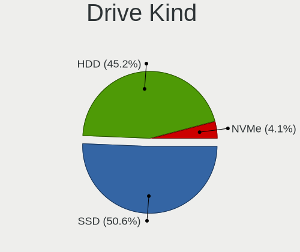

| Kind | Notebooks | Drives | Percent |
|------|-----------|--------|---------|
| SSD  | 197       | 278    | 50.64%  |
| HDD  | 176       | 286    | 45.24%  |
| NVMe | 16        | 18     | 4.11%   |

Drive Connector
---------------

SATA, SAS, NVMe, etc.

| Type | Notebooks | Drives | Percent |
|------|-----------|--------|---------|
| SATA | 335       | 564    | 95.44%  |
| NVMe | 16        | 18     | 4.56%   |

Drive Size
----------

Size of hard drive

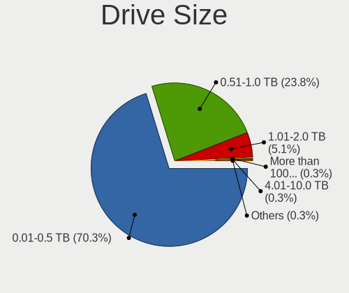

| Size in TB      | Notebooks | Drives | Percent |
|-----------------|-----------|--------|---------|
| 0.01-0.5        | 260       | 389    | 70.27%  |
| 0.51-1.0        | 88        | 141    | 23.78%  |
| 1.01-2.0        | 19        | 31     | 5.14%   |
| More than 100.0 | 1         | 1      | 0.27%   |
| 4.01-10.0       | 1         | 1      | 0.27%   |
| 0               | 1         | 1      | 0.27%   |

Space Total
-----------

Amount of disk space available on the file system

| Size in GB | Notebooks | Percent |
|------------|-----------|---------|
| 101-250    | 151       | 39.84%  |
| 251-500    | 108       | 28.5%   |
| 51-100     | 40        | 10.55%  |
| 21-50      | 35        | 9.23%   |
| 1-20       | 20        | 5.28%   |
| 501-1000   | 16        | 4.22%   |
| 1001-2000  | 9         | 2.37%   |

Space Used
----------

Amount of used disk space

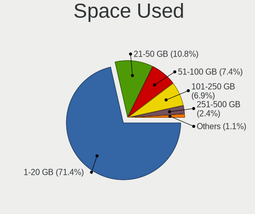

| Used GB  | Notebooks | Percent |
|----------|-----------|---------|
| 1-20     | 270       | 71.43%  |
| 21-50    | 41        | 10.85%  |
| 51-100   | 28        | 7.41%   |
| 101-250  | 26        | 6.88%   |
| 251-500  | 9         | 2.38%   |
| 501-1000 | 4         | 1.06%   |

Malfunc. Drives
---------------

Drive models with a malfunction

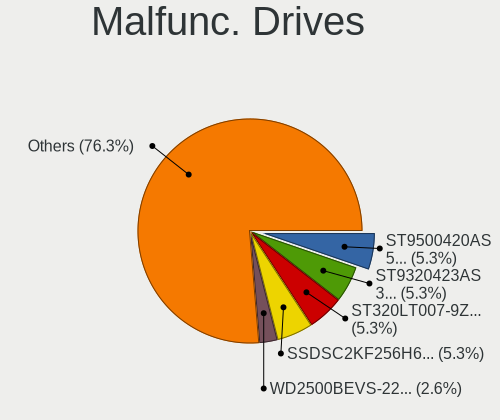

| Model                                           | Notebooks | Drives | Percent |
|-------------------------------------------------|-----------|--------|---------|
| Seagate ST9500420AS 500GB                       | 2         | 3      | 5.26%   |
| Seagate ST9320423AS 320GB                       | 2         | 4      | 5.26%   |
| Seagate ST320LT007-9ZV142 320GB                 | 2         | 2      | 5.26%   |
| Intel SSDSC2KF256H6L 256GB                      | 2         | 2      | 5.26%   |
| WDC WD2500BEVS-22UST0 250GB                     | 1         | 1      | 2.63%   |
| WDC WD1600BEVT-22ZCT0 160GB                     | 1         | 1      | 2.63%   |
| Toshiba MQ01ACF032 320GB                        | 1         | 3      | 2.63%   |
| Toshiba MQ01ABD050 500GB                        | 1         | 2      | 2.63%   |
| Toshiba MK6475GSX 640GB                         | 1         | 2      | 2.63%   |
| Toshiba MK6465GSX 640GB                         | 1         | 1      | 2.63%   |
| Toshiba MK6006GAH 64GB                          | 1         | 1      | 2.63%   |
| Toshiba MK1629GSGF 160GB                        | 1         | 3      | 2.63%   |
| Seagate ST500LT012-9WS142 500GB                 | 1         | 1      | 2.63%   |
| Seagate ST1000LM035-1RK172 1TB                  | 1         | 1      | 2.63%   |
| SanDisk SD7UB3Q256G1001 256GB                   | 1         | 2      | 2.63%   |
| Samsung Electronics HM500JI 500GB               | 1         | 2      | 2.63%   |
| Micron Technology MTFDDAK256TBN-1AR1ZABHA 256GB | 1         | 1      | 2.63%   |
| Kingston SMSM151S3128GD 128GB                   | 1         | 1      | 2.63%   |
| KingSpec KSD-PA25.6-032MS 32GB                  | 1         | 1      | 2.63%   |
| Intel SSDSCKJF240A5L 240GB                      | 1         | 1      | 2.63%   |
| Intel SSDSC2BW480H6 480GB                       | 1         | 1      | 2.63%   |
| Intel SSDSC2BF180A5L 180GB                      | 1         | 1      | 2.63%   |
| Intel SSDSA2M080G2GC 80GB                       | 1         | 1      | 2.63%   |
| Hitachi HTS722010K9SA00 100GB                   | 1         | 1      | 2.63%   |
| Hitachi HTS541060G9SA00 64GB                    | 1         | 1      | 2.63%   |
| Hitachi HTS541060G9AT00 64GB                    | 1         | 1      | 2.63%   |
| Hitachi HTC426060G9AT00 64GB                    | 1         | 1      | 2.63%   |
| Hitachi DK23AA-12 12GB                          | 1         | 1      | 2.63%   |
| HGST HTS545050A7E660 500GB                      | 1         | 2      | 2.63%   |
| HGST HTS541010A9E680 1TB                        | 1         | 1      | 2.63%   |
| HGST HTE725032A7E630 320GB                      | 1         | 1      | 2.63%   |
| Apple SSD SD0128F 121GB                         | 1         | 1      | 2.63%   |
| A-DATA Technology SP550 480GB                   | 1         | 8      | 2.63%   |
| A-DATA Technology SP550 240GB                   | 1         | 1      | 2.63%   |

Malfunc. Drive Vendor
---------------------

Vendors of faulty drives

| Vendor              | Notebooks | Drives | Percent |
|---------------------|-----------|--------|---------|
| Seagate             | 8         | 11     | 21.05%  |
| Toshiba             | 6         | 12     | 15.79%  |
| Intel               | 6         | 6      | 15.79%  |
| Hitachi             | 5         | 5      | 13.16%  |
| HGST                | 3         | 4      | 7.89%   |
| WDC                 | 2         | 2      | 5.26%   |
| A-DATA Technology   | 2         | 9      | 5.26%   |
| SanDisk             | 1         | 2      | 2.63%   |
| Samsung Electronics | 1         | 2      | 2.63%   |
| Micron Technology   | 1         | 1      | 2.63%   |
| Kingston            | 1         | 1      | 2.63%   |
| KingSpec            | 1         | 1      | 2.63%   |
| Apple               | 1         | 1      | 2.63%   |

Malfunc. HDD Vendor
-------------------

Vendors of faulty HDD drives

| Vendor              | Notebooks | Drives | Percent |
|---------------------|-----------|--------|---------|
| Seagate             | 8         | 11     | 32%     |
| Toshiba             | 6         | 12     | 24%     |
| Hitachi             | 5         | 5      | 20%     |
| HGST                | 3         | 4      | 12%     |
| WDC                 | 2         | 2      | 8%      |
| Samsung Electronics | 1         | 2      | 4%      |

Malfunc. Drive Kind
-------------------

Kinds of faulty drives

| Kind | Notebooks | Drives | Percent |
|------|-----------|--------|---------|
| HDD  | 25        | 36     | 65.79%  |
| SSD  | 13        | 21     | 34.21%  |

Failed Drives
-------------

Failed drive models

Zero info for selected period =(

Failed Drive Vendor
-------------------

Failed drive vendors

Zero info for selected period =(

Drive Status
------------

Number of failed and malfunc. drives

| Status   | Notebooks | Drives | Percent |
|----------|-----------|--------|---------|
| Works    | 236       | 375    | 62.11%  |
| Detected | 106       | 150    | 27.89%  |
| Malfunc  | 38        | 57     | 10%     |

Storage controller
------------------

Storage Vendor
--------------

Storage controller vendors

| Vendor                                  | Notebooks | Percent |
|-----------------------------------------|-----------|---------|
| Intel                                   | 240       | 61.54%  |
| Samsung Electronics                     | 46        | 11.79%  |
| SanDisk                                 | 28        | 7.18%   |
| AMD                                     | 26        | 6.67%   |
| Kingston Technology Company             | 8         | 2.05%   |
| SK hynix                                | 6         | 1.54%   |
| Phison Electronics                      | 5         | 1.28%   |
| KIOXIA                                  | 5         | 1.28%   |
| Nvidia                                  | 4         | 1.03%   |
| Marvell Technology Group                | 4         | 1.03%   |
| Micron/Crucial Technology               | 3         | 0.77%   |
| Lenovo                                  | 3         | 0.77%   |
| ADATA Technology                        | 3         | 0.77%   |
| Solid State Storage Technology          | 2         | 0.51%   |
| Micron Technology                       | 2         | 0.51%   |
| Union Memory (Shenzhen)                 | 1         | 0.26%   |
| Toshiba                                 | 1         | 0.26%   |
| Silicon Integrated Systems [SiS]        | 1         | 0.26%   |
| Shenzhen Unionmemory Information System | 1         | 0.26%   |
| Biwin Storage Technology                | 1         | 0.26%   |

Storage Model
-------------

Storage controller models

| Model                                                                          | Notebooks | Percent |
|--------------------------------------------------------------------------------|-----------|---------|
| Intel Sunrise Point-LP SATA Controller [AHCI mode]                             | 30        | 7.26%   |
| Intel 7 Series Chipset Family 6-port SATA Controller [AHCI mode]               | 27        | 6.54%   |
| Intel Wildcat Point-LP SATA Controller [AHCI Mode]                             | 24        | 5.81%   |
| Intel 6 Series/C200 Series Chipset Family 6 port Mobile SATA AHCI Controller   | 24        | 5.81%   |
| AMD FCH SATA Controller [AHCI mode]                                            | 20        | 4.84%   |
| Intel 82801IBM/IEM (ICH9M/ICH9M-E) 4 port SATA Controller [AHCI mode]          | 19        | 4.6%    |
| Samsung NVMe SSD Controller SM981/PM981/PM983                                  | 14        | 3.39%   |
| SanDisk Extreme Pro / WD Black SN750 / PC SN730 / Red SN700 NVMe SSD           | 12        | 2.91%   |
| Samsung NVMe SSD Controller SM961/PM961/SM963                                  | 11        | 2.66%   |
| Intel 82801G (ICH7 Family) IDE Controller                                      | 11        | 2.66%   |
| Intel 5 Series/3400 Series Chipset 6 port SATA AHCI Controller                 | 11        | 2.66%   |
| Intel 8 Series SATA Controller 1 [AHCI mode]                                   | 10        | 2.42%   |
| Samsung NVMe SSD Controller PM9A1/PM9A3/980PRO                                 | 8         | 1.94%   |
| Intel 82801GBM/GHM (ICH7-M Family) SATA Controller [AHCI mode]                 | 8         | 1.94%   |
| Samsung S4LN058A01[SSUBX] AHCI SSD Controller (Apple slot)                     | 7         | 1.69%   |
| Intel Celeron/Pentium Silver Processor SATA Controller                         | 7         | 1.69%   |
| Intel 8 Series/C220 Series Chipset Family 6-port SATA Controller 1 [AHCI mode] | 7         | 1.69%   |
| Intel 82801GBM/GHM (ICH7-M Family) SATA Controller [IDE mode]                  | 6         | 1.45%   |
| Intel 82801FBM (ICH6M) SATA Controller                                         | 6         | 1.45%   |
| Intel Comet Lake SATA AHCI Controller                                          | 5         | 1.21%   |
| Intel Cannon Lake Mobile PCH SATA AHCI Controller                              | 5         | 1.21%   |
| AMD SB7x0/SB8x0/SB9x0 SATA Controller [AHCI mode]                              | 5         | 1.21%   |
| Samsung NVMe SSD Controller 980 (DRAM-less)                                    | 4         | 0.97%   |
| KIOXIA NVMe SSD Controller BG4 (DRAM-less)                                     | 4         | 0.97%   |
| Intel Q170/Q150/B150/H170/H110/Z170/CM236 Chipset SATA Controller [AHCI Mode]  | 4         | 0.97%   |
| Intel 82801CAM IDE U100 Controller                                             | 4         | 0.97%   |
| Intel 5 Series/3400 Series Chipset 4 port SATA AHCI Controller                 | 4         | 0.97%   |
| Phison PS5013-E13 PCIe3 NVMe Controller (DRAM-less)                            | 3         | 0.73%   |
| Marvell Group 88SS9183 PCIe SSD Controller                                     | 3         | 0.73%   |
| Intel SSD DC P4101/Pro 7600p/760p/E 6100p Series                               | 3         | 0.73%   |
| Intel SSD 660P Series                                                          | 3         | 0.73%   |
| Intel Celeron N3350/Pentium N4200/Atom E3900 Series SATA AHCI Controller       | 3         | 0.73%   |
| Intel 82801HM/HEM (ICH8M/ICH8M-E) SATA Controller [AHCI mode]                  | 3         | 0.73%   |
| Intel 82801DBM (ICH4-M) IDE Controller                                         | 3         | 0.73%   |
| Solid State Storage CL1-3D256-Q11 NVMe SSD M.2                                 | 2         | 0.48%   |
| SK hynix BC501 NVMe Solid State Drive                                          | 2         | 0.48%   |
| Sandisk WD Black SN770 / PC SN740 256GB / PC SN560 (DRAM-less) NVMe SSD        | 2         | 0.48%   |
| SanDisk Ultra 3D / WD PC SN530, IX SN530, Blue SN550 NVMe SSD (DRAM-less)      | 2         | 0.48%   |
| SanDisk Extreme Pro / WD Black 2018/SN750/PC SN720 NVMe SSD                    | 2         | 0.48%   |
| Phison E12 NVMe Controller                                                     | 2         | 0.48%   |

Storage Kind
------------

Kind of storage controller (IDE, SATA, NVMe, SAS, ...)

| Kind | Notebooks | Percent |
|------|-----------|---------|
| SATA | 242       | 60.5%   |
| NVMe | 106       | 26.5%   |
| IDE  | 51        | 12.75%  |
| RAID | 1         | 0.25%   |

Processor
---------

CPU Vendor
----------

Processor vendors

| Vendor  | Notebooks | Percent |
|---------|-----------|---------|
| Intel   | 311       | 85.91%  |
| AMD     | 44        | 12.15%  |
| PowerPC | 3         | 0.83%   |
| Unknown | 3         | 0.83%   |
| 11th    | 1         | 0.28%   |

CPU Model
---------

Processor models

| Model                                                        | Notebooks | Percent |
|--------------------------------------------------------------|-----------|---------|
| Intel Core i5-2520M CPU @ 2.50GHz                            | 17        | 4.61%   |
| Intel Core i5-6300U CPU @ 2.40GHz                            | 13        | 3.52%   |
| Intel Core i5-3320M CPU @ 2.60GHz                            | 11        | 2.98%   |
| Intel Core i5-5300U CPU @ 2.30GHz                            | 10        | 2.71%   |
| Intel Core i5-8250U CPU @ 1.60GHz                            | 7         | 1.9%    |
| Intel Core 2 Duo CPU P8600 @ 2.40GHz                         | 7         | 1.9%    |
| Intel 11th Gen Core i5-1135G7 @ 2.40GHz                      | 7         | 1.9%    |
| Intel Core i7-8565U CPU @ 1.80GHz                            | 6         | 1.63%   |
| Intel Core i7-7500U CPU @ 2.70GHz                            | 5         | 1.36%   |
| Intel Core i5-5200U CPU @ 2.20GHz                            | 5         | 1.36%   |
| Intel Core i7-8650U CPU @ 1.90GHz                            | 4         | 1.08%   |
| Intel Core i7-8550U CPU @ 1.80GHz                            | 4         | 1.08%   |
| Intel Core i5-8265U CPU @ 1.60GHz                            | 4         | 1.08%   |
| Intel Core i5-7300U CPU @ 2.60GHz                            | 4         | 1.08%   |
| Intel Core i5-6200U CPU @ 2.30GHz                            | 4         | 1.08%   |
| Intel Core i5-4300U CPU @ 1.90GHz                            | 4         | 1.08%   |
| Intel Core i5 CPU M 520 @ 2.40GHz                            | 4         | 1.08%   |
| Intel Core i3-6006U CPU @ 2.00GHz                            | 4         | 1.08%   |
| Intel Core 2 Duo CPU T9400 @ 2.53GHz                         | 4         | 1.08%   |
| Intel Celeron N4020 CPU @ 1.10GHz                            | 4         | 1.08%   |
| AMD Ryzen 7 4800H with Radeon Graphics                       | 4         | 1.08%   |
| AMD Ryzen 7 4700U with Radeon Graphics                       | 4         | 1.08%   |
| Intel Pentium M processor                                    | 3         | 0.81%   |
| Intel Core i7-6600U CPU @ 2.60GHz                            | 3         | 0.81%   |
| Intel Core i7-5600U CPU @ 2.60GHz                            | 3         | 0.81%   |
| Intel Core i7-3520M CPU @ 2.90GHz                            | 3         | 0.81%   |
| Intel Core i7-10510U CPU @ 1.80GHz                           | 3         | 0.81%   |
| Intel Core i5-5350U CPU @ 1.80GHz                            | 3         | 0.81%   |
| Intel Core i5-3230M CPU @ 2.60GHz                            | 3         | 0.81%   |
| Intel Core i5-3210M CPU @ 2.50GHz                            | 3         | 0.81%   |
| Intel Core i5-2540M CPU @ 2.60GHz                            | 3         | 0.81%   |
| Intel Core i5-10210U CPU @ 1.60GHz                           | 3         | 0.81%   |
| Intel Atom CPU N270 @ 1.60GHz ("GenuineIntel" 686-class)     | 3         | 0.81%   |
| Intel 12th Gen Core i7-1260P                                 | 3         | 0.81%   |
|                                                              | 3         | 0.81%   |
| PowerPC 7447A (Revision 0x105)                               | 2         | 0.54%   |
| Intel Xeon CPU E3-1505M v6 @ 3.00GHz                         | 2         | 0.54%   |
| Intel Pentium Silver N5030 CPU @ 1.10GHz                     | 2         | 0.54%   |
| Intel Pentium M processor 1.70GHz ("GenuineIntel" 686-class) | 2         | 0.54%   |
| Intel Core i7-9750H CPU @ 2.60GHz                            | 2         | 0.54%   |

CPU Model Family
----------------

Processor model prefix

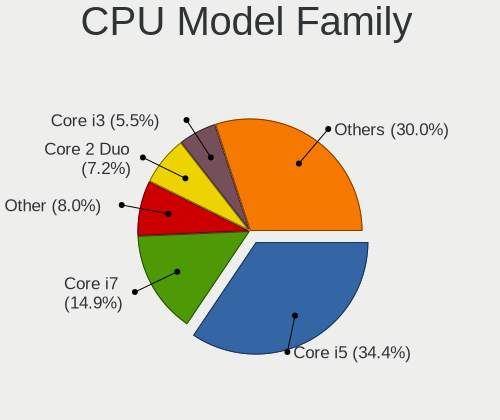

| Model                   | Notebooks | Percent |
|-------------------------|-----------|---------|
| Intel Core i5           | 125       | 34.44%  |
| Intel Core i7           | 54        | 14.88%  |
| Other                   | 29        | 7.99%   |
| Intel Core 2 Duo        | 26        | 7.16%   |
| Intel Core i3           | 20        | 5.51%   |
| Intel Celeron           | 13        | 3.58%   |
| AMD Ryzen 7             | 12        | 3.31%   |
| Intel Atom              | 9         | 2.48%   |
| AMD Ryzen 5             | 9         | 2.48%   |
| Intel Pentium M         | 8         | 2.2%    |
| Intel Xeon              | 4         | 1.1%    |
| Intel Pentium Silver    | 4         | 1.1%    |
| Intel Genuine           | 4         | 1.1%    |
| Intel Core Duo          | 4         | 1.1%    |
| AMD Ryzen 7 PRO         | 4         | 1.1%    |
| Intel Core 2            | 3         | 0.83%   |
| AMD A6                  | 3         | 0.83%   |
| AMD A4                  | 3         | 0.83%   |
| Intel Pentium           | 2         | 0.55%   |
| Intel Core M            | 2         | 0.55%   |
| Intel Core i9           | 2         | 0.55%   |
| Intel Celeron M         | 2         | 0.55%   |
| AMD Ryzen 5 PRO         | 2         | 0.55%   |
| AMD Ryzen 3             | 2         | 0.55%   |
| AMD E1                  | 2         | 0.55%   |
| Intel Pentium Dual-Core | 1         | 0.28%   |
| Intel Pentium 4         | 1         | 0.28%   |
| Intel Mobile Pentium 4  | 1         | 0.28%   |
| Intel Mobile Celeron    | 1         | 0.28%   |
| Intel Core Solo         | 1         | 0.28%   |
| Intel Core m7           | 1         | 0.28%   |
| Intel Core m3           | 1         | 0.28%   |
| Intel Core              | 1         | 0.28%   |
| AMD V120                | 1         | 0.28%   |
| AMD Turion 64 Mobile    | 1         | 0.28%   |
| AMD E2                  | 1         | 0.28%   |
| AMD E                   | 1         | 0.28%   |
| AMD C-50                | 1         | 0.28%   |
| AMD Athlon II Neo       | 1         | 0.28%   |
| AMD Athlon II           | 1         | 0.28%   |

CPU Cores
---------

Number of processor cores

| Number  | Notebooks | Percent |
|---------|-----------|---------|
| 2       | 173       | 47.79%  |
| 4       | 73        | 20.17%  |
| Unknown | 50        | 13.81%  |
| 1       | 24        | 6.63%   |
| 8       | 17        | 4.7%    |
| 16      | 11        | 3.04%   |
| 6       | 7         | 1.93%   |
| 12      | 6         | 1.66%   |
| 9       | 1         | 0.28%   |

CPU Sockets
-----------

Number of sockets

| Number  | Notebooks | Percent |
|---------|-----------|---------|
| 1       | 301       | 82.24%  |
| Unknown | 65        | 17.76%  |

CPU Threads
-----------

Threads per core (Hyper-Threading)

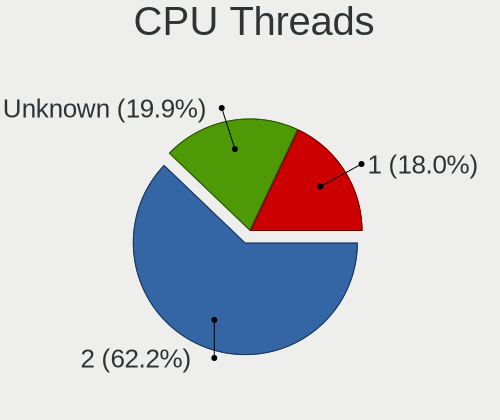

| Number  | Notebooks | Percent |
|---------|-----------|---------|
| 2       | 225       | 62.15%  |
| Unknown | 72        | 19.89%  |
| 1       | 65        | 17.96%  |

CPU Microarch
-------------

Microarchitecture

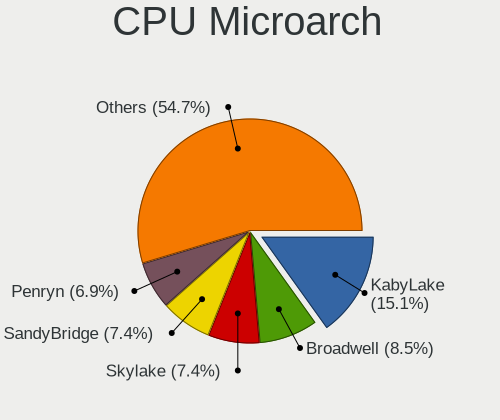

| Name          | Notebooks | Percent |
|---------------|-----------|---------|
| KabyLake      | 55        | 15.11%  |
| Broadwell     | 31        | 8.52%   |
| Skylake       | 27        | 7.42%   |
| SandyBridge   | 27        | 7.42%   |
| Penryn        | 25        | 6.87%   |
| IvyBridge     | 25        | 6.87%   |
| Unknown       | 23        | 6.32%   |
| Haswell       | 22        | 6.04%   |
| P6            | 21        | 5.77%   |
| Westmere      | 15        | 4.12%   |
| Zen 2         | 14        | 3.85%   |
| TigerLake     | 11        | 3.02%   |
| Goldmont plus | 10        | 2.75%   |
| Bonnell       | 9         | 2.47%   |
| Core          | 6         | 1.65%   |
| Zen+          | 5         | 1.37%   |
| Silvermont    | 4         | 1.1%    |
| Jaguar        | 4         | 1.1%    |
| CometLake     | 4         | 1.1%    |
| Zen 3         | 3         | 0.82%   |
| Zen           | 3         | 0.82%   |
| NetBurst      | 3         | 0.82%   |
| K10 Llano     | 3         | 0.82%   |
| K10           | 3         | 0.82%   |
| Goldmont      | 3         | 0.82%   |
| IceLake       | 2         | 0.55%   |
| Bobcat        | 2         | 0.55%   |
| Piledriver    | 1         | 0.27%   |
| Nehalem       | 1         | 0.27%   |
| K8 Hammer     | 1         | 0.27%   |
| Excavator     | 1         | 0.27%   |

Graphics
--------

GPU Vendor
----------

Vendors of graphics cards

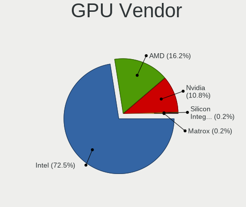

| Vendor                           | Notebooks | Percent |
|----------------------------------|-----------|---------|
| Intel                            | 290       | 72.5%   |
| AMD                              | 65        | 16.25%  |
| Nvidia                           | 43        | 10.75%  |
| Silicon Integrated Systems [SiS] | 1         | 0.25%   |
| Matrox Electronics Systems       | 1         | 0.25%   |

GPU Model
---------

Graphics card models

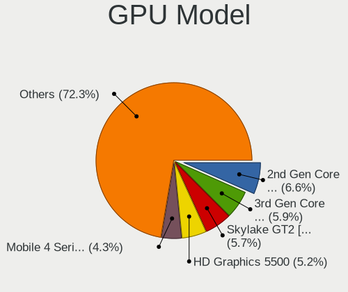

| Model                                                                         | Notebooks | Percent |
|-------------------------------------------------------------------------------|-----------|---------|
| Intel 2nd Generation Core Processor Family Integrated Graphics Controller     | 28        | 6.62%   |
| Intel 3rd Gen Core processor Graphics Controller                              | 25        | 5.91%   |
| Intel Skylake GT2 [HD Graphics 520]                                           | 24        | 5.67%   |
| Intel HD Graphics 5500                                                        | 22        | 5.2%    |
| Intel Mobile 4 Series Chipset Integrated Graphics Controller                  | 18        | 4.26%   |
| Intel UHD Graphics 620                                                        | 17        | 4.02%   |
| Intel Mobile 945GM/GMS/GME, 943/940GML Express Integrated Graphics Controller | 15        | 3.55%   |
| Intel Haswell-ULT Integrated Graphics Controller                              | 14        | 3.31%   |
| AMD Renoir [Radeon Vega Series / Radeon Vega Mobile Series]                   | 14        | 3.31%   |
| Intel HD Graphics 620                                                         | 12        | 2.84%   |
| Intel TigerLake-LP GT2 [Iris Xe Graphics]                                     | 11        | 2.6%    |
| Intel Core Processor Integrated Graphics Controller                           | 11        | 2.6%    |
| Intel WhiskeyLake-U GT2 [UHD Graphics 620]                                    | 10        | 2.36%   |
| Intel Mobile 945GM/GMS, 943/940GML Express Integrated Graphics Controller     | 10        | 2.36%   |
| Intel CometLake-U GT2 [UHD Graphics]                                          | 8         | 1.89%   |
| Intel GeminiLake [UHD Graphics 600]                                           | 7         | 1.65%   |
| Intel 4th Gen Core Processor Integrated Graphics Controller                   | 7         | 1.65%   |
| Intel Mobile 945GSE Express Integrated Graphics Controller                    | 5         | 1.18%   |
| Intel Mobile 915GM/GMS/910GML Express Graphics Controller                     | 5         | 1.18%   |
| Intel CoffeeLake-H GT2 [UHD Graphics 630]                                     | 5         | 1.18%   |
| AMD Picasso/Raven 2 [Radeon Vega Series / Radeon Vega Mobile Series]          | 5         | 1.18%   |
| Nvidia TU117M [GeForce GTX 1650 Mobile / Max-Q]                               | 4         | 0.95%   |
| Intel Mobile GM965/GL960 Integrated Graphics Controller (secondary)           | 4         | 0.95%   |
| Intel Mobile GM965/GL960 Integrated Graphics Controller (primary)             | 4         | 0.95%   |
| Intel HD Graphics 6000                                                        | 4         | 0.95%   |
| Intel Alder Lake-P GT2 [Iris Xe Graphics]                                     | 4         | 0.95%   |
| Nvidia GT218M [NVS 3100M]                                                     | 3         | 0.71%   |
| Nvidia GT216M [GeForce GT 330M]                                               | 3         | 0.71%   |
| Nvidia GP108M [GeForce MX150]                                                 | 3         | 0.71%   |
| Nvidia C79 [GeForce 9400M]                                                    | 3         | 0.71%   |
| Intel HD Graphics 5300                                                        | 3         | 0.71%   |
| Intel GeminiLake [UHD Graphics 605]                                           | 3         | 0.71%   |
| Intel CometLake-H GT2 [UHD Graphics]                                          | 3         | 0.71%   |
| AMD RV200/M7 [Mobility Radeon 7500]                                           | 3         | 0.71%   |
| AMD RS880M [Mobility Radeon HD 4225/4250]                                     | 3         | 0.71%   |
| AMD Raven Ridge [Radeon Vega Series / Radeon Vega Mobile Series]              | 3         | 0.71%   |
| AMD Barcelo                                                                   | 3         | 0.71%   |
| Nvidia GP107M [GeForce GTX 1050 Mobile]                                       | 2         | 0.47%   |
| Nvidia GM206GLM [Quadro M2200 Mobile]                                         | 2         | 0.47%   |
| Nvidia GM108M [GeForce 940M]                                                  | 2         | 0.47%   |

GPU Combo
---------

Combinations of graphics cards

| Name           | Notebooks | Percent |
|----------------|-----------|---------|
| 1 x Intel      | 215       | 59.23%  |
| 1 x AMD        | 50        | 13.77%  |
| 2 x Intel      | 41        | 11.29%  |
| Intel + Nvidia | 27        | 7.44%   |
| 1 x Nvidia     | 12        | 3.31%   |
| Intel + AMD    | 7         | 1.93%   |
| 2 x AMD        | 3         | 0.83%   |
| AMD + Nvidia   | 3         | 0.83%   |
| Other          | 2         | 0.55%   |
| 2 x Nvidia     | 1         | 0.28%   |
| 1 x SiS        | 1         | 0.28%   |
| AMD + Matrox   | 1         | 0.28%   |

GPU Driver
----------

Free vs proprietary

| Driver  | Notebooks | Percent |
|---------|-----------|---------|
| Free    | 346       | 95.32%  |
| Unknown | 17        | 4.68%   |

GPU Memory
----------

Total video memory

| Size in GB | Notebooks | Percent |
|------------|-----------|---------|
| Unknown    | 362       | 100%    |

Monitor
-------

Monitor Vendor
--------------

Monitor vendors

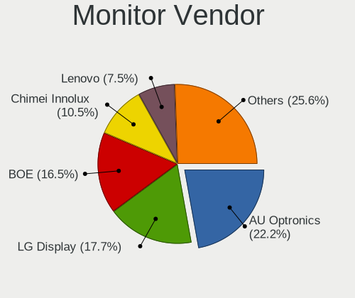

| Vendor                  | Notebooks | Percent |
|-------------------------|-----------|---------|
| AU Optronics            | 59        | 22.18%  |
| LG Display              | 47        | 17.67%  |
| BOE                     | 44        | 16.54%  |
| Chimei Innolux          | 28        | 10.53%  |
| Lenovo                  | 20        | 7.52%   |
| Apple                   | 16        | 6.02%   |
| Samsung Electronics     | 11        | 4.14%   |
| Sharp                   | 6         | 2.26%   |
| Dell                    | 4         | 1.5%    |
| PANDA                   | 3         | 1.13%   |
| InfoVision              | 3         | 1.13%   |
| CSO                     | 3         | 1.13%   |
| Chi Mei Optoelectronics | 3         | 1.13%   |
| BenQ                    | 3         | 1.13%   |
| IBM                     | 2         | 0.75%   |
| Goldstar                | 2         | 0.75%   |
| TRU                     | 1         | 0.38%   |
| Quanta Display          | 1         | 0.38%   |
| Philips                 | 1         | 0.38%   |
| Panasonic               | 1         | 0.38%   |
| LTM                     | 1         | 0.38%   |
| LG Philips              | 1         | 0.38%   |
| JDI                     | 1         | 0.38%   |
| Iiyama                  | 1         | 0.38%   |
| HannStar                | 1         | 0.38%   |
| Gigabyte Technology     | 1         | 0.38%   |
| Ancor Communications    | 1         | 0.38%   |
| Acer                    | 1         | 0.38%   |

Monitor Model
-------------

Monitor models

| Model                                                                    | Notebooks | Percent |
|--------------------------------------------------------------------------|-----------|---------|
| AU Optronics LCD Monitor AUO106C 1366x768 280x160mm 12.7-inch            | 8         | 3.01%   |
| Lenovo LCD Monitor LEN4010 1280x800 260x160mm 12.0-inch                  | 6         | 2.26%   |
| LG Display LCD Monitor LGD058B 2560x1440 310x170mm 13.9-inch             | 4         | 1.5%    |
| LG Display LCD Monitor LGD03CD 1366x768 280x160mm 12.7-inch              | 3         | 1.13%   |
| Lenovo LCD Monitor LEN4033 1440x900 300x190mm 14.0-inch                  | 3         | 1.13%   |
| Lenovo LCD Monitor LEN4011 1280x800 260x160mm 12.0-inch                  | 3         | 1.13%   |
| Chimei Innolux LCD Monitor CMN1239 1920x1080 280x160mm 12.7-inch         | 3         | 1.13%   |
| BOE LCD Monitor BOE095F 2256x1504 280x190mm 13.3-inch                    | 3         | 1.13%   |
| AU Optronics LCD Monitor AUO315C 1366x768 260x140mm 11.6-inch            | 3         | 1.13%   |
| Apple Color LCD APPA01B 1440x900 290x180mm 13.4-inch                     | 3         | 1.13%   |
| Samsung Electronics LCD Monitor SEC324C 1600x900 310x170mm 13.9-inch     | 2         | 0.75%   |
| LG Display LCD Monitor LGD05FA 1920x1080 310x170mm 13.9-inch             | 2         | 0.75%   |
| LG Display LCD Monitor LGD057E 1920x1080 340x190mm 15.3-inch             | 2         | 0.75%   |
| LG Display LCD Monitor LGD045E 1366x768 310x170mm 13.9-inch              | 2         | 0.75%   |
| LG Display LCD Monitor LGD0437 1920x1080 280x160mm 12.7-inch             | 2         | 0.75%   |
| LG Display LCD Monitor LGD0418 2560x1440 310x170mm 13.9-inch             | 2         | 0.75%   |
| LG Display LCD Monitor LGD02D8 1366x768 280x160mm 12.7-inch              | 2         | 0.75%   |
| Lenovo LCD Monitor LEN40B2 1920x1080 340x190mm 15.3-inch                 | 2         | 0.75%   |
| Lenovo LCD Monitor LEN4035 1280x800 300x190mm 14.0-inch                  | 2         | 0.75%   |
| IBM LCD Monitor IBM2887 1680x1050 330x210mm 15.4-inch                    | 2         | 0.75%   |
| Chimei Innolux LCD Monitor CMN15F5 1920x1080 340x190mm 15.3-inch         | 2         | 0.75%   |
| Chimei Innolux LCD Monitor CMN15DB 1366x768 340x190mm 15.3-inch          | 2         | 0.75%   |
| Chimei Innolux LCD Monitor CMN14D6 1366x768 310x170mm 13.9-inch          | 2         | 0.75%   |
| Chimei Innolux LCD Monitor CMN14D4 1920x1080 310x170mm 13.9-inch         | 2         | 0.75%   |
| Chimei Innolux LCD Monitor CMN14C9 1920x1080 310x170mm 13.9-inch         | 2         | 0.75%   |
| Chimei Innolux LCD Monitor CMN1132 1366x768 260x140mm 11.6-inch          | 2         | 0.75%   |
| Chi Mei Optoelectronics LCD Monitor CMO15A7 1366x768 350x190mm 15.7-inch | 2         | 0.75%   |
| BOE LCD Monitor BOE0900 1920x1080 340x190mm 15.3-inch                    | 2         | 0.75%   |
| BOE LCD Monitor BOE07C8 3840x2160 310x170mm 13.9-inch                    | 2         | 0.75%   |
| BOE LCD Monitor BOE075A 1366x768 310x170mm 13.9-inch                     | 2         | 0.75%   |
| BOE LCD Monitor BOE0718 1920x1080 310x170mm 13.9-inch                    | 2         | 0.75%   |
| AU Optronics LCD Monitor AUO573D 1920x1080 310x170mm 13.9-inch           | 2         | 0.75%   |
| AU Optronics LCD Monitor AUO403D 1920x1080 310x170mm 13.9-inch           | 2         | 0.75%   |
| AU Optronics LCD Monitor AUO34ED 1920x1080 340x190mm 15.3-inch           | 2         | 0.75%   |
| AU Optronics LCD Monitor AUO2336 2560x1440 310x170mm 13.9-inch           | 2         | 0.75%   |
| AU Optronics LCD Monitor AUO226D 1920x1080 280x160mm 12.7-inch           | 2         | 0.75%   |
| AU Optronics LCD Monitor AUO21EC 1366x768 340x190mm 15.3-inch            | 2         | 0.75%   |
| AU Optronics LCD Monitor AUO213E 1600x900 310x170mm 13.9-inch            | 2         | 0.75%   |
| AU Optronics LCD Monitor AUO103D 1920x1080 310x170mm 13.9-inch           | 2         | 0.75%   |
| Apple Color LCD APP9CDF 1440x900 290x180mm 13.4-inch                     | 2         | 0.75%   |

Monitor Resolution
------------------

Monitor screen resolution

| Resolution         | Notebooks | Percent |
|--------------------|-----------|---------|
| 1920x1080 (FHD)    | 95        | 36.12%  |
| 1366x768 (WXGA)    | 80        | 30.42%  |
| 1280x800 (WXGA)    | 17        | 6.46%   |
| 2560x1440 (QHD)    | 11        | 4.18%   |
| 1440x900 (WXGA+)   | 11        | 4.18%   |
| 1600x900 (HD+)     | 10        | 3.8%    |
| 3840x2160 (4K)     | 6         | 2.28%   |
| 1920x1200 (WUXGA)  | 6         | 2.28%   |
| 2256x1504          | 4         | 1.52%   |
| 1680x1050 (WSXGA+) | 4         | 1.52%   |
| 2560x1600          | 3         | 1.14%   |
| 1280x854           | 2         | 0.76%   |
| 1280x1024 (SXGA)   | 2         | 0.76%   |
| 720x1280           | 1         | 0.38%   |
| 3840x2400          | 1         | 0.38%   |
| 3456x2160          | 1         | 0.38%   |
| 3440x1440          | 1         | 0.38%   |
| 3200x1800 (QHD+)   | 1         | 0.38%   |
| 2880x1800          | 1         | 0.38%   |
| 1920x1280          | 1         | 0.38%   |
| 1440x960           | 1         | 0.38%   |
| 1360x768           | 1         | 0.38%   |
| 1280x768           | 1         | 0.38%   |
| 1024x768 (XGA)     | 1         | 0.38%   |
| 1024x600           | 1         | 0.38%   |

Monitor Diagonal
----------------

Diagonal size in inches

| Inches | Notebooks | Percent |
|--------|-----------|---------|
| 13     | 95        | 35.71%  |
| 15     | 71        | 26.69%  |
| 12     | 44        | 16.54%  |
| 11     | 17        | 6.39%   |
| 14     | 13        | 4.89%   |
| 24     | 5         | 1.88%   |
| 17     | 4         | 1.5%    |
| 23     | 3         | 1.13%   |
| 19     | 2         | 0.75%   |
| 18     | 2         | 0.75%   |
| 10     | 2         | 0.75%   |
| 40     | 1         | 0.38%   |
| 34     | 1         | 0.38%   |
| 32     | 1         | 0.38%   |
| 28     | 1         | 0.38%   |
| 27     | 1         | 0.38%   |
| 26     | 1         | 0.38%   |
| 9      | 1         | 0.38%   |
| 6      | 1         | 0.38%   |

Monitor Width
-------------

Physical width

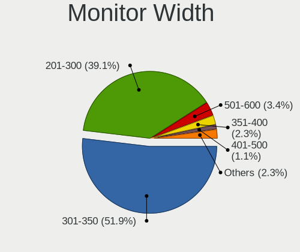

| Width in mm | Notebooks | Percent |
|-------------|-----------|---------|
| 301-350     | 138       | 51.88%  |
| 201-300     | 104       | 39.1%   |
| 501-600     | 9         | 3.38%   |
| 351-400     | 6         | 2.26%   |
| 401-500     | 3         | 1.13%   |
| 701-800     | 2         | 0.75%   |
| 101-200     | 2         | 0.75%   |
| 801-900     | 1         | 0.38%   |
| 601-700     | 1         | 0.38%   |

Aspect Ratio
------------

Proportional relationship between the width and the height

| Ratio | Notebooks | Percent |
|-------|-----------|---------|
| 16/9  | 202       | 78.29%  |
| 16/10 | 39        | 15.12%  |
| 3/2   | 13        | 5.04%   |
| 5/4   | 2         | 0.78%   |
| 4/3   | 1         | 0.39%   |
| 21/9  | 1         | 0.39%   |

Monitor Area
------------

Area in inch

| Area in inch | Notebooks | Percent |
|----------------|-----------|---------|
| 81-90          | 94        | 35.34%  |
| 91-100         | 57        | 21.43%  |
| 61-70          | 43        | 16.17%  |
| 51-60          | 17        | 6.39%   |
| 71-80          | 15        | 5.64%   |
| 101-110        | 13        | 4.89%   |
| 201-250        | 7         | 2.63%   |
| 121-130        | 4         | 1.5%    |
| 351-500        | 3         | 1.13%   |
| 41-50          | 2         | 0.75%   |
| 1-40           | 2         | 0.75%   |
| 301-350        | 2         | 0.75%   |
| 151-200        | 2         | 0.75%   |
| 141-150        | 2         | 0.75%   |
| 251-300        | 1         | 0.38%   |
| 111-120        | 1         | 0.38%   |
| 501-1000       | 1         | 0.38%   |

Pixel Density
-------------

Pixels per inch

| Density       | Notebooks | Percent |
|---------------|-----------|---------|
| 121-160       | 147       | 55.47%  |
| 101-120       | 51        | 19.25%  |
| 161-240       | 39        | 14.72%  |
| 51-100        | 19        | 7.17%   |
| More than 240 | 9         | 3.4%    |

Multiple Monitors
-----------------

Total monitors connected

| Total | Notebooks | Percent |
|-------|-----------|---------|
| 1     | 310       | 84.47%  |
| 0     | 38        | 10.35%  |
| 2     | 19        | 5.18%   |

Network
-------

Net Controller Vendor
---------------------

Controller vendors

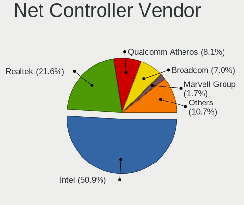

| Vendor                            | Notebooks | Percent |
|-----------------------------------|-----------|---------|
| Intel                             | 271       | 50.94%  |
| Realtek Semiconductor             | 115       | 21.62%  |
| Qualcomm Atheros                  | 43        | 8.08%   |
| Broadcom                          | 37        | 6.95%   |
| Marvell Technology Group          | 9         | 1.69%   |
| Sierra Wireless                   | 7         | 1.32%   |
| Ericsson Business Mobile Networks | 6         | 1.13%   |
| Apple                             | 6         | 1.13%   |
| Edimax Technology                 | 5         | 0.94%   |
| TP-Link                           | 4         | 0.75%   |
| Samsung Electronics               | 3         | 0.56%   |
| Ralink Technology                 | 3         | 0.56%   |
| Qualcomm Atheros Communications   | 3         | 0.56%   |
| Nvidia                            | 3         | 0.56%   |
| MediaTek                          | 2         | 0.38%   |
| Dell                              | 2         | 0.38%   |
| ASUSTek Computer                  | 2         | 0.38%   |
| Xiaomi                            | 1         | 0.19%   |
| Silicon Integrated Systems [SiS]  | 1         | 0.19%   |
| Ralink                            | 1         | 0.19%   |
| Micro Star International          | 1         | 0.19%   |
| Hewlett-Packard                   | 1         | 0.19%   |
| Google                            | 1         | 0.19%   |
| Fibocom                           | 1         | 0.19%   |
| D-Link System                     | 1         | 0.19%   |
| D-Link                            | 1         | 0.19%   |
| AMD                               | 1         | 0.19%   |
| 3Com                              | 1         | 0.19%   |

Net Controller Model
--------------------

Controller models

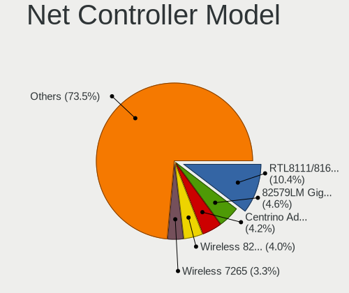

| Model                                                                   | Notebooks | Percent |
|-------------------------------------------------------------------------|-----------|---------|
| Realtek RTL8111/8168/8211/8411 PCI Express Gigabit Ethernet Controller  | 75        | 10.39%  |
| Intel 82579LM Gigabit Network Connection (Lewisville)                   | 33        | 4.57%   |
| Intel Centrino Advanced-N 6205 [Taylor Peak]                            | 30        | 4.16%   |
| Intel Wireless 8265 / 8275                                              | 29        | 4.02%   |
| Intel Wireless 7265                                                     | 24        | 3.32%   |
| Intel Wireless 8260                                                     | 20        | 2.77%   |
| Intel Wireless 7260                                                     | 19        | 2.63%   |
| Intel Wi-Fi 6 AX200                                                     | 19        | 2.63%   |
| Realtek RTL810xE PCI Express Fast Ethernet controller                   | 16        | 2.22%   |
| Intel 82567LM Gigabit Network Connection                                | 16        | 2.22%   |
| Intel Ethernet Connection I219-LM                                       | 15        | 2.08%   |
| Intel Ethernet Connection (3) I218-LM                                   | 14        | 1.94%   |
| Intel Wi-Fi 6 AX201                                                     | 12        | 1.66%   |
| Intel Ethernet Connection (4) I219-LM                                   | 11        | 1.52%   |
| Intel PRO/Wireless 3945ABG [Golan] Network Connection                   | 10        | 1.39%   |
| Intel 82577LM Gigabit Network Connection                                | 10        | 1.39%   |
| Qualcomm Atheros AR9285 Wireless Network Adapter (PCI-Express)          | 9         | 1.25%   |
| Intel Ultimate N WiFi Link 5300                                         | 9         | 1.25%   |
| Intel Ethernet Connection (4) I219-V                                    | 8         | 1.11%   |
| Broadcom BCM4360 802.11ac Dual Band Wireless Network Adapter            | 8         | 1.11%   |
| Realtek RTL8188EUS 802.11n Wireless Network Adapter                     | 7         | 0.97%   |
| Intel Centrino Advanced-N 6200                                          | 7         | 0.97%   |
| Intel Cannon Point-LP CNVi [Wireless-AC]                                | 7         | 0.97%   |
| Realtek RTL8821CE 802.11ac PCIe Wireless Network Adapter                | 6         | 0.83%   |
| Realtek RTL8188CE 802.11b/g/n WiFi Adapter                              | 6         | 0.83%   |
| Qualcomm Atheros AR9485 Wireless Network Adapter                        | 6         | 0.83%   |
| Qualcomm Atheros AR242x / AR542x Wireless Network Adapter (PCI-Express) | 6         | 0.83%   |
| Intel Ethernet Connection (6) I219-V                                    | 6         | 0.83%   |
| Intel Comet Lake PCH-LP CNVi WiFi                                       | 6         | 0.83%   |
| Sierra Wireless EM7455                                                  | 5         | 0.69%   |
| Realtek RTL-8100/8101L/8139 PCI Fast Ethernet Adapter                   | 5         | 0.69%   |
| Intel Wi-Fi 6E(802.11ax) AX210/AX1675* 2x2 [Typhoon Peak]               | 5         | 0.69%   |
| Intel Ethernet Connection I218-LM                                       | 5         | 0.69%   |
| Realtek RTL8192EU 802.11b/g/n WLAN Adapter                              | 4         | 0.55%   |
| Qualcomm Atheros QCA9377 802.11ac Wireless Network Adapter              | 4         | 0.55%   |
| Qualcomm Atheros AR8152 v2.0 Fast Ethernet                              | 4         | 0.55%   |
| Marvell Group 88E8057 PCI-E Gigabit Ethernet Controller                 | 4         | 0.55%   |
| Intel Wireless 3165                                                     | 4         | 0.55%   |
| Intel Wi-Fi 5(802.11ac) Wireless-AC 9x6x [Thunder Peak]                 | 4         | 0.55%   |
| Intel PRO/Wireless 5100 AGN [Shiloh] Network Connection                 | 4         | 0.55%   |

Wireless Vendor
---------------

Wireless vendors

| Vendor                          | Notebooks | Percent |
|---------------------------------|-----------|---------|
| Intel                           | 254       | 65.63%  |
| Qualcomm Atheros                | 37        | 9.56%   |
| Realtek Semiconductor           | 35        | 9.04%   |
| Broadcom                        | 30        | 7.75%   |
| Sierra Wireless                 | 6         | 1.55%   |
| Edimax Technology               | 5         | 1.29%   |
| TP-Link                         | 4         | 1.03%   |
| Ralink Technology               | 3         | 0.78%   |
| Qualcomm Atheros Communications | 3         | 0.78%   |
| MediaTek                        | 2         | 0.52%   |
| Dell                            | 2         | 0.52%   |
| ASUSTek Computer                | 2         | 0.52%   |
| Ralink                          | 1         | 0.26%   |
| Micro Star International        | 1         | 0.26%   |
| D-Link System                   | 1         | 0.26%   |
| D-Link                          | 1         | 0.26%   |

Wireless Model
--------------

Wireless models

| Model                                                                   | Notebooks | Percent |
|-------------------------------------------------------------------------|-----------|---------|
| Intel Centrino Advanced-N 6205 [Taylor Peak]                            | 30        | 7.59%   |
| Intel Wireless 8265 / 8275                                              | 29        | 7.34%   |
| Intel Wireless 7265                                                     | 24        | 6.08%   |
| Intel Wireless 8260                                                     | 20        | 5.06%   |
| Intel Wireless 7260                                                     | 19        | 4.81%   |
| Intel Wi-Fi 6 AX200                                                     | 19        | 4.81%   |
| Intel Wi-Fi 6 AX201                                                     | 12        | 3.04%   |
| Intel PRO/Wireless 3945ABG [Golan] Network Connection                   | 10        | 2.53%   |
| Qualcomm Atheros AR9285 Wireless Network Adapter (PCI-Express)          | 9         | 2.28%   |
| Intel Ultimate N WiFi Link 5300                                         | 9         | 2.28%   |
| Broadcom BCM4360 802.11ac Dual Band Wireless Network Adapter            | 8         | 2.03%   |
| Realtek RTL8188EUS 802.11n Wireless Network Adapter                     | 7         | 1.77%   |
| Intel Centrino Advanced-N 6200                                          | 7         | 1.77%   |
| Intel Cannon Point-LP CNVi [Wireless-AC]                                | 7         | 1.77%   |
| Realtek RTL8821CE 802.11ac PCIe Wireless Network Adapter                | 6         | 1.52%   |
| Realtek RTL8188CE 802.11b/g/n WiFi Adapter                              | 6         | 1.52%   |
| Qualcomm Atheros AR9485 Wireless Network Adapter                        | 6         | 1.52%   |
| Qualcomm Atheros AR242x / AR542x Wireless Network Adapter (PCI-Express) | 6         | 1.52%   |
| Intel Comet Lake PCH-LP CNVi WiFi                                       | 6         | 1.52%   |
| Sierra Wireless EM7455                                                  | 5         | 1.27%   |
| Intel Wi-Fi 6E(802.11ax) AX210/AX1675* 2x2 [Typhoon Peak]               | 5         | 1.27%   |
| Realtek RTL8192EU 802.11b/g/n WLAN Adapter                              | 4         | 1.01%   |
| Qualcomm Atheros QCA9377 802.11ac Wireless Network Adapter              | 4         | 1.01%   |
| Intel Wireless 3165                                                     | 4         | 1.01%   |
| Intel Wi-Fi 5(802.11ac) Wireless-AC 9x6x [Thunder Peak]                 | 4         | 1.01%   |
| Intel PRO/Wireless 5100 AGN [Shiloh] Network Connection                 | 4         | 1.01%   |
| Intel PRO/Wireless 2915ABG [Calexico2] Network Connection               | 4         | 1.01%   |
| Edimax EW-7811Un 802.11n Wireless Adapter [Realtek RTL8188CUS]          | 4         | 1.01%   |
| Realtek RTL8852BE PCIe 802.11ax Wireless Network Controller             | 3         | 0.76%   |
| Realtek RTL8188CUS 802.11n WLAN Adapter                                 | 3         | 0.76%   |
| Qualcomm Atheros QCA9565 / AR9565 Wireless Network Adapter              | 3         | 0.76%   |
| Qualcomm Atheros AR5212 802.11abg NIC                                   | 3         | 0.76%   |
| Intel Wireless 3160                                                     | 3         | 0.76%   |
| Intel Gemini Lake PCH CNVi WiFi                                         | 3         | 0.76%   |
| Intel Dual Band Wireless-AC 3168NGW [Stone Peak]                        | 3         | 0.76%   |
| Intel Comet Lake PCH CNVi WiFi                                          | 3         | 0.76%   |
| Intel Centrino Wireless-N 2230                                          | 3         | 0.76%   |
| Broadcom BCM43224 802.11a/b/g/n                                         | 3         | 0.76%   |
| Broadcom BCM4322 802.11a/b/g/n Wireless LAN Controller                  | 3         | 0.76%   |
| TP-Link TL-WN823N v2/v3 [Realtek RTL8192EU]                             | 2         | 0.51%   |

Ethernet Vendor
---------------

Ethernet vendors

| Vendor                           | Notebooks | Percent |
|----------------------------------|-----------|---------|
| Intel                            | 156       | 51.32%  |
| Realtek Semiconductor            | 100       | 32.89%  |
| Broadcom                         | 13        | 4.28%   |
| Qualcomm Atheros                 | 12        | 3.95%   |
| Marvell Technology Group         | 9         | 2.96%   |
| Apple                            | 4         | 1.32%   |
| Samsung Electronics              | 3         | 0.99%   |
| Nvidia                           | 3         | 0.99%   |
| Xiaomi                           | 1         | 0.33%   |
| Silicon Integrated Systems [SiS] | 1         | 0.33%   |
| Google                           | 1         | 0.33%   |
| 3Com                             | 1         | 0.33%   |

Ethernet Model
--------------

Ethernet models

| Model                                                                  | Notebooks | Percent |
|------------------------------------------------------------------------|-----------|---------|
| Realtek RTL8111/8168/8211/8411 PCI Express Gigabit Ethernet Controller | 75        | 24.67%  |
| Intel 82579LM Gigabit Network Connection (Lewisville)                  | 33        | 10.86%  |
| Realtek RTL810xE PCI Express Fast Ethernet controller                  | 16        | 5.26%   |
| Intel 82567LM Gigabit Network Connection                               | 16        | 5.26%   |
| Intel Ethernet Connection I219-LM                                      | 15        | 4.93%   |
| Intel Ethernet Connection (3) I218-LM                                  | 14        | 4.61%   |
| Intel Ethernet Connection (4) I219-LM                                  | 11        | 3.62%   |
| Intel 82577LM Gigabit Network Connection                               | 10        | 3.29%   |
| Intel Ethernet Connection (4) I219-V                                   | 8         | 2.63%   |
| Intel Ethernet Connection (6) I219-V                                   | 6         | 1.97%   |
| Realtek RTL-8100/8101L/8139 PCI Fast Ethernet Adapter                  | 5         | 1.64%   |
| Intel Ethernet Connection I218-LM                                      | 5         | 1.64%   |
| Qualcomm Atheros AR8152 v2.0 Fast Ethernet                             | 4         | 1.32%   |
| Marvell Group 88E8057 PCI-E Gigabit Ethernet Controller                | 4         | 1.32%   |
| Intel Ethernet Connection (2) I219-LM                                  | 4         | 1.32%   |
| Intel 82573L Gigabit Ethernet Controller                               | 4         | 1.32%   |
| Broadcom NetXtreme BCM5751M Gigabit Ethernet PCI Express               | 4         | 1.32%   |
| Nvidia MCP79 Ethernet                                                  | 3         | 0.99%   |
| Marvell Group 88E8055 PCI-E Gigabit Ethernet Controller                | 3         | 0.99%   |
| Intel Ethernet Connection I219-V                                       | 3         | 0.99%   |
| Intel Ethernet Connection I217-LM                                      | 3         | 0.99%   |
| Intel Ethernet Connection (10) I219-V                                  | 3         | 0.99%   |
| Intel 82566MM Gigabit Network Connection                               | 3         | 0.99%   |
| Apple UniNorth 2 GMAC (Sun GEM)                                        | 3         | 0.99%   |
| Samsung GT-I9070 (network tethering, USB debugging enabled)            | 2         | 0.66%   |
| Realtek USB 2.5GbE Controller                                          | 2         | 0.66%   |
| Realtek Killer E2600 GbE Controller                                    | 2         | 0.66%   |
| Qualcomm Atheros AR8121/AR8113/AR8114 Gigabit or Fast Ethernet         | 2         | 0.66%   |
| Intel I210 Gigabit Network Connection                                  | 2         | 0.66%   |
| Intel Ethernet Connection I218-V                                       | 2         | 0.66%   |
| Intel Ethernet Connection (3) I218-V                                   | 2         | 0.66%   |
| Intel 82579V Gigabit Network Connection                                | 2         | 0.66%   |
| Intel 82540EP Gigabit Ethernet Controller (Mobile)                     | 2         | 0.66%   |
| Broadcom NetXtreme BCM5764M Gigabit Ethernet PCIe                      | 2         | 0.66%   |
| Broadcom NetLink BCM5906M Fast Ethernet PCI Express                    | 2         | 0.66%   |
| Broadcom NetLink BCM57780 Gigabit Ethernet PCIe                        | 2         | 0.66%   |
| Xiaomi Mi/Redmi series (RNDIS)                                         | 1         | 0.33%   |
| Silicon Integrated Systems [SiS] SiS900 PCI Fast Ethernet              | 1         | 0.33%   |
| Samsung Galaxy series, misc. (tethering mode)                          | 1         | 0.33%   |
| Qualcomm Atheros Killer E2500 Gigabit Ethernet Controller              | 1         | 0.33%   |

Net Controller Kind
-------------------

Ethernet, WiFi or modem

| Kind     | Notebooks | Percent |
|----------|-----------|---------|
| WiFi     | 351       | 52.08%  |
| Ethernet | 300       | 44.51%  |
| Modem    | 13        | 1.93%   |
| Unknown  | 10        | 1.48%   |

Used Controller
---------------

Currently used network controller

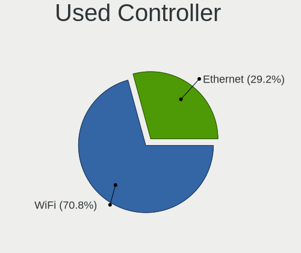

| Kind     | Notebooks | Percent |
|----------|-----------|---------|
| WiFi     | 259       | 70.77%  |
| Ethernet | 107       | 29.23%  |

NICs
----

Total network controllers on board

| Total | Notebooks | Percent |
|-------|-----------|---------|
| 2     | 280       | 77.13%  |
| 1     | 77        | 21.21%  |
| 3     | 4         | 1.1%    |
| 0     | 2         | 0.55%   |

IPv6
----

IPv6 vs IPv4

| Used | Notebooks | Percent |
|------|-----------|---------|
| No   | 358       | 98.9%   |
| Yes  | 4         | 1.1%    |

Bluetooth
---------

Bluetooth Vendor
----------------

Controller vendors

| Vendor                          | Notebooks | Percent |
|---------------------------------|-----------|---------|
| Intel                           | 133       | 57.33%  |
| Broadcom                        | 33        | 14.22%  |
| Apple                           | 18        | 7.76%   |
| IMC Networks                    | 11        | 4.74%   |
| Realtek Semiconductor           | 9         | 3.88%   |
| Alps Electric                   | 7         | 3.02%   |
| Qualcomm Atheros Communications | 6         | 2.59%   |
| Foxconn / Hon Hai               | 6         | 2.59%   |
| Taiyo Yuden                     | 2         | 0.86%   |
| Skylight Digital                | 1         | 0.43%   |
| Ralink                          | 1         | 0.43%   |
| Lite-On Technology              | 1         | 0.43%   |
| Hewlett-Packard                 | 1         | 0.43%   |
| Dell                            | 1         | 0.43%   |
| Creative Technology             | 1         | 0.43%   |
| ASUSTek Computer                | 1         | 0.43%   |

Bluetooth Model
---------------

Controller models

| Model                                                                               | Notebooks | Percent |
|-------------------------------------------------------------------------------------|-----------|---------|
| Intel Bluetooth wireless interface                                                  | 71        | 30.6%   |
| Intel AX201 Bluetooth                                                               | 20        | 8.62%   |
| Intel AX200 Bluetooth                                                               | 14        | 6.03%   |
| Intel Bluetooth 9460/9560 Jefferson Peak (JfP)                                      | 11        | 4.74%   |
| Broadcom BCM20702 Bluetooth 4.0 [ThinkPad]                                          | 10        | 4.31%   |
| Broadcom BCM2045B (BDC-2.1)                                                         | 10        | 4.31%   |
| Apple Broadcom Built-in Bluetooth                                                   | 8         | 3.45%   |
| Apple Bluetooth Host Controller                                                     | 8         | 3.45%   |
| Broadcom BCM2045B (BDC-2.1) [Bluetooth Controller]                                  | 6         | 2.59%   |
| Realtek Bluetooth Adapter                                                           | 5         | 2.16%   |
| Intel Centrino Bluetooth Wireless Transceiver                                       | 5         | 2.16%   |
| Intel AX210 Bluetooth                                                               | 5         | 2.16%   |
| Alps Electric UGTZ4 Bluetooth                                                       | 5         | 2.16%   |
| Qualcomm Atheros AR3012 Bluetooth 4.0                                               | 3         | 1.29%   |
| Intel Wireless-AC 3168 Bluetooth                                                    | 3         | 1.29%   |
| IMC Networks Realtek Bluetooth Adapter                                              | 3         | 1.29%   |
| IMC Networks Qualcomm Atheros Bluetooth 4.1                                         | 3         | 1.29%   |
| Taiyo Yuden Bluetooth Device (V2.0+EDR)                                             | 2         | 0.86%   |
| Realtek Bluetooth 4.0 Adapter                                                       | 2         | 0.86%   |
| Intel Wireless-AC 9260 Bluetooth Adapter                                            | 2         | 0.86%   |
| IMC Networks Qualcomm Atheros Bluetooth 4.0 + HS                                    | 2         | 0.86%   |
| IMC Networks Asus Integrated Bluetooth module [AR3011]                              | 2         | 0.86%   |
| Foxconn / Hon Hai Broadcom BCM20702 Bluetooth USB Device                            | 2         | 0.86%   |
| Broadcom BCM20702A0 Bluetooth 4.0                                                   | 2         | 0.86%   |
| Apple Built-in Bluetooth 2.0+EDR HCI                                                | 2         | 0.86%   |
| Alps Electric BCM2046 Bluetooth Device                                              | 2         | 0.86%   |
| Skylight Digital Realtek Bluetooth Adapter                                          | 1         | 0.43%   |
| Realtek  Bluetooth 4.2 Adapter                                                      | 1         | 0.43%   |
| Realtek Bluetooth 4.2 Adapter                                                       | 1         | 0.43%   |
| Ralink RT3290 Bluetooth                                                             | 1         | 0.43%   |
| Qualcomm Atheros QCA9377 Bluetooth 4.1                                              | 1         | 0.43%   |
| Qualcomm Atheros Dell Wireless 1820 Bluetooth 4.1LE                                 | 1         | 0.43%   |
| Qualcomm Atheros Bluetooth                                                          | 1         | 0.43%   |
| Lite-On Atheros AR3012 Bluetooth                                                    | 1         | 0.43%   |
| Intel Centrino Advanced-N 6230 Bluetooth adapter                                    | 1         | 0.43%   |
| Intel AX211 Bluetooth                                                               | 1         | 0.43%   |
| IMC Networks Realtek Bluetooth 4.0 + High Speed Chip                                | 1         | 0.43%   |
| HP Bluetooth 2.0 Interface [Broadcom BCM2045]                                       | 1         | 0.43%   |
| Foxconn / Hon Hai MediaTek Bluetooth Adapter                                        | 1         | 0.43%   |
| Foxconn / Hon Hai Foxconn T77H114 BCM2070 [Single-Chip Bluetooth 2.1 + EDR Adapter] | 1         | 0.43%   |

Sound
-----

Sound Vendor
------------

Sound card vendors

| Vendor                           | Notebooks | Percent |
|----------------------------------|-----------|---------|
| Intel                            | 304       | 81.07%  |
| AMD                              | 46        | 12.27%  |
| Nvidia                           | 20        | 5.33%   |
| Silicon Integrated Systems [SiS] | 1         | 0.27%   |
| Logitech                         | 1         | 0.27%   |
| Generalplus Technology           | 1         | 0.27%   |
| ESS Technology                   | 1         | 0.27%   |
| C-Media Electronics              | 1         | 0.27%   |

Sound Model
-----------

Sound card models

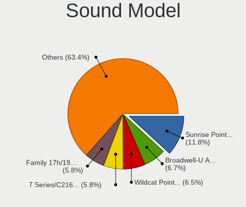

| Model                                                                      | Notebooks | Percent |
|----------------------------------------------------------------------------|-----------|---------|
| Intel Sunrise Point-LP HD Audio                                            | 55        | 11.83%  |
| Intel Broadwell-U Audio Controller                                         | 31        | 6.67%   |
| Intel Wildcat Point-LP High Definition Audio Controller                    | 30        | 6.45%   |
| Intel 7 Series/C216 Chipset Family High Definition Audio Controller        | 27        | 5.81%   |
| AMD Family 17h/19h/1ah HD Audio Controller                                 | 27        | 5.81%   |
| Intel 6 Series/C200 Series Chipset Family High Definition Audio Controller | 26        | 5.59%   |
| Intel 82801I (ICH9 Family) HD Audio Controller                             | 20        | 4.3%    |
| Intel NM10/ICH7 Family High Definition Audio Controller                    | 19        | 4.09%   |
| AMD Renoir Radeon High Definition Audio Controller                         | 17        | 3.66%   |
| Intel 5 Series/3400 Series Chipset High Definition Audio                   | 16        | 3.44%   |
| Intel Haswell-ULT HD Audio Controller                                      | 14        | 3.01%   |
| Intel 8 Series HD Audio Controller                                         | 14        | 3.01%   |
| Intel Tiger Lake-LP Smart Sound Technology Audio Controller                | 12        | 2.58%   |
| Intel Celeron/Pentium Silver Processor High Definition Audio               | 10        | 2.15%   |
| Intel Cannon Point-LP High Definition Audio Controller                     | 10        | 2.15%   |
| Intel Comet Lake PCH-LP cAVS                                               | 8         | 1.72%   |
| AMD Raven/Raven2/Fenghuang HDMI/DP Audio Controller                        | 8         | 1.72%   |
| AMD FCH Azalia Controller                                                  | 8         | 1.72%   |
| Intel Xeon E3-1200 v3/4th Gen Core Processor HD Audio Controller           | 7         | 1.51%   |
| Intel 8 Series/C220 Series Chipset High Definition Audio Controller        | 7         | 1.51%   |
| Intel Cannon Lake PCH cAVS                                                 | 6         | 1.29%   |
| AMD SBx00 Azalia (Intel HDA)                                               | 5         | 1.08%   |
| Nvidia High Definition Audio Controller                                    | 4         | 0.86%   |
| Intel Comet Lake PCH cAVS                                                  | 4         | 0.86%   |
| Intel 82801H (ICH8 Family) HD Audio Controller                             | 4         | 0.86%   |
| Intel 82801FB/FBM/FR/FW/FRW (ICH6 Family) AC'97 Audio Controller           | 4         | 0.86%   |
| AMD Kabini HDMI/DP Audio                                                   | 4         | 0.86%   |
| Nvidia TU107 GeForce GTX 1650 High Definition Audio Controller             | 3         | 0.65%   |
| Nvidia MCP79 High Definition Audio                                         | 3         | 0.65%   |
| Nvidia GT216 HDMI Audio Controller                                         | 3         | 0.65%   |
| Intel Celeron N3350/Pentium N4200/Atom E3900 Series Audio Cluster          | 3         | 0.65%   |
| Intel Alder Lake PCH-P High Definition Audio Controller                    | 3         | 0.65%   |
| Intel 82801DB/DBL/DBM (ICH4/ICH4-L/ICH4-M) AC'97 Audio Controller          | 3         | 0.65%   |
| Intel 82801CA/CAM AC'97 Audio Controller                                   | 3         | 0.65%   |
| AMD RS880 HDMI Audio [Radeon HD 4200 Series]                               | 3         | 0.65%   |
| AMD BeaverCreek HDMI Audio [Radeon HD 6500D and 6400G-6600G series]        | 3         | 0.65%   |
| Nvidia GA106 High Definition Audio Controller                              | 2         | 0.43%   |
| Intel US15W/US15X/US15L/UL11L SCH [Poulsbo] HD Audio Controller            | 2         | 0.43%   |
| Intel Ice Lake-LP Smart Sound Technology Audio Controller                  | 2         | 0.43%   |
| Intel CM238 HD Audio Controller                                            | 2         | 0.43%   |

Memory
------

Memory Vendor
-------------

Memory module vendors

| Vendor              | Notebooks | Percent |
|---------------------|-----------|---------|
| Samsung Electronics | 19        | 28.36%  |
| Unknown             | 15        | 22.39%  |
| SK hynix            | 10        | 14.93%  |
| Micron Technology   | 6         | 8.96%   |
| Crucial             | 4         | 5.97%   |
| Unknown             | 4         | 5.97%   |
| Kingston            | 3         | 4.48%   |
| Elpida              | 3         | 4.48%   |
| Smart               | 1         | 1.49%   |
| Ramaxel Technology  | 1         | 1.49%   |
| A-DATA Technology   | 1         | 1.49%   |

Memory Model
------------

Memory module models

| Model                                                   | Notebooks | Percent |
|---------------------------------------------------------|-----------|---------|
| Samsung RAM M471B5273DH0-CH9 4GB SODIMM DDR3 1334MT/s   | 5         | 6.67%   |
| Unknown                                                 | 4         | 5.33%   |
| Unknown RAM Module 4GB SODIMM DDR3 1333MT/s             | 3         | 4%      |
| Unknown RAM Module 1GB SODIMM DDR2                      | 2         | 2.67%   |
| Unknown RAM Module 1GB SODIMM DDR                       | 2         | 2.67%   |
| SK hynix RAM HMT351S6CFR8C-PB 4GB SODIMM DDR3 1600MT/s  | 2         | 2.67%   |
| Samsung RAM M471B5773DH0-CH9 2GB SODIMM DDR3 1334MT/s   | 2         | 2.67%   |
| Samsung RAM M471B5673FH0-CF8 2GB SODIMM DDR3 1067MT/s   | 2         | 2.67%   |
| Samsung RAM M471B5273DH0-CK0 8GB SODIMM DDR3 1600MT/s   | 2         | 2.67%   |
| Samsung RAM M471B5173BH0-CK0 4GB SODIMM DDR3 1600MT/s   | 2         | 2.67%   |
| Samsung RAM M471A1K43BB0-CPB 8GB SODIMM DDR4 2133MT/s   | 2         | 2.67%   |
| Micron RAM 16KTF1G64HZ-1G6E1 8GB SODIMM DDR3 1600MT/s   | 2         | 2.67%   |
| Crucial RAM CT8G3S1339M 8GB SODIMM DDR3 1333MT/s        | 2         | 2.67%   |
| Crucial RAM CT102464BF160B.M16 8GB SODIMM DDR3 1600MT/s | 2         | 2.67%   |
| Unknown RAM Module 512MB SODIMM SDRAM                   | 1         | 1.33%   |
| Unknown RAM Module 512MB SODIMM DDR                     | 1         | 1.33%   |
| Unknown RAM Module 2GB SODIMM DDR3 1333MT/s             | 1         | 1.33%   |
| Unknown RAM Module 2GB SODIMM DDR3 1067MT/s             | 1         | 1.33%   |
| Unknown RAM Module 2GB SODIMM DDR2 667MT/s              | 1         | 1.33%   |
| Unknown RAM Module 256MB SODIMM DRAM                    | 1         | 1.33%   |
| Unknown RAM Module 2048MB SODIMM DDR3 1333MT/s          | 1         | 1.33%   |
| Unknown RAM Module 2048MB SODIMM DDR2                   | 1         | 1.33%   |
| Unknown RAM Module 128MB SODIMM DRAM                    | 1         | 1.33%   |
| Unknown RAM Module 1024MB SODIMM DDR                    | 1         | 1.33%   |
| Smart RAM SH564568FH8NZPHSCG 2GB SODIMM DDR3 1066MT/s   | 1         | 1.33%   |
| SK hynix RAM HYMP125S64CP8-Y5 2GB SODIMM DDR2 667MT/s   | 1         | 1.33%   |
| SK hynix RAM HYMP125S64CP8-S6 2GB SODIMM DDR2 975MT/s   | 1         | 1.33%   |
| SK hynix RAM HMT451S6BFR8A-PB 4GB SODIMM DDR3 1600MT/s  | 1         | 1.33%   |
| SK hynix RAM HMT351S6EFR8A-PB 4GB SODIMM DDR3 1600MT/s  | 1         | 1.33%   |
| SK hynix RAM HMT325S6BFR8C-H9 2GB SODIMM DDR3 1333MT/s  | 1         | 1.33%   |
| SK hynix RAM HMAB2GS6AMR6N-XN 16GB SODIMM DDR4 3200MT/s | 1         | 1.33%   |
| SK hynix RAM H9CCNNNBJTMLAR 4GB SODIMM LPDDR3 1867MT/s  | 1         | 1.33%   |
| SK hynix RAM H9CCNNNBJTMLAR 4GB Chip LPDDR3 1867MT/s    | 1         | 1.33%   |
| SK hynix RAM 484D543332355336 2GB SODIMM DDR3 1333MT/s  | 1         | 1.33%   |
| Samsung RAM M471B5673EH1-CF8 2GB SODIMM DDR3 1067MT/s   | 1         | 1.33%   |
| Samsung RAM M471B5173QH0-YK0 4GB SODIMM DDR3 1600MT/s   | 1         | 1.33%   |
| Samsung RAM M471B1G73DB0-YK0 8GB SODIMM DDR3 1600MT/s   | 1         | 1.33%   |
| Samsung RAM M471A5244CB0-CWE 4GB SODIMM DDR4 3200MT/s   | 1         | 1.33%   |
| Samsung RAM M471A2K43CB1-CRC 16GB SODIMM DDR4 2400MT/s  | 1         | 1.33%   |
| Samsung RAM M471A2G44AM0-CWE 16GB SODIMM DDR4 3200MT/s  | 1         | 1.33%   |

Memory Kind
-----------

Memory module kinds

| Kind   | Notebooks | Percent |
|--------|-----------|---------|
| DDR3   | 31        | 53.45%  |
| DDR4   | 10        | 17.24%  |
| DDR2   | 9         | 15.52%  |
| DDR    | 3         | 5.17%   |
| SDRAM  | 2         | 3.45%   |
| DRAM   | 2         | 3.45%   |
| LPDDR3 | 1         | 1.72%   |

Memory Form Factor
------------------

Physical design of the memory module

| Name   | Notebooks | Percent |
|--------|-----------|---------|
| SODIMM | 58        | 98.31%  |
| Chip   | 1         | 1.69%   |

Memory Size
-----------

Memory module size

| Size  | Notebooks | Percent |
|-------|-----------|---------|
| 4096  | 20        | 28.99%  |
| 2048  | 17        | 24.64%  |
| 8192  | 15        | 21.74%  |
| 1024  | 8         | 11.59%  |
| 16384 | 5         | 7.25%   |
| 512   | 2         | 2.9%    |
| 256   | 1         | 1.45%   |
| 128   | 1         | 1.45%   |

Memory Speed
------------

Memory module speed

| Speed   | Notebooks | Percent |
|---------|-----------|---------|
| 1600    | 16        | 25%     |
| Unknown | 10        | 15.63%  |
| 1333    | 8         | 12.5%   |
| 1334    | 7         | 10.94%  |
| 3200    | 4         | 6.25%   |
| 1067    | 4         | 6.25%   |
| 2667    | 3         | 4.69%   |
| 2133    | 2         | 3.13%   |
| 667     | 2         | 3.13%   |
| 2400    | 1         | 1.56%   |
| 1867    | 1         | 1.56%   |
| 1066    | 1         | 1.56%   |
| 975     | 1         | 1.56%   |
| 800     | 1         | 1.56%   |
| 533     | 1         | 1.56%   |
| 400     | 1         | 1.56%   |
| 266     | 1         | 1.56%   |

Printers & scanners
-------------------

Printer Vendor
--------------

Printer device vendors

Zero info for selected period =(

Printer Model
-------------

Printer device models

Zero info for selected period =(

Scanner Vendor
--------------

Scanner device vendors

Zero info for selected period =(

Scanner Model
-------------

Scanner device models

Zero info for selected period =(

Camera
------

Camera Vendor
-------------

Camera device vendors

| Vendor                                 | Notebooks | Percent |
|----------------------------------------|-----------|---------|
| Chicony Electronics                    | 75        | 32.19%  |
| Bison Electronics                      | 35        | 15.02%  |
| IMC Networks                           | 24        | 10.3%   |
| Realtek Semiconductor                  | 15        | 6.44%   |
| Lite-On Technology                     | 14        | 6.01%   |
| Microdia                               | 10        | 4.29%   |
| Sunplus Innovation Technology          | 7         | 3%      |
| Lenovo                                 | 7         | 3%      |
| Silicon Motion                         | 6         | 2.58%   |
| Quanta                                 | 5         | 2.15%   |
| Cheng Uei Precision Industry (Foxlink) | 5         | 2.15%   |
| Syntek                                 | 3         | 1.29%   |
| Suyin                                  | 3         | 1.29%   |
| Ricoh                                  | 3         | 1.29%   |
| Apple                                  | 3         | 1.29%   |
| Alcor Micro                            | 3         | 1.29%   |
| Tripath Technology                     | 2         | 0.86%   |
| Luxvisions Innotech Limited            | 2         | 0.86%   |
| ALi                                    | 2         | 0.86%   |
| Z-Star Microelectronics                | 1         | 0.43%   |
| SunplusIT                              | 1         | 0.43%   |
| Shenzhen Kingcome Optoelectronic       | 1         | 0.43%   |
| Logitech                               | 1         | 0.43%   |
| Jiangxi Shinetech Optical              | 1         | 0.43%   |
| Genesys Logic                          | 1         | 0.43%   |
| Framework                              | 1         | 0.43%   |
| Foxconn / Hon Hai                      | 1         | 0.43%   |
| Denron                                 | 1         | 0.43%   |

Camera Model
------------

Camera device models

| Model                                                                      | Notebooks | Percent |
|----------------------------------------------------------------------------|-----------|---------|
| Chicony Integrated Camera                                                  | 35        | 14.71%  |
| Bison Integrated Camera                                                    | 15        | 6.3%    |
| Lite-On Integrated Camera                                                  | 13        | 5.46%   |
| IMC Networks Integrated Camera                                             | 11        | 4.62%   |
| Chicony Lenovo Integrated Camera (0.3MP)                                   | 6         | 2.52%   |
| Chicony Integrated Camera [ThinkPad]                                       | 6         | 2.52%   |
| Chicony Integrated IR Camera                                               | 5         | 2.1%    |
| Bison SunplusIT Integrated Camera                                          | 5         | 2.1%    |
| Realtek Integrated_Webcam_HD                                               | 4         | 1.68%   |
| Microdia Integrated_Webcam_HD                                              | 4         | 1.68%   |
| Lenovo Integrated Webcam                                                   | 4         | 1.68%   |
| Lenovo Integrated Webcam [R5U877]                                          | 3         | 1.26%   |
| Chicony Integrated Camera (1280x720@30)                                    | 3         | 1.26%   |
| Bison USB HD Webcam                                                        | 3         | 1.26%   |
| Bison Lenovo EasyCamera                                                    | 3         | 1.26%   |
| Tripath USB Camera                                                         | 2         | 0.84%   |
| Syntek Lenovo EasyCamera                                                   | 2         | 0.84%   |
| Silicon Motion Realtek USB 2.0 PC Camera                                   | 2         | 0.84%   |
| Silicon Motion Lenovo EasyCamera                                           | 2         | 0.84%   |
| Realtek USB 2.0 Webcam                                                     | 2         | 0.84%   |
| Realtek Laptop Camera                                                      | 2         | 0.84%   |
| Realtek Integrated Webcam HD                                               | 2         | 0.84%   |
| Microdia Integrated Webcam                                                 | 2         | 0.84%   |
| IMC Networks USB2.0 VGA UVC WebCam                                         | 2         | 0.84%   |
| IMC Networks Realtek PC Camera                                             | 2         | 0.84%   |
| IMC Networks Realtek DMFT RGB                                              | 2         | 0.84%   |
| IMC Networks EasyCamera                                                    | 2         | 0.84%   |
| Chicony VGA Webcam                                                         | 2         | 0.84%   |
| Chicony ThinkPad T490 Webcam                                               | 2         | 0.84%   |
| Chicony thinkpad t430s camera                                              | 2         | 0.84%   |
| Chicony Sonix ST50220 USB Video Camera                                     | 2         | 0.84%   |
| Chicony FJ Camera                                                          | 2         | 0.84%   |
| Cheng Uei Precision Industry (Foxlink) HP Wide Vision HD Integrated Webcam | 2         | 0.84%   |
| Bison ThinkPad P50 Integrated Camera                                       | 2         | 0.84%   |
| Bison ThinkPad Integrated Camera                                           | 2         | 0.84%   |
| Bison Lenovo Integrated Webcam                                             | 2         | 0.84%   |
| Bison EasyCamera                                                           | 2         | 0.84%   |
| Apple FaceTime Camera                                                      | 2         | 0.84%   |
| Z-Star Visual Communication Camera VGP-VCC1                                | 1         | 0.42%   |
| Syntek EasyCamera                                                          | 1         | 0.42%   |

Security
--------

Fingerprint Vendor
------------------

Fingerprint sensor vendors

| Vendor                     | Notebooks | Percent |
|----------------------------|-----------|---------|
| Validity Sensors           | 31        | 35.63%  |
| Synaptics                  | 17        | 19.54%  |
| Upek                       | 11        | 12.64%  |
| AuthenTec                  | 11        | 12.64%  |
| STMicroelectronics         | 9         | 10.34%  |
| Shenzhen Goodix Technology | 4         | 4.6%    |
| Elan Microelectronics      | 2         | 2.3%    |
| Samsung Electronics        | 1         | 1.15%   |
| LighTuning Technology      | 1         | 1.15%   |

Fingerprint Model
-----------------

Fingerprint sensor models

| Model                                                    | Notebooks | Percent |
|----------------------------------------------------------|-----------|---------|
| Validity Sensors VFS 5011 fingerprint sensor             | 17        | 19.54%  |
| Upek Biometric Touchchip/Touchstrip Fingerprint Sensor   | 11        | 12.64%  |
| STMicroelectronics Fingerprint Reader                    | 9         | 10.34%  |
| Validity Sensors Synaptics WBDI                          | 7         | 8.05%   |
| Synaptics Prometheus MIS Touch Fingerprint Reader        | 6         | 6.9%    |
| AuthenTec AES2810                                        | 6         | 6.9%    |
| Validity Sensors VFS7500 Touch Fingerprint Sensor        | 4         | 4.6%    |
| Synaptics Metallica MIS Touch Fingerprint Reader         | 4         | 4.6%    |
| AuthenTec AES2501 Fingerprint Sensor                     | 4         | 4.6%    |
| Synaptics WBDI                                           | 3         | 3.45%   |
| Shenzhen Goodix Fingerprint Reader                       | 3         | 3.45%   |
| Validity Sensors VFS5011 Fingerprint Reader              | 2         | 2.3%    |
| Synaptics FS7604 Touch Fingerprint Sensor with PurePrint | 2         | 2.3%    |
| Elan Fingerprint Sensor                                  | 2         | 2.3%    |
| Validity Sensors VFS451 Fingerprint Reader               | 1         | 1.15%   |
| Synaptics UWP WBDI Device                                | 1         | 1.15%   |
| Synaptics Metallica MOH Touch Fingerprint Reader         | 1         | 1.15%   |
| Shenzhen Goodix Fingerprint Reader SGX                   | 1         | 1.15%   |
| Samsung CanvasBio Fingerprint Reader                     | 1         | 1.15%   |
| LighTuning ES603 Swipe Fingerprint Sensor                | 1         | 1.15%   |
| AuthenTec AES2660                                        | 1         | 1.15%   |

Chipcard Vendor
---------------

Chipcard module vendors

Zero info for selected period =(

Chipcard Model
--------------

Chipcard module models

Zero info for selected period =(

Unsupported
-----------

Unsupported Devices
-------------------

Total unsupported devices on board

| Total | Notebooks | Percent |
|-------|-----------|---------|
| 1     | 192       | 52.03%  |
| 2     | 97        | 26.29%  |
| 0     | 35        | 9.49%   |
| 3     | 26        | 7.05%   |
| 4     | 10        | 2.71%   |
| 5     | 5         | 1.36%   |
| 6     | 2         | 0.54%   |
| 8     | 1         | 0.27%   |
| 7     | 1         | 0.27%   |

Unsupported Device Types
------------------------

Types of unsupported devices

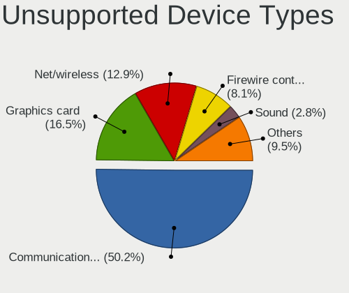

| Type                     | Notebooks | Percent |
|--------------------------|-----------|---------|
| Communication controller | 253       | 50.2%   |
| Graphics card            | 83        | 16.47%  |
| Net/wireless             | 65        | 12.9%   |
| Firewire controller      | 41        | 8.13%   |
| Sound                    | 14        | 2.78%   |
| Network                  | 12        | 2.38%   |
| Modem                    | 10        | 1.98%   |
| Storage/ata              | 9         | 1.79%   |
| Storage                  | 5         | 0.99%   |
| Net/ethernet             | 5         | 0.99%   |
| Card reader              | 3         | 0.6%    |
| Storage/ide              | 2         | 0.4%    |
| Storage/nvme             | 1         | 0.2%    |
| Bluetooth                | 1         | 0.2%    |

