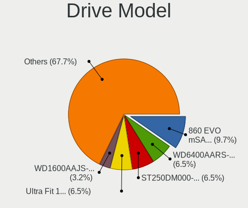
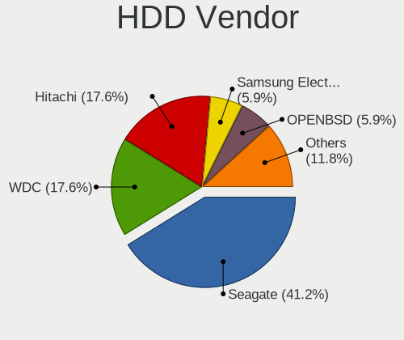
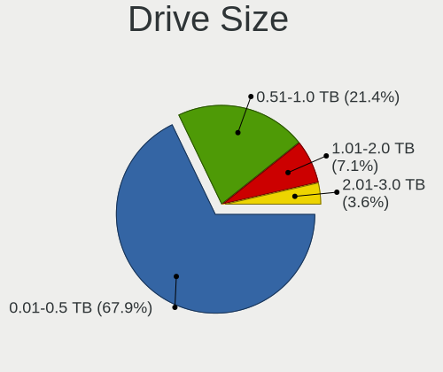

OpenBSD 6.7 - Tested Hardware & Statistics (Desktops)
-----------------------------------------------------

A project to collect tested hardware configurations for OpenBSD 6.7.

Anyone can contribute to this report by the [hw-probe](https://github.com/linuxhw/hw-probe/blob/master/INSTALL.BSD.md) tool:

    hw-probe -all -upload

Please contribute! Especially if your hardware is rare.

Contents
--------

* [ Test Cases ](#test-cases)

* [ System ](#system)
  - [ Arch                     ](#arch)
  - [ DE                       ](#de)
  - [ Display Server           ](#display-server)
  - [ Display Manager          ](#display-manager)
  - [ OS Lang                  ](#os-lang)
  - [ Boot Mode                ](#boot-mode)
  - [ Filesystem               ](#filesystem)
  - [ Part. scheme             ](#part-scheme)

* [ Board ](#board)
  - [ Vendor                   ](#vendor)
  - [ Model                    ](#model)
  - [ Model Family             ](#model-family)
  - [ MFG Year                 ](#mfg-year)
  - [ Form Factor              ](#form-factor)
  - [ Coreboot                 ](#coreboot)
  - [ RAM Size                 ](#ram-size)
  - [ RAM Used                 ](#ram-used)
  - [ Total Drives             ](#total-drives)
  - [ Has CD-ROM               ](#has-cd-rom)
  - [ Has Ethernet             ](#has-ethernet)
  - [ Has WiFi                 ](#has-wifi)
  - [ Has Bluetooth            ](#has-bluetooth)

* [ Location ](#location)
  - [ Country                  ](#country)
  - [ City                     ](#city)

* [ Drives ](#drives)
  - [ Drive Vendor             ](#drive-vendor)
  - [ Drive Model              ](#drive-model)
  - [ HDD Vendor               ](#hdd-vendor)
  - [ SSD Vendor               ](#ssd-vendor)
  - [ Drive Kind               ](#drive-kind)
  - [ Drive Connector          ](#drive-connector)
  - [ Drive Size               ](#drive-size)
  - [ Space Total              ](#space-total)
  - [ Space Used               ](#space-used)
  - [ Malfunc. Drives          ](#malfunc-drives)
  - [ Malfunc. Drive Vendor    ](#malfunc-drive-vendor)
  - [ Malfunc. HDD Vendor      ](#malfunc-hdd-vendor)
  - [ Malfunc. Drive Kind      ](#malfunc-drive-kind)
  - [ Failed Drives            ](#failed-drives)
  - [ Failed Drive Vendor      ](#failed-drive-vendor)
  - [ Drive Status             ](#drive-status)

* [ Storage controller ](#storage-controller)
  - [ Storage Vendor           ](#storage-vendor)
  - [ Storage Model            ](#storage-model)
  - [ Storage Kind             ](#storage-kind)

* [ Processor ](#processor)
  - [ CPU Vendor               ](#cpu-vendor)
  - [ CPU Model                ](#cpu-model)
  - [ CPU Model Family         ](#cpu-model-family)
  - [ CPU Cores                ](#cpu-cores)
  - [ CPU Sockets              ](#cpu-sockets)
  - [ CPU Threads              ](#cpu-threads)
  - [ CPU Microarch            ](#cpu-microarch)

* [ Graphics ](#graphics)
  - [ GPU Vendor               ](#gpu-vendor)
  - [ GPU Model                ](#gpu-model)
  - [ GPU Combo                ](#gpu-combo)
  - [ GPU Driver               ](#gpu-driver)
  - [ GPU Memory               ](#gpu-memory)

* [ Monitor ](#monitor)
  - [ Monitor Vendor           ](#monitor-vendor)
  - [ Monitor Model            ](#monitor-model)
  - [ Monitor Resolution       ](#monitor-resolution)
  - [ Monitor Diagonal         ](#monitor-diagonal)
  - [ Monitor Width            ](#monitor-width)
  - [ Aspect Ratio             ](#aspect-ratio)
  - [ Monitor Area             ](#monitor-area)
  - [ Pixel Density            ](#pixel-density)
  - [ Multiple Monitors        ](#multiple-monitors)

* [ Network ](#network)
  - [ Net Controller Vendor    ](#net-controller-vendor)
  - [ Net Controller Model     ](#net-controller-model)
  - [ Wireless Vendor          ](#wireless-vendor)
  - [ Wireless Model           ](#wireless-model)
  - [ Ethernet Vendor          ](#ethernet-vendor)
  - [ Ethernet Model           ](#ethernet-model)
  - [ Net Controller Kind      ](#net-controller-kind)
  - [ Used Controller          ](#used-controller)
  - [ NICs                     ](#nics)
  - [ IPv6                     ](#ipv6)

* [ Bluetooth ](#bluetooth)
  - [ Bluetooth Vendor         ](#bluetooth-vendor)
  - [ Bluetooth Model          ](#bluetooth-model)

* [ Sound ](#sound)
  - [ Sound Vendor             ](#sound-vendor)
  - [ Sound Model              ](#sound-model)

* [ Memory ](#memory)
  - [ Memory Vendor            ](#memory-vendor)
  - [ Memory Model             ](#memory-model)
  - [ Memory Kind              ](#memory-kind)
  - [ Memory Form Factor       ](#memory-form-factor)
  - [ Memory Size              ](#memory-size)
  - [ Memory Speed             ](#memory-speed)

* [ Printers & scanners ](#printers--scanners)
  - [ Printer Vendor           ](#printer-vendor)
  - [ Printer Model            ](#printer-model)
  - [ Scanner Vendor           ](#scanner-vendor)
  - [ Scanner Model            ](#scanner-model)

* [ Camera ](#camera)
  - [ Camera Vendor            ](#camera-vendor)
  - [ Camera Model             ](#camera-model)

* [ Security ](#security)
  - [ Fingerprint Vendor       ](#fingerprint-vendor)
  - [ Fingerprint Model        ](#fingerprint-model)
  - [ Chipcard Vendor          ](#chipcard-vendor)
  - [ Chipcard Model           ](#chipcard-model)

* [ Unsupported ](#unsupported)
  - [ Unsupported Devices      ](#unsupported-devices)
  - [ Unsupported Device Types ](#unsupported-device-types)

Test Cases
----------

Total: 29

| Vendor     | Model                       | Probe                                                     | Date         |
|------------|-----------------------------|-----------------------------------------------------------|--------------|
| Protectli  | FW6                         | [1454991c98](https://bsd-hardware.info/?probe=1454991c98) | Aug 27, 2020 |
| PC Engines | apu4                        | [8f4ed98a45](https://bsd-hardware.info/?probe=8f4ed98a45) | Aug 21, 2020 |
| Gigabyte   | X58A-UD5                    | [63a429ad0e](https://bsd-hardware.info/?probe=63a429ad0e) | Aug 16, 2020 |
| Dell       | OptiPlex 745                | [6de04c2c9c](https://bsd-hardware.info/?probe=6de04c2c9c) | Aug 14, 2020 |
| PC Engines | apu4                        | [f0f8a22656](https://bsd-hardware.info/?probe=f0f8a22656) | Aug 05, 2020 |
| Intel      | ChiefRiver                  | [022d2761b9](https://bsd-hardware.info/?probe=022d2761b9) | Aug 03, 2020 |
| PC Engines | APU3                        | [1eaf8a1484](https://bsd-hardware.info/?probe=1eaf8a1484) | Aug 03, 2020 |
| PC Engines | APU3                        | [4980462667](https://bsd-hardware.info/?probe=4980462667) | Aug 03, 2020 |
| PC Engines | APU3                        | [975e23e09d](https://bsd-hardware.info/?probe=975e23e09d) | Aug 03, 2020 |
| Shuttle    | DS437                       | [aa350b6b92](https://bsd-hardware.info/?probe=aa350b6b92) | Aug 03, 2020 |
| PC Engines | APU2                        | [fe5c2f4838](https://bsd-hardware.info/?probe=fe5c2f4838) | Aug 03, 2020 |
| Lenovo     | ThinkCentre M92p 3212AD2    | [ca76cc5467](https://bsd-hardware.info/?probe=ca76cc5467) | Jul 30, 2020 |
| ASRock     | E350M1                      | [08eec78cdf](https://bsd-hardware.info/?probe=08eec78cdf) | Jul 25, 2020 |
| Pegatron   | 2A73                        | [05dea28605](https://bsd-hardware.info/?probe=05dea28605) | Jul 21, 2020 |
| PC Engines | apu4                        | [52c611855b](https://bsd-hardware.info/?probe=52c611855b) | Jul 12, 2020 |
| ASUSTek    | All Series                  | [e4f1a19012](https://bsd-hardware.info/?probe=e4f1a19012) | Jun 05, 2020 |
| Unknown    | Unknown                     | [4e3b87cc6c](https://bsd-hardware.info/?probe=4e3b87cc6c) | Jun 01, 2020 |
| Sony UK    | Raspberry Pi 4 Model B      | [483af3998c](https://bsd-hardware.info/?probe=483af3998c) | May 28, 2020 |
| Unknown    | Unknown                     | [80a1eda96f](https://bsd-hardware.info/?probe=80a1eda96f) | May 28, 2020 |
| Dell       | PowerEdge T320              | [eec750b5c5](https://bsd-hardware.info/?probe=eec750b5c5) | May 28, 2020 |
| Gigabyte   | M68MT-S2P                   | [08534174df](https://bsd-hardware.info/?probe=08534174df) | May 27, 2020 |
| Unknown    | TI AM335x BeagleBone Bla... | [8e0f831fd8](https://bsd-hardware.info/?probe=8e0f831fd8) | May 27, 2020 |
| Gigabyte   | M68MT-S2P                   | [03ea0992c4](https://bsd-hardware.info/?probe=03ea0992c4) | May 27, 2020 |
| IBM        | Board                       | [1bcc2b8e0b](https://bsd-hardware.info/?probe=1bcc2b8e0b) | May 27, 2020 |
| Unknown    | TI AM335x BeagleBone Bla... | [74b9526162](https://bsd-hardware.info/?probe=74b9526162) | May 27, 2020 |
| Gigabyte   | Unknown                     | [576771182b](https://bsd-hardware.info/?probe=576771182b) | May 25, 2020 |
| Gigabyte   | Unknown                     | [05e8154b2c](https://bsd-hardware.info/?probe=05e8154b2c) | May 25, 2020 |
| ASUSTek    | P4P800-VM                   | [8b9481baf2](https://bsd-hardware.info/?probe=8b9481baf2) | May 25, 2020 |
| ASUSTek    | P4P800-VM                   | [33c4579f99](https://bsd-hardware.info/?probe=33c4579f99) | May 25, 2020 |

System
------

Arch
----

OS architecture (x86_64, i586, etc.)

| Name   | Desktops | Percent |
|--------|----------|---------|
| amd64  | 20       | 76.92%  |
| i386   | 3        | 11.54%  |
| octeon | 1        | 3.85%   |
| armv7  | 1        | 3.85%   |
| arm64  | 1        | 3.85%   |

DE
--

Desktop Environment

| Name    | Desktops | Percent |
|---------|----------|---------|
| Console | 16       | 61.54%  |
| fvwm    | 10       | 38.46%  |

Display Server
--------------

X11 or Wayland

| Name    | Desktops | Percent |
|---------|----------|---------|
| Console | 17       | 65.38%  |
| X11     | 9        | 34.62%  |

Display Manager
---------------

SDDM, LightDM, etc.

| Name    | Desktops | Percent |
|---------|----------|---------|
| Console | 25       | 96.15%  |
| SLiM    | 1        | 3.85%   |

OS Lang
-------

Language

| Lang    | Desktops | Percent |
|---------|----------|---------|
| Unknown | 24       | 92.31%  |
| ru_RU   | 1        | 3.85%   |
| en_US   | 1        | 3.85%   |

Boot Mode
---------

EFI or BIOS

| Mode | Desktops | Percent |
|------|----------|---------|
| BIOS | 22       | 84.62%  |
| EFI  | 4        | 15.38%  |

Filesystem
----------

Type of filesystem

| Type | Desktops | Percent |
|------|----------|---------|
| Ffs  | 26       | 100%    |

Part. scheme
------------

Scheme of partitioning

| Type | Desktops | Percent |
|------|----------|---------|
| MBR  | 23       | 88.46%  |
| GPT  | 3        | 11.54%  |

Board
-----

Vendor
------

Motherboard manufacturer

| Name                | Desktops | Percent |
|---------------------|----------|---------|
| PC Engines          | 7        | 26.92%  |
| Gigabyte Technology | 4        | 15.38%  |
| Unknown             | 3        | 11.54%  |
| Dell                | 2        | 7.69%   |
| ASUSTek Computer    | 2        | 7.69%   |
| Sony UK             | 1        | 3.85%   |
| Shuttle             | 1        | 3.85%   |
| Protectli           | 1        | 3.85%   |
| Pegatron            | 1        | 3.85%   |
| Lenovo              | 1        | 3.85%   |
| Intel               | 1        | 3.85%   |
| IBM                 | 1        | 3.85%   |
| ASRock              | 1        | 3.85%   |

Model
-----

Motherboard model

| Name                              | Desktops | Percent |
|-----------------------------------|----------|---------|
| Unknown                           | 4        | 15.38%  |
| PC Engines apu4                   | 3        | 11.54%  |
| PC Engines APU3                   | 3        | 11.54%  |
| Gigabyte M68MT-S2P                | 2        | 7.69%   |
| Sony UK Raspberry Pi 4 Model B    | 1        | 3.85%   |
| Shuttle DS437                     | 1        | 3.85%   |
| Protectli FW6                     | 1        | 3.85%   |
| Pegatron Compaq dx2400 Microtower | 1        | 3.85%   |
| PC Engines APU2                   | 1        | 3.85%   |
| Lenovo ThinkCentre M92p 3212AD2   | 1        | 3.85%   |
| Intel ChiefRiver                  | 1        | 3.85%   |
| IBM 81832BG                       | 1        | 3.85%   |
| Gigabyte X58A-UD5                 | 1        | 3.85%   |
| Dell PowerEdge T320               | 1        | 3.85%   |
| Dell OptiPlex 745                 | 1        | 3.85%   |
| ASUS P4P800-VM                    | 1        | 3.85%   |
| ASUS All Series                   | 1        | 3.85%   |
| ASRock E350M1                     | 1        | 3.85%   |

Model Family
------------

Motherboard model prefix

| Name               | Desktops | Percent |
|--------------------|----------|---------|
| Unknown            | 4        | 15.38%  |
| PC Engines apu4    | 3        | 11.54%  |
| PC Engines APU3    | 3        | 11.54%  |
| Gigabyte M68MT-S2P | 2        | 7.69%   |
| Sony UK Raspberry  | 1        | 3.85%   |
| Shuttle DS437      | 1        | 3.85%   |
| Protectli FW6      | 1        | 3.85%   |
| Pegatron Compaq    | 1        | 3.85%   |
| PC Engines APU2    | 1        | 3.85%   |
| Lenovo ThinkCentre | 1        | 3.85%   |
| Intel ChiefRiver   | 1        | 3.85%   |
| IBM 81832BG        | 1        | 3.85%   |
| Gigabyte X58A-UD5  | 1        | 3.85%   |
| Dell PowerEdge     | 1        | 3.85%   |
| Dell OptiPlex      | 1        | 3.85%   |
| ASUS P4P800-VM     | 1        | 3.85%   |
| ASUS All           | 1        | 3.85%   |
| ASRock E350M1      | 1        | 3.85%   |

MFG Year
--------

Motherboard manufacture year

| Year    | Desktops | Percent |
|---------|----------|---------|
| 2018    | 5        | 19.23%  |
| 2017    | 3        | 11.54%  |
| 2011    | 3        | 11.54%  |
| Unknown | 3        | 11.54%  |
| 2012    | 2        | 7.69%   |
| 2010    | 2        | 7.69%   |
| 2020    | 1        | 3.85%   |
| 2016    | 1        | 3.85%   |
| 2015    | 1        | 3.85%   |
| 2014    | 1        | 3.85%   |
| 2013    | 1        | 3.85%   |
| 2009    | 1        | 3.85%   |
| 2005    | 1        | 3.85%   |
| 2004    | 1        | 3.85%   |

Form Factor
-----------

Physical design of the computer

| Name    | Desktops | Percent |
|---------|----------|---------|
| Desktop | 26       | 100%    |

Coreboot
--------

Have coreboot on board

| Used | Desktops | Percent |
|------|----------|---------|
| No   | 18       | 69.23%  |
| Yes  | 8        | 30.77%  |

RAM Size
--------

Total RAM memory

| Size in GB | Desktops | Percent |
|------------|----------|---------|
| 4.01-8.0   | 11       | 42.31%  |
| 2.01-3.0   | 5        | 19.23%  |
| 32.01-64.0 | 2        | 7.69%   |
| 16.01-24.0 | 2        | 7.69%   |
| 8.01-16.0  | 2        | 7.69%   |
| 0.01-0.5   | 2        | 7.69%   |
| 3.01-4.0   | 1        | 3.85%   |
| 24.01-32.0 | 1        | 3.85%   |

RAM Used
--------

Used RAM memory

| Used GB  | Desktops | Percent |
|----------|----------|---------|
| 0.01-0.5 | 21       | 80.77%  |
| 0.51-1.0 | 2        | 7.69%   |
| 0        | 2        | 7.69%   |
| 1.01-2.0 | 1        | 3.85%   |

Total Drives
------------

Number of drives on board

| Drives | Desktops | Percent |
|--------|----------|---------|
| 1      | 11       | 42.31%  |
| 2      | 10       | 38.46%  |
| 4      | 3        | 11.54%  |
| 3      | 1        | 3.85%   |
| 0      | 1        | 3.85%   |

Has CD-ROM
----------

Has CD-ROM on board

| Presented | Desktops | Percent |
|-----------|----------|---------|
| No        | 26       | 100%    |

Has Ethernet
------------

Has Ethernet on board

| Presented | Desktops | Percent |
|-----------|----------|---------|
| Yes       | 21       | 80.77%  |
| No        | 5        | 19.23%  |

Has WiFi
--------

Has WiFi module

| Presented | Desktops | Percent |
|-----------|----------|---------|
| No        | 22       | 84.62%  |
| Yes       | 4        | 15.38%  |

Has Bluetooth
-------------

Has Bluetooth module

| Presented | Desktops | Percent |
|-----------|----------|---------|
| No        | 26       | 100%    |

Location
--------

Country
-------

Geographic location (country)

| Country     | Desktops | Percent |
|-------------|----------|---------|
| Russia      | 8        | 30.77%  |
| Germany     | 8        | 30.77%  |
| USA         | 4        | 15.38%  |
| UK          | 2        | 7.69%   |
| Switzerland | 2        | 7.69%   |
| Sweden      | 1        | 3.85%   |
| Finland     | 1        | 3.85%   |

City
----

Geographic location (city)

| City            | Desktops | Percent |
|-----------------|----------|---------|
| Berlin          | 4        | 15.38%  |
| St Petersburg   | 3        | 11.54%  |
| Zurich          | 2        | 7.69%   |
| Wittersham      | 2        | 7.69%   |
| Orsk            | 2        | 7.69%   |
| Moscow          | 2        | 7.69%   |
| Gummersbach     | 2        | 7.69%   |
| Sundbyberg      | 1        | 3.85%   |
| Ryazan          | 1        | 3.85%   |
| Port Byron      | 1        | 3.85%   |
| Kouvola         | 1        | 3.85%   |
| Harrisburg      | 1        | 3.85%   |
| Fort Lauderdale | 1        | 3.85%   |
| Essen           | 1        | 3.85%   |
| Braunschweig    | 1        | 3.85%   |
| Ames            | 1        | 3.85%   |

Drives
------

Drive Vendor
------------

Hard drive vendors

| Vendor              | Desktops | Drives | Percent |
|---------------------|----------|--------|---------|
| Seagate             | 7        | 10     | 24.14%  |
| Samsung Electronics | 5        | 6      | 17.24%  |
| WDC                 | 3        | 3      | 10.34%  |
| SanDisk             | 3        | 4      | 10.34%  |
| Hitachi             | 3        | 3      | 10.34%  |
| Phison              | 2        | 2      | 6.9%    |
| Kingston            | 2        | 2      | 6.9%    |
| OPENBSD             | 1        | 1      | 3.45%   |
| LSI                 | 1        | 1      | 3.45%   |
| Crucial             | 1        | 1      | 3.45%   |
| China               | 1        | 1      | 3.45%   |

Drive Model
-----------

Hard drive models

| Model                           | Desktops | Percent |
|---------------------------------|----------|---------|
| Samsung SSD 860 EVO mSATA 500GB | 3        | 9.68%   |
| WDC WD6400AARS-00Y5B1 640GB     | 2        | 6.45%   |
| Seagate ST250DM000-1BD141 250GB | 2        | 6.45%   |
| SanDisk Ultra Fit 128GB         | 2        | 6.45%   |
| WDC WD1600AAJS-60B4A0 160GB     | 1        | 3.23%   |
| Seagate ST500DM009-2DM14C 500GB | 1        | 3.23%   |
| Seagate ST3320418AS 320GB       | 1        | 3.23%   |
| Seagate ST3250318AS 250GB       | 1        | 3.23%   |
| Seagate ST3000DM001-1CH166 3TB  | 1        | 3.23%   |
| Seagate ST2000VN000-1HJ164 2TB  | 1        | 3.23%   |
| Seagate ST2000NE0025-2FL101 2TB | 1        | 3.23%   |
| SanDisk Cruzer Fit 32GB         | 1        | 3.23%   |
| Samsung SSD 850 EVO mSATA 250GB | 1        | 3.23%   |
| Samsung SSD 840 EVO 120GB       | 1        | 3.23%   |
| Samsung Flash Drive FIT 32GB    | 1        | 3.23%   |
| Phison SATA SSD 64GB            | 1        | 3.23%   |
| Phison SATA SSD 16GB            | 1        | 3.23%   |
| OPENBSD SR RAID 1 1TB           | 1        | 3.23%   |
| LSI Logical Volume 898GB        | 1        | 3.23%   |
| Kingston SUV500MS240G 240GB     | 1        | 3.23%   |
| Kingston DataTraveler G3 8GB    | 1        | 3.23%   |
| Hitachi HUA722020ALA331 2TB     | 1        | 3.23%   |
| Hitachi HTE723225A7A364 250GB   | 1        | 3.23%   |
| Hitachi HDS721010CLA332 1TB     | 1        | 3.23%   |
| Crucial CT1000MX500SSD1 1TB     | 1        | 3.23%   |
| China CF 2GB                    | 1        | 3.23%   |

HDD Vendor
----------

Hard disk drive vendors

| Vendor              | Desktops | Drives | Percent |
|---------------------|----------|--------|---------|
| Seagate             | 7        | 10     | 41.18%  |
| WDC                 | 3        | 3      | 17.65%  |
| Hitachi             | 3        | 3      | 17.65%  |
| Samsung Electronics | 1        | 1      | 5.88%   |
| OPENBSD             | 1        | 1      | 5.88%   |
| LSI                 | 1        | 1      | 5.88%   |
| China               | 1        | 1      | 5.88%   |

SSD Vendor
----------

Solid state drive vendors

| Vendor              | Desktops | Drives | Percent |
|---------------------|----------|--------|---------|
| Samsung Electronics | 4        | 5      | 33.33%  |
| SanDisk             | 3        | 4      | 25%     |
| Phison              | 2        | 2      | 16.67%  |
| Kingston            | 2        | 2      | 16.67%  |
| Crucial             | 1        | 1      | 8.33%   |

Drive Kind
----------

HDD or SSD

| Kind | Desktops | Drives | Percent |
|------|----------|--------|---------|
| HDD  | 13       | 20     | 52%     |
| SSD  | 12       | 14     | 48%     |

Drive Connector
---------------

SATA, SAS, NVMe, etc.

| Type | Desktops | Drives | Percent |
|------|----------|--------|---------|
| SATA | 23       | 34     | 100%    |

Drive Size
----------

Size of hard drive

| Size in TB | Desktops | Drives | Percent |
|------------|----------|--------|---------|
| 0.01-0.5   | 19       | 22     | 67.86%  |
| 0.51-1.0   | 6        | 6      | 21.43%  |
| 1.01-2.0   | 2        | 5      | 7.14%   |
| 2.01-3.0   | 1        | 1      | 3.57%   |

Space Total
-----------

Amount of disk space available on the file system

| Size in GB | Desktops | Percent |
|------------|----------|---------|
| 251-500    | 7        | 26.92%  |
| 101-250    | 7        | 26.92%  |
| 1-20       | 5        | 19.23%  |
| 51-100     | 4        | 15.38%  |
| 501-1000   | 2        | 7.69%   |
| 21-50      | 1        | 3.85%   |

Space Used
----------

Amount of used disk space

| Used GB  | Desktops | Percent |
|----------|----------|---------|
| 1-20     | 19       | 73.08%  |
| 101-250  | 4        | 15.38%  |
| 21-50    | 1        | 3.85%   |
| 501-1000 | 1        | 3.85%   |
| 51-100   | 1        | 3.85%   |

Malfunc. Drives
---------------

Drive models with a malfunction

| Model                       | Desktops | Drives | Percent |
|-----------------------------|----------|--------|---------|
| Seagate ST3320418AS 320GB   | 1        | 1      | 50%     |
| Hitachi HDS721010CLA332 1TB | 1        | 1      | 50%     |

Malfunc. Drive Vendor
---------------------

Vendors of faulty drives

| Vendor  | Desktops | Drives | Percent |
|---------|----------|--------|---------|
| Seagate | 1        | 1      | 50%     |
| Hitachi | 1        | 1      | 50%     |

Malfunc. HDD Vendor
-------------------

Vendors of faulty HDD drives

| Vendor  | Desktops | Drives | Percent |
|---------|----------|--------|---------|
| Seagate | 1        | 1      | 50%     |
| Hitachi | 1        | 1      | 50%     |

Malfunc. Drive Kind
-------------------

Kinds of faulty drives

| Kind | Desktops | Drives | Percent |
|------|----------|--------|---------|
| HDD  | 2        | 2      | 100%    |

Failed Drives
-------------

Failed drive models

Zero info for selected period =(

Failed Drive Vendor
-------------------

Failed drive vendors

Zero info for selected period =(

Drive Status
------------

Number of failed and malfunc. drives

| Status   | Desktops | Drives | Percent |
|----------|----------|--------|---------|
| Works    | 17       | 23     | 70.83%  |
| Detected | 5        | 9      | 20.83%  |
| Malfunc  | 2        | 2      | 8.33%   |

Storage controller
------------------

Storage Vendor
--------------

Storage controller vendors

| Vendor             | Desktops | Percent |
|--------------------|----------|---------|
| Intel              | 11       | 44%     |
| AMD                | 9        | 36%     |
| Nvidia             | 2        | 8%      |
| ASMedia Technology | 2        | 8%      |
| Broadcom / LSI     | 1        | 4%      |

Storage Model
-------------

Storage controller models

| Model                                                                        | Desktops | Percent |
|------------------------------------------------------------------------------|----------|---------|
| AMD FCH SATA Controller [IDE mode]                                           | 4        | 13.79%  |
| AMD FCH SATA Controller [AHCI mode]                                          | 3        | 10.34%  |
| Nvidia MCP61 SATA Controller                                                 | 2        | 6.9%    |
| Intel 82801EB/ER (ICH5/ICH5R) IDE Controller                                 | 2        | 6.9%    |
| Intel 82801EB (ICH5) SATA Controller                                         | 2        | 6.9%    |
| Intel 7 Series Chipset Family 6-port SATA Controller [AHCI mode]             | 2        | 6.9%    |
| ASMedia ASM1062 Serial ATA Controller                                        | 2        | 6.9%    |
| Intel Sunrise Point-LP SATA Controller [AHCI mode]                           | 1        | 3.45%   |
| Intel Celeron N3350/Pentium N4200/Atom E3900 Series SATA AHCI Controller     | 1        | 3.45%   |
| Intel C600/X79 series chipset 6-Port SATA AHCI Controller                    | 1        | 3.45%   |
| Intel 82801JI (ICH10 Family) 4 port SATA IDE Controller #1                   | 1        | 3.45%   |
| Intel 82801JI (ICH10 Family) 2 port SATA IDE Controller #2                   | 1        | 3.45%   |
| Intel 82801IR/IO/IH (ICH9R/DO/DH) 6 port SATA Controller [AHCI mode]         | 1        | 3.45%   |
| Intel 82801HR/HO/HH (ICH8R/DO/DH) 2 port SATA Controller [IDE mode]          | 1        | 3.45%   |
| Intel 82801H (ICH8 Family) 4 port SATA Controller [IDE mode]                 | 1        | 3.45%   |
| Intel 7 Series/C210 Series Chipset Family 6-port SATA Controller [AHCI mode] | 1        | 3.45%   |
| Broadcom / LSI SAS2008 PCI-Express Fusion-MPT SAS-2 [Falcon]                 | 1        | 3.45%   |
| AMD SB7x0/SB8x0/SB9x0 SATA Controller [AHCI mode]                            | 1        | 3.45%   |
| AMD CS5536 [Geode companion] IDE                                             | 1        | 3.45%   |

Storage Kind
------------

Kind of storage controller (IDE, SATA, NVMe, SAS, ...)

| Kind | Desktops | Percent |
|------|----------|---------|
| SATA | 13       | 54.17%  |
| IDE  | 10       | 41.67%  |
| SAS  | 1        | 4.17%   |

Processor
---------

CPU Vendor
----------

Processor vendors

| Vendor  | Desktops | Percent |
|---------|----------|---------|
| Intel   | 12       | 46.15%  |
| AMD     | 11       | 42.31%  |
| ARM     | 2        | 7.69%   |
| Unknown | 1        | 3.85%   |

CPU Model
---------

Processor models

| Model                                                            | Desktops | Percent |
|------------------------------------------------------------------|----------|---------|
| AMD GX-412TC SOC                                                 | 7        | 26.92%  |
| AMD Athlon II X3 455 Processor                                   | 2        | 7.69%   |
| Intel Xeon CPU E5-2403 0 @ 1.80GHz                               | 1        | 3.85%   |
| Intel Pentium Dual CPU E2200 @ 2.20GHz                           | 1        | 3.85%   |
| Intel Pentium 4 CPU 2.80GHz ("GenuineIntel" 686-class)           | 1        | 3.85%   |
| Intel Pentium 4 CPU 2.66GHz                                      | 1        | 3.85%   |
| Intel Core i7-4770K CPU @ 3.50GHz                                | 1        | 3.85%   |
| Intel Core i7-3770 CPU @ 3.40GHz                                 | 1        | 3.85%   |
| Intel Core i7 CPU 970 @ 3.20GHz                                  | 1        | 3.85%   |
| Intel Core i3-3120ME CPU @ 2.40GHz                               | 1        | 3.85%   |
| Intel Core 2 CPU 6300 @ 1.86GHz                                  | 1        | 3.85%   |
| Intel Celeron CPU J3455 @ 1.50GHz                                | 1        | 3.85%   |
| Intel Celeron CPU 3865U @ 1.80GHz                                | 1        | 3.85%   |
| Intel Celeron CPU 1037U @ 1.80GHz                                | 1        | 3.85%   |
| ARM Cortex-A8 r3p2                                               | 1        | 3.85%   |
| ARM Cortex-A72 r0p3                                              | 1        | 3.85%   |
| AMD Geode Integrated Processor by PCS ("AuthenticAMD" 586-class) | 1        | 3.85%   |
| AMD E-350D APU with Radeon HD Graphics                           | 1        | 3.85%   |
|                                                                  | 1        | 3.85%   |

CPU Model Family
----------------

Processor model prefix

| Model                | Desktops | Percent |
|----------------------|----------|---------|
| AMD GX               | 7        | 26.92%  |
| Intel Core i7        | 3        | 11.54%  |
| Intel Celeron        | 3        | 11.54%  |
| Intel Pentium 4      | 2        | 7.69%   |
| ARM Cortex           | 2        | 7.69%   |
| AMD Athlon II X3     | 2        | 7.69%   |
| Other                | 1        | 3.85%   |
| Intel Xeon           | 1        | 3.85%   |
| Intel Pentium Dual   | 1        | 3.85%   |
| Intel Core i3        | 1        | 3.85%   |
| Intel Core 2         | 1        | 3.85%   |
| AMD Geode Integrated | 1        | 3.85%   |
| AMD E                | 1        | 3.85%   |

CPU Cores
---------

Number of processor cores

| Number  | Desktops | Percent |
|---------|----------|---------|
| 4       | 11       | 42.31%  |
| 2       | 4        | 15.38%  |
| 1       | 4        | 15.38%  |
| Unknown | 4        | 15.38%  |
| 3       | 2        | 7.69%   |
| 6       | 1        | 3.85%   |

CPU Sockets
-----------

Number of sockets

| Number  | Desktops | Percent |
|---------|----------|---------|
| 1       | 21       | 80.77%  |
| Unknown | 5        | 19.23%  |

CPU Threads
-----------

Threads per core (Hyper-Threading)

| Number  | Desktops | Percent |
|---------|----------|---------|
| 1       | 15       | 57.69%  |
| Unknown | 7        | 26.92%  |
| 2       | 4        | 15.38%  |

CPU Microarch
-------------

Microarchitecture

| Name        | Desktops | Percent |
|-------------|----------|---------|
| Puma        | 7        | 26.92%  |
| IvyBridge   | 3        | 11.54%  |
| Unknown     | 3        | 11.54%  |
| NetBurst    | 2        | 7.69%   |
| K10         | 2        | 7.69%   |
| Core        | 2        | 7.69%   |
| Westmere    | 1        | 3.85%   |
| SandyBridge | 1        | 3.85%   |
| KabyLake    | 1        | 3.85%   |
| Haswell     | 1        | 3.85%   |
| Goldmont    | 1        | 3.85%   |
| Geode       | 1        | 3.85%   |
| Bobcat      | 1        | 3.85%   |

Graphics
--------

GPU Vendor
----------

Vendors of graphics cards

| Vendor                     | Desktops | Percent |
|----------------------------|----------|---------|
| Intel                      | 9        | 60%     |
| AMD                        | 4        | 26.67%  |
| Nvidia                     | 1        | 6.67%   |
| Matrox Electronics Systems | 1        | 6.67%   |

GPU Model
---------

Graphics card models

| Model                                                                       | Desktops | Percent |
|-----------------------------------------------------------------------------|----------|---------|
| Intel 82865G Integrated Graphics Controller                                 | 2        | 13.33%  |
| Intel 3rd Gen Core processor Graphics Controller                            | 2        | 13.33%  |
| AMD RV711/M93 [Mobility Radeon HD 4350/4550/530v/540v/545v / FirePro RG220] | 2        | 13.33%  |
| Nvidia GF110 [GeForce GTX 580]                                              | 1        | 6.67%   |
| Matrox Electronics Systems G200eR2                                          | 1        | 6.67%   |
| Intel Xeon E3-1200 v3/4th Gen Core Processor Integrated Graphics Controller | 1        | 6.67%   |
| Intel HD Graphics 610                                                       | 1        | 6.67%   |
| Intel HD Graphics 500                                                       | 1        | 6.67%   |
| Intel 82Q963/Q965 Integrated Graphics Controller                            | 1        | 6.67%   |
| Intel 82G33/G31 Express Integrated Graphics Controller                      | 1        | 6.67%   |
| AMD Wrestler [Radeon HD 6310]                                               | 1        | 6.67%   |
| AMD Oland PRO [Radeon R7 240/340 / Radeon 520]                              | 1        | 6.67%   |

GPU Combo
---------

Combinations of graphics cards

| Name       | Desktops | Percent |
|------------|----------|---------|
| Other      | 11       | 42.31%  |
| 1 x Intel  | 8        | 30.77%  |
| 1 x AMD    | 4        | 15.38%  |
| 2 x Intel  | 1        | 3.85%   |
| 1 x Nvidia | 1        | 3.85%   |
| 1 x Matrox | 1        | 3.85%   |

GPU Driver
----------

Free vs proprietary

| Driver  | Desktops | Percent |
|---------|----------|---------|
| Free    | 15       | 57.69%  |
| Unknown | 11       | 42.31%  |

GPU Memory
----------

Total video memory

| Size in GB | Desktops | Percent |
|------------|----------|---------|
| Unknown    | 26       | 100%    |

Monitor
-------

Monitor Vendor
--------------

Monitor vendors

| Vendor               | Desktops | Percent |
|----------------------|----------|---------|
| Ancor Communications | 3        | 37.5%   |
| Samsung Electronics  | 2        | 25%     |
| Hewlett-Packard      | 2        | 25%     |
| ViewSonic            | 1        | 12.5%   |

Monitor Model
-------------

Monitor models

| Model                                                                | Desktops | Percent |
|----------------------------------------------------------------------|----------|---------|
| Hewlett-Packard LA2405 HWP284B 1920x1200 520x320mm 24.0-inch         | 2        | 25%     |
| Ancor Communications ASUS VW199 ACI19ED 1440x900 410x260mm 19.1-inch | 2        | 25%     |
| ViewSonic LCD Monitor VSCE032 2560x1440 530x300mm 24.0-inch          | 1        | 12.5%   |
| Samsung Electronics SyncMaster SAM03EF 1680x1050 470x300mm 22.0-inch | 1        | 12.5%   |
| Samsung Electronics SyncMaster SAM026F 1280x1024 380x300mm 19.1-inch | 1        | 12.5%   |
| Ancor Communications PA249 ACI24B2 1920x1200 520x320mm 24.0-inch     | 1        | 12.5%   |

Monitor Resolution
------------------

Monitor screen resolution

| Resolution         | Desktops | Percent |
|--------------------|----------|---------|
| 1920x1200 (WUXGA)  | 3        | 37.5%   |
| 1440x900 (WXGA+)   | 2        | 25%     |
| 2560x1440 (QHD)    | 1        | 12.5%   |
| 1680x1050 (WSXGA+) | 1        | 12.5%   |
| 1280x1024 (SXGA)   | 1        | 12.5%   |

Monitor Diagonal
----------------

Diagonal size in inches

| Inches | Desktops | Percent |
|--------|----------|---------|
| 24     | 4        | 50%     |
| 19     | 3        | 37.5%   |
| 22     | 1        | 12.5%   |

Monitor Width
-------------

Physical width

| Width in mm | Desktops | Percent |
|-------------|----------|---------|
| 501-600     | 4        | 50%     |
| 401-500     | 3        | 37.5%   |
| 351-400     | 1        | 12.5%   |

Aspect Ratio
------------

Proportional relationship between the width and the height

| Ratio | Desktops | Percent |
|-------|----------|---------|
| 16/10 | 6        | 75%     |
| 5/4   | 1        | 12.5%   |
| 16/9  | 1        | 12.5%   |

Monitor Area
------------

Area in inch²

| Area in inch² | Desktops | Percent |
|----------------|----------|---------|
| 251-300        | 3        | 37.5%   |
| 151-200        | 3        | 37.5%   |
| 201-250        | 2        | 25%     |

Pixel Density
-------------

Pixels per inch

| Density | Desktops | Percent |
|---------|----------|---------|
| 51-100  | 7        | 87.5%   |
| 121-160 | 1        | 12.5%   |

Multiple Monitors
-----------------

Total monitors connected

| Total | Desktops | Percent |
|-------|----------|---------|
| 0     | 16       | 61.54%  |
| 1     | 10       | 38.46%  |

Network
-------

Net Controller Vendor
---------------------

Controller vendors

| Vendor                          | Desktops | Percent |
|---------------------------------|----------|---------|
| Intel                           | 13       | 43.33%  |
| Realtek Semiconductor           | 6        | 20%     |
| U-Blox                          | 4        | 13.33%  |
| Broadcom                        | 2        | 6.67%   |
| VIA Technologies                | 1        | 3.33%   |
| Qualcomm Atheros Communications | 1        | 3.33%   |
| Qualcomm Atheros                | 1        | 3.33%   |
| Emulex                          | 1        | 3.33%   |
| Accton Technology               | 1        | 3.33%   |

Net Controller Model
--------------------

Controller models

| Model                                                                                | Desktops | Percent |
|--------------------------------------------------------------------------------------|----------|---------|
| Intel I211 Gigabit Network Connection                                                | 6        | 17.14%  |
| Realtek RTL8111/8168/8411 PCI Express Gigabit Ethernet Controller                    | 5        | 14.29%  |
| U-Blox [u-blox 8]                                                                    | 4        | 11.43%  |
| Intel 82579LM Gigabit Network Connection (Lewisville)                                | 2        | 5.71%   |
| VIA VT6105M [Rhine-III]                                                              | 1        | 2.86%   |
| Realtek RTL8188CE 802.11b/g/n WiFi Adapter                                           | 1        | 2.86%   |
| Realtek 802.11n WLAN Adapter                                                         | 1        | 2.86%   |
| Qualcomm Atheros TP-Link TL-WN821N v3 / TL-WN822N v2 802.11n [Atheros AR7010+AR9287] | 1        | 2.86%   |
| Qualcomm Atheros AR9285 Wireless Network Adapter (PCI-Express)                       | 1        | 2.86%   |
| Intel I350 Gigabit Network Connection                                                | 1        | 2.86%   |
| Intel I210 Gigabit Network Connection                                                | 1        | 2.86%   |
| Intel Ethernet Connection I217-V                                                     | 1        | 2.86%   |
| Intel 82583V Gigabit Network Connection                                              | 1        | 2.86%   |
| Intel 82576 Gigabit Network Connection                                               | 1        | 2.86%   |
| Intel 82574L Gigabit Network Connection                                              | 1        | 2.86%   |
| Intel 82562EZ 10/100 Ethernet Controller                                             | 1        | 2.86%   |
| Intel 82541EI Gigabit Ethernet Controller                                            | 1        | 2.86%   |
| Emulex OneConnect 10Gb NIC (be3)                                                     | 1        | 2.86%   |
| Broadcom NetXtreme BCM5754 Gigabit Ethernet PCI Express                              | 1        | 2.86%   |
| Broadcom NetXtreme BCM5720 Gigabit Ethernet PCIe                                     | 1        | 2.86%   |
| Broadcom NetXtreme BCM5719 Gigabit Ethernet PCIe                                     | 1        | 2.86%   |
| Accton SMC2-1211TX                                                                   | 1        | 2.86%   |

Wireless Vendor
---------------

Wireless vendors

| Vendor                          | Desktops | Percent |
|---------------------------------|----------|---------|
| Realtek Semiconductor           | 2        | 50%     |
| Qualcomm Atheros Communications | 1        | 25%     |
| Qualcomm Atheros                | 1        | 25%     |

Wireless Model
--------------

Wireless models

| Model                                                                                | Desktops | Percent |
|--------------------------------------------------------------------------------------|----------|---------|
| Realtek RTL8188CE 802.11b/g/n WiFi Adapter                                           | 1        | 25%     |
| Realtek 802.11n WLAN Adapter                                                         | 1        | 25%     |
| Qualcomm Atheros TP-Link TL-WN821N v3 / TL-WN822N v2 802.11n [Atheros AR7010+AR9287] | 1        | 25%     |
| Qualcomm Atheros AR9285 Wireless Network Adapter (PCI-Express)                       | 1        | 25%     |

Ethernet Vendor
---------------

Ethernet vendors

| Vendor                | Desktops | Percent |
|-----------------------|----------|---------|
| Intel                 | 13       | 56.52%  |
| Realtek Semiconductor | 5        | 21.74%  |
| Broadcom              | 2        | 8.7%    |
| VIA Technologies      | 1        | 4.35%   |
| Emulex                | 1        | 4.35%   |
| Accton Technology     | 1        | 4.35%   |

Ethernet Model
--------------

Ethernet models

| Model                                                             | Desktops | Percent |
|-------------------------------------------------------------------|----------|---------|
| Intel I211 Gigabit Network Connection                             | 6        | 22.22%  |
| Realtek RTL8111/8168/8411 PCI Express Gigabit Ethernet Controller | 5        | 18.52%  |
| Intel 82579LM Gigabit Network Connection (Lewisville)             | 2        | 7.41%   |
| VIA VT6105M [Rhine-III]                                           | 1        | 3.7%    |
| Intel I350 Gigabit Network Connection                             | 1        | 3.7%    |
| Intel I210 Gigabit Network Connection                             | 1        | 3.7%    |
| Intel Ethernet Connection I217-V                                  | 1        | 3.7%    |
| Intel 82583V Gigabit Network Connection                           | 1        | 3.7%    |
| Intel 82576 Gigabit Network Connection                            | 1        | 3.7%    |
| Intel 82574L Gigabit Network Connection                           | 1        | 3.7%    |
| Intel 82562EZ 10/100 Ethernet Controller                          | 1        | 3.7%    |
| Intel 82541EI Gigabit Ethernet Controller                         | 1        | 3.7%    |
| Emulex OneConnect 10Gb NIC (be3)                                  | 1        | 3.7%    |
| Broadcom NetXtreme BCM5754 Gigabit Ethernet PCI Express           | 1        | 3.7%    |
| Broadcom NetXtreme BCM5720 Gigabit Ethernet PCIe                  | 1        | 3.7%    |
| Broadcom NetXtreme BCM5719 Gigabit Ethernet PCIe                  | 1        | 3.7%    |
| Accton SMC2-1211TX                                                | 1        | 3.7%    |

Net Controller Kind
-------------------

Ethernet, WiFi or modem

| Kind     | Desktops | Percent |
|----------|----------|---------|
| Ethernet | 21       | 72.41%  |
| Modem    | 4        | 13.79%  |
| WiFi     | 4        | 13.79%  |

Used Controller
---------------

Currently used network controller

| Kind     | Desktops | Percent |
|----------|----------|---------|
| Ethernet | 13       | 86.67%  |
| WiFi     | 2        | 13.33%  |

NICs
----

Total network controllers on board

| Total | Desktops | Percent |
|-------|----------|---------|
| 1     | 7        | 26.92%  |
| 3     | 6        | 23.08%  |
| 0     | 5        | 19.23%  |
| 4     | 4        | 15.38%  |
| 8     | 2        | 7.69%   |
| 6     | 1        | 3.85%   |
| 2     | 1        | 3.85%   |

IPv6
----

IPv6 vs IPv4

| Used | Desktops | Percent |
|------|----------|---------|
| No   | 26       | 100%    |

Bluetooth
---------

Bluetooth Vendor
----------------

Controller vendors

Zero info for selected period =(

Bluetooth Model
---------------

Controller models

Zero info for selected period =(

Sound
-----

Sound Vendor
------------

Sound card vendors

| Vendor              | Desktops | Percent |
|---------------------|----------|---------|
| Intel               | 10       | 55.56%  |
| AMD                 | 4        | 22.22%  |
| Nvidia              | 3        | 16.67%  |
| C-Media Electronics | 1        | 5.56%   |

Sound Model
-----------

Sound card models

| Model                                                                   | Desktops | Percent |
|-------------------------------------------------------------------------|----------|---------|
| Intel 7 Series/C216 Chipset Family High Definition Audio Controller     | 3        | 15.79%  |
| Nvidia MCP61 High Definition Audio                                      | 2        | 10.53%  |
| Intel 82801EB/ER (ICH5/ICH5R) AC'97 Audio Controller                    | 2        | 10.53%  |
| AMD RV710/730 HDMI Audio [Radeon HD 4000 series]                        | 2        | 10.53%  |
| Nvidia GF110 High Definition Audio Controller                           | 1        | 5.26%   |
| Intel Xeon E3-1200 v3/4th Gen Core Processor HD Audio Controller        | 1        | 5.26%   |
| Intel Celeron N3350/Pentium N4200/Atom E3900 Series Audio Cluster       | 1        | 5.26%   |
| Intel 82801JI (ICH10 Family) HD Audio Controller                        | 1        | 5.26%   |
| Intel 82801I (ICH9 Family) HD Audio Controller                          | 1        | 5.26%   |
| Intel 82801H (ICH8 Family) HD Audio Controller                          | 1        | 5.26%   |
| Intel 8 Series/C220 Series Chipset High Definition Audio Controller     | 1        | 5.26%   |
| C-Media Electronics CMI8788 [Oxygen HD Audio]                           | 1        | 5.26%   |
| AMD SBx00 Azalia (Intel HDA)                                            | 1        | 5.26%   |
| AMD Oland/Hainan/Cape Verde/Pitcairn HDMI Audio [Radeon HD 7000 Series] | 1        | 5.26%   |

Memory
------

Memory Vendor
-------------

Memory module vendors

| Vendor           | Desktops | Percent |
|------------------|----------|---------|
| Unknown          | 2        | 50%     |
| Nanya Technology | 1        | 25%     |
| Elpida           | 1        | 25%     |

Memory Model
------------

Memory module models

| Model                                                 | Desktops | Percent |
|-------------------------------------------------------|----------|---------|
| Unknown RAM Module 512MB DIMM SDRAM                   | 1        | 25%     |
| Unknown RAM Module 1024MB DIMM DDR                    | 1        | 25%     |
| Nanya RAM NT1GT64U88D0BY-AD 1024MB DIMM DDR2 800MT/s  | 1        | 25%     |
| Elpida RAM EBE11UD8AJWA-8G-E 1024MB DIMM DDR2 800MT/s | 1        | 25%     |

Memory Kind
-----------

Memory module kinds

| Kind  | Desktops | Percent |
|-------|----------|---------|
| SDRAM | 1        | 33.33%  |
| DDR2  | 1        | 33.33%  |
| DDR   | 1        | 33.33%  |

Memory Form Factor
------------------

Physical design of the memory module

| Name | Desktops | Percent |
|------|----------|---------|
| DIMM | 3        | 100%    |

Memory Size
-----------

Memory module size

| Size | Desktops | Percent |
|------|----------|---------|
| 1024 | 2        | 66.67%  |
| 512  | 1        | 33.33%  |

Memory Speed
------------

Memory module speed

| Speed   | Desktops | Percent |
|---------|----------|---------|
| Unknown | 2        | 66.67%  |
| 800     | 1        | 33.33%  |

Printers & scanners
-------------------

Printer Vendor
--------------

Printer device vendors

Zero info for selected period =(

Printer Model
-------------

Printer device models

Zero info for selected period =(

Scanner Vendor
--------------

Scanner device vendors

Zero info for selected period =(

Scanner Model
-------------

Scanner device models

Zero info for selected period =(

Camera
------

Camera Vendor
-------------

Camera device vendors

Zero info for selected period =(

Camera Model
------------

Camera device models

Zero info for selected period =(

Security
--------

Fingerprint Vendor
------------------

Fingerprint sensor vendors

Zero info for selected period =(

Fingerprint Model
-----------------

Fingerprint sensor models

Zero info for selected period =(

Chipcard Vendor
---------------

Chipcard module vendors

Zero info for selected period =(

Chipcard Model
--------------

Chipcard module models

Zero info for selected period =(

Unsupported
-----------

Unsupported Devices
-------------------

Total unsupported devices on board

| Total | Desktops | Percent |
|-------|----------|---------|
| 0     | 17       | 65.38%  |
| 1     | 8        | 30.77%  |
| 2     | 1        | 3.85%   |

Unsupported Device Types
------------------------

Types of unsupported devices

| Type                     | Desktops | Percent |
|--------------------------|----------|---------|
| Communication controller | 7        | 77.78%  |
| Sound                    | 1        | 11.11%  |
| Graphics card            | 1        | 11.11%  |

