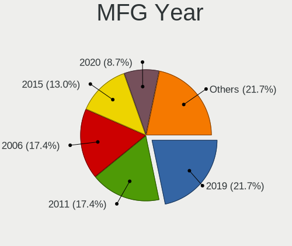
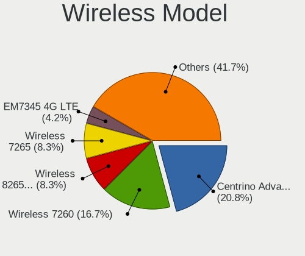
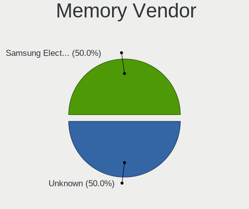
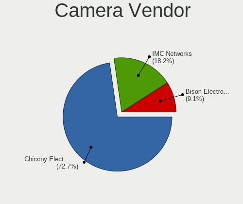

OpenBSD 6.7 - Tested Hardware & Statistics (Notebooks)
------------------------------------------------------

A project to collect tested hardware configurations for OpenBSD 6.7.

Anyone can contribute to this report by the [hw-probe](https://github.com/linuxhw/hw-probe/blob/master/INSTALL.BSD.md) tool:

    hw-probe -all -upload

Please submit a probe of your configuration if it's not presented on the page or is rare.

Full-feature report is available here: https://bsd-hardware.info/?view=trends

Contents
--------

* [ Test Cases ](#test-cases)

* [ System ](#system)
  - [ Arch                     ](#arch)
  - [ DE                       ](#de)
  - [ Display Server           ](#display-server)
  - [ Display Manager          ](#display-manager)
  - [ OS Lang                  ](#os-lang)
  - [ Boot Mode                ](#boot-mode)
  - [ Filesystem               ](#filesystem)
  - [ Part. scheme             ](#part-scheme)

* [ Board ](#board)
  - [ Vendor                   ](#vendor)
  - [ Model                    ](#model)
  - [ Model Family             ](#model-family)
  - [ MFG Year                 ](#mfg-year)
  - [ Form Factor              ](#form-factor)
  - [ Coreboot                 ](#coreboot)
  - [ RAM Size                 ](#ram-size)
  - [ RAM Used                 ](#ram-used)
  - [ Total Drives             ](#total-drives)
  - [ Has CD-ROM               ](#has-cd-rom)
  - [ Has Ethernet             ](#has-ethernet)
  - [ Has WiFi                 ](#has-wifi)
  - [ Has Bluetooth            ](#has-bluetooth)

* [ Location ](#location)
  - [ Country                  ](#country)
  - [ City                     ](#city)

* [ Drives ](#drives)
  - [ Drive Vendor             ](#drive-vendor)
  - [ Drive Model              ](#drive-model)
  - [ HDD Vendor               ](#hdd-vendor)
  - [ SSD Vendor               ](#ssd-vendor)
  - [ Drive Kind               ](#drive-kind)
  - [ Drive Connector          ](#drive-connector)
  - [ Drive Size               ](#drive-size)
  - [ Space Total              ](#space-total)
  - [ Space Used               ](#space-used)
  - [ Malfunc. Drives          ](#malfunc-drives)
  - [ Malfunc. Drive Vendor    ](#malfunc-drive-vendor)
  - [ Malfunc. HDD Vendor      ](#malfunc-hdd-vendor)
  - [ Malfunc. Drive Kind      ](#malfunc-drive-kind)
  - [ Failed Drives            ](#failed-drives)
  - [ Failed Drive Vendor      ](#failed-drive-vendor)
  - [ Drive Status             ](#drive-status)

* [ Storage controller ](#storage-controller)
  - [ Storage Vendor           ](#storage-vendor)
  - [ Storage Model            ](#storage-model)
  - [ Storage Kind             ](#storage-kind)

* [ Processor ](#processor)
  - [ CPU Vendor               ](#cpu-vendor)
  - [ CPU Model                ](#cpu-model)
  - [ CPU Model Family         ](#cpu-model-family)
  - [ CPU Cores                ](#cpu-cores)
  - [ CPU Sockets              ](#cpu-sockets)
  - [ CPU Threads              ](#cpu-threads)
  - [ CPU Microarch            ](#cpu-microarch)

* [ Graphics ](#graphics)
  - [ GPU Vendor               ](#gpu-vendor)
  - [ GPU Model                ](#gpu-model)
  - [ GPU Combo                ](#gpu-combo)
  - [ GPU Driver               ](#gpu-driver)
  - [ GPU Memory               ](#gpu-memory)

* [ Monitor ](#monitor)
  - [ Monitor Vendor           ](#monitor-vendor)
  - [ Monitor Model            ](#monitor-model)
  - [ Monitor Resolution       ](#monitor-resolution)
  - [ Monitor Diagonal         ](#monitor-diagonal)
  - [ Monitor Width            ](#monitor-width)
  - [ Aspect Ratio             ](#aspect-ratio)
  - [ Monitor Area             ](#monitor-area)
  - [ Pixel Density            ](#pixel-density)
  - [ Multiple Monitors        ](#multiple-monitors)

* [ Network ](#network)
  - [ Net Controller Vendor    ](#net-controller-vendor)
  - [ Net Controller Model     ](#net-controller-model)
  - [ Wireless Vendor          ](#wireless-vendor)
  - [ Wireless Model           ](#wireless-model)
  - [ Ethernet Vendor          ](#ethernet-vendor)
  - [ Ethernet Model           ](#ethernet-model)
  - [ Net Controller Kind      ](#net-controller-kind)
  - [ Used Controller          ](#used-controller)
  - [ NICs                     ](#nics)
  - [ IPv6                     ](#ipv6)

* [ Bluetooth ](#bluetooth)
  - [ Bluetooth Vendor         ](#bluetooth-vendor)
  - [ Bluetooth Model          ](#bluetooth-model)

* [ Sound ](#sound)
  - [ Sound Vendor             ](#sound-vendor)
  - [ Sound Model              ](#sound-model)

* [ Memory ](#memory)
  - [ Memory Vendor            ](#memory-vendor)
  - [ Memory Model             ](#memory-model)
  - [ Memory Kind              ](#memory-kind)
  - [ Memory Form Factor       ](#memory-form-factor)
  - [ Memory Size              ](#memory-size)
  - [ Memory Speed             ](#memory-speed)

* [ Printers & scanners ](#printers--scanners)
  - [ Printer Vendor           ](#printer-vendor)
  - [ Printer Model            ](#printer-model)
  - [ Scanner Vendor           ](#scanner-vendor)
  - [ Scanner Model            ](#scanner-model)

* [ Camera ](#camera)
  - [ Camera Vendor            ](#camera-vendor)
  - [ Camera Model             ](#camera-model)

* [ Security ](#security)
  - [ Fingerprint Vendor       ](#fingerprint-vendor)
  - [ Fingerprint Model        ](#fingerprint-model)
  - [ Chipcard Vendor          ](#chipcard-vendor)
  - [ Chipcard Model           ](#chipcard-model)

* [ Unsupported ](#unsupported)
  - [ Unsupported Devices      ](#unsupported-devices)
  - [ Unsupported Device Types ](#unsupported-device-types)

Test Cases
----------

| Vendor        | Model                       | Probe                                                     | Date         |
|---------------|-----------------------------|-----------------------------------------------------------|--------------|
| Lenovo        | ThinkPad X230 2325Y36       | [1f28f1c311](https://bsd-hardware.info/?probe=1f28f1c311) | Aug 30, 2020 |
| Lenovo        | ThinkPad X230 2325Y36       | [11a0bbb73f](https://bsd-hardware.info/?probe=11a0bbb73f) | Aug 30, 2020 |
| Lenovo        | ThinkPad P40 Yoga 20GQ00... | [ac92b69122](https://bsd-hardware.info/?probe=ac92b69122) | Aug 20, 2020 |
| Lenovo        | ThinkPad X1 Carbon 3rd 2... | [3032cd9409](https://bsd-hardware.info/?probe=3032cd9409) | Aug 20, 2020 |
| HP            | Laptop 15-dw0xxx            | [547b36ea62](https://bsd-hardware.info/?probe=547b36ea62) | Aug 19, 2020 |
| HCL Infosy... | Calistoga & ICH7M Chipse... | [6adc98922d](https://bsd-hardware.info/?probe=6adc98922d) | Aug 19, 2020 |
| IBM           | ThinkPad T42 2373K9G        | [fa35e7ec26](https://bsd-hardware.info/?probe=fa35e7ec26) | Aug 11, 2020 |
| HP            | ZBook 15 G4                 | [a8953b4964](https://bsd-hardware.info/?probe=a8953b4964) | Aug 03, 2020 |
| HP            | ZBook 15 G4                 | [a97053c5d4](https://bsd-hardware.info/?probe=a97053c5d4) | Aug 03, 2020 |
| Lenovo        | ThinkPad X1 Carbon 5th 2... | [20f3e760eb](https://bsd-hardware.info/?probe=20f3e760eb) | Aug 03, 2020 |
| Lenovo        | ThinkPad X1 Carbon 5th 2... | [b305c0df5e](https://bsd-hardware.info/?probe=b305c0df5e) | Aug 03, 2020 |
| Lenovo        | ThinkPad W540 20BG001KUK    | [f3e2acbb66](https://bsd-hardware.info/?probe=f3e2acbb66) | Jul 31, 2020 |
| Lenovo        | ThinkPad W540 20BG001KUK    | [7ae8c247e9](https://bsd-hardware.info/?probe=7ae8c247e9) | Jul 31, 2020 |
| Lenovo        | ThinkPad T60 87445BU        | [37a42caa92](https://bsd-hardware.info/?probe=37a42caa92) | Jul 30, 2020 |
| Lenovo        | ThinkPad X1 Carbon 5th 2... | [ac13b0591f](https://bsd-hardware.info/?probe=ac13b0591f) | Jul 27, 2020 |
| Toshiba       | Satellite L775D             | [bb218a14a6](https://bsd-hardware.info/?probe=bb218a14a6) | Jun 03, 2020 |
| Toshiba       | Satellite L775D             | [f0ec90217a](https://bsd-hardware.info/?probe=f0ec90217a) | Jun 03, 2020 |
| Lenovo        | ThinkPad X220 4291C35       | [f22c83f68b](https://bsd-hardware.info/?probe=f22c83f68b) | May 31, 2020 |
| Panasonic     | CF-19ADUAX1M                | [cefc742c62](https://bsd-hardware.info/?probe=cefc742c62) | May 29, 2020 |
| Fujitsu       | LIFEBOOK A357               | [b02640458b](https://bsd-hardware.info/?probe=b02640458b) | May 26, 2020 |
| Lenovo        | ThinkPad X230 2324A57       | [6ea713bf51](https://bsd-hardware.info/?probe=6ea713bf51) | May 25, 2020 |
| Lenovo        | ThinkPad X230 2324A57       | [7b67911c5a](https://bsd-hardware.info/?probe=7b67911c5a) | May 25, 2020 |
| Lenovo        | ThinkPad X1 Carbon 6th 2... | [b4ca8bbc46](https://bsd-hardware.info/?probe=b4ca8bbc46) | May 25, 2020 |
| Lenovo        | ThinkPad T420 4180B39       | [916596bfa8](https://bsd-hardware.info/?probe=916596bfa8) | May 25, 2020 |
| IBM           | ThinkPad X41 2525FAG        | [1e849f86cf](https://bsd-hardware.info/?probe=1e849f86cf) | May 25, 2020 |
| Lenovo        | ThinkPad T440 20B7S1C600    | [a4a62cb85e](https://bsd-hardware.info/?probe=a4a62cb85e) | May 24, 2020 |
| Lenovo        | ThinkPad T440s 20AR003VM... | [3f72b76851](https://bsd-hardware.info/?probe=3f72b76851) | May 23, 2020 |
| Lenovo        | ThinkPad T495 20NJCTO1WW    | [fa71e5839a](https://bsd-hardware.info/?probe=fa71e5839a) | May 23, 2020 |
| Lenovo        | ThinkPad T440p 20AN00DEU... | [9ff1537692](https://bsd-hardware.info/?probe=9ff1537692) | May 23, 2020 |
| Lenovo        | G570 20079                  | [8212868b9f](https://bsd-hardware.info/?probe=8212868b9f) | May 19, 2020 |

System
------

Arch
----

OS architecture (x86_64, i586, etc.)

| Name  | Notebooks | Percent |
|-------|-----------|---------|
| amd64 | 20        | 86.96%  |
| i386  | 3         | 13.04%  |

DE
--

Desktop Environment

| Name | Notebooks | Percent |
|------|-----------|---------|
| fvwm | 23        | 100%    |

Display Server
--------------

X11 or Wayland

| Name | Notebooks | Percent |
|------|-----------|---------|
| X11  | 23        | 100%    |

Display Manager
---------------

SDDM, LightDM, etc.

| Name    | Notebooks | Percent |
|---------|-----------|---------|
| Console | 16        | 69.57%  |
| GDM     | 6         | 26.09%  |
| SLiM    | 1         | 4.35%   |

OS Lang
-------

Language

| Lang    | Notebooks | Percent |
|---------|-----------|---------|
| Unknown | 13        | 54.17%  |
| en_US   | 8         | 33.33%  |
| en_GB   | 1         | 4.17%   |
| en_CA   | 1         | 4.17%   |
| de_DE   | 1         | 4.17%   |

Boot Mode
---------

EFI or BIOS

| Mode | Notebooks | Percent |
|------|-----------|---------|
| BIOS | 14        | 60.87%  |
| EFI  | 9         | 39.13%  |

Filesystem
----------

Type of filesystem

| Type | Notebooks | Percent |
|------|-----------|---------|
| Ffs  | 23        | 100%    |

Part. scheme
------------

Scheme of partitioning

| Type    | Notebooks | Percent |
|---------|-----------|---------|
| MBR     | 11        | 47.83%  |
| GPT     | 9         | 39.13%  |
| Unknown | 3         | 13.04%  |

Board
-----

Vendor
------

Motherboard manufacturer

| Name                    | Notebooks | Percent |
|-------------------------|-----------|---------|
| Lenovo                  | 14        | 60.87%  |
| Hewlett-Packard         | 3         | 13.04%  |
| IBM                     | 2         | 8.7%    |
| Toshiba                 | 1         | 4.35%   |
| Panasonic               | 1         | 4.35%   |
| HCL Infosystems Limited | 1         | 4.35%   |
| Fujitsu                 | 1         | 4.35%   |

Model
-----

Motherboard model

| Name                                              | Notebooks | Percent |
|---------------------------------------------------|-----------|---------|
| HP ZBook 15 G4                                    | 2         | 8.7%    |
| Toshiba Satellite L775D                           | 1         | 4.35%   |
| Panasonic CF-19ADUAX1M                            | 1         | 4.35%   |
| Lenovo ThinkPad X230 2325Y36                      | 1         | 4.35%   |
| Lenovo ThinkPad X230 2324A57                      | 1         | 4.35%   |
| Lenovo ThinkPad X220 4291C35                      | 1         | 4.35%   |
| Lenovo ThinkPad X1 Carbon 6th 20KH002RUS          | 1         | 4.35%   |
| Lenovo ThinkPad X1 Carbon 5th 20HR0068GE          | 1         | 4.35%   |
| Lenovo ThinkPad X1 Carbon 3rd 20BSCTO1WW          | 1         | 4.35%   |
| Lenovo ThinkPad W540 20BG001KUK                   | 1         | 4.35%   |
| Lenovo ThinkPad T60 87445BU                       | 1         | 4.35%   |
| Lenovo ThinkPad T495 20NJCTO1WW                   | 1         | 4.35%   |
| Lenovo ThinkPad T440s 20AR003VMS                  | 1         | 4.35%   |
| Lenovo ThinkPad T440p 20AN00DEUS                  | 1         | 4.35%   |
| Lenovo ThinkPad T440 20B7S1C600                   | 1         | 4.35%   |
| Lenovo ThinkPad T420 4180B39                      | 1         | 4.35%   |
| Lenovo ThinkPad P40 Yoga 20GQ000EUS               | 1         | 4.35%   |
| IBM ThinkPad X41 2525FAG                          | 1         | 4.35%   |
| IBM ThinkPad T42 2373K9G                          | 1         | 4.35%   |
| HP Laptop 15-dw0xxx                               | 1         | 4.35%   |
| HCL Infosystems Limited Calistoga & ICH7M Chipset | 1         | 4.35%   |
| Fujitsu LIFEBOOK A357                             | 1         | 4.35%   |

Model Family
------------

Motherboard model prefix

| Name                              | Notebooks | Percent |
|-----------------------------------|-----------|---------|
| Lenovo ThinkPad                   | 14        | 60.87%  |
| IBM ThinkPad                      | 2         | 8.7%    |
| HP ZBook                          | 2         | 8.7%    |
| Toshiba Satellite                 | 1         | 4.35%   |
| Panasonic CF-19ADUAX1M            | 1         | 4.35%   |
| HP Laptop                         | 1         | 4.35%   |
| HCL Infosystems Limited Calistoga | 1         | 4.35%   |
| Fujitsu LIFEBOOK                  | 1         | 4.35%   |

MFG Year
--------

Motherboard manufacture year

| Year    | Notebooks | Percent |
|---------|-----------|---------|
| 2019    | 6         | 26.09%  |
| 2020    | 5         | 21.74%  |
| 2016    | 2         | 8.7%    |
| 2011    | 2         | 8.7%    |
| 2007    | 2         | 8.7%    |
| 2006    | 2         | 8.7%    |
| 2018    | 1         | 4.35%   |
| 2017    | 1         | 4.35%   |
| 2012    | 1         | 4.35%   |
| Unknown | 1         | 4.35%   |

Form Factor
-----------

Physical design of the computer

| Name     | Notebooks | Percent |
|----------|-----------|---------|
| Notebook | 23        | 100%    |

Coreboot
--------

Have coreboot on board

| Used | Notebooks | Percent |
|------|-----------|---------|
| No   | 23        | 100%    |

RAM Size
--------

Total RAM memory

| Size in GB | Notebooks | Percent |
|------------|-----------|---------|
| 8.01-16.0  | 10        | 43.48%  |
| 16.01-24.0 | 4         | 17.39%  |
| 32.01-64.0 | 3         | 13.04%  |
| 3.01-4.0   | 2         | 8.7%    |
| 4.01-8.0   | 1         | 4.35%   |
| 2.01-3.0   | 1         | 4.35%   |
| 1.01-2.0   | 1         | 4.35%   |
| 0.51-1.0   | 1         | 4.35%   |

RAM Used
--------

Used RAM memory

| Used GB  | Notebooks | Percent |
|----------|-----------|---------|
| 0.01-0.5 | 18        | 78.26%  |
| 0        | 2         | 8.7%    |
| 1.01-2.0 | 1         | 4.35%   |
| 0.51-1.0 | 1         | 4.35%   |
| Unknown  | 1         | 4.35%   |

Total Drives
------------

Number of drives on board

| Drives | Notebooks | Percent |
|--------|-----------|---------|
| 1      | 11        | 47.83%  |
| 2      | 8         | 34.78%  |
| 3      | 4         | 17.39%  |

Has CD-ROM
----------

Has CD-ROM on board

| Presented | Notebooks | Percent |
|-----------|-----------|---------|
| No        | 23        | 100%    |

Has Ethernet
------------

Has Ethernet on board

| Presented | Notebooks | Percent |
|-----------|-----------|---------|
| Yes       | 23        | 100%    |

Has WiFi
--------

Has WiFi module

| Presented | Notebooks | Percent |
|-----------|-----------|---------|
| Yes       | 21        | 91.3%   |
| No        | 2         | 8.7%    |

Has Bluetooth
-------------

Has Bluetooth module

| Presented | Notebooks | Percent |
|-----------|-----------|---------|
| No        | 16        | 69.57%  |
| Yes       | 7         | 30.43%  |

Location
--------

Country
-------

Geographic location (country)

| Country     | Notebooks | Percent |
|-------------|-----------|---------|
| USA         | 6         | 26.09%  |
| Germany     | 5         | 21.74%  |
| Russia      | 2         | 8.7%    |
| France      | 2         | 8.7%    |
| Switzerland | 1         | 4.35%   |
| Sweden      | 1         | 4.35%   |
| Norway      | 1         | 4.35%   |
| Italy       | 1         | 4.35%   |
| India       | 1         | 4.35%   |
| Ecuador     | 1         | 4.35%   |
| Croatia     | 1         | 4.35%   |
| Australia   | 1         | 4.35%   |

City
----

Geographic location (city)

| City               | Notebooks | Percent |
|--------------------|-----------|---------|
| Gummersbach        | 2         | 8.7%    |
| Berlin             | 2         | 8.7%    |
| Zurich             | 1         | 4.35%   |
| Zhukovskiy         | 1         | 4.35%   |
| St Petersburg      | 1         | 4.35%   |
| San Francisco      | 1         | 4.35%   |
| Rovisce            | 1         | 4.35%   |
| Riverview          | 1         | 4.35%   |
| Portland           | 1         | 4.35%   |
| Pine Mountain Club | 1         | 4.35%   |
| Paris              | 1         | 4.35%   |
| Oslo               | 1         | 4.35%   |
| OEverlida          | 1         | 4.35%   |
| Melbourne          | 1         | 4.35%   |
| Lamothe-Goas       | 1         | 4.35%   |
| Hyderabad          | 1         | 4.35%   |
| Harrisburg         | 1         | 4.35%   |
| Erlangen           | 1         | 4.35%   |
| Cuenca             | 1         | 4.35%   |
| Bothell            | 1         | 4.35%   |
| Bergamo            | 1         | 4.35%   |

Drives
------

Drive Vendor
------------

Hard drive vendors

| Vendor              | Notebooks | Drives | Percent |
|---------------------|-----------|--------|---------|
| Samsung Electronics | 6         | 6      | 21.43%  |
| NVMe                | 6         | 7      | 21.43%  |
| Seagate             | 3         | 3      | 10.71%  |
| Hitachi             | 3         | 3      | 10.71%  |
| WDC                 | 2         | 2      | 7.14%   |
| Transcend           | 1         | 1      | 3.57%   |
| Toshiba             | 1         | 1      | 3.57%   |
| Micron Technology   | 1         | 1      | 3.57%   |
| Leven               | 1         | 1      | 3.57%   |
| Kingston            | 1         | 1      | 3.57%   |
| Intel               | 1         | 1      | 3.57%   |
| HGST                | 1         | 1      | 3.57%   |
| Gigabyte Technology | 1         | 1      | 3.57%   |

Drive Model
-----------

Hard drive models

| Model                            | Notebooks | Percent |
|----------------------------------|-----------|---------|
| Seagate ST1000LM035-1RK172 1TB   | 2         | 7.14%   |
| NVMe SAMSUNG MZVLW256 256GB      | 2         | 7.14%   |
| WDC WDS240G2G0A-00JH30 240GB     | 1         | 3.57%   |
| WDC WDS100T2B0A-00SM50 1TB       | 1         | 3.57%   |
| Transcend TS128GMTS430S 128GB    | 1         | 3.57%   |
| Toshiba MK8025GAS 80GB           | 1         | 3.57%   |
| Seagate ST1000LM048-2E7172 1TB   | 1         | 3.57%   |
| Samsung SSD 850 EVO 1TB          | 1         | 3.57%   |
| Samsung SSD 850 EVO 120GB        | 1         | 3.57%   |
| Samsung MZMTE1T0HMJH-00000 1TB   | 1         | 3.57%   |
| Samsung MZHPV256HDGL-000L1 256GB | 1         | 3.57%   |
| Samsung MZ7PC128HAFU-000L1 128GB | 1         | 3.57%   |
| Samsung MZ7LN512HMJP-000L7 512GB | 1         | 3.57%   |
| NVMe WDC PC SN720 SDA 1TB        | 1         | 3.57%   |
| NVMe SAMSUNG MZVLW1T0 1TB        | 1         | 3.57%   |
| NVMe LENSE30512GMSP34 512GB      | 1         | 3.57%   |
| NVMe INTEL SSDPEKNW51 512GB      | 1         | 3.57%   |
| Micron 1100_MTFDDAK256TBN 256GB  | 1         | 3.57%   |
| Leven JAJS600M512C 512GB         | 1         | 3.57%   |
| Kingston SA400S37120G 120GB      | 1         | 3.57%   |
| Intel SSDSC2BW240A3L 240GB       | 1         | 3.57%   |
| Hitachi HTS547550A9E384 500GB    | 1         | 3.57%   |
| Hitachi HTS541060G9SA00 64GB     | 1         | 3.57%   |
| Hitachi HTC426060G9AT00 64GB     | 1         | 3.57%   |
| HGST HTS725050A7E630 500GB       | 1         | 3.57%   |
| Gigabyte GP-GSTFS31120GNTD 120GB | 1         | 3.57%   |

HDD Vendor
----------

Hard disk drive vendors

| Vendor  | Notebooks | Drives | Percent |
|---------|-----------|--------|---------|
| NVMe    | 5         | 6      | 38.46%  |
| Seagate | 3         | 3      | 23.08%  |
| Hitachi | 3         | 3      | 23.08%  |
| Toshiba | 1         | 1      | 7.69%   |
| HGST    | 1         | 1      | 7.69%   |

SSD Vendor
----------

Solid state drive vendors

| Vendor              | Notebooks | Drives | Percent |
|---------------------|-----------|--------|---------|
| Samsung Electronics | 6         | 6      | 40%     |
| WDC                 | 2         | 2      | 13.33%  |
| Transcend           | 1         | 1      | 6.67%   |
| NVMe                | 1         | 1      | 6.67%   |
| Micron Technology   | 1         | 1      | 6.67%   |
| Leven               | 1         | 1      | 6.67%   |
| Kingston            | 1         | 1      | 6.67%   |
| Intel               | 1         | 1      | 6.67%   |
| Gigabyte Technology | 1         | 1      | 6.67%   |

Drive Kind
----------

HDD or SSD

| Kind | Notebooks | Drives | Percent |
|------|-----------|--------|---------|
| SSD  | 13        | 15     | 54.17%  |
| HDD  | 11        | 14     | 45.83%  |

Drive Connector
---------------

SATA, SAS, NVMe, etc.

| Type | Notebooks | Drives | Percent |
|------|-----------|--------|---------|
| SATA | 24        | 29     | 100%    |

Drive Size
----------

Size of hard drive

| Size in TB | Notebooks | Drives | Percent |
|------------|-----------|--------|---------|
| 0.01-0.5   | 16        | 16     | 57.14%  |
| 0.51-1.0   | 9         | 9      | 32.14%  |
| 1.01-2.0   | 3         | 4      | 10.71%  |

Space Total
-----------

Amount of disk space available on the file system

| Size in GB | Notebooks | Percent |
|------------|-----------|---------|
| 101-250    | 8         | 34.78%  |
| 251-500    | 6         | 26.09%  |
| 51-100     | 4         | 17.39%  |
| 501-1000   | 3         | 13.04%  |
| 21-50      | 1         | 4.35%   |
| 1001-2000  | 1         | 4.35%   |

Space Used
----------

Amount of used disk space

| Used GB | Notebooks | Percent |
|---------|-----------|---------|
| 1-20    | 15        | 65.22%  |
| 101-250 | 4         | 17.39%  |
| 21-50   | 3         | 13.04%  |
| 51-100  | 1         | 4.35%   |

Malfunc. Drives
---------------

Drive models with a malfunction

| Model                        | Notebooks | Drives | Percent |
|------------------------------|-----------|--------|---------|
| Hitachi HTS541060G9SA00 64GB | 1         | 1      | 50%     |
| Hitachi HTC426060G9AT00 64GB | 1         | 1      | 50%     |

Malfunc. Drive Vendor
---------------------

Vendors of faulty drives

| Vendor  | Notebooks | Drives | Percent |
|---------|-----------|--------|---------|
| Hitachi | 2         | 2      | 100%    |

Malfunc. HDD Vendor
-------------------

Vendors of faulty HDD drives

| Vendor  | Notebooks | Drives | Percent |
|---------|-----------|--------|---------|
| Hitachi | 2         | 2      | 100%    |

Malfunc. Drive Kind
-------------------

Kinds of faulty drives

| Kind | Notebooks | Drives | Percent |
|------|-----------|--------|---------|
| HDD  | 2         | 2      | 100%    |

Failed Drives
-------------

Failed drive models

Zero info for selected period =(

Failed Drive Vendor
-------------------

Failed drive vendors

Zero info for selected period =(

Drive Status
------------

Number of failed and malfunc. drives

| Status   | Notebooks | Drives | Percent |
|----------|-----------|--------|---------|
| Works    | 19        | 21     | 73.08%  |
| Detected | 5         | 6      | 19.23%  |
| Malfunc  | 2         | 2      | 7.69%   |

Storage controller
------------------

Storage Vendor
--------------

Storage controller vendors

| Vendor              | Notebooks | Percent |
|---------------------|-----------|---------|
| Intel               | 18        | 72%     |
| Samsung Electronics | 4         | 16%     |
| Sandisk             | 1         | 4%      |
| Lenovo              | 1         | 4%      |
| AMD                 | 1         | 4%      |

Storage Model
-------------

Storage controller models

| Model                                                                          | Notebooks | Percent |
|--------------------------------------------------------------------------------|-----------|---------|
| Samsung NVMe SSD Controller SM961/PM961/SM963                                  | 3         | 10.34%  |
| Intel 6 Series/C200 Series Chipset Family 6 port Mobile SATA AHCI Controller   | 3         | 10.34%  |
| Intel Sunrise Point-LP SATA Controller [AHCI mode]                             | 2         | 6.9%    |
| Intel Q170/Q150/B150/H170/H110/Z170/CM236 Chipset SATA Controller [AHCI Mode]  | 2         | 6.9%    |
| Intel 82801GBM/GHM (ICH7-M Family) SATA Controller [AHCI mode]                 | 2         | 6.9%    |
| Intel 82801G (ICH7 Family) IDE Controller                                      | 2         | 6.9%    |
| Intel 8 Series/C220 Series Chipset Family 6-port SATA Controller 1 [AHCI mode] | 2         | 6.9%    |
| Intel 8 Series SATA Controller 1 [AHCI mode]                                   | 2         | 6.9%    |
| Intel 7 Series Chipset Family 6-port SATA Controller [AHCI mode]               | 2         | 6.9%    |
| Sandisk WD Black 2018/SN750 / PC SN720 NVMe SSD                                | 1         | 3.45%   |
| Samsung SM951 AHCI                                                             | 1         | 3.45%   |
| Lenovo unknown                                                                 | 1         | 3.45%   |
| Intel SSD 660P Series                                                          | 1         | 3.45%   |
| Intel 82801FBM (ICH6M) SATA Controller                                         | 1         | 3.45%   |
| Intel 82801DBM (ICH4-M) IDE Controller                                         | 1         | 3.45%   |
| Intel 82801 Mobile SATA Controller [RAID mode]                                 | 1         | 3.45%   |
| AMD FCH SATA Controller [AHCI mode]                                            | 1         | 3.45%   |
| AMD FCH IDE Controller                                                         | 1         | 3.45%   |

Storage Kind
------------

Kind of storage controller (IDE, SATA, NVMe, SAS, ...)

| Kind | Notebooks | Percent |
|------|-----------|---------|
| SATA | 17        | 58.62%  |
| NVMe | 6         | 20.69%  |
| IDE  | 5         | 17.24%  |
| RAID | 1         | 3.45%   |

Processor
---------

CPU Vendor
----------

Processor vendors

| Vendor | Notebooks | Percent |
|--------|-----------|---------|
| Intel  | 21        | 91.3%   |
| AMD    | 2         | 8.7%    |

CPU Model
---------

Processor models

| Model                                                        | Notebooks | Percent |
|--------------------------------------------------------------|-----------|---------|
| Intel Core i5-2520M CPU @ 2.50GHz                            | 3         | 13.04%  |
| Intel Xeon CPU E3-1505M v6 @ 3.00GHz                         | 2         | 8.7%    |
| Intel Core i5-3320M CPU @ 2.60GHz                            | 2         | 8.7%    |
| Intel Pentium M processor 1.70GHz ("GenuineIntel" 686-class) | 1         | 4.35%   |
| Intel Pentium M processor                                    | 1         | 4.35%   |
| Intel Genuine CPU T2250 @ 1.73GHz ("GenuineIntel" 686-class) | 1         | 4.35%   |
| Intel Core i7-8650U CPU @ 1.90GHz                            | 1         | 4.35%   |
| Intel Core i7-7500U CPU @ 2.70GHz                            | 1         | 4.35%   |
| Intel Core i7-6600U CPU @ 2.60GHz                            | 1         | 4.35%   |
| Intel Core i7-4700MQ CPU @ 2.40GHz                           | 1         | 4.35%   |
| Intel Core i5-8265U CPU @ 1.60GHz                            | 1         | 4.35%   |
| Intel Core i5-5200U CPU @ 2.20GHz                            | 1         | 4.35%   |
| Intel Core i5-4300U CPU @ 1.90GHz                            | 1         | 4.35%   |
| Intel Core i5-4210U CPU @ 1.70GHz                            | 1         | 4.35%   |
| Intel Core i5-4210M CPU @ 2.60GHz                            | 1         | 4.35%   |
| Intel Core i3-6006U CPU @ 2.00GHz                            | 1         | 4.35%   |
| Intel Core 2 CPU T7200 @ 2.00GHz                             | 1         | 4.35%   |
| AMD Ryzen 7 PRO 3700U w/ Radeon Vega Mobile Gfx              | 1         | 4.35%   |
| AMD A6-3400M APU with Radeon HD Graphics                     | 1         | 4.35%   |

CPU Model Family
----------------

Processor model prefix

| Model           | Notebooks | Percent |
|-----------------|-----------|---------|
| Intel Core i5   | 10        | 43.48%  |
| Intel Core i7   | 4         | 17.39%  |
| Intel Xeon      | 2         | 8.7%    |
| Intel Pentium M | 2         | 8.7%    |
| Intel Genuine   | 1         | 4.35%   |
| Intel Core i3   | 1         | 4.35%   |
| Intel Core 2    | 1         | 4.35%   |
| AMD Ryzen 7 PRO | 1         | 4.35%   |
| AMD A6          | 1         | 4.35%   |

CPU Cores
---------

Number of processor cores

| Number  | Notebooks | Percent |
|---------|-----------|---------|
| 2       | 12        | 52.17%  |
| 4       | 6         | 26.09%  |
| 1       | 2         | 8.7%    |
| Unknown | 2         | 8.7%    |
| 8       | 1         | 4.35%   |

CPU Sockets
-----------

Number of sockets

| Number  | Notebooks | Percent |
|---------|-----------|---------|
| 1       | 20        | 86.96%  |
| Unknown | 3         | 13.04%  |

CPU Threads
-----------

Threads per core (Hyper-Threading)

| Number  | Notebooks | Percent |
|---------|-----------|---------|
| 2       | 17        | 73.91%  |
| Unknown | 4         | 17.39%  |
| 1       | 2         | 8.7%    |

CPU Microarch
-------------

Microarchitecture

| Name        | Notebooks | Percent |
|-------------|-----------|---------|
| KabyLake    | 5         | 21.74%  |
| Haswell     | 4         | 17.39%  |
| SandyBridge | 3         | 13.04%  |
| P6          | 3         | 13.04%  |
| Skylake     | 2         | 8.7%    |
| IvyBridge   | 2         | 8.7%    |
| Zen+        | 1         | 4.35%   |
| K10 Llano   | 1         | 4.35%   |
| Core        | 1         | 4.35%   |
| Broadwell   | 1         | 4.35%   |

Graphics
--------

GPU Vendor
----------

Vendors of graphics cards

| Vendor | Notebooks | Percent |
|--------|-----------|---------|
| Intel  | 20        | 68.97%  |
| AMD    | 5         | 17.24%  |
| Nvidia | 4         | 13.79%  |

GPU Model
---------

Graphics card models

| Model                                                                         | Notebooks | Percent |
|-------------------------------------------------------------------------------|-----------|---------|
| Intel 2nd Generation Core Processor Family Integrated Graphics Controller     | 4         | 13.33%  |
| Nvidia GM206GLM [Quadro M2200 Mobile]                                         | 2         | 6.67%   |
| Intel Skylake GT2 [HD Graphics 520]                                           | 2         | 6.67%   |
| Intel HD Graphics P630                                                        | 2         | 6.67%   |
| Intel Haswell-ULT Integrated Graphics Controller                              | 2         | 6.67%   |
| Intel 4th Gen Core Processor Integrated Graphics Controller                   | 2         | 6.67%   |
| Intel 3rd Gen Core processor Graphics Controller                              | 2         | 6.67%   |
| Nvidia GM108GLM [Quadro K620M / Quadro M500M]                                 | 1         | 3.33%   |
| Nvidia GK107GLM [Quadro K1100M]                                               | 1         | 3.33%   |
| Intel WhiskeyLake-U GT2 [UHD Graphics 620]                                    | 1         | 3.33%   |
| Intel UHD Graphics 620                                                        | 1         | 3.33%   |
| Intel Mobile 945GM/GMS/GME, 943/940GML Express Integrated Graphics Controller | 1         | 3.33%   |
| Intel Mobile 945GM/GMS, 943/940GML Express Integrated Graphics Controller     | 1         | 3.33%   |
| Intel Mobile 915GM/GMS/910GML Express Graphics Controller                     | 1         | 3.33%   |
| Intel HD Graphics 620                                                         | 1         | 3.33%   |
| Intel HD Graphics 5500                                                        | 1         | 3.33%   |
| AMD Sumo [Radeon HD 6520G]                                                    | 1         | 3.33%   |
| AMD RV515/M54 [Mobility Radeon X1400]                                         | 1         | 3.33%   |
| AMD RV200/M7 [Mobility Radeon 7500]                                           | 1         | 3.33%   |
| AMD Robson CE [Radeon HD 6370M/7370M]                                         | 1         | 3.33%   |
| AMD Picasso/Raven 2 [Radeon Vega Series / Radeon Vega Mobile Series]          | 1         | 3.33%   |

GPU Combo
---------

Combinations of graphics cards

| Name           | Notebooks | Percent |
|----------------|-----------|---------|
| 1 x Intel      | 13        | 56.52%  |
| Intel + Nvidia | 4         | 17.39%  |
| 1 x AMD        | 4         | 17.39%  |
| 2 x Intel      | 2         | 8.7%    |

GPU Driver
----------

Free vs proprietary

| Driver  | Notebooks | Percent |
|---------|-----------|---------|
| Free    | 22        | 95.65%  |
| Unknown | 1         | 4.35%   |

GPU Memory
----------

Total video memory

| Size in GB | Notebooks | Percent |
|------------|-----------|---------|
| Unknown    | 23        | 100%    |

Monitor
-------

Monitor Vendor
--------------

Monitor vendors

| Vendor         | Notebooks | Percent |
|----------------|-----------|---------|
| LG Display     | 8         | 57.14%  |
| Chimei Innolux | 2         | 14.29%  |
| AU Optronics   | 2         | 14.29%  |
| IBM            | 1         | 7.14%   |
| Goldstar       | 1         | 7.14%   |

Monitor Model
-------------

Monitor models

| Model                                                            | Notebooks | Percent |
|------------------------------------------------------------------|-----------|---------|
| LG Display LCD Monitor LGD058B 2560x1440 310x170mm 13.9-inch     | 2         | 14.29%  |
| LG Display LCD Monitor LGD057E 1920x1080 340x190mm 15.3-inch     | 2         | 14.29%  |
| LG Display LCD Monitor LGD04F0 2560x1440 310x170mm 13.9-inch     | 1         | 7.14%   |
| LG Display LCD Monitor LGD045E 1366x768 310x170mm 13.9-inch      | 1         | 7.14%   |
| LG Display LCD Monitor LGD0418 2560x1440 310x170mm 13.9-inch     | 1         | 7.14%   |
| LG Display LCD Monitor LGD02F7 1600x900 380x210mm 17.1-inch      | 1         | 7.14%   |
| IBM LCD Monitor IBM2887 1680x1050 330x210mm 15.4-inch            | 1         | 7.14%   |
| Goldstar W2242 GSM5677 1680x1050 490x320mm 23.0-inch             | 1         | 7.14%   |
| Chimei Innolux LCD Monitor CMN15DB 1366x768 340x190mm 15.3-inch  | 1         | 7.14%   |
| Chimei Innolux LCD Monitor CMN14F2 1920x1080 310x170mm 13.9-inch | 1         | 7.14%   |
| AU Optronics LCD Monitor AUO2A3C 1366x768 310x170mm 13.9-inch    | 1         | 7.14%   |
| AU Optronics LCD Monitor AUO106C 1366x768 280x160mm 12.7-inch    | 1         | 7.14%   |

Monitor Resolution
------------------

Monitor screen resolution

| Resolution         | Notebooks | Percent |
|--------------------|-----------|---------|
| 2560x1440 (QHD)    | 4         | 28.57%  |
| 1366x768 (WXGA)    | 4         | 28.57%  |
| 1920x1080 (FHD)    | 3         | 21.43%  |
| 1680x1050 (WSXGA+) | 2         | 14.29%  |
| 1600x900 (HD+)     | 1         | 7.14%   |

Monitor Diagonal
----------------

Diagonal size in inches

| Inches | Notebooks | Percent |
|--------|-----------|---------|
| 13     | 7         | 50%     |
| 15     | 4         | 28.57%  |
| 23     | 1         | 7.14%   |
| 17     | 1         | 7.14%   |
| 12     | 1         | 7.14%   |

Monitor Width
-------------

Physical width

| Width in mm | Notebooks | Percent |
|-------------|-----------|---------|
| 301-350     | 11        | 78.57%  |
| 401-500     | 1         | 7.14%   |
| 351-400     | 1         | 7.14%   |
| 201-300     | 1         | 7.14%   |

Aspect Ratio
------------

Proportional relationship between the width and the height

| Ratio | Notebooks | Percent |
|-------|-----------|---------|
| 16/9  | 12        | 85.71%  |
| 3/2   | 1         | 7.14%   |
| 16/10 | 1         | 7.14%   |

Monitor Area
------------

Area in inch²

| Area in inch² | Notebooks | Percent |
|----------------|-----------|---------|
| 81-90          | 7         | 50%     |
| 91-100         | 3         | 21.43%  |
| 61-70          | 1         | 7.14%   |
| 201-250        | 1         | 7.14%   |
| 121-130        | 1         | 7.14%   |
| 101-110        | 1         | 7.14%   |

Pixel Density
-------------

Pixels per inch

| Density | Notebooks | Percent |
|---------|-----------|---------|
| 121-160 | 5         | 35.71%  |
| 161-240 | 4         | 28.57%  |
| 101-120 | 4         | 28.57%  |
| 51-100  | 1         | 7.14%   |

Multiple Monitors
-----------------

Total monitors connected

| Total | Notebooks | Percent |
|-------|-----------|---------|
| 1     | 21        | 91.3%   |
| 2     | 2         | 8.7%    |

Network
-------

Net Controller Vendor
---------------------

Controller vendors

| Vendor                   | Notebooks | Percent |
|--------------------------|-----------|---------|
| Intel                    | 22        | 68.75%  |
| Realtek Semiconductor    | 4         | 12.5%   |
| Qualcomm Atheros         | 3         | 9.38%   |
| Sierra Wireless          | 1         | 3.13%   |
| Marvell Technology Group | 1         | 3.13%   |
| Broadcom                 | 1         | 3.13%   |

Net Controller Model
--------------------

Controller models

| Model                                                                                 | Notebooks | Percent |
|---------------------------------------------------------------------------------------|-----------|---------|
| Intel Centrino Advanced-N 6205 [Taylor Peak]                                          | 5         | 10.2%   |
| Intel 82579LM Gigabit Network Connection (Lewisville)                                 | 5         | 10.2%   |
| Intel Wireless 7260                                                                   | 4         | 8.16%   |
| Realtek RTL8111/8168/8411 PCI Express Gigabit Ethernet Controller                     | 3         | 6.12%   |
| Intel Wireless 8265 / 8275                                                            | 2         | 4.08%   |
| Intel Wireless 7265                                                                   | 2         | 4.08%   |
| Intel Ethernet Connection I217-LM                                                     | 2         | 4.08%   |
| Intel Ethernet Connection (2) I219-LM                                                 | 2         | 4.08%   |
| Sierra Wireless Sierra Wireless EM7345 4G LTE                                         | 1         | 2.04%   |
| Realtek RTL8821CE 802.11ac PCIe Wireless Network Adapter                              | 1         | 2.04%   |
| Realtek RTL8188EUS 802.11n Wireless Network Adapter                                   | 1         | 2.04%   |
| Realtek RTL8188CE 802.11b/g/n WiFi Adapter                                            | 1         | 2.04%   |
| Realtek RTL810xE PCI Express Fast Ethernet controller                                 | 1         | 2.04%   |
| Qualcomm Atheros AR8152 v2.0 Fast Ethernet                                            | 1         | 2.04%   |
| Qualcomm Atheros AR5418 Wireless Network Adapter [AR5008E 802.11(a)bgn] (PCI-Express) | 1         | 2.04%   |
| Qualcomm Atheros AR5212 802.11abg NIC                                                 | 1         | 2.04%   |
| Marvell Group 88E8055 PCI-E Gigabit Ethernet Controller                               | 1         | 2.04%   |
| Intel Wireless-AC 9260                                                                | 1         | 2.04%   |
| Intel Wireless 8260                                                                   | 1         | 2.04%   |
| Intel PRO/Wireless 3945ABG [Golan] Network Connection                                 | 1         | 2.04%   |
| Intel PRO/Wireless 2915ABG [Calexico2] Network Connection                             | 1         | 2.04%   |
| Intel Ethernet Connection I219-LM                                                     | 1         | 2.04%   |
| Intel Ethernet Connection I218-V                                                      | 1         | 2.04%   |
| Intel Ethernet Connection I218-LM                                                     | 1         | 2.04%   |
| Intel Ethernet Connection (4) I219-V                                                  | 1         | 2.04%   |
| Intel Ethernet Connection (4) I219-LM                                                 | 1         | 2.04%   |
| Intel Ethernet Connection (3) I218-V                                                  | 1         | 2.04%   |
| Intel Centrino Wireless-N 6150                                                        | 1         | 2.04%   |
| Intel 82801DB/DBL/DBM (ICH4/ICH4-L/ICH4-M) AC'97 Modem Controller                     | 1         | 2.04%   |
| Intel 82573L Gigabit Ethernet Controller                                              | 1         | 2.04%   |
| Intel 82540EP Gigabit Ethernet Controller (Mobile)                                    | 1         | 2.04%   |
| Broadcom NetXtreme BCM5751M Gigabit Ethernet PCI Express                              | 1         | 2.04%   |

Wireless Vendor
---------------

Wireless vendors

| Vendor                | Notebooks | Percent |
|-----------------------|-----------|---------|
| Intel                 | 18        | 78.26%  |
| Realtek Semiconductor | 2         | 8.7%    |
| Qualcomm Atheros      | 2         | 8.7%    |
| Sierra Wireless       | 1         | 4.35%   |

Wireless Model
--------------

Wireless models

| Model                                                                                 | Notebooks | Percent |
|---------------------------------------------------------------------------------------|-----------|---------|
| Intel Centrino Advanced-N 6205 [Taylor Peak]                                          | 5         | 20.83%  |
| Intel Wireless 7260                                                                   | 4         | 16.67%  |
| Intel Wireless 8265 / 8275                                                            | 2         | 8.33%   |
| Intel Wireless 7265                                                                   | 2         | 8.33%   |
| Sierra Wireless Sierra Wireless EM7345 4G LTE                                         | 1         | 4.17%   |
| Realtek RTL8821CE 802.11ac PCIe Wireless Network Adapter                              | 1         | 4.17%   |
| Realtek RTL8188EUS 802.11n Wireless Network Adapter                                   | 1         | 4.17%   |
| Realtek RTL8188CE 802.11b/g/n WiFi Adapter                                            | 1         | 4.17%   |
| Qualcomm Atheros AR5418 Wireless Network Adapter [AR5008E 802.11(a)bgn] (PCI-Express) | 1         | 4.17%   |
| Qualcomm Atheros AR5212 802.11abg NIC                                                 | 1         | 4.17%   |
| Intel Wireless-AC 9260                                                                | 1         | 4.17%   |
| Intel Wireless 8260                                                                   | 1         | 4.17%   |
| Intel PRO/Wireless 3945ABG [Golan] Network Connection                                 | 1         | 4.17%   |
| Intel PRO/Wireless 2915ABG [Calexico2] Network Connection                             | 1         | 4.17%   |
| Intel Centrino Wireless-N 6150                                                        | 1         | 4.17%   |

Ethernet Vendor
---------------

Ethernet vendors

| Vendor                   | Notebooks | Percent |
|--------------------------|-----------|---------|
| Intel                    | 17        | 70.83%  |
| Realtek Semiconductor    | 4         | 16.67%  |
| Qualcomm Atheros         | 1         | 4.17%   |
| Marvell Technology Group | 1         | 4.17%   |
| Broadcom                 | 1         | 4.17%   |

Ethernet Model
--------------

Ethernet models

| Model                                                             | Notebooks | Percent |
|-------------------------------------------------------------------|-----------|---------|
| Intel 82579LM Gigabit Network Connection (Lewisville)             | 5         | 20.83%  |
| Realtek RTL8111/8168/8411 PCI Express Gigabit Ethernet Controller | 3         | 12.5%   |
| Intel Ethernet Connection I217-LM                                 | 2         | 8.33%   |
| Intel Ethernet Connection (2) I219-LM                             | 2         | 8.33%   |
| Realtek RTL810xE PCI Express Fast Ethernet controller             | 1         | 4.17%   |
| Qualcomm Atheros AR8152 v2.0 Fast Ethernet                        | 1         | 4.17%   |
| Marvell Group 88E8055 PCI-E Gigabit Ethernet Controller           | 1         | 4.17%   |
| Intel Ethernet Connection I219-LM                                 | 1         | 4.17%   |
| Intel Ethernet Connection I218-V                                  | 1         | 4.17%   |
| Intel Ethernet Connection I218-LM                                 | 1         | 4.17%   |
| Intel Ethernet Connection (4) I219-V                              | 1         | 4.17%   |
| Intel Ethernet Connection (4) I219-LM                             | 1         | 4.17%   |
| Intel Ethernet Connection (3) I218-V                              | 1         | 4.17%   |
| Intel 82573L Gigabit Ethernet Controller                          | 1         | 4.17%   |
| Intel 82540EP Gigabit Ethernet Controller (Mobile)                | 1         | 4.17%   |
| Broadcom NetXtreme BCM5751M Gigabit Ethernet PCI Express          | 1         | 4.17%   |

Net Controller Kind
-------------------

Ethernet, WiFi or modem

| Kind     | Notebooks | Percent |
|----------|-----------|---------|
| Ethernet | 24        | 51.06%  |
| WiFi     | 22        | 46.81%  |
| Modem    | 1         | 2.13%   |

Used Controller
---------------

Currently used network controller

| Kind     | Notebooks | Percent |
|----------|-----------|---------|
| WiFi     | 17        | 62.96%  |
| Ethernet | 10        | 37.04%  |

NICs
----

Total network controllers on board

| Total | Notebooks | Percent |
|-------|-----------|---------|
| 2     | 20        | 86.96%  |
| 1     | 2         | 8.7%    |
| 3     | 1         | 4.35%   |

IPv6
----

IPv6 vs IPv4

| Used | Notebooks | Percent |
|------|-----------|---------|
| No   | 23        | 100%    |

Bluetooth
---------

Bluetooth Vendor
----------------

Controller vendors

| Vendor        | Notebooks | Percent |
|---------------|-----------|---------|
| Intel         | 4         | 57.14%  |
| Broadcom      | 2         | 28.57%  |
| Alps Electric | 1         | 14.29%  |

Bluetooth Model
---------------

Controller models

| Model                                      | Notebooks | Percent |
|--------------------------------------------|-----------|---------|
| Intel Bluetooth wireless interface         | 4         | 57.14%  |
| Broadcom BCM20702 Bluetooth 4.0 [ThinkPad] | 1         | 14.29%  |
| Broadcom BCM2045B (BDC-2.1)                | 1         | 14.29%  |
| Alps Electric UGTZ4 Bluetooth              | 1         | 14.29%  |

Sound
-----

Sound Vendor
------------

Sound card vendors

| Vendor | Notebooks | Percent |
|--------|-----------|---------|
| Intel  | 22        | 91.67%  |
| AMD    | 2         | 8.33%   |

Sound Model
-----------

Sound card models

| Model                                                                      | Notebooks | Percent |
|----------------------------------------------------------------------------|-----------|---------|
| Intel Sunrise Point-LP HD Audio                                            | 4         | 12.9%   |
| Intel 6 Series/C200 Series Chipset Family High Definition Audio Controller | 4         | 12.9%   |
| Intel Xeon E3-1200 v3/4th Gen Core Processor HD Audio Controller           | 2         | 6.45%   |
| Intel NM10/ICH7 Family High Definition Audio Controller                    | 2         | 6.45%   |
| Intel Haswell-ULT HD Audio Controller                                      | 2         | 6.45%   |
| Intel CM238 HD Audio Controller                                            | 2         | 6.45%   |
| Intel 8 Series/C220 Series Chipset High Definition Audio Controller        | 2         | 6.45%   |
| Intel 8 Series HD Audio Controller                                         | 2         | 6.45%   |
| Intel 7 Series/C216 Chipset Family High Definition Audio Controller        | 2         | 6.45%   |
| Intel Wildcat Point-LP High Definition Audio Controller                    | 1         | 3.23%   |
| Intel Cannon Point-LP High Definition Audio Controller                     | 1         | 3.23%   |
| Intel Broadwell-U Audio Controller                                         | 1         | 3.23%   |
| Intel 82801FB/FBM/FR/FW/FRW (ICH6 Family) AC'97 Audio Controller           | 1         | 3.23%   |
| Intel 82801DB/DBL/DBM (ICH4/ICH4-L/ICH4-M) AC'97 Audio Controller          | 1         | 3.23%   |
| AMD Raven/Raven2/Fenghuang HDMI/DP Audio Controller                        | 1         | 3.23%   |
| AMD FCH Azalia Controller                                                  | 1         | 3.23%   |
| AMD Family 17h (Models 10h-1fh) HD Audio Controller                        | 1         | 3.23%   |
| AMD BeaverCreek HDMI Audio [Radeon HD 6500D and 6400G-6600G series]        | 1         | 3.23%   |

Memory
------

Memory Vendor
-------------

Memory module vendors

| Vendor              | Notebooks | Percent |
|---------------------|-----------|---------|
| Unknown             | 2         | 50%     |
| Samsung Electronics | 2         | 50%     |

Memory Model
------------

Memory module models

| Model                                                 | Notebooks | Percent |
|-------------------------------------------------------|-----------|---------|
| Unknown RAM Module 512MB SODIMM DDR                   | 1         | 20%     |
| Unknown RAM Module 2048MB SODIMM DDR3 1333MT/s        | 1         | 20%     |
| Unknown RAM Module 1024MB SODIMM DDR                  | 1         | 20%     |
| Samsung RAM M471B5773DH0-CH9 2GB SODIMM 1334MT/s      | 1         | 20%     |
| Samsung RAM M471B5273DH0-CK0 4GB SODIMM DDR3 1600MT/s | 1         | 20%     |

Memory Kind
-----------

Memory module kinds

| Kind | Notebooks | Percent |
|------|-----------|---------|
| DDR3 | 2         | 66.67%  |
| DDR  | 1         | 33.33%  |

Memory Form Factor
------------------

Physical design of the memory module

| Name   | Notebooks | Percent |
|--------|-----------|---------|
| SODIMM | 3         | 100%    |

Memory Size
-----------

Memory module size

| Size | Notebooks | Percent |
|------|-----------|---------|
| 4096 | 1         | 25%     |
| 2048 | 1         | 25%     |
| 1024 | 1         | 25%     |
| 512  | 1         | 25%     |

Memory Speed
------------

Memory module speed

| Speed   | Notebooks | Percent |
|---------|-----------|---------|
| 1600    | 1         | 25%     |
| 1334    | 1         | 25%     |
| 1333    | 1         | 25%     |
| Unknown | 1         | 25%     |

Printers & scanners
-------------------

Printer Vendor
--------------

Printer device vendors

Zero info for selected period =(

Printer Model
-------------

Printer device models

Zero info for selected period =(

Scanner Vendor
--------------

Scanner device vendors

Zero info for selected period =(

Scanner Model
-------------

Scanner device models

Zero info for selected period =(

Camera
------

Camera Vendor
-------------

Camera device vendors

| Vendor              | Notebooks | Percent |
|---------------------|-----------|---------|
| Chicony Electronics | 8         | 72.73%  |
| IMC Networks        | 2         | 18.18%  |
| Acer                | 1         | 9.09%   |

Camera Model
------------

Camera device models

| Model                                    | Notebooks | Percent |
|------------------------------------------|-----------|---------|
| Chicony Integrated Camera                | 3         | 25%     |
| IMC Networks Integrated Camera           | 1         | 8.33%   |
| IMC Networks HP TrueVision HD Camera     | 1         | 8.33%   |
| Chicony ThinkPad T490 Webcam             | 1         | 8.33%   |
| Chicony Ltd., TOSHIBA Web Camera - MP    | 1         | 8.33%   |
| Chicony Lenovo Integrated Camera (0.3MP) | 1         | 8.33%   |
| Chicony Integrated IR Camera             | 1         | 8.33%   |
| Chicony Integrated Camera [ThinkPad]     | 1         | 8.33%   |
| Chicony FJ Camera                        | 1         | 8.33%   |
| Acer SunplusIT INC. Integrated Camera    | 1         | 8.33%   |

Security
--------

Fingerprint Vendor
------------------

Fingerprint sensor vendors

| Vendor             | Notebooks | Percent |
|--------------------|-----------|---------|
| STMicroelectronics | 3         | 50%     |
| Validity Sensors   | 2         | 33.33%  |
| Upek               | 1         | 16.67%  |

Fingerprint Model
-----------------

Fingerprint sensor models

| Model                                                  | Notebooks | Percent |
|--------------------------------------------------------|-----------|---------|
| STMicroelectronics Fingerprint Reader                  | 3         | 50%     |
| Validity Sensors VFS 5011 fingerprint sensor           | 2         | 33.33%  |
| Upek Biometric Touchchip/Touchstrip Fingerprint Sensor | 1         | 16.67%  |

Chipcard Vendor
---------------

Chipcard module vendors

Zero info for selected period =(

Chipcard Model
--------------

Chipcard module models

Zero info for selected period =(

Unsupported
-----------

Unsupported Devices
-------------------

Total unsupported devices on board

| Total | Notebooks | Percent |
|-------|-----------|---------|
| 1     | 12        | 52.17%  |
| 2     | 7         | 30.43%  |
| 0     | 2         | 8.7%    |
| 7     | 1         | 4.35%   |
| 3     | 1         | 4.35%   |

Unsupported Device Types
------------------------

Types of unsupported devices

| Type                     | Notebooks | Percent |
|--------------------------|-----------|---------|
| Communication controller | 18        | 50%     |
| Graphics card            | 6         | 16.67%  |
| Firewire controller      | 3         | 8.33%   |
| Net/wireless             | 2         | 5.56%   |
| Storage/nvme             | 1         | 2.78%   |
| Storage/ata              | 1         | 2.78%   |
| Storage                  | 1         | 2.78%   |
| Sound                    | 1         | 2.78%   |
| Net/ethernet             | 1         | 2.78%   |
| Modem                    | 1         | 2.78%   |
| Card reader              | 1         | 2.78%   |

