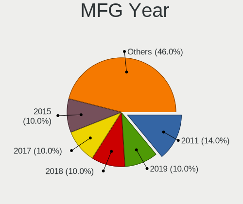
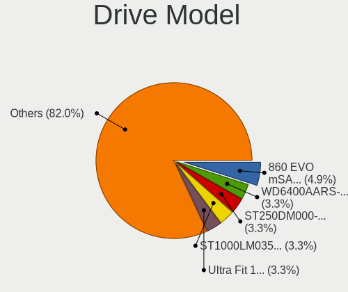
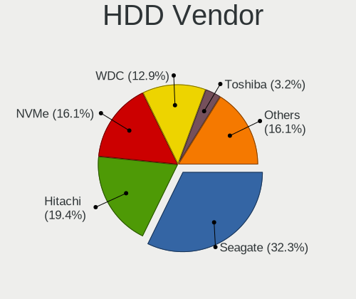
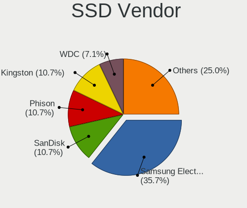
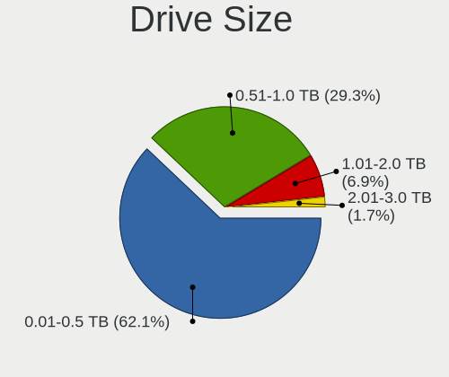
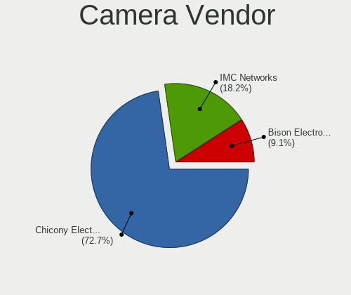

OpenBSD 6.7 - Tested Hardware & Statistics
------------------------------------------

A project to collect tested hardware configurations for OpenBSD 6.7.

Anyone can contribute to this report by the [hw-probe](https://github.com/linuxhw/hw-probe/blob/master/INSTALL.BSD.md) tool:

    hw-probe -all -upload

Please contribute! Especially if your hardware is rare.

This is a report for all computer types. See also reports for [desktops](/Dist/OpenBSD_6.7/Desktop/README.md) and [notebooks](/Dist/OpenBSD_6.7/Notebook/README.md).

Contents
--------

* [ Test Cases ](#test-cases)

* [ System ](#system)
  - [ Arch                     ](#arch)
  - [ DE                       ](#de)
  - [ Display Server           ](#display-server)
  - [ Display Manager          ](#display-manager)
  - [ OS Lang                  ](#os-lang)
  - [ Boot Mode                ](#boot-mode)
  - [ Filesystem               ](#filesystem)
  - [ Part. scheme             ](#part-scheme)

* [ Board ](#board)
  - [ Vendor                   ](#vendor)
  - [ Model                    ](#model)
  - [ Model Family             ](#model-family)
  - [ MFG Year                 ](#mfg-year)
  - [ Form Factor              ](#form-factor)
  - [ Coreboot                 ](#coreboot)
  - [ RAM Size                 ](#ram-size)
  - [ RAM Used                 ](#ram-used)
  - [ Total Drives             ](#total-drives)
  - [ Has CD-ROM               ](#has-cd-rom)
  - [ Has Ethernet             ](#has-ethernet)
  - [ Has WiFi                 ](#has-wifi)
  - [ Has Bluetooth            ](#has-bluetooth)

* [ Location ](#location)
  - [ Country                  ](#country)
  - [ City                     ](#city)

* [ Drives ](#drives)
  - [ Drive Vendor             ](#drive-vendor)
  - [ Drive Model              ](#drive-model)
  - [ HDD Vendor               ](#hdd-vendor)
  - [ SSD Vendor               ](#ssd-vendor)
  - [ Drive Kind               ](#drive-kind)
  - [ Drive Connector          ](#drive-connector)
  - [ Drive Size               ](#drive-size)
  - [ Space Total              ](#space-total)
  - [ Space Used               ](#space-used)
  - [ Malfunc. Drives          ](#malfunc-drives)
  - [ Malfunc. Drive Vendor    ](#malfunc-drive-vendor)
  - [ Malfunc. HDD Vendor      ](#malfunc-hdd-vendor)
  - [ Malfunc. Drive Kind      ](#malfunc-drive-kind)
  - [ Failed Drives            ](#failed-drives)
  - [ Failed Drive Vendor      ](#failed-drive-vendor)
  - [ Drive Status             ](#drive-status)

* [ Storage controller ](#storage-controller)
  - [ Storage Vendor           ](#storage-vendor)
  - [ Storage Model            ](#storage-model)
  - [ Storage Kind             ](#storage-kind)

* [ Processor ](#processor)
  - [ CPU Vendor               ](#cpu-vendor)
  - [ CPU Model                ](#cpu-model)
  - [ CPU Model Family         ](#cpu-model-family)
  - [ CPU Cores                ](#cpu-cores)
  - [ CPU Sockets              ](#cpu-sockets)
  - [ CPU Threads              ](#cpu-threads)
  - [ CPU Microarch            ](#cpu-microarch)

* [ Graphics ](#graphics)
  - [ GPU Vendor               ](#gpu-vendor)
  - [ GPU Model                ](#gpu-model)
  - [ GPU Combo                ](#gpu-combo)
  - [ GPU Driver               ](#gpu-driver)
  - [ GPU Memory               ](#gpu-memory)

* [ Monitor ](#monitor)
  - [ Monitor Vendor           ](#monitor-vendor)
  - [ Monitor Model            ](#monitor-model)
  - [ Monitor Resolution       ](#monitor-resolution)
  - [ Monitor Diagonal         ](#monitor-diagonal)
  - [ Monitor Width            ](#monitor-width)
  - [ Aspect Ratio             ](#aspect-ratio)
  - [ Monitor Area             ](#monitor-area)
  - [ Pixel Density            ](#pixel-density)
  - [ Multiple Monitors        ](#multiple-monitors)

* [ Network ](#network)
  - [ Net Controller Vendor    ](#net-controller-vendor)
  - [ Net Controller Model     ](#net-controller-model)
  - [ Wireless Vendor          ](#wireless-vendor)
  - [ Wireless Model           ](#wireless-model)
  - [ Ethernet Vendor          ](#ethernet-vendor)
  - [ Ethernet Model           ](#ethernet-model)
  - [ Net Controller Kind      ](#net-controller-kind)
  - [ Used Controller          ](#used-controller)
  - [ NICs                     ](#nics)
  - [ IPv6                     ](#ipv6)

* [ Bluetooth ](#bluetooth)
  - [ Bluetooth Vendor         ](#bluetooth-vendor)
  - [ Bluetooth Model          ](#bluetooth-model)

* [ Sound ](#sound)
  - [ Sound Vendor             ](#sound-vendor)
  - [ Sound Model              ](#sound-model)

* [ Memory ](#memory)
  - [ Memory Vendor            ](#memory-vendor)
  - [ Memory Model             ](#memory-model)
  - [ Memory Kind              ](#memory-kind)
  - [ Memory Form Factor       ](#memory-form-factor)
  - [ Memory Size              ](#memory-size)
  - [ Memory Speed             ](#memory-speed)

* [ Printers & scanners ](#printers--scanners)
  - [ Printer Vendor           ](#printer-vendor)
  - [ Printer Model            ](#printer-model)
  - [ Scanner Vendor           ](#scanner-vendor)
  - [ Scanner Model            ](#scanner-model)

* [ Camera ](#camera)
  - [ Camera Vendor            ](#camera-vendor)
  - [ Camera Model             ](#camera-model)

* [ Security ](#security)
  - [ Fingerprint Vendor       ](#fingerprint-vendor)
  - [ Fingerprint Model        ](#fingerprint-model)
  - [ Chipcard Vendor          ](#chipcard-vendor)
  - [ Chipcard Model           ](#chipcard-model)

* [ Unsupported ](#unsupported)
  - [ Unsupported Devices      ](#unsupported-devices)
  - [ Unsupported Device Types ](#unsupported-device-types)

Test Cases
----------

Total: 61

| Vendor        | Model                       | Form-Factor | Probe                                                     | Date         |
|---------------|-----------------------------|-------------|-----------------------------------------------------------|--------------|
| Lenovo        | ThinkPad X230 2325Y36       | Notebook    | [1f28f1c311](https://bsd-hardware.info/?probe=1f28f1c311) | Aug 30, 2020 |
| Lenovo        | ThinkPad X230 2325Y36       | Notebook    | [11a0bbb73f](https://bsd-hardware.info/?probe=11a0bbb73f) | Aug 30, 2020 |
| Protectli     | FW6                         | Desktop     | [1454991c98](https://bsd-hardware.info/?probe=1454991c98) | Aug 27, 2020 |
| PC Engines    | apu4                        | Desktop     | [8f4ed98a45](https://bsd-hardware.info/?probe=8f4ed98a45) | Aug 21, 2020 |
| Lenovo        | ThinkPad P40 Yoga 20GQ00... | Notebook    | [ac92b69122](https://bsd-hardware.info/?probe=ac92b69122) | Aug 20, 2020 |
| Lenovo        | ThinkPad X1 Carbon 3rd 2... | Notebook    | [3032cd9409](https://bsd-hardware.info/?probe=3032cd9409) | Aug 20, 2020 |
| HP            | Laptop 15-dw0xxx            | Notebook    | [547b36ea62](https://bsd-hardware.info/?probe=547b36ea62) | Aug 19, 2020 |
| HCL Infosy... | Calistoga & ICH7M Chipse... | Notebook    | [6adc98922d](https://bsd-hardware.info/?probe=6adc98922d) | Aug 19, 2020 |
| Gigabyte      | X58A-UD5                    | Desktop     | [63a429ad0e](https://bsd-hardware.info/?probe=63a429ad0e) | Aug 16, 2020 |
| Dell          | OptiPlex 745                | Desktop     | [6de04c2c9c](https://bsd-hardware.info/?probe=6de04c2c9c) | Aug 14, 2020 |
| IBM           | ThinkPad T42 2373K9G        | Notebook    | [fa35e7ec26](https://bsd-hardware.info/?probe=fa35e7ec26) | Aug 11, 2020 |
| PC Engines    | apu4                        | Desktop     | [f0f8a22656](https://bsd-hardware.info/?probe=f0f8a22656) | Aug 05, 2020 |
| Intel         | ChiefRiver                  | Desktop     | [022d2761b9](https://bsd-hardware.info/?probe=022d2761b9) | Aug 03, 2020 |
| PC Engines    | APU3                        | Desktop     | [1eaf8a1484](https://bsd-hardware.info/?probe=1eaf8a1484) | Aug 03, 2020 |
| PC Engines    | APU3                        | Desktop     | [4980462667](https://bsd-hardware.info/?probe=4980462667) | Aug 03, 2020 |
| PC Engines    | APU3                        | Desktop     | [975e23e09d](https://bsd-hardware.info/?probe=975e23e09d) | Aug 03, 2020 |
| HP            | ZBook 15 G4                 | Notebook    | [a8953b4964](https://bsd-hardware.info/?probe=a8953b4964) | Aug 03, 2020 |
| HP            | ZBook 15 G4                 | Notebook    | [a97053c5d4](https://bsd-hardware.info/?probe=a97053c5d4) | Aug 03, 2020 |
| Shuttle       | DS437                       | Desktop     | [aa350b6b92](https://bsd-hardware.info/?probe=aa350b6b92) | Aug 03, 2020 |
| PC Engines    | APU2                        | Desktop     | [fe5c2f4838](https://bsd-hardware.info/?probe=fe5c2f4838) | Aug 03, 2020 |
| Lenovo        | ThinkPad X1 Carbon 5th 2... | Notebook    | [20f3e760eb](https://bsd-hardware.info/?probe=20f3e760eb) | Aug 03, 2020 |
| Lenovo        | ThinkPad X1 Carbon 5th 2... | Notebook    | [b305c0df5e](https://bsd-hardware.info/?probe=b305c0df5e) | Aug 03, 2020 |
| Lenovo        | ThinkPad W540 20BG001KUK    | Notebook    | [f3e2acbb66](https://bsd-hardware.info/?probe=f3e2acbb66) | Jul 31, 2020 |
| Lenovo        | ThinkPad W540 20BG001KUK    | Notebook    | [7ae8c247e9](https://bsd-hardware.info/?probe=7ae8c247e9) | Jul 31, 2020 |
| Lenovo        | ThinkPad T60 87445BU        | Notebook    | [37a42caa92](https://bsd-hardware.info/?probe=37a42caa92) | Jul 30, 2020 |
| Lenovo        | ThinkCentre M92p 3212AD2    | Desktop     | [ca76cc5467](https://bsd-hardware.info/?probe=ca76cc5467) | Jul 30, 2020 |
| Lenovo        | ThinkPad X1 Carbon 5th 2... | Notebook    | [ac13b0591f](https://bsd-hardware.info/?probe=ac13b0591f) | Jul 27, 2020 |
| ASRock        | E350M1                      | Desktop     | [08eec78cdf](https://bsd-hardware.info/?probe=08eec78cdf) | Jul 25, 2020 |
| Pegatron      | 2A73                        | Desktop     | [05dea28605](https://bsd-hardware.info/?probe=05dea28605) | Jul 21, 2020 |
| PC Engines    | apu4                        | Desktop     | [52c611855b](https://bsd-hardware.info/?probe=52c611855b) | Jul 12, 2020 |
| AMI           | Aptio CRB                   | Mini pc     | [c1f2cdf7a8](https://bsd-hardware.info/?probe=c1f2cdf7a8) | Jul 03, 2020 |
| AMI           | Aptio CRB                   | Mini pc     | [b79f3127ee](https://bsd-hardware.info/?probe=b79f3127ee) | Jul 03, 2020 |
| ASUSTek       | All Series                  | Desktop     | [e4f1a19012](https://bsd-hardware.info/?probe=e4f1a19012) | Jun 05, 2020 |
| Toshiba       | Satellite L775D             | Notebook    | [bb218a14a6](https://bsd-hardware.info/?probe=bb218a14a6) | Jun 03, 2020 |
| Toshiba       | Satellite L775D             | Notebook    | [f0ec90217a](https://bsd-hardware.info/?probe=f0ec90217a) | Jun 03, 2020 |
| Unknown       | Unknown                     | Desktop     | [4e3b87cc6c](https://bsd-hardware.info/?probe=4e3b87cc6c) | Jun 01, 2020 |
| Lenovo        | ThinkPad X220 4291C35       | Notebook    | [f22c83f68b](https://bsd-hardware.info/?probe=f22c83f68b) | May 31, 2020 |
| Panasonic     | CF-19ADUAX1M                | Notebook    | [cefc742c62](https://bsd-hardware.info/?probe=cefc742c62) | May 29, 2020 |
| Sony UK       | Raspberry Pi 4 Model B      | Desktop     | [483af3998c](https://bsd-hardware.info/?probe=483af3998c) | May 28, 2020 |
| Unknown       | Unknown                     | Desktop     | [80a1eda96f](https://bsd-hardware.info/?probe=80a1eda96f) | May 28, 2020 |
| Dell          | PowerEdge T320              | Desktop     | [eec750b5c5](https://bsd-hardware.info/?probe=eec750b5c5) | May 28, 2020 |
| Gigabyte      | M68MT-S2P                   | Desktop     | [08534174df](https://bsd-hardware.info/?probe=08534174df) | May 27, 2020 |
| Unknown       | TI AM335x BeagleBone Bla... | Desktop     | [8e0f831fd8](https://bsd-hardware.info/?probe=8e0f831fd8) | May 27, 2020 |
| Gigabyte      | M68MT-S2P                   | Desktop     | [03ea0992c4](https://bsd-hardware.info/?probe=03ea0992c4) | May 27, 2020 |
| IBM           | Board                       | Desktop     | [1bcc2b8e0b](https://bsd-hardware.info/?probe=1bcc2b8e0b) | May 27, 2020 |
| Unknown       | TI AM335x BeagleBone Bla... | Desktop     | [74b9526162](https://bsd-hardware.info/?probe=74b9526162) | May 27, 2020 |
| Fujitsu       | LIFEBOOK A357               | Notebook    | [b02640458b](https://bsd-hardware.info/?probe=b02640458b) | May 26, 2020 |
| Lenovo        | ThinkPad X230 2324A57       | Notebook    | [6ea713bf51](https://bsd-hardware.info/?probe=6ea713bf51) | May 25, 2020 |
| Lenovo        | ThinkPad X230 2324A57       | Notebook    | [7b67911c5a](https://bsd-hardware.info/?probe=7b67911c5a) | May 25, 2020 |
| Lenovo        | ThinkPad X1 Carbon 6th 2... | Notebook    | [b4ca8bbc46](https://bsd-hardware.info/?probe=b4ca8bbc46) | May 25, 2020 |
| Gigabyte      | Unknown                     | Desktop     | [576771182b](https://bsd-hardware.info/?probe=576771182b) | May 25, 2020 |
| Gigabyte      | Unknown                     | Desktop     | [05e8154b2c](https://bsd-hardware.info/?probe=05e8154b2c) | May 25, 2020 |
| Lenovo        | ThinkPad T420 4180B39       | Notebook    | [916596bfa8](https://bsd-hardware.info/?probe=916596bfa8) | May 25, 2020 |
| IBM           | ThinkPad X41 2525FAG        | Notebook    | [1e849f86cf](https://bsd-hardware.info/?probe=1e849f86cf) | May 25, 2020 |
| ASUSTek       | P4P800-VM                   | Desktop     | [8b9481baf2](https://bsd-hardware.info/?probe=8b9481baf2) | May 25, 2020 |
| ASUSTek       | P4P800-VM                   | Desktop     | [33c4579f99](https://bsd-hardware.info/?probe=33c4579f99) | May 25, 2020 |
| Lenovo        | ThinkPad T440 20B7S1C600    | Notebook    | [a4a62cb85e](https://bsd-hardware.info/?probe=a4a62cb85e) | May 24, 2020 |
| Lenovo        | ThinkPad T440s 20AR003VM... | Notebook    | [3f72b76851](https://bsd-hardware.info/?probe=3f72b76851) | May 23, 2020 |
| Lenovo        | ThinkPad T495 20NJCTO1WW    | Notebook    | [fa71e5839a](https://bsd-hardware.info/?probe=fa71e5839a) | May 23, 2020 |
| Lenovo        | ThinkPad T440p 20AN00DEU... | Notebook    | [9ff1537692](https://bsd-hardware.info/?probe=9ff1537692) | May 23, 2020 |
| Lenovo        | G570 20079                  | Notebook    | [8212868b9f](https://bsd-hardware.info/?probe=8212868b9f) | May 19, 2020 |

System
------

Arch
----

OS architecture (x86_64, i586, etc.)

| Name   | Computers | Percent |
|--------|-----------|---------|
| amd64  | 41        | 82%     |
| i386   | 6         | 12%     |
| octeon | 1         | 2%      |
| armv7  | 1         | 2%      |
| arm64  | 1         | 2%      |

DE
--

Desktop Environment

| Name    | Computers | Percent |
|---------|-----------|---------|
| fvwm    | 34        | 68%     |
| Console | 16        | 32%     |

Display Server
--------------

X11 or Wayland

| Name    | Computers | Percent |
|---------|-----------|---------|
| X11     | 33        | 66%     |
| Console | 17        | 34%     |

Display Manager
---------------

SDDM, LightDM, etc.

| Name    | Computers | Percent |
|---------|-----------|---------|
| Console | 42        | 84%     |
| GDM     | 6         | 12%     |
| SLiM    | 2         | 4%      |

OS Lang
-------

Language

| Lang    | Computers | Percent |
|---------|-----------|---------|
| Unknown | 38        | 74.51%  |
| en_US   | 9         | 17.65%  |
| ru_RU   | 1         | 1.96%   |
| en_GB   | 1         | 1.96%   |
| en_CA   | 1         | 1.96%   |
| de_DE   | 1         | 1.96%   |

Boot Mode
---------

EFI or BIOS

| Mode | Computers | Percent |
|------|-----------|---------|
| BIOS | 36        | 72%     |
| EFI  | 14        | 28%     |

Filesystem
----------

Type of filesystem

| Type | Computers | Percent |
|------|-----------|---------|
| Ffs  | 50        | 100%    |

Part. scheme
------------

Scheme of partitioning

| Type    | Computers | Percent |
|---------|-----------|---------|
| MBR     | 34        | 68%     |
| GPT     | 13        | 26%     |
| Unknown | 3         | 6%      |

Board
-----

Vendor
------

Motherboard manufacturer

| Name                    | Computers | Percent |
|-------------------------|-----------|---------|
| Lenovo                  | 15        | 30%     |
| PC Engines              | 7         | 14%     |
| Gigabyte Technology     | 4         | 8%      |
| IBM                     | 3         | 6%      |
| Hewlett-Packard         | 3         | 6%      |
| Unknown                 | 3         | 6%      |
| Dell                    | 2         | 4%      |
| ASUSTek Computer        | 2         | 4%      |
| Toshiba                 | 1         | 2%      |
| Sony UK                 | 1         | 2%      |
| Shuttle                 | 1         | 2%      |
| Protectli               | 1         | 2%      |
| Pegatron                | 1         | 2%      |
| Panasonic               | 1         | 2%      |
| Intel                   | 1         | 2%      |
| HCL Infosystems Limited | 1         | 2%      |
| Fujitsu                 | 1         | 2%      |
| ASRock                  | 1         | 2%      |
| AMI                     | 1         | 2%      |

Model
-----

Motherboard model

| Name                                              | Computers | Percent |
|---------------------------------------------------|-----------|---------|
| Unknown                                           | 4         | 8%      |
| PC Engines apu4                                   | 3         | 6%      |
| PC Engines APU3                                   | 3         | 6%      |
| HP ZBook 15 G4                                    | 2         | 4%      |
| Gigabyte M68MT-S2P                                | 2         | 4%      |
| Toshiba Satellite L775D                           | 1         | 2%      |
| Sony UK Raspberry Pi 4 Model B                    | 1         | 2%      |
| Shuttle DS437                                     | 1         | 2%      |
| Protectli FW6                                     | 1         | 2%      |
| Pegatron Compaq dx2400 Microtower                 | 1         | 2%      |
| PC Engines APU2                                   | 1         | 2%      |
| Panasonic CF-19ADUAX1M                            | 1         | 2%      |
| Lenovo ThinkPad X230 2325Y36                      | 1         | 2%      |
| Lenovo ThinkPad X230 2324A57                      | 1         | 2%      |
| Lenovo ThinkPad X220 4291C35                      | 1         | 2%      |
| Lenovo ThinkPad X1 Carbon 6th 20KH002RUS          | 1         | 2%      |
| Lenovo ThinkPad X1 Carbon 5th 20HR0068GE          | 1         | 2%      |
| Lenovo ThinkPad X1 Carbon 3rd 20BSCTO1WW          | 1         | 2%      |
| Lenovo ThinkPad W540 20BG001KUK                   | 1         | 2%      |
| Lenovo ThinkPad T60 87445BU                       | 1         | 2%      |
| Lenovo ThinkPad T495 20NJCTO1WW                   | 1         | 2%      |
| Lenovo ThinkPad T440s 20AR003VMS                  | 1         | 2%      |
| Lenovo ThinkPad T440p 20AN00DEUS                  | 1         | 2%      |
| Lenovo ThinkPad T440 20B7S1C600                   | 1         | 2%      |
| Lenovo ThinkPad T420 4180B39                      | 1         | 2%      |
| Lenovo ThinkPad P40 Yoga 20GQ000EUS               | 1         | 2%      |
| Lenovo ThinkCentre M92p 3212AD2                   | 1         | 2%      |
| Intel ChiefRiver                                  | 1         | 2%      |
| IBM ThinkPad X41 2525FAG                          | 1         | 2%      |
| IBM ThinkPad T42 2373K9G                          | 1         | 2%      |
| IBM 81832BG                                       | 1         | 2%      |
| HP Laptop 15-dw0xxx                               | 1         | 2%      |
| HCL Infosystems Limited Calistoga & ICH7M Chipset | 1         | 2%      |
| Gigabyte X58A-UD5                                 | 1         | 2%      |
| Fujitsu LIFEBOOK A357                             | 1         | 2%      |
| Dell PowerEdge T320                               | 1         | 2%      |
| Dell OptiPlex 745                                 | 1         | 2%      |
| ASUS P4P800-VM                                    | 1         | 2%      |
| ASUS All Series                                   | 1         | 2%      |
| ASRock E350M1                                     | 1         | 2%      |

Model Family
------------

Motherboard model prefix

| Name                              | Computers | Percent |
|-----------------------------------|-----------|---------|
| Lenovo ThinkPad                   | 14        | 28%     |
| Unknown                           | 4         | 8%      |
| PC Engines apu4                   | 3         | 6%      |
| PC Engines APU3                   | 3         | 6%      |
| IBM ThinkPad                      | 2         | 4%      |
| HP ZBook                          | 2         | 4%      |
| Gigabyte M68MT-S2P                | 2         | 4%      |
| Toshiba Satellite                 | 1         | 2%      |
| Sony UK Raspberry                 | 1         | 2%      |
| Shuttle DS437                     | 1         | 2%      |
| Protectli FW6                     | 1         | 2%      |
| Pegatron Compaq                   | 1         | 2%      |
| PC Engines APU2                   | 1         | 2%      |
| Panasonic CF-19ADUAX1M            | 1         | 2%      |
| Lenovo ThinkCentre                | 1         | 2%      |
| Intel ChiefRiver                  | 1         | 2%      |
| IBM 81832BG                       | 1         | 2%      |
| HP Laptop                         | 1         | 2%      |
| HCL Infosystems Limited Calistoga | 1         | 2%      |
| Gigabyte X58A-UD5                 | 1         | 2%      |
| Fujitsu LIFEBOOK                  | 1         | 2%      |
| Dell PowerEdge                    | 1         | 2%      |
| Dell OptiPlex                     | 1         | 2%      |
| ASUS P4P800-VM                    | 1         | 2%      |
| ASUS All                          | 1         | 2%      |
| ASRock E350M1                     | 1         | 2%      |
| AMI Aptio                         | 1         | 2%      |

MFG Year
--------

Motherboard manufacture year

| Year    | Computers | Percent |
|---------|-----------|---------|
| 2011    | 7         | 14%     |
| 2018    | 5         | 10%     |
| 2017    | 5         | 10%     |
| 2015    | 5         | 10%     |
| 2019    | 4         | 8%      |
| 2012    | 4         | 8%      |
| 2006    | 4         | 8%      |
| Unknown | 4         | 8%      |
| 2020    | 3         | 6%      |
| 2014    | 2         | 4%      |
| 2010    | 2         | 4%      |
| 2016    | 1         | 2%      |
| 2013    | 1         | 2%      |
| 2009    | 1         | 2%      |
| 2005    | 1         | 2%      |
| 2004    | 1         | 2%      |

Form Factor
-----------

Physical design of the computer

| Name     | Computers | Percent |
|----------|-----------|---------|
| Desktop  | 26        | 52%     |
| Notebook | 23        | 46%     |
| Mini pc  | 1         | 2%      |

Coreboot
--------

Have coreboot on board

| Used | Computers | Percent |
|------|-----------|---------|
| No   | 42        | 84%     |
| Yes  | 8         | 16%     |

RAM Size
--------

Total RAM memory

| Size in GB | Computers | Percent |
|------------|-----------|---------|
| 8.01-16.0  | 13        | 26%     |
| 4.01-8.0   | 12        | 24%     |
| 2.01-3.0   | 6         | 12%     |
| 16.01-24.0 | 6         | 12%     |
| 32.01-64.0 | 5         | 10%     |
| 3.01-4.0   | 3         | 6%      |
| 0.01-0.5   | 2         | 4%      |
| 24.01-32.0 | 1         | 2%      |
| 1.01-2.0   | 1         | 2%      |
| 0.51-1.0   | 1         | 2%      |

RAM Used
--------

Used RAM memory

| Used GB  | Computers | Percent |
|----------|-----------|---------|
| 0.01-0.5 | 40        | 80%     |
| 0        | 4         | 8%      |
| 0.51-1.0 | 3         | 6%      |
| 1.01-2.0 | 2         | 4%      |
| Unknown  | 1         | 2%      |

Total Drives
------------

Number of drives on board

| Drives | Computers | Percent |
|--------|-----------|---------|
| 1      | 22        | 44%     |
| 2      | 19        | 38%     |
| 3      | 5         | 10%     |
| 4      | 3         | 6%      |
| 0      | 1         | 2%      |

Has CD-ROM
----------

Has CD-ROM on board

| Presented | Computers | Percent |
|-----------|-----------|---------|
| No        | 50        | 100%    |

Has Ethernet
------------

Has Ethernet on board

| Presented | Computers | Percent |
|-----------|-----------|---------|
| Yes       | 45        | 90%     |
| No        | 5         | 10%     |

Has WiFi
--------

Has WiFi module

| Presented | Computers | Percent |
|-----------|-----------|---------|
| Yes       | 26        | 52%     |
| No        | 24        | 48%     |

Has Bluetooth
-------------

Has Bluetooth module

| Presented | Computers | Percent |
|-----------|-----------|---------|
| No        | 43        | 86%     |
| Yes       | 7         | 14%     |

Location
--------

Country
-------

Geographic location (country)

| Country     | Computers | Percent |
|-------------|-----------|---------|
| Germany     | 13        | 26%     |
| USA         | 11        | 22%     |
| Russia      | 10        | 20%     |
| Switzerland | 3         | 6%      |
| UK          | 2         | 4%      |
| Sweden      | 2         | 4%      |
| France      | 2         | 4%      |
| Norway      | 1         | 2%      |
| Italy       | 1         | 2%      |
| India       | 1         | 2%      |
| Finland     | 1         | 2%      |
| Ecuador     | 1         | 2%      |
| Croatia     | 1         | 2%      |
| Australia   | 1         | 2%      |

City
----

Geographic location (city)

| City               | Computers | Percent |
|--------------------|-----------|---------|
| Berlin             | 6         | 12%     |
| St Petersburg      | 4         | 8%      |
| Gummersbach        | 4         | 8%      |
| Zurich             | 3         | 6%      |
| Wittersham         | 2         | 4%      |
| Orsk               | 2         | 4%      |
| Moscow             | 2         | 4%      |
| Harrisburg         | 2         | 4%      |
| Fort Lauderdale    | 2         | 4%      |
| Zhukovskiy         | 1         | 2%      |
| Sundbyberg         | 1         | 2%      |
| San Francisco      | 1         | 2%      |
| Ryazan             | 1         | 2%      |
| Rovisce            | 1         | 2%      |
| Riverview          | 1         | 2%      |
| Portland           | 1         | 2%      |
| Port Byron         | 1         | 2%      |
| Pine Mountain Club | 1         | 2%      |
| Paris              | 1         | 2%      |
| Oslo               | 1         | 2%      |
| OEverlida          | 1         | 2%      |
| Melbourne          | 1         | 2%      |
| Lamothe-Goas       | 1         | 2%      |
| Kouvola            | 1         | 2%      |
| Hyderabad          | 1         | 2%      |
| Essen              | 1         | 2%      |
| Erlangen           | 1         | 2%      |
| Cuenca             | 1         | 2%      |
| Braunschweig       | 1         | 2%      |
| Bothell            | 1         | 2%      |
| Bergamo            | 1         | 2%      |
| Ames               | 1         | 2%      |

Drives
------

Drive Vendor
------------

Hard drive vendors

| Vendor              | Computers | Drives | Percent |
|---------------------|-----------|--------|---------|
| Samsung Electronics | 11        | 12     | 18.64%  |
| Seagate             | 10        | 13     | 16.95%  |
| WDC                 | 6         | 6      | 10.17%  |
| NVMe                | 6         | 7      | 10.17%  |
| Hitachi             | 6         | 6      | 10.17%  |
| SanDisk             | 3         | 4      | 5.08%   |
| Phison              | 3         | 3      | 5.08%   |
| Kingston            | 3         | 3      | 5.08%   |
| Transcend           | 1         | 1      | 1.69%   |
| Toshiba             | 1         | 1      | 1.69%   |
| OPENBSD             | 1         | 1      | 1.69%   |
| Micron Technology   | 1         | 1      | 1.69%   |
| LSI                 | 1         | 1      | 1.69%   |
| Leven               | 1         | 1      | 1.69%   |
| Intel               | 1         | 1      | 1.69%   |
| HGST                | 1         | 1      | 1.69%   |
| Gigabyte Technology | 1         | 1      | 1.69%   |
| Crucial             | 1         | 1      | 1.69%   |
| China               | 1         | 1      | 1.69%   |

Drive Model
-----------

Hard drive models

| Model                            | Computers | Percent |
|----------------------------------|-----------|---------|
| Samsung SSD 860 EVO mSATA 500GB  | 3         | 4.92%   |
| WDC WD6400AARS-00Y5B1 640GB      | 2         | 3.28%   |
| Seagate ST250DM000-1BD141 250GB  | 2         | 3.28%   |
| Seagate ST1000LM035-1RK172 1TB   | 2         | 3.28%   |
| SanDisk Ultra Fit 16GB           | 2         | 3.28%   |
| NVMe SAMSUNG MZVLW256 256GB      | 2         | 3.28%   |
| WDC WDS240G2G0A-00JH30 240GB     | 1         | 1.64%   |
| WDC WDS100T2B0A-00SM50 1TB       | 1         | 1.64%   |
| WDC WD1600AAJS-60B4A0 160GB      | 1         | 1.64%   |
| WDC WD10JPVX-22JC3T0 1TB         | 1         | 1.64%   |
| Transcend TS128GMTS430S 128GB    | 1         | 1.64%   |
| Toshiba MK8025GAS 80GB           | 1         | 1.64%   |
| Seagate ST500DM009-2DM14C 500GB  | 1         | 1.64%   |
| Seagate ST3320418AS 320GB        | 1         | 1.64%   |
| Seagate ST3250318AS 250GB        | 1         | 1.64%   |
| Seagate ST3000DM001-1CH166 3TB   | 1         | 1.64%   |
| Seagate ST2000VN000-1HJ164 2TB   | 1         | 1.64%   |
| Seagate ST2000NE0025-2FL101 2TB  | 1         | 1.64%   |
| Seagate ST1000LM048-2E7172 1TB   | 1         | 1.64%   |
| SanDisk Cruzer Fit 32GB          | 1         | 1.64%   |
| Samsung SSD 850 EVO mSATA 250GB  | 1         | 1.64%   |
| Samsung SSD 850 EVO 1TB          | 1         | 1.64%   |
| Samsung SSD 850 EVO 120GB        | 1         | 1.64%   |
| Samsung SSD 840 EVO 120GB        | 1         | 1.64%   |
| Samsung MZMTE1T0HMJH-00000 1TB   | 1         | 1.64%   |
| Samsung MZHPV256HDGL-000L1 256GB | 1         | 1.64%   |
| Samsung MZ7PC128HAFU-000L1 128GB | 1         | 1.64%   |
| Samsung MZ7LN512HMJP-000L7 512GB | 1         | 1.64%   |
| Samsung Flash Drive FIT 32GB     | 1         | 1.64%   |
| Phison SATA SSD 64GB             | 1         | 1.64%   |
| Phison SATA SSD 16GB             | 1         | 1.64%   |
| Phison SATA SSD 128GB            | 1         | 1.64%   |
| OPENBSD SR RAID 1 752GB          | 1         | 1.64%   |
| NVMe WDC PC SN720 SDA 1TB        | 1         | 1.64%   |
| NVMe SAMSUNG MZVLW1T0 1TB        | 1         | 1.64%   |
| NVMe LENSE30512GMSP34 512GB      | 1         | 1.64%   |
| NVMe INTEL SSDPEKNW51 512GB      | 1         | 1.64%   |
| Micron 1100_MTFDDAK256TBN 256GB  | 1         | 1.64%   |
| LSI Logical Volume 597GB         | 1         | 1.64%   |
| Leven JAJS600M512C 512GB         | 1         | 1.64%   |

HDD Vendor
----------

Hard disk drive vendors

| Vendor              | Computers | Drives | Percent |
|---------------------|-----------|--------|---------|
| Seagate             | 10        | 13     | 32.26%  |
| Hitachi             | 6         | 6      | 19.35%  |
| NVMe                | 5         | 6      | 16.13%  |
| WDC                 | 4         | 4      | 12.9%   |
| Toshiba             | 1         | 1      | 3.23%   |
| Samsung Electronics | 1         | 1      | 3.23%   |
| OPENBSD             | 1         | 1      | 3.23%   |
| LSI                 | 1         | 1      | 3.23%   |
| HGST                | 1         | 1      | 3.23%   |
| China               | 1         | 1      | 3.23%   |

SSD Vendor
----------

Solid state drive vendors

| Vendor              | Computers | Drives | Percent |
|---------------------|-----------|--------|---------|
| Samsung Electronics | 10        | 11     | 35.71%  |
| SanDisk             | 3         | 4      | 10.71%  |
| Phison              | 3         | 3      | 10.71%  |
| Kingston            | 3         | 3      | 10.71%  |
| WDC                 | 2         | 2      | 7.14%   |
| Transcend           | 1         | 1      | 3.57%   |
| NVMe                | 1         | 1      | 3.57%   |
| Micron Technology   | 1         | 1      | 3.57%   |
| Leven               | 1         | 1      | 3.57%   |
| Intel               | 1         | 1      | 3.57%   |
| Gigabyte Technology | 1         | 1      | 3.57%   |
| Crucial             | 1         | 1      | 3.57%   |

Drive Kind
----------

HDD or SSD

| Kind | Computers | Drives | Percent |
|------|-----------|--------|---------|
| SSD  | 26        | 30     | 50.98%  |
| HDD  | 25        | 35     | 49.02%  |

Drive Connector
---------------

SATA, SAS, NVMe, etc.

| Type | Computers | Drives | Percent |
|------|-----------|--------|---------|
| SATA | 48        | 65     | 100%    |

Drive Size
----------

Size of hard drive

| Size in TB | Computers | Drives | Percent |
|------------|-----------|--------|---------|
| 0.01-0.5   | 36        | 39     | 62.07%  |
| 0.51-1.0   | 16        | 16     | 27.59%  |
| 1.01-2.0   | 5         | 9      | 8.62%   |
| 2.01-3.0   | 1         | 1      | 1.72%   |

Space Total
-----------

Amount of disk space available on the file system

| Size in GB | Computers | Percent |
|------------|-----------|---------|
| 101-250    | 16        | 32%     |
| 251-500    | 13        | 26%     |
| 51-100     | 8         | 16%     |
| 1-20       | 5         | 10%     |
| 501-1000   | 5         | 10%     |
| 21-50      | 2         | 4%      |
| 1001-2000  | 1         | 2%      |

Space Used
----------

Amount of used disk space

| Used GB  | Computers | Percent |
|----------|-----------|---------|
| 1-20     | 35        | 70%     |
| 101-250  | 8         | 16%     |
| 21-50    | 4         | 8%      |
| 51-100   | 2         | 4%      |
| 501-1000 | 1         | 2%      |

Malfunc. Drives
---------------

Drive models with a malfunction

| Model                        | Computers | Drives | Percent |
|------------------------------|-----------|--------|---------|
| Seagate ST3320418AS 320GB    | 1         | 1      | 25%     |
| Hitachi HTS541060G9SA00 64GB | 1         | 1      | 25%     |
| Hitachi HTC426060G9AT00 64GB | 1         | 1      | 25%     |
| Hitachi HDS721010CLA332 1TB  | 1         | 1      | 25%     |

Malfunc. Drive Vendor
---------------------

Vendors of faulty drives

| Vendor  | Computers | Drives | Percent |
|---------|-----------|--------|---------|
| Hitachi | 3         | 3      | 75%     |
| Seagate | 1         | 1      | 25%     |

Malfunc. HDD Vendor
-------------------

Vendors of faulty HDD drives

| Vendor  | Computers | Drives | Percent |
|---------|-----------|--------|---------|
| Hitachi | 3         | 3      | 75%     |
| Seagate | 1         | 1      | 25%     |

Malfunc. Drive Kind
-------------------

Kinds of faulty drives

| Kind | Computers | Drives | Percent |
|------|-----------|--------|---------|
| HDD  | 4         | 4      | 100%    |

Failed Drives
-------------

Failed drive models

Zero info for selected period =(

Failed Drive Vendor
-------------------

Failed drive vendors

Zero info for selected period =(

Drive Status
------------

Number of failed and malfunc. drives

| Status   | Computers | Drives | Percent |
|----------|-----------|--------|---------|
| Works    | 37        | 46     | 72.55%  |
| Detected | 10        | 15     | 19.61%  |
| Malfunc  | 4         | 4      | 7.84%   |

Storage controller
------------------

Storage Vendor
--------------

Storage controller vendors

| Vendor              | Computers | Percent |
|---------------------|-----------|---------|
| Intel               | 31        | 59.62%  |
| AMD                 | 10        | 19.23%  |
| Samsung Electronics | 4         | 7.69%   |
| Nvidia              | 2         | 3.85%   |
| ASMedia Technology  | 2         | 3.85%   |
| SanDisk             | 1         | 1.92%   |
| Lenovo              | 1         | 1.92%   |
| Broadcom / LSI      | 1         | 1.92%   |

Storage Model
-------------

Storage controller models

| Model                                                                          | Computers | Percent |
|--------------------------------------------------------------------------------|-----------|---------|
| Intel 7 Series Chipset Family 6-port SATA Controller [AHCI mode]               | 4         | 6.67%   |
| Intel 6 Series/C200 Series Chipset Family 6 port Mobile SATA AHCI Controller   | 4         | 6.67%   |
| AMD FCH SATA Controller [IDE mode]                                             | 4         | 6.67%   |
| AMD FCH SATA Controller [AHCI mode]                                            | 4         | 6.67%   |
| Samsung NVMe SSD Controller SM961/PM961/SM963                                  | 3         | 5%      |
| Intel Sunrise Point-LP SATA Controller [AHCI mode]                             | 3         | 5%      |
| Nvidia MCP61 SATA Controller                                                   | 2         | 3.33%   |
| Intel Q170/Q150/B150/H170/H110/Z170/CM236 Chipset SATA Controller [AHCI Mode]  | 2         | 3.33%   |
| Intel 82801GBM/GHM (ICH7-M Family) SATA Controller [AHCI mode]                 | 2         | 3.33%   |
| Intel 82801G (ICH7 Family) IDE Controller                                      | 2         | 3.33%   |
| Intel 82801EB/ER (ICH5/ICH5R) IDE Controller                                   | 2         | 3.33%   |
| Intel 82801EB (ICH5) SATA Controller                                           | 2         | 3.33%   |
| Intel 8 Series/C220 Series Chipset Family 6-port SATA Controller 1 [AHCI mode] | 2         | 3.33%   |
| Intel 8 Series SATA Controller 1 [AHCI mode]                                   | 2         | 3.33%   |
| ASMedia ASM1062 Serial ATA Controller                                          | 2         | 3.33%   |
| SanDisk WD Black 2018/SN750 / PC SN720 NVMe SSD                                | 1         | 1.67%   |
| Samsung SM951 AHCI                                                             | 1         | 1.67%   |
| Lenovo unknown                                                                 | 1         | 1.67%   |
| Intel SSD 660P Series                                                          | 1         | 1.67%   |
| Intel Celeron N3350/Pentium N4200/Atom E3900 Series SATA AHCI Controller       | 1         | 1.67%   |
| Intel C600/X79 series chipset 6-Port SATA AHCI Controller                      | 1         | 1.67%   |
| Intel Atom Processor E3800 Series SATA AHCI Controller                         | 1         | 1.67%   |
| Intel 82801JI (ICH10 Family) 4 port SATA IDE Controller #1                     | 1         | 1.67%   |
| Intel 82801JI (ICH10 Family) 2 port SATA IDE Controller #2                     | 1         | 1.67%   |
| Intel 82801IR/IO/IH (ICH9R/DO/DH) 6 port SATA Controller [AHCI mode]           | 1         | 1.67%   |
| Intel 82801HR/HO/HH (ICH8R/DO/DH) 2 port SATA Controller [IDE mode]            | 1         | 1.67%   |
| Intel 82801H (ICH8 Family) 4 port SATA Controller [IDE mode]                   | 1         | 1.67%   |
| Intel 82801FBM (ICH6M) SATA Controller                                         | 1         | 1.67%   |
| Intel 82801DBM (ICH4-M) IDE Controller                                         | 1         | 1.67%   |
| Intel 82801 Mobile SATA Controller [RAID mode]                                 | 1         | 1.67%   |
| Intel 7 Series/C210 Series Chipset Family 6-port SATA Controller [AHCI mode]   | 1         | 1.67%   |
| Broadcom / LSI SAS2008 PCI-Express Fusion-MPT SAS-2 [Falcon]                   | 1         | 1.67%   |
| AMD SB7x0/SB8x0/SB9x0 SATA Controller [AHCI mode]                              | 1         | 1.67%   |
| AMD FCH IDE Controller                                                         | 1         | 1.67%   |
| AMD CS5536 [Geode companion] IDE                                               | 1         | 1.67%   |

Storage Kind
------------

Kind of storage controller (IDE, SATA, NVMe, SAS, ...)

| Kind | Computers | Percent |
|------|-----------|---------|
| SATA | 32        | 58.18%  |
| IDE  | 15        | 27.27%  |
| NVMe | 6         | 10.91%  |
| RAID | 1         | 1.82%   |
| SAS  | 1         | 1.82%   |

Processor
---------

CPU Vendor
----------

Processor vendors

| Vendor  | Computers | Percent |
|---------|-----------|---------|
| Intel   | 34        | 68%     |
| AMD     | 13        | 26%     |
| ARM     | 2         | 4%      |
| Unknown | 1         | 2%      |

CPU Model
---------

Processor models

| Model                                                            | Computers | Percent |
|------------------------------------------------------------------|-----------|---------|
| AMD GX-412TC SOC                                                 | 7         | 14%     |
| Intel Core i5-2520M CPU @ 2.50GHz                                | 3         | 6%      |
| Intel Xeon CPU E3-1505M v6 @ 3.00GHz                             | 2         | 4%      |
| Intel Core i5-3320M CPU @ 2.60GHz                                | 2         | 4%      |
| AMD Athlon II X3 455 Processor                                   | 2         | 4%      |
| Intel Xeon CPU E5-2403 0 @ 1.80GHz                               | 1         | 2%      |
| Intel Pentium M processor 1.70GHz ("GenuineIntel" 686-class)     | 1         | 2%      |
| Intel Pentium M processor                                        | 1         | 2%      |
| Intel Pentium Dual CPU E2200 @ 2.20GHz                           | 1         | 2%      |
| Intel Pentium 4 CPU 2.80GHz ("GenuineIntel" 686-class)           | 1         | 2%      |
| Intel Pentium 4 CPU 2.66GHz                                      | 1         | 2%      |
| Intel Genuine CPU T2250 @ 1.73GHz ("GenuineIntel" 686-class)     | 1         | 2%      |
| Intel Core i7-8650U CPU @ 1.90GHz                                | 1         | 2%      |
| Intel Core i7-7500U CPU @ 2.70GHz                                | 1         | 2%      |
| Intel Core i7-6600U CPU @ 2.60GHz                                | 1         | 2%      |
| Intel Core i7-4770K CPU @ 3.50GHz                                | 1         | 2%      |
| Intel Core i7-4700MQ CPU @ 2.40GHz                               | 1         | 2%      |
| Intel Core i7-3770 CPU @ 3.40GHz                                 | 1         | 2%      |
| Intel Core i7 CPU 970 @ 3.20GHz                                  | 1         | 2%      |
| Intel Core i5-8265U CPU @ 1.60GHz                                | 1         | 2%      |
| Intel Core i5-5200U CPU @ 2.20GHz                                | 1         | 2%      |
| Intel Core i5-4300U CPU @ 1.90GHz                                | 1         | 2%      |
| Intel Core i5-4210U CPU @ 1.70GHz                                | 1         | 2%      |
| Intel Core i5-4210M CPU @ 2.60GHz                                | 1         | 2%      |
| Intel Core i3-6006U CPU @ 2.00GHz                                | 1         | 2%      |
| Intel Core i3-3120ME CPU @ 2.40GHz                               | 1         | 2%      |
| Intel Core 2 CPU T7200 @ 2.00GHz                                 | 1         | 2%      |
| Intel Core 2 CPU 6300 @ 1.86GHz                                  | 1         | 2%      |
| Intel Celeron CPU J3455 @ 1.50GHz                                | 1         | 2%      |
| Intel Celeron CPU J1900 @ 1.99GHz                                | 1         | 2%      |
| Intel Celeron CPU 3865U @ 1.80GHz                                | 1         | 2%      |
| Intel Celeron CPU 1037U @ 1.80GHz                                | 1         | 2%      |
| ARM Cortex-A8 r3p2                                               | 1         | 2%      |
| ARM Cortex-A72 r0p3                                              | 1         | 2%      |
| AMD Ryzen 7 PRO 3700U w/ Radeon Vega Mobile Gfx                  | 1         | 2%      |
| AMD Geode Integrated Processor by PCS ("AuthenticAMD" 586-class) | 1         | 2%      |
| AMD E-350D APU with Radeon HD Graphics                           | 1         | 2%      |
| AMD A6-3400M APU with Radeon HD Graphics                         | 1         | 2%      |
|                                                                  | 1         | 2%      |

CPU Model Family
----------------

Processor model prefix

| Model                | Computers | Percent |
|----------------------|-----------|---------|
| Intel Core i5        | 10        | 20%     |
| Intel Core i7        | 7         | 14%     |
| AMD GX               | 7         | 14%     |
| Intel Celeron        | 4         | 8%      |
| Intel Xeon           | 3         | 6%      |
| Intel Pentium M      | 2         | 4%      |
| Intel Pentium 4      | 2         | 4%      |
| Intel Core i3        | 2         | 4%      |
| Intel Core 2         | 2         | 4%      |
| ARM Cortex           | 2         | 4%      |
| AMD Athlon II X3     | 2         | 4%      |
| Other                | 1         | 2%      |
| Intel Pentium Dual   | 1         | 2%      |
| Intel Genuine        | 1         | 2%      |
| AMD Ryzen 7 PRO      | 1         | 2%      |
| AMD Geode Integrated | 1         | 2%      |
| AMD E                | 1         | 2%      |
| AMD A6               | 1         | 2%      |

CPU Cores
---------

Number of processor cores

| Number  | Computers | Percent |
|---------|-----------|---------|
| 4       | 18        | 36%     |
| 2       | 16        | 32%     |
| 1       | 6         | 12%     |
| Unknown | 6         | 12%     |
| 3       | 2         | 4%      |
| 8       | 1         | 2%      |
| 6       | 1         | 2%      |

CPU Sockets
-----------

Number of sockets

| Number  | Computers | Percent |
|---------|-----------|---------|
| 1       | 42        | 84%     |
| Unknown | 8         | 16%     |

CPU Threads
-----------

Threads per core (Hyper-Threading)

| Number  | Computers | Percent |
|---------|-----------|---------|
| 2       | 21        | 42%     |
| 1       | 18        | 36%     |
| Unknown | 11        | 22%     |

CPU Microarch
-------------

Microarchitecture

| Name        | Computers | Percent |
|-------------|-----------|---------|
| Puma        | 7         | 14%     |
| KabyLake    | 6         | 12%     |
| IvyBridge   | 5         | 10%     |
| Haswell     | 5         | 10%     |
| SandyBridge | 4         | 8%      |
| P6          | 3         | 6%      |
| Core        | 3         | 6%      |
| Unknown     | 3         | 6%      |
| Skylake     | 2         | 4%      |
| NetBurst    | 2         | 4%      |
| K10         | 2         | 4%      |
| Zen+        | 1         | 2%      |
| Westmere    | 1         | 2%      |
| Silvermont  | 1         | 2%      |
| K10 Llano   | 1         | 2%      |
| Goldmont    | 1         | 2%      |
| Geode       | 1         | 2%      |
| Broadwell   | 1         | 2%      |
| Bobcat      | 1         | 2%      |

Graphics
--------

GPU Vendor
----------

Vendors of graphics cards

| Vendor                     | Computers | Percent |
|----------------------------|-----------|---------|
| Intel                      | 30        | 66.67%  |
| AMD                        | 9         | 20%     |
| Nvidia                     | 5         | 11.11%  |
| Matrox Electronics Systems | 1         | 2.22%   |

GPU Model
---------

Graphics card models

| Model                                                                         | Computers | Percent |
|-------------------------------------------------------------------------------|-----------|---------|
| Intel 3rd Gen Core processor Graphics Controller                              | 4         | 8.7%    |
| Intel 2nd Generation Core Processor Family Integrated Graphics Controller     | 4         | 8.7%    |
| Nvidia GM206GLM [Quadro M2200 Mobile]                                         | 2         | 4.35%   |
| Intel Skylake GT2 [HD Graphics 520]                                           | 2         | 4.35%   |
| Intel HD Graphics P630                                                        | 2         | 4.35%   |
| Intel Haswell-ULT Integrated Graphics Controller                              | 2         | 4.35%   |
| Intel 82865G Integrated Graphics Controller                                   | 2         | 4.35%   |
| Intel 4th Gen Core Processor Integrated Graphics Controller                   | 2         | 4.35%   |
| AMD RV710/M92 [Mobility Radeon HD 4350/4550]                                  | 2         | 4.35%   |
| Nvidia GM108GLM [Quadro K620M / Quadro M500M]                                 | 1         | 2.17%   |
| Nvidia GK107GLM [Quadro K1100M]                                               | 1         | 2.17%   |
| Nvidia GF110 [GeForce GTX 580]                                                | 1         | 2.17%   |
| Matrox Electronics Systems G200eR2                                            | 1         | 2.17%   |
| Intel Xeon E3-1200 v3/4th Gen Core Processor Integrated Graphics Controller   | 1         | 2.17%   |
| Intel WhiskeyLake-U GT2 [UHD Graphics 620]                                    | 1         | 2.17%   |
| Intel UHD Graphics 620                                                        | 1         | 2.17%   |
| Intel Mobile 945GM/GMS/GME, 943/940GML Express Integrated Graphics Controller | 1         | 2.17%   |
| Intel Mobile 945GM/GMS, 943/940GML Express Integrated Graphics Controller     | 1         | 2.17%   |
| Intel Mobile 915GM/GMS/910GML Express Graphics Controller                     | 1         | 2.17%   |
| Intel Kaby Lake-U GT1 Integrated Graphics Controller                          | 1         | 2.17%   |
| Intel HD Graphics 620                                                         | 1         | 2.17%   |
| Intel HD Graphics 5500                                                        | 1         | 2.17%   |
| Intel HD Graphics 500                                                         | 1         | 2.17%   |
| Intel Atom Processor Z36xxx/Z37xxx Series Graphics & Display                  | 1         | 2.17%   |
| Intel 82Q963/Q965 Integrated Graphics Controller                              | 1         | 2.17%   |
| Intel 82G33/G31 Express Integrated Graphics Controller                        | 1         | 2.17%   |
| AMD Wrestler [Radeon HD 6310]                                                 | 1         | 2.17%   |
| AMD Sumo [Radeon HD 6520G]                                                    | 1         | 2.17%   |
| AMD RV515/M54 [Mobility Radeon X1400]                                         | 1         | 2.17%   |
| AMD RV200/M7 [Mobility Radeon 7500]                                           | 1         | 2.17%   |
| AMD Robson CE [Radeon HD 6370M/7370M]                                         | 1         | 2.17%   |
| AMD Picasso/Raven 2 [Radeon Vega Series / Radeon Vega Mobile Series]          | 1         | 2.17%   |
| AMD Oland PRO [Radeon R7 240/340 / Radeon 520]                                | 1         | 2.17%   |

GPU Combo
---------

Combinations of graphics cards

| Name           | Computers | Percent |
|----------------|-----------|---------|
| 1 x Intel      | 22        | 44%     |
| Other          | 11        | 22%     |
| 1 x AMD        | 8         | 16%     |
| Intel + Nvidia | 4         | 8%      |
| 2 x Intel      | 3         | 6%      |
| 1 x Nvidia     | 1         | 2%      |
| 1 x Matrox     | 1         | 2%      |

GPU Driver
----------

Free vs proprietary

| Driver  | Computers | Percent |
|---------|-----------|---------|
| Free    | 38        | 76%     |
| Unknown | 12        | 24%     |

GPU Memory
----------

Total video memory

| Size in GB | Computers | Percent |
|------------|-----------|---------|
| Unknown    | 50        | 100%    |

Monitor
-------

Monitor Vendor
--------------

Monitor vendors

| Vendor               | Computers | Percent |
|----------------------|-----------|---------|
| LG Display           | 8         | 34.78%  |
| Samsung Electronics  | 3         | 13.04%  |
| Ancor Communications | 3         | 13.04%  |
| Hewlett-Packard      | 2         | 8.7%    |
| Chimei Innolux       | 2         | 8.7%    |
| AU Optronics         | 2         | 8.7%    |
| ViewSonic            | 1         | 4.35%   |
| IBM                  | 1         | 4.35%   |
| Goldstar             | 1         | 4.35%   |

Monitor Model
-------------

Monitor models

| Model                                                                  | Computers | Percent |
|------------------------------------------------------------------------|-----------|---------|
| LG Display LCD Monitor LGD058B 2560x1440 310x170mm 13.9-inch           | 2         | 8.7%    |
| LG Display LCD Monitor LGD057E 1920x1080 340x190mm 15.3-inch           | 2         | 8.7%    |
| Hewlett-Packard LA2405 HWP284B 1920x1200 520x320mm 24.0-inch           | 2         | 8.7%    |
| Ancor Communications ASUS VW199 ACI19ED 1440x900 410x260mm 19.1-inch   | 2         | 8.7%    |
| ViewSonic LCD Monitor VSCE032 2560x1440 530x300mm 24.0-inch            | 1         | 4.35%   |
| Samsung Electronics SyncMaster SAM03EF 1680x1050 470x300mm 22.0-inch   | 1         | 4.35%   |
| Samsung Electronics SyncMaster SAM026F 1280x1024 380x300mm 19.1-inch   | 1         | 4.35%   |
| Samsung Electronics LCD Monitor SAM0D3E 3840x2160 1210x680mm 54.6-inch | 1         | 4.35%   |
| LG Display LCD Monitor LGD04F0 2560x1440 310x170mm 13.9-inch           | 1         | 4.35%   |
| LG Display LCD Monitor LGD045E 1366x768 310x170mm 13.9-inch            | 1         | 4.35%   |
| LG Display LCD Monitor LGD0418 2560x1440 310x170mm 13.9-inch           | 1         | 4.35%   |
| LG Display LCD Monitor LGD02F7 1600x900 380x210mm 17.1-inch            | 1         | 4.35%   |
| IBM LCD Monitor IBM2887 1680x1050 330x210mm 15.4-inch                  | 1         | 4.35%   |
| Goldstar W2242 GSM5677 1680x1050 490x320mm 23.0-inch                   | 1         | 4.35%   |
| Chimei Innolux LCD Monitor CMN15DB 1366x768 340x190mm 15.3-inch        | 1         | 4.35%   |
| Chimei Innolux LCD Monitor CMN14F2 1920x1080 310x170mm 13.9-inch       | 1         | 4.35%   |
| AU Optronics LCD Monitor AUO2A3C 1366x768 310x170mm 13.9-inch          | 1         | 4.35%   |
| AU Optronics LCD Monitor AUO106C 1366x768 280x160mm 12.7-inch          | 1         | 4.35%   |
| Ancor Communications PA249 ACI24B2 1920x1200 520x320mm 24.0-inch       | 1         | 4.35%   |

Monitor Resolution
------------------

Monitor screen resolution

| Resolution         | Computers | Percent |
|--------------------|-----------|---------|
| 2560x1440 (QHD)    | 5         | 21.74%  |
| 1366x768 (WXGA)    | 4         | 17.39%  |
| 1920x1200 (WUXGA)  | 3         | 13.04%  |
| 1920x1080 (FHD)    | 3         | 13.04%  |
| 1680x1050 (WSXGA+) | 3         | 13.04%  |
| 1440x900 (WXGA+)   | 2         | 8.7%    |
| 3840x2160 (4K)     | 1         | 4.35%   |
| 1600x900 (HD+)     | 1         | 4.35%   |
| 1280x1024 (SXGA)   | 1         | 4.35%   |

Monitor Diagonal
----------------

Diagonal size in inches

| Inches | Computers | Percent |
|--------|-----------|---------|
| 13     | 7         | 30.43%  |
| 24     | 4         | 17.39%  |
| 15     | 4         | 17.39%  |
| 19     | 3         | 13.04%  |
| 54     | 1         | 4.35%   |
| 23     | 1         | 4.35%   |
| 22     | 1         | 4.35%   |
| 17     | 1         | 4.35%   |
| 12     | 1         | 4.35%   |

Monitor Width
-------------

Physical width

| Width in mm | Computers | Percent |
|-------------|-----------|---------|
| 301-350     | 11        | 47.83%  |
| 501-600     | 4         | 17.39%  |
| 401-500     | 4         | 17.39%  |
| 351-400     | 2         | 8.7%    |
| 201-300     | 1         | 4.35%   |
| 1001-1500   | 1         | 4.35%   |

Aspect Ratio
------------

Proportional relationship between the width and the height

| Ratio | Computers | Percent |
|-------|-----------|---------|
| 16/9  | 14        | 60.87%  |
| 16/10 | 7         | 30.43%  |
| 5/4   | 1         | 4.35%   |
| 3/2   | 1         | 4.35%   |

Monitor Area
------------

Area in inch

| Area in inch | Computers | Percent |
|----------------|-----------|---------|
| 81-90          | 7         | 30.43%  |
| 251-300        | 3         | 13.04%  |
| 201-250        | 3         | 13.04%  |
| 151-200        | 3         | 13.04%  |
| 91-100         | 3         | 13.04%  |
| More than 1000 | 1         | 4.35%   |
| 61-70          | 1         | 4.35%   |
| 121-130        | 1         | 4.35%   |
| 101-110        | 1         | 4.35%   |

Pixel Density
-------------

Pixels per inch

| Density | Computers | Percent |
|---------|-----------|---------|
| 51-100  | 9         | 39.13%  |
| 121-160 | 6         | 26.09%  |
| 161-240 | 4         | 17.39%  |
| 101-120 | 4         | 17.39%  |

Multiple Monitors
-----------------

Total monitors connected

| Total | Computers | Percent |
|-------|-----------|---------|
| 1     | 32        | 64%     |
| 0     | 16        | 32%     |
| 2     | 2         | 4%      |

Network
-------

Net Controller Vendor
---------------------

Controller vendors

| Vendor                          | Computers | Percent |
|---------------------------------|-----------|---------|
| Intel                           | 35        | 53.85%  |
| Realtek Semiconductor           | 11        | 16.92%  |
| U-Blox                          | 4         | 6.15%   |
| Qualcomm Atheros                | 4         | 6.15%   |
| Broadcom                        | 4         | 6.15%   |
| VIA Technologies                | 1         | 1.54%   |
| Sierra Wireless                 | 1         | 1.54%   |
| Qualcomm Atheros Communications | 1         | 1.54%   |
| Marvell Technology Group        | 1         | 1.54%   |
| Google                          | 1         | 1.54%   |
| Emulex                          | 1         | 1.54%   |
| Accton Technology               | 1         | 1.54%   |

Net Controller Model
--------------------

Controller models

| Model                                                                                 | Computers | Percent |
|---------------------------------------------------------------------------------------|-----------|---------|
| Realtek RTL8111/8168/8411 PCI Express Gigabit Ethernet Controller                     | 9         | 10.34%  |
| Intel 82579LM Gigabit Network Connection (Lewisville)                                 | 7         | 8.05%   |
| Intel I211 Gigabit Network Connection                                                 | 6         | 6.9%    |
| Intel Centrino Advanced-N 6205 [Taylor Peak]                                          | 5         | 5.75%   |
| U-Blox [u-blox 8]                                                                     | 4         | 4.6%    |
| Intel Wireless 7260                                                                   | 4         | 4.6%    |
| Realtek RTL8188CE 802.11b/g/n WiFi Adapter                                            | 2         | 2.3%    |
| Intel Wireless 8265 / 8275                                                            | 2         | 2.3%    |
| Intel Wireless 7265                                                                   | 2         | 2.3%    |
| Intel Ethernet Connection I217-LM                                                     | 2         | 2.3%    |
| Intel Ethernet Connection (2) I219-LM                                                 | 2         | 2.3%    |
| VIA VT6105M [Rhine-III]                                                               | 1         | 1.15%   |
| Sierra Wireless Sierra Wireless EM7345 4G LTE                                         | 1         | 1.15%   |
| Realtek RTL8821CE 802.11ac PCIe Wireless Network Adapter                              | 1         | 1.15%   |
| Realtek RTL8188EUS 802.11n Wireless Network Adapter                                   | 1         | 1.15%   |
| Realtek RTL810xE PCI Express Fast Ethernet controller                                 | 1         | 1.15%   |
| Realtek 802.11n WLAN Adapter                                                          | 1         | 1.15%   |
| Qualcomm Atheros TP-Link TL-WN821N v3 / TL-WN822N v2 802.11n [Atheros AR7010+AR9287]  | 1         | 1.15%   |
| Qualcomm Atheros AR9285 Wireless Network Adapter (PCI-Express)                        | 1         | 1.15%   |
| Qualcomm Atheros AR8152 v2.0 Fast Ethernet                                            | 1         | 1.15%   |
| Qualcomm Atheros AR5418 Wireless Network Adapter [AR5008E 802.11(a)bgn] (PCI-Express) | 1         | 1.15%   |
| Qualcomm Atheros AR5212 802.11abg NIC                                                 | 1         | 1.15%   |
| Marvell Group 88E8055 PCI-E Gigabit Ethernet Controller                               | 1         | 1.15%   |
| Intel Wireless-AC 9260                                                                | 1         | 1.15%   |
| Intel Wireless 8260                                                                   | 1         | 1.15%   |
| Intel PRO/Wireless 3945ABG [Golan] Network Connection                                 | 1         | 1.15%   |
| Intel PRO/Wireless 2915ABG [Calexico2] Network Connection                             | 1         | 1.15%   |
| Intel I350 Gigabit Network Connection                                                 | 1         | 1.15%   |
| Intel I210 Gigabit Network Connection                                                 | 1         | 1.15%   |
| Intel Ethernet Connection I219-LM                                                     | 1         | 1.15%   |
| Intel Ethernet Connection I218-V                                                      | 1         | 1.15%   |
| Intel Ethernet Connection I218-LM                                                     | 1         | 1.15%   |
| Intel Ethernet Connection I217-V                                                      | 1         | 1.15%   |
| Intel Ethernet Connection (4) I219-V                                                  | 1         | 1.15%   |
| Intel Ethernet Connection (4) I219-LM                                                 | 1         | 1.15%   |
| Intel Ethernet Connection (3) I218-V                                                  | 1         | 1.15%   |
| Intel Centrino Wireless-N 6150                                                        | 1         | 1.15%   |
| Intel 82801DB/DBL/DBM (ICH4/ICH4-L/ICH4-M) AC'97 Modem Controller                     | 1         | 1.15%   |
| Intel 82583V Gigabit Network Connection                                               | 1         | 1.15%   |
| Intel 82576 Gigabit Network Connection                                                | 1         | 1.15%   |

Wireless Vendor
---------------

Wireless vendors

| Vendor                          | Computers | Percent |
|---------------------------------|-----------|---------|
| Intel                           | 18        | 64.29%  |
| Realtek Semiconductor           | 4         | 14.29%  |
| Qualcomm Atheros                | 3         | 10.71%  |
| Sierra Wireless                 | 1         | 3.57%   |
| Qualcomm Atheros Communications | 1         | 3.57%   |
| Broadcom                        | 1         | 3.57%   |

Wireless Model
--------------

Wireless models

| Model                                                                                 | Computers | Percent |
|---------------------------------------------------------------------------------------|-----------|---------|
| Intel Centrino Advanced-N 6205 [Taylor Peak]                                          | 5         | 17.24%  |
| Intel Wireless 7260                                                                   | 4         | 13.79%  |
| Realtek RTL8188CE 802.11b/g/n WiFi Adapter                                            | 2         | 6.9%    |
| Intel Wireless 8265 / 8275                                                            | 2         | 6.9%    |
| Intel Wireless 7265                                                                   | 2         | 6.9%    |
| Sierra Wireless Sierra Wireless EM7345 4G LTE                                         | 1         | 3.45%   |
| Realtek RTL8821CE 802.11ac PCIe Wireless Network Adapter                              | 1         | 3.45%   |
| Realtek RTL8188EUS 802.11n Wireless Network Adapter                                   | 1         | 3.45%   |
| Realtek 802.11n WLAN Adapter                                                          | 1         | 3.45%   |
| Qualcomm Atheros TP-Link TL-WN821N v3 / TL-WN822N v2 802.11n [Atheros AR7010+AR9287]  | 1         | 3.45%   |
| Qualcomm Atheros AR9285 Wireless Network Adapter (PCI-Express)                        | 1         | 3.45%   |
| Qualcomm Atheros AR5418 Wireless Network Adapter [AR5008E 802.11(a)bgn] (PCI-Express) | 1         | 3.45%   |
| Qualcomm Atheros AR5212 802.11abg NIC                                                 | 1         | 3.45%   |
| Intel Wireless-AC 9260                                                                | 1         | 3.45%   |
| Intel Wireless 8260                                                                   | 1         | 3.45%   |
| Intel PRO/Wireless 3945ABG [Golan] Network Connection                                 | 1         | 3.45%   |
| Intel PRO/Wireless 2915ABG [Calexico2] Network Connection                             | 1         | 3.45%   |
| Intel Centrino Wireless-N 6150                                                        | 1         | 3.45%   |
| Broadcom BCM43224 802.11a/b/g/n                                                       | 1         | 3.45%   |

Ethernet Vendor
---------------

Ethernet vendors

| Vendor                   | Computers | Percent |
|--------------------------|-----------|---------|
| Intel                    | 30        | 61.22%  |
| Realtek Semiconductor    | 10        | 20.41%  |
| Broadcom                 | 3         | 6.12%   |
| VIA Technologies         | 1         | 2.04%   |
| Qualcomm Atheros         | 1         | 2.04%   |
| Marvell Technology Group | 1         | 2.04%   |
| Google                   | 1         | 2.04%   |
| Emulex                   | 1         | 2.04%   |
| Accton Technology        | 1         | 2.04%   |

Ethernet Model
--------------

Ethernet models

| Model                                                             | Computers | Percent |
|-------------------------------------------------------------------|-----------|---------|
| Realtek RTL8111/8168/8411 PCI Express Gigabit Ethernet Controller | 9         | 16.98%  |
| Intel 82579LM Gigabit Network Connection (Lewisville)             | 7         | 13.21%  |
| Intel I211 Gigabit Network Connection                             | 6         | 11.32%  |
| Intel Ethernet Connection I217-LM                                 | 2         | 3.77%   |
| Intel Ethernet Connection (2) I219-LM                             | 2         | 3.77%   |
| VIA VT6105M [Rhine-III]                                           | 1         | 1.89%   |
| Realtek RTL810xE PCI Express Fast Ethernet controller             | 1         | 1.89%   |
| Qualcomm Atheros AR8152 v2.0 Fast Ethernet                        | 1         | 1.89%   |
| Marvell Group 88E8055 PCI-E Gigabit Ethernet Controller           | 1         | 1.89%   |
| Intel I350 Gigabit Network Connection                             | 1         | 1.89%   |
| Intel I210 Gigabit Network Connection                             | 1         | 1.89%   |
| Intel Ethernet Connection I219-LM                                 | 1         | 1.89%   |
| Intel Ethernet Connection I218-V                                  | 1         | 1.89%   |
| Intel Ethernet Connection I218-LM                                 | 1         | 1.89%   |
| Intel Ethernet Connection I217-V                                  | 1         | 1.89%   |
| Intel Ethernet Connection (4) I219-V                              | 1         | 1.89%   |
| Intel Ethernet Connection (4) I219-LM                             | 1         | 1.89%   |
| Intel Ethernet Connection (3) I218-V                              | 1         | 1.89%   |
| Intel 82583V Gigabit Network Connection                           | 1         | 1.89%   |
| Intel 82576 Gigabit Network Connection                            | 1         | 1.89%   |
| Intel 82574L Gigabit Network Connection                           | 1         | 1.89%   |
| Intel 82573L Gigabit Ethernet Controller                          | 1         | 1.89%   |
| Intel 82562EZ 10/100 Ethernet Controller                          | 1         | 1.89%   |
| Intel 82541EI Gigabit Ethernet Controller                         | 1         | 1.89%   |
| Intel 82540EP Gigabit Ethernet Controller (Mobile)                | 1         | 1.89%   |
| Google Nexus/Pixel Device (charging + debug)                      | 1         | 1.89%   |
| Emulex OneConnect 10Gb NIC (be3)                                  | 1         | 1.89%   |
| Broadcom NetXtreme BCM5754 Gigabit Ethernet PCI Express           | 1         | 1.89%   |
| Broadcom NetXtreme BCM5751M Gigabit Ethernet PCI Express          | 1         | 1.89%   |
| Broadcom NetXtreme BCM5720 Gigabit Ethernet PCIe                  | 1         | 1.89%   |
| Broadcom NetXtreme BCM5719 Gigabit Ethernet PCIe                  | 1         | 1.89%   |
| Accton SMC2-1211TX                                                | 1         | 1.89%   |

Net Controller Kind
-------------------

Ethernet, WiFi or modem

| Kind     | Computers | Percent |
|----------|-----------|---------|
| Ethernet | 46        | 58.97%  |
| WiFi     | 27        | 34.62%  |
| Modem    | 5         | 6.41%   |

Used Controller
---------------

Currently used network controller

| Kind     | Computers | Percent |
|----------|-----------|---------|
| Ethernet | 23        | 54.76%  |
| WiFi     | 19        | 45.24%  |

NICs
----

Total network controllers on board

| Total | Computers | Percent |
|-------|-----------|---------|
| 2     | 21        | 42%     |
| 1     | 9         | 18%     |
| 3     | 8         | 16%     |
| 0     | 5         | 10%     |
| 4     | 4         | 8%      |
| 8     | 2         | 4%      |
| 6     | 1         | 2%      |

IPv6
----

IPv6 vs IPv4

| Used | Computers | Percent |
|------|-----------|---------|
| No   | 50        | 100%    |

Bluetooth
---------

Bluetooth Vendor
----------------

Controller vendors

| Vendor        | Computers | Percent |
|---------------|-----------|---------|
| Intel         | 4         | 57.14%  |
| Broadcom      | 2         | 28.57%  |
| Alps Electric | 1         | 14.29%  |

Bluetooth Model
---------------

Controller models

| Model                                      | Computers | Percent |
|--------------------------------------------|-----------|---------|
| Intel Bluetooth wireless interface         | 4         | 57.14%  |
| Broadcom BCM20702 Bluetooth 4.0 [ThinkPad] | 1         | 14.29%  |
| Broadcom BCM2045B (BDC-2.1)                | 1         | 14.29%  |
| Alps Electric UGTZ4 Bluetooth              | 1         | 14.29%  |

Sound
-----

Sound Vendor
------------

Sound card vendors

| Vendor              | Computers | Percent |
|---------------------|-----------|---------|
| Intel               | 33        | 76.74%  |
| AMD                 | 6         | 13.95%  |
| Nvidia              | 3         | 6.98%   |
| C-Media Electronics | 1         | 2.33%   |

Sound Model
-----------

Sound card models

| Model                                                                      | Computers | Percent |
|----------------------------------------------------------------------------|-----------|---------|
| Intel 7 Series/C216 Chipset Family High Definition Audio Controller        | 5         | 9.8%    |
| Intel Sunrise Point-LP HD Audio                                            | 4         | 7.84%   |
| Intel 6 Series/C200 Series Chipset Family High Definition Audio Controller | 4         | 7.84%   |
| Intel Xeon E3-1200 v3/4th Gen Core Processor HD Audio Controller           | 3         | 5.88%   |
| Intel 8 Series/C220 Series Chipset High Definition Audio Controller        | 3         | 5.88%   |
| Nvidia MCP61 High Definition Audio                                         | 2         | 3.92%   |
| Intel NM10/ICH7 Family High Definition Audio Controller                    | 2         | 3.92%   |
| Intel Haswell-ULT HD Audio Controller                                      | 2         | 3.92%   |
| Intel CM238 HD Audio Controller                                            | 2         | 3.92%   |
| Intel 82801EB/ER (ICH5/ICH5R) AC'97 Audio Controller                       | 2         | 3.92%   |
| Intel 8 Series HD Audio Controller                                         | 2         | 3.92%   |
| AMD RV710/730 HDMI Audio [Radeon HD 4000 series]                           | 2         | 3.92%   |
| Nvidia GF110 High Definition Audio Controller                              | 1         | 1.96%   |
| Intel Wildcat Point-LP High Definition Audio Controller                    | 1         | 1.96%   |
| Intel Celeron N3350/Pentium N4200/Atom E3900 Series Audio Cluster          | 1         | 1.96%   |
| Intel Cannon Point-LP High Definition Audio Controller                     | 1         | 1.96%   |
| Intel Broadwell-U Audio Controller                                         | 1         | 1.96%   |
| Intel Atom Processor Z36xxx/Z37xxx Series High Definition Audio Controller | 1         | 1.96%   |
| Intel 82801JI (ICH10 Family) HD Audio Controller                           | 1         | 1.96%   |
| Intel 82801I (ICH9 Family) HD Audio Controller                             | 1         | 1.96%   |
| Intel 82801H (ICH8 Family) HD Audio Controller                             | 1         | 1.96%   |
| Intel 82801FB/FBM/FR/FW/FRW (ICH6 Family) AC'97 Audio Controller           | 1         | 1.96%   |
| Intel 82801DB/DBL/DBM (ICH4/ICH4-L/ICH4-M) AC'97 Audio Controller          | 1         | 1.96%   |
| C-Media Electronics CMI8788 [Oxygen HD Audio]                              | 1         | 1.96%   |
| AMD SBx00 Azalia (Intel HDA)                                               | 1         | 1.96%   |
| AMD Raven/Raven2/Fenghuang HDMI/DP Audio Controller                        | 1         | 1.96%   |
| AMD Oland/Hainan/Cape Verde/Pitcairn HDMI Audio [Radeon HD 7000 Series]    | 1         | 1.96%   |
| AMD FCH Azalia Controller                                                  | 1         | 1.96%   |
| AMD Family 17h/19h HD Audio Controller                                     | 1         | 1.96%   |
| AMD BeaverCreek HDMI Audio [Radeon HD 6500D and 6400G-6600G series]        | 1         | 1.96%   |

Memory
------

Memory Vendor
-------------

Memory module vendors

| Vendor              | Computers | Percent |
|---------------------|-----------|---------|
| Unknown             | 4         | 50%     |
| Samsung Electronics | 2         | 25%     |
| Nanya Technology    | 1         | 12.5%   |
| Elpida              | 1         | 12.5%   |

Memory Model
------------

Memory module models

| Model                                                 | Computers | Percent |
|-------------------------------------------------------|-----------|---------|
| Unknown RAM Module 512MB SODIMM DDR                   | 1         | 11.11%  |
| Unknown RAM Module 512MB DIMM SDRAM                   | 1         | 11.11%  |
| Unknown RAM Module 2048MB SODIMM DDR3 1333MT/s        | 1         | 11.11%  |
| Unknown RAM Module 1024MB SODIMM DDR                  | 1         | 11.11%  |
| Unknown RAM Module 1024MB DIMM DDR                    | 1         | 11.11%  |
| Samsung RAM M471B5773DH0-CH9 2GB SODIMM DDR3 1334MT/s | 1         | 11.11%  |
| Samsung RAM M471B5273DH0-CK0 4GB SODIMM DDR3 1600MT/s | 1         | 11.11%  |
| Nanya RAM NT1GT64U88D0BY-AD 1024MB DIMM DDR2 800MT/s  | 1         | 11.11%  |
| Elpida RAM EBE11UD8AJWA-8G-E 1024MB DIMM DDR2 800MT/s | 1         | 11.11%  |

Memory Kind
-----------

Memory module kinds

| Kind  | Computers | Percent |
|-------|-----------|---------|
| DDR3  | 2         | 33.33%  |
| DDR   | 2         | 33.33%  |
| SDRAM | 1         | 16.67%  |
| DDR2  | 1         | 16.67%  |

Memory Form Factor
------------------

Physical design of the memory module

| Name   | Computers | Percent |
|--------|-----------|---------|
| SODIMM | 3         | 50%     |
| DIMM   | 3         | 50%     |

Memory Size
-----------

Memory module size

| Size | Computers | Percent |
|------|-----------|---------|
| 1024 | 3         | 42.86%  |
| 512  | 2         | 28.57%  |
| 4096 | 1         | 14.29%  |
| 2048 | 1         | 14.29%  |

Memory Speed
------------

Memory module speed

| Speed   | Computers | Percent |
|---------|-----------|---------|
| Unknown | 3         | 42.86%  |
| 1600    | 1         | 14.29%  |
| 1334    | 1         | 14.29%  |
| 1333    | 1         | 14.29%  |
| 800     | 1         | 14.29%  |

Printers & scanners
-------------------

Printer Vendor
--------------

Printer device vendors

Zero info for selected period =(

Printer Model
-------------

Printer device models

Zero info for selected period =(

Scanner Vendor
--------------

Scanner device vendors

Zero info for selected period =(

Scanner Model
-------------

Scanner device models

Zero info for selected period =(

Camera
------

Camera Vendor
-------------

Camera device vendors

| Vendor              | Computers | Percent |
|---------------------|-----------|---------|
| Chicony Electronics | 8         | 72.73%  |
| IMC Networks        | 2         | 18.18%  |
| Acer                | 1         | 9.09%   |

Camera Model
------------

Camera device models

| Model                                    | Computers | Percent |
|------------------------------------------|-----------|---------|
| Chicony Integrated Camera                | 3         | 25%     |
| IMC Networks Integrated Camera           | 1         | 8.33%   |
| IMC Networks HP TrueVision HD Camera     | 1         | 8.33%   |
| Chicony ThinkPad T490 Webcam             | 1         | 8.33%   |
| Chicony Ltd., TOSHIBA Web Camera - MP    | 1         | 8.33%   |
| Chicony Lenovo Integrated Camera (0.3MP) | 1         | 8.33%   |
| Chicony Integrated IR Camera             | 1         | 8.33%   |
| Chicony Integrated Camera [ThinkPad]     | 1         | 8.33%   |
| Chicony FJ Camera                        | 1         | 8.33%   |
| Acer SunplusIT INC. Integrated Camera    | 1         | 8.33%   |

Security
--------

Fingerprint Vendor
------------------

Fingerprint sensor vendors

| Vendor             | Computers | Percent |
|--------------------|-----------|---------|
| STMicroelectronics | 3         | 50%     |
| Validity Sensors   | 2         | 33.33%  |
| Upek               | 1         | 16.67%  |

Fingerprint Model
-----------------

Fingerprint sensor models

| Model                                                  | Computers | Percent |
|--------------------------------------------------------|-----------|---------|
| STMicroelectronics Fingerprint Reader                  | 3         | 50%     |
| Validity Sensors VFS 5011 fingerprint sensor           | 2         | 33.33%  |
| Upek Biometric Touchchip/Touchstrip Fingerprint Sensor | 1         | 16.67%  |

Chipcard Vendor
---------------

Chipcard module vendors

Zero info for selected period =(

Chipcard Model
--------------

Chipcard module models

Zero info for selected period =(

Unsupported
-----------

Unsupported Devices
-------------------

Total unsupported devices on board

| Total | Computers | Percent |
|-------|-----------|---------|
| 1     | 21        | 42%     |
| 0     | 19        | 38%     |
| 2     | 8         | 16%     |
| 7     | 1         | 2%      |
| 3     | 1         | 2%      |

Unsupported Device Types
------------------------

Types of unsupported devices

| Type                     | Computers | Percent |
|--------------------------|-----------|---------|
| Communication controller | 25        | 54.35%  |
| Graphics card            | 7         | 15.22%  |
| Net/wireless             | 3         | 6.52%   |
| Firewire controller      | 3         | 6.52%   |
| Sound                    | 2         | 4.35%   |
| Storage/nvme             | 1         | 2.17%   |
| Storage/ata              | 1         | 2.17%   |
| Storage                  | 1         | 2.17%   |
| Net/ethernet             | 1         | 2.17%   |
| Modem                    | 1         | 2.17%   |
| Card reader              | 1         | 2.17%   |

