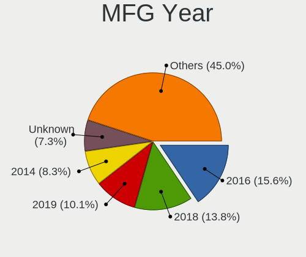
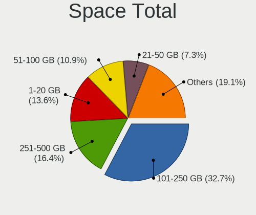
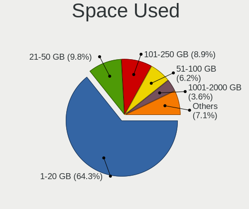
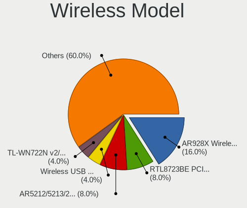
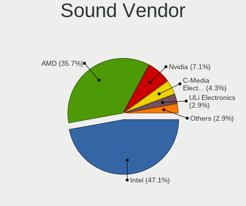
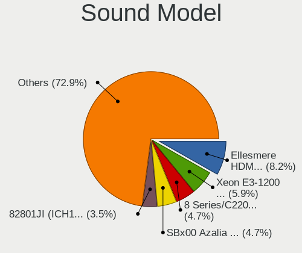

OpenBSD 6.8 - Tested Hardware & Statistics (Desktops)
-----------------------------------------------------

A project to collect tested hardware configurations for OpenBSD 6.8.

Anyone can contribute to this report by the [hw-probe](https://github.com/linuxhw/hw-probe/blob/master/INSTALL.BSD.md) tool:

    hw-probe -all -upload

Please submit a probe of your configuration if it's not presented on the page or is rare.

Full-feature report is available here: https://bsd-hardware.info/?view=trends

Contents
--------

* [ Test Cases ](#test-cases)

* [ System ](#system)
  - [ Arch                     ](#arch)
  - [ DE                       ](#de)
  - [ Display Server           ](#display-server)
  - [ Display Manager          ](#display-manager)
  - [ OS Lang                  ](#os-lang)
  - [ Boot Mode                ](#boot-mode)
  - [ Filesystem               ](#filesystem)
  - [ Part. scheme             ](#part-scheme)

* [ Board ](#board)
  - [ Vendor                   ](#vendor)
  - [ Model                    ](#model)
  - [ Model Family             ](#model-family)
  - [ MFG Year                 ](#mfg-year)
  - [ Form Factor              ](#form-factor)
  - [ Coreboot                 ](#coreboot)
  - [ RAM Size                 ](#ram-size)
  - [ RAM Used                 ](#ram-used)
  - [ Total Drives             ](#total-drives)
  - [ Has CD-ROM               ](#has-cd-rom)
  - [ Has Ethernet             ](#has-ethernet)
  - [ Has WiFi                 ](#has-wifi)
  - [ Has Bluetooth            ](#has-bluetooth)

* [ Location ](#location)
  - [ Country                  ](#country)
  - [ City                     ](#city)

* [ Drives ](#drives)
  - [ Drive Vendor             ](#drive-vendor)
  - [ Drive Model              ](#drive-model)
  - [ HDD Vendor               ](#hdd-vendor)
  - [ SSD Vendor               ](#ssd-vendor)
  - [ Drive Kind               ](#drive-kind)
  - [ Drive Connector          ](#drive-connector)
  - [ Drive Size               ](#drive-size)
  - [ Space Total              ](#space-total)
  - [ Space Used               ](#space-used)
  - [ Malfunc. Drives          ](#malfunc-drives)
  - [ Malfunc. Drive Vendor    ](#malfunc-drive-vendor)
  - [ Malfunc. HDD Vendor      ](#malfunc-hdd-vendor)
  - [ Malfunc. Drive Kind      ](#malfunc-drive-kind)
  - [ Failed Drives            ](#failed-drives)
  - [ Failed Drive Vendor      ](#failed-drive-vendor)
  - [ Drive Status             ](#drive-status)

* [ Storage controller ](#storage-controller)
  - [ Storage Vendor           ](#storage-vendor)
  - [ Storage Model            ](#storage-model)
  - [ Storage Kind             ](#storage-kind)

* [ Processor ](#processor)
  - [ CPU Vendor               ](#cpu-vendor)
  - [ CPU Model                ](#cpu-model)
  - [ CPU Model Family         ](#cpu-model-family)
  - [ CPU Cores                ](#cpu-cores)
  - [ CPU Sockets              ](#cpu-sockets)
  - [ CPU Threads              ](#cpu-threads)
  - [ CPU Microarch            ](#cpu-microarch)

* [ Graphics ](#graphics)
  - [ GPU Vendor               ](#gpu-vendor)
  - [ GPU Model                ](#gpu-model)
  - [ GPU Combo                ](#gpu-combo)
  - [ GPU Driver               ](#gpu-driver)
  - [ GPU Memory               ](#gpu-memory)

* [ Monitor ](#monitor)
  - [ Monitor Vendor           ](#monitor-vendor)
  - [ Monitor Model            ](#monitor-model)
  - [ Monitor Resolution       ](#monitor-resolution)
  - [ Monitor Diagonal         ](#monitor-diagonal)
  - [ Monitor Width            ](#monitor-width)
  - [ Aspect Ratio             ](#aspect-ratio)
  - [ Monitor Area             ](#monitor-area)
  - [ Pixel Density            ](#pixel-density)
  - [ Multiple Monitors        ](#multiple-monitors)

* [ Network ](#network)
  - [ Net Controller Vendor    ](#net-controller-vendor)
  - [ Net Controller Model     ](#net-controller-model)
  - [ Wireless Vendor          ](#wireless-vendor)
  - [ Wireless Model           ](#wireless-model)
  - [ Ethernet Vendor          ](#ethernet-vendor)
  - [ Ethernet Model           ](#ethernet-model)
  - [ Net Controller Kind      ](#net-controller-kind)
  - [ Used Controller          ](#used-controller)
  - [ NICs                     ](#nics)
  - [ IPv6                     ](#ipv6)

* [ Bluetooth ](#bluetooth)
  - [ Bluetooth Vendor         ](#bluetooth-vendor)
  - [ Bluetooth Model          ](#bluetooth-model)

* [ Sound ](#sound)
  - [ Sound Vendor             ](#sound-vendor)
  - [ Sound Model              ](#sound-model)

* [ Memory ](#memory)
  - [ Memory Vendor            ](#memory-vendor)
  - [ Memory Model             ](#memory-model)
  - [ Memory Kind              ](#memory-kind)
  - [ Memory Form Factor       ](#memory-form-factor)
  - [ Memory Size              ](#memory-size)
  - [ Memory Speed             ](#memory-speed)

* [ Printers & scanners ](#printers--scanners)
  - [ Printer Vendor           ](#printer-vendor)
  - [ Printer Model            ](#printer-model)
  - [ Scanner Vendor           ](#scanner-vendor)
  - [ Scanner Model            ](#scanner-model)

* [ Camera ](#camera)
  - [ Camera Vendor            ](#camera-vendor)
  - [ Camera Model             ](#camera-model)

* [ Security ](#security)
  - [ Fingerprint Vendor       ](#fingerprint-vendor)
  - [ Fingerprint Model        ](#fingerprint-model)
  - [ Chipcard Vendor          ](#chipcard-vendor)
  - [ Chipcard Model           ](#chipcard-model)

* [ Unsupported ](#unsupported)
  - [ Unsupported Devices      ](#unsupported-devices)
  - [ Unsupported Device Types ](#unsupported-device-types)

Test Cases
----------

| Vendor        | Model                       | Probe                                                     | Date         |
|---------------|-----------------------------|-----------------------------------------------------------|--------------|
| ASRock        | X99 WS                      | [201a7417a5](https://bsd-hardware.info/?probe=201a7417a5) | Jun 11, 2021 |
| Apple         | PowerMac10,1                | [d098ba539d](https://bsd-hardware.info/?probe=d098ba539d) | May 27, 2021 |
| ASRock        | X99 WS                      | [eb20367455](https://bsd-hardware.info/?probe=eb20367455) | May 05, 2021 |
| Lenovo        | ThinkCentre M93p 10AAS25... | [a9bbd07ad9](https://bsd-hardware.info/?probe=a9bbd07ad9) | May 03, 2021 |
| ASUSTek       | All Series                  | [ef6afe88d7](https://bsd-hardware.info/?probe=ef6afe88d7) | Apr 17, 2021 |
| ECT           | One Computer AMD A10-785... | [de7e23b3e3](https://bsd-hardware.info/?probe=de7e23b3e3) | Apr 07, 2021 |
| Gigabyte      | GB-BXBT-2807                | [25e9765fc0](https://bsd-hardware.info/?probe=25e9765fc0) | Apr 03, 2021 |
| ASUSTek       | All Series                  | [c5bc64e4e9](https://bsd-hardware.info/?probe=c5bc64e4e9) | Mar 22, 2021 |
| ASUSTek       | All Series                  | [700ff7d378](https://bsd-hardware.info/?probe=700ff7d378) | Mar 22, 2021 |
| Lenovo        | ThinkPad T440p 20AWS1HL0... | [954c65dbcf](https://bsd-hardware.info/?probe=954c65dbcf) | Mar 11, 2021 |
| ASUSTek       | All Series                  | [b4aec46644](https://bsd-hardware.info/?probe=b4aec46644) | Mar 07, 2021 |
| ASUSTek       | All Series                  | [f7b1921594](https://bsd-hardware.info/?probe=f7b1921594) | Mar 07, 2021 |
| ASRock        | G31M-VS2                    | [6c7150dc1b](https://bsd-hardware.info/?probe=6c7150dc1b) | Feb 24, 2021 |
| ASRock        | J4205-ITX                   | [c8e0b22858](https://bsd-hardware.info/?probe=c8e0b22858) | Feb 23, 2021 |
| PC Engines    | apu4                        | [b30884fc0e](https://bsd-hardware.info/?probe=b30884fc0e) | Feb 18, 2021 |
| PC Engines    | apu3                        | [449967354c](https://bsd-hardware.info/?probe=449967354c) | Feb 18, 2021 |
| PC Engines    | apu2                        | [b911e3bec2](https://bsd-hardware.info/?probe=b911e3bec2) | Feb 18, 2021 |
| Shuttle       | DS77U                       | [2d0bd0e99a](https://bsd-hardware.info/?probe=2d0bd0e99a) | Feb 14, 2021 |
| Gigabyte      | Z68A-D3H-B3                 | [e1c3b89d0d](https://bsd-hardware.info/?probe=e1c3b89d0d) | Feb 06, 2021 |
| ASUSTek       | PRIME X470-PRO              | [828a9df369](https://bsd-hardware.info/?probe=828a9df369) | Feb 01, 2021 |
| Lenovo        | ThinkCentre M93p 10A8S0C... | [c8af335c01](https://bsd-hardware.info/?probe=c8af335c01) | Jan 29, 2021 |
| Raspberry ... | Raspberry Pi 4 Model B      | [8c953bac3f](https://bsd-hardware.info/?probe=8c953bac3f) | Jan 25, 2021 |
| ASUSTek       | All Series                  | [7ebe6eee38](https://bsd-hardware.info/?probe=7ebe6eee38) | Jan 25, 2021 |
| ASUSTek       | PRIME X370-PRO              | [2a81a1bd1f](https://bsd-hardware.info/?probe=2a81a1bd1f) | Jan 24, 2021 |
| Sun           | SUNW,Sun-Blade-1500         | [647618a0ca](https://bsd-hardware.info/?probe=647618a0ca) | Jan 22, 2021 |
| PC Engines    | apu1                        | [a5d18dcbbc](https://bsd-hardware.info/?probe=a5d18dcbbc) | Jan 21, 2021 |
| PC Engines    | apu1                        | [70918da1e7](https://bsd-hardware.info/?probe=70918da1e7) | Jan 21, 2021 |
| Sun           | SUNW,Sun-Blade-100          | [299c76eb85](https://bsd-hardware.info/?probe=299c76eb85) | Jan 18, 2021 |
| Lenovo        | ThinkCentre M93p 10A8S0C... | [36ef631bfe](https://bsd-hardware.info/?probe=36ef631bfe) | Jan 05, 2021 |
| Gigabyte      | 970A-DS3P                   | [f0b9687ab8](https://bsd-hardware.info/?probe=f0b9687ab8) | Dec 22, 2020 |
| Unknown       | ODYSSEY-X86J4105            | [17749e13c8](https://bsd-hardware.info/?probe=17749e13c8) | Dec 16, 2020 |
| ASUSTek       | PRIME B450M-A               | [d13e0a1749](https://bsd-hardware.info/?probe=d13e0a1749) | Dec 15, 2020 |
| Supermicro    | X11DDW-L                    | [57a5022e27](https://bsd-hardware.info/?probe=57a5022e27) | Dec 14, 2020 |
| ASUSTek       | P4P800-VM                   | [4fe4c14195](https://bsd-hardware.info/?probe=4fe4c14195) | Dec 05, 2020 |
| Apple         | Xserve3,1                   | [7329a7650d](https://bsd-hardware.info/?probe=7329a7650d) | Dec 05, 2020 |
| Gigabyte      | Unknown                     | [8a9ae48d42](https://bsd-hardware.info/?probe=8a9ae48d42) | Dec 01, 2020 |
| HP            | Compaq dc7800 Small Form... | [2b49eb75dc](https://bsd-hardware.info/?probe=2b49eb75dc) | Nov 27, 2020 |
| HP            | Compaq dc7800 Small Form... | [3fe6528682](https://bsd-hardware.info/?probe=3fe6528682) | Nov 27, 2020 |
| ASUSTek       | PRIME X370-PRO              | [9cf79cf54b](https://bsd-hardware.info/?probe=9cf79cf54b) | Nov 22, 2020 |
| ASUSTek       | PRIME X370-PRO              | [cab036429d](https://bsd-hardware.info/?probe=cab036429d) | Nov 22, 2020 |
| Unknown       | cavium,ubnt_e300            | [b8524b5002](https://bsd-hardware.info/?probe=b8524b5002) | Nov 20, 2020 |
| Raspberry ... | Raspberry Pi 4 Model B      | [c030400069](https://bsd-hardware.info/?probe=c030400069) | Nov 19, 2020 |
| ASRock        | IMB-191                     | [76991234cd](https://bsd-hardware.info/?probe=76991234cd) | Nov 18, 2020 |
| HARDKERNEL    | ODROID-H2                   | [c03bc18b3a](https://bsd-hardware.info/?probe=c03bc18b3a) | Nov 18, 2020 |
| MSI           | MS-B09012                   | [7ba791108f](https://bsd-hardware.info/?probe=7ba791108f) | Nov 18, 2020 |
| PC Engines    | APU2                        | [b4f5d7d344](https://bsd-hardware.info/?probe=b4f5d7d344) | Nov 16, 2020 |
| Supermicro    | X8DTH-i/6/iF/6F             | [778cb9f428](https://bsd-hardware.info/?probe=778cb9f428) | Nov 16, 2020 |
| Gigabyte      | GB-BXBT-2807                | [c11b475d28](https://bsd-hardware.info/?probe=c11b475d28) | Nov 13, 2020 |
| Lenovo        | ThinkCentre M92p 3212AD2    | [579528e284](https://bsd-hardware.info/?probe=579528e284) | Nov 10, 2020 |
| Gigabyte      | M61SME-S2L                  | [d8809eb5e7](https://bsd-hardware.info/?probe=d8809eb5e7) | Nov 09, 2020 |
| Gigabyte      | M61SME-S2L                  | [e5f658c70a](https://bsd-hardware.info/?probe=e5f658c70a) | Nov 09, 2020 |
| Pegatron      | SKLD4-P1                    | [ea548b4c71](https://bsd-hardware.info/?probe=ea548b4c71) | Nov 08, 2020 |
| Soekris En... | net5501                     | [bd9930a18a](https://bsd-hardware.info/?probe=bd9930a18a) | Nov 06, 2020 |
| Soekris En... | net6501                     | [fdf124653b](https://bsd-hardware.info/?probe=fdf124653b) | Nov 06, 2020 |
| MSI           | MS-7A34                     | [8c87d6b643](https://bsd-hardware.info/?probe=8c87d6b643) | Nov 03, 2020 |
| PC Engines    | apu2                        | [e0361ddbad](https://bsd-hardware.info/?probe=e0361ddbad) | Oct 31, 2020 |
| ASUSTek       | B75M-A                      | [43ece33e8c](https://bsd-hardware.info/?probe=43ece33e8c) | Oct 31, 2020 |
| Intel         | D945GCLF2                   | [58678b0643](https://bsd-hardware.info/?probe=58678b0643) | Oct 30, 2020 |
| Intel         | D945GCLF2                   | [3354fb903b](https://bsd-hardware.info/?probe=3354fb903b) | Oct 30, 2020 |
| Gigabyte      | X570 AORUS ELITE            | [973b62551f](https://bsd-hardware.info/?probe=973b62551f) | Oct 30, 2020 |
| eMachines     | EL1200                      | [ae59908738](https://bsd-hardware.info/?probe=ae59908738) | Oct 30, 2020 |
| Acer          | Veriton M6610G              | [7dd00aa8b1](https://bsd-hardware.info/?probe=7dd00aa8b1) | Oct 30, 2020 |
| eMachines     | EL1200                      | [5bc54351be](https://bsd-hardware.info/?probe=5bc54351be) | Oct 30, 2020 |
| ECS           | BSWI-D2                     | [c5b07f5c31](https://bsd-hardware.info/?probe=c5b07f5c31) | Oct 30, 2020 |
| ASRock        | N3160-NUC IPC               | [8d13af2f0b](https://bsd-hardware.info/?probe=8d13af2f0b) | Oct 28, 2020 |
| ASRock        | N3160-NUC IPC               | [8714fe0665](https://bsd-hardware.info/?probe=8714fe0665) | Oct 28, 2020 |
| ASUSTek       | PRIME B250M-C               | [4594c1084c](https://bsd-hardware.info/?probe=4594c1084c) | Oct 28, 2020 |
| Shuttle       | DS77U                       | [c70e526574](https://bsd-hardware.info/?probe=c70e526574) | Oct 27, 2020 |
| PC Engines    | apu2                        | [ce4c41d466](https://bsd-hardware.info/?probe=ce4c41d466) | Oct 26, 2020 |
| Dell          | PowerEdge R230              | [1422e9737b](https://bsd-hardware.info/?probe=1422e9737b) | Oct 26, 2020 |
| Supermicro    | X8STi                       | [1b64902781](https://bsd-hardware.info/?probe=1b64902781) | Oct 26, 2020 |
| HP            | 120-1136                    | [12f3eb0227](https://bsd-hardware.info/?probe=12f3eb0227) | Oct 25, 2020 |
| HP            | ProLiant MicroServer        | [04b6ad9952](https://bsd-hardware.info/?probe=04b6ad9952) | Oct 25, 2020 |
| Supermicro    | X11SSW-F                    | [ca07d7ef48](https://bsd-hardware.info/?probe=ca07d7ef48) | Oct 25, 2020 |
| Gigabyte      | X58A-UD5                    | [6e642641e5](https://bsd-hardware.info/?probe=6e642641e5) | Oct 25, 2020 |
| AZW           | Z83 II                      | [9416876f20](https://bsd-hardware.info/?probe=9416876f20) | Oct 24, 2020 |
| AZW           | Z83 II                      | [19b1b4d85d](https://bsd-hardware.info/?probe=19b1b4d85d) | Oct 24, 2020 |
| Dell          | Precision WorkStation T7... | [c01ce9ec81](https://bsd-hardware.info/?probe=c01ce9ec81) | Oct 24, 2020 |
| PC Engines    | APU2                        | [5cee7fa636](https://bsd-hardware.info/?probe=5cee7fa636) | Oct 22, 2020 |
| MSI           | MS-7345                     | [96cc99accc](https://bsd-hardware.info/?probe=96cc99accc) | Oct 22, 2020 |
| MSI           | MS-7816                     | [337e5b8e0c](https://bsd-hardware.info/?probe=337e5b8e0c) | Oct 22, 2020 |
| ASRock        | DN2800MT                    | [b475aa2ead](https://bsd-hardware.info/?probe=b475aa2ead) | Oct 21, 2020 |
| Intel         | D2500HN                     | [6dbc4dfa33](https://bsd-hardware.info/?probe=6dbc4dfa33) | Oct 21, 2020 |
| Intel         | CRESCENTBAY                 | [42d114559b](https://bsd-hardware.info/?probe=42d114559b) | Oct 21, 2020 |
| PC Engines    | apu2                        | [d1ca549fe7](https://bsd-hardware.info/?probe=d1ca549fe7) | Oct 21, 2020 |
| ZOTAC         | XXXXXX                      | [0f8960bdd3](https://bsd-hardware.info/?probe=0f8960bdd3) | Oct 21, 2020 |
| IBM           | Board                       | [11b0b7012f](https://bsd-hardware.info/?probe=11b0b7012f) | Oct 21, 2020 |
| IBM           | Board                       | [a92c08a920](https://bsd-hardware.info/?probe=a92c08a920) | Oct 21, 2020 |
| IBM           | Board                       | [80d5f15a63](https://bsd-hardware.info/?probe=80d5f15a63) | Oct 21, 2020 |
| Gigabyte      | GA-MA770T-UD3P              | [2cb76e5886](https://bsd-hardware.info/?probe=2cb76e5886) | Oct 21, 2020 |
| PC Engines    | apu2                        | [e6ee8a14d5](https://bsd-hardware.info/?probe=e6ee8a14d5) | Oct 20, 2020 |
| ASUSTek       | Z170-K                      | [19cb3ccc34](https://bsd-hardware.info/?probe=19cb3ccc34) | Oct 20, 2020 |
| Intel         | S3000AH                     | [f5b858601a](https://bsd-hardware.info/?probe=f5b858601a) | Oct 20, 2020 |
| Intel         | D2500HN                     | [4b432dcb3d](https://bsd-hardware.info/?probe=4b432dcb3d) | Oct 20, 2020 |
| PC Engines    | APU2                        | [b95ef9962d](https://bsd-hardware.info/?probe=b95ef9962d) | Oct 20, 2020 |
| PC Engines    | APU2                        | [aecf376503](https://bsd-hardware.info/?probe=aecf376503) | Oct 20, 2020 |
| Unknown       | Unknown                     | [bedb4a4b37](https://bsd-hardware.info/?probe=bedb4a4b37) | Oct 20, 2020 |
| Unknown       | Unknown                     | [a28ef1d2b8](https://bsd-hardware.info/?probe=a28ef1d2b8) | Oct 20, 2020 |
| PC Engines    | apu1                        | [c77b06b3eb](https://bsd-hardware.info/?probe=c77b06b3eb) | Oct 20, 2020 |
| Dell          | PowerEdge R620              | [7671a495d1](https://bsd-hardware.info/?probe=7671a495d1) | Oct 19, 2020 |
| Dell          | PowerEdge R620              | [c1a2bc7a51](https://bsd-hardware.info/?probe=c1a2bc7a51) | Oct 19, 2020 |
| Dell          | PowerEdge R620              | [c1c5ee566c](https://bsd-hardware.info/?probe=c1c5ee566c) | Oct 19, 2020 |
| Dell          | PowerEdge R620              | [af87ddbbaa](https://bsd-hardware.info/?probe=af87ddbbaa) | Oct 19, 2020 |
| ASUSTek       | P10S-I Series               | [1a0e9f0100](https://bsd-hardware.info/?probe=1a0e9f0100) | Oct 19, 2020 |
| Unknown       | Unknown                     | [a3db8641e6](https://bsd-hardware.info/?probe=a3db8641e6) | Oct 19, 2020 |
| PC Engines    | apu4                        | [e4cd6d0b48](https://bsd-hardware.info/?probe=e4cd6d0b48) | Oct 19, 2020 |
| PC Engines    | APU                         | [0cf4f6a5f9](https://bsd-hardware.info/?probe=0cf4f6a5f9) | Oct 19, 2020 |
| Lenovo        | SHARKBAY WIN                | [53feb1fec6](https://bsd-hardware.info/?probe=53feb1fec6) | Oct 19, 2020 |
| ASRock        | IMB-191                     | [4ac9e9cf2a](https://bsd-hardware.info/?probe=4ac9e9cf2a) | Oct 19, 2020 |
| PC Engines    | apu2                        | [064e7167a0](https://bsd-hardware.info/?probe=064e7167a0) | Oct 19, 2020 |
| Dell          | OptiPlex 3060               | [13992dbb10](https://bsd-hardware.info/?probe=13992dbb10) | Oct 19, 2020 |
| PC Engines    | apu2                        | [a5b1c3a559](https://bsd-hardware.info/?probe=a5b1c3a559) | Oct 19, 2020 |
| Dell          | PowerEdge T320              | [75c395f941](https://bsd-hardware.info/?probe=75c395f941) | Oct 19, 2020 |
| Dell          | PowerEdge 1950              | [3cfcdfce6d](https://bsd-hardware.info/?probe=3cfcdfce6d) | Oct 19, 2020 |
| Dell          | PowerEdge 1950              | [0865193e7e](https://bsd-hardware.info/?probe=0865193e7e) | Oct 19, 2020 |
| Dell          | PowerEdge R610              | [2ea539bbd3](https://bsd-hardware.info/?probe=2ea539bbd3) | Oct 19, 2020 |
| Dell          | OptiPlex 7020               | [293e6af35e](https://bsd-hardware.info/?probe=293e6af35e) | Oct 19, 2020 |
| PC Engines    | apu2                        | [2ab3051cb8](https://bsd-hardware.info/?probe=2ab3051cb8) | Oct 19, 2020 |
| PC Engines    | apu4                        | [f0116986e0](https://bsd-hardware.info/?probe=f0116986e0) | Oct 19, 2020 |
| IBM           | Board                       | [af2f64a7a8](https://bsd-hardware.info/?probe=af2f64a7a8) | Oct 19, 2020 |
| Foxconn       | AT-7000 Series              | [dc7b96e637](https://bsd-hardware.info/?probe=dc7b96e637) | Oct 19, 2020 |
| Foxconn       | AT-7000 Series              | [0184fcedcf](https://bsd-hardware.info/?probe=0184fcedcf) | Oct 19, 2020 |
| ASUSTek       | PRIME X570-P                | [b33e2a5177](https://bsd-hardware.info/?probe=b33e2a5177) | Oct 19, 2020 |
| PC Engines    | apu1                        | [576f4db9e1](https://bsd-hardware.info/?probe=576f4db9e1) | Oct 19, 2020 |
| PC Engines    | apu2                        | [e4030e5ee2](https://bsd-hardware.info/?probe=e4030e5ee2) | Oct 19, 2020 |
| PC Engines    | apu2                        | [ca0480a30d](https://bsd-hardware.info/?probe=ca0480a30d) | Oct 19, 2020 |
| Bluechip C... | bluechip BUSINESSline Wo... | [6dc86d6a5b](https://bsd-hardware.info/?probe=6dc86d6a5b) | Oct 19, 2020 |
| Unknown       | Unknown                     | [e36fc2b2b2](https://bsd-hardware.info/?probe=e36fc2b2b2) | Oct 19, 2020 |
| ASRock        | N68C-S UCC                  | [027fbd78f5](https://bsd-hardware.info/?probe=027fbd78f5) | Oct 19, 2020 |
| ASRock        | A75M-ITX                    | [dff827c2ae](https://bsd-hardware.info/?probe=dff827c2ae) | Oct 19, 2020 |
| PC Engines    | apu1                        | [8aade944d5](https://bsd-hardware.info/?probe=8aade944d5) | Oct 19, 2020 |
| PC Engines    | apu4                        | [ee8a1317f9](https://bsd-hardware.info/?probe=ee8a1317f9) | Oct 19, 2020 |

System
------

Arch
----

OS architecture (x86_64, i586, etc.)

| Name    | Desktops | Percent |
|---------|----------|---------|
| amd64   | 97       | 88.99%  |
| i386    | 6        | 5.5%    |
| sparc64 | 2        | 1.83%   |
| arm64   | 2        | 1.83%   |
| octeon  | 1        | 0.92%   |
| macppc  | 1        | 0.92%   |

DE
--

Desktop Environment

| Name    | Desktops | Percent |
|---------|----------|---------|
| Console | 61       | 55.96%  |
| fvwm    | 46       | 42.2%   |
| XFCE    | 1        | 0.92%   |
| i3      | 1        | 0.92%   |

Display Server
--------------

X11 or Wayland

| Name    | Desktops | Percent |
|---------|----------|---------|
| Console | 73       | 66.97%  |
| X11     | 36       | 33.03%  |

Display Manager
---------------

SDDM, LightDM, etc.

| Name    | Desktops | Percent |
|---------|----------|---------|
| Console | 105      | 94.59%  |
| SLiM    | 3        | 2.7%    |
| GDM     | 3        | 2.7%    |

OS Lang
-------

Language

| Lang    | Desktops | Percent |
|---------|----------|---------|
| Unknown | 92       | 83.64%  |
| ru_RU   | 8        | 7.27%   |
| en_US   | 4        | 3.64%   |
| C       | 2        | 1.82%   |
| pl_PL   | 1        | 0.91%   |
| fr_FR   | 1        | 0.91%   |
| en_AU   | 1        | 0.91%   |
| de_DE   | 1        | 0.91%   |

Boot Mode
---------

EFI or BIOS

| Mode | Desktops | Percent |
|------|----------|---------|
| BIOS | 72       | 66.06%  |
| EFI  | 37       | 33.94%  |

Filesystem
----------

Type of filesystem

| Type | Desktops | Percent |
|------|----------|---------|
| Ffs  | 109      | 100%    |

Part. scheme
------------

Scheme of partitioning

| Type | Desktops | Percent |
|------|----------|---------|
| MBR  | 81       | 74.31%  |
| GPT  | 28       | 25.69%  |

Board
-----

Vendor
------

Motherboard manufacturer

| Name                    | Desktops | Percent |
|-------------------------|----------|---------|
| PC Engines              | 23       | 21.1%   |
| ASUSTek Computer        | 12       | 11.01%  |
| Dell                    | 11       | 10.09%  |
| Gigabyte Technology     | 8        | 7.34%   |
| ASRock                  | 8        | 7.34%   |
| Lenovo                  | 5        | 4.59%   |
| Unknown                 | 5        | 4.59%   |
| Supermicro              | 4        | 3.67%   |
| MSI                     | 4        | 3.67%   |
| Intel                   | 4        | 3.67%   |
| Hewlett-Packard         | 3        | 2.75%   |
| Sun                     | 2        | 1.83%   |
| Soekris Engineering     | 2        | 1.83%   |
| Raspberry Pi Foundation | 2        | 1.83%   |
| IBM                     | 2        | 1.83%   |
| Apple                   | 2        | 1.83%   |
| ZOTAC                   | 1        | 0.92%   |
| Unknown                 | 1        | 0.92%   |
| Shuttle                 | 1        | 0.92%   |
| Pegatron                | 1        | 0.92%   |
| HARDKERNEL              | 1        | 0.92%   |
| Foxconn                 | 1        | 0.92%   |
| eMachines               | 1        | 0.92%   |
| ECT                     | 1        | 0.92%   |
| ECS                     | 1        | 0.92%   |
| Bluechip Computer       | 1        | 0.92%   |
| AZW                     | 1        | 0.92%   |
| Acer                    | 1        | 0.92%   |

Model
-----

Motherboard model

| Name                                    | Desktops | Percent |
|-----------------------------------------|----------|---------|
| PC Engines APU2                         | 13       | 11.93%  |
| Unknown                                 | 7        | 6.42%   |
| PC Engines apu4                         | 4        | 3.67%   |
| PC Engines apu1                         | 4        | 3.67%   |
| Dell PowerEdge R620                     | 4        | 3.67%   |
| RPi Raspberry Pi 4 Model B              | 2        | 1.83%   |
| ASUS PRIME X370-PRO                     | 2        | 1.83%   |
| ASUS All Series                         | 2        | 1.83%   |
| ZOTAC XXXXXX                            | 1        | 0.92%   |
| Supermicro X8STi                        | 1        | 0.92%   |
| Supermicro X8DTH-i/6/iF/6F              | 1        | 0.92%   |
| Supermicro X11SSW-F                     | 1        | 0.92%   |
| Supermicro X11DDW-L                     | 1        | 0.92%   |
| Sun SUNW,Sun-Blade-1500                 | 1        | 0.92%   |
| Sun SUNW,Sun-Blade-100                  | 1        | 0.92%   |
| Soekris Engineering net6501             | 1        | 0.92%   |
| Soekris Engineering net5501             | 1        | 0.92%   |
| Shuttle DS77U                           | 1        | 0.92%   |
| Pegatron SKLD4-P1                       | 1        | 0.92%   |
| PC Engines apu3                         | 1        | 0.92%   |
| PC Engines APU                          | 1        | 0.92%   |
| MSI MS-B09012                           | 1        | 0.92%   |
| MSI MS-7A34                             | 1        | 0.92%   |
| MSI MS-7816                             | 1        | 0.92%   |
| MSI MS-7345                             | 1        | 0.92%   |
| Lenovo ThinkPad T440p 20AWS1HL00        | 1        | 0.92%   |
| Lenovo ThinkCentre M93p 10AAS25M00      | 1        | 0.92%   |
| Lenovo ThinkCentre M93p 10AAS1MD00      | 1        | 0.92%   |
| Lenovo ThinkCentre M93p 10A8S0CE09      | 1        | 0.92%   |
| Lenovo ThinkCentre M92p 3212AD2         | 1        | 0.92%   |
| Intel S3000AH                           | 1        | 0.92%   |
| Intel D945GCLF2                         | 1        | 0.92%   |
| Intel D2500HN                           | 1        | 0.92%   |
| Intel CRESCENTBAY                       | 1        | 0.92%   |
| IBM 81832BG                             | 1        | 0.92%   |
| IBM 8173KUB                             | 1        | 0.92%   |
| HP ProLiant MicroServer                 | 1        | 0.92%   |
| HP Compaq dc7800 Small Form Factor      | 1        | 0.92%   |
| HP 120-1136                             | 1        | 0.92%   |
| HARDKERNEL ODROID-H2                    | 1        | 0.92%   |
| Gigabyte Z68A-D3H-B3                    | 1        | 0.92%   |
| Gigabyte X58A-UD5                       | 1        | 0.92%   |
| Gigabyte X570 AORUS ELITE               | 1        | 0.92%   |
| Gigabyte M61SME-S2L                     | 1        | 0.92%   |
| Gigabyte GB-BXBT-2807                   | 1        | 0.92%   |
| Gigabyte GA-MA770T-UD3P                 | 1        | 0.92%   |
| Gigabyte 970A-DS3P                      | 1        | 0.92%   |
| Foxconn AT-7000 Series                  | 1        | 0.92%   |
| eMachines EL1200                        | 1        | 0.92%   |
| ECT One AMD A10-7850K, 4                | 1        | 0.92%   |
| ECS BSWI-D2                             | 1        | 0.92%   |
| Dell Precision WorkStation T7500        | 1        | 0.92%   |
| Dell PowerEdge T320                     | 1        | 0.92%   |
| Dell PowerEdge R610                     | 1        | 0.92%   |
| Dell PowerEdge R230                     | 1        | 0.92%   |
| Dell PowerEdge 1950                     | 1        | 0.92%   |
| Dell OptiPlex 7020                      | 1        | 0.92%   |
| Dell OptiPlex 3060                      | 1        | 0.92%   |
| Bluechip bluechip BUSINESSline Workstat | 1        | 0.92%   |
| AZW Z83 II                              | 1        | 0.92%   |

Model Family
------------

Motherboard model prefix

| Name                        | Desktops | Percent |
|-----------------------------|----------|---------|
| PC Engines apu2             | 13       | 11.93%  |
| Dell PowerEdge              | 8        | 7.34%   |
| Unknown                     | 7        | 6.42%   |
| ASUS PRIME                  | 6        | 5.5%    |
| PC Engines apu4             | 4        | 3.67%   |
| PC Engines apu1             | 4        | 3.67%   |
| Lenovo ThinkCentre          | 4        | 3.67%   |
| Sun SUNW                    | 2        | 1.83%   |
| RPi Raspberry               | 2        | 1.83%   |
| Dell OptiPlex               | 2        | 1.83%   |
| ASUS All                    | 2        | 1.83%   |
| ZOTAC XXXXXX                | 1        | 0.92%   |
| Supermicro X8STi            | 1        | 0.92%   |
| Supermicro X8DTH-i          | 1        | 0.92%   |
| Supermicro X11SSW-F         | 1        | 0.92%   |
| Supermicro X11DDW-L         | 1        | 0.92%   |
| Soekris Engineering net6501 | 1        | 0.92%   |
| Soekris Engineering net5501 | 1        | 0.92%   |
| Shuttle DS77U               | 1        | 0.92%   |
| Pegatron SKLD4-P1           | 1        | 0.92%   |
| PC Engines apu3             | 1        | 0.92%   |
| PC Engines APU              | 1        | 0.92%   |
| MSI MS-B09012               | 1        | 0.92%   |
| MSI MS-7A34                 | 1        | 0.92%   |
| MSI MS-7816                 | 1        | 0.92%   |
| MSI MS-7345                 | 1        | 0.92%   |
| Lenovo ThinkPad             | 1        | 0.92%   |
| Intel S3000AH               | 1        | 0.92%   |
| Intel D945GCLF2             | 1        | 0.92%   |
| Intel D2500HN               | 1        | 0.92%   |
| Intel CRESCENTBAY           | 1        | 0.92%   |
| IBM 81832BG                 | 1        | 0.92%   |
| IBM 8173KUB                 | 1        | 0.92%   |
| HP ProLiant                 | 1        | 0.92%   |
| HP Compaq                   | 1        | 0.92%   |
| HP 120-1136                 | 1        | 0.92%   |
| HARDKERNEL ODROID-H2        | 1        | 0.92%   |
| Gigabyte Z68A-D3H-B3        | 1        | 0.92%   |
| Gigabyte X58A-UD5           | 1        | 0.92%   |
| Gigabyte X570               | 1        | 0.92%   |
| Gigabyte M61SME-S2L         | 1        | 0.92%   |
| Gigabyte GB-BXBT-2807       | 1        | 0.92%   |
| Gigabyte GA-MA770T-UD3P     | 1        | 0.92%   |
| Gigabyte 970A-DS3P          | 1        | 0.92%   |
| Foxconn AT-7000             | 1        | 0.92%   |
| eMachines EL1200            | 1        | 0.92%   |
| ECT One                     | 1        | 0.92%   |
| ECS BSWI-D2                 | 1        | 0.92%   |
| Dell Precision              | 1        | 0.92%   |
| Bluechip bluechip           | 1        | 0.92%   |
| AZW Z83                     | 1        | 0.92%   |
| ASUS Z170-K                 | 1        | 0.92%   |
| ASUS P4P800-VM              | 1        | 0.92%   |
| ASUS P10S-I                 | 1        | 0.92%   |
| ASUS B75M-A                 | 1        | 0.92%   |
| ASRock X99                  | 1        | 0.92%   |
| ASRock N68C-S               | 1        | 0.92%   |
| ASRock N3160                | 1        | 0.92%   |
| ASRock J4205-ITX            | 1        | 0.92%   |
| ASRock IMB-191              | 1        | 0.92%   |

MFG Year
--------

Motherboard manufacture year

| Year    | Desktops | Percent |
|---------|----------|---------|
| 2020    | 19       | 17.43%  |
| 2019    | 19       | 17.43%  |
| Unknown | 10       | 9.17%   |
| 2018    | 9        | 8.26%   |
| 2017    | 9        | 8.26%   |
| 2013    | 7        | 6.42%   |
| 2012    | 6        | 5.5%    |
| 2011    | 5        | 4.59%   |
| 2016    | 4        | 3.67%   |
| 2014    | 4        | 3.67%   |
| 2008    | 4        | 3.67%   |
| 2015    | 3        | 2.75%   |
| 2007    | 3        | 2.75%   |
| 2010    | 2        | 1.83%   |
| 2005    | 2        | 1.83%   |
| 2021    | 1        | 0.92%   |
| 2009    | 1        | 0.92%   |
| 2006    | 1        | 0.92%   |

Form Factor
-----------

Physical design of the computer

| Name    | Desktops | Percent |
|---------|----------|---------|
| Desktop | 109      | 100%    |

Coreboot
--------

Have coreboot on board

| Used | Desktops | Percent |
|------|----------|---------|
| No   | 86       | 78.9%   |
| Yes  | 23       | 21.1%   |

RAM Size
--------

Total RAM memory

| Size in GB      | Desktops | Percent |
|-----------------|----------|---------|
| 4.01-8.0        | 35       | 32.11%  |
| 8.01-16.0       | 18       | 16.51%  |
| 32.01-64.0      | 10       | 9.17%   |
| 16.01-24.0      | 10       | 9.17%   |
| 1.01-2.0        | 7        | 6.42%   |
| 3.01-4.0        | 6        | 5.5%    |
| 2.01-3.0        | 6        | 5.5%    |
| 64.01-256.0     | 5        | 4.59%   |
| 24.01-32.0      | 4        | 3.67%   |
| 0.01-0.5        | 4        | 3.67%   |
| More than 256.0 | 2        | 1.83%   |
| 0.51-1.0        | 2        | 1.83%   |

RAM Used
--------

Used RAM memory

| Used GB    | Desktops | Percent |
|------------|----------|---------|
| 0.01-0.5   | 78       | 71.56%  |
| 0.51-1.0   | 13       | 11.93%  |
| 0          | 8        | 7.34%   |
| 1.01-2.0   | 4        | 3.67%   |
| 4.01-8.0   | 3        | 2.75%   |
| 16.01-24.0 | 1        | 0.92%   |
| 8.01-16.0  | 1        | 0.92%   |
| Unknown    | 1        | 0.92%   |

Total Drives
------------

Number of drives on board

| Drives | Desktops | Percent |
|--------|----------|---------|
| 1      | 63       | 56.25%  |
| 2      | 25       | 22.32%  |
| 3      | 13       | 11.61%  |
| 4      | 5        | 4.46%   |
| 10     | 2        | 1.79%   |
| 12     | 1        | 0.89%   |
| 7      | 1        | 0.89%   |
| 6      | 1        | 0.89%   |
| 5      | 1        | 0.89%   |

Has CD-ROM
----------

Has CD-ROM on board

| Presented | Desktops | Percent |
|-----------|----------|---------|
| No        | 109      | 100%    |

Has Ethernet
------------

Has Ethernet on board

| Presented | Desktops | Percent |
|-----------|----------|---------|
| Yes       | 103      | 94.5%   |
| No        | 6        | 5.5%    |

Has WiFi
--------

Has WiFi module

| Presented | Desktops | Percent |
|-----------|----------|---------|
| No        | 87       | 79.82%  |
| Yes       | 22       | 20.18%  |

Has Bluetooth
-------------

Has Bluetooth module

| Presented | Desktops | Percent |
|-----------|----------|---------|
| No        | 103      | 94.5%   |
| Yes       | 6        | 5.5%    |

Location
--------

Country
-------

Geographic location (country)

| Country     | Desktops | Percent |
|-------------|----------|---------|
| Russia      | 19       | 17.43%  |
| USA         | 16       | 14.68%  |
| Germany     | 15       | 13.76%  |
| France      | 9        | 8.26%   |
| Netherlands | 5        | 4.59%   |
| UK          | 4        | 3.67%   |
| Taiwan      | 4        | 3.67%   |
| Switzerland | 4        | 3.67%   |
| Spain       | 4        | 3.67%   |
| Austria     | 4        | 3.67%   |
| Sweden      | 3        | 2.75%   |
| Norway      | 3        | 2.75%   |
| Ukraine     | 2        | 1.83%   |
| Italy       | 2        | 1.83%   |
| Denmark     | 2        | 1.83%   |
| UAE         | 1        | 0.92%   |
| Poland      | 1        | 0.92%   |
| New Zealand | 1        | 0.92%   |
| Moldova     | 1        | 0.92%   |
| Indonesia   | 1        | 0.92%   |
| India       | 1        | 0.92%   |
| Finland     | 1        | 0.92%   |
| Estonia     | 1        | 0.92%   |
| Croatia     | 1        | 0.92%   |
| Canada      | 1        | 0.92%   |
| Bulgaria    | 1        | 0.92%   |
| Brazil      | 1        | 0.92%   |
| Australia   | 1        | 0.92%   |

City
----

Geographic location (city)

| City                       | Desktops | Percent |
|----------------------------|----------|---------|
| Moscow                     | 10       | 9.09%   |
| Berlin                     | 5        | 4.55%   |
| Amsterdam                  | 5        | 4.55%   |
| New Taipei                 | 4        | 3.64%   |
| Malmo                      | 3        | 2.73%   |
| Lausanne                   | 3        | 2.73%   |
| Ibiza Town                 | 3        | 2.73%   |
| Vladivostok                | 2        | 1.82%   |
| Vienna                     | 2        | 1.82%   |
| Svenstrup                  | 2        | 1.82%   |
| St Petersburg              | 2        | 1.82%   |
| Skien                      | 2        | 1.82%   |
| Saint-Martin-d'Hères      | 2        | 1.82%   |
| Paris                      | 2        | 1.82%   |
| Lebanon                    | 2        | 1.82%   |
| Atlanta                    | 2        | 1.82%   |
| Zurich                     | 1        | 0.91%   |
| Zagreb                     | 1        | 0.91%   |
| Waukesha                   | 1        | 0.91%   |
| Ust'-Charyshskaya Pristan' | 1        | 0.91%   |
| Turrivalignani             | 1        | 0.91%   |
| Tallinn                    | 1        | 0.91%   |
| Syeverodonets'k            | 1        | 0.91%   |
| Sydney                     | 1        | 0.91%   |
| Surgut                     | 1        | 0.91%   |
| Springfield                | 1        | 0.91%   |
| Soresina                   | 1        | 0.91%   |
| Sofia                      | 1        | 0.91%   |
| Sheffield                  | 1        | 0.91%   |
| Seattle                    | 1        | 0.91%   |
| Saint-Herblain             | 1        | 0.91%   |
| Rubtsovsk                  | 1        | 0.91%   |
| Roubaix                    | 1        | 0.91%   |
| Rivne                      | 1        | 0.91%   |
| Punta Gorda                | 1        | 0.91%   |
| Porto Alegre               | 1        | 0.91%   |
| Oviedo                     | 1        | 0.91%   |
| Oslo                       | 1        | 0.91%   |
| Ockenheim                  | 1        | 0.91%   |
| Nérac                     | 1        | 0.91%   |
| Nuremberg                  | 1        | 0.91%   |
| Nantes                     | 1        | 0.91%   |
| Munich                     | 1        | 0.91%   |
| Menifee                    | 1        | 0.91%   |
| Lyon                       | 1        | 0.91%   |
| Liverpool                  | 1        | 0.91%   |
| Lipetsk                    | 1        | 0.91%   |
| Linz                       | 1        | 0.91%   |
| Leipzig                    | 1        | 0.91%   |
| Kouvola                    | 1        | 0.91%   |
| Kirov                      | 1        | 0.91%   |
| Kenosha                    | 1        | 0.91%   |
| Katy                       | 1        | 0.91%   |
| Katikati                   | 1        | 0.91%   |
| Karlsruhe                  | 1        | 0.91%   |
| Jakarta                    | 1        | 0.91%   |
| Independence               | 1        | 0.91%   |
| Harrisburg                 | 1        | 0.91%   |
| Gummersbach                | 1        | 0.91%   |
| Gdansk                     | 1        | 0.91%   |

Drives
------

Drive Vendor
------------

Hard drive vendors

| Vendor              | Desktops | Drives | Percent |
|---------------------|----------|--------|---------|
| WDC                 | 22       | 29     | 13.84%  |
| Seagate             | 19       | 28     | 11.95%  |
| Kingston            | 16       | 17     | 10.06%  |
| Samsung Electronics | 11       | 19     | 6.92%   |
| Phison              | 11       | 11     | 6.92%   |
| NVMe                | 9        | 10     | 5.66%   |
| Hitachi             | 8        | 8      | 5.03%   |
| Crucial             | 8        | 17     | 5.03%   |
| HGST                | 6        | 7      | 3.77%   |
| Dell                | 6        | 10     | 3.77%   |
| Transcend           | 5        | 8      | 3.14%   |
| OPENBSD             | 5        | 5      | 3.14%   |
| Intel               | 5        | 5      | 3.14%   |
| A-DATA Technology   | 4        | 5      | 2.52%   |
| USB                 | 2        | 2      | 1.26%   |
| SanDisk             | 2        | 3      | 1.26%   |
| LSI                 | 2        | 2      | 1.26%   |
| SK Hynix            | 1        | 1      | 0.63%   |
| SABRENT             | 1        | 1      | 0.63%   |
| QUMO                | 1        | 1      | 0.63%   |
| PNY                 | 1        | 1      | 0.63%   |
| OCZ                 | 1        | 1      | 0.63%   |
| Multiple            | 1        | 1      | 0.63%   |
| MidasForce          | 1        | 1      | 0.63%   |
| Maxtor              | 1        | 1      | 0.63%   |
| MaxDigital          | 1        | 1      | 0.63%   |
| LITEONIT            | 1        | 1      | 0.63%   |
| Lexar               | 1        | 1      | 0.63%   |
| JetFlash            | 1        | 1      | 0.63%   |
| IBM                 | 1        | 1      | 0.63%   |
| Hoodisk             | 1        | 2      | 0.63%   |
| Hewlett-Packard     | 1        | 2      | 0.63%   |
| General             | 1        | 1      | 0.63%   |
| ASMT                | 1        | 1      | 0.63%   |
| Apple               | 1        | 1      | 0.63%   |

Drive Model
-----------

Hard drive models

| Model                              | Desktops | Percent |
|------------------------------------|----------|---------|
| Phison SATA SSD 16GB               | 10       | 5.81%   |
| OPENBSD SR RAID 1 1TB              | 4        | 2.33%   |
| Dell PERC H710 282GB               | 4        | 2.33%   |
| HGST HUS724020ALA640 2TB           | 3        | 1.74%   |
| Crucial CT120BX500SSD1 120GB       | 3        | 1.74%   |
| WDC WD Elements 25A1 4TB           | 2        | 1.16%   |
| USB SanDisk 3.2Gen1 16GB           | 2        | 1.16%   |
| Seagate ST1000LM024 HN-M101MBB 1TB | 2        | 1.16%   |
| Samsung SSD 860 EVO mSATA 500GB    | 2        | 1.16%   |
| Samsung SSD 850 EVO M.2 250GB      | 2        | 1.16%   |
| Samsung SSD 850 EVO 1TB            | 2        | 1.16%   |
| NVMe Samsung SSD 970 250GB         | 2        | 1.16%   |
| Kingston SUV500MS240G 240GB        | 2        | 1.16%   |
| Kingston SUV500MS120G 120GB        | 2        | 1.16%   |
| Kingston SUV500240G 240GB          | 2        | 1.16%   |
| Kingston SMS200S360G 64GB          | 2        | 1.16%   |
| Kingston SA400S37240G 240GB        | 2        | 1.16%   |
| Crucial M4-CT064M4SSD2 64GB        | 2        | 1.16%   |
| Crucial CT256MX100SSD1 256GB       | 2        | 1.16%   |
| Crucial CT240BX500SSD1 240GB       | 2        | 1.16%   |
| WDC WDS500G2B0A-00SM50 500GB       | 1        | 0.58%   |
| WDC WDS250G2B0A-00SM50 250GB       | 1        | 0.58%   |
| WDC WD82PURZ-85TEUY0 8TB           | 1        | 0.58%   |
| WDC WD5000LUCT-63C26Y0 500GB       | 1        | 0.58%   |
| WDC WD5000BPKX-00HPJT0 500GB       | 1        | 0.58%   |
| WDC WD5000AAKX-603CA0 500GB        | 1        | 0.58%   |
| WDC WD5000AAKS-00UU3A0 500GB       | 1        | 0.58%   |
| WDC WD5000AAKS-00D2B0 500GB        | 1        | 0.58%   |
| WDC WD30EZRZ-00Z5HB0 3TB           | 1        | 0.58%   |
| WDC WD30EZRZ-00GXCB0 3TB           | 1        | 0.58%   |
| WDC WD2500BEVT-22A23T0 250GB       | 1        | 0.58%   |
| WDC WD20PURX-64P6ZY0 2TB           | 1        | 0.58%   |
| WDC WD20EFAX-68FB5N0 2TB           | 1        | 0.58%   |
| WDC WD2002FAEX-007BA0 2TB          | 1        | 0.58%   |
| WDC WD2000FYYZ-01UL1B1 2TB         | 1        | 0.58%   |
| WDC WD1602ABJS-43P5A0 160GB        | 1        | 0.58%   |
| WDC WD15EADS-00P8B0 1.5TB          | 1        | 0.58%   |
| WDC WD1500HLFS-01G6U4 150GB        | 1        | 0.58%   |
| WDC WD10SPZX-24Z10 1TB             | 1        | 0.58%   |
| WDC WD10PURX-64D85Y0 1TB           | 1        | 0.58%   |
| WDC WD10EZEX-22MFCA0 1TB           | 1        | 0.58%   |
| WDC WD10EZEX-00MFCA0 1TB           | 1        | 0.58%   |
| WDC WD10EALX-009BA0 1TB            | 1        | 0.58%   |
| WDC WD10EADS-00M2B0 1TB            | 1        | 0.58%   |
| WDC WD easystore 25FA 2TB          | 1        | 0.58%   |
| Transcend TS64GMSA370S 64GB        | 1        | 0.58%   |
| Transcend TS64GMSA370 64GB         | 1        | 0.58%   |
| Transcend TS512GMSA370 512GB       | 1        | 0.58%   |
| Transcend TS32GMSA370 32GB         | 1        | 0.58%   |
| Transcend 3E128-TS2-550B01 100GB   | 1        | 0.58%   |
| SK Hynix HFS256G3AMNB-2200A 256GB  | 1        | 0.58%   |
| Seagate ST9500325AS 500GB          | 1        | 0.58%   |
| Seagate ST8000VX0022-2EJ112 8TB    | 1        | 0.58%   |
| Seagate ST6000NM0115-1YZ110 6TB    | 1        | 0.58%   |
| Seagate ST4000DM005-2DP166 4TB     | 1        | 0.58%   |
| Seagate ST4000DM004-2CV104 4TB     | 1        | 0.58%   |
| Seagate ST4000DM000-1F2168 4TB     | 1        | 0.58%   |
| Seagate ST3750640NS 752GB          | 1        | 0.58%   |
| Seagate ST3320820A 320GB           | 1        | 0.58%   |
| Seagate ST3320418AS 320GB          | 1        | 0.58%   |

HDD Vendor
----------

Hard disk drive vendors

| Vendor              | Desktops | Drives | Percent |
|---------------------|----------|--------|---------|
| WDC                 | 20       | 27     | 23.53%  |
| Seagate             | 19       | 28     | 22.35%  |
| Hitachi             | 8        | 8      | 9.41%   |
| HGST                | 6        | 7      | 7.06%   |
| Dell                | 6        | 10     | 7.06%   |
| OPENBSD             | 5        | 5      | 5.88%   |
| NVMe                | 5        | 6      | 5.88%   |
| Samsung Electronics | 3        | 4      | 3.53%   |
| USB                 | 2        | 2      | 2.35%   |
| SABRENT             | 1        | 1      | 1.18%   |
| Multiple            | 1        | 1      | 1.18%   |
| Maxtor              | 1        | 1      | 1.18%   |
| MaxDigital          | 1        | 1      | 1.18%   |
| LSI                 | 1        | 1      | 1.18%   |
| Lexar               | 1        | 1      | 1.18%   |
| JetFlash            | 1        | 1      | 1.18%   |
| IBM                 | 1        | 1      | 1.18%   |
| General             | 1        | 1      | 1.18%   |
| ASMT                | 1        | 1      | 1.18%   |
| Apple               | 1        | 1      | 1.18%   |

SSD Vendor
----------

Solid state drive vendors

| Vendor              | Desktops | Drives | Percent |
|---------------------|----------|--------|---------|
| Kingston            | 16       | 17     | 21.62%  |
| Phison              | 11       | 11     | 14.86%  |
| Samsung Electronics | 8        | 15     | 10.81%  |
| Crucial             | 8        | 17     | 10.81%  |
| Transcend           | 5        | 8      | 6.76%   |
| Intel               | 5        | 5      | 6.76%   |
| NVMe                | 4        | 4      | 5.41%   |
| A-DATA Technology   | 4        | 5      | 5.41%   |
| WDC                 | 2        | 2      | 2.7%    |
| SanDisk             | 2        | 3      | 2.7%    |
| SK Hynix            | 1        | 1      | 1.35%   |
| QUMO                | 1        | 1      | 1.35%   |
| PNY                 | 1        | 1      | 1.35%   |
| OCZ                 | 1        | 1      | 1.35%   |
| MidasForce          | 1        | 1      | 1.35%   |
| LSI                 | 1        | 1      | 1.35%   |
| LITEONIT            | 1        | 1      | 1.35%   |
| Hoodisk             | 1        | 2      | 1.35%   |
| Hewlett-Packard     | 1        | 2      | 1.35%   |

Drive Kind
----------

HDD or SSD

| Kind | Desktops | Drives | Percent |
|------|----------|--------|---------|
| SSD  | 65       | 98     | 52%     |
| HDD  | 60       | 108    | 48%     |

Drive Connector
---------------

SATA, SAS, NVMe, etc.

| Type | Desktops | Drives | Percent |
|------|----------|--------|---------|
| SATA | 107      | 206    | 100%    |

Drive Size
----------

Size of hard drive

| Size in TB | Desktops | Drives | Percent |
|------------|----------|--------|---------|
| 0.01-0.5   | 89       | 132    | 64.96%  |
| 0.51-1.0   | 24       | 32     | 17.52%  |
| 1.01-2.0   | 13       | 26     | 9.49%   |
| 3.01-4.0   | 6        | 7      | 4.38%   |
| 4.01-10.0  | 3        | 5      | 2.19%   |
| 2.01-3.0   | 2        | 4      | 1.46%   |

Space Total
-----------

Amount of disk space available on the file system

| Size in GB     | Desktops | Percent |
|----------------|----------|---------|
| 101-250        | 35       | 32.11%  |
| 251-500        | 18       | 16.51%  |
| 1-20           | 15       | 13.76%  |
| 51-100         | 12       | 11.01%  |
| 21-50          | 8        | 7.34%   |
| More than 3000 | 6        | 5.5%    |
| 1001-2000      | 6        | 5.5%    |
| 501-1000       | 6        | 5.5%    |
| 2001-3000      | 3        | 2.75%   |

Space Used
----------

Amount of used disk space

| Used GB        | Desktops | Percent |
|----------------|----------|---------|
| 1-20           | 72       | 64.86%  |
| 21-50          | 10       | 9.01%   |
| 101-250        | 10       | 9.01%   |
| 51-100         | 7        | 6.31%   |
| 1001-2000      | 4        | 3.6%    |
| 501-1000       | 4        | 3.6%    |
| 251-500        | 3        | 2.7%    |
| More than 3000 | 1        | 0.9%    |

Malfunc. Drives
---------------

Drive models with a malfunction

| Model                             | Desktops | Drives | Percent |
|-----------------------------------|----------|--------|---------|
| WDC WD10SPZX-24Z10 1TB            | 1        | 1      | 7.14%   |
| Seagate ST9500325AS 500GB         | 1        | 1      | 7.14%   |
| Seagate ST3750640NS 752GB         | 1        | 2      | 7.14%   |
| Seagate ST3120211AS 120GB         | 1        | 1      | 7.14%   |
| Samsung Electronics HD154UI 1.5TB | 1        | 1      | 7.14%   |
| Kingston SV300S37A120G 120GB      | 1        | 1      | 7.14%   |
| Kingston SMS200S330G 32GB         | 1        | 1      | 7.14%   |
| Kingston SMS200S3120G 120GB       | 1        | 1      | 7.14%   |
| Intel SSDSC2CT180A4 180GB         | 1        | 1      | 7.14%   |
| Intel SSDSC2BB080G4 80GB          | 1        | 1      | 7.14%   |
| Hitachi HDS721010CLA332 1TB       | 1        | 1      | 7.14%   |
| Hitachi HDP725016GLA380 160GB     | 1        | 1      | 7.14%   |
| HGST HTS541010A7E630 1TB          | 1        | 1      | 7.14%   |
| A-DATA Technology SU630 240GB     | 1        | 2      | 7.14%   |

Malfunc. Drive Vendor
---------------------

Vendors of faulty drives

| Vendor              | Desktops | Drives | Percent |
|---------------------|----------|--------|---------|
| Seagate             | 3        | 4      | 21.43%  |
| Kingston            | 3        | 3      | 21.43%  |
| Intel               | 2        | 2      | 14.29%  |
| Hitachi             | 2        | 2      | 14.29%  |
| WDC                 | 1        | 1      | 7.14%   |
| Samsung Electronics | 1        | 1      | 7.14%   |
| HGST                | 1        | 1      | 7.14%   |
| A-DATA Technology   | 1        | 2      | 7.14%   |

Malfunc. HDD Vendor
-------------------

Vendors of faulty HDD drives

| Vendor              | Desktops | Drives | Percent |
|---------------------|----------|--------|---------|
| Seagate             | 3        | 4      | 37.5%   |
| Hitachi             | 2        | 2      | 25%     |
| WDC                 | 1        | 1      | 12.5%   |
| Samsung Electronics | 1        | 1      | 12.5%   |
| HGST                | 1        | 1      | 12.5%   |

Malfunc. Drive Kind
-------------------

Kinds of faulty drives

| Kind | Desktops | Drives | Percent |
|------|----------|--------|---------|
| HDD  | 8        | 9      | 57.14%  |
| SSD  | 6        | 7      | 42.86%  |

Failed Drives
-------------

Failed drive models

| Model                           | Desktops | Drives | Percent |
|---------------------------------|----------|--------|---------|
| Samsung Electronics HD204UI 2TB | 1        | 2      | 100%    |

Failed Drive Vendor
-------------------

Failed drive vendors

| Vendor              | Desktops | Drives | Percent |
|---------------------|----------|--------|---------|
| Samsung Electronics | 1        | 2      | 100%    |

Drive Status
------------

Number of failed and malfunc. drives

| Status   | Desktops | Drives | Percent |
|----------|----------|--------|---------|
| Works    | 82       | 142    | 64.57%  |
| Detected | 30       | 46     | 23.62%  |
| Malfunc  | 14       | 16     | 11.02%  |
| Failed   | 1        | 2      | 0.79%   |

Storage controller
------------------

Storage Vendor
--------------

Storage controller vendors

| Vendor                      | Desktops | Percent |
|-----------------------------|----------|---------|
| Intel                       | 59       | 48.76%  |
| AMD                         | 38       | 31.4%   |
| Broadcom / LSI              | 9        | 7.44%   |
| Samsung Electronics         | 5        | 4.13%   |
| Nvidia                      | 3        | 2.48%   |
| ULi Electronics             | 2        | 1.65%   |
| Toshiba                     | 1        | 0.83%   |
| Phison Electronics          | 1        | 0.83%   |
| Kingston Technology Company | 1        | 0.83%   |
| Dell                        | 1        | 0.83%   |
| ASMedia Technology          | 1        | 0.83%   |

Storage Model
-------------

Storage controller models

| Model                                                                            | Desktops | Percent |
|----------------------------------------------------------------------------------|----------|---------|
| AMD FCH SATA Controller [AHCI mode]                                              | 16       | 10.67%  |
| AMD FCH SATA Controller [IDE mode]                                               | 12       | 8%      |
| AMD SB7x0/SB8x0/SB9x0 SATA Controller [AHCI mode]                                | 8        | 5.33%   |
| Intel 8 Series/C220 Series Chipset Family 6-port SATA Controller 1 [AHCI mode]   | 7        | 4.67%   |
| Intel Q170/Q150/B150/H170/H110/Z170/CM236 Chipset SATA Controller [AHCI Mode]    | 6        | 4%      |
| Broadcom / LSI MegaRAID SAS 2208 [Thunderbolt]                                   | 5        | 3.33%   |
| Intel NM10/ICH7 Family SATA Controller [IDE mode]                                | 4        | 2.67%   |
| Intel C600/X79 series chipset 6-Port SATA AHCI Controller                        | 4        | 2.67%   |
| Intel 82801G (ICH7 Family) IDE Controller                                        | 4        | 2.67%   |
| Samsung NVMe SSD Controller SM981/PM981/PM983                                    | 3        | 2%      |
| Nvidia MCP61 SATA Controller                                                     | 3        | 2%      |
| Nvidia MCP61 IDE                                                                 | 3        | 2%      |
| Intel 82801JI (ICH10 Family) SATA AHCI Controller                                | 3        | 2%      |
| AMD SB7x0/SB8x0/SB9x0 IDE Controller                                             | 3        | 2%      |
| ULi M5229 IDE                                                                    | 2        | 1.33%   |
| Intel Sunrise Point-LP SATA Controller [AHCI mode]                               | 2        | 1.33%   |
| Intel NM10/ICH7 Family SATA Controller [AHCI mode]                               | 2        | 1.33%   |
| Intel Celeron/Pentium Silver Processor SATA Controller                           | 2        | 1.33%   |
| Intel Celeron N3350/Pentium N4200/Atom E3900 Series SATA AHCI Controller         | 2        | 1.33%   |
| Intel Cannon Lake PCH SATA AHCI Controller                                       | 2        | 1.33%   |
| Intel C610/X99 series chipset 6-Port SATA Controller [AHCI mode]                 | 2        | 1.33%   |
| Intel Atom/Celeron/Pentium Processor x5-E8000/J3xxx/N3xxx Series SATA Controller | 2        | 1.33%   |
| Intel Atom Processor E3800 Series SATA AHCI Controller                           | 2        | 1.33%   |
| Intel 82801EB/ER (ICH5/ICH5R) IDE Controller                                     | 2        | 1.33%   |
| Intel 82801EB (ICH5) SATA Controller                                             | 2        | 1.33%   |
| Intel 7 Series/C210 Series Chipset Family 6-port SATA Controller [AHCI mode]     | 2        | 1.33%   |
| Intel 6 Series/C200 Series Chipset Family 6 port Desktop SATA AHCI Controller    | 2        | 1.33%   |
| Broadcom / LSI SAS2008 PCI-Express Fusion-MPT SAS-2 [Falcon]                     | 2        | 1.33%   |
| AMD X370 Series Chipset SATA Controller                                          | 2        | 1.33%   |
| AMD FCH IDE Controller                                                           | 2        | 1.33%   |
| AMD 400 Series Chipset SATA Controller                                           | 2        | 1.33%   |
| Toshiba BG3 NVMe SSD Controller                                                  | 1        | 0.67%   |
| Samsung NVMe SSD Controller SM961/PM961/SM963                                    | 1        | 0.67%   |
| Samsung NVMe SSD Controller SM951/PM951                                          | 1        | 0.67%   |
| Phison E12 NVMe Controller                                                       | 1        | 0.67%   |
| Kingston Company A2000 NVMe SSD                                                  | 1        | 0.67%   |
| Intel Wildcat Point-LP SATA Controller [AHCI Mode]                               | 1        | 0.67%   |
| Intel SSD Pro 7600p/760p/E 6100p Series                                          | 1        | 0.67%   |
| Intel Platform Controller Hub EG20T SATA AHCI Controller                         | 1        | 0.67%   |
| Intel C620 Series Chipset Family SSATA Controller [AHCI mode]                    | 1        | 0.67%   |
| Intel C620 Series Chipset Family SATA Controller [AHCI mode]                     | 1        | 0.67%   |
| Intel C610/X99 series chipset sSATA Controller [AHCI mode]                       | 1        | 0.67%   |
| Intel 9 Series Chipset Family SATA Controller [AHCI Mode]                        | 1        | 0.67%   |
| Intel 82Q35 Express PT IDER Controller                                           | 1        | 0.67%   |
| Intel 82801JI (ICH10 Family) 4 port SATA IDE Controller #1                       | 1        | 0.67%   |
| Intel 82801JI (ICH10 Family) 2 port SATA IDE Controller #2                       | 1        | 0.67%   |
| Intel 82801IR/IO/IH (ICH9R/DO/DH) 6 port SATA Controller [AHCI mode]             | 1        | 0.67%   |
| Intel 82801IR/IO/IH (ICH9R/DO/DH) 4 port SATA Controller [IDE mode]              | 1        | 0.67%   |
| Intel 82801IB (ICH9) 2 port SATA Controller [IDE mode]                           | 1        | 0.67%   |
| Intel 82801I (ICH9 Family) 2 port SATA Controller [IDE mode]                     | 1        | 0.67%   |
| Intel 82801FB/FBM/FR/FW/FRW (ICH6 Family) IDE Controller                         | 1        | 0.67%   |
| Intel 82371AB/EB/MB PIIX4 IDE                                                    | 1        | 0.67%   |
| Intel 8 Series/C220 Series Chipset Family IDE-r Controller                       | 1        | 0.67%   |
| Intel 7 Series Chipset Family 6-port SATA Controller [AHCI mode]                 | 1        | 0.67%   |
| Intel 631xESB/632xESB IDE Controller                                             | 1        | 0.67%   |
| Intel 6 Series/C200 Series Chipset Family IDE-r Controller                       | 1        | 0.67%   |
| Intel 200 Series PCH SATA controller [AHCI mode]                                 | 1        | 0.67%   |
| Dell PowerEdge Expandable RAID controller 5                                      | 1        | 0.67%   |
| Broadcom / LSI SSS6200 PCI-Express Flash SSD                                     | 1        | 0.67%   |
| Broadcom / LSI SAS1064ET PCI-Express Fusion-MPT SAS                              | 1        | 0.67%   |

Storage Kind
------------

Kind of storage controller (IDE, SATA, NVMe, SAS, ...)

| Kind | Desktops | Percent |
|------|----------|---------|
| SATA | 78       | 60.47%  |
| IDE  | 30       | 23.26%  |
| NVMe | 9        | 6.98%   |
| RAID | 8        | 6.2%    |
| SAS  | 3        | 2.33%   |
| SCSI | 1        | 0.78%   |

Processor
---------

CPU Vendor
----------

Processor vendors

| Vendor  | Desktops | Percent |
|---------|----------|---------|
| Intel   | 62       | 56.88%  |
| AMD     | 41       | 37.61%  |
| Unknown | 3        | 2.75%   |
| ARM     | 2        | 1.83%   |
| PowerPC | 1        | 0.92%   |

CPU Model
---------

Processor models

| Model                                                    | Desktops | Percent |
|----------------------------------------------------------|----------|---------|
| AMD GX-412TC SOC                                         | 18       | 16.51%  |
| AMD G-T40E Processor                                     | 5        | 4.59%   |
|                                                          | 3        | 2.75%   |
| Intel Xeon CPU E5-2630 0 @ 2.30GHz                       | 2        | 1.83%   |
| Intel Xeon CPU E3-1220 v5 @ 3.00GHz                      | 2        | 1.83%   |
| Intel Core i7-3770 CPU @ 3.40GHz                         | 2        | 1.83%   |
| Intel Core i5-4570T CPU @ 2.90GHz                        | 2        | 1.83%   |
| ARM Cortex-A72 r0p3                                      | 2        | 1.83%   |
| AMD Ryzen 3 2200G with Radeon Vega Graphics              | 2        | 1.83%   |
| AMD E2-1800 APU with Radeon HD Graphics                  | 2        | 1.83%   |
| PowerPC 7447A (Revision 0x101)                           | 1        | 0.92%   |
| Intel Xeon Gold 5220 CPU @ 2.20GHz                       | 1        | 0.92%   |
| Intel Xeon E-2278G CPU @ 3.40GHz                         | 1        | 0.92%   |
| Intel Xeon CPU X5680 @ 3.33GHz                           | 1        | 0.92%   |
| Intel Xeon CPU X5675 @ 3.07GHz                           | 1        | 0.92%   |
| Intel Xeon CPU W3530 @ 2.80GHz                           | 1        | 0.92%   |
| Intel Xeon CPU E5620 @ 2.40GHz                           | 1        | 0.92%   |
| Intel Xeon CPU E5520 @ 2.27GHz                           | 1        | 0.92%   |
| Intel Xeon CPU E5410 @ 2.33GHz                           | 1        | 0.92%   |
| Intel Xeon CPU E5320 @ 1.86GHz                           | 1        | 0.92%   |
| Intel Xeon CPU E5-2690 0 @ 2.90GHz                       | 1        | 0.92%   |
| Intel Xeon CPU E5-2640 0 @ 2.50GHz                       | 1        | 0.92%   |
| Intel Xeon CPU E5-2620 v3 @ 2.40GHz                      | 1        | 0.92%   |
| Intel Xeon CPU E5-2403 0 @ 1.80GHz                       | 1        | 0.92%   |
| Intel Xeon CPU E3-1230 v6 @ 3.50GHz                      | 1        | 0.92%   |
| Intel Xeon CPU 3065 @ 2.33GHz ("GenuineIntel" 686-class) | 1        | 0.92%   |
| Intel Pentium Dual-Core CPU E6600 @ 3.06GHz              | 1        | 0.92%   |
| Intel Pentium Dual-Core CPU E5700 @ 3.00GHz              | 1        | 0.92%   |
| Intel Pentium D CPU 2.80GHz                              | 1        | 0.92%   |
| Intel Pentium CPU N4200 @ 1.10GHz                        | 1        | 0.92%   |
| Intel Pentium CPU J4205 @ 1.50GHz                        | 1        | 0.92%   |
| Intel Pentium CPU G4560 @ 3.50GHz                        | 1        | 0.92%   |
| Intel Pentium 4 CPU 3.20GHz ("GenuineIntel" 686-class)   | 1        | 0.92%   |
| Intel Pentium 4 CPU 2.80GHz                              | 1        | 0.92%   |
| Intel Pentium 4 CPU 2.66GHz                              | 1        | 0.92%   |
| Intel Genuine CPU @ 600MHz                               | 1        | 0.92%   |
| Intel Core i7-7700K CPU @ 4.20GHz                        | 1        | 0.92%   |
| Intel Core i7-6850K CPU @ 3.60GHz                        | 1        | 0.92%   |
| Intel Core i7-6700 CPU @ 3.40GHz                         | 1        | 0.92%   |
| Intel Core i7-4770R CPU @ 3.20GHz                        | 1        | 0.92%   |
| Intel Core i7-4770K CPU @ 3.50GHz                        | 1        | 0.92%   |
| Intel Core i7-4770 CPU @ 3.40GHz                         | 1        | 0.92%   |
| Intel Core i7-2600K CPU @ 3.40GHz                        | 1        | 0.92%   |
| Intel Core i7 CPU 970 @ 3.20GHz                          | 1        | 0.92%   |
| Intel Core i5-8500T CPU @ 2.10GHz                        | 1        | 0.92%   |
| Intel Core i5-6400 CPU @ 2.70GHz                         | 1        | 0.92%   |
| Intel Core i5-5250U CPU @ 1.60GHz                        | 1        | 0.92%   |
| Intel Core i5-4570 CPU @ 3.20GHz                         | 1        | 0.92%   |
| Intel Core i5-4440 CPU @ 3.10GHz                         | 1        | 0.92%   |
| Intel Core i5-4300M CPU @ 2.60GHz                        | 1        | 0.92%   |
| Intel Core i5-2400 CPU @ 3.10GHz                         | 1        | 0.92%   |
| Intel Core i3-3217U CPU @ 1.80GHz                        | 1        | 0.92%   |
| Intel Celeron J4115 CPU @ 1.80GHz                        | 1        | 0.92%   |
| Intel Celeron J4105 CPU @ 1.50GHz                        | 1        | 0.92%   |
| Intel Celeron CPU N3160 @ 1.60GHz                        | 1        | 0.92%   |
| Intel Celeron CPU N3050 @ 1.60GHz                        | 1        | 0.92%   |
| Intel Celeron CPU N2807 @ 1.58GHz                        | 1        | 0.92%   |
| Intel Celeron CPU J1800 @ 2.41GHz                        | 1        | 0.92%   |
| Intel Celeron CPU 3865U @ 1.80GHz                        | 1        | 0.92%   |
| Intel Celeron CPU 3855U @ 1.60GHz                        | 1        | 0.92%   |

CPU Model Family
----------------

Processor model prefix

| Model                   | Desktops | Percent |
|-------------------------|----------|---------|
| Intel Xeon              | 18       | 16.51%  |
| AMD GX                  | 18       | 16.51%  |
| Intel Core i7           | 10       | 9.17%   |
| Intel Core i5           | 9        | 8.26%   |
| Intel Celeron           | 9        | 8.26%   |
| AMD G                   | 5        | 4.59%   |
| Other                   | 4        | 3.67%   |
| Intel Atom              | 4        | 3.67%   |
| Intel Pentium 4         | 3        | 2.75%   |
| Intel Pentium           | 3        | 2.75%   |
| AMD Ryzen 7             | 3        | 2.75%   |
| AMD Ryzen 5             | 3        | 2.75%   |
| Intel Pentium Dual-Core | 2        | 1.83%   |
| ARM Cortex              | 2        | 1.83%   |
| AMD Ryzen 3             | 2        | 1.83%   |
| AMD E2                  | 2        | 1.83%   |
| Intel Xeon Gold         | 1        | 0.92%   |
| Intel Pentium D         | 1        | 0.92%   |
| Intel Genuine           | 1        | 0.92%   |
| Intel Core i3           | 1        | 0.92%   |
| AMD Turion II Neo       | 1        | 0.92%   |
| AMD Phenom II X6        | 1        | 0.92%   |
| AMD Phenom II X4        | 1        | 0.92%   |
| AMD Geode Integrated    | 1        | 0.92%   |
| AMD FX                  | 1        | 0.92%   |
| AMD Athlon 64 X2        | 1        | 0.92%   |
| AMD Athlon              | 1        | 0.92%   |
| AMD A4                  | 1        | 0.92%   |

CPU Cores
---------

Number of processor cores

| Number  | Desktops | Percent |
|---------|----------|---------|
| 4       | 44       | 40.37%  |
| 2       | 21       | 19.27%  |
| Unknown | 16       | 14.68%  |
| 1       | 8        | 7.34%   |
| 6       | 7        | 6.42%   |
| 12      | 5        | 4.59%   |
| 8       | 5        | 4.59%   |
| 16      | 2        | 1.83%   |
| 36      | 1        | 0.92%   |

CPU Sockets
-----------

Number of sockets

| Number  | Desktops | Percent |
|---------|----------|---------|
| 1       | 84       | 77.06%  |
| Unknown | 20       | 18.35%  |
| 2       | 5        | 4.59%   |

CPU Threads
-----------

Threads per core (Hyper-Threading)

| Number  | Desktops | Percent |
|---------|----------|---------|
| 1       | 58       | 53.21%  |
| 2       | 29       | 26.61%  |
| Unknown | 22       | 20.18%  |

CPU Microarch
-------------

Microarchitecture

| Name          | Desktops | Percent |
|---------------|----------|---------|
| Puma          | 18       | 16.51%  |
| Haswell       | 9        | 8.26%   |
| Unknown       | 9        | 8.26%   |
| SandyBridge   | 7        | 6.42%   |
| Bobcat        | 7        | 6.42%   |
| KabyLake      | 6        | 5.5%    |
| Skylake       | 5        | 4.59%   |
| Silvermont    | 5        | 4.59%   |
| Zen           | 4        | 3.67%   |
| Westmere      | 4        | 3.67%   |
| NetBurst      | 4        | 3.67%   |
| Bonnell       | 4        | 3.67%   |
| Zen 2         | 3        | 2.75%   |
| K10           | 3        | 2.75%   |
| IvyBridge     | 3        | 2.75%   |
| Penryn        | 2        | 1.83%   |
| Nehalem       | 2        | 1.83%   |
| K8 Hammer     | 2        | 1.83%   |
| Goldmont plus | 2        | 1.83%   |
| Goldmont      | 2        | 1.83%   |
| Core          | 2        | 1.83%   |
| Broadwell     | 2        | 1.83%   |
| Zen+          | 1        | 0.92%   |
| Piledriver    | 1        | 0.92%   |
| K10 Llano     | 1        | 0.92%   |
| Geode         | 1        | 0.92%   |

Graphics
--------

GPU Vendor
----------

Vendors of graphics cards

| Vendor                     | Desktops | Percent |
|----------------------------|----------|---------|
| Intel                      | 34       | 40.96%  |
| AMD                        | 29       | 34.94%  |
| Matrox Electronics Systems | 9        | 10.84%  |
| Nvidia                     | 7        | 8.43%   |
| ASPEED Technology          | 3        | 3.61%   |
| 3DLabs                     | 1        | 1.2%    |

GPU Model
---------

Graphics card models

| Model                                                                                    | Desktops | Percent |
|------------------------------------------------------------------------------------------|----------|---------|
| AMD Ellesmere [Radeon RX 470/480/570/570X/580/580X/590]                                  | 7        | 8.43%   |
| Matrox Electronics Systems G200eR2                                                       | 6        | 7.23%   |
| Intel Xeon E3-1200 v3/4th Gen Core Processor Integrated Graphics Controller              | 5        | 6.02%   |
| Matrox Electronics Systems MGA G200eW WPCM450                                            | 3        | 3.61%   |
| Intel Atom/Celeron/Pentium Processor x5-E8000/J3xxx/N3xxx Integrated Graphics Controller | 3        | 3.61%   |
| ASPEED Technology ASPEED Graphics Family                                                 | 3        | 3.61%   |
| Intel GeminiLake [UHD Graphics 600]                                                      | 2        | 2.41%   |
| Intel Celeron N3350/Pentium N4200/Atom E3900 Series Integrated Graphics Controller       | 2        | 2.41%   |
| Intel Atom Processor Z36xxx/Z37xxx Series Graphics & Display                             | 2        | 2.41%   |
| Intel Atom Processor D2xxx/N2xxx Integrated Graphics Controller                          | 2        | 2.41%   |
| Intel 82865G Integrated Graphics Controller                                              | 2        | 2.41%   |
| Intel 2nd Generation Core Processor Family Integrated Graphics Controller                | 2        | 2.41%   |
| AMD Wrestler [Radeon HD 7340]                                                            | 2        | 2.41%   |
| AMD Raven Ridge [Radeon Vega Series / Radeon Vega Mobile Series]                         | 2        | 2.41%   |
| AMD Navi 10 [Radeon RX 5600 OEM/5600 XT / 5700/5700 XT]                                  | 2        | 2.41%   |
| AMD ES1000                                                                               | 2        | 2.41%   |
| AMD Caicos [Radeon HD 6450/7450/8450 / R5 230 OEM]                                       | 2        | 2.41%   |
| Nvidia GT218 [GeForce 8400 GS Rev. 3]                                                    | 1        | 1.2%    |
| Nvidia GP106 [GeForce GTX 1060 3GB]                                                      | 1        | 1.2%    |
| Nvidia GF110 [GeForce GTX 580]                                                           | 1        | 1.2%    |
| Nvidia G96 [GeForce GT 120 Mac Edition]                                                  | 1        | 1.2%    |
| Nvidia G92 [GeForce GTS 250]                                                             | 1        | 1.2%    |
| Nvidia C61 [GeForce 6150SE nForce 430]                                                   | 1        | 1.2%    |
| Nvidia C61 [GeForce 6100 nForce 405]                                                     | 1        | 1.2%    |
| Intel Kaby Lake-U GT1 Integrated Graphics Controller                                     | 1        | 1.2%    |
| Intel IvyBridge GT2 [HD Graphics 4000]                                                   | 1        | 1.2%    |
| Intel HD Graphics 610                                                                    | 1        | 1.2%    |
| Intel HD Graphics 6000                                                                   | 1        | 1.2%    |
| Intel HD Graphics 530                                                                    | 1        | 1.2%    |
| Intel HD Graphics 510                                                                    | 1        | 1.2%    |
| Intel Crystal Well Integrated Iris Pro Graphics 5200                                     | 1        | 1.2%    |
| Intel CoffeeLake-S GT2 [UHD Graphics 630]                                                | 1        | 1.2%    |
| Intel Coffee Lake UHD Graphics                                                           | 1        | 1.2%    |
| Intel 82945G/GZ Integrated Graphics Controller                                           | 1        | 1.2%    |
| Intel 82915G/GV/910GL Integrated Graphics Controller                                     | 1        | 1.2%    |
| Intel 4th Gen Core Processor Integrated Graphics Controller                              | 1        | 1.2%    |
| Intel 4 Series Chipset Integrated Graphics Controller                                    | 1        | 1.2%    |
| Intel 3rd Gen Core processor Graphics Controller                                         | 1        | 1.2%    |
| AMD Tobago PRO [Radeon R7 360 / R9 360 OEM]                                              | 1        | 1.2%    |
| AMD SuperSumo [Radeon HD 6410D]                                                          | 1        | 1.2%    |
| AMD RV280 [Radeon 9200]                                                                  | 1        | 1.2%    |
| AMD RS880M [Mobility Radeon HD 4225/4250]                                                | 1        | 1.2%    |
| AMD Rage Mobility AGP 2x Series                                                          | 1        | 1.2%    |
| AMD Rage 3 [Rage XL PCI]                                                                 | 1        | 1.2%    |
| AMD Oland [Radeon HD 8570 / R5 430 OEM / R7 240/340 / Radeon 520 OEM]                    | 1        | 1.2%    |
| AMD Oland PRO [Radeon R7 240/340]                                                        | 1        | 1.2%    |
| AMD Cedar [Radeon HD 5000/6000/7350/8350 Series]                                         | 1        | 1.2%    |
| AMD Caicos PRO [Radeon HD 7450]                                                          | 1        | 1.2%    |
| AMD Barts XT [Radeon HD 6870]                                                            | 1        | 1.2%    |
| AMD Baffin [Radeon RX 460/560D / Pro 450/455/460/555/555X/560/560X]                      | 1        | 1.2%    |
| 3DLabs Sun XVR-500 Graphics Accelerator                                                  | 1        | 1.2%    |

GPU Combo
---------

Combinations of graphics cards

| Name         | Desktops | Percent |
|--------------|----------|---------|
| 1 x Intel    | 33       | 30%     |
| Other        | 28       | 25.45%  |
| 1 x AMD      | 28       | 25.45%  |
| 1 x Matrox   | 8        | 7.27%   |
| 1 x Nvidia   | 7        | 6.36%   |
| 1 x ASPEED   | 3        | 2.73%   |
| Intel + AMD  | 1        | 0.91%   |
| AMD + Matrox | 1        | 0.91%   |
| 1 x 3DLabs   | 1        | 0.91%   |

GPU Driver
----------

Free vs proprietary

| Driver  | Desktops | Percent |
|---------|----------|---------|
| Free    | 74       | 67.89%  |
| Unknown | 35       | 32.11%  |

GPU Memory
----------

Total video memory

| Size in GB | Desktops | Percent |
|------------|----------|---------|
| Unknown    | 109      | 100%    |

Monitor
-------

Monitor Vendor
--------------

Monitor vendors

| Vendor               | Desktops | Percent |
|----------------------|----------|---------|
| Goldstar             | 6        | 16.22%  |
| Samsung Electronics  | 4        | 10.81%  |
| Dell                 | 4        | 10.81%  |
| Ancor Communications | 4        | 10.81%  |
| NEC Computers        | 3        | 8.11%   |
| Iiyama               | 3        | 8.11%   |
| Philips              | 2        | 5.41%   |
| Lenovo               | 2        | 5.41%   |
| BenQ                 | 2        | 5.41%   |
| ViewSonic            | 1        | 2.7%    |
| Medion               | 1        | 2.7%    |
| LG Display           | 1        | 2.7%    |
| Hewlett-Packard      | 1        | 2.7%    |
| Eizo                 | 1        | 2.7%    |
| ASUSTek Computer     | 1        | 2.7%    |
| AOC                  | 1        | 2.7%    |

Monitor Model
-------------

Monitor models

| Model                                                                 | Desktops | Percent |
|-----------------------------------------------------------------------|----------|---------|
| Iiyama PL2779QQ IVM6641 3840x2160 600x330mm 27.0-inch                 | 2        | 5.13%   |
| Dell UP2715K DEL40B6 848x480 600x340mm 27.2-inch                      | 2        | 5.13%   |
| ViewSonic LCD Monitor VSCE032 2560x1440 530x300mm 24.0-inch           | 1        | 2.56%   |
| Samsung Electronics T24D390 SAM0B6E 1920x1080 520x290mm 23.4-inch     | 1        | 2.56%   |
| Samsung Electronics SyncMaster SAM00A1 1280x1024 340x270mm 17.1-inch  | 1        | 2.56%   |
| Samsung Electronics SMB2340 SAM0691 1920x1080 510x290mm 23.1-inch     | 1        | 2.56%   |
| Samsung Electronics SE790C SAM0BFE 3440x1440 800x330mm 34.1-inch      | 1        | 2.56%   |
| Philips PHL 328E9Q PHLC180 1920x1080 700x390mm 31.5-inch              | 1        | 2.56%   |
| Philips 190S PHL086B 1280x1024 380x300mm 19.1-inch                    | 1        | 2.56%   |
| NEC Computers LCD1970NX NEC6662 1280x1024 380x300mm 19.1-inch         | 1        | 2.56%   |
| NEC Computers LCD190V NEC66D3 1280x1024 380x300mm 19.1-inch           | 1        | 2.56%   |
| NEC Computers EA243WM NEC6866 1920x1200 520x320mm 24.0-inch           | 1        | 2.56%   |
| Medion LCD Monitor MED09A3 1280x1024 380x300mm 19.1-inch              | 1        | 2.56%   |
| LG Display LCD Monitor LGD040A 1920x1080 310x170mm 13.9-inch          | 1        | 2.56%   |
| Lenovo LEN T24i-10 LEN61CE 1920x1080 530x300mm 24.0-inch              | 1        | 2.56%   |
| Lenovo LEN S24e-10 LEN61CA 1920x1080 530x300mm 24.0-inch              | 1        | 2.56%   |
| Iiyama PL2888UH IVM7104 3840x2160 620x340mm 27.8-inch                 | 1        | 2.56%   |
| Iiyama PL2474H IVM6137 1920x1080 520x290mm 23.4-inch                  | 1        | 2.56%   |
| Hewlett-Packard LCD Monitor HWP4218 1600x900 440x250mm 19.9-inch      | 1        | 2.56%   |
| Goldstar LG ULTRAWIDE GSM5AE2 3440x1440 800x340mm 34.2-inch           | 1        | 2.56%   |
| Goldstar LG Ultra HD GSM5B08 3840x2160 600x340mm 27.2-inch            | 1        | 2.56%   |
| Goldstar LG HDR 4K GSM7706 3840x2160 600x340mm 27.2-inch              | 1        | 2.56%   |
| Goldstar L1753S GSM446F 1280x1024 340x270mm 17.1-inch                 | 1        | 2.56%   |
| Goldstar L1530P GSM3B99 1024x768 300x230mm 14.9-inch                  | 1        | 2.56%   |
| Goldstar 27MP33 GSM5AAE 1920x1080 600x340mm 27.2-inch                 | 1        | 2.56%   |
| Eizo EV2450 ENC2530 1920x1080 530x300mm 24.0-inch                     | 1        | 2.56%   |
| Dell UP2715K DEL40B8 3840x2160 600x340mm 27.2-inch                    | 1        | 2.56%   |
| Dell P2417H DELA0DC 1920x1080 530x300mm 24.0-inch                     | 1        | 2.56%   |
| Dell E2214H DELA09E 1920x1080 480x270mm 21.7-inch                     | 1        | 2.56%   |
| BenQ GL940 BNQ7883 1366x768 410x230mm 18.5-inch                       | 1        | 2.56%   |
| BenQ GL2760 BNQ78D5 1920x1080 600x340mm 27.2-inch                     | 1        | 2.56%   |
| ASUSTek Computer PB278QV AUS278A 2560x1440 600x340mm 27.2-inch        | 1        | 2.56%   |
| AOC 2270W AOC2270 1920x1080 480x270mm 21.7-inch                       | 1        | 2.56%   |
| Ancor Communications PA249 ACI24B2 1920x1200 520x320mm 24.0-inch      | 1        | 2.56%   |
| Ancor Communications ASUS VS247 ACI249A 1920x1080 520x290mm 23.4-inch | 1        | 2.56%   |
| Ancor Communications ASUS VS239 ACI23D2 1920x1080 510x290mm 23.1-inch | 1        | 2.56%   |
| Ancor Communications ASUS VN247 ACI24C3 1920x1080 520x290mm 23.4-inch | 1        | 2.56%   |

Monitor Resolution
------------------

Monitor screen resolution

| Resolution        | Desktops | Percent |
|-------------------|----------|---------|
| 1920x1080 (FHD)   | 15       | 41.67%  |
| 1280x1024 (SXGA)  | 6        | 16.67%  |
| 3840x2160 (4K)    | 4        | 11.11%  |
| 2560x1440 (QHD)   | 4        | 11.11%  |
| 3440x1440         | 2        | 5.56%   |
| 1920x1200 (WUXGA) | 2        | 5.56%   |
| 1600x900 (HD+)    | 1        | 2.78%   |
| 1366x768 (WXGA)   | 1        | 2.78%   |
| 1024x768 (XGA)    | 1        | 2.78%   |

Monitor Diagonal
----------------

Diagonal size in inches

| Inches | Desktops | Percent |
|--------|----------|---------|
| 27     | 7        | 20%     |
| 24     | 7        | 20%     |
| 23     | 6        | 17.14%  |
| 19     | 5        | 14.29%  |
| 34     | 2        | 5.71%   |
| 21     | 2        | 5.71%   |
| 17     | 2        | 5.71%   |
| 31     | 1        | 2.86%   |
| 18     | 1        | 2.86%   |
| 14     | 1        | 2.86%   |
| 13     | 1        | 2.86%   |

Monitor Width
-------------

Physical width

| Width in mm | Desktops | Percent |
|-------------|----------|---------|
| 501-600     | 19       | 54.29%  |
| 401-500     | 4        | 11.43%  |
| 351-400     | 4        | 11.43%  |
| 301-350     | 3        | 8.57%   |
| 701-800     | 2        | 5.71%   |
| 601-700     | 2        | 5.71%   |
| 201-300     | 1        | 2.86%   |

Aspect Ratio
------------

Proportional relationship between the width and the height

| Ratio | Desktops | Percent |
|-------|----------|---------|
| 16/9  | 23       | 67.65%  |
| 5/4   | 6        | 17.65%  |
| 21/9  | 2        | 5.88%   |
| 16/10 | 2        | 5.88%   |
| 4/3   | 1        | 2.94%   |

Monitor Area
------------

Area in inch²

| Area in inch² | Desktops | Percent |
|----------------|----------|---------|
| 201-250        | 12       | 35.29%  |
| 301-350        | 7        | 20.59%  |
| 151-200        | 5        | 14.71%  |
| 351-500        | 3        | 8.82%   |
| 141-150        | 3        | 8.82%   |
| 251-300        | 2        | 5.88%   |
| 81-90          | 1        | 2.94%   |
| 101-110        | 1        | 2.94%   |

Pixel Density
-------------

Pixels per inch

| Density | Desktops | Percent |
|---------|----------|---------|
| 51-100  | 22       | 61.11%  |
| 101-120 | 5        | 13.89%  |
| 161-240 | 4        | 11.11%  |
| 121-160 | 3        | 8.33%   |
| 1-50    | 2        | 5.56%   |

Multiple Monitors
-----------------

Total monitors connected

| Total | Desktops | Percent |
|-------|----------|---------|
| 0     | 73       | 66.36%  |
| 1     | 33       | 30%     |
| 2     | 3        | 2.73%   |
| 3     | 1        | 0.91%   |

Network
-------

Net Controller Vendor
---------------------

Controller vendors

| Vendor                          | Desktops | Percent |
|---------------------------------|----------|---------|
| Intel                           | 58       | 44.96%  |
| Realtek Semiconductor           | 41       | 31.78%  |
| Qualcomm Atheros                | 9        | 6.98%   |
| Broadcom                        | 9        | 6.98%   |
| TP-Link                         | 2        | 1.55%   |
| Ralink                          | 2        | 1.55%   |
| VIA Technologies                | 1        | 0.78%   |
| Qualcomm Atheros Communications | 1        | 0.78%   |
| Oracle/SUN                      | 1        | 0.78%   |
| MediaTek                        | 1        | 0.78%   |
| Emulex                          | 1        | 0.78%   |
| Davicom Semiconductor           | 1        | 0.78%   |
| Apple                           | 1        | 0.78%   |
| Accton Technology               | 1        | 0.78%   |

Net Controller Model
--------------------

Controller models

| Model                                                                         | Desktops | Percent |
|-------------------------------------------------------------------------------|----------|---------|
| Realtek RTL8111/8168/8411 PCI Express Gigabit Ethernet Controller             | 34       | 23.45%  |
| Intel I210 Gigabit Network Connection                                         | 17       | 11.72%  |
| Intel I211 Gigabit Network Connection                                         | 12       | 8.28%   |
| Intel Ethernet Connection I217-LM                                             | 6        | 4.14%   |
| Intel 82574L Gigabit Network Connection                                       | 6        | 4.14%   |
| Qualcomm Atheros AR928X Wireless Network Adapter (PCI-Express)                | 4        | 2.76%   |
| Intel I350 Gigabit Network Connection                                         | 4        | 2.76%   |
| Realtek RTL8723BE PCIe Wireless Network Adapter                               | 2        | 1.38%   |
| Realtek RTL8169 PCI Gigabit Ethernet Controller                               | 2        | 1.38%   |
| Realtek RTL810xE PCI Express Fast Ethernet controller                         | 2        | 1.38%   |
| Qualcomm Atheros AR5212/5213/2414 Wireless Network Adapter                    | 2        | 1.38%   |
| Intel Ethernet Connection (2) I219-V                                          | 2        | 1.38%   |
| Intel 82579LM Gigabit Network Connection (Lewisville)                         | 2        | 1.38%   |
| Broadcom NetXtreme BCM5720 Gigabit Ethernet PCIe                              | 2        | 1.38%   |
| VIA VT6105M [Rhine-III]                                                       | 1        | 0.69%   |
| TP-Link TP-LINK Wireless USB Adapter                                          | 1        | 0.69%   |
| TP-Link TL-WN722N v2/v3 [Realtek RTL8188EUS]                                  | 1        | 0.69%   |
| Realtek RTL8821CE 802.11ac PCIe Wireless Network Adapter                      | 1        | 0.69%   |
| Realtek RTL8191SU 802.11n WLAN Adapter                                        | 1        | 0.69%   |
| Realtek RTL8188EUS 802.11n Wireless Network Adapter                           | 1        | 0.69%   |
| Realtek RTL8188EE Wireless Network Adapter                                    | 1        | 0.69%   |
| Realtek RTL8125 2.5GbE Controller                                             | 1        | 0.69%   |
| Realtek RTL-8100/8101L/8139 PCI Fast Ethernet Adapter                         | 1        | 0.69%   |
| Ralink RT5390 Wireless 802.11n 1T/1R PCIe                                     | 1        | 0.69%   |
| Ralink RT2790 Wireless 802.11n 1T/2R PCIe                                     | 1        | 0.69%   |
| Qualcomm Atheros QCA9377 802.11ac Wireless Network Adapter                    | 1        | 0.69%   |
| Qualcomm Atheros AR9271 802.11n                                               | 1        | 0.69%   |
| Qualcomm Atheros AR9287 Wireless Network Adapter (PCI-Express)                | 1        | 0.69%   |
| Qualcomm Atheros AR9285 Wireless Network Adapter (PCI-Express)                | 1        | 0.69%   |
| Oracle/SUN RIO 10/100 Ethernet [eri]                                          | 1        | 0.69%   |
| MediaTek 802.11ac Wireless LAN Card                                           | 1        | 0.69%   |
| Intel Wireless 7260                                                           | 1        | 0.69%   |
| Intel Wireless 3160                                                           | 1        | 0.69%   |
| Intel Platform Controller Hub EG20T Gigabit Ethernet Controller               | 1        | 0.69%   |
| Intel NM10/ICH7 Family LAN Controller                                         | 1        | 0.69%   |
| Intel Ethernet Connection X722 for 1GbE                                       | 1        | 0.69%   |
| Intel Ethernet Connection I219-LM                                             | 1        | 0.69%   |
| Intel Ethernet Connection (7) I219-LM                                         | 1        | 0.69%   |
| Intel Ethernet Connection (2) I218-V                                          | 1        | 0.69%   |
| Intel Centrino Wireless-N 2200                                                | 1        | 0.69%   |
| Intel Centrino Advanced-N 6235                                                | 1        | 0.69%   |
| Intel 82599ES 10-Gigabit SFI/SFP+ Network Connection                          | 1        | 0.69%   |
| Intel 82576 Gigabit Network Connection                                        | 1        | 0.69%   |
| Intel 82573E Gigabit Ethernet Controller (Copper)                             | 1        | 0.69%   |
| Intel 82571EB/82571GB Gigabit Ethernet Controller D0/D1 (copper applications) | 1        | 0.69%   |
| Intel 82566DM-2 Gigabit Network Connection                                    | 1        | 0.69%   |
| Intel 82562EZ 10/100 Ethernet Controller                                      | 1        | 0.69%   |
| Intel 82541GI Gigabit Ethernet Controller                                     | 1        | 0.69%   |
| Intel 82541EI Gigabit Ethernet Controller                                     | 1        | 0.69%   |
| Intel 82540EM Gigabit Ethernet Controller                                     | 1        | 0.69%   |
| Emulex OneConnect 10Gb NIC (be3)                                              | 1        | 0.69%   |
| Davicom DM9102 Fast Ethernet Controller                                       | 1        | 0.69%   |
| Broadcom NetXtreme II BCM5709 Gigabit Ethernet                                | 1        | 0.69%   |
| Broadcom NetXtreme II BCM5708 Gigabit Ethernet                                | 1        | 0.69%   |
| Broadcom NetXtreme BCM5761 Gigabit Ethernet PCIe                              | 1        | 0.69%   |
| Broadcom NetXtreme BCM5723 Gigabit Ethernet PCIe                              | 1        | 0.69%   |
| Broadcom NetXtreme BCM5719 Gigabit Ethernet PCIe                              | 1        | 0.69%   |
| Broadcom NetXtreme BCM5705_2 Gigabit Ethernet                                 | 1        | 0.69%   |
| Broadcom NetXtreme BCM5703 Gigabit Ethernet                                   | 1        | 0.69%   |
| Broadcom BCM4360 802.11ac Wireless Network Adapter                            | 1        | 0.69%   |

Wireless Vendor
---------------

Wireless vendors

| Vendor                          | Desktops | Percent |
|---------------------------------|----------|---------|
| Qualcomm Atheros                | 9        | 36%     |
| Realtek Semiconductor           | 6        | 24%     |
| Intel                           | 3        | 12%     |
| TP-Link                         | 2        | 8%      |
| Ralink                          | 2        | 8%      |
| Qualcomm Atheros Communications | 1        | 4%      |
| MediaTek                        | 1        | 4%      |
| Broadcom                        | 1        | 4%      |

Wireless Model
--------------

Wireless models

| Model                                                          | Desktops | Percent |
|----------------------------------------------------------------|----------|---------|
| Qualcomm Atheros AR928X Wireless Network Adapter (PCI-Express) | 4        | 16%     |
| Realtek RTL8723BE PCIe Wireless Network Adapter                | 2        | 8%      |
| Qualcomm Atheros AR5212/5213/2414 Wireless Network Adapter     | 2        | 8%      |
| TP-Link TP-LINK Wireless USB Adapter                           | 1        | 4%      |
| TP-Link TL-WN722N v2/v3 [Realtek RTL8188EUS]                   | 1        | 4%      |
| Realtek RTL8821CE 802.11ac PCIe Wireless Network Adapter       | 1        | 4%      |
| Realtek RTL8191SU 802.11n WLAN Adapter                         | 1        | 4%      |
| Realtek RTL8188EUS 802.11n Wireless Network Adapter            | 1        | 4%      |
| Realtek RTL8188EE Wireless Network Adapter                     | 1        | 4%      |
| Ralink RT5390 Wireless 802.11n 1T/1R PCIe                      | 1        | 4%      |
| Ralink RT2790 Wireless 802.11n 1T/2R PCIe                      | 1        | 4%      |
| Qualcomm Atheros QCA9377 802.11ac Wireless Network Adapter     | 1        | 4%      |
| Qualcomm Atheros AR9271 802.11n                                | 1        | 4%      |
| Qualcomm Atheros AR9287 Wireless Network Adapter (PCI-Express) | 1        | 4%      |
| Qualcomm Atheros AR9285 Wireless Network Adapter (PCI-Express) | 1        | 4%      |
| MediaTek 802.11ac Wireless LAN Card                            | 1        | 4%      |
| Intel Wireless 7260                                            | 1        | 4%      |
| Intel Wireless 3160                                            | 1        | 4%      |
| Intel Centrino Wireless-N 2200                                 | 1        | 4%      |
| Broadcom BCM4360 802.11ac Wireless Network Adapter             | 1        | 4%      |

Ethernet Vendor
---------------

Ethernet vendors

| Vendor                | Desktops | Percent |
|-----------------------|----------|---------|
| Intel                 | 56       | 51.38%  |
| Realtek Semiconductor | 39       | 35.78%  |
| Broadcom              | 8        | 7.34%   |
| VIA Technologies      | 1        | 0.92%   |
| Oracle/SUN            | 1        | 0.92%   |
| Emulex                | 1        | 0.92%   |
| Davicom Semiconductor | 1        | 0.92%   |
| Apple                 | 1        | 0.92%   |
| Accton Technology     | 1        | 0.92%   |

Ethernet Model
--------------

Ethernet models

| Model                                                                         | Desktops | Percent |
|-------------------------------------------------------------------------------|----------|---------|
| Realtek RTL8111/8168/8411 PCI Express Gigabit Ethernet Controller             | 34       | 28.57%  |
| Intel I210 Gigabit Network Connection                                         | 17       | 14.29%  |
| Intel I211 Gigabit Network Connection                                         | 12       | 10.08%  |
| Intel Ethernet Connection I217-LM                                             | 6        | 5.04%   |
| Intel 82574L Gigabit Network Connection                                       | 6        | 5.04%   |
| Intel I350 Gigabit Network Connection                                         | 4        | 3.36%   |
| Realtek RTL8169 PCI Gigabit Ethernet Controller                               | 2        | 1.68%   |
| Realtek RTL810xE PCI Express Fast Ethernet controller                         | 2        | 1.68%   |
| Intel Ethernet Connection (2) I219-V                                          | 2        | 1.68%   |
| Intel 82579LM Gigabit Network Connection (Lewisville)                         | 2        | 1.68%   |
| Broadcom NetXtreme BCM5720 Gigabit Ethernet PCIe                              | 2        | 1.68%   |
| VIA VT6105M [Rhine-III]                                                       | 1        | 0.84%   |
| Realtek RTL8125 2.5GbE Controller                                             | 1        | 0.84%   |
| Realtek RTL-8100/8101L/8139 PCI Fast Ethernet Adapter                         | 1        | 0.84%   |
| Oracle/SUN RIO 10/100 Ethernet [eri]                                          | 1        | 0.84%   |
| Intel Platform Controller Hub EG20T Gigabit Ethernet Controller               | 1        | 0.84%   |
| Intel NM10/ICH7 Family LAN Controller                                         | 1        | 0.84%   |
| Intel Ethernet Connection X722 for 1GbE                                       | 1        | 0.84%   |
| Intel Ethernet Connection I219-LM                                             | 1        | 0.84%   |
| Intel Ethernet Connection (7) I219-LM                                         | 1        | 0.84%   |
| Intel Ethernet Connection (2) I218-V                                          | 1        | 0.84%   |
| Intel 82599ES 10-Gigabit SFI/SFP+ Network Connection                          | 1        | 0.84%   |
| Intel 82576 Gigabit Network Connection                                        | 1        | 0.84%   |
| Intel 82573E Gigabit Ethernet Controller (Copper)                             | 1        | 0.84%   |
| Intel 82571EB/82571GB Gigabit Ethernet Controller D0/D1 (copper applications) | 1        | 0.84%   |
| Intel 82566DM-2 Gigabit Network Connection                                    | 1        | 0.84%   |
| Intel 82562EZ 10/100 Ethernet Controller                                      | 1        | 0.84%   |
| Intel 82541GI Gigabit Ethernet Controller                                     | 1        | 0.84%   |
| Intel 82541EI Gigabit Ethernet Controller                                     | 1        | 0.84%   |
| Intel 82540EM Gigabit Ethernet Controller                                     | 1        | 0.84%   |
| Emulex OneConnect 10Gb NIC (be3)                                              | 1        | 0.84%   |
| Davicom DM9102 Fast Ethernet Controller                                       | 1        | 0.84%   |
| Broadcom NetXtreme II BCM5709 Gigabit Ethernet                                | 1        | 0.84%   |
| Broadcom NetXtreme II BCM5708 Gigabit Ethernet                                | 1        | 0.84%   |
| Broadcom NetXtreme BCM5761 Gigabit Ethernet PCIe                              | 1        | 0.84%   |
| Broadcom NetXtreme BCM5723 Gigabit Ethernet PCIe                              | 1        | 0.84%   |
| Broadcom NetXtreme BCM5719 Gigabit Ethernet PCIe                              | 1        | 0.84%   |
| Broadcom NetXtreme BCM5705_2 Gigabit Ethernet                                 | 1        | 0.84%   |
| Broadcom NetXtreme BCM5703 Gigabit Ethernet                                   | 1        | 0.84%   |
| Apple UniNorth 2 GMAC (Sun GEM)                                               | 1        | 0.84%   |
| Accton SMC2-1211TX                                                            | 1        | 0.84%   |

Net Controller Kind
-------------------

Ethernet, WiFi or modem

| Kind     | Desktops | Percent |
|----------|----------|---------|
| Ethernet | 103      | 81.75%  |
| WiFi     | 22       | 17.46%  |
| Unknown  | 1        | 0.79%   |

Used Controller
---------------

Currently used network controller

| Kind     | Desktops | Percent |
|----------|----------|---------|
| Ethernet | 74       | 89.16%  |
| WiFi     | 9        | 10.84%  |

NICs
----

Total network controllers on board

| Total | Desktops | Percent |
|-------|----------|---------|
| 1     | 37       | 33.94%  |
| 2     | 29       | 26.61%  |
| 3     | 21       | 19.27%  |
| 4     | 13       | 11.93%  |
| 0     | 5        | 4.59%   |
| 8     | 2        | 1.83%   |
| 5     | 2        | 1.83%   |

IPv6
----

IPv6 vs IPv4

| Used | Desktops | Percent |
|------|----------|---------|
| No   | 109      | 100%    |

Bluetooth
---------

Bluetooth Vendor
----------------

Controller vendors

| Vendor                | Desktops | Percent |
|-----------------------|----------|---------|
| Intel                 | 2        | 33.33%  |
| IMC Networks          | 2        | 33.33%  |
| Realtek Semiconductor | 1        | 16.67%  |
| Apple                 | 1        | 16.67%  |

Bluetooth Model
---------------

Controller models

| Model                                                | Desktops | Percent |
|------------------------------------------------------|----------|---------|
| IMC Networks Realtek Bluetooth 4.0 + High Speed Chip | 2        | 33.33%  |
| Realtek  Bluetooth Adapter                           | 1        | 16.67%  |
| Intel Centrino Bluetooth Wireless Transceiver        | 1        | 16.67%  |
| Intel Bluetooth wireless interface                   | 1        | 16.67%  |
| Apple Apple Broadcom Built-in Bluetooth              | 1        | 16.67%  |

Sound
-----

Sound Vendor
------------

Sound card vendors

| Vendor              | Desktops | Percent |
|---------------------|----------|---------|
| Intel               | 33       | 49.25%  |
| AMD                 | 25       | 37.31%  |
| Nvidia              | 5        | 7.46%   |
| ULi Electronics     | 2        | 2.99%   |
| ESS Technology      | 1        | 1.49%   |
| C-Media Electronics | 1        | 1.49%   |

Sound Model
-----------

Sound card models

| Model                                                                                             | Desktops | Percent |
|---------------------------------------------------------------------------------------------------|----------|---------|
| AMD Ellesmere HDMI Audio [Radeon RX 470/480 / 570/580/590]                                        | 7        | 8.54%   |
| Intel Xeon E3-1200 v3/4th Gen Core Processor HD Audio Controller                                  | 5        | 6.1%    |
| Intel 8 Series/C220 Series Chipset High Definition Audio Controller                               | 4        | 4.88%   |
| AMD SBx00 Azalia (Intel HDA)                                                                      | 4        | 4.88%   |
| Intel 82801JI (ICH10 Family) HD Audio Controller                                                  | 3        | 3.66%   |
| Intel 7 Series/C216 Chipset Family High Definition Audio Controller                               | 3        | 3.66%   |
| Intel 100 Series/C230 Series Chipset Family HD Audio Controller                                   | 3        | 3.66%   |
| AMD Starship/Matisse HD Audio Controller                                                          | 3        | 3.66%   |
| AMD Family 17h (Models 00h-0fh) HD Audio Controller                                               | 3        | 3.66%   |
| AMD Caicos HDMI Audio [Radeon HD 6450 / 7450/8450/8490 OEM / R5 230/235/235X OEM]                 | 3        | 3.66%   |
| ULi Electronics M5451 PCI AC-Link Controller Audio Device                                         | 2        | 2.44%   |
| Nvidia MCP61 High Definition Audio                                                                | 2        | 2.44%   |
| Intel NM10/ICH7 Family High Definition Audio Controller                                           | 2        | 2.44%   |
| Intel Cannon Lake PCH cAVS                                                                        | 2        | 2.44%   |
| Intel 82801I (ICH9 Family) HD Audio Controller                                                    | 2        | 2.44%   |
| Intel 82801EB/ER (ICH5/ICH5R) AC'97 Audio Controller                                              | 2        | 2.44%   |
| Intel 6 Series/C200 Series Chipset Family High Definition Audio Controller                        | 2        | 2.44%   |
| AMD Raven/Raven2/Fenghuang HDMI/DP Audio Controller                                               | 2        | 2.44%   |
| AMD Oland/Hainan/Cape Verde/Pitcairn HDMI Audio [Radeon HD 7000 Series]                           | 2        | 2.44%   |
| AMD Navi 10 HDMI Audio                                                                            | 2        | 2.44%   |
| AMD Family 17h (Models 10h-1fh) HD Audio Controller                                               | 2        | 2.44%   |
| Nvidia High Definition Audio Controller                                                           | 1        | 1.22%   |
| Nvidia GP106 High Definition Audio Controller                                                     | 1        | 1.22%   |
| Nvidia GF110 High Definition Audio Controller                                                     | 1        | 1.22%   |
| Intel Wildcat Point-LP High Definition Audio Controller                                           | 1        | 1.22%   |
| Intel Crystal Well HD Audio Controller                                                            | 1        | 1.22%   |
| Intel Celeron/Pentium Silver Processor High Definition Audio                                      | 1        | 1.22%   |
| Intel Celeron N3350/Pentium N4200/Atom E3900 Series Audio Cluster                                 | 1        | 1.22%   |
| Intel C610/X99 series chipset HD Audio Controller                                                 | 1        | 1.22%   |
| Intel Broadwell-U Audio Controller                                                                | 1        | 1.22%   |
| Intel Atom/Celeron/Pentium Processor x5-E8000/J3xxx/N3xxx Series High Definition Audio Controller | 1        | 1.22%   |
| Intel Atom Processor Z36xxx/Z37xxx Series High Definition Audio Controller                        | 1        | 1.22%   |
| Intel 200 Series PCH HD Audio                                                                     | 1        | 1.22%   |
| ESS Technology ES1968 Maestro 2                                                                   | 1        | 1.22%   |
| C-Media Electronics CMI8788 [Oxygen HD Audio]                                                     | 1        | 1.22%   |
| AMD Wrestler HDMI Audio                                                                           | 1        | 1.22%   |
| AMD Tobago HDMI Audio [Radeon R7 360 / R9 360 OEM]                                                | 1        | 1.22%   |
| AMD RS880 HDMI Audio [Radeon HD 4200 Series]                                                      | 1        | 1.22%   |
| AMD FCH Azalia Controller                                                                         | 1        | 1.22%   |
| AMD Cedar HDMI Audio [Radeon HD 5400/6300/7300 Series]                                            | 1        | 1.22%   |
| AMD BeaverCreek HDMI Audio [Radeon HD 6500D and 6400G-6600G series]                               | 1        | 1.22%   |
| AMD Barts HDMI Audio [Radeon HD 6790/6850/6870 / 7720 OEM]                                        | 1        | 1.22%   |
| AMD Baffin HDMI/DP Audio [Radeon RX 550 640SP / RX 560/560X]                                      | 1        | 1.22%   |

Memory
------

Memory Vendor
-------------

Memory module vendors

| Vendor             | Desktops | Percent |
|--------------------|----------|---------|
| Unknown            | 7        | 70%     |
| Transcend          | 1        | 10%     |
| Ramaxel Technology | 1        | 10%     |
| Kingston           | 1        | 10%     |

Memory Model
------------

Memory module models

| Model                                                   | Desktops | Percent |
|---------------------------------------------------------|----------|---------|
| Unknown RAM Module 4096MB SODIMM DDR3 1333MT/s          | 2        | 18.18%  |
| Unknown RAM Module 512MB DIMM SDRAM                     | 1        | 9.09%   |
| Unknown RAM Module 512MB DIMM DDR 400MT/s               | 1        | 9.09%   |
| Unknown RAM Module 2048MB DIMM DDR2 266MT/s             | 1        | 9.09%   |
| Unknown RAM Module 1024MB DIMM DDR                      | 1        | 9.09%   |
| Unknown RAM Module 1024MB DIMM 800MT/s                  | 1        | 9.09%   |
| Transcend RAM TS1GSK64W6H 8192MB DIMM DDR3 1600MT/s     | 1        | 9.09%   |
| Ramaxel RAM RMT3170ME68F9F1600 4GB SODIMM DDR3 1600MT/s | 1        | 9.09%   |
| Kingston RAM KHX2400C15D4/4G 4GB DIMM DDR4 2400MT/s     | 1        | 9.09%   |
| Kingston RAM KHX2400C15/8G 8GB DIMM DDR4 2400MT/s       | 1        | 9.09%   |

Memory Kind
-----------

Memory module kinds

| Kind    | Desktops | Percent |
|---------|----------|---------|
| DDR3    | 4        | 40%     |
| DDR     | 2        | 20%     |
| SDRAM   | 1        | 10%     |
| DDR4    | 1        | 10%     |
| DDR2    | 1        | 10%     |
| Unknown | 1        | 10%     |

Memory Form Factor
------------------

Physical design of the memory module

| Name   | Desktops | Percent |
|--------|----------|---------|
| DIMM   | 7        | 70%     |
| SODIMM | 3        | 30%     |

Memory Size
-----------

Memory module size

| Size | Desktops | Percent |
|------|----------|---------|
| 4096 | 4        | 36.36%  |
| 8192 | 2        | 18.18%  |
| 1024 | 2        | 18.18%  |
| 512  | 2        | 18.18%  |
| 2048 | 1        | 9.09%   |

Memory Speed
------------

Memory module speed

| Speed   | Desktops | Percent |
|---------|----------|---------|
| 1600    | 2        | 20%     |
| 1333    | 2        | 20%     |
| Unknown | 2        | 20%     |
| 2400    | 1        | 10%     |
| 800     | 1        | 10%     |
| 400     | 1        | 10%     |
| 266     | 1        | 10%     |

Printers & scanners
-------------------

Printer Vendor
--------------

Printer device vendors

Zero info for selected period =(

Printer Model
-------------

Printer device models

Zero info for selected period =(

Scanner Vendor
--------------

Scanner device vendors

Zero info for selected period =(

Scanner Model
-------------

Scanner device models

Zero info for selected period =(

Camera
------

Camera Vendor
-------------

Camera device vendors

| Vendor              | Desktops | Percent |
|---------------------|----------|---------|
| Logitech            | 3        | 60%     |
| Chicony Electronics | 2        | 40%     |

Camera Model
------------

Camera device models

| Model                         | Desktops | Percent |
|-------------------------------|----------|---------|
| Logitech Webcam C310          | 1        | 20%     |
| Logitech Webcam C270          | 1        | 20%     |
| Logitech C920 HD Pro Webcam   | 1        | 20%     |
| Chicony Ltd., HP 0.3MP Webcam | 1        | 20%     |
| Chicony Integrated Camera     | 1        | 20%     |

Security
--------

Fingerprint Vendor
------------------

Fingerprint sensor vendors

Zero info for selected period =(

Fingerprint Model
-----------------

Fingerprint sensor models

Zero info for selected period =(

Chipcard Vendor
---------------

Chipcard module vendors

Zero info for selected period =(

Chipcard Model
--------------

Chipcard module models

Zero info for selected period =(

Unsupported
-----------

Unsupported Devices
-------------------

Total unsupported devices on board

| Total | Desktops | Percent |
|-------|----------|---------|
| 0     | 61       | 55.96%  |
| 1     | 28       | 25.69%  |
| 2     | 16       | 14.68%  |
| 3     | 2        | 1.83%   |
| 7     | 1        | 0.92%   |
| 5     | 1        | 0.92%   |

Unsupported Device Types
------------------------

Types of unsupported devices

| Type                     | Desktops | Percent |
|--------------------------|----------|---------|
| Communication controller | 36       | 55.38%  |
| Graphics card            | 7        | 10.77%  |
| Firewire controller      | 7        | 10.77%  |
| Net/wireless             | 5        | 7.69%   |
| Net/ethernet             | 4        | 6.15%   |
| Storage/ata              | 3        | 4.62%   |
| Sound                    | 3        | 4.62%   |

