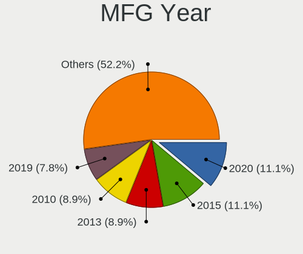
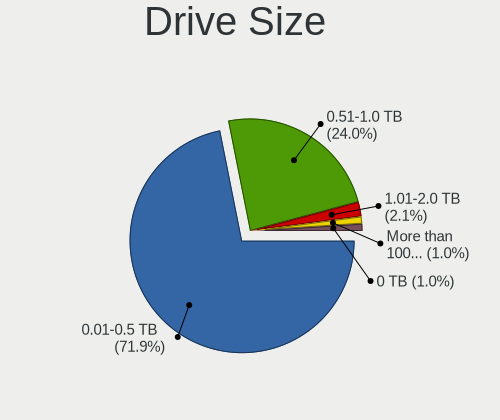
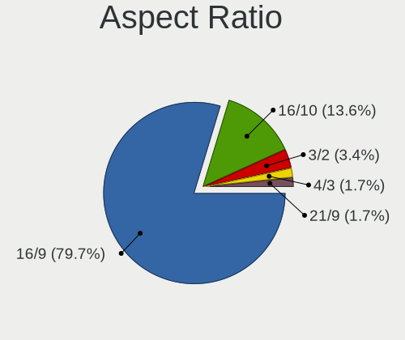
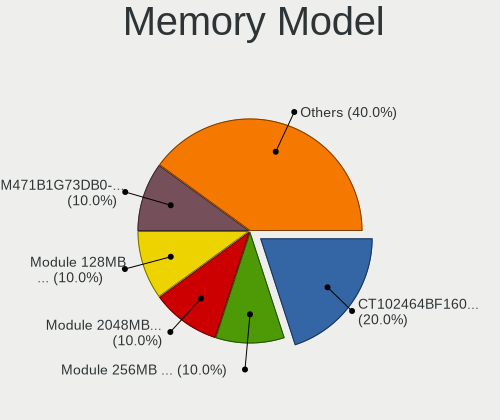

OpenBSD 6.8 - Tested Hardware & Statistics (Notebooks)
------------------------------------------------------

A project to collect tested hardware configurations for OpenBSD 6.8.

Anyone can contribute to this report by the [hw-probe](https://github.com/linuxhw/hw-probe/blob/master/INSTALL.BSD.md) tool:

    hw-probe -all -upload

Please submit a probe of your configuration if it's not presented on the page or is rare.

Full-feature report is available here: https://bsd-hardware.info/?view=trends&rel=openbsd-6.8

Contents
--------

* [ Test Cases ](#test-cases)

* [ System ](#system)
  - [ Arch                     ](#arch)
  - [ DE                       ](#de)
  - [ Display Server           ](#display-server)
  - [ Display Manager          ](#display-manager)
  - [ OS Lang                  ](#os-lang)
  - [ Boot Mode                ](#boot-mode)
  - [ Filesystem               ](#filesystem)
  - [ Part. scheme             ](#part-scheme)

* [ Board ](#board)
  - [ Vendor                   ](#vendor)
  - [ Model                    ](#model)
  - [ Model Family             ](#model-family)
  - [ MFG Year                 ](#mfg-year)
  - [ Form Factor              ](#form-factor)
  - [ Coreboot                 ](#coreboot)
  - [ RAM Size                 ](#ram-size)
  - [ RAM Used                 ](#ram-used)
  - [ Total Drives             ](#total-drives)
  - [ Has CD-ROM               ](#has-cd-rom)
  - [ Has Ethernet             ](#has-ethernet)
  - [ Has WiFi                 ](#has-wifi)
  - [ Has Bluetooth            ](#has-bluetooth)

* [ Location ](#location)
  - [ Country                  ](#country)
  - [ City                     ](#city)

* [ Drives ](#drives)
  - [ Drive Vendor             ](#drive-vendor)
  - [ Drive Model              ](#drive-model)
  - [ HDD Vendor               ](#hdd-vendor)
  - [ SSD Vendor               ](#ssd-vendor)
  - [ Drive Kind               ](#drive-kind)
  - [ Drive Connector          ](#drive-connector)
  - [ Drive Size               ](#drive-size)
  - [ Space Total              ](#space-total)
  - [ Space Used               ](#space-used)
  - [ Malfunc. Drives          ](#malfunc-drives)
  - [ Malfunc. Drive Vendor    ](#malfunc-drive-vendor)
  - [ Malfunc. HDD Vendor      ](#malfunc-hdd-vendor)
  - [ Malfunc. Drive Kind      ](#malfunc-drive-kind)
  - [ Failed Drives            ](#failed-drives)
  - [ Failed Drive Vendor      ](#failed-drive-vendor)
  - [ Drive Status             ](#drive-status)

* [ Storage controller ](#storage-controller)
  - [ Storage Vendor           ](#storage-vendor)
  - [ Storage Model            ](#storage-model)
  - [ Storage Kind             ](#storage-kind)

* [ Processor ](#processor)
  - [ CPU Vendor               ](#cpu-vendor)
  - [ CPU Model                ](#cpu-model)
  - [ CPU Model Family         ](#cpu-model-family)
  - [ CPU Cores                ](#cpu-cores)
  - [ CPU Sockets              ](#cpu-sockets)
  - [ CPU Threads              ](#cpu-threads)
  - [ CPU Microarch            ](#cpu-microarch)

* [ Graphics ](#graphics)
  - [ GPU Vendor               ](#gpu-vendor)
  - [ GPU Model                ](#gpu-model)
  - [ GPU Combo                ](#gpu-combo)
  - [ GPU Driver               ](#gpu-driver)
  - [ GPU Memory               ](#gpu-memory)

* [ Monitor ](#monitor)
  - [ Monitor Vendor           ](#monitor-vendor)
  - [ Monitor Model            ](#monitor-model)
  - [ Monitor Resolution       ](#monitor-resolution)
  - [ Monitor Diagonal         ](#monitor-diagonal)
  - [ Monitor Width            ](#monitor-width)
  - [ Aspect Ratio             ](#aspect-ratio)
  - [ Monitor Area             ](#monitor-area)
  - [ Pixel Density            ](#pixel-density)
  - [ Multiple Monitors        ](#multiple-monitors)

* [ Network ](#network)
  - [ Net Controller Vendor    ](#net-controller-vendor)
  - [ Net Controller Model     ](#net-controller-model)
  - [ Wireless Vendor          ](#wireless-vendor)
  - [ Wireless Model           ](#wireless-model)
  - [ Ethernet Vendor          ](#ethernet-vendor)
  - [ Ethernet Model           ](#ethernet-model)
  - [ Net Controller Kind      ](#net-controller-kind)
  - [ Used Controller          ](#used-controller)
  - [ NICs                     ](#nics)
  - [ IPv6                     ](#ipv6)

* [ Bluetooth ](#bluetooth)
  - [ Bluetooth Vendor         ](#bluetooth-vendor)
  - [ Bluetooth Model          ](#bluetooth-model)

* [ Sound ](#sound)
  - [ Sound Vendor             ](#sound-vendor)
  - [ Sound Model              ](#sound-model)

* [ Memory ](#memory)
  - [ Memory Vendor            ](#memory-vendor)
  - [ Memory Model             ](#memory-model)
  - [ Memory Kind              ](#memory-kind)
  - [ Memory Form Factor       ](#memory-form-factor)
  - [ Memory Size              ](#memory-size)
  - [ Memory Speed             ](#memory-speed)

* [ Printers & scanners ](#printers--scanners)
  - [ Printer Vendor           ](#printer-vendor)
  - [ Printer Model            ](#printer-model)
  - [ Scanner Vendor           ](#scanner-vendor)
  - [ Scanner Model            ](#scanner-model)

* [ Camera ](#camera)
  - [ Camera Vendor            ](#camera-vendor)
  - [ Camera Model             ](#camera-model)

* [ Security ](#security)
  - [ Fingerprint Vendor       ](#fingerprint-vendor)
  - [ Fingerprint Model        ](#fingerprint-model)
  - [ Chipcard Vendor          ](#chipcard-vendor)
  - [ Chipcard Model           ](#chipcard-model)

* [ Unsupported ](#unsupported)
  - [ Unsupported Devices      ](#unsupported-devices)
  - [ Unsupported Device Types ](#unsupported-device-types)

Test Cases
----------

| Vendor        | Model                       | Probe                                                     | Date         |
|---------------|-----------------------------|-----------------------------------------------------------|--------------|
| Lenovo        | ThinkPad T14 Gen 1 20S1S... | [7ec73fe36d](https://bsd-hardware.info/?probe=7ec73fe36d) | Apr 23, 2021 |
| Lenovo        | ThinkPad X201 Tablet 298... | [4faceaf6e5](https://bsd-hardware.info/?probe=4faceaf6e5) | Apr 17, 2021 |
| ASUSTek       | UX430UNR                    | [f31eda4c16](https://bsd-hardware.info/?probe=f31eda4c16) | Apr 16, 2021 |
| Lenovo        | ThinkPad X250 20CLS1LC13    | [dcf202ea95](https://bsd-hardware.info/?probe=dcf202ea95) | Apr 10, 2021 |
| Lenovo        | ThinkPad X250 20CLS1LC13    | [ee371f3e8f](https://bsd-hardware.info/?probe=ee371f3e8f) | Apr 08, 2021 |
| Lenovo        | ThinkPad X220 4291EM4       | [9d393db103](https://bsd-hardware.info/?probe=9d393db103) | Mar 20, 2021 |
| Dell          | Inspiron 15-3567            | [b35adf782c](https://bsd-hardware.info/?probe=b35adf782c) | Mar 17, 2021 |
| ASUSTek       | X510UA                      | [440f1ef3ec](https://bsd-hardware.info/?probe=440f1ef3ec) | Mar 14, 2021 |
| Panasonic     | CF-30KTP48NL                | [119b4875e9](https://bsd-hardware.info/?probe=119b4875e9) | Mar 12, 2021 |
| ASUSTek       | X510UA                      | [f22eeba366](https://bsd-hardware.info/?probe=f22eeba366) | Mar 04, 2021 |
| Dell          | Inspiron 1000               | [70604dcbfa](https://bsd-hardware.info/?probe=70604dcbfa) | Feb 28, 2021 |
| Lenovo        | ThinkPad E14 20RBCTO1WW     | [fb890afc86](https://bsd-hardware.info/?probe=fb890afc86) | Feb 28, 2021 |
| Apple         | MacBook5,1                  | [41ea02c8bc](https://bsd-hardware.info/?probe=41ea02c8bc) | Feb 21, 2021 |
| IBM           | ThinkPad T42 2374K46        | [311f93ab37](https://bsd-hardware.info/?probe=311f93ab37) | Feb 20, 2021 |
| ASUSTek       | X102BA                      | [529baeb345](https://bsd-hardware.info/?probe=529baeb345) | Feb 20, 2021 |
| ASUSTek       | X102BA                      | [65f1904b56](https://bsd-hardware.info/?probe=65f1904b56) | Feb 20, 2021 |
| Dell          | Inspiron 1000               | [104175ae13](https://bsd-hardware.info/?probe=104175ae13) | Feb 13, 2021 |
| Sony          | VPCX115KX                   | [fef3d94e6c](https://bsd-hardware.info/?probe=fef3d94e6c) | Feb 12, 2021 |
| Acer          | Extensa 5635Z               | [3b4a7e7fc2](https://bsd-hardware.info/?probe=3b4a7e7fc2) | Feb 10, 2021 |
| Sony          | VPCF12C5E                   | [df8c1de8a5](https://bsd-hardware.info/?probe=df8c1de8a5) | Feb 07, 2021 |
| IBM           | ThinkPad T42 2373K9G        | [a12c3a0b21](https://bsd-hardware.info/?probe=a12c3a0b21) | Feb 01, 2021 |
| Lenovo        | ThinkPad T61 7661AU5        | [23e498234e](https://bsd-hardware.info/?probe=23e498234e) | Jan 28, 2021 |
| Lenovo        | ThinkPad X1 Carbon 7th 2... | [5f469ceeb9](https://bsd-hardware.info/?probe=5f469ceeb9) | Jan 20, 2021 |
| Dell          | XPS 15 7590                 | [6cd195aa69](https://bsd-hardware.info/?probe=6cd195aa69) | Jan 05, 2021 |
| Dell          | XPS 15 7590                 | [50ca36db01](https://bsd-hardware.info/?probe=50ca36db01) | Jan 05, 2021 |
| ASUSTek       | X101CH                      | [112792b300](https://bsd-hardware.info/?probe=112792b300) | Jan 02, 2021 |
| ASUSTek       | X101CH                      | [8b571cc947](https://bsd-hardware.info/?probe=8b571cc947) | Jan 02, 2021 |
| ASUSTek       | X102BA                      | [893b9111c6](https://bsd-hardware.info/?probe=893b9111c6) | Dec 27, 2020 |
| HP            | 240 G1                      | [3ee90471d0](https://bsd-hardware.info/?probe=3ee90471d0) | Dec 26, 2020 |
| Apple         | PowerBook5,8                | [96f550a537](https://bsd-hardware.info/?probe=96f550a537) | Dec 24, 2020 |
| Lenovo        | ThinkPad T400 6475K43       | [30500a25d3](https://bsd-hardware.info/?probe=30500a25d3) | Dec 18, 2020 |
| HP            | OMEN Laptop 15-en0xxx       | [d019e14245](https://bsd-hardware.info/?probe=d019e14245) | Dec 18, 2020 |
| Lenovo        | ThinkPad X1 Carbon 7th 2... | [7e80ced15e](https://bsd-hardware.info/?probe=7e80ced15e) | Dec 16, 2020 |
| Unknown       | Spring Peak                 | [b61f5c268a](https://bsd-hardware.info/?probe=b61f5c268a) | Dec 15, 2020 |
| Lenovo        | IdeaPad L340-15API 81LW     | [3a78e7dc1a](https://bsd-hardware.info/?probe=3a78e7dc1a) | Dec 11, 2020 |
| Dell          | Latitude 3300               | [108a030875](https://bsd-hardware.info/?probe=108a030875) | Dec 07, 2020 |
| Fujitsu       | LIFEBOOK P1610              | [e8ee627d6e](https://bsd-hardware.info/?probe=e8ee627d6e) | Dec 07, 2020 |
| Clevo         | W240EU/W250EUQ/W270EUQ      | [2544123f79](https://bsd-hardware.info/?probe=2544123f79) | Dec 06, 2020 |
| Lenovo        | ThinkPad T410 2537NB5       | [d6a3aa6f8d](https://bsd-hardware.info/?probe=d6a3aa6f8d) | Dec 06, 2020 |
| Lenovo        | ThinkPad X201 3680FAG       | [1ba69078df](https://bsd-hardware.info/?probe=1ba69078df) | Dec 06, 2020 |
| Lenovo        | ThinkPad W520 42763JU       | [5c50582307](https://bsd-hardware.info/?probe=5c50582307) | Nov 30, 2020 |
| Lenovo        | Yoga 720-13IKB 81C3         | [467a6fc001](https://bsd-hardware.info/?probe=467a6fc001) | Nov 26, 2020 |
| Lenovo        | Unknown                     | [1cf65625a7](https://bsd-hardware.info/?probe=1cf65625a7) | Nov 24, 2020 |
| HP            | Setzer                      | [da7914cdd5](https://bsd-hardware.info/?probe=da7914cdd5) | Nov 22, 2020 |
| Lenovo        | ThinkPad T450 20BVA020AU    | [5d8bce59e8](https://bsd-hardware.info/?probe=5d8bce59e8) | Nov 16, 2020 |
| Lenovo        | ThinkPad T60 87445BU        | [bfd9130d4b](https://bsd-hardware.info/?probe=bfd9130d4b) | Nov 10, 2020 |
| Lenovo        | ThinkPad T490 20N3S8PB00    | [6a0f910601](https://bsd-hardware.info/?probe=6a0f910601) | Nov 10, 2020 |
| Lenovo        | ThinkPad T490 20N3S8PB00    | [6dca4cdd18](https://bsd-hardware.info/?probe=6dca4cdd18) | Nov 10, 2020 |
| Lenovo        | ThinkPad T450s 20BWS2XS0... | [0b04a395a7](https://bsd-hardware.info/?probe=0b04a395a7) | Nov 10, 2020 |
| Lenovo        | ThinkPad T460 20FN003LGE    | [1b7b105e5c](https://bsd-hardware.info/?probe=1b7b105e5c) | Nov 08, 2020 |
| IBM           | ThinkPad T42 2373K9G        | [e041100bb6](https://bsd-hardware.info/?probe=e041100bb6) | Nov 08, 2020 |
| Lenovo        | Yoga 720-13IKB 81C3         | [bdc2de68ce](https://bsd-hardware.info/?probe=bdc2de68ce) | Nov 05, 2020 |
| Lenovo        | Yoga 720-13IKB 81C3         | [8cfb32120b](https://bsd-hardware.info/?probe=8cfb32120b) | Nov 05, 2020 |
| Lenovo        | ThinkPad T14 Gen 1 20UD0... | [ebd246c141](https://bsd-hardware.info/?probe=ebd246c141) | Nov 04, 2020 |
| Lenovo        | ThinkPad T14 Gen 1 20UD0... | [f2e085e11a](https://bsd-hardware.info/?probe=f2e085e11a) | Nov 04, 2020 |
| Lenovo        | ThinkPad X1 Carbon 6th 2... | [9b6b24708e](https://bsd-hardware.info/?probe=9b6b24708e) | Nov 03, 2020 |
| Dell          | Precision M4800             | [ca6d4c4bb7](https://bsd-hardware.info/?probe=ca6d4c4bb7) | Nov 03, 2020 |
| Dell          | Precision M4800             | [c6a7b68c75](https://bsd-hardware.info/?probe=c6a7b68c75) | Nov 03, 2020 |
| Lenovo        | ThinkPad T500 2087A16       | [334eacfe16](https://bsd-hardware.info/?probe=334eacfe16) | Nov 03, 2020 |
| Lenovo        | ThinkPad W530 2436CTO       | [ded161fe2e](https://bsd-hardware.info/?probe=ded161fe2e) | Oct 31, 2020 |
| Lenovo        | ThinkPad W530 2436CTO       | [e108d4a375](https://bsd-hardware.info/?probe=e108d4a375) | Oct 31, 2020 |
| ASUSTek       | X102BA                      | [9156250b96](https://bsd-hardware.info/?probe=9156250b96) | Oct 31, 2020 |
| Acer          | Extensa 2540                | [26670a4ae9](https://bsd-hardware.info/?probe=26670a4ae9) | Oct 30, 2020 |
| Lenovo        | ThinkPad T450 20BV0005US    | [603e66300a](https://bsd-hardware.info/?probe=603e66300a) | Oct 27, 2020 |
| Lenovo        | ThinkPad T500 2087A16       | [cf8228f878](https://bsd-hardware.info/?probe=cf8228f878) | Oct 25, 2020 |
| Lenovo        | Unknown                     | [7bab490506](https://bsd-hardware.info/?probe=7bab490506) | Oct 23, 2020 |
| Lenovo        | ThinkPad X1 Carbon 3rd 2... | [03602ed2c0](https://bsd-hardware.info/?probe=03602ed2c0) | Oct 23, 2020 |
| Lenovo        | Unknown                     | [c659708e94](https://bsd-hardware.info/?probe=c659708e94) | Oct 23, 2020 |
| IBM           | ThinkPad X41 2525F8G        | [c58f946d2a](https://bsd-hardware.info/?probe=c58f946d2a) | Oct 22, 2020 |
| Dell          | Precision 3510              | [85a55ab7c3](https://bsd-hardware.info/?probe=85a55ab7c3) | Oct 22, 2020 |
| Lenovo        | ThinkPad E485 20KUCTO1WW    | [f4aa59ba56](https://bsd-hardware.info/?probe=f4aa59ba56) | Oct 22, 2020 |
| Lenovo        | ThinkPad X230 2325AJ9       | [176044b6b8](https://bsd-hardware.info/?probe=176044b6b8) | Oct 21, 2020 |
| Lenovo        | ThinkPad S5-S540 20B3001... | [7e6cb69989](https://bsd-hardware.info/?probe=7e6cb69989) | Oct 21, 2020 |
| Dell          | Latitude C400               | [1dcc5e7972](https://bsd-hardware.info/?probe=1dcc5e7972) | Oct 21, 2020 |
| Dell          | Latitude C400               | [8330d23bd7](https://bsd-hardware.info/?probe=8330d23bd7) | Oct 21, 2020 |
| Lenovo        | ThinkPad X60s 17033JM       | [67e701adb7](https://bsd-hardware.info/?probe=67e701adb7) | Oct 21, 2020 |
| Lenovo        | ThinkPad W540 20BG001KUK    | [1b1327ac93](https://bsd-hardware.info/?probe=1b1327ac93) | Oct 21, 2020 |
| Lenovo        | ThinkPad X230 2325R74       | [82398321f6](https://bsd-hardware.info/?probe=82398321f6) | Oct 21, 2020 |
| Lenovo        | ThinkPad X230 2325R74       | [1cc3cc20e8](https://bsd-hardware.info/?probe=1cc3cc20e8) | Oct 21, 2020 |
| Lenovo        | ThinkPad T430 2347GZU       | [f287de215c](https://bsd-hardware.info/?probe=f287de215c) | Oct 20, 2020 |
| Lenovo        | ThinkPad X230 2325Y36       | [b2e65dd4c5](https://bsd-hardware.info/?probe=b2e65dd4c5) | Oct 20, 2020 |
| Lenovo        | ThinkPad Edge E531 68852... | [e6b45d36e5](https://bsd-hardware.info/?probe=e6b45d36e5) | Oct 20, 2020 |
| Apple         | MacBookAir7,2               | [901c82d31e](https://bsd-hardware.info/?probe=901c82d31e) | Oct 20, 2020 |
| Lenovo        | ThinkPad X250 20CLS4WV08    | [2808d1dd6a](https://bsd-hardware.info/?probe=2808d1dd6a) | Oct 20, 2020 |
| Lenovo        | ThinkPad T410 2537N24       | [f846609c80](https://bsd-hardware.info/?probe=f846609c80) | Oct 20, 2020 |
| Lenovo        | ThinkPad X240 20AL00DKRT    | [623801416c](https://bsd-hardware.info/?probe=623801416c) | Oct 20, 2020 |
| Panasonic     | CF-52PFPBSFQ                | [feb1da0406](https://bsd-hardware.info/?probe=feb1da0406) | Oct 20, 2020 |
| Matsushita... | CF-51RCVDNLM                | [efece2abf7](https://bsd-hardware.info/?probe=efece2abf7) | Oct 20, 2020 |
| ASUSTek       | K53SV                       | [e776458c9e](https://bsd-hardware.info/?probe=e776458c9e) | Oct 19, 2020 |
| Lenovo        | ThinkPad T560 20FJS0CE00    | [be16cb1839](https://bsd-hardware.info/?probe=be16cb1839) | Oct 19, 2020 |
| Lenovo        | ThinkPad X240 20AMS2QD0C    | [fdc7310ca7](https://bsd-hardware.info/?probe=fdc7310ca7) | Oct 19, 2020 |
| ASUSTek       | 1000HE                      | [621df26e0c](https://bsd-hardware.info/?probe=621df26e0c) | Oct 19, 2020 |
| Acer          | Aspire 5251                 | [da9ebcf25e](https://bsd-hardware.info/?probe=da9ebcf25e) | Oct 19, 2020 |
| Lenovo        | ThinkPad X1 Carbon 2nd 2... | [857f9809b7](https://bsd-hardware.info/?probe=857f9809b7) | Oct 19, 2020 |
| Lenovo        | ThinkPad X270 20HNA004CD    | [79160b17c4](https://bsd-hardware.info/?probe=79160b17c4) | Oct 19, 2020 |
| ASUSTek       | X102BA                      | [47e04c9378](https://bsd-hardware.info/?probe=47e04c9378) | Oct 19, 2020 |
| Lenovo        | G50-80 80E5                 | [e06605a92b](https://bsd-hardware.info/?probe=e06605a92b) | Oct 19, 2020 |
| Panasonic     | CF-C1BT02EGE                | [8a80fb614e](https://bsd-hardware.info/?probe=8a80fb614e) | Oct 19, 2020 |
| Lenovo        | ThinkPad X1 Carbon 5th 2... | [bee732e516](https://bsd-hardware.info/?probe=bee732e516) | Oct 19, 2020 |
| Apple         | PowerBook6,7                | [7ac5f5530a](https://bsd-hardware.info/?probe=7ac5f5530a) | Oct 19, 2020 |
| Alienware     | m15                         | [8f8cf7d956](https://bsd-hardware.info/?probe=8f8cf7d956) | Oct 19, 2020 |
| Lenovo        | ThinkPad T480 20L6S4GR02    | [6c2d8a57ea](https://bsd-hardware.info/?probe=6c2d8a57ea) | Oct 19, 2020 |
| Unknown       | Unknown                     | [fd77b4658f](https://bsd-hardware.info/?probe=fd77b4658f) | Oct 19, 2020 |
| Apple         | MacBookAir6,2               | [9f80fdafb0](https://bsd-hardware.info/?probe=9f80fdafb0) | Oct 19, 2020 |
| ASUSTek       | VivoBook_ASUSLaptop X545... | [017b41dfd7](https://bsd-hardware.info/?probe=017b41dfd7) | Oct 19, 2020 |
| ASUSTek       | VivoBook_ASUSLaptop X570... | [4f54c8f399](https://bsd-hardware.info/?probe=4f54c8f399) | Oct 19, 2020 |
| HP            | OmniBook PC                 | [0e0656d228](https://bsd-hardware.info/?probe=0e0656d228) | Oct 19, 2020 |
| HP            | OmniBook PC                 | [60e72f1c10](https://bsd-hardware.info/?probe=60e72f1c10) | Oct 19, 2020 |
| Lenovo        | ThinkPad T460 20FMS1BC01    | [bf6d6d155b](https://bsd-hardware.info/?probe=bf6d6d155b) | Oct 19, 2020 |
| Lenovo        | 3000 N100 0768B9G           | [c44a86f589](https://bsd-hardware.info/?probe=c44a86f589) | Oct 19, 2020 |
| ASUSTek       | G551JW                      | [594e6f28fb](https://bsd-hardware.info/?probe=594e6f28fb) | Oct 19, 2020 |
| Lenovo        | ThinkPad X1 Carbon 3rd 2... | [ee1f866775](https://bsd-hardware.info/?probe=ee1f866775) | Oct 13, 2020 |
| Lenovo        | ThinkPad X395 20NL000HGE    | [fbf90aaf0d](https://bsd-hardware.info/?probe=fbf90aaf0d) | Sep 11, 2020 |
| Lenovo        | ThinkPad X395 20NL000HGE    | [e06815d9dc](https://bsd-hardware.info/?probe=e06815d9dc) | Sep 11, 2020 |

System
------

Arch
----

OS architecture (x86_64, i586, etc.)

| Name   | Notebooks | Percent |
|--------|-----------|---------|
| amd64  | 76        | 84.44%  |
| i386   | 12        | 13.33%  |
| macppc | 2         | 2.22%   |

DE
--

Desktop Environment

| Name    | Notebooks | Percent |
|---------|-----------|---------|
| fvwm    | 83        | 92.22%  |
| Console | 6         | 6.67%   |
| GNOME   | 1         | 1.11%   |

Display Server
--------------

X11 or Wayland

| Name    | Notebooks | Percent |
|---------|-----------|---------|
| X11     | 81        | 90%     |
| Console | 9         | 10%     |

Display Manager
---------------

SDDM, LightDM, etc.

| Name    | Notebooks | Percent |
|---------|-----------|---------|
| Console | 72        | 80%     |
| SLiM    | 9         | 10%     |
| GDM     | 9         | 10%     |

OS Lang
-------

Language

| Lang    | Notebooks | Percent |
|---------|-----------|---------|
| Unknown | 69        | 75.82%  |
| en_US   | 9         | 9.89%   |
| C       | 3         | 3.3%    |
| ru_RU   | 2         | 2.2%    |
| en_GB   | 2         | 2.2%    |
| ja_JP   | 1         | 1.1%    |
| fr_FR   | 1         | 1.1%    |
| fr_CA   | 1         | 1.1%    |
| es_ES   | 1         | 1.1%    |
| es_CO   | 1         | 1.1%    |
| en_AU   | 1         | 1.1%    |

Boot Mode
---------

EFI or BIOS

| Mode | Notebooks | Percent |
|------|-----------|---------|
| BIOS | 50        | 55.56%  |
| EFI  | 40        | 44.44%  |

Filesystem
----------

Type of filesystem

| Type | Notebooks | Percent |
|------|-----------|---------|
| Ffs  | 90        | 100%    |

Part. scheme
------------

Scheme of partitioning

| Type | Notebooks | Percent |
|------|-----------|---------|
| MBR  | 53        | 58.24%  |
| GPT  | 38        | 41.76%  |

Board
-----

Vendor
------

Motherboard manufacturer

| Name                           | Notebooks | Percent |
|--------------------------------|-----------|---------|
| Lenovo                         | 47        | 52.22%  |
| ASUSTek Computer               | 10        | 11.11%  |
| Dell                           | 7         | 7.78%   |
| Apple                          | 5         | 5.56%   |
| Hewlett-Packard                | 4         | 4.44%   |
| Panasonic                      | 3         | 3.33%   |
| IBM                            | 3         | 3.33%   |
| Acer                           | 3         | 3.33%   |
| Sony                           | 2         | 2.22%   |
| Unknown                        | 2         | 2.22%   |
| Matsushita Electric Industrial | 1         | 1.11%   |
| Fujitsu                        | 1         | 1.11%   |
| Clevo                          | 1         | 1.11%   |
| Alienware                      | 1         | 1.11%   |

Model
-----

Motherboard model

| Name                                        | Notebooks | Percent |
|---------------------------------------------|-----------|---------|
| Unknown                                     | 3         | 3.33%   |
| Lenovo ThinkPad X1 Carbon 3rd 20BSCTO1WW    | 2         | 2.22%   |
| ASUS X102BA                                 | 2         | 2.22%   |
| Sony VPCX115KX                              | 1         | 1.11%   |
| Sony VPCF12C5E                              | 1         | 1.11%   |
| Panasonic CF-C1BT02EGE                      | 1         | 1.11%   |
| Panasonic CF-52PFPBSFQ                      | 1         | 1.11%   |
| Panasonic CF-30KTP48NL                      | 1         | 1.11%   |
| Matsushita Electric Industrial CF-51RCVDNLM | 1         | 1.11%   |
| Lenovo Yoga 720-13IKB 81C3                  | 1         | 1.11%   |
| Lenovo ThinkPad X60s 17033JM                | 1         | 1.11%   |
| Lenovo ThinkPad X395 20NL000HGE             | 1         | 1.11%   |
| Lenovo ThinkPad X270 20HNA004CD             | 1         | 1.11%   |
| Lenovo ThinkPad X250 20CLS4WV08             | 1         | 1.11%   |
| Lenovo ThinkPad X250 20CLS1LC13             | 1         | 1.11%   |
| Lenovo ThinkPad X240 20AMS2QD0C             | 1         | 1.11%   |
| Lenovo ThinkPad X240 20AL00DKRT             | 1         | 1.11%   |
| Lenovo ThinkPad X230 2325Y36                | 1         | 1.11%   |
| Lenovo ThinkPad X230 2325R74                | 1         | 1.11%   |
| Lenovo ThinkPad X230 2325AJ9                | 1         | 1.11%   |
| Lenovo ThinkPad X220 4291EM4                | 1         | 1.11%   |
| Lenovo ThinkPad X201 Tablet 2985F4U         | 1         | 1.11%   |
| Lenovo ThinkPad X201 3680FAG                | 1         | 1.11%   |
| Lenovo ThinkPad X1 Carbon 7th 20QD003MGE    | 1         | 1.11%   |
| Lenovo ThinkPad X1 Carbon 6th 20KHS1TG00    | 1         | 1.11%   |
| Lenovo ThinkPad X1 Carbon 5th 20HRCTO1WW    | 1         | 1.11%   |
| Lenovo ThinkPad X1 Carbon 2nd 20A7002CUK    | 1         | 1.11%   |
| Lenovo ThinkPad W540 20BG001KUK             | 1         | 1.11%   |
| Lenovo ThinkPad W530 2436CTO                | 1         | 1.11%   |
| Lenovo ThinkPad W520 42763JU                | 1         | 1.11%   |
| Lenovo ThinkPad T61 7661AU5                 | 1         | 1.11%   |
| Lenovo ThinkPad T60 87445BU                 | 1         | 1.11%   |
| Lenovo ThinkPad T560 20FJS0CE00             | 1         | 1.11%   |
| Lenovo ThinkPad T500 2087A16                | 1         | 1.11%   |
| Lenovo ThinkPad T490 20N3S8PB00             | 1         | 1.11%   |
| Lenovo ThinkPad T480 20L6S4GR02             | 1         | 1.11%   |
| Lenovo ThinkPad T460 20FN003LGE             | 1         | 1.11%   |
| Lenovo ThinkPad T460 20FMS1BC01             | 1         | 1.11%   |
| Lenovo ThinkPad T450s 20BWS2XS00            | 1         | 1.11%   |
| Lenovo ThinkPad T450 20BVA020AU             | 1         | 1.11%   |
| Lenovo ThinkPad T450 20BV0005US             | 1         | 1.11%   |
| Lenovo ThinkPad T430 2347GZU                | 1         | 1.11%   |
| Lenovo ThinkPad T410 2537NB5                | 1         | 1.11%   |
| Lenovo ThinkPad T410 2537N24                | 1         | 1.11%   |
| Lenovo ThinkPad T400 6475K43                | 1         | 1.11%   |
| Lenovo ThinkPad T14 Gen 1 20UD002HMH        | 1         | 1.11%   |
| Lenovo ThinkPad S5-S540 20B3001XFR          | 1         | 1.11%   |
| Lenovo ThinkPad Edge E531 68852HG           | 1         | 1.11%   |
| Lenovo ThinkPad E485 20KUCTO1WW             | 1         | 1.11%   |
| Lenovo ThinkPad E14 20RBCTO1WW              | 1         | 1.11%   |
| Lenovo IdeaPad L340-15API 81LW              | 1         | 1.11%   |
| Lenovo G50-80 80E5                          | 1         | 1.11%   |
| Lenovo 3000 N100 0768B9G                    | 1         | 1.11%   |
| IBM ThinkPad X41 2525F8G                    | 1         | 1.11%   |
| IBM ThinkPad T42 2374K46                    | 1         | 1.11%   |
| IBM ThinkPad T42 2373K9G                    | 1         | 1.11%   |
| HP Setzer                                   | 1         | 1.11%   |
| HP OmniBook PC                              | 1         | 1.11%   |
| HP OMEN Laptop 15-en0xxx                    | 1         | 1.11%   |
| HP 240 G1                                   | 1         | 1.11%   |

Model Family
------------

Motherboard model prefix

| Name                                        | Notebooks | Percent |
|---------------------------------------------|-----------|---------|
| Lenovo ThinkPad                             | 42        | 46.67%  |
| IBM ThinkPad                                | 3         | 3.33%   |
| Unknown                                     | 3         | 3.33%   |
| Dell Precision                              | 2         | 2.22%   |
| Dell Latitude                               | 2         | 2.22%   |
| Dell Inspiron                               | 2         | 2.22%   |
| ASUS X102BA                                 | 2         | 2.22%   |
| ASUS VivoBook                               | 2         | 2.22%   |
| Acer Extensa                                | 2         | 2.22%   |
| Sony VPCX115KX                              | 1         | 1.11%   |
| Sony VPCF12C5E                              | 1         | 1.11%   |
| Panasonic CF-C1BT02EGE                      | 1         | 1.11%   |
| Panasonic CF-52PFPBSFQ                      | 1         | 1.11%   |
| Panasonic CF-30KTP48NL                      | 1         | 1.11%   |
| Matsushita Electric Industrial CF-51RCVDNLM | 1         | 1.11%   |
| Lenovo Yoga                                 | 1         | 1.11%   |
| Lenovo IdeaPad                              | 1         | 1.11%   |
| Lenovo G50-80                               | 1         | 1.11%   |
| Lenovo 3000                                 | 1         | 1.11%   |
| HP Setzer                                   | 1         | 1.11%   |
| HP OmniBook                                 | 1         | 1.11%   |
| HP OMEN                                     | 1         | 1.11%   |
| HP 240                                      | 1         | 1.11%   |
| Fujitsu LIFEBOOK                            | 1         | 1.11%   |
| Dell XPS                                    | 1         | 1.11%   |
| Clevo W240EU                                | 1         | 1.11%   |
| ASUS X510UA                                 | 1         | 1.11%   |
| ASUS X101CH                                 | 1         | 1.11%   |
| ASUS UX430UNR                               | 1         | 1.11%   |
| ASUS K53SV                                  | 1         | 1.11%   |
| ASUS G551JW                                 | 1         | 1.11%   |
| ASUS 1000HE                                 | 1         | 1.11%   |
| Apple PowerBook6                            | 1         | 1.11%   |
| Apple PowerBook5                            | 1         | 1.11%   |
| Apple MacBookAir7                           | 1         | 1.11%   |
| Apple MacBookAir6                           | 1         | 1.11%   |
| Apple MacBook5                              | 1         | 1.11%   |
| Alienware m15                               | 1         | 1.11%   |
| Acer Aspire                                 | 1         | 1.11%   |

MFG Year
--------

Motherboard manufacture year

| Year    | Notebooks | Percent |
|---------|-----------|---------|
| 2020    | 14        | 15.56%  |
| 2019    | 14        | 15.56%  |
| 2018    | 9         | 10%     |
| 2013    | 7         | 7.78%   |
| 2016    | 5         | 5.56%   |
| 2010    | 5         | 5.56%   |
| 2007    | 5         | 5.56%   |
| 2017    | 4         | 4.44%   |
| 2012    | 4         | 4.44%   |
| 2009    | 4         | 4.44%   |
| Unknown | 4         | 4.44%   |
| 2015    | 3         | 3.33%   |
| 2011    | 3         | 3.33%   |
| 2006    | 3         | 3.33%   |
| 2008    | 2         | 2.22%   |
| 2004    | 2         | 2.22%   |
| 2014    | 1         | 1.11%   |
| 2003    | 1         | 1.11%   |

Form Factor
-----------

Physical design of the computer

| Name     | Notebooks | Percent |
|----------|-----------|---------|
| Notebook | 90        | 100%    |

Coreboot
--------

Have coreboot on board

| Used | Notebooks | Percent |
|------|-----------|---------|
| No   | 89        | 98.89%  |
| Yes  | 1         | 1.11%   |

RAM Size
--------

Total RAM memory

| Size in GB | Notebooks | Percent |
|------------|-----------|---------|
| 8.01-16.0  | 34        | 37.78%  |
| 4.01-8.0   | 11        | 12.22%  |
| 3.01-4.0   | 10        | 11.11%  |
| 16.01-24.0 | 10        | 11.11%  |
| 32.01-64.0 | 6         | 6.67%   |
| 2.01-3.0   | 6         | 6.67%   |
| 1.01-2.0   | 6         | 6.67%   |
| 0.51-1.0   | 4         | 4.44%   |
| 0.01-0.5   | 3         | 3.33%   |

RAM Used
--------

Used RAM memory

| Used GB  | Notebooks | Percent |
|----------|-----------|---------|
| 0.01-0.5 | 74        | 82.22%  |
| 0        | 9         | 10%     |
| 0.51-1.0 | 6         | 6.67%   |
| Unknown  | 1         | 1.11%   |

Total Drives
------------

Number of drives on board

| Drives | Notebooks | Percent |
|--------|-----------|---------|
| 1      | 49        | 54.44%  |
| 2      | 30        | 33.33%  |
| 4      | 6         | 6.67%   |
| 3      | 5         | 5.56%   |

Has CD-ROM
----------

Has CD-ROM on board

| Presented | Notebooks | Percent |
|-----------|-----------|---------|
| No        | 90        | 100%    |

Has Ethernet
------------

Has Ethernet on board

| Presented | Notebooks | Percent |
|-----------|-----------|---------|
| Yes       | 79        | 87.78%  |
| No        | 11        | 12.22%  |

Has WiFi
--------

Has WiFi module

| Presented | Notebooks | Percent |
|-----------|-----------|---------|
| Yes       | 86        | 95.56%  |
| No        | 4         | 4.44%   |

Has Bluetooth
-------------

Has Bluetooth module

| Presented | Notebooks | Percent |
|-----------|-----------|---------|
| Yes       | 51        | 56.67%  |
| No        | 39        | 43.33%  |

Location
--------

Country
-------

Geographic location (country)

| Country      | Notebooks | Percent |
|--------------|-----------|---------|
| USA          | 14        | 15.38%  |
| Germany      | 12        | 13.19%  |
| Russia       | 10        | 10.99%  |
| France       | 7         | 7.69%   |
| Canada       | 7         | 7.69%   |
| UK           | 3         | 3.3%    |
| Norway       | 3         | 3.3%    |
| Australia    | 3         | 3.3%    |
| Spain        | 2         | 2.2%    |
| Poland       | 2         | 2.2%    |
| Philippines  | 2         | 2.2%    |
| Netherlands  | 2         | 2.2%    |
| Latvia       | 2         | 2.2%    |
| Japan        | 2         | 2.2%    |
| Czechia      | 2         | 2.2%    |
| Colombia     | 2         | 2.2%    |
| Ukraine      | 1         | 1.1%    |
| Turkey       | 1         | 1.1%    |
| Switzerland  | 1         | 1.1%    |
| Sweden       | 1         | 1.1%    |
| Slovenia     | 1         | 1.1%    |
| Saudi Arabia | 1         | 1.1%    |
| Portugal     | 1         | 1.1%    |
| Italy        | 1         | 1.1%    |
| India        | 1         | 1.1%    |
| Honduras     | 1         | 1.1%    |
| Finland      | 1         | 1.1%    |
| Croatia      | 1         | 1.1%    |
| Costa Rica   | 1         | 1.1%    |
| Bulgaria     | 1         | 1.1%    |
| Belarus      | 1         | 1.1%    |
| Austria      | 1         | 1.1%    |

City
----

Geographic location (city)

| City                | Notebooks | Percent |
|---------------------|-----------|---------|
| Québec             | 5         | 5.43%   |
| Vladivostok         | 3         | 3.26%   |
| Sydney              | 2         | 2.17%   |
| Riga                | 2         | 2.17%   |
| Oslo                | 2         | 2.17%   |
| Moscow              | 2         | 2.17%   |
| Krakow              | 2         | 2.17%   |
| Dublin              | 2         | 2.17%   |
| Brooklyn            | 2         | 2.17%   |
| Amsterdam           | 2         | 2.17%   |
| Zurich              | 1         | 1.09%   |
| Zhukovskiy          | 1         | 1.09%   |
| Yoshkar-Ola         | 1         | 1.09%   |
| Wetzlar             | 1         | 1.09%   |
| Vienna              | 1         | 1.09%   |
| Vantaa              | 1         | 1.09%   |
| Tustin              | 1         | 1.09%   |
| Turin               | 1         | 1.09%   |
| Trondheim           | 1         | 1.09%   |
| Tokyo               | 1         | 1.09%   |
| Thrissur            | 1         | 1.09%   |
| Temple City         | 1         | 1.09%   |
| Tegucigalpa         | 1         | 1.09%   |
| St Petersburg       | 1         | 1.09%   |
| Sofia               | 1         | 1.09%   |
| Sevastopol'         | 1         | 1.09%   |
| Saint-Herblain      | 1         | 1.09%   |
| Rosny-sous-Bois     | 1         | 1.09%   |
| Rochester           | 1         | 1.09%   |
| Rio Tinto           | 1         | 1.09%   |
| Prague              | 1         | 1.09%   |
| Peterborough        | 1         | 1.09%   |
| Pasig               | 1         | 1.09%   |
| Palmira             | 1         | 1.09%   |
| Oxenhope            | 1         | 1.09%   |
| Osaka               | 1         | 1.09%   |
| Nuremberg           | 1         | 1.09%   |
| New Brighton        | 1         | 1.09%   |
| Nantes              | 1         | 1.09%   |
| Montreal            | 1         | 1.09%   |
| Montesquiu d'Albera | 1         | 1.09%   |
| Minsk               | 1         | 1.09%   |
| London              | 1         | 1.09%   |
| Leipzig             | 1         | 1.09%   |
| Lamothe-Goas        | 1         | 1.09%   |
| Ladenburg           | 1         | 1.09%   |
| Kungsbacka          | 1         | 1.09%   |
| Kamnik              | 1         | 1.09%   |
| Jefferson           | 1         | 1.09%   |
| Jeddah              | 1         | 1.09%   |
| Ivanic-Grad         | 1         | 1.09%   |
| Islington           | 1         | 1.09%   |
| Ibiza Town          | 1         | 1.09%   |
| Holzkirchen         | 1         | 1.09%   |
| Hassloch            | 1         | 1.09%   |
| Harrisburg          | 1         | 1.09%   |
| Hamburg             | 1         | 1.09%   |
| Halle               | 1         | 1.09%   |
| Gummersbach         | 1         | 1.09%   |
| Gettysburg          | 1         | 1.09%   |

Drives
------

Drive Vendor
------------

Hard drive vendors

| Vendor              | Notebooks | Drives | Percent |
|---------------------|-----------|--------|---------|
| NVMe                | 19        | 24     | 17.43%  |
| WDC                 | 18        | 18     | 16.51%  |
| Samsung Electronics | 14        | 15     | 12.84%  |
| SanDisk             | 11        | 12     | 10.09%  |
| Seagate             | 8         | 8      | 7.34%   |
| Toshiba             | 5         | 6      | 4.59%   |
| Crucial             | 5         | 5      | 4.59%   |
| PNY                 | 4         | 4      | 3.67%   |
| Transcend           | 3         | 3      | 2.75%   |
| Kingston            | 3         | 3      | 2.75%   |
| Intel               | 3         | 3      | 2.75%   |
| Generic             | 2         | 2      | 1.83%   |
| Apple               | 2         | 2      | 1.83%   |
| Zheino              | 1         | 1      | 0.92%   |
| UFD 2.0             | 1         | 1      | 0.92%   |
| SPCC                | 1         | 1      | 0.92%   |
| OPENBSD             | 1         | 1      | 0.92%   |
| LITEONIT            | 1         | 1      | 0.92%   |
| LITEON              | 1         | 1      | 0.92%   |
| KingSpec            | 1         | 1      | 0.92%   |
| Hitachi             | 1         | 1      | 0.92%   |
| HGST                | 1         | 1      | 0.92%   |
| Hewlett-Packard     | 1         | 1      | 0.92%   |
| Dogfish             | 1         | 1      | 0.92%   |
| Apacer              | 1         | 1      | 0.92%   |

Drive Model
-----------

Hard drive models

| Model                               | Notebooks | Percent |
|-------------------------------------|-----------|---------|
| NVMe WDC PC SN730 SDB 512GB         | 3         | 2.7%    |
| WDC WDS240G2G0A-00JH30 240GB        | 2         | 1.8%    |
| WDC WD10JPLX-00MBPT0 1TB            | 2         | 1.8%    |
| Seagate ST500LM012 HN-M500MBB 500GB | 2         | 1.8%    |
| Seagate ST1000LM035-1RK172 1TB      | 2         | 1.8%    |
| SanDisk SSD U110 16GB               | 2         | 1.8%    |
| Samsung SSD 850 EVO 500GB           | 2         | 1.8%    |
| Samsung SSD 850 EVO 250GB           | 2         | 1.8%    |
| PNY CS900 120GB SSD                 | 2         | 1.8%    |
| NVMe Samsung SSD 970 1TB            | 2         | 1.8%    |
| NVMe SAMSUNG MZVLB256 256GB         | 2         | 1.8%    |
| Crucial CT1000MX500SSD1 1TB         | 2         | 1.8%    |
| Zheino CHN-mSATAQ3-120 120GB        | 1         | 0.9%    |
| WDC WDS240G2G0B-00EPW0 240GB        | 1         | 0.9%    |
| WDC WDBNCE5000PNC 500GB             | 1         | 0.9%    |
| WDC WD7500BPKX-00HPJT0 752GB        | 1         | 0.9%    |
| WDC WD7500BPKT-22PK4T0 752GB        | 1         | 0.9%    |
| WDC WD7500BPKT-00PK4T0 752GB        | 1         | 0.9%    |
| WDC WD5000LPLX-00ZNTT0 500GB        | 1         | 0.9%    |
| WDC WD5000LPCX-75VHAT0 500GB        | 1         | 0.9%    |
| WDC WD5000LPCX-21VHAT0 500GB        | 1         | 0.9%    |
| WDC WD3200BPVT-24JJ5T0 320GB        | 1         | 0.9%    |
| WDC WD3200BEVE-00A0HT0 320GB        | 1         | 0.9%    |
| WDC WD1600BEVT-22ZCT0 160GB         | 1         | 0.9%    |
| WDC WD1600BEVE-00WZT0 160GB         | 1         | 0.9%    |
| WDC WD10JPVX-08JC3T5 1TB            | 1         | 0.9%    |
| WDC WD10JPCX-24UE4T0 1TB            | 1         | 0.9%    |
| UFD 2.0 Silicon-Power16G 18302PB    | 1         | 0.9%    |
| Transcend TS256GMTS400 256GB        | 1         | 0.9%    |
| Transcend TS240GMTS420S 240GB       | 1         | 0.9%    |
| Transcend TS120GMTS420S 120GB       | 1         | 0.9%    |
| Toshiba TransMemory 4.3MB           | 1         | 0.9%    |
| Toshiba THNSNC064GBSJ               | 1         | 0.9%    |
| Toshiba MK8025GAS 80GB              | 1         | 0.9%    |
| Toshiba MK6006GAH 64GB              | 1         | 0.9%    |
| Toshiba MK1517GAP 16GB              | 1         | 0.9%    |
| SPCC Solid State Disk 512GB         | 1         | 0.9%    |
| Seagate ST9320423AS 320GB           | 1         | 0.9%    |
| Seagate ST500LT012-9WS142 500GB     | 1         | 0.9%    |
| Seagate ST2000LM003 HN-M201RAD 2TB  | 1         | 0.9%    |
| Seagate ST1000LM048-2E7172 1TB      | 1         | 0.9%    |
| SanDisk X400 M.2 2280 512GB         | 1         | 0.9%    |
| SanDisk SSD PLUS 120GB              | 1         | 0.9%    |
| SanDisk SDSSDXP120G 120GB           | 1         | 0.9%    |
| SanDisk SDSSDP128G 128GB            | 1         | 0.9%    |
| SanDisk SD9SN8W128G1102 128GB       | 1         | 0.9%    |
| SanDisk SD7UB3Q256G1001 256GB       | 1         | 0.9%    |
| SanDisk SD6SB1M128G1022I 128GB      | 1         | 0.9%    |
| SanDisk Cruzer Fit 32GB             | 1         | 0.9%    |
| SanDisk Cruzer Blade 16GB           | 1         | 0.9%    |
| Samsung SSD 860 EVO 250GB           | 1         | 0.9%    |
| Samsung SSD 850 PRO 512GB           | 1         | 0.9%    |
| Samsung SSD 850 PRO 256GB           | 1         | 0.9%    |
| Samsung SSD 840 EVO 250GB           | 1         | 0.9%    |
| Samsung MZNLN256HCHP-000L7 256GB    | 1         | 0.9%    |
| Samsung MZHPV512HDGL-00000 512GB    | 1         | 0.9%    |
| Samsung MZ7TD256HAFV-000L7 256GB    | 1         | 0.9%    |
| Samsung MZ7LN256HCHP-000L7 256GB    | 1         | 0.9%    |
| Samsung MMCRE28GFMXP-MVB 128GB      | 1         | 0.9%    |
| Samsung HM500JI 500GB               | 1         | 0.9%    |

HDD Vendor
----------

Hard disk drive vendors

| Vendor              | Notebooks | Drives | Percent |
|---------------------|-----------|--------|---------|
| WDC                 | 14        | 14     | 29.79%  |
| NVMe                | 14        | 17     | 29.79%  |
| Seagate             | 8         | 8      | 17.02%  |
| Toshiba             | 4         | 5      | 8.51%   |
| Generic             | 2         | 2      | 4.26%   |
| UFD 2.0             | 1         | 1      | 2.13%   |
| Samsung Electronics | 1         | 2      | 2.13%   |
| OPENBSD             | 1         | 1      | 2.13%   |
| Hitachi             | 1         | 1      | 2.13%   |
| HGST                | 1         | 1      | 2.13%   |

SSD Vendor
----------

Solid state drive vendors

| Vendor              | Notebooks | Drives | Percent |
|---------------------|-----------|--------|---------|
| Samsung Electronics | 13        | 13     | 20.97%  |
| SanDisk             | 11        | 12     | 17.74%  |
| NVMe                | 5         | 5      | 8.06%   |
| Crucial             | 5         | 5      | 8.06%   |
| WDC                 | 4         | 4      | 6.45%   |
| PNY                 | 4         | 4      | 6.45%   |
| Transcend           | 3         | 3      | 4.84%   |
| Kingston            | 3         | 3      | 4.84%   |
| Intel               | 3         | 3      | 4.84%   |
| Apple               | 2         | 2      | 3.23%   |
| Zheino              | 1         | 1      | 1.61%   |
| Toshiba             | 1         | 1      | 1.61%   |
| SPCC                | 1         | 1      | 1.61%   |
| LITEONIT            | 1         | 1      | 1.61%   |
| LITEON              | 1         | 1      | 1.61%   |
| KingSpec            | 1         | 1      | 1.61%   |
| Hewlett-Packard     | 1         | 1      | 1.61%   |
| Dogfish             | 1         | 1      | 1.61%   |
| Apacer              | 1         | 1      | 1.61%   |

Drive Kind
----------

HDD or SSD

| Kind | Notebooks | Drives | Percent |
|------|-----------|--------|---------|
| SSD  | 54        | 63     | 54%     |
| HDD  | 44        | 52     | 44%     |
| NVMe | 2         | 2      | 2%      |

Drive Connector
---------------

SATA, SAS, NVMe, etc.

| Type | Notebooks | Drives | Percent |
|------|-----------|--------|---------|
| SATA | 87        | 115    | 97.75%  |
| NVMe | 2         | 2      | 2.25%   |

Drive Size
----------

Size of hard drive

| Size in TB      | Notebooks | Drives | Percent |
|-----------------|-----------|--------|---------|
| 0.01-0.5        | 66        | 82     | 68.75%  |
| 0.51-1.0        | 26        | 28     | 27.08%  |
| 1.01-2.0        | 2         | 3      | 2.08%   |
| More than 100.0 | 1         | 1      | 1.04%   |
| 0               | 1         | 1      | 1.04%   |

Space Total
-----------

Amount of disk space available on the file system

| Size in GB | Notebooks | Percent |
|------------|-----------|---------|
| 101-250    | 33        | 35.87%  |
| 251-500    | 24        | 26.09%  |
| 51-100     | 13        | 14.13%  |
| 21-50      | 8         | 8.7%    |
| 1001-2000  | 5         | 5.43%   |
| 1-20       | 5         | 5.43%   |
| 501-1000   | 4         | 4.35%   |

Space Used
----------

Amount of used disk space

| Used GB  | Notebooks | Percent |
|----------|-----------|---------|
| 1-20     | 52        | 57.78%  |
| 21-50    | 13        | 14.44%  |
| 101-250  | 9         | 10%     |
| 51-100   | 9         | 10%     |
| 251-500  | 5         | 5.56%   |
| 501-1000 | 2         | 2.22%   |

Malfunc. Drives
---------------

Drive models with a malfunction

| Model                             | Notebooks | Drives | Percent |
|-----------------------------------|-----------|--------|---------|
| Toshiba MK6006GAH 64GB            | 1         | 1      | 12.5%   |
| Seagate ST9320423AS 320GB         | 1         | 1      | 12.5%   |
| SanDisk SD7UB3Q256G1001 256GB     | 1         | 1      | 12.5%   |
| Samsung Electronics HM500JI 500GB | 1         | 2      | 12.5%   |
| Kingston SMSM151S3128GD 128GB     | 1         | 1      | 12.5%   |
| KingSpec KSD-PA25.6-032MS 32GB    | 1         | 1      | 12.5%   |
| Intel SSDSC2KF256H6L 256GB        | 1         | 1      | 12.5%   |
| Hitachi DK23AA-12 12GB            | 1         | 1      | 12.5%   |

Malfunc. Drive Vendor
---------------------

Vendors of faulty drives

| Vendor              | Notebooks | Drives | Percent |
|---------------------|-----------|--------|---------|
| Toshiba             | 1         | 1      | 12.5%   |
| Seagate             | 1         | 1      | 12.5%   |
| SanDisk             | 1         | 1      | 12.5%   |
| Samsung Electronics | 1         | 2      | 12.5%   |
| Kingston            | 1         | 1      | 12.5%   |
| KingSpec            | 1         | 1      | 12.5%   |
| Intel               | 1         | 1      | 12.5%   |
| Hitachi             | 1         | 1      | 12.5%   |

Malfunc. HDD Vendor
-------------------

Vendors of faulty HDD drives

| Vendor              | Notebooks | Drives | Percent |
|---------------------|-----------|--------|---------|
| Toshiba             | 1         | 1      | 25%     |
| Seagate             | 1         | 1      | 25%     |
| Samsung Electronics | 1         | 2      | 25%     |
| Hitachi             | 1         | 1      | 25%     |

Malfunc. Drive Kind
-------------------

Kinds of faulty drives

| Kind | Notebooks | Drives | Percent |
|------|-----------|--------|---------|
| SSD  | 4         | 4      | 50%     |
| HDD  | 4         | 5      | 50%     |

Failed Drives
-------------

Failed drive models

Zero info for selected period =(

Failed Drive Vendor
-------------------

Failed drive vendors

Zero info for selected period =(

Drive Status
------------

Number of failed and malfunc. drives

| Status   | Notebooks | Drives | Percent |
|----------|-----------|--------|---------|
| Works    | 66        | 81     | 68.75%  |
| Detected | 22        | 27     | 22.92%  |
| Malfunc  | 8         | 9      | 8.33%   |

Storage controller
------------------

Storage Vendor
--------------

Storage controller vendors

| Vendor                           | Notebooks | Percent |
|----------------------------------|-----------|---------|
| Intel                            | 64        | 67.37%  |
| Samsung Electronics              | 9         | 9.47%   |
| AMD                              | 7         | 7.37%   |
| Sandisk                          | 6         | 6.32%   |
| SK Hynix                         | 3         | 3.16%   |
| Union Memory (Shenzhen)          | 1         | 1.05%   |
| Toshiba                          | 1         | 1.05%   |
| Silicon Integrated Systems [SiS] | 1         | 1.05%   |
| Nvidia                           | 1         | 1.05%   |
| Marvell Technology Group         | 1         | 1.05%   |
| Lenovo                           | 1         | 1.05%   |

Storage Model
-------------

Storage controller models

| Model                                                                          | Notebooks | Percent |
|--------------------------------------------------------------------------------|-----------|---------|
| Intel 7 Series Chipset Family 6-port SATA Controller [AHCI mode]               | 8         | 8%      |
| Intel Wildcat Point-LP SATA Controller [AHCI Mode]                             | 7         | 7%      |
| Intel Sunrise Point-LP SATA Controller [AHCI mode]                             | 7         | 7%      |
| AMD FCH SATA Controller [AHCI mode]                                            | 6         | 6%      |
| Samsung NVMe SSD Controller SM981/PM981/PM983                                  | 5         | 5%      |
| Intel 6 Series/C200 Series Chipset Family 6 port Mobile SATA AHCI Controller   | 5         | 5%      |
| Intel 5 Series/3400 Series Chipset 6 port SATA AHCI Controller                 | 5         | 5%      |
| Intel 8 Series SATA Controller 1 [AHCI mode]                                   | 4         | 4%      |
| Sandisk WD Black SN750 / PC SN730 NVMe SSD                                     | 3         | 3%      |
| Intel 82801IBM/IEM (ICH9M/ICH9M-E) 4 port SATA Controller [AHCI mode]          | 3         | 3%      |
| Intel 82801GBM/GHM (ICH7-M Family) SATA Controller [IDE mode]                  | 3         | 3%      |
| Intel 82801G (ICH7 Family) IDE Controller                                      | 3         | 3%      |
| SK Hynix hynix unknown                                                         | 2         | 2%      |
| Sandisk PC SN520 NVMe SSD                                                      | 2         | 2%      |
| Samsung SM951 AHCI                                                             | 2         | 2%      |
| Samsung NVMe SSD Controller SM961/PM961/SM963                                  | 2         | 2%      |
| Intel Comet Lake SATA AHCI Controller                                          | 2         | 2%      |
| Intel Cannon Lake Mobile PCH SATA AHCI Controller                              | 2         | 2%      |
| Intel 82801GBM/GHM (ICH7-M Family) SATA Controller [AHCI mode]                 | 2         | 2%      |
| Intel 82801DBM (ICH4-M) IDE Controller                                         | 2         | 2%      |
| Intel 82801CAM IDE U100 Controller                                             | 2         | 2%      |
| Intel 8 Series/C220 Series Chipset Family 6-port SATA Controller 1 [AHCI mode] | 2         | 2%      |
| Union Memory (Shenzhen) Memory unknown                                         | 1         | 1%      |
| Toshiba unknown                                                                | 1         | 1%      |
| SK Hynix BC501 NVMe Solid State Drive                                          | 1         | 1%      |
| Silicon Integrated Systems [SiS] 5518 UDMA IDE Controller                      | 1         | 1%      |
| Sandisk WD Black NVMe SSD                                                      | 1         | 1%      |
| Nvidia MCP79 AHCI Controller                                                   | 1         | 1%      |
| Marvell Group 88SS9183 PCIe SSD Controller                                     | 1         | 1%      |
| Lenovo unknown                                                                 | 1         | 1%      |
| Intel US15W/US15X/US15L/UL11L SCH [Poulsbo] IDE Controller                     | 1         | 1%      |
| Intel SSD Pro 7600p/760p/E 6100p Series                                        | 1         | 1%      |
| Intel SSD 660P Series                                                          | 1         | 1%      |
| Intel Q170/Q150/B150/H170/H110/Z170/CM236 Chipset SATA Controller [AHCI Mode]  | 1         | 1%      |
| Intel NM10/ICH7 Family SATA Controller [AHCI mode]                             | 1         | 1%      |
| Intel 82801IBM/IEM (ICH9M/ICH9M-E) 2 port SATA Controller [IDE mode]           | 1         | 1%      |
| Intel 82801HM/HEM (ICH8M/ICH8M-E) SATA Controller [AHCI mode]                  | 1         | 1%      |
| Intel 82801FBM (ICH6M) SATA Controller                                         | 1         | 1%      |
| Intel 8 Series Chipset Family 4-port SATA Controller 1 [IDE mode] - Mobile     | 1         | 1%      |
| Intel 5 Series/3400 Series Chipset 4 port SATA IDE Controller                  | 1         | 1%      |
| Intel 5 Series/3400 Series Chipset 2 port SATA IDE Controller                  | 1         | 1%      |
| AMD SB7x0/SB8x0/SB9x0 SATA Controller [AHCI mode]                              | 1         | 1%      |
| AMD SB7x0/SB8x0/SB9x0 IDE Controller                                           | 1         | 1%      |

Storage Kind
------------

Kind of storage controller (IDE, SATA, NVMe, SAS, ...)

| Kind | Notebooks | Percent |
|------|-----------|---------|
| SATA | 61        | 62.89%  |
| NVMe | 19        | 19.59%  |
| IDE  | 17        | 17.53%  |

Processor
---------

CPU Vendor
----------

Processor vendors

| Vendor  | Notebooks | Percent |
|---------|-----------|---------|
| Intel   | 79        | 87.78%  |
| AMD     | 9         | 10%     |
| PowerPC | 2         | 2.22%   |

CPU Model
---------

Processor models

| Model                                                               | Notebooks | Percent |
|---------------------------------------------------------------------|-----------|---------|
| Intel Core i5-3320M CPU @ 2.60GHz                                   | 4         | 4.44%   |
| Intel Core i5-8250U CPU @ 1.60GHz                                   | 3         | 3.33%   |
| Intel Core i5-5300U CPU @ 2.30GHz                                   | 3         | 3.33%   |
| Intel Core i5-2520M CPU @ 2.50GHz                                   | 3         | 3.33%   |
| PowerPC 7447A (Revision 0x105)                                      | 2         | 2.22%   |
| Intel Pentium M processor 1.70GHz ("GenuineIntel" 686-class)        | 2         | 2.22%   |
| Intel Core i7-5600U CPU @ 2.60GHz                                   | 2         | 2.22%   |
| Intel Core i5-5200U CPU @ 2.20GHz                                   | 2         | 2.22%   |
| Intel Core i5-4200U CPU @ 1.60GHz                                   | 2         | 2.22%   |
| Intel Core i5 CPU M 520 @ 2.40GHz                                   | 2         | 2.22%   |
| Intel Core i3-6006U CPU @ 2.00GHz                                   | 2         | 2.22%   |
| Intel Core 2 Duo CPU T9400 @ 2.53GHz                                | 2         | 2.22%   |
| AMD Ryzen 5 2500U with Radeon Vega Mobile Gfx                       | 2         | 2.22%   |
| AMD A4-1200 APU with Radeon HD Graphics                             | 2         | 2.22%   |
| Intel Pentium Silver N5030 CPU @ 1.10GHz                            | 1         | 1.11%   |
| Intel Pentium M processor 1.60GHz ("GenuineIntel" 686-class)        | 1         | 1.11%   |
| Intel Pentium Dual-Core CPU T4300 @ 2.10GHz                         | 1         | 1.11%   |
| Intel Mobile Pentium III CPU - M 1200MHz ("GenuineIntel" 686-class) | 1         | 1.11%   |
| Intel Mobile Pentium III CPU - M 1000MHz ("GenuineIntel" 686-class) | 1         | 1.11%   |
| Intel Mobile Celeron CPU 2.20GHz ("GenuineIntel" 686-class)         | 1         | 1.11%   |
| Intel CPU T2300 @ 1.66GHz ("GenuineIntel" 686-class)                | 1         | 1.11%   |
| Intel Core Solo CPU U1400 @ 1.20GHz ("GenuineIntel" 686-class)      | 1         | 1.11%   |
| Intel Core m3-7Y30 CPU @ 1.00GHz                                    | 1         | 1.11%   |
| Intel Core i7-9750H CPU @ 2.60GHz                                   | 1         | 1.11%   |
| Intel Core i7-8750H CPU @ 2.20GHz                                   | 1         | 1.11%   |
| Intel Core i7-8565U CPU @ 1.80GHz                                   | 1         | 1.11%   |
| Intel Core i7-8550U CPU @ 1.80GHz                                   | 1         | 1.11%   |
| Intel Core i7-7600U CPU @ 2.80GHz                                   | 1         | 1.11%   |
| Intel Core i7-7500U CPU @ 2.70GHz                                   | 1         | 1.11%   |
| Intel Core i7-6700HQ CPU @ 2.60GHz                                  | 1         | 1.11%   |
| Intel Core i7-6600U CPU @ 2.60GHz                                   | 1         | 1.11%   |
| Intel Core i7-5500U CPU @ 2.40GHz                                   | 1         | 1.11%   |
| Intel Core i7-4810MQ CPU @ 2.80GHz                                  | 1         | 1.11%   |
| Intel Core i7-4720HQ CPU @ 2.60GHz                                  | 1         | 1.11%   |
| Intel Core i7-4700MQ CPU @ 2.40GHz                                  | 1         | 1.11%   |
| Intel Core i7-4600U CPU @ 2.10GHz                                   | 1         | 1.11%   |
| Intel Core i7-3820QM CPU @ 2.70GHz                                  | 1         | 1.11%   |
| Intel Core i7-2760QM CPU @ 2.40GHz                                  | 1         | 1.11%   |
| Intel Core i7-2670QM CPU @ 2.20GHz                                  | 1         | 1.11%   |
| Intel Core i7-10510U CPU @ 1.80GHz                                  | 1         | 1.11%   |
| Intel Core i7 CPU Q 720 @ 1.60GHz                                   | 1         | 1.11%   |
| Intel Core i7 CPU L 620 @ 2.00GHz                                   | 1         | 1.11%   |
| Intel Core i5-8265U CPU @ 1.60GHz                                   | 1         | 1.11%   |
| Intel Core i5-7300U CPU @ 2.60GHz                                   | 1         | 1.11%   |
| Intel Core i5-6300U CPU @ 2.40GHz                                   | 1         | 1.11%   |
| Intel Core i5-6200U CPU @ 2.30GHz                                   | 1         | 1.11%   |
| Intel Core i5-5350U CPU @ 1.80GHz                                   | 1         | 1.11%   |
| Intel Core i5-4300U CPU @ 1.90GHz                                   | 1         | 1.11%   |
| Intel Core i5-4260U CPU @ 1.40GHz                                   | 1         | 1.11%   |
| Intel Core i5-3230M CPU @ 2.60GHz                                   | 1         | 1.11%   |
| Intel Core i5-10210U CPU @ 1.60GHz                                  | 1         | 1.11%   |
| Intel Core i5 CPU M 560 @ 2.67GHz                                   | 1         | 1.11%   |
| Intel Core i5 CPU M 540 @ 2.53GHz                                   | 1         | 1.11%   |
| Intel Core i3-7100U CPU @ 2.40GHz                                   | 1         | 1.11%   |
| Intel Core i3-3130M CPU @ 2.60GHz                                   | 1         | 1.11%   |
| Intel Core i3-3110M CPU @ 2.40GHz                                   | 1         | 1.11%   |
| Intel Core Duo CPU L2400 @ 1.66GHz ("GenuineIntel" 686-class)       | 1         | 1.11%   |
| Intel Core 2 Duo CPU T7100 @ 1.80GHz                                | 1         | 1.11%   |
| Intel Core 2 Duo CPU P7350 @ 2.00GHz                                | 1         | 1.11%   |
| Intel Core 2 Duo CPU L9300 @ 1.60GHz                                | 1         | 1.11%   |

CPU Model Family
----------------

Processor model prefix

| Model                   | Notebooks | Percent |
|-------------------------|-----------|---------|
| Intel Core i5           | 30        | 33.33%  |
| Intel Core i7           | 21        | 23.33%  |
| Other                   | 5         | 5.56%   |
| Intel Core i3           | 5         | 5.56%   |
| Intel Core 2 Duo        | 5         | 5.56%   |
| Intel Pentium M         | 3         | 3.33%   |
| Intel Atom              | 3         | 3.33%   |
| Intel Core 2            | 2         | 2.22%   |
| AMD Ryzen 7 PRO         | 2         | 2.22%   |
| AMD Ryzen 5             | 2         | 2.22%   |
| AMD A4                  | 2         | 2.22%   |
| Intel Pentium Silver    | 1         | 1.11%   |
| Intel Pentium Dual-Core | 1         | 1.11%   |
| Intel Mobile Celeron    | 1         | 1.11%   |
| Intel Core Solo         | 1         | 1.11%   |
| Intel Core m3           | 1         | 1.11%   |
| Intel Core Duo          | 1         | 1.11%   |
| Intel Celeron           | 1         | 1.11%   |
| AMD V120                | 1         | 1.11%   |
| AMD Ryzen 7             | 1         | 1.11%   |
| AMD Ryzen 3             | 1         | 1.11%   |

CPU Cores
---------

Number of processor cores

| Number  | Notebooks | Percent |
|---------|-----------|---------|
| 2       | 42        | 46.67%  |
| 4       | 18        | 20%     |
| Unknown | 13        | 14.44%  |
| 1       | 10        | 11.11%  |
| 8       | 3         | 3.33%   |
| 16      | 2         | 2.22%   |
| 6       | 2         | 2.22%   |

CPU Sockets
-----------

Number of sockets

| Number  | Notebooks | Percent |
|---------|-----------|---------|
| 1       | 69        | 76.67%  |
| Unknown | 21        | 23.33%  |

CPU Threads
-----------

Threads per core (Hyper-Threading)

| Number  | Notebooks | Percent |
|---------|-----------|---------|
| 2       | 57        | 63.33%  |
| Unknown | 22        | 24.44%  |
| 1       | 11        | 12.22%  |

CPU Microarch
-------------

Microarchitecture

| Name          | Notebooks | Percent |
|---------------|-----------|---------|
| KabyLake      | 15        | 16.67%  |
| Broadwell     | 9         | 10%     |
| IvyBridge     | 8         | 8.89%   |
| Haswell       | 8         | 8.89%   |
| P6            | 7         | 7.78%   |
| Skylake       | 6         | 6.67%   |
| Westmere      | 5         | 5.56%   |
| SandyBridge   | 5         | 5.56%   |
| Penryn        | 5         | 5.56%   |
| Core          | 3         | 3.33%   |
| Bonnell       | 3         | 3.33%   |
| Unknown       | 3         | 3.33%   |
| Zen+          | 2         | 2.22%   |
| Zen 2         | 2         | 2.22%   |
| Zen           | 2         | 2.22%   |
| Jaguar        | 2         | 2.22%   |
| Silvermont    | 1         | 1.11%   |
| NetBurst      | 1         | 1.11%   |
| Nehalem       | 1         | 1.11%   |
| K10           | 1         | 1.11%   |
| Goldmont plus | 1         | 1.11%   |

Graphics
--------

GPU Vendor
----------

Vendors of graphics cards

| Vendor                           | Notebooks | Percent |
|----------------------------------|-----------|---------|
| Intel                            | 71        | 69.61%  |
| AMD                              | 18        | 17.65%  |
| Nvidia                           | 12        | 11.76%  |
| Silicon Integrated Systems [SiS] | 1         | 0.98%   |

GPU Model
---------

Graphics card models

| Model                                                                                    | Notebooks | Percent |
|------------------------------------------------------------------------------------------|-----------|---------|
| Intel HD Graphics 5500                                                                   | 8         | 7.41%   |
| Intel 3rd Gen Core processor Graphics Controller                                         | 8         | 7.41%   |
| Intel Skylake GT2 [HD Graphics 520]                                                      | 5         | 4.63%   |
| Intel Mobile 945GM/GMS/GME, 943/940GML Express Integrated Graphics Controller            | 5         | 4.63%   |
| Intel Haswell-ULT Integrated Graphics Controller                                         | 5         | 4.63%   |
| Intel 2nd Generation Core Processor Family Integrated Graphics Controller                | 5         | 4.63%   |
| Intel UHD Graphics 620                                                                   | 4         | 3.7%    |
| Intel Mobile 945GM/GMS, 943/940GML Express Integrated Graphics Controller                | 4         | 3.7%    |
| Intel Mobile 4 Series Chipset Integrated Graphics Controller                             | 4         | 3.7%    |
| Intel HD Graphics 620                                                                    | 4         | 3.7%    |
| Intel Core Processor Integrated Graphics Controller                                      | 4         | 3.7%    |
| Intel 4th Gen Core Processor Integrated Graphics Controller                              | 3         | 2.78%   |
| Intel WhiskeyLake-U GT2 [UHD Graphics 620]                                               | 2         | 1.85%   |
| Intel CometLake-U GT2 [UHD Graphics]                                                     | 2         | 1.85%   |
| Intel CoffeeLake-H GT2 [UHD Graphics 630]                                                | 2         | 1.85%   |
| AMD RV200/M7 [Mobility Radeon 7500]                                                      | 2         | 1.85%   |
| AMD Renoir                                                                               | 2         | 1.85%   |
| AMD Raven Ridge [Radeon Vega Series / Radeon Vega Mobile Series]                         | 2         | 1.85%   |
| AMD Picasso                                                                              | 2         | 1.85%   |
| AMD Kabini [Radeon HD 8180]                                                              | 2         | 1.85%   |
| Silicon Integrated Systems [SiS] 65x/M650/740 PCI/AGP VGA Display Adapter                | 1         | 0.93%   |
| Nvidia TU117M [GeForce GTX 1650 Mobile / Max-Q]                                          | 1         | 0.93%   |
| Nvidia TU116M [GeForce GTX 1660 Ti Mobile]                                               | 1         | 0.93%   |
| Nvidia GT218M [NVS 3100M]                                                                | 1         | 0.93%   |
| Nvidia GT216M [GeForce GT 330M]                                                          | 1         | 0.93%   |
| Nvidia GP108M [GeForce MX150]                                                            | 1         | 0.93%   |
| Nvidia GP107M [GeForce GTX 1050 Mobile]                                                  | 1         | 0.93%   |
| Nvidia GP104M [GeForce GTX 1070 Mobile]                                                  | 1         | 0.93%   |
| Nvidia GM107M [GeForce GTX 960M]                                                         | 1         | 0.93%   |
| Nvidia GK107GLM [Quadro K1100M]                                                          | 1         | 0.93%   |
| Nvidia GK106GLM [Quadro K2100M]                                                          | 1         | 0.93%   |
| Nvidia GF108M [GeForce GT 540M]                                                          | 1         | 0.93%   |
| Nvidia C79 [GeForce 9400M]                                                               | 1         | 0.93%   |
| Intel US15W/US15X SCH [Poulsbo] Graphics Controller                                      | 1         | 0.93%   |
| Intel Mobile GM965/GL960 Integrated Graphics Controller (secondary)                      | 1         | 0.93%   |
| Intel Mobile GM965/GL960 Integrated Graphics Controller (primary)                        | 1         | 0.93%   |
| Intel Mobile 945GSE Express Integrated Graphics Controller                               | 1         | 0.93%   |
| Intel Mobile 915GM/GMS/910GML Express Graphics Controller                                | 1         | 0.93%   |
| Intel HD Graphics 615                                                                    | 1         | 0.93%   |
| Intel HD Graphics 6000                                                                   | 1         | 0.93%   |
| Intel HD Graphics 530                                                                    | 1         | 0.93%   |
| Intel GeminiLake [UHD Graphics 605]                                                      | 1         | 0.93%   |
| Intel Atom/Celeron/Pentium Processor x5-E8000/J3xxx/N3xxx Integrated Graphics Controller | 1         | 0.93%   |
| Intel Atom Processor D2xxx/N2xxx Integrated Graphics Controller                          | 1         | 0.93%   |
| Intel 82830M/MG Integrated Graphics Controller                                           | 1         | 0.93%   |
| AMD Sun XT [Radeon HD 8670A/8670M/8690M / R5 M330 / M430 / Radeon 520 Mobile]            | 1         | 0.93%   |
| AMD RV635/M86 [Mobility Radeon HD 3650]                                                  | 1         | 0.93%   |
| AMD RV515/M54 [Mobility Radeon X1400]                                                    | 1         | 0.93%   |
| AMD RV360/M12 [Mobility Radeon 9550]                                                     | 1         | 0.93%   |
| AMD RV350/M10 / RV360/M11 [Mobility Radeon 9600 (PRO) / 9700]                            | 1         | 0.93%   |
| AMD RV100/M6 [Rage/Radeon Mobility Series]                                               | 1         | 0.93%   |
| AMD RS880M [Mobility Radeon HD 4225/4250]                                                | 1         | 0.93%   |
| AMD Cape Verde PRO / Venus LE / Tropo PRO-L [Radeon HD 8830M / R7 250 / R7 M465X]        | 1         | 0.93%   |

GPU Combo
---------

Combinations of graphics cards

| Name           | Notebooks | Percent |
|----------------|-----------|---------|
| 1 x Intel      | 51        | 56.67%  |
| 1 x AMD        | 13        | 14.44%  |
| 2 x Intel      | 10        | 11.11%  |
| Intel + Nvidia | 7         | 7.78%   |
| 1 x Nvidia     | 3         | 3.33%   |
| Intel + AMD    | 3         | 3.33%   |
| AMD + Nvidia   | 2         | 2.22%   |
| 1 x SiS        | 1         | 1.11%   |

GPU Driver
----------

Free vs proprietary

| Driver  | Notebooks | Percent |
|---------|-----------|---------|
| Free    | 85        | 94.44%  |
| Unknown | 5         | 5.56%   |

GPU Memory
----------

Total video memory

| Size in GB | Notebooks | Percent |
|------------|-----------|---------|
| Unknown    | 90        | 100%    |

Monitor
-------

Monitor Vendor
--------------

Monitor vendors

| Vendor              | Notebooks | Percent |
|---------------------|-----------|---------|
| LG Display          | 12        | 19.35%  |
| AU Optronics        | 12        | 19.35%  |
| BOE                 | 9         | 14.52%  |
| Lenovo              | 6         | 9.68%   |
| Chimei Innolux      | 5         | 8.06%   |
| Samsung Electronics | 4         | 6.45%   |
| Apple               | 3         | 4.84%   |
| IBM                 | 2         | 3.23%   |
| Sharp               | 1         | 1.61%   |
| PANDA               | 1         | 1.61%   |
| LTM                 | 1         | 1.61%   |
| InfoVision          | 1         | 1.61%   |
| Iiyama              | 1         | 1.61%   |
| HannStar            | 1         | 1.61%   |
| Goldstar            | 1         | 1.61%   |
| BenQ                | 1         | 1.61%   |
| Acer                | 1         | 1.61%   |

Monitor Model
-------------

Monitor models

| Model                                                                | Notebooks | Percent |
|----------------------------------------------------------------------|-----------|---------|
| LG Display LCD Monitor LGD0418 2560x1440 310x170mm 13.9-inch         | 2         | 3.23%   |
| Lenovo LCD Monitor LEN40B2 1920x1080 340x190mm 15.3-inch             | 2         | 3.23%   |
| Lenovo LCD Monitor LEN4033 1440x900 300x190mm 14.0-inch              | 2         | 3.23%   |
| IBM LCD Monitor IBM2887 1680x1050 330x210mm 15.4-inch                | 2         | 3.23%   |
| AU Optronics LCD Monitor AUO34ED 1920x1080 340x190mm 15.3-inch       | 2         | 3.23%   |
| AU Optronics LCD Monitor AUO21EC 1366x768 340x190mm 15.3-inch        | 2         | 3.23%   |
| Sharp LCD Monitor SHP14BA 1920x1080 340x190mm 15.3-inch              | 1         | 1.61%   |
| Samsung Electronics LCD Monitor SEC304C 1366x768 310x170mm 13.9-inch | 1         | 1.61%   |
| Samsung Electronics LCD Monitor SDC4852 1366x768 340x190mm 15.3-inch | 1         | 1.61%   |
| Samsung Electronics LCD Monitor SDC314D 1366x768 310x170mm 13.9-inch | 1         | 1.61%   |
| Samsung Electronics C34H89x SAM0E25 3440x1440 800x330mm 34.1-inch    | 1         | 1.61%   |
| PANDA LCD Monitor NCP0046 1920x1080 340x190mm 15.3-inch              | 1         | 1.61%   |
| LTM LCD Monitor LTM3937 720x1280 130x80mm 6.0-inch                   | 1         | 1.61%   |
| LG Display LCD Monitor LGD05FA 1920x1080 310x170mm 13.9-inch         | 1         | 1.61%   |
| LG Display LCD Monitor LGD058B 2560x1440 310x170mm 13.9-inch         | 1         | 1.61%   |
| LG Display LCD Monitor LGD0525 1366x768 340x190mm 15.3-inch          | 1         | 1.61%   |
| LG Display LCD Monitor LGD0521 1920x1080 310x170mm 13.9-inch         | 1         | 1.61%   |
| LG Display LCD Monitor LGD049B 1920x1080 340x190mm 15.3-inch         | 1         | 1.61%   |
| LG Display LCD Monitor LGD0437 1920x1080 280x160mm 12.7-inch         | 1         | 1.61%   |
| LG Display LCD Monitor LGD03DB 1366x768 350x190mm 15.7-inch          | 1         | 1.61%   |
| LG Display LCD Monitor LGD03A3 1366x768 280x160mm 12.7-inch          | 1         | 1.61%   |
| LG Display LCD Monitor LGD02DC 1366x768 340x190mm 15.3-inch          | 1         | 1.61%   |
| LG Display LCD Monitor LGD02AD 1366x768 340x190mm 15.3-inch          | 1         | 1.61%   |
| Lenovo LCD Monitor LEN4035 1280x800 300x190mm 14.0-inch              | 1         | 1.61%   |
| Lenovo LCD Monitor LEN4011 1280x800 260x160mm 12.0-inch              | 1         | 1.61%   |
| InfoVision LCD Monitor IVO057D 1920x1080 310x170mm 13.9-inch         | 1         | 1.61%   |
| Iiyama PL2474H IVM6137 1920x1080 520x290mm 23.4-inch                 | 1         | 1.61%   |
| HannStar LCD Monitor HSD1CF3 1920x1200 590x370mm 27.4-inch           | 1         | 1.61%   |
| Goldstar W1943 GSM4BAD 1360x768 410x230mm 18.5-inch                  | 1         | 1.61%   |
| Chimei Innolux LCD Monitor CMN15E6 1366x768 340x190mm 15.3-inch      | 1         | 1.61%   |
| Chimei Innolux LCD Monitor CMN14D7 1920x1080 310x170mm 13.9-inch     | 1         | 1.61%   |
| Chimei Innolux LCD Monitor CMN14D6 1366x768 310x170mm 13.9-inch      | 1         | 1.61%   |
| Chimei Innolux LCD Monitor CMN14B1 1920x1080 310x170mm 13.9-inch     | 1         | 1.61%   |
| Chimei Innolux LCD Monitor CMN1040 1366x768 220x130mm 10.1-inch      | 1         | 1.61%   |
| BOE LCD Monitor BOE0812 1920x1080 340x190mm 15.3-inch                | 1         | 1.61%   |
| BOE LCD Monitor BOE07C9 1920x1080 300x170mm 13.6-inch                | 1         | 1.61%   |
| BOE LCD Monitor BOE07C8 3840x2160 310x170mm 13.9-inch                | 1         | 1.61%   |
| BOE LCD Monitor BOE07C0 1366x768 290x160mm 13.0-inch                 | 1         | 1.61%   |
| BOE LCD Monitor BOE0742 1920x1080 310x170mm 13.9-inch                | 1         | 1.61%   |
| BOE LCD Monitor BOE0718 1920x1080 310x170mm 13.9-inch                | 1         | 1.61%   |
| BOE LCD Monitor BOE0675 1366x768 340x190mm 15.3-inch                 | 1         | 1.61%   |
| BOE LCD Monitor BOE0630 1920x1080 340x190mm 15.3-inch                | 1         | 1.61%   |
| BOE LCD Monitor BOE05E0 1366x768 280x160mm 12.7-inch                 | 1         | 1.61%   |
| BenQ GW2480 BNQ78E7 1920x1080 530x300mm 24.0-inch                    | 1         | 1.61%   |
| AU Optronics LCD Monitor AUO5A2D 1920x1080 290x170mm 13.2-inch       | 1         | 1.61%   |
| AU Optronics LCD Monitor AUO573D 1920x1080 310x170mm 13.9-inch       | 1         | 1.61%   |
| AU Optronics LCD Monitor AUO38ED 1920x1080 340x190mm 15.3-inch       | 1         | 1.61%   |
| AU Optronics LCD Monitor AUO34EB 3840x2160 340x190mm 15.3-inch       | 1         | 1.61%   |
| AU Optronics LCD Monitor AUO226D 1920x1080 280x160mm 12.7-inch       | 1         | 1.61%   |
| AU Optronics LCD Monitor AUO183C 1366x768 310x170mm 13.9-inch        | 1         | 1.61%   |
| AU Optronics LCD Monitor AUO10DC 1366x768 220x130mm 10.1-inch        | 1         | 1.61%   |
| AU Optronics LCD Monitor AUO106C 1366x768 280x160mm 12.7-inch        | 1         | 1.61%   |
| Apple Color LCD APPA01B 1440x900 290x180mm 13.4-inch                 | 1         | 1.61%   |
| Apple Color LCD APP9C4E 1440x960 320x220mm 15.3-inch                 | 1         | 1.61%   |
| Apple Color LCD APP9C45 1024x768 250x180mm 12.1-inch                 | 1         | 1.61%   |
| Acer K192HQL ACR03DB 1366x768 410x230mm 18.5-inch                    | 1         | 1.61%   |

Monitor Resolution
------------------

Monitor screen resolution

| Resolution         | Notebooks | Percent |
|--------------------|-----------|---------|
| 1920x1080 (FHD)    | 25        | 40.98%  |
| 1366x768 (WXGA)    | 18        | 29.51%  |
| 2560x1440 (QHD)    | 3         | 4.92%   |
| 1440x900 (WXGA+)   | 3         | 4.92%   |
| 3840x2160 (4K)     | 2         | 3.28%   |
| 1680x1050 (WSXGA+) | 2         | 3.28%   |
| 1280x800 (WXGA)    | 2         | 3.28%   |
| 720x1280           | 1         | 1.64%   |
| 3440x1440          | 1         | 1.64%   |
| 1920x1200 (WUXGA)  | 1         | 1.64%   |
| 1440x960           | 1         | 1.64%   |
| 1360x768           | 1         | 1.64%   |
| 1024x768 (XGA)     | 1         | 1.64%   |

Monitor Diagonal
----------------

Diagonal size in inches

| Inches | Notebooks | Percent |
|--------|-----------|---------|
| 15     | 23        | 37.1%   |
| 13     | 20        | 32.26%  |
| 12     | 7         | 11.29%  |
| 14     | 3         | 4.84%   |
| 18     | 2         | 3.23%   |
| 10     | 2         | 3.23%   |
| 34     | 1         | 1.61%   |
| 27     | 1         | 1.61%   |
| 24     | 1         | 1.61%   |
| 23     | 1         | 1.61%   |
| 6      | 1         | 1.61%   |

Monitor Width
-------------

Physical width

| Width in mm | Notebooks | Percent |
|-------------|-----------|---------|
| 301-350     | 39        | 62.9%   |
| 201-300     | 16        | 25.81%  |
| 501-600     | 3         | 4.84%   |
| 401-500     | 2         | 3.23%   |
| 701-800     | 1         | 1.61%   |
| 101-200     | 1         | 1.61%   |

Aspect Ratio
------------

Proportional relationship between the width and the height

| Ratio | Notebooks | Percent |
|-------|-----------|---------|
| 16/9  | 47        | 79.66%  |
| 16/10 | 9         | 15.25%  |
| 4/3   | 1         | 1.69%   |
| 3/2   | 1         | 1.69%   |
| 21/9  | 1         | 1.69%   |

Monitor Area
------------

Area in inch²

| Area in inch² | Notebooks | Percent |
|----------------|-----------|---------|
| 81-90          | 20        | 32.26%  |
| 91-100         | 19        | 30.65%  |
| 61-70          | 7         | 11.29%  |
| 101-110        | 4         | 6.45%   |
| 71-80          | 3         | 4.84%   |
| 41-50          | 2         | 3.23%   |
| 201-250        | 2         | 3.23%   |
| 141-150        | 2         | 3.23%   |
| 351-500        | 1         | 1.61%   |
| 1-40           | 1         | 1.61%   |
| 301-350        | 1         | 1.61%   |

Pixel Density
-------------

Pixels per inch

| Density       | Notebooks | Percent |
|---------------|-----------|---------|
| 121-160       | 30        | 48.39%  |
| 101-120       | 16        | 25.81%  |
| 161-240       | 7         | 11.29%  |
| 51-100        | 6         | 9.68%   |
| More than 240 | 3         | 4.84%   |

Multiple Monitors
-----------------

Total monitors connected

| Total | Notebooks | Percent |
|-------|-----------|---------|
| 1     | 76        | 84.44%  |
| 0     | 8         | 8.89%   |
| 2     | 6         | 6.67%   |

Network
-------

Net Controller Vendor
---------------------

Controller vendors

| Vendor                            | Notebooks | Percent |
|-----------------------------------|-----------|---------|
| Intel                             | 70        | 53.03%  |
| Realtek Semiconductor             | 25        | 18.94%  |
| Qualcomm Atheros                  | 14        | 10.61%  |
| Broadcom                          | 6         | 4.55%   |
| Marvell Technology Group          | 4         | 3.03%   |
| Edimax Technology                 | 3         | 2.27%   |
| Ericsson Business Mobile Networks | 2         | 1.52%   |
| Apple                             | 2         | 1.52%   |
| Silicon Integrated Systems [SiS]  | 1         | 0.76%   |
| Sierra Wireless                   | 1         | 0.76%   |
| Ralink                            | 1         | 0.76%   |
| Qualcomm Atheros Communications   | 1         | 0.76%   |
| Nvidia                            | 1         | 0.76%   |
| 3Com                              | 1         | 0.76%   |

Net Controller Model
--------------------

Controller models

| Model                                                                                 | Notebooks | Percent |
|---------------------------------------------------------------------------------------|-----------|---------|
| Realtek RTL8111/8168/8411 PCI Express Gigabit Ethernet Controller                     | 18        | 9.89%   |
| Intel Wireless 8265 / 8275                                                            | 9         | 4.95%   |
| Intel Wireless 7265                                                                   | 9         | 4.95%   |
| Intel 82579LM Gigabit Network Connection (Lewisville)                                 | 8         | 4.4%    |
| Intel Wireless 7260                                                                   | 7         | 3.85%   |
| Intel Centrino Advanced-N 6205 [Taylor Peak]                                          | 7         | 3.85%   |
| Intel Centrino Advanced-N 6200                                                        | 6         | 3.3%    |
| Intel Ethernet Connection (3) I218-LM                                                 | 5         | 2.75%   |
| Intel 82577LM Gigabit Network Connection                                              | 5         | 2.75%   |
| Intel Wireless 8260                                                                   | 4         | 2.2%    |
| Intel PRO/Wireless 3945ABG [Golan] Network Connection                                 | 4         | 2.2%    |
| Realtek RTL810xE PCI Express Fast Ethernet controller                                 | 3         | 1.65%   |
| Qualcomm Atheros AR9485 Wireless Network Adapter                                      | 3         | 1.65%   |
| Qualcomm Atheros AR9285 Wireless Network Adapter (PCI-Express)                        | 3         | 1.65%   |
| Intel Wi-Fi 6 AX200                                                                   | 3         | 1.65%   |
| Intel 82567LM Gigabit Network Connection                                              | 3         | 1.65%   |
| Edimax EW-7811Un 802.11n Wireless Adapter [Realtek RTL8188CUS]                        | 3         | 1.65%   |
| Realtek RTL8821CE 802.11ac PCIe Wireless Network Adapter                              | 2         | 1.1%    |
| Realtek RTL8188EUS 802.11n Wireless Network Adapter                                   | 2         | 1.1%    |
| Qualcomm Atheros AR5212 802.11abg NIC                                                 | 2         | 1.1%    |
| Qualcomm Atheros AR242x / AR542x Wireless Network Adapter (PCI-Express)               | 2         | 1.1%    |
| Marvell Group 88E8057 PCI-E Gigabit Ethernet Controller                               | 2         | 1.1%    |
| Intel Wireless-AC 9260                                                                | 2         | 1.1%    |
| Intel Ethernet Connection I219-LM                                                     | 2         | 1.1%    |
| Intel Ethernet Connection I218-LM                                                     | 2         | 1.1%    |
| Intel Ethernet Connection (6) I219-V                                                  | 2         | 1.1%    |
| Intel Ethernet Connection (4) I219-V                                                  | 2         | 1.1%    |
| Intel Ethernet Connection (4) I219-LM                                                 | 2         | 1.1%    |
| Intel Ethernet Connection (3) I218-V                                                  | 2         | 1.1%    |
| Intel Centrino Wireless-N 2230                                                        | 2         | 1.1%    |
| Intel Cannon Point-LP CNVi [Wireless-AC]                                              | 2         | 1.1%    |
| Intel 82801DB/DBL/DBM (ICH4/ICH4-L/ICH4-M) AC'97 Modem Controller                     | 2         | 1.1%    |
| Intel 82573L Gigabit Ethernet Controller                                              | 2         | 1.1%    |
| Intel 82540EP Gigabit Ethernet Controller (Mobile)                                    | 2         | 1.1%    |
| Broadcom BCM4360 802.11ac Wireless Network Adapter                                    | 2         | 1.1%    |
| Silicon Integrated Systems [SiS] SiS900 PCI Fast Ethernet                             | 1         | 0.55%   |
| Silicon Integrated Systems [SiS] AC'97 Modem Controller                               | 1         | 0.55%   |
| Sierra Wireless EM7455                                                                | 1         | 0.55%   |
| Realtek RTL8192EU 802.11b/g/n WLAN Adapter                                            | 1         | 0.55%   |
| Realtek RTL8188CUS 802.11n WLAN Adapter                                               | 1         | 0.55%   |
| Realtek RTL-8100/8101L/8139 PCI Fast Ethernet Adapter                                 | 1         | 0.55%   |
| Ralink RT3290 Wireless 802.11n 1T/1R PCIe                                             | 1         | 0.55%   |
| Qualcomm Atheros QCA9377 802.11ac Wireless Network Adapter                            | 1         | 0.55%   |
| Qualcomm Atheros Killer E2500 Gigabit Ethernet Controller                             | 1         | 0.55%   |
| Qualcomm Atheros AR9271 802.11n                                                       | 1         | 0.55%   |
| Qualcomm Atheros AR928X Wireless Network Adapter (PCI-Express)                        | 1         | 0.55%   |
| Qualcomm Atheros AR8152 v2.0 Fast Ethernet                                            | 1         | 0.55%   |
| Qualcomm Atheros AR8131 Gigabit Ethernet                                              | 1         | 0.55%   |
| Qualcomm Atheros AR8121/AR8113/AR8114 Gigabit or Fast Ethernet                        | 1         | 0.55%   |
| Qualcomm Atheros AR5418 Wireless Network Adapter [AR5008E 802.11(a)bgn] (PCI-Express) | 1         | 0.55%   |
| Nvidia MCP79 Ethernet                                                                 | 1         | 0.55%   |
| Marvell Group 88E8055 PCI-E Gigabit Ethernet Controller                               | 1         | 0.55%   |
| Marvell Group 88E8053 PCI-E Gigabit Ethernet Controller                               | 1         | 0.55%   |
| Intel Wireless 3165                                                                   | 1         | 0.55%   |
| Intel Wireless 3160                                                                   | 1         | 0.55%   |
| Intel WiFi Link 5100                                                                  | 1         | 0.55%   |
| Intel Ultimate N WiFi Link 5300                                                       | 1         | 0.55%   |
| Intel PRO/Wireless 5100 AGN [Shiloh] Network Connection                               | 1         | 0.55%   |
| Intel PRO/Wireless 4965 AG or AGN [Kedron] Network Connection                         | 1         | 0.55%   |
| Intel PRO/Wireless 2915ABG [Calexico2] Network Connection                             | 1         | 0.55%   |

Wireless Vendor
---------------

Wireless vendors

| Vendor                          | Notebooks | Percent |
|---------------------------------|-----------|---------|
| Intel                           | 65        | 68.42%  |
| Qualcomm Atheros                | 13        | 13.68%  |
| Realtek Semiconductor           | 6         | 6.32%   |
| Broadcom                        | 5         | 5.26%   |
| Edimax Technology               | 3         | 3.16%   |
| Sierra Wireless                 | 1         | 1.05%   |
| Ralink                          | 1         | 1.05%   |
| Qualcomm Atheros Communications | 1         | 1.05%   |

Wireless Model
--------------

Wireless models

| Model                                                                                 | Notebooks | Percent |
|---------------------------------------------------------------------------------------|-----------|---------|
| Intel Wireless 8265 / 8275                                                            | 9         | 9.47%   |
| Intel Wireless 7265                                                                   | 9         | 9.47%   |
| Intel Wireless 7260                                                                   | 7         | 7.37%   |
| Intel Centrino Advanced-N 6205 [Taylor Peak]                                          | 7         | 7.37%   |
| Intel Centrino Advanced-N 6200                                                        | 6         | 6.32%   |
| Intel Wireless 8260                                                                   | 4         | 4.21%   |
| Intel PRO/Wireless 3945ABG [Golan] Network Connection                                 | 4         | 4.21%   |
| Qualcomm Atheros AR9485 Wireless Network Adapter                                      | 3         | 3.16%   |
| Qualcomm Atheros AR9285 Wireless Network Adapter (PCI-Express)                        | 3         | 3.16%   |
| Intel Wi-Fi 6 AX200                                                                   | 3         | 3.16%   |
| Edimax EW-7811Un 802.11n Wireless Adapter [Realtek RTL8188CUS]                        | 3         | 3.16%   |
| Realtek RTL8821CE 802.11ac PCIe Wireless Network Adapter                              | 2         | 2.11%   |
| Realtek RTL8188EUS 802.11n Wireless Network Adapter                                   | 2         | 2.11%   |
| Qualcomm Atheros AR5212 802.11abg NIC                                                 | 2         | 2.11%   |
| Qualcomm Atheros AR242x / AR542x Wireless Network Adapter (PCI-Express)               | 2         | 2.11%   |
| Intel Wireless-AC 9260                                                                | 2         | 2.11%   |
| Intel Centrino Wireless-N 2230                                                        | 2         | 2.11%   |
| Intel Cannon Point-LP CNVi [Wireless-AC]                                              | 2         | 2.11%   |
| Broadcom BCM4360 802.11ac Wireless Network Adapter                                    | 2         | 2.11%   |
| Sierra Wireless EM7455                                                                | 1         | 1.05%   |
| Realtek RTL8192EU 802.11b/g/n WLAN Adapter                                            | 1         | 1.05%   |
| Realtek RTL8188CUS 802.11n WLAN Adapter                                               | 1         | 1.05%   |
| Ralink RT3290 Wireless 802.11n 1T/1R PCIe                                             | 1         | 1.05%   |
| Qualcomm Atheros QCA9377 802.11ac Wireless Network Adapter                            | 1         | 1.05%   |
| Qualcomm Atheros AR9271 802.11n                                                       | 1         | 1.05%   |
| Qualcomm Atheros AR928X Wireless Network Adapter (PCI-Express)                        | 1         | 1.05%   |
| Qualcomm Atheros AR5418 Wireless Network Adapter [AR5008E 802.11(a)bgn] (PCI-Express) | 1         | 1.05%   |
| Intel Wireless 3165                                                                   | 1         | 1.05%   |
| Intel Wireless 3160                                                                   | 1         | 1.05%   |
| Intel WiFi Link 5100                                                                  | 1         | 1.05%   |
| Intel Ultimate N WiFi Link 5300                                                       | 1         | 1.05%   |
| Intel PRO/Wireless 5100 AGN [Shiloh] Network Connection                               | 1         | 1.05%   |
| Intel PRO/Wireless 4965 AG or AGN [Kedron] Network Connection                         | 1         | 1.05%   |
| Intel PRO/Wireless 2915ABG [Calexico2] Network Connection                             | 1         | 1.05%   |
| Intel Dual Band Wireless-AC 3168NGW [Stone Peak]                                      | 1         | 1.05%   |
| Intel Comet Lake PCH-LP CNVi WiFi                                                     | 1         | 1.05%   |
| Intel Centrino Wireless-N 2200                                                        | 1         | 1.05%   |
| Broadcom BCM43225 802.11b/g/n                                                         | 1         | 1.05%   |
| Broadcom BCM4322 802.11a/b/g/n Wireless LAN Controller                                | 1         | 1.05%   |
| Broadcom BCM4318 [AirForce One 54g] 802.11g Wireless LAN Controller                   | 1         | 1.05%   |

Ethernet Vendor
---------------

Ethernet vendors

| Vendor                           | Notebooks | Percent |
|----------------------------------|-----------|---------|
| Intel                            | 43        | 54.43%  |
| Realtek Semiconductor            | 22        | 27.85%  |
| Qualcomm Atheros                 | 4         | 5.06%   |
| Marvell Technology Group         | 4         | 5.06%   |
| Broadcom                         | 2         | 2.53%   |
| Silicon Integrated Systems [SiS] | 1         | 1.27%   |
| Nvidia                           | 1         | 1.27%   |
| Apple                            | 1         | 1.27%   |
| 3Com                             | 1         | 1.27%   |

Ethernet Model
--------------

Ethernet models

| Model                                                             | Notebooks | Percent |
|-------------------------------------------------------------------|-----------|---------|
| Realtek RTL8111/8168/8411 PCI Express Gigabit Ethernet Controller | 18        | 22.78%  |
| Intel 82579LM Gigabit Network Connection (Lewisville)             | 8         | 10.13%  |
| Intel Ethernet Connection (3) I218-LM                             | 5         | 6.33%   |
| Intel 82577LM Gigabit Network Connection                          | 5         | 6.33%   |
| Realtek RTL810xE PCI Express Fast Ethernet controller             | 3         | 3.8%    |
| Intel 82567LM Gigabit Network Connection                          | 3         | 3.8%    |
| Marvell Group 88E8057 PCI-E Gigabit Ethernet Controller           | 2         | 2.53%   |
| Intel Ethernet Connection I219-LM                                 | 2         | 2.53%   |
| Intel Ethernet Connection I218-LM                                 | 2         | 2.53%   |
| Intel Ethernet Connection (6) I219-V                              | 2         | 2.53%   |
| Intel Ethernet Connection (4) I219-V                              | 2         | 2.53%   |
| Intel Ethernet Connection (4) I219-LM                             | 2         | 2.53%   |
| Intel Ethernet Connection (3) I218-V                              | 2         | 2.53%   |
| Intel 82573L Gigabit Ethernet Controller                          | 2         | 2.53%   |
| Intel 82540EP Gigabit Ethernet Controller (Mobile)                | 2         | 2.53%   |
| Silicon Integrated Systems [SiS] SiS900 PCI Fast Ethernet         | 1         | 1.27%   |
| Realtek RTL-8100/8101L/8139 PCI Fast Ethernet Adapter             | 1         | 1.27%   |
| Qualcomm Atheros Killer E2500 Gigabit Ethernet Controller         | 1         | 1.27%   |
| Qualcomm Atheros AR8152 v2.0 Fast Ethernet                        | 1         | 1.27%   |
| Qualcomm Atheros AR8131 Gigabit Ethernet                          | 1         | 1.27%   |
| Qualcomm Atheros AR8121/AR8113/AR8114 Gigabit or Fast Ethernet    | 1         | 1.27%   |
| Nvidia MCP79 Ethernet                                             | 1         | 1.27%   |
| Marvell Group 88E8055 PCI-E Gigabit Ethernet Controller           | 1         | 1.27%   |
| Marvell Group 88E8053 PCI-E Gigabit Ethernet Controller           | 1         | 1.27%   |
| Intel Ethernet Connection I219-V                                  | 1         | 1.27%   |
| Intel Ethernet Connection I218-V                                  | 1         | 1.27%   |
| Intel Ethernet Connection I217-LM                                 | 1         | 1.27%   |
| Intel Ethernet Connection (2) I219-LM                             | 1         | 1.27%   |
| Intel 82801CAM (ICH3) PRO/100 VM (KM) Ethernet Controller         | 1         | 1.27%   |
| Intel 82566MM Gigabit Network Connection                          | 1         | 1.27%   |
| Broadcom NetXtreme BCM5751M Gigabit Ethernet PCI Express          | 1         | 1.27%   |
| Broadcom NetLink BCM57780 Gigabit Ethernet PCIe                   | 1         | 1.27%   |
| Apple UniNorth 2 GMAC (Sun GEM)                                   | 1         | 1.27%   |
| 3Com 3c905C-TX/TX-M [Tornado]                                     | 1         | 1.27%   |

Net Controller Kind
-------------------

Ethernet, WiFi or modem

| Kind     | Notebooks | Percent |
|----------|-----------|---------|
| WiFi     | 86        | 49.71%  |
| Ethernet | 79        | 45.66%  |
| Modem    | 6         | 3.47%   |
| Unknown  | 2         | 1.16%   |

Used Controller
---------------

Currently used network controller

| Kind     | Notebooks | Percent |
|----------|-----------|---------|
| WiFi     | 63        | 67.74%  |
| Ethernet | 30        | 32.26%  |

NICs
----

Total network controllers on board

| Total | Notebooks | Percent |
|-------|-----------|---------|
| 2     | 74        | 82.22%  |
| 1     | 13        | 14.44%  |
| 3     | 2         | 2.22%   |
| 0     | 1         | 1.11%   |

IPv6
----

IPv6 vs IPv4

| Used | Notebooks | Percent |
|------|-----------|---------|
| No   | 90        | 100%    |

Bluetooth
---------

Bluetooth Vendor
----------------

Controller vendors

| Vendor                | Notebooks | Percent |
|-----------------------|-----------|---------|
| Intel                 | 27        | 52.94%  |
| Broadcom              | 9         | 17.65%  |
| IMC Networks          | 4         | 7.84%   |
| Alps Electric         | 4         | 7.84%   |
| Apple                 | 3         | 5.88%   |
| Realtek Semiconductor | 1         | 1.96%   |
| Ralink                | 1         | 1.96%   |
| Foxconn / Hon Hai     | 1         | 1.96%   |
| ASUSTek Computer      | 1         | 1.96%   |

Bluetooth Model
---------------

Controller models

| Model                                                                               | Notebooks | Percent |
|-------------------------------------------------------------------------------------|-----------|---------|
| Intel Bluetooth wireless interface                                                  | 19        | 37.25%  |
| Broadcom BCM20702 Bluetooth 4.0 [ThinkPad]                                          | 4         | 7.84%   |
| Intel AX200 Bluetooth                                                               | 3         | 5.88%   |
| Alps Electric UGTZ4 Bluetooth                                                       | 3         | 5.88%   |
| Intel Centrino Bluetooth Wireless Transceiver                                       | 2         | 3.92%   |
| IMC Networks Asus Integrated Bluetooth module [AR3011]                              | 2         | 3.92%   |
| Broadcom BCM2045B (BDC-2.1)                                                         | 2         | 3.92%   |
| Apple Apple Broadcom Built-in Bluetooth                                             | 2         | 3.92%   |
| Realtek  Bluetooth Adapter                                                          | 1         | 1.96%   |
| Ralink RT3290 Bluetooth                                                             | 1         | 1.96%   |
| Intel Wireless-AC 9260 Bluetooth Adapter                                            | 1         | 1.96%   |
| Intel Wireless-AC 3168 Bluetooth                                                    | 1         | 1.96%   |
| Intel AX201 Bluetooth                                                               | 1         | 1.96%   |
| IMC Networks Realtek Bluetooth Adapter                                              | 1         | 1.96%   |
| IMC Networks Qualcomm Atheros Bluetooth 4.1                                         | 1         | 1.96%   |
| Foxconn / Hon Hai Foxconn T77H114 BCM2070 [Single-Chip Bluetooth 2.1 + EDR Adapter] | 1         | 1.96%   |
| Broadcom BCM20702A0 Bluetooth 4.0                                                   | 1         | 1.96%   |
| Broadcom BCM2045B (BDC-2.1) [Bluetooth Controller]                                  | 1         | 1.96%   |
| Broadcom BCM2045 Bluetooth                                                          | 1         | 1.96%   |
| ASUS Broadcom Bluetooth 2.1                                                         | 1         | 1.96%   |
| Apple Bluetooth Host Controller                                                     | 1         | 1.96%   |
| Alps Electric BCM2046 Bluetooth Device                                              | 1         | 1.96%   |

Sound
-----

Sound Vendor
------------

Sound card vendors

| Vendor                           | Notebooks | Percent |
|----------------------------------|-----------|---------|
| Intel                            | 76        | 82.61%  |
| AMD                              | 9         | 9.78%   |
| Nvidia                           | 4         | 4.35%   |
| Silicon Integrated Systems [SiS] | 1         | 1.09%   |
| ESS Technology                   | 1         | 1.09%   |
| C-Media Electronics              | 1         | 1.09%   |

Sound Model
-----------

Sound card models

| Model                                                                                             | Notebooks | Percent |
|---------------------------------------------------------------------------------------------------|-----------|---------|
| Intel Sunrise Point-LP HD Audio                                                                   | 14        | 11.97%  |
| Intel Wildcat Point-LP High Definition Audio Controller                                           | 9         | 7.69%   |
| Intel Broadwell-U Audio Controller                                                                | 9         | 7.69%   |
| Intel 7 Series/C216 Chipset Family High Definition Audio Controller                               | 8         | 6.84%   |
| Intel NM10/ICH7 Family High Definition Audio Controller                                           | 7         | 5.98%   |
| Intel 5 Series/3400 Series Chipset High Definition Audio                                          | 6         | 5.13%   |
| AMD Family 17h (Models 10h-1fh) HD Audio Controller                                               | 6         | 5.13%   |
| Intel Haswell-ULT HD Audio Controller                                                             | 5         | 4.27%   |
| Intel 8 Series HD Audio Controller                                                                | 5         | 4.27%   |
| Intel 6 Series/C200 Series Chipset Family High Definition Audio Controller                        | 5         | 4.27%   |
| Intel 82801I (ICH9 Family) HD Audio Controller                                                    | 4         | 3.42%   |
| AMD Raven/Raven2/Fenghuang HDMI/DP Audio Controller                                               | 4         | 3.42%   |
| Intel Xeon E3-1200 v3/4th Gen Core Processor HD Audio Controller                                  | 3         | 2.56%   |
| Intel 8 Series/C220 Series Chipset High Definition Audio Controller                               | 3         | 2.56%   |
| Intel Comet Lake PCH-LP cAVS                                                                      | 2         | 1.71%   |
| Intel Cannon Point-LP High Definition Audio Controller                                            | 2         | 1.71%   |
| Intel Cannon Lake PCH cAVS                                                                        | 2         | 1.71%   |
| Intel 82801DB/DBL/DBM (ICH4/ICH4-L/ICH4-M) AC'97 Audio Controller                                 | 2         | 1.71%   |
| AMD Kabini HDMI/DP Audio                                                                          | 2         | 1.71%   |
| AMD FCH Azalia Controller                                                                         | 2         | 1.71%   |
| Silicon Integrated Systems [SiS] SiS7012 AC'97 Sound Controller                                   | 1         | 0.85%   |
| Nvidia TU116 High Definition Audio Controller                                                     | 1         | 0.85%   |
| Nvidia MCP79 High Definition Audio                                                                | 1         | 0.85%   |
| Nvidia High Definition Audio Controller                                                           | 1         | 0.85%   |
| Nvidia GT216 HDMI Audio Controller                                                                | 1         | 0.85%   |
| Intel US15W/US15X/US15L/UL11L SCH [Poulsbo] HD Audio Controller                                   | 1         | 0.85%   |
| Intel Celeron/Pentium Silver Processor High Definition Audio                                      | 1         | 0.85%   |
| Intel Atom/Celeron/Pentium Processor x5-E8000/J3xxx/N3xxx Series High Definition Audio Controller | 1         | 0.85%   |
| Intel 82801H (ICH8 Family) HD Audio Controller                                                    | 1         | 0.85%   |
| Intel 82801FB/FBM/FR/FW/FRW (ICH6 Family) AC'97 Audio Controller                                  | 1         | 0.85%   |
| Intel 82801CA/CAM AC'97 Audio Controller                                                          | 1         | 0.85%   |
| Intel 100 Series/C230 Series Chipset Family HD Audio Controller                                   | 1         | 0.85%   |
| ESS Technology ES1988 Allegro-1                                                                   | 1         | 0.85%   |
| C-Media Electronics BIRD UM1                                                                      | 1         | 0.85%   |
| AMD SBx00 Azalia (Intel HDA)                                                                      | 1         | 0.85%   |
| AMD RS880 HDMI Audio [Radeon HD 4200 Series]                                                      | 1         | 0.85%   |
| AMD Renoir Radeon High Definition Audio Controller                                                | 1         | 0.85%   |

Memory
------

Memory Vendor
-------------

Memory module vendors

| Vendor              | Notebooks | Percent |
|---------------------|-----------|---------|
| Unknown             | 3         | 30%     |
| Micron Technology   | 2         | 20%     |
| Crucial             | 2         | 20%     |
| Samsung Electronics | 1         | 10%     |
| Ramaxel Technology  | 1         | 10%     |
| Elpida              | 1         | 10%     |

Memory Model
------------

Memory module models

| Model                                                   | Notebooks | Percent |
|---------------------------------------------------------|-----------|---------|
| Crucial RAM CT102464BF160B.M16 8GB SODIMM DDR3 1600MT/s | 2         | 20%     |
| Unknown RAM Module 256MB SODIMM DRAM                    | 1         | 10%     |
| Unknown RAM Module 2048MB SODIMM DDR2                   | 1         | 10%     |
| Unknown RAM Module 128MB SODIMM DRAM                    | 1         | 10%     |
| Samsung RAM M471B1G73DB0-YK0 8GB SODIMM DDR3 1600MT/s   | 1         | 10%     |
| Ramaxel RAM RMT3170MN68F9F1600 4GB SODIMM DDR3 1600MT/s | 1         | 10%     |
| Micron RAM 8KTF51264HZ-1G6E1 4GB SODIMM DDR3 1600MT/s   | 1         | 10%     |
| Micron RAM 4ATS2G64HZ-3G2B1 16GB SODIMM DDR4 3200MT/s   | 1         | 10%     |
| Elpida RAM EDJ4216EFBG-L 2048MB SODIMM DDR3 1600MT/s    | 1         | 10%     |

Memory Kind
-----------

Memory module kinds

| Kind | Notebooks | Percent |
|------|-----------|---------|
| DDR3 | 5         | 55.56%  |
| DRAM | 2         | 22.22%  |
| DDR4 | 1         | 11.11%  |
| DDR2 | 1         | 11.11%  |

Memory Form Factor
------------------

Physical design of the memory module

| Name   | Notebooks | Percent |
|--------|-----------|---------|
| SODIMM | 9         | 100%    |

Memory Size
-----------

Memory module size

| Size  | Notebooks | Percent |
|-------|-----------|---------|
| 8192  | 3         | 30%     |
| 4096  | 2         | 20%     |
| 2048  | 2         | 20%     |
| 16384 | 1         | 10%     |
| 256   | 1         | 10%     |
| 128   | 1         | 10%     |

Memory Speed
------------

Memory module speed

| Speed   | Notebooks | Percent |
|---------|-----------|---------|
| 1600    | 5         | 55.56%  |
| Unknown | 3         | 33.33%  |
| 3200    | 1         | 11.11%  |

Printers & scanners
-------------------

Printer Vendor
--------------

Printer device vendors

Zero info for selected period =(

Printer Model
-------------

Printer device models

Zero info for selected period =(

Scanner Vendor
--------------

Scanner device vendors

Zero info for selected period =(

Scanner Model
-------------

Scanner device models

Zero info for selected period =(

Camera
------

Camera Vendor
-------------

Camera device vendors

| Vendor                                 | Notebooks | Percent |
|----------------------------------------|-----------|---------|
| Chicony Electronics                    | 19        | 35.19%  |
| IMC Networks                           | 9         | 16.67%  |
| Realtek Semiconductor                  | 5         | 9.26%   |
| Acer                                   | 5         | 9.26%   |
| Lite-On Technology                     | 4         | 7.41%   |
| Sunplus Innovation Technology          | 2         | 3.7%    |
| Microdia                               | 2         | 3.7%    |
| Lenovo                                 | 2         | 3.7%    |
| Syntek                                 | 1         | 1.85%   |
| Suyin                                  | 1         | 1.85%   |
| Luxvisions Innotech Limited            | 1         | 1.85%   |
| Logitech                               | 1         | 1.85%   |
| Cheng Uei Precision Industry (Foxlink) | 1         | 1.85%   |
| Alcor Micro                            | 1         | 1.85%   |

Camera Model
------------

Camera device models

| Model                                                         | Notebooks | Percent |
|---------------------------------------------------------------|-----------|---------|
| Chicony Integrated Camera                                     | 10        | 18.52%  |
| Lite-On Integrated Camera                                     | 4         | 7.41%   |
| IMC Networks Integrated Camera                                | 3         | 5.56%   |
| Lenovo Integrated Webcam                                      | 2         | 3.7%    |
| IMC Networks USB2.0 VGA UVC WebCam                            | 2         | 3.7%    |
| Chicony Lenovo Integrated Camera (0.3MP)                      | 2         | 3.7%    |
| Chicony Integrated Camera [ThinkPad]                          | 2         | 3.7%    |
| Acer Lenovo EasyCamera                                        | 2         | 3.7%    |
| Acer Integrated Camera                                        | 2         | 3.7%    |
| Syntek EasyCamera                                             | 1         | 1.85%   |
| Suyin 1.3M WebCam (notebook emachines E730, Acer sub-brand)   | 1         | 1.85%   |
| Sunplus Integrated_Webcam_FHD                                 | 1         | 1.85%   |
| Sunplus Dell E5570 integrated webcam                          | 1         | 1.85%   |
| Realtek USB2.0 HD UVC WebCam                                  | 1         | 1.85%   |
| Realtek USB 2 Webcam                                          | 1         | 1.85%   |
| Realtek Integrated_Webcam_HD                                  | 1         | 1.85%   |
| Realtek EasyCamera                                            | 1         | 1.85%   |
| Realtek Acer 640 x 480 laptop camera                          | 1         | 1.85%   |
| Microdia PC Camera (SN9C201 + OV9650)                         | 1         | 1.85%   |
| Microdia Integrated Webcam                                    | 1         | 1.85%   |
| Luxvisions Innotech Limited HP Wide Vision HD Camera          | 1         | 1.85%   |
| Logitech BRIO Ultra HD Webcam                                 | 1         | 1.85%   |
| IMC Networks VGA UVC WebCam                                   | 1         | 1.85%   |
| IMC Networks USB2.0 UVC HD Webcam                             | 1         | 1.85%   |
| IMC Networks USB2.0 HD UVC WebCam                             | 1         | 1.85%   |
| IMC Networks EasyCamera                                       | 1         | 1.85%   |
| Chicony ThinkPad T490 Webcam                                  | 1         | 1.85%   |
| Chicony Ltd., USB2.0 HD UVC WebCam                            | 1         | 1.85%   |
| Chicony Ltd., USB2.0 0.3M UVC WebCam                          | 1         | 1.85%   |
| Chicony Integrated Camera (1280x720@30)                       | 1         | 1.85%   |
| Chicony 2.0M UVC Webcam / CNF7129                             | 1         | 1.85%   |
| Cheng Uei Precision Industry (Foxlink) USB2.0 UVC 1.3M WebCam | 1         | 1.85%   |
| Alcor Micro Asus Integrated Webcam                            | 1         | 1.85%   |
| Acer SunplusIT Integrated Camera                              | 1         | 1.85%   |

Security
--------

Fingerprint Vendor
------------------

Fingerprint sensor vendors

| Vendor                     | Notebooks | Percent |
|----------------------------|-----------|---------|
| Validity Sensors           | 10        | 40%     |
| Upek                       | 4         | 16%     |
| STMicroelectronics         | 3         | 12%     |
| AuthenTec                  | 3         | 12%     |
| Synaptics                  | 2         | 8%      |
| Shenzhen Goodix Technology | 2         | 8%      |
| Elan Microelectronics      | 1         | 4%      |

Fingerprint Model
-----------------

Fingerprint sensor models

| Model                                                  | Notebooks | Percent |
|--------------------------------------------------------|-----------|---------|
| Validity Sensors VFS 5011 fingerprint sensor           | 7         | 28%     |
| Upek Biometric Touchchip/Touchstrip Fingerprint Sensor | 4         | 16%     |
| STMicroelectronics Fingerprint Reader                  | 3         | 12%     |
| Validity Sensors Synaptics WBDI                        | 2         | 8%      |
| AuthenTec AES2501 Fingerprint Sensor                   | 2         | 8%      |
| Validity Sensors VFS5011 Fingerprint Reader            | 1         | 4%      |
| Synaptics  WBDI                                        | 1         | 4%      |
| Synaptics Prometheus MIS Touch Fingerprint Reader      | 1         | 4%      |
| Shenzhen Goodix  FingerPrint Device                    | 1         | 4%      |
| Shenzhen Goodix Fingerprint Reader                     | 1         | 4%      |
| Elan ELAN WBF Fingerprint Sensor                       | 1         | 4%      |
| AuthenTec AES2810                                      | 1         | 4%      |

Chipcard Vendor
---------------

Chipcard module vendors

Zero info for selected period =(

Chipcard Model
--------------

Chipcard module models

Zero info for selected period =(

Unsupported
-----------

Unsupported Devices
-------------------

Total unsupported devices on board

| Total | Notebooks | Percent |
|-------|-----------|---------|
| 1     | 53        | 58.89%  |
| 2     | 24        | 26.67%  |
| 0     | 4         | 4.44%   |
| 4     | 3         | 3.33%   |
| 5     | 2         | 2.22%   |
| 3     | 2         | 2.22%   |
| 8     | 1         | 1.11%   |
| 6     | 1         | 1.11%   |

Unsupported Device Types
------------------------

Types of unsupported devices

| Type                     | Notebooks | Percent |
|--------------------------|-----------|---------|
| Communication controller | 60        | 46.15%  |
| Graphics card            | 22        | 16.92%  |
| Net/wireless             | 12        | 9.23%   |
| Firewire controller      | 12        | 9.23%   |
| Network                  | 6         | 4.62%   |
| Sound                    | 5         | 3.85%   |
| Modem                    | 5         | 3.85%   |
| Storage/ata              | 4         | 3.08%   |
| Storage/ide              | 1         | 0.77%   |
| Net/ethernet             | 1         | 0.77%   |
| Card reader              | 1         | 0.77%   |
| Bluetooth                | 1         | 0.77%   |

