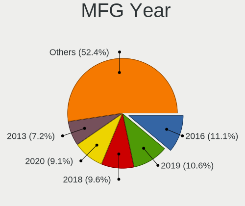
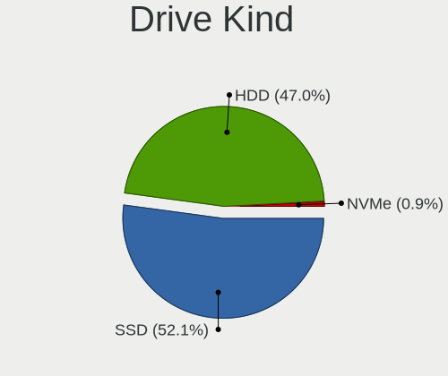
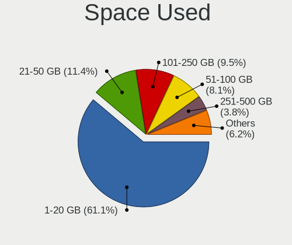
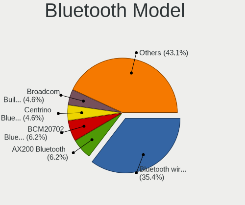
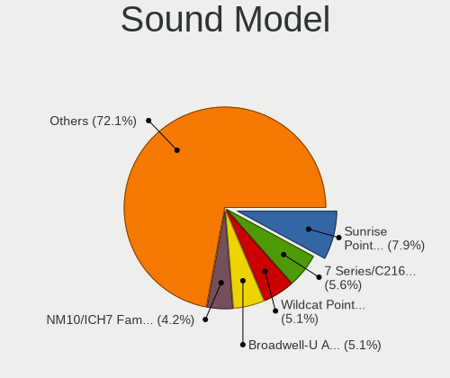
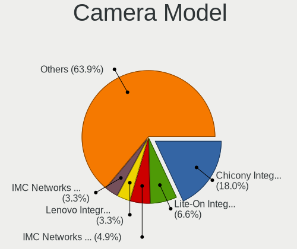

OpenBSD 6.8 - Tested Hardware & Statistics
------------------------------------------

A project to collect tested hardware configurations for OpenBSD 6.8.

Anyone can contribute to this report by the [hw-probe](https://github.com/linuxhw/hw-probe/blob/master/INSTALL.BSD.md) tool:

    hw-probe -all -upload

Please submit a probe of your configuration if it's not presented on the page or is rare.

This is a report for all computer types. See also reports for [desktops](/Dist/OpenBSD_6.8/Desktop/README.md) and [notebooks](/Dist/OpenBSD_6.8/Notebook/README.md).

Full-feature report is available here: https://bsd-hardware.info/?view=trends

Contents
--------

* [ Test Cases ](#test-cases)

* [ System ](#system)
  - [ Arch                     ](#arch)
  - [ DE                       ](#de)
  - [ Display Server           ](#display-server)
  - [ Display Manager          ](#display-manager)
  - [ OS Lang                  ](#os-lang)
  - [ Boot Mode                ](#boot-mode)
  - [ Filesystem               ](#filesystem)
  - [ Part. scheme             ](#part-scheme)

* [ Board ](#board)
  - [ Vendor                   ](#vendor)
  - [ Model                    ](#model)
  - [ Model Family             ](#model-family)
  - [ MFG Year                 ](#mfg-year)
  - [ Form Factor              ](#form-factor)
  - [ Coreboot                 ](#coreboot)
  - [ RAM Size                 ](#ram-size)
  - [ RAM Used                 ](#ram-used)
  - [ Total Drives             ](#total-drives)
  - [ Has CD-ROM               ](#has-cd-rom)
  - [ Has Ethernet             ](#has-ethernet)
  - [ Has WiFi                 ](#has-wifi)
  - [ Has Bluetooth            ](#has-bluetooth)

* [ Location ](#location)
  - [ Country                  ](#country)
  - [ City                     ](#city)

* [ Drives ](#drives)
  - [ Drive Vendor             ](#drive-vendor)
  - [ Drive Model              ](#drive-model)
  - [ HDD Vendor               ](#hdd-vendor)
  - [ SSD Vendor               ](#ssd-vendor)
  - [ Drive Kind               ](#drive-kind)
  - [ Drive Connector          ](#drive-connector)
  - [ Drive Size               ](#drive-size)
  - [ Space Total              ](#space-total)
  - [ Space Used               ](#space-used)
  - [ Malfunc. Drives          ](#malfunc-drives)
  - [ Malfunc. Drive Vendor    ](#malfunc-drive-vendor)
  - [ Malfunc. HDD Vendor      ](#malfunc-hdd-vendor)
  - [ Malfunc. Drive Kind      ](#malfunc-drive-kind)
  - [ Failed Drives            ](#failed-drives)
  - [ Failed Drive Vendor      ](#failed-drive-vendor)
  - [ Drive Status             ](#drive-status)

* [ Storage controller ](#storage-controller)
  - [ Storage Vendor           ](#storage-vendor)
  - [ Storage Model            ](#storage-model)
  - [ Storage Kind             ](#storage-kind)

* [ Processor ](#processor)
  - [ CPU Vendor               ](#cpu-vendor)
  - [ CPU Model                ](#cpu-model)
  - [ CPU Model Family         ](#cpu-model-family)
  - [ CPU Cores                ](#cpu-cores)
  - [ CPU Sockets              ](#cpu-sockets)
  - [ CPU Threads              ](#cpu-threads)
  - [ CPU Microarch            ](#cpu-microarch)

* [ Graphics ](#graphics)
  - [ GPU Vendor               ](#gpu-vendor)
  - [ GPU Model                ](#gpu-model)
  - [ GPU Combo                ](#gpu-combo)
  - [ GPU Driver               ](#gpu-driver)
  - [ GPU Memory               ](#gpu-memory)

* [ Monitor ](#monitor)
  - [ Monitor Vendor           ](#monitor-vendor)
  - [ Monitor Model            ](#monitor-model)
  - [ Monitor Resolution       ](#monitor-resolution)
  - [ Monitor Diagonal         ](#monitor-diagonal)
  - [ Monitor Width            ](#monitor-width)
  - [ Aspect Ratio             ](#aspect-ratio)
  - [ Monitor Area             ](#monitor-area)
  - [ Pixel Density            ](#pixel-density)
  - [ Multiple Monitors        ](#multiple-monitors)

* [ Network ](#network)
  - [ Net Controller Vendor    ](#net-controller-vendor)
  - [ Net Controller Model     ](#net-controller-model)
  - [ Wireless Vendor          ](#wireless-vendor)
  - [ Wireless Model           ](#wireless-model)
  - [ Ethernet Vendor          ](#ethernet-vendor)
  - [ Ethernet Model           ](#ethernet-model)
  - [ Net Controller Kind      ](#net-controller-kind)
  - [ Used Controller          ](#used-controller)
  - [ NICs                     ](#nics)
  - [ IPv6                     ](#ipv6)

* [ Bluetooth ](#bluetooth)
  - [ Bluetooth Vendor         ](#bluetooth-vendor)
  - [ Bluetooth Model          ](#bluetooth-model)

* [ Sound ](#sound)
  - [ Sound Vendor             ](#sound-vendor)
  - [ Sound Model              ](#sound-model)

* [ Memory ](#memory)
  - [ Memory Vendor            ](#memory-vendor)
  - [ Memory Model             ](#memory-model)
  - [ Memory Kind              ](#memory-kind)
  - [ Memory Form Factor       ](#memory-form-factor)
  - [ Memory Size              ](#memory-size)
  - [ Memory Speed             ](#memory-speed)

* [ Printers & scanners ](#printers--scanners)
  - [ Printer Vendor           ](#printer-vendor)
  - [ Printer Model            ](#printer-model)
  - [ Scanner Vendor           ](#scanner-vendor)
  - [ Scanner Model            ](#scanner-model)

* [ Camera ](#camera)
  - [ Camera Vendor            ](#camera-vendor)
  - [ Camera Model             ](#camera-model)

* [ Security ](#security)
  - [ Fingerprint Vendor       ](#fingerprint-vendor)
  - [ Fingerprint Model        ](#fingerprint-model)
  - [ Chipcard Vendor          ](#chipcard-vendor)
  - [ Chipcard Model           ](#chipcard-model)

* [ Unsupported ](#unsupported)
  - [ Unsupported Devices      ](#unsupported-devices)
  - [ Unsupported Device Types ](#unsupported-device-types)

Test Cases
----------

Total: 255

| Vendor        | Model                       | Form-Factor | Probe                                                     | Date         |
|---------------|-----------------------------|-------------|-----------------------------------------------------------|--------------|
| Apple         | iMac13,1                    | All in one  | [3da0012112](https://bsd-hardware.info/?probe=3da0012112) | Nov 06, 2021 |
| ASRock        | X99 WS                      | Desktop     | [201a7417a5](https://bsd-hardware.info/?probe=201a7417a5) | Jun 11, 2021 |
| Apple         | PowerMac10,1                | Desktop     | [d098ba539d](https://bsd-hardware.info/?probe=d098ba539d) | May 27, 2021 |
| ASRock        | X99 WS                      | Desktop     | [eb20367455](https://bsd-hardware.info/?probe=eb20367455) | May 05, 2021 |
| Lenovo        | ThinkCentre M93p 10AAS25... | Desktop     | [a9bbd07ad9](https://bsd-hardware.info/?probe=a9bbd07ad9) | May 03, 2021 |
| Lenovo        | ThinkPad T14 Gen 1 20S1S... | Notebook    | [7ec73fe36d](https://bsd-hardware.info/?probe=7ec73fe36d) | Apr 23, 2021 |
| ASUSTek       | All Series                  | Desktop     | [ef6afe88d7](https://bsd-hardware.info/?probe=ef6afe88d7) | Apr 17, 2021 |
| Lenovo        | ThinkPad X201 Tablet 298... | Notebook    | [4faceaf6e5](https://bsd-hardware.info/?probe=4faceaf6e5) | Apr 17, 2021 |
| ASUSTek       | UX430UNR                    | Notebook    | [f31eda4c16](https://bsd-hardware.info/?probe=f31eda4c16) | Apr 16, 2021 |
| Lenovo        | ThinkPad X250 20CLS1LC13    | Notebook    | [dcf202ea95](https://bsd-hardware.info/?probe=dcf202ea95) | Apr 10, 2021 |
| Lenovo        | ThinkPad X250 20CLS1LC13    | Notebook    | [ee371f3e8f](https://bsd-hardware.info/?probe=ee371f3e8f) | Apr 08, 2021 |
| ECT           | One Computer AMD A10-785... | Desktop     | [de7e23b3e3](https://bsd-hardware.info/?probe=de7e23b3e3) | Apr 07, 2021 |
| HP            | t630 Thin Client            | Mini pc     | [994a246318](https://bsd-hardware.info/?probe=994a246318) | Apr 06, 2021 |
| Gigabyte      | GB-BXBT-2807                | Desktop     | [25e9765fc0](https://bsd-hardware.info/?probe=25e9765fc0) | Apr 03, 2021 |
| ASUSTek       | All Series                  | Desktop     | [c5bc64e4e9](https://bsd-hardware.info/?probe=c5bc64e4e9) | Mar 22, 2021 |
| ASUSTek       | All Series                  | Desktop     | [700ff7d378](https://bsd-hardware.info/?probe=700ff7d378) | Mar 22, 2021 |
| Lenovo        | ThinkPad X220 4291EM4       | Notebook    | [9d393db103](https://bsd-hardware.info/?probe=9d393db103) | Mar 20, 2021 |
| Dell          | Inspiron 15-3567            | Notebook    | [b35adf782c](https://bsd-hardware.info/?probe=b35adf782c) | Mar 17, 2021 |
| ASUSTek       | X510UA                      | Notebook    | [440f1ef3ec](https://bsd-hardware.info/?probe=440f1ef3ec) | Mar 14, 2021 |
| Apple         | iMac12,1                    | All in one  | [17466db7fd](https://bsd-hardware.info/?probe=17466db7fd) | Mar 14, 2021 |
| Panasonic     | CF-30KTP48NL                | Notebook    | [119b4875e9](https://bsd-hardware.info/?probe=119b4875e9) | Mar 12, 2021 |
| Lenovo        | ThinkPad T440p 20AWS1HL0... | Desktop     | [954c65dbcf](https://bsd-hardware.info/?probe=954c65dbcf) | Mar 11, 2021 |
| ASUSTek       | All Series                  | Desktop     | [b4aec46644](https://bsd-hardware.info/?probe=b4aec46644) | Mar 07, 2021 |
| ASUSTek       | All Series                  | Desktop     | [f7b1921594](https://bsd-hardware.info/?probe=f7b1921594) | Mar 07, 2021 |
| ASUSTek       | X510UA                      | Notebook    | [f22eeba366](https://bsd-hardware.info/?probe=f22eeba366) | Mar 04, 2021 |
| Dell          | Inspiron 1000               | Notebook    | [70604dcbfa](https://bsd-hardware.info/?probe=70604dcbfa) | Feb 28, 2021 |
| Lenovo        | ThinkPad E14 20RBCTO1WW     | Notebook    | [fb890afc86](https://bsd-hardware.info/?probe=fb890afc86) | Feb 28, 2021 |
| ASRock        | G31M-VS2                    | Desktop     | [6c7150dc1b](https://bsd-hardware.info/?probe=6c7150dc1b) | Feb 24, 2021 |
| ASRock        | J4205-ITX                   | Desktop     | [c8e0b22858](https://bsd-hardware.info/?probe=c8e0b22858) | Feb 23, 2021 |
| Apple         | MacBook5,1                  | Notebook    | [41ea02c8bc](https://bsd-hardware.info/?probe=41ea02c8bc) | Feb 21, 2021 |
| IBM           | ThinkPad T42 2374K46        | Notebook    | [311f93ab37](https://bsd-hardware.info/?probe=311f93ab37) | Feb 20, 2021 |
| ASUSTek       | X102BA                      | Notebook    | [529baeb345](https://bsd-hardware.info/?probe=529baeb345) | Feb 20, 2021 |
| ASUSTek       | X102BA                      | Notebook    | [65f1904b56](https://bsd-hardware.info/?probe=65f1904b56) | Feb 20, 2021 |
| PC Engines    | apu4                        | Desktop     | [b30884fc0e](https://bsd-hardware.info/?probe=b30884fc0e) | Feb 18, 2021 |
| PC Engines    | apu3                        | Desktop     | [449967354c](https://bsd-hardware.info/?probe=449967354c) | Feb 18, 2021 |
| PC Engines    | apu2                        | Desktop     | [b911e3bec2](https://bsd-hardware.info/?probe=b911e3bec2) | Feb 18, 2021 |
| Shuttle       | DS77U                       | Desktop     | [2d0bd0e99a](https://bsd-hardware.info/?probe=2d0bd0e99a) | Feb 14, 2021 |
| Dell          | Inspiron 1000               | Notebook    | [104175ae13](https://bsd-hardware.info/?probe=104175ae13) | Feb 13, 2021 |
| Sony          | VPCX115KX                   | Notebook    | [fef3d94e6c](https://bsd-hardware.info/?probe=fef3d94e6c) | Feb 12, 2021 |
| Acer          | Extensa 5635Z               | Notebook    | [3b4a7e7fc2](https://bsd-hardware.info/?probe=3b4a7e7fc2) | Feb 10, 2021 |
| Sony          | VPCF12C5E                   | Notebook    | [df8c1de8a5](https://bsd-hardware.info/?probe=df8c1de8a5) | Feb 07, 2021 |
| Gigabyte      | Z68A-D3H-B3                 | Desktop     | [e1c3b89d0d](https://bsd-hardware.info/?probe=e1c3b89d0d) | Feb 06, 2021 |
| HP            | Spectre x360 Convertible... | Convertible | [b35f7a5610](https://bsd-hardware.info/?probe=b35f7a5610) | Feb 05, 2021 |
| Microsoft     | Surface Go 2                | Tablet      | [69c8123ec6](https://bsd-hardware.info/?probe=69c8123ec6) | Feb 01, 2021 |
| ASUSTek       | PRIME X470-PRO              | Desktop     | [828a9df369](https://bsd-hardware.info/?probe=828a9df369) | Feb 01, 2021 |
| IBM           | ThinkPad T42 2373K9G        | Notebook    | [a12c3a0b21](https://bsd-hardware.info/?probe=a12c3a0b21) | Feb 01, 2021 |
| Lenovo        | ThinkCentre M93p 10A8S0C... | Desktop     | [c8af335c01](https://bsd-hardware.info/?probe=c8af335c01) | Jan 29, 2021 |
| Lenovo        | ThinkPad T61 7661AU5        | Notebook    | [23e498234e](https://bsd-hardware.info/?probe=23e498234e) | Jan 28, 2021 |
| Raspberry ... | Raspberry Pi 4 Model B      | Desktop     | [8c953bac3f](https://bsd-hardware.info/?probe=8c953bac3f) | Jan 25, 2021 |
| ASUSTek       | All Series                  | Desktop     | [7ebe6eee38](https://bsd-hardware.info/?probe=7ebe6eee38) | Jan 25, 2021 |
| ASUSTek       | PRIME X370-PRO              | Desktop     | [2a81a1bd1f](https://bsd-hardware.info/?probe=2a81a1bd1f) | Jan 24, 2021 |
| Sun           | SUNW,Sun-Blade-1500         | Desktop     | [647618a0ca](https://bsd-hardware.info/?probe=647618a0ca) | Jan 22, 2021 |
| PC Engines    | apu1                        | Desktop     | [a5d18dcbbc](https://bsd-hardware.info/?probe=a5d18dcbbc) | Jan 21, 2021 |
| PC Engines    | apu1                        | Desktop     | [70918da1e7](https://bsd-hardware.info/?probe=70918da1e7) | Jan 21, 2021 |
| Lenovo        | ThinkPad X1 Carbon 7th 2... | Notebook    | [5f469ceeb9](https://bsd-hardware.info/?probe=5f469ceeb9) | Jan 20, 2021 |
| Sun           | SUNW,Sun-Blade-100          | Desktop     | [299c76eb85](https://bsd-hardware.info/?probe=299c76eb85) | Jan 18, 2021 |
| Lenovo        | ThinkCentre M93p 10A8S0C... | Desktop     | [36ef631bfe](https://bsd-hardware.info/?probe=36ef631bfe) | Jan 05, 2021 |
| Dell          | XPS 15 7590                 | Notebook    | [6cd195aa69](https://bsd-hardware.info/?probe=6cd195aa69) | Jan 05, 2021 |
| Dell          | XPS 15 7590                 | Notebook    | [50ca36db01](https://bsd-hardware.info/?probe=50ca36db01) | Jan 05, 2021 |
| ASUSTek       | X101CH                      | Notebook    | [112792b300](https://bsd-hardware.info/?probe=112792b300) | Jan 02, 2021 |
| ASUSTek       | X101CH                      | Notebook    | [8b571cc947](https://bsd-hardware.info/?probe=8b571cc947) | Jan 02, 2021 |
| ASUSTek       | X102BA                      | Notebook    | [893b9111c6](https://bsd-hardware.info/?probe=893b9111c6) | Dec 27, 2020 |
| HP            | 240 G1                      | Notebook    | [3ee90471d0](https://bsd-hardware.info/?probe=3ee90471d0) | Dec 26, 2020 |
| Apple         | PowerBook5,8                | Notebook    | [96f550a537](https://bsd-hardware.info/?probe=96f550a537) | Dec 24, 2020 |
| Gigabyte      | 970A-DS3P                   | Desktop     | [f0b9687ab8](https://bsd-hardware.info/?probe=f0b9687ab8) | Dec 22, 2020 |
| Lenovo        | ThinkPad T400 6475K43       | Notebook    | [30500a25d3](https://bsd-hardware.info/?probe=30500a25d3) | Dec 18, 2020 |
| HP            | OMEN Laptop 15-en0xxx       | Notebook    | [d019e14245](https://bsd-hardware.info/?probe=d019e14245) | Dec 18, 2020 |
| Lenovo        | ThinkPad X1 Carbon 7th 2... | Notebook    | [7e80ced15e](https://bsd-hardware.info/?probe=7e80ced15e) | Dec 16, 2020 |
| Unknown       | ODYSSEY-X86J4105            | Desktop     | [17749e13c8](https://bsd-hardware.info/?probe=17749e13c8) | Dec 16, 2020 |
| Unknown       | Spring Peak                 | Notebook    | [b61f5c268a](https://bsd-hardware.info/?probe=b61f5c268a) | Dec 15, 2020 |
| ASUSTek       | PRIME B450M-A               | Desktop     | [d13e0a1749](https://bsd-hardware.info/?probe=d13e0a1749) | Dec 15, 2020 |
| Supermicro    | X11DDW-L                    | Desktop     | [57a5022e27](https://bsd-hardware.info/?probe=57a5022e27) | Dec 14, 2020 |
| Lenovo        | IdeaPad L340-15API 81LW     | Notebook    | [3a78e7dc1a](https://bsd-hardware.info/?probe=3a78e7dc1a) | Dec 11, 2020 |
| Dell          | Latitude 3300               | Notebook    | [108a030875](https://bsd-hardware.info/?probe=108a030875) | Dec 07, 2020 |
| Fujitsu       | LIFEBOOK P1610              | Notebook    | [e8ee627d6e](https://bsd-hardware.info/?probe=e8ee627d6e) | Dec 07, 2020 |
| Clevo         | W240EU/W250EUQ/W270EUQ      | Notebook    | [2544123f79](https://bsd-hardware.info/?probe=2544123f79) | Dec 06, 2020 |
| Lenovo        | ThinkPad T410 2537NB5       | Notebook    | [d6a3aa6f8d](https://bsd-hardware.info/?probe=d6a3aa6f8d) | Dec 06, 2020 |
| Lenovo        | ThinkPad X201 3680FAG       | Notebook    | [1ba69078df](https://bsd-hardware.info/?probe=1ba69078df) | Dec 06, 2020 |
| ASUSTek       | P4P800-VM                   | Desktop     | [4fe4c14195](https://bsd-hardware.info/?probe=4fe4c14195) | Dec 05, 2020 |
| Apple         | Xserve3,1                   | Desktop     | [7329a7650d](https://bsd-hardware.info/?probe=7329a7650d) | Dec 05, 2020 |
| Gigabyte      | Unknown                     | Desktop     | [8a9ae48d42](https://bsd-hardware.info/?probe=8a9ae48d42) | Dec 01, 2020 |
| Lenovo        | ThinkPad W520 42763JU       | Notebook    | [5c50582307](https://bsd-hardware.info/?probe=5c50582307) | Nov 30, 2020 |
| HP            | Compaq dc7800 Small Form... | Desktop     | [2b49eb75dc](https://bsd-hardware.info/?probe=2b49eb75dc) | Nov 27, 2020 |
| HP            | Compaq dc7800 Small Form... | Desktop     | [3fe6528682](https://bsd-hardware.info/?probe=3fe6528682) | Nov 27, 2020 |
| Lenovo        | Yoga 720-13IKB 81C3         | Notebook    | [467a6fc001](https://bsd-hardware.info/?probe=467a6fc001) | Nov 26, 2020 |
| Lenovo        | Unknown                     | Notebook    | [1cf65625a7](https://bsd-hardware.info/?probe=1cf65625a7) | Nov 24, 2020 |
| HP            | Setzer                      | Notebook    | [da7914cdd5](https://bsd-hardware.info/?probe=da7914cdd5) | Nov 22, 2020 |
| ASUSTek       | PRIME X370-PRO              | Desktop     | [9cf79cf54b](https://bsd-hardware.info/?probe=9cf79cf54b) | Nov 22, 2020 |
| ASUSTek       | PRIME X370-PRO              | Desktop     | [cab036429d](https://bsd-hardware.info/?probe=cab036429d) | Nov 22, 2020 |
| Unknown       | cavium,ubnt_e300            | Desktop     | [b8524b5002](https://bsd-hardware.info/?probe=b8524b5002) | Nov 20, 2020 |
| Raspberry ... | Raspberry Pi 4 Model B      | Desktop     | [c030400069](https://bsd-hardware.info/?probe=c030400069) | Nov 19, 2020 |
| ASRock        | IMB-191                     | Desktop     | [76991234cd](https://bsd-hardware.info/?probe=76991234cd) | Nov 18, 2020 |
| HARDKERNEL    | ODROID-H2                   | Desktop     | [c03bc18b3a](https://bsd-hardware.info/?probe=c03bc18b3a) | Nov 18, 2020 |
| MSI           | MS-B09012                   | Desktop     | [7ba791108f](https://bsd-hardware.info/?probe=7ba791108f) | Nov 18, 2020 |
| PC Engines    | APU2                        | Desktop     | [b4f5d7d344](https://bsd-hardware.info/?probe=b4f5d7d344) | Nov 16, 2020 |
| Supermicro    | X8DTH-i/6/iF/6F             | Desktop     | [778cb9f428](https://bsd-hardware.info/?probe=778cb9f428) | Nov 16, 2020 |
| Lenovo        | ThinkPad T450 20BVA020AU    | Notebook    | [5d8bce59e8](https://bsd-hardware.info/?probe=5d8bce59e8) | Nov 16, 2020 |
| Gigabyte      | GB-BXBT-2807                | Desktop     | [c11b475d28](https://bsd-hardware.info/?probe=c11b475d28) | Nov 13, 2020 |
| Lenovo        | ThinkPad T60 87445BU        | Notebook    | [bfd9130d4b](https://bsd-hardware.info/?probe=bfd9130d4b) | Nov 10, 2020 |
| Lenovo        | ThinkCentre M92p 3212AD2    | Desktop     | [579528e284](https://bsd-hardware.info/?probe=579528e284) | Nov 10, 2020 |
| Lenovo        | ThinkPad T490 20N3S8PB00    | Notebook    | [6a0f910601](https://bsd-hardware.info/?probe=6a0f910601) | Nov 10, 2020 |
| Lenovo        | ThinkPad T490 20N3S8PB00    | Notebook    | [6dca4cdd18](https://bsd-hardware.info/?probe=6dca4cdd18) | Nov 10, 2020 |
| Lenovo        | ThinkPad T450s 20BWS2XS0... | Notebook    | [0b04a395a7](https://bsd-hardware.info/?probe=0b04a395a7) | Nov 10, 2020 |
| Gigabyte      | M61SME-S2L                  | Desktop     | [d8809eb5e7](https://bsd-hardware.info/?probe=d8809eb5e7) | Nov 09, 2020 |
| Gigabyte      | M61SME-S2L                  | Desktop     | [e5f658c70a](https://bsd-hardware.info/?probe=e5f658c70a) | Nov 09, 2020 |
| Pegatron      | SKLD4-P1                    | Desktop     | [ea548b4c71](https://bsd-hardware.info/?probe=ea548b4c71) | Nov 08, 2020 |
| Lenovo        | ThinkPad T460 20FN003LGE    | Notebook    | [1b7b105e5c](https://bsd-hardware.info/?probe=1b7b105e5c) | Nov 08, 2020 |
| IBM           | ThinkPad T42 2373K9G        | Notebook    | [e041100bb6](https://bsd-hardware.info/?probe=e041100bb6) | Nov 08, 2020 |
| Soekris En... | net5501                     | Desktop     | [bd9930a18a](https://bsd-hardware.info/?probe=bd9930a18a) | Nov 06, 2020 |
| Soekris En... | net6501                     | Desktop     | [fdf124653b](https://bsd-hardware.info/?probe=fdf124653b) | Nov 06, 2020 |
| Lenovo        | Yoga 720-13IKB 81C3         | Notebook    | [bdc2de68ce](https://bsd-hardware.info/?probe=bdc2de68ce) | Nov 05, 2020 |
| Lenovo        | Yoga 720-13IKB 81C3         | Notebook    | [8cfb32120b](https://bsd-hardware.info/?probe=8cfb32120b) | Nov 05, 2020 |
| Lenovo        | ThinkPad T14 Gen 1 20UD0... | Notebook    | [ebd246c141](https://bsd-hardware.info/?probe=ebd246c141) | Nov 04, 2020 |
| Lenovo        | ThinkPad T14 Gen 1 20UD0... | Notebook    | [f2e085e11a](https://bsd-hardware.info/?probe=f2e085e11a) | Nov 04, 2020 |
| MSI           | MS-7A34                     | Desktop     | [8c87d6b643](https://bsd-hardware.info/?probe=8c87d6b643) | Nov 03, 2020 |
| Lenovo        | ThinkPad X1 Carbon 6th 2... | Notebook    | [9b6b24708e](https://bsd-hardware.info/?probe=9b6b24708e) | Nov 03, 2020 |
| Dell          | Precision M4800             | Notebook    | [ca6d4c4bb7](https://bsd-hardware.info/?probe=ca6d4c4bb7) | Nov 03, 2020 |
| Dell          | Precision M4800             | Notebook    | [c6a7b68c75](https://bsd-hardware.info/?probe=c6a7b68c75) | Nov 03, 2020 |
| Lenovo        | ThinkPad T500 2087A16       | Notebook    | [334eacfe16](https://bsd-hardware.info/?probe=334eacfe16) | Nov 03, 2020 |
| Lenovo        | ThinkPad W530 2436CTO       | Notebook    | [ded161fe2e](https://bsd-hardware.info/?probe=ded161fe2e) | Oct 31, 2020 |
| Lenovo        | ThinkPad W530 2436CTO       | Notebook    | [e108d4a375](https://bsd-hardware.info/?probe=e108d4a375) | Oct 31, 2020 |
| ASUSTek       | X102BA                      | Notebook    | [9156250b96](https://bsd-hardware.info/?probe=9156250b96) | Oct 31, 2020 |
| PC Engines    | apu2                        | Desktop     | [e0361ddbad](https://bsd-hardware.info/?probe=e0361ddbad) | Oct 31, 2020 |
| Intel         | NUC7i5BNH                   | Mini pc     | [ea59613cff](https://bsd-hardware.info/?probe=ea59613cff) | Oct 31, 2020 |
| ASUSTek       | B75M-A                      | Desktop     | [43ece33e8c](https://bsd-hardware.info/?probe=43ece33e8c) | Oct 31, 2020 |
| Intel         | D945GCLF2                   | Desktop     | [58678b0643](https://bsd-hardware.info/?probe=58678b0643) | Oct 30, 2020 |
| Intel         | D945GCLF2                   | Desktop     | [3354fb903b](https://bsd-hardware.info/?probe=3354fb903b) | Oct 30, 2020 |
| Gigabyte      | X570 AORUS ELITE            | Desktop     | [973b62551f](https://bsd-hardware.info/?probe=973b62551f) | Oct 30, 2020 |
| eMachines     | EL1200                      | Desktop     | [ae59908738](https://bsd-hardware.info/?probe=ae59908738) | Oct 30, 2020 |
| Acer          | Veriton M6610G              | Desktop     | [7dd00aa8b1](https://bsd-hardware.info/?probe=7dd00aa8b1) | Oct 30, 2020 |
| eMachines     | EL1200                      | Desktop     | [5bc54351be](https://bsd-hardware.info/?probe=5bc54351be) | Oct 30, 2020 |
| ECS           | BSWI-D2                     | Desktop     | [c5b07f5c31](https://bsd-hardware.info/?probe=c5b07f5c31) | Oct 30, 2020 |
| Acer          | Extensa 2540                | Notebook    | [26670a4ae9](https://bsd-hardware.info/?probe=26670a4ae9) | Oct 30, 2020 |
| ASRock        | N3160-NUC IPC               | Desktop     | [8d13af2f0b](https://bsd-hardware.info/?probe=8d13af2f0b) | Oct 28, 2020 |
| ASRock        | N3160-NUC IPC               | Desktop     | [8714fe0665](https://bsd-hardware.info/?probe=8714fe0665) | Oct 28, 2020 |
| ASUSTek       | PRIME B250M-C               | Desktop     | [4594c1084c](https://bsd-hardware.info/?probe=4594c1084c) | Oct 28, 2020 |
| Shuttle       | DS77U                       | Desktop     | [c70e526574](https://bsd-hardware.info/?probe=c70e526574) | Oct 27, 2020 |
| Intel         | NUC5CPYB                    | Mini pc     | [1ec5c12f0b](https://bsd-hardware.info/?probe=1ec5c12f0b) | Oct 27, 2020 |
| Lenovo        | ThinkPad T450 20BV0005US    | Notebook    | [603e66300a](https://bsd-hardware.info/?probe=603e66300a) | Oct 27, 2020 |
| PC Engines    | apu2                        | Desktop     | [ce4c41d466](https://bsd-hardware.info/?probe=ce4c41d466) | Oct 26, 2020 |
| Dell          | PowerEdge R230              | Desktop     | [1422e9737b](https://bsd-hardware.info/?probe=1422e9737b) | Oct 26, 2020 |
| Supermicro    | X8STi                       | Desktop     | [1b64902781](https://bsd-hardware.info/?probe=1b64902781) | Oct 26, 2020 |
| HP            | 120-1136                    | Desktop     | [12f3eb0227](https://bsd-hardware.info/?probe=12f3eb0227) | Oct 25, 2020 |
| Lenovo        | ThinkPad T500 2087A16       | Notebook    | [cf8228f878](https://bsd-hardware.info/?probe=cf8228f878) | Oct 25, 2020 |
| HP            | ProLiant MicroServer        | Desktop     | [04b6ad9952](https://bsd-hardware.info/?probe=04b6ad9952) | Oct 25, 2020 |
| Supermicro    | X11SSW-F                    | Desktop     | [ca07d7ef48](https://bsd-hardware.info/?probe=ca07d7ef48) | Oct 25, 2020 |
| Gigabyte      | X58A-UD5                    | Desktop     | [6e642641e5](https://bsd-hardware.info/?probe=6e642641e5) | Oct 25, 2020 |
| AZW           | Z83 II                      | Desktop     | [9416876f20](https://bsd-hardware.info/?probe=9416876f20) | Oct 24, 2020 |
| AZW           | Z83 II                      | Desktop     | [19b1b4d85d](https://bsd-hardware.info/?probe=19b1b4d85d) | Oct 24, 2020 |
| Dell          | Precision WorkStation T7... | Desktop     | [c01ce9ec81](https://bsd-hardware.info/?probe=c01ce9ec81) | Oct 24, 2020 |
| Lenovo        | Unknown                     | Notebook    | [7bab490506](https://bsd-hardware.info/?probe=7bab490506) | Oct 23, 2020 |
| Lenovo        | ThinkPad X1 Carbon 3rd 2... | Notebook    | [03602ed2c0](https://bsd-hardware.info/?probe=03602ed2c0) | Oct 23, 2020 |
| Lenovo        | Unknown                     | Notebook    | [c659708e94](https://bsd-hardware.info/?probe=c659708e94) | Oct 23, 2020 |
| IBM           | ThinkPad X41 2525F8G        | Notebook    | [c58f946d2a](https://bsd-hardware.info/?probe=c58f946d2a) | Oct 22, 2020 |
| PC Engines    | APU2                        | Desktop     | [5cee7fa636](https://bsd-hardware.info/?probe=5cee7fa636) | Oct 22, 2020 |
| MSI           | MS-7345                     | Desktop     | [96cc99accc](https://bsd-hardware.info/?probe=96cc99accc) | Oct 22, 2020 |
| Dell          | Precision 3510              | Notebook    | [85a55ab7c3](https://bsd-hardware.info/?probe=85a55ab7c3) | Oct 22, 2020 |
| MSI           | MS-7816                     | Desktop     | [337e5b8e0c](https://bsd-hardware.info/?probe=337e5b8e0c) | Oct 22, 2020 |
| Lenovo        | ThinkPad E485 20KUCTO1WW    | Notebook    | [f4aa59ba56](https://bsd-hardware.info/?probe=f4aa59ba56) | Oct 22, 2020 |
| ASRock        | DN2800MT                    | Desktop     | [b475aa2ead](https://bsd-hardware.info/?probe=b475aa2ead) | Oct 21, 2020 |
| Intel         | D2500HN                     | Desktop     | [6dbc4dfa33](https://bsd-hardware.info/?probe=6dbc4dfa33) | Oct 21, 2020 |
| Intel         | CRESCENTBAY                 | Desktop     | [42d114559b](https://bsd-hardware.info/?probe=42d114559b) | Oct 21, 2020 |
| PC Engines    | apu2                        | Desktop     | [d1ca549fe7](https://bsd-hardware.info/?probe=d1ca549fe7) | Oct 21, 2020 |
| Lenovo        | ThinkPad X230 2325AJ9       | Notebook    | [176044b6b8](https://bsd-hardware.info/?probe=176044b6b8) | Oct 21, 2020 |
| Lenovo        | ThinkPad S5-S540 20B3001... | Notebook    | [7e6cb69989](https://bsd-hardware.info/?probe=7e6cb69989) | Oct 21, 2020 |
| Dell          | Latitude C400               | Notebook    | [1dcc5e7972](https://bsd-hardware.info/?probe=1dcc5e7972) | Oct 21, 2020 |
| Dell          | Latitude C400               | Notebook    | [8330d23bd7](https://bsd-hardware.info/?probe=8330d23bd7) | Oct 21, 2020 |
| ZOTAC         | XXXXXX                      | Desktop     | [0f8960bdd3](https://bsd-hardware.info/?probe=0f8960bdd3) | Oct 21, 2020 |
| Lenovo        | ThinkPad X60s 17033JM       | Notebook    | [67e701adb7](https://bsd-hardware.info/?probe=67e701adb7) | Oct 21, 2020 |
| Lenovo        | ThinkPad W540 20BG001KUK    | Notebook    | [1b1327ac93](https://bsd-hardware.info/?probe=1b1327ac93) | Oct 21, 2020 |
| IBM           | Board                       | Desktop     | [11b0b7012f](https://bsd-hardware.info/?probe=11b0b7012f) | Oct 21, 2020 |
| IBM           | Board                       | Desktop     | [a92c08a920](https://bsd-hardware.info/?probe=a92c08a920) | Oct 21, 2020 |
| IBM           | Board                       | Desktop     | [80d5f15a63](https://bsd-hardware.info/?probe=80d5f15a63) | Oct 21, 2020 |
| Lenovo        | ThinkPad X230 2325R74       | Notebook    | [82398321f6](https://bsd-hardware.info/?probe=82398321f6) | Oct 21, 2020 |
| Lenovo        | ThinkPad X230 2325R74       | Notebook    | [1cc3cc20e8](https://bsd-hardware.info/?probe=1cc3cc20e8) | Oct 21, 2020 |
| Gigabyte      | GA-MA770T-UD3P              | Desktop     | [2cb76e5886](https://bsd-hardware.info/?probe=2cb76e5886) | Oct 21, 2020 |
| Lenovo        | ThinkPad T430 2347GZU       | Notebook    | [f287de215c](https://bsd-hardware.info/?probe=f287de215c) | Oct 20, 2020 |
| PC Engines    | apu2                        | Desktop     | [e6ee8a14d5](https://bsd-hardware.info/?probe=e6ee8a14d5) | Oct 20, 2020 |
| ASUSTek       | Z170-K                      | Desktop     | [19cb3ccc34](https://bsd-hardware.info/?probe=19cb3ccc34) | Oct 20, 2020 |
| Lenovo        | ThinkPad X230 2325Y36       | Notebook    | [b2e65dd4c5](https://bsd-hardware.info/?probe=b2e65dd4c5) | Oct 20, 2020 |
| Intel         | S3000AH                     | Desktop     | [f5b858601a](https://bsd-hardware.info/?probe=f5b858601a) | Oct 20, 2020 |
| Lenovo        | ThinkPad Edge E531 68852... | Notebook    | [e6b45d36e5](https://bsd-hardware.info/?probe=e6b45d36e5) | Oct 20, 2020 |
| Apple         | MacBookAir7,2               | Notebook    | [901c82d31e](https://bsd-hardware.info/?probe=901c82d31e) | Oct 20, 2020 |
| Intel         | D2500HN                     | Desktop     | [4b432dcb3d](https://bsd-hardware.info/?probe=4b432dcb3d) | Oct 20, 2020 |
| PC Engines    | APU2                        | Desktop     | [b95ef9962d](https://bsd-hardware.info/?probe=b95ef9962d) | Oct 20, 2020 |
| PC Engines    | APU2                        | Desktop     | [aecf376503](https://bsd-hardware.info/?probe=aecf376503) | Oct 20, 2020 |
| Lenovo        | ThinkPad X250 20CLS4WV08    | Notebook    | [2808d1dd6a](https://bsd-hardware.info/?probe=2808d1dd6a) | Oct 20, 2020 |
| Unknown       | Unknown                     | Desktop     | [bedb4a4b37](https://bsd-hardware.info/?probe=bedb4a4b37) | Oct 20, 2020 |
| Lenovo        | ThinkPad T410 2537N24       | Notebook    | [f846609c80](https://bsd-hardware.info/?probe=f846609c80) | Oct 20, 2020 |
| Unknown       | Unknown                     | Desktop     | [a28ef1d2b8](https://bsd-hardware.info/?probe=a28ef1d2b8) | Oct 20, 2020 |
| Lenovo        | ThinkPad X240 20AL00DKRT    | Notebook    | [623801416c](https://bsd-hardware.info/?probe=623801416c) | Oct 20, 2020 |
| Panasonic     | CF-52PFPBSFQ                | Notebook    | [feb1da0406](https://bsd-hardware.info/?probe=feb1da0406) | Oct 20, 2020 |
| PC Engines    | apu1                        | Desktop     | [c77b06b3eb](https://bsd-hardware.info/?probe=c77b06b3eb) | Oct 20, 2020 |
| Intel         | NUC5i3RYB                   | Mini pc     | [3d03473ea9](https://bsd-hardware.info/?probe=3d03473ea9) | Oct 20, 2020 |
| Matsushita... | CF-51RCVDNLM                | Notebook    | [efece2abf7](https://bsd-hardware.info/?probe=efece2abf7) | Oct 20, 2020 |
| Apple         | Macmini7,1                  | Mini pc     | [5caa1e1c7b](https://bsd-hardware.info/?probe=5caa1e1c7b) | Oct 19, 2020 |
| Dell          | PowerEdge R620              | Desktop     | [7671a495d1](https://bsd-hardware.info/?probe=7671a495d1) | Oct 19, 2020 |
| Dell          | PowerEdge R620              | Desktop     | [c1a2bc7a51](https://bsd-hardware.info/?probe=c1a2bc7a51) | Oct 19, 2020 |
| Dell          | PowerEdge R620              | Desktop     | [c1c5ee566c](https://bsd-hardware.info/?probe=c1c5ee566c) | Oct 19, 2020 |
| Dell          | PowerEdge R620              | Desktop     | [af87ddbbaa](https://bsd-hardware.info/?probe=af87ddbbaa) | Oct 19, 2020 |
| ASUSTek       | P10S-I Series               | Desktop     | [1a0e9f0100](https://bsd-hardware.info/?probe=1a0e9f0100) | Oct 19, 2020 |
| ASUSTek       | K53SV                       | Notebook    | [e776458c9e](https://bsd-hardware.info/?probe=e776458c9e) | Oct 19, 2020 |
| Lenovo        | ThinkPad T560 20FJS0CE00    | Notebook    | [be16cb1839](https://bsd-hardware.info/?probe=be16cb1839) | Oct 19, 2020 |
| Lenovo        | ThinkPad X240 20AMS2QD0C    | Notebook    | [fdc7310ca7](https://bsd-hardware.info/?probe=fdc7310ca7) | Oct 19, 2020 |
| Unknown       | Unknown                     | Desktop     | [a3db8641e6](https://bsd-hardware.info/?probe=a3db8641e6) | Oct 19, 2020 |
| ASUSTek       | 1000HE                      | Notebook    | [621df26e0c](https://bsd-hardware.info/?probe=621df26e0c) | Oct 19, 2020 |
| PC Engines    | apu4                        | Desktop     | [e4cd6d0b48](https://bsd-hardware.info/?probe=e4cd6d0b48) | Oct 19, 2020 |
| PC Engines    | APU                         | Desktop     | [0cf4f6a5f9](https://bsd-hardware.info/?probe=0cf4f6a5f9) | Oct 19, 2020 |
| Lenovo        | SHARKBAY WIN                | Desktop     | [53feb1fec6](https://bsd-hardware.info/?probe=53feb1fec6) | Oct 19, 2020 |
| ASRock        | IMB-191                     | Desktop     | [4ac9e9cf2a](https://bsd-hardware.info/?probe=4ac9e9cf2a) | Oct 19, 2020 |
| PC Engines    | apu2                        | Desktop     | [064e7167a0](https://bsd-hardware.info/?probe=064e7167a0) | Oct 19, 2020 |
| Dell          | OptiPlex 3060               | Desktop     | [13992dbb10](https://bsd-hardware.info/?probe=13992dbb10) | Oct 19, 2020 |
| PC Engines    | apu2                        | Desktop     | [a5b1c3a559](https://bsd-hardware.info/?probe=a5b1c3a559) | Oct 19, 2020 |
| Acer          | Aspire 5251                 | Notebook    | [da9ebcf25e](https://bsd-hardware.info/?probe=da9ebcf25e) | Oct 19, 2020 |
| Lenovo        | ThinkPad X1 Carbon 2nd 2... | Notebook    | [857f9809b7](https://bsd-hardware.info/?probe=857f9809b7) | Oct 19, 2020 |
| Dell          | PowerEdge T320              | Desktop     | [75c395f941](https://bsd-hardware.info/?probe=75c395f941) | Oct 19, 2020 |
| Dell          | PowerEdge 1950              | Desktop     | [3cfcdfce6d](https://bsd-hardware.info/?probe=3cfcdfce6d) | Oct 19, 2020 |
| Dell          | PowerEdge 1950              | Desktop     | [0865193e7e](https://bsd-hardware.info/?probe=0865193e7e) | Oct 19, 2020 |
| Dell          | PowerEdge R610              | Desktop     | [2ea539bbd3](https://bsd-hardware.info/?probe=2ea539bbd3) | Oct 19, 2020 |
| Dell          | OptiPlex 7020               | Desktop     | [293e6af35e](https://bsd-hardware.info/?probe=293e6af35e) | Oct 19, 2020 |
| Lenovo        | ThinkPad X270 20HNA004CD    | Notebook    | [79160b17c4](https://bsd-hardware.info/?probe=79160b17c4) | Oct 19, 2020 |
| PC Engines    | apu2                        | Desktop     | [2ab3051cb8](https://bsd-hardware.info/?probe=2ab3051cb8) | Oct 19, 2020 |
| PC Engines    | apu4                        | Desktop     | [f0116986e0](https://bsd-hardware.info/?probe=f0116986e0) | Oct 19, 2020 |
| IBM           | Board                       | Desktop     | [af2f64a7a8](https://bsd-hardware.info/?probe=af2f64a7a8) | Oct 19, 2020 |
| ASUSTek       | X102BA                      | Notebook    | [47e04c9378](https://bsd-hardware.info/?probe=47e04c9378) | Oct 19, 2020 |
| Lenovo        | G50-80 80E5                 | Notebook    | [e06605a92b](https://bsd-hardware.info/?probe=e06605a92b) | Oct 19, 2020 |
| Panasonic     | CF-C1BT02EGE                | Notebook    | [8a80fb614e](https://bsd-hardware.info/?probe=8a80fb614e) | Oct 19, 2020 |
| Lenovo        | ThinkPad X1 Carbon 5th 2... | Notebook    | [bee732e516](https://bsd-hardware.info/?probe=bee732e516) | Oct 19, 2020 |
| Apple         | PowerBook6,7                | Notebook    | [7ac5f5530a](https://bsd-hardware.info/?probe=7ac5f5530a) | Oct 19, 2020 |
| Foxconn       | AT-7000 Series              | Desktop     | [dc7b96e637](https://bsd-hardware.info/?probe=dc7b96e637) | Oct 19, 2020 |
| Foxconn       | AT-7000 Series              | Desktop     | [0184fcedcf](https://bsd-hardware.info/?probe=0184fcedcf) | Oct 19, 2020 |
| Alienware     | m15                         | Notebook    | [8f8cf7d956](https://bsd-hardware.info/?probe=8f8cf7d956) | Oct 19, 2020 |
| Lenovo        | ThinkPad T480 20L6S4GR02    | Notebook    | [6c2d8a57ea](https://bsd-hardware.info/?probe=6c2d8a57ea) | Oct 19, 2020 |
| ASUSTek       | PRIME X570-P                | Desktop     | [b33e2a5177](https://bsd-hardware.info/?probe=b33e2a5177) | Oct 19, 2020 |
| PC Engines    | apu1                        | Desktop     | [576f4db9e1](https://bsd-hardware.info/?probe=576f4db9e1) | Oct 19, 2020 |
| PC Engines    | apu2                        | Desktop     | [e4030e5ee2](https://bsd-hardware.info/?probe=e4030e5ee2) | Oct 19, 2020 |
| PC Engines    | apu2                        | Desktop     | [ca0480a30d](https://bsd-hardware.info/?probe=ca0480a30d) | Oct 19, 2020 |
| Bluechip C... | bluechip BUSINESSline Wo... | Desktop     | [6dc86d6a5b](https://bsd-hardware.info/?probe=6dc86d6a5b) | Oct 19, 2020 |
| Unknown       | Unknown                     | Notebook    | [fd77b4658f](https://bsd-hardware.info/?probe=fd77b4658f) | Oct 19, 2020 |
| Apple         | MacBookAir6,2               | Notebook    | [9f80fdafb0](https://bsd-hardware.info/?probe=9f80fdafb0) | Oct 19, 2020 |
| Unknown       | Unknown                     | Desktop     | [e36fc2b2b2](https://bsd-hardware.info/?probe=e36fc2b2b2) | Oct 19, 2020 |
| ASUSTek       | VivoBook_ASUSLaptop X545... | Notebook    | [017b41dfd7](https://bsd-hardware.info/?probe=017b41dfd7) | Oct 19, 2020 |
| ASUSTek       | VivoBook_ASUSLaptop X570... | Notebook    | [4f54c8f399](https://bsd-hardware.info/?probe=4f54c8f399) | Oct 19, 2020 |
| ASRock        | N68C-S UCC                  | Desktop     | [027fbd78f5](https://bsd-hardware.info/?probe=027fbd78f5) | Oct 19, 2020 |
| HP            | OmniBook PC                 | Notebook    | [0e0656d228](https://bsd-hardware.info/?probe=0e0656d228) | Oct 19, 2020 |
| HP            | OmniBook PC                 | Notebook    | [60e72f1c10](https://bsd-hardware.info/?probe=60e72f1c10) | Oct 19, 2020 |
| Lenovo        | ThinkPad T460 20FMS1BC01    | Notebook    | [bf6d6d155b](https://bsd-hardware.info/?probe=bf6d6d155b) | Oct 19, 2020 |
| Lenovo        | 3000 N100 0768B9G           | Notebook    | [c44a86f589](https://bsd-hardware.info/?probe=c44a86f589) | Oct 19, 2020 |
| ASRock        | A75M-ITX                    | Desktop     | [dff827c2ae](https://bsd-hardware.info/?probe=dff827c2ae) | Oct 19, 2020 |
| PC Engines    | apu1                        | Desktop     | [8aade944d5](https://bsd-hardware.info/?probe=8aade944d5) | Oct 19, 2020 |
| ASUSTek       | G551JW                      | Notebook    | [594e6f28fb](https://bsd-hardware.info/?probe=594e6f28fb) | Oct 19, 2020 |
| PC Engines    | apu4                        | Desktop     | [ee8a1317f9](https://bsd-hardware.info/?probe=ee8a1317f9) | Oct 19, 2020 |
| Lenovo        | ThinkPad X1 Carbon 3rd 2... | Notebook    | [ee1f866775](https://bsd-hardware.info/?probe=ee1f866775) | Oct 13, 2020 |
| Lenovo        | ThinkPad X395 20NL000HGE    | Notebook    | [fbf90aaf0d](https://bsd-hardware.info/?probe=fbf90aaf0d) | Sep 11, 2020 |
| Lenovo        | ThinkPad X395 20NL000HGE    | Notebook    | [e06815d9dc](https://bsd-hardware.info/?probe=e06815d9dc) | Sep 11, 2020 |

System
------

Arch
----

OS architecture (x86_64, i586, etc.)

| Name    | Computers | Percent |
|---------|-----------|---------|
| amd64   | 182       | 87.5%   |
| i386    | 18        | 8.65%   |
| macppc  | 3         | 1.44%   |
| sparc64 | 2         | 0.96%   |
| arm64   | 2         | 0.96%   |
| octeon  | 1         | 0.48%   |

DE
--

Desktop Environment

| Name    | Computers | Percent |
|---------|-----------|---------|
| fvwm    | 133       | 63.94%  |
| Console | 72        | 34.62%  |
| XFCE    | 1         | 0.48%   |
| i3      | 1         | 0.48%   |
| GNOME   | 1         | 0.48%   |

Display Server
--------------

X11 or Wayland

| Name    | Computers | Percent |
|---------|-----------|---------|
| X11     | 121       | 58.17%  |
| Console | 87        | 41.83%  |

Display Manager
---------------

SDDM, LightDM, etc.

| Name    | Computers | Percent |
|---------|-----------|---------|
| Console | 185       | 88.1%   |
| GDM     | 13        | 6.19%   |
| SLiM    | 12        | 5.71%   |

OS Lang
-------

Language

| Lang    | Computers | Percent |
|---------|-----------|---------|
| Unknown | 168       | 80%     |
| en_US   | 14        | 6.67%   |
| ru_RU   | 10        | 4.76%   |
| C       | 6         | 2.86%   |
| fr_FR   | 2         | 0.95%   |
| en_GB   | 2         | 0.95%   |
| en_AU   | 2         | 0.95%   |
| pl_PL   | 1         | 0.48%   |
| ja_JP   | 1         | 0.48%   |
| fr_CA   | 1         | 0.48%   |
| es_ES   | 1         | 0.48%   |
| es_CO   | 1         | 0.48%   |
| de_DE   | 1         | 0.48%   |

Boot Mode
---------

EFI or BIOS

| Mode | Computers | Percent |
|------|-----------|---------|
| BIOS | 124       | 59.62%  |
| EFI  | 84        | 40.38%  |

Filesystem
----------

Type of filesystem

| Type | Computers | Percent |
|------|-----------|---------|
| Ffs  | 208       | 100%    |

Part. scheme
------------

Scheme of partitioning

| Type | Computers | Percent |
|------|-----------|---------|
| MBR  | 137       | 65.55%  |
| GPT  | 72        | 34.45%  |

Board
-----

Vendor
------

Motherboard manufacturer

| Name                           | Computers | Percent |
|--------------------------------|-----------|---------|
| Lenovo                         | 52        | 25%     |
| PC Engines                     | 23        | 11.06%  |
| ASUSTek Computer               | 22        | 10.58%  |
| Dell                           | 18        | 8.65%   |
| Apple                          | 10        | 4.81%   |
| Hewlett-Packard                | 9         | 4.33%   |
| Gigabyte Technology            | 8         | 3.85%   |
| ASRock                         | 8         | 3.85%   |
| Intel                          | 7         | 3.37%   |
| Unknown                        | 7         | 3.37%   |
| IBM                            | 5         | 2.4%    |
| Supermicro                     | 4         | 1.92%   |
| MSI                            | 4         | 1.92%   |
| Acer                           | 4         | 1.92%   |
| Panasonic                      | 3         | 1.44%   |
| Sun                            | 2         | 0.96%   |
| Sony                           | 2         | 0.96%   |
| Soekris Engineering            | 2         | 0.96%   |
| Raspberry Pi Foundation        | 2         | 0.96%   |
| ZOTAC                          | 1         | 0.48%   |
| Unknown                        | 1         | 0.48%   |
| Shuttle                        | 1         | 0.48%   |
| Pegatron                       | 1         | 0.48%   |
| Microsoft                      | 1         | 0.48%   |
| Matsushita Electric Industrial | 1         | 0.48%   |
| HARDKERNEL                     | 1         | 0.48%   |
| Fujitsu                        | 1         | 0.48%   |
| Foxconn                        | 1         | 0.48%   |
| eMachines                      | 1         | 0.48%   |
| ECT                            | 1         | 0.48%   |
| ECS                            | 1         | 0.48%   |
| Clevo                          | 1         | 0.48%   |
| Bluechip Computer              | 1         | 0.48%   |
| AZW                            | 1         | 0.48%   |
| Alienware                      | 1         | 0.48%   |

Model
-----

Motherboard model

| Name                                        | Computers | Percent |
|---------------------------------------------|-----------|---------|
| PC Engines APU2                             | 13        | 6.25%   |
| Unknown                                     | 10        | 4.81%   |
| PC Engines apu4                             | 4         | 1.92%   |
| PC Engines apu1                             | 4         | 1.92%   |
| Dell PowerEdge R620                         | 4         | 1.92%   |
| RPi Raspberry Pi 4 Model B                  | 2         | 0.96%   |
| Lenovo ThinkPad X1 Carbon 3rd 20BSCTO1WW    | 2         | 0.96%   |
| ASUS X102BA                                 | 2         | 0.96%   |
| ASUS PRIME X370-PRO                         | 2         | 0.96%   |
| ASUS All Series                             | 2         | 0.96%   |
| ZOTAC XXXXXX                                | 1         | 0.48%   |
| Supermicro X8STi                            | 1         | 0.48%   |
| Supermicro X8DTH-i/6/iF/6F                  | 1         | 0.48%   |
| Supermicro X11SSW-F                         | 1         | 0.48%   |
| Supermicro X11DDW-L                         | 1         | 0.48%   |
| Sun SUNW,Sun-Blade-1500                     | 1         | 0.48%   |
| Sun SUNW,Sun-Blade-100                      | 1         | 0.48%   |
| Sony VPCX115KX                              | 1         | 0.48%   |
| Sony VPCF12C5E                              | 1         | 0.48%   |
| Soekris Engineering net6501                 | 1         | 0.48%   |
| Soekris Engineering net5501                 | 1         | 0.48%   |
| Shuttle DS77U                               | 1         | 0.48%   |
| Pegatron SKLD4-P1                           | 1         | 0.48%   |
| PC Engines apu3                             | 1         | 0.48%   |
| PC Engines APU                              | 1         | 0.48%   |
| Panasonic CF-C1BT02EGE                      | 1         | 0.48%   |
| Panasonic CF-52PFPBSFQ                      | 1         | 0.48%   |
| Panasonic CF-30KTP48NL                      | 1         | 0.48%   |
| MSI MS-B09012                               | 1         | 0.48%   |
| MSI MS-7A34                                 | 1         | 0.48%   |
| MSI MS-7816                                 | 1         | 0.48%   |
| MSI MS-7345                                 | 1         | 0.48%   |
| Microsoft Surface Go 2                      | 1         | 0.48%   |
| Matsushita Electric Industrial CF-51RCVDNLM | 1         | 0.48%   |
| Lenovo Yoga 720-13IKB 81C3                  | 1         | 0.48%   |
| Lenovo ThinkPad X60s 17033JM                | 1         | 0.48%   |
| Lenovo ThinkPad X395 20NL000HGE             | 1         | 0.48%   |
| Lenovo ThinkPad X270 20HNA004CD             | 1         | 0.48%   |
| Lenovo ThinkPad X250 20CLS4WV08             | 1         | 0.48%   |
| Lenovo ThinkPad X250 20CLS1LC13             | 1         | 0.48%   |
| Lenovo ThinkPad X240 20AMS2QD0C             | 1         | 0.48%   |
| Lenovo ThinkPad X240 20AL00DKRT             | 1         | 0.48%   |
| Lenovo ThinkPad X230 2325Y36                | 1         | 0.48%   |
| Lenovo ThinkPad X230 2325R74                | 1         | 0.48%   |
| Lenovo ThinkPad X230 2325AJ9                | 1         | 0.48%   |
| Lenovo ThinkPad X220 4291EM4                | 1         | 0.48%   |
| Lenovo ThinkPad X201 Tablet 2985F4U         | 1         | 0.48%   |
| Lenovo ThinkPad X201 3680FAG                | 1         | 0.48%   |
| Lenovo ThinkPad X1 Carbon 7th 20QD003MGE    | 1         | 0.48%   |
| Lenovo ThinkPad X1 Carbon 6th 20KHS1TG00    | 1         | 0.48%   |
| Lenovo ThinkPad X1 Carbon 5th 20HRCTO1WW    | 1         | 0.48%   |
| Lenovo ThinkPad X1 Carbon 2nd 20A7002CUK    | 1         | 0.48%   |
| Lenovo ThinkPad W540 20BG001KUK             | 1         | 0.48%   |
| Lenovo ThinkPad W530 2436CTO                | 1         | 0.48%   |
| Lenovo ThinkPad W520 42763JU                | 1         | 0.48%   |
| Lenovo ThinkPad T61 7661AU5                 | 1         | 0.48%   |
| Lenovo ThinkPad T60 87445BU                 | 1         | 0.48%   |
| Lenovo ThinkPad T560 20FJS0CE00             | 1         | 0.48%   |
| Lenovo ThinkPad T500 2087A16                | 1         | 0.48%   |
| Lenovo ThinkPad T490 20N3S8PB00             | 1         | 0.48%   |

Model Family
------------

Motherboard model prefix

| Name                                        | Computers | Percent |
|---------------------------------------------|-----------|---------|
| Lenovo ThinkPad                             | 43        | 20.67%  |
| PC Engines apu2                             | 13        | 6.25%   |
| Unknown                                     | 10        | 4.81%   |
| Dell PowerEdge                              | 8         | 3.85%   |
| ASUS PRIME                                  | 6         | 2.88%   |
| PC Engines apu4                             | 4         | 1.92%   |
| PC Engines apu1                             | 4         | 1.92%   |
| Lenovo ThinkCentre                          | 4         | 1.92%   |
| IBM ThinkPad                                | 3         | 1.44%   |
| Dell Precision                              | 3         | 1.44%   |
| Sun SUNW                                    | 2         | 0.96%   |
| RPi Raspberry                               | 2         | 0.96%   |
| Dell OptiPlex                               | 2         | 0.96%   |
| Dell Latitude                               | 2         | 0.96%   |
| Dell Inspiron                               | 2         | 0.96%   |
| ASUS X102BA                                 | 2         | 0.96%   |
| ASUS VivoBook                               | 2         | 0.96%   |
| ASUS All                                    | 2         | 0.96%   |
| Acer Extensa                                | 2         | 0.96%   |
| ZOTAC XXXXXX                                | 1         | 0.48%   |
| Supermicro X8STi                            | 1         | 0.48%   |
| Supermicro X8DTH-i                          | 1         | 0.48%   |
| Supermicro X11SSW-F                         | 1         | 0.48%   |
| Supermicro X11DDW-L                         | 1         | 0.48%   |
| Sony VPCX115KX                              | 1         | 0.48%   |
| Sony VPCF12C5E                              | 1         | 0.48%   |
| Soekris Engineering net6501                 | 1         | 0.48%   |
| Soekris Engineering net5501                 | 1         | 0.48%   |
| Shuttle DS77U                               | 1         | 0.48%   |
| Pegatron SKLD4-P1                           | 1         | 0.48%   |
| PC Engines apu3                             | 1         | 0.48%   |
| PC Engines APU                              | 1         | 0.48%   |
| Panasonic CF-C1BT02EGE                      | 1         | 0.48%   |
| Panasonic CF-52PFPBSFQ                      | 1         | 0.48%   |
| Panasonic CF-30KTP48NL                      | 1         | 0.48%   |
| MSI MS-B09012                               | 1         | 0.48%   |
| MSI MS-7A34                                 | 1         | 0.48%   |
| MSI MS-7816                                 | 1         | 0.48%   |
| MSI MS-7345                                 | 1         | 0.48%   |
| Microsoft Surface                           | 1         | 0.48%   |
| Matsushita Electric Industrial CF-51RCVDNLM | 1         | 0.48%   |
| Lenovo Yoga                                 | 1         | 0.48%   |
| Lenovo IdeaPad                              | 1         | 0.48%   |
| Lenovo G50-80                               | 1         | 0.48%   |
| Lenovo 3000                                 | 1         | 0.48%   |
| Intel S3000AH                               | 1         | 0.48%   |
| Intel NUC7i5BNH                             | 1         | 0.48%   |
| Intel NUC5i3RYB                             | 1         | 0.48%   |
| Intel NUC5CPYB                              | 1         | 0.48%   |
| Intel D945GCLF2                             | 1         | 0.48%   |
| Intel D2500HN                               | 1         | 0.48%   |
| Intel CRESCENTBAY                           | 1         | 0.48%   |
| IBM 81832BG                                 | 1         | 0.48%   |
| IBM 8173KUB                                 | 1         | 0.48%   |
| HP t630                                     | 1         | 0.48%   |
| HP Spectre                                  | 1         | 0.48%   |
| HP Setzer                                   | 1         | 0.48%   |
| HP ProLiant                                 | 1         | 0.48%   |
| HP OmniBook                                 | 1         | 0.48%   |
| HP OMEN                                     | 1         | 0.48%   |

MFG Year
--------

Motherboard manufacture year

| Year    | Computers | Percent |
|---------|-----------|---------|
| 2019    | 25        | 12.02%  |
| 2016    | 23        | 11.06%  |
| 2018    | 21        | 10.1%   |
| 2020    | 19        | 9.13%   |
| 2013    | 15        | 7.21%   |
| 2017    | 13        | 6.25%   |
| 2015    | 13        | 6.25%   |
| 2012    | 11        | 5.29%   |
| Unknown | 11        | 5.29%   |
| 2010    | 10        | 4.81%   |
| 2014    | 9         | 4.33%   |
| 2011    | 9         | 4.33%   |
| 2007    | 7         | 3.37%   |
| 2009    | 6         | 2.88%   |
| 2006    | 6         | 2.88%   |
| 2008    | 5         | 2.4%    |
| 2004    | 3         | 1.44%   |
| 2005    | 1         | 0.48%   |
| 2003    | 1         | 0.48%   |

Form Factor
-----------

Physical design of the computer

| Name        | Computers | Percent |
|-------------|-----------|---------|
| Desktop     | 109       | 52.4%   |
| Notebook    | 90        | 43.27%  |
| Mini pc     | 5         | 2.4%    |
| All in one  | 2         | 0.96%   |
| Tablet      | 1         | 0.48%   |
| Convertible | 1         | 0.48%   |

Coreboot
--------

Have coreboot on board

| Used | Computers | Percent |
|------|-----------|---------|
| No   | 184       | 88.46%  |
| Yes  | 24        | 11.54%  |

RAM Size
--------

Total RAM memory

| Size in GB      | Computers | Percent |
|-----------------|-----------|---------|
| 8.01-16.0       | 57        | 27.4%   |
| 4.01-8.0        | 46        | 22.12%  |
| 16.01-24.0      | 20        | 9.62%   |
| 3.01-4.0        | 19        | 9.13%   |
| 32.01-64.0      | 17        | 8.17%   |
| 1.01-2.0        | 13        | 6.25%   |
| 2.01-3.0        | 12        | 5.77%   |
| 0.01-0.5        | 7         | 3.37%   |
| 0.51-1.0        | 6         | 2.88%   |
| 64.01-256.0     | 5         | 2.4%    |
| 24.01-32.0      | 4         | 1.92%   |
| More than 256.0 | 2         | 0.96%   |

RAM Used
--------

Used RAM memory

| Used GB    | Computers | Percent |
|------------|-----------|---------|
| 0.01-0.5   | 160       | 76.92%  |
| 0.51-1.0   | 20        | 9.62%   |
| 0          | 17        | 8.17%   |
| 1.01-2.0   | 4         | 1.92%   |
| 4.01-8.0   | 3         | 1.44%   |
| Unknown    | 2         | 0.96%   |
| 16.01-24.0 | 1         | 0.48%   |
| 8.01-16.0  | 1         | 0.48%   |

Total Drives
------------

Number of drives on board

| Drives | Computers | Percent |
|--------|-----------|---------|
| 1      | 117       | 55.45%  |
| 2      | 59        | 27.96%  |
| 3      | 18        | 8.53%   |
| 4      | 11        | 5.21%   |
| 10     | 2         | 0.95%   |
| 12     | 1         | 0.47%   |
| 7      | 1         | 0.47%   |
| 6      | 1         | 0.47%   |
| 5      | 1         | 0.47%   |

Has CD-ROM
----------

Has CD-ROM on board

| Presented | Computers | Percent |
|-----------|-----------|---------|
| No        | 208       | 100%    |

Has Ethernet
------------

Has Ethernet on board

| Presented | Computers | Percent |
|-----------|-----------|---------|
| Yes       | 191       | 91.83%  |
| No        | 17        | 8.17%   |

Has WiFi
--------

Has WiFi module

| Presented | Computers | Percent |
|-----------|-----------|---------|
| Yes       | 116       | 55.77%  |
| No        | 92        | 44.23%  |

Has Bluetooth
-------------

Has Bluetooth module

| Presented | Computers | Percent |
|-----------|-----------|---------|
| No        | 143       | 68.75%  |
| Yes       | 65        | 31.25%  |

Location
--------

Country
-------

Geographic location (country)

| Country      | Computers | Percent |
|--------------|-----------|---------|
| USA          | 31        | 14.83%  |
| Russia       | 30        | 14.35%  |
| Germany      | 28        | 13.4%   |
| France       | 16        | 7.66%   |
| UK           | 8         | 3.83%   |
| Netherlands  | 8         | 3.83%   |
| Canada       | 8         | 3.83%   |
| Sweden       | 6         | 2.87%   |
| Spain        | 6         | 2.87%   |
| Norway       | 6         | 2.87%   |
| Switzerland  | 5         | 2.39%   |
| Austria      | 5         | 2.39%   |
| Ukraine      | 4         | 1.91%   |
| Taiwan       | 4         | 1.91%   |
| Australia    | 4         | 1.91%   |
| Poland       | 3         | 1.44%   |
| Japan        | 3         | 1.44%   |
| Italy        | 3         | 1.44%   |
| Philippines  | 2         | 0.96%   |
| Latvia       | 2         | 0.96%   |
| India        | 2         | 0.96%   |
| Finland      | 2         | 0.96%   |
| Denmark      | 2         | 0.96%   |
| Czechia      | 2         | 0.96%   |
| Croatia      | 2         | 0.96%   |
| Colombia     | 2         | 0.96%   |
| Bulgaria     | 2         | 0.96%   |
| UAE          | 1         | 0.48%   |
| Turkey       | 1         | 0.48%   |
| Slovenia     | 1         | 0.48%   |
| Saudi Arabia | 1         | 0.48%   |
| Portugal     | 1         | 0.48%   |
| New Zealand  | 1         | 0.48%   |
| Moldova      | 1         | 0.48%   |
| Indonesia    | 1         | 0.48%   |
| Honduras     | 1         | 0.48%   |
| Estonia      | 1         | 0.48%   |
| Costa Rica   | 1         | 0.48%   |
| Brazil       | 1         | 0.48%   |
| Belarus      | 1         | 0.48%   |

City
----

Geographic location (city)

| City                       | Computers | Percent |
|----------------------------|-----------|---------|
| Moscow                     | 12        | 5.69%   |
| Amsterdam                  | 8         | 3.79%   |
| Berlin                     | 6         | 2.84%   |
| Vladivostok                | 5         | 2.37%   |
| Qubec                  | 5         | 2.37%   |
| St Petersburg              | 4         | 1.9%    |
| New Taipei                 | 4         | 1.9%    |
| Malmo                      | 4         | 1.9%    |
| Ibiza Town                 | 4         | 1.9%    |
| Vienna                     | 3         | 1.42%   |
| Sydney                     | 3         | 1.42%   |
| Oslo                       | 3         | 1.42%   |
| Lausanne                   | 3         | 1.42%   |
| Brooklyn                   | 3         | 1.42%   |
| Zurich                     | 2         | 0.95%   |
| Svenstrup                  | 2         | 0.95%   |
| Sofia                      | 2         | 0.95%   |
| Skien                      | 2         | 0.95%   |
| Saint-Martin-d'Hres    | 2         | 0.95%   |
| Saint-Herblain             | 2         | 0.95%   |
| Riga                       | 2         | 0.95%   |
| Paris                      | 2         | 0.95%   |
| Nuremberg                  | 2         | 0.95%   |
| Nantes                     | 2         | 0.95%   |
| Leipzig                    | 2         | 0.95%   |
| Lebanon                    | 2         | 0.95%   |
| Krakow                     | 2         | 0.95%   |
| Harrisburg                 | 2         | 0.95%   |
| Gummersbach                | 2         | 0.95%   |
| Frankfurt am Main          | 2         | 0.95%   |
| Erding                     | 2         | 0.95%   |
| Dublin                     | 2         | 0.95%   |
| Devizes                    | 2         | 0.95%   |
| Atlanta                    | 2         | 0.95%   |
| Zhukovskiy                 | 1         | 0.47%   |
| Zagreb                     | 1         | 0.47%   |
| Yoshkar-Ola                | 1         | 0.47%   |
| Wetzlar                    | 1         | 0.47%   |
| Waukesha                   | 1         | 0.47%   |
| Vantaa                     | 1         | 0.47%   |
| Ust'-Charyshskaya Pristan' | 1         | 0.47%   |
| Tyreso Strand              | 1         | 0.47%   |
| Tustin                     | 1         | 0.47%   |
| Turrivalignani             | 1         | 0.47%   |
| Turin                      | 1         | 0.47%   |
| Trondheim                  | 1         | 0.47%   |
| Tokyo                      | 1         | 0.47%   |
| Thrissur                   | 1         | 0.47%   |
| Temple City                | 1         | 0.47%   |
| Tegucigalpa                | 1         | 0.47%   |
| Tallinn                    | 1         | 0.47%   |
| Taito                      | 1         | 0.47%   |
| Syeverodonets'k            | 1         | 0.47%   |
| Surgut                     | 1         | 0.47%   |
| Springfield                | 1         | 0.47%   |
| Soresina                   | 1         | 0.47%   |
| Sheffield                  | 1         | 0.47%   |
| Sevastopol'                | 1         | 0.47%   |
| Seattle                    | 1         | 0.47%   |
| Rubtsovsk                  | 1         | 0.47%   |

Drives
------

Drive Vendor
------------

Hard drive vendors

| Vendor              | Computers | Drives | Percent |
|---------------------|-----------|--------|---------|
| WDC                 | 41        | 48     | 14.75%  |
| NVMe                | 30        | 36     | 10.79%  |
| Seagate             | 28        | 37     | 10.07%  |
| Samsung Electronics | 28        | 37     | 10.07%  |
| Kingston            | 19        | 20     | 6.83%   |
| SanDisk             | 13        | 15     | 4.68%   |
| Crucial             | 13        | 22     | 4.68%   |
| Phison              | 11        | 11     | 3.96%   |
| Transcend           | 9         | 12     | 3.24%   |
| Hitachi             | 9         | 9      | 3.24%   |
| Intel               | 8         | 8      | 2.88%   |
| HGST                | 7         | 8      | 2.52%   |
| OPENBSD             | 6         | 6      | 2.16%   |
| Dell                | 6         | 10     | 2.16%   |
| Toshiba             | 5         | 6      | 1.8%    |
| PNY                 | 5         | 5      | 1.8%    |
| Apple               | 5         | 5      | 1.8%    |
| A-DATA Technology   | 4         | 5      | 1.44%   |
| USB                 | 2         | 2      | 0.72%   |
| LSI                 | 2         | 2      | 0.72%   |
| LITEONIT            | 2         | 2      | 0.72%   |
| Hewlett-Packard     | 2         | 3      | 0.72%   |
| Generic             | 2         | 2      | 0.72%   |
| Zheino              | 1         | 1      | 0.36%   |
| UFD 2.0             | 1         | 1      | 0.36%   |
| SPCC                | 1         | 1      | 0.36%   |
| SK Hynix            | 1         | 1      | 0.36%   |
| SABRENT             | 1         | 1      | 0.36%   |
| QUMO                | 1         | 1      | 0.36%   |
| OCZ                 | 1         | 1      | 0.36%   |
| Multiple            | 1         | 1      | 0.36%   |
| MidasForce          | 1         | 1      | 0.36%   |
| Maxtor              | 1         | 1      | 0.36%   |
| MaxDigital          | 1         | 1      | 0.36%   |
| LITEON              | 1         | 1      | 0.36%   |
| Lexar               | 1         | 1      | 0.36%   |
| KingSpec            | 1         | 1      | 0.36%   |
| JetFlash            | 1         | 1      | 0.36%   |
| IBM                 | 1         | 1      | 0.36%   |
| Hoodisk             | 1         | 2      | 0.36%   |
| General             | 1         | 1      | 0.36%   |
| Dogfish             | 1         | 1      | 0.36%   |
| ASMT                | 1         | 1      | 0.36%   |
| Apacer              | 1         | 1      | 0.36%   |

Drive Model
-----------

Hard drive models

| Model                               | Computers | Percent |
|-------------------------------------|-----------|---------|
| Phison SATA SSD 16GB                | 10        | 3.41%   |
| OPENBSD SR RAID 1 1TB               | 5         | 1.71%   |
| NVMe Samsung SSD 970 250GB          | 5         | 1.71%   |
| Dell PERC H710 282GB                | 4         | 1.37%   |
| NVMe WDC PC SN730 SDB 256GB         | 3         | 1.02%   |
| Kingston SUV500MS240G 240GB         | 3         | 1.02%   |
| HGST HUS724020ALA640 2TB            | 3         | 1.02%   |
| Crucial CT120BX500SSD1 120GB        | 3         | 1.02%   |
| Crucial CT1000MX500SSD1 1TB         | 3         | 1.02%   |
| WDC WDS240G2G0A-00JH30 240GB        | 2         | 0.68%   |
| WDC WD10JPLX-00MBPT0 1TB            | 2         | 0.68%   |
| WDC WD Elements 25A1 4TB            | 2         | 0.68%   |
| USB SanDisk 3.2Gen1 16GB            | 2         | 0.68%   |
| Seagate ST500LM012 HN-M500MBB 500GB | 2         | 0.68%   |
| Seagate ST1000LM035-1RK172 1TB      | 2         | 0.68%   |
| Seagate ST1000LM024 HN-M101MBB 1TB  | 2         | 0.68%   |
| SanDisk SSD U110 16GB               | 2         | 0.68%   |
| Samsung SSD 860 EVO mSATA 500GB     | 2         | 0.68%   |
| Samsung SSD 860 EVO 2TB             | 2         | 0.68%   |
| Samsung SSD 850 EVO M.2 250GB       | 2         | 0.68%   |
| Samsung SSD 850 EVO 500GB           | 2         | 0.68%   |
| Samsung SSD 850 EVO 250GB           | 2         | 0.68%   |
| Samsung SSD 850 EVO 1TB             | 2         | 0.68%   |
| PNY CS900 120GB SSD                 | 2         | 0.68%   |
| NVMe Samsung SSD 960 500GB          | 2         | 0.68%   |
| NVMe SAMSUNG MZVLW512 512GB         | 2         | 0.68%   |
| NVMe SAMSUNG MZVLB256 256GB         | 2         | 0.68%   |
| Kingston SUV500MS120G 120GB         | 2         | 0.68%   |
| Kingston SUV500240G 240GB           | 2         | 0.68%   |
| Kingston SMS200S360G 64GB           | 2         | 0.68%   |
| Kingston SA400S37240G 240GB         | 2         | 0.68%   |
| HGST HTS725050A7E630 500GB          | 2         | 0.68%   |
| Crucial M4-CT064M4SSD2 64GB         | 2         | 0.68%   |
| Crucial CT256MX100SSD1 256GB        | 2         | 0.68%   |
| Crucial CT240BX500SSD1 240GB        | 2         | 0.68%   |
| Zheino CHN-mSATAQ3-120 120GB        | 1         | 0.34%   |
| WDC WDS500G2B0A-00SM50 500GB        | 1         | 0.34%   |
| WDC WDS250G2B0A-00SM50 250GB        | 1         | 0.34%   |
| WDC WDS240G2G0B-00EPW0 240GB        | 1         | 0.34%   |
| WDC WDBNCE5000PNC 500GB             | 1         | 0.34%   |
| WDC WD82PURZ-85TEUY0 8TB            | 1         | 0.34%   |
| WDC WD7500BPKX-00HPJT0 752GB        | 1         | 0.34%   |
| WDC WD7500BPKT-22PK4T0 752GB        | 1         | 0.34%   |
| WDC WD7500BPKT-00PK4T0 752GB        | 1         | 0.34%   |
| WDC WD5000LUCT-63C26Y0 500GB        | 1         | 0.34%   |
| WDC WD5000LPLX-00ZNTT0 500GB        | 1         | 0.34%   |
| WDC WD5000LPCX-75VHAT0 500GB        | 1         | 0.34%   |
| WDC WD5000LPCX-21VHAT0 500GB        | 1         | 0.34%   |
| WDC WD5000BPKX-00HPJT0 500GB        | 1         | 0.34%   |
| WDC WD5000AAKX-603CA0 500GB         | 1         | 0.34%   |
| WDC WD5000AAKS-00UU3A0 500GB        | 1         | 0.34%   |
| WDC WD5000AAKS-00D2B0 500GB         | 1         | 0.34%   |
| WDC WD3200BPVT-24JJ5T0 320GB        | 1         | 0.34%   |
| WDC WD3200BEVE-00A0HT0 320GB        | 1         | 0.34%   |
| WDC WD30EZRZ-00Z5HB0 3TB            | 1         | 0.34%   |
| WDC WD30EZRZ-00GXCB0 3TB            | 1         | 0.34%   |
| WDC WD2500BEVT-22A23T0 250GB        | 1         | 0.34%   |
| WDC WD20PURX-64P6ZY0 2TB            | 1         | 0.34%   |
| WDC WD20EFAX-68FB5N0 2TB            | 1         | 0.34%   |
| WDC WD2002FAEX-007BA0 2TB           | 1         | 0.34%   |

HDD Vendor
----------

Hard disk drive vendors

| Vendor              | Computers | Drives | Percent |
|---------------------|-----------|--------|---------|
| WDC                 | 35        | 42     | 25.55%  |
| Seagate             | 28        | 37     | 20.44%  |
| NVMe                | 20        | 24     | 14.6%   |
| Hitachi             | 9         | 9      | 6.57%   |
| HGST                | 7         | 8      | 5.11%   |
| OPENBSD             | 6         | 6      | 4.38%   |
| Dell                | 6         | 10     | 4.38%   |
| Toshiba             | 4         | 5      | 2.92%   |
| Samsung Electronics | 4         | 6      | 2.92%   |
| Apple               | 3         | 3      | 2.19%   |
| USB                 | 2         | 2      | 1.46%   |
| Generic             | 2         | 2      | 1.46%   |
| UFD 2.0             | 1         | 1      | 0.73%   |
| SABRENT             | 1         | 1      | 0.73%   |
| Multiple            | 1         | 1      | 0.73%   |
| Maxtor              | 1         | 1      | 0.73%   |
| MaxDigital          | 1         | 1      | 0.73%   |
| LSI                 | 1         | 1      | 0.73%   |
| Lexar               | 1         | 1      | 0.73%   |
| JetFlash            | 1         | 1      | 0.73%   |
| IBM                 | 1         | 1      | 0.73%   |
| General             | 1         | 1      | 0.73%   |
| ASMT                | 1         | 1      | 0.73%   |

SSD Vendor
----------

Solid state drive vendors

| Vendor              | Computers | Drives | Percent |
|---------------------|-----------|--------|---------|
| Samsung Electronics | 24        | 31     | 17.02%  |
| Kingston            | 19        | 20     | 13.48%  |
| SanDisk             | 13        | 15     | 9.22%   |
| Crucial             | 13        | 22     | 9.22%   |
| Phison              | 11        | 11     | 7.8%    |
| NVMe                | 10        | 10     | 7.09%   |
| Transcend           | 9         | 12     | 6.38%   |
| Intel               | 8         | 8      | 5.67%   |
| WDC                 | 6         | 6      | 4.26%   |
| PNY                 | 5         | 5      | 3.55%   |
| A-DATA Technology   | 4         | 5      | 2.84%   |
| LITEONIT            | 2         | 2      | 1.42%   |
| Hewlett-Packard     | 2         | 3      | 1.42%   |
| Apple               | 2         | 2      | 1.42%   |
| Zheino              | 1         | 1      | 0.71%   |
| Toshiba             | 1         | 1      | 0.71%   |
| SPCC                | 1         | 1      | 0.71%   |
| SK Hynix            | 1         | 1      | 0.71%   |
| QUMO                | 1         | 1      | 0.71%   |
| OCZ                 | 1         | 1      | 0.71%   |
| MidasForce          | 1         | 1      | 0.71%   |
| LSI                 | 1         | 1      | 0.71%   |
| LITEON              | 1         | 1      | 0.71%   |
| KingSpec            | 1         | 1      | 0.71%   |
| Hoodisk             | 1         | 2      | 0.71%   |
| Dogfish             | 1         | 1      | 0.71%   |
| Apacer              | 1         | 1      | 0.71%   |

Drive Kind
----------

HDD or SSD

| Kind | Computers | Drives | Percent |
|------|-----------|--------|---------|
| SSD  | 123       | 166    | 52.56%  |
| HDD  | 109       | 165    | 46.58%  |
| NVMe | 2         | 2      | 0.85%   |

Drive Connector
---------------

SATA, SAS, NVMe, etc.

| Type | Computers | Drives | Percent |
|------|-----------|--------|---------|
| SATA | 202       | 331    | 99.02%  |
| NVMe | 2         | 2      | 0.98%   |

Drive Size
----------

Size of hard drive

| Size in TB      | Computers | Drives | Percent |
|-----------------|-----------|--------|---------|
| 0.01-0.5        | 164       | 225    | 67.49%  |
| 0.51-1.0        | 49        | 57     | 20.16%  |
| 1.01-2.0        | 17        | 31     | 7%      |
| 3.01-4.0        | 6         | 7      | 2.47%   |
| 4.01-10.0       | 3         | 5      | 1.23%   |
| 2.01-3.0        | 2         | 4      | 0.82%   |
| More than 100.0 | 1         | 1      | 0.41%   |
| 0               | 1         | 1      | 0.41%   |

Space Total
-----------

Amount of disk space available on the file system

| Size in GB     | Computers | Percent |
|----------------|-----------|---------|
| 101-250        | 69        | 32.86%  |
| 251-500        | 46        | 21.9%   |
| 51-100         | 26        | 12.38%  |
| 1-20           | 20        | 9.52%   |
| 21-50          | 17        | 8.1%    |
| 1001-2000      | 12        | 5.71%   |
| 501-1000       | 10        | 4.76%   |
| More than 3000 | 6         | 2.86%   |
| 2001-3000      | 4         | 1.9%    |

Space Used
----------

Amount of used disk space

| Used GB        | Computers | Percent |
|----------------|-----------|---------|
| 1-20           | 129       | 61.43%  |
| 21-50          | 23        | 10.95%  |
| 101-250        | 20        | 9.52%   |
| 51-100         | 17        | 8.1%    |
| 251-500        | 8         | 3.81%   |
| 1001-2000      | 6         | 2.86%   |
| 501-1000       | 6         | 2.86%   |
| More than 3000 | 1         | 0.48%   |

Malfunc. Drives
---------------

Drive models with a malfunction

| Model                             | Computers | Drives | Percent |
|-----------------------------------|-----------|--------|---------|
| WDC WD10SPZX-24Z10 1TB            | 1         | 1      | 4.35%   |
| Toshiba MK6006GAH 64GB            | 1         | 1      | 4.35%   |
| Seagate ST9500325AS 500GB         | 1         | 1      | 4.35%   |
| Seagate ST9320423AS 320GB         | 1         | 1      | 4.35%   |
| Seagate ST3750640NS 752GB         | 1         | 2      | 4.35%   |
| Seagate ST3500418AS 500GB         | 1         | 1      | 4.35%   |
| Seagate ST3120211AS 120GB         | 1         | 1      | 4.35%   |
| SanDisk SD7UB3Q256G1001 256GB     | 1         | 1      | 4.35%   |
| Samsung Electronics HM500JI 500GB | 1         | 2      | 4.35%   |
| Samsung Electronics HD154UI 1.5TB | 1         | 1      | 4.35%   |
| Kingston SV300S37A120G 120GB      | 1         | 1      | 4.35%   |
| Kingston SMSM151S3128GD 128GB     | 1         | 1      | 4.35%   |
| Kingston SMS200S330G 32GB         | 1         | 1      | 4.35%   |
| Kingston SMS200S3120G 120GB       | 1         | 1      | 4.35%   |
| KingSpec KSD-PA25.6-032MS 32GB    | 1         | 1      | 4.35%   |
| Intel SSDSC2KF256H6L 256GB        | 1         | 1      | 4.35%   |
| Intel SSDSC2CT180A4 180GB         | 1         | 1      | 4.35%   |
| Intel SSDSC2BB080G4 80GB          | 1         | 1      | 4.35%   |
| Hitachi HDS721010CLA332 1TB       | 1         | 1      | 4.35%   |
| Hitachi HDP725016GLA380 160GB     | 1         | 1      | 4.35%   |
| Hitachi DK23AA-12 12GB            | 1         | 1      | 4.35%   |
| HGST HTS541010A7E630 1TB          | 1         | 1      | 4.35%   |
| A-DATA Technology SU630 240GB     | 1         | 2      | 4.35%   |

Malfunc. Drive Vendor
---------------------

Vendors of faulty drives

| Vendor              | Computers | Drives | Percent |
|---------------------|-----------|--------|---------|
| Seagate             | 5         | 6      | 21.74%  |
| Kingston            | 4         | 4      | 17.39%  |
| Intel               | 3         | 3      | 13.04%  |
| Hitachi             | 3         | 3      | 13.04%  |
| Samsung Electronics | 2         | 3      | 8.7%    |
| WDC                 | 1         | 1      | 4.35%   |
| Toshiba             | 1         | 1      | 4.35%   |
| SanDisk             | 1         | 1      | 4.35%   |
| KingSpec            | 1         | 1      | 4.35%   |
| HGST                | 1         | 1      | 4.35%   |
| A-DATA Technology   | 1         | 2      | 4.35%   |

Malfunc. HDD Vendor
-------------------

Vendors of faulty HDD drives

| Vendor              | Computers | Drives | Percent |
|---------------------|-----------|--------|---------|
| Seagate             | 5         | 6      | 38.46%  |
| Hitachi             | 3         | 3      | 23.08%  |
| Samsung Electronics | 2         | 3      | 15.38%  |
| WDC                 | 1         | 1      | 7.69%   |
| Toshiba             | 1         | 1      | 7.69%   |
| HGST                | 1         | 1      | 7.69%   |

Malfunc. Drive Kind
-------------------

Kinds of faulty drives

| Kind | Computers | Drives | Percent |
|------|-----------|--------|---------|
| HDD  | 13        | 15     | 56.52%  |
| SSD  | 10        | 11     | 43.48%  |

Failed Drives
-------------

Failed drive models

| Model                           | Computers | Drives | Percent |
|---------------------------------|-----------|--------|---------|
| Samsung Electronics HD204UI 2TB | 1         | 2      | 100%    |

Failed Drive Vendor
-------------------

Failed drive vendors

| Vendor              | Computers | Drives | Percent |
|---------------------|-----------|--------|---------|
| Samsung Electronics | 1         | 2      | 100%    |

Drive Status
------------

Number of failed and malfunc. drives

| Status   | Computers | Drives | Percent |
|----------|-----------|--------|---------|
| Works    | 154       | 230    | 66.38%  |
| Detected | 54        | 75     | 23.28%  |
| Malfunc  | 23        | 26     | 9.91%   |
| Failed   | 1         | 2      | 0.43%   |

Storage controller
------------------

Storage Vendor
--------------

Storage controller vendors

| Vendor                           | Computers | Percent |
|----------------------------------|-----------|---------|
| Intel                            | 129       | 57.33%  |
| AMD                              | 46        | 20.44%  |
| Samsung Electronics              | 16        | 7.11%   |
| Broadcom / LSI                   | 9         | 4%      |
| Sandisk                          | 6         | 2.67%   |
| Nvidia                           | 4         | 1.78%   |
| SK Hynix                         | 3         | 1.33%   |
| ULi Electronics                  | 2         | 0.89%   |
| Toshiba                          | 2         | 0.89%   |
| Union Memory (Shenzhen)          | 1         | 0.44%   |
| Silicon Integrated Systems [SiS] | 1         | 0.44%   |
| Phison Electronics               | 1         | 0.44%   |
| Marvell Technology Group         | 1         | 0.44%   |
| Lenovo                           | 1         | 0.44%   |
| Kingston Technology Company      | 1         | 0.44%   |
| Dell                             | 1         | 0.44%   |
| ASMedia Technology               | 1         | 0.44%   |

Storage Model
-------------

Storage controller models

| Model                                                                            | Computers | Percent |
|----------------------------------------------------------------------------------|-----------|---------|
| AMD FCH SATA Controller [AHCI mode]                                              | 23        | 8.88%   |
| AMD FCH SATA Controller [IDE mode]                                               | 12        | 4.63%   |
| Intel Sunrise Point-LP SATA Controller [AHCI mode]                               | 10        | 3.86%   |
| Samsung NVMe SSD Controller SM981/PM981/PM983                                    | 9         | 3.47%   |
| Intel Wildcat Point-LP SATA Controller [AHCI Mode]                               | 9         | 3.47%   |
| Intel 8 Series/C220 Series Chipset Family 6-port SATA Controller 1 [AHCI mode]   | 9         | 3.47%   |
| Intel 7 Series Chipset Family 6-port SATA Controller [AHCI mode]                 | 9         | 3.47%   |
| AMD SB7x0/SB8x0/SB9x0 SATA Controller [AHCI mode]                                | 9         | 3.47%   |
| Intel Q170/Q150/B150/H170/H110/Z170/CM236 Chipset SATA Controller [AHCI Mode]    | 7         | 2.7%    |
| Intel 82801G (ICH7 Family) IDE Controller                                        | 7         | 2.7%    |
| Intel 8 Series SATA Controller 1 [AHCI mode]                                     | 5         | 1.93%   |
| Intel 6 Series/C200 Series Chipset Family 6 port Mobile SATA AHCI Controller     | 5         | 1.93%   |
| Intel 5 Series/3400 Series Chipset 6 port SATA AHCI Controller                   | 5         | 1.93%   |
| Broadcom / LSI MegaRAID SAS 2208 [Thunderbolt]                                   | 5         | 1.93%   |
| Samsung NVMe SSD Controller SM961/PM961/SM963                                    | 4         | 1.54%   |
| Intel NM10/ICH7 Family SATA Controller [IDE mode]                                | 4         | 1.54%   |
| Intel C600/X79 series chipset 6-Port SATA AHCI Controller                        | 4         | 1.54%   |
| AMD SB7x0/SB8x0/SB9x0 IDE Controller                                             | 4         | 1.54%   |
| Sandisk WD Black SN750 / PC SN730 NVMe SSD                                       | 3         | 1.16%   |
| Nvidia MCP61 SATA Controller                                                     | 3         | 1.16%   |
| Nvidia MCP61 IDE                                                                 | 3         | 1.16%   |
| Intel NM10/ICH7 Family SATA Controller [AHCI mode]                               | 3         | 1.16%   |
| Intel Atom/Celeron/Pentium Processor x5-E8000/J3xxx/N3xxx Series SATA Controller | 3         | 1.16%   |
| Intel 82801JI (ICH10 Family) SATA AHCI Controller                                | 3         | 1.16%   |
| Intel 82801IBM/IEM (ICH9M/ICH9M-E) 4 port SATA Controller [AHCI mode]            | 3         | 1.16%   |
| Intel 82801GBM/GHM (ICH7-M Family) SATA Controller [IDE mode]                    | 3         | 1.16%   |
| Intel 7 Series/C210 Series Chipset Family 6-port SATA Controller [AHCI mode]     | 3         | 1.16%   |
| Intel 6 Series/C200 Series Chipset Family 6 port Desktop SATA AHCI Controller    | 3         | 1.16%   |
| ULi M5229 IDE                                                                    | 2         | 0.77%   |
| SK Hynix hynix unknown                                                           | 2         | 0.77%   |
| Sandisk PC SN520 NVMe SSD                                                        | 2         | 0.77%   |
| Samsung SM951 AHCI                                                               | 2         | 0.77%   |
| Intel SSD Pro 7600p/760p/E 6100p Series                                          | 2         | 0.77%   |
| Intel Comet Lake SATA AHCI Controller                                            | 2         | 0.77%   |
| Intel Celeron/Pentium Silver Processor SATA Controller                           | 2         | 0.77%   |
| Intel Celeron N3350/Pentium N4200/Atom E3900 Series SATA AHCI Controller         | 2         | 0.77%   |
| Intel Cannon Lake PCH SATA AHCI Controller                                       | 2         | 0.77%   |
| Intel Cannon Lake Mobile PCH SATA AHCI Controller                                | 2         | 0.77%   |
| Intel C610/X99 series chipset 6-Port SATA Controller [AHCI mode]                 | 2         | 0.77%   |
| Intel Atom Processor E3800 Series SATA AHCI Controller                           | 2         | 0.77%   |
| Intel 82801GBM/GHM (ICH7-M Family) SATA Controller [AHCI mode]                   | 2         | 0.77%   |
| Intel 82801EB/ER (ICH5/ICH5R) IDE Controller                                     | 2         | 0.77%   |
| Intel 82801EB (ICH5) SATA Controller                                             | 2         | 0.77%   |
| Intel 82801DBM (ICH4-M) IDE Controller                                           | 2         | 0.77%   |
| Intel 82801CAM IDE U100 Controller                                               | 2         | 0.77%   |
| Broadcom / LSI SAS2008 PCI-Express Fusion-MPT SAS-2 [Falcon]                     | 2         | 0.77%   |
| AMD X370 Series Chipset SATA Controller                                          | 2         | 0.77%   |
| AMD FCH IDE Controller                                                           | 2         | 0.77%   |
| AMD 400 Series Chipset SATA Controller                                           | 2         | 0.77%   |
| Union Memory (Shenzhen) Memory unknown                                           | 1         | 0.39%   |
| Toshiba unknown                                                                  | 1         | 0.39%   |
| Toshiba BG3 NVMe SSD Controller                                                  | 1         | 0.39%   |
| SK Hynix BC501 NVMe Solid State Drive                                            | 1         | 0.39%   |
| Silicon Integrated Systems [SiS] 5518 UDMA IDE Controller                        | 1         | 0.39%   |
| Sandisk WD Black NVMe SSD                                                        | 1         | 0.39%   |
| Samsung NVMe SSD Controller SM951/PM951                                          | 1         | 0.39%   |
| Phison E12 NVMe Controller                                                       | 1         | 0.39%   |
| Nvidia MCP79 AHCI Controller                                                     | 1         | 0.39%   |
| Marvell Group 88SS9183 PCIe SSD Controller                                       | 1         | 0.39%   |
| Lenovo unknown                                                                   | 1         | 0.39%   |

Storage Kind
------------

Kind of storage controller (IDE, SATA, NVMe, SAS, ...)

| Kind | Computers | Percent |
|------|-----------|---------|
| SATA | 146       | 62.13%  |
| IDE  | 47        | 20%     |
| NVMe | 30        | 12.77%  |
| RAID | 8         | 3.4%    |
| SAS  | 3         | 1.28%   |
| SCSI | 1         | 0.43%   |

Processor
---------

CPU Vendor
----------

Processor vendors

| Vendor  | Computers | Percent |
|---------|-----------|---------|
| Intel   | 149       | 71.63%  |
| AMD     | 51        | 24.52%  |
| PowerPC | 3         | 1.44%   |
| Unknown | 3         | 1.44%   |
| ARM     | 2         | 0.96%   |

CPU Model
---------

Processor models

| Model                                                               | Computers | Percent |
|---------------------------------------------------------------------|-----------|---------|
| AMD GX-412TC SOC                                                    | 18        | 8.65%   |
| AMD G-T40E Processor                                                | 5         | 2.4%    |
| Intel Core i5-3320M CPU @ 2.60GHz                                   | 4         | 1.92%   |
| Intel Core i5-8250U CPU @ 1.60GHz                                   | 3         | 1.44%   |
| Intel Core i5-5300U CPU @ 2.30GHz                                   | 3         | 1.44%   |
| Intel Core i5-2520M CPU @ 2.50GHz                                   | 3         | 1.44%   |
|                                                                     | 3         | 1.44%   |
| PowerPC 7447A (Revision 0x105)                                      | 2         | 0.96%   |
| Intel Xeon CPU E5-2630 0 @ 2.30GHz                                  | 2         | 0.96%   |
| Intel Xeon CPU E3-1220 v5 @ 3.00GHz                                 | 2         | 0.96%   |
| Intel Pentium M processor 1.70GHz ("GenuineIntel" 686-class)        | 2         | 0.96%   |
| Intel Core i7-5600U CPU @ 2.60GHz                                   | 2         | 0.96%   |
| Intel Core i7-3770 CPU @ 3.40GHz                                    | 2         | 0.96%   |
| Intel Core i5-5200U CPU @ 2.20GHz                                   | 2         | 0.96%   |
| Intel Core i5-4570T CPU @ 2.90GHz                                   | 2         | 0.96%   |
| Intel Core i5-4260U CPU @ 1.40GHz                                   | 2         | 0.96%   |
| Intel Core i5-4200U CPU @ 1.60GHz                                   | 2         | 0.96%   |
| Intel Core i5 CPU M 520 @ 2.40GHz                                   | 2         | 0.96%   |
| Intel Core i3-6006U CPU @ 2.00GHz                                   | 2         | 0.96%   |
| Intel Core 2 Duo CPU T9400 @ 2.53GHz                                | 2         | 0.96%   |
| Intel Celeron CPU N3050 @ 1.60GHz                                   | 2         | 0.96%   |
| ARM Cortex-A72 r0p3                                                 | 2         | 0.96%   |
| AMD Ryzen 5 2500U with Radeon Vega Mobile Gfx                       | 2         | 0.96%   |
| AMD Ryzen 3 2200G with Radeon Vega Graphics                         | 2         | 0.96%   |
| AMD E2-1800 APU with Radeon HD Graphics                             | 2         | 0.96%   |
| AMD A4-1200 APU with Radeon HD Graphics                             | 2         | 0.96%   |
| PowerPC 7447A (Revision 0x101)                                      | 1         | 0.48%   |
| Intel Xeon Gold 5220 CPU @ 2.20GHz                                  | 1         | 0.48%   |
| Intel Xeon E-2278G CPU @ 3.40GHz                                    | 1         | 0.48%   |
| Intel Xeon CPU X5680 @ 3.33GHz                                      | 1         | 0.48%   |
| Intel Xeon CPU X5675 @ 3.07GHz                                      | 1         | 0.48%   |
| Intel Xeon CPU W3530 @ 2.80GHz                                      | 1         | 0.48%   |
| Intel Xeon CPU E5620 @ 2.40GHz                                      | 1         | 0.48%   |
| Intel Xeon CPU E5520 @ 2.27GHz                                      | 1         | 0.48%   |
| Intel Xeon CPU E5410 @ 2.33GHz                                      | 1         | 0.48%   |
| Intel Xeon CPU E5320 @ 1.86GHz                                      | 1         | 0.48%   |
| Intel Xeon CPU E5-2690 0 @ 2.90GHz                                  | 1         | 0.48%   |
| Intel Xeon CPU E5-2640 0 @ 2.50GHz                                  | 1         | 0.48%   |
| Intel Xeon CPU E5-2620 v3 @ 2.40GHz                                 | 1         | 0.48%   |
| Intel Xeon CPU E5-2403 0 @ 1.80GHz                                  | 1         | 0.48%   |
| Intel Xeon CPU E3-1230 v6 @ 3.50GHz                                 | 1         | 0.48%   |
| Intel Xeon CPU 3065 @ 2.33GHz ("GenuineIntel" 686-class)            | 1         | 0.48%   |
| Intel Pentium Silver N5030 CPU @ 1.10GHz                            | 1         | 0.48%   |
| Intel Pentium M processor 1.60GHz ("GenuineIntel" 686-class)        | 1         | 0.48%   |
| Intel Pentium Dual-Core CPU T4300 @ 2.10GHz                         | 1         | 0.48%   |
| Intel Pentium Dual-Core CPU E6600 @ 3.06GHz                         | 1         | 0.48%   |
| Intel Pentium Dual-Core CPU E5700 @ 3.00GHz                         | 1         | 0.48%   |
| Intel Pentium D CPU 2.80GHz                                         | 1         | 0.48%   |
| Intel Pentium CPU N4200 @ 1.10GHz                                   | 1         | 0.48%   |
| Intel Pentium CPU J4205 @ 1.50GHz                                   | 1         | 0.48%   |
| Intel Pentium CPU G4560 @ 3.50GHz                                   | 1         | 0.48%   |
| Intel Pentium 4 CPU 3.20GHz ("GenuineIntel" 686-class)              | 1         | 0.48%   |
| Intel Pentium 4 CPU 2.80GHz                                         | 1         | 0.48%   |
| Intel Pentium 4 CPU 2.66GHz                                         | 1         | 0.48%   |
| Intel Mobile Pentium III CPU - M 1200MHz ("GenuineIntel" 686-class) | 1         | 0.48%   |
| Intel Mobile Pentium III CPU - M 1000MHz ("GenuineIntel" 686-class) | 1         | 0.48%   |
| Intel Mobile Celeron CPU 2.20GHz ("GenuineIntel" 686-class)         | 1         | 0.48%   |
| Intel Genuine CPU @ 600MHz                                          | 1         | 0.48%   |
| Intel CPU T2300 @ 1.66GHz ("GenuineIntel" 686-class)                | 1         | 0.48%   |
| Intel Core Solo CPU U1400 @ 1.20GHz ("GenuineIntel" 686-class)      | 1         | 0.48%   |

CPU Model Family
----------------

Processor model prefix

| Model                   | Computers | Percent |
|-------------------------|-----------|---------|
| Intel Core i5           | 44        | 21.15%  |
| Intel Core i7           | 31        | 14.9%   |
| Intel Xeon              | 18        | 8.65%   |
| AMD GX                  | 18        | 8.65%   |
| Intel Celeron           | 11        | 5.29%   |
| Other                   | 9         | 4.33%   |
| Intel Core i3           | 7         | 3.37%   |
| Intel Atom              | 7         | 3.37%   |
| Intel Core 2 Duo        | 5         | 2.4%    |
| AMD Ryzen 5             | 5         | 2.4%    |
| AMD G                   | 5         | 2.4%    |
| AMD Ryzen 7             | 4         | 1.92%   |
| Intel Pentium M         | 3         | 1.44%   |
| Intel Pentium Dual-Core | 3         | 1.44%   |
| Intel Pentium 4         | 3         | 1.44%   |
| Intel Pentium           | 3         | 1.44%   |
| AMD Ryzen 3             | 3         | 1.44%   |
| AMD A4                  | 3         | 1.44%   |
| Intel Core m3           | 2         | 0.96%   |
| Intel Core 2            | 2         | 0.96%   |
| ARM Cortex              | 2         | 0.96%   |
| AMD Ryzen 7 PRO         | 2         | 0.96%   |
| AMD E2                  | 2         | 0.96%   |
| Intel Xeon Gold         | 1         | 0.48%   |
| Intel Pentium Silver    | 1         | 0.48%   |
| Intel Pentium D         | 1         | 0.48%   |
| Intel Mobile Celeron    | 1         | 0.48%   |
| Intel Genuine           | 1         | 0.48%   |
| Intel Core Solo         | 1         | 0.48%   |
| Intel Core Duo          | 1         | 0.48%   |
| AMD V120                | 1         | 0.48%   |
| AMD Turion II Neo       | 1         | 0.48%   |
| AMD Phenom II X6        | 1         | 0.48%   |
| AMD Phenom II X4        | 1         | 0.48%   |
| AMD Geode Integrated    | 1         | 0.48%   |
| AMD FX                  | 1         | 0.48%   |
| AMD Embedded            | 1         | 0.48%   |
| AMD Athlon 64 X2        | 1         | 0.48%   |
| AMD Athlon              | 1         | 0.48%   |

CPU Cores
---------

Number of processor cores

| Number  | Computers | Percent |
|---------|-----------|---------|
| 2       | 69        | 33.17%  |
| 4       | 65        | 31.25%  |
| Unknown | 29        | 13.94%  |
| 1       | 18        | 8.65%   |
| 6       | 9         | 4.33%   |
| 8       | 8         | 3.85%   |
| 12      | 5         | 2.4%    |
| 16      | 4         | 1.92%   |
| 36      | 1         | 0.48%   |

CPU Sockets
-----------

Number of sockets

| Number  | Computers | Percent |
|---------|-----------|---------|
| 1       | 162       | 77.88%  |
| Unknown | 41        | 19.71%  |
| 2       | 5         | 2.4%    |

CPU Threads
-----------

Threads per core (Hyper-Threading)

| Number  | Computers | Percent |
|---------|-----------|---------|
| 2       | 91        | 43.75%  |
| 1       | 73        | 35.1%   |
| Unknown | 44        | 21.15%  |

CPU Microarch
-------------

Microarchitecture

| Name          | Computers | Percent |
|---------------|-----------|---------|
| KabyLake      | 24        | 11.54%  |
| Puma          | 18        | 8.65%   |
| Haswell       | 18        | 8.65%   |
| SandyBridge   | 13        | 6.25%   |
| IvyBridge     | 12        | 5.77%   |
| Broadwell     | 12        | 5.77%   |
| Unknown       | 12        | 5.77%   |
| Skylake       | 11        | 5.29%   |
| Westmere      | 9         | 4.33%   |
| Silvermont    | 7         | 3.37%   |
| Penryn        | 7         | 3.37%   |
| P6            | 7         | 3.37%   |
| Bonnell       | 7         | 3.37%   |
| Bobcat        | 7         | 3.37%   |
| Zen           | 6         | 2.88%   |
| Zen 2         | 5         | 2.4%    |
| NetBurst      | 5         | 2.4%    |
| Core          | 5         | 2.4%    |
| K10           | 4         | 1.92%   |
| Zen+          | 3         | 1.44%   |
| Nehalem       | 3         | 1.44%   |
| Goldmont plus | 3         | 1.44%   |
| K8 Hammer     | 2         | 0.96%   |
| Jaguar        | 2         | 0.96%   |
| Goldmont      | 2         | 0.96%   |
| Piledriver    | 1         | 0.48%   |
| K10 Llano     | 1         | 0.48%   |
| Geode         | 1         | 0.48%   |
| Excavator     | 1         | 0.48%   |

Graphics
--------

GPU Vendor
----------

Vendors of graphics cards

| Vendor                           | Computers | Percent |
|----------------------------------|-----------|---------|
| Intel                            | 112       | 57.44%  |
| AMD                              | 49        | 25.13%  |
| Nvidia                           | 20        | 10.26%  |
| Matrox Electronics Systems       | 9         | 4.62%   |
| ASPEED Technology                | 3         | 1.54%   |
| Silicon Integrated Systems [SiS] | 1         | 0.51%   |
| 3DLabs                           | 1         | 0.51%   |

GPU Model
---------

Graphics card models

| Model                                                                                    | Computers | Percent |
|------------------------------------------------------------------------------------------|-----------|---------|
| Intel HD Graphics 5500                                                                   | 9         | 4.48%   |
| Intel 3rd Gen Core processor Graphics Controller                                         | 9         | 4.48%   |
| Intel 2nd Generation Core Processor Family Integrated Graphics Controller                | 8         | 3.98%   |
| AMD Ellesmere [Radeon RX 470/480/570/570X/580/580X/590]                                  | 7         | 3.48%   |
| Matrox Electronics Systems G200eR2                                                       | 6         | 2.99%   |
| Intel Haswell-ULT Integrated Graphics Controller                                         | 6         | 2.99%   |
| Intel Xeon E3-1200 v3/4th Gen Core Processor Integrated Graphics Controller              | 5         | 2.49%   |
| Intel Skylake GT2 [HD Graphics 520]                                                      | 5         | 2.49%   |
| Intel Mobile 945GM/GMS/GME, 943/940GML Express Integrated Graphics Controller            | 5         | 2.49%   |
| Intel HD Graphics 620                                                                    | 5         | 2.49%   |
| Intel Atom/Celeron/Pentium Processor x5-E8000/J3xxx/N3xxx Integrated Graphics Controller | 5         | 2.49%   |
| Intel UHD Graphics 620                                                                   | 4         | 1.99%   |
| Intel Mobile 945GM/GMS, 943/940GML Express Integrated Graphics Controller                | 4         | 1.99%   |
| Intel Mobile 4 Series Chipset Integrated Graphics Controller                             | 4         | 1.99%   |
| Intel Core Processor Integrated Graphics Controller                                      | 4         | 1.99%   |
| Intel 4th Gen Core Processor Integrated Graphics Controller                              | 4         | 1.99%   |
| AMD Raven Ridge [Radeon Vega Series / Radeon Vega Mobile Series]                         | 4         | 1.99%   |
| Matrox Electronics Systems MGA G200eW WPCM450                                            | 3         | 1.49%   |
| Intel Atom Processor D2xxx/N2xxx Integrated Graphics Controller                          | 3         | 1.49%   |
| ASPEED Technology ASPEED Graphics Family                                                 | 3         | 1.49%   |
| Intel WhiskeyLake-U GT2 [UHD Graphics 620]                                               | 2         | 1%      |
| Intel HD Graphics 6000                                                                   | 2         | 1%      |
| Intel HD Graphics 530                                                                    | 2         | 1%      |
| Intel GeminiLake [UHD Graphics 600]                                                      | 2         | 1%      |
| Intel CometLake-U GT2 [UHD Graphics]                                                     | 2         | 1%      |
| Intel CoffeeLake-H GT2 [UHD Graphics 630]                                                | 2         | 1%      |
| Intel Celeron N3350/Pentium N4200/Atom E3900 Series Integrated Graphics Controller       | 2         | 1%      |
| Intel Atom Processor Z36xxx/Z37xxx Series Graphics & Display                             | 2         | 1%      |
| Intel 82865G Integrated Graphics Controller                                              | 2         | 1%      |
| AMD Wrestler [Radeon HD 7340]                                                            | 2         | 1%      |
| AMD RV200/M7 [Mobility Radeon 7500]                                                      | 2         | 1%      |
| AMD RS880M [Mobility Radeon HD 4225/4250]                                                | 2         | 1%      |
| AMD Renoir                                                                               | 2         | 1%      |
| AMD Picasso/Raven 2 [Radeon Vega Series / Radeon Vega Mobile Series]                     | 2         | 1%      |
| AMD Navi 10 [Radeon RX 5600 OEM/5600 XT / 5700/5700 XT]                                  | 2         | 1%      |
| AMD Kabini [Radeon HD 8180]                                                              | 2         | 1%      |
| AMD ES1000                                                                               | 2         | 1%      |
| AMD Caicos [Radeon HD 6450/7450/8450 / R5 230 OEM]                                       | 2         | 1%      |
| Silicon Integrated Systems [SiS] 65x/M650/740 PCI/AGP VGA Display Adapter                | 1         | 0.5%    |
| Nvidia TU117M [GeForce GTX 1650 Mobile / Max-Q]                                          | 1         | 0.5%    |
| Nvidia TU116M [GeForce GTX 1660 Ti Mobile]                                               | 1         | 0.5%    |
| Nvidia GT218M [NVS 3100M]                                                                | 1         | 0.5%    |
| Nvidia GT218 [GeForce 8400 GS Rev. 3]                                                    | 1         | 0.5%    |
| Nvidia GT216M [GeForce GT 330M]                                                          | 1         | 0.5%    |
| Nvidia GP108M [GeForce MX150]                                                            | 1         | 0.5%    |
| Nvidia GP107M [GeForce GTX 1050 Mobile]                                                  | 1         | 0.5%    |
| Nvidia GP106 [GeForce GTX 1060 3GB]                                                      | 1         | 0.5%    |
| Nvidia GP104M [GeForce GTX 1070 Mobile]                                                  | 1         | 0.5%    |
| Nvidia GM107M [GeForce GTX 960M]                                                         | 1         | 0.5%    |
| Nvidia GK107M [GeForce GT 640M Mac Edition]                                              | 1         | 0.5%    |
| Nvidia GK107GLM [Quadro K1100M]                                                          | 1         | 0.5%    |
| Nvidia GK106GLM [Quadro K2100M]                                                          | 1         | 0.5%    |
| Nvidia GF110 [GeForce GTX 580]                                                           | 1         | 0.5%    |
| Nvidia GF108M [GeForce GT 540M]                                                          | 1         | 0.5%    |
| Nvidia G96 [GeForce GT 120 Mac Edition]                                                  | 1         | 0.5%    |
| Nvidia G92 [GeForce GTS 250]                                                             | 1         | 0.5%    |
| Nvidia C79 [GeForce 9400M]                                                               | 1         | 0.5%    |
| Nvidia C61 [GeForce 6150SE nForce 430]                                                   | 1         | 0.5%    |
| Nvidia C61 [GeForce 6100 nForce 405]                                                     | 1         | 0.5%    |
| Intel US15W/US15X SCH [Poulsbo] Graphics Controller                                      | 1         | 0.5%    |

GPU Combo
---------

Combinations of graphics cards

| Name           | Computers | Percent |
|----------------|-----------|---------|
| 1 x Intel      | 90        | 43.06%  |
| 1 x AMD        | 42        | 20.1%   |
| Other          | 28        | 13.4%   |
| 1 x Nvidia     | 11        | 5.26%   |
| 2 x Intel      | 10        | 4.78%   |
| 1 x Matrox     | 8         | 3.83%   |
| Intel + Nvidia | 7         | 3.35%   |
| Intel + AMD    | 5         | 2.39%   |
| 1 x ASPEED     | 3         | 1.44%   |
| AMD + Nvidia   | 2         | 0.96%   |
| 1 x SiS        | 1         | 0.48%   |
| AMD + Matrox   | 1         | 0.48%   |
| 1 x 3DLabs     | 1         | 0.48%   |

GPU Driver
----------

Free vs proprietary

| Driver  | Computers | Percent |
|---------|-----------|---------|
| Free    | 167       | 80.29%  |
| Unknown | 41        | 19.71%  |

GPU Memory
----------

Total video memory

| Size in GB | Computers | Percent |
|------------|-----------|---------|
| Unknown    | 208       | 100%    |

Monitor
-------

Monitor Vendor
--------------

Monitor vendors

| Vendor               | Computers | Percent |
|----------------------|-----------|---------|
| LG Display           | 13        | 12.75%  |
| AU Optronics         | 12        | 11.76%  |
| BOE                  | 10        | 9.8%    |
| Samsung Electronics  | 9         | 8.82%   |
| Lenovo               | 8         | 7.84%   |
| Goldstar             | 7         | 6.86%   |
| Chimei Innolux       | 6         | 5.88%   |
| Iiyama               | 4         | 3.92%   |
| Dell                 | 4         | 3.92%   |
| Ancor Communications | 4         | 3.92%   |
| NEC Computers        | 3         | 2.94%   |
| BenQ                 | 3         | 2.94%   |
| Apple                | 3         | 2.94%   |
| Philips              | 2         | 1.96%   |
| IBM                  | 2         | 1.96%   |
| ViewSonic            | 1         | 0.98%   |
| Sharp                | 1         | 0.98%   |
| PANDA                | 1         | 0.98%   |
| Medion               | 1         | 0.98%   |
| LTM                  | 1         | 0.98%   |
| InfoVision           | 1         | 0.98%   |
| Hewlett-Packard      | 1         | 0.98%   |
| HannStar             | 1         | 0.98%   |
| Eizo                 | 1         | 0.98%   |
| ASUSTek Computer     | 1         | 0.98%   |
| AOC                  | 1         | 0.98%   |
| Acer                 | 1         | 0.98%   |

Monitor Model
-------------

Monitor models

| Model                                                                | Computers | Percent |
|----------------------------------------------------------------------|-----------|---------|
| LG Display LCD Monitor LGD0418 2560x1440 310x170mm 13.9-inch         | 2         | 1.92%   |
| Lenovo LCD Monitor LEN40B2 1920x1080 340x190mm 15.3-inch             | 2         | 1.92%   |
| Lenovo LCD Monitor LEN4033 1440x900 300x190mm 14.0-inch              | 2         | 1.92%   |
| Iiyama PL2779QQ IVM6641 3840x2160 600x330mm 27.0-inch                | 2         | 1.92%   |
| Iiyama PL2474H IVM6137 1920x1080 520x290mm 23.4-inch                 | 2         | 1.92%   |
| IBM LCD Monitor IBM2887 1680x1050 330x210mm 15.4-inch                | 2         | 1.92%   |
| Dell UP2715K DEL40B6 848x480 600x340mm 27.2-inch                     | 2         | 1.92%   |
| AU Optronics LCD Monitor AUO34ED 1920x1080 340x190mm 15.3-inch       | 2         | 1.92%   |
| AU Optronics LCD Monitor AUO21EC 1366x768 340x190mm 15.3-inch        | 2         | 1.92%   |
| ViewSonic LCD Monitor VSCE032 2560x1440 530x300mm 24.0-inch          | 1         | 0.96%   |
| Sharp LCD Monitor SHP14BA 1920x1080 340x190mm 15.3-inch              | 1         | 0.96%   |
| Samsung Electronics T24D390 SAM0B6E 1920x1080 520x290mm 23.4-inch    | 1         | 0.96%   |
| Samsung Electronics SyncMaster SAM00A1 1280x1024 340x270mm 17.1-inch | 1         | 0.96%   |
| Samsung Electronics SMB2340 SAM0691 1920x1080 510x290mm 23.1-inch    | 1         | 0.96%   |
| Samsung Electronics SE790C SAM0BFE 3440x1440 800x330mm 34.1-inch     | 1         | 0.96%   |
| Samsung Electronics S24C450 SAM09CF 1920x1200 520x320mm 24.0-inch    | 1         | 0.96%   |
| Samsung Electronics LCD Monitor SEC304C 1366x768 310x170mm 13.9-inch | 1         | 0.96%   |
| Samsung Electronics LCD Monitor SDC4852 1366x768 340x190mm 15.3-inch | 1         | 0.96%   |
| Samsung Electronics LCD Monitor SDC314D 1366x768 310x170mm 13.9-inch | 1         | 0.96%   |
| Samsung Electronics C34H89x SAM0E25 3440x1440 800x330mm 34.1-inch    | 1         | 0.96%   |
| Philips PHL 328E9Q PHLC180 1920x1080 700x390mm 31.5-inch             | 1         | 0.96%   |
| Philips 190S PHL086B 1280x1024 380x300mm 19.1-inch                   | 1         | 0.96%   |
| PANDA LCD Monitor NCP0046 1920x1080 340x190mm 15.3-inch              | 1         | 0.96%   |
| NEC Computers LCD1970NX NEC6662 1280x1024 380x300mm 19.1-inch        | 1         | 0.96%   |
| NEC Computers LCD190V NEC66D3 1280x1024 380x300mm 19.1-inch          | 1         | 0.96%   |
| NEC Computers EA243WM NEC6866 1920x1200 520x320mm 24.0-inch          | 1         | 0.96%   |
| Medion LCD Monitor MED09A3 1280x1024 380x300mm 19.1-inch             | 1         | 0.96%   |
| LTM LCD Monitor LTM3937 720x1280 130x80mm 6.0-inch                   | 1         | 0.96%   |
| LG Display LCD Monitor LGD05FA 1920x1080 310x170mm 13.9-inch         | 1         | 0.96%   |
| LG Display LCD Monitor LGD058B 2560x1440 310x170mm 13.9-inch         | 1         | 0.96%   |
| LG Display LCD Monitor LGD0525 1366x768 340x190mm 15.3-inch          | 1         | 0.96%   |
| LG Display LCD Monitor LGD0521 1920x1080 310x170mm 13.9-inch         | 1         | 0.96%   |
| LG Display LCD Monitor LGD049B 1920x1080 340x190mm 15.3-inch         | 1         | 0.96%   |
| LG Display LCD Monitor LGD0437 1920x1080 280x160mm 12.7-inch         | 1         | 0.96%   |
| LG Display LCD Monitor LGD040A 1920x1080 310x170mm 13.9-inch         | 1         | 0.96%   |
| LG Display LCD Monitor LGD03DB 1366x768 350x190mm 15.7-inch          | 1         | 0.96%   |
| LG Display LCD Monitor LGD03A3 1366x768 280x160mm 12.7-inch          | 1         | 0.96%   |
| LG Display LCD Monitor LGD02DC 1366x768 340x190mm 15.3-inch          | 1         | 0.96%   |
| LG Display LCD Monitor LGD02AD 1366x768 340x190mm 15.3-inch          | 1         | 0.96%   |
| Lenovo LEN T24i-10 LEN61CE 1920x1080 530x300mm 24.0-inch             | 1         | 0.96%   |
| Lenovo LEN S24e-10 LEN61CA 1920x1080 530x300mm 24.0-inch             | 1         | 0.96%   |
| Lenovo LCD Monitor LEN4035 1280x800 300x190mm 14.0-inch              | 1         | 0.96%   |
| Lenovo LCD Monitor LEN4011 1280x800 260x160mm 12.0-inch              | 1         | 0.96%   |
| InfoVision LCD Monitor IVO057D 1920x1080 310x170mm 13.9-inch         | 1         | 0.96%   |
| Iiyama PL2888UH IVM7104 3840x2160 620x340mm 27.8-inch                | 1         | 0.96%   |
| Hewlett-Packard LCD Monitor HWP4218 1600x900 440x250mm 19.9-inch     | 1         | 0.96%   |
| HannStar LCD Monitor HSD1CF3 1920x1200 590x370mm 27.4-inch           | 1         | 0.96%   |
| Goldstar W1943 GSM4BAD 1360x768 410x230mm 18.5-inch                  | 1         | 0.96%   |
| Goldstar LG ULTRAWIDE GSM5AE2 3440x1440 800x340mm 34.2-inch          | 1         | 0.96%   |
| Goldstar LG Ultra HD GSM5B08 3840x2160 600x340mm 27.2-inch           | 1         | 0.96%   |
| Goldstar LG HDR 4K GSM7706 3840x2160 600x340mm 27.2-inch             | 1         | 0.96%   |
| Goldstar L1753S GSM446F 1280x1024 340x270mm 17.1-inch                | 1         | 0.96%   |
| Goldstar L1530P GSM3B99 1024x768 300x230mm 14.9-inch                 | 1         | 0.96%   |
| Goldstar 27MP33 GSM5AAE 1920x1080 600x340mm 27.2-inch                | 1         | 0.96%   |
| Eizo EV2450 ENC2530 1920x1080 530x300mm 24.0-inch                    | 1         | 0.96%   |
| Dell UP2715K DEL40B8 3840x2160 600x340mm 27.2-inch                   | 1         | 0.96%   |
| Dell P2417H DELA0DC 1920x1080 530x300mm 24.0-inch                    | 1         | 0.96%   |
| Dell E2214H DELA09E 1920x1080 480x270mm 21.7-inch                    | 1         | 0.96%   |
| Chimei Innolux LCD Monitor CMN15E6 1366x768 340x190mm 15.3-inch      | 1         | 0.96%   |
| Chimei Innolux LCD Monitor CMN14D7 1920x1080 310x170mm 13.9-inch     | 1         | 0.96%   |

Monitor Resolution
------------------

Monitor screen resolution

| Resolution         | Computers | Percent |
|--------------------|-----------|---------|
| 1920x1080 (FHD)    | 41        | 41%     |
| 1366x768 (WXGA)    | 19        | 19%     |
| 2560x1440 (QHD)    | 7         | 7%      |
| 3840x2160 (4K)     | 6         | 6%      |
| 1280x1024 (SXGA)   | 6         | 6%      |
| 1920x1200 (WUXGA)  | 4         | 4%      |
| 3440x1440          | 3         | 3%      |
| 1440x900 (WXGA+)   | 3         | 3%      |
| 1680x1050 (WSXGA+) | 2         | 2%      |
| 1280x800 (WXGA)    | 2         | 2%      |
| 1024x768 (XGA)     | 2         | 2%      |
| 720x1280           | 1         | 1%      |
| 1920x1280          | 1         | 1%      |
| 1600x900 (HD+)     | 1         | 1%      |
| 1440x960           | 1         | 1%      |
| 1360x768           | 1         | 1%      |

Monitor Diagonal
----------------

Diagonal size in inches

| Inches | Computers | Percent |
|--------|-----------|---------|
| 15     | 23        | 23%     |
| 13     | 22        | 22%     |
| 24     | 9         | 9%      |
| 27     | 8         | 8%      |
| 23     | 7         | 7%      |
| 12     | 7         | 7%      |
| 19     | 5         | 5%      |
| 14     | 4         | 4%      |
| 34     | 3         | 3%      |
| 18     | 3         | 3%      |
| 10     | 3         | 3%      |
| 21     | 2         | 2%      |
| 17     | 2         | 2%      |
| 31     | 1         | 1%      |
| 6      | 1         | 1%      |

Monitor Width
-------------

Physical width

| Width in mm | Computers | Percent |
|-------------|-----------|---------|
| 301-350     | 42        | 42%     |
| 501-600     | 23        | 23%     |
| 201-300     | 19        | 19%     |
| 401-500     | 6         | 6%      |
| 351-400     | 4         | 4%      |
| 701-800     | 3         | 3%      |
| 601-700     | 2         | 2%      |
| 101-200     | 1         | 1%      |

Aspect Ratio
------------

Proportional relationship between the width and the height

| Ratio | Computers | Percent |
|-------|-----------|---------|
| 16/9  | 71        | 73.96%  |
| 16/10 | 12        | 12.5%   |
| 5/4   | 6         | 6.25%   |
| 21/9  | 3         | 3.13%   |
| 4/3   | 2         | 2.08%   |
| 3/2   | 2         | 2.08%   |

Monitor Area
------------

Area in inch

| Area in inch | Computers | Percent |
|----------------|-----------|---------|
| 81-90          | 21        | 21.21%  |
| 91-100         | 19        | 19.19%  |
| 201-250        | 14        | 14.14%  |
| 301-350        | 8         | 8.08%   |
| 61-70          | 7         | 7.07%   |
| 151-200        | 5         | 5.05%   |
| 141-150        | 5         | 5.05%   |
| 101-110        | 5         | 5.05%   |
| 71-80          | 4         | 4.04%   |
| 351-500        | 4         | 4.04%   |
| 251-300        | 3         | 3.03%   |
| 41-50          | 2         | 2.02%   |
| 51-60          | 1         | 1.01%   |
| 1-40           | 1         | 1.01%   |

Pixel Density
-------------

Pixels per inch

| Density       | Computers | Percent |
|---------------|-----------|---------|
| 121-160       | 33        | 32.67%  |
| 51-100        | 29        | 28.71%  |
| 101-120       | 21        | 20.79%  |
| 161-240       | 13        | 12.87%  |
| More than 240 | 3         | 2.97%   |
| 1-50          | 2         | 1.98%   |

Multiple Monitors
-----------------

Total monitors connected

| Total | Computers | Percent |
|-------|-----------|---------|
| 1     | 112       | 53.59%  |
| 0     | 87        | 41.63%  |
| 2     | 9         | 4.31%   |
| 3     | 1         | 0.48%   |

Network
-------

Net Controller Vendor
---------------------

Controller vendors

| Vendor                            | Computers | Percent |
|-----------------------------------|-----------|---------|
| Intel                             | 134       | 48.73%  |
| Realtek Semiconductor             | 68        | 24.73%  |
| Qualcomm Atheros                  | 24        | 8.73%   |
| Broadcom                          | 18        | 6.55%   |
| Marvell Technology Group          | 4         | 1.45%   |
| Ralink                            | 3         | 1.09%   |
| Edimax Technology                 | 3         | 1.09%   |
| Apple                             | 3         | 1.09%   |
| TP-Link                           | 2         | 0.73%   |
| Qualcomm Atheros Communications   | 2         | 0.73%   |
| Ericsson Business Mobile Networks | 2         | 0.73%   |
| VIA Technologies                  | 1         | 0.36%   |
| Silicon Integrated Systems [SiS]  | 1         | 0.36%   |
| Sierra Wireless                   | 1         | 0.36%   |
| Samsung Electronics               | 1         | 0.36%   |
| Oracle/SUN                        | 1         | 0.36%   |
| Nvidia                            | 1         | 0.36%   |
| Microsoft                         | 1         | 0.36%   |
| MediaTek                          | 1         | 0.36%   |
| Emulex                            | 1         | 0.36%   |
| Davicom Semiconductor             | 1         | 0.36%   |
| Accton Technology                 | 1         | 0.36%   |
| 3Com                              | 1         | 0.36%   |

Net Controller Model
--------------------

Controller models

| Model                                                                   | Computers | Percent |
|-------------------------------------------------------------------------|-----------|---------|
| Realtek RTL8111/8168/8411 PCI Express Gigabit Ethernet Controller       | 54        | 15.7%   |
| Intel I210 Gigabit Network Connection                                   | 17        | 4.94%   |
| Intel I211 Gigabit Network Connection                                   | 12        | 3.49%   |
| Intel Wireless 8265 / 8275                                              | 10        | 2.91%   |
| Intel Wireless 7265                                                     | 10        | 2.91%   |
| Intel 82579LM Gigabit Network Connection (Lewisville)                   | 10        | 2.91%   |
| Intel Wireless 7260                                                     | 8         | 2.33%   |
| Intel Ethernet Connection I217-LM                                       | 7         | 2.03%   |
| Intel Centrino Advanced-N 6205 [Taylor Peak]                            | 7         | 2.03%   |
| Intel Centrino Advanced-N 6200                                          | 6         | 1.74%   |
| Intel 82574L Gigabit Network Connection                                 | 6         | 1.74%   |
| Realtek RTL810xE PCI Express Fast Ethernet controller                   | 5         | 1.45%   |
| Qualcomm Atheros AR928X Wireless Network Adapter (PCI-Express)          | 5         | 1.45%   |
| Intel Ethernet Connection (3) I218-LM                                   | 5         | 1.45%   |
| Intel 82577LM Gigabit Network Connection                                | 5         | 1.45%   |
| Qualcomm Atheros AR9285 Wireless Network Adapter (PCI-Express)          | 4         | 1.16%   |
| Intel Wireless 8260                                                     | 4         | 1.16%   |
| Intel Wi-Fi 6 AX200                                                     | 4         | 1.16%   |
| Intel PRO/Wireless 3945ABG [Golan] Network Connection                   | 4         | 1.16%   |
| Intel I350 Gigabit Network Connection                                   | 4         | 1.16%   |
| Broadcom BCM4360 802.11ac Wireless Network Adapter                      | 4         | 1.16%   |
| Realtek RTL8821CE 802.11ac PCIe Wireless Network Adapter                | 3         | 0.87%   |
| Realtek RTL8188EUS 802.11n Wireless Network Adapter                     | 3         | 0.87%   |
| Qualcomm Atheros AR9485 Wireless Network Adapter                        | 3         | 0.87%   |
| Intel Ethernet Connection I219-LM                                       | 3         | 0.87%   |
| Intel Ethernet Connection (4) I219-V                                    | 3         | 0.87%   |
| Intel Ethernet Connection (3) I218-V                                    | 3         | 0.87%   |
| Intel 82567LM Gigabit Network Connection                                | 3         | 0.87%   |
| Edimax EW-7811Un 802.11n Wireless Adapter [Realtek RTL8188CUS]          | 3         | 0.87%   |
| Realtek RTL8723BE PCIe Wireless Network Adapter                         | 2         | 0.58%   |
| Realtek RTL8169 PCI Gigabit Ethernet Controller                         | 2         | 0.58%   |
| Realtek RTL-8100/8101L/8139 PCI Fast Ethernet Adapter                   | 2         | 0.58%   |
| Qualcomm Atheros QCA9377 802.11ac Wireless Network Adapter              | 2         | 0.58%   |
| Qualcomm Atheros AR9271 802.11n                                         | 2         | 0.58%   |
| Qualcomm Atheros AR5212/5213/2414 Wireless Network Adapter              | 2         | 0.58%   |
| Qualcomm Atheros AR5212 802.11abg NIC                                   | 2         | 0.58%   |
| Qualcomm Atheros AR242x / AR542x Wireless Network Adapter (PCI-Express) | 2         | 0.58%   |
| Marvell Group 88E8057 PCI-E Gigabit Ethernet Controller                 | 2         | 0.58%   |
| Intel Wireless-AC 9260                                                  | 2         | 0.58%   |
| Intel Wireless 3165                                                     | 2         | 0.58%   |
| Intel Wireless 3160                                                     | 2         | 0.58%   |
| Intel Ethernet Connection I218-LM                                       | 2         | 0.58%   |
| Intel Ethernet Connection (6) I219-V                                    | 2         | 0.58%   |
| Intel Ethernet Connection (4) I219-LM                                   | 2         | 0.58%   |
| Intel Ethernet Connection (2) I219-V                                    | 2         | 0.58%   |
| Intel Dual Band Wireless-AC 3168NGW [Stone Peak]                        | 2         | 0.58%   |
| Intel Centrino Wireless-N 2230                                          | 2         | 0.58%   |
| Intel Centrino Wireless-N 2200                                          | 2         | 0.58%   |
| Intel Cannon Point-LP CNVi [Wireless-AC]                                | 2         | 0.58%   |
| Intel 82801DB/DBL/DBM (ICH4/ICH4-L/ICH4-M) AC'97 Modem Controller       | 2         | 0.58%   |
| Intel 82573L Gigabit Ethernet Controller                                | 2         | 0.58%   |
| Intel 82540EP Gigabit Ethernet Controller (Mobile)                      | 2         | 0.58%   |
| Broadcom NetXtreme BCM57766 Gigabit Ethernet PCIe                       | 2         | 0.58%   |
| Broadcom NetXtreme BCM5720 Gigabit Ethernet PCIe                        | 2         | 0.58%   |
| Apple UniNorth 2 GMAC (Sun GEM)                                         | 2         | 0.58%   |
| VIA VT6105M [Rhine-III]                                                 | 1         | 0.29%   |
| TP-Link TP-LINK Wireless USB Adapter                                    | 1         | 0.29%   |
| TP-Link TL-WN722N v2/v3 [Realtek RTL8188EUS]                            | 1         | 0.29%   |
| Silicon Integrated Systems [SiS] SiS900 PCI Fast Ethernet               | 1         | 0.29%   |
| Silicon Integrated Systems [SiS] AC'97 Modem Controller                 | 1         | 0.29%   |

Wireless Vendor
---------------

Wireless vendors

| Vendor                          | Computers | Percent |
|---------------------------------|-----------|---------|
| Intel                           | 73        | 57.03%  |
| Qualcomm Atheros                | 23        | 17.97%  |
| Realtek Semiconductor           | 12        | 9.38%   |
| Broadcom                        | 8         | 6.25%   |
| Ralink                          | 3         | 2.34%   |
| Edimax Technology               | 3         | 2.34%   |
| TP-Link                         | 2         | 1.56%   |
| Qualcomm Atheros Communications | 2         | 1.56%   |
| Sierra Wireless                 | 1         | 0.78%   |
| MediaTek                        | 1         | 0.78%   |

Wireless Model
--------------

Wireless models

| Model                                                                                 | Computers | Percent |
|---------------------------------------------------------------------------------------|-----------|---------|
| Intel Wireless 8265 / 8275                                                            | 10        | 7.81%   |
| Intel Wireless 7265                                                                   | 10        | 7.81%   |
| Intel Wireless 7260                                                                   | 8         | 6.25%   |
| Intel Centrino Advanced-N 6205 [Taylor Peak]                                          | 7         | 5.47%   |
| Intel Centrino Advanced-N 6200                                                        | 6         | 4.69%   |
| Qualcomm Atheros AR928X Wireless Network Adapter (PCI-Express)                        | 5         | 3.91%   |
| Qualcomm Atheros AR9285 Wireless Network Adapter (PCI-Express)                        | 4         | 3.13%   |
| Intel Wireless 8260                                                                   | 4         | 3.13%   |
| Intel Wi-Fi 6 AX200                                                                   | 4         | 3.13%   |
| Intel PRO/Wireless 3945ABG [Golan] Network Connection                                 | 4         | 3.13%   |
| Broadcom BCM4360 802.11ac Wireless Network Adapter                                    | 4         | 3.13%   |
| Realtek RTL8821CE 802.11ac PCIe Wireless Network Adapter                              | 3         | 2.34%   |
| Realtek RTL8188EUS 802.11n Wireless Network Adapter                                   | 3         | 2.34%   |
| Qualcomm Atheros AR9485 Wireless Network Adapter                                      | 3         | 2.34%   |
| Edimax EW-7811Un 802.11n Wireless Adapter [Realtek RTL8188CUS]                        | 3         | 2.34%   |
| Realtek RTL8723BE PCIe Wireless Network Adapter                                       | 2         | 1.56%   |
| Qualcomm Atheros QCA9377 802.11ac Wireless Network Adapter                            | 2         | 1.56%   |
| Qualcomm Atheros AR9271 802.11n                                                       | 2         | 1.56%   |
| Qualcomm Atheros AR5212/5213/2414 Wireless Network Adapter                            | 2         | 1.56%   |
| Qualcomm Atheros AR5212 802.11abg NIC                                                 | 2         | 1.56%   |
| Qualcomm Atheros AR242x / AR542x Wireless Network Adapter (PCI-Express)               | 2         | 1.56%   |
| Intel Wireless-AC 9260                                                                | 2         | 1.56%   |
| Intel Wireless 3165                                                                   | 2         | 1.56%   |
| Intel Wireless 3160                                                                   | 2         | 1.56%   |
| Intel Dual Band Wireless-AC 3168NGW [Stone Peak]                                      | 2         | 1.56%   |
| Intel Centrino Wireless-N 2230                                                        | 2         | 1.56%   |
| Intel Centrino Wireless-N 2200                                                        | 2         | 1.56%   |
| Intel Cannon Point-LP CNVi [Wireless-AC]                                              | 2         | 1.56%   |
| TP-Link TP-LINK Wireless USB Adapter                                                  | 1         | 0.78%   |
| TP-Link TL-WN722N v2/v3 [Realtek RTL8188EUS]                                          | 1         | 0.78%   |
| Sierra Wireless EM7455                                                                | 1         | 0.78%   |
| Realtek RTL8192EU 802.11b/g/n WLAN Adapter                                            | 1         | 0.78%   |
| Realtek RTL8191SU 802.11n WLAN Adapter                                                | 1         | 0.78%   |
| Realtek RTL8188EE Wireless Network Adapter                                            | 1         | 0.78%   |
| Realtek RTL8188CUS 802.11n WLAN Adapter                                               | 1         | 0.78%   |
| Ralink RT5390 Wireless 802.11n 1T/1R PCIe                                             | 1         | 0.78%   |
| Ralink RT3290 Wireless 802.11n 1T/1R PCIe                                             | 1         | 0.78%   |
| Ralink RT2790 Wireless 802.11n 1T/2R PCIe                                             | 1         | 0.78%   |
| Qualcomm Atheros AR93xx Wireless Network Adapter                                      | 1         | 0.78%   |
| Qualcomm Atheros AR9287 Wireless Network Adapter (PCI-Express)                        | 1         | 0.78%   |
| Qualcomm Atheros AR5418 Wireless Network Adapter [AR5008E 802.11(a)bgn] (PCI-Express) | 1         | 0.78%   |
| MediaTek 802.11ac Wireless LAN Card                                                   | 1         | 0.78%   |
| Intel WiFi Link 5100                                                                  | 1         | 0.78%   |
| Intel Ultimate N WiFi Link 5300                                                       | 1         | 0.78%   |
| Intel PRO/Wireless 5100 AGN [Shiloh] Network Connection                               | 1         | 0.78%   |
| Intel PRO/Wireless 4965 AG or AGN [Kedron] Network Connection                         | 1         | 0.78%   |
| Intel PRO/Wireless 2915ABG [Calexico2] Network Connection                             | 1         | 0.78%   |
| Intel Comet Lake PCH-LP CNVi WiFi                                                     | 1         | 0.78%   |
| Broadcom BCM4331 802.11a/b/g/n                                                        | 1         | 0.78%   |
| Broadcom BCM43225 802.11b/g/n                                                         | 1         | 0.78%   |
| Broadcom BCM4322 802.11a/b/g/n Wireless LAN Controller                                | 1         | 0.78%   |
| Broadcom BCM4318 [AirForce One 54g] 802.11g Wireless LAN Controller                   | 1         | 0.78%   |

Ethernet Vendor
---------------

Ethernet vendors

| Vendor                           | Computers | Percent |
|----------------------------------|-----------|---------|
| Intel                            | 101       | 51.27%  |
| Realtek Semiconductor            | 63        | 31.98%  |
| Broadcom                         | 13        | 6.6%    |
| Qualcomm Atheros                 | 4         | 2.03%   |
| Marvell Technology Group         | 4         | 2.03%   |
| Apple                            | 2         | 1.02%   |
| VIA Technologies                 | 1         | 0.51%   |
| Silicon Integrated Systems [SiS] | 1         | 0.51%   |
| Samsung Electronics              | 1         | 0.51%   |
| Oracle/SUN                       | 1         | 0.51%   |
| Nvidia                           | 1         | 0.51%   |
| Microsoft                        | 1         | 0.51%   |
| Emulex                           | 1         | 0.51%   |
| Davicom Semiconductor            | 1         | 0.51%   |
| Accton Technology                | 1         | 0.51%   |
| 3Com                             | 1         | 0.51%   |

Ethernet Model
--------------

Ethernet models

| Model                                                                         | Computers | Percent |
|-------------------------------------------------------------------------------|-----------|---------|
| Realtek RTL8111/8168/8411 PCI Express Gigabit Ethernet Controller             | 54        | 26.09%  |
| Intel I210 Gigabit Network Connection                                         | 17        | 8.21%   |
| Intel I211 Gigabit Network Connection                                         | 12        | 5.8%    |
| Intel 82579LM Gigabit Network Connection (Lewisville)                         | 10        | 4.83%   |
| Intel Ethernet Connection I217-LM                                             | 7         | 3.38%   |
| Intel 82574L Gigabit Network Connection                                       | 6         | 2.9%    |
| Realtek RTL810xE PCI Express Fast Ethernet controller                         | 5         | 2.42%   |
| Intel Ethernet Connection (3) I218-LM                                         | 5         | 2.42%   |
| Intel 82577LM Gigabit Network Connection                                      | 5         | 2.42%   |
| Intel I350 Gigabit Network Connection                                         | 4         | 1.93%   |
| Intel Ethernet Connection I219-LM                                             | 3         | 1.45%   |
| Intel Ethernet Connection (4) I219-V                                          | 3         | 1.45%   |
| Intel Ethernet Connection (3) I218-V                                          | 3         | 1.45%   |
| Intel 82567LM Gigabit Network Connection                                      | 3         | 1.45%   |
| Realtek RTL8169 PCI Gigabit Ethernet Controller                               | 2         | 0.97%   |
| Realtek RTL-8100/8101L/8139 PCI Fast Ethernet Adapter                         | 2         | 0.97%   |
| Marvell Group 88E8057 PCI-E Gigabit Ethernet Controller                       | 2         | 0.97%   |
| Intel Ethernet Connection I218-LM                                             | 2         | 0.97%   |
| Intel Ethernet Connection (6) I219-V                                          | 2         | 0.97%   |
| Intel Ethernet Connection (4) I219-LM                                         | 2         | 0.97%   |
| Intel Ethernet Connection (2) I219-V                                          | 2         | 0.97%   |
| Intel 82573L Gigabit Ethernet Controller                                      | 2         | 0.97%   |
| Intel 82540EP Gigabit Ethernet Controller (Mobile)                            | 2         | 0.97%   |
| Broadcom NetXtreme BCM57766 Gigabit Ethernet PCIe                             | 2         | 0.97%   |
| Broadcom NetXtreme BCM5720 Gigabit Ethernet PCIe                              | 2         | 0.97%   |
| Apple UniNorth 2 GMAC (Sun GEM)                                               | 2         | 0.97%   |
| VIA VT6105M [Rhine-III]                                                       | 1         | 0.48%   |
| Silicon Integrated Systems [SiS] SiS900 PCI Fast Ethernet                     | 1         | 0.48%   |
| Samsung Galaxy series, misc. (tethering mode)                                 | 1         | 0.48%   |
| Realtek RTL8125 2.5GbE Controller                                             | 1         | 0.48%   |
| Qualcomm Atheros Killer E2500 Gigabit Ethernet Controller                     | 1         | 0.48%   |
| Qualcomm Atheros AR8152 v2.0 Fast Ethernet                                    | 1         | 0.48%   |
| Qualcomm Atheros AR8131 Gigabit Ethernet                                      | 1         | 0.48%   |
| Qualcomm Atheros AR8121/AR8113/AR8114 Gigabit or Fast Ethernet                | 1         | 0.48%   |
| Oracle/SUN RIO 10/100 Ethernet [eri]                                          | 1         | 0.48%   |
| Nvidia MCP79 Ethernet                                                         | 1         | 0.48%   |
| Microsoft RTL8153B GigE [Surface Ethernet Adapter]                            | 1         | 0.48%   |
| Marvell Group 88E8055 PCI-E Gigabit Ethernet Controller                       | 1         | 0.48%   |
| Marvell Group 88E8053 PCI-E Gigabit Ethernet Controller                       | 1         | 0.48%   |
| Intel Platform Controller Hub EG20T Gigabit Ethernet Controller               | 1         | 0.48%   |
| Intel NM10/ICH7 Family LAN Controller                                         | 1         | 0.48%   |
| Intel Ethernet Connection X722 for 1GbE                                       | 1         | 0.48%   |
| Intel Ethernet Connection I219-V                                              | 1         | 0.48%   |
| Intel Ethernet Connection I218-V                                              | 1         | 0.48%   |
| Intel Ethernet Connection (7) I219-LM                                         | 1         | 0.48%   |
| Intel Ethernet Connection (2) I219-LM                                         | 1         | 0.48%   |
| Intel Ethernet Connection (2) I218-V                                          | 1         | 0.48%   |
| Intel 82801CAM (ICH3) PRO/100 VM (KM) Ethernet Controller                     | 1         | 0.48%   |
| Intel 82599ES 10-Gigabit SFI/SFP+ Network Connection                          | 1         | 0.48%   |
| Intel 82576 Gigabit Network Connection                                        | 1         | 0.48%   |
| Intel 82573E Gigabit Ethernet Controller (Copper)                             | 1         | 0.48%   |
| Intel 82571EB/82571GB Gigabit Ethernet Controller D0/D1 (copper applications) | 1         | 0.48%   |
| Intel 82566MM Gigabit Network Connection                                      | 1         | 0.48%   |
| Intel 82566DM-2 Gigabit Network Connection                                    | 1         | 0.48%   |
| Intel 82562EZ 10/100 Ethernet Controller                                      | 1         | 0.48%   |
| Intel 82541GI Gigabit Ethernet Controller                                     | 1         | 0.48%   |
| Intel 82541EI Gigabit Ethernet Controller                                     | 1         | 0.48%   |
| Intel 82540EM Gigabit Ethernet Controller                                     | 1         | 0.48%   |
| Emulex OneConnect 10Gb NIC (be3)                                              | 1         | 0.48%   |
| Davicom DM9102 Fast Ethernet Controller                                       | 1         | 0.48%   |

Net Controller Kind
-------------------

Ethernet, WiFi or modem

| Kind     | Computers | Percent |
|----------|-----------|---------|
| Ethernet | 191       | 60.44%  |
| WiFi     | 116       | 36.71%  |
| Modem    | 6         | 1.9%    |
| Unknown  | 3         | 0.95%   |

Used Controller
---------------

Currently used network controller

| Kind     | Computers | Percent |
|----------|-----------|---------|
| Ethernet | 112       | 60.22%  |
| WiFi     | 74        | 39.78%  |

NICs
----

Total network controllers on board

| Total | Computers | Percent |
|-------|-----------|---------|
| 2     | 109       | 52.4%   |
| 1     | 53        | 25.48%  |
| 3     | 23        | 11.06%  |
| 4     | 13        | 6.25%   |
| 0     | 6         | 2.88%   |
| 8     | 2         | 0.96%   |
| 5     | 2         | 0.96%   |

IPv6
----

IPv6 vs IPv4

| Used | Computers | Percent |
|------|-----------|---------|
| No   | 208       | 100%    |

Bluetooth
---------

Bluetooth Vendor
----------------

Controller vendors

| Vendor                | Computers | Percent |
|-----------------------|-----------|---------|
| Intel                 | 34        | 52.31%  |
| Broadcom              | 9         | 13.85%  |
| Apple                 | 7         | 10.77%  |
| IMC Networks          | 6         | 9.23%   |
| Alps Electric         | 4         | 6.15%   |
| Realtek Semiconductor | 2         | 3.08%   |
| Ralink                | 1         | 1.54%   |
| Foxconn / Hon Hai     | 1         | 1.54%   |
| ASUSTek Computer      | 1         | 1.54%   |

Bluetooth Model
---------------

Controller models

| Model                                                                               | Computers | Percent |
|-------------------------------------------------------------------------------------|-----------|---------|
| Intel Bluetooth wireless interface                                                  | 23        | 35.38%  |
| Intel AX200 Bluetooth                                                               | 4         | 6.15%   |
| Broadcom BCM20702 Bluetooth 4.0 [ThinkPad]                                          | 4         | 6.15%   |
| Apple Apple Broadcom Built-in Bluetooth                                             | 4         | 6.15%   |
| Intel Centrino Bluetooth Wireless Transceiver                                       | 3         | 4.62%   |
| Alps Electric UGTZ4 Bluetooth                                                       | 3         | 4.62%   |
| Realtek  Bluetooth Adapter                                                          | 2         | 3.08%   |
| Intel Wireless-AC 3168 Bluetooth                                                    | 2         | 3.08%   |
| IMC Networks Realtek Bluetooth 4.0 + High Speed Chip                                | 2         | 3.08%   |
| IMC Networks Asus Integrated Bluetooth module [AR3011]                              | 2         | 3.08%   |
| Broadcom BCM2045B (BDC-2.1)                                                         | 2         | 3.08%   |
| Apple Bluetooth Host Controller                                                     | 2         | 3.08%   |
| Ralink RT3290 Bluetooth                                                             | 1         | 1.54%   |
| Intel Wireless-AC 9260 Bluetooth Adapter                                            | 1         | 1.54%   |
| Intel AX201 Bluetooth                                                               | 1         | 1.54%   |
| IMC Networks Realtek Bluetooth Adapter                                              | 1         | 1.54%   |
| IMC Networks Qualcomm Atheros Bluetooth 4.1                                         | 1         | 1.54%   |
| Foxconn / Hon Hai Foxconn T77H114 BCM2070 [Single-Chip Bluetooth 2.1 + EDR Adapter] | 1         | 1.54%   |
| Broadcom BCM20702A0 Bluetooth 4.0                                                   | 1         | 1.54%   |
| Broadcom BCM2045B (BDC-2.1) [Bluetooth Controller]                                  | 1         | 1.54%   |
| Broadcom BCM2045 Bluetooth                                                          | 1         | 1.54%   |
| ASUS Broadcom Bluetooth 2.1                                                         | 1         | 1.54%   |
| Apple Built-in Bluetooth 2.0+EDR HCI                                                | 1         | 1.54%   |
| Alps Electric BCM2046 Bluetooth Device                                              | 1         | 1.54%   |

Sound
-----

Sound Vendor
------------

Sound card vendors

| Vendor                           | Computers | Percent |
|----------------------------------|-----------|---------|
| Intel                            | 116       | 68.64%  |
| AMD                              | 36        | 21.3%   |
| Nvidia                           | 10        | 5.92%   |
| ULi Electronics                  | 2         | 1.18%   |
| ESS Technology                   | 2         | 1.18%   |
| C-Media Electronics              | 2         | 1.18%   |
| Silicon Integrated Systems [SiS] | 1         | 0.59%   |

Sound Model
-----------

Sound card models

| Model                                                                                             | Computers | Percent |
|---------------------------------------------------------------------------------------------------|-----------|---------|
| Intel Sunrise Point-LP HD Audio                                                                   | 17        | 8.02%   |
| Intel 7 Series/C216 Chipset Family High Definition Audio Controller                               | 12        | 5.66%   |
| Intel Wildcat Point-LP High Definition Audio Controller                                           | 11        | 5.19%   |
| Intel Broadwell-U Audio Controller                                                                | 11        | 5.19%   |
| Intel NM10/ICH7 Family High Definition Audio Controller                                           | 9         | 4.25%   |
| Intel Xeon E3-1200 v3/4th Gen Core Processor HD Audio Controller                                  | 8         | 3.77%   |
| Intel 6 Series/C200 Series Chipset Family High Definition Audio Controller                        | 8         | 3.77%   |
| AMD Family 17h/19h HD Audio Controller                                                            | 8         | 3.77%   |
| Intel 8 Series/C220 Series Chipset High Definition Audio Controller                               | 7         | 3.3%    |
| AMD Ellesmere HDMI Audio [Radeon RX 470/480 / 570/580/590]                                        | 7         | 3.3%    |
| Intel Haswell-ULT HD Audio Controller                                                             | 6         | 2.83%   |
| Intel 82801I (ICH9 Family) HD Audio Controller                                                    | 6         | 2.83%   |
| Intel 8 Series HD Audio Controller                                                                | 6         | 2.83%   |
| Intel 5 Series/3400 Series Chipset High Definition Audio                                          | 6         | 2.83%   |
| AMD Raven/Raven2/Fenghuang HDMI/DP Audio Controller                                               | 6         | 2.83%   |
| AMD SBx00 Azalia (Intel HDA)                                                                      | 5         | 2.36%   |
| Intel Cannon Lake PCH cAVS                                                                        | 4         | 1.89%   |
| Intel 100 Series/C230 Series Chipset Family HD Audio Controller                                   | 4         | 1.89%   |
| Intel 82801JI (ICH10 Family) HD Audio Controller                                                  | 3         | 1.42%   |
| AMD Starship/Matisse HD Audio Controller                                                          | 3         | 1.42%   |
| AMD Kabini HDMI/DP Audio                                                                          | 3         | 1.42%   |
| AMD FCH Azalia Controller                                                                         | 3         | 1.42%   |
| AMD Family 17h (Models 00h-0fh) HD Audio Controller                                               | 3         | 1.42%   |
| AMD Caicos HDMI Audio [Radeon HD 6450 / 7450/8450/8490 OEM / R5 230/235/235X OEM]                 | 3         | 1.42%   |
| ULi Electronics M5451 PCI AC-Link Controller Audio Device                                         | 2         | 0.94%   |
| Nvidia MCP61 High Definition Audio                                                                | 2         | 0.94%   |
| Nvidia High Definition Audio Controller                                                           | 2         | 0.94%   |
| Intel Comet Lake PCH-LP cAVS                                                                      | 2         | 0.94%   |
| Intel Celeron/Pentium Silver Processor High Definition Audio                                      | 2         | 0.94%   |
| Intel Cannon Point-LP High Definition Audio Controller                                            | 2         | 0.94%   |
| Intel Atom/Celeron/Pentium Processor x5-E8000/J3xxx/N3xxx Series High Definition Audio Controller | 2         | 0.94%   |
| Intel 82801EB/ER (ICH5/ICH5R) AC'97 Audio Controller                                              | 2         | 0.94%   |
| Intel 82801DB/DBL/DBM (ICH4/ICH4-L/ICH4-M) AC'97 Audio Controller                                 | 2         | 0.94%   |
| AMD RS880 HDMI Audio [Radeon HD 4200 Series]                                                      | 2         | 0.94%   |
| AMD Oland/Hainan/Cape Verde/Pitcairn HDMI Audio [Radeon HD 7000 Series]                           | 2         | 0.94%   |
| AMD Navi 10 HDMI Audio                                                                            | 2         | 0.94%   |
| Silicon Integrated Systems [SiS] SiS7012 AC'97 Sound Controller                                   | 1         | 0.47%   |
| Nvidia TU116 High Definition Audio Controller                                                     | 1         | 0.47%   |
| Nvidia MCP79 High Definition Audio                                                                | 1         | 0.47%   |
| Nvidia GT216 HDMI Audio Controller                                                                | 1         | 0.47%   |
| Nvidia GP106 High Definition Audio Controller                                                     | 1         | 0.47%   |
| Nvidia GK107 HDMI Audio Controller                                                                | 1         | 0.47%   |
| Nvidia GF110 High Definition Audio Controller                                                     | 1         | 0.47%   |
| Intel US15W/US15X/US15L/UL11L SCH [Poulsbo] HD Audio Controller                                   | 1         | 0.47%   |
| Intel Crystal Well HD Audio Controller                                                            | 1         | 0.47%   |
| Intel Celeron N3350/Pentium N4200/Atom E3900 Series Audio Cluster                                 | 1         | 0.47%   |
| Intel C610/X99 series chipset HD Audio Controller                                                 | 1         | 0.47%   |
| Intel Atom Processor Z36xxx/Z37xxx Series High Definition Audio Controller                        | 1         | 0.47%   |
| Intel 82801H (ICH8 Family) HD Audio Controller                                                    | 1         | 0.47%   |
| Intel 82801FB/FBM/FR/FW/FRW (ICH6 Family) AC'97 Audio Controller                                  | 1         | 0.47%   |
| Intel 82801CA/CAM AC'97 Audio Controller                                                          | 1         | 0.47%   |
| Intel 200 Series PCH HD Audio                                                                     | 1         | 0.47%   |
| ESS Technology ES1988 Allegro-1                                                                   | 1         | 0.47%   |
| ESS Technology ES1968 Maestro 2                                                                   | 1         | 0.47%   |
| C-Media Electronics CMI8788 [Oxygen HD Audio]                                                     | 1         | 0.47%   |
| C-Media Electronics BIRD UM1                                                                      | 1         | 0.47%   |
| AMD Wrestler HDMI Audio                                                                           | 1         | 0.47%   |
| AMD Turks HDMI Audio [Radeon HD 6500/6600 / 6700M Series]                                         | 1         | 0.47%   |
| AMD Tobago HDMI Audio [Radeon R7 360 / R9 360 OEM]                                                | 1         | 0.47%   |
| AMD Renoir Radeon High Definition Audio Controller                                                | 1         | 0.47%   |

Memory
------

Memory Vendor
-------------

Memory module vendors

| Vendor              | Computers | Percent |
|---------------------|-----------|---------|
| Unknown             | 10        | 50%     |
| Ramaxel Technology  | 2         | 10%     |
| Micron Technology   | 2         | 10%     |
| Crucial             | 2         | 10%     |
| Transcend           | 1         | 5%      |
| Samsung Electronics | 1         | 5%      |
| Kingston            | 1         | 5%      |
| Elpida              | 1         | 5%      |

Memory Model
------------

Memory module models

| Model                                                   | Computers | Percent |
|---------------------------------------------------------|-----------|---------|
| Unknown RAM Module 4096MB SODIMM DDR3 1333MT/s          | 2         | 9.52%   |
| Crucial RAM CT102464BF160B.M16 8GB SODIMM DDR3 1600MT/s | 2         | 9.52%   |
| Unknown RAM Module 512MB DIMM SDRAM                     | 1         | 4.76%   |
| Unknown RAM Module 512MB DIMM DDR 400MT/s               | 1         | 4.76%   |
| Unknown RAM Module 256MB SODIMM DRAM                    | 1         | 4.76%   |
| Unknown RAM Module 2048MB SODIMM DDR2                   | 1         | 4.76%   |
| Unknown RAM Module 2048MB DIMM DDR2 266MT/s             | 1         | 4.76%   |
| Unknown RAM Module 128MB SODIMM DRAM                    | 1         | 4.76%   |
| Unknown RAM Module 1024MB DIMM DDR                      | 1         | 4.76%   |
| Unknown RAM Module 1024MB DIMM 800MT/s                  | 1         | 4.76%   |
| Transcend RAM TS1GSK64W6H 8GB DIMM DDR3 1600MT/s        | 1         | 4.76%   |
| Samsung RAM M471B1G73DB0-YK0 8GB SODIMM DDR3 1600MT/s   | 1         | 4.76%   |
| Ramaxel RAM RMT3170MN68F9F1600 4GB SODIMM DDR3 1600MT/s | 1         | 4.76%   |
| Ramaxel RAM RMT3170ME68F9F1600 4GB SODIMM DDR3 1600MT/s | 1         | 4.76%   |
| Micron RAM 8KTF51264HZ-1G6E1 4GB SODIMM DDR3 1600MT/s   | 1         | 4.76%   |
| Micron RAM 4ATS2G64HZ-3G2B1 16GB SODIMM DDR4 3200MT/s   | 1         | 4.76%   |
| Kingston RAM KHX2400C15D4/4G 4GB DIMM DDR4 2400MT/s     | 1         | 4.76%   |
| Kingston RAM KHX2400C15/8G 8GB DIMM DDR4 2400MT/s       | 1         | 4.76%   |
| Elpida RAM EDJ4216EFBG-L 2048MB SODIMM DDR3 1600MT/s    | 1         | 4.76%   |

Memory Kind
-----------

Memory module kinds

| Kind    | Computers | Percent |
|---------|-----------|---------|
| DDR3    | 9         | 47.37%  |
| DRAM    | 2         | 10.53%  |
| DDR4    | 2         | 10.53%  |
| DDR2    | 2         | 10.53%  |
| DDR     | 2         | 10.53%  |
| SDRAM   | 1         | 5.26%   |
| Unknown | 1         | 5.26%   |

Memory Form Factor
------------------

Physical design of the memory module

| Name   | Computers | Percent |
|--------|-----------|---------|
| SODIMM | 12        | 63.16%  |
| DIMM   | 7         | 36.84%  |

Memory Size
-----------

Memory module size

| Size  | Computers | Percent |
|-------|-----------|---------|
| 4096  | 6         | 28.57%  |
| 8192  | 5         | 23.81%  |
| 2048  | 3         | 14.29%  |
| 1024  | 2         | 9.52%   |
| 512   | 2         | 9.52%   |
| 16384 | 1         | 4.76%   |
| 256   | 1         | 4.76%   |
| 128   | 1         | 4.76%   |

Memory Speed
------------

Memory module speed

| Speed   | Computers | Percent |
|---------|-----------|---------|
| 1600    | 7         | 36.84%  |
| Unknown | 5         | 26.32%  |
| 1333    | 2         | 10.53%  |
| 3200    | 1         | 5.26%   |
| 2400    | 1         | 5.26%   |
| 800     | 1         | 5.26%   |
| 400     | 1         | 5.26%   |
| 266     | 1         | 5.26%   |

Printers & scanners
-------------------

Printer Vendor
--------------

Printer device vendors

Zero info for selected period =(

Printer Model
-------------

Printer device models

Zero info for selected period =(

Scanner Vendor
--------------

Scanner device vendors

Zero info for selected period =(

Scanner Model
-------------

Scanner device models

Zero info for selected period =(

Camera
------

Camera Vendor
-------------

Camera device vendors

| Vendor                                 | Computers | Percent |
|----------------------------------------|-----------|---------|
| Chicony Electronics                    | 21        | 34.43%  |
| IMC Networks                           | 9         | 14.75%  |
| Realtek Semiconductor                  | 5         | 8.2%    |
| Acer                                   | 5         | 8.2%    |
| Logitech                               | 4         | 6.56%   |
| Lite-On Technology                     | 4         | 6.56%   |
| Sunplus Innovation Technology          | 2         | 3.28%   |
| Microdia                               | 2         | 3.28%   |
| Lenovo                                 | 2         | 3.28%   |
| Apple                                  | 2         | 3.28%   |
| Syntek                                 | 1         | 1.64%   |
| Suyin                                  | 1         | 1.64%   |
| Luxvisions Innotech Limited            | 1         | 1.64%   |
| Cheng Uei Precision Industry (Foxlink) | 1         | 1.64%   |
| Alcor Micro                            | 1         | 1.64%   |

Camera Model
------------

Camera device models

| Model                                                         | Computers | Percent |
|---------------------------------------------------------------|-----------|---------|
| Chicony Integrated Camera                                     | 11        | 18.03%  |
| Lite-On Integrated Camera                                     | 4         | 6.56%   |
| IMC Networks Integrated Camera                                | 3         | 4.92%   |
| Lenovo Integrated Webcam                                      | 2         | 3.28%   |
| IMC Networks USB2.0 VGA UVC WebCam                            | 2         | 3.28%   |
| Chicony Lenovo Integrated Camera (0.3MP)                      | 2         | 3.28%   |
| Chicony Integrated Camera [ThinkPad]                          | 2         | 3.28%   |
| Acer Lenovo EasyCamera                                        | 2         | 3.28%   |
| Acer Integrated Camera                                        | 2         | 3.28%   |
| Syntek EasyCamera                                             | 1         | 1.64%   |
| Suyin 1.3M WebCam (notebook emachines E730, Acer sub-brand)   | 1         | 1.64%   |
| Sunplus Integrated_Webcam_FHD                                 | 1         | 1.64%   |
| Sunplus Dell E5570 integrated webcam                          | 1         | 1.64%   |
| Realtek USB2.0 HD UVC WebCam                                  | 1         | 1.64%   |
| Realtek USB 2 Webcam                                          | 1         | 1.64%   |
| Realtek Integrated_Webcam_HD                                  | 1         | 1.64%   |
| Realtek EasyCamera                                            | 1         | 1.64%   |
| Realtek Acer 640 x 480 laptop camera                          | 1         | 1.64%   |
| Microdia PC Camera (SN9C201 + OV9650)                         | 1         | 1.64%   |
| Microdia Integrated Webcam                                    | 1         | 1.64%   |
| Luxvisions Innotech Limited HP Wide Vision HD Camera          | 1         | 1.64%   |
| Logitech Webcam C310                                          | 1         | 1.64%   |
| Logitech Webcam C270                                          | 1         | 1.64%   |
| Logitech C920 HD Pro Webcam                                   | 1         | 1.64%   |
| Logitech BRIO Ultra HD Webcam                                 | 1         | 1.64%   |
| IMC Networks VGA UVC WebCam                                   | 1         | 1.64%   |
| IMC Networks USB2.0 UVC HD Webcam                             | 1         | 1.64%   |
| IMC Networks USB2.0 HD UVC WebCam                             | 1         | 1.64%   |
| IMC Networks EasyCamera                                       | 1         | 1.64%   |
| Chicony USB2.0 0.3M UVC WebCam                                | 1         | 1.64%   |
| Chicony ThinkPad T490 Webcam                                  | 1         | 1.64%   |
| Chicony Ltd., USB2.0 HD UVC WebCam                            | 1         | 1.64%   |
| Chicony Ltd., HP 0.3MP Webcam                                 | 1         | 1.64%   |
| Chicony Integrated Camera (1280x720@30)                       | 1         | 1.64%   |
| Chicony 2.0M UVC Webcam / CNF7129                             | 1         | 1.64%   |
| Cheng Uei Precision Industry (Foxlink) USB2.0 UVC 1.3M WebCam | 1         | 1.64%   |
| Apple FaceTime HD Camera (Built-in)                           | 1         | 1.64%   |
| Apple FaceTime HD camera                                      | 1         | 1.64%   |
| Alcor Micro Asus Integrated Webcam                            | 1         | 1.64%   |
| Acer SunplusIT Integrated Camera                              | 1         | 1.64%   |

Security
--------

Fingerprint Vendor
------------------

Fingerprint sensor vendors

| Vendor                     | Computers | Percent |
|----------------------------|-----------|---------|
| Validity Sensors           | 10        | 40%     |
| Upek                       | 4         | 16%     |
| STMicroelectronics         | 3         | 12%     |
| AuthenTec                  | 3         | 12%     |
| Synaptics                  | 2         | 8%      |
| Shenzhen Goodix Technology | 2         | 8%      |
| Elan Microelectronics      | 1         | 4%      |

Fingerprint Model
-----------------

Fingerprint sensor models

| Model                                                  | Computers | Percent |
|--------------------------------------------------------|-----------|---------|
| Validity Sensors VFS 5011 fingerprint sensor           | 7         | 28%     |
| Upek Biometric Touchchip/Touchstrip Fingerprint Sensor | 4         | 16%     |
| STMicroelectronics Fingerprint Reader                  | 3         | 12%     |
| Validity Sensors Synaptics WBDI                        | 2         | 8%      |
| AuthenTec AES2501 Fingerprint Sensor                   | 2         | 8%      |
| Validity Sensors VFS5011 Fingerprint Reader            | 1         | 4%      |
| Synaptics  WBDI                                        | 1         | 4%      |
| Synaptics Prometheus MIS Touch Fingerprint Reader      | 1         | 4%      |
| Shenzhen Goodix  FingerPrint Device                    | 1         | 4%      |
| Shenzhen Goodix Fingerprint Reader                     | 1         | 4%      |
| Elan ELAN WBF Fingerprint Sensor                       | 1         | 4%      |
| AuthenTec AES2810                                      | 1         | 4%      |

Chipcard Vendor
---------------

Chipcard module vendors

Zero info for selected period =(

Chipcard Model
--------------

Chipcard module models

Zero info for selected period =(

Unsupported
-----------

Unsupported Devices
-------------------

Total unsupported devices on board

| Total | Computers | Percent |
|-------|-----------|---------|
| 1     | 85        | 40.87%  |
| 0     | 67        | 32.21%  |
| 2     | 42        | 20.19%  |
| 3     | 5         | 2.4%    |
| 5     | 3         | 1.44%   |
| 4     | 3         | 1.44%   |
| 8     | 1         | 0.48%   |
| 7     | 1         | 0.48%   |
| 6     | 1         | 0.48%   |

Unsupported Device Types
------------------------

Types of unsupported devices

| Type                     | Computers | Percent |
|--------------------------|-----------|---------|
| Communication controller | 103       | 50%     |
| Graphics card            | 30        | 14.56%  |
| Firewire controller      | 20        | 9.71%   |
| Net/wireless             | 19        | 9.22%   |
| Sound                    | 8         | 3.88%   |
| Storage/ata              | 7         | 3.4%    |
| Network                  | 6         | 2.91%   |
| Net/ethernet             | 5         | 2.43%   |
| Modem                    | 5         | 2.43%   |
| Storage/ide              | 1         | 0.49%   |
| Card reader              | 1         | 0.49%   |
| Bluetooth                | 1         | 0.49%   |

