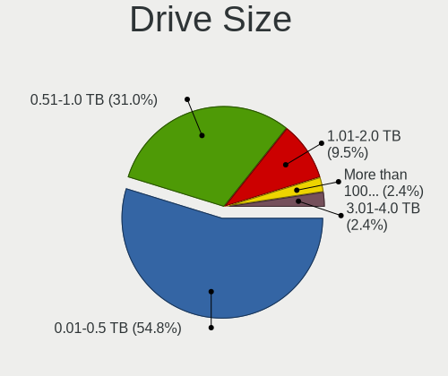

OpenBSD 6.9 - Tested Hardware & Statistics (Desktops)
-----------------------------------------------------

A project to collect tested hardware configurations for OpenBSD 6.9.

Anyone can contribute to this report by the [hw-probe](https://github.com/linuxhw/hw-probe/blob/master/INSTALL.BSD.md) tool:

    hw-probe -all -upload

Please submit a probe of your configuration if it's not presented on the page or is rare.

Full-feature report is available here: https://bsd-hardware.info/?view=trends&rel=openbsd-6.9

Contents
--------

* [ Test Cases ](#test-cases)

* [ System ](#system)
  - [ Arch                     ](#arch)
  - [ DE                       ](#de)
  - [ Display Server           ](#display-server)
  - [ Display Manager          ](#display-manager)
  - [ OS Lang                  ](#os-lang)
  - [ Boot Mode                ](#boot-mode)
  - [ Filesystem               ](#filesystem)
  - [ Part. scheme             ](#part-scheme)

* [ Board ](#board)
  - [ Vendor                   ](#vendor)
  - [ Model                    ](#model)
  - [ Model Family             ](#model-family)
  - [ MFG Year                 ](#mfg-year)
  - [ Form Factor              ](#form-factor)
  - [ Coreboot                 ](#coreboot)
  - [ RAM Size                 ](#ram-size)
  - [ RAM Used                 ](#ram-used)
  - [ Total Drives             ](#total-drives)
  - [ Has CD-ROM               ](#has-cd-rom)
  - [ Has Ethernet             ](#has-ethernet)
  - [ Has WiFi                 ](#has-wifi)
  - [ Has Bluetooth            ](#has-bluetooth)

* [ Location ](#location)
  - [ Country                  ](#country)
  - [ City                     ](#city)

* [ Drives ](#drives)
  - [ Drive Vendor             ](#drive-vendor)
  - [ Drive Model              ](#drive-model)
  - [ HDD Vendor               ](#hdd-vendor)
  - [ SSD Vendor               ](#ssd-vendor)
  - [ Drive Kind               ](#drive-kind)
  - [ Drive Connector          ](#drive-connector)
  - [ Drive Size               ](#drive-size)
  - [ Space Total              ](#space-total)
  - [ Space Used               ](#space-used)
  - [ Malfunc. Drives          ](#malfunc-drives)
  - [ Malfunc. Drive Vendor    ](#malfunc-drive-vendor)
  - [ Malfunc. HDD Vendor      ](#malfunc-hdd-vendor)
  - [ Malfunc. Drive Kind      ](#malfunc-drive-kind)
  - [ Failed Drives            ](#failed-drives)
  - [ Failed Drive Vendor      ](#failed-drive-vendor)
  - [ Drive Status             ](#drive-status)

* [ Storage controller ](#storage-controller)
  - [ Storage Vendor           ](#storage-vendor)
  - [ Storage Model            ](#storage-model)
  - [ Storage Kind             ](#storage-kind)

* [ Processor ](#processor)
  - [ CPU Vendor               ](#cpu-vendor)
  - [ CPU Model                ](#cpu-model)
  - [ CPU Model Family         ](#cpu-model-family)
  - [ CPU Cores                ](#cpu-cores)
  - [ CPU Sockets              ](#cpu-sockets)
  - [ CPU Threads              ](#cpu-threads)
  - [ CPU Microarch            ](#cpu-microarch)

* [ Graphics ](#graphics)
  - [ GPU Vendor               ](#gpu-vendor)
  - [ GPU Model                ](#gpu-model)
  - [ GPU Combo                ](#gpu-combo)
  - [ GPU Driver               ](#gpu-driver)
  - [ GPU Memory               ](#gpu-memory)

* [ Monitor ](#monitor)
  - [ Monitor Vendor           ](#monitor-vendor)
  - [ Monitor Model            ](#monitor-model)
  - [ Monitor Resolution       ](#monitor-resolution)
  - [ Monitor Diagonal         ](#monitor-diagonal)
  - [ Monitor Width            ](#monitor-width)
  - [ Aspect Ratio             ](#aspect-ratio)
  - [ Monitor Area             ](#monitor-area)
  - [ Pixel Density            ](#pixel-density)
  - [ Multiple Monitors        ](#multiple-monitors)

* [ Network ](#network)
  - [ Net Controller Vendor    ](#net-controller-vendor)
  - [ Net Controller Model     ](#net-controller-model)
  - [ Wireless Vendor          ](#wireless-vendor)
  - [ Wireless Model           ](#wireless-model)
  - [ Ethernet Vendor          ](#ethernet-vendor)
  - [ Ethernet Model           ](#ethernet-model)
  - [ Net Controller Kind      ](#net-controller-kind)
  - [ Used Controller          ](#used-controller)
  - [ NICs                     ](#nics)
  - [ IPv6                     ](#ipv6)

* [ Bluetooth ](#bluetooth)
  - [ Bluetooth Vendor         ](#bluetooth-vendor)
  - [ Bluetooth Model          ](#bluetooth-model)

* [ Sound ](#sound)
  - [ Sound Vendor             ](#sound-vendor)
  - [ Sound Model              ](#sound-model)

* [ Memory ](#memory)
  - [ Memory Vendor            ](#memory-vendor)
  - [ Memory Model             ](#memory-model)
  - [ Memory Kind              ](#memory-kind)
  - [ Memory Form Factor       ](#memory-form-factor)
  - [ Memory Size              ](#memory-size)
  - [ Memory Speed             ](#memory-speed)

* [ Printers & scanners ](#printers--scanners)
  - [ Printer Vendor           ](#printer-vendor)
  - [ Printer Model            ](#printer-model)
  - [ Scanner Vendor           ](#scanner-vendor)
  - [ Scanner Model            ](#scanner-model)

* [ Camera ](#camera)
  - [ Camera Vendor            ](#camera-vendor)
  - [ Camera Model             ](#camera-model)

* [ Security ](#security)
  - [ Fingerprint Vendor       ](#fingerprint-vendor)
  - [ Fingerprint Model        ](#fingerprint-model)
  - [ Chipcard Vendor          ](#chipcard-vendor)
  - [ Chipcard Model           ](#chipcard-model)

* [ Unsupported ](#unsupported)
  - [ Unsupported Devices      ](#unsupported-devices)
  - [ Unsupported Device Types ](#unsupported-device-types)

Test Cases
----------

| Vendor     | Model                   | Probe                                                     | Date         |
|------------|-------------------------|-----------------------------------------------------------|--------------|
| ASUSTek    | ROG STRIX X470-F GAMING | [838a177f57](https://bsd-hardware.info/?probe=838a177f57) | Sep 30, 2021 |
| HP         | Pro3500 Series          | [abf3223f32](https://bsd-hardware.info/?probe=abf3223f32) | Sep 19, 2021 |
| ASUSTek    | ROG STRIX B550-I GAMING | [7a800aec88](https://bsd-hardware.info/?probe=7a800aec88) | Sep 15, 2021 |
| NF541      | Unknown                 | [deb29af749](https://bsd-hardware.info/?probe=deb29af749) | Sep 11, 2021 |
| MSI        | MS-7A34                 | [decfe43121](https://bsd-hardware.info/?probe=decfe43121) | Sep 10, 2021 |
| PC Engines | apu4                    | [9557835b54](https://bsd-hardware.info/?probe=9557835b54) | Sep 09, 2021 |
| Gigabyte   | B550I AORUS PRO AX      | [f860e13b6b](https://bsd-hardware.info/?probe=f860e13b6b) | Sep 08, 2021 |
| ASUSTek    | ROG STRIX B550-I GAMING | [1b6bf4666c](https://bsd-hardware.info/?probe=1b6bf4666c) | Sep 05, 2021 |
| Gigabyte   | GA-7VT600               | [83b86f3e8c](https://bsd-hardware.info/?probe=83b86f3e8c) | Aug 23, 2021 |
| Unknown    | FriendlyElec NanoPi R4S | [ac10928ac3](https://bsd-hardware.info/?probe=ac10928ac3) | Aug 05, 2021 |
| Unknown    | Pine64 Rock64           | [0df3f7572c](https://bsd-hardware.info/?probe=0df3f7572c) | Jul 23, 2021 |
| ASUSTek    | B202                    | [9f5f0a4117](https://bsd-hardware.info/?probe=9f5f0a4117) | Jul 21, 2021 |
| Unknown    | Pine64 Rock64           | [83c18360fc](https://bsd-hardware.info/?probe=83c18360fc) | Jul 12, 2021 |
| HP         | ProLiant DL360e Gen8    | [30eeb098b0](https://bsd-hardware.info/?probe=30eeb098b0) | Jul 10, 2021 |
| HP         | ProLiant DL320 G5       | [3b4ee33976](https://bsd-hardware.info/?probe=3b4ee33976) | Jul 10, 2021 |
| Foxconn    | AT-7000 Series          | [3802fb98b5](https://bsd-hardware.info/?probe=3802fb98b5) | Jul 10, 2021 |
| Unknown    | Pine64 Rock64           | [106c7823a8](https://bsd-hardware.info/?probe=106c7823a8) | Jul 10, 2021 |
| Unknown    | Pine64 Rock64           | [9cffa29c69](https://bsd-hardware.info/?probe=9cffa29c69) | Jul 08, 2021 |
| ASUSTek    | PRIME B560M-A           | [55f46bc85d](https://bsd-hardware.info/?probe=55f46bc85d) | Jul 07, 2021 |
| Unknown    | Unknown                 | [cfb0e172cb](https://bsd-hardware.info/?probe=cfb0e172cb) | Jun 27, 2021 |
| Dell       | 0GTK4K A02              | [bb610333d0](https://bsd-hardware.info/?probe=bb610333d0) | Jun 22, 2021 |
| Supermicro | X8DTH-i/6/iF/6F         | [1e8ac47693](https://bsd-hardware.info/?probe=1e8ac47693) | Jun 08, 2021 |
| Supermicro | X8DTH-i/6/iF/6F         | [bd4a74c5e5](https://bsd-hardware.info/?probe=bd4a74c5e5) | Jun 08, 2021 |
| Supermicro | X10SLH-N6-ST031         | [e54175f99f](https://bsd-hardware.info/?probe=e54175f99f) | Jun 06, 2021 |
| ASRock     | Z68 Extreme4 Gen3       | [58c8cdc060](https://bsd-hardware.info/?probe=58c8cdc060) | Jun 05, 2021 |
| Shuttle    | DS77U                   | [5d1c78145e](https://bsd-hardware.info/?probe=5d1c78145e) | May 30, 2021 |
| ASUSTek    | PRIME B560M-A           | [ca05acd52f](https://bsd-hardware.info/?probe=ca05acd52f) | May 30, 2021 |
| ASRock     | X570M Pro4              | [1d1a5afcfb](https://bsd-hardware.info/?probe=1d1a5afcfb) | May 28, 2021 |
| Alienware  | Aurora Ryzen Edition    | [b9dc8b182c](https://bsd-hardware.info/?probe=b9dc8b182c) | May 28, 2021 |
| ASUSTek    | B202                    | [0b66a5fd20](https://bsd-hardware.info/?probe=0b66a5fd20) | May 21, 2021 |
| PC Engines | APU2                    | [c99a0b0e4d](https://bsd-hardware.info/?probe=c99a0b0e4d) | May 05, 2021 |
| Supermicro | X8STi                   | [c615ef1edf](https://bsd-hardware.info/?probe=c615ef1edf) | May 04, 2021 |
| PC Engines | apu1                    | [7b4678c7ef](https://bsd-hardware.info/?probe=7b4678c7ef) | May 03, 2021 |
| ASUSTek    | P10S-I Series           | [6548ae7d88](https://bsd-hardware.info/?probe=6548ae7d88) | May 01, 2021 |
| PC Engines | apu1                    | [c5ae3337e7](https://bsd-hardware.info/?probe=c5ae3337e7) | May 01, 2021 |
| HP         | ProLiant DL360 Gen9     | [b283b34881](https://bsd-hardware.info/?probe=b283b34881) | Mar 17, 2021 |
| HP         | ProLiant DL360 Gen9     | [bf440e72a1](https://bsd-hardware.info/?probe=bf440e72a1) | Mar 17, 2021 |
| HP         | EliteDesk 800 G5 SFF    | [aaf9bc1c12](https://bsd-hardware.info/?probe=aaf9bc1c12) | Mar 17, 2021 |

System
------

Arch
----

OS architecture (x86_64, i586, etc.)

| Name  | Desktops | Percent |
|-------|----------|---------|
| amd64 | 24       | 85.71%  |
| i386  | 2        | 7.14%   |
| arm64 | 2        | 7.14%   |

DE
--

Desktop Environment

| Name    | Desktops | Percent |
|---------|----------|---------|
| fvwm    | 15       | 53.57%  |
| Console | 13       | 46.43%  |

Display Server
--------------

X11 or Wayland

| Name    | Desktops | Percent |
|---------|----------|---------|
| X11     | 14       | 50%     |
| Console | 14       | 50%     |

Display Manager
---------------

SDDM, LightDM, etc.

| Name    | Desktops | Percent |
|---------|----------|---------|
| Console | 26       | 92.86%  |
| SLiM    | 1        | 3.57%   |
| GDM     | 1        | 3.57%   |

OS Lang
-------

Language

| Lang    | Desktops | Percent |
|---------|----------|---------|
| Unknown | 23       | 82.14%  |
| en_US   | 3        | 10.71%  |
| ru_RU   | 1        | 3.57%   |
| de_DE   | 1        | 3.57%   |

Boot Mode
---------

EFI or BIOS

| Mode | Desktops | Percent |
|------|----------|---------|
| EFI  | 17       | 58.62%  |
| BIOS | 12       | 41.38%  |

Filesystem
----------

Type of filesystem

| Type | Desktops | Percent |
|------|----------|---------|
| Ffs  | 28       | 100%    |

Part. scheme
------------

Scheme of partitioning

| Type | Desktops | Percent |
|------|----------|---------|
| MBR  | 15       | 51.72%  |
| GPT  | 14       | 48.28%  |

Board
-----

Vendor
------

Motherboard manufacturer

| Name                | Desktops | Percent |
|---------------------|----------|---------|
| Hewlett-Packard     | 5        | 17.86%  |
| ASUSTek Computer    | 5        | 17.86%  |
| Supermicro          | 3        | 10.71%  |
| PC Engines          | 3        | 10.71%  |
| Unknown             | 3        | 10.71%  |
| Gigabyte Technology | 2        | 7.14%   |
| ASRock              | 2        | 7.14%   |
| Shuttle             | 1        | 3.57%   |
| NF541               | 1        | 3.57%   |
| MSI                 | 1        | 3.57%   |
| Foxconn             | 1        | 3.57%   |
| Alienware           | 1        | 3.57%   |

Model
-----

Motherboard model

| Name                           | Desktops | Percent |
|--------------------------------|----------|---------|
| Unknown                        | 4        | 14.29%  |
| Supermicro X8STi               | 1        | 3.57%   |
| Supermicro X8DTH-i/6/iF/6F     | 1        | 3.57%   |
| Supermicro X10SLH-N6-ST031     | 1        | 3.57%   |
| Shuttle DS77U                  | 1        | 3.57%   |
| PC Engines apu4                | 1        | 3.57%   |
| PC Engines APU2                | 1        | 3.57%   |
| PC Engines apu1                | 1        | 3.57%   |
| MSI MS-7A34                    | 1        | 3.57%   |
| HP ProLiant DL360e Gen8        | 1        | 3.57%   |
| HP ProLiant DL360 Gen9         | 1        | 3.57%   |
| HP ProLiant DL320 G5           | 1        | 3.57%   |
| HP Pro3500 Series              | 1        | 3.57%   |
| HP EliteDesk 800 G5 SFF        | 1        | 3.57%   |
| Gigabyte GA-7VT600             | 1        | 3.57%   |
| Gigabyte B550I AORUS PRO AX    | 1        | 3.57%   |
| Foxconn AT-7000 Series         | 1        | 3.57%   |
| ASUS ROG STRIX X470-F GAMING   | 1        | 3.57%   |
| ASUS ROG STRIX B550-I GAMING   | 1        | 3.57%   |
| ASUS PRIME B560M-A             | 1        | 3.57%   |
| ASUS P10S-I Series             | 1        | 3.57%   |
| ASUS B202                      | 1        | 3.57%   |
| ASRock Z68 Extreme4 Gen3       | 1        | 3.57%   |
| ASRock X570M Pro4              | 1        | 3.57%   |
| Alienware Aurora Ryzen Edition | 1        | 3.57%   |

Model Family
------------

Motherboard model prefix

| Name                       | Desktops | Percent |
|----------------------------|----------|---------|
| Unknown                    | 4        | 14.29%  |
| HP ProLiant                | 3        | 10.71%  |
| ASUS ROG                   | 2        | 7.14%   |
| Supermicro X8STi           | 1        | 3.57%   |
| Supermicro X8DTH-i         | 1        | 3.57%   |
| Supermicro X10SLH-N6-ST031 | 1        | 3.57%   |
| Shuttle DS77U              | 1        | 3.57%   |
| PC Engines apu4            | 1        | 3.57%   |
| PC Engines APU2            | 1        | 3.57%   |
| PC Engines apu1            | 1        | 3.57%   |
| MSI MS-7A34                | 1        | 3.57%   |
| HP Pro3500                 | 1        | 3.57%   |
| HP EliteDesk               | 1        | 3.57%   |
| Gigabyte GA-7VT600         | 1        | 3.57%   |
| Gigabyte B550I             | 1        | 3.57%   |
| Foxconn AT-7000            | 1        | 3.57%   |
| ASUS PRIME                 | 1        | 3.57%   |
| ASUS P10S-I                | 1        | 3.57%   |
| ASUS B202                  | 1        | 3.57%   |
| ASRock Z68                 | 1        | 3.57%   |
| ASRock X570M               | 1        | 3.57%   |
| Alienware Aurora           | 1        | 3.57%   |

MFG Year
--------

Motherboard manufacture year

| Year    | Desktops | Percent |
|---------|----------|---------|
| 2021    | 5        | 17.86%  |
| 2020    | 5        | 17.86%  |
| 2019    | 3        | 10.71%  |
| 2018    | 3        | 10.71%  |
| Unknown | 3        | 10.71%  |
| 2012    | 2        | 7.14%   |
| 2008    | 2        | 7.14%   |
| 2017    | 1        | 3.57%   |
| 2016    | 1        | 3.57%   |
| 2014    | 1        | 3.57%   |
| 2010    | 1        | 3.57%   |
| 2003    | 1        | 3.57%   |

Form Factor
-----------

Physical design of the computer

| Name    | Desktops | Percent |
|---------|----------|---------|
| Desktop | 28       | 100%    |

Coreboot
--------

Have coreboot on board

| Used | Desktops | Percent |
|------|----------|---------|
| No   | 25       | 89.29%  |
| Yes  | 3        | 10.71%  |

RAM Size
--------

Total RAM memory

| Size in GB  | Desktops | Percent |
|-------------|----------|---------|
| 4.01-8.0    | 5        | 17.86%  |
| 16.01-24.0  | 5        | 17.86%  |
| 8.01-16.0   | 5        | 17.86%  |
| 32.01-64.0  | 4        | 14.29%  |
| 24.01-32.0  | 2        | 7.14%   |
| 64.01-256.0 | 2        | 7.14%   |
| 1.01-2.0    | 2        | 7.14%   |
| 3.01-4.0    | 1        | 3.57%   |
| 2.01-3.0    | 1        | 3.57%   |
| 0.51-1.0    | 1        | 3.57%   |

RAM Used
--------

Used RAM memory

| Used GB  | Desktops | Percent |
|----------|----------|---------|
| 0.01-0.5 | 17       | 60.71%  |
| 0.51-1.0 | 5        | 17.86%  |
| 1.01-2.0 | 2        | 7.14%   |
| 0        | 2        | 7.14%   |
| 4.01-8.0 | 1        | 3.57%   |
| Unknown  | 1        | 3.57%   |

Total Drives
------------

Number of drives on board

| Drives | Desktops | Percent |
|--------|----------|---------|
| 2      | 9        | 31.03%  |
| 1      | 9        | 31.03%  |
| 3      | 3        | 10.34%  |
| 6      | 2        | 6.9%    |
| 5      | 2        | 6.9%    |
| 4      | 2        | 6.9%    |
| 7      | 1        | 3.45%   |
| 0      | 1        | 3.45%   |

Has CD-ROM
----------

Has CD-ROM on board

| Presented | Desktops | Percent |
|-----------|----------|---------|
| No        | 28       | 100%    |

Has Ethernet
------------

Has Ethernet on board

| Presented | Desktops | Percent |
|-----------|----------|---------|
| Yes       | 27       | 96.43%  |
| No        | 1        | 3.57%   |

Has WiFi
--------

Has WiFi module

| Presented | Desktops | Percent |
|-----------|----------|---------|
| No        | 19       | 67.86%  |
| Yes       | 9        | 32.14%  |

Has Bluetooth
-------------

Has Bluetooth module

| Presented | Desktops | Percent |
|-----------|----------|---------|
| No        | 22       | 78.57%  |
| Yes       | 6        | 21.43%  |

Location
--------

Country
-------

Geographic location (country)

| Country      | Desktops | Percent |
|--------------|----------|---------|
| USA          | 8        | 28.57%  |
| Germany      | 5        | 17.86%  |
| Russia       | 4        | 14.29%  |
| France       | 3        | 10.71%  |
| Netherlands  | 2        | 7.14%   |
| Ukraine      | 1        | 3.57%   |
| UK           | 1        | 3.57%   |
| Taiwan       | 1        | 3.57%   |
| Switzerland  | 1        | 3.57%   |
| Spain        | 1        | 3.57%   |
| Saudi Arabia | 1        | 3.57%   |

City
----

Geographic location (city)

| City                  | Desktops | Percent |
|-----------------------|----------|---------|
| Moscow                | 4        | 14.29%  |
| Berlin                | 2        | 7.14%   |
| Wittersham            | 1        | 3.57%   |
| Vechta                | 1        | 3.57%   |
| Van Nuys              | 1        | 3.57%   |
| Syeverodonets'k       | 1        | 3.57%   |
| Sedavi                | 1        | 3.57%   |
| Saint-Martin-d'Hères | 1        | 3.57%   |
| Roubaix               | 1        | 3.57%   |
| Riyadh                | 1        | 3.57%   |
| Plainfield            | 1        | 3.57%   |
| Onalaska              | 1        | 3.57%   |
| Oensingen             | 1        | 3.57%   |
| New York              | 1        | 3.57%   |
| New Taipei            | 1        | 3.57%   |
| Monts                 | 1        | 3.57%   |
| Independence          | 1        | 3.57%   |
| Heilbronn             | 1        | 3.57%   |
| Hamilton              | 1        | 3.57%   |
| Dallas                | 1        | 3.57%   |
| Cassville             | 1        | 3.57%   |
| Bielefeld             | 1        | 3.57%   |
| Barneveld             | 1        | 3.57%   |
| Amsterdam             | 1        | 3.57%   |

Drives
------

Drive Vendor
------------

Hard drive vendors

| Vendor              | Desktops | Drives | Percent |
|---------------------|----------|--------|---------|
| Seagate             | 6        | 12     | 12.5%   |
| NVMe                | 6        | 7      | 12.5%   |
| Samsung Electronics | 5        | 8      | 10.42%  |
| OPENBSD             | 4        | 4      | 8.33%   |
| WDC                 | 3        | 3      | 6.25%   |
| Intel               | 3        | 4      | 6.25%   |
| HGST                | 3        | 4      | 6.25%   |
| Toshiba             | 2        | 2      | 4.17%   |
| Hitachi             | 2        | 2      | 4.17%   |
| Hewlett-Packard     | 2        | 6      | 4.17%   |
| USB                 | 1        | 1      | 2.08%   |
| Transcend           | 1        | 4      | 2.08%   |
| SK Hynix            | 1        | 1      | 2.08%   |
| SanDisk             | 1        | 1      | 2.08%   |
| Product:            | 1        | 1      | 2.08%   |
| Phison              | 1        | 1      | 2.08%   |
| Multiple            | 1        | 1      | 2.08%   |
| Micron Technology   | 1        | 1      | 2.08%   |
| MEMXPRO             | 1        | 1      | 2.08%   |
| LSI                 | 1        | 1      | 2.08%   |
| Crucial             | 1        | 1      | 2.08%   |
| asmedia             | 1        | 1      | 2.08%   |

Drive Model
-----------

Hard drive models

| Model                             | Desktops | Percent |
|-----------------------------------|----------|---------|
| OPENBSD SR RAID 1 240GB           | 4        | 7.02%   |
| NVMe Samsung SSD 970 250GB        | 2        | 3.51%   |
| HGST HUS724020ALA640 2TB          | 2        | 3.51%   |
| WDC WD20PURX-64P6ZY0 2TB          | 1        | 1.75%   |
| WDC WD10SPCX-24HWST1 1TB          | 1        | 1.75%   |
| WDC WD Elements 25A3 4TB          | 1        | 1.75%   |
| USB SanDisk 3.2Gen1 16GB          | 1        | 1.75%   |
| Transcend 3E128-TS2-550B01 100GB  | 1        | 1.75%   |
| Toshiba MQ04ABF100 1TB            | 1        | 1.75%   |
| Toshiba DT01ACA100 1TB            | 1        | 1.75%   |
| SK Hynix HFS128G39TND-N210A 128GB | 1        | 1.75%   |
| Seagate ST950032 5AS 500GB        | 1        | 1.75%   |
| Seagate ST9160310AS 160GB         | 1        | 1.75%   |
| Seagate ST3808110AS 80GB          | 1        | 1.75%   |
| Seagate ST380011A 80GB            | 1        | 1.75%   |
| Seagate ST3160212ACE 160GB        | 1        | 1.75%   |
| Seagate ST2000LX001-1RG174 2TB    | 1        | 1.75%   |
| Seagate ST1000LM048-2E7172 1TB    | 1        | 1.75%   |
| Seagate ST1000DM003-9YN162 1TB    | 1        | 1.75%   |
| Seagate ST1000DM003-1CH162 1TB    | 1        | 1.75%   |
| Seagate Backup+ SL 1TB            | 1        | 1.75%   |
| SanDisk Ultra 32GB                | 1        | 1.75%   |
| Samsung SSD 860 EVO M.2 2TB       | 1        | 1.75%   |
| Samsung SSD 860 EVO M.2 1TB       | 1        | 1.75%   |
| Samsung SSD 860 EVO 2TB           | 1        | 1.75%   |
| Samsung SSD 850 EVO 250GB         | 1        | 1.75%   |
| Samsung SSD 850 EVO 120GB         | 1        | 1.75%   |
| Samsung MZ7LH240HAHQ-00005 240GB  | 1        | 1.75%   |
| Samsung Flash Drive FIT 32GB      | 1        | 1.75%   |
| Product: Revision: 1100 18302PB   | 1        | 1.75%   |
| Phison SATA SSD 16GB              | 1        | 1.75%   |
| NVMe WDS100T1X0E-00AF 1TB         | 1        | 1.75%   |
| NVMe TOSHIBA-RC100 240GB          | 1        | 1.75%   |
| NVMe Samsung SSD 960 500GB        | 1        | 1.75%   |
| NVMe SAMSUNG MZVLB256 256GB       | 1        | 1.75%   |
| NVMe PC SN730 WD 512GB            | 1        | 1.75%   |
| Multiple Card Reader              | 1        | 1.75%   |
| Micron 5300_MTFDDAK240TDS 240GB   | 1        | 1.75%   |
| MEMXPRO mSATA M3B 32GB            | 1        | 1.75%   |
| LSI MR9271-8i 438GB               | 1        | 1.75%   |
| Intel SSDSC2KB240G8 240GB         | 1        | 1.75%   |
| Intel SSDSC2BW240H6 240GB         | 1        | 1.75%   |
| Intel SSDSC2BB080G4 80GB          | 1        | 1.75%   |
| Hitachi HUA723020ALA640 2TB       | 1        | 1.75%   |
| Hitachi HTS542580K9SA00 80GB      | 1        | 1.75%   |
| HGST HTS541010A7E630 1TB          | 1        | 1.75%   |
| HP LOGICAL VOLUME 1TB             | 1        | 1.75%   |
| HP EG0300FCVBF 304GB              | 1        | 1.75%   |
| HP EG0300FCSPH 304GB              | 1        | 1.75%   |
| HP EG0300FBVFL 304GB              | 1        | 1.75%   |
| Crucial CT1000MX500SSD1 1TB       | 1        | 1.75%   |
| asmedia ASMT1051 240GB            | 1        | 1.75%   |

HDD Vendor
----------

Hard disk drive vendors

| Vendor              | Desktops | Drives | Percent |
|---------------------|----------|--------|---------|
| Seagate             | 6        | 12     | 20%     |
| OPENBSD             | 4        | 4      | 13.33%  |
| WDC                 | 3        | 3      | 10%     |
| NVMe                | 3        | 3      | 10%     |
| HGST                | 3        | 4      | 10%     |
| Toshiba             | 2        | 2      | 6.67%   |
| Hitachi             | 2        | 2      | 6.67%   |
| Hewlett-Packard     | 2        | 6      | 6.67%   |
| USB                 | 1        | 1      | 3.33%   |
| Samsung Electronics | 1        | 1      | 3.33%   |
| Product:            | 1        | 1      | 3.33%   |
| Multiple            | 1        | 1      | 3.33%   |
| LSI                 | 1        | 1      | 3.33%   |

SSD Vendor
----------

Solid state drive vendors

| Vendor              | Desktops | Drives | Percent |
|---------------------|----------|--------|---------|
| Samsung Electronics | 4        | 7      | 22.22%  |
| NVMe                | 3        | 3      | 16.67%  |
| Intel               | 3        | 4      | 16.67%  |
| Transcend           | 1        | 4      | 5.56%   |
| SK Hynix            | 1        | 1      | 5.56%   |
| SanDisk             | 1        | 1      | 5.56%   |
| Phison              | 1        | 1      | 5.56%   |
| Micron Technology   | 1        | 1      | 5.56%   |
| MEMXPRO             | 1        | 1      | 5.56%   |
| Crucial             | 1        | 1      | 5.56%   |
| asmedia             | 1        | 1      | 5.56%   |

Drive Kind
----------

HDD or SSD

| Kind | Desktops | Drives | Percent |
|------|----------|--------|---------|
| HDD  | 19       | 41     | 57.58%  |
| SSD  | 13       | 25     | 39.39%  |
| NVMe | 1        | 1      | 3.03%   |

Drive Connector
---------------

SATA, SAS, NVMe, etc.

| Type | Desktops | Drives | Percent |
|------|----------|--------|---------|
| SATA | 26       | 66     | 96.3%   |
| NVMe | 1        | 1      | 3.7%    |

Drive Size
----------

Size of hard drive

| Size in TB      | Desktops | Drives | Percent |
|-----------------|----------|--------|---------|
| 0.01-0.5        | 21       | 42     | 60%     |
| 0.51-1.0        | 8        | 15     | 22.86%  |
| 1.01-2.0        | 4        | 7      | 11.43%  |
| More than 100.0 | 1        | 1      | 2.86%   |
| 3.01-4.0        | 1        | 1      | 2.86%   |

Space Total
-----------

Amount of disk space available on the file system

| Size in GB     | Desktops | Percent |
|----------------|----------|---------|
| 251-500        | 8        | 28.57%  |
| 101-250        | 7        | 25%     |
| More than 3000 | 4        | 14.29%  |
| 1-20           | 3        | 10.71%  |
| 51-100         | 3        | 10.71%  |
| 21-50          | 2        | 7.14%   |
| 1001-2000      | 1        | 3.57%   |

Space Used
----------

Amount of used disk space

| Used GB   | Desktops | Percent |
|-----------|----------|---------|
| 1-20      | 17       | 58.62%  |
| 21-50     | 5        | 17.24%  |
| 101-250   | 2        | 6.9%    |
| 1001-2000 | 2        | 6.9%    |
| 251-500   | 1        | 3.45%   |
| 501-1000  | 1        | 3.45%   |
| 51-100    | 1        | 3.45%   |

Malfunc. Drives
---------------

Drive models with a malfunction

| Model                            | Desktops | Drives | Percent |
|----------------------------------|----------|--------|---------|
| Transcend 3E128-TS2-550B01 100GB | 1        | 4      | 25%     |
| Seagate ST9160310AS 160GB        | 1        | 2      | 25%     |
| Seagate ST1000DM003-1CH162 1TB   | 1        | 1      | 25%     |
| HGST HTS541010A7E630 1TB         | 1        | 2      | 25%     |

Malfunc. Drive Vendor
---------------------

Vendors of faulty drives

| Vendor    | Desktops | Drives | Percent |
|-----------|----------|--------|---------|
| Seagate   | 2        | 3      | 50%     |
| Transcend | 1        | 4      | 25%     |
| HGST      | 1        | 2      | 25%     |

Malfunc. HDD Vendor
-------------------

Vendors of faulty HDD drives

| Vendor  | Desktops | Drives | Percent |
|---------|----------|--------|---------|
| Seagate | 2        | 3      | 66.67%  |
| HGST    | 1        | 2      | 33.33%  |

Malfunc. Drive Kind
-------------------

Kinds of faulty drives

| Kind | Desktops | Drives | Percent |
|------|----------|--------|---------|
| HDD  | 3        | 5      | 75%     |
| SSD  | 1        | 4      | 25%     |

Failed Drives
-------------

Failed drive models

Zero info for selected period =(

Failed Drive Vendor
-------------------

Failed drive vendors

Zero info for selected period =(

Drive Status
------------

Number of failed and malfunc. drives

| Status   | Desktops | Drives | Percent |
|----------|----------|--------|---------|
| Works    | 20       | 41     | 57.14%  |
| Detected | 11       | 17     | 31.43%  |
| Malfunc  | 4        | 9      | 11.43%  |

Storage controller
------------------

Storage Vendor
--------------

Storage controller vendors

| Vendor                   | Desktops | Percent |
|--------------------------|----------|---------|
| Intel                    | 15       | 39.47%  |
| AMD                      | 9        | 23.68%  |
| Samsung Electronics      | 4        | 10.53%  |
| Sandisk                  | 2        | 5.26%   |
| Hewlett-Packard          | 2        | 5.26%   |
| Broadcom / LSI           | 2        | 5.26%   |
| VIA Technologies         | 1        | 2.63%   |
| Toshiba                  | 1        | 2.63%   |
| Silicon Image            | 1        | 2.63%   |
| Marvell Technology Group | 1        | 2.63%   |

Storage Model
-------------

Storage controller models

| Model                                                                                   | Desktops | Percent |
|-----------------------------------------------------------------------------------------|----------|---------|
| AMD FCH SATA Controller [AHCI mode]                                                     | 5        | 11.36%  |
| Samsung NVMe SSD Controller SM981/PM981/PM983                                           | 3        | 6.82%   |
| AMD Starship/Matisse Chipset SATA Controller [AHCI mode]                                | 2        | 4.55%   |
| AMD 400 Series Chipset SATA Controller                                                  | 2        | 4.55%   |
| VIA VT82C586A/B/VT82C686/A/B/VT823x/A/C PIPC Bus Master IDE                             | 1        | 2.27%   |
| Toshiba BG3 NVMe SSD Controller                                                         | 1        | 2.27%   |
| Silicon Image SiI 3114 [SATALink/SATARaid] Serial ATA Controller                        | 1        | 2.27%   |
| Sandisk WD Black SN850                                                                  | 1        | 2.27%   |
| Sandisk WD Black SN750 / PC SN730 NVMe SSD                                              | 1        | 2.27%   |
| Samsung NVMe SSD Controller SM961/PM961/SM963                                           | 1        | 2.27%   |
| Marvell Group 88SE912x SATA 6Gb/s Controller [IDE mode]                                 | 1        | 2.27%   |
| Intel Sunrise Point-LP SATA Controller [AHCI mode]                                      | 1        | 2.27%   |
| Intel Q170/Q150/B150/H170/H110/Z170/CM236 Chipset SATA Controller [AHCI Mode]           | 1        | 2.27%   |
| Intel NM10/ICH7 Family SATA Controller [IDE mode]                                       | 1        | 2.27%   |
| Intel Cannon Lake PCH SATA AHCI Controller                                              | 1        | 2.27%   |
| Intel Cannon Lake Mobile PCH SATA AHCI Controller                                       | 1        | 2.27%   |
| Intel C610/X99 series chipset 6-Port SATA Controller [AHCI mode]                        | 1        | 2.27%   |
| Intel C600/X79 series chipset 6-Port SATA AHCI Controller                               | 1        | 2.27%   |
| Intel Atom Processor E3800 Series SATA AHCI Controller                                  | 1        | 2.27%   |
| Intel 82801JI (ICH10 Family) SATA AHCI Controller                                       | 1        | 2.27%   |
| Intel 82801GBM/GHM (ICH7-M Family) SATA Controller [IDE mode]                           | 1        | 2.27%   |
| Intel 82801G (ICH7 Family) IDE Controller                                               | 1        | 2.27%   |
| Intel 8 Series/C220 Series Chipset Family 6-port SATA Controller 1 [AHCI mode]          | 1        | 2.27%   |
| Intel 7 Series Chipset Family 6-port SATA Controller [AHCI mode]                        | 1        | 2.27%   |
| Intel 6 Series/C200 Series Chipset Family Desktop SATA Controller (IDE mode, ports 4-5) | 1        | 2.27%   |
| Intel 6 Series/C200 Series Chipset Family Desktop SATA Controller (IDE mode, ports 0-3) | 1        | 2.27%   |
| Intel 6 Series/C200 Series Chipset Family 6 port Desktop SATA AHCI Controller           | 1        | 2.27%   |
| Intel 500 Series Chipset Family SATA AHCI Controller                                    | 1        | 2.27%   |
| HP Smart Array Gen9 Controllers                                                         | 1        | 2.27%   |
| HP Smart Array G6 controllers                                                           | 1        | 2.27%   |
| Broadcom / LSI SSS6200 PCI-Express Flash SSD                                            | 1        | 2.27%   |
| Broadcom / LSI SAS2308 PCI-Express Fusion-MPT SAS-2                                     | 1        | 2.27%   |
| Broadcom / LSI MegaRAID SAS 2208 [Thunderbolt]                                          | 1        | 2.27%   |
| AMD SB7x0/SB8x0/SB9x0 SATA Controller [AHCI mode]                                       | 1        | 2.27%   |
| AMD FCH SATA Controller [IDE mode]                                                      | 1        | 2.27%   |
| AMD 300 Series Chipset SATA Controller                                                  | 1        | 2.27%   |

Storage Kind
------------

Kind of storage controller (IDE, SATA, NVMe, SAS, ...)

| Kind | Desktops | Percent |
|------|----------|---------|
| SATA | 20       | 54.05%  |
| NVMe | 6        | 16.22%  |
| IDE  | 5        | 13.51%  |
| RAID | 4        | 10.81%  |
| SAS  | 2        | 5.41%   |

Processor
---------

CPU Vendor
----------

Processor vendors

| Vendor | Desktops | Percent |
|--------|----------|---------|
| Intel  | 16       | 57.14%  |
| AMD    | 10       | 35.71%  |
| ARM    | 2        | 7.14%   |

CPU Model
---------

Processor models

| Model                                                    | Desktops | Percent |
|----------------------------------------------------------|----------|---------|
| ARM Cortex-A53 r0p4                                      | 2        | 7.14%   |
| AMD GX-412TC SOC                                         | 2        | 7.14%   |
| Intel Xeon CPU X5675 @ 3.07GHz                           | 1        | 3.57%   |
| Intel Xeon CPU W3530 @ 2.80GHz                           | 1        | 3.57%   |
| Intel Xeon CPU E5-2620 v3 @ 2.40GHz                      | 1        | 3.57%   |
| Intel Xeon CPU E5-2407 0 @ 2.20GHz                       | 1        | 3.57%   |
| Intel Xeon CPU E3-1270 v3 @ 3.50GHz                      | 1        | 3.57%   |
| Intel Xeon CPU E3-1220 v5 @ 3.00GHz                      | 1        | 3.57%   |
| Intel Core i7-8750H CPU @ 2.20GHz                        | 1        | 3.57%   |
| Intel Core i5-9500 CPU @ 3.00GHz                         | 1        | 3.57%   |
| Intel Core i5-3470 CPU @ 3.20GHz                         | 1        | 3.57%   |
| Intel Core i5-2500K CPU @ 3.30GHz                        | 1        | 3.57%   |
| Intel Core i3-3217U CPU @ 1.80GHz                        | 1        | 3.57%   |
| Intel Celeron D CPU 3.20GHz                              | 1        | 3.57%   |
| Intel Celeron CPU J1900 @ 1.99GHz                        | 1        | 3.57%   |
| Intel Celeron CPU 3865U @ 1.80GHz                        | 1        | 3.57%   |
| Intel Atom CPU N270 @ 1.60GHz ("GenuineIntel" 686-class) | 1        | 3.57%   |
| Intel 11th Gen Core i5-11600K @ 3.90GHz                  | 1        | 3.57%   |
| AMD Ryzen 7 PRO 4750G with Radeon Graphics               | 1        | 3.57%   |
| AMD Ryzen 7 5800X 8-Core Processor                       | 1        | 3.57%   |
| AMD Ryzen 7 5700G with Radeon Graphics                   | 1        | 3.57%   |
| AMD Ryzen 7 3700X 8-Core Processor                       | 1        | 3.57%   |
| AMD Ryzen 7 2700 Eight-Core Processor                    | 1        | 3.57%   |
| AMD Ryzen 7 1700 Eight-Core Processor                    | 1        | 3.57%   |
| AMD G-T40E Processor                                     | 1        | 3.57%   |
| AMD Athlon XP                                            | 1        | 3.57%   |

CPU Model Family
----------------

Processor model prefix

| Model           | Desktops | Percent |
|-----------------|----------|---------|
| Intel Xeon      | 6        | 21.43%  |
| AMD Ryzen 7     | 5        | 17.86%  |
| Intel Core i5   | 3        | 10.71%  |
| Intel Celeron   | 2        | 7.14%   |
| ARM Cortex      | 2        | 7.14%   |
| AMD GX          | 2        | 7.14%   |
| Other           | 1        | 3.57%   |
| Intel Core i7   | 1        | 3.57%   |
| Intel Core i3   | 1        | 3.57%   |
| Intel Celeron D | 1        | 3.57%   |
| Intel Atom      | 1        | 3.57%   |
| AMD Ryzen 7 PRO | 1        | 3.57%   |
| AMD G           | 1        | 3.57%   |
| AMD Athlon XP   | 1        | 3.57%   |

CPU Cores
---------

Number of processor cores

| Number  | Desktops | Percent |
|---------|----------|---------|
| 4       | 9        | 32.14%  |
| 16      | 5        | 17.86%  |
| 6       | 5        | 17.86%  |
| Unknown | 4        | 14.29%  |
| 2       | 3        | 10.71%  |
| 1       | 2        | 7.14%   |

CPU Sockets
-----------

Number of sockets

| Number  | Desktops | Percent |
|---------|----------|---------|
| 1       | 23       | 82.14%  |
| Unknown | 5        | 17.86%  |

CPU Threads
-----------

Threads per core (Hyper-Threading)

| Number  | Desktops | Percent |
|---------|----------|---------|
| 1       | 16       | 57.14%  |
| 2       | 7        | 25%     |
| Unknown | 5        | 17.86%  |

CPU Microarch
-------------

Microarchitecture

| Name        | Desktops | Percent |
|-------------|----------|---------|
| KabyLake    | 3        | 10.71%  |
| Unknown     | 3        | 10.71%  |
| Zen 3       | 2        | 7.14%   |
| Zen 2       | 2        | 7.14%   |
| SandyBridge | 2        | 7.14%   |
| Puma        | 2        | 7.14%   |
| IvyBridge   | 2        | 7.14%   |
| Haswell     | 2        | 7.14%   |
| Zen+        | 1        | 3.57%   |
| Zen         | 1        | 3.57%   |
| Westmere    | 1        | 3.57%   |
| Skylake     | 1        | 3.57%   |
| Silvermont  | 1        | 3.57%   |
| NetBurst    | 1        | 3.57%   |
| Nehalem     | 1        | 3.57%   |
| K6          | 1        | 3.57%   |
| Bonnell     | 1        | 3.57%   |
| Bobcat      | 1        | 3.57%   |

Graphics
--------

GPU Vendor
----------

Vendors of graphics cards

| Vendor                     | Desktops | Percent |
|----------------------------|----------|---------|
| Intel                      | 8        | 30.77%  |
| AMD                        | 8        | 30.77%  |
| Nvidia                     | 4        | 15.38%  |
| Matrox Electronics Systems | 4        | 15.38%  |
| ASPEED Technology          | 2        | 7.69%   |

GPU Model
---------

Graphics card models

| Model                                                                         | Desktops | Percent |
|-------------------------------------------------------------------------------|----------|---------|
| Matrox Electronics Systems MGA G200eW WPCM450                                 | 2        | 7.14%   |
| Matrox Electronics Systems MGA G200EH                                         | 2        | 7.14%   |
| ASPEED Technology ASPEED Graphics Family                                      | 2        | 7.14%   |
| AMD Navi 10 [Radeon RX 5600 OEM/5600 XT / 5700/5700 XT]                       | 2        | 7.14%   |
| Nvidia TU104 [GeForce RTX 2080 Rev. A]                                        | 1        | 3.57%   |
| Nvidia GP107M [GeForce GTX 1050 Mobile]                                       | 1        | 3.57%   |
| Nvidia GP106 [GeForce GTX 1060 6GB]                                           | 1        | 3.57%   |
| Nvidia GM204 [GeForce GTX 970]                                                | 1        | 3.57%   |
| Intel Xeon E3-1200 v2/3rd Gen Core processor Graphics Controller              | 1        | 3.57%   |
| Intel Mobile 945GSE Express Integrated Graphics Controller                    | 1        | 3.57%   |
| Intel Mobile 945GM/GMS/GME, 943/940GML Express Integrated Graphics Controller | 1        | 3.57%   |
| Intel Kaby Lake-U GT1 Integrated Graphics Controller                          | 1        | 3.57%   |
| Intel CometLake-S GT2 [UHD Graphics 630]                                      | 1        | 3.57%   |
| Intel CoffeeLake-H GT2 [UHD Graphics 630]                                     | 1        | 3.57%   |
| Intel Atom Processor Z36xxx/Z37xxx Series Graphics & Display                  | 1        | 3.57%   |
| Intel 3rd Gen Core processor Graphics Controller                              | 1        | 3.57%   |
| Intel 2nd Generation Core Processor Family Integrated Graphics Controller     | 1        | 3.57%   |
| AMD RV280 [Radeon 9200 PRO] (Secondary)                                       | 1        | 3.57%   |
| AMD RV280 [Radeon 9200 PRO / 9250]                                            | 1        | 3.57%   |
| AMD Renoir                                                                    | 1        | 3.57%   |
| AMD ES1000                                                                    | 1        | 3.57%   |
| AMD Ellesmere [Radeon RX 470/480/570/570X/580/580X/590]                       | 1        | 3.57%   |
| AMD Cezanne                                                                   | 1        | 3.57%   |
| AMD Caicos PRO [Radeon HD 7450]                                               | 1        | 3.57%   |

GPU Combo
---------

Combinations of graphics cards

| Name           | Desktops | Percent |
|----------------|----------|---------|
| 1 x AMD        | 6        | 21.43%  |
| Other          | 5        | 17.86%  |
| 1 x Intel      | 5        | 17.86%  |
| 1 x Matrox     | 3        | 10.71%  |
| 1 x Nvidia     | 2        | 7.14%   |
| Intel + Nvidia | 2        | 7.14%   |
| 1 x ASPEED     | 2        | 7.14%   |
| 2 x Intel      | 1        | 3.57%   |
| 2 x AMD        | 1        | 3.57%   |
| AMD + Matrox   | 1        | 3.57%   |

GPU Driver
----------

Free vs proprietary

| Driver  | Desktops | Percent |
|---------|----------|---------|
| Free    | 17       | 60.71%  |
| Unknown | 11       | 39.29%  |

GPU Memory
----------

Total video memory

| Size in GB | Desktops | Percent |
|------------|----------|---------|
| Unknown    | 28       | 100%    |

Monitor
-------

Monitor Vendor
--------------

Monitor vendors

| Vendor               | Desktops | Percent |
|----------------------|----------|---------|
| Dell                 | 3        | 27.27%  |
| Vizio                | 1        | 9.09%   |
| Philips              | 1        | 9.09%   |
| LG Display           | 1        | 9.09%   |
| Goldstar             | 1        | 9.09%   |
| Eizo                 | 1        | 9.09%   |
| ASUSTek Computer     | 1        | 9.09%   |
| AOC                  | 1        | 9.09%   |
| Ancor Communications | 1        | 9.09%   |

Monitor Model
-------------

Monitor models

| Model                                                                 | Desktops | Percent |
|-----------------------------------------------------------------------|----------|---------|
| Vizio E320i-A0 VIZ0091 1366x768 700x390mm 31.5-inch                   | 1        | 9.09%   |
| Philips PHL 276E8V PHLC18F 3840x2160 600x340mm 27.2-inch              | 1        | 9.09%   |
| LG Display LCD Monitor LGD05D8 1920x1080 340x190mm 15.3-inch          | 1        | 9.09%   |
| Goldstar L1715S GSM436F 1280x1024 340x270mm 17.1-inch                 | 1        | 9.09%   |
| Eizo EV2450 ENC2530 1920x1080 530x300mm 24.0-inch                     | 1        | 9.09%   |
| Dell U4919DW DELA107 3840x1080 1200x340mm 49.1-inch                   | 1        | 9.09%   |
| Dell U2715H DELD065 2560x1440 600x340mm 27.2-inch                     | 1        | 9.09%   |
| Dell 1909W DELA03D 1440x900 410x260mm 19.1-inch                       | 1        | 9.09%   |
| ASUSTek Computer VP247 AUS24CA 1920x1080 520x290mm 23.4-inch          | 1        | 9.09%   |
| AOC 2270W AOC2270 1920x1080 480x270mm 21.7-inch                       | 1        | 9.09%   |
| Ancor Communications ASUS VS247 ACI249A 1920x1080 520x290mm 23.4-inch | 1        | 9.09%   |

Monitor Resolution
------------------

Monitor screen resolution

| Resolution       | Desktops | Percent |
|------------------|----------|---------|
| 1920x1080 (FHD)  | 5        | 45.45%  |
| 3840x2160 (4K)   | 1        | 9.09%   |
| 3840x1080        | 1        | 9.09%   |
| 2560x1440 (QHD)  | 1        | 9.09%   |
| 1440x900 (WXGA+) | 1        | 9.09%   |
| 1366x768 (WXGA)  | 1        | 9.09%   |
| 1280x1024 (SXGA) | 1        | 9.09%   |

Monitor Diagonal
----------------

Diagonal size in inches

| Inches | Desktops | Percent |
|--------|----------|---------|
| 27     | 2        | 18.18%  |
| 23     | 2        | 18.18%  |
| 49     | 1        | 9.09%   |
| 31     | 1        | 9.09%   |
| 24     | 1        | 9.09%   |
| 21     | 1        | 9.09%   |
| 19     | 1        | 9.09%   |
| 17     | 1        | 9.09%   |
| 15     | 1        | 9.09%   |

Monitor Width
-------------

Physical width

| Width in mm | Desktops | Percent |
|-------------|----------|---------|
| 501-600     | 5        | 45.45%  |
| 401-500     | 2        | 18.18%  |
| 301-350     | 2        | 18.18%  |
| 601-700     | 1        | 9.09%   |
| 1001-1500   | 1        | 9.09%   |

Aspect Ratio
------------

Proportional relationship between the width and the height

| Ratio | Desktops | Percent |
|-------|----------|---------|
| 16/9  | 8        | 72.73%  |
| 5/4   | 1        | 9.09%   |
| 32/9  | 1        | 9.09%   |
| 16/10 | 1        | 9.09%   |

Monitor Area
------------

Area in inch²

| Area in inch² | Desktops | Percent |
|----------------|----------|---------|
| 201-250        | 4        | 36.36%  |
| 301-350        | 2        | 18.18%  |
| 351-500        | 1        | 9.09%   |
| 151-200        | 1        | 9.09%   |
| 141-150        | 1        | 9.09%   |
| 501-1000       | 1        | 9.09%   |
| 91-100         | 1        | 9.09%   |

Pixel Density
-------------

Pixels per inch

| Density | Desktops | Percent |
|---------|----------|---------|
| 51-100  | 6        | 54.55%  |
| 101-120 | 2        | 18.18%  |
| 1-50    | 1        | 9.09%   |
| 161-240 | 1        | 9.09%   |
| 121-160 | 1        | 9.09%   |

Multiple Monitors
-----------------

Total monitors connected

| Total | Desktops | Percent |
|-------|----------|---------|
| 0     | 17       | 60.71%  |
| 1     | 11       | 39.29%  |

Network
-------

Net Controller Vendor
---------------------

Controller vendors

| Vendor                | Desktops | Percent |
|-----------------------|----------|---------|
| Intel                 | 19       | 55.88%  |
| Realtek Semiconductor | 11       | 32.35%  |
| Broadcom              | 3        | 8.82%   |
| Ralink                | 1        | 2.94%   |

Net Controller Model
--------------------

Controller models

| Model                                                             | Desktops | Percent |
|-------------------------------------------------------------------|----------|---------|
| Realtek RTL8111/8168/8411 PCI Express Gigabit Ethernet Controller | 7        | 17.07%  |
| Intel I211 Gigabit Network Connection                             | 5        | 12.2%   |
| Intel Wi-Fi 6 AX200                                               | 4        | 9.76%   |
| Intel I210 Gigabit Network Connection                             | 3        | 7.32%   |
| Intel I350 Gigabit Network Connection                             | 2        | 4.88%   |
| Realtek RTL8192CE PCIe Wireless Network Adapter                   | 1        | 2.44%   |
| Realtek RTL8188EE Wireless Network Adapter                        | 1        | 2.44%   |
| Realtek RTL8125 2.5GbE Controller                                 | 1        | 2.44%   |
| Realtek RTL-8100/8101L/8139 PCI Fast Ethernet Adapter             | 1        | 2.44%   |
| Realtek Killer E2600 Gigabit Ethernet Controller                  | 1        | 2.44%   |
| Ralink RT2790 Wireless 802.11n 1T/2R PCIe                         | 1        | 2.44%   |
| Intel I210 Gigabit Fiber Network Connection                       | 1        | 2.44%   |
| Intel Ethernet Controller I225-V                                  | 1        | 2.44%   |
| Intel Ethernet Controller 10-Gigabit X540-AT2                     | 1        | 2.44%   |
| Intel Ethernet Connection I219-LM                                 | 1        | 2.44%   |
| Intel Ethernet Connection (7) I219-LM                             | 1        | 2.44%   |
| Intel Ethernet Connection (14) I219-V                             | 1        | 2.44%   |
| Intel Centrino Wireless-N 2200                                    | 1        | 2.44%   |
| Intel Cannon Lake PCH CNVi WiFi                                   | 1        | 2.44%   |
| Intel 82599ES 10-Gigabit SFI/SFP+ Network Connection              | 1        | 2.44%   |
| Intel 82576 Gigabit Network Connection                            | 1        | 2.44%   |
| Intel 82574L Gigabit Network Connection                           | 1        | 2.44%   |
| Broadcom NetXtreme BCM5719 Gigabit Ethernet PCIe                  | 1        | 2.44%   |
| Broadcom NetXtreme BCM5714 Gigabit Ethernet                       | 1        | 2.44%   |
| Broadcom NetLink BCM57781 Gigabit Ethernet PCIe                   | 1        | 2.44%   |

Wireless Vendor
---------------

Wireless vendors

| Vendor                | Desktops | Percent |
|-----------------------|----------|---------|
| Intel                 | 6        | 66.67%  |
| Realtek Semiconductor | 2        | 22.22%  |
| Ralink                | 1        | 11.11%  |

Wireless Model
--------------

Wireless models

| Model                                           | Desktops | Percent |
|-------------------------------------------------|----------|---------|
| Intel Wi-Fi 6 AX200                             | 4        | 44.44%  |
| Realtek RTL8192CE PCIe Wireless Network Adapter | 1        | 11.11%  |
| Realtek RTL8188EE Wireless Network Adapter      | 1        | 11.11%  |
| Ralink RT2790 Wireless 802.11n 1T/2R PCIe       | 1        | 11.11%  |
| Intel Centrino Wireless-N 2200                  | 1        | 11.11%  |
| Intel Cannon Lake PCH CNVi WiFi                 | 1        | 11.11%  |

Ethernet Vendor
---------------

Ethernet vendors

| Vendor                | Desktops | Percent |
|-----------------------|----------|---------|
| Intel                 | 17       | 56.67%  |
| Realtek Semiconductor | 10       | 33.33%  |
| Broadcom              | 3        | 10%     |

Ethernet Model
--------------

Ethernet models

| Model                                                             | Desktops | Percent |
|-------------------------------------------------------------------|----------|---------|
| Realtek RTL8111/8168/8411 PCI Express Gigabit Ethernet Controller | 7        | 21.88%  |
| Intel I211 Gigabit Network Connection                             | 5        | 15.63%  |
| Intel I210 Gigabit Network Connection                             | 3        | 9.38%   |
| Intel I350 Gigabit Network Connection                             | 2        | 6.25%   |
| Realtek RTL8125 2.5GbE Controller                                 | 1        | 3.13%   |
| Realtek RTL-8100/8101L/8139 PCI Fast Ethernet Adapter             | 1        | 3.13%   |
| Realtek Killer E2600 Gigabit Ethernet Controller                  | 1        | 3.13%   |
| Intel I210 Gigabit Fiber Network Connection                       | 1        | 3.13%   |
| Intel Ethernet Controller I225-V                                  | 1        | 3.13%   |
| Intel Ethernet Controller 10-Gigabit X540-AT2                     | 1        | 3.13%   |
| Intel Ethernet Connection I219-LM                                 | 1        | 3.13%   |
| Intel Ethernet Connection (7) I219-LM                             | 1        | 3.13%   |
| Intel Ethernet Connection (14) I219-V                             | 1        | 3.13%   |
| Intel 82599ES 10-Gigabit SFI/SFP+ Network Connection              | 1        | 3.13%   |
| Intel 82576 Gigabit Network Connection                            | 1        | 3.13%   |
| Intel 82574L Gigabit Network Connection                           | 1        | 3.13%   |
| Broadcom NetXtreme BCM5719 Gigabit Ethernet PCIe                  | 1        | 3.13%   |
| Broadcom NetXtreme BCM5714 Gigabit Ethernet                       | 1        | 3.13%   |
| Broadcom NetLink BCM57781 Gigabit Ethernet PCIe                   | 1        | 3.13%   |

Net Controller Kind
-------------------

Ethernet, WiFi or modem

| Kind     | Desktops | Percent |
|----------|----------|---------|
| Ethernet | 27       | 75%     |
| WiFi     | 9        | 25%     |

Used Controller
---------------

Currently used network controller

| Kind     | Desktops | Percent |
|----------|----------|---------|
| Ethernet | 17       | 73.91%  |
| WiFi     | 6        | 26.09%  |

NICs
----

Total network controllers on board

| Total | Desktops | Percent |
|-------|----------|---------|
| 2     | 11       | 39.29%  |
| 1     | 6        | 21.43%  |
| 3     | 5        | 17.86%  |
| 4     | 2        | 7.14%   |
| 12    | 1        | 3.57%   |
| 7     | 1        | 3.57%   |
| 6     | 1        | 3.57%   |
| 0     | 1        | 3.57%   |

IPv6
----

IPv6 vs IPv4

| Used | Desktops | Percent |
|------|----------|---------|
| No   | 28       | 100%    |

Bluetooth
---------

Bluetooth Vendor
----------------

Controller vendors

| Vendor           | Desktops | Percent |
|------------------|----------|---------|
| Intel            | 5        | 83.33%  |
| ASUSTek Computer | 1        | 16.67%  |

Bluetooth Model
---------------

Controller models

| Model                                          | Desktops | Percent |
|------------------------------------------------|----------|---------|
| Intel AX200 Bluetooth                          | 4        | 66.67%  |
| Intel Bluetooth 9460/9560 Jefferson Peak (JfP) | 1        | 16.67%  |
| ASUS Broadcom BCM20702A0 Bluetooth             | 1        | 16.67%  |

Sound
-----

Sound Vendor
------------

Sound card vendors

| Vendor           | Desktops | Percent |
|------------------|----------|---------|
| Intel            | 8        | 36.36%  |
| AMD              | 8        | 36.36%  |
| Nvidia           | 3        | 13.64%  |
| VIA Technologies | 1        | 4.55%   |
| JMTek            | 1        | 4.55%   |
| Creative Labs    | 1        | 4.55%   |

Sound Model
-----------

Sound card models

| Model                                                                             | Desktops | Percent |
|-----------------------------------------------------------------------------------|----------|---------|
| Intel Cannon Lake PCH cAVS                                                        | 2        | 7.69%   |
| Intel 6 Series/C200 Series Chipset Family High Definition Audio Controller        | 2        | 7.69%   |
| AMD Starship/Matisse HD Audio Controller                                          | 2        | 7.69%   |
| AMD Renoir Radeon High Definition Audio Controller                                | 2        | 7.69%   |
| AMD Navi 10 HDMI Audio                                                            | 2        | 7.69%   |
| AMD Family 17h (Models 10h-1fh) HD Audio Controller                               | 2        | 7.69%   |
| AMD Family 17h (Models 00h-0fh) HD Audio Controller                               | 2        | 7.69%   |
| VIA Technologies VT8233/A/8235/8237 AC97 Audio Controller                         | 1        | 3.85%   |
| Nvidia TU104 HD Audio Controller                                                  | 1        | 3.85%   |
| Nvidia GP106 High Definition Audio Controller                                     | 1        | 3.85%   |
| Nvidia GM204 High Definition Audio Controller                                     | 1        | 3.85%   |
| JMTek USB PnP Audio Device                                                        | 1        | 3.85%   |
| Intel Tiger Lake-H HD Audio Controller                                            | 1        | 3.85%   |
| Intel Sunrise Point-LP HD Audio                                                   | 1        | 3.85%   |
| Intel NM10/ICH7 Family High Definition Audio Controller                           | 1        | 3.85%   |
| Intel 7 Series/C216 Chipset Family High Definition Audio Controller               | 1        | 3.85%   |
| Creative Labs Sound Core3D [Sound Blaster Recon3D / Z-Series]                     | 1        | 3.85%   |
| AMD Ellesmere HDMI Audio [Radeon RX 470/480 / 570/580/590]                        | 1        | 3.85%   |
| AMD Caicos HDMI Audio [Radeon HD 6450 / 7450/8450/8490 OEM / R5 230/235/235X OEM] | 1        | 3.85%   |

Memory
------

Memory Vendor
-------------

Memory module vendors

| Vendor   | Desktops | Percent |
|----------|----------|---------|
| Unknown  | 2        | 66.67%  |
| Kingston | 1        | 33.33%  |

Memory Model
------------

Memory module models

| Model                                               | Desktops | Percent |
|-----------------------------------------------------|----------|---------|
| Unknown RAM Module 512MB DIMM 400MT/s               | 1        | 16.67%  |
| Unknown RAM Module 4GB SODIMM DDR3 1333MT/s         | 1        | 16.67%  |
| Unknown RAM Module 256MB DIMM 333MT/s               | 1        | 16.67%  |
| Unknown RAM Module 1GB DIMM 400MT/s                 | 1        | 16.67%  |
| Kingston RAM KHX2400C15D4/4G 4GB DIMM DDR4 2400MT/s | 1        | 16.67%  |
| Kingston RAM KHX2400C15/8G 8GB DIMM DDR4 2400MT/s   | 1        | 16.67%  |

Memory Kind
-----------

Memory module kinds

| Kind    | Desktops | Percent |
|---------|----------|---------|
| DDR4    | 1        | 33.33%  |
| DDR3    | 1        | 33.33%  |
| Unknown | 1        | 33.33%  |

Memory Form Factor
------------------

Physical design of the memory module

| Name   | Desktops | Percent |
|--------|----------|---------|
| DIMM   | 2        | 66.67%  |
| SODIMM | 1        | 33.33%  |

Memory Size
-----------

Memory module size

| Size | Desktops | Percent |
|------|----------|---------|
| 4096 | 2        | 33.33%  |
| 8192 | 1        | 16.67%  |
| 1024 | 1        | 16.67%  |
| 512  | 1        | 16.67%  |
| 256  | 1        | 16.67%  |

Memory Speed
------------

Memory module speed

| Speed | Desktops | Percent |
|-------|----------|---------|
| 2400  | 1        | 25%     |
| 1333  | 1        | 25%     |
| 400   | 1        | 25%     |
| 333   | 1        | 25%     |

Printers & scanners
-------------------

Printer Vendor
--------------

Printer device vendors

Zero info for selected period =(

Printer Model
-------------

Printer device models

Zero info for selected period =(

Scanner Vendor
--------------

Scanner device vendors

Zero info for selected period =(

Scanner Model
-------------

Scanner device models

Zero info for selected period =(

Camera
------

Camera Vendor
-------------

Camera device vendors

| Vendor   | Desktops | Percent |
|----------|----------|---------|
| Logitech | 1        | 100%    |

Camera Model
------------

Camera device models

| Model                       | Desktops | Percent |
|-----------------------------|----------|---------|
| Logitech HD Pro Webcam C920 | 1        | 100%    |

Security
--------

Fingerprint Vendor
------------------

Fingerprint sensor vendors

Zero info for selected period =(

Fingerprint Model
-----------------

Fingerprint sensor models

Zero info for selected period =(

Chipcard Vendor
---------------

Chipcard module vendors

Zero info for selected period =(

Chipcard Model
--------------

Chipcard module models

Zero info for selected period =(

Unsupported
-----------

Unsupported Devices
-------------------

Total unsupported devices on board

| Total | Desktops | Percent |
|-------|----------|---------|
| 0     | 12       | 42.86%  |
| 1     | 8        | 28.57%  |
| 2     | 6        | 21.43%  |
| 7     | 1        | 3.57%   |
| 3     | 1        | 3.57%   |

Unsupported Device Types
------------------------

Types of unsupported devices

| Type                     | Desktops | Percent |
|--------------------------|----------|---------|
| Graphics card            | 10       | 40%     |
| Communication controller | 9        | 36%     |
| Storage/ata              | 2        | 8%      |
| Net/ethernet             | 2        | 8%      |
| Sound                    | 1        | 4%      |
| Firewire controller      | 1        | 4%      |

