OpenBSD 6.9 - Tested Hardware & Statistics (Notebooks)
------------------------------------------------------

A project to collect tested hardware configurations for OpenBSD 6.9.

Anyone can contribute to this report by the [hw-probe](https://github.com/linuxhw/hw-probe/blob/master/INSTALL.BSD.md) tool:

    hw-probe -all -upload

Please submit a probe of your configuration if it's not presented on the page or is rare.

Full-feature report is available here: https://bsd-hardware.info/?view=trends&rel=openbsd-6.9

Contents
--------

* [ Test Cases ](#test-cases)

* [ System ](#system)
  - [ Arch                     ](#arch)
  - [ DE                       ](#de)
  - [ Display Server           ](#display-server)
  - [ Display Manager          ](#display-manager)
  - [ OS Lang                  ](#os-lang)
  - [ Boot Mode                ](#boot-mode)
  - [ Filesystem               ](#filesystem)
  - [ Part. scheme             ](#part-scheme)

* [ Board ](#board)
  - [ Vendor                   ](#vendor)
  - [ Model                    ](#model)
  - [ Model Family             ](#model-family)
  - [ MFG Year                 ](#mfg-year)
  - [ Form Factor              ](#form-factor)
  - [ Coreboot                 ](#coreboot)
  - [ RAM Size                 ](#ram-size)
  - [ RAM Used                 ](#ram-used)
  - [ Total Drives             ](#total-drives)
  - [ Has CD-ROM               ](#has-cd-rom)
  - [ Has Ethernet             ](#has-ethernet)
  - [ Has WiFi                 ](#has-wifi)
  - [ Has Bluetooth            ](#has-bluetooth)

* [ Location ](#location)
  - [ Country                  ](#country)
  - [ City                     ](#city)

* [ Drives ](#drives)
  - [ Drive Vendor             ](#drive-vendor)
  - [ Drive Model              ](#drive-model)
  - [ HDD Vendor               ](#hdd-vendor)
  - [ SSD Vendor               ](#ssd-vendor)
  - [ Drive Kind               ](#drive-kind)
  - [ Drive Connector          ](#drive-connector)
  - [ Drive Size               ](#drive-size)
  - [ Space Total              ](#space-total)
  - [ Space Used               ](#space-used)
  - [ Malfunc. Drives          ](#malfunc-drives)
  - [ Malfunc. Drive Vendor    ](#malfunc-drive-vendor)
  - [ Malfunc. HDD Vendor      ](#malfunc-hdd-vendor)
  - [ Malfunc. Drive Kind      ](#malfunc-drive-kind)
  - [ Failed Drives            ](#failed-drives)
  - [ Failed Drive Vendor      ](#failed-drive-vendor)
  - [ Drive Status             ](#drive-status)

* [ Storage controller ](#storage-controller)
  - [ Storage Vendor           ](#storage-vendor)
  - [ Storage Model            ](#storage-model)
  - [ Storage Kind             ](#storage-kind)

* [ Processor ](#processor)
  - [ CPU Vendor               ](#cpu-vendor)
  - [ CPU Model                ](#cpu-model)
  - [ CPU Model Family         ](#cpu-model-family)
  - [ CPU Cores                ](#cpu-cores)
  - [ CPU Sockets              ](#cpu-sockets)
  - [ CPU Threads              ](#cpu-threads)
  - [ CPU Microarch            ](#cpu-microarch)

* [ Graphics ](#graphics)
  - [ GPU Vendor               ](#gpu-vendor)
  - [ GPU Model                ](#gpu-model)
  - [ GPU Combo                ](#gpu-combo)
  - [ GPU Driver               ](#gpu-driver)
  - [ GPU Memory               ](#gpu-memory)

* [ Monitor ](#monitor)
  - [ Monitor Vendor           ](#monitor-vendor)
  - [ Monitor Model            ](#monitor-model)
  - [ Monitor Resolution       ](#monitor-resolution)
  - [ Monitor Diagonal         ](#monitor-diagonal)
  - [ Monitor Width            ](#monitor-width)
  - [ Aspect Ratio             ](#aspect-ratio)
  - [ Monitor Area             ](#monitor-area)
  - [ Pixel Density            ](#pixel-density)
  - [ Multiple Monitors        ](#multiple-monitors)

* [ Network ](#network)
  - [ Net Controller Vendor    ](#net-controller-vendor)
  - [ Net Controller Model     ](#net-controller-model)
  - [ Wireless Vendor          ](#wireless-vendor)
  - [ Wireless Model           ](#wireless-model)
  - [ Ethernet Vendor          ](#ethernet-vendor)
  - [ Ethernet Model           ](#ethernet-model)
  - [ Net Controller Kind      ](#net-controller-kind)
  - [ Used Controller          ](#used-controller)
  - [ NICs                     ](#nics)
  - [ IPv6                     ](#ipv6)

* [ Bluetooth ](#bluetooth)
  - [ Bluetooth Vendor         ](#bluetooth-vendor)
  - [ Bluetooth Model          ](#bluetooth-model)

* [ Sound ](#sound)
  - [ Sound Vendor             ](#sound-vendor)
  - [ Sound Model              ](#sound-model)

* [ Memory ](#memory)
  - [ Memory Vendor            ](#memory-vendor)
  - [ Memory Model             ](#memory-model)
  - [ Memory Kind              ](#memory-kind)
  - [ Memory Form Factor       ](#memory-form-factor)
  - [ Memory Size              ](#memory-size)
  - [ Memory Speed             ](#memory-speed)

* [ Printers & scanners ](#printers--scanners)
  - [ Printer Vendor           ](#printer-vendor)
  - [ Printer Model            ](#printer-model)
  - [ Scanner Vendor           ](#scanner-vendor)
  - [ Scanner Model            ](#scanner-model)

* [ Camera ](#camera)
  - [ Camera Vendor            ](#camera-vendor)
  - [ Camera Model             ](#camera-model)

* [ Security ](#security)
  - [ Fingerprint Vendor       ](#fingerprint-vendor)
  - [ Fingerprint Model        ](#fingerprint-model)
  - [ Chipcard Vendor          ](#chipcard-vendor)
  - [ Chipcard Model           ](#chipcard-model)

* [ Unsupported ](#unsupported)
  - [ Unsupported Devices      ](#unsupported-devices)
  - [ Unsupported Device Types ](#unsupported-device-types)

Test Cases
----------

| Vendor        | Model                       | Probe                                                     | Date         |
|---------------|-----------------------------|-----------------------------------------------------------|--------------|
| Apple         | MacBookPro6,2               | [4632683b4b](https://bsd-hardware.info/?probe=4632683b4b) | Sep 08, 2021 |
| Lenovo        | ThinkPad X250 20CM0046US    | [1ed50b75f1](https://bsd-hardware.info/?probe=1ed50b75f1) | Sep 08, 2021 |
| Sony          | VGN-P698E                   | [c8274e858d](https://bsd-hardware.info/?probe=c8274e858d) | Aug 30, 2021 |
| Lenovo        | FLEX 3-1120 80LX            | [2f1a1a42b8](https://bsd-hardware.info/?probe=2f1a1a42b8) | Aug 29, 2021 |
| Acer          | Aspire ES1-132              | [43c82b1b16](https://bsd-hardware.info/?probe=43c82b1b16) | Aug 22, 2021 |
| IBM           | ThinkPad T42 2374K46        | [d93b6d68fa](https://bsd-hardware.info/?probe=d93b6d68fa) | Aug 18, 2021 |
| Lenovo        | IdeaPad 1 11IGL05 81VT      | [f7725f06df](https://bsd-hardware.info/?probe=f7725f06df) | Aug 18, 2021 |
| Lenovo        | Yoga 6 13ARE05 82FN         | [6f7976c329](https://bsd-hardware.info/?probe=6f7976c329) | Aug 16, 2021 |
| Standard      | TF                          | [c7995f2022](https://bsd-hardware.info/?probe=c7995f2022) | Aug 12, 2021 |
| HP            | Notebook                    | [a3c3297cd2](https://bsd-hardware.info/?probe=a3c3297cd2) | Aug 08, 2021 |
| HP            | Notebook                    | [0c316107a4](https://bsd-hardware.info/?probe=0c316107a4) | Aug 08, 2021 |
| Lenovo        | ThinkPad T430 2349U2B       | [90d85e011f](https://bsd-hardware.info/?probe=90d85e011f) | Jul 31, 2021 |
| Lenovo        | Yoga 330-11IGM 81A6         | [5404f763dd](https://bsd-hardware.info/?probe=5404f763dd) | Jul 26, 2021 |
| Lenovo        | ThinkPad T400 2767WSB       | [36ce1d1e00](https://bsd-hardware.info/?probe=36ce1d1e00) | Jul 24, 2021 |
| MSI           | MS-1613                     | [795e61c1a3](https://bsd-hardware.info/?probe=795e61c1a3) | Jul 21, 2021 |
| Lenovo        | ThinkPad X270 20HNA006ID    | [6fc7c972a5](https://bsd-hardware.info/?probe=6fc7c972a5) | Jul 19, 2021 |
| Lenovo        | ThinkPad T420 4236MBG       | [5b43300a93](https://bsd-hardware.info/?probe=5b43300a93) | Jul 13, 2021 |
| Samsung       | 3570R/370R/470R/450R/510... | [740c5182d3](https://bsd-hardware.info/?probe=740c5182d3) | Jul 11, 2021 |
| Lenovo        | ThinkPad X230 232578G       | [a8c497b58b](https://bsd-hardware.info/?probe=a8c497b58b) | Jul 09, 2021 |
| HP            | Pavilion dm1                | [a863347147](https://bsd-hardware.info/?probe=a863347147) | Jul 03, 2021 |
| Lenovo        | Yoga 330-11IGM 81A6         | [72e208aa92](https://bsd-hardware.info/?probe=72e208aa92) | Jul 02, 2021 |
| Acer          | Nitro AN515-52              | [cfb0e172cb](https://bsd-hardware.info/?probe=cfb0e172cb) | Jun 27, 2021 |
| HP            | Pavilion Gaming Laptop 1... | [443817737d](https://bsd-hardware.info/?probe=443817737d) | Jun 24, 2021 |
| Unknown       | Unknown                     | [f37bf77853](https://bsd-hardware.info/?probe=f37bf77853) | Jun 20, 2021 |
| Lenovo        | ThinkPad X250 20CLS7WY04    | [b60f4a19ee](https://bsd-hardware.info/?probe=b60f4a19ee) | Jun 06, 2021 |
| Lenovo        | ThinkPad T430 23511A6       | [89fb2aa493](https://bsd-hardware.info/?probe=89fb2aa493) | Jun 05, 2021 |
| Lenovo        | ThinkPad T400 6475K43       | [1b3e80e2e9](https://bsd-hardware.info/?probe=1b3e80e2e9) | Jun 03, 2021 |
| Lenovo        | IdeaPad S210 Touch 20257    | [392df069bd](https://bsd-hardware.info/?probe=392df069bd) | Jun 02, 2021 |
| Apple         | PowerBook5,2                | [8cc0aab53c](https://bsd-hardware.info/?probe=8cc0aab53c) | May 31, 2021 |
| HP            | 530 Notebook PC(KP477AA#... | [9c7b85c190](https://bsd-hardware.info/?probe=9c7b85c190) | May 30, 2021 |
| Unknown       | Unknown                     | [b296fb35e2](https://bsd-hardware.info/?probe=b296fb35e2) | May 19, 2021 |
| Unknown       | Unknown                     | [750e01de05](https://bsd-hardware.info/?probe=750e01de05) | May 19, 2021 |
| Panasonic     | CF-53AAGHYDM                | [ef5e9ec095](https://bsd-hardware.info/?probe=ef5e9ec095) | May 18, 2021 |
| Panasonic     | CF-52PFPBSFQ                | [65f5931910](https://bsd-hardware.info/?probe=65f5931910) | May 18, 2021 |
| Lenovo        | ThinkPad T430 2347GZU       | [1e9f399d73](https://bsd-hardware.info/?probe=1e9f399d73) | May 17, 2021 |
| Lenovo        | ThinkPad T410 2537N24       | [109f3afa21](https://bsd-hardware.info/?probe=109f3afa21) | May 17, 2021 |
| ASUSTek       | 1000HE                      | [f92f43bc54](https://bsd-hardware.info/?probe=f92f43bc54) | May 17, 2021 |
| Matsushita... | CF-51RCVDNLM                | [33bc82e701](https://bsd-hardware.info/?probe=33bc82e701) | May 17, 2021 |
| Matsushita... | CF-48V4KNDQM                | [bf76401b74](https://bsd-hardware.info/?probe=bf76401b74) | May 17, 2021 |
| ASUSTek       | UX430UNR                    | [bfe7ec0975](https://bsd-hardware.info/?probe=bfe7ec0975) | May 03, 2021 |
| Acer          | AO531h                      | [614326a3d3](https://bsd-hardware.info/?probe=614326a3d3) | May 03, 2021 |
| Acer          | AO531h                      | [9de7465352](https://bsd-hardware.info/?probe=9de7465352) | May 03, 2021 |
| Lenovo        | ThinkPad T14 Gen 1 20S1S... | [6e8891f184](https://bsd-hardware.info/?probe=6e8891f184) | Apr 24, 2021 |
| Lenovo        | ThinkPad E490 20N8CTO1WW    | [403a237513](https://bsd-hardware.info/?probe=403a237513) | Apr 14, 2021 |
| Lenovo        | ThinkPad Edge 05796AU       | [4a094815c0](https://bsd-hardware.info/?probe=4a094815c0) | Mar 24, 2021 |
| Lenovo        | ThinkPad X220 4291ON5       | [8d81204137](https://bsd-hardware.info/?probe=8d81204137) | Mar 22, 2021 |
| Dell          | Latitude E7270              | [5ba79f9aa5](https://bsd-hardware.info/?probe=5ba79f9aa5) | Mar 19, 2021 |
| Lenovo        | ThinkPad X280 20KESA000B    | [e2b586d597](https://bsd-hardware.info/?probe=e2b586d597) | Mar 17, 2021 |
| Apple         | MacBookAir6,2               | [52584aaa97](https://bsd-hardware.info/?probe=52584aaa97) | Mar 14, 2021 |
| Apple         | MacBookAir6,2               | [fb136a79e7](https://bsd-hardware.info/?probe=fb136a79e7) | Mar 13, 2021 |
| HP            | ProBook 450 G2              | [9f4a3cd83d](https://bsd-hardware.info/?probe=9f4a3cd83d) | Mar 08, 2021 |
| Lenovo        | ThinkPad T400 6475P1G       | [6a0907b5e8](https://bsd-hardware.info/?probe=6a0907b5e8) | Mar 06, 2021 |
| Lenovo        | ThinkPad X1 Carbon 7th 2... | [7d1ff5416d](https://bsd-hardware.info/?probe=7d1ff5416d) | Mar 01, 2021 |
| Acer          | Spin SP111-32N              | [9f44af71aa](https://bsd-hardware.info/?probe=9f44af71aa) | Feb 28, 2021 |
| Acer          | AOA150                      | [91e5ec60b9](https://bsd-hardware.info/?probe=91e5ec60b9) | Feb 21, 2021 |
| Dell          | XPS 13 9360                 | [c2dded2160](https://bsd-hardware.info/?probe=c2dded2160) | Feb 19, 2021 |
| Clevo         | W240EU/W250EUQ/W270EUQ      | [4f646f53e9](https://bsd-hardware.info/?probe=4f646f53e9) | Feb 14, 2021 |

System
------

Arch
----

OS architecture (x86_64, i586, etc.)

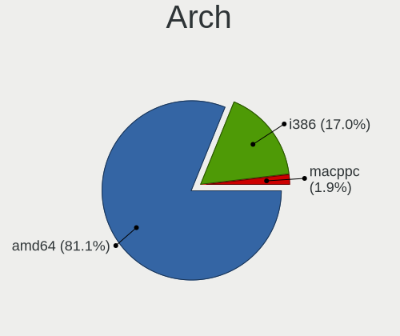

| Name   | Notebooks | Percent |
|--------|-----------|---------|
| amd64  | 41        | 80.39%  |
| i386   | 9         | 17.65%  |
| macppc | 1         | 1.96%   |

DE
--

Desktop Environment

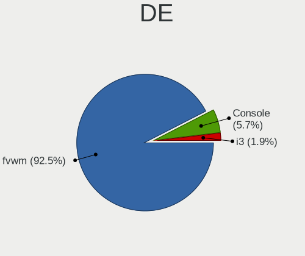

| Name    | Notebooks | Percent |
|---------|-----------|---------|
| fvwm    | 48        | 94.12%  |
| Console | 2         | 3.92%   |
| i3      | 1         | 1.96%   |

Display Server
--------------

X11 or Wayland

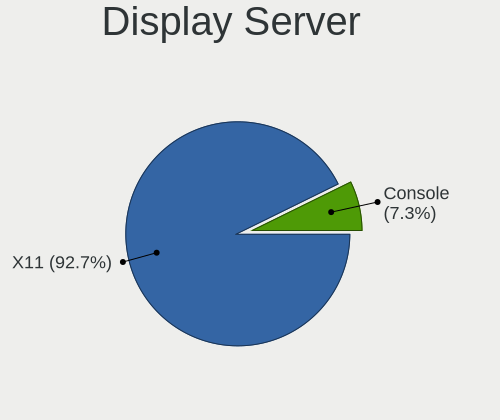

| Name    | Notebooks | Percent |
|---------|-----------|---------|
| X11     | 48        | 94.12%  |
| Console | 3         | 5.88%   |

Display Manager
---------------

SDDM, LightDM, etc.

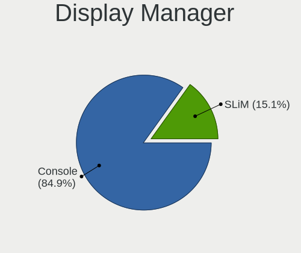

| Name    | Notebooks | Percent |
|---------|-----------|---------|
| Console | 43        | 84.31%  |
| SLiM    | 8         | 15.69%  |

OS Lang
-------

Language

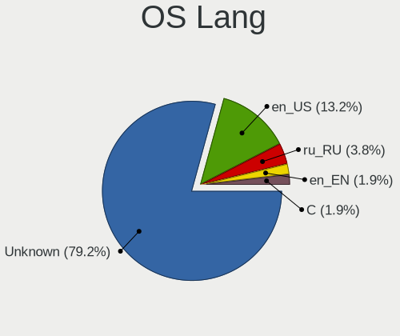

| Lang    | Notebooks | Percent |
|---------|-----------|---------|
| Unknown | 40        | 78.43%  |
| en_US   | 7         | 13.73%  |
| ru_RU   | 2         | 3.92%   |
| en_EN   | 1         | 1.96%   |
| C       | 1         | 1.96%   |

Boot Mode
---------

EFI or BIOS

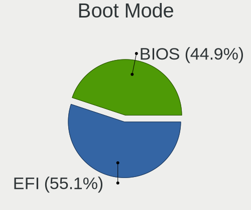

| Mode | Notebooks | Percent |
|------|-----------|---------|
| EFI  | 28        | 54.9%   |
| BIOS | 23        | 45.1%   |

Filesystem
----------

Type of filesystem

| Type | Notebooks | Percent |
|------|-----------|---------|
| Ffs  | 51        | 100%    |

Part. scheme
------------

Scheme of partitioning

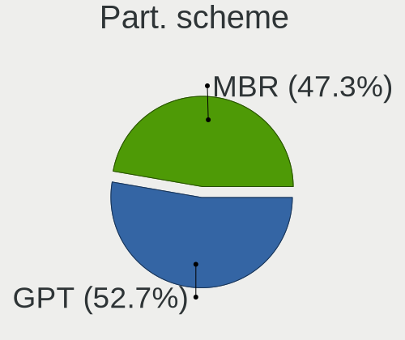

| Type | Notebooks | Percent |
|------|-----------|---------|
| GPT  | 28        | 54.9%   |
| MBR  | 23        | 45.1%   |

Board
-----

Vendor
------

Motherboard manufacturer

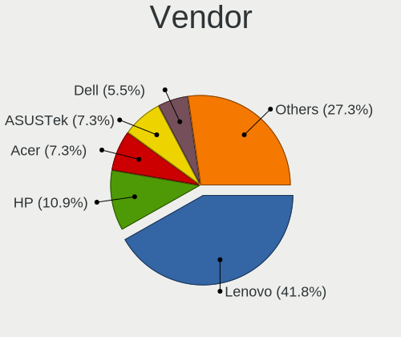

| Name                           | Notebooks | Percent |
|--------------------------------|-----------|---------|
| Lenovo                         | 23        | 45.1%   |
| Hewlett-Packard                | 5         | 9.8%    |
| Acer                           | 5         | 9.8%    |
| Apple                          | 3         | 5.88%   |
| Panasonic                      | 2         | 3.92%   |
| Matsushita Electric Industrial | 2         | 3.92%   |
| Dell                           | 2         | 3.92%   |
| ASUSTek Computer               | 2         | 3.92%   |
| Standard                       | 1         | 1.96%   |
| Sony                           | 1         | 1.96%   |
| Samsung Electronics            | 1         | 1.96%   |
| MSI                            | 1         | 1.96%   |
| IBM                            | 1         | 1.96%   |
| Clevo                          | 1         | 1.96%   |
| Unknown                        | 1         | 1.96%   |

Model
-----

Motherboard model

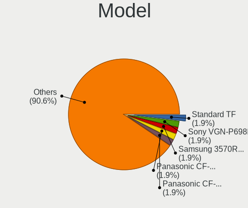

| Name                                        | Notebooks | Percent |
|---------------------------------------------|-----------|---------|
| Standard TF                                 | 1         | 1.96%   |
| Sony VGN-P698E                              | 1         | 1.96%   |
| Samsung 3570R/370R/470R/450R/510R/4450RV    | 1         | 1.96%   |
| Panasonic CF-53AAGHYDM                      | 1         | 1.96%   |
| Panasonic CF-52PFPBSFQ                      | 1         | 1.96%   |
| MSI MS-1613                                 | 1         | 1.96%   |
| Matsushita Electric Industrial CF-51RCVDNLM | 1         | 1.96%   |
| Matsushita Electric Industrial CF-48V4KNDQM | 1         | 1.96%   |
| Lenovo Yoga 6 13ARE05 82FN                  | 1         | 1.96%   |
| Lenovo Yoga 330-11IGM 81A6                  | 1         | 1.96%   |
| Lenovo ThinkPad X280 20KESA000B             | 1         | 1.96%   |
| Lenovo ThinkPad X270 20HNA006ID             | 1         | 1.96%   |
| Lenovo ThinkPad X250 20CM0046US             | 1         | 1.96%   |
| Lenovo ThinkPad X250 20CLS7WY04             | 1         | 1.96%   |
| Lenovo ThinkPad X230 232578G                | 1         | 1.96%   |
| Lenovo ThinkPad X220 4291ON5                | 1         | 1.96%   |
| Lenovo ThinkPad X1 Carbon 7th 20QD00KTMH    | 1         | 1.96%   |
| Lenovo ThinkPad T430 23511A6                | 1         | 1.96%   |
| Lenovo ThinkPad T430 2349U2B                | 1         | 1.96%   |
| Lenovo ThinkPad T430 2347GZU                | 1         | 1.96%   |
| Lenovo ThinkPad T420 4236MBG                | 1         | 1.96%   |
| Lenovo ThinkPad T410 2537N24                | 1         | 1.96%   |
| Lenovo ThinkPad T400 6475P1G                | 1         | 1.96%   |
| Lenovo ThinkPad T400 6475K43                | 1         | 1.96%   |
| Lenovo ThinkPad T400 2767WSB                | 1         | 1.96%   |
| Lenovo ThinkPad T14 Gen 1 20S1S07800        | 1         | 1.96%   |
| Lenovo ThinkPad Edge 05796AU                | 1         | 1.96%   |
| Lenovo ThinkPad E490 20N8CTO1WW             | 1         | 1.96%   |
| Lenovo IdeaPad S210 Touch 20257             | 1         | 1.96%   |
| Lenovo IdeaPad 1 11IGL05 81VT               | 1         | 1.96%   |
| Lenovo FLEX 3-1120 80LX                     | 1         | 1.96%   |
| IBM ThinkPad T42 2374K46                    | 1         | 1.96%   |
| HP ProBook 450 G2                           | 1         | 1.96%   |
| HP Pavilion Gaming Laptop 15-ec1xxx         | 1         | 1.96%   |
| HP Pavilion dm1                             | 1         | 1.96%   |
| HP Notebook                                 | 1         | 1.96%   |
| HP 530 Notebook PC(KP477AA#ACB)             | 1         | 1.96%   |
| Dell XPS 13 9360                            | 1         | 1.96%   |
| Dell Latitude E7270                         | 1         | 1.96%   |
| Clevo W240EU/W250EUQ/W270EUQ                | 1         | 1.96%   |
| ASUS UX430UNR                               | 1         | 1.96%   |
| ASUS 1000HE                                 | 1         | 1.96%   |
| Apple PowerBook5,2                          | 1         | 1.96%   |
| Apple MacBookPro6,2                         | 1         | 1.96%   |
| Apple MacBookAir6,2                         | 1         | 1.96%   |
| Acer Spin SP111-32N                         | 1         | 1.96%   |
| Acer Nitro AN515-52                         | 1         | 1.96%   |
| Acer Aspire ES1-132                         | 1         | 1.96%   |
| Acer AOA150                                 | 1         | 1.96%   |
| Acer AO531h                                 | 1         | 1.96%   |
| Unknown                                     | 1         | 1.96%   |

Model Family
------------

Motherboard model prefix

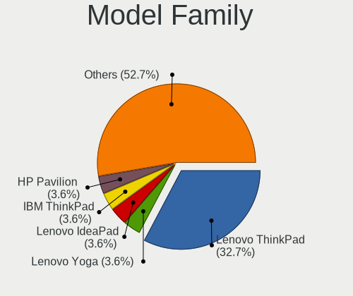

| Name                                        | Notebooks | Percent |
|---------------------------------------------|-----------|---------|
| Lenovo ThinkPad                             | 18        | 35.29%  |
| Lenovo Yoga                                 | 2         | 3.92%   |
| Lenovo IdeaPad                              | 2         | 3.92%   |
| HP Pavilion                                 | 2         | 3.92%   |
| Standard TF                                 | 1         | 1.96%   |
| Sony VGN-P698E                              | 1         | 1.96%   |
| Samsung 3570R                               | 1         | 1.96%   |
| Panasonic CF-53AAGHYDM                      | 1         | 1.96%   |
| Panasonic CF-52PFPBSFQ                      | 1         | 1.96%   |
| MSI MS-1613                                 | 1         | 1.96%   |
| Matsushita Electric Industrial CF-51RCVDNLM | 1         | 1.96%   |
| Matsushita Electric Industrial CF-48V4KNDQM | 1         | 1.96%   |
| Lenovo FLEX                                 | 1         | 1.96%   |
| IBM ThinkPad                                | 1         | 1.96%   |
| HP ProBook                                  | 1         | 1.96%   |
| HP Notebook                                 | 1         | 1.96%   |
| HP 530                                      | 1         | 1.96%   |
| Dell XPS                                    | 1         | 1.96%   |
| Dell Latitude                               | 1         | 1.96%   |
| Clevo W240EU                                | 1         | 1.96%   |
| ASUS UX430UNR                               | 1         | 1.96%   |
| ASUS 1000HE                                 | 1         | 1.96%   |
| Apple PowerBook5                            | 1         | 1.96%   |
| Apple MacBookPro6                           | 1         | 1.96%   |
| Apple MacBookAir6                           | 1         | 1.96%   |
| Acer Spin                                   | 1         | 1.96%   |
| Acer Nitro                                  | 1         | 1.96%   |
| Acer Aspire                                 | 1         | 1.96%   |
| Acer AOA150                                 | 1         | 1.96%   |
| Acer AO531h                                 | 1         | 1.96%   |
| Unknown                                     | 1         | 1.96%   |

MFG Year
--------

Motherboard manufacture year

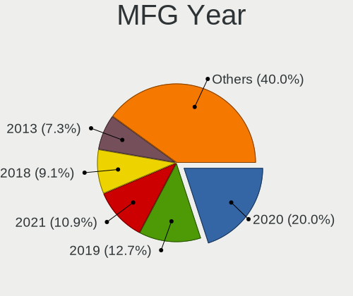

| Year    | Notebooks | Percent |
|---------|-----------|---------|
| 2020    | 10        | 19.61%  |
| 2019    | 6         | 11.76%  |
| 2018    | 6         | 11.76%  |
| 2021    | 5         | 9.8%    |
| 2013    | 4         | 7.84%   |
| 2008    | 3         | 5.88%   |
| 2017    | 2         | 3.92%   |
| 2012    | 2         | 3.92%   |
| 2011    | 2         | 3.92%   |
| 2010    | 2         | 3.92%   |
| 2009    | 2         | 3.92%   |
| 2006    | 2         | 3.92%   |
| Unknown | 2         | 3.92%   |
| 2015    | 1         | 1.96%   |
| 2014    | 1         | 1.96%   |
| 2002    | 1         | 1.96%   |

Form Factor
-----------

Physical design of the computer

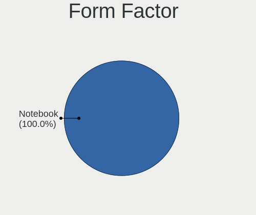

| Name     | Notebooks | Percent |
|----------|-----------|---------|
| Notebook | 51        | 100%    |

Coreboot
--------

Have coreboot on board

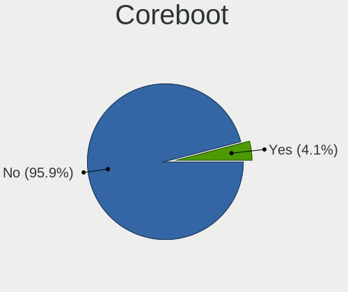

| Used | Notebooks | Percent |
|------|-----------|---------|
| No   | 49        | 96.08%  |
| Yes  | 2         | 3.92%   |

RAM Size
--------

Total RAM memory

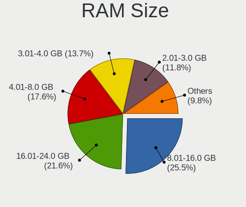

| Size in GB | Notebooks | Percent |
|------------|-----------|---------|
| 8.01-16.0  | 13        | 25.49%  |
| 16.01-24.0 | 11        | 21.57%  |
| 4.01-8.0   | 9         | 17.65%  |
| 3.01-4.0   | 7         | 13.73%  |
| 2.01-3.0   | 6         | 11.76%  |
| 0.51-1.0   | 3         | 5.88%   |
| 1.01-2.0   | 2         | 3.92%   |

RAM Used
--------

Used RAM memory

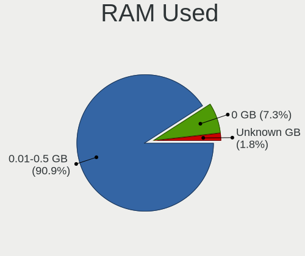

| Used GB  | Notebooks | Percent |
|----------|-----------|---------|
| 0.01-0.5 | 46        | 90.2%   |
| 0        | 4         | 7.84%   |
| Unknown  | 1         | 1.96%   |

Total Drives
------------

Number of drives on board

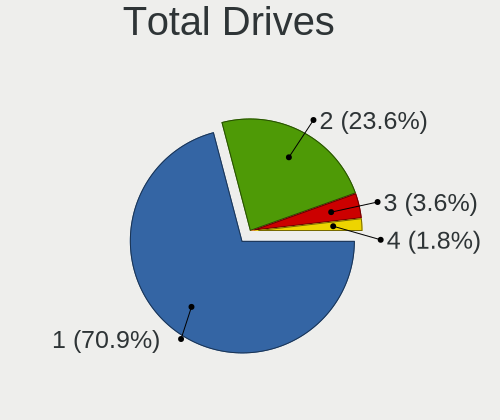

| Drives | Notebooks | Percent |
|--------|-----------|---------|
| 1      | 34        | 66.67%  |
| 2      | 14        | 27.45%  |
| 3      | 2         | 3.92%   |
| 4      | 1         | 1.96%   |

Has CD-ROM
----------

Has CD-ROM on board

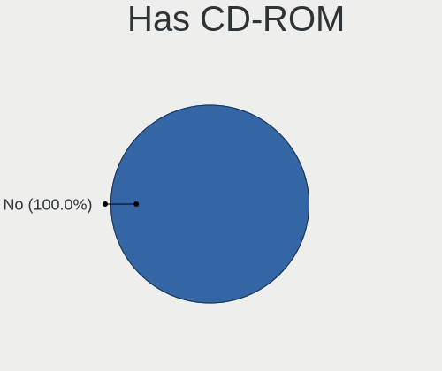

| Presented | Notebooks | Percent |
|-----------|-----------|---------|
| No        | 51        | 100%    |

Has Ethernet
------------

Has Ethernet on board

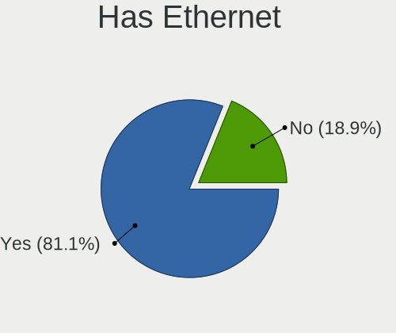

| Presented | Notebooks | Percent |
|-----------|-----------|---------|
| Yes       | 42        | 82.35%  |
| No        | 9         | 17.65%  |

Has WiFi
--------

Has WiFi module

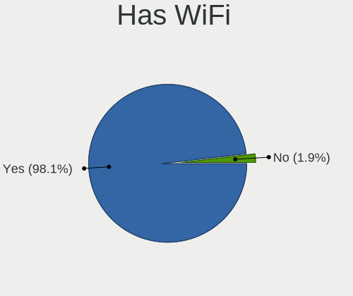

| Presented | Notebooks | Percent |
|-----------|-----------|---------|
| Yes       | 50        | 98.04%  |
| No        | 1         | 1.96%   |

Has Bluetooth
-------------

Has Bluetooth module

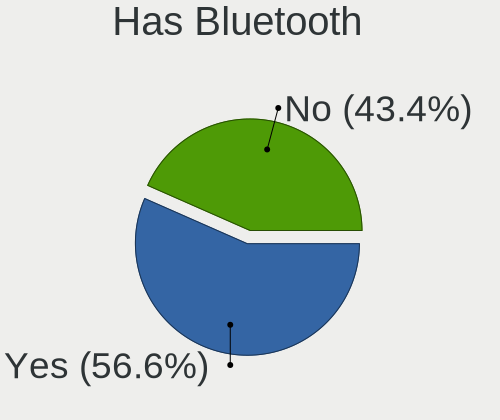

| Presented | Notebooks | Percent |
|-----------|-----------|---------|
| Yes       | 28        | 54.9%   |
| No        | 23        | 45.1%   |

Location
--------

Country
-------

Geographic location (country)

| Country      | Notebooks | Percent |
|--------------|-----------|---------|
| USA          | 12        | 23.53%  |
| Canada       | 9         | 17.65%  |
| Germany      | 5         | 9.8%    |
| France       | 3         | 5.88%   |
| Ukraine      | 2         | 3.92%   |
| Sweden       | 2         | 3.92%   |
| Russia       | 2         | 3.92%   |
| Portugal     | 2         | 3.92%   |
| Netherlands  | 2         | 3.92%   |
| Latvia       | 2         | 3.92%   |
| UK           | 1         | 1.96%   |
| Turkey       | 1         | 1.96%   |
| Spain        | 1         | 1.96%   |
| Saudi Arabia | 1         | 1.96%   |
| Philippines  | 1         | 1.96%   |
| Norway       | 1         | 1.96%   |
| Malaysia     | 1         | 1.96%   |
| Indonesia    | 1         | 1.96%   |
| Chile        | 1         | 1.96%   |
| Brazil       | 1         | 1.96%   |

City
----

Geographic location (city)

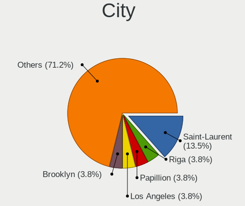

| City              | Notebooks | Percent |
|-------------------|-----------|---------|
| Saint-Laurent     | 7         | 13.46%  |
| Riga              | 2         | 3.85%   |
| Papillion         | 2         | 3.85%   |
| Los Angeles       | 2         | 3.85%   |
| Brooklyn          | 2         | 3.85%   |
| 's-Hertogenbosch  | 2         | 3.85%   |
| Yekaterinburg     | 1         | 1.92%   |
| Watford           | 1         | 1.92%   |
| Victoria          | 1         | 1.92%   |
| Valdivia          | 1         | 1.92%   |
| Vacaville         | 1         | 1.92%   |
| Teriang           | 1         | 1.92%   |
| São Paulo        | 1         | 1.92%   |
| Surabaya          | 1         | 1.92%   |
| Spokane           | 1         | 1.92%   |
| Solna             | 1         | 1.92%   |
| Sechelt           | 1         | 1.92%   |
| Roseville         | 1         | 1.92%   |
| Rodgau            | 1         | 1.92%   |
| Riyadh            | 1         | 1.92%   |
| Quezon City       | 1         | 1.92%   |
| Oeiras            | 1         | 1.92%   |
| Neuilly-sur-Marne | 1         | 1.92%   |
| McLeod            | 1         | 1.92%   |
| Madrid            | 1         | 1.92%   |
| Kyiv              | 1         | 1.92%   |
| Korolyov          | 1         | 1.92%   |
| Hoeviksnaes       | 1         | 1.92%   |
| Hockenheim        | 1         | 1.92%   |
| Greensburg        | 1         | 1.92%   |
| Frankfurt am Main | 1         | 1.92%   |
| Estoril           | 1         | 1.92%   |
| Donetsk           | 1         | 1.92%   |
| Corbarieu         | 1         | 1.92%   |
| Commack           | 1         | 1.92%   |
| Clearwater        | 1         | 1.92%   |
| Bordeaux          | 1         | 1.92%   |
| Bielefeld         | 1         | 1.92%   |
| Arendal           | 1         | 1.92%   |
| Ankara            | 1         | 1.92%   |
| Aachen            | 1         | 1.92%   |

Drives
------

Drive Vendor
------------

Hard drive vendors

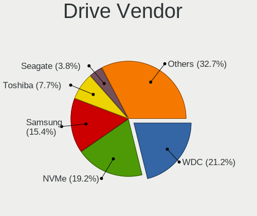

| Vendor              | Notebooks | Drives | Percent |
|---------------------|-----------|--------|---------|
| WDC                 | 11        | 11     | 21.15%  |
| NVMe                | 10        | 11     | 19.23%  |
| Samsung Electronics | 8         | 9      | 15.38%  |
| Toshiba             | 4         | 4      | 7.69%   |
| SK Hynix            | 2         | 2      | 3.85%   |
| Seagate             | 2         | 2      | 3.85%   |
| SanDisk             | 2         | 2      | 3.85%   |
| Kingston            | 2         | 2      | 3.85%   |
| Crucial             | 2         | 2      | 3.85%   |
| Zheino              | 1         | 1      | 1.92%   |
| Team                | 1         | 1      | 1.92%   |
| SPCC                | 1         | 1      | 1.92%   |
| Patriot             | 1         | 1      | 1.92%   |
| Hitachi             | 1         | 1      | 1.92%   |
| HGST                | 1         | 1      | 1.92%   |
| Fujitsu             | 1         | 1      | 1.92%   |
| Apple               | 1         | 1      | 1.92%   |
| A-DATA Technology   | 1         | 1      | 1.92%   |

Drive Model
-----------

Hard drive models

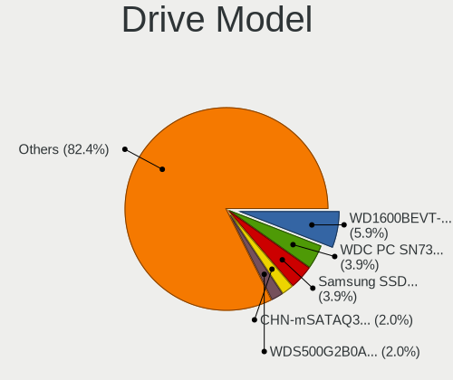

| Model                             | Notebooks | Percent |
|-----------------------------------|-----------|---------|
| WDC WD1600BEVT-22ZCT0 160GB       | 3         | 5.66%   |
| NVMe WDC PC SN730 SDB 1TB         | 2         | 3.77%   |
| NVMe Samsung SSD 960 500GB        | 2         | 3.77%   |
| Zheino CHN-mSATAQ3-120 120GB      | 1         | 1.89%   |
| WDC WDS500G2B0A-00SM50 500GB      | 1         | 1.89%   |
| WDC WD7500BPKX-00HPJT0 752GB      | 1         | 1.89%   |
| WDC WD7500BPKT-00PK4T0 752GB      | 1         | 1.89%   |
| WDC WD5000LPLX-00ZNTT0 500GB      | 1         | 1.89%   |
| WDC WD5000LPCX-24C6HT0 500GB      | 1         | 1.89%   |
| WDC WD3200BEVE-00A0HT0 320GB      | 1         | 1.89%   |
| WDC WD3200BEKT-08PVMT1 320GB      | 1         | 1.89%   |
| WDC WD10JPLX-00MBPT0 1TB          | 1         | 1.89%   |
| Toshiba MQ04ABF100 1TB            | 1         | 1.89%   |
| Toshiba MK8025GAS 80GB            | 1         | 1.89%   |
| Toshiba MK3256GSY 320GB           | 1         | 1.89%   |
| Toshiba MK1665GSX 160GB           | 1         | 1.89%   |
| Team T253X2001T 1TB               | 1         | 1.89%   |
| SPCC Solid State Disk 128GB       | 1         | 1.89%   |
| SK Hynix SC311 SATA 256GB         | 1         | 1.89%   |
| SK Hynix HFS128G39TND-N210A 128GB | 1         | 1.89%   |
| Seagate ST9160821A 160GB          | 1         | 1.89%   |
| Seagate ST500LT012-9WS142 500GB   | 1         | 1.89%   |
| SanDisk Ultra Fit 16GB            | 1         | 1.89%   |
| SanDisk SSD PLUS 120GB            | 1         | 1.89%   |
| Samsung SSD 860 PRO 256GB         | 1         | 1.89%   |
| Samsung SSD 860 EVO 1TB           | 1         | 1.89%   |
| Samsung SSD 850 PRO 256GB         | 1         | 1.89%   |
| Samsung SSD 850 EVO 500GB         | 1         | 1.89%   |
| Samsung SSD 850 EVO 250GB         | 1         | 1.89%   |
| Samsung SSD 840 Series 120GB      | 1         | 1.89%   |
| Samsung MZ7TD256HAFV-000L7 256GB  | 1         | 1.89%   |
| Samsung MMCQE28GFMUP-MVA 128GB    | 1         | 1.89%   |
| Samsung 870 QVO 8TB               | 1         | 1.89%   |
| Patriot Burst 480GB               | 1         | 1.89%   |
| NVMe SKHynix_HFM256GD 256GB       | 1         | 1.89%   |
| NVMe SAMSUNG MZVLB256 256GB       | 1         | 1.89%   |
| NVMe SAMSUNG MZVLB1T0 1TB         | 1         | 1.89%   |
| NVMe KBG40ZNV512G KIO 512GB       | 1         | 1.89%   |
| NVMe INTEL SSDPEKKF25 256GB       | 1         | 1.89%   |
| NVMe Force MP510 960GB            | 1         | 1.89%   |
| Kingston SA400S37480G 480GB       | 1         | 1.89%   |
| Kingston SA400S37240G 240GB       | 1         | 1.89%   |
| Hitachi HCC545016B9A300 160GB     | 1         | 1.89%   |
| HGST HTE725032A7E630 320GB        | 1         | 1.89%   |
| Fujitsu MHV2100BH PL 100GB        | 1         | 1.89%   |
| Crucial CT960BX500SSD1 960GB      | 1         | 1.89%   |
| Crucial CT500MX500SSD1 500GB      | 1         | 1.89%   |
| Apple SSD SD0128F 121GB           | 1         | 1.89%   |
| A-DATA SP550 480GB                | 1         | 1.89%   |

HDD Vendor
----------

Hard disk drive vendors

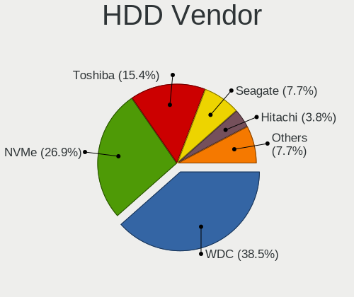

| Vendor  | Notebooks | Drives | Percent |
|---------|-----------|--------|---------|
| WDC     | 10        | 10     | 38.46%  |
| NVMe    | 7         | 8      | 26.92%  |
| Toshiba | 4         | 4      | 15.38%  |
| Seagate | 2         | 2      | 7.69%   |
| Hitachi | 1         | 1      | 3.85%   |
| HGST    | 1         | 1      | 3.85%   |
| Fujitsu | 1         | 1      | 3.85%   |

SSD Vendor
----------

Solid state drive vendors

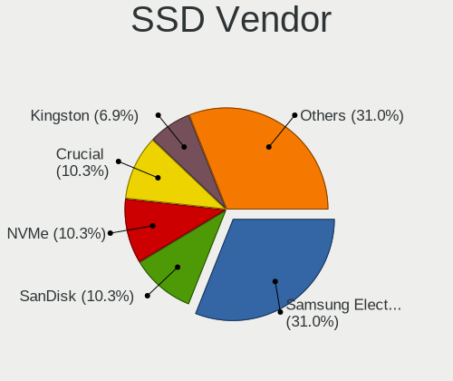

| Vendor              | Notebooks | Drives | Percent |
|---------------------|-----------|--------|---------|
| Samsung Electronics | 8         | 9      | 30.77%  |
| NVMe                | 3         | 3      | 11.54%  |
| SK Hynix            | 2         | 2      | 7.69%   |
| SanDisk             | 2         | 2      | 7.69%   |
| Kingston            | 2         | 2      | 7.69%   |
| Crucial             | 2         | 2      | 7.69%   |
| Zheino              | 1         | 1      | 3.85%   |
| WDC                 | 1         | 1      | 3.85%   |
| Team                | 1         | 1      | 3.85%   |
| SPCC                | 1         | 1      | 3.85%   |
| Patriot             | 1         | 1      | 3.85%   |
| Apple               | 1         | 1      | 3.85%   |
| A-DATA Technology   | 1         | 1      | 3.85%   |

Drive Kind
----------

HDD or SSD

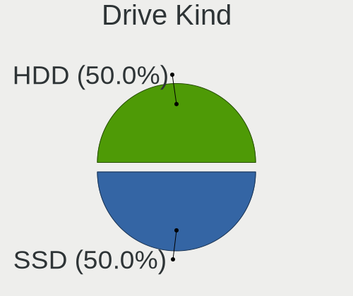

| Kind | Notebooks | Drives | Percent |
|------|-----------|--------|---------|
| SSD  | 26        | 27     | 50%     |
| HDD  | 26        | 27     | 50%     |

Drive Connector
---------------

SATA, SAS, NVMe, etc.

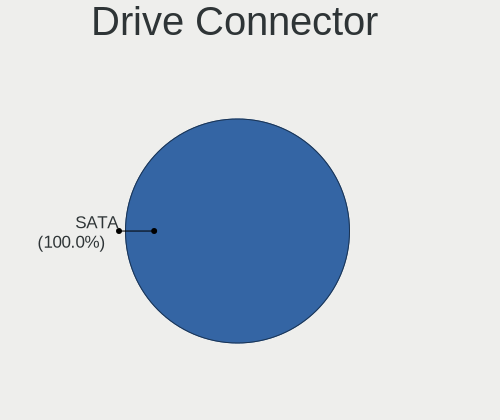

| Type | Notebooks | Drives | Percent |
|------|-----------|--------|---------|
| SATA | 48        | 54     | 100%    |

Drive Size
----------

Size of hard drive

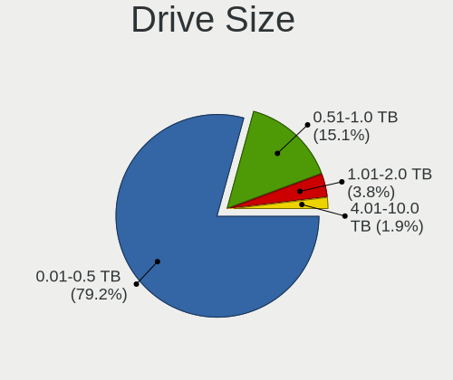

| Size in TB | Notebooks | Drives | Percent |
|------------|-----------|--------|---------|
| 0.01-0.5   | 37        | 40     | 74%     |
| 0.51-1.0   | 8         | 8      | 16%     |
| 1.01-2.0   | 4         | 5      | 8%      |
| 4.01-10.0  | 1         | 1      | 2%      |

Space Total
-----------

Amount of disk space available on the file system

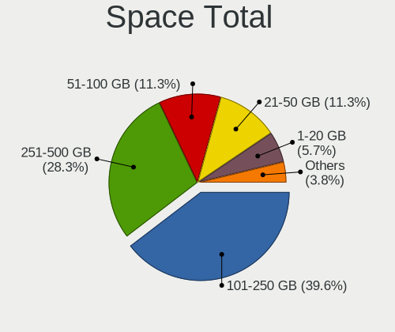

| Size in GB | Notebooks | Percent |
|------------|-----------|---------|
| 101-250    | 20        | 39.22%  |
| 251-500    | 14        | 27.45%  |
| 21-50      | 6         | 11.76%  |
| 51-100     | 6         | 11.76%  |
| 1-20       | 3         | 5.88%   |
| 501-1000   | 2         | 3.92%   |

Space Used
----------

Amount of used disk space

| Used GB | Notebooks | Percent |
|---------|-----------|---------|
| 1-20    | 40        | 78.43%  |
| 51-100  | 5         | 9.8%    |
| 101-250 | 3         | 5.88%   |
| 21-50   | 2         | 3.92%   |
| 251-500 | 1         | 1.96%   |

Malfunc. Drives
---------------

Drive models with a malfunction

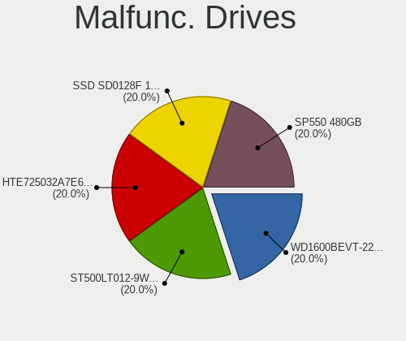

| Model                           | Notebooks | Drives | Percent |
|---------------------------------|-----------|--------|---------|
| WDC WD1600BEVT-22ZCT0 160GB     | 1         | 1      | 20%     |
| Seagate ST500LT012-9WS142 500GB | 1         | 1      | 20%     |
| HGST HTE725032A7E630 320GB      | 1         | 1      | 20%     |
| Apple SSD SD0128F 121GB         | 1         | 1      | 20%     |
| A-DATA Technology SP550 480GB   | 1         | 1      | 20%     |

Malfunc. Drive Vendor
---------------------

Vendors of faulty drives

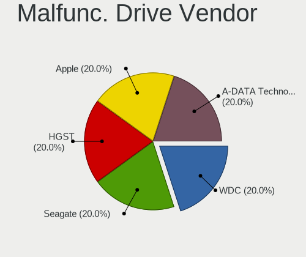

| Vendor            | Notebooks | Drives | Percent |
|-------------------|-----------|--------|---------|
| WDC               | 1         | 1      | 20%     |
| Seagate           | 1         | 1      | 20%     |
| HGST              | 1         | 1      | 20%     |
| Apple             | 1         | 1      | 20%     |
| A-DATA Technology | 1         | 1      | 20%     |

Malfunc. HDD Vendor
-------------------

Vendors of faulty HDD drives

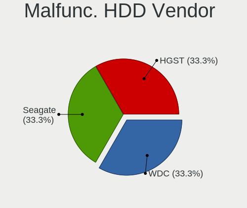

| Vendor  | Notebooks | Drives | Percent |
|---------|-----------|--------|---------|
| WDC     | 1         | 1      | 33.33%  |
| Seagate | 1         | 1      | 33.33%  |
| HGST    | 1         | 1      | 33.33%  |

Malfunc. Drive Kind
-------------------

Kinds of faulty drives

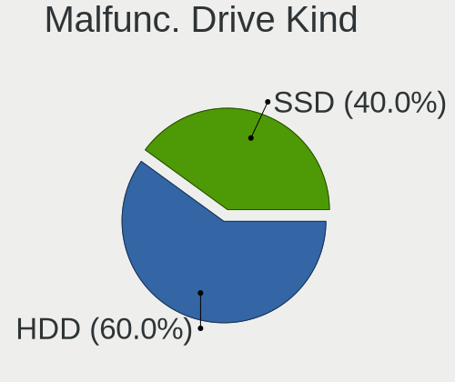

| Kind | Notebooks | Drives | Percent |
|------|-----------|--------|---------|
| HDD  | 3         | 3      | 60%     |
| SSD  | 2         | 2      | 40%     |

Failed Drives
-------------

Failed drive models

Zero info for selected period =(

Failed Drive Vendor
-------------------

Failed drive vendors

Zero info for selected period =(

Drive Status
------------

Number of failed and malfunc. drives

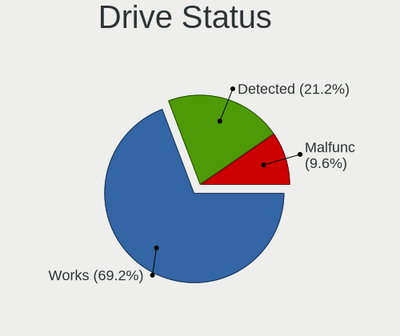

| Status   | Notebooks | Drives | Percent |
|----------|-----------|--------|---------|
| Works    | 35        | 38     | 70%     |
| Detected | 10        | 11     | 20%     |
| Malfunc  | 5         | 5      | 10%     |

Storage controller
------------------

Storage Vendor
--------------

Storage controller vendors

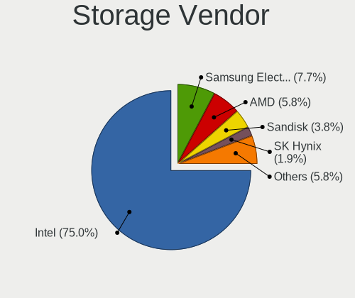

| Vendor                   | Notebooks | Percent |
|--------------------------|-----------|---------|
| Intel                    | 39        | 75%     |
| Samsung Electronics      | 4         | 7.69%   |
| AMD                      | 3         | 5.77%   |
| Sandisk                  | 2         | 3.85%   |
| SK Hynix                 | 1         | 1.92%   |
| Phison Electronics       | 1         | 1.92%   |
| Marvell Technology Group | 1         | 1.92%   |
| KIOXIA                   | 1         | 1.92%   |

Storage Model
-------------

Storage controller models

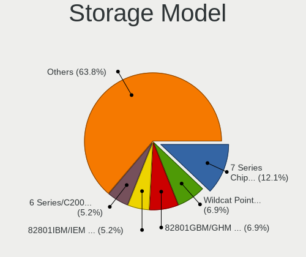

| Model                                                                        | Notebooks | Percent |
|------------------------------------------------------------------------------|-----------|---------|
| Intel 7 Series Chipset Family 6-port SATA Controller [AHCI mode]             | 7         | 12.5%   |
| Intel 82801GBM/GHM (ICH7-M Family) SATA Controller [IDE mode]                | 4         | 7.14%   |
| Intel Wildcat Point-LP SATA Controller [AHCI Mode]                           | 3         | 5.36%   |
| Intel 82801IBM/IEM (ICH9M/ICH9M-E) 4 port SATA Controller [AHCI mode]        | 3         | 5.36%   |
| Intel 6 Series/C200 Series Chipset Family 6 port Mobile SATA AHCI Controller | 3         | 5.36%   |
| Sandisk WD Black SN750 / PC SN730 NVMe SSD                                   | 2         | 3.57%   |
| Samsung NVMe SSD Controller SM981/PM981/PM983                                | 2         | 3.57%   |
| Samsung NVMe SSD Controller SM961/PM961/SM963                                | 2         | 3.57%   |
| Intel Sunrise Point-LP SATA Controller [AHCI mode]                           | 2         | 3.57%   |
| Intel Celeron N3350/Pentium N4200/Atom E3900 Series SATA AHCI Controller     | 2         | 3.57%   |
| Intel 82801GBM/GHM (ICH7-M Family) SATA Controller [AHCI mode]               | 2         | 3.57%   |
| Intel 82801G (ICH7 Family) IDE Controller                                    | 2         | 3.57%   |
| Intel 5 Series/3400 Series Chipset 6 port SATA AHCI Controller               | 2         | 3.57%   |
| Intel 5 Series/3400 Series Chipset 4 port SATA AHCI Controller               | 2         | 3.57%   |
| AMD FCH SATA Controller [AHCI mode]                                          | 2         | 3.57%   |
| SK Hynix BC511                                                               | 1         | 1.79%   |
| Phison E12 NVMe Controller                                                   | 1         | 1.79%   |
| Marvell Group 88SS9183 PCIe SSD Controller                                   | 1         | 1.79%   |
| KIOXIA unknown                                                               | 1         | 1.79%   |
| Intel US15W/US15X/US15L/UL11L SCH [Poulsbo] IDE Controller                   | 1         | 1.79%   |
| Intel SSD Pro 7600p/760p/E 6100p Series                                      | 1         | 1.79%   |
| Intel Celeron/Pentium Silver Processor SATA Controller                       | 1         | 1.79%   |
| Intel Cannon Point-LP SATA Controller [AHCI Mode]                            | 1         | 1.79%   |
| Intel Cannon Lake Mobile PCH SATA AHCI Controller                            | 1         | 1.79%   |
| Intel Atom Processor E3800 Series SATA AHCI Controller                       | 1         | 1.79%   |
| Intel 82801DBM (ICH4-M) IDE Controller                                       | 1         | 1.79%   |
| Intel 82801CAM IDE U100 Controller                                           | 1         | 1.79%   |
| Intel 8 Series SATA Controller 1 [AHCI mode]                                 | 1         | 1.79%   |
| Intel 7 Series/C210 Series Chipset Family IDE-r Controller                   | 1         | 1.79%   |
| Intel 6 Series/C200 Series Chipset Family IDE-r Controller                   | 1         | 1.79%   |
| AMD SB7x0/SB8x0/SB9x0 SATA Controller [AHCI mode]                            | 1         | 1.79%   |

Storage Kind
------------

Kind of storage controller (IDE, SATA, NVMe, SAS, ...)

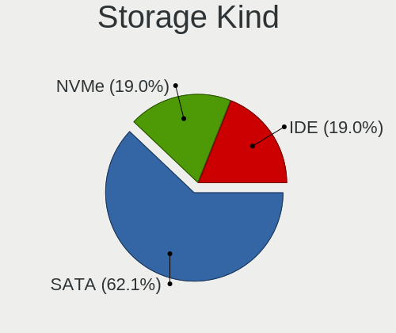

| Kind | Notebooks | Percent |
|------|-----------|---------|
| SATA | 35        | 62.5%   |
| IDE  | 11        | 19.64%  |
| NVMe | 10        | 17.86%  |

Processor
---------

CPU Vendor
----------

Processor vendors

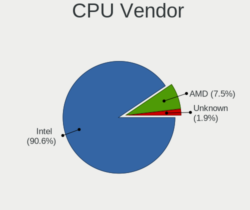

| Vendor  | Notebooks | Percent |
|---------|-----------|---------|
| Intel   | 46        | 90.2%   |
| AMD     | 4         | 7.84%   |
| Unknown | 1         | 1.96%   |

CPU Model
---------

Processor models

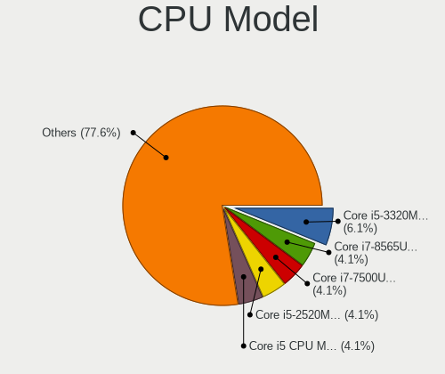

| Model                                                         | Notebooks | Percent |
|---------------------------------------------------------------|-----------|---------|
| Intel Core i5-3320M CPU @ 2.60GHz                             | 3         | 5.88%   |
| Intel Core i7-8565U CPU @ 1.80GHz                             | 2         | 3.92%   |
| Intel Core i7-7500U CPU @ 2.70GHz                             | 2         | 3.92%   |
| Intel Core i5-5300U CPU @ 2.30GHz                             | 2         | 3.92%   |
| Intel Core i5-2520M CPU @ 2.50GHz                             | 2         | 3.92%   |
| Intel Core i5 CPU M 520 @ 2.40GHz                             | 2         | 3.92%   |
| Intel Atom CPU N270 @ 1.60GHz ("GenuineIntel" 686-class)      | 2         | 3.92%   |
| Intel Pentium Silver N5000 CPU @ 1.10GHz                      | 1         | 1.96%   |
| Intel Pentium M processor 2.00GHz ("GenuineIntel" 686-class)  | 1         | 1.96%   |
| Intel Pentium CPU N4200 @ 1.10GHz                             | 1         | 1.96%   |
| Intel Pentium 4 Mobile CPU 1.60GHz ("GenuineIntel" 686-class) | 1         | 1.96%   |
| Intel CPU T2300 @ 1.66GHz ("GenuineIntel" 686-class)          | 1         | 1.96%   |
| Intel Core i7-8750H CPU @ 2.20GHz                             | 1         | 1.96%   |
| Intel Core i7-8550U CPU @ 1.80GHz                             | 1         | 1.96%   |
| Intel Core i7-3520M CPU @ 2.90GHz                             | 1         | 1.96%   |
| Intel Core i7-10510U CPU @ 1.80GHz                            | 1         | 1.96%   |
| Intel Core i7 CPU M 620 @ 2.67GHz                             | 1         | 1.96%   |
| Intel Core i5-8350U CPU @ 1.70GHz                             | 1         | 1.96%   |
| Intel Core i5-8265U CPU @ 1.60GHz                             | 1         | 1.96%   |
| Intel Core i5-6300U CPU @ 2.40GHz                             | 1         | 1.96%   |
| Intel Core i5-4250U CPU @ 1.30GHz                             | 1         | 1.96%   |
| Intel Core i5-3230M CPU @ 2.60GHz                             | 1         | 1.96%   |
| Intel Core i5-2540M CPU @ 2.60GHz                             | 1         | 1.96%   |
| Intel Core i3-5005U CPU @ 2.00GHz                             | 1         | 1.96%   |
| Intel Core i3-4005U CPU @ 1.70GHz                             | 1         | 1.96%   |
| Intel Core i3-3130M CPU @ 2.60GHz                             | 1         | 1.96%   |
| Intel Core i3-2375M CPU @ 1.50GHz                             | 1         | 1.96%   |
| Intel Core i3 CPU M 380 @ 2.53GHz                             | 1         | 1.96%   |
| Intel Core Duo CPU T2600 @ 2.16GHz ("GenuineIntel" 686-class) | 1         | 1.96%   |
| Intel Core 2 Duo CPU T9900 @ 3.06GHz                          | 1         | 1.96%   |
| Intel Core 2 Duo CPU T9400 @ 2.53GHz                          | 1         | 1.96%   |
| Intel Core 2 Duo CPU P9700 @ 2.80GHz                          | 1         | 1.96%   |
| Intel Celeron N4020 CPU @ 1.10GHz                             | 1         | 1.96%   |
| Intel Celeron M CPU 430 @ 1.73GHz ("GenuineIntel" 686-class)  | 1         | 1.96%   |
| Intel Celeron CPU N3350 @ 1.10GHz                             | 1         | 1.96%   |
| Intel Celeron CPU N2840 @ 2.16GHz                             | 1         | 1.96%   |
| Intel Atom CPU Z530 @ 1.60GHz ("GenuineIntel" 686-class)      | 1         | 1.96%   |
| Intel Atom CPU N280 @ 1.66GHz ("GenuineIntel" 686-class)      | 1         | 1.96%   |
| AMD Ryzen 7 4800H with Radeon Graphics                        | 1         | 1.96%   |
| AMD Ryzen 5 PRO 4650U with Radeon Graphics                    | 1         | 1.96%   |
| AMD Ryzen 5 4600H with Radeon Graphics                        | 1         | 1.96%   |
| AMD Athlon II Neo K325 Dual-Core Processor                    | 1         | 1.96%   |
|                                                               | 1         | 1.96%   |

CPU Model Family
----------------

Processor model prefix

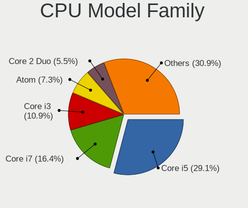

| Model                | Notebooks | Percent |
|----------------------|-----------|---------|
| Intel Core i5        | 15        | 29.41%  |
| Intel Core i7        | 9         | 17.65%  |
| Intel Core i3        | 5         | 9.8%    |
| Intel Atom           | 4         | 7.84%   |
| Intel Core 2 Duo     | 3         | 5.88%   |
| Intel Celeron        | 3         | 5.88%   |
| Other                | 2         | 3.92%   |
| Intel Pentium Silver | 1         | 1.96%   |
| Intel Pentium M      | 1         | 1.96%   |
| Intel Pentium 4      | 1         | 1.96%   |
| Intel Pentium        | 1         | 1.96%   |
| Intel Core Duo       | 1         | 1.96%   |
| Intel Celeron M      | 1         | 1.96%   |
| AMD Ryzen 7          | 1         | 1.96%   |
| AMD Ryzen 5 PRO      | 1         | 1.96%   |
| AMD Ryzen 5          | 1         | 1.96%   |
| AMD Athlon II Neo    | 1         | 1.96%   |

CPU Cores
---------

Number of processor cores

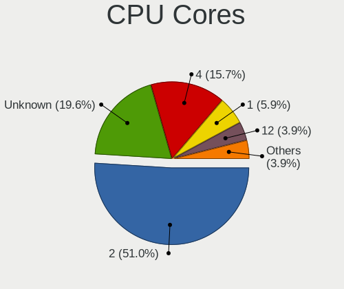

| Number  | Notebooks | Percent |
|---------|-----------|---------|
| 2       | 26        | 50.98%  |
| Unknown | 10        | 19.61%  |
| 4       | 8         | 15.69%  |
| 1       | 3         | 5.88%   |
| 12      | 2         | 3.92%   |
| 16      | 1         | 1.96%   |
| 6       | 1         | 1.96%   |

CPU Sockets
-----------

Number of sockets

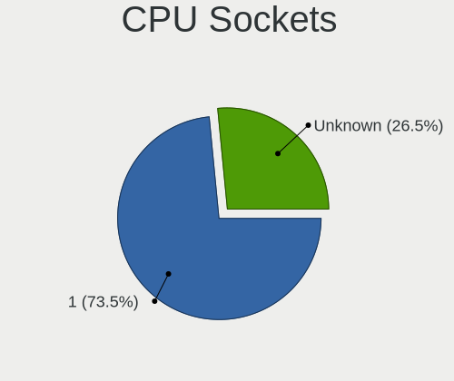

| Number  | Notebooks | Percent |
|---------|-----------|---------|
| 1       | 38        | 74.51%  |
| Unknown | 13        | 25.49%  |

CPU Threads
-----------

Threads per core (Hyper-Threading)

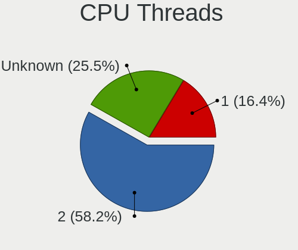

| Number  | Notebooks | Percent |
|---------|-----------|---------|
| 2       | 29        | 56.86%  |
| Unknown | 13        | 25.49%  |
| 1       | 9         | 17.65%  |

CPU Microarch
-------------

Microarchitecture

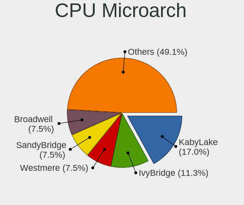

| Name          | Notebooks | Percent |
|---------------|-----------|---------|
| KabyLake      | 9         | 17.65%  |
| IvyBridge     | 6         | 11.76%  |
| Westmere      | 4         | 7.84%   |
| SandyBridge   | 4         | 7.84%   |
| Bonnell       | 4         | 7.84%   |
| Zen 2         | 3         | 5.88%   |
| Penryn        | 3         | 5.88%   |
| P6            | 3         | 5.88%   |
| Broadwell     | 3         | 5.88%   |
| Unknown       | 3         | 5.88%   |
| Haswell       | 2         | 3.92%   |
| Goldmont plus | 2         | 3.92%   |
| Goldmont      | 2         | 3.92%   |
| Skylake       | 1         | 1.96%   |
| Silvermont    | 1         | 1.96%   |
| K10           | 1         | 1.96%   |

Graphics
--------

GPU Vendor
----------

Vendors of graphics cards

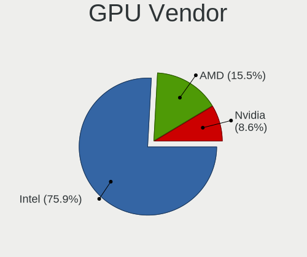

| Vendor | Notebooks | Percent |
|--------|-----------|---------|
| Intel  | 44        | 75.86%  |
| AMD    | 9         | 15.52%  |
| Nvidia | 5         | 8.62%   |

GPU Model
---------

Graphics card models

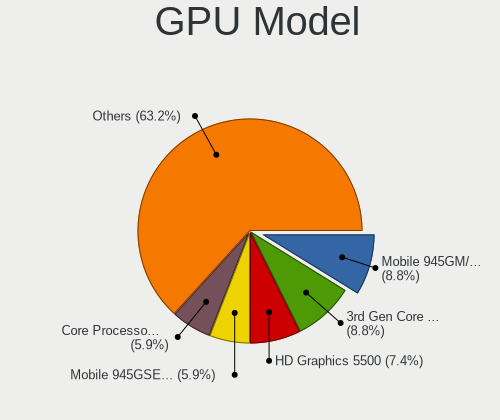

| Model                                                                              | Notebooks | Percent |
|------------------------------------------------------------------------------------|-----------|---------|
| Intel Mobile 945GM/GMS/GME, 943/940GML Express Integrated Graphics Controller      | 6         | 9.38%   |
| Intel 3rd Gen Core processor Graphics Controller                                   | 6         | 9.38%   |
| Intel Mobile 945GSE Express Integrated Graphics Controller                         | 4         | 6.25%   |
| Intel Core Processor Integrated Graphics Controller                                | 4         | 6.25%   |
| Intel 2nd Generation Core Processor Family Integrated Graphics Controller          | 4         | 6.25%   |
| Intel WhiskeyLake-U GT2 [UHD Graphics 620]                                         | 3         | 4.69%   |
| Intel Mobile 4 Series Chipset Integrated Graphics Controller                       | 3         | 4.69%   |
| Intel HD Graphics 5500                                                             | 3         | 4.69%   |
| AMD Renoir                                                                         | 3         | 4.69%   |
| Intel UHD Graphics 620                                                             | 2         | 3.13%   |
| Intel Mobile 945GM/GMS, 943/940GML Express Integrated Graphics Controller          | 2         | 3.13%   |
| Intel HD Graphics 620                                                              | 2         | 3.13%   |
| Intel Haswell-ULT Integrated Graphics Controller                                   | 2         | 3.13%   |
| AMD RV200/M7 [Mobility Radeon 7500]                                                | 2         | 3.13%   |
| Nvidia TU117M                                                                      | 1         | 1.56%   |
| Nvidia GT216M [GeForce GT 330M]                                                    | 1         | 1.56%   |
| Nvidia GP108M [GeForce MX330]                                                      | 1         | 1.56%   |
| Nvidia GP108M [GeForce MX150]                                                      | 1         | 1.56%   |
| Nvidia GP107M [GeForce GTX 1050 Mobile]                                            | 1         | 1.56%   |
| Intel US15W/US15X SCH [Poulsbo] Graphics Controller                                | 1         | 1.56%   |
| Intel Skylake GT2 [HD Graphics 520]                                                | 1         | 1.56%   |
| Intel HD Graphics 500                                                              | 1         | 1.56%   |
| Intel GeminiLake [UHD Graphics 605]                                                | 1         | 1.56%   |
| Intel GeminiLake [UHD Graphics 600]                                                | 1         | 1.56%   |
| Intel CometLake-U GT2 [UHD Graphics]                                               | 1         | 1.56%   |
| Intel CoffeeLake-H GT2 [UHD Graphics 630]                                          | 1         | 1.56%   |
| Intel Celeron N3350/Pentium N4200/Atom E3900 Series Integrated Graphics Controller | 1         | 1.56%   |
| Intel Atom Processor Z36xxx/Z37xxx Series Graphics & Display                       | 1         | 1.56%   |
| AMD RV350/M10 / RV360/M11 [Mobility Radeon 9600 (PRO) / 9700]                      | 1         | 1.56%   |
| AMD RS880M [Mobility Radeon HD 4225/4250]                                          | 1         | 1.56%   |
| AMD Mars [Radeon HD 8670A/8670M/8750M / R7 M370]                                   | 1         | 1.56%   |
| AMD Lexa PRO [Radeon 540/540X/550/550X / RX 540X/550/550X]                         | 1         | 1.56%   |

GPU Combo
---------

Combinations of graphics cards

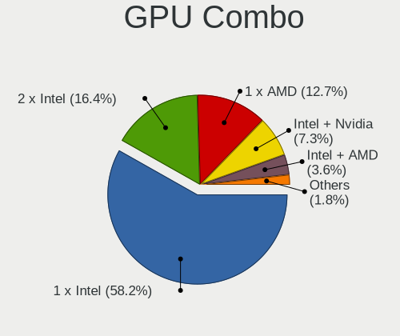

| Name           | Notebooks | Percent |
|----------------|-----------|---------|
| 1 x Intel      | 29        | 56.86%  |
| 2 x Intel      | 9         | 17.65%  |
| 1 x AMD        | 6         | 11.76%  |
| Intel + Nvidia | 4         | 7.84%   |
| Intel + AMD    | 2         | 3.92%   |
| AMD + Nvidia   | 1         | 1.96%   |

GPU Driver
----------

Free vs proprietary

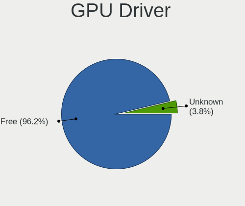

| Driver  | Notebooks | Percent |
|---------|-----------|---------|
| Free    | 49        | 96.08%  |
| Unknown | 2         | 3.92%   |

GPU Memory
----------

Total video memory

| Size in GB | Notebooks | Percent |
|------------|-----------|---------|
| Unknown    | 51        | 100%    |

Monitor
-------

Monitor Vendor
--------------

Monitor vendors

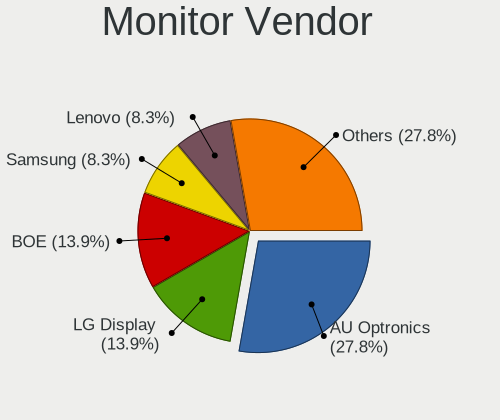

| Vendor                  | Notebooks | Percent |
|-------------------------|-----------|---------|
| AU Optronics            | 10        | 29.41%  |
| LG Display              | 5         | 14.71%  |
| BOE                     | 4         | 11.76%  |
| Lenovo                  | 3         | 8.82%   |
| Sharp                   | 2         | 5.88%   |
| Samsung Electronics     | 2         | 5.88%   |
| Chimei Innolux          | 2         | 5.88%   |
| Apple                   | 2         | 5.88%   |
| LG Philips              | 1         | 2.94%   |
| InfoVision              | 1         | 2.94%   |
| Dell                    | 1         | 2.94%   |
| Chi Mei Optoelectronics | 1         | 2.94%   |

Monitor Model
-------------

Monitor models

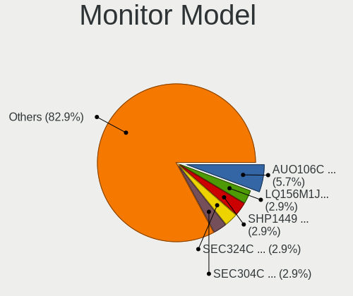

| Model                                                                    | Notebooks | Percent |
|--------------------------------------------------------------------------|-----------|---------|
| AU Optronics LCD Monitor AUO106C 1366x768 280x160mm 12.7-inch            | 2         | 5.88%   |
| Sharp LQ156M1JW01 SHP14C3 1920x1080 340x190mm 15.3-inch                  | 1         | 2.94%   |
| Sharp LCD Monitor SHP1449 1920x1080 290x170mm 13.2-inch                  | 1         | 2.94%   |
| Samsung Electronics LCD Monitor SEC324C 1600x900 310x170mm 13.9-inch     | 1         | 2.94%   |
| Samsung Electronics LCD Monitor SEC304C 1366x768 310x170mm 13.9-inch     | 1         | 2.94%   |
| LG Philips LCD Monitor LPLDB00 1280x800 330x210mm 15.4-inch              | 1         | 2.94%   |
| LG Display LCD Monitor LGD05D8 1920x1080 340x190mm 15.3-inch             | 1         | 2.94%   |
| LG Display LCD Monitor LGD0450 1366x768 280x160mm 12.7-inch              | 1         | 2.94%   |
| LG Display LCD Monitor LGD03ED 1366x768 280x160mm 12.7-inch              | 1         | 2.94%   |
| LG Display LCD Monitor LGD02E2 1600x900 310x170mm 13.9-inch              | 1         | 2.94%   |
| LG Display LCD Monitor LGD02D8 1366x768 280x160mm 12.7-inch              | 1         | 2.94%   |
| Lenovo LCD Monitor LEN4036 1440x900 300x190mm 14.0-inch                  | 1         | 2.94%   |
| Lenovo LCD Monitor LEN4033 1440x900 300x190mm 14.0-inch                  | 1         | 2.94%   |
| Lenovo LCD Monitor LEN4031 1280x800 300x190mm 14.0-inch                  | 1         | 2.94%   |
| InfoVision M116NWR1 R0  IVO0489 1366x768 260x140mm 11.6-inch             | 1         | 2.94%   |
| Dell P2317H DEL40F3 1920x1080 480x270mm 21.7-inch                        | 1         | 2.94%   |
| Chimei Innolux LCD Monitor CMN15F5 1920x1080 340x190mm 15.3-inch         | 1         | 2.94%   |
| Chimei Innolux LCD Monitor CMN1132 1366x768 260x140mm 11.6-inch          | 1         | 2.94%   |
| Chi Mei Optoelectronics LCD Monitor CMO1107 1366x768 250x140mm 11.3-inch | 1         | 2.94%   |
| BOE LCD Monitor BOE0817 1366x768 340x190mm 15.3-inch                     | 1         | 2.94%   |
| BOE LCD Monitor BOE07C8 3840x2160 310x170mm 13.9-inch                    | 1         | 2.94%   |
| BOE LCD Monitor BOE0731 1366x768 260x140mm 11.6-inch                     | 1         | 2.94%   |
| BOE LCD Monitor BOE0718 1920x1080 310x170mm 13.9-inch                    | 1         | 2.94%   |
| AU Optronics LCD Monitor AUO5F2D 1920x1080 290x170mm 13.2-inch           | 1         | 2.94%   |
| AU Optronics LCD Monitor AUO573D 1920x1080 310x170mm 13.9-inch           | 1         | 2.94%   |
| AU Optronics LCD Monitor AUO46EC 1366x768 340x190mm 15.3-inch            | 1         | 2.94%   |
| AU Optronics LCD Monitor AUO315C 1366x768 260x140mm 11.6-inch            | 1         | 2.94%   |
| AU Optronics LCD Monitor AUO313C 1366x768 310x170mm 13.9-inch            | 1         | 2.94%   |
| AU Optronics LCD Monitor AUO235C 1366x768 260x140mm 11.6-inch            | 1         | 2.94%   |
| AU Optronics LCD Monitor AUO226D 1920x1080 280x160mm 12.7-inch           | 1         | 2.94%   |
| AU Optronics LCD Monitor AUO11C2 1024x600 200x110mm 9.0-inch             | 1         | 2.94%   |
| Apple Color LCD APP9CDF 1440x900 290x180mm 13.4-inch                     | 1         | 2.94%   |
| Apple Color LCD APP9C20 1280x854 320x220mm 15.3-inch                     | 1         | 2.94%   |

Monitor Resolution
------------------

Monitor screen resolution

| Resolution       | Notebooks | Percent |
|------------------|-----------|---------|
| 1366x768 (WXGA)  | 15        | 45.45%  |
| 1920x1080 (FHD)  | 8         | 24.24%  |
| 1440x900 (WXGA+) | 3         | 9.09%   |
| 1600x900 (HD+)   | 2         | 6.06%   |
| 1280x800 (WXGA)  | 2         | 6.06%   |
| 3840x2160 (4K)   | 1         | 3.03%   |
| 1280x854         | 1         | 3.03%   |
| 1024x600         | 1         | 3.03%   |

Monitor Diagonal
----------------

Diagonal size in inches

| Inches | Notebooks | Percent |
|--------|-----------|---------|
| 13     | 10        | 29.41%  |
| 15     | 7         | 20.59%  |
| 12     | 6         | 17.65%  |
| 11     | 6         | 17.65%  |
| 14     | 3         | 8.82%   |
| 21     | 1         | 2.94%   |
| 9      | 1         | 2.94%   |

Monitor Width
-------------

Physical width

| Width in mm | Notebooks | Percent |
|-------------|-----------|---------|
| 201-300     | 18        | 52.94%  |
| 301-350     | 14        | 41.18%  |
| 401-500     | 1         | 2.94%   |
| 101-200     | 1         | 2.94%   |

Aspect Ratio
------------

Proportional relationship between the width and the height

| Ratio | Notebooks | Percent |
|-------|-----------|---------|
| 16/9  | 27        | 81.82%  |
| 16/10 | 5         | 15.15%  |
| 3/2   | 1         | 3.03%   |

Monitor Area
------------

Area in inch²

| Area in inch² | Notebooks | Percent |
|----------------|-----------|---------|
| 81-90          | 11        | 32.35%  |
| 61-70          | 6         | 17.65%  |
| 51-60          | 6         | 17.65%  |
| 91-100         | 5         | 14.71%  |
| 71-80          | 2         | 5.88%   |
| 101-110        | 2         | 5.88%   |
| 1-40           | 1         | 2.94%   |
| 201-250        | 1         | 2.94%   |

Pixel Density
-------------

Pixels per inch

| Density       | Notebooks | Percent |
|---------------|-----------|---------|
| 121-160       | 22        | 64.71%  |
| 101-120       | 7         | 20.59%  |
| 161-240       | 3         | 8.82%   |
| More than 240 | 1         | 2.94%   |
| 51-100        | 1         | 2.94%   |

Multiple Monitors
-----------------

Total monitors connected

| Total | Notebooks | Percent |
|-------|-----------|---------|
| 1     | 45        | 88.24%  |
| 0     | 5         | 9.8%    |
| 2     | 1         | 1.96%   |

Network
-------

Net Controller Vendor
---------------------

Controller vendors

| Vendor                   | Notebooks | Percent |
|--------------------------|-----------|---------|
| Intel                    | 35        | 48.61%  |
| Realtek Semiconductor    | 16        | 22.22%  |
| Qualcomm Atheros         | 9         | 12.5%   |
| Broadcom                 | 3         | 4.17%   |
| Marvell Technology Group | 2         | 2.78%   |
| Xiaomi                   | 1         | 1.39%   |
| TP-Link                  | 1         | 1.39%   |
| Ralink Technology        | 1         | 1.39%   |
| Micro Star International | 1         | 1.39%   |
| Fibocom                  | 1         | 1.39%   |
| Edimax Technology        | 1         | 1.39%   |
| Apple                    | 1         | 1.39%   |

Net Controller Model
--------------------

Controller models

| Model                                                                   | Notebooks | Percent |
|-------------------------------------------------------------------------|-----------|---------|
| Realtek RTL8111/8168/8411 PCI Express Gigabit Ethernet Controller       | 11        | 11.22%  |
| Intel 82579LM Gigabit Network Connection (Lewisville)                   | 7         | 7.14%   |
| Intel Centrino Advanced-N 6205 [Taylor Peak]                            | 6         | 6.12%   |
| Realtek RTL810xE PCI Express Fast Ethernet controller                   | 4         | 4.08%   |
| Intel Wireless 8265 / 8275                                              | 4         | 4.08%   |
| Intel Wireless 7265                                                     | 3         | 3.06%   |
| Intel 82567LM Gigabit Network Connection                                | 3         | 3.06%   |
| Qualcomm Atheros AR928X Wireless Network Adapter (PCI-Express)          | 2         | 2.04%   |
| Qualcomm Atheros AR9285 Wireless Network Adapter (PCI-Express)          | 2         | 2.04%   |
| Qualcomm Atheros AR8121/AR8113/AR8114 Gigabit or Fast Ethernet          | 2         | 2.04%   |
| Qualcomm Atheros AR242x / AR542x Wireless Network Adapter (PCI-Express) | 2         | 2.04%   |
| Intel Wi-Fi 6 AX200                                                     | 2         | 2.04%   |
| Intel PRO/Wireless 5100 AGN [Shiloh] Network Connection                 | 2         | 2.04%   |
| Intel PRO/Wireless 3945ABG [Golan] Network Connection                   | 2         | 2.04%   |
| Intel Ethernet Connection (3) I218-LM                                   | 2         | 2.04%   |
| Intel Centrino Advanced-N 6200                                          | 2         | 2.04%   |
| Intel Cannon Point-LP CNVi [Wireless-AC]                                | 2         | 2.04%   |
| Intel 82577LM Gigabit Network Connection                                | 2         | 2.04%   |
| Xiaomi Mi/Redmi series (RNDIS)                                          | 1         | 1.02%   |
| TP-Link TL-WN823N v2/v3 [Realtek RTL8192EU]                             | 1         | 1.02%   |
| Realtek RTL8822CE 802.11ac PCIe Wireless Network Adapter                | 1         | 1.02%   |
| Realtek RTL8723BE PCIe Wireless Network Adapter                         | 1         | 1.02%   |
| Realtek RTL8188CUS 802.11n WLAN Adapter                                 | 1         | 1.02%   |
| Realtek RTL8188CE 802.11b/g/n WiFi Adapter                              | 1         | 1.02%   |
| Realtek RTL-8100/8101L/8139 PCI Fast Ethernet Adapter                   | 1         | 1.02%   |
| Ralink RT2870/RT3070 Wireless Adapter                                   | 1         | 1.02%   |
| Qualcomm Atheros QCA9565 / AR9565 Wireless Network Adapter              | 1         | 1.02%   |
| Qualcomm Atheros QCA9377 802.11ac Wireless Network Adapter              | 1         | 1.02%   |
| Qualcomm Atheros AR5212 802.11abg NIC                                   | 1         | 1.02%   |
| Micro Star International RT2573                                         | 1         | 1.02%   |
| Marvell Group 88E8057 PCI-E Gigabit Ethernet Controller                 | 1         | 1.02%   |
| Marvell Group 88E8053 PCI-E Gigabit Ethernet Controller                 | 1         | 1.02%   |
| Intel Wireless-AC 9260                                                  | 1         | 1.02%   |
| Intel Wireless 8260                                                     | 1         | 1.02%   |
| Intel Wireless 3160                                                     | 1         | 1.02%   |
| Intel Ethernet Connection I219-LM                                       | 1         | 1.02%   |
| Intel Ethernet Connection (6) I219-V                                    | 1         | 1.02%   |
| Intel Ethernet Connection (4) I219-V                                    | 1         | 1.02%   |
| Intel Ethernet Connection (10) I219-V                                   | 1         | 1.02%   |
| Intel Dual Band Wireless-AC 3168NGW [Stone Peak]                        | 1         | 1.02%   |
| Intel Dual Band Wireless-AC 3165 Plus Bluetooth                         | 1         | 1.02%   |
| Intel Comet Lake PCH-LP CNVi WiFi                                       | 1         | 1.02%   |
| Intel Centrino Wireless-N 2230                                          | 1         | 1.02%   |
| Intel Centrino Wireless-N 2200                                          | 1         | 1.02%   |
| Intel Centrino Advanced-N 6235                                          | 1         | 1.02%   |
| Intel Cannon Lake PCH CNVi WiFi                                         | 1         | 1.02%   |
| Intel 82801DB/DBL/DBM (ICH4/ICH4-L/ICH4-M) AC'97 Modem Controller       | 1         | 1.02%   |
| Intel 82562ET/EZ/GT/GZ - PRO/100 VE (LOM) Ethernet Controller Mobile    | 1         | 1.02%   |
| Intel 82540EP Gigabit Ethernet Controller (Mobile)                      | 1         | 1.02%   |
| Fibocom L830-EB-00 LTE WWAN Modem                                       | 1         | 1.02%   |
| Edimax EW-7811Un 802.11n Wireless Adapter [Realtek RTL8188CUS]          | 1         | 1.02%   |
| Broadcom NetXtreme BCM5764M Gigabit Ethernet PCIe                       | 1         | 1.02%   |
| Broadcom BCM4360 802.11ac Wireless Network Adapter                      | 1         | 1.02%   |
| Broadcom BCM43224 802.11a/b/g/n                                         | 1         | 1.02%   |
| Broadcom BCM4306 802.11b/g Wireless LAN Controller                      | 1         | 1.02%   |
| Apple UniNorth 2 GMAC (Sun GEM)                                         | 1         | 1.02%   |

Wireless Vendor
---------------

Wireless vendors

| Vendor                   | Notebooks | Percent |
|--------------------------|-----------|---------|
| Intel                    | 33        | 62.26%  |
| Qualcomm Atheros         | 9         | 16.98%  |
| Realtek Semiconductor    | 4         | 7.55%   |
| Broadcom                 | 3         | 5.66%   |
| TP-Link                  | 1         | 1.89%   |
| Ralink Technology        | 1         | 1.89%   |
| Micro Star International | 1         | 1.89%   |
| Edimax Technology        | 1         | 1.89%   |

Wireless Model
--------------

Wireless models

| Model                                                                   | Notebooks | Percent |
|-------------------------------------------------------------------------|-----------|---------|
| Intel Centrino Advanced-N 6205 [Taylor Peak]                            | 6         | 11.32%  |
| Intel Wireless 8265 / 8275                                              | 4         | 7.55%   |
| Intel Wireless 7265                                                     | 3         | 5.66%   |
| Qualcomm Atheros AR928X Wireless Network Adapter (PCI-Express)          | 2         | 3.77%   |
| Qualcomm Atheros AR9285 Wireless Network Adapter (PCI-Express)          | 2         | 3.77%   |
| Qualcomm Atheros AR242x / AR542x Wireless Network Adapter (PCI-Express) | 2         | 3.77%   |
| Intel Wi-Fi 6 AX200                                                     | 2         | 3.77%   |
| Intel PRO/Wireless 5100 AGN [Shiloh] Network Connection                 | 2         | 3.77%   |
| Intel PRO/Wireless 3945ABG [Golan] Network Connection                   | 2         | 3.77%   |
| Intel Centrino Advanced-N 6200                                          | 2         | 3.77%   |
| Intel Cannon Point-LP CNVi [Wireless-AC]                                | 2         | 3.77%   |
| TP-Link TL-WN823N v2/v3 [Realtek RTL8192EU]                             | 1         | 1.89%   |
| Realtek RTL8822CE 802.11ac PCIe Wireless Network Adapter                | 1         | 1.89%   |
| Realtek RTL8723BE PCIe Wireless Network Adapter                         | 1         | 1.89%   |
| Realtek RTL8188CUS 802.11n WLAN Adapter                                 | 1         | 1.89%   |
| Realtek RTL8188CE 802.11b/g/n WiFi Adapter                              | 1         | 1.89%   |
| Ralink RT2870/RT3070 Wireless Adapter                                   | 1         | 1.89%   |
| Qualcomm Atheros QCA9565 / AR9565 Wireless Network Adapter              | 1         | 1.89%   |
| Qualcomm Atheros QCA9377 802.11ac Wireless Network Adapter              | 1         | 1.89%   |
| Qualcomm Atheros AR5212 802.11abg NIC                                   | 1         | 1.89%   |
| Micro Star International RT2573                                         | 1         | 1.89%   |
| Intel Wireless-AC 9260                                                  | 1         | 1.89%   |
| Intel Wireless 8260                                                     | 1         | 1.89%   |
| Intel Wireless 3160                                                     | 1         | 1.89%   |
| Intel Dual Band Wireless-AC 3168NGW [Stone Peak]                        | 1         | 1.89%   |
| Intel Dual Band Wireless-AC 3165 Plus Bluetooth                         | 1         | 1.89%   |
| Intel Comet Lake PCH-LP CNVi WiFi                                       | 1         | 1.89%   |
| Intel Centrino Wireless-N 2230                                          | 1         | 1.89%   |
| Intel Centrino Wireless-N 2200                                          | 1         | 1.89%   |
| Intel Centrino Advanced-N 6235                                          | 1         | 1.89%   |
| Intel Cannon Lake PCH CNVi WiFi                                         | 1         | 1.89%   |
| Edimax EW-7811Un 802.11n Wireless Adapter [Realtek RTL8188CUS]          | 1         | 1.89%   |
| Broadcom BCM4360 802.11ac Wireless Network Adapter                      | 1         | 1.89%   |
| Broadcom BCM43224 802.11a/b/g/n                                         | 1         | 1.89%   |
| Broadcom BCM4306 802.11b/g Wireless LAN Controller                      | 1         | 1.89%   |

Ethernet Vendor
---------------

Ethernet vendors

| Vendor                   | Notebooks | Percent |
|--------------------------|-----------|---------|
| Intel                    | 20        | 46.51%  |
| Realtek Semiconductor    | 16        | 37.21%  |
| Qualcomm Atheros         | 2         | 4.65%   |
| Marvell Technology Group | 2         | 4.65%   |
| Xiaomi                   | 1         | 2.33%   |
| Broadcom                 | 1         | 2.33%   |
| Apple                    | 1         | 2.33%   |

Ethernet Model
--------------

Ethernet models

| Model                                                                | Notebooks | Percent |
|----------------------------------------------------------------------|-----------|---------|
| Realtek RTL8111/8168/8411 PCI Express Gigabit Ethernet Controller    | 11        | 25.58%  |
| Intel 82579LM Gigabit Network Connection (Lewisville)                | 7         | 16.28%  |
| Realtek RTL810xE PCI Express Fast Ethernet controller                | 4         | 9.3%    |
| Intel 82567LM Gigabit Network Connection                             | 3         | 6.98%   |
| Qualcomm Atheros AR8121/AR8113/AR8114 Gigabit or Fast Ethernet       | 2         | 4.65%   |
| Intel Ethernet Connection (3) I218-LM                                | 2         | 4.65%   |
| Intel 82577LM Gigabit Network Connection                             | 2         | 4.65%   |
| Xiaomi Mi/Redmi series (RNDIS)                                       | 1         | 2.33%   |
| Realtek RTL-8100/8101L/8139 PCI Fast Ethernet Adapter                | 1         | 2.33%   |
| Marvell Group 88E8057 PCI-E Gigabit Ethernet Controller              | 1         | 2.33%   |
| Marvell Group 88E8053 PCI-E Gigabit Ethernet Controller              | 1         | 2.33%   |
| Intel Ethernet Connection I219-LM                                    | 1         | 2.33%   |
| Intel Ethernet Connection (6) I219-V                                 | 1         | 2.33%   |
| Intel Ethernet Connection (4) I219-V                                 | 1         | 2.33%   |
| Intel Ethernet Connection (10) I219-V                                | 1         | 2.33%   |
| Intel 82562ET/EZ/GT/GZ - PRO/100 VE (LOM) Ethernet Controller Mobile | 1         | 2.33%   |
| Intel 82540EP Gigabit Ethernet Controller (Mobile)                   | 1         | 2.33%   |
| Broadcom NetXtreme BCM5764M Gigabit Ethernet PCIe                    | 1         | 2.33%   |
| Apple UniNorth 2 GMAC (Sun GEM)                                      | 1         | 2.33%   |

Net Controller Kind
-------------------

Ethernet, WiFi or modem

| Kind     | Notebooks | Percent |
|----------|-----------|---------|
| WiFi     | 50        | 53.19%  |
| Ethernet | 42        | 44.68%  |
| Modem    | 1         | 1.06%   |
| Unknown  | 1         | 1.06%   |

Used Controller
---------------

Currently used network controller

| Kind     | Notebooks | Percent |
|----------|-----------|---------|
| WiFi     | 36        | 69.23%  |
| Ethernet | 16        | 30.77%  |

NICs
----

Total network controllers on board

| Total | Notebooks | Percent |
|-------|-----------|---------|
| 2     | 39        | 76.47%  |
| 1     | 12        | 23.53%  |

IPv6
----

IPv6 vs IPv4

| Used | Notebooks | Percent |
|------|-----------|---------|
| No   | 51        | 100%    |

Bluetooth
---------

Bluetooth Vendor
----------------

Controller vendors

| Vendor                          | Notebooks | Percent |
|---------------------------------|-----------|---------|
| Intel                           | 15        | 51.72%  |
| Broadcom                        | 3         | 10.34%  |
| Alps Electric                   | 3         | 10.34%  |
| Realtek Semiconductor           | 2         | 6.9%    |
| Qualcomm Atheros Communications | 2         | 6.9%    |
| Apple                           | 2         | 6.9%    |
| Creative Technology             | 1         | 3.45%   |
| ASUSTek Computer                | 1         | 3.45%   |

Bluetooth Model
---------------

Controller models

| Model                                          | Notebooks | Percent |
|------------------------------------------------|-----------|---------|
| Intel Bluetooth wireless interface             | 6         | 20.69%  |
| Intel Centrino Bluetooth Wireless Transceiver  | 2         | 6.9%    |
| Intel Bluetooth 9460/9560 Jefferson Peak (JfP) | 2         | 6.9%    |
| Intel AX200 Bluetooth                          | 2         | 6.9%    |
| Broadcom BCM2045B (BDC-2.1)                    | 2         | 6.9%    |
| Alps Electric UGTZ4 Bluetooth                  | 2         | 6.9%    |
| Realtek  Bluetooth 4.2 Adapter                 | 1         | 3.45%   |
| Realtek  Bluetooth 4.0 Adapter                 | 1         | 3.45%   |
| Qualcomm Atheros  QCA9377 Bluetooth 4.1        | 1         | 3.45%   |
| Qualcomm Atheros AR3012 Bluetooth 4.0          | 1         | 3.45%   |
| Intel Wireless-AC 9260 Bluetooth Adapter       | 1         | 3.45%   |
| Intel Wireless-AC 3168 Bluetooth               | 1         | 3.45%   |
| Intel AX201 Bluetooth                          | 1         | 3.45%   |
| Creative Creative Bluetooth Audio W2           | 1         | 3.45%   |
| Broadcom BCM20702 Bluetooth 4.0 [ThinkPad]     | 1         | 3.45%   |
| ASUS Broadcom Bluetooth 2.1                    | 1         | 3.45%   |
| Apple Bluetooth Host Controller                | 1         | 3.45%   |
| Apple Apple Broadcom Built-in Bluetooth        | 1         | 3.45%   |
| Alps Electric BCM2046 Bluetooth Device         | 1         | 3.45%   |

Sound
-----

Sound Vendor
------------

Sound card vendors

| Vendor                 | Notebooks | Percent |
|------------------------|-----------|---------|
| Intel                  | 46        | 86.79%  |
| AMD                    | 4         | 7.55%   |
| Nvidia                 | 2         | 3.77%   |
| Generalplus Technology | 1         | 1.89%   |

Sound Model
-----------

Sound card models

| Model                                                                      | Notebooks | Percent |
|----------------------------------------------------------------------------|-----------|---------|
| Intel 7 Series/C216 Chipset Family High Definition Audio Controller        | 7         | 11.48%  |
| Intel NM10/ICH7 Family High Definition Audio Controller                    | 6         | 9.84%   |
| Intel Sunrise Point-LP HD Audio                                            | 5         | 8.2%    |
| Intel 5 Series/3400 Series Chipset High Definition Audio                   | 4         | 6.56%   |
| Intel Wildcat Point-LP High Definition Audio Controller                    | 3         | 4.92%   |
| Intel Cannon Point-LP High Definition Audio Controller                     | 3         | 4.92%   |
| Intel Broadwell-U Audio Controller                                         | 3         | 4.92%   |
| Intel 82801I (ICH9 Family) HD Audio Controller                             | 3         | 4.92%   |
| Intel 6 Series/C200 Series Chipset Family High Definition Audio Controller | 3         | 4.92%   |
| AMD Family 17h (Models 10h-1fh) HD Audio Controller                        | 3         | 4.92%   |
| Intel Haswell-ULT HD Audio Controller                                      | 2         | 3.28%   |
| Intel Celeron/Pentium Silver Processor High Definition Audio               | 2         | 3.28%   |
| Intel Celeron N3350/Pentium N4200/Atom E3900 Series Audio Cluster          | 2         | 3.28%   |
| Intel 8 Series HD Audio Controller                                         | 2         | 3.28%   |
| AMD Renoir Radeon High Definition Audio Controller                         | 2         | 3.28%   |
| Nvidia TU107 GeForce GTX 1650 High Definition Audio Controller             | 1         | 1.64%   |
| Nvidia GT216 HDMI Audio Controller                                         | 1         | 1.64%   |
| Intel US15W/US15X/US15L/UL11L SCH [Poulsbo] HD Audio Controller            | 1         | 1.64%   |
| Intel Comet Lake PCH-LP cAVS                                               | 1         | 1.64%   |
| Intel Cannon Lake PCH cAVS                                                 | 1         | 1.64%   |
| Intel Atom Processor Z36xxx/Z37xxx Series High Definition Audio Controller | 1         | 1.64%   |
| Intel 82801DB/DBL/DBM (ICH4/ICH4-L/ICH4-M) AC'97 Audio Controller          | 1         | 1.64%   |
| Intel 82801CA/CAM AC'97 Audio Controller                                   | 1         | 1.64%   |
| Generalplus Technology USB Audio Device                                    | 1         | 1.64%   |
| AMD SBx00 Azalia (Intel HDA)                                               | 1         | 1.64%   |
| AMD RS880 HDMI Audio [Radeon HD 4200 Series]                               | 1         | 1.64%   |

Memory
------

Memory Vendor
-------------

Memory module vendors

| Vendor              | Notebooks | Percent |
|---------------------|-----------|---------|
| Samsung Electronics | 4         | 36.36%  |
| SK Hynix            | 3         | 27.27%  |
| Unknown             | 2         | 18.18%  |
| Micron Technology   | 1         | 9.09%   |
| Elpida              | 1         | 9.09%   |

Memory Model
------------

Memory module models

| Model                                                    | Notebooks | Percent |
|----------------------------------------------------------|-----------|---------|
| SK Hynix RAM HMT351S6CFR8C-PB 4GB SODIMM DDR3 1600MT/s   | 2         | 16.67%  |
| Unknown RAM Module 4GB SODIMM DDR3 1333MT/s              | 1         | 8.33%   |
| Unknown RAM Module 2GB SODIMM DDR3 1067MT/s              | 1         | 8.33%   |
| SK Hynix RAM HMT351S6EFR8A-PB 4GB SODIMM DDR3 1600MT/s   | 1         | 8.33%   |
| Samsung RAM M471B5673FH0-CF8 2GB SODIMM 1066MT/s         | 1         | 8.33%   |
| Samsung RAM M471B5673EH1-CF8 2GB SODIMM DDR3 1067MT/s    | 1         | 8.33%   |
| Samsung RAM M471B5273DH0-CH9 4GB SODIMM DDR3 1334MT/s    | 1         | 8.33%   |
| Samsung RAM M471B5173BH0-CK0 4096MB SODIMM DDR3 1600MT/s | 1         | 8.33%   |
| Samsung RAM M471A2G44AM0-CWE 16GB SODIMM DDR4 3200MT/s   | 1         | 8.33%   |
| Micron RAM 8JSF12864HZ-1G1F1 1GB SODIMM DDR3 800MT/s     | 1         | 8.33%   |
| Elpida RAM Module 1GB SODIMM DDR2 533MT/s                | 1         | 8.33%   |

Memory Kind
-----------

Memory module kinds

| Kind | Notebooks | Percent |
|------|-----------|---------|
| DDR3 | 7         | 77.78%  |
| DDR4 | 1         | 11.11%  |
| DDR2 | 1         | 11.11%  |

Memory Form Factor
------------------

Physical design of the memory module

| Name   | Notebooks | Percent |
|--------|-----------|---------|
| SODIMM | 9         | 100%    |

Memory Size
-----------

Memory module size

| Size  | Notebooks | Percent |
|-------|-----------|---------|
| 4096  | 5         | 50%     |
| 2048  | 2         | 20%     |
| 1024  | 2         | 20%     |
| 16384 | 1         | 10%     |

Memory Speed
------------

Memory module speed

| Speed | Notebooks | Percent |
|-------|-----------|---------|
| 1600  | 3         | 27.27%  |
| 1067  | 2         | 18.18%  |
| 3200  | 1         | 9.09%   |
| 1334  | 1         | 9.09%   |
| 1333  | 1         | 9.09%   |
| 1066  | 1         | 9.09%   |
| 800   | 1         | 9.09%   |
| 533   | 1         | 9.09%   |

Printers & scanners
-------------------

Printer Vendor
--------------

Printer device vendors

Zero info for selected period =(

Printer Model
-------------

Printer device models

Zero info for selected period =(

Scanner Vendor
--------------

Scanner device vendors

Zero info for selected period =(

Scanner Model
-------------

Scanner device models

Zero info for selected period =(

Camera
------

Camera Vendor
-------------

Camera device vendors

| Vendor                | Notebooks | Percent |
|-----------------------|-----------|---------|
| Chicony Electronics   | 11        | 34.38%  |
| Acer                  | 6         | 18.75%  |
| IMC Networks          | 3         | 9.38%   |
| Quanta                | 2         | 6.25%   |
| Microdia              | 2         | 6.25%   |
| Lite-On Technology    | 2         | 6.25%   |
| Syntek                | 1         | 3.13%   |
| Suyin                 | 1         | 3.13%   |
| Silicon Motion        | 1         | 3.13%   |
| Ricoh                 | 1         | 3.13%   |
| Realtek Semiconductor | 1         | 3.13%   |
| Lenovo                | 1         | 3.13%   |

Camera Model
------------

Camera device models

| Model                                    | Notebooks | Percent |
|------------------------------------------|-----------|---------|
| Chicony Integrated Camera                | 3         | 9.38%   |
| Lite-On Integrated Camera                | 2         | 6.25%   |
| Chicony Ltd., VGA Webcam                 | 2         | 6.25%   |
| Acer Integrated Camera                   | 2         | 6.25%   |
| Acer EasyCamera                          | 2         | 6.25%   |
| Syntek Lenovo EasyCamera                 | 1         | 3.13%   |
| Suyin Acer/Lenovo Webcam [CN0316]        | 1         | 3.13%   |
| Silicon Motion Realtek USB2.0 PC Camera  | 1         | 3.13%   |
| Ricoh Sony Visual Communication Camera   | 1         | 3.13%   |
| Realtek Integrated_Webcam_HD             | 1         | 3.13%   |
| Quanta HP Webcam-50                      | 1         | 3.13%   |
| Quanta HP TrueVision HD Camera           | 1         | 3.13%   |
| Microdia Sonix USB 2.0 Camera            | 1         | 3.13%   |
| Microdia Integrated Webcam HD            | 1         | 3.13%   |
| Lenovo Integrated Webcam                 | 1         | 3.13%   |
| IMC Networks USB2.0 HD UVC WebCam        | 1         | 3.13%   |
| IMC Networks Lenovo EasyCamera           | 1         | 3.13%   |
| IMC Networks Integrated Camera           | 1         | 3.13%   |
| Chicony thinkpad t430s camera            | 1         | 3.13%   |
| Chicony Ltd., Integrated Camera          | 1         | 3.13%   |
| Chicony Lenovo Integrated Camera (0.3MP) | 1         | 3.13%   |
| Chicony Integrated Camera [ThinkPad]     | 1         | 3.13%   |
| Chicony HD Webcam                        | 1         | 3.13%   |
| Chicony 2.0M UVC Webcam / CNF7129        | 1         | 3.13%   |
| Acer SunplusIT Integrated Camera         | 1         | 3.13%   |
| Acer Lenovo Integrated Webcam            | 1         | 3.13%   |

Security
--------

Fingerprint Vendor
------------------

Fingerprint sensor vendors

| Vendor                | Notebooks | Percent |
|-----------------------|-----------|---------|
| Synaptics             | 4         | 44.44%  |
| Upek                  | 2         | 22.22%  |
| Validity Sensors      | 1         | 11.11%  |
| Elan Microelectronics | 1         | 11.11%  |
| AuthenTec             | 1         | 11.11%  |

Fingerprint Model
-----------------

Fingerprint sensor models

| Model                                                  | Notebooks | Percent |
|--------------------------------------------------------|-----------|---------|
| Upek Biometric Touchchip/Touchstrip Fingerprint Sensor | 2         | 22.22%  |
| Synaptics Prometheus MIS Touch Fingerprint Reader      | 2         | 22.22%  |
| Validity Sensors VFS 5011 fingerprint sensor           | 1         | 11.11%  |
| Synaptics product 0x00be                               | 1         | 11.11%  |
| Synaptics Metallica MOH Touch Fingerprint Reader       | 1         | 11.11%  |
| Elan ELAN WBF Fingerprint Sensor                       | 1         | 11.11%  |
| AuthenTec AES2810                                      | 1         | 11.11%  |

Chipcard Vendor
---------------

Chipcard module vendors

Zero info for selected period =(

Chipcard Model
--------------

Chipcard module models

Zero info for selected period =(

Unsupported
-----------

Unsupported Devices
-------------------

Total unsupported devices on board

| Total | Notebooks | Percent |
|-------|-----------|---------|
| 1     | 28        | 54.9%   |
| 2     | 13        | 25.49%  |
| 0     | 5         | 9.8%    |
| 3     | 3         | 5.88%   |
| 6     | 1         | 1.96%   |
| 5     | 1         | 1.96%   |

Unsupported Device Types
------------------------

Types of unsupported devices

| Type                     | Notebooks | Percent |
|--------------------------|-----------|---------|
| Communication controller | 33        | 46.48%  |
| Graphics card            | 15        | 21.13%  |
| Firewire controller      | 8         | 11.27%  |
| Net/wireless             | 7         | 9.86%   |
| Sound                    | 2         | 2.82%   |
| Net/ethernet             | 2         | 2.82%   |
| Storage/ide              | 1         | 1.41%   |
| Storage/ata              | 1         | 1.41%   |
| Network                  | 1         | 1.41%   |
| Modem                    | 1         | 1.41%   |

