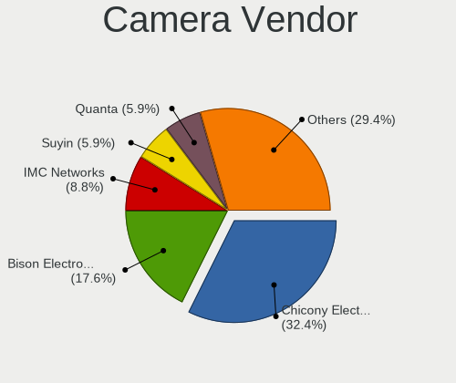

OpenBSD 6.9 - Tested Hardware & Statistics
------------------------------------------

A project to collect tested hardware configurations for OpenBSD 6.9.

Anyone can contribute to this report by the [hw-probe](https://github.com/linuxhw/hw-probe/blob/master/INSTALL.BSD.md) tool:

    hw-probe -all -upload

Please submit a probe of your configuration if it's not presented on the page or is rare.

This is a report for all computer types. See also reports for [desktops](/Dist/OpenBSD_6.9/Desktop/README.md) and [notebooks](/Dist/OpenBSD_6.9/Notebook/README.md).

Full-feature report is available here: https://bsd-hardware.info/?view=trends&rel=openbsd-6.9

Contents
--------

* [ Test Cases ](#test-cases)

* [ System ](#system)
  - [ Arch                     ](#arch)
  - [ DE                       ](#de)
  - [ Display Server           ](#display-server)
  - [ Display Manager          ](#display-manager)
  - [ OS Lang                  ](#os-lang)
  - [ Boot Mode                ](#boot-mode)
  - [ Filesystem               ](#filesystem)
  - [ Part. scheme             ](#part-scheme)

* [ Board ](#board)
  - [ Vendor                   ](#vendor)
  - [ Model                    ](#model)
  - [ Model Family             ](#model-family)
  - [ MFG Year                 ](#mfg-year)
  - [ Form Factor              ](#form-factor)
  - [ Coreboot                 ](#coreboot)
  - [ RAM Size                 ](#ram-size)
  - [ RAM Used                 ](#ram-used)
  - [ Total Drives             ](#total-drives)
  - [ Has CD-ROM               ](#has-cd-rom)
  - [ Has Ethernet             ](#has-ethernet)
  - [ Has WiFi                 ](#has-wifi)
  - [ Has Bluetooth            ](#has-bluetooth)

* [ Location ](#location)
  - [ Country                  ](#country)
  - [ City                     ](#city)

* [ Drives ](#drives)
  - [ Drive Vendor             ](#drive-vendor)
  - [ Drive Model              ](#drive-model)
  - [ HDD Vendor               ](#hdd-vendor)
  - [ SSD Vendor               ](#ssd-vendor)
  - [ Drive Kind               ](#drive-kind)
  - [ Drive Connector          ](#drive-connector)
  - [ Drive Size               ](#drive-size)
  - [ Space Total              ](#space-total)
  - [ Space Used               ](#space-used)
  - [ Malfunc. Drives          ](#malfunc-drives)
  - [ Malfunc. Drive Vendor    ](#malfunc-drive-vendor)
  - [ Malfunc. HDD Vendor      ](#malfunc-hdd-vendor)
  - [ Malfunc. Drive Kind      ](#malfunc-drive-kind)
  - [ Failed Drives            ](#failed-drives)
  - [ Failed Drive Vendor      ](#failed-drive-vendor)
  - [ Drive Status             ](#drive-status)

* [ Storage controller ](#storage-controller)
  - [ Storage Vendor           ](#storage-vendor)
  - [ Storage Model            ](#storage-model)
  - [ Storage Kind             ](#storage-kind)

* [ Processor ](#processor)
  - [ CPU Vendor               ](#cpu-vendor)
  - [ CPU Model                ](#cpu-model)
  - [ CPU Model Family         ](#cpu-model-family)
  - [ CPU Cores                ](#cpu-cores)
  - [ CPU Sockets              ](#cpu-sockets)
  - [ CPU Threads              ](#cpu-threads)
  - [ CPU Microarch            ](#cpu-microarch)

* [ Graphics ](#graphics)
  - [ GPU Vendor               ](#gpu-vendor)
  - [ GPU Model                ](#gpu-model)
  - [ GPU Combo                ](#gpu-combo)
  - [ GPU Driver               ](#gpu-driver)
  - [ GPU Memory               ](#gpu-memory)

* [ Monitor ](#monitor)
  - [ Monitor Vendor           ](#monitor-vendor)
  - [ Monitor Model            ](#monitor-model)
  - [ Monitor Resolution       ](#monitor-resolution)
  - [ Monitor Diagonal         ](#monitor-diagonal)
  - [ Monitor Width            ](#monitor-width)
  - [ Aspect Ratio             ](#aspect-ratio)
  - [ Monitor Area             ](#monitor-area)
  - [ Pixel Density            ](#pixel-density)
  - [ Multiple Monitors        ](#multiple-monitors)

* [ Network ](#network)
  - [ Net Controller Vendor    ](#net-controller-vendor)
  - [ Net Controller Model     ](#net-controller-model)
  - [ Wireless Vendor          ](#wireless-vendor)
  - [ Wireless Model           ](#wireless-model)
  - [ Ethernet Vendor          ](#ethernet-vendor)
  - [ Ethernet Model           ](#ethernet-model)
  - [ Net Controller Kind      ](#net-controller-kind)
  - [ Used Controller          ](#used-controller)
  - [ NICs                     ](#nics)
  - [ IPv6                     ](#ipv6)

* [ Bluetooth ](#bluetooth)
  - [ Bluetooth Vendor         ](#bluetooth-vendor)
  - [ Bluetooth Model          ](#bluetooth-model)

* [ Sound ](#sound)
  - [ Sound Vendor             ](#sound-vendor)
  - [ Sound Model              ](#sound-model)

* [ Memory ](#memory)
  - [ Memory Vendor            ](#memory-vendor)
  - [ Memory Model             ](#memory-model)
  - [ Memory Kind              ](#memory-kind)
  - [ Memory Form Factor       ](#memory-form-factor)
  - [ Memory Size              ](#memory-size)
  - [ Memory Speed             ](#memory-speed)

* [ Printers & scanners ](#printers--scanners)
  - [ Printer Vendor           ](#printer-vendor)
  - [ Printer Model            ](#printer-model)
  - [ Scanner Vendor           ](#scanner-vendor)
  - [ Scanner Model            ](#scanner-model)

* [ Camera ](#camera)
  - [ Camera Vendor            ](#camera-vendor)
  - [ Camera Model             ](#camera-model)

* [ Security ](#security)
  - [ Fingerprint Vendor       ](#fingerprint-vendor)
  - [ Fingerprint Model        ](#fingerprint-model)
  - [ Chipcard Vendor          ](#chipcard-vendor)
  - [ Chipcard Model           ](#chipcard-model)

* [ Unsupported ](#unsupported)
  - [ Unsupported Devices      ](#unsupported-devices)
  - [ Unsupported Device Types ](#unsupported-device-types)

Test Cases
----------

| Vendor        | Model                       | Form-Factor | Probe                                                     | Date         |
|---------------|-----------------------------|-------------|-----------------------------------------------------------|--------------|
| ASUSTek       | ROG STRIX B550-I GAMING     | Desktop     | [7a800aec88](https://bsd-hardware.info/?probe=7a800aec88) | Sep 15, 2021 |
| Dell          | XPS 13 7390 2-in-1          | Notebook    | [577e0ed7fe](https://bsd-hardware.info/?probe=577e0ed7fe) | Sep 13, 2021 |
| NF541         | Unknown                     | Desktop     | [deb29af749](https://bsd-hardware.info/?probe=deb29af749) | Sep 11, 2021 |
| MSI           | MS-7A34                     | Desktop     | [decfe43121](https://bsd-hardware.info/?probe=decfe43121) | Sep 10, 2021 |
| HP            | 250 G5 Notebook PC          | Notebook    | [6e50039406](https://bsd-hardware.info/?probe=6e50039406) | Sep 09, 2021 |
| PC Engines    | apu4                        | Desktop     | [9557835b54](https://bsd-hardware.info/?probe=9557835b54) | Sep 09, 2021 |
| Apple         | MacBookPro6,2               | Notebook    | [4632683b4b](https://bsd-hardware.info/?probe=4632683b4b) | Sep 08, 2021 |
| Gigabyte      | B550I AORUS PRO AX          | Desktop     | [f860e13b6b](https://bsd-hardware.info/?probe=f860e13b6b) | Sep 08, 2021 |
| Lenovo        | ThinkPad X250 20CM0046US    | Notebook    | [1ed50b75f1](https://bsd-hardware.info/?probe=1ed50b75f1) | Sep 08, 2021 |
| ASUSTek       | ROG STRIX B550-I GAMING     | Desktop     | [1b6bf4666c](https://bsd-hardware.info/?probe=1b6bf4666c) | Sep 05, 2021 |
| Sony          | VGN-P698E                   | Notebook    | [c8274e858d](https://bsd-hardware.info/?probe=c8274e858d) | Aug 30, 2021 |
| Lenovo        | FLEX 3-1120 80LX            | Notebook    | [2f1a1a42b8](https://bsd-hardware.info/?probe=2f1a1a42b8) | Aug 29, 2021 |
| Gigabyte      | GA-7VT600                   | Desktop     | [83b86f3e8c](https://bsd-hardware.info/?probe=83b86f3e8c) | Aug 23, 2021 |
| Acer          | Aspire ES1-132              | Notebook    | [43c82b1b16](https://bsd-hardware.info/?probe=43c82b1b16) | Aug 22, 2021 |
| IBM           | ThinkPad T42 2374K46        | Notebook    | [d93b6d68fa](https://bsd-hardware.info/?probe=d93b6d68fa) | Aug 18, 2021 |
| Lenovo        | IdeaPad 1 11IGL05 81VT      | Notebook    | [f7725f06df](https://bsd-hardware.info/?probe=f7725f06df) | Aug 18, 2021 |
| Lenovo        | Yoga 6 13ARE05 82FN         | Notebook    | [6f7976c329](https://bsd-hardware.info/?probe=6f7976c329) | Aug 16, 2021 |
| Standard      | TF                          | Notebook    | [c7995f2022](https://bsd-hardware.info/?probe=c7995f2022) | Aug 12, 2021 |
| HP            | Notebook                    | Notebook    | [a3c3297cd2](https://bsd-hardware.info/?probe=a3c3297cd2) | Aug 08, 2021 |
| HP            | Notebook                    | Notebook    | [0c316107a4](https://bsd-hardware.info/?probe=0c316107a4) | Aug 08, 2021 |
| Unknown       | FriendlyElec NanoPi R4S     | Desktop     | [ac10928ac3](https://bsd-hardware.info/?probe=ac10928ac3) | Aug 05, 2021 |
| Lenovo        | ThinkPad T430 2349U2B       | Notebook    | [90d85e011f](https://bsd-hardware.info/?probe=90d85e011f) | Jul 31, 2021 |
| Lenovo        | Yoga 330-11IGM 81A6         | Notebook    | [5404f763dd](https://bsd-hardware.info/?probe=5404f763dd) | Jul 26, 2021 |
| Lenovo        | ThinkPad T400 2767WSB       | Notebook    | [36ce1d1e00](https://bsd-hardware.info/?probe=36ce1d1e00) | Jul 24, 2021 |
| Unknown       | Pine64 Rock64               | Desktop     | [0df3f7572c](https://bsd-hardware.info/?probe=0df3f7572c) | Jul 23, 2021 |
| MSI           | MS-1613                     | Notebook    | [795e61c1a3](https://bsd-hardware.info/?probe=795e61c1a3) | Jul 21, 2021 |
| ASUSTek       | B202                        | Desktop     | [9f5f0a4117](https://bsd-hardware.info/?probe=9f5f0a4117) | Jul 21, 2021 |
| Lenovo        | ThinkPad X270 20HNA006ID    | Notebook    | [6fc7c972a5](https://bsd-hardware.info/?probe=6fc7c972a5) | Jul 19, 2021 |
| Lenovo        | ThinkPad T420 4236MBG       | Notebook    | [5b43300a93](https://bsd-hardware.info/?probe=5b43300a93) | Jul 13, 2021 |
| Unknown       | Pine64 Rock64               | Desktop     | [83c18360fc](https://bsd-hardware.info/?probe=83c18360fc) | Jul 12, 2021 |
| Samsung       | 3570R/370R/470R/450R/510... | Notebook    | [740c5182d3](https://bsd-hardware.info/?probe=740c5182d3) | Jul 11, 2021 |
| HP            | ProLiant DL360e Gen8        | Desktop     | [30eeb098b0](https://bsd-hardware.info/?probe=30eeb098b0) | Jul 10, 2021 |
| HP            | ProLiant DL320 G5           | Desktop     | [3b4ee33976](https://bsd-hardware.info/?probe=3b4ee33976) | Jul 10, 2021 |
| Foxconn       | AT-7000 Series              | Desktop     | [3802fb98b5](https://bsd-hardware.info/?probe=3802fb98b5) | Jul 10, 2021 |
| Unknown       | Pine64 Rock64               | Desktop     | [106c7823a8](https://bsd-hardware.info/?probe=106c7823a8) | Jul 10, 2021 |
| Lenovo        | ThinkPad X230 232578G       | Notebook    | [a8c497b58b](https://bsd-hardware.info/?probe=a8c497b58b) | Jul 09, 2021 |
| Unknown       | Pine64 Rock64               | Desktop     | [9cffa29c69](https://bsd-hardware.info/?probe=9cffa29c69) | Jul 08, 2021 |
| ASUSTek       | PRIME B560M-A               | Desktop     | [55f46bc85d](https://bsd-hardware.info/?probe=55f46bc85d) | Jul 07, 2021 |
| HP            | Pavilion dm1                | Notebook    | [a863347147](https://bsd-hardware.info/?probe=a863347147) | Jul 03, 2021 |
| Lenovo        | Yoga 330-11IGM 81A6         | Notebook    | [72e208aa92](https://bsd-hardware.info/?probe=72e208aa92) | Jul 02, 2021 |
| Acer          | Nitro AN515-52              | Notebook    | [cfb0e172cb](https://bsd-hardware.info/?probe=cfb0e172cb) | Jun 27, 2021 |
| HP            | Pavilion Gaming Laptop 1... | Notebook    | [443817737d](https://bsd-hardware.info/?probe=443817737d) | Jun 24, 2021 |
| Microsoft     | Surface Pro 7               | Tablet      | [1b8d66e5f0](https://bsd-hardware.info/?probe=1b8d66e5f0) | Jun 22, 2021 |
| Dell          | 0GTK4K A02                  | Desktop     | [bb610333d0](https://bsd-hardware.info/?probe=bb610333d0) | Jun 22, 2021 |
| Unknown       | Unknown                     | Notebook    | [f37bf77853](https://bsd-hardware.info/?probe=f37bf77853) | Jun 20, 2021 |
| Supermicro    | X8DTH-i/6/iF/6F             | Desktop     | [1e8ac47693](https://bsd-hardware.info/?probe=1e8ac47693) | Jun 08, 2021 |
| Supermicro    | X8DTH-i/6/iF/6F             | Desktop     | [bd4a74c5e5](https://bsd-hardware.info/?probe=bd4a74c5e5) | Jun 08, 2021 |
| Supermicro    | X10SLH-N6-ST031             | Desktop     | [e54175f99f](https://bsd-hardware.info/?probe=e54175f99f) | Jun 06, 2021 |
| Lenovo        | ThinkPad X250 20CLS7WY04    | Notebook    | [b60f4a19ee](https://bsd-hardware.info/?probe=b60f4a19ee) | Jun 06, 2021 |
| ASRock        | Z68 Extreme4 Gen3           | Desktop     | [58c8cdc060](https://bsd-hardware.info/?probe=58c8cdc060) | Jun 05, 2021 |
| Lenovo        | ThinkPad T430 23511A6       | Notebook    | [89fb2aa493](https://bsd-hardware.info/?probe=89fb2aa493) | Jun 05, 2021 |
| Lenovo        | ThinkPad T400 6475K43       | Notebook    | [1b3e80e2e9](https://bsd-hardware.info/?probe=1b3e80e2e9) | Jun 03, 2021 |
| Supermicro    | Super Server                | Server      | [68579d4660](https://bsd-hardware.info/?probe=68579d4660) | Jun 03, 2021 |
| Lenovo        | IdeaPad S210 Touch 20257    | Notebook    | [392df069bd](https://bsd-hardware.info/?probe=392df069bd) | Jun 02, 2021 |
| Apple         | PowerBook5,2                | Notebook    | [8cc0aab53c](https://bsd-hardware.info/?probe=8cc0aab53c) | May 31, 2021 |
| Shuttle       | DS77U                       | Desktop     | [5d1c78145e](https://bsd-hardware.info/?probe=5d1c78145e) | May 30, 2021 |
| ASUSTek       | PRIME B560M-A               | Desktop     | [ca05acd52f](https://bsd-hardware.info/?probe=ca05acd52f) | May 30, 2021 |
| HP            | 530 Notebook PC(KP477AA#... | Notebook    | [9c7b85c190](https://bsd-hardware.info/?probe=9c7b85c190) | May 30, 2021 |
| ASRock        | X570M Pro4                  | Desktop     | [1d1a5afcfb](https://bsd-hardware.info/?probe=1d1a5afcfb) | May 28, 2021 |
| Alienware     | Aurora Ryzen Edition        | Desktop     | [b9dc8b182c](https://bsd-hardware.info/?probe=b9dc8b182c) | May 28, 2021 |
| ASUSTek       | B202                        | Desktop     | [0b66a5fd20](https://bsd-hardware.info/?probe=0b66a5fd20) | May 21, 2021 |
| Unknown       | Unknown                     | Notebook    | [b296fb35e2](https://bsd-hardware.info/?probe=b296fb35e2) | May 19, 2021 |
| Unknown       | Unknown                     | Notebook    | [750e01de05](https://bsd-hardware.info/?probe=750e01de05) | May 19, 2021 |
| Panasonic     | CF-53AAGHYDM                | Notebook    | [ef5e9ec095](https://bsd-hardware.info/?probe=ef5e9ec095) | May 18, 2021 |
| Panasonic     | CF-52PFPBSFQ                | Notebook    | [65f5931910](https://bsd-hardware.info/?probe=65f5931910) | May 18, 2021 |
| Lenovo        | ThinkPad T430 2347GZU       | Notebook    | [1e9f399d73](https://bsd-hardware.info/?probe=1e9f399d73) | May 17, 2021 |
| Lenovo        | ThinkPad T410 2537N24       | Notebook    | [109f3afa21](https://bsd-hardware.info/?probe=109f3afa21) | May 17, 2021 |
| ASUSTek       | 1000HE                      | Notebook    | [f92f43bc54](https://bsd-hardware.info/?probe=f92f43bc54) | May 17, 2021 |
| Matsushita... | CF-51RCVDNLM                | Notebook    | [33bc82e701](https://bsd-hardware.info/?probe=33bc82e701) | May 17, 2021 |
| Matsushita... | CF-48V4KNDQM                | Notebook    | [bf76401b74](https://bsd-hardware.info/?probe=bf76401b74) | May 17, 2021 |
| PC Engines    | APU2                        | Desktop     | [c99a0b0e4d](https://bsd-hardware.info/?probe=c99a0b0e4d) | May 05, 2021 |
| Supermicro    | X8STi                       | Desktop     | [c615ef1edf](https://bsd-hardware.info/?probe=c615ef1edf) | May 04, 2021 |
| ASUSTek       | UX430UNR                    | Notebook    | [bfe7ec0975](https://bsd-hardware.info/?probe=bfe7ec0975) | May 03, 2021 |
| PC Engines    | apu1                        | Desktop     | [7b4678c7ef](https://bsd-hardware.info/?probe=7b4678c7ef) | May 03, 2021 |
| Acer          | AO531h                      | Notebook    | [614326a3d3](https://bsd-hardware.info/?probe=614326a3d3) | May 03, 2021 |
| Acer          | AO531h                      | Notebook    | [9de7465352](https://bsd-hardware.info/?probe=9de7465352) | May 03, 2021 |
| ASUSTek       | P10S-I Series               | Desktop     | [6548ae7d88](https://bsd-hardware.info/?probe=6548ae7d88) | May 01, 2021 |
| PC Engines    | apu1                        | Desktop     | [c5ae3337e7](https://bsd-hardware.info/?probe=c5ae3337e7) | May 01, 2021 |
| Lenovo        | ThinkPad T14 Gen 1 20S1S... | Notebook    | [6e8891f184](https://bsd-hardware.info/?probe=6e8891f184) | Apr 24, 2021 |
| Lenovo        | ThinkPad E490 20N8CTO1WW    | Notebook    | [403a237513](https://bsd-hardware.info/?probe=403a237513) | Apr 14, 2021 |
| Lenovo        | ThinkPad Edge 05796AU       | Notebook    | [4a094815c0](https://bsd-hardware.info/?probe=4a094815c0) | Mar 24, 2021 |
| Lenovo        | ThinkPad X220 4291ON5       | Notebook    | [8d81204137](https://bsd-hardware.info/?probe=8d81204137) | Mar 22, 2021 |
| Dell          | Latitude E7270              | Notebook    | [5ba79f9aa5](https://bsd-hardware.info/?probe=5ba79f9aa5) | Mar 19, 2021 |
| HP            | ProLiant DL360 Gen9         | Desktop     | [b283b34881](https://bsd-hardware.info/?probe=b283b34881) | Mar 17, 2021 |
| Supermicro    | Super Server                | Server      | [ec1e532ea9](https://bsd-hardware.info/?probe=ec1e532ea9) | Mar 17, 2021 |
| Lenovo        | ThinkPad X280 20KESA000B    | Notebook    | [e2b586d597](https://bsd-hardware.info/?probe=e2b586d597) | Mar 17, 2021 |
| HP            | ProLiant DL360 Gen9         | Desktop     | [bf440e72a1](https://bsd-hardware.info/?probe=bf440e72a1) | Mar 17, 2021 |
| HP            | EliteDesk 800 G5 SFF        | Desktop     | [aaf9bc1c12](https://bsd-hardware.info/?probe=aaf9bc1c12) | Mar 17, 2021 |
| Apple         | MacBookAir6,2               | Notebook    | [52584aaa97](https://bsd-hardware.info/?probe=52584aaa97) | Mar 14, 2021 |
| Apple         | MacBookAir6,2               | Notebook    | [fb136a79e7](https://bsd-hardware.info/?probe=fb136a79e7) | Mar 13, 2021 |
| HP            | ProBook 450 G2              | Notebook    | [9f4a3cd83d](https://bsd-hardware.info/?probe=9f4a3cd83d) | Mar 08, 2021 |
| Lenovo        | ThinkPad T400 6475P1G       | Notebook    | [6a0907b5e8](https://bsd-hardware.info/?probe=6a0907b5e8) | Mar 06, 2021 |
| Lenovo        | ThinkPad X1 Carbon 7th 2... | Notebook    | [7d1ff5416d](https://bsd-hardware.info/?probe=7d1ff5416d) | Mar 01, 2021 |
| Acer          | Spin SP111-32N              | Notebook    | [9f44af71aa](https://bsd-hardware.info/?probe=9f44af71aa) | Feb 28, 2021 |
| Acer          | AOA150                      | Notebook    | [91e5ec60b9](https://bsd-hardware.info/?probe=91e5ec60b9) | Feb 21, 2021 |
| Dell          | XPS 13 9360                 | Notebook    | [c2dded2160](https://bsd-hardware.info/?probe=c2dded2160) | Feb 19, 2021 |
| Clevo         | W240EU/W250EUQ/W270EUQ      | Notebook    | [4f646f53e9](https://bsd-hardware.info/?probe=4f646f53e9) | Feb 14, 2021 |

System
------

Arch
----

OS architecture (x86_64, i586, etc.)

| Name   | Computers | Percent |
|--------|-----------|---------|
| amd64  | 67        | 82.72%  |
| i386   | 11        | 13.58%  |
| arm64  | 2         | 2.47%   |
| macppc | 1         | 1.23%   |

DE
--

Desktop Environment

| Name    | Computers | Percent |
|---------|-----------|---------|
| fvwm    | 62        | 76.54%  |
| Console | 18        | 22.22%  |
| i3      | 1         | 1.23%   |

Display Server
--------------

X11 or Wayland

| Name    | Computers | Percent |
|---------|-----------|---------|
| X11     | 61        | 75.31%  |
| Console | 20        | 24.69%  |

Display Manager
---------------

SDDM, LightDM, etc.

| Name    | Computers | Percent |
|---------|-----------|---------|
| Console | 71        | 87.65%  |
| SLiM    | 9         | 11.11%  |
| GDM     | 1         | 1.23%   |

OS Lang
-------

Language

| Lang    | Computers | Percent |
|---------|-----------|---------|
| Unknown | 63        | 77.78%  |
| en_US   | 12        | 14.81%  |
| ru_RU   | 3         | 3.7%    |
| en_EN   | 1         | 1.23%   |
| de_DE   | 1         | 1.23%   |
| C       | 1         | 1.23%   |

Boot Mode
---------

EFI or BIOS

| Mode | Computers | Percent |
|------|-----------|---------|
| EFI  | 46        | 56.1%   |
| BIOS | 36        | 43.9%   |

Filesystem
----------

Type of filesystem

| Type | Computers | Percent |
|------|-----------|---------|
| Ffs  | 81        | 100%    |

Part. scheme
------------

Scheme of partitioning

| Type | Computers | Percent |
|------|-----------|---------|
| GPT  | 43        | 52.44%  |
| MBR  | 39        | 47.56%  |

Board
-----

Vendor
------

Motherboard manufacturer

| Name                           | Computers | Percent |
|--------------------------------|-----------|---------|
| Lenovo                         | 23        | 28.4%   |
| Hewlett-Packard                | 10        | 12.35%  |
| ASUSTek Computer               | 6         | 7.41%   |
| Supermicro                     | 5         | 6.17%   |
| Acer                           | 5         | 6.17%   |
| PC Engines                     | 3         | 3.7%    |
| Dell                           | 3         | 3.7%    |
| Apple                          | 3         | 3.7%    |
| Unknown                        | 3         | 3.7%    |
| Panasonic                      | 2         | 2.47%   |
| MSI                            | 2         | 2.47%   |
| Matsushita Electric Industrial | 2         | 2.47%   |
| Gigabyte Technology            | 2         | 2.47%   |
| ASRock                         | 2         | 2.47%   |
| Standard                       | 1         | 1.23%   |
| Sony                           | 1         | 1.23%   |
| Shuttle                        | 1         | 1.23%   |
| Samsung Electronics            | 1         | 1.23%   |
| NF541                          | 1         | 1.23%   |
| Microsoft                      | 1         | 1.23%   |
| IBM                            | 1         | 1.23%   |
| Foxconn                        | 1         | 1.23%   |
| Clevo                          | 1         | 1.23%   |
| Alienware                      | 1         | 1.23%   |

Model
-----

Motherboard model

| Name                                        | Computers | Percent |
|---------------------------------------------|-----------|---------|
| Unknown                                     | 4         | 4.94%   |
| Supermicro Super Server                     | 2         | 2.47%   |
| Supermicro X8STi                            | 1         | 1.23%   |
| Supermicro X8DTH-i/6/iF/6F                  | 1         | 1.23%   |
| Supermicro X10SLH-N6-ST031                  | 1         | 1.23%   |
| Standard TF                                 | 1         | 1.23%   |
| Sony VGN-P698E                              | 1         | 1.23%   |
| Shuttle DS77U                               | 1         | 1.23%   |
| Samsung 3570R/370R/470R/450R/510R/4450RV    | 1         | 1.23%   |
| PC Engines apu4                             | 1         | 1.23%   |
| PC Engines APU2                             | 1         | 1.23%   |
| PC Engines apu1                             | 1         | 1.23%   |
| Panasonic CF-53AAGHYDM                      | 1         | 1.23%   |
| Panasonic CF-52PFPBSFQ                      | 1         | 1.23%   |
| MSI MS-7A34                                 | 1         | 1.23%   |
| MSI MS-1613                                 | 1         | 1.23%   |
| Microsoft Surface Pro 7                     | 1         | 1.23%   |
| Matsushita Electric Industrial CF-51RCVDNLM | 1         | 1.23%   |
| Matsushita Electric Industrial CF-48V4KNDQM | 1         | 1.23%   |
| Lenovo Yoga 6 13ARE05 82FN                  | 1         | 1.23%   |
| Lenovo Yoga 330-11IGM 81A6                  | 1         | 1.23%   |
| Lenovo ThinkPad X280 20KESA000B             | 1         | 1.23%   |
| Lenovo ThinkPad X270 20HNA006ID             | 1         | 1.23%   |
| Lenovo ThinkPad X250 20CM0046US             | 1         | 1.23%   |
| Lenovo ThinkPad X250 20CLS7WY04             | 1         | 1.23%   |
| Lenovo ThinkPad X230 232578G                | 1         | 1.23%   |
| Lenovo ThinkPad X220 4291ON5                | 1         | 1.23%   |
| Lenovo ThinkPad X1 Carbon 7th 20QD00KTMH    | 1         | 1.23%   |
| Lenovo ThinkPad T430 23511A6                | 1         | 1.23%   |
| Lenovo ThinkPad T430 2349U2B                | 1         | 1.23%   |
| Lenovo ThinkPad T430 2347GZU                | 1         | 1.23%   |
| Lenovo ThinkPad T420 4236MBG                | 1         | 1.23%   |
| Lenovo ThinkPad T410 2537N24                | 1         | 1.23%   |
| Lenovo ThinkPad T400 6475P1G                | 1         | 1.23%   |
| Lenovo ThinkPad T400 6475K43                | 1         | 1.23%   |
| Lenovo ThinkPad T400 2767WSB                | 1         | 1.23%   |
| Lenovo ThinkPad T14 Gen 1 20S1S07800        | 1         | 1.23%   |
| Lenovo ThinkPad Edge 05796AU                | 1         | 1.23%   |
| Lenovo ThinkPad E490 20N8CTO1WW             | 1         | 1.23%   |
| Lenovo IdeaPad S210 Touch 20257             | 1         | 1.23%   |
| Lenovo IdeaPad 1 11IGL05 81VT               | 1         | 1.23%   |
| Lenovo FLEX 3-1120 80LX                     | 1         | 1.23%   |
| IBM ThinkPad T42 2374K46                    | 1         | 1.23%   |
| HP ProLiant DL360e Gen8                     | 1         | 1.23%   |
| HP ProLiant DL360 Gen9                      | 1         | 1.23%   |
| HP ProLiant DL320 G5                        | 1         | 1.23%   |
| HP ProBook 450 G2                           | 1         | 1.23%   |
| HP Pavilion Gaming Laptop 15-ec1xxx         | 1         | 1.23%   |
| HP Pavilion dm1                             | 1         | 1.23%   |
| HP Notebook                                 | 1         | 1.23%   |
| HP EliteDesk 800 G5 SFF                     | 1         | 1.23%   |
| HP 530 Notebook PC(KP477AA#ACB)             | 1         | 1.23%   |
| HP 250 G5 Notebook PC                       | 1         | 1.23%   |
| Gigabyte GA-7VT600                          | 1         | 1.23%   |
| Gigabyte B550I AORUS PRO AX                 | 1         | 1.23%   |
| Foxconn AT-7000 Series                      | 1         | 1.23%   |
| Dell XPS 13 9360                            | 1         | 1.23%   |
| Dell XPS 13 7390 2-in-1                     | 1         | 1.23%   |
| Dell Latitude E7270                         | 1         | 1.23%   |
| Clevo W240EU/W250EUQ/W270EUQ                | 1         | 1.23%   |

Model Family
------------

Motherboard model prefix

| Name                                        | Computers | Percent |
|---------------------------------------------|-----------|---------|
| Lenovo ThinkPad                             | 18        | 22.22%  |
| Unknown                                     | 4         | 4.94%   |
| HP ProLiant                                 | 3         | 3.7%    |
| Supermicro Super                            | 2         | 2.47%   |
| Lenovo Yoga                                 | 2         | 2.47%   |
| Lenovo IdeaPad                              | 2         | 2.47%   |
| HP Pavilion                                 | 2         | 2.47%   |
| Dell XPS                                    | 2         | 2.47%   |
| Supermicro X8STi                            | 1         | 1.23%   |
| Supermicro X8DTH-i                          | 1         | 1.23%   |
| Supermicro X10SLH-N6-ST031                  | 1         | 1.23%   |
| Standard TF                                 | 1         | 1.23%   |
| Sony VGN-P698E                              | 1         | 1.23%   |
| Shuttle DS77U                               | 1         | 1.23%   |
| Samsung 3570R                               | 1         | 1.23%   |
| PC Engines apu4                             | 1         | 1.23%   |
| PC Engines APU2                             | 1         | 1.23%   |
| PC Engines apu1                             | 1         | 1.23%   |
| Panasonic CF-53AAGHYDM                      | 1         | 1.23%   |
| Panasonic CF-52PFPBSFQ                      | 1         | 1.23%   |
| MSI MS-7A34                                 | 1         | 1.23%   |
| MSI MS-1613                                 | 1         | 1.23%   |
| Microsoft Surface                           | 1         | 1.23%   |
| Matsushita Electric Industrial CF-51RCVDNLM | 1         | 1.23%   |
| Matsushita Electric Industrial CF-48V4KNDQM | 1         | 1.23%   |
| Lenovo FLEX                                 | 1         | 1.23%   |
| IBM ThinkPad                                | 1         | 1.23%   |
| HP ProBook                                  | 1         | 1.23%   |
| HP Notebook                                 | 1         | 1.23%   |
| HP EliteDesk                                | 1         | 1.23%   |
| HP 530                                      | 1         | 1.23%   |
| HP 250                                      | 1         | 1.23%   |
| Gigabyte GA-7VT600                          | 1         | 1.23%   |
| Gigabyte B550I                              | 1         | 1.23%   |
| Foxconn AT-7000                             | 1         | 1.23%   |
| Dell Latitude                               | 1         | 1.23%   |
| Clevo W240EU                                | 1         | 1.23%   |
| ASUS UX430UNR                               | 1         | 1.23%   |
| ASUS ROG                                    | 1         | 1.23%   |
| ASUS PRIME                                  | 1         | 1.23%   |
| ASUS P10S-I                                 | 1         | 1.23%   |
| ASUS B202                                   | 1         | 1.23%   |
| ASUS 1000HE                                 | 1         | 1.23%   |
| ASRock Z68                                  | 1         | 1.23%   |
| ASRock X570M                                | 1         | 1.23%   |
| Apple PowerBook5                            | 1         | 1.23%   |
| Apple MacBookPro6                           | 1         | 1.23%   |
| Apple MacBookAir6                           | 1         | 1.23%   |
| Alienware Aurora                            | 1         | 1.23%   |
| Acer Spin                                   | 1         | 1.23%   |
| Acer Nitro                                  | 1         | 1.23%   |
| Acer Aspire                                 | 1         | 1.23%   |
| Acer AOA150                                 | 1         | 1.23%   |
| Acer AO531h                                 | 1         | 1.23%   |

MFG Year
--------

Motherboard manufacture year

| Year    | Computers | Percent |
|---------|-----------|---------|
| 2020    | 16        | 19.75%  |
| 2021    | 12        | 14.81%  |
| 2019    | 10        | 12.35%  |
| 2018    | 8         | 9.88%   |
| 2008    | 5         | 6.17%   |
| 2013    | 4         | 4.94%   |
| 2012    | 4         | 4.94%   |
| Unknown | 4         | 4.94%   |
| 2017    | 3         | 3.7%    |
| 2010    | 3         | 3.7%    |
| 2014    | 2         | 2.47%   |
| 2011    | 2         | 2.47%   |
| 2009    | 2         | 2.47%   |
| 2006    | 2         | 2.47%   |
| 2016    | 1         | 1.23%   |
| 2015    | 1         | 1.23%   |
| 2003    | 1         | 1.23%   |
| 2002    | 1         | 1.23%   |

Form Factor
-----------

Physical design of the computer

| Name     | Computers | Percent |
|----------|-----------|---------|
| Notebook | 53        | 65.43%  |
| Desktop  | 25        | 30.86%  |
| Server   | 2         | 2.47%   |
| Tablet   | 1         | 1.23%   |

Coreboot
--------

Have coreboot on board

| Used | Computers | Percent |
|------|-----------|---------|
| No   | 76        | 93.83%  |
| Yes  | 5         | 6.17%   |

RAM Size
--------

Total RAM memory

| Size in GB  | Computers | Percent |
|-------------|-----------|---------|
| 8.01-16.0   | 19        | 23.46%  |
| 16.01-24.0  | 16        | 19.75%  |
| 4.01-8.0    | 15        | 18.52%  |
| 3.01-4.0    | 8         | 9.88%   |
| 2.01-3.0    | 7         | 8.64%   |
| 32.01-64.0  | 4         | 4.94%   |
| 1.01-2.0    | 4         | 4.94%   |
| 0.51-1.0    | 4         | 4.94%   |
| 24.01-32.0  | 2         | 2.47%   |
| 64.01-256.0 | 2         | 2.47%   |

RAM Used
--------

Used RAM memory

| Used GB  | Computers | Percent |
|----------|-----------|---------|
| 0.01-0.5 | 66        | 81.48%  |
| 0        | 6         | 7.41%   |
| 0.51-1.0 | 5         | 6.17%   |
| 1.01-2.0 | 2         | 2.47%   |
| 4.01-8.0 | 1         | 1.23%   |
| Unknown  | 1         | 1.23%   |

Total Drives
------------

Number of drives on board

| Drives | Computers | Percent |
|--------|-----------|---------|
| 1      | 45        | 54.88%  |
| 2      | 22        | 26.83%  |
| 3      | 5         | 6.1%    |
| 4      | 4         | 4.88%   |
| 6      | 2         | 2.44%   |
| 5      | 2         | 2.44%   |
| 7      | 1         | 1.22%   |
| 0      | 1         | 1.22%   |

Has CD-ROM
----------

Has CD-ROM on board

| Presented | Computers | Percent |
|-----------|-----------|---------|
| No        | 81        | 100%    |

Has Ethernet
------------

Has Ethernet on board

| Presented | Computers | Percent |
|-----------|-----------|---------|
| Yes       | 69        | 85.19%  |
| No        | 12        | 14.81%  |

Has WiFi
--------

Has WiFi module

| Presented | Computers | Percent |
|-----------|-----------|---------|
| Yes       | 60        | 74.07%  |
| No        | 21        | 25.93%  |

Has Bluetooth
-------------

Has Bluetooth module

| Presented | Computers | Percent |
|-----------|-----------|---------|
| No        | 45        | 55.56%  |
| Yes       | 36        | 44.44%  |

Location
--------

Country
-------

Geographic location (country)

| Country      | Computers | Percent |
|--------------|-----------|---------|
| USA          | 21        | 25.93%  |
| Germany      | 10        | 12.35%  |
| Canada       | 9         | 11.11%  |
| Russia       | 6         | 7.41%   |
| France       | 6         | 7.41%   |
| Netherlands  | 5         | 6.17%   |
| Ukraine      | 3         | 3.7%    |
| Sweden       | 3         | 3.7%    |
| UK           | 2         | 2.47%   |
| Spain        | 2         | 2.47%   |
| Portugal     | 2         | 2.47%   |
| Latvia       | 2         | 2.47%   |
| Turkey       | 1         | 1.23%   |
| Taiwan       | 1         | 1.23%   |
| Switzerland  | 1         | 1.23%   |
| Saudi Arabia | 1         | 1.23%   |
| Philippines  | 1         | 1.23%   |
| Norway       | 1         | 1.23%   |
| Malaysia     | 1         | 1.23%   |
| Indonesia    | 1         | 1.23%   |
| Chile        | 1         | 1.23%   |
| Brazil       | 1         | 1.23%   |

City
----

Geographic location (city)

| City                  | Computers | Percent |
|-----------------------|-----------|---------|
| Saint-Laurent         | 7         | 8.54%   |
| Moscow                | 4         | 4.88%   |
| Riga                  | 2         | 2.44%   |
| Papillion             | 2         | 2.44%   |
| Los Angeles           | 2         | 2.44%   |
| Brooklyn              | 2         | 2.44%   |
| Bielefeld             | 2         | 2.44%   |
| Berlin                | 2         | 2.44%   |
| Barneveld             | 2         | 2.44%   |
| 's-Hertogenbosch      | 2         | 2.44%   |
| Yekaterinburg         | 1         | 1.22%   |
| Wittersham            | 1         | 1.22%   |
| Watford               | 1         | 1.22%   |
| Victoria              | 1         | 1.22%   |
| Vechta                | 1         | 1.22%   |
| Van Nuys              | 1         | 1.22%   |
| Valdivia              | 1         | 1.22%   |
| Vacaville             | 1         | 1.22%   |
| Teriang               | 1         | 1.22%   |
| São Paulo            | 1         | 1.22%   |
| Syeverodonets'k       | 1         | 1.22%   |
| Surabaya              | 1         | 1.22%   |
| Spokane               | 1         | 1.22%   |
| Solna                 | 1         | 1.22%   |
| Soeraker              | 1         | 1.22%   |
| Sedavi                | 1         | 1.22%   |
| Sechelt               | 1         | 1.22%   |
| Sammamish             | 1         | 1.22%   |
| Saint-Martin-d'Hères | 1         | 1.22%   |
| Roubaix               | 1         | 1.22%   |
| Roseville             | 1         | 1.22%   |
| Rodgau                | 1         | 1.22%   |
| Riyadh                | 1         | 1.22%   |
| Quezon City           | 1         | 1.22%   |
| Plainfield            | 1         | 1.22%   |
| Onalaska              | 1         | 1.22%   |
| Oensingen             | 1         | 1.22%   |
| Oeiras                | 1         | 1.22%   |
| New York              | 1         | 1.22%   |
| New Taipei            | 1         | 1.22%   |
| Neuilly-sur-Marne     | 1         | 1.22%   |
| Monts                 | 1         | 1.22%   |
| McLeod                | 1         | 1.22%   |
| Madrid                | 1         | 1.22%   |
| Kyiv                  | 1         | 1.22%   |
| Korolyov              | 1         | 1.22%   |
| Independence          | 1         | 1.22%   |
| Hoeviksnaes           | 1         | 1.22%   |
| Hockenheim            | 1         | 1.22%   |
| Heilbronn             | 1         | 1.22%   |
| Hamilton              | 1         | 1.22%   |
| Greensburg            | 1         | 1.22%   |
| Frankfurt am Main     | 1         | 1.22%   |
| Estoril               | 1         | 1.22%   |
| Donetsk               | 1         | 1.22%   |
| Covington             | 1         | 1.22%   |
| Corbarieu             | 1         | 1.22%   |
| Commack               | 1         | 1.22%   |
| Clearwater            | 1         | 1.22%   |
| Bordeaux              | 1         | 1.22%   |

Drives
------

Drive Vendor
------------

Hard drive vendors

| Vendor              | Computers | Drives | Percent |
|---------------------|-----------|--------|---------|
| NVMe                | 17        | 19     | 16.83%  |
| WDC                 | 15        | 16     | 14.85%  |
| Samsung Electronics | 15        | 20     | 14.85%  |
| Seagate             | 6         | 11     | 5.94%   |
| Toshiba             | 5         | 5      | 4.95%   |
| OPENBSD             | 4         | 4      | 3.96%   |
| HGST                | 4         | 5      | 3.96%   |
| SanDisk             | 3         | 3      | 2.97%   |
| Intel               | 3         | 4      | 2.97%   |
| Hitachi             | 3         | 3      | 2.97%   |
| Crucial             | 3         | 3      | 2.97%   |
| SK Hynix            | 2         | 2      | 1.98%   |
| Kingston            | 2         | 2      | 1.98%   |
| Hewlett-Packard     | 2         | 6      | 1.98%   |
| Zheino              | 1         | 1      | 0.99%   |
| USB                 | 1         | 1      | 0.99%   |
| UDinfo              | 1         | 1      | 0.99%   |
| Transcend           | 1         | 4      | 0.99%   |
| Team                | 1         | 1      | 0.99%   |
| SPCC                | 1         | 1      | 0.99%   |
| Product:            | 1         | 1      | 0.99%   |
| Phison              | 1         | 1      | 0.99%   |
| Patriot             | 1         | 1      | 0.99%   |
| Multiple            | 1         | 1      | 0.99%   |
| Micron Technology   | 1         | 1      | 0.99%   |
| MEMXPRO             | 1         | 1      | 0.99%   |
| LSI                 | 1         | 1      | 0.99%   |
| Fujitsu             | 1         | 1      | 0.99%   |
| asmedia             | 1         | 1      | 0.99%   |
| Apple               | 1         | 1      | 0.99%   |
| A-DATA Technology   | 1         | 1      | 0.99%   |

Drive Model
-----------

Hard drive models

| Model                             | Computers | Percent |
|-----------------------------------|-----------|---------|
| OPENBSD SR RAID 1 240GB           | 4         | 3.57%   |
| WDC WD1600BEVT-22ZCT0 160GB       | 3         | 2.68%   |
| Samsung SSD 850 EVO 250GB         | 3         | 2.68%   |
| NVMe Samsung SSD 960 500GB        | 3         | 2.68%   |
| NVMe WDC PC SN730 SDB 1TB         | 2         | 1.79%   |
| NVMe SAMSUNG MZVLB256 256GB       | 2         | 1.79%   |
| HGST HUS724020ALA640 2TB          | 2         | 1.79%   |
| Zheino CHN-mSATAQ3-120 120GB      | 1         | 0.89%   |
| WDC WDS500G2B0A-00SM50 500GB      | 1         | 0.89%   |
| WDC WD80EFAX-68KNBN0 8TB          | 1         | 0.89%   |
| WDC WD7500BPKX-00HPJT0 752GB      | 1         | 0.89%   |
| WDC WD7500BPKT-00PK4T0 752GB      | 1         | 0.89%   |
| WDC WD60EFRX-68L0BN1 6TB          | 1         | 0.89%   |
| WDC WD5000LPLX-00ZNTT0 500GB      | 1         | 0.89%   |
| WDC WD5000LPCX-24C6HT0 500GB      | 1         | 0.89%   |
| WDC WD3200BEVE-00A0HT0 320GB      | 1         | 0.89%   |
| WDC WD3200BEKT-08PVMT1 320GB      | 1         | 0.89%   |
| WDC WD20PURX-64P6ZY0 2TB          | 1         | 0.89%   |
| WDC WD10SPCX-24HWST1 1TB          | 1         | 0.89%   |
| WDC WD10JPLX-00MBPT0 1TB          | 1         | 0.89%   |
| WDC WD Elements 25A3 4TB          | 1         | 0.89%   |
| USB SanDisk 3.2Gen1 16GB          | 1         | 0.89%   |
| UDinfo M2S 120GB                  | 1         | 0.89%   |
| Transcend 3E128-TS2-550B01 100GB  | 1         | 0.89%   |
| Toshiba MQ04ABF100 1TB            | 1         | 0.89%   |
| Toshiba MK8025GAS 80GB            | 1         | 0.89%   |
| Toshiba MK3256GSY 320GB           | 1         | 0.89%   |
| Toshiba MK1665GSX 160GB           | 1         | 0.89%   |
| Toshiba DT01ACA100 1TB            | 1         | 0.89%   |
| Team T253X2001T 1TB               | 1         | 0.89%   |
| SPCC Solid State Disk 128GB       | 1         | 0.89%   |
| SK Hynix SC311 SATA 256GB         | 1         | 0.89%   |
| SK Hynix HFS128G39TND-N210A 128GB | 1         | 0.89%   |
| Seagate ST950032 5AS 500GB        | 1         | 0.89%   |
| Seagate ST9160821A 160GB          | 1         | 0.89%   |
| Seagate ST9160310AS 160GB         | 1         | 0.89%   |
| Seagate ST500LT012-9WS142 500GB   | 1         | 0.89%   |
| Seagate ST3808110AS 80GB          | 1         | 0.89%   |
| Seagate ST380011A 80GB            | 1         | 0.89%   |
| Seagate ST3160212ACE 160GB        | 1         | 0.89%   |
| Seagate ST2000LX001-1RG174 2TB    | 1         | 0.89%   |
| Seagate Backup+ SL 1TB            | 1         | 0.89%   |
| SanDisk Ultra Fit 16GB            | 1         | 0.89%   |
| SanDisk Ultra 64GB                | 1         | 0.89%   |
| SanDisk SSD PLUS 120GB            | 1         | 0.89%   |
| Samsung SSD 860 PRO 256GB         | 1         | 0.89%   |
| Samsung SSD 860 EVO M.2 2TB       | 1         | 0.89%   |
| Samsung SSD 860 EVO M.2 250GB     | 1         | 0.89%   |
| Samsung SSD 860 EVO M.2 1TB       | 1         | 0.89%   |
| Samsung SSD 860 EVO 2TB           | 1         | 0.89%   |
| Samsung SSD 860 EVO 1TB           | 1         | 0.89%   |
| Samsung SSD 850 PRO 256GB         | 1         | 0.89%   |
| Samsung SSD 850 EVO 500GB         | 1         | 0.89%   |
| Samsung SSD 850 EVO 120GB         | 1         | 0.89%   |
| Samsung SSD 840 Series 120GB      | 1         | 0.89%   |
| Samsung MZ7TD256HAFV-000L7 256GB  | 1         | 0.89%   |
| Samsung MZ7LH240HAHQ-00005 240GB  | 1         | 0.89%   |
| Samsung MMCQE28GFMUP-MVA 128GB    | 1         | 0.89%   |
| Samsung Flash Drive FIT 32GB      | 1         | 0.89%   |
| Samsung Flash Drive 64GB          | 1         | 0.89%   |

HDD Vendor
----------

Hard disk drive vendors

| Vendor              | Computers | Drives | Percent |
|---------------------|-----------|--------|---------|
| WDC                 | 14        | 15     | 24.56%  |
| NVMe                | 12        | 13     | 21.05%  |
| Seagate             | 6         | 11     | 10.53%  |
| Toshiba             | 5         | 5      | 8.77%   |
| OPENBSD             | 4         | 4      | 7.02%   |
| HGST                | 4         | 5      | 7.02%   |
| Hitachi             | 3         | 3      | 5.26%   |
| Samsung Electronics | 2         | 2      | 3.51%   |
| Hewlett-Packard     | 2         | 6      | 3.51%   |
| USB                 | 1         | 1      | 1.75%   |
| Product:            | 1         | 1      | 1.75%   |
| Multiple            | 1         | 1      | 1.75%   |
| LSI                 | 1         | 1      | 1.75%   |
| Fujitsu             | 1         | 1      | 1.75%   |

SSD Vendor
----------

Solid state drive vendors

| Vendor              | Computers | Drives | Percent |
|---------------------|-----------|--------|---------|
| Samsung Electronics | 14        | 18     | 31.11%  |
| NVMe                | 5         | 5      | 11.11%  |
| SanDisk             | 3         | 3      | 6.67%   |
| Intel               | 3         | 4      | 6.67%   |
| Crucial             | 3         | 3      | 6.67%   |
| SK Hynix            | 2         | 2      | 4.44%   |
| Kingston            | 2         | 2      | 4.44%   |
| Zheino              | 1         | 1      | 2.22%   |
| WDC                 | 1         | 1      | 2.22%   |
| UDinfo              | 1         | 1      | 2.22%   |
| Transcend           | 1         | 4      | 2.22%   |
| Team                | 1         | 1      | 2.22%   |
| SPCC                | 1         | 1      | 2.22%   |
| Phison              | 1         | 1      | 2.22%   |
| Patriot             | 1         | 1      | 2.22%   |
| Micron Technology   | 1         | 1      | 2.22%   |
| MEMXPRO             | 1         | 1      | 2.22%   |
| asmedia             | 1         | 1      | 2.22%   |
| Apple               | 1         | 1      | 2.22%   |
| A-DATA Technology   | 1         | 1      | 2.22%   |

Drive Kind
----------

HDD or SSD

| Kind | Computers | Drives | Percent |
|------|-----------|--------|---------|
| HDD  | 46        | 69     | 52.87%  |
| SSD  | 40        | 53     | 45.98%  |
| NVMe | 1         | 1      | 1.15%   |

Drive Connector
---------------

SATA, SAS, NVMe, etc.

| Type | Computers | Drives | Percent |
|------|-----------|--------|---------|
| SATA | 76        | 122    | 98.7%   |
| NVMe | 1         | 1      | 1.3%    |

Drive Size
----------

Size of hard drive

| Size in TB      | Computers | Drives | Percent |
|-----------------|-----------|--------|---------|
| 0.01-0.5        | 59        | 84     | 68.6%   |
| 0.51-1.0        | 15        | 21     | 17.44%  |
| 1.01-2.0        | 8         | 12     | 9.3%    |
| 4.01-10.0       | 2         | 3      | 2.33%   |
| More than 100.0 | 1         | 1      | 1.16%   |
| 3.01-4.0        | 1         | 1      | 1.16%   |

Space Total
-----------

Amount of disk space available on the file system

| Size in GB     | Computers | Percent |
|----------------|-----------|---------|
| 101-250        | 29        | 35.8%   |
| 251-500        | 21        | 25.93%  |
| 51-100         | 10        | 12.35%  |
| 21-50          | 8         | 9.88%   |
| 1-20           | 6         | 7.41%   |
| More than 3000 | 4         | 4.94%   |
| 501-1000       | 2         | 2.47%   |
| 1001-2000      | 1         | 1.23%   |

Space Used
----------

Amount of used disk space

| Used GB   | Computers | Percent |
|-----------|-----------|---------|
| 1-20      | 59        | 71.95%  |
| 21-50     | 7         | 8.54%   |
| 51-100    | 6         | 7.32%   |
| 101-250   | 5         | 6.1%    |
| 251-500   | 2         | 2.44%   |
| 1001-2000 | 2         | 2.44%   |
| 501-1000  | 1         | 1.22%   |

Malfunc. Drives
---------------

Drive models with a malfunction

| Model                            | Computers | Drives | Percent |
|----------------------------------|-----------|--------|---------|
| WDC WD1600BEVT-22ZCT0 160GB      | 1         | 1      | 12.5%   |
| Transcend 3E128-TS2-550B01 100GB | 1         | 4      | 12.5%   |
| Seagate ST9160310AS 160GB        | 1         | 2      | 12.5%   |
| Seagate ST500LT012-9WS142 500GB  | 1         | 1      | 12.5%   |
| HGST HTS541010A7E630 1TB         | 1         | 2      | 12.5%   |
| HGST HTE725032A7E630 320GB       | 1         | 1      | 12.5%   |
| Apple SSD SD0128F 121GB          | 1         | 1      | 12.5%   |
| A-DATA Technology SP550 480GB    | 1         | 1      | 12.5%   |

Malfunc. Drive Vendor
---------------------

Vendors of faulty drives

| Vendor            | Computers | Drives | Percent |
|-------------------|-----------|--------|---------|
| Seagate           | 2         | 3      | 25%     |
| HGST              | 2         | 3      | 25%     |
| WDC               | 1         | 1      | 12.5%   |
| Transcend         | 1         | 4      | 12.5%   |
| Apple             | 1         | 1      | 12.5%   |
| A-DATA Technology | 1         | 1      | 12.5%   |

Malfunc. HDD Vendor
-------------------

Vendors of faulty HDD drives

| Vendor  | Computers | Drives | Percent |
|---------|-----------|--------|---------|
| Seagate | 2         | 3      | 40%     |
| HGST    | 2         | 3      | 40%     |
| WDC     | 1         | 1      | 20%     |

Malfunc. Drive Kind
-------------------

Kinds of faulty drives

| Kind | Computers | Drives | Percent |
|------|-----------|--------|---------|
| HDD  | 5         | 7      | 62.5%   |
| SSD  | 3         | 6      | 37.5%   |

Failed Drives
-------------

Failed drive models

Zero info for selected period =(

Failed Drive Vendor
-------------------

Failed drive vendors

Zero info for selected period =(

Drive Status
------------

Number of failed and malfunc. drives

| Status   | Computers | Drives | Percent |
|----------|-----------|--------|---------|
| Works    | 55        | 81     | 64.71%  |
| Detected | 22        | 29     | 25.88%  |
| Malfunc  | 8         | 13     | 9.41%   |

Storage controller
------------------

Storage Vendor
--------------

Storage controller vendors

| Vendor                   | Computers | Percent |
|--------------------------|-----------|---------|
| Intel                    | 55        | 60.44%  |
| AMD                      | 11        | 12.09%  |
| Samsung Electronics      | 7         | 7.69%   |
| Sandisk                  | 4         | 4.4%    |
| KIOXIA                   | 3         | 3.3%    |
| Marvell Technology Group | 2         | 2.2%    |
| Hewlett-Packard          | 2         | 2.2%    |
| Broadcom / LSI           | 2         | 2.2%    |
| VIA Technologies         | 1         | 1.1%    |
| Toshiba                  | 1         | 1.1%    |
| SK Hynix                 | 1         | 1.1%    |
| Silicon Image            | 1         | 1.1%    |
| Phison Electronics       | 1         | 1.1%    |

Storage Model
-------------

Storage controller models

| Model                                                                                   | Computers | Percent |
|-----------------------------------------------------------------------------------------|-----------|---------|
| Intel 7 Series Chipset Family 6-port SATA Controller [AHCI mode]                        | 8         | 8%      |
| AMD FCH SATA Controller [AHCI mode]                                                     | 6         | 6%      |
| Intel 82801GBM/GHM (ICH7-M Family) SATA Controller [IDE mode]                           | 5         | 5%      |
| Samsung NVMe SSD Controller SM981/PM981/PM983                                           | 4         | 4%      |
| Intel Wildcat Point-LP SATA Controller [AHCI Mode]                                      | 4         | 4%      |
| Sandisk WD Black SN750 / PC SN730 NVMe SSD                                              | 3         | 3%      |
| Samsung NVMe SSD Controller SM961/PM961/SM963                                           | 3         | 3%      |
| KIOXIA unknown                                                                          | 3         | 3%      |
| Intel Sunrise Point-LP SATA Controller [AHCI mode]                                      | 3         | 3%      |
| Intel 82801IBM/IEM (ICH9M/ICH9M-E) 4 port SATA Controller [AHCI mode]                   | 3         | 3%      |
| Intel 82801G (ICH7 Family) IDE Controller                                               | 3         | 3%      |
| Intel 6 Series/C200 Series Chipset Family 6 port Mobile SATA AHCI Controller            | 3         | 3%      |
| Intel Celeron N3350/Pentium N4200/Atom E3900 Series SATA AHCI Controller                | 2         | 2%      |
| Intel Atom Processor E3800 Series SATA AHCI Controller                                  | 2         | 2%      |
| Intel 82801GBM/GHM (ICH7-M Family) SATA Controller [AHCI mode]                          | 2         | 2%      |
| Intel 8 Series/C220 Series Chipset Family 6-port SATA Controller 1 [AHCI mode]          | 2         | 2%      |
| Intel 5 Series/3400 Series Chipset 6 port SATA AHCI Controller                          | 2         | 2%      |
| Intel 5 Series/3400 Series Chipset 4 port SATA AHCI Controller                          | 2         | 2%      |
| AMD Starship/Matisse Chipset SATA Controller [AHCI mode]                                | 2         | 2%      |
| AMD SB7x0/SB8x0/SB9x0 SATA Controller [AHCI mode]                                       | 2         | 2%      |
| VIA VT82C586A/B/VT82C686/A/B/VT823x/A/C PIPC Bus Master IDE                             | 1         | 1%      |
| Toshiba BG3 NVMe SSD Controller                                                         | 1         | 1%      |
| SK Hynix BC511                                                                          | 1         | 1%      |
| Silicon Image SiI 3114 [SATALink/SATARaid] Serial ATA Controller                        | 1         | 1%      |
| Sandisk WD Black SN850                                                                  | 1         | 1%      |
| Phison E12 NVMe Controller                                                              | 1         | 1%      |
| Marvell Group 88SS9183 PCIe SSD Controller                                              | 1         | 1%      |
| Marvell Group 88SE912x SATA 6Gb/s Controller [IDE mode]                                 | 1         | 1%      |
| Intel US15W/US15X/US15L/UL11L SCH [Poulsbo] IDE Controller                              | 1         | 1%      |
| Intel SSD Pro 7600p/760p/E 6100p Series                                                 | 1         | 1%      |
| Intel Q170/Q150/B150/H170/H110/Z170/CM236 Chipset SATA Controller [AHCI Mode]           | 1         | 1%      |
| Intel NM10/ICH7 Family SATA Controller [IDE mode]                                       | 1         | 1%      |
| Intel Celeron/Pentium Silver Processor SATA Controller                                  | 1         | 1%      |
| Intel Cannon Point-LP SATA Controller [AHCI Mode]                                       | 1         | 1%      |
| Intel Cannon Lake PCH SATA AHCI Controller                                              | 1         | 1%      |
| Intel Cannon Lake Mobile PCH SATA AHCI Controller                                       | 1         | 1%      |
| Intel C610/X99 series chipset 6-Port SATA Controller [AHCI mode]                        | 1         | 1%      |
| Intel C600/X79 series chipset 6-Port SATA AHCI Controller                               | 1         | 1%      |
| Intel Atom Processor C3000 Series SATA Controller 1                                     | 1         | 1%      |
| Intel 82801JI (ICH10 Family) SATA AHCI Controller                                       | 1         | 1%      |
| Intel 82801DBM (ICH4-M) IDE Controller                                                  | 1         | 1%      |
| Intel 82801CAM IDE U100 Controller                                                      | 1         | 1%      |
| Intel 8 Series SATA Controller 1 [AHCI mode]                                            | 1         | 1%      |
| Intel 7 Series/C210 Series Chipset Family IDE-r Controller                              | 1         | 1%      |
| Intel 6 Series/C200 Series Chipset Family IDE-r Controller                              | 1         | 1%      |
| Intel 6 Series/C200 Series Chipset Family Desktop SATA Controller (IDE mode, ports 4-5) | 1         | 1%      |
| Intel 6 Series/C200 Series Chipset Family Desktop SATA Controller (IDE mode, ports 0-3) | 1         | 1%      |
| Intel 500 Series Chipset Family SATA AHCI Controller                                    | 1         | 1%      |
| HP Smart Array Gen9 Controllers                                                         | 1         | 1%      |
| HP Smart Array G6 controllers                                                           | 1         | 1%      |
| Broadcom / LSI SSS6200 PCI-Express Flash SSD                                            | 1         | 1%      |
| Broadcom / LSI SAS2308 PCI-Express Fusion-MPT SAS-2                                     | 1         | 1%      |
| Broadcom / LSI MegaRAID SAS 2208 [Thunderbolt]                                          | 1         | 1%      |
| AMD FCH SATA Controller [IDE mode]                                                      | 1         | 1%      |
| AMD 400 Series Chipset SATA Controller                                                  | 1         | 1%      |
| AMD 300 Series Chipset SATA Controller                                                  | 1         | 1%      |

Storage Kind
------------

Kind of storage controller (IDE, SATA, NVMe, SAS, ...)

| Kind | Computers | Percent |
|------|-----------|---------|
| SATA | 55        | 58.51%  |
| NVMe | 17        | 18.09%  |
| IDE  | 16        | 17.02%  |
| RAID | 4         | 4.26%   |
| SAS  | 2         | 2.13%   |

Processor
---------

CPU Vendor
----------

Processor vendors

| Vendor  | Computers | Percent |
|---------|-----------|---------|
| Intel   | 65        | 80.25%  |
| AMD     | 13        | 16.05%  |
| ARM     | 2         | 2.47%   |
| Unknown | 1         | 1.23%   |

CPU Model
---------

Processor models

| Model                                                         | Computers | Percent |
|---------------------------------------------------------------|-----------|---------|
| Intel Core i5-3320M CPU @ 2.60GHz                             | 3         | 3.7%    |
| Intel Atom CPU N270 @ 1.60GHz ("GenuineIntel" 686-class)      | 3         | 3.7%    |
| Intel Core i7-8565U CPU @ 1.80GHz                             | 2         | 2.47%   |
| Intel Core i7-7500U CPU @ 2.70GHz                             | 2         | 2.47%   |
| Intel Core i5-5300U CPU @ 2.30GHz                             | 2         | 2.47%   |
| Intel Core i5-2520M CPU @ 2.50GHz                             | 2         | 2.47%   |
| Intel Core i5 CPU M 520 @ 2.40GHz                             | 2         | 2.47%   |
| Intel Core i3-5005U CPU @ 2.00GHz                             | 2         | 2.47%   |
| ARM Cortex-A53 r0p4                                           | 2         | 2.47%   |
| AMD GX-412TC SOC                                              | 2         | 2.47%   |
| Intel Xeon CPU X5675 @ 3.07GHz                                | 1         | 1.23%   |
| Intel Xeon CPU W3530 @ 2.80GHz                                | 1         | 1.23%   |
| Intel Xeon CPU E5-2620 v3 @ 2.40GHz                           | 1         | 1.23%   |
| Intel Xeon CPU E5-2407 0 @ 2.20GHz                            | 1         | 1.23%   |
| Intel Xeon CPU E3-1270 v3 @ 3.50GHz                           | 1         | 1.23%   |
| Intel Xeon CPU E3-1220 v5 @ 3.00GHz                           | 1         | 1.23%   |
| Intel Xeon CPU D-1521 @ 2.40GHz                               | 1         | 1.23%   |
| Intel Pentium Silver N5000 CPU @ 1.10GHz                      | 1         | 1.23%   |
| Intel Pentium M processor 2.00GHz ("GenuineIntel" 686-class)  | 1         | 1.23%   |
| Intel Pentium CPU N4200 @ 1.10GHz                             | 1         | 1.23%   |
| Intel Pentium 4 Mobile CPU 1.60GHz ("GenuineIntel" 686-class) | 1         | 1.23%   |
| Intel CPU T2300 @ 1.66GHz ("GenuineIntel" 686-class)          | 1         | 1.23%   |
| Intel Core i7-8750H CPU @ 2.20GHz                             | 1         | 1.23%   |
| Intel Core i7-8550U CPU @ 1.80GHz                             | 1         | 1.23%   |
| Intel Core i7-3520M CPU @ 2.90GHz                             | 1         | 1.23%   |
| Intel Core i7-1065G7 CPU @ 1.30GHz                            | 1         | 1.23%   |
| Intel Core i7-10510U CPU @ 1.80GHz                            | 1         | 1.23%   |
| Intel Core i7 CPU M 620 @ 2.67GHz                             | 1         | 1.23%   |
| Intel Core i5-9500 CPU @ 3.00GHz                              | 1         | 1.23%   |
| Intel Core i5-8350U CPU @ 1.70GHz                             | 1         | 1.23%   |
| Intel Core i5-8265U CPU @ 1.60GHz                             | 1         | 1.23%   |
| Intel Core i5-6300U CPU @ 2.40GHz                             | 1         | 1.23%   |
| Intel Core i5-4250U CPU @ 1.30GHz                             | 1         | 1.23%   |
| Intel Core i5-3230M CPU @ 2.60GHz                             | 1         | 1.23%   |
| Intel Core i5-2540M CPU @ 2.60GHz                             | 1         | 1.23%   |
| Intel Core i5-2500K CPU @ 3.30GHz                             | 1         | 1.23%   |
| Intel Core i5-1035G4 CPU @ 1.10GHz                            | 1         | 1.23%   |
| Intel Core i3-4005U CPU @ 1.70GHz                             | 1         | 1.23%   |
| Intel Core i3-3217U CPU @ 1.80GHz                             | 1         | 1.23%   |
| Intel Core i3-3130M CPU @ 2.60GHz                             | 1         | 1.23%   |
| Intel Core i3-2375M CPU @ 1.50GHz                             | 1         | 1.23%   |
| Intel Core i3 CPU M 380 @ 2.53GHz                             | 1         | 1.23%   |
| Intel Core Duo CPU T2600 @ 2.16GHz ("GenuineIntel" 686-class) | 1         | 1.23%   |
| Intel Core 2 Duo CPU T9900 @ 3.06GHz                          | 1         | 1.23%   |
| Intel Core 2 Duo CPU T9400 @ 2.53GHz                          | 1         | 1.23%   |
| Intel Core 2 Duo CPU P9700 @ 2.80GHz                          | 1         | 1.23%   |
| Intel Celeron N4020 CPU @ 1.10GHz                             | 1         | 1.23%   |
| Intel Celeron M CPU 430 @ 1.73GHz ("GenuineIntel" 686-class)  | 1         | 1.23%   |
| Intel Celeron D CPU 3.20GHz                                   | 1         | 1.23%   |
| Intel Celeron CPU N3350 @ 1.10GHz                             | 1         | 1.23%   |
| Intel Celeron CPU N2840 @ 2.16GHz                             | 1         | 1.23%   |
| Intel Celeron CPU J1900 @ 1.99GHz                             | 1         | 1.23%   |
| Intel Celeron CPU 3865U @ 1.80GHz                             | 1         | 1.23%   |
| Intel Atom CPU Z530 @ 1.60GHz ("GenuineIntel" 686-class)      | 1         | 1.23%   |
| Intel Atom CPU N280 @ 1.66GHz ("GenuineIntel" 686-class)      | 1         | 1.23%   |
| Intel Atom CPU C3558 @ 2.20GHz                                | 1         | 1.23%   |
| Intel 11th Gen Core i5-11600K @ 3.90GHz                       | 1         | 1.23%   |
| AMD Ryzen 7 PRO 4750G with Radeon Graphics                    | 1         | 1.23%   |
| AMD Ryzen 7 5800X 8-Core Processor                            | 1         | 1.23%   |
| AMD Ryzen 7 5700G with Radeon Graphics                        | 1         | 1.23%   |

CPU Model Family
----------------

Processor model prefix

| Model                | Computers | Percent |
|----------------------|-----------|---------|
| Intel Core i5        | 18        | 22.22%  |
| Intel Core i7        | 10        | 12.35%  |
| Intel Xeon           | 7         | 8.64%   |
| Intel Core i3        | 7         | 8.64%   |
| Intel Atom           | 6         | 7.41%   |
| Intel Celeron        | 5         | 6.17%   |
| AMD Ryzen 7          | 5         | 6.17%   |
| Other                | 3         | 3.7%    |
| Intel Core 2 Duo     | 3         | 3.7%    |
| ARM Cortex           | 2         | 2.47%   |
| AMD GX               | 2         | 2.47%   |
| Intel Pentium Silver | 1         | 1.23%   |
| Intel Pentium M      | 1         | 1.23%   |
| Intel Pentium 4      | 1         | 1.23%   |
| Intel Pentium        | 1         | 1.23%   |
| Intel Core Duo       | 1         | 1.23%   |
| Intel Celeron M      | 1         | 1.23%   |
| Intel Celeron D      | 1         | 1.23%   |
| AMD Ryzen 7 PRO      | 1         | 1.23%   |
| AMD Ryzen 5 PRO      | 1         | 1.23%   |
| AMD Ryzen 5          | 1         | 1.23%   |
| AMD G                | 1         | 1.23%   |
| AMD Athlon XP        | 1         | 1.23%   |
| AMD Athlon II Neo    | 1         | 1.23%   |

CPU Cores
---------

Number of processor cores

| Number  | Computers | Percent |
|---------|-----------|---------|
| 2       | 30        | 37.04%  |
| 4       | 20        | 24.69%  |
| Unknown | 14        | 17.28%  |
| 16      | 5         | 6.17%   |
| 6       | 5         | 6.17%   |
| 1       | 5         | 6.17%   |
| 12      | 2         | 2.47%   |

CPU Sockets
-----------

Number of sockets

| Number  | Computers | Percent |
|---------|-----------|---------|
| 1       | 63        | 77.78%  |
| Unknown | 18        | 22.22%  |

CPU Threads
-----------

Threads per core (Hyper-Threading)

| Number  | Computers | Percent |
|---------|-----------|---------|
| 2       | 39        | 48.15%  |
| 1       | 24        | 29.63%  |
| Unknown | 18        | 22.22%  |

CPU Microarch
-------------

Microarchitecture

| Name          | Computers | Percent |
|---------------|-----------|---------|
| KabyLake      | 11        | 13.58%  |
| IvyBridge     | 7         | 8.64%   |
| SandyBridge   | 6         | 7.41%   |
| Unknown       | 6         | 7.41%   |
| Zen 2         | 5         | 6.17%   |
| Westmere      | 5         | 6.17%   |
| Broadwell     | 5         | 6.17%   |
| Bonnell       | 5         | 6.17%   |
| Haswell       | 4         | 4.94%   |
| Penryn        | 3         | 3.7%    |
| P6            | 3         | 3.7%    |
| Goldmont      | 3         | 3.7%    |
| Zen 3         | 2         | 2.47%   |
| Skylake       | 2         | 2.47%   |
| Silvermont    | 2         | 2.47%   |
| Puma          | 2         | 2.47%   |
| IceLake       | 2         | 2.47%   |
| Goldmont plus | 2         | 2.47%   |
| Zen           | 1         | 1.23%   |
| NetBurst      | 1         | 1.23%   |
| Nehalem       | 1         | 1.23%   |
| K6            | 1         | 1.23%   |
| K10           | 1         | 1.23%   |
| Bobcat        | 1         | 1.23%   |

Graphics
--------

GPU Vendor
----------

Vendors of graphics cards

| Vendor                     | Computers | Percent |
|----------------------------|-----------|---------|
| Intel                      | 53        | 63.1%   |
| AMD                        | 16        | 19.05%  |
| Nvidia                     | 7         | 8.33%   |
| Matrox Electronics Systems | 4         | 4.76%   |
| ASPEED Technology          | 4         | 4.76%   |

GPU Model
---------

Graphics card models

| Model                                                                              | Computers | Percent |
|------------------------------------------------------------------------------------|-----------|---------|
| Intel Mobile 945GM/GMS/GME, 943/940GML Express Integrated Graphics Controller      | 7         | 7.61%   |
| Intel 3rd Gen Core processor Graphics Controller                                   | 7         | 7.61%   |
| Intel Mobile 945GSE Express Integrated Graphics Controller                         | 5         | 5.43%   |
| Intel 2nd Generation Core Processor Family Integrated Graphics Controller          | 5         | 5.43%   |
| Intel HD Graphics 5500                                                             | 4         | 4.35%   |
| Intel Core Processor Integrated Graphics Controller                                | 4         | 4.35%   |
| ASPEED Technology ASPEED Graphics Family                                           | 4         | 4.35%   |
| AMD Renoir                                                                         | 4         | 4.35%   |
| Intel WhiskeyLake-U GT2 [UHD Graphics 620]                                         | 3         | 3.26%   |
| Intel Mobile 4 Series Chipset Integrated Graphics Controller                       | 3         | 3.26%   |
| Matrox Electronics Systems MGA G200eW WPCM450                                      | 2         | 2.17%   |
| Matrox Electronics Systems MGA G200EH                                              | 2         | 2.17%   |
| Intel UHD Graphics 620                                                             | 2         | 2.17%   |
| Intel Mobile 945GM/GMS, 943/940GML Express Integrated Graphics Controller          | 2         | 2.17%   |
| Intel HD Graphics 620                                                              | 2         | 2.17%   |
| Intel Haswell-ULT Integrated Graphics Controller                                   | 2         | 2.17%   |
| Intel Atom Processor Z36xxx/Z37xxx Series Graphics & Display                       | 2         | 2.17%   |
| AMD RV200/M7 [Mobility Radeon 7500]                                                | 2         | 2.17%   |
| AMD Navi 10 [Radeon RX 5600 OEM/5600 XT / 5700/5700 XT]                            | 2         | 2.17%   |
| Nvidia TU117M                                                                      | 1         | 1.09%   |
| Nvidia TU104 [GeForce RTX 2080 Rev. A]                                             | 1         | 1.09%   |
| Nvidia GT216M [GeForce GT 330M]                                                    | 1         | 1.09%   |
| Nvidia GP108M [GeForce MX330]                                                      | 1         | 1.09%   |
| Nvidia GP108M [GeForce MX150]                                                      | 1         | 1.09%   |
| Nvidia GP107M [GeForce GTX 1050 Mobile]                                            | 1         | 1.09%   |
| Nvidia GM204 [GeForce GTX 970]                                                     | 1         | 1.09%   |
| Intel US15W/US15X SCH [Poulsbo] Graphics Controller                                | 1         | 1.09%   |
| Intel Skylake GT2 [HD Graphics 520]                                                | 1         | 1.09%   |
| Intel Kaby Lake-U GT1 Integrated Graphics Controller                               | 1         | 1.09%   |
| Intel Iris Plus Graphics G7                                                        | 1         | 1.09%   |
| Intel Iris Plus Graphics G4 (Ice Lake)                                             | 1         | 1.09%   |
| Intel HD Graphics 500                                                              | 1         | 1.09%   |
| Intel GeminiLake [UHD Graphics 605]                                                | 1         | 1.09%   |
| Intel GeminiLake [UHD Graphics 600]                                                | 1         | 1.09%   |
| Intel CometLake-U GT2 [UHD Graphics]                                               | 1         | 1.09%   |
| Intel CometLake-S GT2 [UHD Graphics 630]                                           | 1         | 1.09%   |
| Intel CoffeeLake-H GT2 [UHD Graphics 630]                                          | 1         | 1.09%   |
| Intel Celeron N3350/Pentium N4200/Atom E3900 Series Integrated Graphics Controller | 1         | 1.09%   |
| AMD RV350/M10 / RV360/M11 [Mobility Radeon 9600 (PRO) / 9700]                      | 1         | 1.09%   |
| AMD RV280 [Radeon 9200 PRO] (Secondary)                                            | 1         | 1.09%   |
| AMD RV280 [Radeon 9200 PRO / 9250]                                                 | 1         | 1.09%   |
| AMD RS880M [Mobility Radeon HD 4225/4250]                                          | 1         | 1.09%   |
| AMD Mars [Radeon HD 8670A/8670M/8750M / R7 M370]                                   | 1         | 1.09%   |
| AMD Lexa PRO [Radeon 540/540X/550/550X / RX 540X/550/550X]                         | 1         | 1.09%   |
| AMD ES1000                                                                         | 1         | 1.09%   |
| AMD Cezanne                                                                        | 1         | 1.09%   |
| AMD Caicos PRO [Radeon HD 7450]                                                    | 1         | 1.09%   |

GPU Combo
---------

Combinations of graphics cards

| Name           | Computers | Percent |
|----------------|-----------|---------|
| 1 x Intel      | 37        | 45.68%  |
| 1 x AMD        | 11        | 13.58%  |
| 2 x Intel      | 10        | 12.35%  |
| Other          | 5         | 6.17%   |
| Intel + Nvidia | 4         | 4.94%   |
| 1 x ASPEED     | 4         | 4.94%   |
| 1 x Matrox     | 3         | 3.7%    |
| 1 x Nvidia     | 2         | 2.47%   |
| Intel + AMD    | 2         | 2.47%   |
| 2 x AMD        | 1         | 1.23%   |
| AMD + Nvidia   | 1         | 1.23%   |
| AMD + Matrox   | 1         | 1.23%   |

GPU Driver
----------

Free vs proprietary

| Driver  | Computers | Percent |
|---------|-----------|---------|
| Free    | 67        | 82.72%  |
| Unknown | 14        | 17.28%  |

GPU Memory
----------

Total video memory

| Size in GB | Computers | Percent |
|------------|-----------|---------|
| Unknown    | 81        | 100%    |

Monitor
-------

Monitor Vendor
--------------

Monitor vendors

| Vendor                  | Computers | Percent |
|-------------------------|-----------|---------|
| AU Optronics            | 10        | 22.73%  |
| LG Display              | 6         | 13.64%  |
| BOE                     | 5         | 11.36%  |
| Lenovo                  | 3         | 6.82%   |
| Dell                    | 3         | 6.82%   |
| Sharp                   | 2         | 4.55%   |
| Samsung Electronics     | 2         | 4.55%   |
| Chimei Innolux          | 2         | 4.55%   |
| Apple                   | 2         | 4.55%   |
| Vizio                   | 1         | 2.27%   |
| Philips                 | 1         | 2.27%   |
| LG Philips              | 1         | 2.27%   |
| InfoVision              | 1         | 2.27%   |
| Goldstar                | 1         | 2.27%   |
| Eizo                    | 1         | 2.27%   |
| Chi Mei Optoelectronics | 1         | 2.27%   |
| AOC                     | 1         | 2.27%   |
| Ancor Communications    | 1         | 2.27%   |

Monitor Model
-------------

Monitor models

| Model                                                                    | Computers | Percent |
|--------------------------------------------------------------------------|-----------|---------|
| AU Optronics LCD Monitor AUO106C 1366x768 280x160mm 12.7-inch            | 2         | 4.55%   |
| Vizio E320i-A0 VIZ0091 1366x768 700x390mm 31.5-inch                      | 1         | 2.27%   |
| Sharp LQ156M1JW01 SHP14C3 1920x1080 340x190mm 15.3-inch                  | 1         | 2.27%   |
| Sharp LCD Monitor SHP1449 1920x1080 290x170mm 13.2-inch                  | 1         | 2.27%   |
| Samsung Electronics LCD Monitor SEC324C 1600x900 310x170mm 13.9-inch     | 1         | 2.27%   |
| Samsung Electronics LCD Monitor SEC304C 1366x768 310x170mm 13.9-inch     | 1         | 2.27%   |
| Philips PHL 276E8V PHLC18F 3840x2160 600x340mm 27.2-inch                 | 1         | 2.27%   |
| LG Philips LCD Monitor LPLDB00 1280x800 330x210mm 15.4-inch              | 1         | 2.27%   |
| LG Display LCD Monitor LGD05D8 1920x1080 340x190mm 15.3-inch             | 1         | 2.27%   |
| LG Display LCD Monitor LGD0555 2736x1824 260x170mm 12.2-inch             | 1         | 2.27%   |
| LG Display LCD Monitor LGD0450 1366x768 280x160mm 12.7-inch              | 1         | 2.27%   |
| LG Display LCD Monitor LGD03ED 1366x768 280x160mm 12.7-inch              | 1         | 2.27%   |
| LG Display LCD Monitor LGD02E2 1600x900 310x170mm 13.9-inch              | 1         | 2.27%   |
| LG Display LCD Monitor LGD02D8 1366x768 280x160mm 12.7-inch              | 1         | 2.27%   |
| Lenovo LCD Monitor LEN4036 1440x900 300x190mm 14.0-inch                  | 1         | 2.27%   |
| Lenovo LCD Monitor LEN4033 1440x900 300x190mm 14.0-inch                  | 1         | 2.27%   |
| Lenovo LCD Monitor LEN4031 1280x800 300x190mm 14.0-inch                  | 1         | 2.27%   |
| InfoVision M116NWR1 R0  IVO0489 1366x768 260x140mm 11.6-inch             | 1         | 2.27%   |
| Goldstar L1715S GSM436F 1280x1024 340x270mm 17.1-inch                    | 1         | 2.27%   |
| Eizo EV2450 ENC2530 1920x1080 530x300mm 24.0-inch                        | 1         | 2.27%   |
| Dell U4919DW DELA107 3840x1080 1200x340mm 49.1-inch                      | 1         | 2.27%   |
| Dell U2715H DELD065 2560x1440 600x340mm 27.2-inch                        | 1         | 2.27%   |
| Dell P2317H DEL40F3 1920x1080 480x270mm 21.7-inch                        | 1         | 2.27%   |
| Chimei Innolux LCD Monitor CMN15F5 1920x1080 340x190mm 15.3-inch         | 1         | 2.27%   |
| Chimei Innolux LCD Monitor CMN1132 1366x768 260x140mm 11.6-inch          | 1         | 2.27%   |
| Chi Mei Optoelectronics LCD Monitor CMO1107 1366x768 250x140mm 11.3-inch | 1         | 2.27%   |
| BOE LCD Monitor BOE0817 1366x768 340x190mm 15.3-inch                     | 1         | 2.27%   |
| BOE LCD Monitor BOE07C8 3840x2160 310x170mm 13.9-inch                    | 1         | 2.27%   |
| BOE LCD Monitor BOE0731 1366x768 260x140mm 11.6-inch                     | 1         | 2.27%   |
| BOE LCD Monitor BOE0718 1920x1080 310x170mm 13.9-inch                    | 1         | 2.27%   |
| BOE LCD Monitor BOE06A5 1366x768 340x190mm 15.3-inch                     | 1         | 2.27%   |
| AU Optronics LCD Monitor AUO5F2D 1920x1080 290x170mm 13.2-inch           | 1         | 2.27%   |
| AU Optronics LCD Monitor AUO573D 1920x1080 310x170mm 13.9-inch           | 1         | 2.27%   |
| AU Optronics LCD Monitor AUO46EC 1366x768 340x190mm 15.3-inch            | 1         | 2.27%   |
| AU Optronics LCD Monitor AUO315C 1366x768 260x140mm 11.6-inch            | 1         | 2.27%   |
| AU Optronics LCD Monitor AUO313C 1366x768 310x170mm 13.9-inch            | 1         | 2.27%   |
| AU Optronics LCD Monitor AUO235C 1366x768 260x140mm 11.6-inch            | 1         | 2.27%   |
| AU Optronics LCD Monitor AUO226D 1920x1080 280x160mm 12.7-inch           | 1         | 2.27%   |
| AU Optronics LCD Monitor AUO11C2 1024x600 200x110mm 9.0-inch             | 1         | 2.27%   |
| Apple Color LCD APP9CDF 1440x900 290x180mm 13.4-inch                     | 1         | 2.27%   |
| Apple Color LCD APP9C20 1280x854 320x220mm 15.3-inch                     | 1         | 2.27%   |
| AOC 2270W AOC2270 1920x1080 480x270mm 21.7-inch                          | 1         | 2.27%   |
| Ancor Communications ASUS VS247 ACI249A 1920x1080 520x290mm 23.4-inch    | 1         | 2.27%   |

Monitor Resolution
------------------

Monitor screen resolution

| Resolution       | Computers | Percent |
|------------------|-----------|---------|
| 1366x768 (WXGA)  | 17        | 39.53%  |
| 1920x1080 (FHD)  | 11        | 25.58%  |
| 1440x900 (WXGA+) | 3         | 6.98%   |
| 3840x2160 (4K)   | 2         | 4.65%   |
| 1600x900 (HD+)   | 2         | 4.65%   |
| 1280x800 (WXGA)  | 2         | 4.65%   |
| 3840x1080        | 1         | 2.33%   |
| 2736x1824        | 1         | 2.33%   |
| 2560x1440 (QHD)  | 1         | 2.33%   |
| 1280x854         | 1         | 2.33%   |
| 1280x1024 (SXGA) | 1         | 2.33%   |
| 1024x600         | 1         | 2.33%   |

Monitor Diagonal
----------------

Diagonal size in inches

| Inches | Computers | Percent |
|--------|-----------|---------|
| 13     | 10        | 22.73%  |
| 15     | 8         | 18.18%  |
| 12     | 7         | 15.91%  |
| 11     | 6         | 13.64%  |
| 14     | 3         | 6.82%   |
| 27     | 2         | 4.55%   |
| 21     | 2         | 4.55%   |
| 49     | 1         | 2.27%   |
| 31     | 1         | 2.27%   |
| 24     | 1         | 2.27%   |
| 23     | 1         | 2.27%   |
| 17     | 1         | 2.27%   |
| 9      | 1         | 2.27%   |

Monitor Width
-------------

Physical width

| Width in mm | Computers | Percent |
|-------------|-----------|---------|
| 201-300     | 19        | 43.18%  |
| 301-350     | 16        | 36.36%  |
| 501-600     | 4         | 9.09%   |
| 401-500     | 2         | 4.55%   |
| 601-700     | 1         | 2.27%   |
| 101-200     | 1         | 2.27%   |
| 1001-1500   | 1         | 2.27%   |

Aspect Ratio
------------

Proportional relationship between the width and the height

| Ratio | Computers | Percent |
|-------|-----------|---------|
| 16/9  | 34        | 79.07%  |
| 16/10 | 5         | 11.63%  |
| 3/2   | 2         | 4.65%   |
| 5/4   | 1         | 2.33%   |
| 32/9  | 1         | 2.33%   |

Monitor Area
------------

Area in inch²

| Area in inch² | Computers | Percent |
|----------------|-----------|---------|
| 81-90          | 11        | 25%     |
| 61-70          | 7         | 15.91%  |
| 51-60          | 6         | 13.64%  |
| 91-100         | 6         | 13.64%  |
| 201-250        | 4         | 9.09%   |
| 71-80          | 2         | 4.55%   |
| 301-350        | 2         | 4.55%   |
| 101-110        | 2         | 4.55%   |
| 351-500        | 1         | 2.27%   |
| 1-40           | 1         | 2.27%   |
| 141-150        | 1         | 2.27%   |
| 501-1000       | 1         | 2.27%   |

Pixel Density
-------------

Pixels per inch

| Density       | Computers | Percent |
|---------------|-----------|---------|
| 121-160       | 22        | 50%     |
| 101-120       | 10        | 22.73%  |
| 51-100        | 5         | 11.36%  |
| 161-240       | 4         | 9.09%   |
| More than 240 | 2         | 4.55%   |
| 1-50          | 1         | 2.27%   |

Multiple Monitors
-----------------

Total monitors connected

| Total | Computers | Percent |
|-------|-----------|---------|
| 1     | 55        | 67.9%   |
| 0     | 25        | 30.86%  |
| 2     | 1         | 1.23%   |

Network
-------

Net Controller Vendor
---------------------

Controller vendors

| Vendor                   | Computers | Percent |
|--------------------------|-----------|---------|
| Intel                    | 57        | 52.78%  |
| Realtek Semiconductor    | 26        | 24.07%  |
| Qualcomm Atheros         | 9         | 8.33%   |
| Broadcom                 | 6         | 5.56%   |
| Marvell Technology Group | 2         | 1.85%   |
| Xiaomi                   | 1         | 0.93%   |
| TP-Link                  | 1         | 0.93%   |
| Ralink Technology        | 1         | 0.93%   |
| Ralink                   | 1         | 0.93%   |
| Micro Star International | 1         | 0.93%   |
| Fibocom                  | 1         | 0.93%   |
| Edimax Technology        | 1         | 0.93%   |
| Apple                    | 1         | 0.93%   |

Net Controller Model
--------------------

Controller models

| Model                                                                   | Computers | Percent |
|-------------------------------------------------------------------------|-----------|---------|
| Realtek RTL8111/8168/8411 PCI Express Gigabit Ethernet Controller       | 17        | 12.14%  |
| Intel 82579LM Gigabit Network Connection (Lewisville)                   | 7         | 5%      |
| Intel Centrino Advanced-N 6205 [Taylor Peak]                            | 6         | 4.29%   |
| Intel Wi-Fi 6 AX200                                                     | 5         | 3.57%   |
| Realtek RTL810xE PCI Express Fast Ethernet controller                   | 4         | 2.86%   |
| Intel Wireless 8265 / 8275                                              | 4         | 2.86%   |
| Intel I211 Gigabit Network Connection                                   | 4         | 2.86%   |
| Intel Wireless 7265                                                     | 3         | 2.14%   |
| Intel I210 Gigabit Network Connection                                   | 3         | 2.14%   |
| Intel 82567LM Gigabit Network Connection                                | 3         | 2.14%   |
| Realtek RTL-8100/8101L/8139 PCI Fast Ethernet Adapter                   | 2         | 1.43%   |
| Qualcomm Atheros AR928X Wireless Network Adapter (PCI-Express)          | 2         | 1.43%   |
| Qualcomm Atheros AR9285 Wireless Network Adapter (PCI-Express)          | 2         | 1.43%   |
| Qualcomm Atheros AR8121/AR8113/AR8114 Gigabit or Fast Ethernet          | 2         | 1.43%   |
| Qualcomm Atheros AR242x / AR542x Wireless Network Adapter (PCI-Express) | 2         | 1.43%   |
| Intel PRO/Wireless 5100 AGN [Shiloh] Network Connection                 | 2         | 1.43%   |
| Intel PRO/Wireless 3945ABG [Golan] Network Connection                   | 2         | 1.43%   |
| Intel Ice Lake-LP PCH CNVi WiFi                                         | 2         | 1.43%   |
| Intel I350 Gigabit Network Connection                                   | 2         | 1.43%   |
| Intel Ethernet Connection I219-LM                                       | 2         | 1.43%   |
| Intel Ethernet Connection (3) I218-LM                                   | 2         | 1.43%   |
| Intel Centrino Wireless-N 2200                                          | 2         | 1.43%   |
| Intel Centrino Advanced-N 6200                                          | 2         | 1.43%   |
| Intel Cannon Point-LP CNVi [Wireless-AC]                                | 2         | 1.43%   |
| Intel 82577LM Gigabit Network Connection                                | 2         | 1.43%   |
| Xiaomi Mi/Redmi series (RNDIS)                                          | 1         | 0.71%   |
| TP-Link TL-WN823N v2/v3 [Realtek RTL8192EU]                             | 1         | 0.71%   |
| Realtek RTL8822CE 802.11ac PCIe Wireless Network Adapter                | 1         | 0.71%   |
| Realtek RTL8723BE PCIe Wireless Network Adapter                         | 1         | 0.71%   |
| Realtek RTL8192CE PCIe Wireless Network Adapter                         | 1         | 0.71%   |
| Realtek RTL8188EE Wireless Network Adapter                              | 1         | 0.71%   |
| Realtek RTL8188CUS 802.11n WLAN Adapter                                 | 1         | 0.71%   |
| Realtek RTL8188CE 802.11b/g/n WiFi Adapter                              | 1         | 0.71%   |
| Realtek RTL8125 2.5GbE Controller                                       | 1         | 0.71%   |
| Realtek Killer E2600 Gigabit Ethernet Controller                        | 1         | 0.71%   |
| Ralink RT2870/RT3070 Wireless Adapter                                   | 1         | 0.71%   |
| Ralink RT2790 Wireless 802.11n 1T/2R PCIe                               | 1         | 0.71%   |
| Qualcomm Atheros QCA9565 / AR9565 Wireless Network Adapter              | 1         | 0.71%   |
| Qualcomm Atheros QCA9377 802.11ac Wireless Network Adapter              | 1         | 0.71%   |
| Qualcomm Atheros AR5212 802.11abg NIC                                   | 1         | 0.71%   |
| Micro Star International RT2573                                         | 1         | 0.71%   |
| Marvell Group 88E8057 PCI-E Gigabit Ethernet Controller                 | 1         | 0.71%   |
| Marvell Group 88E8053 PCI-E Gigabit Ethernet Controller                 | 1         | 0.71%   |
| Intel Wireless-AC 9260                                                  | 1         | 0.71%   |
| Intel Wireless 8260                                                     | 1         | 0.71%   |
| Intel Wireless 3165                                                     | 1         | 0.71%   |
| Intel Wireless 3160                                                     | 1         | 0.71%   |
| Intel I210 Gigabit Fiber Network Connection                             | 1         | 0.71%   |
| Intel Ethernet Controller I225-V                                        | 1         | 0.71%   |
| Intel Ethernet Controller 10-Gigabit X540-AT2                           | 1         | 0.71%   |
| Intel Ethernet Connection X553 1GbE                                     | 1         | 0.71%   |
| Intel Ethernet Connection X552/X557-AT 10GBASE-T                        | 1         | 0.71%   |
| Intel Ethernet Connection (7) I219-LM                                   | 1         | 0.71%   |
| Intel Ethernet Connection (6) I219-V                                    | 1         | 0.71%   |
| Intel Ethernet Connection (4) I219-V                                    | 1         | 0.71%   |
| Intel Ethernet Connection (14) I219-V                                   | 1         | 0.71%   |
| Intel Ethernet Connection (10) I219-V                                   | 1         | 0.71%   |
| Intel Dual Band Wireless-AC 3168NGW [Stone Peak]                        | 1         | 0.71%   |
| Intel Dual Band Wireless-AC 3165 Plus Bluetooth                         | 1         | 0.71%   |
| Intel Comet Lake PCH-LP CNVi WiFi                                       | 1         | 0.71%   |

Wireless Vendor
---------------

Wireless vendors

| Vendor                   | Computers | Percent |
|--------------------------|-----------|---------|
| Intel                    | 40        | 63.49%  |
| Qualcomm Atheros         | 9         | 14.29%  |
| Realtek Semiconductor    | 6         | 9.52%   |
| Broadcom                 | 3         | 4.76%   |
| TP-Link                  | 1         | 1.59%   |
| Ralink Technology        | 1         | 1.59%   |
| Ralink                   | 1         | 1.59%   |
| Micro Star International | 1         | 1.59%   |
| Edimax Technology        | 1         | 1.59%   |

Wireless Model
--------------

Wireless models

| Model                                                                   | Computers | Percent |
|-------------------------------------------------------------------------|-----------|---------|
| Intel Centrino Advanced-N 6205 [Taylor Peak]                            | 6         | 9.52%   |
| Intel Wi-Fi 6 AX200                                                     | 5         | 7.94%   |
| Intel Wireless 8265 / 8275                                              | 4         | 6.35%   |
| Intel Wireless 7265                                                     | 3         | 4.76%   |
| Qualcomm Atheros AR928X Wireless Network Adapter (PCI-Express)          | 2         | 3.17%   |
| Qualcomm Atheros AR9285 Wireless Network Adapter (PCI-Express)          | 2         | 3.17%   |
| Qualcomm Atheros AR242x / AR542x Wireless Network Adapter (PCI-Express) | 2         | 3.17%   |
| Intel PRO/Wireless 5100 AGN [Shiloh] Network Connection                 | 2         | 3.17%   |
| Intel PRO/Wireless 3945ABG [Golan] Network Connection                   | 2         | 3.17%   |
| Intel Ice Lake-LP PCH CNVi WiFi                                         | 2         | 3.17%   |
| Intel Centrino Wireless-N 2200                                          | 2         | 3.17%   |
| Intel Centrino Advanced-N 6200                                          | 2         | 3.17%   |
| Intel Cannon Point-LP CNVi [Wireless-AC]                                | 2         | 3.17%   |
| TP-Link TL-WN823N v2/v3 [Realtek RTL8192EU]                             | 1         | 1.59%   |
| Realtek RTL8822CE 802.11ac PCIe Wireless Network Adapter                | 1         | 1.59%   |
| Realtek RTL8723BE PCIe Wireless Network Adapter                         | 1         | 1.59%   |
| Realtek RTL8192CE PCIe Wireless Network Adapter                         | 1         | 1.59%   |
| Realtek RTL8188EE Wireless Network Adapter                              | 1         | 1.59%   |
| Realtek RTL8188CUS 802.11n WLAN Adapter                                 | 1         | 1.59%   |
| Realtek RTL8188CE 802.11b/g/n WiFi Adapter                              | 1         | 1.59%   |
| Ralink RT2870/RT3070 Wireless Adapter                                   | 1         | 1.59%   |
| Ralink RT2790 Wireless 802.11n 1T/2R PCIe                               | 1         | 1.59%   |
| Qualcomm Atheros QCA9565 / AR9565 Wireless Network Adapter              | 1         | 1.59%   |
| Qualcomm Atheros QCA9377 802.11ac Wireless Network Adapter              | 1         | 1.59%   |
| Qualcomm Atheros AR5212 802.11abg NIC                                   | 1         | 1.59%   |
| Micro Star International RT2573                                         | 1         | 1.59%   |
| Intel Wireless-AC 9260                                                  | 1         | 1.59%   |
| Intel Wireless 8260                                                     | 1         | 1.59%   |
| Intel Wireless 3165                                                     | 1         | 1.59%   |
| Intel Wireless 3160                                                     | 1         | 1.59%   |
| Intel Dual Band Wireless-AC 3168NGW [Stone Peak]                        | 1         | 1.59%   |
| Intel Dual Band Wireless-AC 3165 Plus Bluetooth                         | 1         | 1.59%   |
| Intel Comet Lake PCH-LP CNVi WiFi                                       | 1         | 1.59%   |
| Intel Centrino Wireless-N 2230                                          | 1         | 1.59%   |
| Intel Centrino Advanced-N 6235                                          | 1         | 1.59%   |
| Intel Cannon Lake PCH CNVi WiFi                                         | 1         | 1.59%   |
| Edimax EW-7811Un 802.11n Wireless Adapter [Realtek RTL8188CUS]          | 1         | 1.59%   |
| Broadcom BCM4360 802.11ac Wireless Network Adapter                      | 1         | 1.59%   |
| Broadcom BCM43224 802.11a/b/g/n                                         | 1         | 1.59%   |
| Broadcom BCM4306 802.11b/g Wireless LAN Controller                      | 1         | 1.59%   |

Ethernet Vendor
---------------

Ethernet vendors

| Vendor                   | Computers | Percent |
|--------------------------|-----------|---------|
| Intel                    | 38        | 52.05%  |
| Realtek Semiconductor    | 25        | 34.25%  |
| Broadcom                 | 4         | 5.48%   |
| Qualcomm Atheros         | 2         | 2.74%   |
| Marvell Technology Group | 2         | 2.74%   |
| Xiaomi                   | 1         | 1.37%   |
| Apple                    | 1         | 1.37%   |

Ethernet Model
--------------

Ethernet models

| Model                                                                | Computers | Percent |
|----------------------------------------------------------------------|-----------|---------|
| Realtek RTL8111/8168/8411 PCI Express Gigabit Ethernet Controller    | 17        | 22.67%  |
| Intel 82579LM Gigabit Network Connection (Lewisville)                | 7         | 9.33%   |
| Realtek RTL810xE PCI Express Fast Ethernet controller                | 4         | 5.33%   |
| Intel I211 Gigabit Network Connection                                | 4         | 5.33%   |
| Intel I210 Gigabit Network Connection                                | 3         | 4%      |
| Intel 82567LM Gigabit Network Connection                             | 3         | 4%      |
| Realtek RTL-8100/8101L/8139 PCI Fast Ethernet Adapter                | 2         | 2.67%   |
| Qualcomm Atheros AR8121/AR8113/AR8114 Gigabit or Fast Ethernet       | 2         | 2.67%   |
| Intel I350 Gigabit Network Connection                                | 2         | 2.67%   |
| Intel Ethernet Connection I219-LM                                    | 2         | 2.67%   |
| Intel Ethernet Connection (3) I218-LM                                | 2         | 2.67%   |
| Intel 82577LM Gigabit Network Connection                             | 2         | 2.67%   |
| Xiaomi Mi/Redmi series (RNDIS)                                       | 1         | 1.33%   |
| Realtek RTL8125 2.5GbE Controller                                    | 1         | 1.33%   |
| Realtek Killer E2600 Gigabit Ethernet Controller                     | 1         | 1.33%   |
| Marvell Group 88E8057 PCI-E Gigabit Ethernet Controller              | 1         | 1.33%   |
| Marvell Group 88E8053 PCI-E Gigabit Ethernet Controller              | 1         | 1.33%   |
| Intel I210 Gigabit Fiber Network Connection                          | 1         | 1.33%   |
| Intel Ethernet Controller I225-V                                     | 1         | 1.33%   |
| Intel Ethernet Controller 10-Gigabit X540-AT2                        | 1         | 1.33%   |
| Intel Ethernet Connection X553 1GbE                                  | 1         | 1.33%   |
| Intel Ethernet Connection X552/X557-AT 10GBASE-T                     | 1         | 1.33%   |
| Intel Ethernet Connection (7) I219-LM                                | 1         | 1.33%   |
| Intel Ethernet Connection (6) I219-V                                 | 1         | 1.33%   |
| Intel Ethernet Connection (4) I219-V                                 | 1         | 1.33%   |
| Intel Ethernet Connection (14) I219-V                                | 1         | 1.33%   |
| Intel Ethernet Connection (10) I219-V                                | 1         | 1.33%   |
| Intel 82599ES 10-Gigabit SFI/SFP+ Network Connection                 | 1         | 1.33%   |
| Intel 82576 Gigabit Network Connection                               | 1         | 1.33%   |
| Intel 82574L Gigabit Network Connection                              | 1         | 1.33%   |
| Intel 82562ET/EZ/GT/GZ - PRO/100 VE (LOM) Ethernet Controller Mobile | 1         | 1.33%   |
| Intel 82540EP Gigabit Ethernet Controller (Mobile)                   | 1         | 1.33%   |
| Broadcom NetXtreme BCM5764M Gigabit Ethernet PCIe                    | 1         | 1.33%   |
| Broadcom NetXtreme BCM5719 Gigabit Ethernet PCIe                     | 1         | 1.33%   |
| Broadcom NetXtreme BCM5714 Gigabit Ethernet                          | 1         | 1.33%   |
| Broadcom NetLink BCM57781 Gigabit Ethernet PCIe                      | 1         | 1.33%   |
| Apple UniNorth 2 GMAC (Sun GEM)                                      | 1         | 1.33%   |

Net Controller Kind
-------------------

Ethernet, WiFi or modem

| Kind     | Computers | Percent |
|----------|-----------|---------|
| Ethernet | 69        | 52.67%  |
| WiFi     | 60        | 45.8%   |
| Modem    | 1         | 0.76%   |
| Unknown  | 1         | 0.76%   |

Used Controller
---------------

Currently used network controller

| Kind     | Computers | Percent |
|----------|-----------|---------|
| WiFi     | 42        | 56.76%  |
| Ethernet | 32        | 43.24%  |

NICs
----

Total network controllers on board

| Total | Computers | Percent |
|-------|-----------|---------|
| 2     | 50        | 61.73%  |
| 1     | 19        | 23.46%  |
| 3     | 5         | 6.17%   |
| 4     | 3         | 3.7%    |
| 12    | 1         | 1.23%   |
| 7     | 1         | 1.23%   |
| 6     | 1         | 1.23%   |
| 0     | 1         | 1.23%   |

IPv6
----

IPv6 vs IPv4

| Used | Computers | Percent |
|------|-----------|---------|
| No   | 81        | 100%    |

Bluetooth
---------

Bluetooth Vendor
----------------

Controller vendors

| Vendor                          | Computers | Percent |
|---------------------------------|-----------|---------|
| Intel                           | 21        | 56.76%  |
| Broadcom                        | 3         | 8.11%   |
| Alps Electric                   | 3         | 8.11%   |
| Realtek Semiconductor           | 2         | 5.41%   |
| Qualcomm Atheros Communications | 2         | 5.41%   |
| ASUSTek Computer                | 2         | 5.41%   |
| Apple                           | 2         | 5.41%   |
| Creative Technology             | 1         | 2.7%    |
| Cambridge Silicon Radio         | 1         | 2.7%    |

Bluetooth Model
---------------

Controller models

| Model                                               | Computers | Percent |
|-----------------------------------------------------|-----------|---------|
| Intel Bluetooth wireless interface                  | 7         | 18.92%  |
| Intel AX200 Bluetooth                               | 5         | 13.51%  |
| Intel AX201 Bluetooth                               | 3         | 8.11%   |
| Intel Centrino Bluetooth Wireless Transceiver       | 2         | 5.41%   |
| Intel Bluetooth 9460/9560 Jefferson Peak (JfP)      | 2         | 5.41%   |
| Broadcom BCM2045B (BDC-2.1)                         | 2         | 5.41%   |
| Alps Electric UGTZ4 Bluetooth                       | 2         | 5.41%   |
| Realtek  Bluetooth 4.2 Adapter                      | 1         | 2.7%    |
| Realtek  Bluetooth 4.0 Adapter                      | 1         | 2.7%    |
| Qualcomm Atheros  QCA9377 Bluetooth 4.1             | 1         | 2.7%    |
| Qualcomm Atheros AR3012 Bluetooth 4.0               | 1         | 2.7%    |
| Intel Wireless-AC 9260 Bluetooth Adapter            | 1         | 2.7%    |
| Intel Wireless-AC 3168 Bluetooth                    | 1         | 2.7%    |
| Creative Creative Bluetooth Audio W2                | 1         | 2.7%    |
| Cambridge Silicon Radio Bluetooth Dongle (HCI mode) | 1         | 2.7%    |
| Broadcom BCM20702 Bluetooth 4.0 [ThinkPad]          | 1         | 2.7%    |
| ASUS Broadcom Bluetooth 2.1                         | 1         | 2.7%    |
| ASUS Broadcom BCM20702A0 Bluetooth                  | 1         | 2.7%    |
| Apple Bluetooth Host Controller                     | 1         | 2.7%    |
| Apple Apple Broadcom Built-in Bluetooth             | 1         | 2.7%    |
| Alps Electric BCM2046 Bluetooth Device              | 1         | 2.7%    |

Sound
-----

Sound Vendor
------------

Sound card vendors

| Vendor                 | Computers | Percent |
|------------------------|-----------|---------|
| Intel                  | 55        | 74.32%  |
| AMD                    | 11        | 14.86%  |
| Nvidia                 | 4         | 5.41%   |
| VIA Technologies       | 1         | 1.35%   |
| JMTek                  | 1         | 1.35%   |
| Generalplus Technology | 1         | 1.35%   |
| Creative Labs          | 1         | 1.35%   |

Sound Model
-----------

Sound card models

| Model                                                                             | Computers | Percent |
|-----------------------------------------------------------------------------------|-----------|---------|
| Intel 7 Series/C216 Chipset Family High Definition Audio Controller               | 8         | 9.3%    |
| Intel NM10/ICH7 Family High Definition Audio Controller                           | 7         | 8.14%   |
| Intel Sunrise Point-LP HD Audio                                                   | 6         | 6.98%   |
| AMD Family 17h (Models 10h-1fh) HD Audio Controller                               | 5         | 5.81%   |
| Intel Wildcat Point-LP High Definition Audio Controller                           | 4         | 4.65%   |
| Intel Broadwell-U Audio Controller                                                | 4         | 4.65%   |
| Intel 6 Series/C200 Series Chipset Family High Definition Audio Controller        | 4         | 4.65%   |
| Intel 5 Series/3400 Series Chipset High Definition Audio                          | 4         | 4.65%   |
| AMD Renoir Radeon High Definition Audio Controller                                | 4         | 4.65%   |
| Intel Cannon Point-LP High Definition Audio Controller                            | 3         | 3.49%   |
| Intel 82801I (ICH9 Family) HD Audio Controller                                    | 3         | 3.49%   |
| Intel Ice Lake-LP Smart Sound Technology Audio Controller                         | 2         | 2.33%   |
| Intel Haswell-ULT HD Audio Controller                                             | 2         | 2.33%   |
| Intel Celeron/Pentium Silver Processor High Definition Audio                      | 2         | 2.33%   |
| Intel Celeron N3350/Pentium N4200/Atom E3900 Series Audio Cluster                 | 2         | 2.33%   |
| Intel Cannon Lake PCH cAVS                                                        | 2         | 2.33%   |
| Intel 8 Series HD Audio Controller                                                | 2         | 2.33%   |
| AMD Starship/Matisse HD Audio Controller                                          | 2         | 2.33%   |
| AMD Navi 10 HDMI Audio                                                            | 2         | 2.33%   |
| VIA Technologies VT8233/A/8235/8237 AC97 Audio Controller                         | 1         | 1.16%   |
| Nvidia TU107 GeForce GTX 1650 High Definition Audio Controller                    | 1         | 1.16%   |
| Nvidia TU104 HD Audio Controller                                                  | 1         | 1.16%   |
| Nvidia GT216 HDMI Audio Controller                                                | 1         | 1.16%   |
| Nvidia GM204 High Definition Audio Controller                                     | 1         | 1.16%   |
| JMTek USB PnP Audio Device                                                        | 1         | 1.16%   |
| Intel US15W/US15X/US15L/UL11L SCH [Poulsbo] HD Audio Controller                   | 1         | 1.16%   |
| Intel Tiger Lake-H HD Audio Controller                                            | 1         | 1.16%   |
| Intel Comet Lake PCH-LP cAVS                                                      | 1         | 1.16%   |
| Intel Atom Processor Z36xxx/Z37xxx Series High Definition Audio Controller        | 1         | 1.16%   |
| Intel 82801DB/DBL/DBM (ICH4/ICH4-L/ICH4-M) AC'97 Audio Controller                 | 1         | 1.16%   |
| Intel 82801CA/CAM AC'97 Audio Controller                                          | 1         | 1.16%   |
| Generalplus Technology USB Audio Device                                           | 1         | 1.16%   |
| Creative Labs Sound Core3D [Sound Blaster Recon3D / Z-Series]                     | 1         | 1.16%   |
| AMD SBx00 Azalia (Intel HDA)                                                      | 1         | 1.16%   |
| AMD RS880 HDMI Audio [Radeon HD 4200 Series]                                      | 1         | 1.16%   |
| AMD Family 17h (Models 00h-0fh) HD Audio Controller                               | 1         | 1.16%   |
| AMD Caicos HDMI Audio [Radeon HD 6450 / 7450/8450/8490 OEM / R5 230/235/235X OEM] | 1         | 1.16%   |

Memory
------

Memory Vendor
-------------

Memory module vendors

| Vendor              | Computers | Percent |
|---------------------|-----------|---------|
| Unknown             | 4         | 28.57%  |
| Samsung Electronics | 4         | 28.57%  |
| SK Hynix            | 3         | 21.43%  |
| Micron Technology   | 1         | 7.14%   |
| Kingston            | 1         | 7.14%   |
| Elpida              | 1         | 7.14%   |

Memory Model
------------

Memory module models

| Model                                                    | Computers | Percent |
|----------------------------------------------------------|-----------|---------|
| Unknown RAM Module 4GB SODIMM DDR3 1333MT/s              | 2         | 11.11%  |
| SK Hynix RAM HMT351S6CFR8C-PB 4GB SODIMM DDR3 1600MT/s   | 2         | 11.11%  |
| Unknown RAM Module 512MB DIMM 400MT/s                    | 1         | 5.56%   |
| Unknown RAM Module 2GB SODIMM DDR3 1067MT/s              | 1         | 5.56%   |
| Unknown RAM Module 256MB DIMM 333MT/s                    | 1         | 5.56%   |
| Unknown RAM Module 1GB DIMM 400MT/s                      | 1         | 5.56%   |
| SK Hynix RAM HMT351S6EFR8A-PB 4GB SODIMM DDR3 1600MT/s   | 1         | 5.56%   |
| Samsung RAM M471B5673FH0-CF8 2GB SODIMM 1066MT/s         | 1         | 5.56%   |
| Samsung RAM M471B5673EH1-CF8 2GB SODIMM DDR3 1067MT/s    | 1         | 5.56%   |
| Samsung RAM M471B5273DH0-CH9 4GB SODIMM DDR3 1334MT/s    | 1         | 5.56%   |
| Samsung RAM M471B5173BH0-CK0 4096MB SODIMM DDR3 1600MT/s | 1         | 5.56%   |
| Samsung RAM M471A2G44AM0-CWE 16GB SODIMM DDR4 3200MT/s   | 1         | 5.56%   |
| Micron RAM 8JSF12864HZ-1G1F1 1GB SODIMM DDR3 800MT/s     | 1         | 5.56%   |
| Kingston RAM KHX2400C15D4/4G 4GB DIMM DDR4 2400MT/s      | 1         | 5.56%   |
| Kingston RAM KHX2400C15/8G 8GB DIMM DDR4 2400MT/s        | 1         | 5.56%   |
| Elpida RAM Module 1GB SODIMM DDR2 533MT/s                | 1         | 5.56%   |

Memory Kind
-----------

Memory module kinds

| Kind    | Computers | Percent |
|---------|-----------|---------|
| DDR3    | 8         | 66.67%  |
| DDR4    | 2         | 16.67%  |
| DDR2    | 1         | 8.33%   |
| Unknown | 1         | 8.33%   |

Memory Form Factor
------------------

Physical design of the memory module

| Name   | Computers | Percent |
|--------|-----------|---------|
| SODIMM | 10        | 83.33%  |
| DIMM   | 2         | 16.67%  |

Memory Size
-----------

Memory module size

| Size  | Computers | Percent |
|-------|-----------|---------|
| 4096  | 7         | 43.75%  |
| 1024  | 3         | 18.75%  |
| 2048  | 2         | 12.5%   |
| 16384 | 1         | 6.25%   |
| 8192  | 1         | 6.25%   |
| 512   | 1         | 6.25%   |
| 256   | 1         | 6.25%   |

Memory Speed
------------

Memory module speed

| Speed | Computers | Percent |
|-------|-----------|---------|
| 1600  | 3         | 20%     |
| 1333  | 2         | 13.33%  |
| 1067  | 2         | 13.33%  |
| 3200  | 1         | 6.67%   |
| 2400  | 1         | 6.67%   |
| 1334  | 1         | 6.67%   |
| 1066  | 1         | 6.67%   |
| 800   | 1         | 6.67%   |
| 533   | 1         | 6.67%   |
| 400   | 1         | 6.67%   |
| 333   | 1         | 6.67%   |

Printers & scanners
-------------------

Printer Vendor
--------------

Printer device vendors

Zero info for selected period =(

Printer Model
-------------

Printer device models

Zero info for selected period =(

Scanner Vendor
--------------

Scanner device vendors

Zero info for selected period =(

Scanner Model
-------------

Scanner device models

Zero info for selected period =(

Camera
------

Camera Vendor
-------------

Camera device vendors

| Vendor                | Computers | Percent |
|-----------------------|-----------|---------|
| Chicony Electronics   | 11        | 33.33%  |
| Acer                  | 6         | 18.18%  |
| IMC Networks          | 3         | 9.09%   |
| Quanta                | 2         | 6.06%   |
| Microdia              | 2         | 6.06%   |
| Lite-On Technology    | 2         | 6.06%   |
| Syntek                | 1         | 3.03%   |
| Suyin                 | 1         | 3.03%   |
| Silicon Motion        | 1         | 3.03%   |
| Ricoh                 | 1         | 3.03%   |
| Realtek Semiconductor | 1         | 3.03%   |
| Logitech              | 1         | 3.03%   |
| Lenovo                | 1         | 3.03%   |

Camera Model
------------

Camera device models

| Model                                    | Computers | Percent |
|------------------------------------------|-----------|---------|
| Chicony Integrated Camera                | 3         | 9.09%   |
| Lite-On Integrated Camera                | 2         | 6.06%   |
| Chicony Ltd., VGA Webcam                 | 2         | 6.06%   |
| Acer Integrated Camera                   | 2         | 6.06%   |
| Acer EasyCamera                          | 2         | 6.06%   |
| Syntek Lenovo EasyCamera                 | 1         | 3.03%   |
| Suyin Acer/Lenovo Webcam [CN0316]        | 1         | 3.03%   |
| Silicon Motion Realtek USB2.0 PC Camera  | 1         | 3.03%   |
| Ricoh Sony Visual Communication Camera   | 1         | 3.03%   |
| Realtek Integrated_Webcam_HD             | 1         | 3.03%   |
| Quanta HP Webcam-50                      | 1         | 3.03%   |
| Quanta HP TrueVision HD Camera           | 1         | 3.03%   |
| Microdia Sonix USB 2.0 Camera            | 1         | 3.03%   |
| Microdia Integrated Webcam HD            | 1         | 3.03%   |
| Logitech HD Pro Webcam C920              | 1         | 3.03%   |
| Lenovo Integrated Webcam                 | 1         | 3.03%   |
| IMC Networks USB2.0 HD UVC WebCam        | 1         | 3.03%   |
| IMC Networks Lenovo EasyCamera           | 1         | 3.03%   |
| IMC Networks Integrated Camera           | 1         | 3.03%   |
| Chicony thinkpad t430s camera            | 1         | 3.03%   |
| Chicony Ltd., Integrated Camera          | 1         | 3.03%   |
| Chicony Lenovo Integrated Camera (0.3MP) | 1         | 3.03%   |
| Chicony Integrated Camera [ThinkPad]     | 1         | 3.03%   |
| Chicony HD Webcam                        | 1         | 3.03%   |
| Chicony 2.0M UVC Webcam / CNF7129        | 1         | 3.03%   |
| Acer SunplusIT Integrated Camera         | 1         | 3.03%   |
| Acer Lenovo Integrated Webcam            | 1         | 3.03%   |

Security
--------

Fingerprint Vendor
------------------

Fingerprint sensor vendors

| Vendor                | Computers | Percent |
|-----------------------|-----------|---------|
| Synaptics             | 4         | 44.44%  |
| Upek                  | 2         | 22.22%  |
| Validity Sensors      | 1         | 11.11%  |
| Elan Microelectronics | 1         | 11.11%  |
| AuthenTec             | 1         | 11.11%  |

Fingerprint Model
-----------------

Fingerprint sensor models

| Model                                                  | Computers | Percent |
|--------------------------------------------------------|-----------|---------|
| Upek Biometric Touchchip/Touchstrip Fingerprint Sensor | 2         | 22.22%  |
| Synaptics Prometheus MIS Touch Fingerprint Reader      | 2         | 22.22%  |
| Validity Sensors VFS 5011 fingerprint sensor           | 1         | 11.11%  |
| Synaptics product 0x00be                               | 1         | 11.11%  |
| Synaptics Metallica MOH Touch Fingerprint Reader       | 1         | 11.11%  |
| Elan ELAN WBF Fingerprint Sensor                       | 1         | 11.11%  |
| AuthenTec AES2810                                      | 1         | 11.11%  |

Chipcard Vendor
---------------

Chipcard module vendors

Zero info for selected period =(

Chipcard Model
--------------

Chipcard module models

Zero info for selected period =(

Unsupported
-----------

Unsupported Devices
-------------------

Total unsupported devices on board

| Total | Computers | Percent |
|-------|-----------|---------|
| 1     | 36        | 44.44%  |
| 2     | 20        | 24.69%  |
| 0     | 17        | 20.99%  |
| 3     | 4         | 4.94%   |
| 4     | 2         | 2.47%   |
| 6     | 1         | 1.23%   |
| 5     | 1         | 1.23%   |

Unsupported Device Types
------------------------

Types of unsupported devices

| Type                     | Computers | Percent |
|--------------------------|-----------|---------|
| Communication controller | 45        | 45.92%  |
| Graphics card            | 25        | 25.51%  |
| Firewire controller      | 9         | 9.18%   |
| Net/wireless             | 8         | 8.16%   |
| Storage/ata              | 3         | 3.06%   |
| Net/ethernet             | 3         | 3.06%   |
| Sound                    | 2         | 2.04%   |
| Storage/ide              | 1         | 1.02%   |
| Network                  | 1         | 1.02%   |
| Modem                    | 1         | 1.02%   |

