OpenBSD 7.0 - Tested Hardware & Statistics (Desktops)
-----------------------------------------------------

A project to collect tested hardware configurations for OpenBSD 7.0.

Anyone can contribute to this report by the [hw-probe](https://github.com/linuxhw/hw-probe/blob/master/INSTALL.BSD.md) tool:

    hw-probe -all -upload

Please contribute! Especially if your hardware is rare.

Contents
--------

* [ Test Cases ](#test-cases)

* [ System ](#system)
  - [ Arch                     ](#arch)
  - [ DE                       ](#de)
  - [ Display Server           ](#display-server)
  - [ Display Manager          ](#display-manager)
  - [ OS Lang                  ](#os-lang)
  - [ Boot Mode                ](#boot-mode)
  - [ Filesystem               ](#filesystem)
  - [ Part. scheme             ](#part-scheme)

* [ Board ](#board)
  - [ Vendor                   ](#vendor)
  - [ Model                    ](#model)
  - [ Model Family             ](#model-family)
  - [ MFG Year                 ](#mfg-year)
  - [ Form Factor              ](#form-factor)
  - [ Coreboot                 ](#coreboot)
  - [ RAM Size                 ](#ram-size)
  - [ RAM Used                 ](#ram-used)
  - [ Total Drives             ](#total-drives)
  - [ Has CD-ROM               ](#has-cd-rom)
  - [ Has Ethernet             ](#has-ethernet)
  - [ Has WiFi                 ](#has-wifi)
  - [ Has Bluetooth            ](#has-bluetooth)

* [ Location ](#location)
  - [ Country                  ](#country)
  - [ City                     ](#city)

* [ Drives ](#drives)
  - [ Drive Vendor             ](#drive-vendor)
  - [ Drive Model              ](#drive-model)
  - [ HDD Vendor               ](#hdd-vendor)
  - [ SSD Vendor               ](#ssd-vendor)
  - [ Drive Kind               ](#drive-kind)
  - [ Drive Connector          ](#drive-connector)
  - [ Drive Size               ](#drive-size)
  - [ Space Total              ](#space-total)
  - [ Space Used               ](#space-used)
  - [ Malfunc. Drives          ](#malfunc-drives)
  - [ Malfunc. Drive Vendor    ](#malfunc-drive-vendor)
  - [ Malfunc. HDD Vendor      ](#malfunc-hdd-vendor)
  - [ Malfunc. Drive Kind      ](#malfunc-drive-kind)
  - [ Failed Drives            ](#failed-drives)
  - [ Failed Drive Vendor      ](#failed-drive-vendor)
  - [ Drive Status             ](#drive-status)

* [ Storage controller ](#storage-controller)
  - [ Storage Vendor           ](#storage-vendor)
  - [ Storage Model            ](#storage-model)
  - [ Storage Kind             ](#storage-kind)

* [ Processor ](#processor)
  - [ CPU Vendor               ](#cpu-vendor)
  - [ CPU Model                ](#cpu-model)
  - [ CPU Model Family         ](#cpu-model-family)
  - [ CPU Cores                ](#cpu-cores)
  - [ CPU Sockets              ](#cpu-sockets)
  - [ CPU Threads              ](#cpu-threads)
  - [ CPU Microarch            ](#cpu-microarch)

* [ Graphics ](#graphics)
  - [ GPU Vendor               ](#gpu-vendor)
  - [ GPU Model                ](#gpu-model)
  - [ GPU Combo                ](#gpu-combo)
  - [ GPU Driver               ](#gpu-driver)
  - [ GPU Memory               ](#gpu-memory)

* [ Monitor ](#monitor)
  - [ Monitor Vendor           ](#monitor-vendor)
  - [ Monitor Model            ](#monitor-model)
  - [ Monitor Resolution       ](#monitor-resolution)
  - [ Monitor Diagonal         ](#monitor-diagonal)
  - [ Monitor Width            ](#monitor-width)
  - [ Aspect Ratio             ](#aspect-ratio)
  - [ Monitor Area             ](#monitor-area)
  - [ Pixel Density            ](#pixel-density)
  - [ Multiple Monitors        ](#multiple-monitors)

* [ Network ](#network)
  - [ Net Controller Vendor    ](#net-controller-vendor)
  - [ Net Controller Model     ](#net-controller-model)
  - [ Wireless Vendor          ](#wireless-vendor)
  - [ Wireless Model           ](#wireless-model)
  - [ Ethernet Vendor          ](#ethernet-vendor)
  - [ Ethernet Model           ](#ethernet-model)
  - [ Net Controller Kind      ](#net-controller-kind)
  - [ Used Controller          ](#used-controller)
  - [ NICs                     ](#nics)
  - [ IPv6                     ](#ipv6)

* [ Bluetooth ](#bluetooth)
  - [ Bluetooth Vendor         ](#bluetooth-vendor)
  - [ Bluetooth Model          ](#bluetooth-model)

* [ Sound ](#sound)
  - [ Sound Vendor             ](#sound-vendor)
  - [ Sound Model              ](#sound-model)

* [ Memory ](#memory)
  - [ Memory Vendor            ](#memory-vendor)
  - [ Memory Model             ](#memory-model)
  - [ Memory Kind              ](#memory-kind)
  - [ Memory Form Factor       ](#memory-form-factor)
  - [ Memory Size              ](#memory-size)
  - [ Memory Speed             ](#memory-speed)

* [ Printers & scanners ](#printers--scanners)
  - [ Printer Vendor           ](#printer-vendor)
  - [ Printer Model            ](#printer-model)
  - [ Scanner Vendor           ](#scanner-vendor)
  - [ Scanner Model            ](#scanner-model)

* [ Camera ](#camera)
  - [ Camera Vendor            ](#camera-vendor)
  - [ Camera Model             ](#camera-model)

* [ Security ](#security)
  - [ Fingerprint Vendor       ](#fingerprint-vendor)
  - [ Fingerprint Model        ](#fingerprint-model)
  - [ Chipcard Vendor          ](#chipcard-vendor)
  - [ Chipcard Model           ](#chipcard-model)

* [ Unsupported ](#unsupported)
  - [ Unsupported Devices      ](#unsupported-devices)
  - [ Unsupported Device Types ](#unsupported-device-types)

Test Cases
----------

Total: 41

| Vendor        | Model                       | Probe                                                     | Date         |
|---------------|-----------------------------|-----------------------------------------------------------|--------------|
| Apple         | PowerMac10,1                | [e054e605fa](https://bsd-hardware.info/?probe=e054e605fa) | Apr 23, 2022 |
| PC Engines    | apu4                        | [62df504364](https://bsd-hardware.info/?probe=62df504364) | Apr 09, 2022 |
| Unknown       | Raspberry Pi 3 Model B R... | [040f37113c](https://bsd-hardware.info/?probe=040f37113c) | Apr 06, 2022 |
| Intel         | DCP847SKE                   | [a79e298be3](https://bsd-hardware.info/?probe=a79e298be3) | Apr 03, 2022 |
| Intel         | D945GSEJT                   | [bf6a38dfcb](https://bsd-hardware.info/?probe=bf6a38dfcb) | Feb 26, 2022 |
| Dell          | OptiPlex 755                | [9ddfe010c4](https://bsd-hardware.info/?probe=9ddfe010c4) | Feb 24, 2022 |
| Gigabyte      | X58A-UD5                    | [58d57520c1](https://bsd-hardware.info/?probe=58d57520c1) | Feb 20, 2022 |
| Unknown       | Raspberry Pi 4 Model B R... | [04e528ca9f](https://bsd-hardware.info/?probe=04e528ca9f) | Feb 19, 2022 |
| ASRock        | FM2A88X Extreme6+           | [07546b5925](https://bsd-hardware.info/?probe=07546b5925) | Feb 18, 2022 |
| MSI           | MS-7253                     | [c4e971ea82](https://bsd-hardware.info/?probe=c4e971ea82) | Feb 16, 2022 |
| Raspberry ... | Raspberry Pi 400            | [dd56609ceb](https://bsd-hardware.info/?probe=dd56609ceb) | Feb 14, 2022 |
| Lenovo        | ThinkPad T400 2768W3A       | [4691fdb146](https://bsd-hardware.info/?probe=4691fdb146) | Feb 13, 2022 |
| Lenovo        | ThinkPad T400 2768W3A       | [97788dfb1a](https://bsd-hardware.info/?probe=97788dfb1a) | Feb 13, 2022 |
| Unknown       | LeMaker Banana Pi           | [77413a3d9d](https://bsd-hardware.info/?probe=77413a3d9d) | Feb 12, 2022 |
| HP            | t620 Quad Core TC           | [965ced51e6](https://bsd-hardware.info/?probe=965ced51e6) | Feb 12, 2022 |
| MSI           | MS-7C96                     | [c08331ad58](https://bsd-hardware.info/?probe=c08331ad58) | Feb 06, 2022 |
| Raspberry ... | Raspberry Pi 400            | [b35265f8f4](https://bsd-hardware.info/?probe=b35265f8f4) | Jan 29, 2022 |
| Gigabyte      | Z590 VISION G               | [9c73c01062](https://bsd-hardware.info/?probe=9c73c01062) | Jan 28, 2022 |
| WYSE          | D CLASS                     | [5f31ae866c](https://bsd-hardware.info/?probe=5f31ae866c) | Jan 24, 2022 |
| ASRock        | X570 Pro4                   | [d77aae8064](https://bsd-hardware.info/?probe=d77aae8064) | Jan 23, 2022 |
| MSI           | MS-7C56                     | [962ac1c7b0](https://bsd-hardware.info/?probe=962ac1c7b0) | Jan 20, 2022 |
| Unknown       | TI AM335x BeagleBone Bla... | [14d6cfb7a4](https://bsd-hardware.info/?probe=14d6cfb7a4) | Dec 27, 2021 |
| Unknown       | TI AM335x BeagleBone Bla... | [ce75fa56bd](https://bsd-hardware.info/?probe=ce75fa56bd) | Dec 27, 2021 |
| Unknown       | TI AM335x BeagleBone Bla... | [612825abe3](https://bsd-hardware.info/?probe=612825abe3) | Dec 27, 2021 |
| Gigabyte      | X470 AORUS ULTRA GAMING     | [2ee4c7fefe](https://bsd-hardware.info/?probe=2ee4c7fefe) | Dec 27, 2021 |
| PC Engines    | APU2                        | [d271c4a29f](https://bsd-hardware.info/?probe=d271c4a29f) | Dec 15, 2021 |
| Gigabyte      | H81M-S2PV                   | [0d4c532744](https://bsd-hardware.info/?probe=0d4c532744) | Nov 29, 2021 |
| MSI           | MS-7C56                     | [d4e3f14ad4](https://bsd-hardware.info/?probe=d4e3f14ad4) | Nov 23, 2021 |
| PC Engines    | APU2                        | [15a26da041](https://bsd-hardware.info/?probe=15a26da041) | Nov 14, 2021 |
| Unknown       | Hardkernel ODROID-N2        | [42f6e357c9](https://bsd-hardware.info/?probe=42f6e357c9) | Nov 05, 2021 |
| Yanling       | YL-KBR6L                    | [35f1c905eb](https://bsd-hardware.info/?probe=35f1c905eb) | Nov 04, 2021 |
| HP            | 0A60h                       | [5c227c5b61](https://bsd-hardware.info/?probe=5c227c5b61) | Oct 27, 2021 |
| Lenovo        | SHARKBAY No DPK             | [e762f9146e](https://bsd-hardware.info/?probe=e762f9146e) | Oct 16, 2021 |
| ASUSTek       | P10S-I Series               | [d086bf947a](https://bsd-hardware.info/?probe=d086bf947a) | Oct 15, 2021 |
| Gigabyte      | B450M DS3H                  | [445b53ddba](https://bsd-hardware.info/?probe=445b53ddba) | Oct 15, 2021 |
| Protectli     | FW6                         | [de39c4e316](https://bsd-hardware.info/?probe=de39c4e316) | Oct 15, 2021 |
| MSI           | MS-7D54                     | [ac1f6ee8a6](https://bsd-hardware.info/?probe=ac1f6ee8a6) | Oct 13, 2021 |
| Unknown       | Raspberry Pi 4 Model B R... | [49173900e7](https://bsd-hardware.info/?probe=49173900e7) | Oct 04, 2021 |
| Unknown       | Raspberry Pi 4 Model B R... | [d05a877535](https://bsd-hardware.info/?probe=d05a877535) | Oct 03, 2021 |
| ASUSTek       | ROG STRIX X470-F GAMING     | [46672cf89f](https://bsd-hardware.info/?probe=46672cf89f) | Oct 01, 2021 |
| Gigabyte      | BRi3(H)-10110               | [9aa3540749](https://bsd-hardware.info/?probe=9aa3540749) | Sep 09, 2021 |

System
------

Arch
----

OS architecture (x86_64, i586, etc.)

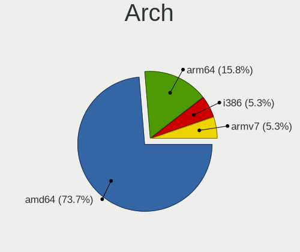

| Name   | Desktops | Percent |
|--------|----------|---------|
| amd64  | 22       | 66.67%  |
| arm64  | 5        | 15.15%  |
| i386   | 3        | 9.09%   |
| armv7  | 2        | 6.06%   |
| macppc | 1        | 3.03%   |

DE
--

Desktop Environment

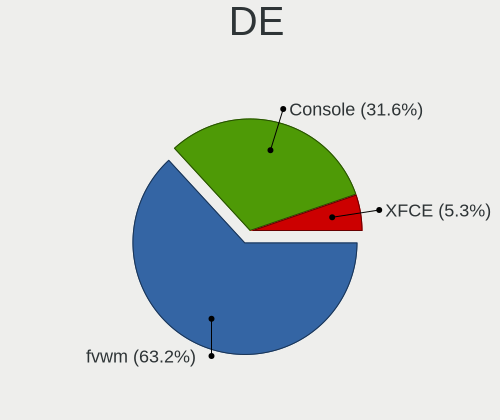

| Name          | Desktops | Percent |
|---------------|----------|---------|
| fvwm          | 21       | 61.76%  |
| Console       | 11       | 32.35%  |
| XFCE          | 1        | 2.94%   |
| Enlightenment | 1        | 2.94%   |

Display Server
--------------

X11 or Wayland

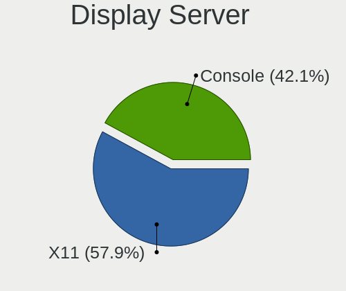

| Name    | Desktops | Percent |
|---------|----------|---------|
| X11     | 20       | 60.61%  |
| Console | 13       | 39.39%  |

Display Manager
---------------

SDDM, LightDM, etc.

| Name    | Desktops | Percent |
|---------|----------|---------|
| Console | 32       | 96.97%  |
| SLiM    | 1        | 3.03%   |

OS Lang
-------

Language

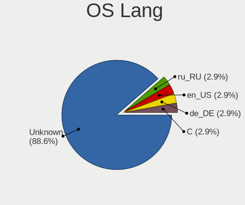

| Lang    | Desktops | Percent |
|---------|----------|---------|
| Unknown | 29       | 87.88%  |
| ru_RU   | 1        | 3.03%   |
| en_US   | 1        | 3.03%   |
| de_DE   | 1        | 3.03%   |
| C       | 1        | 3.03%   |

Boot Mode
---------

EFI or BIOS

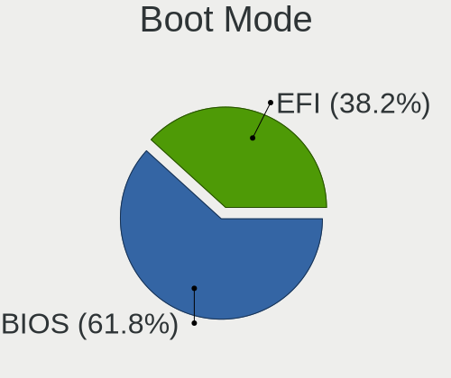

| Mode | Desktops | Percent |
|------|----------|---------|
| BIOS | 20       | 60.61%  |
| EFI  | 13       | 39.39%  |

Filesystem
----------

Type of filesystem

| Type | Desktops | Percent |
|------|----------|---------|
| Ffs  | 33       | 100%    |

Part. scheme
------------

Scheme of partitioning

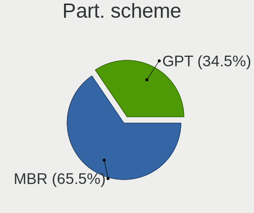

| Type | Desktops | Percent |
|------|----------|---------|
| MBR  | 22       | 66.67%  |
| GPT  | 11       | 33.33%  |

Board
-----

Vendor
------

Motherboard manufacturer

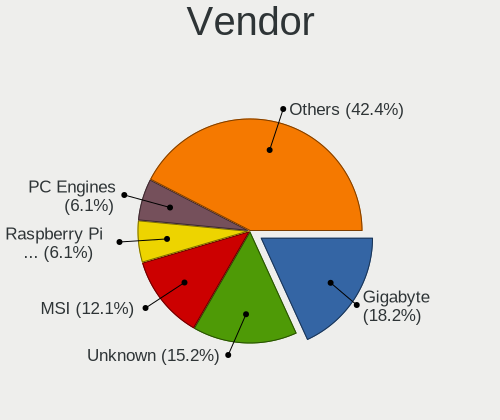

| Name                    | Desktops | Percent |
|-------------------------|----------|---------|
| Gigabyte Technology     | 6        | 18.18%  |
| Unknown                 | 5        | 15.15%  |
| MSI                     | 4        | 12.12%  |
| Raspberry Pi Foundation | 2        | 6.06%   |
| PC Engines              | 2        | 6.06%   |
| Lenovo                  | 2        | 6.06%   |
| Intel                   | 2        | 6.06%   |
| Hewlett-Packard         | 2        | 6.06%   |
| ASRock                  | 2        | 6.06%   |
| Yanling                 | 1        | 3.03%   |
| WYSE                    | 1        | 3.03%   |
| Protectli               | 1        | 3.03%   |
| Dell                    | 1        | 3.03%   |
| ASUSTek Computer        | 1        | 3.03%   |
| Apple                   | 1        | 3.03%   |

Model
-----

Motherboard model

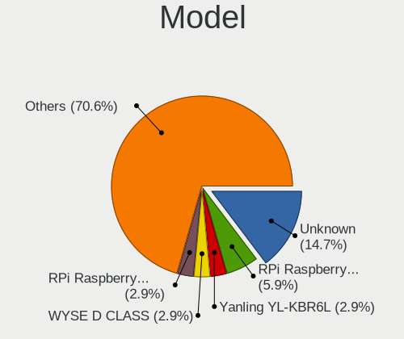

| Name                               | Desktops | Percent |
|------------------------------------|----------|---------|
| Unknown                            | 5        | 15.15%  |
| RPi Raspberry Pi 400               | 2        | 6.06%   |
| Yanling YL-KBR6L                   | 1        | 3.03%   |
| WYSE D CLASS                       | 1        | 3.03%   |
| Protectli FW6                      | 1        | 3.03%   |
| PC Engines apu4                    | 1        | 3.03%   |
| PC Engines APU2                    | 1        | 3.03%   |
| MSI MS-7D54                        | 1        | 3.03%   |
| MSI MS-7C96                        | 1        | 3.03%   |
| MSI MS-7C56                        | 1        | 3.03%   |
| MSI MS-7253                        | 1        | 3.03%   |
| Lenovo ThinkPad T400 2768W3A       | 1        | 3.03%   |
| Lenovo ThinkCentre M73z 10BB001DRU | 1        | 3.03%   |
| Intel DCP847SKE                    | 1        | 3.03%   |
| Intel D945GSEJT                    | 1        | 3.03%   |
| HP t620 Quad Core TC               | 1        | 3.03%   |
| HP Compaq dc5700 Microtower        | 1        | 3.03%   |
| Gigabyte Z590 VISION G             | 1        | 3.03%   |
| Gigabyte X58A-UD5                  | 1        | 3.03%   |
| Gigabyte X470 AORUS ULTRA GAMING   | 1        | 3.03%   |
| Gigabyte H81M-S2PV                 | 1        | 3.03%   |
| Gigabyte BRi3(H)-10110             | 1        | 3.03%   |
| Gigabyte B450M DS3H                | 1        | 3.03%   |
| Dell OptiPlex 755                  | 1        | 3.03%   |
| ASUS P10S-I Series                 | 1        | 3.03%   |
| ASRock X570 Pro4                   | 1        | 3.03%   |
| ASRock FM2A88X Extreme6+           | 1        | 3.03%   |
| Apple PowerMac10,1                 | 1        | 3.03%   |

Model Family
------------

Motherboard model prefix

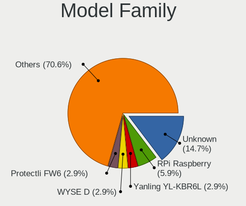

| Name                   | Desktops | Percent |
|------------------------|----------|---------|
| Unknown                | 5        | 15.15%  |
| RPi Raspberry          | 2        | 6.06%   |
| Yanling YL-KBR6L       | 1        | 3.03%   |
| WYSE D                 | 1        | 3.03%   |
| Protectli FW6          | 1        | 3.03%   |
| PC Engines apu4        | 1        | 3.03%   |
| PC Engines APU2        | 1        | 3.03%   |
| MSI MS-7D54            | 1        | 3.03%   |
| MSI MS-7C96            | 1        | 3.03%   |
| MSI MS-7C56            | 1        | 3.03%   |
| MSI MS-7253            | 1        | 3.03%   |
| Lenovo ThinkPad        | 1        | 3.03%   |
| Lenovo ThinkCentre     | 1        | 3.03%   |
| Intel DCP847SKE        | 1        | 3.03%   |
| Intel D945GSEJT        | 1        | 3.03%   |
| HP t620                | 1        | 3.03%   |
| HP Compaq              | 1        | 3.03%   |
| Gigabyte Z590          | 1        | 3.03%   |
| Gigabyte X58A-UD5      | 1        | 3.03%   |
| Gigabyte X470          | 1        | 3.03%   |
| Gigabyte H81M-S2PV     | 1        | 3.03%   |
| Gigabyte BRi3(H)-10110 | 1        | 3.03%   |
| Gigabyte B450M         | 1        | 3.03%   |
| Dell OptiPlex          | 1        | 3.03%   |
| ASUS P10S-I            | 1        | 3.03%   |
| ASRock X570            | 1        | 3.03%   |
| ASRock FM2A88X         | 1        | 3.03%   |
| Apple PowerMac10       | 1        | 3.03%   |

MFG Year
--------

Motherboard manufacture year

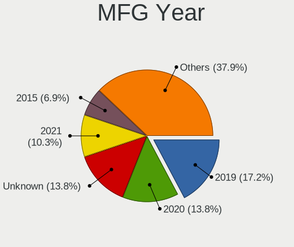

| Year    | Desktops | Percent |
|---------|----------|---------|
| 2019    | 6        | 18.18%  |
| Unknown | 6        | 18.18%  |
| 2020    | 4        | 12.12%  |
| 2021    | 3        | 9.09%   |
| 2018    | 2        | 6.06%   |
| 2015    | 2        | 6.06%   |
| 2014    | 2        | 6.06%   |
| 2022    | 1        | 3.03%   |
| 2016    | 1        | 3.03%   |
| 2012    | 1        | 3.03%   |
| 2011    | 1        | 3.03%   |
| 2009    | 1        | 3.03%   |
| 2008    | 1        | 3.03%   |
| 2007    | 1        | 3.03%   |
| 2006    | 1        | 3.03%   |

Form Factor
-----------

Physical design of the computer

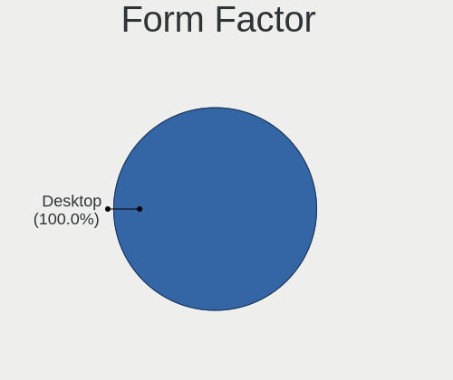

| Name    | Desktops | Percent |
|---------|----------|---------|
| Desktop | 33       | 100%    |

Coreboot
--------

Have coreboot on board

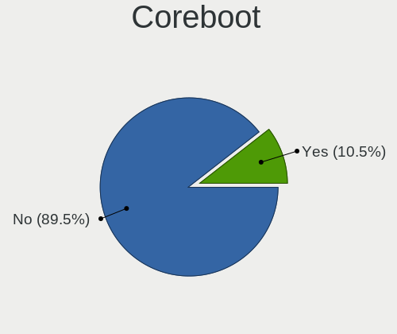

| Used | Desktops | Percent |
|------|----------|---------|
| No   | 30       | 90.91%  |
| Yes  | 3        | 9.09%   |

RAM Size
--------

Total RAM memory

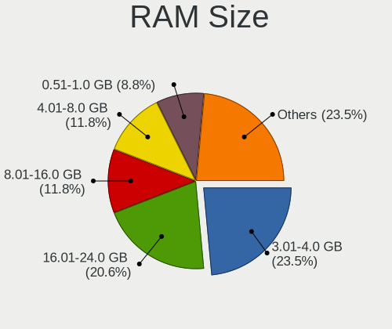

| Size in GB  | Desktops | Percent |
|-------------|----------|---------|
| 3.01-4.0    | 7        | 21.21%  |
| 16.01-24.0  | 7        | 21.21%  |
| 4.01-8.0    | 4        | 12.12%  |
| 8.01-16.0   | 4        | 12.12%  |
| 0.51-1.0    | 3        | 9.09%   |
| 2.01-3.0    | 2        | 6.06%   |
| 1.01-2.0    | 2        | 6.06%   |
| 32.01-64.0  | 1        | 3.03%   |
| 24.01-32.0  | 1        | 3.03%   |
| 64.01-256.0 | 1        | 3.03%   |
| 0.01-0.5    | 1        | 3.03%   |

RAM Used
--------

Used RAM memory

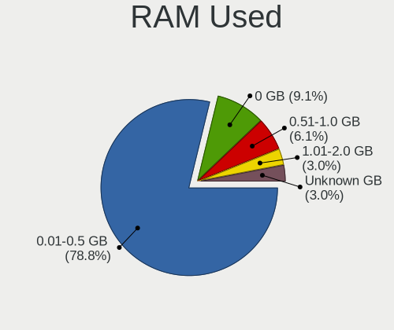

| Used GB  | Desktops | Percent |
|----------|----------|---------|
| 0.01-0.5 | 26       | 78.79%  |
| 0        | 3        | 9.09%   |
| 0.51-1.0 | 2        | 6.06%   |
| 1.01-2.0 | 1        | 3.03%   |
| Unknown  | 1        | 3.03%   |

Total Drives
------------

Number of drives on board

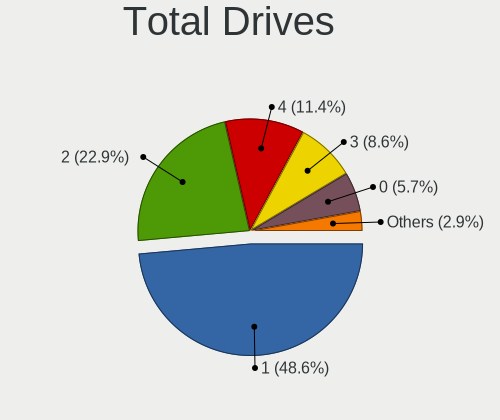

| Drives | Desktops | Percent |
|--------|----------|---------|
| 1      | 16       | 47.06%  |
| 2      | 8        | 23.53%  |
| 4      | 4        | 11.76%  |
| 3      | 3        | 8.82%   |
| 0      | 2        | 5.88%   |
| 6      | 1        | 2.94%   |

Has CD-ROM
----------

Has CD-ROM on board

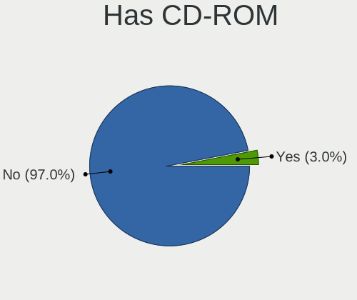

| Presented | Desktops | Percent |
|-----------|----------|---------|
| No        | 32       | 96.97%  |
| Yes       | 1        | 3.03%   |

Has Ethernet
------------

Has Ethernet on board

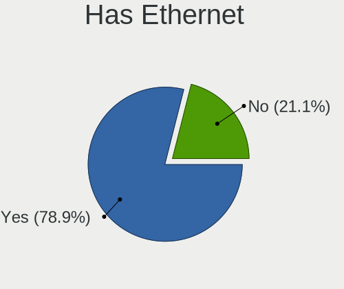

| Presented | Desktops | Percent |
|-----------|----------|---------|
| Yes       | 26       | 78.79%  |
| No        | 7        | 21.21%  |

Has WiFi
--------

Has WiFi module

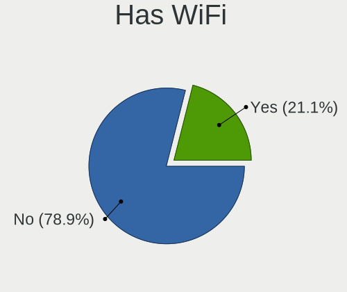

| Presented | Desktops | Percent |
|-----------|----------|---------|
| No        | 24       | 72.73%  |
| Yes       | 9        | 27.27%  |

Has Bluetooth
-------------

Has Bluetooth module

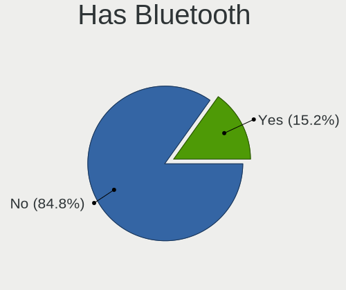

| Presented | Desktops | Percent |
|-----------|----------|---------|
| No        | 28       | 84.85%  |
| Yes       | 5        | 15.15%  |

Location
--------

Country
-------

Geographic location (country)

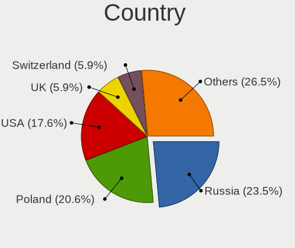

| Country     | Desktops | Percent |
|-------------|----------|---------|
| Russia      | 8        | 24.24%  |
| Poland      | 7        | 21.21%  |
| USA         | 6        | 18.18%  |
| Switzerland | 2        | 6.06%   |
| Germany     | 2        | 6.06%   |
| Ukraine     | 1        | 3.03%   |
| UK          | 1        | 3.03%   |
| Sweden      | 1        | 3.03%   |
| Romania     | 1        | 3.03%   |
| Hungary     | 1        | 3.03%   |
| France      | 1        | 3.03%   |
| Cyprus      | 1        | 3.03%   |
| Austria     | 1        | 3.03%   |

City
----

Geographic location (city)

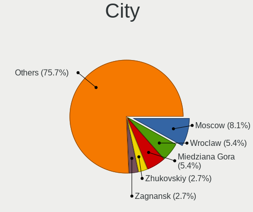

| City            | Desktops | Percent |
|-----------------|----------|---------|
| Moscow          | 3        | 8.57%   |
| Wroclaw         | 2        | 5.71%   |
| Miedziana Gora  | 2        | 5.71%   |
| Zhukovskiy      | 1        | 2.86%   |
| Zagnansk        | 1        | 2.86%   |
| Wolfsburg       | 1        | 2.86%   |
| Wheaton         | 1        | 2.86%   |
| Voskresensk     | 1        | 2.86%   |
| Volgograd       | 1        | 2.86%   |
| Vienna          | 1        | 2.86%   |
| Varpalota       | 1        | 2.86%   |
| Syeverodonets'k | 1        | 2.86%   |
| Stockholm       | 1        | 2.86%   |
| St Petersburg   | 1        | 2.86%   |
| Poplar          | 1        | 2.86%   |
| Onalaska        | 1        | 2.86%   |
| Oensingen       | 1        | 2.86%   |
| Naters          | 1        | 2.86%   |
| Mogilno         | 1        | 2.86%   |
| Lyubertsy       | 1        | 2.86%   |
| Larnaca         | 1        | 2.86%   |
| Kingman         | 1        | 2.86%   |
| Irvine          | 1        | 2.86%   |
| Glendale        | 1        | 2.86%   |
| Giroussens      | 1        | 2.86%   |
| Gdansk          | 1        | 2.86%   |
| Erlangen        | 1        | 2.86%   |
| Cluj-Napoca     | 1        | 2.86%   |
| Burkatow        | 1        | 2.86%   |
| Ames            | 1        | 2.86%   |
| Akarp           | 1        | 2.86%   |

Drives
------

Drive Vendor
------------

Hard drive vendors

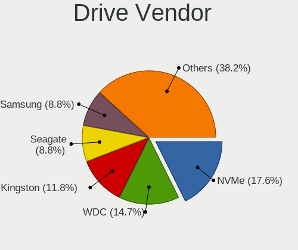

| Vendor                             | Desktops | Drives | Percent |
|------------------------------------|----------|--------|---------|
| WDC                                | 6        | 6      | 12.77%  |
| Seagate                            | 6        | 9      | 12.77%  |
| NVMe                               | 6        | 6      | 12.77%  |
| Toshiba                            | 4        | 4      | 8.51%   |
| Samsung Electronics                | 4        | 5      | 8.51%   |
| Kingston                           | 4        | 6      | 8.51%   |
| StoreJet                           | 1        | 1      | 2.13%   |
| SSDPR-CX                           | 1        | 1      | 2.13%   |
| SanDisk                            | 1        | 1      | 2.13%   |
| Product:              USB DISK 3.0 | 1        | 1      | 2.13%   |
| Product:              USB DISK 2.0 | 1        | 1      | 2.13%   |
| Phison                             | 1        | 1      | 2.13%   |
| Patriot                            | 1        | 1      | 2.13%   |
| OPENBSD                            | 1        | 1      | 2.13%   |
| Maxtor                             | 1        | 2      | 2.13%   |
| Intel                              | 1        | 2      | 2.13%   |
| HPE                                | 1        | 2      | 2.13%   |
| Hitachi                            | 1        | 1      | 2.13%   |
| HGST                               | 1        | 1      | 2.13%   |
| Generic                            | 1        | 1      | 2.13%   |
| Crucial                            | 1        | 1      | 2.13%   |
| ASMT                               | 1        | 1      | 2.13%   |
| Apacer                             | 1        | 1      | 2.13%   |

Drive Model
-----------

Hard drive models

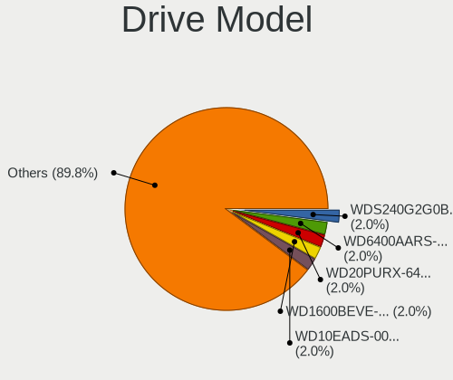

| Model                                                | Desktops | Percent |
|------------------------------------------------------|----------|---------|
| WDC WDS240G2G0B-00EPW0 240GB                         | 1        | 2.04%   |
| WDC WD6400AARS-00Y5B1 640GB                          | 1        | 2.04%   |
| WDC WD20PURX-64P6ZY0 2TB                             | 1        | 2.04%   |
| WDC WD1600BEVE-00UYT0 160GB                          | 1        | 2.04%   |
| WDC WD10EADS-00M2B0 1TB                              | 1        | 2.04%   |
| WDC WD101KFBX-68R56N0 10TB                           | 1        | 2.04%   |
| Toshiba MQ04ABF100 1TB                               | 1        | 2.04%   |
| Toshiba MK3276GSX -63 320GB                          | 1        | 2.04%   |
| Toshiba MK2555GSX 250GB                              | 1        | 2.04%   |
| Toshiba DT01ACA050 500GB                             | 1        | 2.04%   |
| StoreJet Transcend 120GB                             | 1        | 2.04%   |
| SSDPR-CX 400-512-G2 512GB                            | 1        | 2.04%   |
| Seagate ST3250318AS 250GB                            | 1        | 2.04%   |
| Seagate ST250DM000-1BD141 250GB                      | 1        | 2.04%   |
| Seagate ST2000VN000-1HJ164 2TB                       | 1        | 2.04%   |
| Seagate ST2000NE0025-2FL101 2TB                      | 1        | 2.04%   |
| Seagate ST2000DM008-2FR102 2TB                       | 1        | 2.04%   |
| Seagate ST1000LM035-1RK172 1TB                       | 1        | 2.04%   |
| Seagate BUP Slim BL 1TB                              | 1        | 2.04%   |
| SanDisk Ultra 32GB                                   | 1        | 2.04%   |
| Samsung SSD 860 EVO 500GB                            | 1        | 2.04%   |
| Samsung SSD 860 EVO 250GB                            | 1        | 2.04%   |
| Samsung HD501LJ 500GB                                | 1        | 2.04%   |
| Samsung Flash Drive FIT 32GB                         | 1        | 2.04%   |
| Product:              USB DISK 3.0 USB DISK 3.0 64GB | 1        | 2.04%   |
| Product:              USB DISK 2.0 USB DISK 2.0 4GB  | 1        | 2.04%   |
| Phison SATA SSD 16GB                                 | 1        | 2.04%   |
| Patriot Burst 120GB                                  | 1        | 2.04%   |
| OPENBSD SR RAID 1 752GB                              | 1        | 2.04%   |
| NVMe WDS500G3X0C-00SJ 500GB                          | 1        | 2.04%   |
| NVMe WDC WDS100T2B0C- 1TB                            | 1        | 2.04%   |
| NVMe TOSHIBA-RC100 240GB                             | 1        | 2.04%   |
| NVMe Samsung SSD 980 1TB                             | 1        | 2.04%   |
| NVMe Samsung SSD 970 250GB                           | 1        | 2.04%   |
| NVMe PCIe SSD 512GB                                  | 1        | 2.04%   |
| Maxtor 6Y160P0 160GB                                 | 1        | 2.04%   |
| Maxtor 6Y080L0 82GB                                  | 1        | 2.04%   |
| Kingston SV300S37A240G 240GB                         | 1        | 2.04%   |
| Kingston SUV500MS480G 480GB                          | 1        | 2.04%   |
| Kingston SUV500MS240G 240GB                          | 1        | 2.04%   |
| Kingston SMS200S330G 32GB                            | 1        | 2.04%   |
| Intel SSDSC2BW240A4 240GB                            | 1        | 2.04%   |
| HPE MK000480GWXFF 480GB                              | 1        | 2.04%   |
| Hitachi HUA723020ALA640 2TB                          | 1        | 2.04%   |
| HGST HUS724020ALA640 2TB                             | 1        | 2.04%   |
| Generic Flash Disk 2GB                               | 1        | 2.04%   |
| Crucial M4-CT128M4SSD2 128GB                         | 1        | 2.04%   |
| ASMT 2115 500GB                                      | 1        | 2.04%   |
| Apacer 8GB SATA Flash Drive                          | 1        | 2.04%   |

HDD Vendor
----------

Hard disk drive vendors

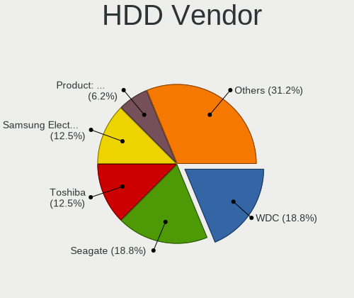

| Vendor                             | Desktops | Drives | Percent |
|------------------------------------|----------|--------|---------|
| Seagate                            | 6        | 9      | 20%     |
| WDC                                | 5        | 5      | 16.67%  |
| Toshiba                            | 4        | 4      | 13.33%  |
| NVMe                               | 3        | 3      | 10%     |
| Samsung Electronics                | 2        | 3      | 6.67%   |
| StoreJet                           | 1        | 1      | 3.33%   |
| SSDPR-CX                           | 1        | 1      | 3.33%   |
| Product:              USB DISK 3.0 | 1        | 1      | 3.33%   |
| Product:              USB DISK 2.0 | 1        | 1      | 3.33%   |
| OPENBSD                            | 1        | 1      | 3.33%   |
| Maxtor                             | 1        | 2      | 3.33%   |
| Hitachi                            | 1        | 1      | 3.33%   |
| HGST                               | 1        | 1      | 3.33%   |
| Generic                            | 1        | 1      | 3.33%   |
| ASMT                               | 1        | 1      | 3.33%   |

SSD Vendor
----------

Solid state drive vendors

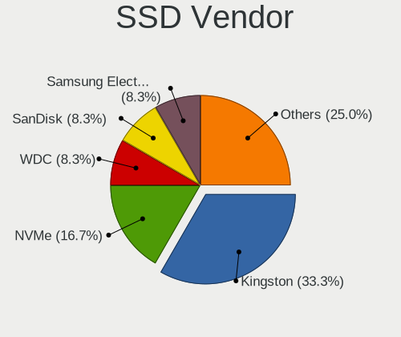

| Vendor              | Desktops | Drives | Percent |
|---------------------|----------|--------|---------|
| Kingston            | 4        | 6      | 23.53%  |
| NVMe                | 3        | 3      | 17.65%  |
| Samsung Electronics | 2        | 2      | 11.76%  |
| WDC                 | 1        | 1      | 5.88%   |
| SanDisk             | 1        | 1      | 5.88%   |
| Phison              | 1        | 1      | 5.88%   |
| Patriot             | 1        | 1      | 5.88%   |
| Intel               | 1        | 2      | 5.88%   |
| HPE                 | 1        | 2      | 5.88%   |
| Crucial             | 1        | 1      | 5.88%   |
| Apacer              | 1        | 1      | 5.88%   |

Drive Kind
----------

HDD or SSD

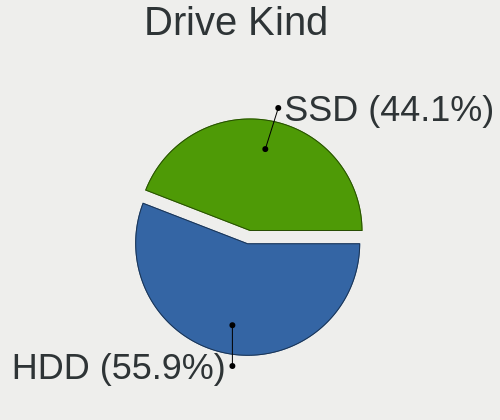

| Kind | Desktops | Drives | Percent |
|------|----------|--------|---------|
| HDD  | 19       | 35     | 55.88%  |
| SSD  | 15       | 21     | 44.12%  |

Drive Connector
---------------

SATA, SAS, NVMe, etc.

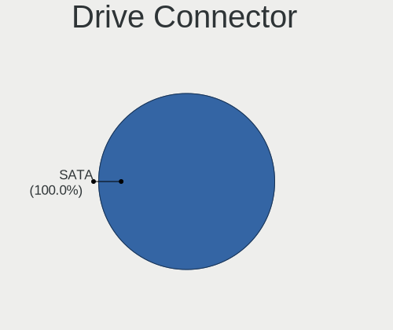

| Type | Desktops | Drives | Percent |
|------|----------|--------|---------|
| SATA | 29       | 56     | 100%    |

Drive Size
----------

Size of hard drive

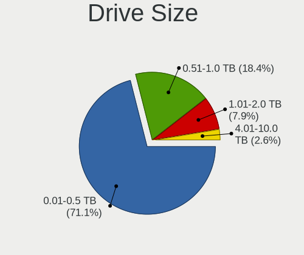

| Size in TB | Desktops | Drives | Percent |
|------------|----------|--------|---------|
| 0.01-0.5   | 25       | 37     | 67.57%  |
| 0.51-1.0   | 8        | 10     | 21.62%  |
| 1.01-2.0   | 3        | 8      | 8.11%   |
| 4.01-10.0  | 1        | 1      | 2.7%    |

Space Total
-----------

Amount of disk space available on the file system

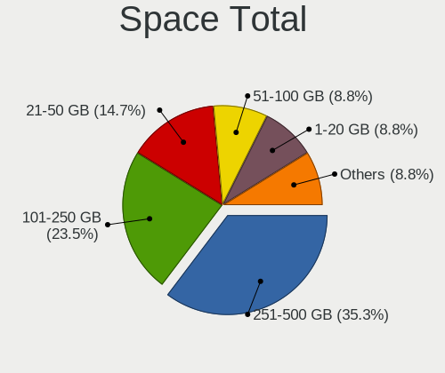

| Size in GB     | Desktops | Percent |
|----------------|----------|---------|
| 251-500        | 12       | 35.29%  |
| 101-250        | 8        | 23.53%  |
| 21-50          | 5        | 14.71%  |
| 1-20           | 3        | 8.82%   |
| 51-100         | 3        | 8.82%   |
| 501-1000       | 2        | 5.88%   |
| More than 3000 | 1        | 2.94%   |

Space Used
----------

Amount of used disk space

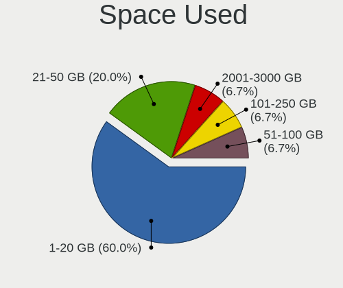

| Used GB   | Desktops | Percent |
|-----------|----------|---------|
| 1-20      | 21       | 63.64%  |
| 21-50     | 5        | 15.15%  |
| 101-250   | 4        | 12.12%  |
| 2001-3000 | 1        | 3.03%   |
| 501-1000  | 1        | 3.03%   |
| 51-100    | 1        | 3.03%   |

Malfunc. Drives
---------------

Drive models with a malfunction

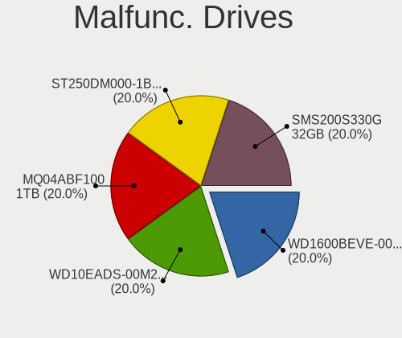

| Model                           | Desktops | Drives | Percent |
|---------------------------------|----------|--------|---------|
| WDC WD1600BEVE-00UYT0 160GB     | 1        | 1      | 20%     |
| WDC WD10EADS-00M2B0 1TB         | 1        | 1      | 20%     |
| Toshiba MQ04ABF100 1TB          | 1        | 1      | 20%     |
| Seagate ST250DM000-1BD141 250GB | 1        | 1      | 20%     |
| Kingston SMS200S330G 32GB       | 1        | 2      | 20%     |

Malfunc. Drive Vendor
---------------------

Vendors of faulty drives

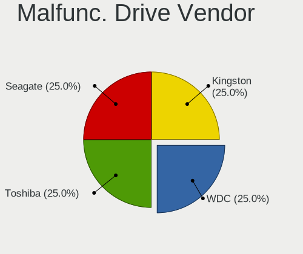

| Vendor   | Desktops | Drives | Percent |
|----------|----------|--------|---------|
| WDC      | 2        | 2      | 40%     |
| Toshiba  | 1        | 1      | 20%     |
| Seagate  | 1        | 1      | 20%     |
| Kingston | 1        | 2      | 20%     |

Malfunc. HDD Vendor
-------------------

Vendors of faulty HDD drives

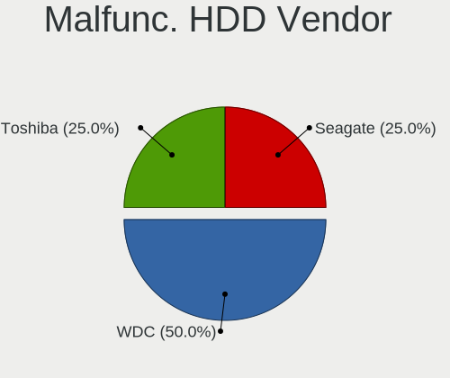

| Vendor  | Desktops | Drives | Percent |
|---------|----------|--------|---------|
| WDC     | 2        | 2      | 50%     |
| Toshiba | 1        | 1      | 25%     |
| Seagate | 1        | 1      | 25%     |

Malfunc. Drive Kind
-------------------

Kinds of faulty drives

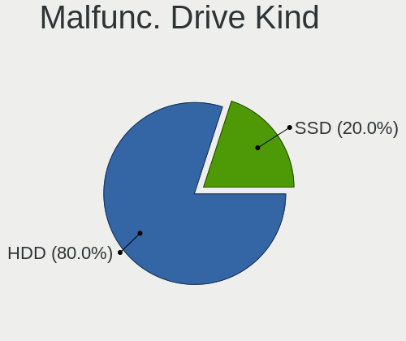

| Kind | Desktops | Drives | Percent |
|------|----------|--------|---------|
| HDD  | 4        | 4      | 80%     |
| SSD  | 1        | 2      | 20%     |

Failed Drives
-------------

Failed drive models

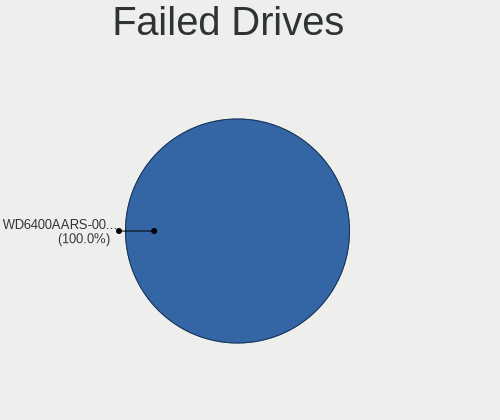

| Model                       | Desktops | Drives | Percent |
|-----------------------------|----------|--------|---------|
| WDC WD6400AARS-00Y5B1 640GB | 1        | 1      | 100%    |

Failed Drive Vendor
-------------------

Failed drive vendors

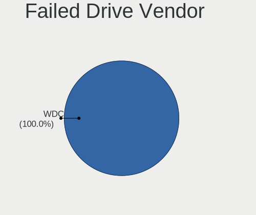

| Vendor | Desktops | Drives | Percent |
|--------|----------|--------|---------|
| WDC    | 1        | 1      | 100%    |

Drive Status
------------

Number of failed and malfunc. drives

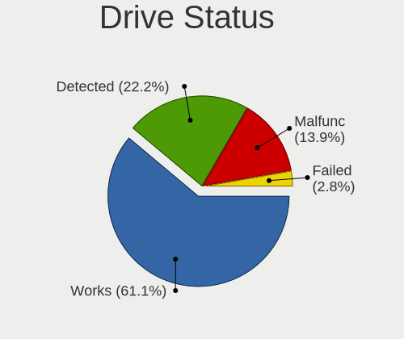

| Status   | Desktops | Drives | Percent |
|----------|----------|--------|---------|
| Works    | 22       | 35     | 59.46%  |
| Detected | 9        | 14     | 24.32%  |
| Malfunc  | 5        | 6      | 13.51%  |
| Failed   | 1        | 1      | 2.7%    |

Storage controller
------------------

Storage Vendor
--------------

Storage controller vendors

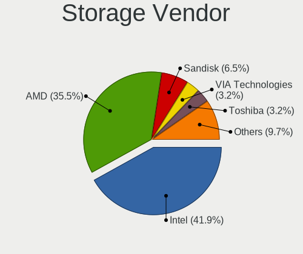

| Vendor                 | Desktops | Percent |
|------------------------|----------|---------|
| Intel                  | 13       | 41.94%  |
| AMD                    | 11       | 35.48%  |
| SanDisk                | 2        | 6.45%   |
| VIA Technologies       | 1        | 3.23%   |
| Toshiba                | 1        | 3.23%   |
| Samsung Electronics    | 1        | 3.23%   |
| Phison Electronics     | 1        | 3.23%   |
| HighPoint Technologies | 1        | 3.23%   |

Storage Model
-------------

Storage controller models

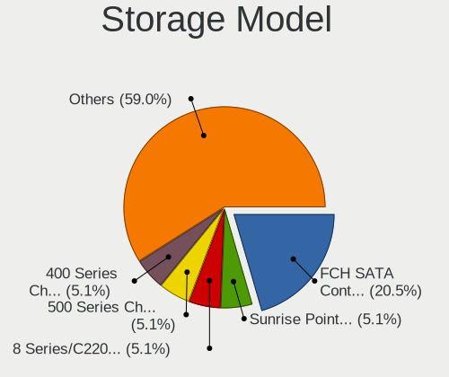

| Model                                                                          | Desktops | Percent |
|--------------------------------------------------------------------------------|----------|---------|
| AMD FCH SATA Controller [AHCI mode]                                            | 8        | 21.05%  |
| Intel Sunrise Point-LP SATA Controller [AHCI mode]                             | 2        | 5.26%   |
| Intel 8 Series/C220 Series Chipset Family 6-port SATA Controller 1 [AHCI mode] | 2        | 5.26%   |
| AMD 500 Series Chipset SATA Controller                                         | 2        | 5.26%   |
| AMD 400 Series Chipset SATA Controller                                         | 2        | 5.26%   |
| VIA VT82C586A/B/VT82C686/A/B/VT823x/A/C PIPC Bus Master IDE                    | 1        | 2.63%   |
| VIA VT8237A SATA 2-Port Controller                                             | 1        | 2.63%   |
| Toshiba BG3 NVMe SSD Controller                                                | 1        | 2.63%   |
| SanDisk WD Black SN750 / PC SN730 NVMe SSD                                     | 1        | 2.63%   |
| SanDisk unknown                                                                | 1        | 2.63%   |
| Samsung NVMe SSD Controller 980                                                | 1        | 2.63%   |
| Phison E12 NVMe Controller                                                     | 1        | 2.63%   |
| Intel Q170/Q150/B150/H170/H110/Z170/CM236 Chipset SATA Controller [AHCI Mode]  | 1        | 2.63%   |
| Intel Comet Lake SATA AHCI Controller                                          | 1        | 2.63%   |
| Intel 82Q35 Express PT IDER Controller                                         | 1        | 2.63%   |
| Intel 82801JI (ICH10 Family) 4 port SATA IDE Controller #1                     | 1        | 2.63%   |
| Intel 82801JI (ICH10 Family) 2 port SATA IDE Controller #2                     | 1        | 2.63%   |
| Intel 82801IR/IO/IH (ICH9R/DO/DH) 6 port SATA Controller [AHCI mode]           | 1        | 2.63%   |
| Intel 82801IBM/IEM (ICH9M/ICH9M-E) 4 port SATA Controller [AHCI mode]          | 1        | 2.63%   |
| Intel 82801HR/HO/HH (ICH8R/DO/DH) 2 port SATA Controller [IDE mode]            | 1        | 2.63%   |
| Intel 82801H (ICH8 Family) 4 port SATA Controller [IDE mode]                   | 1        | 2.63%   |
| Intel 82801GBM/GHM (ICH7-M Family) SATA Controller [IDE mode]                  | 1        | 2.63%   |
| Intel 82801G (ICH7 Family) IDE Controller                                      | 1        | 2.63%   |
| Intel 7 Series Chipset Family 6-port SATA Controller [AHCI mode]               | 1        | 2.63%   |
| Intel 500 Series Chipset Family SATA AHCI Controller                           | 1        | 2.63%   |
| HighPoint unknown                                                              | 1        | 2.63%   |
| AMD SB7x0/SB8x0/SB9x0 SATA Controller [IDE mode]                               | 1        | 2.63%   |

Storage Kind
------------

Kind of storage controller (IDE, SATA, NVMe, SAS, ...)

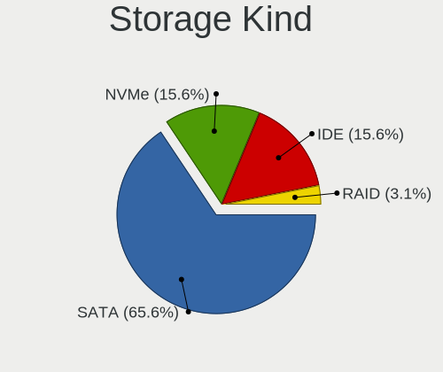

| Kind | Desktops | Percent |
|------|----------|---------|
| SATA | 21       | 65.63%  |
| NVMe | 5        | 15.63%  |
| IDE  | 5        | 15.63%  |
| RAID | 1        | 3.13%   |

Processor
---------

CPU Vendor
----------

Processor vendors

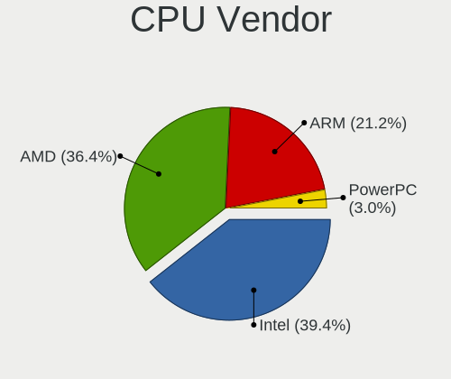

| Vendor  | Desktops | Percent |
|---------|----------|---------|
| Intel   | 13       | 39.39%  |
| AMD     | 12       | 36.36%  |
| ARM     | 7        | 21.21%  |
| PowerPC | 1        | 3.03%   |

CPU Model
---------

Processor models

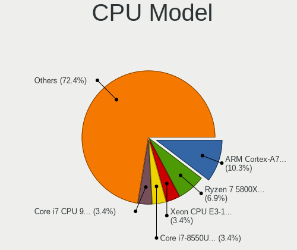

| Model                                                                                 | Desktops | Percent |
|---------------------------------------------------------------------------------------|----------|---------|
| ARM Cortex-A72 r0p3                                                                   | 3        | 9.09%   |
| ARM Cortex-A53 r0p4                                                                   | 2        | 6.06%   |
| AMD Ryzen 7 5800X 8-Core Processor                                                    | 2        | 6.06%   |
| AMD GX-412TC SOC                                                                      | 2        | 6.06%   |
| PowerPC 7447A (Revision 0x102)                                                        | 1        | 3.03%   |
| Intel Xeon CPU E3-1220 v5 @ 3.00GHz                                                   | 1        | 3.03%   |
| Intel Core i7-8550U CPU @ 1.80GHz                                                     | 1        | 3.03%   |
| Intel Core i7 CPU 970 @ 3.20GHz                                                       | 1        | 3.03%   |
| Intel Core i5-4570S CPU @ 2.90GHz                                                     | 1        | 3.03%   |
| Intel Core i3-10110U CPU @ 2.10GHz                                                    | 1        | 3.03%   |
| Intel Core 2 Duo CPU P8600 @ 2.40GHz                                                  | 1        | 3.03%   |
| Intel Core 2 Duo CPU E8400 @ 3.00GHz                                                  | 1        | 3.03%   |
| Intel Core 2 CPU 6400 @ 2.13GHz                                                       | 1        | 3.03%   |
| Intel Celeron CPU G1820 @ 2.70GHz                                                     | 1        | 3.03%   |
| Intel Celeron CPU 847E @ 1.10GHz                                                      | 1        | 3.03%   |
| Intel Celeron CPU 3865U @ 1.80GHz                                                     | 1        | 3.03%   |
| Intel Atom CPU N270 @ 1.60GHz ("GenuineIntel" 686-class)                              | 1        | 3.03%   |
| Intel 11th Gen Core i9-11900K @ 3.50GHz                                               | 1        | 3.03%   |
| ARM Cortex-A8 r3p2                                                                    | 1        | 3.03%   |
| ARM Cortex-A7 r0p4                                                                    | 1        | 3.03%   |
| AMD Ryzen 7 5700G with Radeon Graphics                                                | 1        | 3.03%   |
| AMD Ryzen 7 2700 Eight-Core Processor                                                 | 1        | 3.03%   |
| AMD Ryzen 5 3600 6-Core Processor                                                     | 1        | 3.03%   |
| AMD Ryzen 3 3100 4-Core Processor                                                     | 1        | 3.03%   |
| AMD GX-415GA SOC with Radeon HD Graphics                                              | 1        | 3.03%   |
| AMD G-T48E Processor                                                                  | 1        | 3.03%   |
| AMD Athlon 64 X2 Dual Core Processor 4000+ ("AuthenticAMD" 686-class, 512KB L2 cache) | 1        | 3.03%   |
| AMD A10-6800K APU with Radeon HD Graphics                                             | 1        | 3.03%   |

CPU Model Family
----------------

Processor model prefix

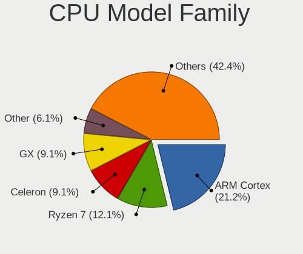

| Model            | Desktops | Percent |
|------------------|----------|---------|
| ARM Cortex       | 7        | 21.21%  |
| AMD Ryzen 7      | 4        | 12.12%  |
| Intel Celeron    | 3        | 9.09%   |
| AMD GX           | 3        | 9.09%   |
| Other            | 2        | 6.06%   |
| Intel Core i7    | 2        | 6.06%   |
| Intel Core 2 Duo | 2        | 6.06%   |
| Intel Xeon       | 1        | 3.03%   |
| Intel Core i5    | 1        | 3.03%   |
| Intel Core i3    | 1        | 3.03%   |
| Intel Core 2     | 1        | 3.03%   |
| Intel Atom       | 1        | 3.03%   |
| AMD Ryzen 5      | 1        | 3.03%   |
| AMD Ryzen 3      | 1        | 3.03%   |
| AMD G            | 1        | 3.03%   |
| AMD Athlon 64 X2 | 1        | 3.03%   |
| AMD A10          | 1        | 3.03%   |

CPU Cores
---------

Number of processor cores

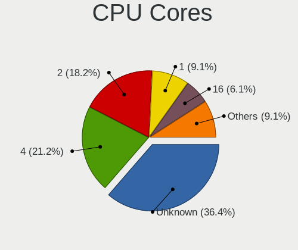

| Number  | Desktops | Percent |
|---------|----------|---------|
| Unknown | 12       | 36.36%  |
| 4       | 7        | 21.21%  |
| 2       | 6        | 18.18%  |
| 1       | 3        | 9.09%   |
| 16      | 2        | 6.06%   |
| 8       | 2        | 6.06%   |
| 6       | 1        | 3.03%   |

CPU Sockets
-----------

Number of sockets

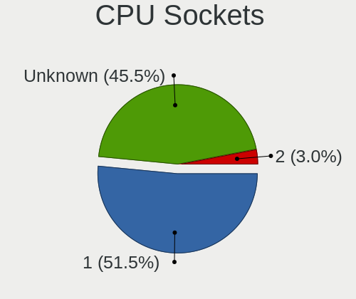

| Number  | Desktops | Percent |
|---------|----------|---------|
| 1       | 17       | 51.52%  |
| Unknown | 15       | 45.45%  |
| 2       | 1        | 3.03%   |

CPU Threads
-----------

Threads per core (Hyper-Threading)

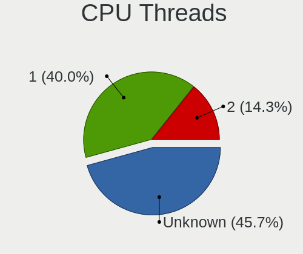

| Number  | Desktops | Percent |
|---------|----------|---------|
| Unknown | 15       | 45.45%  |
| 1       | 14       | 42.42%  |
| 2       | 4        | 12.12%  |

CPU Microarch
-------------

Microarchitecture

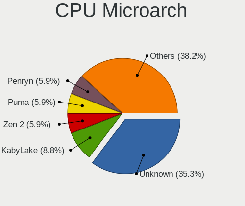

| Name        | Desktops | Percent |
|-------------|----------|---------|
| Unknown     | 12       | 36.36%  |
| KabyLake    | 3        | 9.09%   |
| Zen 2       | 2        | 6.06%   |
| Puma        | 2        | 6.06%   |
| Penryn      | 2        | 6.06%   |
| Haswell     | 2        | 6.06%   |
| Zen+        | 1        | 3.03%   |
| Zen 3       | 1        | 3.03%   |
| Westmere    | 1        | 3.03%   |
| Skylake     | 1        | 3.03%   |
| SandyBridge | 1        | 3.03%   |
| Piledriver  | 1        | 3.03%   |
| Jaguar      | 1        | 3.03%   |
| Core        | 1        | 3.03%   |
| Bonnell     | 1        | 3.03%   |
| Bobcat      | 1        | 3.03%   |

Graphics
--------

GPU Vendor
----------

Vendors of graphics cards

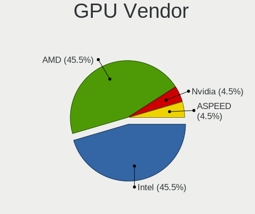

| Vendor            | Desktops | Percent |
|-------------------|----------|---------|
| Intel             | 11       | 45.83%  |
| AMD               | 11       | 45.83%  |
| Nvidia            | 1        | 4.17%   |
| ASPEED Technology | 1        | 4.17%   |

GPU Model
---------

Graphics card models

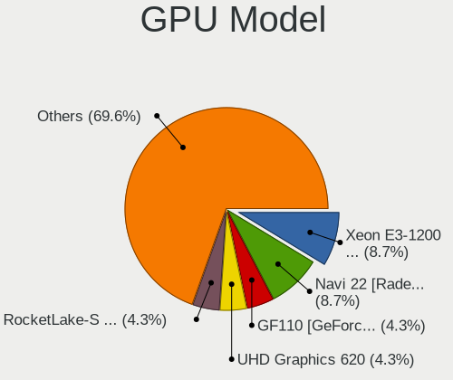

| Model                                                                         | Desktops | Percent |
|-------------------------------------------------------------------------------|----------|---------|
| Intel Xeon E3-1200 v3/4th Gen Core Processor Integrated Graphics Controller   | 2        | 8%      |
| AMD Navi 22 [Radeon RX 6700/6700 XT/6750 XT / 6800M]                          | 2        | 8%      |
| Nvidia GF110 [GeForce GTX 580]                                                | 1        | 4%      |
| Intel UHD Graphics 620                                                        | 1        | 4%      |
| Intel RocketLake-S GT1 [UHD Graphics 750]                                     | 1        | 4%      |
| Intel Mobile 945GSE Express Integrated Graphics Controller                    | 1        | 4%      |
| Intel Mobile 945GM/GMS/GME, 943/940GML Express Integrated Graphics Controller | 1        | 4%      |
| Intel Mobile 4 Series Chipset Integrated Graphics Controller                  | 1        | 4%      |
| Intel Kaby Lake-U GT1 Integrated Graphics Controller                          | 1        | 4%      |
| Intel CometLake-U GT2 [UHD Graphics]                                          | 1        | 4%      |
| Intel 82Q963/Q965 Integrated Graphics Controller                              | 1        | 4%      |
| Intel 82Q35 Express Integrated Graphics Controller                            | 1        | 4%      |
| Intel 2nd Generation Core Processor Family Integrated Graphics Controller     | 1        | 4%      |
| ASPEED Technology ASPEED Graphics Family                                      | 1        | 4%      |
| AMD Wrestler [Radeon HD 6250]                                                 | 1        | 4%      |
| AMD RV635 [Radeon HD 3650/3750/4570/4580]                                     | 1        | 4%      |
| AMD RV280 [Radeon 9200]                                                       | 1        | 4%      |
| AMD Richland [Radeon HD 8670D]                                                | 1        | 4%      |
| AMD Oland PRO [Radeon R7 240/340 / Radeon 520]                                | 1        | 4%      |
| AMD Navi 14 [Radeon RX 5500/5500M / Pro 5500M]                                | 1        | 4%      |
| AMD Kabini [Radeon HD 8330E]                                                  | 1        | 4%      |
| AMD Ellesmere [Radeon RX 470/480/570/570X/580/580X/590]                       | 1        | 4%      |
| AMD Cezanne                                                                   | 1        | 4%      |

GPU Combo
---------

Combinations of graphics cards

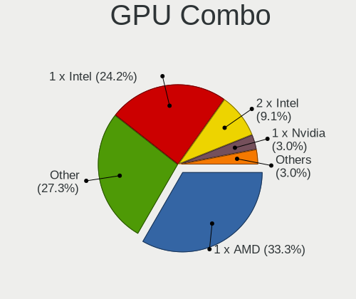

| Name       | Desktops | Percent |
|------------|----------|---------|
| 1 x AMD    | 11       | 33.33%  |
| Other      | 9        | 27.27%  |
| 1 x Intel  | 8        | 24.24%  |
| 2 x Intel  | 3        | 9.09%   |
| 1 x Nvidia | 1        | 3.03%   |
| 1 x ASPEED | 1        | 3.03%   |

GPU Driver
----------

Free vs proprietary

| Driver  | Desktops | Percent |
|---------|----------|---------|
| Free    | 22       | 64.71%  |
| Unknown | 12       | 35.29%  |

GPU Memory
----------

Total video memory

| Size in GB | Desktops | Percent |
|------------|----------|---------|
| Unknown    | 33       | 100%    |

Monitor
-------

Monitor Vendor
--------------

Monitor vendors

| Vendor               | Desktops | Percent |
|----------------------|----------|---------|
| Samsung Electronics  | 2        | 15.38%  |
| Ancor Communications | 2        | 15.38%  |
| SHI                  | 1        | 7.69%   |
| Philips              | 1        | 7.69%   |
| NEC Computers        | 1        | 7.69%   |
| Lenovo               | 1        | 7.69%   |
| Iiyama               | 1        | 7.69%   |
| Goldstar             | 1        | 7.69%   |
| Dell                 | 1        | 7.69%   |
| AOC                  | 1        | 7.69%   |
| Acer                 | 1        | 7.69%   |

Monitor Model
-------------

Monitor models

| Model                                                                 | Desktops | Percent |
|-----------------------------------------------------------------------|----------|---------|
| SHI LCD-TV**** SHI6102 1360x768 700x390mm 31.5-inch                   | 1        | 7.69%   |
| Samsung Electronics S24D390 SAM0B65 1920x1080 520x290mm 23.4-inch     | 1        | 7.69%   |
| Samsung Electronics LCD Monitor SAM7103 3840x2160 700x390mm 31.5-inch | 1        | 7.69%   |
| Philips LCD Monitor PHLC00B 1280x1024 340x270mm 17.1-inch             | 1        | 7.69%   |
| NEC Computers EX341R NEC2C7A 3440x1440 800x330mm 34.1-inch            | 1        | 7.69%   |
| Lenovo LCD Monitor LEN4033 1440x900 300x190mm 14.0-inch               | 1        | 7.69%   |
| Iiyama PL3288UH IVM7610 3840x2160 700x390mm 31.5-inch                 | 1        | 7.69%   |
| Goldstar LG FULL HD GSM5B55 1920x1080 480x270mm 21.7-inch             | 1        | 7.69%   |
| Dell P2312H DEL4076 1920x1080 510x290mm 23.1-inch                     | 1        | 7.69%   |
| AOC 2350 AOC2350 1920x1080 510x290mm 23.1-inch                        | 1        | 7.69%   |
| Ancor Communications PA249 ACI24B2 1920x1200 520x320mm 24.0-inch      | 1        | 7.69%   |
| Ancor Communications ASUS VW199 ACI19ED 1440x900 410x260mm 19.1-inch  | 1        | 7.69%   |
| Acer VG220Q ACR06D8 1920x1080 480x270mm 21.7-inch                     | 1        | 7.69%   |

Monitor Resolution
------------------

Monitor screen resolution

| Resolution        | Desktops | Percent |
|-------------------|----------|---------|
| 1920x1080 (FHD)   | 4        | 33.33%  |
| 3840x2160 (4K)    | 2        | 16.67%  |
| 1440x900 (WXGA+)  | 2        | 16.67%  |
| 3440x1440         | 1        | 8.33%   |
| 1920x1200 (WUXGA) | 1        | 8.33%   |
| 1360x768          | 1        | 8.33%   |
| 1280x1024 (SXGA)  | 1        | 8.33%   |

Monitor Diagonal
----------------

Diagonal size in inches

| Inches | Desktops | Percent |
|--------|----------|---------|
| 31     | 3        | 25%     |
| 23     | 2        | 16.67%  |
| 21     | 2        | 16.67%  |
| 34     | 1        | 8.33%   |
| 24     | 1        | 8.33%   |
| 19     | 1        | 8.33%   |
| 17     | 1        | 8.33%   |
| 14     | 1        | 8.33%   |

Monitor Width
-------------

Physical width

| Width in mm | Desktops | Percent |
|-------------|----------|---------|
| 601-700     | 3        | 25%     |
| 501-600     | 3        | 25%     |
| 401-500     | 3        | 25%     |
| 701-800     | 1        | 8.33%   |
| 301-350     | 1        | 8.33%   |
| 201-300     | 1        | 8.33%   |

Aspect Ratio
------------

Proportional relationship between the width and the height

| Ratio | Desktops | Percent |
|-------|----------|---------|
| 16/9  | 7        | 58.33%  |
| 16/10 | 3        | 25%     |
| 5/4   | 1        | 8.33%   |
| 21/9  | 1        | 8.33%   |

Monitor Area
------------

Area in inch²

| Area in inch² | Desktops | Percent |
|----------------|----------|---------|
| 351-500        | 4        | 33.33%  |
| 201-250        | 4        | 33.33%  |
| 81-90          | 1        | 8.33%   |
| 251-300        | 1        | 8.33%   |
| 151-200        | 1        | 8.33%   |
| 141-150        | 1        | 8.33%   |

Pixel Density
-------------

Pixels per inch

| Density | Desktops | Percent |
|---------|----------|---------|
| 51-100  | 5        | 41.67%  |
| 121-160 | 3        | 25%     |
| 101-120 | 3        | 25%     |
| 1-50    | 1        | 8.33%   |

Multiple Monitors
-----------------

Total monitors connected

| Total | Desktops | Percent |
|-------|----------|---------|
| 0     | 17       | 50%     |
| 1     | 16       | 47.06%  |
| 2     | 1        | 2.94%   |

Network
-------

Net Controller Vendor
---------------------

Controller vendors

| Vendor                          | Desktops | Percent |
|---------------------------------|----------|---------|
| Intel                           | 15       | 42.86%  |
| Realtek Semiconductor           | 9        | 25.71%  |
| Qualcomm Atheros Communications | 3        | 8.57%   |
| Qualcomm Atheros                | 2        | 5.71%   |
| VIA Technologies                | 1        | 2.86%   |
| TP-Link                         | 1        | 2.86%   |
| LG Electronics                  | 1        | 2.86%   |
| Broadcom                        | 1        | 2.86%   |
| Apple                           | 1        | 2.86%   |
| 3Com                            | 1        | 2.86%   |

Net Controller Model
--------------------

Controller models

| Model                                                             | Desktops | Percent |
|-------------------------------------------------------------------|----------|---------|
| Realtek RTL8111/8168/8411 PCI Express Gigabit Ethernet Controller | 8        | 21.05%  |
| Intel I211 Gigabit Network Connection                             | 4        | 10.53%  |
| Qualcomm Atheros AR9271 802.11n                                   | 3        | 7.89%   |
| Intel I210 Gigabit Network Connection                             | 2        | 5.26%   |
| VIA VT6102/VT6103 [Rhine-II]                                      | 1        | 2.63%   |
| TP-Link TL-WN722N v2/v3 [Realtek RTL8188EUS]                      | 1        | 2.63%   |
| Realtek RTL8125 2.5GbE Controller                                 | 1        | 2.63%   |
| Qualcomm Atheros QCA8171 Gigabit Ethernet                         | 1        | 2.63%   |
| Qualcomm Atheros AR9485 Wireless Network Adapter                  | 1        | 2.63%   |
| LG Optimus Android Phone [USB tethering mode]                     | 1        | 2.63%   |
| Intel Wireless 7260                                               | 1        | 2.63%   |
| Intel Wi-Fi 6 AX210/AX211/AX411 160MHz                            | 1        | 2.63%   |
| Intel Ultimate N WiFi Link 5300                                   | 1        | 2.63%   |
| Intel Ethernet Controller I225-V                                  | 1        | 2.63%   |
| Intel Ethernet Connection I217-V                                  | 1        | 2.63%   |
| Intel Ethernet Connection (6) I219-V                              | 1        | 2.63%   |
| Intel Centrino Wireless-N 2230                                    | 1        | 2.63%   |
| Intel 82583V Gigabit Network Connection                           | 1        | 2.63%   |
| Intel 82579V Gigabit Network Connection                           | 1        | 2.63%   |
| Intel 82567LM Gigabit Network Connection                          | 1        | 2.63%   |
| Intel 82566DM-2 Gigabit Network Connection                        | 1        | 2.63%   |
| Intel 82557/8/9/0/1 Ethernet Pro 100                              | 1        | 2.63%   |
| Broadcom NetXtreme BCM5755 Gigabit Ethernet PCI Express           | 1        | 2.63%   |
| Apple UniNorth 2 GMAC (Sun GEM)                                   | 1        | 2.63%   |
| 3Com 3c905C-TX/TX-M [Tornado]                                     | 1        | 2.63%   |

Wireless Vendor
---------------

Wireless vendors

| Vendor                          | Desktops | Percent |
|---------------------------------|----------|---------|
| Intel                           | 4        | 44.44%  |
| Qualcomm Atheros Communications | 3        | 33.33%  |
| TP-Link                         | 1        | 11.11%  |
| Qualcomm Atheros                | 1        | 11.11%  |

Wireless Model
--------------

Wireless models

| Model                                            | Desktops | Percent |
|--------------------------------------------------|----------|---------|
| Qualcomm Atheros AR9271 802.11n                  | 3        | 33.33%  |
| TP-Link TL-WN722N v2/v3 [Realtek RTL8188EUS]     | 1        | 11.11%  |
| Qualcomm Atheros AR9485 Wireless Network Adapter | 1        | 11.11%  |
| Intel Wireless 7260                              | 1        | 11.11%  |
| Intel Wi-Fi 6 AX210/AX211/AX411 160MHz           | 1        | 11.11%  |
| Intel Ultimate N WiFi Link 5300                  | 1        | 11.11%  |
| Intel Centrino Wireless-N 2230                   | 1        | 11.11%  |

Ethernet Vendor
---------------

Ethernet vendors

| Vendor                | Desktops | Percent |
|-----------------------|----------|---------|
| Intel                 | 14       | 50%     |
| Realtek Semiconductor | 9        | 32.14%  |
| VIA Technologies      | 1        | 3.57%   |
| Qualcomm Atheros      | 1        | 3.57%   |
| Broadcom              | 1        | 3.57%   |
| Apple                 | 1        | 3.57%   |
| 3Com                  | 1        | 3.57%   |

Ethernet Model
--------------

Ethernet models

| Model                                                             | Desktops | Percent |
|-------------------------------------------------------------------|----------|---------|
| Realtek RTL8111/8168/8411 PCI Express Gigabit Ethernet Controller | 8        | 28.57%  |
| Intel I211 Gigabit Network Connection                             | 4        | 14.29%  |
| Intel I210 Gigabit Network Connection                             | 2        | 7.14%   |
| VIA VT6102/VT6103 [Rhine-II]                                      | 1        | 3.57%   |
| Realtek RTL8125 2.5GbE Controller                                 | 1        | 3.57%   |
| Qualcomm Atheros QCA8171 Gigabit Ethernet                         | 1        | 3.57%   |
| Intel Ethernet Controller I225-V                                  | 1        | 3.57%   |
| Intel Ethernet Connection I217-V                                  | 1        | 3.57%   |
| Intel Ethernet Connection (6) I219-V                              | 1        | 3.57%   |
| Intel 82583V Gigabit Network Connection                           | 1        | 3.57%   |
| Intel 82579V Gigabit Network Connection                           | 1        | 3.57%   |
| Intel 82567LM Gigabit Network Connection                          | 1        | 3.57%   |
| Intel 82566DM-2 Gigabit Network Connection                        | 1        | 3.57%   |
| Intel 82557/8/9/0/1 Ethernet Pro 100                              | 1        | 3.57%   |
| Broadcom NetXtreme BCM5755 Gigabit Ethernet PCI Express           | 1        | 3.57%   |
| Apple UniNorth 2 GMAC (Sun GEM)                                   | 1        | 3.57%   |
| 3Com 3c905C-TX/TX-M [Tornado]                                     | 1        | 3.57%   |

Net Controller Kind
-------------------

Ethernet, WiFi or modem

| Kind     | Desktops | Percent |
|----------|----------|---------|
| Ethernet | 26       | 72.22%  |
| WiFi     | 9        | 25%     |
| Modem    | 1        | 2.78%   |

Used Controller
---------------

Currently used network controller

| Kind     | Desktops | Percent |
|----------|----------|---------|
| Ethernet | 20       | 80%     |
| WiFi     | 5        | 20%     |

NICs
----

Total network controllers on board

| Total | Desktops | Percent |
|-------|----------|---------|
| 1     | 15       | 45.45%  |
| 2     | 7        | 21.21%  |
| 0     | 7        | 21.21%  |
| 7     | 1        | 3.03%   |
| 6     | 1        | 3.03%   |
| 4     | 1        | 3.03%   |
| 3     | 1        | 3.03%   |

IPv6
----

IPv6 vs IPv4

| Used | Desktops | Percent |
|------|----------|---------|
| No   | 33       | 100%    |

Bluetooth
---------

Bluetooth Vendor
----------------

Controller vendors

| Vendor                          | Desktops | Percent |
|---------------------------------|----------|---------|
| Intel                           | 3        | 60%     |
| Qualcomm Atheros Communications | 1        | 20%     |
| Cambridge Silicon Radio         | 1        | 20%     |

Bluetooth Model
---------------

Controller models

| Model                                               | Desktops | Percent |
|-----------------------------------------------------|----------|---------|
| Qualcomm Atheros AR3012 Bluetooth 4.0               | 1        | 20%     |
| Intel Centrino Bluetooth Wireless Transceiver       | 1        | 20%     |
| Intel Bluetooth wireless interface                  | 1        | 20%     |
| Intel AX210 Bluetooth                               | 1        | 20%     |
| Cambridge Silicon Radio Bluetooth Dongle (HCI mode) | 1        | 20%     |

Sound
-----

Sound Vendor
------------

Sound card vendors

| Vendor              | Desktops | Percent |
|---------------------|----------|---------|
| Intel               | 11       | 42.31%  |
| AMD                 | 10       | 38.46%  |
| C-Media Electronics | 2        | 7.69%   |
| VIA Technologies    | 1        | 3.85%   |
| Nvidia              | 1        | 3.85%   |
| Blue Microphones    | 1        | 3.85%   |

Sound Model
-----------

Sound card models

| Model                                                                   | Desktops | Percent |
|-------------------------------------------------------------------------|----------|---------|
| AMD Starship/Matisse HD Audio Controller                                | 4        | 11.43%  |
| Intel 82801I (ICH9 Family) HD Audio Controller                          | 2        | 5.71%   |
| Intel 8 Series/C220 Series Chipset High Definition Audio Controller     | 2        | 5.71%   |
| C-Media Electronics Digital Hifi Audio Digital Hifi Audio SPDIFs        | 2        | 5.71%   |
| AMD Navi 21/23 HDMI/DP Audio Controller                                 | 2        | 5.71%   |
| AMD FCH Azalia Controller                                               | 2        | 5.71%   |
| VIA Technologies VX900/VT8xxx High Definition Audio Controller          | 1        | 2.86%   |
| Nvidia GF110 High Definition Audio Controller                           | 1        | 2.86%   |
| Intel Xeon E3-1200 v3/4th Gen Core Processor HD Audio Controller        | 1        | 2.86%   |
| Intel Tiger Lake-H HD Audio Controller                                  | 1        | 2.86%   |
| Intel Sunrise Point-LP HD Audio                                         | 1        | 2.86%   |
| Intel NM10/ICH7 Family High Definition Audio Controller                 | 1        | 2.86%   |
| Intel Comet Lake PCH-LP cAVS                                            | 1        | 2.86%   |
| Intel 82801JI (ICH10 Family) HD Audio Controller                        | 1        | 2.86%   |
| Intel 82801H (ICH8 Family) HD Audio Controller                          | 1        | 2.86%   |
| Intel 7 Series/C216 Chipset Family High Definition Audio Controller     | 1        | 2.86%   |
| Blue Microphones Yeti Stereo Microphone                                 | 1        | 2.86%   |
| AMD Wrestler HDMI Audio                                                 | 1        | 2.86%   |
| AMD Trinity HDMI Audio Controller                                       | 1        | 2.86%   |
| AMD SBx00 Azalia (Intel HDA)                                            | 1        | 2.86%   |
| AMD RV635 HDMI Audio [Radeon HD 3650/3730/3750]                         | 1        | 2.86%   |
| AMD Renoir Radeon High Definition Audio Controller                      | 1        | 2.86%   |
| AMD Oland/Hainan/Cape Verde/Pitcairn HDMI Audio [Radeon HD 7000 Series] | 1        | 2.86%   |
| AMD Navi 10 HDMI Audio                                                  | 1        | 2.86%   |
| AMD Kabini HDMI/DP Audio                                                | 1        | 2.86%   |
| AMD Family 17h (Models 00h-0fh) HD Audio Controller                     | 1        | 2.86%   |
| AMD Ellesmere HDMI Audio [Radeon RX 470/480 / 570/580/590]              | 1        | 2.86%   |

Memory
------

Memory Vendor
-------------

Memory module vendors

| Vendor              | Desktops | Percent |
|---------------------|----------|---------|
| Samsung Electronics | 2        | 50%     |
| Transcend           | 1        | 25%     |
| SK hynix            | 1        | 25%     |

Memory Model
------------

Memory module models

| Model                                                 | Desktops | Percent |
|-------------------------------------------------------|----------|---------|
| Transcend RAM TS128MLQ64V6J 1GB DIMM DDR2 667MT/s     | 1        | 20%     |
| SK hynix RAM HYMP112U64CP8-Y5 1GB DIMM DDR2 667MT/s   | 1        | 20%     |
| Samsung RAM M471B5173QH0-YK0 4GB SODIMM DDR3 1600MT/s | 1        | 20%     |
| Samsung RAM M471B5173DB0-YK0 4GB SODIMM DDR3 1600MT/s | 1        | 20%     |
| Samsung RAM M3 78T2953CZ3-CE6 1GB DIMM DDR2 667MT/s   | 1        | 20%     |

Memory Kind
-----------

Memory module kinds

| Kind | Desktops | Percent |
|------|----------|---------|
| DDR3 | 1        | 50%     |
| DDR2 | 1        | 50%     |

Memory Form Factor
------------------

Physical design of the memory module

| Name   | Desktops | Percent |
|--------|----------|---------|
| SODIMM | 1        | 50%     |
| DIMM   | 1        | 50%     |

Memory Size
-----------

Memory module size

| Size | Desktops | Percent |
|------|----------|---------|
| 4096 | 1        | 50%     |
| 1024 | 1        | 50%     |

Memory Speed
------------

Memory module speed

| Speed | Desktops | Percent |
|-------|----------|---------|
| 1600  | 1        | 50%     |
| 667   | 1        | 50%     |

Printers & scanners
-------------------

Printer Vendor
--------------

Printer device vendors

Zero info for selected period =(

Printer Model
-------------

Printer device models

Zero info for selected period =(

Scanner Vendor
--------------

Scanner device vendors

Zero info for selected period =(

Scanner Model
-------------

Scanner device models

Zero info for selected period =(

Camera
------

Camera Vendor
-------------

Camera device vendors

| Vendor                  | Desktops | Percent |
|-------------------------|----------|---------|
| Z-Star Microelectronics | 1        | 50%     |
| Microdia                | 1        | 50%     |

Camera Model
------------

Camera device models

| Model                           | Desktops | Percent |
|---------------------------------|----------|---------|
| Z-Star Integrated Camera        | 1        | 50%     |
| Microdia Ltd., USB  Live camera | 1        | 50%     |

Security
--------

Fingerprint Vendor
------------------

Fingerprint sensor vendors

Zero info for selected period =(

Fingerprint Model
-----------------

Fingerprint sensor models

Zero info for selected period =(

Chipcard Vendor
---------------

Chipcard module vendors

Zero info for selected period =(

Chipcard Model
--------------

Chipcard module models

Zero info for selected period =(

Unsupported
-----------

Unsupported Devices
-------------------

Total unsupported devices on board

| Total | Desktops | Percent |
|-------|----------|---------|
| 0     | 18       | 52.94%  |
| 1     | 9        | 26.47%  |
| 2     | 7        | 20.59%  |

Unsupported Device Types
------------------------

Types of unsupported devices

| Type                     | Desktops | Percent |
|--------------------------|----------|---------|
| Communication controller | 10       | 45.45%  |
| Graphics card            | 6        | 27.27%  |
| Net/wireless             | 2        | 9.09%   |
| Storage/raid             | 1        | 4.55%   |
| Sound                    | 1        | 4.55%   |
| Net/ethernet             | 1        | 4.55%   |
| Firewire controller      | 1        | 4.55%   |

