OpenBSD 7.0 - Tested Hardware & Statistics (Desktops)
-----------------------------------------------------

A project to collect tested hardware configurations for OpenBSD 7.0.

Anyone can contribute to this report by the [hw-probe](https://github.com/linuxhw/hw-probe/blob/master/INSTALL.BSD.md) tool:

    hw-probe -all -upload

Please submit a probe of your configuration if it's not presented on the page or is rare.

Full-feature report is available here: https://bsd-hardware.info/?view=trends

Contents
--------

* [ Test Cases ](#test-cases)

* [ System ](#system)
  - [ Arch                     ](#arch)
  - [ DE                       ](#de)
  - [ Display Server           ](#display-server)
  - [ Display Manager          ](#display-manager)
  - [ OS Lang                  ](#os-lang)
  - [ Boot Mode                ](#boot-mode)
  - [ Filesystem               ](#filesystem)
  - [ Part. scheme             ](#part-scheme)

* [ Board ](#board)
  - [ Vendor                   ](#vendor)
  - [ Model                    ](#model)
  - [ Model Family             ](#model-family)
  - [ MFG Year                 ](#mfg-year)
  - [ Form Factor              ](#form-factor)
  - [ Coreboot                 ](#coreboot)
  - [ RAM Size                 ](#ram-size)
  - [ RAM Used                 ](#ram-used)
  - [ Total Drives             ](#total-drives)
  - [ Has CD-ROM               ](#has-cd-rom)
  - [ Has Ethernet             ](#has-ethernet)
  - [ Has WiFi                 ](#has-wifi)
  - [ Has Bluetooth            ](#has-bluetooth)

* [ Location ](#location)
  - [ Country                  ](#country)
  - [ City                     ](#city)

* [ Drives ](#drives)
  - [ Drive Vendor             ](#drive-vendor)
  - [ Drive Model              ](#drive-model)
  - [ HDD Vendor               ](#hdd-vendor)
  - [ SSD Vendor               ](#ssd-vendor)
  - [ Drive Kind               ](#drive-kind)
  - [ Drive Connector          ](#drive-connector)
  - [ Drive Size               ](#drive-size)
  - [ Space Total              ](#space-total)
  - [ Space Used               ](#space-used)
  - [ Malfunc. Drives          ](#malfunc-drives)
  - [ Malfunc. Drive Vendor    ](#malfunc-drive-vendor)
  - [ Malfunc. HDD Vendor      ](#malfunc-hdd-vendor)
  - [ Malfunc. Drive Kind      ](#malfunc-drive-kind)
  - [ Failed Drives            ](#failed-drives)
  - [ Failed Drive Vendor      ](#failed-drive-vendor)
  - [ Drive Status             ](#drive-status)

* [ Storage controller ](#storage-controller)
  - [ Storage Vendor           ](#storage-vendor)
  - [ Storage Model            ](#storage-model)
  - [ Storage Kind             ](#storage-kind)

* [ Processor ](#processor)
  - [ CPU Vendor               ](#cpu-vendor)
  - [ CPU Model                ](#cpu-model)
  - [ CPU Model Family         ](#cpu-model-family)
  - [ CPU Cores                ](#cpu-cores)
  - [ CPU Sockets              ](#cpu-sockets)
  - [ CPU Threads              ](#cpu-threads)
  - [ CPU Microarch            ](#cpu-microarch)

* [ Graphics ](#graphics)
  - [ GPU Vendor               ](#gpu-vendor)
  - [ GPU Model                ](#gpu-model)
  - [ GPU Combo                ](#gpu-combo)
  - [ GPU Driver               ](#gpu-driver)
  - [ GPU Memory               ](#gpu-memory)

* [ Monitor ](#monitor)
  - [ Monitor Vendor           ](#monitor-vendor)
  - [ Monitor Model            ](#monitor-model)
  - [ Monitor Resolution       ](#monitor-resolution)
  - [ Monitor Diagonal         ](#monitor-diagonal)
  - [ Monitor Width            ](#monitor-width)
  - [ Aspect Ratio             ](#aspect-ratio)
  - [ Monitor Area             ](#monitor-area)
  - [ Pixel Density            ](#pixel-density)
  - [ Multiple Monitors        ](#multiple-monitors)

* [ Network ](#network)
  - [ Net Controller Vendor    ](#net-controller-vendor)
  - [ Net Controller Model     ](#net-controller-model)
  - [ Wireless Vendor          ](#wireless-vendor)
  - [ Wireless Model           ](#wireless-model)
  - [ Ethernet Vendor          ](#ethernet-vendor)
  - [ Ethernet Model           ](#ethernet-model)
  - [ Net Controller Kind      ](#net-controller-kind)
  - [ Used Controller          ](#used-controller)
  - [ NICs                     ](#nics)
  - [ IPv6                     ](#ipv6)

* [ Bluetooth ](#bluetooth)
  - [ Bluetooth Vendor         ](#bluetooth-vendor)
  - [ Bluetooth Model          ](#bluetooth-model)

* [ Sound ](#sound)
  - [ Sound Vendor             ](#sound-vendor)
  - [ Sound Model              ](#sound-model)

* [ Memory ](#memory)
  - [ Memory Vendor            ](#memory-vendor)
  - [ Memory Model             ](#memory-model)
  - [ Memory Kind              ](#memory-kind)
  - [ Memory Form Factor       ](#memory-form-factor)
  - [ Memory Size              ](#memory-size)
  - [ Memory Speed             ](#memory-speed)

* [ Printers & scanners ](#printers--scanners)
  - [ Printer Vendor           ](#printer-vendor)
  - [ Printer Model            ](#printer-model)
  - [ Scanner Vendor           ](#scanner-vendor)
  - [ Scanner Model            ](#scanner-model)

* [ Camera ](#camera)
  - [ Camera Vendor            ](#camera-vendor)
  - [ Camera Model             ](#camera-model)

* [ Security ](#security)
  - [ Fingerprint Vendor       ](#fingerprint-vendor)
  - [ Fingerprint Model        ](#fingerprint-model)
  - [ Chipcard Vendor          ](#chipcard-vendor)
  - [ Chipcard Model           ](#chipcard-model)

* [ Unsupported ](#unsupported)
  - [ Unsupported Devices      ](#unsupported-devices)
  - [ Unsupported Device Types ](#unsupported-device-types)

Test Cases
----------

| Vendor        | Model                       | Probe                                                     | Date         |
|---------------|-----------------------------|-----------------------------------------------------------|--------------|
| Raspberry ... | Raspberry Pi 400            | [b35265f8f4](https://bsd-hardware.info/?probe=b35265f8f4) | Jan 29, 2022 |
| Gigabyte      | Z590 VISION G               | [9c73c01062](https://bsd-hardware.info/?probe=9c73c01062) | Jan 28, 2022 |
| WYSE          | D CLASS                     | [5f31ae866c](https://bsd-hardware.info/?probe=5f31ae866c) | Jan 24, 2022 |
| ASRock        | X570 Pro4                   | [d77aae8064](https://bsd-hardware.info/?probe=d77aae8064) | Jan 23, 2022 |
| MSI           | MS-7C56                     | [962ac1c7b0](https://bsd-hardware.info/?probe=962ac1c7b0) | Jan 20, 2022 |
| Unknown       | TI AM335x BeagleBone Bla... | [14d6cfb7a4](https://bsd-hardware.info/?probe=14d6cfb7a4) | Dec 27, 2021 |
| Unknown       | TI AM335x BeagleBone Bla... | [ce75fa56bd](https://bsd-hardware.info/?probe=ce75fa56bd) | Dec 27, 2021 |
| Unknown       | TI AM335x BeagleBone Bla... | [612825abe3](https://bsd-hardware.info/?probe=612825abe3) | Dec 27, 2021 |
| Gigabyte      | X470 AORUS ULTRA GAMING     | [2ee4c7fefe](https://bsd-hardware.info/?probe=2ee4c7fefe) | Dec 27, 2021 |
| PC Engines    | APU2                        | [d271c4a29f](https://bsd-hardware.info/?probe=d271c4a29f) | Dec 15, 2021 |
| Gigabyte      | H81M-S2PV                   | [0d4c532744](https://bsd-hardware.info/?probe=0d4c532744) | Nov 29, 2021 |
| MSI           | MS-7C56                     | [d4e3f14ad4](https://bsd-hardware.info/?probe=d4e3f14ad4) | Nov 23, 2021 |
| PC Engines    | APU2                        | [15a26da041](https://bsd-hardware.info/?probe=15a26da041) | Nov 14, 2021 |
| Unknown       | Hardkernel ODROID-N2        | [42f6e357c9](https://bsd-hardware.info/?probe=42f6e357c9) | Nov 05, 2021 |
| Yanling       | YL-KBR6L                    | [35f1c905eb](https://bsd-hardware.info/?probe=35f1c905eb) | Nov 04, 2021 |
| HP            | 0A60h                       | [5c227c5b61](https://bsd-hardware.info/?probe=5c227c5b61) | Oct 27, 2021 |
| Lenovo        | SHARKBAY No DPK             | [e762f9146e](https://bsd-hardware.info/?probe=e762f9146e) | Oct 16, 2021 |
| ASUSTek       | P10S-I Series               | [d086bf947a](https://bsd-hardware.info/?probe=d086bf947a) | Oct 15, 2021 |
| Gigabyte      | B450M DS3H                  | [445b53ddba](https://bsd-hardware.info/?probe=445b53ddba) | Oct 15, 2021 |
| Protectli     | FW6                         | [de39c4e316](https://bsd-hardware.info/?probe=de39c4e316) | Oct 15, 2021 |
| MSI           | MS-7D54                     | [ac1f6ee8a6](https://bsd-hardware.info/?probe=ac1f6ee8a6) | Oct 13, 2021 |
| Raspberry ... | Raspberry Pi 4 Model B      | [49173900e7](https://bsd-hardware.info/?probe=49173900e7) | Oct 04, 2021 |
| Raspberry ... | Raspberry Pi 4 Model B      | [d05a877535](https://bsd-hardware.info/?probe=d05a877535) | Oct 03, 2021 |
| ASUSTek       | ROG STRIX X470-F GAMING     | [46672cf89f](https://bsd-hardware.info/?probe=46672cf89f) | Oct 01, 2021 |
| Gigabyte      | BRi3(H)-10110               | [9aa3540749](https://bsd-hardware.info/?probe=9aa3540749) | Sep 09, 2021 |

System
------

Arch
----

OS architecture (x86_64, i586, etc.)

| Name  | Desktops | Percent |
|-------|----------|---------|
| amd64 | 14       | 73.68%  |
| arm64 | 3        | 15.79%  |
| i386  | 1        | 5.26%   |
| armv7 | 1        | 5.26%   |

DE
--

Desktop Environment

| Name    | Desktops | Percent |
|---------|----------|---------|
| fvwm    | 12       | 63.16%  |
| Console | 6        | 31.58%  |
| XFCE    | 1        | 5.26%   |

Display Server
--------------

X11 or Wayland

| Name    | Desktops | Percent |
|---------|----------|---------|
| X11     | 11       | 57.89%  |
| Console | 8        | 42.11%  |

Display Manager
---------------

SDDM, LightDM, etc.

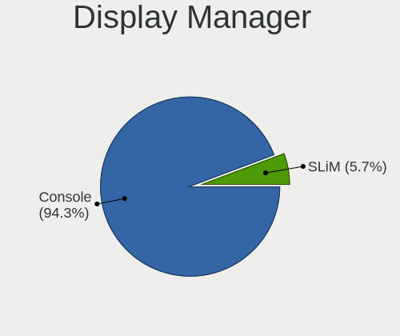

| Name    | Desktops | Percent |
|---------|----------|---------|
| Console | 18       | 94.74%  |
| SLiM    | 1        | 5.26%   |

OS Lang
-------

Language

| Lang    | Desktops | Percent |
|---------|----------|---------|
| Unknown | 17       | 89.47%  |
| ru_RU   | 1        | 5.26%   |
| de_DE   | 1        | 5.26%   |

Boot Mode
---------

EFI or BIOS

| Mode | Desktops | Percent |
|------|----------|---------|
| EFI  | 11       | 57.89%  |
| BIOS | 8        | 42.11%  |

Filesystem
----------

Type of filesystem

| Type | Desktops | Percent |
|------|----------|---------|
| Ffs  | 19       | 100%    |

Part. scheme
------------

Scheme of partitioning

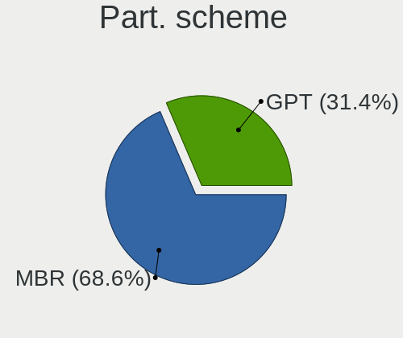

| Type | Desktops | Percent |
|------|----------|---------|
| MBR  | 10       | 52.63%  |
| GPT  | 9        | 47.37%  |

Board
-----

Vendor
------

Motherboard manufacturer

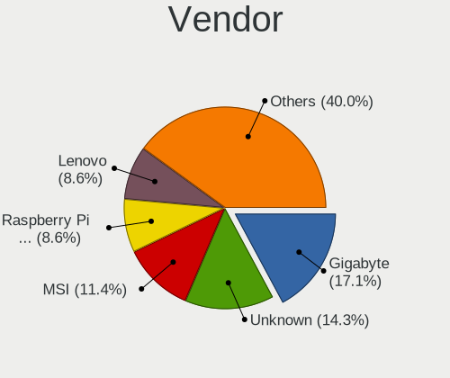

| Name                    | Desktops | Percent |
|-------------------------|----------|---------|
| Gigabyte Technology     | 5        | 26.32%  |
| Raspberry Pi Foundation | 2        | 10.53%  |
| MSI                     | 2        | 10.53%  |
| Unknown                 | 2        | 10.53%  |
| Yanling                 | 1        | 5.26%   |
| WYSE                    | 1        | 5.26%   |
| Protectli               | 1        | 5.26%   |
| PC Engines              | 1        | 5.26%   |
| Lenovo                  | 1        | 5.26%   |
| Hewlett-Packard         | 1        | 5.26%   |
| ASUSTek Computer        | 1        | 5.26%   |
| ASRock                  | 1        | 5.26%   |

Model
-----

Motherboard model

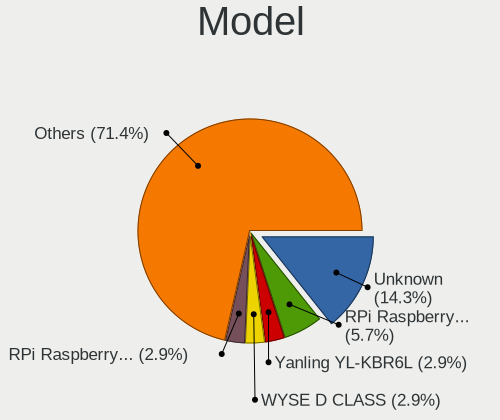

| Name                               | Desktops | Percent |
|------------------------------------|----------|---------|
| Unknown                            | 2        | 10.53%  |
| Yanling YL-KBR6L                   | 1        | 5.26%   |
| WYSE D CLASS                       | 1        | 5.26%   |
| RPi Raspberry Pi 400               | 1        | 5.26%   |
| RPi Raspberry Pi 4 Model B         | 1        | 5.26%   |
| Protectli FW6                      | 1        | 5.26%   |
| PC Engines APU2                    | 1        | 5.26%   |
| MSI MS-7D54                        | 1        | 5.26%   |
| MSI MS-7C56                        | 1        | 5.26%   |
| Lenovo ThinkCentre M73z 10BB001DRU | 1        | 5.26%   |
| HP Compaq dc5700 Microtower        | 1        | 5.26%   |
| Gigabyte Z590 VISION G             | 1        | 5.26%   |
| Gigabyte X470 AORUS ULTRA GAMING   | 1        | 5.26%   |
| Gigabyte H81M-S2PV                 | 1        | 5.26%   |
| Gigabyte BRi3(H)-10110             | 1        | 5.26%   |
| Gigabyte B450M DS3H                | 1        | 5.26%   |
| ASUS P10S-I Series                 | 1        | 5.26%   |
| ASRock X570 Pro4                   | 1        | 5.26%   |

Model Family
------------

Motherboard model prefix

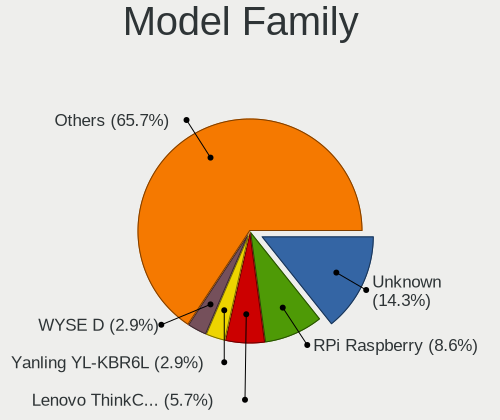

| Name                   | Desktops | Percent |
|------------------------|----------|---------|
| RPi Raspberry          | 2        | 10.53%  |
| Unknown                | 2        | 10.53%  |
| Yanling YL-KBR6L       | 1        | 5.26%   |
| WYSE D                 | 1        | 5.26%   |
| Protectli FW6          | 1        | 5.26%   |
| PC Engines APU2        | 1        | 5.26%   |
| MSI MS-7D54            | 1        | 5.26%   |
| MSI MS-7C56            | 1        | 5.26%   |
| Lenovo ThinkCentre     | 1        | 5.26%   |
| HP Compaq              | 1        | 5.26%   |
| Gigabyte Z590          | 1        | 5.26%   |
| Gigabyte X470          | 1        | 5.26%   |
| Gigabyte H81M-S2PV     | 1        | 5.26%   |
| Gigabyte BRi3(H)-10110 | 1        | 5.26%   |
| Gigabyte B450M         | 1        | 5.26%   |
| ASUS P10S-I            | 1        | 5.26%   |
| ASRock X570            | 1        | 5.26%   |

MFG Year
--------

Motherboard manufacture year

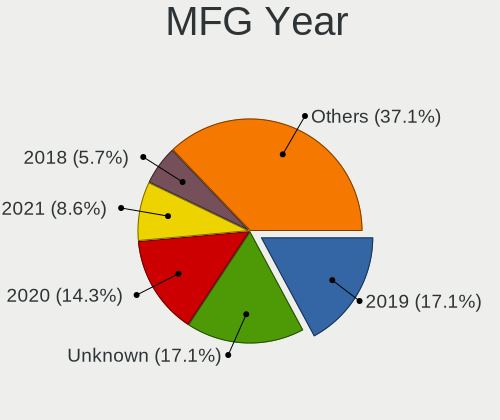

| Year    | Desktops | Percent |
|---------|----------|---------|
| 2019    | 5        | 26.32%  |
| 2020    | 3        | 15.79%  |
| Unknown | 3        | 15.79%  |
| 2021    | 2        | 10.53%  |
| 2022    | 1        | 5.26%   |
| 2018    | 1        | 5.26%   |
| 2016    | 1        | 5.26%   |
| 2015    | 1        | 5.26%   |
| 2014    | 1        | 5.26%   |
| 2006    | 1        | 5.26%   |

Form Factor
-----------

Physical design of the computer

| Name    | Desktops | Percent |
|---------|----------|---------|
| Desktop | 19       | 100%    |

Coreboot
--------

Have coreboot on board

| Used | Desktops | Percent |
|------|----------|---------|
| No   | 17       | 89.47%  |
| Yes  | 2        | 10.53%  |

RAM Size
--------

Total RAM memory

| Size in GB  | Desktops | Percent |
|-------------|----------|---------|
| 16.01-24.0  | 6        | 31.58%  |
| 3.01-4.0    | 4        | 21.05%  |
| 8.01-16.0   | 3        | 15.79%  |
| 4.01-8.0    | 2        | 10.53%  |
| 32.01-64.0  | 1        | 5.26%   |
| 64.01-256.0 | 1        | 5.26%   |
| 1.01-2.0    | 1        | 5.26%   |
| 0.01-0.5    | 1        | 5.26%   |

RAM Used
--------

Used RAM memory

| Used GB  | Desktops | Percent |
|----------|----------|---------|
| 0.01-0.5 | 15       | 78.95%  |
| 1.01-2.0 | 1        | 5.26%   |
| 0.51-1.0 | 1        | 5.26%   |
| 0        | 1        | 5.26%   |
| Unknown  | 1        | 5.26%   |

Total Drives
------------

Number of drives on board

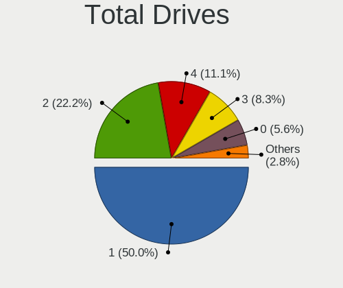

| Drives | Desktops | Percent |
|--------|----------|---------|
| 1      | 9        | 45%     |
| 2      | 5        | 25%     |
| 4      | 4        | 20%     |
| 6      | 1        | 5%      |
| 3      | 1        | 5%      |

Has CD-ROM
----------

Has CD-ROM on board

| Presented | Desktops | Percent |
|-----------|----------|---------|
| No        | 18       | 94.74%  |
| Yes       | 1        | 5.26%   |

Has Ethernet
------------

Has Ethernet on board

| Presented | Desktops | Percent |
|-----------|----------|---------|
| Yes       | 15       | 78.95%  |
| No        | 4        | 21.05%  |

Has WiFi
--------

Has WiFi module

| Presented | Desktops | Percent |
|-----------|----------|---------|
| No        | 15       | 78.95%  |
| Yes       | 4        | 21.05%  |

Has Bluetooth
-------------

Has Bluetooth module

| Presented | Desktops | Percent |
|-----------|----------|---------|
| No        | 15       | 78.95%  |
| Yes       | 4        | 21.05%  |

Location
--------

Country
-------

Geographic location (country)

| Country     | Desktops | Percent |
|-------------|----------|---------|
| Russia      | 5        | 26.32%  |
| USA         | 4        | 21.05%  |
| Poland      | 3        | 15.79%  |
| Germany     | 2        | 10.53%  |
| Ukraine     | 1        | 5.26%   |
| UK          | 1        | 5.26%   |
| Switzerland | 1        | 5.26%   |
| Sweden      | 1        | 5.26%   |
| Cyprus      | 1        | 5.26%   |

City
----

Geographic location (city)

| City            | Desktops | Percent |
|-----------------|----------|---------|
| Moscow          | 2        | 10%     |
| Miedziana Gora  | 2        | 10%     |
| Zhukovskiy      | 1        | 5%      |
| Wroclaw         | 1        | 5%      |
| Wolfsburg       | 1        | 5%      |
| Wheaton         | 1        | 5%      |
| Voskresensk     | 1        | 5%      |
| Syeverodonets'k | 1        | 5%      |
| Stockholm       | 1        | 5%      |
| St Petersburg   | 1        | 5%      |
| Poplar          | 1        | 5%      |
| Oensingen       | 1        | 5%      |
| Larnaca         | 1        | 5%      |
| Kingman         | 1        | 5%      |
| Irvine          | 1        | 5%      |
| Erlangen        | 1        | 5%      |
| Ames            | 1        | 5%      |
| Akarp           | 1        | 5%      |

Drives
------

Drive Vendor
------------

Hard drive vendors

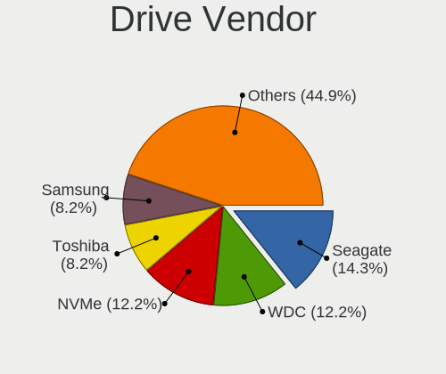

| Vendor                             | Desktops | Drives | Percent |
|------------------------------------|----------|--------|---------|
| NVMe                               | 6        | 6      | 17.65%  |
| WDC                                | 5        | 5      | 14.71%  |
| Kingston                           | 4        | 6      | 11.76%  |
| Seagate                            | 3        | 3      | 8.82%   |
| Samsung Electronics                | 3        | 4      | 8.82%   |
| Toshiba                            | 2        | 2      | 5.88%   |
| StoreJet                           | 1        | 1      | 2.94%   |
| SanDisk                            | 1        | 1      | 2.94%   |
| Product:              USB DISK 3.0 | 1        | 1      | 2.94%   |
| OPENBSD                            | 1        | 1      | 2.94%   |
| Intel                              | 1        | 2      | 2.94%   |
| HPE                                | 1        | 2      | 2.94%   |
| Hitachi                            | 1        | 1      | 2.94%   |
| HGST                               | 1        | 1      | 2.94%   |
| Crucial                            | 1        | 1      | 2.94%   |
| ASMT                               | 1        | 1      | 2.94%   |
| Apacer                             | 1        | 1      | 2.94%   |

Drive Model
-----------

Hard drive models

| Model                                                | Desktops | Percent |
|------------------------------------------------------|----------|---------|
| WDC WDS240G2G0B-00EPW0 240GB                         | 1        | 2.94%   |
| WDC WD6400AARS-00Y5B1 640GB                          | 1        | 2.94%   |
| WDC WD20PURX-64P6ZY0 2TB                             | 1        | 2.94%   |
| WDC WD10EADS-00M2B0 1TB                              | 1        | 2.94%   |
| WDC WD101KFBX-68R56N0 10TB                           | 1        | 2.94%   |
| Toshiba MQ04ABF100 1TB                               | 1        | 2.94%   |
| Toshiba DT01ACA050 500GB                             | 1        | 2.94%   |
| StoreJet Transcend 1TB                               | 1        | 2.94%   |
| Seagate ST3250318AS 250GB                            | 1        | 2.94%   |
| Seagate ST250DM000-1BD141 250GB                      | 1        | 2.94%   |
| Seagate ST1000LM035-1RK172 1TB                       | 1        | 2.94%   |
| SanDisk Ultra 32GB                                   | 1        | 2.94%   |
| Samsung SSD 860 EVO 250GB                            | 1        | 2.94%   |
| Samsung HD501LJ 500GB                                | 1        | 2.94%   |
| Samsung Flash Drive FIT 32GB                         | 1        | 2.94%   |
| Product:              USB DISK 3.0 USB DISK 3.0 64GB | 1        | 2.94%   |
| OPENBSD SR RAID 1 1TB                                | 1        | 2.94%   |
| NVMe WDS500G3X0C-00SJ 500GB                          | 1        | 2.94%   |
| NVMe WDC WDS100T2B0C- 1TB                            | 1        | 2.94%   |
| NVMe TOSHIBA-RC100 240GB                             | 1        | 2.94%   |
| NVMe Samsung SSD 980 500GB                           | 1        | 2.94%   |
| NVMe Samsung SSD 970 250GB                           | 1        | 2.94%   |
| NVMe PCIe SSD 512GB                                  | 1        | 2.94%   |
| Kingston SV300S37A240G 240GB                         | 1        | 2.94%   |
| Kingston SUV500MS480G 480GB                          | 1        | 2.94%   |
| Kingston SUV500MS240G 240GB                          | 1        | 2.94%   |
| Kingston SMS200S330G 32GB                            | 1        | 2.94%   |
| Intel SSDSC2BW240A4 240GB                            | 1        | 2.94%   |
| HPE MK000480GWXFF 480GB                              | 1        | 2.94%   |
| Hitachi HUA723020ALA640 2TB                          | 1        | 2.94%   |
| HGST HUS724020ALA640 2TB                             | 1        | 2.94%   |
| Crucial M4-CT128M4SSD2 128GB                         | 1        | 2.94%   |
| ASMT 2115 500GB                                      | 1        | 2.94%   |
| Apacer 8GB SATA Flash Drive                          | 1        | 2.94%   |

HDD Vendor
----------

Hard disk drive vendors

| Vendor                             | Desktops | Drives | Percent |
|------------------------------------|----------|--------|---------|
| WDC                                | 4        | 4      | 20%     |
| Seagate                            | 3        | 3      | 15%     |
| NVMe                               | 3        | 3      | 15%     |
| Toshiba                            | 2        | 2      | 10%     |
| Samsung Electronics                | 2        | 3      | 10%     |
| StoreJet                           | 1        | 1      | 5%      |
| Product:              USB DISK 3.0 | 1        | 1      | 5%      |
| OPENBSD                            | 1        | 1      | 5%      |
| Hitachi                            | 1        | 1      | 5%      |
| HGST                               | 1        | 1      | 5%      |
| ASMT                               | 1        | 1      | 5%      |

SSD Vendor
----------

Solid state drive vendors

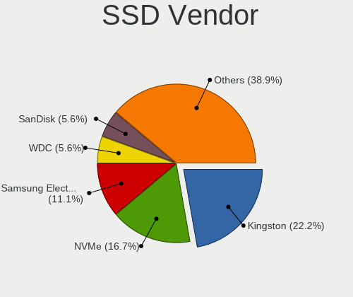

| Vendor              | Desktops | Drives | Percent |
|---------------------|----------|--------|---------|
| Kingston            | 4        | 6      | 28.57%  |
| NVMe                | 3        | 3      | 21.43%  |
| WDC                 | 1        | 1      | 7.14%   |
| SanDisk             | 1        | 1      | 7.14%   |
| Samsung Electronics | 1        | 1      | 7.14%   |
| Intel               | 1        | 2      | 7.14%   |
| HPE                 | 1        | 2      | 7.14%   |
| Crucial             | 1        | 1      | 7.14%   |
| Apacer              | 1        | 1      | 7.14%   |

Drive Kind
----------

HDD or SSD

| Kind | Desktops | Drives | Percent |
|------|----------|--------|---------|
| SSD  | 12       | 18     | 54.55%  |
| HDD  | 10       | 21     | 45.45%  |

Drive Connector
---------------

SATA, SAS, NVMe, etc.

| Type | Desktops | Drives | Percent |
|------|----------|--------|---------|
| SATA | 19       | 39     | 100%    |

Drive Size
----------

Size of hard drive

| Size in TB | Desktops | Drives | Percent |
|------------|----------|--------|---------|
| 0.01-0.5   | 17       | 27     | 68%     |
| 0.51-1.0   | 6        | 8      | 24%     |
| 1.01-2.0   | 1        | 3      | 4%      |
| 4.01-10.0  | 1        | 1      | 4%      |

Space Total
-----------

Amount of disk space available on the file system

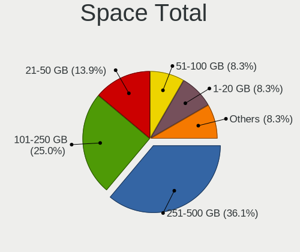

| Size in GB     | Desktops | Percent |
|----------------|----------|---------|
| 251-500        | 6        | 31.58%  |
| 101-250        | 6        | 31.58%  |
| 21-50          | 3        | 15.79%  |
| 501-1000       | 2        | 10.53%  |
| More than 3000 | 1        | 5.26%   |
| 1-20           | 1        | 5.26%   |

Space Used
----------

Amount of used disk space

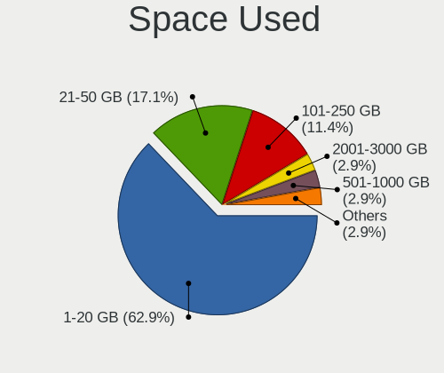

| Used GB   | Desktops | Percent |
|-----------|----------|---------|
| 1-20      | 11       | 57.89%  |
| 21-50     | 3        | 15.79%  |
| 101-250   | 2        | 10.53%  |
| 2001-3000 | 1        | 5.26%   |
| 501-1000  | 1        | 5.26%   |
| 51-100    | 1        | 5.26%   |

Malfunc. Drives
---------------

Drive models with a malfunction

| Model                           | Desktops | Drives | Percent |
|---------------------------------|----------|--------|---------|
| WDC WD10EADS-00M2B0 1TB         | 1        | 1      | 25%     |
| Toshiba MQ04ABF100 1TB          | 1        | 1      | 25%     |
| Seagate ST250DM000-1BD141 250GB | 1        | 1      | 25%     |
| Kingston SMS200S330G 32GB       | 1        | 2      | 25%     |

Malfunc. Drive Vendor
---------------------

Vendors of faulty drives

| Vendor   | Desktops | Drives | Percent |
|----------|----------|--------|---------|
| WDC      | 1        | 1      | 25%     |
| Toshiba  | 1        | 1      | 25%     |
| Seagate  | 1        | 1      | 25%     |
| Kingston | 1        | 2      | 25%     |

Malfunc. HDD Vendor
-------------------

Vendors of faulty HDD drives

| Vendor  | Desktops | Drives | Percent |
|---------|----------|--------|---------|
| WDC     | 1        | 1      | 33.33%  |
| Toshiba | 1        | 1      | 33.33%  |
| Seagate | 1        | 1      | 33.33%  |

Malfunc. Drive Kind
-------------------

Kinds of faulty drives

| Kind | Desktops | Drives | Percent |
|------|----------|--------|---------|
| HDD  | 3        | 3      | 75%     |
| SSD  | 1        | 2      | 25%     |

Failed Drives
-------------

Failed drive models

| Model                       | Desktops | Drives | Percent |
|-----------------------------|----------|--------|---------|
| WDC WD6400AARS-00Y5B1 640GB | 1        | 1      | 100%    |

Failed Drive Vendor
-------------------

Failed drive vendors

| Vendor | Desktops | Drives | Percent |
|--------|----------|--------|---------|
| WDC    | 1        | 1      | 100%    |

Drive Status
------------

Number of failed and malfunc. drives

| Status   | Desktops | Drives | Percent |
|----------|----------|--------|---------|
| Works    | 15       | 23     | 57.69%  |
| Detected | 6        | 10     | 23.08%  |
| Malfunc  | 4        | 5      | 15.38%  |
| Failed   | 1        | 1      | 3.85%   |

Storage controller
------------------

Storage Vendor
--------------

Storage controller vendors

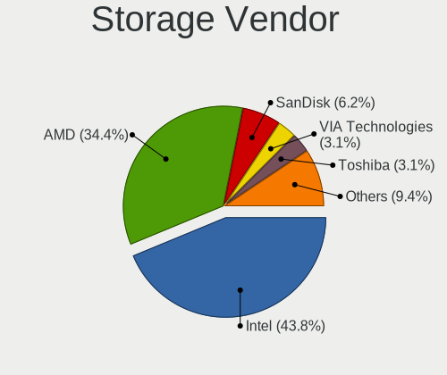

| Vendor                 | Desktops | Percent |
|------------------------|----------|---------|
| Intel                  | 8        | 38.1%   |
| AMD                    | 7        | 33.33%  |
| Sandisk                | 2        | 9.52%   |
| Toshiba                | 1        | 4.76%   |
| Samsung Electronics    | 1        | 4.76%   |
| Phison Electronics     | 1        | 4.76%   |
| HighPoint Technologies | 1        | 4.76%   |

Storage Model
-------------

Storage controller models

| Model                                                                          | Desktops | Percent |
|--------------------------------------------------------------------------------|----------|---------|
| AMD FCH SATA Controller [AHCI mode]                                            | 5        | 20.83%  |
| Intel Sunrise Point-LP SATA Controller [AHCI mode]                             | 2        | 8.33%   |
| Intel 8 Series/C220 Series Chipset Family 6-port SATA Controller 1 [AHCI mode] | 2        | 8.33%   |
| AMD 400 Series Chipset SATA Controller                                         | 2        | 8.33%   |
| Toshiba BG3 NVMe SSD Controller                                                | 1        | 4.17%   |
| Sandisk WD Black SN750 / PC SN730 NVMe SSD                                     | 1        | 4.17%   |
| Sandisk unknown                                                                | 1        | 4.17%   |
| Samsung NVMe SSD Controller 980                                                | 1        | 4.17%   |
| Phison E12 NVMe Controller                                                     | 1        | 4.17%   |
| Intel Q170/Q150/B150/H170/H110/Z170/CM236 Chipset SATA Controller [AHCI Mode]  | 1        | 4.17%   |
| Intel Comet Lake SATA AHCI Controller                                          | 1        | 4.17%   |
| Intel 82801HR/HO/HH (ICH8R/DO/DH) 2 port SATA Controller [IDE mode]            | 1        | 4.17%   |
| Intel 82801H (ICH8 Family) 4 port SATA Controller [IDE mode]                   | 1        | 4.17%   |
| Intel 500 Series Chipset Family SATA AHCI Controller                           | 1        | 4.17%   |
| HighPoint unknown                                                              | 1        | 4.17%   |
| AMD Starship/Matisse Chipset SATA Controller [AHCI mode]                       | 1        | 4.17%   |
| AMD SB7x0/SB8x0/SB9x0 SATA Controller [IDE mode]                               | 1        | 4.17%   |

Storage Kind
------------

Kind of storage controller (IDE, SATA, NVMe, SAS, ...)

| Kind | Desktops | Percent |
|------|----------|---------|
| SATA | 14       | 66.67%  |
| NVMe | 5        | 23.81%  |
| RAID | 1        | 4.76%   |
| IDE  | 1        | 4.76%   |

Processor
---------

CPU Vendor
----------

Processor vendors

| Vendor | Desktops | Percent |
|--------|----------|---------|
| Intel  | 8        | 42.11%  |
| AMD    | 7        | 36.84%  |
| ARM    | 4        | 21.05%  |

CPU Model
---------

Processor models

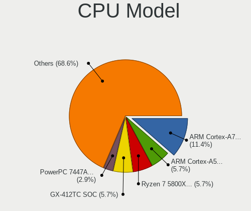

| Model                                   | Desktops | Percent |
|-----------------------------------------|----------|---------|
| ARM Cortex-A72 r0p3                     | 2        | 10.53%  |
| AMD Ryzen 7 5800X 8-Core Processor      | 2        | 10.53%  |
| Intel Xeon CPU E3-1220 v5 @ 3.00GHz     | 1        | 5.26%   |
| Intel Core i7-8550U CPU @ 1.80GHz       | 1        | 5.26%   |
| Intel Core i5-4570S CPU @ 2.90GHz       | 1        | 5.26%   |
| Intel Core i3-10110U CPU @ 2.10GHz      | 1        | 5.26%   |
| Intel Core 2 CPU 6400 @ 2.13GHz         | 1        | 5.26%   |
| Intel Celeron CPU G1820 @ 2.70GHz       | 1        | 5.26%   |
| Intel Celeron CPU 3865U @ 1.80GHz       | 1        | 5.26%   |
| Intel 11th Gen Core i9-11900K @ 3.50GHz | 1        | 5.26%   |
| ARM Cortex-A8 r3p2                      | 1        | 5.26%   |
| ARM Cortex-A53 r0p4                     | 1        | 5.26%   |
| AMD Ryzen 7 5700G with Radeon Graphics  | 1        | 5.26%   |
| AMD Ryzen 7 2700 Eight-Core Processor   | 1        | 5.26%   |
| AMD Ryzen 3 3100 4-Core Processor       | 1        | 5.26%   |
| AMD GX-412TC SOC                        | 1        | 5.26%   |
| AMD G-T48E Processor                    | 1        | 5.26%   |

CPU Model Family
----------------

Processor model prefix

| Model         | Desktops | Percent |
|---------------|----------|---------|
| ARM Cortex    | 4        | 21.05%  |
| AMD Ryzen 7   | 4        | 21.05%  |
| Intel Celeron | 2        | 10.53%  |
| Other         | 1        | 5.26%   |
| Intel Xeon    | 1        | 5.26%   |
| Intel Core i7 | 1        | 5.26%   |
| Intel Core i5 | 1        | 5.26%   |
| Intel Core i3 | 1        | 5.26%   |
| Intel Core 2  | 1        | 5.26%   |
| AMD Ryzen 3   | 1        | 5.26%   |
| AMD GX        | 1        | 5.26%   |
| AMD G         | 1        | 5.26%   |

CPU Cores
---------

Number of processor cores

| Number  | Desktops | Percent |
|---------|----------|---------|
| 2       | 5        | 26.32%  |
| Unknown | 5        | 26.32%  |
| 4       | 4        | 21.05%  |
| 16      | 2        | 10.53%  |
| 8       | 2        | 10.53%  |
| 1       | 1        | 5.26%   |

CPU Sockets
-----------

Number of sockets

| Number  | Desktops | Percent |
|---------|----------|---------|
| 1       | 12       | 63.16%  |
| Unknown | 6        | 31.58%  |
| 2       | 1        | 5.26%   |

CPU Threads
-----------

Threads per core (Hyper-Threading)

| Number  | Desktops | Percent |
|---------|----------|---------|
| 1       | 10       | 52.63%  |
| Unknown | 6        | 31.58%  |
| 2       | 3        | 15.79%  |

CPU Microarch
-------------

Microarchitecture

| Name     | Desktops | Percent |
|----------|----------|---------|
| Unknown  | 7        | 36.84%  |
| KabyLake | 3        | 15.79%  |
| Haswell  | 2        | 10.53%  |
| Zen+     | 1        | 5.26%   |
| Zen 3    | 1        | 5.26%   |
| Zen 2    | 1        | 5.26%   |
| Skylake  | 1        | 5.26%   |
| Puma     | 1        | 5.26%   |
| Core     | 1        | 5.26%   |
| Bobcat   | 1        | 5.26%   |

Graphics
--------

GPU Vendor
----------

Vendors of graphics cards

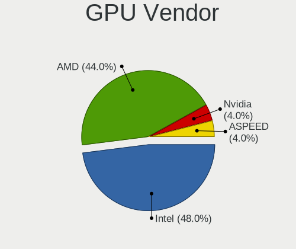

| Vendor            | Desktops | Percent |
|-------------------|----------|---------|
| Intel             | 7        | 50%     |
| AMD               | 6        | 42.86%  |
| ASPEED Technology | 1        | 7.14%   |

GPU Model
---------

Graphics card models

| Model                                                                       | Desktops | Percent |
|-----------------------------------------------------------------------------|----------|---------|
| Intel Xeon E3-1200 v3/4th Gen Core Processor Integrated Graphics Controller | 2        | 14.29%  |
| AMD Navi 22 [Radeon RX 6700/6700 XT / 6800M]                                | 2        | 14.29%  |
| Intel UHD Graphics 620                                                      | 1        | 7.14%   |
| Intel RocketLake-S GT1 [UHD Graphics 750]                                   | 1        | 7.14%   |
| Intel Kaby Lake-U GT1 Integrated Graphics Controller                        | 1        | 7.14%   |
| Intel CometLake-U GT2 [UHD Graphics]                                        | 1        | 7.14%   |
| Intel 82Q963/Q965 Integrated Graphics Controller                            | 1        | 7.14%   |
| ASPEED Technology ASPEED Graphics Family                                    | 1        | 7.14%   |
| AMD Wrestler [Radeon HD 6250]                                               | 1        | 7.14%   |
| AMD Oland PRO [Radeon R7 240/340 / Radeon 520]                              | 1        | 7.14%   |
| AMD Ellesmere [Radeon RX 470/480/570/570X/580/580X/590]                     | 1        | 7.14%   |
| AMD Cezanne                                                                 | 1        | 7.14%   |

GPU Combo
---------

Combinations of graphics cards

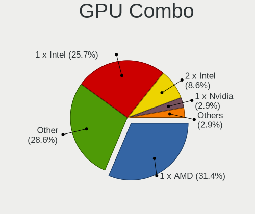

| Name       | Desktops | Percent |
|------------|----------|---------|
| 1 x Intel  | 7        | 36.84%  |
| 1 x AMD    | 6        | 31.58%  |
| Other      | 5        | 26.32%  |
| 1 x ASPEED | 1        | 5.26%   |

GPU Driver
----------

Free vs proprietary

| Driver  | Desktops | Percent |
|---------|----------|---------|
| Free    | 12       | 60%     |
| Unknown | 8        | 40%     |

GPU Memory
----------

Total video memory

| Size in GB | Desktops | Percent |
|------------|----------|---------|
| Unknown    | 19       | 100%    |

Monitor
-------

Monitor Vendor
--------------

Monitor vendors

| Vendor               | Desktops | Percent |
|----------------------|----------|---------|
| Samsung Electronics  | 2        | 28.57%  |
| NEC Computers        | 1        | 14.29%  |
| Iiyama               | 1        | 14.29%  |
| AOC                  | 1        | 14.29%  |
| Ancor Communications | 1        | 14.29%  |
| Acer                 | 1        | 14.29%  |

Monitor Model
-------------

Monitor models

| Model                                                                 | Desktops | Percent |
|-----------------------------------------------------------------------|----------|---------|
| Samsung Electronics S24D390 SAM0B65 1920x1080 520x290mm 23.4-inch     | 1        | 14.29%  |
| Samsung Electronics LCD Monitor SAM7103 3840x2160 700x390mm 31.5-inch | 1        | 14.29%  |
| NEC Computers EX341R NEC2C7A 3440x1440 800x330mm 34.1-inch            | 1        | 14.29%  |
| Iiyama PL3288UH IVM7610 3840x2160 700x390mm 31.5-inch                 | 1        | 14.29%  |
| AOC 2350 AOC2350 1920x1080 510x290mm 23.1-inch                        | 1        | 14.29%  |
| Ancor Communications ASUS VW199 ACI19ED 1440x900 410x260mm 19.1-inch  | 1        | 14.29%  |
| Acer VG220Q ACR06D8 1920x1080 480x270mm 21.7-inch                     | 1        | 14.29%  |

Monitor Resolution
------------------

Monitor screen resolution

| Resolution       | Desktops | Percent |
|------------------|----------|---------|
| 3840x2160 (4K)   | 2        | 33.33%  |
| 1920x1080 (FHD)  | 2        | 33.33%  |
| 3440x1440        | 1        | 16.67%  |
| 1440x900 (WXGA+) | 1        | 16.67%  |

Monitor Diagonal
----------------

Diagonal size in inches

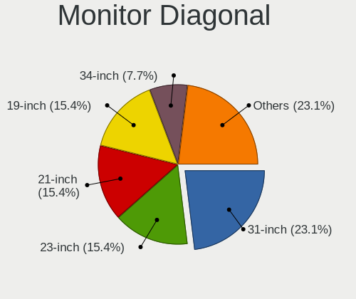

| Inches | Desktops | Percent |
|--------|----------|---------|
| 31     | 2        | 33.33%  |
| 34     | 1        | 16.67%  |
| 23     | 1        | 16.67%  |
| 21     | 1        | 16.67%  |
| 19     | 1        | 16.67%  |

Monitor Width
-------------

Physical width

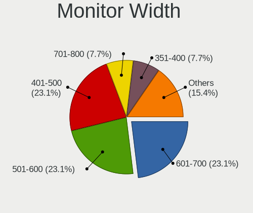

| Width in mm | Desktops | Percent |
|-------------|----------|---------|
| 601-700     | 2        | 33.33%  |
| 401-500     | 2        | 33.33%  |
| 701-800     | 1        | 16.67%  |
| 501-600     | 1        | 16.67%  |

Aspect Ratio
------------

Proportional relationship between the width and the height

| Ratio | Desktops | Percent |
|-------|----------|---------|
| 16/9  | 4        | 66.67%  |
| 21/9  | 1        | 16.67%  |
| 16/10 | 1        | 16.67%  |

Monitor Area
------------

Area in inch²

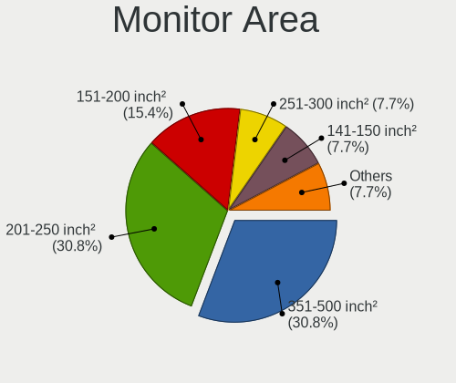

| Area in inch² | Desktops | Percent |
|----------------|----------|---------|
| 351-500        | 3        | 50%     |
| 201-250        | 2        | 33.33%  |
| 151-200        | 1        | 16.67%  |

Pixel Density
-------------

Pixels per inch

| Density | Desktops | Percent |
|---------|----------|---------|
| 121-160 | 2        | 33.33%  |
| 101-120 | 2        | 33.33%  |
| 51-100  | 2        | 33.33%  |

Multiple Monitors
-----------------

Total monitors connected

| Total | Desktops | Percent |
|-------|----------|---------|
| 0     | 10       | 50%     |
| 1     | 9        | 45%     |
| 2     | 1        | 5%      |

Network
-------

Net Controller Vendor
---------------------

Controller vendors

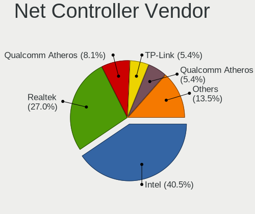

| Vendor                | Desktops | Percent |
|-----------------------|----------|---------|
| Intel                 | 10       | 58.82%  |
| Realtek Semiconductor | 5        | 29.41%  |
| TP-Link               | 1        | 5.88%   |
| Broadcom              | 1        | 5.88%   |

Net Controller Model
--------------------

Controller models

| Model                                                             | Desktops | Percent |
|-------------------------------------------------------------------|----------|---------|
| Realtek RTL8111/8168/8411 PCI Express Gigabit Ethernet Controller | 4        | 21.05%  |
| Intel I211 Gigabit Network Connection                             | 3        | 15.79%  |
| Intel I210 Gigabit Network Connection                             | 2        | 10.53%  |
| TP-Link TL-WN722N v2/v3 [Realtek RTL8188EUS]                      | 1        | 5.26%   |
| Realtek RTL8125 2.5GbE Controller                                 | 1        | 5.26%   |
| Intel Wireless 7260                                               | 1        | 5.26%   |
| Intel Wi-Fi 6 AX210/AX211/AX411 160MHz                            | 1        | 5.26%   |
| Intel Ethernet Controller I225-V                                  | 1        | 5.26%   |
| Intel Ethernet Connection I217-V                                  | 1        | 5.26%   |
| Intel Ethernet Connection (6) I219-V                              | 1        | 5.26%   |
| Intel Centrino Wireless-N 2230                                    | 1        | 5.26%   |
| Intel 82583V Gigabit Network Connection                           | 1        | 5.26%   |
| Broadcom NetXtreme BCM5755 Gigabit Ethernet PCI Express           | 1        | 5.26%   |

Wireless Vendor
---------------

Wireless vendors

| Vendor  | Desktops | Percent |
|---------|----------|---------|
| Intel   | 3        | 75%     |
| TP-Link | 1        | 25%     |

Wireless Model
--------------

Wireless models

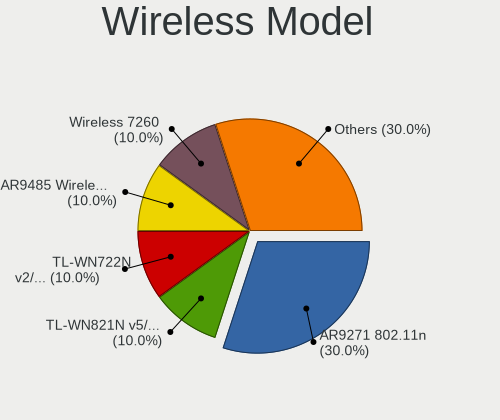

| Model                                        | Desktops | Percent |
|----------------------------------------------|----------|---------|
| TP-Link TL-WN722N v2/v3 [Realtek RTL8188EUS] | 1        | 25%     |
| Intel Wireless 7260                          | 1        | 25%     |
| Intel Wi-Fi 6 AX210/AX211/AX411 160MHz       | 1        | 25%     |
| Intel Centrino Wireless-N 2230               | 1        | 25%     |

Ethernet Vendor
---------------

Ethernet vendors

| Vendor                | Desktops | Percent |
|-----------------------|----------|---------|
| Intel                 | 9        | 60%     |
| Realtek Semiconductor | 5        | 33.33%  |
| Broadcom              | 1        | 6.67%   |

Ethernet Model
--------------

Ethernet models

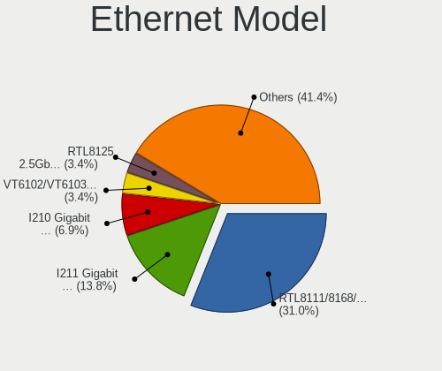

| Model                                                             | Desktops | Percent |
|-------------------------------------------------------------------|----------|---------|
| Realtek RTL8111/8168/8411 PCI Express Gigabit Ethernet Controller | 4        | 26.67%  |
| Intel I211 Gigabit Network Connection                             | 3        | 20%     |
| Intel I210 Gigabit Network Connection                             | 2        | 13.33%  |
| Realtek RTL8125 2.5GbE Controller                                 | 1        | 6.67%   |
| Intel Ethernet Controller I225-V                                  | 1        | 6.67%   |
| Intel Ethernet Connection I217-V                                  | 1        | 6.67%   |
| Intel Ethernet Connection (6) I219-V                              | 1        | 6.67%   |
| Intel 82583V Gigabit Network Connection                           | 1        | 6.67%   |
| Broadcom NetXtreme BCM5755 Gigabit Ethernet PCI Express           | 1        | 6.67%   |

Net Controller Kind
-------------------

Ethernet, WiFi or modem

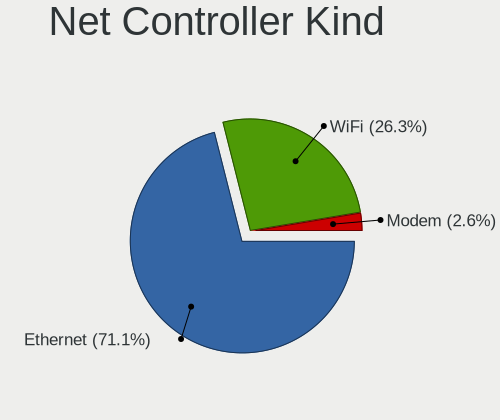

| Kind     | Desktops | Percent |
|----------|----------|---------|
| Ethernet | 15       | 78.95%  |
| WiFi     | 4        | 21.05%  |

Used Controller
---------------

Currently used network controller

| Kind     | Desktops | Percent |
|----------|----------|---------|
| Ethernet | 11       | 84.62%  |
| WiFi     | 2        | 15.38%  |

NICs
----

Total network controllers on board

| Total | Desktops | Percent |
|-------|----------|---------|
| 1     | 9        | 47.37%  |
| 0     | 4        | 21.05%  |
| 2     | 3        | 15.79%  |
| 7     | 1        | 5.26%   |
| 6     | 1        | 5.26%   |
| 3     | 1        | 5.26%   |

IPv6
----

IPv6 vs IPv4

| Used | Desktops | Percent |
|------|----------|---------|
| No   | 19       | 100%    |

Bluetooth
---------

Bluetooth Vendor
----------------

Controller vendors

| Vendor                  | Desktops | Percent |
|-------------------------|----------|---------|
| Intel                   | 3        | 75%     |
| Cambridge Silicon Radio | 1        | 25%     |

Bluetooth Model
---------------

Controller models

| Model                                               | Desktops | Percent |
|-----------------------------------------------------|----------|---------|
| Intel Centrino Bluetooth Wireless Transceiver       | 1        | 25%     |
| Intel Bluetooth wireless interface                  | 1        | 25%     |
| Intel AX210 Bluetooth                               | 1        | 25%     |
| Cambridge Silicon Radio Bluetooth Dongle (HCI mode) | 1        | 25%     |

Sound
-----

Sound Vendor
------------

Sound card vendors

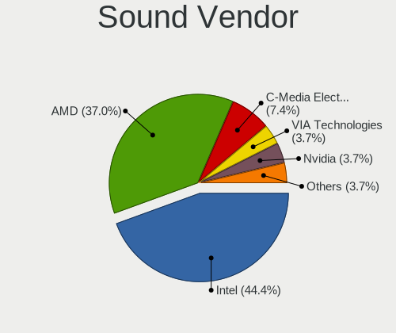

| Vendor              | Desktops | Percent |
|---------------------|----------|---------|
| Intel               | 6        | 40%     |
| AMD                 | 6        | 40%     |
| C-Media Electronics | 2        | 13.33%  |
| Blue Microphones    | 1        | 6.67%   |

Sound Model
-----------

Sound card models

| Model                                                                   | Desktops | Percent |
|-------------------------------------------------------------------------|----------|---------|
| AMD Starship/Matisse HD Audio Controller                                | 3        | 14.29%  |
| Intel 8 Series/C220 Series Chipset High Definition Audio Controller     | 2        | 9.52%   |
| C-Media Electronics FX-AUDIO                                            | 2        | 9.52%   |
| AMD Navi 21 HDMI Audio [Radeon RX 6800/6800 XT / 6900 XT]               | 2        | 9.52%   |
| Intel Xeon E3-1200 v3/4th Gen Core Processor HD Audio Controller        | 1        | 4.76%   |
| Intel Tiger Lake-H HD Audio Controller                                  | 1        | 4.76%   |
| Intel Sunrise Point-LP HD Audio                                         | 1        | 4.76%   |
| Intel Comet Lake PCH-LP cAVS                                            | 1        | 4.76%   |
| Intel 82801H (ICH8 Family) HD Audio Controller                          | 1        | 4.76%   |
| Blue Microphones Yeti Stereo Microphone                                 | 1        | 4.76%   |
| AMD Wrestler HDMI Audio                                                 | 1        | 4.76%   |
| AMD SBx00 Azalia (Intel HDA)                                            | 1        | 4.76%   |
| AMD Renoir Radeon High Definition Audio Controller                      | 1        | 4.76%   |
| AMD Oland/Hainan/Cape Verde/Pitcairn HDMI Audio [Radeon HD 7000 Series] | 1        | 4.76%   |
| AMD Family 17h (Models 00h-0fh) HD Audio Controller                     | 1        | 4.76%   |
| AMD Ellesmere HDMI Audio [Radeon RX 470/480 / 570/580/590]              | 1        | 4.76%   |

Memory
------

Memory Vendor
-------------

Memory module vendors

| Vendor              | Desktops | Percent |
|---------------------|----------|---------|
| Samsung Electronics | 2        | 50%     |
| Transcend           | 1        | 25%     |
| SK Hynix            | 1        | 25%     |

Memory Model
------------

Memory module models

| Model                                                 | Desktops | Percent |
|-------------------------------------------------------|----------|---------|
| Transcend RAM TS128MLQ64V6J 1GB DIMM DDR2 667MT/s     | 1        | 20%     |
| SK Hynix RAM HYMP112U64CP8-Y5 1GB DIMM DDR2 667MT/s   | 1        | 20%     |
| Samsung RAM M471B5173QH0-YK0 4GB SODIMM DDR3 1600MT/s | 1        | 20%     |
| Samsung RAM M471B5173DB0-YK0 4GB SODIMM DDR3 1600MT/s | 1        | 20%     |
| Samsung RAM M3 78T2953CZ3-CE6 1GB DIMM DDR2 667MT/s   | 1        | 20%     |

Memory Kind
-----------

Memory module kinds

| Kind | Desktops | Percent |
|------|----------|---------|
| DDR3 | 1        | 50%     |
| DDR2 | 1        | 50%     |

Memory Form Factor
------------------

Physical design of the memory module

| Name   | Desktops | Percent |
|--------|----------|---------|
| SODIMM | 1        | 50%     |
| DIMM   | 1        | 50%     |

Memory Size
-----------

Memory module size

| Size | Desktops | Percent |
|------|----------|---------|
| 4096 | 1        | 50%     |
| 1024 | 1        | 50%     |

Memory Speed
------------

Memory module speed

| Speed | Desktops | Percent |
|-------|----------|---------|
| 1600  | 1        | 50%     |
| 667   | 1        | 50%     |

Printers & scanners
-------------------

Printer Vendor
--------------

Printer device vendors

Zero info for selected period =(

Printer Model
-------------

Printer device models

Zero info for selected period =(

Scanner Vendor
--------------

Scanner device vendors

Zero info for selected period =(

Scanner Model
-------------

Scanner device models

Zero info for selected period =(

Camera
------

Camera Vendor
-------------

Camera device vendors

| Vendor                  | Desktops | Percent |
|-------------------------|----------|---------|
| Z-Star Microelectronics | 1        | 50%     |
| Microdia                | 1        | 50%     |

Camera Model
------------

Camera device models

| Model                           | Desktops | Percent |
|---------------------------------|----------|---------|
| Z-Star Integrated Camera        | 1        | 50%     |
| Microdia Ltd., USB  Live camera | 1        | 50%     |

Security
--------

Fingerprint Vendor
------------------

Fingerprint sensor vendors

Zero info for selected period =(

Fingerprint Model
-----------------

Fingerprint sensor models

Zero info for selected period =(

Chipcard Vendor
---------------

Chipcard module vendors

Zero info for selected period =(

Chipcard Model
--------------

Chipcard module models

Zero info for selected period =(

Unsupported
-----------

Unsupported Devices
-------------------

Total unsupported devices on board

| Total | Desktops | Percent |
|-------|----------|---------|
| 0     | 10       | 50%     |
| 1     | 7        | 35%     |
| 2     | 3        | 15%     |

Unsupported Device Types
------------------------

Types of unsupported devices

| Type                     | Desktops | Percent |
|--------------------------|----------|---------|
| Communication controller | 7        | 58.33%  |
| Graphics card            | 3        | 25%     |
| Storage/raid             | 1        | 8.33%   |
| Net/wireless             | 1        | 8.33%   |

