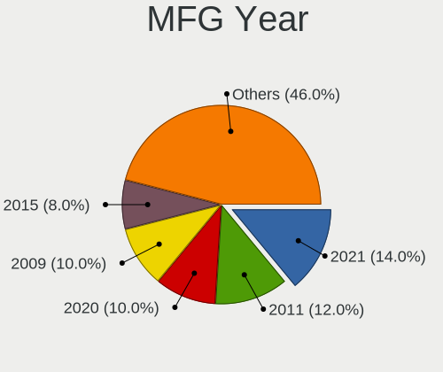
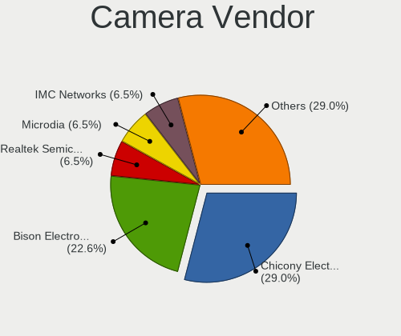

OpenBSD 7.0 - Tested Hardware & Statistics (Notebooks)
------------------------------------------------------

A project to collect tested hardware configurations for OpenBSD 7.0.

Anyone can contribute to this report by the [hw-probe](https://github.com/linuxhw/hw-probe/blob/master/INSTALL.BSD.md) tool:

    hw-probe -all -upload

Please submit a probe of your configuration if it's not presented on the page or is rare.

Full-feature report is available here: https://bsd-hardware.info/?view=trends

Contents
--------

* [ Test Cases ](#test-cases)

* [ System ](#system)
  - [ Arch                     ](#arch)
  - [ DE                       ](#de)
  - [ Display Server           ](#display-server)
  - [ Display Manager          ](#display-manager)
  - [ OS Lang                  ](#os-lang)
  - [ Boot Mode                ](#boot-mode)
  - [ Filesystem               ](#filesystem)
  - [ Part. scheme             ](#part-scheme)

* [ Board ](#board)
  - [ Vendor                   ](#vendor)
  - [ Model                    ](#model)
  - [ Model Family             ](#model-family)
  - [ MFG Year                 ](#mfg-year)
  - [ Form Factor              ](#form-factor)
  - [ Coreboot                 ](#coreboot)
  - [ RAM Size                 ](#ram-size)
  - [ RAM Used                 ](#ram-used)
  - [ Total Drives             ](#total-drives)
  - [ Has CD-ROM               ](#has-cd-rom)
  - [ Has Ethernet             ](#has-ethernet)
  - [ Has WiFi                 ](#has-wifi)
  - [ Has Bluetooth            ](#has-bluetooth)

* [ Location ](#location)
  - [ Country                  ](#country)
  - [ City                     ](#city)

* [ Drives ](#drives)
  - [ Drive Vendor             ](#drive-vendor)
  - [ Drive Model              ](#drive-model)
  - [ HDD Vendor               ](#hdd-vendor)
  - [ SSD Vendor               ](#ssd-vendor)
  - [ Drive Kind               ](#drive-kind)
  - [ Drive Connector          ](#drive-connector)
  - [ Drive Size               ](#drive-size)
  - [ Space Total              ](#space-total)
  - [ Space Used               ](#space-used)
  - [ Malfunc. Drives          ](#malfunc-drives)
  - [ Malfunc. Drive Vendor    ](#malfunc-drive-vendor)
  - [ Malfunc. HDD Vendor      ](#malfunc-hdd-vendor)
  - [ Malfunc. Drive Kind      ](#malfunc-drive-kind)
  - [ Failed Drives            ](#failed-drives)
  - [ Failed Drive Vendor      ](#failed-drive-vendor)
  - [ Drive Status             ](#drive-status)

* [ Storage controller ](#storage-controller)
  - [ Storage Vendor           ](#storage-vendor)
  - [ Storage Model            ](#storage-model)
  - [ Storage Kind             ](#storage-kind)

* [ Processor ](#processor)
  - [ CPU Vendor               ](#cpu-vendor)
  - [ CPU Model                ](#cpu-model)
  - [ CPU Model Family         ](#cpu-model-family)
  - [ CPU Cores                ](#cpu-cores)
  - [ CPU Sockets              ](#cpu-sockets)
  - [ CPU Threads              ](#cpu-threads)
  - [ CPU Microarch            ](#cpu-microarch)

* [ Graphics ](#graphics)
  - [ GPU Vendor               ](#gpu-vendor)
  - [ GPU Model                ](#gpu-model)
  - [ GPU Combo                ](#gpu-combo)
  - [ GPU Driver               ](#gpu-driver)
  - [ GPU Memory               ](#gpu-memory)

* [ Monitor ](#monitor)
  - [ Monitor Vendor           ](#monitor-vendor)
  - [ Monitor Model            ](#monitor-model)
  - [ Monitor Resolution       ](#monitor-resolution)
  - [ Monitor Diagonal         ](#monitor-diagonal)
  - [ Monitor Width            ](#monitor-width)
  - [ Aspect Ratio             ](#aspect-ratio)
  - [ Monitor Area             ](#monitor-area)
  - [ Pixel Density            ](#pixel-density)
  - [ Multiple Monitors        ](#multiple-monitors)

* [ Network ](#network)
  - [ Net Controller Vendor    ](#net-controller-vendor)
  - [ Net Controller Model     ](#net-controller-model)
  - [ Wireless Vendor          ](#wireless-vendor)
  - [ Wireless Model           ](#wireless-model)
  - [ Ethernet Vendor          ](#ethernet-vendor)
  - [ Ethernet Model           ](#ethernet-model)
  - [ Net Controller Kind      ](#net-controller-kind)
  - [ Used Controller          ](#used-controller)
  - [ NICs                     ](#nics)
  - [ IPv6                     ](#ipv6)

* [ Bluetooth ](#bluetooth)
  - [ Bluetooth Vendor         ](#bluetooth-vendor)
  - [ Bluetooth Model          ](#bluetooth-model)

* [ Sound ](#sound)
  - [ Sound Vendor             ](#sound-vendor)
  - [ Sound Model              ](#sound-model)

* [ Memory ](#memory)
  - [ Memory Vendor            ](#memory-vendor)
  - [ Memory Model             ](#memory-model)
  - [ Memory Kind              ](#memory-kind)
  - [ Memory Form Factor       ](#memory-form-factor)
  - [ Memory Size              ](#memory-size)
  - [ Memory Speed             ](#memory-speed)

* [ Printers & scanners ](#printers--scanners)
  - [ Printer Vendor           ](#printer-vendor)
  - [ Printer Model            ](#printer-model)
  - [ Scanner Vendor           ](#scanner-vendor)
  - [ Scanner Model            ](#scanner-model)

* [ Camera ](#camera)
  - [ Camera Vendor            ](#camera-vendor)
  - [ Camera Model             ](#camera-model)

* [ Security ](#security)
  - [ Fingerprint Vendor       ](#fingerprint-vendor)
  - [ Fingerprint Model        ](#fingerprint-model)
  - [ Chipcard Vendor          ](#chipcard-vendor)
  - [ Chipcard Model           ](#chipcard-model)

* [ Unsupported ](#unsupported)
  - [ Unsupported Devices      ](#unsupported-devices)
  - [ Unsupported Device Types ](#unsupported-device-types)

Test Cases
----------

| Vendor        | Model                       | Probe                                                     | Date         |
|---------------|-----------------------------|-----------------------------------------------------------|--------------|
| Lenovo        | ThinkPad X1 Carbon Gen 9... | [2d65265b52](https://bsd-hardware.info/?probe=2d65265b52) | Jan 29, 2022 |
| Apple         | MacBookPro9,2               | [208819a667](https://bsd-hardware.info/?probe=208819a667) | Jan 27, 2022 |
| Lenovo        | ThinkPad X1 Carbon 5th 2... | [c36023a724](https://bsd-hardware.info/?probe=c36023a724) | Jan 17, 2022 |
| HP            | EliteBook 2530p             | [42eb986a58](https://bsd-hardware.info/?probe=42eb986a58) | Jan 11, 2022 |
| Lenovo        | V130-15IGM 81HL             | [e0e7b21668](https://bsd-hardware.info/?probe=e0e7b21668) | Jan 09, 2022 |
| Framework     | Laptop                      | [324f0fdebc](https://bsd-hardware.info/?probe=324f0fdebc) | Jan 05, 2022 |
| Framework     | Laptop                      | [ba81f48282](https://bsd-hardware.info/?probe=ba81f48282) | Jan 05, 2022 |
| Dell          | Latitude 3400               | [41bf32aff1](https://bsd-hardware.info/?probe=41bf32aff1) | Jan 02, 2022 |
| Lenovo        | ThinkPad T480 20L5S1S000    | [0925acabe4](https://bsd-hardware.info/?probe=0925acabe4) | Dec 31, 2021 |
| Lenovo        | IdeaPad 330-15ARR 81D2      | [4bb84a33fa](https://bsd-hardware.info/?probe=4bb84a33fa) | Dec 26, 2021 |
| Casper        | EXCALIBUR G900              | [539cf08655](https://bsd-hardware.info/?probe=539cf08655) | Dec 24, 2021 |
| Samsung       | 530XBB                      | [fe0adb59d8](https://bsd-hardware.info/?probe=fe0adb59d8) | Dec 20, 2021 |
| Samsung       | R720                        | [620195d4aa](https://bsd-hardware.info/?probe=620195d4aa) | Dec 20, 2021 |
| HP            | Compaq 15                   | [1e8b1ce39b](https://bsd-hardware.info/?probe=1e8b1ce39b) | Dec 20, 2021 |
| Intel         | SharkBay Platform           | [383d1e31c9](https://bsd-hardware.info/?probe=383d1e31c9) | Dec 14, 2021 |
| Lenovo        | ThinkPad Edge E430 3254A... | [0215354bfc](https://bsd-hardware.info/?probe=0215354bfc) | Dec 13, 2021 |
| Lenovo        | ThinkPad T420s 41742BU      | [a86326d049](https://bsd-hardware.info/?probe=a86326d049) | Dec 11, 2021 |
| Dell          | G15 5510                    | [2da7a07664](https://bsd-hardware.info/?probe=2da7a07664) | Dec 07, 2021 |
| Lenovo        | ThinkPad X61 7675H7U        | [545cbe065d](https://bsd-hardware.info/?probe=545cbe065d) | Dec 06, 2021 |
| Dell          | G15 5510                    | [8846b3fd69](https://bsd-hardware.info/?probe=8846b3fd69) | Nov 27, 2021 |
| Dell          | Vostro 3500                 | [923a99fade](https://bsd-hardware.info/?probe=923a99fade) | Nov 27, 2021 |
| Lenovo        | ThinkPad X220 429043U       | [339779baad](https://bsd-hardware.info/?probe=339779baad) | Nov 26, 2021 |
| Lenovo        | ThinkPad E490 20N8CTO1WW    | [8b178d13c7](https://bsd-hardware.info/?probe=8b178d13c7) | Nov 22, 2021 |
| Alienware     | m15                         | [20afd3904b](https://bsd-hardware.info/?probe=20afd3904b) | Nov 21, 2021 |
| Dell          | Vostro 3500                 | [63443924f3](https://bsd-hardware.info/?probe=63443924f3) | Nov 19, 2021 |
| Acer          | AO722                       | [98b88ae138](https://bsd-hardware.info/?probe=98b88ae138) | Nov 15, 2021 |
| Lenovo        | ThinkPad T420 4236MBG       | [0391bf9ea4](https://bsd-hardware.info/?probe=0391bf9ea4) | Nov 14, 2021 |
| Dell          | Vostro 3500                 | [34d905d6f3](https://bsd-hardware.info/?probe=34d905d6f3) | Nov 11, 2021 |
| Google        | Grunt                       | [aa07a1dd40](https://bsd-hardware.info/?probe=aa07a1dd40) | Nov 05, 2021 |
| Lenovo        | ThinkPad Yoga 11e 20DAS0... | [cdccf02902](https://bsd-hardware.info/?probe=cdccf02902) | Nov 04, 2021 |
| Lenovo        | ThinkPad Yoga 11e 20DAS0... | [2471e3f337](https://bsd-hardware.info/?probe=2471e3f337) | Nov 04, 2021 |
| Google        | Grunt                       | [c87e033731](https://bsd-hardware.info/?probe=c87e033731) | Nov 01, 2021 |
| Panasonic     | CF-53AAGHYDM                | [721ef0235c](https://bsd-hardware.info/?probe=721ef0235c) | Oct 30, 2021 |
| Matsushita... | CF-48V4KNDQM                | [9e254ab443](https://bsd-hardware.info/?probe=9e254ab443) | Oct 23, 2021 |
| ASUSTek       | 1000HE                      | [1d5e3e5bc3](https://bsd-hardware.info/?probe=1d5e3e5bc3) | Oct 22, 2021 |
| Google        | Grunt                       | [259f96d9c8](https://bsd-hardware.info/?probe=259f96d9c8) | Oct 22, 2021 |
| Lenovo        | ThinkPad T430 2347GZU       | [3337c00433](https://bsd-hardware.info/?probe=3337c00433) | Oct 22, 2021 |
| Matsushita... | CF-51RCVDNLM                | [b20953f2f4](https://bsd-hardware.info/?probe=b20953f2f4) | Oct 18, 2021 |
| Panasonic     | CF-52PFPBSFQ                | [bbdfde368b](https://bsd-hardware.info/?probe=bbdfde368b) | Oct 18, 2021 |
| Lenovo        | ThinkPad L14 Gen 1 20U10... | [b4ba704356](https://bsd-hardware.info/?probe=b4ba704356) | Oct 17, 2021 |
| Google        | Grunt                       | [e6d4421a4d](https://bsd-hardware.info/?probe=e6d4421a4d) | Oct 16, 2021 |
| Lenovo        | ThinkPad T410 2537N24       | [1a5bae2227](https://bsd-hardware.info/?probe=1a5bae2227) | Oct 15, 2021 |
| Google        | Grunt                       | [ee9b2d7ad3](https://bsd-hardware.info/?probe=ee9b2d7ad3) | Oct 15, 2021 |
| Dell          | Inspiron 5570               | [9eab523504](https://bsd-hardware.info/?probe=9eab523504) | Oct 14, 2021 |
| Lenovo        | ThinkPad X1 Carbon 5th 2... | [d9762d6c2d](https://bsd-hardware.info/?probe=d9762d6c2d) | Sep 23, 2021 |
| Lenovo        | ThinkPad X1 Carbon 5th 2... | [0d00ce5de9](https://bsd-hardware.info/?probe=0d00ce5de9) | Sep 22, 2021 |
| Lenovo        | ThinkPad E14 Gen 2 20T6S... | [4cc349d29a](https://bsd-hardware.info/?probe=4cc349d29a) | Sep 08, 2021 |
| Lenovo        | ThinkPad P73 20QRS00200     | [dfc86a0368](https://bsd-hardware.info/?probe=dfc86a0368) | Aug 29, 2021 |

System
------

Arch
----

OS architecture (x86_64, i586, etc.)

| Name  | Notebooks | Percent |
|-------|-----------|---------|
| amd64 | 34        | 91.89%  |
| i386  | 3         | 8.11%   |

DE
--

Desktop Environment

| Name    | Notebooks | Percent |
|---------|-----------|---------|
| fvwm    | 33        | 86.84%  |
| Console | 3         | 7.89%   |
| Mutter  | 1         | 2.63%   |
| iwm     | 1         | 2.63%   |

Display Server
--------------

X11 or Wayland

| Name    | Notebooks | Percent |
|---------|-----------|---------|
| X11     | 34        | 91.89%  |
| Console | 3         | 8.11%   |

Display Manager
---------------

SDDM, LightDM, etc.

| Name    | Notebooks | Percent |
|---------|-----------|---------|
| Console | 31        | 81.58%  |
| SLiM    | 4         | 10.53%  |
| GDM     | 3         | 7.89%   |

OS Lang
-------

Language

| Lang    | Notebooks | Percent |
|---------|-----------|---------|
| Unknown | 28        | 73.68%  |
| en_US   | 5         | 13.16%  |
| fr_FR   | 2         | 5.26%   |
| zh_CN   | 1         | 2.63%   |
| en_GB   | 1         | 2.63%   |
| C       | 1         | 2.63%   |

Boot Mode
---------

EFI or BIOS

| Mode | Notebooks | Percent |
|------|-----------|---------|
| EFI  | 24        | 64.86%  |
| BIOS | 13        | 35.14%  |

Filesystem
----------

Type of filesystem

| Type | Notebooks | Percent |
|------|-----------|---------|
| Ffs  | 37        | 100%    |

Part. scheme
------------

Scheme of partitioning

| Type | Notebooks | Percent |
|------|-----------|---------|
| GPT  | 23        | 60.53%  |
| MBR  | 15        | 39.47%  |

Board
-----

Vendor
------

Motherboard manufacturer

| Name                           | Notebooks | Percent |
|--------------------------------|-----------|---------|
| Lenovo                         | 17        | 45.95%  |
| Dell                           | 4         | 10.81%  |
| Samsung Electronics            | 2         | 5.41%   |
| Panasonic                      | 2         | 5.41%   |
| Matsushita Electric Industrial | 2         | 5.41%   |
| Hewlett-Packard                | 2         | 5.41%   |
| Intel                          | 1         | 2.7%    |
| Google                         | 1         | 2.7%    |
| Framework                      | 1         | 2.7%    |
| Casper                         | 1         | 2.7%    |
| ASUSTek Computer               | 1         | 2.7%    |
| Apple                          | 1         | 2.7%    |
| Alienware                      | 1         | 2.7%    |
| Acer                           | 1         | 2.7%    |

Model
-----

Motherboard model

| Name                                        | Notebooks | Percent |
|---------------------------------------------|-----------|---------|
| Samsung R720                                | 1         | 2.7%    |
| Samsung 530XBB                              | 1         | 2.7%    |
| Panasonic CF-53AAGHYDM                      | 1         | 2.7%    |
| Panasonic CF-52PFPBSFQ                      | 1         | 2.7%    |
| Matsushita Electric Industrial CF-51RCVDNLM | 1         | 2.7%    |
| Matsushita Electric Industrial CF-48V4KNDQM | 1         | 2.7%    |
| Lenovo V130-15IGM 81HL                      | 1         | 2.7%    |
| Lenovo ThinkPad Yoga 11e 20DAS02S00         | 1         | 2.7%    |
| Lenovo ThinkPad X61 7675H7U                 | 1         | 2.7%    |
| Lenovo ThinkPad X220 429043U                | 1         | 2.7%    |
| Lenovo ThinkPad X1 Carbon Gen 9 20XW0061MX  | 1         | 2.7%    |
| Lenovo ThinkPad X1 Carbon 5th 20HR0068GE    | 1         | 2.7%    |
| Lenovo ThinkPad T480 20L5S1S000             | 1         | 2.7%    |
| Lenovo ThinkPad T430 2347GZU                | 1         | 2.7%    |
| Lenovo ThinkPad T420s 41742BU               | 1         | 2.7%    |
| Lenovo ThinkPad T420 4236MBG                | 1         | 2.7%    |
| Lenovo ThinkPad T410 2537N24                | 1         | 2.7%    |
| Lenovo ThinkPad P73 20QRS00200              | 1         | 2.7%    |
| Lenovo ThinkPad L14 Gen 1 20U1000VGE        | 1         | 2.7%    |
| Lenovo ThinkPad Edge E430 3254A68           | 1         | 2.7%    |
| Lenovo ThinkPad E490 20N8CTO1WW             | 1         | 2.7%    |
| Lenovo ThinkPad E14 Gen 2 20T6S02Y00        | 1         | 2.7%    |
| Lenovo IdeaPad 330-15ARR 81D2               | 1         | 2.7%    |
| Intel SharkBay Platform                     | 1         | 2.7%    |
| HP EliteBook 2530p                          | 1         | 2.7%    |
| HP Compaq 15                                | 1         | 2.7%    |
| Google Grunt                                | 1         | 2.7%    |
| Framework Laptop                            | 1         | 2.7%    |
| Dell Vostro 3500                            | 1         | 2.7%    |
| Dell Latitude 3400                          | 1         | 2.7%    |
| Dell Inspiron 5570                          | 1         | 2.7%    |
| Dell G15 5510                               | 1         | 2.7%    |
| Casper EXCALIBUR G900                       | 1         | 2.7%    |
| ASUS 1000HE                                 | 1         | 2.7%    |
| Apple MacBookPro9,2                         | 1         | 2.7%    |
| Alienware m15                               | 1         | 2.7%    |
| Acer AO722                                  | 1         | 2.7%    |

Model Family
------------

Motherboard model prefix

| Name                                        | Notebooks | Percent |
|---------------------------------------------|-----------|---------|
| Lenovo ThinkPad                             | 15        | 40.54%  |
| Samsung R720                                | 1         | 2.7%    |
| Samsung 530XBB                              | 1         | 2.7%    |
| Panasonic CF-53AAGHYDM                      | 1         | 2.7%    |
| Panasonic CF-52PFPBSFQ                      | 1         | 2.7%    |
| Matsushita Electric Industrial CF-51RCVDNLM | 1         | 2.7%    |
| Matsushita Electric Industrial CF-48V4KNDQM | 1         | 2.7%    |
| Lenovo V130-15IGM                           | 1         | 2.7%    |
| Lenovo IdeaPad                              | 1         | 2.7%    |
| Intel SharkBay                              | 1         | 2.7%    |
| HP EliteBook                                | 1         | 2.7%    |
| HP Compaq                                   | 1         | 2.7%    |
| Google Grunt                                | 1         | 2.7%    |
| Framework Laptop                            | 1         | 2.7%    |
| Dell Vostro                                 | 1         | 2.7%    |
| Dell Latitude                               | 1         | 2.7%    |
| Dell Inspiron                               | 1         | 2.7%    |
| Dell G15                                    | 1         | 2.7%    |
| Casper EXCALIBUR                            | 1         | 2.7%    |
| ASUS 1000HE                                 | 1         | 2.7%    |
| Apple MacBookPro9                           | 1         | 2.7%    |
| Alienware m15                               | 1         | 2.7%    |
| Acer AO722                                  | 1         | 2.7%    |

MFG Year
--------

Motherboard manufacture year

| Year | Notebooks | Percent |
|------|-----------|---------|
| 2021 | 7         | 18.92%  |
| 2011 | 5         | 13.51%  |
| 2020 | 4         | 10.81%  |
| 2019 | 3         | 8.11%   |
| 2018 | 3         | 8.11%   |
| 2015 | 3         | 8.11%   |
| 2010 | 3         | 8.11%   |
| 2009 | 2         | 5.41%   |
| 2017 | 1         | 2.7%    |
| 2014 | 1         | 2.7%    |
| 2013 | 1         | 2.7%    |
| 2012 | 1         | 2.7%    |
| 2007 | 1         | 2.7%    |
| 2006 | 1         | 2.7%    |
| 2002 | 1         | 2.7%    |

Form Factor
-----------

Physical design of the computer

| Name     | Notebooks | Percent |
|----------|-----------|---------|
| Notebook | 37        | 100%    |

Coreboot
--------

Have coreboot on board

| Used | Notebooks | Percent |
|------|-----------|---------|
| No   | 36        | 97.3%   |
| Yes  | 1         | 2.7%    |

RAM Size
--------

Total RAM memory

| Size in GB | Notebooks | Percent |
|------------|-----------|---------|
| 8.01-16.0  | 11        | 29.73%  |
| 4.01-8.0   | 7         | 18.92%  |
| 3.01-4.0   | 6         | 16.22%  |
| 16.01-24.0 | 5         | 13.51%  |
| 32.01-64.0 | 3         | 8.11%   |
| 2.01-3.0   | 3         | 8.11%   |
| 1.01-2.0   | 1         | 2.7%    |
| 0.51-1.0   | 1         | 2.7%    |

RAM Used
--------

Used RAM memory

| Used GB  | Notebooks | Percent |
|----------|-----------|---------|
| 0.01-0.5 | 33        | 89.19%  |
| 0.51-1.0 | 3         | 8.11%   |
| 0        | 1         | 2.7%    |

Total Drives
------------

Number of drives on board

| Drives | Notebooks | Percent |
|--------|-----------|---------|
| 1      | 22        | 59.46%  |
| 2      | 12        | 32.43%  |
| 3      | 3         | 8.11%   |

Has CD-ROM
----------

Has CD-ROM on board

| Presented | Notebooks | Percent |
|-----------|-----------|---------|
| No        | 37        | 100%    |

Has Ethernet
------------

Has Ethernet on board

| Presented | Notebooks | Percent |
|-----------|-----------|---------|
| Yes       | 32        | 86.49%  |
| No        | 5         | 13.51%  |

Has WiFi
--------

Has WiFi module

| Presented | Notebooks | Percent |
|-----------|-----------|---------|
| Yes       | 36        | 97.3%   |
| No        | 1         | 2.7%    |

Has Bluetooth
-------------

Has Bluetooth module

| Presented | Notebooks | Percent |
|-----------|-----------|---------|
| Yes       | 23        | 62.16%  |
| No        | 14        | 37.84%  |

Location
--------

Country
-------

Geographic location (country)

| Country     | Notebooks | Percent |
|-------------|-----------|---------|
| Canada      | 9         | 24.32%  |
| USA         | 8         | 21.62%  |
| Germany     | 6         | 16.22%  |
| Sweden      | 3         | 8.11%   |
| France      | 3         | 8.11%   |
| Vietnam     | 1         | 2.7%    |
| Switzerland | 1         | 2.7%    |
| Russia      | 1         | 2.7%    |
| Poland      | 1         | 2.7%    |
| Finland     | 1         | 2.7%    |
| Czechia     | 1         | 2.7%    |
| China       | 1         | 2.7%    |
| Brazil      | 1         | 2.7%    |

City
----

Geographic location (city)

| City              | Notebooks | Percent |
|-------------------|-----------|---------|
| Montreal          | 6         | 15.38%  |
| Saint-Laurent     | 3         | 7.69%   |
| Paris             | 3         | 7.69%   |
| Portland          | 2         | 5.13%   |
| Henan             | 2         | 5.13%   |
| Frankfurt am Main | 2         | 5.13%   |
| Zurich            | 1         | 2.56%   |
| Yekaterinburg     | 1         | 2.56%   |
| Weinbohla         | 1         | 2.56%   |
| Warner            | 1         | 2.56%   |
| Skellefte??       | 1         | 2.56%   |
| Sinzig            | 1         | 2.56%   |
| Sheboygan         | 1         | 2.56%   |
| Sao Vicente       | 1         | 2.56%   |
| Queens            | 1         | 2.56%   |
| Prague            | 1         | 2.56%   |
| Pacierzow         | 1         | 2.56%   |
| Omaha             | 1         | 2.56%   |
| Nuremberg         | 1         | 2.56%   |
| Munich            | 1         | 2.56%   |
| Mountain View     | 1         | 2.56%   |
| Lidkoeping        | 1         | 2.56%   |
| Hohhot            | 1         | 2.56%   |
| Ho Chi Minh City  | 1         | 2.56%   |
| Helsinki          | 1         | 2.56%   |
| Gettysburg        | 1         | 2.56%   |
| Berlin            | 1         | 2.56%   |

Drives
------

Drive Vendor
------------

Hard drive vendors

| Vendor              | Notebooks | Drives | Percent |
|---------------------|-----------|--------|---------|
| NVMe                | 13        | 18     | 30.95%  |
| WDC                 | 7         | 7      | 16.67%  |
| Samsung Electronics | 5         | 6      | 11.9%   |
| Toshiba             | 4         | 4      | 9.52%   |
| SK Hynix            | 2         | 2      | 4.76%   |
| Hitachi             | 2         | 2      | 4.76%   |
| Seagate             | 1         | 1      | 2.38%   |
| PLEXTOR             | 1         | 1      | 2.38%   |
| Netac               | 1         | 1      | 2.38%   |
| Lexar               | 1         | 1      | 2.38%   |
| Kingston            | 1         | 1      | 2.38%   |
| Intel               | 1         | 1      | 2.38%   |
| Crucial             | 1         | 1      | 2.38%   |
| Apple               | 1         | 1      | 2.38%   |
| A-DATA Technology   | 1         | 1      | 2.38%   |

Drive Model
-----------

Hard drive models

| Model                             | Notebooks | Percent |
|-----------------------------------|-----------|---------|
| NVMe WDC PC SN730 SDB 256GB       | 3         | 6.82%   |
| Toshiba MK2556GSY 250GB           | 2         | 4.55%   |
| WDC WDS480G2G0B-00EPW0 480GB      | 1         | 2.27%   |
| WDC WD7500BPKX-00HPJT0 752GB      | 1         | 2.27%   |
| WDC WD7500BPKT-00PK4T0 752GB      | 1         | 2.27%   |
| WDC WD5000LPLX-00ZNTT0 500GB      | 1         | 2.27%   |
| WDC WD5000LPCX-24VHAT0 500GB      | 1         | 2.27%   |
| WDC WD3200BEVE-00A0HT0 320GB      | 1         | 2.27%   |
| WDC WD10JPLX-00MBPT0 1TB          | 1         | 2.27%   |
| Toshiba TR200 240GB               | 1         | 2.27%   |
| Toshiba MK1629GSGF 160GB          | 1         | 2.27%   |
| SK Hynix SC311 SATA 256GB         | 1         | 2.27%   |
| SK Hynix HFS128G32TNF-N3A0A 128GB | 1         | 2.27%   |
| Seagate ST9160821A 160GB          | 1         | 2.27%   |
| Samsung SSD 860 EVO 1TB           | 1         | 2.27%   |
| Samsung SSD 850 EVO 500GB         | 1         | 2.27%   |
| Samsung MZ7TE128HMGR-000L1 128GB  | 1         | 2.27%   |
| Samsung MZ7PC128HAFU-000L1 128GB  | 1         | 2.27%   |
| Samsung Flash Drive FIT 32GB      | 1         | 2.27%   |
| PLEXTOR PX-128M6S 128GB           | 1         | 2.27%   |
| NVMe Samsung SSD 970 250GB        | 1         | 2.27%   |
| NVMe SAMSUNG MZVLW1T0 1TB         | 1         | 2.27%   |
| NVMe SAMSUNG MZVLB256 256GB       | 1         | 2.27%   |
| NVMe SAMSUNG MZVLB1T0 1TB         | 1         | 2.27%   |
| NVMe SAMSUNG MZVL21T0 1TB         | 1         | 2.27%   |
| NVMe Sabrent Rocket n 512GB       | 1         | 2.27%   |
| NVMe PC SN530 WD 512GB            | 1         | 2.27%   |
| NVMe OM3PDP3-AD 256GB             | 1         | 2.27%   |
| NVMe KXG50ZNV1T02 NVM 1TB         | 1         | 2.27%   |
| NVMe KIOXIA-EXCERIA S 500GB       | 1         | 2.27%   |
| NVMe INTEL SSDPEKKF51 512GB       | 1         | 2.27%   |
| NVMe IM2P33F3 AD 256GB            | 1         | 2.27%   |
| Netac SSD 240GB                   | 1         | 2.27%   |
| Lexar USB Flash Drive 64GB        | 1         | 2.27%   |
| Kingston SA400S37240G 240GB       | 1         | 2.27%   |
| Intel SSDSA2M080G2GC 80GB         | 1         | 2.27%   |
| Hitachi HTS723232A7A364 320GB     | 1         | 2.27%   |
| Hitachi HTS722010K9SA00 100GB     | 1         | 2.27%   |
| Crucial CT500MX200SSD1 500GB      | 1         | 2.27%   |
| Apple HDD HTS547575A9E384 752GB   | 1         | 2.27%   |
| A-DATA SP550 480GB                | 1         | 2.27%   |

HDD Vendor
----------

Hard disk drive vendors

| Vendor              | Notebooks | Drives | Percent |
|---------------------|-----------|--------|---------|
| NVMe                | 9         | 12     | 37.5%   |
| WDC                 | 6         | 6      | 25%     |
| Toshiba             | 3         | 3      | 12.5%   |
| Hitachi             | 2         | 2      | 8.33%   |
| Seagate             | 1         | 1      | 4.17%   |
| Samsung Electronics | 1         | 2      | 4.17%   |
| Lexar               | 1         | 1      | 4.17%   |
| Apple               | 1         | 1      | 4.17%   |

SSD Vendor
----------

Solid state drive vendors

| Vendor              | Notebooks | Drives | Percent |
|---------------------|-----------|--------|---------|
| Samsung Electronics | 4         | 4      | 25%     |
| SK Hynix            | 2         | 2      | 12.5%   |
| NVMe                | 2         | 2      | 12.5%   |
| WDC                 | 1         | 1      | 6.25%   |
| Toshiba             | 1         | 1      | 6.25%   |
| PLEXTOR             | 1         | 1      | 6.25%   |
| Netac               | 1         | 1      | 6.25%   |
| Kingston            | 1         | 1      | 6.25%   |
| Intel               | 1         | 1      | 6.25%   |
| Crucial             | 1         | 1      | 6.25%   |
| A-DATA Technology   | 1         | 1      | 6.25%   |

Drive Kind
----------

HDD or SSD

| Kind | Notebooks | Drives | Percent |
|------|-----------|--------|---------|
| HDD  | 23        | 28     | 57.5%   |
| SSD  | 14        | 16     | 35%     |
| NVMe | 3         | 4      | 7.5%    |

Drive Connector
---------------

SATA, SAS, NVMe, etc.

| Type | Notebooks | Drives | Percent |
|------|-----------|--------|---------|
| SATA | 34        | 44     | 91.89%  |
| NVMe | 3         | 4      | 8.11%   |

Drive Size
----------

Size of hard drive

| Size in TB | Notebooks | Drives | Percent |
|------------|-----------|--------|---------|
| 0.01-0.5   | 26        | 31     | 70.27%  |
| 0.51-1.0   | 7         | 7      | 18.92%  |
| 1.01-2.0   | 4         | 6      | 10.81%  |

Space Total
-----------

Amount of disk space available on the file system

| Size in GB | Notebooks | Percent |
|------------|-----------|---------|
| 101-250    | 10        | 26.32%  |
| 51-100     | 9         | 23.68%  |
| 251-500    | 8         | 21.05%  |
| 21-50      | 8         | 21.05%  |
| 501-1000   | 2         | 5.26%   |
| 1-20       | 1         | 2.63%   |

Space Used
----------

Amount of used disk space

| Used GB | Notebooks | Percent |
|---------|-----------|---------|
| 1-20    | 30        | 81.08%  |
| 21-50   | 3         | 8.11%   |
| 101-250 | 3         | 8.11%   |
| 51-100  | 1         | 2.7%    |

Malfunc. Drives
---------------

Drive models with a malfunction

| Model                         | Notebooks | Drives | Percent |
|-------------------------------|-----------|--------|---------|
| Toshiba MK1629GSGF 160GB      | 1         | 1      | 25%     |
| Intel SSDSA2M080G2GC 80GB     | 1         | 1      | 25%     |
| Hitachi HTS722010K9SA00 100GB | 1         | 1      | 25%     |
| A-DATA Technology SP550 480GB | 1         | 1      | 25%     |

Malfunc. Drive Vendor
---------------------

Vendors of faulty drives

| Vendor            | Notebooks | Drives | Percent |
|-------------------|-----------|--------|---------|
| Toshiba           | 1         | 1      | 25%     |
| Intel             | 1         | 1      | 25%     |
| Hitachi           | 1         | 1      | 25%     |
| A-DATA Technology | 1         | 1      | 25%     |

Malfunc. HDD Vendor
-------------------

Vendors of faulty HDD drives

| Vendor  | Notebooks | Drives | Percent |
|---------|-----------|--------|---------|
| Toshiba | 1         | 1      | 50%     |
| Hitachi | 1         | 1      | 50%     |

Malfunc. Drive Kind
-------------------

Kinds of faulty drives

| Kind | Notebooks | Drives | Percent |
|------|-----------|--------|---------|
| SSD  | 2         | 2      | 50%     |
| HDD  | 2         | 2      | 50%     |

Failed Drives
-------------

Failed drive models

Zero info for selected period =(

Failed Drive Vendor
-------------------

Failed drive vendors

Zero info for selected period =(

Drive Status
------------

Number of failed and malfunc. drives

| Status   | Notebooks | Drives | Percent |
|----------|-----------|--------|---------|
| Works    | 23        | 25     | 56.1%   |
| Detected | 14        | 19     | 34.15%  |
| Malfunc  | 4         | 4      | 9.76%   |

Storage controller
------------------

Storage Vendor
--------------

Storage controller vendors

| Vendor                      | Notebooks | Percent |
|-----------------------------|-----------|---------|
| Intel                       | 27        | 62.79%  |
| Sandisk                     | 4         | 9.3%    |
| Samsung Electronics         | 4         | 9.3%    |
| AMD                         | 3         | 6.98%   |
| Toshiba                     | 1         | 2.33%   |
| Phison Electronics          | 1         | 2.33%   |
| KIOXIA                      | 1         | 2.33%   |
| Kingston Technology Company | 1         | 2.33%   |
| ADATA Technology            | 1         | 2.33%   |

Storage Model
-------------

Storage controller models

| Model                                                                                  | Notebooks | Percent |
|----------------------------------------------------------------------------------------|-----------|---------|
| Sandisk WD Black SN750 / PC SN730 NVMe SSD                                             | 3         | 6.67%   |
| Intel 7 Series Chipset Family 6-port SATA Controller [AHCI mode]                       | 3         | 6.67%   |
| Intel 6 Series/C200 Series Chipset Family 6 port Mobile SATA AHCI Controller           | 3         | 6.67%   |
| Samsung NVMe SSD Controller SM981/PM981/PM983                                          | 2         | 4.44%   |
| Intel Celeron/Pentium Silver Processor SATA Controller                                 | 2         | 4.44%   |
| Intel Cannon Point-LP SATA Controller [AHCI Mode]                                      | 2         | 4.44%   |
| Intel Cannon Lake Mobile PCH SATA AHCI Controller                                      | 2         | 4.44%   |
| Intel 82801IBM/IEM (ICH9M/ICH9M-E) 4 port SATA Controller [AHCI mode]                  | 2         | 4.44%   |
| Intel 82801GBM/GHM (ICH7-M Family) SATA Controller [IDE mode]                          | 2         | 4.44%   |
| Intel 5 Series/3400 Series Chipset 6 port SATA AHCI Controller                         | 2         | 4.44%   |
| AMD FCH SATA Controller [AHCI mode]                                                    | 2         | 4.44%   |
| Toshiba unknown                                                                        | 1         | 2.22%   |
| Sandisk unknown                                                                        | 1         | 2.22%   |
| Samsung NVMe SSD Controller SM961/PM961/SM963                                          | 1         | 2.22%   |
| Samsung NVMe SSD Controller PM9A1/PM9A3/980PRO                                         | 1         | 2.22%   |
| Phison PS5013 E13 NVMe Controller                                                      | 1         | 2.22%   |
| KIOXIA NVMe SSD                                                                        | 1         | 2.22%   |
| Kingston Company OM3PDP3 NVMe SSD                                                      | 1         | 2.22%   |
| Intel Wildcat Point-LP SATA Controller [AHCI Mode]                                     | 1         | 2.22%   |
| Intel Tiger Lake-LP SATA Controller [AHCI mode]                                        | 1         | 2.22%   |
| Intel Sunrise Point-LP SATA Controller [AHCI mode]                                     | 1         | 2.22%   |
| Intel SSD Pro 7600p/760p/E 6100p Series                                                | 1         | 2.22%   |
| Intel Mobile 4 Series Chipset PT IDER Controller                                       | 1         | 2.22%   |
| Intel Atom Processor E3800 Series SATA AHCI Controller                                 | 1         | 2.22%   |
| Intel 82801HM/HEM (ICH8M/ICH8M-E) SATA Controller [IDE mode]                           | 1         | 2.22%   |
| Intel 82801CAM IDE U100 Controller                                                     | 1         | 2.22%   |
| Intel 6 Series/C200 Series Chipset Family Mobile SATA Controller (IDE mode, ports 4-5) | 1         | 2.22%   |
| Intel 6 Series/C200 Series Chipset Family Mobile SATA Controller (IDE mode, ports 0-3) | 1         | 2.22%   |
| Intel 500 Series Chipset Family SATA AHCI Controller                                   | 1         | 2.22%   |
| AMD SB7x0/SB8x0/SB9x0 SATA Controller [AHCI mode]                                      | 1         | 2.22%   |
| ADATA Technology unknown                                                               | 1         | 2.22%   |

Storage Kind
------------

Kind of storage controller (IDE, SATA, NVMe, SAS, ...)

| Kind | Notebooks | Percent |
|------|-----------|---------|
| SATA | 24        | 55.81%  |
| NVMe | 13        | 30.23%  |
| IDE  | 6         | 13.95%  |

Processor
---------

CPU Vendor
----------

Processor vendors

| Vendor | Notebooks | Percent |
|--------|-----------|---------|
| Intel  | 32        | 86.49%  |
| AMD    | 5         | 13.51%  |

CPU Model
---------

Processor models

| Model                                         | Notebooks | Percent |
|-----------------------------------------------|-----------|---------|
| Intel Core i5-2520M CPU @ 2.50GHz             | 3         | 8.11%   |
| Intel Core i5-8250U CPU @ 1.60GHz             | 2         | 5.41%   |
| Intel Core i5-2540M CPU @ 2.60GHz             | 2         | 5.41%   |
| Intel Core i5 CPU M 520 @ 2.40GHz             | 2         | 5.41%   |
| Intel Celeron N4000 CPU @ 1.10GHz             | 2         | 5.41%   |
| Intel 11th Gen Core i5-1135G7 @ 2.40GHz       | 2         | 5.41%   |
| Intel Pentium 4 Mobile CPU 1.60GHz            | 1         | 2.7%    |
| Intel Genuine CPU T2300 @ 1.66GHz             | 1         | 2.7%    |
| Intel Core i9-9880H CPU @ 2.30GHz             | 1         | 2.7%    |
| Intel Core i7-8750H CPU @ 2.20GHz             | 1         | 2.7%    |
| Intel Core i7-8565U CPU @ 1.80GHz             | 1         | 2.7%    |
| Intel Core i7-7500U CPU @ 2.70GHz             | 1         | 2.7%    |
| Intel Core i7-3520M CPU @ 2.90GHz             | 1         | 2.7%    |
| Intel Core i5-8265U CPU @ 1.60GHz             | 1         | 2.7%    |
| Intel Core i5-5200U CPU @ 2.20GHz             | 1         | 2.7%    |
| Intel Core i5-3320M CPU @ 2.60GHz             | 1         | 2.7%    |
| Intel Core i5-10210U CPU @ 1.60GHz            | 1         | 2.7%    |
| Intel Core i5-10200H CPU @ 2.40GHz            | 1         | 2.7%    |
| Intel Core 2 Duo CPU T8100 @ 2.10GHz          | 1         | 2.7%    |
| Intel Core 2 Duo CPU T6500 @ 2.10GHz          | 1         | 2.7%    |
| Intel Core 2 Duo CPU L9600 @ 2.13GHz          | 1         | 2.7%    |
| Intel Celeron CPU N2930 @ 1.83GHz             | 1         | 2.7%    |
| Intel Atom CPU N280 @ 1.66GHz                 | 1         | 2.7%    |
| Intel 11th Gen Core i7-11800H @ 2.30GHz       | 1         | 2.7%    |
| Intel 11th Gen Core i7-1165G7 @ 2.80GHz       | 1         | 2.7%    |
| AMD Ryzen 7 4700U with Radeon Graphics        | 1         | 2.7%    |
| AMD Ryzen 3 2200U with Radeon Vega Mobile Gfx | 1         | 2.7%    |
| AMD E1-2100 APU with Radeon HD Graphics       | 1         | 2.7%    |
| AMD C-50 Processor                            | 1         | 2.7%    |
| AMD A4-9120C RADEON R4, 5 COMPUTE CORES 2C+3G | 1         | 2.7%    |

CPU Model Family
----------------

Processor model prefix

| Model            | Notebooks | Percent |
|------------------|-----------|---------|
| Intel Core i5    | 14        | 37.84%  |
| Other            | 4         | 10.81%  |
| Intel Core i7    | 4         | 10.81%  |
| Intel Core 2 Duo | 3         | 8.11%   |
| Intel Celeron    | 3         | 8.11%   |
| Intel Pentium 4  | 1         | 2.7%    |
| Intel Genuine    | 1         | 2.7%    |
| Intel Core i9    | 1         | 2.7%    |
| Intel Atom       | 1         | 2.7%    |
| AMD Ryzen 7      | 1         | 2.7%    |
| AMD Ryzen 3      | 1         | 2.7%    |
| AMD E1           | 1         | 2.7%    |
| AMD C-50         | 1         | 2.7%    |
| AMD A4           | 1         | 2.7%    |

CPU Cores
---------

Number of processor cores

| Number  | Notebooks | Percent |
|---------|-----------|---------|
| 2       | 16        | 43.24%  |
| 4       | 11        | 29.73%  |
| Unknown | 6         | 16.22%  |
| 8       | 3         | 8.11%   |
| 6       | 1         | 2.7%    |

CPU Sockets
-----------

Number of sockets

| Number  | Notebooks | Percent |
|---------|-----------|---------|
| 1       | 34        | 91.89%  |
| Unknown | 3         | 8.11%   |

CPU Threads
-----------

Threads per core (Hyper-Threading)

| Number  | Notebooks | Percent |
|---------|-----------|---------|
| 2       | 23        | 62.16%  |
| 1       | 8         | 21.62%  |
| Unknown | 6         | 16.22%  |

CPU Microarch
-------------

Microarchitecture

| Name          | Notebooks | Percent |
|---------------|-----------|---------|
| KabyLake      | 8         | 21.62%  |
| SandyBridge   | 5         | 13.51%  |
| TigerLake     | 3         | 8.11%   |
| Penryn        | 3         | 8.11%   |
| Westmere      | 2         | 5.41%   |
| IvyBridge     | 2         | 5.41%   |
| Goldmont plus | 2         | 5.41%   |
| Zen 2         | 1         | 2.7%    |
| Zen           | 1         | 2.7%    |
| Silvermont    | 1         | 2.7%    |
| P6            | 1         | 2.7%    |
| NetBurst      | 1         | 2.7%    |
| Jaguar        | 1         | 2.7%    |
| Excavator     | 1         | 2.7%    |
| CometLake     | 1         | 2.7%    |
| Broadwell     | 1         | 2.7%    |
| Bonnell       | 1         | 2.7%    |
| Bobcat        | 1         | 2.7%    |
| Unknown       | 1         | 2.7%    |

Graphics
--------

GPU Vendor
----------

Vendors of graphics cards

| Vendor | Notebooks | Percent |
|--------|-----------|---------|
| Intel  | 29        | 70.73%  |
| AMD    | 8         | 19.51%  |
| Nvidia | 4         | 9.76%   |

GPU Model
---------

Graphics card models

| Model                                                                         | Notebooks | Percent |
|-------------------------------------------------------------------------------|-----------|---------|
| Intel 2nd Generation Core Processor Family Integrated Graphics Controller     | 5         | 11.36%  |
| Intel TigerLake-LP GT2 [Iris Xe Graphics]                                     | 3         | 6.82%   |
| Intel WhiskeyLake-U GT2 [UHD Graphics 620]                                    | 2         | 4.55%   |
| Intel UHD Graphics 620                                                        | 2         | 4.55%   |
| Intel Mobile 945GM/GMS/GME, 943/940GML Express Integrated Graphics Controller | 2         | 4.55%   |
| Intel GeminiLake [UHD Graphics 600]                                           | 2         | 4.55%   |
| Intel Core Processor Integrated Graphics Controller                           | 2         | 4.55%   |
| Intel 3rd Gen Core processor Graphics Controller                              | 2         | 4.55%   |
| Nvidia TU104GLM [Quadro RTX 4000 Mobile / Max-Q]                              | 1         | 2.27%   |
| Nvidia GP104M [GeForce GTX 1070 Mobile]                                       | 1         | 2.27%   |
| Nvidia GA107M [GeForce RTX 3050 Mobile]                                       | 1         | 2.27%   |
| Nvidia GA106M [GeForce RTX 3060 Mobile / Max-Q]                               | 1         | 2.27%   |
| Intel TigerLake-H GT1 [UHD Graphics]                                          | 1         | 2.27%   |
| Intel Mobile GM965/GL960 Integrated Graphics Controller (secondary)           | 1         | 2.27%   |
| Intel Mobile GM965/GL960 Integrated Graphics Controller (primary)             | 1         | 2.27%   |
| Intel Mobile 945GSE Express Integrated Graphics Controller                    | 1         | 2.27%   |
| Intel Mobile 945GM/GMS, 943/940GML Express Integrated Graphics Controller     | 1         | 2.27%   |
| Intel Mobile 4 Series Chipset Integrated Graphics Controller                  | 1         | 2.27%   |
| Intel HD Graphics 620                                                         | 1         | 2.27%   |
| Intel HD Graphics 5500                                                        | 1         | 2.27%   |
| Intel CometLake-U GT2 [UHD Graphics]                                          | 1         | 2.27%   |
| Intel Comet Lake UHD Graphics                                                 | 1         | 2.27%   |
| Intel CoffeeLake-H GT2 [UHD Graphics 630]                                     | 1         | 2.27%   |
| Intel Atom Processor Z36xxx/Z37xxx Series Graphics & Display                  | 1         | 2.27%   |
| AMD Wrestler [Radeon HD 6250]                                                 | 1         | 2.27%   |
| AMD Stoney [Radeon R2/R3/R4/R5 Graphics]                                      | 1         | 2.27%   |
| AMD RV730/M96 [Mobility Radeon HD 4650/5165]                                  | 1         | 2.27%   |
| AMD RV200/M7 [Mobility Radeon 7500]                                           | 1         | 2.27%   |
| AMD Renoir                                                                    | 1         | 2.27%   |
| AMD Raven Ridge [Radeon Vega Series / Radeon Vega Mobile Series]              | 1         | 2.27%   |
| AMD Lexa PRO [Radeon 540/540X/550/550X / RX 540X/550/550X]                    | 1         | 2.27%   |
| AMD Kabini [Radeon HD 8210]                                                   | 1         | 2.27%   |

GPU Combo
---------

Combinations of graphics cards

| Name           | Notebooks | Percent |
|----------------|-----------|---------|
| 1 x Intel      | 21        | 56.76%  |
| 1 x AMD        | 7         | 18.92%  |
| 2 x Intel      | 4         | 10.81%  |
| Intel + Nvidia | 3         | 8.11%   |
| 1 x Nvidia     | 1         | 2.7%    |
| Intel + AMD    | 1         | 2.7%    |

GPU Driver
----------

Free vs proprietary

| Driver  | Notebooks | Percent |
|---------|-----------|---------|
| Free    | 35        | 94.59%  |
| Unknown | 2         | 5.41%   |

GPU Memory
----------

Total video memory

| Size in GB | Notebooks | Percent |
|------------|-----------|---------|
| Unknown    | 37        | 100%    |

Monitor
-------

Monitor Vendor
--------------

Monitor vendors

| Vendor               | Notebooks | Percent |
|----------------------|-----------|---------|
| BOE                  | 7         | 25.93%  |
| AU Optronics         | 7         | 25.93%  |
| Samsung Electronics  | 3         | 11.11%  |
| Chimei Innolux       | 3         | 11.11%  |
| LG Display           | 2         | 7.41%   |
| PANDA                | 1         | 3.7%    |
| Gigabyte Technology  | 1         | 3.7%    |
| CSO                  | 1         | 3.7%    |
| Apple                | 1         | 3.7%    |
| Ancor Communications | 1         | 3.7%    |

Monitor Model
-------------

Monitor models

| Model                                                                | Notebooks | Percent |
|----------------------------------------------------------------------|-----------|---------|
| Samsung Electronics LCD Monitor SEC544B 1600x900 310x170mm 13.9-inch | 1         | 3.7%    |
| Samsung Electronics LCD Monitor SEC324C 1600x900 310x170mm 13.9-inch | 1         | 3.7%    |
| Samsung Electronics LCD Monitor SEC304C 1366x768 310x170mm 13.9-inch | 1         | 3.7%    |
| PANDA LCD Monitor NCP0004 1920x1080 290x170mm 13.2-inch              | 1         | 3.7%    |
| LG Display LCD Monitor LGD058B 2560x1440 310x170mm 13.9-inch         | 1         | 3.7%    |
| LG Display LCD Monitor LGD046D 1920x1080 310x170mm 13.9-inch         | 1         | 3.7%    |
| Gigabyte Technology M28U GBT2800 3840x2160 630x360mm 28.6-inch       | 1         | 3.7%    |
| CSO LCD Monitor CSO1403 3840x2400 300x190mm 14.0-inch                | 1         | 3.7%    |
| Chimei Innolux LCD Monitor CMN15DB 1366x768 340x190mm 15.3-inch      | 1         | 3.7%    |
| Chimei Innolux LCD Monitor CMN14D4 1920x1080 310x170mm 13.9-inch     | 1         | 3.7%    |
| Chimei Innolux LCD Monitor CMN1132 1366x768 260x140mm 11.6-inch      | 1         | 3.7%    |
| BOE LCD Monitor BOE095F 2256x1504 280x190mm 13.3-inch                | 1         | 3.7%    |
| BOE LCD Monitor BOE092A 1920x1080 340x190mm 15.3-inch                | 1         | 3.7%    |
| BOE LCD Monitor BOE0910 1920x1080 340x190mm 15.3-inch                | 1         | 3.7%    |
| BOE LCD Monitor BOE082E 1920x1080 310x170mm 13.9-inch                | 1         | 3.7%    |
| BOE LCD Monitor BOE07A3 1920x1080 340x190mm 15.3-inch                | 1         | 3.7%    |
| BOE LCD Monitor BOE06A9 1920x1080 340x190mm 15.3-inch                | 1         | 3.7%    |
| BOE LCD Monitor BOE05E9 1366x768 250x140mm 11.3-inch                 | 1         | 3.7%    |
| AU Optronics LCD Monitor AUO9314 1280x800 260x160mm 12.0-inch        | 1         | 3.7%    |
| AU Optronics LCD Monitor AUO423D 1920x1080 310x170mm 13.9-inch       | 1         | 3.7%    |
| AU Optronics LCD Monitor AUO4199 1920x1080 340x190mm 15.3-inch       | 1         | 3.7%    |
| AU Optronics LCD Monitor AUO403D 1920x1080 310x170mm 13.9-inch       | 1         | 3.7%    |
| AU Optronics LCD Monitor AUO34EB 3840x2160 340x190mm 15.3-inch       | 1         | 3.7%    |
| AU Optronics LCD Monitor AUO325C 1366x768 260x140mm 11.6-inch        | 1         | 3.7%    |
| AU Optronics LCD Monitor AUO106C 1366x768 280x160mm 12.7-inch        | 1         | 3.7%    |
| Apple Color LCD APP9CC7 1280x800 290x180mm 13.4-inch                 | 1         | 3.7%    |
| Ancor Communications VG248 ACI24A5 1920x1080 530x300mm 24.0-inch     | 1         | 3.7%    |

Monitor Resolution
------------------

Monitor screen resolution

| Resolution      | Notebooks | Percent |
|-----------------|-----------|---------|
| 1920x1080 (FHD) | 12        | 44.44%  |
| 1366x768 (WXGA) | 6         | 22.22%  |
| 3840x2160 (4K)  | 2         | 7.41%   |
| 1600x900 (HD+)  | 2         | 7.41%   |
| 1280x800 (WXGA) | 2         | 7.41%   |
| 3840x2400       | 1         | 3.7%    |
| 2560x1440 (QHD) | 1         | 3.7%    |
| 2256x1504       | 1         | 3.7%    |

Monitor Diagonal
----------------

Diagonal size in inches

| Inches | Notebooks | Percent |
|--------|-----------|---------|
| 13     | 12        | 44.44%  |
| 15     | 7         | 25.93%  |
| 11     | 3         | 11.11%  |
| 12     | 2         | 7.41%   |
| 28     | 1         | 3.7%    |
| 24     | 1         | 3.7%    |
| 14     | 1         | 3.7%    |

Monitor Width
-------------

Physical width

| Width in mm | Notebooks | Percent |
|-------------|-----------|---------|
| 301-350     | 16        | 59.26%  |
| 201-300     | 9         | 33.33%  |
| 601-700     | 1         | 3.7%    |
| 501-600     | 1         | 3.7%    |

Aspect Ratio
------------

Proportional relationship between the width and the height

| Ratio | Notebooks | Percent |
|-------|-----------|---------|
| 16/9  | 22        | 84.62%  |
| 16/10 | 3         | 11.54%  |
| 3/2   | 1         | 3.85%   |

Monitor Area
------------

Area in inch

| Area in inch | Notebooks | Percent |
|----------------|-----------|---------|
| 81-90          | 12        | 44.44%  |
| 91-100         | 7         | 25.93%  |
| 51-60          | 3         | 11.11%  |
| 61-70          | 2         | 7.41%   |
| 71-80          | 1         | 3.7%    |
| 351-500        | 1         | 3.7%    |
| 201-250        | 1         | 3.7%    |

Pixel Density
-------------

Pixels per inch

| Density       | Notebooks | Percent |
|---------------|-----------|---------|
| 121-160       | 18        | 66.67%  |
| 161-240       | 3         | 11.11%  |
| 101-120       | 3         | 11.11%  |
| More than 240 | 2         | 7.41%   |
| 51-100        | 1         | 3.7%    |

Multiple Monitors
-----------------

Total monitors connected

| Total | Notebooks | Percent |
|-------|-----------|---------|
| 1     | 30        | 81.08%  |
| 0     | 6         | 16.22%  |
| 2     | 1         | 2.7%    |

Network
-------

Net Controller Vendor
---------------------

Controller vendors

| Vendor                            | Notebooks | Percent |
|-----------------------------------|-----------|---------|
| Intel                             | 28        | 50%     |
| Realtek Semiconductor             | 13        | 23.21%  |
| Qualcomm Atheros                  | 7         | 12.5%   |
| Marvell Technology Group          | 2         | 3.57%   |
| TP-Link                           | 1         | 1.79%   |
| Ralink Technology                 | 1         | 1.79%   |
| Ericsson Business Mobile Networks | 1         | 1.79%   |
| D-Link System                     | 1         | 1.79%   |
| D-Link                            | 1         | 1.79%   |
| Broadcom                          | 1         | 1.79%   |

Net Controller Model
--------------------

Controller models

| Model                                                                             | Notebooks | Percent |
|-----------------------------------------------------------------------------------|-----------|---------|
| Realtek RTL8111/8168/8411 PCI Express Gigabit Ethernet Controller                 | 10        | 13.7%   |
| Intel Centrino Advanced-N 6205 [Taylor Peak]                                      | 5         | 6.85%   |
| Intel 82579LM Gigabit Network Connection (Lewisville)                             | 5         | 6.85%   |
| Intel Wi-Fi 6 AX201                                                               | 3         | 4.11%   |
| Intel Wi-Fi 6 AX200                                                               | 3         | 4.11%   |
| Realtek RTL810xE PCI Express Fast Ethernet controller                             | 2         | 2.74%   |
| Intel Wireless-AC 9260                                                            | 2         | 2.74%   |
| Intel Wireless 8265 / 8275                                                        | 2         | 2.74%   |
| Intel Wireless 7260                                                               | 2         | 2.74%   |
| Intel Ethernet Connection (4) I219-V                                              | 2         | 2.74%   |
| Intel Centrino Advanced-N 6200                                                    | 2         | 2.74%   |
| Intel 82577LM Gigabit Network Connection                                          | 2         | 2.74%   |
| TP-Link TL-WN823N v2/v3 [Realtek RTL8192EU]                                       | 1         | 1.37%   |
| Realtek RTL8821CE 802.11ac PCIe Wireless Network Adapter                          | 1         | 1.37%   |
| Realtek RTL8188CE 802.11b/g/n WiFi Adapter                                        | 1         | 1.37%   |
| Realtek RTL-8100/8101L/8139 PCI Fast Ethernet Adapter                             | 1         | 1.37%   |
| Ralink RT5370 Wireless Adapter                                                    | 1         | 1.37%   |
| Qualcomm Atheros QCA6174 802.11ac Wireless Network Adapter                        | 1         | 1.37%   |
| Qualcomm Atheros Killer E2500 Gigabit Ethernet Controller                         | 1         | 1.37%   |
| Qualcomm Atheros AR9485 Wireless Network Adapter                                  | 1         | 1.37%   |
| Qualcomm Atheros AR9462 Wireless Network Adapter                                  | 1         | 1.37%   |
| Qualcomm Atheros AR928X Wireless Network Adapter (PCI-Express)                    | 1         | 1.37%   |
| Qualcomm Atheros AR8152 v2.0 Fast Ethernet                                        | 1         | 1.37%   |
| Qualcomm Atheros AR8121/AR8113/AR8114 Gigabit or Fast Ethernet                    | 1         | 1.37%   |
| Qualcomm Atheros AR242x / AR542x Wireless Network Adapter (PCI-Express)           | 1         | 1.37%   |
| Marvell Group 88E8057 PCI-E Gigabit Ethernet Controller                           | 1         | 1.37%   |
| Marvell Group 88E8053 PCI-E Gigabit Ethernet Controller                           | 1         | 1.37%   |
| Intel Wireless 3165                                                               | 1         | 1.37%   |
| Intel Tiger Lake PCH CNVi WiFi                                                    | 1         | 1.37%   |
| Intel PRO/Wireless 5100 AGN [Shiloh] Network Connection                           | 1         | 1.37%   |
| Intel PRO/Wireless 4965 AG or AGN [Kedron] Network Connection                     | 1         | 1.37%   |
| Intel PRO/Wireless 3945ABG [Golan] Network Connection                             | 1         | 1.37%   |
| Intel Gemini Lake PCH CNVi WiFi                                                   | 1         | 1.37%   |
| Intel Ethernet Connection (7) I219-LM                                             | 1         | 1.37%   |
| Intel Ethernet Connection (10) I219-V                                             | 1         | 1.37%   |
| Intel Dual Band Wireless-AC 3165 Plus Bluetooth                                   | 1         | 1.37%   |
| Intel Comet Lake PCH CNVi WiFi                                                    | 1         | 1.37%   |
| Intel Centrino Wireless-N 2230                                                    | 1         | 1.37%   |
| Intel 82567LM Gigabit Network Connection                                          | 1         | 1.37%   |
| Intel 82566MM Gigabit Network Connection                                          | 1         | 1.37%   |
| Ericsson Business Mobile Networks F5521 gw Mobile Broadband Serial Port III       | 1         | 1.37%   |
| D-Link System DWA-131 802.11n Wireless N Nano Adapter(rev.A1) [Realtek RTL8192SU] | 1         | 1.37%   |
| D-Link DWA-131 Wireless N Nano Adapter (Rev. E1) [Realtek RTL8192EU]              | 1         | 1.37%   |
| Broadcom NetXtreme BCM57765 Gigabit Ethernet PCIe                                 | 1         | 1.37%   |
| Broadcom BCM4331 802.11a/b/g/n                                                    | 1         | 1.37%   |

Wireless Vendor
---------------

Wireless vendors

| Vendor                | Notebooks | Percent |
|-----------------------|-----------|---------|
| Intel                 | 28        | 70%     |
| Qualcomm Atheros      | 5         | 12.5%   |
| Realtek Semiconductor | 2         | 5%      |
| TP-Link               | 1         | 2.5%    |
| Ralink Technology     | 1         | 2.5%    |
| D-Link System         | 1         | 2.5%    |
| D-Link                | 1         | 2.5%    |
| Broadcom              | 1         | 2.5%    |

Wireless Model
--------------

Wireless models

| Model                                                                             | Notebooks | Percent |
|-----------------------------------------------------------------------------------|-----------|---------|
| Intel Centrino Advanced-N 6205 [Taylor Peak]                                      | 5         | 12.5%   |
| Intel Wi-Fi 6 AX201                                                               | 3         | 7.5%    |
| Intel Wi-Fi 6 AX200                                                               | 3         | 7.5%    |
| Intel Wireless-AC 9260                                                            | 2         | 5%      |
| Intel Wireless 8265 / 8275                                                        | 2         | 5%      |
| Intel Wireless 7260                                                               | 2         | 5%      |
| Intel Centrino Advanced-N 6200                                                    | 2         | 5%      |
| TP-Link TL-WN823N v2/v3 [Realtek RTL8192EU]                                       | 1         | 2.5%    |
| Realtek RTL8821CE 802.11ac PCIe Wireless Network Adapter                          | 1         | 2.5%    |
| Realtek RTL8188CE 802.11b/g/n WiFi Adapter                                        | 1         | 2.5%    |
| Ralink RT5370 Wireless Adapter                                                    | 1         | 2.5%    |
| Qualcomm Atheros QCA6174 802.11ac Wireless Network Adapter                        | 1         | 2.5%    |
| Qualcomm Atheros AR9485 Wireless Network Adapter                                  | 1         | 2.5%    |
| Qualcomm Atheros AR9462 Wireless Network Adapter                                  | 1         | 2.5%    |
| Qualcomm Atheros AR928X Wireless Network Adapter (PCI-Express)                    | 1         | 2.5%    |
| Qualcomm Atheros AR242x / AR542x Wireless Network Adapter (PCI-Express)           | 1         | 2.5%    |
| Intel Wireless 3165                                                               | 1         | 2.5%    |
| Intel Tiger Lake PCH CNVi WiFi                                                    | 1         | 2.5%    |
| Intel PRO/Wireless 5100 AGN [Shiloh] Network Connection                           | 1         | 2.5%    |
| Intel PRO/Wireless 4965 AG or AGN [Kedron] Network Connection                     | 1         | 2.5%    |
| Intel PRO/Wireless 3945ABG [Golan] Network Connection                             | 1         | 2.5%    |
| Intel Gemini Lake PCH CNVi WiFi                                                   | 1         | 2.5%    |
| Intel Dual Band Wireless-AC 3165 Plus Bluetooth                                   | 1         | 2.5%    |
| Intel Comet Lake PCH CNVi WiFi                                                    | 1         | 2.5%    |
| Intel Centrino Wireless-N 2230                                                    | 1         | 2.5%    |
| D-Link System DWA-131 802.11n Wireless N Nano Adapter(rev.A1) [Realtek RTL8192SU] | 1         | 2.5%    |
| D-Link DWA-131 Wireless N Nano Adapter (Rev. E1) [Realtek RTL8192EU]              | 1         | 2.5%    |
| Broadcom BCM4331 802.11a/b/g/n                                                    | 1         | 2.5%    |

Ethernet Vendor
---------------

Ethernet vendors

| Vendor                   | Notebooks | Percent |
|--------------------------|-----------|---------|
| Realtek Semiconductor    | 13        | 40.63%  |
| Intel                    | 13        | 40.63%  |
| Qualcomm Atheros         | 3         | 9.38%   |
| Marvell Technology Group | 2         | 6.25%   |
| Broadcom                 | 1         | 3.13%   |

Ethernet Model
--------------

Ethernet models

| Model                                                             | Notebooks | Percent |
|-------------------------------------------------------------------|-----------|---------|
| Realtek RTL8111/8168/8411 PCI Express Gigabit Ethernet Controller | 10        | 31.25%  |
| Intel 82579LM Gigabit Network Connection (Lewisville)             | 5         | 15.63%  |
| Realtek RTL810xE PCI Express Fast Ethernet controller             | 2         | 6.25%   |
| Intel Ethernet Connection (4) I219-V                              | 2         | 6.25%   |
| Intel 82577LM Gigabit Network Connection                          | 2         | 6.25%   |
| Realtek RTL-8100/8101L/8139 PCI Fast Ethernet Adapter             | 1         | 3.13%   |
| Qualcomm Atheros Killer E2500 Gigabit Ethernet Controller         | 1         | 3.13%   |
| Qualcomm Atheros AR8152 v2.0 Fast Ethernet                        | 1         | 3.13%   |
| Qualcomm Atheros AR8121/AR8113/AR8114 Gigabit or Fast Ethernet    | 1         | 3.13%   |
| Marvell Group 88E8057 PCI-E Gigabit Ethernet Controller           | 1         | 3.13%   |
| Marvell Group 88E8053 PCI-E Gigabit Ethernet Controller           | 1         | 3.13%   |
| Intel Ethernet Connection (7) I219-LM                             | 1         | 3.13%   |
| Intel Ethernet Connection (10) I219-V                             | 1         | 3.13%   |
| Intel 82567LM Gigabit Network Connection                          | 1         | 3.13%   |
| Intel 82566MM Gigabit Network Connection                          | 1         | 3.13%   |
| Broadcom NetXtreme BCM57765 Gigabit Ethernet PCIe                 | 1         | 3.13%   |

Net Controller Kind
-------------------

Ethernet, WiFi or modem

| Kind     | Notebooks | Percent |
|----------|-----------|---------|
| WiFi     | 36        | 52.17%  |
| Ethernet | 32        | 46.38%  |
| Unknown  | 1         | 1.45%   |

Used Controller
---------------

Currently used network controller

| Kind     | Notebooks | Percent |
|----------|-----------|---------|
| WiFi     | 28        | 68.29%  |
| Ethernet | 13        | 31.71%  |

NICs
----

Total network controllers on board

| Total | Notebooks | Percent |
|-------|-----------|---------|
| 2     | 31        | 83.78%  |
| 1     | 6         | 16.22%  |

IPv6
----

IPv6 vs IPv4

| Used | Notebooks | Percent |
|------|-----------|---------|
| No   | 37        | 100%    |

Bluetooth
---------

Bluetooth Vendor
----------------

Controller vendors

| Vendor                          | Notebooks | Percent |
|---------------------------------|-----------|---------|
| Intel                           | 14        | 60.87%  |
| Broadcom                        | 2         | 8.7%    |
| Alps Electric                   | 2         | 8.7%    |
| Realtek Semiconductor           | 1         | 4.35%   |
| Qualcomm Atheros Communications | 1         | 4.35%   |
| Lite-On Technology              | 1         | 4.35%   |
| ASUSTek Computer                | 1         | 4.35%   |
| Apple                           | 1         | 4.35%   |

Bluetooth Model
---------------

Controller models

| Model                                               | Notebooks | Percent |
|-----------------------------------------------------|-----------|---------|
| Intel Bluetooth wireless interface                  | 4         | 17.39%  |
| Intel AX201 Bluetooth                               | 3         | 13.04%  |
| Intel Wireless-AC 9260 Bluetooth Adapter            | 2         | 8.7%    |
| Intel Bluetooth 9460/9560 Jefferson Peak (JfP)      | 2         | 8.7%    |
| Intel AX200 Bluetooth                               | 2         | 8.7%    |
| Broadcom BCM2045B (BDC-2.1)                         | 2         | 8.7%    |
| Alps Electric UGTZ4 Bluetooth                       | 2         | 8.7%    |
| Realtek  Bluetooth Adapter                          | 1         | 4.35%   |
| Qualcomm Atheros Dell Wireless 1820 Bluetooth 4.1LE | 1         | 4.35%   |
| Lite-On Atheros AR3012 Bluetooth                    | 1         | 4.35%   |
| Intel Centrino Bluetooth Wireless Transceiver       | 1         | 4.35%   |
| ASUS Broadcom Bluetooth 2.1                         | 1         | 4.35%   |
| Apple Apple Broadcom Built-in Bluetooth             | 1         | 4.35%   |

Sound
-----

Sound Vendor
------------

Sound card vendors

| Vendor | Notebooks | Percent |
|--------|-----------|---------|
| Intel  | 32        | 78.05%  |
| AMD    | 6         | 14.63%  |
| Nvidia | 3         | 7.32%   |

Sound Model
-----------

Sound card models

| Model                                                                      | Notebooks | Percent |
|----------------------------------------------------------------------------|-----------|---------|
| Intel 6 Series/C200 Series Chipset Family High Definition Audio Controller | 4         | 8.7%    |
| Intel Tiger Lake-LP Smart Sound Technology Audio Controller                | 3         | 6.52%   |
| Intel Sunrise Point-LP HD Audio                                            | 3         | 6.52%   |
| Intel 7 Series/C216 Chipset Family High Definition Audio Controller        | 3         | 6.52%   |
| Nvidia unknown                                                             | 2         | 4.35%   |
| Intel NM10/ICH7 Family High Definition Audio Controller                    | 2         | 4.35%   |
| Intel Celeron/Pentium Silver Processor High Definition Audio               | 2         | 4.35%   |
| Intel Cannon Point-LP High Definition Audio Controller                     | 2         | 4.35%   |
| Intel Cannon Lake PCH cAVS                                                 | 2         | 4.35%   |
| Intel 82801I (ICH9 Family) HD Audio Controller                             | 2         | 4.35%   |
| Intel 5 Series/3400 Series Chipset High Definition Audio                   | 2         | 4.35%   |
| AMD Family 17h (Models 10h-1fh) HD Audio Controller                        | 2         | 4.35%   |
| Nvidia TU104 HD Audio Controller                                           | 1         | 2.17%   |
| Intel Wildcat Point-LP High Definition Audio Controller                    | 1         | 2.17%   |
| Intel Tiger Lake-H HD Audio Controller                                     | 1         | 2.17%   |
| Intel Comet Lake PCH-LP cAVS                                               | 1         | 2.17%   |
| Intel Comet Lake PCH cAVS                                                  | 1         | 2.17%   |
| Intel Broadwell-U Audio Controller                                         | 1         | 2.17%   |
| Intel Atom Processor Z36xxx/Z37xxx Series High Definition Audio Controller | 1         | 2.17%   |
| Intel 82801H (ICH8 Family) HD Audio Controller                             | 1         | 2.17%   |
| Intel 82801CA/CAM AC'97 Audio Controller                                   | 1         | 2.17%   |
| AMD Wrestler HDMI Audio                                                    | 1         | 2.17%   |
| AMD SBx00 Azalia (Intel HDA)                                               | 1         | 2.17%   |
| AMD RV710/730 HDMI Audio [Radeon HD 4000 series]                           | 1         | 2.17%   |
| AMD Renoir Radeon High Definition Audio Controller                         | 1         | 2.17%   |
| AMD Raven/Raven2/Fenghuang HDMI/DP Audio Controller                        | 1         | 2.17%   |
| AMD Kabini HDMI/DP Audio                                                   | 1         | 2.17%   |
| AMD High Definition Audio Controller                                       | 1         | 2.17%   |
| AMD FCH Azalia Controller                                                  | 1         | 2.17%   |

Memory
------

Memory Vendor
-------------

Memory module vendors

| Vendor              | Notebooks | Percent |
|---------------------|-----------|---------|
| Unknown             | 5         | 38.46%  |
| Samsung Electronics | 5         | 38.46%  |
| SK Hynix            | 1         | 7.69%   |
| Kingston            | 1         | 7.69%   |
| Unknown             | 1         | 7.69%   |

Memory Model
------------

Memory module models

| Model                                                  | Notebooks | Percent |
|--------------------------------------------------------|-----------|---------|
| Unknown RAM Module 4GB SODIMM DDR3 1333MT/s            | 2         | 14.29%  |
| Samsung RAM M471B5273DH0-CH9 4GB SODIMM DDR3 1334MT/s  | 2         | 14.29%  |
| Unknown RAM Module 512MB SODIMM SDRAM                  | 1         | 7.14%   |
| Unknown RAM Module 2GB SODIMM DDR3 1067MT/s            | 1         | 7.14%   |
| Unknown RAM Module 1GB SODIMM DDR2                     | 1         | 7.14%   |
| SK Hynix RAM HMT351S6EFR8A-PB 4GB SODIMM DDR3 1600MT/s | 1         | 7.14%   |
| Samsung RAM M471B5673FH0-CF8 2GB SODIMM DDR3 1067MT/s  | 1         | 7.14%   |
| Samsung RAM M471B5673EH1-CF8 2GB SODIMM 1067MT/s       | 1         | 7.14%   |
| Samsung RAM M471B5173BH0-CK0 4GB SODIMM DDR3 1600MT/s  | 1         | 7.14%   |
| Samsung RAM M471A5244CB0-CWE 4GB SODIMM DDR4 3200MT/s  | 1         | 7.14%   |
| Kingston RAM KHX1600C9S3L/8G 8GB SODIMM DDR3 1600MT/s  | 1         | 7.14%   |
| Unknown                                                | 1         | 7.14%   |

Memory Kind
-----------

Memory module kinds

| Kind  | Notebooks | Percent |
|-------|-----------|---------|
| DDR3  | 8         | 66.67%  |
| SDRAM | 2         | 16.67%  |
| DDR4  | 1         | 8.33%   |
| DDR2  | 1         | 8.33%   |

Memory Form Factor
------------------

Physical design of the memory module

| Name   | Notebooks | Percent |
|--------|-----------|---------|
| SODIMM | 12        | 100%    |

Memory Size
-----------

Memory module size

| Size | Notebooks | Percent |
|------|-----------|---------|
| 4096 | 6         | 50%     |
| 2048 | 3         | 25%     |
| 8192 | 1         | 8.33%   |
| 1024 | 1         | 8.33%   |
| 512  | 1         | 8.33%   |

Memory Speed
------------

Memory module speed

| Speed   | Notebooks | Percent |
|---------|-----------|---------|
| Unknown | 3         | 25%     |
| 1600    | 2         | 16.67%  |
| 1334    | 2         | 16.67%  |
| 1333    | 2         | 16.67%  |
| 1067    | 2         | 16.67%  |
| 3200    | 1         | 8.33%   |

Printers & scanners
-------------------

Printer Vendor
--------------

Printer device vendors

Zero info for selected period =(

Printer Model
-------------

Printer device models

Zero info for selected period =(

Scanner Vendor
--------------

Scanner device vendors

Zero info for selected period =(

Scanner Model
-------------

Scanner device models

Zero info for selected period =(

Camera
------

Camera Vendor
-------------

Camera device vendors

| Vendor                        | Notebooks | Percent |
|-------------------------------|-----------|---------|
| Chicony Electronics           | 8         | 30.77%  |
| Acer                          | 6         | 23.08%  |
| Realtek Semiconductor         | 2         | 7.69%   |
| Microdia                      | 2         | 7.69%   |
| IMC Networks                  | 2         | 7.69%   |
| Sunplus Innovation Technology | 1         | 3.85%   |
| Silicon Motion                | 1         | 3.85%   |
| Luxvisions Innotech Limited   | 1         | 3.85%   |
| Apple                         | 1         | 3.85%   |
| ALi                           | 1         | 3.85%   |
| Alcor Micro                   | 1         | 3.85%   |

Camera Model
------------

Camera device models

| Model                                         | Notebooks | Percent |
|-----------------------------------------------|-----------|---------|
| Chicony Integrated Camera                     | 3         | 11.54%  |
| Acer Integrated Camera                        | 3         | 11.54%  |
| Microdia Integrated_Webcam_HD                 | 2         | 7.69%   |
| IMC Networks Integrated Camera                | 2         | 7.69%   |
| Sunplus Integrated_Webcam_FHD                 | 1         | 3.85%   |
| Silicon Motion Web Camera                     | 1         | 3.85%   |
| Realtek USB 2 Webcam                          | 1         | 3.85%   |
| Realtek Integrated Webcam                     | 1         | 3.85%   |
| Luxvisions Innotech Limited Integrated Camera | 1         | 3.85%   |
| Chicony Sonix ST50220 USB Video Camera        | 1         | 3.85%   |
| Chicony Lenovo Integrated Camera (0.3MP)      | 1         | 3.85%   |
| Chicony Integrated Camera (1280x720@30)       | 1         | 3.85%   |
| Chicony HP Webcam [2 MP]                      | 1         | 3.85%   |
| Chicony 2.0M UVC Webcam / CNF7129             | 1         | 3.85%   |
| Apple FaceTime HD Camera                      | 1         | 3.85%   |
| ALi WebCam                                    | 1         | 3.85%   |
| Alcor Micro USB 2.0 Camera                    | 1         | 3.85%   |
| Acer ThinkPad Integrated Camera               | 1         | 3.85%   |
| Acer SunplusIT Integrated Camera              | 1         | 3.85%   |
| Acer EasyCamera                               | 1         | 3.85%   |

Security
--------

Fingerprint Vendor
------------------

Fingerprint sensor vendors

| Vendor                     | Notebooks | Percent |
|----------------------------|-----------|---------|
| Upek                       | 2         | 25%     |
| Synaptics                  | 2         | 25%     |
| STMicroelectronics         | 1         | 12.5%   |
| Shenzhen Goodix Technology | 1         | 12.5%   |
| Samsung Electronics        | 1         | 12.5%   |
| AuthenTec                  | 1         | 12.5%   |

Fingerprint Model
-----------------

Fingerprint sensor models

| Model                                                  | Notebooks | Percent |
|--------------------------------------------------------|-----------|---------|
| Upek Biometric Touchchip/Touchstrip Fingerprint Sensor | 2         | 25%     |
| Synaptics product 0x00be                               | 1         | 12.5%   |
| Synaptics Metallica MOH Touch Fingerprint Reader       | 1         | 12.5%   |
| STMicroelectronics Fingerprint Reader                  | 1         | 12.5%   |
| Shenzhen Goodix Fingerprint Reader                     | 1         | 12.5%   |
| Samsung Fingerprint Device                             | 1         | 12.5%   |
| AuthenTec AES2810                                      | 1         | 12.5%   |

Chipcard Vendor
---------------

Chipcard module vendors

Zero info for selected period =(

Chipcard Model
--------------

Chipcard module models

Zero info for selected period =(

Unsupported
-----------

Unsupported Devices
-------------------

Total unsupported devices on board

| Total | Notebooks | Percent |
|-------|-----------|---------|
| 1     | 18        | 46.15%  |
| 2     | 9         | 23.08%  |
| 0     | 5         | 12.82%  |
| 4     | 4         | 10.26%  |
| 3     | 2         | 5.13%   |
| 5     | 1         | 2.56%   |

Unsupported Device Types
------------------------

Types of unsupported devices

| Type                     | Notebooks | Percent |
|--------------------------|-----------|---------|
| Communication controller | 26        | 50%     |
| Graphics card            | 9         | 17.31%  |
| Net/wireless             | 6         | 11.54%  |
| Firewire controller      | 6         | 11.54%  |
| Sound                    | 3         | 5.77%   |
| Storage/ata              | 1         | 1.92%   |
| Network                  | 1         | 1.92%   |

