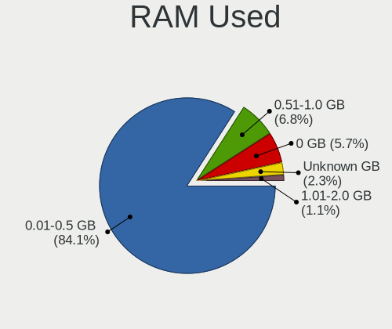
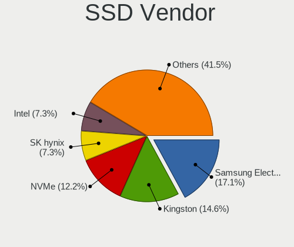
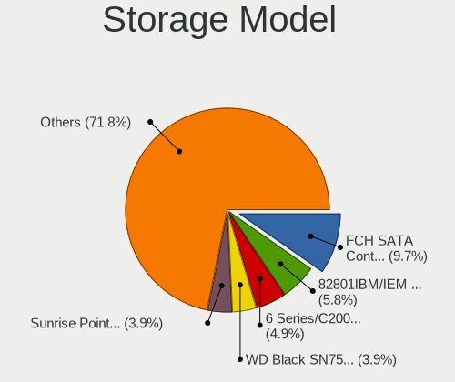
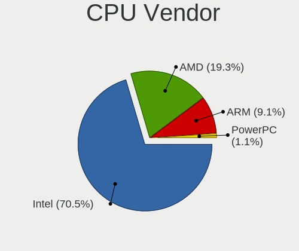
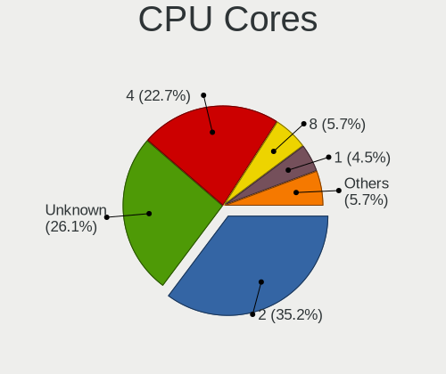
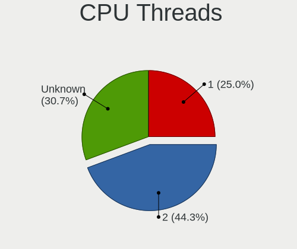
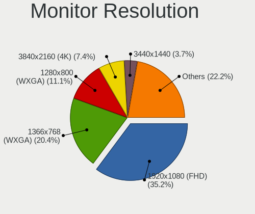
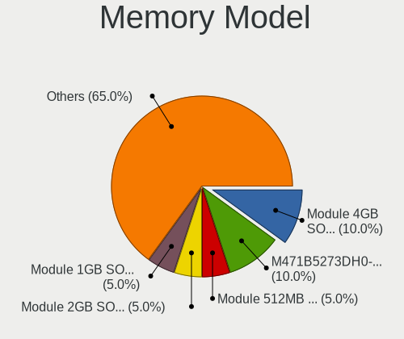
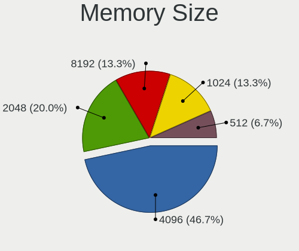
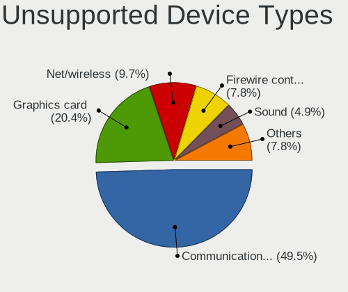

OpenBSD 7.0 - Tested Hardware & Statistics
------------------------------------------

A project to collect tested hardware configurations for OpenBSD 7.0.

Anyone can contribute to this report by the [hw-probe](https://github.com/linuxhw/hw-probe/blob/master/INSTALL.BSD.md) tool:

    hw-probe -all -upload

Please contribute! Especially if your hardware is rare.

This is a report for all computer types. See also reports for [desktops](/Dist/OpenBSD_7.0/Desktop/README.md) and [notebooks](/Dist/OpenBSD_7.0/Notebook/README.md).

Contents
--------

* [ Test Cases ](#test-cases)

* [ System ](#system)
  - [ Arch                     ](#arch)
  - [ DE                       ](#de)
  - [ Display Server           ](#display-server)
  - [ Display Manager          ](#display-manager)
  - [ OS Lang                  ](#os-lang)
  - [ Boot Mode                ](#boot-mode)
  - [ Filesystem               ](#filesystem)
  - [ Part. scheme             ](#part-scheme)

* [ Board ](#board)
  - [ Vendor                   ](#vendor)
  - [ Model                    ](#model)
  - [ Model Family             ](#model-family)
  - [ MFG Year                 ](#mfg-year)
  - [ Form Factor              ](#form-factor)
  - [ Coreboot                 ](#coreboot)
  - [ RAM Size                 ](#ram-size)
  - [ RAM Used                 ](#ram-used)
  - [ Total Drives             ](#total-drives)
  - [ Has CD-ROM               ](#has-cd-rom)
  - [ Has Ethernet             ](#has-ethernet)
  - [ Has WiFi                 ](#has-wifi)
  - [ Has Bluetooth            ](#has-bluetooth)

* [ Location ](#location)
  - [ Country                  ](#country)
  - [ City                     ](#city)

* [ Drives ](#drives)
  - [ Drive Vendor             ](#drive-vendor)
  - [ Drive Model              ](#drive-model)
  - [ HDD Vendor               ](#hdd-vendor)
  - [ SSD Vendor               ](#ssd-vendor)
  - [ Drive Kind               ](#drive-kind)
  - [ Drive Connector          ](#drive-connector)
  - [ Drive Size               ](#drive-size)
  - [ Space Total              ](#space-total)
  - [ Space Used               ](#space-used)
  - [ Malfunc. Drives          ](#malfunc-drives)
  - [ Malfunc. Drive Vendor    ](#malfunc-drive-vendor)
  - [ Malfunc. HDD Vendor      ](#malfunc-hdd-vendor)
  - [ Malfunc. Drive Kind      ](#malfunc-drive-kind)
  - [ Failed Drives            ](#failed-drives)
  - [ Failed Drive Vendor      ](#failed-drive-vendor)
  - [ Drive Status             ](#drive-status)

* [ Storage controller ](#storage-controller)
  - [ Storage Vendor           ](#storage-vendor)
  - [ Storage Model            ](#storage-model)
  - [ Storage Kind             ](#storage-kind)

* [ Processor ](#processor)
  - [ CPU Vendor               ](#cpu-vendor)
  - [ CPU Model                ](#cpu-model)
  - [ CPU Model Family         ](#cpu-model-family)
  - [ CPU Cores                ](#cpu-cores)
  - [ CPU Sockets              ](#cpu-sockets)
  - [ CPU Threads              ](#cpu-threads)
  - [ CPU Microarch            ](#cpu-microarch)

* [ Graphics ](#graphics)
  - [ GPU Vendor               ](#gpu-vendor)
  - [ GPU Model                ](#gpu-model)
  - [ GPU Combo                ](#gpu-combo)
  - [ GPU Driver               ](#gpu-driver)
  - [ GPU Memory               ](#gpu-memory)

* [ Monitor ](#monitor)
  - [ Monitor Vendor           ](#monitor-vendor)
  - [ Monitor Model            ](#monitor-model)
  - [ Monitor Resolution       ](#monitor-resolution)
  - [ Monitor Diagonal         ](#monitor-diagonal)
  - [ Monitor Width            ](#monitor-width)
  - [ Aspect Ratio             ](#aspect-ratio)
  - [ Monitor Area             ](#monitor-area)
  - [ Pixel Density            ](#pixel-density)
  - [ Multiple Monitors        ](#multiple-monitors)

* [ Network ](#network)
  - [ Net Controller Vendor    ](#net-controller-vendor)
  - [ Net Controller Model     ](#net-controller-model)
  - [ Wireless Vendor          ](#wireless-vendor)
  - [ Wireless Model           ](#wireless-model)
  - [ Ethernet Vendor          ](#ethernet-vendor)
  - [ Ethernet Model           ](#ethernet-model)
  - [ Net Controller Kind      ](#net-controller-kind)
  - [ Used Controller          ](#used-controller)
  - [ NICs                     ](#nics)
  - [ IPv6                     ](#ipv6)

* [ Bluetooth ](#bluetooth)
  - [ Bluetooth Vendor         ](#bluetooth-vendor)
  - [ Bluetooth Model          ](#bluetooth-model)

* [ Sound ](#sound)
  - [ Sound Vendor             ](#sound-vendor)
  - [ Sound Model              ](#sound-model)

* [ Memory ](#memory)
  - [ Memory Vendor            ](#memory-vendor)
  - [ Memory Model             ](#memory-model)
  - [ Memory Kind              ](#memory-kind)
  - [ Memory Form Factor       ](#memory-form-factor)
  - [ Memory Size              ](#memory-size)
  - [ Memory Speed             ](#memory-speed)

* [ Printers & scanners ](#printers--scanners)
  - [ Printer Vendor           ](#printer-vendor)
  - [ Printer Model            ](#printer-model)
  - [ Scanner Vendor           ](#scanner-vendor)
  - [ Scanner Model            ](#scanner-model)

* [ Camera ](#camera)
  - [ Camera Vendor            ](#camera-vendor)
  - [ Camera Model             ](#camera-model)

* [ Security ](#security)
  - [ Fingerprint Vendor       ](#fingerprint-vendor)
  - [ Fingerprint Model        ](#fingerprint-model)
  - [ Chipcard Vendor          ](#chipcard-vendor)
  - [ Chipcard Model           ](#chipcard-model)

* [ Unsupported ](#unsupported)
  - [ Unsupported Devices      ](#unsupported-devices)
  - [ Unsupported Device Types ](#unsupported-device-types)

Test Cases
----------

Total: 110

| Vendor        | Model                       | Form-Factor | Probe                                                     | Date         |
|---------------|-----------------------------|-------------|-----------------------------------------------------------|--------------|
| HP            | EliteBook 8440p             | Notebook    | [25d5a77b59](https://bsd-hardware.info/?probe=25d5a77b59) | Jun 17, 2022 |
| Apple         | PowerMac10,1                | Desktop     | [e054e605fa](https://bsd-hardware.info/?probe=e054e605fa) | Apr 23, 2022 |
| Lenovo        | ThinkPad X220 4291QT1       | Notebook    | [f7aa3576ae](https://bsd-hardware.info/?probe=f7aa3576ae) | Apr 13, 2022 |
| TUXEDO        | Pulse 15 Gen1               | Notebook    | [0e836941e0](https://bsd-hardware.info/?probe=0e836941e0) | Apr 11, 2022 |
| Apple         | MacBook5,1                  | Notebook    | [41d62dde7d](https://bsd-hardware.info/?probe=41d62dde7d) | Apr 10, 2022 |
| Apple         | MacBook5,1                  | Notebook    | [c5f7b5499a](https://bsd-hardware.info/?probe=c5f7b5499a) | Apr 10, 2022 |
| PC Engines    | apu4                        | Desktop     | [62df504364](https://bsd-hardware.info/?probe=62df504364) | Apr 09, 2022 |
| Unknown       | Raspberry Pi 3 Model B R... | Desktop     | [040f37113c](https://bsd-hardware.info/?probe=040f37113c) | Apr 06, 2022 |
| Lenovo        | ThinkPad X260 20F5S08Q00    | Notebook    | [1d1db3eab4](https://bsd-hardware.info/?probe=1d1db3eab4) | Apr 03, 2022 |
| Intel         | DCP847SKE                   | Desktop     | [a79e298be3](https://bsd-hardware.info/?probe=a79e298be3) | Apr 03, 2022 |
| IBM           | 2658MNG                     | Notebook    | [e3a5a587fa](https://bsd-hardware.info/?probe=e3a5a587fa) | Mar 28, 2022 |
| HP            | EliteBook 2530p             | Notebook    | [e5c8017afb](https://bsd-hardware.info/?probe=e5c8017afb) | Mar 12, 2022 |
| Lenovo        | Flex 2-15 20405             | Notebook    | [3b77055bd4](https://bsd-hardware.info/?probe=3b77055bd4) | Mar 07, 2022 |
| Intel         | D945GSEJT                   | Desktop     | [bf6a38dfcb](https://bsd-hardware.info/?probe=bf6a38dfcb) | Feb 26, 2022 |
| Dell          | OptiPlex 755                | Desktop     | [9ddfe010c4](https://bsd-hardware.info/?probe=9ddfe010c4) | Feb 24, 2022 |
| Dell          | Vostro 3550                 | Notebook    | [11bed21472](https://bsd-hardware.info/?probe=11bed21472) | Feb 21, 2022 |
| Acer          | Aspire A514-52              | Notebook    | [60f9683fb1](https://bsd-hardware.info/?probe=60f9683fb1) | Feb 21, 2022 |
| Gigabyte      | X58A-UD5                    | Desktop     | [58d57520c1](https://bsd-hardware.info/?probe=58d57520c1) | Feb 20, 2022 |
| Unknown       | Raspberry Pi 4 Model B R... | Desktop     | [04e528ca9f](https://bsd-hardware.info/?probe=04e528ca9f) | Feb 19, 2022 |
| ASRock        | FM2A88X Extreme6+           | Desktop     | [07546b5925](https://bsd-hardware.info/?probe=07546b5925) | Feb 18, 2022 |
| Lenovo        | ThinkPad X250 20CLS59400    | Notebook    | [92333ad60b](https://bsd-hardware.info/?probe=92333ad60b) | Feb 17, 2022 |
| MSI           | MS-7253                     | Desktop     | [c4e971ea82](https://bsd-hardware.info/?probe=c4e971ea82) | Feb 16, 2022 |
| Lenovo        | Flex 2-15 20405             | Notebook    | [1e8904f4fc](https://bsd-hardware.info/?probe=1e8904f4fc) | Feb 15, 2022 |
| HP            | EliteBook 2530p             | Notebook    | [dd52bb1163](https://bsd-hardware.info/?probe=dd52bb1163) | Feb 15, 2022 |
| Raspberry ... | Raspberry Pi 400            | Desktop     | [dd56609ceb](https://bsd-hardware.info/?probe=dd56609ceb) | Feb 14, 2022 |
| Lenovo        | ThinkPad T400 2768W3A       | Desktop     | [4691fdb146](https://bsd-hardware.info/?probe=4691fdb146) | Feb 13, 2022 |
| Lenovo        | ThinkPad T400 2768W3A       | Desktop     | [97788dfb1a](https://bsd-hardware.info/?probe=97788dfb1a) | Feb 13, 2022 |
| Lenovo        | Flex 2-15 20405             | Notebook    | [b77b926f9b](https://bsd-hardware.info/?probe=b77b926f9b) | Feb 13, 2022 |
| Lenovo        | ThinkPad X240 20AMS2QD0C    | Notebook    | [ae597455a4](https://bsd-hardware.info/?probe=ae597455a4) | Feb 13, 2022 |
| Lenovo        | ThinkPad X200 745969G       | Notebook    | [c024d383e7](https://bsd-hardware.info/?probe=c024d383e7) | Feb 13, 2022 |
| Unknown       | LeMaker Banana Pi           | Desktop     | [77413a3d9d](https://bsd-hardware.info/?probe=77413a3d9d) | Feb 12, 2022 |
| HP            | t620 Quad Core TC           | Desktop     | [965ced51e6](https://bsd-hardware.info/?probe=965ced51e6) | Feb 12, 2022 |
| MSI           | MS-7C96                     | Desktop     | [c08331ad58](https://bsd-hardware.info/?probe=c08331ad58) | Feb 06, 2022 |
| Lenovo        | ThinkPad X200 745969G       | Notebook    | [f107f7c1b1](https://bsd-hardware.info/?probe=f107f7c1b1) | Feb 06, 2022 |
| Lenovo        | ThinkPad X200 745969G       | Notebook    | [f8476c0ea7](https://bsd-hardware.info/?probe=f8476c0ea7) | Feb 01, 2022 |
| Raspberry ... | Raspberry Pi 400            | Desktop     | [b35265f8f4](https://bsd-hardware.info/?probe=b35265f8f4) | Jan 29, 2022 |
| Lenovo        | ThinkPad X1 Carbon Gen 9... | Notebook    | [2d65265b52](https://bsd-hardware.info/?probe=2d65265b52) | Jan 29, 2022 |
| Gigabyte      | Z590 VISION G               | Desktop     | [9c73c01062](https://bsd-hardware.info/?probe=9c73c01062) | Jan 28, 2022 |
| Apple         | MacBookPro9,2               | Notebook    | [208819a667](https://bsd-hardware.info/?probe=208819a667) | Jan 27, 2022 |
| WYSE          | D CLASS                     | Desktop     | [5f31ae866c](https://bsd-hardware.info/?probe=5f31ae866c) | Jan 24, 2022 |
| ASRock        | X570 Pro4                   | Desktop     | [d77aae8064](https://bsd-hardware.info/?probe=d77aae8064) | Jan 23, 2022 |
| MSI           | MS-7C56                     | Desktop     | [962ac1c7b0](https://bsd-hardware.info/?probe=962ac1c7b0) | Jan 20, 2022 |
| Lenovo        | ThinkPad X1 Carbon 5th 2... | Notebook    | [c36023a724](https://bsd-hardware.info/?probe=c36023a724) | Jan 17, 2022 |
| Microsoft     | Surface Pro 7               | Tablet      | [26ccd8e3c5](https://bsd-hardware.info/?probe=26ccd8e3c5) | Jan 16, 2022 |
| HP            | EliteBook 2530p             | Notebook    | [42eb986a58](https://bsd-hardware.info/?probe=42eb986a58) | Jan 11, 2022 |
| Lenovo        | V130-15IGM 81HL             | Notebook    | [e0e7b21668](https://bsd-hardware.info/?probe=e0e7b21668) | Jan 09, 2022 |
| Framework     | Laptop                      | Notebook    | [324f0fdebc](https://bsd-hardware.info/?probe=324f0fdebc) | Jan 05, 2022 |
| Framework     | Laptop                      | Notebook    | [ba81f48282](https://bsd-hardware.info/?probe=ba81f48282) | Jan 05, 2022 |
| Dell          | Latitude 3400               | Notebook    | [41bf32aff1](https://bsd-hardware.info/?probe=41bf32aff1) | Jan 02, 2022 |
| Lenovo        | ThinkPad T480 20L5S1S000    | Notebook    | [0925acabe4](https://bsd-hardware.info/?probe=0925acabe4) | Dec 31, 2021 |
| Unknown       | TI AM335x BeagleBone Bla... | Desktop     | [14d6cfb7a4](https://bsd-hardware.info/?probe=14d6cfb7a4) | Dec 27, 2021 |
| Unknown       | TI AM335x BeagleBone Bla... | Desktop     | [ce75fa56bd](https://bsd-hardware.info/?probe=ce75fa56bd) | Dec 27, 2021 |
| Unknown       | TI AM335x BeagleBone Bla... | Desktop     | [612825abe3](https://bsd-hardware.info/?probe=612825abe3) | Dec 27, 2021 |
| Gigabyte      | X470 AORUS ULTRA GAMING     | Desktop     | [2ee4c7fefe](https://bsd-hardware.info/?probe=2ee4c7fefe) | Dec 27, 2021 |
| Lenovo        | IdeaPad 330-15ARR 81D2      | Notebook    | [4bb84a33fa](https://bsd-hardware.info/?probe=4bb84a33fa) | Dec 26, 2021 |
| Casper        | EXCALIBUR G900              | Notebook    | [539cf08655](https://bsd-hardware.info/?probe=539cf08655) | Dec 24, 2021 |
| Samsung       | 530XBB                      | Notebook    | [fe0adb59d8](https://bsd-hardware.info/?probe=fe0adb59d8) | Dec 20, 2021 |
| Samsung       | R720                        | Notebook    | [620195d4aa](https://bsd-hardware.info/?probe=620195d4aa) | Dec 20, 2021 |
| HP            | Compaq 15                   | Notebook    | [1e8b1ce39b](https://bsd-hardware.info/?probe=1e8b1ce39b) | Dec 20, 2021 |
| PC Engines    | APU2                        | Desktop     | [d271c4a29f](https://bsd-hardware.info/?probe=d271c4a29f) | Dec 15, 2021 |
| Intel         | SharkBay Platform           | Notebook    | [383d1e31c9](https://bsd-hardware.info/?probe=383d1e31c9) | Dec 14, 2021 |
| Lenovo        | ThinkPad Edge E430 3254A... | Notebook    | [0215354bfc](https://bsd-hardware.info/?probe=0215354bfc) | Dec 13, 2021 |
| Lenovo        | ThinkPad T420s 41742BU      | Notebook    | [a86326d049](https://bsd-hardware.info/?probe=a86326d049) | Dec 11, 2021 |
| Dell          | G15 5510                    | Notebook    | [2da7a07664](https://bsd-hardware.info/?probe=2da7a07664) | Dec 07, 2021 |
| Lenovo        | ThinkPad X61 7675H7U        | Notebook    | [545cbe065d](https://bsd-hardware.info/?probe=545cbe065d) | Dec 06, 2021 |
| Gigabyte      | H81M-S2PV                   | Desktop     | [0d4c532744](https://bsd-hardware.info/?probe=0d4c532744) | Nov 29, 2021 |
| Dell          | G15 5510                    | Notebook    | [8846b3fd69](https://bsd-hardware.info/?probe=8846b3fd69) | Nov 27, 2021 |
| Dell          | Vostro 3500                 | Notebook    | [923a99fade](https://bsd-hardware.info/?probe=923a99fade) | Nov 27, 2021 |
| Lenovo        | ThinkPad X220 429043U       | Notebook    | [339779baad](https://bsd-hardware.info/?probe=339779baad) | Nov 26, 2021 |
| MSI           | MS-7C56                     | Desktop     | [d4e3f14ad4](https://bsd-hardware.info/?probe=d4e3f14ad4) | Nov 23, 2021 |
| Lenovo        | ThinkPad E490 20N8CTO1WW    | Notebook    | [8b178d13c7](https://bsd-hardware.info/?probe=8b178d13c7) | Nov 22, 2021 |
| Alienware     | m15                         | Notebook    | [20afd3904b](https://bsd-hardware.info/?probe=20afd3904b) | Nov 21, 2021 |
| Dell          | Vostro 3500                 | Notebook    | [63443924f3](https://bsd-hardware.info/?probe=63443924f3) | Nov 19, 2021 |
| Acer          | AO722                       | Notebook    | [98b88ae138](https://bsd-hardware.info/?probe=98b88ae138) | Nov 15, 2021 |
| Lenovo        | ThinkPad T420 4236MBG       | Notebook    | [0391bf9ea4](https://bsd-hardware.info/?probe=0391bf9ea4) | Nov 14, 2021 |
| PC Engines    | APU2                        | Desktop     | [15a26da041](https://bsd-hardware.info/?probe=15a26da041) | Nov 14, 2021 |
| Dell          | Vostro 3500                 | Notebook    | [34d905d6f3](https://bsd-hardware.info/?probe=34d905d6f3) | Nov 11, 2021 |
| Unknown       | Hardkernel ODROID-N2        | Desktop     | [42f6e357c9](https://bsd-hardware.info/?probe=42f6e357c9) | Nov 05, 2021 |
| Google        | Grunt                       | Notebook    | [aa07a1dd40](https://bsd-hardware.info/?probe=aa07a1dd40) | Nov 05, 2021 |
| Lenovo        | ThinkPad Yoga 11e 20DAS0... | Notebook    | [cdccf02902](https://bsd-hardware.info/?probe=cdccf02902) | Nov 04, 2021 |
| Lenovo        | ThinkPad Yoga 11e 20DAS0... | Notebook    | [2471e3f337](https://bsd-hardware.info/?probe=2471e3f337) | Nov 04, 2021 |
| Yanling       | YL-KBR6L                    | Desktop     | [35f1c905eb](https://bsd-hardware.info/?probe=35f1c905eb) | Nov 04, 2021 |
| Google        | Grunt                       | Notebook    | [c87e033731](https://bsd-hardware.info/?probe=c87e033731) | Nov 01, 2021 |
| Panasonic     | CF-53AAGHYDM                | Notebook    | [721ef0235c](https://bsd-hardware.info/?probe=721ef0235c) | Oct 30, 2021 |
| HP            | 0A60h                       | Desktop     | [5c227c5b61](https://bsd-hardware.info/?probe=5c227c5b61) | Oct 27, 2021 |
| Matsushita... | CF-48V4KNDQM                | Notebook    | [9e254ab443](https://bsd-hardware.info/?probe=9e254ab443) | Oct 23, 2021 |
| ASUSTek       | 1000HE                      | Notebook    | [1d5e3e5bc3](https://bsd-hardware.info/?probe=1d5e3e5bc3) | Oct 22, 2021 |
| Google        | Grunt                       | Notebook    | [259f96d9c8](https://bsd-hardware.info/?probe=259f96d9c8) | Oct 22, 2021 |
| Lenovo        | ThinkPad T430 2347GZU       | Notebook    | [3337c00433](https://bsd-hardware.info/?probe=3337c00433) | Oct 22, 2021 |
| Matsushita... | CF-51RCVDNLM                | Notebook    | [b20953f2f4](https://bsd-hardware.info/?probe=b20953f2f4) | Oct 18, 2021 |
| Panasonic     | CF-52PFPBSFQ                | Notebook    | [bbdfde368b](https://bsd-hardware.info/?probe=bbdfde368b) | Oct 18, 2021 |
| Lenovo        | ThinkPad L14 Gen 1 20U10... | Notebook    | [b4ba704356](https://bsd-hardware.info/?probe=b4ba704356) | Oct 17, 2021 |
| Google        | Grunt                       | Notebook    | [e6d4421a4d](https://bsd-hardware.info/?probe=e6d4421a4d) | Oct 16, 2021 |
| Lenovo        | SHARKBAY No DPK             | Desktop     | [e762f9146e](https://bsd-hardware.info/?probe=e762f9146e) | Oct 16, 2021 |
| Lenovo        | ThinkPad T410 2537N24       | Notebook    | [1a5bae2227](https://bsd-hardware.info/?probe=1a5bae2227) | Oct 15, 2021 |
| ASUSTek       | P10S-I Series               | Desktop     | [d086bf947a](https://bsd-hardware.info/?probe=d086bf947a) | Oct 15, 2021 |
| Gigabyte      | B450M DS3H                  | Desktop     | [445b53ddba](https://bsd-hardware.info/?probe=445b53ddba) | Oct 15, 2021 |
| Protectli     | FW6                         | Desktop     | [de39c4e316](https://bsd-hardware.info/?probe=de39c4e316) | Oct 15, 2021 |
| Google        | Grunt                       | Notebook    | [ee9b2d7ad3](https://bsd-hardware.info/?probe=ee9b2d7ad3) | Oct 15, 2021 |
| Dell          | Inspiron 5570               | Notebook    | [9eab523504](https://bsd-hardware.info/?probe=9eab523504) | Oct 14, 2021 |
| MSI           | MS-7D54                     | Desktop     | [ac1f6ee8a6](https://bsd-hardware.info/?probe=ac1f6ee8a6) | Oct 13, 2021 |
| Supermicro    | X11SCE-F                    | Server      | [5731b09f69](https://bsd-hardware.info/?probe=5731b09f69) | Oct 11, 2021 |
| Unknown       | Raspberry Pi 4 Model B R... | Desktop     | [49173900e7](https://bsd-hardware.info/?probe=49173900e7) | Oct 04, 2021 |
| Unknown       | Raspberry Pi 4 Model B R... | Desktop     | [d05a877535](https://bsd-hardware.info/?probe=d05a877535) | Oct 03, 2021 |
| ASUSTek       | ROG STRIX X470-F GAMING     | Desktop     | [46672cf89f](https://bsd-hardware.info/?probe=46672cf89f) | Oct 01, 2021 |
| Lenovo        | ThinkPad X1 Carbon 5th 2... | Notebook    | [d9762d6c2d](https://bsd-hardware.info/?probe=d9762d6c2d) | Sep 23, 2021 |
| Lenovo        | ThinkPad X1 Carbon 5th 2... | Notebook    | [0d00ce5de9](https://bsd-hardware.info/?probe=0d00ce5de9) | Sep 22, 2021 |
| Gigabyte      | BRi3(H)-10110               | Desktop     | [9aa3540749](https://bsd-hardware.info/?probe=9aa3540749) | Sep 09, 2021 |
| Lenovo        | ThinkPad E14 Gen 2 20T6S... | Notebook    | [4cc349d29a](https://bsd-hardware.info/?probe=4cc349d29a) | Sep 08, 2021 |
| Lenovo        | ThinkPad P73 20QRS00200     | Notebook    | [dfc86a0368](https://bsd-hardware.info/?probe=dfc86a0368) | Aug 29, 2021 |

System
------

Arch
----

OS architecture (x86_64, i586, etc.)

| Name   | Computers | Percent |
|--------|-----------|---------|
| amd64  | 70        | 82.35%  |
| i386   | 7         | 8.24%   |
| arm64  | 5         | 5.88%   |
| armv7  | 2         | 2.35%   |
| macppc | 1         | 1.18%   |

DE
--

Desktop Environment

| Name          | Computers | Percent |
|---------------|-----------|---------|
| fvwm          | 64        | 73.56%  |
| Console       | 15        | 17.24%  |
| XFCE          | 3         | 3.45%   |
| Mutter        | 2         | 2.3%    |
| Openbox       | 1         | 1.15%   |
| iwm           | 1         | 1.15%   |
| Enlightenment | 1         | 1.15%   |

Display Server
--------------

X11 or Wayland

| Name    | Computers | Percent |
|---------|-----------|---------|
| X11     | 68        | 80%     |
| Console | 17        | 20%     |

Display Manager
---------------

SDDM, LightDM, etc.

| Name    | Computers | Percent |
|---------|-----------|---------|
| Console | 76        | 88.37%  |
| SLiM    | 7         | 8.14%   |
| GDM     | 3         | 3.49%   |

OS Lang
-------

Language

| Lang    | Computers | Percent |
|---------|-----------|---------|
| Unknown | 69        | 80.23%  |
| en_US   | 7         | 8.14%   |
| fr_FR   | 3         | 3.49%   |
| C       | 3         | 3.49%   |
| zh_CN   | 1         | 1.16%   |
| ru_RU   | 1         | 1.16%   |
| en_GB   | 1         | 1.16%   |
| de_DE   | 1         | 1.16%   |

Boot Mode
---------

EFI or BIOS

| Mode | Computers | Percent |
|------|-----------|---------|
| EFI  | 47        | 55.29%  |
| BIOS | 38        | 44.71%  |

Filesystem
----------

Type of filesystem

| Type | Computers | Percent |
|------|-----------|---------|
| Ffs  | 85        | 100%    |

Part. scheme
------------

Scheme of partitioning

| Type | Computers | Percent |
|------|-----------|---------|
| MBR  | 45        | 52.33%  |
| GPT  | 41        | 47.67%  |

Board
-----

Vendor
------

Motherboard manufacturer

| Name                           | Computers | Percent |
|--------------------------------|-----------|---------|
| Lenovo                         | 27        | 31.76%  |
| Gigabyte Technology            | 6         | 7.06%   |
| Dell                           | 6         | 7.06%   |
| Hewlett-Packard                | 5         | 5.88%   |
| Unknown                        | 5         | 5.88%   |
| MSI                            | 4         | 4.71%   |
| Intel                          | 3         | 3.53%   |
| Apple                          | 3         | 3.53%   |
| Samsung Electronics            | 2         | 2.35%   |
| Raspberry Pi Foundation        | 2         | 2.35%   |
| PC Engines                     | 2         | 2.35%   |
| Panasonic                      | 2         | 2.35%   |
| Matsushita Electric Industrial | 2         | 2.35%   |
| ASUSTek Computer               | 2         | 2.35%   |
| ASRock                         | 2         | 2.35%   |
| Acer                           | 2         | 2.35%   |
| Yanling                        | 1         | 1.18%   |
| WYSE                           | 1         | 1.18%   |
| Supermicro                     | 1         | 1.18%   |
| Protectli                      | 1         | 1.18%   |
| Microsoft                      | 1         | 1.18%   |
| IBM                            | 1         | 1.18%   |
| Google                         | 1         | 1.18%   |
| Framework                      | 1         | 1.18%   |
| Casper                         | 1         | 1.18%   |
| Alienware                      | 1         | 1.18%   |

Model
-----

Motherboard model

| Name                                        | Computers | Percent |
|---------------------------------------------|-----------|---------|
| Unknown                                     | 5         | 5.88%   |
| Lenovo ThinkPad X200 745969G                | 3         | 3.53%   |
| RPi Raspberry Pi 400                        | 2         | 2.35%   |
| Yanling YL-KBR6L                            | 1         | 1.18%   |
| WYSE D CLASS                                | 1         | 1.18%   |
| Supermicro X11SCE-F                         | 1         | 1.18%   |
| Samsung R720                                | 1         | 1.18%   |
| Samsung 530XBB                              | 1         | 1.18%   |
| Protectli FW6                               | 1         | 1.18%   |
| PC Engines apu4                             | 1         | 1.18%   |
| PC Engines APU2                             | 1         | 1.18%   |
| Panasonic CF-53AAGHYDM                      | 1         | 1.18%   |
| Panasonic CF-52PFPBSFQ                      | 1         | 1.18%   |
| MSI MS-7D54                                 | 1         | 1.18%   |
| MSI MS-7C96                                 | 1         | 1.18%   |
| MSI MS-7C56                                 | 1         | 1.18%   |
| MSI MS-7253                                 | 1         | 1.18%   |
| Microsoft Surface Pro 7                     | 1         | 1.18%   |
| Matsushita Electric Industrial CF-51RCVDNLM | 1         | 1.18%   |
| Matsushita Electric Industrial CF-48V4KNDQM | 1         | 1.18%   |
| Lenovo V130-15IGM 81HL                      | 1         | 1.18%   |
| Lenovo ThinkPad Yoga 11e 20DAS02S00         | 1         | 1.18%   |
| Lenovo ThinkPad X61 7675H7U                 | 1         | 1.18%   |
| Lenovo ThinkPad X260 20F5S08Q00             | 1         | 1.18%   |
| Lenovo ThinkPad X250 20CLS59400             | 1         | 1.18%   |
| Lenovo ThinkPad X240 20AMS2QD0C             | 1         | 1.18%   |
| Lenovo ThinkPad X220 4291QT1                | 1         | 1.18%   |
| Lenovo ThinkPad X220 429043U                | 1         | 1.18%   |
| Lenovo ThinkPad X1 Carbon Gen 9 20XW0061MX  | 1         | 1.18%   |
| Lenovo ThinkPad X1 Carbon 5th 20HR0068GE    | 1         | 1.18%   |
| Lenovo ThinkPad T480 20L5S1S000             | 1         | 1.18%   |
| Lenovo ThinkPad T430 2347GZU                | 1         | 1.18%   |
| Lenovo ThinkPad T420s 41742BU               | 1         | 1.18%   |
| Lenovo ThinkPad T420 4236MBG                | 1         | 1.18%   |
| Lenovo ThinkPad T410 2537N24                | 1         | 1.18%   |
| Lenovo ThinkPad T400 2768W3A                | 1         | 1.18%   |
| Lenovo ThinkPad P73 20QRS00200              | 1         | 1.18%   |
| Lenovo ThinkPad L14 Gen 1 20U1000VGE        | 1         | 1.18%   |
| Lenovo ThinkPad Edge E430 3254A68           | 1         | 1.18%   |
| Lenovo ThinkPad E490 20N8CTO1WW             | 1         | 1.18%   |
| Lenovo ThinkPad E14 Gen 2 20T6S02Y00        | 1         | 1.18%   |
| Lenovo ThinkCentre M73z 10BB001DRU          | 1         | 1.18%   |
| Lenovo IdeaPad 330-15ARR 81D2               | 1         | 1.18%   |
| Lenovo Flex 2-15 20405                      | 1         | 1.18%   |
| Intel SharkBay Platform                     | 1         | 1.18%   |
| Intel DCP847SKE                             | 1         | 1.18%   |
| Intel D945GSEJT                             | 1         | 1.18%   |
| IBM 2658MNG                                 | 1         | 1.18%   |
| HP t620 Quad Core TC                        | 1         | 1.18%   |
| HP EliteBook 8440p                          | 1         | 1.18%   |
| HP EliteBook 2530p                          | 1         | 1.18%   |
| HP Compaq dc5700 Microtower                 | 1         | 1.18%   |
| HP Compaq 15                                | 1         | 1.18%   |
| Google Grunt                                | 1         | 1.18%   |
| Gigabyte Z590 VISION G                      | 1         | 1.18%   |
| Gigabyte X58A-UD5                           | 1         | 1.18%   |
| Gigabyte X470 AORUS ULTRA GAMING            | 1         | 1.18%   |
| Gigabyte H81M-S2PV                          | 1         | 1.18%   |
| Gigabyte BRi3(H)-10110                      | 1         | 1.18%   |
| Gigabyte B450M DS3H                         | 1         | 1.18%   |

Model Family
------------

Motherboard model prefix

| Name                                        | Computers | Percent |
|---------------------------------------------|-----------|---------|
| Lenovo ThinkPad                             | 23        | 27.06%  |
| Unknown                                     | 5         | 5.88%   |
| RPi Raspberry                               | 2         | 2.35%   |
| HP EliteBook                                | 2         | 2.35%   |
| HP Compaq                                   | 2         | 2.35%   |
| Dell Vostro                                 | 2         | 2.35%   |
| Yanling YL-KBR6L                            | 1         | 1.18%   |
| WYSE D                                      | 1         | 1.18%   |
| Supermicro X11SCE-F                         | 1         | 1.18%   |
| Samsung R720                                | 1         | 1.18%   |
| Samsung 530XBB                              | 1         | 1.18%   |
| Protectli FW6                               | 1         | 1.18%   |
| PC Engines apu4                             | 1         | 1.18%   |
| PC Engines APU2                             | 1         | 1.18%   |
| Panasonic CF-53AAGHYDM                      | 1         | 1.18%   |
| Panasonic CF-52PFPBSFQ                      | 1         | 1.18%   |
| MSI MS-7D54                                 | 1         | 1.18%   |
| MSI MS-7C96                                 | 1         | 1.18%   |
| MSI MS-7C56                                 | 1         | 1.18%   |
| MSI MS-7253                                 | 1         | 1.18%   |
| Microsoft Surface                           | 1         | 1.18%   |
| Matsushita Electric Industrial CF-51RCVDNLM | 1         | 1.18%   |
| Matsushita Electric Industrial CF-48V4KNDQM | 1         | 1.18%   |
| Lenovo V130-15IGM                           | 1         | 1.18%   |
| Lenovo ThinkCentre                          | 1         | 1.18%   |
| Lenovo IdeaPad                              | 1         | 1.18%   |
| Lenovo Flex                                 | 1         | 1.18%   |
| Intel SharkBay                              | 1         | 1.18%   |
| Intel DCP847SKE                             | 1         | 1.18%   |
| Intel D945GSEJT                             | 1         | 1.18%   |
| IBM 2658MNG                                 | 1         | 1.18%   |
| HP t620                                     | 1         | 1.18%   |
| Google Grunt                                | 1         | 1.18%   |
| Gigabyte Z590                               | 1         | 1.18%   |
| Gigabyte X58A-UD5                           | 1         | 1.18%   |
| Gigabyte X470                               | 1         | 1.18%   |
| Gigabyte H81M-S2PV                          | 1         | 1.18%   |
| Gigabyte BRi3(H)-10110                      | 1         | 1.18%   |
| Gigabyte B450M                              | 1         | 1.18%   |
| Framework Laptop                            | 1         | 1.18%   |
| Dell OptiPlex                               | 1         | 1.18%   |
| Dell Latitude                               | 1         | 1.18%   |
| Dell Inspiron                               | 1         | 1.18%   |
| Dell G15                                    | 1         | 1.18%   |
| Casper EXCALIBUR                            | 1         | 1.18%   |
| ASUS P10S-I                                 | 1         | 1.18%   |
| ASUS 1000HE                                 | 1         | 1.18%   |
| ASRock X570                                 | 1         | 1.18%   |
| ASRock FM2A88X                              | 1         | 1.18%   |
| Apple PowerMac10                            | 1         | 1.18%   |
| Apple MacBookPro9                           | 1         | 1.18%   |
| Apple MacBook5                              | 1         | 1.18%   |
| Alienware m15                               | 1         | 1.18%   |
| Acer Aspire                                 | 1         | 1.18%   |
| Acer AO722                                  | 1         | 1.18%   |

MFG Year
--------

Motherboard manufacture year

| Year    | Computers | Percent |
|---------|-----------|---------|
| 2020    | 11        | 12.94%  |
| 2021    | 10        | 11.76%  |
| 2019    | 9         | 10.59%  |
| 2015    | 7         | 8.24%   |
| 2011    | 7         | 8.24%   |
| 2009    | 6         | 7.06%   |
| Unknown | 6         | 7.06%   |
| 2018    | 5         | 5.88%   |
| 2014    | 5         | 5.88%   |
| 2010    | 3         | 3.53%   |
| 2016    | 2         | 2.35%   |
| 2013    | 2         | 2.35%   |
| 2012    | 2         | 2.35%   |
| 2008    | 2         | 2.35%   |
| 2007    | 2         | 2.35%   |
| 2006    | 2         | 2.35%   |
| 2022    | 1         | 1.18%   |
| 2017    | 1         | 1.18%   |
| 2003    | 1         | 1.18%   |
| 2002    | 1         | 1.18%   |

Form Factor
-----------

Physical design of the computer

| Name     | Computers | Percent |
|----------|-----------|---------|
| Notebook | 50        | 58.82%  |
| Desktop  | 33        | 38.82%  |
| Tablet   | 1         | 1.18%   |
| Server   | 1         | 1.18%   |

Coreboot
--------

Have coreboot on board

| Used | Computers | Percent |
|------|-----------|---------|
| No   | 81        | 95.29%  |
| Yes  | 4         | 4.71%   |

RAM Size
--------

Total RAM memory

| Size in GB  | Computers | Percent |
|-------------|-----------|---------|
| 8.01-16.0   | 20        | 23.53%  |
| 4.01-8.0    | 17        | 20%     |
| 3.01-4.0    | 14        | 16.47%  |
| 16.01-24.0  | 13        | 15.29%  |
| 32.01-64.0  | 5         | 5.88%   |
| 2.01-3.0    | 5         | 5.88%   |
| 0.51-1.0    | 5         | 5.88%   |
| 1.01-2.0    | 3         | 3.53%   |
| 24.01-32.0  | 1         | 1.18%   |
| 64.01-256.0 | 1         | 1.18%   |
| 0.01-0.5    | 1         | 1.18%   |

RAM Used
--------

Used RAM memory

| Used GB  | Computers | Percent |
|----------|-----------|---------|
| 0.01-0.5 | 72        | 84.71%  |
| 0.51-1.0 | 6         | 7.06%   |
| 0        | 5         | 5.88%   |
| 1.01-2.0 | 1         | 1.18%   |
| Unknown  | 1         | 1.18%   |

Total Drives
------------

Number of drives on board

| Drives | Computers | Percent |
|--------|-----------|---------|
| 1      | 44        | 50.57%  |
| 2      | 27        | 31.03%  |
| 3      | 8         | 9.2%    |
| 4      | 4         | 4.6%    |
| 0      | 3         | 3.45%   |
| 6      | 1         | 1.15%   |

Has CD-ROM
----------

Has CD-ROM on board

| Presented | Computers | Percent |
|-----------|-----------|---------|
| No        | 83        | 97.65%  |
| Yes       | 2         | 2.35%   |

Has Ethernet
------------

Has Ethernet on board

| Presented | Computers | Percent |
|-----------|-----------|---------|
| Yes       | 72        | 84.71%  |
| No        | 13        | 15.29%  |

Has WiFi
--------

Has WiFi module

| Presented | Computers | Percent |
|-----------|-----------|---------|
| Yes       | 58        | 68.24%  |
| No        | 27        | 31.76%  |

Has Bluetooth
-------------

Has Bluetooth module

| Presented | Computers | Percent |
|-----------|-----------|---------|
| No        | 48        | 56.47%  |
| Yes       | 37        | 43.53%  |

Location
--------

Country
-------

Geographic location (country)

| Country     | Computers | Percent |
|-------------|-----------|---------|
| USA         | 15        | 17.65%  |
| Poland      | 12        | 14.12%  |
| Germany     | 10        | 11.76%  |
| Russia      | 9         | 10.59%  |
| Canada      | 9         | 10.59%  |
| France      | 6         | 7.06%   |
| Sweden      | 5         | 5.88%   |
| Switzerland | 3         | 3.53%   |
| UK          | 2         | 2.35%   |
| Vietnam     | 1         | 1.18%   |
| Ukraine     | 1         | 1.18%   |
| Turkey      | 1         | 1.18%   |
| Romania     | 1         | 1.18%   |
| Norway      | 1         | 1.18%   |
| Netherlands | 1         | 1.18%   |
| Malaysia    | 1         | 1.18%   |
| Hungary     | 1         | 1.18%   |
| Finland     | 1         | 1.18%   |
| Czechia     | 1         | 1.18%   |
| Cyprus      | 1         | 1.18%   |
| China       | 1         | 1.18%   |
| Brazil      | 1         | 1.18%   |
| Austria     | 1         | 1.18%   |

City
----

Geographic location (city)

| City              | Computers | Percent |
|-------------------|-----------|---------|
| Montreal          | 6         | 6.74%   |
| Gdansk            | 5         | 5.62%   |
| Paris             | 4         | 4.49%   |
| Saint-Laurent     | 3         | 3.37%   |
| Moscow            | 3         | 3.37%   |
| Wroclaw           | 2         | 2.25%   |
| Portland          | 2         | 2.25%   |
| Miedziana Gora    | 2         | 2.25%   |
| Henan             | 2         | 2.25%   |
| Frankfurt am Main | 2         | 2.25%   |
| Zurich            | 1         | 1.12%   |
| Zhukovskiy        | 1         | 1.12%   |
| Zagnansk          | 1         | 1.12%   |
| Yekaterinburg     | 1         | 1.12%   |
| Wolfsburg         | 1         | 1.12%   |
| Wheaton           | 1         | 1.12%   |
| Weinbohla         | 1         | 1.12%   |
| Warner            | 1         | 1.12%   |
| Voskresensk       | 1         | 1.12%   |
| Volgograd         | 1         | 1.12%   |
| Vienna            | 1         | 1.12%   |
| Varpalota         | 1         | 1.12%   |
| Syeverodonets'k   | 1         | 1.12%   |
| Stuttgart         | 1         | 1.12%   |
| Stockholm         | 1         | 1.12%   |
| St Petersburg     | 1         | 1.12%   |
| Skellefteå     | 1         | 1.12%   |
| Sinzig            | 1         | 1.12%   |
| Sheboygan         | 1         | 1.12%   |
| Sao Vicente       | 1         | 1.12%   |
| Queens            | 1         | 1.12%   |
| Prague            | 1         | 1.12%   |
| Poplar            | 1         | 1.12%   |
| Pacierzow         | 1         | 1.12%   |
| Oslo              | 1         | 1.12%   |
| Onalaska          | 1         | 1.12%   |
| Omaha             | 1         | 1.12%   |
| Oensingen         | 1         | 1.12%   |
| Nuremberg         | 1         | 1.12%   |
| Naters            | 1         | 1.12%   |
| Munich            | 1         | 1.12%   |
| Mountain View     | 1         | 1.12%   |
| Mogilno           | 1         | 1.12%   |
| Milton Keynes     | 1         | 1.12%   |
| Matfors           | 1         | 1.12%   |
| Mâcon            | 1         | 1.12%   |
| Lyubertsy         | 1         | 1.12%   |
| Lidkoeping        | 1         | 1.12%   |
| Larnaca           | 1         | 1.12%   |
| Kuala Lumpur      | 1         | 1.12%   |
| Kingman           | 1         | 1.12%   |
| Istanbul          | 1         | 1.12%   |
| Irvine            | 1         | 1.12%   |
| Hohhot            | 1         | 1.12%   |
| Ho Chi Minh City  | 1         | 1.12%   |
| Helsinki          | 1         | 1.12%   |
| Glendale          | 1         | 1.12%   |
| Giroussens        | 1         | 1.12%   |
| Gettysburg        | 1         | 1.12%   |
| Erlangen          | 1         | 1.12%   |

Drives
------

Drive Vendor
------------

Hard drive vendors

| Vendor                             | Computers | Drives | Percent |
|------------------------------------|-----------|--------|---------|
| NVMe                               | 22        | 27     | 21.15%  |
| WDC                                | 13        | 13     | 12.5%   |
| Samsung Electronics                | 13        | 15     | 12.5%   |
| Toshiba                            | 9         | 11     | 8.65%   |
| Seagate                            | 9         | 12     | 8.65%   |
| Kingston                           | 6         | 8      | 5.77%   |
| Intel                              | 3         | 4      | 2.88%   |
| Hitachi                            | 3         | 3      | 2.88%   |
| SK hynix                           | 2         | 2      | 1.92%   |
| SanDisk                            | 2         | 2      | 1.92%   |
| HGST                               | 2         | 3      | 1.92%   |
| Crucial                            | 2         | 2      | 1.92%   |
| A-DATA Technology                  | 2         | 2      | 1.92%   |
| StoreJet                           | 1         | 1      | 0.96%   |
| SSDPR-CX                           | 1         | 1      | 0.96%   |
| Product:              USB DISK 3.0 | 1         | 1      | 0.96%   |
| Product:              USB DISK 2.0 | 1         | 1      | 0.96%   |
| Plextor                            | 1         | 1      | 0.96%   |
| Phison                             | 1         | 1      | 0.96%   |
| Patriot                            | 1         | 1      | 0.96%   |
| OPENBSD                            | 1         | 1      | 0.96%   |
| Netac                              | 1         | 1      | 0.96%   |
| Maxtor                             | 1         | 2      | 0.96%   |
| Lexar                              | 1         | 1      | 0.96%   |
| HPE                                | 1         | 2      | 0.96%   |
| Generic                            | 1         | 1      | 0.96%   |
| ASMT                               | 1         | 1      | 0.96%   |
| Apple                              | 1         | 1      | 0.96%   |
| Apacer                             | 1         | 1      | 0.96%   |

Drive Model
-----------

Hard drive models

| Model                                                | Computers | Percent |
|------------------------------------------------------|-----------|---------|
| Samsung HM321HI 320GB                                | 3         | 2.78%   |
| NVMe WDC PC SN730 SDB 256GB                          | 3         | 2.78%   |
| Toshiba MK2556GSY 250GB                              | 2         | 1.85%   |
| Samsung Flash Drive FIT 32GB                         | 2         | 1.85%   |
| NVMe Samsung SSD 970 250GB                           | 2         | 1.85%   |
| WDC WDS480G2G0B-00EPW0 480GB                         | 1         | 0.93%   |
| WDC WDS240G2G0B-00EPW0 240GB                         | 1         | 0.93%   |
| WDC WD7500BPKX-00HPJT0 752GB                         | 1         | 0.93%   |
| WDC WD7500BPKT-00PK4T0 752GB                         | 1         | 0.93%   |
| WDC WD6400AARS-00Y5B1 640GB                          | 1         | 0.93%   |
| WDC WD5000LPLX-00ZNTT0 500GB                         | 1         | 0.93%   |
| WDC WD5000LPCX-24VHAT0 500GB                         | 1         | 0.93%   |
| WDC WD3200BEVE-00A0HT0 320GB                         | 1         | 0.93%   |
| WDC WD20PURX-64P6ZY0 2TB                             | 1         | 0.93%   |
| WDC WD1600BEVE-00UYT0 160GB                          | 1         | 0.93%   |
| WDC WD10JPLX-00MBPT0 1TB                             | 1         | 0.93%   |
| WDC WD10EADS-00M2B0 1TB                              | 1         | 0.93%   |
| WDC WD101KFBX-68R56N0 10TB                           | 1         | 0.93%   |
| Toshiba TR200 240GB                                  | 1         | 0.93%   |
| Toshiba THNSFJ256GCSU 256GB                          | 1         | 0.93%   |
| Toshiba MQ04ABF100 1TB                               | 1         | 0.93%   |
| Toshiba MK3276GSX -63 320GB                          | 1         | 0.93%   |
| Toshiba MK2555GSX 250GB                              | 1         | 0.93%   |
| Toshiba MK1629GSGF 160GB                             | 1         | 0.93%   |
| Toshiba DT01ACA050 500GB                             | 1         | 0.93%   |
| StoreJet Transcend 120GB                             | 1         | 0.93%   |
| SSDPR-CX 400-512-G2 512GB                            | 1         | 0.93%   |
| SK hynix SC311 SATA 256GB                            | 1         | 0.93%   |
| SK hynix HFS128G32TNF-N3A0A 128GB                    | 1         | 0.93%   |
| Seagate ST9500420AS 500GB                            | 1         | 0.93%   |
| Seagate ST9320423AS 320GB                            | 1         | 0.93%   |
| Seagate ST9160821A 160GB                             | 1         | 0.93%   |
| Seagate ST3250318AS 250GB                            | 1         | 0.93%   |
| Seagate ST250DM000-1BD141 250GB                      | 1         | 0.93%   |
| Seagate ST2000VN000-1HJ164 2TB                       | 1         | 0.93%   |
| Seagate ST2000NE0025-2FL101 2TB                      | 1         | 0.93%   |
| Seagate ST2000DM008-2FR102 2TB                       | 1         | 0.93%   |
| Seagate ST1000LM035-1RK172 1TB                       | 1         | 0.93%   |
| Seagate BUP Slim BL 1TB                              | 1         | 0.93%   |
| SanDisk Ultra 32GB                                   | 1         | 0.93%   |
| SanDisk Cruzer Blade 32GB                            | 1         | 0.93%   |
| Samsung SSD 860 EVO 500GB                            | 1         | 0.93%   |
| Samsung SSD 860 EVO 250GB                            | 1         | 0.93%   |
| Samsung SSD 860 EVO 1TB                              | 1         | 0.93%   |
| Samsung SSD 850 EVO 500GB                            | 1         | 0.93%   |
| Samsung SSD 840 EVO 120GB                            | 1         | 0.93%   |
| Samsung MZ7TE128HMGR-000L1 128GB                     | 1         | 0.93%   |
| Samsung MZ7PC128HAFU-000L1 128GB                     | 1         | 0.93%   |
| Samsung HD501LJ 500GB                                | 1         | 0.93%   |
| Product:              USB DISK 3.0 USB DISK 3.0 64GB | 1         | 0.93%   |
| Product:              USB DISK 2.0 USB DISK 2.0 4GB  | 1         | 0.93%   |
| Plextor PX-128M6S 128GB                              | 1         | 0.93%   |
| Phison SATA SSD 16GB                                 | 1         | 0.93%   |
| Patriot Burst 120GB                                  | 1         | 0.93%   |
| OPENBSD SR RAID 1 752GB                              | 1         | 0.93%   |
| NVMe WDS500G3X0C-00SJ 500GB                          | 1         | 0.93%   |
| NVMe WDC WDS100T2B0C- 1TB                            | 1         | 0.93%   |
| NVMe TOSHIBA-RC100 240GB                             | 1         | 0.93%   |
| NVMe Samsung SSD 980 1TB                             | 1         | 0.93%   |
| NVMe SAMSUNG MZVLW1T0 1TB                            | 1         | 0.93%   |

HDD Vendor
----------

Hard disk drive vendors

| Vendor                             | Computers | Drives | Percent |
|------------------------------------|-----------|--------|---------|
| NVMe                               | 15        | 18     | 23.81%  |
| WDC                                | 11        | 11     | 17.46%  |
| Seagate                            | 9         | 12     | 14.29%  |
| Toshiba                            | 7         | 9      | 11.11%  |
| Samsung Electronics                | 6         | 8      | 9.52%   |
| Hitachi                            | 3         | 3      | 4.76%   |
| HGST                               | 2         | 3      | 3.17%   |
| StoreJet                           | 1         | 1      | 1.59%   |
| SSDPR-CX                           | 1         | 1      | 1.59%   |
| Product:              USB DISK 3.0 | 1         | 1      | 1.59%   |
| Product:              USB DISK 2.0 | 1         | 1      | 1.59%   |
| OPENBSD                            | 1         | 1      | 1.59%   |
| Maxtor                             | 1         | 2      | 1.59%   |
| Lexar                              | 1         | 1      | 1.59%   |
| Generic                            | 1         | 1      | 1.59%   |
| ASMT                               | 1         | 1      | 1.59%   |
| Apple                              | 1         | 1      | 1.59%   |

SSD Vendor
----------

Solid state drive vendors

| Vendor              | Computers | Drives | Percent |
|---------------------|-----------|--------|---------|
| Samsung Electronics | 7         | 7      | 17.95%  |
| Kingston            | 6         | 8      | 15.38%  |
| NVMe                | 5         | 5      | 12.82%  |
| Intel               | 3         | 4      | 7.69%   |
| WDC                 | 2         | 2      | 5.13%   |
| Toshiba             | 2         | 2      | 5.13%   |
| SK hynix            | 2         | 2      | 5.13%   |
| SanDisk             | 2         | 2      | 5.13%   |
| Crucial             | 2         | 2      | 5.13%   |
| A-DATA Technology   | 2         | 2      | 5.13%   |
| Plextor             | 1         | 1      | 2.56%   |
| Phison              | 1         | 1      | 2.56%   |
| Patriot             | 1         | 1      | 2.56%   |
| Netac               | 1         | 1      | 2.56%   |
| HPE                 | 1         | 2      | 2.56%   |
| Apacer              | 1         | 1      | 2.56%   |

Drive Kind
----------

HDD or SSD

| Kind | Computers | Drives | Percent |
|------|-----------|--------|---------|
| HDD  | 51        | 75     | 57.95%  |
| SSD  | 34        | 43     | 38.64%  |
| NVMe | 3         | 4      | 3.41%   |

Drive Connector
---------------

SATA, SAS, NVMe, etc.

| Type | Computers | Drives | Percent |
|------|-----------|--------|---------|
| SATA | 77        | 118    | 96.25%  |
| NVMe | 3         | 4      | 3.75%   |

Drive Size
----------

Size of hard drive

| Size in TB | Computers | Drives | Percent |
|------------|-----------|--------|---------|
| 0.01-0.5   | 64        | 85     | 72.73%  |
| 0.51-1.0   | 16        | 18     | 18.18%  |
| 1.01-2.0   | 7         | 14     | 7.95%   |
| 4.01-10.0  | 1         | 1      | 1.14%   |

Space Total
-----------

Amount of disk space available on the file system

| Size in GB     | Computers | Percent |
|----------------|-----------|---------|
| 251-500        | 24        | 27.59%  |
| 101-250        | 24        | 27.59%  |
| 21-50          | 15        | 17.24%  |
| 51-100         | 13        | 14.94%  |
| 1-20           | 5         | 5.75%   |
| 501-1000       | 5         | 5.75%   |
| More than 3000 | 1         | 1.15%   |

Space Used
----------

Amount of used disk space

| Used GB   | Computers | Percent |
|-----------|-----------|---------|
| 1-20      | 64        | 75.29%  |
| 21-50     | 9         | 10.59%  |
| 101-250   | 8         | 9.41%   |
| 51-100    | 2         | 2.35%   |
| 2001-3000 | 1         | 1.18%   |
| 501-1000  | 1         | 1.18%   |

Malfunc. Drives
---------------

Drive models with a malfunction

| Model                           | Computers | Drives | Percent |
|---------------------------------|-----------|--------|---------|
| WDC WD1600BEVE-00UYT0 160GB     | 1         | 1      | 7.14%   |
| WDC WD10EADS-00M2B0 1TB         | 1         | 1      | 7.14%   |
| Toshiba MQ04ABF100 1TB          | 1         | 1      | 7.14%   |
| Toshiba MK1629GSGF 160GB        | 1         | 3      | 7.14%   |
| Seagate ST9500420AS 500GB       | 1         | 1      | 7.14%   |
| Seagate ST9320423AS 320GB       | 1         | 1      | 7.14%   |
| Seagate ST250DM000-1BD141 250GB | 1         | 1      | 7.14%   |
| Kingston SMS200S330G 32GB       | 1         | 2      | 7.14%   |
| Intel SSDSC2KF256H6L 256GB      | 1         | 1      | 7.14%   |
| Intel SSDSA2M080G2GC 80GB       | 1         | 1      | 7.14%   |
| Hitachi HTS722010K9SA00 100GB   | 1         | 1      | 7.14%   |
| HGST HTS545050A7E660 500GB      | 1         | 2      | 7.14%   |
| A-DATA Technology SP550 480GB   | 1         | 1      | 7.14%   |
| A-DATA Technology SP550 240GB   | 1         | 1      | 7.14%   |

Malfunc. Drive Vendor
---------------------

Vendors of faulty drives

| Vendor            | Computers | Drives | Percent |
|-------------------|-----------|--------|---------|
| Seagate           | 3         | 3      | 21.43%  |
| WDC               | 2         | 2      | 14.29%  |
| Toshiba           | 2         | 4      | 14.29%  |
| Intel             | 2         | 2      | 14.29%  |
| A-DATA Technology | 2         | 2      | 14.29%  |
| Kingston          | 1         | 2      | 7.14%   |
| Hitachi           | 1         | 1      | 7.14%   |
| HGST              | 1         | 2      | 7.14%   |

Malfunc. HDD Vendor
-------------------

Vendors of faulty HDD drives

| Vendor  | Computers | Drives | Percent |
|---------|-----------|--------|---------|
| Seagate | 3         | 3      | 33.33%  |
| WDC     | 2         | 2      | 22.22%  |
| Toshiba | 2         | 4      | 22.22%  |
| Hitachi | 1         | 1      | 11.11%  |
| HGST    | 1         | 2      | 11.11%  |

Malfunc. Drive Kind
-------------------

Kinds of faulty drives

| Kind | Computers | Drives | Percent |
|------|-----------|--------|---------|
| HDD  | 9         | 12     | 64.29%  |
| SSD  | 5         | 6      | 35.71%  |

Failed Drives
-------------

Failed drive models

| Model                       | Computers | Drives | Percent |
|-----------------------------|-----------|--------|---------|
| WDC WD6400AARS-00Y5B1 640GB | 1         | 1      | 100%    |

Failed Drive Vendor
-------------------

Failed drive vendors

| Vendor | Computers | Drives | Percent |
|--------|-----------|--------|---------|
| WDC    | 1         | 1      | 100%    |

Drive Status
------------

Number of failed and malfunc. drives

| Status   | Computers | Drives | Percent |
|----------|-----------|--------|---------|
| Works    | 52        | 67     | 55.91%  |
| Detected | 26        | 36     | 27.96%  |
| Malfunc  | 14        | 18     | 15.05%  |
| Failed   | 1         | 1      | 1.08%   |

Storage controller
------------------

Storage Vendor
--------------

Storage controller vendors

| Vendor                      | Computers | Percent |
|-----------------------------|-----------|---------|
| Intel                       | 53        | 58.24%  |
| AMD                         | 14        | 15.38%  |
| SanDisk                     | 6         | 6.59%   |
| Samsung Electronics         | 6         | 6.59%   |
| Toshiba                     | 2         | 2.2%    |
| Phison Electronics          | 2         | 2.2%    |
| KIOXIA                      | 2         | 2.2%    |
| Kingston Technology Company | 2         | 2.2%    |
| VIA Technologies            | 1         | 1.1%    |
| Nvidia                      | 1         | 1.1%    |
| HighPoint Technologies      | 1         | 1.1%    |
| ADATA Technology            | 1         | 1.1%    |

Storage Model
-------------

Storage controller models

| Model                                                                                  | Computers | Percent |
|----------------------------------------------------------------------------------------|-----------|---------|
| AMD FCH SATA Controller [AHCI mode]                                                    | 10        | 10%     |
| Intel 82801IBM/IEM (ICH9M/ICH9M-E) 4 port SATA Controller [AHCI mode]                  | 6         | 6%      |
| Intel 6 Series/C200 Series Chipset Family 6 port Mobile SATA AHCI Controller           | 5         | 5%      |
| SanDisk WD Black SN750 / PC SN730 NVMe SSD                                             | 4         | 4%      |
| Intel Sunrise Point-LP SATA Controller [AHCI mode]                                     | 4         | 4%      |
| Intel 7 Series Chipset Family 6-port SATA Controller [AHCI mode]                       | 4         | 4%      |
| Samsung NVMe SSD Controller SM981/PM981/PM983                                          | 3         | 3%      |
| Intel 82801GBM/GHM (ICH7-M Family) SATA Controller [IDE mode]                          | 3         | 3%      |
| Intel 5 Series/3400 Series Chipset 6 port SATA AHCI Controller                         | 3         | 3%      |
| SanDisk unknown                                                                        | 2         | 2%      |
| Intel Wildcat Point-LP SATA Controller [AHCI Mode]                                     | 2         | 2%      |
| Intel Comet Lake SATA AHCI Controller                                                  | 2         | 2%      |
| Intel Celeron/Pentium Silver Processor SATA Controller                                 | 2         | 2%      |
| Intel Cannon Point-LP SATA Controller [AHCI Mode]                                      | 2         | 2%      |
| Intel Cannon Lake Mobile PCH SATA AHCI Controller                                      | 2         | 2%      |
| Intel 82801CAM IDE U100 Controller                                                     | 2         | 2%      |
| Intel 8 Series/C220 Series Chipset Family 6-port SATA Controller 1 [AHCI mode]         | 2         | 2%      |
| Intel 8 Series SATA Controller 1 [AHCI mode]                                           | 2         | 2%      |
| Intel 500 Series Chipset Family SATA AHCI Controller                                   | 2         | 2%      |
| AMD 500 Series Chipset SATA Controller                                                 | 2         | 2%      |
| AMD 400 Series Chipset SATA Controller                                                 | 2         | 2%      |
| VIA VT82C586A/B/VT82C686/A/B/VT823x/A/C PIPC Bus Master IDE                            | 1         | 1%      |
| VIA VT8237A SATA 2-Port Controller                                                     | 1         | 1%      |
| Toshiba unknown                                                                        | 1         | 1%      |
| Toshiba BG3 NVMe SSD Controller                                                        | 1         | 1%      |
| Samsung NVMe SSD Controller SM961/PM961/SM963                                          | 1         | 1%      |
| Samsung NVMe SSD Controller PM9A1/PM9A3/980PRO                                         | 1         | 1%      |
| Samsung NVMe SSD Controller 980                                                        | 1         | 1%      |
| Phison PS5013 E13 NVMe Controller                                                      | 1         | 1%      |
| Phison E12 NVMe Controller                                                             | 1         | 1%      |
| Nvidia MCP79 SATA Controller                                                           | 1         | 1%      |
| KIOXIA unknown                                                                         | 1         | 1%      |
| KIOXIA NVMe SSD                                                                        | 1         | 1%      |
| Kingston Company U-SNS8154P3 NVMe SSD                                                  | 1         | 1%      |
| Kingston Company OM3PDP3 NVMe SSD                                                      | 1         | 1%      |
| Intel Tiger Lake-LP SATA Controller [AHCI mode]                                        | 1         | 1%      |
| Intel SSD Pro 7600p/760p/E 6100p Series                                                | 1         | 1%      |
| Intel Q170/Q150/B150/H170/H110/Z170/CM236 Chipset SATA Controller [AHCI Mode]          | 1         | 1%      |
| Intel Mobile 4 Series Chipset PT IDER Controller                                       | 1         | 1%      |
| Intel Cannon Lake PCH SATA AHCI Controller                                             | 1         | 1%      |
| Intel Atom Processor E3800 Series SATA AHCI Controller                                 | 1         | 1%      |
| Intel 82Q35 Express PT IDER Controller                                                 | 1         | 1%      |
| Intel 82801JI (ICH10 Family) 4 port SATA IDE Controller #1                             | 1         | 1%      |
| Intel 82801JI (ICH10 Family) 2 port SATA IDE Controller #2                             | 1         | 1%      |
| Intel 82801IR/IO/IH (ICH9R/DO/DH) 6 port SATA Controller [AHCI mode]                   | 1         | 1%      |
| Intel 82801HR/HO/HH (ICH8R/DO/DH) 2 port SATA Controller [IDE mode]                    | 1         | 1%      |
| Intel 82801HM/HEM (ICH8M/ICH8M-E) SATA Controller [IDE mode]                           | 1         | 1%      |
| Intel 82801H (ICH8 Family) 4 port SATA Controller [IDE mode]                           | 1         | 1%      |
| Intel 82801G (ICH7 Family) IDE Controller                                              | 1         | 1%      |
| Intel 6 Series/C200 Series Chipset Family Mobile SATA Controller (IDE mode, ports 4-5) | 1         | 1%      |
| Intel 6 Series/C200 Series Chipset Family Mobile SATA Controller (IDE mode, ports 0-3) | 1         | 1%      |
| HighPoint unknown                                                                      | 1         | 1%      |
| AMD SB7x0/SB8x0/SB9x0 SATA Controller [IDE mode]                                       | 1         | 1%      |
| AMD SB7x0/SB8x0/SB9x0 SATA Controller [AHCI mode]                                      | 1         | 1%      |
| ADATA Technology unknown                                                               | 1         | 1%      |

Storage Kind
------------

Kind of storage controller (IDE, SATA, NVMe, SAS, ...)

| Kind | Computers | Percent |
|------|-----------|---------|
| SATA | 57        | 61.96%  |
| NVMe | 21        | 22.83%  |
| IDE  | 13        | 14.13%  |
| RAID | 1         | 1.09%   |

Processor
---------

CPU Vendor
----------

Processor vendors

| Vendor  | Computers | Percent |
|---------|-----------|---------|
| Intel   | 60        | 70.59%  |
| AMD     | 17        | 20%     |
| ARM     | 7         | 8.24%   |
| PowerPC | 1         | 1.18%   |

CPU Model
---------

Processor models

| Model                                                             | Computers | Percent |
|-------------------------------------------------------------------|-----------|---------|
| Intel Core i5-2520M CPU @ 2.50GHz                                 | 5         | 5.88%   |
| Intel Core 2 Duo CPU P8600 @ 2.40GHz                              | 4         | 4.71%   |
| ARM Cortex-A72 r0p3                                               | 3         | 3.53%   |
| Intel Core i5-8250U CPU @ 1.60GHz                                 | 2         | 2.35%   |
| Intel Core i5-2540M CPU @ 2.60GHz                                 | 2         | 2.35%   |
| Intel Core i5 CPU M 520 @ 2.40GHz                                 | 2         | 2.35%   |
| Intel Core i3-10110U CPU @ 2.10GHz                                | 2         | 2.35%   |
| Intel Celeron N4000 CPU @ 1.10GHz                                 | 2         | 2.35%   |
| Intel 11th Gen Core i5-1135G7 @ 2.40GHz                           | 2         | 2.35%   |
| ARM Cortex-A53 r0p4                                               | 2         | 2.35%   |
| AMD Ryzen 7 5800X 8-Core Processor                                | 2         | 2.35%   |
| AMD GX-412TC SOC                                                  | 2         | 2.35%   |
| PowerPC 7447A (Revision 0x102)                                    | 1         | 1.18%   |
| Intel Xeon E-2276G CPU @ 3.80GHz                                  | 1         | 1.18%   |
| Intel Xeon CPU E3-1220 v5 @ 3.00GHz                               | 1         | 1.18%   |
| Intel Pentium 4 Mobile CPU 1.60GHz                                | 1         | 1.18%   |
| Intel Mobile Pentium 4 - M CPU 1.70GHz ("GenuineIntel" 686-class) | 1         | 1.18%   |
| Intel Genuine CPU T2300 @ 1.66GHz                                 | 1         | 1.18%   |
| Intel Core i9-9880H CPU @ 2.30GHz                                 | 1         | 1.18%   |
| Intel Core i7-8750H CPU @ 2.20GHz                                 | 1         | 1.18%   |
| Intel Core i7-8565U CPU @ 1.80GHz                                 | 1         | 1.18%   |
| Intel Core i7-8550U CPU @ 1.80GHz                                 | 1         | 1.18%   |
| Intel Core i7-7500U CPU @ 2.70GHz                                 | 1         | 1.18%   |
| Intel Core i7-5600U CPU @ 2.60GHz                                 | 1         | 1.18%   |
| Intel Core i7-3520M CPU @ 2.90GHz                                 | 1         | 1.18%   |
| Intel Core i7 CPU 970 @ 3.20GHz                                   | 1         | 1.18%   |
| Intel Core i5-8265U CPU @ 1.60GHz                                 | 1         | 1.18%   |
| Intel Core i5-6300U CPU @ 2.40GHz                                 | 1         | 1.18%   |
| Intel Core i5-5200U CPU @ 2.20GHz                                 | 1         | 1.18%   |
| Intel Core i5-4570S CPU @ 2.90GHz                                 | 1         | 1.18%   |
| Intel Core i5-4300U CPU @ 1.90GHz                                 | 1         | 1.18%   |
| Intel Core i5-3320M CPU @ 2.60GHz                                 | 1         | 1.18%   |
| Intel Core i5-1035G4 CPU @ 1.10GHz                                | 1         | 1.18%   |
| Intel Core i5-10210U CPU @ 1.60GHz                                | 1         | 1.18%   |
| Intel Core i5-10200H CPU @ 2.40GHz                                | 1         | 1.18%   |
| Intel Core i5 CPU M 560 @ 2.67GHz                                 | 1         | 1.18%   |
| Intel Core i3-4010U CPU @ 1.70GHz                                 | 1         | 1.18%   |
| Intel Core 2 Duo CPU T8100 @ 2.10GHz                              | 1         | 1.18%   |
| Intel Core 2 Duo CPU T6500 @ 2.10GHz                              | 1         | 1.18%   |
| Intel Core 2 Duo CPU P7350 @ 2.00GHz                              | 1         | 1.18%   |
| Intel Core 2 Duo CPU L9600 @ 2.13GHz                              | 1         | 1.18%   |
| Intel Core 2 Duo CPU E8400 @ 3.00GHz                              | 1         | 1.18%   |
| Intel Core 2 CPU 6400 @ 2.13GHz                                   | 1         | 1.18%   |
| Intel Celeron CPU N2930 @ 1.83GHz                                 | 1         | 1.18%   |
| Intel Celeron CPU G1820 @ 2.70GHz                                 | 1         | 1.18%   |
| Intel Celeron CPU 847E @ 1.10GHz                                  | 1         | 1.18%   |
| Intel Celeron CPU 3865U @ 1.80GHz                                 | 1         | 1.18%   |
| Intel Atom CPU N280 @ 1.66GHz                                     | 1         | 1.18%   |
| Intel Atom CPU N270 @ 1.60GHz ("GenuineIntel" 686-class)          | 1         | 1.18%   |
| Intel 11th Gen Core i9-11900K @ 3.50GHz                           | 1         | 1.18%   |
| Intel 11th Gen Core i7-11800H @ 2.30GHz                           | 1         | 1.18%   |
| Intel 11th Gen Core i7-1165G7 @ 2.80GHz                           | 1         | 1.18%   |
| ARM Cortex-A8 r3p2                                                | 1         | 1.18%   |
| ARM Cortex-A7 r0p4                                                | 1         | 1.18%   |
| AMD Ryzen 7 5700G with Radeon Graphics                            | 1         | 1.18%   |
| AMD Ryzen 7 4700U with Radeon Graphics                            | 1         | 1.18%   |
| AMD Ryzen 7 2700 Eight-Core Processor                             | 1         | 1.18%   |
| AMD Ryzen 5 3600 6-Core Processor                                 | 1         | 1.18%   |
| AMD Ryzen 3 3100 4-Core Processor                                 | 1         | 1.18%   |
| AMD Ryzen 3 2200U with Radeon Vega Mobile Gfx                     | 1         | 1.18%   |

CPU Model Family
----------------

Processor model prefix

| Model                  | Computers | Percent |
|------------------------|-----------|---------|
| Intel Core i5          | 21        | 24.71%  |
| Intel Core 2 Duo       | 9         | 10.59%  |
| Intel Core i7          | 7         | 8.24%   |
| ARM Cortex             | 7         | 8.24%   |
| Other                  | 6         | 7.06%   |
| Intel Celeron          | 6         | 7.06%   |
| AMD Ryzen 7            | 5         | 5.88%   |
| Intel Core i3          | 3         | 3.53%   |
| AMD GX                 | 3         | 3.53%   |
| Intel Xeon             | 2         | 2.35%   |
| Intel Atom             | 2         | 2.35%   |
| AMD Ryzen 3            | 2         | 2.35%   |
| Intel Pentium 4        | 1         | 1.18%   |
| Intel Mobile Pentium 4 | 1         | 1.18%   |
| Intel Genuine          | 1         | 1.18%   |
| Intel Core i9          | 1         | 1.18%   |
| Intel Core 2           | 1         | 1.18%   |
| AMD Ryzen 5            | 1         | 1.18%   |
| AMD G                  | 1         | 1.18%   |
| AMD E1                 | 1         | 1.18%   |
| AMD C-50               | 1         | 1.18%   |
| AMD Athlon 64 X2       | 1         | 1.18%   |
| AMD A4                 | 1         | 1.18%   |
| AMD A10                | 1         | 1.18%   |

CPU Cores
---------

Number of processor cores

| Number  | Computers | Percent |
|---------|-----------|---------|
| 2       | 30        | 35.29%  |
| Unknown | 22        | 25.88%  |
| 4       | 19        | 22.35%  |
| 8       | 5         | 5.88%   |
| 1       | 4         | 4.71%   |
| 6       | 3         | 3.53%   |
| 16      | 2         | 2.35%   |

CPU Sockets
-----------

Number of sockets

| Number  | Computers | Percent |
|---------|-----------|---------|
| 1       | 61        | 71.76%  |
| Unknown | 23        | 27.06%  |
| 2       | 1         | 1.18%   |

CPU Threads
-----------

Threads per core (Hyper-Threading)

| Number  | Computers | Percent |
|---------|-----------|---------|
| 2       | 37        | 43.53%  |
| Unknown | 26        | 30.59%  |
| 1       | 22        | 25.88%  |

CPU Microarch
-------------

Microarchitecture

| Name          | Computers | Percent |
|---------------|-----------|---------|
| KabyLake      | 13        | 15.29%  |
| Unknown       | 13        | 15.29%  |
| Penryn        | 9         | 10.59%  |
| SandyBridge   | 8         | 9.41%   |
| Westmere      | 4         | 4.71%   |
| Haswell       | 4         | 4.71%   |
| Zen 2         | 3         | 3.53%   |
| TigerLake     | 3         | 3.53%   |
| Skylake       | 2         | 2.35%   |
| Puma          | 2         | 2.35%   |
| NetBurst      | 2         | 2.35%   |
| Jaguar        | 2         | 2.35%   |
| IvyBridge     | 2         | 2.35%   |
| Goldmont plus | 2         | 2.35%   |
| Broadwell     | 2         | 2.35%   |
| Bonnell       | 2         | 2.35%   |
| Bobcat        | 2         | 2.35%   |
| Zen+          | 1         | 1.18%   |
| Zen 3         | 1         | 1.18%   |
| Zen           | 1         | 1.18%   |
| Silvermont    | 1         | 1.18%   |
| Piledriver    | 1         | 1.18%   |
| P6            | 1         | 1.18%   |
| IceLake       | 1         | 1.18%   |
| Excavator     | 1         | 1.18%   |
| Core          | 1         | 1.18%   |
| CometLake     | 1         | 1.18%   |

Graphics
--------

GPU Vendor
----------

Vendors of graphics cards

| Vendor            | Computers | Percent |
|-------------------|-----------|---------|
| Intel             | 51        | 62.2%   |
| AMD               | 21        | 25.61%  |
| Nvidia            | 8         | 9.76%   |
| ASPEED Technology | 2         | 2.44%   |

GPU Model
---------

Graphics card models

| Model                                                                         | Computers | Percent |
|-------------------------------------------------------------------------------|-----------|---------|
| Intel 2nd Generation Core Processor Family Integrated Graphics Controller     | 8         | 9.3%    |
| Intel Mobile 4 Series Chipset Integrated Graphics Controller                  | 5         | 5.81%   |
| Intel UHD Graphics 620                                                        | 3         | 3.49%   |
| Intel TigerLake-LP GT2 [Iris Xe Graphics]                                     | 3         | 3.49%   |
| Intel Mobile 945GM/GMS/GME, 943/940GML Express Integrated Graphics Controller | 3         | 3.49%   |
| Intel CometLake-U GT2 [UHD Graphics]                                          | 3         | 3.49%   |
| Intel Xeon E3-1200 v3/4th Gen Core Processor Integrated Graphics Controller   | 2         | 2.33%   |
| Intel WhiskeyLake-U GT2 [UHD Graphics 620]                                    | 2         | 2.33%   |
| Intel Mobile 945GSE Express Integrated Graphics Controller                    | 2         | 2.33%   |
| Intel HD Graphics 5500                                                        | 2         | 2.33%   |
| Intel Haswell-ULT Integrated Graphics Controller                              | 2         | 2.33%   |
| Intel GeminiLake [UHD Graphics 600]                                           | 2         | 2.33%   |
| Intel Core Processor Integrated Graphics Controller                           | 2         | 2.33%   |
| Intel 3rd Gen Core processor Graphics Controller                              | 2         | 2.33%   |
| ASPEED Technology ASPEED Graphics Family                                      | 2         | 2.33%   |
| AMD Wrestler [Radeon HD 6250]                                                 | 2         | 2.33%   |
| AMD Navi 22 [Radeon RX 6700/6700 XT/6750 XT / 6800M]                          | 2         | 2.33%   |
| Nvidia TU104GLM [Quadro RTX 4000 Mobile / Max-Q]                              | 1         | 1.16%   |
| Nvidia GT218M [NVS 3100M]                                                     | 1         | 1.16%   |
| Nvidia GP104M [GeForce GTX 1070 Mobile]                                       | 1         | 1.16%   |
| Nvidia GF117M [GeForce 610M/710M/810M/820M / GT 620M/625M/630M/720M]          | 1         | 1.16%   |
| Nvidia GF110 [GeForce GTX 580]                                                | 1         | 1.16%   |
| Nvidia GA107M [GeForce RTX 3050 Mobile]                                       | 1         | 1.16%   |
| Nvidia GA106M [GeForce RTX 3060 Mobile / Max-Q]                               | 1         | 1.16%   |
| Nvidia C79 [GeForce 9400M]                                                    | 1         | 1.16%   |
| Intel TigerLake-H GT1 [UHD Graphics]                                          | 1         | 1.16%   |
| Intel Skylake GT2 [HD Graphics 520]                                           | 1         | 1.16%   |
| Intel RocketLake-S GT1 [UHD Graphics 750]                                     | 1         | 1.16%   |
| Intel Mobile GM965/GL960 Integrated Graphics Controller (secondary)           | 1         | 1.16%   |
| Intel Mobile GM965/GL960 Integrated Graphics Controller (primary)             | 1         | 1.16%   |
| Intel Mobile 945GM/GMS, 943/940GML Express Integrated Graphics Controller     | 1         | 1.16%   |
| Intel Kaby Lake-U GT1 Integrated Graphics Controller                          | 1         | 1.16%   |
| Intel Iris Plus Graphics G4 (Ice Lake)                                        | 1         | 1.16%   |
| Intel HD Graphics 620                                                         | 1         | 1.16%   |
| Intel Comet Lake UHD Graphics                                                 | 1         | 1.16%   |
| Intel CoffeeLake-H GT2 [UHD Graphics 630]                                     | 1         | 1.16%   |
| Intel Atom Processor Z36xxx/Z37xxx Series Graphics & Display                  | 1         | 1.16%   |
| Intel 82Q963/Q965 Integrated Graphics Controller                              | 1         | 1.16%   |
| Intel 82Q35 Express Integrated Graphics Controller                            | 1         | 1.16%   |
| AMD Whistler [Radeon HD 6630M/6650M/6750M/7670M/7690M]                        | 1         | 1.16%   |
| AMD Stoney [Radeon R2/R3/R4/R5 Graphics]                                      | 1         | 1.16%   |
| AMD RV730/M96 [Mobility Radeon HD 4650/5165]                                  | 1         | 1.16%   |
| AMD RV635 [Radeon HD 3650/3750/4570/4580]                                     | 1         | 1.16%   |
| AMD RV280 [Radeon 9200]                                                       | 1         | 1.16%   |
| AMD RV200/M7 [Mobility Radeon 7500]                                           | 1         | 1.16%   |
| AMD RV100/M6 [Rage/Radeon Mobility Series]                                    | 1         | 1.16%   |
| AMD Richland [Radeon HD 8670D]                                                | 1         | 1.16%   |
| AMD Renoir                                                                    | 1         | 1.16%   |
| AMD Raven Ridge [Radeon Vega Series / Radeon Vega Mobile Series]              | 1         | 1.16%   |
| AMD Oland PRO [Radeon R7 240/340 / Radeon 520]                                | 1         | 1.16%   |
| AMD Navi 14 [Radeon RX 5500/5500M / Pro 5500M]                                | 1         | 1.16%   |
| AMD Lexa PRO [Radeon 540/540X/550/550X / RX 540X/550/550X]                    | 1         | 1.16%   |
| AMD Kabini [Radeon HD 8330E]                                                  | 1         | 1.16%   |
| AMD Kabini [Radeon HD 8210]                                                   | 1         | 1.16%   |
| AMD Ellesmere [Radeon RX 470/480/570/570X/580/580X/590]                       | 1         | 1.16%   |
| AMD Cezanne                                                                   | 1         | 1.16%   |

GPU Combo
---------

Combinations of graphics cards

| Name           | Computers | Percent |
|----------------|-----------|---------|
| 1 x Intel      | 35        | 41.18%  |
| 1 x AMD        | 19        | 22.35%  |
| 2 x Intel      | 10        | 11.76%  |
| Other          | 9         | 10.59%  |
| 1 x Nvidia     | 4         | 4.71%   |
| Intel + Nvidia | 4         | 4.71%   |
| Intel + AMD    | 2         | 2.35%   |
| 1 x ASPEED     | 2         | 2.35%   |

GPU Driver
----------

Free vs proprietary

| Driver  | Computers | Percent |
|---------|-----------|---------|
| Free    | 71        | 82.56%  |
| Unknown | 15        | 17.44%  |

GPU Memory
----------

Total video memory

| Size in GB | Computers | Percent |
|------------|-----------|---------|
| Unknown    | 85        | 100%    |

Monitor
-------

Monitor Vendor
--------------

Monitor vendors

| Vendor                  | Computers | Percent |
|-------------------------|-----------|---------|
| BOE                     | 8         | 15.09%  |
| AU Optronics            | 8         | 15.09%  |
| Samsung Electronics     | 5         | 9.43%   |
| LG Display              | 5         | 9.43%   |
| Chimei Innolux          | 5         | 9.43%   |
| Lenovo                  | 4         | 7.55%   |
| Ancor Communications    | 3         | 5.66%   |
| Dell                    | 2         | 3.77%   |
| Apple                   | 2         | 3.77%   |
| SHI                     | 1         | 1.89%   |
| Philips                 | 1         | 1.89%   |
| PANDA                   | 1         | 1.89%   |
| NEC Computers           | 1         | 1.89%   |
| Iiyama                  | 1         | 1.89%   |
| Goldstar                | 1         | 1.89%   |
| Gigabyte Technology     | 1         | 1.89%   |
| CSO                     | 1         | 1.89%   |
| Chi Mei Optoelectronics | 1         | 1.89%   |
| AOC                     | 1         | 1.89%   |
| Acer                    | 1         | 1.89%   |

Monitor Model
-------------

Monitor models

| Model                                                                    | Computers | Percent |
|--------------------------------------------------------------------------|-----------|---------|
| Lenovo LCD Monitor LEN4010 1280x800 260x160mm 12.0-inch                  | 3         | 5.66%   |
| AU Optronics LCD Monitor AUO106C 1366x768 280x160mm 12.7-inch            | 2         | 3.77%   |
| SHI LCD-TV**** SHI6102 1360x768 700x390mm 31.5-inch                      | 1         | 1.89%   |
| Samsung Electronics S24D390 SAM0B65 1920x1080 520x290mm 23.4-inch        | 1         | 1.89%   |
| Samsung Electronics LCD Monitor SEC544B 1600x900 310x170mm 13.9-inch     | 1         | 1.89%   |
| Samsung Electronics LCD Monitor SEC324C 1600x900 310x170mm 13.9-inch     | 1         | 1.89%   |
| Samsung Electronics LCD Monitor SEC304C 1366x768 350x200mm 15.9-inch     | 1         | 1.89%   |
| Samsung Electronics LCD Monitor SAM7103 3840x2160 700x390mm 31.5-inch    | 1         | 1.89%   |
| Philips LCD Monitor PHLC00B 1280x1024 340x270mm 17.1-inch                | 1         | 1.89%   |
| PANDA LCD Monitor NCP0004 1920x1080 290x170mm 13.2-inch                  | 1         | 1.89%   |
| NEC Computers EX341R NEC2C7A 3440x1440 800x330mm 34.1-inch               | 1         | 1.89%   |
| LG Display LCD Monitor LGD058B 2560x1440 310x170mm 13.9-inch             | 1         | 1.89%   |
| LG Display LCD Monitor LGD0555 2736x1824 260x170mm 12.2-inch             | 1         | 1.89%   |
| LG Display LCD Monitor LGD046D 1920x1080 310x170mm 13.9-inch             | 1         | 1.89%   |
| LG Display LCD Monitor LGD0438 1366x768 340x190mm 15.3-inch              | 1         | 1.89%   |
| LG Display LCD Monitor LGD0437 1920x1080 280x160mm 12.7-inch             | 1         | 1.89%   |
| Lenovo LCD Monitor LEN4033 1440x900 300x190mm 14.0-inch                  | 1         | 1.89%   |
| Iiyama PL3288UH IVM7610 3840x2160 700x390mm 31.5-inch                    | 1         | 1.89%   |
| Goldstar LG FULL HD GSM5B55 1920x1080 480x270mm 21.7-inch                | 1         | 1.89%   |
| Gigabyte Technology M28U GBT2800 3840x2160 630x360mm 28.6-inch           | 1         | 1.89%   |
| Dell U3415W DELA0AA 3440x1440 800x330mm 34.1-inch                        | 1         | 1.89%   |
| Dell P2312H DEL4076 1920x1080 510x290mm 23.1-inch                        | 1         | 1.89%   |
| CSO LCD Monitor CSO1403 3840x2400 300x190mm 14.0-inch                    | 1         | 1.89%   |
| Chimei Innolux LCD Monitor CMN15DB 1366x768 340x190mm 15.3-inch          | 1         | 1.89%   |
| Chimei Innolux LCD Monitor CMN14D6 1366x768 310x170mm 13.9-inch          | 1         | 1.89%   |
| Chimei Innolux LCD Monitor CMN14D4 1920x1080 310x170mm 13.9-inch         | 1         | 1.89%   |
| Chimei Innolux LCD Monitor CMN1239 1920x1080 280x160mm 12.7-inch         | 1         | 1.89%   |
| Chimei Innolux LCD Monitor CMN1132 1366x768 260x140mm 11.6-inch          | 1         | 1.89%   |
| Chi Mei Optoelectronics LCD Monitor CMO15A7 1366x768 350x190mm 15.7-inch | 1         | 1.89%   |
| BOE LCD Monitor BOE095F 2256x1504 280x190mm 13.3-inch                    | 1         | 1.89%   |
| BOE LCD Monitor BOE092A 1920x1080 340x190mm 15.3-inch                    | 1         | 1.89%   |
| BOE LCD Monitor BOE0910 1920x1080 340x190mm 15.3-inch                    | 1         | 1.89%   |
| BOE LCD Monitor BOE082E 1920x1080 310x170mm 13.9-inch                    | 1         | 1.89%   |
| BOE LCD Monitor BOE07A3 1920x1080 340x190mm 15.3-inch                    | 1         | 1.89%   |
| BOE LCD Monitor BOE06A9 1920x1080 340x190mm 15.3-inch                    | 1         | 1.89%   |
| BOE LCD Monitor BOE05E9 1366x768 250x140mm 11.3-inch                     | 1         | 1.89%   |
| BOE LCD Monitor BOE05E0 1366x768 280x160mm 12.7-inch                     | 1         | 1.89%   |
| AU Optronics LCD Monitor AUO9314 1280x800 260x160mm 12.0-inch            | 1         | 1.89%   |
| AU Optronics LCD Monitor AUO423D 1920x1080 310x170mm 13.9-inch           | 1         | 1.89%   |
| AU Optronics LCD Monitor AUO4199 1920x1080 340x190mm 15.3-inch           | 1         | 1.89%   |
| AU Optronics LCD Monitor AUO403D 1920x1080 310x170mm 13.9-inch           | 1         | 1.89%   |
| AU Optronics LCD Monitor AUO34EB 3840x2160 340x190mm 15.3-inch           | 1         | 1.89%   |
| AU Optronics LCD Monitor AUO325C 1366x768 260x140mm 11.6-inch            | 1         | 1.89%   |
| Apple LCD Monitor APP9C89 1280x800 290x180mm 13.4-inch                   | 1         | 1.89%   |
| Apple Color LCD APP9CC7 1280x800 290x180mm 13.4-inch                     | 1         | 1.89%   |
| AOC 2350 AOC2350 1920x1080 510x290mm 23.1-inch                           | 1         | 1.89%   |
| Ancor Communications VG248 ACI24A5 1920x1080 530x300mm 24.0-inch         | 1         | 1.89%   |
| Ancor Communications PA249 ACI24B2 1920x1200 520x320mm 24.0-inch         | 1         | 1.89%   |
| Ancor Communications ASUS VW199 ACI19ED 1440x900 410x260mm 19.1-inch     | 1         | 1.89%   |
| Acer VG220Q ACR06D8 1920x1080 480x270mm 21.7-inch                        | 1         | 1.89%   |

Monitor Resolution
------------------

Monitor screen resolution

| Resolution        | Computers | Percent |
|-------------------|-----------|---------|
| 1920x1080 (FHD)   | 18        | 34.62%  |
| 1366x768 (WXGA)   | 11        | 21.15%  |
| 1280x800 (WXGA)   | 6         | 11.54%  |
| 3840x2160 (4K)    | 4         | 7.69%   |
| 3440x1440         | 2         | 3.85%   |
| 1600x900 (HD+)    | 2         | 3.85%   |
| 1440x900 (WXGA+)  | 2         | 3.85%   |
| 3840x2400         | 1         | 1.92%   |
| 2736x1824         | 1         | 1.92%   |
| 2560x1440 (QHD)   | 1         | 1.92%   |
| 2256x1504         | 1         | 1.92%   |
| 1920x1200 (WUXGA) | 1         | 1.92%   |
| 1360x768          | 1         | 1.92%   |
| 1280x1024 (SXGA)  | 1         | 1.92%   |

Monitor Diagonal
----------------

Diagonal size in inches

| Inches | Computers | Percent |
|--------|-----------|---------|
| 13     | 13        | 25%     |
| 15     | 10        | 19.23%  |
| 12     | 10        | 19.23%  |
| 31     | 3         | 5.77%   |
| 11     | 3         | 5.77%   |
| 34     | 2         | 3.85%   |
| 24     | 2         | 3.85%   |
| 23     | 2         | 3.85%   |
| 21     | 2         | 3.85%   |
| 14     | 2         | 3.85%   |
| 28     | 1         | 1.92%   |
| 19     | 1         | 1.92%   |
| 17     | 1         | 1.92%   |

Monitor Width
-------------

Physical width

| Width in mm | Computers | Percent |
|-------------|-----------|---------|
| 301-350     | 20        | 38.46%  |
| 201-300     | 19        | 36.54%  |
| 601-700     | 4         | 7.69%   |
| 501-600     | 4         | 7.69%   |
| 401-500     | 3         | 5.77%   |
| 701-800     | 2         | 3.85%   |

Aspect Ratio
------------

Proportional relationship between the width and the height

| Ratio | Computers | Percent |
|-------|-----------|---------|
| 16/9  | 36        | 70.59%  |
| 16/10 | 10        | 19.61%  |
| 3/2   | 2         | 3.92%   |
| 21/9  | 2         | 3.92%   |
| 5/4   | 1         | 1.96%   |

Monitor Area
------------

Area in inch²

| Area in inch² | Computers | Percent |
|----------------|-----------|---------|
| 81-90          | 14        | 26.92%  |
| 61-70          | 10        | 19.23%  |
| 91-100         | 8         | 15.38%  |
| 351-500        | 6         | 11.54%  |
| 201-250        | 5         | 9.62%   |
| 51-60          | 3         | 5.77%   |
| 101-110        | 2         | 3.85%   |
| 71-80          | 1         | 1.92%   |
| 251-300        | 1         | 1.92%   |
| 151-200        | 1         | 1.92%   |
| 141-150        | 1         | 1.92%   |

Pixel Density
-------------

Pixels per inch

| Density       | Computers | Percent |
|---------------|-----------|---------|
| 121-160       | 26        | 50%     |
| 101-120       | 9         | 17.31%  |
| 51-100        | 8         | 15.38%  |
| 161-240       | 5         | 9.62%   |
| More than 240 | 3         | 5.77%   |
| 1-50          | 1         | 1.92%   |

Multiple Monitors
-----------------

Total monitors connected

| Total | Computers | Percent |
|-------|-----------|---------|
| 1     | 58        | 67.44%  |
| 0     | 25        | 29.07%  |
| 2     | 3         | 3.49%   |

Network
-------

Net Controller Vendor
---------------------

Controller vendors

| Vendor                            | Computers | Percent |
|-----------------------------------|-----------|---------|
| Intel                             | 56        | 48.7%   |
| Realtek Semiconductor             | 27        | 23.48%  |
| Qualcomm Atheros                  | 9         | 7.83%   |
| Broadcom                          | 4         | 3.48%   |
| Qualcomm Atheros Communications   | 3         | 2.61%   |
| Ericsson Business Mobile Networks | 3         | 2.61%   |
| TP-Link                           | 2         | 1.74%   |
| Marvell Technology Group          | 2         | 1.74%   |
| VIA Technologies                  | 1         | 0.87%   |
| Ralink Technology                 | 1         | 0.87%   |
| Nvidia                            | 1         | 0.87%   |
| LG Electronics                    | 1         | 0.87%   |
| Dell                              | 1         | 0.87%   |
| D-Link System                     | 1         | 0.87%   |
| D-Link                            | 1         | 0.87%   |
| Apple                             | 1         | 0.87%   |
| 3Com                              | 1         | 0.87%   |

Net Controller Model
--------------------

Controller models

| Model                                                                       | Computers | Percent |
|-----------------------------------------------------------------------------|-----------|---------|
| Realtek RTL8111/8168/8411 PCI Express Gigabit Ethernet Controller           | 21        | 14.69%  |
| Intel 82579LM Gigabit Network Connection (Lewisville)                       | 6         | 4.2%    |
| Intel Centrino Advanced-N 6205 [Taylor Peak]                                | 5         | 3.5%    |
| Intel 82567LM Gigabit Network Connection                                    | 5         | 3.5%    |
| Intel Wireless 7260                                                         | 4         | 2.8%    |
| Intel Ultimate N WiFi Link 5300                                             | 4         | 2.8%    |
| Intel I211 Gigabit Network Connection                                       | 4         | 2.8%    |
| Qualcomm Atheros AR9271 802.11n                                             | 3         | 2.1%    |
| Intel Wi-Fi 6 AX201                                                         | 3         | 2.1%    |
| Intel Wi-Fi 6 AX200                                                         | 3         | 2.1%    |
| Intel 82577LM Gigabit Network Connection                                    | 3         | 2.1%    |
| Realtek RTL8188CE 802.11b/g/n WiFi Adapter                                  | 2         | 1.4%    |
| Realtek RTL810xE PCI Express Fast Ethernet controller                       | 2         | 1.4%    |
| Qualcomm Atheros AR9485 Wireless Network Adapter                            | 2         | 1.4%    |
| Intel Wireless-AC 9260                                                      | 2         | 1.4%    |
| Intel Wireless 8265 / 8275                                                  | 2         | 1.4%    |
| Intel I210 Gigabit Network Connection                                       | 2         | 1.4%    |
| Intel Ethernet Connection (4) I219-V                                        | 2         | 1.4%    |
| Intel Centrino Wireless-N 2230                                              | 2         | 1.4%    |
| Intel Centrino Advanced-N 6200                                              | 2         | 1.4%    |
| Ericsson Business Mobile Networks F5521 gw Mobile Broadband Serial Port III | 2         | 1.4%    |
| VIA VT6102/VT6103 [Rhine-II]                                                | 1         | 0.7%    |
| TP-Link TL-WN823N v2/v3 [Realtek RTL8192EU]                                 | 1         | 0.7%    |
| TP-Link TL-WN722N v2/v3 [Realtek RTL8188EUS]                                | 1         | 0.7%    |
| Realtek RTL8821CE 802.11ac PCIe Wireless Network Adapter                    | 1         | 0.7%    |
| Realtek RTL8188EUS 802.11n Wireless Network Adapter                         | 1         | 0.7%    |
| Realtek RTL8125 2.5GbE Controller                                           | 1         | 0.7%    |
| Realtek RTL-8100/8101L/8139 PCI Fast Ethernet Adapter                       | 1         | 0.7%    |
| Ralink RT5370 Wireless Adapter                                              | 1         | 0.7%    |
| Qualcomm Atheros QCA8171 Gigabit Ethernet                                   | 1         | 0.7%    |
| Qualcomm Atheros QCA6174 802.11ac Wireless Network Adapter                  | 1         | 0.7%    |
| Qualcomm Atheros Killer E2500 Gigabit Ethernet Controller                   | 1         | 0.7%    |
| Qualcomm Atheros AR9462 Wireless Network Adapter                            | 1         | 0.7%    |
| Qualcomm Atheros AR928X Wireless Network Adapter (PCI-Express)              | 1         | 0.7%    |
| Qualcomm Atheros AR8152 v2.0 Fast Ethernet                                  | 1         | 0.7%    |
| Qualcomm Atheros AR8121/AR8113/AR8114 Gigabit or Fast Ethernet              | 1         | 0.7%    |
| Qualcomm Atheros AR242x / AR542x Wireless Network Adapter (PCI-Express)     | 1         | 0.7%    |
| Nvidia MCP79 Ethernet                                                       | 1         | 0.7%    |
| Marvell Group 88E8057 PCI-E Gigabit Ethernet Controller                     | 1         | 0.7%    |
| Marvell Group 88E8053 PCI-E Gigabit Ethernet Controller                     | 1         | 0.7%    |
| LG Optimus Android Phone [USB tethering mode]                               | 1         | 0.7%    |
| Intel Wireless 8260                                                         | 1         | 0.7%    |
| Intel Wireless 7265                                                         | 1         | 0.7%    |
| Intel Wireless 3165                                                         | 1         | 0.7%    |
| Intel Wi-Fi 6 AX210/AX211/AX411 160MHz                                      | 1         | 0.7%    |
| Intel Tiger Lake PCH CNVi WiFi                                              | 1         | 0.7%    |
| Intel PRO/Wireless 5100 AGN [Shiloh] Network Connection                     | 1         | 0.7%    |
| Intel PRO/Wireless 4965 AG or AGN [Kedron] Network Connection               | 1         | 0.7%    |
| Intel PRO/Wireless 3945ABG [Golan] Network Connection                       | 1         | 0.7%    |
| Intel Ice Lake-LP PCH CNVi WiFi                                             | 1         | 0.7%    |
| Intel Gemini Lake PCH CNVi WiFi                                             | 1         | 0.7%    |
| Intel Ethernet Controller I225-V                                            | 1         | 0.7%    |
| Intel Ethernet Connection I219-LM                                           | 1         | 0.7%    |
| Intel Ethernet Connection I218-LM                                           | 1         | 0.7%    |
| Intel Ethernet Connection I217-V                                            | 1         | 0.7%    |
| Intel Ethernet Connection (7) I219-LM                                       | 1         | 0.7%    |
| Intel Ethernet Connection (6) I219-V                                        | 1         | 0.7%    |
| Intel Ethernet Connection (3) I218-LM                                       | 1         | 0.7%    |
| Intel Ethernet Connection (10) I219-V                                       | 1         | 0.7%    |
| Intel Dual Band Wireless-AC 3165 Plus Bluetooth                             | 1         | 0.7%    |

Wireless Vendor
---------------

Wireless vendors

| Vendor                          | Computers | Percent |
|---------------------------------|-----------|---------|
| Intel                           | 42        | 65.63%  |
| Qualcomm Atheros                | 6         | 9.38%   |
| Realtek Semiconductor           | 4         | 6.25%   |
| Qualcomm Atheros Communications | 3         | 4.69%   |
| Broadcom                        | 3         | 4.69%   |
| TP-Link                         | 2         | 3.13%   |
| Ralink Technology               | 1         | 1.56%   |
| Dell                            | 1         | 1.56%   |
| D-Link System                   | 1         | 1.56%   |
| D-Link                          | 1         | 1.56%   |

Wireless Model
--------------

Wireless models

| Model                                                                             | Computers | Percent |
|-----------------------------------------------------------------------------------|-----------|---------|
| Intel Centrino Advanced-N 6205 [Taylor Peak]                                      | 5         | 7.81%   |
| Intel Wireless 7260                                                               | 4         | 6.25%   |
| Intel Ultimate N WiFi Link 5300                                                   | 4         | 6.25%   |
| Qualcomm Atheros AR9271 802.11n                                                   | 3         | 4.69%   |
| Intel Wi-Fi 6 AX201                                                               | 3         | 4.69%   |
| Intel Wi-Fi 6 AX200                                                               | 3         | 4.69%   |
| Realtek RTL8188CE 802.11b/g/n WiFi Adapter                                        | 2         | 3.13%   |
| Qualcomm Atheros AR9485 Wireless Network Adapter                                  | 2         | 3.13%   |
| Intel Wireless-AC 9260                                                            | 2         | 3.13%   |
| Intel Wireless 8265 / 8275                                                        | 2         | 3.13%   |
| Intel Centrino Wireless-N 2230                                                    | 2         | 3.13%   |
| Intel Centrino Advanced-N 6200                                                    | 2         | 3.13%   |
| TP-Link TL-WN823N v2/v3 [Realtek RTL8192EU]                                       | 1         | 1.56%   |
| TP-Link TL-WN722N v2/v3 [Realtek RTL8188EUS]                                      | 1         | 1.56%   |
| Realtek RTL8821CE 802.11ac PCIe Wireless Network Adapter                          | 1         | 1.56%   |
| Realtek RTL8188EUS 802.11n Wireless Network Adapter                               | 1         | 1.56%   |
| Ralink RT5370 Wireless Adapter                                                    | 1         | 1.56%   |
| Qualcomm Atheros QCA6174 802.11ac Wireless Network Adapter                        | 1         | 1.56%   |
| Qualcomm Atheros AR9462 Wireless Network Adapter                                  | 1         | 1.56%   |
| Qualcomm Atheros AR928X Wireless Network Adapter (PCI-Express)                    | 1         | 1.56%   |
| Qualcomm Atheros AR242x / AR542x Wireless Network Adapter (PCI-Express)           | 1         | 1.56%   |
| Intel Wireless 8260                                                               | 1         | 1.56%   |
| Intel Wireless 7265                                                               | 1         | 1.56%   |
| Intel Wireless 3165                                                               | 1         | 1.56%   |
| Intel Wi-Fi 6 AX210/AX211/AX411 160MHz                                            | 1         | 1.56%   |
| Intel Tiger Lake PCH CNVi WiFi                                                    | 1         | 1.56%   |
| Intel PRO/Wireless 5100 AGN [Shiloh] Network Connection                           | 1         | 1.56%   |
| Intel PRO/Wireless 4965 AG or AGN [Kedron] Network Connection                     | 1         | 1.56%   |
| Intel PRO/Wireless 3945ABG [Golan] Network Connection                             | 1         | 1.56%   |
| Intel Ice Lake-LP PCH CNVi WiFi                                                   | 1         | 1.56%   |
| Intel Gemini Lake PCH CNVi WiFi                                                   | 1         | 1.56%   |
| Intel Dual Band Wireless-AC 3165 Plus Bluetooth                                   | 1         | 1.56%   |
| Intel Comet Lake PCH-LP CNVi WiFi                                                 | 1         | 1.56%   |
| Intel Comet Lake PCH CNVi WiFi                                                    | 1         | 1.56%   |
| Intel Centrino Wireless-N 1030 [Rainbow Peak]                                     | 1         | 1.56%   |
| Intel Centrino Ultimate-N 6300                                                    | 1         | 1.56%   |
| Dell Dell Wireless 5550 HSPA+ Mini-Card Network Adapter                           | 1         | 1.56%   |
| D-Link System DWA-131 802.11n Wireless N Nano Adapter(rev.A1) [Realtek RTL8192SU] | 1         | 1.56%   |
| D-Link DWA-131 Wireless N Nano Adapter (Rev. E1) [Realtek RTL8192EU]              | 1         | 1.56%   |
| Broadcom BCM4331 802.11a/b/g/n                                                    | 1         | 1.56%   |
| Broadcom BCM4322 802.11a/b/g/n Wireless LAN Controller                            | 1         | 1.56%   |
| Broadcom BCM43142 802.11b/g/n                                                     | 1         | 1.56%   |

Ethernet Vendor
---------------

Ethernet vendors

| Vendor                   | Computers | Percent |
|--------------------------|-----------|---------|
| Intel                    | 37        | 50%     |
| Realtek Semiconductor    | 25        | 33.78%  |
| Qualcomm Atheros         | 4         | 5.41%   |
| Marvell Technology Group | 2         | 2.7%    |
| Broadcom                 | 2         | 2.7%    |
| VIA Technologies         | 1         | 1.35%   |
| Nvidia                   | 1         | 1.35%   |
| Apple                    | 1         | 1.35%   |
| 3Com                     | 1         | 1.35%   |

Ethernet Model
--------------

Ethernet models

| Model                                                             | Computers | Percent |
|-------------------------------------------------------------------|-----------|---------|
| Realtek RTL8111/8168/8411 PCI Express Gigabit Ethernet Controller | 21        | 28.38%  |
| Intel 82579LM Gigabit Network Connection (Lewisville)             | 6         | 8.11%   |
| Intel 82567LM Gigabit Network Connection                          | 5         | 6.76%   |
| Intel I211 Gigabit Network Connection                             | 4         | 5.41%   |
| Intel 82577LM Gigabit Network Connection                          | 3         | 4.05%   |
| Realtek RTL810xE PCI Express Fast Ethernet controller             | 2         | 2.7%    |
| Intel I210 Gigabit Network Connection                             | 2         | 2.7%    |
| Intel Ethernet Connection (4) I219-V                              | 2         | 2.7%    |
| VIA VT6102/VT6103 [Rhine-II]                                      | 1         | 1.35%   |
| Realtek RTL8125 2.5GbE Controller                                 | 1         | 1.35%   |
| Realtek RTL-8100/8101L/8139 PCI Fast Ethernet Adapter             | 1         | 1.35%   |
| Qualcomm Atheros QCA8171 Gigabit Ethernet                         | 1         | 1.35%   |
| Qualcomm Atheros Killer E2500 Gigabit Ethernet Controller         | 1         | 1.35%   |
| Qualcomm Atheros AR8152 v2.0 Fast Ethernet                        | 1         | 1.35%   |
| Qualcomm Atheros AR8121/AR8113/AR8114 Gigabit or Fast Ethernet    | 1         | 1.35%   |
| Nvidia MCP79 Ethernet                                             | 1         | 1.35%   |
| Marvell Group 88E8057 PCI-E Gigabit Ethernet Controller           | 1         | 1.35%   |
| Marvell Group 88E8053 PCI-E Gigabit Ethernet Controller           | 1         | 1.35%   |
| Intel Ethernet Controller I225-V                                  | 1         | 1.35%   |
| Intel Ethernet Connection I219-LM                                 | 1         | 1.35%   |
| Intel Ethernet Connection I218-LM                                 | 1         | 1.35%   |
| Intel Ethernet Connection I217-V                                  | 1         | 1.35%   |
| Intel Ethernet Connection (7) I219-LM                             | 1         | 1.35%   |
| Intel Ethernet Connection (6) I219-V                              | 1         | 1.35%   |
| Intel Ethernet Connection (3) I218-LM                             | 1         | 1.35%   |
| Intel Ethernet Connection (10) I219-V                             | 1         | 1.35%   |
| Intel 82801CAM (ICH3) PRO/100 VE (LOM) Ethernet Controller        | 1         | 1.35%   |
| Intel 82599 10 Gigabit Network Connection                         | 1         | 1.35%   |
| Intel 82583V Gigabit Network Connection                           | 1         | 1.35%   |
| Intel 82579V Gigabit Network Connection                           | 1         | 1.35%   |
| Intel 82566MM Gigabit Network Connection                          | 1         | 1.35%   |
| Intel 82566DM-2 Gigabit Network Connection                        | 1         | 1.35%   |
| Intel 82557/8/9/0/1 Ethernet Pro 100                              | 1         | 1.35%   |
| Broadcom NetXtreme BCM57765 Gigabit Ethernet PCIe                 | 1         | 1.35%   |
| Broadcom NetXtreme BCM5755 Gigabit Ethernet PCI Express           | 1         | 1.35%   |
| Apple UniNorth 2 GMAC (Sun GEM)                                   | 1         | 1.35%   |
| 3Com 3c905C-TX/TX-M [Tornado]                                     | 1         | 1.35%   |

Net Controller Kind
-------------------

Ethernet, WiFi or modem

| Kind     | Computers | Percent |
|----------|-----------|---------|
| Ethernet | 72        | 53.33%  |
| WiFi     | 58        | 42.96%  |
| Modem    | 3         | 2.22%   |
| Unknown  | 2         | 1.48%   |

Used Controller
---------------

Currently used network controller

| Kind     | Computers | Percent |
|----------|-----------|---------|
| WiFi     | 44        | 54.32%  |
| Ethernet | 37        | 45.68%  |

NICs
----

Total network controllers on board

| Total | Computers | Percent |
|-------|-----------|---------|
| 2     | 50        | 58.82%  |
| 1     | 24        | 28.24%  |
| 0     | 7         | 8.24%   |
| 7     | 1         | 1.18%   |
| 6     | 1         | 1.18%   |
| 4     | 1         | 1.18%   |
| 3     | 1         | 1.18%   |

IPv6
----

IPv6 vs IPv4

| Used | Computers | Percent |
|------|-----------|---------|
| No   | 85        | 100%    |

Bluetooth
---------

Bluetooth Vendor
----------------

Controller vendors

| Vendor                          | Computers | Percent |
|---------------------------------|-----------|---------|
| Intel                           | 23        | 62.16%  |
| Broadcom                        | 4         | 10.81%  |
| Qualcomm Atheros Communications | 2         | 5.41%   |
| Apple                           | 2         | 5.41%   |
| Alps Electric                   | 2         | 5.41%   |
| Realtek Semiconductor           | 1         | 2.7%    |
| Lite-On Technology              | 1         | 2.7%    |
| Cambridge Silicon Radio         | 1         | 2.7%    |
| ASUSTek Computer                | 1         | 2.7%    |

Bluetooth Model
---------------

Controller models

| Model                                               | Computers | Percent |
|-----------------------------------------------------|-----------|---------|
| Intel Bluetooth wireless interface                  | 8         | 21.62%  |
| Intel AX201 Bluetooth                               | 5         | 13.51%  |
| Intel Wireless-AC 9260 Bluetooth Adapter            | 2         | 5.41%   |
| Intel Centrino Bluetooth Wireless Transceiver       | 2         | 5.41%   |
| Intel Bluetooth 9460/9560 Jefferson Peak (JfP)      | 2         | 5.41%   |
| Intel AX200 Bluetooth                               | 2         | 5.41%   |
| Broadcom BCM2045B (BDC-2.1)                         | 2         | 5.41%   |
| Alps Electric UGTZ4 Bluetooth                       | 2         | 5.41%   |
| Realtek  Bluetooth Adapter                          | 1         | 2.7%    |
| Qualcomm Atheros Dell Wireless 1820 Bluetooth 4.1LE | 1         | 2.7%    |
| Qualcomm Atheros AR3012 Bluetooth 4.0               | 1         | 2.7%    |
| Lite-On Atheros AR3012 Bluetooth                    | 1         | 2.7%    |
| Intel Centrino Advanced-N 6230 Bluetooth adapter    | 1         | 2.7%    |
| Intel AX210 Bluetooth                               | 1         | 2.7%    |
| Cambridge Silicon Radio Bluetooth Dongle (HCI mode) | 1         | 2.7%    |
| Broadcom BCM43142A0 Bluetooth Module                | 1         | 2.7%    |
| Broadcom BCM2045B (BDC-2.1) [Bluetooth Controller]  | 1         | 2.7%    |
| ASUS Broadcom Bluetooth 2.1                         | 1         | 2.7%    |
| Apple Bluetooth Host Controller                     | 1         | 2.7%    |
| Apple Apple Broadcom Built-in Bluetooth             | 1         | 2.7%    |

Sound
-----

Sound Vendor
------------

Sound card vendors

| Vendor              | Computers | Percent |
|---------------------|-----------|---------|
| Intel               | 56        | 68.29%  |
| AMD                 | 16        | 19.51%  |
| Nvidia              | 6         | 7.32%   |
| C-Media Electronics | 2         | 2.44%   |
| VIA Technologies    | 1         | 1.22%   |
| Blue Microphones    | 1         | 1.22%   |

Sound Model
-----------

Sound card models

| Model                                                                      | Computers | Percent |
|----------------------------------------------------------------------------|-----------|---------|
| Intel 82801I (ICH9 Family) HD Audio Controller                             | 7         | 7.07%   |
| Intel 6 Series/C200 Series Chipset Family High Definition Audio Controller | 6         | 6.06%   |
| Intel Sunrise Point-LP HD Audio                                            | 5         | 5.05%   |
| Intel 7 Series/C216 Chipset Family High Definition Audio Controller        | 4         | 4.04%   |
| AMD Starship/Matisse HD Audio Controller                                   | 4         | 4.04%   |
| Intel Tiger Lake-LP Smart Sound Technology Audio Controller                | 3         | 3.03%   |
| Intel NM10/ICH7 Family High Definition Audio Controller                    | 3         | 3.03%   |
| Intel Comet Lake PCH-LP cAVS                                               | 3         | 3.03%   |
| Intel 5 Series/3400 Series Chipset High Definition Audio                   | 3         | 3.03%   |
| AMD FCH Azalia Controller                                                  | 3         | 3.03%   |
| Nvidia unknown                                                             | 2         | 2.02%   |
| Intel Wildcat Point-LP High Definition Audio Controller                    | 2         | 2.02%   |
| Intel Tiger Lake-H HD Audio Controller                                     | 2         | 2.02%   |
| Intel Haswell-ULT HD Audio Controller                                      | 2         | 2.02%   |
| Intel Celeron/Pentium Silver Processor High Definition Audio               | 2         | 2.02%   |
| Intel Cannon Point-LP High Definition Audio Controller                     | 2         | 2.02%   |
| Intel Cannon Lake PCH cAVS                                                 | 2         | 2.02%   |
| Intel Broadwell-U Audio Controller                                         | 2         | 2.02%   |
| Intel 82801H (ICH8 Family) HD Audio Controller                             | 2         | 2.02%   |
| Intel 82801CA/CAM AC'97 Audio Controller                                   | 2         | 2.02%   |
| Intel 8 Series/C220 Series Chipset High Definition Audio Controller        | 2         | 2.02%   |
| Intel 8 Series HD Audio Controller                                         | 2         | 2.02%   |
| C-Media Electronics Digital Hifi Audio Digital Hifi Audio SPDIFs           | 2         | 2.02%   |
| AMD Wrestler HDMI Audio                                                    | 2         | 2.02%   |
| AMD SBx00 Azalia (Intel HDA)                                               | 2         | 2.02%   |
| AMD Renoir Radeon High Definition Audio Controller                         | 2         | 2.02%   |
| AMD Navi 21/23 HDMI/DP Audio Controller                                    | 2         | 2.02%   |
| AMD Kabini HDMI/DP Audio                                                   | 2         | 2.02%   |
| AMD Family 17h/19h HD Audio Controller                                     | 2         | 2.02%   |
| VIA Technologies VX900/VT8xxx High Definition Audio Controller             | 1         | 1.01%   |
| Nvidia TU104 HD Audio Controller                                           | 1         | 1.01%   |
| Nvidia MCP79 High Definition Audio                                         | 1         | 1.01%   |
| Nvidia High Definition Audio Controller                                    | 1         | 1.01%   |
| Nvidia GF110 High Definition Audio Controller                              | 1         | 1.01%   |
| Intel Xeon E3-1200 v3/4th Gen Core Processor HD Audio Controller           | 1         | 1.01%   |
| Intel Ice Lake-LP Smart Sound Technology Audio Controller                  | 1         | 1.01%   |
| Intel Comet Lake PCH cAVS                                                  | 1         | 1.01%   |
| Intel Atom Processor Z36xxx/Z37xxx Series High Definition Audio Controller | 1         | 1.01%   |
| Intel 82801JI (ICH10 Family) HD Audio Controller                           | 1         | 1.01%   |
| Blue Microphones Yeti Stereo Microphone                                    | 1         | 1.01%   |
| AMD Trinity HDMI Audio Controller                                          | 1         | 1.01%   |
| AMD RV710/730 HDMI Audio [Radeon HD 4000 series]                           | 1         | 1.01%   |
| AMD RV635 HDMI Audio [Radeon HD 3650/3730/3750]                            | 1         | 1.01%   |
| AMD Raven/Raven2/Fenghuang HDMI/DP Audio Controller                        | 1         | 1.01%   |
| AMD Oland/Hainan/Cape Verde/Pitcairn HDMI Audio [Radeon HD 7000 Series]    | 1         | 1.01%   |
| AMD Navi 10 HDMI Audio                                                     | 1         | 1.01%   |
| AMD High Definition Audio Controller                                       | 1         | 1.01%   |
| AMD Family 17h (Models 00h-0fh) HD Audio Controller                        | 1         | 1.01%   |
| AMD Ellesmere HDMI Audio [Radeon RX 470/480 / 570/580/590]                 | 1         | 1.01%   |

Memory
------

Memory Vendor
-------------

Memory module vendors

| Vendor              | Computers | Percent |
|---------------------|-----------|---------|
| Samsung Electronics | 7         | 41.18%  |
| Unknown             | 6         | 35.29%  |
| SK hynix            | 2         | 11.76%  |
| Transcend           | 1         | 5.88%   |
| Kingston            | 1         | 5.88%   |

Memory Model
------------

Memory module models

| Model                                                  | Computers | Percent |
|--------------------------------------------------------|-----------|---------|
| Unknown                                                | 6         | 31.58%  |
| Samsung RAM M471B5273DH0-CH9 4GB SODIMM DDR3 1334MT/s  | 2         | 10.53%  |
| Transcend RAM TS128MLQ64V6J 1GB DIMM DDR2 667MT/s      | 1         | 5.26%   |
| SK hynix RAM HYMP112U64CP8-Y5 1GB DIMM DDR2 667MT/s    | 1         | 5.26%   |
| SK hynix RAM HMT351S6EFR8A-PB 4GB SODIMM DDR3 1600MT/s | 1         | 5.26%   |
| Samsung RAM M471B5673FH0-CF8 2GB SODIMM DDR3 1067MT/s  | 1         | 5.26%   |
| Samsung RAM M471B5673EH1-CF8 2GB SODIMM DDR3 1067MT/s  | 1         | 5.26%   |
| Samsung RAM M471B5173QH0-YK0 4GB SODIMM DDR3 1600MT/s  | 1         | 5.26%   |
| Samsung RAM M471B5173DB0-YK0 4GB SODIMM DDR3 1600MT/s  | 1         | 5.26%   |
| Samsung RAM M471B5173BH0-CK0 4GB SODIMM DDR3 1600MT/s  | 1         | 5.26%   |
| Samsung RAM M471A5244CB0-CWE 4GB SODIMM DDR4 3200MT/s  | 1         | 5.26%   |
| Samsung RAM M3 78T2953CZ3-CE6 1GB DIMM DDR2 667MT/s    | 1         | 5.26%   |
| Kingston RAM KHX1600C9S3L/8G 8GB SODIMM DDR3 1600MT/s  | 1         | 5.26%   |

Memory Kind
-----------

Memory module kinds

| Kind  | Computers | Percent |
|-------|-----------|---------|
| DDR3  | 9         | 64.29%  |
| SDRAM | 2         | 14.29%  |
| DDR2  | 2         | 14.29%  |
| DDR4  | 1         | 7.14%   |

Memory Form Factor
------------------

Physical design of the memory module

| Name   | Computers | Percent |
|--------|-----------|---------|
| SODIMM | 13        | 92.86%  |
| DIMM   | 1         | 7.14%   |

Memory Size
-----------

Memory module size

| Size | Computers | Percent |
|------|-----------|---------|
| 4096 | 7         | 50%     |
| 2048 | 3         | 21.43%  |
| 1024 | 2         | 14.29%  |
| 8192 | 1         | 7.14%   |
| 512  | 1         | 7.14%   |

Memory Speed
------------

Memory module speed

| Speed   | Computers | Percent |
|---------|-----------|---------|
| 1600    | 3         | 21.43%  |
| Unknown | 3         | 21.43%  |
| 1334    | 2         | 14.29%  |
| 1333    | 2         | 14.29%  |
| 1067    | 2         | 14.29%  |
| 3200    | 1         | 7.14%   |
| 667     | 1         | 7.14%   |

Printers & scanners
-------------------

Printer Vendor
--------------

Printer device vendors

Zero info for selected period =(

Printer Model
-------------

Printer device models

Zero info for selected period =(

Scanner Vendor
--------------

Scanner device vendors

Zero info for selected period =(

Scanner Model
-------------

Scanner device models

Zero info for selected period =(

Camera
------

Camera Vendor
-------------

Camera device vendors

| Vendor                        | Computers | Percent |
|-------------------------------|-----------|---------|
| Chicony Electronics           | 9         | 27.27%  |
| Acer                          | 7         | 21.21%  |
| Microdia                      | 3         | 9.09%   |
| Realtek Semiconductor         | 2         | 6.06%   |
| IMC Networks                  | 2         | 6.06%   |
| Z-Star Microelectronics       | 1         | 3.03%   |
| Syntek                        | 1         | 3.03%   |
| Sunplus Innovation Technology | 1         | 3.03%   |
| Silicon Motion                | 1         | 3.03%   |
| Ricoh                         | 1         | 3.03%   |
| Luxvisions Innotech Limited   | 1         | 3.03%   |
| Lite-On Technology            | 1         | 3.03%   |
| Apple                         | 1         | 3.03%   |
| ALi                           | 1         | 3.03%   |
| Alcor Micro                   | 1         | 3.03%   |

Camera Model
------------

Camera device models

| Model                                         | Computers | Percent |
|-----------------------------------------------|-----------|---------|
| Acer Integrated Camera                        | 3         | 9.09%   |
| Microdia Integrated_Webcam_HD                 | 2         | 6.06%   |
| IMC Networks Integrated Camera                | 2         | 6.06%   |
| Chicony Integrated Camera                     | 2         | 6.06%   |
| Z-Star Integrated Camera                      | 1         | 3.03%   |
| Syntek Lenovo EasyCamera                      | 1         | 3.03%   |
| Sunplus Integrated_Webcam_FHD                 | 1         | 3.03%   |
| Silicon Motion Web Camera                     | 1         | 3.03%   |
| Ricoh Integrated Webcam                       | 1         | 3.03%   |
| Realtek USB 2 Webcam                          | 1         | 3.03%   |
| Realtek Integrated Webcam                     | 1         | 3.03%   |
| Microdia Ltd., USB  Live camera               | 1         | 3.03%   |
| Luxvisions Innotech Limited Integrated Camera | 1         | 3.03%   |
| Lite-On Integrated Camera                     | 1         | 3.03%   |
| Chicony Sonix ST50220 USB Video Camera        | 1         | 3.03%   |
| Chicony Ltd., Integrated Camera               | 1         | 3.03%   |
| Chicony Lenovo Integrated Camera (0.3MP)      | 1         | 3.03%   |
| Chicony Integrated Camera (1280x720@30)       | 1         | 3.03%   |
| Chicony HP Webcam [2 MP]                      | 1         | 3.03%   |
| Chicony HP Webcam [2 MP Macro]                | 1         | 3.03%   |
| Chicony 2.0M UVC Webcam / CNF7129             | 1         | 3.03%   |
| Apple FaceTime HD Camera                      | 1         | 3.03%   |
| ALi WebCam                                    | 1         | 3.03%   |
| Alcor Micro USB 2.0 Camera                    | 1         | 3.03%   |
| Acer ThinkPad P50 Integrated Camera           | 1         | 3.03%   |
| Acer ThinkPad Integrated Camera               | 1         | 3.03%   |
| Acer SunplusIT Integrated Camera              | 1         | 3.03%   |
| Acer EasyCamera                               | 1         | 3.03%   |

Security
--------

Fingerprint Vendor
------------------

Fingerprint sensor vendors

| Vendor                     | Computers | Percent |
|----------------------------|-----------|---------|
| Validity Sensors           | 3         | 27.27%  |
| Upek                       | 2         | 18.18%  |
| Synaptics                  | 2         | 18.18%  |
| STMicroelectronics         | 1         | 9.09%   |
| Shenzhen Goodix Technology | 1         | 9.09%   |
| Samsung Electronics        | 1         | 9.09%   |
| AuthenTec                  | 1         | 9.09%   |

Fingerprint Model
-----------------

Fingerprint sensor models

| Model                                                  | Computers | Percent |
|--------------------------------------------------------|-----------|---------|
| Upek Biometric Touchchip/Touchstrip Fingerprint Sensor | 2         | 18.18%  |
| Validity Sensors VFS5011 Fingerprint Reader            | 1         | 9.09%   |
| Validity Sensors VFS451 Fingerprint Reader             | 1         | 9.09%   |
| Validity Sensors VFS 5011 fingerprint sensor           | 1         | 9.09%   |
| Synaptics product 0x00be                               | 1         | 9.09%   |
| Synaptics Metallica MOH Touch Fingerprint Reader       | 1         | 9.09%   |
| STMicroelectronics Fingerprint Reader                  | 1         | 9.09%   |
| Shenzhen Goodix Fingerprint Reader                     | 1         | 9.09%   |
| Samsung Fingerprint Device                             | 1         | 9.09%   |
| AuthenTec AES2810                                      | 1         | 9.09%   |

Chipcard Vendor
---------------

Chipcard module vendors

Zero info for selected period =(

Chipcard Model
--------------

Chipcard module models

Zero info for selected period =(

Unsupported
-----------

Unsupported Devices
-------------------

Total unsupported devices on board

| Total | Computers | Percent |
|-------|-----------|---------|
| 1     | 34        | 38.2%   |
| 0     | 23        | 25.84%  |
| 2     | 21        | 23.6%   |
| 4     | 6         | 6.74%   |
| 3     | 3         | 3.37%   |
| 5     | 2         | 2.25%   |

Unsupported Device Types
------------------------

Types of unsupported devices

| Type                     | Computers | Percent |
|--------------------------|-----------|---------|
| Communication controller | 49        | 51.04%  |
| Graphics card            | 20        | 20.83%  |
| Net/wireless             | 10        | 10.42%  |
| Firewire controller      | 8         | 8.33%   |
| Sound                    | 4         | 4.17%   |
| Storage/raid             | 1         | 1.04%   |
| Storage/ata              | 1         | 1.04%   |
| Network                  | 1         | 1.04%   |
| Net/ethernet             | 1         | 1.04%   |
| Modem                    | 1         | 1.04%   |

