OpenBSD 7.0 - Tested Hardware & Statistics
------------------------------------------

A project to collect tested hardware configurations for OpenBSD 7.0.

Anyone can contribute to this report by the [hw-probe](https://github.com/linuxhw/hw-probe/blob/master/INSTALL.BSD.md) tool:

    hw-probe -all -upload

Please submit a probe of your configuration if it's not presented on the page or is rare.

This is a report for all computer types. See also reports for [desktops](/Dist/OpenBSD_7.0/Desktop/README.md) and [notebooks](/Dist/OpenBSD_7.0/Notebook/README.md).

Full-feature report is available here: https://bsd-hardware.info/?view=trends

Contents
--------

* [ Test Cases ](#test-cases)

* [ System ](#system)
  - [ Arch                     ](#arch)
  - [ DE                       ](#de)
  - [ Display Server           ](#display-server)
  - [ Display Manager          ](#display-manager)
  - [ OS Lang                  ](#os-lang)
  - [ Boot Mode                ](#boot-mode)
  - [ Filesystem               ](#filesystem)
  - [ Part. scheme             ](#part-scheme)

* [ Board ](#board)
  - [ Vendor                   ](#vendor)
  - [ Model                    ](#model)
  - [ Model Family             ](#model-family)
  - [ MFG Year                 ](#mfg-year)
  - [ Form Factor              ](#form-factor)
  - [ Coreboot                 ](#coreboot)
  - [ RAM Size                 ](#ram-size)
  - [ RAM Used                 ](#ram-used)
  - [ Total Drives             ](#total-drives)
  - [ Has CD-ROM               ](#has-cd-rom)
  - [ Has Ethernet             ](#has-ethernet)
  - [ Has WiFi                 ](#has-wifi)
  - [ Has Bluetooth            ](#has-bluetooth)

* [ Location ](#location)
  - [ Country                  ](#country)
  - [ City                     ](#city)

* [ Drives ](#drives)
  - [ Drive Vendor             ](#drive-vendor)
  - [ Drive Model              ](#drive-model)
  - [ HDD Vendor               ](#hdd-vendor)
  - [ SSD Vendor               ](#ssd-vendor)
  - [ Drive Kind               ](#drive-kind)
  - [ Drive Connector          ](#drive-connector)
  - [ Drive Size               ](#drive-size)
  - [ Space Total              ](#space-total)
  - [ Space Used               ](#space-used)
  - [ Malfunc. Drives          ](#malfunc-drives)
  - [ Malfunc. Drive Vendor    ](#malfunc-drive-vendor)
  - [ Malfunc. HDD Vendor      ](#malfunc-hdd-vendor)
  - [ Malfunc. Drive Kind      ](#malfunc-drive-kind)
  - [ Failed Drives            ](#failed-drives)
  - [ Failed Drive Vendor      ](#failed-drive-vendor)
  - [ Drive Status             ](#drive-status)

* [ Storage controller ](#storage-controller)
  - [ Storage Vendor           ](#storage-vendor)
  - [ Storage Model            ](#storage-model)
  - [ Storage Kind             ](#storage-kind)

* [ Processor ](#processor)
  - [ CPU Vendor               ](#cpu-vendor)
  - [ CPU Model                ](#cpu-model)
  - [ CPU Model Family         ](#cpu-model-family)
  - [ CPU Cores                ](#cpu-cores)
  - [ CPU Sockets              ](#cpu-sockets)
  - [ CPU Threads              ](#cpu-threads)
  - [ CPU Microarch            ](#cpu-microarch)

* [ Graphics ](#graphics)
  - [ GPU Vendor               ](#gpu-vendor)
  - [ GPU Model                ](#gpu-model)
  - [ GPU Combo                ](#gpu-combo)
  - [ GPU Driver               ](#gpu-driver)
  - [ GPU Memory               ](#gpu-memory)

* [ Monitor ](#monitor)
  - [ Monitor Vendor           ](#monitor-vendor)
  - [ Monitor Model            ](#monitor-model)
  - [ Monitor Resolution       ](#monitor-resolution)
  - [ Monitor Diagonal         ](#monitor-diagonal)
  - [ Monitor Width            ](#monitor-width)
  - [ Aspect Ratio             ](#aspect-ratio)
  - [ Monitor Area             ](#monitor-area)
  - [ Pixel Density            ](#pixel-density)
  - [ Multiple Monitors        ](#multiple-monitors)

* [ Network ](#network)
  - [ Net Controller Vendor    ](#net-controller-vendor)
  - [ Net Controller Model     ](#net-controller-model)
  - [ Wireless Vendor          ](#wireless-vendor)
  - [ Wireless Model           ](#wireless-model)
  - [ Ethernet Vendor          ](#ethernet-vendor)
  - [ Ethernet Model           ](#ethernet-model)
  - [ Net Controller Kind      ](#net-controller-kind)
  - [ Used Controller          ](#used-controller)
  - [ NICs                     ](#nics)
  - [ IPv6                     ](#ipv6)

* [ Bluetooth ](#bluetooth)
  - [ Bluetooth Vendor         ](#bluetooth-vendor)
  - [ Bluetooth Model          ](#bluetooth-model)

* [ Sound ](#sound)
  - [ Sound Vendor             ](#sound-vendor)
  - [ Sound Model              ](#sound-model)

* [ Memory ](#memory)
  - [ Memory Vendor            ](#memory-vendor)
  - [ Memory Model             ](#memory-model)
  - [ Memory Kind              ](#memory-kind)
  - [ Memory Form Factor       ](#memory-form-factor)
  - [ Memory Size              ](#memory-size)
  - [ Memory Speed             ](#memory-speed)

* [ Printers & scanners ](#printers--scanners)
  - [ Printer Vendor           ](#printer-vendor)
  - [ Printer Model            ](#printer-model)
  - [ Scanner Vendor           ](#scanner-vendor)
  - [ Scanner Model            ](#scanner-model)

* [ Camera ](#camera)
  - [ Camera Vendor            ](#camera-vendor)
  - [ Camera Model             ](#camera-model)

* [ Security ](#security)
  - [ Fingerprint Vendor       ](#fingerprint-vendor)
  - [ Fingerprint Model        ](#fingerprint-model)
  - [ Chipcard Vendor          ](#chipcard-vendor)
  - [ Chipcard Model           ](#chipcard-model)

* [ Unsupported ](#unsupported)
  - [ Unsupported Devices      ](#unsupported-devices)
  - [ Unsupported Device Types ](#unsupported-device-types)

Test Cases
----------

| Vendor        | Model                       | Form-Factor | Probe                                                     | Date         |
|---------------|-----------------------------|-------------|-----------------------------------------------------------|--------------|
| Lenovo        | ThinkPad T480 20L5S1S000    | Notebook    | [0925acabe4](https://bsd-hardware.info/?probe=0925acabe4) | Dec 31, 2021 |
| Unknown       | TI AM335x BeagleBone Bla... | Desktop     | [14d6cfb7a4](https://bsd-hardware.info/?probe=14d6cfb7a4) | Dec 27, 2021 |
| Unknown       | TI AM335x BeagleBone Bla... | Desktop     | [ce75fa56bd](https://bsd-hardware.info/?probe=ce75fa56bd) | Dec 27, 2021 |
| Unknown       | TI AM335x BeagleBone Bla... | Desktop     | [612825abe3](https://bsd-hardware.info/?probe=612825abe3) | Dec 27, 2021 |
| Gigabyte      | X470 AORUS ULTRA GAMING     | Desktop     | [2ee4c7fefe](https://bsd-hardware.info/?probe=2ee4c7fefe) | Dec 27, 2021 |
| Lenovo        | IdeaPad 330-15ARR 81D2      | Notebook    | [4bb84a33fa](https://bsd-hardware.info/?probe=4bb84a33fa) | Dec 26, 2021 |
| Casper        | EXCALIBUR G900              | Notebook    | [539cf08655](https://bsd-hardware.info/?probe=539cf08655) | Dec 24, 2021 |
| Samsung       | 530XBB                      | Notebook    | [fe0adb59d8](https://bsd-hardware.info/?probe=fe0adb59d8) | Dec 20, 2021 |
| Samsung       | R720                        | Notebook    | [620195d4aa](https://bsd-hardware.info/?probe=620195d4aa) | Dec 20, 2021 |
| HP            | Compaq 15                   | Notebook    | [1e8b1ce39b](https://bsd-hardware.info/?probe=1e8b1ce39b) | Dec 20, 2021 |
| PC Engines    | APU2                        | Desktop     | [d271c4a29f](https://bsd-hardware.info/?probe=d271c4a29f) | Dec 15, 2021 |
| Intel         | SharkBay Platform           | Notebook    | [383d1e31c9](https://bsd-hardware.info/?probe=383d1e31c9) | Dec 14, 2021 |
| Lenovo        | ThinkPad Edge E430 3254A... | Notebook    | [0215354bfc](https://bsd-hardware.info/?probe=0215354bfc) | Dec 13, 2021 |
| Lenovo        | ThinkPad T420s 41742BU      | Notebook    | [a86326d049](https://bsd-hardware.info/?probe=a86326d049) | Dec 11, 2021 |
| Dell          | G15 5510                    | Notebook    | [2da7a07664](https://bsd-hardware.info/?probe=2da7a07664) | Dec 07, 2021 |
| Lenovo        | ThinkPad X61 7675H7U        | Notebook    | [545cbe065d](https://bsd-hardware.info/?probe=545cbe065d) | Dec 06, 2021 |
| Gigabyte      | H81M-S2PV                   | Desktop     | [0d4c532744](https://bsd-hardware.info/?probe=0d4c532744) | Nov 29, 2021 |
| Dell          | G15 5510                    | Notebook    | [8846b3fd69](https://bsd-hardware.info/?probe=8846b3fd69) | Nov 27, 2021 |
| Dell          | Vostro 3500                 | Notebook    | [923a99fade](https://bsd-hardware.info/?probe=923a99fade) | Nov 27, 2021 |
| Lenovo        | ThinkPad X220 429043U       | Notebook    | [339779baad](https://bsd-hardware.info/?probe=339779baad) | Nov 26, 2021 |
| MSI           | MS-7C56                     | Desktop     | [d4e3f14ad4](https://bsd-hardware.info/?probe=d4e3f14ad4) | Nov 23, 2021 |
| Lenovo        | ThinkPad E490 20N8CTO1WW    | Notebook    | [8b178d13c7](https://bsd-hardware.info/?probe=8b178d13c7) | Nov 22, 2021 |
| Alienware     | m15                         | Notebook    | [20afd3904b](https://bsd-hardware.info/?probe=20afd3904b) | Nov 21, 2021 |
| Dell          | Vostro 3500                 | Notebook    | [63443924f3](https://bsd-hardware.info/?probe=63443924f3) | Nov 19, 2021 |
| Acer          | AO722                       | Notebook    | [98b88ae138](https://bsd-hardware.info/?probe=98b88ae138) | Nov 15, 2021 |
| Lenovo        | ThinkPad T420 4236MBG       | Notebook    | [0391bf9ea4](https://bsd-hardware.info/?probe=0391bf9ea4) | Nov 14, 2021 |
| PC Engines    | APU2                        | Desktop     | [15a26da041](https://bsd-hardware.info/?probe=15a26da041) | Nov 14, 2021 |
| Dell          | Vostro 3500                 | Notebook    | [34d905d6f3](https://bsd-hardware.info/?probe=34d905d6f3) | Nov 11, 2021 |
| Unknown       | Hardkernel ODROID-N2        | Desktop     | [42f6e357c9](https://bsd-hardware.info/?probe=42f6e357c9) | Nov 05, 2021 |
| Google        | Grunt                       | Notebook    | [aa07a1dd40](https://bsd-hardware.info/?probe=aa07a1dd40) | Nov 05, 2021 |
| Lenovo        | ThinkPad Yoga 11e 20DAS0... | Notebook    | [cdccf02902](https://bsd-hardware.info/?probe=cdccf02902) | Nov 04, 2021 |
| Lenovo        | ThinkPad Yoga 11e 20DAS0... | Notebook    | [2471e3f337](https://bsd-hardware.info/?probe=2471e3f337) | Nov 04, 2021 |
| Yanling       | YL-KBR6L                    | Desktop     | [35f1c905eb](https://bsd-hardware.info/?probe=35f1c905eb) | Nov 04, 2021 |
| Google        | Grunt                       | Notebook    | [c87e033731](https://bsd-hardware.info/?probe=c87e033731) | Nov 01, 2021 |
| Panasonic     | CF-53AAGHYDM                | Notebook    | [721ef0235c](https://bsd-hardware.info/?probe=721ef0235c) | Oct 30, 2021 |
| HP            | 0A60h                       | Desktop     | [5c227c5b61](https://bsd-hardware.info/?probe=5c227c5b61) | Oct 27, 2021 |
| Matsushita... | CF-48V4KNDQM                | Notebook    | [9e254ab443](https://bsd-hardware.info/?probe=9e254ab443) | Oct 23, 2021 |
| ASUSTek       | 1000HE                      | Notebook    | [1d5e3e5bc3](https://bsd-hardware.info/?probe=1d5e3e5bc3) | Oct 22, 2021 |
| Google        | Grunt                       | Notebook    | [259f96d9c8](https://bsd-hardware.info/?probe=259f96d9c8) | Oct 22, 2021 |
| Lenovo        | ThinkPad T430 2347GZU       | Notebook    | [3337c00433](https://bsd-hardware.info/?probe=3337c00433) | Oct 22, 2021 |
| Matsushita... | CF-51RCVDNLM                | Notebook    | [b20953f2f4](https://bsd-hardware.info/?probe=b20953f2f4) | Oct 18, 2021 |
| Panasonic     | CF-52PFPBSFQ                | Notebook    | [bbdfde368b](https://bsd-hardware.info/?probe=bbdfde368b) | Oct 18, 2021 |
| Lenovo        | ThinkPad L14 Gen 1 20U10... | Notebook    | [b4ba704356](https://bsd-hardware.info/?probe=b4ba704356) | Oct 17, 2021 |
| Google        | Grunt                       | Notebook    | [e6d4421a4d](https://bsd-hardware.info/?probe=e6d4421a4d) | Oct 16, 2021 |
| Lenovo        | SHARKBAY No DPK             | Desktop     | [e762f9146e](https://bsd-hardware.info/?probe=e762f9146e) | Oct 16, 2021 |
| Lenovo        | ThinkPad T410 2537N24       | Notebook    | [1a5bae2227](https://bsd-hardware.info/?probe=1a5bae2227) | Oct 15, 2021 |
| ASUSTek       | P10S-I Series               | Desktop     | [d086bf947a](https://bsd-hardware.info/?probe=d086bf947a) | Oct 15, 2021 |
| Gigabyte      | B450M DS3H                  | Desktop     | [445b53ddba](https://bsd-hardware.info/?probe=445b53ddba) | Oct 15, 2021 |
| Protectli     | FW6                         | Desktop     | [de39c4e316](https://bsd-hardware.info/?probe=de39c4e316) | Oct 15, 2021 |
| Google        | Grunt                       | Notebook    | [ee9b2d7ad3](https://bsd-hardware.info/?probe=ee9b2d7ad3) | Oct 15, 2021 |
| Dell          | Inspiron 5570               | Notebook    | [9eab523504](https://bsd-hardware.info/?probe=9eab523504) | Oct 14, 2021 |
| MSI           | MS-7D54                     | Desktop     | [ac1f6ee8a6](https://bsd-hardware.info/?probe=ac1f6ee8a6) | Oct 13, 2021 |
| Supermicro    | X11SCE-F                    | Server      | [5731b09f69](https://bsd-hardware.info/?probe=5731b09f69) | Oct 11, 2021 |
| Raspberry ... | Raspberry Pi 4 Model B      | Desktop     | [49173900e7](https://bsd-hardware.info/?probe=49173900e7) | Oct 04, 2021 |
| Raspberry ... | Raspberry Pi 4 Model B      | Desktop     | [d05a877535](https://bsd-hardware.info/?probe=d05a877535) | Oct 03, 2021 |
| ASUSTek       | ROG STRIX X470-F GAMING     | Desktop     | [46672cf89f](https://bsd-hardware.info/?probe=46672cf89f) | Oct 01, 2021 |
| Lenovo        | ThinkPad X1 Carbon 5th 2... | Notebook    | [d9762d6c2d](https://bsd-hardware.info/?probe=d9762d6c2d) | Sep 23, 2021 |
| Lenovo        | ThinkPad X1 Carbon 5th 2... | Notebook    | [0d00ce5de9](https://bsd-hardware.info/?probe=0d00ce5de9) | Sep 22, 2021 |
| Gigabyte      | BRi3(H)-10110               | Desktop     | [9aa3540749](https://bsd-hardware.info/?probe=9aa3540749) | Sep 09, 2021 |
| Lenovo        | ThinkPad E14 Gen 2 20T6S... | Notebook    | [4cc349d29a](https://bsd-hardware.info/?probe=4cc349d29a) | Sep 08, 2021 |
| Lenovo        | ThinkPad P73 20QRS00200     | Notebook    | [dfc86a0368](https://bsd-hardware.info/?probe=dfc86a0368) | Aug 29, 2021 |

System
------

Arch
----

OS architecture (x86_64, i586, etc.)

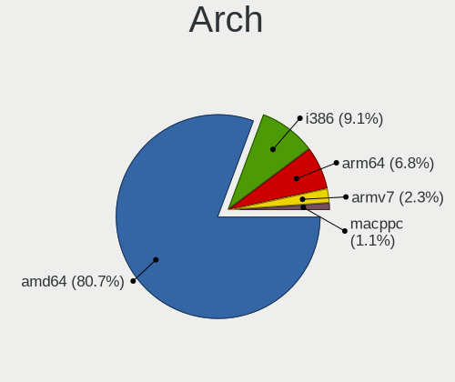

| Name  | Computers | Percent |
|-------|-----------|---------|
| amd64 | 40        | 85.11%  |
| i386  | 4         | 8.51%   |
| arm64 | 2         | 4.26%   |
| armv7 | 1         | 2.13%   |

DE
--

Desktop Environment

| Name    | Computers | Percent |
|---------|-----------|---------|
| fvwm    | 35        | 74.47%  |
| Console | 9         | 19.15%  |
| XFCE    | 1         | 2.13%   |
| Mutter  | 1         | 2.13%   |
| iwm     | 1         | 2.13%   |

Display Server
--------------

X11 or Wayland

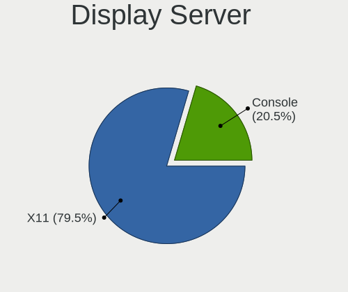

| Name    | Computers | Percent |
|---------|-----------|---------|
| X11     | 36        | 76.6%   |
| Console | 11        | 23.4%   |

Display Manager
---------------

SDDM, LightDM, etc.

| Name    | Computers | Percent |
|---------|-----------|---------|
| Console | 40        | 85.11%  |
| SLiM    | 5         | 10.64%  |
| GDM     | 2         | 4.26%   |

OS Lang
-------

Language

| Lang    | Computers | Percent |
|---------|-----------|---------|
| Unknown | 38        | 80.85%  |
| en_US   | 4         | 8.51%   |
| zh_CN   | 1         | 2.13%   |
| ru_RU   | 1         | 2.13%   |
| fr_FR   | 1         | 2.13%   |
| de_DE   | 1         | 2.13%   |
| C       | 1         | 2.13%   |

Boot Mode
---------

EFI or BIOS

| Mode | Computers | Percent |
|------|-----------|---------|
| EFI  | 27        | 57.45%  |
| BIOS | 20        | 42.55%  |

Filesystem
----------

Type of filesystem

| Type | Computers | Percent |
|------|-----------|---------|
| Ffs  | 47        | 100%    |

Part. scheme
------------

Scheme of partitioning

| Type | Computers | Percent |
|------|-----------|---------|
| MBR  | 24        | 50%     |
| GPT  | 24        | 50%     |

Board
-----

Vendor
------

Motherboard manufacturer

| Name                           | Computers | Percent |
|--------------------------------|-----------|---------|
| Lenovo                         | 16        | 34.04%  |
| Gigabyte Technology            | 4         | 8.51%   |
| Dell                           | 3         | 6.38%   |
| Samsung Electronics            | 2         | 4.26%   |
| Panasonic                      | 2         | 4.26%   |
| MSI                            | 2         | 4.26%   |
| Matsushita Electric Industrial | 2         | 4.26%   |
| Hewlett-Packard                | 2         | 4.26%   |
| ASUSTek Computer               | 2         | 4.26%   |
| Unknown                        | 2         | 4.26%   |
| Yanling                        | 1         | 2.13%   |
| Supermicro                     | 1         | 2.13%   |
| Raspberry Pi Foundation        | 1         | 2.13%   |
| Protectli                      | 1         | 2.13%   |
| PC Engines                     | 1         | 2.13%   |
| Intel                          | 1         | 2.13%   |
| Google                         | 1         | 2.13%   |
| Casper                         | 1         | 2.13%   |
| Alienware                      | 1         | 2.13%   |
| Acer                           | 1         | 2.13%   |

Model
-----

Motherboard model

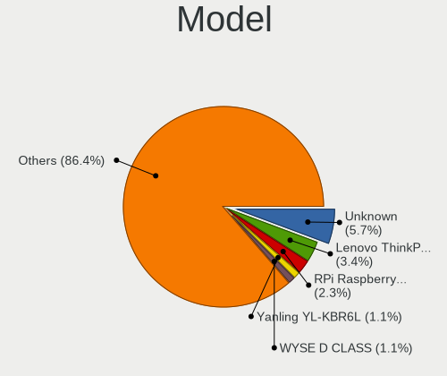

| Name                                        | Computers | Percent |
|---------------------------------------------|-----------|---------|
| Unknown                                     | 2         | 4.26%   |
| Yanling YL-KBR6L                            | 1         | 2.13%   |
| Supermicro X11SCE-F                         | 1         | 2.13%   |
| Samsung R720                                | 1         | 2.13%   |
| Samsung 530XBB                              | 1         | 2.13%   |
| RPi Raspberry Pi 4 Model B                  | 1         | 2.13%   |
| Protectli FW6                               | 1         | 2.13%   |
| PC Engines APU2                             | 1         | 2.13%   |
| Panasonic CF-53AAGHYDM                      | 1         | 2.13%   |
| Panasonic CF-52PFPBSFQ                      | 1         | 2.13%   |
| MSI MS-7D54                                 | 1         | 2.13%   |
| MSI MS-7C56                                 | 1         | 2.13%   |
| Matsushita Electric Industrial CF-51RCVDNLM | 1         | 2.13%   |
| Matsushita Electric Industrial CF-48V4KNDQM | 1         | 2.13%   |
| Lenovo ThinkPad Yoga 11e 20DAS02S00         | 1         | 2.13%   |
| Lenovo ThinkPad X61 7675H7U                 | 1         | 2.13%   |
| Lenovo ThinkPad X220 429043U                | 1         | 2.13%   |
| Lenovo ThinkPad X1 Carbon 5th 20HR0068GE    | 1         | 2.13%   |
| Lenovo ThinkPad T480 20L5S1S000             | 1         | 2.13%   |
| Lenovo ThinkPad T430 2347GZU                | 1         | 2.13%   |
| Lenovo ThinkPad T420s 41742BU               | 1         | 2.13%   |
| Lenovo ThinkPad T420 4236MBG                | 1         | 2.13%   |
| Lenovo ThinkPad T410 2537N24                | 1         | 2.13%   |
| Lenovo ThinkPad P73 20QRS00200              | 1         | 2.13%   |
| Lenovo ThinkPad L14 Gen 1 20U1000VGE        | 1         | 2.13%   |
| Lenovo ThinkPad Edge E430 3254A68           | 1         | 2.13%   |
| Lenovo ThinkPad E490 20N8CTO1WW             | 1         | 2.13%   |
| Lenovo ThinkPad E14 Gen 2 20T6S02Y00        | 1         | 2.13%   |
| Lenovo ThinkCentre M73z 10BB001DRU          | 1         | 2.13%   |
| Lenovo IdeaPad 330-15ARR 81D2               | 1         | 2.13%   |
| Intel SharkBay Platform                     | 1         | 2.13%   |
| HP Compaq dc5700 Microtower                 | 1         | 2.13%   |
| HP Compaq 15                                | 1         | 2.13%   |
| Google Grunt                                | 1         | 2.13%   |
| Gigabyte X470 AORUS ULTRA GAMING            | 1         | 2.13%   |
| Gigabyte H81M-S2PV                          | 1         | 2.13%   |
| Gigabyte BRi3(H)-10110                      | 1         | 2.13%   |
| Gigabyte B450M DS3H                         | 1         | 2.13%   |
| Dell Vostro 3500                            | 1         | 2.13%   |
| Dell Inspiron 5570                          | 1         | 2.13%   |
| Dell G15 5510                               | 1         | 2.13%   |
| Casper EXCALIBUR G900                       | 1         | 2.13%   |
| ASUS P10S-I Series                          | 1         | 2.13%   |
| ASUS 1000HE                                 | 1         | 2.13%   |
| Alienware m15                               | 1         | 2.13%   |
| Acer AO722                                  | 1         | 2.13%   |

Model Family
------------

Motherboard model prefix

| Name                                        | Computers | Percent |
|---------------------------------------------|-----------|---------|
| Lenovo ThinkPad                             | 14        | 29.79%  |
| HP Compaq                                   | 2         | 4.26%   |
| Unknown                                     | 2         | 4.26%   |
| Yanling YL-KBR6L                            | 1         | 2.13%   |
| Supermicro X11SCE-F                         | 1         | 2.13%   |
| Samsung R720                                | 1         | 2.13%   |
| Samsung 530XBB                              | 1         | 2.13%   |
| RPi Raspberry                               | 1         | 2.13%   |
| Protectli FW6                               | 1         | 2.13%   |
| PC Engines APU2                             | 1         | 2.13%   |
| Panasonic CF-53AAGHYDM                      | 1         | 2.13%   |
| Panasonic CF-52PFPBSFQ                      | 1         | 2.13%   |
| MSI MS-7D54                                 | 1         | 2.13%   |
| MSI MS-7C56                                 | 1         | 2.13%   |
| Matsushita Electric Industrial CF-51RCVDNLM | 1         | 2.13%   |
| Matsushita Electric Industrial CF-48V4KNDQM | 1         | 2.13%   |
| Lenovo ThinkCentre                          | 1         | 2.13%   |
| Lenovo IdeaPad                              | 1         | 2.13%   |
| Intel SharkBay                              | 1         | 2.13%   |
| Google Grunt                                | 1         | 2.13%   |
| Gigabyte X470                               | 1         | 2.13%   |
| Gigabyte H81M-S2PV                          | 1         | 2.13%   |
| Gigabyte BRi3(H)-10110                      | 1         | 2.13%   |
| Gigabyte B450M                              | 1         | 2.13%   |
| Dell Vostro                                 | 1         | 2.13%   |
| Dell Inspiron                               | 1         | 2.13%   |
| Dell G15                                    | 1         | 2.13%   |
| Casper EXCALIBUR                            | 1         | 2.13%   |
| ASUS P10S-I                                 | 1         | 2.13%   |
| ASUS 1000HE                                 | 1         | 2.13%   |
| Alienware m15                               | 1         | 2.13%   |
| Acer AO722                                  | 1         | 2.13%   |

MFG Year
--------

Motherboard manufacture year

| Year    | Computers | Percent |
|---------|-----------|---------|
| 2020    | 11        | 23.4%   |
| 2019    | 8         | 17.02%  |
| 2021    | 7         | 14.89%  |
| 2018    | 4         | 8.51%   |
| 2015    | 3         | 6.38%   |
| 2009    | 3         | 6.38%   |
| 2011    | 2         | 4.26%   |
| 2006    | 2         | 4.26%   |
| Unknown | 2         | 4.26%   |
| 2014    | 1         | 2.13%   |
| 2013    | 1         | 2.13%   |
| 2012    | 1         | 2.13%   |
| 2010    | 1         | 2.13%   |
| 2002    | 1         | 2.13%   |

Form Factor
-----------

Physical design of the computer

| Name     | Computers | Percent |
|----------|-----------|---------|
| Notebook | 31        | 65.96%  |
| Desktop  | 15        | 31.91%  |
| Server   | 1         | 2.13%   |

Coreboot
--------

Have coreboot on board

| Used | Computers | Percent |
|------|-----------|---------|
| No   | 44        | 93.62%  |
| Yes  | 3         | 6.38%   |

RAM Size
--------

Total RAM memory

| Size in GB | Computers | Percent |
|------------|-----------|---------|
| 8.01-16.0  | 11        | 23.4%   |
| 4.01-8.0   | 9         | 19.15%  |
| 16.01-24.0 | 9         | 19.15%  |
| 3.01-4.0   | 8         | 17.02%  |
| 32.01-64.0 | 4         | 8.51%   |
| 2.01-3.0   | 3         | 6.38%   |
| 1.01-2.0   | 1         | 2.13%   |
| 0.51-1.0   | 1         | 2.13%   |
| 0.01-0.5   | 1         | 2.13%   |

RAM Used
--------

Used RAM memory

| Used GB  | Computers | Percent |
|----------|-----------|---------|
| 0.01-0.5 | 41        | 87.23%  |
| 0.51-1.0 | 4         | 8.51%   |
| 0        | 2         | 4.26%   |

Total Drives
------------

Number of drives on board

| Drives | Computers | Percent |
|--------|-----------|---------|
| 1      | 24        | 51.06%  |
| 2      | 15        | 31.91%  |
| 3      | 5         | 10.64%  |
| 4      | 2         | 4.26%   |
| 6      | 1         | 2.13%   |

Has CD-ROM
----------

Has CD-ROM on board

| Presented | Computers | Percent |
|-----------|-----------|---------|
| No        | 46        | 97.87%  |
| Yes       | 1         | 2.13%   |

Has Ethernet
------------

Has Ethernet on board

| Presented | Computers | Percent |
|-----------|-----------|---------|
| Yes       | 41        | 87.23%  |
| No        | 6         | 12.77%  |

Has WiFi
--------

Has WiFi module

| Presented | Computers | Percent |
|-----------|-----------|---------|
| Yes       | 34        | 72.34%  |
| No        | 13        | 27.66%  |

Has Bluetooth
-------------

Has Bluetooth module

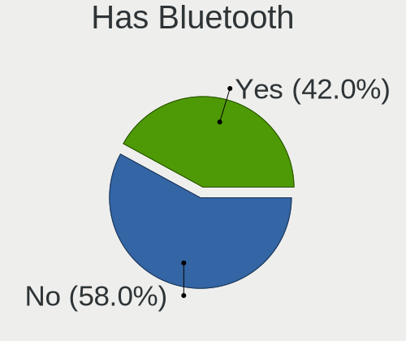

| Presented | Computers | Percent |
|-----------|-----------|---------|
| No        | 24        | 51.06%  |
| Yes       | 23        | 48.94%  |

Location
--------

Country
-------

Geographic location (country)

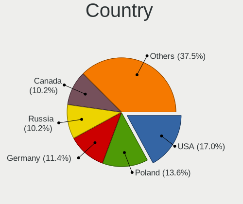

| Country     | Computers | Percent |
|-------------|-----------|---------|
| USA         | 10        | 21.28%  |
| Canada      | 9         | 19.15%  |
| Russia      | 6         | 12.77%  |
| Germany     | 6         | 12.77%  |
| Sweden      | 3         | 6.38%   |
| Poland      | 3         | 6.38%   |
| Switzerland | 2         | 4.26%   |
| France      | 2         | 4.26%   |
| Vietnam     | 1         | 2.13%   |
| Ukraine     | 1         | 2.13%   |
| UK          | 1         | 2.13%   |
| Czechia     | 1         | 2.13%   |
| China       | 1         | 2.13%   |
| Brazil      | 1         | 2.13%   |

City
----

Geographic location (city)

| City              | Computers | Percent |
|-------------------|-----------|---------|
| Montreal          | 6         | 12.5%   |
| Saint-Laurent     | 3         | 6.25%   |
| Paris             | 2         | 4.17%   |
| Moscow            | 2         | 4.17%   |
| Miedziana Gora    | 2         | 4.17%   |
| Henan             | 2         | 4.17%   |
| Frankfurt am Main | 2         | 4.17%   |
| Zurich            | 1         | 2.08%   |
| Zhukovskiy        | 1         | 2.08%   |
| Yekaterinburg     | 1         | 2.08%   |
| Weinbohla         | 1         | 2.08%   |
| Warner            | 1         | 2.08%   |
| Voskresensk       | 1         | 2.08%   |
| Syeverodonets'k   | 1         | 2.08%   |
| St Petersburg     | 1         | 2.08%   |
| Sao Vicente       | 1         | 2.08%   |
| Queens            | 1         | 2.08%   |
| Prague            | 1         | 2.08%   |
| Portland          | 1         | 2.08%   |
| Poplar            | 1         | 2.08%   |
| Pacierzow         | 1         | 2.08%   |
| Omaha             | 1         | 2.08%   |
| Oensingen         | 1         | 2.08%   |
| Nuremberg         | 1         | 2.08%   |
| Mountain View     | 1         | 2.08%   |
| Lidkoeping        | 1         | 2.08%   |
| Kingman           | 1         | 2.08%   |
| Irvine            | 1         | 2.08%   |
| Hohhot            | 1         | 2.08%   |
| Ho Chi Minh City  | 1         | 2.08%   |
| Gettysburg        | 1         | 2.08%   |
| Erlangen          | 1         | 2.08%   |
| Dallas            | 1         | 2.08%   |
| Berlin            | 1         | 2.08%   |
| Ames              | 1         | 2.08%   |
| Akarp             | 1         | 2.08%   |

Drives
------

Drive Vendor
------------

Hard drive vendors

| Vendor                             | Computers | Drives | Percent |
|------------------------------------|-----------|--------|---------|
| NVMe                               | 14        | 18     | 21.54%  |
| WDC                                | 11        | 11     | 16.92%  |
| Samsung Electronics                | 8         | 9      | 12.31%  |
| Toshiba                            | 5         | 5      | 7.69%   |
| Seagate                            | 4         | 4      | 6.15%   |
| Kingston                           | 4         | 5      | 6.15%   |
| Hitachi                            | 3         | 3      | 4.62%   |
| Intel                              | 2         | 2      | 3.08%   |
| Crucial                            | 2         | 2      | 3.08%   |
| SK Hynix                           | 1         | 1      | 1.54%   |
| SanDisk                            | 1         | 1      | 1.54%   |
| Product:              USB DISK 3.0 | 1         | 1      | 1.54%   |
| PLEXTOR                            | 1         | 1      | 1.54%   |
| OPENBSD                            | 1         | 1      | 1.54%   |
| Netac                              | 1         | 1      | 1.54%   |
| Lexar                              | 1         | 1      | 1.54%   |
| HPE                                | 1         | 2      | 1.54%   |
| HGST                               | 1         | 1      | 1.54%   |
| ASMT                               | 1         | 1      | 1.54%   |
| Apple                              | 1         | 1      | 1.54%   |
| A-DATA Technology                  | 1         | 1      | 1.54%   |

Drive Model
-----------

Hard drive models

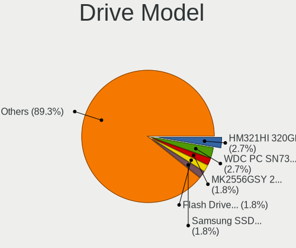

| Model                                                | Computers | Percent |
|------------------------------------------------------|-----------|---------|
| Toshiba MK2556GSY 250GB                              | 2         | 2.99%   |
| Samsung Flash Drive FIT 32GB                         | 2         | 2.99%   |
| NVMe WDC PC SN730 SDB 256GB                          | 2         | 2.99%   |
| NVMe Samsung SSD 970 250GB                           | 2         | 2.99%   |
| WDC WDS480G2G0B-00EPW0 480GB                         | 1         | 1.49%   |
| WDC WDS240G2G0B-00EPW0 240GB                         | 1         | 1.49%   |
| WDC WD7500BPKX-00HPJT0 752GB                         | 1         | 1.49%   |
| WDC WD7500BPKT-00PK4T0 752GB                         | 1         | 1.49%   |
| WDC WD6400AARS-00Y5B1 640GB                          | 1         | 1.49%   |
| WDC WD5000LPLX-00ZNTT0 500GB                         | 1         | 1.49%   |
| WDC WD5000LPCX-24VHAT0 500GB                         | 1         | 1.49%   |
| WDC WD3200BEVE-00A0HT0 320GB                         | 1         | 1.49%   |
| WDC WD20PURX-64P6ZY0 2TB                             | 1         | 1.49%   |
| WDC WD10JPLX-00MBPT0 1TB                             | 1         | 1.49%   |
| WDC WD10EADS-00M2B0 1TB                              | 1         | 1.49%   |
| Toshiba TR200 240GB                                  | 1         | 1.49%   |
| Toshiba MQ04ABF100 1TB                               | 1         | 1.49%   |
| Toshiba DT01ACA050 500GB                             | 1         | 1.49%   |
| SK Hynix SC311 SATA 256GB                            | 1         | 1.49%   |
| Seagate ST9160821A 160GB                             | 1         | 1.49%   |
| Seagate ST3250318AS 250GB                            | 1         | 1.49%   |
| Seagate ST250DM000-1BD141 250GB                      | 1         | 1.49%   |
| Seagate ST1000LM035-1RK172 1TB                       | 1         | 1.49%   |
| SanDisk Ultra 32GB                                   | 1         | 1.49%   |
| Samsung SSD 860 EVO 250GB                            | 1         | 1.49%   |
| Samsung SSD 860 EVO 1TB                              | 1         | 1.49%   |
| Samsung SSD 850 EVO 500GB                            | 1         | 1.49%   |
| Samsung MZ7TE128HMGR-000L1 128GB                     | 1         | 1.49%   |
| Samsung MZ7PC128HAFU-000L1 128GB                     | 1         | 1.49%   |
| Samsung HD501LJ 500GB                                | 1         | 1.49%   |
| Product:              USB DISK 3.0 USB DISK 3.0 64GB | 1         | 1.49%   |
| PLEXTOR PX-128M6S 128GB                              | 1         | 1.49%   |
| OPENBSD SR RAID 1 1TB                                | 1         | 1.49%   |
| NVMe TOSHIBA-RC100 240GB                             | 1         | 1.49%   |
| NVMe SAMSUNG MZVLW1T0 1TB                            | 1         | 1.49%   |
| NVMe SAMSUNG MZVLB256 256GB                          | 1         | 1.49%   |
| NVMe SAMSUNG MZVLB1T0 1TB                            | 1         | 1.49%   |
| NVMe SAMSUNG MZ1LB960 960GB                          | 1         | 1.49%   |
| NVMe Sabrent Rocket n 512GB                          | 1         | 1.49%   |
| NVMe PCIe SSD 512GB                                  | 1         | 1.49%   |
| NVMe PC SN530 WD 512GB                               | 1         | 1.49%   |
| NVMe OM3PDP3-AD 256GB                                | 1         | 1.49%   |
| NVMe KXG50ZNV1T02 NVM 1TB                            | 1         | 1.49%   |
| NVMe KIOXIA-EXCERIA S 500GB                          | 1         | 1.49%   |
| NVMe INTEL SSDPEKKF51 512GB                          | 1         | 1.49%   |
| Netac SSD 240GB                                      | 1         | 1.49%   |
| Lexar USB Flash Drive 64GB                           | 1         | 1.49%   |
| Kingston SV300S37A240G 240GB                         | 1         | 1.49%   |
| Kingston SUV500MS480G 480GB                          | 1         | 1.49%   |
| Kingston SUV500MS240G 240GB                          | 1         | 1.49%   |
| Kingston SMS200S330G 32GB                            | 1         | 1.49%   |
| Intel SSDSC2BW240A4 240GB                            | 1         | 1.49%   |
| Intel SSDSA2M080G2GC 80GB                            | 1         | 1.49%   |
| HPE MK000480GWXFF 480GB                              | 1         | 1.49%   |
| Hitachi HUA723020ALA640 2TB                          | 1         | 1.49%   |
| Hitachi HTS723232A7A364 320GB                        | 1         | 1.49%   |
| Hitachi HTS722010K9SA00 100GB                        | 1         | 1.49%   |
| HGST HUS724020ALA640 2TB                             | 1         | 1.49%   |
| Crucial M4-CT128M4SSD2 128GB                         | 1         | 1.49%   |
| Crucial CT500MX200SSD1 500GB                         | 1         | 1.49%   |

HDD Vendor
----------

Hard disk drive vendors

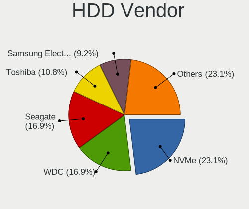

| Vendor                             | Computers | Drives | Percent |
|------------------------------------|-----------|--------|---------|
| WDC                                | 9         | 9      | 23.68%  |
| NVMe                               | 9         | 11     | 23.68%  |
| Toshiba                            | 4         | 4      | 10.53%  |
| Seagate                            | 4         | 4      | 10.53%  |
| Samsung Electronics                | 3         | 4      | 7.89%   |
| Hitachi                            | 3         | 3      | 7.89%   |
| Product:              USB DISK 3.0 | 1         | 1      | 2.63%   |
| OPENBSD                            | 1         | 1      | 2.63%   |
| Lexar                              | 1         | 1      | 2.63%   |
| HGST                               | 1         | 1      | 2.63%   |
| ASMT                               | 1         | 1      | 2.63%   |
| Apple                              | 1         | 1      | 2.63%   |

SSD Vendor
----------

Solid state drive vendors

| Vendor              | Computers | Drives | Percent |
|---------------------|-----------|--------|---------|
| Samsung Electronics | 5         | 5      | 19.23%  |
| NVMe                | 4         | 4      | 15.38%  |
| Kingston            | 4         | 5      | 15.38%  |
| WDC                 | 2         | 2      | 7.69%   |
| Intel               | 2         | 2      | 7.69%   |
| Crucial             | 2         | 2      | 7.69%   |
| Toshiba             | 1         | 1      | 3.85%   |
| SK Hynix            | 1         | 1      | 3.85%   |
| SanDisk             | 1         | 1      | 3.85%   |
| PLEXTOR             | 1         | 1      | 3.85%   |
| Netac               | 1         | 1      | 3.85%   |
| HPE                 | 1         | 2      | 3.85%   |
| A-DATA Technology   | 1         | 1      | 3.85%   |

Drive Kind
----------

HDD or SSD

| Kind | Computers | Drives | Percent |
|------|-----------|--------|---------|
| HDD  | 28        | 41     | 52.83%  |
| SSD  | 23        | 28     | 43.4%   |
| NVMe | 2         | 3      | 3.77%   |

Drive Connector
---------------

SATA, SAS, NVMe, etc.

| Type | Computers | Drives | Percent |
|------|-----------|--------|---------|
| SATA | 45        | 69     | 95.74%  |
| NVMe | 2         | 3      | 4.26%   |

Drive Size
----------

Size of hard drive

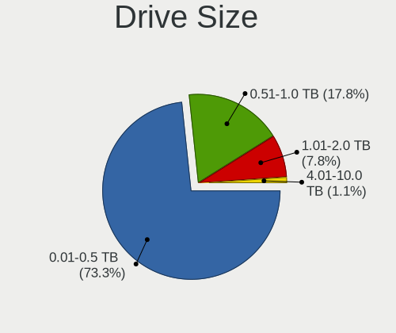

| Size in TB | Computers | Drives | Percent |
|------------|-----------|--------|---------|
| 0.01-0.5   | 37        | 48     | 69.81%  |
| 0.51-1.0   | 12        | 14     | 22.64%  |
| 1.01-2.0   | 4         | 7      | 7.55%   |

Space Total
-----------

Amount of disk space available on the file system

| Size in GB     | Computers | Percent |
|----------------|-----------|---------|
| 101-250        | 13        | 27.08%  |
| 251-500        | 12        | 25%     |
| 21-50          | 11        | 22.92%  |
| 51-100         | 8         | 16.67%  |
| 501-1000       | 3         | 6.25%   |
| More than 3000 | 1         | 2.08%   |

Space Used
----------

Amount of used disk space

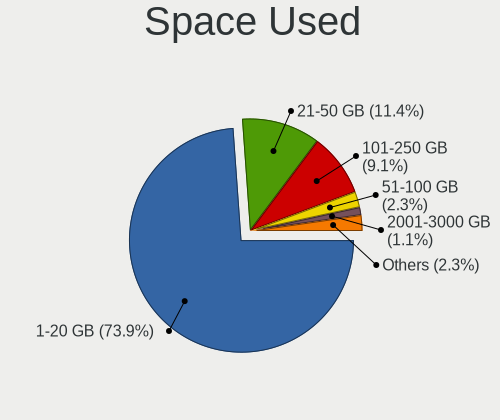

| Used GB   | Computers | Percent |
|-----------|-----------|---------|
| 1-20      | 36        | 76.6%   |
| 21-50     | 5         | 10.64%  |
| 101-250   | 4         | 8.51%   |
| 2001-3000 | 1         | 2.13%   |
| 51-100    | 1         | 2.13%   |

Malfunc. Drives
---------------

Drive models with a malfunction

| Model                           | Computers | Drives | Percent |
|---------------------------------|-----------|--------|---------|
| WDC WD10EADS-00M2B0 1TB         | 1         | 1      | 14.29%  |
| Toshiba MQ04ABF100 1TB          | 1         | 1      | 14.29%  |
| Seagate ST250DM000-1BD141 250GB | 1         | 1      | 14.29%  |
| Kingston SMS200S330G 32GB       | 1         | 2      | 14.29%  |
| Intel SSDSA2M080G2GC 80GB       | 1         | 1      | 14.29%  |
| Hitachi HTS722010K9SA00 100GB   | 1         | 1      | 14.29%  |
| A-DATA Technology SP550 480GB   | 1         | 1      | 14.29%  |

Malfunc. Drive Vendor
---------------------

Vendors of faulty drives

| Vendor            | Computers | Drives | Percent |
|-------------------|-----------|--------|---------|
| WDC               | 1         | 1      | 14.29%  |
| Toshiba           | 1         | 1      | 14.29%  |
| Seagate           | 1         | 1      | 14.29%  |
| Kingston          | 1         | 2      | 14.29%  |
| Intel             | 1         | 1      | 14.29%  |
| Hitachi           | 1         | 1      | 14.29%  |
| A-DATA Technology | 1         | 1      | 14.29%  |

Malfunc. HDD Vendor
-------------------

Vendors of faulty HDD drives

| Vendor  | Computers | Drives | Percent |
|---------|-----------|--------|---------|
| WDC     | 1         | 1      | 25%     |
| Toshiba | 1         | 1      | 25%     |
| Seagate | 1         | 1      | 25%     |
| Hitachi | 1         | 1      | 25%     |

Malfunc. Drive Kind
-------------------

Kinds of faulty drives

| Kind | Computers | Drives | Percent |
|------|-----------|--------|---------|
| HDD  | 4         | 4      | 57.14%  |
| SSD  | 3         | 4      | 42.86%  |

Failed Drives
-------------

Failed drive models

| Model                       | Computers | Drives | Percent |
|-----------------------------|-----------|--------|---------|
| WDC WD6400AARS-00Y5B1 640GB | 1         | 1      | 100%    |

Failed Drive Vendor
-------------------

Failed drive vendors

| Vendor | Computers | Drives | Percent |
|--------|-----------|--------|---------|
| WDC    | 1         | 1      | 100%    |

Drive Status
------------

Number of failed and malfunc. drives

| Status   | Computers | Drives | Percent |
|----------|-----------|--------|---------|
| Works    | 33        | 41     | 57.89%  |
| Detected | 16        | 22     | 28.07%  |
| Malfunc  | 7         | 8      | 12.28%  |
| Failed   | 1         | 1      | 1.75%   |

Storage controller
------------------

Storage Vendor
--------------

Storage controller vendors

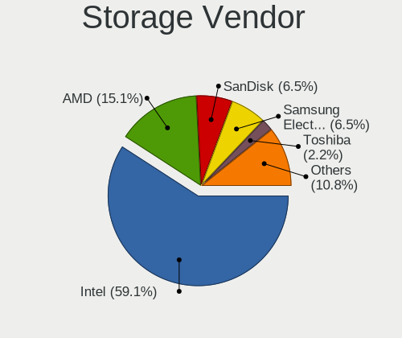

| Vendor                      | Computers | Percent |
|-----------------------------|-----------|---------|
| Intel                       | 31        | 58.49%  |
| AMD                         | 8         | 15.09%  |
| Samsung Electronics         | 4         | 7.55%   |
| Sandisk                     | 3         | 5.66%   |
| Toshiba                     | 2         | 3.77%   |
| Phison Electronics          | 2         | 3.77%   |
| KIOXIA                      | 1         | 1.89%   |
| Kingston Technology Company | 1         | 1.89%   |
| HighPoint Technologies      | 1         | 1.89%   |

Storage Model
-------------

Storage controller models

| Model                                                                                  | Computers | Percent |
|----------------------------------------------------------------------------------------|-----------|---------|
| AMD FCH SATA Controller [AHCI mode]                                                    | 6         | 10.53%  |
| Samsung NVMe SSD Controller SM981/PM981/PM983                                          | 3         | 5.26%   |
| Intel Sunrise Point-LP SATA Controller [AHCI mode]                                     | 3         | 5.26%   |
| Intel 6 Series/C200 Series Chipset Family 6 port Mobile SATA AHCI Controller           | 3         | 5.26%   |
| Sandisk WD Black SN750 / PC SN730 NVMe SSD                                             | 2         | 3.51%   |
| Intel Cannon Lake Mobile PCH SATA AHCI Controller                                      | 2         | 3.51%   |
| Intel 82801GBM/GHM (ICH7-M Family) SATA Controller [IDE mode]                          | 2         | 3.51%   |
| Intel 8 Series/C220 Series Chipset Family 6-port SATA Controller 1 [AHCI mode]         | 2         | 3.51%   |
| Intel 7 Series Chipset Family 6-port SATA Controller [AHCI mode]                       | 2         | 3.51%   |
| Intel 5 Series/3400 Series Chipset 6 port SATA AHCI Controller                         | 2         | 3.51%   |
| AMD 400 Series Chipset SATA Controller                                                 | 2         | 3.51%   |
| Toshiba unknown                                                                        | 1         | 1.75%   |
| Toshiba BG3 NVMe SSD Controller                                                        | 1         | 1.75%   |
| Sandisk unknown                                                                        | 1         | 1.75%   |
| Samsung NVMe SSD Controller SM961/PM961/SM963                                          | 1         | 1.75%   |
| Phison PS5013 E13 NVMe Controller                                                      | 1         | 1.75%   |
| Phison E12 NVMe Controller                                                             | 1         | 1.75%   |
| KIOXIA NVMe SSD                                                                        | 1         | 1.75%   |
| Kingston Company OM3PDP3 NVMe SSD                                                      | 1         | 1.75%   |
| Intel Wildcat Point-LP SATA Controller [AHCI Mode]                                     | 1         | 1.75%   |
| Intel Tiger Lake-LP SATA Controller [AHCI mode]                                        | 1         | 1.75%   |
| Intel SSD Pro 7600p/760p/E 6100p Series                                                | 1         | 1.75%   |
| Intel Q170/Q150/B150/H170/H110/Z170/CM236 Chipset SATA Controller [AHCI Mode]          | 1         | 1.75%   |
| Intel Comet Lake SATA AHCI Controller                                                  | 1         | 1.75%   |
| Intel Celeron/Pentium Silver Processor SATA Controller                                 | 1         | 1.75%   |
| Intel Cannon Point-LP SATA Controller [AHCI Mode]                                      | 1         | 1.75%   |
| Intel Cannon Lake PCH SATA AHCI Controller                                             | 1         | 1.75%   |
| Intel Atom Processor E3800 Series SATA AHCI Controller                                 | 1         | 1.75%   |
| Intel 82801IBM/IEM (ICH9M/ICH9M-E) 4 port SATA Controller [AHCI mode]                  | 1         | 1.75%   |
| Intel 82801HR/HO/HH (ICH8R/DO/DH) 2 port SATA Controller [IDE mode]                    | 1         | 1.75%   |
| Intel 82801HM/HEM (ICH8M/ICH8M-E) SATA Controller [IDE mode]                           | 1         | 1.75%   |
| Intel 82801H (ICH8 Family) 4 port SATA Controller [IDE mode]                           | 1         | 1.75%   |
| Intel 82801CAM IDE U100 Controller                                                     | 1         | 1.75%   |
| Intel 6 Series/C200 Series Chipset Family Mobile SATA Controller (IDE mode, ports 4-5) | 1         | 1.75%   |
| Intel 6 Series/C200 Series Chipset Family Mobile SATA Controller (IDE mode, ports 0-3) | 1         | 1.75%   |
| Intel 500 Series Chipset Family SATA AHCI Controller                                   | 1         | 1.75%   |
| HighPoint unknown                                                                      | 1         | 1.75%   |
| AMD Starship/Matisse Chipset SATA Controller [AHCI mode]                               | 1         | 1.75%   |
| AMD SB7x0/SB8x0/SB9x0 SATA Controller [AHCI mode]                                      | 1         | 1.75%   |

Storage Kind
------------

Kind of storage controller (IDE, SATA, NVMe, SAS, ...)

| Kind | Computers | Percent |
|------|-----------|---------|
| SATA | 32        | 61.54%  |
| NVMe | 13        | 25%     |
| IDE  | 6         | 11.54%  |
| RAID | 1         | 1.92%   |

Processor
---------

CPU Vendor
----------

Processor vendors

| Vendor | Computers | Percent |
|--------|-----------|---------|
| Intel  | 34        | 72.34%  |
| AMD    | 10        | 21.28%  |
| ARM    | 3         | 6.38%   |

CPU Model
---------

Processor models

| Model                                         | Computers | Percent |
|-----------------------------------------------|-----------|---------|
| Intel Core i5-2520M CPU @ 2.50GHz             | 3         | 6.38%   |
| Intel Core i5-8250U CPU @ 1.60GHz             | 2         | 4.26%   |
| Intel Core i5-2540M CPU @ 2.60GHz             | 2         | 4.26%   |
| Intel Core i5 CPU M 520 @ 2.40GHz             | 2         | 4.26%   |
| AMD Ryzen 7 5800X 8-Core Processor            | 2         | 4.26%   |
| Intel Xeon E-2276G CPU @ 3.80GHz              | 1         | 2.13%   |
| Intel Xeon CPU E3-1220 v5 @ 3.00GHz           | 1         | 2.13%   |
| Intel Pentium 4 Mobile CPU 1.60GHz            | 1         | 2.13%   |
| Intel Genuine CPU T2300 @ 1.66GHz             | 1         | 2.13%   |
| Intel Core i9-9880H CPU @ 2.30GHz             | 1         | 2.13%   |
| Intel Core i7-8750H CPU @ 2.20GHz             | 1         | 2.13%   |
| Intel Core i7-8550U CPU @ 1.80GHz             | 1         | 2.13%   |
| Intel Core i7-7500U CPU @ 2.70GHz             | 1         | 2.13%   |
| Intel Core i5-8265U CPU @ 1.60GHz             | 1         | 2.13%   |
| Intel Core i5-5200U CPU @ 2.20GHz             | 1         | 2.13%   |
| Intel Core i5-4570S CPU @ 2.90GHz             | 1         | 2.13%   |
| Intel Core i5-3320M CPU @ 2.60GHz             | 1         | 2.13%   |
| Intel Core i5-10210U CPU @ 1.60GHz            | 1         | 2.13%   |
| Intel Core i5-10200H CPU @ 2.40GHz            | 1         | 2.13%   |
| Intel Core i3-10110U CPU @ 2.10GHz            | 1         | 2.13%   |
| Intel Core 2 Duo CPU T8100 @ 2.10GHz          | 1         | 2.13%   |
| Intel Core 2 Duo CPU T6500 @ 2.10GHz          | 1         | 2.13%   |
| Intel Core 2 CPU 6400 @ 2.13GHz               | 1         | 2.13%   |
| Intel Celeron N4000 CPU @ 1.10GHz             | 1         | 2.13%   |
| Intel Celeron CPU N2930 @ 1.83GHz             | 1         | 2.13%   |
| Intel Celeron CPU G1820 @ 2.70GHz             | 1         | 2.13%   |
| Intel Celeron CPU 3865U @ 1.80GHz             | 1         | 2.13%   |
| Intel Atom CPU N280 @ 1.66GHz                 | 1         | 2.13%   |
| Intel 11th Gen Core i7-11800H @ 2.30GHz       | 1         | 2.13%   |
| Intel 11th Gen Core i5-1135G7 @ 2.40GHz       | 1         | 2.13%   |
| ARM Cortex-A8 r3p2                            | 1         | 2.13%   |
| ARM Cortex-A72 r0p3                           | 1         | 2.13%   |
| ARM Cortex-A53 r0p4                           | 1         | 2.13%   |
| AMD Ryzen 7 4700U with Radeon Graphics        | 1         | 2.13%   |
| AMD Ryzen 7 2700 Eight-Core Processor         | 1         | 2.13%   |
| AMD Ryzen 3 3100 4-Core Processor             | 1         | 2.13%   |
| AMD Ryzen 3 2200U with Radeon Vega Mobile Gfx | 1         | 2.13%   |
| AMD GX-412TC SOC                              | 1         | 2.13%   |
| AMD E1-2100 APU with Radeon HD Graphics       | 1         | 2.13%   |
| AMD C-50 Processor                            | 1         | 2.13%   |
| AMD A4-9120C RADEON R4, 5 COMPUTE CORES 2C+3G | 1         | 2.13%   |

CPU Model Family
----------------

Processor model prefix

| Model            | Computers | Percent |
|------------------|-----------|---------|
| Intel Core i5    | 15        | 31.91%  |
| Intel Celeron    | 4         | 8.51%   |
| AMD Ryzen 7      | 4         | 8.51%   |
| Intel Core i7    | 3         | 6.38%   |
| ARM Cortex       | 3         | 6.38%   |
| Other            | 2         | 4.26%   |
| Intel Xeon       | 2         | 4.26%   |
| Intel Core 2 Duo | 2         | 4.26%   |
| AMD Ryzen 3      | 2         | 4.26%   |
| Intel Pentium 4  | 1         | 2.13%   |
| Intel Genuine    | 1         | 2.13%   |
| Intel Core i9    | 1         | 2.13%   |
| Intel Core i3    | 1         | 2.13%   |
| Intel Core 2     | 1         | 2.13%   |
| Intel Atom       | 1         | 2.13%   |
| AMD GX           | 1         | 2.13%   |
| AMD E1           | 1         | 2.13%   |
| AMD C-50         | 1         | 2.13%   |
| AMD A4           | 1         | 2.13%   |

CPU Cores
---------

Number of processor cores

| Number  | Computers | Percent |
|---------|-----------|---------|
| 2       | 18        | 38.3%   |
| 4       | 12        | 25.53%  |
| Unknown | 9         | 19.15%  |
| 8       | 4         | 8.51%   |
| 6       | 2         | 4.26%   |
| 16      | 1         | 2.13%   |
| 1       | 1         | 2.13%   |

CPU Sockets
-----------

Number of sockets

| Number  | Computers | Percent |
|---------|-----------|---------|
| 1       | 39        | 82.98%  |
| Unknown | 7         | 14.89%  |
| 2       | 1         | 2.13%   |

CPU Threads
-----------

Threads per core (Hyper-Threading)

| Number  | Computers | Percent |
|---------|-----------|---------|
| 2       | 22        | 46.81%  |
| 1       | 15        | 31.91%  |
| Unknown | 10        | 21.28%  |

CPU Microarch
-------------

Microarchitecture

| Name          | Computers | Percent |
|---------------|-----------|---------|
| KabyLake      | 11        | 23.4%   |
| Unknown       | 6         | 12.77%  |
| SandyBridge   | 5         | 10.64%  |
| Zen 2         | 2         | 4.26%   |
| Westmere      | 2         | 4.26%   |
| Penryn        | 2         | 4.26%   |
| Haswell       | 2         | 4.26%   |
| Zen+          | 1         | 2.13%   |
| Zen           | 1         | 2.13%   |
| TigerLake     | 1         | 2.13%   |
| Skylake       | 1         | 2.13%   |
| Silvermont    | 1         | 2.13%   |
| Puma          | 1         | 2.13%   |
| P6            | 1         | 2.13%   |
| NetBurst      | 1         | 2.13%   |
| Jaguar        | 1         | 2.13%   |
| IvyBridge     | 1         | 2.13%   |
| Goldmont plus | 1         | 2.13%   |
| Excavator     | 1         | 2.13%   |
| Core          | 1         | 2.13%   |
| CometLake     | 1         | 2.13%   |
| Broadwell     | 1         | 2.13%   |
| Bonnell       | 1         | 2.13%   |
| Bobcat        | 1         | 2.13%   |

Graphics
--------

GPU Vendor
----------

Vendors of graphics cards

| Vendor            | Computers | Percent |
|-------------------|-----------|---------|
| Intel             | 29        | 61.7%   |
| AMD               | 12        | 25.53%  |
| Nvidia            | 4         | 8.51%   |
| ASPEED Technology | 2         | 4.26%   |

GPU Model
---------

Graphics card models

| Model                                                                         | Computers | Percent |
|-------------------------------------------------------------------------------|-----------|---------|
| Intel 2nd Generation Core Processor Family Integrated Graphics Controller     | 5         | 10%     |
| Intel UHD Graphics 620                                                        | 3         | 6%      |
| Intel Xeon E3-1200 v3/4th Gen Core Processor Integrated Graphics Controller   | 2         | 4%      |
| Intel Mobile 945GM/GMS/GME, 943/940GML Express Integrated Graphics Controller | 2         | 4%      |
| Intel Core Processor Integrated Graphics Controller                           | 2         | 4%      |
| Intel CometLake-U GT2 [UHD Graphics]                                          | 2         | 4%      |
| ASPEED Technology ASPEED Graphics Family                                      | 2         | 4%      |
| AMD Navi 22 [Radeon RX 6700/6700 XT / 6800M]                                  | 2         | 4%      |
| Nvidia TU104GLM [Quadro RTX 4000 Mobile / Max-Q]                              | 1         | 2%      |
| Nvidia GP104M [GeForce GTX 1070 Mobile]                                       | 1         | 2%      |
| Nvidia GA107M [GeForce RTX 3050 Mobile]                                       | 1         | 2%      |
| Nvidia GA106M [GeForce RTX 3060 Mobile / Max-Q]                               | 1         | 2%      |
| Intel WhiskeyLake-U GT2 [UHD Graphics 620]                                    | 1         | 2%      |
| Intel TigerLake-LP GT2 [Iris Xe Graphics]                                     | 1         | 2%      |
| Intel TigerLake-H GT1 [UHD Graphics]                                          | 1         | 2%      |
| Intel Mobile GM965/GL960 Integrated Graphics Controller (secondary)           | 1         | 2%      |
| Intel Mobile GM965/GL960 Integrated Graphics Controller (primary)             | 1         | 2%      |
| Intel Mobile 945GSE Express Integrated Graphics Controller                    | 1         | 2%      |
| Intel Mobile 945GM/GMS, 943/940GML Express Integrated Graphics Controller     | 1         | 2%      |
| Intel Kaby Lake-U GT1 Integrated Graphics Controller                          | 1         | 2%      |
| Intel HD Graphics 620                                                         | 1         | 2%      |
| Intel HD Graphics 5500                                                        | 1         | 2%      |
| Intel GeminiLake [UHD Graphics 600]                                           | 1         | 2%      |
| Intel Comet Lake UHD Graphics                                                 | 1         | 2%      |
| Intel CoffeeLake-H GT2 [UHD Graphics 630]                                     | 1         | 2%      |
| Intel Atom Processor Z36xxx/Z37xxx Series Graphics & Display                  | 1         | 2%      |
| Intel 82Q963/Q965 Integrated Graphics Controller                              | 1         | 2%      |
| Intel 3rd Gen Core processor Graphics Controller                              | 1         | 2%      |
| AMD Wrestler [Radeon HD 6250]                                                 | 1         | 2%      |
| AMD Stoney [Radeon R2/R3/R4/R5 Graphics]                                      | 1         | 2%      |
| AMD RV730/M96 [Mobility Radeon HD 4650/5165]                                  | 1         | 2%      |
| AMD RV200/M7 [Mobility Radeon 7500]                                           | 1         | 2%      |
| AMD Renoir                                                                    | 1         | 2%      |
| AMD Raven Ridge [Radeon Vega Series / Radeon Vega Mobile Series]              | 1         | 2%      |
| AMD Oland PRO [Radeon R7 240/340]                                             | 1         | 2%      |
| AMD Lexa PRO [Radeon 540/540X/550/550X / RX 540X/550/550X]                    | 1         | 2%      |
| AMD Kabini [Radeon HD 8210]                                                   | 1         | 2%      |
| AMD Ellesmere [Radeon RX 470/480/570/570X/580/580X/590]                       | 1         | 2%      |

GPU Combo
---------

Combinations of graphics cards

| Name           | Computers | Percent |
|----------------|-----------|---------|
| 1 x Intel      | 22        | 46.81%  |
| 1 x AMD        | 11        | 23.4%   |
| Other          | 4         | 8.51%   |
| 2 x Intel      | 3         | 6.38%   |
| Intel + Nvidia | 3         | 6.38%   |
| 1 x ASPEED     | 2         | 4.26%   |
| 1 x Nvidia     | 1         | 2.13%   |
| Intel + AMD    | 1         | 2.13%   |

GPU Driver
----------

Free vs proprietary

| Driver  | Computers | Percent |
|---------|-----------|---------|
| Free    | 37        | 78.72%  |
| Unknown | 10        | 21.28%  |

GPU Memory
----------

Total video memory

| Size in GB | Computers | Percent |
|------------|-----------|---------|
| Unknown    | 47        | 100%    |

Monitor
-------

Monitor Vendor
--------------

Monitor vendors

| Vendor               | Computers | Percent |
|----------------------|-----------|---------|
| AU Optronics         | 6         | 26.09%  |
| BOE                  | 5         | 21.74%  |
| Samsung Electronics  | 3         | 13.04%  |
| LG Display           | 2         | 8.7%    |
| Chimei Innolux       | 2         | 8.7%    |
| PANDA                | 1         | 4.35%   |
| Iiyama               | 1         | 4.35%   |
| Gigabyte Technology  | 1         | 4.35%   |
| Ancor Communications | 1         | 4.35%   |
| Acer                 | 1         | 4.35%   |

Monitor Model
-------------

Monitor models

| Model                                                                | Computers | Percent |
|----------------------------------------------------------------------|-----------|---------|
| Samsung Electronics LCD Monitor SEC544B 1600x900 310x170mm 13.9-inch | 1         | 4.35%   |
| Samsung Electronics LCD Monitor SEC324C 1600x900 310x170mm 13.9-inch | 1         | 4.35%   |
| Samsung Electronics LCD Monitor SEC304C 1366x768 310x170mm 13.9-inch | 1         | 4.35%   |
| PANDA LCD Monitor NCP0004 1920x1080 290x170mm 13.2-inch              | 1         | 4.35%   |
| LG Display LCD Monitor LGD058B 2560x1440 310x170mm 13.9-inch         | 1         | 4.35%   |
| LG Display LCD Monitor LGD046D 1920x1080 310x170mm 13.9-inch         | 1         | 4.35%   |
| Iiyama PL3288UH IVM7610 3840x2160 700x390mm 31.5-inch                | 1         | 4.35%   |
| Gigabyte Technology M28U GBT2800 3840x2160 630x360mm 28.6-inch       | 1         | 4.35%   |
| Chimei Innolux LCD Monitor CMN14D4 1920x1080 310x170mm 13.9-inch     | 1         | 4.35%   |
| Chimei Innolux LCD Monitor CMN1132 1366x768 260x140mm 11.6-inch      | 1         | 4.35%   |
| BOE LCD Monitor BOE092A 1920x1080 340x190mm 15.3-inch                | 1         | 4.35%   |
| BOE LCD Monitor BOE0910 1920x1080 340x190mm 15.3-inch                | 1         | 4.35%   |
| BOE LCD Monitor BOE07A3 1920x1080 340x190mm 15.3-inch                | 1         | 4.35%   |
| BOE LCD Monitor BOE06A9 1920x1080 340x190mm 15.3-inch                | 1         | 4.35%   |
| BOE LCD Monitor BOE05E9 1366x768 250x140mm 11.3-inch                 | 1         | 4.35%   |
| AU Optronics LCD Monitor AUO423D 1920x1080 310x170mm 13.9-inch       | 1         | 4.35%   |
| AU Optronics LCD Monitor AUO4199 1920x1080 340x190mm 15.3-inch       | 1         | 4.35%   |
| AU Optronics LCD Monitor AUO403D 1920x1080 310x170mm 13.9-inch       | 1         | 4.35%   |
| AU Optronics LCD Monitor AUO34EB 3840x2160 340x190mm 15.3-inch       | 1         | 4.35%   |
| AU Optronics LCD Monitor AUO325C 1366x768 260x140mm 11.6-inch        | 1         | 4.35%   |
| AU Optronics LCD Monitor AUO106C 1366x768 280x160mm 12.7-inch        | 1         | 4.35%   |
| Ancor Communications ASUS VW199 ACI19ED 1440x900 410x260mm 19.1-inch | 1         | 4.35%   |
| Acer VG220Q ACR06D8 1920x1080 480x270mm 21.7-inch                    | 1         | 4.35%   |

Monitor Resolution
------------------

Monitor screen resolution

| Resolution       | Computers | Percent |
|------------------|-----------|---------|
| 1920x1080 (FHD)  | 11        | 47.83%  |
| 1366x768 (WXGA)  | 5         | 21.74%  |
| 3840x2160 (4K)   | 3         | 13.04%  |
| 1600x900 (HD+)   | 2         | 8.7%    |
| 2560x1440 (QHD)  | 1         | 4.35%   |
| 1440x900 (WXGA+) | 1         | 4.35%   |

Monitor Diagonal
----------------

Diagonal size in inches

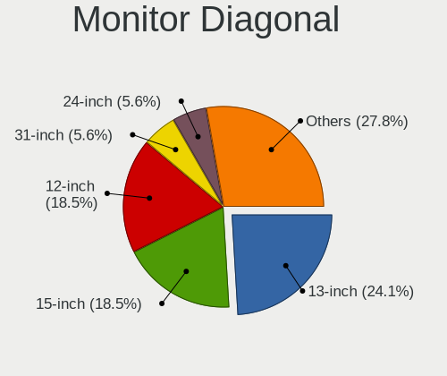

| Inches | Computers | Percent |
|--------|-----------|---------|
| 13     | 9         | 39.13%  |
| 15     | 6         | 26.09%  |
| 11     | 3         | 13.04%  |
| 31     | 1         | 4.35%   |
| 28     | 1         | 4.35%   |
| 21     | 1         | 4.35%   |
| 19     | 1         | 4.35%   |
| 12     | 1         | 4.35%   |

Monitor Width
-------------

Physical width

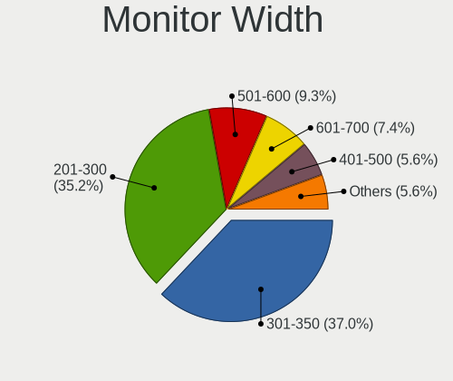

| Width in mm | Computers | Percent |
|-------------|-----------|---------|
| 301-350     | 14        | 60.87%  |
| 201-300     | 5         | 21.74%  |
| 601-700     | 2         | 8.7%    |
| 401-500     | 2         | 8.7%    |

Aspect Ratio
------------

Proportional relationship between the width and the height

| Ratio | Computers | Percent |
|-------|-----------|---------|
| 16/9  | 22        | 95.65%  |
| 16/10 | 1         | 4.35%   |

Monitor Area
------------

Area in inch

| Area in inch | Computers | Percent |
|----------------|-----------|---------|
| 81-90          | 8         | 34.78%  |
| 91-100         | 6         | 26.09%  |
| 51-60          | 3         | 13.04%  |
| 351-500        | 2         | 8.7%    |
| 71-80          | 1         | 4.35%   |
| 61-70          | 1         | 4.35%   |
| 201-250        | 1         | 4.35%   |
| 151-200        | 1         | 4.35%   |

Pixel Density
-------------

Pixels per inch

| Density       | Computers | Percent |
|---------------|-----------|---------|
| 121-160       | 17        | 73.91%  |
| 161-240       | 2         | 8.7%    |
| 101-120       | 2         | 8.7%    |
| More than 240 | 1         | 4.35%   |
| 51-100        | 1         | 4.35%   |

Multiple Monitors
-----------------

Total monitors connected

| Total | Computers | Percent |
|-------|-----------|---------|
| 1     | 32        | 68.09%  |
| 0     | 15        | 31.91%  |

Network
-------

Net Controller Vendor
---------------------

Controller vendors

| Vendor                            | Computers | Percent |
|-----------------------------------|-----------|---------|
| Intel                             | 33        | 53.23%  |
| Realtek Semiconductor             | 15        | 24.19%  |
| Qualcomm Atheros                  | 6         | 9.68%   |
| TP-Link                           | 2         | 3.23%   |
| Marvell Technology Group          | 2         | 3.23%   |
| Ralink Technology                 | 1         | 1.61%   |
| Ericsson Business Mobile Networks | 1         | 1.61%   |
| D-Link                            | 1         | 1.61%   |
| Broadcom                          | 1         | 1.61%   |

Net Controller Model
--------------------

Controller models

| Model                                                                       | Computers | Percent |
|-----------------------------------------------------------------------------|-----------|---------|
| Realtek RTL8111/8168/8411 PCI Express Gigabit Ethernet Controller           | 11        | 13.92%  |
| Intel Centrino Advanced-N 6205 [Taylor Peak]                                | 5         | 6.33%   |
| Intel 82579LM Gigabit Network Connection (Lewisville)                       | 5         | 6.33%   |
| Intel Wireless 7260                                                         | 3         | 3.8%    |
| Intel Wi-Fi 6 AX200                                                         | 3         | 3.8%    |
| Realtek RTL810xE PCI Express Fast Ethernet controller                       | 2         | 2.53%   |
| Intel Wireless-AC 9260                                                      | 2         | 2.53%   |
| Intel Wireless 8265 / 8275                                                  | 2         | 2.53%   |
| Intel I211 Gigabit Network Connection                                       | 2         | 2.53%   |
| Intel I210 Gigabit Network Connection                                       | 2         | 2.53%   |
| Intel Ethernet Connection (4) I219-V                                        | 2         | 2.53%   |
| Intel Centrino Wireless-N 2230                                              | 2         | 2.53%   |
| Intel Centrino Advanced-N 6200                                              | 2         | 2.53%   |
| Intel 82577LM Gigabit Network Connection                                    | 2         | 2.53%   |
| TP-Link TL-WN823N v2/v3 [Realtek RTL8192EU]                                 | 1         | 1.27%   |
| TP-Link TL-WN722N v2/v3 [Realtek RTL8188EUS]                                | 1         | 1.27%   |
| Realtek RTL8821CE 802.11ac PCIe Wireless Network Adapter                    | 1         | 1.27%   |
| Realtek RTL8188CE 802.11b/g/n WiFi Adapter                                  | 1         | 1.27%   |
| Realtek RTL8125 2.5GbE Controller                                           | 1         | 1.27%   |
| Realtek RTL-8100/8101L/8139 PCI Fast Ethernet Adapter                       | 1         | 1.27%   |
| Ralink RT5370 Wireless Adapter                                              | 1         | 1.27%   |
| Qualcomm Atheros Killer E2500 Gigabit Ethernet Controller                   | 1         | 1.27%   |
| Qualcomm Atheros AR9485 Wireless Network Adapter                            | 1         | 1.27%   |
| Qualcomm Atheros AR9462 Wireless Network Adapter                            | 1         | 1.27%   |
| Qualcomm Atheros AR928X Wireless Network Adapter (PCI-Express)              | 1         | 1.27%   |
| Qualcomm Atheros AR8152 v2.0 Fast Ethernet                                  | 1         | 1.27%   |
| Qualcomm Atheros AR8121/AR8113/AR8114 Gigabit or Fast Ethernet              | 1         | 1.27%   |
| Qualcomm Atheros AR242x / AR542x Wireless Network Adapter (PCI-Express)     | 1         | 1.27%   |
| Marvell Group 88E8057 PCI-E Gigabit Ethernet Controller                     | 1         | 1.27%   |
| Marvell Group 88E8053 PCI-E Gigabit Ethernet Controller                     | 1         | 1.27%   |
| Intel Wireless 3165                                                         | 1         | 1.27%   |
| Intel Wi-Fi 6 AX210/AX211/AX411 160MHz                                      | 1         | 1.27%   |
| Intel Wi-Fi 6 AX201                                                         | 1         | 1.27%   |
| Intel Tiger Lake PCH CNVi WiFi                                              | 1         | 1.27%   |
| Intel PRO/Wireless 4965 AG or AGN [Kedron] Network Connection               | 1         | 1.27%   |
| Intel PRO/Wireless 3945ABG [Golan] Network Connection                       | 1         | 1.27%   |
| Intel Gemini Lake PCH CNVi WiFi                                             | 1         | 1.27%   |
| Intel Ethernet Connection I217-V                                            | 1         | 1.27%   |
| Intel Ethernet Connection (7) I219-LM                                       | 1         | 1.27%   |
| Intel Ethernet Connection (6) I219-V                                        | 1         | 1.27%   |
| Intel Ethernet Connection (10) I219-V                                       | 1         | 1.27%   |
| Intel Comet Lake PCH CNVi WiFi                                              | 1         | 1.27%   |
| Intel 82599 10 Gigabit Network Connection                                   | 1         | 1.27%   |
| Intel 82583V Gigabit Network Connection                                     | 1         | 1.27%   |
| Intel 82566MM Gigabit Network Connection                                    | 1         | 1.27%   |
| Ericsson Business Mobile Networks F5521 gw Mobile Broadband Serial Port III | 1         | 1.27%   |
| D-Link DWA-131 Wireless N Nano Adapter (Rev. E1) [Realtek RTL8192EU]        | 1         | 1.27%   |
| Broadcom NetXtreme BCM5755 Gigabit Ethernet PCI Express                     | 1         | 1.27%   |

Wireless Vendor
---------------

Wireless vendors

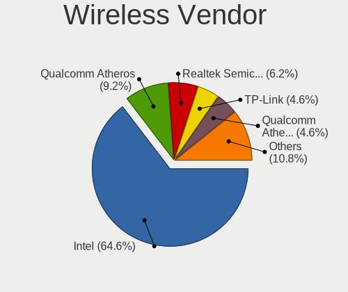

| Vendor                | Computers | Percent |
|-----------------------|-----------|---------|
| Intel                 | 27        | 72.97%  |
| Qualcomm Atheros      | 4         | 10.81%  |
| TP-Link               | 2         | 5.41%   |
| Realtek Semiconductor | 2         | 5.41%   |
| Ralink Technology     | 1         | 2.7%    |
| D-Link                | 1         | 2.7%    |

Wireless Model
--------------

Wireless models

| Model                                                                   | Computers | Percent |
|-------------------------------------------------------------------------|-----------|---------|
| Intel Centrino Advanced-N 6205 [Taylor Peak]                            | 5         | 13.51%  |
| Intel Wireless 7260                                                     | 3         | 8.11%   |
| Intel Wi-Fi 6 AX200                                                     | 3         | 8.11%   |
| Intel Wireless-AC 9260                                                  | 2         | 5.41%   |
| Intel Wireless 8265 / 8275                                              | 2         | 5.41%   |
| Intel Centrino Wireless-N 2230                                          | 2         | 5.41%   |
| Intel Centrino Advanced-N 6200                                          | 2         | 5.41%   |
| TP-Link TL-WN823N v2/v3 [Realtek RTL8192EU]                             | 1         | 2.7%    |
| TP-Link TL-WN722N v2/v3 [Realtek RTL8188EUS]                            | 1         | 2.7%    |
| Realtek RTL8821CE 802.11ac PCIe Wireless Network Adapter                | 1         | 2.7%    |
| Realtek RTL8188CE 802.11b/g/n WiFi Adapter                              | 1         | 2.7%    |
| Ralink RT5370 Wireless Adapter                                          | 1         | 2.7%    |
| Qualcomm Atheros AR9485 Wireless Network Adapter                        | 1         | 2.7%    |
| Qualcomm Atheros AR9462 Wireless Network Adapter                        | 1         | 2.7%    |
| Qualcomm Atheros AR928X Wireless Network Adapter (PCI-Express)          | 1         | 2.7%    |
| Qualcomm Atheros AR242x / AR542x Wireless Network Adapter (PCI-Express) | 1         | 2.7%    |
| Intel Wireless 3165                                                     | 1         | 2.7%    |
| Intel Wi-Fi 6 AX210/AX211/AX411 160MHz                                  | 1         | 2.7%    |
| Intel Wi-Fi 6 AX201                                                     | 1         | 2.7%    |
| Intel Tiger Lake PCH CNVi WiFi                                          | 1         | 2.7%    |
| Intel PRO/Wireless 4965 AG or AGN [Kedron] Network Connection           | 1         | 2.7%    |
| Intel PRO/Wireless 3945ABG [Golan] Network Connection                   | 1         | 2.7%    |
| Intel Gemini Lake PCH CNVi WiFi                                         | 1         | 2.7%    |
| Intel Comet Lake PCH CNVi WiFi                                          | 1         | 2.7%    |
| D-Link DWA-131 Wireless N Nano Adapter (Rev. E1) [Realtek RTL8192EU]    | 1         | 2.7%    |

Ethernet Vendor
---------------

Ethernet vendors

| Vendor                   | Computers | Percent |
|--------------------------|-----------|---------|
| Intel                    | 20        | 48.78%  |
| Realtek Semiconductor    | 15        | 36.59%  |
| Qualcomm Atheros         | 3         | 7.32%   |
| Marvell Technology Group | 2         | 4.88%   |
| Broadcom                 | 1         | 2.44%   |

Ethernet Model
--------------

Ethernet models

| Model                                                             | Computers | Percent |
|-------------------------------------------------------------------|-----------|---------|
| Realtek RTL8111/8168/8411 PCI Express Gigabit Ethernet Controller | 11        | 26.83%  |
| Intel 82579LM Gigabit Network Connection (Lewisville)             | 5         | 12.2%   |
| Realtek RTL810xE PCI Express Fast Ethernet controller             | 2         | 4.88%   |
| Intel I211 Gigabit Network Connection                             | 2         | 4.88%   |
| Intel I210 Gigabit Network Connection                             | 2         | 4.88%   |
| Intel Ethernet Connection (4) I219-V                              | 2         | 4.88%   |
| Intel 82577LM Gigabit Network Connection                          | 2         | 4.88%   |
| Realtek RTL8125 2.5GbE Controller                                 | 1         | 2.44%   |
| Realtek RTL-8100/8101L/8139 PCI Fast Ethernet Adapter             | 1         | 2.44%   |
| Qualcomm Atheros Killer E2500 Gigabit Ethernet Controller         | 1         | 2.44%   |
| Qualcomm Atheros AR8152 v2.0 Fast Ethernet                        | 1         | 2.44%   |
| Qualcomm Atheros AR8121/AR8113/AR8114 Gigabit or Fast Ethernet    | 1         | 2.44%   |
| Marvell Group 88E8057 PCI-E Gigabit Ethernet Controller           | 1         | 2.44%   |
| Marvell Group 88E8053 PCI-E Gigabit Ethernet Controller           | 1         | 2.44%   |
| Intel Ethernet Connection I217-V                                  | 1         | 2.44%   |
| Intel Ethernet Connection (7) I219-LM                             | 1         | 2.44%   |
| Intel Ethernet Connection (6) I219-V                              | 1         | 2.44%   |
| Intel Ethernet Connection (10) I219-V                             | 1         | 2.44%   |
| Intel 82599 10 Gigabit Network Connection                         | 1         | 2.44%   |
| Intel 82583V Gigabit Network Connection                           | 1         | 2.44%   |
| Intel 82566MM Gigabit Network Connection                          | 1         | 2.44%   |
| Broadcom NetXtreme BCM5755 Gigabit Ethernet PCI Express           | 1         | 2.44%   |

Net Controller Kind
-------------------

Ethernet, WiFi or modem

| Kind     | Computers | Percent |
|----------|-----------|---------|
| Ethernet | 41        | 53.95%  |
| WiFi     | 34        | 44.74%  |
| Unknown  | 1         | 1.32%   |

Used Controller
---------------

Currently used network controller

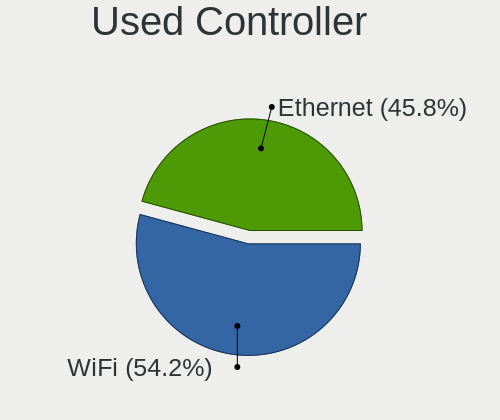

| Kind     | Computers | Percent |
|----------|-----------|---------|
| WiFi     | 24        | 54.55%  |
| Ethernet | 20        | 45.45%  |

NICs
----

Total network controllers on board

| Total | Computers | Percent |
|-------|-----------|---------|
| 2     | 30        | 63.83%  |
| 1     | 11        | 23.4%   |
| 0     | 3         | 6.38%   |
| 7     | 1         | 2.13%   |
| 6     | 1         | 2.13%   |
| 3     | 1         | 2.13%   |

IPv6
----

IPv6 vs IPv4

| Used | Computers | Percent |
|------|-----------|---------|
| No   | 47        | 100%    |

Bluetooth
---------

Bluetooth Vendor
----------------

Controller vendors

| Vendor                  | Computers | Percent |
|-------------------------|-----------|---------|
| Intel                   | 15        | 65.22%  |
| Broadcom                | 2         | 8.7%    |
| Alps Electric           | 2         | 8.7%    |
| Realtek Semiconductor   | 1         | 4.35%   |
| Lite-On Technology      | 1         | 4.35%   |
| Cambridge Silicon Radio | 1         | 4.35%   |
| ASUSTek Computer        | 1         | 4.35%   |

Bluetooth Model
---------------

Controller models

| Model                                               | Computers | Percent |
|-----------------------------------------------------|-----------|---------|
| Intel Bluetooth wireless interface                  | 4         | 17.39%  |
| Intel Wireless-AC 9260 Bluetooth Adapter            | 2         | 8.7%    |
| Intel Centrino Bluetooth Wireless Transceiver       | 2         | 8.7%    |
| Intel Bluetooth 9460/9560 Jefferson Peak (JfP)      | 2         | 8.7%    |
| Intel AX201 Bluetooth                               | 2         | 8.7%    |
| Intel AX200 Bluetooth                               | 2         | 8.7%    |
| Broadcom BCM2045B (BDC-2.1)                         | 2         | 8.7%    |
| Alps Electric UGTZ4 Bluetooth                       | 2         | 8.7%    |
| Realtek  Bluetooth Adapter                          | 1         | 4.35%   |
| Lite-On Atheros AR3012 Bluetooth                    | 1         | 4.35%   |
| Intel AX210 Bluetooth                               | 1         | 4.35%   |
| Cambridge Silicon Radio Bluetooth Dongle (HCI mode) | 1         | 4.35%   |
| ASUS Broadcom Bluetooth 2.1                         | 1         | 4.35%   |

Sound
-----

Sound Vendor
------------

Sound card vendors

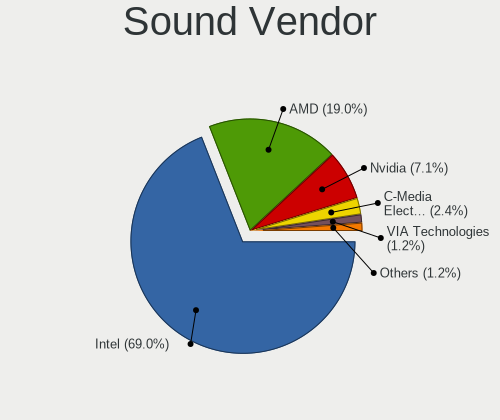

| Vendor              | Computers | Percent |
|---------------------|-----------|---------|
| Intel               | 31        | 67.39%  |
| AMD                 | 10        | 21.74%  |
| Nvidia              | 3         | 6.52%   |
| C-Media Electronics | 1         | 2.17%   |
| Blue Microphones    | 1         | 2.17%   |

Sound Model
-----------

Sound card models

| Model                                                                      | Computers | Percent |
|----------------------------------------------------------------------------|-----------|---------|
| Intel Sunrise Point-LP HD Audio                                            | 4         | 7.14%   |
| Intel 6 Series/C200 Series Chipset Family High Definition Audio Controller | 4         | 7.14%   |
| AMD Starship/Matisse HD Audio Controller                                   | 3         | 5.36%   |
| Nvidia unknown                                                             | 2         | 3.57%   |
| Intel NM10/ICH7 Family High Definition Audio Controller                    | 2         | 3.57%   |
| Intel Comet Lake PCH-LP cAVS                                               | 2         | 3.57%   |
| Intel Cannon Lake PCH cAVS                                                 | 2         | 3.57%   |
| Intel 82801H (ICH8 Family) HD Audio Controller                             | 2         | 3.57%   |
| Intel 8 Series/C220 Series Chipset High Definition Audio Controller        | 2         | 3.57%   |
| Intel 7 Series/C216 Chipset Family High Definition Audio Controller        | 2         | 3.57%   |
| Intel 5 Series/3400 Series Chipset High Definition Audio                   | 2         | 3.57%   |
| AMD Navi 21 HDMI Audio [Radeon RX 6800/6800 XT / 6900 XT]                  | 2         | 3.57%   |
| AMD Family 17h (Models 10h-1fh) HD Audio Controller                        | 2         | 3.57%   |
| Nvidia TU104 HD Audio Controller                                           | 1         | 1.79%   |
| Intel Xeon E3-1200 v3/4th Gen Core Processor HD Audio Controller           | 1         | 1.79%   |
| Intel Wildcat Point-LP High Definition Audio Controller                    | 1         | 1.79%   |
| Intel Tiger Lake-LP Smart Sound Technology Audio Controller                | 1         | 1.79%   |
| Intel Tiger Lake-H HD Audio Controller                                     | 1         | 1.79%   |
| Intel Comet Lake PCH cAVS                                                  | 1         | 1.79%   |
| Intel Celeron/Pentium Silver Processor High Definition Audio               | 1         | 1.79%   |
| Intel Cannon Point-LP High Definition Audio Controller                     | 1         | 1.79%   |
| Intel Broadwell-U Audio Controller                                         | 1         | 1.79%   |
| Intel Atom Processor Z36xxx/Z37xxx Series High Definition Audio Controller | 1         | 1.79%   |
| Intel 82801I (ICH9 Family) HD Audio Controller                             | 1         | 1.79%   |
| Intel 82801CA/CAM AC'97 Audio Controller                                   | 1         | 1.79%   |
| C-Media Electronics Digital Hifi Audio Digital Hifi Audio SPDIFs           | 1         | 1.79%   |
| Blue Microphones Yeti Stereo Microphone                                    | 1         | 1.79%   |
| AMD Wrestler HDMI Audio                                                    | 1         | 1.79%   |
| AMD SBx00 Azalia (Intel HDA)                                               | 1         | 1.79%   |
| AMD RV710/730 HDMI Audio [Radeon HD 4000 series]                           | 1         | 1.79%   |
| AMD Renoir Radeon High Definition Audio Controller                         | 1         | 1.79%   |
| AMD Raven/Raven2/Fenghuang HDMI/DP Audio Controller                        | 1         | 1.79%   |
| AMD Oland/Hainan/Cape Verde/Pitcairn HDMI Audio [Radeon HD 7000 Series]    | 1         | 1.79%   |
| AMD Kabini HDMI/DP Audio                                                   | 1         | 1.79%   |
| AMD High Definition Audio Controller                                       | 1         | 1.79%   |
| AMD FCH Azalia Controller                                                  | 1         | 1.79%   |
| AMD Family 17h (Models 00h-0fh) HD Audio Controller                        | 1         | 1.79%   |
| AMD Ellesmere HDMI Audio [Radeon RX 470/480 / 570/580/590]                 | 1         | 1.79%   |

Memory
------

Memory Vendor
-------------

Memory module vendors

| Vendor              | Computers | Percent |
|---------------------|-----------|---------|
| Samsung Electronics | 7         | 41.18%  |
| Unknown             | 5         | 29.41%  |
| SK Hynix            | 2         | 11.76%  |
| Transcend           | 1         | 5.88%   |
| Kingston            | 1         | 5.88%   |
| Unknown             | 1         | 5.88%   |

Memory Model
------------

Memory module models

| Model                                                  | Computers | Percent |
|--------------------------------------------------------|-----------|---------|
| Unknown RAM Module 4GB SODIMM DDR3 1333MT/s            | 2         | 10.53%  |
| Samsung RAM M471B5273DH0-CH9 4GB SODIMM DDR3 1334MT/s  | 2         | 10.53%  |
| Unknown RAM Module 512MB SODIMM SDRAM                  | 1         | 5.26%   |
| Unknown RAM Module 2GB SODIMM DDR3 1067MT/s            | 1         | 5.26%   |
| Unknown RAM Module 1GB SODIMM DDR2                     | 1         | 5.26%   |
| Transcend RAM TS128MLQ64V6J 1GB DIMM DDR2 667MT/s      | 1         | 5.26%   |
| SK Hynix RAM HYMP112U64CP8-Y5 1GB DIMM DDR2 667MT/s    | 1         | 5.26%   |
| SK Hynix RAM HMT351S6EFR8A-PB 4GB SODIMM DDR3 1600MT/s | 1         | 5.26%   |
| Samsung RAM M471B5673FH0-CF8 2GB SODIMM DDR3 1067MT/s  | 1         | 5.26%   |
| Samsung RAM M471B5673EH1-CF8 2GB SODIMM DDR3 1067MT/s  | 1         | 5.26%   |
| Samsung RAM M471B5173QH0-YK0 4GB SODIMM DDR3 1600MT/s  | 1         | 5.26%   |
| Samsung RAM M471B5173DB0-YK0 4GB SODIMM DDR3 1600MT/s  | 1         | 5.26%   |
| Samsung RAM M471B5173BH0-CK0 4GB SODIMM DDR3 1600MT/s  | 1         | 5.26%   |
| Samsung RAM M471A5244CB0-CWE 4GB SODIMM DDR4 3200MT/s  | 1         | 5.26%   |
| Samsung RAM M3 78T2953CZ3-CE6 1GB DIMM DDR2 667MT/s    | 1         | 5.26%   |
| Kingston RAM KHX1600C9S3L/8G 8GB SODIMM DDR3 1600MT/s  | 1         | 5.26%   |
| Unknown                                                | 1         | 5.26%   |

Memory Kind
-----------

Memory module kinds

| Kind  | Computers | Percent |
|-------|-----------|---------|
| DDR3  | 9         | 64.29%  |
| SDRAM | 2         | 14.29%  |
| DDR2  | 2         | 14.29%  |
| DDR4  | 1         | 7.14%   |

Memory Form Factor
------------------

Physical design of the memory module

| Name   | Computers | Percent |
|--------|-----------|---------|
| SODIMM | 13        | 92.86%  |
| DIMM   | 1         | 7.14%   |

Memory Size
-----------

Memory module size

| Size | Computers | Percent |
|------|-----------|---------|
| 4096 | 7         | 50%     |
| 2048 | 3         | 21.43%  |
| 1024 | 2         | 14.29%  |
| 8192 | 1         | 7.14%   |
| 512  | 1         | 7.14%   |

Memory Speed
------------

Memory module speed

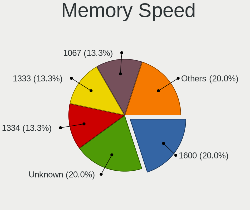

| Speed   | Computers | Percent |
|---------|-----------|---------|
| 1600    | 3         | 21.43%  |
| Unknown | 3         | 21.43%  |
| 1334    | 2         | 14.29%  |
| 1333    | 2         | 14.29%  |
| 1067    | 2         | 14.29%  |
| 3200    | 1         | 7.14%   |
| 667     | 1         | 7.14%   |

Printers & scanners
-------------------

Printer Vendor
--------------

Printer device vendors

Zero info for selected period =(

Printer Model
-------------

Printer device models

Zero info for selected period =(

Scanner Vendor
--------------

Scanner device vendors

Zero info for selected period =(

Scanner Model
-------------

Scanner device models

Zero info for selected period =(

Camera
------

Camera Vendor
-------------

Camera device vendors

| Vendor                        | Computers | Percent |
|-------------------------------|-----------|---------|
| Chicony Electronics           | 7         | 30.43%  |
| Acer                          | 5         | 21.74%  |
| Microdia                      | 3         | 13.04%  |
| Z-Star Microelectronics       | 1         | 4.35%   |
| Sunplus Innovation Technology | 1         | 4.35%   |
| Silicon Motion                | 1         | 4.35%   |
| Realtek Semiconductor         | 1         | 4.35%   |
| Luxvisions Innotech Limited   | 1         | 4.35%   |
| IMC Networks                  | 1         | 4.35%   |
| ALi                           | 1         | 4.35%   |
| Alcor Micro                   | 1         | 4.35%   |

Camera Model
------------

Camera device models

| Model                                         | Computers | Percent |
|-----------------------------------------------|-----------|---------|
| Microdia Integrated_Webcam_HD                 | 2         | 8.7%    |
| Chicony integrated camera                     | 2         | 8.7%    |
| Acer Integrated Camera                        | 2         | 8.7%    |
| Z-Star Integrated Camera                      | 1         | 4.35%   |
| Sunplus Integrated_Webcam_FHD                 | 1         | 4.35%   |
| Silicon Motion Web Camera                     | 1         | 4.35%   |
| Realtek Integrated Webcam                     | 1         | 4.35%   |
| Microdia Ltd., USB  Live camera               | 1         | 4.35%   |
| Luxvisions Innotech Limited Integrated Camera | 1         | 4.35%   |
| IMC Networks Integrated Camera                | 1         | 4.35%   |
| Chicony Sonix ST50220 USB Video Camera        | 1         | 4.35%   |
| Chicony Ltd., Integrated Camera               | 1         | 4.35%   |
| Chicony Lenovo Integrated Camera (0.3MP)      | 1         | 4.35%   |
| Chicony Integrated Camera (1280x720@30)       | 1         | 4.35%   |
| Chicony 2.0M UVC Webcam / CNF7129             | 1         | 4.35%   |
| ALi WebCam                                    | 1         | 4.35%   |
| Alcor Micro USB 2.0 Camera                    | 1         | 4.35%   |
| Acer ThinkPad Integrated Camera               | 1         | 4.35%   |
| Acer SunplusIT Integrated Camera              | 1         | 4.35%   |
| Acer EasyCamera                               | 1         | 4.35%   |

Security
--------

Fingerprint Vendor
------------------

Fingerprint sensor vendors

| Vendor                     | Computers | Percent |
|----------------------------|-----------|---------|
| Upek                       | 2         | 28.57%  |
| Synaptics                  | 2         | 28.57%  |
| STMicroelectronics         | 1         | 14.29%  |
| Shenzhen Goodix Technology | 1         | 14.29%  |
| Samsung Electronics        | 1         | 14.29%  |

Fingerprint Model
-----------------

Fingerprint sensor models

| Model                                                  | Computers | Percent |
|--------------------------------------------------------|-----------|---------|
| Upek Biometric Touchchip/Touchstrip Fingerprint Sensor | 2         | 28.57%  |
| Synaptics product 0x00be                               | 1         | 14.29%  |
| Synaptics Metallica MOH Touch Fingerprint Reader       | 1         | 14.29%  |
| STMicroelectronics Fingerprint Reader                  | 1         | 14.29%  |
| Shenzhen Goodix Fingerprint Reader                     | 1         | 14.29%  |
| Samsung Fingerprint Device                             | 1         | 14.29%  |

Chipcard Vendor
---------------

Chipcard module vendors

Zero info for selected period =(

Chipcard Model
--------------

Chipcard module models

Zero info for selected period =(

Unsupported
-----------

Unsupported Devices
-------------------

Total unsupported devices on board

| Total | Computers | Percent |
|-------|-----------|---------|
| 1     | 22        | 44.9%   |
| 0     | 11        | 22.45%  |
| 2     | 9         | 18.37%  |
| 4     | 4         | 8.16%   |
| 5     | 2         | 4.08%   |
| 3     | 1         | 2.04%   |

Unsupported Device Types
------------------------

Types of unsupported devices

| Type                     | Computers | Percent |
|--------------------------|-----------|---------|
| Communication controller | 27        | 49.09%  |
| Graphics card            | 12        | 21.82%  |
| Net/wireless             | 6         | 10.91%  |
| Firewire controller      | 4         | 7.27%   |
| Sound                    | 3         | 5.45%   |
| Storage/raid             | 1         | 1.82%   |
| Storage/ata              | 1         | 1.82%   |
| Network                  | 1         | 1.82%   |

