OpenBSD 7.1 - Tested Hardware & Statistics (Desktops)
-----------------------------------------------------

A project to collect tested hardware configurations for OpenBSD 7.1.

Anyone can contribute to this report by the [hw-probe](https://github.com/linuxhw/hw-probe/blob/master/INSTALL.BSD.md) tool:

    hw-probe -all -upload

Please contribute! Especially if your hardware is rare.

Contents
--------

* [ Test Cases ](#test-cases)

* [ System ](#system)
  - [ Arch                     ](#arch)
  - [ DE                       ](#de)
  - [ Display Server           ](#display-server)
  - [ Display Manager          ](#display-manager)
  - [ OS Lang                  ](#os-lang)
  - [ Boot Mode                ](#boot-mode)
  - [ Filesystem               ](#filesystem)
  - [ Part. scheme             ](#part-scheme)

* [ Board ](#board)
  - [ Vendor                   ](#vendor)
  - [ Model                    ](#model)
  - [ Model Family             ](#model-family)
  - [ MFG Year                 ](#mfg-year)
  - [ Form Factor              ](#form-factor)
  - [ Coreboot                 ](#coreboot)
  - [ RAM Size                 ](#ram-size)
  - [ RAM Used                 ](#ram-used)
  - [ Total Drives             ](#total-drives)
  - [ Has CD-ROM               ](#has-cd-rom)
  - [ Has Ethernet             ](#has-ethernet)
  - [ Has WiFi                 ](#has-wifi)
  - [ Has Bluetooth            ](#has-bluetooth)

* [ Location ](#location)
  - [ Country                  ](#country)
  - [ City                     ](#city)

* [ Drives ](#drives)
  - [ Drive Vendor             ](#drive-vendor)
  - [ Drive Model              ](#drive-model)
  - [ HDD Vendor               ](#hdd-vendor)
  - [ SSD Vendor               ](#ssd-vendor)
  - [ Drive Kind               ](#drive-kind)
  - [ Drive Connector          ](#drive-connector)
  - [ Drive Size               ](#drive-size)
  - [ Space Total              ](#space-total)
  - [ Space Used               ](#space-used)
  - [ Malfunc. Drives          ](#malfunc-drives)
  - [ Malfunc. Drive Vendor    ](#malfunc-drive-vendor)
  - [ Malfunc. HDD Vendor      ](#malfunc-hdd-vendor)
  - [ Malfunc. Drive Kind      ](#malfunc-drive-kind)
  - [ Failed Drives            ](#failed-drives)
  - [ Failed Drive Vendor      ](#failed-drive-vendor)
  - [ Drive Status             ](#drive-status)

* [ Storage controller ](#storage-controller)
  - [ Storage Vendor           ](#storage-vendor)
  - [ Storage Model            ](#storage-model)
  - [ Storage Kind             ](#storage-kind)

* [ Processor ](#processor)
  - [ CPU Vendor               ](#cpu-vendor)
  - [ CPU Model                ](#cpu-model)
  - [ CPU Model Family         ](#cpu-model-family)
  - [ CPU Cores                ](#cpu-cores)
  - [ CPU Sockets              ](#cpu-sockets)
  - [ CPU Threads              ](#cpu-threads)
  - [ CPU Microarch            ](#cpu-microarch)

* [ Graphics ](#graphics)
  - [ GPU Vendor               ](#gpu-vendor)
  - [ GPU Model                ](#gpu-model)
  - [ GPU Combo                ](#gpu-combo)
  - [ GPU Driver               ](#gpu-driver)
  - [ GPU Memory               ](#gpu-memory)

* [ Monitor ](#monitor)
  - [ Monitor Vendor           ](#monitor-vendor)
  - [ Monitor Model            ](#monitor-model)
  - [ Monitor Resolution       ](#monitor-resolution)
  - [ Monitor Diagonal         ](#monitor-diagonal)
  - [ Monitor Width            ](#monitor-width)
  - [ Aspect Ratio             ](#aspect-ratio)
  - [ Monitor Area             ](#monitor-area)
  - [ Pixel Density            ](#pixel-density)
  - [ Multiple Monitors        ](#multiple-monitors)

* [ Network ](#network)
  - [ Net Controller Vendor    ](#net-controller-vendor)
  - [ Net Controller Model     ](#net-controller-model)
  - [ Wireless Vendor          ](#wireless-vendor)
  - [ Wireless Model           ](#wireless-model)
  - [ Ethernet Vendor          ](#ethernet-vendor)
  - [ Ethernet Model           ](#ethernet-model)
  - [ Net Controller Kind      ](#net-controller-kind)
  - [ Used Controller          ](#used-controller)
  - [ NICs                     ](#nics)
  - [ IPv6                     ](#ipv6)

* [ Bluetooth ](#bluetooth)
  - [ Bluetooth Vendor         ](#bluetooth-vendor)
  - [ Bluetooth Model          ](#bluetooth-model)

* [ Sound ](#sound)
  - [ Sound Vendor             ](#sound-vendor)
  - [ Sound Model              ](#sound-model)

* [ Memory ](#memory)
  - [ Memory Vendor            ](#memory-vendor)
  - [ Memory Model             ](#memory-model)
  - [ Memory Kind              ](#memory-kind)
  - [ Memory Form Factor       ](#memory-form-factor)
  - [ Memory Size              ](#memory-size)
  - [ Memory Speed             ](#memory-speed)

* [ Printers & scanners ](#printers--scanners)
  - [ Printer Vendor           ](#printer-vendor)
  - [ Printer Model            ](#printer-model)
  - [ Scanner Vendor           ](#scanner-vendor)
  - [ Scanner Model            ](#scanner-model)

* [ Camera ](#camera)
  - [ Camera Vendor            ](#camera-vendor)
  - [ Camera Model             ](#camera-model)

* [ Security ](#security)
  - [ Fingerprint Vendor       ](#fingerprint-vendor)
  - [ Fingerprint Model        ](#fingerprint-model)
  - [ Chipcard Vendor          ](#chipcard-vendor)
  - [ Chipcard Model           ](#chipcard-model)

* [ Unsupported ](#unsupported)
  - [ Unsupported Devices      ](#unsupported-devices)
  - [ Unsupported Device Types ](#unsupported-device-types)

Test Cases
----------

Total: 14

| Vendor     | Model                       | Probe                                                     | Date         |
|------------|-----------------------------|-----------------------------------------------------------|--------------|
| MSI        | MS-7C37                     | [aaab7cf22a](https://bsd-hardware.info/?probe=aaab7cf22a) | Apr 28, 2022 |
| ASUSTek    | M4A88TD-V EVO/USB3          | [12cc40cc60](https://bsd-hardware.info/?probe=12cc40cc60) | Apr 23, 2022 |
| PC Engines | APU2                        | [04a6549c99](https://bsd-hardware.info/?probe=04a6549c99) | Apr 23, 2022 |
| Intel      | DH67BL                      | [3c3c9e12da](https://bsd-hardware.info/?probe=3c3c9e12da) | Apr 22, 2022 |
| KOHJINSHA  | SH series                   | [3136a0ca03](https://bsd-hardware.info/?probe=3136a0ca03) | Apr 22, 2022 |
| Lenovo     | ThinkPad X240 20ALA0AHRT    | [062a08c811](https://bsd-hardware.info/?probe=062a08c811) | Apr 22, 2022 |
| Sony       | VPCL22Z1R                   | [f199d57905](https://bsd-hardware.info/?probe=f199d57905) | Apr 22, 2022 |
| ASUSTek    | Z170-K                      | [b16705bbbd](https://bsd-hardware.info/?probe=b16705bbbd) | Apr 22, 2022 |
| ASUSTek    | P10S-I Series               | [aca13dba36](https://bsd-hardware.info/?probe=aca13dba36) | Apr 22, 2022 |
| Dell       | G5 5090                     | [8b24170852](https://bsd-hardware.info/?probe=8b24170852) | Apr 17, 2022 |
| Lenovo     | ThinkCentre M93p 10AAS25... | [32d27b9404](https://bsd-hardware.info/?probe=32d27b9404) | Mar 19, 2022 |
| Lenovo     | ThinkCentre M93p 10AAS25... | [7361628ed9](https://bsd-hardware.info/?probe=7361628ed9) | Mar 19, 2022 |
| Unknown    | LeMaker Banana Pi           | [37e7d1912b](https://bsd-hardware.info/?probe=37e7d1912b) | Mar 05, 2022 |
| Unknown    | Unknown                     | [62f4e0a060](https://bsd-hardware.info/?probe=62f4e0a060) | Feb 21, 2022 |

System
------

Arch
----

OS architecture (x86_64, i586, etc.)

| Name  | Desktops | Percent |
|-------|----------|---------|
| amd64 | 11       | 84.62%  |
| i386  | 1        | 7.69%   |
| armv7 | 1        | 7.69%   |

DE
--

Desktop Environment

| Name         | Desktops | Percent |
|--------------|----------|---------|
| helloDesktop | 10       | 76.92%  |
| XFCE         | 1        | 7.69%   |
| fvwm         | 1        | 7.69%   |
| Console      | 1        | 7.69%   |

Display Server
--------------

X11 or Wayland

| Name    | Desktops | Percent |
|---------|----------|---------|
| X11     | 8        | 61.54%  |
| Console | 5        | 38.46%  |

Display Manager
---------------

SDDM, LightDM, etc.

| Name    | Desktops | Percent |
|---------|----------|---------|
| Console | 13       | 100%    |

OS Lang
-------

Language

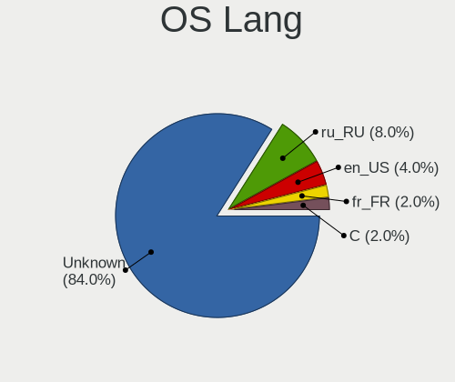

| Lang    | Desktops | Percent |
|---------|----------|---------|
| Unknown | 8        | 61.54%  |
| ru_RU   | 5        | 38.46%  |

Boot Mode
---------

EFI or BIOS

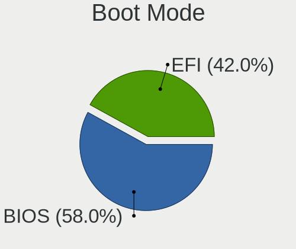

| Mode | Desktops | Percent |
|------|----------|---------|
| BIOS | 8        | 61.54%  |
| EFI  | 5        | 38.46%  |

Filesystem
----------

Type of filesystem

| Type | Desktops | Percent |
|------|----------|---------|
| Ffs  | 13       | 100%    |

Part. scheme
------------

Scheme of partitioning

| Type | Desktops | Percent |
|------|----------|---------|
| MBR  | 10       | 76.92%  |
| GPT  | 3        | 23.08%  |

Board
-----

Vendor
------

Motherboard manufacturer

| Name             | Desktops | Percent |
|------------------|----------|---------|
| ASUSTek Computer | 3        | 23.08%  |
| Lenovo           | 2        | 15.38%  |
| Unknown          | 2        | 15.38%  |
| Sony             | 1        | 7.69%   |
| PC Engines       | 1        | 7.69%   |
| MSI              | 1        | 7.69%   |
| KOHJINSHA        | 1        | 7.69%   |
| Intel            | 1        | 7.69%   |
| Dell             | 1        | 7.69%   |

Model
-----

Motherboard model

| Name                               | Desktops | Percent |
|------------------------------------|----------|---------|
| Unknown                            | 2        | 15.38%  |
| Sony VPCL22Z1R                     | 1        | 7.69%   |
| PC Engines APU2                    | 1        | 7.69%   |
| MSI MS-7C37                        | 1        | 7.69%   |
| Lenovo ThinkPad X240 20ALA0AHRT    | 1        | 7.69%   |
| Lenovo ThinkCentre M93p 10AAS25M00 | 1        | 7.69%   |
| KOHJINSHA SH series                | 1        | 7.69%   |
| Intel DH67BL                       | 1        | 7.69%   |
| Dell G5 5090                       | 1        | 7.69%   |
| ASUS Z170-K                        | 1        | 7.69%   |
| ASUS P10S-I Series                 | 1        | 7.69%   |
| ASUS M4A88TD-V EVO/USB3            | 1        | 7.69%   |

Model Family
------------

Motherboard model prefix

| Name               | Desktops | Percent |
|--------------------|----------|---------|
| Unknown            | 2        | 15.38%  |
| Sony VPCL22Z1R     | 1        | 7.69%   |
| PC Engines APU2    | 1        | 7.69%   |
| MSI MS-7C37        | 1        | 7.69%   |
| Lenovo ThinkPad    | 1        | 7.69%   |
| Lenovo ThinkCentre | 1        | 7.69%   |
| KOHJINSHA SH       | 1        | 7.69%   |
| Intel DH67BL       | 1        | 7.69%   |
| Dell G5            | 1        | 7.69%   |
| ASUS Z170-K        | 1        | 7.69%   |
| ASUS P10S-I        | 1        | 7.69%   |
| ASUS M4A88TD-V     | 1        | 7.69%   |

MFG Year
--------

Motherboard manufacture year

| Year    | Desktops | Percent |
|---------|----------|---------|
| 2020    | 3        | 23.08%  |
| 2018    | 2        | 15.38%  |
| 2021    | 1        | 7.69%   |
| 2019    | 1        | 7.69%   |
| 2016    | 1        | 7.69%   |
| 2014    | 1        | 7.69%   |
| 2011    | 1        | 7.69%   |
| 2010    | 1        | 7.69%   |
| 2007    | 1        | 7.69%   |
| Unknown | 1        | 7.69%   |

Form Factor
-----------

Physical design of the computer

| Name    | Desktops | Percent |
|---------|----------|---------|
| Desktop | 13       | 100%    |

Coreboot
--------

Have coreboot on board

| Used | Desktops | Percent |
|------|----------|---------|
| No   | 12       | 92.31%  |
| Yes  | 1        | 7.69%   |

RAM Size
--------

Total RAM memory

| Size in GB | Desktops | Percent |
|------------|----------|---------|
| 8.01-16.0  | 7        | 53.85%  |
| 16.01-24.0 | 3        | 23.08%  |
| 4.01-8.0   | 1        | 7.69%   |
| 2.01-3.0   | 1        | 7.69%   |
| 0.51-1.0   | 1        | 7.69%   |

RAM Used
--------

Used RAM memory

| Used GB  | Desktops | Percent |
|----------|----------|---------|
| 0.01-0.5 | 12       | 92.31%  |
| 0        | 1        | 7.69%   |

Total Drives
------------

Number of drives on board

| Drives | Desktops | Percent |
|--------|----------|---------|
| 1      | 8        | 61.54%  |
| 4      | 2        | 15.38%  |
| 6      | 1        | 7.69%   |
| 3      | 1        | 7.69%   |
| 2      | 1        | 7.69%   |

Has CD-ROM
----------

Has CD-ROM on board

| Presented | Desktops | Percent |
|-----------|----------|---------|
| No        | 13       | 100%    |

Has Ethernet
------------

Has Ethernet on board

| Presented | Desktops | Percent |
|-----------|----------|---------|
| Yes       | 12       | 92.31%  |
| No        | 1        | 7.69%   |

Has WiFi
--------

Has WiFi module

| Presented | Desktops | Percent |
|-----------|----------|---------|
| Yes       | 7        | 53.85%  |
| No        | 6        | 46.15%  |

Has Bluetooth
-------------

Has Bluetooth module

| Presented | Desktops | Percent |
|-----------|----------|---------|
| No        | 7        | 53.85%  |
| Yes       | 6        | 46.15%  |

Location
--------

Country
-------

Geographic location (country)

| Country | Desktops | Percent |
|---------|----------|---------|
| Russia  | 8        | 61.54%  |
| USA     | 1        | 7.69%   |
| Poland  | 1        | 7.69%   |
| Norway  | 1        | 7.69%   |
| Italy   | 1        | 7.69%   |
| Canada  | 1        | 7.69%   |

City
----

Geographic location (city)

| City        | Desktops | Percent |
|-------------|----------|---------|
| Vladivostok | 3        | 23.08%  |
| Tambov      | 1        | 7.69%   |
| St. Albert  | 1        | 7.69%   |
| Reutov      | 1        | 7.69%   |
| Ozersk      | 1        | 7.69%   |
| Oslo        | 1        | 7.69%   |
| Moscow      | 1        | 7.69%   |
| Milan       | 1        | 7.69%   |
| Kolomna     | 1        | 7.69%   |
| Gdansk      | 1        | 7.69%   |
| Columbus    | 1        | 7.69%   |

Drives
------

Drive Vendor
------------

Hard drive vendors

| Vendor              | Desktops | Drives | Percent |
|---------------------|----------|--------|---------|
| Seagate             | 4        | 6      | 18.18%  |
| NVMe                | 3        | 4      | 13.64%  |
| WDC                 | 2        | 2      | 9.09%   |
| Samsung Electronics | 2        | 2      | 9.09%   |
| OPENBSD             | 2        | 2      | 9.09%   |
| Hitachi             | 2        | 2      | 9.09%   |
| XPG                 | 1        | 1      | 4.55%   |
| OCZ                 | 1        | 1      | 4.55%   |
| Kingston            | 1        | 1      | 4.55%   |
| KingSpec            | 1        | 1      | 4.55%   |
| Intel               | 1        | 1      | 4.55%   |
| HGST                | 1        | 1      | 4.55%   |
| Crucial             | 1        | 1      | 4.55%   |

Drive Model
-----------

Hard drive models

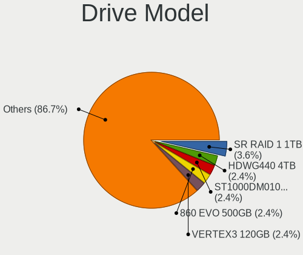

| Model                          | Desktops | Percent |
|--------------------------------|----------|---------|
| OPENBSD SR RAID 1 752GB        | 2        | 8.7%    |
| XPG SX950U 240GB               | 1        | 4.35%   |
| WDC WD5003AZEX-00K1GA0 500GB   | 1        | 4.35%   |
| WDC WD20PURX-64P6ZY0 2TB       | 1        | 4.35%   |
| Seagate ST3750640NS 752GB      | 1        | 4.35%   |
| Seagate ST3250318AS 250GB      | 1        | 4.35%   |
| Seagate ST2000DM006-2DM164 2TB | 1        | 4.35%   |
| Seagate ST1000VX000-1CU162 1TB | 1        | 4.35%   |
| Seagate ST1000DM010-2EP102 1TB | 1        | 4.35%   |
| Samsung SSD 860 EVO 250GB      | 1        | 4.35%   |
| Samsung Flash Drive FIT 32GB   | 1        | 4.35%   |
| OCZ VERTEX3 120GB              | 1        | 4.35%   |
| NVMe TOSHIBA-RC100 240GB       | 1        | 4.35%   |
| NVMe Samsung SSD 970 250GB     | 1        | 4.35%   |
| NVMe PC SN520 WD 256GB         | 1        | 4.35%   |
| Kingston SMS200S330G 32GB      | 1        | 4.35%   |
| KingSpec NT-512 512GB          | 1        | 4.35%   |
| Intel SSDSC2BF180A4L 180GB     | 1        | 4.35%   |
| Hitachi HUA723020ALA640 2TB    | 1        | 4.35%   |
| Hitachi HTS541612J9AT00 120GB  | 1        | 4.35%   |
| HGST HUS724020ALA640 2TB       | 1        | 4.35%   |
| Crucial CT2000MX500SSD1 2TB    | 1        | 4.35%   |

HDD Vendor
----------

Hard disk drive vendors

| Vendor              | Desktops | Drives | Percent |
|---------------------|----------|--------|---------|
| Seagate             | 4        | 6      | 30.77%  |
| WDC                 | 2        | 2      | 15.38%  |
| OPENBSD             | 2        | 2      | 15.38%  |
| Hitachi             | 2        | 2      | 15.38%  |
| Samsung Electronics | 1        | 1      | 7.69%   |
| NVMe                | 1        | 1      | 7.69%   |
| HGST                | 1        | 1      | 7.69%   |

SSD Vendor
----------

Solid state drive vendors

| Vendor              | Desktops | Drives | Percent |
|---------------------|----------|--------|---------|
| XPG                 | 1        | 1      | 12.5%   |
| Samsung Electronics | 1        | 1      | 12.5%   |
| OCZ                 | 1        | 1      | 12.5%   |
| NVMe                | 1        | 2      | 12.5%   |
| Kingston            | 1        | 1      | 12.5%   |
| KingSpec            | 1        | 1      | 12.5%   |
| Intel               | 1        | 1      | 12.5%   |
| Crucial             | 1        | 1      | 12.5%   |

Drive Kind
----------

HDD or SSD

| Kind | Desktops | Drives | Percent |
|------|----------|--------|---------|
| SSD  | 6        | 9      | 46.15%  |
| HDD  | 6        | 15     | 46.15%  |
| NVMe | 1        | 1      | 7.69%   |

Drive Connector
---------------

SATA, SAS, NVMe, etc.

| Type | Desktops | Drives | Percent |
|------|----------|--------|---------|
| SATA | 11       | 24     | 91.67%  |
| NVMe | 1        | 1      | 8.33%   |

Drive Size
----------

Size of hard drive

| Size in TB | Desktops | Drives | Percent |
|------------|----------|--------|---------|
| 0.01-0.5   | 7        | 12     | 46.67%  |
| 0.51-1.0   | 5        | 7      | 33.33%  |
| 1.01-2.0   | 3        | 5      | 20%     |

Space Total
-----------

Amount of disk space available on the file system

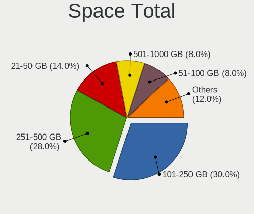

| Size in GB     | Desktops | Percent |
|----------------|----------|---------|
| 101-250        | 5        | 38.46%  |
| 21-50          | 3        | 23.08%  |
| 251-500        | 2        | 15.38%  |
| 1-20           | 2        | 15.38%  |
| More than 3000 | 1        | 7.69%   |

Space Used
----------

Amount of used disk space

| Used GB   | Desktops | Percent |
|-----------|----------|---------|
| 1-20      | 12       | 92.31%  |
| 2001-3000 | 1        | 7.69%   |

Malfunc. Drives
---------------

Drive models with a malfunction

| Model                          | Desktops | Drives | Percent |
|--------------------------------|----------|--------|---------|
| XPG SX950U 240GB               | 1        | 1      | 25%     |
| Seagate ST3750640NS 752GB      | 1        | 2      | 25%     |
| Seagate ST2000DM006-2DM164 2TB | 1        | 1      | 25%     |
| OCZ VERTEX3 120GB              | 1        | 1      | 25%     |

Malfunc. Drive Vendor
---------------------

Vendors of faulty drives

| Vendor  | Desktops | Drives | Percent |
|---------|----------|--------|---------|
| Seagate | 2        | 3      | 50%     |
| XPG     | 1        | 1      | 25%     |
| OCZ     | 1        | 1      | 25%     |

Malfunc. HDD Vendor
-------------------

Vendors of faulty HDD drives

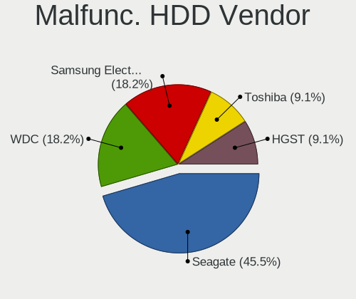

| Vendor  | Desktops | Drives | Percent |
|---------|----------|--------|---------|
| Seagate | 2        | 3      | 100%    |

Malfunc. Drive Kind
-------------------

Kinds of faulty drives

| Kind | Desktops | Drives | Percent |
|------|----------|--------|---------|
| SSD  | 2        | 2      | 50%     |
| HDD  | 2        | 3      | 50%     |

Failed Drives
-------------

Failed drive models

Zero info for selected period =(

Failed Drive Vendor
-------------------

Failed drive vendors

Zero info for selected period =(

Drive Status
------------

Number of failed and malfunc. drives

| Status   | Desktops | Drives | Percent |
|----------|----------|--------|---------|
| Works    | 9        | 14     | 56.25%  |
| Detected | 4        | 6      | 25%     |
| Malfunc  | 3        | 5      | 18.75%  |

Storage controller
------------------

Storage Vendor
--------------

Storage controller vendors

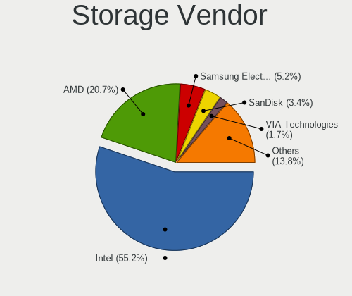

| Vendor                   | Desktops | Percent |
|--------------------------|----------|---------|
| Intel                    | 9        | 50%     |
| AMD                      | 3        | 16.67%  |
| VIA Technologies         | 1        | 5.56%   |
| Toshiba                  | 1        | 5.56%   |
| Sandisk                  | 1        | 5.56%   |
| Samsung Electronics      | 1        | 5.56%   |
| Marvell Technology Group | 1        | 5.56%   |
| ASMedia Technology       | 1        | 5.56%   |

Storage Model
-------------

Storage controller models

| Model                                                                          | Desktops | Percent |
|--------------------------------------------------------------------------------|----------|---------|
| Intel Q170/Q150/B150/H170/H110/Z170/CM236 Chipset SATA Controller [AHCI Mode]  | 2        | 10.53%  |
| AMD FCH SATA Controller [AHCI mode]                                            | 2        | 10.53%  |
| VIA VT6415 PATA IDE Host Controller                                            | 1        | 5.26%   |
| Toshiba BG3 NVMe SSD Controller                                                | 1        | 5.26%   |
| Sandisk PC SN520 NVMe SSD                                                      | 1        | 5.26%   |
| Samsung NVMe SSD Controller SM981/PM981/PM983                                  | 1        | 5.26%   |
| Marvell Group 88SE9215 PCIe 2.0 x1 4-port SATA 6 Gb/s Controller               | 1        | 5.26%   |
| Intel Jasper Lake SATA AHCI Controller                                         | 1        | 5.26%   |
| Intel Cannon Lake PCH SATA AHCI Controller                                     | 1        | 5.26%   |
| Intel 82801GBM/GHM (ICH7-M Family) SATA Controller [IDE mode]                  | 1        | 5.26%   |
| Intel 82801G (ICH7 Family) IDE Controller                                      | 1        | 5.26%   |
| Intel 8 Series/C220 Series Chipset Family 6-port SATA Controller 1 [AHCI mode] | 1        | 5.26%   |
| Intel 8 Series SATA Controller 1 [AHCI mode]                                   | 1        | 5.26%   |
| Intel 6 Series/C200 Series Chipset Family 6 port Mobile SATA AHCI Controller   | 1        | 5.26%   |
| Intel 6 Series/C200 Series Chipset Family 6 port Desktop SATA AHCI Controller  | 1        | 5.26%   |
| ASMedia ASM1062 Serial ATA Controller                                          | 1        | 5.26%   |
| AMD SB7x0/SB8x0/SB9x0 SATA Controller [AHCI mode]                              | 1        | 5.26%   |

Storage Kind
------------

Kind of storage controller (IDE, SATA, NVMe, SAS, ...)

| Kind | Desktops | Percent |
|------|----------|---------|
| SATA | 11       | 68.75%  |
| NVMe | 3        | 18.75%  |
| IDE  | 2        | 12.5%   |

Processor
---------

CPU Vendor
----------

Processor vendors

| Vendor | Desktops | Percent |
|--------|----------|---------|
| Intel  | 9        | 69.23%  |
| AMD    | 3        | 23.08%  |
| ARM    | 1        | 7.69%   |

CPU Model
---------

Processor models

| Model                                                     | Desktops | Percent |
|-----------------------------------------------------------|----------|---------|
| Intel Xeon CPU E3-1220 v5 @ 3.00GHz                       | 1        | 7.69%   |
| Intel Pentium Silver N6000 @ 1.10GHz                      | 1        | 7.69%   |
| Intel Genuine processor 600MHz ("GenuineIntel" 686-class) | 1        | 7.69%   |
| Intel Core i7-9700K CPU @ 3.60GHz                         | 1        | 7.69%   |
| Intel Core i7-6700 CPU @ 3.40GHz                          | 1        | 7.69%   |
| Intel Core i7-2670QM CPU @ 2.20GHz                        | 1        | 7.69%   |
| Intel Core i5-4570T CPU @ 2.90GHz                         | 1        | 7.69%   |
| Intel Core i3-4010U CPU @ 1.70GHz                         | 1        | 7.69%   |
| Intel Core i3-3225 CPU @ 3.30GHz                          | 1        | 7.69%   |
| ARM Cortex-A7 r0p4                                        | 1        | 7.69%   |
| AMD Ryzen 7 5800X 8-Core Processor                        | 1        | 7.69%   |
| AMD GX-412TC SOC                                          | 1        | 7.69%   |
| AMD Athlon II X4 640 Processor                            | 1        | 7.69%   |

CPU Model Family
----------------

Processor model prefix

| Model                | Desktops | Percent |
|----------------------|----------|---------|
| Intel Core i7        | 3        | 23.08%  |
| Intel Core i3        | 2        | 15.38%  |
| Intel Xeon           | 1        | 7.69%   |
| Intel Pentium Silver | 1        | 7.69%   |
| Intel Genuine        | 1        | 7.69%   |
| Intel Core i5        | 1        | 7.69%   |
| ARM Cortex           | 1        | 7.69%   |
| AMD Ryzen 7          | 1        | 7.69%   |
| AMD GX               | 1        | 7.69%   |
| AMD Athlon II X4     | 1        | 7.69%   |

CPU Cores
---------

Number of processor cores

| Number  | Desktops | Percent |
|---------|----------|---------|
| 4       | 6        | 46.15%  |
| 2       | 3        | 23.08%  |
| 1       | 2        | 15.38%  |
| 8       | 1        | 7.69%   |
| Unknown | 1        | 7.69%   |

CPU Sockets
-----------

Number of sockets

| Number  | Desktops | Percent |
|---------|----------|---------|
| 1       | 10       | 76.92%  |
| Unknown | 3        | 23.08%  |

CPU Threads
-----------

Threads per core (Hyper-Threading)

| Number  | Desktops | Percent |
|---------|----------|---------|
| 2       | 5        | 38.46%  |
| 1       | 5        | 38.46%  |
| Unknown | 3        | 23.08%  |

CPU Microarch
-------------

Microarchitecture

| Name        | Desktops | Percent |
|-------------|----------|---------|
| Unknown     | 3        | 23.08%  |
| Skylake     | 2        | 15.38%  |
| Haswell     | 2        | 15.38%  |
| SandyBridge | 1        | 7.69%   |
| Puma        | 1        | 7.69%   |
| P6          | 1        | 7.69%   |
| KabyLake    | 1        | 7.69%   |
| K10         | 1        | 7.69%   |
| IvyBridge   | 1        | 7.69%   |

Graphics
--------

GPU Vendor
----------

Vendors of graphics cards

| Vendor            | Desktops | Percent |
|-------------------|----------|---------|
| Intel             | 6        | 54.55%  |
| AMD               | 3        | 27.27%  |
| Nvidia            | 1        | 9.09%   |
| ASPEED Technology | 1        | 9.09%   |

GPU Model
---------

Graphics card models

| Model                                                                         | Desktops | Percent |
|-------------------------------------------------------------------------------|----------|---------|
| Nvidia GF108M [GeForce GT 540M]                                               | 1        | 8.33%   |
| Intel Xeon E3-1200 v3/4th Gen Core Processor Integrated Graphics Controller   | 1        | 8.33%   |
| Intel Mobile 945GM/GMS/GME, 943/940GML Express Integrated Graphics Controller | 1        | 8.33%   |
| Intel Mobile 945GM/GMS, 943/940GML Express Integrated Graphics Controller     | 1        | 8.33%   |
| Intel JasperLake [UHD Graphics]                                               | 1        | 8.33%   |
| Intel IvyBridge GT2 [HD Graphics 4000]                                        | 1        | 8.33%   |
| Intel HD Graphics 530                                                         | 1        | 8.33%   |
| Intel Haswell-ULT Integrated Graphics Controller                              | 1        | 8.33%   |
| ASPEED Technology ASPEED Graphics Family                                      | 1        | 8.33%   |
| AMD RS880 [Radeon HD 4250]                                                    | 1        | 8.33%   |
| AMD Navi 21 [Radeon RX 6800/6800 XT / 6900 XT]                                | 1        | 8.33%   |
| AMD Navi 10 [Radeon RX 5600 OEM/5600 XT / 5700/5700 XT]                       | 1        | 8.33%   |

GPU Combo
---------

Combinations of graphics cards

| Name       | Desktops | Percent |
|------------|----------|---------|
| 1 x Intel  | 5        | 38.46%  |
| 1 x AMD    | 3        | 23.08%  |
| Other      | 2        | 15.38%  |
| 2 x Intel  | 1        | 7.69%   |
| 1 x Nvidia | 1        | 7.69%   |
| 1 x ASPEED | 1        | 7.69%   |

GPU Driver
----------

Free vs proprietary

| Driver  | Desktops | Percent |
|---------|----------|---------|
| Free    | 10       | 76.92%  |
| Unknown | 3        | 23.08%  |

GPU Memory
----------

Total video memory

| Size in GB | Desktops | Percent |
|------------|----------|---------|
| Unknown    | 13       | 100%    |

Monitor
-------

Monitor Vendor
--------------

Monitor vendors

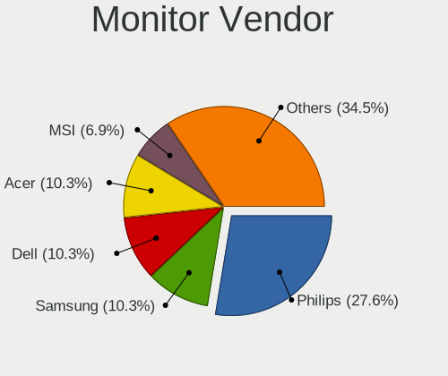

| Vendor              | Desktops | Percent |
|---------------------|----------|---------|
| ViewSonic           | 1        | 16.67%  |
| Samsung Electronics | 1        | 16.67%  |
| Philips             | 1        | 16.67%  |
| InfoVision          | 1        | 16.67%  |
| BOE                 | 1        | 16.67%  |
| Acer                | 1        | 16.67%  |

Monitor Model
-------------

Monitor models

| Model                                                                  | Desktops | Percent |
|------------------------------------------------------------------------|----------|---------|
| ViewSonic LCD Monitor VSCC42B 1920x1080 480x270mm 21.7-inch            | 1        | 16.67%  |
| Samsung Electronics LCD Monitor SAM7004 3840x2160 1210x680mm 54.6-inch | 1        | 16.67%  |
| Philips 227E4LH PHLC0AC 1920x1080 480x270mm 21.7-inch                  | 1        | 16.67%  |
| InfoVision LCD Monitor IVO04E3 1366x768 280x160mm 12.7-inch            | 1        | 16.67%  |
| BOE LCD Monitor BOE075A 1366x768 310x170mm 13.9-inch                   | 1        | 16.67%  |
| Acer XZ342CK ACR078B 3440x1440 800x330mm 34.1-inch                     | 1        | 16.67%  |

Monitor Resolution
------------------

Monitor screen resolution

| Resolution      | Desktops | Percent |
|-----------------|----------|---------|
| 1920x1080 (FHD) | 2        | 33.33%  |
| 1366x768 (WXGA) | 2        | 33.33%  |
| 3840x2160 (4K)  | 1        | 16.67%  |
| 3440x1440       | 1        | 16.67%  |

Monitor Diagonal
----------------

Diagonal size in inches

| Inches | Desktops | Percent |
|--------|----------|---------|
| 21     | 2        | 33.33%  |
| 54     | 1        | 16.67%  |
| 34     | 1        | 16.67%  |
| 13     | 1        | 16.67%  |
| 12     | 1        | 16.67%  |

Monitor Width
-------------

Physical width

| Width in mm | Desktops | Percent |
|-------------|----------|---------|
| 401-500     | 2        | 33.33%  |
| 701-800     | 1        | 16.67%  |
| 301-350     | 1        | 16.67%  |
| 201-300     | 1        | 16.67%  |
| 1001-1500   | 1        | 16.67%  |

Aspect Ratio
------------

Proportional relationship between the width and the height

| Ratio | Desktops | Percent |
|-------|----------|---------|
| 16/9  | 5        | 83.33%  |
| 21/9  | 1        | 16.67%  |

Monitor Area
------------

Area in inch²

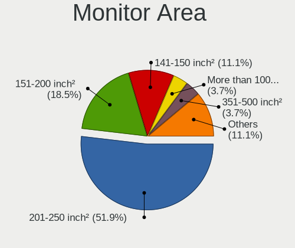

| Area in inch² | Desktops | Percent |
|----------------|----------|---------|
| 201-250        | 2        | 33.33%  |
| More than 1000 | 1        | 16.67%  |
| 81-90          | 1        | 16.67%  |
| 61-70          | 1        | 16.67%  |
| 351-500        | 1        | 16.67%  |

Pixel Density
-------------

Pixels per inch

| Density | Desktops | Percent |
|---------|----------|---------|
| 101-120 | 4        | 66.67%  |
| 121-160 | 1        | 16.67%  |
| 51-100  | 1        | 16.67%  |

Multiple Monitors
-----------------

Total monitors connected

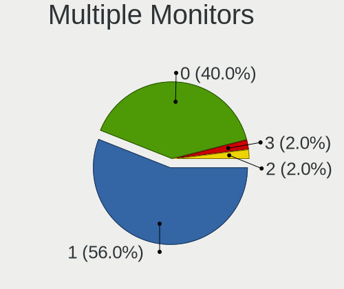

| Total | Desktops | Percent |
|-------|----------|---------|
| 1     | 7        | 53.85%  |
| 0     | 6        | 46.15%  |

Network
-------

Net Controller Vendor
---------------------

Controller vendors

| Vendor                          | Desktops | Percent |
|---------------------------------|----------|---------|
| Intel                           | 9        | 47.37%  |
| Realtek Semiconductor           | 7        | 36.84%  |
| Qualcomm Atheros Communications | 1        | 5.26%   |
| Qualcomm Atheros                | 1        | 5.26%   |
| Qcom                            | 1        | 5.26%   |

Net Controller Model
--------------------

Controller models

| Model                                                                         | Desktops | Percent |
|-------------------------------------------------------------------------------|----------|---------|
| Realtek RTL8111/8168/8411 PCI Express Gigabit Ethernet Controller             | 5        | 21.74%  |
| Intel I210 Gigabit Network Connection                                         | 2        | 8.7%    |
| Intel 82574L Gigabit Network Connection                                       | 2        | 8.7%    |
| Realtek RTL810xE PCI Express Fast Ethernet controller                         | 1        | 4.35%   |
| Realtek Killer E2500 Gigabit Ethernet Controller                              | 1        | 4.35%   |
| Qualcomm Atheros AR9271 802.11n                                               | 1        | 4.35%   |
| Qualcomm Atheros AR9285 Wireless Network Adapter (PCI-Express)                | 1        | 4.35%   |
| Qcom RT73 USB Wireless LAN Card                                               | 1        | 4.35%   |
| Intel Wireless 7260                                                           | 1        | 4.35%   |
| Intel Wi-Fi 6 AX201 160MHz                                                    | 1        | 4.35%   |
| Intel Wi-Fi 6 AX200                                                           | 1        | 4.35%   |
| Intel Ethernet Connection I218-LM                                             | 1        | 4.35%   |
| Intel Ethernet Connection I217-LM                                             | 1        | 4.35%   |
| Intel Dual Band Wireless-AC 3168NGW [Stone Peak]                              | 1        | 4.35%   |
| Intel Centrino Advanced-N 6235                                                | 1        | 4.35%   |
| Intel 82579V Gigabit Network Connection                                       | 1        | 4.35%   |
| Intel 82571EB/82571GB Gigabit Ethernet Controller D0/D1 (copper applications) | 1        | 4.35%   |

Wireless Vendor
---------------

Wireless vendors

| Vendor                          | Desktops | Percent |
|---------------------------------|----------|---------|
| Intel                           | 4        | 57.14%  |
| Qualcomm Atheros Communications | 1        | 14.29%  |
| Qualcomm Atheros                | 1        | 14.29%  |
| Qcom                            | 1        | 14.29%  |

Wireless Model
--------------

Wireless models

| Model                                                          | Desktops | Percent |
|----------------------------------------------------------------|----------|---------|
| Qualcomm Atheros AR9271 802.11n                                | 1        | 14.29%  |
| Qualcomm Atheros AR9285 Wireless Network Adapter (PCI-Express) | 1        | 14.29%  |
| Qcom RT73 USB Wireless LAN Card                                | 1        | 14.29%  |
| Intel Wireless 7260                                            | 1        | 14.29%  |
| Intel Wi-Fi 6 AX201 160MHz                                     | 1        | 14.29%  |
| Intel Wi-Fi 6 AX200                                            | 1        | 14.29%  |
| Intel Dual Band Wireless-AC 3168NGW [Stone Peak]               | 1        | 14.29%  |

Ethernet Vendor
---------------

Ethernet vendors

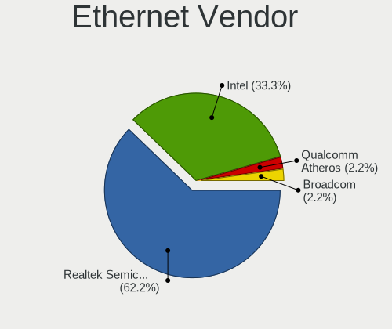

| Vendor                | Desktops | Percent |
|-----------------------|----------|---------|
| Realtek Semiconductor | 7        | 50%     |
| Intel                 | 7        | 50%     |

Ethernet Model
--------------

Ethernet models

| Model                                                                         | Desktops | Percent |
|-------------------------------------------------------------------------------|----------|---------|
| Realtek RTL8111/8168/8411 PCI Express Gigabit Ethernet Controller             | 5        | 33.33%  |
| Intel I210 Gigabit Network Connection                                         | 2        | 13.33%  |
| Intel 82574L Gigabit Network Connection                                       | 2        | 13.33%  |
| Realtek RTL810xE PCI Express Fast Ethernet controller                         | 1        | 6.67%   |
| Realtek Killer E2500 Gigabit Ethernet Controller                              | 1        | 6.67%   |
| Intel Ethernet Connection I218-LM                                             | 1        | 6.67%   |
| Intel Ethernet Connection I217-LM                                             | 1        | 6.67%   |
| Intel 82579V Gigabit Network Connection                                       | 1        | 6.67%   |
| Intel 82571EB/82571GB Gigabit Ethernet Controller D0/D1 (copper applications) | 1        | 6.67%   |

Net Controller Kind
-------------------

Ethernet, WiFi or modem

| Kind     | Desktops | Percent |
|----------|----------|---------|
| Ethernet | 12       | 60%     |
| WiFi     | 7        | 35%     |
| Unknown  | 1        | 5%      |

Used Controller
---------------

Currently used network controller

| Kind     | Desktops | Percent |
|----------|----------|---------|
| Ethernet | 8        | 66.67%  |
| WiFi     | 4        | 33.33%  |

NICs
----

Total network controllers on board

| Total | Desktops | Percent |
|-------|----------|---------|
| 2     | 7        | 53.85%  |
| 3     | 3        | 23.08%  |
| 1     | 2        | 15.38%  |
| 0     | 1        | 7.69%   |

IPv6
----

IPv6 vs IPv4

| Used | Desktops | Percent |
|------|----------|---------|
| No   | 13       | 100%    |

Bluetooth
---------

Bluetooth Vendor
----------------

Controller vendors

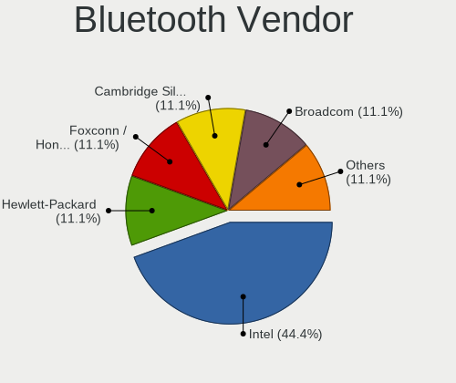

| Vendor            | Desktops | Percent |
|-------------------|----------|---------|
| Intel             | 5        | 83.33%  |
| Foxconn / Hon Hai | 1        | 16.67%  |

Bluetooth Model
---------------

Controller models

| Model                                                       | Desktops | Percent |
|-------------------------------------------------------------|----------|---------|
| Intel Wireless-AC 3168 Bluetooth                            | 1        | 16.67%  |
| Intel Centrino Bluetooth Wireless Transceiver               | 1        | 16.67%  |
| Intel Bluetooth wireless interface                          | 1        | 16.67%  |
| Intel Bluetooth 9460/9560 Jefferson Peak (JfP)              | 1        | 16.67%  |
| Intel AX200 Bluetooth                                       | 1        | 16.67%  |
| Foxconn / Hon Hai Qualcomm Atheros AR3011 Bluetooth Adapter | 1        | 16.67%  |

Sound
-----

Sound Vendor
------------

Sound card vendors

| Vendor | Desktops | Percent |
|--------|----------|---------|
| Intel  | 8        | 66.67%  |
| AMD    | 3        | 25%     |
| Nvidia | 1        | 8.33%   |

Sound Model
-----------

Sound card models

| Model                                                                      | Desktops | Percent |
|----------------------------------------------------------------------------|----------|---------|
| Intel 6 Series/C200 Series Chipset Family High Definition Audio Controller | 2        | 12.5%   |
| Nvidia GF108 High Definition Audio Controller                              | 1        | 6.25%   |
| Intel Xeon E3-1200 v3/4th Gen Core Processor HD Audio Controller           | 1        | 6.25%   |
| Intel NM10/ICH7 Family High Definition Audio Controller                    | 1        | 6.25%   |
| Intel Jasper Lake HD Audio                                                 | 1        | 6.25%   |
| Intel Haswell-ULT HD Audio Controller                                      | 1        | 6.25%   |
| Intel Cannon Lake PCH cAVS                                                 | 1        | 6.25%   |
| Intel 8 Series/C220 Series Chipset High Definition Audio Controller        | 1        | 6.25%   |
| Intel 8 Series HD Audio Controller                                         | 1        | 6.25%   |
| Intel 100 Series/C230 Series Chipset Family HD Audio Controller            | 1        | 6.25%   |
| AMD Starship/Matisse HD Audio Controller                                   | 1        | 6.25%   |
| AMD SBx00 Azalia (Intel HDA)                                               | 1        | 6.25%   |
| AMD RS880 HDMI Audio [Radeon HD 4200 Series]                               | 1        | 6.25%   |
| AMD Navi 21/23 HDMI/DP Audio Controller                                    | 1        | 6.25%   |
| AMD Navi 10 HDMI Audio                                                     | 1        | 6.25%   |

Memory
------

Memory Vendor
-------------

Memory module vendors

Zero info for selected period =(

Memory Model
------------

Memory module models

Zero info for selected period =(

Memory Kind
-----------

Memory module kinds

Zero info for selected period =(

Memory Form Factor
------------------

Physical design of the memory module

Zero info for selected period =(

Memory Size
-----------

Memory module size

Zero info for selected period =(

Memory Speed
------------

Memory module speed

Zero info for selected period =(

Printers & scanners
-------------------

Printer Vendor
--------------

Printer device vendors

Zero info for selected period =(

Printer Model
-------------

Printer device models

Zero info for selected period =(

Scanner Vendor
--------------

Scanner device vendors

Zero info for selected period =(

Scanner Model
-------------

Scanner device models

Zero info for selected period =(

Camera
------

Camera Vendor
-------------

Camera device vendors

| Vendor | Desktops | Percent |
|--------|----------|---------|
| Ricoh  | 1        | 50%     |
| Quanta | 1        | 50%     |

Camera Model
------------

Camera device models

| Model               | Desktops | Percent |
|---------------------|----------|---------|
| Ricoh USB2.0 Camera | 1        | 50%     |
| Quanta VGA WebCam   | 1        | 50%     |

Security
--------

Fingerprint Vendor
------------------

Fingerprint sensor vendors

| Vendor           | Desktops | Percent |
|------------------|----------|---------|
| Validity Sensors | 1        | 100%    |

Fingerprint Model
-----------------

Fingerprint sensor models

| Model                                        | Desktops | Percent |
|----------------------------------------------|----------|---------|
| Validity Sensors VFS 5011 fingerprint sensor | 1        | 100%    |

Chipcard Vendor
---------------

Chipcard module vendors

Zero info for selected period =(

Chipcard Model
--------------

Chipcard module models

Zero info for selected period =(

Unsupported
-----------

Unsupported Devices
-------------------

Total unsupported devices on board

| Total | Desktops | Percent |
|-------|----------|---------|
| 1     | 6        | 46.15%  |
| 2     | 3        | 23.08%  |
| 0     | 3        | 23.08%  |
| 3     | 1        | 7.69%   |

Unsupported Device Types
------------------------

Types of unsupported devices

| Type                     | Desktops | Percent |
|--------------------------|----------|---------|
| Communication controller | 8        | 57.14%  |
| Graphics card            | 2        | 14.29%  |
| Firewire controller      | 2        | 14.29%  |
| Storage                  | 1        | 7.14%   |
| Net/wireless             | 1        | 7.14%   |

