OpenBSD 7.1 - Tested Hardware & Statistics (Desktops)
-----------------------------------------------------

A project to collect tested hardware configurations for OpenBSD 7.1.

Anyone can contribute to this report by the [hw-probe](https://github.com/linuxhw/hw-probe/blob/master/INSTALL.BSD.md) tool:

    hw-probe -all -upload

Please contribute! Especially if your hardware is rare.

Contents
--------

* [ Test Cases ](#test-cases)

* [ System ](#system)
  - [ Arch                     ](#arch)
  - [ DE                       ](#de)
  - [ Display Server           ](#display-server)
  - [ Display Manager          ](#display-manager)
  - [ OS Lang                  ](#os-lang)
  - [ Boot Mode                ](#boot-mode)
  - [ Filesystem               ](#filesystem)
  - [ Part. scheme             ](#part-scheme)

* [ Board ](#board)
  - [ Vendor                   ](#vendor)
  - [ Model                    ](#model)
  - [ Model Family             ](#model-family)
  - [ MFG Year                 ](#mfg-year)
  - [ Form Factor              ](#form-factor)
  - [ Coreboot                 ](#coreboot)
  - [ RAM Size                 ](#ram-size)
  - [ RAM Used                 ](#ram-used)
  - [ Total Drives             ](#total-drives)
  - [ Has CD-ROM               ](#has-cd-rom)
  - [ Has Ethernet             ](#has-ethernet)
  - [ Has WiFi                 ](#has-wifi)
  - [ Has Bluetooth            ](#has-bluetooth)

* [ Location ](#location)
  - [ Country                  ](#country)
  - [ City                     ](#city)

* [ Drives ](#drives)
  - [ Drive Vendor             ](#drive-vendor)
  - [ Drive Model              ](#drive-model)
  - [ HDD Vendor               ](#hdd-vendor)
  - [ SSD Vendor               ](#ssd-vendor)
  - [ Drive Kind               ](#drive-kind)
  - [ Drive Connector          ](#drive-connector)
  - [ Drive Size               ](#drive-size)
  - [ Space Total              ](#space-total)
  - [ Space Used               ](#space-used)
  - [ Malfunc. Drives          ](#malfunc-drives)
  - [ Malfunc. Drive Vendor    ](#malfunc-drive-vendor)
  - [ Malfunc. HDD Vendor      ](#malfunc-hdd-vendor)
  - [ Malfunc. Drive Kind      ](#malfunc-drive-kind)
  - [ Failed Drives            ](#failed-drives)
  - [ Failed Drive Vendor      ](#failed-drive-vendor)
  - [ Drive Status             ](#drive-status)

* [ Storage controller ](#storage-controller)
  - [ Storage Vendor           ](#storage-vendor)
  - [ Storage Model            ](#storage-model)
  - [ Storage Kind             ](#storage-kind)

* [ Processor ](#processor)
  - [ CPU Vendor               ](#cpu-vendor)
  - [ CPU Model                ](#cpu-model)
  - [ CPU Model Family         ](#cpu-model-family)
  - [ CPU Cores                ](#cpu-cores)
  - [ CPU Sockets              ](#cpu-sockets)
  - [ CPU Threads              ](#cpu-threads)
  - [ CPU Microarch            ](#cpu-microarch)

* [ Graphics ](#graphics)
  - [ GPU Vendor               ](#gpu-vendor)
  - [ GPU Model                ](#gpu-model)
  - [ GPU Combo                ](#gpu-combo)
  - [ GPU Driver               ](#gpu-driver)
  - [ GPU Memory               ](#gpu-memory)

* [ Monitor ](#monitor)
  - [ Monitor Vendor           ](#monitor-vendor)
  - [ Monitor Model            ](#monitor-model)
  - [ Monitor Resolution       ](#monitor-resolution)
  - [ Monitor Diagonal         ](#monitor-diagonal)
  - [ Monitor Width            ](#monitor-width)
  - [ Aspect Ratio             ](#aspect-ratio)
  - [ Monitor Area             ](#monitor-area)
  - [ Pixel Density            ](#pixel-density)
  - [ Multiple Monitors        ](#multiple-monitors)

* [ Network ](#network)
  - [ Net Controller Vendor    ](#net-controller-vendor)
  - [ Net Controller Model     ](#net-controller-model)
  - [ Wireless Vendor          ](#wireless-vendor)
  - [ Wireless Model           ](#wireless-model)
  - [ Ethernet Vendor          ](#ethernet-vendor)
  - [ Ethernet Model           ](#ethernet-model)
  - [ Net Controller Kind      ](#net-controller-kind)
  - [ Used Controller          ](#used-controller)
  - [ NICs                     ](#nics)
  - [ IPv6                     ](#ipv6)

* [ Bluetooth ](#bluetooth)
  - [ Bluetooth Vendor         ](#bluetooth-vendor)
  - [ Bluetooth Model          ](#bluetooth-model)

* [ Sound ](#sound)
  - [ Sound Vendor             ](#sound-vendor)
  - [ Sound Model              ](#sound-model)

* [ Memory ](#memory)
  - [ Memory Vendor            ](#memory-vendor)
  - [ Memory Model             ](#memory-model)
  - [ Memory Kind              ](#memory-kind)
  - [ Memory Form Factor       ](#memory-form-factor)
  - [ Memory Size              ](#memory-size)
  - [ Memory Speed             ](#memory-speed)

* [ Printers & scanners ](#printers--scanners)
  - [ Printer Vendor           ](#printer-vendor)
  - [ Printer Model            ](#printer-model)
  - [ Scanner Vendor           ](#scanner-vendor)
  - [ Scanner Model            ](#scanner-model)

* [ Camera ](#camera)
  - [ Camera Vendor            ](#camera-vendor)
  - [ Camera Model             ](#camera-model)

* [ Security ](#security)
  - [ Fingerprint Vendor       ](#fingerprint-vendor)
  - [ Fingerprint Model        ](#fingerprint-model)
  - [ Chipcard Vendor          ](#chipcard-vendor)
  - [ Chipcard Model           ](#chipcard-model)

* [ Unsupported ](#unsupported)
  - [ Unsupported Devices      ](#unsupported-devices)
  - [ Unsupported Device Types ](#unsupported-device-types)

Test Cases
----------

Total: 55

| Vendor        | Model                       | Probe                                                     | Date         |
|---------------|-----------------------------|-----------------------------------------------------------|--------------|
| Dell          | OptiPlex 3040               | [07abf8e8b2](https://bsd-hardware.info/?probe=07abf8e8b2) | Jan 14, 2023 |
| MSI           | MS-7922                     | [95dbf4f7a8](https://bsd-hardware.info/?probe=95dbf4f7a8) | Dec 19, 2022 |
| Acer          | Aspire XC-105               | [250b12c3f2](https://bsd-hardware.info/?probe=250b12c3f2) | Dec 05, 2022 |
| ASRock        | Q1900M                      | [7d0380e2d0](https://bsd-hardware.info/?probe=7d0380e2d0) | Oct 15, 2022 |
| HP            | 260 G3 DM                   | [3ad5292d71](https://bsd-hardware.info/?probe=3ad5292d71) | Oct 13, 2022 |
| HP            | Compaq nw8440 (RND39ET)     | [55bef385e3](https://bsd-hardware.info/?probe=55bef385e3) | Oct 13, 2022 |
| Clevo         | R130T                       | [6f8a6bf77c](https://bsd-hardware.info/?probe=6f8a6bf77c) | Oct 10, 2022 |
| Soekris En... | net6501                     | [1cb23f6bda](https://bsd-hardware.info/?probe=1cb23f6bda) | Oct 08, 2022 |
| Soekris En... | net6501                     | [03ee772b1f](https://bsd-hardware.info/?probe=03ee772b1f) | Oct 08, 2022 |
| Lenovo        | ThinkPad T60 2613CTO        | [cb649b809c](https://bsd-hardware.info/?probe=cb649b809c) | Oct 04, 2022 |
| ASUSTek       | All Series                  | [ab3b339cf0](https://bsd-hardware.info/?probe=ab3b339cf0) | Sep 24, 2022 |
| Gigabyte      | H81M-S1                     | [fe9eecb935](https://bsd-hardware.info/?probe=fe9eecb935) | Sep 18, 2022 |
| CncTion       | N5105-4L                    | [2a34dc3fe0](https://bsd-hardware.info/?probe=2a34dc3fe0) | Sep 05, 2022 |
| ASUSTek       | PRIME B460M-A               | [21fed03fa2](https://bsd-hardware.info/?probe=21fed03fa2) | Aug 24, 2022 |
| ASUSTek       | PRIME B460M-A               | [48210e4d2a](https://bsd-hardware.info/?probe=48210e4d2a) | Aug 24, 2022 |
| Fujitsu       | PRIMERGY RX200 S6           | [9267873961](https://bsd-hardware.info/?probe=9267873961) | Aug 13, 2022 |
| Biostar       | TA880GU3+                   | [8b0c8541b3](https://bsd-hardware.info/?probe=8b0c8541b3) | Aug 06, 2022 |
| ASRock        | A320M-DVS R4.0              | [77f61a8711](https://bsd-hardware.info/?probe=77f61a8711) | Aug 01, 2022 |
| Gigabyte      | H87-HD3                     | [e6a9b0dd8b](https://bsd-hardware.info/?probe=e6a9b0dd8b) | Jul 25, 2022 |
| ASUSTek       | M4A785TD-M EVO              | [def87ec245](https://bsd-hardware.info/?probe=def87ec245) | Jul 18, 2022 |
| ASUSTek       | PRIME H410M-A               | [7b6faf5301](https://bsd-hardware.info/?probe=7b6faf5301) | Jul 14, 2022 |
| ASUSTek       | PRIME H410M-A               | [ba243fa7c4](https://bsd-hardware.info/?probe=ba243fa7c4) | Jul 09, 2022 |
| Dell          | OptiPlex 580                | [620888d077](https://bsd-hardware.info/?probe=620888d077) | Jul 02, 2022 |
| ASUSTek       | TUF Gaming B550-PLUS        | [77acc9f5cf](https://bsd-hardware.info/?probe=77acc9f5cf) | Jul 01, 2022 |
| ASUSTek       | TUF Gaming B550-PLUS        | [ffa0086c70](https://bsd-hardware.info/?probe=ffa0086c70) | Jul 01, 2022 |
| Gigabyte      | G41MT-S2                    | [0563158740](https://bsd-hardware.info/?probe=0563158740) | Jun 28, 2022 |
| MSI           | MS-7C02                     | [65265eea62](https://bsd-hardware.info/?probe=65265eea62) | Jun 20, 2022 |
| Lenovo        | ThinkPad T530 24292VG       | [6f744019ce](https://bsd-hardware.info/?probe=6f744019ce) | Jun 19, 2022 |
| Apple         | MacPro4,1                   | [65380f3847](https://bsd-hardware.info/?probe=65380f3847) | Jun 06, 2022 |
| ASUSTek       | PRIME H410M-E               | [8099e7abaf](https://bsd-hardware.info/?probe=8099e7abaf) | Jun 03, 2022 |
| MSI           | MS-6788                     | [f750cb83e3](https://bsd-hardware.info/?probe=f750cb83e3) | May 31, 2022 |
| Unknown       | Raspberry Pi 4 Model B R... | [ade09344b8](https://bsd-hardware.info/?probe=ade09344b8) | May 26, 2022 |
| Unknown       | Raspberry Pi 4 Model B R... | [cc37ea1b7d](https://bsd-hardware.info/?probe=cc37ea1b7d) | May 26, 2022 |
| Unknown       | Raspberry Pi 4 Model B R... | [abacee12a9](https://bsd-hardware.info/?probe=abacee12a9) | May 26, 2022 |
| Unknown       | Raspberry Pi 3 Model B P... | [21fa41e4c1](https://bsd-hardware.info/?probe=21fa41e4c1) | May 26, 2022 |
| Gigabyte      | H81M-S2PV                   | [1937e77b97](https://bsd-hardware.info/?probe=1937e77b97) | May 22, 2022 |
| Biostar       | G31-M7 TE                   | [5c7af4b143](https://bsd-hardware.info/?probe=5c7af4b143) | May 21, 2022 |
| ASUSTek       | PRIME B550M-K               | [ce5ddde5ad](https://bsd-hardware.info/?probe=ce5ddde5ad) | May 18, 2022 |
| MSI           | MS-7C82                     | [2ad883afec](https://bsd-hardware.info/?probe=2ad883afec) | May 15, 2022 |
| ASUSTek       | PRIME X470-PRO              | [9f6b4f114d](https://bsd-hardware.info/?probe=9f6b4f114d) | May 11, 2022 |
| Unknown       | Raspberry Pi 4 Model B R... | [154799d7fa](https://bsd-hardware.info/?probe=154799d7fa) | May 08, 2022 |
| Intel         | Q3XXG4-P                    | [ed04988a23](https://bsd-hardware.info/?probe=ed04988a23) | May 03, 2022 |
| MSI           | MS-7C37                     | [aaab7cf22a](https://bsd-hardware.info/?probe=aaab7cf22a) | Apr 28, 2022 |
| ASUSTek       | M4A88TD-V EVO/USB3          | [12cc40cc60](https://bsd-hardware.info/?probe=12cc40cc60) | Apr 23, 2022 |
| PC Engines    | APU2                        | [04a6549c99](https://bsd-hardware.info/?probe=04a6549c99) | Apr 23, 2022 |
| Intel         | DH67BL                      | [3c3c9e12da](https://bsd-hardware.info/?probe=3c3c9e12da) | Apr 22, 2022 |
| KOHJINSHA     | SH series                   | [3136a0ca03](https://bsd-hardware.info/?probe=3136a0ca03) | Apr 22, 2022 |
| Lenovo        | ThinkPad X240 20ALA0AHRT    | [062a08c811](https://bsd-hardware.info/?probe=062a08c811) | Apr 22, 2022 |
| Sony          | VPCL22Z1R                   | [f199d57905](https://bsd-hardware.info/?probe=f199d57905) | Apr 22, 2022 |
| ASUSTek       | Z170-K                      | [b16705bbbd](https://bsd-hardware.info/?probe=b16705bbbd) | Apr 22, 2022 |
| ASUSTek       | P10S-I Series               | [aca13dba36](https://bsd-hardware.info/?probe=aca13dba36) | Apr 22, 2022 |
| Dell          | G5 5090                     | [8b24170852](https://bsd-hardware.info/?probe=8b24170852) | Apr 17, 2022 |
| Lenovo        | ThinkCentre M93p 10AAS25... | [32d27b9404](https://bsd-hardware.info/?probe=32d27b9404) | Mar 19, 2022 |
| Lenovo        | ThinkCentre M93p 10AAS25... | [7361628ed9](https://bsd-hardware.info/?probe=7361628ed9) | Mar 19, 2022 |
| Unknown       | LeMaker Banana Pi           | [37e7d1912b](https://bsd-hardware.info/?probe=37e7d1912b) | Mar 05, 2022 |

System
------

Arch
----

OS architecture (x86_64, i586, etc.)

| Name  | Desktops | Percent |
|-------|----------|---------|
| amd64 | 42       | 82.35%  |
| arm64 | 5        | 9.8%    |
| i386  | 3        | 5.88%   |
| armv7 | 1        | 1.96%   |

DE
--

Desktop Environment

| Name         | Desktops | Percent |
|--------------|----------|---------|
| helloDesktop | 44       | 86.27%  |
| XFCE         | 5        | 9.8%    |
| GNOME        | 1        | 1.96%   |
| Console      | 1        | 1.96%   |

Display Server
--------------

X11 or Wayland

| Name    | Desktops | Percent |
|---------|----------|---------|
| X11     | 33       | 64.71%  |
| Console | 18       | 35.29%  |

Display Manager
---------------

SDDM, LightDM, etc.

| Name    | Desktops | Percent |
|---------|----------|---------|
| Console | 51       | 100%    |

OS Lang
-------

Language

| Lang    | Desktops | Percent |
|---------|----------|---------|
| Unknown | 43       | 84.31%  |
| ru_RU   | 4        | 7.84%   |
| en_US   | 2        | 3.92%   |
| fr_FR   | 1        | 1.96%   |
| C       | 1        | 1.96%   |

Boot Mode
---------

EFI or BIOS

| Mode | Desktops | Percent |
|------|----------|---------|
| BIOS | 30       | 58.82%  |
| EFI  | 21       | 41.18%  |

Filesystem
----------

Type of filesystem

| Type | Desktops | Percent |
|------|----------|---------|
| Ffs  | 51       | 100%    |

Part. scheme
------------

Scheme of partitioning

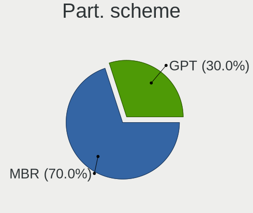

| Type | Desktops | Percent |
|------|----------|---------|
| MBR  | 36       | 70.59%  |
| GPT  | 15       | 29.41%  |

Board
-----

Vendor
------

Motherboard manufacturer

| Name                | Desktops | Percent |
|---------------------|----------|---------|
| ASUSTek Computer    | 12       | 23.53%  |
| Unknown             | 6        | 11.76%  |
| MSI                 | 5        | 9.8%    |
| Lenovo              | 4        | 7.84%   |
| Gigabyte Technology | 4        | 7.84%   |
| Dell                | 3        | 5.88%   |
| Intel               | 2        | 3.92%   |
| Hewlett-Packard     | 2        | 3.92%   |
| Biostar             | 2        | 3.92%   |
| ASRock              | 2        | 3.92%   |
| Sony                | 1        | 1.96%   |
| Soekris Engineering | 1        | 1.96%   |
| PC Engines          | 1        | 1.96%   |
| KOHJINSHA           | 1        | 1.96%   |
| Fujitsu             | 1        | 1.96%   |
| CncTion             | 1        | 1.96%   |
| Clevo               | 1        | 1.96%   |
| Apple               | 1        | 1.96%   |
| Acer                | 1        | 1.96%   |

Model
-----

Motherboard model

| Name                               | Desktops | Percent |
|------------------------------------|----------|---------|
| Unknown                            | 6        | 11.76%  |
| ASUS PRIME H410M-A                 | 2        | 3.92%   |
| Sony VPCL22Z1R                     | 1        | 1.96%   |
| Soekris Engineering net6501        | 1        | 1.96%   |
| PC Engines APU2                    | 1        | 1.96%   |
| MSI MS-7C82                        | 1        | 1.96%   |
| MSI MS-7C37                        | 1        | 1.96%   |
| MSI MS-7C02                        | 1        | 1.96%   |
| MSI MS-7922                        | 1        | 1.96%   |
| MSI MS-6788                        | 1        | 1.96%   |
| Lenovo ThinkPad X240 20ALA0AHRT    | 1        | 1.96%   |
| Lenovo ThinkPad T60 2613CTO        | 1        | 1.96%   |
| Lenovo ThinkPad T530 24292VG       | 1        | 1.96%   |
| Lenovo ThinkCentre M93p 10AAS25M00 | 1        | 1.96%   |
| KOHJINSHA SH series                | 1        | 1.96%   |
| Intel Q3XXG4-P                     | 1        | 1.96%   |
| Intel DH67BL                       | 1        | 1.96%   |
| HP Compaq nw8440 (RND39ET)         | 1        | 1.96%   |
| HP 260 G3 DM                       | 1        | 1.96%   |
| Gigabyte H87-HD3                   | 1        | 1.96%   |
| Gigabyte H81M-S2PV                 | 1        | 1.96%   |
| Gigabyte H81M-S1                   | 1        | 1.96%   |
| Gigabyte G41MT-S2                  | 1        | 1.96%   |
| Fujitsu PRIMERGY RX200 S6          | 1        | 1.96%   |
| Dell OptiPlex 580                  | 1        | 1.96%   |
| Dell OptiPlex 3040                 | 1        | 1.96%   |
| Dell G5 5090                       | 1        | 1.96%   |
| CncTion N5105-4L                   | 1        | 1.96%   |
| Clevo R130T                        | 1        | 1.96%   |
| Biostar TA880GU3+                  | 1        | 1.96%   |
| Biostar G31-M7 TE                  | 1        | 1.96%   |
| ASUS Z170-K                        | 1        | 1.96%   |
| ASUS TUF Gaming B550-PLUS          | 1        | 1.96%   |
| ASUS PRIME X470-PRO                | 1        | 1.96%   |
| ASUS PRIME H410M-E                 | 1        | 1.96%   |
| ASUS PRIME B550M-K                 | 1        | 1.96%   |
| ASUS PRIME B460M-A                 | 1        | 1.96%   |
| ASUS P10S-I Series                 | 1        | 1.96%   |
| ASUS M4A88TD-V EVO/USB3            | 1        | 1.96%   |
| ASUS M4A785TD-M EVO                | 1        | 1.96%   |

Model Family
------------

Motherboard model prefix

| Name                        | Desktops | Percent |
|-----------------------------|----------|---------|
| ASUS PRIME                  | 6        | 11.76%  |
| Unknown                     | 6        | 11.76%  |
| Lenovo ThinkPad             | 3        | 5.88%   |
| Dell OptiPlex               | 2        | 3.92%   |
| Sony VPCL22Z1R              | 1        | 1.96%   |
| Soekris Engineering net6501 | 1        | 1.96%   |
| PC Engines APU2             | 1        | 1.96%   |
| MSI MS-7C82                 | 1        | 1.96%   |
| MSI MS-7C37                 | 1        | 1.96%   |
| MSI MS-7C02                 | 1        | 1.96%   |
| MSI MS-7922                 | 1        | 1.96%   |
| MSI MS-6788                 | 1        | 1.96%   |
| Lenovo ThinkCentre          | 1        | 1.96%   |
| KOHJINSHA SH                | 1        | 1.96%   |
| Intel Q3XXG4-P              | 1        | 1.96%   |
| Intel DH67BL                | 1        | 1.96%   |
| HP Compaq                   | 1        | 1.96%   |
| HP 260                      | 1        | 1.96%   |
| Gigabyte H87-HD3            | 1        | 1.96%   |
| Gigabyte H81M-S2PV          | 1        | 1.96%   |
| Gigabyte H81M-S1            | 1        | 1.96%   |
| Gigabyte G41MT-S2           | 1        | 1.96%   |
| Fujitsu PRIMERGY            | 1        | 1.96%   |
| Dell G5                     | 1        | 1.96%   |
| CncTion N5105-4L            | 1        | 1.96%   |
| Clevo R130T                 | 1        | 1.96%   |
| Biostar TA880GU3+           | 1        | 1.96%   |
| Biostar G31-M7              | 1        | 1.96%   |
| ASUS Z170-K                 | 1        | 1.96%   |
| ASUS TUF                    | 1        | 1.96%   |
| ASUS P10S-I                 | 1        | 1.96%   |
| ASUS M4A88TD-V              | 1        | 1.96%   |
| ASUS M4A785TD-M             | 1        | 1.96%   |
| ASUS All                    | 1        | 1.96%   |
| ASRock Q1900M               | 1        | 1.96%   |
| ASRock A320M-DVS            | 1        | 1.96%   |
| Apple MacPro4               | 1        | 1.96%   |
| Acer Aspire                 | 1        | 1.96%   |

MFG Year
--------

Motherboard manufacture year

| Year    | Desktops | Percent |
|---------|----------|---------|
| Unknown | 8        | 15.69%  |
| 2022    | 5        | 9.8%    |
| 2021    | 5        | 9.8%    |
| 2018    | 5        | 9.8%    |
| 2010    | 5        | 9.8%    |
| 2020    | 4        | 7.84%   |
| 2014    | 4        | 7.84%   |
| 2019    | 3        | 5.88%   |
| 2016    | 2        | 3.92%   |
| 2015    | 2        | 3.92%   |
| 2011    | 2        | 3.92%   |
| 2009    | 2        | 3.92%   |
| 2007    | 2        | 3.92%   |
| 2013    | 1        | 1.96%   |
| 2012    | 1        | 1.96%   |

Form Factor
-----------

Physical design of the computer

| Name    | Desktops | Percent |
|---------|----------|---------|
| Desktop | 51       | 100%    |

Coreboot
--------

Have coreboot on board

| Used | Desktops | Percent |
|------|----------|---------|
| No   | 49       | 96.08%  |
| Yes  | 2        | 3.92%   |

RAM Size
--------

Total RAM memory

| Size in GB  | Desktops | Percent |
|-------------|----------|---------|
| 8.01-16.0   | 16       | 31.37%  |
| 16.01-24.0  | 11       | 21.57%  |
| 4.01-8.0    | 8        | 15.69%  |
| 3.01-4.0    | 4        | 7.84%   |
| 1.01-2.0    | 4        | 7.84%   |
| 0.51-1.0    | 3        | 5.88%   |
| 2.01-3.0    | 2        | 3.92%   |
| 64.01-256.0 | 2        | 3.92%   |
| 24.01-32.0  | 1        | 1.96%   |

RAM Used
--------

Used RAM memory

| Used GB  | Desktops | Percent |
|----------|----------|---------|
| 0.01-0.5 | 45       | 88.24%  |
| 0        | 3        | 5.88%   |
| 4.01-8.0 | 1        | 1.96%   |
| 3.01-4.0 | 1        | 1.96%   |
| 0.51-1.0 | 1        | 1.96%   |

Total Drives
------------

Number of drives on board

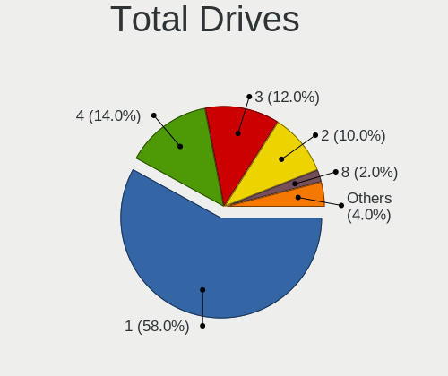

| Drives | Desktops | Percent |
|--------|----------|---------|
| 1      | 30       | 58.82%  |
| 4      | 7        | 13.73%  |
| 3      | 6        | 11.76%  |
| 2      | 5        | 9.8%    |
| 8      | 1        | 1.96%   |
| 6      | 1        | 1.96%   |
| 5      | 1        | 1.96%   |

Has CD-ROM
----------

Has CD-ROM on board

| Presented | Desktops | Percent |
|-----------|----------|---------|
| No        | 50       | 98.04%  |
| Yes       | 1        | 1.96%   |

Has Ethernet
------------

Has Ethernet on board

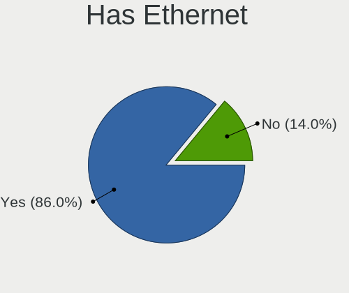

| Presented | Desktops | Percent |
|-----------|----------|---------|
| Yes       | 44       | 86.27%  |
| No        | 7        | 13.73%  |

Has WiFi
--------

Has WiFi module

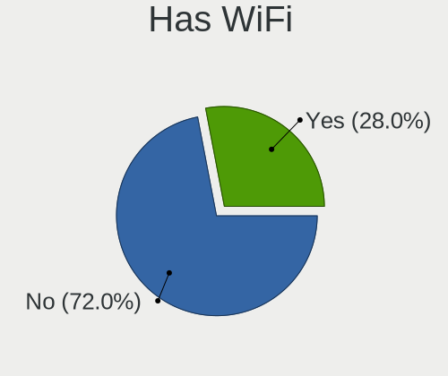

| Presented | Desktops | Percent |
|-----------|----------|---------|
| No        | 36       | 70.59%  |
| Yes       | 15       | 29.41%  |

Has Bluetooth
-------------

Has Bluetooth module

| Presented | Desktops | Percent |
|-----------|----------|---------|
| No        | 41       | 80.39%  |
| Yes       | 10       | 19.61%  |

Location
--------

Country
-------

Geographic location (country)

| Country     | Desktops | Percent |
|-------------|----------|---------|
| Russia      | 10       | 19.61%  |
| Italy       | 8        | 15.69%  |
| Netherlands | 4        | 7.84%   |
| Germany     | 4        | 7.84%   |
| France      | 4        | 7.84%   |
| USA         | 3        | 5.88%   |
| Canada      | 3        | 5.88%   |
| Spain       | 2        | 3.92%   |
| Poland      | 2        | 3.92%   |
| Austria     | 2        | 3.92%   |
| Ukraine     | 1        | 1.96%   |
| UK          | 1        | 1.96%   |
| Norway      | 1        | 1.96%   |
| Lithuania   | 1        | 1.96%   |
| India       | 1        | 1.96%   |
| Egypt       | 1        | 1.96%   |
| Czechia     | 1        | 1.96%   |
| Australia   | 1        | 1.96%   |
| Argentina   | 1        | 1.96%   |

City
----

Geographic location (city)

| City               | Desktops | Percent |
|--------------------|----------|---------|
| Poortugaal         | 4        | 7.84%   |
| Milan              | 4        | 7.84%   |
| Vladivostok        | 3        | 5.88%   |
| Vienna             | 2        | 3.92%   |
| Paris              | 2        | 3.92%   |
| Anglet             | 2        | 3.92%   |
| Wolverhampton      | 1        | 1.96%   |
| Tambov             | 1        | 1.96%   |
| Sydney             | 1        | 1.96%   |
| St. Albert         | 1        | 1.96%   |
| Sarnia             | 1        | 1.96%   |
| Rome               | 1        | 1.96%   |
| Reutov             | 1        | 1.96%   |
| Pozzuolo Martesana | 1        | 1.96%   |
| Paderborn          | 1        | 1.96%   |
| Ottawa             | 1        | 1.96%   |
| Oslo               | 1        | 1.96%   |
| Orenburg           | 1        | 1.96%   |
| Odessa             | 1        | 1.96%   |
| Oakland            | 1        | 1.96%   |
| Nuremberg          | 1        | 1.96%   |
| Moscow             | 1        | 1.96%   |
| Memmingen          | 1        | 1.96%   |
| Ludwigsburg        | 1        | 1.96%   |
| Lodz               | 1        | 1.96%   |
| Krasnodar          | 1        | 1.96%   |
| Kolomna            | 1        | 1.96%   |
| Gianico            | 1        | 1.96%   |
| Gdansk             | 1        | 1.96%   |
| Gallarate          | 1        | 1.96%   |
| Delhi              | 1        | 1.96%   |
| Columbus           | 1        | 1.96%   |
| Cherepovets        | 1        | 1.96%   |
| Český Těšín   | 1        | 1.96%   |
| Cairo              | 1        | 1.96%   |
| Buenos Aires       | 1        | 1.96%   |
| Brooklyn           | 1        | 1.96%   |
| Bilbao             | 1        | 1.96%   |
| Barcelona          | 1        | 1.96%   |
| Alytus             | 1        | 1.96%   |

Drives
------

Drive Vendor
------------

Hard drive vendors

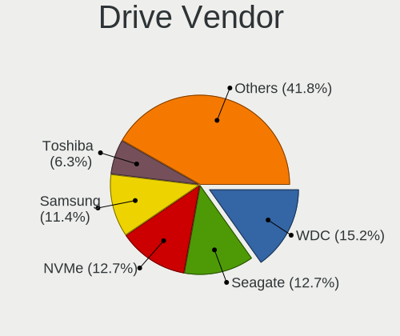

| Vendor              | Desktops | Drives | Percent |
|---------------------|----------|--------|---------|
| WDC                 | 12       | 14     | 15%     |
| Seagate             | 10       | 14     | 12.5%   |
| NVMe                | 10       | 12     | 12.5%   |
| Samsung Electronics | 9        | 14     | 11.25%  |
| Toshiba             | 5        | 9      | 6.25%   |
| OPENBSD             | 3        | 3      | 3.75%   |
| Kingston            | 3        | 3      | 3.75%   |
| Hitachi             | 3        | 4      | 3.75%   |
| Crucial             | 3        | 3      | 3.75%   |
| Corsair             | 3        | 3      | 3.75%   |
| OCZ                 | 2        | 2      | 2.5%    |
| Intel               | 2        | 2      | 2.5%    |
| HGST                | 2        | 2      | 2.5%    |
| XPG                 | 1        | 1      | 1.25%   |
| StoreJet            | 1        | 1      | 1.25%   |
| SPCC                | 1        | 1      | 1.25%   |
| SanDisk             | 1        | 1      | 1.25%   |
| PNY                 | 1        | 1      | 1.25%   |
| LSI                 | 1        | 1      | 1.25%   |
| KingSpec            | 1        | 1      | 1.25%   |
| Hoodisk             | 1        | 1      | 1.25%   |
| GOODRAM             | 1        | 1      | 1.25%   |
| Generic             | 1        | 1      | 1.25%   |
| Fujitsu             | 1        | 1      | 1.25%   |
| AMD                 | 1        | 1      | 1.25%   |
| A-DATA Technology   | 1        | 1      | 1.25%   |

Drive Model
-----------

Hard drive models

| Model                           | Desktops | Percent |
|---------------------------------|----------|---------|
| OPENBSD SR RAID 1 1TB           | 3        | 3.57%   |
| Toshiba HDWG440 4TB             | 2        | 2.38%   |
| Seagate ST1000DM010-2EP102 1TB  | 2        | 2.38%   |
| Samsung SSD 860 EVO 500GB       | 2        | 2.38%   |
| OCZ VERTEX3 120GB               | 2        | 2.38%   |
| NVMe Samsung SSD 980 2TB        | 2        | 2.38%   |
| XPG SX950U 240GB                | 1        | 1.19%   |
| WDC WD800JD-60LSA5 80GB         | 1        | 1.19%   |
| WDC WD6400AARS-00Y5B1 640GB     | 1        | 1.19%   |
| WDC WD6400AAKS-22A7B0 640GB     | 1        | 1.19%   |
| WDC WD5003AZEX-00K1GA0 500GB    | 1        | 1.19%   |
| WDC WD5003ABYX-01WERA2 500GB    | 1        | 1.19%   |
| WDC WD5000AZLX-00K2TA0 500GB    | 1        | 1.19%   |
| WDC WD5000AAKX-60U6AA0 500GB    | 1        | 1.19%   |
| WDC WD40EZAZ-19SF3B0 4TB        | 1        | 1.19%   |
| WDC WD40EFZX-68AWUN0 4TB        | 1        | 1.19%   |
| WDC WD20PURX-64P6ZY0 2TB        | 1        | 1.19%   |
| WDC WD10JPVT-75A1YT0 1TB        | 1        | 1.19%   |
| WDC WD10EZEX-00MFCA0 1TB        | 1        | 1.19%   |
| Toshiba MK5065GSX 500GB         | 1        | 1.19%   |
| Toshiba MG06ACA800E 8TB         | 1        | 1.19%   |
| Toshiba DT01ACA050 500GB        | 1        | 1.19%   |
| StoreJet Transcend 120GB        | 1        | 1.19%   |
| SPCC Solid State Disk 256GB     | 1        | 1.19%   |
| Seagate ST500DM002-1BD142 500GB | 1        | 1.19%   |
| Seagate ST380815AS 80GB         | 1        | 1.19%   |
| Seagate ST3750640NS 752GB       | 1        | 1.19%   |
| Seagate ST3250318AS 250GB       | 1        | 1.19%   |
| Seagate ST3250310AS 250GB       | 1        | 1.19%   |
| Seagate ST3160212SCE 160GB      | 1        | 1.19%   |
| Seagate ST250DM000-1BD141 250GB | 1        | 1.19%   |
| Seagate ST2000DM006-2DM164 2TB  | 1        | 1.19%   |
| Seagate ST1000VX000-1CU162 1TB  | 1        | 1.19%   |
| Seagate ST1000DM003-1CH162 1TB  | 1        | 1.19%   |
| Seagate Expansion 4TB           | 1        | 1.19%   |
| SanDisk Extreme Pro 128GB       | 1        | 1.19%   |
| Samsung SSD 870 QVO 2TB         | 1        | 1.19%   |
| Samsung SSD 860 EVO 250GB       | 1        | 1.19%   |
| Samsung Portable SSD T3 250GB   | 1        | 1.19%   |
| Samsung HM320II 320GB           | 1        | 1.19%   |

HDD Vendor
----------

Hard disk drive vendors

| Vendor              | Desktops | Drives | Percent |
|---------------------|----------|--------|---------|
| WDC                 | 12       | 14     | 25%     |
| Seagate             | 10       | 14     | 20.83%  |
| Toshiba             | 5        | 9      | 10.42%  |
| NVMe                | 5        | 6      | 10.42%  |
| Samsung Electronics | 4        | 4      | 8.33%   |
| OPENBSD             | 3        | 3      | 6.25%   |
| Hitachi             | 3        | 4      | 6.25%   |
| HGST                | 2        | 2      | 4.17%   |
| StoreJet            | 1        | 1      | 2.08%   |
| LSI                 | 1        | 1      | 2.08%   |
| Generic             | 1        | 1      | 2.08%   |
| Fujitsu             | 1        | 1      | 2.08%   |

SSD Vendor
----------

Solid state drive vendors

| Vendor              | Desktops | Drives | Percent |
|---------------------|----------|--------|---------|
| Samsung Electronics | 5        | 10     | 16.13%  |
| NVMe                | 4        | 5      | 12.9%   |
| Kingston            | 3        | 3      | 9.68%   |
| Crucial             | 3        | 3      | 9.68%   |
| Corsair             | 3        | 3      | 9.68%   |
| OCZ                 | 2        | 2      | 6.45%   |
| Intel               | 2        | 2      | 6.45%   |
| XPG                 | 1        | 1      | 3.23%   |
| SPCC                | 1        | 1      | 3.23%   |
| SanDisk             | 1        | 1      | 3.23%   |
| PNY                 | 1        | 1      | 3.23%   |
| KingSpec            | 1        | 1      | 3.23%   |
| Hoodisk             | 1        | 1      | 3.23%   |
| GOODRAM             | 1        | 1      | 3.23%   |
| AMD                 | 1        | 1      | 3.23%   |
| A-DATA Technology   | 1        | 1      | 3.23%   |

Drive Kind
----------

HDD or SSD

| Kind | Desktops | Drives | Percent |
|------|----------|--------|---------|
| HDD  | 30       | 60     | 53.57%  |
| SSD  | 25       | 37     | 44.64%  |
| NVMe | 1        | 1      | 1.79%   |

Drive Connector
---------------

SATA, SAS, NVMe, etc.

| Type | Desktops | Drives | Percent |
|------|----------|--------|---------|
| SATA | 48       | 97     | 97.96%  |
| NVMe | 1        | 1      | 2.04%   |

Drive Size
----------

Size of hard drive

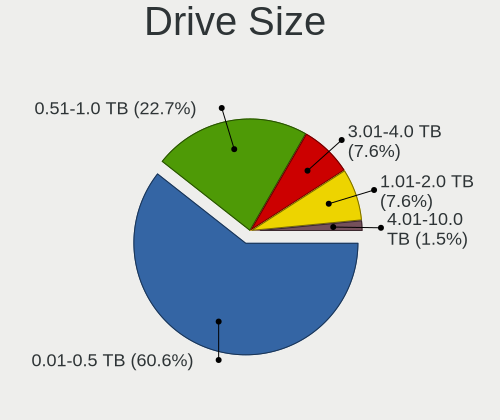

| Size in TB | Desktops | Drives | Percent |
|------------|----------|--------|---------|
| 0.01-0.5   | 39       | 51     | 59.09%  |
| 0.51-1.0   | 15       | 20     | 22.73%  |
| 1.01-2.0   | 6        | 14     | 9.09%   |
| 3.01-4.0   | 5        | 9      | 7.58%   |
| 4.01-10.0  | 1        | 3      | 1.52%   |

Space Total
-----------

Amount of disk space available on the file system

| Size in GB     | Desktops | Percent |
|----------------|----------|---------|
| 101-250        | 16       | 31.37%  |
| 251-500        | 14       | 27.45%  |
| 21-50          | 7        | 13.73%  |
| 501-1000       | 4        | 7.84%   |
| 51-100         | 4        | 7.84%   |
| More than 3000 | 3        | 5.88%   |
| 1-20           | 3        | 5.88%   |

Space Used
----------

Amount of used disk space

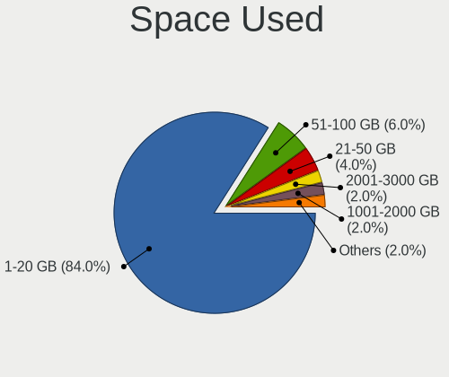

| Used GB   | Desktops | Percent |
|-----------|----------|---------|
| 1-20      | 43       | 84.31%  |
| 51-100    | 3        | 5.88%   |
| 21-50     | 2        | 3.92%   |
| 2001-3000 | 1        | 1.96%   |
| 101-250   | 1        | 1.96%   |
| 1001-2000 | 1        | 1.96%   |

Malfunc. Drives
---------------

Drive models with a malfunction

| Model                             | Desktops | Drives | Percent |
|-----------------------------------|----------|--------|---------|
| OCZ VERTEX3 120GB                 | 2        | 2      | 12.5%   |
| XPG SX950U 240GB                  | 1        | 1      | 6.25%   |
| WDC WD6400AAKS-22A7B0 640GB       | 1        | 1      | 6.25%   |
| WDC WD5000AAKX-60U6AA0 500GB      | 1        | 1      | 6.25%   |
| Toshiba MK5065GSX 500GB           | 1        | 1      | 6.25%   |
| Seagate ST500DM002-1BD142 500GB   | 1        | 1      | 6.25%   |
| Seagate ST380815AS 80GB           | 1        | 1      | 6.25%   |
| Seagate ST3750640NS 752GB         | 1        | 2      | 6.25%   |
| Seagate ST3160212SCE 160GB        | 1        | 1      | 6.25%   |
| Seagate ST250DM000-1BD141 250GB   | 1        | 1      | 6.25%   |
| Seagate ST2000DM006-2DM164 2TB    | 1        | 1      | 6.25%   |
| Samsung Electronics HD753LJ 752GB | 1        | 1      | 6.25%   |
| Samsung Electronics HD161HJ 160GB | 1        | 1      | 6.25%   |
| HGST HTS721010A9E630 1TB          | 1        | 1      | 6.25%   |
| Corsair Force LS SSD 120GB        | 1        | 1      | 6.25%   |

Malfunc. Drive Vendor
---------------------

Vendors of faulty drives

| Vendor              | Desktops | Drives | Percent |
|---------------------|----------|--------|---------|
| Seagate             | 5        | 7      | 33.33%  |
| WDC                 | 2        | 2      | 13.33%  |
| Samsung Electronics | 2        | 2      | 13.33%  |
| OCZ                 | 2        | 2      | 13.33%  |
| XPG                 | 1        | 1      | 6.67%   |
| Toshiba             | 1        | 1      | 6.67%   |
| HGST                | 1        | 1      | 6.67%   |
| Corsair             | 1        | 1      | 6.67%   |

Malfunc. HDD Vendor
-------------------

Vendors of faulty HDD drives

| Vendor              | Desktops | Drives | Percent |
|---------------------|----------|--------|---------|
| Seagate             | 5        | 7      | 45.45%  |
| WDC                 | 2        | 2      | 18.18%  |
| Samsung Electronics | 2        | 2      | 18.18%  |
| Toshiba             | 1        | 1      | 9.09%   |
| HGST                | 1        | 1      | 9.09%   |

Malfunc. Drive Kind
-------------------

Kinds of faulty drives

| Kind | Desktops | Drives | Percent |
|------|----------|--------|---------|
| HDD  | 11       | 13     | 73.33%  |
| SSD  | 4        | 4      | 26.67%  |

Failed Drives
-------------

Failed drive models

| Model                       | Desktops | Drives | Percent |
|-----------------------------|----------|--------|---------|
| WDC WD6400AARS-00Y5B1 640GB | 1        | 1      | 100%    |

Failed Drive Vendor
-------------------

Failed drive vendors

| Vendor | Desktops | Drives | Percent |
|--------|----------|--------|---------|
| WDC    | 1        | 1      | 100%    |

Drive Status
------------

Number of failed and malfunc. drives

| Status   | Desktops | Drives | Percent |
|----------|----------|--------|---------|
| Works    | 34       | 62     | 53.13%  |
| Detected | 15       | 18     | 23.44%  |
| Malfunc  | 14       | 17     | 21.88%  |
| Failed   | 1        | 1      | 1.56%   |

Storage controller
------------------

Storage Vendor
--------------

Storage controller vendors

| Vendor                       | Desktops | Percent |
|------------------------------|----------|---------|
| Intel                        | 33       | 55.93%  |
| AMD                          | 12       | 20.34%  |
| Samsung Electronics          | 3        | 5.08%   |
| SanDisk                      | 2        | 3.39%   |
| VIA Technologies             | 1        | 1.69%   |
| Toshiba                      | 1        | 1.69%   |
| Shenzhen Longsys Electronics | 1        | 1.69%   |
| Micron/Crucial Technology    | 1        | 1.69%   |
| Marvell Technology Group     | 1        | 1.69%   |
| KIOXIA                       | 1        | 1.69%   |
| Broadcom / LSI               | 1        | 1.69%   |
| ASMedia Technology           | 1        | 1.69%   |
| ADATA Technology             | 1        | 1.69%   |

Storage Model
-------------

Storage controller models

| Model                                                                          | Desktops | Percent |
|--------------------------------------------------------------------------------|----------|---------|
| Intel 8 Series/C220 Series Chipset Family 6-port SATA Controller 1 [AHCI mode] | 5        | 7.25%   |
| Intel 400 Series Chipset Family SATA AHCI Controller                           | 5        | 7.25%   |
| Intel 82801G (ICH7 Family) IDE Controller                                      | 4        | 5.8%    |
| AMD SB7x0/SB8x0/SB9x0 SATA Controller [AHCI mode]                              | 4        | 5.8%    |
| Intel Q170/Q150/B150/H170/H110/Z170/CM236 Chipset SATA Controller [AHCI Mode]  | 3        | 4.35%   |
| AMD SB7x0/SB8x0/SB9x0 IDE Controller                                           | 3        | 4.35%   |
| AMD FCH SATA Controller [AHCI mode]                                            | 3        | 4.35%   |
| Samsung NVMe SSD Controller PM9A1/PM9A3/980PRO                                 | 2        | 2.9%    |
| Intel NM10/ICH7 Family SATA Controller [IDE mode]                              | 2        | 2.9%    |
| Intel 82801GBM/GHM (ICH7-M Family) SATA Controller [AHCI mode]                 | 2        | 2.9%    |
| AMD 500 Series Chipset SATA Controller                                         | 2        | 2.9%    |
| AMD 400 Series Chipset SATA Controller                                         | 2        | 2.9%    |
| VIA VT6415 PATA IDE Host Controller                                            | 1        | 1.45%   |
| Toshiba BG3 NVMe SSD Controller                                                | 1        | 1.45%   |
| Shenzhen Longsys unknown                                                       | 1        | 1.45%   |
| SanDisk WD Black SN750 / PC SN730 NVMe SSD                                     | 1        | 1.45%   |
| SanDisk unknown                                                                | 1        | 1.45%   |
| SanDisk PC SN520 NVMe SSD                                                      | 1        | 1.45%   |
| Samsung NVMe SSD Controller SM981/PM981/PM983                                  | 1        | 1.45%   |
| Micron/Crucial P2 NVMe PCIe SSD                                                | 1        | 1.45%   |
| Marvell Group 88SE9215 PCIe 2.0 x1 4-port SATA 6 Gb/s Controller               | 1        | 1.45%   |
| KIOXIA NVMe SSD                                                                | 1        | 1.45%   |
| Intel Wildcat Point-LP SATA Controller [AHCI Mode]                             | 1        | 1.45%   |
| Intel Sunrise Point-LP SATA Controller [AHCI mode]                             | 1        | 1.45%   |
| Intel Platform Controller Hub EG20T SATA AHCI Controller                       | 1        | 1.45%   |
| Intel Jasper Lake SATA AHCI Controller                                         | 1        | 1.45%   |
| Intel Cannon Lake PCH SATA AHCI Controller                                     | 1        | 1.45%   |
| Intel Atom Processor E3800 Series SATA AHCI Controller                         | 1        | 1.45%   |
| Intel 9 Series Chipset Family SATA Controller [AHCI Mode]                      | 1        | 1.45%   |
| Intel 82801JI (ICH10 Family) SATA AHCI Controller                              | 1        | 1.45%   |
| Intel 82801JI (ICH10 Family) 4 port SATA IDE Controller #1                     | 1        | 1.45%   |
| Intel 82801JI (ICH10 Family) 2 port SATA IDE Controller #2                     | 1        | 1.45%   |
| Intel 82801IBM/IEM (ICH9M/ICH9M-E) 2 port SATA Controller [IDE mode]           | 1        | 1.45%   |
| Intel 82801GBM/GHM (ICH7-M Family) SATA Controller [IDE mode]                  | 1        | 1.45%   |
| Intel 82801EB (ICH5) SATA Controller                                           | 1        | 1.45%   |
| Intel 8 Series SATA Controller 1 [AHCI mode]                                   | 1        | 1.45%   |
| Intel 7 Series Chipset Family 6-port SATA Controller [AHCI mode]               | 1        | 1.45%   |
| Intel 6 Series/C200 Series Chipset Family 6 port Mobile SATA AHCI Controller   | 1        | 1.45%   |
| Intel 6 Series/C200 Series Chipset Family 6 port Desktop SATA AHCI Controller  | 1        | 1.45%   |
| Broadcom / LSI MegaRAID SAS 2008 [Falcon]                                      | 1        | 1.45%   |

Storage Kind
------------

Kind of storage controller (IDE, SATA, NVMe, SAS, ...)

| Kind | Desktops | Percent |
|------|----------|---------|
| SATA | 39       | 62.9%   |
| IDE  | 12       | 19.35%  |
| NVMe | 10       | 16.13%  |
| RAID | 1        | 1.61%   |

Processor
---------

CPU Vendor
----------

Processor vendors

| Vendor | Desktops | Percent |
|--------|----------|---------|
| Intel  | 33       | 64.71%  |
| AMD    | 12       | 23.53%  |
| ARM    | 6        | 11.76%  |

CPU Model
---------

Processor models

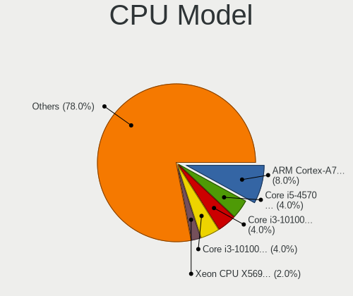

| Model                                                     | Desktops | Percent |
|-----------------------------------------------------------|----------|---------|
| ARM Cortex-A72 r0p3                                       | 4        | 7.84%   |
| Intel Core i5-4570 CPU @ 3.20GHz                          | 2        | 3.92%   |
| Intel Core i3-10100F CPU @ 3.60GHz                        | 2        | 3.92%   |
| Intel Core i3-10100 CPU @ 3.60GHz                         | 2        | 3.92%   |
| Intel Xeon CPU X5690 @ 3.47GHz                            | 1        | 1.96%   |
| Intel Xeon CPU E5520 @ 2.27GHz                            | 1        | 1.96%   |
| Intel Xeon CPU E3-1220 v5 @ 3.00GHz                       | 1        | 1.96%   |
| Intel Pentium Dual-Core CPU E5800 @ 3.20GHz               | 1        | 1.96%   |
| Intel Pentium 4 CPU 2.40GHz ("GenuineIntel" 686-class)    | 1        | 1.96%   |
| Intel Genuine processor 600MHz ("GenuineIntel" 686-class) | 1        | 1.96%   |
| Intel Genuine CPU @ 1.00GHz ("GenuineIntel" 686-class)    | 1        | 1.96%   |
| Intel Core i7-9700K CPU @ 3.60GHz                         | 1        | 1.96%   |
| Intel Core i7-6700 CPU @ 3.40GHz                          | 1        | 1.96%   |
| Intel Core i7-4790 CPU @ 3.60GHz                          | 1        | 1.96%   |
| Intel Core i7-3610QM CPU @ 2.30GHz                        | 1        | 1.96%   |
| Intel Core i7-2670QM CPU @ 2.20GHz                        | 1        | 1.96%   |
| Intel Core i5-6500T CPU @ 2.50GHz                         | 1        | 1.96%   |
| Intel Core i5-4690K CPU @ 3.50GHz                         | 1        | 1.96%   |
| Intel Core i5-4570T CPU @ 2.90GHz                         | 1        | 1.96%   |
| Intel Core i5-10400F CPU @ 2.90GHz                        | 1        | 1.96%   |
| Intel Core i3-7130U CPU @ 2.70GHz                         | 1        | 1.96%   |
| Intel Core i3-5010U CPU @ 2.10GHz                         | 1        | 1.96%   |
| Intel Core i3-4010U CPU @ 1.70GHz                         | 1        | 1.96%   |
| Intel Core i3-3225 CPU @ 3.30GHz                          | 1        | 1.96%   |
| Intel Core 2 Quad CPU Q9550 @ 2.83GHz                     | 1        | 1.96%   |
| Intel Core 2 Duo CPU U9400 @ 1.40GHz                      | 1        | 1.96%   |
| Intel Core 2 CPU T7400 @ 2.16GHz                          | 1        | 1.96%   |
| Intel Core 2 CPU T5600 @ 1.83GHz                          | 1        | 1.96%   |
| Intel Celeron N5105 @ 2.00GHz                             | 1        | 1.96%   |
| Intel Celeron CPU J1900 @ 1.99GHz                         | 1        | 1.96%   |
| Intel Celeron CPU G1820 @ 2.70GHz                         | 1        | 1.96%   |
| ARM Cortex-A7 r0p4                                        | 1        | 1.96%   |
| ARM Cortex-A53 r0p4                                       | 1        | 1.96%   |
| AMD Ryzen 9 5950X 16-Core Processor                       | 1        | 1.96%   |
| AMD Ryzen 7 5800X 8-Core Processor                        | 1        | 1.96%   |
| AMD Ryzen 5 5600X 6-Core Processor                        | 1        | 1.96%   |
| AMD Ryzen 5 3600 6-Core Processor                         | 1        | 1.96%   |
| AMD Ryzen 3 2200G with Radeon Vega Graphics               | 1        | 1.96%   |
| AMD Processor model unknown                               | 1        | 1.96%   |
| AMD Phenom II X4 965 Processor                            | 1        | 1.96%   |

CPU Model Family
----------------

Processor model prefix

| Model                   | Desktops | Percent |
|-------------------------|----------|---------|
| Intel Core i3           | 8        | 15.69%  |
| Intel Core i5           | 6        | 11.76%  |
| ARM Cortex              | 6        | 11.76%  |
| Intel Core i7           | 5        | 9.8%    |
| Intel Xeon              | 3        | 5.88%   |
| Intel Celeron           | 3        | 5.88%   |
| Intel Genuine           | 2        | 3.92%   |
| Intel Core 2            | 2        | 3.92%   |
| AMD Ryzen 5             | 2        | 3.92%   |
| Other                   | 1        | 1.96%   |
| Intel Pentium Dual-Core | 1        | 1.96%   |
| Intel Pentium 4         | 1        | 1.96%   |
| Intel Core 2 Quad       | 1        | 1.96%   |
| Intel Core 2 Duo        | 1        | 1.96%   |
| AMD Ryzen 9             | 1        | 1.96%   |
| AMD Ryzen 7             | 1        | 1.96%   |
| AMD Ryzen 3             | 1        | 1.96%   |
| AMD Phenom II X4        | 1        | 1.96%   |
| AMD GX                  | 1        | 1.96%   |
| AMD Athlon II X4        | 1        | 1.96%   |
| AMD Athlon II X2        | 1        | 1.96%   |
| AMD Athlon              | 1        | 1.96%   |
| AMD A4                  | 1        | 1.96%   |

CPU Cores
---------

Number of processor cores

| Number  | Desktops | Percent |
|---------|----------|---------|
| 4       | 21       | 41.18%  |
| Unknown | 14       | 27.45%  |
| 2       | 7        | 13.73%  |
| 1       | 3        | 5.88%   |
| 12      | 2        | 3.92%   |
| 8       | 2        | 3.92%   |
| 32      | 1        | 1.96%   |
| 6       | 1        | 1.96%   |

CPU Sockets
-----------

Number of sockets

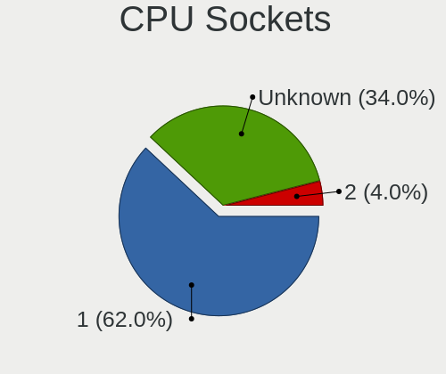

| Number  | Desktops | Percent |
|---------|----------|---------|
| 1       | 32       | 62.75%  |
| Unknown | 17       | 33.33%  |
| 2       | 2        | 3.92%   |

CPU Threads
-----------

Threads per core (Hyper-Threading)

| Number  | Desktops | Percent |
|---------|----------|---------|
| 1       | 19       | 37.25%  |
| Unknown | 17       | 33.33%  |
| 2       | 15       | 29.41%  |

CPU Microarch
-------------

Microarchitecture

| Name        | Desktops | Percent |
|-------------|----------|---------|
| Unknown     | 9        | 17.65%  |
| Haswell     | 7        | 13.73%  |
| K10         | 4        | 7.84%   |
| CometLake   | 4        | 7.84%   |
| Skylake     | 3        | 5.88%   |
| Penryn      | 3        | 5.88%   |
| Zen 3       | 2        | 3.92%   |
| KabyLake    | 2        | 3.92%   |
| IvyBridge   | 2        | 3.92%   |
| Core        | 2        | 3.92%   |
| Zen+        | 1        | 1.96%   |
| Zen 2       | 1        | 1.96%   |
| Zen         | 1        | 1.96%   |
| Westmere    | 1        | 1.96%   |
| Silvermont  | 1        | 1.96%   |
| SandyBridge | 1        | 1.96%   |
| Puma        | 1        | 1.96%   |
| P6          | 1        | 1.96%   |
| NetBurst    | 1        | 1.96%   |
| Nehalem     | 1        | 1.96%   |
| Jaguar      | 1        | 1.96%   |
| Broadwell   | 1        | 1.96%   |
| Bonnell     | 1        | 1.96%   |

Graphics
--------

GPU Vendor
----------

Vendors of graphics cards

| Vendor                     | Desktops | Percent |
|----------------------------|----------|---------|
| AMD                        | 21       | 47.73%  |
| Intel                      | 16       | 36.36%  |
| Nvidia                     | 5        | 11.36%  |
| Matrox Electronics Systems | 1        | 2.27%   |
| ASPEED Technology          | 1        | 2.27%   |

GPU Model
---------

Graphics card models

| Model                                                                         | Desktops | Percent |
|-------------------------------------------------------------------------------|----------|---------|
| Intel Xeon E3-1200 v3/4th Gen Core Processor Integrated Graphics Controller   | 4        | 8.89%   |
| AMD Caicos [Radeon HD 6450/7450/8450 / R5 230 OEM]                            | 3        | 6.67%   |
| Intel HD Graphics 530                                                         | 2        | 4.44%   |
| Intel CometLake-S GT2 [UHD Graphics 630]                                      | 2        | 4.44%   |
| AMD RS880 [Radeon HD 4200]                                                    | 2        | 4.44%   |
| AMD Navi 10 [Radeon RX 5600 OEM/5600 XT / 5700/5700 XT]                       | 2        | 4.44%   |
| AMD Cedar [Radeon HD 5000/6000/7350/8350 Series]                              | 2        | 4.44%   |
| Nvidia NV28 [GeForce4 Ti 4200 AGP 8x]                                         | 1        | 2.22%   |
| Nvidia GK208B [GeForce GT 710]                                                | 1        | 2.22%   |
| Nvidia GF108M [NVS 5400M]                                                     | 1        | 2.22%   |
| Nvidia GF108M [GeForce GT 540M]                                               | 1        | 2.22%   |
| Nvidia G96C [GeForce 9500 GT]                                                 | 1        | 2.22%   |
| Matrox Electronics Systems MGA G200e [Pilot] ServerEngines (SEP1)             | 1        | 2.22%   |
| Intel Mobile 945GM/GMS/GME, 943/940GML Express Integrated Graphics Controller | 1        | 2.22%   |
| Intel Mobile 945GM/GMS, 943/940GML Express Integrated Graphics Controller     | 1        | 2.22%   |
| Intel Mobile 4 Series Chipset Integrated Graphics Controller                  | 1        | 2.22%   |
| Intel JasperLake [UHD Graphics]                                               | 1        | 2.22%   |
| Intel IvyBridge GT2 [HD Graphics 4000]                                        | 1        | 2.22%   |
| Intel HD Graphics 620                                                         | 1        | 2.22%   |
| Intel HD Graphics 5500                                                        | 1        | 2.22%   |
| Intel Haswell-ULT Integrated Graphics Controller                              | 1        | 2.22%   |
| Intel Atom Processor Z36xxx/Z37xxx Series Graphics & Display                  | 1        | 2.22%   |
| ASPEED Technology ASPEED Graphics Family                                      | 1        | 2.22%   |
| AMD RV770 [Radeon HD 4850]                                                    | 1        | 2.22%   |
| AMD RV710/M92 [Mobility Radeon HD 4350/4550]                                  | 1        | 2.22%   |
| AMD RV530/M56-P [Mobility Radeon X1600]                                       | 1        | 2.22%   |
| AMD RV515/M54 [Mobility Radeon X1400]                                         | 1        | 2.22%   |
| AMD RS880 [Radeon HD 4250]                                                    | 1        | 2.22%   |
| AMD Raven Ridge [Radeon Vega Series / Radeon Vega Mobile Series]              | 1        | 2.22%   |
| AMD Picasso/Raven 2 [Radeon Vega Series / Radeon Vega Mobile Series]          | 1        | 2.22%   |
| AMD Navi 21 [Radeon RX 6800/6800 XT / 6900 XT]                                | 1        | 2.22%   |
| AMD Kabini [Radeon HD 8330]                                                   | 1        | 2.22%   |
| AMD Juniper XT [Radeon HD 6770]                                               | 1        | 2.22%   |
| AMD Ellesmere [Radeon RX 470/480/570/570X/580/580X/590]                       | 1        | 2.22%   |
| AMD Curacao PRO [Radeon R7 370 / R9 270/370 OEM]                              | 1        | 2.22%   |

GPU Combo
---------

Combinations of graphics cards

| Name        | Desktops | Percent |
|-------------|----------|---------|
| 1 x AMD     | 20       | 39.22%  |
| 1 x Intel   | 13       | 25.49%  |
| Other       | 8        | 15.69%  |
| 1 x Nvidia  | 5        | 9.8%    |
| 2 x Intel   | 2        | 3.92%   |
| 1 x Matrox  | 1        | 1.96%   |
| Intel + AMD | 1        | 1.96%   |
| 1 x ASPEED  | 1        | 1.96%   |

GPU Driver
----------

Free vs proprietary

| Driver  | Desktops | Percent |
|---------|----------|---------|
| Free    | 39       | 76.47%  |
| Unknown | 12       | 23.53%  |

GPU Memory
----------

Total video memory

| Size in GB | Desktops | Percent |
|------------|----------|---------|
| Unknown    | 51       | 100%    |

Monitor
-------

Monitor Vendor
--------------

Monitor vendors

| Vendor               | Desktops | Percent |
|----------------------|----------|---------|
| Philips              | 8        | 27.59%  |
| Samsung Electronics  | 3        | 10.34%  |
| Dell                 | 3        | 10.34%  |
| Acer                 | 3        | 10.34%  |
| MSI                  | 2        | 6.9%    |
| Lenovo               | 2        | 6.9%    |
| ViewSonic            | 1        | 3.45%   |
| InfoVision           | 1        | 3.45%   |
| Hewlett-Packard      | 1        | 3.45%   |
| Goldstar             | 1        | 3.45%   |
| BenQ                 | 1        | 3.45%   |
| Apple                | 1        | 3.45%   |
| AOC                  | 1        | 3.45%   |
| Ancor Communications | 1        | 3.45%   |

Monitor Model
-------------

Monitor models

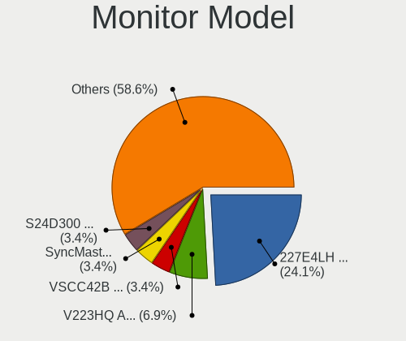

| Model                                                                  | Desktops | Percent |
|------------------------------------------------------------------------|----------|---------|
| Philips 227E4LH PHLC0AC 1920x1080 480x270mm 21.7-inch                  | 7        | 24.14%  |
| Acer V223HQ ACR0070 1920x1080 470x270mm 21.3-inch                      | 2        | 6.9%    |
| ViewSonic LCD Monitor VSCC42B 1920x1080 480x270mm 21.7-inch            | 1        | 3.45%   |
| Samsung Electronics SyncMaster SAM03CF 1280x1024 340x270mm 17.1-inch   | 1        | 3.45%   |
| Samsung Electronics S24D300 SAM0B43 1920x1080 530x300mm 24.0-inch      | 1        | 3.45%   |
| Samsung Electronics LCD Monitor SAM7004 3840x2160 1210x680mm 54.6-inch | 1        | 3.45%   |
| Philips PHL 243V7 PHLC155 1920x1080 530x300mm 24.0-inch                | 1        | 3.45%   |
| MSI MP242 MSI30A1 1920x1080 530x300mm 24.0-inch                        | 1        | 3.45%   |
| MSI MAG241C MSI3EA2 1920x1080 520x290mm 23.4-inch                      | 1        | 3.45%   |
| Lenovo LEN S24e-10 LEN61CA 1920x1080 530x300mm 24.0-inch               | 1        | 3.45%   |
| Lenovo LCD Monitor LEN4022 1400x1050 290x210mm 14.1-inch               | 1        | 3.45%   |
| InfoVision LCD Monitor IVO04E3 1366x768 280x160mm 12.7-inch            | 1        | 3.45%   |
| Hewlett-Packard x23LED HWP2912 1920x1080 510x290mm 23.1-inch           | 1        | 3.45%   |
| Goldstar L1752T GSM4434 1280x1024 340x270mm 17.1-inch                  | 1        | 3.45%   |
| Dell LCD Monitor DELF003 1440x900 410x260mm 19.1-inch                  | 1        | 3.45%   |
| Dell E1916H DELF064 1366x768 410x230mm 18.5-inch                       | 1        | 3.45%   |
| Dell 2001FP DELA007 1600x1200 410x310mm 20.2-inch                      | 1        | 3.45%   |
| BenQ G2255 BNQ78B7 1920x1080 480x270mm 21.7-inch                       | 1        | 3.45%   |
| Apple LCD Monitor APP9C73 1280x800 290x180mm 13.4-inch                 | 1        | 3.45%   |
| AOC 2269WM AOC2269 1920x1080 480x270mm 21.7-inch                       | 1        | 3.45%   |
| Ancor Communications ASUS VW199 ACI19ED 1440x900 410x260mm 19.1-inch   | 1        | 3.45%   |
| Acer XZ342CK ACR078B 3440x1440 800x330mm 34.1-inch                     | 1        | 3.45%   |

Monitor Resolution
------------------

Monitor screen resolution

| Resolution       | Desktops | Percent |
|------------------|----------|---------|
| 1920x1080 (FHD)  | 16       | 59.26%  |
| 1440x900 (WXGA+) | 2        | 7.41%   |
| 1366x768 (WXGA)  | 2        | 7.41%   |
| 1280x1024 (SXGA) | 2        | 7.41%   |
| 3840x2160 (4K)   | 1        | 3.7%    |
| 3440x1440        | 1        | 3.7%    |
| 1600x1200        | 1        | 3.7%    |
| 1400x1050        | 1        | 3.7%    |
| 1280x800 (WXGA)  | 1        | 3.7%    |

Monitor Diagonal
----------------

Diagonal size in inches

| Inches | Desktops | Percent |
|--------|----------|---------|
| 21     | 11       | 39.29%  |
| 24     | 4        | 14.29%  |
| 23     | 2        | 7.14%   |
| 19     | 2        | 7.14%   |
| 17     | 2        | 7.14%   |
| 54     | 1        | 3.57%   |
| 34     | 1        | 3.57%   |
| 20     | 1        | 3.57%   |
| 18     | 1        | 3.57%   |
| 14     | 1        | 3.57%   |
| 13     | 1        | 3.57%   |
| 12     | 1        | 3.57%   |

Monitor Width
-------------

Physical width

| Width in mm | Desktops | Percent |
|-------------|----------|---------|
| 401-500     | 15       | 53.57%  |
| 501-600     | 6        | 21.43%  |
| 201-300     | 3        | 10.71%  |
| 301-350     | 2        | 7.14%   |
| 701-800     | 1        | 3.57%   |
| 1001-1500   | 1        | 3.57%   |

Aspect Ratio
------------

Proportional relationship between the width and the height

| Ratio | Desktops | Percent |
|-------|----------|---------|
| 16/9  | 19       | 70.37%  |
| 16/10 | 3        | 11.11%  |
| 5/4   | 2        | 7.41%   |
| 4/3   | 2        | 7.41%   |
| 21/9  | 1        | 3.7%    |

Monitor Area
------------

Area in inch²

| Area in inch² | Desktops | Percent |
|----------------|----------|---------|
| 201-250        | 14       | 51.85%  |
| 151-200        | 5        | 18.52%  |
| 141-150        | 3        | 11.11%  |
| More than 1000 | 1        | 3.7%    |
| 81-90          | 1        | 3.7%    |
| 61-70          | 1        | 3.7%    |
| 351-500        | 1        | 3.7%    |
| 91-100         | 1        | 3.7%    |

Pixel Density
-------------

Pixels per inch

| Density | Desktops | Percent |
|---------|----------|---------|
| 101-120 | 13       | 48.15%  |
| 51-100  | 12       | 44.44%  |
| 121-160 | 2        | 7.41%   |

Multiple Monitors
-----------------

Total monitors connected

| Total | Desktops | Percent |
|-------|----------|---------|
| 1     | 28       | 54.9%   |
| 0     | 21       | 41.18%  |
| 3     | 1        | 1.96%   |
| 2     | 1        | 1.96%   |

Network
-------

Net Controller Vendor
---------------------

Controller vendors

| Vendor                            | Desktops | Percent |
|-----------------------------------|----------|---------|
| Realtek Semiconductor             | 29       | 50.88%  |
| Intel                             | 19       | 33.33%  |
| Qualcomm Atheros Communications   | 2        | 3.51%   |
| Qualcomm Atheros                  | 2        | 3.51%   |
| Broadcom                          | 2        | 3.51%   |
| Qcom                              | 1        | 1.75%   |
| Ericsson Business Mobile Networks | 1        | 1.75%   |
| AVM                               | 1        | 1.75%   |

Net Controller Model
--------------------

Controller models

| Model                                                                         | Desktops | Percent |
|-------------------------------------------------------------------------------|----------|---------|
| Realtek RTL8111/8168/8411 PCI Express Gigabit Ethernet Controller             | 23       | 33.82%  |
| Intel 82574L Gigabit Network Connection                                       | 4        | 5.88%   |
| Intel I210 Gigabit Network Connection                                         | 3        | 4.41%   |
| Realtek RTL8125 2.5GbE Controller                                             | 2        | 2.94%   |
| Realtek RTL810xE PCI Express Fast Ethernet controller                         | 2        | 2.94%   |
| Qualcomm Atheros AR9271 802.11n                                               | 2        | 2.94%   |
| Intel PRO/Wireless 3945ABG [Golan] Network Connection                         | 2        | 2.94%   |
| Intel I211 Gigabit Network Connection                                         | 2        | 2.94%   |
| Realtek RTL8192EE PCIe Wireless Network Adapter                               | 1        | 1.47%   |
| Realtek RTL8191SEvB Wireless LAN Controller                                   | 1        | 1.47%   |
| Realtek RTL-8100/8101L/8139 PCI Fast Ethernet Adapter                         | 1        | 1.47%   |
| Realtek Killer E2500 Gigabit Ethernet Controller                              | 1        | 1.47%   |
| Qualcomm Atheros AR9285 Wireless Network Adapter (PCI-Express)                | 1        | 1.47%   |
| Qualcomm Atheros AR8151 v1.0 Gigabit Ethernet                                 | 1        | 1.47%   |
| Qcom RT73 USB Wireless LAN Card                                               | 1        | 1.47%   |
| Intel Wireless 8260                                                           | 1        | 1.47%   |
| Intel Wireless 7260                                                           | 1        | 1.47%   |
| Intel Wi-Fi 6 AX210/AX211/AX411 160MHz                                        | 1        | 1.47%   |
| Intel Wi-Fi 6 AX200                                                           | 1        | 1.47%   |
| Intel Platform Controller Hub EG20T Gigabit Ethernet Controller               | 1        | 1.47%   |
| Intel Ethernet Controller I225-V                                              | 1        | 1.47%   |
| Intel Ethernet Connection I218-LM                                             | 1        | 1.47%   |
| Intel Ethernet Connection I217-LM                                             | 1        | 1.47%   |
| Intel Dual Band Wireless-AC 3168NGW [Stone Peak]                              | 1        | 1.47%   |
| Intel Centrino Advanced-N 6235                                                | 1        | 1.47%   |
| Intel Centrino Advanced-N 6205 [Taylor Peak]                                  | 1        | 1.47%   |
| Intel 82599ES 10-Gigabit SFI/SFP+ Network Connection                          | 1        | 1.47%   |
| Intel 82579V Gigabit Network Connection                                       | 1        | 1.47%   |
| Intel 82579LM Gigabit Network Connection (Lewisville)                         | 1        | 1.47%   |
| Intel 82575EB Gigabit Network Connection                                      | 1        | 1.47%   |
| Intel 82573L Gigabit Ethernet Controller                                      | 1        | 1.47%   |
| Intel 82571EB/82571GB Gigabit Ethernet Controller D0/D1 (copper applications) | 1        | 1.47%   |
| Ericsson Business Mobile Networks H5321 gw Mobile Broadband Module            | 1        | 1.47%   |
| Broadcom NetXtreme BCM5753M Gigabit Ethernet PCI Express                      | 1        | 1.47%   |
| Broadcom BCM4322 802.11a/b/g/n Wireless LAN Controller                        | 1        | 1.47%   |
| AVM A1 ISDN [Fritz]                                                           | 1        | 1.47%   |

Wireless Vendor
---------------

Wireless vendors

| Vendor                          | Desktops | Percent |
|---------------------------------|----------|---------|
| Intel                           | 8        | 53.33%  |
| Realtek Semiconductor           | 2        | 13.33%  |
| Qualcomm Atheros Communications | 2        | 13.33%  |
| Qualcomm Atheros                | 1        | 6.67%   |
| Qcom                            | 1        | 6.67%   |
| Broadcom                        | 1        | 6.67%   |

Wireless Model
--------------

Wireless models

| Model                                                          | Desktops | Percent |
|----------------------------------------------------------------|----------|---------|
| Qualcomm Atheros AR9271 802.11n                                | 2        | 13.33%  |
| Intel PRO/Wireless 3945ABG [Golan] Network Connection          | 2        | 13.33%  |
| Realtek RTL8192EE PCIe Wireless Network Adapter                | 1        | 6.67%   |
| Realtek RTL8191SEvB Wireless LAN Controller                    | 1        | 6.67%   |
| Qualcomm Atheros AR9285 Wireless Network Adapter (PCI-Express) | 1        | 6.67%   |
| Qcom RT73 USB Wireless LAN Card                                | 1        | 6.67%   |
| Intel Wireless 8260                                            | 1        | 6.67%   |
| Intel Wireless 7260                                            | 1        | 6.67%   |
| Intel Wi-Fi 6 AX210/AX211/AX411 160MHz                         | 1        | 6.67%   |
| Intel Wi-Fi 6 AX200                                            | 1        | 6.67%   |
| Intel Dual Band Wireless-AC 3168NGW [Stone Peak]               | 1        | 6.67%   |
| Intel Centrino Advanced-N 6205 [Taylor Peak]                   | 1        | 6.67%   |
| Broadcom BCM4322 802.11a/b/g/n Wireless LAN Controller         | 1        | 6.67%   |

Ethernet Vendor
---------------

Ethernet vendors

| Vendor                | Desktops | Percent |
|-----------------------|----------|---------|
| Realtek Semiconductor | 29       | 63.04%  |
| Intel                 | 15       | 32.61%  |
| Qualcomm Atheros      | 1        | 2.17%   |
| Broadcom              | 1        | 2.17%   |

Ethernet Model
--------------

Ethernet models

| Model                                                                         | Desktops | Percent |
|-------------------------------------------------------------------------------|----------|---------|
| Realtek RTL8111/8168/8411 PCI Express Gigabit Ethernet Controller             | 23       | 46%     |
| Intel 82574L Gigabit Network Connection                                       | 4        | 8%      |
| Intel I210 Gigabit Network Connection                                         | 3        | 6%      |
| Realtek RTL8125 2.5GbE Controller                                             | 2        | 4%      |
| Realtek RTL810xE PCI Express Fast Ethernet controller                         | 2        | 4%      |
| Intel I211 Gigabit Network Connection                                         | 2        | 4%      |
| Realtek RTL-8100/8101L/8139 PCI Fast Ethernet Adapter                         | 1        | 2%      |
| Realtek Killer E2500 Gigabit Ethernet Controller                              | 1        | 2%      |
| Qualcomm Atheros AR8151 v1.0 Gigabit Ethernet                                 | 1        | 2%      |
| Intel Platform Controller Hub EG20T Gigabit Ethernet Controller               | 1        | 2%      |
| Intel Ethernet Controller I225-V                                              | 1        | 2%      |
| Intel Ethernet Connection I218-LM                                             | 1        | 2%      |
| Intel Ethernet Connection I217-LM                                             | 1        | 2%      |
| Intel 82599ES 10-Gigabit SFI/SFP+ Network Connection                          | 1        | 2%      |
| Intel 82579V Gigabit Network Connection                                       | 1        | 2%      |
| Intel 82579LM Gigabit Network Connection (Lewisville)                         | 1        | 2%      |
| Intel 82575EB Gigabit Network Connection                                      | 1        | 2%      |
| Intel 82573L Gigabit Ethernet Controller                                      | 1        | 2%      |
| Intel 82571EB/82571GB Gigabit Ethernet Controller D0/D1 (copper applications) | 1        | 2%      |
| Broadcom NetXtreme BCM5753M Gigabit Ethernet PCI Express                      | 1        | 2%      |

Net Controller Kind
-------------------

Ethernet, WiFi or modem

| Kind     | Desktops | Percent |
|----------|----------|---------|
| Ethernet | 44       | 70.97%  |
| WiFi     | 15       | 24.19%  |
| Unknown  | 2        | 3.23%   |
| Modem    | 1        | 1.61%   |

Used Controller
---------------

Currently used network controller

| Kind     | Desktops | Percent |
|----------|----------|---------|
| Ethernet | 33       | 80.49%  |
| WiFi     | 8        | 19.51%  |

NICs
----

Total network controllers on board

| Total | Desktops | Percent |
|-------|----------|---------|
| 1     | 22       | 43.14%  |
| 2     | 13       | 25.49%  |
| 0     | 7        | 13.73%  |
| 3     | 5        | 9.8%    |
| 5     | 2        | 3.92%   |
| 4     | 2        | 3.92%   |

IPv6
----

IPv6 vs IPv4

| Used | Desktops | Percent |
|------|----------|---------|
| No   | 51       | 100%    |

Bluetooth
---------

Bluetooth Vendor
----------------

Controller vendors

| Vendor                  | Desktops | Percent |
|-------------------------|----------|---------|
| Intel                   | 5        | 50%     |
| Hewlett-Packard         | 1        | 10%     |
| Foxconn / Hon Hai       | 1        | 10%     |
| Cambridge Silicon Radio | 1        | 10%     |
| Broadcom                | 1        | 10%     |
| Apple                   | 1        | 10%     |

Bluetooth Model
---------------

Controller models

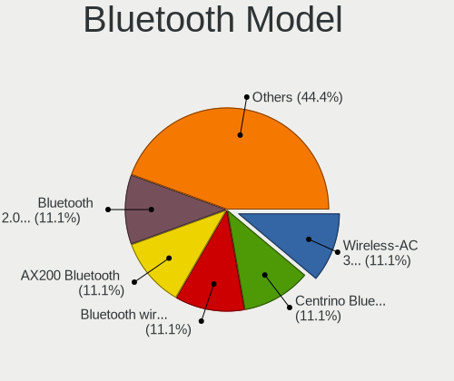

| Model                                                       | Desktops | Percent |
|-------------------------------------------------------------|----------|---------|
| Intel Bluetooth wireless interface                          | 2        | 20%     |
| Intel Wireless-AC 3168 Bluetooth                            | 1        | 10%     |
| Intel Centrino Bluetooth Wireless Transceiver               | 1        | 10%     |
| Intel AX200 Bluetooth                                       | 1        | 10%     |
| HP Bluetooth 2.0 Interface [Broadcom BCM2045]               | 1        | 10%     |
| Foxconn / Hon Hai Qualcomm Atheros AR3011 Bluetooth Adapter | 1        | 10%     |
| Cambridge Silicon Radio Bluetooth Dongle (HCI mode)         | 1        | 10%     |
| Broadcom BCM2045B (BDC-2) [Bluetooth Controller]            | 1        | 10%     |
| Apple Built-in Bluetooth 2.0+EDR HCI                        | 1        | 10%     |

Sound
-----

Sound Vendor
------------

Sound card vendors

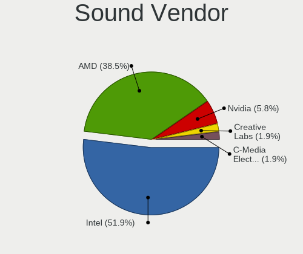

| Vendor              | Desktops | Percent |
|---------------------|----------|---------|
| Intel               | 28       | 52.83%  |
| AMD                 | 20       | 37.74%  |
| Nvidia              | 3        | 5.66%   |
| Creative Labs       | 1        | 1.89%   |
| C-Media Electronics | 1        | 1.89%   |

Sound Model
-----------

Sound card models

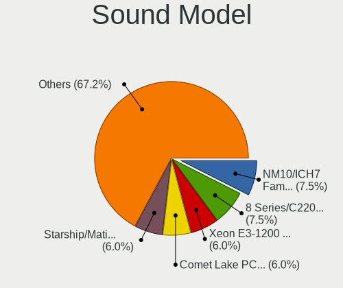

| Model                                                                             | Desktops | Percent |
|-----------------------------------------------------------------------------------|----------|---------|
| Intel NM10/ICH7 Family High Definition Audio Controller                           | 5        | 7.35%   |
| Intel 8 Series/C220 Series Chipset High Definition Audio Controller               | 5        | 7.35%   |
| Intel Xeon E3-1200 v3/4th Gen Core Processor HD Audio Controller                  | 4        | 5.88%   |
| Intel Comet Lake PCH-V cAVS                                                       | 4        | 5.88%   |
| AMD Starship/Matisse HD Audio Controller                                          | 4        | 5.88%   |
| AMD SBx00 Azalia (Intel HDA)                                                      | 4        | 5.88%   |
| AMD Caicos HDMI Audio [Radeon HD 6450 / 7450/8450/8490 OEM / R5 230/235/235X OEM] | 3        | 4.41%   |
| Nvidia GF108 High Definition Audio Controller                                     | 2        | 2.94%   |
| Intel 6 Series/C200 Series Chipset Family High Definition Audio Controller        | 2        | 2.94%   |
| Intel 100 Series/C230 Series Chipset Family HD Audio Controller                   | 2        | 2.94%   |
| AMD RS880 HDMI Audio [Radeon HD 4200 Series]                                      | 2        | 2.94%   |
| AMD Raven/Raven2/Fenghuang HDMI/DP Audio Controller                               | 2        | 2.94%   |
| AMD Navi 10 HDMI Audio                                                            | 2        | 2.94%   |
| AMD Family 17h/19h HD Audio Controller                                            | 2        | 2.94%   |
| AMD Cedar HDMI Audio [Radeon HD 5400/6300/7300 Series]                            | 2        | 2.94%   |
| Nvidia GK208 HDMI/DP Audio Controller                                             | 1        | 1.47%   |
| Intel Wildcat Point-LP High Definition Audio Controller                           | 1        | 1.47%   |
| Intel Sunrise Point-LP HD Audio                                                   | 1        | 1.47%   |
| Intel Jasper Lake HD Audio                                                        | 1        | 1.47%   |
| Intel Haswell-ULT HD Audio Controller                                             | 1        | 1.47%   |
| Intel Cannon Lake PCH cAVS                                                        | 1        | 1.47%   |
| Intel Broadwell-U Audio Controller                                                | 1        | 1.47%   |
| Intel Atom Processor Z36xxx/Z37xxx Series High Definition Audio Controller        | 1        | 1.47%   |
| Intel 9 Series Chipset Family HD Audio Controller                                 | 1        | 1.47%   |
| Intel 82801JI (ICH10 Family) HD Audio Controller                                  | 1        | 1.47%   |
| Intel 82801I (ICH9 Family) HD Audio Controller                                    | 1        | 1.47%   |
| Intel 8 Series HD Audio Controller                                                | 1        | 1.47%   |
| Intel 7 Series/C216 Chipset Family High Definition Audio Controller               | 1        | 1.47%   |
| Creative Labs EMU10k1 [Sound Blaster Live! Series]                                | 1        | 1.47%   |
| C-Media Electronics CMI8788 [Oxygen HD Audio]                                     | 1        | 1.47%   |
| AMD RV770 HDMI Audio [Radeon HD 4850/4870]                                        | 1        | 1.47%   |
| AMD RV710/730 HDMI Audio [Radeon HD 4000 series]                                  | 1        | 1.47%   |
| AMD Oland/Hainan/Cape Verde/Pitcairn HDMI Audio [Radeon HD 7000 Series]           | 1        | 1.47%   |
| AMD Navi 21/23 HDMI/DP Audio Controller                                           | 1        | 1.47%   |
| AMD Kabini HDMI/DP Audio                                                          | 1        | 1.47%   |
| AMD Juniper HDMI Audio [Radeon HD 5700 Series]                                    | 1        | 1.47%   |
| AMD FCH Azalia Controller                                                         | 1        | 1.47%   |
| AMD Ellesmere HDMI Audio [Radeon RX 470/480 / 570/580/590]                        | 1        | 1.47%   |

Memory
------

Memory Vendor
-------------

Memory module vendors

| Vendor   | Desktops | Percent |
|----------|----------|---------|
| Kingston | 1        | 50%     |
| Corsair  | 1        | 50%     |

Memory Model
------------

Memory module models

| Model                                                 | Desktops | Percent |
|-------------------------------------------------------|----------|---------|
| Kingston RAM KF3600C18D4/32GX 32GB DIMM DDR4 2400MT/s | 1        | 50%     |
| Corsair RAM CML16GX3M2A1600C9 8GB DIMM DDR3 1600MT/s  | 1        | 50%     |

Memory Kind
-----------

Memory module kinds

| Kind | Desktops | Percent |
|------|----------|---------|
| DDR4 | 1        | 50%     |
| DDR3 | 1        | 50%     |

Memory Form Factor
------------------

Physical design of the memory module

| Name | Desktops | Percent |
|------|----------|---------|
| DIMM | 2        | 100%    |

Memory Size
-----------

Memory module size

| Size  | Desktops | Percent |
|-------|----------|---------|
| 32768 | 1        | 50%     |
| 8192  | 1        | 50%     |

Memory Speed
------------

Memory module speed

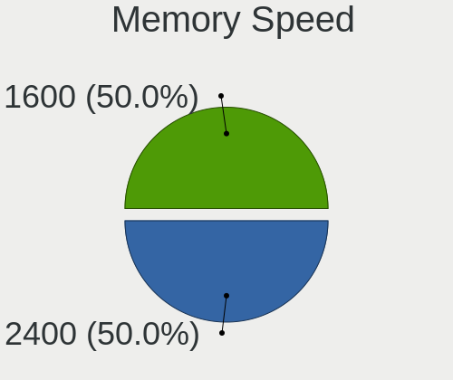

| Speed | Desktops | Percent |
|-------|----------|---------|
| 2400  | 1        | 50%     |
| 1600  | 1        | 50%     |

Printers & scanners
-------------------

Printer Vendor
--------------

Printer device vendors

Zero info for selected period =(

Printer Model
-------------

Printer device models

Zero info for selected period =(

Scanner Vendor
--------------

Scanner device vendors

Zero info for selected period =(

Scanner Model
-------------

Scanner device models

Zero info for selected period =(

Camera
------

Camera Vendor
-------------

Camera device vendors

| Vendor              | Desktops | Percent |
|---------------------|----------|---------|
| Ricoh               | 1        | 50%     |
| Chicony Electronics | 1        | 50%     |

Camera Model
------------

Camera device models

| Model                                | Desktops | Percent |
|--------------------------------------|----------|---------|
| Ricoh USB2.0 Camera                  | 1        | 50%     |
| Chicony Integrated Camera [ThinkPad] | 1        | 50%     |

Security
--------

Fingerprint Vendor
------------------

Fingerprint sensor vendors

| Vendor             | Desktops | Percent |
|--------------------|----------|---------|
| Validity Sensors   | 1        | 25%     |
| Upek               | 1        | 25%     |
| STMicroelectronics | 1        | 25%     |
| AuthenTec          | 1        | 25%     |

Fingerprint Model
-----------------

Fingerprint sensor models

| Model                                                  | Desktops | Percent |
|--------------------------------------------------------|----------|---------|
| Validity Sensors VFS 5011 fingerprint sensor           | 1        | 25%     |
| Upek Biometric Touchchip/Touchstrip Fingerprint Sensor | 1        | 25%     |
| STMicroelectronics Fingerprint Reader                  | 1        | 25%     |
| AuthenTec AES2501 Fingerprint Sensor                   | 1        | 25%     |

Chipcard Vendor
---------------

Chipcard module vendors

Zero info for selected period =(

Chipcard Model
--------------

Chipcard module models

Zero info for selected period =(

Unsupported
-----------

Unsupported Devices
-------------------

Total unsupported devices on board

| Total | Desktops | Percent |
|-------|----------|---------|
| 1     | 23       | 45.1%   |
| 0     | 18       | 35.29%  |
| 2     | 7        | 13.73%  |
| 3     | 3        | 5.88%   |

Unsupported Device Types
------------------------

Types of unsupported devices

| Type                     | Desktops | Percent |
|--------------------------|----------|---------|
| Communication controller | 23       | 51.11%  |
| Graphics card            | 6        | 13.33%  |
| Firewire controller      | 6        | 13.33%  |
| Net/wireless             | 4        | 8.89%   |
| Storage                  | 2        | 4.44%   |
| Storage/ide              | 1        | 2.22%   |
| Sound                    | 1        | 2.22%   |
| Network                  | 1        | 2.22%   |
| Net/ethernet             | 1        | 2.22%   |

