OpenBSD 7.1 - Tested Hardware & Statistics (Desktops)
-----------------------------------------------------

A project to collect tested hardware configurations for OpenBSD 7.1.

Anyone can contribute to this report by the [hw-probe](https://github.com/linuxhw/hw-probe/blob/master/INSTALL.BSD.md) tool:

    hw-probe -all -upload

Please contribute! Especially if your hardware is rare.

Contents
--------

* [ Test Cases ](#test-cases)

* [ System ](#system)
  - [ Arch                     ](#arch)
  - [ DE                       ](#de)
  - [ Display Server           ](#display-server)
  - [ Display Manager          ](#display-manager)
  - [ OS Lang                  ](#os-lang)
  - [ Boot Mode                ](#boot-mode)
  - [ Filesystem               ](#filesystem)
  - [ Part. scheme             ](#part-scheme)

* [ Board ](#board)
  - [ Vendor                   ](#vendor)
  - [ Model                    ](#model)
  - [ Model Family             ](#model-family)
  - [ MFG Year                 ](#mfg-year)
  - [ Form Factor              ](#form-factor)
  - [ Coreboot                 ](#coreboot)
  - [ RAM Size                 ](#ram-size)
  - [ RAM Used                 ](#ram-used)
  - [ Total Drives             ](#total-drives)
  - [ Has CD-ROM               ](#has-cd-rom)
  - [ Has Ethernet             ](#has-ethernet)
  - [ Has WiFi                 ](#has-wifi)
  - [ Has Bluetooth            ](#has-bluetooth)

* [ Location ](#location)
  - [ Country                  ](#country)
  - [ City                     ](#city)

* [ Drives ](#drives)
  - [ Drive Vendor             ](#drive-vendor)
  - [ Drive Model              ](#drive-model)
  - [ HDD Vendor               ](#hdd-vendor)
  - [ SSD Vendor               ](#ssd-vendor)
  - [ Drive Kind               ](#drive-kind)
  - [ Drive Connector          ](#drive-connector)
  - [ Drive Size               ](#drive-size)
  - [ Space Total              ](#space-total)
  - [ Space Used               ](#space-used)
  - [ Malfunc. Drives          ](#malfunc-drives)
  - [ Malfunc. Drive Vendor    ](#malfunc-drive-vendor)
  - [ Malfunc. HDD Vendor      ](#malfunc-hdd-vendor)
  - [ Malfunc. Drive Kind      ](#malfunc-drive-kind)
  - [ Failed Drives            ](#failed-drives)
  - [ Failed Drive Vendor      ](#failed-drive-vendor)
  - [ Drive Status             ](#drive-status)

* [ Storage controller ](#storage-controller)
  - [ Storage Vendor           ](#storage-vendor)
  - [ Storage Model            ](#storage-model)
  - [ Storage Kind             ](#storage-kind)

* [ Processor ](#processor)
  - [ CPU Vendor               ](#cpu-vendor)
  - [ CPU Model                ](#cpu-model)
  - [ CPU Model Family         ](#cpu-model-family)
  - [ CPU Cores                ](#cpu-cores)
  - [ CPU Sockets              ](#cpu-sockets)
  - [ CPU Threads              ](#cpu-threads)
  - [ CPU Microarch            ](#cpu-microarch)

* [ Graphics ](#graphics)
  - [ GPU Vendor               ](#gpu-vendor)
  - [ GPU Model                ](#gpu-model)
  - [ GPU Combo                ](#gpu-combo)
  - [ GPU Driver               ](#gpu-driver)
  - [ GPU Memory               ](#gpu-memory)

* [ Monitor ](#monitor)
  - [ Monitor Vendor           ](#monitor-vendor)
  - [ Monitor Model            ](#monitor-model)
  - [ Monitor Resolution       ](#monitor-resolution)
  - [ Monitor Diagonal         ](#monitor-diagonal)
  - [ Monitor Width            ](#monitor-width)
  - [ Aspect Ratio             ](#aspect-ratio)
  - [ Monitor Area             ](#monitor-area)
  - [ Pixel Density            ](#pixel-density)
  - [ Multiple Monitors        ](#multiple-monitors)

* [ Network ](#network)
  - [ Net Controller Vendor    ](#net-controller-vendor)
  - [ Net Controller Model     ](#net-controller-model)
  - [ Wireless Vendor          ](#wireless-vendor)
  - [ Wireless Model           ](#wireless-model)
  - [ Ethernet Vendor          ](#ethernet-vendor)
  - [ Ethernet Model           ](#ethernet-model)
  - [ Net Controller Kind      ](#net-controller-kind)
  - [ Used Controller          ](#used-controller)
  - [ NICs                     ](#nics)
  - [ IPv6                     ](#ipv6)

* [ Bluetooth ](#bluetooth)
  - [ Bluetooth Vendor         ](#bluetooth-vendor)
  - [ Bluetooth Model          ](#bluetooth-model)

* [ Sound ](#sound)
  - [ Sound Vendor             ](#sound-vendor)
  - [ Sound Model              ](#sound-model)

* [ Memory ](#memory)
  - [ Memory Vendor            ](#memory-vendor)
  - [ Memory Model             ](#memory-model)
  - [ Memory Kind              ](#memory-kind)
  - [ Memory Form Factor       ](#memory-form-factor)
  - [ Memory Size              ](#memory-size)
  - [ Memory Speed             ](#memory-speed)

* [ Printers & scanners ](#printers--scanners)
  - [ Printer Vendor           ](#printer-vendor)
  - [ Printer Model            ](#printer-model)
  - [ Scanner Vendor           ](#scanner-vendor)
  - [ Scanner Model            ](#scanner-model)

* [ Camera ](#camera)
  - [ Camera Vendor            ](#camera-vendor)
  - [ Camera Model             ](#camera-model)

* [ Security ](#security)
  - [ Fingerprint Vendor       ](#fingerprint-vendor)
  - [ Fingerprint Model        ](#fingerprint-model)
  - [ Chipcard Vendor          ](#chipcard-vendor)
  - [ Chipcard Model           ](#chipcard-model)

* [ Unsupported ](#unsupported)
  - [ Unsupported Devices      ](#unsupported-devices)
  - [ Unsupported Device Types ](#unsupported-device-types)

Test Cases
----------

Total: 26

| Vendor     | Model                       | Probe                                                     | Date         |
|------------|-----------------------------|-----------------------------------------------------------|--------------|
| MSI        | MS-6788                     | [f750cb83e3](https://bsd-hardware.info/?probe=f750cb83e3) | May 31, 2022 |
| Unknown    | Raspberry Pi 4 Model B R... | [ade09344b8](https://bsd-hardware.info/?probe=ade09344b8) | May 26, 2022 |
| Unknown    | Raspberry Pi 4 Model B R... | [cc37ea1b7d](https://bsd-hardware.info/?probe=cc37ea1b7d) | May 26, 2022 |
| Unknown    | Raspberry Pi 3 Model B P... | [21fa41e4c1](https://bsd-hardware.info/?probe=21fa41e4c1) | May 26, 2022 |
| Unknown    | Raspberry Pi 4 Model B R... | [abacee12a9](https://bsd-hardware.info/?probe=abacee12a9) | May 26, 2022 |
| Gigabyte   | H81M-S2PV                   | [1937e77b97](https://bsd-hardware.info/?probe=1937e77b97) | May 22, 2022 |
| Biostar    | G31-M7 TE                   | [5c7af4b143](https://bsd-hardware.info/?probe=5c7af4b143) | May 21, 2022 |
| ASUSTek    | PRIME B550M-K               | [ce5ddde5ad](https://bsd-hardware.info/?probe=ce5ddde5ad) | May 18, 2022 |
| MSI        | MS-7C82                     | [2ad883afec](https://bsd-hardware.info/?probe=2ad883afec) | May 15, 2022 |
| ASUSTek    | PRIME X470-PRO              | [9f6b4f114d](https://bsd-hardware.info/?probe=9f6b4f114d) | May 11, 2022 |
| Unknown    | Raspberry Pi 4 Model B R... | [154799d7fa](https://bsd-hardware.info/?probe=154799d7fa) | May 08, 2022 |
| Intel      | Q3XXG4-P                    | [ed04988a23](https://bsd-hardware.info/?probe=ed04988a23) | May 03, 2022 |
| MSI        | MS-7C37                     | [aaab7cf22a](https://bsd-hardware.info/?probe=aaab7cf22a) | Apr 28, 2022 |
| ASUSTek    | M4A88TD-V EVO/USB3          | [12cc40cc60](https://bsd-hardware.info/?probe=12cc40cc60) | Apr 23, 2022 |
| PC Engines | APU2                        | [04a6549c99](https://bsd-hardware.info/?probe=04a6549c99) | Apr 23, 2022 |
| Intel      | DH67BL                      | [3c3c9e12da](https://bsd-hardware.info/?probe=3c3c9e12da) | Apr 22, 2022 |
| KOHJINSHA  | SH series                   | [3136a0ca03](https://bsd-hardware.info/?probe=3136a0ca03) | Apr 22, 2022 |
| Lenovo     | ThinkPad X240 20ALA0AHRT    | [062a08c811](https://bsd-hardware.info/?probe=062a08c811) | Apr 22, 2022 |
| Sony       | VPCL22Z1R                   | [f199d57905](https://bsd-hardware.info/?probe=f199d57905) | Apr 22, 2022 |
| ASUSTek    | Z170-K                      | [b16705bbbd](https://bsd-hardware.info/?probe=b16705bbbd) | Apr 22, 2022 |
| ASUSTek    | P10S-I Series               | [aca13dba36](https://bsd-hardware.info/?probe=aca13dba36) | Apr 22, 2022 |
| Dell       | G5 5090                     | [8b24170852](https://bsd-hardware.info/?probe=8b24170852) | Apr 17, 2022 |
| Lenovo     | ThinkCentre M93p 10AAS25... | [32d27b9404](https://bsd-hardware.info/?probe=32d27b9404) | Mar 19, 2022 |
| Lenovo     | ThinkCentre M93p 10AAS25... | [7361628ed9](https://bsd-hardware.info/?probe=7361628ed9) | Mar 19, 2022 |
| Unknown    | LeMaker Banana Pi           | [37e7d1912b](https://bsd-hardware.info/?probe=37e7d1912b) | Mar 05, 2022 |
| Unknown    | Unknown                     | [62f4e0a060](https://bsd-hardware.info/?probe=62f4e0a060) | Feb 21, 2022 |

System
------

Arch
----

OS architecture (x86_64, i586, etc.)

| Name  | Desktops | Percent |
|-------|----------|---------|
| amd64 | 17       | 68%     |
| arm64 | 5        | 20%     |
| i386  | 2        | 8%      |
| armv7 | 1        | 4%      |

DE
--

Desktop Environment

| Name         | Desktops | Percent |
|--------------|----------|---------|
| helloDesktop | 20       | 80%     |
| XFCE         | 3        | 12%     |
| fvwm         | 1        | 4%      |
| Console      | 1        | 4%      |

Display Server
--------------

X11 or Wayland

| Name    | Desktops | Percent |
|---------|----------|---------|
| X11     | 13       | 52%     |
| Console | 12       | 48%     |

Display Manager
---------------

SDDM, LightDM, etc.

| Name    | Desktops | Percent |
|---------|----------|---------|
| Console | 25       | 100%    |

OS Lang
-------

Language

| Lang    | Desktops | Percent |
|---------|----------|---------|
| Unknown | 20       | 80%     |
| ru_RU   | 5        | 20%     |

Boot Mode
---------

EFI or BIOS

| Mode | Desktops | Percent |
|------|----------|---------|
| BIOS | 16       | 64%     |
| EFI  | 9        | 36%     |

Filesystem
----------

Type of filesystem

| Type | Desktops | Percent |
|------|----------|---------|
| Ffs  | 25       | 100%    |

Part. scheme
------------

Scheme of partitioning

| Type | Desktops | Percent |
|------|----------|---------|
| MBR  | 19       | 76%     |
| GPT  | 6        | 24%     |

Board
-----

Vendor
------

Motherboard manufacturer

| Name                | Desktops | Percent |
|---------------------|----------|---------|
| Unknown             | 7        | 28%     |
| ASUSTek Computer    | 5        | 20%     |
| MSI                 | 3        | 12%     |
| Lenovo              | 2        | 8%      |
| Intel               | 2        | 8%      |
| Sony                | 1        | 4%      |
| PC Engines          | 1        | 4%      |
| KOHJINSHA           | 1        | 4%      |
| Gigabyte Technology | 1        | 4%      |
| Dell                | 1        | 4%      |
| Biostar             | 1        | 4%      |

Model
-----

Motherboard model

| Name                               | Desktops | Percent |
|------------------------------------|----------|---------|
| Unknown                            | 7        | 28%     |
| Sony VPCL22Z1R                     | 1        | 4%      |
| PC Engines APU2                    | 1        | 4%      |
| MSI MS-7C82                        | 1        | 4%      |
| MSI MS-7C37                        | 1        | 4%      |
| MSI MS-6788                        | 1        | 4%      |
| Lenovo ThinkPad X240 20ALA0AHRT    | 1        | 4%      |
| Lenovo ThinkCentre M93p 10AAS25M00 | 1        | 4%      |
| KOHJINSHA SH series                | 1        | 4%      |
| Intel Q3XXG4-P                     | 1        | 4%      |
| Intel DH67BL                       | 1        | 4%      |
| Gigabyte H81M-S2PV                 | 1        | 4%      |
| Dell G5 5090                       | 1        | 4%      |
| Biostar G31-M7 TE                  | 1        | 4%      |
| ASUS Z170-K                        | 1        | 4%      |
| ASUS PRIME X470-PRO                | 1        | 4%      |
| ASUS PRIME B550M-K                 | 1        | 4%      |
| ASUS P10S-I Series                 | 1        | 4%      |
| ASUS M4A88TD-V EVO/USB3            | 1        | 4%      |

Model Family
------------

Motherboard model prefix

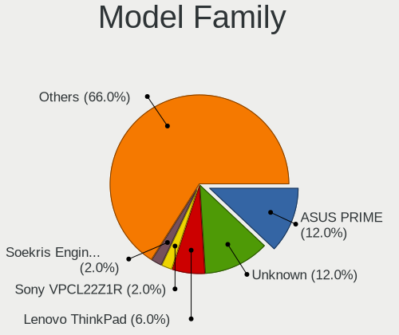

| Name               | Desktops | Percent |
|--------------------|----------|---------|
| Unknown            | 7        | 28%     |
| ASUS PRIME         | 2        | 8%      |
| Sony VPCL22Z1R     | 1        | 4%      |
| PC Engines APU2    | 1        | 4%      |
| MSI MS-7C82        | 1        | 4%      |
| MSI MS-7C37        | 1        | 4%      |
| MSI MS-6788        | 1        | 4%      |
| Lenovo ThinkPad    | 1        | 4%      |
| Lenovo ThinkCentre | 1        | 4%      |
| KOHJINSHA SH       | 1        | 4%      |
| Intel Q3XXG4-P     | 1        | 4%      |
| Intel DH67BL       | 1        | 4%      |
| Gigabyte H81M-S2PV | 1        | 4%      |
| Dell G5            | 1        | 4%      |
| Biostar G31-M7     | 1        | 4%      |
| ASUS Z170-K        | 1        | 4%      |
| ASUS P10S-I        | 1        | 4%      |
| ASUS M4A88TD-V     | 1        | 4%      |

MFG Year
--------

Motherboard manufacture year

| Year    | Desktops | Percent |
|---------|----------|---------|
| Unknown | 7        | 28%     |
| 2020    | 3        | 12%     |
| 2018    | 3        | 12%     |
| 2021    | 2        | 8%      |
| 2016    | 2        | 8%      |
| 2010    | 2        | 8%      |
| 2022    | 1        | 4%      |
| 2019    | 1        | 4%      |
| 2015    | 1        | 4%      |
| 2014    | 1        | 4%      |
| 2011    | 1        | 4%      |
| 2007    | 1        | 4%      |

Form Factor
-----------

Physical design of the computer

| Name    | Desktops | Percent |
|---------|----------|---------|
| Desktop | 25       | 100%    |

Coreboot
--------

Have coreboot on board

| Used | Desktops | Percent |
|------|----------|---------|
| No   | 24       | 96%     |
| Yes  | 1        | 4%      |

RAM Size
--------

Total RAM memory

| Size in GB | Desktops | Percent |
|------------|----------|---------|
| 8.01-16.0  | 8        | 32%     |
| 16.01-24.0 | 5        | 20%     |
| 4.01-8.0   | 4        | 16%     |
| 3.01-4.0   | 2        | 8%      |
| 2.01-3.0   | 2        | 8%      |
| 1.01-2.0   | 2        | 8%      |
| 0.51-1.0   | 2        | 8%      |

RAM Used
--------

Used RAM memory

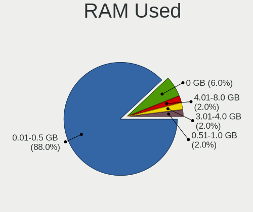

| Used GB  | Desktops | Percent |
|----------|----------|---------|
| 0.01-0.5 | 23       | 92%     |
| 0        | 2        | 8%      |

Total Drives
------------

Number of drives on board

| Drives | Desktops | Percent |
|--------|----------|---------|
| 1      | 18       | 72%     |
| 4      | 3        | 12%     |
| 3      | 2        | 8%      |
| 6      | 1        | 4%      |
| 2      | 1        | 4%      |

Has CD-ROM
----------

Has CD-ROM on board

| Presented | Desktops | Percent |
|-----------|----------|---------|
| No        | 25       | 100%    |

Has Ethernet
------------

Has Ethernet on board

| Presented | Desktops | Percent |
|-----------|----------|---------|
| Yes       | 19       | 76%     |
| No        | 6        | 24%     |

Has WiFi
--------

Has WiFi module

| Presented | Desktops | Percent |
|-----------|----------|---------|
| No        | 18       | 72%     |
| Yes       | 7        | 28%     |

Has Bluetooth
-------------

Has Bluetooth module

| Presented | Desktops | Percent |
|-----------|----------|---------|
| No        | 19       | 76%     |
| Yes       | 6        | 24%     |

Location
--------

Country
-------

Geographic location (country)

| Country     | Desktops | Percent |
|-------------|----------|---------|
| Russia      | 9        | 36%     |
| Netherlands | 4        | 16%     |
| USA         | 2        | 8%      |
| Italy       | 2        | 8%      |
| Poland      | 1        | 4%      |
| Norway      | 1        | 4%      |
| India       | 1        | 4%      |
| Germany     | 1        | 4%      |
| Czechia     | 1        | 4%      |
| Canada      | 1        | 4%      |
| Austria     | 1        | 4%      |
| Argentina   | 1        | 4%      |

City
----

Geographic location (city)

| City             | Desktops | Percent |
|------------------|----------|---------|
| Poortugaal       | 4        | 16%     |
| Vladivostok      | 3        | 12%     |
| Milan            | 2        | 8%      |
| Vienna           | 1        | 4%      |
| Tambov           | 1        | 4%      |
| St. Albert       | 1        | 4%      |
| Reutov           | 1        | 4%      |
| Ozersk           | 1        | 4%      |
| Oslo             | 1        | 4%      |
| Orenburg         | 1        | 4%      |
| Oakland          | 1        | 4%      |
| Moscow           | 1        | 4%      |
| Memmingen        | 1        | 4%      |
| Kolomna          | 1        | 4%      |
| Gdansk           | 1        | 4%      |
| Delhi            | 1        | 4%      |
| Columbus         | 1        | 4%      |
| Český Těšín | 1        | 4%      |
| Buenos Aires     | 1        | 4%      |

Drives
------

Drive Vendor
------------

Hard drive vendors

| Vendor              | Desktops | Drives | Percent |
|---------------------|----------|--------|---------|
| WDC                 | 6        | 7      | 17.14%  |
| Seagate             | 5        | 7      | 14.29%  |
| NVMe                | 5        | 7      | 14.29%  |
| Samsung Electronics | 3        | 3      | 8.57%   |
| OPENBSD             | 2        | 2      | 5.71%   |
| Hitachi             | 2        | 2      | 5.71%   |
| XPG                 | 1        | 1      | 2.86%   |
| Toshiba             | 1        | 1      | 2.86%   |
| StoreJet            | 1        | 1      | 2.86%   |
| SanDisk             | 1        | 1      | 2.86%   |
| OCZ                 | 1        | 1      | 2.86%   |
| Kingston            | 1        | 1      | 2.86%   |
| KingSpec            | 1        | 1      | 2.86%   |
| Intel               | 1        | 1      | 2.86%   |
| Hoodisk             | 1        | 1      | 2.86%   |
| HGST                | 1        | 1      | 2.86%   |
| Crucial             | 1        | 1      | 2.86%   |
| CORSAIR             | 1        | 1      | 2.86%   |

Drive Model
-----------

Hard drive models

| Model                           | Desktops | Percent |
|---------------------------------|----------|---------|
| OPENBSD SR RAID 1 752GB         | 2        | 5.41%   |
| XPG SX950U 240GB                | 1        | 2.7%    |
| WDC WD800JD-60LSA5 80GB         | 1        | 2.7%    |
| WDC WD6400AARS-00Y5B1 640GB     | 1        | 2.7%    |
| WDC WD5003AZEX-00K1GA0 500GB    | 1        | 2.7%    |
| WDC WD40EFZX-68AWUN0 4TB        | 1        | 2.7%    |
| WDC WD20PURX-64P6ZY0 2TB        | 1        | 2.7%    |
| WDC WD10EZEX-00MFCA0 1TB        | 1        | 2.7%    |
| Toshiba DT01ACA050 500GB        | 1        | 2.7%    |
| StoreJet Transcend 120GB        | 1        | 2.7%    |
| Seagate ST3750640NS 752GB       | 1        | 2.7%    |
| Seagate ST3250318AS 250GB       | 1        | 2.7%    |
| Seagate ST250DM000-1BD141 250GB | 1        | 2.7%    |
| Seagate ST2000DM006-2DM164 2TB  | 1        | 2.7%    |
| Seagate ST1000VX000-1CU162 1TB  | 1        | 2.7%    |
| Seagate ST1000DM010-2EP102 1TB  | 1        | 2.7%    |
| SanDisk Extreme Pro 128GB       | 1        | 2.7%    |
| Samsung SSD 860 EVO 250GB       | 1        | 2.7%    |
| Samsung Portable SSD T3 250GB   | 1        | 2.7%    |
| Samsung Flash Drive FIT 32GB    | 1        | 2.7%    |
| OCZ VERTEX3 120GB               | 1        | 2.7%    |
| NVMe WDS100T3X0C-00SJ 1TB       | 1        | 2.7%    |
| NVMe WDC WDS500G2B0C- 500GB     | 1        | 2.7%    |
| NVMe TOSHIBA-RC100 240GB        | 1        | 2.7%    |
| NVMe Samsung SSD 980 1TB        | 1        | 2.7%    |
| NVMe Samsung SSD 970 250GB      | 1        | 2.7%    |
| NVMe PC SN520 WD 256GB          | 1        | 2.7%    |
| Kingston SMS200S330G 32GB       | 1        | 2.7%    |
| KingSpec NT-512 512GB           | 1        | 2.7%    |
| Intel SSDSC2BF180A4L 180GB      | 1        | 2.7%    |
| Hoodisk SSD 32GB                | 1        | 2.7%    |
| Hitachi HUA723020ALA640 2TB     | 1        | 2.7%    |
| Hitachi HTS541612J9AT00 120GB   | 1        | 2.7%    |
| HGST HUS724020ALA640 2TB        | 1        | 2.7%    |
| Crucial CT2000MX500SSD1 2TB     | 1        | 2.7%    |
| CORSAIR FORCE LX SSD 256GB      | 1        | 2.7%    |

HDD Vendor
----------

Hard disk drive vendors

| Vendor              | Desktops | Drives | Percent |
|---------------------|----------|--------|---------|
| WDC                 | 6        | 7      | 28.57%  |
| Seagate             | 5        | 7      | 23.81%  |
| OPENBSD             | 2        | 2      | 9.52%   |
| NVMe                | 2        | 3      | 9.52%   |
| Hitachi             | 2        | 2      | 9.52%   |
| Toshiba             | 1        | 1      | 4.76%   |
| StoreJet            | 1        | 1      | 4.76%   |
| Samsung Electronics | 1        | 1      | 4.76%   |
| HGST                | 1        | 1      | 4.76%   |

SSD Vendor
----------

Solid state drive vendors

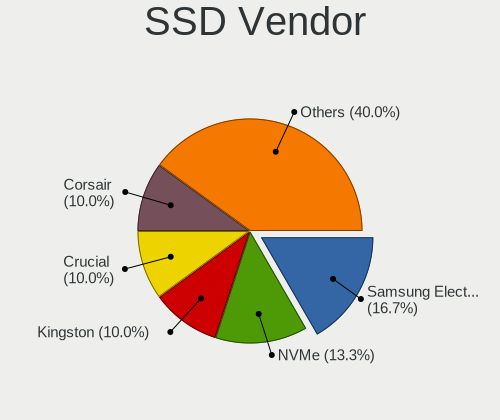

| Vendor              | Desktops | Drives | Percent |
|---------------------|----------|--------|---------|
| Samsung Electronics | 2        | 2      | 15.38%  |
| NVMe                | 2        | 3      | 15.38%  |
| XPG                 | 1        | 1      | 7.69%   |
| SanDisk             | 1        | 1      | 7.69%   |
| OCZ                 | 1        | 1      | 7.69%   |
| Kingston            | 1        | 1      | 7.69%   |
| KingSpec            | 1        | 1      | 7.69%   |
| Intel               | 1        | 1      | 7.69%   |
| Hoodisk             | 1        | 1      | 7.69%   |
| Crucial             | 1        | 1      | 7.69%   |
| CORSAIR             | 1        | 1      | 7.69%   |

Drive Kind
----------

HDD or SSD

| Kind | Desktops | Drives | Percent |
|------|----------|--------|---------|
| SSD  | 11       | 14     | 47.83%  |
| HDD  | 11       | 25     | 47.83%  |
| NVMe | 1        | 1      | 4.35%   |

Drive Connector
---------------

SATA, SAS, NVMe, etc.

| Type | Desktops | Drives | Percent |
|------|----------|--------|---------|
| SATA | 21       | 39     | 95.45%  |
| NVMe | 1        | 1      | 4.55%   |

Drive Size
----------

Size of hard drive

| Size in TB | Desktops | Drives | Percent |
|------------|----------|--------|---------|
| 0.01-0.5   | 15       | 21     | 53.57%  |
| 0.51-1.0   | 9        | 11     | 32.14%  |
| 1.01-2.0   | 3        | 5      | 10.71%  |
| 3.01-4.0   | 1        | 2      | 3.57%   |

Space Total
-----------

Amount of disk space available on the file system

| Size in GB     | Desktops | Percent |
|----------------|----------|---------|
| 101-250        | 8        | 32%     |
| 251-500        | 5        | 20%     |
| 21-50          | 5        | 20%     |
| 1-20           | 3        | 12%     |
| 51-100         | 3        | 12%     |
| More than 3000 | 1        | 4%      |

Space Used
----------

Amount of used disk space

| Used GB   | Desktops | Percent |
|-----------|----------|---------|
| 1-20      | 23       | 92%     |
| 21-50     | 1        | 4%      |
| 2001-3000 | 1        | 4%      |

Malfunc. Drives
---------------

Drive models with a malfunction

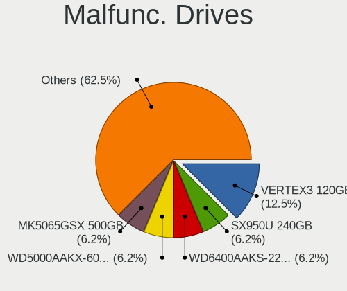

| Model                           | Desktops | Drives | Percent |
|---------------------------------|----------|--------|---------|
| XPG SX950U 240GB                | 1        | 1      | 20%     |
| Seagate ST3750640NS 752GB       | 1        | 2      | 20%     |
| Seagate ST250DM000-1BD141 250GB | 1        | 1      | 20%     |
| Seagate ST2000DM006-2DM164 2TB  | 1        | 1      | 20%     |
| OCZ VERTEX3 120GB               | 1        | 1      | 20%     |

Malfunc. Drive Vendor
---------------------

Vendors of faulty drives

| Vendor  | Desktops | Drives | Percent |
|---------|----------|--------|---------|
| Seagate | 3        | 4      | 60%     |
| XPG     | 1        | 1      | 20%     |
| OCZ     | 1        | 1      | 20%     |

Malfunc. HDD Vendor
-------------------

Vendors of faulty HDD drives

| Vendor  | Desktops | Drives | Percent |
|---------|----------|--------|---------|
| Seagate | 3        | 4      | 100%    |

Malfunc. Drive Kind
-------------------

Kinds of faulty drives

| Kind | Desktops | Drives | Percent |
|------|----------|--------|---------|
| HDD  | 3        | 4      | 60%     |
| SSD  | 2        | 2      | 40%     |

Failed Drives
-------------

Failed drive models

| Model                       | Desktops | Drives | Percent |
|-----------------------------|----------|--------|---------|
| WDC WD6400AARS-00Y5B1 640GB | 1        | 1      | 100%    |

Failed Drive Vendor
-------------------

Failed drive vendors

| Vendor | Desktops | Drives | Percent |
|--------|----------|--------|---------|
| WDC    | 1        | 1      | 100%    |

Drive Status
------------

Number of failed and malfunc. drives

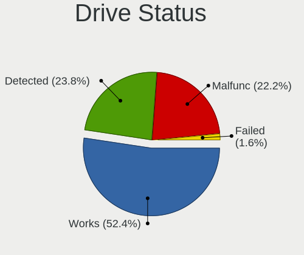

| Status   | Desktops | Drives | Percent |
|----------|----------|--------|---------|
| Works    | 17       | 23     | 58.62%  |
| Detected | 7        | 10     | 24.14%  |
| Malfunc  | 4        | 6      | 13.79%  |
| Failed   | 1        | 1      | 3.45%   |

Storage controller
------------------

Storage Vendor
--------------

Storage controller vendors

| Vendor                   | Desktops | Percent |
|--------------------------|----------|---------|
| Intel                    | 14       | 51.85%  |
| AMD                      | 5        | 18.52%  |
| Sandisk                  | 2        | 7.41%   |
| Samsung Electronics      | 2        | 7.41%   |
| VIA Technologies         | 1        | 3.7%    |
| Toshiba                  | 1        | 3.7%    |
| Marvell Technology Group | 1        | 3.7%    |
| ASMedia Technology       | 1        | 3.7%    |

Storage Model
-------------

Storage controller models

| Model                                                                          | Desktops | Percent |
|--------------------------------------------------------------------------------|----------|---------|
| Intel Q170/Q150/B150/H170/H110/Z170/CM236 Chipset SATA Controller [AHCI Mode]  | 2        | 6.67%   |
| Intel 82801G (ICH7 Family) IDE Controller                                      | 2        | 6.67%   |
| Intel 8 Series/C220 Series Chipset Family 6-port SATA Controller 1 [AHCI mode] | 2        | 6.67%   |
| AMD FCH SATA Controller [AHCI mode]                                            | 2        | 6.67%   |
| VIA VT6415 PATA IDE Host Controller                                            | 1        | 3.33%   |
| Toshiba BG3 NVMe SSD Controller                                                | 1        | 3.33%   |
| Sandisk WD Black SN750 / PC SN730 NVMe SSD                                     | 1        | 3.33%   |
| Sandisk unknown                                                                | 1        | 3.33%   |
| Sandisk PC SN520 NVMe SSD                                                      | 1        | 3.33%   |
| Samsung NVMe SSD Controller SM981/PM981/PM983                                  | 1        | 3.33%   |
| Samsung NVMe SSD Controller PM9A1/PM9A3/980PRO                                 | 1        | 3.33%   |
| Marvell Group 88SE9215 PCIe 2.0 x1 4-port SATA 6 Gb/s Controller               | 1        | 3.33%   |
| Intel Wildcat Point-LP SATA Controller [AHCI Mode]                             | 1        | 3.33%   |
| Intel NM10/ICH7 Family SATA Controller [IDE mode]                              | 1        | 3.33%   |
| Intel Jasper Lake SATA AHCI Controller                                         | 1        | 3.33%   |
| Intel Cannon Lake PCH SATA AHCI Controller                                     | 1        | 3.33%   |
| Intel 82801GBM/GHM (ICH7-M Family) SATA Controller [IDE mode]                  | 1        | 3.33%   |
| Intel 82801EB (ICH5) SATA Controller                                           | 1        | 3.33%   |
| Intel 8 Series SATA Controller 1 [AHCI mode]                                   | 1        | 3.33%   |
| Intel 6 Series/C200 Series Chipset Family 6 port Mobile SATA AHCI Controller   | 1        | 3.33%   |
| Intel 6 Series/C200 Series Chipset Family 6 port Desktop SATA AHCI Controller  | 1        | 3.33%   |
| Intel 400 Series Chipset Family SATA AHCI Controller                           | 1        | 3.33%   |
| ASMedia ASM1062 Serial ATA Controller                                          | 1        | 3.33%   |
| AMD SB7x0/SB8x0/SB9x0 SATA Controller [AHCI mode]                              | 1        | 3.33%   |
| AMD 500 Series Chipset SATA Controller                                         | 1        | 3.33%   |
| AMD 400 Series Chipset SATA Controller                                         | 1        | 3.33%   |

Storage Kind
------------

Kind of storage controller (IDE, SATA, NVMe, SAS, ...)

| Kind | Desktops | Percent |
|------|----------|---------|
| SATA | 16       | 64%     |
| NVMe | 5        | 20%     |
| IDE  | 4        | 16%     |

Processor
---------

CPU Vendor
----------

Processor vendors

| Vendor | Desktops | Percent |
|--------|----------|---------|
| Intel  | 14       | 56%     |
| ARM    | 6        | 24%     |
| AMD    | 5        | 20%     |

CPU Model
---------

Processor models

| Model                                                     | Desktops | Percent |
|-----------------------------------------------------------|----------|---------|
| ARM Cortex-A72 r0p3                                       | 4        | 16%     |
| Intel Xeon CPU E3-1220 v5 @ 3.00GHz                       | 1        | 4%      |
| Intel Pentium Silver N6000 @ 1.10GHz                      | 1        | 4%      |
| Intel Pentium Dual-Core CPU E5800 @ 3.20GHz               | 1        | 4%      |
| Intel Pentium 4 CPU 2.40GHz ("GenuineIntel" 686-class)    | 1        | 4%      |
| Intel Genuine processor 600MHz ("GenuineIntel" 686-class) | 1        | 4%      |
| Intel Core i7-9700K CPU @ 3.60GHz                         | 1        | 4%      |
| Intel Core i7-6700 CPU @ 3.40GHz                          | 1        | 4%      |
| Intel Core i7-2670QM CPU @ 2.20GHz                        | 1        | 4%      |
| Intel Core i5-4570T CPU @ 2.90GHz                         | 1        | 4%      |
| Intel Core i5-10400F CPU @ 2.90GHz                        | 1        | 4%      |
| Intel Core i3-5010U CPU @ 2.10GHz                         | 1        | 4%      |
| Intel Core i3-4010U CPU @ 1.70GHz                         | 1        | 4%      |
| Intel Core i3-3225 CPU @ 3.30GHz                          | 1        | 4%      |
| Intel Celeron CPU G1820 @ 2.70GHz                         | 1        | 4%      |
| ARM Cortex-A7 r0p4                                        | 1        | 4%      |
| ARM Cortex-A53 r0p4                                       | 1        | 4%      |
| AMD Ryzen 7 5800X 8-Core Processor                        | 1        | 4%      |
| AMD Ryzen 5 5600X 6-Core Processor                        | 1        | 4%      |
| AMD Ryzen 3 2200G with Radeon Vega Graphics               | 1        | 4%      |
| AMD GX-412TC SOC                                          | 1        | 4%      |
| AMD Athlon II X4 640 Processor                            | 1        | 4%      |

CPU Model Family
----------------

Processor model prefix

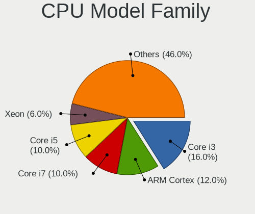

| Model                   | Desktops | Percent |
|-------------------------|----------|---------|
| ARM Cortex              | 6        | 24%     |
| Intel Core i7           | 3        | 12%     |
| Intel Core i3           | 3        | 12%     |
| Intel Core i5           | 2        | 8%      |
| Intel Xeon              | 1        | 4%      |
| Intel Pentium Silver    | 1        | 4%      |
| Intel Pentium Dual-Core | 1        | 4%      |
| Intel Pentium 4         | 1        | 4%      |
| Intel Genuine           | 1        | 4%      |
| Intel Celeron           | 1        | 4%      |
| AMD Ryzen 7             | 1        | 4%      |
| AMD Ryzen 5             | 1        | 4%      |
| AMD Ryzen 3             | 1        | 4%      |
| AMD GX                  | 1        | 4%      |
| AMD Athlon II X4        | 1        | 4%      |

CPU Cores
---------

Number of processor cores

| Number  | Desktops | Percent |
|---------|----------|---------|
| Unknown | 8        | 32%     |
| 4       | 7        | 28%     |
| 2       | 5        | 20%     |
| 1       | 3        | 12%     |
| 12      | 1        | 4%      |
| 8       | 1        | 4%      |

CPU Sockets
-----------

Number of sockets

| Number  | Desktops | Percent |
|---------|----------|---------|
| 1       | 14       | 56%     |
| Unknown | 11       | 44%     |

CPU Threads
-----------

Threads per core (Hyper-Threading)

| Number  | Desktops | Percent |
|---------|----------|---------|
| Unknown | 11       | 44%     |
| 1       | 8        | 32%     |
| 2       | 6        | 24%     |

CPU Microarch
-------------

Microarchitecture

| Name        | Desktops | Percent |
|-------------|----------|---------|
| Unknown     | 9        | 36%     |
| Haswell     | 3        | 12%     |
| Skylake     | 2        | 8%      |
| Zen 3       | 1        | 4%      |
| Zen         | 1        | 4%      |
| SandyBridge | 1        | 4%      |
| Puma        | 1        | 4%      |
| Penryn      | 1        | 4%      |
| P6          | 1        | 4%      |
| NetBurst    | 1        | 4%      |
| KabyLake    | 1        | 4%      |
| K10         | 1        | 4%      |
| IvyBridge   | 1        | 4%      |
| Broadwell   | 1        | 4%      |

Graphics
--------

GPU Vendor
----------

Vendors of graphics cards

| Vendor            | Desktops | Percent |
|-------------------|----------|---------|
| Intel             | 8        | 42.11%  |
| AMD               | 8        | 42.11%  |
| Nvidia            | 2        | 10.53%  |
| ASPEED Technology | 1        | 5.26%   |

GPU Model
---------

Graphics card models

| Model                                                                         | Desktops | Percent |
|-------------------------------------------------------------------------------|----------|---------|
| Intel Xeon E3-1200 v3/4th Gen Core Processor Integrated Graphics Controller   | 2        | 10%     |
| AMD Cedar [Radeon HD 5000/6000/7350/8350 Series]                              | 2        | 10%     |
| Nvidia NV28 [GeForce4 Ti 4200 AGP 8x]                                         | 1        | 5%      |
| Nvidia GF108M [GeForce GT 540M]                                               | 1        | 5%      |
| Intel Mobile 945GM/GMS/GME, 943/940GML Express Integrated Graphics Controller | 1        | 5%      |
| Intel Mobile 945GM/GMS, 943/940GML Express Integrated Graphics Controller     | 1        | 5%      |
| Intel JasperLake [UHD Graphics]                                               | 1        | 5%      |
| Intel IvyBridge GT2 [HD Graphics 4000]                                        | 1        | 5%      |
| Intel HD Graphics 5500                                                        | 1        | 5%      |
| Intel HD Graphics 530                                                         | 1        | 5%      |
| Intel Haswell-ULT Integrated Graphics Controller                              | 1        | 5%      |
| ASPEED Technology ASPEED Graphics Family                                      | 1        | 5%      |
| AMD RV710/M92 [Mobility Radeon HD 4350/4550]                                  | 1        | 5%      |
| AMD RS880 [Radeon HD 4250]                                                    | 1        | 5%      |
| AMD Raven Ridge [Radeon Vega Series / Radeon Vega Mobile Series]              | 1        | 5%      |
| AMD Navi 21 [Radeon RX 6800/6800 XT / 6900 XT]                                | 1        | 5%      |
| AMD Navi 10 [Radeon RX 5600 OEM/5600 XT / 5700/5700 XT]                       | 1        | 5%      |
| AMD Caicos [Radeon HD 6450/7450/8450 / R5 230 OEM]                            | 1        | 5%      |

GPU Combo
---------

Combinations of graphics cards

| Name        | Desktops | Percent |
|-------------|----------|---------|
| Other       | 7        | 28%     |
| 1 x AMD     | 7        | 28%     |
| 1 x Intel   | 6        | 24%     |
| 1 x Nvidia  | 2        | 8%      |
| 2 x Intel   | 1        | 4%      |
| Intel + AMD | 1        | 4%      |
| 1 x ASPEED  | 1        | 4%      |

GPU Driver
----------

Free vs proprietary

| Driver  | Desktops | Percent |
|---------|----------|---------|
| Free    | 17       | 68%     |
| Unknown | 8        | 32%     |

GPU Memory
----------

Total video memory

| Size in GB | Desktops | Percent |
|------------|----------|---------|
| Unknown    | 25       | 100%    |

Monitor
-------

Monitor Vendor
--------------

Monitor vendors

| Vendor               | Desktops | Percent |
|----------------------|----------|---------|
| Philips              | 2        | 18.18%  |
| Dell                 | 2        | 18.18%  |
| ViewSonic            | 1        | 9.09%   |
| Samsung Electronics  | 1        | 9.09%   |
| Lenovo               | 1        | 9.09%   |
| InfoVision           | 1        | 9.09%   |
| BOE                  | 1        | 9.09%   |
| Ancor Communications | 1        | 9.09%   |
| Acer                 | 1        | 9.09%   |

Monitor Model
-------------

Monitor models

| Model                                                                  | Desktops | Percent |
|------------------------------------------------------------------------|----------|---------|
| Philips 227E4LH PHLC0AC 1920x1080 480x270mm 21.7-inch                  | 2        | 18.18%  |
| ViewSonic LCD Monitor VSCC42B 1920x1080 480x270mm 21.7-inch            | 1        | 9.09%   |
| Samsung Electronics LCD Monitor SAM7004 3840x2160 1210x680mm 54.6-inch | 1        | 9.09%   |
| Lenovo LEN S24e-10 LEN61CA 1920x1080 530x300mm 24.0-inch               | 1        | 9.09%   |
| InfoVision LCD Monitor IVO04E3 1366x768 280x160mm 12.7-inch            | 1        | 9.09%   |
| Dell E1916H DELF064 1366x768 410x230mm 18.5-inch                       | 1        | 9.09%   |
| Dell 2001FP DELA007 1600x1200 410x310mm 20.2-inch                      | 1        | 9.09%   |
| BOE LCD Monitor BOE075A 1366x768 310x170mm 13.9-inch                   | 1        | 9.09%   |
| Ancor Communications ASUS VW199 ACI19ED 1440x900 410x260mm 19.1-inch   | 1        | 9.09%   |
| Acer XZ342CK ACR078B 3440x1440 800x330mm 34.1-inch                     | 1        | 9.09%   |

Monitor Resolution
------------------

Monitor screen resolution

| Resolution       | Desktops | Percent |
|------------------|----------|---------|
| 1920x1080 (FHD)  | 4        | 36.36%  |
| 1366x768 (WXGA)  | 3        | 27.27%  |
| 3840x2160 (4K)   | 1        | 9.09%   |
| 3440x1440        | 1        | 9.09%   |
| 1600x1200        | 1        | 9.09%   |
| 1440x900 (WXGA+) | 1        | 9.09%   |

Monitor Diagonal
----------------

Diagonal size in inches

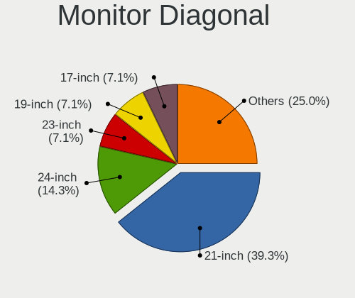

| Inches | Desktops | Percent |
|--------|----------|---------|
| 21     | 3        | 27.27%  |
| 54     | 1        | 9.09%   |
| 34     | 1        | 9.09%   |
| 24     | 1        | 9.09%   |
| 20     | 1        | 9.09%   |
| 19     | 1        | 9.09%   |
| 18     | 1        | 9.09%   |
| 13     | 1        | 9.09%   |
| 12     | 1        | 9.09%   |

Monitor Width
-------------

Physical width

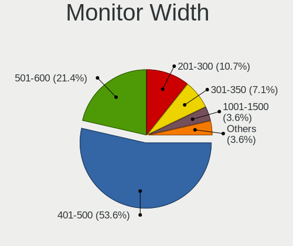

| Width in mm | Desktops | Percent |
|-------------|----------|---------|
| 401-500     | 6        | 54.55%  |
| 701-800     | 1        | 9.09%   |
| 501-600     | 1        | 9.09%   |
| 301-350     | 1        | 9.09%   |
| 201-300     | 1        | 9.09%   |
| 1001-1500   | 1        | 9.09%   |

Aspect Ratio
------------

Proportional relationship between the width and the height

| Ratio | Desktops | Percent |
|-------|----------|---------|
| 16/9  | 8        | 72.73%  |
| 4/3   | 1        | 9.09%   |
| 21/9  | 1        | 9.09%   |
| 16/10 | 1        | 9.09%   |

Monitor Area
------------

Area in inch²

| Area in inch² | Desktops | Percent |
|----------------|----------|---------|
| 201-250        | 4        | 36.36%  |
| 151-200        | 2        | 18.18%  |
| More than 1000 | 1        | 9.09%   |
| 81-90          | 1        | 9.09%   |
| 61-70          | 1        | 9.09%   |
| 351-500        | 1        | 9.09%   |
| 141-150        | 1        | 9.09%   |

Pixel Density
-------------

Pixels per inch

| Density | Desktops | Percent |
|---------|----------|---------|
| 101-120 | 5        | 45.45%  |
| 51-100  | 5        | 45.45%  |
| 121-160 | 1        | 9.09%   |

Multiple Monitors
-----------------

Total monitors connected

| Total | Desktops | Percent |
|-------|----------|---------|
| 0     | 13       | 52%     |
| 1     | 12       | 48%     |

Network
-------

Net Controller Vendor
---------------------

Controller vendors

| Vendor                          | Desktops | Percent |
|---------------------------------|----------|---------|
| Realtek Semiconductor           | 12       | 44.44%  |
| Intel                           | 11       | 40.74%  |
| Qualcomm Atheros Communications | 1        | 3.7%    |
| Qualcomm Atheros                | 1        | 3.7%    |
| Qcom                            | 1        | 3.7%    |
| AVM                             | 1        | 3.7%    |

Net Controller Model
--------------------

Controller models

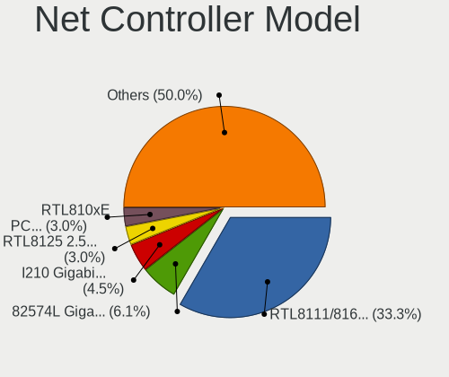

| Model                                                                         | Desktops | Percent |
|-------------------------------------------------------------------------------|----------|---------|
| Realtek RTL8111/8168/8411 PCI Express Gigabit Ethernet Controller             | 7        | 22.58%  |
| Realtek RTL810xE PCI Express Fast Ethernet controller                         | 2        | 6.45%   |
| Intel I211 Gigabit Network Connection                                         | 2        | 6.45%   |
| Intel I210 Gigabit Network Connection                                         | 2        | 6.45%   |
| Intel 82574L Gigabit Network Connection                                       | 2        | 6.45%   |
| Realtek RTL8125 2.5GbE Controller                                             | 1        | 3.23%   |
| Realtek RTL-8100/8101L/8139 PCI Fast Ethernet Adapter                         | 1        | 3.23%   |
| Realtek Killer E2500 Gigabit Ethernet Controller                              | 1        | 3.23%   |
| Qualcomm Atheros AR9271 802.11n                                               | 1        | 3.23%   |
| Qualcomm Atheros AR9285 Wireless Network Adapter (PCI-Express)                | 1        | 3.23%   |
| Qcom RT73 USB Wireless LAN Card                                               | 1        | 3.23%   |
| Intel Wireless 7260                                                           | 1        | 3.23%   |
| Intel Wi-Fi 6 AX201 160MHz                                                    | 1        | 3.23%   |
| Intel Wi-Fi 6 AX200                                                           | 1        | 3.23%   |
| Intel Ethernet Connection I218-LM                                             | 1        | 3.23%   |
| Intel Ethernet Connection I217-LM                                             | 1        | 3.23%   |
| Intel Dual Band Wireless-AC 3168NGW [Stone Peak]                              | 1        | 3.23%   |
| Intel Centrino Advanced-N 6235                                                | 1        | 3.23%   |
| Intel 82579V Gigabit Network Connection                                       | 1        | 3.23%   |
| Intel 82571EB/82571GB Gigabit Ethernet Controller D0/D1 (copper applications) | 1        | 3.23%   |
| AVM A1 ISDN [Fritz]                                                           | 1        | 3.23%   |

Wireless Vendor
---------------

Wireless vendors

| Vendor                          | Desktops | Percent |
|---------------------------------|----------|---------|
| Intel                           | 4        | 57.14%  |
| Qualcomm Atheros Communications | 1        | 14.29%  |
| Qualcomm Atheros                | 1        | 14.29%  |
| Qcom                            | 1        | 14.29%  |

Wireless Model
--------------

Wireless models

| Model                                                          | Desktops | Percent |
|----------------------------------------------------------------|----------|---------|
| Qualcomm Atheros AR9271 802.11n                                | 1        | 14.29%  |
| Qualcomm Atheros AR9285 Wireless Network Adapter (PCI-Express) | 1        | 14.29%  |
| Qcom RT73 USB Wireless LAN Card                                | 1        | 14.29%  |
| Intel Wireless 7260                                            | 1        | 14.29%  |
| Intel Wi-Fi 6 AX201 160MHz                                     | 1        | 14.29%  |
| Intel Wi-Fi 6 AX200                                            | 1        | 14.29%  |
| Intel Dual Band Wireless-AC 3168NGW [Stone Peak]               | 1        | 14.29%  |

Ethernet Vendor
---------------

Ethernet vendors

| Vendor                | Desktops | Percent |
|-----------------------|----------|---------|
| Realtek Semiconductor | 12       | 57.14%  |
| Intel                 | 9        | 42.86%  |

Ethernet Model
--------------

Ethernet models

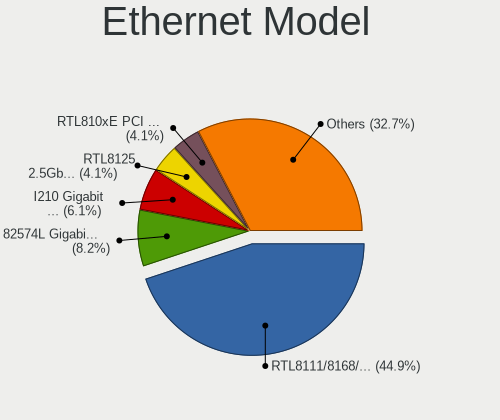

| Model                                                                         | Desktops | Percent |
|-------------------------------------------------------------------------------|----------|---------|
| Realtek RTL8111/8168/8411 PCI Express Gigabit Ethernet Controller             | 7        | 31.82%  |
| Realtek RTL810xE PCI Express Fast Ethernet controller                         | 2        | 9.09%   |
| Intel I211 Gigabit Network Connection                                         | 2        | 9.09%   |
| Intel I210 Gigabit Network Connection                                         | 2        | 9.09%   |
| Intel 82574L Gigabit Network Connection                                       | 2        | 9.09%   |
| Realtek RTL8125 2.5GbE Controller                                             | 1        | 4.55%   |
| Realtek RTL-8100/8101L/8139 PCI Fast Ethernet Adapter                         | 1        | 4.55%   |
| Realtek Killer E2500 Gigabit Ethernet Controller                              | 1        | 4.55%   |
| Intel Ethernet Connection I218-LM                                             | 1        | 4.55%   |
| Intel Ethernet Connection I217-LM                                             | 1        | 4.55%   |
| Intel 82579V Gigabit Network Connection                                       | 1        | 4.55%   |
| Intel 82571EB/82571GB Gigabit Ethernet Controller D0/D1 (copper applications) | 1        | 4.55%   |

Net Controller Kind
-------------------

Ethernet, WiFi or modem

| Kind     | Desktops | Percent |
|----------|----------|---------|
| Ethernet | 19       | 67.86%  |
| WiFi     | 7        | 25%     |
| Unknown  | 2        | 7.14%   |

Used Controller
---------------

Currently used network controller

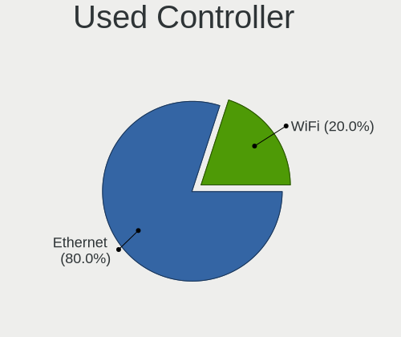

| Kind     | Desktops | Percent |
|----------|----------|---------|
| Ethernet | 14       | 77.78%  |
| WiFi     | 4        | 22.22%  |

NICs
----

Total network controllers on board

| Total | Desktops | Percent |
|-------|----------|---------|
| 2     | 8        | 32%     |
| 1     | 7        | 28%     |
| 0     | 6        | 24%     |
| 3     | 3        | 12%     |
| 4     | 1        | 4%      |

IPv6
----

IPv6 vs IPv4

| Used | Desktops | Percent |
|------|----------|---------|
| No   | 25       | 100%    |

Bluetooth
---------

Bluetooth Vendor
----------------

Controller vendors

| Vendor            | Desktops | Percent |
|-------------------|----------|---------|
| Intel             | 5        | 83.33%  |
| Foxconn / Hon Hai | 1        | 16.67%  |

Bluetooth Model
---------------

Controller models

| Model                                                       | Desktops | Percent |
|-------------------------------------------------------------|----------|---------|
| Intel Wireless-AC 3168 Bluetooth                            | 1        | 16.67%  |
| Intel Centrino Bluetooth Wireless Transceiver               | 1        | 16.67%  |
| Intel Bluetooth wireless interface                          | 1        | 16.67%  |
| Intel Bluetooth 9460/9560 Jefferson Peak (JfP)              | 1        | 16.67%  |
| Intel AX200 Bluetooth                                       | 1        | 16.67%  |
| Foxconn / Hon Hai Qualcomm Atheros AR3011 Bluetooth Adapter | 1        | 16.67%  |

Sound
-----

Sound Vendor
------------

Sound card vendors

| Vendor              | Desktops | Percent |
|---------------------|----------|---------|
| Intel               | 11       | 50%     |
| AMD                 | 8        | 36.36%  |
| Nvidia              | 1        | 4.55%   |
| Creative Labs       | 1        | 4.55%   |
| C-Media Electronics | 1        | 4.55%   |

Sound Model
-----------

Sound card models

| Model                                                                             | Desktops | Percent |
|-----------------------------------------------------------------------------------|----------|---------|
| Intel Xeon E3-1200 v3/4th Gen Core Processor HD Audio Controller                  | 2        | 6.67%   |
| Intel NM10/ICH7 Family High Definition Audio Controller                           | 2        | 6.67%   |
| Intel 8 Series/C220 Series Chipset High Definition Audio Controller               | 2        | 6.67%   |
| Intel 6 Series/C200 Series Chipset Family High Definition Audio Controller        | 2        | 6.67%   |
| AMD Starship/Matisse HD Audio Controller                                          | 2        | 6.67%   |
| AMD Cedar HDMI Audio [Radeon HD 5400/6300/7300 Series]                            | 2        | 6.67%   |
| Nvidia GF108 High Definition Audio Controller                                     | 1        | 3.33%   |
| Intel Wildcat Point-LP High Definition Audio Controller                           | 1        | 3.33%   |
| Intel Jasper Lake HD Audio                                                        | 1        | 3.33%   |
| Intel Haswell-ULT HD Audio Controller                                             | 1        | 3.33%   |
| Intel Cannon Lake PCH cAVS                                                        | 1        | 3.33%   |
| Intel Broadwell-U Audio Controller                                                | 1        | 3.33%   |
| Intel 8 Series HD Audio Controller                                                | 1        | 3.33%   |
| Intel 100 Series/C230 Series Chipset Family HD Audio Controller                   | 1        | 3.33%   |
| Creative Labs EMU10k1 [Sound Blaster Live! Series]                                | 1        | 3.33%   |
| C-Media Electronics CMI8788 [Oxygen HD Audio]                                     | 1        | 3.33%   |
| AMD SBx00 Azalia (Intel HDA)                                                      | 1        | 3.33%   |
| AMD RV710/730 HDMI Audio [Radeon HD 4000 series]                                  | 1        | 3.33%   |
| AMD RS880 HDMI Audio [Radeon HD 4200 Series]                                      | 1        | 3.33%   |
| AMD Raven/Raven2/Fenghuang HDMI/DP Audio Controller                               | 1        | 3.33%   |
| AMD Navi 21/23 HDMI/DP Audio Controller                                           | 1        | 3.33%   |
| AMD Navi 10 HDMI Audio                                                            | 1        | 3.33%   |
| AMD Family 17h/19h HD Audio Controller                                            | 1        | 3.33%   |
| AMD Caicos HDMI Audio [Radeon HD 6450 / 7450/8450/8490 OEM / R5 230/235/235X OEM] | 1        | 3.33%   |

Memory
------

Memory Vendor
-------------

Memory module vendors

Zero info for selected period =(

Memory Model
------------

Memory module models

Zero info for selected period =(

Memory Kind
-----------

Memory module kinds

Zero info for selected period =(

Memory Form Factor
------------------

Physical design of the memory module

Zero info for selected period =(

Memory Size
-----------

Memory module size

Zero info for selected period =(

Memory Speed
------------

Memory module speed

Zero info for selected period =(

Printers & scanners
-------------------

Printer Vendor
--------------

Printer device vendors

Zero info for selected period =(

Printer Model
-------------

Printer device models

Zero info for selected period =(

Scanner Vendor
--------------

Scanner device vendors

Zero info for selected period =(

Scanner Model
-------------

Scanner device models

Zero info for selected period =(

Camera
------

Camera Vendor
-------------

Camera device vendors

| Vendor | Desktops | Percent |
|--------|----------|---------|
| Ricoh  | 1        | 50%     |
| Quanta | 1        | 50%     |

Camera Model
------------

Camera device models

| Model               | Desktops | Percent |
|---------------------|----------|---------|
| Ricoh USB2.0 Camera | 1        | 50%     |
| Quanta VGA WebCam   | 1        | 50%     |

Security
--------

Fingerprint Vendor
------------------

Fingerprint sensor vendors

| Vendor           | Desktops | Percent |
|------------------|----------|---------|
| Validity Sensors | 1        | 100%    |

Fingerprint Model
-----------------

Fingerprint sensor models

| Model                                        | Desktops | Percent |
|----------------------------------------------|----------|---------|
| Validity Sensors VFS 5011 fingerprint sensor | 1        | 100%    |

Chipcard Vendor
---------------

Chipcard module vendors

Zero info for selected period =(

Chipcard Model
--------------

Chipcard module models

Zero info for selected period =(

Unsupported
-----------

Unsupported Devices
-------------------

Total unsupported devices on board

| Total | Desktops | Percent |
|-------|----------|---------|
| 0     | 11       | 44%     |
| 1     | 9        | 36%     |
| 2     | 4        | 16%     |
| 3     | 1        | 4%      |

Unsupported Device Types
------------------------

Types of unsupported devices

| Type                     | Desktops | Percent |
|--------------------------|----------|---------|
| Communication controller | 11       | 57.89%  |
| Graphics card            | 2        | 10.53%  |
| Firewire controller      | 2        | 10.53%  |
| Storage                  | 1        | 5.26%   |
| Sound                    | 1        | 5.26%   |
| Network                  | 1        | 5.26%   |
| Net/wireless             | 1        | 5.26%   |

