OpenBSD 7.1 - Tested Hardware & Statistics (Notebooks)
------------------------------------------------------

A project to collect tested hardware configurations for OpenBSD 7.1.

Anyone can contribute to this report by the [hw-probe](https://github.com/linuxhw/hw-probe/blob/master/INSTALL.BSD.md) tool:

    hw-probe -all -upload

Please contribute! Especially if your hardware is rare.

Contents
--------

* [ Test Cases ](#test-cases)

* [ System ](#system)
  - [ Arch                     ](#arch)
  - [ DE                       ](#de)
  - [ Display Server           ](#display-server)
  - [ Display Manager          ](#display-manager)
  - [ OS Lang                  ](#os-lang)
  - [ Boot Mode                ](#boot-mode)
  - [ Filesystem               ](#filesystem)
  - [ Part. scheme             ](#part-scheme)

* [ Board ](#board)
  - [ Vendor                   ](#vendor)
  - [ Model                    ](#model)
  - [ Model Family             ](#model-family)
  - [ MFG Year                 ](#mfg-year)
  - [ Form Factor              ](#form-factor)
  - [ Coreboot                 ](#coreboot)
  - [ RAM Size                 ](#ram-size)
  - [ RAM Used                 ](#ram-used)
  - [ Total Drives             ](#total-drives)
  - [ Has CD-ROM               ](#has-cd-rom)
  - [ Has Ethernet             ](#has-ethernet)
  - [ Has WiFi                 ](#has-wifi)
  - [ Has Bluetooth            ](#has-bluetooth)

* [ Location ](#location)
  - [ Country                  ](#country)
  - [ City                     ](#city)

* [ Drives ](#drives)
  - [ Drive Vendor             ](#drive-vendor)
  - [ Drive Model              ](#drive-model)
  - [ HDD Vendor               ](#hdd-vendor)
  - [ SSD Vendor               ](#ssd-vendor)
  - [ Drive Kind               ](#drive-kind)
  - [ Drive Connector          ](#drive-connector)
  - [ Drive Size               ](#drive-size)
  - [ Space Total              ](#space-total)
  - [ Space Used               ](#space-used)
  - [ Malfunc. Drives          ](#malfunc-drives)
  - [ Malfunc. Drive Vendor    ](#malfunc-drive-vendor)
  - [ Malfunc. HDD Vendor      ](#malfunc-hdd-vendor)
  - [ Malfunc. Drive Kind      ](#malfunc-drive-kind)
  - [ Failed Drives            ](#failed-drives)
  - [ Failed Drive Vendor      ](#failed-drive-vendor)
  - [ Drive Status             ](#drive-status)

* [ Storage controller ](#storage-controller)
  - [ Storage Vendor           ](#storage-vendor)
  - [ Storage Model            ](#storage-model)
  - [ Storage Kind             ](#storage-kind)

* [ Processor ](#processor)
  - [ CPU Vendor               ](#cpu-vendor)
  - [ CPU Model                ](#cpu-model)
  - [ CPU Model Family         ](#cpu-model-family)
  - [ CPU Cores                ](#cpu-cores)
  - [ CPU Sockets              ](#cpu-sockets)
  - [ CPU Threads              ](#cpu-threads)
  - [ CPU Microarch            ](#cpu-microarch)

* [ Graphics ](#graphics)
  - [ GPU Vendor               ](#gpu-vendor)
  - [ GPU Model                ](#gpu-model)
  - [ GPU Combo                ](#gpu-combo)
  - [ GPU Driver               ](#gpu-driver)
  - [ GPU Memory               ](#gpu-memory)

* [ Monitor ](#monitor)
  - [ Monitor Vendor           ](#monitor-vendor)
  - [ Monitor Model            ](#monitor-model)
  - [ Monitor Resolution       ](#monitor-resolution)
  - [ Monitor Diagonal         ](#monitor-diagonal)
  - [ Monitor Width            ](#monitor-width)
  - [ Aspect Ratio             ](#aspect-ratio)
  - [ Monitor Area             ](#monitor-area)
  - [ Pixel Density            ](#pixel-density)
  - [ Multiple Monitors        ](#multiple-monitors)

* [ Network ](#network)
  - [ Net Controller Vendor    ](#net-controller-vendor)
  - [ Net Controller Model     ](#net-controller-model)
  - [ Wireless Vendor          ](#wireless-vendor)
  - [ Wireless Model           ](#wireless-model)
  - [ Ethernet Vendor          ](#ethernet-vendor)
  - [ Ethernet Model           ](#ethernet-model)
  - [ Net Controller Kind      ](#net-controller-kind)
  - [ Used Controller          ](#used-controller)
  - [ NICs                     ](#nics)
  - [ IPv6                     ](#ipv6)

* [ Bluetooth ](#bluetooth)
  - [ Bluetooth Vendor         ](#bluetooth-vendor)
  - [ Bluetooth Model          ](#bluetooth-model)

* [ Sound ](#sound)
  - [ Sound Vendor             ](#sound-vendor)
  - [ Sound Model              ](#sound-model)

* [ Memory ](#memory)
  - [ Memory Vendor            ](#memory-vendor)
  - [ Memory Model             ](#memory-model)
  - [ Memory Kind              ](#memory-kind)
  - [ Memory Form Factor       ](#memory-form-factor)
  - [ Memory Size              ](#memory-size)
  - [ Memory Speed             ](#memory-speed)

* [ Printers & scanners ](#printers--scanners)
  - [ Printer Vendor           ](#printer-vendor)
  - [ Printer Model            ](#printer-model)
  - [ Scanner Vendor           ](#scanner-vendor)
  - [ Scanner Model            ](#scanner-model)

* [ Camera ](#camera)
  - [ Camera Vendor            ](#camera-vendor)
  - [ Camera Model             ](#camera-model)

* [ Security ](#security)
  - [ Fingerprint Vendor       ](#fingerprint-vendor)
  - [ Fingerprint Model        ](#fingerprint-model)
  - [ Chipcard Vendor          ](#chipcard-vendor)
  - [ Chipcard Model           ](#chipcard-model)

* [ Unsupported ](#unsupported)
  - [ Unsupported Devices      ](#unsupported-devices)
  - [ Unsupported Device Types ](#unsupported-device-types)

Test Cases
----------

Total: 44

| Vendor        | Model                       | Probe                                                     | Date         |
|---------------|-----------------------------|-----------------------------------------------------------|--------------|
| Lenovo        | ThinkPad T420s 4174DL7      | [82d774e711](https://bsd-hardware.info/?probe=82d774e711) | Oct 26, 2022 |
| ASUSTek       | K53TA                       | [521283b723](https://bsd-hardware.info/?probe=521283b723) | Oct 22, 2022 |
| Tactus        | GeoFlex 110                 | [0b93b5f915](https://bsd-hardware.info/?probe=0b93b5f915) | Sep 28, 2022 |
| Toshiba       | Satellite BE96-F299         | [15b93c9f4b](https://bsd-hardware.info/?probe=15b93c9f4b) | Sep 21, 2022 |
| Toshiba       | Satellite BE96-F299         | [9beae1547d](https://bsd-hardware.info/?probe=9beae1547d) | Sep 21, 2022 |
| Lenovo        | ThinkPad X270 W10DG 20K5... | [7576399c3c](https://bsd-hardware.info/?probe=7576399c3c) | Aug 20, 2022 |
| Lenovo        | ThinkPad X260 20F5S10W0H    | [2e7d570822](https://bsd-hardware.info/?probe=2e7d570822) | Aug 20, 2022 |
| Lenovo        | ThinkPad X260 20F5S10W0H    | [7afa139f4f](https://bsd-hardware.info/?probe=7afa139f4f) | Aug 20, 2022 |
| Alienware     | m15 R4                      | [769c5c43f3](https://bsd-hardware.info/?probe=769c5c43f3) | Aug 13, 2022 |
| Dell          | XPS 13 9360                 | [1d342196fb](https://bsd-hardware.info/?probe=1d342196fb) | Aug 08, 2022 |
| Lenovo        | ThinkPad X200 7458NP9       | [4192abf903](https://bsd-hardware.info/?probe=4192abf903) | Jul 20, 2022 |
| ASUSTek       | X751LB                      | [5c2ef28301](https://bsd-hardware.info/?probe=5c2ef28301) | Jul 12, 2022 |
| Acer          | Nitro AN515-55              | [f98a69101e](https://bsd-hardware.info/?probe=f98a69101e) | Jul 08, 2022 |
| Lenovo        | IdeaPad S12 20021,2959      | [c1bf998d6a](https://bsd-hardware.info/?probe=c1bf998d6a) | Jul 07, 2022 |
| Dell          | Inspiron 5515               | [dca437b993](https://bsd-hardware.info/?probe=dca437b993) | Jul 01, 2022 |
| ASUSTek       | K53TA                       | [6ce39c5e61](https://bsd-hardware.info/?probe=6ce39c5e61) | Jun 27, 2022 |
| Lenovo        | ThinkPad L530 24812TG       | [5b66684c4a](https://bsd-hardware.info/?probe=5b66684c4a) | Jun 05, 2022 |
| Lenovo        | ThinkPad Yoga 260 20FES1... | [73ab89b8f0](https://bsd-hardware.info/?probe=73ab89b8f0) | Jun 05, 2022 |
| Lenovo        | ThinkPad Yoga 260 20FES1... | [637f87f44e](https://bsd-hardware.info/?probe=637f87f44e) | Jun 05, 2022 |
| Apple         | MacBookPro5,3               | [3b03bdf595](https://bsd-hardware.info/?probe=3b03bdf595) | May 29, 2022 |
| Lenovo        | ThinkPad X250 20CLS4WV08    | [0419c52079](https://bsd-hardware.info/?probe=0419c52079) | May 11, 2022 |
| Lenovo        | ThinkPad E14 Gen 2 20T60... | [64600e1c24](https://bsd-hardware.info/?probe=64600e1c24) | May 11, 2022 |
| TUXEDO        | Aura 15 Gen1                | [49d1cd3009](https://bsd-hardware.info/?probe=49d1cd3009) | May 10, 2022 |
| Fujitsu       | LIFEBOOK E752               | [3e60a82218](https://bsd-hardware.info/?probe=3e60a82218) | May 06, 2022 |
| ASUSTek       | 1000HE                      | [a6393754b4](https://bsd-hardware.info/?probe=a6393754b4) | May 05, 2022 |
| Matsushita... | CF-48V4KNDQM                | [774cab5326](https://bsd-hardware.info/?probe=774cab5326) | May 03, 2022 |
| Matsushita... | CF-51RCVDNLM                | [4b1abdd507](https://bsd-hardware.info/?probe=4b1abdd507) | May 03, 2022 |
| Lenovo        | ThinkPad T410 2537N24       | [2884106c6b](https://bsd-hardware.info/?probe=2884106c6b) | May 03, 2022 |
| Lenovo        | ThinkPad T430 2347GZU       | [00ba6ca9f8](https://bsd-hardware.info/?probe=00ba6ca9f8) | May 03, 2022 |
| Lenovo        | ThinkPad T420s 41742BU      | [6b77fe651f](https://bsd-hardware.info/?probe=6b77fe651f) | May 03, 2022 |
| Lenovo        | ThinkPad X220 429043U       | [f3c30a6190](https://bsd-hardware.info/?probe=f3c30a6190) | May 02, 2022 |
| Panasonic     | CF-53AAGHYDM                | [abd8754907](https://bsd-hardware.info/?probe=abd8754907) | May 01, 2022 |
| Panasonic     | CF-52PFPBSFQ                | [1ce63e2214](https://bsd-hardware.info/?probe=1ce63e2214) | Apr 29, 2022 |
| MSI           | Modern 14 B11MOL            | [9a61443be9](https://bsd-hardware.info/?probe=9a61443be9) | Apr 25, 2022 |
| DEXP          | NAVIS P100                  | [a9c8814bf8](https://bsd-hardware.info/?probe=a9c8814bf8) | Apr 22, 2022 |
| Lenovo        | ThinkPad X121e 3053A52      | [68d0bf2a99](https://bsd-hardware.info/?probe=68d0bf2a99) | Apr 22, 2022 |
| TUXEDO        | Pulse 15 Gen1               | [b4a6761ab3](https://bsd-hardware.info/?probe=b4a6761ab3) | Apr 21, 2022 |
| Lenovo        | ThinkPad X200 745969G       | [086a58a68f](https://bsd-hardware.info/?probe=086a58a68f) | Mar 24, 2022 |
| Lenovo        | ThinkPad X200 745969G       | [e973d1e806](https://bsd-hardware.info/?probe=e973d1e806) | Mar 18, 2022 |
| HP            | Pavilion Laptop 15-cs0xx... | [ed0add65a3](https://bsd-hardware.info/?probe=ed0add65a3) | Mar 14, 2022 |
| Lenovo        | Yoga 330-11IGM 81A6         | [621ae0501b](https://bsd-hardware.info/?probe=621ae0501b) | Mar 10, 2022 |
| Dell          | Vostro 3550                 | [4bc5573cf5](https://bsd-hardware.info/?probe=4bc5573cf5) | Mar 02, 2022 |
| Lenovo        | ThinkPad X200 745969G       | [a4341268d0](https://bsd-hardware.info/?probe=a4341268d0) | Feb 23, 2022 |
| Acer          | Aspire A114-33              | [62f4e0a060](https://bsd-hardware.info/?probe=62f4e0a060) | Feb 21, 2022 |

System
------

Arch
----

OS architecture (x86_64, i586, etc.)

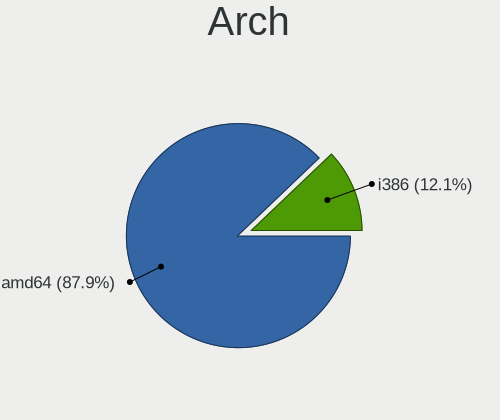

| Name  | Notebooks | Percent |
|-------|-----------|---------|
| amd64 | 36        | 90%     |
| i386  | 4         | 10%     |

DE
--

Desktop Environment

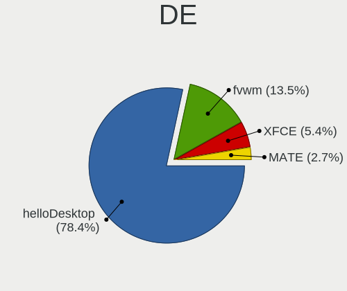

| Name         | Notebooks | Percent |
|--------------|-----------|---------|
| helloDesktop | 31        | 77.5%   |
| fvwm         | 5         | 12.5%   |
| XFCE         | 3         | 7.5%    |
| MATE         | 1         | 2.5%    |

Display Server
--------------

X11 or Wayland

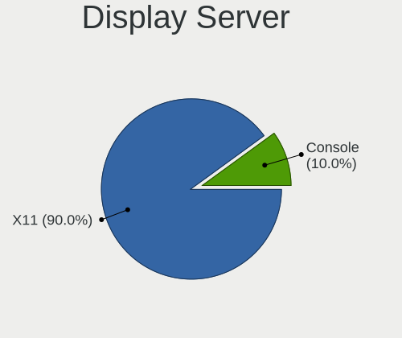

| Name    | Notebooks | Percent |
|---------|-----------|---------|
| X11     | 36        | 90%     |
| Console | 4         | 10%     |

Display Manager
---------------

SDDM, LightDM, etc.

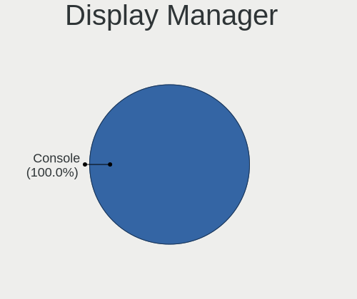

| Name    | Notebooks | Percent |
|---------|-----------|---------|
| Console | 40        | 100%    |

OS Lang
-------

Language

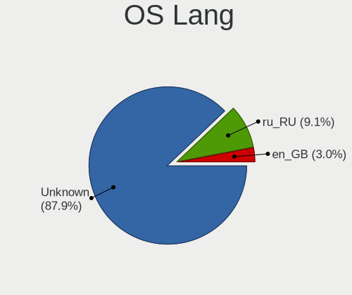

| Lang    | Notebooks | Percent |
|---------|-----------|---------|
| Unknown | 35        | 85.37%  |
| ru_RU   | 3         | 7.32%   |
| pl_PL   | 1         | 2.44%   |
| fr_FR   | 1         | 2.44%   |
| en_GB   | 1         | 2.44%   |

Boot Mode
---------

EFI or BIOS

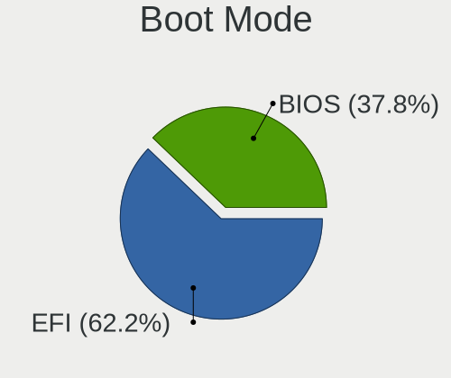

| Mode | Notebooks | Percent |
|------|-----------|---------|
| EFI  | 25        | 62.5%   |
| BIOS | 15        | 37.5%   |

Filesystem
----------

Type of filesystem

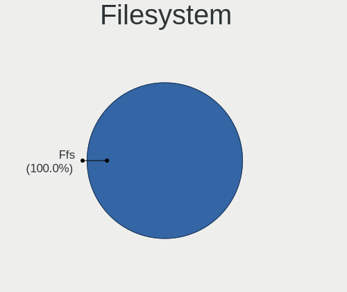

| Type | Notebooks | Percent |
|------|-----------|---------|
| Ffs  | 40        | 100%    |

Part. scheme
------------

Scheme of partitioning

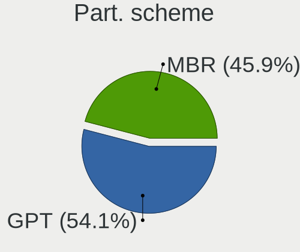

| Type | Notebooks | Percent |
|------|-----------|---------|
| GPT  | 22        | 55%     |
| MBR  | 18        | 45%     |

Board
-----

Vendor
------

Motherboard manufacturer

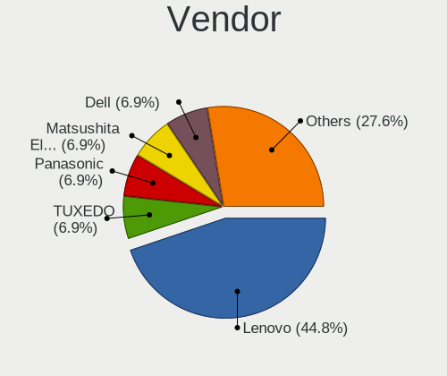

| Name                           | Notebooks | Percent |
|--------------------------------|-----------|---------|
| Lenovo                         | 18        | 45%     |
| Dell                           | 3         | 7.5%    |
| ASUSTek Computer               | 3         | 7.5%    |
| TUXEDO                         | 2         | 5%      |
| Panasonic                      | 2         | 5%      |
| Matsushita Electric Industrial | 2         | 5%      |
| Acer                           | 2         | 5%      |
| Toshiba                        | 1         | 2.5%    |
| Tactus                         | 1         | 2.5%    |
| MSI                            | 1         | 2.5%    |
| Hewlett-Packard                | 1         | 2.5%    |
| Fujitsu                        | 1         | 2.5%    |
| DEXP                           | 1         | 2.5%    |
| Apple                          | 1         | 2.5%    |
| Alienware                      | 1         | 2.5%    |

Model
-----

Motherboard model

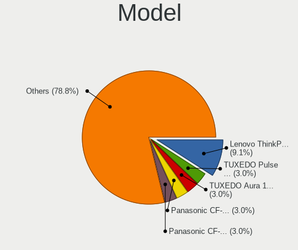

| Name                                        | Notebooks | Percent |
|---------------------------------------------|-----------|---------|
| Lenovo ThinkPad X200 745969G                | 3         | 7.5%    |
| TUXEDO Pulse 15 Gen1                        | 1         | 2.5%    |
| TUXEDO Aura 15 Gen1                         | 1         | 2.5%    |
| Toshiba Satellite BE96-F299                 | 1         | 2.5%    |
| Tactus GeoFlex 110                          | 1         | 2.5%    |
| Panasonic CF-53AAGHYDM                      | 1         | 2.5%    |
| Panasonic CF-52PFPBSFQ                      | 1         | 2.5%    |
| MSI Modern 14 B11MOL                        | 1         | 2.5%    |
| Matsushita Electric Industrial CF-51RCVDNLM | 1         | 2.5%    |
| Matsushita Electric Industrial CF-48V4KNDQM | 1         | 2.5%    |
| Lenovo Yoga 330-11IGM 81A6                  | 1         | 2.5%    |
| Lenovo ThinkPad Yoga 260 20FES1K81V         | 1         | 2.5%    |
| Lenovo ThinkPad X270 W10DG 20K5S5MD0F       | 1         | 2.5%    |
| Lenovo ThinkPad X260 20F5S10W0H             | 1         | 2.5%    |
| Lenovo ThinkPad X250 20CLS4WV08             | 1         | 2.5%    |
| Lenovo ThinkPad X220 429043U                | 1         | 2.5%    |
| Lenovo ThinkPad X200 7458NP9                | 1         | 2.5%    |
| Lenovo ThinkPad X121e 3053A52               | 1         | 2.5%    |
| Lenovo ThinkPad T430 2347GZU                | 1         | 2.5%    |
| Lenovo ThinkPad T420s 4174DL7               | 1         | 2.5%    |
| Lenovo ThinkPad T420s 41742BU               | 1         | 2.5%    |
| Lenovo ThinkPad T410 2537N24                | 1         | 2.5%    |
| Lenovo ThinkPad L530 24812TG                | 1         | 2.5%    |
| Lenovo ThinkPad E14 Gen 2 20T6003BRT        | 1         | 2.5%    |
| Lenovo IdeaPad S12 20021,2959               | 1         | 2.5%    |
| HP Pavilion Laptop 15-cs0xxx                | 1         | 2.5%    |
| Fujitsu LIFEBOOK E752                       | 1         | 2.5%    |
| DEXP NAVIS P100                             | 1         | 2.5%    |
| Dell XPS 13 9360                            | 1         | 2.5%    |
| Dell Vostro 3550                            | 1         | 2.5%    |
| Dell Inspiron 5515                          | 1         | 2.5%    |
| ASUS X751LB                                 | 1         | 2.5%    |
| ASUS K53TA                                  | 1         | 2.5%    |
| ASUS 1000HE                                 | 1         | 2.5%    |
| Apple MacBookPro5,3                         | 1         | 2.5%    |
| Alienware m15 R4                            | 1         | 2.5%    |
| Acer Nitro AN515-55                         | 1         | 2.5%    |
| Acer Aspire A114-33                         | 1         | 2.5%    |

Model Family
------------

Motherboard model prefix

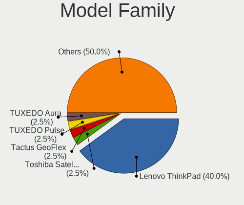

| Name                                        | Notebooks | Percent |
|---------------------------------------------|-----------|---------|
| Lenovo ThinkPad                             | 16        | 40%     |
| TUXEDO Pulse                                | 1         | 2.5%    |
| TUXEDO Aura                                 | 1         | 2.5%    |
| Toshiba Satellite                           | 1         | 2.5%    |
| Tactus GeoFlex                              | 1         | 2.5%    |
| Panasonic CF-53AAGHYDM                      | 1         | 2.5%    |
| Panasonic CF-52PFPBSFQ                      | 1         | 2.5%    |
| MSI Modern                                  | 1         | 2.5%    |
| Matsushita Electric Industrial CF-51RCVDNLM | 1         | 2.5%    |
| Matsushita Electric Industrial CF-48V4KNDQM | 1         | 2.5%    |
| Lenovo Yoga                                 | 1         | 2.5%    |
| Lenovo IdeaPad                              | 1         | 2.5%    |
| HP Pavilion                                 | 1         | 2.5%    |
| Fujitsu LIFEBOOK                            | 1         | 2.5%    |
| DEXP NAVIS                                  | 1         | 2.5%    |
| Dell XPS                                    | 1         | 2.5%    |
| Dell Vostro                                 | 1         | 2.5%    |
| Dell Inspiron                               | 1         | 2.5%    |
| ASUS X751LB                                 | 1         | 2.5%    |
| ASUS K53TA                                  | 1         | 2.5%    |
| ASUS 1000HE                                 | 1         | 2.5%    |
| Apple MacBookPro5                           | 1         | 2.5%    |
| Alienware m15                               | 1         | 2.5%    |
| Acer Nitro                                  | 1         | 2.5%    |
| Acer Aspire                                 | 1         | 2.5%    |

MFG Year
--------

Motherboard manufacture year

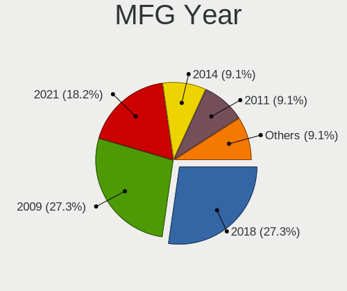

| Year    | Notebooks | Percent |
|---------|-----------|---------|
| 2009    | 7         | 17.5%   |
| 2021    | 6         | 15%     |
| 2011    | 6         | 15%     |
| 2018    | 4         | 10%     |
| 2012    | 4         | 10%     |
| 2020    | 2         | 5%      |
| 2019    | 2         | 5%      |
| 2010    | 2         | 5%      |
| 2022    | 1         | 2.5%    |
| 2016    | 1         | 2.5%    |
| 2015    | 1         | 2.5%    |
| 2013    | 1         | 2.5%    |
| 2006    | 1         | 2.5%    |
| 2002    | 1         | 2.5%    |
| Unknown | 1         | 2.5%    |

Form Factor
-----------

Physical design of the computer

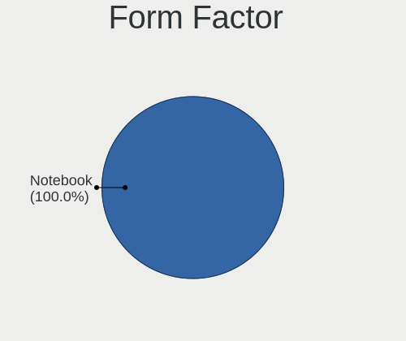

| Name     | Notebooks | Percent |
|----------|-----------|---------|
| Notebook | 40        | 100%    |

Coreboot
--------

Have coreboot on board

| Used | Notebooks | Percent |
|------|-----------|---------|
| No   | 40        | 100%    |

RAM Size
--------

Total RAM memory

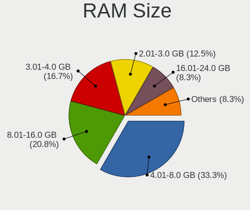

| Size in GB | Notebooks | Percent |
|------------|-----------|---------|
| 8.01-16.0  | 13        | 32.5%   |
| 4.01-8.0   | 12        | 30%     |
| 3.01-4.0   | 5         | 12.5%   |
| 2.01-3.0   | 4         | 10%     |
| 16.01-24.0 | 3         | 7.5%    |
| 32.01-64.0 | 2         | 5%      |
| 0.51-1.0   | 1         | 2.5%    |

RAM Used
--------

Used RAM memory

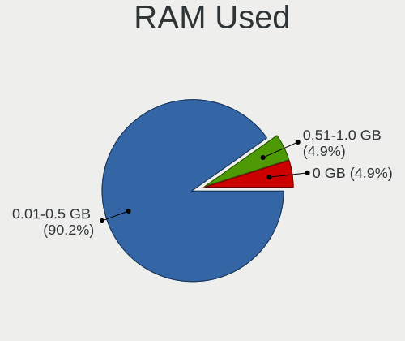

| Used GB  | Notebooks | Percent |
|----------|-----------|---------|
| 0.01-0.5 | 36        | 90%     |
| 0.51-1.0 | 2         | 5%      |
| 0        | 2         | 5%      |

Total Drives
------------

Number of drives on board

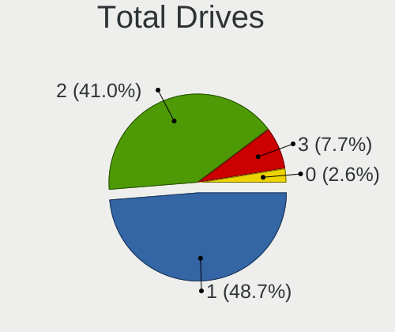

| Drives | Notebooks | Percent |
|--------|-----------|---------|
| 1      | 20        | 50%     |
| 2      | 16        | 40%     |
| 3      | 3         | 7.5%    |
| 0      | 1         | 2.5%    |

Has CD-ROM
----------

Has CD-ROM on board

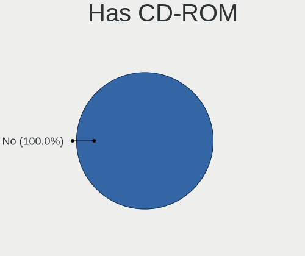

| Presented | Notebooks | Percent |
|-----------|-----------|---------|
| No        | 40        | 100%    |

Has Ethernet
------------

Has Ethernet on board

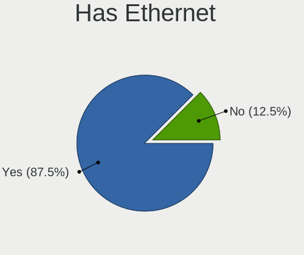

| Presented | Notebooks | Percent |
|-----------|-----------|---------|
| Yes       | 33        | 82.5%   |
| No        | 7         | 17.5%   |

Has WiFi
--------

Has WiFi module

| Presented | Notebooks | Percent |
|-----------|-----------|---------|
| Yes       | 39        | 97.5%   |
| No        | 1         | 2.5%    |

Has Bluetooth
-------------

Has Bluetooth module

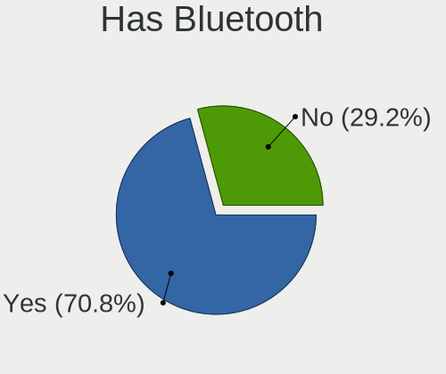

| Presented | Notebooks | Percent |
|-----------|-----------|---------|
| Yes       | 29        | 72.5%   |
| No        | 11        | 27.5%   |

Location
--------

Country
-------

Geographic location (country)

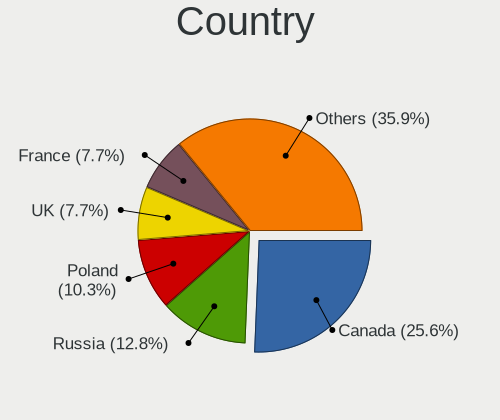

| Country     | Notebooks | Percent |
|-------------|-----------|---------|
| Canada      | 10        | 24.39%  |
| Russia      | 5         | 12.2%   |
| Poland      | 4         | 9.76%   |
| USA         | 3         | 7.32%   |
| UK          | 3         | 7.32%   |
| France      | 3         | 7.32%   |
| Spain       | 2         | 4.88%   |
| Netherlands | 2         | 4.88%   |
| Germany     | 2         | 4.88%   |
| Slovakia    | 1         | 2.44%   |
| Philippines | 1         | 2.44%   |
| Montserrat  | 1         | 2.44%   |
| Italy       | 1         | 2.44%   |
| India       | 1         | 2.44%   |
| Egypt       | 1         | 2.44%   |
| Chile       | 1         | 2.44%   |

City
----

Geographic location (city)

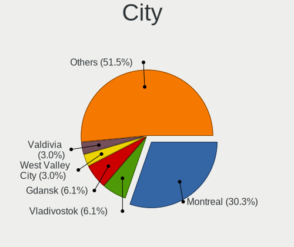

| City                | Notebooks | Percent |
|---------------------|-----------|---------|
| Montreal            | 10        | 24.39%  |
| Vladivostok         | 2         | 4.88%   |
| Gdansk              | 2         | 4.88%   |
| Amsterdam           | 2         | 4.88%   |
| West Valley City    | 1         | 2.44%   |
| Valdivia            | 1         | 2.44%   |
| Tanta               | 1         | 2.44%   |
| Sutton              | 1         | 2.44%   |
| Starogard Gdański  | 1         | 2.44%   |
| St Petersburg       | 1         | 2.44%   |
| Springboro          | 1         | 2.44%   |
| Quezon City         | 1         | 2.44%   |
| Plymouth            | 1         | 2.44%   |
| Ozersk              | 1         | 2.44%   |
| Newcastle upon Tyne | 1         | 2.44%   |
| Mumbai              | 1         | 2.44%   |
| Memphis             | 1         | 2.44%   |
| Madrid              | 1         | 2.44%   |
| Mâcon              | 1         | 2.44%   |
| Lublin              | 1         | 2.44%   |
| Lübeck             | 1         | 2.44%   |
| Ermont              | 1         | 2.44%   |
| Edinburgh           | 1         | 2.44%   |
| Concesio            | 1         | 2.44%   |
| Chelyabinsk         | 1         | 2.44%   |
| Bratislava          | 1         | 2.44%   |
| Biot                | 1         | 2.44%   |
| Alcorisa            | 1         | 2.44%   |
| Aidlingen           | 1         | 2.44%   |

Drives
------

Drive Vendor
------------

Hard drive vendors

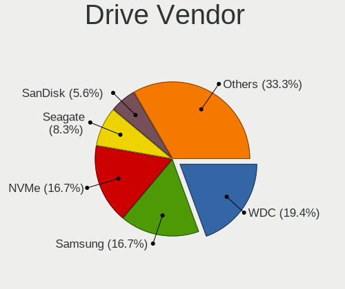

| Vendor              | Notebooks | Drives | Percent |
|---------------------|-----------|--------|---------|
| NVMe                | 9         | 10     | 21.43%  |
| WDC                 | 7         | 7      | 16.67%  |
| Samsung Electronics | 6         | 6      | 14.29%  |
| Seagate             | 3         | 3      | 7.14%   |
| SanDisk             | 2         | 2      | 4.76%   |
| Kingston            | 2         | 2      | 4.76%   |
| Innostor            | 2         | 2      | 4.76%   |
| Hitachi             | 2         | 3      | 4.76%   |
| HGST                | 2         | 2      | 4.76%   |
| Apacer              | 2         | 2      | 4.76%   |
| USB                 | 1         | 1      | 2.38%   |
| Toshiba             | 1         | 1      | 2.38%   |
| OWC                 | 1         | 1      | 2.38%   |
| LDLC F6+            | 1         | 1      | 2.38%   |
| A-DATA Technology   | 1         | 1      | 2.38%   |

Drive Model
-----------

Hard drive models

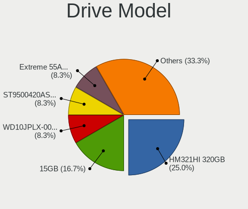

| Model                            | Notebooks | Percent |
|----------------------------------|-----------|---------|
| Samsung HM321HI 320GB            | 3         | 7.14%   |
| NVMe WDC PC SN530 SDB 256GB      | 2         | 4.76%   |
| NVMe Samsung SSD 980 1TB         | 2         | 4.76%   |
| Innostor SSD 15GB                | 2         | 4.76%   |
| Apacer AS340 240GB               | 2         | 4.76%   |
| WDC WD7500BPKX-00HPJT0 752GB     | 1         | 2.38%   |
| WDC WD7500BPKT-75PK4T0 752GB     | 1         | 2.38%   |
| WDC WD7500BPKT-00PK4T0 752GB     | 1         | 2.38%   |
| WDC WD5000LPLX-00ZNTT0 500GB     | 1         | 2.38%   |
| WDC WD3200BEVE-00A0HT0 320GB     | 1         | 2.38%   |
| WDC WD1600BEVT-22ZCT0 160GB      | 1         | 2.38%   |
| WDC WD10JPLX-00MBPT0 1TB         | 1         | 2.38%   |
| USB SanDisk 3.2Gen1 64GB         | 1         | 2.38%   |
| Toshiba MK6475GSX 640GB          | 1         | 2.38%   |
| Seagate ST9500420AS 500GB        | 1         | 2.38%   |
| Seagate ST9160821A 160GB         | 1         | 2.38%   |
| Seagate ST1000LM049-2GH172 1TB   | 1         | 2.38%   |
| SanDisk SD7UB3Q256G1001 256GB    | 1         | 2.38%   |
| SanDisk Extreme 55AE 500GB       | 1         | 2.38%   |
| Samsung SSD 850 EVO 500GB        | 1         | 2.38%   |
| Samsung MZNLN512HMJP-000L7 512GB | 1         | 2.38%   |
| Samsung MZ7PC128HAFU-000L1 128GB | 1         | 2.38%   |
| OWC Mercury Electra 6G SSD       | 1         | 2.38%   |
| NVMe PM9A1 Samsu 512GB           | 1         | 2.38%   |
| NVMe PC300 SK hy 256GB           | 1         | 2.38%   |
| NVMe LENSE20256GMSP34 256GB      | 1         | 2.38%   |
| NVMe KINGSTON OM8PDP3 256GB      | 1         | 2.38%   |
| NVMe KBG40ZNS512G NVM 512GB      | 1         | 2.38%   |
| LDLC F6+ M.2 120 120GB           | 1         | 2.38%   |
| Kingston SV300S37A120G 120GB     | 1         | 2.38%   |
| Kingston SA400S37240G 240GB      | 1         | 2.38%   |
| Hitachi HTS723232A7A364 320GB    | 1         | 2.38%   |
| Hitachi HTS547564A9E384 640GB    | 1         | 2.38%   |
| HGST HTS541010B7E610 1TB         | 1         | 2.38%   |
| HGST HTS541010A9E680 1TB         | 1         | 2.38%   |
| A-DATA SP550 480GB               | 1         | 2.38%   |

HDD Vendor
----------

Hard disk drive vendors

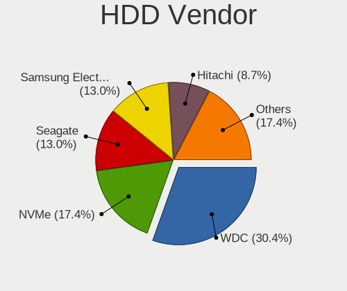

| Vendor              | Notebooks | Drives | Percent |
|---------------------|-----------|--------|---------|
| WDC                 | 7         | 7      | 28%     |
| NVMe                | 5         | 5      | 20%     |
| Seagate             | 3         | 3      | 12%     |
| Samsung Electronics | 3         | 3      | 12%     |
| Hitachi             | 2         | 3      | 8%      |
| HGST                | 2         | 2      | 8%      |
| USB                 | 1         | 1      | 4%      |
| Toshiba             | 1         | 1      | 4%      |
| LDLC F6+            | 1         | 1      | 4%      |

SSD Vendor
----------

Solid state drive vendors

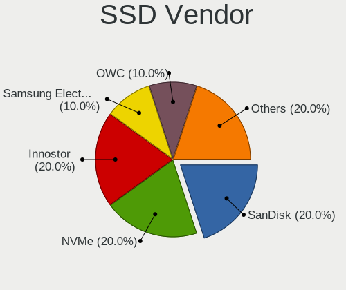

| Vendor              | Notebooks | Drives | Percent |
|---------------------|-----------|--------|---------|
| Samsung Electronics | 3         | 3      | 20%     |
| SanDisk             | 2         | 2      | 13.33%  |
| NVMe                | 2         | 2      | 13.33%  |
| Kingston            | 2         | 2      | 13.33%  |
| Innostor            | 2         | 2      | 13.33%  |
| Apacer              | 2         | 2      | 13.33%  |
| OWC                 | 1         | 1      | 6.67%   |
| A-DATA Technology   | 1         | 1      | 6.67%   |

Drive Kind
----------

HDD or SSD

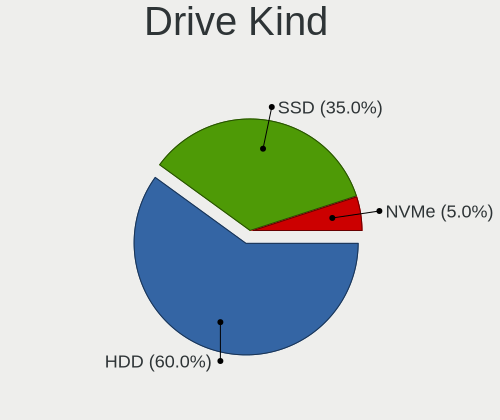

| Kind | Notebooks | Drives | Percent |
|------|-----------|--------|---------|
| HDD  | 23        | 26     | 58.97%  |
| SSD  | 14        | 15     | 35.9%   |
| NVMe | 2         | 3      | 5.13%   |

Drive Connector
---------------

SATA, SAS, NVMe, etc.

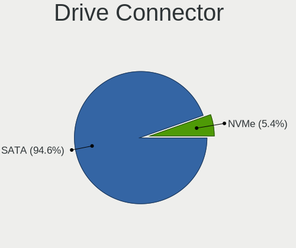

| Type | Notebooks | Drives | Percent |
|------|-----------|--------|---------|
| SATA | 35        | 41     | 94.59%  |
| NVMe | 2         | 3      | 5.41%   |

Drive Size
----------

Size of hard drive

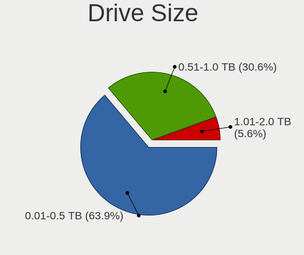

| Size in TB | Notebooks | Drives | Percent |
|------------|-----------|--------|---------|
| 0.01-0.5   | 23        | 27     | 63.89%  |
| 0.51-1.0   | 13        | 14     | 36.11%  |

Space Total
-----------

Amount of disk space available on the file system

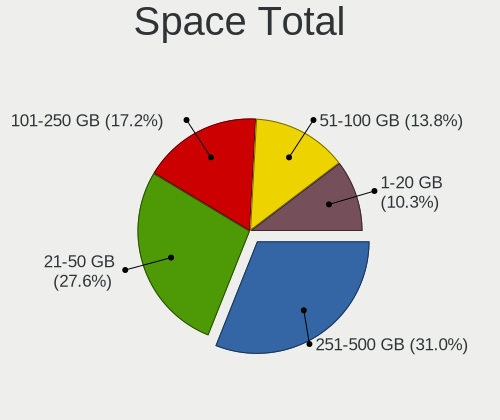

| Size in GB | Notebooks | Percent |
|------------|-----------|---------|
| 101-250    | 12        | 30%     |
| 251-500    | 11        | 27.5%   |
| 21-50      | 9         | 22.5%   |
| 51-100     | 4         | 10%     |
| 1-20       | 3         | 7.5%    |
| 501-1000   | 1         | 2.5%    |

Space Used
----------

Amount of used disk space

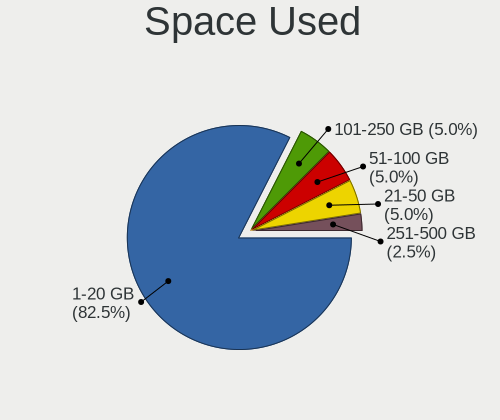

| Used GB | Notebooks | Percent |
|---------|-----------|---------|
| 1-20    | 33        | 82.5%   |
| 21-50   | 2         | 5%      |
| 101-250 | 2         | 5%      |
| 51-100  | 2         | 5%      |
| 251-500 | 1         | 2.5%    |

Malfunc. Drives
---------------

Drive models with a malfunction

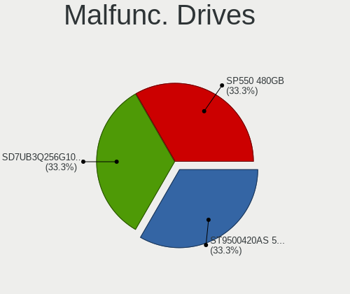

| Model                         | Notebooks | Drives | Percent |
|-------------------------------|-----------|--------|---------|
| Toshiba MK6475GSX 640GB       | 1         | 1      | 25%     |
| Seagate ST9500420AS 500GB     | 1         | 1      | 25%     |
| SanDisk SD7UB3Q256G1001 256GB | 1         | 1      | 25%     |
| A-DATA Technology SP550 480GB | 1         | 1      | 25%     |

Malfunc. Drive Vendor
---------------------

Vendors of faulty drives

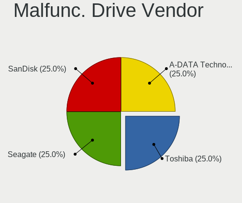

| Vendor            | Notebooks | Drives | Percent |
|-------------------|-----------|--------|---------|
| Toshiba           | 1         | 1      | 25%     |
| Seagate           | 1         | 1      | 25%     |
| SanDisk           | 1         | 1      | 25%     |
| A-DATA Technology | 1         | 1      | 25%     |

Malfunc. HDD Vendor
-------------------

Vendors of faulty HDD drives

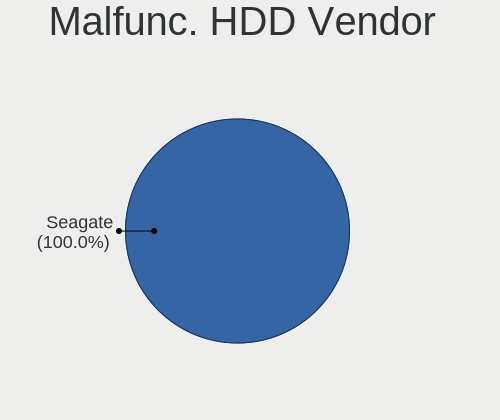

| Vendor  | Notebooks | Drives | Percent |
|---------|-----------|--------|---------|
| Toshiba | 1         | 1      | 50%     |
| Seagate | 1         | 1      | 50%     |

Malfunc. Drive Kind
-------------------

Kinds of faulty drives

| Kind | Notebooks | Drives | Percent |
|------|-----------|--------|---------|
| SSD  | 2         | 2      | 50%     |
| HDD  | 2         | 2      | 50%     |

Failed Drives
-------------

Failed drive models

Zero info for selected period =(

Failed Drive Vendor
-------------------

Failed drive vendors

Zero info for selected period =(

Drive Status
------------

Number of failed and malfunc. drives

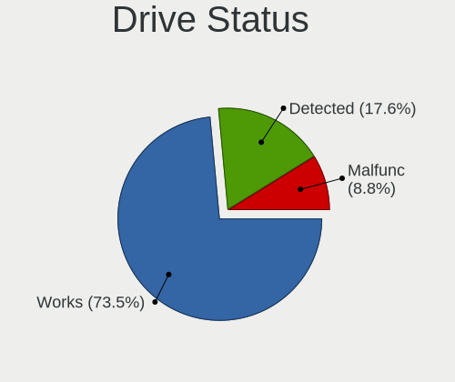

| Status   | Notebooks | Drives | Percent |
|----------|-----------|--------|---------|
| Works    | 27        | 29     | 67.5%   |
| Detected | 9         | 11     | 22.5%   |
| Malfunc  | 4         | 4      | 10%     |

Storage controller
------------------

Storage Vendor
--------------

Storage controller vendors

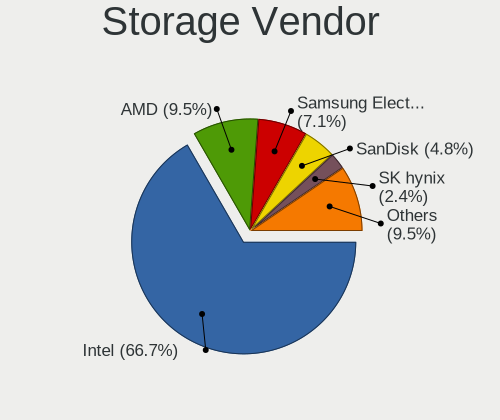

| Vendor                      | Notebooks | Percent |
|-----------------------------|-----------|---------|
| Intel                       | 29        | 67.44%  |
| AMD                         | 4         | 9.3%    |
| Samsung Electronics         | 3         | 6.98%   |
| SanDisk                     | 2         | 4.65%   |
| SK hynix                    | 1         | 2.33%   |
| Nvidia                      | 1         | 2.33%   |
| Lenovo                      | 1         | 2.33%   |
| KIOXIA                      | 1         | 2.33%   |
| Kingston Technology Company | 1         | 2.33%   |

Storage Model
-------------

Storage controller models

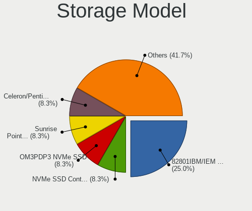

| Model                                                                                  | Notebooks | Percent |
|----------------------------------------------------------------------------------------|-----------|---------|
| Intel 82801IBM/IEM (ICH9M/ICH9M-E) 4 port SATA Controller [AHCI mode]                  | 4         | 8.7%    |
| Intel 7 Series Chipset Family 6-port SATA Controller [AHCI mode]                       | 4         | 8.7%    |
| Intel Sunrise Point-LP SATA Controller [AHCI mode]                                     | 3         | 6.52%   |
| Intel 6 Series/C200 Series Chipset Family 6 port Mobile SATA AHCI Controller           | 3         | 6.52%   |
| AMD FCH SATA Controller [AHCI mode]                                                    | 3         | 6.52%   |
| Samsung NVMe SSD Controller PM9A1/PM9A3/980PRO                                         | 2         | 4.35%   |
| Intel Wildcat Point-LP SATA Controller [AHCI Mode]                                     | 2         | 4.35%   |
| Intel Celeron/Pentium Silver Processor SATA Controller                                 | 2         | 4.35%   |
| Intel 82801GBM/GHM (ICH7-M Family) SATA Controller [IDE mode]                          | 2         | 4.35%   |
| Intel 6 Series/C200 Series Chipset Family Mobile SATA Controller (IDE mode, ports 4-5) | 2         | 4.35%   |
| Intel 6 Series/C200 Series Chipset Family Mobile SATA Controller (IDE mode, ports 0-3) | 2         | 4.35%   |
| Intel 5 Series/3400 Series Chipset 6 port SATA AHCI Controller                         | 2         | 4.35%   |
| SK hynix PC300 NVMe Solid State Drive 256GB                                            | 1         | 2.17%   |
| SanDisk WD Blue SN550 NVMe SSD                                                         | 1         | 2.17%   |
| SanDisk PC SN530                                                                       | 1         | 2.17%   |
| Samsung NVMe SSD Controller 980                                                        | 1         | 2.17%   |
| Nvidia MCP79 AHCI Controller                                                           | 1         | 2.17%   |
| Lenovo unknown                                                                         | 1         | 2.17%   |
| KIOXIA NVMe SSD Controller BG4                                                         | 1         | 2.17%   |
| Kingston Company OM3PDP3 NVMe SSD                                                      | 1         | 2.17%   |
| Intel Jasper Lake SATA AHCI Controller                                                 | 1         | 2.17%   |
| Intel Celeron N3350/Pentium N4200/Atom E3900 Series SATA AHCI Controller               | 1         | 2.17%   |
| Intel 82801GBM/GHM (ICH7-M Family) SATA Controller [AHCI mode]                         | 1         | 2.17%   |
| Intel 82801G (ICH7 Family) IDE Controller                                              | 1         | 2.17%   |
| Intel 82801CAM IDE U100 Controller                                                     | 1         | 2.17%   |
| Intel 400 Series Chipset Family SATA AHCI Controller                                   | 1         | 2.17%   |
| AMD SB7x0/SB8x0/SB9x0 SATA Controller [AHCI mode]                                      | 1         | 2.17%   |

Storage Kind
------------

Kind of storage controller (IDE, SATA, NVMe, SAS, ...)

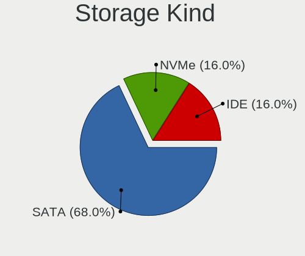

| Kind | Notebooks | Percent |
|------|-----------|---------|
| SATA | 29        | 65.91%  |
| NVMe | 9         | 20.45%  |
| IDE  | 6         | 13.64%  |

Processor
---------

CPU Vendor
----------

Processor vendors

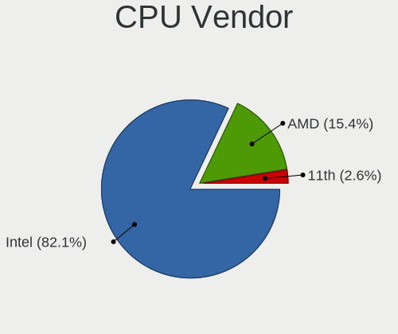

| Vendor | Notebooks | Percent |
|--------|-----------|---------|
| Intel  | 33        | 82.5%   |
| AMD    | 6         | 15%     |
| 11th   | 1         | 2.5%    |

CPU Model
---------

Processor models

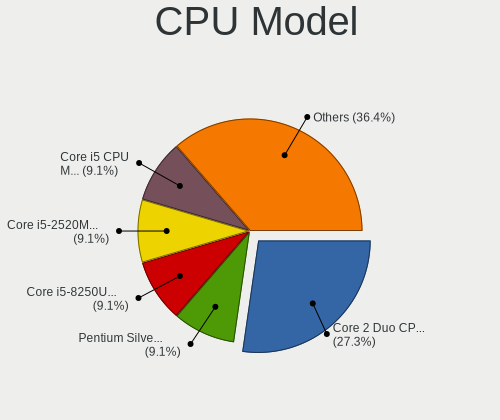

| Model                                                    | Notebooks | Percent |
|----------------------------------------------------------|-----------|---------|
| Intel Core i5-2520M CPU @ 2.50GHz                        | 5         | 12.5%   |
| Intel Core i5-6300U CPU @ 2.40GHz                        | 3         | 7.5%    |
| Intel Core 2 Duo CPU P8600 @ 2.40GHz                     | 3         | 7.5%    |
| Intel Core i5 CPU M 520 @ 2.40GHz                        | 2         | 5%      |
| AMD Ryzen 7 4700U with Radeon Graphics                   | 2         | 5%      |
| Intel Pentium Silver N6000 @ 1.10GHz                     | 1         | 2.5%    |
| Intel Pentium Silver N5000 CPU @ 1.10GHz                 | 1         | 2.5%    |
| Intel Pentium 4 Mobile CPU 1.60GHz                       | 1         | 2.5%    |
| Intel Genuine CPU T2300 @ 1.66GHz                        | 1         | 2.5%    |
| Intel Core i9-10980HK CPU @ 2.40GHz                      | 1         | 2.5%    |
| Intel Core i7-7500U CPU @ 2.70GHz                        | 1         | 2.5%    |
| Intel Core i7-5500U CPU @ 2.40GHz                        | 1         | 2.5%    |
| Intel Core i7-3520M CPU @ 2.90GHz                        | 1         | 2.5%    |
| Intel Core i5-8250U CPU @ 1.60GHz                        | 1         | 2.5%    |
| Intel Core i5-5300U CPU @ 2.30GHz                        | 1         | 2.5%    |
| Intel Core i5-3320M CPU @ 2.60GHz                        | 1         | 2.5%    |
| Intel Core i5-3210M CPU @ 2.50GHz                        | 1         | 2.5%    |
| Intel Core i5-10300H CPU @ 2.50GHz                       | 1         | 2.5%    |
| Intel Core i3-3120M CPU @ 2.50GHz                        | 1         | 2.5%    |
| Intel Core 2 Duo CPU T9600 @ 2.80GHz                     | 1         | 2.5%    |
| Intel Core 2 Duo CPU P8700 @ 2.53GHz                     | 1         | 2.5%    |
| Intel Celeron N4020 CPU @ 1.10GHz                        | 1         | 2.5%    |
| Intel Celeron CPU N3350 @ 1.10GHz                        | 1         | 2.5%    |
| Intel Atom CPU N280 @ 1.66GHz                            | 1         | 2.5%    |
| Intel Atom CPU N270 @ 1.60GHz ("GenuineIntel" 686-class) | 1         | 2.5%    |
| AMD Ryzen 7 4800H with Radeon Graphics                   | 1         | 2.5%    |
| AMD Ryzen 5 5500U with Radeon Graphics                   | 1         | 2.5%    |
| AMD E-300 APU with Radeon HD Graphics                    | 1         | 2.5%    |
| AMD A6-3400M APU with Radeon HD Graphics                 | 1         | 2.5%    |
| 11th Gen Intel Core i5-1135G7 @ 2.40GHz                  | 1         | 2.5%    |

CPU Model Family
----------------

Processor model prefix

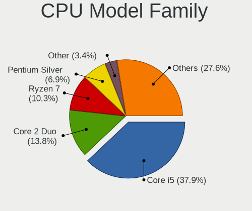

| Model                | Notebooks | Percent |
|----------------------|-----------|---------|
| Intel Core i5        | 15        | 37.5%   |
| Intel Core 2 Duo     | 5         | 12.5%   |
| Intel Core i7        | 3         | 7.5%    |
| AMD Ryzen 7          | 3         | 7.5%    |
| Intel Pentium Silver | 2         | 5%      |
| Intel Celeron        | 2         | 5%      |
| Intel Atom           | 2         | 5%      |
| Other                | 1         | 2.5%    |
| Intel Pentium 4      | 1         | 2.5%    |
| Intel Genuine        | 1         | 2.5%    |
| Intel Core i9        | 1         | 2.5%    |
| Intel Core i3        | 1         | 2.5%    |
| AMD Ryzen 5          | 1         | 2.5%    |
| AMD E                | 1         | 2.5%    |
| AMD A6               | 1         | 2.5%    |

CPU Cores
---------

Number of processor cores

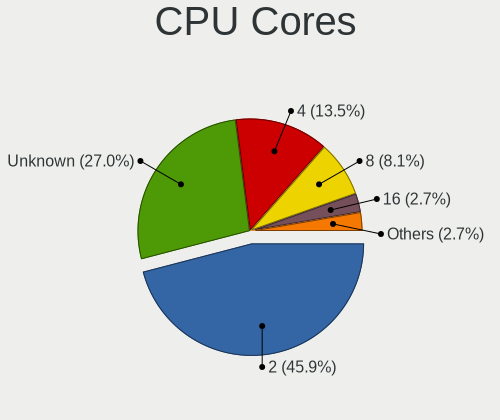

| Number  | Notebooks | Percent |
|---------|-----------|---------|
| 2       | 20        | 50%     |
| Unknown | 10        | 25%     |
| 4       | 5         | 12.5%   |
| 8       | 3         | 7.5%    |
| 16      | 1         | 2.5%    |
| 12      | 1         | 2.5%    |

CPU Sockets
-----------

Number of sockets

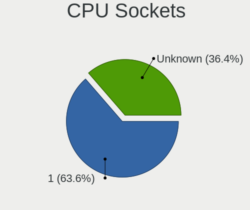

| Number  | Notebooks | Percent |
|---------|-----------|---------|
| 1       | 33        | 82.5%   |
| Unknown | 7         | 17.5%   |

CPU Threads
-----------

Threads per core (Hyper-Threading)

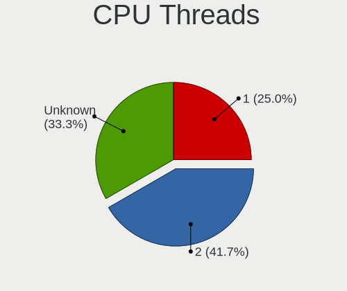

| Number  | Notebooks | Percent |
|---------|-----------|---------|
| 2       | 20        | 50%     |
| 1       | 10        | 25%     |
| Unknown | 10        | 25%     |

CPU Microarch
-------------

Microarchitecture

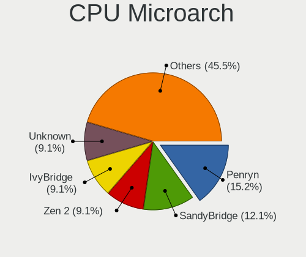

| Name          | Notebooks | Percent |
|---------------|-----------|---------|
| SandyBridge   | 5         | 12.5%   |
| Penryn        | 5         | 12.5%   |
| IvyBridge     | 4         | 10%     |
| Zen 2         | 3         | 7.5%    |
| Skylake       | 3         | 7.5%    |
| Unknown       | 3         | 7.5%    |
| Westmere      | 2         | 5%      |
| KabyLake      | 2         | 5%      |
| Goldmont plus | 2         | 5%      |
| CometLake     | 2         | 5%      |
| Broadwell     | 2         | 5%      |
| Bonnell       | 2         | 5%      |
| P6            | 1         | 2.5%    |
| NetBurst      | 1         | 2.5%    |
| K10 Llano     | 1         | 2.5%    |
| Goldmont      | 1         | 2.5%    |
| Bobcat        | 1         | 2.5%    |

Graphics
--------

GPU Vendor
----------

Vendors of graphics cards

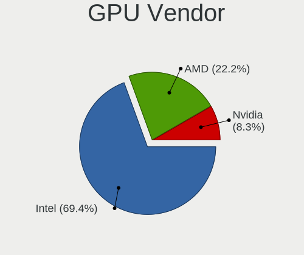

| Vendor | Notebooks | Percent |
|--------|-----------|---------|
| Intel  | 32        | 72.73%  |
| AMD    | 8         | 18.18%  |
| Nvidia | 4         | 9.09%   |

GPU Model
---------

Graphics card models

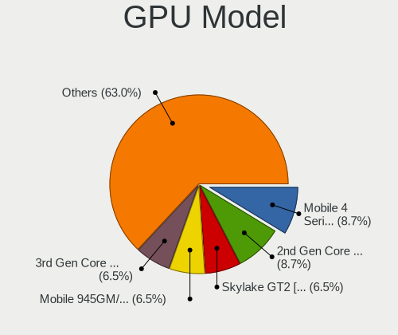

| Model                                                                         | Notebooks | Percent |
|-------------------------------------------------------------------------------|-----------|---------|
| Intel 2nd Generation Core Processor Family Integrated Graphics Controller     | 5         | 10.2%   |
| Intel Mobile 4 Series Chipset Integrated Graphics Controller                  | 4         | 8.16%   |
| Intel 3rd Gen Core processor Graphics Controller                              | 4         | 8.16%   |
| Intel Skylake GT2 [HD Graphics 520]                                           | 3         | 6.12%   |
| Intel Mobile 945GM/GMS/GME, 943/940GML Express Integrated Graphics Controller | 3         | 6.12%   |
| AMD Renoir                                                                    | 3         | 6.12%   |
| Intel Mobile 945GSE Express Integrated Graphics Controller                    | 2         | 4.08%   |
| Intel HD Graphics 5500                                                        | 2         | 4.08%   |
| Intel Core Processor Integrated Graphics Controller                           | 2         | 4.08%   |
| Intel CometLake-H GT2 [UHD Graphics]                                          | 2         | 4.08%   |
| AMD Whistler [Radeon HD 6630M/6650M/6750M/7670M/7690M]                        | 2         | 4.08%   |
| Nvidia TU117M                                                                 | 1         | 2.04%   |
| Nvidia GM108M [GeForce 940M]                                                  | 1         | 2.04%   |
| Nvidia GA104M [GeForce RTX 3080 Mobile / Max-Q 8GB/16GB]                      | 1         | 2.04%   |
| Nvidia G96CM [GeForce 9600M GT]                                               | 1         | 2.04%   |
| Nvidia C79 [GeForce 9400M]                                                    | 1         | 2.04%   |
| Intel UHD Graphics 620                                                        | 1         | 2.04%   |
| Intel TigerLake-LP GT2 [Iris Xe Graphics]                                     | 1         | 2.04%   |
| Intel Mobile 945GM/GMS, 943/940GML Express Integrated Graphics Controller     | 1         | 2.04%   |
| Intel JasperLake [UHD Graphics]                                               | 1         | 2.04%   |
| Intel HD Graphics 620                                                         | 1         | 2.04%   |
| Intel HD Graphics 500                                                         | 1         | 2.04%   |
| Intel GeminiLake [UHD Graphics 605]                                           | 1         | 2.04%   |
| Intel GeminiLake [UHD Graphics 600]                                           | 1         | 2.04%   |
| AMD Wrestler [Radeon HD 6310]                                                 | 1         | 2.04%   |
| AMD Sumo [Radeon HD 6520G]                                                    | 1         | 2.04%   |
| AMD RV200/M7 [Mobility Radeon 7500]                                           | 1         | 2.04%   |
| AMD Lucienne                                                                  | 1         | 2.04%   |

GPU Combo
---------

Combinations of graphics cards

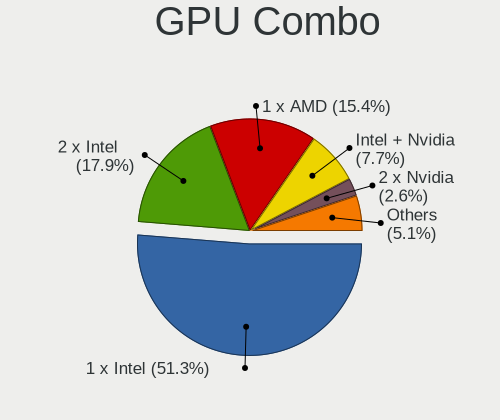

| Name           | Notebooks | Percent |
|----------------|-----------|---------|
| 1 x Intel      | 21        | 52.5%   |
| 2 x Intel      | 7         | 17.5%   |
| 1 x AMD        | 6         | 15%     |
| Intel + Nvidia | 3         | 7.5%    |
| 2 x Nvidia     | 1         | 2.5%    |
| 2 x AMD        | 1         | 2.5%    |
| Intel + AMD    | 1         | 2.5%    |

GPU Driver
----------

Free vs proprietary

| Driver  | Notebooks | Percent |
|---------|-----------|---------|
| Free    | 38        | 95%     |
| Unknown | 2         | 5%      |

GPU Memory
----------

Total video memory

| Size in GB | Notebooks | Percent |
|------------|-----------|---------|
| Unknown    | 40        | 100%    |

Monitor
-------

Monitor Vendor
--------------

Monitor vendors

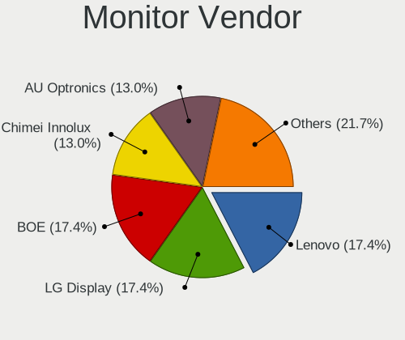

| Vendor                  | Notebooks | Percent |
|-------------------------|-----------|---------|
| LG Display              | 5         | 19.23%  |
| Lenovo                  | 4         | 15.38%  |
| BOE                     | 4         | 15.38%  |
| AU Optronics            | 4         | 15.38%  |
| Chimei Innolux          | 3         | 11.54%  |
| Samsung Electronics     | 2         | 7.69%   |
| Chi Mei Optoelectronics | 2         | 7.69%   |
| TRU                     | 1         | 3.85%   |
| PANDA                   | 1         | 3.85%   |

Monitor Model
-------------

Monitor models

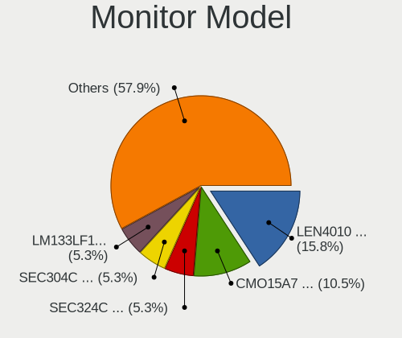

| Model                                                                    | Notebooks | Percent |
|--------------------------------------------------------------------------|-----------|---------|
| Lenovo LCD Monitor LEN4010 1280x800 260x160mm 12.0-inch                  | 3         | 11.54%  |
| LG Display LCD Monitor LGD03CD 1366x768 280x160mm 12.7-inch              | 2         | 7.69%   |
| Chi Mei Optoelectronics LCD Monitor CMO15A7 1366x768 350x190mm 15.7-inch | 2         | 7.69%   |
| TRU LCD Monitor TRU235C 1366x768 260x140mm 11.6-inch                     | 1         | 3.85%   |
| Samsung Electronics LCD Monitor SEC324C 1600x900 310x170mm 13.9-inch     | 1         | 3.85%   |
| Samsung Electronics LCD Monitor SEC304C 1366x768 310x170mm 13.9-inch     | 1         | 3.85%   |
| PANDA LM133LF1L01 NCP13FB 1920x1080 290x170mm 13.2-inch                  | 1         | 3.85%   |
| LG Display LCD Monitor LGD05FA 1920x1080 310x170mm 13.9-inch             | 1         | 3.85%   |
| LG Display LCD Monitor LGD0215 1920x1080 350x190mm 15.7-inch             | 1         | 3.85%   |
| LG Display LCD Monitor LGD01AB 1280x800 260x160mm 12.0-inch              | 1         | 3.85%   |
| Lenovo LCD Monitor LEN4011 1280x800 260x160mm 12.0-inch                  | 1         | 3.85%   |
| Chimei Innolux LCD Monitor CMN1734 1600x900 380x210mm 17.1-inch          | 1         | 3.85%   |
| Chimei Innolux LCD Monitor CMN15D7 1920x1080 340x190mm 15.3-inch         | 1         | 3.85%   |
| Chimei Innolux LCD Monitor CMN152E 1920x1080 340x190mm 15.3-inch         | 1         | 3.85%   |
| BOE LCD Monitor BOE0900 1920x1080 340x190mm 15.3-inch                    | 1         | 3.85%   |
| BOE LCD Monitor BOE08D7 1920x1080 310x170mm 13.9-inch                    | 1         | 3.85%   |
| BOE LCD Monitor BOE07A5 1366x768 340x190mm 15.3-inch                     | 1         | 3.85%   |
| BOE LCD Monitor BOE075A 1366x768 310x170mm 13.9-inch                     | 1         | 3.85%   |
| AU Optronics LCD Monitor AUODF87 1920x1080 340x190mm 15.3-inch           | 1         | 3.85%   |
| AU Optronics LCD Monitor AUO315C 1366x768 260x140mm 11.6-inch            | 1         | 3.85%   |
| AU Optronics LCD Monitor AUO213E 1600x900 310x170mm 13.9-inch            | 1         | 3.85%   |
| AU Optronics LCD Monitor AUO106C 1366x768 280x160mm 12.7-inch            | 1         | 3.85%   |

Monitor Resolution
------------------

Monitor screen resolution

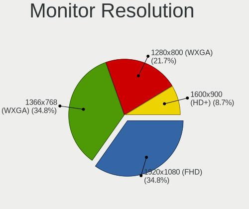

| Resolution      | Notebooks | Percent |
|-----------------|-----------|---------|
| 1366x768 (WXGA) | 10        | 38.46%  |
| 1920x1080 (FHD) | 8         | 30.77%  |
| 1280x800 (WXGA) | 5         | 19.23%  |
| 1600x900 (HD+)  | 3         | 11.54%  |

Monitor Diagonal
----------------

Diagonal size in inches

| Inches | Notebooks | Percent |
|--------|-----------|---------|
| 15     | 9         | 34.62%  |
| 12     | 8         | 30.77%  |
| 13     | 6         | 23.08%  |
| 11     | 2         | 7.69%   |
| 17     | 1         | 3.85%   |

Monitor Width
-------------

Physical width

| Width in mm | Notebooks | Percent |
|-------------|-----------|---------|
| 301-350     | 14        | 53.85%  |
| 201-300     | 11        | 42.31%  |
| 351-400     | 1         | 3.85%   |

Aspect Ratio
------------

Proportional relationship between the width and the height

| Ratio | Notebooks | Percent |
|-------|-----------|---------|
| 16/9  | 21        | 80.77%  |
| 16/10 | 4         | 15.38%  |
| 3/2   | 1         | 3.85%   |

Monitor Area
------------

Area in inch²

| Area in inch² | Notebooks | Percent |
|----------------|-----------|---------|
| 61-70          | 8         | 30.77%  |
| 81-90          | 5         | 19.23%  |
| 91-100         | 5         | 19.23%  |
| 101-110        | 4         | 15.38%  |
| 51-60          | 2         | 7.69%   |
| 71-80          | 1         | 3.85%   |
| 121-130        | 1         | 3.85%   |

Pixel Density
-------------

Pixels per inch

| Density | Notebooks | Percent |
|---------|-----------|---------|
| 121-160 | 19        | 73.08%  |
| 101-120 | 3         | 11.54%  |
| 51-100  | 3         | 11.54%  |
| 161-240 | 1         | 3.85%   |

Multiple Monitors
-----------------

Total monitors connected

| Total | Notebooks | Percent |
|-------|-----------|---------|
| 1     | 34        | 85%     |
| 0     | 6         | 15%     |

Network
-------

Net Controller Vendor
---------------------

Controller vendors

| Vendor                            | Notebooks | Percent |
|-----------------------------------|-----------|---------|
| Intel                             | 30        | 53.57%  |
| Realtek Semiconductor             | 12        | 21.43%  |
| Qualcomm Atheros                  | 4         | 7.14%   |
| Ericsson Business Mobile Networks | 2         | 3.57%   |
| Broadcom                          | 2         | 3.57%   |
| Sierra Wireless                   | 1         | 1.79%   |
| Qualcomm Atheros Communications   | 1         | 1.79%   |
| Nvidia                            | 1         | 1.79%   |
| Marvell Technology Group          | 1         | 1.79%   |
| Dell                              | 1         | 1.79%   |
| ASUSTek Computer                  | 1         | 1.79%   |

Net Controller Model
--------------------

Controller models

| Model                                                                       | Notebooks | Percent |
|-----------------------------------------------------------------------------|-----------|---------|
| Realtek RTL8111/8168/8411 PCI Express Gigabit Ethernet Controller           | 8         | 10.26%  |
| Intel Centrino Advanced-N 6205 [Taylor Peak]                                | 6         | 7.69%   |
| Intel 82579LM Gigabit Network Connection (Lewisville)                       | 6         | 7.69%   |
| Intel Wi-Fi 6 AX200                                                         | 5         | 6.41%   |
| Intel Ultimate N WiFi Link 5300                                             | 4         | 5.13%   |
| Intel 82567LM Gigabit Network Connection                                    | 4         | 5.13%   |
| Intel Wireless 8260                                                         | 3         | 3.85%   |
| Intel Ethernet Connection I219-LM                                           | 3         | 3.85%   |
| Realtek RTL8188CE 802.11b/g/n WiFi Adapter                                  | 2         | 2.56%   |
| Intel Wireless 7265                                                         | 2         | 2.56%   |
| Intel Centrino Advanced-N 6200                                              | 2         | 2.56%   |
| Intel 82577LM Gigabit Network Connection                                    | 2         | 2.56%   |
| Ericsson Business Mobile Networks F5521 gw Mobile Broadband Serial Port III | 2         | 2.56%   |
| Sierra Wireless EM7455                                                      | 1         | 1.28%   |
| Realtek RTL8821CE 802.11ac PCIe Wireless Network Adapter                    | 1         | 1.28%   |
| Realtek RTL8723AE PCIe Wireless Network Adapter                             | 1         | 1.28%   |
| Realtek RTL810xE PCI Express Fast Ethernet controller                       | 1         | 1.28%   |
| Realtek RTL-8100/8101L/8139 PCI Fast Ethernet Adapter                       | 1         | 1.28%   |
| Realtek Killer E2600 Gigabit Ethernet Controller                            | 1         | 1.28%   |
| Qualcomm Atheros QCA9565 / AR9565 Wireless Network Adapter                  | 1         | 1.28%   |
| Qualcomm Atheros AR9271 802.11n                                             | 1         | 1.28%   |
| Qualcomm Atheros AR928X Wireless Network Adapter (PCI-Express)              | 1         | 1.28%   |
| Qualcomm Atheros AR9285 Wireless Network Adapter (PCI-Express)              | 1         | 1.28%   |
| Qualcomm Atheros AR8151 v2.0 Gigabit Ethernet                               | 1         | 1.28%   |
| Qualcomm Atheros AR8121/AR8113/AR8114 Gigabit or Fast Ethernet              | 1         | 1.28%   |
| Nvidia MCP79 Ethernet                                                       | 1         | 1.28%   |
| Marvell Group 88E8053 PCI-E Gigabit Ethernet Controller                     | 1         | 1.28%   |
| Intel Wireless 3165                                                         | 1         | 1.28%   |
| Intel Wi-Fi 6 AX210/AX211/AX411 160MHz                                      | 1         | 1.28%   |
| Intel Wi-Fi 6 AX201 160MHz                                                  | 1         | 1.28%   |
| Intel Wi-Fi 6 AX201                                                         | 1         | 1.28%   |
| Intel PRO/Wireless 3945ABG [Golan] Network Connection                       | 1         | 1.28%   |
| Intel I225-K2                                                               | 1         | 1.28%   |
| Intel Ethernet Connection (3) I218-LM                                       | 1         | 1.28%   |
| Intel Dual Band Wireless-AC 3165 Plus Bluetooth                             | 1         | 1.28%   |
| Intel Comet Lake PCH CNVi WiFi                                              | 1         | 1.28%   |
| Intel Centrino Wireless-N 1030 [Rainbow Peak]                               | 1         | 1.28%   |
| Dell Dell Wireless 5550 HSPA+ Mini-Card Network Adapter                     | 1         | 1.28%   |
| Broadcom NetLink BCM5906M Fast Ethernet PCI Express                         | 1         | 1.28%   |
| Broadcom BCM4322 802.11a/b/g/n Wireless LAN Controller                      | 1         | 1.28%   |

Wireless Vendor
---------------

Wireless vendors

| Vendor                          | Notebooks | Percent |
|---------------------------------|-----------|---------|
| Intel                           | 30        | 69.77%  |
| Realtek Semiconductor           | 4         | 9.3%    |
| Qualcomm Atheros                | 3         | 6.98%   |
| Broadcom                        | 2         | 4.65%   |
| Sierra Wireless                 | 1         | 2.33%   |
| Qualcomm Atheros Communications | 1         | 2.33%   |
| Dell                            | 1         | 2.33%   |
| ASUSTek Computer                | 1         | 2.33%   |

Wireless Model
--------------

Wireless models

| Model                                                          | Notebooks | Percent |
|----------------------------------------------------------------|-----------|---------|
| Intel Centrino Advanced-N 6205 [Taylor Peak]                   | 6         | 13.95%  |
| Intel Wi-Fi 6 AX200                                            | 5         | 11.63%  |
| Intel Ultimate N WiFi Link 5300                                | 4         | 9.3%    |
| Intel Wireless 8260                                            | 3         | 6.98%   |
| Realtek RTL8188CE 802.11b/g/n WiFi Adapter                     | 2         | 4.65%   |
| Intel Wireless 7265                                            | 2         | 4.65%   |
| Intel Centrino Advanced-N 6200                                 | 2         | 4.65%   |
| Sierra Wireless EM7455                                         | 1         | 2.33%   |
| Realtek RTL8821CE 802.11ac PCIe Wireless Network Adapter       | 1         | 2.33%   |
| Realtek RTL8723AE PCIe Wireless Network Adapter                | 1         | 2.33%   |
| Qualcomm Atheros QCA9565 / AR9565 Wireless Network Adapter     | 1         | 2.33%   |
| Qualcomm Atheros AR9271 802.11n                                | 1         | 2.33%   |
| Qualcomm Atheros AR928X Wireless Network Adapter (PCI-Express) | 1         | 2.33%   |
| Qualcomm Atheros AR9285 Wireless Network Adapter (PCI-Express) | 1         | 2.33%   |
| Intel Wireless 3165                                            | 1         | 2.33%   |
| Intel Wi-Fi 6 AX210/AX211/AX411 160MHz                         | 1         | 2.33%   |
| Intel Wi-Fi 6 AX201 160MHz                                     | 1         | 2.33%   |
| Intel Wi-Fi 6 AX201                                            | 1         | 2.33%   |
| Intel PRO/Wireless 3945ABG [Golan] Network Connection          | 1         | 2.33%   |
| Intel Dual Band Wireless-AC 3165 Plus Bluetooth                | 1         | 2.33%   |
| Intel Comet Lake PCH CNVi WiFi                                 | 1         | 2.33%   |
| Intel Centrino Wireless-N 1030 [Rainbow Peak]                  | 1         | 2.33%   |
| Dell Dell Wireless 5550 HSPA+ Mini-Card Network Adapter        | 1         | 2.33%   |
| Broadcom BCM4322 802.11a/b/g/n Wireless LAN Controller         | 1         | 2.33%   |
| Broadcom BCM4312 802.11b/g LP-PHY                              | 1         | 2.33%   |
| ASUS Realtek 8188EUS [USB-N10 Nano]                            | 1         | 2.33%   |

Ethernet Vendor
---------------

Ethernet vendors

| Vendor                   | Notebooks | Percent |
|--------------------------|-----------|---------|
| Intel                    | 17        | 51.52%  |
| Realtek Semiconductor    | 11        | 33.33%  |
| Qualcomm Atheros         | 2         | 6.06%   |
| Nvidia                   | 1         | 3.03%   |
| Marvell Technology Group | 1         | 3.03%   |
| Broadcom                 | 1         | 3.03%   |

Ethernet Model
--------------

Ethernet models

| Model                                                             | Notebooks | Percent |
|-------------------------------------------------------------------|-----------|---------|
| Realtek RTL8111/8168/8411 PCI Express Gigabit Ethernet Controller | 8         | 24.24%  |
| Intel 82579LM Gigabit Network Connection (Lewisville)             | 6         | 18.18%  |
| Intel 82567LM Gigabit Network Connection                          | 4         | 12.12%  |
| Intel Ethernet Connection I219-LM                                 | 3         | 9.09%   |
| Intel 82577LM Gigabit Network Connection                          | 2         | 6.06%   |
| Realtek RTL810xE PCI Express Fast Ethernet controller             | 1         | 3.03%   |
| Realtek RTL-8100/8101L/8139 PCI Fast Ethernet Adapter             | 1         | 3.03%   |
| Realtek Killer E2600 Gigabit Ethernet Controller                  | 1         | 3.03%   |
| Qualcomm Atheros AR8151 v2.0 Gigabit Ethernet                     | 1         | 3.03%   |
| Qualcomm Atheros AR8121/AR8113/AR8114 Gigabit or Fast Ethernet    | 1         | 3.03%   |
| Nvidia MCP79 Ethernet                                             | 1         | 3.03%   |
| Marvell Group 88E8053 PCI-E Gigabit Ethernet Controller           | 1         | 3.03%   |
| Intel I225-K2                                                     | 1         | 3.03%   |
| Intel Ethernet Connection (3) I218-LM                             | 1         | 3.03%   |
| Broadcom NetLink BCM5906M Fast Ethernet PCI Express               | 1         | 3.03%   |

Net Controller Kind
-------------------

Ethernet, WiFi or modem

| Kind     | Notebooks | Percent |
|----------|-----------|---------|
| WiFi     | 39        | 52.7%   |
| Ethernet | 33        | 44.59%  |
| Unknown  | 2         | 2.7%    |

Used Controller
---------------

Currently used network controller

| Kind     | Notebooks | Percent |
|----------|-----------|---------|
| WiFi     | 32        | 80%     |
| Ethernet | 8         | 20%     |

NICs
----

Total network controllers on board

| Total | Notebooks | Percent |
|-------|-----------|---------|
| 2     | 32        | 80%     |
| 1     | 8         | 20%     |

IPv6
----

IPv6 vs IPv4

| Used | Notebooks | Percent |
|------|-----------|---------|
| No   | 39        | 97.5%   |
| Yes  | 1         | 2.5%    |

Bluetooth
---------

Bluetooth Vendor
----------------

Controller vendors

| Vendor                | Notebooks | Percent |
|-----------------------|-----------|---------|
| Intel                 | 14        | 48.28%  |
| Broadcom              | 8         | 27.59%  |
| Alps Electric         | 2         | 6.9%    |
| Realtek Semiconductor | 1         | 3.45%   |
| IMC Networks          | 1         | 3.45%   |
| Foxconn / Hon Hai     | 1         | 3.45%   |
| ASUSTek Computer      | 1         | 3.45%   |
| Apple                 | 1         | 3.45%   |

Bluetooth Model
---------------

Controller models

| Model                                                    | Notebooks | Percent |
|----------------------------------------------------------|-----------|---------|
| Intel Bluetooth wireless interface                       | 6         | 20.69%  |
| Intel AX200 Bluetooth                                    | 3         | 10.34%  |
| Broadcom BCM2045B (BDC-2.1) [Bluetooth Controller]       | 3         | 10.34%  |
| Broadcom BCM2045B (BDC-2.1)                              | 3         | 10.34%  |
| Intel AX201 Bluetooth                                    | 2         | 6.9%    |
| Alps Electric UGTZ4 Bluetooth                            | 2         | 6.9%    |
| Realtek  Bluetooth 4.2 Adapter                           | 1         | 3.45%   |
| Intel Centrino Advanced-N 6230 Bluetooth adapter         | 1         | 3.45%   |
| Intel Bluetooth 9460/9560 Jefferson Peak (JfP)           | 1         | 3.45%   |
| Intel AX210 Bluetooth                                    | 1         | 3.45%   |
| IMC Networks Qualcomm Atheros Bluetooth 4.0 + HS         | 1         | 3.45%   |
| Foxconn / Hon Hai Broadcom BCM20702 Bluetooth USB Device | 1         | 3.45%   |
| Broadcom BCM20702 Bluetooth 4.0 [ThinkPad]               | 1         | 3.45%   |
| Broadcom BCM2046 Bluetooth Device                        | 1         | 3.45%   |
| ASUS Broadcom Bluetooth 2.1                              | 1         | 3.45%   |
| Apple Bluetooth Host Controller                          | 1         | 3.45%   |

Sound
-----

Sound Vendor
------------

Sound card vendors

| Vendor | Notebooks | Percent |
|--------|-----------|---------|
| Intel  | 33        | 78.57%  |
| AMD    | 6         | 14.29%  |
| Nvidia | 3         | 7.14%   |

Sound Model
-----------

Sound card models

| Model                                                                      | Notebooks | Percent |
|----------------------------------------------------------------------------|-----------|---------|
| Intel Sunrise Point-LP HD Audio                                            | 5         | 10%     |
| Intel 6 Series/C200 Series Chipset Family High Definition Audio Controller | 5         | 10%     |
| Intel 82801I (ICH9 Family) HD Audio Controller                             | 4         | 8%      |
| Intel 7 Series/C216 Chipset Family High Definition Audio Controller        | 4         | 8%      |
| AMD Renoir Radeon High Definition Audio Controller                         | 4         | 8%      |
| AMD Family 17h/19h HD Audio Controller                                     | 4         | 8%      |
| Intel NM10/ICH7 Family High Definition Audio Controller                    | 3         | 6%      |
| Intel Wildcat Point-LP High Definition Audio Controller                    | 2         | 4%      |
| Intel Comet Lake PCH cAVS                                                  | 2         | 4%      |
| Intel Celeron/Pentium Silver Processor High Definition Audio               | 2         | 4%      |
| Intel Broadwell-U Audio Controller                                         | 2         | 4%      |
| Intel 5 Series/3400 Series Chipset High Definition Audio                   | 2         | 4%      |
| Nvidia TU107 GeForce GTX 1650 High Definition Audio Controller             | 1         | 2%      |
| Nvidia MCP79 High Definition Audio                                         | 1         | 2%      |
| Nvidia GA104 High Definition Audio Controller                              | 1         | 2%      |
| Intel Tiger Lake-LP Smart Sound Technology Audio Controller                | 1         | 2%      |
| Intel Jasper Lake HD Audio                                                 | 1         | 2%      |
| Intel Celeron N3350/Pentium N4200/Atom E3900 Series Audio Cluster          | 1         | 2%      |
| Intel 82801CA/CAM AC'97 Audio Controller                                   | 1         | 2%      |
| AMD Wrestler HDMI Audio                                                    | 1         | 2%      |
| AMD SBx00 Azalia (Intel HDA)                                               | 1         | 2%      |
| AMD FCH Azalia Controller                                                  | 1         | 2%      |
| AMD BeaverCreek HDMI Audio [Radeon HD 6500D and 6400G-6600G series]        | 1         | 2%      |

Memory
------

Memory Vendor
-------------

Memory module vendors

| Vendor              | Notebooks | Percent |
|---------------------|-----------|---------|
| Unknown             | 4         | 30.77%  |
| Samsung Electronics | 4         | 30.77%  |
| SK hynix            | 3         | 23.08%  |
| Kingston            | 1         | 7.69%   |
| Unknown             | 1         | 7.69%   |

Memory Model
------------

Memory module models

| Model                                                  | Notebooks | Percent |
|--------------------------------------------------------|-----------|---------|
| Samsung RAM M471B5273DH0-CH9 4GB SODIMM DDR3 1334MT/s  | 2         | 14.29%  |
| Unknown RAM Module 512MB SODIMM SDRAM                  | 1         | 7.14%   |
| Unknown RAM Module 4GB SODIMM DDR3 1333MT/s            | 1         | 7.14%   |
| Unknown RAM Module 2GB SODIMM DDR3 1067MT/s            | 1         | 7.14%   |
| Unknown RAM Module 1GB SODIMM DDR2                     | 1         | 7.14%   |
| SK hynix RAM HMT351S6EFR8A-PB 4GB SODIMM DDR3 1600MT/s | 1         | 7.14%   |
| SK hynix RAM HMT325S6BFR8C-H9 2GB SODIMM DDR3 1333MT/s | 1         | 7.14%   |
| SK hynix RAM 484D543332355336 2GB SODIMM DDR3 1333MT/s | 1         | 7.14%   |
| Samsung RAM M471B5673FH0-CF8 2GB SODIMM DDR3 1067MT/s  | 1         | 7.14%   |
| Samsung RAM M471B5673EH1-CF8 2GB SODIMM 1067MT/s       | 1         | 7.14%   |
| Samsung RAM M471B5173BH0-CK0 4GB SODIMM DDR3 1600MT/s  | 1         | 7.14%   |
| Kingston RAM 4143523531325836 4GB SODIMM DDR3 1333MT/s | 1         | 7.14%   |
| Unknown                                                | 1         | 7.14%   |

Memory Kind
-----------

Memory module kinds

| Kind  | Notebooks | Percent |
|-------|-----------|---------|
| DDR3  | 8         | 72.73%  |
| SDRAM | 2         | 18.18%  |
| DDR2  | 1         | 9.09%   |

Memory Form Factor
------------------

Physical design of the memory module

| Name   | Notebooks | Percent |
|--------|-----------|---------|
| SODIMM | 11        | 100%    |

Memory Size
-----------

Memory module size

| Size | Notebooks | Percent |
|------|-----------|---------|
| 4096 | 5         | 41.67%  |
| 2048 | 5         | 41.67%  |
| 1024 | 1         | 8.33%   |
| 512  | 1         | 8.33%   |

Memory Speed
------------

Memory module speed

| Speed   | Notebooks | Percent |
|---------|-----------|---------|
| 1333    | 3         | 27.27%  |
| Unknown | 3         | 27.27%  |
| 1334    | 2         | 18.18%  |
| 1067    | 2         | 18.18%  |
| 1600    | 1         | 9.09%   |

Printers & scanners
-------------------

Printer Vendor
--------------

Printer device vendors

Zero info for selected period =(

Printer Model
-------------

Printer device models

Zero info for selected period =(

Scanner Vendor
--------------

Scanner device vendors

Zero info for selected period =(

Scanner Model
-------------

Scanner device models

Zero info for selected period =(

Camera
------

Camera Vendor
-------------

Camera device vendors

| Vendor                                 | Notebooks | Percent |
|----------------------------------------|-----------|---------|
| Chicony Electronics                    | 11        | 44%     |
| Acer                                   | 4         | 16%     |
| Realtek Semiconductor                  | 2         | 8%      |
| Tripath Technology                     | 1         | 4%      |
| Sunplus Innovation Technology          | 1         | 4%      |
| Ricoh                                  | 1         | 4%      |
| Quanta                                 | 1         | 4%      |
| Lite-On Technology                     | 1         | 4%      |
| Denron                                 | 1         | 4%      |
| Cheng Uei Precision Industry (Foxlink) | 1         | 4%      |
| Alcor Micro                            | 1         | 4%      |

Camera Model
------------

Camera device models

| Model                                                                      | Notebooks | Percent |
|----------------------------------------------------------------------------|-----------|---------|
| Chicony integrated camera                                                  | 5         | 20%     |
| Tripath PC Camera                                                          | 1         | 4%      |
| Sunplus Integrated_Webcam_HD                                               | 1         | 4%      |
| Ricoh Integrated Webcam                                                    | 1         | 4%      |
| Realtek USB Camera                                                         | 1         | 4%      |
| Realtek Integrated_Webcam_HD                                               | 1         | 4%      |
| Quanta VGA WebCam                                                          | 1         | 4%      |
| Lite-On Integrated Camera                                                  | 1         | 4%      |
| Denron Corp., 2M Front Camera                                              | 1         | 4%      |
| Chicony Lenovo Integrated Camera UVC                                       | 1         | 4%      |
| Chicony Lenovo Integrated Camera (0.3MP)                                   | 1         | 4%      |
| Chicony Integrated Camera [ThinkPad]                                       | 1         | 4%      |
| Chicony HD Webcam                                                          | 1         | 4%      |
| Chicony FJ Camera                                                          | 1         | 4%      |
| Chicony 2.0M UVC Webcam / CNF7129                                          | 1         | 4%      |
| Cheng Uei Precision Industry (Foxlink) HP Wide Vision HD Integrated Webcam | 1         | 4%      |
| Alcor Micro ASUS USB2.0 WebCam                                             | 1         | 4%      |
| Acer Integrated Camera                                                     | 1         | 4%      |
| Acer HD Webcam                                                             | 1         | 4%      |
| Acer EasyCamera                                                            | 1         | 4%      |
| Acer BisonCam, NB Pro                                                      | 1         | 4%      |

Security
--------

Fingerprint Vendor
------------------

Fingerprint sensor vendors

| Vendor           | Notebooks | Percent |
|------------------|-----------|---------|
| Validity Sensors | 3         | 42.86%  |
| Upek             | 3         | 42.86%  |
| AuthenTec        | 1         | 14.29%  |

Fingerprint Model
-----------------

Fingerprint sensor models

| Model                                                  | Notebooks | Percent |
|--------------------------------------------------------|-----------|---------|
| Upek Biometric Touchchip/Touchstrip Fingerprint Sensor | 3         | 42.86%  |
| Validity Sensors VFS7500 Touch Fingerprint Sensor      | 1         | 14.29%  |
| Validity Sensors VFS5011 Fingerprint Reader            | 1         | 14.29%  |
| Validity Sensors Synaptics WBDI                        | 1         | 14.29%  |
| AuthenTec AuthenTec Inc. AES2660                       | 1         | 14.29%  |

Chipcard Vendor
---------------

Chipcard module vendors

Zero info for selected period =(

Chipcard Model
--------------

Chipcard module models

Zero info for selected period =(

Unsupported
-----------

Unsupported Devices
-------------------

Total unsupported devices on board

| Total | Notebooks | Percent |
|-------|-----------|---------|
| 1     | 20        | 50%     |
| 2     | 9         | 22.5%   |
| 0     | 6         | 15%     |
| 3     | 3         | 7.5%    |
| 5     | 1         | 2.5%    |
| 4     | 1         | 2.5%    |

Unsupported Device Types
------------------------

Types of unsupported devices

| Type                     | Notebooks | Percent |
|--------------------------|-----------|---------|
| Communication controller | 29        | 54.72%  |
| Graphics card            | 11        | 20.75%  |
| Net/wireless             | 5         | 9.43%   |
| Firewire controller      | 4         | 7.55%   |
| Sound                    | 2         | 3.77%   |
| Storage/ata              | 1         | 1.89%   |
| Network                  | 1         | 1.89%   |

