OpenBSD 7.1 - Tested Hardware & Statistics (Notebooks)
------------------------------------------------------

A project to collect tested hardware configurations for OpenBSD 7.1.

Anyone can contribute to this report by the [hw-probe](https://github.com/linuxhw/hw-probe/blob/master/INSTALL.BSD.md) tool:

    hw-probe -all -upload

Please contribute! Especially if your hardware is rare.

Contents
--------

* [ Test Cases ](#test-cases)

* [ System ](#system)
  - [ Arch                     ](#arch)
  - [ DE                       ](#de)
  - [ Display Server           ](#display-server)
  - [ Display Manager          ](#display-manager)
  - [ OS Lang                  ](#os-lang)
  - [ Boot Mode                ](#boot-mode)
  - [ Filesystem               ](#filesystem)
  - [ Part. scheme             ](#part-scheme)

* [ Board ](#board)
  - [ Vendor                   ](#vendor)
  - [ Model                    ](#model)
  - [ Model Family             ](#model-family)
  - [ MFG Year                 ](#mfg-year)
  - [ Form Factor              ](#form-factor)
  - [ Coreboot                 ](#coreboot)
  - [ RAM Size                 ](#ram-size)
  - [ RAM Used                 ](#ram-used)
  - [ Total Drives             ](#total-drives)
  - [ Has CD-ROM               ](#has-cd-rom)
  - [ Has Ethernet             ](#has-ethernet)
  - [ Has WiFi                 ](#has-wifi)
  - [ Has Bluetooth            ](#has-bluetooth)

* [ Location ](#location)
  - [ Country                  ](#country)
  - [ City                     ](#city)

* [ Drives ](#drives)
  - [ Drive Vendor             ](#drive-vendor)
  - [ Drive Model              ](#drive-model)
  - [ HDD Vendor               ](#hdd-vendor)
  - [ SSD Vendor               ](#ssd-vendor)
  - [ Drive Kind               ](#drive-kind)
  - [ Drive Connector          ](#drive-connector)
  - [ Drive Size               ](#drive-size)
  - [ Space Total              ](#space-total)
  - [ Space Used               ](#space-used)
  - [ Malfunc. Drives          ](#malfunc-drives)
  - [ Malfunc. Drive Vendor    ](#malfunc-drive-vendor)
  - [ Malfunc. HDD Vendor      ](#malfunc-hdd-vendor)
  - [ Malfunc. Drive Kind      ](#malfunc-drive-kind)
  - [ Failed Drives            ](#failed-drives)
  - [ Failed Drive Vendor      ](#failed-drive-vendor)
  - [ Drive Status             ](#drive-status)

* [ Storage controller ](#storage-controller)
  - [ Storage Vendor           ](#storage-vendor)
  - [ Storage Model            ](#storage-model)
  - [ Storage Kind             ](#storage-kind)

* [ Processor ](#processor)
  - [ CPU Vendor               ](#cpu-vendor)
  - [ CPU Model                ](#cpu-model)
  - [ CPU Model Family         ](#cpu-model-family)
  - [ CPU Cores                ](#cpu-cores)
  - [ CPU Sockets              ](#cpu-sockets)
  - [ CPU Threads              ](#cpu-threads)
  - [ CPU Microarch            ](#cpu-microarch)

* [ Graphics ](#graphics)
  - [ GPU Vendor               ](#gpu-vendor)
  - [ GPU Model                ](#gpu-model)
  - [ GPU Combo                ](#gpu-combo)
  - [ GPU Driver               ](#gpu-driver)
  - [ GPU Memory               ](#gpu-memory)

* [ Monitor ](#monitor)
  - [ Monitor Vendor           ](#monitor-vendor)
  - [ Monitor Model            ](#monitor-model)
  - [ Monitor Resolution       ](#monitor-resolution)
  - [ Monitor Diagonal         ](#monitor-diagonal)
  - [ Monitor Width            ](#monitor-width)
  - [ Aspect Ratio             ](#aspect-ratio)
  - [ Monitor Area             ](#monitor-area)
  - [ Pixel Density            ](#pixel-density)
  - [ Multiple Monitors        ](#multiple-monitors)

* [ Network ](#network)
  - [ Net Controller Vendor    ](#net-controller-vendor)
  - [ Net Controller Model     ](#net-controller-model)
  - [ Wireless Vendor          ](#wireless-vendor)
  - [ Wireless Model           ](#wireless-model)
  - [ Ethernet Vendor          ](#ethernet-vendor)
  - [ Ethernet Model           ](#ethernet-model)
  - [ Net Controller Kind      ](#net-controller-kind)
  - [ Used Controller          ](#used-controller)
  - [ NICs                     ](#nics)
  - [ IPv6                     ](#ipv6)

* [ Bluetooth ](#bluetooth)
  - [ Bluetooth Vendor         ](#bluetooth-vendor)
  - [ Bluetooth Model          ](#bluetooth-model)

* [ Sound ](#sound)
  - [ Sound Vendor             ](#sound-vendor)
  - [ Sound Model              ](#sound-model)

* [ Memory ](#memory)
  - [ Memory Vendor            ](#memory-vendor)
  - [ Memory Model             ](#memory-model)
  - [ Memory Kind              ](#memory-kind)
  - [ Memory Form Factor       ](#memory-form-factor)
  - [ Memory Size              ](#memory-size)
  - [ Memory Speed             ](#memory-speed)

* [ Printers & scanners ](#printers--scanners)
  - [ Printer Vendor           ](#printer-vendor)
  - [ Printer Model            ](#printer-model)
  - [ Scanner Vendor           ](#scanner-vendor)
  - [ Scanner Model            ](#scanner-model)

* [ Camera ](#camera)
  - [ Camera Vendor            ](#camera-vendor)
  - [ Camera Model             ](#camera-model)

* [ Security ](#security)
  - [ Fingerprint Vendor       ](#fingerprint-vendor)
  - [ Fingerprint Model        ](#fingerprint-model)
  - [ Chipcard Vendor          ](#chipcard-vendor)
  - [ Chipcard Model           ](#chipcard-model)

* [ Unsupported ](#unsupported)
  - [ Unsupported Devices      ](#unsupported-devices)
  - [ Unsupported Device Types ](#unsupported-device-types)

Test Cases
----------

Total: 11

| Vendor    | Model                       | Probe                                                     | Date         |
|-----------|-----------------------------|-----------------------------------------------------------|--------------|
| Panasonic | CF-52PFPBSFQ                | [1ce63e2214](https://bsd-hardware.info/?probe=1ce63e2214) | Apr 29, 2022 |
| MSI       | Modern 14 B11MOL            | [9a61443be9](https://bsd-hardware.info/?probe=9a61443be9) | Apr 25, 2022 |
| DEXP      | NAVIS P100                  | [a9c8814bf8](https://bsd-hardware.info/?probe=a9c8814bf8) | Apr 22, 2022 |
| Lenovo    | ThinkPad X121e 3053A52      | [68d0bf2a99](https://bsd-hardware.info/?probe=68d0bf2a99) | Apr 22, 2022 |
| TUXEDO    | Pulse 15 Gen1               | [b4a6761ab3](https://bsd-hardware.info/?probe=b4a6761ab3) | Apr 21, 2022 |
| Lenovo    | ThinkPad X200 745969G       | [086a58a68f](https://bsd-hardware.info/?probe=086a58a68f) | Mar 24, 2022 |
| Lenovo    | ThinkPad X200 745969G       | [e973d1e806](https://bsd-hardware.info/?probe=e973d1e806) | Mar 18, 2022 |
| HP        | Pavilion Laptop 15-cs0xx... | [ed0add65a3](https://bsd-hardware.info/?probe=ed0add65a3) | Mar 14, 2022 |
| Lenovo    | Yoga 330-11IGM 81A6         | [621ae0501b](https://bsd-hardware.info/?probe=621ae0501b) | Mar 10, 2022 |
| Dell      | Vostro 3550                 | [4bc5573cf5](https://bsd-hardware.info/?probe=4bc5573cf5) | Mar 02, 2022 |
| Lenovo    | ThinkPad X200 745969G       | [a4341268d0](https://bsd-hardware.info/?probe=a4341268d0) | Feb 23, 2022 |

System
------

Arch
----

OS architecture (x86_64, i586, etc.)

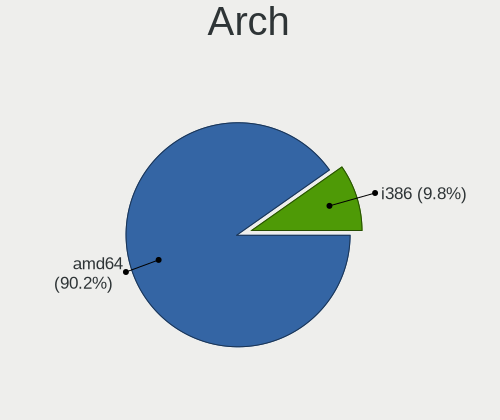

| Name  | Notebooks | Percent |
|-------|-----------|---------|
| amd64 | 11        | 100%    |

DE
--

Desktop Environment

| Name         | Notebooks | Percent |
|--------------|-----------|---------|
| helloDesktop | 6         | 54.55%  |
| fvwm         | 4         | 36.36%  |
| XFCE         | 1         | 9.09%   |

Display Server
--------------

X11 or Wayland

| Name    | Notebooks | Percent |
|---------|-----------|---------|
| X11     | 10        | 90.91%  |
| Console | 1         | 9.09%   |

Display Manager
---------------

SDDM, LightDM, etc.

| Name    | Notebooks | Percent |
|---------|-----------|---------|
| Console | 11        | 100%    |

OS Lang
-------

Language

| Lang    | Notebooks | Percent |
|---------|-----------|---------|
| Unknown | 9         | 81.82%  |
| ru_RU   | 2         | 18.18%  |

Boot Mode
---------

EFI or BIOS

| Mode | Notebooks | Percent |
|------|-----------|---------|
| EFI  | 8         | 72.73%  |
| BIOS | 3         | 27.27%  |

Filesystem
----------

Type of filesystem

| Type | Notebooks | Percent |
|------|-----------|---------|
| Ffs  | 11        | 100%    |

Part. scheme
------------

Scheme of partitioning

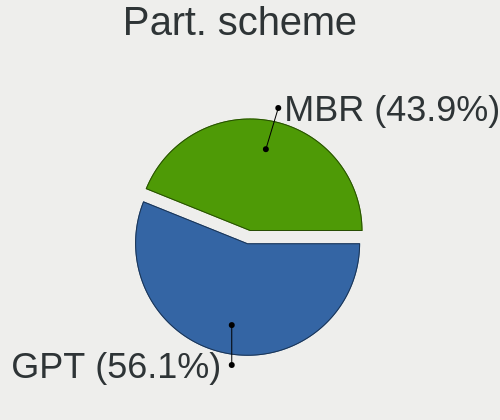

| Type | Notebooks | Percent |
|------|-----------|---------|
| MBR  | 6         | 54.55%  |
| GPT  | 5         | 45.45%  |

Board
-----

Vendor
------

Motherboard manufacturer

| Name            | Notebooks | Percent |
|-----------------|-----------|---------|
| Lenovo          | 5         | 45.45%  |
| TUXEDO          | 1         | 9.09%   |
| Panasonic       | 1         | 9.09%   |
| MSI             | 1         | 9.09%   |
| Hewlett-Packard | 1         | 9.09%   |
| DEXP            | 1         | 9.09%   |
| Dell            | 1         | 9.09%   |

Model
-----

Motherboard model

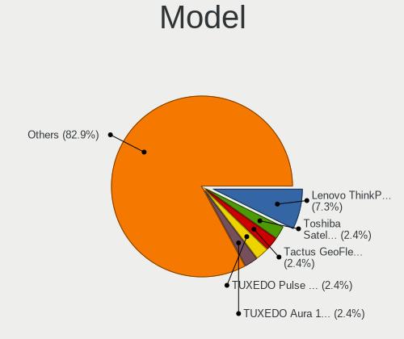

| Name                          | Notebooks | Percent |
|-------------------------------|-----------|---------|
| Lenovo ThinkPad X200 745969G  | 3         | 27.27%  |
| TUXEDO Pulse 15 Gen1          | 1         | 9.09%   |
| Panasonic CF-52PFPBSFQ        | 1         | 9.09%   |
| MSI Modern 14 B11MOL          | 1         | 9.09%   |
| Lenovo Yoga 330-11IGM 81A6    | 1         | 9.09%   |
| Lenovo ThinkPad X121e 3053A52 | 1         | 9.09%   |
| HP Pavilion Laptop 15-cs0xxx  | 1         | 9.09%   |
| DEXP NAVIS P100               | 1         | 9.09%   |
| Dell Vostro 3550              | 1         | 9.09%   |

Model Family
------------

Motherboard model prefix

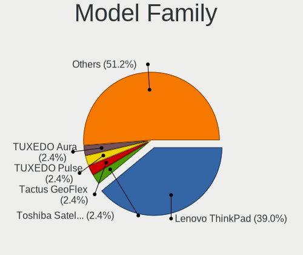

| Name                   | Notebooks | Percent |
|------------------------|-----------|---------|
| Lenovo ThinkPad        | 4         | 36.36%  |
| TUXEDO Pulse           | 1         | 9.09%   |
| Panasonic CF-52PFPBSFQ | 1         | 9.09%   |
| MSI Modern             | 1         | 9.09%   |
| Lenovo Yoga            | 1         | 9.09%   |
| HP Pavilion            | 1         | 9.09%   |
| DEXP NAVIS             | 1         | 9.09%   |
| Dell Vostro            | 1         | 9.09%   |

MFG Year
--------

Motherboard manufacture year

| Year | Notebooks | Percent |
|------|-----------|---------|
| 2018 | 3         | 27.27%  |
| 2009 | 3         | 27.27%  |
| 2021 | 2         | 18.18%  |
| 2014 | 1         | 9.09%   |
| 2011 | 1         | 9.09%   |
| 2010 | 1         | 9.09%   |

Form Factor
-----------

Physical design of the computer

| Name     | Notebooks | Percent |
|----------|-----------|---------|
| Notebook | 11        | 100%    |

Coreboot
--------

Have coreboot on board

| Used | Notebooks | Percent |
|------|-----------|---------|
| No   | 11        | 100%    |

RAM Size
--------

Total RAM memory

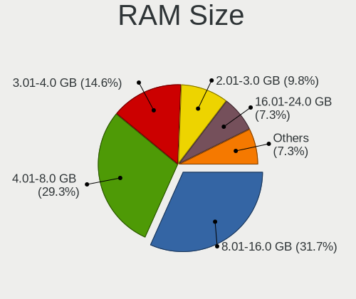

| Size in GB | Notebooks | Percent |
|------------|-----------|---------|
| 4.01-8.0   | 5         | 45.45%  |
| 3.01-4.0   | 2         | 18.18%  |
| 16.01-24.0 | 2         | 18.18%  |
| 2.01-3.0   | 1         | 9.09%   |
| 8.01-16.0  | 1         | 9.09%   |

RAM Used
--------

Used RAM memory

| Used GB  | Notebooks | Percent |
|----------|-----------|---------|
| 0.01-0.5 | 11        | 100%    |

Total Drives
------------

Number of drives on board

| Drives | Notebooks | Percent |
|--------|-----------|---------|
| 2      | 6         | 54.55%  |
| 1      | 3         | 27.27%  |
| 3      | 2         | 18.18%  |

Has CD-ROM
----------

Has CD-ROM on board

| Presented | Notebooks | Percent |
|-----------|-----------|---------|
| No        | 11        | 100%    |

Has Ethernet
------------

Has Ethernet on board

| Presented | Notebooks | Percent |
|-----------|-----------|---------|
| Yes       | 8         | 72.73%  |
| No        | 3         | 27.27%  |

Has WiFi
--------

Has WiFi module

| Presented | Notebooks | Percent |
|-----------|-----------|---------|
| Yes       | 11        | 100%    |

Has Bluetooth
-------------

Has Bluetooth module

| Presented | Notebooks | Percent |
|-----------|-----------|---------|
| Yes       | 10        | 90.91%  |
| No        | 1         | 9.09%   |

Location
--------

Country
-------

Geographic location (country)

| Country | Notebooks | Percent |
|---------|-----------|---------|
| Poland  | 3         | 27.27%  |
| USA     | 2         | 18.18%  |
| Russia  | 2         | 18.18%  |
| UK      | 1         | 9.09%   |
| Spain   | 1         | 9.09%   |
| Chile   | 1         | 9.09%   |
| Canada  | 1         | 9.09%   |

City
----

Geographic location (city)

| City                | Notebooks | Percent |
|---------------------|-----------|---------|
| Vladivostok         | 2         | 18.18%  |
| Gdansk              | 2         | 18.18%  |
| West Valley City    | 1         | 9.09%   |
| Valdivia            | 1         | 9.09%   |
| Starogard Gdański  | 1         | 9.09%   |
| Springboro          | 1         | 9.09%   |
| Newcastle upon Tyne | 1         | 9.09%   |
| Montreal            | 1         | 9.09%   |
| Alcorisa            | 1         | 9.09%   |

Drives
------

Drive Vendor
------------

Hard drive vendors

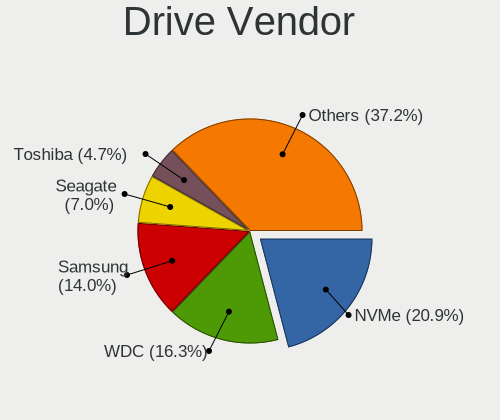

| Vendor              | Notebooks | Drives | Percent |
|---------------------|-----------|--------|---------|
| Samsung Electronics | 3         | 3      | 25%     |
| NVMe                | 2         | 2      | 16.67%  |
| Innostor            | 2         | 2      | 16.67%  |
| WDC                 | 1         | 1      | 8.33%   |
| Seagate             | 1         | 1      | 8.33%   |
| SanDisk             | 1         | 1      | 8.33%   |
| Kingston            | 1         | 1      | 8.33%   |
| HGST                | 1         | 1      | 8.33%   |

Drive Model
-----------

Hard drive models

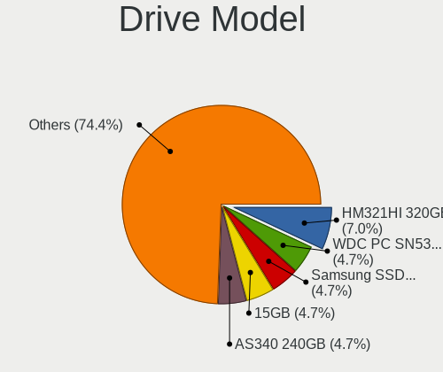

| Model                        | Notebooks | Percent |
|------------------------------|-----------|---------|
| Samsung HM321HI 320GB        | 3         | 25%     |
| Innostor SSD 15GB            | 2         | 16.67%  |
| WDC WD10JPLX-00MBPT0 1TB     | 1         | 8.33%   |
| Seagate ST9500420AS 500GB    | 1         | 8.33%   |
| SanDisk Extreme 55AE 500GB   | 1         | 8.33%   |
| NVMe Samsung SSD 980 500GB   | 1         | 8.33%   |
| NVMe KINGSTON OM8PDP3 256GB  | 1         | 8.33%   |
| Kingston SV300S37A120G 120GB | 1         | 8.33%   |
| HGST HTS541010B7E610 1TB     | 1         | 8.33%   |

HDD Vendor
----------

Hard disk drive vendors

| Vendor              | Notebooks | Drives | Percent |
|---------------------|-----------|--------|---------|
| Samsung Electronics | 3         | 3      | 42.86%  |
| WDC                 | 1         | 1      | 14.29%  |
| Seagate             | 1         | 1      | 14.29%  |
| NVMe                | 1         | 1      | 14.29%  |
| HGST                | 1         | 1      | 14.29%  |

SSD Vendor
----------

Solid state drive vendors

| Vendor   | Notebooks | Drives | Percent |
|----------|-----------|--------|---------|
| Innostor | 2         | 2      | 40%     |
| SanDisk  | 1         | 1      | 20%     |
| NVMe     | 1         | 1      | 20%     |
| Kingston | 1         | 1      | 20%     |

Drive Kind
----------

HDD or SSD

| Kind | Notebooks | Drives | Percent |
|------|-----------|--------|---------|
| HDD  | 7         | 7      | 63.64%  |
| SSD  | 4         | 5      | 36.36%  |

Drive Connector
---------------

SATA, SAS, NVMe, etc.

| Type | Notebooks | Drives | Percent |
|------|-----------|--------|---------|
| SATA | 10        | 12     | 100%    |

Drive Size
----------

Size of hard drive

| Size in TB | Notebooks | Drives | Percent |
|------------|-----------|--------|---------|
| 0.01-0.5   | 8         | 10     | 80%     |
| 0.51-1.0   | 2         | 2      | 20%     |

Space Total
-----------

Amount of disk space available on the file system

| Size in GB | Notebooks | Percent |
|------------|-----------|---------|
| 251-500    | 6         | 54.55%  |
| 1-20       | 2         | 18.18%  |
| 51-100     | 2         | 18.18%  |
| 101-250    | 1         | 9.09%   |

Space Used
----------

Amount of used disk space

| Used GB | Notebooks | Percent |
|---------|-----------|---------|
| 1-20    | 10        | 90.91%  |
| 101-250 | 1         | 9.09%   |

Malfunc. Drives
---------------

Drive models with a malfunction

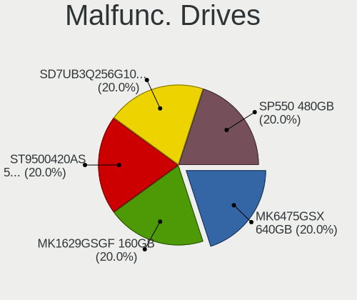

| Model                     | Notebooks | Drives | Percent |
|---------------------------|-----------|--------|---------|
| Seagate ST9500420AS 500GB | 1         | 1      | 100%    |

Malfunc. Drive Vendor
---------------------

Vendors of faulty drives

| Vendor  | Notebooks | Drives | Percent |
|---------|-----------|--------|---------|
| Seagate | 1         | 1      | 100%    |

Malfunc. HDD Vendor
-------------------

Vendors of faulty HDD drives

| Vendor  | Notebooks | Drives | Percent |
|---------|-----------|--------|---------|
| Seagate | 1         | 1      | 100%    |

Malfunc. Drive Kind
-------------------

Kinds of faulty drives

| Kind | Notebooks | Drives | Percent |
|------|-----------|--------|---------|
| HDD  | 1         | 1      | 100%    |

Failed Drives
-------------

Failed drive models

Zero info for selected period =(

Failed Drive Vendor
-------------------

Failed drive vendors

Zero info for selected period =(

Drive Status
------------

Number of failed and malfunc. drives

| Status   | Notebooks | Drives | Percent |
|----------|-----------|--------|---------|
| Works    | 7         | 8      | 70%     |
| Detected | 2         | 3      | 20%     |
| Malfunc  | 1         | 1      | 10%     |

Storage controller
------------------

Storage Vendor
--------------

Storage controller vendors

| Vendor                      | Notebooks | Percent |
|-----------------------------|-----------|---------|
| Intel                       | 8         | 66.67%  |
| AMD                         | 2         | 16.67%  |
| Samsung Electronics         | 1         | 8.33%   |
| Kingston Technology Company | 1         | 8.33%   |

Storage Model
-------------

Storage controller models

| Model                                                                        | Notebooks | Percent |
|------------------------------------------------------------------------------|-----------|---------|
| Intel 82801IBM/IEM (ICH9M/ICH9M-E) 4 port SATA Controller [AHCI mode]        | 3         | 25%     |
| Samsung NVMe SSD Controller PM9A1/PM9A3/980PRO                               | 1         | 8.33%   |
| Kingston Company OM3PDP3 NVMe SSD                                            | 1         | 8.33%   |
| Intel Sunrise Point-LP SATA Controller [AHCI mode]                           | 1         | 8.33%   |
| Intel Celeron/Pentium Silver Processor SATA Controller                       | 1         | 8.33%   |
| Intel Celeron N3350/Pentium N4200/Atom E3900 Series SATA AHCI Controller     | 1         | 8.33%   |
| Intel 6 Series/C200 Series Chipset Family 6 port Mobile SATA AHCI Controller | 1         | 8.33%   |
| Intel 5 Series/3400 Series Chipset 6 port SATA AHCI Controller               | 1         | 8.33%   |
| AMD SB7x0/SB8x0/SB9x0 SATA Controller [AHCI mode]                            | 1         | 8.33%   |
| AMD FCH SATA Controller [AHCI mode]                                          | 1         | 8.33%   |

Storage Kind
------------

Kind of storage controller (IDE, SATA, NVMe, SAS, ...)

| Kind | Notebooks | Percent |
|------|-----------|---------|
| SATA | 10        | 83.33%  |
| NVMe | 2         | 16.67%  |

Processor
---------

CPU Vendor
----------

Processor vendors

| Vendor | Notebooks | Percent |
|--------|-----------|---------|
| Intel  | 8         | 72.73%  |
| AMD    | 2         | 18.18%  |
| 11th   | 1         | 9.09%   |

CPU Model
---------

Processor models

| Model                                    | Notebooks | Percent |
|------------------------------------------|-----------|---------|
| Intel Core 2 Duo CPU P8600 @ 2.40GHz     | 3         | 27.27%  |
| Intel Pentium Silver N5000 CPU @ 1.10GHz | 1         | 9.09%   |
| Intel Core i5-8250U CPU @ 1.60GHz        | 1         | 9.09%   |
| Intel Core i5-2520M CPU @ 2.50GHz        | 1         | 9.09%   |
| Intel Core i5 CPU M 520 @ 2.40GHz        | 1         | 9.09%   |
| Intel Celeron CPU N3350 @ 1.10GHz        | 1         | 9.09%   |
| AMD Ryzen 7 4800H with Radeon Graphics   | 1         | 9.09%   |
| AMD E-300 APU with Radeon HD Graphics    | 1         | 9.09%   |
| 11th Gen Intel Core i5-1135G7 @ 2.40GHz  | 1         | 9.09%   |

CPU Model Family
----------------

Processor model prefix

| Model                | Notebooks | Percent |
|----------------------|-----------|---------|
| Intel Core i5        | 3         | 27.27%  |
| Intel Core 2 Duo     | 3         | 27.27%  |
| Other                | 1         | 9.09%   |
| Intel Pentium Silver | 1         | 9.09%   |
| Intel Celeron        | 1         | 9.09%   |
| AMD Ryzen 7          | 1         | 9.09%   |
| AMD E                | 1         | 9.09%   |

CPU Cores
---------

Number of processor cores

| Number  | Notebooks | Percent |
|---------|-----------|---------|
| 2       | 4         | 36.36%  |
| Unknown | 4         | 36.36%  |
| 4       | 2         | 18.18%  |
| 16      | 1         | 9.09%   |

CPU Sockets
-----------

Number of sockets

| Number  | Notebooks | Percent |
|---------|-----------|---------|
| 1       | 7         | 63.64%  |
| Unknown | 4         | 36.36%  |

CPU Threads
-----------

Threads per core (Hyper-Threading)

| Number  | Notebooks | Percent |
|---------|-----------|---------|
| 1       | 4         | 36.36%  |
| Unknown | 4         | 36.36%  |
| 2       | 3         | 27.27%  |

CPU Microarch
-------------

Microarchitecture

| Name          | Notebooks | Percent |
|---------------|-----------|---------|
| Penryn        | 3         | 27.27%  |
| Zen 2         | 1         | 9.09%   |
| Westmere      | 1         | 9.09%   |
| SandyBridge   | 1         | 9.09%   |
| KabyLake      | 1         | 9.09%   |
| Goldmont plus | 1         | 9.09%   |
| Goldmont      | 1         | 9.09%   |
| Bobcat        | 1         | 9.09%   |
| Unknown       | 1         | 9.09%   |

Graphics
--------

GPU Vendor
----------

Vendors of graphics cards

| Vendor | Notebooks | Percent |
|--------|-----------|---------|
| Intel  | 9         | 75%     |
| AMD    | 3         | 25%     |

GPU Model
---------

Graphics card models

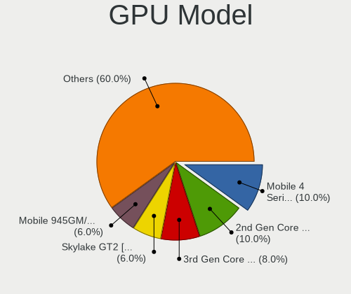

| Model                                                                     | Notebooks | Percent |
|---------------------------------------------------------------------------|-----------|---------|
| Intel Mobile 4 Series Chipset Integrated Graphics Controller              | 3         | 25%     |
| Intel UHD Graphics 620                                                    | 1         | 8.33%   |
| Intel TigerLake-LP GT2 [Iris Xe Graphics]                                 | 1         | 8.33%   |
| Intel HD Graphics 500                                                     | 1         | 8.33%   |
| Intel GeminiLake [UHD Graphics 605]                                       | 1         | 8.33%   |
| Intel Core Processor Integrated Graphics Controller                       | 1         | 8.33%   |
| Intel 2nd Generation Core Processor Family Integrated Graphics Controller | 1         | 8.33%   |
| AMD Wrestler [Radeon HD 6310]                                             | 1         | 8.33%   |
| AMD Whistler [Radeon HD 6630M/6650M/6750M/7670M/7690M]                    | 1         | 8.33%   |
| AMD Renoir                                                                | 1         | 8.33%   |

GPU Combo
---------

Combinations of graphics cards

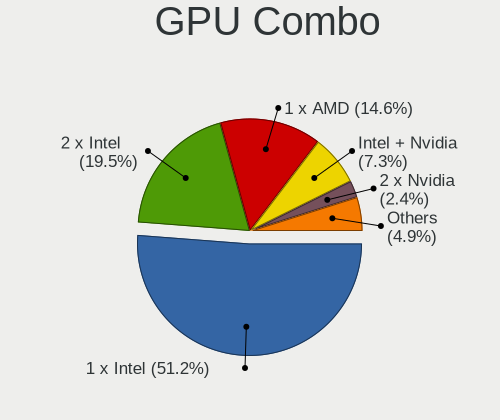

| Name        | Notebooks | Percent |
|-------------|-----------|---------|
| 1 x Intel   | 5         | 45.45%  |
| 2 x Intel   | 3         | 27.27%  |
| 1 x AMD     | 2         | 18.18%  |
| Intel + AMD | 1         | 9.09%   |

GPU Driver
----------

Free vs proprietary

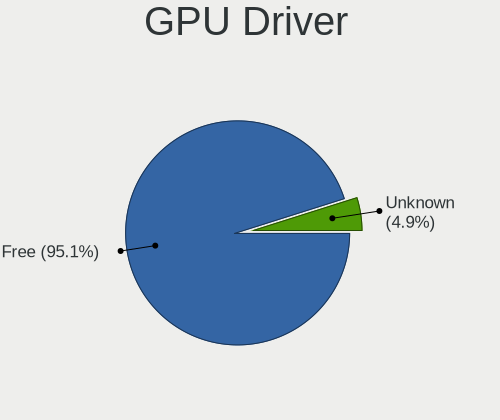

| Driver | Notebooks | Percent |
|--------|-----------|---------|
| Free   | 11        | 100%    |

GPU Memory
----------

Total video memory

| Size in GB | Notebooks | Percent |
|------------|-----------|---------|
| Unknown    | 11        | 100%    |

Monitor
-------

Monitor Vendor
--------------

Monitor vendors

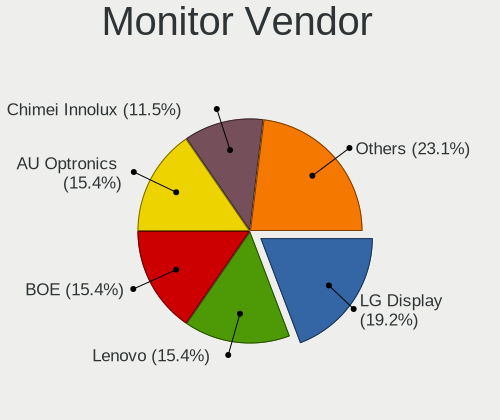

| Vendor                  | Notebooks | Percent |
|-------------------------|-----------|---------|
| Lenovo                  | 3         | 33.33%  |
| BOE                     | 3         | 33.33%  |
| PANDA                   | 1         | 11.11%  |
| Chi Mei Optoelectronics | 1         | 11.11%  |
| AU Optronics            | 1         | 11.11%  |

Monitor Model
-------------

Monitor models

| Model                                                                    | Notebooks | Percent |
|--------------------------------------------------------------------------|-----------|---------|
| Lenovo LCD Monitor LEN4010 1280x800 260x160mm 12.0-inch                  | 3         | 33.33%  |
| PANDA LM133LF1L01 NCP13FB 1920x1080 290x170mm 13.2-inch                  | 1         | 11.11%  |
| Chi Mei Optoelectronics LCD Monitor CMO15A7 1366x768 350x190mm 15.7-inch | 1         | 11.11%  |
| BOE LCD Monitor BOE0900 1920x1080 340x190mm 15.3-inch                    | 1         | 11.11%  |
| BOE LCD Monitor BOE08D7 1920x1080 310x170mm 13.9-inch                    | 1         | 11.11%  |
| BOE LCD Monitor BOE07A5 1366x768 340x190mm 15.3-inch                     | 1         | 11.11%  |
| AU Optronics LCD Monitor AUO315C 1366x768 260x140mm 11.6-inch            | 1         | 11.11%  |

Monitor Resolution
------------------

Monitor screen resolution

| Resolution      | Notebooks | Percent |
|-----------------|-----------|---------|
| 1920x1080 (FHD) | 3         | 33.33%  |
| 1366x768 (WXGA) | 3         | 33.33%  |
| 1280x800 (WXGA) | 3         | 33.33%  |

Monitor Diagonal
----------------

Diagonal size in inches

| Inches | Notebooks | Percent |
|--------|-----------|---------|
| 15     | 3         | 33.33%  |
| 12     | 3         | 33.33%  |
| 13     | 2         | 22.22%  |
| 11     | 1         | 11.11%  |

Monitor Width
-------------

Physical width

| Width in mm | Notebooks | Percent |
|-------------|-----------|---------|
| 201-300     | 5         | 55.56%  |
| 301-350     | 4         | 44.44%  |

Aspect Ratio
------------

Proportional relationship between the width and the height

| Ratio | Notebooks | Percent |
|-------|-----------|---------|
| 16/9  | 6         | 66.67%  |
| 16/10 | 3         | 33.33%  |

Monitor Area
------------

Area in inch²

| Area in inch² | Notebooks | Percent |
|----------------|-----------|---------|
| 61-70          | 3         | 33.33%  |
| 91-100         | 2         | 22.22%  |
| 81-90          | 1         | 11.11%  |
| 71-80          | 1         | 11.11%  |
| 51-60          | 1         | 11.11%  |
| 101-110        | 1         | 11.11%  |

Pixel Density
-------------

Pixels per inch

| Density | Notebooks | Percent |
|---------|-----------|---------|
| 121-160 | 6         | 66.67%  |
| 161-240 | 1         | 11.11%  |
| 101-120 | 1         | 11.11%  |
| 51-100  | 1         | 11.11%  |

Multiple Monitors
-----------------

Total monitors connected

| Total | Notebooks | Percent |
|-------|-----------|---------|
| 1     | 10        | 90.91%  |
| 0     | 1         | 9.09%   |

Network
-------

Net Controller Vendor
---------------------

Controller vendors

| Vendor                            | Notebooks | Percent |
|-----------------------------------|-----------|---------|
| Intel                             | 9         | 52.94%  |
| Realtek Semiconductor             | 4         | 23.53%  |
| Qualcomm Atheros Communications   | 1         | 5.88%   |
| Qualcomm Atheros                  | 1         | 5.88%   |
| Ericsson Business Mobile Networks | 1         | 5.88%   |
| Dell                              | 1         | 5.88%   |

Net Controller Model
--------------------

Controller models

| Model                                                                       | Notebooks | Percent |
|-----------------------------------------------------------------------------|-----------|---------|
| Realtek RTL8111/8168/8411 PCI Express Gigabit Ethernet Controller           | 3         | 13.64%  |
| Intel Ultimate N WiFi Link 5300                                             | 3         | 13.64%  |
| Intel 82567LM Gigabit Network Connection                                    | 3         | 13.64%  |
| Realtek RTL8821CE 802.11ac PCIe Wireless Network Adapter                    | 1         | 4.55%   |
| Realtek RTL8188CE 802.11b/g/n WiFi Adapter                                  | 1         | 4.55%   |
| Qualcomm Atheros AR9271 802.11n                                             | 1         | 4.55%   |
| Qualcomm Atheros AR8151 v2.0 Gigabit Ethernet                               | 1         | 4.55%   |
| Intel Wireless 3165                                                         | 1         | 4.55%   |
| Intel Wi-Fi 6 AX201                                                         | 1         | 4.55%   |
| Intel Wi-Fi 6 AX200                                                         | 1         | 4.55%   |
| Intel Dual Band Wireless-AC 3165 Plus Bluetooth                             | 1         | 4.55%   |
| Intel Centrino Wireless-N 1030 [Rainbow Peak]                               | 1         | 4.55%   |
| Intel Centrino Advanced-N 6200                                              | 1         | 4.55%   |
| Intel 82577LM Gigabit Network Connection                                    | 1         | 4.55%   |
| Ericsson Business Mobile Networks F5521 gw Mobile Broadband Serial Port III | 1         | 4.55%   |
| Dell Dell Wireless 5550 HSPA+ Mini-Card Network Adapter                     | 1         | 4.55%   |

Wireless Vendor
---------------

Wireless vendors

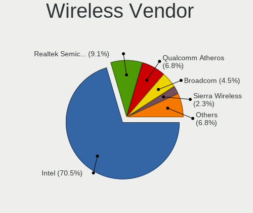

| Vendor                          | Notebooks | Percent |
|---------------------------------|-----------|---------|
| Intel                           | 9         | 69.23%  |
| Realtek Semiconductor           | 2         | 15.38%  |
| Qualcomm Atheros Communications | 1         | 7.69%   |
| Dell                            | 1         | 7.69%   |

Wireless Model
--------------

Wireless models

| Model                                                    | Notebooks | Percent |
|----------------------------------------------------------|-----------|---------|
| Intel Ultimate N WiFi Link 5300                          | 3         | 23.08%  |
| Realtek RTL8821CE 802.11ac PCIe Wireless Network Adapter | 1         | 7.69%   |
| Realtek RTL8188CE 802.11b/g/n WiFi Adapter               | 1         | 7.69%   |
| Qualcomm Atheros AR9271 802.11n                          | 1         | 7.69%   |
| Intel Wireless 3165                                      | 1         | 7.69%   |
| Intel Wi-Fi 6 AX201                                      | 1         | 7.69%   |
| Intel Wi-Fi 6 AX200                                      | 1         | 7.69%   |
| Intel Dual Band Wireless-AC 3165 Plus Bluetooth          | 1         | 7.69%   |
| Intel Centrino Wireless-N 1030 [Rainbow Peak]            | 1         | 7.69%   |
| Intel Centrino Advanced-N 6200                           | 1         | 7.69%   |
| Dell Dell Wireless 5550 HSPA+ Mini-Card Network Adapter  | 1         | 7.69%   |

Ethernet Vendor
---------------

Ethernet vendors

| Vendor                | Notebooks | Percent |
|-----------------------|-----------|---------|
| Intel                 | 4         | 50%     |
| Realtek Semiconductor | 3         | 37.5%   |
| Qualcomm Atheros      | 1         | 12.5%   |

Ethernet Model
--------------

Ethernet models

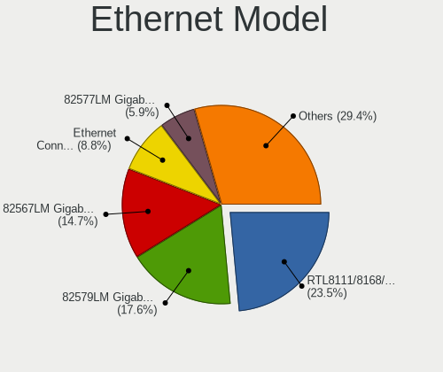

| Model                                                             | Notebooks | Percent |
|-------------------------------------------------------------------|-----------|---------|
| Realtek RTL8111/8168/8411 PCI Express Gigabit Ethernet Controller | 3         | 37.5%   |
| Intel 82567LM Gigabit Network Connection                          | 3         | 37.5%   |
| Qualcomm Atheros AR8151 v2.0 Gigabit Ethernet                     | 1         | 12.5%   |
| Intel 82577LM Gigabit Network Connection                          | 1         | 12.5%   |

Net Controller Kind
-------------------

Ethernet, WiFi or modem

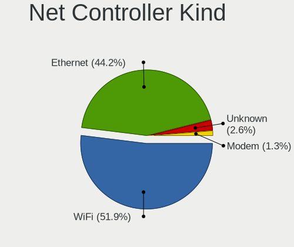

| Kind     | Notebooks | Percent |
|----------|-----------|---------|
| WiFi     | 11        | 55%     |
| Ethernet | 8         | 40%     |
| Unknown  | 1         | 5%      |

Used Controller
---------------

Currently used network controller

| Kind     | Notebooks | Percent |
|----------|-----------|---------|
| WiFi     | 10        | 83.33%  |
| Ethernet | 2         | 16.67%  |

NICs
----

Total network controllers on board

| Total | Notebooks | Percent |
|-------|-----------|---------|
| 2     | 8         | 72.73%  |
| 1     | 3         | 27.27%  |

IPv6
----

IPv6 vs IPv4

| Used | Notebooks | Percent |
|------|-----------|---------|
| No   | 11        | 100%    |

Bluetooth
---------

Bluetooth Vendor
----------------

Controller vendors

| Vendor                | Notebooks | Percent |
|-----------------------|-----------|---------|
| Intel                 | 5         | 50%     |
| Broadcom              | 3         | 30%     |
| Realtek Semiconductor | 1         | 10%     |
| Alps Electric         | 1         | 10%     |

Bluetooth Model
---------------

Controller models

| Model                                              | Notebooks | Percent |
|----------------------------------------------------|-----------|---------|
| Broadcom BCM2045B (BDC-2.1) [Bluetooth Controller] | 3         | 30%     |
| Intel Bluetooth wireless interface                 | 2         | 20%     |
| Realtek  Bluetooth 4.2 Adapter                     | 1         | 10%     |
| Intel Centrino Advanced-N 6230 Bluetooth adapter   | 1         | 10%     |
| Intel AX201 Bluetooth                              | 1         | 10%     |
| Intel AX200 Bluetooth                              | 1         | 10%     |
| Alps Electric UGTZ4 Bluetooth                      | 1         | 10%     |

Sound
-----

Sound Vendor
------------

Sound card vendors

| Vendor | Notebooks | Percent |
|--------|-----------|---------|
| Intel  | 9         | 81.82%  |
| AMD    | 2         | 18.18%  |

Sound Model
-----------

Sound card models

| Model                                                                      | Notebooks | Percent |
|----------------------------------------------------------------------------|-----------|---------|
| Intel 82801I (ICH9 Family) HD Audio Controller                             | 3         | 23.08%  |
| Intel Tiger Lake-LP Smart Sound Technology Audio Controller                | 1         | 7.69%   |
| Intel Sunrise Point-LP HD Audio                                            | 1         | 7.69%   |
| Intel Celeron/Pentium Silver Processor High Definition Audio               | 1         | 7.69%   |
| Intel Celeron N3350/Pentium N4200/Atom E3900 Series Audio Cluster          | 1         | 7.69%   |
| Intel 6 Series/C200 Series Chipset Family High Definition Audio Controller | 1         | 7.69%   |
| Intel 5 Series/3400 Series Chipset High Definition Audio                   | 1         | 7.69%   |
| AMD Wrestler HDMI Audio                                                    | 1         | 7.69%   |
| AMD SBx00 Azalia (Intel HDA)                                               | 1         | 7.69%   |
| AMD Renoir Radeon High Definition Audio Controller                         | 1         | 7.69%   |
| AMD Family 17h/19h HD Audio Controller                                     | 1         | 7.69%   |

Memory
------

Memory Vendor
-------------

Memory module vendors

| Vendor   | Notebooks | Percent |
|----------|-----------|---------|
| Unknown  | 1         | 33.33%  |
| SK Hynix | 1         | 33.33%  |
| Kingston | 1         | 33.33%  |

Memory Model
------------

Memory module models

| Model                                                  | Notebooks | Percent |
|--------------------------------------------------------|-----------|---------|
| Unknown RAM Module 2GB SODIMM DDR3 1067MT/s            | 1         | 33.33%  |
| SK Hynix RAM 484D543332355336 2GB SODIMM DDR3 1333MT/s | 1         | 33.33%  |
| Kingston RAM 4143523531325836 4GB SODIMM DDR3 1333MT/s | 1         | 33.33%  |

Memory Kind
-----------

Memory module kinds

| Kind | Notebooks | Percent |
|------|-----------|---------|
| DDR3 | 2         | 100%    |

Memory Form Factor
------------------

Physical design of the memory module

| Name   | Notebooks | Percent |
|--------|-----------|---------|
| SODIMM | 2         | 100%    |

Memory Size
-----------

Memory module size

| Size | Notebooks | Percent |
|------|-----------|---------|
| 2048 | 2         | 66.67%  |
| 4096 | 1         | 33.33%  |

Memory Speed
------------

Memory module speed

| Speed | Notebooks | Percent |
|-------|-----------|---------|
| 1333  | 1         | 50%     |
| 1067  | 1         | 50%     |

Printers & scanners
-------------------

Printer Vendor
--------------

Printer device vendors

Zero info for selected period =(

Printer Model
-------------

Printer device models

Zero info for selected period =(

Scanner Vendor
--------------

Scanner device vendors

Zero info for selected period =(

Scanner Model
-------------

Scanner device models

Zero info for selected period =(

Camera
------

Camera Vendor
-------------

Camera device vendors

| Vendor                                 | Notebooks | Percent |
|----------------------------------------|-----------|---------|
| Chicony Electronics                    | 2         | 28.57%  |
| Acer                                   | 2         | 28.57%  |
| Ricoh                                  | 1         | 14.29%  |
| Denron                                 | 1         | 14.29%  |
| Cheng Uei Precision Industry (Foxlink) | 1         | 14.29%  |

Camera Model
------------

Camera device models

| Model                                                                      | Notebooks | Percent |
|----------------------------------------------------------------------------|-----------|---------|
| Ricoh Integrated Webcam                                                    | 1         | 14.29%  |
| Denron Corp., 2M Front Camera                                              | 1         | 14.29%  |
| Chicony Lenovo Integrated Camera UVC                                       | 1         | 14.29%  |
| Chicony HD Webcam                                                          | 1         | 14.29%  |
| Cheng Uei Precision Industry (Foxlink) HP Wide Vision HD Integrated Webcam | 1         | 14.29%  |
| Acer HD Webcam                                                             | 1         | 14.29%  |
| Acer EasyCamera                                                            | 1         | 14.29%  |

Security
--------

Fingerprint Vendor
------------------

Fingerprint sensor vendors

| Vendor           | Notebooks | Percent |
|------------------|-----------|---------|
| Validity Sensors | 1         | 100%    |

Fingerprint Model
-----------------

Fingerprint sensor models

| Model                                       | Notebooks | Percent |
|---------------------------------------------|-----------|---------|
| Validity Sensors VFS5011 Fingerprint Reader | 1         | 100%    |

Chipcard Vendor
---------------

Chipcard module vendors

Zero info for selected period =(

Chipcard Model
--------------

Chipcard module models

Zero info for selected period =(

Unsupported
-----------

Unsupported Devices
-------------------

Total unsupported devices on board

| Total | Notebooks | Percent |
|-------|-----------|---------|
| 1     | 5         | 45.45%  |
| 2     | 4         | 36.36%  |
| 0     | 2         | 18.18%  |

Unsupported Device Types
------------------------

Types of unsupported devices

| Type                     | Notebooks | Percent |
|--------------------------|-----------|---------|
| Communication controller | 8         | 61.54%  |
| Graphics card            | 3         | 23.08%  |
| Net/wireless             | 1         | 7.69%   |
| Firewire controller      | 1         | 7.69%   |

