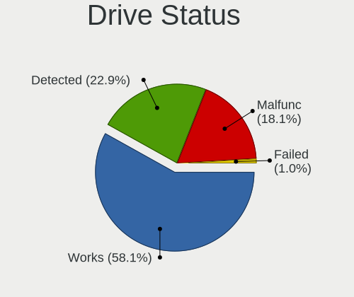
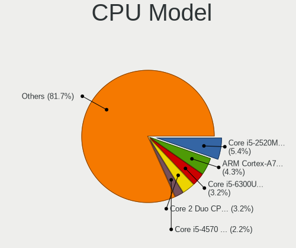
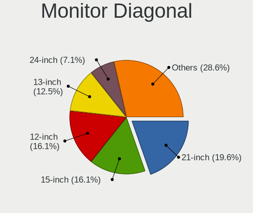
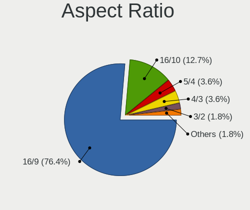
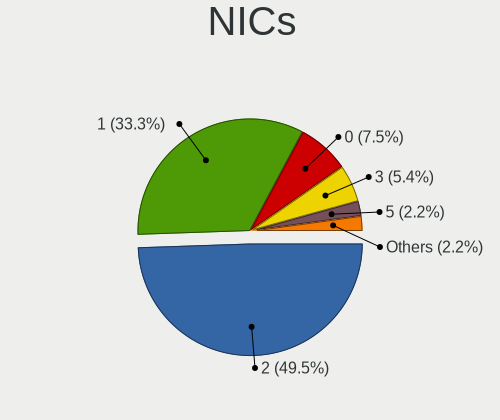
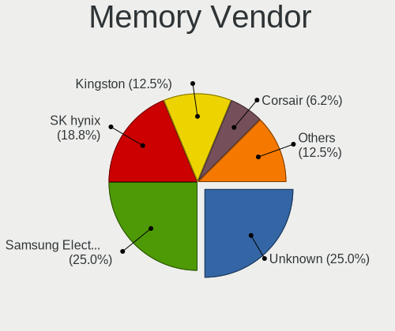

OpenBSD 7.1 - Tested Hardware & Statistics
------------------------------------------

A project to collect tested hardware configurations for OpenBSD 7.1.

Anyone can contribute to this report by the [hw-probe](https://github.com/linuxhw/hw-probe/blob/master/INSTALL.BSD.md) tool:

    hw-probe -all -upload

Please contribute! Especially if your hardware is rare.

This is a report for all computer types. See also reports for [desktops](/Dist/OpenBSD_7.1/Desktop/README.md) and [notebooks](/Dist/OpenBSD_7.1/Notebook/README.md).

Contents
--------

* [ Test Cases ](#test-cases)

* [ System ](#system)
  - [ Arch                     ](#arch)
  - [ DE                       ](#de)
  - [ Display Server           ](#display-server)
  - [ Display Manager          ](#display-manager)
  - [ OS Lang                  ](#os-lang)
  - [ Boot Mode                ](#boot-mode)
  - [ Filesystem               ](#filesystem)
  - [ Part. scheme             ](#part-scheme)

* [ Board ](#board)
  - [ Vendor                   ](#vendor)
  - [ Model                    ](#model)
  - [ Model Family             ](#model-family)
  - [ MFG Year                 ](#mfg-year)
  - [ Form Factor              ](#form-factor)
  - [ Coreboot                 ](#coreboot)
  - [ RAM Size                 ](#ram-size)
  - [ RAM Used                 ](#ram-used)
  - [ Total Drives             ](#total-drives)
  - [ Has CD-ROM               ](#has-cd-rom)
  - [ Has Ethernet             ](#has-ethernet)
  - [ Has WiFi                 ](#has-wifi)
  - [ Has Bluetooth            ](#has-bluetooth)

* [ Location ](#location)
  - [ Country                  ](#country)
  - [ City                     ](#city)

* [ Drives ](#drives)
  - [ Drive Vendor             ](#drive-vendor)
  - [ Drive Model              ](#drive-model)
  - [ HDD Vendor               ](#hdd-vendor)
  - [ SSD Vendor               ](#ssd-vendor)
  - [ Drive Kind               ](#drive-kind)
  - [ Drive Connector          ](#drive-connector)
  - [ Drive Size               ](#drive-size)
  - [ Space Total              ](#space-total)
  - [ Space Used               ](#space-used)
  - [ Malfunc. Drives          ](#malfunc-drives)
  - [ Malfunc. Drive Vendor    ](#malfunc-drive-vendor)
  - [ Malfunc. HDD Vendor      ](#malfunc-hdd-vendor)
  - [ Malfunc. Drive Kind      ](#malfunc-drive-kind)
  - [ Failed Drives            ](#failed-drives)
  - [ Failed Drive Vendor      ](#failed-drive-vendor)
  - [ Drive Status             ](#drive-status)

* [ Storage controller ](#storage-controller)
  - [ Storage Vendor           ](#storage-vendor)
  - [ Storage Model            ](#storage-model)
  - [ Storage Kind             ](#storage-kind)

* [ Processor ](#processor)
  - [ CPU Vendor               ](#cpu-vendor)
  - [ CPU Model                ](#cpu-model)
  - [ CPU Model Family         ](#cpu-model-family)
  - [ CPU Cores                ](#cpu-cores)
  - [ CPU Sockets              ](#cpu-sockets)
  - [ CPU Threads              ](#cpu-threads)
  - [ CPU Microarch            ](#cpu-microarch)

* [ Graphics ](#graphics)
  - [ GPU Vendor               ](#gpu-vendor)
  - [ GPU Model                ](#gpu-model)
  - [ GPU Combo                ](#gpu-combo)
  - [ GPU Driver               ](#gpu-driver)
  - [ GPU Memory               ](#gpu-memory)

* [ Monitor ](#monitor)
  - [ Monitor Vendor           ](#monitor-vendor)
  - [ Monitor Model            ](#monitor-model)
  - [ Monitor Resolution       ](#monitor-resolution)
  - [ Monitor Diagonal         ](#monitor-diagonal)
  - [ Monitor Width            ](#monitor-width)
  - [ Aspect Ratio             ](#aspect-ratio)
  - [ Monitor Area             ](#monitor-area)
  - [ Pixel Density            ](#pixel-density)
  - [ Multiple Monitors        ](#multiple-monitors)

* [ Network ](#network)
  - [ Net Controller Vendor    ](#net-controller-vendor)
  - [ Net Controller Model     ](#net-controller-model)
  - [ Wireless Vendor          ](#wireless-vendor)
  - [ Wireless Model           ](#wireless-model)
  - [ Ethernet Vendor          ](#ethernet-vendor)
  - [ Ethernet Model           ](#ethernet-model)
  - [ Net Controller Kind      ](#net-controller-kind)
  - [ Used Controller          ](#used-controller)
  - [ NICs                     ](#nics)
  - [ IPv6                     ](#ipv6)

* [ Bluetooth ](#bluetooth)
  - [ Bluetooth Vendor         ](#bluetooth-vendor)
  - [ Bluetooth Model          ](#bluetooth-model)

* [ Sound ](#sound)
  - [ Sound Vendor             ](#sound-vendor)
  - [ Sound Model              ](#sound-model)

* [ Memory ](#memory)
  - [ Memory Vendor            ](#memory-vendor)
  - [ Memory Model             ](#memory-model)
  - [ Memory Kind              ](#memory-kind)
  - [ Memory Form Factor       ](#memory-form-factor)
  - [ Memory Size              ](#memory-size)
  - [ Memory Speed             ](#memory-speed)

* [ Printers & scanners ](#printers--scanners)
  - [ Printer Vendor           ](#printer-vendor)
  - [ Printer Model            ](#printer-model)
  - [ Scanner Vendor           ](#scanner-vendor)
  - [ Scanner Model            ](#scanner-model)

* [ Camera ](#camera)
  - [ Camera Vendor            ](#camera-vendor)
  - [ Camera Model             ](#camera-model)

* [ Security ](#security)
  - [ Fingerprint Vendor       ](#fingerprint-vendor)
  - [ Fingerprint Model        ](#fingerprint-model)
  - [ Chipcard Vendor          ](#chipcard-vendor)
  - [ Chipcard Model           ](#chipcard-model)

* [ Unsupported ](#unsupported)
  - [ Unsupported Devices      ](#unsupported-devices)
  - [ Unsupported Device Types ](#unsupported-device-types)

Test Cases
----------

Total: 63

| Vendor        | Model                       | Form-Factor | Probe                                                     | Date         |
|---------------|-----------------------------|-------------|-----------------------------------------------------------|--------------|
| Dell          | Inspiron 5515               | Notebook    | [dca437b993](https://bsd-hardware.info/?probe=dca437b993) | Jul 01, 2022 |
| ASUSTek       | TUF Gaming B550-PLUS        | Desktop     | [77acc9f5cf](https://bsd-hardware.info/?probe=77acc9f5cf) | Jul 01, 2022 |
| ASUSTek       | TUF Gaming B550-PLUS        | Desktop     | [ffa0086c70](https://bsd-hardware.info/?probe=ffa0086c70) | Jul 01, 2022 |
| Gigabyte      | G41MT-S2                    | Desktop     | [0563158740](https://bsd-hardware.info/?probe=0563158740) | Jun 28, 2022 |
| ASUSTek       | K53TA                       | Notebook    | [6ce39c5e61](https://bsd-hardware.info/?probe=6ce39c5e61) | Jun 27, 2022 |
| MSI           | MS-7C02                     | Desktop     | [65265eea62](https://bsd-hardware.info/?probe=65265eea62) | Jun 20, 2022 |
| Lenovo        | ThinkPad T530 24292VG       | Desktop     | [6f744019ce](https://bsd-hardware.info/?probe=6f744019ce) | Jun 19, 2022 |
| Apple         | MacPro4,1                   | Desktop     | [65380f3847](https://bsd-hardware.info/?probe=65380f3847) | Jun 06, 2022 |
| Lenovo        | ThinkPad L530 24812TG       | Notebook    | [5b66684c4a](https://bsd-hardware.info/?probe=5b66684c4a) | Jun 05, 2022 |
| Lenovo        | ThinkPad Yoga 260 20FES1... | Notebook    | [73ab89b8f0](https://bsd-hardware.info/?probe=73ab89b8f0) | Jun 05, 2022 |
| Lenovo        | ThinkPad Yoga 260 20FES1... | Notebook    | [637f87f44e](https://bsd-hardware.info/?probe=637f87f44e) | Jun 05, 2022 |
| ASUSTek       | PRIME H410M-E               | Desktop     | [8099e7abaf](https://bsd-hardware.info/?probe=8099e7abaf) | Jun 03, 2022 |
| MSI           | MS-6788                     | Desktop     | [f750cb83e3](https://bsd-hardware.info/?probe=f750cb83e3) | May 31, 2022 |
| Apple         | MacBookPro5,3               | Notebook    | [3b03bdf595](https://bsd-hardware.info/?probe=3b03bdf595) | May 29, 2022 |
| Unknown       | Raspberry Pi 4 Model B R... | Desktop     | [ade09344b8](https://bsd-hardware.info/?probe=ade09344b8) | May 26, 2022 |
| Unknown       | Raspberry Pi 4 Model B R... | Desktop     | [cc37ea1b7d](https://bsd-hardware.info/?probe=cc37ea1b7d) | May 26, 2022 |
| Unknown       | Raspberry Pi 4 Model B R... | Desktop     | [abacee12a9](https://bsd-hardware.info/?probe=abacee12a9) | May 26, 2022 |
| Unknown       | Raspberry Pi 3 Model B P... | Desktop     | [21fa41e4c1](https://bsd-hardware.info/?probe=21fa41e4c1) | May 26, 2022 |
| Gigabyte      | H81M-S2PV                   | Desktop     | [1937e77b97](https://bsd-hardware.info/?probe=1937e77b97) | May 22, 2022 |
| Biostar       | G31-M7 TE                   | Desktop     | [5c7af4b143](https://bsd-hardware.info/?probe=5c7af4b143) | May 21, 2022 |
| ASUSTek       | PRIME B550M-K               | Desktop     | [ce5ddde5ad](https://bsd-hardware.info/?probe=ce5ddde5ad) | May 18, 2022 |
| MSI           | MS-7C82                     | Desktop     | [2ad883afec](https://bsd-hardware.info/?probe=2ad883afec) | May 15, 2022 |
| Lenovo        | ThinkPad X250 20CLS4WV08    | Notebook    | [0419c52079](https://bsd-hardware.info/?probe=0419c52079) | May 11, 2022 |
| ASUSTek       | PRIME X470-PRO              | Desktop     | [9f6b4f114d](https://bsd-hardware.info/?probe=9f6b4f114d) | May 11, 2022 |
| Lenovo        | ThinkPad E14 Gen 2 20T60... | Notebook    | [64600e1c24](https://bsd-hardware.info/?probe=64600e1c24) | May 11, 2022 |
| TUXEDO        | Aura 15 Gen1                | Notebook    | [49d1cd3009](https://bsd-hardware.info/?probe=49d1cd3009) | May 10, 2022 |
| Unknown       | Raspberry Pi 4 Model B R... | Desktop     | [154799d7fa](https://bsd-hardware.info/?probe=154799d7fa) | May 08, 2022 |
| Fujitsu       | LIFEBOOK E752               | Notebook    | [3e60a82218](https://bsd-hardware.info/?probe=3e60a82218) | May 06, 2022 |
| ASUSTek       | 1000HE                      | Notebook    | [a6393754b4](https://bsd-hardware.info/?probe=a6393754b4) | May 05, 2022 |
| Matsushita... | CF-48V4KNDQM                | Notebook    | [774cab5326](https://bsd-hardware.info/?probe=774cab5326) | May 03, 2022 |
| Matsushita... | CF-51RCVDNLM                | Notebook    | [4b1abdd507](https://bsd-hardware.info/?probe=4b1abdd507) | May 03, 2022 |
| Lenovo        | ThinkPad T410 2537N24       | Notebook    | [2884106c6b](https://bsd-hardware.info/?probe=2884106c6b) | May 03, 2022 |
| Lenovo        | ThinkPad T430 2347GZU       | Notebook    | [00ba6ca9f8](https://bsd-hardware.info/?probe=00ba6ca9f8) | May 03, 2022 |
| Intel         | Q3XXG4-P                    | Desktop     | [ed04988a23](https://bsd-hardware.info/?probe=ed04988a23) | May 03, 2022 |
| Lenovo        | ThinkPad T420s 41742BU      | Notebook    | [6b77fe651f](https://bsd-hardware.info/?probe=6b77fe651f) | May 03, 2022 |
| Lenovo        | ThinkPad X220 429043U       | Notebook    | [f3c30a6190](https://bsd-hardware.info/?probe=f3c30a6190) | May 02, 2022 |
| Panasonic     | CF-53AAGHYDM                | Notebook    | [abd8754907](https://bsd-hardware.info/?probe=abd8754907) | May 01, 2022 |
| Panasonic     | CF-52PFPBSFQ                | Notebook    | [1ce63e2214](https://bsd-hardware.info/?probe=1ce63e2214) | Apr 29, 2022 |
| MSI           | MS-7C37                     | Desktop     | [aaab7cf22a](https://bsd-hardware.info/?probe=aaab7cf22a) | Apr 28, 2022 |
| MSI           | Modern 14 B11MOL            | Notebook    | [9a61443be9](https://bsd-hardware.info/?probe=9a61443be9) | Apr 25, 2022 |
| ASUSTek       | M4A88TD-V EVO/USB3          | Desktop     | [12cc40cc60](https://bsd-hardware.info/?probe=12cc40cc60) | Apr 23, 2022 |
| PC Engines    | APU2                        | Desktop     | [04a6549c99](https://bsd-hardware.info/?probe=04a6549c99) | Apr 23, 2022 |
| Intel         | DH67BL                      | Desktop     | [3c3c9e12da](https://bsd-hardware.info/?probe=3c3c9e12da) | Apr 22, 2022 |
| KOHJINSHA     | SH series                   | Desktop     | [3136a0ca03](https://bsd-hardware.info/?probe=3136a0ca03) | Apr 22, 2022 |
| Lenovo        | ThinkPad X240 20ALA0AHRT    | Desktop     | [062a08c811](https://bsd-hardware.info/?probe=062a08c811) | Apr 22, 2022 |
| DEXP          | NAVIS P100                  | Notebook    | [a9c8814bf8](https://bsd-hardware.info/?probe=a9c8814bf8) | Apr 22, 2022 |
| Sony          | VPCL22Z1R                   | Desktop     | [f199d57905](https://bsd-hardware.info/?probe=f199d57905) | Apr 22, 2022 |
| Lenovo        | ThinkPad X121e 3053A52      | Notebook    | [68d0bf2a99](https://bsd-hardware.info/?probe=68d0bf2a99) | Apr 22, 2022 |
| Samsung       | DP700A3D-X01RU SEC_SW_RE... | All in one  | [22febd212f](https://bsd-hardware.info/?probe=22febd212f) | Apr 22, 2022 |
| ASUSTek       | Z170-K                      | Desktop     | [b16705bbbd](https://bsd-hardware.info/?probe=b16705bbbd) | Apr 22, 2022 |
| ASUSTek       | P10S-I Series               | Desktop     | [aca13dba36](https://bsd-hardware.info/?probe=aca13dba36) | Apr 22, 2022 |
| TUXEDO        | Pulse 15 Gen1               | Notebook    | [b4a6761ab3](https://bsd-hardware.info/?probe=b4a6761ab3) | Apr 21, 2022 |
| Dell          | G5 5090                     | Desktop     | [8b24170852](https://bsd-hardware.info/?probe=8b24170852) | Apr 17, 2022 |
| Lenovo        | ThinkPad X200 745969G       | Notebook    | [086a58a68f](https://bsd-hardware.info/?probe=086a58a68f) | Mar 24, 2022 |
| Lenovo        | ThinkCentre M93p 10AAS25... | Desktop     | [32d27b9404](https://bsd-hardware.info/?probe=32d27b9404) | Mar 19, 2022 |
| Lenovo        | ThinkCentre M93p 10AAS25... | Desktop     | [7361628ed9](https://bsd-hardware.info/?probe=7361628ed9) | Mar 19, 2022 |
| Lenovo        | ThinkPad X200 745969G       | Notebook    | [e973d1e806](https://bsd-hardware.info/?probe=e973d1e806) | Mar 18, 2022 |
| HP            | Pavilion Laptop 15-cs0xx... | Notebook    | [ed0add65a3](https://bsd-hardware.info/?probe=ed0add65a3) | Mar 14, 2022 |
| Lenovo        | Yoga 330-11IGM 81A6         | Notebook    | [621ae0501b](https://bsd-hardware.info/?probe=621ae0501b) | Mar 10, 2022 |
| Unknown       | LeMaker Banana Pi           | Desktop     | [37e7d1912b](https://bsd-hardware.info/?probe=37e7d1912b) | Mar 05, 2022 |
| Dell          | Vostro 3550                 | Notebook    | [4bc5573cf5](https://bsd-hardware.info/?probe=4bc5573cf5) | Mar 02, 2022 |
| Lenovo        | ThinkPad X200 745969G       | Notebook    | [a4341268d0](https://bsd-hardware.info/?probe=a4341268d0) | Feb 23, 2022 |
| Acer          | Aspire A114-33              | Notebook    | [62f4e0a060](https://bsd-hardware.info/?probe=62f4e0a060) | Feb 21, 2022 |

System
------

Arch
----

OS architecture (x86_64, i586, etc.)

| Name  | Computers | Percent |
|-------|-----------|---------|
| amd64 | 49        | 81.67%  |
| i386  | 5         | 8.33%   |
| arm64 | 5         | 8.33%   |
| armv7 | 1         | 1.67%   |

DE
--

Desktop Environment

| Name         | Computers | Percent |
|--------------|-----------|---------|
| helloDesktop | 48        | 80%     |
| fvwm         | 5         | 8.33%   |
| XFCE         | 4         | 6.67%   |
| MATE         | 1         | 1.67%   |
| GNOME        | 1         | 1.67%   |
| Console      | 1         | 1.67%   |

Display Server
--------------

X11 or Wayland

| Name    | Computers | Percent |
|---------|-----------|---------|
| X11     | 44        | 73.33%  |
| Console | 16        | 26.67%  |

Display Manager
---------------

SDDM, LightDM, etc.

| Name    | Computers | Percent |
|---------|-----------|---------|
| Console | 60        | 100%    |

OS Lang
-------

Language

| Lang    | Computers | Percent |
|---------|-----------|---------|
| Unknown | 50        | 83.33%  |
| ru_RU   | 8         | 13.33%  |
| en_GB   | 1         | 1.67%   |
| C       | 1         | 1.67%   |

Boot Mode
---------

EFI or BIOS

| Mode | Computers | Percent |
|------|-----------|---------|
| EFI  | 31        | 51.67%  |
| BIOS | 29        | 48.33%  |

Filesystem
----------

Type of filesystem

| Type | Computers | Percent |
|------|-----------|---------|
| Ffs  | 60        | 100%    |

Part. scheme
------------

Scheme of partitioning

| Type | Computers | Percent |
|------|-----------|---------|
| MBR  | 36        | 60%     |
| GPT  | 24        | 40%     |

Board
-----

Vendor
------

Motherboard manufacturer

| Name                           | Computers | Percent |
|--------------------------------|-----------|---------|
| Lenovo                         | 16        | 26.67%  |
| ASUSTek Computer               | 9         | 15%     |
| Unknown                        | 6         | 10%     |
| MSI                            | 5         | 8.33%   |
| Dell                           | 3         | 5%      |
| TUXEDO                         | 2         | 3.33%   |
| Panasonic                      | 2         | 3.33%   |
| Matsushita Electric Industrial | 2         | 3.33%   |
| Intel                          | 2         | 3.33%   |
| Gigabyte Technology            | 2         | 3.33%   |
| Apple                          | 2         | 3.33%   |
| Sony                           | 1         | 1.67%   |
| Samsung Electronics            | 1         | 1.67%   |
| PC Engines                     | 1         | 1.67%   |
| KOHJINSHA                      | 1         | 1.67%   |
| Hewlett-Packard                | 1         | 1.67%   |
| Fujitsu                        | 1         | 1.67%   |
| DEXP                           | 1         | 1.67%   |
| Biostar                        | 1         | 1.67%   |
| Acer                           | 1         | 1.67%   |

Model
-----

Motherboard model

| Name                                        | Computers | Percent |
|---------------------------------------------|-----------|---------|
| Unknown                                     | 6         | 10%     |
| Lenovo ThinkPad X200 745969G                | 3         | 5%      |
| TUXEDO Pulse 15 Gen1                        | 1         | 1.67%   |
| TUXEDO Aura 15 Gen1                         | 1         | 1.67%   |
| Sony VPCL22Z1R                              | 1         | 1.67%   |
| Samsung DP700A3D/DM700A3D/DB701A3D/DP700A7D | 1         | 1.67%   |
| PC Engines APU2                             | 1         | 1.67%   |
| Panasonic CF-53AAGHYDM                      | 1         | 1.67%   |
| Panasonic CF-52PFPBSFQ                      | 1         | 1.67%   |
| MSI MS-7C82                                 | 1         | 1.67%   |
| MSI MS-7C37                                 | 1         | 1.67%   |
| MSI MS-7C02                                 | 1         | 1.67%   |
| MSI MS-6788                                 | 1         | 1.67%   |
| MSI Modern 14 B11MOL                        | 1         | 1.67%   |
| Matsushita Electric Industrial CF-51RCVDNLM | 1         | 1.67%   |
| Matsushita Electric Industrial CF-48V4KNDQM | 1         | 1.67%   |
| Lenovo Yoga 330-11IGM 81A6                  | 1         | 1.67%   |
| Lenovo ThinkPad Yoga 260 20FES1K81V         | 1         | 1.67%   |
| Lenovo ThinkPad X250 20CLS4WV08             | 1         | 1.67%   |
| Lenovo ThinkPad X240 20ALA0AHRT             | 1         | 1.67%   |
| Lenovo ThinkPad X220 429043U                | 1         | 1.67%   |
| Lenovo ThinkPad X121e 3053A52               | 1         | 1.67%   |
| Lenovo ThinkPad T530 24292VG                | 1         | 1.67%   |
| Lenovo ThinkPad T430 2347GZU                | 1         | 1.67%   |
| Lenovo ThinkPad T420s 41742BU               | 1         | 1.67%   |
| Lenovo ThinkPad T410 2537N24                | 1         | 1.67%   |
| Lenovo ThinkPad L530 24812TG                | 1         | 1.67%   |
| Lenovo ThinkPad E14 Gen 2 20T6003BRT        | 1         | 1.67%   |
| Lenovo ThinkCentre M93p 10AAS25M00          | 1         | 1.67%   |
| KOHJINSHA SH series                         | 1         | 1.67%   |
| Intel Q3XXG4-P                              | 1         | 1.67%   |
| Intel DH67BL                                | 1         | 1.67%   |
| HP Pavilion Laptop 15-cs0xxx                | 1         | 1.67%   |
| Gigabyte H81M-S2PV                          | 1         | 1.67%   |
| Gigabyte G41MT-S2                           | 1         | 1.67%   |
| Fujitsu LIFEBOOK E752                       | 1         | 1.67%   |
| DEXP NAVIS P100                             | 1         | 1.67%   |
| Dell Vostro 3550                            | 1         | 1.67%   |
| Dell Inspiron 5515                          | 1         | 1.67%   |
| Dell G5 5090                                | 1         | 1.67%   |
| Biostar G31-M7 TE                           | 1         | 1.67%   |
| ASUS Z170-K                                 | 1         | 1.67%   |
| ASUS TUF Gaming B550-PLUS                   | 1         | 1.67%   |
| ASUS PRIME X470-PRO                         | 1         | 1.67%   |
| ASUS PRIME H410M-E                          | 1         | 1.67%   |
| ASUS PRIME B550M-K                          | 1         | 1.67%   |
| ASUS P10S-I Series                          | 1         | 1.67%   |
| ASUS M4A88TD-V EVO/USB3                     | 1         | 1.67%   |
| ASUS K53TA                                  | 1         | 1.67%   |
| ASUS 1000HE                                 | 1         | 1.67%   |
| Apple MacPro4,1                             | 1         | 1.67%   |
| Apple MacBookPro5,3                         | 1         | 1.67%   |
| Acer Aspire A114-33                         | 1         | 1.67%   |

Model Family
------------

Motherboard model prefix

| Name                                        | Computers | Percent |
|---------------------------------------------|-----------|---------|
| Lenovo ThinkPad                             | 14        | 23.33%  |
| Unknown                                     | 6         | 10%     |
| ASUS PRIME                                  | 3         | 5%      |
| TUXEDO Pulse                                | 1         | 1.67%   |
| TUXEDO Aura                                 | 1         | 1.67%   |
| Sony VPCL22Z1R                              | 1         | 1.67%   |
| Samsung DP700A3D                            | 1         | 1.67%   |
| PC Engines APU2                             | 1         | 1.67%   |
| Panasonic CF-53AAGHYDM                      | 1         | 1.67%   |
| Panasonic CF-52PFPBSFQ                      | 1         | 1.67%   |
| MSI MS-7C82                                 | 1         | 1.67%   |
| MSI MS-7C37                                 | 1         | 1.67%   |
| MSI MS-7C02                                 | 1         | 1.67%   |
| MSI MS-6788                                 | 1         | 1.67%   |
| MSI Modern                                  | 1         | 1.67%   |
| Matsushita Electric Industrial CF-51RCVDNLM | 1         | 1.67%   |
| Matsushita Electric Industrial CF-48V4KNDQM | 1         | 1.67%   |
| Lenovo Yoga                                 | 1         | 1.67%   |
| Lenovo ThinkCentre                          | 1         | 1.67%   |
| KOHJINSHA SH                                | 1         | 1.67%   |
| Intel Q3XXG4-P                              | 1         | 1.67%   |
| Intel DH67BL                                | 1         | 1.67%   |
| HP Pavilion                                 | 1         | 1.67%   |
| Gigabyte H81M-S2PV                          | 1         | 1.67%   |
| Gigabyte G41MT-S2                           | 1         | 1.67%   |
| Fujitsu LIFEBOOK                            | 1         | 1.67%   |
| DEXP NAVIS                                  | 1         | 1.67%   |
| Dell Vostro                                 | 1         | 1.67%   |
| Dell Inspiron                               | 1         | 1.67%   |
| Dell G5                                     | 1         | 1.67%   |
| Biostar G31-M7                              | 1         | 1.67%   |
| ASUS Z170-K                                 | 1         | 1.67%   |
| ASUS TUF                                    | 1         | 1.67%   |
| ASUS P10S-I                                 | 1         | 1.67%   |
| ASUS M4A88TD-V                              | 1         | 1.67%   |
| ASUS K53TA                                  | 1         | 1.67%   |
| ASUS 1000HE                                 | 1         | 1.67%   |
| Apple MacPro4                               | 1         | 1.67%   |
| Apple MacBookPro5                           | 1         | 1.67%   |
| Acer Aspire                                 | 1         | 1.67%   |

MFG Year
--------

Motherboard manufacture year

| Year    | Computers | Percent |
|---------|-----------|---------|
| Unknown | 7         | 11.67%  |
| 2020    | 6         | 10%     |
| 2018    | 6         | 10%     |
| 2011    | 6         | 10%     |
| 2009    | 6         | 10%     |
| 2021    | 5         | 8.33%   |
| 2010    | 5         | 8.33%   |
| 2022    | 3         | 5%      |
| 2019    | 3         | 5%      |
| 2016    | 2         | 3.33%   |
| 2015    | 2         | 3.33%   |
| 2014    | 2         | 3.33%   |
| 2013    | 2         | 3.33%   |
| 2012    | 2         | 3.33%   |
| 2007    | 1         | 1.67%   |
| 2006    | 1         | 1.67%   |
| 2002    | 1         | 1.67%   |

Form Factor
-----------

Physical design of the computer

| Name       | Computers | Percent |
|------------|-----------|---------|
| Desktop    | 30        | 50%     |
| Notebook   | 29        | 48.33%  |
| All in one | 1         | 1.67%   |

Coreboot
--------

Have coreboot on board

| Used | Computers | Percent |
|------|-----------|---------|
| No   | 59        | 98.33%  |
| Yes  | 1         | 1.67%   |

RAM Size
--------

Total RAM memory

| Size in GB  | Computers | Percent |
|-------------|-----------|---------|
| 4.01-8.0    | 16        | 26.67%  |
| 8.01-16.0   | 16        | 26.67%  |
| 16.01-24.0  | 9         | 15%     |
| 3.01-4.0    | 6         | 10%     |
| 2.01-3.0    | 5         | 8.33%   |
| 0.51-1.0    | 3         | 5%      |
| 1.01-2.0    | 2         | 3.33%   |
| 32.01-64.0  | 1         | 1.67%   |
| 24.01-32.0  | 1         | 1.67%   |
| 64.01-256.0 | 1         | 1.67%   |

RAM Used
--------

Used RAM memory

| Used GB  | Computers | Percent |
|----------|-----------|---------|
| 0.01-0.5 | 53        | 88.33%  |
| 0        | 4         | 6.67%   |
| 0.51-1.0 | 2         | 3.33%   |
| 4.01-8.0 | 1         | 1.67%   |

Total Drives
------------

Number of drives on board

| Drives | Computers | Percent |
|--------|-----------|---------|
| 1      | 34        | 56.67%  |
| 2      | 12        | 20%     |
| 3      | 6         | 10%     |
| 4      | 5         | 8.33%   |
| 8      | 1         | 1.67%   |
| 6      | 1         | 1.67%   |
| 5      | 1         | 1.67%   |

Has CD-ROM
----------

Has CD-ROM on board

| Presented | Computers | Percent |
|-----------|-----------|---------|
| No        | 60        | 100%    |

Has Ethernet
------------

Has Ethernet on board

| Presented | Computers | Percent |
|-----------|-----------|---------|
| Yes       | 50        | 83.33%  |
| No        | 10        | 16.67%  |

Has WiFi
--------

Has WiFi module

| Presented | Computers | Percent |
|-----------|-----------|---------|
| Yes       | 37        | 61.67%  |
| No        | 23        | 38.33%  |

Has Bluetooth
-------------

Has Bluetooth module

| Presented | Computers | Percent |
|-----------|-----------|---------|
| No        | 32        | 53.33%  |
| Yes       | 28        | 46.67%  |

Location
--------

Country
-------

Geographic location (country)

| Country     | Computers | Percent |
|-------------|-----------|---------|
| Russia      | 15        | 25%     |
| Canada      | 11        | 18.33%  |
| USA         | 5         | 8.33%   |
| UK          | 4         | 6.67%   |
| Poland      | 4         | 6.67%   |
| Netherlands | 4         | 6.67%   |
| Italy       | 4         | 6.67%   |
| France      | 3         | 5%      |
| Germany     | 2         | 3.33%   |
| Spain       | 1         | 1.67%   |
| Norway      | 1         | 1.67%   |
| Lithuania   | 1         | 1.67%   |
| India       | 1         | 1.67%   |
| Czechia     | 1         | 1.67%   |
| Chile       | 1         | 1.67%   |
| Austria     | 1         | 1.67%   |
| Argentina   | 1         | 1.67%   |

City
----

Geographic location (city)

| City                | Computers | Percent |
|---------------------|-----------|---------|
| Montreal            | 10        | 16.67%  |
| Vladivostok         | 6         | 10%     |
| Poortugaal          | 4         | 6.67%   |
| Gdansk              | 3         | 5%      |
| Milan               | 2         | 3.33%   |
| Wolverhampton       | 1         | 1.67%   |
| West Valley City    | 1         | 1.67%   |
| Vienna              | 1         | 1.67%   |
| Valdivia            | 1         | 1.67%   |
| Tambov              | 1         | 1.67%   |
| Sutton              | 1         | 1.67%   |
| Starogard Gdański  | 1         | 1.67%   |
| St. Albert          | 1         | 1.67%   |
| St Petersburg       | 1         | 1.67%   |
| Springboro          | 1         | 1.67%   |
| Reutov              | 1         | 1.67%   |
| Ozersk              | 1         | 1.67%   |
| Oslo                | 1         | 1.67%   |
| Orenburg            | 1         | 1.67%   |
| Oakland             | 1         | 1.67%   |
| Nuremberg           | 1         | 1.67%   |
| Newcastle upon Tyne | 1         | 1.67%   |
| Moscow              | 1         | 1.67%   |
| Memmingen           | 1         | 1.67%   |
| Mâcon              | 1         | 1.67%   |
| Krasnodar           | 1         | 1.67%   |
| Kolomna             | 1         | 1.67%   |
| Gianico             | 1         | 1.67%   |
| Ermont              | 1         | 1.67%   |
| Edinburgh           | 1         | 1.67%   |
| Delhi               | 1         | 1.67%   |
| Concesio            | 1         | 1.67%   |
| Columbus            | 1         | 1.67%   |
| Chelyabinsk         | 1         | 1.67%   |
| Český Těšín    | 1         | 1.67%   |
| Buenos Aires        | 1         | 1.67%   |
| Brooklyn            | 1         | 1.67%   |
| Biot                | 1         | 1.67%   |
| Alytus              | 1         | 1.67%   |
| Alcorisa            | 1         | 1.67%   |

Drives
------

Drive Vendor
------------

Hard drive vendors

| Vendor              | Computers | Drives | Percent |
|---------------------|-----------|--------|---------|
| WDC                 | 14        | 15     | 17.07%  |
| Samsung Electronics | 12        | 17     | 14.63%  |
| NVMe                | 12        | 14     | 14.63%  |
| Seagate             | 10        | 13     | 12.2%   |
| Hitachi             | 5         | 6      | 6.1%    |
| SanDisk             | 3         | 3      | 3.66%   |
| Innostor            | 3         | 3      | 3.66%   |
| Toshiba             | 2         | 4      | 2.44%   |
| OPENBSD             | 2         | 2      | 2.44%   |
| Kingston            | 2         | 2      | 2.44%   |
| HGST                | 2         | 2      | 2.44%   |
| Crucial             | 2         | 2      | 2.44%   |
| Corsair             | 2         | 2      | 2.44%   |
| XPG                 | 1         | 1      | 1.22%   |
| USB                 | 1         | 1      | 1.22%   |
| StoreJet            | 1         | 1      | 1.22%   |
| OWC                 | 1         | 1      | 1.22%   |
| OCZ                 | 1         | 1      | 1.22%   |
| LDLC F6+            | 1         | 1      | 1.22%   |
| KingSpec            | 1         | 1      | 1.22%   |
| Intel               | 1         | 1      | 1.22%   |
| Hoodisk             | 1         | 1      | 1.22%   |
| Generic             | 1         | 1      | 1.22%   |
| A-DATA Technology   | 1         | 1      | 1.22%   |

Drive Model
-----------

Hard drive models

| Model                              | Computers | Percent |
|------------------------------------|-----------|---------|
| NVMe Samsung SSD 980 1TB           | 4         | 4.71%   |
| Samsung HM321HI 320GB              | 3         | 3.53%   |
| Innostor SSD 15GB                  | 3         | 3.53%   |
| Seagate ST1000DM010-2EP102 1TB     | 2         | 2.35%   |
| OPENBSD SR RAID 1 752GB            | 2         | 2.35%   |
| XPG SX950U 240GB                   | 1         | 1.18%   |
| WDC WD800JD-60LSA5 80GB            | 1         | 1.18%   |
| WDC WD7500BPKX-00HPJT0 752GB       | 1         | 1.18%   |
| WDC WD7500BPKT-75PK4T0 752GB       | 1         | 1.18%   |
| WDC WD7500BPKT-00PK4T0 752GB       | 1         | 1.18%   |
| WDC WD6400AARS-00Y5B1 640GB        | 1         | 1.18%   |
| WDC WD5003AZEX-00K1GA0 500GB       | 1         | 1.18%   |
| WDC WD5003ABYX-01WERA2 500GB       | 1         | 1.18%   |
| WDC WD5000LPLX-00ZNTT0 500GB       | 1         | 1.18%   |
| WDC WD5000AAKX-60U6AA0 500GB       | 1         | 1.18%   |
| WDC WD40EFZX-68AWUN0 4TB           | 1         | 1.18%   |
| WDC WD3200BEVE-00A0HT0 320GB       | 1         | 1.18%   |
| WDC WD20PURX-64P6ZY0 2TB           | 1         | 1.18%   |
| WDC WD10JPLX-00MBPT0 1TB           | 1         | 1.18%   |
| WDC WD10EZEX-00MFCA0 1TB           | 1         | 1.18%   |
| USB SanDisk 3.2Gen1 64GB           | 1         | 1.18%   |
| Toshiba HDWG440 4TB                | 1         | 1.18%   |
| Toshiba DT01ACA050 500GB           | 1         | 1.18%   |
| StoreJet Transcend 120GB           | 1         | 1.18%   |
| Seagate ST9500420AS 500GB          | 1         | 1.18%   |
| Seagate ST9160821A 160GB           | 1         | 1.18%   |
| Seagate ST3750640NS 752GB          | 1         | 1.18%   |
| Seagate ST3250318AS 250GB          | 1         | 1.18%   |
| Seagate ST3250310AS 250GB          | 1         | 1.18%   |
| Seagate ST250DM000-1BD141 250GB    | 1         | 1.18%   |
| Seagate ST2000DM006-2DM164 2TB     | 1         | 1.18%   |
| Seagate ST1000VX000-1CU162 1TB     | 1         | 1.18%   |
| Seagate ST1000LM024 HN-M101MBB 1TB | 1         | 1.18%   |
| Seagate Expansion 320GB            | 1         | 1.18%   |
| SanDisk SD7UB3Q256G1001 256GB      | 1         | 1.18%   |
| SanDisk Extreme Pro 128GB          | 1         | 1.18%   |
| SanDisk Extreme 55AE 500GB         | 1         | 1.18%   |
| Samsung SSD 870 QVO 2TB            | 1         | 1.18%   |
| Samsung SSD 860 EVO 250GB          | 1         | 1.18%   |
| Samsung SSD 850 EVO 500GB          | 1         | 1.18%   |
| Samsung Portable SSD T3 250GB      | 1         | 1.18%   |
| Samsung MZNLN512HMJP-000L7 512GB   | 1         | 1.18%   |
| Samsung MZ7PC128HAFU-000L1 128GB   | 1         | 1.18%   |
| Samsung HD753LJ 752GB              | 1         | 1.18%   |
| Samsung HD161HJ 160GB              | 1         | 1.18%   |
| Samsung Flash Drive FIT 32GB       | 1         | 1.18%   |
| OWC Mercury Electra 6G SSD         | 1         | 1.18%   |
| OCZ VERTEX3 120GB                  | 1         | 1.18%   |
| NVMe WDS100T3X0C-00SJ 1TB          | 1         | 1.18%   |
| NVMe WDC WDS500G2B0C- 500GB        | 1         | 1.18%   |
| NVMe WDC PC SN530 SDB 256GB        | 1         | 1.18%   |
| NVMe TOSHIBA-RC100 240GB           | 1         | 1.18%   |
| NVMe Samsung SSD 970 250GB         | 1         | 1.18%   |
| NVMe PC SN520 WD 256GB             | 1         | 1.18%   |
| NVMe KINGSTON OM8PDP3 256GB        | 1         | 1.18%   |
| NVMe KBG40ZNS512G NVM 512GB        | 1         | 1.18%   |
| NVMe ADATA SX8200PNP 512GB         | 1         | 1.18%   |
| LDLC F6+ M.2 120 120GB             | 1         | 1.18%   |
| Kingston SV300S37A120G 120GB       | 1         | 1.18%   |
| Kingston SMS200S330G 32GB          | 1         | 1.18%   |

HDD Vendor
----------

Hard disk drive vendors

| Vendor              | Computers | Drives | Percent |
|---------------------|-----------|--------|---------|
| WDC                 | 14        | 15     | 27.45%  |
| Seagate             | 10        | 13     | 19.61%  |
| Samsung Electronics | 6         | 6      | 11.76%  |
| NVMe                | 6         | 7      | 11.76%  |
| Hitachi             | 5         | 6      | 9.8%    |
| Toshiba             | 2         | 4      | 3.92%   |
| OPENBSD             | 2         | 2      | 3.92%   |
| HGST                | 2         | 2      | 3.92%   |
| USB                 | 1         | 1      | 1.96%   |
| StoreJet            | 1         | 1      | 1.96%   |
| LDLC F6+            | 1         | 1      | 1.96%   |
| Generic             | 1         | 1      | 1.96%   |

SSD Vendor
----------

Solid state drive vendors

| Vendor              | Computers | Drives | Percent |
|---------------------|-----------|--------|---------|
| Samsung Electronics | 6         | 11     | 20%     |
| NVMe                | 5         | 6      | 16.67%  |
| SanDisk             | 3         | 3      | 10%     |
| Innostor            | 3         | 3      | 10%     |
| Kingston            | 2         | 2      | 6.67%   |
| Crucial             | 2         | 2      | 6.67%   |
| Corsair             | 2         | 2      | 6.67%   |
| XPG                 | 1         | 1      | 3.33%   |
| OWC                 | 1         | 1      | 3.33%   |
| OCZ                 | 1         | 1      | 3.33%   |
| KingSpec            | 1         | 1      | 3.33%   |
| Intel               | 1         | 1      | 3.33%   |
| Hoodisk             | 1         | 1      | 3.33%   |
| A-DATA Technology   | 1         | 1      | 3.33%   |

Drive Kind
----------

HDD or SSD

| Kind | Computers | Drives | Percent |
|------|-----------|--------|---------|
| HDD  | 34        | 59     | 56.67%  |
| SSD  | 25        | 36     | 41.67%  |
| NVMe | 1         | 1      | 1.67%   |

Drive Connector
---------------

SATA, SAS, NVMe, etc.

| Type | Computers | Drives | Percent |
|------|-----------|--------|---------|
| SATA | 55        | 95     | 98.21%  |
| NVMe | 1         | 1      | 1.79%   |

Drive Size
----------

Size of hard drive

| Size in TB | Computers | Drives | Percent |
|------------|-----------|--------|---------|
| 0.01-0.5   | 38        | 50     | 55.88%  |
| 0.51-1.0   | 24        | 29     | 35.29%  |
| 1.01-2.0   | 4         | 11     | 5.88%   |
| 3.01-4.0   | 2         | 5      | 2.94%   |

Space Total
-----------

Amount of disk space available on the file system

| Size in GB     | Computers | Percent |
|----------------|-----------|---------|
| 251-500        | 15        | 25%     |
| 21-50          | 14        | 23.33%  |
| 101-250        | 14        | 23.33%  |
| 1-20           | 7         | 11.67%  |
| 51-100         | 7         | 11.67%  |
| More than 3000 | 2         | 3.33%   |
| 501-1000       | 1         | 1.67%   |

Space Used
----------

Amount of used disk space

| Used GB   | Computers | Percent |
|-----------|-----------|---------|
| 1-20      | 54        | 90%     |
| 21-50     | 2         | 3.33%   |
| 101-250   | 2         | 3.33%   |
| 2001-3000 | 1         | 1.67%   |
| 51-100    | 1         | 1.67%   |

Malfunc. Drives
---------------

Drive models with a malfunction

| Model                             | Computers | Drives | Percent |
|-----------------------------------|-----------|--------|---------|
| XPG SX950U 240GB                  | 1         | 1      | 9.09%   |
| WDC WD5000AAKX-60U6AA0 500GB      | 1         | 1      | 9.09%   |
| Seagate ST9500420AS 500GB         | 1         | 1      | 9.09%   |
| Seagate ST3750640NS 752GB         | 1         | 2      | 9.09%   |
| Seagate ST250DM000-1BD141 250GB   | 1         | 1      | 9.09%   |
| Seagate ST2000DM006-2DM164 2TB    | 1         | 1      | 9.09%   |
| SanDisk SD7UB3Q256G1001 256GB     | 1         | 1      | 9.09%   |
| Samsung Electronics HD753LJ 752GB | 1         | 1      | 9.09%   |
| Samsung Electronics HD161HJ 160GB | 1         | 1      | 9.09%   |
| OCZ VERTEX3 120GB                 | 1         | 1      | 9.09%   |
| A-DATA Technology SP550 480GB     | 1         | 1      | 9.09%   |

Malfunc. Drive Vendor
---------------------

Vendors of faulty drives

| Vendor              | Computers | Drives | Percent |
|---------------------|-----------|--------|---------|
| Seagate             | 4         | 5      | 36.36%  |
| Samsung Electronics | 2         | 2      | 18.18%  |
| XPG                 | 1         | 1      | 9.09%   |
| WDC                 | 1         | 1      | 9.09%   |
| SanDisk             | 1         | 1      | 9.09%   |
| OCZ                 | 1         | 1      | 9.09%   |
| A-DATA Technology   | 1         | 1      | 9.09%   |

Malfunc. HDD Vendor
-------------------

Vendors of faulty HDD drives

| Vendor              | Computers | Drives | Percent |
|---------------------|-----------|--------|---------|
| Seagate             | 4         | 5      | 57.14%  |
| Samsung Electronics | 2         | 2      | 28.57%  |
| WDC                 | 1         | 1      | 14.29%  |

Malfunc. Drive Kind
-------------------

Kinds of faulty drives

| Kind | Computers | Drives | Percent |
|------|-----------|--------|---------|
| HDD  | 7         | 8      | 63.64%  |
| SSD  | 4         | 4      | 36.36%  |

Failed Drives
-------------

Failed drive models

| Model                       | Computers | Drives | Percent |
|-----------------------------|-----------|--------|---------|
| WDC WD6400AARS-00Y5B1 640GB | 1         | 1      | 100%    |

Failed Drive Vendor
-------------------

Failed drive vendors

| Vendor | Computers | Drives | Percent |
|--------|-----------|--------|---------|
| WDC    | 1         | 1      | 100%    |

Drive Status
------------

Number of failed and malfunc. drives

| Status   | Computers | Drives | Percent |
|----------|-----------|--------|---------|
| Works    | 44        | 65     | 63.77%  |
| Detected | 14        | 18     | 20.29%  |
| Malfunc  | 10        | 12     | 14.49%  |
| Failed   | 1         | 1      | 1.45%   |

Storage controller
------------------

Storage Vendor
--------------

Storage controller vendors

| Vendor                      | Computers | Percent |
|-----------------------------|-----------|---------|
| Intel                       | 39        | 59.09%  |
| AMD                         | 11        | 16.67%  |
| Samsung Electronics         | 5         | 7.58%   |
| SanDisk                     | 3         | 4.55%   |
| VIA Technologies            | 1         | 1.52%   |
| Toshiba                     | 1         | 1.52%   |
| Nvidia                      | 1         | 1.52%   |
| Marvell Technology Group    | 1         | 1.52%   |
| KIOXIA                      | 1         | 1.52%   |
| Kingston Technology Company | 1         | 1.52%   |
| ASMedia Technology          | 1         | 1.52%   |
| ADATA Technology            | 1         | 1.52%   |

Storage Model
-------------

Storage controller models

| Model                                                                                  | Computers | Percent |
|----------------------------------------------------------------------------------------|-----------|---------|
| AMD FCH SATA Controller [AHCI mode]                                                    | 5         | 7.14%   |
| Intel 7 Series Chipset Family 6-port SATA Controller [AHCI mode]                       | 4         | 5.71%   |
| Intel 6 Series/C200 Series Chipset Family 6 port Mobile SATA AHCI Controller           | 4         | 5.71%   |
| Samsung NVMe SSD Controller PM9A1/PM9A3/980PRO                                         | 3         | 4.29%   |
| Intel 82801IBM/IEM (ICH9M/ICH9M-E) 4 port SATA Controller [AHCI mode]                  | 3         | 4.29%   |
| Intel 82801GBM/GHM (ICH7-M Family) SATA Controller [IDE mode]                          | 3         | 4.29%   |
| Intel Wildcat Point-LP SATA Controller [AHCI Mode]                                     | 2         | 2.86%   |
| Intel Sunrise Point-LP SATA Controller [AHCI mode]                                     | 2         | 2.86%   |
| Intel Q170/Q150/B150/H170/H110/Z170/CM236 Chipset SATA Controller [AHCI Mode]          | 2         | 2.86%   |
| Intel NM10/ICH7 Family SATA Controller [IDE mode]                                      | 2         | 2.86%   |
| Intel 82801G (ICH7 Family) IDE Controller                                              | 2         | 2.86%   |
| Intel 8 Series/C220 Series Chipset Family 6-port SATA Controller 1 [AHCI mode]         | 2         | 2.86%   |
| Intel 5 Series/3400 Series Chipset 6 port SATA AHCI Controller                         | 2         | 2.86%   |
| Intel 400 Series Chipset Family SATA AHCI Controller                                   | 2         | 2.86%   |
| AMD SB7x0/SB8x0/SB9x0 SATA Controller [AHCI mode]                                      | 2         | 2.86%   |
| AMD 500 Series Chipset SATA Controller                                                 | 2         | 2.86%   |
| AMD 400 Series Chipset SATA Controller                                                 | 2         | 2.86%   |
| VIA VT6415 PATA IDE Host Controller                                                    | 1         | 1.43%   |
| Toshiba BG3 NVMe SSD Controller                                                        | 1         | 1.43%   |
| SanDisk WD Black SN750 / PC SN730 NVMe SSD                                             | 1         | 1.43%   |
| SanDisk unknown                                                                        | 1         | 1.43%   |
| SanDisk PC SN530                                                                       | 1         | 1.43%   |
| SanDisk PC SN520 NVMe SSD                                                              | 1         | 1.43%   |
| Samsung NVMe SSD Controller SM981/PM981/PM983                                          | 1         | 1.43%   |
| Samsung NVMe SSD Controller 980                                                        | 1         | 1.43%   |
| Nvidia MCP79 AHCI Controller                                                           | 1         | 1.43%   |
| Marvell Group 88SE9215 PCIe 2.0 x1 4-port SATA 6 Gb/s Controller                       | 1         | 1.43%   |
| KIOXIA unknown                                                                         | 1         | 1.43%   |
| Kingston Company OM3PDP3 NVMe SSD                                                      | 1         | 1.43%   |
| Intel Jasper Lake SATA AHCI Controller                                                 | 1         | 1.43%   |
| Intel Celeron/Pentium Silver Processor SATA Controller                                 | 1         | 1.43%   |
| Intel Celeron N3350/Pentium N4200/Atom E3900 Series SATA AHCI Controller               | 1         | 1.43%   |
| Intel Cannon Lake PCH SATA AHCI Controller                                             | 1         | 1.43%   |
| Intel 82801JI (ICH10 Family) SATA AHCI Controller                                      | 1         | 1.43%   |
| Intel 82801EB (ICH5) SATA Controller                                                   | 1         | 1.43%   |
| Intel 82801CAM IDE U100 Controller                                                     | 1         | 1.43%   |
| Intel 8 Series SATA Controller 1 [AHCI mode]                                           | 1         | 1.43%   |
| Intel 7 Series/C210 Series Chipset Family 6-port SATA Controller [AHCI mode]           | 1         | 1.43%   |
| Intel 6 Series/C200 Series Chipset Family Mobile SATA Controller (IDE mode, ports 4-5) | 1         | 1.43%   |
| Intel 6 Series/C200 Series Chipset Family Mobile SATA Controller (IDE mode, ports 0-3) | 1         | 1.43%   |
| Intel 6 Series/C200 Series Chipset Family 6 port Desktop SATA AHCI Controller          | 1         | 1.43%   |
| ASMedia ASM1062 Serial ATA Controller                                                  | 1         | 1.43%   |
| ADATA XPG SX8200 Pro PCIe Gen3x4 M.2 2280 Solid State Drive                            | 1         | 1.43%   |

Storage Kind
------------

Kind of storage controller (IDE, SATA, NVMe, SAS, ...)

| Kind | Computers | Percent |
|------|-----------|---------|
| SATA | 43        | 67.19%  |
| NVMe | 12        | 18.75%  |
| IDE  | 9         | 14.06%  |

Processor
---------

CPU Vendor
----------

Processor vendors

| Vendor | Computers | Percent |
|--------|-----------|---------|
| Intel  | 40        | 66.67%  |
| AMD    | 13        | 21.67%  |
| ARM    | 6         | 10%     |
| 11th   | 1         | 1.67%   |

CPU Model
---------

Processor models

| Model                                                     | Computers | Percent |
|-----------------------------------------------------------|-----------|---------|
| Intel Core i5-2520M CPU @ 2.50GHz                         | 4         | 6.67%   |
| ARM Cortex-A72 r0p3                                       | 4         | 6.67%   |
| Intel Core 2 Duo CPU P8600 @ 2.40GHz                      | 3         | 5%      |
| Intel Core i5 CPU M 520 @ 2.40GHz                         | 2         | 3.33%   |
| AMD Ryzen 7 4700U with Radeon Graphics                    | 2         | 3.33%   |
| Intel Xeon CPU E5520 @ 2.27GHz                            | 1         | 1.67%   |
| Intel Xeon CPU E3-1220 v5 @ 3.00GHz                       | 1         | 1.67%   |
| Intel Pentium Silver N6000 @ 1.10GHz                      | 1         | 1.67%   |
| Intel Pentium Silver N5000 CPU @ 1.10GHz                  | 1         | 1.67%   |
| Intel Pentium Dual-Core CPU E5800 @ 3.20GHz               | 1         | 1.67%   |
| Intel Pentium 4 Mobile CPU 1.60GHz                        | 1         | 1.67%   |
| Intel Pentium 4 CPU 2.40GHz ("GenuineIntel" 686-class)    | 1         | 1.67%   |
| Intel Genuine processor 600MHz ("GenuineIntel" 686-class) | 1         | 1.67%   |
| Intel Genuine CPU T2300 @ 1.66GHz                         | 1         | 1.67%   |
| Intel Core i7-9700K CPU @ 3.60GHz                         | 1         | 1.67%   |
| Intel Core i7-6700 CPU @ 3.40GHz                          | 1         | 1.67%   |
| Intel Core i7-3610QM CPU @ 2.30GHz                        | 1         | 1.67%   |
| Intel Core i7-3520M CPU @ 2.90GHz                         | 1         | 1.67%   |
| Intel Core i7-2670QM CPU @ 2.20GHz                        | 1         | 1.67%   |
| Intel Core i5-8250U CPU @ 1.60GHz                         | 1         | 1.67%   |
| Intel Core i5-6300U CPU @ 2.40GHz                         | 1         | 1.67%   |
| Intel Core i5-5300U CPU @ 2.30GHz                         | 1         | 1.67%   |
| Intel Core i5-4570T CPU @ 2.90GHz                         | 1         | 1.67%   |
| Intel Core i5-3470T CPU @ 2.90GHz                         | 1         | 1.67%   |
| Intel Core i5-3320M CPU @ 2.60GHz                         | 1         | 1.67%   |
| Intel Core i5-3210M CPU @ 2.50GHz                         | 1         | 1.67%   |
| Intel Core i5-10400F CPU @ 2.90GHz                        | 1         | 1.67%   |
| Intel Core i3-5010U CPU @ 2.10GHz                         | 1         | 1.67%   |
| Intel Core i3-4010U CPU @ 1.70GHz                         | 1         | 1.67%   |
| Intel Core i3-3225 CPU @ 3.30GHz                          | 1         | 1.67%   |
| Intel Core i3-10100F CPU @ 3.60GHz                        | 1         | 1.67%   |
| Intel Core 2 Quad CPU Q9550 @ 2.83GHz                     | 1         | 1.67%   |
| Intel Core 2 Duo CPU T9600 @ 2.80GHz                      | 1         | 1.67%   |
| Intel Celeron CPU N3350 @ 1.10GHz                         | 1         | 1.67%   |
| Intel Celeron CPU G1820 @ 2.70GHz                         | 1         | 1.67%   |
| Intel Atom CPU N280 @ 1.66GHz                             | 1         | 1.67%   |
| ARM Cortex-A7 r0p4                                        | 1         | 1.67%   |
| ARM Cortex-A53 r0p4                                       | 1         | 1.67%   |
| AMD Ryzen 9 5950X 16-Core Processor                       | 1         | 1.67%   |
| AMD Ryzen 7 5800X 8-Core Processor                        | 1         | 1.67%   |
| AMD Ryzen 7 4800H with Radeon Graphics                    | 1         | 1.67%   |
| AMD Ryzen 5 5600X 6-Core Processor                        | 1         | 1.67%   |
| AMD Ryzen 5 5500U with Radeon Graphics                    | 1         | 1.67%   |
| AMD Ryzen 5 3600 6-Core Processor                         | 1         | 1.67%   |
| AMD Ryzen 3 2200G with Radeon Vega Graphics               | 1         | 1.67%   |
| AMD GX-412TC SOC                                          | 1         | 1.67%   |
| AMD E-300 APU with Radeon HD Graphics                     | 1         | 1.67%   |
| AMD Athlon II X4 640 Processor                            | 1         | 1.67%   |
| AMD A6-3400M APU with Radeon HD Graphics                  | 1         | 1.67%   |
| 11th Gen Intel Core i5-1135G7 @ 2.40GHz                   | 1         | 1.67%   |

CPU Model Family
----------------

Processor model prefix

| Model                   | Computers | Percent |
|-------------------------|-----------|---------|
| Intel Core i5           | 14        | 23.33%  |
| ARM Cortex              | 6         | 10%     |
| Intel Core i7           | 5         | 8.33%   |
| Intel Core i3           | 4         | 6.67%   |
| Intel Core 2 Duo        | 4         | 6.67%   |
| AMD Ryzen 7             | 4         | 6.67%   |
| AMD Ryzen 5             | 3         | 5%      |
| Intel Xeon              | 2         | 3.33%   |
| Intel Pentium Silver    | 2         | 3.33%   |
| Intel Pentium 4         | 2         | 3.33%   |
| Intel Genuine           | 2         | 3.33%   |
| Intel Celeron           | 2         | 3.33%   |
| Other                   | 1         | 1.67%   |
| Intel Pentium Dual-Core | 1         | 1.67%   |
| Intel Core 2 Quad       | 1         | 1.67%   |
| Intel Atom              | 1         | 1.67%   |
| AMD Ryzen 9             | 1         | 1.67%   |
| AMD Ryzen 3             | 1         | 1.67%   |
| AMD GX                  | 1         | 1.67%   |
| AMD E                   | 1         | 1.67%   |
| AMD Athlon II X4        | 1         | 1.67%   |
| AMD A6                  | 1         | 1.67%   |

CPU Cores
---------

Number of processor cores

| Number  | Computers | Percent |
|---------|-----------|---------|
| 2       | 19        | 31.67%  |
| Unknown | 18        | 30%     |
| 4       | 12        | 20%     |
| 8       | 4         | 6.67%   |
| 1       | 3         | 5%      |
| 12      | 2         | 3.33%   |
| 32      | 1         | 1.67%   |
| 16      | 1         | 1.67%   |

CPU Sockets
-----------

Number of sockets

| Number  | Computers | Percent |
|---------|-----------|---------|
| 1       | 41        | 68.33%  |
| Unknown | 18        | 30%     |
| 2       | 1         | 1.67%   |

CPU Threads
-----------

Threads per core (Hyper-Threading)

| Number  | Computers | Percent |
|---------|-----------|---------|
| 2       | 22        | 36.67%  |
| Unknown | 21        | 35%     |
| 1       | 17        | 28.33%  |

CPU Microarch
-------------

Microarchitecture

| Name          | Computers | Percent |
|---------------|-----------|---------|
| Unknown       | 11        | 18.33%  |
| Penryn        | 6         | 10%     |
| IvyBridge     | 6         | 10%     |
| SandyBridge   | 5         | 8.33%   |
| Zen 2         | 4         | 6.67%   |
| Skylake       | 3         | 5%      |
| Haswell       | 3         | 5%      |
| Zen 3         | 2         | 3.33%   |
| Westmere      | 2         | 3.33%   |
| P6            | 2         | 3.33%   |
| NetBurst      | 2         | 3.33%   |
| KabyLake      | 2         | 3.33%   |
| Broadwell     | 2         | 3.33%   |
| Zen           | 1         | 1.67%   |
| Puma          | 1         | 1.67%   |
| Nehalem       | 1         | 1.67%   |
| K10 Llano     | 1         | 1.67%   |
| K10           | 1         | 1.67%   |
| Goldmont plus | 1         | 1.67%   |
| Goldmont      | 1         | 1.67%   |
| CometLake     | 1         | 1.67%   |
| Bonnell       | 1         | 1.67%   |
| Bobcat        | 1         | 1.67%   |

Graphics
--------

GPU Vendor
----------

Vendors of graphics cards

| Vendor            | Computers | Percent |
|-------------------|-----------|---------|
| Intel             | 28        | 50.91%  |
| AMD               | 20        | 36.36%  |
| Nvidia            | 6         | 10.91%  |
| ASPEED Technology | 1         | 1.82%   |

GPU Model
---------

Graphics card models

| Model                                                                         | Computers | Percent |
|-------------------------------------------------------------------------------|-----------|---------|
| Intel 2nd Generation Core Processor Family Integrated Graphics Controller     | 4         | 6.67%   |
| Intel Mobile 945GM/GMS/GME, 943/940GML Express Integrated Graphics Controller | 3         | 5%      |
| Intel Mobile 4 Series Chipset Integrated Graphics Controller                  | 3         | 5%      |
| Intel 3rd Gen Core processor Graphics Controller                              | 3         | 5%      |
| AMD Renoir                                                                    | 3         | 5%      |
| Intel Xeon E3-1200 v3/4th Gen Core Processor Integrated Graphics Controller   | 2         | 3.33%   |
| Intel Mobile 945GM/GMS, 943/940GML Express Integrated Graphics Controller     | 2         | 3.33%   |
| Intel HD Graphics 5500                                                        | 2         | 3.33%   |
| Intel Core Processor Integrated Graphics Controller                           | 2         | 3.33%   |
| AMD Whistler [Radeon HD 6630M/6650M/6750M/7670M/7690M]                        | 2         | 3.33%   |
| AMD Navi 10 [Radeon RX 5600 OEM/5600 XT / 5700/5700 XT]                       | 2         | 3.33%   |
| AMD Cedar [Radeon HD 5000/6000/7350/8350 Series]                              | 2         | 3.33%   |
| AMD Caicos [Radeon HD 6450/7450/8450 / R5 230 OEM]                            | 2         | 3.33%   |
| Nvidia NV28 [GeForce4 Ti 4200 AGP 8x]                                         | 1         | 1.67%   |
| Nvidia GK208B [GeForce GT 710]                                                | 1         | 1.67%   |
| Nvidia GF108M [NVS 5400M]                                                     | 1         | 1.67%   |
| Nvidia GF108M [GeForce GT 540M]                                               | 1         | 1.67%   |
| Nvidia G96CM [GeForce 9600M GT]                                               | 1         | 1.67%   |
| Nvidia G96C [GeForce 9500 GT]                                                 | 1         | 1.67%   |
| Nvidia C79 [GeForce 9400M]                                                    | 1         | 1.67%   |
| Intel UHD Graphics 620                                                        | 1         | 1.67%   |
| Intel TigerLake-LP GT2 [Iris Xe Graphics]                                     | 1         | 1.67%   |
| Intel Skylake GT2 [HD Graphics 520]                                           | 1         | 1.67%   |
| Intel Mobile 945GSE Express Integrated Graphics Controller                    | 1         | 1.67%   |
| Intel JasperLake [UHD Graphics]                                               | 1         | 1.67%   |
| Intel IvyBridge GT2 [HD Graphics 4000]                                        | 1         | 1.67%   |
| Intel HD Graphics 530                                                         | 1         | 1.67%   |
| Intel HD Graphics 500                                                         | 1         | 1.67%   |
| Intel Haswell-ULT Integrated Graphics Controller                              | 1         | 1.67%   |
| Intel GeminiLake [UHD Graphics 605]                                           | 1         | 1.67%   |
| ASPEED Technology ASPEED Graphics Family                                      | 1         | 1.67%   |
| AMD Wrestler [Radeon HD 6310]                                                 | 1         | 1.67%   |
| AMD Thames [Radeon HD 7500M/7600M Series]                                     | 1         | 1.67%   |
| AMD Sumo [Radeon HD 6520G]                                                    | 1         | 1.67%   |
| AMD RV770 [Radeon HD 4850]                                                    | 1         | 1.67%   |
| AMD RV710/M92 [Mobility Radeon HD 4350/4550]                                  | 1         | 1.67%   |
| AMD RV200/M7 [Mobility Radeon 7500]                                           | 1         | 1.67%   |
| AMD RS880 [Radeon HD 4250]                                                    | 1         | 1.67%   |
| AMD Raven Ridge [Radeon Vega Series / Radeon Vega Mobile Series]              | 1         | 1.67%   |
| AMD Navi 21 [Radeon RX 6800/6800 XT / 6900 XT]                                | 1         | 1.67%   |
| AMD Lucienne                                                                  | 1         | 1.67%   |

GPU Combo
---------

Combinations of graphics cards

| Name        | Computers | Percent |
|-------------|-----------|---------|
| 1 x Intel   | 20        | 33.33%  |
| 1 x AMD     | 17        | 28.33%  |
| Other       | 7         | 11.67%  |
| 2 x Intel   | 6         | 10%     |
| 1 x Nvidia  | 5         | 8.33%   |
| Intel + AMD | 2         | 3.33%   |
| 2 x Nvidia  | 1         | 1.67%   |
| 2 x AMD     | 1         | 1.67%   |
| 1 x ASPEED  | 1         | 1.67%   |

GPU Driver
----------

Free vs proprietary

| Driver  | Computers | Percent |
|---------|-----------|---------|
| Free    | 47        | 78.33%  |
| Unknown | 13        | 21.67%  |

GPU Memory
----------

Total video memory

| Size in GB | Computers | Percent |
|------------|-----------|---------|
| Unknown    | 60        | 100%    |

Monitor
-------

Monitor Vendor
--------------

Monitor vendors

| Vendor                  | Computers | Percent |
|-------------------------|-----------|---------|
| Samsung Electronics     | 4         | 12.12%  |
| Lenovo                  | 4         | 12.12%  |
| BOE                     | 4         | 12.12%  |
| Philips                 | 3         | 9.09%   |
| LG Display              | 3         | 9.09%   |
| Dell                    | 2         | 6.06%   |
| Chimei Innolux          | 2         | 6.06%   |
| Chi Mei Optoelectronics | 2         | 6.06%   |
| AU Optronics            | 2         | 6.06%   |
| ViewSonic               | 1         | 3.03%   |
| PANDA                   | 1         | 3.03%   |
| MSI                     | 1         | 3.03%   |
| InfoVision              | 1         | 3.03%   |
| Goldstar                | 1         | 3.03%   |
| Ancor Communications    | 1         | 3.03%   |
| Acer                    | 1         | 3.03%   |

Monitor Model
-------------

Monitor models

| Model                                                                    | Computers | Percent |
|--------------------------------------------------------------------------|-----------|---------|
| Philips 227E4LH PHLC0AC 1920x1080 480x270mm 21.7-inch                    | 3         | 9.09%   |
| Lenovo LCD Monitor LEN4010 1280x800 260x160mm 12.0-inch                  | 3         | 9.09%   |
| Chi Mei Optoelectronics LCD Monitor CMO15A7 1366x768 350x190mm 15.7-inch | 2         | 6.06%   |
| ViewSonic LCD Monitor VSCC42B 1920x1080 480x270mm 21.7-inch              | 1         | 3.03%   |
| Samsung Electronics LCD Monitor SEC324C 1600x900 310x170mm 13.9-inch     | 1         | 3.03%   |
| Samsung Electronics LCD Monitor SEC304C 1366x768 350x200mm 15.9-inch     | 1         | 3.03%   |
| Samsung Electronics LCD Monitor SAM7004 3840x2160 1210x680mm 54.6-inch   | 1         | 3.03%   |
| Samsung Electronics DM700A-D SEM0324 1920x1080 520x290mm 23.4-inch       | 1         | 3.03%   |
| PANDA LM133LF1L01 NCP13FB 1920x1080 290x170mm 13.2-inch                  | 1         | 3.03%   |
| MSI MAG241C MSI3EA2 1920x1080 520x290mm 23.4-inch                        | 1         | 3.03%   |
| LG Display LCD Monitor LGD05FA 1920x1080 310x170mm 13.9-inch             | 1         | 3.03%   |
| LG Display LCD Monitor LGD03CD 1366x768 280x160mm 12.7-inch              | 1         | 3.03%   |
| LG Display LCD Monitor LGD0215 1920x1080 350x190mm 15.7-inch             | 1         | 3.03%   |
| Lenovo LEN S24e-10 LEN61CA 1920x1080 530x300mm 24.0-inch                 | 1         | 3.03%   |
| InfoVision LCD Monitor IVO04E3 1366x768 280x160mm 12.7-inch              | 1         | 3.03%   |
| Goldstar L1752T GSM4434 1280x1024 340x270mm 17.1-inch                    | 1         | 3.03%   |
| Dell E1916H DELF064 1366x768 410x230mm 18.5-inch                         | 1         | 3.03%   |
| Dell 2001FP DELA007 1600x1200 410x310mm 20.2-inch                        | 1         | 3.03%   |
| Chimei Innolux LCD Monitor CMN15D7 1920x1080 340x190mm 15.3-inch         | 1         | 3.03%   |
| Chimei Innolux LCD Monitor CMN152E 1920x1080 340x190mm 15.3-inch         | 1         | 3.03%   |
| BOE LCD Monitor BOE0900 1920x1080 340x190mm 15.3-inch                    | 1         | 3.03%   |
| BOE LCD Monitor BOE08D7 1920x1080 310x170mm 13.9-inch                    | 1         | 3.03%   |
| BOE LCD Monitor BOE07A5 1366x768 340x190mm 15.3-inch                     | 1         | 3.03%   |
| BOE LCD Monitor BOE075A 1366x768 310x170mm 13.9-inch                     | 1         | 3.03%   |
| AU Optronics LCD Monitor AUO315C 1366x768 260x140mm 11.6-inch            | 1         | 3.03%   |
| AU Optronics LCD Monitor AUO106C 1366x768 280x160mm 12.7-inch            | 1         | 3.03%   |
| Ancor Communications ASUS VW199 ACI19ED 1440x900 410x260mm 19.1-inch     | 1         | 3.03%   |
| Acer XZ342CK ACR078B 3440x1440 800x330mm 34.1-inch                       | 1         | 3.03%   |

Monitor Resolution
------------------

Monitor screen resolution

| Resolution       | Computers | Percent |
|------------------|-----------|---------|
| 1920x1080 (FHD)  | 14        | 42.42%  |
| 1366x768 (WXGA)  | 10        | 30.3%   |
| 1280x800 (WXGA)  | 3         | 9.09%   |
| 3840x2160 (4K)   | 1         | 3.03%   |
| 3440x1440        | 1         | 3.03%   |
| 1600x900 (HD+)   | 1         | 3.03%   |
| 1600x1200        | 1         | 3.03%   |
| 1440x900 (WXGA+) | 1         | 3.03%   |
| 1280x1024 (SXGA) | 1         | 3.03%   |

Monitor Diagonal
----------------

Diagonal size in inches

| Inches | Computers | Percent |
|--------|-----------|---------|
| 15     | 8         | 24.24%  |
| 12     | 6         | 18.18%  |
| 13     | 5         | 15.15%  |
| 21     | 4         | 12.12%  |
| 23     | 2         | 6.06%   |
| 54     | 1         | 3.03%   |
| 34     | 1         | 3.03%   |
| 24     | 1         | 3.03%   |
| 20     | 1         | 3.03%   |
| 19     | 1         | 3.03%   |
| 18     | 1         | 3.03%   |
| 17     | 1         | 3.03%   |
| 11     | 1         | 3.03%   |

Monitor Width
-------------

Physical width

| Width in mm | Computers | Percent |
|-------------|-----------|---------|
| 301-350     | 13        | 39.39%  |
| 201-300     | 8         | 24.24%  |
| 401-500     | 7         | 21.21%  |
| 501-600     | 3         | 9.09%   |
| 701-800     | 1         | 3.03%   |
| 1001-1500   | 1         | 3.03%   |

Aspect Ratio
------------

Proportional relationship between the width and the height

| Ratio | Computers | Percent |
|-------|-----------|---------|
| 16/9  | 26        | 78.79%  |
| 16/10 | 4         | 12.12%  |
| 5/4   | 1         | 3.03%   |
| 4/3   | 1         | 3.03%   |
| 21/9  | 1         | 3.03%   |

Monitor Area
------------

Area in inch²

| Area in inch² | Computers | Percent |
|----------------|-----------|---------|
| 201-250        | 7         | 21.21%  |
| 61-70          | 6         | 18.18%  |
| 81-90          | 4         | 12.12%  |
| 101-110        | 4         | 12.12%  |
| 91-100         | 4         | 12.12%  |
| 151-200        | 2         | 6.06%   |
| 141-150        | 2         | 6.06%   |
| More than 1000 | 1         | 3.03%   |
| 71-80          | 1         | 3.03%   |
| 51-60          | 1         | 3.03%   |
| 351-500        | 1         | 3.03%   |

Pixel Density
-------------

Pixels per inch

| Density | Computers | Percent |
|---------|-----------|---------|
| 121-160 | 14        | 43.75%  |
| 51-100  | 10        | 31.25%  |
| 101-120 | 7         | 21.88%  |
| 161-240 | 1         | 3.13%   |

Multiple Monitors
-----------------

Total monitors connected

| Total | Computers | Percent |
|-------|-----------|---------|
| 1     | 39        | 65%     |
| 0     | 20        | 33.33%  |
| 2     | 1         | 1.67%   |

Network
-------

Net Controller Vendor
---------------------

Controller vendors

| Vendor                            | Computers | Percent |
|-----------------------------------|-----------|---------|
| Intel                             | 34        | 44.16%  |
| Realtek Semiconductor             | 25        | 32.47%  |
| Qualcomm Atheros                  | 6         | 7.79%   |
| Ericsson Business Mobile Networks | 3         | 3.9%    |
| Qualcomm Atheros Communications   | 2         | 2.6%    |
| Broadcom                          | 2         | 2.6%    |
| Qcom                              | 1         | 1.3%    |
| Nvidia                            | 1         | 1.3%    |
| Marvell Technology Group          | 1         | 1.3%    |
| Dell                              | 1         | 1.3%    |
| AVM                               | 1         | 1.3%    |

Net Controller Model
--------------------

Controller models

| Model                                                                         | Computers | Percent |
|-------------------------------------------------------------------------------|-----------|---------|
| Realtek RTL8111/8168/8411 PCI Express Gigabit Ethernet Controller             | 17        | 17.53%  |
| Intel Centrino Advanced-N 6205 [Taylor Peak]                                  | 6         | 6.19%   |
| Intel 82579LM Gigabit Network Connection (Lewisville)                         | 6         | 6.19%   |
| Intel Wi-Fi 6 AX200                                                           | 4         | 4.12%   |
| Intel Ultimate N WiFi Link 5300                                               | 3         | 3.09%   |
| Intel 82574L Gigabit Network Connection                                       | 3         | 3.09%   |
| Intel 82567LM Gigabit Network Connection                                      | 3         | 3.09%   |
| Realtek RTL8188CE 802.11b/g/n WiFi Adapter                                    | 2         | 2.06%   |
| Realtek RTL8125 2.5GbE Controller                                             | 2         | 2.06%   |
| Realtek RTL810xE PCI Express Fast Ethernet controller                         | 2         | 2.06%   |
| Realtek RTL-8100/8101L/8139 PCI Fast Ethernet Adapter                         | 2         | 2.06%   |
| Qualcomm Atheros AR9271 802.11n                                               | 2         | 2.06%   |
| Qualcomm Atheros AR9285 Wireless Network Adapter (PCI-Express)                | 2         | 2.06%   |
| Intel I211 Gigabit Network Connection                                         | 2         | 2.06%   |
| Intel I210 Gigabit Network Connection                                         | 2         | 2.06%   |
| Intel Centrino Advanced-N 6200                                                | 2         | 2.06%   |
| Intel 82577LM Gigabit Network Connection                                      | 2         | 2.06%   |
| Ericsson Business Mobile Networks F5521 gw Mobile Broadband Serial Port III   | 2         | 2.06%   |
| Broadcom BCM4322 802.11a/b/g/n Wireless LAN Controller                        | 2         | 2.06%   |
| Realtek RTL8821CE 802.11ac PCIe Wireless Network Adapter                      | 1         | 1.03%   |
| Realtek Killer E2500 Gigabit Ethernet Controller                              | 1         | 1.03%   |
| Qualcomm Atheros AR9462 Wireless Network Adapter                              | 1         | 1.03%   |
| Qualcomm Atheros AR928X Wireless Network Adapter (PCI-Express)                | 1         | 1.03%   |
| Qualcomm Atheros AR8151 v2.0 Gigabit Ethernet                                 | 1         | 1.03%   |
| Qualcomm Atheros AR8151 v1.0 Gigabit Ethernet                                 | 1         | 1.03%   |
| Qualcomm Atheros AR8121/AR8113/AR8114 Gigabit or Fast Ethernet                | 1         | 1.03%   |
| Qcom RT73 USB Wireless LAN Card                                               | 1         | 1.03%   |
| Nvidia MCP79 Ethernet                                                         | 1         | 1.03%   |
| Marvell Group 88E8053 PCI-E Gigabit Ethernet Controller                       | 1         | 1.03%   |
| Intel Wireless 8260                                                           | 1         | 1.03%   |
| Intel Wireless 7265                                                           | 1         | 1.03%   |
| Intel Wireless 7260                                                           | 1         | 1.03%   |
| Intel Wireless 3165                                                           | 1         | 1.03%   |
| Intel Wi-Fi 6 AX210/AX211/AX411 160MHz                                        | 1         | 1.03%   |
| Intel Wi-Fi 6 AX201 160MHz                                                    | 1         | 1.03%   |
| Intel Wi-Fi 6 AX201                                                           | 1         | 1.03%   |
| Intel PRO/Wireless 3945ABG [Golan] Network Connection                         | 1         | 1.03%   |
| Intel Ethernet Connection I219-LM                                             | 1         | 1.03%   |
| Intel Ethernet Connection I218-LM                                             | 1         | 1.03%   |
| Intel Ethernet Connection I217-LM                                             | 1         | 1.03%   |
| Intel Ethernet Connection (3) I218-LM                                         | 1         | 1.03%   |
| Intel Dual Band Wireless-AC 3168NGW [Stone Peak]                              | 1         | 1.03%   |
| Intel Dual Band Wireless-AC 3165 Plus Bluetooth                               | 1         | 1.03%   |
| Intel Centrino Wireless-N 1030 [Rainbow Peak]                                 | 1         | 1.03%   |
| Intel Centrino Advanced-N 6235                                                | 1         | 1.03%   |
| Intel 82579V Gigabit Network Connection                                       | 1         | 1.03%   |
| Intel 82571EB/82571GB Gigabit Ethernet Controller D0/D1 (copper applications) | 1         | 1.03%   |
| Ericsson Business Mobile Networks H5321 gw Mobile Broadband Module            | 1         | 1.03%   |
| Dell Dell Wireless 5550 HSPA+ Mini-Card Network Adapter                       | 1         | 1.03%   |
| AVM A1 ISDN [Fritz]                                                           | 1         | 1.03%   |

Wireless Vendor
---------------

Wireless vendors

| Vendor                          | Computers | Percent |
|---------------------------------|-----------|---------|
| Intel                           | 26        | 66.67%  |
| Qualcomm Atheros                | 4         | 10.26%  |
| Realtek Semiconductor           | 3         | 7.69%   |
| Qualcomm Atheros Communications | 2         | 5.13%   |
| Broadcom                        | 2         | 5.13%   |
| Qcom                            | 1         | 2.56%   |
| Dell                            | 1         | 2.56%   |

Wireless Model
--------------

Wireless models

| Model                                                          | Computers | Percent |
|----------------------------------------------------------------|-----------|---------|
| Intel Centrino Advanced-N 6205 [Taylor Peak]                   | 6         | 15.38%  |
| Intel Wi-Fi 6 AX200                                            | 4         | 10.26%  |
| Intel Ultimate N WiFi Link 5300                                | 3         | 7.69%   |
| Realtek RTL8188CE 802.11b/g/n WiFi Adapter                     | 2         | 5.13%   |
| Qualcomm Atheros AR9271 802.11n                                | 2         | 5.13%   |
| Qualcomm Atheros AR9285 Wireless Network Adapter (PCI-Express) | 2         | 5.13%   |
| Intel Centrino Advanced-N 6200                                 | 2         | 5.13%   |
| Broadcom BCM4322 802.11a/b/g/n Wireless LAN Controller         | 2         | 5.13%   |
| Realtek RTL8821CE 802.11ac PCIe Wireless Network Adapter       | 1         | 2.56%   |
| Qualcomm Atheros AR9462 Wireless Network Adapter               | 1         | 2.56%   |
| Qualcomm Atheros AR928X Wireless Network Adapter (PCI-Express) | 1         | 2.56%   |
| Qcom RT73 USB Wireless LAN Card                                | 1         | 2.56%   |
| Intel Wireless 8260                                            | 1         | 2.56%   |
| Intel Wireless 7265                                            | 1         | 2.56%   |
| Intel Wireless 7260                                            | 1         | 2.56%   |
| Intel Wireless 3165                                            | 1         | 2.56%   |
| Intel Wi-Fi 6 AX210/AX211/AX411 160MHz                         | 1         | 2.56%   |
| Intel Wi-Fi 6 AX201 160MHz                                     | 1         | 2.56%   |
| Intel Wi-Fi 6 AX201                                            | 1         | 2.56%   |
| Intel PRO/Wireless 3945ABG [Golan] Network Connection          | 1         | 2.56%   |
| Intel Dual Band Wireless-AC 3168NGW [Stone Peak]               | 1         | 2.56%   |
| Intel Dual Band Wireless-AC 3165 Plus Bluetooth                | 1         | 2.56%   |
| Intel Centrino Wireless-N 1030 [Rainbow Peak]                  | 1         | 2.56%   |
| Dell Dell Wireless 5550 HSPA+ Mini-Card Network Adapter        | 1         | 2.56%   |

Ethernet Vendor
---------------

Ethernet vendors

| Vendor                   | Computers | Percent |
|--------------------------|-----------|---------|
| Realtek Semiconductor    | 24        | 46.15%  |
| Intel                    | 23        | 44.23%  |
| Qualcomm Atheros         | 3         | 5.77%   |
| Nvidia                   | 1         | 1.92%   |
| Marvell Technology Group | 1         | 1.92%   |

Ethernet Model
--------------

Ethernet models

| Model                                                                         | Computers | Percent |
|-------------------------------------------------------------------------------|-----------|---------|
| Realtek RTL8111/8168/8411 PCI Express Gigabit Ethernet Controller             | 17        | 32.08%  |
| Intel 82579LM Gigabit Network Connection (Lewisville)                         | 6         | 11.32%  |
| Intel 82574L Gigabit Network Connection                                       | 3         | 5.66%   |
| Intel 82567LM Gigabit Network Connection                                      | 3         | 5.66%   |
| Realtek RTL8125 2.5GbE Controller                                             | 2         | 3.77%   |
| Realtek RTL810xE PCI Express Fast Ethernet controller                         | 2         | 3.77%   |
| Realtek RTL-8100/8101L/8139 PCI Fast Ethernet Adapter                         | 2         | 3.77%   |
| Intel I211 Gigabit Network Connection                                         | 2         | 3.77%   |
| Intel I210 Gigabit Network Connection                                         | 2         | 3.77%   |
| Intel 82577LM Gigabit Network Connection                                      | 2         | 3.77%   |
| Realtek Killer E2500 Gigabit Ethernet Controller                              | 1         | 1.89%   |
| Qualcomm Atheros AR8151 v2.0 Gigabit Ethernet                                 | 1         | 1.89%   |
| Qualcomm Atheros AR8151 v1.0 Gigabit Ethernet                                 | 1         | 1.89%   |
| Qualcomm Atheros AR8121/AR8113/AR8114 Gigabit or Fast Ethernet                | 1         | 1.89%   |
| Nvidia MCP79 Ethernet                                                         | 1         | 1.89%   |
| Marvell Group 88E8053 PCI-E Gigabit Ethernet Controller                       | 1         | 1.89%   |
| Intel Ethernet Connection I219-LM                                             | 1         | 1.89%   |
| Intel Ethernet Connection I218-LM                                             | 1         | 1.89%   |
| Intel Ethernet Connection I217-LM                                             | 1         | 1.89%   |
| Intel Ethernet Connection (3) I218-LM                                         | 1         | 1.89%   |
| Intel 82579V Gigabit Network Connection                                       | 1         | 1.89%   |
| Intel 82571EB/82571GB Gigabit Ethernet Controller D0/D1 (copper applications) | 1         | 1.89%   |

Net Controller Kind
-------------------

Ethernet, WiFi or modem

| Kind     | Computers | Percent |
|----------|-----------|---------|
| Ethernet | 50        | 54.35%  |
| WiFi     | 37        | 40.22%  |
| Unknown  | 4         | 4.35%   |
| Modem    | 1         | 1.09%   |

Used Controller
---------------

Currently used network controller

| Kind     | Computers | Percent |
|----------|-----------|---------|
| WiFi     | 30        | 56.6%   |
| Ethernet | 23        | 43.4%   |

NICs
----

Total network controllers on board

| Total | Computers | Percent |
|-------|-----------|---------|
| 2     | 33        | 55%     |
| 1     | 16        | 26.67%  |
| 0     | 6         | 10%     |
| 3     | 4         | 6.67%   |
| 4     | 1         | 1.67%   |

IPv6
----

IPv6 vs IPv4

| Used | Computers | Percent |
|------|-----------|---------|
| No   | 59        | 98.33%  |
| Yes  | 1         | 1.67%   |

Bluetooth
---------

Bluetooth Vendor
----------------

Controller vendors

| Vendor                          | Computers | Percent |
|---------------------------------|-----------|---------|
| Intel                           | 13        | 46.43%  |
| Broadcom                        | 6         | 21.43%  |
| Foxconn / Hon Hai               | 2         | 7.14%   |
| Apple                           | 2         | 7.14%   |
| Alps Electric                   | 2         | 7.14%   |
| Realtek Semiconductor           | 1         | 3.57%   |
| Qualcomm Atheros Communications | 1         | 3.57%   |
| ASUSTek Computer                | 1         | 3.57%   |

Bluetooth Model
---------------

Controller models

| Model                                                       | Computers | Percent |
|-------------------------------------------------------------|-----------|---------|
| Intel Bluetooth wireless interface                          | 4         | 14.29%  |
| Intel AX200 Bluetooth                                       | 3         | 10.71%  |
| Broadcom BCM2045B (BDC-2.1) [Bluetooth Controller]          | 3         | 10.71%  |
| Broadcom BCM2045B (BDC-2.1)                                 | 2         | 7.14%   |
| Alps Electric UGTZ4 Bluetooth                               | 2         | 7.14%   |
| Realtek  Bluetooth 4.2 Adapter                              | 1         | 3.57%   |
| Qualcomm Atheros AR3012 Bluetooth 4.0                       | 1         | 3.57%   |
| Intel Wireless-AC 3168 Bluetooth                            | 1         | 3.57%   |
| Intel Centrino Bluetooth Wireless Transceiver               | 1         | 3.57%   |
| Intel Centrino Advanced-N 6230 Bluetooth adapter            | 1         | 3.57%   |
| Intel Bluetooth 9460/9560 Jefferson Peak (JfP)              | 1         | 3.57%   |
| Intel AX210 Bluetooth                                       | 1         | 3.57%   |
| Intel AX201 Bluetooth                                       | 1         | 3.57%   |
| Foxconn / Hon Hai Qualcomm Atheros AR3011 Bluetooth Adapter | 1         | 3.57%   |
| Foxconn / Hon Hai Broadcom BCM20702 Bluetooth USB Device    | 1         | 3.57%   |
| Broadcom BCM20702 Bluetooth 4.0 [ThinkPad]                  | 1         | 3.57%   |
| ASUS Broadcom Bluetooth 2.1                                 | 1         | 3.57%   |
| Apple Built-in Bluetooth 2.0+EDR HCI                        | 1         | 3.57%   |
| Apple Bluetooth Host Controller                             | 1         | 3.57%   |

Sound
-----

Sound Vendor
------------

Sound card vendors

| Vendor              | Computers | Percent |
|---------------------|-----------|---------|
| Intel               | 37        | 59.68%  |
| AMD                 | 19        | 30.65%  |
| Nvidia              | 4         | 6.45%   |
| Creative Labs       | 1         | 1.61%   |
| C-Media Electronics | 1         | 1.61%   |

Sound Model
-----------

Sound card models

| Model                                                                             | Computers | Percent |
|-----------------------------------------------------------------------------------|-----------|---------|
| Intel 6 Series/C200 Series Chipset Family High Definition Audio Controller        | 6         | 7.69%   |
| Intel NM10/ICH7 Family High Definition Audio Controller                           | 5         | 6.41%   |
| Intel 7 Series/C216 Chipset Family High Definition Audio Controller               | 5         | 6.41%   |
| AMD Family 17h/19h HD Audio Controller                                            | 5         | 6.41%   |
| AMD Starship/Matisse HD Audio Controller                                          | 4         | 5.13%   |
| AMD Renoir Radeon High Definition Audio Controller                                | 4         | 5.13%   |
| Intel 82801I (ICH9 Family) HD Audio Controller                                    | 3         | 3.85%   |
| Nvidia GF108 High Definition Audio Controller                                     | 2         | 2.56%   |
| Intel Xeon E3-1200 v3/4th Gen Core Processor HD Audio Controller                  | 2         | 2.56%   |
| Intel Wildcat Point-LP High Definition Audio Controller                           | 2         | 2.56%   |
| Intel Sunrise Point-LP HD Audio                                                   | 2         | 2.56%   |
| Intel Broadwell-U Audio Controller                                                | 2         | 2.56%   |
| Intel 8 Series/C220 Series Chipset High Definition Audio Controller               | 2         | 2.56%   |
| Intel 5 Series/3400 Series Chipset High Definition Audio                          | 2         | 2.56%   |
| AMD SBx00 Azalia (Intel HDA)                                                      | 2         | 2.56%   |
| AMD Navi 10 HDMI Audio                                                            | 2         | 2.56%   |
| AMD Cedar HDMI Audio [Radeon HD 5400/6300/7300 Series]                            | 2         | 2.56%   |
| AMD Caicos HDMI Audio [Radeon HD 6450 / 7450/8450/8490 OEM / R5 230/235/235X OEM] | 2         | 2.56%   |
| Nvidia MCP79 High Definition Audio                                                | 1         | 1.28%   |
| Nvidia GK208 HDMI/DP Audio Controller                                             | 1         | 1.28%   |
| Intel Tiger Lake-LP Smart Sound Technology Audio Controller                       | 1         | 1.28%   |
| Intel Jasper Lake HD Audio                                                        | 1         | 1.28%   |
| Intel Haswell-ULT HD Audio Controller                                             | 1         | 1.28%   |
| Intel Comet Lake PCH-V cAVS                                                       | 1         | 1.28%   |
| Intel Celeron/Pentium Silver Processor High Definition Audio                      | 1         | 1.28%   |
| Intel Celeron N3350/Pentium N4200/Atom E3900 Series Audio Cluster                 | 1         | 1.28%   |
| Intel Cannon Lake PCH cAVS                                                        | 1         | 1.28%   |
| Intel 82801JI (ICH10 Family) HD Audio Controller                                  | 1         | 1.28%   |
| Intel 82801CA/CAM AC'97 Audio Controller                                          | 1         | 1.28%   |
| Intel 8 Series HD Audio Controller                                                | 1         | 1.28%   |
| Intel 100 Series/C230 Series Chipset Family HD Audio Controller                   | 1         | 1.28%   |
| Creative Labs EMU10k1 [Sound Blaster Live! Series]                                | 1         | 1.28%   |
| C-Media Electronics CMI8788 [Oxygen HD Audio]                                     | 1         | 1.28%   |
| AMD Wrestler HDMI Audio                                                           | 1         | 1.28%   |
| AMD Turks HDMI Audio [Radeon HD 6500/6600 / 6700M Series]                         | 1         | 1.28%   |
| AMD RV770 HDMI Audio [Radeon HD 4850/4870]                                        | 1         | 1.28%   |
| AMD RV710/730 HDMI Audio [Radeon HD 4000 series]                                  | 1         | 1.28%   |
| AMD RS880 HDMI Audio [Radeon HD 4200 Series]                                      | 1         | 1.28%   |
| AMD Raven/Raven2/Fenghuang HDMI/DP Audio Controller                               | 1         | 1.28%   |
| AMD Navi 21/23 HDMI/DP Audio Controller                                           | 1         | 1.28%   |
| AMD FCH Azalia Controller                                                         | 1         | 1.28%   |
| AMD BeaverCreek HDMI Audio [Radeon HD 6500D and 6400G-6600G series]               | 1         | 1.28%   |

Memory
------

Memory Vendor
-------------

Memory module vendors

| Vendor              | Computers | Percent |
|---------------------|-----------|---------|
| Unknown             | 5         | 33.33%  |
| Samsung Electronics | 4         | 26.67%  |
| SK hynix            | 3         | 20%     |
| Kingston            | 2         | 13.33%  |
| A-DATA Technology   | 1         | 6.67%   |

Memory Model
------------

Memory module models

| Model                                                  | Computers | Percent |
|--------------------------------------------------------|-----------|---------|
| Unknown                                                | 5         | 31.25%  |
| Samsung RAM M471B5273DH0-CH9 4GB SODIMM DDR3 1334MT/s  | 2         | 12.5%   |
| SK hynix RAM HMT351S6EFR8A-PB 4GB SODIMM DDR3 1600MT/s | 1         | 6.25%   |
| SK hynix RAM HMT325S6BFR8C-H9 2GB SODIMM DDR3 1333MT/s | 1         | 6.25%   |
| SK hynix RAM 484D543332355336 2GB SODIMM DDR3 1333MT/s | 1         | 6.25%   |
| Samsung RAM M471B5673FH0-CF8 2GB SODIMM DDR3 1067MT/s  | 1         | 6.25%   |
| Samsung RAM M471B5673EH1-CF8 2GB SODIMM DDR3 1067MT/s  | 1         | 6.25%   |
| Samsung RAM M471B5173BH0-CK0 4GB SODIMM DDR3 1600MT/s  | 1         | 6.25%   |
| Kingston RAM KF3600C18D4/32GX 32GB DIMM DDR4 2400MT/s  | 1         | 6.25%   |
| Kingston RAM 4143523531325836 4GB SODIMM DDR3 1333MT/s | 1         | 6.25%   |
| A-DATA RAM AM1U16BC4P2-B19C 4GB SODIMM DDR3 1600MT/s   | 1         | 6.25%   |

Memory Kind
-----------

Memory module kinds

| Kind  | Computers | Percent |
|-------|-----------|---------|
| DDR3  | 9         | 69.23%  |
| SDRAM | 2         | 15.38%  |
| DDR4  | 1         | 7.69%   |
| DDR2  | 1         | 7.69%   |

Memory Form Factor
------------------

Physical design of the memory module

| Name   | Computers | Percent |
|--------|-----------|---------|
| SODIMM | 12        | 92.31%  |
| DIMM   | 1         | 7.69%   |

Memory Size
-----------

Memory module size

| Size  | Computers | Percent |
|-------|-----------|---------|
| 4096  | 6         | 42.86%  |
| 2048  | 5         | 35.71%  |
| 32768 | 1         | 7.14%   |
| 1024  | 1         | 7.14%   |
| 512   | 1         | 7.14%   |

Memory Speed
------------

Memory module speed

| Speed   | Computers | Percent |
|---------|-----------|---------|
| 1333    | 3         | 23.08%  |
| Unknown | 3         | 23.08%  |
| 1600    | 2         | 15.38%  |
| 1334    | 2         | 15.38%  |
| 1067    | 2         | 15.38%  |
| 2400    | 1         | 7.69%   |

Printers & scanners
-------------------

Printer Vendor
--------------

Printer device vendors

Zero info for selected period =(

Printer Model
-------------

Printer device models

Zero info for selected period =(

Scanner Vendor
--------------

Scanner device vendors

Zero info for selected period =(

Scanner Model
-------------

Scanner device models

Zero info for selected period =(

Camera
------

Camera Vendor
-------------

Camera device vendors

| Vendor                                 | Computers | Percent |
|----------------------------------------|-----------|---------|
| Chicony Electronics                    | 10        | 47.62%  |
| Acer                                   | 3         | 14.29%  |
| Ricoh                                  | 2         | 9.52%   |
| Sunplus Innovation Technology          | 1         | 4.76%   |
| Silicon Motion                         | 1         | 4.76%   |
| Quanta                                 | 1         | 4.76%   |
| Denron                                 | 1         | 4.76%   |
| Cheng Uei Precision Industry (Foxlink) | 1         | 4.76%   |
| Alcor Micro                            | 1         | 4.76%   |

Camera Model
------------

Camera device models

| Model                                                                      | Computers | Percent |
|----------------------------------------------------------------------------|-----------|---------|
| Chicony Integrated Camera [ThinkPad]                                       | 2         | 9.52%   |
| Chicony Integrated Camera                                                  | 2         | 9.52%   |
| Sunplus Integrated_Webcam_HD                                               | 1         | 4.76%   |
| Silicon Motion WebCam SC-10IRQ12340N                                       | 1         | 4.76%   |
| Ricoh USB2.0 Camera                                                        | 1         | 4.76%   |
| Ricoh Integrated Webcam                                                    | 1         | 4.76%   |
| Quanta VGA WebCam                                                          | 1         | 4.76%   |
| Denron Corp., 2M Front Camera                                              | 1         | 4.76%   |
| Chicony Ltd., Integrated Camera                                            | 1         | 4.76%   |
| Chicony Lenovo Integrated Camera UVC                                       | 1         | 4.76%   |
| Chicony Lenovo Integrated Camera (0.3MP)                                   | 1         | 4.76%   |
| Chicony HD Webcam                                                          | 1         | 4.76%   |
| Chicony FJ Camera                                                          | 1         | 4.76%   |
| Chicony 2.0M UVC Webcam / CNF7129                                          | 1         | 4.76%   |
| Cheng Uei Precision Industry (Foxlink) HP Wide Vision HD Integrated Webcam | 1         | 4.76%   |
| Alcor Micro ASUS USB2.0 WebCam                                             | 1         | 4.76%   |
| Acer Integrated Camera                                                     | 1         | 4.76%   |
| Acer HD Webcam                                                             | 1         | 4.76%   |
| Acer EasyCamera                                                            | 1         | 4.76%   |

Security
--------

Fingerprint Vendor
------------------

Fingerprint sensor vendors

| Vendor           | Computers | Percent |
|------------------|-----------|---------|
| Validity Sensors | 3         | 50%     |
| Upek             | 2         | 33.33%  |
| AuthenTec        | 1         | 16.67%  |

Fingerprint Model
-----------------

Fingerprint sensor models

| Model                                                  | Computers | Percent |
|--------------------------------------------------------|-----------|---------|
| Upek Biometric Touchchip/Touchstrip Fingerprint Sensor | 2         | 33.33%  |
| Validity Sensors VFS7500 Touch Fingerprint Sensor      | 1         | 16.67%  |
| Validity Sensors VFS5011 Fingerprint Reader            | 1         | 16.67%  |
| Validity Sensors VFS 5011 fingerprint sensor           | 1         | 16.67%  |
| AuthenTec AuthenTec Inc. AES2660                       | 1         | 16.67%  |

Chipcard Vendor
---------------

Chipcard module vendors

Zero info for selected period =(

Chipcard Model
--------------

Chipcard module models

Zero info for selected period =(

Unsupported
-----------

Unsupported Devices
-------------------

Total unsupported devices on board

| Total | Computers | Percent |
|-------|-----------|---------|
| 1     | 27        | 45%     |
| 0     | 19        | 31.67%  |
| 2     | 9         | 15%     |
| 3     | 3         | 5%      |
| 5     | 1         | 1.67%   |
| 4     | 1         | 1.67%   |

Unsupported Device Types
------------------------

Types of unsupported devices

| Type                     | Computers | Percent |
|--------------------------|-----------|---------|
| Communication controller | 31        | 50.82%  |
| Graphics card            | 11        | 18.03%  |
| Firewire controller      | 8         | 13.11%  |
| Net/wireless             | 5         | 8.2%    |
| Sound                    | 2         | 3.28%   |
| Network                  | 2         | 3.28%   |
| Storage/ata              | 1         | 1.64%   |
| Storage                  | 1         | 1.64%   |

