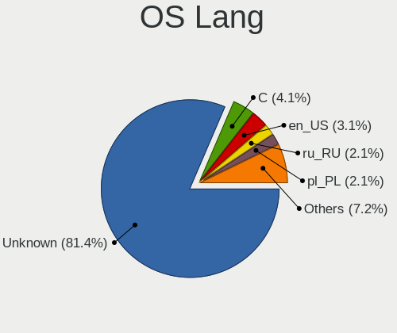
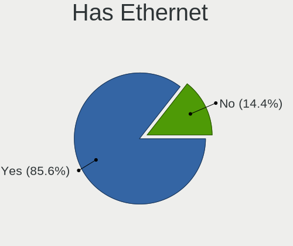
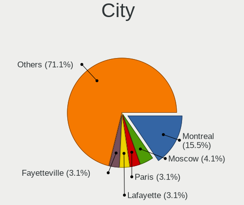
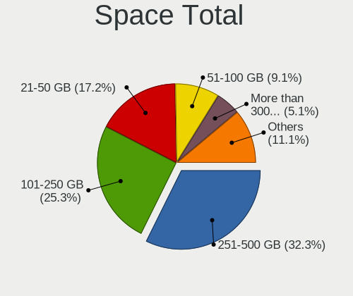
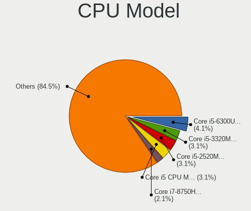
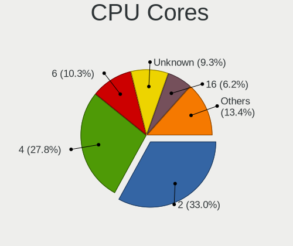
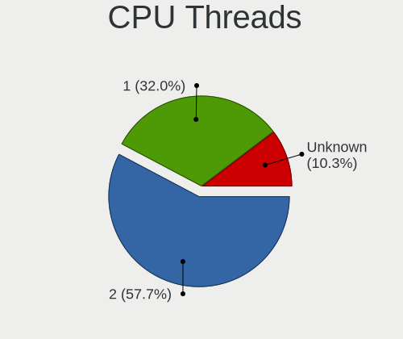
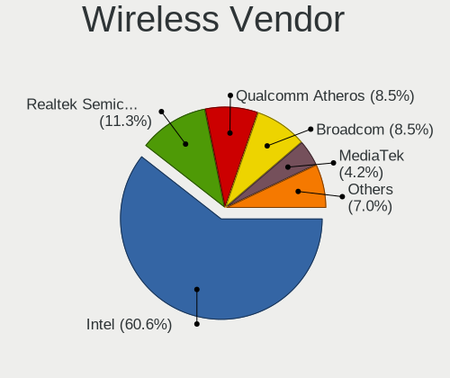
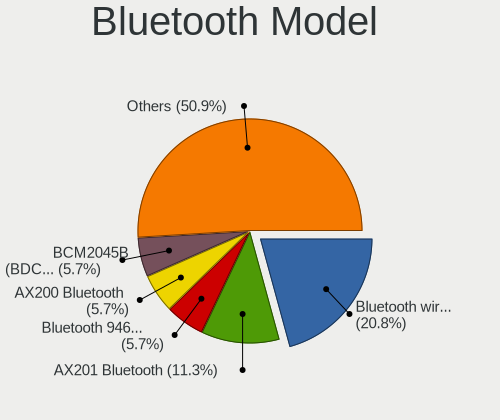

OpenBSD 7.2 - Tested Hardware & Statistics
------------------------------------------

A project to collect tested hardware configurations for OpenBSD 7.2.

Anyone can contribute to this report by the [hw-probe](https://github.com/linuxhw/hw-probe/blob/master/INSTALL.BSD.md) tool:

    hw-probe -all -upload

Please contribute! Especially if your hardware is rare.

This is a report for all computer types. See also reports for [desktops](/Dist/OpenBSD_7.2/Desktop/README.md) and [notebooks](/Dist/OpenBSD_7.2/Notebook/README.md).

Contents
--------

* [ Test Cases ](#test-cases)

* [ System ](#system)
  - [ Arch                     ](#arch)
  - [ DE                       ](#de)
  - [ Display Server           ](#display-server)
  - [ Display Manager          ](#display-manager)
  - [ OS Lang                  ](#os-lang)
  - [ Boot Mode                ](#boot-mode)
  - [ Filesystem               ](#filesystem)
  - [ Part. scheme             ](#part-scheme)

* [ Board ](#board)
  - [ Vendor                   ](#vendor)
  - [ Model                    ](#model)
  - [ Model Family             ](#model-family)
  - [ MFG Year                 ](#mfg-year)
  - [ Form Factor              ](#form-factor)
  - [ Coreboot                 ](#coreboot)
  - [ RAM Size                 ](#ram-size)
  - [ RAM Used                 ](#ram-used)
  - [ Total Drives             ](#total-drives)
  - [ Has CD-ROM               ](#has-cd-rom)
  - [ Has Ethernet             ](#has-ethernet)
  - [ Has WiFi                 ](#has-wifi)
  - [ Has Bluetooth            ](#has-bluetooth)

* [ Location ](#location)
  - [ Country                  ](#country)
  - [ City                     ](#city)

* [ Drives ](#drives)
  - [ Drive Vendor             ](#drive-vendor)
  - [ Drive Model              ](#drive-model)
  - [ HDD Vendor               ](#hdd-vendor)
  - [ SSD Vendor               ](#ssd-vendor)
  - [ Drive Kind               ](#drive-kind)
  - [ Drive Connector          ](#drive-connector)
  - [ Drive Size               ](#drive-size)
  - [ Space Total              ](#space-total)
  - [ Space Used               ](#space-used)
  - [ Malfunc. Drives          ](#malfunc-drives)
  - [ Malfunc. Drive Vendor    ](#malfunc-drive-vendor)
  - [ Malfunc. HDD Vendor      ](#malfunc-hdd-vendor)
  - [ Malfunc. Drive Kind      ](#malfunc-drive-kind)
  - [ Failed Drives            ](#failed-drives)
  - [ Failed Drive Vendor      ](#failed-drive-vendor)
  - [ Drive Status             ](#drive-status)

* [ Storage controller ](#storage-controller)
  - [ Storage Vendor           ](#storage-vendor)
  - [ Storage Model            ](#storage-model)
  - [ Storage Kind             ](#storage-kind)

* [ Processor ](#processor)
  - [ CPU Vendor               ](#cpu-vendor)
  - [ CPU Model                ](#cpu-model)
  - [ CPU Model Family         ](#cpu-model-family)
  - [ CPU Cores                ](#cpu-cores)
  - [ CPU Sockets              ](#cpu-sockets)
  - [ CPU Threads              ](#cpu-threads)
  - [ CPU Microarch            ](#cpu-microarch)

* [ Graphics ](#graphics)
  - [ GPU Vendor               ](#gpu-vendor)
  - [ GPU Model                ](#gpu-model)
  - [ GPU Combo                ](#gpu-combo)
  - [ GPU Driver               ](#gpu-driver)
  - [ GPU Memory               ](#gpu-memory)

* [ Monitor ](#monitor)
  - [ Monitor Vendor           ](#monitor-vendor)
  - [ Monitor Model            ](#monitor-model)
  - [ Monitor Resolution       ](#monitor-resolution)
  - [ Monitor Diagonal         ](#monitor-diagonal)
  - [ Monitor Width            ](#monitor-width)
  - [ Aspect Ratio             ](#aspect-ratio)
  - [ Monitor Area             ](#monitor-area)
  - [ Pixel Density            ](#pixel-density)
  - [ Multiple Monitors        ](#multiple-monitors)

* [ Network ](#network)
  - [ Net Controller Vendor    ](#net-controller-vendor)
  - [ Net Controller Model     ](#net-controller-model)
  - [ Wireless Vendor          ](#wireless-vendor)
  - [ Wireless Model           ](#wireless-model)
  - [ Ethernet Vendor          ](#ethernet-vendor)
  - [ Ethernet Model           ](#ethernet-model)
  - [ Net Controller Kind      ](#net-controller-kind)
  - [ Used Controller          ](#used-controller)
  - [ NICs                     ](#nics)
  - [ IPv6                     ](#ipv6)

* [ Bluetooth ](#bluetooth)
  - [ Bluetooth Vendor         ](#bluetooth-vendor)
  - [ Bluetooth Model          ](#bluetooth-model)

* [ Sound ](#sound)
  - [ Sound Vendor             ](#sound-vendor)
  - [ Sound Model              ](#sound-model)

* [ Memory ](#memory)
  - [ Memory Vendor            ](#memory-vendor)
  - [ Memory Model             ](#memory-model)
  - [ Memory Kind              ](#memory-kind)
  - [ Memory Form Factor       ](#memory-form-factor)
  - [ Memory Size              ](#memory-size)
  - [ Memory Speed             ](#memory-speed)

* [ Printers & scanners ](#printers--scanners)
  - [ Printer Vendor           ](#printer-vendor)
  - [ Printer Model            ](#printer-model)
  - [ Scanner Vendor           ](#scanner-vendor)
  - [ Scanner Model            ](#scanner-model)

* [ Camera ](#camera)
  - [ Camera Vendor            ](#camera-vendor)
  - [ Camera Model             ](#camera-model)

* [ Security ](#security)
  - [ Fingerprint Vendor       ](#fingerprint-vendor)
  - [ Fingerprint Model        ](#fingerprint-model)
  - [ Chipcard Vendor          ](#chipcard-vendor)
  - [ Chipcard Model           ](#chipcard-model)

* [ Unsupported ](#unsupported)
  - [ Unsupported Devices      ](#unsupported-devices)
  - [ Unsupported Device Types ](#unsupported-device-types)

Test Cases
----------

Total: 112

| Vendor        | Model                       | Form-Factor | Probe                                                     | Date         |
|---------------|-----------------------------|-------------|-----------------------------------------------------------|--------------|
| HP            | Pavilion g6                 | Desktop     | [eeffda8d57](https://bsd-hardware.info/?probe=eeffda8d57) | Apr 09, 2023 |
| Gigabyte      | B250M-Gaming 3-CF           | Desktop     | [ffbe23b7d8](https://bsd-hardware.info/?probe=ffbe23b7d8) | Apr 09, 2023 |
| Fujitsu       | LIFEBOOK U810               | Notebook    | [3073cd605c](https://bsd-hardware.info/?probe=3073cd605c) | Apr 06, 2023 |
| Fujitsu       | LIFEBOOK U810               | Notebook    | [c7718b4aa3](https://bsd-hardware.info/?probe=c7718b4aa3) | Apr 03, 2023 |
| Apple         | MacBookPro12,1              | Notebook    | [640aad419a](https://bsd-hardware.info/?probe=640aad419a) | Apr 02, 2023 |
| Sun           | SUNW,T5140                  | Desktop     | [a285e4f43a](https://bsd-hardware.info/?probe=a285e4f43a) | Apr 02, 2023 |
| Lenovo        | ThinkPad T410 2518A37       | Notebook    | [f5537face6](https://bsd-hardware.info/?probe=f5537face6) | Mar 27, 2023 |
| Dell          | G5 5587                     | Notebook    | [9b7714cbab](https://bsd-hardware.info/?probe=9b7714cbab) | Mar 24, 2023 |
| Dell          | G5 5587                     | Notebook    | [c118e0665f](https://bsd-hardware.info/?probe=c118e0665f) | Mar 24, 2023 |
| Lenovo        | ThinkPad T410 2518A37       | Notebook    | [42fffdf3f2](https://bsd-hardware.info/?probe=42fffdf3f2) | Mar 23, 2023 |
| Lenovo        | ThinkCentre M910q 10MVCT... | Desktop     | [5459ed9c31](https://bsd-hardware.info/?probe=5459ed9c31) | Mar 22, 2023 |
| ASUSTek       | PRIME H410M-A               | Desktop     | [cbbeb5c41c](https://bsd-hardware.info/?probe=cbbeb5c41c) | Mar 22, 2023 |
| Apple         | iMac18,1                    | All in one  | [c6c12705af](https://bsd-hardware.info/?probe=c6c12705af) | Mar 20, 2023 |
| Intel         | S1200RP_SE                  | Notebook    | [5ae9400f0b](https://bsd-hardware.info/?probe=5ae9400f0b) | Mar 17, 2023 |
| OEGStone      | W54_55SU1,SUW               | Notebook    | [7a2b28c47f](https://bsd-hardware.info/?probe=7a2b28c47f) | Mar 17, 2023 |
| Acer          | Nitro AN515-55              | Notebook    | [e023282dcd](https://bsd-hardware.info/?probe=e023282dcd) | Mar 13, 2023 |
| Gigabyte      | B450M K                     | Desktop     | [0d0433284e](https://bsd-hardware.info/?probe=0d0433284e) | Mar 11, 2023 |
| HP            | 240 G6 Notebook PC          | Notebook    | [d872652e25](https://bsd-hardware.info/?probe=d872652e25) | Feb 28, 2023 |
| HP            | Pavilion g6                 | Desktop     | [39a7b609d6](https://bsd-hardware.info/?probe=39a7b609d6) | Feb 27, 2023 |
| Lenovo        | ThinkPad L14 Gen 3 21C5C... | Notebook    | [aef791947c](https://bsd-hardware.info/?probe=aef791947c) | Feb 23, 2023 |
| PC Engines    | apu1                        | Desktop     | [41fe7362c4](https://bsd-hardware.info/?probe=41fe7362c4) | Feb 22, 2023 |
| Apple         | PowerMac3,6                 | Desktop     | [f31181f95c](https://bsd-hardware.info/?probe=f31181f95c) | Feb 20, 2023 |
| Apple         | MacBookPro11,1              | Notebook    | [673f6c0a01](https://bsd-hardware.info/?probe=673f6c0a01) | Feb 17, 2023 |
| Dell          | OptiPlex 9020               | Desktop     | [0c8a5f8dfa](https://bsd-hardware.info/?probe=0c8a5f8dfa) | Feb 13, 2023 |
| Apple         | MacBookAir6,1               | Notebook    | [96fa5325d1](https://bsd-hardware.info/?probe=96fa5325d1) | Feb 11, 2023 |
| Framework     | Laptop (12th Gen Intel C... | Notebook    | [4d69517a13](https://bsd-hardware.info/?probe=4d69517a13) | Feb 07, 2023 |
| Panasonic     | CF-30KAPAXAM                | Notebook    | [baa7612257](https://bsd-hardware.info/?probe=baa7612257) | Feb 07, 2023 |
| Lenovo        | ThinkPad X260 20F5S10W0H    | Notebook    | [bccdd2f331](https://bsd-hardware.info/?probe=bccdd2f331) | Jan 30, 2023 |
| ASUSTek       | TUF Gaming B550-PLUS        | Desktop     | [4c25e80924](https://bsd-hardware.info/?probe=4c25e80924) | Jan 29, 2023 |
| ASUSTek       | PRIME B460M-A               | Desktop     | [a6b109939f](https://bsd-hardware.info/?probe=a6b109939f) | Jan 28, 2023 |
| Google        | Kefka                       | Notebook    | [83771661c6](https://bsd-hardware.info/?probe=83771661c6) | Jan 27, 2023 |
| Dell          | OptiPlex 3040               | Desktop     | [9c925f4e7f](https://bsd-hardware.info/?probe=9c925f4e7f) | Jan 23, 2023 |
| Lenovo        | ThinkPad X1 Carbon Gen 9... | Notebook    | [1d040b684b](https://bsd-hardware.info/?probe=1d040b684b) | Jan 21, 2023 |
| ASUSTek       | PRO A520M-C                 | Desktop     | [bebcd1a008](https://bsd-hardware.info/?probe=bebcd1a008) | Jan 20, 2023 |
| Fujitsu       | PRIMERGY RX200 S6           | Desktop     | [4bcc8752f4](https://bsd-hardware.info/?probe=4bcc8752f4) | Jan 20, 2023 |
| Lenovo        | H30-05 90BJ0085SP           | Desktop     | [1424b3641c](https://bsd-hardware.info/?probe=1424b3641c) | Jan 18, 2023 |
| Dell          | PowerEdge R710              | Desktop     | [720e99b25e](https://bsd-hardware.info/?probe=720e99b25e) | Jan 17, 2023 |
| Lenovo        | ThinkPad E15 Gen 4 21EDC... | Notebook    | [dcdf55f06e](https://bsd-hardware.info/?probe=dcdf55f06e) | Jan 17, 2023 |
| Apple         | MacBookAir7,2               | Notebook    | [d8007634f3](https://bsd-hardware.info/?probe=d8007634f3) | Jan 17, 2023 |
| HP            | ProBook 455 G7              | Notebook    | [600f7f4f4f](https://bsd-hardware.info/?probe=600f7f4f4f) | Jan 16, 2023 |
| Lenovo        | ThinkPad E14 Gen 4 21EB0... | Notebook    | [ced6c29193](https://bsd-hardware.info/?probe=ced6c29193) | Jan 14, 2023 |
| HP            | Presario V2000 (EZ621UA#... | Notebook    | [847af5b70f](https://bsd-hardware.info/?probe=847af5b70f) | Jan 14, 2023 |
| Gigabyte      | Z390 AORUS ELITE            | Desktop     | [53a5719c6a](https://bsd-hardware.info/?probe=53a5719c6a) | Jan 12, 2023 |
| Lenovo        | ThinkPad T410 2518C3U       | Notebook    | [82e9263905](https://bsd-hardware.info/?probe=82e9263905) | Jan 11, 2023 |
| Lenovo        | G50-80 80E5                 | Notebook    | [549b75038e](https://bsd-hardware.info/?probe=549b75038e) | Jan 08, 2023 |
| Lenovo        | G50-80 80E5                 | Notebook    | [5e81493c8d](https://bsd-hardware.info/?probe=5e81493c8d) | Jan 08, 2023 |
| Lenovo        | ThinkPad T480 20L5CTO1WW    | Notebook    | [4014cc42ed](https://bsd-hardware.info/?probe=4014cc42ed) | Jan 08, 2023 |
| Lenovo        | ThinkStation D20 415575G    | Desktop     | [0a15d989e3](https://bsd-hardware.info/?probe=0a15d989e3) | Jan 08, 2023 |
| Supermicro    | Super Server                | Server      | [841407deb7](https://bsd-hardware.info/?probe=841407deb7) | Jan 07, 2023 |
| ASUSTek       | F2A85-M                     | Desktop     | [e25da8b10a](https://bsd-hardware.info/?probe=e25da8b10a) | Jan 06, 2023 |
| PC Engines    | apu4                        | Desktop     | [62e6e7e679](https://bsd-hardware.info/?probe=62e6e7e679) | Jan 03, 2023 |
| Notebook      | NS5x_NS7xPU                 | Notebook    | [7dc1fdfadb](https://bsd-hardware.info/?probe=7dc1fdfadb) | Jan 02, 2023 |
| Gigabyte      | Z390 AORUS ELITE            | Desktop     | [dcf6e2df1a](https://bsd-hardware.info/?probe=dcf6e2df1a) | Jan 02, 2023 |
| Lenovo        | ThinkPad T410 2518C3U       | Notebook    | [3b0ef08599](https://bsd-hardware.info/?probe=3b0ef08599) | Jan 01, 2023 |
| Lenovo        | ThinkPad T410 2518C3U       | Notebook    | [c791e3e3fd](https://bsd-hardware.info/?probe=c791e3e3fd) | Dec 30, 2022 |
| ASUSTek       | ASUS EXPERTBOOK B9450FA_... | Notebook    | [d5fa6c651c](https://bsd-hardware.info/?probe=d5fa6c651c) | Dec 30, 2022 |
| Star Labs     | Lite                        | Notebook    | [9ad15636dd](https://bsd-hardware.info/?probe=9ad15636dd) | Dec 25, 2022 |
| Gigabyte      | Z390 AORUS ELITE            | Desktop     | [91b7417b84](https://bsd-hardware.info/?probe=91b7417b84) | Dec 24, 2022 |
| Tactus        | GeoFlex 110                 | Notebook    | [955c355b47](https://bsd-hardware.info/?probe=955c355b47) | Dec 23, 2022 |
| Toshiba       | Satellite BE96-F299         | Notebook    | [ca475dd1d0](https://bsd-hardware.info/?probe=ca475dd1d0) | Dec 23, 2022 |
| TUXEDO        | InfinityBook Pro 14 Gen6    | Notebook    | [b38d32b139](https://bsd-hardware.info/?probe=b38d32b139) | Dec 23, 2022 |
| Lenovo        | ThinkPad T480 20L6S13100    | Notebook    | [67daa912fa](https://bsd-hardware.info/?probe=67daa912fa) | Dec 23, 2022 |
| Raspberry ... | Raspberry Pi 400            | Desktop     | [ee9cac334f](https://bsd-hardware.info/?probe=ee9cac334f) | Dec 21, 2022 |
| Lenovo        | ThinkPad T60 1951A47        | Notebook    | [e254601f07](https://bsd-hardware.info/?probe=e254601f07) | Dec 21, 2022 |
| TUXEDO        | Pulse 15 Gen1               | Notebook    | [af2a9d1a42](https://bsd-hardware.info/?probe=af2a9d1a42) | Dec 20, 2022 |
| Unknown       | Pine64 RockPro64 v2.1       | Desktop     | [59525051d3](https://bsd-hardware.info/?probe=59525051d3) | Dec 19, 2022 |
| Lenovo        | ThinkPad X200 Tablet 744... | Notebook    | [ea686f63f5](https://bsd-hardware.info/?probe=ea686f63f5) | Dec 19, 2022 |
| Framework     | Laptop                      | Notebook    | [9dcd3592db](https://bsd-hardware.info/?probe=9dcd3592db) | Dec 19, 2022 |
| Lenovo        | ThinkCentre M93p 10A8S0C... | Desktop     | [11d5b82cdd](https://bsd-hardware.info/?probe=11d5b82cdd) | Dec 17, 2022 |
| Unknown       | Unknown                     | Desktop     | [9b5307f44d](https://bsd-hardware.info/?probe=9b5307f44d) | Dec 15, 2022 |
| HP            | ProBook 430 G7              | Notebook    | [0e2278affa](https://bsd-hardware.info/?probe=0e2278affa) | Dec 14, 2022 |
| ASUSTek       | ROG STRIX X670E-I GAMING... | Desktop     | [15b2363325](https://bsd-hardware.info/?probe=15b2363325) | Dec 05, 2022 |
| Panasonic     | CF-54-1                     | Notebook    | [0c5820ea0d](https://bsd-hardware.info/?probe=0c5820ea0d) | Dec 01, 2022 |
| ASRock        | X570 Pro4                   | Desktop     | [b23f59a068](https://bsd-hardware.info/?probe=b23f59a068) | Nov 27, 2022 |
| ASUSTek       | P11C-X Series               | Desktop     | [6860cd72f8](https://bsd-hardware.info/?probe=6860cd72f8) | Nov 26, 2022 |
| ASUSTek       | P11C-X Series               | Desktop     | [cfdb06e761](https://bsd-hardware.info/?probe=cfdb06e761) | Nov 26, 2022 |
| Dell          | Vostro 3501                 | Notebook    | [61f8a35700](https://bsd-hardware.info/?probe=61f8a35700) | Nov 25, 2022 |
| Lenovo        | ThinkPad X230 2325T4T       | Notebook    | [f0cc17c7eb](https://bsd-hardware.info/?probe=f0cc17c7eb) | Nov 21, 2022 |
| Lenovo        | ThinkPad X1 Carbon 4th 2... | Notebook    | [4044f32351](https://bsd-hardware.info/?probe=4044f32351) | Nov 12, 2022 |
| Lenovo        | ThinkPad X260 20F5S2GM00    | Notebook    | [b8874a6df3](https://bsd-hardware.info/?probe=b8874a6df3) | Nov 10, 2022 |
| ASUSTek       | Rampage V EDITION 10        | Desktop     | [5dcd51844e](https://bsd-hardware.info/?probe=5dcd51844e) | Nov 09, 2022 |
| Lenovo        | ThinkPad X270 W10DG 20K5... | Notebook    | [e8aea441aa](https://bsd-hardware.info/?probe=e8aea441aa) | Nov 06, 2022 |
| ASUSTek       | PRIME B560M-A               | Desktop     | [95d5580fd7](https://bsd-hardware.info/?probe=95d5580fd7) | Nov 05, 2022 |
| ASUSTek       | Z170-K                      | Desktop     | [907b8c2402](https://bsd-hardware.info/?probe=907b8c2402) | Nov 05, 2022 |
| Lenovo        | ThinkPad X220 429043U       | Notebook    | [e5716f886a](https://bsd-hardware.info/?probe=e5716f886a) | Oct 30, 2022 |
| Lenovo        | ThinkPad T420s 41742BU      | Notebook    | [34f0a2bc03](https://bsd-hardware.info/?probe=34f0a2bc03) | Oct 30, 2022 |
| Fujitsu       | LIFEBOOK E752               | Notebook    | [e3c5057898](https://bsd-hardware.info/?probe=e3c5057898) | Oct 29, 2022 |
| Panasonic     | CF-53AAGHYDM                | Notebook    | [f2fafaa9e3](https://bsd-hardware.info/?probe=f2fafaa9e3) | Oct 27, 2022 |
| Matsushita... | CF-48V4KNDQM                | Notebook    | [d96fbc17b5](https://bsd-hardware.info/?probe=d96fbc17b5) | Oct 27, 2022 |
| Panasonic     | CF-52PFPBSFQ                | Notebook    | [088e0245af](https://bsd-hardware.info/?probe=088e0245af) | Oct 27, 2022 |
| Matsushita... | CF-51RCVDNLM                | Notebook    | [6e8067d4d8](https://bsd-hardware.info/?probe=6e8067d4d8) | Oct 26, 2022 |
| Lenovo        | ThinkPad T410 2537N24       | Notebook    | [b7a4ee06a6](https://bsd-hardware.info/?probe=b7a4ee06a6) | Oct 26, 2022 |
| Fujitsu       | LIFEBOOK E752               | Notebook    | [06e6c07e90](https://bsd-hardware.info/?probe=06e6c07e90) | Oct 25, 2022 |
| PC Engines    | APU2                        | Desktop     | [d52e3d0ce3](https://bsd-hardware.info/?probe=d52e3d0ce3) | Oct 25, 2022 |
| Lenovo        | ThinkPad T430 2347GZU       | Notebook    | [f2236f17ee](https://bsd-hardware.info/?probe=f2236f17ee) | Oct 25, 2022 |
| ASUSTek       | 1000HE                      | Notebook    | [c4bbcf9537](https://bsd-hardware.info/?probe=c4bbcf9537) | Oct 24, 2022 |
| Alienware     | m15                         | Notebook    | [3304a767ba](https://bsd-hardware.info/?probe=3304a767ba) | Oct 22, 2022 |
| ASUSTek       | P8Z68-V GEN3                | Desktop     | [d7b32200a5](https://bsd-hardware.info/?probe=d7b32200a5) | Oct 22, 2022 |
| PC Engines    | APU2                        | Desktop     | [cf1abf5e46](https://bsd-hardware.info/?probe=cf1abf5e46) | Oct 21, 2022 |
| Supermicro    | X8DTH-i/6/iF/6F             | Desktop     | [12f7ac40ac](https://bsd-hardware.info/?probe=12f7ac40ac) | Oct 21, 2022 |
| Unknown       | Unknown                     | Desktop     | [d5586487b4](https://bsd-hardware.info/?probe=d5586487b4) | Oct 21, 2022 |
| ASUSTek       | P10S-I Series               | Desktop     | [ceb58e75b8](https://bsd-hardware.info/?probe=ceb58e75b8) | Oct 20, 2022 |
| ASUSTek       | TUF Gaming B550-PLUS        | Desktop     | [7ecffc1ca3](https://bsd-hardware.info/?probe=7ecffc1ca3) | Oct 20, 2022 |
| ASUSTek       | TUF Gaming B550-PLUS        | Desktop     | [eb6eda641d](https://bsd-hardware.info/?probe=eb6eda641d) | Oct 20, 2022 |
| Dell          | Latitude E6420              | Notebook    | [07b078fdef](https://bsd-hardware.info/?probe=07b078fdef) | Oct 04, 2022 |
| Lenovo        | ThinkPad T410 2518C3U       | Notebook    | [627206d154](https://bsd-hardware.info/?probe=627206d154) | Oct 04, 2022 |
| Lenovo        | IdeaPad 5 15ITL05 82FG      | Desktop     | [e001150f93](https://bsd-hardware.info/?probe=e001150f93) | Oct 03, 2022 |
| ASRock        | X570 Phantom Gaming 4       | Desktop     | [1a89d78fa4](https://bsd-hardware.info/?probe=1a89d78fa4) | Sep 22, 2022 |
| Dell          | PowerEdge R620              | Desktop     | [66db9eb745](https://bsd-hardware.info/?probe=66db9eb745) | Aug 25, 2022 |
| HUAWEI        | BOM-WXX9                    | Notebook    | [4ba15a31d9](https://bsd-hardware.info/?probe=4ba15a31d9) | Aug 10, 2022 |
| Intel         | NUC5PPYB H76558-102         | Mini pc     | [9124f0eb45](https://bsd-hardware.info/?probe=9124f0eb45) | Aug 05, 2022 |
| ASUSTek       | VivoBook_ASUSLaptop X545... | Notebook    | [bf5cea4ab5](https://bsd-hardware.info/?probe=bf5cea4ab5) | Jul 30, 2022 |

System
------

Arch
----

OS architecture (x86_64, i586, etc.)

| Name    | Computers | Percent |
|---------|-----------|---------|
| amd64   | 86        | 90.53%  |
| i386    | 5         | 5.26%   |
| arm64   | 2         | 2.11%   |
| sparc64 | 1         | 1.05%   |
| macppc  | 1         | 1.05%   |

DE
--

Desktop Environment

| Name         | Computers | Percent |
|--------------|-----------|---------|
| helloDesktop | 83        | 87.37%  |
| XFCE         | 6         | 6.32%   |
| GNOME        | 4         | 4.21%   |
| MATE         | 1         | 1.05%   |
| Lumina       | 1         | 1.05%   |

Display Server
--------------

X11 or Wayland

| Name    | Computers | Percent |
|---------|-----------|---------|
| X11     | 80        | 83.33%  |
| Console | 16        | 16.67%  |

Display Manager
---------------

SDDM, LightDM, etc.

| Name    | Computers | Percent |
|---------|-----------|---------|
| Console | 95        | 100%    |

OS Lang
-------

Language

| Lang       | Computers | Percent |
|------------|-----------|---------|
| Unknown    | 79        | 83.16%  |
| C          | 4         | 4.21%   |
| en_US      | 3         | 3.16%   |
| ru_RU      | 2         | 2.11%   |
| pl_PL      | 2         | 2.11%   |
| ja_JP      | 2         | 2.11%   |
| zh_TW      | 1         | 1.05%   |
| ISO8859-15 | 1         | 1.05%   |
| es_ES      | 1         | 1.05%   |

Boot Mode
---------

EFI or BIOS

| Mode | Computers | Percent |
|------|-----------|---------|
| EFI  | 60        | 63.16%  |
| BIOS | 35        | 36.84%  |

Filesystem
----------

Type of filesystem

| Type | Computers | Percent |
|------|-----------|---------|
| Ffs  | 95        | 100%    |

Part. scheme
------------

Scheme of partitioning

| Type | Computers | Percent |
|------|-----------|---------|
| GPT  | 52        | 54.74%  |
| MBR  | 43        | 45.26%  |

Board
-----

Vendor
------

Motherboard manufacturer

| Name                           | Computers | Percent |
|--------------------------------|-----------|---------|
| Lenovo                         | 25        | 26.32%  |
| ASUSTek Computer               | 14        | 14.74%  |
| Dell                           | 7         | 7.37%   |
| Apple                          | 6         | 6.32%   |
| Hewlett-Packard                | 5         | 5.26%   |
| Fujitsu                        | 4         | 4.21%   |
| PC Engines                     | 3         | 3.16%   |
| Panasonic                      | 3         | 3.16%   |
| Unknown                        | 3         | 3.16%   |
| TUXEDO                         | 2         | 2.11%   |
| Supermicro                     | 2         | 2.11%   |
| Matsushita Electric Industrial | 2         | 2.11%   |
| Intel                          | 2         | 2.11%   |
| Gigabyte Technology            | 2         | 2.11%   |
| Framework                      | 2         | 2.11%   |
| ASRock                         | 2         | 2.11%   |
| Toshiba                        | 1         | 1.05%   |
| Tactus                         | 1         | 1.05%   |
| Sun                            | 1         | 1.05%   |
| Star Labs                      | 1         | 1.05%   |
| Raspberry Pi Foundation        | 1         | 1.05%   |
| OEGStone                       | 1         | 1.05%   |
| Notebook                       | 1         | 1.05%   |
| HUAWEI                         | 1         | 1.05%   |
| Google                         | 1         | 1.05%   |
| Alienware                      | 1         | 1.05%   |
| Acer                           | 1         | 1.05%   |

Model
-----

Motherboard model

| Name                                        | Computers | Percent |
|---------------------------------------------|-----------|---------|
| Unknown                                     | 3         | 3.16%   |
| Fujitsu LIFEBOOK E752                       | 2         | 2.11%   |
| TUXEDO Pulse 15 Gen1                        | 1         | 1.05%   |
| TUXEDO InfinityBook Pro 14 Gen6             | 1         | 1.05%   |
| Toshiba Satellite BE96-F299                 | 1         | 1.05%   |
| Tactus GeoFlex 110                          | 1         | 1.05%   |
| Supermicro X8DTH-i/6/iF/6F                  | 1         | 1.05%   |
| Supermicro Super Server                     | 1         | 1.05%   |
| Sun SUNW,T5140                              | 1         | 1.05%   |
| Star Labs Lite                              | 1         | 1.05%   |
| RPi Raspberry Pi 400                        | 1         | 1.05%   |
| PC Engines apu4                             | 1         | 1.05%   |
| PC Engines APU2                             | 1         | 1.05%   |
| PC Engines apu1                             | 1         | 1.05%   |
| Panasonic CF-54-1                           | 1         | 1.05%   |
| Panasonic CF-53AAGHYDM                      | 1         | 1.05%   |
| Panasonic CF-52PFPBSFQ                      | 1         | 1.05%   |
| OEGStone W54_55SU1,SUW                      | 1         | 1.05%   |
| Notebook NS5x_NS7xPU                        | 1         | 1.05%   |
| Matsushita Electric Industrial CF-51RCVDNLM | 1         | 1.05%   |
| Matsushita Electric Industrial CF-48V4KNDQM | 1         | 1.05%   |
| Lenovo ThinkStation D20 415575G             | 1         | 1.05%   |
| Lenovo ThinkPad X270 W10DG 20K5S0TT1N       | 1         | 1.05%   |
| Lenovo ThinkPad X260 20F5S2GM00             | 1         | 1.05%   |
| Lenovo ThinkPad X260 20F5S10W0H             | 1         | 1.05%   |
| Lenovo ThinkPad X230 2325T4T                | 1         | 1.05%   |
| Lenovo ThinkPad X220 429043U                | 1         | 1.05%   |
| Lenovo ThinkPad X200 Tablet 744943U         | 1         | 1.05%   |
| Lenovo ThinkPad X1 Carbon Gen 9 20XW00QGUS  | 1         | 1.05%   |
| Lenovo ThinkPad X1 Carbon 4th 20FCS13H00    | 1         | 1.05%   |
| Lenovo ThinkPad T60 1951A47                 | 1         | 1.05%   |
| Lenovo ThinkPad T480 20L6S13100             | 1         | 1.05%   |
| Lenovo ThinkPad T480 20L5CTO1WW             | 1         | 1.05%   |
| Lenovo ThinkPad T430 2347GZU                | 1         | 1.05%   |
| Lenovo ThinkPad T420s 41742BU               | 1         | 1.05%   |
| Lenovo ThinkPad T410 2537N24                | 1         | 1.05%   |
| Lenovo ThinkPad T410 2518C3U                | 1         | 1.05%   |
| Lenovo ThinkPad T410 2518A37                | 1         | 1.05%   |
| Lenovo ThinkPad L14 Gen 3 21C5CTO1WW        | 1         | 1.05%   |
| Lenovo ThinkPad E15 Gen 4 21EDCTO1WW        | 1         | 1.05%   |

Model Family
------------

Motherboard model prefix

| Name                                        | Computers | Percent |
|---------------------------------------------|-----------|---------|
| Lenovo ThinkPad                             | 19        | 20%     |
| Fujitsu LIFEBOOK                            | 3         | 3.16%   |
| ASUS PRIME                                  | 3         | 3.16%   |
| Unknown                                     | 3         | 3.16%   |
| Lenovo ThinkCentre                          | 2         | 2.11%   |
| HP ProBook                                  | 2         | 2.11%   |
| Framework Laptop                            | 2         | 2.11%   |
| Dell PowerEdge                              | 2         | 2.11%   |
| Dell OptiPlex                               | 2         | 2.11%   |
| ASRock X570                                 | 2         | 2.11%   |
| TUXEDO Pulse                                | 1         | 1.05%   |
| TUXEDO InfinityBook                         | 1         | 1.05%   |
| Toshiba Satellite                           | 1         | 1.05%   |
| Tactus GeoFlex                              | 1         | 1.05%   |
| Supermicro X8DTH-i                          | 1         | 1.05%   |
| Supermicro Super                            | 1         | 1.05%   |
| Sun SUNW                                    | 1         | 1.05%   |
| Star Labs Lite                              | 1         | 1.05%   |
| RPi Raspberry                               | 1         | 1.05%   |
| PC Engines apu4                             | 1         | 1.05%   |
| PC Engines APU2                             | 1         | 1.05%   |
| PC Engines apu1                             | 1         | 1.05%   |
| Panasonic CF-54-1                           | 1         | 1.05%   |
| Panasonic CF-53AAGHYDM                      | 1         | 1.05%   |
| Panasonic CF-52PFPBSFQ                      | 1         | 1.05%   |
| OEGStone W54                                | 1         | 1.05%   |
| Notebook NS5x                               | 1         | 1.05%   |
| Matsushita Electric Industrial CF-51RCVDNLM | 1         | 1.05%   |
| Matsushita Electric Industrial CF-48V4KNDQM | 1         | 1.05%   |
| Lenovo ThinkStation                         | 1         | 1.05%   |
| Lenovo IdeaPad                              | 1         | 1.05%   |
| Lenovo H30-05                               | 1         | 1.05%   |
| Lenovo G50-80                               | 1         | 1.05%   |
| Intel S1200RP                               | 1         | 1.05%   |
| Intel NUC5PPYB                              | 1         | 1.05%   |
| HUAWEI BOM-WXX9                             | 1         | 1.05%   |
| HP Presario                                 | 1         | 1.05%   |
| HP Pavilion                                 | 1         | 1.05%   |
| HP 240                                      | 1         | 1.05%   |
| Google Kefka                                | 1         | 1.05%   |

MFG Year
--------

Motherboard manufacture year

| Year    | Computers | Percent |
|---------|-----------|---------|
| 2022    | 18        | 18.95%  |
| 2021    | 15        | 15.79%  |
| 2018    | 8         | 8.42%   |
| 2019    | 7         | 7.37%   |
| 2012    | 6         | 6.32%   |
| 2010    | 6         | 6.32%   |
| 2015    | 5         | 5.26%   |
| 2020    | 4         | 4.21%   |
| 2013    | 4         | 4.21%   |
| 2011    | 4         | 4.21%   |
| 2016    | 3         | 3.16%   |
| 2014    | 3         | 3.16%   |
| 2006    | 3         | 3.16%   |
| Unknown | 3         | 3.16%   |
| 2023    | 2         | 2.11%   |
| 2017    | 1         | 1.05%   |
| 2009    | 1         | 1.05%   |
| 2007    | 1         | 1.05%   |
| 2002    | 1         | 1.05%   |

Form Factor
-----------

Physical design of the computer

| Name       | Computers | Percent |
|------------|-----------|---------|
| Notebook   | 56        | 58.95%  |
| Desktop    | 36        | 37.89%  |
| Mini pc    | 1         | 1.05%   |
| All in one | 1         | 1.05%   |
| Server     | 1         | 1.05%   |

Coreboot
--------

Have coreboot on board

| Used | Computers | Percent |
|------|-----------|---------|
| No   | 89        | 93.68%  |
| Yes  | 6         | 6.32%   |

RAM Size
--------

Total RAM memory

| Size in GB      | Computers | Percent |
|-----------------|-----------|---------|
| 8.01-16.0       | 23        | 23.96%  |
| 16.01-24.0      | 20        | 20.83%  |
| 4.01-8.0        | 14        | 14.58%  |
| 32.01-64.0      | 10        | 10.42%  |
| 3.01-4.0        | 10        | 10.42%  |
| 64.01-256.0     | 8         | 8.33%   |
| 24.01-32.0      | 3         | 3.13%   |
| 2.01-3.0        | 3         | 3.13%   |
| 1.01-2.0        | 2         | 2.08%   |
| 0.51-1.0        | 2         | 2.08%   |
| More than 256.0 | 1         | 1.04%   |

RAM Used
--------

Used RAM memory

| Used GB   | Computers | Percent |
|-----------|-----------|---------|
| 0.01-0.5  | 70        | 73.68%  |
| 0.51-1.0  | 13        | 13.68%  |
| 1.01-2.0  | 5         | 5.26%   |
| 0         | 3         | 3.16%   |
| 3.01-4.0  | 2         | 2.11%   |
| 4.01-8.0  | 1         | 1.05%   |
| 8.01-16.0 | 1         | 1.05%   |

Total Drives
------------

Number of drives on board

| Drives | Computers | Percent |
|--------|-----------|---------|
| 1      | 52        | 53.61%  |
| 2      | 22        | 22.68%  |
| 3      | 10        | 10.31%  |
| 0      | 5         | 5.15%   |
| 6      | 3         | 3.09%   |
| 4      | 2         | 2.06%   |
| 14     | 1         | 1.03%   |
| 8      | 1         | 1.03%   |
| 5      | 1         | 1.03%   |

Has CD-ROM
----------

Has CD-ROM on board

| Presented | Computers | Percent |
|-----------|-----------|---------|
| No        | 92        | 96.84%  |
| Yes       | 3         | 3.16%   |

Has Ethernet
------------

Has Ethernet on board

| Presented | Computers | Percent |
|-----------|-----------|---------|
| Yes       | 80        | 84.21%  |
| No        | 15        | 15.79%  |

Has WiFi
--------

Has WiFi module

| Presented | Computers | Percent |
|-----------|-----------|---------|
| Yes       | 64        | 67.37%  |
| No        | 31        | 32.63%  |

Has Bluetooth
-------------

Has Bluetooth module

| Presented | Computers | Percent |
|-----------|-----------|---------|
| Yes       | 50        | 52.63%  |
| No        | 45        | 47.37%  |

Location
--------

Country
-------

Geographic location (country)

| Country            | Computers | Percent |
|--------------------|-----------|---------|
| Canada             | 17        | 17.89%  |
| USA                | 14        | 14.74%  |
| Germany            | 10        | 10.53%  |
| Russia             | 9         | 9.47%   |
| France             | 6         | 6.32%   |
| UK                 | 5         | 5.26%   |
| Spain              | 5         | 5.26%   |
| Italy              | 5         | 5.26%   |
| Australia          | 4         | 4.21%   |
| Poland             | 3         | 3.16%   |
| Netherlands        | 3         | 3.16%   |
| Switzerland        | 2         | 2.11%   |
| Mexico             | 2         | 2.11%   |
| Japan              | 2         | 2.11%   |
| Cyprus             | 2         | 2.11%   |
| Taiwan             | 1         | 1.05%   |
| Sweden             | 1         | 1.05%   |
| Slovakia           | 1         | 1.05%   |
| Egypt              | 1         | 1.05%   |
| Dominican Republic | 1         | 1.05%   |
| Brazil             | 1         | 1.05%   |

City
----

Geographic location (city)

| City               | Computers | Percent |
|--------------------|-----------|---------|
| Montreal           | 15        | 15.79%  |
| Moscow             | 4         | 4.21%   |
| Paris              | 3         | 3.16%   |
| Lafayette          | 3         | 3.16%   |
| Fayetteville       | 3         | 3.16%   |
| Sydney             | 2         | 2.11%   |
| Reutov             | 2         | 2.11%   |
| Puebla City        | 2         | 2.11%   |
| Nuremberg          | 2         | 2.11%   |
| Navalcarnero       | 2         | 2.11%   |
| Lübeck            | 2         | 2.11%   |
| Larnaca            | 2         | 2.11%   |
| Cambridge          | 2         | 2.11%   |
| Amsterdam          | 2         | 2.11%   |
| Zurich             | 1         | 1.05%   |
| Yokohama           | 1         | 1.05%   |
| Warsaw             | 1         | 1.05%   |
| Vidnoye            | 1         | 1.05%   |
| Verona             | 1         | 1.05%   |
| Varekil            | 1         | 1.05%   |
| Vanzago            | 1         | 1.05%   |
| Tala               | 1         | 1.05%   |
| Sun Prairie        | 1         | 1.05%   |
| Sao Paulo          | 1         | 1.05%   |
| Santo Domingo Este | 1         | 1.05%   |
| Rhoon              | 1         | 1.05%   |
| Remseck am Neckar  | 1         | 1.05%   |
| Plymouth           | 1         | 1.05%   |
| Pine Mountain Club | 1         | 1.05%   |
| Perth              | 1         | 1.05%   |
| Padova             | 1         | 1.05%   |
| Ozersk             | 1         | 1.05%   |
| Osaka              | 1         | 1.05%   |
| New Taipei         | 1         | 1.05%   |
| Monza              | 1         | 1.05%   |
| Marcq-en-Baroeul   | 1         | 1.05%   |
| Los Angeles        | 1         | 1.05%   |
| London             | 1         | 1.05%   |
| Lee's Summit       | 1         | 1.05%   |
| Krasnodar          | 1         | 1.05%   |

Drives
------

Drive Vendor
------------

Hard drive vendors

| Vendor              | Computers | Drives | Percent |
|---------------------|-----------|--------|---------|
| NVMe                | 33        | 41     | 26.61%  |
| WDC                 | 15        | 20     | 12.1%   |
| Samsung Electronics | 12        | 24     | 9.68%   |
| Seagate             | 8         | 18     | 6.45%   |
| OPENBSD             | 6         | 8      | 4.84%   |
| Kingston            | 6         | 7      | 4.84%   |
| Toshiba             | 5         | 11     | 4.03%   |
| Crucial             | 5         | 5      | 4.03%   |
| Apple               | 4         | 4      | 3.23%   |
| SanDisk             | 3         | 3      | 2.42%   |
| Intel               | 3         | 3      | 2.42%   |
| HGST                | 3         | 3      | 2.42%   |
| Hitachi             | 2         | 2      | 1.61%   |
| USB                 | 1         | 1      | 0.81%   |
| Team                | 1         | 1      | 0.81%   |
| Star Drive          | 1         | 1      | 0.81%   |
| SPCC                | 1         | 1      | 0.81%   |
| SK hynix            | 1         | 1      | 0.81%   |
| SATA3 60            | 1         | 1      | 0.81%   |
| PNY                 | 1         | 1      | 0.81%   |
| Patriot             | 1         | 1      | 0.81%   |
| Memorex             | 1         | 1      | 0.81%   |
| LSI                 | 1         | 1      | 0.81%   |
| KingSpec            | 1         | 1      | 0.81%   |
| KingDian            | 1         | 1      | 0.81%   |
| Intenso             | 1         | 1      | 0.81%   |
| IBM-ESXS            | 1         | 1      | 0.81%   |
| General             | 1         | 1      | 0.81%   |
| Dell                | 1         | 2      | 0.81%   |
| China               | 1         | 1      | 0.81%   |
| Apacer              | 1         | 1      | 0.81%   |
| A-DATA Technology   | 1         | 1      | 0.81%   |

Drive Model
-----------

Hard drive models

| Model                           | Computers | Percent |
|---------------------------------|-----------|---------|
| NVMe Samsung SSD 980 500GB      | 8         | 5.63%   |
| OPENBSD SR RAID 1 2TB           | 4         | 2.82%   |
| Samsung SSD 860 EVO M.2 1TB     | 2         | 1.41%   |
| Samsung SSD 860 EVO 1TB         | 2         | 1.41%   |
| Kingston SEDC500M480G 480GB     | 2         | 1.41%   |
| Crucial CT1000BX500SSD1 1TB     | 2         | 1.41%   |
| Apple SSD SM0128G 121GB         | 2         | 1.41%   |
| WDC WD7500BPKX-00HPJT0 752GB    | 1         | 0.7%    |
| WDC WD7500BPKT-75PK4T0 752GB    | 1         | 0.7%    |
| WDC WD7500BPKT-00PK4T0 752GB    | 1         | 0.7%    |
| WDC WD7500AACS-00ZJB0 752GB     | 1         | 0.7%    |
| WDC WD5000LPLX-00ZNTT0 500GB    | 1         | 0.7%    |
| WDC WD4003FFBX-68MU3N0 4TB      | 1         | 0.7%    |
| WDC WD3200BEVE-00A0HT0 320GB    | 1         | 0.7%    |
| WDC WD3200AAKX-001CA0 320GB     | 1         | 0.7%    |
| WDC WD2500BEVS-22UST0 250GB     | 1         | 0.7%    |
| WDC WD20PURX-64P6ZY0 2TB        | 1         | 0.7%    |
| WDC WD20EARX-00PASB0 2TB        | 1         | 0.7%    |
| WDC WD15EARS-00Z5B1 1.5TB       | 1         | 0.7%    |
| WDC WD10JPLX-00MBPT0 1TB        | 1         | 0.7%    |
| WDC WD10JPCX-24UE4T0 1TB        | 1         | 0.7%    |
| WDC WD101KFBX-68R56N0 10TB      | 1         | 0.7%    |
| WDC WD My Passport 25E7 2TB     | 1         | 0.7%    |
| WDC WD Elements 2621 1TB        | 1         | 0.7%    |
| WDC WD Elements 25A2 1TB        | 1         | 0.7%    |
| WDC WD Elements 25A1 4TB        | 1         | 0.7%    |
| WDC WD Elements 1078 1TB        | 1         | 0.7%    |
| USB SanDisk 3.2Gen1 16GB        | 1         | 0.7%    |
| Toshiba MQ04ABF100 1TB          | 1         | 0.7%    |
| Toshiba MQ01ACF032 320GB        | 1         | 0.7%    |
| Toshiba MK6475GSX 640GB         | 1         | 0.7%    |
| Toshiba MG08ADA800E 8TB         | 1         | 0.7%    |
| Toshiba DT01ACA100 1TB          | 1         | 0.7%    |
| Team TEAML5Lite3D120G 120GB     | 1         | 0.7%    |
| Star Drive SATA SSD 960GB       | 1         | 0.7%    |
| SPCC Solid State Disk 128GB     | 1         | 0.7%    |
| SK hynix SC311 SATA 128GB       | 1         | 0.7%    |
| Seagate ST9160821A 160GB        | 1         | 0.7%    |
| Seagate ST9146852SS 146GB       | 1         | 0.7%    |
| Seagate ST500DM002-1BD142 500GB | 1         | 0.7%    |

HDD Vendor
----------

Hard disk drive vendors

| Vendor              | Computers | Drives | Percent |
|---------------------|-----------|--------|---------|
| NVMe                | 22        | 25     | 31.88%  |
| WDC                 | 15        | 20     | 21.74%  |
| Seagate             | 8         | 18     | 11.59%  |
| OPENBSD             | 6         | 8      | 8.7%    |
| Toshiba             | 5         | 11     | 7.25%   |
| HGST                | 3         | 3      | 4.35%   |
| Samsung Electronics | 2         | 3      | 2.9%    |
| Hitachi             | 2         | 2      | 2.9%    |
| USB                 | 1         | 1      | 1.45%   |
| Memorex             | 1         | 1      | 1.45%   |
| LSI                 | 1         | 1      | 1.45%   |
| IBM-ESXS            | 1         | 1      | 1.45%   |
| General             | 1         | 1      | 1.45%   |
| Dell                | 1         | 2      | 1.45%   |

SSD Vendor
----------

Solid state drive vendors

| Vendor              | Computers | Drives | Percent |
|---------------------|-----------|--------|---------|
| NVMe                | 13        | 15     | 22.81%  |
| Samsung Electronics | 10        | 21     | 17.54%  |
| Kingston            | 6         | 7      | 10.53%  |
| Crucial             | 5         | 5      | 8.77%   |
| Apple               | 4         | 4      | 7.02%   |
| SanDisk             | 3         | 3      | 5.26%   |
| Intel               | 3         | 3      | 5.26%   |
| Team                | 1         | 1      | 1.75%   |
| Star Drive          | 1         | 1      | 1.75%   |
| SPCC                | 1         | 1      | 1.75%   |
| SK hynix            | 1         | 1      | 1.75%   |
| SATA3 60            | 1         | 1      | 1.75%   |
| PNY                 | 1         | 1      | 1.75%   |
| Patriot             | 1         | 1      | 1.75%   |
| KingSpec            | 1         | 1      | 1.75%   |
| KingDian            | 1         | 1      | 1.75%   |
| Intenso             | 1         | 1      | 1.75%   |
| China               | 1         | 1      | 1.75%   |
| Apacer              | 1         | 1      | 1.75%   |
| A-DATA Technology   | 1         | 1      | 1.75%   |

Drive Kind
----------

HDD or SSD

| Kind | Computers | Drives | Percent |
|------|-----------|--------|---------|
| HDD  | 55        | 97     | 52.88%  |
| SSD  | 48        | 71     | 46.15%  |
| NVMe | 1         | 1      | 0.96%   |

Drive Connector
---------------

SATA, SAS, NVMe, etc.

| Type | Computers | Drives | Percent |
|------|-----------|--------|---------|
| SATA | 86        | 168    | 98.85%  |
| NVMe | 1         | 1      | 1.15%   |

Drive Size
----------

Size of hard drive

| Size in TB | Computers | Drives | Percent |
|------------|-----------|--------|---------|
| 0.01-0.5   | 58        | 74     | 50.43%  |
| 0.51-1.0   | 35        | 40     | 30.43%  |
| 1.01-2.0   | 13        | 35     | 11.3%   |
| 4.01-10.0  | 5         | 13     | 4.35%   |
| 3.01-4.0   | 4         | 6      | 3.48%   |

Space Total
-----------

Amount of disk space available on the file system

| Size in GB     | Computers | Percent |
|----------------|-----------|---------|
| 251-500        | 32        | 32.99%  |
| 101-250        | 25        | 25.77%  |
| 21-50          | 15        | 15.46%  |
| 51-100         | 9         | 9.28%   |
| More than 3000 | 5         | 5.15%   |
| 1001-2000      | 5         | 5.15%   |
| 501-1000       | 5         | 5.15%   |
| 1-20           | 1         | 1.03%   |

Space Used
----------

Amount of used disk space

| Used GB        | Computers | Percent |
|----------------|-----------|---------|
| 1-20           | 69        | 70.41%  |
| 21-50          | 9         | 9.18%   |
| 51-100         | 9         | 9.18%   |
| 251-500        | 4         | 4.08%   |
| 101-250        | 3         | 3.06%   |
| More than 3000 | 2         | 2.04%   |
| 2001-3000      | 1         | 1.02%   |
| 501-1000       | 1         | 1.02%   |

Malfunc. Drives
---------------

Drive models with a malfunction

| Model                             | Computers | Drives | Percent |
|-----------------------------------|-----------|--------|---------|
| WDC WD7500AACS-00ZJB0 752GB       | 1         | 1      | 8.33%   |
| WDC WD2500BEVS-22UST0 250GB       | 1         | 1      | 8.33%   |
| WDC WD15EARS-00Z5B1 1.5TB         | 1         | 1      | 8.33%   |
| Toshiba MQ01ACF032 320GB          | 1         | 3      | 8.33%   |
| Toshiba MK6475GSX 640GB           | 1         | 1      | 8.33%   |
| Toshiba DT01ACA100 1TB            | 1         | 1      | 8.33%   |
| Seagate ST3750640NS 752GB         | 1         | 2      | 8.33%   |
| Samsung Electronics HM160HI 160GB | 1         | 2      | 8.33%   |
| Kingston SMS200S330G 32GB         | 1         | 1      | 8.33%   |
| KingSpec P3-512 512GB             | 1         | 1      | 8.33%   |
| HGST HTS541010A7E630 1TB          | 1         | 1      | 8.33%   |
| A-DATA Technology SP550 480GB     | 1         | 1      | 8.33%   |

Malfunc. Drive Vendor
---------------------

Vendors of faulty drives

| Vendor              | Computers | Drives | Percent |
|---------------------|-----------|--------|---------|
| Toshiba             | 3         | 5      | 27.27%  |
| WDC                 | 2         | 3      | 18.18%  |
| Seagate             | 1         | 2      | 9.09%   |
| Samsung Electronics | 1         | 2      | 9.09%   |
| Kingston            | 1         | 1      | 9.09%   |
| KingSpec            | 1         | 1      | 9.09%   |
| HGST                | 1         | 1      | 9.09%   |
| A-DATA Technology   | 1         | 1      | 9.09%   |

Malfunc. HDD Vendor
-------------------

Vendors of faulty HDD drives

| Vendor              | Computers | Drives | Percent |
|---------------------|-----------|--------|---------|
| Toshiba             | 3         | 5      | 37.5%   |
| WDC                 | 2         | 3      | 25%     |
| Seagate             | 1         | 2      | 12.5%   |
| Samsung Electronics | 1         | 2      | 12.5%   |
| HGST                | 1         | 1      | 12.5%   |

Malfunc. Drive Kind
-------------------

Kinds of faulty drives

| Kind | Computers | Drives | Percent |
|------|-----------|--------|---------|
| HDD  | 8         | 13     | 72.73%  |
| SSD  | 3         | 3      | 27.27%  |

Failed Drives
-------------

Failed drive models

Zero info for selected period =(

Failed Drive Vendor
-------------------

Failed drive vendors

Zero info for selected period =(

Drive Status
------------

Number of failed and malfunc. drives

| Status   | Computers | Drives | Percent |
|----------|-----------|--------|---------|
| Works    | 55        | 92     | 52.38%  |
| Detected | 39        | 61     | 37.14%  |
| Malfunc  | 11        | 16     | 10.48%  |

Storage controller
------------------

Storage Vendor
--------------

Storage controller vendors

| Vendor                    | Computers | Percent |
|---------------------------|-----------|---------|
| Intel                     | 56        | 47.06%  |
| Samsung Electronics       | 18        | 15.13%  |
| AMD                       | 15        | 12.61%  |
| Sandisk                   | 7         | 5.88%   |
| Broadcom / LSI            | 5         | 4.2%    |
| Micron/Crucial Technology | 3         | 2.52%   |
| Marvell Technology Group  | 3         | 2.52%   |
| ADATA Technology          | 3         | 2.52%   |
| Toshiba                   | 2         | 1.68%   |
| Micron Technology         | 2         | 1.68%   |
| SK hynix                  | 1         | 0.84%   |
| Silicon Motion            | 1         | 0.84%   |
| Seagate Technology        | 1         | 0.84%   |
| Phison Electronics        | 1         | 0.84%   |
| KIOXIA                    | 1         | 0.84%   |

Storage Model
-------------

Storage controller models

| Model                                                                          | Computers | Percent |
|--------------------------------------------------------------------------------|-----------|---------|
| AMD FCH SATA Controller [AHCI mode]                                            | 10        | 8.2%    |
| Samsung NVMe SSD Controller PM9A1/PM9A3/980PRO                                 | 8         | 6.56%   |
| Intel 8 Series/C220 Series Chipset Family 6-port SATA Controller 1 [AHCI mode] | 6         | 4.92%   |
| Intel 7 Series Chipset Family 6-port SATA Controller [AHCI mode]               | 5         | 4.1%    |
| Intel Sunrise Point-LP SATA Controller [AHCI mode]                             | 4         | 3.28%   |
| Intel 5 Series/3400 Series Chipset 6 port SATA AHCI Controller                 | 4         | 3.28%   |
| Samsung NVMe SSD Controller 980                                                | 3         | 2.46%   |
| Intel Q170/Q150/B150/H170/H110/Z170/CM236 Chipset SATA Controller [AHCI Mode]  | 3         | 2.46%   |
| Intel Celeron/Pentium Silver Processor SATA Controller                         | 3         | 2.46%   |
| Intel 6 Series/C200 Series Chipset Family 6 port Mobile SATA AHCI Controller   | 3         | 2.46%   |
| Intel 400 Series Chipset Family SATA AHCI Controller                           | 3         | 2.46%   |
| SanDisk WD Black SN750 / PC SN730 NVMe SSD                                     | 2         | 1.64%   |
| Samsung S4LN058A01[SSUBX] AHCI SSD Controller (Apple slot)                     | 2         | 1.64%   |
| Samsung NVMe SSD Controller SM961/PM961/SM963                                  | 2         | 1.64%   |
| Micron/Crucial P2 [Nick P2] / P3 / P3 Plus NVMe PCIe SSD (DRAM-less)           | 2         | 1.64%   |
| Micron 2450 NVMe SSD [HendrixV] (DRAM-less)                                    | 2         | 1.64%   |
| Intel Wildcat Point-LP SATA Controller [AHCI Mode]                             | 2         | 1.64%   |
| Intel Comet Lake SATA AHCI Controller                                          | 2         | 1.64%   |
| Intel Cannon Lake PCH SATA AHCI Controller                                     | 2         | 1.64%   |
| Intel Cannon Lake Mobile PCH SATA AHCI Controller                              | 2         | 1.64%   |
| Intel 82801JI (ICH10 Family) SATA AHCI Controller                              | 2         | 1.64%   |
| Intel 82801GBM/GHM (ICH7-M Family) SATA Controller [IDE mode]                  | 2         | 1.64%   |
| Intel 82801G (ICH7 Family) IDE Controller                                      | 2         | 1.64%   |
| AMD 500 Series Chipset SATA Controller                                         | 2         | 1.64%   |
| Toshiba XG5 NVMe SSD Controller                                                | 1         | 0.82%   |
| Toshiba BG3 NVMe SSD Controller                                                | 1         | 0.82%   |
| SK hynix BC501 NVMe Solid State Drive                                          | 1         | 0.82%   |
| Silicon Motion SM2263EN/SM2263XT (DRAM-less) NVMe SSD Controllers              | 1         | 0.82%   |
| Seagate FireCuda 520 SSD                                                       | 1         | 0.82%   |
| Sandisk Western Digital WD Black SN850X NVMe SSD                               | 1         | 0.82%   |
| Sandisk WD Blue SN570 NVMe SSD 2TB                                             | 1         | 0.82%   |
| Sandisk WD Black SN770 / PC SN740 256GB / PC SN560 (DRAM-less) NVMe SSD        | 1         | 0.82%   |
| SanDisk WD Black 2018/SN750 / PC SN720 NVMe SSD                                | 1         | 0.82%   |
| Sandisk PC SN735 NVMe SSD (DRAM-less)                                          | 1         | 0.82%   |
| Samsung S4LN053X01 AHCI SSD Controller(Apple slot)                             | 1         | 0.82%   |
| Samsung NVMe SSD Controller SM981/PM981/PM983                                  | 1         | 0.82%   |
| Samsung NVMe SSD Controller SM951/PM951                                        | 1         | 0.82%   |
| Phison PS5013 E13 NVMe Controller                                              | 1         | 0.82%   |
| Micron/Crucial P5 Plus NVMe PCIe SSD                                           | 1         | 0.82%   |
| Marvell Group 88SS9183 PCIe SSD Controller                                     | 1         | 0.82%   |

Storage Kind
------------

Kind of storage controller (IDE, SATA, NVMe, SAS, ...)

| Kind | Computers | Percent |
|------|-----------|---------|
| SATA | 68        | 59.13%  |
| NVMe | 33        | 28.7%   |
| IDE  | 9         | 7.83%   |
| RAID | 2         | 1.74%   |
| SCSI | 2         | 1.74%   |
| SAS  | 1         | 0.87%   |

Processor
---------

CPU Vendor
----------

Processor vendors

| Vendor  | Computers | Percent |
|---------|-----------|---------|
| Intel   | 72        | 75.79%  |
| AMD     | 19        | 20%     |
| ARM     | 2         | 2.11%   |
| Unknown | 2         | 2.11%   |

CPU Model
---------

Processor models

| Model                                                     | Computers | Percent |
|-----------------------------------------------------------|-----------|---------|
| Intel Core i5-6300U CPU @ 2.40GHz                         | 4         | 4.21%   |
| Intel Core i5-3320M CPU @ 2.60GHz                         | 3         | 3.16%   |
| Intel Core i5-2520M CPU @ 2.50GHz                         | 3         | 3.16%   |
| Intel Core i5 CPU M 520 @ 2.40GHz                         | 3         | 3.16%   |
| Intel Core i7-8750H CPU @ 2.20GHz                         | 2         | 2.11%   |
| Intel Core i7-10510U CPU @ 1.80GHz                        | 2         | 2.11%   |
| Intel Core i5-4570 CPU @ 3.20GHz                          | 2         | 2.11%   |
| AMD GX-412TC SOC                                          | 2         | 2.11%   |
|                                                           | 2         | 2.11%   |
| Intel Xeon E-2236 CPU @ 3.40GHz                           | 1         | 1.05%   |
| Intel Xeon CPU X5690 @ 3.47GHz                            | 1         | 1.05%   |
| Intel Xeon CPU X5675 @ 3.07GHz                            | 1         | 1.05%   |
| Intel Xeon CPU X5650 @ 2.67GHz                            | 1         | 1.05%   |
| Intel Xeon CPU E5540 @ 2.53GHz                            | 1         | 1.05%   |
| Intel Xeon CPU E5-2640 0 @ 2.50GHz                        | 1         | 1.05%   |
| Intel Xeon CPU E5-2620 v3 @ 2.40GHz                       | 1         | 1.05%   |
| Intel Xeon CPU E3-1230 v3 @ 3.30GHz                       | 1         | 1.05%   |
| Intel Xeon CPU E3-1220 v5 @ 3.00GHz                       | 1         | 1.05%   |
| Intel Xeon CPU D-1528 @ 1.90GHz                           | 1         | 1.05%   |
| Intel Pentium Silver N5030 CPU @ 1.10GHz                  | 1         | 1.05%   |
| Intel Pentium CPU N3700 @ 1.60GHz                         | 1         | 1.05%   |
| Intel Pentium 4 Mobile CPU 1.60GHz                        | 1         | 1.05%   |
| Intel Genuine processor 800MHz ("GenuineIntel" 686-class) | 1         | 1.05%   |
| Intel Genuine CPU T2300 @ 1.66GHz                         | 1         | 1.05%   |
| Intel Core i9-9900K CPU @ 3.60GHz                         | 1         | 1.05%   |
| Intel Core i7-8650U CPU @ 1.90GHz                         | 1         | 1.05%   |
| Intel Core i7-8550U CPU @ 1.80GHz                         | 1         | 1.05%   |
| Intel Core i7-7700T CPU @ 2.90GHz                         | 1         | 1.05%   |
| Intel Core i7-6700 CPU @ 3.40GHz                          | 1         | 1.05%   |
| Intel Core i7-5500U CPU @ 2.40GHz                         | 1         | 1.05%   |
| Intel Core i7-3520M CPU @ 2.90GHz                         | 1         | 1.05%   |
| Intel Core i7-10750H CPU @ 2.60GHz                        | 1         | 1.05%   |
| Intel Core i7-10700 CPU @ 2.90GHz                         | 1         | 1.05%   |
| Intel Core i5-7360U CPU @ 2.30GHz                         | 1         | 1.05%   |
| Intel Core i5-6500T CPU @ 2.50GHz                         | 1         | 1.05%   |
| Intel Core i5-5300U CPU @ 2.30GHz                         | 1         | 1.05%   |
| Intel Core i5-5257U CPU @ 2.70GHz                         | 1         | 1.05%   |
| Intel Core i5-5250U CPU @ 1.60GHz                         | 1         | 1.05%   |
| Intel Core i5-4278U CPU @ 2.60GHz                         | 1         | 1.05%   |
| Intel Core i5-4260U CPU @ 1.40GHz                         | 1         | 1.05%   |

CPU Model Family
----------------

Processor model prefix

| Model                | Computers | Percent |
|----------------------|-----------|---------|
| Intel Core i5        | 28        | 29.47%  |
| Intel Core i7        | 12        | 12.63%  |
| Intel Xeon           | 10        | 10.53%  |
| Other                | 9         | 9.47%   |
| Intel Celeron        | 4         | 4.21%   |
| AMD Ryzen 9          | 4         | 4.21%   |
| AMD Ryzen 7          | 4         | 4.21%   |
| AMD Ryzen 5          | 3         | 3.16%   |
| Intel Genuine        | 2         | 2.11%   |
| Intel Core i3        | 2         | 2.11%   |
| ARM Cortex           | 2         | 2.11%   |
| AMD GX               | 2         | 2.11%   |
| Intel Pentium Silver | 1         | 1.05%   |
| Intel Pentium 4      | 1         | 1.05%   |
| Intel Pentium        | 1         | 1.05%   |
| Intel Core i9        | 1         | 1.05%   |
| Intel Core Duo       | 1         | 1.05%   |
| Intel Core 2 Duo     | 1         | 1.05%   |
| Intel Atom           | 1         | 1.05%   |
| AMD Turion 64 Mobile | 1         | 1.05%   |
| AMD Ryzen 7 PRO      | 1         | 1.05%   |
| AMD G                | 1         | 1.05%   |
| AMD E1               | 1         | 1.05%   |
| AMD A6               | 1         | 1.05%   |
| AMD A10              | 1         | 1.05%   |

CPU Cores
---------

Number of processor cores

| Number  | Computers | Percent |
|---------|-----------|---------|
| 2       | 30        | 31.58%  |
| 4       | 27        | 28.42%  |
| 6       | 10        | 10.53%  |
| Unknown | 9         | 9.47%   |
| 16      | 6         | 6.32%   |
| 12      | 4         | 4.21%   |
| 8       | 3         | 3.16%   |
| 32      | 2         | 2.11%   |
| 24      | 2         | 2.11%   |
| 1       | 2         | 2.11%   |

CPU Sockets
-----------

Number of sockets

| Number  | Computers | Percent |
|---------|-----------|---------|
| 1       | 86        | 90.53%  |
| Unknown | 7         | 7.37%   |
| 2       | 2         | 2.11%   |

CPU Threads
-----------

Threads per core (Hyper-Threading)

| Number  | Computers | Percent |
|---------|-----------|---------|
| 2       | 54        | 56.84%  |
| 1       | 31        | 32.63%  |
| Unknown | 10        | 10.53%  |

CPU Microarch
-------------

Microarchitecture

| Name          | Computers | Percent |
|---------------|-----------|---------|
| KabyLake      | 11        | 11.58%  |
| Unknown       | 10        | 10.53%  |
| Zen 3         | 7         | 7.37%   |
| Westmere      | 7         | 7.37%   |
| Skylake       | 7         | 7.37%   |
| Haswell       | 7         | 7.37%   |
| IvyBridge     | 6         | 6.32%   |
| SandyBridge   | 5         | 5.26%   |
| Broadwell     | 5         | 5.26%   |
| TigerLake     | 4         | 4.21%   |
| Zen 2         | 3         | 3.16%   |
| Puma          | 3         | 3.16%   |
| P6            | 3         | 3.16%   |
| Goldmont plus | 3         | 3.16%   |
| CometLake     | 3         | 3.16%   |
| Silvermont    | 2         | 2.11%   |
| Piledriver    | 2         | 2.11%   |
| Penryn        | 1         | 1.05%   |
| NetBurst      | 1         | 1.05%   |
| Nehalem       | 1         | 1.05%   |
| K8 Hammer     | 1         | 1.05%   |
| IceLake       | 1         | 1.05%   |
| Bonnell       | 1         | 1.05%   |
| Bobcat        | 1         | 1.05%   |

Graphics
--------

GPU Vendor
----------

Vendors of graphics cards

| Vendor                     | Computers | Percent |
|----------------------------|-----------|---------|
| Intel                      | 59        | 60.82%  |
| AMD                        | 23        | 23.71%  |
| Nvidia                     | 7         | 7.22%   |
| Matrox Electronics Systems | 5         | 5.15%   |
| ASPEED Technology          | 3         | 3.09%   |

GPU Model
---------

Graphics card models

| Model                                                                                    | Computers | Percent |
|------------------------------------------------------------------------------------------|-----------|---------|
| Intel 3rd Gen Core processor Graphics Controller                                         | 5         | 4.9%    |
| Intel TigerLake-LP GT2 [Iris Xe Graphics]                                                | 4         | 3.92%   |
| Intel Skylake GT2 [HD Graphics 520]                                                      | 4         | 3.92%   |
| Intel Mobile 945GM/GMS/GME, 943/940GML Express Integrated Graphics Controller            | 4         | 3.92%   |
| Intel 2nd Generation Core Processor Family Integrated Graphics Controller                | 4         | 3.92%   |
| Intel Mobile 945GM/GMS, 943/940GML Express Integrated Graphics Controller                | 3         | 2.94%   |
| Intel Core Processor Integrated Graphics Controller                                      | 3         | 2.94%   |
| Intel CometLake-U GT2 [UHD Graphics]                                                     | 3         | 2.94%   |
| ASPEED Technology ASPEED Graphics Family                                                 | 3         | 2.94%   |
| AMD Barcelo                                                                              | 3         | 2.94%   |
| Matrox Electronics Systems MGA G200eW WPCM450                                            | 2         | 1.96%   |
| Matrox Electronics Systems MGA G200e [Pilot] ServerEngines (SEP1)                        | 2         | 1.96%   |
| Intel Xeon E3-1200 v3/4th Gen Core Processor Integrated Graphics Controller              | 2         | 1.96%   |
| Intel UHD Graphics 620                                                                   | 2         | 1.96%   |
| Intel HD Graphics 5500                                                                   | 2         | 1.96%   |
| Intel HD Graphics 530                                                                    | 2         | 1.96%   |
| Intel Haswell-ULT Integrated Graphics Controller                                         | 2         | 1.96%   |
| Intel GeminiLake [UHD Graphics 600]                                                      | 2         | 1.96%   |
| Intel CometLake-S GT2 [UHD Graphics 630]                                                 | 2         | 1.96%   |
| Intel CoffeeLake-H GT2 [UHD Graphics 630]                                                | 2         | 1.96%   |
| Intel Atom/Celeron/Pentium Processor x5-E8000/J3xxx/N3xxx Integrated Graphics Controller | 2         | 1.96%   |
| Intel Alder Lake-P Integrated Graphics Controller                                        | 2         | 1.96%   |
| AMD Renoir                                                                               | 2         | 1.96%   |
| AMD Navi 23 [Radeon RX 6600/6600 XT/6600M]                                               | 2         | 1.96%   |
| Nvidia GT218M [NVS 3100M]                                                                | 1         | 0.98%   |
| Nvidia GP108M [GeForce MX150]                                                            | 1         | 0.98%   |
| Nvidia GP106M [GeForce GTX 1060 Mobile]                                                  | 1         | 0.98%   |
| Nvidia GP104M [GeForce GTX 1070 Mobile]                                                  | 1         | 0.98%   |
| Nvidia GK208B [GeForce GT 710]                                                           | 1         | 0.98%   |
| Nvidia GA106M [GeForce RTX 3060 Mobile / Max-Q]                                          | 1         | 0.98%   |
| Nvidia GA102 [GeForce RTX 3080]                                                          | 1         | 0.98%   |
| Matrox Electronics Systems G200eR2                                                       | 1         | 0.98%   |
| Intel Mobile 945GSE Express Integrated Graphics Controller                               | 1         | 0.98%   |
| Intel Mobile 4 Series Chipset Integrated Graphics Controller                             | 1         | 0.98%   |
| Intel JasperLake [UHD Graphics]                                                          | 1         | 0.98%   |
| Intel IvyBridge GT2 [HD Graphics 4000]                                                   | 1         | 0.98%   |
| Intel Iris Plus Graphics G1 (Ice Lake)                                                   | 1         | 0.98%   |
| Intel Iris Plus Graphics 640                                                             | 1         | 0.98%   |
| Intel Iris Graphics 6100                                                                 | 1         | 0.98%   |
| Intel HD Graphics 630                                                                    | 1         | 0.98%   |

GPU Combo
---------

Combinations of graphics cards

| Name           | Computers | Percent |
|----------------|-----------|---------|
| 1 x Intel      | 49        | 51.04%  |
| 1 x AMD        | 19        | 19.79%  |
| Other          | 6         | 6.25%   |
| 2 x Intel      | 5         | 5.21%   |
| Intel + Nvidia | 4         | 4.17%   |
| 1 x Matrox     | 3         | 3.13%   |
| 1 x ASPEED     | 3         | 3.13%   |
| 1 x Nvidia     | 2         | 2.08%   |
| AMD + Matrox   | 2         | 2.08%   |
| 2 x AMD        | 1         | 1.04%   |
| Intel + AMD    | 1         | 1.04%   |
| AMD + Nvidia   | 1         | 1.04%   |

GPU Driver
----------

Free vs proprietary

| Driver  | Computers | Percent |
|---------|-----------|---------|
| Free    | 84        | 88.42%  |
| Unknown | 11        | 11.58%  |

GPU Memory
----------

Total video memory

| Size in GB | Computers | Percent |
|------------|-----------|---------|
| Unknown    | 95        | 100%    |

Monitor
-------

Monitor Vendor
--------------

Monitor vendors

| Vendor               | Computers | Percent |
|----------------------|-----------|---------|
| BOE                  | 8         | 14.04%  |
| AU Optronics         | 8         | 14.04%  |
| LG Display           | 7         | 12.28%  |
| Samsung Electronics  | 6         | 10.53%  |
| Dell                 | 4         | 7.02%   |
| Philips              | 3         | 5.26%   |
| Lenovo               | 3         | 5.26%   |
| Chimei Innolux       | 2         | 3.51%   |
| Ancor Communications | 2         | 3.51%   |
| ViewSonic            | 1         | 1.75%   |
| TRU                  | 1         | 1.75%   |
| Sceptre Tech         | 1         | 1.75%   |
| Quanta Display       | 1         | 1.75%   |
| PANDA                | 1         | 1.75%   |
| MSI                  | 1         | 1.75%   |
| Eizo                 | 1         | 1.75%   |
| DSC                  | 1         | 1.75%   |
| CSO                  | 1         | 1.75%   |
| BenQ                 | 1         | 1.75%   |
| ASUSTek Computer     | 1         | 1.75%   |
| Apple                | 1         | 1.75%   |
| AOC                  | 1         | 1.75%   |
| Acer                 | 1         | 1.75%   |

Monitor Model
-------------

Monitor models

| Model                                                                 | Computers | Percent |
|-----------------------------------------------------------------------|-----------|---------|
| Philips 227E4LH PHLC0AC 1920x1080 480x270mm 21.7-inch                 | 2         | 3.51%   |
| ViewSonic VG2439 Series VSCD22B 1920x1080 520x290mm 23.4-inch         | 1         | 1.75%   |
| TRU LCD Monitor TRU235C 1366x768 260x140mm 11.6-inch                  | 1         | 1.75%   |
| Sceptre Tech Sceptre C35 SPT0DB7 3440x1440 820x350mm 35.1-inch        | 1         | 1.75%   |
| Samsung Electronics SyncMaster SAM0226 1440x900 410x260mm 19.1-inch   | 1         | 1.75%   |
| Samsung Electronics S24E650 SAM0CC3 1920x1200 520x320mm 24.0-inch     | 1         | 1.75%   |
| Samsung Electronics LCD Monitor SEC324C 1600x900 310x170mm 13.9-inch  | 1         | 1.75%   |
| Samsung Electronics LCD Monitor SEC304C 1366x768 310x170mm 13.9-inch  | 1         | 1.75%   |
| Samsung Electronics LCD Monitor SDC4852 1366x768 340x190mm 15.3-inch  | 1         | 1.75%   |
| Samsung Electronics LCD Monitor SAM7103 3840x2160 700x390mm 31.5-inch | 1         | 1.75%   |
| Quanta Display LCD Monitor QDS0020 1280x768 310x180mm 14.1-inch       | 1         | 1.75%   |
| Philips PHL 240B9 PHL0966 1920x1200 520x320mm 24.0-inch               | 1         | 1.75%   |
| PANDA LCD Monitor NCP0046 1920x1080 340x190mm 15.3-inch               | 1         | 1.75%   |
| MSI MP242 MSI30A1 1920x1080 530x300mm 24.0-inch                       | 1         | 1.75%   |
| LG Display LCD Monitor LGD062E 1920x1080 340x190mm 15.3-inch          | 1         | 1.75%   |
| LG Display LCD Monitor LGD058B 2560x1440 310x170mm 13.9-inch          | 1         | 1.75%   |
| LG Display LCD Monitor LGD045E 1366x768 310x170mm 13.9-inch           | 1         | 1.75%   |
| LG Display LCD Monitor LGD03CD 1366x768 280x160mm 12.7-inch           | 1         | 1.75%   |
| LG Display LCD Monitor LGD02EB 1366x768 310x170mm 13.9-inch           | 1         | 1.75%   |
| LG Display LCD Monitor LGD02D8 1366x768 280x160mm 12.7-inch           | 1         | 1.75%   |
| LG Display LCD Monitor LGD0215 1920x1080 350x190mm 15.7-inch          | 1         | 1.75%   |
| Lenovo LCD Monitor LEN40B1 1600x900 340x190mm 15.3-inch               | 1         | 1.75%   |
| Lenovo LCD Monitor LEN4035 1280x800 300x190mm 14.0-inch               | 1         | 1.75%   |
| Lenovo LCD Monitor LEN4011 1280x800 260x160mm 12.0-inch               | 1         | 1.75%   |
| Eizo EV2450 ENC2531 1920x1080 530x300mm 24.0-inch                     | 1         | 1.75%   |
| DSC LCD Monitor DSC0001 2200x1650 200x150mm 9.8-inch                  | 1         | 1.75%   |
| Dell U2515H DELD06F 2560x1440 550x310mm 24.9-inch                     | 1         | 1.75%   |
| Dell S2721D DELA19A 2560x1440 590x330mm 26.6-inch                     | 1         | 1.75%   |
| Dell P780 DEL510F 1600x1200 330x240mm 16.1-inch                       | 1         | 1.75%   |
| Dell P1917S DELD093 1280x1024 380x300mm 19.1-inch                     | 1         | 1.75%   |
| CSO LCD Monitor CSO1402 2880x1800 300x190mm 14.0-inch                 | 1         | 1.75%   |
| Chimei Innolux LCD Monitor CMN140A 1920x1080 310x170mm 13.9-inch      | 1         | 1.75%   |
| Chimei Innolux LCD Monitor CMN1239 1920x1080 280x160mm 12.7-inch      | 1         | 1.75%   |
| BOE LCD Monitor BOE096F 1920x1080 250x140mm 11.3-inch                 | 1         | 1.75%   |
| BOE LCD Monitor BOE095F 2256x1504 280x190mm 13.3-inch                 | 1         | 1.75%   |
| BOE LCD Monitor BOE0900 1920x1080 340x190mm 15.3-inch                 | 1         | 1.75%   |
| BOE LCD Monitor BOE08E2 1920x1080 340x190mm 15.3-inch                 | 1         | 1.75%   |
| BOE LCD Monitor BOE08CD 1366x768 340x190mm 15.3-inch                  | 1         | 1.75%   |
| BOE LCD Monitor BOE08A6 1920x1080 290x170mm 13.2-inch                 | 1         | 1.75%   |
| BOE LCD Monitor BOE0872 1920x1080 340x190mm 15.3-inch                 | 1         | 1.75%   |

Monitor Resolution
------------------

Monitor screen resolution

| Resolution        | Computers | Percent |
|-------------------|-----------|---------|
| 1920x1080 (FHD)   | 24        | 42.11%  |
| 1366x768 (WXGA)   | 9         | 15.79%  |
| 2560x1440 (QHD)   | 4         | 7.02%   |
| 1920x1200 (WUXGA) | 3         | 5.26%   |
| 1600x900 (HD+)    | 3         | 5.26%   |
| 1440x900 (WXGA+)  | 3         | 5.26%   |
| 3840x2160 (4K)    | 2         | 3.51%   |
| 1280x800 (WXGA)   | 2         | 3.51%   |
| 3440x1440         | 1         | 1.75%   |
| 2880x1800         | 1         | 1.75%   |
| 2256x1504         | 1         | 1.75%   |
| 2200x1650         | 1         | 1.75%   |
| 1600x1200         | 1         | 1.75%   |
| 1280x768          | 1         | 1.75%   |
| 1280x1024 (SXGA)  | 1         | 1.75%   |

Monitor Diagonal
----------------

Diagonal size in inches

| Inches | Computers | Percent |
|--------|-----------|---------|
| 15     | 13        | 22.81%  |
| 13     | 11        | 19.3%   |
| 24     | 8         | 14.04%  |
| 12     | 5         | 8.77%   |
| 14     | 4         | 7.02%   |
| 19     | 3         | 5.26%   |
| 11     | 3         | 5.26%   |
| 23     | 2         | 3.51%   |
| 21     | 2         | 3.51%   |
| 35     | 1         | 1.75%   |
| 31     | 1         | 1.75%   |
| 26     | 1         | 1.75%   |
| 18     | 1         | 1.75%   |
| 16     | 1         | 1.75%   |
| 9      | 1         | 1.75%   |

Monitor Width
-------------

Physical width

| Width in mm | Computers | Percent |
|-------------|-----------|---------|
| 301-350     | 23        | 40.35%  |
| 201-300     | 14        | 24.56%  |
| 501-600     | 11        | 19.3%   |
| 401-500     | 4         | 7.02%   |
| 351-400     | 2         | 3.51%   |
| 801-900     | 1         | 1.75%   |
| 601-700     | 1         | 1.75%   |
| 101-200     | 1         | 1.75%   |

Aspect Ratio
------------

Proportional relationship between the width and the height

| Ratio | Computers | Percent |
|-------|-----------|---------|
| 16/9  | 42        | 75%     |
| 16/10 | 8         | 14.29%  |
| 4/3   | 2         | 3.57%   |
| 3/2   | 2         | 3.57%   |
| 5/4   | 1         | 1.79%   |
| 21/9  | 1         | 1.79%   |

Monitor Area
------------

Area in inch²

| Area in inch² | Computers | Percent |
|----------------|-----------|---------|
| 81-90          | 14        | 25%     |
| 91-100         | 10        | 17.86%  |
| 201-250        | 8         | 14.29%  |
| 61-70          | 5         | 8.93%   |
| 251-300        | 4         | 7.14%   |
| 51-60          | 3         | 5.36%   |
| 151-200        | 3         | 5.36%   |
| 101-110        | 3         | 5.36%   |
| 351-500        | 2         | 3.57%   |
| 71-80          | 1         | 1.79%   |
| 41-50          | 1         | 1.79%   |
| 301-350        | 1         | 1.79%   |
| 121-130        | 1         | 1.79%   |

Pixel Density
-------------

Pixels per inch

| Density       | Computers | Percent |
|---------------|-----------|---------|
| 121-160       | 21        | 37.5%   |
| 51-100        | 13        | 23.21%  |
| 101-120       | 12        | 21.43%  |
| 161-240       | 7         | 12.5%   |
| More than 240 | 3         | 5.36%   |

Multiple Monitors
-----------------

Total monitors connected

| Total | Computers | Percent |
|-------|-----------|---------|
| 1     | 75        | 78.13%  |
| 0     | 17        | 17.71%  |
| 2     | 4         | 4.17%   |

Network
-------

Net Controller Vendor
---------------------

Controller vendors

| Vendor                            | Computers | Percent |
|-----------------------------------|-----------|---------|
| Intel                             | 64        | 49.23%  |
| Realtek Semiconductor             | 34        | 26.15%  |
| Qualcomm Atheros                  | 8         | 6.15%   |
| Broadcom                          | 8         | 6.15%   |
| MediaTek                          | 3         | 2.31%   |
| Sierra Wireless                   | 2         | 1.54%   |
| Ericsson Business Mobile Networks | 2         | 1.54%   |
| TP-Link                           | 1         | 0.77%   |
| Qualcomm Atheros Communications   | 1         | 0.77%   |
| Oracle/SUN                        | 1         | 0.77%   |
| Marvell Technology Group          | 1         | 0.77%   |
| Edimax Technology                 | 1         | 0.77%   |
| D-Link System                     | 1         | 0.77%   |
| Aquantia                          | 1         | 0.77%   |
| Apple                             | 1         | 0.77%   |
| AMD                               | 1         | 0.77%   |

Net Controller Model
--------------------

Controller models

| Model                                                             | Computers | Percent |
|-------------------------------------------------------------------|-----------|---------|
| Realtek RTL8111/8168/8411 PCI Express Gigabit Ethernet Controller | 23        | 13.69%  |
| Intel Centrino Advanced-N 6205 [Taylor Peak]                      | 8         | 4.76%   |
| Intel 82579LM Gigabit Network Connection (Lewisville)             | 7         | 4.17%   |
| Intel Wireless 8260                                               | 5         | 2.98%   |
| Intel I210 Gigabit Network Connection                             | 5         | 2.98%   |
| Intel Wi-Fi 6 AX201                                               | 4         | 2.38%   |
| Intel Ethernet Connection I219-LM                                 | 4         | 2.38%   |
| Intel 82577LM Gigabit Network Connection                          | 4         | 2.38%   |
| Realtek RTL810xE PCI Express Fast Ethernet controller             | 3         | 1.79%   |
| Realtek RTL-8100/8101L/8139 PCI Fast Ethernet Adapter             | 3         | 1.79%   |
| Intel Wireless 8265 / 8275                                        | 3         | 1.79%   |
| Intel Wireless 7265                                               | 3         | 1.79%   |
| Intel Wi-Fi 6 AX200                                               | 3         | 1.79%   |
| Intel I350 Gigabit Network Connection                             | 3         | 1.79%   |
| Intel I211 Gigabit Network Connection                             | 3         | 1.79%   |
| Broadcom BCM4360 802.11ac Wireless Network Adapter                | 3         | 1.79%   |
| Qualcomm Atheros AR928X Wireless Network Adapter (PCI-Express)    | 2         | 1.19%   |
| MediaTek MT7922 802.11ax PCI Express Wireless Network Adapter     | 2         | 1.19%   |
| Intel Wireless 7260                                               | 2         | 1.19%   |
| Intel Wi-Fi 6 AX210/AX211/AX411 160MHz                            | 2         | 1.19%   |
| Intel Ethernet Connection I217-LM                                 | 2         | 1.19%   |
| Intel Comet Lake PCH-LP CNVi WiFi                                 | 2         | 1.19%   |
| Intel Centrino Advanced-N 6200                                    | 2         | 1.19%   |
| Intel 82579V Gigabit Network Connection                           | 2         | 1.19%   |
| Broadcom BCM43602 802.11ac Wireless LAN SoC                       | 2         | 1.19%   |
| TP-Link Archer T2U PLUS [RTL8821AU]                               | 1         | 0.6%    |
| TP-Link AC600 wireless Realtek RTL8811AU [Archer T2U Nano]        | 1         | 0.6%    |
| Sierra Wireless EM7455                                            | 1         | 0.6%    |
| Sierra Wireless EM7305 Modem                                      | 1         | 0.6%    |
| Realtek RTL8822CE 802.11ac PCIe Wireless Network Adapter          | 1         | 0.6%    |
| Realtek RTL8821CE 802.11ac PCIe Wireless Network Adapter          | 1         | 0.6%    |
| Realtek RTL8812AE 802.11ac PCIe Wireless Network Adapter          | 1         | 0.6%    |
| Realtek RTL8723DE Wireless Network Adapter                        | 1         | 0.6%    |
| Realtek RTL8723AE PCIe Wireless Network Adapter                   | 1         | 0.6%    |
| Realtek RTL8191SEvB Wireless LAN Controller                       | 1         | 0.6%    |
| Realtek RTL8188FTV 802.11b/g/n 1T1R 2.4G WLAN Adapter             | 1         | 0.6%    |
| Realtek RTL8188EUS 802.11n Wireless Network Adapter               | 1         | 0.6%    |
| Realtek RTL8188CUS 802.11n WLAN Adapter                           | 1         | 0.6%    |
| Realtek RTL8169 PCI Gigabit Ethernet Controller                   | 1         | 0.6%    |
| Realtek RTL8125 2.5GbE Controller                                 | 1         | 0.6%    |

Wireless Vendor
---------------

Wireless vendors

| Vendor                          | Computers | Percent |
|---------------------------------|-----------|---------|
| Intel                           | 42        | 60.87%  |
| Realtek Semiconductor           | 7         | 10.14%  |
| Qualcomm Atheros                | 6         | 8.7%    |
| Broadcom                        | 6         | 8.7%    |
| MediaTek                        | 3         | 4.35%   |
| TP-Link                         | 1         | 1.45%   |
| Sierra Wireless                 | 1         | 1.45%   |
| Qualcomm Atheros Communications | 1         | 1.45%   |
| Edimax Technology               | 1         | 1.45%   |
| D-Link System                   | 1         | 1.45%   |

Wireless Model
--------------

Wireless models

| Model                                                          | Computers | Percent |
|----------------------------------------------------------------|-----------|---------|
| Intel Centrino Advanced-N 6205 [Taylor Peak]                   | 8         | 10.96%  |
| Intel Wireless 8260                                            | 5         | 6.85%   |
| Intel Wi-Fi 6 AX201                                            | 4         | 5.48%   |
| Intel Wireless 8265 / 8275                                     | 3         | 4.11%   |
| Intel Wireless 7265                                            | 3         | 4.11%   |
| Intel Wi-Fi 6 AX200                                            | 3         | 4.11%   |
| Broadcom BCM4360 802.11ac Wireless Network Adapter             | 3         | 4.11%   |
| Qualcomm Atheros AR928X Wireless Network Adapter (PCI-Express) | 2         | 2.74%   |
| MediaTek MT7922 802.11ax PCI Express Wireless Network Adapter  | 2         | 2.74%   |
| Intel Wireless 7260                                            | 2         | 2.74%   |
| Intel Wi-Fi 6 AX210/AX211/AX411 160MHz                         | 2         | 2.74%   |
| Intel Comet Lake PCH-LP CNVi WiFi                              | 2         | 2.74%   |
| Intel Centrino Advanced-N 6200                                 | 2         | 2.74%   |
| Broadcom BCM43602 802.11ac Wireless LAN SoC                    | 2         | 2.74%   |
| TP-Link Archer T2U PLUS [RTL8821AU]                            | 1         | 1.37%   |
| TP-Link AC600 wireless Realtek RTL8811AU [Archer T2U Nano]     | 1         | 1.37%   |
| Sierra Wireless EM7455                                         | 1         | 1.37%   |
| Realtek RTL8822CE 802.11ac PCIe Wireless Network Adapter       | 1         | 1.37%   |
| Realtek RTL8821CE 802.11ac PCIe Wireless Network Adapter       | 1         | 1.37%   |
| Realtek RTL8812AE 802.11ac PCIe Wireless Network Adapter       | 1         | 1.37%   |
| Realtek RTL8723DE Wireless Network Adapter                     | 1         | 1.37%   |
| Realtek RTL8723AE PCIe Wireless Network Adapter                | 1         | 1.37%   |
| Realtek RTL8191SEvB Wireless LAN Controller                    | 1         | 1.37%   |
| Realtek RTL8188FTV 802.11b/g/n 1T1R 2.4G WLAN Adapter          | 1         | 1.37%   |
| Realtek RTL8188EUS 802.11n Wireless Network Adapter            | 1         | 1.37%   |
| Realtek RTL8188CUS 802.11n WLAN Adapter                        | 1         | 1.37%   |
| Realtek Realtek Bluetooth 4.2 Adapter                          | 1         | 1.37%   |
| Qualcomm Atheros QCA9565 / AR9565 Wireless Network Adapter     | 1         | 1.37%   |
| Qualcomm Atheros AR9271 802.11n                                | 1         | 1.37%   |
| Qualcomm Atheros AR9485 Wireless Network Adapter               | 1         | 1.37%   |
| Qualcomm Atheros AR9285 Wireless Network Adapter (PCI-Express) | 1         | 1.37%   |
| Qualcomm Atheros AR5212 802.11abg NIC                          | 1         | 1.37%   |
| MediaTek MT7921 802.11ax PCI Express Wireless Network Adapter  | 1         | 1.37%   |
| Intel Wireless-AC 9260                                         | 1         | 1.37%   |
| Intel Wireless 3160                                            | 1         | 1.37%   |
| Intel PRO/Wireless 3945ABG [Golan] Network Connection          | 1         | 1.37%   |
| Intel Ice Lake-LP PCH CNVi WiFi                                | 1         | 1.37%   |
| Intel Gemini Lake PCH CNVi WiFi                                | 1         | 1.37%   |
| Intel Comet Lake PCH CNVi WiFi                                 | 1         | 1.37%   |
| Intel Centrino Advanced-N + WiMAX 6250 [Kilmer Peak]           | 1         | 1.37%   |

Ethernet Vendor
---------------

Ethernet vendors

| Vendor                   | Computers | Percent |
|--------------------------|-----------|---------|
| Intel                    | 42        | 50.6%   |
| Realtek Semiconductor    | 31        | 37.35%  |
| Qualcomm Atheros         | 3         | 3.61%   |
| Broadcom                 | 3         | 3.61%   |
| Oracle/SUN               | 1         | 1.2%    |
| Marvell Technology Group | 1         | 1.2%    |
| Aquantia                 | 1         | 1.2%    |
| Apple                    | 1         | 1.2%    |

Ethernet Model
--------------

Ethernet models

| Model                                                                         | Computers | Percent |
|-------------------------------------------------------------------------------|-----------|---------|
| Realtek RTL8111/8168/8411 PCI Express Gigabit Ethernet Controller             | 23        | 25.56%  |
| Intel 82579LM Gigabit Network Connection (Lewisville)                         | 7         | 7.78%   |
| Intel I210 Gigabit Network Connection                                         | 5         | 5.56%   |
| Intel Ethernet Connection I219-LM                                             | 4         | 4.44%   |
| Intel 82577LM Gigabit Network Connection                                      | 4         | 4.44%   |
| Realtek RTL810xE PCI Express Fast Ethernet controller                         | 3         | 3.33%   |
| Realtek RTL-8100/8101L/8139 PCI Fast Ethernet Adapter                         | 3         | 3.33%   |
| Intel I350 Gigabit Network Connection                                         | 3         | 3.33%   |
| Intel I211 Gigabit Network Connection                                         | 3         | 3.33%   |
| Intel Ethernet Connection I217-LM                                             | 2         | 2.22%   |
| Intel 82579V Gigabit Network Connection                                       | 2         | 2.22%   |
| Realtek RTL8169 PCI Gigabit Ethernet Controller                               | 1         | 1.11%   |
| Realtek RTL8125 2.5GbE Controller                                             | 1         | 1.11%   |
| Realtek Killer E2600 Gigabit Ethernet Controller                              | 1         | 1.11%   |
| Qualcomm Atheros Killer E2500 Gigabit Ethernet Controller                     | 1         | 1.11%   |
| Qualcomm Atheros Killer E2400 Gigabit Ethernet Controller                     | 1         | 1.11%   |
| Qualcomm Atheros AR8121/AR8113/AR8114 Gigabit or Fast Ethernet                | 1         | 1.11%   |
| Oracle/SUN Multithreaded 10-Gigabit Ethernet Network Controller               | 1         | 1.11%   |
| Marvell Group 88E8053 PCI-E Gigabit Ethernet Controller                       | 1         | 1.11%   |
| Intel Ethernet Controller I226-V                                              | 1         | 1.11%   |
| Intel Ethernet Controller I225-V                                              | 1         | 1.11%   |
| Intel Ethernet Connection X552/X557-AT 10GBASE-T                              | 1         | 1.11%   |
| Intel Ethernet Connection (7) I219-V                                          | 1         | 1.11%   |
| Intel Ethernet Connection (7) I219-LM                                         | 1         | 1.11%   |
| Intel Ethernet Connection (4) I219-V                                          | 1         | 1.11%   |
| Intel Ethernet Connection (4) I219-LM                                         | 1         | 1.11%   |
| Intel Ethernet Connection (3) I218-LM                                         | 1         | 1.11%   |
| Intel Ethernet Connection (2) I219-LM                                         | 1         | 1.11%   |
| Intel Ethernet Connection (14) I219-V                                         | 1         | 1.11%   |
| Intel Ethernet Connection (10) I219-V                                         | 1         | 1.11%   |
| Intel 82599ES 10-Gigabit SFI/SFP+ Network Connection                          | 1         | 1.11%   |
| Intel 82576 Gigabit Network Connection                                        | 1         | 1.11%   |
| Intel 82575EB Gigabit Network Connection                                      | 1         | 1.11%   |
| Intel 82573L Gigabit Ethernet Controller                                      | 1         | 1.11%   |
| Intel 82571EB/82571GB Gigabit Ethernet Controller D0/D1 (copper applications) | 1         | 1.11%   |
| Intel 82567LM Gigabit Network Connection                                      | 1         | 1.11%   |
| Broadcom NetXtreme II BCM5709 Gigabit Ethernet                                | 1         | 1.11%   |
| Broadcom NetXtreme BCM57766 Gigabit Ethernet PCIe                             | 1         | 1.11%   |
| Broadcom NetXtreme BCM5755 Gigabit Ethernet PCI Express                       | 1         | 1.11%   |
| Broadcom NetXtreme BCM5754 Gigabit Ethernet PCI Express                       | 1         | 1.11%   |

Net Controller Kind
-------------------

Ethernet, WiFi or modem

| Kind     | Computers | Percent |
|----------|-----------|---------|
| Ethernet | 80        | 53.69%  |
| WiFi     | 64        | 42.95%  |
| Unknown  | 3         | 2.01%   |
| Modem    | 2         | 1.34%   |

Used Controller
---------------

Currently used network controller

| Kind     | Computers | Percent |
|----------|-----------|---------|
| WiFi     | 45        | 54.22%  |
| Ethernet | 38        | 45.78%  |

NICs
----

Total network controllers on board

| Total | Computers | Percent |
|-------|-----------|---------|
| 2     | 53        | 55.79%  |
| 1     | 28        | 29.47%  |
| 4     | 8         | 8.42%   |
| 3     | 3         | 3.16%   |
| 0     | 2         | 2.11%   |
| 5     | 1         | 1.05%   |

IPv6
----

IPv6 vs IPv4

| Used | Computers | Percent |
|------|-----------|---------|
| No   | 94        | 98.95%  |
| Yes  | 1         | 1.05%   |

Bluetooth
---------

Bluetooth Vendor
----------------

Controller vendors

| Vendor                          | Computers | Percent |
|---------------------------------|-----------|---------|
| Intel                           | 26        | 50.98%  |
| Broadcom                        | 7         | 13.73%  |
| Foxconn / Hon Hai               | 5         | 9.8%    |
| Apple                           | 5         | 9.8%    |
| Alps Electric                   | 2         | 3.92%   |
| Taiyo Yuden                     | 1         | 1.96%   |
| Skylight Digital                | 1         | 1.96%   |
| Realtek Semiconductor           | 1         | 1.96%   |
| Qualcomm Atheros Communications | 1         | 1.96%   |
| IMC Networks                    | 1         | 1.96%   |
| ASUSTek Computer                | 1         | 1.96%   |

Bluetooth Model
---------------

Controller models

| Model                                                    | Computers | Percent |
|----------------------------------------------------------|-----------|---------|
| Intel Bluetooth wireless interface                       | 11        | 21.57%  |
| Intel AX201 Bluetooth                                    | 6         | 11.76%  |
| Intel Bluetooth 9460/9560 Jefferson Peak (JfP)           | 3         | 5.88%   |
| Intel AX200 Bluetooth                                    | 3         | 5.88%   |
| Broadcom BCM2045B (BDC-2.1)                              | 3         | 5.88%   |
| Apple Broadcom Built-in Bluetooth                        | 3         | 5.88%   |
| Intel AX210 Bluetooth                                    | 2         | 3.92%   |
| Foxconn / Hon Hai RZ616 Bluetooth Adapter                | 2         | 3.92%   |
| Foxconn / Hon Hai Broadcom BCM20702 Bluetooth USB Device | 2         | 3.92%   |
| Apple Bluetooth Host Controller                          | 2         | 3.92%   |
| Alps Electric UGTZ4 Bluetooth                            | 2         | 3.92%   |
| Taiyo Yuden Bluetooth Device (V2.0+EDR)                  | 1         | 1.96%   |
| Skylight Digital Realtek Bluetooth Adapter               | 1         | 1.96%   |
| Realtek Bluetooth Adapter                                | 1         | 1.96%   |
| Qualcomm Atheros AR3012 Bluetooth 4.0                    | 1         | 1.96%   |
| Intel Wireless-AC 9260 Bluetooth Adapter                 | 1         | 1.96%   |
| IMC Networks Realtek Bluetooth Adapter                   | 1         | 1.96%   |
| Foxconn / Hon Hai MediaTek Bluetooth Adapter             | 1         | 1.96%   |
| Broadcom BCM20702A0 Bluetooth 4.0                        | 1         | 1.96%   |
| Broadcom BCM20702 Bluetooth 4.0 [ThinkPad]               | 1         | 1.96%   |
| Broadcom BCM2045B (BDC-2.1) [Bluetooth Controller]       | 1         | 1.96%   |
| Broadcom BCM2045B (BDC-2) [Bluetooth Controller]         | 1         | 1.96%   |
| ASUS Broadcom Bluetooth 2.1                              | 1         | 1.96%   |

Sound
-----

Sound Vendor
------------

Sound card vendors

| Vendor                               | Computers | Percent |
|--------------------------------------|-----------|---------|
| Intel                                | 64        | 64%     |
| AMD                                  | 22        | 22%     |
| Nvidia                               | 4         | 4%      |
| C-Media Electronics                  | 2         | 2%      |
| VIA Technologies                     | 1         | 1%      |
| Thesycon Systemsoftware & Consulting | 1         | 1%      |
| Texas Instruments                    | 1         | 1%      |
| Logitech                             | 1         | 1%      |
| JMTek                                | 1         | 1%      |
| Generalplus Technology               | 1         | 1%      |
| Elgato Systems                       | 1         | 1%      |
| Dell                                 | 1         | 1%      |

Sound Model
-----------

Sound card models

| Model                                                                                             | Computers | Percent |
|---------------------------------------------------------------------------------------------------|-----------|---------|
| Intel Sunrise Point-LP HD Audio                                                                   | 7         | 5.79%   |
| AMD Renoir Radeon High Definition Audio Controller                                                | 7         | 5.79%   |
| AMD Family 17h/19h HD Audio Controller                                                            | 6         | 4.96%   |
| Intel 7 Series/C216 Chipset Family High Definition Audio Controller                               | 5         | 4.13%   |
| Intel Wildcat Point-LP High Definition Audio Controller                                           | 4         | 3.31%   |
| Intel Tiger Lake-LP Smart Sound Technology Audio Controller                                       | 4         | 3.31%   |
| Intel NM10/ICH7 Family High Definition Audio Controller                                           | 4         | 3.31%   |
| Intel Cannon Lake PCH cAVS                                                                        | 4         | 3.31%   |
| Intel Broadwell-U Audio Controller                                                                | 4         | 3.31%   |
| Intel 6 Series/C200 Series Chipset Family High Definition Audio Controller                        | 4         | 3.31%   |
| Intel 5 Series/3400 Series Chipset High Definition Audio                                          | 4         | 3.31%   |
| AMD Starship/Matisse HD Audio Controller                                                          | 4         | 3.31%   |
| Intel Xeon E3-1200 v3/4th Gen Core Processor HD Audio Controller                                  | 3         | 2.48%   |
| Intel Comet Lake PCH-LP cAVS                                                                      | 3         | 2.48%   |
| Intel Celeron/Pentium Silver Processor High Definition Audio                                      | 3         | 2.48%   |
| Intel 8 Series/C220 Series Chipset High Definition Audio Controller                               | 3         | 2.48%   |
| AMD Navi 21/23 HDMI/DP Audio Controller                                                           | 3         | 2.48%   |
| AMD FCH Azalia Controller                                                                         | 3         | 2.48%   |
| Intel Haswell-ULT HD Audio Controller                                                             | 2         | 1.65%   |
| Intel Comet Lake PCH-V cAVS                                                                       | 2         | 1.65%   |
| Intel Atom/Celeron/Pentium Processor x5-E8000/J3xxx/N3xxx Series High Definition Audio Controller | 2         | 1.65%   |
| Intel Alder Lake PCH-P High Definition Audio Controller                                           | 2         | 1.65%   |
| Intel 8 Series HD Audio Controller                                                                | 2         | 1.65%   |
| Intel 100 Series/C230 Series Chipset Family HD Audio Controller                                   | 2         | 1.65%   |
| AMD Trinity HDMI Audio Controller                                                                 | 2         | 1.65%   |
| AMD Caicos HDMI Audio [Radeon HD 6450 / 7450/8450/8490 OEM / R5 230/235/235X OEM]                 | 2         | 1.65%   |
| VIA Technologies VT1720/24 [Envy24PT/HT] PCI Multi-Channel Audio Controller                       | 1         | 0.83%   |
| Thesycon Systemsoftware & Consulting Topping DX3 Pro Audio Control                                | 1         | 0.83%   |
| Texas Instruments PCM2902 Audio Codec                                                             | 1         | 0.83%   |
| Nvidia High Definition Audio Controller                                                           | 1         | 0.83%   |
| Nvidia GK208 HDMI/DP Audio Controller                                                             | 1         | 0.83%   |
| Nvidia GA106 High Definition Audio Controller                                                     | 1         | 0.83%   |
| Nvidia GA102 High Definition Audio Controller                                                     | 1         | 0.83%   |
| Logitech HD Webcam C910                                                                           | 1         | 0.83%   |
| JMTek USB PnP Audio Device                                                                        | 1         | 0.83%   |
| Intel Tiger Lake-H HD Audio Controller                                                            | 1         | 0.83%   |
| Intel Jasper Lake HD Audio                                                                        | 1         | 0.83%   |
| Intel Ice Lake-LP Smart Sound Technology Audio Controller                                         | 1         | 0.83%   |
| Intel Comet Lake PCH cAVS                                                                         | 1         | 0.83%   |
| Intel 82801JI (ICH10 Family) HD Audio Controller                                                  | 1         | 0.83%   |

Memory
------

Memory Vendor
-------------

Memory module vendors

| Vendor              | Computers | Percent |
|---------------------|-----------|---------|
| Samsung Electronics | 7         | 33.33%  |
| Unknown             | 4         | 19.05%  |
| SK hynix            | 3         | 14.29%  |
| Kingston            | 3         | 14.29%  |
| Micron Technology   | 1         | 4.76%   |
| Elpida              | 1         | 4.76%   |
| Corsair             | 1         | 4.76%   |
| Unknown             | 1         | 4.76%   |

Memory Model
------------

Memory module models

| Model                                                  | Computers | Percent |
|--------------------------------------------------------|-----------|---------|
| Samsung RAM M471B5273DH0-CH9 4GB SODIMM DDR3 1334MT/s  | 2         | 8%      |
| Unknown RAM Module 512MB SODIMM SDRAM                  | 1         | 4%      |
| Unknown RAM Module 4GB SODIMM DDR3 1333MT/s            | 1         | 4%      |
| Unknown RAM Module 2GB SODIMM DDR3 1067MT/s            | 1         | 4%      |
| Unknown RAM Module 1GB SODIMM DDR2                     | 1         | 4%      |
| SK hynix RAM HMT351S6EFR8A-PB 8GB SODIMM DDR3 1600MT/s | 1         | 4%      |
| SK hynix RAM HMT325S6BFR8C-H9 2GB SODIMM DDR3 1333MT/s | 1         | 4%      |
| SK hynix RAM H9CCNNNBJTMLAR 4GB SODIMM LPDDR3 1867MT/s | 1         | 4%      |
| SK hynix RAM H9CCNNNBJTMLAR 4GB Chip LPDDR3 1867MT/s   | 1         | 4%      |
| Samsung RAM M471B5673FH0-CF8 2GB SODIMM 1067MT/s       | 1         | 4%      |
| Samsung RAM M471B5673EH1-CF8 2GB SODIMM 1067MT/s       | 1         | 4%      |
| Samsung RAM M471B5173QH0-YK0 4GB SODIMM DDR3 1600MT/s  | 1         | 4%      |
| Samsung RAM M471B5173BH0-CK0 4GB SODIMM DDR3 1600MT/s  | 1         | 4%      |
| Samsung RAM M471A1K43CB1-CRC 8GB SODIMM DDR4 2667MT/s  | 1         | 4%      |
| Samsung RAM M471A1K43BB0-CPB 8GB SODIMM DDR4 2133MT/s  | 1         | 4%      |
| Micron RAM 16ATF2G64HZ-2G6E1 16GB SODIMM DDR4 2667MT/s | 1         | 4%      |
| Kingston RAM KHYXPX-MIE 8GB SODIMM DDR4 2667MT/s       | 1         | 4%      |
| Kingston RAM KHX2400C15D4/4G 4GB DIMM DDR4 2400MT/s    | 1         | 4%      |
| Kingston RAM KHX2400C15/8G 8GB DIMM DDR4 2400MT/s      | 1         | 4%      |
| Kingston RAM KF3600C18D4/32GX 32GB DIMM DDR4 2400MT/s  | 1         | 4%      |
| Elpida RAM EBJ41UF8BCS0-DJ-F 4GB SODIMM DDR3 1334MT/s  | 1         | 4%      |
| Elpida RAM EBJ21UE8BDS0-AE-F 2GB SODIMM DDR3 1067MT/s  | 1         | 4%      |
| Corsair RAM CMK64GX5M2B5200C40 32GB DIMM DDR5 4800MT/s | 1         | 4%      |
| Unknown                                                | 1         | 4%      |

Memory Kind
-----------

Memory module kinds

| Kind   | Computers | Percent |
|--------|-----------|---------|
| DDR3   | 9         | 45%     |
| DDR4   | 6         | 30%     |
| SDRAM  | 2         | 10%     |
| LPDDR3 | 1         | 5%      |
| DDR5   | 1         | 5%      |
| DDR2   | 1         | 5%      |

Memory Form Factor
------------------

Physical design of the memory module

| Name   | Computers | Percent |
|--------|-----------|---------|
| SODIMM | 17        | 80.95%  |
| DIMM   | 3         | 14.29%  |
| Chip   | 1         | 4.76%   |

Memory Size
-----------

Memory module size

| Size  | Computers | Percent |
|-------|-----------|---------|
| 4096  | 8         | 34.78%  |
| 8192  | 5         | 21.74%  |
| 2048  | 5         | 21.74%  |
| 32768 | 2         | 8.7%    |
| 16384 | 1         | 4.35%   |
| 1024  | 1         | 4.35%   |
| 512   | 1         | 4.35%   |

Memory Speed
------------

Memory module speed

| Speed   | Computers | Percent |
|---------|-----------|---------|
| 2667    | 3         | 14.29%  |
| 1334    | 3         | 14.29%  |
| 1067    | 3         | 14.29%  |
| Unknown | 3         | 14.29%  |
| 2400    | 2         | 9.52%   |
| 1600    | 2         | 9.52%   |
| 1333    | 2         | 9.52%   |
| 4800    | 1         | 4.76%   |
| 2133    | 1         | 4.76%   |
| 1867    | 1         | 4.76%   |

Printers & scanners
-------------------

Printer Vendor
--------------

Printer device vendors

Zero info for selected period =(

Printer Model
-------------

Printer device models

Zero info for selected period =(

Scanner Vendor
--------------

Scanner device vendors

Zero info for selected period =(

Scanner Model
-------------

Scanner device models

Zero info for selected period =(

Camera
------

Camera Vendor
-------------

Camera device vendors

| Vendor                                 | Computers | Percent |
|----------------------------------------|-----------|---------|
| Chicony Electronics                    | 10        | 27.78%  |
| Bison Electronics                      | 6         | 16.67%  |
| Microdia                               | 4         | 11.11%  |
| IMC Networks                           | 3         | 8.33%   |
| Sunplus Innovation Technology          | 2         | 5.56%   |
| Realtek Semiconductor                  | 2         | 5.56%   |
| Lite-On Technology                     | 2         | 5.56%   |
| Lenovo                                 | 2         | 5.56%   |
| Tripath Technology                     | 1         | 2.78%   |
| Ricoh                                  | 1         | 2.78%   |
| Quanta                                 | 1         | 2.78%   |
| Cheng Uei Precision Industry (Foxlink) | 1         | 2.78%   |
| Apple                                  | 1         | 2.78%   |

Camera Model
------------

Camera device models

| Model                                                                      | Computers | Percent |
|----------------------------------------------------------------------------|-----------|---------|
| Bison Integrated Camera                                                    | 5         | 13.16%  |
| Chicony Integrated Camera                                                  | 3         | 7.89%   |
| Microdia Integrated_Webcam_HD                                              | 2         | 5.26%   |
| Lite-On Integrated Camera                                                  | 2         | 5.26%   |
| Lenovo Integrated Webcam [R5U877]                                          | 2         | 5.26%   |
| Bison SunplusIT Integrated Camera                                          | 2         | 5.26%   |
| Tripath PC Camera                                                          | 1         | 2.63%   |
| Sunplus Integrated_Webcam_FHD                                              | 1         | 2.63%   |
| Sunplus HP TrueVision HD Camera                                            | 1         | 2.63%   |
| Ricoh Laptop_Integrated_Webcam_FHD                                         | 1         | 2.63%   |
| Realtek Laptop Camera                                                      | 1         | 2.63%   |
| Realtek Integrated_Webcam_HD                                               | 1         | 2.63%   |
| Quanta HP Universal Camera                                                 | 1         | 2.63%   |
| Microdia USB 2.0 Camera                                                    | 1         | 2.63%   |
| Microdia REDRAGON Live Camera Audio                                        | 1         | 2.63%   |
| IMC Networks Realtek PC Camera                                             | 1         | 2.63%   |
| IMC Networks Realtek DMFT RGB                                              | 1         | 2.63%   |
| IMC Networks Integrated Camera                                             | 1         | 2.63%   |
| Chicony Ltd., Chicony USB 2.0 Camera                                       | 1         | 2.63%   |
| Chicony Lenovo Integrated Camera (0.3MP)                                   | 1         | 2.63%   |
| Chicony Integrated IR Camera                                               | 1         | 2.63%   |
| Chicony Integrated Camera [ThinkPad]                                       | 1         | 2.63%   |
| Chicony FJ Camera                                                          | 1         | 2.63%   |
| Chicony Chicony USB2.0 Camera                                              | 1         | 2.63%   |
| Chicony 2.0M UVC Webcam / CNF7129                                          | 1         | 2.63%   |
| Cheng Uei Precision Industry (Foxlink) HP Wide Vision HD Integrated Webcam | 1         | 2.63%   |
| Bison Lenovo EasyCamera                                                    | 1         | 2.63%   |
| Apple FaceTime HD Camera (Built-in)                                        | 1         | 2.63%   |

Security
--------

Fingerprint Vendor
------------------

Fingerprint sensor vendors

| Vendor                     | Computers | Percent |
|----------------------------|-----------|---------|
| Synaptics                  | 4         | 33.33%  |
| AuthenTec                  | 3         | 25%     |
| Validity Sensors           | 2         | 16.67%  |
| Shenzhen Goodix Technology | 2         | 16.67%  |
| Upek                       | 1         | 8.33%   |

Fingerprint Model
-----------------

Fingerprint sensor models

| Model                                                    | Computers | Percent |
|----------------------------------------------------------|-----------|---------|
| Synaptics FS7604 Touch Fingerprint Sensor with PurePrint | 2         | 16.67%  |
| Shenzhen Goodix Fingerprint Reader                       | 2         | 16.67%  |
| Validity Sensors VFS7500 Touch Fingerprint Sensor        | 1         | 8.33%   |
| Validity Sensors VFS 5011 fingerprint sensor             | 1         | 8.33%   |
| Upek Biometric Touchchip/Touchstrip Fingerprint Sensor   | 1         | 8.33%   |
| Synaptics UWP WBDI Device                                | 1         | 8.33%   |
| Synaptics Metallica MIS Touch Fingerprint Reader         | 1         | 8.33%   |
| AuthenTec AES2810                                        | 1         | 8.33%   |
| AuthenTec AES2660                                        | 1         | 8.33%   |
| AuthenTec AES2501 Fingerprint Sensor                     | 1         | 8.33%   |

Chipcard Vendor
---------------

Chipcard module vendors

Zero info for selected period =(

Chipcard Model
--------------

Chipcard module models

Zero info for selected period =(

Unsupported
-----------

Unsupported Devices
-------------------

Total unsupported devices on board

| Total | Computers | Percent |
|-------|-----------|---------|
| 1     | 49        | 51.58%  |
| 2     | 19        | 20%     |
| 0     | 18        | 18.95%  |
| 3     | 4         | 4.21%   |
| 4     | 3         | 3.16%   |
| 5     | 2         | 2.11%   |

Unsupported Device Types
------------------------

Types of unsupported devices

| Type                     | Computers | Percent |
|--------------------------|-----------|---------|
| Communication controller | 56        | 50%     |
| Graphics card            | 17        | 15.18%  |
| Net/wireless             | 13        | 11.61%  |
| Storage/ata              | 7         | 6.25%   |
| Firewire controller      | 6         | 5.36%   |
| Sound                    | 5         | 4.46%   |
| Network                  | 3         | 2.68%   |
| Storage                  | 2         | 1.79%   |
| Net/ethernet             | 2         | 1.79%   |
| Modem                    | 1         | 0.89%   |

