OpenBSD 7.2 - Tested Hardware & Statistics (Desktops)
-----------------------------------------------------

A project to collect tested hardware configurations for OpenBSD 7.2.

Anyone can contribute to this report by the [hw-probe](https://github.com/linuxhw/hw-probe/blob/master/INSTALL.BSD.md) tool:

    hw-probe -all -upload

Please contribute! Especially if your hardware is rare.

Contents
--------

* [ Test Cases ](#test-cases)

* [ System ](#system)
  - [ Arch                     ](#arch)
  - [ DE                       ](#de)
  - [ Display Server           ](#display-server)
  - [ Display Manager          ](#display-manager)
  - [ OS Lang                  ](#os-lang)
  - [ Boot Mode                ](#boot-mode)
  - [ Filesystem               ](#filesystem)
  - [ Part. scheme             ](#part-scheme)

* [ Board ](#board)
  - [ Vendor                   ](#vendor)
  - [ Model                    ](#model)
  - [ Model Family             ](#model-family)
  - [ MFG Year                 ](#mfg-year)
  - [ Form Factor              ](#form-factor)
  - [ Coreboot                 ](#coreboot)
  - [ RAM Size                 ](#ram-size)
  - [ RAM Used                 ](#ram-used)
  - [ Total Drives             ](#total-drives)
  - [ Has CD-ROM               ](#has-cd-rom)
  - [ Has Ethernet             ](#has-ethernet)
  - [ Has WiFi                 ](#has-wifi)
  - [ Has Bluetooth            ](#has-bluetooth)

* [ Location ](#location)
  - [ Country                  ](#country)
  - [ City                     ](#city)

* [ Drives ](#drives)
  - [ Drive Vendor             ](#drive-vendor)
  - [ Drive Model              ](#drive-model)
  - [ HDD Vendor               ](#hdd-vendor)
  - [ SSD Vendor               ](#ssd-vendor)
  - [ Drive Kind               ](#drive-kind)
  - [ Drive Connector          ](#drive-connector)
  - [ Drive Size               ](#drive-size)
  - [ Space Total              ](#space-total)
  - [ Space Used               ](#space-used)
  - [ Malfunc. Drives          ](#malfunc-drives)
  - [ Malfunc. Drive Vendor    ](#malfunc-drive-vendor)
  - [ Malfunc. HDD Vendor      ](#malfunc-hdd-vendor)
  - [ Malfunc. Drive Kind      ](#malfunc-drive-kind)
  - [ Failed Drives            ](#failed-drives)
  - [ Failed Drive Vendor      ](#failed-drive-vendor)
  - [ Drive Status             ](#drive-status)

* [ Storage controller ](#storage-controller)
  - [ Storage Vendor           ](#storage-vendor)
  - [ Storage Model            ](#storage-model)
  - [ Storage Kind             ](#storage-kind)

* [ Processor ](#processor)
  - [ CPU Vendor               ](#cpu-vendor)
  - [ CPU Model                ](#cpu-model)
  - [ CPU Model Family         ](#cpu-model-family)
  - [ CPU Cores                ](#cpu-cores)
  - [ CPU Sockets              ](#cpu-sockets)
  - [ CPU Threads              ](#cpu-threads)
  - [ CPU Microarch            ](#cpu-microarch)

* [ Graphics ](#graphics)
  - [ GPU Vendor               ](#gpu-vendor)
  - [ GPU Model                ](#gpu-model)
  - [ GPU Combo                ](#gpu-combo)
  - [ GPU Driver               ](#gpu-driver)
  - [ GPU Memory               ](#gpu-memory)

* [ Monitor ](#monitor)
  - [ Monitor Vendor           ](#monitor-vendor)
  - [ Monitor Model            ](#monitor-model)
  - [ Monitor Resolution       ](#monitor-resolution)
  - [ Monitor Diagonal         ](#monitor-diagonal)
  - [ Monitor Width            ](#monitor-width)
  - [ Aspect Ratio             ](#aspect-ratio)
  - [ Monitor Area             ](#monitor-area)
  - [ Pixel Density            ](#pixel-density)
  - [ Multiple Monitors        ](#multiple-monitors)

* [ Network ](#network)
  - [ Net Controller Vendor    ](#net-controller-vendor)
  - [ Net Controller Model     ](#net-controller-model)
  - [ Wireless Vendor          ](#wireless-vendor)
  - [ Wireless Model           ](#wireless-model)
  - [ Ethernet Vendor          ](#ethernet-vendor)
  - [ Ethernet Model           ](#ethernet-model)
  - [ Net Controller Kind      ](#net-controller-kind)
  - [ Used Controller          ](#used-controller)
  - [ NICs                     ](#nics)
  - [ IPv6                     ](#ipv6)

* [ Bluetooth ](#bluetooth)
  - [ Bluetooth Vendor         ](#bluetooth-vendor)
  - [ Bluetooth Model          ](#bluetooth-model)

* [ Sound ](#sound)
  - [ Sound Vendor             ](#sound-vendor)
  - [ Sound Model              ](#sound-model)

* [ Memory ](#memory)
  - [ Memory Vendor            ](#memory-vendor)
  - [ Memory Model             ](#memory-model)
  - [ Memory Kind              ](#memory-kind)
  - [ Memory Form Factor       ](#memory-form-factor)
  - [ Memory Size              ](#memory-size)
  - [ Memory Speed             ](#memory-speed)

* [ Printers & scanners ](#printers--scanners)
  - [ Printer Vendor           ](#printer-vendor)
  - [ Printer Model            ](#printer-model)
  - [ Scanner Vendor           ](#scanner-vendor)
  - [ Scanner Model            ](#scanner-model)

* [ Camera ](#camera)
  - [ Camera Vendor            ](#camera-vendor)
  - [ Camera Model             ](#camera-model)

* [ Security ](#security)
  - [ Fingerprint Vendor       ](#fingerprint-vendor)
  - [ Fingerprint Model        ](#fingerprint-model)
  - [ Chipcard Vendor          ](#chipcard-vendor)
  - [ Chipcard Model           ](#chipcard-model)

* [ Unsupported ](#unsupported)
  - [ Unsupported Devices      ](#unsupported-devices)
  - [ Unsupported Device Types ](#unsupported-device-types)

Test Cases
----------

Total: 45

| Vendor        | Model                       | Probe                                                     | Date         |
|---------------|-----------------------------|-----------------------------------------------------------|--------------|
| HP            | Pavilion g6                 | [eeffda8d57](https://bsd-hardware.info/?probe=eeffda8d57) | Apr 09, 2023 |
| Gigabyte      | B250M-Gaming 3-CF           | [ffbe23b7d8](https://bsd-hardware.info/?probe=ffbe23b7d8) | Apr 09, 2023 |
| Sun           | SUNW,T5140                  | [a285e4f43a](https://bsd-hardware.info/?probe=a285e4f43a) | Apr 02, 2023 |
| Lenovo        | ThinkCentre M910q 10MVCT... | [5459ed9c31](https://bsd-hardware.info/?probe=5459ed9c31) | Mar 22, 2023 |
| ASUSTek       | PRIME H410M-A               | [cbbeb5c41c](https://bsd-hardware.info/?probe=cbbeb5c41c) | Mar 22, 2023 |
| Gigabyte      | B450M K                     | [0d0433284e](https://bsd-hardware.info/?probe=0d0433284e) | Mar 11, 2023 |
| HP            | Pavilion g6                 | [39a7b609d6](https://bsd-hardware.info/?probe=39a7b609d6) | Feb 27, 2023 |
| PC Engines    | apu1                        | [41fe7362c4](https://bsd-hardware.info/?probe=41fe7362c4) | Feb 22, 2023 |
| Apple         | PowerMac3,6                 | [f31181f95c](https://bsd-hardware.info/?probe=f31181f95c) | Feb 20, 2023 |
| Dell          | OptiPlex 9020               | [0c8a5f8dfa](https://bsd-hardware.info/?probe=0c8a5f8dfa) | Feb 13, 2023 |
| ASUSTek       | TUF Gaming B550-PLUS        | [4c25e80924](https://bsd-hardware.info/?probe=4c25e80924) | Jan 29, 2023 |
| ASUSTek       | PRIME B460M-A               | [a6b109939f](https://bsd-hardware.info/?probe=a6b109939f) | Jan 28, 2023 |
| Dell          | OptiPlex 3040               | [9c925f4e7f](https://bsd-hardware.info/?probe=9c925f4e7f) | Jan 23, 2023 |
| ASUSTek       | PRO A520M-C                 | [bebcd1a008](https://bsd-hardware.info/?probe=bebcd1a008) | Jan 20, 2023 |
| Fujitsu       | PRIMERGY RX200 S6           | [4bcc8752f4](https://bsd-hardware.info/?probe=4bcc8752f4) | Jan 20, 2023 |
| Lenovo        | H30-05 90BJ0085SP           | [1424b3641c](https://bsd-hardware.info/?probe=1424b3641c) | Jan 18, 2023 |
| Dell          | PowerEdge R710              | [720e99b25e](https://bsd-hardware.info/?probe=720e99b25e) | Jan 17, 2023 |
| Gigabyte      | Z390 AORUS ELITE            | [53a5719c6a](https://bsd-hardware.info/?probe=53a5719c6a) | Jan 12, 2023 |
| Lenovo        | ThinkStation D20 415575G    | [0a15d989e3](https://bsd-hardware.info/?probe=0a15d989e3) | Jan 08, 2023 |
| ASUSTek       | F2A85-M                     | [e25da8b10a](https://bsd-hardware.info/?probe=e25da8b10a) | Jan 06, 2023 |
| PC Engines    | apu4                        | [62e6e7e679](https://bsd-hardware.info/?probe=62e6e7e679) | Jan 03, 2023 |
| Gigabyte      | Z390 AORUS ELITE            | [dcf6e2df1a](https://bsd-hardware.info/?probe=dcf6e2df1a) | Jan 02, 2023 |
| Gigabyte      | Z390 AORUS ELITE            | [91b7417b84](https://bsd-hardware.info/?probe=91b7417b84) | Dec 24, 2022 |
| Raspberry ... | Raspberry Pi 400            | [ee9cac334f](https://bsd-hardware.info/?probe=ee9cac334f) | Dec 21, 2022 |
| Unknown       | Pine64 RockPro64 v2.1       | [59525051d3](https://bsd-hardware.info/?probe=59525051d3) | Dec 19, 2022 |
| Lenovo        | ThinkCentre M93p 10A8S0C... | [11d5b82cdd](https://bsd-hardware.info/?probe=11d5b82cdd) | Dec 17, 2022 |
| Unknown       | Unknown                     | [9b5307f44d](https://bsd-hardware.info/?probe=9b5307f44d) | Dec 15, 2022 |
| ASUSTek       | ROG STRIX X670E-I GAMING... | [15b2363325](https://bsd-hardware.info/?probe=15b2363325) | Dec 05, 2022 |
| ASRock        | X570 Pro4                   | [b23f59a068](https://bsd-hardware.info/?probe=b23f59a068) | Nov 27, 2022 |
| ASUSTek       | P11C-X Series               | [6860cd72f8](https://bsd-hardware.info/?probe=6860cd72f8) | Nov 26, 2022 |
| ASUSTek       | P11C-X Series               | [cfdb06e761](https://bsd-hardware.info/?probe=cfdb06e761) | Nov 26, 2022 |
| ASUSTek       | Rampage V EDITION 10        | [5dcd51844e](https://bsd-hardware.info/?probe=5dcd51844e) | Nov 09, 2022 |
| ASUSTek       | PRIME B560M-A               | [95d5580fd7](https://bsd-hardware.info/?probe=95d5580fd7) | Nov 05, 2022 |
| ASUSTek       | Z170-K                      | [907b8c2402](https://bsd-hardware.info/?probe=907b8c2402) | Nov 05, 2022 |
| PC Engines    | APU2                        | [d52e3d0ce3](https://bsd-hardware.info/?probe=d52e3d0ce3) | Oct 25, 2022 |
| ASUSTek       | P8Z68-V GEN3                | [d7b32200a5](https://bsd-hardware.info/?probe=d7b32200a5) | Oct 22, 2022 |
| PC Engines    | APU2                        | [cf1abf5e46](https://bsd-hardware.info/?probe=cf1abf5e46) | Oct 21, 2022 |
| Supermicro    | X8DTH-i/6/iF/6F             | [12f7ac40ac](https://bsd-hardware.info/?probe=12f7ac40ac) | Oct 21, 2022 |
| Unknown       | Unknown                     | [d5586487b4](https://bsd-hardware.info/?probe=d5586487b4) | Oct 21, 2022 |
| ASUSTek       | P10S-I Series               | [ceb58e75b8](https://bsd-hardware.info/?probe=ceb58e75b8) | Oct 20, 2022 |
| ASUSTek       | TUF Gaming B550-PLUS        | [7ecffc1ca3](https://bsd-hardware.info/?probe=7ecffc1ca3) | Oct 20, 2022 |
| ASUSTek       | TUF Gaming B550-PLUS        | [eb6eda641d](https://bsd-hardware.info/?probe=eb6eda641d) | Oct 20, 2022 |
| Lenovo        | IdeaPad 5 15ITL05 82FG      | [e001150f93](https://bsd-hardware.info/?probe=e001150f93) | Oct 03, 2022 |
| ASRock        | X570 Phantom Gaming 4       | [1a89d78fa4](https://bsd-hardware.info/?probe=1a89d78fa4) | Sep 22, 2022 |
| Dell          | PowerEdge R620              | [66db9eb745](https://bsd-hardware.info/?probe=66db9eb745) | Aug 25, 2022 |

System
------

Arch
----

OS architecture (x86_64, i586, etc.)

| Name    | Desktops | Percent |
|---------|----------|---------|
| amd64   | 32       | 88.89%  |
| arm64   | 2        | 5.56%   |
| sparc64 | 1        | 2.78%   |
| macppc  | 1        | 2.78%   |

DE
--

Desktop Environment

| Name         | Desktops | Percent |
|--------------|----------|---------|
| helloDesktop | 33       | 91.67%  |
| XFCE         | 3        | 8.33%   |

Display Server
--------------

X11 or Wayland

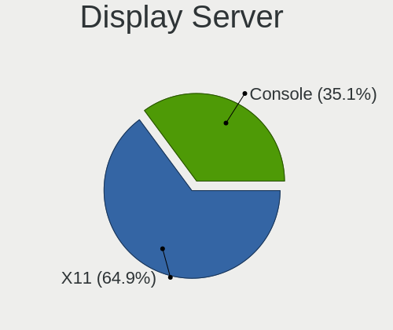

| Name    | Desktops | Percent |
|---------|----------|---------|
| X11     | 24       | 64.86%  |
| Console | 13       | 35.14%  |

Display Manager
---------------

SDDM, LightDM, etc.

| Name    | Desktops | Percent |
|---------|----------|---------|
| Console | 36       | 100%    |

OS Lang
-------

Language

| Lang       | Desktops | Percent |
|------------|----------|---------|
| Unknown    | 32       | 88.89%  |
| ru_RU      | 1        | 2.78%   |
| pl_PL      | 1        | 2.78%   |
| ISO8859-15 | 1        | 2.78%   |
| en_US      | 1        | 2.78%   |

Boot Mode
---------

EFI or BIOS

| Mode | Desktops | Percent |
|------|----------|---------|
| EFI  | 21       | 58.33%  |
| BIOS | 15       | 41.67%  |

Filesystem
----------

Type of filesystem

| Type | Desktops | Percent |
|------|----------|---------|
| Ffs  | 36       | 100%    |

Part. scheme
------------

Scheme of partitioning

| Type | Desktops | Percent |
|------|----------|---------|
| MBR  | 20       | 55.56%  |
| GPT  | 16       | 44.44%  |

Board
-----

Vendor
------

Motherboard manufacturer

| Name                    | Desktops | Percent |
|-------------------------|----------|---------|
| ASUSTek Computer        | 11       | 30.56%  |
| Lenovo                  | 5        | 13.89%  |
| Dell                    | 4        | 11.11%  |
| PC Engines              | 3        | 8.33%   |
| Unknown                 | 3        | 8.33%   |
| Gigabyte Technology     | 2        | 5.56%   |
| ASRock                  | 2        | 5.56%   |
| Supermicro              | 1        | 2.78%   |
| Sun                     | 1        | 2.78%   |
| Raspberry Pi Foundation | 1        | 2.78%   |
| Hewlett-Packard         | 1        | 2.78%   |
| Fujitsu                 | 1        | 2.78%   |
| Apple                   | 1        | 2.78%   |

Model
-----

Motherboard model

| Name                                | Desktops | Percent |
|-------------------------------------|----------|---------|
| Unknown                             | 3        | 8.33%   |
| Supermicro X8DTH-i/6/iF/6F          | 1        | 2.78%   |
| Sun SUNW,T5140                      | 1        | 2.78%   |
| RPi Raspberry Pi 400                | 1        | 2.78%   |
| PC Engines apu4                     | 1        | 2.78%   |
| PC Engines APU2                     | 1        | 2.78%   |
| PC Engines apu1                     | 1        | 2.78%   |
| Lenovo ThinkStation D20 415575G     | 1        | 2.78%   |
| Lenovo ThinkCentre M93p 10A8S0CE09  | 1        | 2.78%   |
| Lenovo ThinkCentre M910q 10MVCTO1WW | 1        | 2.78%   |
| Lenovo IdeaPad 5 15ITL05 82FG       | 1        | 2.78%   |
| Lenovo H30-05 90BJ0085SP            | 1        | 2.78%   |
| HP Pavilion g6                      | 1        | 2.78%   |
| Gigabyte Z390 AORUS ELITE           | 1        | 2.78%   |
| Gigabyte B450M K                    | 1        | 2.78%   |
| Fujitsu PRIMERGY RX200 S6           | 1        | 2.78%   |
| Dell PowerEdge R710                 | 1        | 2.78%   |
| Dell PowerEdge R620                 | 1        | 2.78%   |
| Dell OptiPlex 9020                  | 1        | 2.78%   |
| Dell OptiPlex 3040                  | 1        | 2.78%   |
| ASUS Z170-K                         | 1        | 2.78%   |
| ASUS TUF Gaming B550-PLUS           | 1        | 2.78%   |
| ASUS ROG STRIX X670E-I GAMING WIFI  | 1        | 2.78%   |
| ASUS PRO A520M-C                    | 1        | 2.78%   |
| ASUS PRIME H410M-A                  | 1        | 2.78%   |
| ASUS PRIME B560M-A                  | 1        | 2.78%   |
| ASUS PRIME B460M-A                  | 1        | 2.78%   |
| ASUS P8Z68-V GEN3                   | 1        | 2.78%   |
| ASUS P11C-X Series                  | 1        | 2.78%   |
| ASUS P10S-I Series                  | 1        | 2.78%   |
| ASUS F2A85-M                        | 1        | 2.78%   |
| ASRock X570 Pro4                    | 1        | 2.78%   |
| ASRock X570 Phantom Gaming 4        | 1        | 2.78%   |
| Apple PowerMac3,6                   | 1        | 2.78%   |

Model Family
------------

Motherboard model prefix

| Name                | Desktops | Percent |
|---------------------|----------|---------|
| ASUS PRIME          | 3        | 8.33%   |
| Unknown             | 3        | 8.33%   |
| Lenovo ThinkCentre  | 2        | 5.56%   |
| Dell PowerEdge      | 2        | 5.56%   |
| Dell OptiPlex       | 2        | 5.56%   |
| ASRock X570         | 2        | 5.56%   |
| Supermicro X8DTH-i  | 1        | 2.78%   |
| Sun SUNW            | 1        | 2.78%   |
| RPi Raspberry       | 1        | 2.78%   |
| PC Engines apu4     | 1        | 2.78%   |
| PC Engines APU2     | 1        | 2.78%   |
| PC Engines apu1     | 1        | 2.78%   |
| Lenovo ThinkStation | 1        | 2.78%   |
| Lenovo IdeaPad      | 1        | 2.78%   |
| Lenovo H30-05       | 1        | 2.78%   |
| HP Pavilion         | 1        | 2.78%   |
| Gigabyte Z390       | 1        | 2.78%   |
| Gigabyte B450M      | 1        | 2.78%   |
| Fujitsu PRIMERGY    | 1        | 2.78%   |
| ASUS Z170-K         | 1        | 2.78%   |
| ASUS TUF            | 1        | 2.78%   |
| ASUS ROG            | 1        | 2.78%   |
| ASUS PRO            | 1        | 2.78%   |
| ASUS P8Z68-V        | 1        | 2.78%   |
| ASUS P11C-X         | 1        | 2.78%   |
| ASUS P10S-I         | 1        | 2.78%   |
| ASUS F2A85-M        | 1        | 2.78%   |
| Apple PowerMac3     | 1        | 2.78%   |

MFG Year
--------

Motherboard manufacture year

| Year    | Desktops | Percent |
|---------|----------|---------|
| 2021    | 7        | 19.44%  |
| 2022    | 5        | 13.89%  |
| 2019    | 5        | 13.89%  |
| 2018    | 4        | 11.11%  |
| Unknown | 3        | 8.33%   |
| 2014    | 2        | 5.56%   |
| 2013    | 2        | 5.56%   |
| 2012    | 2        | 5.56%   |
| 2010    | 2        | 5.56%   |
| 2023    | 1        | 2.78%   |
| 2017    | 1        | 2.78%   |
| 2016    | 1        | 2.78%   |
| 2015    | 1        | 2.78%   |

Form Factor
-----------

Physical design of the computer

| Name    | Desktops | Percent |
|---------|----------|---------|
| Desktop | 36       | 100%    |

Coreboot
--------

Have coreboot on board

| Used | Desktops | Percent |
|------|----------|---------|
| No   | 33       | 91.67%  |
| Yes  | 3        | 8.33%   |

RAM Size
--------

Total RAM memory

| Size in GB      | Desktops | Percent |
|-----------------|----------|---------|
| 16.01-24.0      | 11       | 29.73%  |
| 32.01-64.0      | 6        | 16.22%  |
| 64.01-256.0     | 4        | 10.81%  |
| 8.01-16.0       | 4        | 10.81%  |
| 4.01-8.0        | 3        | 8.11%   |
| 3.01-4.0        | 3        | 8.11%   |
| 24.01-32.0      | 3        | 8.11%   |
| More than 256.0 | 1        | 2.7%    |
| 2.01-3.0        | 1        | 2.7%    |
| 1.01-2.0        | 1        | 2.7%    |

RAM Used
--------

Used RAM memory

| Used GB   | Desktops | Percent |
|-----------|----------|---------|
| 0.01-0.5  | 22       | 61.11%  |
| 0.51-1.0  | 9        | 25%     |
| 3.01-4.0  | 2        | 5.56%   |
| 4.01-8.0  | 1        | 2.78%   |
| 1.01-2.0  | 1        | 2.78%   |
| 8.01-16.0 | 1        | 2.78%   |

Total Drives
------------

Number of drives on board

| Drives | Desktops | Percent |
|--------|----------|---------|
| 1      | 16       | 43.24%  |
| 3      | 9        | 24.32%  |
| 2      | 4        | 10.81%  |
| 6      | 3        | 8.11%   |
| 14     | 1        | 2.7%    |
| 8      | 1        | 2.7%    |
| 5      | 1        | 2.7%    |
| 4      | 1        | 2.7%    |
| 0      | 1        | 2.7%    |

Has CD-ROM
----------

Has CD-ROM on board

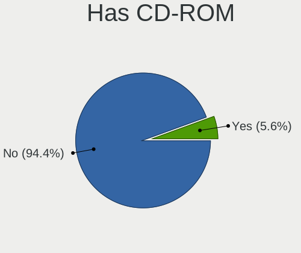

| Presented | Desktops | Percent |
|-----------|----------|---------|
| No        | 34       | 94.44%  |
| Yes       | 2        | 5.56%   |

Has Ethernet
------------

Has Ethernet on board

| Presented | Desktops | Percent |
|-----------|----------|---------|
| Yes       | 33       | 91.67%  |
| No        | 3        | 8.33%   |

Has WiFi
--------

Has WiFi module

| Presented | Desktops | Percent |
|-----------|----------|---------|
| No        | 27       | 75%     |
| Yes       | 9        | 25%     |

Has Bluetooth
-------------

Has Bluetooth module

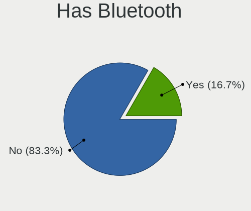

| Presented | Desktops | Percent |
|-----------|----------|---------|
| No        | 30       | 83.33%  |
| Yes       | 6        | 16.67%  |

Location
--------

Country
-------

Geographic location (country)

| Country     | Desktops | Percent |
|-------------|----------|---------|
| Russia      | 6        | 16.67%  |
| USA         | 5        | 13.89%  |
| Italy       | 4        | 11.11%  |
| Germany     | 4        | 11.11%  |
| France      | 4        | 11.11%  |
| Spain       | 2        | 5.56%   |
| Poland      | 2        | 5.56%   |
| Canada      | 2        | 5.56%   |
| Australia   | 2        | 5.56%   |
| UK          | 1        | 2.78%   |
| Switzerland | 1        | 2.78%   |
| Netherlands | 1        | 2.78%   |
| Mexico      | 1        | 2.78%   |
| Cyprus      | 1        | 2.78%   |

City
----

Geographic location (city)

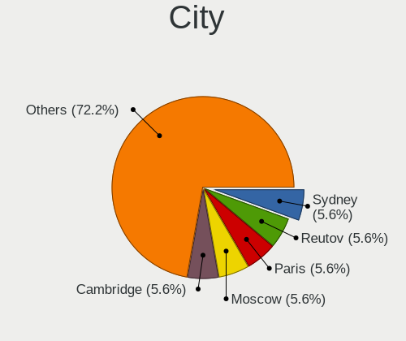

| City              | Desktops | Percent |
|-------------------|----------|---------|
| Sydney            | 2        | 5.56%   |
| Reutov            | 2        | 5.56%   |
| Paris             | 2        | 5.56%   |
| Moscow            | 2        | 5.56%   |
| Cambridge         | 2        | 5.56%   |
| Zurich            | 1        | 2.78%   |
| Warsaw            | 1        | 2.78%   |
| Vidnoye           | 1        | 2.78%   |
| Verona            | 1        | 2.78%   |
| Vanzago           | 1        | 2.78%   |
| Remseck am Neckar | 1        | 2.78%   |
| Puebla City       | 1        | 2.78%   |
| Nuremberg         | 1        | 2.78%   |
| Monza             | 1        | 2.78%   |
| Los Angeles       | 1        | 2.78%   |
| London            | 1        | 2.78%   |
| Lee's Summit      | 1        | 2.78%   |
| Larnaca           | 1        | 2.78%   |
| Lafayette         | 1        | 2.78%   |
| Krasnodar         | 1        | 2.78%   |
| Giessen           | 1        | 2.78%   |
| Gdansk            | 1        | 2.78%   |
| Desio             | 1        | 2.78%   |
| Denver            | 1        | 2.78%   |
| Cergy             | 1        | 2.78%   |
| Cenon-sur-Vienne  | 1        | 2.78%   |
| Berlin            | 1        | 2.78%   |
| Barcelona         | 1        | 2.78%   |
| Amsterdam         | 1        | 2.78%   |
| Alexandria        | 1        | 2.78%   |
| Alcover           | 1        | 2.78%   |

Drives
------

Drive Vendor
------------

Hard drive vendors

| Vendor              | Desktops | Drives | Percent |
|---------------------|----------|--------|---------|
| NVMe                | 11       | 14     | 17.46%  |
| WDC                 | 6        | 11     | 9.52%   |
| Seagate             | 6        | 16     | 9.52%   |
| Samsung Electronics | 6        | 18     | 9.52%   |
| OPENBSD             | 6        | 8      | 9.52%   |
| Kingston            | 5        | 6      | 7.94%   |
| SanDisk             | 3        | 3      | 4.76%   |
| Intel               | 3        | 3      | 4.76%   |
| Crucial             | 3        | 3      | 4.76%   |
| Toshiba             | 2        | 6      | 3.17%   |
| HGST                | 2        | 2      | 3.17%   |
| SPCC                | 1        | 1      | 1.59%   |
| Patriot             | 1        | 1      | 1.59%   |
| Memorex             | 1        | 1      | 1.59%   |
| LSI                 | 1        | 1      | 1.59%   |
| KingSpec            | 1        | 1      | 1.59%   |
| KingDian            | 1        | 1      | 1.59%   |
| IBM-ESXS            | 1        | 1      | 1.59%   |
| Hitachi             | 1        | 1      | 1.59%   |
| Dell                | 1        | 2      | 1.59%   |
| China               | 1        | 1      | 1.59%   |

Drive Model
-----------

Hard drive models

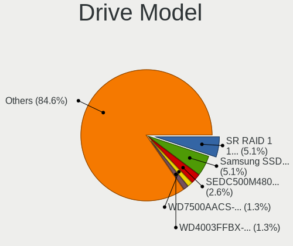

| Model                           | Desktops | Percent |
|---------------------------------|----------|---------|
| OPENBSD SR RAID 1 2TB           | 4        | 5.13%   |
| NVMe Samsung SSD 980 500GB      | 4        | 5.13%   |
| Kingston SEDC500M480G 480GB     | 2        | 2.56%   |
| WDC WD7500AACS-00ZJB0 752GB     | 1        | 1.28%   |
| WDC WD4003FFBX-68MU3N0 4TB      | 1        | 1.28%   |
| WDC WD3200AAKX-001CA0 320GB     | 1        | 1.28%   |
| WDC WD20PURX-64P6ZY0 2TB        | 1        | 1.28%   |
| WDC WD20EARX-00PASB0 2TB        | 1        | 1.28%   |
| WDC WD15EARS-00Z5B1 1.5TB       | 1        | 1.28%   |
| WDC WD101KFBX-68R56N0 10TB      | 1        | 1.28%   |
| WDC WD My Passport 25E7 2TB     | 1        | 1.28%   |
| WDC WD Elements 25A2 1TB        | 1        | 1.28%   |
| WDC WD Elements 25A1 4TB        | 1        | 1.28%   |
| WDC WD Elements 1078 1TB        | 1        | 1.28%   |
| Toshiba MG08ADA800E 8TB         | 1        | 1.28%   |
| Toshiba DT01ACA100 1TB          | 1        | 1.28%   |
| SPCC Solid State Disk 128GB     | 1        | 1.28%   |
| Seagate ST9146852SS 146GB       | 1        | 1.28%   |
| Seagate ST500DM002-1BD142 500GB | 1        | 1.28%   |
| Seagate ST4000LM024-2AN17V 4TB  | 1        | 1.28%   |
| Seagate ST3750640NS 752GB       | 1        | 1.28%   |
| Seagate ST3000DM001 137GB       | 1        | 1.28%   |
| Seagate Portable 5TB            | 1        | 1.28%   |
| Seagate OneTouch HDD 5TB        | 1        | 1.28%   |
| Seagate Expansion HDD 5TB       | 1        | 1.28%   |
| Seagate Expansion Desk 4TB      | 1        | 1.28%   |
| Seagate Expansion 4TB           | 1        | 1.28%   |
| Seagate Desktop 8TB             | 1        | 1.28%   |
| Seagate BUP Slim BK 2TB         | 1        | 1.28%   |
| Seagate BUP Portable 5TB        | 1        | 1.28%   |
| SanDisk Ultra Fit 128GB         | 1        | 1.28%   |
| SanDisk Gaming Xbox 360 8GB     | 1        | 1.28%   |
| SanDisk Cruzer Blade 64GB       | 1        | 1.28%   |
| Samsung SSD 870 QVO 2TB         | 1        | 1.28%   |
| Samsung SSD 860 EVO M.2 1TB     | 1        | 1.28%   |
| Samsung SSD 860 EVO 1TB         | 1        | 1.28%   |
| Samsung SSD 850 EVO 1TB         | 1        | 1.28%   |
| Samsung HM160HI 160GB           | 1        | 1.28%   |
| Samsung Flash Drive FIT 32GB    | 1        | 1.28%   |
| Patriot P210 128GB              | 1        | 1.28%   |

HDD Vendor
----------

Hard disk drive vendors

| Vendor              | Desktops | Drives | Percent |
|---------------------|----------|--------|---------|
| NVMe                | 7        | 8      | 19.44%  |
| WDC                 | 6        | 11     | 16.67%  |
| Seagate             | 6        | 16     | 16.67%  |
| OPENBSD             | 6        | 8      | 16.67%  |
| Toshiba             | 2        | 6      | 5.56%   |
| Samsung Electronics | 2        | 3      | 5.56%   |
| HGST                | 2        | 2      | 5.56%   |
| Memorex             | 1        | 1      | 2.78%   |
| LSI                 | 1        | 1      | 2.78%   |
| IBM-ESXS            | 1        | 1      | 2.78%   |
| Hitachi             | 1        | 1      | 2.78%   |
| Dell                | 1        | 2      | 2.78%   |

SSD Vendor
----------

Solid state drive vendors

| Vendor              | Desktops | Drives | Percent |
|---------------------|----------|--------|---------|
| NVMe                | 5        | 6      | 17.86%  |
| Kingston            | 5        | 6      | 17.86%  |
| Samsung Electronics | 4        | 15     | 14.29%  |
| SanDisk             | 3        | 3      | 10.71%  |
| Intel               | 3        | 3      | 10.71%  |
| Crucial             | 3        | 3      | 10.71%  |
| SPCC                | 1        | 1      | 3.57%   |
| Patriot             | 1        | 1      | 3.57%   |
| KingSpec            | 1        | 1      | 3.57%   |
| KingDian            | 1        | 1      | 3.57%   |
| China               | 1        | 1      | 3.57%   |

Drive Kind
----------

HDD or SSD

| Kind | Desktops | Drives | Percent |
|------|----------|--------|---------|
| HDD  | 23       | 60     | 52.27%  |
| SSD  | 21       | 41     | 47.73%  |

Drive Connector
---------------

SATA, SAS, NVMe, etc.

| Type | Desktops | Drives | Percent |
|------|----------|--------|---------|
| SATA | 33       | 101    | 100%    |

Drive Size
----------

Size of hard drive

| Size in TB | Desktops | Drives | Percent |
|------------|----------|--------|---------|
| 0.01-0.5   | 26       | 37     | 47.27%  |
| 0.51-1.0   | 12       | 17     | 21.82%  |
| 1.01-2.0   | 8        | 28     | 14.55%  |
| 4.01-10.0  | 5        | 13     | 9.09%   |
| 3.01-4.0   | 4        | 6      | 7.27%   |

Space Total
-----------

Amount of disk space available on the file system

| Size in GB     | Desktops | Percent |
|----------------|----------|---------|
| 251-500        | 14       | 37.84%  |
| 101-250        | 8        | 21.62%  |
| More than 3000 | 5        | 13.51%  |
| 1001-2000      | 3        | 8.11%   |
| 51-100         | 3        | 8.11%   |
| 501-1000       | 2        | 5.41%   |
| 21-50          | 1        | 2.7%    |
| 1-20           | 1        | 2.7%    |

Space Used
----------

Amount of used disk space

| Used GB        | Desktops | Percent |
|----------------|----------|---------|
| 1-20           | 23       | 60.53%  |
| 51-100         | 4        | 10.53%  |
| 251-500        | 3        | 7.89%   |
| 21-50          | 3        | 7.89%   |
| More than 3000 | 2        | 5.26%   |
| 101-250        | 2        | 5.26%   |
| 2001-3000      | 1        | 2.63%   |

Malfunc. Drives
---------------

Drive models with a malfunction

| Model                             | Desktops | Drives | Percent |
|-----------------------------------|----------|--------|---------|
| WDC WD7500AACS-00ZJB0 752GB       | 1        | 1      | 12.5%   |
| WDC WD15EARS-00Z5B1 1.5TB         | 1        | 1      | 12.5%   |
| Toshiba DT01ACA100 1TB            | 1        | 1      | 12.5%   |
| Seagate ST3750640NS 752GB         | 1        | 2      | 12.5%   |
| Samsung Electronics HM160HI 160GB | 1        | 2      | 12.5%   |
| Kingston SMS200S330G 32GB         | 1        | 1      | 12.5%   |
| KingSpec P3-512 512GB             | 1        | 1      | 12.5%   |
| HGST HTS541010A7E630 1TB          | 1        | 1      | 12.5%   |

Malfunc. Drive Vendor
---------------------

Vendors of faulty drives

| Vendor              | Desktops | Drives | Percent |
|---------------------|----------|--------|---------|
| WDC                 | 1        | 2      | 14.29%  |
| Toshiba             | 1        | 1      | 14.29%  |
| Seagate             | 1        | 2      | 14.29%  |
| Samsung Electronics | 1        | 2      | 14.29%  |
| Kingston            | 1        | 1      | 14.29%  |
| KingSpec            | 1        | 1      | 14.29%  |
| HGST                | 1        | 1      | 14.29%  |

Malfunc. HDD Vendor
-------------------

Vendors of faulty HDD drives

| Vendor              | Desktops | Drives | Percent |
|---------------------|----------|--------|---------|
| WDC                 | 1        | 2      | 20%     |
| Toshiba             | 1        | 1      | 20%     |
| Seagate             | 1        | 2      | 20%     |
| Samsung Electronics | 1        | 2      | 20%     |
| HGST                | 1        | 1      | 20%     |

Malfunc. Drive Kind
-------------------

Kinds of faulty drives

| Kind | Desktops | Drives | Percent |
|------|----------|--------|---------|
| HDD  | 5        | 8      | 71.43%  |
| SSD  | 2        | 2      | 28.57%  |

Failed Drives
-------------

Failed drive models

Zero info for selected period =(

Failed Drive Vendor
-------------------

Failed drive vendors

Zero info for selected period =(

Drive Status
------------

Number of failed and malfunc. drives

| Status   | Desktops | Drives | Percent |
|----------|----------|--------|---------|
| Works    | 25       | 59     | 52.08%  |
| Detected | 16       | 32     | 33.33%  |
| Malfunc  | 7        | 10     | 14.58%  |

Storage controller
------------------

Storage Vendor
--------------

Storage controller vendors

| Vendor                    | Desktops | Percent |
|---------------------------|----------|---------|
| Intel                     | 19       | 38%     |
| AMD                       | 12       | 24%     |
| Samsung Electronics       | 6        | 12%     |
| Broadcom / LSI            | 5        | 10%     |
| SanDisk                   | 2        | 4%      |
| Toshiba                   | 1        | 2%      |
| Silicon Motion            | 1        | 2%      |
| Seagate Technology        | 1        | 2%      |
| Micron/Crucial Technology | 1        | 2%      |
| Marvell Technology Group  | 1        | 2%      |
| ADATA Technology          | 1        | 2%      |

Storage Model
-------------

Storage controller models

| Model                                                                          | Desktops | Percent |
|--------------------------------------------------------------------------------|----------|---------|
| AMD FCH SATA Controller [AHCI mode]                                            | 8        | 16%     |
| Samsung NVMe SSD Controller PM9A1/PM9A3/980PRO                                 | 4        | 8%      |
| Intel Q170/Q150/B150/H170/H110/Z170/CM236 Chipset SATA Controller [AHCI Mode]  | 3        | 6%      |
| Intel 8 Series/C220 Series Chipset Family 6-port SATA Controller 1 [AHCI mode] | 3        | 6%      |
| Intel Cannon Lake PCH SATA AHCI Controller                                     | 2        | 4%      |
| Intel 82801JI (ICH10 Family) SATA AHCI Controller                              | 2        | 4%      |
| Intel 400 Series Chipset Family SATA AHCI Controller                           | 2        | 4%      |
| AMD 500 Series Chipset SATA Controller                                         | 2        | 4%      |
| Toshiba BG3 NVMe SSD Controller                                                | 1        | 2%      |
| Silicon Motion SM2263EN/SM2263XT SSD Controller                                | 1        | 2%      |
| Seagate FireCuda 520 SSD                                                       | 1        | 2%      |
| SanDisk WD Black SN750 / PC SN730 NVMe SSD                                     | 1        | 2%      |
| Sandisk unknown                                                                | 1        | 2%      |
| Samsung NVMe SSD Controller SM951/PM951                                        | 1        | 2%      |
| Samsung NVMe SSD Controller 980                                                | 1        | 2%      |
| Micron/Crucial P2 NVMe PCIe SSD                                                | 1        | 2%      |
| Marvell Group 88SE9215 PCIe 2.0 x1 4-port SATA 6 Gb/s Controller               | 1        | 2%      |
| Intel Tiger Lake-LP SATA Controller                                            | 1        | 2%      |
| Intel Jasper Lake SATA AHCI Controller                                         | 1        | 2%      |
| Intel C600/X79 series chipset 6-Port SATA AHCI Controller                      | 1        | 2%      |
| Intel 82801IB (ICH9) 2 port SATA Controller [IDE mode]                         | 1        | 2%      |
| Intel 6 Series/C200 Series Chipset Family 6 port Desktop SATA AHCI Controller  | 1        | 2%      |
| Intel 500 Series Chipset Family SATA AHCI Controller                           | 1        | 2%      |
| Intel 200 Series PCH SATA controller [AHCI mode]                               | 1        | 2%      |
| Broadcom / LSI SAS2308 PCI-Express Fusion-MPT SAS-2                            | 1        | 2%      |
| Broadcom / LSI SAS2008 PCI-Express Fusion-MPT SAS-2 [Falcon]                   | 1        | 2%      |
| Broadcom / LSI SAS1068E PCI-Express Fusion-MPT SAS                             | 1        | 2%      |
| Broadcom / LSI MegaRAID SAS 2208 [Thunderbolt]                                 | 1        | 2%      |
| Broadcom / LSI MegaRAID SAS 1078                                               | 1        | 2%      |
| AMD SB7x0/SB8x0/SB9x0 SATA Controller [AHCI mode]                              | 1        | 2%      |
| AMD 400 Series Chipset SATA Controller                                         | 1        | 2%      |
| ADATA XPG GAMMIX S50 NVMe SSD                                                  | 1        | 2%      |

Storage Kind
------------

Kind of storage controller (IDE, SATA, NVMe, SAS, ...)

| Kind | Desktops | Percent |
|------|----------|---------|
| SATA | 30       | 63.83%  |
| NVMe | 11       | 23.4%   |
| RAID | 2        | 4.26%   |
| SCSI | 2        | 4.26%   |
| SAS  | 1        | 2.13%   |
| IDE  | 1        | 2.13%   |

Processor
---------

CPU Vendor
----------

Processor vendors

| Vendor  | Desktops | Percent |
|---------|----------|---------|
| Intel   | 20       | 55.56%  |
| AMD     | 12       | 33.33%  |
| ARM     | 2        | 5.56%   |
| Unknown | 2        | 5.56%   |

CPU Model
---------

Processor models

| Model                                       | Desktops | Percent |
|---------------------------------------------|----------|---------|
| Intel Core i5-4570 CPU @ 3.20GHz            | 2        | 5.56%   |
| AMD GX-412TC SOC                            | 2        | 5.56%   |
|                                             | 2        | 5.56%   |
| Intel Xeon E-2236 CPU @ 3.40GHz             | 1        | 2.78%   |
| Intel Xeon CPU X5690 @ 3.47GHz              | 1        | 2.78%   |
| Intel Xeon CPU X5675 @ 3.07GHz              | 1        | 2.78%   |
| Intel Xeon CPU X5650 @ 2.67GHz              | 1        | 2.78%   |
| Intel Xeon CPU E5540 @ 2.53GHz              | 1        | 2.78%   |
| Intel Xeon CPU E5-2640 0 @ 2.50GHz          | 1        | 2.78%   |
| Intel Xeon CPU E5-2620 v3 @ 2.40GHz         | 1        | 2.78%   |
| Intel Xeon CPU E3-1220 v5 @ 3.00GHz         | 1        | 2.78%   |
| Intel Core i9-9900K CPU @ 3.60GHz           | 1        | 2.78%   |
| Intel Core i7-7700T CPU @ 2.90GHz           | 1        | 2.78%   |
| Intel Core i7-6700 CPU @ 3.40GHz            | 1        | 2.78%   |
| Intel Core i7-10700 CPU @ 2.90GHz           | 1        | 2.78%   |
| Intel Core i5-6500T CPU @ 2.50GHz           | 1        | 2.78%   |
| Intel Core i5-3570K CPU @ 3.40GHz           | 1        | 2.78%   |
| Intel Core i3-10100 CPU @ 3.60GHz           | 1        | 2.78%   |
| Intel Celeron N5105 @ 2.00GHz               | 1        | 2.78%   |
| Intel 11th Gen Core i7-1165G7 @ 2.80GHz     | 1        | 2.78%   |
| Intel 11th Gen Core i5-11600K @ 3.90GHz     | 1        | 2.78%   |
| ARM Cortex-A72 r0p3                         | 1        | 2.78%   |
| ARM Cortex-A53 r0p4                         | 1        | 2.78%   |
| AMD Ryzen 9 7950X 16-Core Processor         | 1        | 2.78%   |
| AMD Ryzen 9 5950X 16-Core Processor         | 1        | 2.78%   |
| AMD Ryzen 9 5900X 12-Core Processor         | 1        | 2.78%   |
| AMD Ryzen 9 3900 12-Core Processor          | 1        | 2.78%   |
| AMD Ryzen 7 5700X 8-Core Processor          | 1        | 2.78%   |
| AMD Ryzen 7 5700G with Radeon Graphics      | 1        | 2.78%   |
| AMD G-T40E Processor                        | 1        | 2.78%   |
| AMD E1-7010 APU with AMD Radeon R2 Graphics | 1        | 2.78%   |
| AMD A6-4400M APU with Radeon HD Graphics    | 1        | 2.78%   |
| AMD A10-5700 APU with Radeon HD Graphics    | 1        | 2.78%   |

CPU Model Family
----------------

Processor model prefix

| Model         | Desktops | Percent |
|---------------|----------|---------|
| Intel Xeon    | 8        | 22.22%  |
| Other         | 4        | 11.11%  |
| Intel Core i5 | 4        | 11.11%  |
| AMD Ryzen 9   | 4        | 11.11%  |
| Intel Core i7 | 3        | 8.33%   |
| ARM Cortex    | 2        | 5.56%   |
| AMD Ryzen 7   | 2        | 5.56%   |
| AMD GX        | 2        | 5.56%   |
| Intel Core i9 | 1        | 2.78%   |
| Intel Core i3 | 1        | 2.78%   |
| Intel Celeron | 1        | 2.78%   |
| AMD G         | 1        | 2.78%   |
| AMD E1        | 1        | 2.78%   |
| AMD A6        | 1        | 2.78%   |
| AMD A10       | 1        | 2.78%   |

CPU Cores
---------

Number of processor cores

| Number  | Desktops | Percent |
|---------|----------|---------|
| 4       | 14       | 38.89%  |
| 6       | 5        | 13.89%  |
| Unknown | 4        | 11.11%  |
| 2       | 3        | 8.33%   |
| 32      | 2        | 5.56%   |
| 24      | 2        | 5.56%   |
| 16      | 2        | 5.56%   |
| 12      | 2        | 5.56%   |
| 8       | 2        | 5.56%   |

CPU Sockets
-----------

Number of sockets

| Number  | Desktops | Percent |
|---------|----------|---------|
| 1       | 30       | 83.33%  |
| Unknown | 4        | 11.11%  |
| 2       | 2        | 5.56%   |

CPU Threads
-----------

Threads per core (Hyper-Threading)

| Number  | Desktops | Percent |
|---------|----------|---------|
| 1       | 18       | 50%     |
| 2       | 14       | 38.89%  |
| Unknown | 4        | 11.11%  |

CPU Microarch
-------------

Microarchitecture

| Name        | Desktops | Percent |
|-------------|----------|---------|
| Unknown     | 7        | 19.44%  |
| Zen 3       | 4        | 11.11%  |
| Westmere    | 3        | 8.33%   |
| Skylake     | 3        | 8.33%   |
| Puma        | 3        | 8.33%   |
| KabyLake    | 3        | 8.33%   |
| Haswell     | 3        | 8.33%   |
| Piledriver  | 2        | 5.56%   |
| CometLake   | 2        | 5.56%   |
| Zen 2       | 1        | 2.78%   |
| TigerLake   | 1        | 2.78%   |
| SandyBridge | 1        | 2.78%   |
| Nehalem     | 1        | 2.78%   |
| IvyBridge   | 1        | 2.78%   |
| Bobcat      | 1        | 2.78%   |

Graphics
--------

GPU Vendor
----------

Vendors of graphics cards

| Vendor                     | Desktops | Percent |
|----------------------------|----------|---------|
| AMD                        | 14       | 42.42%  |
| Intel                      | 11       | 33.33%  |
| Matrox Electronics Systems | 4        | 12.12%  |
| Nvidia                     | 2        | 6.06%   |
| ASPEED Technology          | 2        | 6.06%   |

GPU Model
---------

Graphics card models

| Model                                                                       | Desktops | Percent |
|-----------------------------------------------------------------------------|----------|---------|
| Matrox Electronics Systems MGA G200eW WPCM450                               | 2        | 5.88%   |
| Intel Xeon E3-1200 v3/4th Gen Core Processor Integrated Graphics Controller | 2        | 5.88%   |
| Intel HD Graphics 530                                                       | 2        | 5.88%   |
| Intel CometLake-S GT2 [UHD Graphics 630]                                    | 2        | 5.88%   |
| ASPEED Technology ASPEED Graphics Family                                    | 2        | 5.88%   |
| AMD Navi 23 [Radeon RX 6600/6600 XT/6600M]                                  | 2        | 5.88%   |
| Nvidia GK208B [GeForce GT 710]                                              | 1        | 2.94%   |
| Nvidia GA102 [GeForce RTX 3080]                                             | 1        | 2.94%   |
| Matrox Electronics Systems MGA G200e [Pilot] ServerEngines (SEP1)           | 1        | 2.94%   |
| Matrox Electronics Systems G200eR2                                          | 1        | 2.94%   |
| Intel TigerLake-LP GT2 [Iris Xe Graphics]                                   | 1        | 2.94%   |
| Intel JasperLake [UHD Graphics]                                             | 1        | 2.94%   |
| Intel IvyBridge GT2 [HD Graphics 4000]                                      | 1        | 2.94%   |
| Intel HD Graphics 630                                                       | 1        | 2.94%   |
| Intel CoffeeLake-S GT2 [UHD Graphics 630]                                   | 1        | 2.94%   |
| AMD Trinity [Radeon HD 7660D]                                               | 1        | 2.94%   |
| AMD Trinity 2 [Radeon HD 7520G]                                             | 1        | 2.94%   |
| AMD RV250 [Radeon 9000 Series]                                              | 1        | 2.94%   |
| AMD Raphael                                                                 | 1        | 2.94%   |
| AMD Oland [Radeon HD 8570 / R5 430 OEM / R7 240/340 / Radeon 520 OEM]       | 1        | 2.94%   |
| AMD Navi 22 [Radeon RX 6700/6700 XT/6750 XT / 6800M/6850M XT]               | 1        | 2.94%   |
| AMD Navi 10 [Radeon RX 5600 OEM/5600 XT / 5700/5700 XT]                     | 1        | 2.94%   |
| AMD Mullins [Radeon R2 Graphics]                                            | 1        | 2.94%   |
| AMD Lexa PRO [Radeon 540/540X/550/550X / RX 540X/550/550X]                  | 1        | 2.94%   |
| AMD Ellesmere [Radeon RX 470/480/570/570X/580/580X/590]                     | 1        | 2.94%   |
| AMD Cezanne [Radeon Vega Series / Radeon Vega Mobile Series]                | 1        | 2.94%   |
| AMD Caicos [Radeon HD 6450/7450/8450 / R5 230 OEM]                          | 1        | 2.94%   |
| AMD Caicos PRO [Radeon HD 7450]                                             | 1        | 2.94%   |

GPU Combo
---------

Combinations of graphics cards

| Name         | Desktops | Percent |
|--------------|----------|---------|
| 1 x AMD      | 11       | 29.73%  |
| 1 x Intel    | 10       | 27.03%  |
| Other        | 6        | 16.22%  |
| 1 x Matrox   | 3        | 8.11%   |
| 1 x ASPEED   | 2        | 5.41%   |
| 2 x AMD      | 1        | 2.7%    |
| 1 x Nvidia   | 1        | 2.7%    |
| Intel + AMD  | 1        | 2.7%    |
| AMD + Nvidia | 1        | 2.7%    |
| AMD + Matrox | 1        | 2.7%    |

GPU Driver
----------

Free vs proprietary

| Driver  | Desktops | Percent |
|---------|----------|---------|
| Free    | 28       | 77.78%  |
| Unknown | 8        | 22.22%  |

GPU Memory
----------

Total video memory

| Size in GB | Desktops | Percent |
|------------|----------|---------|
| Unknown    | 36       | 100%    |

Monitor
-------

Monitor Vendor
--------------

Monitor vendors

| Vendor               | Desktops | Percent |
|----------------------|----------|---------|
| Samsung Electronics  | 3        | 16.67%  |
| Philips              | 2        | 11.11%  |
| Dell                 | 2        | 11.11%  |
| Ancor Communications | 2        | 11.11%  |
| Sceptre Tech         | 1        | 5.56%   |
| MSI                  | 1        | 5.56%   |
| Eizo                 | 1        | 5.56%   |
| DSC                  | 1        | 5.56%   |
| BenQ                 | 1        | 5.56%   |
| AU Optronics         | 1        | 5.56%   |
| ASUSTek Computer     | 1        | 5.56%   |
| AOC                  | 1        | 5.56%   |
| Acer                 | 1        | 5.56%   |

Monitor Model
-------------

Monitor models

| Model                                                                 | Desktops | Percent |
|-----------------------------------------------------------------------|----------|---------|
| Philips 227E4LH PHLC0AC 1920x1080 480x270mm 21.7-inch                 | 2        | 11.11%  |
| Sceptre Tech Sceptre C35 SPT0DB7 3440x1440 820x350mm 35.1-inch        | 1        | 5.56%   |
| Samsung Electronics SyncMaster SAM0226 1440x900 410x260mm 19.1-inch   | 1        | 5.56%   |
| Samsung Electronics S24E650 SAM0CC3 1920x1200 520x320mm 24.0-inch     | 1        | 5.56%   |
| Samsung Electronics LCD Monitor SAM7103 3840x2160 700x390mm 31.5-inch | 1        | 5.56%   |
| MSI MP242 MSI30A1 1920x1080 530x300mm 24.0-inch                       | 1        | 5.56%   |
| Eizo EV2450 ENC2531 1920x1080 530x300mm 24.0-inch                     | 1        | 5.56%   |
| DSC LCD Monitor DSC0001 2200x1650 200x150mm 9.8-inch                  | 1        | 5.56%   |
| Dell U2515H DELD06F 2560x1440 550x310mm 24.9-inch                     | 1        | 5.56%   |
| Dell P780 DEL510F 1600x1200 330x240mm 16.1-inch                       | 1        | 5.56%   |
| BenQ GL2450H BNQ78A7 1920x1080 530x300mm 24.0-inch                    | 1        | 5.56%   |
| AU Optronics LCD Monitor AUOE48D 1920x1080 340x190mm 15.3-inch        | 1        | 5.56%   |
| ASUSTek Computer ROG PG259QN AUS25B5 1920x1080 540x300mm 24.3-inch    | 1        | 5.56%   |
| AOC 2050W AOC2050 1600x900 430x240mm 19.4-inch                        | 1        | 5.56%   |
| Ancor Communications VK246 ACI24F1 1920x1080 530x300mm 24.0-inch      | 1        | 5.56%   |
| Ancor Communications ASUS VS247 ACI249A 1920x1080 520x290mm 23.4-inch | 1        | 5.56%   |
| Acer AT1945 ACR1945 1440x900 400x250mm 18.6-inch                      | 1        | 5.56%   |

Monitor Resolution
------------------

Monitor screen resolution

| Resolution        | Desktops | Percent |
|-------------------|----------|---------|
| 1920x1080 (FHD)   | 9        | 50%     |
| 1440x900 (WXGA+)  | 2        | 11.11%  |
| 3840x2160 (4K)    | 1        | 5.56%   |
| 3440x1440         | 1        | 5.56%   |
| 2560x1440 (QHD)   | 1        | 5.56%   |
| 2200x1650         | 1        | 5.56%   |
| 1920x1200 (WUXGA) | 1        | 5.56%   |
| 1600x900 (HD+)    | 1        | 5.56%   |
| 1600x1200         | 1        | 5.56%   |

Monitor Diagonal
----------------

Diagonal size in inches

| Inches | Desktops | Percent |
|--------|----------|---------|
| 24     | 7        | 38.89%  |
| 21     | 2        | 11.11%  |
| 19     | 2        | 11.11%  |
| 35     | 1        | 5.56%   |
| 31     | 1        | 5.56%   |
| 23     | 1        | 5.56%   |
| 18     | 1        | 5.56%   |
| 16     | 1        | 5.56%   |
| 15     | 1        | 5.56%   |
| 9      | 1        | 5.56%   |

Monitor Width
-------------

Physical width

| Width in mm | Desktops | Percent |
|-------------|----------|---------|
| 501-600     | 8        | 44.44%  |
| 401-500     | 4        | 22.22%  |
| 301-350     | 2        | 11.11%  |
| 801-900     | 1        | 5.56%   |
| 601-700     | 1        | 5.56%   |
| 351-400     | 1        | 5.56%   |
| 101-200     | 1        | 5.56%   |

Aspect Ratio
------------

Proportional relationship between the width and the height

| Ratio | Desktops | Percent |
|-------|----------|---------|
| 16/9  | 12       | 66.67%  |
| 16/10 | 3        | 16.67%  |
| 4/3   | 2        | 11.11%  |
| 21/9  | 1        | 5.56%   |

Monitor Area
------------

Area in inch

| Area in inch | Desktops | Percent |
|----------------|----------|---------|
| 201-250        | 7        | 41.18%  |
| 251-300        | 3        | 17.65%  |
| 351-500        | 2        | 11.76%  |
| 151-200        | 2        | 11.76%  |
| 41-50          | 1        | 5.88%   |
| 121-130        | 1        | 5.88%   |
| 91-100         | 1        | 5.88%   |

Pixel Density
-------------

Pixels per inch

| Density       | Desktops | Percent |
|---------------|----------|---------|
| 51-100        | 9        | 52.94%  |
| 101-120       | 4        | 23.53%  |
| 121-160       | 3        | 17.65%  |
| More than 240 | 1        | 5.88%   |

Multiple Monitors
-----------------

Total monitors connected

| Total | Desktops | Percent |
|-------|----------|---------|
| 1     | 21       | 56.76%  |
| 0     | 15       | 40.54%  |
| 2     | 1        | 2.7%    |

Network
-------

Net Controller Vendor
---------------------

Controller vendors

| Vendor                          | Desktops | Percent |
|---------------------------------|----------|---------|
| Intel                           | 20       | 43.48%  |
| Realtek Semiconductor           | 14       | 30.43%  |
| Qualcomm Atheros                | 3        | 6.52%   |
| Broadcom                        | 2        | 4.35%   |
| TP-Link                         | 1        | 2.17%   |
| Qualcomm Atheros Communications | 1        | 2.17%   |
| Oracle/SUN                      | 1        | 2.17%   |
| MediaTek                        | 1        | 2.17%   |
| D-Link System                   | 1        | 2.17%   |
| Aquantia                        | 1        | 2.17%   |
| Apple                           | 1        | 2.17%   |

Net Controller Model
--------------------

Controller models

| Model                                                                         | Desktops | Percent |
|-------------------------------------------------------------------------------|----------|---------|
| Realtek RTL8111/8168/8411 PCI Express Gigabit Ethernet Controller             | 10       | 18.52%  |
| Intel I210 Gigabit Network Connection                                         | 4        | 7.41%   |
| Intel I211 Gigabit Network Connection                                         | 3        | 5.56%   |
| Realtek RTL810xE PCI Express Fast Ethernet controller                         | 2        | 3.7%    |
| Intel I350 Gigabit Network Connection                                         | 2        | 3.7%    |
| Intel Ethernet Connection I217-LM                                             | 2        | 3.7%    |
| TP-Link Archer T2U PLUS [RTL8821AU]                                           | 1        | 1.85%   |
| TP-Link AC600 wireless Realtek RTL8811AU [Archer T2U Nano]                    | 1        | 1.85%   |
| Realtek RTL8812AE 802.11ac PCIe Wireless Network Adapter                      | 1        | 1.85%   |
| Realtek RTL8169 PCI Gigabit Ethernet Controller                               | 1        | 1.85%   |
| Realtek RTL8125 2.5GbE Controller                                             | 1        | 1.85%   |
| Qualcomm Atheros QCA9565 / AR9565 Wireless Network Adapter                    | 1        | 1.85%   |
| Qualcomm Atheros AR9271 802.11n                                               | 1        | 1.85%   |
| Qualcomm Atheros AR9485 Wireless Network Adapter                              | 1        | 1.85%   |
| Qualcomm Atheros AR928X Wireless Network Adapter (PCI-Express)                | 1        | 1.85%   |
| Oracle/SUN Multithreaded 10-Gigabit Ethernet Network Controller               | 1        | 1.85%   |
| MediaTek MT7922 802.11ax PCI Express Wireless Network Adapter                 | 1        | 1.85%   |
| Intel Wireless 8265 / 8275                                                    | 1        | 1.85%   |
| Intel Wireless 8260                                                           | 1        | 1.85%   |
| Intel Wi-Fi 6 AX201                                                           | 1        | 1.85%   |
| Intel Ethernet Controller I226-V                                              | 1        | 1.85%   |
| Intel Ethernet Controller I225-V                                              | 1        | 1.85%   |
| Intel Ethernet Connection (7) I219-V                                          | 1        | 1.85%   |
| Intel Ethernet Connection (7) I219-LM                                         | 1        | 1.85%   |
| Intel Ethernet Connection (2) I219-LM                                         | 1        | 1.85%   |
| Intel Ethernet Connection (14) I219-V                                         | 1        | 1.85%   |
| Intel 82599ES 10-Gigabit SFI/SFP+ Network Connection                          | 1        | 1.85%   |
| Intel 82579V Gigabit Network Connection                                       | 1        | 1.85%   |
| Intel 82576 Gigabit Network Connection                                        | 1        | 1.85%   |
| Intel 82575EB Gigabit Network Connection                                      | 1        | 1.85%   |
| Intel 82571EB/82571GB Gigabit Ethernet Controller D0/D1 (copper applications) | 1        | 1.85%   |
| D-Link System AirPlus G DWL-G122 Wireless Adapter(rev.C1) [Ralink RT2571W]    | 1        | 1.85%   |
| Broadcom NetXtreme II BCM5709 Gigabit Ethernet                                | 1        | 1.85%   |
| Broadcom NetXtreme BCM5755 Gigabit Ethernet PCI Express                       | 1        | 1.85%   |
| Broadcom NetXtreme BCM5754 Gigabit Ethernet PCI Express                       | 1        | 1.85%   |
| Aquantia AQC107 NBase-T/IEEE 802.3bz Ethernet Controller [AQtion]             | 1        | 1.85%   |
| Apple UniNorth 2 GMAC (Sun GEM)                                               | 1        | 1.85%   |

Wireless Vendor
---------------

Wireless vendors

| Vendor                          | Desktops | Percent |
|---------------------------------|----------|---------|
| Qualcomm Atheros                | 3        | 27.27%  |
| Intel                           | 3        | 27.27%  |
| TP-Link                         | 1        | 9.09%   |
| Realtek Semiconductor           | 1        | 9.09%   |
| Qualcomm Atheros Communications | 1        | 9.09%   |
| MediaTek                        | 1        | 9.09%   |
| D-Link System                   | 1        | 9.09%   |

Wireless Model
--------------

Wireless models

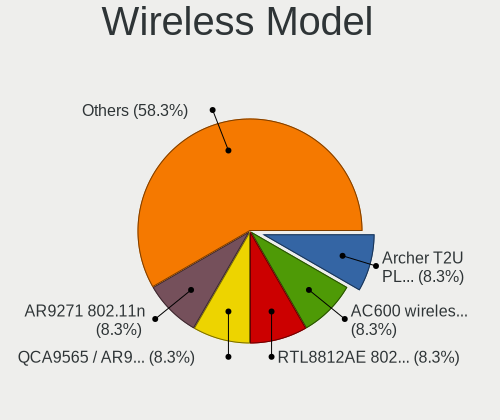

| Model                                                                      | Desktops | Percent |
|----------------------------------------------------------------------------|----------|---------|
| TP-Link Archer T2U PLUS [RTL8821AU]                                        | 1        | 8.33%   |
| TP-Link AC600 wireless Realtek RTL8811AU [Archer T2U Nano]                 | 1        | 8.33%   |
| Realtek RTL8812AE 802.11ac PCIe Wireless Network Adapter                   | 1        | 8.33%   |
| Qualcomm Atheros QCA9565 / AR9565 Wireless Network Adapter                 | 1        | 8.33%   |
| Qualcomm Atheros AR9271 802.11n                                            | 1        | 8.33%   |
| Qualcomm Atheros AR9485 Wireless Network Adapter                           | 1        | 8.33%   |
| Qualcomm Atheros AR928X Wireless Network Adapter (PCI-Express)             | 1        | 8.33%   |
| MediaTek MT7922 802.11ax PCI Express Wireless Network Adapter              | 1        | 8.33%   |
| Intel Wireless 8265 / 8275                                                 | 1        | 8.33%   |
| Intel Wireless 8260                                                        | 1        | 8.33%   |
| Intel Wi-Fi 6 AX201                                                        | 1        | 8.33%   |
| D-Link System AirPlus G DWL-G122 Wireless Adapter(rev.C1) [Ralink RT2571W] | 1        | 8.33%   |

Ethernet Vendor
---------------

Ethernet vendors

| Vendor                | Desktops | Percent |
|-----------------------|----------|---------|
| Intel                 | 18       | 50%     |
| Realtek Semiconductor | 13       | 36.11%  |
| Broadcom              | 2        | 5.56%   |
| Oracle/SUN            | 1        | 2.78%   |
| Aquantia              | 1        | 2.78%   |
| Apple                 | 1        | 2.78%   |

Ethernet Model
--------------

Ethernet models

| Model                                                                         | Desktops | Percent |
|-------------------------------------------------------------------------------|----------|---------|
| Realtek RTL8111/8168/8411 PCI Express Gigabit Ethernet Controller             | 10       | 23.81%  |
| Intel I210 Gigabit Network Connection                                         | 4        | 9.52%   |
| Intel I211 Gigabit Network Connection                                         | 3        | 7.14%   |
| Realtek RTL810xE PCI Express Fast Ethernet controller                         | 2        | 4.76%   |
| Intel I350 Gigabit Network Connection                                         | 2        | 4.76%   |
| Intel Ethernet Connection I217-LM                                             | 2        | 4.76%   |
| Realtek RTL8169 PCI Gigabit Ethernet Controller                               | 1        | 2.38%   |
| Realtek RTL8125 2.5GbE Controller                                             | 1        | 2.38%   |
| Oracle/SUN Multithreaded 10-Gigabit Ethernet Network Controller               | 1        | 2.38%   |
| Intel Ethernet Controller I226-V                                              | 1        | 2.38%   |
| Intel Ethernet Controller I225-V                                              | 1        | 2.38%   |
| Intel Ethernet Connection (7) I219-V                                          | 1        | 2.38%   |
| Intel Ethernet Connection (7) I219-LM                                         | 1        | 2.38%   |
| Intel Ethernet Connection (2) I219-LM                                         | 1        | 2.38%   |
| Intel Ethernet Connection (14) I219-V                                         | 1        | 2.38%   |
| Intel 82599ES 10-Gigabit SFI/SFP+ Network Connection                          | 1        | 2.38%   |
| Intel 82579V Gigabit Network Connection                                       | 1        | 2.38%   |
| Intel 82576 Gigabit Network Connection                                        | 1        | 2.38%   |
| Intel 82575EB Gigabit Network Connection                                      | 1        | 2.38%   |
| Intel 82571EB/82571GB Gigabit Ethernet Controller D0/D1 (copper applications) | 1        | 2.38%   |
| Broadcom NetXtreme II BCM5709 Gigabit Ethernet                                | 1        | 2.38%   |
| Broadcom NetXtreme BCM5755 Gigabit Ethernet PCI Express                       | 1        | 2.38%   |
| Broadcom NetXtreme BCM5754 Gigabit Ethernet PCI Express                       | 1        | 2.38%   |
| Aquantia AQC107 NBase-T/IEEE 802.3bz Ethernet Controller [AQtion]             | 1        | 2.38%   |
| Apple UniNorth 2 GMAC (Sun GEM)                                               | 1        | 2.38%   |

Net Controller Kind
-------------------

Ethernet, WiFi or modem

| Kind     | Desktops | Percent |
|----------|----------|---------|
| Ethernet | 33       | 78.57%  |
| WiFi     | 9        | 21.43%  |

Used Controller
---------------

Currently used network controller

| Kind     | Desktops | Percent |
|----------|----------|---------|
| Ethernet | 24       | 88.89%  |
| WiFi     | 3        | 11.11%  |

NICs
----

Total network controllers on board

| Total | Desktops | Percent |
|-------|----------|---------|
| 1     | 13       | 36.11%  |
| 2     | 10       | 27.78%  |
| 4     | 7        | 19.44%  |
| 3     | 3        | 8.33%   |
| 0     | 2        | 5.56%   |
| 5     | 1        | 2.78%   |

IPv6
----

IPv6 vs IPv4

| Used | Desktops | Percent |
|------|----------|---------|
| No   | 36       | 100%    |

Bluetooth
---------

Bluetooth Vendor
----------------

Controller vendors

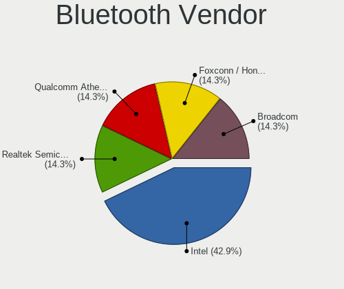

| Vendor                          | Desktops | Percent |
|---------------------------------|----------|---------|
| Intel                           | 3        | 42.86%  |
| Realtek Semiconductor           | 1        | 14.29%  |
| Qualcomm Atheros Communications | 1        | 14.29%  |
| Foxconn / Hon Hai               | 1        | 14.29%  |
| Broadcom                        | 1        | 14.29%  |

Bluetooth Model
---------------

Controller models

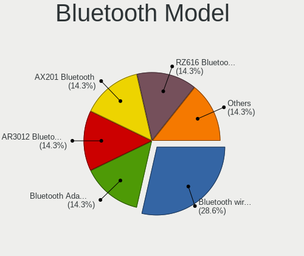

| Model                                     | Desktops | Percent |
|-------------------------------------------|----------|---------|
| Intel Bluetooth wireless interface        | 2        | 28.57%  |
| Realtek Bluetooth Adapter                 | 1        | 14.29%  |
| Qualcomm Atheros AR3012 Bluetooth 4.0     | 1        | 14.29%  |
| Intel AX201 Bluetooth                     | 1        | 14.29%  |
| Foxconn / Hon Hai RZ616 Bluetooth Adapter | 1        | 14.29%  |
| Broadcom BCM20702A0 Bluetooth 4.0         | 1        | 14.29%  |

Sound
-----

Sound Vendor
------------

Sound card vendors

| Vendor                               | Desktops | Percent |
|--------------------------------------|----------|---------|
| Intel                                | 14       | 35%     |
| AMD                                  | 14       | 35%     |
| Nvidia                               | 2        | 5%      |
| C-Media Electronics                  | 2        | 5%      |
| VIA Technologies                     | 1        | 2.5%    |
| Thesycon Systemsoftware & Consulting | 1        | 2.5%    |
| Texas Instruments                    | 1        | 2.5%    |
| Logitech                             | 1        | 2.5%    |
| JMTek                                | 1        | 2.5%    |
| Generalplus Technology               | 1        | 2.5%    |
| Elgato Systems                       | 1        | 2.5%    |
| Dell                                 | 1        | 2.5%    |

Sound Model
-----------

Sound card models

| Model                                                                             | Desktops | Percent |
|-----------------------------------------------------------------------------------|----------|---------|
| AMD Starship/Matisse HD Audio Controller                                          | 4        | 8.16%   |
| AMD Navi 21/23 HDMI/DP Audio Controller                                           | 3        | 6.12%   |
| AMD FCH Azalia Controller                                                         | 3        | 6.12%   |
| Intel Xeon E3-1200 v3/4th Gen Core Processor HD Audio Controller                  | 2        | 4.08%   |
| Intel Comet Lake PCH-V cAVS                                                       | 2        | 4.08%   |
| Intel Cannon Lake PCH cAVS                                                        | 2        | 4.08%   |
| Intel 8 Series/C220 Series Chipset High Definition Audio Controller               | 2        | 4.08%   |
| Intel 100 Series/C230 Series Chipset Family HD Audio Controller                   | 2        | 4.08%   |
| AMD Trinity HDMI Audio Controller                                                 | 2        | 4.08%   |
| AMD Caicos HDMI Audio [Radeon HD 6450 / 7450/8450/8490 OEM / R5 230/235/235X OEM] | 2        | 4.08%   |
| VIA Technologies VT1720/24 [Envy24PT/HT] PCI Multi-Channel Audio Controller       | 1        | 2.04%   |
| Thesycon Systemsoftware & Consulting Topping DX3 Pro Audio Control                | 1        | 2.04%   |
| Texas Instruments PCM2902 Audio Codec                                             | 1        | 2.04%   |
| Nvidia GK208 HDMI/DP Audio Controller                                             | 1        | 2.04%   |
| Nvidia GA102 High Definition Audio Controller                                     | 1        | 2.04%   |
| Logitech HD Webcam C910                                                           | 1        | 2.04%   |
| JMTek USB PnP Audio Device                                                        | 1        | 2.04%   |
| Intel Tiger Lake-LP Smart Sound Technology Audio Controller                       | 1        | 2.04%   |
| Intel Tiger Lake-H HD Audio Controller                                            | 1        | 2.04%   |
| Intel Jasper Lake HD Audio                                                        | 1        | 2.04%   |
| Intel 82801JI (ICH10 Family) HD Audio Controller                                  | 1        | 2.04%   |
| Intel 200 Series PCH HD Audio                                                     | 1        | 2.04%   |
| Generalplus Technology USB Audio Device                                           | 1        | 2.04%   |
| Elgato Systems Elgato Wave:3                                                      | 1        | 2.04%   |
| Dell AC511 Sound Bar                                                              | 1        | 2.04%   |
| C-Media Electronics FX-AUDIO                                                      | 1        | 2.04%   |
| C-Media Electronics CM108 Audio Controller                                        | 1        | 2.04%   |
| AMD Renoir Radeon High Definition Audio Controller                                | 1        | 2.04%   |
| AMD Rembrandt Radeon High Definition Audio Controller                             | 1        | 2.04%   |
| AMD Oland/Hainan/Cape Verde/Pitcairn HDMI Audio [Radeon HD 7000 Series]           | 1        | 2.04%   |
| AMD Navi 10 HDMI Audio                                                            | 1        | 2.04%   |
| AMD Kabini HDMI/DP Audio                                                          | 1        | 2.04%   |
| AMD Family 17h/19h HD Audio Controller                                            | 1        | 2.04%   |
| AMD Ellesmere HDMI Audio [Radeon RX 470/480 / 570/580/590]                        | 1        | 2.04%   |
| AMD Baffin HDMI/DP Audio [Radeon RX 550 640SP / RX 560/560X]                      | 1        | 2.04%   |

Memory
------

Memory Vendor
-------------

Memory module vendors

| Vendor   | Desktops | Percent |
|----------|----------|---------|
| Kingston | 2        | 66.67%  |
| Corsair  | 1        | 33.33%  |

Memory Model
------------

Memory module models

| Model                                                  | Desktops | Percent |
|--------------------------------------------------------|----------|---------|
| Kingston RAM KHX2400C15D4/4G 4GB DIMM DDR4 2400MT/s    | 1        | 25%     |
| Kingston RAM KHX2400C15/8G 8GB DIMM DDR4 2400MT/s      | 1        | 25%     |
| Kingston RAM KF3600C18D4/32GX 32GB DIMM DDR4 2400MT/s  | 1        | 25%     |
| Corsair RAM CMK64GX5M2B5200C40 32GB DIMM DDR5 4800MT/s | 1        | 25%     |

Memory Kind
-----------

Memory module kinds

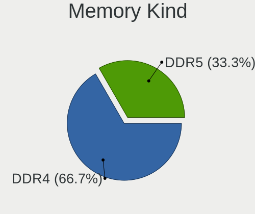

| Kind | Desktops | Percent |
|------|----------|---------|
| DDR4 | 2        | 66.67%  |
| DDR5 | 1        | 33.33%  |

Memory Form Factor
------------------

Physical design of the memory module

| Name | Desktops | Percent |
|------|----------|---------|
| DIMM | 3        | 100%    |

Memory Size
-----------

Memory module size

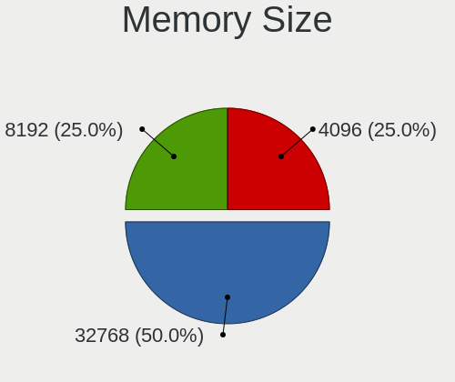

| Size  | Desktops | Percent |
|-------|----------|---------|
| 32768 | 2        | 50%     |
| 8192  | 1        | 25%     |
| 4096  | 1        | 25%     |

Memory Speed
------------

Memory module speed

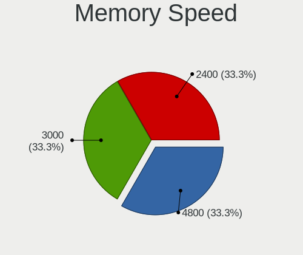

| Speed | Desktops | Percent |
|-------|----------|---------|
| 2400  | 2        | 66.67%  |
| 4800  | 1        | 33.33%  |

Printers & scanners
-------------------

Printer Vendor
--------------

Printer device vendors

Zero info for selected period =(

Printer Model
-------------

Printer device models

Zero info for selected period =(

Scanner Vendor
--------------

Scanner device vendors

Zero info for selected period =(

Scanner Model
-------------

Scanner device models

Zero info for selected period =(

Camera
------

Camera Vendor
-------------

Camera device vendors

| Vendor   | Desktops | Percent |
|----------|----------|---------|
| Microdia | 1        | 100%    |

Camera Model
------------

Camera device models

| Model                               | Desktops | Percent |
|-------------------------------------|----------|---------|
| Microdia REDRAGON Live Camera Audio | 1        | 100%    |

Security
--------

Fingerprint Vendor
------------------

Fingerprint sensor vendors

| Vendor                     | Desktops | Percent |
|----------------------------|----------|---------|
| Shenzhen Goodix Technology | 1        | 100%    |

Fingerprint Model
-----------------

Fingerprint sensor models

| Model                              | Desktops | Percent |
|------------------------------------|----------|---------|
| Shenzhen Goodix Fingerprint Reader | 1        | 100%    |

Chipcard Vendor
---------------

Chipcard module vendors

Zero info for selected period =(

Chipcard Model
--------------

Chipcard module models

Zero info for selected period =(

Unsupported
-----------

Unsupported Devices
-------------------

Total unsupported devices on board

| Total | Desktops | Percent |
|-------|----------|---------|
| 1     | 16       | 44.44%  |
| 0     | 11       | 30.56%  |
| 2     | 8        | 22.22%  |
| 3     | 1        | 2.78%   |

Unsupported Device Types
------------------------

Types of unsupported devices

| Type                     | Desktops | Percent |
|--------------------------|----------|---------|
| Communication controller | 15       | 45.45%  |
| Graphics card            | 5        | 15.15%  |
| Net/wireless             | 4        | 12.12%  |
| Storage/ata              | 3        | 9.09%   |
| Sound                    | 2        | 6.06%   |
| Net/ethernet             | 2        | 6.06%   |
| Firewire controller      | 2        | 6.06%   |

