OpenBSD 7.2 - Tested Hardware & Statistics (Notebooks)
------------------------------------------------------

A project to collect tested hardware configurations for OpenBSD 7.2.

Anyone can contribute to this report by the [hw-probe](https://github.com/linuxhw/hw-probe/blob/master/INSTALL.BSD.md) tool:

    hw-probe -all -upload

Please contribute! Especially if your hardware is rare.

Contents
--------

* [ Test Cases ](#test-cases)

* [ System ](#system)
  - [ Arch                     ](#arch)
  - [ DE                       ](#de)
  - [ Display Server           ](#display-server)
  - [ Display Manager          ](#display-manager)
  - [ OS Lang                  ](#os-lang)
  - [ Boot Mode                ](#boot-mode)
  - [ Filesystem               ](#filesystem)
  - [ Part. scheme             ](#part-scheme)

* [ Board ](#board)
  - [ Vendor                   ](#vendor)
  - [ Model                    ](#model)
  - [ Model Family             ](#model-family)
  - [ MFG Year                 ](#mfg-year)
  - [ Form Factor              ](#form-factor)
  - [ Coreboot                 ](#coreboot)
  - [ RAM Size                 ](#ram-size)
  - [ RAM Used                 ](#ram-used)
  - [ Total Drives             ](#total-drives)
  - [ Has CD-ROM               ](#has-cd-rom)
  - [ Has Ethernet             ](#has-ethernet)
  - [ Has WiFi                 ](#has-wifi)
  - [ Has Bluetooth            ](#has-bluetooth)

* [ Location ](#location)
  - [ Country                  ](#country)
  - [ City                     ](#city)

* [ Drives ](#drives)
  - [ Drive Vendor             ](#drive-vendor)
  - [ Drive Model              ](#drive-model)
  - [ HDD Vendor               ](#hdd-vendor)
  - [ SSD Vendor               ](#ssd-vendor)
  - [ Drive Kind               ](#drive-kind)
  - [ Drive Connector          ](#drive-connector)
  - [ Drive Size               ](#drive-size)
  - [ Space Total              ](#space-total)
  - [ Space Used               ](#space-used)
  - [ Malfunc. Drives          ](#malfunc-drives)
  - [ Malfunc. Drive Vendor    ](#malfunc-drive-vendor)
  - [ Malfunc. HDD Vendor      ](#malfunc-hdd-vendor)
  - [ Malfunc. Drive Kind      ](#malfunc-drive-kind)
  - [ Failed Drives            ](#failed-drives)
  - [ Failed Drive Vendor      ](#failed-drive-vendor)
  - [ Drive Status             ](#drive-status)

* [ Storage controller ](#storage-controller)
  - [ Storage Vendor           ](#storage-vendor)
  - [ Storage Model            ](#storage-model)
  - [ Storage Kind             ](#storage-kind)

* [ Processor ](#processor)
  - [ CPU Vendor               ](#cpu-vendor)
  - [ CPU Model                ](#cpu-model)
  - [ CPU Model Family         ](#cpu-model-family)
  - [ CPU Cores                ](#cpu-cores)
  - [ CPU Sockets              ](#cpu-sockets)
  - [ CPU Threads              ](#cpu-threads)
  - [ CPU Microarch            ](#cpu-microarch)

* [ Graphics ](#graphics)
  - [ GPU Vendor               ](#gpu-vendor)
  - [ GPU Model                ](#gpu-model)
  - [ GPU Combo                ](#gpu-combo)
  - [ GPU Driver               ](#gpu-driver)
  - [ GPU Memory               ](#gpu-memory)

* [ Monitor ](#monitor)
  - [ Monitor Vendor           ](#monitor-vendor)
  - [ Monitor Model            ](#monitor-model)
  - [ Monitor Resolution       ](#monitor-resolution)
  - [ Monitor Diagonal         ](#monitor-diagonal)
  - [ Monitor Width            ](#monitor-width)
  - [ Aspect Ratio             ](#aspect-ratio)
  - [ Monitor Area             ](#monitor-area)
  - [ Pixel Density            ](#pixel-density)
  - [ Multiple Monitors        ](#multiple-monitors)

* [ Network ](#network)
  - [ Net Controller Vendor    ](#net-controller-vendor)
  - [ Net Controller Model     ](#net-controller-model)
  - [ Wireless Vendor          ](#wireless-vendor)
  - [ Wireless Model           ](#wireless-model)
  - [ Ethernet Vendor          ](#ethernet-vendor)
  - [ Ethernet Model           ](#ethernet-model)
  - [ Net Controller Kind      ](#net-controller-kind)
  - [ Used Controller          ](#used-controller)
  - [ NICs                     ](#nics)
  - [ IPv6                     ](#ipv6)

* [ Bluetooth ](#bluetooth)
  - [ Bluetooth Vendor         ](#bluetooth-vendor)
  - [ Bluetooth Model          ](#bluetooth-model)

* [ Sound ](#sound)
  - [ Sound Vendor             ](#sound-vendor)
  - [ Sound Model              ](#sound-model)

* [ Memory ](#memory)
  - [ Memory Vendor            ](#memory-vendor)
  - [ Memory Model             ](#memory-model)
  - [ Memory Kind              ](#memory-kind)
  - [ Memory Form Factor       ](#memory-form-factor)
  - [ Memory Size              ](#memory-size)
  - [ Memory Speed             ](#memory-speed)

* [ Printers & scanners ](#printers--scanners)
  - [ Printer Vendor           ](#printer-vendor)
  - [ Printer Model            ](#printer-model)
  - [ Scanner Vendor           ](#scanner-vendor)
  - [ Scanner Model            ](#scanner-model)

* [ Camera ](#camera)
  - [ Camera Vendor            ](#camera-vendor)
  - [ Camera Model             ](#camera-model)

* [ Security ](#security)
  - [ Fingerprint Vendor       ](#fingerprint-vendor)
  - [ Fingerprint Model        ](#fingerprint-model)
  - [ Chipcard Vendor          ](#chipcard-vendor)
  - [ Chipcard Model           ](#chipcard-model)

* [ Unsupported ](#unsupported)
  - [ Unsupported Devices      ](#unsupported-devices)
  - [ Unsupported Device Types ](#unsupported-device-types)

Test Cases
----------

Total: 64

| Vendor        | Model                       | Probe                                                     | Date         |
|---------------|-----------------------------|-----------------------------------------------------------|--------------|
| Fujitsu       | LIFEBOOK U810               | [3073cd605c](https://bsd-hardware.info/?probe=3073cd605c) | Apr 06, 2023 |
| Fujitsu       | LIFEBOOK U810               | [c7718b4aa3](https://bsd-hardware.info/?probe=c7718b4aa3) | Apr 03, 2023 |
| Apple         | MacBookPro12,1              | [640aad419a](https://bsd-hardware.info/?probe=640aad419a) | Apr 02, 2023 |
| Lenovo        | ThinkPad T410 2518A37       | [f5537face6](https://bsd-hardware.info/?probe=f5537face6) | Mar 27, 2023 |
| Dell          | G5 5587                     | [9b7714cbab](https://bsd-hardware.info/?probe=9b7714cbab) | Mar 24, 2023 |
| Dell          | G5 5587                     | [c118e0665f](https://bsd-hardware.info/?probe=c118e0665f) | Mar 24, 2023 |
| Lenovo        | ThinkPad T410 2518A37       | [42fffdf3f2](https://bsd-hardware.info/?probe=42fffdf3f2) | Mar 23, 2023 |
| Intel         | S1200RP_SE                  | [5ae9400f0b](https://bsd-hardware.info/?probe=5ae9400f0b) | Mar 17, 2023 |
| OEGStone      | W54_55SU1,SUW               | [7a2b28c47f](https://bsd-hardware.info/?probe=7a2b28c47f) | Mar 17, 2023 |
| Acer          | Nitro AN515-55              | [e023282dcd](https://bsd-hardware.info/?probe=e023282dcd) | Mar 13, 2023 |
| HP            | 240 G6 Notebook PC          | [d872652e25](https://bsd-hardware.info/?probe=d872652e25) | Feb 28, 2023 |
| Lenovo        | ThinkPad L14 Gen 3 21C5C... | [aef791947c](https://bsd-hardware.info/?probe=aef791947c) | Feb 23, 2023 |
| Apple         | MacBookPro11,1              | [673f6c0a01](https://bsd-hardware.info/?probe=673f6c0a01) | Feb 17, 2023 |
| Apple         | MacBookAir6,1               | [96fa5325d1](https://bsd-hardware.info/?probe=96fa5325d1) | Feb 11, 2023 |
| Framework     | Laptop (12th Gen Intel C... | [4d69517a13](https://bsd-hardware.info/?probe=4d69517a13) | Feb 07, 2023 |
| Panasonic     | CF-30KAPAXAM                | [baa7612257](https://bsd-hardware.info/?probe=baa7612257) | Feb 07, 2023 |
| Lenovo        | ThinkPad X260 20F5S10W0H    | [bccdd2f331](https://bsd-hardware.info/?probe=bccdd2f331) | Jan 30, 2023 |
| Google        | Kefka                       | [83771661c6](https://bsd-hardware.info/?probe=83771661c6) | Jan 27, 2023 |
| Lenovo        | ThinkPad X1 Carbon Gen 9... | [1d040b684b](https://bsd-hardware.info/?probe=1d040b684b) | Jan 21, 2023 |
| Lenovo        | ThinkPad E15 Gen 4 21EDC... | [dcdf55f06e](https://bsd-hardware.info/?probe=dcdf55f06e) | Jan 17, 2023 |
| Apple         | MacBookAir7,2               | [d8007634f3](https://bsd-hardware.info/?probe=d8007634f3) | Jan 17, 2023 |
| HP            | ProBook 455 G7              | [600f7f4f4f](https://bsd-hardware.info/?probe=600f7f4f4f) | Jan 16, 2023 |
| Lenovo        | ThinkPad E14 Gen 4 21EB0... | [ced6c29193](https://bsd-hardware.info/?probe=ced6c29193) | Jan 14, 2023 |
| HP            | Presario V2000 (EZ621UA#... | [847af5b70f](https://bsd-hardware.info/?probe=847af5b70f) | Jan 14, 2023 |
| Lenovo        | ThinkPad T410 2518C3U       | [82e9263905](https://bsd-hardware.info/?probe=82e9263905) | Jan 11, 2023 |
| Lenovo        | G50-80 80E5                 | [549b75038e](https://bsd-hardware.info/?probe=549b75038e) | Jan 08, 2023 |
| Lenovo        | G50-80 80E5                 | [5e81493c8d](https://bsd-hardware.info/?probe=5e81493c8d) | Jan 08, 2023 |
| Lenovo        | ThinkPad T480 20L5CTO1WW    | [4014cc42ed](https://bsd-hardware.info/?probe=4014cc42ed) | Jan 08, 2023 |
| Notebook      | NS5x_NS7xPU                 | [7dc1fdfadb](https://bsd-hardware.info/?probe=7dc1fdfadb) | Jan 02, 2023 |
| Lenovo        | ThinkPad T410 2518C3U       | [3b0ef08599](https://bsd-hardware.info/?probe=3b0ef08599) | Jan 01, 2023 |
| Lenovo        | ThinkPad T410 2518C3U       | [c791e3e3fd](https://bsd-hardware.info/?probe=c791e3e3fd) | Dec 30, 2022 |
| ASUSTek       | ASUS EXPERTBOOK B9450FA_... | [d5fa6c651c](https://bsd-hardware.info/?probe=d5fa6c651c) | Dec 30, 2022 |
| Star Labs     | Lite                        | [9ad15636dd](https://bsd-hardware.info/?probe=9ad15636dd) | Dec 25, 2022 |
| Tactus        | GeoFlex 110                 | [955c355b47](https://bsd-hardware.info/?probe=955c355b47) | Dec 23, 2022 |
| Toshiba       | Satellite BE96-F299         | [ca475dd1d0](https://bsd-hardware.info/?probe=ca475dd1d0) | Dec 23, 2022 |
| TUXEDO        | InfinityBook Pro 14 Gen6    | [b38d32b139](https://bsd-hardware.info/?probe=b38d32b139) | Dec 23, 2022 |
| Lenovo        | ThinkPad T480 20L6S13100    | [67daa912fa](https://bsd-hardware.info/?probe=67daa912fa) | Dec 23, 2022 |
| Lenovo        | ThinkPad T60 1951A47        | [e254601f07](https://bsd-hardware.info/?probe=e254601f07) | Dec 21, 2022 |
| TUXEDO        | Pulse 15 Gen1               | [af2a9d1a42](https://bsd-hardware.info/?probe=af2a9d1a42) | Dec 20, 2022 |
| Lenovo        | ThinkPad X200 Tablet 744... | [ea686f63f5](https://bsd-hardware.info/?probe=ea686f63f5) | Dec 19, 2022 |
| Framework     | Laptop                      | [9dcd3592db](https://bsd-hardware.info/?probe=9dcd3592db) | Dec 19, 2022 |
| HP            | ProBook 430 G7              | [0e2278affa](https://bsd-hardware.info/?probe=0e2278affa) | Dec 14, 2022 |
| Panasonic     | CF-54-1                     | [0c5820ea0d](https://bsd-hardware.info/?probe=0c5820ea0d) | Dec 01, 2022 |
| Dell          | Vostro 3501                 | [61f8a35700](https://bsd-hardware.info/?probe=61f8a35700) | Nov 25, 2022 |
| Lenovo        | ThinkPad X230 2325T4T       | [f0cc17c7eb](https://bsd-hardware.info/?probe=f0cc17c7eb) | Nov 21, 2022 |
| Lenovo        | ThinkPad X1 Carbon 4th 2... | [4044f32351](https://bsd-hardware.info/?probe=4044f32351) | Nov 12, 2022 |
| Lenovo        | ThinkPad X260 20F5S2GM00    | [b8874a6df3](https://bsd-hardware.info/?probe=b8874a6df3) | Nov 10, 2022 |
| Lenovo        | ThinkPad X270 W10DG 20K5... | [e8aea441aa](https://bsd-hardware.info/?probe=e8aea441aa) | Nov 06, 2022 |
| Lenovo        | ThinkPad X220 429043U       | [e5716f886a](https://bsd-hardware.info/?probe=e5716f886a) | Oct 30, 2022 |
| Lenovo        | ThinkPad T420s 41742BU      | [34f0a2bc03](https://bsd-hardware.info/?probe=34f0a2bc03) | Oct 30, 2022 |
| Fujitsu       | LIFEBOOK E752               | [e3c5057898](https://bsd-hardware.info/?probe=e3c5057898) | Oct 29, 2022 |
| Panasonic     | CF-53AAGHYDM                | [f2fafaa9e3](https://bsd-hardware.info/?probe=f2fafaa9e3) | Oct 27, 2022 |
| Matsushita... | CF-48V4KNDQM                | [d96fbc17b5](https://bsd-hardware.info/?probe=d96fbc17b5) | Oct 27, 2022 |
| Panasonic     | CF-52PFPBSFQ                | [088e0245af](https://bsd-hardware.info/?probe=088e0245af) | Oct 27, 2022 |
| Matsushita... | CF-51RCVDNLM                | [6e8067d4d8](https://bsd-hardware.info/?probe=6e8067d4d8) | Oct 26, 2022 |
| Lenovo        | ThinkPad T410 2537N24       | [b7a4ee06a6](https://bsd-hardware.info/?probe=b7a4ee06a6) | Oct 26, 2022 |
| Fujitsu       | LIFEBOOK E752               | [06e6c07e90](https://bsd-hardware.info/?probe=06e6c07e90) | Oct 25, 2022 |
| Lenovo        | ThinkPad T430 2347GZU       | [f2236f17ee](https://bsd-hardware.info/?probe=f2236f17ee) | Oct 25, 2022 |
| ASUSTek       | 1000HE                      | [c4bbcf9537](https://bsd-hardware.info/?probe=c4bbcf9537) | Oct 24, 2022 |
| Alienware     | m15                         | [3304a767ba](https://bsd-hardware.info/?probe=3304a767ba) | Oct 22, 2022 |
| Dell          | Latitude E6420              | [07b078fdef](https://bsd-hardware.info/?probe=07b078fdef) | Oct 04, 2022 |
| Lenovo        | ThinkPad T410 2518C3U       | [627206d154](https://bsd-hardware.info/?probe=627206d154) | Oct 04, 2022 |
| HUAWEI        | BOM-WXX9                    | [4ba15a31d9](https://bsd-hardware.info/?probe=4ba15a31d9) | Aug 10, 2022 |
| ASUSTek       | VivoBook_ASUSLaptop X545... | [bf5cea4ab5](https://bsd-hardware.info/?probe=bf5cea4ab5) | Jul 30, 2022 |

System
------

Arch
----

OS architecture (x86_64, i586, etc.)

| Name  | Notebooks | Percent |
|-------|-----------|---------|
| amd64 | 51        | 91.07%  |
| i386  | 5         | 8.93%   |

DE
--

Desktop Environment

| Name         | Notebooks | Percent |
|--------------|-----------|---------|
| helloDesktop | 49        | 87.5%   |
| GNOME        | 4         | 7.14%   |
| XFCE         | 2         | 3.57%   |
| MATE         | 1         | 1.79%   |

Display Server
--------------

X11 or Wayland

| Name    | Notebooks | Percent |
|---------|-----------|---------|
| X11     | 54        | 96.43%  |
| Console | 2         | 3.57%   |

Display Manager
---------------

SDDM, LightDM, etc.

| Name    | Notebooks | Percent |
|---------|-----------|---------|
| Console | 56        | 100%    |

OS Lang
-------

Language

| Lang    | Notebooks | Percent |
|---------|-----------|---------|
| Unknown | 45        | 80.36%  |
| C       | 4         | 7.14%   |
| ja_JP   | 2         | 3.57%   |
| en_US   | 2         | 3.57%   |
| zh_TW   | 1         | 1.79%   |
| pl_PL   | 1         | 1.79%   |
| es_ES   | 1         | 1.79%   |

Boot Mode
---------

EFI or BIOS

| Mode | Notebooks | Percent |
|------|-----------|---------|
| EFI  | 36        | 64.29%  |
| BIOS | 20        | 35.71%  |

Filesystem
----------

Type of filesystem

| Type | Notebooks | Percent |
|------|-----------|---------|
| Ffs  | 56        | 100%    |

Part. scheme
------------

Scheme of partitioning

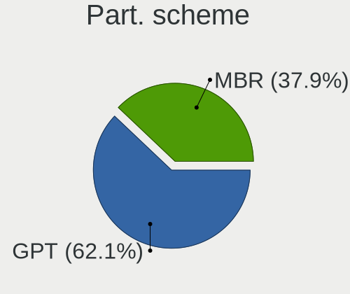

| Type | Notebooks | Percent |
|------|-----------|---------|
| GPT  | 34        | 60.71%  |
| MBR  | 22        | 39.29%  |

Board
-----

Vendor
------

Motherboard manufacturer

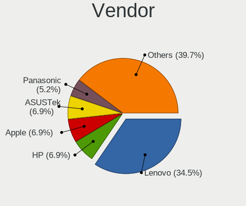

| Name                           | Notebooks | Percent |
|--------------------------------|-----------|---------|
| Lenovo                         | 20        | 35.71%  |
| Hewlett-Packard                | 4         | 7.14%   |
| Apple                          | 4         | 7.14%   |
| Panasonic                      | 3         | 5.36%   |
| Fujitsu                        | 3         | 5.36%   |
| Dell                           | 3         | 5.36%   |
| ASUSTek Computer               | 3         | 5.36%   |
| TUXEDO                         | 2         | 3.57%   |
| Matsushita Electric Industrial | 2         | 3.57%   |
| Framework                      | 2         | 3.57%   |
| Toshiba                        | 1         | 1.79%   |
| Tactus                         | 1         | 1.79%   |
| Star Labs                      | 1         | 1.79%   |
| OEGStone                       | 1         | 1.79%   |
| Notebook                       | 1         | 1.79%   |
| Intel                          | 1         | 1.79%   |
| HUAWEI                         | 1         | 1.79%   |
| Google                         | 1         | 1.79%   |
| Alienware                      | 1         | 1.79%   |
| Acer                           | 1         | 1.79%   |

Model
-----

Motherboard model

| Name                                        | Notebooks | Percent |
|---------------------------------------------|-----------|---------|
| Fujitsu LIFEBOOK E752                       | 2         | 3.57%   |
| TUXEDO Pulse 15 Gen1                        | 1         | 1.79%   |
| TUXEDO InfinityBook Pro 14 Gen6             | 1         | 1.79%   |
| Toshiba Satellite BE96-F299                 | 1         | 1.79%   |
| Tactus GeoFlex 110                          | 1         | 1.79%   |
| Star Labs Lite                              | 1         | 1.79%   |
| Panasonic CF-54-1                           | 1         | 1.79%   |
| Panasonic CF-53AAGHYDM                      | 1         | 1.79%   |
| Panasonic CF-52PFPBSFQ                      | 1         | 1.79%   |
| OEGStone W54_55SU1,SUW                      | 1         | 1.79%   |
| Notebook NS5x_NS7xPU                        | 1         | 1.79%   |
| Matsushita Electric Industrial CF-51RCVDNLM | 1         | 1.79%   |
| Matsushita Electric Industrial CF-48V4KNDQM | 1         | 1.79%   |
| Lenovo ThinkPad X270 W10DG 20K5S0TT1N       | 1         | 1.79%   |
| Lenovo ThinkPad X260 20F5S2GM00             | 1         | 1.79%   |
| Lenovo ThinkPad X260 20F5S10W0H             | 1         | 1.79%   |
| Lenovo ThinkPad X230 2325T4T                | 1         | 1.79%   |
| Lenovo ThinkPad X220 429043U                | 1         | 1.79%   |
| Lenovo ThinkPad X200 Tablet 744943U         | 1         | 1.79%   |
| Lenovo ThinkPad X1 Carbon Gen 9 20XW00QGUS  | 1         | 1.79%   |
| Lenovo ThinkPad X1 Carbon 4th 20FCS13H00    | 1         | 1.79%   |
| Lenovo ThinkPad T60 1951A47                 | 1         | 1.79%   |
| Lenovo ThinkPad T480 20L6S13100             | 1         | 1.79%   |
| Lenovo ThinkPad T480 20L5CTO1WW             | 1         | 1.79%   |
| Lenovo ThinkPad T430 2347GZU                | 1         | 1.79%   |
| Lenovo ThinkPad T420s 41742BU               | 1         | 1.79%   |
| Lenovo ThinkPad T410 2537N24                | 1         | 1.79%   |
| Lenovo ThinkPad T410 2518C3U                | 1         | 1.79%   |
| Lenovo ThinkPad T410 2518A37                | 1         | 1.79%   |
| Lenovo ThinkPad L14 Gen 3 21C5CTO1WW        | 1         | 1.79%   |
| Lenovo ThinkPad E15 Gen 4 21EDCTO1WW        | 1         | 1.79%   |
| Lenovo ThinkPad E14 Gen 4 21EB001FGE        | 1         | 1.79%   |
| Lenovo G50-80 80E5                          | 1         | 1.79%   |
| Intel S1200RP_SE                            | 1         | 1.79%   |
| HUAWEI BOM-WXX9                             | 1         | 1.79%   |
| HP ProBook 455 G7                           | 1         | 1.79%   |
| HP ProBook 430 G7                           | 1         | 1.79%   |
| HP Presario V2000 (EZ621UA#ABA)             | 1         | 1.79%   |
| HP 240 G6 Notebook PC                       | 1         | 1.79%   |
| Google Kefka                                | 1         | 1.79%   |

Model Family
------------

Motherboard model prefix

| Name                                        | Notebooks | Percent |
|---------------------------------------------|-----------|---------|
| Lenovo ThinkPad                             | 19        | 33.93%  |
| Fujitsu LIFEBOOK                            | 3         | 5.36%   |
| HP ProBook                                  | 2         | 3.57%   |
| Framework Laptop                            | 2         | 3.57%   |
| TUXEDO Pulse                                | 1         | 1.79%   |
| TUXEDO InfinityBook                         | 1         | 1.79%   |
| Toshiba Satellite                           | 1         | 1.79%   |
| Tactus GeoFlex                              | 1         | 1.79%   |
| Star Labs Lite                              | 1         | 1.79%   |
| Panasonic CF-54-1                           | 1         | 1.79%   |
| Panasonic CF-53AAGHYDM                      | 1         | 1.79%   |
| Panasonic CF-52PFPBSFQ                      | 1         | 1.79%   |
| OEGStone W54                                | 1         | 1.79%   |
| Notebook NS5x                               | 1         | 1.79%   |
| Matsushita Electric Industrial CF-51RCVDNLM | 1         | 1.79%   |
| Matsushita Electric Industrial CF-48V4KNDQM | 1         | 1.79%   |
| Lenovo G50-80                               | 1         | 1.79%   |
| Intel S1200RP                               | 1         | 1.79%   |
| HUAWEI BOM-WXX9                             | 1         | 1.79%   |
| HP Presario                                 | 1         | 1.79%   |
| HP 240                                      | 1         | 1.79%   |
| Google Kefka                                | 1         | 1.79%   |
| Dell Vostro                                 | 1         | 1.79%   |
| Dell Latitude                               | 1         | 1.79%   |
| Dell G5                                     | 1         | 1.79%   |
| ASUS VivoBook                               | 1         | 1.79%   |
| ASUS ASUS                                   | 1         | 1.79%   |
| ASUS 1000HE                                 | 1         | 1.79%   |
| Apple MacBookPro12                          | 1         | 1.79%   |
| Apple MacBookPro11                          | 1         | 1.79%   |
| Apple MacBookAir7                           | 1         | 1.79%   |
| Apple MacBookAir6                           | 1         | 1.79%   |
| Alienware m15                               | 1         | 1.79%   |
| Acer Nitro                                  | 1         | 1.79%   |

MFG Year
--------

Motherboard manufacture year

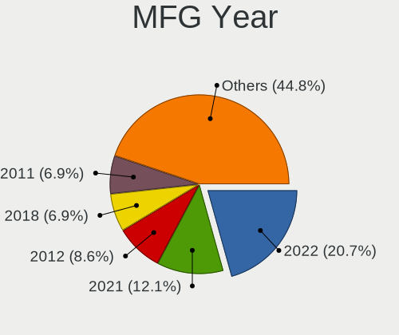

| Year | Notebooks | Percent |
|------|-----------|---------|
| 2022 | 12        | 21.43%  |
| 2021 | 7         | 12.5%   |
| 2018 | 4         | 7.14%   |
| 2015 | 4         | 7.14%   |
| 2012 | 4         | 7.14%   |
| 2011 | 4         | 7.14%   |
| 2010 | 4         | 7.14%   |
| 2020 | 3         | 5.36%   |
| 2006 | 3         | 5.36%   |
| 2019 | 2         | 3.57%   |
| 2016 | 2         | 3.57%   |
| 2013 | 2         | 3.57%   |
| 2023 | 1         | 1.79%   |
| 2014 | 1         | 1.79%   |
| 2009 | 1         | 1.79%   |
| 2007 | 1         | 1.79%   |
| 2002 | 1         | 1.79%   |

Form Factor
-----------

Physical design of the computer

| Name     | Notebooks | Percent |
|----------|-----------|---------|
| Notebook | 56        | 100%    |

Coreboot
--------

Have coreboot on board

| Used | Notebooks | Percent |
|------|-----------|---------|
| No   | 53        | 94.64%  |
| Yes  | 3         | 5.36%   |

RAM Size
--------

Total RAM memory

| Size in GB  | Notebooks | Percent |
|-------------|-----------|---------|
| 8.01-16.0   | 18        | 32.14%  |
| 4.01-8.0    | 10        | 17.86%  |
| 16.01-24.0  | 9         | 16.07%  |
| 3.01-4.0    | 7         | 12.5%   |
| 32.01-64.0  | 4         | 7.14%   |
| 64.01-256.0 | 3         | 5.36%   |
| 2.01-3.0    | 2         | 3.57%   |
| 0.51-1.0    | 2         | 3.57%   |
| 1.01-2.0    | 1         | 1.79%   |

RAM Used
--------

Used RAM memory

| Used GB  | Notebooks | Percent |
|----------|-----------|---------|
| 0.01-0.5 | 46        | 82.14%  |
| 0.51-1.0 | 4         | 7.14%   |
| 1.01-2.0 | 3         | 5.36%   |
| 0        | 3         | 5.36%   |

Total Drives
------------

Number of drives on board

| Drives | Notebooks | Percent |
|--------|-----------|---------|
| 1      | 35        | 61.4%   |
| 2      | 16        | 28.07%  |
| 0      | 4         | 7.02%   |
| 4      | 1         | 1.75%   |
| 3      | 1         | 1.75%   |

Has CD-ROM
----------

Has CD-ROM on board

| Presented | Notebooks | Percent |
|-----------|-----------|---------|
| No        | 55        | 98.21%  |
| Yes       | 1         | 1.79%   |

Has Ethernet
------------

Has Ethernet on board

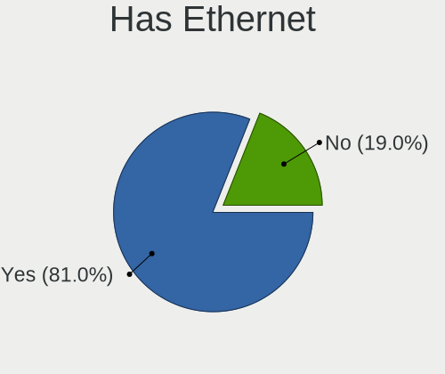

| Presented | Notebooks | Percent |
|-----------|-----------|---------|
| Yes       | 44        | 78.57%  |
| No        | 12        | 21.43%  |

Has WiFi
--------

Has WiFi module

| Presented | Notebooks | Percent |
|-----------|-----------|---------|
| Yes       | 54        | 96.43%  |
| No        | 2         | 3.57%   |

Has Bluetooth
-------------

Has Bluetooth module

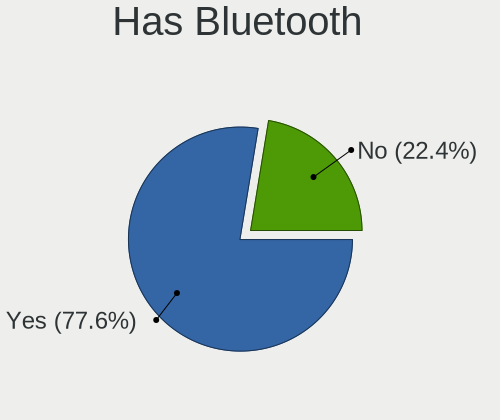

| Presented | Notebooks | Percent |
|-----------|-----------|---------|
| Yes       | 43        | 76.79%  |
| No        | 13        | 23.21%  |

Location
--------

Country
-------

Geographic location (country)

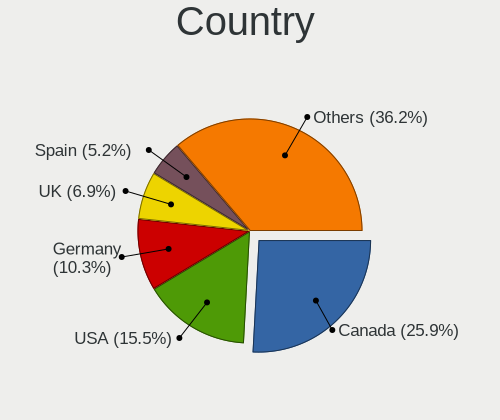

| Country            | Notebooks | Percent |
|--------------------|-----------|---------|
| Canada             | 15        | 26.79%  |
| USA                | 9         | 16.07%  |
| Germany            | 6         | 10.71%  |
| UK                 | 4         | 7.14%   |
| Spain              | 3         | 5.36%   |
| Russia             | 2         | 3.57%   |
| Japan              | 2         | 3.57%   |
| France             | 2         | 3.57%   |
| Australia          | 2         | 3.57%   |
| Taiwan             | 1         | 1.79%   |
| Sweden             | 1         | 1.79%   |
| Slovakia           | 1         | 1.79%   |
| Poland             | 1         | 1.79%   |
| Netherlands        | 1         | 1.79%   |
| Mexico             | 1         | 1.79%   |
| Italy              | 1         | 1.79%   |
| Egypt              | 1         | 1.79%   |
| Dominican Republic | 1         | 1.79%   |
| Cyprus             | 1         | 1.79%   |
| Brazil             | 1         | 1.79%   |

City
----

Geographic location (city)

| City               | Notebooks | Percent |
|--------------------|-----------|---------|
| Montreal           | 15        | 26.79%  |
| Fayetteville       | 3         | 5.36%   |
| Navalcarnero       | 2         | 3.57%   |
| Moscow             | 2         | 3.57%   |
| Lübeck            | 2         | 3.57%   |
| Lafayette          | 2         | 3.57%   |
| Yokohama           | 1         | 1.79%   |
| Varekil            | 1         | 1.79%   |
| Tala               | 1         | 1.79%   |
| Sun Prairie        | 1         | 1.79%   |
| Sao Paulo          | 1         | 1.79%   |
| Santo Domingo Este | 1         | 1.79%   |
| Rhoon              | 1         | 1.79%   |
| Puebla City        | 1         | 1.79%   |
| Plymouth           | 1         | 1.79%   |
| Pine Mountain Club | 1         | 1.79%   |
| Perth              | 1         | 1.79%   |
| Paris              | 1         | 1.79%   |
| Padova             | 1         | 1.79%   |
| Osaka              | 1         | 1.79%   |
| Nuremberg          | 1         | 1.79%   |
| New Taipei         | 1         | 1.79%   |
| Marcq-en-Baroeul   | 1         | 1.79%   |
| Larnaca            | 1         | 1.79%   |
| Krakow             | 1         | 1.79%   |
| Košice            | 1         | 1.79%   |
| Karlsruhe          | 1         | 1.79%   |
| Fürth             | 1         | 1.79%   |
| Farnborough        | 1         | 1.79%   |
| Dallas             | 1         | 1.79%   |
| Coventry           | 1         | 1.79%   |
| Charleston         | 1         | 1.79%   |
| Badalona           | 1         | 1.79%   |
| Annan              | 1         | 1.79%   |
| Adelaide           | 1         | 1.79%   |
| Aalen              | 1         | 1.79%   |

Drives
------

Drive Vendor
------------

Hard drive vendors

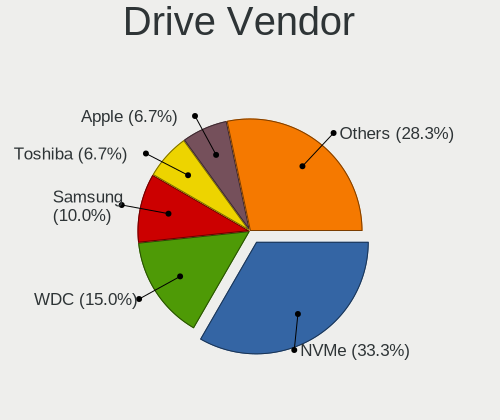

| Vendor              | Notebooks | Drives | Percent |
|---------------------|-----------|--------|---------|
| NVMe                | 20        | 25     | 34.48%  |
| WDC                 | 9         | 9      | 15.52%  |
| Samsung Electronics | 6         | 6      | 10.34%  |
| Apple               | 4         | 4      | 6.9%    |
| Toshiba             | 3         | 5      | 5.17%   |
| Seagate             | 2         | 2      | 3.45%   |
| Crucial             | 2         | 2      | 3.45%   |
| Team                | 1         | 1      | 1.72%   |
| Star Drive          | 1         | 1      | 1.72%   |
| SK hynix            | 1         | 1      | 1.72%   |
| SATA3 60            | 1         | 1      | 1.72%   |
| PNY                 | 1         | 1      | 1.72%   |
| Kingston            | 1         | 1      | 1.72%   |
| Intenso             | 1         | 1      | 1.72%   |
| Hitachi             | 1         | 1      | 1.72%   |
| HGST                | 1         | 1      | 1.72%   |
| General             | 1         | 1      | 1.72%   |
| Apacer              | 1         | 1      | 1.72%   |
| A-DATA Technology   | 1         | 1      | 1.72%   |

Drive Model
-----------

Hard drive models

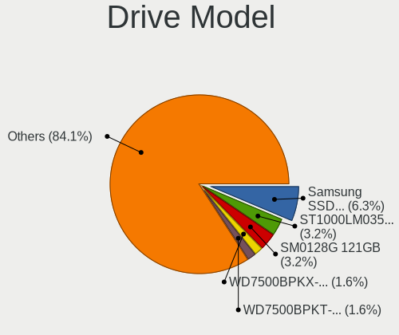

| Model                            | Notebooks | Percent |
|----------------------------------|-----------|---------|
| NVMe Samsung SSD 980 1TB         | 4         | 6.56%   |
| Apple SSD SM0128G 121GB          | 2         | 3.28%   |
| WDC WD7500BPKX-00HPJT0 752GB     | 1         | 1.64%   |
| WDC WD7500BPKT-75PK4T0 752GB     | 1         | 1.64%   |
| WDC WD7500BPKT-00PK4T0 752GB     | 1         | 1.64%   |
| WDC WD5000LPLX-00ZNTT0 500GB     | 1         | 1.64%   |
| WDC WD3200BEVE-00A0HT0 320GB     | 1         | 1.64%   |
| WDC WD2500BEVS-22UST0 250GB      | 1         | 1.64%   |
| WDC WD10JPLX-00MBPT0 1TB         | 1         | 1.64%   |
| WDC WD10JPCX-24UE4T0 1TB         | 1         | 1.64%   |
| WDC WD Elements 2621 1TB         | 1         | 1.64%   |
| Toshiba MQ04ABF100 1TB           | 1         | 1.64%   |
| Toshiba MQ01ACF032 320GB         | 1         | 1.64%   |
| Toshiba MK6475GSX 640GB          | 1         | 1.64%   |
| Team TEAML5Lite3D120G 120GB      | 1         | 1.64%   |
| Star Drive SATA SSD 960GB        | 1         | 1.64%   |
| SK hynix SC311 SATA 128GB        | 1         | 1.64%   |
| Seagate ST9160821A 160GB         | 1         | 1.64%   |
| Seagate ST1000LM035-1RK172 1TB   | 1         | 1.64%   |
| SATA3 60 GB SSD 64GB             | 1         | 1.64%   |
| Samsung SSD 860 EVO M.2 1TB      | 1         | 1.64%   |
| Samsung SSD 860 EVO 1TB          | 1         | 1.64%   |
| Samsung SSD 850 EVO 500GB        | 1         | 1.64%   |
| Samsung SSD 840 EVO 120GB        | 1         | 1.64%   |
| Samsung MZ7TD128HAFV-000L1 128GB | 1         | 1.64%   |
| Samsung MZ7PC128HAFU-000L1 128GB | 1         | 1.64%   |
| PNY CS900 240GB SSD              | 1         | 1.64%   |
| NVMe WD_BLACK SN850X 1TB         | 1         | 1.64%   |
| NVMe WDS100T3X0C-00SJ 1TB        | 1         | 1.64%   |
| NVMe WDC PC SN720 SDA 512GB      | 1         | 1.64%   |
| NVMe WD PC SN740 SDDQ 1TB        | 1         | 1.64%   |
| NVMe WD Blue SN570 2T            | 1         | 1.64%   |
| NVMe SK hynix BC501 H 512GB      | 1         | 1.64%   |
| NVMe SAMSUNG MZVLW256 256GB      | 1         | 1.64%   |
| NVMe SAMSUNG MZVLQ512 512GB      | 1         | 1.64%   |
| NVMe SAMSUNG MZVLQ256 256GB      | 1         | 1.64%   |
| NVMe SAMSUNG MZVLB256 256GB      | 1         | 1.64%   |
| NVMe Micron MTFDKCD25 256GB      | 1         | 1.64%   |
| NVMe Micron MTFDKCD1T 1TB        | 1         | 1.64%   |
| NVMe KXG50ZNV1T02 NVM 1TB        | 1         | 1.64%   |

HDD Vendor
----------

Hard disk drive vendors

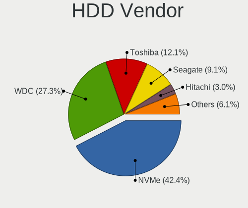

| Vendor  | Notebooks | Drives | Percent |
|---------|-----------|--------|---------|
| NVMe    | 14        | 16     | 45.16%  |
| WDC     | 9         | 9      | 29.03%  |
| Toshiba | 3         | 5      | 9.68%   |
| Seagate | 2         | 2      | 6.45%   |
| Hitachi | 1         | 1      | 3.23%   |
| HGST    | 1         | 1      | 3.23%   |
| General | 1         | 1      | 3.23%   |

SSD Vendor
----------

Solid state drive vendors

| Vendor              | Notebooks | Drives | Percent |
|---------------------|-----------|--------|---------|
| NVMe                | 7         | 8      | 25%     |
| Samsung Electronics | 6         | 6      | 21.43%  |
| Apple               | 4         | 4      | 14.29%  |
| Crucial             | 2         | 2      | 7.14%   |
| Team                | 1         | 1      | 3.57%   |
| Star Drive          | 1         | 1      | 3.57%   |
| SK hynix            | 1         | 1      | 3.57%   |
| SATA3 60            | 1         | 1      | 3.57%   |
| PNY                 | 1         | 1      | 3.57%   |
| Kingston            | 1         | 1      | 3.57%   |
| Intenso             | 1         | 1      | 3.57%   |
| Apacer              | 1         | 1      | 3.57%   |
| A-DATA Technology   | 1         | 1      | 3.57%   |

Drive Kind
----------

HDD or SSD

| Kind | Notebooks | Drives | Percent |
|------|-----------|--------|---------|
| HDD  | 30        | 35     | 52.63%  |
| SSD  | 26        | 29     | 45.61%  |
| NVMe | 1         | 1      | 1.75%   |

Drive Connector
---------------

SATA, SAS, NVMe, etc.

| Type | Notebooks | Drives | Percent |
|------|-----------|--------|---------|
| SATA | 51        | 64     | 98.08%  |
| NVMe | 1         | 1      | 1.92%   |

Drive Size
----------

Size of hard drive

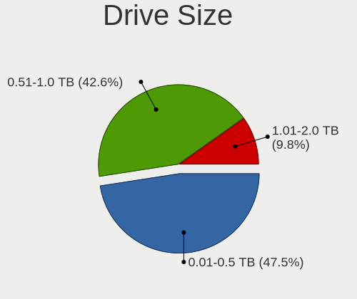

| Size in TB | Notebooks | Drives | Percent |
|------------|-----------|--------|---------|
| 0.01-0.5   | 28        | 30     | 47.46%  |
| 0.51-1.0   | 26        | 27     | 44.07%  |
| 1.01-2.0   | 5         | 7      | 8.47%   |

Space Total
-----------

Amount of disk space available on the file system

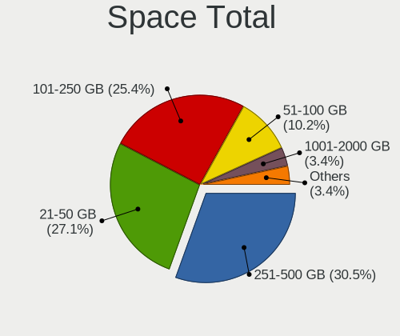

| Size in GB | Notebooks | Percent |
|------------|-----------|---------|
| 251-500    | 18        | 31.58%  |
| 101-250    | 15        | 26.32%  |
| 21-50      | 14        | 24.56%  |
| 51-100     | 6         | 10.53%  |
| 1001-2000  | 2         | 3.51%   |
| 501-1000   | 2         | 3.51%   |

Space Used
----------

Amount of used disk space

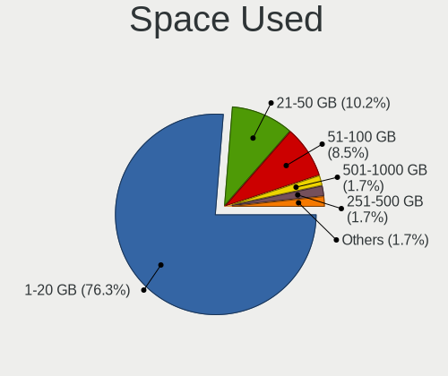

| Used GB  | Notebooks | Percent |
|----------|-----------|---------|
| 1-20     | 43        | 75.44%  |
| 21-50    | 6         | 10.53%  |
| 51-100   | 5         | 8.77%   |
| 251-500  | 1         | 1.75%   |
| 101-250  | 1         | 1.75%   |
| 501-1000 | 1         | 1.75%   |

Malfunc. Drives
---------------

Drive models with a malfunction

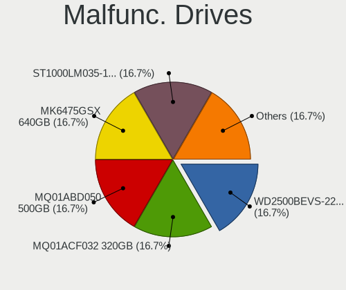

| Model                         | Notebooks | Drives | Percent |
|-------------------------------|-----------|--------|---------|
| WDC WD2500BEVS-22UST0 250GB   | 1         | 1      | 25%     |
| Toshiba MQ01ACF032 320GB      | 1         | 3      | 25%     |
| Toshiba MK6475GSX 640GB       | 1         | 1      | 25%     |
| A-DATA Technology SP550 480GB | 1         | 1      | 25%     |

Malfunc. Drive Vendor
---------------------

Vendors of faulty drives

| Vendor            | Notebooks | Drives | Percent |
|-------------------|-----------|--------|---------|
| Toshiba           | 2         | 4      | 50%     |
| WDC               | 1         | 1      | 25%     |
| A-DATA Technology | 1         | 1      | 25%     |

Malfunc. HDD Vendor
-------------------

Vendors of faulty HDD drives

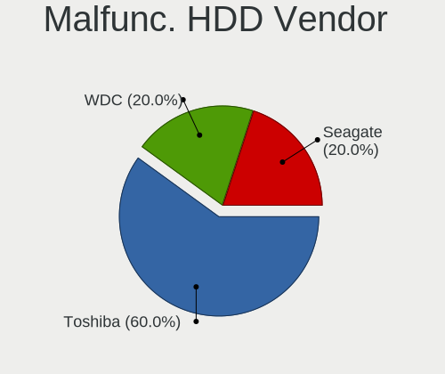

| Vendor  | Notebooks | Drives | Percent |
|---------|-----------|--------|---------|
| Toshiba | 2         | 4      | 66.67%  |
| WDC     | 1         | 1      | 33.33%  |

Malfunc. Drive Kind
-------------------

Kinds of faulty drives

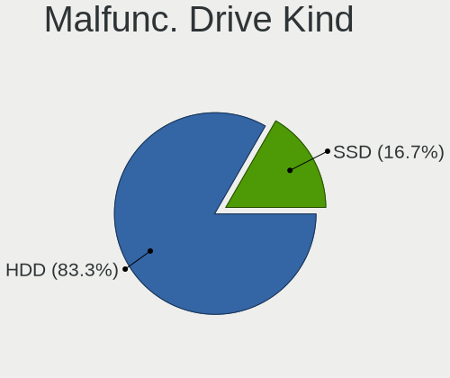

| Kind | Notebooks | Drives | Percent |
|------|-----------|--------|---------|
| HDD  | 3         | 5      | 75%     |
| SSD  | 1         | 1      | 25%     |

Failed Drives
-------------

Failed drive models

Zero info for selected period =(

Failed Drive Vendor
-------------------

Failed drive vendors

Zero info for selected period =(

Drive Status
------------

Number of failed and malfunc. drives

| Status   | Notebooks | Drives | Percent |
|----------|-----------|--------|---------|
| Works    | 29        | 32     | 53.7%   |
| Detected | 21        | 27     | 38.89%  |
| Malfunc  | 4         | 6      | 7.41%   |

Storage controller
------------------

Storage Vendor
--------------

Storage controller vendors

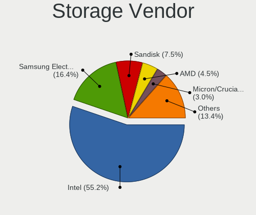

| Vendor                    | Notebooks | Percent |
|---------------------------|-----------|---------|
| Intel                     | 35        | 53.85%  |
| Samsung Electronics       | 11        | 16.92%  |
| SanDisk                   | 5         | 7.69%   |
| AMD                       | 3         | 4.62%   |
| Micron/Crucial Technology | 2         | 3.08%   |
| Micron Technology         | 2         | 3.08%   |
| Marvell Technology Group  | 2         | 3.08%   |
| ADATA Technology          | 2         | 3.08%   |
| Toshiba                   | 1         | 1.54%   |
| SK hynix                  | 1         | 1.54%   |
| Phison Electronics        | 1         | 1.54%   |

Storage Model
-------------

Storage controller models

| Model                                                                                  | Notebooks | Percent |
|----------------------------------------------------------------------------------------|-----------|---------|
| Intel 7 Series Chipset Family 6-port SATA Controller [AHCI mode]                       | 5         | 7.35%   |
| Samsung NVMe SSD Controller PM9A1/PM9A3/980PRO                                         | 4         | 5.88%   |
| Intel 5 Series/3400 Series Chipset 6 port SATA AHCI Controller                         | 4         | 5.88%   |
| Intel Sunrise Point-LP SATA Controller [AHCI mode]                                     | 3         | 4.41%   |
| Intel Celeron/Pentium Silver Processor SATA Controller                                 | 3         | 4.41%   |
| Intel 6 Series/C200 Series Chipset Family 6 port Mobile SATA AHCI Controller           | 3         | 4.41%   |
| Samsung SM951 AHCI                                                                     | 2         | 2.94%   |
| Samsung NVMe SSD Controller 980                                                        | 2         | 2.94%   |
| Micron NVMe Storage Controller                                                         | 2         | 2.94%   |
| Intel Wildcat Point-LP SATA Controller [AHCI Mode]                                     | 2         | 2.94%   |
| Intel Comet Lake SATA AHCI Controller                                                  | 2         | 2.94%   |
| Intel Cannon Lake Mobile PCH SATA AHCI Controller                                      | 2         | 2.94%   |
| Intel 82801GBM/GHM (ICH7-M Family) SATA Controller [IDE mode]                          | 2         | 2.94%   |
| Intel 82801G (ICH7 Family) IDE Controller                                              | 2         | 2.94%   |
| Intel 8 Series/C220 Series Chipset Family 6-port SATA Controller 1 [AHCI mode]         | 2         | 2.94%   |
| AMD FCH SATA Controller [AHCI mode]                                                    | 2         | 2.94%   |
| Toshiba XG5 NVMe SSD Controller                                                        | 1         | 1.47%   |
| SK hynix BC501 NVMe Solid State Drive                                                  | 1         | 1.47%   |
| Sandisk Western Digital WD Black SN850X NVMe SSD                                       | 1         | 1.47%   |
| Sandisk WD Blue SN570 NVMe SSD 2TB                                                     | 1         | 1.47%   |
| Sandisk WD Black SN770 NVMe SSD                                                        | 1         | 1.47%   |
| SanDisk WD Black SN750 / PC SN730 NVMe SSD                                             | 1         | 1.47%   |
| SanDisk WD Black 2018/SN750 / PC SN720 NVMe SSD                                        | 1         | 1.47%   |
| Samsung NVMe SSD Controller SM981/PM981/PM983                                          | 1         | 1.47%   |
| Samsung NVMe SSD Controller SM961/PM961/SM963                                          | 1         | 1.47%   |
| Samsung Apple PCIe SSD                                                                 | 1         | 1.47%   |
| Phison PS5013 E13 NVMe Controller                                                      | 1         | 1.47%   |
| Micron/Crucial P5 Plus NVMe PCIe SSD                                                   | 1         | 1.47%   |
| Micron/Crucial P2 NVMe PCIe SSD                                                        | 1         | 1.47%   |
| Marvell Group 88SS9183 PCIe SSD Controller                                             | 1         | 1.47%   |
| Marvell Group 88SE6101/6102 single-port PATA133 interface                              | 1         | 1.47%   |
| Intel SSD 660P Series                                                                  | 1         | 1.47%   |
| Intel Ice Lake-LP SATA Controller [AHCI mode]                                          | 1         | 1.47%   |
| Intel 82801IBM/IEM (ICH9M/ICH9M-E) 4 port SATA Controller [AHCI mode]                  | 1         | 1.47%   |
| Intel 82801GBM/GHM (ICH7-M Family) SATA Controller [AHCI mode]                         | 1         | 1.47%   |
| Intel 82801CAM IDE U100 Controller                                                     | 1         | 1.47%   |
| Intel 6 Series/C200 Series Chipset Family Mobile SATA Controller (IDE mode, ports 4-5) | 1         | 1.47%   |
| Intel 6 Series/C200 Series Chipset Family Mobile SATA Controller (IDE mode, ports 0-3) | 1         | 1.47%   |
| Intel 400 Series Chipset Family SATA AHCI Controller                                   | 1         | 1.47%   |
| AMD IXP SB4x0 IDE Controller                                                           | 1         | 1.47%   |

Storage Kind
------------

Kind of storage controller (IDE, SATA, NVMe, SAS, ...)

| Kind | Notebooks | Percent |
|------|-----------|---------|
| SATA | 36        | 56.25%  |
| NVMe | 20        | 31.25%  |
| IDE  | 8         | 12.5%   |

Processor
---------

CPU Vendor
----------

Processor vendors

| Vendor | Notebooks | Percent |
|--------|-----------|---------|
| Intel  | 49        | 87.5%   |
| AMD    | 7         | 12.5%   |

CPU Model
---------

Processor models

| Model                                                         | Notebooks | Percent |
|---------------------------------------------------------------|-----------|---------|
| Intel Core i5-6300U CPU @ 2.40GHz                             | 4         | 7.14%   |
| Intel Core i5-3320M CPU @ 2.60GHz                             | 3         | 5.36%   |
| Intel Core i5-2520M CPU @ 2.50GHz                             | 3         | 5.36%   |
| Intel Core i5 CPU M 520 @ 2.40GHz                             | 3         | 5.36%   |
| Intel Core i7-8750H CPU @ 2.20GHz                             | 2         | 3.57%   |
| Intel Core i7-10510U CPU @ 1.80GHz                            | 2         | 3.57%   |
| Intel Xeon CPU E3-1230 v3 @ 3.30GHz                           | 1         | 1.79%   |
| Intel Pentium Silver N5030 CPU @ 1.10GHz                      | 1         | 1.79%   |
| Intel Pentium 4 Mobile CPU 1.60GHz                            | 1         | 1.79%   |
| Intel Genuine processor 800MHz ("GenuineIntel" 686-class)     | 1         | 1.79%   |
| Intel Genuine CPU T2300 @ 1.66GHz                             | 1         | 1.79%   |
| Intel Core i7-8650U CPU @ 1.90GHz                             | 1         | 1.79%   |
| Intel Core i7-8550U CPU @ 1.80GHz                             | 1         | 1.79%   |
| Intel Core i7-5500U CPU @ 2.40GHz                             | 1         | 1.79%   |
| Intel Core i7-3520M CPU @ 2.90GHz                             | 1         | 1.79%   |
| Intel Core i7-10750H CPU @ 2.60GHz                            | 1         | 1.79%   |
| Intel Core i5-5300U CPU @ 2.30GHz                             | 1         | 1.79%   |
| Intel Core i5-5257U CPU @ 2.70GHz                             | 1         | 1.79%   |
| Intel Core i5-5250U CPU @ 1.60GHz                             | 1         | 1.79%   |
| Intel Core i5-4278U CPU @ 2.60GHz                             | 1         | 1.79%   |
| Intel Core i5-4260U CPU @ 1.40GHz                             | 1         | 1.79%   |
| Intel Core i5-4210M CPU @ 2.60GHz                             | 1         | 1.79%   |
| Intel Core i5-2540M CPU @ 2.60GHz                             | 1         | 1.79%   |
| Intel Core i5-1035G1 CPU @ 1.00GHz                            | 1         | 1.79%   |
| Intel Core i5-10210U CPU @ 1.60GHz                            | 1         | 1.79%   |
| Intel Core i5 CPU M 540 @ 2.53GHz                             | 1         | 1.79%   |
| Intel Core i3-3120M CPU @ 2.50GHz                             | 1         | 1.79%   |
| Intel Core Duo CPU T2500 @ 2.00GHz ("GenuineIntel" 686-class) | 1         | 1.79%   |
| Intel Core 2 Duo CPU L9600 @ 2.13GHz                          | 1         | 1.79%   |
| Intel Celeron N4100 CPU @ 1.10GHz                             | 1         | 1.79%   |
| Intel Celeron N4020 CPU @ 1.10GHz                             | 1         | 1.79%   |
| Intel Celeron CPU N3060 @ 1.60GHz                             | 1         | 1.79%   |
| Intel Atom CPU N280 @ 1.66GHz                                 | 1         | 1.79%   |
| Intel 12th Gen Core i7-1260P                                  | 1         | 1.79%   |
| Intel 12th Gen Core i5-1240P                                  | 1         | 1.79%   |
| Intel 11th Gen Core i7-1185G7 @ 3.00GHz                       | 1         | 1.79%   |
| Intel 11th Gen Core i7-11370H @ 3.30GHz                       | 1         | 1.79%   |
| Intel 11th Gen Core i5-1135G7 @ 2.40GHz                       | 1         | 1.79%   |
| AMD Turion 64 Mobile Technology ML-34                         | 1         | 1.79%   |
| AMD Ryzen 7 PRO 5875U with Radeon Graphics                    | 1         | 1.79%   |

CPU Model Family
----------------

Processor model prefix

| Model                | Notebooks | Percent |
|----------------------|-----------|---------|
| Intel Core i5        | 23        | 41.07%  |
| Intel Core i7        | 9         | 16.07%  |
| Other                | 5         | 8.93%   |
| Intel Celeron        | 3         | 5.36%   |
| AMD Ryzen 5          | 3         | 5.36%   |
| Intel Genuine        | 2         | 3.57%   |
| AMD Ryzen 7          | 2         | 3.57%   |
| Intel Xeon           | 1         | 1.79%   |
| Intel Pentium Silver | 1         | 1.79%   |
| Intel Pentium 4      | 1         | 1.79%   |
| Intel Core i3        | 1         | 1.79%   |
| Intel Core Duo       | 1         | 1.79%   |
| Intel Core 2 Duo     | 1         | 1.79%   |
| Intel Atom           | 1         | 1.79%   |
| AMD Turion 64 Mobile | 1         | 1.79%   |
| AMD Ryzen 7 PRO      | 1         | 1.79%   |

CPU Cores
---------

Number of processor cores

| Number  | Notebooks | Percent |
|---------|-----------|---------|
| 2       | 26        | 46.43%  |
| 4       | 12        | 21.43%  |
| Unknown | 5         | 8.93%   |
| 16      | 4         | 7.14%   |
| 6       | 4         | 7.14%   |
| 12      | 2         | 3.57%   |
| 1       | 2         | 3.57%   |
| 8       | 1         | 1.79%   |

CPU Sockets
-----------

Number of sockets

| Number  | Notebooks | Percent |
|---------|-----------|---------|
| 1       | 53        | 94.64%  |
| Unknown | 3         | 5.36%   |

CPU Threads
-----------

Threads per core (Hyper-Threading)

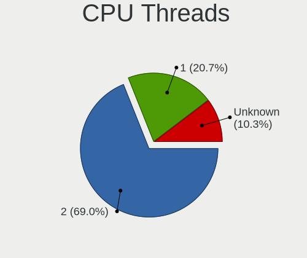

| Number  | Notebooks | Percent |
|---------|-----------|---------|
| 2       | 38        | 67.86%  |
| 1       | 12        | 21.43%  |
| Unknown | 6         | 10.71%  |

CPU Microarch
-------------

Microarchitecture

| Name          | Notebooks | Percent |
|---------------|-----------|---------|
| KabyLake      | 7         | 12.5%   |
| IvyBridge     | 5         | 8.93%   |
| Westmere      | 4         | 7.14%   |
| Skylake       | 4         | 7.14%   |
| SandyBridge   | 4         | 7.14%   |
| Haswell       | 4         | 7.14%   |
| Broadwell     | 4         | 7.14%   |
| Zen 3         | 3         | 5.36%   |
| TigerLake     | 3         | 5.36%   |
| P6            | 3         | 5.36%   |
| Goldmont plus | 3         | 5.36%   |
| Unknown       | 3         | 5.36%   |
| Zen 2         | 2         | 3.57%   |
| Silvermont    | 1         | 1.79%   |
| Penryn        | 1         | 1.79%   |
| NetBurst      | 1         | 1.79%   |
| K8 Hammer     | 1         | 1.79%   |
| IceLake       | 1         | 1.79%   |
| CometLake     | 1         | 1.79%   |
| Bonnell       | 1         | 1.79%   |

Graphics
--------

GPU Vendor
----------

Vendors of graphics cards

| Vendor                     | Notebooks | Percent |
|----------------------------|-----------|---------|
| Intel                      | 46        | 75.41%  |
| AMD                        | 9         | 14.75%  |
| Nvidia                     | 5         | 8.2%    |
| Matrox Electronics Systems | 1         | 1.64%   |

GPU Model
---------

Graphics card models

| Model                                                                                    | Notebooks | Percent |
|------------------------------------------------------------------------------------------|-----------|---------|
| Intel 3rd Gen Core processor Graphics Controller                                         | 5         | 7.69%   |
| Intel Skylake GT2 [HD Graphics 520]                                                      | 4         | 6.15%   |
| Intel Mobile 945GM/GMS/GME, 943/940GML Express Integrated Graphics Controller            | 4         | 6.15%   |
| Intel 2nd Generation Core Processor Family Integrated Graphics Controller                | 4         | 6.15%   |
| Intel TigerLake-LP GT2 [Iris Xe Graphics]                                                | 3         | 4.62%   |
| Intel Mobile 945GM/GMS, 943/940GML Express Integrated Graphics Controller                | 3         | 4.62%   |
| Intel Core Processor Integrated Graphics Controller                                      | 3         | 4.62%   |
| Intel CometLake-U GT2 [UHD Graphics]                                                     | 3         | 4.62%   |
| AMD Barcelo                                                                              | 3         | 4.62%   |
| Intel UHD Graphics 620                                                                   | 2         | 3.08%   |
| Intel HD Graphics 5500                                                                   | 2         | 3.08%   |
| Intel Haswell-ULT Integrated Graphics Controller                                         | 2         | 3.08%   |
| Intel GeminiLake [UHD Graphics 600]                                                      | 2         | 3.08%   |
| Intel CoffeeLake-H GT2 [UHD Graphics 630]                                                | 2         | 3.08%   |
| Intel Alder Lake-P Integrated Graphics Controller                                        | 2         | 3.08%   |
| AMD Renoir                                                                               | 2         | 3.08%   |
| Nvidia GT218M [NVS 3100M]                                                                | 1         | 1.54%   |
| Nvidia GP108M [GeForce MX150]                                                            | 1         | 1.54%   |
| Nvidia GP106M [GeForce GTX 1060 Mobile]                                                  | 1         | 1.54%   |
| Nvidia GP104M [GeForce GTX 1070 Mobile]                                                  | 1         | 1.54%   |
| Nvidia GA106M [GeForce RTX 3060 Mobile / Max-Q]                                          | 1         | 1.54%   |
| Matrox Electronics Systems MGA G200e [Pilot] ServerEngines (SEP1)                        | 1         | 1.54%   |
| Intel Mobile 945GSE Express Integrated Graphics Controller                               | 1         | 1.54%   |
| Intel Mobile 4 Series Chipset Integrated Graphics Controller                             | 1         | 1.54%   |
| Intel Iris Plus Graphics G1 (Ice Lake)                                                   | 1         | 1.54%   |
| Intel Iris Graphics 6100                                                                 | 1         | 1.54%   |
| Intel HD Graphics 6000                                                                   | 1         | 1.54%   |
| Intel GeminiLake [UHD Graphics 605]                                                      | 1         | 1.54%   |
| Intel CometLake-H GT2 [UHD Graphics]                                                     | 1         | 1.54%   |
| Intel Atom/Celeron/Pentium Processor x5-E8000/J3xxx/N3xxx Integrated Graphics Controller | 1         | 1.54%   |
| Intel 4th Gen Core Processor Integrated Graphics Controller                              | 1         | 1.54%   |
| AMD RV200/M7 [Mobility Radeon 7500]                                                      | 1         | 1.54%   |
| AMD RS480M [Mobility Radeon Xpress 200]                                                  | 1         | 1.54%   |
| AMD Lucienne                                                                             | 1         | 1.54%   |
| AMD Cedar [Radeon HD 5000/6000/7350/8350 Series]                                         | 1         | 1.54%   |

GPU Combo
---------

Combinations of graphics cards

| Name           | Notebooks | Percent |
|----------------|-----------|---------|
| 1 x Intel      | 37        | 66.07%  |
| 1 x AMD        | 8         | 14.29%  |
| 2 x Intel      | 5         | 8.93%   |
| Intel + Nvidia | 4         | 7.14%   |
| 1 x Nvidia     | 1         | 1.79%   |
| AMD + Matrox   | 1         | 1.79%   |

GPU Driver
----------

Free vs proprietary

| Driver  | Notebooks | Percent |
|---------|-----------|---------|
| Free    | 54        | 96.43%  |
| Unknown | 2         | 3.57%   |

GPU Memory
----------

Total video memory

| Size in GB | Notebooks | Percent |
|------------|-----------|---------|
| Unknown    | 56        | 100%    |

Monitor
-------

Monitor Vendor
--------------

Monitor vendors

| Vendor              | Notebooks | Percent |
|---------------------|-----------|---------|
| BOE                 | 8         | 21.05%  |
| LG Display          | 7         | 18.42%  |
| AU Optronics        | 7         | 18.42%  |
| Samsung Electronics | 3         | 7.89%   |
| Lenovo              | 3         | 7.89%   |
| Dell                | 2         | 5.26%   |
| Chimei Innolux      | 2         | 5.26%   |
| TRU                 | 1         | 2.63%   |
| Quanta Display      | 1         | 2.63%   |
| Philips             | 1         | 2.63%   |
| PANDA               | 1         | 2.63%   |
| CSO                 | 1         | 2.63%   |
| Apple               | 1         | 2.63%   |

Monitor Model
-------------

Monitor models

| Model                                                                | Notebooks | Percent |
|----------------------------------------------------------------------|-----------|---------|
| TRU LCD Monitor TRU235C 1366x768 260x140mm 11.6-inch                 | 1         | 2.63%   |
| Samsung Electronics LCD Monitor SEC324C 1600x900 310x170mm 13.9-inch | 1         | 2.63%   |
| Samsung Electronics LCD Monitor SEC304C 1366x768 310x170mm 13.9-inch | 1         | 2.63%   |
| Samsung Electronics LCD Monitor SDC4852 1366x768 340x190mm 15.3-inch | 1         | 2.63%   |
| Quanta Display LCD Monitor QDS0020 1280x768 310x180mm 14.1-inch      | 1         | 2.63%   |
| Philips PHL 240B9 PHL0966 1920x1200 520x320mm 24.0-inch              | 1         | 2.63%   |
| PANDA LCD Monitor NCP0046 1920x1080 340x190mm 15.3-inch              | 1         | 2.63%   |
| LG Display LCD Monitor LGD062E 1920x1080 340x190mm 15.3-inch         | 1         | 2.63%   |
| LG Display LCD Monitor LGD058B 2560x1440 310x170mm 13.9-inch         | 1         | 2.63%   |
| LG Display LCD Monitor LGD045E 1366x768 310x170mm 13.9-inch          | 1         | 2.63%   |
| LG Display LCD Monitor LGD03CD 1366x768 280x160mm 12.7-inch          | 1         | 2.63%   |
| LG Display LCD Monitor LGD02EB 1366x768 310x170mm 13.9-inch          | 1         | 2.63%   |
| LG Display LCD Monitor LGD02D8 1366x768 280x160mm 12.7-inch          | 1         | 2.63%   |
| LG Display LCD Monitor LGD0215 1920x1080 350x190mm 15.7-inch         | 1         | 2.63%   |
| Lenovo LCD Monitor LEN40B1 1600x900 340x190mm 15.3-inch              | 1         | 2.63%   |
| Lenovo LCD Monitor LEN4035 1280x800 300x190mm 14.0-inch              | 1         | 2.63%   |
| Lenovo LCD Monitor LEN4011 1280x800 260x160mm 12.0-inch              | 1         | 2.63%   |
| Dell S2721D DELA19A 2560x1440 590x330mm 26.6-inch                    | 1         | 2.63%   |
| Dell P1917S DELD093 1280x1024 380x300mm 19.1-inch                    | 1         | 2.63%   |
| CSO LCD Monitor CSO1402 2880x1800 300x190mm 14.0-inch                | 1         | 2.63%   |
| Chimei Innolux LCD Monitor CMN140A 1920x1080 310x170mm 13.9-inch     | 1         | 2.63%   |
| Chimei Innolux LCD Monitor CMN1239 1920x1080 280x160mm 12.7-inch     | 1         | 2.63%   |
| BOE LCD Monitor BOE096F 1920x1080 250x140mm 11.3-inch                | 1         | 2.63%   |
| BOE LCD Monitor BOE095F 2256x1504 280x190mm 13.3-inch                | 1         | 2.63%   |
| BOE LCD Monitor BOE0900 1920x1080 340x190mm 15.3-inch                | 1         | 2.63%   |
| BOE LCD Monitor BOE08E2 1920x1080 340x190mm 15.3-inch                | 1         | 2.63%   |
| BOE LCD Monitor BOE08CD 1366x768 340x190mm 15.3-inch                 | 1         | 2.63%   |
| BOE LCD Monitor BOE08A6 1920x1080 290x170mm 13.2-inch                | 1         | 2.63%   |
| BOE LCD Monitor BOE0872 1920x1080 340x190mm 15.3-inch                | 1         | 2.63%   |
| BOE LCD Monitor BOE07D8 1920x1080 340x190mm 15.3-inch                | 1         | 2.63%   |
| AU Optronics LCD Monitor AUOD291 1920x1200 300x190mm 14.0-inch       | 1         | 2.63%   |
| AU Optronics LCD Monitor AUO623D 1920x1080 310x170mm 13.9-inch       | 1         | 2.63%   |
| AU Optronics LCD Monitor AUO34EB 3840x2160 340x190mm 15.3-inch       | 1         | 2.63%   |
| AU Optronics LCD Monitor AUO2336 2560x1440 310x170mm 13.9-inch       | 1         | 2.63%   |
| AU Optronics LCD Monitor AUO173D 1920x1080 310x170mm 13.9-inch       | 1         | 2.63%   |
| AU Optronics LCD Monitor AUO125C 1366x768 260x140mm 11.6-inch        | 1         | 2.63%   |
| AU Optronics LCD Monitor AUO106C 1366x768 280x160mm 12.7-inch        | 1         | 2.63%   |
| Apple Color LCD APP9CF0 1440x900 290x180mm 13.4-inch                 | 1         | 2.63%   |

Monitor Resolution
------------------

Monitor screen resolution

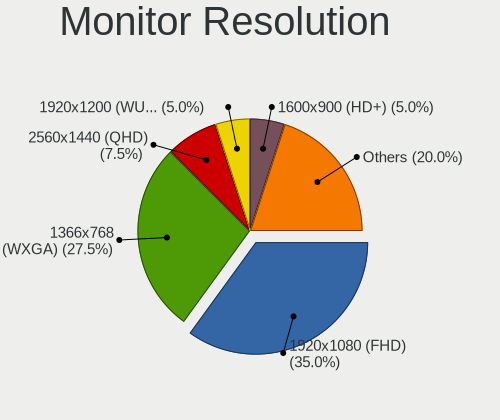

| Resolution        | Notebooks | Percent |
|-------------------|-----------|---------|
| 1920x1080 (FHD)   | 14        | 36.84%  |
| 1366x768 (WXGA)   | 9         | 23.68%  |
| 2560x1440 (QHD)   | 3         | 7.89%   |
| 1920x1200 (WUXGA) | 2         | 5.26%   |
| 1600x900 (HD+)    | 2         | 5.26%   |
| 1280x800 (WXGA)   | 2         | 5.26%   |
| 3840x2160 (4K)    | 1         | 2.63%   |
| 2880x1800         | 1         | 2.63%   |
| 2256x1504         | 1         | 2.63%   |
| 1440x900 (WXGA+)  | 1         | 2.63%   |
| 1280x768          | 1         | 2.63%   |
| 1280x1024 (SXGA)  | 1         | 2.63%   |

Monitor Diagonal
----------------

Diagonal size in inches

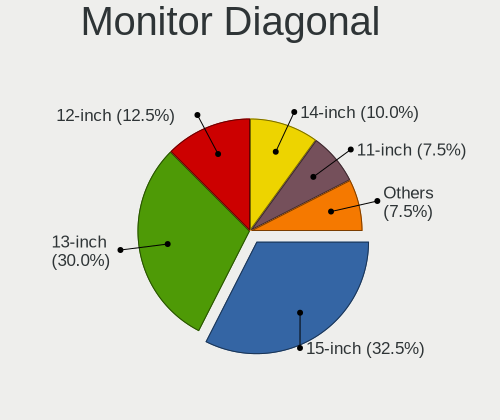

| Inches | Notebooks | Percent |
|--------|-----------|---------|
| 15     | 12        | 31.58%  |
| 13     | 11        | 28.95%  |
| 12     | 5         | 13.16%  |
| 14     | 4         | 10.53%  |
| 11     | 3         | 7.89%   |
| 26     | 1         | 2.63%   |
| 24     | 1         | 2.63%   |
| 19     | 1         | 2.63%   |

Monitor Width
-------------

Physical width

| Width in mm | Notebooks | Percent |
|-------------|-----------|---------|
| 301-350     | 21        | 55.26%  |
| 201-300     | 14        | 36.84%  |
| 501-600     | 2         | 5.26%   |
| 351-400     | 1         | 2.63%   |

Aspect Ratio
------------

Proportional relationship between the width and the height

| Ratio | Notebooks | Percent |
|-------|-----------|---------|
| 16/9  | 29        | 78.38%  |
| 16/10 | 5         | 13.51%  |
| 3/2   | 2         | 5.41%   |
| 5/4   | 1         | 2.7%    |

Monitor Area
------------

Area in inch²

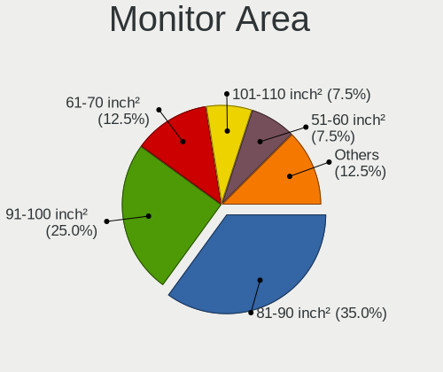

| Area in inch² | Notebooks | Percent |
|----------------|-----------|---------|
| 81-90          | 14        | 36.84%  |
| 91-100         | 9         | 23.68%  |
| 61-70          | 5         | 13.16%  |
| 51-60          | 3         | 7.89%   |
| 101-110        | 3         | 7.89%   |
| 71-80          | 1         | 2.63%   |
| 301-350        | 1         | 2.63%   |
| 251-300        | 1         | 2.63%   |
| 151-200        | 1         | 2.63%   |

Pixel Density
-------------

Pixels per inch

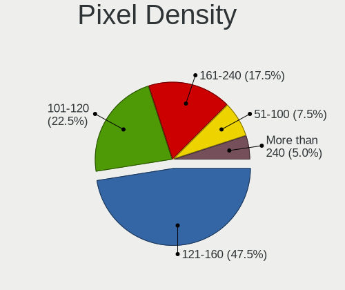

| Density       | Notebooks | Percent |
|---------------|-----------|---------|
| 121-160       | 18        | 47.37%  |
| 101-120       | 8         | 21.05%  |
| 161-240       | 7         | 18.42%  |
| 51-100        | 3         | 7.89%   |
| More than 240 | 2         | 5.26%   |

Multiple Monitors
-----------------

Total monitors connected

| Total | Notebooks | Percent |
|-------|-----------|---------|
| 1     | 52        | 92.86%  |
| 2     | 3         | 5.36%   |
| 0     | 1         | 1.79%   |

Network
-------

Net Controller Vendor
---------------------

Controller vendors

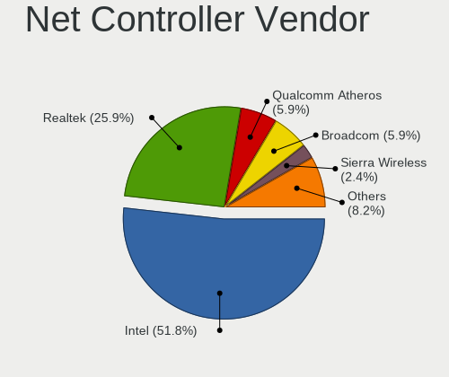

| Vendor                            | Notebooks | Percent |
|-----------------------------------|-----------|---------|
| Intel                             | 43        | 53.09%  |
| Realtek Semiconductor             | 19        | 23.46%  |
| Qualcomm Atheros                  | 5         | 6.17%   |
| Broadcom                          | 5         | 6.17%   |
| Sierra Wireless                   | 2         | 2.47%   |
| MediaTek                          | 2         | 2.47%   |
| Ericsson Business Mobile Networks | 2         | 2.47%   |
| Marvell Technology Group          | 1         | 1.23%   |
| Edimax Technology                 | 1         | 1.23%   |
| AMD                               | 1         | 1.23%   |

Net Controller Model
--------------------

Controller models

| Model                                                             | Notebooks | Percent |
|-------------------------------------------------------------------|-----------|---------|
| Realtek RTL8111/8168/8411 PCI Express Gigabit Ethernet Controller | 12        | 11.01%  |
| Intel Centrino Advanced-N 6205 [Taylor Peak]                      | 8         | 7.34%   |
| Intel 82579LM Gigabit Network Connection (Lewisville)             | 7         | 6.42%   |
| Intel Wireless 8260                                               | 4         | 3.67%   |
| Intel Ethernet Connection I219-LM                                 | 4         | 3.67%   |
| Intel 82577LM Gigabit Network Connection                          | 4         | 3.67%   |
| Realtek RTL-8100/8101L/8139 PCI Fast Ethernet Adapter             | 3         | 2.75%   |
| Intel Wireless 7265                                               | 3         | 2.75%   |
| Intel Wi-Fi 6 AX201                                               | 3         | 2.75%   |
| Intel Wi-Fi 6 AX200                                               | 3         | 2.75%   |
| Broadcom BCM4360 802.11ac Wireless Network Adapter                | 3         | 2.75%   |
| Intel Wireless 8265 / 8275                                        | 2         | 1.83%   |
| Intel Wireless 7260                                               | 2         | 1.83%   |
| Intel Wi-Fi 6 AX210/AX211/AX411 160MHz                            | 2         | 1.83%   |
| Intel Comet Lake PCH-LP CNVi WiFi                                 | 2         | 1.83%   |
| Intel Centrino Advanced-N 6200                                    | 2         | 1.83%   |
| Sierra Wireless EM7455                                            | 1         | 0.92%   |
| Sierra Wireless EM7305 Modem                                      | 1         | 0.92%   |
| Realtek RTL8822CE 802.11ac PCIe Wireless Network Adapter          | 1         | 0.92%   |
| Realtek RTL8821CE 802.11ac PCIe Wireless Network Adapter          | 1         | 0.92%   |
| Realtek RTL8723DE Wireless Network Adapter                        | 1         | 0.92%   |
| Realtek RTL8723AE PCIe Wireless Network Adapter                   | 1         | 0.92%   |
| Realtek RTL8191SEvB Wireless LAN Controller                       | 1         | 0.92%   |
| Realtek RTL8188FTV 802.11b/g/n 1T1R 2.4G WLAN Adapter             | 1         | 0.92%   |
| Realtek RTL8188EUS 802.11n Wireless Network Adapter               | 1         | 0.92%   |
| Realtek RTL8188CUS 802.11n WLAN Adapter                           | 1         | 0.92%   |
| Realtek RTL810xE PCI Express Fast Ethernet controller             | 1         | 0.92%   |
| Realtek Realtek Bluetooth 4.2 Adapter                             | 1         | 0.92%   |
| Realtek Killer E2600 Gigabit Ethernet Controller                  | 1         | 0.92%   |
| Qualcomm Atheros Killer E2500 Gigabit Ethernet Controller         | 1         | 0.92%   |
| Qualcomm Atheros Killer E2400 Gigabit Ethernet Controller         | 1         | 0.92%   |
| Qualcomm Atheros AR928X Wireless Network Adapter (PCI-Express)    | 1         | 0.92%   |
| Qualcomm Atheros AR9285 Wireless Network Adapter (PCI-Express)    | 1         | 0.92%   |
| Qualcomm Atheros AR8121/AR8113/AR8114 Gigabit or Fast Ethernet    | 1         | 0.92%   |
| Qualcomm Atheros AR5212 802.11abg NIC                             | 1         | 0.92%   |
| MediaTek MT7922 802.11ax PCI Express Wireless Network Adapter     | 1         | 0.92%   |
| MediaTek MT7921 802.11ax PCI Express Wireless Network Adapter     | 1         | 0.92%   |
| Marvell Group 88E8053 PCI-E Gigabit Ethernet Controller           | 1         | 0.92%   |
| Intel Wireless-AC 9260                                            | 1         | 0.92%   |
| Intel Wireless 3160                                               | 1         | 0.92%   |

Wireless Vendor
---------------

Wireless vendors

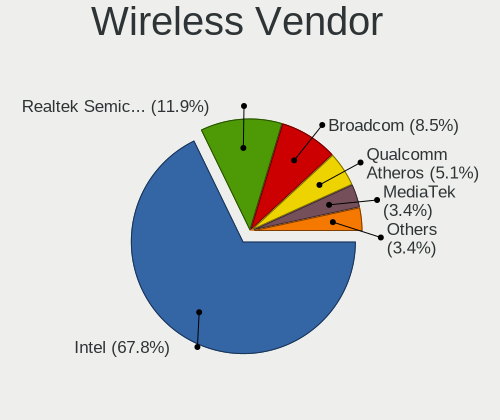

| Vendor                | Notebooks | Percent |
|-----------------------|-----------|---------|
| Intel                 | 39        | 68.42%  |
| Realtek Semiconductor | 6         | 10.53%  |
| Broadcom              | 5         | 8.77%   |
| Qualcomm Atheros      | 3         | 5.26%   |
| MediaTek              | 2         | 3.51%   |
| Sierra Wireless       | 1         | 1.75%   |
| Edimax Technology     | 1         | 1.75%   |

Wireless Model
--------------

Wireless models

| Model                                                               | Notebooks | Percent |
|---------------------------------------------------------------------|-----------|---------|
| Intel Centrino Advanced-N 6205 [Taylor Peak]                        | 8         | 13.33%  |
| Intel Wireless 8260                                                 | 4         | 6.67%   |
| Intel Wireless 7265                                                 | 3         | 5%      |
| Intel Wi-Fi 6 AX201                                                 | 3         | 5%      |
| Intel Wi-Fi 6 AX200                                                 | 3         | 5%      |
| Broadcom BCM4360 802.11ac Wireless Network Adapter                  | 3         | 5%      |
| Intel Wireless 8265 / 8275                                          | 2         | 3.33%   |
| Intel Wireless 7260                                                 | 2         | 3.33%   |
| Intel Wi-Fi 6 AX210/AX211/AX411 160MHz                              | 2         | 3.33%   |
| Intel Comet Lake PCH-LP CNVi WiFi                                   | 2         | 3.33%   |
| Intel Centrino Advanced-N 6200                                      | 2         | 3.33%   |
| Sierra Wireless EM7455                                              | 1         | 1.67%   |
| Realtek RTL8822CE 802.11ac PCIe Wireless Network Adapter            | 1         | 1.67%   |
| Realtek RTL8821CE 802.11ac PCIe Wireless Network Adapter            | 1         | 1.67%   |
| Realtek RTL8723DE Wireless Network Adapter                          | 1         | 1.67%   |
| Realtek RTL8723AE PCIe Wireless Network Adapter                     | 1         | 1.67%   |
| Realtek RTL8191SEvB Wireless LAN Controller                         | 1         | 1.67%   |
| Realtek RTL8188FTV 802.11b/g/n 1T1R 2.4G WLAN Adapter               | 1         | 1.67%   |
| Realtek RTL8188EUS 802.11n Wireless Network Adapter                 | 1         | 1.67%   |
| Realtek RTL8188CUS 802.11n WLAN Adapter                             | 1         | 1.67%   |
| Realtek Realtek Bluetooth 4.2 Adapter                               | 1         | 1.67%   |
| Qualcomm Atheros AR928X Wireless Network Adapter (PCI-Express)      | 1         | 1.67%   |
| Qualcomm Atheros AR9285 Wireless Network Adapter (PCI-Express)      | 1         | 1.67%   |
| Qualcomm Atheros AR5212 802.11abg NIC                               | 1         | 1.67%   |
| MediaTek MT7922 802.11ax PCI Express Wireless Network Adapter       | 1         | 1.67%   |
| MediaTek MT7921 802.11ax PCI Express Wireless Network Adapter       | 1         | 1.67%   |
| Intel Wireless-AC 9260                                              | 1         | 1.67%   |
| Intel Wireless 3160                                                 | 1         | 1.67%   |
| Intel PRO/Wireless 3945ABG [Golan] Network Connection               | 1         | 1.67%   |
| Intel Ice Lake-LP PCH CNVi WiFi                                     | 1         | 1.67%   |
| Intel Gemini Lake PCH CNVi WiFi                                     | 1         | 1.67%   |
| Intel Comet Lake PCH CNVi WiFi                                      | 1         | 1.67%   |
| Intel Centrino Advanced-N + WiMAX 6250 [Kilmer Peak]                | 1         | 1.67%   |
| Intel Cannon Lake PCH CNVi WiFi                                     | 1         | 1.67%   |
| Edimax AC600 Wireless LAN USB Adapter                               | 1         | 1.67%   |
| Broadcom BCM43602 802.11ac Wireless LAN SoC                         | 1         | 1.67%   |
| Broadcom BCM4318 [AirForce One 54g] 802.11g Wireless LAN Controller | 1         | 1.67%   |

Ethernet Vendor
---------------

Ethernet vendors

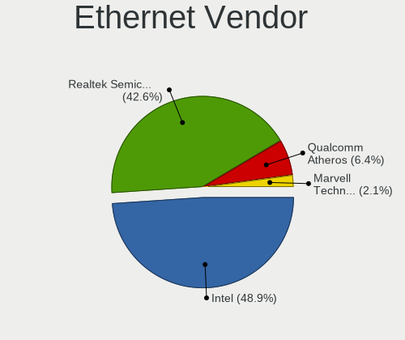

| Vendor                   | Notebooks | Percent |
|--------------------------|-----------|---------|
| Intel                    | 23        | 52.27%  |
| Realtek Semiconductor    | 17        | 38.64%  |
| Qualcomm Atheros         | 3         | 6.82%   |
| Marvell Technology Group | 1         | 2.27%   |

Ethernet Model
--------------

Ethernet models

| Model                                                             | Notebooks | Percent |
|-------------------------------------------------------------------|-----------|---------|
| Realtek RTL8111/8168/8411 PCI Express Gigabit Ethernet Controller | 12        | 27.27%  |
| Intel 82579LM Gigabit Network Connection (Lewisville)             | 7         | 15.91%  |
| Intel Ethernet Connection I219-LM                                 | 4         | 9.09%   |
| Intel 82577LM Gigabit Network Connection                          | 4         | 9.09%   |
| Realtek RTL-8100/8101L/8139 PCI Fast Ethernet Adapter             | 3         | 6.82%   |
| Realtek RTL810xE PCI Express Fast Ethernet controller             | 1         | 2.27%   |
| Realtek Killer E2600 Gigabit Ethernet Controller                  | 1         | 2.27%   |
| Qualcomm Atheros Killer E2500 Gigabit Ethernet Controller         | 1         | 2.27%   |
| Qualcomm Atheros Killer E2400 Gigabit Ethernet Controller         | 1         | 2.27%   |
| Qualcomm Atheros AR8121/AR8113/AR8114 Gigabit or Fast Ethernet    | 1         | 2.27%   |
| Marvell Group 88E8053 PCI-E Gigabit Ethernet Controller           | 1         | 2.27%   |
| Intel I210 Gigabit Network Connection                             | 1         | 2.27%   |
| Intel Ethernet Connection (4) I219-V                              | 1         | 2.27%   |
| Intel Ethernet Connection (4) I219-LM                             | 1         | 2.27%   |
| Intel Ethernet Connection (3) I218-LM                             | 1         | 2.27%   |
| Intel Ethernet Connection (10) I219-V                             | 1         | 2.27%   |
| Intel 82579V Gigabit Network Connection                           | 1         | 2.27%   |
| Intel 82573L Gigabit Ethernet Controller                          | 1         | 2.27%   |
| Intel 82567LM Gigabit Network Connection                          | 1         | 2.27%   |

Net Controller Kind
-------------------

Ethernet, WiFi or modem

| Kind     | Notebooks | Percent |
|----------|-----------|---------|
| WiFi     | 54        | 52.43%  |
| Ethernet | 44        | 42.72%  |
| Unknown  | 3         | 2.91%   |
| Modem    | 2         | 1.94%   |

Used Controller
---------------

Currently used network controller

| Kind     | Notebooks | Percent |
|----------|-----------|---------|
| WiFi     | 42        | 77.78%  |
| Ethernet | 12        | 22.22%  |

NICs
----

Total network controllers on board

| Total | Notebooks | Percent |
|-------|-----------|---------|
| 2     | 42        | 75%     |
| 1     | 14        | 25%     |

IPv6
----

IPv6 vs IPv4

| Used | Notebooks | Percent |
|------|-----------|---------|
| No   | 55        | 98.21%  |
| Yes  | 1         | 1.79%   |

Bluetooth
---------

Bluetooth Vendor
----------------

Controller vendors

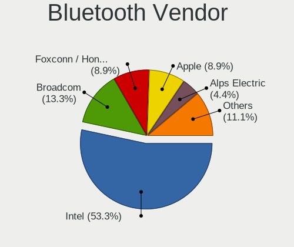

| Vendor            | Notebooks | Percent |
|-------------------|-----------|---------|
| Intel             | 23        | 53.49%  |
| Broadcom          | 6         | 13.95%  |
| Foxconn / Hon Hai | 4         | 9.3%    |
| Apple             | 4         | 9.3%    |
| Alps Electric     | 2         | 4.65%   |
| Taiyo Yuden       | 1         | 2.33%   |
| Skylight Digital  | 1         | 2.33%   |
| IMC Networks      | 1         | 2.33%   |
| ASUSTek Computer  | 1         | 2.33%   |

Bluetooth Model
---------------

Controller models

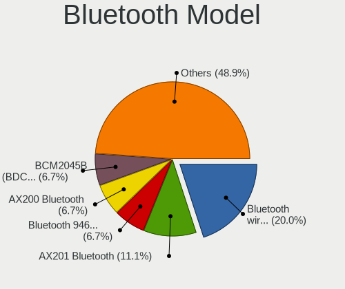

| Model                                                    | Notebooks | Percent |
|----------------------------------------------------------|-----------|---------|
| Intel Bluetooth wireless interface                       | 9         | 20.93%  |
| Intel AX201 Bluetooth                                    | 5         | 11.63%  |
| Intel Bluetooth 9460/9560 Jefferson Peak (JfP)           | 3         | 6.98%   |
| Intel AX200 Bluetooth                                    | 3         | 6.98%   |
| Broadcom BCM2045B (BDC-2.1)                              | 3         | 6.98%   |
| Intel AX210 Bluetooth                                    | 2         | 4.65%   |
| Foxconn / Hon Hai Broadcom BCM20702 Bluetooth USB Device | 2         | 4.65%   |
| Apple Broadcom Built-in Bluetooth                        | 2         | 4.65%   |
| Apple Bluetooth Host Controller                          | 2         | 4.65%   |
| Alps Electric UGTZ4 Bluetooth                            | 2         | 4.65%   |
| Taiyo Yuden Bluetooth Device (V2.0+EDR)                  | 1         | 2.33%   |
| Skylight Digital Realtek Bluetooth Adapter               | 1         | 2.33%   |
| Intel Wireless-AC 9260 Bluetooth Adapter                 | 1         | 2.33%   |
| IMC Networks Realtek Bluetooth Adapter                   | 1         | 2.33%   |
| Foxconn / Hon Hai RZ616 Bluetooth Adapter                | 1         | 2.33%   |
| Foxconn / Hon Hai MediaTek Bluetooth Adapter             | 1         | 2.33%   |
| Broadcom BCM20702 Bluetooth 4.0 [ThinkPad]               | 1         | 2.33%   |
| Broadcom BCM2045B (BDC-2.1) [Bluetooth Controller]       | 1         | 2.33%   |
| Broadcom BCM2045B (BDC-2) [Bluetooth Controller]         | 1         | 2.33%   |
| ASUS Broadcom Bluetooth 2.1                              | 1         | 2.33%   |

Sound
-----

Sound Vendor
------------

Sound card vendors

| Vendor | Notebooks | Percent |
|--------|-----------|---------|
| Intel  | 48        | 82.76%  |
| AMD    | 8         | 13.79%  |
| Nvidia | 2         | 3.45%   |

Sound Model
-----------

Sound card models

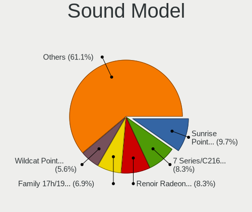

| Model                                                                                             | Notebooks | Percent |
|---------------------------------------------------------------------------------------------------|-----------|---------|
| Intel Sunrise Point-LP HD Audio                                                                   | 6         | 8.57%   |
| AMD Renoir Radeon High Definition Audio Controller                                                | 6         | 8.57%   |
| Intel 7 Series/C216 Chipset Family High Definition Audio Controller                               | 5         | 7.14%   |
| AMD Family 17h/19h HD Audio Controller                                                            | 5         | 7.14%   |
| Intel Wildcat Point-LP High Definition Audio Controller                                           | 4         | 5.71%   |
| Intel NM10/ICH7 Family High Definition Audio Controller                                           | 4         | 5.71%   |
| Intel Broadwell-U Audio Controller                                                                | 4         | 5.71%   |
| Intel 6 Series/C200 Series Chipset Family High Definition Audio Controller                        | 4         | 5.71%   |
| Intel 5 Series/3400 Series Chipset High Definition Audio                                          | 4         | 5.71%   |
| Intel Tiger Lake-LP Smart Sound Technology Audio Controller                                       | 3         | 4.29%   |
| Intel Comet Lake PCH-LP cAVS                                                                      | 3         | 4.29%   |
| Intel Celeron/Pentium Silver Processor High Definition Audio                                      | 3         | 4.29%   |
| Intel Haswell-ULT HD Audio Controller                                                             | 2         | 2.86%   |
| Intel Cannon Lake PCH cAVS                                                                        | 2         | 2.86%   |
| Intel Alder Lake PCH-P High Definition Audio Controller                                           | 2         | 2.86%   |
| Intel 8 Series HD Audio Controller                                                                | 2         | 2.86%   |
| Nvidia High Definition Audio Controller                                                           | 1         | 1.43%   |
| Nvidia GA106 High Definition Audio Controller                                                     | 1         | 1.43%   |
| Intel Xeon E3-1200 v3/4th Gen Core Processor HD Audio Controller                                  | 1         | 1.43%   |
| Intel Ice Lake-LP Smart Sound Technology Audio Controller                                         | 1         | 1.43%   |
| Intel Comet Lake PCH cAVS                                                                         | 1         | 1.43%   |
| Intel Atom/Celeron/Pentium Processor x5-E8000/J3xxx/N3xxx Series High Definition Audio Controller | 1         | 1.43%   |
| Intel 82801I (ICH9 Family) HD Audio Controller                                                    | 1         | 1.43%   |
| Intel 82801CA/CAM AC'97 Audio Controller                                                          | 1         | 1.43%   |
| Intel 8 Series/C220 Series Chipset High Definition Audio Controller                               | 1         | 1.43%   |
| AMD IXP SB400 AC'97 Audio Controller                                                              | 1         | 1.43%   |
| AMD Cedar HDMI Audio [Radeon HD 5400/6300/7300 Series]                                            | 1         | 1.43%   |

Memory
------

Memory Vendor
-------------

Memory module vendors

| Vendor              | Notebooks | Percent |
|---------------------|-----------|---------|
| Samsung Electronics | 7         | 38.89%  |
| Unknown             | 4         | 22.22%  |
| SK hynix            | 3         | 16.67%  |
| Micron Technology   | 1         | 5.56%   |
| Kingston            | 1         | 5.56%   |
| Elpida              | 1         | 5.56%   |
| Unknown             | 1         | 5.56%   |

Memory Model
------------

Memory module models

| Model                                                  | Notebooks | Percent |
|--------------------------------------------------------|-----------|---------|
| Samsung RAM M471B5273DH0-CH9 4GB SODIMM DDR3 1334MT/s  | 2         | 9.52%   |
| Unknown RAM Module 512MB SODIMM SDRAM                  | 1         | 4.76%   |
| Unknown RAM Module 4GB SODIMM DDR3 1333MT/s            | 1         | 4.76%   |
| Unknown RAM Module 2GB SODIMM DDR3 1067MT/s            | 1         | 4.76%   |
| Unknown RAM Module 1GB SODIMM DDR2                     | 1         | 4.76%   |
| SK hynix RAM HMT351S6EFR8A-PB 4GB SODIMM DDR3 1600MT/s | 1         | 4.76%   |
| SK hynix RAM HMT325S6BFR8C-H9 2GB SODIMM DDR3 1333MT/s | 1         | 4.76%   |
| SK hynix RAM H9CCNNNBJTMLAR 4GB SODIMM LPDDR3 1867MT/s | 1         | 4.76%   |
| SK hynix RAM H9CCNNNBJTMLAR 4GB Chip LPDDR3 1867MT/s   | 1         | 4.76%   |
| Samsung RAM M471B5673FH0-CF8 2GB SODIMM DDR3 1067MT/s  | 1         | 4.76%   |
| Samsung RAM M471B5673EH1-CF8 2GB SODIMM 1067MT/s       | 1         | 4.76%   |
| Samsung RAM M471B5173QH0-YK0 4GB SODIMM DDR3 1600MT/s  | 1         | 4.76%   |
| Samsung RAM M471B5173BH0-CK0 4GB SODIMM DDR3 1600MT/s  | 1         | 4.76%   |
| Samsung RAM M471A1K43CB1-CRC 8GB SODIMM DDR4 2400MT/s  | 1         | 4.76%   |
| Samsung RAM M471A1K43BB0-CPB 8GB SODIMM DDR4 2133MT/s  | 1         | 4.76%   |
| Micron RAM 16ATF2G64HZ-2G6E1 16GB SODIMM DDR4 2667MT/s | 1         | 4.76%   |
| Kingston RAM KHYXPX-MIE 8GB SODIMM DDR4 2667MT/s       | 1         | 4.76%   |
| Elpida RAM EBJ41UF8BCS0-DJ-F 4GB SODIMM DDR3 1334MT/s  | 1         | 4.76%   |
| Elpida RAM EBJ21UE8BDS0-AE-F 2GB SODIMM DDR3 1067MT/s  | 1         | 4.76%   |
| Unknown                                                | 1         | 4.76%   |

Memory Kind
-----------

Memory module kinds

| Kind   | Notebooks | Percent |
|--------|-----------|---------|
| DDR3   | 9         | 52.94%  |
| DDR4   | 4         | 23.53%  |
| SDRAM  | 2         | 11.76%  |
| LPDDR3 | 1         | 5.88%   |
| DDR2   | 1         | 5.88%   |

Memory Form Factor
------------------

Physical design of the memory module

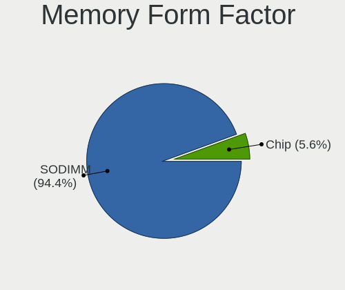

| Name   | Notebooks | Percent |
|--------|-----------|---------|
| SODIMM | 17        | 94.44%  |
| Chip   | 1         | 5.56%   |

Memory Size
-----------

Memory module size

| Size  | Notebooks | Percent |
|-------|-----------|---------|
| 4096  | 7         | 38.89%  |
| 2048  | 5         | 27.78%  |
| 8192  | 3         | 16.67%  |
| 16384 | 1         | 5.56%   |
| 1024  | 1         | 5.56%   |
| 512   | 1         | 5.56%   |

Memory Speed
------------

Memory module speed

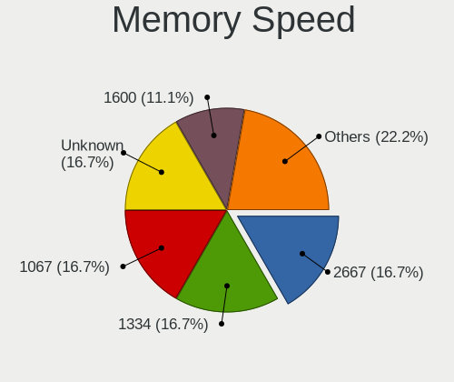

| Speed   | Notebooks | Percent |
|---------|-----------|---------|
| 1334    | 3         | 16.67%  |
| 1067    | 3         | 16.67%  |
| Unknown | 3         | 16.67%  |
| 2667    | 2         | 11.11%  |
| 1600    | 2         | 11.11%  |
| 1333    | 2         | 11.11%  |
| 2400    | 1         | 5.56%   |
| 2133    | 1         | 5.56%   |
| 1867    | 1         | 5.56%   |

Printers & scanners
-------------------

Printer Vendor
--------------

Printer device vendors

Zero info for selected period =(

Printer Model
-------------

Printer device models

Zero info for selected period =(

Scanner Vendor
--------------

Scanner device vendors

Zero info for selected period =(

Scanner Model
-------------

Scanner device models

Zero info for selected period =(

Camera
------

Camera Vendor
-------------

Camera device vendors

| Vendor                                 | Notebooks | Percent |
|----------------------------------------|-----------|---------|
| Chicony Electronics                    | 10        | 29.41%  |
| Bison Electronics                      | 6         | 17.65%  |
| Microdia                               | 3         | 8.82%   |
| IMC Networks                           | 3         | 8.82%   |
| Sunplus Innovation Technology          | 2         | 5.88%   |
| Realtek Semiconductor                  | 2         | 5.88%   |
| Lite-On Technology                     | 2         | 5.88%   |
| Lenovo                                 | 2         | 5.88%   |
| Tripath Technology                     | 1         | 2.94%   |
| Ricoh                                  | 1         | 2.94%   |
| Quanta                                 | 1         | 2.94%   |
| Cheng Uei Precision Industry (Foxlink) | 1         | 2.94%   |

Camera Model
------------

Camera device models

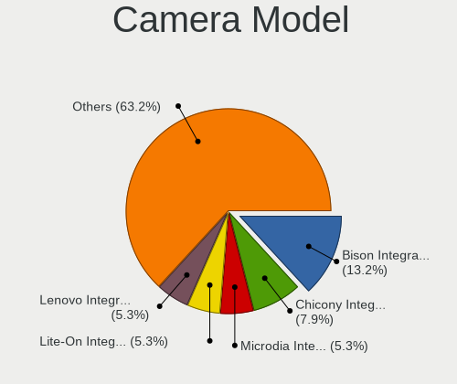

| Model                                                                      | Notebooks | Percent |
|----------------------------------------------------------------------------|-----------|---------|
| Bison Integrated Camera                                                    | 5         | 13.89%  |
| Chicony Integrated Camera                                                  | 3         | 8.33%   |
| Microdia Integrated_Webcam_HD                                              | 2         | 5.56%   |
| Lite-On Integrated Camera                                                  | 2         | 5.56%   |
| Lenovo Integrated Webcam [R5U877]                                          | 2         | 5.56%   |
| Bison SunplusIT Integrated Camera                                          | 2         | 5.56%   |
| Tripath PC Camera                                                          | 1         | 2.78%   |
| Sunplus Integrated_Webcam_FHD                                              | 1         | 2.78%   |
| Sunplus HP TrueVision HD Camera                                            | 1         | 2.78%   |
| Ricoh Laptop_Integrated_Webcam_FHD                                         | 1         | 2.78%   |
| Realtek Laptop Camera                                                      | 1         | 2.78%   |
| Realtek Integrated_Webcam_HD                                               | 1         | 2.78%   |
| Quanta HP Universal Camera                                                 | 1         | 2.78%   |
| Microdia USB 2.0 Camera                                                    | 1         | 2.78%   |
| IMC Networks Realtek PC Camera                                             | 1         | 2.78%   |
| IMC Networks Realtek DMFT RGB                                              | 1         | 2.78%   |
| IMC Networks Integrated Camera                                             | 1         | 2.78%   |
| Chicony Ltd., Chicony USB 2.0 Camera                                       | 1         | 2.78%   |
| Chicony Lenovo Integrated Camera (0.3MP)                                   | 1         | 2.78%   |
| Chicony Integrated IR Camera                                               | 1         | 2.78%   |
| Chicony Integrated Camera [ThinkPad]                                       | 1         | 2.78%   |
| Chicony FJ Camera                                                          | 1         | 2.78%   |
| Chicony Chicony USB2.0 Camera                                              | 1         | 2.78%   |
| Chicony 2.0M UVC Webcam / CNF7129                                          | 1         | 2.78%   |
| Cheng Uei Precision Industry (Foxlink) HP Wide Vision HD Integrated Webcam | 1         | 2.78%   |
| Bison Lenovo EasyCamera                                                    | 1         | 2.78%   |

Security
--------

Fingerprint Vendor
------------------

Fingerprint sensor vendors

| Vendor                     | Notebooks | Percent |
|----------------------------|-----------|---------|
| Synaptics                  | 4         | 36.36%  |
| AuthenTec                  | 3         | 27.27%  |
| Validity Sensors           | 2         | 18.18%  |
| Upek                       | 1         | 9.09%   |
| Shenzhen Goodix Technology | 1         | 9.09%   |

Fingerprint Model
-----------------

Fingerprint sensor models

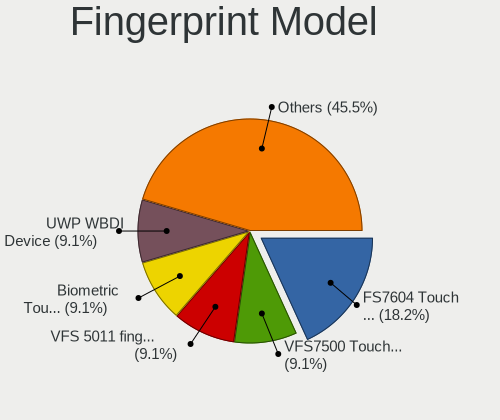

| Model                                                    | Notebooks | Percent |
|----------------------------------------------------------|-----------|---------|
| Synaptics FS7604 Touch Fingerprint Sensor with PurePrint | 2         | 18.18%  |
| Validity Sensors VFS7500 Touch Fingerprint Sensor        | 1         | 9.09%   |
| Validity Sensors VFS 5011 fingerprint sensor             | 1         | 9.09%   |
| Upek Biometric Touchchip/Touchstrip Fingerprint Sensor   | 1         | 9.09%   |
| Synaptics UWP WBDI Device                                | 1         | 9.09%   |
| Synaptics Metallica MIS Touch Fingerprint Reader         | 1         | 9.09%   |
| Shenzhen Goodix Fingerprint Reader                       | 1         | 9.09%   |
| AuthenTec AES2810                                        | 1         | 9.09%   |
| AuthenTec AES2660                                        | 1         | 9.09%   |
| AuthenTec AES2501 Fingerprint Sensor                     | 1         | 9.09%   |

Chipcard Vendor
---------------

Chipcard module vendors

Zero info for selected period =(

Chipcard Model
--------------

Chipcard module models

Zero info for selected period =(

Unsupported
-----------

Unsupported Devices
-------------------

Total unsupported devices on board

| Total | Notebooks | Percent |
|-------|-----------|---------|
| 1     | 32        | 57.14%  |
| 2     | 11        | 19.64%  |
| 0     | 6         | 10.71%  |
| 3     | 3         | 5.36%   |
| 5     | 2         | 3.57%   |
| 4     | 2         | 3.57%   |

Unsupported Device Types
------------------------

Types of unsupported devices

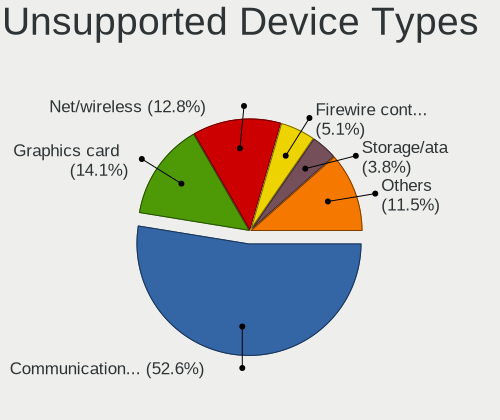

| Type                     | Notebooks | Percent |
|--------------------------|-----------|---------|
| Communication controller | 39        | 52%     |
| Graphics card            | 11        | 14.67%  |
| Net/wireless             | 9         | 12%     |
| Firewire controller      | 4         | 5.33%   |
| Storage/ata              | 3         | 4%      |
| Sound                    | 3         | 4%      |
| Network                  | 3         | 4%      |
| Storage                  | 2         | 2.67%   |
| Modem                    | 1         | 1.33%   |

