OpenBSD 7.3 - Tested Hardware & Statistics
------------------------------------------

A project to collect tested hardware configurations for OpenBSD 7.3.

Anyone can contribute to this report by the [hw-probe](https://github.com/linuxhw/hw-probe/blob/master/INSTALL.BSD.md) tool:

    hw-probe -all -upload

Please contribute! Especially if your hardware is rare.

This is a report for all computer types. See also reports for [desktops](/Dist/OpenBSD_7.3/Desktop/README.md) and [notebooks](/Dist/OpenBSD_7.3/Notebook/README.md).

Contents
--------

* [ Test Cases ](#test-cases)

* [ System ](#system)
  - [ Arch                     ](#arch)
  - [ DE                       ](#de)
  - [ Display Server           ](#display-server)
  - [ Display Manager          ](#display-manager)
  - [ OS Lang                  ](#os-lang)
  - [ Boot Mode                ](#boot-mode)
  - [ Filesystem               ](#filesystem)
  - [ Part. scheme             ](#part-scheme)

* [ Board ](#board)
  - [ Vendor                   ](#vendor)
  - [ Model                    ](#model)
  - [ Model Family             ](#model-family)
  - [ MFG Year                 ](#mfg-year)
  - [ Form Factor              ](#form-factor)
  - [ Coreboot                 ](#coreboot)
  - [ RAM Size                 ](#ram-size)
  - [ RAM Used                 ](#ram-used)
  - [ Total Drives             ](#total-drives)
  - [ Has CD-ROM               ](#has-cd-rom)
  - [ Has Ethernet             ](#has-ethernet)
  - [ Has WiFi                 ](#has-wifi)
  - [ Has Bluetooth            ](#has-bluetooth)

* [ Location ](#location)
  - [ Country                  ](#country)
  - [ City                     ](#city)

* [ Drives ](#drives)
  - [ Drive Vendor             ](#drive-vendor)
  - [ Drive Model              ](#drive-model)
  - [ HDD Vendor               ](#hdd-vendor)
  - [ SSD Vendor               ](#ssd-vendor)
  - [ Drive Kind               ](#drive-kind)
  - [ Drive Connector          ](#drive-connector)
  - [ Drive Size               ](#drive-size)
  - [ Space Total              ](#space-total)
  - [ Space Used               ](#space-used)
  - [ Malfunc. Drives          ](#malfunc-drives)
  - [ Malfunc. Drive Vendor    ](#malfunc-drive-vendor)
  - [ Malfunc. HDD Vendor      ](#malfunc-hdd-vendor)
  - [ Malfunc. Drive Kind      ](#malfunc-drive-kind)
  - [ Failed Drives            ](#failed-drives)
  - [ Failed Drive Vendor      ](#failed-drive-vendor)
  - [ Drive Status             ](#drive-status)

* [ Storage controller ](#storage-controller)
  - [ Storage Vendor           ](#storage-vendor)
  - [ Storage Model            ](#storage-model)
  - [ Storage Kind             ](#storage-kind)

* [ Processor ](#processor)
  - [ CPU Vendor               ](#cpu-vendor)
  - [ CPU Model                ](#cpu-model)
  - [ CPU Model Family         ](#cpu-model-family)
  - [ CPU Cores                ](#cpu-cores)
  - [ CPU Sockets              ](#cpu-sockets)
  - [ CPU Threads              ](#cpu-threads)
  - [ CPU Microarch            ](#cpu-microarch)

* [ Graphics ](#graphics)
  - [ GPU Vendor               ](#gpu-vendor)
  - [ GPU Model                ](#gpu-model)
  - [ GPU Combo                ](#gpu-combo)
  - [ GPU Driver               ](#gpu-driver)
  - [ GPU Memory               ](#gpu-memory)

* [ Monitor ](#monitor)
  - [ Monitor Vendor           ](#monitor-vendor)
  - [ Monitor Model            ](#monitor-model)
  - [ Monitor Resolution       ](#monitor-resolution)
  - [ Monitor Diagonal         ](#monitor-diagonal)
  - [ Monitor Width            ](#monitor-width)
  - [ Aspect Ratio             ](#aspect-ratio)
  - [ Monitor Area             ](#monitor-area)
  - [ Pixel Density            ](#pixel-density)
  - [ Multiple Monitors        ](#multiple-monitors)

* [ Network ](#network)
  - [ Net Controller Vendor    ](#net-controller-vendor)
  - [ Net Controller Model     ](#net-controller-model)
  - [ Wireless Vendor          ](#wireless-vendor)
  - [ Wireless Model           ](#wireless-model)
  - [ Ethernet Vendor          ](#ethernet-vendor)
  - [ Ethernet Model           ](#ethernet-model)
  - [ Net Controller Kind      ](#net-controller-kind)
  - [ Used Controller          ](#used-controller)
  - [ NICs                     ](#nics)
  - [ IPv6                     ](#ipv6)

* [ Bluetooth ](#bluetooth)
  - [ Bluetooth Vendor         ](#bluetooth-vendor)
  - [ Bluetooth Model          ](#bluetooth-model)

* [ Sound ](#sound)
  - [ Sound Vendor             ](#sound-vendor)
  - [ Sound Model              ](#sound-model)

* [ Memory ](#memory)
  - [ Memory Vendor            ](#memory-vendor)
  - [ Memory Model             ](#memory-model)
  - [ Memory Kind              ](#memory-kind)
  - [ Memory Form Factor       ](#memory-form-factor)
  - [ Memory Size              ](#memory-size)
  - [ Memory Speed             ](#memory-speed)

* [ Printers & scanners ](#printers--scanners)
  - [ Printer Vendor           ](#printer-vendor)
  - [ Printer Model            ](#printer-model)
  - [ Scanner Vendor           ](#scanner-vendor)
  - [ Scanner Model            ](#scanner-model)

* [ Camera ](#camera)
  - [ Camera Vendor            ](#camera-vendor)
  - [ Camera Model             ](#camera-model)

* [ Security ](#security)
  - [ Fingerprint Vendor       ](#fingerprint-vendor)
  - [ Fingerprint Model        ](#fingerprint-model)
  - [ Chipcard Vendor          ](#chipcard-vendor)
  - [ Chipcard Model           ](#chipcard-model)

* [ Unsupported ](#unsupported)
  - [ Unsupported Devices      ](#unsupported-devices)
  - [ Unsupported Device Types ](#unsupported-device-types)

Test Cases
----------

Total: 58

| Vendor        | Model                       | Form-Factor | Probe                                                     | Date         |
|---------------|-----------------------------|-------------|-----------------------------------------------------------|--------------|
| Sony          | VGC-RB41M                   | Desktop     | [95804a1f40](https://bsd-hardware.info/?probe=95804a1f40) | Jun 28, 2023 |
| ASUSTek       | TUF Gaming B550M-PLUS (W... | Desktop     | [4d99bc4b63](https://bsd-hardware.info/?probe=4d99bc4b63) | Jun 27, 2023 |
| ASUSTek       | TUF Gaming B550M-PLUS (W... | Desktop     | [8866724f46](https://bsd-hardware.info/?probe=8866724f46) | Jun 27, 2023 |
| Panasonic     | CFSX4-1                     | Notebook    | [ff83a965d2](https://bsd-hardware.info/?probe=ff83a965d2) | Jun 15, 2023 |
| Lenovo        | ThinkPad T430 2344BZU       | Notebook    | [01df487b47](https://bsd-hardware.info/?probe=01df487b47) | Jun 14, 2023 |
| Gigabyte      | G41MT-S2                    | Desktop     | [355202536f](https://bsd-hardware.info/?probe=355202536f) | Jun 07, 2023 |
| Lenovo        | ThinkPad E15 Gen 4 21EDC... | Notebook    | [9f18b1b304](https://bsd-hardware.info/?probe=9f18b1b304) | Jun 06, 2023 |
| Lenovo        | ThinkPad E15 Gen 4 21EDC... | Notebook    | [85c18dbbb5](https://bsd-hardware.info/?probe=85c18dbbb5) | Jun 06, 2023 |
| Toshiba       | NB250                       | Notebook    | [62c572e895](https://bsd-hardware.info/?probe=62c572e895) | May 27, 2023 |
| Tactus        | GeoFlex 110                 | Notebook    | [df93ad7e83](https://bsd-hardware.info/?probe=df93ad7e83) | May 27, 2023 |
| Lenovo        | ThinkPad X140e 20BMS03E0... | Notebook    | [580c52399f](https://bsd-hardware.info/?probe=580c52399f) | May 25, 2023 |
| Lenovo        | ThinkPad X140e 20BMS03E0... | Notebook    | [84e3ac62d5](https://bsd-hardware.info/?probe=84e3ac62d5) | May 23, 2023 |
| Unknown       | Apple MacBook Pro (13-in... | Notebook    | [5e25a49c65](https://bsd-hardware.info/?probe=5e25a49c65) | May 20, 2023 |
| ASUSTek       | PRIME B460M-A               | Desktop     | [4c8047dca3](https://bsd-hardware.info/?probe=4c8047dca3) | May 19, 2023 |
| VIA Techno... | VT82C597                    | Desktop     | [d73db58e48](https://bsd-hardware.info/?probe=d73db58e48) | May 19, 2023 |
| Lenovo        | ThinkPad X201 3323BBG       | Notebook    | [7b529b0888](https://bsd-hardware.info/?probe=7b529b0888) | May 17, 2023 |
| HP            | 0A60h                       | Desktop     | [98e9deff3d](https://bsd-hardware.info/?probe=98e9deff3d) | May 16, 2023 |
| Lenovo        | ThinkPad T61 7659AS5        | Notebook    | [7732b2cfa7](https://bsd-hardware.info/?probe=7732b2cfa7) | May 15, 2023 |
| PC Engines    | APU2                        | Desktop     | [62fef2616b](https://bsd-hardware.info/?probe=62fef2616b) | May 15, 2023 |
| Lenovo        | ThinkPad T61 7659AS5        | Notebook    | [b6071c549a](https://bsd-hardware.info/?probe=b6071c549a) | May 15, 2023 |
| Gigabyte      | B250M-Gaming 3-CF           | Desktop     | [2ce057e389](https://bsd-hardware.info/?probe=2ce057e389) | May 14, 2023 |
| ASUSTek       | M3A78-EMH HDMI              | Desktop     | [b4bf04ac2f](https://bsd-hardware.info/?probe=b4bf04ac2f) | May 13, 2023 |
| Lenovo        | V14 G2 ITL 82NM             | Desktop     | [fa87f4741a](https://bsd-hardware.info/?probe=fa87f4741a) | May 13, 2023 |
| Lenovo        | V14 G2 ITL 82NM             | Desktop     | [bd81294acc](https://bsd-hardware.info/?probe=bd81294acc) | May 13, 2023 |
| Gigabyte      | B250M-Gaming 3-CF           | Desktop     | [cace71018f](https://bsd-hardware.info/?probe=cace71018f) | May 11, 2023 |
| Gigabyte      | B250M-Gaming 3-CF           | Desktop     | [4353bb0195](https://bsd-hardware.info/?probe=4353bb0195) | May 09, 2023 |
| ASUSTek       | PRIME B650-PLUS             | Desktop     | [be83fbb0f2](https://bsd-hardware.info/?probe=be83fbb0f2) | May 09, 2023 |
| Lenovo        | ThinkPad T410 2537N24       | Notebook    | [6cd0f02045](https://bsd-hardware.info/?probe=6cd0f02045) | May 08, 2023 |
| Matsushita... | CF-48V4KNDQM                | Notebook    | [79f10d24d6](https://bsd-hardware.info/?probe=79f10d24d6) | May 07, 2023 |
| ASUSTek       | 1000HE                      | Notebook    | [36214f8bed](https://bsd-hardware.info/?probe=36214f8bed) | May 07, 2023 |
| Lenovo        | ThinkPad T14 Gen 1 20UES... | Notebook    | [d2bd7a8764](https://bsd-hardware.info/?probe=d2bd7a8764) | May 07, 2023 |
| Lenovo        | ThinkPad T500 205663G       | Notebook    | [d706da9400](https://bsd-hardware.info/?probe=d706da9400) | May 06, 2023 |
| Lenovo        | ThinkPad T480s 20L8A00KC... | Notebook    | [44ddee0eec](https://bsd-hardware.info/?probe=44ddee0eec) | May 06, 2023 |
| Matsushita... | CF-51RCVDNLM                | Notebook    | [105a885451](https://bsd-hardware.info/?probe=105a885451) | May 05, 2023 |
| Lenovo        | ThinkPad T420s 41742BU      | Notebook    | [161fe49de4](https://bsd-hardware.info/?probe=161fe49de4) | May 05, 2023 |
| Lenovo        | ThinkPad X230 2325T4T       | Notebook    | [00303b7a59](https://bsd-hardware.info/?probe=00303b7a59) | May 05, 2023 |
| Lenovo        | ThinkPad X220 429043U       | Notebook    | [bb714a4350](https://bsd-hardware.info/?probe=bb714a4350) | May 05, 2023 |
| Lenovo        | ThinkPad X1 Carbon 4th 2... | Notebook    | [28e76d5531](https://bsd-hardware.info/?probe=28e76d5531) | May 04, 2023 |
| Lenovo        | ThinkPad T430 2347GZU       | Notebook    | [8c3f486dbc](https://bsd-hardware.info/?probe=8c3f486dbc) | May 03, 2023 |
| Panasonic     | CF-52PFPBSFQ                | Notebook    | [e2c3df29b5](https://bsd-hardware.info/?probe=e2c3df29b5) | May 03, 2023 |
| Panasonic     | CF-53AAGHYDM                | Notebook    | [c7daf17edb](https://bsd-hardware.info/?probe=c7daf17edb) | May 02, 2023 |
| Lenovo        | ThinkPad X260 20F5S2GM00    | Notebook    | [c4af168c4a](https://bsd-hardware.info/?probe=c4af168c4a) | May 01, 2023 |
| Lenovo        | ThinkPad X270 W10DG 20K5... | Notebook    | [cf504f51df](https://bsd-hardware.info/?probe=cf504f51df) | May 01, 2023 |
| Fujitsu       | LIFEBOOK E752               | Notebook    | [44ea9fb6ae](https://bsd-hardware.info/?probe=44ea9fb6ae) | Apr 30, 2023 |
| HP            | Pavilion Notebook           | Notebook    | [247810c987](https://bsd-hardware.info/?probe=247810c987) | Apr 24, 2023 |
| Lenovo        | V14 G2 ITL 82NM             | Desktop     | [827308827b](https://bsd-hardware.info/?probe=827308827b) | Apr 24, 2023 |
| HP            | Pavilion Notebook           | Notebook    | [243a9c2f22](https://bsd-hardware.info/?probe=243a9c2f22) | Apr 22, 2023 |
| ASUSTek       | TUF Gaming B550-PLUS        | Desktop     | [c26c1111c6](https://bsd-hardware.info/?probe=c26c1111c6) | Apr 21, 2023 |
| Lenovo        | V14 G2 ITL 82NM             | Desktop     | [a6141b809a](https://bsd-hardware.info/?probe=a6141b809a) | Apr 21, 2023 |
| Lenovo        | G570 20079                  | Notebook    | [0ebba481d1](https://bsd-hardware.info/?probe=0ebba481d1) | Apr 14, 2023 |
| Lenovo        | ThinkPad T440s 20ARA07PL... | Notebook    | [04ddab3620](https://bsd-hardware.info/?probe=04ddab3620) | Apr 14, 2023 |
| Lenovo        | ThinkPad X230 23257EP       | Notebook    | [e94085cd2d](https://bsd-hardware.info/?probe=e94085cd2d) | Apr 12, 2023 |
| ASUSTek       | P10S-I Series               | Desktop     | [5084c2b77f](https://bsd-hardware.info/?probe=5084c2b77f) | Apr 11, 2023 |
| Apple         | MacPro1,1                   | Desktop     | [6843822d8c](https://bsd-hardware.info/?probe=6843822d8c) | Apr 11, 2023 |
| PC Engines    | APU2                        | Desktop     | [cdcdfe6e0b](https://bsd-hardware.info/?probe=cdcdfe6e0b) | Apr 10, 2023 |
| Gigabyte      | B250M-Gaming 3-CF           | Desktop     | [a149d0b4b5](https://bsd-hardware.info/?probe=a149d0b4b5) | Apr 10, 2023 |
| Lenovo        | ThinkPad T450s 20BW001KL... | Notebook    | [4f6a7e2739](https://bsd-hardware.info/?probe=4f6a7e2739) | Apr 02, 2023 |
| Elpitech      | ET101-A1                    | Desktop     | [0172697883](https://bsd-hardware.info/?probe=0172697883) | Mar 10, 2023 |

System
------

Arch
----

OS architecture (x86_64, i586, etc.)

| Name  | Computers | Percent |
|-------|-----------|---------|
| amd64 | 38        | 80.85%  |
| i386  | 7         | 14.89%  |
| arm64 | 2         | 4.26%   |

DE
--

Desktop Environment

| Name         | Computers | Percent |
|--------------|-----------|---------|
| helloDesktop | 40        | 85.11%  |
| GNOME        | 5         | 10.64%  |
| XFCE         | 1         | 2.13%   |
| MATE         | 1         | 2.13%   |

Display Server
--------------

X11 or Wayland

| Name    | Computers | Percent |
|---------|-----------|---------|
| X11     | 38        | 80.85%  |
| Console | 9         | 19.15%  |

Display Manager
---------------

SDDM, LightDM, etc.

| Name    | Computers | Percent |
|---------|-----------|---------|
| Console | 47        | 100%    |

OS Lang
-------

Language

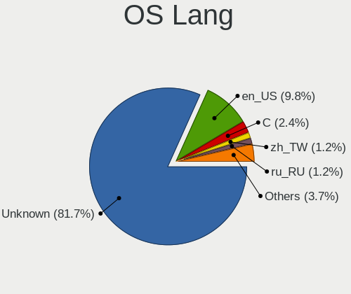

| Lang    | Computers | Percent |
|---------|-----------|---------|
| Unknown | 41        | 87.23%  |
| en_US   | 3         | 6.38%   |
| ru_RU   | 1         | 2.13%   |
| es_ES   | 1         | 2.13%   |
| C       | 1         | 2.13%   |

Boot Mode
---------

EFI or BIOS

| Mode | Computers | Percent |
|------|-----------|---------|
| BIOS | 25        | 53.19%  |
| EFI  | 22        | 46.81%  |

Filesystem
----------

Type of filesystem

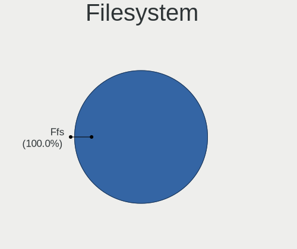

| Type | Computers | Percent |
|------|-----------|---------|
| Ffs  | 47        | 100%    |

Part. scheme
------------

Scheme of partitioning

| Type | Computers | Percent |
|------|-----------|---------|
| MBR  | 26        | 55.32%  |
| GPT  | 21        | 44.68%  |

Board
-----

Vendor
------

Motherboard manufacturer

| Name                           | Computers | Percent |
|--------------------------------|-----------|---------|
| Lenovo                         | 21        | 44.68%  |
| ASUSTek Computer               | 7         | 14.89%  |
| Panasonic                      | 3         | 6.38%   |
| PC Engines                     | 2         | 4.26%   |
| Matsushita Electric Industrial | 2         | 4.26%   |
| Hewlett-Packard                | 2         | 4.26%   |
| Gigabyte Technology            | 2         | 4.26%   |
| VIA Technologies               | 1         | 2.13%   |
| Toshiba                        | 1         | 2.13%   |
| Tactus                         | 1         | 2.13%   |
| Sony                           | 1         | 2.13%   |
| Fujitsu                        | 1         | 2.13%   |
| Elpitech                       | 1         | 2.13%   |
| Apple                          | 1         | 2.13%   |
| Unknown                        | 1         | 2.13%   |

Model
-----

Motherboard model

| Name                                        | Computers | Percent |
|---------------------------------------------|-----------|---------|
| PC Engines APU2                             | 2         | 4.26%   |
| VIA VT82C597                                | 1         | 2.13%   |
| Toshiba NB250                               | 1         | 2.13%   |
| Tactus GeoFlex 110                          | 1         | 2.13%   |
| Sony VGC-RB41M                              | 1         | 2.13%   |
| Panasonic CFSX4-1                           | 1         | 2.13%   |
| Panasonic CF-53AAGHYDM                      | 1         | 2.13%   |
| Panasonic CF-52PFPBSFQ                      | 1         | 2.13%   |
| Matsushita Electric Industrial CF-51RCVDNLM | 1         | 2.13%   |
| Matsushita Electric Industrial CF-48V4KNDQM | 1         | 2.13%   |
| Lenovo V14 G2 ITL 82NM                      | 1         | 2.13%   |
| Lenovo ThinkPad X270 W10DG 20K5S0TT1N       | 1         | 2.13%   |
| Lenovo ThinkPad X260 20F5S2GM00             | 1         | 2.13%   |
| Lenovo ThinkPad X230 2325T4T                | 1         | 2.13%   |
| Lenovo ThinkPad X230 23257EP                | 1         | 2.13%   |
| Lenovo ThinkPad X220 429043U                | 1         | 2.13%   |
| Lenovo ThinkPad X201 3323BBG                | 1         | 2.13%   |
| Lenovo ThinkPad X140e 20BMS03E00            | 1         | 2.13%   |
| Lenovo ThinkPad X1 Carbon 4th 20FCS13H00    | 1         | 2.13%   |
| Lenovo ThinkPad T61 7659AS5                 | 1         | 2.13%   |
| Lenovo ThinkPad T500 205663G                | 1         | 2.13%   |
| Lenovo ThinkPad T480s 20L8A00KCL            | 1         | 2.13%   |
| Lenovo ThinkPad T450s 20BW001KLM            | 1         | 2.13%   |
| Lenovo ThinkPad T440s 20ARA07PLM            | 1         | 2.13%   |
| Lenovo ThinkPad T430 2347GZU                | 1         | 2.13%   |
| Lenovo ThinkPad T430 2344BZU                | 1         | 2.13%   |
| Lenovo ThinkPad T420s 41742BU               | 1         | 2.13%   |
| Lenovo ThinkPad T410 2537N24                | 1         | 2.13%   |
| Lenovo ThinkPad T14 Gen 1 20UES5NW00        | 1         | 2.13%   |
| Lenovo ThinkPad E15 Gen 4 21EDCTO1WW        | 1         | 2.13%   |
| Lenovo G570 20079                           | 1         | 2.13%   |
| HP Pavilion Notebook                        | 1         | 2.13%   |
| HP Compaq dc5700 Microtower                 | 1         | 2.13%   |
| Gigabyte G41MT-S2                           | 1         | 2.13%   |
| Gigabyte B250M-Gaming 3                     | 1         | 2.13%   |
| Fujitsu LIFEBOOK E752                       | 1         | 2.13%   |
| Elpitech ET101-A1                           | 1         | 2.13%   |
| ASUS TUF Gaming B550M-PLUS (WI-FI)          | 1         | 2.13%   |
| ASUS TUF Gaming B550-PLUS                   | 1         | 2.13%   |
| ASUS PRIME B650-PLUS                        | 1         | 2.13%   |

Model Family
------------

Motherboard model prefix

| Name                                        | Computers | Percent |
|---------------------------------------------|-----------|---------|
| Lenovo ThinkPad                             | 19        | 40.43%  |
| PC Engines APU2                             | 2         | 4.26%   |
| ASUS TUF                                    | 2         | 4.26%   |
| ASUS PRIME                                  | 2         | 4.26%   |
| VIA VT82C597                                | 1         | 2.13%   |
| Toshiba NB250                               | 1         | 2.13%   |
| Tactus GeoFlex                              | 1         | 2.13%   |
| Sony VGC-RB41M                              | 1         | 2.13%   |
| Panasonic CFSX4-1                           | 1         | 2.13%   |
| Panasonic CF-53AAGHYDM                      | 1         | 2.13%   |
| Panasonic CF-52PFPBSFQ                      | 1         | 2.13%   |
| Matsushita Electric Industrial CF-51RCVDNLM | 1         | 2.13%   |
| Matsushita Electric Industrial CF-48V4KNDQM | 1         | 2.13%   |
| Lenovo V14                                  | 1         | 2.13%   |
| Lenovo G570                                 | 1         | 2.13%   |
| HP Pavilion                                 | 1         | 2.13%   |
| HP Compaq                                   | 1         | 2.13%   |
| Gigabyte G41MT-S2                           | 1         | 2.13%   |
| Gigabyte B250M-Gaming                       | 1         | 2.13%   |
| Fujitsu LIFEBOOK                            | 1         | 2.13%   |
| Elpitech ET101-A1                           | 1         | 2.13%   |
| ASUS P10S-I                                 | 1         | 2.13%   |
| ASUS M3A78-EMH                              | 1         | 2.13%   |
| ASUS 1000HE                                 | 1         | 2.13%   |
| Apple MacPro1                               | 1         | 2.13%   |
| Unknown                                     | 1         | 2.13%   |

MFG Year
--------

Motherboard manufacture year

| Year    | Computers | Percent |
|---------|-----------|---------|
| 2010    | 6         | 12.77%  |
| 2011    | 5         | 10.64%  |
| 2023    | 3         | 6.38%   |
| 2022    | 3         | 6.38%   |
| 2019    | 3         | 6.38%   |
| 2018    | 3         | 6.38%   |
| 2016    | 3         | 6.38%   |
| 2015    | 3         | 6.38%   |
| 2012    | 3         | 6.38%   |
| 2021    | 2         | 4.26%   |
| 2013    | 2         | 4.26%   |
| 2007    | 2         | 4.26%   |
| 2006    | 2         | 4.26%   |
| Unknown | 2         | 4.26%   |
| 2020    | 1         | 2.13%   |
| 2017    | 1         | 2.13%   |
| 2009    | 1         | 2.13%   |
| 2005    | 1         | 2.13%   |
| 2002    | 1         | 2.13%   |

Form Factor
-----------

Physical design of the computer

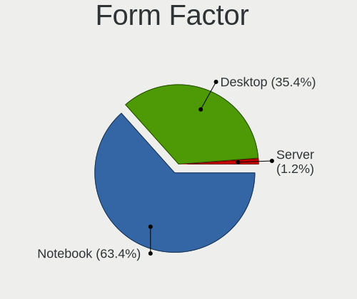

| Name     | Computers | Percent |
|----------|-----------|---------|
| Notebook | 31        | 65.96%  |
| Desktop  | 16        | 34.04%  |

Coreboot
--------

Have coreboot on board

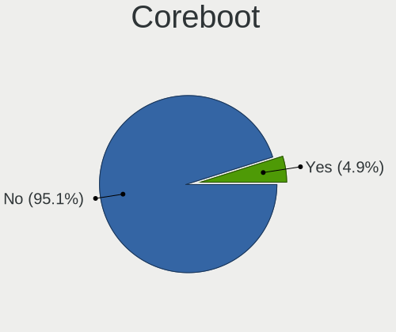

| Used | Computers | Percent |
|------|-----------|---------|
| No   | 44        | 93.62%  |
| Yes  | 3         | 6.38%   |

RAM Size
--------

Total RAM memory

| Size in GB  | Computers | Percent |
|-------------|-----------|---------|
| 8.01-16.0   | 14        | 29.17%  |
| 4.01-8.0    | 11        | 22.92%  |
| 3.01-4.0    | 6         | 12.5%   |
| 16.01-24.0  | 4         | 8.33%   |
| 64.01-256.0 | 3         | 6.25%   |
| 32.01-64.0  | 2         | 4.17%   |
| 2.01-3.0    | 2         | 4.17%   |
| 0.51-1.0    | 2         | 4.17%   |
| 0.01-0.5    | 2         | 4.17%   |
| 24.01-32.0  | 1         | 2.08%   |
| 1.01-2.0    | 1         | 2.08%   |

RAM Used
--------

Used RAM memory

| Used GB  | Computers | Percent |
|----------|-----------|---------|
| 0.01-0.5 | 36        | 76.6%   |
| 0        | 5         | 10.64%  |
| 1.01-2.0 | 3         | 6.38%   |
| 0.51-1.0 | 2         | 4.26%   |
| 4.01-8.0 | 1         | 2.13%   |

Total Drives
------------

Number of drives on board

| Drives | Computers | Percent |
|--------|-----------|---------|
| 1      | 28        | 59.57%  |
| 2      | 9         | 19.15%  |
| 3      | 6         | 12.77%  |
| 0      | 2         | 4.26%   |
| 8      | 1         | 2.13%   |
| 6      | 1         | 2.13%   |

Has CD-ROM
----------

Has CD-ROM on board

| Presented | Computers | Percent |
|-----------|-----------|---------|
| No        | 47        | 100%    |

Has Ethernet
------------

Has Ethernet on board

| Presented | Computers | Percent |
|-----------|-----------|---------|
| Yes       | 42        | 89.36%  |
| No        | 5         | 10.64%  |

Has WiFi
--------

Has WiFi module

| Presented | Computers | Percent |
|-----------|-----------|---------|
| Yes       | 32        | 68.09%  |
| No        | 15        | 31.91%  |

Has Bluetooth
-------------

Has Bluetooth module

| Presented | Computers | Percent |
|-----------|-----------|---------|
| Yes       | 25        | 53.19%  |
| No        | 22        | 46.81%  |

Location
--------

Country
-------

Geographic location (country)

| Country  | Computers | Percent |
|----------|-----------|---------|
| Canada   | 14        | 29.79%  |
| Russia   | 6         | 12.77%  |
| Brazil   | 5         | 10.64%  |
| USA      | 4         | 8.51%   |
| Germany  | 4         | 8.51%   |
| Uruguay  | 3         | 6.38%   |
| Mexico   | 3         | 6.38%   |
| Spain    | 2         | 4.26%   |
| Romania  | 2         | 4.26%   |
| Ukraine  | 1         | 2.13%   |
| Poland   | 1         | 2.13%   |
| Italy    | 1         | 2.13%   |
| Colombia | 1         | 2.13%   |

City
----

Geographic location (city)

| City             | Computers | Percent |
|------------------|-----------|---------|
| Saint-Laurent    | 14        | 29.79%  |
| Blumenau         | 5         | 10.64%  |
| Sun Prairie      | 3         | 6.38%   |
| Puebla City      | 3         | 6.38%   |
| Montevideo       | 3         | 6.38%   |
| St Petersburg    | 2         | 4.26%   |
| Nuremberg        | 2         | 4.26%   |
| Moscow           | 2         | 4.26%   |
| Swilcza          | 1         | 2.13%   |
| Podolsk          | 1         | 2.13%   |
| Oltenita         | 1         | 2.13%   |
| Navalcarnero     | 1         | 2.13%   |
| Montería        | 1         | 2.13%   |
| Monheim am Rhein | 1         | 2.13%   |
| Milan            | 1         | 2.13%   |
| Lübeck          | 1         | 2.13%   |
| Krasnodar        | 1         | 2.13%   |
| Brovary          | 1         | 2.13%   |
| Brasov           | 1         | 2.13%   |
| Barcelona        | 1         | 2.13%   |
| Austin           | 1         | 2.13%   |

Drives
------

Drive Vendor
------------

Hard drive vendors

| Vendor              | Computers | Drives | Percent |
|---------------------|-----------|--------|---------|
| NVMe                | 11        | 15     | 18.33%  |
| Samsung Electronics | 9         | 14     | 15%     |
| WDC                 | 7         | 7      | 11.67%  |
| Hitachi             | 6         | 6      | 10%     |
| Kingston            | 5         | 5      | 8.33%   |
| Seagate             | 4         | 5      | 6.67%   |
| SanDisk             | 4         | 6      | 6.67%   |
| OPENBSD             | 2         | 2      | 3.33%   |
| Crucial             | 2         | 3      | 3.33%   |
| Apacer              | 2         | 2      | 3.33%   |
| A-DATA Technology   | 2         | 2      | 3.33%   |
| Verbatim            | 1         | 1      | 1.67%   |
| Union Memory        | 1         | 1      | 1.67%   |
| SMI                 | 1         | 1      | 1.67%   |
| PNY                 | 1         | 2      | 1.67%   |
| Intenso             | 1         | 1      | 1.67%   |
| HGST                | 1         | 1      | 1.67%   |

Drive Model
-----------

Hard drive models

| Model                               | Computers | Percent |
|-------------------------------------|-----------|---------|
| SanDisk SSD PLUS 120GB              | 2         | 3.13%   |
| SanDisk Extreme SSD 500GB           | 2         | 3.13%   |
| NVMe Samsung SSD 980 500GB          | 2         | 3.13%   |
| NVMe SAMSUNG MZVLW256 256GB         | 2         | 3.13%   |
| WDC WD7500BPKX-00HPJT0 752GB        | 1         | 1.56%   |
| WDC WD7500BPKT-75PK4T0 752GB        | 1         | 1.56%   |
| WDC WD7500BPKT-00PK4T0 752GB        | 1         | 1.56%   |
| WDC WD5000LPLX-00ZNTT0 500GB        | 1         | 1.56%   |
| WDC WD3200BEVE-00A0HT0 320GB        | 1         | 1.56%   |
| WDC WD20PURX-64P6ZY0 2TB            | 1         | 1.56%   |
| WDC WD10JPLX-00MBPT0 1TB            | 1         | 1.56%   |
| Verbatim STORE N GO 64GB            | 1         | 1.56%   |
| Union Memory RTOTJ128VGD2EYX 128GB  | 1         | 1.56%   |
| SMI USB DISK 18302PB                | 1         | 1.56%   |
| Seagate ST9160821A 160GB            | 1         | 1.56%   |
| Seagate ST500LM012 HN-M500MBB 500GB | 1         | 1.56%   |
| Seagate ST3500414CS 500GB           | 1         | 1.56%   |
| Seagate ST3250824AS P 250GB         | 1         | 1.56%   |
| Seagate ST3250318AS 250GB           | 1         | 1.56%   |
| SanDisk Cruzer Blade 64GB           | 1         | 1.56%   |
| Samsung SSD 870 QVO 2TB             | 1         | 1.56%   |
| Samsung SSD 870 EVO 500GB           | 1         | 1.56%   |
| Samsung SSD 860 EVO M.2 1TB         | 1         | 1.56%   |
| Samsung SSD 850 EVO 500GB           | 1         | 1.56%   |
| Samsung SSD 840 EVO 250GB           | 1         | 1.56%   |
| Samsung MZ7TD128HAFV-000L1 128GB    | 1         | 1.56%   |
| Samsung MZ7PC128HAFU-000L1 128GB    | 1         | 1.56%   |
| Samsung HD161HJ 160GB               | 1         | 1.56%   |
| Samsung Flash Drive FIT 32GB        | 1         | 1.56%   |
| PNY CS900 1TB SSD                   | 1         | 1.56%   |
| OPENBSD SR RAID 5 9.9TB             | 1         | 1.56%   |
| OPENBSD SR RAID 1 2TB               | 1         | 1.56%   |
| NVMe WDBRPG5000ANC-WR 500GB         | 1         | 1.56%   |
| NVMe TOSHIBA-RC100 240GB            | 1         | 1.56%   |
| NVMe SSSTC CL1-4D256 256GB          | 1         | 1.56%   |
| NVMe Sabrent SB-1342- 1TB           | 1         | 1.56%   |
| NVMe Sabrent Rocket 4 500GB         | 1         | 1.56%   |
| NVMe KINGSTON SNVS200 2TB           | 1         | 1.56%   |
| NVMe KINGSTON SNV2S20 2TB           | 1         | 1.56%   |
| NVMe Asgard AN1TNVMe- 1TB           | 1         | 1.56%   |

HDD Vendor
----------

Hard disk drive vendors

| Vendor              | Computers | Drives | Percent |
|---------------------|-----------|--------|---------|
| NVMe                | 8         | 12     | 25%     |
| WDC                 | 7         | 7      | 21.88%  |
| Hitachi             | 6         | 6      | 18.75%  |
| Seagate             | 4         | 5      | 12.5%   |
| Samsung Electronics | 2         | 2      | 6.25%   |
| OPENBSD             | 2         | 2      | 6.25%   |
| Verbatim            | 1         | 1      | 3.13%   |
| SMI                 | 1         | 1      | 3.13%   |
| HGST                | 1         | 1      | 3.13%   |

SSD Vendor
----------

Solid state drive vendors

| Vendor              | Computers | Drives | Percent |
|---------------------|-----------|--------|---------|
| Samsung Electronics | 7         | 12     | 25%     |
| Kingston            | 5         | 5      | 17.86%  |
| SanDisk             | 4         | 6      | 14.29%  |
| NVMe                | 3         | 3      | 10.71%  |
| Crucial             | 2         | 3      | 7.14%   |
| Apacer              | 2         | 2      | 7.14%   |
| A-DATA Technology   | 2         | 2      | 7.14%   |
| Union Memory        | 1         | 1      | 3.57%   |
| PNY                 | 1         | 2      | 3.57%   |
| Intenso             | 1         | 1      | 3.57%   |

Drive Kind
----------

HDD or SSD

| Kind | Computers | Drives | Percent |
|------|-----------|--------|---------|
| SSD  | 26        | 37     | 50%     |
| HDD  | 26        | 37     | 50%     |

Drive Connector
---------------

SATA, SAS, NVMe, etc.

| Type | Computers | Drives | Percent |
|------|-----------|--------|---------|
| SATA | 44        | 74     | 100%    |

Drive Size
----------

Size of hard drive

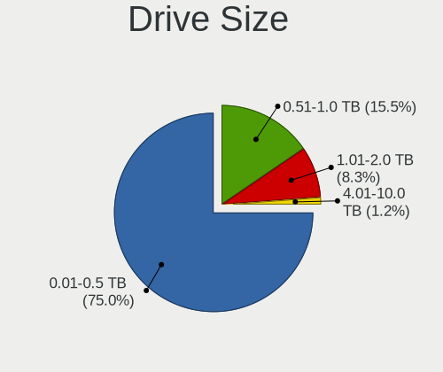

| Size in TB      | Computers | Drives | Percent |
|-----------------|-----------|--------|---------|
| 0.01-0.5        | 37        | 50     | 74%     |
| 0.51-1.0        | 6         | 7      | 12%     |
| 1.01-2.0        | 5         | 15     | 10%     |
| More than 100.0 | 1         | 1      | 2%      |
| 4.01-10.0       | 1         | 1      | 2%      |

Space Total
-----------

Amount of disk space available on the file system

| Size in GB     | Computers | Percent |
|----------------|-----------|---------|
| 101-250        | 15        | 31.25%  |
| 21-50          | 14        | 29.17%  |
| 251-500        | 6         | 12.5%   |
| 51-100         | 6         | 12.5%   |
| More than 3000 | 2         | 4.17%   |
| 1001-2000      | 2         | 4.17%   |
| 1-20           | 2         | 4.17%   |
| 501-1000       | 1         | 2.08%   |

Space Used
----------

Amount of used disk space

| Used GB        | Computers | Percent |
|----------------|-----------|---------|
| 1-20           | 37        | 78.72%  |
| 21-50          | 5         | 10.64%  |
| More than 3000 | 1         | 2.13%   |
| 251-500        | 1         | 2.13%   |
| 2001-3000      | 1         | 2.13%   |
| 101-250        | 1         | 2.13%   |
| 51-100         | 1         | 2.13%   |

Malfunc. Drives
---------------

Drive models with a malfunction

| Model                                 | Computers | Drives | Percent |
|---------------------------------------|-----------|--------|---------|
| Samsung Electronics SSD 870 EVO 500GB | 1         | 1      | 16.67%  |
| Samsung Electronics SSD 840 EVO 250GB | 1         | 1      | 16.67%  |
| Samsung Electronics HD161HJ 160GB     | 1         | 1      | 16.67%  |
| Hitachi HDS722516VLAT80 164GB         | 1         | 1      | 16.67%  |
| A-DATA Technology SP550 480GB         | 1         | 1      | 16.67%  |
| A-DATA Technology SP550 240GB         | 1         | 1      | 16.67%  |

Malfunc. Drive Vendor
---------------------

Vendors of faulty drives

| Vendor              | Computers | Drives | Percent |
|---------------------|-----------|--------|---------|
| Samsung Electronics | 3         | 3      | 50%     |
| A-DATA Technology   | 2         | 2      | 33.33%  |
| Hitachi             | 1         | 1      | 16.67%  |

Malfunc. HDD Vendor
-------------------

Vendors of faulty HDD drives

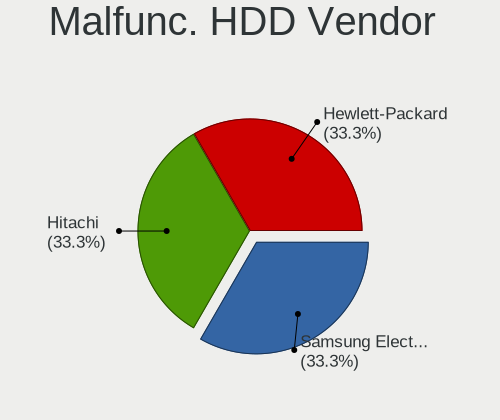

| Vendor              | Computers | Drives | Percent |
|---------------------|-----------|--------|---------|
| Samsung Electronics | 1         | 1      | 50%     |
| Hitachi             | 1         | 1      | 50%     |

Malfunc. Drive Kind
-------------------

Kinds of faulty drives

| Kind | Computers | Drives | Percent |
|------|-----------|--------|---------|
| SSD  | 4         | 4      | 66.67%  |
| HDD  | 2         | 2      | 33.33%  |

Failed Drives
-------------

Failed drive models

Zero info for selected period =(

Failed Drive Vendor
-------------------

Failed drive vendors

Zero info for selected period =(

Drive Status
------------

Number of failed and malfunc. drives

| Status   | Computers | Drives | Percent |
|----------|-----------|--------|---------|
| Works    | 33        | 48     | 64.71%  |
| Detected | 12        | 20     | 23.53%  |
| Malfunc  | 6         | 6      | 11.76%  |

Storage controller
------------------

Storage Vendor
--------------

Storage controller vendors

| Vendor                         | Computers | Percent |
|--------------------------------|-----------|---------|
| Intel                          | 32        | 60.38%  |
| AMD                            | 7         | 13.21%  |
| Samsung Electronics            | 4         | 7.55%   |
| Phison Electronics             | 2         | 3.77%   |
| Kingston Technology Company    | 2         | 3.77%   |
| VIA Technologies               | 1         | 1.89%   |
| Toshiba                        | 1         | 1.89%   |
| Solid State Storage Technology | 1         | 1.89%   |
| Silicon Motion                 | 1         | 1.89%   |
| SanDisk                        | 1         | 1.89%   |
| Artop Electronic               | 1         | 1.89%   |

Storage Model
-------------

Storage controller models

| Model                                                                                  | Computers | Percent |
|----------------------------------------------------------------------------------------|-----------|---------|
| Intel 7 Series Chipset Family 6-port SATA Controller [AHCI mode]                       | 5         | 8.62%   |
| Intel Sunrise Point-LP SATA Controller [AHCI mode]                                     | 3         | 5.17%   |
| Intel 6 Series/C200 Series Chipset Family 6 port Mobile SATA AHCI Controller           | 3         | 5.17%   |
| Intel 5 Series/3400 Series Chipset 6 port SATA AHCI Controller                         | 3         | 5.17%   |
| Samsung NVMe SSD Controller SM961/PM961/SM963                                          | 2         | 3.45%   |
| Samsung NVMe SSD Controller PM9A1/PM9A3/980PRO                                         | 2         | 3.45%   |
| Intel Wildcat Point-LP SATA Controller [AHCI Mode]                                     | 2         | 3.45%   |
| Intel 82801GBM/GHM (ICH7-M Family) SATA Controller [IDE mode]                          | 2         | 3.45%   |
| AMD FCH SATA Controller [IDE mode]                                                     | 2         | 3.45%   |
| AMD FCH SATA Controller [AHCI mode]                                                    | 2         | 3.45%   |
| AMD 500 Series Chipset SATA Controller                                                 | 2         | 3.45%   |
| VIA VT82C586A/B/VT82C686/A/B/VT823x/A/C PIPC Bus Master IDE                            | 1         | 1.72%   |
| Toshiba BG3 NVMe SSD Controller                                                        | 1         | 1.72%   |
| Solid State Storage CL1-3D256-Q11 NVMe SSD M.2                                         | 1         | 1.72%   |
| Silicon Motion SM2263EN/SM2263XT SSD Controller                                        | 1         | 1.72%   |
| SanDisk WD Black SN750 / PC SN730 NVMe SSD                                             | 1         | 1.72%   |
| Phison PS5013 E13 NVMe Controller                                                      | 1         | 1.72%   |
| Phison E16 PCIe4 NVMe Controller                                                       | 1         | 1.72%   |
| Kingston Company unknown                                                               | 1         | 1.72%   |
| Kingston Company SNVS2000G [NV1 NVMe PCIe SSD 2TB]                                     | 1         | 1.72%   |
| Intel Tiger Lake-LP SATA Controller                                                    | 1         | 1.72%   |
| Intel Q170/Q150/B150/H170/H110/Z170/CM236 Chipset SATA Controller [AHCI Mode]          | 1         | 1.72%   |
| Intel NM10/ICH7 Family SATA Controller [IDE mode]                                      | 1         | 1.72%   |
| Intel Celeron/Pentium Silver Processor SATA Controller                                 | 1         | 1.72%   |
| Intel 82801IBM/IEM (ICH9M/ICH9M-E) 4 port SATA Controller [AHCI mode]                  | 1         | 1.72%   |
| Intel 82801HR/HO/HH (ICH8R/DO/DH) 2 port SATA Controller [IDE mode]                    | 1         | 1.72%   |
| Intel 82801HM/HEM (ICH8M/ICH8M-E) SATA Controller [AHCI mode]                          | 1         | 1.72%   |
| Intel 82801H (ICH8 Family) 4 port SATA Controller [IDE mode]                           | 1         | 1.72%   |
| Intel 82801FB/FW (ICH6/ICH6W) SATA Controller                                          | 1         | 1.72%   |
| Intel 82801FB/FBM/FR/FW/FRW (ICH6 Family) IDE Controller                               | 1         | 1.72%   |
| Intel 82801CAM IDE U100 Controller                                                     | 1         | 1.72%   |
| Intel 8 Series SATA Controller 1 [AHCI mode]                                           | 1         | 1.72%   |
| Intel 631xESB/632xESB/3100 Chipset SATA IDE Controller                                 | 1         | 1.72%   |
| Intel 631xESB/632xESB IDE Controller                                                   | 1         | 1.72%   |
| Intel 6 Series/C200 Series Chipset Family Mobile SATA Controller (IDE mode, ports 4-5) | 1         | 1.72%   |
| Intel 6 Series/C200 Series Chipset Family Mobile SATA Controller (IDE mode, ports 0-3) | 1         | 1.72%   |
| Intel 400 Series Chipset Family SATA AHCI Controller                                   | 1         | 1.72%   |
| Intel 200 Series PCH SATA controller [AHCI mode]                                       | 1         | 1.72%   |
| Artop Electronic AEC6712U SCSI                                                         | 1         | 1.72%   |
| AMD SB7x0/SB8x0/SB9x0 SATA Controller [AHCI mode]                                      | 1         | 1.72%   |

Storage Kind
------------

Kind of storage controller (IDE, SATA, NVMe, SAS, ...)

| Kind | Computers | Percent |
|------|-----------|---------|
| SATA | 30        | 57.69%  |
| IDE  | 11        | 21.15%  |
| NVMe | 10        | 19.23%  |
| SCSI | 1         | 1.92%   |

Processor
---------

CPU Vendor
----------

Processor vendors

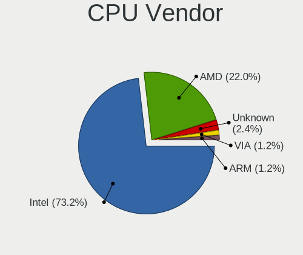

| Vendor  | Computers | Percent |
|---------|-----------|---------|
| Intel   | 35        | 74.47%  |
| AMD     | 10        | 21.28%  |
| ARM     | 1         | 2.13%   |
| Unknown | 1         | 2.13%   |

CPU Model
---------

Processor models

| Model                                                           | Computers | Percent |
|-----------------------------------------------------------------|-----------|---------|
| Intel Core i5-3320M CPU @ 2.60GHz                               | 4         | 8.51%   |
| Intel Core i5-6300U CPU @ 2.40GHz                               | 3         | 6.38%   |
| Intel Core i5-2520M CPU @ 2.50GHz                               | 3         | 6.38%   |
| Intel Core i5-5300U CPU @ 2.30GHz                               | 2         | 4.26%   |
| Intel Core i5 CPU M 520 @ 2.40GHz                               | 2         | 4.26%   |
| AMD GX-412TC SOC                                                | 2         | 4.26%   |
| Intel Xeon CPU E3-1220 v5 @ 3.00GHz                             | 1         | 2.13%   |
| Intel Xeon CPU 5150 @ 2.66GHz                                   | 1         | 2.13%   |
| Intel Pentium 4 Mobile CPU 1.60GHz                              | 1         | 2.13%   |
| Intel Pentium 4 CPU 3.00GHz ("GenuineIntel" 686-class)          | 1         | 2.13%   |
| Intel Genuine CPU T2300 @ 1.66GHz                               | 1         | 2.13%   |
| Intel Core i7-8650U CPU @ 1.90GHz                               | 1         | 2.13%   |
| Intel Core i7-3520M CPU @ 2.90GHz                               | 1         | 2.13%   |
| Intel Core i5-7400 CPU @ 3.00GHz                                | 1         | 2.13%   |
| Intel Core i5-6200U CPU @ 2.30GHz                               | 1         | 2.13%   |
| Intel Core i5-4300U CPU @ 1.90GHz                               | 1         | 2.13%   |
| Intel Core i5-2410M CPU @ 2.30GHz                               | 1         | 2.13%   |
| Intel Core i3-10100 CPU @ 3.60GHz                               | 1         | 2.13%   |
| Intel Core i3 CPU M 350 @ 2.27GHz                               | 1         | 2.13%   |
| Intel Core 2 Quad CPU Q9550 @ 2.83GHz                           | 1         | 2.13%   |
| Intel Core 2 Duo CPU T9400 @ 2.53GHz                            | 1         | 2.13%   |
| Intel Core 2 Duo CPU T7100 @ 1.80GHz ("GenuineIntel" 686-class) | 1         | 2.13%   |
| Intel Core 2 CPU 6420 @ 2.13GHz                                 | 1         | 2.13%   |
| Intel Celeron N4020 CPU @ 1.10GHz                               | 1         | 2.13%   |
| Intel Atom CPU N455 @ 1.66GHz ("GenuineIntel" 686-class)        | 1         | 2.13%   |
| Intel Atom CPU N280 @ 1.66GHz                                   | 1         | 2.13%   |
| Intel 11th Gen Core i5-1135G7 @ 2.40GHz                         | 1         | 2.13%   |
| ARM Cortex-A57 r1p3                                             | 1         | 2.13%   |
| AMD Ryzen 9 5950X 16-Core Processor                             | 1         | 2.13%   |
| AMD Ryzen 7 7700X 8-Core Processor                              | 1         | 2.13%   |
| AMD Ryzen 7 5825U with Radeon Graphics                          | 1         | 2.13%   |
| AMD Ryzen 7 3700X 8-Core Processor                              | 1         | 2.13%   |
| AMD Ryzen 5 PRO 4650U with Radeon Graphics                      | 1         | 2.13%   |
| AMD Phenom 9550 Quad-Core Processor                             | 1         | 2.13%   |
| AMD K6                                                          | 1         | 2.13%   |
| AMD E1-2500 APU with Radeon HD Graphics                         | 1         | 2.13%   |
|                                                                 | 1         | 2.13%   |

CPU Model Family
----------------

Processor model prefix

| Model             | Computers | Percent |
|-------------------|-----------|---------|
| Intel Core i5     | 18        | 38.3%   |
| Other             | 3         | 6.38%   |
| AMD Ryzen 7       | 3         | 6.38%   |
| Intel Xeon        | 2         | 4.26%   |
| Intel Pentium 4   | 2         | 4.26%   |
| Intel Core i7     | 2         | 4.26%   |
| Intel Core i3     | 2         | 4.26%   |
| Intel Core 2 Duo  | 2         | 4.26%   |
| Intel Atom        | 2         | 4.26%   |
| AMD GX            | 2         | 4.26%   |
| Intel Genuine     | 1         | 2.13%   |
| Intel Core 2 Quad | 1         | 2.13%   |
| Intel Core 2      | 1         | 2.13%   |
| Intel Celeron     | 1         | 2.13%   |
| ARM Cortex        | 1         | 2.13%   |
| AMD Ryzen 9       | 1         | 2.13%   |
| AMD Ryzen 5 PRO   | 1         | 2.13%   |
| AMD Phenom        | 1         | 2.13%   |
| AMD E1            | 1         | 2.13%   |

CPU Cores
---------

Number of processor cores

| Number  | Computers | Percent |
|---------|-----------|---------|
| 2       | 22        | 46.81%  |
| Unknown | 10        | 21.28%  |
| 4       | 8         | 17.02%  |
| 16      | 3         | 6.38%   |
| 1       | 2         | 4.26%   |
| 32      | 1         | 2.13%   |
| 12      | 1         | 2.13%   |

CPU Sockets
-----------

Number of sockets

| Number  | Computers | Percent |
|---------|-----------|---------|
| 1       | 38        | 80.85%  |
| Unknown | 8         | 17.02%  |
| 2       | 1         | 2.13%   |

CPU Threads
-----------

Threads per core (Hyper-Threading)

| Number  | Computers | Percent |
|---------|-----------|---------|
| 2       | 22        | 46.81%  |
| 1       | 14        | 29.79%  |
| Unknown | 11        | 23.4%   |

CPU Microarch
-------------

Microarchitecture

| Name          | Computers | Percent |
|---------------|-----------|---------|
| Skylake       | 5         | 10.64%  |
| IvyBridge     | 5         | 10.64%  |
| SandyBridge   | 4         | 8.51%   |
| Westmere      | 3         | 6.38%   |
| Core          | 3         | 6.38%   |
| Unknown       | 3         | 6.38%   |
| Zen 3         | 2         | 4.26%   |
| Zen 2         | 2         | 4.26%   |
| Puma          | 2         | 4.26%   |
| Penryn        | 2         | 4.26%   |
| NetBurst      | 2         | 4.26%   |
| KabyLake      | 2         | 4.26%   |
| Broadwell     | 2         | 4.26%   |
| Bonnell       | 2         | 4.26%   |
| TigerLake     | 1         | 2.13%   |
| P6            | 1         | 2.13%   |
| K10           | 1         | 2.13%   |
| Jaguar        | 1         | 2.13%   |
| Haswell       | 1         | 2.13%   |
| Goldmont plus | 1         | 2.13%   |
| Geode         | 1         | 2.13%   |
| CometLake     | 1         | 2.13%   |

Graphics
--------

GPU Vendor
----------

Vendors of graphics cards

| Vendor            | Computers | Percent |
|-------------------|-----------|---------|
| Intel             | 30        | 66.67%  |
| AMD               | 9         | 20%     |
| Nvidia            | 5         | 11.11%  |
| ASPEED Technology | 1         | 2.22%   |

GPU Model
---------

Graphics card models

| Model                                                                         | Computers | Percent |
|-------------------------------------------------------------------------------|-----------|---------|
| Intel 3rd Gen Core processor Graphics Controller                              | 5         | 10.42%  |
| Intel Skylake GT2 [HD Graphics 520]                                           | 4         | 8.33%   |
| Intel 2nd Generation Core Processor Family Integrated Graphics Controller     | 4         | 8.33%   |
| Intel Core Processor Integrated Graphics Controller                           | 3         | 6.25%   |
| Nvidia GK208B [GeForce GT 710]                                                | 2         | 4.17%   |
| Intel Mobile 945GM/GMS/GME, 943/940GML Express Integrated Graphics Controller | 2         | 4.17%   |
| Intel HD Graphics 5500                                                        | 2         | 4.17%   |
| Nvidia GP106 [GeForce GTX 1060 6GB]                                           | 1         | 2.08%   |
| Nvidia GA104 [GeForce RTX 3070 Lite Hash Rate]                                | 1         | 2.08%   |
| Nvidia G73 [GeForce 7300 GT]                                                  | 1         | 2.08%   |
| Intel UHD Graphics 620                                                        | 1         | 2.08%   |
| Intel TigerLake-LP GT2 [Iris Xe Graphics]                                     | 1         | 2.08%   |
| Intel Mobile GM965/GL960 Integrated Graphics Controller (secondary)           | 1         | 2.08%   |
| Intel Mobile GM965/GL960 Integrated Graphics Controller (primary)             | 1         | 2.08%   |
| Intel Mobile 945GSE Express Integrated Graphics Controller                    | 1         | 2.08%   |
| Intel Mobile 945GM/GMS, 943/940GML Express Integrated Graphics Controller     | 1         | 2.08%   |
| Intel Mobile 4 Series Chipset Integrated Graphics Controller                  | 1         | 2.08%   |
| Intel HD Graphics 630                                                         | 1         | 2.08%   |
| Intel Haswell-ULT Integrated Graphics Controller                              | 1         | 2.08%   |
| Intel GeminiLake [UHD Graphics 600]                                           | 1         | 2.08%   |
| Intel CometLake-S GT2 [UHD Graphics 630]                                      | 1         | 2.08%   |
| Intel 82Q963/Q965 Integrated Graphics Controller                              | 1         | 2.08%   |
| Intel 82915G/GV/910GL Integrated Graphics Controller                          | 1         | 2.08%   |
| ASPEED Technology ASPEED Graphics Family                                      | 1         | 2.08%   |
| AMD RV770 [Radeon HD 4850]                                                    | 1         | 2.08%   |
| AMD RV200/M7 [Mobility Radeon 7500]                                           | 1         | 2.08%   |
| AMD RV200 [Radeon 7500/7500 LE]                                               | 1         | 2.08%   |
| AMD Robson CE [Radeon HD 6370M/7370M]                                         | 1         | 2.08%   |
| AMD Renoir                                                                    | 1         | 2.08%   |
| AMD Raphael                                                                   | 1         | 2.08%   |
| AMD Navi 22 [Radeon RX 6700/6700 XT/6750 XT / 6800M/6850M XT]                 | 1         | 2.08%   |
| AMD Kabini [Radeon HD 8240 / R3 Series]                                       | 1         | 2.08%   |
| AMD Barcelo                                                                   | 1         | 2.08%   |

GPU Combo
---------

Combinations of graphics cards

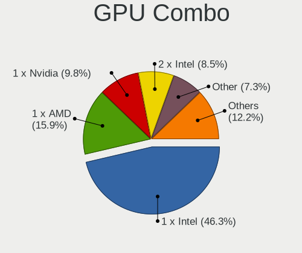

| Name           | Computers | Percent |
|----------------|-----------|---------|
| 1 x Intel      | 24        | 51.06%  |
| 1 x AMD        | 7         | 14.89%  |
| Other          | 5         | 10.64%  |
| 2 x Intel      | 4         | 8.51%   |
| 1 x Nvidia     | 3         | 6.38%   |
| Intel + Nvidia | 1         | 2.13%   |
| Intel + AMD    | 1         | 2.13%   |
| 1 x ASPEED     | 1         | 2.13%   |
| AMD + Nvidia   | 1         | 2.13%   |

GPU Driver
----------

Free vs proprietary

| Driver  | Computers | Percent |
|---------|-----------|---------|
| Free    | 38        | 80.85%  |
| Unknown | 9         | 19.15%  |

GPU Memory
----------

Total video memory

| Size in GB | Computers | Percent |
|------------|-----------|---------|
| Unknown    | 47        | 100%    |

Monitor
-------

Monitor Vendor
--------------

Monitor vendors

| Vendor              | Computers | Percent |
|---------------------|-----------|---------|
| AU Optronics        | 6         | 26.09%  |
| Samsung Electronics | 3         | 13.04%  |
| Philips             | 2         | 8.7%    |
| Chimei Innolux      | 2         | 8.7%    |
| ViewSonic           | 1         | 4.35%   |
| TRU                 | 1         | 4.35%   |
| MSI                 | 1         | 4.35%   |
| LG Display          | 1         | 4.35%   |
| Lenovo              | 1         | 4.35%   |
| Iiyama              | 1         | 4.35%   |
| Goldstar            | 1         | 4.35%   |
| BOE                 | 1         | 4.35%   |
| BenQ                | 1         | 4.35%   |
| ASUSTek Computer    | 1         | 4.35%   |

Monitor Model
-------------

Monitor models

| Model                                                                | Computers | Percent |
|----------------------------------------------------------------------|-----------|---------|
| ViewSonic VA703-4SERIES VSC6A1E 1280x1024 340x270mm 17.1-inch        | 1         | 4.35%   |
| TRU LCD Monitor TRU235C 1366x768 260x140mm 11.6-inch                 | 1         | 4.35%   |
| Samsung Electronics LCD Monitor SEC324C 1600x900 310x170mm 13.9-inch | 1         | 4.35%   |
| Samsung Electronics LCD Monitor SEC304C 1366x768 310x170mm 13.9-inch | 1         | 4.35%   |
| Samsung Electronics LCD Monitor SAM0669 1920x1080                    | 1         | 4.35%   |
| Philips PHL 247E6 PHLC0E7 1920x1080 520x290mm 23.4-inch              | 1         | 4.35%   |
| Philips 227E4LH PHLC0AC 1920x1080 480x270mm 21.7-inch                | 1         | 4.35%   |
| MSI MP242 MSI30A1 1920x1080 530x300mm 24.0-inch                      | 1         | 4.35%   |
| LG Display LCD Monitor LGD02D8 1366x768 280x160mm 12.7-inch          | 1         | 4.35%   |
| Lenovo LCD Monitor LEN4053 1680x1050 330x210mm 15.4-inch             | 1         | 4.35%   |
| Iiyama PL2530H IVM6131 1920x1080 540x300mm 24.3-inch                 | 1         | 4.35%   |
| Goldstar LG ULTRAWIDE GSM76F9 2560x1080 800x340mm 34.2-inch          | 1         | 4.35%   |
| Chimei Innolux LCD Monitor CMN14E5 1920x1080 310x170mm 13.9-inch     | 1         | 4.35%   |
| Chimei Innolux LCD Monitor CMN14C9 1920x1080 310x170mm 13.9-inch     | 1         | 4.35%   |
| BOE LCD Monitor BOE08E2 1920x1080 340x190mm 15.3-inch                | 1         | 4.35%   |
| BenQ GL2450H BNQ78A7 1920x1080 530x300mm 24.0-inch                   | 1         | 4.35%   |
| AU Optronics LCD Monitor AUO403D 1920x1080 310x170mm 13.9-inch       | 1         | 4.35%   |
| AU Optronics LCD Monitor AUO315C 1366x768 260x140mm 11.6-inch        | 1         | 4.35%   |
| AU Optronics LCD Monitor AUO213E 1600x900 310x170mm 13.9-inch        | 1         | 4.35%   |
| AU Optronics LCD Monitor AUO173D 1920x1080 310x170mm 13.9-inch       | 1         | 4.35%   |
| AU Optronics LCD Monitor AUO1147 1440x900 300x190mm 14.0-inch        | 1         | 4.35%   |
| AU Optronics LCD Monitor AUO106C 1366x768 280x160mm 12.7-inch        | 1         | 4.35%   |
| ASUSTek Computer PA279 AUS2768 3840x2160 600x340mm 27.2-inch         | 1         | 4.35%   |

Monitor Resolution
------------------

Monitor screen resolution

| Resolution         | Computers | Percent |
|--------------------|-----------|---------|
| 1920x1080 (FHD)    | 10        | 45.45%  |
| 1366x768 (WXGA)    | 5         | 22.73%  |
| 1600x900 (HD+)     | 2         | 9.09%   |
| 3840x2160 (4K)     | 1         | 4.55%   |
| 2560x1080          | 1         | 4.55%   |
| 1680x1050 (WSXGA+) | 1         | 4.55%   |
| 1440x900 (WXGA+)   | 1         | 4.55%   |
| 1280x1024 (SXGA)   | 1         | 4.55%   |

Monitor Diagonal
----------------

Diagonal size in inches

| Inches  | Computers | Percent |
|---------|-----------|---------|
| 13      | 6         | 26.09%  |
| 24      | 3         | 13.04%  |
| 15      | 3         | 13.04%  |
| 12      | 2         | 8.7%    |
| 11      | 2         | 8.7%    |
| 34      | 1         | 4.35%   |
| 27      | 1         | 4.35%   |
| 23      | 1         | 4.35%   |
| 21      | 1         | 4.35%   |
| 17      | 1         | 4.35%   |
| 14      | 1         | 4.35%   |
| Unknown | 1         | 4.35%   |

Monitor Width
-------------

Physical width

| Width in mm | Computers | Percent |
|-------------|-----------|---------|
| 301-350     | 10        | 43.48%  |
| 501-600     | 5         | 21.74%  |
| 201-300     | 5         | 21.74%  |
| 701-800     | 1         | 4.35%   |
| 401-500     | 1         | 4.35%   |
| Unknown     | 1         | 4.35%   |

Aspect Ratio
------------

Proportional relationship between the width and the height

| Ratio | Computers | Percent |
|-------|-----------|---------|
| 16/9  | 18        | 81.82%  |
| 16/10 | 2         | 9.09%   |
| 5/4   | 1         | 4.55%   |
| 21/9  | 1         | 4.55%   |

Monitor Area
------------

Area in inch²

| Area in inch² | Computers | Percent |
|----------------|-----------|---------|
| 81-90          | 7         | 30.43%  |
| 201-250        | 4         | 17.39%  |
| 61-70          | 2         | 8.7%    |
| 51-60          | 2         | 8.7%    |
| 101-110        | 2         | 8.7%    |
| 351-500        | 1         | 4.35%   |
| 301-350        | 1         | 4.35%   |
| 251-300        | 1         | 4.35%   |
| 141-150        | 1         | 4.35%   |
| 91-100         | 1         | 4.35%   |
| Unknown        | 1         | 4.35%   |

Pixel Density
-------------

Pixels per inch

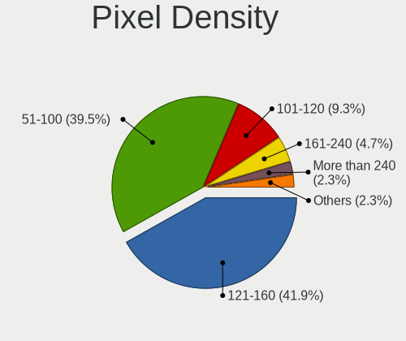

| Density | Computers | Percent |
|---------|-----------|---------|
| 121-160 | 13        | 56.52%  |
| 51-100  | 7         | 30.43%  |
| 161-240 | 1         | 4.35%   |
| 101-120 | 1         | 4.35%   |
| Unknown | 1         | 4.35%   |

Multiple Monitors
-----------------

Total monitors connected

| Total | Computers | Percent |
|-------|-----------|---------|
| 1     | 36        | 76.6%   |
| 0     | 10        | 21.28%  |
| 2     | 1         | 2.13%   |

Network
-------

Net Controller Vendor
---------------------

Controller vendors

| Vendor                            | Computers | Percent |
|-----------------------------------|-----------|---------|
| Intel                             | 33        | 57.89%  |
| Realtek Semiconductor             | 12        | 21.05%  |
| Qualcomm Atheros                  | 3         | 5.26%   |
| Ericsson Business Mobile Networks | 2         | 3.51%   |
| Broadcom                          | 2         | 3.51%   |
| Sierra Wireless                   | 1         | 1.75%   |
| Ralink Technology                 | 1         | 1.75%   |
| Marvell Technology Group          | 1         | 1.75%   |
| Huawei Technologies               | 1         | 1.75%   |
| Edimax Technology                 | 1         | 1.75%   |

Net Controller Model
--------------------

Controller models

| Model                                                              | Computers | Percent |
|--------------------------------------------------------------------|-----------|---------|
| Intel Centrino Advanced-N 6205 [Taylor Peak]                       | 8         | 9.88%   |
| Intel 82579LM Gigabit Network Connection (Lewisville)              | 8         | 9.88%   |
| Realtek RTL8111/8168/8411 PCI Express Gigabit Ethernet Controller  | 6         | 7.41%   |
| Intel Wireless 8260                                                | 3         | 3.7%    |
| Intel Wireless 7265                                                | 3         | 3.7%    |
| Intel I210 Gigabit Network Connection                              | 3         | 3.7%    |
| Intel Ethernet Connection I219-LM                                  | 3         | 3.7%    |
| Intel 82577LM Gigabit Network Connection                           | 3         | 3.7%    |
| Realtek RTL8125 2.5GbE Controller                                  | 2         | 2.47%   |
| Realtek RTL-8100/8101L/8139 PCI Fast Ethernet Adapter              | 2         | 2.47%   |
| Intel Wireless 7260                                                | 2         | 2.47%   |
| Intel Wi-Fi 6 AX200                                                | 2         | 2.47%   |
| Intel PRO/Wireless 3945ABG [Golan] Network Connection              | 2         | 2.47%   |
| Intel Ethernet Connection (3) I218-LM                              | 2         | 2.47%   |
| Intel Centrino Advanced-N 6200                                     | 2         | 2.47%   |
| Sierra Wireless EM7455                                             | 1         | 1.23%   |
| Realtek RTL8852AE 802.11ax PCIe Wireless Network Adapter           | 1         | 1.23%   |
| Realtek RTL8192EU 802.11b/g/n WLAN Adapter                         | 1         | 1.23%   |
| Realtek RTL8191SEvB Wireless LAN Controller                        | 1         | 1.23%   |
| Realtek RTL810xE PCI Express Fast Ethernet controller              | 1         | 1.23%   |
| Ralink RT2501/RT2573 Wireless Adapter                              | 1         | 1.23%   |
| Qualcomm Atheros AR928X Wireless Network Adapter (PCI-Express)     | 1         | 1.23%   |
| Qualcomm Atheros AR9285 Wireless Network Adapter (PCI-Express)     | 1         | 1.23%   |
| Qualcomm Atheros AR8152 v2.0 Fast Ethernet                         | 1         | 1.23%   |
| Qualcomm Atheros AR8151 v1.0 Gigabit Ethernet                      | 1         | 1.23%   |
| Qualcomm Atheros AR8121/AR8113/AR8114 Gigabit or Fast Ethernet     | 1         | 1.23%   |
| Marvell Group 88E8053 PCI-E Gigabit Ethernet Controller            | 1         | 1.23%   |
| Intel Wireless 8265 / 8275                                         | 1         | 1.23%   |
| Intel Wireless 3160                                                | 1         | 1.23%   |
| Intel Wi-Fi 6 AX201                                                | 1         | 1.23%   |
| Intel PRO/Wireless 5100 AGN [Shiloh] Network Connection            | 1         | 1.23%   |
| Intel Ethernet Connection I218-LM                                  | 1         | 1.23%   |
| Intel Ethernet Connection (4) I219-LM                              | 1         | 1.23%   |
| Intel Ethernet Connection (2) I219-V                               | 1         | 1.23%   |
| Intel 82567LM Gigabit Network Connection                           | 1         | 1.23%   |
| Intel 82566MM Gigabit Network Connection                           | 1         | 1.23%   |
| Intel 82562ET/EZ/GT/GZ - PRO/100 VE (LOM) Ethernet Controller      | 1         | 1.23%   |
| Intel 80003ES2LAN Gigabit Ethernet Controller (Copper)             | 1         | 1.23%   |
| Huawei E3372 LTE/UMTS/GSM HiLink Modem/Networkcard                 | 1         | 1.23%   |
| Ericsson Business Mobile Networks H5321 gw Mobile Broadband Module | 1         | 1.23%   |

Wireless Vendor
---------------

Wireless vendors

| Vendor                | Computers | Percent |
|-----------------------|-----------|---------|
| Intel                 | 26        | 76.47%  |
| Realtek Semiconductor | 2         | 5.88%   |
| Qualcomm Atheros      | 2         | 5.88%   |
| Sierra Wireless       | 1         | 2.94%   |
| Ralink Technology     | 1         | 2.94%   |
| Edimax Technology     | 1         | 2.94%   |
| Broadcom              | 1         | 2.94%   |

Wireless Model
--------------

Wireless models

| Model                                                          | Computers | Percent |
|----------------------------------------------------------------|-----------|---------|
| Intel Centrino Advanced-N 6205 [Taylor Peak]                   | 8         | 22.86%  |
| Intel Wireless 8260                                            | 3         | 8.57%   |
| Intel Wireless 7265                                            | 3         | 8.57%   |
| Intel Wireless 7260                                            | 2         | 5.71%   |
| Intel Wi-Fi 6 AX200                                            | 2         | 5.71%   |
| Intel PRO/Wireless 3945ABG [Golan] Network Connection          | 2         | 5.71%   |
| Intel Centrino Advanced-N 6200                                 | 2         | 5.71%   |
| Sierra Wireless EM7455                                         | 1         | 2.86%   |
| Realtek RTL8852AE 802.11ax PCIe Wireless Network Adapter       | 1         | 2.86%   |
| Realtek RTL8192EU 802.11b/g/n WLAN Adapter                     | 1         | 2.86%   |
| Realtek RTL8191SEvB Wireless LAN Controller                    | 1         | 2.86%   |
| Ralink RT2501/RT2573 Wireless Adapter                          | 1         | 2.86%   |
| Qualcomm Atheros AR928X Wireless Network Adapter (PCI-Express) | 1         | 2.86%   |
| Qualcomm Atheros AR9285 Wireless Network Adapter (PCI-Express) | 1         | 2.86%   |
| Intel Wireless 8265 / 8275                                     | 1         | 2.86%   |
| Intel Wireless 3160                                            | 1         | 2.86%   |
| Intel Wi-Fi 6 AX201                                            | 1         | 2.86%   |
| Intel PRO/Wireless 5100 AGN [Shiloh] Network Connection        | 1         | 2.86%   |
| Edimax AC600 Wireless LAN USB Adapter                          | 1         | 2.86%   |
| Broadcom BRCM4378 Wireless Network Adapter                     | 1         | 2.86%   |

Ethernet Vendor
---------------

Ethernet vendors

| Vendor                   | Computers | Percent |
|--------------------------|-----------|---------|
| Intel                    | 26        | 61.9%   |
| Realtek Semiconductor    | 11        | 26.19%  |
| Qualcomm Atheros         | 3         | 7.14%   |
| Marvell Technology Group | 1         | 2.38%   |
| Broadcom                 | 1         | 2.38%   |

Ethernet Model
--------------

Ethernet models

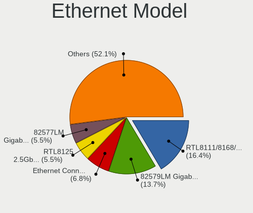

| Model                                                             | Computers | Percent |
|-------------------------------------------------------------------|-----------|---------|
| Intel 82579LM Gigabit Network Connection (Lewisville)             | 8         | 19.05%  |
| Realtek RTL8111/8168/8411 PCI Express Gigabit Ethernet Controller | 6         | 14.29%  |
| Intel I210 Gigabit Network Connection                             | 3         | 7.14%   |
| Intel Ethernet Connection I219-LM                                 | 3         | 7.14%   |
| Intel 82577LM Gigabit Network Connection                          | 3         | 7.14%   |
| Realtek RTL8125 2.5GbE Controller                                 | 2         | 4.76%   |
| Realtek RTL-8100/8101L/8139 PCI Fast Ethernet Adapter             | 2         | 4.76%   |
| Intel Ethernet Connection (3) I218-LM                             | 2         | 4.76%   |
| Realtek RTL810xE PCI Express Fast Ethernet controller             | 1         | 2.38%   |
| Qualcomm Atheros AR8152 v2.0 Fast Ethernet                        | 1         | 2.38%   |
| Qualcomm Atheros AR8151 v1.0 Gigabit Ethernet                     | 1         | 2.38%   |
| Qualcomm Atheros AR8121/AR8113/AR8114 Gigabit or Fast Ethernet    | 1         | 2.38%   |
| Marvell Group 88E8053 PCI-E Gigabit Ethernet Controller           | 1         | 2.38%   |
| Intel Ethernet Connection I218-LM                                 | 1         | 2.38%   |
| Intel Ethernet Connection (4) I219-LM                             | 1         | 2.38%   |
| Intel Ethernet Connection (2) I219-V                              | 1         | 2.38%   |
| Intel 82567LM Gigabit Network Connection                          | 1         | 2.38%   |
| Intel 82566MM Gigabit Network Connection                          | 1         | 2.38%   |
| Intel 82562ET/EZ/GT/GZ - PRO/100 VE (LOM) Ethernet Controller     | 1         | 2.38%   |
| Intel 80003ES2LAN Gigabit Ethernet Controller (Copper)            | 1         | 2.38%   |
| Broadcom NetXtreme BCM5755 Gigabit Ethernet PCI Express           | 1         | 2.38%   |

Net Controller Kind
-------------------

Ethernet, WiFi or modem

| Kind     | Computers | Percent |
|----------|-----------|---------|
| Ethernet | 42        | 53.85%  |
| WiFi     | 32        | 41.03%  |
| Unknown  | 3         | 3.85%   |
| Modem    | 1         | 1.28%   |

Used Controller
---------------

Currently used network controller

| Kind     | Computers | Percent |
|----------|-----------|---------|
| WiFi     | 26        | 56.52%  |
| Ethernet | 20        | 43.48%  |

NICs
----

Total network controllers on board

| Total | Computers | Percent |
|-------|-----------|---------|
| 2     | 30        | 63.83%  |
| 1     | 12        | 25.53%  |
| 3     | 3         | 6.38%   |
| 0     | 2         | 4.26%   |

IPv6
----

IPv6 vs IPv4

| Used | Computers | Percent |
|------|-----------|---------|
| No   | 47        | 100%    |

Bluetooth
---------

Bluetooth Vendor
----------------

Controller vendors

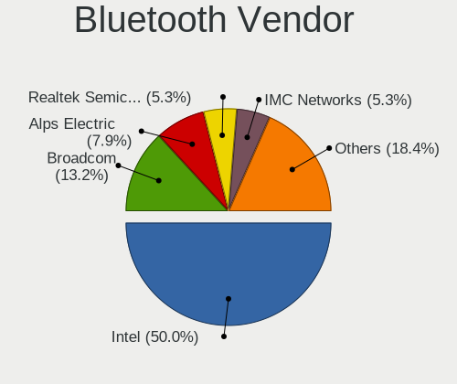

| Vendor                  | Computers | Percent |
|-------------------------|-----------|---------|
| Intel                   | 13        | 52%     |
| Broadcom                | 5         | 20%     |
| Foxconn / Hon Hai       | 2         | 8%      |
| Alps Electric           | 2         | 8%      |
| Realtek Semiconductor   | 1         | 4%      |
| Cambridge Silicon Radio | 1         | 4%      |
| ASUSTek Computer        | 1         | 4%      |

Bluetooth Model
---------------

Controller models

| Model                                                    | Computers | Percent |
|----------------------------------------------------------|-----------|---------|
| Intel Bluetooth wireless interface                       | 10        | 40%     |
| Broadcom BCM20702 Bluetooth 4.0 [ThinkPad]               | 3         | 12%     |
| Intel AX200 Bluetooth                                    | 2         | 8%      |
| Broadcom BCM2045B (BDC-2.1)                              | 2         | 8%      |
| Alps Electric UGTZ4 Bluetooth                            | 2         | 8%      |
| Realtek Bluetooth Adapter                                | 1         | 4%      |
| Intel Bluetooth 9460/9560 Jefferson Peak (JfP)           | 1         | 4%      |
| Foxconn / Hon Hai Broadcom Bluetooth 2.1 Device          | 1         | 4%      |
| Foxconn / Hon Hai Broadcom BCM20702 Bluetooth USB Device | 1         | 4%      |
| Cambridge Silicon Radio Bluetooth Dongle (HCI mode)      | 1         | 4%      |
| ASUS Broadcom Bluetooth 2.1                              | 1         | 4%      |

Sound
-----

Sound Vendor
------------

Sound card vendors

| Vendor   | Computers | Percent |
|----------|-----------|---------|
| Intel    | 33        | 70.21%  |
| AMD      | 8         | 17.02%  |
| Nvidia   | 4         | 8.51%   |
| Logitech | 1         | 2.13%   |
| JMTek    | 1         | 2.13%   |

Sound Model
-----------

Sound card models

| Model                                                                      | Computers | Percent |
|----------------------------------------------------------------------------|-----------|---------|
| Intel Sunrise Point-LP HD Audio                                            | 5         | 9.09%   |
| Intel 7 Series/C216 Chipset Family High Definition Audio Controller        | 5         | 9.09%   |
| Intel 6 Series/C200 Series Chipset Family High Definition Audio Controller | 4         | 7.27%   |
| Intel NM10/ICH7 Family High Definition Audio Controller                    | 3         | 5.45%   |
| Intel 5 Series/3400 Series Chipset High Definition Audio                   | 3         | 5.45%   |
| AMD Family 17h/19h HD Audio Controller                                     | 3         | 5.45%   |
| Nvidia GK208 HDMI/DP Audio Controller                                      | 2         | 3.64%   |
| Intel Wildcat Point-LP High Definition Audio Controller                    | 2         | 3.64%   |
| Intel Broadwell-U Audio Controller                                         | 2         | 3.64%   |
| Intel 82801H (ICH8 Family) HD Audio Controller                             | 2         | 3.64%   |
| AMD Starship/Matisse HD Audio Controller                                   | 2         | 3.64%   |
| AMD Renoir Radeon High Definition Audio Controller                         | 2         | 3.64%   |
| Nvidia GP106 High Definition Audio Controller                              | 1         | 1.82%   |
| Nvidia GA104 High Definition Audio Controller                              | 1         | 1.82%   |
| Logitech [G533 Wireless Headset Dongle]                                    | 1         | 1.82%   |
| JMTek USB PnP Audio Device                                                 | 1         | 1.82%   |
| Intel Tiger Lake-LP Smart Sound Technology Audio Controller                | 1         | 1.82%   |
| Intel Haswell-ULT HD Audio Controller                                      | 1         | 1.82%   |
| Intel Comet Lake PCH-V cAVS                                                | 1         | 1.82%   |
| Intel Celeron/Pentium Silver Processor High Definition Audio               | 1         | 1.82%   |
| Intel 82801I (ICH9 Family) HD Audio Controller                             | 1         | 1.82%   |
| Intel 82801FB/FBM/FR/FW/FRW (ICH6 Family) High Definition Audio Controller | 1         | 1.82%   |
| Intel 82801CA/CAM AC'97 Audio Controller                                   | 1         | 1.82%   |
| Intel 8 Series HD Audio Controller                                         | 1         | 1.82%   |
| Intel 631xESB/632xESB High Definition Audio Controller                     | 1         | 1.82%   |
| Intel 200 Series PCH HD Audio                                              | 1         | 1.82%   |
| AMD SBx00 Azalia (Intel HDA)                                               | 1         | 1.82%   |
| AMD RV770 HDMI Audio [Radeon HD 4850/4870]                                 | 1         | 1.82%   |
| AMD Rembrandt Radeon High Definition Audio Controller                      | 1         | 1.82%   |
| AMD Navi 21/23 HDMI/DP Audio Controller                                    | 1         | 1.82%   |
| AMD Kabini HDMI/DP Audio                                                   | 1         | 1.82%   |
| AMD FCH Azalia Controller                                                  | 1         | 1.82%   |

Memory
------

Memory Vendor
-------------

Memory module vendors

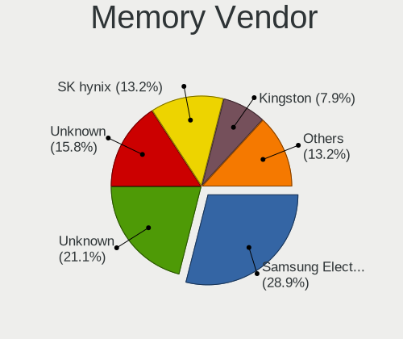

| Vendor              | Computers | Percent |
|---------------------|-----------|---------|
| Samsung Electronics | 8         | 33.33%  |
| Unknown             | 5         | 20.83%  |
| SK hynix            | 5         | 20.83%  |
| Kingston            | 3         | 12.5%   |
| Micron Technology   | 1         | 4.17%   |
| Crucial             | 1         | 4.17%   |
| Unknown             | 1         | 4.17%   |

Memory Model
------------

Memory module models

| Model                                                   | Computers | Percent |
|---------------------------------------------------------|-----------|---------|
| Samsung RAM M471B5673FH0-CF8 2GB SODIMM DDR3 1067MT/s   | 2         | 7.69%   |
| Samsung RAM M471B5273DH0-CH9 4GB SODIMM DDR3 1334MT/s   | 2         | 7.69%   |
| Unknown RAM Module 512MB SODIMM SDRAM                   | 1         | 3.85%   |
| Unknown RAM Module 4GB SODIMM DDR3 1333MT/s             | 1         | 3.85%   |
| Unknown RAM Module 2GB SODIMM DDR3 1067MT/s             | 1         | 3.85%   |
| Unknown RAM Module 2GB SODIMM DDR2 667MT/s              | 1         | 3.85%   |
| Unknown RAM Module 1GB SODIMM DDR2                      | 1         | 3.85%   |
| SK hynix RAM HMT451S6BFR8A-PB 4GB SODIMM DDR3 1600MT/s  | 1         | 3.85%   |
| SK hynix RAM HMT351S6EFR8A-PB 4GB SODIMM DDR3 1600MT/s  | 1         | 3.85%   |
| SK hynix RAM HMT325S6BFR8C-H9 2GB SODIMM DDR3 1333MT/s  | 1         | 3.85%   |
| SK hynix RAM HMAB2GS6AMR6N-XN 16GB SODIMM DDR4 3200MT/s | 1         | 3.85%   |
| SK hynix RAM H9CCNNNBJTMLAR 4GB SODIMM LPDDR3 1867MT/s  | 1         | 3.85%   |
| SK hynix RAM H9CCNNNBJTMLAR 4GB Chip LPDDR3 1867MT/s    | 1         | 3.85%   |
| Samsung RAM M471B5673EH1-CF8 2GB SODIMM DDR3 1067MT/s   | 1         | 3.85%   |
| Samsung RAM M471B5173QH0-YK0 4GB SODIMM DDR3 1600MT/s   | 1         | 3.85%   |
| Samsung RAM M471B5173BH0-CK0 4GB SODIMM DDR3 1600MT/s   | 1         | 3.85%   |
| Samsung RAM M471A1K43CB1-CRC 8GB SODIMM DDR4 2667MT/s   | 1         | 3.85%   |
| Samsung RAM M471A1K43BB0-CPB 8GB SODIMM DDR4 2133MT/s   | 1         | 3.85%   |
| Micron RAM 16KTF1G64HZ-1G6E1 8GB SODIMM DDR3 1600MT/s   | 1         | 3.85%   |
| Kingston RAM KHX2400C15/8G 8GB DIMM DDR4 2400MT/s       | 1         | 3.85%   |
| Kingston RAM KF3600C18D4/32GX 32GB DIMM DDR4 2400MT/s   | 1         | 3.85%   |
| Kingston RAM 9905316-005.A04LF 1GB DIMM DDR2 667MT/s    | 1         | 3.85%   |
| Crucial RAM CT8G3S1339M 8GB SODIMM DDR3 800MT/s         | 1         | 3.85%   |
| Unknown                                                 | 1         | 3.85%   |

Memory Kind
-----------

Memory module kinds

| Kind   | Computers | Percent |
|--------|-----------|---------|
| DDR3   | 12        | 52.17%  |
| DDR4   | 5         | 21.74%  |
| DDR2   | 3         | 13.04%  |
| SDRAM  | 2         | 8.7%    |
| LPDDR3 | 1         | 4.35%   |

Memory Form Factor
------------------

Physical design of the memory module

| Name   | Computers | Percent |
|--------|-----------|---------|
| SODIMM | 20        | 83.33%  |
| DIMM   | 3         | 12.5%   |
| Chip   | 1         | 4.17%   |

Memory Size
-----------

Memory module size

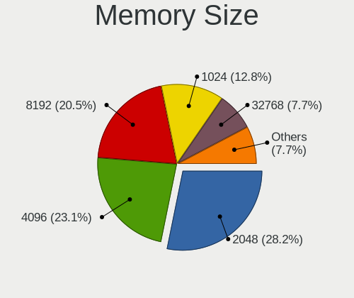

| Size  | Computers | Percent |
|-------|-----------|---------|
| 4096  | 7         | 30.43%  |
| 2048  | 6         | 26.09%  |
| 8192  | 5         | 21.74%  |
| 1024  | 2         | 8.7%    |
| 32768 | 1         | 4.35%   |
| 16384 | 1         | 4.35%   |
| 512   | 1         | 4.35%   |

Memory Speed
------------

Memory module speed

| Speed   | Computers | Percent |
|---------|-----------|---------|
| 1600    | 4         | 17.39%  |
| 1067    | 3         | 13.04%  |
| Unknown | 3         | 13.04%  |
| 2400    | 2         | 8.7%    |
| 1334    | 2         | 8.7%    |
| 1333    | 2         | 8.7%    |
| 667     | 2         | 8.7%    |
| 3200    | 1         | 4.35%   |
| 2667    | 1         | 4.35%   |
| 2133    | 1         | 4.35%   |
| 1867    | 1         | 4.35%   |
| 800     | 1         | 4.35%   |

Printers & scanners
-------------------

Printer Vendor
--------------

Printer device vendors

Zero info for selected period =(

Printer Model
-------------

Printer device models

Zero info for selected period =(

Scanner Vendor
--------------

Scanner device vendors

Zero info for selected period =(

Scanner Model
-------------

Scanner device models

Zero info for selected period =(

Camera
------

Camera Vendor
-------------

Camera device vendors

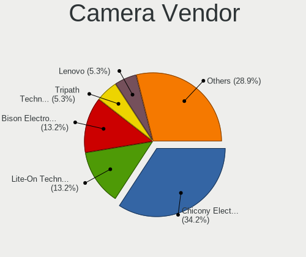

| Vendor              | Computers | Percent |
|---------------------|-----------|---------|
| Chicony Electronics | 12        | 54.55%  |
| Bison Electronics   | 4         | 18.18%  |
| Lite-On Technology  | 3         | 13.64%  |
| Tripath Technology  | 1         | 4.55%   |
| Lenovo              | 1         | 4.55%   |
| IMC Networks        | 1         | 4.55%   |

Camera Model
------------

Camera device models

| Model                                    | Computers | Percent |
|------------------------------------------|-----------|---------|
| Lite-On Integrated Camera                | 3         | 13.64%  |
| Chicony Integrated Camera                | 3         | 13.64%  |
| Bison Integrated Camera                  | 3         | 13.64%  |
| Chicony Integrated Camera [ThinkPad]     | 2         | 9.09%   |
| Tripath PC Camera                        | 1         | 4.55%   |
| Lenovo Integrated Webcam                 | 1         | 4.55%   |
| IMC Networks Integrated Camera           | 1         | 4.55%   |
| Chicony thinkpad t430s camera            | 1         | 4.55%   |
| Chicony Sonix ST50220 USB Video Camera   | 1         | 4.55%   |
| Chicony Lenovo Integrated Camera (0.3MP) | 1         | 4.55%   |
| Chicony Lenovo EasyCamera                | 1         | 4.55%   |
| Chicony Integrated Camera (1280x720@30)  | 1         | 4.55%   |
| Chicony FJ Camera                        | 1         | 4.55%   |
| Chicony 2.0M UVC Webcam / CNF7129        | 1         | 4.55%   |
| Bison USB HD Webcam                      | 1         | 4.55%   |

Security
--------

Fingerprint Vendor
------------------

Fingerprint sensor vendors

| Vendor           | Computers | Percent |
|------------------|-----------|---------|
| Validity Sensors | 4         | 44.44%  |
| Synaptics        | 2         | 22.22%  |
| AuthenTec        | 2         | 22.22%  |
| Upek             | 1         | 11.11%  |

Fingerprint Model
-----------------

Fingerprint sensor models

| Model                                                  | Computers | Percent |
|--------------------------------------------------------|-----------|---------|
| Validity Sensors VFS 5011 fingerprint sensor           | 3         | 33.33%  |
| Validity Sensors VFS7500 Touch Fingerprint Sensor      | 1         | 11.11%  |
| Upek Biometric Touchchip/Touchstrip Fingerprint Sensor | 1         | 11.11%  |
| Synaptics Prometheus MIS Touch Fingerprint Reader      | 1         | 11.11%  |
| Synaptics Metallica MIS Touch Fingerprint Reader       | 1         | 11.11%  |
| AuthenTec AES2810                                      | 1         | 11.11%  |
| AuthenTec AES2660                                      | 1         | 11.11%  |

Chipcard Vendor
---------------

Chipcard module vendors

Zero info for selected period =(

Chipcard Model
--------------

Chipcard module models

Zero info for selected period =(

Unsupported
-----------

Unsupported Devices
-------------------

Total unsupported devices on board

| Total | Computers | Percent |
|-------|-----------|---------|
| 1     | 27        | 57.45%  |
| 0     | 12        | 25.53%  |
| 2     | 4         | 8.51%   |
| 5     | 2         | 4.26%   |
| 3     | 2         | 4.26%   |

Unsupported Device Types
------------------------

Types of unsupported devices

| Type                     | Computers | Percent |
|--------------------------|-----------|---------|
| Communication controller | 26        | 53.06%  |
| Graphics card            | 8         | 16.33%  |
| Firewire controller      | 6         | 12.24%  |
| Network                  | 3         | 6.12%   |
| Storage/ata              | 2         | 4.08%   |
| Sound                    | 2         | 4.08%   |
| Net/wireless             | 2         | 4.08%   |

