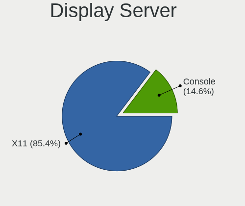
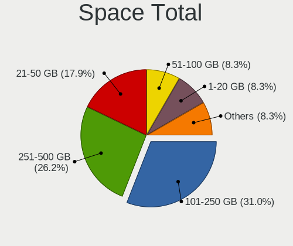
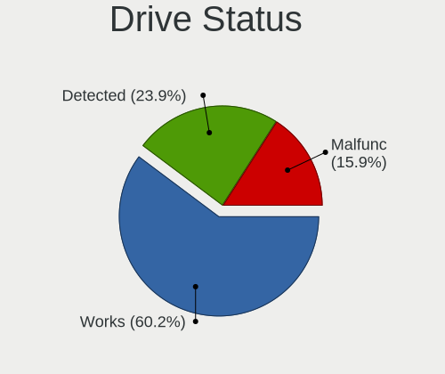
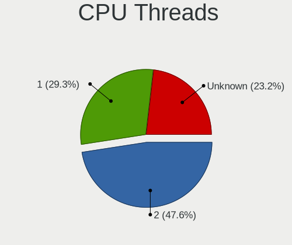
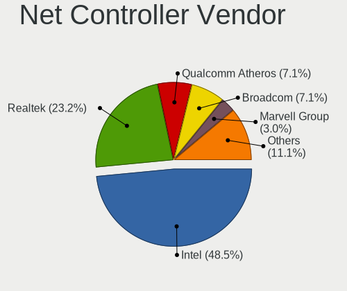
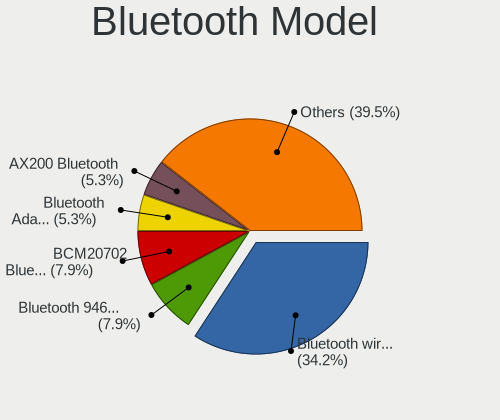
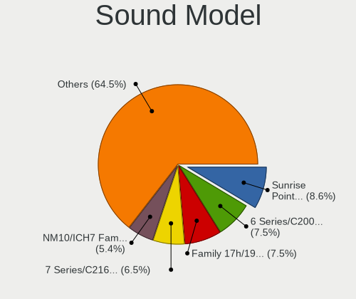

OpenBSD 7.3 - Tested Hardware & Statistics
------------------------------------------

A project to collect tested hardware configurations for OpenBSD 7.3.

Anyone can contribute to this report by the [hw-probe](https://github.com/linuxhw/hw-probe/blob/master/INSTALL.BSD.md) tool:

    hw-probe -all -upload

Please contribute! Especially if your hardware is rare.

This is a report for all computer types. See also reports for [desktops](/Dist/OpenBSD_7.3/Desktop/README.md) and [notebooks](/Dist/OpenBSD_7.3/Notebook/README.md).

Contents
--------

* [ Test Cases ](#test-cases)

* [ System ](#system)
  - [ Arch                     ](#arch)
  - [ DE                       ](#de)
  - [ Display Server           ](#display-server)
  - [ Display Manager          ](#display-manager)
  - [ OS Lang                  ](#os-lang)
  - [ Boot Mode                ](#boot-mode)
  - [ Filesystem               ](#filesystem)
  - [ Part. scheme             ](#part-scheme)

* [ Board ](#board)
  - [ Vendor                   ](#vendor)
  - [ Model                    ](#model)
  - [ Model Family             ](#model-family)
  - [ MFG Year                 ](#mfg-year)
  - [ Form Factor              ](#form-factor)
  - [ Coreboot                 ](#coreboot)
  - [ RAM Size                 ](#ram-size)
  - [ RAM Used                 ](#ram-used)
  - [ Total Drives             ](#total-drives)
  - [ Has CD-ROM               ](#has-cd-rom)
  - [ Has Ethernet             ](#has-ethernet)
  - [ Has WiFi                 ](#has-wifi)
  - [ Has Bluetooth            ](#has-bluetooth)

* [ Location ](#location)
  - [ Country                  ](#country)
  - [ City                     ](#city)

* [ Drives ](#drives)
  - [ Drive Vendor             ](#drive-vendor)
  - [ Drive Model              ](#drive-model)
  - [ HDD Vendor               ](#hdd-vendor)
  - [ SSD Vendor               ](#ssd-vendor)
  - [ Drive Kind               ](#drive-kind)
  - [ Drive Connector          ](#drive-connector)
  - [ Drive Size               ](#drive-size)
  - [ Space Total              ](#space-total)
  - [ Space Used               ](#space-used)
  - [ Malfunc. Drives          ](#malfunc-drives)
  - [ Malfunc. Drive Vendor    ](#malfunc-drive-vendor)
  - [ Malfunc. HDD Vendor      ](#malfunc-hdd-vendor)
  - [ Malfunc. Drive Kind      ](#malfunc-drive-kind)
  - [ Failed Drives            ](#failed-drives)
  - [ Failed Drive Vendor      ](#failed-drive-vendor)
  - [ Drive Status             ](#drive-status)

* [ Storage controller ](#storage-controller)
  - [ Storage Vendor           ](#storage-vendor)
  - [ Storage Model            ](#storage-model)
  - [ Storage Kind             ](#storage-kind)

* [ Processor ](#processor)
  - [ CPU Vendor               ](#cpu-vendor)
  - [ CPU Model                ](#cpu-model)
  - [ CPU Model Family         ](#cpu-model-family)
  - [ CPU Cores                ](#cpu-cores)
  - [ CPU Sockets              ](#cpu-sockets)
  - [ CPU Threads              ](#cpu-threads)
  - [ CPU Microarch            ](#cpu-microarch)

* [ Graphics ](#graphics)
  - [ GPU Vendor               ](#gpu-vendor)
  - [ GPU Model                ](#gpu-model)
  - [ GPU Combo                ](#gpu-combo)
  - [ GPU Driver               ](#gpu-driver)
  - [ GPU Memory               ](#gpu-memory)

* [ Monitor ](#monitor)
  - [ Monitor Vendor           ](#monitor-vendor)
  - [ Monitor Model            ](#monitor-model)
  - [ Monitor Resolution       ](#monitor-resolution)
  - [ Monitor Diagonal         ](#monitor-diagonal)
  - [ Monitor Width            ](#monitor-width)
  - [ Aspect Ratio             ](#aspect-ratio)
  - [ Monitor Area             ](#monitor-area)
  - [ Pixel Density            ](#pixel-density)
  - [ Multiple Monitors        ](#multiple-monitors)

* [ Network ](#network)
  - [ Net Controller Vendor    ](#net-controller-vendor)
  - [ Net Controller Model     ](#net-controller-model)
  - [ Wireless Vendor          ](#wireless-vendor)
  - [ Wireless Model           ](#wireless-model)
  - [ Ethernet Vendor          ](#ethernet-vendor)
  - [ Ethernet Model           ](#ethernet-model)
  - [ Net Controller Kind      ](#net-controller-kind)
  - [ Used Controller          ](#used-controller)
  - [ NICs                     ](#nics)
  - [ IPv6                     ](#ipv6)

* [ Bluetooth ](#bluetooth)
  - [ Bluetooth Vendor         ](#bluetooth-vendor)
  - [ Bluetooth Model          ](#bluetooth-model)

* [ Sound ](#sound)
  - [ Sound Vendor             ](#sound-vendor)
  - [ Sound Model              ](#sound-model)

* [ Memory ](#memory)
  - [ Memory Vendor            ](#memory-vendor)
  - [ Memory Model             ](#memory-model)
  - [ Memory Kind              ](#memory-kind)
  - [ Memory Form Factor       ](#memory-form-factor)
  - [ Memory Size              ](#memory-size)
  - [ Memory Speed             ](#memory-speed)

* [ Printers & scanners ](#printers--scanners)
  - [ Printer Vendor           ](#printer-vendor)
  - [ Printer Model            ](#printer-model)
  - [ Scanner Vendor           ](#scanner-vendor)
  - [ Scanner Model            ](#scanner-model)

* [ Camera ](#camera)
  - [ Camera Vendor            ](#camera-vendor)
  - [ Camera Model             ](#camera-model)

* [ Security ](#security)
  - [ Fingerprint Vendor       ](#fingerprint-vendor)
  - [ Fingerprint Model        ](#fingerprint-model)
  - [ Chipcard Vendor          ](#chipcard-vendor)
  - [ Chipcard Model           ](#chipcard-model)

* [ Unsupported ](#unsupported)
  - [ Unsupported Devices      ](#unsupported-devices)
  - [ Unsupported Device Types ](#unsupported-device-types)

Test Cases
----------

Total: 17

| Vendor     | Model                       | Form-Factor | Probe                                                     | Date         |
|------------|-----------------------------|-------------|-----------------------------------------------------------|--------------|
| Lenovo     | ThinkPad X260 20F5S2GM00    | Notebook    | [c4af168c4a](https://bsd-hardware.info/?probe=c4af168c4a) | May 01, 2023 |
| Lenovo     | ThinkPad X270 W10DG 20K5... | Notebook    | [cf504f51df](https://bsd-hardware.info/?probe=cf504f51df) | May 01, 2023 |
| Fujitsu    | LIFEBOOK E752               | Notebook    | [44ea9fb6ae](https://bsd-hardware.info/?probe=44ea9fb6ae) | Apr 30, 2023 |
| HP         | Pavilion Notebook           | Notebook    | [247810c987](https://bsd-hardware.info/?probe=247810c987) | Apr 24, 2023 |
| Lenovo     | V14 G2 ITL 82NM             | Desktop     | [827308827b](https://bsd-hardware.info/?probe=827308827b) | Apr 24, 2023 |
| HP         | Pavilion Notebook           | Notebook    | [243a9c2f22](https://bsd-hardware.info/?probe=243a9c2f22) | Apr 22, 2023 |
| ASUSTek    | TUF Gaming B550-PLUS        | Desktop     | [c26c1111c6](https://bsd-hardware.info/?probe=c26c1111c6) | Apr 21, 2023 |
| Lenovo     | V14 G2 ITL 82NM             | Desktop     | [a6141b809a](https://bsd-hardware.info/?probe=a6141b809a) | Apr 21, 2023 |
| Lenovo     | G570 20079                  | Notebook    | [0ebba481d1](https://bsd-hardware.info/?probe=0ebba481d1) | Apr 14, 2023 |
| Lenovo     | ThinkPad T440s 20ARA07PL... | Notebook    | [04ddab3620](https://bsd-hardware.info/?probe=04ddab3620) | Apr 14, 2023 |
| Lenovo     | ThinkPad X230 23257EP       | Notebook    | [e94085cd2d](https://bsd-hardware.info/?probe=e94085cd2d) | Apr 12, 2023 |
| ASUSTek    | P10S-I Series               | Desktop     | [5084c2b77f](https://bsd-hardware.info/?probe=5084c2b77f) | Apr 11, 2023 |
| Apple      | MacPro1,1                   | Desktop     | [6843822d8c](https://bsd-hardware.info/?probe=6843822d8c) | Apr 11, 2023 |
| PC Engines | APU2                        | Desktop     | [cdcdfe6e0b](https://bsd-hardware.info/?probe=cdcdfe6e0b) | Apr 10, 2023 |
| Gigabyte   | B250M-Gaming 3              | Desktop     | [a149d0b4b5](https://bsd-hardware.info/?probe=a149d0b4b5) | Apr 10, 2023 |
| Lenovo     | ThinkPad T450s 20BW001KL... | Notebook    | [4f6a7e2739](https://bsd-hardware.info/?probe=4f6a7e2739) | Apr 02, 2023 |
| Elpitech   | ET101-A1                    | Desktop     | [0172697883](https://bsd-hardware.info/?probe=0172697883) | Mar 10, 2023 |

System
------

Arch
----

OS architecture (x86_64, i586, etc.)

| Name  | Computers | Percent |
|-------|-----------|---------|
| amd64 | 14        | 93.33%  |
| arm64 | 1         | 6.67%   |

DE
--

Desktop Environment

| Name         | Computers | Percent |
|--------------|-----------|---------|
| helloDesktop | 13        | 86.67%  |
| MATE         | 1         | 6.67%   |
| GNOME        | 1         | 6.67%   |

Display Server
--------------

X11 or Wayland

| Name    | Computers | Percent |
|---------|-----------|---------|
| X11     | 10        | 66.67%  |
| Console | 5         | 33.33%  |

Display Manager
---------------

SDDM, LightDM, etc.

| Name    | Computers | Percent |
|---------|-----------|---------|
| Console | 15        | 100%    |

OS Lang
-------

Language

| Lang    | Computers | Percent |
|---------|-----------|---------|
| Unknown | 13        | 86.67%  |
| ru_RU   | 1         | 6.67%   |
| es_ES   | 1         | 6.67%   |

Boot Mode
---------

EFI or BIOS

| Mode | Computers | Percent |
|------|-----------|---------|
| EFI  | 10        | 66.67%  |
| BIOS | 5         | 33.33%  |

Filesystem
----------

Type of filesystem

| Type | Computers | Percent |
|------|-----------|---------|
| Ffs  | 15        | 100%    |

Part. scheme
------------

Scheme of partitioning

| Type | Computers | Percent |
|------|-----------|---------|
| GPT  | 9         | 60%     |
| MBR  | 6         | 40%     |

Board
-----

Vendor
------

Motherboard manufacturer

| Name                | Computers | Percent |
|---------------------|-----------|---------|
| Lenovo              | 7         | 46.67%  |
| ASUSTek Computer    | 2         | 13.33%  |
| PC Engines          | 1         | 6.67%   |
| Hewlett-Packard     | 1         | 6.67%   |
| Gigabyte Technology | 1         | 6.67%   |
| Fujitsu             | 1         | 6.67%   |
| Elpitech            | 1         | 6.67%   |
| Apple               | 1         | 6.67%   |

Model
-----

Motherboard model

| Name                                  | Computers | Percent |
|---------------------------------------|-----------|---------|
| PC Engines APU2                       | 1         | 6.67%   |
| Lenovo V14 G2 ITL 82NM                | 1         | 6.67%   |
| Lenovo ThinkPad X270 W10DG 20K5S0TT1N | 1         | 6.67%   |
| Lenovo ThinkPad X260 20F5S2GM00       | 1         | 6.67%   |
| Lenovo ThinkPad X230 23257EP          | 1         | 6.67%   |
| Lenovo ThinkPad T450s 20BW001KLM      | 1         | 6.67%   |
| Lenovo ThinkPad T440s 20ARA07PLM      | 1         | 6.67%   |
| Lenovo G570 20079                     | 1         | 6.67%   |
| HP Pavilion Notebook                  | 1         | 6.67%   |
| Gigabyte B250M-Gaming 3               | 1         | 6.67%   |
| Fujitsu LIFEBOOK E752                 | 1         | 6.67%   |
| Elpitech ET101-A1                     | 1         | 6.67%   |
| ASUS TUF Gaming B550-PLUS             | 1         | 6.67%   |
| ASUS P10S-I Series                    | 1         | 6.67%   |
| Apple MacPro1,1                       | 1         | 6.67%   |

Model Family
------------

Motherboard model prefix

| Name                  | Computers | Percent |
|-----------------------|-----------|---------|
| Lenovo ThinkPad       | 5         | 33.33%  |
| PC Engines APU2       | 1         | 6.67%   |
| Lenovo V14            | 1         | 6.67%   |
| Lenovo G570           | 1         | 6.67%   |
| HP Pavilion           | 1         | 6.67%   |
| Gigabyte B250M-Gaming | 1         | 6.67%   |
| Fujitsu LIFEBOOK      | 1         | 6.67%   |
| Elpitech ET101-A1     | 1         | 6.67%   |
| ASUS TUF              | 1         | 6.67%   |
| ASUS P10S-I           | 1         | 6.67%   |
| Apple MacPro1         | 1         | 6.67%   |

MFG Year
--------

Motherboard manufacture year

| Year | Computers | Percent |
|------|-----------|---------|
| 2022 | 2         | 13.33%  |
| 2019 | 2         | 13.33%  |
| 2018 | 2         | 13.33%  |
| 2016 | 2         | 13.33%  |
| 2015 | 2         | 13.33%  |
| 2012 | 2         | 13.33%  |
| 2023 | 1         | 6.67%   |
| 2011 | 1         | 6.67%   |
| 2007 | 1         | 6.67%   |

Form Factor
-----------

Physical design of the computer

| Name     | Computers | Percent |
|----------|-----------|---------|
| Notebook | 8         | 53.33%  |
| Desktop  | 7         | 46.67%  |

Coreboot
--------

Have coreboot on board

| Used | Computers | Percent |
|------|-----------|---------|
| No   | 14        | 93.33%  |
| Yes  | 1         | 6.67%   |

RAM Size
--------

Total RAM memory

| Size in GB  | Computers | Percent |
|-------------|-----------|---------|
| 8.01-16.0   | 7         | 46.67%  |
| 4.01-8.0    | 3         | 20%     |
| 64.01-256.0 | 2         | 13.33%  |
| 32.01-64.0  | 1         | 6.67%   |
| 3.01-4.0    | 1         | 6.67%   |
| 16.01-24.0  | 1         | 6.67%   |

RAM Used
--------

Used RAM memory

| Used GB  | Computers | Percent |
|----------|-----------|---------|
| 0.01-0.5 | 12        | 80%     |
| 4.01-8.0 | 1         | 6.67%   |
| 1.01-2.0 | 1         | 6.67%   |
| 0.51-1.0 | 1         | 6.67%   |

Total Drives
------------

Number of drives on board

| Drives | Computers | Percent |
|--------|-----------|---------|
| 1      | 7         | 46.67%  |
| 2      | 5         | 33.33%  |
| 8      | 1         | 6.67%   |
| 6      | 1         | 6.67%   |
| 3      | 1         | 6.67%   |

Has CD-ROM
----------

Has CD-ROM on board

| Presented | Computers | Percent |
|-----------|-----------|---------|
| No        | 15        | 100%    |

Has Ethernet
------------

Has Ethernet on board

| Presented | Computers | Percent |
|-----------|-----------|---------|
| Yes       | 14        | 93.33%  |
| No        | 1         | 6.67%   |

Has WiFi
--------

Has WiFi module

| Presented | Computers | Percent |
|-----------|-----------|---------|
| Yes       | 10        | 66.67%  |
| No        | 5         | 33.33%  |

Has Bluetooth
-------------

Has Bluetooth module

| Presented | Computers | Percent |
|-----------|-----------|---------|
| Yes       | 10        | 66.67%  |
| No        | 5         | 33.33%  |

Location
--------

Country
-------

Geographic location (country)

| Country  | Computers | Percent |
|----------|-----------|---------|
| Russia   | 3         | 20%     |
| Canada   | 3         | 20%     |
| Brazil   | 3         | 20%     |
| Mexico   | 2         | 13.33%  |
| Uruguay  | 1         | 6.67%   |
| Ukraine  | 1         | 6.67%   |
| Germany  | 1         | 6.67%   |
| Colombia | 1         | 6.67%   |

City
----

Geographic location (city)

| City          | Computers | Percent |
|---------------|-----------|---------|
| Saint-Laurent | 3         | 20%     |
| Blumenau      | 3         | 20%     |
| Puebla City   | 2         | 13.33%  |
| Moscow        | 2         | 13.33%  |
| Podolsk       | 1         | 6.67%   |
| Nuremberg     | 1         | 6.67%   |
| Montevideo    | 1         | 6.67%   |
| Montería     | 1         | 6.67%   |
| Brovary       | 1         | 6.67%   |

Drives
------

Drive Vendor
------------

Hard drive vendors

| Vendor              | Computers | Drives | Percent |
|---------------------|-----------|--------|---------|
| NVMe                | 5         | 5      | 20%     |
| Samsung Electronics | 3         | 8      | 12%     |
| Kingston            | 3         | 3      | 12%     |
| WDC                 | 2         | 2      | 8%      |
| SanDisk             | 2         | 2      | 8%      |
| OPENBSD             | 2         | 2      | 8%      |
| Hitachi             | 2         | 2      | 8%      |
| Crucial             | 2         | 2      | 8%      |
| Apacer              | 2         | 2      | 8%      |
| Seagate             | 1         | 2      | 4%      |
| HGST                | 1         | 1      | 4%      |

Drive Model
-----------

Hard drive models

| Model                              | Computers | Percent |
|------------------------------------|-----------|---------|
| SanDisk SSD PLUS 120GB             | 2         | 7.69%   |
| WDC WD7500BPKT-75PK4T0 752GB       | 1         | 3.85%   |
| WDC WD20PURX-64P6ZY0 2TB           | 1         | 3.85%   |
| Seagate ST3500414CS 500GB          | 1         | 3.85%   |
| Seagate ST3250824AS P 250GB        | 1         | 3.85%   |
| Samsung SSD 870 QVO 2TB            | 1         | 3.85%   |
| Samsung SSD 850 EVO 500GB          | 1         | 3.85%   |
| Samsung Flash Drive FIT 32GB       | 1         | 3.85%   |
| OPENBSD SR RAID 5 9.9TB            | 1         | 3.85%   |
| OPENBSD SR RAID 1 2TB              | 1         | 3.85%   |
| NVMe TOSHIBA-RC100 240GB           | 1         | 3.85%   |
| NVMe SSSTC CL1-4D256 256GB         | 1         | 3.85%   |
| NVMe Samsung SSD 980 1TB           | 1         | 3.85%   |
| NVMe SAMSUNG MZVLW256 256GB        | 1         | 3.85%   |
| NVMe Asgard AN1TNVMe- 1TB          | 1         | 3.85%   |
| Kingston SMS200S330G 32GB          | 1         | 3.85%   |
| Kingston SA400S37240G 240GB        | 1         | 3.85%   |
| Kingston SA400M8240G 240GB         | 1         | 3.85%   |
| Hitachi HUA723020ALA640 2TB        | 1         | 3.85%   |
| Hitachi HTS723225A7A365 OPAL 250GB | 1         | 3.85%   |
| HGST HUS724020ALA640 2TB           | 1         | 3.85%   |
| Crucial CT500BX500SSD1 500GB       | 1         | 3.85%   |
| Crucial CT480BX500SSD1 480GB       | 1         | 3.85%   |
| Apacer AST280 120GB                | 1         | 3.85%   |
| Apacer AS340 120GB                 | 1         | 3.85%   |

HDD Vendor
----------

Hard disk drive vendors

| Vendor              | Computers | Drives | Percent |
|---------------------|-----------|--------|---------|
| NVMe                | 4         | 4      | 30.77%  |
| WDC                 | 2         | 2      | 15.38%  |
| OPENBSD             | 2         | 2      | 15.38%  |
| Hitachi             | 2         | 2      | 15.38%  |
| Seagate             | 1         | 2      | 7.69%   |
| Samsung Electronics | 1         | 1      | 7.69%   |
| HGST                | 1         | 1      | 7.69%   |

SSD Vendor
----------

Solid state drive vendors

| Vendor              | Computers | Drives | Percent |
|---------------------|-----------|--------|---------|
| Kingston            | 3         | 3      | 25%     |
| SanDisk             | 2         | 2      | 16.67%  |
| Samsung Electronics | 2         | 7      | 16.67%  |
| Crucial             | 2         | 2      | 16.67%  |
| Apacer              | 2         | 2      | 16.67%  |
| NVMe                | 1         | 1      | 8.33%   |

Drive Kind
----------

HDD or SSD

| Kind | Computers | Drives | Percent |
|------|-----------|--------|---------|
| SSD  | 10        | 17     | 55.56%  |
| HDD  | 8         | 14     | 44.44%  |

Drive Connector
---------------

SATA, SAS, NVMe, etc.

| Type | Computers | Drives | Percent |
|------|-----------|--------|---------|
| SATA | 15        | 31     | 100%    |

Drive Size
----------

Size of hard drive

| Size in TB | Computers | Drives | Percent |
|------------|-----------|--------|---------|
| 0.01-0.5   | 13        | 17     | 68.42%  |
| 1.01-2.0   | 3         | 11     | 15.79%  |
| 0.51-1.0   | 2         | 2      | 10.53%  |
| 4.01-10.0  | 1         | 1      | 5.26%   |

Space Total
-----------

Amount of disk space available on the file system

| Size in GB     | Computers | Percent |
|----------------|-----------|---------|
| 101-250        | 7         | 46.67%  |
| 21-50          | 4         | 26.67%  |
| More than 3000 | 2         | 13.33%  |
| 51-100         | 2         | 13.33%  |

Space Used
----------

Amount of used disk space

| Used GB        | Computers | Percent |
|----------------|-----------|---------|
| 1-20           | 10        | 66.67%  |
| More than 3000 | 1         | 6.67%   |
| 21-50          | 1         | 6.67%   |
| 2001-3000      | 1         | 6.67%   |
| 101-250        | 1         | 6.67%   |
| 51-100         | 1         | 6.67%   |

Malfunc. Drives
---------------

Drive models with a malfunction

Zero info for selected period =(

Malfunc. Drive Vendor
---------------------

Vendors of faulty drives

Zero info for selected period =(

Malfunc. HDD Vendor
-------------------

Vendors of faulty HDD drives

Zero info for selected period =(

Malfunc. Drive Kind
-------------------

Kinds of faulty drives

Zero info for selected period =(

Failed Drives
-------------

Failed drive models

Zero info for selected period =(

Failed Drive Vendor
-------------------

Failed drive vendors

Zero info for selected period =(

Drive Status
------------

Number of failed and malfunc. drives

| Status   | Computers | Drives | Percent |
|----------|-----------|--------|---------|
| Works    | 14        | 24     | 73.68%  |
| Detected | 5         | 7      | 26.32%  |

Storage controller
------------------

Storage Vendor
--------------

Storage controller vendors

| Vendor                         | Computers | Percent |
|--------------------------------|-----------|---------|
| Intel                          | 11        | 61.11%  |
| Samsung Electronics            | 2         | 11.11%  |
| AMD                            | 2         | 11.11%  |
| Toshiba                        | 1         | 5.56%   |
| Solid State Storage Technology | 1         | 5.56%   |
| Silicon Motion                 | 1         | 5.56%   |

Storage Model
-------------

Storage controller models

| Model                                                                         | Computers | Percent |
|-------------------------------------------------------------------------------|-----------|---------|
| Intel Sunrise Point-LP SATA Controller [AHCI mode]                            | 2         | 10.53%  |
| Intel 7 Series Chipset Family 6-port SATA Controller [AHCI mode]              | 2         | 10.53%  |
| Toshiba BG3 NVMe SSD Controller                                               | 1         | 5.26%   |
| Solid State Storage CL1                                                       | 1         | 5.26%   |
| Silicon Motion SM2263EN/SM2263XT SSD Controller                               | 1         | 5.26%   |
| Samsung NVMe SSD Controller SM961/PM961/SM963                                 | 1         | 5.26%   |
| Samsung NVMe SSD Controller PM9A1/PM9A3/980PRO                                | 1         | 5.26%   |
| Intel Wildcat Point-LP SATA Controller [AHCI Mode]                            | 1         | 5.26%   |
| Intel Tiger Lake-LP SATA Controller                                           | 1         | 5.26%   |
| Intel Q170/Q150/B150/H170/H110/Z170/CM236 Chipset SATA Controller [AHCI Mode] | 1         | 5.26%   |
| Intel 8 Series SATA Controller 1 [AHCI mode]                                  | 1         | 5.26%   |
| Intel 631xESB/632xESB/3100 Chipset SATA IDE Controller                        | 1         | 5.26%   |
| Intel 631xESB/632xESB IDE Controller                                          | 1         | 5.26%   |
| Intel 6 Series/C200 Series Chipset Family 6 port Mobile SATA AHCI Controller  | 1         | 5.26%   |
| Intel 200 Series PCH SATA controller [AHCI mode]                              | 1         | 5.26%   |
| AMD FCH SATA Controller [AHCI mode]                                           | 1         | 5.26%   |
| AMD 500 Series Chipset SATA Controller                                        | 1         | 5.26%   |

Storage Kind
------------

Kind of storage controller (IDE, SATA, NVMe, SAS, ...)

| Kind | Computers | Percent |
|------|-----------|---------|
| SATA | 12        | 66.67%  |
| NVMe | 5         | 27.78%  |
| IDE  | 1         | 5.56%   |

Processor
---------

CPU Vendor
----------

Processor vendors

| Vendor | Computers | Percent |
|--------|-----------|---------|
| Intel  | 12        | 80%     |
| AMD    | 2         | 13.33%  |
| ARM    | 1         | 6.67%   |

CPU Model
---------

Processor models

| Model                                   | Computers | Percent |
|-----------------------------------------|-----------|---------|
| Intel Core i5-6300U CPU @ 2.40GHz       | 2         | 13.33%  |
| Intel Xeon CPU E3-1220 v5 @ 3.00GHz     | 1         | 6.67%   |
| Intel Xeon CPU 5150 @ 2.66GHz           | 1         | 6.67%   |
| Intel Core i7-3520M CPU @ 2.90GHz       | 1         | 6.67%   |
| Intel Core i5-7400 CPU @ 3.00GHz        | 1         | 6.67%   |
| Intel Core i5-6200U CPU @ 2.30GHz       | 1         | 6.67%   |
| Intel Core i5-5300U CPU @ 2.30GHz       | 1         | 6.67%   |
| Intel Core i5-4300U CPU @ 1.90GHz       | 1         | 6.67%   |
| Intel Core i5-3320M CPU @ 2.60GHz       | 1         | 6.67%   |
| Intel Core i5-2410M CPU @ 2.30GHz       | 1         | 6.67%   |
| Intel 11th Gen Core i5-1135G7 @ 2.40GHz | 1         | 6.67%   |
| ARM Cortex-A57 r1p3                     | 1         | 6.67%   |
| AMD Ryzen 9 5950X 16-Core Processor     | 1         | 6.67%   |
| AMD GX-412TC SOC                        | 1         | 6.67%   |

CPU Model Family
----------------

Processor model prefix

| Model         | Computers | Percent |
|---------------|-----------|---------|
| Intel Core i5 | 8         | 53.33%  |
| Intel Xeon    | 2         | 13.33%  |
| Other         | 1         | 6.67%   |
| Intel Core i7 | 1         | 6.67%   |
| ARM Cortex    | 1         | 6.67%   |
| AMD Ryzen 9   | 1         | 6.67%   |
| AMD GX        | 1         | 6.67%   |

CPU Cores
---------

Number of processor cores

| Number  | Computers | Percent |
|---------|-----------|---------|
| 2       | 8         | 53.33%  |
| 4       | 4         | 26.67%  |
| Unknown | 2         | 13.33%  |
| 32      | 1         | 6.67%   |

CPU Sockets
-----------

Number of sockets

| Number  | Computers | Percent |
|---------|-----------|---------|
| 1       | 13        | 86.67%  |
| Unknown | 2         | 13.33%  |

CPU Threads
-----------

Threads per core (Hyper-Threading)

| Number  | Computers | Percent |
|---------|-----------|---------|
| 2       | 9         | 60%     |
| 1       | 4         | 26.67%  |
| Unknown | 2         | 13.33%  |

CPU Microarch
-------------

Microarchitecture

| Name        | Computers | Percent |
|-------------|-----------|---------|
| Skylake     | 4         | 26.67%  |
| IvyBridge   | 2         | 13.33%  |
| Zen 3       | 1         | 6.67%   |
| TigerLake   | 1         | 6.67%   |
| SandyBridge | 1         | 6.67%   |
| Puma        | 1         | 6.67%   |
| KabyLake    | 1         | 6.67%   |
| Haswell     | 1         | 6.67%   |
| Core        | 1         | 6.67%   |
| Broadwell   | 1         | 6.67%   |
| Unknown     | 1         | 6.67%   |

Graphics
--------

GPU Vendor
----------

Vendors of graphics cards

| Vendor            | Computers | Percent |
|-------------------|-----------|---------|
| Intel             | 10        | 66.67%  |
| Nvidia            | 3         | 20%     |
| ASPEED Technology | 1         | 6.67%   |
| AMD               | 1         | 6.67%   |

GPU Model
---------

Graphics card models

| Model                                                                     | Computers | Percent |
|---------------------------------------------------------------------------|-----------|---------|
| Intel Skylake GT2 [HD Graphics 520]                                       | 3         | 20%     |
| Intel 3rd Gen Core processor Graphics Controller                          | 2         | 13.33%  |
| Nvidia GP106 [GeForce GTX 1060 6GB]                                       | 1         | 6.67%   |
| Nvidia GK208B [GeForce GT 710]                                            | 1         | 6.67%   |
| Nvidia G73 [GeForce 7300 GT]                                              | 1         | 6.67%   |
| Intel TigerLake-LP GT2 [Iris Xe Graphics]                                 | 1         | 6.67%   |
| Intel HD Graphics 630                                                     | 1         | 6.67%   |
| Intel HD Graphics 5500                                                    | 1         | 6.67%   |
| Intel Haswell-ULT Integrated Graphics Controller                          | 1         | 6.67%   |
| Intel 2nd Generation Core Processor Family Integrated Graphics Controller | 1         | 6.67%   |
| ASPEED Technology ASPEED Graphics Family                                  | 1         | 6.67%   |
| AMD Robson CE [Radeon HD 6370M/7370M]                                     | 1         | 6.67%   |

GPU Combo
---------

Combinations of graphics cards

| Name           | Computers | Percent |
|----------------|-----------|---------|
| 1 x Intel      | 8         | 53.33%  |
| Other          | 2         | 13.33%  |
| 1 x Nvidia     | 2         | 13.33%  |
| Intel + Nvidia | 1         | 6.67%   |
| Intel + AMD    | 1         | 6.67%   |
| 1 x ASPEED     | 1         | 6.67%   |

GPU Driver
----------

Free vs proprietary

| Driver  | Computers | Percent |
|---------|-----------|---------|
| Free    | 11        | 73.33%  |
| Unknown | 4         | 26.67%  |

GPU Memory
----------

Total video memory

| Size in GB | Computers | Percent |
|------------|-----------|---------|
| Unknown    | 15        | 100%    |

Monitor
-------

Monitor Vendor
--------------

Monitor vendors

Zero info for selected period =(

Monitor Model
-------------

Monitor models

Zero info for selected period =(

Monitor Resolution
------------------

Monitor screen resolution

Zero info for selected period =(

Monitor Diagonal
----------------

Diagonal size in inches

Zero info for selected period =(

Monitor Width
-------------

Physical width

Zero info for selected period =(

Aspect Ratio
------------

Proportional relationship between the width and the height

Zero info for selected period =(

Monitor Area
------------

Area in inch²

Zero info for selected period =(

Pixel Density
-------------

Pixels per inch

Zero info for selected period =(

Multiple Monitors
-----------------

Total monitors connected

| Total | Computers | Percent |
|-------|-----------|---------|
| 1     | 9         | 60%     |
| 0     | 6         | 40%     |

Network
-------

Net Controller Vendor
---------------------

Controller vendors

| Vendor                | Computers | Percent |
|-----------------------|-----------|---------|
| Intel                 | 12        | 66.67%  |
| Realtek Semiconductor | 3         | 16.67%  |
| Qualcomm Atheros      | 1         | 5.56%   |
| Huawei Technologies   | 1         | 5.56%   |
| Edimax Technology     | 1         | 5.56%   |

Net Controller Model
--------------------

Controller models

| Model                                                             | Computers | Percent |
|-------------------------------------------------------------------|-----------|---------|
| Intel Wireless 8260                                               | 2         | 8%      |
| Intel I210 Gigabit Network Connection                             | 2         | 8%      |
| Intel Ethernet Connection I219-LM                                 | 2         | 8%      |
| Intel Centrino Advanced-N 6205 [Taylor Peak]                      | 2         | 8%      |
| Intel 82579LM Gigabit Network Connection (Lewisville)             | 2         | 8%      |
| Realtek RTL8125 2.5GbE Controller                                 | 1         | 4%      |
| Realtek RTL8111/8168/8411 PCI Express Gigabit Ethernet Controller | 1         | 4%      |
| Realtek RTL810xE PCI Express Fast Ethernet controller             | 1         | 4%      |
| Qualcomm Atheros AR9285 Wireless Network Adapter (PCI-Express)    | 1         | 4%      |
| Qualcomm Atheros AR8152 v2.0 Fast Ethernet                        | 1         | 4%      |
| Intel Wireless 7265                                               | 1         | 4%      |
| Intel Wireless 7260                                               | 1         | 4%      |
| Intel Wireless 3160                                               | 1         | 4%      |
| Intel Wi-Fi 6 AX201                                               | 1         | 4%      |
| Intel Ethernet Connection I218-LM                                 | 1         | 4%      |
| Intel Ethernet Connection (3) I218-LM                             | 1         | 4%      |
| Intel Ethernet Connection (2) I219-V                              | 1         | 4%      |
| Intel 80003ES2LAN Gigabit Ethernet Controller (Copper)            | 1         | 4%      |
| Huawei E3372 LTE/UMTS/GSM HiLink Modem/Networkcard                | 1         | 4%      |
| Edimax AC600 Wireless LAN USB Adapter                             | 1         | 4%      |

Wireless Vendor
---------------

Wireless vendors

| Vendor            | Computers | Percent |
|-------------------|-----------|---------|
| Intel             | 8         | 80%     |
| Qualcomm Atheros  | 1         | 10%     |
| Edimax Technology | 1         | 10%     |

Wireless Model
--------------

Wireless models

| Model                                                          | Computers | Percent |
|----------------------------------------------------------------|-----------|---------|
| Intel Wireless 8260                                            | 2         | 20%     |
| Intel Centrino Advanced-N 6205 [Taylor Peak]                   | 2         | 20%     |
| Qualcomm Atheros AR9285 Wireless Network Adapter (PCI-Express) | 1         | 10%     |
| Intel Wireless 7265                                            | 1         | 10%     |
| Intel Wireless 7260                                            | 1         | 10%     |
| Intel Wireless 3160                                            | 1         | 10%     |
| Intel Wi-Fi 6 AX201                                            | 1         | 10%     |
| Edimax AC600 Wireless LAN USB Adapter                          | 1         | 10%     |

Ethernet Vendor
---------------

Ethernet vendors

| Vendor                | Computers | Percent |
|-----------------------|-----------|---------|
| Intel                 | 10        | 71.43%  |
| Realtek Semiconductor | 3         | 21.43%  |
| Qualcomm Atheros      | 1         | 7.14%   |

Ethernet Model
--------------

Ethernet models

| Model                                                             | Computers | Percent |
|-------------------------------------------------------------------|-----------|---------|
| Intel I210 Gigabit Network Connection                             | 2         | 14.29%  |
| Intel Ethernet Connection I219-LM                                 | 2         | 14.29%  |
| Intel 82579LM Gigabit Network Connection (Lewisville)             | 2         | 14.29%  |
| Realtek RTL8125 2.5GbE Controller                                 | 1         | 7.14%   |
| Realtek RTL8111/8168/8411 PCI Express Gigabit Ethernet Controller | 1         | 7.14%   |
| Realtek RTL810xE PCI Express Fast Ethernet controller             | 1         | 7.14%   |
| Qualcomm Atheros AR8152 v2.0 Fast Ethernet                        | 1         | 7.14%   |
| Intel Ethernet Connection I218-LM                                 | 1         | 7.14%   |
| Intel Ethernet Connection (3) I218-LM                             | 1         | 7.14%   |
| Intel Ethernet Connection (2) I219-V                              | 1         | 7.14%   |
| Intel 80003ES2LAN Gigabit Ethernet Controller (Copper)            | 1         | 7.14%   |

Net Controller Kind
-------------------

Ethernet, WiFi or modem

| Kind     | Computers | Percent |
|----------|-----------|---------|
| Ethernet | 14        | 56%     |
| WiFi     | 10        | 40%     |
| Unknown  | 1         | 4%      |

Used Controller
---------------

Currently used network controller

| Kind     | Computers | Percent |
|----------|-----------|---------|
| WiFi     | 8         | 61.54%  |
| Ethernet | 5         | 38.46%  |

NICs
----

Total network controllers on board

| Total | Computers | Percent |
|-------|-----------|---------|
| 2     | 11        | 73.33%  |
| 1     | 2         | 13.33%  |
| 3     | 1         | 6.67%   |
| 0     | 1         | 6.67%   |

IPv6
----

IPv6 vs IPv4

| Used | Computers | Percent |
|------|-----------|---------|
| No   | 15        | 100%    |

Bluetooth
---------

Bluetooth Vendor
----------------

Controller vendors

| Vendor                  | Computers | Percent |
|-------------------------|-----------|---------|
| Intel                   | 6         | 60%     |
| Foxconn / Hon Hai       | 2         | 20%     |
| Cambridge Silicon Radio | 1         | 10%     |
| Broadcom                | 1         | 10%     |

Bluetooth Model
---------------

Controller models

| Model                                                    | Computers | Percent |
|----------------------------------------------------------|-----------|---------|
| Intel Bluetooth wireless interface                       | 5         | 50%     |
| Intel Bluetooth 9460/9560 Jefferson Peak (JfP)           | 1         | 10%     |
| Foxconn / Hon Hai Broadcom Bluetooth 2.1 Device          | 1         | 10%     |
| Foxconn / Hon Hai Broadcom BCM20702 Bluetooth USB Device | 1         | 10%     |
| Cambridge Silicon Radio Bluetooth Dongle (HCI mode)      | 1         | 10%     |
| Broadcom BCM20702 Bluetooth 4.0 [ThinkPad]               | 1         | 10%     |

Sound
-----

Sound Vendor
------------

Sound card vendors

| Vendor | Computers | Percent |
|--------|-----------|---------|
| Intel  | 11        | 73.33%  |
| Nvidia | 2         | 13.33%  |
| JMTek  | 1         | 6.67%   |
| AMD    | 1         | 6.67%   |

Sound Model
-----------

Sound card models

| Model                                                                      | Computers | Percent |
|----------------------------------------------------------------------------|-----------|---------|
| Intel Sunrise Point-LP HD Audio                                            | 3         | 17.65%  |
| Intel 7 Series/C216 Chipset Family High Definition Audio Controller        | 2         | 11.76%  |
| Nvidia GP106 High Definition Audio Controller                              | 1         | 5.88%   |
| Nvidia GK208 HDMI/DP Audio Controller                                      | 1         | 5.88%   |
| JMTek USB PnP Audio Device                                                 | 1         | 5.88%   |
| Intel Wildcat Point-LP High Definition Audio Controller                    | 1         | 5.88%   |
| Intel Tiger Lake-LP Smart Sound Technology Audio Controller                | 1         | 5.88%   |
| Intel Haswell-ULT HD Audio Controller                                      | 1         | 5.88%   |
| Intel Broadwell-U Audio Controller                                         | 1         | 5.88%   |
| Intel 8 Series HD Audio Controller                                         | 1         | 5.88%   |
| Intel 631xESB/632xESB High Definition Audio Controller                     | 1         | 5.88%   |
| Intel 6 Series/C200 Series Chipset Family High Definition Audio Controller | 1         | 5.88%   |
| Intel 200 Series PCH HD Audio                                              | 1         | 5.88%   |
| AMD Starship/Matisse HD Audio Controller                                   | 1         | 5.88%   |

Memory
------

Memory Vendor
-------------

Memory module vendors

| Vendor              | Computers | Percent |
|---------------------|-----------|---------|
| Samsung Electronics | 2         | 50%     |
| SK hynix            | 1         | 25%     |
| Kingston            | 1         | 25%     |

Memory Model
------------

Memory module models

| Model                                                  | Computers | Percent |
|--------------------------------------------------------|-----------|---------|
| SK hynix RAM HMT325S6BFR8C-H9 2GB SODIMM DDR3 1333MT/s | 1         | 25%     |
| Samsung RAM M471A1K43CB1-CRC 8GB SODIMM DDR4 2400MT/s  | 1         | 25%     |
| Samsung RAM M471A1K43BB0-CPB 8GB SODIMM DDR4 2133MT/s  | 1         | 25%     |
| Kingston RAM KF3600C18D4/32GX 32GB DIMM DDR4 2400MT/s  | 1         | 25%     |

Memory Kind
-----------

Memory module kinds

| Kind | Computers | Percent |
|------|-----------|---------|
| DDR4 | 3         | 75%     |
| DDR3 | 1         | 25%     |

Memory Form Factor
------------------

Physical design of the memory module

| Name   | Computers | Percent |
|--------|-----------|---------|
| SODIMM | 3         | 75%     |
| DIMM   | 1         | 25%     |

Memory Size
-----------

Memory module size

| Size  | Computers | Percent |
|-------|-----------|---------|
| 8192  | 2         | 50%     |
| 32768 | 1         | 25%     |
| 2048  | 1         | 25%     |

Memory Speed
------------

Memory module speed

| Speed | Computers | Percent |
|-------|-----------|---------|
| 2400  | 2         | 50%     |
| 2133  | 1         | 25%     |
| 1333  | 1         | 25%     |

Printers & scanners
-------------------

Printer Vendor
--------------

Printer device vendors

Zero info for selected period =(

Printer Model
-------------

Printer device models

Zero info for selected period =(

Scanner Vendor
--------------

Scanner device vendors

Zero info for selected period =(

Scanner Model
-------------

Scanner device models

Zero info for selected period =(

Camera
------

Camera Vendor
-------------

Camera device vendors

| Vendor              | Computers | Percent |
|---------------------|-----------|---------|
| Chicony Electronics | 4         | 50%     |
| Lite-On Technology  | 3         | 37.5%   |
| Bison Electronics   | 1         | 12.5%   |

Camera Model
------------

Camera device models

| Model                                | Computers | Percent |
|--------------------------------------|-----------|---------|
| Lite-On Integrated Camera            | 3         | 37.5%   |
| Chicony Lenovo EasyCamera            | 1         | 12.5%   |
| Chicony Integrated Camera [ThinkPad] | 1         | 12.5%   |
| Chicony Integrated Camera            | 1         | 12.5%   |
| Chicony FJ Camera                    | 1         | 12.5%   |
| Bison Integrated Camera              | 1         | 12.5%   |

Security
--------

Fingerprint Vendor
------------------

Fingerprint sensor vendors

| Vendor           | Computers | Percent |
|------------------|-----------|---------|
| Validity Sensors | 3         | 75%     |
| AuthenTec        | 1         | 25%     |

Fingerprint Model
-----------------

Fingerprint sensor models

| Model                                        | Computers | Percent |
|----------------------------------------------|-----------|---------|
| Validity Sensors VFS 5011 fingerprint sensor | 3         | 75%     |
| AuthenTec AES2660                            | 1         | 25%     |

Chipcard Vendor
---------------

Chipcard module vendors

Zero info for selected period =(

Chipcard Model
--------------

Chipcard module models

Zero info for selected period =(

Unsupported
-----------

Unsupported Devices
-------------------

Total unsupported devices on board

| Total | Computers | Percent |
|-------|-----------|---------|
| 1     | 10        | 66.67%  |
| 2     | 3         | 20%     |
| 0     | 2         | 13.33%  |

Unsupported Device Types
------------------------

Types of unsupported devices

| Type                     | Computers | Percent |
|--------------------------|-----------|---------|
| Communication controller | 11        | 73.33%  |
| Graphics card            | 3         | 20%     |
| Firewire controller      | 1         | 6.67%   |

