OpenBSD 7.3 - Tested Hardware & Statistics (Desktops)
-----------------------------------------------------

A project to collect tested hardware configurations for OpenBSD 7.3.

Anyone can contribute to this report by the [hw-probe](https://github.com/linuxhw/hw-probe/blob/master/INSTALL.BSD.md) tool:

    hw-probe -all -upload

Please contribute! Especially if your hardware is rare.

Contents
--------

* [ Test Cases ](#test-cases)

* [ System ](#system)
  - [ Arch                     ](#arch)
  - [ DE                       ](#de)
  - [ Display Server           ](#display-server)
  - [ Display Manager          ](#display-manager)
  - [ OS Lang                  ](#os-lang)
  - [ Boot Mode                ](#boot-mode)
  - [ Filesystem               ](#filesystem)
  - [ Part. scheme             ](#part-scheme)

* [ Board ](#board)
  - [ Vendor                   ](#vendor)
  - [ Model                    ](#model)
  - [ Model Family             ](#model-family)
  - [ MFG Year                 ](#mfg-year)
  - [ Form Factor              ](#form-factor)
  - [ Coreboot                 ](#coreboot)
  - [ RAM Size                 ](#ram-size)
  - [ RAM Used                 ](#ram-used)
  - [ Total Drives             ](#total-drives)
  - [ Has CD-ROM               ](#has-cd-rom)
  - [ Has Ethernet             ](#has-ethernet)
  - [ Has WiFi                 ](#has-wifi)
  - [ Has Bluetooth            ](#has-bluetooth)

* [ Location ](#location)
  - [ Country                  ](#country)
  - [ City                     ](#city)

* [ Drives ](#drives)
  - [ Drive Vendor             ](#drive-vendor)
  - [ Drive Model              ](#drive-model)
  - [ HDD Vendor               ](#hdd-vendor)
  - [ SSD Vendor               ](#ssd-vendor)
  - [ Drive Kind               ](#drive-kind)
  - [ Drive Connector          ](#drive-connector)
  - [ Drive Size               ](#drive-size)
  - [ Space Total              ](#space-total)
  - [ Space Used               ](#space-used)
  - [ Malfunc. Drives          ](#malfunc-drives)
  - [ Malfunc. Drive Vendor    ](#malfunc-drive-vendor)
  - [ Malfunc. HDD Vendor      ](#malfunc-hdd-vendor)
  - [ Malfunc. Drive Kind      ](#malfunc-drive-kind)
  - [ Failed Drives            ](#failed-drives)
  - [ Failed Drive Vendor      ](#failed-drive-vendor)
  - [ Drive Status             ](#drive-status)

* [ Storage controller ](#storage-controller)
  - [ Storage Vendor           ](#storage-vendor)
  - [ Storage Model            ](#storage-model)
  - [ Storage Kind             ](#storage-kind)

* [ Processor ](#processor)
  - [ CPU Vendor               ](#cpu-vendor)
  - [ CPU Model                ](#cpu-model)
  - [ CPU Model Family         ](#cpu-model-family)
  - [ CPU Cores                ](#cpu-cores)
  - [ CPU Sockets              ](#cpu-sockets)
  - [ CPU Threads              ](#cpu-threads)
  - [ CPU Microarch            ](#cpu-microarch)

* [ Graphics ](#graphics)
  - [ GPU Vendor               ](#gpu-vendor)
  - [ GPU Model                ](#gpu-model)
  - [ GPU Combo                ](#gpu-combo)
  - [ GPU Driver               ](#gpu-driver)
  - [ GPU Memory               ](#gpu-memory)

* [ Monitor ](#monitor)
  - [ Monitor Vendor           ](#monitor-vendor)
  - [ Monitor Model            ](#monitor-model)
  - [ Monitor Resolution       ](#monitor-resolution)
  - [ Monitor Diagonal         ](#monitor-diagonal)
  - [ Monitor Width            ](#monitor-width)
  - [ Aspect Ratio             ](#aspect-ratio)
  - [ Monitor Area             ](#monitor-area)
  - [ Pixel Density            ](#pixel-density)
  - [ Multiple Monitors        ](#multiple-monitors)

* [ Network ](#network)
  - [ Net Controller Vendor    ](#net-controller-vendor)
  - [ Net Controller Model     ](#net-controller-model)
  - [ Wireless Vendor          ](#wireless-vendor)
  - [ Wireless Model           ](#wireless-model)
  - [ Ethernet Vendor          ](#ethernet-vendor)
  - [ Ethernet Model           ](#ethernet-model)
  - [ Net Controller Kind      ](#net-controller-kind)
  - [ Used Controller          ](#used-controller)
  - [ NICs                     ](#nics)
  - [ IPv6                     ](#ipv6)

* [ Bluetooth ](#bluetooth)
  - [ Bluetooth Vendor         ](#bluetooth-vendor)
  - [ Bluetooth Model          ](#bluetooth-model)

* [ Sound ](#sound)
  - [ Sound Vendor             ](#sound-vendor)
  - [ Sound Model              ](#sound-model)

* [ Memory ](#memory)
  - [ Memory Vendor            ](#memory-vendor)
  - [ Memory Model             ](#memory-model)
  - [ Memory Kind              ](#memory-kind)
  - [ Memory Form Factor       ](#memory-form-factor)
  - [ Memory Size              ](#memory-size)
  - [ Memory Speed             ](#memory-speed)

* [ Printers & scanners ](#printers--scanners)
  - [ Printer Vendor           ](#printer-vendor)
  - [ Printer Model            ](#printer-model)
  - [ Scanner Vendor           ](#scanner-vendor)
  - [ Scanner Model            ](#scanner-model)

* [ Camera ](#camera)
  - [ Camera Vendor            ](#camera-vendor)
  - [ Camera Model             ](#camera-model)

* [ Security ](#security)
  - [ Fingerprint Vendor       ](#fingerprint-vendor)
  - [ Fingerprint Model        ](#fingerprint-model)
  - [ Chipcard Vendor          ](#chipcard-vendor)
  - [ Chipcard Model           ](#chipcard-model)

* [ Unsupported ](#unsupported)
  - [ Unsupported Devices      ](#unsupported-devices)
  - [ Unsupported Device Types ](#unsupported-device-types)

Test Cases
----------

Total: 39

| Vendor        | Model                       | Probe                                                     | Date         |
|---------------|-----------------------------|-----------------------------------------------------------|--------------|
| Wistron       | ProLiant ML110 G6           | [d5676f7895](https://bsd-hardware.info/?probe=d5676f7895) | Oct 10, 2023 |
| PC Engines    | APU                         | [ca9bc2faa7](https://bsd-hardware.info/?probe=ca9bc2faa7) | Sep 29, 2023 |
| PC Engines    | APU                         | [067872c1f5](https://bsd-hardware.info/?probe=067872c1f5) | Sep 29, 2023 |
| ASUSTek       | PRIME A520M-A II            | [29bcb3ca3e](https://bsd-hardware.info/?probe=29bcb3ca3e) | Sep 29, 2023 |
| Apple         | MacPro4,1                   | [c368087050](https://bsd-hardware.info/?probe=c368087050) | Sep 20, 2023 |
| Huanan        | X99-F8D PLUS V1.3           | [53d31a28bf](https://bsd-hardware.info/?probe=53d31a28bf) | Sep 14, 2023 |
| ASUSTek       | TUF Gaming B550M-PLUS (W... | [89a601d720](https://bsd-hardware.info/?probe=89a601d720) | Sep 12, 2023 |
| Supermicro    | X8DTH-i/6/iF/6F             | [df114e1b94](https://bsd-hardware.info/?probe=df114e1b94) | Sep 09, 2023 |
| Apple         | PowerMac3,6                 | [36daf7ce75](https://bsd-hardware.info/?probe=36daf7ce75) | Sep 09, 2023 |
| VIA Techno... | VT8623-8235                 | [3274cd095e](https://bsd-hardware.info/?probe=3274cd095e) | Aug 31, 2023 |
| MSI           | MS-7125                     | [3dfb767d80](https://bsd-hardware.info/?probe=3dfb767d80) | Aug 30, 2023 |
| ASUSTek       | P5M2-R                      | [73135bf26d](https://bsd-hardware.info/?probe=73135bf26d) | Aug 25, 2023 |
| MSI           | MS-7721                     | [a577019634](https://bsd-hardware.info/?probe=a577019634) | Aug 18, 2023 |
| MSI           | MS-7623                     | [189fb4d7cc](https://bsd-hardware.info/?probe=189fb4d7cc) | Aug 08, 2023 |
| ASUSTek       | PRIME B650-PLUS             | [e74d459c5a](https://bsd-hardware.info/?probe=e74d459c5a) | Jul 28, 2023 |
| MSI           | G41M-P33 Combo              | [d4a26f9214](https://bsd-hardware.info/?probe=d4a26f9214) | Jul 24, 2023 |
| Sony          | VGC-RB41M                   | [95804a1f40](https://bsd-hardware.info/?probe=95804a1f40) | Jun 28, 2023 |
| ASUSTek       | TUF Gaming B550M-PLUS (W... | [4d99bc4b63](https://bsd-hardware.info/?probe=4d99bc4b63) | Jun 27, 2023 |
| ASUSTek       | TUF Gaming B550M-PLUS (W... | [8866724f46](https://bsd-hardware.info/?probe=8866724f46) | Jun 27, 2023 |
| Gigabyte      | G41MT-S2                    | [355202536f](https://bsd-hardware.info/?probe=355202536f) | Jun 07, 2023 |
| ASUSTek       | PRIME B460M-A               | [4c8047dca3](https://bsd-hardware.info/?probe=4c8047dca3) | May 19, 2023 |
| VIA Techno... | VT82C597                    | [d73db58e48](https://bsd-hardware.info/?probe=d73db58e48) | May 19, 2023 |
| HP            | 0A60h                       | [98e9deff3d](https://bsd-hardware.info/?probe=98e9deff3d) | May 16, 2023 |
| PC Engines    | APU2                        | [62fef2616b](https://bsd-hardware.info/?probe=62fef2616b) | May 15, 2023 |
| Gigabyte      | B250M-Gaming 3-CF           | [2ce057e389](https://bsd-hardware.info/?probe=2ce057e389) | May 14, 2023 |
| ASUSTek       | M3A78-EMH HDMI              | [b4bf04ac2f](https://bsd-hardware.info/?probe=b4bf04ac2f) | May 13, 2023 |
| Lenovo        | V14 G2 ITL 82NM             | [fa87f4741a](https://bsd-hardware.info/?probe=fa87f4741a) | May 13, 2023 |
| Lenovo        | V14 G2 ITL 82NM             | [bd81294acc](https://bsd-hardware.info/?probe=bd81294acc) | May 13, 2023 |
| Gigabyte      | B250M-Gaming 3-CF           | [cace71018f](https://bsd-hardware.info/?probe=cace71018f) | May 11, 2023 |
| Gigabyte      | B250M-Gaming 3-CF           | [4353bb0195](https://bsd-hardware.info/?probe=4353bb0195) | May 09, 2023 |
| ASUSTek       | PRIME B650-PLUS             | [be83fbb0f2](https://bsd-hardware.info/?probe=be83fbb0f2) | May 09, 2023 |
| Lenovo        | V14 G2 ITL 82NM             | [827308827b](https://bsd-hardware.info/?probe=827308827b) | Apr 24, 2023 |
| ASUSTek       | TUF Gaming B550-PLUS        | [c26c1111c6](https://bsd-hardware.info/?probe=c26c1111c6) | Apr 21, 2023 |
| Lenovo        | V14 G2 ITL 82NM             | [a6141b809a](https://bsd-hardware.info/?probe=a6141b809a) | Apr 21, 2023 |
| ASUSTek       | P10S-I Series               | [5084c2b77f](https://bsd-hardware.info/?probe=5084c2b77f) | Apr 11, 2023 |
| Apple         | MacPro1,1                   | [6843822d8c](https://bsd-hardware.info/?probe=6843822d8c) | Apr 11, 2023 |
| PC Engines    | APU2                        | [cdcdfe6e0b](https://bsd-hardware.info/?probe=cdcdfe6e0b) | Apr 10, 2023 |
| Gigabyte      | B250M-Gaming 3-CF           | [a149d0b4b5](https://bsd-hardware.info/?probe=a149d0b4b5) | Apr 10, 2023 |
| Elpitech      | ET101-A1                    | [0172697883](https://bsd-hardware.info/?probe=0172697883) | Mar 10, 2023 |

System
------

Arch
----

OS architecture (x86_64, i586, etc.)

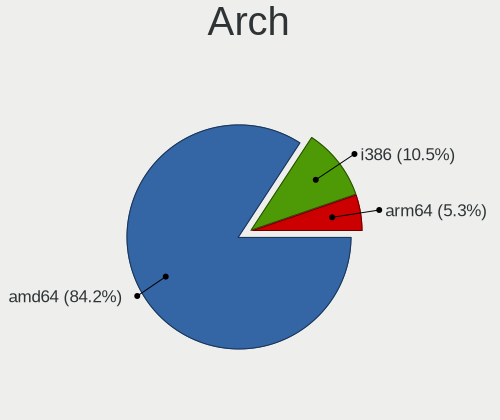

| Name   | Desktops | Percent |
|--------|----------|---------|
| amd64  | 25       | 83.33%  |
| i386   | 3        | 10%     |
| macppc | 1        | 3.33%   |
| arm64  | 1        | 3.33%   |

DE
--

Desktop Environment

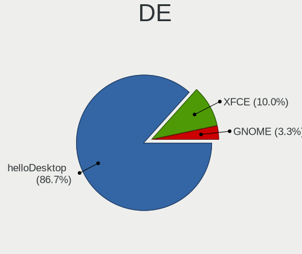

| Name         | Desktops | Percent |
|--------------|----------|---------|
| helloDesktop | 26       | 86.67%  |
| XFCE         | 3        | 10%     |
| GNOME        | 1        | 3.33%   |

Display Server
--------------

X11 or Wayland

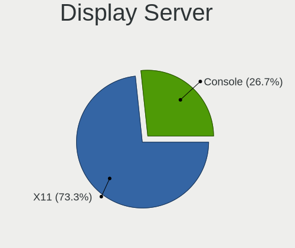

| Name    | Desktops | Percent |
|---------|----------|---------|
| X11     | 22       | 73.33%  |
| Console | 8        | 26.67%  |

Display Manager
---------------

SDDM, LightDM, etc.

| Name    | Desktops | Percent |
|---------|----------|---------|
| Console | 30       | 100%    |

OS Lang
-------

Language

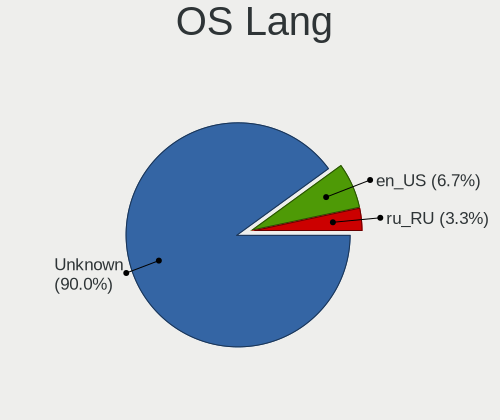

| Lang    | Desktops | Percent |
|---------|----------|---------|
| Unknown | 27       | 90%     |
| en_US   | 2        | 6.67%   |
| ru_RU   | 1        | 3.33%   |

Boot Mode
---------

EFI or BIOS

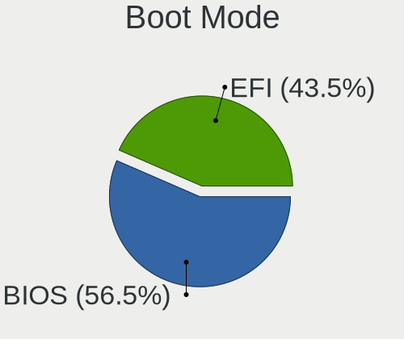

| Mode | Desktops | Percent |
|------|----------|---------|
| BIOS | 18       | 60%     |
| EFI  | 12       | 40%     |

Filesystem
----------

Type of filesystem

| Type | Desktops | Percent |
|------|----------|---------|
| Ffs  | 30       | 100%    |

Part. scheme
------------

Scheme of partitioning

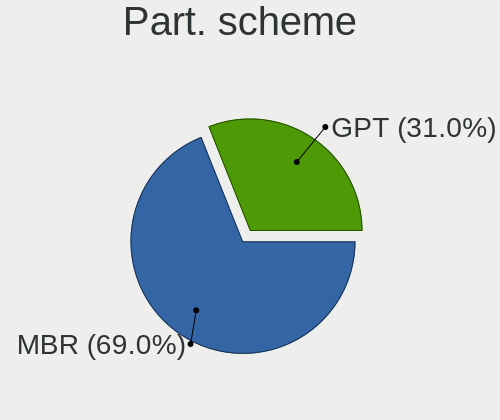

| Type | Desktops | Percent |
|------|----------|---------|
| MBR  | 20       | 66.67%  |
| GPT  | 10       | 33.33%  |

Board
-----

Vendor
------

Motherboard manufacturer

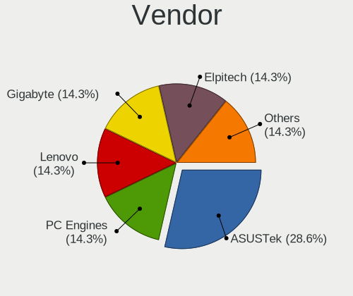

| Name                | Desktops | Percent |
|---------------------|----------|---------|
| ASUSTek Computer    | 9        | 30%     |
| MSI                 | 4        | 13.33%  |
| PC Engines          | 3        | 10%     |
| Apple               | 3        | 10%     |
| VIA Technologies    | 2        | 6.67%   |
| Gigabyte Technology | 2        | 6.67%   |
| Wistron             | 1        | 3.33%   |
| Supermicro          | 1        | 3.33%   |
| Sony                | 1        | 3.33%   |
| Lenovo              | 1        | 3.33%   |
| Huanan              | 1        | 3.33%   |
| Hewlett-Packard     | 1        | 3.33%   |
| Elpitech            | 1        | 3.33%   |

Model
-----

Motherboard model

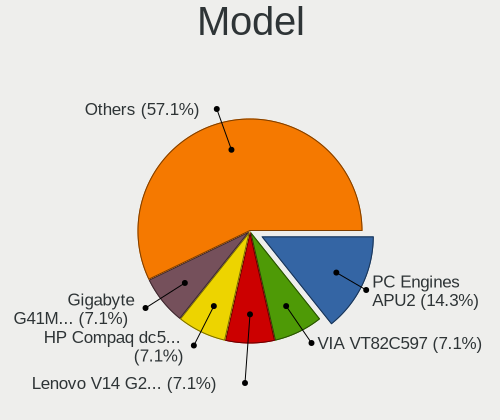

| Name                               | Desktops | Percent |
|------------------------------------|----------|---------|
| PC Engines APU2                    | 2        | 6.67%   |
| ASUS PRIME B650-PLUS               | 2        | 6.67%   |
| Wistron ProLiant ML110 G6          | 1        | 3.33%   |
| VIA VT8623-8235                    | 1        | 3.33%   |
| VIA VT82C597                       | 1        | 3.33%   |
| Supermicro X8DTH-i/6/iF/6F         | 1        | 3.33%   |
| Sony VGC-RB41M                     | 1        | 3.33%   |
| PC Engines APU                     | 1        | 3.33%   |
| MSI MS-7721                        | 1        | 3.33%   |
| MSI MS-7623                        | 1        | 3.33%   |
| MSI MS-7592                        | 1        | 3.33%   |
| MSI MS-7125                        | 1        | 3.33%   |
| Lenovo V14 G2 ITL 82NM             | 1        | 3.33%   |
| Huanan X99-F8D PLUS V1.3           | 1        | 3.33%   |
| HP Compaq dc5700 Microtower        | 1        | 3.33%   |
| Gigabyte G41MT-S2                  | 1        | 3.33%   |
| Gigabyte B250M-Gaming 3            | 1        | 3.33%   |
| Elpitech ET101-A1                  | 1        | 3.33%   |
| ASUS TUF Gaming B550M-PLUS (WI-FI) | 1        | 3.33%   |
| ASUS TUF Gaming B550-PLUS          | 1        | 3.33%   |
| ASUS RS120-E4/PA2                  | 1        | 3.33%   |
| ASUS PRIME B460M-A                 | 1        | 3.33%   |
| ASUS PRIME A520M-A II              | 1        | 3.33%   |
| ASUS P10S-I Series                 | 1        | 3.33%   |
| ASUS M3A78-EMH HDMI                | 1        | 3.33%   |
| Apple PowerMac3,6                  | 1        | 3.33%   |
| Apple MacPro4,1                    | 1        | 3.33%   |
| Apple MacPro1,1                    | 1        | 3.33%   |

Model Family
------------

Motherboard model prefix

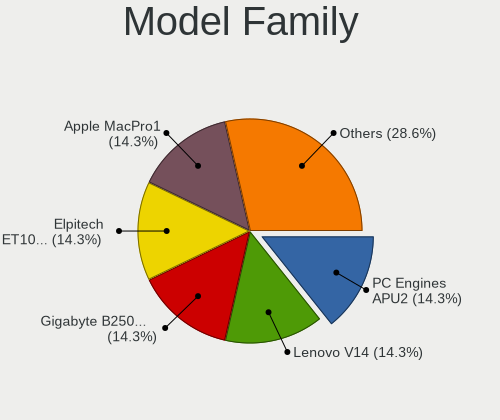

| Name                  | Desktops | Percent |
|-----------------------|----------|---------|
| ASUS PRIME            | 4        | 13.33%  |
| PC Engines APU2       | 2        | 6.67%   |
| ASUS TUF              | 2        | 6.67%   |
| Wistron ProLiant      | 1        | 3.33%   |
| VIA VT8623-8235       | 1        | 3.33%   |
| VIA VT82C597          | 1        | 3.33%   |
| Supermicro X8DTH-i    | 1        | 3.33%   |
| Sony VGC-RB41M        | 1        | 3.33%   |
| PC Engines APU        | 1        | 3.33%   |
| MSI MS-7721           | 1        | 3.33%   |
| MSI MS-7623           | 1        | 3.33%   |
| MSI MS-7592           | 1        | 3.33%   |
| MSI MS-7125           | 1        | 3.33%   |
| Lenovo V14            | 1        | 3.33%   |
| Huanan X99-F8D        | 1        | 3.33%   |
| HP Compaq             | 1        | 3.33%   |
| Gigabyte G41MT-S2     | 1        | 3.33%   |
| Gigabyte B250M-Gaming | 1        | 3.33%   |
| Elpitech ET101-A1     | 1        | 3.33%   |
| ASUS RS120-E4         | 1        | 3.33%   |
| ASUS P10S-I           | 1        | 3.33%   |
| ASUS M3A78-EMH        | 1        | 3.33%   |
| Apple PowerMac3       | 1        | 3.33%   |
| Apple MacPro4         | 1        | 3.33%   |
| Apple MacPro1         | 1        | 3.33%   |

MFG Year
--------

Motherboard manufacture year

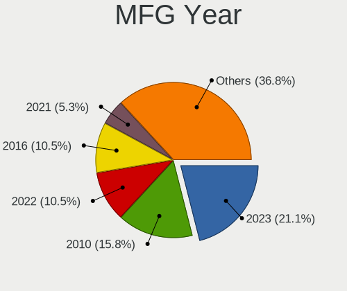

| Year    | Desktops | Percent |
|---------|----------|---------|
| 2023    | 6        | 20%     |
| 2010    | 4        | 13.33%  |
| 2016    | 3        | 10%     |
| 2022    | 2        | 6.67%   |
| 2007    | 2        | 6.67%   |
| 2006    | 2        | 6.67%   |
| Unknown | 2        | 6.67%   |
| 2021    | 1        | 3.33%   |
| 2019    | 1        | 3.33%   |
| 2018    | 1        | 3.33%   |
| 2014    | 1        | 3.33%   |
| 2013    | 1        | 3.33%   |
| 2012    | 1        | 3.33%   |
| 2009    | 1        | 3.33%   |
| 2005    | 1        | 3.33%   |
| 2004    | 1        | 3.33%   |

Form Factor
-----------

Physical design of the computer

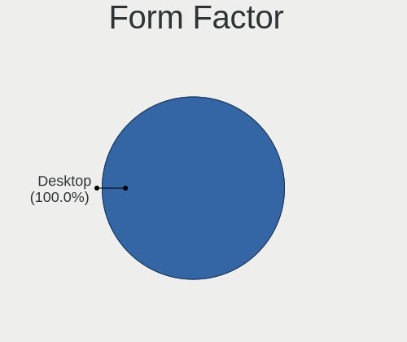

| Name    | Desktops | Percent |
|---------|----------|---------|
| Desktop | 30       | 100%    |

Coreboot
--------

Have coreboot on board

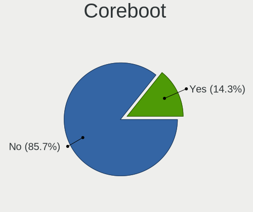

| Used | Desktops | Percent |
|------|----------|---------|
| No   | 27       | 90%     |
| Yes  | 3        | 10%     |

RAM Size
--------

Total RAM memory

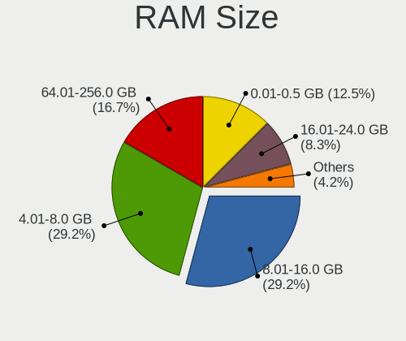

| Size in GB  | Desktops | Percent |
|-------------|----------|---------|
| 4.01-8.0    | 9        | 29.03%  |
| 8.01-16.0   | 8        | 25.81%  |
| 64.01-256.0 | 4        | 12.9%   |
| 32.01-64.0  | 3        | 9.68%   |
| 16.01-24.0  | 3        | 9.68%   |
| 0.01-0.5    | 3        | 9.68%   |
| 2.01-3.0    | 1        | 3.23%   |

RAM Used
--------

Used RAM memory

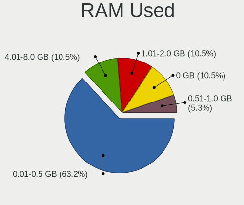

| Used GB  | Desktops | Percent |
|----------|----------|---------|
| 0.01-0.5 | 20       | 66.67%  |
| 1.01-2.0 | 3        | 10%     |
| 0        | 3        | 10%     |
| 4.01-8.0 | 2        | 6.67%   |
| 0.51-1.0 | 2        | 6.67%   |

Total Drives
------------

Number of drives on board

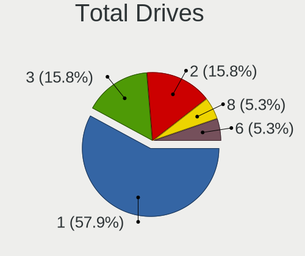

| Drives | Desktops | Percent |
|--------|----------|---------|
| 1      | 16       | 51.61%  |
| 2      | 8        | 25.81%  |
| 3      | 3        | 9.68%   |
| 8      | 1        | 3.23%   |
| 6      | 1        | 3.23%   |
| 4      | 1        | 3.23%   |
| 0      | 1        | 3.23%   |

Has CD-ROM
----------

Has CD-ROM on board

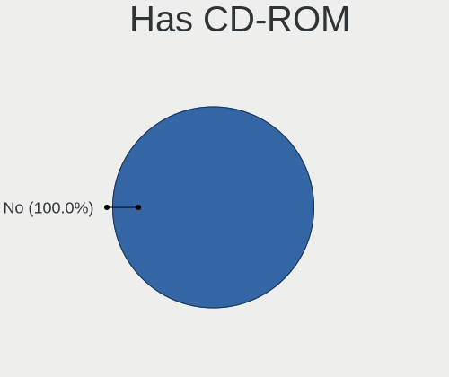

| Presented | Desktops | Percent |
|-----------|----------|---------|
| No        | 30       | 100%    |

Has Ethernet
------------

Has Ethernet on board

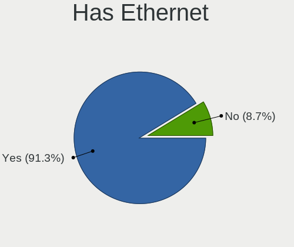

| Presented | Desktops | Percent |
|-----------|----------|---------|
| Yes       | 28       | 93.33%  |
| No        | 2        | 6.67%   |

Has WiFi
--------

Has WiFi module

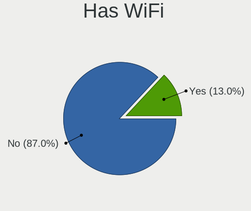

| Presented | Desktops | Percent |
|-----------|----------|---------|
| No        | 27       | 90%     |
| Yes       | 3        | 10%     |

Has Bluetooth
-------------

Has Bluetooth module

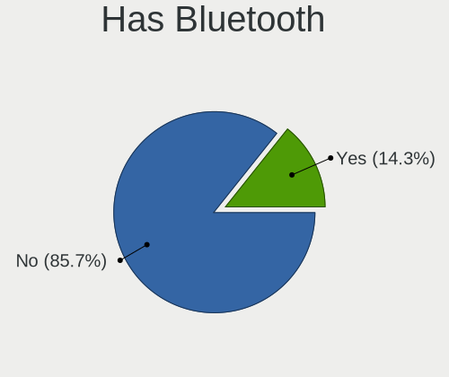

| Presented | Desktops | Percent |
|-----------|----------|---------|
| No        | 27       | 87.1%   |
| Yes       | 4        | 12.9%   |

Location
--------

Country
-------

Geographic location (country)

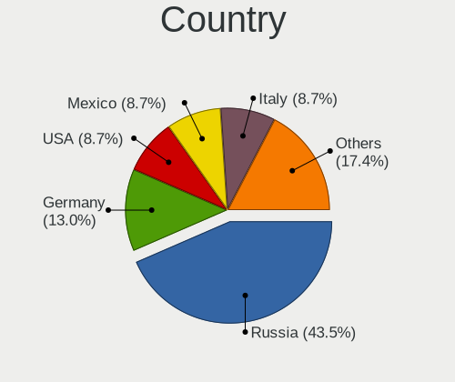

| Country     | Desktops | Percent |
|-------------|----------|---------|
| Russia      | 13       | 43.33%  |
| Germany     | 4        | 13.33%  |
| USA         | 3        | 10%     |
| Italy       | 3        | 10%     |
| Mexico      | 2        | 6.67%   |
| Brazil      | 2        | 6.67%   |
| Switzerland | 1        | 3.33%   |
| Spain       | 1        | 3.33%   |
| Romania     | 1        | 3.33%   |

City
----

Geographic location (city)

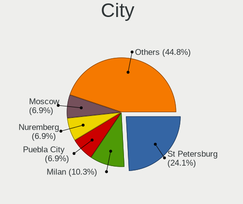

| City             | Desktops | Percent |
|------------------|----------|---------|
| St Petersburg    | 7        | 23.33%  |
| Milan            | 3        | 10%     |
| Puebla City      | 2        | 6.67%   |
| Nuremberg        | 2        | 6.67%   |
| Moscow           | 2        | 6.67%   |
| Cherepovets      | 2        | 6.67%   |
| Blumenau         | 2        | 6.67%   |
| San Francisco    | 1        | 3.33%   |
| Podolsk          | 1        | 3.33%   |
| Oltenita         | 1        | 3.33%   |
| Monheim am Rhein | 1        | 3.33%   |
| Krasnodar        | 1        | 3.33%   |
| Kansas City      | 1        | 3.33%   |
| Hamburg          | 1        | 3.33%   |
| Belp             | 1        | 3.33%   |
| Barcelona        | 1        | 3.33%   |
| Austin           | 1        | 3.33%   |

Drives
------

Drive Vendor
------------

Hard drive vendors

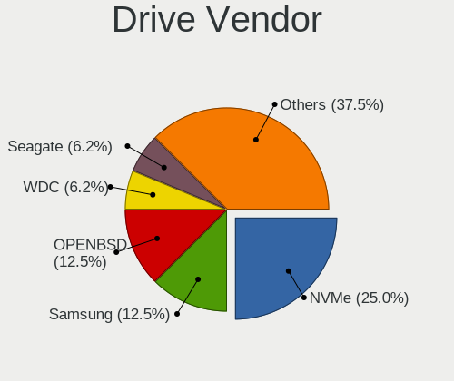

| Vendor              | Desktops | Drives | Percent |
|---------------------|----------|--------|---------|
| Samsung Electronics | 7        | 13     | 15.91%  |
| NVMe                | 7        | 12     | 15.91%  |
| Intel               | 5        | 5      | 11.36%  |
| Seagate             | 4        | 6      | 9.09%   |
| WDC                 | 3        | 3      | 6.82%   |
| Hitachi             | 3        | 3      | 6.82%   |
| SanDisk             | 2        | 4      | 4.55%   |
| OPENBSD             | 2        | 2      | 4.55%   |
| Kingston            | 2        | 2      | 4.55%   |
| Crucial             | 2        | 3      | 4.55%   |
| LSI                 | 1        | 1      | 2.27%   |
| HGST                | 1        | 1      | 2.27%   |
| Hewlett-Packard     | 1        | 1      | 2.27%   |
| Fujitsu             | 1        | 1      | 2.27%   |
| Apacer              | 1        | 1      | 2.27%   |
| AMD                 | 1        | 1      | 2.27%   |
| A-DATA Technology   | 1        | 1      | 2.27%   |

Drive Model
-----------

Hard drive models

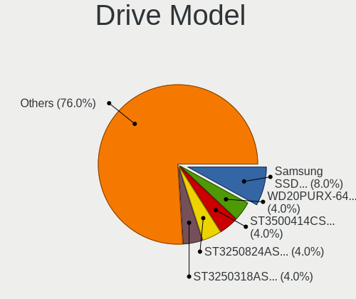

| Model                          | Desktops | Percent |
|--------------------------------|----------|---------|
| Intel SSDSC2BW480H6 480GB      | 4        | 8.51%   |
| Samsung SSD 840 EVO 250GB      | 2        | 4.26%   |
| NVMe Samsung SSD 980 1TB       | 2        | 4.26%   |
| WDC WD5000AZLX-00K2TA0 500GB   | 1        | 2.13%   |
| WDC WD3201ABYS-01B9A0 320GB    | 1        | 2.13%   |
| WDC WD20PURX-64P6ZY0 2TB       | 1        | 2.13%   |
| Seagate ST3500630AS 500GB      | 1        | 2.13%   |
| Seagate ST3500414CS 500GB      | 1        | 2.13%   |
| Seagate ST3250824AS P 250GB    | 1        | 2.13%   |
| Seagate ST3250318AS 250GB      | 1        | 2.13%   |
| Seagate ST320011A 20GB         | 1        | 2.13%   |
| SanDisk SSD PLUS 240GB         | 1        | 2.13%   |
| SanDisk SSD PLUS 120GB         | 1        | 2.13%   |
| SanDisk Cruzer Blade 64GB      | 1        | 2.13%   |
| Samsung SSD 870 QVO 2TB        | 1        | 2.13%   |
| Samsung SSD 870 EVO 500GB      | 1        | 2.13%   |
| Samsung SSD 870 EVO 250GB      | 1        | 2.13%   |
| Samsung HD161HJ 160GB          | 1        | 2.13%   |
| Samsung Flash Drive FIT 32GB   | 1        | 2.13%   |
| OPENBSD SR RAID 5 9.9TB        | 1        | 2.13%   |
| OPENBSD SR RAID 1 2TB          | 1        | 2.13%   |
| NVMe WDBRPG5000ANC-WR 500GB    | 1        | 2.13%   |
| NVMe TOSHIBA-RC100 240GB       | 1        | 2.13%   |
| NVMe SSSTC CL1-4D256 256GB     | 1        | 2.13%   |
| NVMe Samsung SSD 990 2TB       | 1        | 2.13%   |
| NVMe Sabrent Rocket 4 500GB    | 1        | 2.13%   |
| NVMe Asgard AN1TNVMe- 1TB      | 1        | 2.13%   |
| LSI MR9271-8i 438GB            | 1        | 2.13%   |
| Kingston SMS200S330G 32GB      | 1        | 2.13%   |
| Kingston SA400S37480G 480GB    | 1        | 2.13%   |
| Intel SSDSC2KF256G8 SATA 256GB | 1        | 2.13%   |
| Hitachi HUA723020ALA640 2TB    | 1        | 2.13%   |
| Hitachi HDS722516VLAT80 164GB  | 1        | 2.13%   |
| Hitachi HCS5C1032CLA382 320GB  | 1        | 2.13%   |
| HGST HUS724020ALA640 2TB       | 1        | 2.13%   |
| HP GB0500EAFJH 500GB           | 1        | 2.13%   |
| Fujitsu MHV2080BH 80GB         | 1        | 2.13%   |
| Crucial CT500MX500SSD1 500GB   | 1        | 2.13%   |
| Crucial CT500BX500SSD1 500GB   | 1        | 2.13%   |
| Apacer AST280 120GB            | 1        | 2.13%   |

HDD Vendor
----------

Hard disk drive vendors

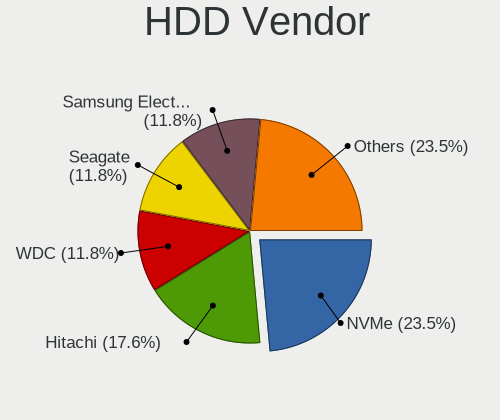

| Vendor              | Desktops | Drives | Percent |
|---------------------|----------|--------|---------|
| Seagate             | 4        | 6      | 18.18%  |
| NVMe                | 4        | 9      | 18.18%  |
| WDC                 | 3        | 3      | 13.64%  |
| Hitachi             | 3        | 3      | 13.64%  |
| Samsung Electronics | 2        | 2      | 9.09%   |
| OPENBSD             | 2        | 2      | 9.09%   |
| LSI                 | 1        | 1      | 4.55%   |
| HGST                | 1        | 1      | 4.55%   |
| Hewlett-Packard     | 1        | 1      | 4.55%   |
| Fujitsu             | 1        | 1      | 4.55%   |

SSD Vendor
----------

Solid state drive vendors

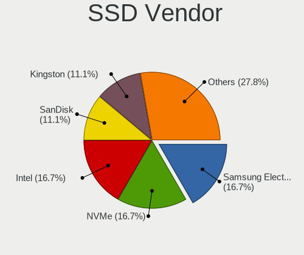

| Vendor              | Desktops | Drives | Percent |
|---------------------|----------|--------|---------|
| Samsung Electronics | 5        | 11     | 22.73%  |
| Intel               | 5        | 5      | 22.73%  |
| NVMe                | 3        | 3      | 13.64%  |
| SanDisk             | 2        | 4      | 9.09%   |
| Kingston            | 2        | 2      | 9.09%   |
| Crucial             | 2        | 3      | 9.09%   |
| Apacer              | 1        | 1      | 4.55%   |
| AMD                 | 1        | 1      | 4.55%   |
| A-DATA Technology   | 1        | 1      | 4.55%   |

Drive Kind
----------

HDD or SSD

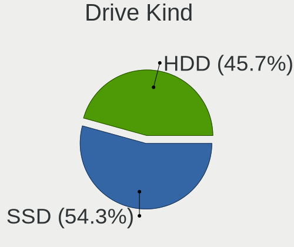

| Kind | Desktops | Drives | Percent |
|------|----------|--------|---------|
| SSD  | 19       | 31     | 54.29%  |
| HDD  | 16       | 29     | 45.71%  |

Drive Connector
---------------

SATA, SAS, NVMe, etc.

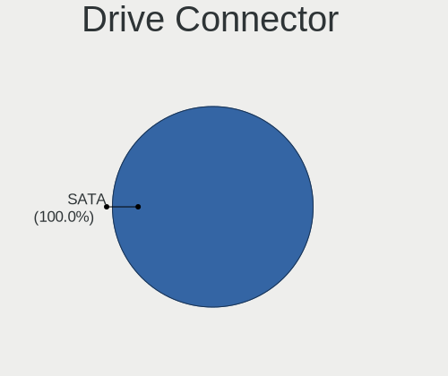

| Type | Desktops | Drives | Percent |
|------|----------|--------|---------|
| SATA | 28       | 60     | 100%    |

Drive Size
----------

Size of hard drive

| Size in TB | Desktops | Drives | Percent |
|------------|----------|--------|---------|
| 0.01-0.5   | 25       | 44     | 78.13%  |
| 1.01-2.0   | 4        | 13     | 12.5%   |
| 0.51-1.0   | 2        | 2      | 6.25%   |
| 4.01-10.0  | 1        | 1      | 3.13%   |

Space Total
-----------

Amount of disk space available on the file system

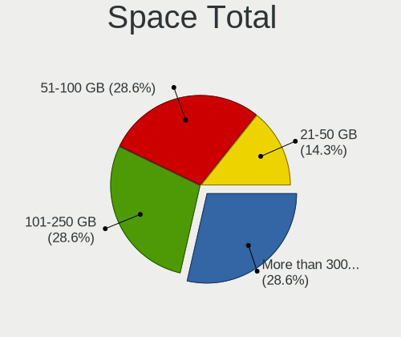

| Size in GB     | Desktops | Percent |
|----------------|----------|---------|
| 251-500        | 11       | 34.38%  |
| 101-250        | 8        | 25%     |
| 21-50          | 3        | 9.38%   |
| 1-20           | 3        | 9.38%   |
| 501-1000       | 3        | 9.38%   |
| More than 3000 | 2        | 6.25%   |
| 51-100         | 2        | 6.25%   |

Space Used
----------

Amount of used disk space

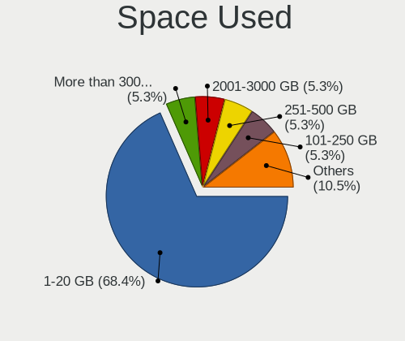

| Used GB        | Desktops | Percent |
|----------------|----------|---------|
| 1-20           | 22       | 70.97%  |
| 21-50          | 3        | 9.68%   |
| 101-250        | 2        | 6.45%   |
| More than 3000 | 1        | 3.23%   |
| 251-500        | 1        | 3.23%   |
| 2001-3000      | 1        | 3.23%   |
| 51-100         | 1        | 3.23%   |

Malfunc. Drives
---------------

Drive models with a malfunction

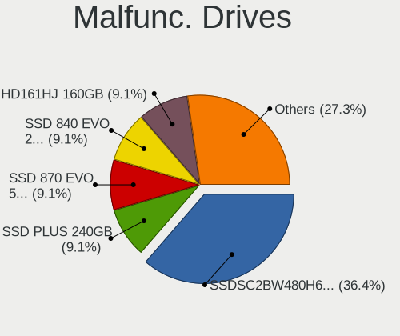

| Model                                 | Desktops | Drives | Percent |
|---------------------------------------|----------|--------|---------|
| Intel SSDSC2BW480H6 480GB             | 4        | 4      | 36.36%  |
| SanDisk SSD PLUS 240GB                | 1        | 1      | 9.09%   |
| Samsung Electronics SSD 870 EVO 500GB | 1        | 1      | 9.09%   |
| Samsung Electronics SSD 840 EVO 250GB | 1        | 2      | 9.09%   |
| Samsung Electronics HD161HJ 160GB     | 1        | 1      | 9.09%   |
| Hitachi HDS722516VLAT80 164GB         | 1        | 1      | 9.09%   |
| Hewlett-Packard GB0500EAFJH 500GB     | 1        | 1      | 9.09%   |
| A-DATA Technology SP550 240GB         | 1        | 1      | 9.09%   |

Malfunc. Drive Vendor
---------------------

Vendors of faulty drives

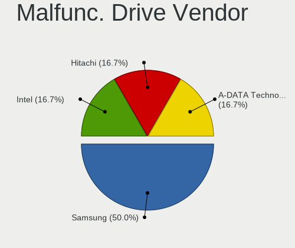

| Vendor              | Desktops | Drives | Percent |
|---------------------|----------|--------|---------|
| Intel               | 4        | 4      | 36.36%  |
| Samsung Electronics | 3        | 4      | 27.27%  |
| SanDisk             | 1        | 1      | 9.09%   |
| Hitachi             | 1        | 1      | 9.09%   |
| Hewlett-Packard     | 1        | 1      | 9.09%   |
| A-DATA Technology   | 1        | 1      | 9.09%   |

Malfunc. HDD Vendor
-------------------

Vendors of faulty HDD drives

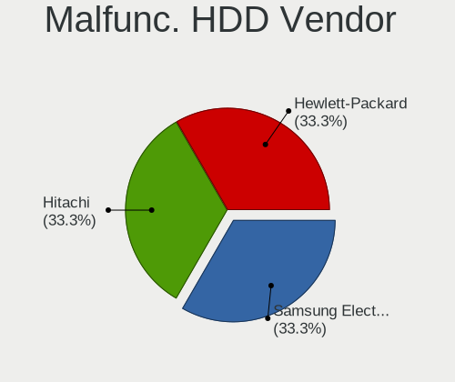

| Vendor              | Desktops | Drives | Percent |
|---------------------|----------|--------|---------|
| Samsung Electronics | 1        | 1      | 33.33%  |
| Hitachi             | 1        | 1      | 33.33%  |
| Hewlett-Packard     | 1        | 1      | 33.33%  |

Malfunc. Drive Kind
-------------------

Kinds of faulty drives

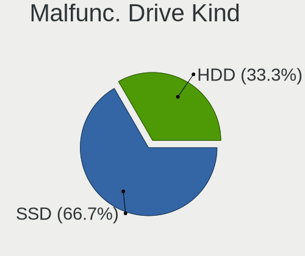

| Kind | Desktops | Drives | Percent |
|------|----------|--------|---------|
| SSD  | 8        | 9      | 72.73%  |
| HDD  | 3        | 3      | 27.27%  |

Failed Drives
-------------

Failed drive models

Zero info for selected period =(

Failed Drive Vendor
-------------------

Failed drive vendors

Zero info for selected period =(

Drive Status
------------

Number of failed and malfunc. drives

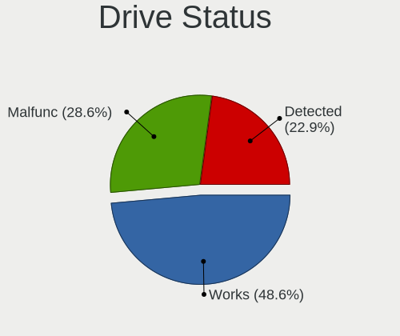

| Status   | Desktops | Drives | Percent |
|----------|----------|--------|---------|
| Works    | 17       | 33     | 47.22%  |
| Malfunc  | 11       | 12     | 30.56%  |
| Detected | 8        | 15     | 22.22%  |

Storage controller
------------------

Storage Vendor
--------------

Storage controller vendors

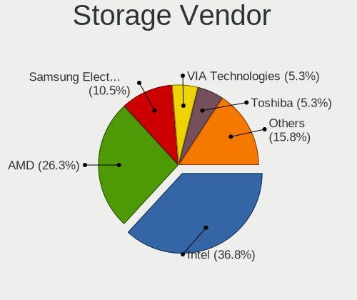

| Vendor                         | Desktops | Percent |
|--------------------------------|----------|---------|
| Intel                          | 13       | 35.14%  |
| AMD                            | 11       | 29.73%  |
| Samsung Electronics            | 3        | 8.11%   |
| VIA Technologies               | 2        | 5.41%   |
| Toshiba                        | 1        | 2.7%    |
| Solid State Storage Technology | 1        | 2.7%    |
| Silicon Motion                 | 1        | 2.7%    |
| SanDisk                        | 1        | 2.7%    |
| Phison Electronics             | 1        | 2.7%    |
| Nvidia                         | 1        | 2.7%    |
| Broadcom / LSI                 | 1        | 2.7%    |
| Artop Electronic               | 1        | 2.7%    |

Storage Model
-------------

Storage controller models

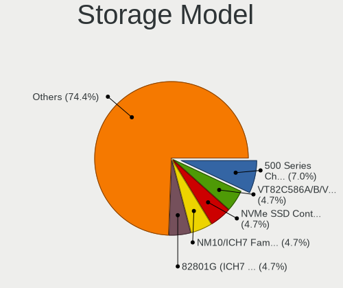

| Model                                                                         | Desktops | Percent |
|-------------------------------------------------------------------------------|----------|---------|
| AMD FCH SATA Controller [AHCI mode]                                           | 4        | 8.89%   |
| AMD 500 Series Chipset SATA Controller                                        | 3        | 6.67%   |
| VIA VT82C586A/B/VT82C686/A/B/VT823x/A/C PIPC Bus Master IDE                   | 2        | 4.44%   |
| Samsung NVMe SSD Controller PM9A1/PM9A3/980PRO                                | 2        | 4.44%   |
| Intel NM10/ICH7 Family SATA Controller [IDE mode]                             | 2        | 4.44%   |
| Intel 82801G (ICH7 Family) IDE Controller                                     | 2        | 4.44%   |
| AMD SB7x0/SB8x0/SB9x0 SATA Controller [AHCI mode]                             | 2        | 4.44%   |
| AMD SB7x0/SB8x0/SB9x0 IDE Controller                                          | 2        | 4.44%   |
| Toshiba BG3 x2 NVMe SSD Controller (DRAM-less)                                | 1        | 2.22%   |
| Solid State Storage CL1-3D256-Q11 NVMe SSD M.2                                | 1        | 2.22%   |
| Silicon Motion SM2263EN/SM2263XT (DRAM-less) NVMe SSD Controllers             | 1        | 2.22%   |
| SanDisk Extreme Pro / WD Black SN750 / PC SN730 / Red SN700 NVMe SSD          | 1        | 2.22%   |
| Samsung NVMe SSD Controller S4LV008[Pascal]                                   | 1        | 2.22%   |
| Phison E16 PCIe4 NVMe Controller                                              | 1        | 2.22%   |
| Nvidia CK804 Serial ATA Controller                                            | 1        | 2.22%   |
| Nvidia CK804 IDE                                                              | 1        | 2.22%   |
| Intel Tiger Lake-LP SATA Controller                                           | 1        | 2.22%   |
| Intel Q170/Q150/B150/H170/H110/Z170/CM236 Chipset SATA Controller [AHCI Mode] | 1        | 2.22%   |
| Intel NM10/ICH7 Family SATA Controller [AHCI mode]                            | 1        | 2.22%   |
| Intel C610/X99 series chipset 6-Port SATA Controller [AHCI mode]              | 1        | 2.22%   |
| Intel 82801JI (ICH10 Family) SATA AHCI Controller                             | 1        | 2.22%   |
| Intel 82801HR/HO/HH (ICH8R/DO/DH) 2 port SATA Controller [IDE mode]           | 1        | 2.22%   |
| Intel 82801H (ICH8 Family) 4 port SATA Controller [IDE mode]                  | 1        | 2.22%   |
| Intel 82801FB/FW (ICH6/ICH6W) SATA Controller                                 | 1        | 2.22%   |
| Intel 82801FB/FBM/FR/FW/FRW (ICH6 Family) IDE Controller                      | 1        | 2.22%   |
| Intel 631xESB/632xESB/3100 Chipset SATA IDE Controller                        | 1        | 2.22%   |
| Intel 631xESB/632xESB IDE Controller                                          | 1        | 2.22%   |
| Intel 5 Series/3400 Series Chipset 6 port SATA AHCI Controller                | 1        | 2.22%   |
| Intel 400 Series Chipset Family SATA AHCI Controller                          | 1        | 2.22%   |
| Intel 200 Series PCH SATA controller [AHCI mode]                              | 1        | 2.22%   |
| Broadcom / LSI MegaRAID SAS 2208 [Thunderbolt]                                | 1        | 2.22%   |
| Artop Electronic AEC6712U SCSI                                                | 1        | 2.22%   |
| AMD SB7x0/SB8x0/SB9x0 SATA Controller [IDE mode]                              | 1        | 2.22%   |
| AMD FCH SATA Controller [IDE mode]                                            | 1        | 2.22%   |

Storage Kind
------------

Kind of storage controller (IDE, SATA, NVMe, SAS, ...)

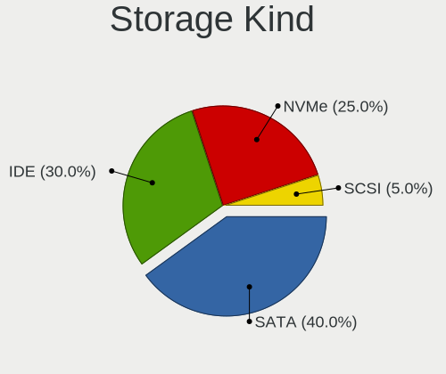

| Kind | Desktops | Percent |
|------|----------|---------|
| SATA | 18       | 46.15%  |
| IDE  | 12       | 30.77%  |
| NVMe | 7        | 17.95%  |
| RAID | 1        | 2.56%   |
| SCSI | 1        | 2.56%   |

Processor
---------

CPU Vendor
----------

Processor vendors

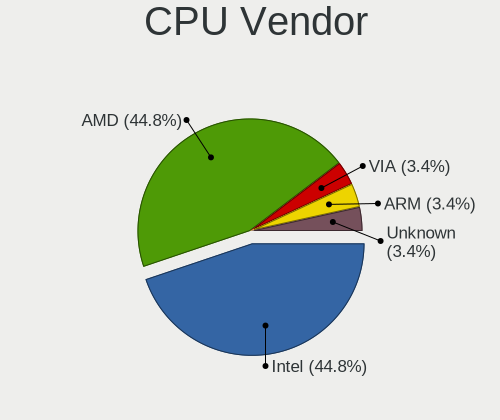

| Vendor  | Desktops | Percent |
|---------|----------|---------|
| Intel   | 14       | 46.67%  |
| AMD     | 13       | 43.33%  |
| VIA     | 1        | 3.33%   |
| ARM     | 1        | 3.33%   |
| Unknown | 1        | 3.33%   |

CPU Model
---------

Processor models

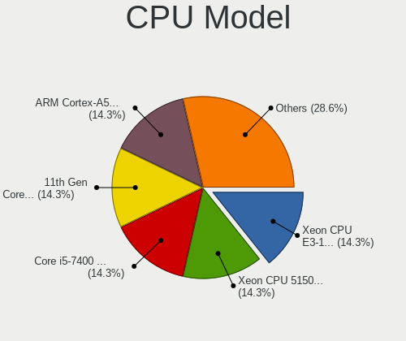

| Model                                                  | Desktops | Percent |
|--------------------------------------------------------|----------|---------|
| Intel Core 2 Quad CPU Q6600 @ 2.40GHz                  | 2        | 6.67%   |
| AMD GX-412TC SOC                                       | 2        | 6.67%   |
| VIA C3                                                 | 1        | 3.33%   |
| Intel Xeon CPU X5675 @ 3.07GHz                         | 1        | 3.33%   |
| Intel Xeon CPU X5550 @ 2.67GHz                         | 1        | 3.33%   |
| Intel Xeon CPU E5-2690 v4 @ 2.60GHz                    | 1        | 3.33%   |
| Intel Xeon CPU E3-1220 v5 @ 3.00GHz                    | 1        | 3.33%   |
| Intel Xeon CPU 5150 @ 2.66GHz                          | 1        | 3.33%   |
| Intel Pentium CPU G6950 @ 2.80GHz                      | 1        | 3.33%   |
| Intel Pentium 4 CPU 3.00GHz ("GenuineIntel" 686-class) | 1        | 3.33%   |
| Intel Core i5-7400 CPU @ 3.00GHz                       | 1        | 3.33%   |
| Intel Core i3-10100 CPU @ 3.60GHz                      | 1        | 3.33%   |
| Intel Core 2 Quad CPU Q9550 @ 2.83GHz                  | 1        | 3.33%   |
| Intel Core 2 CPU 6420 @ 2.13GHz                        | 1        | 3.33%   |
| Intel 11th Gen Core i5-1135G7 @ 2.40GHz                | 1        | 3.33%   |
| ARM Cortex-A57 r1p3                                    | 1        | 3.33%   |
| AMD Ryzen 9 7950X 16-Core Processor                    | 1        | 3.33%   |
| AMD Ryzen 9 5950X 16-Core Processor                    | 1        | 3.33%   |
| AMD Ryzen 7 7700X 8-Core Processor                     | 1        | 3.33%   |
| AMD Ryzen 7 3700X 8-Core Processor                     | 1        | 3.33%   |
| AMD Ryzen 5 4600G with Radeon Graphics                 | 1        | 3.33%   |
| AMD Phenom 9550 Quad-Core Processor                    | 1        | 3.33%   |
| AMD K6                                                 | 1        | 3.33%   |
| AMD G-T40E Processor                                   | 1        | 3.33%   |
| AMD Athlon X4 870K Quad Core Processor                 | 1        | 3.33%   |
| AMD Athlon II X2 240 Processor                         | 1        | 3.33%   |
| AMD Athlon 64 Processor 3200+                          | 1        | 3.33%   |
|                                                        | 1        | 3.33%   |

CPU Model Family
----------------

Processor model prefix

| Model             | Desktops | Percent |
|-------------------|----------|---------|
| Intel Xeon        | 5        | 16.67%  |
| Other             | 4        | 13.33%  |
| Intel Core 2 Quad | 3        | 10%     |
| AMD Ryzen 9       | 2        | 6.67%   |
| AMD Ryzen 7       | 2        | 6.67%   |
| AMD GX            | 2        | 6.67%   |
| Intel Pentium 4   | 1        | 3.33%   |
| Intel Pentium     | 1        | 3.33%   |
| Intel Core i5     | 1        | 3.33%   |
| Intel Core i3     | 1        | 3.33%   |
| Intel Core 2      | 1        | 3.33%   |
| ARM Cortex        | 1        | 3.33%   |
| AMD Ryzen 5       | 1        | 3.33%   |
| AMD Phenom        | 1        | 3.33%   |
| AMD G             | 1        | 3.33%   |
| AMD Athlon X4     | 1        | 3.33%   |
| AMD Athlon II X2  | 1        | 3.33%   |
| AMD Athlon 64     | 1        | 3.33%   |

CPU Cores
---------

Number of processor cores

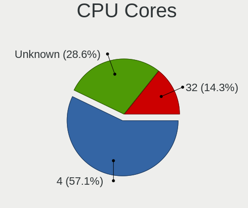

| Number  | Desktops | Percent |
|---------|----------|---------|
| 4       | 9        | 30%     |
| Unknown | 6        | 20%     |
| 2       | 4        | 13.33%  |
| 1       | 3        | 10%     |
| 32      | 2        | 6.67%   |
| 16      | 2        | 6.67%   |
| 14      | 1        | 3.33%   |
| 12      | 1        | 3.33%   |
| 8       | 1        | 3.33%   |
| 6       | 1        | 3.33%   |

CPU Sockets
-----------

Number of sockets

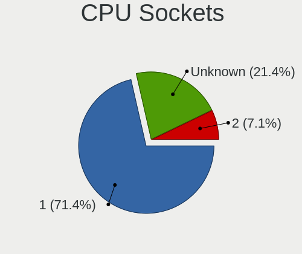

| Number  | Desktops | Percent |
|---------|----------|---------|
| 1       | 23       | 76.67%  |
| Unknown | 5        | 16.67%  |
| 2       | 2        | 6.67%   |

CPU Threads
-----------

Threads per core (Hyper-Threading)

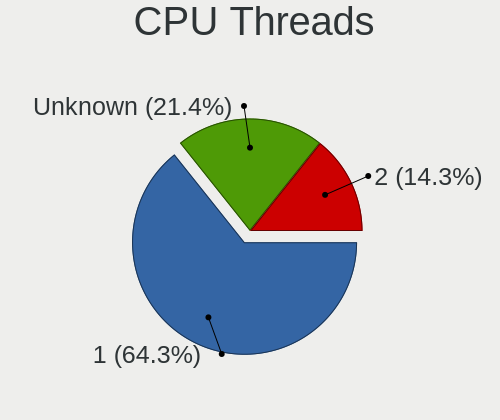

| Number  | Desktops | Percent |
|---------|----------|---------|
| 1       | 17       | 56.67%  |
| Unknown | 8        | 26.67%  |
| 2       | 5        | 16.67%  |

CPU Microarch
-------------

Microarchitecture

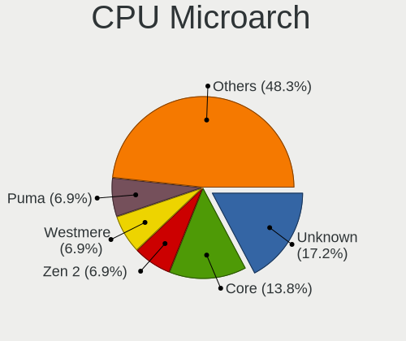

| Name        | Desktops | Percent |
|-------------|----------|---------|
| Unknown     | 5        | 16.67%  |
| Core        | 4        | 13.33%  |
| Zen 2       | 2        | 6.67%   |
| Westmere    | 2        | 6.67%   |
| Puma        | 2        | 6.67%   |
| K10         | 2        | 6.67%   |
| Zen 3       | 1        | 3.33%   |
| TigerLake   | 1        | 3.33%   |
| Steamroller | 1        | 3.33%   |
| Skylake     | 1        | 3.33%   |
| Penryn      | 1        | 3.33%   |
| NetBurst    | 1        | 3.33%   |
| Nehalem     | 1        | 3.33%   |
| KabyLake    | 1        | 3.33%   |
| K8 Hammer   | 1        | 3.33%   |
| Geode       | 1        | 3.33%   |
| CometLake   | 1        | 3.33%   |
| Broadwell   | 1        | 3.33%   |
| Bobcat      | 1        | 3.33%   |

Graphics
--------

GPU Vendor
----------

Vendors of graphics cards

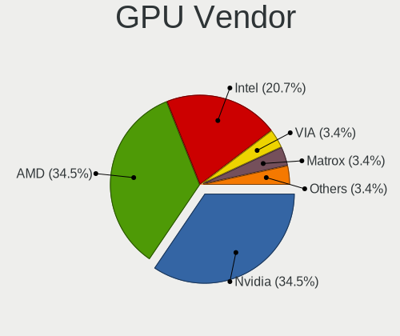

| Vendor                     | Desktops | Percent |
|----------------------------|----------|---------|
| Nvidia                     | 10       | 33.33%  |
| AMD                        | 10       | 33.33%  |
| Intel                      | 6        | 20%     |
| Matrox Electronics Systems | 2        | 6.67%   |
| VIA Technologies           | 1        | 3.33%   |
| ASPEED Technology          | 1        | 3.33%   |

GPU Model
---------

Graphics card models

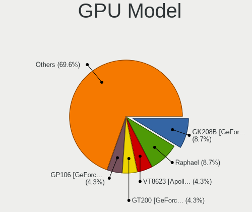

| Model                                                                  | Desktops | Percent |
|------------------------------------------------------------------------|----------|---------|
| Nvidia GK208B [GeForce GT 710]                                         | 2        | 6.67%   |
| AMD Raphael                                                            | 2        | 6.67%   |
| VIA Technologies VT8623 [Apollo CLE266] integrated CastleRock graphics | 1        | 3.33%   |
| Nvidia GT200 [GeForce GTX 260]                                         | 1        | 3.33%   |
| Nvidia GP106 [GeForce GTX 1060 6GB]                                    | 1        | 3.33%   |
| Nvidia GK208B [GeForce GT 730]                                         | 1        | 3.33%   |
| Nvidia GA104GL [RTX A4000]                                             | 1        | 3.33%   |
| Nvidia GA104 [GeForce RTX 3070 Lite Hash Rate]                         | 1        | 3.33%   |
| Nvidia G96C [GeForce 9500 GT]                                          | 1        | 3.33%   |
| Nvidia G73 [GeForce 7300 GT]                                           | 1        | 3.33%   |
| Nvidia G72 [GeForce 7300 LE]                                           | 1        | 3.33%   |
| Matrox Electronics Systems MGA G200eW WPCM450                          | 1        | 3.33%   |
| Matrox Electronics Systems MGA G200e [Pilot] ServerEngines (SEP1)      | 1        | 3.33%   |
| Intel TigerLake-LP GT2 [Iris Xe Graphics]                              | 1        | 3.33%   |
| Intel HD Graphics 630                                                  | 1        | 3.33%   |
| Intel CometLake-S GT2 [UHD Graphics 630]                               | 1        | 3.33%   |
| Intel 82Q963/Q965 Integrated Graphics Controller                       | 1        | 3.33%   |
| Intel 82915G/GV/910GL Integrated Graphics Controller                   | 1        | 3.33%   |
| Intel 4 Series Chipset Integrated Graphics Controller                  | 1        | 3.33%   |
| ASPEED Technology ASPEED Graphics Family                               | 1        | 3.33%   |
| AMD RV770 [Radeon HD 4850]                                             | 1        | 3.33%   |
| AMD RV250 [Radeon 9000 Series]                                         | 1        | 3.33%   |
| AMD RV200 [Radeon 7500/7500 LE]                                        | 1        | 3.33%   |
| AMD Renoir [Radeon RX Vega 6 (Ryzen 4000/5000 Mobile Series)]          | 1        | 3.33%   |
| AMD Navi 22 [Radeon RX 6700/6700 XT/6750 XT / 6800M/6850M XT]          | 1        | 3.33%   |
| AMD ES1000                                                             | 1        | 3.33%   |
| AMD Caicos PRO [Radeon HD 7450]                                        | 1        | 3.33%   |
| AMD Baffin [Radeon RX 550 640SP / RX 560/560X]                         | 1        | 3.33%   |

GPU Combo
---------

Combinations of graphics cards

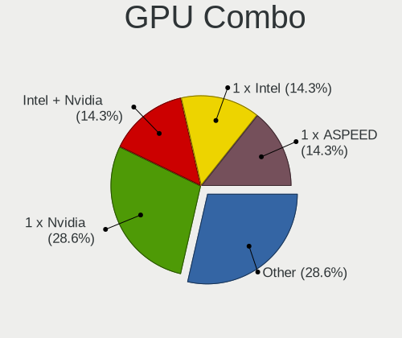

| Name           | Desktops | Percent |
|----------------|----------|---------|
| 1 x Nvidia     | 7        | 23.33%  |
| 1 x AMD        | 7        | 23.33%  |
| 1 x Intel      | 5        | 16.67%  |
| Other          | 4        | 13.33%  |
| AMD + Nvidia   | 2        | 6.67%   |
| 1 x VIA        | 1        | 3.33%   |
| 1 x Matrox     | 1        | 3.33%   |
| Intel + Nvidia | 1        | 3.33%   |
| 1 x ASPEED     | 1        | 3.33%   |
| AMD + Matrox   | 1        | 3.33%   |

GPU Driver
----------

Free vs proprietary

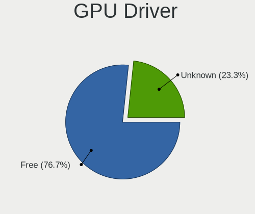

| Driver  | Desktops | Percent |
|---------|----------|---------|
| Free    | 23       | 76.67%  |
| Unknown | 7        | 23.33%  |

GPU Memory
----------

Total video memory

| Size in GB | Desktops | Percent |
|------------|----------|---------|
| Unknown    | 30       | 100%    |

Monitor
-------

Monitor Vendor
--------------

Monitor vendors

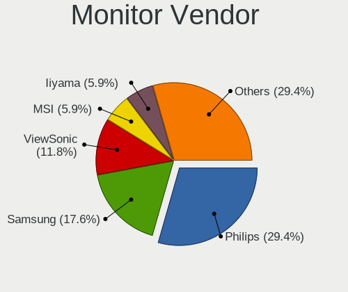

| Vendor               | Desktops | Percent |
|----------------------|----------|---------|
| Philips              | 5        | 27.78%  |
| Samsung Electronics  | 3        | 16.67%  |
| ViewSonic            | 2        | 11.11%  |
| MSI                  | 1        | 5.56%   |
| Iiyama               | 1        | 5.56%   |
| Goldstar             | 1        | 5.56%   |
| Chimei Innolux       | 1        | 5.56%   |
| BenQ                 | 1        | 5.56%   |
| ASUSTek Computer     | 1        | 5.56%   |
| AOC                  | 1        | 5.56%   |
| Ancor Communications | 1        | 5.56%   |

Monitor Model
-------------

Monitor models

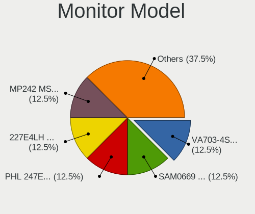

| Model                                                                 | Desktops | Percent |
|-----------------------------------------------------------------------|----------|---------|
| Samsung Electronics SyncMaster SAM03CF 1280x1024 340x270mm 17.1-inch  | 2        | 11.11%  |
| Philips 227E4LH PHLC0AC 1920x1080 480x270mm 21.7-inch                 | 2        | 11.11%  |
| Philips 170S PHL0839 1280x1024 340x270mm 17.1-inch                    | 2        | 11.11%  |
| ViewSonic VA703-4SERIES VSC6A1E 1280x1024 340x270mm 17.1-inch         | 1        | 5.56%   |
| ViewSonic VA2418-FHD VSCD739 1920x1080 530x300mm 24.0-inch            | 1        | 5.56%   |
| Samsung Electronics LCD Monitor SAM0669 1920x1080                     | 1        | 5.56%   |
| Philips PHL 247E6 PHLC0E7 1920x1080 520x290mm 23.4-inch               | 1        | 5.56%   |
| MSI MP242 MSI30A1 1920x1080 530x300mm 24.0-inch                       | 1        | 5.56%   |
| Iiyama PL2530H IVM6131 1920x1080 540x300mm 24.3-inch                  | 1        | 5.56%   |
| Goldstar LG ULTRAWIDE GSM76F9 2560x1080 800x340mm 34.2-inch           | 1        | 5.56%   |
| Chimei Innolux LCD Monitor CMN14E5 1920x1080 310x170mm 13.9-inch      | 1        | 5.56%   |
| BenQ GL2450 BNQ78A5 1920x1080 530x300mm 24.0-inch                     | 1        | 5.56%   |
| ASUSTek Computer PA279 AUS2768 3840x2160 600x340mm 27.2-inch          | 1        | 5.56%   |
| AOC 27V2G5 AOC2702 1920x1080 600x340mm 27.2-inch                      | 1        | 5.56%   |
| Ancor Communications ASUS VS247 ACI249A 1920x1080 520x290mm 23.4-inch | 1        | 5.56%   |

Monitor Resolution
------------------

Monitor screen resolution

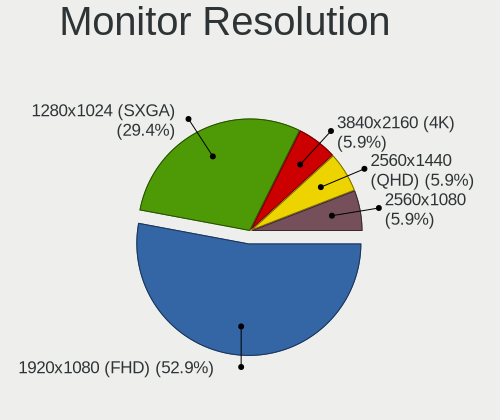

| Resolution       | Desktops | Percent |
|------------------|----------|---------|
| 1920x1080 (FHD)  | 11       | 61.11%  |
| 1280x1024 (SXGA) | 5        | 27.78%  |
| 3840x2160 (4K)   | 1        | 5.56%   |
| 2560x1080        | 1        | 5.56%   |

Monitor Diagonal
----------------

Diagonal size in inches

| Inches  | Desktops | Percent |
|---------|----------|---------|
| 17      | 5        | 27.78%  |
| 24      | 4        | 22.22%  |
| 27      | 2        | 11.11%  |
| 23      | 2        | 11.11%  |
| 21      | 2        | 11.11%  |
| 34      | 1        | 5.56%   |
| 13      | 1        | 5.56%   |
| Unknown | 1        | 5.56%   |

Monitor Width
-------------

Physical width

| Width in mm | Desktops | Percent |
|-------------|----------|---------|
| 501-600     | 8        | 44.44%  |
| 301-350     | 6        | 33.33%  |
| 401-500     | 2        | 11.11%  |
| 701-800     | 1        | 5.56%   |
| Unknown     | 1        | 5.56%   |

Aspect Ratio
------------

Proportional relationship between the width and the height

| Ratio | Desktops | Percent |
|-------|----------|---------|
| 16/9  | 12       | 66.67%  |
| 5/4   | 5        | 27.78%  |
| 21/9  | 1        | 5.56%   |

Monitor Area
------------

Area in inch²

| Area in inch² | Desktops | Percent |
|----------------|----------|---------|
| 201-250        | 7        | 38.89%  |
| 141-150        | 5        | 27.78%  |
| 301-350        | 2        | 11.11%  |
| 81-90          | 1        | 5.56%   |
| 351-500        | 1        | 5.56%   |
| 251-300        | 1        | 5.56%   |
| Unknown        | 1        | 5.56%   |

Pixel Density
-------------

Pixels per inch

| Density | Desktops | Percent |
|---------|----------|---------|
| 51-100  | 13       | 72.22%  |
| 101-120 | 2        | 11.11%  |
| 161-240 | 1        | 5.56%   |
| 121-160 | 1        | 5.56%   |
| Unknown | 1        | 5.56%   |

Multiple Monitors
-----------------

Total monitors connected

| Total | Desktops | Percent |
|-------|----------|---------|
| 1     | 18       | 60%     |
| 0     | 12       | 40%     |

Network
-------

Net Controller Vendor
---------------------

Controller vendors

| Vendor                | Desktops | Percent |
|-----------------------|----------|---------|
| Realtek Semiconductor | 12       | 37.5%   |
| Intel                 | 10       | 31.25%  |
| Broadcom              | 3        | 9.38%   |
| Qualcomm Atheros      | 2        | 6.25%   |
| VIA Technologies      | 1        | 3.13%   |
| Huawei Technologies   | 1        | 3.13%   |
| Edimax Technology     | 1        | 3.13%   |
| D-Link System         | 1        | 3.13%   |
| Apple                 | 1        | 3.13%   |

Net Controller Model
--------------------

Controller models

| Model                                                             | Desktops | Percent |
|-------------------------------------------------------------------|----------|---------|
| Realtek RTL8111/8168/8411 PCI Express Gigabit Ethernet Controller | 6        | 18.18%  |
| Realtek RTL8125 2.5GbE Controller                                 | 4        | 12.12%  |
| Intel I210 Gigabit Network Connection                             | 3        | 9.09%   |
| VIA VT6102/VT6103 [Rhine-II]                                      | 1        | 3.03%   |
| Realtek RTL810xE PCI Express Fast Ethernet controller             | 1        | 3.03%   |
| Realtek RTL-8100/8101L/8139 PCI Fast Ethernet Adapter             | 1        | 3.03%   |
| Qualcomm Atheros AR8151 v1.0 Gigabit Ethernet                     | 1        | 3.03%   |
| Qualcomm Atheros AR8131 Gigabit Ethernet                          | 1        | 3.03%   |
| Intel Wi-Fi 6 AX201                                               | 1        | 3.03%   |
| Intel Wi-Fi 6 AX200                                               | 1        | 3.03%   |
| Intel I350 Gigabit Network Connection                             | 1        | 3.03%   |
| Intel Ethernet Connection (2) I219-V                              | 1        | 3.03%   |
| Intel 82576 Gigabit Network Connection                            | 1        | 3.03%   |
| Intel 82574L Gigabit Network Connection                           | 1        | 3.03%   |
| Intel 82562ET/EZ/GT/GZ - PRO/100 VE (LOM) Ethernet Controller     | 1        | 3.03%   |
| Intel 80003ES2LAN Gigabit Ethernet Controller (Copper)            | 1        | 3.03%   |
| Huawei E3372 LTE/UMTS/GSM HiLink Modem/Networkcard                | 1        | 3.03%   |
| Edimax AC600 Wireless LAN USB Adapter                             | 1        | 3.03%   |
| D-Link System DGE-560T PCI Express Gigabit Ethernet Adapter       | 1        | 3.03%   |
| Broadcom NetXtreme BCM5755 Gigabit Ethernet PCI Express           | 1        | 3.03%   |
| Broadcom NetXtreme BCM5723 Gigabit Ethernet PCIe                  | 1        | 3.03%   |
| Broadcom NetXtreme BCM5721 Gigabit Ethernet PCI Express           | 1        | 3.03%   |
| Apple UniNorth 2 GMAC (Sun GEM)                                   | 1        | 3.03%   |

Wireless Vendor
---------------

Wireless vendors

| Vendor            | Desktops | Percent |
|-------------------|----------|---------|
| Intel             | 2        | 66.67%  |
| Edimax Technology | 1        | 33.33%  |

Wireless Model
--------------

Wireless models

| Model                                 | Desktops | Percent |
|---------------------------------------|----------|---------|
| Intel Wi-Fi 6 AX201                   | 1        | 33.33%  |
| Intel Wi-Fi 6 AX200                   | 1        | 33.33%  |
| Edimax AC600 Wireless LAN USB Adapter | 1        | 33.33%  |

Ethernet Vendor
---------------

Ethernet vendors

| Vendor                | Desktops | Percent |
|-----------------------|----------|---------|
| Realtek Semiconductor | 12       | 42.86%  |
| Intel                 | 8        | 28.57%  |
| Broadcom              | 3        | 10.71%  |
| Qualcomm Atheros      | 2        | 7.14%   |
| VIA Technologies      | 1        | 3.57%   |
| D-Link System         | 1        | 3.57%   |
| Apple                 | 1        | 3.57%   |

Ethernet Model
--------------

Ethernet models

| Model                                                             | Desktops | Percent |
|-------------------------------------------------------------------|----------|---------|
| Realtek RTL8111/8168/8411 PCI Express Gigabit Ethernet Controller | 6        | 20.69%  |
| Realtek RTL8125 2.5GbE Controller                                 | 4        | 13.79%  |
| Intel I210 Gigabit Network Connection                             | 3        | 10.34%  |
| VIA VT6102/VT6103 [Rhine-II]                                      | 1        | 3.45%   |
| Realtek RTL810xE PCI Express Fast Ethernet controller             | 1        | 3.45%   |
| Realtek RTL-8100/8101L/8139 PCI Fast Ethernet Adapter             | 1        | 3.45%   |
| Qualcomm Atheros AR8151 v1.0 Gigabit Ethernet                     | 1        | 3.45%   |
| Qualcomm Atheros AR8131 Gigabit Ethernet                          | 1        | 3.45%   |
| Intel I350 Gigabit Network Connection                             | 1        | 3.45%   |
| Intel Ethernet Connection (2) I219-V                              | 1        | 3.45%   |
| Intel 82576 Gigabit Network Connection                            | 1        | 3.45%   |
| Intel 82574L Gigabit Network Connection                           | 1        | 3.45%   |
| Intel 82562ET/EZ/GT/GZ - PRO/100 VE (LOM) Ethernet Controller     | 1        | 3.45%   |
| Intel 80003ES2LAN Gigabit Ethernet Controller (Copper)            | 1        | 3.45%   |
| D-Link System DGE-560T PCI Express Gigabit Ethernet Adapter       | 1        | 3.45%   |
| Broadcom NetXtreme BCM5755 Gigabit Ethernet PCI Express           | 1        | 3.45%   |
| Broadcom NetXtreme BCM5723 Gigabit Ethernet PCIe                  | 1        | 3.45%   |
| Broadcom NetXtreme BCM5721 Gigabit Ethernet PCI Express           | 1        | 3.45%   |
| Apple UniNorth 2 GMAC (Sun GEM)                                   | 1        | 3.45%   |

Net Controller Kind
-------------------

Ethernet, WiFi or modem

| Kind     | Desktops | Percent |
|----------|----------|---------|
| Ethernet | 28       | 87.5%   |
| WiFi     | 3        | 9.38%   |
| Unknown  | 1        | 3.13%   |

Used Controller
---------------

Currently used network controller

| Kind     | Desktops | Percent |
|----------|----------|---------|
| Ethernet | 21       | 91.3%   |
| WiFi     | 2        | 8.7%    |

NICs
----

Total network controllers on board

| Total | Desktops | Percent |
|-------|----------|---------|
| 1     | 19       | 63.33%  |
| 2     | 6        | 20%     |
| 3     | 3        | 10%     |
| 4     | 1        | 3.33%   |
| 0     | 1        | 3.33%   |

IPv6
----

IPv6 vs IPv4

| Used | Desktops | Percent |
|------|----------|---------|
| No   | 30       | 100%    |

Bluetooth
---------

Bluetooth Vendor
----------------

Controller vendors

| Vendor                  | Desktops | Percent |
|-------------------------|----------|---------|
| Intel                   | 2        | 50%     |
| Cambridge Silicon Radio | 1        | 25%     |
| Apple                   | 1        | 25%     |

Bluetooth Model
---------------

Controller models

| Model                                               | Desktops | Percent |
|-----------------------------------------------------|----------|---------|
| Intel Bluetooth 9460/9560 Jefferson Peak (JfP)      | 1        | 25%     |
| Intel AX200 Bluetooth                               | 1        | 25%     |
| Cambridge Silicon Radio Bluetooth Dongle (HCI mode) | 1        | 25%     |
| Apple Built-in Bluetooth 2.0+EDR HCI                | 1        | 25%     |

Sound
-----

Sound Vendor
------------

Sound card vendors

| Vendor           | Desktops | Percent |
|------------------|----------|---------|
| Intel            | 10       | 33.33%  |
| AMD              | 10       | 33.33%  |
| Nvidia           | 7        | 23.33%  |
| VIA Technologies | 1        | 3.33%   |
| Logitech         | 1        | 3.33%   |
| JMTek            | 1        | 3.33%   |

Sound Model
-----------

Sound card models

| Model                                                                             | Desktops | Percent |
|-----------------------------------------------------------------------------------|----------|---------|
| Nvidia GK208 HDMI/DP Audio Controller                                             | 3        | 8.57%   |
| AMD Family 17h/19h HD Audio Controller                                            | 3        | 8.57%   |
| Nvidia GA104 High Definition Audio Controller                                     | 2        | 5.71%   |
| Intel NM10/ICH7 Family High Definition Audio Controller                           | 2        | 5.71%   |
| AMD Starship/Matisse HD Audio Controller                                          | 2        | 5.71%   |
| AMD SBx00 Azalia (Intel HDA)                                                      | 2        | 5.71%   |
| AMD Rembrandt Radeon High Definition Audio Controller                             | 2        | 5.71%   |
| VIA Technologies VT8233/A/8235/8237 AC97 Audio Controller                         | 1        | 2.86%   |
| Nvidia GP106 High Definition Audio Controller                                     | 1        | 2.86%   |
| Nvidia CK804 AC'97 Audio Controller                                               | 1        | 2.86%   |
| Logitech [G533 Wireless Headset Dongle]                                           | 1        | 2.86%   |
| JMTek USB PnP Audio Device                                                        | 1        | 2.86%   |
| Intel Tiger Lake-LP Smart Sound Technology Audio Controller                       | 1        | 2.86%   |
| Intel Comet Lake PCH-V cAVS                                                       | 1        | 2.86%   |
| Intel C610/X99 series chipset HD Audio Controller                                 | 1        | 2.86%   |
| Intel 82801JI (ICH10 Family) HD Audio Controller                                  | 1        | 2.86%   |
| Intel 82801H (ICH8 Family) HD Audio Controller                                    | 1        | 2.86%   |
| Intel 82801FB/FBM/FR/FW/FRW (ICH6 Family) High Definition Audio Controller        | 1        | 2.86%   |
| Intel 631xESB/632xESB High Definition Audio Controller                            | 1        | 2.86%   |
| Intel 200 Series PCH HD Audio                                                     | 1        | 2.86%   |
| AMD RV770 HDMI Audio [Radeon HD 4850/4870]                                        | 1        | 2.86%   |
| AMD Renoir Radeon High Definition Audio Controller                                | 1        | 2.86%   |
| AMD Navi 21/23 HDMI/DP Audio Controller                                           | 1        | 2.86%   |
| AMD FCH Azalia Controller                                                         | 1        | 2.86%   |
| AMD Caicos HDMI Audio [Radeon HD 6450 / 7450/8450/8490 OEM / R5 230/235/235X OEM] | 1        | 2.86%   |
| AMD Baffin HDMI/DP Audio [Radeon RX 550 640SP / RX 560/560X]                      | 1        | 2.86%   |

Memory
------

Memory Vendor
-------------

Memory module vendors

| Vendor              | Desktops | Percent |
|---------------------|----------|---------|
| Kingston            | 3        | 33.33%  |
| Unknown             | 3        | 33.33%  |
| Unknown             | 2        | 22.22%  |
| Samsung Electronics | 1        | 11.11%  |

Memory Model
------------

Memory module models

| Model                                                 | Desktops | Percent |
|-------------------------------------------------------|----------|---------|
| Unknown                                               | 3        | 33.33%  |
| Unknown RAM Module 2GB DIMM DDR3 1332MT/s             | 1        | 11.11%  |
| Unknown RAM Module 2GB DIMM DDR2 667MT/s              | 1        | 11.11%  |
| Samsung RAM M393A4K40CB1-CRC 32GB DIMM DDR4 2400MT/s  | 1        | 11.11%  |
| Kingston RAM KHX2400C15/8G 8GB DIMM DDR4 2400MT/s     | 1        | 11.11%  |
| Kingston RAM KF3600C18D4/32GX 32GB DIMM DDR4 3000MT/s | 1        | 11.11%  |
| Kingston RAM 9905316-005.A04LF 1GB DIMM DDR2 667MT/s  | 1        | 11.11%  |

Memory Kind
-----------

Memory module kinds

| Kind    | Desktops | Percent |
|---------|----------|---------|
| DDR4    | 3        | 33.33%  |
| DDR2    | 2        | 22.22%  |
| Unknown | 2        | 22.22%  |
| SDRAM   | 1        | 11.11%  |
| DDR3    | 1        | 11.11%  |

Memory Form Factor
------------------

Physical design of the memory module

| Name | Desktops | Percent |
|------|----------|---------|
| DIMM | 9        | 100%    |

Memory Size
-----------

Memory module size

| Size  | Desktops | Percent |
|-------|----------|---------|
| 2048  | 3        | 33.33%  |
| 32768 | 2        | 22.22%  |
| 1024  | 2        | 22.22%  |
| 8192  | 1        | 11.11%  |
| 512   | 1        | 11.11%  |

Memory Speed
------------

Memory module speed

| Speed   | Desktops | Percent |
|---------|----------|---------|
| 2400    | 2        | 22.22%  |
| 667     | 2        | 22.22%  |
| Unknown | 2        | 22.22%  |
| 3000    | 1        | 11.11%  |
| 1332    | 1        | 11.11%  |
| 800     | 1        | 11.11%  |

Printers & scanners
-------------------

Printer Vendor
--------------

Printer device vendors

Zero info for selected period =(

Printer Model
-------------

Printer device models

Zero info for selected period =(

Scanner Vendor
--------------

Scanner device vendors

Zero info for selected period =(

Scanner Model
-------------

Scanner device models

Zero info for selected period =(

Camera
------

Camera Vendor
-------------

Camera device vendors

| Vendor                 | Desktops | Percent |
|------------------------|----------|---------|
| Generalplus Technology | 1        | 50%     |
| Chicony Electronics    | 1        | 50%     |

Camera Model
------------

Camera device models

| Model                     | Desktops | Percent |
|---------------------------|----------|---------|
| Generalplus HD Webcam     | 1        | 50%     |
| Chicony Integrated Camera | 1        | 50%     |

Security
--------

Fingerprint Vendor
------------------

Fingerprint sensor vendors

Zero info for selected period =(

Fingerprint Model
-----------------

Fingerprint sensor models

Zero info for selected period =(

Chipcard Vendor
---------------

Chipcard module vendors

Zero info for selected period =(

Chipcard Model
--------------

Chipcard module models

Zero info for selected period =(

Unsupported
-----------

Unsupported Devices
-------------------

Total unsupported devices on board

| Total | Desktops | Percent |
|-------|----------|---------|
| 0     | 16       | 53.33%  |
| 1     | 8        | 26.67%  |
| 2     | 5        | 16.67%  |
| 4     | 1        | 3.33%   |

Unsupported Device Types
------------------------

Types of unsupported devices

| Type                     | Desktops | Percent |
|--------------------------|----------|---------|
| Graphics card            | 7        | 35%     |
| Firewire controller      | 5        | 25%     |
| Communication controller | 5        | 25%     |
| Storage/ata              | 1        | 5%      |
| Sound                    | 1        | 5%      |
| Net/ethernet             | 1        | 5%      |

