OpenBSD 7.3 - Tested Hardware & Statistics (Desktops)
-----------------------------------------------------

A project to collect tested hardware configurations for OpenBSD 7.3.

Anyone can contribute to this report by the [hw-probe](https://github.com/linuxhw/hw-probe/blob/master/INSTALL.BSD.md) tool:

    hw-probe -all -upload

Please contribute! Especially if your hardware is rare.

Contents
--------

* [ Test Cases ](#test-cases)

* [ System ](#system)
  - [ Arch                     ](#arch)
  - [ DE                       ](#de)
  - [ Display Server           ](#display-server)
  - [ Display Manager          ](#display-manager)
  - [ OS Lang                  ](#os-lang)
  - [ Boot Mode                ](#boot-mode)
  - [ Filesystem               ](#filesystem)
  - [ Part. scheme             ](#part-scheme)

* [ Board ](#board)
  - [ Vendor                   ](#vendor)
  - [ Model                    ](#model)
  - [ Model Family             ](#model-family)
  - [ MFG Year                 ](#mfg-year)
  - [ Form Factor              ](#form-factor)
  - [ Coreboot                 ](#coreboot)
  - [ RAM Size                 ](#ram-size)
  - [ RAM Used                 ](#ram-used)
  - [ Total Drives             ](#total-drives)
  - [ Has CD-ROM               ](#has-cd-rom)
  - [ Has Ethernet             ](#has-ethernet)
  - [ Has WiFi                 ](#has-wifi)
  - [ Has Bluetooth            ](#has-bluetooth)

* [ Location ](#location)
  - [ Country                  ](#country)
  - [ City                     ](#city)

* [ Drives ](#drives)
  - [ Drive Vendor             ](#drive-vendor)
  - [ Drive Model              ](#drive-model)
  - [ HDD Vendor               ](#hdd-vendor)
  - [ SSD Vendor               ](#ssd-vendor)
  - [ Drive Kind               ](#drive-kind)
  - [ Drive Connector          ](#drive-connector)
  - [ Drive Size               ](#drive-size)
  - [ Space Total              ](#space-total)
  - [ Space Used               ](#space-used)
  - [ Malfunc. Drives          ](#malfunc-drives)
  - [ Malfunc. Drive Vendor    ](#malfunc-drive-vendor)
  - [ Malfunc. HDD Vendor      ](#malfunc-hdd-vendor)
  - [ Malfunc. Drive Kind      ](#malfunc-drive-kind)
  - [ Failed Drives            ](#failed-drives)
  - [ Failed Drive Vendor      ](#failed-drive-vendor)
  - [ Drive Status             ](#drive-status)

* [ Storage controller ](#storage-controller)
  - [ Storage Vendor           ](#storage-vendor)
  - [ Storage Model            ](#storage-model)
  - [ Storage Kind             ](#storage-kind)

* [ Processor ](#processor)
  - [ CPU Vendor               ](#cpu-vendor)
  - [ CPU Model                ](#cpu-model)
  - [ CPU Model Family         ](#cpu-model-family)
  - [ CPU Cores                ](#cpu-cores)
  - [ CPU Sockets              ](#cpu-sockets)
  - [ CPU Threads              ](#cpu-threads)
  - [ CPU Microarch            ](#cpu-microarch)

* [ Graphics ](#graphics)
  - [ GPU Vendor               ](#gpu-vendor)
  - [ GPU Model                ](#gpu-model)
  - [ GPU Combo                ](#gpu-combo)
  - [ GPU Driver               ](#gpu-driver)
  - [ GPU Memory               ](#gpu-memory)

* [ Monitor ](#monitor)
  - [ Monitor Vendor           ](#monitor-vendor)
  - [ Monitor Model            ](#monitor-model)
  - [ Monitor Resolution       ](#monitor-resolution)
  - [ Monitor Diagonal         ](#monitor-diagonal)
  - [ Monitor Width            ](#monitor-width)
  - [ Aspect Ratio             ](#aspect-ratio)
  - [ Monitor Area             ](#monitor-area)
  - [ Pixel Density            ](#pixel-density)
  - [ Multiple Monitors        ](#multiple-monitors)

* [ Network ](#network)
  - [ Net Controller Vendor    ](#net-controller-vendor)
  - [ Net Controller Model     ](#net-controller-model)
  - [ Wireless Vendor          ](#wireless-vendor)
  - [ Wireless Model           ](#wireless-model)
  - [ Ethernet Vendor          ](#ethernet-vendor)
  - [ Ethernet Model           ](#ethernet-model)
  - [ Net Controller Kind      ](#net-controller-kind)
  - [ Used Controller          ](#used-controller)
  - [ NICs                     ](#nics)
  - [ IPv6                     ](#ipv6)

* [ Bluetooth ](#bluetooth)
  - [ Bluetooth Vendor         ](#bluetooth-vendor)
  - [ Bluetooth Model          ](#bluetooth-model)

* [ Sound ](#sound)
  - [ Sound Vendor             ](#sound-vendor)
  - [ Sound Model              ](#sound-model)

* [ Memory ](#memory)
  - [ Memory Vendor            ](#memory-vendor)
  - [ Memory Model             ](#memory-model)
  - [ Memory Kind              ](#memory-kind)
  - [ Memory Form Factor       ](#memory-form-factor)
  - [ Memory Size              ](#memory-size)
  - [ Memory Speed             ](#memory-speed)

* [ Printers & scanners ](#printers--scanners)
  - [ Printer Vendor           ](#printer-vendor)
  - [ Printer Model            ](#printer-model)
  - [ Scanner Vendor           ](#scanner-vendor)
  - [ Scanner Model            ](#scanner-model)

* [ Camera ](#camera)
  - [ Camera Vendor            ](#camera-vendor)
  - [ Camera Model             ](#camera-model)

* [ Security ](#security)
  - [ Fingerprint Vendor       ](#fingerprint-vendor)
  - [ Fingerprint Model        ](#fingerprint-model)
  - [ Chipcard Vendor          ](#chipcard-vendor)
  - [ Chipcard Model           ](#chipcard-model)

* [ Unsupported ](#unsupported)
  - [ Unsupported Devices      ](#unsupported-devices)
  - [ Unsupported Device Types ](#unsupported-device-types)

Test Cases
----------

Total: 26

| Vendor        | Model                       | Probe                                                     | Date         |
|---------------|-----------------------------|-----------------------------------------------------------|--------------|
| MSI           | MS-7623                     | [189fb4d7cc](https://bsd-hardware.info/?probe=189fb4d7cc) | Aug 08, 2023 |
| ASUSTek       | PRIME B650-PLUS             | [e74d459c5a](https://bsd-hardware.info/?probe=e74d459c5a) | Jul 28, 2023 |
| MSI           | G41M-P33 Combo              | [d4a26f9214](https://bsd-hardware.info/?probe=d4a26f9214) | Jul 24, 2023 |
| Sony          | VGC-RB41M                   | [95804a1f40](https://bsd-hardware.info/?probe=95804a1f40) | Jun 28, 2023 |
| ASUSTek       | TUF Gaming B550M-PLUS (W... | [4d99bc4b63](https://bsd-hardware.info/?probe=4d99bc4b63) | Jun 27, 2023 |
| ASUSTek       | TUF Gaming B550M-PLUS (W... | [8866724f46](https://bsd-hardware.info/?probe=8866724f46) | Jun 27, 2023 |
| Gigabyte      | G41MT-S2                    | [355202536f](https://bsd-hardware.info/?probe=355202536f) | Jun 07, 2023 |
| ASUSTek       | PRIME B460M-A               | [4c8047dca3](https://bsd-hardware.info/?probe=4c8047dca3) | May 19, 2023 |
| VIA Techno... | VT82C597                    | [d73db58e48](https://bsd-hardware.info/?probe=d73db58e48) | May 19, 2023 |
| HP            | 0A60h                       | [98e9deff3d](https://bsd-hardware.info/?probe=98e9deff3d) | May 16, 2023 |
| PC Engines    | APU2                        | [62fef2616b](https://bsd-hardware.info/?probe=62fef2616b) | May 15, 2023 |
| Gigabyte      | B250M-Gaming 3-CF           | [2ce057e389](https://bsd-hardware.info/?probe=2ce057e389) | May 14, 2023 |
| ASUSTek       | M3A78-EMH HDMI              | [b4bf04ac2f](https://bsd-hardware.info/?probe=b4bf04ac2f) | May 13, 2023 |
| Lenovo        | V14 G2 ITL 82NM             | [fa87f4741a](https://bsd-hardware.info/?probe=fa87f4741a) | May 13, 2023 |
| Lenovo        | V14 G2 ITL 82NM             | [bd81294acc](https://bsd-hardware.info/?probe=bd81294acc) | May 13, 2023 |
| Gigabyte      | B250M-Gaming 3-CF           | [cace71018f](https://bsd-hardware.info/?probe=cace71018f) | May 11, 2023 |
| Gigabyte      | B250M-Gaming 3-CF           | [4353bb0195](https://bsd-hardware.info/?probe=4353bb0195) | May 09, 2023 |
| ASUSTek       | PRIME B650-PLUS             | [be83fbb0f2](https://bsd-hardware.info/?probe=be83fbb0f2) | May 09, 2023 |
| Lenovo        | V14 G2 ITL 82NM             | [827308827b](https://bsd-hardware.info/?probe=827308827b) | Apr 24, 2023 |
| ASUSTek       | TUF Gaming B550-PLUS        | [c26c1111c6](https://bsd-hardware.info/?probe=c26c1111c6) | Apr 21, 2023 |
| Lenovo        | V14 G2 ITL 82NM             | [a6141b809a](https://bsd-hardware.info/?probe=a6141b809a) | Apr 21, 2023 |
| ASUSTek       | P10S-I Series               | [5084c2b77f](https://bsd-hardware.info/?probe=5084c2b77f) | Apr 11, 2023 |
| Apple         | MacPro1,1                   | [6843822d8c](https://bsd-hardware.info/?probe=6843822d8c) | Apr 11, 2023 |
| PC Engines    | APU2                        | [cdcdfe6e0b](https://bsd-hardware.info/?probe=cdcdfe6e0b) | Apr 10, 2023 |
| Gigabyte      | B250M-Gaming 3-CF           | [a149d0b4b5](https://bsd-hardware.info/?probe=a149d0b4b5) | Apr 10, 2023 |
| Elpitech      | ET101-A1                    | [0172697883](https://bsd-hardware.info/?probe=0172697883) | Mar 10, 2023 |

System
------

Arch
----

OS architecture (x86_64, i586, etc.)

| Name  | Desktops | Percent |
|-------|----------|---------|
| amd64 | 16       | 84.21%  |
| i386  | 2        | 10.53%  |
| arm64 | 1        | 5.26%   |

DE
--

Desktop Environment

| Name         | Desktops | Percent |
|--------------|----------|---------|
| helloDesktop | 16       | 84.21%  |
| XFCE         | 2        | 10.53%  |
| GNOME        | 1        | 5.26%   |

Display Server
--------------

X11 or Wayland

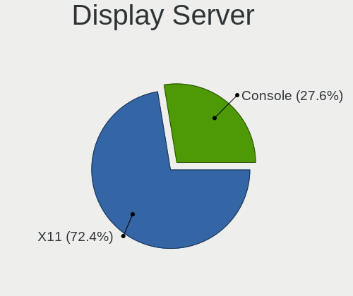

| Name    | Desktops | Percent |
|---------|----------|---------|
| X11     | 13       | 68.42%  |
| Console | 6        | 31.58%  |

Display Manager
---------------

SDDM, LightDM, etc.

| Name    | Desktops | Percent |
|---------|----------|---------|
| Console | 19       | 100%    |

OS Lang
-------

Language

| Lang    | Desktops | Percent |
|---------|----------|---------|
| Unknown | 17       | 89.47%  |
| ru_RU   | 1        | 5.26%   |
| en_US   | 1        | 5.26%   |

Boot Mode
---------

EFI or BIOS

| Mode | Desktops | Percent |
|------|----------|---------|
| BIOS | 10       | 52.63%  |
| EFI  | 9        | 47.37%  |

Filesystem
----------

Type of filesystem

| Type | Desktops | Percent |
|------|----------|---------|
| Ffs  | 19       | 100%    |

Part. scheme
------------

Scheme of partitioning

| Type | Desktops | Percent |
|------|----------|---------|
| MBR  | 12       | 63.16%  |
| GPT  | 7        | 36.84%  |

Board
-----

Vendor
------

Motherboard manufacturer

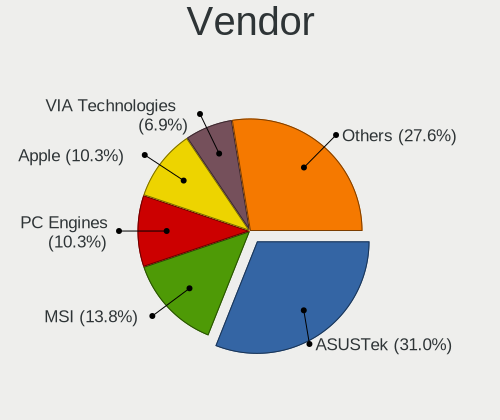

| Name                | Desktops | Percent |
|---------------------|----------|---------|
| ASUSTek Computer    | 7        | 36.84%  |
| PC Engines          | 2        | 10.53%  |
| MSI                 | 2        | 10.53%  |
| Gigabyte Technology | 2        | 10.53%  |
| VIA Technologies    | 1        | 5.26%   |
| Sony                | 1        | 5.26%   |
| Lenovo              | 1        | 5.26%   |
| Hewlett-Packard     | 1        | 5.26%   |
| Elpitech            | 1        | 5.26%   |
| Apple               | 1        | 5.26%   |

Model
-----

Motherboard model

| Name                               | Desktops | Percent |
|------------------------------------|----------|---------|
| PC Engines APU2                    | 2        | 10.53%  |
| ASUS PRIME B650-PLUS               | 2        | 10.53%  |
| VIA VT82C597                       | 1        | 5.26%   |
| Sony VGC-RB41M                     | 1        | 5.26%   |
| MSI MS-7623                        | 1        | 5.26%   |
| MSI MS-7592                        | 1        | 5.26%   |
| Lenovo V14 G2 ITL 82NM             | 1        | 5.26%   |
| HP Compaq dc5700 Microtower        | 1        | 5.26%   |
| Gigabyte G41MT-S2                  | 1        | 5.26%   |
| Gigabyte B250M-Gaming 3            | 1        | 5.26%   |
| Elpitech ET101-A1                  | 1        | 5.26%   |
| ASUS TUF Gaming B550M-PLUS (WI-FI) | 1        | 5.26%   |
| ASUS TUF Gaming B550-PLUS          | 1        | 5.26%   |
| ASUS PRIME B460M-A                 | 1        | 5.26%   |
| ASUS P10S-I Series                 | 1        | 5.26%   |
| ASUS M3A78-EMH HDMI                | 1        | 5.26%   |
| Apple MacPro1,1                    | 1        | 5.26%   |

Model Family
------------

Motherboard model prefix

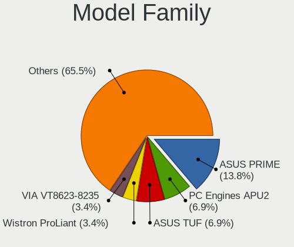

| Name                  | Desktops | Percent |
|-----------------------|----------|---------|
| ASUS PRIME            | 3        | 15.79%  |
| PC Engines APU2       | 2        | 10.53%  |
| ASUS TUF              | 2        | 10.53%  |
| VIA VT82C597          | 1        | 5.26%   |
| Sony VGC-RB41M        | 1        | 5.26%   |
| MSI MS-7623           | 1        | 5.26%   |
| MSI MS-7592           | 1        | 5.26%   |
| Lenovo V14            | 1        | 5.26%   |
| HP Compaq             | 1        | 5.26%   |
| Gigabyte G41MT-S2     | 1        | 5.26%   |
| Gigabyte B250M-Gaming | 1        | 5.26%   |
| Elpitech ET101-A1     | 1        | 5.26%   |
| ASUS P10S-I           | 1        | 5.26%   |
| ASUS M3A78-EMH        | 1        | 5.26%   |
| Apple MacPro1         | 1        | 5.26%   |

MFG Year
--------

Motherboard manufacture year

| Year    | Desktops | Percent |
|---------|----------|---------|
| 2023    | 4        | 21.05%  |
| 2010    | 3        | 15.79%  |
| 2022    | 2        | 10.53%  |
| 2016    | 2        | 10.53%  |
| 2021    | 1        | 5.26%   |
| 2019    | 1        | 5.26%   |
| 2018    | 1        | 5.26%   |
| 2013    | 1        | 5.26%   |
| 2007    | 1        | 5.26%   |
| 2006    | 1        | 5.26%   |
| 2005    | 1        | 5.26%   |
| Unknown | 1        | 5.26%   |

Form Factor
-----------

Physical design of the computer

| Name    | Desktops | Percent |
|---------|----------|---------|
| Desktop | 19       | 100%    |

Coreboot
--------

Have coreboot on board

| Used | Desktops | Percent |
|------|----------|---------|
| No   | 17       | 89.47%  |
| Yes  | 2        | 10.53%  |

RAM Size
--------

Total RAM memory

| Size in GB  | Desktops | Percent |
|-------------|----------|---------|
| 4.01-8.0    | 6        | 30%     |
| 8.01-16.0   | 6        | 30%     |
| 64.01-256.0 | 4        | 20%     |
| 0.01-0.5    | 2        | 10%     |
| 32.01-64.0  | 1        | 5%      |
| 16.01-24.0  | 1        | 5%      |

RAM Used
--------

Used RAM memory

| Used GB  | Desktops | Percent |
|----------|----------|---------|
| 0.01-0.5 | 12       | 63.16%  |
| 4.01-8.0 | 2        | 10.53%  |
| 1.01-2.0 | 2        | 10.53%  |
| 0        | 2        | 10.53%  |
| 0.51-1.0 | 1        | 5.26%   |

Total Drives
------------

Number of drives on board

| Drives | Desktops | Percent |
|--------|----------|---------|
| 1      | 11       | 57.89%  |
| 3      | 3        | 15.79%  |
| 2      | 3        | 15.79%  |
| 8      | 1        | 5.26%   |
| 6      | 1        | 5.26%   |

Has CD-ROM
----------

Has CD-ROM on board

| Presented | Desktops | Percent |
|-----------|----------|---------|
| No        | 19       | 100%    |

Has Ethernet
------------

Has Ethernet on board

| Presented | Desktops | Percent |
|-----------|----------|---------|
| Yes       | 17       | 89.47%  |
| No        | 2        | 10.53%  |

Has WiFi
--------

Has WiFi module

| Presented | Desktops | Percent |
|-----------|----------|---------|
| No        | 16       | 84.21%  |
| Yes       | 3        | 15.79%  |

Has Bluetooth
-------------

Has Bluetooth module

| Presented | Desktops | Percent |
|-----------|----------|---------|
| No        | 16       | 84.21%  |
| Yes       | 3        | 15.79%  |

Location
--------

Country
-------

Geographic location (country)

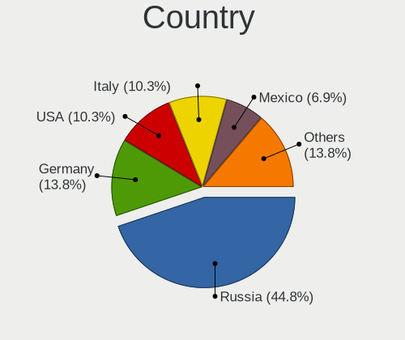

| Country | Desktops | Percent |
|---------|----------|---------|
| Russia  | 7        | 36.84%  |
| Germany | 3        | 15.79%  |
| Mexico  | 2        | 10.53%  |
| Italy   | 2        | 10.53%  |
| Brazil  | 2        | 10.53%  |
| USA     | 1        | 5.26%   |
| Spain   | 1        | 5.26%   |
| Romania | 1        | 5.26%   |

City
----

Geographic location (city)

| City             | Desktops | Percent |
|------------------|----------|---------|
| St Petersburg    | 2        | 10.53%  |
| Puebla City      | 2        | 10.53%  |
| Nuremberg        | 2        | 10.53%  |
| Moscow           | 2        | 10.53%  |
| Milan            | 2        | 10.53%  |
| Blumenau         | 2        | 10.53%  |
| Podolsk          | 1        | 5.26%   |
| Oltenita         | 1        | 5.26%   |
| Monheim am Rhein | 1        | 5.26%   |
| Krasnodar        | 1        | 5.26%   |
| Cherepovets      | 1        | 5.26%   |
| Barcelona        | 1        | 5.26%   |
| Austin           | 1        | 5.26%   |

Drives
------

Drive Vendor
------------

Hard drive vendors

| Vendor              | Desktops | Drives | Percent |
|---------------------|----------|--------|---------|
| NVMe                | 7        | 10     | 22.58%  |
| Samsung Electronics | 5        | 10     | 16.13%  |
| Hitachi             | 3        | 3      | 9.68%   |
| WDC                 | 2        | 2      | 6.45%   |
| Seagate             | 2        | 3      | 6.45%   |
| OPENBSD             | 2        | 2      | 6.45%   |
| Kingston            | 2        | 2      | 6.45%   |
| SanDisk             | 1        | 3      | 3.23%   |
| Intel               | 1        | 1      | 3.23%   |
| HGST                | 1        | 1      | 3.23%   |
| Fujitsu             | 1        | 1      | 3.23%   |
| Crucial             | 1        | 2      | 3.23%   |
| Apacer              | 1        | 1      | 3.23%   |
| AMD                 | 1        | 1      | 3.23%   |
| A-DATA Technology   | 1        | 1      | 3.23%   |

Drive Model
-----------

Hard drive models

| Model                         | Desktops | Percent |
|-------------------------------|----------|---------|
| NVMe Samsung SSD 980 500GB    | 2        | 5.88%   |
| WDC WD5000AZLX-00K2TA0 500GB  | 1        | 2.94%   |
| WDC WD20PURX-64P6ZY0 2TB      | 1        | 2.94%   |
| Seagate ST3500414CS 500GB     | 1        | 2.94%   |
| Seagate ST3250824AS P 250GB   | 1        | 2.94%   |
| Seagate ST3250318AS 250GB     | 1        | 2.94%   |
| SanDisk SSD PLUS 120GB        | 1        | 2.94%   |
| SanDisk Cruzer Blade 64GB     | 1        | 2.94%   |
| Samsung SSD 870 QVO 2TB       | 1        | 2.94%   |
| Samsung SSD 870 EVO 500GB     | 1        | 2.94%   |
| Samsung SSD 840 EVO 250GB     | 1        | 2.94%   |
| Samsung HD161HJ 160GB         | 1        | 2.94%   |
| Samsung Flash Drive FIT 32GB  | 1        | 2.94%   |
| OPENBSD SR RAID 5 9.9TB       | 1        | 2.94%   |
| OPENBSD SR RAID 1 2TB         | 1        | 2.94%   |
| NVMe WDBRPG5000ANC-WR 500GB   | 1        | 2.94%   |
| NVMe TOSHIBA-RC100 240GB      | 1        | 2.94%   |
| NVMe SSSTC CL1-4D256 256GB    | 1        | 2.94%   |
| NVMe Samsung SSD 990 2TB      | 1        | 2.94%   |
| NVMe Sabrent Rocket 4 500GB   | 1        | 2.94%   |
| NVMe Asgard AN1TNVMe- 1TB     | 1        | 2.94%   |
| Kingston SMS200S330G 32GB     | 1        | 2.94%   |
| Kingston SA400S37480G 480GB   | 1        | 2.94%   |
| Intel SSDSC2BW480H6 480GB     | 1        | 2.94%   |
| Hitachi HUA723020ALA640 2TB   | 1        | 2.94%   |
| Hitachi HDS722516VLAT80 164GB | 1        | 2.94%   |
| Hitachi HCS5C1032CLA382 320GB | 1        | 2.94%   |
| HGST HUS724020ALA640 2TB      | 1        | 2.94%   |
| Fujitsu MHV2080BH 80GB        | 1        | 2.94%   |
| Crucial CT500BX500SSD1 500GB  | 1        | 2.94%   |
| Apacer AST280 120GB           | 1        | 2.94%   |
| AMD R5SL120G 120GB            | 1        | 2.94%   |
| A-DATA SP550 240GB            | 1        | 2.94%   |

HDD Vendor
----------

Hard disk drive vendors

| Vendor              | Desktops | Drives | Percent |
|---------------------|----------|--------|---------|
| NVMe                | 4        | 7      | 23.53%  |
| Hitachi             | 3        | 3      | 17.65%  |
| WDC                 | 2        | 2      | 11.76%  |
| Seagate             | 2        | 3      | 11.76%  |
| Samsung Electronics | 2        | 2      | 11.76%  |
| OPENBSD             | 2        | 2      | 11.76%  |
| HGST                | 1        | 1      | 5.88%   |
| Fujitsu             | 1        | 1      | 5.88%   |

SSD Vendor
----------

Solid state drive vendors

| Vendor              | Desktops | Drives | Percent |
|---------------------|----------|--------|---------|
| Samsung Electronics | 3        | 8      | 21.43%  |
| NVMe                | 3        | 3      | 21.43%  |
| Kingston            | 2        | 2      | 14.29%  |
| SanDisk             | 1        | 3      | 7.14%   |
| Intel               | 1        | 1      | 7.14%   |
| Crucial             | 1        | 2      | 7.14%   |
| Apacer              | 1        | 1      | 7.14%   |
| AMD                 | 1        | 1      | 7.14%   |
| A-DATA Technology   | 1        | 1      | 7.14%   |

Drive Kind
----------

HDD or SSD

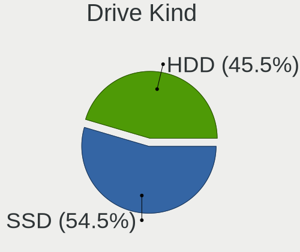

| Kind | Desktops | Drives | Percent |
|------|----------|--------|---------|
| SSD  | 13       | 22     | 54.17%  |
| HDD  | 11       | 21     | 45.83%  |

Drive Connector
---------------

SATA, SAS, NVMe, etc.

| Type | Desktops | Drives | Percent |
|------|----------|--------|---------|
| SATA | 18       | 43     | 100%    |

Drive Size
----------

Size of hard drive

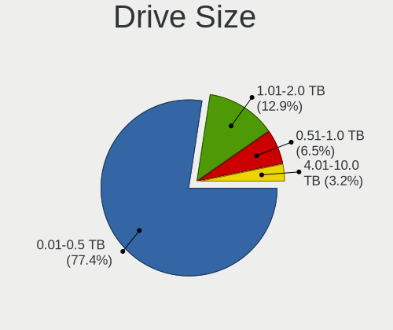

| Size in TB | Desktops | Drives | Percent |
|------------|----------|--------|---------|
| 0.01-0.5   | 17       | 29     | 77.27%  |
| 1.01-2.0   | 4        | 13     | 18.18%  |
| 4.01-10.0  | 1        | 1      | 4.55%   |

Space Total
-----------

Amount of disk space available on the file system

| Size in GB     | Desktops | Percent |
|----------------|----------|---------|
| 251-500        | 5        | 25%     |
| 101-250        | 5        | 25%     |
| 21-50          | 3        | 15%     |
| More than 3000 | 2        | 10%     |
| 501-1000       | 2        | 10%     |
| 51-100         | 2        | 10%     |
| 1-20           | 1        | 5%      |

Space Used
----------

Amount of used disk space

| Used GB        | Desktops | Percent |
|----------------|----------|---------|
| 1-20           | 13       | 68.42%  |
| More than 3000 | 1        | 5.26%   |
| 251-500        | 1        | 5.26%   |
| 21-50          | 1        | 5.26%   |
| 2001-3000      | 1        | 5.26%   |
| 101-250        | 1        | 5.26%   |
| 51-100         | 1        | 5.26%   |

Malfunc. Drives
---------------

Drive models with a malfunction

| Model                                 | Desktops | Drives | Percent |
|---------------------------------------|----------|--------|---------|
| Samsung Electronics SSD 870 EVO 500GB | 1        | 1      | 16.67%  |
| Samsung Electronics SSD 840 EVO 250GB | 1        | 1      | 16.67%  |
| Samsung Electronics HD161HJ 160GB     | 1        | 1      | 16.67%  |
| Intel SSDSC2BW480H6 480GB             | 1        | 1      | 16.67%  |
| Hitachi HDS722516VLAT80 164GB         | 1        | 1      | 16.67%  |
| A-DATA Technology SP550 240GB         | 1        | 1      | 16.67%  |

Malfunc. Drive Vendor
---------------------

Vendors of faulty drives

| Vendor              | Desktops | Drives | Percent |
|---------------------|----------|--------|---------|
| Samsung Electronics | 3        | 3      | 50%     |
| Intel               | 1        | 1      | 16.67%  |
| Hitachi             | 1        | 1      | 16.67%  |
| A-DATA Technology   | 1        | 1      | 16.67%  |

Malfunc. HDD Vendor
-------------------

Vendors of faulty HDD drives

| Vendor              | Desktops | Drives | Percent |
|---------------------|----------|--------|---------|
| Samsung Electronics | 1        | 1      | 50%     |
| Hitachi             | 1        | 1      | 50%     |

Malfunc. Drive Kind
-------------------

Kinds of faulty drives

| Kind | Desktops | Drives | Percent |
|------|----------|--------|---------|
| SSD  | 4        | 4      | 66.67%  |
| HDD  | 2        | 2      | 33.33%  |

Failed Drives
-------------

Failed drive models

Zero info for selected period =(

Failed Drive Vendor
-------------------

Failed drive vendors

Zero info for selected period =(

Drive Status
------------

Number of failed and malfunc. drives

| Status   | Desktops | Drives | Percent |
|----------|----------|--------|---------|
| Works    | 11       | 25     | 45.83%  |
| Detected | 7        | 12     | 29.17%  |
| Malfunc  | 6        | 6      | 25%     |

Storage controller
------------------

Storage Vendor
--------------

Storage controller vendors

| Vendor                         | Desktops | Percent |
|--------------------------------|----------|---------|
| Intel                          | 9        | 33.33%  |
| AMD                            | 8        | 29.63%  |
| Samsung Electronics            | 3        | 11.11%  |
| VIA Technologies               | 1        | 3.7%    |
| Toshiba                        | 1        | 3.7%    |
| Solid State Storage Technology | 1        | 3.7%    |
| Silicon Motion                 | 1        | 3.7%    |
| SanDisk                        | 1        | 3.7%    |
| Phison Electronics             | 1        | 3.7%    |
| Artop Electronic               | 1        | 3.7%    |

Storage Model
-------------

Storage controller models

| Model                                                                         | Desktops | Percent |
|-------------------------------------------------------------------------------|----------|---------|
| AMD FCH SATA Controller [AHCI mode]                                           | 3        | 9.09%   |
| Samsung NVMe SSD Controller PM9A1/PM9A3/980PRO                                | 2        | 6.06%   |
| Intel NM10/ICH7 Family SATA Controller [IDE mode]                             | 2        | 6.06%   |
| AMD SB7x0/SB8x0/SB9x0 IDE Controller                                          | 2        | 6.06%   |
| AMD 500 Series Chipset SATA Controller                                        | 2        | 6.06%   |
| VIA VT82C586A/B/VT82C686/A/B/VT823x/A/C PIPC Bus Master IDE                   | 1        | 3.03%   |
| Toshiba BG3 NVMe SSD Controller                                               | 1        | 3.03%   |
| Solid State Storage CL1-3D256-Q11 NVMe SSD M.2                                | 1        | 3.03%   |
| Silicon Motion SM2263EN/SM2263XT (DRAM-less) NVMe SSD Controllers             | 1        | 3.03%   |
| SanDisk WD Black SN750 / PC SN730 NVMe SSD                                    | 1        | 3.03%   |
| Samsung NVMe SSD Controller S4LV008[Pascal]                                   | 1        | 3.03%   |
| Phison E16 PCIe4 NVMe Controller                                              | 1        | 3.03%   |
| Intel Tiger Lake-LP SATA Controller                                           | 1        | 3.03%   |
| Intel Q170/Q150/B150/H170/H110/Z170/CM236 Chipset SATA Controller [AHCI Mode] | 1        | 3.03%   |
| Intel 82801HR/HO/HH (ICH8R/DO/DH) 2 port SATA Controller [IDE mode]           | 1        | 3.03%   |
| Intel 82801H (ICH8 Family) 4 port SATA Controller [IDE mode]                  | 1        | 3.03%   |
| Intel 82801G (ICH7 Family) IDE Controller                                     | 1        | 3.03%   |
| Intel 82801FB/FW (ICH6/ICH6W) SATA Controller                                 | 1        | 3.03%   |
| Intel 82801FB/FBM/FR/FW/FRW (ICH6 Family) IDE Controller                      | 1        | 3.03%   |
| Intel 631xESB/632xESB/3100 Chipset SATA IDE Controller                        | 1        | 3.03%   |
| Intel 631xESB/632xESB IDE Controller                                          | 1        | 3.03%   |
| Intel 400 Series Chipset Family SATA AHCI Controller                          | 1        | 3.03%   |
| Intel 200 Series PCH SATA controller [AHCI mode]                              | 1        | 3.03%   |
| Artop Electronic AEC6712U SCSI                                                | 1        | 3.03%   |
| AMD SB7x0/SB8x0/SB9x0 SATA Controller [IDE mode]                              | 1        | 3.03%   |
| AMD SB7x0/SB8x0/SB9x0 SATA Controller [AHCI mode]                             | 1        | 3.03%   |
| AMD FCH SATA Controller [IDE mode]                                            | 1        | 3.03%   |

Storage Kind
------------

Kind of storage controller (IDE, SATA, NVMe, SAS, ...)

| Kind | Desktops | Percent |
|------|----------|---------|
| SATA | 11       | 39.29%  |
| IDE  | 9        | 32.14%  |
| NVMe | 7        | 25%     |
| SCSI | 1        | 3.57%   |

Processor
---------

CPU Vendor
----------

Processor vendors

| Vendor | Desktops | Percent |
|--------|----------|---------|
| Intel  | 9        | 47.37%  |
| AMD    | 9        | 47.37%  |
| ARM    | 1        | 5.26%   |

CPU Model
---------

Processor models

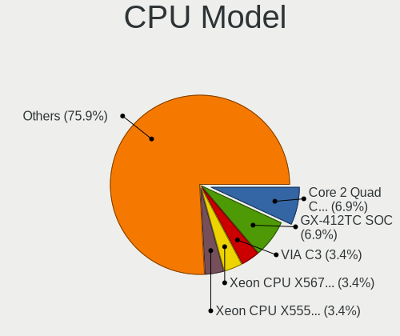

| Model                                                  | Desktops | Percent |
|--------------------------------------------------------|----------|---------|
| AMD GX-412TC SOC                                       | 2        | 10.53%  |
| Intel Xeon CPU E3-1220 v5 @ 3.00GHz                    | 1        | 5.26%   |
| Intel Xeon CPU 5150 @ 2.66GHz                          | 1        | 5.26%   |
| Intel Pentium 4 CPU 3.00GHz ("GenuineIntel" 686-class) | 1        | 5.26%   |
| Intel Core i5-7400 CPU @ 3.00GHz                       | 1        | 5.26%   |
| Intel Core i3-10100 CPU @ 3.60GHz                      | 1        | 5.26%   |
| Intel Core 2 Quad CPU Q9550 @ 2.83GHz                  | 1        | 5.26%   |
| Intel Core 2 Quad CPU Q6600 @ 2.40GHz                  | 1        | 5.26%   |
| Intel Core 2 CPU 6420 @ 2.13GHz                        | 1        | 5.26%   |
| Intel 11th Gen Core i5-1135G7 @ 2.40GHz                | 1        | 5.26%   |
| ARM Cortex-A57 r1p3                                    | 1        | 5.26%   |
| AMD Ryzen 9 7950X 16-Core Processor                    | 1        | 5.26%   |
| AMD Ryzen 9 5950X 16-Core Processor                    | 1        | 5.26%   |
| AMD Ryzen 7 7700X 8-Core Processor                     | 1        | 5.26%   |
| AMD Ryzen 7 3700X 8-Core Processor                     | 1        | 5.26%   |
| AMD Phenom 9550 Quad-Core Processor                    | 1        | 5.26%   |
| AMD K6                                                 | 1        | 5.26%   |
| AMD Athlon II X2 240 Processor                         | 1        | 5.26%   |

CPU Model Family
----------------

Processor model prefix

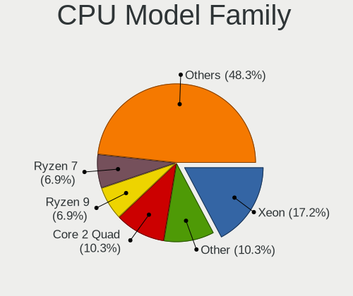

| Model             | Desktops | Percent |
|-------------------|----------|---------|
| Other             | 2        | 10.53%  |
| Intel Xeon        | 2        | 10.53%  |
| Intel Core 2 Quad | 2        | 10.53%  |
| AMD Ryzen 9       | 2        | 10.53%  |
| AMD Ryzen 7       | 2        | 10.53%  |
| AMD GX            | 2        | 10.53%  |
| Intel Pentium 4   | 1        | 5.26%   |
| Intel Core i5     | 1        | 5.26%   |
| Intel Core i3     | 1        | 5.26%   |
| Intel Core 2      | 1        | 5.26%   |
| ARM Cortex        | 1        | 5.26%   |
| AMD Phenom        | 1        | 5.26%   |
| AMD Athlon II X2  | 1        | 5.26%   |

CPU Cores
---------

Number of processor cores

| Number  | Desktops | Percent |
|---------|----------|---------|
| 4       | 8        | 42.11%  |
| Unknown | 3        | 15.79%  |
| 32      | 2        | 10.53%  |
| 16      | 2        | 10.53%  |
| 2       | 2        | 10.53%  |
| 1       | 2        | 10.53%  |

CPU Sockets
-----------

Number of sockets

| Number  | Desktops | Percent |
|---------|----------|---------|
| 1       | 14       | 73.68%  |
| Unknown | 4        | 21.05%  |
| 2       | 1        | 5.26%   |

CPU Threads
-----------

Threads per core (Hyper-Threading)

| Number  | Desktops | Percent |
|---------|----------|---------|
| 1       | 13       | 68.42%  |
| Unknown | 4        | 21.05%  |
| 2       | 2        | 10.53%  |

CPU Microarch
-------------

Microarchitecture

| Name      | Desktops | Percent |
|-----------|----------|---------|
| Core      | 3        | 15.79%  |
| Unknown   | 3        | 15.79%  |
| Puma      | 2        | 10.53%  |
| K10       | 2        | 10.53%  |
| Zen 3     | 1        | 5.26%   |
| Zen 2     | 1        | 5.26%   |
| TigerLake | 1        | 5.26%   |
| Skylake   | 1        | 5.26%   |
| Penryn    | 1        | 5.26%   |
| NetBurst  | 1        | 5.26%   |
| KabyLake  | 1        | 5.26%   |
| Geode     | 1        | 5.26%   |
| CometLake | 1        | 5.26%   |

Graphics
--------

GPU Vendor
----------

Vendors of graphics cards

| Vendor            | Desktops | Percent |
|-------------------|----------|---------|
| Nvidia            | 7        | 36.84%  |
| Intel             | 6        | 31.58%  |
| AMD               | 5        | 26.32%  |
| ASPEED Technology | 1        | 5.26%   |

GPU Model
---------

Graphics card models

| Model                                                         | Desktops | Percent |
|---------------------------------------------------------------|----------|---------|
| Nvidia GK208B [GeForce GT 710]                                | 2        | 10.53%  |
| AMD Raphael                                                   | 2        | 10.53%  |
| Nvidia GT200 [GeForce GTX 260]                                | 1        | 5.26%   |
| Nvidia GP106 [GeForce GTX 1060 6GB]                           | 1        | 5.26%   |
| Nvidia GA104GL [RTX A4000]                                    | 1        | 5.26%   |
| Nvidia GA104 [GeForce RTX 3070 Lite Hash Rate]                | 1        | 5.26%   |
| Nvidia G73 [GeForce 7300 GT]                                  | 1        | 5.26%   |
| Intel TigerLake-LP GT2 [Iris Xe Graphics]                     | 1        | 5.26%   |
| Intel HD Graphics 630                                         | 1        | 5.26%   |
| Intel CometLake-S GT2 [UHD Graphics 630]                      | 1        | 5.26%   |
| Intel 82Q963/Q965 Integrated Graphics Controller              | 1        | 5.26%   |
| Intel 82915G/GV/910GL Integrated Graphics Controller          | 1        | 5.26%   |
| Intel 4 Series Chipset Integrated Graphics Controller         | 1        | 5.26%   |
| ASPEED Technology ASPEED Graphics Family                      | 1        | 5.26%   |
| AMD RV770 [Radeon HD 4850]                                    | 1        | 5.26%   |
| AMD RV200 [Radeon 7500/7500 LE]                               | 1        | 5.26%   |
| AMD Navi 22 [Radeon RX 6700/6700 XT/6750 XT / 6800M/6850M XT] | 1        | 5.26%   |

GPU Combo
---------

Combinations of graphics cards

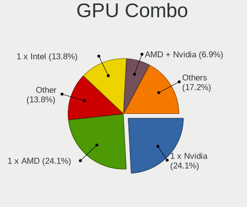

| Name           | Desktops | Percent |
|----------------|----------|---------|
| 1 x Intel      | 5        | 26.32%  |
| 1 x Nvidia     | 4        | 21.05%  |
| Other          | 3        | 15.79%  |
| 1 x AMD        | 3        | 15.79%  |
| AMD + Nvidia   | 2        | 10.53%  |
| Intel + Nvidia | 1        | 5.26%   |
| 1 x ASPEED     | 1        | 5.26%   |

GPU Driver
----------

Free vs proprietary

| Driver  | Desktops | Percent |
|---------|----------|---------|
| Free    | 14       | 73.68%  |
| Unknown | 5        | 26.32%  |

GPU Memory
----------

Total video memory

| Size in GB | Desktops | Percent |
|------------|----------|---------|
| Unknown    | 19       | 100%    |

Monitor
-------

Monitor Vendor
--------------

Monitor vendors

| Vendor              | Desktops | Percent |
|---------------------|----------|---------|
| ViewSonic           | 2        | 18.18%  |
| Samsung Electronics | 2        | 18.18%  |
| Philips             | 2        | 18.18%  |
| MSI                 | 1        | 9.09%   |
| Iiyama              | 1        | 9.09%   |
| Goldstar            | 1        | 9.09%   |
| Chimei Innolux      | 1        | 9.09%   |
| ASUSTek Computer    | 1        | 9.09%   |

Monitor Model
-------------

Monitor models

| Model                                                                | Desktops | Percent |
|----------------------------------------------------------------------|----------|---------|
| ViewSonic VA703-4SERIES VSC6A1E 1280x1024 340x270mm 17.1-inch        | 1        | 9.09%   |
| ViewSonic VA2418-FHD VSCD739 1920x1080 530x300mm 24.0-inch           | 1        | 9.09%   |
| Samsung Electronics SyncMaster SAM03CF 1280x1024 340x270mm 17.1-inch | 1        | 9.09%   |
| Samsung Electronics LCD Monitor SAM0669 1920x1080                    | 1        | 9.09%   |
| Philips PHL 247E6 PHLC0E7 1920x1080 520x290mm 23.4-inch              | 1        | 9.09%   |
| Philips 227E4LH PHLC0AC 1920x1080 480x270mm 21.7-inch                | 1        | 9.09%   |
| MSI MP242 MSI30A1 1920x1080 530x300mm 24.0-inch                      | 1        | 9.09%   |
| Iiyama PL2530H IVM6131 1920x1080 540x300mm 24.3-inch                 | 1        | 9.09%   |
| Goldstar LG ULTRAWIDE GSM76F9 2560x1080 800x340mm 34.2-inch          | 1        | 9.09%   |
| Chimei Innolux LCD Monitor CMN14E5 1920x1080 310x170mm 13.9-inch     | 1        | 9.09%   |
| ASUSTek Computer PA279 AUS2768 3840x2160 600x340mm 27.2-inch         | 1        | 9.09%   |

Monitor Resolution
------------------

Monitor screen resolution

| Resolution       | Desktops | Percent |
|------------------|----------|---------|
| 1920x1080 (FHD)  | 7        | 63.64%  |
| 1280x1024 (SXGA) | 2        | 18.18%  |
| 3840x2160 (4K)   | 1        | 9.09%   |
| 2560x1080        | 1        | 9.09%   |

Monitor Diagonal
----------------

Diagonal size in inches

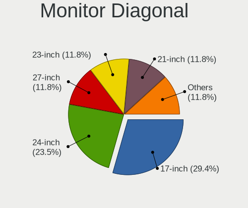

| Inches  | Desktops | Percent |
|---------|----------|---------|
| 24      | 3        | 27.27%  |
| 17      | 2        | 18.18%  |
| 34      | 1        | 9.09%   |
| 27      | 1        | 9.09%   |
| 23      | 1        | 9.09%   |
| 21      | 1        | 9.09%   |
| 13      | 1        | 9.09%   |
| Unknown | 1        | 9.09%   |

Monitor Width
-------------

Physical width

| Width in mm | Desktops | Percent |
|-------------|----------|---------|
| 501-600     | 5        | 45.45%  |
| 301-350     | 3        | 27.27%  |
| 701-800     | 1        | 9.09%   |
| 401-500     | 1        | 9.09%   |
| Unknown     | 1        | 9.09%   |

Aspect Ratio
------------

Proportional relationship between the width and the height

| Ratio | Desktops | Percent |
|-------|----------|---------|
| 16/9  | 8        | 72.73%  |
| 5/4   | 2        | 18.18%  |
| 21/9  | 1        | 9.09%   |

Monitor Area
------------

Area in inch²

| Area in inch² | Desktops | Percent |
|----------------|----------|---------|
| 201-250        | 4        | 36.36%  |
| 141-150        | 2        | 18.18%  |
| 81-90          | 1        | 9.09%   |
| 351-500        | 1        | 9.09%   |
| 301-350        | 1        | 9.09%   |
| 251-300        | 1        | 9.09%   |
| Unknown        | 1        | 9.09%   |

Pixel Density
-------------

Pixels per inch

| Density | Desktops | Percent |
|---------|----------|---------|
| 51-100  | 7        | 63.64%  |
| 161-240 | 1        | 9.09%   |
| 121-160 | 1        | 9.09%   |
| 101-120 | 1        | 9.09%   |
| Unknown | 1        | 9.09%   |

Multiple Monitors
-----------------

Total monitors connected

| Total | Desktops | Percent |
|-------|----------|---------|
| 1     | 11       | 57.89%  |
| 0     | 8        | 42.11%  |

Network
-------

Net Controller Vendor
---------------------

Controller vendors

| Vendor                | Desktops | Percent |
|-----------------------|----------|---------|
| Realtek Semiconductor | 8        | 38.1%   |
| Intel                 | 8        | 38.1%   |
| Qualcomm Atheros      | 2        | 9.52%   |
| Huawei Technologies   | 1        | 4.76%   |
| Edimax Technology     | 1        | 4.76%   |
| Broadcom              | 1        | 4.76%   |

Net Controller Model
--------------------

Controller models

| Model                                                             | Desktops | Percent |
|-------------------------------------------------------------------|----------|---------|
| Realtek RTL8125 2.5GbE Controller                                 | 3        | 14.29%  |
| Realtek RTL8111/8168/8411 PCI Express Gigabit Ethernet Controller | 3        | 14.29%  |
| Intel I210 Gigabit Network Connection                             | 3        | 14.29%  |
| Realtek RTL810xE PCI Express Fast Ethernet controller             | 1        | 4.76%   |
| Realtek RTL-8100/8101L/8139 PCI Fast Ethernet Adapter             | 1        | 4.76%   |
| Qualcomm Atheros AR8151 v1.0 Gigabit Ethernet                     | 1        | 4.76%   |
| Qualcomm Atheros AR8131 Gigabit Ethernet                          | 1        | 4.76%   |
| Intel Wi-Fi 6 AX201                                               | 1        | 4.76%   |
| Intel Wi-Fi 6 AX200                                               | 1        | 4.76%   |
| Intel Ethernet Connection (2) I219-V                              | 1        | 4.76%   |
| Intel 82562ET/EZ/GT/GZ - PRO/100 VE (LOM) Ethernet Controller     | 1        | 4.76%   |
| Intel 80003ES2LAN Gigabit Ethernet Controller (Copper)            | 1        | 4.76%   |
| Huawei E3372 LTE/UMTS/GSM HiLink Modem/Networkcard                | 1        | 4.76%   |
| Edimax AC600 Wireless LAN USB Adapter                             | 1        | 4.76%   |
| Broadcom NetXtreme BCM5755 Gigabit Ethernet PCI Express           | 1        | 4.76%   |

Wireless Vendor
---------------

Wireless vendors

| Vendor            | Desktops | Percent |
|-------------------|----------|---------|
| Intel             | 2        | 66.67%  |
| Edimax Technology | 1        | 33.33%  |

Wireless Model
--------------

Wireless models

| Model                                 | Desktops | Percent |
|---------------------------------------|----------|---------|
| Intel Wi-Fi 6 AX201                   | 1        | 33.33%  |
| Intel Wi-Fi 6 AX200                   | 1        | 33.33%  |
| Edimax AC600 Wireless LAN USB Adapter | 1        | 33.33%  |

Ethernet Vendor
---------------

Ethernet vendors

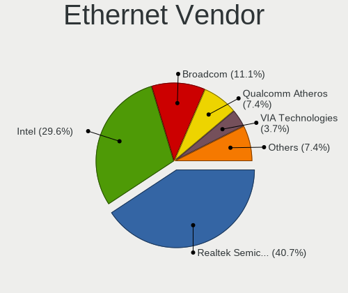

| Vendor                | Desktops | Percent |
|-----------------------|----------|---------|
| Realtek Semiconductor | 8        | 47.06%  |
| Intel                 | 6        | 35.29%  |
| Qualcomm Atheros      | 2        | 11.76%  |
| Broadcom              | 1        | 5.88%   |

Ethernet Model
--------------

Ethernet models

| Model                                                             | Desktops | Percent |
|-------------------------------------------------------------------|----------|---------|
| Realtek RTL8125 2.5GbE Controller                                 | 3        | 17.65%  |
| Realtek RTL8111/8168/8411 PCI Express Gigabit Ethernet Controller | 3        | 17.65%  |
| Intel I210 Gigabit Network Connection                             | 3        | 17.65%  |
| Realtek RTL810xE PCI Express Fast Ethernet controller             | 1        | 5.88%   |
| Realtek RTL-8100/8101L/8139 PCI Fast Ethernet Adapter             | 1        | 5.88%   |
| Qualcomm Atheros AR8151 v1.0 Gigabit Ethernet                     | 1        | 5.88%   |
| Qualcomm Atheros AR8131 Gigabit Ethernet                          | 1        | 5.88%   |
| Intel Ethernet Connection (2) I219-V                              | 1        | 5.88%   |
| Intel 82562ET/EZ/GT/GZ - PRO/100 VE (LOM) Ethernet Controller     | 1        | 5.88%   |
| Intel 80003ES2LAN Gigabit Ethernet Controller (Copper)            | 1        | 5.88%   |
| Broadcom NetXtreme BCM5755 Gigabit Ethernet PCI Express           | 1        | 5.88%   |

Net Controller Kind
-------------------

Ethernet, WiFi or modem

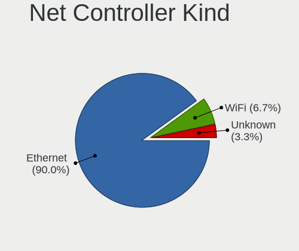

| Kind     | Desktops | Percent |
|----------|----------|---------|
| Ethernet | 17       | 80.95%  |
| WiFi     | 3        | 14.29%  |
| Unknown  | 1        | 4.76%   |

Used Controller
---------------

Currently used network controller

| Kind     | Desktops | Percent |
|----------|----------|---------|
| Ethernet | 14       | 87.5%   |
| WiFi     | 2        | 12.5%   |

NICs
----

Total network controllers on board

| Total | Desktops | Percent |
|-------|----------|---------|
| 1     | 13       | 68.42%  |
| 2     | 3        | 15.79%  |
| 3     | 2        | 10.53%  |
| 0     | 1        | 5.26%   |

IPv6
----

IPv6 vs IPv4

| Used | Desktops | Percent |
|------|----------|---------|
| No   | 19       | 100%    |

Bluetooth
---------

Bluetooth Vendor
----------------

Controller vendors

| Vendor                  | Desktops | Percent |
|-------------------------|----------|---------|
| Intel                   | 2        | 66.67%  |
| Cambridge Silicon Radio | 1        | 33.33%  |

Bluetooth Model
---------------

Controller models

| Model                                               | Desktops | Percent |
|-----------------------------------------------------|----------|---------|
| Intel Bluetooth 9460/9560 Jefferson Peak (JfP)      | 1        | 33.33%  |
| Intel AX200 Bluetooth                               | 1        | 33.33%  |
| Cambridge Silicon Radio Bluetooth Dongle (HCI mode) | 1        | 33.33%  |

Sound
-----

Sound Vendor
------------

Sound card vendors

| Vendor   | Desktops | Percent |
|----------|----------|---------|
| Intel    | 8        | 36.36%  |
| AMD      | 7        | 31.82%  |
| Nvidia   | 5        | 22.73%  |
| Logitech | 1        | 4.55%   |
| JMTek    | 1        | 4.55%   |

Sound Model
-----------

Sound card models

| Model                                                                      | Desktops | Percent |
|----------------------------------------------------------------------------|----------|---------|
| Nvidia GK208 HDMI/DP Audio Controller                                      | 2        | 8%      |
| Nvidia GA104 High Definition Audio Controller                              | 2        | 8%      |
| Intel NM10/ICH7 Family High Definition Audio Controller                    | 2        | 8%      |
| AMD Starship/Matisse HD Audio Controller                                   | 2        | 8%      |
| AMD SBx00 Azalia (Intel HDA)                                               | 2        | 8%      |
| AMD Rembrandt Radeon High Definition Audio Controller                      | 2        | 8%      |
| AMD Family 17h/19h HD Audio Controller                                     | 2        | 8%      |
| Nvidia GP106 High Definition Audio Controller                              | 1        | 4%      |
| Logitech [G533 Wireless Headset Dongle]                                    | 1        | 4%      |
| JMTek USB PnP Audio Device                                                 | 1        | 4%      |
| Intel Tiger Lake-LP Smart Sound Technology Audio Controller                | 1        | 4%      |
| Intel Comet Lake PCH-V cAVS                                                | 1        | 4%      |
| Intel 82801H (ICH8 Family) HD Audio Controller                             | 1        | 4%      |
| Intel 82801FB/FBM/FR/FW/FRW (ICH6 Family) High Definition Audio Controller | 1        | 4%      |
| Intel 631xESB/632xESB High Definition Audio Controller                     | 1        | 4%      |
| Intel 200 Series PCH HD Audio                                              | 1        | 4%      |
| AMD RV770 HDMI Audio [Radeon HD 4850/4870]                                 | 1        | 4%      |
| AMD Navi 21/23 HDMI/DP Audio Controller                                    | 1        | 4%      |

Memory
------

Memory Vendor
-------------

Memory module vendors

| Vendor   | Desktops | Percent |
|----------|----------|---------|
| Kingston | 3        | 75%     |
| Unknown  | 1        | 25%     |

Memory Model
------------

Memory module models

| Model                                                 | Desktops | Percent |
|-------------------------------------------------------|----------|---------|
| Kingston RAM KHX2400C15/8G 8GB DIMM DDR4 2400MT/s     | 1        | 25%     |
| Kingston RAM KF3600C18D4/32GX 32GB DIMM DDR4 2400MT/s | 1        | 25%     |
| Kingston RAM 9905316-005.A04LF 1GB DIMM DDR2 667MT/s  | 1        | 25%     |
| Unknown                                               | 1        | 25%     |

Memory Kind
-----------

Memory module kinds

| Kind  | Desktops | Percent |
|-------|----------|---------|
| DDR4  | 2        | 50%     |
| SDRAM | 1        | 25%     |
| DDR2  | 1        | 25%     |

Memory Form Factor
------------------

Physical design of the memory module

| Name | Desktops | Percent |
|------|----------|---------|
| DIMM | 4        | 100%    |

Memory Size
-----------

Memory module size

| Size  | Desktops | Percent |
|-------|----------|---------|
| 32768 | 1        | 25%     |
| 8192  | 1        | 25%     |
| 2048  | 1        | 25%     |
| 1024  | 1        | 25%     |

Memory Speed
------------

Memory module speed

| Speed | Desktops | Percent |
|-------|----------|---------|
| 2400  | 2        | 50%     |
| 800   | 1        | 25%     |
| 667   | 1        | 25%     |

Printers & scanners
-------------------

Printer Vendor
--------------

Printer device vendors

Zero info for selected period =(

Printer Model
-------------

Printer device models

Zero info for selected period =(

Scanner Vendor
--------------

Scanner device vendors

Zero info for selected period =(

Scanner Model
-------------

Scanner device models

Zero info for selected period =(

Camera
------

Camera Vendor
-------------

Camera device vendors

| Vendor              | Desktops | Percent |
|---------------------|----------|---------|
| Chicony Electronics | 1        | 100%    |

Camera Model
------------

Camera device models

| Model                     | Desktops | Percent |
|---------------------------|----------|---------|
| Chicony Integrated Camera | 1        | 100%    |

Security
--------

Fingerprint Vendor
------------------

Fingerprint sensor vendors

Zero info for selected period =(

Fingerprint Model
-----------------

Fingerprint sensor models

Zero info for selected period =(

Chipcard Vendor
---------------

Chipcard module vendors

Zero info for selected period =(

Chipcard Model
--------------

Chipcard module models

Zero info for selected period =(

Unsupported
-----------

Unsupported Devices
-------------------

Total unsupported devices on board

| Total | Desktops | Percent |
|-------|----------|---------|
| 0     | 10       | 52.63%  |
| 1     | 6        | 31.58%  |
| 2     | 3        | 15.79%  |

Unsupported Device Types
------------------------

Types of unsupported devices

| Type                     | Desktops | Percent |
|--------------------------|----------|---------|
| Graphics card            | 5        | 45.45%  |
| Communication controller | 4        | 36.36%  |
| Firewire controller      | 2        | 18.18%  |

