OpenBSD 7.3 - Tested Hardware & Statistics (Desktops)
-----------------------------------------------------

A project to collect tested hardware configurations for OpenBSD 7.3.

Anyone can contribute to this report by the [hw-probe](https://github.com/linuxhw/hw-probe/blob/master/INSTALL.BSD.md) tool:

    hw-probe -all -upload

Please contribute! Especially if your hardware is rare.

Contents
--------

* [ Test Cases ](#test-cases)

* [ System ](#system)
  - [ Arch                     ](#arch)
  - [ DE                       ](#de)
  - [ Display Server           ](#display-server)
  - [ Display Manager          ](#display-manager)
  - [ OS Lang                  ](#os-lang)
  - [ Boot Mode                ](#boot-mode)
  - [ Filesystem               ](#filesystem)
  - [ Part. scheme             ](#part-scheme)

* [ Board ](#board)
  - [ Vendor                   ](#vendor)
  - [ Model                    ](#model)
  - [ Model Family             ](#model-family)
  - [ MFG Year                 ](#mfg-year)
  - [ Form Factor              ](#form-factor)
  - [ Coreboot                 ](#coreboot)
  - [ RAM Size                 ](#ram-size)
  - [ RAM Used                 ](#ram-used)
  - [ Total Drives             ](#total-drives)
  - [ Has CD-ROM               ](#has-cd-rom)
  - [ Has Ethernet             ](#has-ethernet)
  - [ Has WiFi                 ](#has-wifi)
  - [ Has Bluetooth            ](#has-bluetooth)

* [ Location ](#location)
  - [ Country                  ](#country)
  - [ City                     ](#city)

* [ Drives ](#drives)
  - [ Drive Vendor             ](#drive-vendor)
  - [ Drive Model              ](#drive-model)
  - [ HDD Vendor               ](#hdd-vendor)
  - [ SSD Vendor               ](#ssd-vendor)
  - [ Drive Kind               ](#drive-kind)
  - [ Drive Connector          ](#drive-connector)
  - [ Drive Size               ](#drive-size)
  - [ Space Total              ](#space-total)
  - [ Space Used               ](#space-used)
  - [ Malfunc. Drives          ](#malfunc-drives)
  - [ Malfunc. Drive Vendor    ](#malfunc-drive-vendor)
  - [ Malfunc. HDD Vendor      ](#malfunc-hdd-vendor)
  - [ Malfunc. Drive Kind      ](#malfunc-drive-kind)
  - [ Failed Drives            ](#failed-drives)
  - [ Failed Drive Vendor      ](#failed-drive-vendor)
  - [ Drive Status             ](#drive-status)

* [ Storage controller ](#storage-controller)
  - [ Storage Vendor           ](#storage-vendor)
  - [ Storage Model            ](#storage-model)
  - [ Storage Kind             ](#storage-kind)

* [ Processor ](#processor)
  - [ CPU Vendor               ](#cpu-vendor)
  - [ CPU Model                ](#cpu-model)
  - [ CPU Model Family         ](#cpu-model-family)
  - [ CPU Cores                ](#cpu-cores)
  - [ CPU Sockets              ](#cpu-sockets)
  - [ CPU Threads              ](#cpu-threads)
  - [ CPU Microarch            ](#cpu-microarch)

* [ Graphics ](#graphics)
  - [ GPU Vendor               ](#gpu-vendor)
  - [ GPU Model                ](#gpu-model)
  - [ GPU Combo                ](#gpu-combo)
  - [ GPU Driver               ](#gpu-driver)
  - [ GPU Memory               ](#gpu-memory)

* [ Monitor ](#monitor)
  - [ Monitor Vendor           ](#monitor-vendor)
  - [ Monitor Model            ](#monitor-model)
  - [ Monitor Resolution       ](#monitor-resolution)
  - [ Monitor Diagonal         ](#monitor-diagonal)
  - [ Monitor Width            ](#monitor-width)
  - [ Aspect Ratio             ](#aspect-ratio)
  - [ Monitor Area             ](#monitor-area)
  - [ Pixel Density            ](#pixel-density)
  - [ Multiple Monitors        ](#multiple-monitors)

* [ Network ](#network)
  - [ Net Controller Vendor    ](#net-controller-vendor)
  - [ Net Controller Model     ](#net-controller-model)
  - [ Wireless Vendor          ](#wireless-vendor)
  - [ Wireless Model           ](#wireless-model)
  - [ Ethernet Vendor          ](#ethernet-vendor)
  - [ Ethernet Model           ](#ethernet-model)
  - [ Net Controller Kind      ](#net-controller-kind)
  - [ Used Controller          ](#used-controller)
  - [ NICs                     ](#nics)
  - [ IPv6                     ](#ipv6)

* [ Bluetooth ](#bluetooth)
  - [ Bluetooth Vendor         ](#bluetooth-vendor)
  - [ Bluetooth Model          ](#bluetooth-model)

* [ Sound ](#sound)
  - [ Sound Vendor             ](#sound-vendor)
  - [ Sound Model              ](#sound-model)

* [ Memory ](#memory)
  - [ Memory Vendor            ](#memory-vendor)
  - [ Memory Model             ](#memory-model)
  - [ Memory Kind              ](#memory-kind)
  - [ Memory Form Factor       ](#memory-form-factor)
  - [ Memory Size              ](#memory-size)
  - [ Memory Speed             ](#memory-speed)

* [ Printers & scanners ](#printers--scanners)
  - [ Printer Vendor           ](#printer-vendor)
  - [ Printer Model            ](#printer-model)
  - [ Scanner Vendor           ](#scanner-vendor)
  - [ Scanner Model            ](#scanner-model)

* [ Camera ](#camera)
  - [ Camera Vendor            ](#camera-vendor)
  - [ Camera Model             ](#camera-model)

* [ Security ](#security)
  - [ Fingerprint Vendor       ](#fingerprint-vendor)
  - [ Fingerprint Model        ](#fingerprint-model)
  - [ Chipcard Vendor          ](#chipcard-vendor)
  - [ Chipcard Model           ](#chipcard-model)

* [ Unsupported ](#unsupported)
  - [ Unsupported Devices      ](#unsupported-devices)
  - [ Unsupported Device Types ](#unsupported-device-types)

Test Cases
----------

Total: 8

| Vendor     | Model                | Probe                                                     | Date         |
|------------|----------------------|-----------------------------------------------------------|--------------|
| Lenovo     | V14 G2 ITL 82NM      | [827308827b](https://bsd-hardware.info/?probe=827308827b) | Apr 24, 2023 |
| ASUSTek    | TUF Gaming B550-PLUS | [c26c1111c6](https://bsd-hardware.info/?probe=c26c1111c6) | Apr 21, 2023 |
| Lenovo     | V14 G2 ITL 82NM      | [a6141b809a](https://bsd-hardware.info/?probe=a6141b809a) | Apr 21, 2023 |
| ASUSTek    | P10S-I Series        | [5084c2b77f](https://bsd-hardware.info/?probe=5084c2b77f) | Apr 11, 2023 |
| Apple      | MacPro1,1            | [6843822d8c](https://bsd-hardware.info/?probe=6843822d8c) | Apr 11, 2023 |
| PC Engines | APU2                 | [cdcdfe6e0b](https://bsd-hardware.info/?probe=cdcdfe6e0b) | Apr 10, 2023 |
| Gigabyte   | B250M-Gaming 3       | [a149d0b4b5](https://bsd-hardware.info/?probe=a149d0b4b5) | Apr 10, 2023 |
| Elpitech   | ET101-A1             | [0172697883](https://bsd-hardware.info/?probe=0172697883) | Mar 10, 2023 |

System
------

Arch
----

OS architecture (x86_64, i586, etc.)

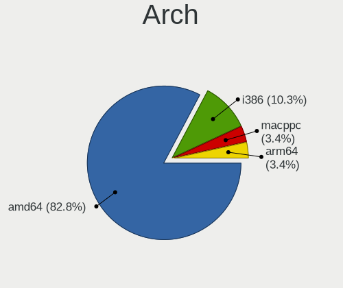

| Name  | Desktops | Percent |
|-------|----------|---------|
| amd64 | 6        | 85.71%  |
| arm64 | 1        | 14.29%  |

DE
--

Desktop Environment

| Name         | Desktops | Percent |
|--------------|----------|---------|
| helloDesktop | 7        | 100%    |

Display Server
--------------

X11 or Wayland

| Name    | Desktops | Percent |
|---------|----------|---------|
| Console | 4        | 57.14%  |
| X11     | 3        | 42.86%  |

Display Manager
---------------

SDDM, LightDM, etc.

| Name    | Desktops | Percent |
|---------|----------|---------|
| Console | 7        | 100%    |

OS Lang
-------

Language

| Lang    | Desktops | Percent |
|---------|----------|---------|
| Unknown | 6        | 85.71%  |
| ru_RU   | 1        | 14.29%  |

Boot Mode
---------

EFI or BIOS

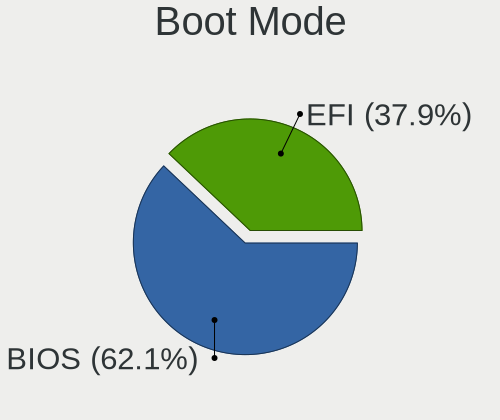

| Mode | Desktops | Percent |
|------|----------|---------|
| EFI  | 4        | 57.14%  |
| BIOS | 3        | 42.86%  |

Filesystem
----------

Type of filesystem

| Type | Desktops | Percent |
|------|----------|---------|
| Ffs  | 7        | 100%    |

Part. scheme
------------

Scheme of partitioning

| Type | Desktops | Percent |
|------|----------|---------|
| MBR  | 4        | 57.14%  |
| GPT  | 3        | 42.86%  |

Board
-----

Vendor
------

Motherboard manufacturer

| Name                | Desktops | Percent |
|---------------------|----------|---------|
| ASUSTek Computer    | 2        | 28.57%  |
| PC Engines          | 1        | 14.29%  |
| Lenovo              | 1        | 14.29%  |
| Gigabyte Technology | 1        | 14.29%  |
| Elpitech            | 1        | 14.29%  |
| Apple               | 1        | 14.29%  |

Model
-----

Motherboard model

| Name                      | Desktops | Percent |
|---------------------------|----------|---------|
| PC Engines APU2           | 1        | 14.29%  |
| Lenovo V14 G2 ITL 82NM    | 1        | 14.29%  |
| Gigabyte B250M-Gaming 3   | 1        | 14.29%  |
| Elpitech ET101-A1         | 1        | 14.29%  |
| ASUS TUF Gaming B550-PLUS | 1        | 14.29%  |
| ASUS P10S-I Series        | 1        | 14.29%  |
| Apple MacPro1,1           | 1        | 14.29%  |

Model Family
------------

Motherboard model prefix

| Name                  | Desktops | Percent |
|-----------------------|----------|---------|
| PC Engines APU2       | 1        | 14.29%  |
| Lenovo V14            | 1        | 14.29%  |
| Gigabyte B250M-Gaming | 1        | 14.29%  |
| Elpitech ET101-A1     | 1        | 14.29%  |
| ASUS TUF              | 1        | 14.29%  |
| ASUS P10S-I           | 1        | 14.29%  |
| Apple MacPro1         | 1        | 14.29%  |

MFG Year
--------

Motherboard manufacture year

| Year | Desktops | Percent |
|------|----------|---------|
| 2022 | 2        | 28.57%  |
| 2023 | 1        | 14.29%  |
| 2019 | 1        | 14.29%  |
| 2018 | 1        | 14.29%  |
| 2016 | 1        | 14.29%  |
| 2007 | 1        | 14.29%  |

Form Factor
-----------

Physical design of the computer

| Name    | Desktops | Percent |
|---------|----------|---------|
| Desktop | 7        | 100%    |

Coreboot
--------

Have coreboot on board

| Used | Desktops | Percent |
|------|----------|---------|
| No   | 6        | 85.71%  |
| Yes  | 1        | 14.29%  |

RAM Size
--------

Total RAM memory

| Size in GB  | Desktops | Percent |
|-------------|----------|---------|
| 8.01-16.0   | 3        | 42.86%  |
| 64.01-256.0 | 2        | 28.57%  |
| 4.01-8.0    | 1        | 14.29%  |
| 32.01-64.0  | 1        | 14.29%  |

RAM Used
--------

Used RAM memory

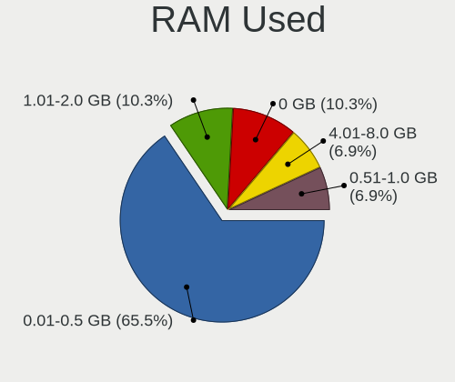

| Used GB  | Desktops | Percent |
|----------|----------|---------|
| 0.01-0.5 | 4        | 57.14%  |
| 4.01-8.0 | 1        | 14.29%  |
| 1.01-2.0 | 1        | 14.29%  |
| 0.51-1.0 | 1        | 14.29%  |

Total Drives
------------

Number of drives on board

| Drives | Desktops | Percent |
|--------|----------|---------|
| 2      | 3        | 42.86%  |
| 1      | 2        | 28.57%  |
| 8      | 1        | 14.29%  |
| 6      | 1        | 14.29%  |

Has CD-ROM
----------

Has CD-ROM on board

| Presented | Desktops | Percent |
|-----------|----------|---------|
| No        | 7        | 100%    |

Has Ethernet
------------

Has Ethernet on board

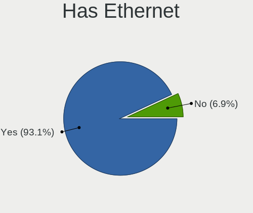

| Presented | Desktops | Percent |
|-----------|----------|---------|
| Yes       | 6        | 85.71%  |
| No        | 1        | 14.29%  |

Has WiFi
--------

Has WiFi module

| Presented | Desktops | Percent |
|-----------|----------|---------|
| No        | 5        | 71.43%  |
| Yes       | 2        | 28.57%  |

Has Bluetooth
-------------

Has Bluetooth module

| Presented | Desktops | Percent |
|-----------|----------|---------|
| No        | 5        | 71.43%  |
| Yes       | 2        | 28.57%  |

Location
--------

Country
-------

Geographic location (country)

| Country | Desktops | Percent |
|---------|----------|---------|
| Russia  | 3        | 42.86%  |
| Brazil  | 2        | 28.57%  |
| Mexico  | 1        | 14.29%  |
| Germany | 1        | 14.29%  |

City
----

Geographic location (city)

| City        | Desktops | Percent |
|-------------|----------|---------|
| Moscow      | 2        | 28.57%  |
| Blumenau    | 2        | 28.57%  |
| Puebla City | 1        | 14.29%  |
| Podolsk     | 1        | 14.29%  |
| Nuremberg   | 1        | 14.29%  |

Drives
------

Drive Vendor
------------

Hard drive vendors

| Vendor              | Desktops | Drives | Percent |
|---------------------|----------|--------|---------|
| NVMe                | 4        | 4      | 25%     |
| Samsung Electronics | 2        | 7      | 12.5%   |
| OPENBSD             | 2        | 2      | 12.5%   |
| WDC                 | 1        | 1      | 6.25%   |
| Seagate             | 1        | 2      | 6.25%   |
| SanDisk             | 1        | 1      | 6.25%   |
| Kingston            | 1        | 1      | 6.25%   |
| Hitachi             | 1        | 1      | 6.25%   |
| HGST                | 1        | 1      | 6.25%   |
| Crucial             | 1        | 1      | 6.25%   |
| Apacer              | 1        | 1      | 6.25%   |

Drive Model
-----------

Hard drive models

| Model                        | Desktops | Percent |
|------------------------------|----------|---------|
| WDC WD20PURX-64P6ZY0 2TB     | 1        | 5.88%   |
| Seagate ST3500414CS 500GB    | 1        | 5.88%   |
| Seagate ST3250824AS P 250GB  | 1        | 5.88%   |
| SanDisk SSD PLUS 120GB       | 1        | 5.88%   |
| Samsung SSD 870 QVO 2TB      | 1        | 5.88%   |
| Samsung Flash Drive FIT 32GB | 1        | 5.88%   |
| OPENBSD SR RAID 5 9.9TB      | 1        | 5.88%   |
| OPENBSD SR RAID 1 2TB        | 1        | 5.88%   |
| NVMe TOSHIBA-RC100 240GB     | 1        | 5.88%   |
| NVMe SSSTC CL1-4D256 256GB   | 1        | 5.88%   |
| NVMe Samsung SSD 980 1TB     | 1        | 5.88%   |
| NVMe Asgard AN1TNVMe- 1TB    | 1        | 5.88%   |
| Kingston SMS200S330G 32GB    | 1        | 5.88%   |
| Hitachi HUA723020ALA640 2TB  | 1        | 5.88%   |
| HGST HUS724020ALA640 2TB     | 1        | 5.88%   |
| Crucial CT500BX500SSD1 500GB | 1        | 5.88%   |
| Apacer AST280 120GB          | 1        | 5.88%   |

HDD Vendor
----------

Hard disk drive vendors

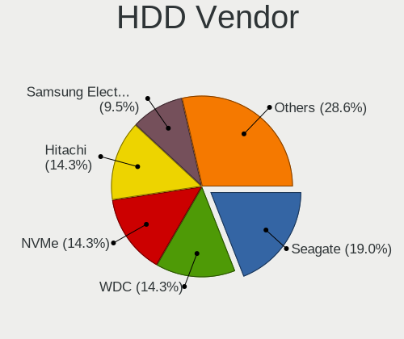

| Vendor              | Desktops | Drives | Percent |
|---------------------|----------|--------|---------|
| NVMe                | 3        | 3      | 30%     |
| OPENBSD             | 2        | 2      | 20%     |
| WDC                 | 1        | 1      | 10%     |
| Seagate             | 1        | 2      | 10%     |
| Samsung Electronics | 1        | 1      | 10%     |
| Hitachi             | 1        | 1      | 10%     |
| HGST                | 1        | 1      | 10%     |

SSD Vendor
----------

Solid state drive vendors

| Vendor              | Desktops | Drives | Percent |
|---------------------|----------|--------|---------|
| SanDisk             | 1        | 1      | 16.67%  |
| Samsung Electronics | 1        | 6      | 16.67%  |
| NVMe                | 1        | 1      | 16.67%  |
| Kingston            | 1        | 1      | 16.67%  |
| Crucial             | 1        | 1      | 16.67%  |
| Apacer              | 1        | 1      | 16.67%  |

Drive Kind
----------

HDD or SSD

| Kind | Desktops | Drives | Percent |
|------|----------|--------|---------|
| SSD  | 5        | 11     | 50%     |
| HDD  | 5        | 11     | 50%     |

Drive Connector
---------------

SATA, SAS, NVMe, etc.

| Type | Desktops | Drives | Percent |
|------|----------|--------|---------|
| SATA | 7        | 22     | 100%    |

Drive Size
----------

Size of hard drive

| Size in TB | Desktops | Drives | Percent |
|------------|----------|--------|---------|
| 0.01-0.5   | 6        | 9      | 54.55%  |
| 1.01-2.0   | 3        | 11     | 27.27%  |
| 4.01-10.0  | 1        | 1      | 9.09%   |
| 0.51-1.0   | 1        | 1      | 9.09%   |

Space Total
-----------

Amount of disk space available on the file system

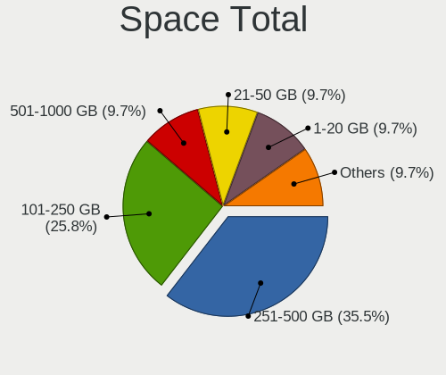

| Size in GB     | Desktops | Percent |
|----------------|----------|---------|
| More than 3000 | 2        | 28.57%  |
| 101-250        | 2        | 28.57%  |
| 51-100         | 2        | 28.57%  |
| 21-50          | 1        | 14.29%  |

Space Used
----------

Amount of used disk space

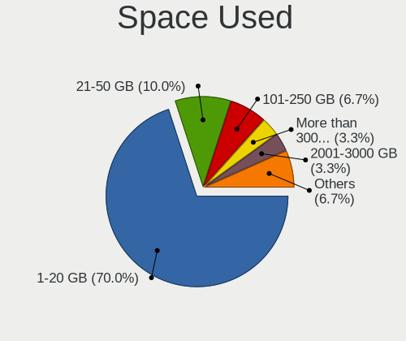

| Used GB        | Desktops | Percent |
|----------------|----------|---------|
| 1-20           | 4        | 57.14%  |
| More than 3000 | 1        | 14.29%  |
| 2001-3000      | 1        | 14.29%  |
| 101-250        | 1        | 14.29%  |

Malfunc. Drives
---------------

Drive models with a malfunction

Zero info for selected period =(

Malfunc. Drive Vendor
---------------------

Vendors of faulty drives

Zero info for selected period =(

Malfunc. HDD Vendor
-------------------

Vendors of faulty HDD drives

Zero info for selected period =(

Malfunc. Drive Kind
-------------------

Kinds of faulty drives

Zero info for selected period =(

Failed Drives
-------------

Failed drive models

Zero info for selected period =(

Failed Drive Vendor
-------------------

Failed drive vendors

Zero info for selected period =(

Drive Status
------------

Number of failed and malfunc. drives

| Status   | Desktops | Drives | Percent |
|----------|----------|--------|---------|
| Works    | 7        | 16     | 63.64%  |
| Detected | 4        | 6      | 36.36%  |

Storage controller
------------------

Storage Vendor
--------------

Storage controller vendors

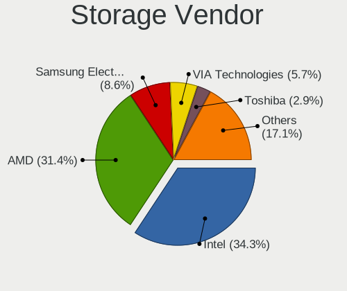

| Vendor                         | Desktops | Percent |
|--------------------------------|----------|---------|
| Intel                          | 4        | 40%     |
| AMD                            | 2        | 20%     |
| Toshiba                        | 1        | 10%     |
| Solid State Storage Technology | 1        | 10%     |
| Silicon Motion                 | 1        | 10%     |
| Samsung Electronics            | 1        | 10%     |

Storage Model
-------------

Storage controller models

| Model                                                                         | Desktops | Percent |
|-------------------------------------------------------------------------------|----------|---------|
| Toshiba BG3 NVMe SSD Controller                                               | 1        | 9.09%   |
| Solid State Storage CL1                                                       | 1        | 9.09%   |
| Silicon Motion SM2263EN/SM2263XT SSD Controller                               | 1        | 9.09%   |
| Samsung NVMe SSD Controller PM9A1/PM9A3/980PRO                                | 1        | 9.09%   |
| Intel Tiger Lake-LP SATA Controller                                           | 1        | 9.09%   |
| Intel Q170/Q150/B150/H170/H110/Z170/CM236 Chipset SATA Controller [AHCI Mode] | 1        | 9.09%   |
| Intel 631xESB/632xESB/3100 Chipset SATA IDE Controller                        | 1        | 9.09%   |
| Intel 631xESB/632xESB IDE Controller                                          | 1        | 9.09%   |
| Intel 200 Series PCH SATA controller [AHCI mode]                              | 1        | 9.09%   |
| AMD FCH SATA Controller [AHCI mode]                                           | 1        | 9.09%   |
| AMD 500 Series Chipset SATA Controller                                        | 1        | 9.09%   |

Storage Kind
------------

Kind of storage controller (IDE, SATA, NVMe, SAS, ...)

| Kind | Desktops | Percent |
|------|----------|---------|
| SATA | 5        | 50%     |
| NVMe | 4        | 40%     |
| IDE  | 1        | 10%     |

Processor
---------

CPU Vendor
----------

Processor vendors

| Vendor | Desktops | Percent |
|--------|----------|---------|
| Intel  | 4        | 57.14%  |
| AMD    | 2        | 28.57%  |
| ARM    | 1        | 14.29%  |

CPU Model
---------

Processor models

| Model                                   | Desktops | Percent |
|-----------------------------------------|----------|---------|
| Intel Xeon CPU E3-1220 v5 @ 3.00GHz     | 1        | 14.29%  |
| Intel Xeon CPU 5150 @ 2.66GHz           | 1        | 14.29%  |
| Intel Core i5-7400 CPU @ 3.00GHz        | 1        | 14.29%  |
| Intel 11th Gen Core i5-1135G7 @ 2.40GHz | 1        | 14.29%  |
| ARM Cortex-A57 r1p3                     | 1        | 14.29%  |
| AMD Ryzen 9 5950X 16-Core Processor     | 1        | 14.29%  |
| AMD GX-412TC SOC                        | 1        | 14.29%  |

CPU Model Family
----------------

Processor model prefix

| Model         | Desktops | Percent |
|---------------|----------|---------|
| Intel Xeon    | 2        | 28.57%  |
| Other         | 1        | 14.29%  |
| Intel Core i5 | 1        | 14.29%  |
| ARM Cortex    | 1        | 14.29%  |
| AMD Ryzen 9   | 1        | 14.29%  |
| AMD GX        | 1        | 14.29%  |

CPU Cores
---------

Number of processor cores

| Number  | Desktops | Percent |
|---------|----------|---------|
| 4       | 4        | 57.14%  |
| Unknown | 2        | 28.57%  |
| 32      | 1        | 14.29%  |

CPU Sockets
-----------

Number of sockets

| Number  | Desktops | Percent |
|---------|----------|---------|
| 1       | 5        | 71.43%  |
| Unknown | 2        | 28.57%  |

CPU Threads
-----------

Threads per core (Hyper-Threading)

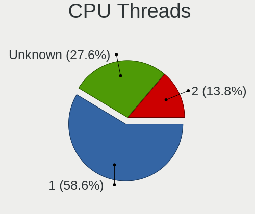

| Number  | Desktops | Percent |
|---------|----------|---------|
| 1       | 4        | 57.14%  |
| Unknown | 2        | 28.57%  |
| 2       | 1        | 14.29%  |

CPU Microarch
-------------

Microarchitecture

| Name      | Desktops | Percent |
|-----------|----------|---------|
| Zen 3     | 1        | 14.29%  |
| TigerLake | 1        | 14.29%  |
| Skylake   | 1        | 14.29%  |
| Puma      | 1        | 14.29%  |
| KabyLake  | 1        | 14.29%  |
| Core      | 1        | 14.29%  |
| Unknown   | 1        | 14.29%  |

Graphics
--------

GPU Vendor
----------

Vendors of graphics cards

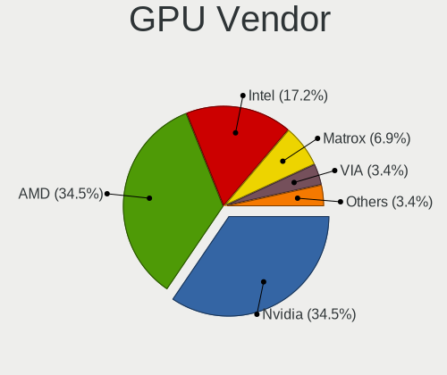

| Vendor            | Desktops | Percent |
|-------------------|----------|---------|
| Nvidia            | 3        | 50%     |
| Intel             | 2        | 33.33%  |
| ASPEED Technology | 1        | 16.67%  |

GPU Model
---------

Graphics card models

| Model                                     | Desktops | Percent |
|-------------------------------------------|----------|---------|
| Nvidia GP106 [GeForce GTX 1060 6GB]       | 1        | 16.67%  |
| Nvidia GK208B [GeForce GT 710]            | 1        | 16.67%  |
| Nvidia G73 [GeForce 7300 GT]              | 1        | 16.67%  |
| Intel TigerLake-LP GT2 [Iris Xe Graphics] | 1        | 16.67%  |
| Intel HD Graphics 630                     | 1        | 16.67%  |
| ASPEED Technology ASPEED Graphics Family  | 1        | 16.67%  |

GPU Combo
---------

Combinations of graphics cards

| Name           | Desktops | Percent |
|----------------|----------|---------|
| Other          | 2        | 28.57%  |
| 1 x Nvidia     | 2        | 28.57%  |
| Intel + Nvidia | 1        | 14.29%  |
| 1 x Intel      | 1        | 14.29%  |
| 1 x ASPEED     | 1        | 14.29%  |

GPU Driver
----------

Free vs proprietary

| Driver  | Desktops | Percent |
|---------|----------|---------|
| Unknown | 4        | 57.14%  |
| Free    | 3        | 42.86%  |

GPU Memory
----------

Total video memory

| Size in GB | Desktops | Percent |
|------------|----------|---------|
| Unknown    | 7        | 100%    |

Monitor
-------

Monitor Vendor
--------------

Monitor vendors

Zero info for selected period =(

Monitor Model
-------------

Monitor models

Zero info for selected period =(

Monitor Resolution
------------------

Monitor screen resolution

Zero info for selected period =(

Monitor Diagonal
----------------

Diagonal size in inches

Zero info for selected period =(

Monitor Width
-------------

Physical width

Zero info for selected period =(

Aspect Ratio
------------

Proportional relationship between the width and the height

Zero info for selected period =(

Monitor Area
------------

Area in inch²

Zero info for selected period =(

Pixel Density
-------------

Pixels per inch

Zero info for selected period =(

Multiple Monitors
-----------------

Total monitors connected

| Total | Desktops | Percent |
|-------|----------|---------|
| 0     | 5        | 71.43%  |
| 1     | 2        | 28.57%  |

Network
-------

Net Controller Vendor
---------------------

Controller vendors

| Vendor                | Desktops | Percent |
|-----------------------|----------|---------|
| Intel                 | 5        | 55.56%  |
| Realtek Semiconductor | 2        | 22.22%  |
| Huawei Technologies   | 1        | 11.11%  |
| Edimax Technology     | 1        | 11.11%  |

Net Controller Model
--------------------

Controller models

| Model                                                             | Desktops | Percent |
|-------------------------------------------------------------------|----------|---------|
| Intel I210 Gigabit Network Connection                             | 2        | 22.22%  |
| Realtek RTL8125 2.5GbE Controller                                 | 1        | 11.11%  |
| Realtek RTL8111/8168/8411 PCI Express Gigabit Ethernet Controller | 1        | 11.11%  |
| Intel Wi-Fi 6 AX201                                               | 1        | 11.11%  |
| Intel Ethernet Connection (2) I219-V                              | 1        | 11.11%  |
| Intel 80003ES2LAN Gigabit Ethernet Controller (Copper)            | 1        | 11.11%  |
| Huawei E3372 LTE/UMTS/GSM HiLink Modem/Networkcard                | 1        | 11.11%  |
| Edimax AC600 Wireless LAN USB Adapter                             | 1        | 11.11%  |

Wireless Vendor
---------------

Wireless vendors

| Vendor            | Desktops | Percent |
|-------------------|----------|---------|
| Intel             | 1        | 50%     |
| Edimax Technology | 1        | 50%     |

Wireless Model
--------------

Wireless models

| Model                                 | Desktops | Percent |
|---------------------------------------|----------|---------|
| Intel Wi-Fi 6 AX201                   | 1        | 50%     |
| Edimax AC600 Wireless LAN USB Adapter | 1        | 50%     |

Ethernet Vendor
---------------

Ethernet vendors

| Vendor                | Desktops | Percent |
|-----------------------|----------|---------|
| Intel                 | 4        | 66.67%  |
| Realtek Semiconductor | 2        | 33.33%  |

Ethernet Model
--------------

Ethernet models

| Model                                                             | Desktops | Percent |
|-------------------------------------------------------------------|----------|---------|
| Intel I210 Gigabit Network Connection                             | 2        | 33.33%  |
| Realtek RTL8125 2.5GbE Controller                                 | 1        | 16.67%  |
| Realtek RTL8111/8168/8411 PCI Express Gigabit Ethernet Controller | 1        | 16.67%  |
| Intel Ethernet Connection (2) I219-V                              | 1        | 16.67%  |
| Intel 80003ES2LAN Gigabit Ethernet Controller (Copper)            | 1        | 16.67%  |

Net Controller Kind
-------------------

Ethernet, WiFi or modem

| Kind     | Desktops | Percent |
|----------|----------|---------|
| Ethernet | 6        | 66.67%  |
| WiFi     | 2        | 22.22%  |
| Unknown  | 1        | 11.11%  |

Used Controller
---------------

Currently used network controller

| Kind     | Desktops | Percent |
|----------|----------|---------|
| Ethernet | 3        | 75%     |
| WiFi     | 1        | 25%     |

NICs
----

Total network controllers on board

| Total | Desktops | Percent |
|-------|----------|---------|
| 2     | 3        | 42.86%  |
| 1     | 2        | 28.57%  |
| 3     | 1        | 14.29%  |
| 0     | 1        | 14.29%  |

IPv6
----

IPv6 vs IPv4

| Used | Desktops | Percent |
|------|----------|---------|
| No   | 7        | 100%    |

Bluetooth
---------

Bluetooth Vendor
----------------

Controller vendors

| Vendor                  | Desktops | Percent |
|-------------------------|----------|---------|
| Intel                   | 1        | 50%     |
| Cambridge Silicon Radio | 1        | 50%     |

Bluetooth Model
---------------

Controller models

| Model                                               | Desktops | Percent |
|-----------------------------------------------------|----------|---------|
| Intel Bluetooth 9460/9560 Jefferson Peak (JfP)      | 1        | 50%     |
| Cambridge Silicon Radio Bluetooth Dongle (HCI mode) | 1        | 50%     |

Sound
-----

Sound Vendor
------------

Sound card vendors

| Vendor | Desktops | Percent |
|--------|----------|---------|
| Intel  | 3        | 42.86%  |
| Nvidia | 2        | 28.57%  |
| JMTek  | 1        | 14.29%  |
| AMD    | 1        | 14.29%  |

Sound Model
-----------

Sound card models

| Model                                                       | Desktops | Percent |
|-------------------------------------------------------------|----------|---------|
| Nvidia GP106 High Definition Audio Controller               | 1        | 14.29%  |
| Nvidia GK208 HDMI/DP Audio Controller                       | 1        | 14.29%  |
| JMTek USB PnP Audio Device                                  | 1        | 14.29%  |
| Intel Tiger Lake-LP Smart Sound Technology Audio Controller | 1        | 14.29%  |
| Intel 631xESB/632xESB High Definition Audio Controller      | 1        | 14.29%  |
| Intel 200 Series PCH HD Audio                               | 1        | 14.29%  |
| AMD Starship/Matisse HD Audio Controller                    | 1        | 14.29%  |

Memory
------

Memory Vendor
-------------

Memory module vendors

| Vendor   | Desktops | Percent |
|----------|----------|---------|
| Kingston | 1        | 100%    |

Memory Model
------------

Memory module models

| Model                                                 | Desktops | Percent |
|-------------------------------------------------------|----------|---------|
| Kingston RAM KF3600C18D4/32GX 32GB DIMM DDR4 2400MT/s | 1        | 100%    |

Memory Kind
-----------

Memory module kinds

| Kind | Desktops | Percent |
|------|----------|---------|
| DDR4 | 1        | 100%    |

Memory Form Factor
------------------

Physical design of the memory module

| Name | Desktops | Percent |
|------|----------|---------|
| DIMM | 1        | 100%    |

Memory Size
-----------

Memory module size

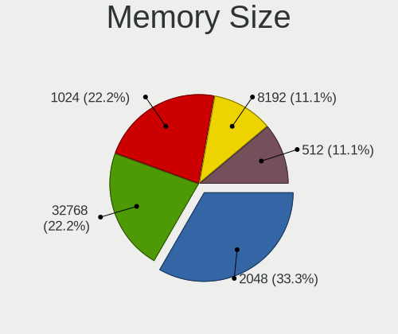

| Size  | Desktops | Percent |
|-------|----------|---------|
| 32768 | 1        | 100%    |

Memory Speed
------------

Memory module speed

| Speed | Desktops | Percent |
|-------|----------|---------|
| 2400  | 1        | 100%    |

Printers & scanners
-------------------

Printer Vendor
--------------

Printer device vendors

Zero info for selected period =(

Printer Model
-------------

Printer device models

Zero info for selected period =(

Scanner Vendor
--------------

Scanner device vendors

Zero info for selected period =(

Scanner Model
-------------

Scanner device models

Zero info for selected period =(

Camera
------

Camera Vendor
-------------

Camera device vendors

| Vendor              | Desktops | Percent |
|---------------------|----------|---------|
| Chicony Electronics | 1        | 100%    |

Camera Model
------------

Camera device models

| Model                     | Desktops | Percent |
|---------------------------|----------|---------|
| Chicony Integrated Camera | 1        | 100%    |

Security
--------

Fingerprint Vendor
------------------

Fingerprint sensor vendors

Zero info for selected period =(

Fingerprint Model
-----------------

Fingerprint sensor models

Zero info for selected period =(

Chipcard Vendor
---------------

Chipcard module vendors

Zero info for selected period =(

Chipcard Model
--------------

Chipcard module models

Zero info for selected period =(

Unsupported
-----------

Unsupported Devices
-------------------

Total unsupported devices on board

| Total | Desktops | Percent |
|-------|----------|---------|
| 2     | 3        | 42.86%  |
| 1     | 2        | 28.57%  |
| 0     | 2        | 28.57%  |

Unsupported Device Types
------------------------

Types of unsupported devices

| Type                     | Desktops | Percent |
|--------------------------|----------|---------|
| Graphics card            | 3        | 42.86%  |
| Communication controller | 3        | 42.86%  |
| Firewire controller      | 1        | 14.29%  |

