OpenBSD 7.3 - Tested Hardware & Statistics (Notebooks)
------------------------------------------------------

A project to collect tested hardware configurations for OpenBSD 7.3.

Anyone can contribute to this report by the [hw-probe](https://github.com/linuxhw/hw-probe/blob/master/INSTALL.BSD.md) tool:

    hw-probe -all -upload

Please contribute! Especially if your hardware is rare.

Contents
--------

* [ Test Cases ](#test-cases)

* [ System ](#system)
  - [ Arch                     ](#arch)
  - [ DE                       ](#de)
  - [ Display Server           ](#display-server)
  - [ Display Manager          ](#display-manager)
  - [ OS Lang                  ](#os-lang)
  - [ Boot Mode                ](#boot-mode)
  - [ Filesystem               ](#filesystem)
  - [ Part. scheme             ](#part-scheme)

* [ Board ](#board)
  - [ Vendor                   ](#vendor)
  - [ Model                    ](#model)
  - [ Model Family             ](#model-family)
  - [ MFG Year                 ](#mfg-year)
  - [ Form Factor              ](#form-factor)
  - [ Coreboot                 ](#coreboot)
  - [ RAM Size                 ](#ram-size)
  - [ RAM Used                 ](#ram-used)
  - [ Total Drives             ](#total-drives)
  - [ Has CD-ROM               ](#has-cd-rom)
  - [ Has Ethernet             ](#has-ethernet)
  - [ Has WiFi                 ](#has-wifi)
  - [ Has Bluetooth            ](#has-bluetooth)

* [ Location ](#location)
  - [ Country                  ](#country)
  - [ City                     ](#city)

* [ Drives ](#drives)
  - [ Drive Vendor             ](#drive-vendor)
  - [ Drive Model              ](#drive-model)
  - [ HDD Vendor               ](#hdd-vendor)
  - [ SSD Vendor               ](#ssd-vendor)
  - [ Drive Kind               ](#drive-kind)
  - [ Drive Connector          ](#drive-connector)
  - [ Drive Size               ](#drive-size)
  - [ Space Total              ](#space-total)
  - [ Space Used               ](#space-used)
  - [ Malfunc. Drives          ](#malfunc-drives)
  - [ Malfunc. Drive Vendor    ](#malfunc-drive-vendor)
  - [ Malfunc. HDD Vendor      ](#malfunc-hdd-vendor)
  - [ Malfunc. Drive Kind      ](#malfunc-drive-kind)
  - [ Failed Drives            ](#failed-drives)
  - [ Failed Drive Vendor      ](#failed-drive-vendor)
  - [ Drive Status             ](#drive-status)

* [ Storage controller ](#storage-controller)
  - [ Storage Vendor           ](#storage-vendor)
  - [ Storage Model            ](#storage-model)
  - [ Storage Kind             ](#storage-kind)

* [ Processor ](#processor)
  - [ CPU Vendor               ](#cpu-vendor)
  - [ CPU Model                ](#cpu-model)
  - [ CPU Model Family         ](#cpu-model-family)
  - [ CPU Cores                ](#cpu-cores)
  - [ CPU Sockets              ](#cpu-sockets)
  - [ CPU Threads              ](#cpu-threads)
  - [ CPU Microarch            ](#cpu-microarch)

* [ Graphics ](#graphics)
  - [ GPU Vendor               ](#gpu-vendor)
  - [ GPU Model                ](#gpu-model)
  - [ GPU Combo                ](#gpu-combo)
  - [ GPU Driver               ](#gpu-driver)
  - [ GPU Memory               ](#gpu-memory)

* [ Monitor ](#monitor)
  - [ Monitor Vendor           ](#monitor-vendor)
  - [ Monitor Model            ](#monitor-model)
  - [ Monitor Resolution       ](#monitor-resolution)
  - [ Monitor Diagonal         ](#monitor-diagonal)
  - [ Monitor Width            ](#monitor-width)
  - [ Aspect Ratio             ](#aspect-ratio)
  - [ Monitor Area             ](#monitor-area)
  - [ Pixel Density            ](#pixel-density)
  - [ Multiple Monitors        ](#multiple-monitors)

* [ Network ](#network)
  - [ Net Controller Vendor    ](#net-controller-vendor)
  - [ Net Controller Model     ](#net-controller-model)
  - [ Wireless Vendor          ](#wireless-vendor)
  - [ Wireless Model           ](#wireless-model)
  - [ Ethernet Vendor          ](#ethernet-vendor)
  - [ Ethernet Model           ](#ethernet-model)
  - [ Net Controller Kind      ](#net-controller-kind)
  - [ Used Controller          ](#used-controller)
  - [ NICs                     ](#nics)
  - [ IPv6                     ](#ipv6)

* [ Bluetooth ](#bluetooth)
  - [ Bluetooth Vendor         ](#bluetooth-vendor)
  - [ Bluetooth Model          ](#bluetooth-model)

* [ Sound ](#sound)
  - [ Sound Vendor             ](#sound-vendor)
  - [ Sound Model              ](#sound-model)

* [ Memory ](#memory)
  - [ Memory Vendor            ](#memory-vendor)
  - [ Memory Model             ](#memory-model)
  - [ Memory Kind              ](#memory-kind)
  - [ Memory Form Factor       ](#memory-form-factor)
  - [ Memory Size              ](#memory-size)
  - [ Memory Speed             ](#memory-speed)

* [ Printers & scanners ](#printers--scanners)
  - [ Printer Vendor           ](#printer-vendor)
  - [ Printer Model            ](#printer-model)
  - [ Scanner Vendor           ](#scanner-vendor)
  - [ Scanner Model            ](#scanner-model)

* [ Camera ](#camera)
  - [ Camera Vendor            ](#camera-vendor)
  - [ Camera Model             ](#camera-model)

* [ Security ](#security)
  - [ Fingerprint Vendor       ](#fingerprint-vendor)
  - [ Fingerprint Model        ](#fingerprint-model)
  - [ Chipcard Vendor          ](#chipcard-vendor)
  - [ Chipcard Model           ](#chipcard-model)

* [ Unsupported ](#unsupported)
  - [ Unsupported Devices      ](#unsupported-devices)
  - [ Unsupported Device Types ](#unsupported-device-types)

Test Cases
----------

Total: 9

| Vendor  | Model                       | Probe                                                     | Date         |
|---------|-----------------------------|-----------------------------------------------------------|--------------|
| Lenovo  | ThinkPad X260 20F5S2GM00    | [c4af168c4a](https://bsd-hardware.info/?probe=c4af168c4a) | May 01, 2023 |
| Lenovo  | ThinkPad X270 W10DG 20K5... | [cf504f51df](https://bsd-hardware.info/?probe=cf504f51df) | May 01, 2023 |
| Fujitsu | LIFEBOOK E752               | [44ea9fb6ae](https://bsd-hardware.info/?probe=44ea9fb6ae) | Apr 30, 2023 |
| HP      | Pavilion Notebook           | [247810c987](https://bsd-hardware.info/?probe=247810c987) | Apr 24, 2023 |
| HP      | Pavilion Notebook           | [243a9c2f22](https://bsd-hardware.info/?probe=243a9c2f22) | Apr 22, 2023 |
| Lenovo  | G570 20079                  | [0ebba481d1](https://bsd-hardware.info/?probe=0ebba481d1) | Apr 14, 2023 |
| Lenovo  | ThinkPad T440s 20ARA07PL... | [04ddab3620](https://bsd-hardware.info/?probe=04ddab3620) | Apr 14, 2023 |
| Lenovo  | ThinkPad X230 23257EP       | [e94085cd2d](https://bsd-hardware.info/?probe=e94085cd2d) | Apr 12, 2023 |
| Lenovo  | ThinkPad T450s 20BW001KL... | [4f6a7e2739](https://bsd-hardware.info/?probe=4f6a7e2739) | Apr 02, 2023 |

System
------

Arch
----

OS architecture (x86_64, i586, etc.)

| Name  | Notebooks | Percent |
|-------|-----------|---------|
| amd64 | 8         | 100%    |

DE
--

Desktop Environment

| Name         | Notebooks | Percent |
|--------------|-----------|---------|
| helloDesktop | 6         | 75%     |
| MATE         | 1         | 12.5%   |
| GNOME        | 1         | 12.5%   |

Display Server
--------------

X11 or Wayland

| Name    | Notebooks | Percent |
|---------|-----------|---------|
| X11     | 7         | 87.5%   |
| Console | 1         | 12.5%   |

Display Manager
---------------

SDDM, LightDM, etc.

| Name    | Notebooks | Percent |
|---------|-----------|---------|
| Console | 8         | 100%    |

OS Lang
-------

Language

| Lang    | Notebooks | Percent |
|---------|-----------|---------|
| Unknown | 7         | 87.5%   |
| es_ES   | 1         | 12.5%   |

Boot Mode
---------

EFI or BIOS

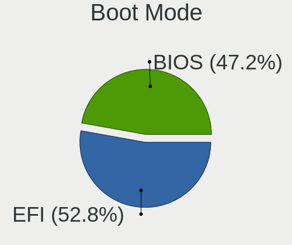

| Mode | Notebooks | Percent |
|------|-----------|---------|
| EFI  | 6         | 75%     |
| BIOS | 2         | 25%     |

Filesystem
----------

Type of filesystem

| Type | Notebooks | Percent |
|------|-----------|---------|
| Ffs  | 8         | 100%    |

Part. scheme
------------

Scheme of partitioning

| Type | Notebooks | Percent |
|------|-----------|---------|
| GPT  | 6         | 75%     |
| MBR  | 2         | 25%     |

Board
-----

Vendor
------

Motherboard manufacturer

| Name            | Notebooks | Percent |
|-----------------|-----------|---------|
| Lenovo          | 6         | 75%     |
| Hewlett-Packard | 1         | 12.5%   |
| Fujitsu         | 1         | 12.5%   |

Model
-----

Motherboard model

| Name                                  | Notebooks | Percent |
|---------------------------------------|-----------|---------|
| Lenovo ThinkPad X270 W10DG 20K5S0TT1N | 1         | 12.5%   |
| Lenovo ThinkPad X260 20F5S2GM00       | 1         | 12.5%   |
| Lenovo ThinkPad X230 23257EP          | 1         | 12.5%   |
| Lenovo ThinkPad T450s 20BW001KLM      | 1         | 12.5%   |
| Lenovo ThinkPad T440s 20ARA07PLM      | 1         | 12.5%   |
| Lenovo G570 20079                     | 1         | 12.5%   |
| HP Pavilion Notebook                  | 1         | 12.5%   |
| Fujitsu LIFEBOOK E752                 | 1         | 12.5%   |

Model Family
------------

Motherboard model prefix

| Name             | Notebooks | Percent |
|------------------|-----------|---------|
| Lenovo ThinkPad  | 5         | 62.5%   |
| Lenovo G570      | 1         | 12.5%   |
| HP Pavilion      | 1         | 12.5%   |
| Fujitsu LIFEBOOK | 1         | 12.5%   |

MFG Year
--------

Motherboard manufacture year

| Year | Notebooks | Percent |
|------|-----------|---------|
| 2015 | 2         | 25%     |
| 2012 | 2         | 25%     |
| 2019 | 1         | 12.5%   |
| 2018 | 1         | 12.5%   |
| 2016 | 1         | 12.5%   |
| 2011 | 1         | 12.5%   |

Form Factor
-----------

Physical design of the computer

| Name     | Notebooks | Percent |
|----------|-----------|---------|
| Notebook | 8         | 100%    |

Coreboot
--------

Have coreboot on board

| Used | Notebooks | Percent |
|------|-----------|---------|
| No   | 8         | 100%    |

RAM Size
--------

Total RAM memory

| Size in GB | Notebooks | Percent |
|------------|-----------|---------|
| 8.01-16.0  | 4         | 50%     |
| 4.01-8.0   | 2         | 25%     |
| 3.01-4.0   | 1         | 12.5%   |
| 16.01-24.0 | 1         | 12.5%   |

RAM Used
--------

Used RAM memory

| Used GB  | Notebooks | Percent |
|----------|-----------|---------|
| 0.01-0.5 | 8         | 100%    |

Total Drives
------------

Number of drives on board

| Drives | Notebooks | Percent |
|--------|-----------|---------|
| 1      | 5         | 62.5%   |
| 2      | 2         | 25%     |
| 3      | 1         | 12.5%   |

Has CD-ROM
----------

Has CD-ROM on board

| Presented | Notebooks | Percent |
|-----------|-----------|---------|
| No        | 8         | 100%    |

Has Ethernet
------------

Has Ethernet on board

| Presented | Notebooks | Percent |
|-----------|-----------|---------|
| Yes       | 8         | 100%    |

Has WiFi
--------

Has WiFi module

| Presented | Notebooks | Percent |
|-----------|-----------|---------|
| Yes       | 8         | 100%    |

Has Bluetooth
-------------

Has Bluetooth module

| Presented | Notebooks | Percent |
|-----------|-----------|---------|
| Yes       | 8         | 100%    |

Location
--------

Country
-------

Geographic location (country)

| Country  | Notebooks | Percent |
|----------|-----------|---------|
| Canada   | 3         | 37.5%   |
| Uruguay  | 1         | 12.5%   |
| Ukraine  | 1         | 12.5%   |
| Mexico   | 1         | 12.5%   |
| Colombia | 1         | 12.5%   |
| Brazil   | 1         | 12.5%   |

City
----

Geographic location (city)

| City          | Notebooks | Percent |
|---------------|-----------|---------|
| Saint-Laurent | 3         | 37.5%   |
| Puebla City   | 1         | 12.5%   |
| Montevideo    | 1         | 12.5%   |
| Montería     | 1         | 12.5%   |
| Brovary       | 1         | 12.5%   |
| Blumenau      | 1         | 12.5%   |

Drives
------

Drive Vendor
------------

Hard drive vendors

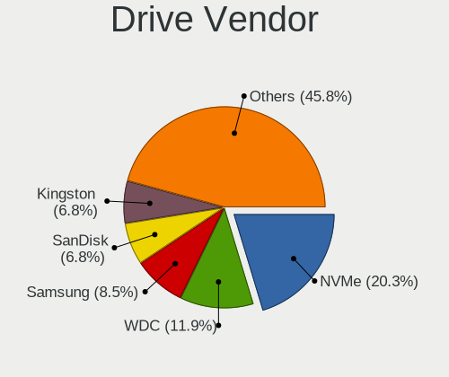

| Vendor              | Notebooks | Drives | Percent |
|---------------------|-----------|--------|---------|
| Kingston            | 2         | 2      | 22.22%  |
| WDC                 | 1         | 1      | 11.11%  |
| SanDisk             | 1         | 1      | 11.11%  |
| Samsung Electronics | 1         | 1      | 11.11%  |
| NVMe                | 1         | 1      | 11.11%  |
| Hitachi             | 1         | 1      | 11.11%  |
| Crucial             | 1         | 1      | 11.11%  |
| Apacer              | 1         | 1      | 11.11%  |

Drive Model
-----------

Hard drive models

| Model                              | Notebooks | Percent |
|------------------------------------|-----------|---------|
| WDC WD7500BPKT-75PK4T0 752GB       | 1         | 11.11%  |
| SanDisk SSD PLUS 120GB             | 1         | 11.11%  |
| Samsung SSD 850 EVO 500GB          | 1         | 11.11%  |
| NVMe SAMSUNG MZVLW256 256GB        | 1         | 11.11%  |
| Kingston SA400S37240G 240GB        | 1         | 11.11%  |
| Kingston SA400M8240G 240GB         | 1         | 11.11%  |
| Hitachi HTS723225A7A365 OPAL 250GB | 1         | 11.11%  |
| Crucial CT480BX500SSD1 480GB       | 1         | 11.11%  |
| Apacer AS340 120GB                 | 1         | 11.11%  |

HDD Vendor
----------

Hard disk drive vendors

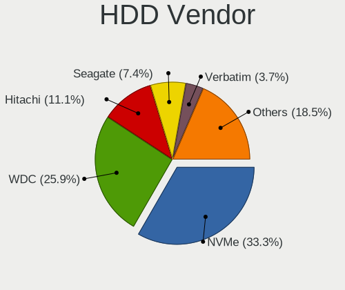

| Vendor  | Notebooks | Drives | Percent |
|---------|-----------|--------|---------|
| WDC     | 1         | 1      | 33.33%  |
| NVMe    | 1         | 1      | 33.33%  |
| Hitachi | 1         | 1      | 33.33%  |

SSD Vendor
----------

Solid state drive vendors

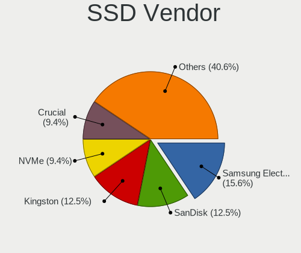

| Vendor              | Notebooks | Drives | Percent |
|---------------------|-----------|--------|---------|
| Kingston            | 2         | 2      | 33.33%  |
| SanDisk             | 1         | 1      | 16.67%  |
| Samsung Electronics | 1         | 1      | 16.67%  |
| Crucial             | 1         | 1      | 16.67%  |
| Apacer              | 1         | 1      | 16.67%  |

Drive Kind
----------

HDD or SSD

| Kind | Notebooks | Drives | Percent |
|------|-----------|--------|---------|
| SSD  | 5         | 6      | 62.5%   |
| HDD  | 3         | 3      | 37.5%   |

Drive Connector
---------------

SATA, SAS, NVMe, etc.

| Type | Notebooks | Drives | Percent |
|------|-----------|--------|---------|
| SATA | 8         | 9      | 100%    |

Drive Size
----------

Size of hard drive

| Size in TB | Notebooks | Drives | Percent |
|------------|-----------|--------|---------|
| 0.01-0.5   | 7         | 8      | 87.5%   |
| 0.51-1.0   | 1         | 1      | 12.5%   |

Space Total
-----------

Amount of disk space available on the file system

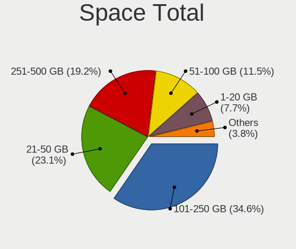

| Size in GB | Notebooks | Percent |
|------------|-----------|---------|
| 101-250    | 5         | 62.5%   |
| 21-50      | 3         | 37.5%   |

Space Used
----------

Amount of used disk space

| Used GB | Notebooks | Percent |
|---------|-----------|---------|
| 1-20    | 6         | 75%     |
| 21-50   | 1         | 12.5%   |
| 51-100  | 1         | 12.5%   |

Malfunc. Drives
---------------

Drive models with a malfunction

Zero info for selected period =(

Malfunc. Drive Vendor
---------------------

Vendors of faulty drives

Zero info for selected period =(

Malfunc. HDD Vendor
-------------------

Vendors of faulty HDD drives

Zero info for selected period =(

Malfunc. Drive Kind
-------------------

Kinds of faulty drives

Zero info for selected period =(

Failed Drives
-------------

Failed drive models

Zero info for selected period =(

Failed Drive Vendor
-------------------

Failed drive vendors

Zero info for selected period =(

Drive Status
------------

Number of failed and malfunc. drives

| Status   | Notebooks | Drives | Percent |
|----------|-----------|--------|---------|
| Works    | 7         | 8      | 87.5%   |
| Detected | 1         | 1      | 12.5%   |

Storage controller
------------------

Storage Vendor
--------------

Storage controller vendors

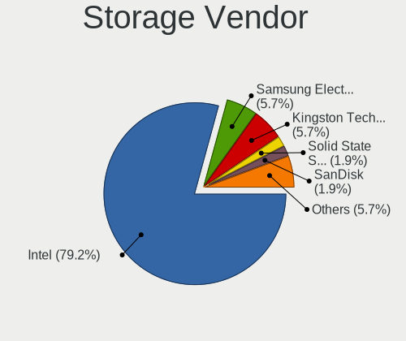

| Vendor              | Notebooks | Percent |
|---------------------|-----------|---------|
| Intel               | 7         | 87.5%   |
| Samsung Electronics | 1         | 12.5%   |

Storage Model
-------------

Storage controller models

| Model                                                                        | Notebooks | Percent |
|------------------------------------------------------------------------------|-----------|---------|
| Intel Sunrise Point-LP SATA Controller [AHCI mode]                           | 2         | 25%     |
| Intel 7 Series Chipset Family 6-port SATA Controller [AHCI mode]             | 2         | 25%     |
| Samsung NVMe SSD Controller SM961/PM961/SM963                                | 1         | 12.5%   |
| Intel Wildcat Point-LP SATA Controller [AHCI Mode]                           | 1         | 12.5%   |
| Intel 8 Series SATA Controller 1 [AHCI mode]                                 | 1         | 12.5%   |
| Intel 6 Series/C200 Series Chipset Family 6 port Mobile SATA AHCI Controller | 1         | 12.5%   |

Storage Kind
------------

Kind of storage controller (IDE, SATA, NVMe, SAS, ...)

| Kind | Notebooks | Percent |
|------|-----------|---------|
| SATA | 7         | 87.5%   |
| NVMe | 1         | 12.5%   |

Processor
---------

CPU Vendor
----------

Processor vendors

| Vendor | Notebooks | Percent |
|--------|-----------|---------|
| Intel  | 8         | 100%    |

CPU Model
---------

Processor models

| Model                             | Notebooks | Percent |
|-----------------------------------|-----------|---------|
| Intel Core i5-6300U CPU @ 2.40GHz | 2         | 25%     |
| Intel Core i7-3520M CPU @ 2.90GHz | 1         | 12.5%   |
| Intel Core i5-6200U CPU @ 2.30GHz | 1         | 12.5%   |
| Intel Core i5-5300U CPU @ 2.30GHz | 1         | 12.5%   |
| Intel Core i5-4300U CPU @ 1.90GHz | 1         | 12.5%   |
| Intel Core i5-3320M CPU @ 2.60GHz | 1         | 12.5%   |
| Intel Core i5-2410M CPU @ 2.30GHz | 1         | 12.5%   |

CPU Model Family
----------------

Processor model prefix

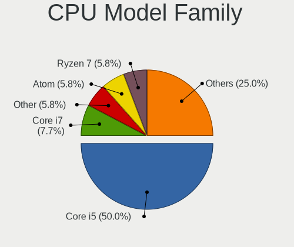

| Model         | Notebooks | Percent |
|---------------|-----------|---------|
| Intel Core i5 | 7         | 87.5%   |
| Intel Core i7 | 1         | 12.5%   |

CPU Cores
---------

Number of processor cores

| Number | Notebooks | Percent |
|--------|-----------|---------|
| 2      | 8         | 100%    |

CPU Sockets
-----------

Number of sockets

| Number | Notebooks | Percent |
|--------|-----------|---------|
| 1      | 8         | 100%    |

CPU Threads
-----------

Threads per core (Hyper-Threading)

| Number | Notebooks | Percent |
|--------|-----------|---------|
| 2      | 8         | 100%    |

CPU Microarch
-------------

Microarchitecture

| Name        | Notebooks | Percent |
|-------------|-----------|---------|
| Skylake     | 3         | 37.5%   |
| IvyBridge   | 2         | 25%     |
| SandyBridge | 1         | 12.5%   |
| Haswell     | 1         | 12.5%   |
| Broadwell   | 1         | 12.5%   |

Graphics
--------

GPU Vendor
----------

Vendors of graphics cards

| Vendor | Notebooks | Percent |
|--------|-----------|---------|
| Intel  | 8         | 88.89%  |
| AMD    | 1         | 11.11%  |

GPU Model
---------

Graphics card models

| Model                                                                     | Notebooks | Percent |
|---------------------------------------------------------------------------|-----------|---------|
| Intel Skylake GT2 [HD Graphics 520]                                       | 3         | 33.33%  |
| Intel 3rd Gen Core processor Graphics Controller                          | 2         | 22.22%  |
| Intel HD Graphics 5500                                                    | 1         | 11.11%  |
| Intel Haswell-ULT Integrated Graphics Controller                          | 1         | 11.11%  |
| Intel 2nd Generation Core Processor Family Integrated Graphics Controller | 1         | 11.11%  |
| AMD Robson CE [Radeon HD 6370M/7370M]                                     | 1         | 11.11%  |

GPU Combo
---------

Combinations of graphics cards

| Name        | Notebooks | Percent |
|-------------|-----------|---------|
| 1 x Intel   | 7         | 87.5%   |
| Intel + AMD | 1         | 12.5%   |

GPU Driver
----------

Free vs proprietary

| Driver | Notebooks | Percent |
|--------|-----------|---------|
| Free   | 8         | 100%    |

GPU Memory
----------

Total video memory

| Size in GB | Notebooks | Percent |
|------------|-----------|---------|
| Unknown    | 8         | 100%    |

Monitor
-------

Monitor Vendor
--------------

Monitor vendors

Zero info for selected period =(

Monitor Model
-------------

Monitor models

Zero info for selected period =(

Monitor Resolution
------------------

Monitor screen resolution

Zero info for selected period =(

Monitor Diagonal
----------------

Diagonal size in inches

Zero info for selected period =(

Monitor Width
-------------

Physical width

Zero info for selected period =(

Aspect Ratio
------------

Proportional relationship between the width and the height

Zero info for selected period =(

Monitor Area
------------

Area in inch²

Zero info for selected period =(

Pixel Density
-------------

Pixels per inch

Zero info for selected period =(

Multiple Monitors
-----------------

Total monitors connected

| Total | Notebooks | Percent |
|-------|-----------|---------|
| 1     | 7         | 87.5%   |
| 0     | 1         | 12.5%   |

Network
-------

Net Controller Vendor
---------------------

Controller vendors

| Vendor                | Notebooks | Percent |
|-----------------------|-----------|---------|
| Intel                 | 7         | 77.78%  |
| Realtek Semiconductor | 1         | 11.11%  |
| Qualcomm Atheros      | 1         | 11.11%  |

Net Controller Model
--------------------

Controller models

| Model                                                          | Notebooks | Percent |
|----------------------------------------------------------------|-----------|---------|
| Intel Wireless 8260                                            | 2         | 12.5%   |
| Intel Ethernet Connection I219-LM                              | 2         | 12.5%   |
| Intel Centrino Advanced-N 6205 [Taylor Peak]                   | 2         | 12.5%   |
| Intel 82579LM Gigabit Network Connection (Lewisville)          | 2         | 12.5%   |
| Realtek RTL810xE PCI Express Fast Ethernet controller          | 1         | 6.25%   |
| Qualcomm Atheros AR9285 Wireless Network Adapter (PCI-Express) | 1         | 6.25%   |
| Qualcomm Atheros AR8152 v2.0 Fast Ethernet                     | 1         | 6.25%   |
| Intel Wireless 7265                                            | 1         | 6.25%   |
| Intel Wireless 7260                                            | 1         | 6.25%   |
| Intel Wireless 3160                                            | 1         | 6.25%   |
| Intel Ethernet Connection I218-LM                              | 1         | 6.25%   |
| Intel Ethernet Connection (3) I218-LM                          | 1         | 6.25%   |

Wireless Vendor
---------------

Wireless vendors

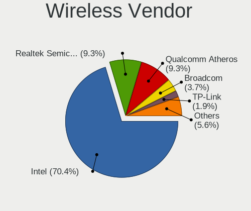

| Vendor           | Notebooks | Percent |
|------------------|-----------|---------|
| Intel            | 7         | 87.5%   |
| Qualcomm Atheros | 1         | 12.5%   |

Wireless Model
--------------

Wireless models

| Model                                                          | Notebooks | Percent |
|----------------------------------------------------------------|-----------|---------|
| Intel Wireless 8260                                            | 2         | 25%     |
| Intel Centrino Advanced-N 6205 [Taylor Peak]                   | 2         | 25%     |
| Qualcomm Atheros AR9285 Wireless Network Adapter (PCI-Express) | 1         | 12.5%   |
| Intel Wireless 7265                                            | 1         | 12.5%   |
| Intel Wireless 7260                                            | 1         | 12.5%   |
| Intel Wireless 3160                                            | 1         | 12.5%   |

Ethernet Vendor
---------------

Ethernet vendors

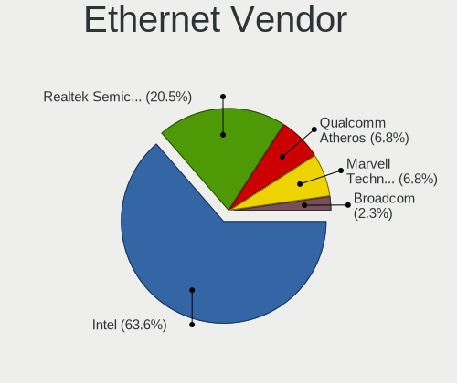

| Vendor                | Notebooks | Percent |
|-----------------------|-----------|---------|
| Intel                 | 6         | 75%     |
| Realtek Semiconductor | 1         | 12.5%   |
| Qualcomm Atheros      | 1         | 12.5%   |

Ethernet Model
--------------

Ethernet models

| Model                                                 | Notebooks | Percent |
|-------------------------------------------------------|-----------|---------|
| Intel Ethernet Connection I219-LM                     | 2         | 25%     |
| Intel 82579LM Gigabit Network Connection (Lewisville) | 2         | 25%     |
| Realtek RTL810xE PCI Express Fast Ethernet controller | 1         | 12.5%   |
| Qualcomm Atheros AR8152 v2.0 Fast Ethernet            | 1         | 12.5%   |
| Intel Ethernet Connection I218-LM                     | 1         | 12.5%   |
| Intel Ethernet Connection (3) I218-LM                 | 1         | 12.5%   |

Net Controller Kind
-------------------

Ethernet, WiFi or modem

| Kind     | Notebooks | Percent |
|----------|-----------|---------|
| WiFi     | 8         | 50%     |
| Ethernet | 8         | 50%     |

Used Controller
---------------

Currently used network controller

| Kind     | Notebooks | Percent |
|----------|-----------|---------|
| WiFi     | 7         | 77.78%  |
| Ethernet | 2         | 22.22%  |

NICs
----

Total network controllers on board

| Total | Notebooks | Percent |
|-------|-----------|---------|
| 2     | 8         | 100%    |

IPv6
----

IPv6 vs IPv4

| Used | Notebooks | Percent |
|------|-----------|---------|
| No   | 8         | 100%    |

Bluetooth
---------

Bluetooth Vendor
----------------

Controller vendors

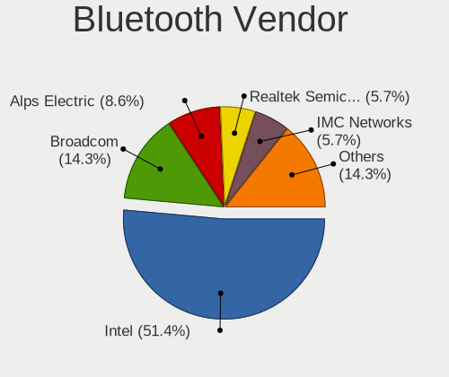

| Vendor            | Notebooks | Percent |
|-------------------|-----------|---------|
| Intel             | 5         | 62.5%   |
| Foxconn / Hon Hai | 2         | 25%     |
| Broadcom          | 1         | 12.5%   |

Bluetooth Model
---------------

Controller models

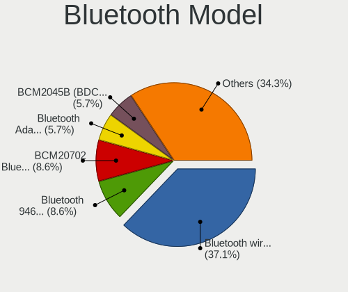

| Model                                                    | Notebooks | Percent |
|----------------------------------------------------------|-----------|---------|
| Intel Bluetooth wireless interface                       | 5         | 62.5%   |
| Foxconn / Hon Hai Broadcom Bluetooth 2.1 Device          | 1         | 12.5%   |
| Foxconn / Hon Hai Broadcom BCM20702 Bluetooth USB Device | 1         | 12.5%   |
| Broadcom BCM20702 Bluetooth 4.0 [ThinkPad]               | 1         | 12.5%   |

Sound
-----

Sound Vendor
------------

Sound card vendors

| Vendor | Notebooks | Percent |
|--------|-----------|---------|
| Intel  | 8         | 100%    |

Sound Model
-----------

Sound card models

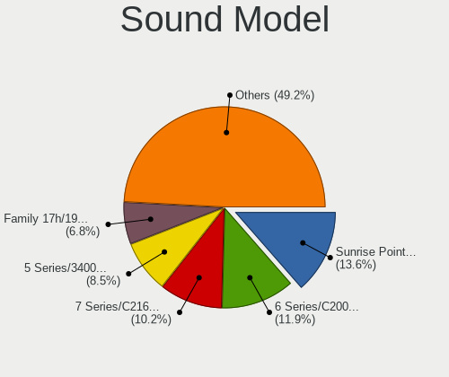

| Model                                                                      | Notebooks | Percent |
|----------------------------------------------------------------------------|-----------|---------|
| Intel Sunrise Point-LP HD Audio                                            | 3         | 30%     |
| Intel 7 Series/C216 Chipset Family High Definition Audio Controller        | 2         | 20%     |
| Intel Wildcat Point-LP High Definition Audio Controller                    | 1         | 10%     |
| Intel Haswell-ULT HD Audio Controller                                      | 1         | 10%     |
| Intel Broadwell-U Audio Controller                                         | 1         | 10%     |
| Intel 8 Series HD Audio Controller                                         | 1         | 10%     |
| Intel 6 Series/C200 Series Chipset Family High Definition Audio Controller | 1         | 10%     |

Memory
------

Memory Vendor
-------------

Memory module vendors

| Vendor              | Notebooks | Percent |
|---------------------|-----------|---------|
| Samsung Electronics | 2         | 66.67%  |
| SK hynix            | 1         | 33.33%  |

Memory Model
------------

Memory module models

| Model                                                  | Notebooks | Percent |
|--------------------------------------------------------|-----------|---------|
| SK hynix RAM HMT325S6BFR8C-H9 2GB SODIMM DDR3 1333MT/s | 1         | 33.33%  |
| Samsung RAM M471A1K43CB1-CRC 8GB SODIMM DDR4 2400MT/s  | 1         | 33.33%  |
| Samsung RAM M471A1K43BB0-CPB 8GB SODIMM DDR4 2133MT/s  | 1         | 33.33%  |

Memory Kind
-----------

Memory module kinds

| Kind | Notebooks | Percent |
|------|-----------|---------|
| DDR4 | 2         | 66.67%  |
| DDR3 | 1         | 33.33%  |

Memory Form Factor
------------------

Physical design of the memory module

| Name   | Notebooks | Percent |
|--------|-----------|---------|
| SODIMM | 3         | 100%    |

Memory Size
-----------

Memory module size

| Size | Notebooks | Percent |
|------|-----------|---------|
| 8192 | 2         | 66.67%  |
| 2048 | 1         | 33.33%  |

Memory Speed
------------

Memory module speed

| Speed | Notebooks | Percent |
|-------|-----------|---------|
| 2400  | 1         | 33.33%  |
| 2133  | 1         | 33.33%  |
| 1333  | 1         | 33.33%  |

Printers & scanners
-------------------

Printer Vendor
--------------

Printer device vendors

Zero info for selected period =(

Printer Model
-------------

Printer device models

Zero info for selected period =(

Scanner Vendor
--------------

Scanner device vendors

Zero info for selected period =(

Scanner Model
-------------

Scanner device models

Zero info for selected period =(

Camera
------

Camera Vendor
-------------

Camera device vendors

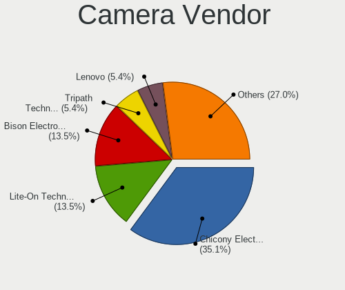

| Vendor              | Notebooks | Percent |
|---------------------|-----------|---------|
| Lite-On Technology  | 3         | 42.86%  |
| Chicony Electronics | 3         | 42.86%  |
| Bison Electronics   | 1         | 14.29%  |

Camera Model
------------

Camera device models

| Model                                | Notebooks | Percent |
|--------------------------------------|-----------|---------|
| Lite-On Integrated Camera            | 3         | 42.86%  |
| Chicony Lenovo EasyCamera            | 1         | 14.29%  |
| Chicony Integrated Camera [ThinkPad] | 1         | 14.29%  |
| Chicony FJ Camera                    | 1         | 14.29%  |
| Bison Integrated Camera              | 1         | 14.29%  |

Security
--------

Fingerprint Vendor
------------------

Fingerprint sensor vendors

| Vendor           | Notebooks | Percent |
|------------------|-----------|---------|
| Validity Sensors | 3         | 75%     |
| AuthenTec        | 1         | 25%     |

Fingerprint Model
-----------------

Fingerprint sensor models

| Model                                        | Notebooks | Percent |
|----------------------------------------------|-----------|---------|
| Validity Sensors VFS 5011 fingerprint sensor | 3         | 75%     |
| AuthenTec AES2660                            | 1         | 25%     |

Chipcard Vendor
---------------

Chipcard module vendors

Zero info for selected period =(

Chipcard Model
--------------

Chipcard module models

Zero info for selected period =(

Unsupported
-----------

Unsupported Devices
-------------------

Total unsupported devices on board

| Total | Notebooks | Percent |
|-------|-----------|---------|
| 1     | 8         | 100%    |

Unsupported Device Types
------------------------

Types of unsupported devices

| Type                     | Notebooks | Percent |
|--------------------------|-----------|---------|
| Communication controller | 8         | 100%    |

