OpenBSD 7.3 - Tested Hardware & Statistics
------------------------------------------

A project to collect tested hardware configurations for OpenBSD 7.3.

Anyone can contribute to this report by the [hw-probe](https://github.com/linuxhw/hw-probe/blob/master/INSTALL.BSD.md) tool:

    hw-probe -all -upload

Please contribute! Especially if your hardware is rare.

This is a report for all computer types. See also reports for [desktops](/Dist/OpenBSD_7.3/Desktop/README.md) and [notebooks](/Dist/OpenBSD_7.3/Notebook/README.md).

Contents
--------

* [ Test Cases ](#test-cases)

* [ System ](#system)
  - [ Arch                     ](#arch)
  - [ DE                       ](#de)
  - [ Display Server           ](#display-server)
  - [ Display Manager          ](#display-manager)
  - [ OS Lang                  ](#os-lang)
  - [ Boot Mode                ](#boot-mode)
  - [ Filesystem               ](#filesystem)
  - [ Part. scheme             ](#part-scheme)

* [ Board ](#board)
  - [ Vendor                   ](#vendor)
  - [ Model                    ](#model)
  - [ Model Family             ](#model-family)
  - [ MFG Year                 ](#mfg-year)
  - [ Form Factor              ](#form-factor)
  - [ Coreboot                 ](#coreboot)
  - [ RAM Size                 ](#ram-size)
  - [ RAM Used                 ](#ram-used)
  - [ Total Drives             ](#total-drives)
  - [ Has CD-ROM               ](#has-cd-rom)
  - [ Has Ethernet             ](#has-ethernet)
  - [ Has WiFi                 ](#has-wifi)
  - [ Has Bluetooth            ](#has-bluetooth)

* [ Location ](#location)
  - [ Country                  ](#country)
  - [ City                     ](#city)

* [ Drives ](#drives)
  - [ Drive Vendor             ](#drive-vendor)
  - [ Drive Model              ](#drive-model)
  - [ HDD Vendor               ](#hdd-vendor)
  - [ SSD Vendor               ](#ssd-vendor)
  - [ Drive Kind               ](#drive-kind)
  - [ Drive Connector          ](#drive-connector)
  - [ Drive Size               ](#drive-size)
  - [ Space Total              ](#space-total)
  - [ Space Used               ](#space-used)
  - [ Malfunc. Drives          ](#malfunc-drives)
  - [ Malfunc. Drive Vendor    ](#malfunc-drive-vendor)
  - [ Malfunc. HDD Vendor      ](#malfunc-hdd-vendor)
  - [ Malfunc. Drive Kind      ](#malfunc-drive-kind)
  - [ Failed Drives            ](#failed-drives)
  - [ Failed Drive Vendor      ](#failed-drive-vendor)
  - [ Drive Status             ](#drive-status)

* [ Storage controller ](#storage-controller)
  - [ Storage Vendor           ](#storage-vendor)
  - [ Storage Model            ](#storage-model)
  - [ Storage Kind             ](#storage-kind)

* [ Processor ](#processor)
  - [ CPU Vendor               ](#cpu-vendor)
  - [ CPU Model                ](#cpu-model)
  - [ CPU Model Family         ](#cpu-model-family)
  - [ CPU Cores                ](#cpu-cores)
  - [ CPU Sockets              ](#cpu-sockets)
  - [ CPU Threads              ](#cpu-threads)
  - [ CPU Microarch            ](#cpu-microarch)

* [ Graphics ](#graphics)
  - [ GPU Vendor               ](#gpu-vendor)
  - [ GPU Model                ](#gpu-model)
  - [ GPU Combo                ](#gpu-combo)
  - [ GPU Driver               ](#gpu-driver)
  - [ GPU Memory               ](#gpu-memory)

* [ Monitor ](#monitor)
  - [ Monitor Vendor           ](#monitor-vendor)
  - [ Monitor Model            ](#monitor-model)
  - [ Monitor Resolution       ](#monitor-resolution)
  - [ Monitor Diagonal         ](#monitor-diagonal)
  - [ Monitor Width            ](#monitor-width)
  - [ Aspect Ratio             ](#aspect-ratio)
  - [ Monitor Area             ](#monitor-area)
  - [ Pixel Density            ](#pixel-density)
  - [ Multiple Monitors        ](#multiple-monitors)

* [ Network ](#network)
  - [ Net Controller Vendor    ](#net-controller-vendor)
  - [ Net Controller Model     ](#net-controller-model)
  - [ Wireless Vendor          ](#wireless-vendor)
  - [ Wireless Model           ](#wireless-model)
  - [ Ethernet Vendor          ](#ethernet-vendor)
  - [ Ethernet Model           ](#ethernet-model)
  - [ Net Controller Kind      ](#net-controller-kind)
  - [ Used Controller          ](#used-controller)
  - [ NICs                     ](#nics)
  - [ IPv6                     ](#ipv6)

* [ Bluetooth ](#bluetooth)
  - [ Bluetooth Vendor         ](#bluetooth-vendor)
  - [ Bluetooth Model          ](#bluetooth-model)

* [ Sound ](#sound)
  - [ Sound Vendor             ](#sound-vendor)
  - [ Sound Model              ](#sound-model)

* [ Memory ](#memory)
  - [ Memory Vendor            ](#memory-vendor)
  - [ Memory Model             ](#memory-model)
  - [ Memory Kind              ](#memory-kind)
  - [ Memory Form Factor       ](#memory-form-factor)
  - [ Memory Size              ](#memory-size)
  - [ Memory Speed             ](#memory-speed)

* [ Printers & scanners ](#printers--scanners)
  - [ Printer Vendor           ](#printer-vendor)
  - [ Printer Model            ](#printer-model)
  - [ Scanner Vendor           ](#scanner-vendor)
  - [ Scanner Model            ](#scanner-model)

* [ Camera ](#camera)
  - [ Camera Vendor            ](#camera-vendor)
  - [ Camera Model             ](#camera-model)

* [ Security ](#security)
  - [ Fingerprint Vendor       ](#fingerprint-vendor)
  - [ Fingerprint Model        ](#fingerprint-model)
  - [ Chipcard Vendor          ](#chipcard-vendor)
  - [ Chipcard Model           ](#chipcard-model)

* [ Unsupported ](#unsupported)
  - [ Unsupported Devices      ](#unsupported-devices)
  - [ Unsupported Device Types ](#unsupported-device-types)

Test Cases
----------

Total: 87

| Vendor        | Model                       | Form-Factor | Probe                                                     | Date         |
|---------------|-----------------------------|-------------|-----------------------------------------------------------|--------------|
| Panasonic     | CFSX4-1                     | Notebook    | [8f54654916](https://bsd-hardware.info/?probe=8f54654916) | Sep 01, 2023 |
| VIA Techno... | VT8623-8235                 | Desktop     | [3274cd095e](https://bsd-hardware.info/?probe=3274cd095e) | Aug 31, 2023 |
| MSI           | MS-7125                     | Desktop     | [3dfb767d80](https://bsd-hardware.info/?probe=3dfb767d80) | Aug 30, 2023 |
| Dell          | Latitude 7280               | Notebook    | [c858f191cf](https://bsd-hardware.info/?probe=c858f191cf) | Aug 27, 2023 |
| Lenovo        | ThinkPad X1 Carbon 7th 2... | Notebook    | [c8e95f3772](https://bsd-hardware.info/?probe=c8e95f3772) | Aug 26, 2023 |
| Getac         | V110G2                      | Notebook    | [884803a6bd](https://bsd-hardware.info/?probe=884803a6bd) | Aug 25, 2023 |
| ASUSTek       | P5M2-R                      | Desktop     | [73135bf26d](https://bsd-hardware.info/?probe=73135bf26d) | Aug 25, 2023 |
| Lenovo        | Legion 5 Pro 16ACH6H 82J... | Notebook    | [27cf2b3e46](https://bsd-hardware.info/?probe=27cf2b3e46) | Aug 19, 2023 |
| MSI           | MS-7721                     | Desktop     | [a577019634](https://bsd-hardware.info/?probe=a577019634) | Aug 18, 2023 |
| ASUSTek       | VivoBook_ASUSLaptop M150... | Notebook    | [9beb5f6126](https://bsd-hardware.info/?probe=9beb5f6126) | Aug 17, 2023 |
| Fujitsu Si... | LIFEBOOK P1610              | Notebook    | [bb055a94f0](https://bsd-hardware.info/?probe=bb055a94f0) | Aug 12, 2023 |
| HP            | ProLiant DL360 Gen9         | Server      | [63c10b6ae5](https://bsd-hardware.info/?probe=63c10b6ae5) | Aug 11, 2023 |
| Apple         | MacBookAir4,2               | Notebook    | [b1c97a3a9d](https://bsd-hardware.info/?probe=b1c97a3a9d) | Aug 09, 2023 |
| MSI           | MS-7623                     | Desktop     | [189fb4d7cc](https://bsd-hardware.info/?probe=189fb4d7cc) | Aug 08, 2023 |
| Apple         | MacBookAir4,2               | Notebook    | [4fdd124b61](https://bsd-hardware.info/?probe=4fdd124b61) | Aug 07, 2023 |
| ASUSTek       | PRIME B650-PLUS             | Desktop     | [e74d459c5a](https://bsd-hardware.info/?probe=e74d459c5a) | Jul 28, 2023 |
| Lenovo        | ThinkPad T410 2522NP6       | Notebook    | [194b8efa98](https://bsd-hardware.info/?probe=194b8efa98) | Jul 25, 2023 |
| MSI           | G41M-P33 Combo              | Desktop     | [d4a26f9214](https://bsd-hardware.info/?probe=d4a26f9214) | Jul 24, 2023 |
| Panasonic     | CFSX4-1                     | Notebook    | [461ad23cc9](https://bsd-hardware.info/?probe=461ad23cc9) | Jul 24, 2023 |
| Lenovo        | B590 20208                  | Notebook    | [ce1aade2c0](https://bsd-hardware.info/?probe=ce1aade2c0) | Jul 24, 2023 |
| Panasonic     | CFSX4-1                     | Notebook    | [1ac1ddd084](https://bsd-hardware.info/?probe=1ac1ddd084) | Jul 24, 2023 |
| HP            | Pavilion Gaming Laptop 1... | Notebook    | [173fe60308](https://bsd-hardware.info/?probe=173fe60308) | Jul 23, 2023 |
| HP            | Pavilion Gaming Laptop 1... | Notebook    | [26e44ab6e6](https://bsd-hardware.info/?probe=26e44ab6e6) | Jul 23, 2023 |
| ASUSTek       | 900                         | Notebook    | [2e55f5d4cc](https://bsd-hardware.info/?probe=2e55f5d4cc) | Jul 20, 2023 |
| Lenovo        | ThinkPad X260 20F5S10W0H    | Notebook    | [386a80104d](https://bsd-hardware.info/?probe=386a80104d) | Jul 19, 2023 |
| IBM           | ThinkPad T43 1871F1G        | Notebook    | [d6fbc6ebfb](https://bsd-hardware.info/?probe=d6fbc6ebfb) | Jul 18, 2023 |
| Lenovo        | B590 20208                  | Notebook    | [f734b93999](https://bsd-hardware.info/?probe=f734b93999) | Jul 16, 2023 |
| Sony          | VPCX115KX                   | Notebook    | [9dab449a23](https://bsd-hardware.info/?probe=9dab449a23) | Jul 15, 2023 |
| Tactus        | GeoBook 140                 | Notebook    | [4b7383c876](https://bsd-hardware.info/?probe=4b7383c876) | Jul 11, 2023 |
| Sony          | VGC-RB41M                   | Desktop     | [95804a1f40](https://bsd-hardware.info/?probe=95804a1f40) | Jun 28, 2023 |
| ASUSTek       | TUF Gaming B550M-PLUS (W... | Desktop     | [4d99bc4b63](https://bsd-hardware.info/?probe=4d99bc4b63) | Jun 27, 2023 |
| ASUSTek       | TUF Gaming B550M-PLUS (W... | Desktop     | [8866724f46](https://bsd-hardware.info/?probe=8866724f46) | Jun 27, 2023 |
| Panasonic     | CFSX4-1                     | Notebook    | [ff83a965d2](https://bsd-hardware.info/?probe=ff83a965d2) | Jun 15, 2023 |
| Lenovo        | ThinkPad T430 2344BZU       | Notebook    | [01df487b47](https://bsd-hardware.info/?probe=01df487b47) | Jun 14, 2023 |
| Gigabyte      | G41MT-S2                    | Desktop     | [355202536f](https://bsd-hardware.info/?probe=355202536f) | Jun 07, 2023 |
| Lenovo        | ThinkPad E15 Gen 4 21EDC... | Notebook    | [9f18b1b304](https://bsd-hardware.info/?probe=9f18b1b304) | Jun 06, 2023 |
| Lenovo        | ThinkPad E15 Gen 4 21EDC... | Notebook    | [85c18dbbb5](https://bsd-hardware.info/?probe=85c18dbbb5) | Jun 06, 2023 |
| Toshiba       | NB250                       | Notebook    | [62c572e895](https://bsd-hardware.info/?probe=62c572e895) | May 27, 2023 |
| Tactus        | GeoFlex 110                 | Notebook    | [df93ad7e83](https://bsd-hardware.info/?probe=df93ad7e83) | May 27, 2023 |
| Lenovo        | ThinkPad X140e 20BMS03E0... | Notebook    | [580c52399f](https://bsd-hardware.info/?probe=580c52399f) | May 25, 2023 |
| Lenovo        | ThinkPad X140e 20BMS03E0... | Notebook    | [84e3ac62d5](https://bsd-hardware.info/?probe=84e3ac62d5) | May 23, 2023 |
| Unknown       | Apple MacBook Pro (13-in... | Notebook    | [5e25a49c65](https://bsd-hardware.info/?probe=5e25a49c65) | May 20, 2023 |
| ASUSTek       | PRIME B460M-A               | Desktop     | [4c8047dca3](https://bsd-hardware.info/?probe=4c8047dca3) | May 19, 2023 |
| VIA Techno... | VT82C597                    | Desktop     | [d73db58e48](https://bsd-hardware.info/?probe=d73db58e48) | May 19, 2023 |
| Lenovo        | ThinkPad X201 3323BBG       | Notebook    | [7b529b0888](https://bsd-hardware.info/?probe=7b529b0888) | May 17, 2023 |
| HP            | 0A60h                       | Desktop     | [98e9deff3d](https://bsd-hardware.info/?probe=98e9deff3d) | May 16, 2023 |
| Lenovo        | ThinkPad T61 7659AS5        | Notebook    | [7732b2cfa7](https://bsd-hardware.info/?probe=7732b2cfa7) | May 15, 2023 |
| PC Engines    | APU2                        | Desktop     | [62fef2616b](https://bsd-hardware.info/?probe=62fef2616b) | May 15, 2023 |
| Lenovo        | ThinkPad T61 7659AS5        | Notebook    | [b6071c549a](https://bsd-hardware.info/?probe=b6071c549a) | May 15, 2023 |
| Gigabyte      | B250M-Gaming 3-CF           | Desktop     | [2ce057e389](https://bsd-hardware.info/?probe=2ce057e389) | May 14, 2023 |
| ASUSTek       | M3A78-EMH HDMI              | Desktop     | [b4bf04ac2f](https://bsd-hardware.info/?probe=b4bf04ac2f) | May 13, 2023 |
| Lenovo        | V14 G2 ITL 82NM             | Desktop     | [fa87f4741a](https://bsd-hardware.info/?probe=fa87f4741a) | May 13, 2023 |
| Lenovo        | V14 G2 ITL 82NM             | Desktop     | [bd81294acc](https://bsd-hardware.info/?probe=bd81294acc) | May 13, 2023 |
| Gigabyte      | B250M-Gaming 3-CF           | Desktop     | [cace71018f](https://bsd-hardware.info/?probe=cace71018f) | May 11, 2023 |
| Gigabyte      | B250M-Gaming 3-CF           | Desktop     | [4353bb0195](https://bsd-hardware.info/?probe=4353bb0195) | May 09, 2023 |
| ASUSTek       | PRIME B650-PLUS             | Desktop     | [be83fbb0f2](https://bsd-hardware.info/?probe=be83fbb0f2) | May 09, 2023 |
| Lenovo        | ThinkPad T410 2537N24       | Notebook    | [6cd0f02045](https://bsd-hardware.info/?probe=6cd0f02045) | May 08, 2023 |
| Matsushita... | CF-48V4KNDQM                | Notebook    | [79f10d24d6](https://bsd-hardware.info/?probe=79f10d24d6) | May 07, 2023 |
| ASUSTek       | 1000HE                      | Notebook    | [36214f8bed](https://bsd-hardware.info/?probe=36214f8bed) | May 07, 2023 |
| Lenovo        | ThinkPad T14 Gen 1 20UES... | Notebook    | [d2bd7a8764](https://bsd-hardware.info/?probe=d2bd7a8764) | May 07, 2023 |
| Lenovo        | ThinkPad T500 205663G       | Notebook    | [d706da9400](https://bsd-hardware.info/?probe=d706da9400) | May 06, 2023 |
| Lenovo        | ThinkPad T480s 20L8A00KC... | Notebook    | [44ddee0eec](https://bsd-hardware.info/?probe=44ddee0eec) | May 06, 2023 |
| Matsushita... | CF-51RCVDNLM                | Notebook    | [105a885451](https://bsd-hardware.info/?probe=105a885451) | May 05, 2023 |
| Lenovo        | ThinkPad T420s 41742BU      | Notebook    | [161fe49de4](https://bsd-hardware.info/?probe=161fe49de4) | May 05, 2023 |
| Lenovo        | ThinkPad X230 2325T4T       | Notebook    | [00303b7a59](https://bsd-hardware.info/?probe=00303b7a59) | May 05, 2023 |
| Lenovo        | ThinkPad X220 429043U       | Notebook    | [bb714a4350](https://bsd-hardware.info/?probe=bb714a4350) | May 05, 2023 |
| Lenovo        | ThinkPad X1 Carbon 4th 2... | Notebook    | [28e76d5531](https://bsd-hardware.info/?probe=28e76d5531) | May 04, 2023 |
| Lenovo        | ThinkPad T430 2347GZU       | Notebook    | [8c3f486dbc](https://bsd-hardware.info/?probe=8c3f486dbc) | May 03, 2023 |
| Panasonic     | CF-52PFPBSFQ                | Notebook    | [e2c3df29b5](https://bsd-hardware.info/?probe=e2c3df29b5) | May 03, 2023 |
| Panasonic     | CF-53AAGHYDM                | Notebook    | [c7daf17edb](https://bsd-hardware.info/?probe=c7daf17edb) | May 02, 2023 |
| Lenovo        | ThinkPad X260 20F5S2GM00    | Notebook    | [c4af168c4a](https://bsd-hardware.info/?probe=c4af168c4a) | May 01, 2023 |
| Lenovo        | ThinkPad X270 W10DG 20K5... | Notebook    | [cf504f51df](https://bsd-hardware.info/?probe=cf504f51df) | May 01, 2023 |
| Fujitsu       | LIFEBOOK E752               | Notebook    | [44ea9fb6ae](https://bsd-hardware.info/?probe=44ea9fb6ae) | Apr 30, 2023 |
| HP            | Pavilion Notebook           | Notebook    | [247810c987](https://bsd-hardware.info/?probe=247810c987) | Apr 24, 2023 |
| Lenovo        | V14 G2 ITL 82NM             | Desktop     | [827308827b](https://bsd-hardware.info/?probe=827308827b) | Apr 24, 2023 |
| HP            | Pavilion Notebook           | Notebook    | [243a9c2f22](https://bsd-hardware.info/?probe=243a9c2f22) | Apr 22, 2023 |
| ASUSTek       | TUF Gaming B550-PLUS        | Desktop     | [c26c1111c6](https://bsd-hardware.info/?probe=c26c1111c6) | Apr 21, 2023 |
| Lenovo        | V14 G2 ITL 82NM             | Desktop     | [a6141b809a](https://bsd-hardware.info/?probe=a6141b809a) | Apr 21, 2023 |
| Lenovo        | G570 20079                  | Notebook    | [0ebba481d1](https://bsd-hardware.info/?probe=0ebba481d1) | Apr 14, 2023 |
| Lenovo        | ThinkPad T440s 20ARA07PL... | Notebook    | [04ddab3620](https://bsd-hardware.info/?probe=04ddab3620) | Apr 14, 2023 |
| Lenovo        | ThinkPad X230 23257EP       | Notebook    | [e94085cd2d](https://bsd-hardware.info/?probe=e94085cd2d) | Apr 12, 2023 |
| ASUSTek       | P10S-I Series               | Desktop     | [5084c2b77f](https://bsd-hardware.info/?probe=5084c2b77f) | Apr 11, 2023 |
| Apple         | MacPro1,1                   | Desktop     | [6843822d8c](https://bsd-hardware.info/?probe=6843822d8c) | Apr 11, 2023 |
| PC Engines    | APU2                        | Desktop     | [cdcdfe6e0b](https://bsd-hardware.info/?probe=cdcdfe6e0b) | Apr 10, 2023 |
| Gigabyte      | B250M-Gaming 3-CF           | Desktop     | [a149d0b4b5](https://bsd-hardware.info/?probe=a149d0b4b5) | Apr 10, 2023 |
| Lenovo        | ThinkPad T450s 20BW001KL... | Notebook    | [4f6a7e2739](https://bsd-hardware.info/?probe=4f6a7e2739) | Apr 02, 2023 |
| Elpitech      | ET101-A1                    | Desktop     | [0172697883](https://bsd-hardware.info/?probe=0172697883) | Mar 10, 2023 |

System
------

Arch
----

OS architecture (x86_64, i586, etc.)

| Name  | Computers | Percent |
|-------|-----------|---------|
| amd64 | 55        | 79.71%  |
| i386  | 12        | 17.39%  |
| arm64 | 2         | 2.9%    |

DE
--

Desktop Environment

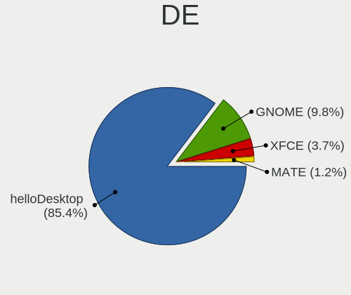

| Name         | Computers | Percent |
|--------------|-----------|---------|
| helloDesktop | 59        | 85.51%  |
| GNOME        | 7         | 10.14%  |
| XFCE         | 2         | 2.9%    |
| MATE         | 1         | 1.45%   |

Display Server
--------------

X11 or Wayland

| Name    | Computers | Percent |
|---------|-----------|---------|
| X11     | 60        | 86.96%  |
| Console | 9         | 13.04%  |

Display Manager
---------------

SDDM, LightDM, etc.

| Name    | Computers | Percent |
|---------|-----------|---------|
| Console | 69        | 100%    |

OS Lang
-------

Language

| Lang    | Computers | Percent |
|---------|-----------|---------|
| Unknown | 56        | 81.16%  |
| en_US   | 7         | 10.14%  |
| C       | 2         | 2.9%    |
| zh_TW   | 1         | 1.45%   |
| ru_RU   | 1         | 1.45%   |
| pl_PL   | 1         | 1.45%   |
| es_ES   | 1         | 1.45%   |

Boot Mode
---------

EFI or BIOS

| Mode | Computers | Percent |
|------|-----------|---------|
| BIOS | 36        | 52.17%  |
| EFI  | 33        | 47.83%  |

Filesystem
----------

Type of filesystem

| Type | Computers | Percent |
|------|-----------|---------|
| Ffs  | 69        | 100%    |

Part. scheme
------------

Scheme of partitioning

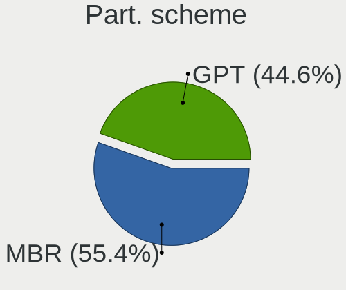

| Type | Computers | Percent |
|------|-----------|---------|
| MBR  | 38        | 55.07%  |
| GPT  | 31        | 44.93%  |

Board
-----

Vendor
------

Motherboard manufacturer

| Name                           | Computers | Percent |
|--------------------------------|-----------|---------|
| Lenovo                         | 25        | 36.23%  |
| ASUSTek Computer               | 11        | 15.94%  |
| MSI                            | 4         | 5.8%    |
| Hewlett-Packard                | 4         | 5.8%    |
| Panasonic                      | 3         | 4.35%   |
| VIA Technologies               | 2         | 2.9%    |
| Tactus                         | 2         | 2.9%    |
| Sony                           | 2         | 2.9%    |
| PC Engines                     | 2         | 2.9%    |
| Matsushita Electric Industrial | 2         | 2.9%    |
| Gigabyte Technology            | 2         | 2.9%    |
| Apple                          | 2         | 2.9%    |
| Toshiba                        | 1         | 1.45%   |
| IBM                            | 1         | 1.45%   |
| Getac                          | 1         | 1.45%   |
| Fujitsu Siemens                | 1         | 1.45%   |
| Fujitsu                        | 1         | 1.45%   |
| Elpitech                       | 1         | 1.45%   |
| Dell                           | 1         | 1.45%   |
| Unknown                        | 1         | 1.45%   |

Model
-----

Motherboard model

| Name                                        | Computers | Percent |
|---------------------------------------------|-----------|---------|
| PC Engines APU2                             | 2         | 2.9%    |
| ASUS PRIME B650-PLUS                        | 2         | 2.9%    |
| VIA VT8623-8235                             | 1         | 1.45%   |
| VIA VT82C597                                | 1         | 1.45%   |
| Toshiba NB250                               | 1         | 1.45%   |
| Tactus GeoFlex 110                          | 1         | 1.45%   |
| Tactus GeoBook 140                          | 1         | 1.45%   |
| Sony VPCX115KX                              | 1         | 1.45%   |
| Sony VGC-RB41M                              | 1         | 1.45%   |
| Panasonic CFSX4-1                           | 1         | 1.45%   |
| Panasonic CF-53AAGHYDM                      | 1         | 1.45%   |
| Panasonic CF-52PFPBSFQ                      | 1         | 1.45%   |
| MSI MS-7721                                 | 1         | 1.45%   |
| MSI MS-7623                                 | 1         | 1.45%   |
| MSI MS-7592                                 | 1         | 1.45%   |
| MSI MS-7125                                 | 1         | 1.45%   |
| Matsushita Electric Industrial CF-51RCVDNLM | 1         | 1.45%   |
| Matsushita Electric Industrial CF-48V4KNDQM | 1         | 1.45%   |
| Lenovo V14 G2 ITL 82NM                      | 1         | 1.45%   |
| Lenovo ThinkPad X270 W10DG 20K5S0TT1N       | 1         | 1.45%   |
| Lenovo ThinkPad X260 20F5S2GM00             | 1         | 1.45%   |
| Lenovo ThinkPad X260 20F5S10W0H             | 1         | 1.45%   |
| Lenovo ThinkPad X230 2325T4T                | 1         | 1.45%   |
| Lenovo ThinkPad X230 23257EP                | 1         | 1.45%   |
| Lenovo ThinkPad X220 429043U                | 1         | 1.45%   |
| Lenovo ThinkPad X201 3323BBG                | 1         | 1.45%   |
| Lenovo ThinkPad X140e 20BMS03E00            | 1         | 1.45%   |
| Lenovo ThinkPad X1 Carbon 7th 20QD001UUS    | 1         | 1.45%   |
| Lenovo ThinkPad X1 Carbon 4th 20FCS13H00    | 1         | 1.45%   |
| Lenovo ThinkPad T61 7659AS5                 | 1         | 1.45%   |
| Lenovo ThinkPad T500 205663G                | 1         | 1.45%   |
| Lenovo ThinkPad T480s 20L8A00KCL            | 1         | 1.45%   |
| Lenovo ThinkPad T450s 20BW001KLM            | 1         | 1.45%   |
| Lenovo ThinkPad T440s 20ARA07PLM            | 1         | 1.45%   |
| Lenovo ThinkPad T430 2347GZU                | 1         | 1.45%   |
| Lenovo ThinkPad T430 2344BZU                | 1         | 1.45%   |
| Lenovo ThinkPad T420s 41742BU               | 1         | 1.45%   |
| Lenovo ThinkPad T410 2537N24                | 1         | 1.45%   |
| Lenovo ThinkPad T410 2522NP6                | 1         | 1.45%   |
| Lenovo ThinkPad T14 Gen 1 20UES5NW00        | 1         | 1.45%   |

Model Family
------------

Motherboard model prefix

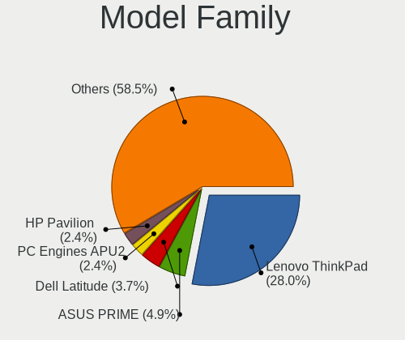

| Name                                        | Computers | Percent |
|---------------------------------------------|-----------|---------|
| Lenovo ThinkPad                             | 22        | 31.88%  |
| ASUS PRIME                                  | 3         | 4.35%   |
| PC Engines APU2                             | 2         | 2.9%    |
| HP Pavilion                                 | 2         | 2.9%    |
| ASUS TUF                                    | 2         | 2.9%    |
| VIA VT8623-8235                             | 1         | 1.45%   |
| VIA VT82C597                                | 1         | 1.45%   |
| Toshiba NB250                               | 1         | 1.45%   |
| Tactus GeoFlex                              | 1         | 1.45%   |
| Tactus GeoBook                              | 1         | 1.45%   |
| Sony VPCX115KX                              | 1         | 1.45%   |
| Sony VGC-RB41M                              | 1         | 1.45%   |
| Panasonic CFSX4-1                           | 1         | 1.45%   |
| Panasonic CF-53AAGHYDM                      | 1         | 1.45%   |
| Panasonic CF-52PFPBSFQ                      | 1         | 1.45%   |
| MSI MS-7721                                 | 1         | 1.45%   |
| MSI MS-7623                                 | 1         | 1.45%   |
| MSI MS-7592                                 | 1         | 1.45%   |
| MSI MS-7125                                 | 1         | 1.45%   |
| Matsushita Electric Industrial CF-51RCVDNLM | 1         | 1.45%   |
| Matsushita Electric Industrial CF-48V4KNDQM | 1         | 1.45%   |
| Lenovo V14                                  | 1         | 1.45%   |
| Lenovo G570                                 | 1         | 1.45%   |
| Lenovo B590                                 | 1         | 1.45%   |
| IBM ThinkPad                                | 1         | 1.45%   |
| HP ProLiant                                 | 1         | 1.45%   |
| HP Compaq                                   | 1         | 1.45%   |
| Gigabyte G41MT-S2                           | 1         | 1.45%   |
| Gigabyte B250M-Gaming                       | 1         | 1.45%   |
| Getac V110G2                                | 1         | 1.45%   |
| Fujitsu Siemens LIFEBOOK                    | 1         | 1.45%   |
| Fujitsu LIFEBOOK                            | 1         | 1.45%   |
| Elpitech ET101-A1                           | 1         | 1.45%   |
| Dell Latitude                               | 1         | 1.45%   |
| ASUS VivoBook                               | 1         | 1.45%   |
| ASUS RS120-E4                               | 1         | 1.45%   |
| ASUS P10S-I                                 | 1         | 1.45%   |
| ASUS M3A78-EMH                              | 1         | 1.45%   |
| ASUS 900                                    | 1         | 1.45%   |
| ASUS 1000HE                                 | 1         | 1.45%   |

MFG Year
--------

Motherboard manufacture year

| Year    | Computers | Percent |
|---------|-----------|---------|
| 2010    | 8         | 11.59%  |
| 2023    | 5         | 7.25%   |
| 2019    | 5         | 7.25%   |
| 2016    | 5         | 7.25%   |
| 2011    | 5         | 7.25%   |
| 2006    | 5         | 7.25%   |
| 2022    | 4         | 5.8%    |
| 2013    | 4         | 5.8%    |
| 2021    | 3         | 4.35%   |
| 2020    | 3         | 4.35%   |
| 2018    | 3         | 4.35%   |
| 2015    | 3         | 4.35%   |
| 2012    | 3         | 4.35%   |
| 2009    | 3         | 4.35%   |
| 2007    | 3         | 4.35%   |
| Unknown | 2         | 2.9%    |
| 2017    | 1         | 1.45%   |
| 2014    | 1         | 1.45%   |
| 2005    | 1         | 1.45%   |
| 2004    | 1         | 1.45%   |
| 2002    | 1         | 1.45%   |

Form Factor
-----------

Physical design of the computer

| Name     | Computers | Percent |
|----------|-----------|---------|
| Notebook | 45        | 65.22%  |
| Desktop  | 23        | 33.33%  |
| Server   | 1         | 1.45%   |

Coreboot
--------

Have coreboot on board

| Used | Computers | Percent |
|------|-----------|---------|
| No   | 66        | 95.65%  |
| Yes  | 3         | 4.35%   |

RAM Size
--------

Total RAM memory

| Size in GB  | Computers | Percent |
|-------------|-----------|---------|
| 4.01-8.0    | 17        | 24.29%  |
| 8.01-16.0   | 17        | 24.29%  |
| 16.01-24.0  | 9         | 12.86%  |
| 3.01-4.0    | 7         | 10%     |
| 2.01-3.0    | 5         | 7.14%   |
| 64.01-256.0 | 5         | 7.14%   |
| 0.51-1.0    | 3         | 4.29%   |
| 0.01-0.5    | 3         | 4.29%   |
| 32.01-64.0  | 2         | 2.86%   |
| 24.01-32.0  | 1         | 1.43%   |
| 1.01-2.0    | 1         | 1.43%   |

RAM Used
--------

Used RAM memory

| Used GB  | Computers | Percent |
|----------|-----------|---------|
| 0.01-0.5 | 54        | 78.26%  |
| 0        | 7         | 10.14%  |
| 4.01-8.0 | 3         | 4.35%   |
| 1.01-2.0 | 3         | 4.35%   |
| 0.51-1.0 | 2         | 2.9%    |

Total Drives
------------

Number of drives on board

| Drives | Computers | Percent |
|--------|-----------|---------|
| 1      | 40        | 57.14%  |
| 2      | 17        | 24.29%  |
| 3      | 8         | 11.43%  |
| 0      | 3         | 4.29%   |
| 8      | 1         | 1.43%   |
| 6      | 1         | 1.43%   |

Has CD-ROM
----------

Has CD-ROM on board

| Presented | Computers | Percent |
|-----------|-----------|---------|
| No        | 69        | 100%    |

Has Ethernet
------------

Has Ethernet on board

| Presented | Computers | Percent |
|-----------|-----------|---------|
| Yes       | 61        | 88.41%  |
| No        | 8         | 11.59%  |

Has WiFi
--------

Has WiFi module

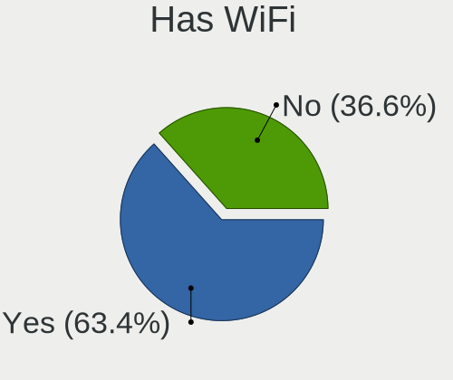

| Presented | Computers | Percent |
|-----------|-----------|---------|
| Yes       | 46        | 66.67%  |
| No        | 23        | 33.33%  |

Has Bluetooth
-------------

Has Bluetooth module

| Presented | Computers | Percent |
|-----------|-----------|---------|
| Yes       | 35        | 50%     |
| No        | 35        | 50%     |

Location
--------

Country
-------

Geographic location (country)

| Country  | Computers | Percent |
|----------|-----------|---------|
| Russia   | 18        | 26.09%  |
| Canada   | 14        | 20.29%  |
| USA      | 7         | 10.14%  |
| Germany  | 5         | 7.25%   |
| Brazil   | 5         | 7.25%   |
| Uruguay  | 3         | 4.35%   |
| Mexico   | 3         | 4.35%   |
| Spain    | 2         | 2.9%    |
| Romania  | 2         | 2.9%    |
| Poland   | 2         | 2.9%    |
| Italy    | 2         | 2.9%    |
| Colombia | 2         | 2.9%    |
| Ukraine  | 1         | 1.45%   |
| Taiwan   | 1         | 1.45%   |
| France   | 1         | 1.45%   |
| China    | 1         | 1.45%   |

City
----

Geographic location (city)

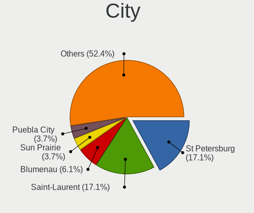

| City                    | Computers | Percent |
|-------------------------|-----------|---------|
| Saint-Laurent           | 14        | 20.29%  |
| St Petersburg           | 11        | 15.94%  |
| Blumenau                | 5         | 7.25%   |
| Sun Prairie             | 3         | 4.35%   |
| Puebla City             | 3         | 4.35%   |
| Montevideo              | 3         | 4.35%   |
| Nuremberg               | 2         | 2.9%    |
| Moscow                  | 2         | 2.9%    |
| Montería               | 2         | 2.9%    |
| Milan                   | 2         | 2.9%    |
| Lübeck                 | 2         | 2.9%    |
| Cherepovets             | 2         | 2.9%    |
| Austin                  | 2         | 2.9%    |
| Wroclaw                 | 1         | 1.45%   |
| Taipei                  | 1         | 1.45%   |
| Swilcza                 | 1         | 1.45%   |
| San Francisco           | 1         | 1.45%   |
| Roswell                 | 1         | 1.45%   |
| Podolsk                 | 1         | 1.45%   |
| Oltenita                | 1         | 1.45%   |
| Novosibirsk             | 1         | 1.45%   |
| Navalcarnero            | 1         | 1.45%   |
| Monheim am Rhein        | 1         | 1.45%   |
| Les Pavillons-sous-Bois | 1         | 1.45%   |
| Krasnodar               | 1         | 1.45%   |
| Harbin                  | 1         | 1.45%   |
| Brovary                 | 1         | 1.45%   |
| Brasov                  | 1         | 1.45%   |
| Barcelona               | 1         | 1.45%   |

Drives
------

Drive Vendor
------------

Hard drive vendors

| Vendor              | Computers | Drives | Percent |
|---------------------|-----------|--------|---------|
| NVMe                | 16        | 21     | 17.98%  |
| Samsung Electronics | 10        | 15     | 11.24%  |
| WDC                 | 9         | 9      | 10.11%  |
| Seagate             | 6         | 7      | 6.74%   |
| Kingston            | 6         | 6      | 6.74%   |
| Hitachi             | 6         | 6      | 6.74%   |
| SanDisk             | 5         | 7      | 5.62%   |
| Intel               | 4         | 4      | 4.49%   |
| Crucial             | 3         | 4      | 3.37%   |
| Apacer              | 3         | 3      | 3.37%   |
| Toshiba             | 2         | 2      | 2.25%   |
| PNY                 | 2         | 3      | 2.25%   |
| OPENBSD             | 2         | 2      | 2.25%   |
| Intenso             | 2         | 2      | 2.25%   |
| Fujitsu             | 2         | 2      | 2.25%   |
| A-DATA Technology   | 2         | 2      | 2.25%   |
| Verbatim            | 1         | 1      | 1.12%   |
| Union Memory        | 1         | 1      | 1.12%   |
| SMI                 | 1         | 1      | 1.12%   |
| KIOXIA-EXCERIA      | 1         | 1      | 1.12%   |
| JetFlash            | 1         | 1      | 1.12%   |
| HGST                | 1         | 1      | 1.12%   |
| ASUSTek Computer    | 1         | 2      | 1.12%   |
| Apple               | 1         | 1      | 1.12%   |
| AMD                 | 1         | 1      | 1.12%   |

Drive Model
-----------

Hard drive models

| Model                               | Computers | Percent |
|-------------------------------------|-----------|---------|
| Intel SSDSC2BW480H6 480GB           | 4         | 4.21%   |
| SanDisk SSD PLUS 120GB              | 2         | 2.11%   |
| SanDisk Extreme SSD 500GB           | 2         | 2.11%   |
| PNY CS900 1TB SSD                   | 2         | 2.11%   |
| NVMe Samsung SSD 980 500GB          | 2         | 2.11%   |
| NVMe SAMSUNG MZVLW256 256GB         | 2         | 2.11%   |
| Kingston SA400S37480G 480GB         | 2         | 2.11%   |
| Intenso SSD 256GB                   | 2         | 2.11%   |
| WDC WD7500BPKX-00HPJT0 752GB        | 1         | 1.05%   |
| WDC WD7500BPKT-75PK4T0 752GB        | 1         | 1.05%   |
| WDC WD7500BPKT-00PK4T0 752GB        | 1         | 1.05%   |
| WDC WD5000LPLX-00ZNTT0 500GB        | 1         | 1.05%   |
| WDC WD5000AZLX-00K2TA0 500GB        | 1         | 1.05%   |
| WDC WD3201ABYS-01B9A0 320GB         | 1         | 1.05%   |
| WDC WD3200BEVE-00A0HT0 320GB        | 1         | 1.05%   |
| WDC WD20PURX-64P6ZY0 2TB            | 1         | 1.05%   |
| WDC WD10JPLX-00MBPT0 1TB            | 1         | 1.05%   |
| Verbatim STORE N GO 64GB            | 1         | 1.05%   |
| Union Memory RTOTJ128VGD2EYX 128GB  | 1         | 1.05%   |
| Toshiba MK8007GAH 80GB              | 1         | 1.05%   |
| Toshiba KSG60ZMV256G M.2 2280 256GB | 1         | 1.05%   |
| SMI USB DISK 18302PB                | 1         | 1.05%   |
| Seagate USB 480GB                   | 1         | 1.05%   |
| Seagate ST9160821A 160GB            | 1         | 1.05%   |
| Seagate ST500LM012 HN-M500MBB 500GB | 1         | 1.05%   |
| Seagate ST3500414CS 500GB           | 1         | 1.05%   |
| Seagate ST3250824AS P 250GB         | 1         | 1.05%   |
| Seagate ST3250318AS 250GB           | 1         | 1.05%   |
| Seagate ST320011A 20GB              | 1         | 1.05%   |
| SanDisk SSD PLUS 240GB              | 1         | 1.05%   |
| SanDisk Cruzer Blade 64GB           | 1         | 1.05%   |
| Samsung SSD 870 QVO 2TB             | 1         | 1.05%   |
| Samsung SSD 870 EVO 500GB           | 1         | 1.05%   |
| Samsung SSD 860 EVO M.2 1TB         | 1         | 1.05%   |
| Samsung SSD 850 EVO 500GB           | 1         | 1.05%   |
| Samsung SSD 840 EVO 250GB           | 1         | 1.05%   |
| Samsung MZ7TD128HAFV-000L1 128GB    | 1         | 1.05%   |
| Samsung MZ7PC128HAFU-000L1 128GB    | 1         | 1.05%   |
| Samsung MMCRE28GFMXP-MVB 128GB      | 1         | 1.05%   |
| Samsung HD161HJ 160GB               | 1         | 1.05%   |

HDD Vendor
----------

Hard disk drive vendors

| Vendor              | Computers | Drives | Percent |
|---------------------|-----------|--------|---------|
| NVMe                | 11        | 15     | 25.58%  |
| WDC                 | 9         | 9      | 20.93%  |
| Seagate             | 6         | 7      | 13.95%  |
| Hitachi             | 6         | 6      | 13.95%  |
| Samsung Electronics | 2         | 2      | 4.65%   |
| OPENBSD             | 2         | 2      | 4.65%   |
| Fujitsu             | 2         | 2      | 4.65%   |
| Verbatim            | 1         | 1      | 2.33%   |
| Toshiba             | 1         | 1      | 2.33%   |
| SMI                 | 1         | 1      | 2.33%   |
| JetFlash            | 1         | 1      | 2.33%   |
| HGST                | 1         | 1      | 2.33%   |

SSD Vendor
----------

Solid state drive vendors

| Vendor              | Computers | Drives | Percent |
|---------------------|-----------|--------|---------|
| Samsung Electronics | 8         | 13     | 17.02%  |
| NVMe                | 6         | 6      | 12.77%  |
| Kingston            | 6         | 6      | 12.77%  |
| SanDisk             | 5         | 7      | 10.64%  |
| Intel               | 4         | 4      | 8.51%   |
| Crucial             | 3         | 4      | 6.38%   |
| Apacer              | 3         | 3      | 6.38%   |
| PNY                 | 2         | 3      | 4.26%   |
| Intenso             | 2         | 2      | 4.26%   |
| A-DATA Technology   | 2         | 2      | 4.26%   |
| Union Memory        | 1         | 1      | 2.13%   |
| Toshiba             | 1         | 1      | 2.13%   |
| KIOXIA-EXCERIA      | 1         | 1      | 2.13%   |
| ASUSTek Computer    | 1         | 2      | 2.13%   |
| Apple               | 1         | 1      | 2.13%   |
| AMD                 | 1         | 1      | 2.13%   |

Drive Kind
----------

HDD or SSD

| Kind | Computers | Drives | Percent |
|------|-----------|--------|---------|
| SSD  | 44        | 57     | 55.7%   |
| HDD  | 35        | 48     | 44.3%   |

Drive Connector
---------------

SATA, SAS, NVMe, etc.

| Type | Computers | Drives | Percent |
|------|-----------|--------|---------|
| SATA | 67        | 105    | 100%    |

Drive Size
----------

Size of hard drive

| Size in TB      | Computers | Drives | Percent |
|-----------------|-----------|--------|---------|
| 0.01-0.5        | 56        | 76     | 75.68%  |
| 0.51-1.0        | 10        | 11     | 13.51%  |
| 1.01-2.0        | 6         | 16     | 8.11%   |
| More than 100.0 | 1         | 1      | 1.35%   |
| 4.01-10.0       | 1         | 1      | 1.35%   |

Space Total
-----------

Amount of disk space available on the file system

| Size in GB     | Computers | Percent |
|----------------|-----------|---------|
| 101-250        | 22        | 30.99%  |
| 251-500        | 16        | 22.54%  |
| 21-50          | 15        | 21.13%  |
| 51-100         | 6         | 8.45%   |
| 1-20           | 5         | 7.04%   |
| 501-1000       | 3         | 4.23%   |
| More than 3000 | 2         | 2.82%   |
| 1001-2000      | 2         | 2.82%   |

Space Used
----------

Amount of used disk space

| Used GB        | Computers | Percent |
|----------------|-----------|---------|
| 1-20           | 53        | 74.65%  |
| 21-50          | 8         | 11.27%  |
| 101-250        | 3         | 4.23%   |
| 51-100         | 3         | 4.23%   |
| 251-500        | 2         | 2.82%   |
| More than 3000 | 1         | 1.41%   |
| 2001-3000      | 1         | 1.41%   |

Malfunc. Drives
---------------

Drive models with a malfunction

| Model                                 | Computers | Drives | Percent |
|---------------------------------------|-----------|--------|---------|
| Intel SSDSC2BW480H6 480GB             | 4         | 4      | 36.36%  |
| SanDisk SSD PLUS 240GB                | 1         | 1      | 9.09%   |
| Samsung Electronics SSD 870 EVO 500GB | 1         | 1      | 9.09%   |
| Samsung Electronics SSD 840 EVO 250GB | 1         | 1      | 9.09%   |
| Samsung Electronics HD161HJ 160GB     | 1         | 1      | 9.09%   |
| Hitachi HDS722516VLAT80 164GB         | 1         | 1      | 9.09%   |
| A-DATA Technology SP550 480GB         | 1         | 1      | 9.09%   |
| A-DATA Technology SP550 240GB         | 1         | 1      | 9.09%   |

Malfunc. Drive Vendor
---------------------

Vendors of faulty drives

| Vendor              | Computers | Drives | Percent |
|---------------------|-----------|--------|---------|
| Intel               | 4         | 4      | 36.36%  |
| Samsung Electronics | 3         | 3      | 27.27%  |
| A-DATA Technology   | 2         | 2      | 18.18%  |
| SanDisk             | 1         | 1      | 9.09%   |
| Hitachi             | 1         | 1      | 9.09%   |

Malfunc. HDD Vendor
-------------------

Vendors of faulty HDD drives

| Vendor              | Computers | Drives | Percent |
|---------------------|-----------|--------|---------|
| Samsung Electronics | 1         | 1      | 50%     |
| Hitachi             | 1         | 1      | 50%     |

Malfunc. Drive Kind
-------------------

Kinds of faulty drives

| Kind | Computers | Drives | Percent |
|------|-----------|--------|---------|
| SSD  | 9         | 9      | 81.82%  |
| HDD  | 2         | 2      | 18.18%  |

Failed Drives
-------------

Failed drive models

Zero info for selected period =(

Failed Drive Vendor
-------------------

Failed drive vendors

Zero info for selected period =(

Drive Status
------------

Number of failed and malfunc. drives

| Status   | Computers | Drives | Percent |
|----------|-----------|--------|---------|
| Works    | 48        | 66     | 62.34%  |
| Detected | 18        | 28     | 23.38%  |
| Malfunc  | 11        | 11     | 14.29%  |

Storage controller
------------------

Storage Vendor
--------------

Storage controller vendors

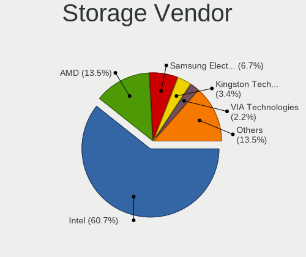

| Vendor                         | Computers | Percent |
|--------------------------------|-----------|---------|
| Intel                          | 47        | 61.04%  |
| AMD                            | 10        | 12.99%  |
| Samsung Electronics            | 5         | 6.49%   |
| Kingston Technology Company    | 3         | 3.9%    |
| VIA Technologies               | 2         | 2.6%    |
| SanDisk                        | 2         | 2.6%    |
| Phison Electronics             | 2         | 2.6%    |
| Toshiba                        | 1         | 1.3%    |
| Solid State Storage Technology | 1         | 1.3%    |
| Silicon Motion                 | 1         | 1.3%    |
| Nvidia                         | 1         | 1.3%    |
| Hewlett-Packard                | 1         | 1.3%    |
| Artop Electronic               | 1         | 1.3%    |

Storage Model
-------------

Storage controller models

| Model                                                                         | Computers | Percent |
|-------------------------------------------------------------------------------|-----------|---------|
| Intel 7 Series Chipset Family 6-port SATA Controller [AHCI mode]              | 6         | 6.98%   |
| Intel Sunrise Point-LP SATA Controller [AHCI mode]                            | 5         | 5.81%   |
| Intel 6 Series/C200 Series Chipset Family 6 port Mobile SATA AHCI Controller  | 4         | 4.65%   |
| Intel 5 Series/3400 Series Chipset 6 port SATA AHCI Controller                | 4         | 4.65%   |
| AMD FCH SATA Controller [AHCI mode]                                           | 4         | 4.65%   |
| Intel Wildcat Point-LP SATA Controller [AHCI Mode]                            | 3         | 3.49%   |
| Intel 82801G (ICH7 Family) IDE Controller                                     | 3         | 3.49%   |
| VIA VT82C586A/B/VT82C686/A/B/VT823x/A/C PIPC Bus Master IDE                   | 2         | 2.33%   |
| SanDisk WD Black SN750 / PC SN730 NVMe SSD                                    | 2         | 2.33%   |
| Samsung NVMe SSD Controller SM961/PM961/SM963                                 | 2         | 2.33%   |
| Samsung NVMe SSD Controller PM9A1/PM9A3/980PRO                                | 2         | 2.33%   |
| Intel NM10/ICH7 Family SATA Controller [IDE mode]                             | 2         | 2.33%   |
| Intel Celeron/Pentium Silver Processor SATA Controller                        | 2         | 2.33%   |
| Intel 82801GBM/GHM (ICH7-M Family) SATA Controller [IDE mode]                 | 2         | 2.33%   |
| Intel 82801FBM (ICH6M) SATA Controller                                        | 2         | 2.33%   |
| AMD SB7x0/SB8x0/SB9x0 IDE Controller                                          | 2         | 2.33%   |
| AMD FCH SATA Controller [IDE mode]                                            | 2         | 2.33%   |
| AMD 500 Series Chipset SATA Controller                                        | 2         | 2.33%   |
| Toshiba BG3 NVMe SSD Controller                                               | 1         | 1.16%   |
| Solid State Storage CL1-3D256-Q11 NVMe SSD M.2                                | 1         | 1.16%   |
| Silicon Motion SM2263EN/SM2263XT (DRAM-less) NVMe SSD Controllers             | 1         | 1.16%   |
| Samsung NVMe SSD Controller S4LV008[Pascal]                                   | 1         | 1.16%   |
| Phison PS5013 E13 NVMe Controller                                             | 1         | 1.16%   |
| Phison E16 PCIe4 NVMe Controller                                              | 1         | 1.16%   |
| Nvidia CK804 Serial ATA Controller                                            | 1         | 1.16%   |
| Nvidia CK804 IDE                                                              | 1         | 1.16%   |
| Kingston Company unknown                                                      | 1         | 1.16%   |
| Kingston Company NVMe Controller                                              | 1         | 1.16%   |
| Kingston Company NV1 NVMe SSD                                                 | 1         | 1.16%   |
| Intel US15W/US15X/US15L/UL11L SCH [Poulsbo] IDE Controller                    | 1         | 1.16%   |
| Intel Tiger Lake-LP SATA Controller                                           | 1         | 1.16%   |
| Intel SSD 670p Series [Keystone Harbor]                                       | 1         | 1.16%   |
| Intel Q170/Q150/B150/H170/H110/Z170/CM236 Chipset SATA Controller [AHCI Mode] | 1         | 1.16%   |
| Intel NM10/ICH7 Family SATA Controller [AHCI mode]                            | 1         | 1.16%   |
| Intel Cannon Lake Mobile PCH SATA AHCI Controller                             | 1         | 1.16%   |
| Intel 82801IBM/IEM (ICH9M/ICH9M-E) 4 port SATA Controller [AHCI mode]         | 1         | 1.16%   |
| Intel 82801HR/HO/HH (ICH8R/DO/DH) 2 port SATA Controller [IDE mode]           | 1         | 1.16%   |
| Intel 82801HM/HEM (ICH8M/ICH8M-E) SATA Controller [AHCI mode]                 | 1         | 1.16%   |
| Intel 82801H (ICH8 Family) 4 port SATA Controller [IDE mode]                  | 1         | 1.16%   |
| Intel 82801FB/FW (ICH6/ICH6W) SATA Controller                                 | 1         | 1.16%   |

Storage Kind
------------

Kind of storage controller (IDE, SATA, NVMe, SAS, ...)

| Kind | Computers | Percent |
|------|-----------|---------|
| SATA | 42        | 53.85%  |
| IDE  | 20        | 25.64%  |
| NVMe | 14        | 17.95%  |
| SAS  | 1         | 1.28%   |
| SCSI | 1         | 1.28%   |

Processor
---------

CPU Vendor
----------

Processor vendors

| Vendor  | Computers | Percent |
|---------|-----------|---------|
| Intel   | 51        | 73.91%  |
| AMD     | 15        | 21.74%  |
| VIA     | 1         | 1.45%   |
| ARM     | 1         | 1.45%   |
| Unknown | 1         | 1.45%   |

CPU Model
---------

Processor models

| Model                                                           | Computers | Percent |
|-----------------------------------------------------------------|-----------|---------|
| Intel Core i5-6300U CPU @ 2.40GHz                               | 5         | 7.25%   |
| Intel Core i5-3320M CPU @ 2.60GHz                               | 4         | 5.8%    |
| Intel Core i5-2520M CPU @ 2.50GHz                               | 3         | 4.35%   |
| Intel Core i5 CPU M 520 @ 2.40GHz                               | 3         | 4.35%   |
| Intel Core i5-5300U CPU @ 2.30GHz                               | 2         | 2.9%    |
| Intel Core 2 Quad CPU Q6600 @ 2.40GHz                           | 2         | 2.9%    |
| Intel Celeron N4020 CPU @ 1.10GHz                               | 2         | 2.9%    |
| AMD GX-412TC SOC                                                | 2         | 2.9%    |
| VIA C3                                                          | 1         | 1.45%   |
| Intel Xeon CPU E5-2697 v4 @ 2.30GHz                             | 1         | 1.45%   |
| Intel Xeon CPU E3-1220 v5 @ 3.00GHz                             | 1         | 1.45%   |
| Intel Xeon CPU 5150 @ 2.66GHz                                   | 1         | 1.45%   |
| Intel Pentium M processor                                       | 1         | 1.45%   |
| Intel Pentium 4 Mobile CPU 1.60GHz                              | 1         | 1.45%   |
| Intel Pentium 4 CPU 3.00GHz ("GenuineIntel" 686-class)          | 1         | 1.45%   |
| Intel Genuine CPU U1400                                         | 1         | 1.45%   |
| Intel Genuine CPU T2300 @ 1.66GHz                               | 1         | 1.45%   |
| Intel Core i7-8650U CPU @ 1.90GHz                               | 1         | 1.45%   |
| Intel Core i7-3520M CPU @ 2.90GHz                               | 1         | 1.45%   |
| Intel Core i5-8300H CPU @ 2.30GHz                               | 1         | 1.45%   |
| Intel Core i5-8265U CPU @ 1.60GHz                               | 1         | 1.45%   |
| Intel Core i5-7400 CPU @ 3.00GHz                                | 1         | 1.45%   |
| Intel Core i5-6200U CPU @ 2.30GHz                               | 1         | 1.45%   |
| Intel Core i5-5200U CPU @ 2.20GHz                               | 1         | 1.45%   |
| Intel Core i5-4300U CPU @ 1.90GHz                               | 1         | 1.45%   |
| Intel Core i5-2557M CPU @ 1.70GHz                               | 1         | 1.45%   |
| Intel Core i5-2410M CPU @ 2.30GHz                               | 1         | 1.45%   |
| Intel Core i3-3120M CPU @ 2.50GHz                               | 1         | 1.45%   |
| Intel Core i3-10100 CPU @ 3.60GHz                               | 1         | 1.45%   |
| Intel Core i3 CPU M 350 @ 2.27GHz                               | 1         | 1.45%   |
| Intel Core 2 Quad CPU Q9550 @ 2.83GHz                           | 1         | 1.45%   |
| Intel Core 2 Duo CPU T9400 @ 2.53GHz                            | 1         | 1.45%   |
| Intel Core 2 Duo CPU T7100 @ 1.80GHz ("GenuineIntel" 686-class) | 1         | 1.45%   |
| Intel Core 2 CPU 6420 @ 2.13GHz                                 | 1         | 1.45%   |
| Intel Celeron M processor                                       | 1         | 1.45%   |
| Intel Atom CPU Z550 @ 2.00GHz ("GenuineIntel" 686-class)        | 1         | 1.45%   |
| Intel Atom CPU N455 @ 1.66GHz ("GenuineIntel" 686-class)        | 1         | 1.45%   |
| Intel Atom CPU N280 @ 1.66GHz                                   | 1         | 1.45%   |
| Intel 11th Gen Core i5-1135G7 @ 2.40GHz                         | 1         | 1.45%   |
| ARM Cortex-A57 r1p3                                             | 1         | 1.45%   |

CPU Model Family
----------------

Processor model prefix

| Model             | Computers | Percent |
|-------------------|-----------|---------|
| Intel Core i5     | 25        | 36.23%  |
| Other             | 4         | 5.8%    |
| AMD Ryzen 7       | 4         | 5.8%    |
| Intel Xeon        | 3         | 4.35%   |
| Intel Core i3     | 3         | 4.35%   |
| Intel Core 2 Quad | 3         | 4.35%   |
| Intel Atom        | 3         | 4.35%   |
| Intel Pentium 4   | 2         | 2.9%    |
| Intel Genuine     | 2         | 2.9%    |
| Intel Core i7     | 2         | 2.9%    |
| Intel Core 2 Duo  | 2         | 2.9%    |
| Intel Celeron     | 2         | 2.9%    |
| AMD Ryzen 9       | 2         | 2.9%    |
| AMD GX            | 2         | 2.9%    |
| Intel Pentium M   | 1         | 1.45%   |
| Intel Core 2      | 1         | 1.45%   |
| Intel Celeron M   | 1         | 1.45%   |
| ARM Cortex        | 1         | 1.45%   |
| AMD Ryzen 5 PRO   | 1         | 1.45%   |
| AMD Phenom        | 1         | 1.45%   |
| AMD E1            | 1         | 1.45%   |
| AMD Athlon X4     | 1         | 1.45%   |
| AMD Athlon II X2  | 1         | 1.45%   |
| AMD Athlon 64     | 1         | 1.45%   |

CPU Cores
---------

Number of processor cores

| Number  | Computers | Percent |
|---------|-----------|---------|
| 2       | 30        | 43.48%  |
| Unknown | 13        | 18.84%  |
| 4       | 12        | 17.39%  |
| 1       | 6         | 8.7%    |
| 16      | 4         | 5.8%    |
| 32      | 2         | 2.9%    |
| 36      | 1         | 1.45%   |
| 12      | 1         | 1.45%   |

CPU Sockets
-----------

Number of sockets

| Number  | Computers | Percent |
|---------|-----------|---------|
| 1       | 58        | 84.06%  |
| Unknown | 9         | 13.04%  |
| 2       | 2         | 2.9%    |

CPU Threads
-----------

Threads per core (Hyper-Threading)

| Number  | Computers | Percent |
|---------|-----------|---------|
| 2       | 31        | 44.93%  |
| 1       | 20        | 28.99%  |
| Unknown | 18        | 26.09%  |

CPU Microarch
-------------

Microarchitecture

| Name          | Computers | Percent |
|---------------|-----------|---------|
| Skylake       | 7         | 10.14%  |
| IvyBridge     | 6         | 8.7%    |
| SandyBridge   | 5         | 7.25%   |
| Core          | 5         | 7.25%   |
| Unknown       | 5         | 7.25%   |
| Westmere      | 4         | 5.8%    |
| P6            | 4         | 5.8%    |
| KabyLake      | 4         | 5.8%    |
| Broadwell     | 4         | 5.8%    |
| Zen 2         | 3         | 4.35%   |
| Bonnell       | 3         | 4.35%   |
| Zen 3         | 2         | 2.9%    |
| Puma          | 2         | 2.9%    |
| Penryn        | 2         | 2.9%    |
| NetBurst      | 2         | 2.9%    |
| K10           | 2         | 2.9%    |
| Goldmont plus | 2         | 2.9%    |
| TigerLake     | 1         | 1.45%   |
| Steamroller   | 1         | 1.45%   |
| K8 Hammer     | 1         | 1.45%   |
| Jaguar        | 1         | 1.45%   |
| Haswell       | 1         | 1.45%   |
| Geode         | 1         | 1.45%   |
| CometLake     | 1         | 1.45%   |

Graphics
--------

GPU Vendor
----------

Vendors of graphics cards

| Vendor                     | Computers | Percent |
|----------------------------|-----------|---------|
| Intel                      | 44        | 63.77%  |
| AMD                        | 13        | 18.84%  |
| Nvidia                     | 9         | 13.04%  |
| VIA Technologies           | 1         | 1.45%   |
| Matrox Electronics Systems | 1         | 1.45%   |
| ASPEED Technology          | 1         | 1.45%   |

GPU Model
---------

Graphics card models

| Model                                                                         | Computers | Percent |
|-------------------------------------------------------------------------------|-----------|---------|
| Intel Skylake GT2 [HD Graphics 520]                                           | 6         | 8.22%   |
| Intel 3rd Gen Core processor Graphics Controller                              | 6         | 8.22%   |
| Intel 2nd Generation Core Processor Family Integrated Graphics Controller     | 5         | 6.85%   |
| Intel Core Processor Integrated Graphics Controller                           | 4         | 5.48%   |
| Intel Mobile 945GM/GMS/GME, 943/940GML Express Integrated Graphics Controller | 3         | 4.11%   |
| Intel HD Graphics 5500                                                        | 3         | 4.11%   |
| Nvidia GK208B [GeForce GT 710]                                                | 2         | 2.74%   |
| Intel Mobile 945GM/GMS, 943/940GML Express Integrated Graphics Controller     | 2         | 2.74%   |
| Intel Mobile 915GM/GMS/910GML Express Graphics Controller                     | 2         | 2.74%   |
| Intel GeminiLake [UHD Graphics 600]                                           | 2         | 2.74%   |
| AMD Renoir                                                                    | 2         | 2.74%   |
| AMD Raphael                                                                   | 2         | 2.74%   |
| VIA Technologies VT8623 [Apollo CLE266] integrated CastleRock graphics        | 1         | 1.37%   |
| Nvidia GT200 [GeForce GTX 260]                                                | 1         | 1.37%   |
| Nvidia GP107M [GeForce GTX 1050 Mobile]                                       | 1         | 1.37%   |
| Nvidia GP106 [GeForce GTX 1060 6GB]                                           | 1         | 1.37%   |
| Nvidia GA104GL [RTX A4000]                                                    | 1         | 1.37%   |
| Nvidia GA104 [GeForce RTX 3070 Lite Hash Rate]                                | 1         | 1.37%   |
| Nvidia G73 [GeForce 7300 GT]                                                  | 1         | 1.37%   |
| Nvidia G72 [GeForce 7300 LE]                                                  | 1         | 1.37%   |
| Matrox Electronics Systems MGA G200EH                                         | 1         | 1.37%   |
| Intel WhiskeyLake-U GT2 [UHD Graphics 620]                                    | 1         | 1.37%   |
| Intel US15W/US15X SCH [Poulsbo] Graphics Controller                           | 1         | 1.37%   |
| Intel UHD Graphics 620                                                        | 1         | 1.37%   |
| Intel TigerLake-LP GT2 [Iris Xe Graphics]                                     | 1         | 1.37%   |
| Intel Mobile GM965/GL960 Integrated Graphics Controller (secondary)           | 1         | 1.37%   |
| Intel Mobile GM965/GL960 Integrated Graphics Controller (primary)             | 1         | 1.37%   |
| Intel Mobile 945GSE Express Integrated Graphics Controller                    | 1         | 1.37%   |
| Intel Mobile 4 Series Chipset Integrated Graphics Controller                  | 1         | 1.37%   |
| Intel HD Graphics 630                                                         | 1         | 1.37%   |
| Intel Haswell-ULT Integrated Graphics Controller                              | 1         | 1.37%   |
| Intel CometLake-S GT2 [UHD Graphics 630]                                      | 1         | 1.37%   |
| Intel CoffeeLake-H GT2 [UHD Graphics 630]                                     | 1         | 1.37%   |
| Intel 82Q963/Q965 Integrated Graphics Controller                              | 1         | 1.37%   |
| Intel 82915G/GV/910GL Integrated Graphics Controller                          | 1         | 1.37%   |
| Intel 4 Series Chipset Integrated Graphics Controller                         | 1         | 1.37%   |
| ASPEED Technology ASPEED Graphics Family                                      | 1         | 1.37%   |
| AMD RV770 [Radeon HD 4850]                                                    | 1         | 1.37%   |
| AMD RV200/M7 [Mobility Radeon 7500]                                           | 1         | 1.37%   |
| AMD RV200 [Radeon 7500/7500 LE]                                               | 1         | 1.37%   |

GPU Combo
---------

Combinations of graphics cards

| Name           | Computers | Percent |
|----------------|-----------|---------|
| 1 x Intel      | 34        | 49.28%  |
| 1 x AMD        | 10        | 14.49%  |
| 2 x Intel      | 7         | 10.14%  |
| Other          | 5         | 7.25%   |
| 1 x Nvidia     | 5         | 7.25%   |
| Intel + Nvidia | 2         | 2.9%    |
| AMD + Nvidia   | 2         | 2.9%    |
| 1 x VIA        | 1         | 1.45%   |
| 1 x Matrox     | 1         | 1.45%   |
| Intel + AMD    | 1         | 1.45%   |
| 1 x ASPEED     | 1         | 1.45%   |

GPU Driver
----------

Free vs proprietary

| Driver  | Computers | Percent |
|---------|-----------|---------|
| Free    | 59        | 85.51%  |
| Unknown | 10        | 14.49%  |

GPU Memory
----------

Total video memory

| Size in GB | Computers | Percent |
|------------|-----------|---------|
| Unknown    | 69        | 100%    |

Monitor
-------

Monitor Vendor
--------------

Monitor vendors

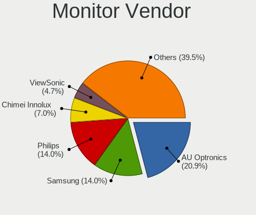

| Vendor              | Computers | Percent |
|---------------------|-----------|---------|
| AU Optronics        | 8         | 22.86%  |
| Samsung Electronics | 5         | 14.29%  |
| Philips             | 5         | 14.29%  |
| Chimei Innolux      | 3         | 8.57%   |
| ViewSonic           | 2         | 5.71%   |
| Apple               | 2         | 5.71%   |
| TRU                 | 1         | 2.86%   |
| MSI                 | 1         | 2.86%   |
| LG Display          | 1         | 2.86%   |
| Lenovo              | 1         | 2.86%   |
| Iiyama              | 1         | 2.86%   |
| Goldstar            | 1         | 2.86%   |
| BOE                 | 1         | 2.86%   |
| BenQ                | 1         | 2.86%   |
| ASUSTek Computer    | 1         | 2.86%   |
| AOC                 | 1         | 2.86%   |

Monitor Model
-------------

Monitor models

| Model                                                                | Computers | Percent |
|----------------------------------------------------------------------|-----------|---------|
| Philips 170S PHL0839 1280x1024 340x270mm 17.1-inch                   | 3         | 8.57%   |
| Samsung Electronics SyncMaster SAM03CF 1280x1024 340x270mm 17.1-inch | 2         | 5.71%   |
| ViewSonic VA703-4SERIES VSC6A1E 1280x1024 340x270mm 17.1-inch        | 1         | 2.86%   |
| ViewSonic VA2418-FHD VSCD739 1920x1080 530x300mm 24.0-inch           | 1         | 2.86%   |
| TRU LCD Monitor TRU235C 1366x768 260x140mm 11.6-inch                 | 1         | 2.86%   |
| Samsung Electronics LCD Monitor SEC324C 1600x900 310x170mm 13.9-inch | 1         | 2.86%   |
| Samsung Electronics LCD Monitor SEC304C 1366x768 310x170mm 13.9-inch | 1         | 2.86%   |
| Samsung Electronics LCD Monitor SAM0669 1920x1080                    | 1         | 2.86%   |
| Philips PHL 247E6 PHLC0E7 1920x1080 520x290mm 23.4-inch              | 1         | 2.86%   |
| Philips 227E4LH PHLC0AC 1920x1080 480x270mm 21.7-inch                | 1         | 2.86%   |
| MSI MP242 MSI30A1 1920x1080 530x300mm 24.0-inch                      | 1         | 2.86%   |
| LG Display LCD Monitor LGD02D8 1366x768 280x160mm 12.7-inch          | 1         | 2.86%   |
| Lenovo LCD Monitor LEN4053 1680x1050 330x210mm 15.4-inch             | 1         | 2.86%   |
| Iiyama PL2530H IVM6131 1920x1080 540x300mm 24.3-inch                 | 1         | 2.86%   |
| Goldstar LG ULTRAWIDE GSM76F9 2560x1080 800x340mm 34.2-inch          | 1         | 2.86%   |
| Chimei Innolux LCD Monitor CMN15E7 1920x1080 340x190mm 15.3-inch     | 1         | 2.86%   |
| Chimei Innolux LCD Monitor CMN14E5 1920x1080 310x170mm 13.9-inch     | 1         | 2.86%   |
| Chimei Innolux LCD Monitor CMN14C9 1920x1080 310x170mm 13.9-inch     | 1         | 2.86%   |
| BOE LCD Monitor BOE08E2 1920x1080 340x190mm 15.3-inch                | 1         | 2.86%   |
| BenQ GL2450H BNQ78A7 1920x1080 530x300mm 24.0-inch                   | 1         | 2.86%   |
| AU Optronics LCD Monitor AUO403D 1920x1080 310x170mm 13.9-inch       | 1         | 2.86%   |
| AU Optronics LCD Monitor AUO315C 1366x768 260x140mm 11.6-inch        | 1         | 2.86%   |
| AU Optronics LCD Monitor AUO2E3C 1366x768 310x170mm 13.9-inch        | 1         | 2.86%   |
| AU Optronics LCD Monitor AUO2336 2560x1440 310x170mm 13.9-inch       | 1         | 2.86%   |
| AU Optronics LCD Monitor AUO213E 1600x900 310x170mm 13.9-inch        | 1         | 2.86%   |
| AU Optronics LCD Monitor AUO173D 1920x1080 310x170mm 13.9-inch       | 1         | 2.86%   |
| AU Optronics LCD Monitor AUO1147 1440x900 300x190mm 14.0-inch        | 1         | 2.86%   |
| AU Optronics LCD Monitor AUO106C 1366x768 280x160mm 12.7-inch        | 1         | 2.86%   |
| ASUSTek Computer PA279 AUS2768 3840x2160 600x340mm 27.2-inch         | 1         | 2.86%   |
| Apple Color LCD APPA010 1366x768 260x140mm 11.6-inch                 | 1         | 2.86%   |
| Apple Color LCD APP9CDF 1440x900 290x180mm 13.4-inch                 | 1         | 2.86%   |
| AOC 27V2G5 AOC2702 1920x1080 600x340mm 27.2-inch                     | 1         | 2.86%   |

Monitor Resolution
------------------

Monitor screen resolution

| Resolution         | Computers | Percent |
|--------------------|-----------|---------|
| 1920x1080 (FHD)    | 13        | 38.24%  |
| 1366x768 (WXGA)    | 7         | 20.59%  |
| 1280x1024 (SXGA)   | 6         | 17.65%  |
| 1600x900 (HD+)     | 2         | 5.88%   |
| 1440x900 (WXGA+)   | 2         | 5.88%   |
| 3840x2160 (4K)     | 1         | 2.94%   |
| 2560x1440 (QHD)    | 1         | 2.94%   |
| 2560x1080          | 1         | 2.94%   |
| 1680x1050 (WSXGA+) | 1         | 2.94%   |

Monitor Diagonal
----------------

Diagonal size in inches

| Inches  | Computers | Percent |
|---------|-----------|---------|
| 13      | 9         | 25.71%  |
| 17      | 6         | 17.14%  |
| 24      | 4         | 11.43%  |
| 15      | 4         | 11.43%  |
| 11      | 3         | 8.57%   |
| 27      | 2         | 5.71%   |
| 12      | 2         | 5.71%   |
| 34      | 1         | 2.86%   |
| 23      | 1         | 2.86%   |
| 21      | 1         | 2.86%   |
| 14      | 1         | 2.86%   |
| Unknown | 1         | 2.86%   |

Monitor Width
-------------

Physical width

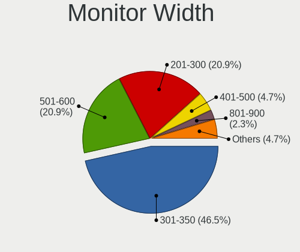

| Width in mm | Computers | Percent |
|-------------|-----------|---------|
| 301-350     | 18        | 51.43%  |
| 501-600     | 7         | 20%     |
| 201-300     | 7         | 20%     |
| 701-800     | 1         | 2.86%   |
| 401-500     | 1         | 2.86%   |
| Unknown     | 1         | 2.86%   |

Aspect Ratio
------------

Proportional relationship between the width and the height

| Ratio | Computers | Percent |
|-------|-----------|---------|
| 16/9  | 24        | 70.59%  |
| 5/4   | 6         | 17.65%  |
| 16/10 | 3         | 8.82%   |
| 21/9  | 1         | 2.94%   |

Monitor Area
------------

Area in inch²

| Area in inch² | Computers | Percent |
|----------------|-----------|---------|
| 81-90          | 10        | 28.57%  |
| 141-150        | 6         | 17.14%  |
| 201-250        | 5         | 14.29%  |
| 51-60          | 3         | 8.57%   |
| 61-70          | 2         | 5.71%   |
| 301-350        | 2         | 5.71%   |
| 101-110        | 2         | 5.71%   |
| 91-100         | 2         | 5.71%   |
| 351-500        | 1         | 2.86%   |
| 251-300        | 1         | 2.86%   |
| Unknown        | 1         | 2.86%   |

Pixel Density
-------------

Pixels per inch

| Density | Computers | Percent |
|---------|-----------|---------|
| 121-160 | 16        | 45.71%  |
| 51-100  | 14        | 40%     |
| 161-240 | 2         | 5.71%   |
| 101-120 | 2         | 5.71%   |
| Unknown | 1         | 2.86%   |

Multiple Monitors
-----------------

Total monitors connected

| Total | Computers | Percent |
|-------|-----------|---------|
| 1     | 54        | 78.26%  |
| 0     | 13        | 18.84%  |
| 2     | 2         | 2.9%    |

Network
-------

Net Controller Vendor
---------------------

Controller vendors

| Vendor                            | Computers | Percent |
|-----------------------------------|-----------|---------|
| Intel                             | 41        | 47.67%  |
| Realtek Semiconductor             | 19        | 22.09%  |
| Qualcomm Atheros                  | 7         | 8.14%   |
| Broadcom                          | 6         | 6.98%   |
| Marvell Technology Group          | 3         | 3.49%   |
| Ericsson Business Mobile Networks | 2         | 2.33%   |
| VIA Technologies                  | 1         | 1.16%   |
| TP-Link                           | 1         | 1.16%   |
| Sierra Wireless                   | 1         | 1.16%   |
| Ralink Technology                 | 1         | 1.16%   |
| Huawei Technologies               | 1         | 1.16%   |
| Edimax Technology                 | 1         | 1.16%   |
| D-Link System                     | 1         | 1.16%   |
| ASUSTek Computer                  | 1         | 1.16%   |

Net Controller Model
--------------------

Controller models

| Model                                                                   | Computers | Percent |
|-------------------------------------------------------------------------|-----------|---------|
| Realtek RTL8111/8168/8411 PCI Express Gigabit Ethernet Controller       | 9         | 7.69%   |
| Intel Centrino Advanced-N 6205 [Taylor Peak]                            | 8         | 6.84%   |
| Intel 82579LM Gigabit Network Connection (Lewisville)                   | 8         | 6.84%   |
| Intel Wireless 8260                                                     | 4         | 3.42%   |
| Intel Wireless 7265                                                     | 4         | 3.42%   |
| Intel Ethernet Connection I219-LM                                       | 4         | 3.42%   |
| Intel 82577LM Gigabit Network Connection                                | 4         | 3.42%   |
| Realtek RTL8125 2.5GbE Controller                                       | 3         | 2.56%   |
| Qualcomm Atheros AR9285 Wireless Network Adapter (PCI-Express)          | 3         | 2.56%   |
| Intel PRO/Wireless 3945ABG [Golan] Network Connection                   | 3         | 2.56%   |
| Intel I210 Gigabit Network Connection                                   | 3         | 2.56%   |
| Intel Ethernet Connection (3) I218-LM                                   | 3         | 2.56%   |
| Realtek RTL810xE PCI Express Fast Ethernet controller                   | 2         | 1.71%   |
| Realtek RTL-8100/8101L/8139 PCI Fast Ethernet Adapter                   | 2         | 1.71%   |
| Intel Wireless 8265 / 8275                                              | 2         | 1.71%   |
| Intel Wireless 7260                                                     | 2         | 1.71%   |
| Intel Wi-Fi 6 AX200                                                     | 2         | 1.71%   |
| Intel Ethernet Connection (4) I219-LM                                   | 2         | 1.71%   |
| Intel Centrino Advanced-N 6200                                          | 2         | 1.71%   |
| VIA VT6102/VT6103 [Rhine-II]                                            | 1         | 0.85%   |
| TP-Link TL-WN722N v2/v3 [Realtek RTL8188EUS]                            | 1         | 0.85%   |
| Sierra Wireless EM7455                                                  | 1         | 0.85%   |
| Realtek RTL8852BE PCIe 802.11ax Wireless Network Controller             | 1         | 0.85%   |
| Realtek RTL8852AE 802.11ax PCIe Wireless Network Adapter                | 1         | 0.85%   |
| Realtek RTL8821CE 802.11ac PCIe Wireless Network Adapter                | 1         | 0.85%   |
| Realtek RTL8192EU 802.11b/g/n WLAN Adapter                              | 1         | 0.85%   |
| Realtek RTL8191SEvB Wireless LAN Controller                             | 1         | 0.85%   |
| Ralink RT2501/RT2573 Wireless Adapter                                   | 1         | 0.85%   |
| Qualcomm Atheros Attansic L2 Fast Ethernet                              | 1         | 0.85%   |
| Qualcomm Atheros AR928X Wireless Network Adapter (PCI-Express)          | 1         | 0.85%   |
| Qualcomm Atheros AR8152 v2.0 Fast Ethernet                              | 1         | 0.85%   |
| Qualcomm Atheros AR8151 v1.0 Gigabit Ethernet                           | 1         | 0.85%   |
| Qualcomm Atheros AR8131 Gigabit Ethernet                                | 1         | 0.85%   |
| Qualcomm Atheros AR8121/AR8113/AR8114 Gigabit or Fast Ethernet          | 1         | 0.85%   |
| Qualcomm Atheros AR242x / AR542x Wireless Network Adapter (PCI-Express) | 1         | 0.85%   |
| Marvell Group 88E8057 PCI-E Gigabit Ethernet Controller                 | 1         | 0.85%   |
| Marvell Group 88E8055 PCI-E Gigabit Ethernet Controller                 | 1         | 0.85%   |
| Marvell Group 88E8053 PCI-E Gigabit Ethernet Controller                 | 1         | 0.85%   |
| Intel Wireless 3160                                                     | 1         | 0.85%   |
| Intel Wi-Fi 6 AX201                                                     | 1         | 0.85%   |

Wireless Vendor
---------------

Wireless vendors

| Vendor                | Computers | Percent |
|-----------------------|-----------|---------|
| Intel                 | 34        | 68%     |
| Qualcomm Atheros      | 5         | 10%     |
| Realtek Semiconductor | 4         | 8%      |
| Broadcom              | 2         | 4%      |
| TP-Link               | 1         | 2%      |
| Sierra Wireless       | 1         | 2%      |
| Ralink Technology     | 1         | 2%      |
| Edimax Technology     | 1         | 2%      |
| ASUSTek Computer      | 1         | 2%      |

Wireless Model
--------------

Wireless models

| Model                                                                   | Computers | Percent |
|-------------------------------------------------------------------------|-----------|---------|
| Intel Centrino Advanced-N 6205 [Taylor Peak]                            | 8         | 15.69%  |
| Intel Wireless 8260                                                     | 4         | 7.84%   |
| Intel Wireless 7265                                                     | 4         | 7.84%   |
| Qualcomm Atheros AR9285 Wireless Network Adapter (PCI-Express)          | 3         | 5.88%   |
| Intel PRO/Wireless 3945ABG [Golan] Network Connection                   | 3         | 5.88%   |
| Intel Wireless 8265 / 8275                                              | 2         | 3.92%   |
| Intel Wireless 7260                                                     | 2         | 3.92%   |
| Intel Wi-Fi 6 AX200                                                     | 2         | 3.92%   |
| Intel Centrino Advanced-N 6200                                          | 2         | 3.92%   |
| TP-Link TL-WN722N v2/v3 [Realtek RTL8188EUS]                            | 1         | 1.96%   |
| Sierra Wireless EM7455                                                  | 1         | 1.96%   |
| Realtek RTL8852BE PCIe 802.11ax Wireless Network Controller             | 1         | 1.96%   |
| Realtek RTL8852AE 802.11ax PCIe Wireless Network Adapter                | 1         | 1.96%   |
| Realtek RTL8821CE 802.11ac PCIe Wireless Network Adapter                | 1         | 1.96%   |
| Realtek RTL8192EU 802.11b/g/n WLAN Adapter                              | 1         | 1.96%   |
| Realtek RTL8191SEvB Wireless LAN Controller                             | 1         | 1.96%   |
| Ralink RT2501/RT2573 Wireless Adapter                                   | 1         | 1.96%   |
| Qualcomm Atheros AR928X Wireless Network Adapter (PCI-Express)          | 1         | 1.96%   |
| Qualcomm Atheros AR242x / AR542x Wireless Network Adapter (PCI-Express) | 1         | 1.96%   |
| Intel Wireless 3160                                                     | 1         | 1.96%   |
| Intel Wi-Fi 6 AX201                                                     | 1         | 1.96%   |
| Intel PRO/Wireless 5100 AGN [Shiloh] Network Connection                 | 1         | 1.96%   |
| Intel PRO/Wireless 2915ABG [Calexico2] Network Connection               | 1         | 1.96%   |
| Intel Centrino Wireless-N 1000 [Condor Peak]                            | 1         | 1.96%   |
| Intel Cannon Point-LP CNVi [Wireless-AC]                                | 1         | 1.96%   |
| Intel Cannon Lake PCH CNVi WiFi                                         | 1         | 1.96%   |
| Edimax AC600 Wireless LAN USB Adapter                                   | 1         | 1.96%   |
| Broadcom BRCM4378 Wireless Network Adapter                              | 1         | 1.96%   |
| Broadcom BCM43224 802.11a/b/g/n                                         | 1         | 1.96%   |
| ASUS Realtek 8188EUS [USB-N10 Nano]                                     | 1         | 1.96%   |

Ethernet Vendor
---------------

Ethernet vendors

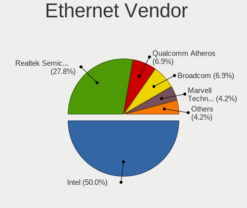

| Vendor                   | Computers | Percent |
|--------------------------|-----------|---------|
| Intel                    | 31        | 50.82%  |
| Realtek Semiconductor    | 16        | 26.23%  |
| Qualcomm Atheros         | 5         | 8.2%    |
| Broadcom                 | 4         | 6.56%   |
| Marvell Technology Group | 3         | 4.92%   |
| VIA Technologies         | 1         | 1.64%   |
| D-Link System            | 1         | 1.64%   |

Ethernet Model
--------------

Ethernet models

| Model                                                             | Computers | Percent |
|-------------------------------------------------------------------|-----------|---------|
| Realtek RTL8111/8168/8411 PCI Express Gigabit Ethernet Controller | 9         | 14.75%  |
| Intel 82579LM Gigabit Network Connection (Lewisville)             | 8         | 13.11%  |
| Intel Ethernet Connection I219-LM                                 | 4         | 6.56%   |
| Intel 82577LM Gigabit Network Connection                          | 4         | 6.56%   |
| Realtek RTL8125 2.5GbE Controller                                 | 3         | 4.92%   |
| Intel I210 Gigabit Network Connection                             | 3         | 4.92%   |
| Intel Ethernet Connection (3) I218-LM                             | 3         | 4.92%   |
| Realtek RTL810xE PCI Express Fast Ethernet controller             | 2         | 3.28%   |
| Realtek RTL-8100/8101L/8139 PCI Fast Ethernet Adapter             | 2         | 3.28%   |
| Intel Ethernet Connection (4) I219-LM                             | 2         | 3.28%   |
| VIA VT6102/VT6103 [Rhine-II]                                      | 1         | 1.64%   |
| Qualcomm Atheros Attansic L2 Fast Ethernet                        | 1         | 1.64%   |
| Qualcomm Atheros AR8152 v2.0 Fast Ethernet                        | 1         | 1.64%   |
| Qualcomm Atheros AR8151 v1.0 Gigabit Ethernet                     | 1         | 1.64%   |
| Qualcomm Atheros AR8131 Gigabit Ethernet                          | 1         | 1.64%   |
| Qualcomm Atheros AR8121/AR8113/AR8114 Gigabit or Fast Ethernet    | 1         | 1.64%   |
| Marvell Group 88E8057 PCI-E Gigabit Ethernet Controller           | 1         | 1.64%   |
| Marvell Group 88E8055 PCI-E Gigabit Ethernet Controller           | 1         | 1.64%   |
| Marvell Group 88E8053 PCI-E Gigabit Ethernet Controller           | 1         | 1.64%   |
| Intel Ethernet Connection I218-LM                                 | 1         | 1.64%   |
| Intel Ethernet Connection (6) I219-V                              | 1         | 1.64%   |
| Intel Ethernet Connection (2) I219-V                              | 1         | 1.64%   |
| Intel 82567LM Gigabit Network Connection                          | 1         | 1.64%   |
| Intel 82566MM Gigabit Network Connection                          | 1         | 1.64%   |
| Intel 82562ET/EZ/GT/GZ - PRO/100 VE (LOM) Ethernet Controller     | 1         | 1.64%   |
| Intel 80003ES2LAN Gigabit Ethernet Controller (Copper)            | 1         | 1.64%   |
| D-Link System DGE-560T PCI Express Gigabit Ethernet Adapter       | 1         | 1.64%   |
| Broadcom NetXtreme BCM5755 Gigabit Ethernet PCI Express           | 1         | 1.64%   |
| Broadcom NetXtreme BCM5751M Gigabit Ethernet PCI Express          | 1         | 1.64%   |
| Broadcom NetXtreme BCM5721 Gigabit Ethernet PCI Express           | 1         | 1.64%   |
| Broadcom NetXtreme BCM5719 Gigabit Ethernet PCIe                  | 1         | 1.64%   |

Net Controller Kind
-------------------

Ethernet, WiFi or modem

| Kind     | Computers | Percent |
|----------|-----------|---------|
| Ethernet | 61        | 54.46%  |
| WiFi     | 46        | 41.07%  |
| Unknown  | 3         | 2.68%   |
| Modem    | 2         | 1.79%   |

Used Controller
---------------

Currently used network controller

| Kind     | Computers | Percent |
|----------|-----------|---------|
| WiFi     | 34        | 54.84%  |
| Ethernet | 28        | 45.16%  |

NICs
----

Total network controllers on board

| Total | Computers | Percent |
|-------|-----------|---------|
| 2     | 42        | 60.87%  |
| 1     | 21        | 30.43%  |
| 3     | 3         | 4.35%   |
| 0     | 2         | 2.9%    |
| 4     | 1         | 1.45%   |

IPv6
----

IPv6 vs IPv4

| Used | Computers | Percent |
|------|-----------|---------|
| No   | 69        | 100%    |

Bluetooth
---------

Bluetooth Vendor
----------------

Controller vendors

| Vendor                  | Computers | Percent |
|-------------------------|-----------|---------|
| Intel                   | 18        | 51.43%  |
| Broadcom                | 5         | 14.29%  |
| Alps Electric           | 3         | 8.57%   |
| Realtek Semiconductor   | 2         | 5.71%   |
| Foxconn / Hon Hai       | 2         | 5.71%   |
| Taiyo Yuden             | 1         | 2.86%   |
| IMC Networks            | 1         | 2.86%   |
| Cambridge Silicon Radio | 1         | 2.86%   |
| ASUSTek Computer        | 1         | 2.86%   |
| Apple                   | 1         | 2.86%   |

Bluetooth Model
---------------

Controller models

| Model                                                    | Computers | Percent |
|----------------------------------------------------------|-----------|---------|
| Intel Bluetooth wireless interface                       | 13        | 37.14%  |
| Intel Bluetooth 9460/9560 Jefferson Peak (JfP)           | 3         | 8.57%   |
| Broadcom BCM20702 Bluetooth 4.0 [ThinkPad]               | 3         | 8.57%   |
| Realtek Bluetooth Adapter                                | 2         | 5.71%   |
| Intel AX200 Bluetooth                                    | 2         | 5.71%   |
| Broadcom BCM2045B (BDC-2.1)                              | 2         | 5.71%   |
| Alps Electric UGTZ4 Bluetooth                            | 2         | 5.71%   |
| Taiyo Yuden Bluetooth Device (V2.0+EDR)                  | 1         | 2.86%   |
| IMC Networks Realtek Bluetooth Adapter                   | 1         | 2.86%   |
| Foxconn / Hon Hai Broadcom Bluetooth 2.1 Device          | 1         | 2.86%   |
| Foxconn / Hon Hai Broadcom BCM20702 Bluetooth USB Device | 1         | 2.86%   |
| Cambridge Silicon Radio Bluetooth Dongle (HCI mode)      | 1         | 2.86%   |
| ASUS Broadcom Bluetooth 2.1                              | 1         | 2.86%   |
| Apple Built-in Bluetooth 2.0+EDR HCI                     | 1         | 2.86%   |
| Alps Electric BCM2046 Bluetooth Device                   | 1         | 2.86%   |

Sound
-----

Sound Vendor
------------

Sound card vendors

| Vendor           | Computers | Percent |
|------------------|-----------|---------|
| Intel            | 47        | 69.12%  |
| AMD              | 12        | 17.65%  |
| Nvidia           | 6         | 8.82%   |
| VIA Technologies | 1         | 1.47%   |
| Logitech         | 1         | 1.47%   |
| JMTek            | 1         | 1.47%   |

Sound Model
-----------

Sound card models

| Model                                                                      | Computers | Percent |
|----------------------------------------------------------------------------|-----------|---------|
| Intel Sunrise Point-LP HD Audio                                            | 7         | 8.75%   |
| Intel 7 Series/C216 Chipset Family High Definition Audio Controller        | 6         | 7.5%    |
| Intel NM10/ICH7 Family High Definition Audio Controller                    | 5         | 6.25%   |
| Intel 6 Series/C200 Series Chipset Family High Definition Audio Controller | 5         | 6.25%   |
| AMD Family 17h/19h HD Audio Controller                                     | 5         | 6.25%   |
| Intel 5 Series/3400 Series Chipset High Definition Audio                   | 4         | 5%      |
| Intel Wildcat Point-LP High Definition Audio Controller                    | 3         | 3.75%   |
| Intel Broadwell-U Audio Controller                                         | 3         | 3.75%   |
| AMD Renoir Radeon High Definition Audio Controller                         | 3         | 3.75%   |
| Nvidia GK208 HDMI/DP Audio Controller                                      | 2         | 2.5%    |
| Nvidia GA104 High Definition Audio Controller                              | 2         | 2.5%    |
| Intel Celeron/Pentium Silver Processor High Definition Audio               | 2         | 2.5%    |
| Intel 82801H (ICH8 Family) HD Audio Controller                             | 2         | 2.5%    |
| Intel 82801FB/FBM/FR/FW/FRW (ICH6 Family) High Definition Audio Controller | 2         | 2.5%    |
| AMD Starship/Matisse HD Audio Controller                                   | 2         | 2.5%    |
| AMD SBx00 Azalia (Intel HDA)                                               | 2         | 2.5%    |
| AMD Rembrandt Radeon High Definition Audio Controller                      | 2         | 2.5%    |
| AMD FCH Azalia Controller                                                  | 2         | 2.5%    |
| VIA Technologies VT8233/A/8235/8237 AC97 Audio Controller                  | 1         | 1.25%   |
| Nvidia GP106 High Definition Audio Controller                              | 1         | 1.25%   |
| Nvidia CK804 AC'97 Audio Controller                                        | 1         | 1.25%   |
| Logitech [G533 Wireless Headset Dongle]                                    | 1         | 1.25%   |
| JMTek USB PnP Audio Device                                                 | 1         | 1.25%   |
| Intel US15W/US15X/US15L/UL11L SCH [Poulsbo] HD Audio Controller            | 1         | 1.25%   |
| Intel Tiger Lake-LP Smart Sound Technology Audio Controller                | 1         | 1.25%   |
| Intel Haswell-ULT HD Audio Controller                                      | 1         | 1.25%   |
| Intel Comet Lake PCH-V cAVS                                                | 1         | 1.25%   |
| Intel Cannon Point-LP High Definition Audio Controller                     | 1         | 1.25%   |
| Intel Cannon Lake PCH cAVS                                                 | 1         | 1.25%   |
| Intel 82801I (ICH9 Family) HD Audio Controller                             | 1         | 1.25%   |
| Intel 82801FB/FBM/FR/FW/FRW (ICH6 Family) AC'97 Audio Controller           | 1         | 1.25%   |
| Intel 82801CA/CAM AC'97 Audio Controller                                   | 1         | 1.25%   |
| Intel 8 Series HD Audio Controller                                         | 1         | 1.25%   |
| Intel 631xESB/632xESB High Definition Audio Controller                     | 1         | 1.25%   |
| Intel 200 Series PCH HD Audio                                              | 1         | 1.25%   |
| AMD RV770 HDMI Audio [Radeon HD 4850/4870]                                 | 1         | 1.25%   |
| AMD Navi 21/23 HDMI/DP Audio Controller                                    | 1         | 1.25%   |
| AMD Kabini HDMI/DP Audio                                                   | 1         | 1.25%   |
| AMD Baffin HDMI/DP Audio [Radeon RX 550 640SP / RX 560/560X]               | 1         | 1.25%   |

Memory
------

Memory Vendor
-------------

Memory module vendors

| Vendor              | Computers | Percent |
|---------------------|-----------|---------|
| Samsung Electronics | 10        | 29.41%  |
| Unknown             | 7         | 20.59%  |
| Unknown             | 6         | 17.65%  |
| SK hynix            | 5         | 14.71%  |
| Kingston            | 3         | 8.82%   |
| Micron Technology   | 1         | 2.94%   |
| Hewlett-Packard     | 1         | 2.94%   |
| Crucial             | 1         | 2.94%   |

Memory Model
------------

Memory module models

| Model                                                   | Computers | Percent |
|---------------------------------------------------------|-----------|---------|
| Unknown                                                 | 6         | 15.79%  |
| Samsung RAM M471B5273DH0-CH9 4GB SODIMM DDR3 1334MT/s   | 3         | 7.89%   |
| Samsung RAM M471B5673FH0-CF8 2GB SODIMM 1067MT/s        | 2         | 5.26%   |
| Samsung RAM M471B5173BH0-CK0 4GB SODIMM DDR3 1600MT/s   | 2         | 5.26%   |
| Unknown RAM Module 512MB SODIMM SDRAM                   | 1         | 2.63%   |
| Unknown RAM Module 4GB SODIMM DDR3 1333MT/s             | 1         | 2.63%   |
| Unknown RAM Module 2GB SODIMM DDR3 1067MT/s             | 1         | 2.63%   |
| Unknown RAM Module 2GB SODIMM DDR2 667MT/s              | 1         | 2.63%   |
| Unknown RAM Module 2GB DIMM DDR2 667MT/s                | 1         | 2.63%   |
| Unknown RAM Module 1GB SODIMM DDR2                      | 1         | 2.63%   |
| Unknown RAM Module 1GB SODIMM DDR                       | 1         | 2.63%   |
| SK hynix RAM HMT451S6BFR8A-PB 4GB SODIMM DDR3 1600MT/s  | 1         | 2.63%   |
| SK hynix RAM HMT351S6EFR8A-PB 8GB SODIMM DDR3 1600MT/s  | 1         | 2.63%   |
| SK hynix RAM HMT325S6BFR8C-H9 2GB SODIMM DDR3 1333MT/s  | 1         | 2.63%   |
| SK hynix RAM HMAB2GS6AMR6N-XN 16GB SODIMM DDR4 3200MT/s | 1         | 2.63%   |
| SK hynix RAM H9CCNNNBJTMLAR 4GB SODIMM LPDDR3 1867MT/s  | 1         | 2.63%   |
| SK hynix RAM H9CCNNNBJTMLAR 4GB Chip LPDDR3 1867MT/s    | 1         | 2.63%   |
| Samsung RAM M471B5773DH0-CH9 2GB SODIMM DDR3 1334MT/s   | 1         | 2.63%   |
| Samsung RAM M471B5673EH1-CF8 2GB SODIMM 1067MT/s        | 1         | 2.63%   |
| Samsung RAM M471B5273DH0-CK0 4GB SODIMM DDR3 1600MT/s   | 1         | 2.63%   |
| Samsung RAM M471B5173QH0-YK0 4GB SODIMM DDR3 1600MT/s   | 1         | 2.63%   |
| Samsung RAM M471A1K43CB1-CRC 8GB SODIMM DDR4 2667MT/s   | 1         | 2.63%   |
| Samsung RAM M471A1K43BB0-CPB 8GB SODIMM DDR4 2133MT/s   | 1         | 2.63%   |
| Micron RAM 16KTF1G64HZ-1G6E1 8GB SODIMM DDR3 1600MT/s   | 1         | 2.63%   |
| Kingston RAM KHX2400C15/8G 8GB DIMM DDR4 2400MT/s       | 1         | 2.63%   |
| Kingston RAM KF3600C18D4/32GX 32GB DIMM DDR4 2400MT/s   | 1         | 2.63%   |
| Kingston RAM 9905316-005.A04LF 1GB DIMM DDR2 667MT/s    | 1         | 2.63%   |
| HP RAM 809083-091 32GB DIMM DDR4 2400MT/s               | 1         | 2.63%   |
| Crucial RAM CT8G3S1339M 8GB SODIMM DDR3 800MT/s         | 1         | 2.63%   |

Memory Kind
-----------

Memory module kinds

| Kind    | Computers | Percent |
|---------|-----------|---------|
| DDR3    | 14        | 42.42%  |
| DDR4    | 6         | 18.18%  |
| DDR2    | 6         | 18.18%  |
| SDRAM   | 3         | 9.09%   |
| Unknown | 2         | 6.06%   |
| LPDDR3  | 1         | 3.03%   |
| DDR     | 1         | 3.03%   |

Memory Form Factor
------------------

Physical design of the memory module

| Name   | Computers | Percent |
|--------|-----------|---------|
| SODIMM | 25        | 73.53%  |
| DIMM   | 8         | 23.53%  |
| Chip   | 1         | 2.94%   |

Memory Size
-----------

Memory module size

| Size  | Computers | Percent |
|-------|-----------|---------|
| 2048  | 10        | 27.78%  |
| 4096  | 9         | 25%     |
| 8192  | 7         | 19.44%  |
| 1024  | 5         | 13.89%  |
| 32768 | 2         | 5.56%   |
| 512   | 2         | 5.56%   |
| 16384 | 1         | 2.78%   |

Memory Speed
------------

Memory module speed

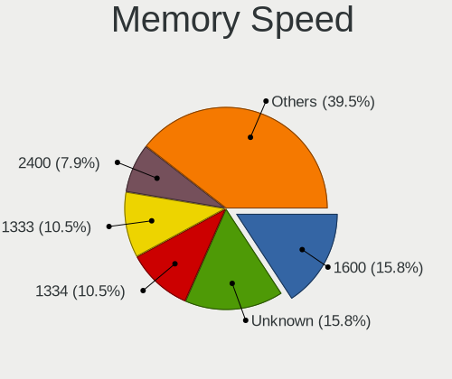

| Speed   | Computers | Percent |
|---------|-----------|---------|
| 1600    | 6         | 17.14%  |
| Unknown | 6         | 17.14%  |
| 1334    | 4         | 11.43%  |
| 2400    | 3         | 8.57%   |
| 1067    | 3         | 8.57%   |
| 667     | 3         | 8.57%   |
| 1333    | 2         | 5.71%   |
| 800     | 2         | 5.71%   |
| 3200    | 1         | 2.86%   |
| 2667    | 1         | 2.86%   |
| 2133    | 1         | 2.86%   |
| 1867    | 1         | 2.86%   |
| 400     | 1         | 2.86%   |
| 266     | 1         | 2.86%   |

Printers & scanners
-------------------

Printer Vendor
--------------

Printer device vendors

Zero info for selected period =(

Printer Model
-------------

Printer device models

Zero info for selected period =(

Scanner Vendor
--------------

Scanner device vendors

Zero info for selected period =(

Scanner Model
-------------

Scanner device models

Zero info for selected period =(

Camera
------

Camera Vendor
-------------

Camera device vendors

| Vendor                                 | Computers | Percent |
|----------------------------------------|-----------|---------|
| Chicony Electronics                    | 13        | 37.14%  |
| Lite-On Technology                     | 5         | 14.29%  |
| Bison Electronics                      | 5         | 14.29%  |
| Lenovo                                 | 2         | 5.71%   |
| IMC Networks                           | 2         | 5.71%   |
| Tripath Technology                     | 1         | 2.86%   |
| SunplusIT                              | 1         | 2.86%   |
| Realtek Semiconductor                  | 1         | 2.86%   |
| Jiangxi Shinetech Optical              | 1         | 2.86%   |
| Genesys Logic                          | 1         | 2.86%   |
| Generalplus Technology                 | 1         | 2.86%   |
| Cheng Uei Precision Industry (Foxlink) | 1         | 2.86%   |
| Apple                                  | 1         | 2.86%   |

Camera Model
------------

Camera device models

| Model                                                    | Computers | Percent |
|----------------------------------------------------------|-----------|---------|
| Lite-On Integrated Camera                                | 4         | 11.43%  |
| Chicony Integrated Camera                                | 3         | 8.57%   |
| Bison Integrated Camera                                  | 3         | 8.57%   |
| IMC Networks Integrated Camera                           | 2         | 5.71%   |
| Chicony Integrated Camera [ThinkPad]                     | 2         | 5.71%   |
| Tripath PC Camera                                        | 1         | 2.86%   |
| SunplusIT USB camera                                     | 1         | 2.86%   |
| Realtek Integrated Webcam HD                             | 1         | 2.86%   |
| Lite-On Realtek DMFT RGB                                 | 1         | 2.86%   |
| Lenovo Integrated Webcam [R5U877]                        | 1         | 2.86%   |
| Lenovo Integrated Webcam                                 | 1         | 2.86%   |
| Jiangxi Shinetech Optical Realtek PC Camera              | 1         | 2.86%   |
| Genesys Logic ASUS USB 2.0 UVC 1.3M WebCam               | 1         | 2.86%   |
| Generalplus HD Webcam                                    | 1         | 2.86%   |
| Chicony thinkpad t430s camera                            | 1         | 2.86%   |
| Chicony Sonix ST50220 USB Video Camera                   | 1         | 2.86%   |
| Chicony Ltd., USB 2.0 Camera                             | 1         | 2.86%   |
| Chicony Lenovo Integrated Camera (0.3MP)                 | 1         | 2.86%   |
| Chicony Lenovo EasyCamera                                | 1         | 2.86%   |
| Chicony Integrated Camera (1280x720@30)                  | 1         | 2.86%   |
| Chicony FJ Camera                                        | 1         | 2.86%   |
| Chicony 2.0M UVC Webcam / CNF7129                        | 1         | 2.86%   |
| Cheng Uei Precision Industry (Foxlink) Realtek PC Camera | 1         | 2.86%   |
| Bison USB HD Webcam                                      | 1         | 2.86%   |
| Bison Lenovo Integrated Webcam                           | 1         | 2.86%   |
| Apple FaceTime Camera                                    | 1         | 2.86%   |

Security
--------

Fingerprint Vendor
------------------

Fingerprint sensor vendors

| Vendor                | Computers | Percent |
|-----------------------|-----------|---------|
| Validity Sensors      | 4         | 28.57%  |
| Synaptics             | 3         | 21.43%  |
| AuthenTec             | 3         | 21.43%  |
| Upek                  | 2         | 14.29%  |
| STMicroelectronics    | 1         | 7.14%   |
| LighTuning Technology | 1         | 7.14%   |

Fingerprint Model
-----------------

Fingerprint sensor models

| Model                                                  | Computers | Percent |
|--------------------------------------------------------|-----------|---------|
| Validity Sensors VFS 5011 fingerprint sensor           | 3         | 21.43%  |
| Upek Biometric Touchchip/Touchstrip Fingerprint Sensor | 2         | 14.29%  |
| Synaptics Prometheus MIS Touch Fingerprint Reader      | 2         | 14.29%  |
| Validity Sensors VFS7500 Touch Fingerprint Sensor      | 1         | 7.14%   |
| Synaptics Metallica MIS Touch Fingerprint Reader       | 1         | 7.14%   |
| STMicroelectronics Fingerprint Reader                  | 1         | 7.14%   |
| LighTuning ES603 Swipe Fingerprint Sensor              | 1         | 7.14%   |
| AuthenTec AES2810                                      | 1         | 7.14%   |
| AuthenTec AES2660                                      | 1         | 7.14%   |
| AuthenTec AES2501 Fingerprint Sensor                   | 1         | 7.14%   |

Chipcard Vendor
---------------

Chipcard module vendors

Zero info for selected period =(

Chipcard Model
--------------

Chipcard module models

Zero info for selected period =(

Unsupported
-----------

Unsupported Devices
-------------------

Total unsupported devices on board

| Total | Computers | Percent |
|-------|-----------|---------|
| 1     | 37        | 53.62%  |
| 0     | 19        | 27.54%  |
| 2     | 7         | 10.14%  |
| 5     | 3         | 4.35%   |
| 3     | 3         | 4.35%   |

Unsupported Device Types
------------------------

Types of unsupported devices

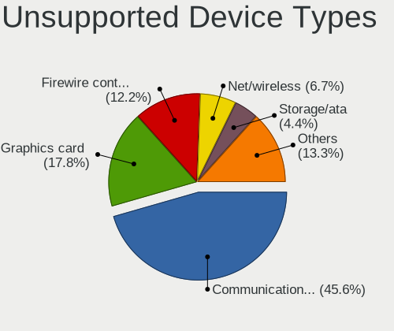

| Type                     | Computers | Percent |
|--------------------------|-----------|---------|
| Communication controller | 35        | 47.3%   |
| Graphics card            | 14        | 18.92%  |
| Firewire controller      | 8         | 10.81%  |
| Net/wireless             | 5         | 6.76%   |
| Network                  | 4         | 5.41%   |
| Storage/ata              | 3         | 4.05%   |
| Sound                    | 3         | 4.05%   |
| Modem                    | 1         | 1.35%   |
| Card reader              | 1         | 1.35%   |

