OpenBSD 7.4 - Tested Hardware & Statistics
------------------------------------------

A project to collect tested hardware configurations for OpenBSD 7.4.

Anyone can contribute to this report by the [hw-probe](https://github.com/linuxhw/hw-probe/blob/master/INSTALL.BSD.md) tool:

    hw-probe -all -upload

Please contribute! Especially if your hardware is rare.

This is a report for all computer types. See also reports for [desktops](/Dist/OpenBSD_7.4/Desktop/README.md) and [notebooks](/Dist/OpenBSD_7.4/Notebook/README.md).

Contents
--------

* [ Test Cases ](#test-cases)

* [ System ](#system)
  - [ Arch                     ](#arch)
  - [ DE                       ](#de)
  - [ Display Server           ](#display-server)
  - [ Display Manager          ](#display-manager)
  - [ OS Lang                  ](#os-lang)
  - [ Boot Mode                ](#boot-mode)
  - [ Filesystem               ](#filesystem)
  - [ Part. scheme             ](#part-scheme)

* [ Board ](#board)
  - [ Vendor                   ](#vendor)
  - [ Model                    ](#model)
  - [ Model Family             ](#model-family)
  - [ MFG Year                 ](#mfg-year)
  - [ Form Factor              ](#form-factor)
  - [ Coreboot                 ](#coreboot)
  - [ RAM Size                 ](#ram-size)
  - [ RAM Used                 ](#ram-used)
  - [ Total Drives             ](#total-drives)
  - [ Has CD-ROM               ](#has-cd-rom)
  - [ Has Ethernet             ](#has-ethernet)
  - [ Has WiFi                 ](#has-wifi)
  - [ Has Bluetooth            ](#has-bluetooth)

* [ Location ](#location)
  - [ Country                  ](#country)
  - [ City                     ](#city)

* [ Drives ](#drives)
  - [ Drive Vendor             ](#drive-vendor)
  - [ Drive Model              ](#drive-model)
  - [ HDD Vendor               ](#hdd-vendor)
  - [ SSD Vendor               ](#ssd-vendor)
  - [ Drive Kind               ](#drive-kind)
  - [ Drive Connector          ](#drive-connector)
  - [ Drive Size               ](#drive-size)
  - [ Space Total              ](#space-total)
  - [ Space Used               ](#space-used)
  - [ Malfunc. Drives          ](#malfunc-drives)
  - [ Malfunc. Drive Vendor    ](#malfunc-drive-vendor)
  - [ Malfunc. HDD Vendor      ](#malfunc-hdd-vendor)
  - [ Malfunc. Drive Kind      ](#malfunc-drive-kind)
  - [ Failed Drives            ](#failed-drives)
  - [ Failed Drive Vendor      ](#failed-drive-vendor)
  - [ Drive Status             ](#drive-status)

* [ Storage controller ](#storage-controller)
  - [ Storage Vendor           ](#storage-vendor)
  - [ Storage Model            ](#storage-model)
  - [ Storage Kind             ](#storage-kind)

* [ Processor ](#processor)
  - [ CPU Vendor               ](#cpu-vendor)
  - [ CPU Model                ](#cpu-model)
  - [ CPU Model Family         ](#cpu-model-family)
  - [ CPU Cores                ](#cpu-cores)
  - [ CPU Sockets              ](#cpu-sockets)
  - [ CPU Threads              ](#cpu-threads)
  - [ CPU Microarch            ](#cpu-microarch)

* [ Graphics ](#graphics)
  - [ GPU Vendor               ](#gpu-vendor)
  - [ GPU Model                ](#gpu-model)
  - [ GPU Combo                ](#gpu-combo)
  - [ GPU Driver               ](#gpu-driver)
  - [ GPU Memory               ](#gpu-memory)

* [ Monitor ](#monitor)
  - [ Monitor Vendor           ](#monitor-vendor)
  - [ Monitor Model            ](#monitor-model)
  - [ Monitor Resolution       ](#monitor-resolution)
  - [ Monitor Diagonal         ](#monitor-diagonal)
  - [ Monitor Width            ](#monitor-width)
  - [ Aspect Ratio             ](#aspect-ratio)
  - [ Monitor Area             ](#monitor-area)
  - [ Pixel Density            ](#pixel-density)
  - [ Multiple Monitors        ](#multiple-monitors)

* [ Network ](#network)
  - [ Net Controller Vendor    ](#net-controller-vendor)
  - [ Net Controller Model     ](#net-controller-model)
  - [ Wireless Vendor          ](#wireless-vendor)
  - [ Wireless Model           ](#wireless-model)
  - [ Ethernet Vendor          ](#ethernet-vendor)
  - [ Ethernet Model           ](#ethernet-model)
  - [ Net Controller Kind      ](#net-controller-kind)
  - [ Used Controller          ](#used-controller)
  - [ NICs                     ](#nics)
  - [ IPv6                     ](#ipv6)

* [ Bluetooth ](#bluetooth)
  - [ Bluetooth Vendor         ](#bluetooth-vendor)
  - [ Bluetooth Model          ](#bluetooth-model)

* [ Sound ](#sound)
  - [ Sound Vendor             ](#sound-vendor)
  - [ Sound Model              ](#sound-model)

* [ Memory ](#memory)
  - [ Memory Vendor            ](#memory-vendor)
  - [ Memory Model             ](#memory-model)
  - [ Memory Kind              ](#memory-kind)
  - [ Memory Form Factor       ](#memory-form-factor)
  - [ Memory Size              ](#memory-size)
  - [ Memory Speed             ](#memory-speed)

* [ Printers & scanners ](#printers--scanners)
  - [ Printer Vendor           ](#printer-vendor)
  - [ Printer Model            ](#printer-model)
  - [ Scanner Vendor           ](#scanner-vendor)
  - [ Scanner Model            ](#scanner-model)

* [ Camera ](#camera)
  - [ Camera Vendor            ](#camera-vendor)
  - [ Camera Model             ](#camera-model)

* [ Security ](#security)
  - [ Fingerprint Vendor       ](#fingerprint-vendor)
  - [ Fingerprint Model        ](#fingerprint-model)
  - [ Chipcard Vendor          ](#chipcard-vendor)
  - [ Chipcard Model           ](#chipcard-model)

* [ Unsupported ](#unsupported)
  - [ Unsupported Devices      ](#unsupported-devices)
  - [ Unsupported Device Types ](#unsupported-device-types)

Test Cases
----------

Total: 89

| Vendor        | Model                       | Form-Factor | Probe                                                     | Date         |
|---------------|-----------------------------|-------------|-----------------------------------------------------------|--------------|
| Dell          | OptiPlex 9010               | Desktop     | [b80c6041c4](https://bsd-hardware.info/?probe=b80c6041c4) | Mar 15, 2025 |
| ASRock        | Z77 Pro4                    | Desktop     | [f4a2218557](https://bsd-hardware.info/?probe=f4a2218557) | Feb 08, 2025 |
| FUJI wortm... | D1547                       | Desktop     | [b0c75a2f48](https://bsd-hardware.info/?probe=b0c75a2f48) | Jul 01, 2024 |
| Lenovo        | G550 20023                  | Notebook    | [cb5ba2b818](https://bsd-hardware.info/?probe=cb5ba2b818) | Jun 01, 2024 |
| Samsung       | 100NZC                      | Notebook    | [2b36397928](https://bsd-hardware.info/?probe=2b36397928) | Apr 03, 2024 |
| Dell          | Vostro 3268                 | Desktop     | [3492b3ebb5](https://bsd-hardware.info/?probe=3492b3ebb5) | Mar 31, 2024 |
| Apple         | MacBookAir7,2               | Notebook    | [a5003ca56a](https://bsd-hardware.info/?probe=a5003ca56a) | Mar 25, 2024 |
| ASUSTek       | PRIME B550M-A (WI-FI)       | Desktop     | [feb3803dbc](https://bsd-hardware.info/?probe=feb3803dbc) | Mar 24, 2024 |
| Dell          | Inspiron 5521               | Desktop     | [15446ac441](https://bsd-hardware.info/?probe=15446ac441) | Mar 24, 2024 |
| Lenovo        | ThinkPad X1 Carbon 5th 2... | Notebook    | [6e8c7ec804](https://bsd-hardware.info/?probe=6e8c7ec804) | Mar 21, 2024 |
| Sun           | SUNW,Ultra-1                | Desktop     | [33ed69952b](https://bsd-hardware.info/?probe=33ed69952b) | Mar 17, 2024 |
| HP            | ProLiant ML370 G4           | Desktop     | [e3d8ea32d4](https://bsd-hardware.info/?probe=e3d8ea32d4) | Mar 13, 2024 |
| ASUSTek       | TUF Gaming B550M-PLUS (W... | Desktop     | [9015dcf1b5](https://bsd-hardware.info/?probe=9015dcf1b5) | Mar 12, 2024 |
| Lenovo        | ThinkCentre M75n 11BXS00... | Desktop     | [6ed6f9c86f](https://bsd-hardware.info/?probe=6ed6f9c86f) | Mar 09, 2024 |
| Google        | Droid                       | Notebook    | [47f0dcc73c](https://bsd-hardware.info/?probe=47f0dcc73c) | Mar 06, 2024 |
| Lenovo        | ThinkPad X260 20F5S10W0H    | Notebook    | [ba0295b8ea](https://bsd-hardware.info/?probe=ba0295b8ea) | Mar 05, 2024 |
| Lenovo        | ThinkBook 15 G4 IAP 21DJ    | Notebook    | [a716cc542a](https://bsd-hardware.info/?probe=a716cc542a) | Mar 04, 2024 |
| Apple         | MacBookPro12,1              | Notebook    | [736c13e863](https://bsd-hardware.info/?probe=736c13e863) | Feb 25, 2024 |
| Intel(R) C... | NUC10i3FNH                  | Mini pc     | [924461c416](https://bsd-hardware.info/?probe=924461c416) | Feb 22, 2024 |
| Intel         | NUC7i3BNHX                  | Mini pc     | [cf452e34d1](https://bsd-hardware.info/?probe=cf452e34d1) | Feb 20, 2024 |
| Dell          | Latitude E5510              | Notebook    | [4155c54a6c](https://bsd-hardware.info/?probe=4155c54a6c) | Feb 19, 2024 |
| Dell          | Latitude E5510              | Notebook    | [1bc1ac66c3](https://bsd-hardware.info/?probe=1bc1ac66c3) | Feb 18, 2024 |
| Biostar       | B450NH                      | Desktop     | [9f4dedfcd6](https://bsd-hardware.info/?probe=9f4dedfcd6) | Feb 17, 2024 |
| Lenovo        | ThinkPad T450 20BU000GUS    | Notebook    | [e1d99a4966](https://bsd-hardware.info/?probe=e1d99a4966) | Feb 13, 2024 |
| ASUSTek       | ASUS TUF Gaming A16 FA61... | Notebook    | [5306df5921](https://bsd-hardware.info/?probe=5306df5921) | Feb 12, 2024 |
| Sony          | Unknown                     | Notebook    | [c0013719ab](https://bsd-hardware.info/?probe=c0013719ab) | Feb 12, 2024 |
| Sony          | Unknown                     | Notebook    | [a17ecdd804](https://bsd-hardware.info/?probe=a17ecdd804) | Feb 12, 2024 |
| Lenovo        | ThinkCentre M91p 7052C1G    | Desktop     | [3aeb926332](https://bsd-hardware.info/?probe=3aeb926332) | Feb 08, 2024 |
| Lenovo        | ThinkPad Helix 2nd 20CHS... | Notebook    | [5b06b87ef0](https://bsd-hardware.info/?probe=5b06b87ef0) | Feb 06, 2024 |
| MSI           | MS-7D15                     | Desktop     | [a22ee27a4a](https://bsd-hardware.info/?probe=a22ee27a4a) | Feb 03, 2024 |
| MSI           | MS-7D15                     | Desktop     | [476be56dc7](https://bsd-hardware.info/?probe=476be56dc7) | Feb 03, 2024 |
| Gigabyte      | Z690 UD DDR4                | Desktop     | [f6f19ac329](https://bsd-hardware.info/?probe=f6f19ac329) | Feb 02, 2024 |
| Chuwi         | LarkBox X                   | Mini pc     | [b2ecf149ab](https://bsd-hardware.info/?probe=b2ecf149ab) | Jan 31, 2024 |
| AZW           | MINI S                      | Desktop     | [99c79c2cc8](https://bsd-hardware.info/?probe=99c79c2cc8) | Jan 30, 2024 |
| Panasonic     | CFSX4-1                     | Notebook    | [d998c9373a](https://bsd-hardware.info/?probe=d998c9373a) | Jan 25, 2024 |
| Dell          | Latitude 7320 Detachable    | Notebook    | [d29b86c141](https://bsd-hardware.info/?probe=d29b86c141) | Jan 21, 2024 |
| IBM           | 830381U                     | Desktop     | [e44647b8cd](https://bsd-hardware.info/?probe=e44647b8cd) | Jan 20, 2024 |
| Microsoft     | Windows Dev Kit 2023        | Desktop     | [2cd25bfacf](https://bsd-hardware.info/?probe=2cd25bfacf) | Jan 19, 2024 |
| HP            | s5-1210br                   | Desktop     | [9ce94bc2b7](https://bsd-hardware.info/?probe=9ce94bc2b7) | Jan 19, 2024 |
| Dell          | Latitude 7320 Detachable    | Notebook    | [b1f9acd523](https://bsd-hardware.info/?probe=b1f9acd523) | Jan 18, 2024 |
| Lenovo        | ThinkPad E15 Gen 2 20TD0... | Notebook    | [fcc009f8ba](https://bsd-hardware.info/?probe=fcc009f8ba) | Jan 15, 2024 |
| Panasonic     | CFSX4-1                     | Notebook    | [e54393775b](https://bsd-hardware.info/?probe=e54393775b) | Dec 29, 2023 |
| Apple         | MacBookPro7,1               | Notebook    | [f43cf3565a](https://bsd-hardware.info/?probe=f43cf3565a) | Dec 27, 2023 |
| HP            | ProBook 455 G7              | Notebook    | [11764c4c5e](https://bsd-hardware.info/?probe=11764c4c5e) | Dec 20, 2023 |
| Apple         | PowerBook3,5                | Notebook    | [53313e58d8](https://bsd-hardware.info/?probe=53313e58d8) | Dec 20, 2023 |
| Toshiba       | Portable PC                 | Notebook    | [bee6ea8f18](https://bsd-hardware.info/?probe=bee6ea8f18) | Dec 15, 2023 |
| Lenovo        | ThinkPad P70 20ESS1L600     | Notebook    | [2e3870f2ee](https://bsd-hardware.info/?probe=2e3870f2ee) | Dec 07, 2023 |
| Apple         | MacBookAir7,2               | Notebook    | [3784a39a41](https://bsd-hardware.info/?probe=3784a39a41) | Dec 06, 2023 |
| Star Labs     | LabTop                      | Notebook    | [e8dcf01d78](https://bsd-hardware.info/?probe=e8dcf01d78) | Dec 02, 2023 |
| Unknown       | Unknown                     | Desktop     | [2a34bc9613](https://bsd-hardware.info/?probe=2a34bc9613) | Nov 28, 2023 |
| AZW           | SER                         | Desktop     | [48a259ae28](https://bsd-hardware.info/?probe=48a259ae28) | Nov 28, 2023 |
| Apple         | MacBookAir4,1               | Notebook    | [4661b8933c](https://bsd-hardware.info/?probe=4661b8933c) | Nov 25, 2023 |
| Lenovo        | ThinkPad X1 Carbon 4th 2... | Notebook    | [9762745c92](https://bsd-hardware.info/?probe=9762745c92) | Nov 23, 2023 |
| Lenovo        | ThinkCentre M90n-1 11AHS... | Desktop     | [eca5b59407](https://bsd-hardware.info/?probe=eca5b59407) | Nov 23, 2023 |
| Lenovo        | ThinkCentre M720s 10SUSB... | Desktop     | [a44a9f3526](https://bsd-hardware.info/?probe=a44a9f3526) | Nov 23, 2023 |
| Lenovo        | ThinkPad X260 20F5S2GM00    | Notebook    | [b5be73085a](https://bsd-hardware.info/?probe=b5be73085a) | Nov 23, 2023 |
| Lenovo        | ThinkPad X270 W10DG 20K5... | Notebook    | [0d706d98b4](https://bsd-hardware.info/?probe=0d706d98b4) | Nov 23, 2023 |
| Fujitsu       | LIFEBOOK E752               | Notebook    | [1da7551908](https://bsd-hardware.info/?probe=1da7551908) | Nov 23, 2023 |
| Dell          | Latitude 7490               | Notebook    | [e860d3dbcf](https://bsd-hardware.info/?probe=e860d3dbcf) | Nov 23, 2023 |
| HP            | Compaq CQ45                 | Desktop     | [4f3c176253](https://bsd-hardware.info/?probe=4f3c176253) | Nov 14, 2023 |
| Unknown       | Raspberry Pi                | Soc         | [de988c2e66](https://bsd-hardware.info/?probe=de988c2e66) | Nov 14, 2023 |
| Panasonic     | CFSX4-1                     | Notebook    | [f0f418db58](https://bsd-hardware.info/?probe=f0f418db58) | Nov 11, 2023 |
| Fujitsu       | LIFEBOOK E752               | Notebook    | [ee95b41634](https://bsd-hardware.info/?probe=ee95b41634) | Nov 10, 2023 |
| Panasonic     | CF-54-1                     | Notebook    | [c530bdbd88](https://bsd-hardware.info/?probe=c530bdbd88) | Nov 10, 2023 |
| ASUSTek       | TUF Gaming B550-PLUS        | Desktop     | [700d52c2dd](https://bsd-hardware.info/?probe=700d52c2dd) | Nov 07, 2023 |
| Unknown       | Raspberry Pi                | Soc         | [e2a506d1b7](https://bsd-hardware.info/?probe=e2a506d1b7) | Nov 07, 2023 |
| Apple         | MacPro4,1                   | Desktop     | [5960492992](https://bsd-hardware.info/?probe=5960492992) | Nov 07, 2023 |
| Intel         | DCP847SKE                   | Desktop     | [3b5b83d95f](https://bsd-hardware.info/?probe=3b5b83d95f) | Oct 30, 2023 |
| Panasonic     | CFSX4-1                     | Notebook    | [32b7f19d78](https://bsd-hardware.info/?probe=32b7f19d78) | Oct 30, 2023 |
| Panasonic     | CFSX4-1                     | Notebook    | [522298f90a](https://bsd-hardware.info/?probe=522298f90a) | Oct 29, 2023 |
| ASUSTek       | MINIPC PN53-G               | Desktop     | [57d8823b4b](https://bsd-hardware.info/?probe=57d8823b4b) | Oct 28, 2023 |
| IBM           | ThinkPad R51 2889W11        | Notebook    | [26d2e55032](https://bsd-hardware.info/?probe=26d2e55032) | Oct 28, 2023 |
| Dell          | PowerEdge T110 II           | Desktop     | [f93395bc11](https://bsd-hardware.info/?probe=f93395bc11) | Oct 28, 2023 |
| Sun           | SUNW,SPARC-Enterprise-T5... | Desktop     | [50457ff825](https://bsd-hardware.info/?probe=50457ff825) | Oct 27, 2023 |
| Panasonic     | CF-C2CEAZXCM                | Notebook    | [a871fb0596](https://bsd-hardware.info/?probe=a871fb0596) | Oct 27, 2023 |
| Gigabyte      | H81M-S2PV                   | Desktop     | [310fcb9763](https://bsd-hardware.info/?probe=310fcb9763) | Oct 26, 2023 |
| MECHREVO      | Unknown                     | Desktop     | [2dac22205c](https://bsd-hardware.info/?probe=2dac22205c) | Oct 23, 2023 |
| Panasonic     | CF-52PFPBSFQ                | Notebook    | [4a97ab307a](https://bsd-hardware.info/?probe=4a97ab307a) | Oct 22, 2023 |
| Lenovo        | ThinkPad T430 2347GZU       | Notebook    | [88ae89f787](https://bsd-hardware.info/?probe=88ae89f787) | Oct 22, 2023 |
| Panasonic     | CF-53AAGHYDM                | Notebook    | [6f29731875](https://bsd-hardware.info/?probe=6f29731875) | Oct 22, 2023 |
| ASUSTek       | 1000HE                      | Notebook    | [249959fd2c](https://bsd-hardware.info/?probe=249959fd2c) | Oct 21, 2023 |
| Matsushita... | CF-51RCVDNLM                | Notebook    | [ec5aff8b6b](https://bsd-hardware.info/?probe=ec5aff8b6b) | Oct 21, 2023 |
| Matsushita... | CF-48V4KNDQM                | Notebook    | [625f272fcd](https://bsd-hardware.info/?probe=625f272fcd) | Oct 21, 2023 |
| Lenovo        | ThinkPad T410 2518C3U       | Notebook    | [e4b35a3ff6](https://bsd-hardware.info/?probe=e4b35a3ff6) | Oct 21, 2023 |
| Lenovo        | ThinkPad T410 2537N24       | Notebook    | [fd75aab1c6](https://bsd-hardware.info/?probe=fd75aab1c6) | Oct 20, 2023 |
| Panasonic     | CFSX4-1                     | Notebook    | [d3ad63aa13](https://bsd-hardware.info/?probe=d3ad63aa13) | Oct 19, 2023 |
| IBM           | ThinkPad R51 2889W11        | Notebook    | [45836fafc3](https://bsd-hardware.info/?probe=45836fafc3) | Oct 12, 2023 |
| Panasonic     | CFSX4-1                     | Notebook    | [86abd76c4e](https://bsd-hardware.info/?probe=86abd76c4e) | Sep 27, 2023 |
| Panasonic     | CFSX4-1                     | Notebook    | [398d7a6f26](https://bsd-hardware.info/?probe=398d7a6f26) | Sep 20, 2023 |

System
------

Arch
----

OS architecture (x86_64, i586, etc.)

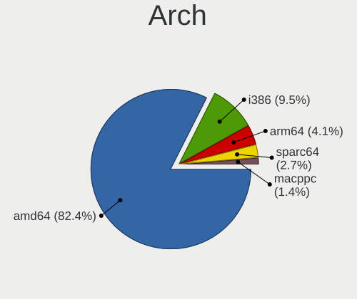

| Name    | Computers | Percent |
|---------|-----------|---------|
| amd64   | 61        | 82.43%  |
| i386    | 7         | 9.46%   |
| arm64   | 3         | 4.05%   |
| sparc64 | 2         | 2.7%    |
| macppc  | 1         | 1.35%   |

DE
--

Desktop Environment

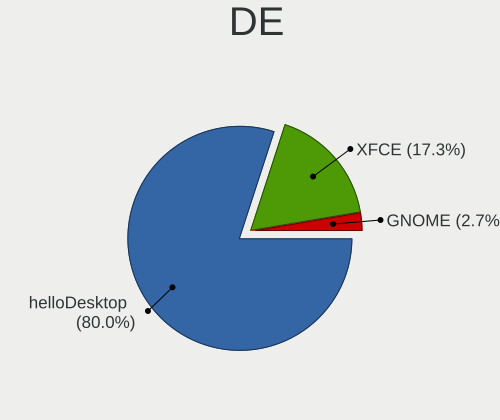

| Name         | Computers | Percent |
|--------------|-----------|---------|
| helloDesktop | 60        | 80%     |
| XFCE         | 13        | 17.33%  |
| GNOME        | 2         | 2.67%   |

Display Server
--------------

X11 or Wayland

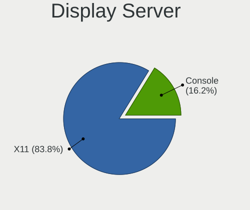

| Name    | Computers | Percent |
|---------|-----------|---------|
| X11     | 62        | 83.78%  |
| Console | 12        | 16.22%  |

Display Manager
---------------

SDDM, LightDM, etc.

| Name    | Computers | Percent |
|---------|-----------|---------|
| Console | 74        | 100%    |

OS Lang
-------

Language

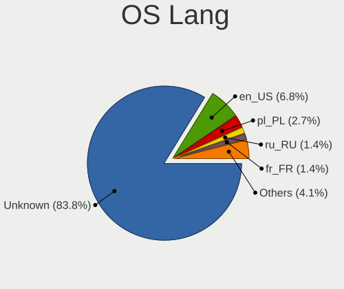

| Lang    | Computers | Percent |
|---------|-----------|---------|
| Unknown | 62        | 83.78%  |
| en_US   | 5         | 6.76%   |
| pl_PL   | 2         | 2.7%    |
| ru_RU   | 1         | 1.35%   |
| fr_FR   | 1         | 1.35%   |
| es_CO   | 1         | 1.35%   |
| en_GB   | 1         | 1.35%   |
| de_DE   | 1         | 1.35%   |

Boot Mode
---------

EFI or BIOS

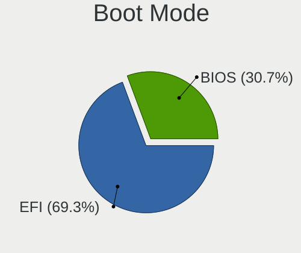

| Mode | Computers | Percent |
|------|-----------|---------|
| EFI  | 52        | 69.33%  |
| BIOS | 23        | 30.67%  |

Filesystem
----------

Type of filesystem

| Type | Computers | Percent |
|------|-----------|---------|
| Ffs  | 74        | 100%    |

Part. scheme
------------

Scheme of partitioning

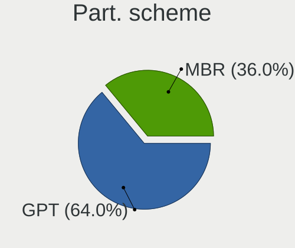

| Type | Computers | Percent |
|------|-----------|---------|
| GPT  | 48        | 64%     |
| MBR  | 27        | 36%     |

Board
-----

Vendor
------

Motherboard manufacturer

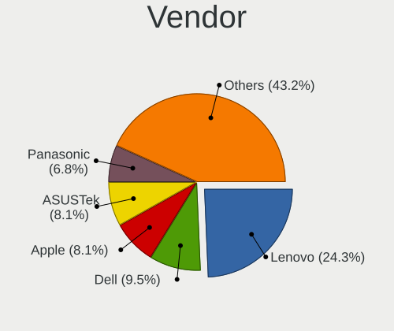

| Name                           | Computers | Percent |
|--------------------------------|-----------|---------|
| Lenovo                         | 18        | 24.32%  |
| Dell                           | 7         | 9.46%   |
| ASUSTek Computer               | 6         | 8.11%   |
| Apple                          | 6         | 8.11%   |
| Panasonic                      | 5         | 6.76%   |
| Hewlett-Packard                | 4         | 5.41%   |
| Unknown                        | 3         | 4.05%   |
| Sun                            | 2         | 2.7%    |
| Matsushita Electric Industrial | 2         | 2.7%    |
| Intel                          | 2         | 2.7%    |
| Gigabyte Technology            | 2         | 2.7%    |
| AZW                            | 2         | 2.7%    |
| Toshiba                        | 1         | 1.35%   |
| Star Labs                      | 1         | 1.35%   |
| Sony                           | 1         | 1.35%   |
| Samsung Electronics            | 1         | 1.35%   |
| MSI                            | 1         | 1.35%   |
| Microsoft                      | 1         | 1.35%   |
| MECHREVO                       | 1         | 1.35%   |
| Intel(R) Client Systems        | 1         | 1.35%   |
| IBM                            | 1         | 1.35%   |
| Google                         | 1         | 1.35%   |
| Fujitsu                        | 1         | 1.35%   |
| FUJI wortmann                  | 1         | 1.35%   |
| Chuwi                          | 1         | 1.35%   |
| Biostar                        | 1         | 1.35%   |
| ASRock                         | 1         | 1.35%   |

Model
-----

Motherboard model

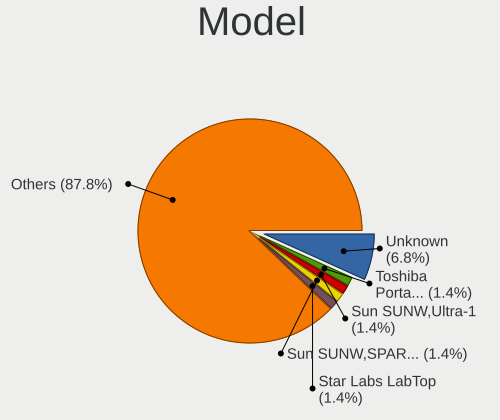

| Name                                        | Computers | Percent |
|---------------------------------------------|-----------|---------|
| Unknown                                     | 5         | 6.76%   |
| Toshiba Portable PC                         | 1         | 1.35%   |
| Sun SUNW,Ultra-1                            | 1         | 1.35%   |
| Sun SUNW,SPARC-Enterprise-T5120             | 1         | 1.35%   |
| Star Labs LabTop                            | 1         | 1.35%   |
| Samsung 100NZC                              | 1         | 1.35%   |
| Panasonic CFSX4-1                           | 1         | 1.35%   |
| Panasonic CF-C2CEAZXCM                      | 1         | 1.35%   |
| Panasonic CF-54-1                           | 1         | 1.35%   |
| Panasonic CF-53AAGHYDM                      | 1         | 1.35%   |
| Panasonic CF-52PFPBSFQ                      | 1         | 1.35%   |
| MSI MS-7D15                                 | 1         | 1.35%   |
| Microsoft Windows Dev Kit 2023              | 1         | 1.35%   |
| Matsushita Electric Industrial CF-51RCVDNLM | 1         | 1.35%   |
| Matsushita Electric Industrial CF-48V4KNDQM | 1         | 1.35%   |
| Lenovo ThinkPad X270 W10DG 20K5S0TT1N       | 1         | 1.35%   |
| Lenovo ThinkPad X260 20F5S2GM00             | 1         | 1.35%   |
| Lenovo ThinkPad X260 20F5S10W0H             | 1         | 1.35%   |
| Lenovo ThinkPad X1 Carbon 5th 20HQS04900    | 1         | 1.35%   |
| Lenovo ThinkPad X1 Carbon 4th 20FCS13H00    | 1         | 1.35%   |
| Lenovo ThinkPad T450 20BU000GUS             | 1         | 1.35%   |
| Lenovo ThinkPad T430 2347GZU                | 1         | 1.35%   |
| Lenovo ThinkPad T410 2537N24                | 1         | 1.35%   |
| Lenovo ThinkPad T410 2518C3U                | 1         | 1.35%   |
| Lenovo ThinkPad P70 20ESS1L600              | 1         | 1.35%   |
| Lenovo ThinkPad Helix 2nd 20CHS1QW01        | 1         | 1.35%   |
| Lenovo ThinkPad E15 Gen 2 20TD003GUS        | 1         | 1.35%   |
| Lenovo ThinkCentre M91p 7052C1G             | 1         | 1.35%   |
| Lenovo ThinkCentre M90n-1 11AHS0B200        | 1         | 1.35%   |
| Lenovo ThinkCentre M75n 11BXS00100          | 1         | 1.35%   |
| Lenovo ThinkCentre M720s 10SUSB7Y00         | 1         | 1.35%   |
| Lenovo ThinkBook 15 G4 IAP 21DJ             | 1         | 1.35%   |
| Lenovo G550 20023                           | 1         | 1.35%   |
| Intel(R) Client Systems NUC10i3FNH          | 1         | 1.35%   |
| Intel NUC7i3BNHX                            | 1         | 1.35%   |
| Intel DCP847SKE                             | 1         | 1.35%   |
| IBM ThinkPad R51 2889W11                    | 1         | 1.35%   |
| HP s5-1210br                                | 1         | 1.35%   |
| HP ProLiant ML370 G4                        | 1         | 1.35%   |
| HP ProBook 455 G7                           | 1         | 1.35%   |

Model Family
------------

Motherboard model prefix

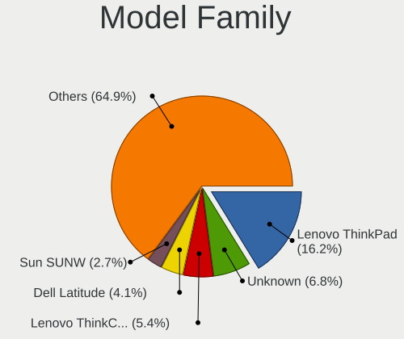

| Name                                        | Computers | Percent |
|---------------------------------------------|-----------|---------|
| Lenovo ThinkPad                             | 12        | 16.22%  |
| Unknown                                     | 5         | 6.76%   |
| Lenovo ThinkCentre                          | 4         | 5.41%   |
| Dell Latitude                               | 3         | 4.05%   |
| Sun SUNW                                    | 2         | 2.7%    |
| ASUS TUF                                    | 2         | 2.7%    |
| Toshiba Portable                            | 1         | 1.35%   |
| Star Labs LabTop                            | 1         | 1.35%   |
| Samsung 100NZC                              | 1         | 1.35%   |
| Panasonic CFSX4-1                           | 1         | 1.35%   |
| Panasonic CF-C2CEAZXCM                      | 1         | 1.35%   |
| Panasonic CF-54-1                           | 1         | 1.35%   |
| Panasonic CF-53AAGHYDM                      | 1         | 1.35%   |
| Panasonic CF-52PFPBSFQ                      | 1         | 1.35%   |
| MSI MS-7D15                                 | 1         | 1.35%   |
| Microsoft Windows                           | 1         | 1.35%   |
| Matsushita Electric Industrial CF-51RCVDNLM | 1         | 1.35%   |
| Matsushita Electric Industrial CF-48V4KNDQM | 1         | 1.35%   |
| Lenovo ThinkBook                            | 1         | 1.35%   |
| Lenovo G550                                 | 1         | 1.35%   |
| Intel(R) Client Systems NUC10i3FNH          | 1         | 1.35%   |
| Intel NUC7i3BNHX                            | 1         | 1.35%   |
| Intel DCP847SKE                             | 1         | 1.35%   |
| IBM ThinkPad                                | 1         | 1.35%   |
| HP s5-1210br                                | 1         | 1.35%   |
| HP ProLiant                                 | 1         | 1.35%   |
| HP ProBook                                  | 1         | 1.35%   |
| HP Compaq                                   | 1         | 1.35%   |
| Google Droid                                | 1         | 1.35%   |
| Gigabyte Z690                               | 1         | 1.35%   |
| Gigabyte H81M-S2PV                          | 1         | 1.35%   |
| Fujitsu LIFEBOOK                            | 1         | 1.35%   |
| FUJI wortmann D1547                         | 1         | 1.35%   |
| Dell Vostro                                 | 1         | 1.35%   |
| Dell PowerEdge                              | 1         | 1.35%   |
| Dell OptiPlex                               | 1         | 1.35%   |
| Dell Inspiron                               | 1         | 1.35%   |
| Chuwi LarkBox                               | 1         | 1.35%   |
| Biostar B450NH                              | 1         | 1.35%   |
| AZW SER                                     | 1         | 1.35%   |

MFG Year
--------

Motherboard manufacture year

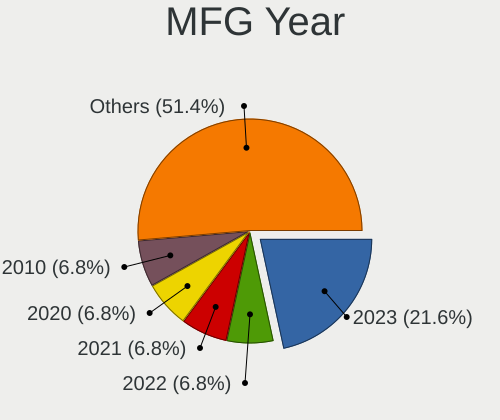

| Year    | Computers | Percent |
|---------|-----------|---------|
| 2023    | 16        | 21.62%  |
| 2022    | 5         | 6.76%   |
| 2021    | 5         | 6.76%   |
| 2020    | 5         | 6.76%   |
| 2010    | 5         | 6.76%   |
| 2019    | 4         | 5.41%   |
| 2015    | 4         | 5.41%   |
| 2013    | 4         | 5.41%   |
| 2012    | 4         | 5.41%   |
| 2011    | 3         | 4.05%   |
| Unknown | 3         | 4.05%   |
| 2017    | 2         | 2.7%    |
| 2016    | 2         | 2.7%    |
| 2014    | 2         | 2.7%    |
| 2009    | 2         | 2.7%    |
| 2006    | 2         | 2.7%    |
| 2005    | 2         | 2.7%    |
| 2018    | 1         | 1.35%   |
| 2007    | 1         | 1.35%   |
| 2003    | 1         | 1.35%   |
| 2002    | 1         | 1.35%   |

Form Factor
-----------

Physical design of the computer

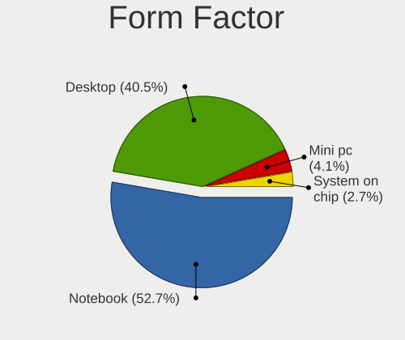

| Name           | Computers | Percent |
|----------------|-----------|---------|
| Notebook       | 39        | 52.7%   |
| Desktop        | 30        | 40.54%  |
| Mini pc        | 3         | 4.05%   |
| System on chip | 2         | 2.7%    |

Coreboot
--------

Have coreboot on board

| Used | Computers | Percent |
|------|-----------|---------|
| No   | 73        | 98.65%  |
| Yes  | 1         | 1.35%   |

RAM Size
--------

Total RAM memory

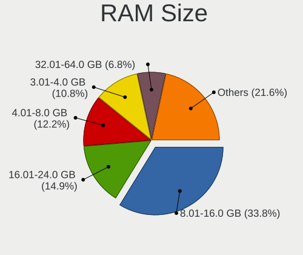

| Size in GB  | Computers | Percent |
|-------------|-----------|---------|
| 8.01-16.0   | 25        | 33.78%  |
| 16.01-24.0  | 11        | 14.86%  |
| 4.01-8.0    | 9         | 12.16%  |
| 3.01-4.0    | 8         | 10.81%  |
| 32.01-64.0  | 5         | 6.76%   |
| 2.01-3.0    | 4         | 5.41%   |
| 64.01-256.0 | 3         | 4.05%   |
| 0.51-1.0    | 3         | 4.05%   |
| 24.01-32.0  | 2         | 2.7%    |
| 1.01-2.0    | 2         | 2.7%    |
| 0.01-0.5    | 2         | 2.7%    |

RAM Used
--------

Used RAM memory

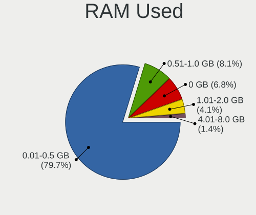

| Used GB  | Computers | Percent |
|----------|-----------|---------|
| 0.01-0.5 | 59        | 79.73%  |
| 0.51-1.0 | 6         | 8.11%   |
| 0        | 5         | 6.76%   |
| 1.01-2.0 | 3         | 4.05%   |
| 4.01-8.0 | 1         | 1.35%   |

Total Drives
------------

Number of drives on board

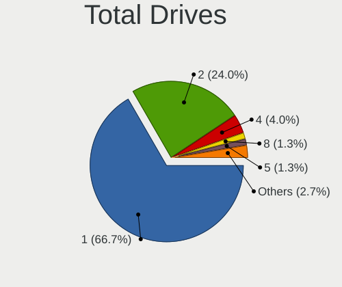

| Drives | Computers | Percent |
|--------|-----------|---------|
| 1      | 50        | 66.67%  |
| 2      | 18        | 24%     |
| 4      | 3         | 4%      |
| 8      | 1         | 1.33%   |
| 5      | 1         | 1.33%   |
| 3      | 1         | 1.33%   |
| 0      | 1         | 1.33%   |

Has CD-ROM
----------

Has CD-ROM on board

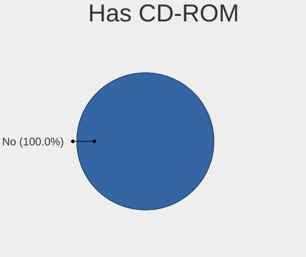

| Presented | Computers | Percent |
|-----------|-----------|---------|
| No        | 74        | 100%    |

Has Ethernet
------------

Has Ethernet on board

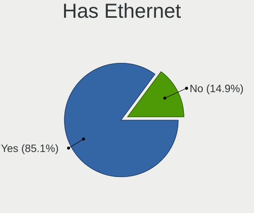

| Presented | Computers | Percent |
|-----------|-----------|---------|
| Yes       | 63        | 85.14%  |
| No        | 11        | 14.86%  |

Has WiFi
--------

Has WiFi module

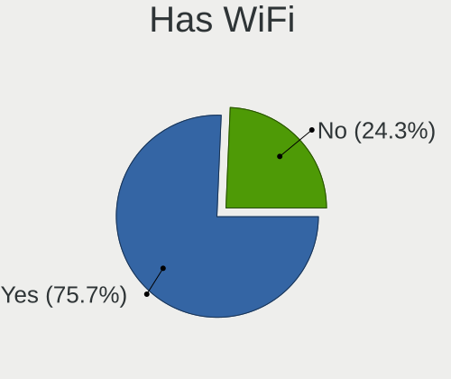

| Presented | Computers | Percent |
|-----------|-----------|---------|
| Yes       | 56        | 75.68%  |
| No        | 18        | 24.32%  |

Has Bluetooth
-------------

Has Bluetooth module

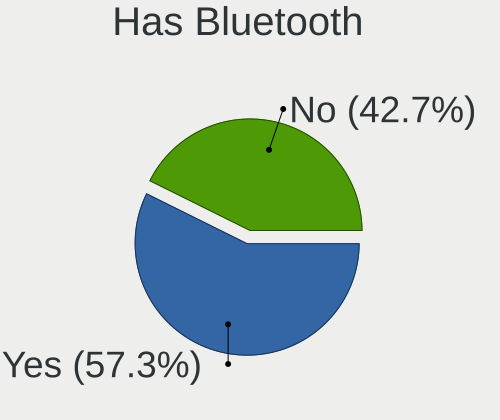

| Presented | Computers | Percent |
|-----------|-----------|---------|
| Yes       | 43        | 57.33%  |
| No        | 32        | 42.67%  |

Location
--------

Country
-------

Geographic location (country)

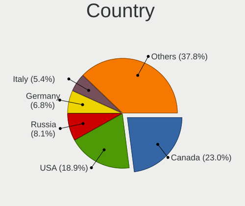

| Country    | Computers | Percent |
|------------|-----------|---------|
| Canada     | 17        | 22.97%  |
| USA        | 14        | 18.92%  |
| Russia     | 6         | 8.11%   |
| Germany    | 5         | 6.76%   |
| Italy      | 4         | 5.41%   |
| Romania    | 3         | 4.05%   |
| Poland     | 3         | 4.05%   |
| UK         | 2         | 2.7%    |
| Spain      | 2         | 2.7%    |
| Colombia   | 2         | 2.7%    |
| Australia  | 2         | 2.7%    |
| Ukraine    | 1         | 1.35%   |
| Turkey     | 1         | 1.35%   |
| Slovakia   | 1         | 1.35%   |
| Norway     | 1         | 1.35%   |
| Montenegro | 1         | 1.35%   |
| Latvia     | 1         | 1.35%   |
| Indonesia  | 1         | 1.35%   |
| Hungary    | 1         | 1.35%   |
| Guatemala  | 1         | 1.35%   |
| Greece     | 1         | 1.35%   |
| France     | 1         | 1.35%   |
| China      | 1         | 1.35%   |
| Brazil     | 1         | 1.35%   |
| Austria    | 1         | 1.35%   |

City
----

Geographic location (city)

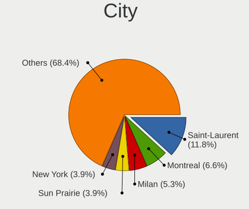

| City            | Computers | Percent |
|-----------------|-----------|---------|
| Saint-Laurent   | 9         | 11.84%  |
| Montreal        | 5         | 6.58%   |
| Milan           | 4         | 5.26%   |
| Sun Prairie     | 3         | 3.95%   |
| New York        | 3         | 3.95%   |
| Sydenham        | 2         | 2.63%   |
| Canberra        | 2         | 2.63%   |
| Wolfsburg       | 1         | 1.32%   |
| Witow           | 1         | 1.32%   |
| Warwick         | 1         | 1.32%   |
| Volgograd       | 1         | 1.32%   |
| Valmojado       | 1         | 1.32%   |
| Uba             | 1         | 1.32%   |
| Torrent         | 1         | 1.32%   |
| Stuttgart       | 1         | 1.32%   |
| Stukenbrock     | 1         | 1.32%   |
| Stade           | 1         | 1.32%   |
| St Petersburg   | 1         | 1.32%   |
| South Tangerang | 1         | 1.32%   |
| Songjiang       | 1         | 1.32%   |
| Smolensk        | 1         | 1.32%   |
| Simferopol      | 1         | 1.32%   |
| Sao Paulo       | 1         | 1.32%   |
| Ryazan          | 1         | 1.32%   |
| Riga            | 1         | 1.32%   |
| Quetzaltenango  | 1         | 1.32%   |
| Punta Gorda     | 1         | 1.32%   |
| Prudhoe         | 1         | 1.32%   |
| Podgorica       | 1         | 1.32%   |
| Ploieşti       | 1         | 1.32%   |
| Orenburg        | 1         | 1.32%   |
| Mersin          | 1         | 1.32%   |
| Medellín       | 1         | 1.32%   |
| Madison         | 1         | 1.32%   |
| Lodz            | 1         | 1.32%   |
| Krakow          | 1         | 1.32%   |
| Košice         | 1         | 1.32%   |
| Kernersville    | 1         | 1.32%   |
| Hollis          | 1         | 1.32%   |
| Harrisonburg    | 1         | 1.32%   |

Drives
------

Drive Vendor
------------

Hard drive vendors

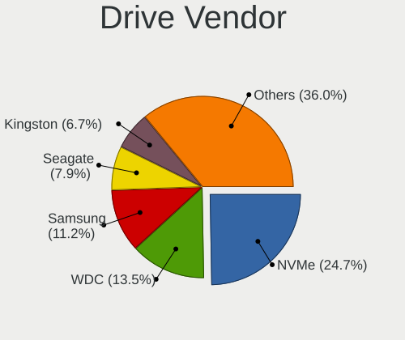

| Vendor              | Computers | Drives | Percent |
|---------------------|-----------|--------|---------|
| NVMe                | 22        | 25     | 24.72%  |
| WDC                 | 12        | 12     | 13.48%  |
| Samsung Electronics | 10        | 18     | 11.24%  |
| Seagate             | 7         | 7      | 7.87%   |
| Kingston            | 6         | 6      | 6.74%   |
| Hitachi             | 3         | 4      | 3.37%   |
| Apple               | 3         | 4      | 3.37%   |
| SanDisk             | 2         | 2      | 2.25%   |
| Intel               | 2         | 2      | 2.25%   |
| HGST                | 2         | 2      | 2.25%   |
| Generic             | 2         | 2      | 2.25%   |
| Apacer              | 2         | 2      | 2.25%   |
| Toshiba             | 1         | 1      | 1.12%   |
| PNY                 | 1         | 5      | 1.12%   |
| OPENBSD             | 1         | 1      | 1.12%   |
| Netac               | 1         | 1      | 1.12%   |
| MyDigitalSSD        | 1         | 1      | 1.12%   |
| LSILOGIC            | 1         | 1      | 1.12%   |
| Lexar               | 1         | 1      | 1.12%   |
| KIOXIA-EXCERIA      | 1         | 1      | 1.12%   |
| Intenso             | 1         | 1      | 1.12%   |
| Hewlett-Packard     | 1         | 1      | 1.12%   |
| Fujitsu             | 1         | 1      | 1.12%   |
| External            | 1         | 1      | 1.12%   |
| Crucial             | 1         | 1      | 1.12%   |
| China               | 1         | 1      | 1.12%   |
| AirDisk             | 1         | 1      | 1.12%   |
| A-DATA Technology   | 1         | 1      | 1.12%   |

Drive Model
-----------

Hard drive models

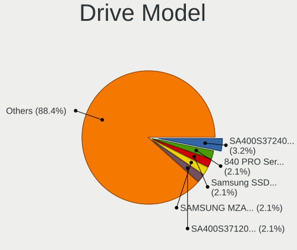

| Model                               | Computers | Percent |
|-------------------------------------|-----------|---------|
| Kingston SA400S37240G 240GB         | 3         | 3.16%   |
| Samsung SSD 840 PRO Series 256GB    | 2         | 2.11%   |
| NVMe Samsung SSD 980 1TB            | 2         | 2.11%   |
| NVMe SAMSUNG MZALQ128 128GB         | 2         | 2.11%   |
| Kingston SA400S37120G 120GB         | 2         | 2.11%   |
| Generic STORAGE DEVICE 2GB          | 2         | 2.11%   |
| WDC WD7500BPKX-00HPJT0 752GB        | 1         | 1.05%   |
| WDC WD7500BPKT-75PK4T0 752GB        | 1         | 1.05%   |
| WDC WD7500BPKT-00PK4T0 752GB        | 1         | 1.05%   |
| WDC WD64 00AAKS-22A7B2 640GB        | 1         | 1.05%   |
| WDC WD5000LPLX-00ZNTT0 500GB        | 1         | 1.05%   |
| WDC WD5000AAKX-60U6AA0 500GB        | 1         | 1.05%   |
| WDC WD3200LPCX-24C6HT0 320GB        | 1         | 1.05%   |
| WDC WD3200BEVE-00A0HT0 320GB        | 1         | 1.05%   |
| WDC WD2500BEKT-75A25T0 250GB        | 1         | 1.05%   |
| WDC WD10JPVT-75A1YT0 1TB            | 1         | 1.05%   |
| WDC WD10JPLX-00MBPT0 1TB            | 1         | 1.05%   |
| WDC WD Elements 2621 2TB            | 1         | 1.05%   |
| Toshiba DT01ACA050 500GB            | 1         | 1.05%   |
| Seagate ST9160821A 160GB            | 1         | 1.05%   |
| Seagate ST320LM001 HN-M320MBB 320GB | 1         | 1.05%   |
| Seagate ST31000340AS 1TB            | 1         | 1.05%   |
| Seagate ST250DM000-1BD141 250GB     | 1         | 1.05%   |
| Seagate ST2000NT001-3M3101 2TB      | 1         | 1.05%   |
| Seagate ST2000LX001-1RG174 2TB      | 1         | 1.05%   |
| Seagate ST1000DM003-1CH162 1TB      | 1         | 1.05%   |
| SanDisk SDCFXS-032G                 | 1         | 1.05%   |
| SanDisk SD8SN8U-256G-1006 256GB     | 1         | 1.05%   |
| Samsung SSD 870 QVO 2TB             | 1         | 1.05%   |
| Samsung SSD 870 EVO 500GB           | 1         | 1.05%   |
| Samsung SSD 860 EVO M.2 1TB         | 1         | 1.05%   |
| Samsung SSD 860 EVO 250GB           | 1         | 1.05%   |
| Samsung SSD 860 EVO 1TB             | 1         | 1.05%   |
| Samsung SSD 840 EVO 500GB           | 1         | 1.05%   |
| Samsung SSD 840 EVO 250GB           | 1         | 1.05%   |
| Samsung PSSD T7 500GB               | 1         | 1.05%   |
| Samsung MZ7TE128HMGR-000L1 128GB    | 1         | 1.05%   |
| Samsung MZ7LN512HCHP-000 512GB      | 1         | 1.05%   |
| Samsung Flash Drive 64GB            | 1         | 1.05%   |
| PNY CS900 1TB SSD                   | 1         | 1.05%   |

HDD Vendor
----------

Hard disk drive vendors

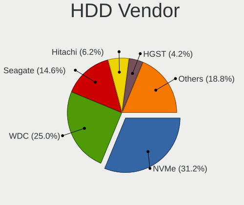

| Vendor              | Computers | Drives | Percent |
|---------------------|-----------|--------|---------|
| NVMe                | 15        | 17     | 31.25%  |
| WDC                 | 12        | 12     | 25%     |
| Seagate             | 7         | 7      | 14.58%  |
| Hitachi             | 3         | 4      | 6.25%   |
| HGST                | 2         | 2      | 4.17%   |
| Generic             | 2         | 2      | 4.17%   |
| Toshiba             | 1         | 1      | 2.08%   |
| Samsung Electronics | 1         | 1      | 2.08%   |
| OPENBSD             | 1         | 1      | 2.08%   |
| LSILOGIC            | 1         | 1      | 2.08%   |
| Intenso             | 1         | 1      | 2.08%   |
| Hewlett-Packard     | 1         | 1      | 2.08%   |
| Fujitsu             | 1         | 1      | 2.08%   |

SSD Vendor
----------

Solid state drive vendors

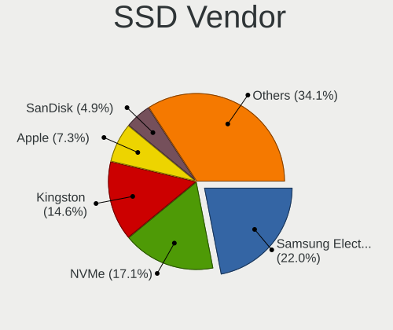

| Vendor              | Computers | Drives | Percent |
|---------------------|-----------|--------|---------|
| Samsung Electronics | 9         | 17     | 21.95%  |
| NVMe                | 7         | 7      | 17.07%  |
| Kingston            | 6         | 6      | 14.63%  |
| Apple               | 3         | 4      | 7.32%   |
| SanDisk             | 2         | 2      | 4.88%   |
| Intel               | 2         | 2      | 4.88%   |
| Apacer              | 2         | 2      | 4.88%   |
| PNY                 | 1         | 5      | 2.44%   |
| Netac               | 1         | 1      | 2.44%   |
| MyDigitalSSD        | 1         | 1      | 2.44%   |
| Lexar               | 1         | 1      | 2.44%   |
| KIOXIA-EXCERIA      | 1         | 1      | 2.44%   |
| External            | 1         | 1      | 2.44%   |
| Crucial             | 1         | 1      | 2.44%   |
| China               | 1         | 1      | 2.44%   |
| AirDisk             | 1         | 1      | 2.44%   |
| A-DATA Technology   | 1         | 1      | 2.44%   |

Drive Kind
----------

HDD or SSD

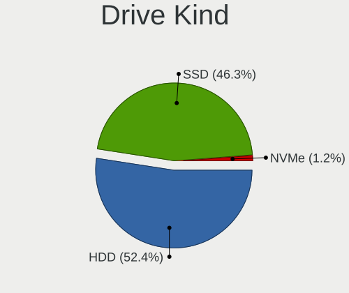

| Kind | Computers | Drives | Percent |
|------|-----------|--------|---------|
| HDD  | 43        | 51     | 52.44%  |
| SSD  | 38        | 54     | 46.34%  |
| NVMe | 1         | 1      | 1.22%   |

Drive Connector
---------------

SATA, SAS, NVMe, etc.

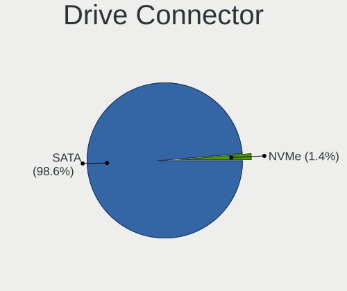

| Type | Computers | Drives | Percent |
|------|-----------|--------|---------|
| SATA | 71        | 105    | 98.61%  |
| NVMe | 1         | 1      | 1.39%   |

Drive Size
----------

Size of hard drive

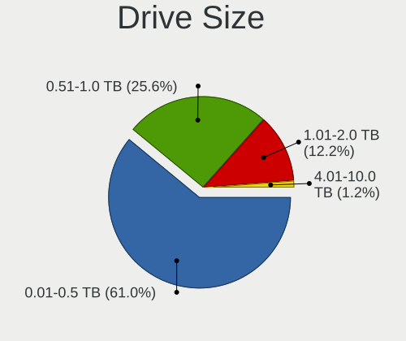

| Size in TB | Computers | Drives | Percent |
|------------|-----------|--------|---------|
| 0.01-0.5   | 50        | 61     | 60.98%  |
| 0.51-1.0   | 21        | 28     | 25.61%  |
| 1.01-2.0   | 10        | 15     | 12.2%   |
| 4.01-10.0  | 1         | 1      | 1.22%   |

Space Total
-----------

Amount of disk space available on the file system

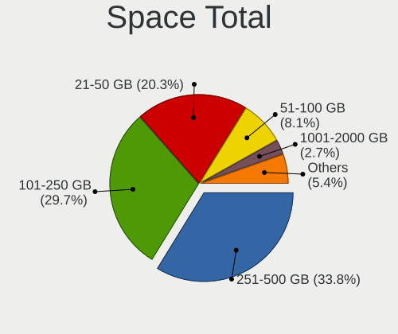

| Size in GB     | Computers | Percent |
|----------------|-----------|---------|
| 251-500        | 25        | 33.78%  |
| 101-250        | 22        | 29.73%  |
| 21-50          | 15        | 20.27%  |
| 51-100         | 6         | 8.11%   |
| 1001-2000      | 2         | 2.7%    |
| 501-1000       | 2         | 2.7%    |
| More than 3000 | 1         | 1.35%   |
| 1-20           | 1         | 1.35%   |

Space Used
----------

Amount of used disk space

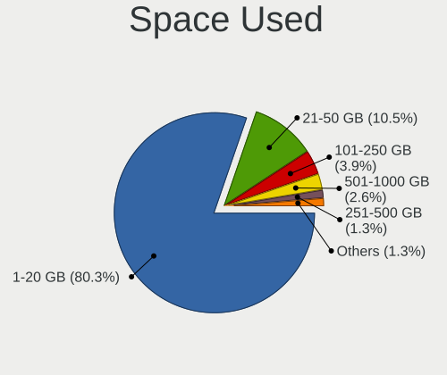

| Used GB  | Computers | Percent |
|----------|-----------|---------|
| 1-20     | 61        | 80.26%  |
| 21-50    | 8         | 10.53%  |
| 101-250  | 3         | 3.95%   |
| 501-1000 | 2         | 2.63%   |
| 251-500  | 1         | 1.32%   |
| 51-100   | 1         | 1.32%   |

Malfunc. Drives
---------------

Drive models with a malfunction

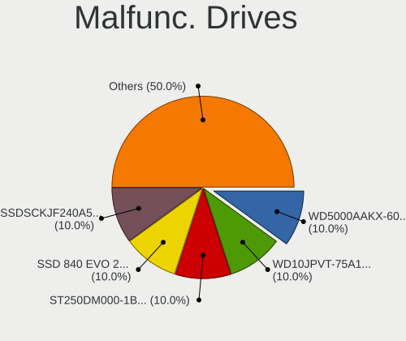

| Model                                 | Computers | Drives | Percent |
|---------------------------------------|-----------|--------|---------|
| WDC WD5000AAKX-60U6AA0 500GB          | 1         | 1      | 10%     |
| WDC WD10JPVT-75A1YT0 1TB              | 1         | 1      | 10%     |
| Seagate ST250DM000-1BD141 250GB       | 1         | 1      | 10%     |
| Samsung Electronics SSD 840 EVO 250GB | 1         | 1      | 10%     |
| Intel SSDSCKJF240A5L 240GB            | 1         | 1      | 10%     |
| Intel SSDSC2BF180A5L 180GB            | 1         | 1      | 10%     |
| Hitachi HTS541010G9SA00 100GB         | 1         | 1      | 10%     |
| HGST HTS545050A7E380 500GB            | 1         | 1      | 10%     |
| HGST HTS541010A9E680 1TB              | 1         | 1      | 10%     |
| A-DATA Technology SP550 480GB         | 1         | 1      | 10%     |

Malfunc. Drive Vendor
---------------------

Vendors of faulty drives

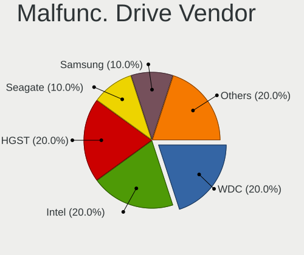

| Vendor              | Computers | Drives | Percent |
|---------------------|-----------|--------|---------|
| WDC                 | 2         | 2      | 20%     |
| Intel               | 2         | 2      | 20%     |
| HGST                | 2         | 2      | 20%     |
| Seagate             | 1         | 1      | 10%     |
| Samsung Electronics | 1         | 1      | 10%     |
| Hitachi             | 1         | 1      | 10%     |
| A-DATA Technology   | 1         | 1      | 10%     |

Malfunc. HDD Vendor
-------------------

Vendors of faulty HDD drives

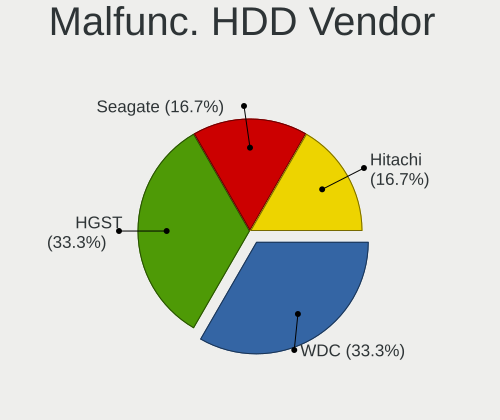

| Vendor  | Computers | Drives | Percent |
|---------|-----------|--------|---------|
| WDC     | 2         | 2      | 33.33%  |
| HGST    | 2         | 2      | 33.33%  |
| Seagate | 1         | 1      | 16.67%  |
| Hitachi | 1         | 1      | 16.67%  |

Malfunc. Drive Kind
-------------------

Kinds of faulty drives

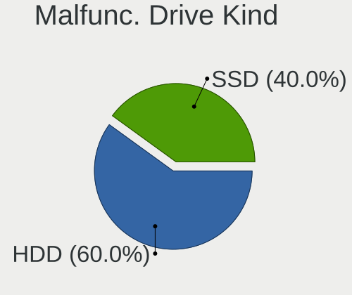

| Kind | Computers | Drives | Percent |
|------|-----------|--------|---------|
| HDD  | 6         | 6      | 60%     |
| SSD  | 4         | 4      | 40%     |

Failed Drives
-------------

Failed drive models

Zero info for selected period =(

Failed Drive Vendor
-------------------

Failed drive vendors

Zero info for selected period =(

Drive Status
------------

Number of failed and malfunc. drives

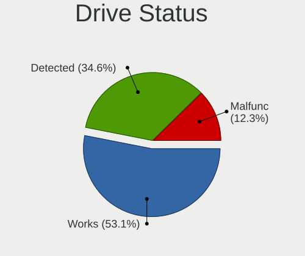

| Status   | Computers | Drives | Percent |
|----------|-----------|--------|---------|
| Works    | 43        | 62     | 53.09%  |
| Detected | 28        | 34     | 34.57%  |
| Malfunc  | 10        | 10     | 12.35%  |

Storage controller
------------------

Storage Vendor
--------------

Storage controller vendors

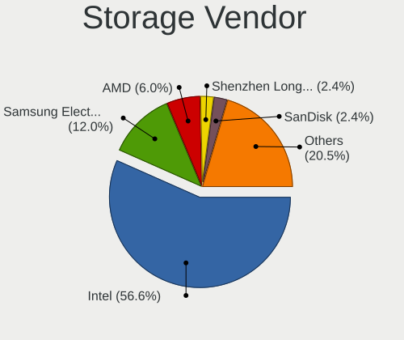

| Vendor                                  | Computers | Percent |
|-----------------------------------------|-----------|---------|
| Intel                                   | 47        | 56.63%  |
| Samsung Electronics                     | 10        | 12.05%  |
| AMD                                     | 5         | 6.02%   |
| Shenzhen Longsys Electronics            | 2         | 2.41%   |
| SanDisk                                 | 2         | 2.41%   |
| Phison Electronics                      | 2         | 2.41%   |
| KIOXIA                                  | 2         | 2.41%   |
| Broadcom / LSI                          | 2         | 2.41%   |
| ASMedia Technology                      | 2         | 2.41%   |
| Solid State Storage Technology          | 1         | 1.2%    |
| Shenzhen Unionmemory Information System | 1         | 1.2%    |
| Nvidia                                  | 1         | 1.2%    |
| Micron/Crucial Technology               | 1         | 1.2%    |
| MAXIO Technology (Hangzhou)             | 1         | 1.2%    |
| Kingston Technology Company             | 1         | 1.2%    |
| Compaq Computer                         | 1         | 1.2%    |
| Biwin Storage Technology                | 1         | 1.2%    |
| Unknown                                 | 1         | 1.2%    |

Storage Model
-------------

Storage controller models

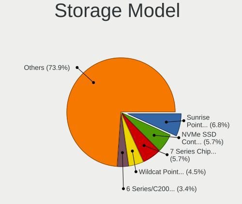

| Model                                                                              | Computers | Percent |
|------------------------------------------------------------------------------------|-----------|---------|
| Intel Sunrise Point-LP SATA Controller [AHCI mode]                                 | 6         | 6.82%   |
| Samsung NVMe SSD Controller 980 (DRAM-less)                                        | 5         | 5.68%   |
| Intel 7 Series Chipset Family 6-port SATA Controller [AHCI mode]                   | 5         | 5.68%   |
| Intel Wildcat Point-LP SATA Controller [AHCI Mode]                                 | 4         | 4.55%   |
| Intel 6 Series/C200 Series Chipset Family 6 port Desktop SATA AHCI Controller      | 3         | 3.41%   |
| Intel 5 Series/3400 Series Chipset 6 port SATA AHCI Controller                     | 3         | 3.41%   |
| AMD 500 Series Chipset SATA Controller                                             | 3         | 3.41%   |
| Shenzhen Longsys Lexar NM790 / Patriot Viper VP4300 Lite NVMe SSD (DRAM-less)      | 2         | 2.27%   |
| Samsung S4LN058A01[SSUBX] AHCI SSD Controller (Apple slot)                         | 2         | 2.27%   |
| Intel Q170/Q150/B150/H170/H110/Z170/CM236 Chipset SATA Controller [AHCI Mode]      | 2         | 2.27%   |
| Intel Alder Lake-N SATA AHCI Controller                                            | 2         | 2.27%   |
| Intel 82801GBM/GHM (ICH7-M Family) SATA Controller [IDE mode]                      | 2         | 2.27%   |
| Intel 7 Series/C210 Series Chipset Family 6-port SATA Controller [AHCI mode]       | 2         | 2.27%   |
| Intel 6 Series/C200 Series Chipset Family 6 port Mobile SATA AHCI Controller       | 2         | 2.27%   |
| ASMedia ASM1061/ASM1062 Serial ATA Controller                                      | 2         | 2.27%   |
| AMD FCH SATA Controller [AHCI mode]                                                | 2         | 2.27%   |
| Solid State Storage CL1-3D256-Q11 NVMe SSD M.2                                     | 1         | 1.14%   |
| Shenzhen Unionmemory Information System AM6A1 PCIe 4.0 NVMe SSD 1024GB (DRAM-less) | 1         | 1.14%   |
| Sandisk WD Blue SN580 NVMe SSD (DRAM-less)                                         | 1         | 1.14%   |
| SanDisk Ultra 3D / WD PC SN530, IX SN530, Blue SN550 NVMe SSD (DRAM-less)          | 1         | 1.14%   |
| SanDisk Extreme Pro / WD Black SN750 / PC SN730 / Red SN700 NVMe SSD               | 1         | 1.14%   |
| Samsung NVMe SSD Controller SM981/PM981/PM983                                      | 1         | 1.14%   |
| Samsung NVMe SSD Controller SM961/PM961/SM963                                      | 1         | 1.14%   |
| Samsung NVMe SSD Controller PM9A1/PM9A3/980PRO                                     | 1         | 1.14%   |
| Phison E16 PCIe4 NVMe Controller                                                   | 1         | 1.14%   |
| Phison E12 NVMe Controller                                                         | 1         | 1.14%   |
| Nvidia MCP89 SATA Controller (AHCI mode)                                           | 1         | 1.14%   |
| Micron/Crucial P2 [Nick P2] / P3 / P3 Plus NVMe PCIe SSD (DRAM-less)               | 1         | 1.14%   |
| MAXIO (Hangzhou) NVMe SSD Controller MAP1202 (DRAM-less)                           | 1         | 1.14%   |
| KIOXIA NVMe SSD Controller BG4 (DRAM-less)                                         | 1         | 1.14%   |
| KIOXIA NVMe SSD                                                                    | 1         | 1.14%   |
| Kingston Company NV2 NVMe SSD [E19T] (DRAM-less)                                   | 1         | 1.14%   |
| Intel NVMe Optane Memory Series                                                    | 1         | 1.14%   |
| Intel NM10/ICH7 Family SATA Controller [IDE mode]                                  | 1         | 1.14%   |
| Intel Jasper Lake SATA AHCI Controller                                             | 1         | 1.14%   |
| Intel Comet Lake SATA AHCI Controller                                              | 1         | 1.14%   |
| Intel Cannon Lake PCH SATA AHCI Controller                                         | 1         | 1.14%   |
| Intel 82801JI (ICH10 Family) SATA AHCI Controller                                  | 1         | 1.14%   |
| Intel 82801IBM/IEM (ICH9M/ICH9M-E) 4 port SATA Controller [AHCI mode]              | 1         | 1.14%   |
| Intel 82801HM/HEM (ICH8M/ICH8M-E) SATA Controller [AHCI mode]                      | 1         | 1.14%   |

Storage Kind
------------

Kind of storage controller (IDE, SATA, NVMe, SAS, ...)

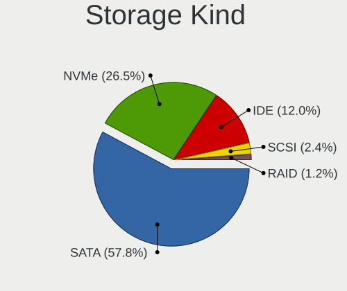

| Kind | Computers | Percent |
|------|-----------|---------|
| SATA | 48        | 57.83%  |
| NVMe | 22        | 26.51%  |
| IDE  | 10        | 12.05%  |
| SCSI | 2         | 2.41%   |
| RAID | 1         | 1.2%    |

Processor
---------

CPU Vendor
----------

Processor vendors

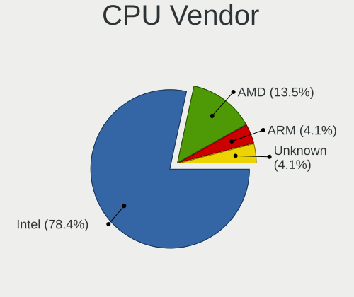

| Vendor  | Computers | Percent |
|---------|-----------|---------|
| Intel   | 58        | 78.38%  |
| AMD     | 10        | 13.51%  |
| ARM     | 3         | 4.05%   |
| Unknown | 3         | 4.05%   |

CPU Model
---------

Processor models

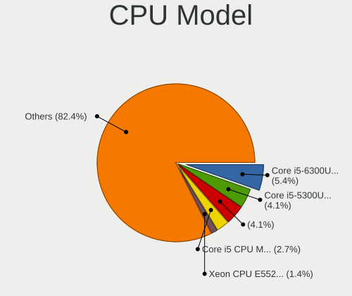

| Model                                                        | Computers | Percent |
|--------------------------------------------------------------|-----------|---------|
| Intel Core i5-6300U CPU @ 2.40GHz                            | 4         | 5.41%   |
| Intel Core i5-5300U CPU @ 2.30GHz                            | 3         | 4.05%   |
|                                                              | 3         | 4.05%   |
| Intel Core i5 CPU M 520 @ 2.40GHz                            | 2         | 2.7%    |
| Intel Xeon CPU E5520 @ 2.27GHz                               | 1         | 1.35%   |
| Intel Xeon CPU E3-1505M v5 @ 2.80GHz                         | 1         | 1.35%   |
| Intel Xeon CPU E3-1220 V2 @ 3.10GHz                          | 1         | 1.35%   |
| Intel Xeon CPU 3.40GHz                                       | 1         | 1.35%   |
| Intel Pentium M processor 1.73GHz ("GenuineIntel" 686-class) | 1         | 1.35%   |
| Intel Pentium M processor                                    | 1         | 1.35%   |
| Intel Pentium CPU G620 @ 2.60GHz                             | 1         | 1.35%   |
| Intel Pentium 4 Mobile CPU 1.60GHz                           | 1         | 1.35%   |
| Intel Pentium 4 CPU 2.66GHz ("GenuineIntel" 686-class)       | 1         | 1.35%   |
| Intel Other                                                  | 1         | 1.35%   |
| Intel N95                                                    | 1         | 1.35%   |
| Intel N100                                                   | 1         | 1.35%   |
| Intel Genuine CPU T2300 @ 1.66GHz                            | 1         | 1.35%   |
| Intel Core M-5Y71 CPU @ 1.20GHz                              | 1         | 1.35%   |
| Intel Core i7-8550U CPU @ 1.80GHz                            | 1         | 1.35%   |
| Intel Core i7-3537U CPU @ 2.00GHz                            | 1         | 1.35%   |
| Intel Core i7-3520M CPU @ 2.90GHz                            | 1         | 1.35%   |
| Intel Core i7-2677M CPU @ 1.80GHz                            | 1         | 1.35%   |
| Intel Core i7-2600 CPU @ 3.40GHz                             | 1         | 1.35%   |
| Intel Core i5-8350U CPU @ 1.70GHz                            | 1         | 1.35%   |
| Intel Core i5-7500 CPU @ 3.40GHz                             | 1         | 1.35%   |
| Intel Core i5-7300U CPU @ 2.60GHz                            | 1         | 1.35%   |
| Intel Core i5-5350U CPU @ 1.80GHz                            | 1         | 1.35%   |
| Intel Core i5-5257U CPU @ 2.70GHz                            | 1         | 1.35%   |
| Intel Core i5-4300U CPU @ 1.90GHz                            | 1         | 1.35%   |
| Intel Core i5-3570K CPU @ 3.40GHz                            | 1         | 1.35%   |
| Intel Core i5-3470 CPU @ 3.20GHz ("GenuineIntel" 686-class)  | 1         | 1.35%   |
| Intel Core i5-3320M CPU @ 2.60GHz                            | 1         | 1.35%   |
| Intel Core i5-2520M CPU @ 2.50GHz                            | 1         | 1.35%   |
| Intel Core i5-10400F CPU @ 2.90GHz                           | 1         | 1.35%   |
| Intel Core i5 CPU M 540 @ 2.53GHz                            | 1         | 1.35%   |
| Intel Core i3-8145U CPU @ 2.10GHz                            | 1         | 1.35%   |
| Intel Core i3-8100 CPU @ 3.60GHz                             | 1         | 1.35%   |
| Intel Core i3-7100U CPU @ 2.40GHz                            | 1         | 1.35%   |
| Intel Core i3-10110U CPU @ 2.10GHz                           | 1         | 1.35%   |
| Intel Core i3 CPU M 370 @ 2.40GHz                            | 1         | 1.35%   |

CPU Model Family
----------------

Processor model prefix

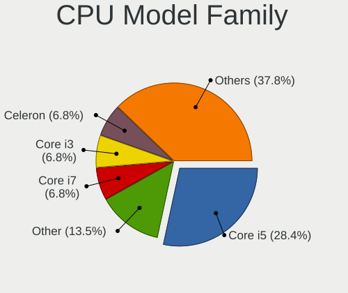

| Model            | Computers | Percent |
|------------------|-----------|---------|
| Intel Core i5    | 21        | 28.38%  |
| Other            | 10        | 13.51%  |
| Intel Core i7    | 5         | 6.76%   |
| Intel Core i3    | 5         | 6.76%   |
| Intel Celeron    | 5         | 6.76%   |
| Intel Xeon       | 4         | 5.41%   |
| AMD Ryzen 5      | 4         | 5.41%   |
| ARM Cortex       | 3         | 4.05%   |
| AMD Ryzen 7      | 3         | 4.05%   |
| Intel Pentium M  | 2         | 2.7%    |
| Intel Pentium 4  | 2         | 2.7%    |
| Intel Core 2 Duo | 2         | 2.7%    |
| Intel Atom       | 2         | 2.7%    |
| AMD Ryzen 9      | 2         | 2.7%    |
| Intel Pentium    | 1         | 1.35%   |
| Intel Genuine    | 1         | 1.35%   |
| Intel Core M     | 1         | 1.35%   |
| AMD Athlon       | 1         | 1.35%   |

CPU Cores
---------

Number of processor cores

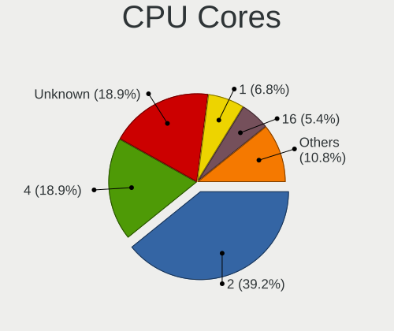

| Number  | Computers | Percent |
|---------|-----------|---------|
| 2       | 29        | 39.19%  |
| 4       | 14        | 18.92%  |
| Unknown | 14        | 18.92%  |
| 1       | 5         | 6.76%   |
| 16      | 4         | 5.41%   |
| 12      | 4         | 5.41%   |
| 8       | 2         | 2.7%    |
| 32      | 1         | 1.35%   |
| 6       | 1         | 1.35%   |

CPU Sockets
-----------

Number of sockets

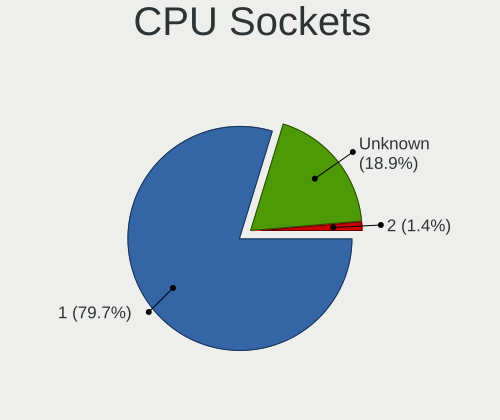

| Number  | Computers | Percent |
|---------|-----------|---------|
| 1       | 59        | 79.73%  |
| Unknown | 14        | 18.92%  |
| 2       | 1         | 1.35%   |

CPU Threads
-----------

Threads per core (Hyper-Threading)

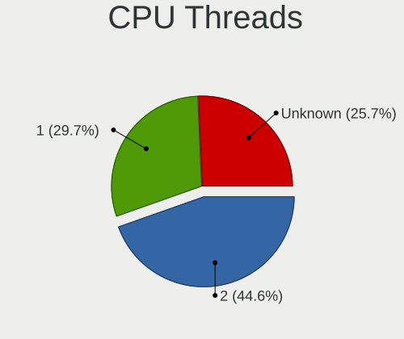

| Number  | Computers | Percent |
|---------|-----------|---------|
| 2       | 33        | 44.59%  |
| 1       | 22        | 29.73%  |
| Unknown | 19        | 25.68%  |

CPU Microarch
-------------

Microarchitecture

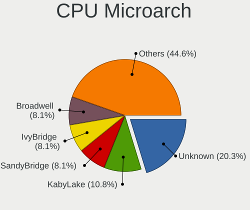

| Name          | Computers | Percent |
|---------------|-----------|---------|
| Unknown       | 15        | 20.27%  |
| KabyLake      | 8         | 10.81%  |
| SandyBridge   | 6         | 8.11%   |
| IvyBridge     | 6         | 8.11%   |
| Broadwell     | 6         | 8.11%   |
| Skylake       | 5         | 6.76%   |
| Zen 3         | 4         | 5.41%   |
| Westmere      | 4         | 5.41%   |
| P6            | 3         | 4.05%   |
| NetBurst      | 3         | 4.05%   |
| Zen 2         | 2         | 2.7%    |
| TigerLake     | 2         | 2.7%    |
| Penryn        | 2         | 2.7%    |
| Haswell       | 2         | 2.7%    |
| Bonnell       | 2         | 2.7%    |
| Zen           | 1         | 1.35%   |
| Nehalem       | 1         | 1.35%   |
| Goldmont plus | 1         | 1.35%   |
| Core          | 1         | 1.35%   |

Graphics
--------

GPU Vendor
----------

Vendors of graphics cards

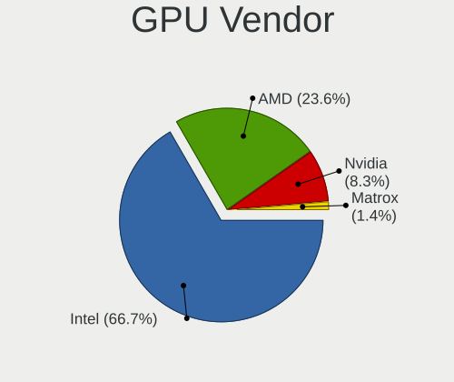

| Vendor                     | Computers | Percent |
|----------------------------|-----------|---------|
| Intel                      | 48        | 66.67%  |
| AMD                        | 17        | 23.61%  |
| Nvidia                     | 6         | 8.33%   |
| Matrox Electronics Systems | 1         | 1.39%   |

GPU Model
---------

Graphics card models

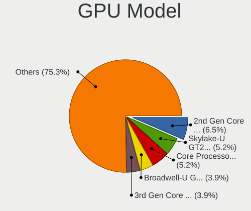

| Model                                                                         | Computers | Percent |
|-------------------------------------------------------------------------------|-----------|---------|
| Intel 2nd Generation Core Processor Family Integrated Graphics Controller     | 5         | 6.49%   |
| Intel Skylake-U GT2 [HD Graphics 520]                                         | 4         | 5.19%   |
| Intel Core Processor Integrated Graphics Controller                           | 4         | 5.19%   |
| Intel Broadwell-U GT2 [HD Graphics 5500]                                      | 3         | 3.9%    |
| Intel 3rd Gen Core processor Graphics Controller                              | 3         | 3.9%    |
| AMD Cezanne [Radeon Vega Series / Radeon Vega Mobile Series]                  | 3         | 3.9%    |
| Nvidia GP108 [GeForce GT 1030]                                                | 2         | 2.6%    |
| Intel Mobile 945GM/GMS/GME, 943/940GML Express Integrated Graphics Controller | 2         | 2.6%    |
| Intel Kaby Lake-U GT2 [HD Graphics 620]                                       | 2         | 2.6%    |
| Intel Kaby Lake-R GT2 [UHD Graphics 620]                                      | 2         | 2.6%    |
| Intel Alder Lake-N [UHD Graphics]                                             | 2         | 2.6%    |
| AMD Rembrandt [Radeon 680M]                                                   | 2         | 2.6%    |
| Nvidia MCP89 [GeForce 320M]                                                   | 1         | 1.3%    |
| Nvidia GT218M [GeForce G210M]                                                 | 1         | 1.3%    |
| Nvidia GM107GLM [Quadro M600M]                                                | 1         | 1.3%    |
| Nvidia G96C [GeForce 9500 GT]                                                 | 1         | 1.3%    |
| Matrox Electronics Systems MGA G200eW WPCM450                                 | 1         | 1.3%    |
| Intel Xeon E3-1200 v3/4th Gen Core Processor Integrated Graphics Controller   | 1         | 1.3%    |
| Intel Xeon E3-1200 v2/3rd Gen Core processor Graphics Controller              | 1         | 1.3%    |
| Intel WhiskeyLake-U GT2 [UHD Graphics 620]                                    | 1         | 1.3%    |
| Intel TigerLake-LP GT2 [Iris Xe Graphics]                                     | 1         | 1.3%    |
| Intel Tiger Lake-UP4 GT2 [Iris Xe Graphics]                                   | 1         | 1.3%    |
| Intel Skylake-DT/H GT2 [HD Graphics P530]                                     | 1         | 1.3%    |
| Intel Mobile GM965/GL960 Integrated Graphics Controller (secondary)           | 1         | 1.3%    |
| Intel Mobile GM965/GL960 Integrated Graphics Controller (primary)             | 1         | 1.3%    |
| Intel Mobile 945GSE Express Integrated Graphics Controller                    | 1         | 1.3%    |
| Intel Mobile 945GM/GMS, 943/940GML Express Integrated Graphics Controller     | 1         | 1.3%    |
| Intel Mobile 915GM/GMS/910GML Express Graphics Controller                     | 1         | 1.3%    |
| Intel Kaby Lake-S GT2 [HD Graphics 630]                                       | 1         | 1.3%    |
| Intel JasperLake [UHD Graphics]                                               | 1         | 1.3%    |
| Intel IvyBridge GT2 [HD Graphics 4000]                                        | 1         | 1.3%    |
| Intel Haswell-ULT Integrated Graphics Controller                              | 1         | 1.3%    |
| Intel GeminiLake [UHD Graphics 600]                                           | 1         | 1.3%    |
| Intel CometLake-U GT2 [UHD Graphics]                                          | 1         | 1.3%    |
| Intel CoffeeLake-S GT2 [UHD Graphics 630]                                     | 1         | 1.3%    |
| Intel Broadwell-Y GT2 [HD Graphics 5300]                                      | 1         | 1.3%    |
| Intel Broadwell-U GT3 [Iris Graphics 6100]                                    | 1         | 1.3%    |
| Intel Broadwell-U GT3 [HD Graphics 6000]                                      | 1         | 1.3%    |
| Intel Atom Processor D2xxx/N2xxx Integrated Graphics Controller               | 1         | 1.3%    |
| Intel Alder Lake-P GT2 [Iris Xe Graphics]                                     | 1         | 1.3%    |

GPU Combo
---------

Combinations of graphics cards

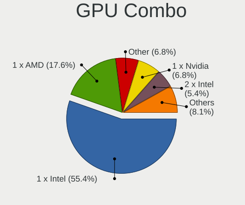

| Name           | Computers | Percent |
|----------------|-----------|---------|
| 1 x Intel      | 41        | 55.41%  |
| 1 x AMD        | 13        | 17.57%  |
| Other          | 5         | 6.76%   |
| 1 x Nvidia     | 5         | 6.76%   |
| 2 x Intel      | 4         | 5.41%   |
| 2 x AMD        | 2         | 2.7%    |
| Intel + AMD    | 2         | 2.7%    |
| 1 x Matrox     | 1         | 1.35%   |
| Intel + Nvidia | 1         | 1.35%   |

GPU Driver
----------

Free vs proprietary

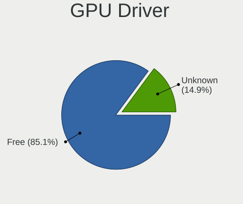

| Driver  | Computers | Percent |
|---------|-----------|---------|
| Free    | 63        | 85.14%  |
| Unknown | 11        | 14.86%  |

GPU Memory
----------

Total video memory

| Size in GB | Computers | Percent |
|------------|-----------|---------|
| Unknown    | 74        | 100%    |

Monitor
-------

Monitor Vendor
--------------

Monitor vendors

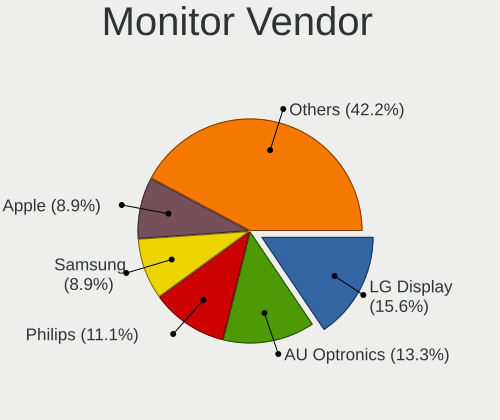

| Vendor               | Computers | Percent |
|----------------------|-----------|---------|
| LG Display           | 7         | 15.56%  |
| AU Optronics         | 6         | 13.33%  |
| Philips              | 5         | 11.11%  |
| Samsung Electronics  | 4         | 8.89%   |
| Apple                | 4         | 8.89%   |
| BOE                  | 3         | 6.67%   |
| ASUSTek Computer     | 3         | 6.67%   |
| Sharp                | 2         | 4.44%   |
| Dell                 | 2         | 4.44%   |
| Chimei Innolux       | 2         | 4.44%   |
| Ancor Communications | 2         | 4.44%   |
| Panasonic            | 1         | 2.22%   |
| NEC Computers        | 1         | 2.22%   |
| MSI                  | 1         | 2.22%   |
| Goldstar             | 1         | 2.22%   |
| AOC                  | 1         | 2.22%   |

Monitor Model
-------------

Monitor models

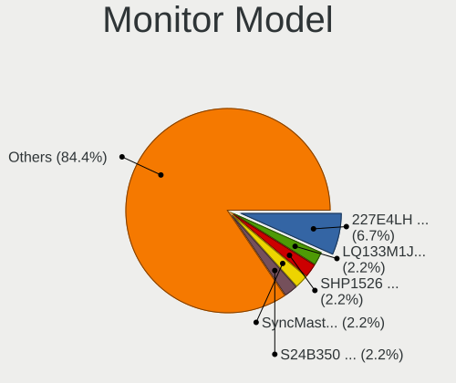

| Model                                                                | Computers | Percent |
|----------------------------------------------------------------------|-----------|---------|
| Philips 227E4LH PHLC0AC 1920x1080 480x270mm 21.7-inch                | 3         | 6.67%   |
| Sharp LQ133M1JW08 SHP1425 1920x1080 290x170mm 13.2-inch              | 1         | 2.22%   |
| Sharp LCD Monitor SHP1526 1920x1280 270x180mm 12.8-inch              | 1         | 2.22%   |
| Samsung Electronics SyncMaster SAM041E 2048x1152 510x290mm 23.1-inch | 1         | 2.22%   |
| Samsung Electronics S24B350 SAM08DA 1920x1080 530x300mm 24.0-inch    | 1         | 2.22%   |
| Samsung Electronics LCD Monitor SEC304C 1366x768 310x170mm 13.9-inch | 1         | 2.22%   |
| Samsung Electronics C32JG5x SAM0F54 2560x1440 700x390mm 31.5-inch    | 1         | 2.22%   |
| Philips PHL 240B9 PHL0966 1920x1200 520x320mm 24.0-inch              | 1         | 2.22%   |
| Philips PHL 223V5 PHLC0CF 1920x1080 480x270mm 21.7-inch              | 1         | 2.22%   |
| Panasonic LCD Monitor MEI96A2 2880x1620 340x190mm 15.3-inch          | 1         | 2.22%   |
| NEC Computers EX341R NEC2C7A 3440x1440 800x330mm 34.1-inch           | 1         | 2.22%   |
| MSI MP242 MSI30A1 1920x1080 530x300mm 24.0-inch                      | 1         | 2.22%   |
| LG Display LCD Monitor LGD062E 1920x1080 340x190mm 15.3-inch         | 1         | 2.22%   |
| LG Display LCD Monitor LGD05A2 1920x1080 310x170mm 13.9-inch         | 1         | 2.22%   |
| LG Display LCD Monitor LGD045E 1366x768 310x170mm 13.9-inch          | 1         | 2.22%   |
| LG Display LCD Monitor LGD0404 1366x768 280x160mm 12.7-inch          | 1         | 2.22%   |
| LG Display LCD Monitor LGD03CD 1366x768 280x160mm 12.7-inch          | 1         | 2.22%   |
| LG Display LCD Monitor LGD0385 1366x768 310x170mm 13.9-inch          | 1         | 2.22%   |
| LG Display LCD Monitor LGD0215 1920x1080 350x190mm 15.7-inch         | 1         | 2.22%   |
| Goldstar LG IPS FULLHD GSM5AB6 1920x1080 480x270mm 21.7-inch         | 1         | 2.22%   |
| Dell U2414H DELA0A4 1920x1080 530x300mm 24.0-inch                    | 1         | 2.22%   |
| Dell P2210 DEL404E 1680x1050 470x300mm 22.0-inch                     | 1         | 2.22%   |
| Chimei Innolux LCD Monitor CMN1520 1920x1080 340x190mm 15.3-inch     | 1         | 2.22%   |
| Chimei Innolux LCD Monitor CMN1239 1920x1080 280x160mm 12.7-inch     | 1         | 2.22%   |
| BOE NE160WUM-NX2 BOE0B33 1920x1200 340x210mm 15.7-inch               | 1         | 2.22%   |
| BOE LCD Monitor BOE08C2 1920x1080 340x190mm 15.3-inch                | 1         | 2.22%   |
| BOE LCD Monitor BOE075A 1366x768 310x170mm 13.9-inch                 | 1         | 2.22%   |
| AU Optronics LCD Monitor AUO335D 1920x1080 260x140mm 11.6-inch       | 1         | 2.22%   |
| AU Optronics LCD Monitor AUO313D 1920x1080 310x170mm 13.9-inch       | 1         | 2.22%   |
| AU Optronics LCD Monitor AUO22EC 1366x768 340x190mm 15.3-inch        | 1         | 2.22%   |
| AU Optronics LCD Monitor AUO21ED 1920x1080 340x190mm 15.3-inch       | 1         | 2.22%   |
| AU Optronics LCD Monitor AUO173D 1920x1080 310x170mm 13.9-inch       | 1         | 2.22%   |
| AU Optronics LCD Monitor AUO133D 1920x1080 310x170mm 13.9-inch       | 1         | 2.22%   |
| ASUSTek Computer XG49WCR AUS4932 3840x1080 1190x340mm 48.7-inch      | 1         | 2.22%   |
| ASUSTek Computer XG49V AUS49A1 3840x1080 1200x340mm 49.1-inch        | 1         | 2.22%   |
| ASUSTek Computer PA279 AUS2768 3840x2160 600x340mm 27.2-inch         | 1         | 2.22%   |
| Apple Color LCD APPA02A 2560x1600 290x180mm 13.4-inch                | 1         | 2.22%   |
| Apple Color LCD APPA01B 1440x900 290x180mm 13.4-inch                 | 1         | 2.22%   |
| Apple Color LCD APP9CF3 1366x768 260x140mm 11.6-inch                 | 1         | 2.22%   |
| Apple Color LCD APP9C21 1280x854 320x220mm 15.3-inch                 | 1         | 2.22%   |

Monitor Resolution
------------------

Monitor screen resolution

| Resolution         | Computers | Percent |
|--------------------|-----------|---------|
| 1920x1080 (FHD)    | 19        | 44.19%  |
| 1366x768 (WXGA)    | 8         | 18.6%   |
| 3840x2160 (4K)     | 2         | 4.65%   |
| 3840x1080          | 2         | 4.65%   |
| 2560x1440 (QHD)    | 2         | 4.65%   |
| 1920x1200 (WUXGA)  | 2         | 4.65%   |
| 1440x900 (WXGA+)   | 2         | 4.65%   |
| 3440x1440          | 1         | 2.33%   |
| 2560x1600          | 1         | 2.33%   |
| 2048x1152          | 1         | 2.33%   |
| 1920x1280          | 1         | 2.33%   |
| 1680x1050 (WSXGA+) | 1         | 2.33%   |
| 1280x854           | 1         | 2.33%   |

Monitor Diagonal
----------------

Diagonal size in inches

| Inches | Computers | Percent |
|--------|-----------|---------|
| 13     | 10        | 22.73%  |
| 15     | 9         | 20.45%  |
| 21     | 5         | 11.36%  |
| 24     | 4         | 9.09%   |
| 12     | 4         | 9.09%   |
| 27     | 2         | 4.55%   |
| 11     | 2         | 4.55%   |
| 49     | 1         | 2.27%   |
| 48     | 1         | 2.27%   |
| 34     | 1         | 2.27%   |
| 31     | 1         | 2.27%   |
| 23     | 1         | 2.27%   |
| 22     | 1         | 2.27%   |
| 19     | 1         | 2.27%   |
| 17     | 1         | 2.27%   |

Monitor Width
-------------

Physical width

| Width in mm | Computers | Percent |
|-------------|-----------|---------|
| 301-350     | 16        | 36.36%  |
| 201-300     | 9         | 20.45%  |
| 501-600     | 7         | 15.91%  |
| 401-500     | 7         | 15.91%  |
| 1001-1500   | 2         | 4.55%   |
| 701-800     | 1         | 2.27%   |
| 601-700     | 1         | 2.27%   |
| 351-400     | 1         | 2.27%   |

Aspect Ratio
------------

Proportional relationship between the width and the height

| Ratio | Computers | Percent |
|-------|-----------|---------|
| 16/9  | 32        | 74.42%  |
| 16/10 | 6         | 13.95%  |
| 32/9  | 2         | 4.65%   |
| 3/2   | 2         | 4.65%   |
| 21/9  | 1         | 2.33%   |

Monitor Area
------------

Area in inch²

| Area in inch² | Computers | Percent |
|----------------|-----------|---------|
| 201-250        | 10        | 22.22%  |
| 81-90          | 9         | 20%     |
| 91-100         | 5         | 11.11%  |
| 61-70          | 3         | 6.67%   |
| 101-110        | 3         | 6.67%   |
| 71-80          | 2         | 4.44%   |
| 51-60          | 2         | 4.44%   |
| 351-500        | 2         | 4.44%   |
| 301-350        | 2         | 4.44%   |
| 151-200        | 2         | 4.44%   |
| 501-1000       | 2         | 4.44%   |
| 251-300        | 1         | 2.22%   |
| 121-130        | 1         | 2.22%   |
| 111-120        | 1         | 2.22%   |

Pixel Density
-------------

Pixels per inch

| Density       | Computers | Percent |
|---------------|-----------|---------|
| 121-160       | 14        | 31.82%  |
| 101-120       | 12        | 27.27%  |
| 51-100        | 11        | 25%     |
| 161-240       | 6         | 13.64%  |
| More than 240 | 1         | 2.27%   |

Multiple Monitors
-----------------

Total monitors connected

| Total | Computers | Percent |
|-------|-----------|---------|
| 1     | 52        | 70.27%  |
| 0     | 19        | 25.68%  |
| 2     | 3         | 4.05%   |

Network
-------

Net Controller Vendor
---------------------

Controller vendors

| Vendor                   | Computers | Percent |
|--------------------------|-----------|---------|
| Intel                    | 48        | 47.52%  |
| Realtek Semiconductor    | 30        | 29.7%   |
| Broadcom                 | 9         | 8.91%   |
| Qualcomm Atheros         | 4         | 3.96%   |
| Sierra Wireless          | 2         | 1.98%   |
| ASUSTek Computer         | 2         | 1.98%   |
| Qualcomm Technologies    | 1         | 0.99%   |
| Motorola PCS             | 1         | 0.99%   |
| Microchip Technology     | 1         | 0.99%   |
| MediaTek                 | 1         | 0.99%   |
| Marvell Technology Group | 1         | 0.99%   |
| Apple                    | 1         | 0.99%   |

Net Controller Model
--------------------

Controller models

| Model                                                                         | Computers | Percent |
|-------------------------------------------------------------------------------|-----------|---------|
| Realtek RTL8111/8168/8211/8411 PCI Express Gigabit Ethernet Controller        | 15        | 11.63%  |
| Realtek RTL8125 2.5GbE Controller                                             | 7         | 5.43%   |
| Intel Wireless 8260                                                           | 5         | 3.88%   |
| Intel 82579LM Gigabit Network Connection (Lewisville)                         | 5         | 3.88%   |
| Intel Wireless 8265 / 8275                                                    | 4         | 3.1%    |
| Intel Wireless 7265                                                           | 4         | 3.1%    |
| Intel Wi-Fi 6 AX200                                                           | 4         | 3.1%    |
| Intel Ethernet Connection I219-LM                                             | 4         | 3.1%    |
| Realtek RTL810xE PCI Express Fast Ethernet controller                         | 3         | 2.33%   |
| Intel Ethernet Connection (3) I218-LM                                         | 3         | 2.33%   |
| Intel Centrino Advanced-N 6205 [Taylor Peak]                                  | 3         | 2.33%   |
| Intel Centrino Advanced-N 6200                                                | 3         | 2.33%   |
| Intel 82577LM Gigabit Network Connection                                      | 3         | 2.33%   |
| Realtek RTL8852BE PCIe 802.11ax Wireless Network Controller                   | 2         | 1.55%   |
| Realtek RTL8192EU 802.11b/g/n WLAN Adapter                                    | 2         | 1.55%   |
| Realtek RTL8188EUS 802.11n Wireless Network Adapter                           | 2         | 1.55%   |
| Realtek RTL-8100/8101L/8139 PCI Fast Ethernet Adapter                         | 2         | 1.55%   |
| Qualcomm Atheros AR9485 Wireless Network Adapter                              | 2         | 1.55%   |
| Intel Wi-Fi 6 AX201                                                           | 2         | 1.55%   |
| Intel PRO/Wireless 3945ABG [Golan] Network Connection                         | 2         | 1.55%   |
| Intel Ethernet Connection (4) I219-LM                                         | 2         | 1.55%   |
| Intel Ethernet Connection (10) I219-V                                         | 2         | 1.55%   |
| Intel 82571EB/82571GB Gigabit Ethernet Controller D0/D1 (copper applications) | 2         | 1.55%   |
| Sierra Wireless EM7455                                                        | 1         | 0.78%   |
| Sierra Wireless EM7305 Modem                                                  | 1         | 0.78%   |
| Realtek RTL8822CE 802.11ac PCIe Wireless Network Adapter                      | 1         | 0.78%   |
| Realtek RTL8821CE 802.11ac PCIe Wireless Network Adapter                      | 1         | 0.78%   |
| Qualcomm QCNFA765 Wireless Network Adapter                                    | 1         | 0.78%   |
| Qualcomm Atheros QCA9565 / AR9565 Wireless Network Adapter                    | 1         | 0.78%   |
| Qualcomm Atheros AR928X Wireless Network Adapter (PCI-Express)                | 1         | 0.78%   |
| Qualcomm Atheros AR8121/AR8113/AR8114 Gigabit or Fast Ethernet                | 1         | 0.78%   |
| Motorola PCS USB RNDIS Device                                                 | 1         | 0.78%   |
| Microchip LAN7800 USB 3.0 Gigabit Ethernet Adapter                            | 1         | 0.78%   |
| MediaTek MT7922 802.11ax PCI Express Wireless Network Adapter                 | 1         | 0.78%   |
| Marvell Group 88E8053 PCI-E Gigabit Ethernet Controller                       | 1         | 0.78%   |
| Intel Wireless 7260                                                           | 1         | 0.78%   |
| Intel Wireless 3165                                                           | 1         | 0.78%   |
| Intel Wi-Fi 6E(802.11ax) AX210/AX1675* 2x2 [Typhoon Peak]                     | 1         | 0.78%   |
| Intel PRO/Wireless LAN 2100 3B Mini PCI Adapter                               | 1         | 0.78%   |
| Intel PRO/Wireless 2200BG [Calexico2] Network Connection                      | 1         | 0.78%   |

Wireless Vendor
---------------

Wireless vendors

| Vendor                | Computers | Percent |
|-----------------------|-----------|---------|
| Intel                 | 38        | 65.52%  |
| Realtek Semiconductor | 7         | 12.07%  |
| Qualcomm Atheros      | 4         | 6.9%    |
| Broadcom              | 4         | 6.9%    |
| ASUSTek Computer      | 2         | 3.45%   |
| Sierra Wireless       | 1         | 1.72%   |
| Qualcomm Technologies | 1         | 1.72%   |
| MediaTek              | 1         | 1.72%   |

Wireless Model
--------------

Wireless models

| Model                                                              | Computers | Percent |
|--------------------------------------------------------------------|-----------|---------|
| Intel Wireless 8260                                                | 5         | 8.47%   |
| Intel Wireless 8265 / 8275                                         | 4         | 6.78%   |
| Intel Wireless 7265                                                | 4         | 6.78%   |
| Intel Wi-Fi 6 AX200                                                | 4         | 6.78%   |
| Intel Centrino Advanced-N 6205 [Taylor Peak]                       | 3         | 5.08%   |
| Intel Centrino Advanced-N 6200                                     | 3         | 5.08%   |
| Realtek RTL8852BE PCIe 802.11ax Wireless Network Controller        | 2         | 3.39%   |
| Realtek RTL8192EU 802.11b/g/n WLAN Adapter                         | 2         | 3.39%   |
| Realtek RTL8188EUS 802.11n Wireless Network Adapter                | 2         | 3.39%   |
| Qualcomm Atheros AR9485 Wireless Network Adapter                   | 2         | 3.39%   |
| Intel Wi-Fi 6 AX201                                                | 2         | 3.39%   |
| Intel PRO/Wireless 3945ABG [Golan] Network Connection              | 2         | 3.39%   |
| Sierra Wireless EM7455                                             | 1         | 1.69%   |
| Realtek RTL8822CE 802.11ac PCIe Wireless Network Adapter           | 1         | 1.69%   |
| Realtek RTL8821CE 802.11ac PCIe Wireless Network Adapter           | 1         | 1.69%   |
| Qualcomm QCNFA765 Wireless Network Adapter                         | 1         | 1.69%   |
| Qualcomm Atheros QCA9565 / AR9565 Wireless Network Adapter         | 1         | 1.69%   |
| Qualcomm Atheros AR928X Wireless Network Adapter (PCI-Express)     | 1         | 1.69%   |
| MediaTek MT7922 802.11ax PCI Express Wireless Network Adapter      | 1         | 1.69%   |
| Intel Wireless 7260                                                | 1         | 1.69%   |
| Intel Wireless 3165                                                | 1         | 1.69%   |
| Intel Wi-Fi 6E(802.11ax) AX210/AX1675* 2x2 [Typhoon Peak]          | 1         | 1.69%   |
| Intel PRO/Wireless LAN 2100 3B Mini PCI Adapter                    | 1         | 1.69%   |
| Intel PRO/Wireless 2200BG [Calexico2] Network Connection           | 1         | 1.69%   |
| Intel Gemini Lake PCH CNVi WiFi                                    | 1         | 1.69%   |
| Intel Comet Lake PCH-LP CNVi WiFi                                  | 1         | 1.69%   |
| Intel Centrino Wireless-N 2230                                     | 1         | 1.69%   |
| Intel Centrino Advanced-N + WiMAX 6250 [Kilmer Peak]               | 1         | 1.69%   |
| Intel Cannon Point-LP CNVi [Wireless-AC]                           | 1         | 1.69%   |
| Intel Alder Lake-N PCH CNVi WiFi                                   | 1         | 1.69%   |
| Broadcom BCM43602 802.11ac Wireless LAN SoC                        | 1         | 1.69%   |
| Broadcom BCM4360 802.11ac Dual Band Wireless Network Adapter       | 1         | 1.69%   |
| Broadcom BCM43224 802.11a/b/g/n                                    | 1         | 1.69%   |
| Broadcom BCM4322 802.11a/b/g/n Wireless LAN Controller             | 1         | 1.69%   |
| ASUS USB-N13 802.11n Network Adapter (rev. B1) [Realtek RTL8192CU] | 1         | 1.69%   |
| ASUS Realtek 8188EUS [USB-N10 Nano]                                | 1         | 1.69%   |

Ethernet Vendor
---------------

Ethernet vendors

| Vendor                   | Computers | Percent |
|--------------------------|-----------|---------|
| Intel                    | 31        | 46.97%  |
| Realtek Semiconductor    | 26        | 39.39%  |
| Broadcom                 | 5         | 7.58%   |
| Qualcomm Atheros         | 1         | 1.52%   |
| Motorola PCS             | 1         | 1.52%   |
| Microchip Technology     | 1         | 1.52%   |
| Marvell Technology Group | 1         | 1.52%   |

Ethernet Model
--------------

Ethernet models

| Model                                                                         | Computers | Percent |
|-------------------------------------------------------------------------------|-----------|---------|
| Realtek RTL8111/8168/8211/8411 PCI Express Gigabit Ethernet Controller        | 15        | 22.39%  |
| Realtek RTL8125 2.5GbE Controller                                             | 7         | 10.45%  |
| Intel 82579LM Gigabit Network Connection (Lewisville)                         | 5         | 7.46%   |
| Intel Ethernet Connection I219-LM                                             | 4         | 5.97%   |
| Realtek RTL810xE PCI Express Fast Ethernet controller                         | 3         | 4.48%   |
| Intel Ethernet Connection (3) I218-LM                                         | 3         | 4.48%   |
| Intel 82577LM Gigabit Network Connection                                      | 3         | 4.48%   |
| Realtek RTL-8100/8101L/8139 PCI Fast Ethernet Adapter                         | 2         | 2.99%   |
| Intel Ethernet Connection (4) I219-LM                                         | 2         | 2.99%   |
| Intel Ethernet Connection (10) I219-V                                         | 2         | 2.99%   |
| Intel 82571EB/82571GB Gigabit Ethernet Controller D0/D1 (copper applications) | 2         | 2.99%   |
| Qualcomm Atheros AR8121/AR8113/AR8114 Gigabit or Fast Ethernet                | 1         | 1.49%   |
| Motorola PCS USB RNDIS Device                                                 | 1         | 1.49%   |
| Microchip LAN7800 USB 3.0 Gigabit Ethernet Adapter                            | 1         | 1.49%   |
| Marvell Group 88E8053 PCI-E Gigabit Ethernet Controller                       | 1         | 1.49%   |
| Intel Ethernet Connection I218-LM                                             | 1         | 1.49%   |
| Intel Ethernet Connection (7) I219-V                                          | 1         | 1.49%   |
| Intel Ethernet Connection (4) I219-V                                          | 1         | 1.49%   |
| Intel Ethernet Connection (2) I219-LM                                         | 1         | 1.49%   |
| Intel Ethernet Connection (16) I219-V                                         | 1         | 1.49%   |
| Intel 82801DB PRO/100 VE (LOM) Ethernet Controller                            | 1         | 1.49%   |
| Intel 82579V Gigabit Network Connection                                       | 1         | 1.49%   |
| Intel 82574L Gigabit Network Connection                                       | 1         | 1.49%   |
| Intel 82566MC Gigabit Network Connection                                      | 1         | 1.49%   |
| Intel 82541GI Gigabit Ethernet Controller                                     | 1         | 1.49%   |
| Broadcom NetXtreme BCM5764M Gigabit Ethernet PCIe                             | 1         | 1.49%   |
| Broadcom NetXtreme BCM5761e Gigabit Ethernet PCIe                             | 1         | 1.49%   |
| Broadcom NetXtreme BCM5722 Gigabit Ethernet PCI Express                       | 1         | 1.49%   |
| Broadcom NetXtreme BCM5703 Gigabit Ethernet                                   | 1         | 1.49%   |
| Broadcom NetLink BCM5906M Fast Ethernet PCI Express                           | 1         | 1.49%   |

Net Controller Kind
-------------------

Ethernet, WiFi or modem

| Kind     | Computers | Percent |
|----------|-----------|---------|
| Ethernet | 63        | 51.64%  |
| WiFi     | 56        | 45.9%   |
| Unknown  | 2         | 1.64%   |
| Modem    | 1         | 0.82%   |

Used Controller
---------------

Currently used network controller

| Kind     | Computers | Percent |
|----------|-----------|---------|
| Ethernet | 40        | 54.79%  |
| WiFi     | 33        | 45.21%  |

NICs
----

Total network controllers on board

| Total | Computers | Percent |
|-------|-----------|---------|
| 2     | 42        | 56.76%  |
| 1     | 23        | 31.08%  |
| 3     | 5         | 6.76%   |
| 0     | 3         | 4.05%   |
| 4     | 1         | 1.35%   |

IPv6
----

IPv6 vs IPv4

| Used | Computers | Percent |
|------|-----------|---------|
| No   | 71        | 95.95%  |
| Yes  | 3         | 4.05%   |

Bluetooth
---------

Bluetooth Vendor
----------------

Controller vendors

| Vendor                          | Computers | Percent |
|---------------------------------|-----------|---------|
| Intel                           | 25        | 58.14%  |
| Apple                           | 5         | 11.63%  |
| Realtek Semiconductor           | 3         | 6.98%   |
| Qualcomm Atheros Communications | 3         | 6.98%   |
| Foxconn / Hon Hai               | 2         | 4.65%   |
| Alps Electric                   | 2         | 4.65%   |
| IMC Networks                    | 1         | 2.33%   |
| Dell                            | 1         | 2.33%   |
| ASUSTek Computer                | 1         | 2.33%   |

Bluetooth Model
---------------

Controller models

| Model                                                       | Computers | Percent |
|-------------------------------------------------------------|-----------|---------|
| Intel Bluetooth wireless interface                          | 13        | 30.23%  |
| Intel AX201 Bluetooth                                       | 4         | 9.3%    |
| Intel AX200 Bluetooth                                       | 4         | 9.3%    |
| Realtek Bluetooth Adapter                                   | 3         | 6.98%   |
| Qualcomm Atheros AR3012 Bluetooth 4.0                       | 2         | 4.65%   |
| Intel Bluetooth 9460/9560 Jefferson Peak (JfP)              | 2         | 4.65%   |
| Apple Built-in Bluetooth 2.0+EDR HCI                        | 2         | 4.65%   |
| Apple Bluetooth Host Controller                             | 2         | 4.65%   |
| Alps Electric UGTZ4 Bluetooth                               | 2         | 4.65%   |
| Qualcomm Atheros Dell Wireless 1707 Bluetooth 4.0 LE Device | 1         | 2.33%   |
| Intel Centrino Bluetooth Wireless Transceiver               | 1         | 2.33%   |
| Intel AX210 Bluetooth                                       | 1         | 2.33%   |
| IMC Networks Realtek Bluetooth Adapter                      | 1         | 2.33%   |
| Foxconn / Hon Hai RZ616 Bluetooth Adapter                   | 1         | 2.33%   |
| Foxconn / Hon Hai Broadcom BCM20702 Bluetooth USB Device    | 1         | 2.33%   |
| Dell DW375 Bluetooth Module                                 | 1         | 2.33%   |
| ASUS Broadcom Bluetooth 2.1                                 | 1         | 2.33%   |
| Apple Broadcom Built-in Bluetooth                           | 1         | 2.33%   |

Sound
-----

Sound Vendor
------------

Sound card vendors

| Vendor                                       | Computers | Percent |
|----------------------------------------------|-----------|---------|
| Intel                                        | 54        | 68.35%  |
| AMD                                          | 13        | 16.46%  |
| Nvidia                                       | 4         | 5.06%   |
| C-Media Electronics                          | 2         | 2.53%   |
| Zoran Co. Personal Media Division (Nogatech) | 1         | 1.27%   |
| Texas Instruments                            | 1         | 1.27%   |
| Logitech                                     | 1         | 1.27%   |
| KTMicro                                      | 1         | 1.27%   |
| JMTek                                        | 1         | 1.27%   |
| Creative Labs                                | 1         | 1.27%   |

Sound Model
-----------

Sound card models

| Model                                                                      | Computers | Percent |
|----------------------------------------------------------------------------|-----------|---------|
| Intel Sunrise Point-LP HD Audio                                            | 8         | 8.33%   |
| AMD Ryzen HD Audio Controller                                              | 8         | 8.33%   |
| Intel 7 Series/C216 Chipset Family High Definition Audio Controller        | 7         | 7.29%   |
| Intel Broadwell-U Audio Controller                                         | 6         | 6.25%   |
| Intel Wildcat Point-LP High Definition Audio Controller                    | 5         | 5.21%   |
| Intel 6 Series/C200 Series Chipset Family High Definition Audio Controller | 4         | 4.17%   |
| Intel 5 Series/3400 Series Chipset High Definition Audio                   | 4         | 4.17%   |
| AMD Renoir/Cezanne HDMI/DP Audio Controller                                | 4         | 4.17%   |
| Intel NM10/ICH7 Family High Definition Audio Controller                    | 3         | 3.13%   |
| AMD Radeon High Definition Audio Controller                                | 3         | 3.13%   |
| AMD Navi 21/23 HDMI/DP Audio Controller                                    | 3         | 3.13%   |
| Nvidia GP108 High Definition Audio Controller                              | 2         | 2.08%   |
| Intel Tiger Lake-LP Smart Sound Technology Audio Controller                | 2         | 2.08%   |
| Intel Alder Lake-N PCH High Definition Audio Controller                    | 2         | 2.08%   |
| Intel 82801DB/DBL/DBM (ICH4/ICH4-L/ICH4-M) AC'97 Audio Controller          | 2         | 2.08%   |
| Intel 100 Series/C230 Series Chipset Family HD Audio Controller            | 2         | 2.08%   |
| C-Media Electronics USB Audio Class 1.0 and 2.0 Device                     | 2         | 2.08%   |
| AMD Starship/Matisse HD Audio Controller                                   | 2         | 2.08%   |
| Zoran Co. Personal Media Division (Nogatech) USB Audio and HID             | 1         | 1.04%   |
| Texas Instruments PCM2902 Audio Codec                                      | 1         | 1.04%   |
| Nvidia MCP89 High Definition Audio                                         | 1         | 1.04%   |
| Nvidia High Definition Audio Controller                                    | 1         | 1.04%   |
| Logitech [G533 Wireless Headset Dongle]                                    | 1         | 1.04%   |
| KTMicro KT USB Audio                                                       | 1         | 1.04%   |
| JMTek USB PnP Audio Device                                                 | 1         | 1.04%   |
| Intel Xeon E3-1200 v3/4th Gen Core Processor HD Audio Controller           | 1         | 1.04%   |
| Intel Smart Sound Technology (SST) Audio Controller                        | 1         | 1.04%   |
| Intel Jasper Lake HD Audio                                                 | 1         | 1.04%   |
| Intel Haswell-ULT HD Audio Controller                                      | 1         | 1.04%   |
| Intel Comet Lake PCH-LP cAVS                                               | 1         | 1.04%   |
| Intel Celeron/Pentium Silver Processor High Definition Audio               | 1         | 1.04%   |
| Intel Cannon Point-LP High Definition Audio Controller                     | 1         | 1.04%   |
| Intel Cannon Lake PCH cAVS                                                 | 1         | 1.04%   |
| Intel Alder Lake PCH-P High Definition Audio Controller                    | 1         | 1.04%   |
| Intel 82801JI (ICH10 Family) HD Audio Controller                           | 1         | 1.04%   |
| Intel 82801I (ICH9 Family) HD Audio Controller                             | 1         | 1.04%   |
| Intel 82801H (ICH8 Family) HD Audio Controller                             | 1         | 1.04%   |
| Intel 82801FB/FBM/FR/FW/FRW (ICH6 Family) High Definition Audio Controller | 1         | 1.04%   |
| Intel 82801CA/CAM AC'97 Audio Controller                                   | 1         | 1.04%   |
| Intel 8 Series/C220 Series Chipset High Definition Audio Controller        | 1         | 1.04%   |

Memory
------

Memory Vendor
-------------

Memory module vendors

| Vendor              | Computers | Percent |
|---------------------|-----------|---------|
| Samsung Electronics | 7         | 33.33%  |
| Unknown             | 5         | 23.81%  |
| SK hynix            | 4         | 19.05%  |
| Unknown             | 2         | 9.52%   |
| Micron Technology   | 1         | 4.76%   |
| Kingston            | 1         | 4.76%   |
| Elpida              | 1         | 4.76%   |

Memory Model
------------

Memory module models

| Model                                                  | Computers | Percent |
|--------------------------------------------------------|-----------|---------|
| Samsung RAM M471A1K43BB0-CPB 8GB SODIMM DDR4 2133MT/s  | 2         | 8.7%    |
| Unknown                                                | 2         | 8.7%    |
| Unknown RAM Module 512MB SODIMM SDRAM                  | 1         | 4.35%   |
| Unknown RAM Module 4GB SODIMM DDR3 1333MT/s            | 1         | 4.35%   |
| Unknown RAM Module 2GB SODIMM DDR3 1067MT/s            | 1         | 4.35%   |
| Unknown RAM Module 1GB SODIMM DDR2                     | 1         | 4.35%   |
| Unknown RAM Module 1GB SODIMM DDR                      | 1         | 4.35%   |
| SK hynix RAM HYMP125S64CP8-Y5 2GB SODIMM DDR 667MT/s   | 1         | 4.35%   |
| SK hynix RAM HMT351S6EFR8A-PB 4GB SODIMM DDR3 1600MT/s | 1         | 4.35%   |
| SK hynix RAM HMT325S6BFR8C-H9 2GB SODIMM DDR3 1333MT/s | 1         | 4.35%   |
| SK hynix RAM H9CCNNNBJTMLAR 4GB SODIMM LPDDR3 1867MT/s | 1         | 4.35%   |
| SK hynix RAM H9CCNNNBJTMLAR 4GB Chip LPDDR3 1867MT/s   | 1         | 4.35%   |
| Samsung RAM M471B5673FH0-CF8 2GB SODIMM DDR3 1067MT/s  | 1         | 4.35%   |
| Samsung RAM M471B5673EH1-CF8 2GB SODIMM DDR3 1067MT/s  | 1         | 4.35%   |
| Samsung RAM M471B5273DH0-CH9 4GB SODIMM DDR3 1334MT/s  | 1         | 4.35%   |
| Samsung RAM M471B5173BH0-CK0 4GB SODIMM DDR3 1600MT/s  | 1         | 4.35%   |
| Samsung RAM M471A2K43CB1-CRC 16GB SODIMM DDR4 2400MT/s | 1         | 4.35%   |
| Samsung RAM M471A1K43CB1-CRC 8GB SODIMM DDR4 2667MT/s  | 1         | 4.35%   |
| Micron RAM 16KTF1G64HZ-1G6E1 8GB SODIMM DDR3 1600MT/s  | 1         | 4.35%   |
| Kingston RAM KF3600C18D4/32GX 32GB DIMM DDR4 3600MT/s  | 1         | 4.35%   |
| Elpida RAM EBJ41UF8BCS0-DJ-F 4GB SODIMM DDR3           | 1         | 4.35%   |

Memory Kind
-----------

Memory module kinds

| Kind   | Computers | Percent |
|--------|-----------|---------|
| DDR3   | 7         | 38.89%  |
| DDR4   | 5         | 27.78%  |
| SDRAM  | 2         | 11.11%  |
| DDR2   | 2         | 11.11%  |
| LPDDR3 | 1         | 5.56%   |
| DDR    | 1         | 5.56%   |

Memory Form Factor
------------------

Physical design of the memory module

| Name   | Computers | Percent |
|--------|-----------|---------|
| SODIMM | 17        | 89.47%  |
| DIMM   | 1         | 5.26%   |
| Chip   | 1         | 5.26%   |

Memory Size
-----------

Memory module size

| Size  | Computers | Percent |
|-------|-----------|---------|
| 8192  | 5         | 26.32%  |
| 2048  | 5         | 26.32%  |
| 4096  | 4         | 21.05%  |
| 1024  | 2         | 10.53%  |
| 32768 | 1         | 5.26%   |
| 16384 | 1         | 5.26%   |
| 512   | 1         | 5.26%   |

Memory Speed
------------

Memory module speed

| Speed   | Computers | Percent |
|---------|-----------|---------|
| Unknown | 4         | 22.22%  |
| 2133    | 2         | 11.11%  |
| 1600    | 2         | 11.11%  |
| 1333    | 2         | 11.11%  |
| 1067    | 2         | 11.11%  |
| 3600    | 1         | 5.56%   |
| 2667    | 1         | 5.56%   |
| 2400    | 1         | 5.56%   |
| 1867    | 1         | 5.56%   |
| 1334    | 1         | 5.56%   |
| 667     | 1         | 5.56%   |

Printers & scanners
-------------------

Printer Vendor
--------------

Printer device vendors

Zero info for selected period =(

Printer Model
-------------

Printer device models

Zero info for selected period =(

Scanner Vendor
--------------

Scanner device vendors

Zero info for selected period =(

Scanner Model
-------------

Scanner device models

Zero info for selected period =(

Camera
------

Camera Vendor
-------------

Camera device vendors

| Vendor                           | Computers | Percent |
|----------------------------------|-----------|---------|
| Chicony Electronics              | 6         | 23.08%  |
| Bison Electronics                | 6         | 23.08%  |
| Lite-On Technology               | 3         | 11.54%  |
| Silicon Motion                   | 2         | 7.69%   |
| Realtek Semiconductor            | 2         | 7.69%   |
| Z-Star Microelectronics          | 1         | 3.85%   |
| Sunplus Innovation Technology    | 1         | 3.85%   |
| Shenzhen Kingcome Optoelectronic | 1         | 3.85%   |
| Quanta                           | 1         | 3.85%   |
| Logitech                         | 1         | 3.85%   |
| IMC Networks                     | 1         | 3.85%   |
| Apple                            | 1         | 3.85%   |

Camera Model
------------

Camera device models

| Model                                                 | Computers | Percent |
|-------------------------------------------------------|-----------|---------|
| Chicony Integrated Camera                             | 4         | 15.38%  |
| Bison Integrated Camera                               | 4         | 15.38%  |
| Lite-On Integrated Camera                             | 3         | 11.54%  |
| Realtek Integrated Webcam HD                          | 2         | 7.69%   |
| Bison USB HD Webcam                                   | 2         | 7.69%   |
| Z-Star Visual Communication Camera VGP-VCC1           | 1         | 3.85%   |
| Sunplus HP HD Camera                                  | 1         | 3.85%   |
| Silicon Motion WebCam SC-03FFL11939N                  | 1         | 3.85%   |
| Silicon Motion Lenovo EasyCamera                      | 1         | 3.85%   |
| Shenzhen Kingcome Optoelectronic USB2.0 HD UVC WebCam | 1         | 3.85%   |
| Quanta HP Universal Camera                            | 1         | 3.85%   |
| Logitech C920 PRO HD Webcam                           | 1         | 3.85%   |
| IMC Networks Integrated Camera                        | 1         | 3.85%   |
| Chicony FJ Camera                                     | 1         | 3.85%   |
| Chicony 2.0M UVC Webcam / CNF7129                     | 1         | 3.85%   |
| Apple FaceTime Camera                                 | 1         | 3.85%   |

Security
--------

Fingerprint Vendor
------------------

Fingerprint sensor vendors

| Vendor             | Computers | Percent |
|--------------------|-----------|---------|
| Validity Sensors   | 5         | 62.5%   |
| Synaptics          | 1         | 12.5%   |
| STMicroelectronics | 1         | 12.5%   |
| AuthenTec          | 1         | 12.5%   |

Fingerprint Model
-----------------

Fingerprint sensor models

| Model                                                    | Computers | Percent |
|----------------------------------------------------------|-----------|---------|
| Validity Sensors VFS7500 Touch Fingerprint Sensor        | 2         | 25%     |
| Validity Sensors VFS 5011 fingerprint sensor             | 2         | 25%     |
| Validity Sensors Synaptics WBDI                          | 1         | 12.5%   |
| Synaptics FS7604 Touch Fingerprint Sensor with PurePrint | 1         | 12.5%   |
| STMicroelectronics Fingerprint Reader                    | 1         | 12.5%   |
| AuthenTec AES2660                                        | 1         | 12.5%   |

Chipcard Vendor
---------------

Chipcard module vendors

Zero info for selected period =(

Chipcard Model
--------------

Chipcard module models

Zero info for selected period =(

Unsupported
-----------

Unsupported Devices
-------------------

Total unsupported devices on board

| Total | Computers | Percent |
|-------|-----------|---------|
| 1     | 39        | 52%     |
| 2     | 17        | 22.67%  |
| 0     | 14        | 18.67%  |
| 5     | 2         | 2.67%   |
| 3     | 2         | 2.67%   |
| 4     | 1         | 1.33%   |

Unsupported Device Types
------------------------

Types of unsupported devices

| Type                     | Computers | Percent |
|--------------------------|-----------|---------|
| Communication controller | 44        | 51.16%  |
| Net/wireless             | 11        | 12.79%  |
| Graphics card            | 11        | 12.79%  |
| Firewire controller      | 9         | 10.47%  |
| Sound                    | 3         | 3.49%   |
| Network                  | 3         | 3.49%   |
| Storage/ata              | 2         | 2.33%   |
| Storage                  | 2         | 2.33%   |
| Modem                    | 1         | 1.16%   |

