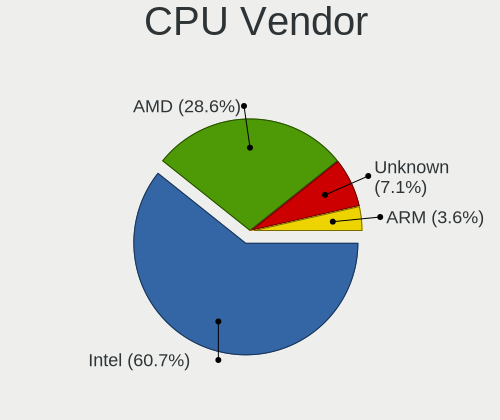
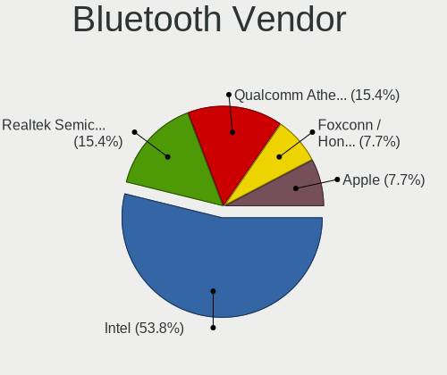

OpenBSD 7.4 - Tested Hardware & Statistics (Desktops)
-----------------------------------------------------

A project to collect tested hardware configurations for OpenBSD 7.4.

Anyone can contribute to this report by the [hw-probe](https://github.com/linuxhw/hw-probe/blob/master/INSTALL.BSD.md) tool:

    hw-probe -all -upload

Please contribute! Especially if your hardware is rare.

Contents
--------

* [ Test Cases ](#test-cases)

* [ System ](#system)
  - [ Arch                     ](#arch)
  - [ DE                       ](#de)
  - [ Display Server           ](#display-server)
  - [ Display Manager          ](#display-manager)
  - [ OS Lang                  ](#os-lang)
  - [ Boot Mode                ](#boot-mode)
  - [ Filesystem               ](#filesystem)
  - [ Part. scheme             ](#part-scheme)

* [ Board ](#board)
  - [ Vendor                   ](#vendor)
  - [ Model                    ](#model)
  - [ Model Family             ](#model-family)
  - [ MFG Year                 ](#mfg-year)
  - [ Form Factor              ](#form-factor)
  - [ Coreboot                 ](#coreboot)
  - [ RAM Size                 ](#ram-size)
  - [ RAM Used                 ](#ram-used)
  - [ Total Drives             ](#total-drives)
  - [ Has CD-ROM               ](#has-cd-rom)
  - [ Has Ethernet             ](#has-ethernet)
  - [ Has WiFi                 ](#has-wifi)
  - [ Has Bluetooth            ](#has-bluetooth)

* [ Location ](#location)
  - [ Country                  ](#country)
  - [ City                     ](#city)

* [ Drives ](#drives)
  - [ Drive Vendor             ](#drive-vendor)
  - [ Drive Model              ](#drive-model)
  - [ HDD Vendor               ](#hdd-vendor)
  - [ SSD Vendor               ](#ssd-vendor)
  - [ Drive Kind               ](#drive-kind)
  - [ Drive Connector          ](#drive-connector)
  - [ Drive Size               ](#drive-size)
  - [ Space Total              ](#space-total)
  - [ Space Used               ](#space-used)
  - [ Malfunc. Drives          ](#malfunc-drives)
  - [ Malfunc. Drive Vendor    ](#malfunc-drive-vendor)
  - [ Malfunc. HDD Vendor      ](#malfunc-hdd-vendor)
  - [ Malfunc. Drive Kind      ](#malfunc-drive-kind)
  - [ Failed Drives            ](#failed-drives)
  - [ Failed Drive Vendor      ](#failed-drive-vendor)
  - [ Drive Status             ](#drive-status)

* [ Storage controller ](#storage-controller)
  - [ Storage Vendor           ](#storage-vendor)
  - [ Storage Model            ](#storage-model)
  - [ Storage Kind             ](#storage-kind)

* [ Processor ](#processor)
  - [ CPU Vendor               ](#cpu-vendor)
  - [ CPU Model                ](#cpu-model)
  - [ CPU Model Family         ](#cpu-model-family)
  - [ CPU Cores                ](#cpu-cores)
  - [ CPU Sockets              ](#cpu-sockets)
  - [ CPU Threads              ](#cpu-threads)
  - [ CPU Microarch            ](#cpu-microarch)

* [ Graphics ](#graphics)
  - [ GPU Vendor               ](#gpu-vendor)
  - [ GPU Model                ](#gpu-model)
  - [ GPU Combo                ](#gpu-combo)
  - [ GPU Driver               ](#gpu-driver)
  - [ GPU Memory               ](#gpu-memory)

* [ Monitor ](#monitor)
  - [ Monitor Vendor           ](#monitor-vendor)
  - [ Monitor Model            ](#monitor-model)
  - [ Monitor Resolution       ](#monitor-resolution)
  - [ Monitor Diagonal         ](#monitor-diagonal)
  - [ Monitor Width            ](#monitor-width)
  - [ Aspect Ratio             ](#aspect-ratio)
  - [ Monitor Area             ](#monitor-area)
  - [ Pixel Density            ](#pixel-density)
  - [ Multiple Monitors        ](#multiple-monitors)

* [ Network ](#network)
  - [ Net Controller Vendor    ](#net-controller-vendor)
  - [ Net Controller Model     ](#net-controller-model)
  - [ Wireless Vendor          ](#wireless-vendor)
  - [ Wireless Model           ](#wireless-model)
  - [ Ethernet Vendor          ](#ethernet-vendor)
  - [ Ethernet Model           ](#ethernet-model)
  - [ Net Controller Kind      ](#net-controller-kind)
  - [ Used Controller          ](#used-controller)
  - [ NICs                     ](#nics)
  - [ IPv6                     ](#ipv6)

* [ Bluetooth ](#bluetooth)
  - [ Bluetooth Vendor         ](#bluetooth-vendor)
  - [ Bluetooth Model          ](#bluetooth-model)

* [ Sound ](#sound)
  - [ Sound Vendor             ](#sound-vendor)
  - [ Sound Model              ](#sound-model)

* [ Memory ](#memory)
  - [ Memory Vendor            ](#memory-vendor)
  - [ Memory Model             ](#memory-model)
  - [ Memory Kind              ](#memory-kind)
  - [ Memory Form Factor       ](#memory-form-factor)
  - [ Memory Size              ](#memory-size)
  - [ Memory Speed             ](#memory-speed)

* [ Printers & scanners ](#printers--scanners)
  - [ Printer Vendor           ](#printer-vendor)
  - [ Printer Model            ](#printer-model)
  - [ Scanner Vendor           ](#scanner-vendor)
  - [ Scanner Model            ](#scanner-model)

* [ Camera ](#camera)
  - [ Camera Vendor            ](#camera-vendor)
  - [ Camera Model             ](#camera-model)

* [ Security ](#security)
  - [ Fingerprint Vendor       ](#fingerprint-vendor)
  - [ Fingerprint Model        ](#fingerprint-model)
  - [ Chipcard Vendor          ](#chipcard-vendor)
  - [ Chipcard Model           ](#chipcard-model)

* [ Unsupported ](#unsupported)
  - [ Unsupported Devices      ](#unsupported-devices)
  - [ Unsupported Device Types ](#unsupported-device-types)

Test Cases
----------

Total: 30

| Vendor        | Model                       | Probe                                                     | Date         |
|---------------|-----------------------------|-----------------------------------------------------------|--------------|
| FUJI wortm... | D1547                       | [b0c75a2f48](https://bsd-hardware.info/?probe=b0c75a2f48) | Jul 01, 2024 |
| Dell          | Vostro 3268                 | [3492b3ebb5](https://bsd-hardware.info/?probe=3492b3ebb5) | Mar 31, 2024 |
| ASUSTek       | PRIME B550M-A (WI-FI)       | [feb3803dbc](https://bsd-hardware.info/?probe=feb3803dbc) | Mar 24, 2024 |
| Dell          | Inspiron 5521               | [15446ac441](https://bsd-hardware.info/?probe=15446ac441) | Mar 24, 2024 |
| Sun           | SUNW,Ultra-1                | [33ed69952b](https://bsd-hardware.info/?probe=33ed69952b) | Mar 17, 2024 |
| HP            | ProLiant ML370 G4           | [e3d8ea32d4](https://bsd-hardware.info/?probe=e3d8ea32d4) | Mar 13, 2024 |
| ASUSTek       | TUF Gaming B550M-PLUS (W... | [9015dcf1b5](https://bsd-hardware.info/?probe=9015dcf1b5) | Mar 12, 2024 |
| Lenovo        | ThinkCentre M75n 11BXS00... | [6ed6f9c86f](https://bsd-hardware.info/?probe=6ed6f9c86f) | Mar 09, 2024 |
| Biostar       | B450NH                      | [9f4dedfcd6](https://bsd-hardware.info/?probe=9f4dedfcd6) | Feb 17, 2024 |
| Lenovo        | ThinkCentre M91p 7052C1G    | [3aeb926332](https://bsd-hardware.info/?probe=3aeb926332) | Feb 08, 2024 |
| MSI           | MS-7D15                     | [a22ee27a4a](https://bsd-hardware.info/?probe=a22ee27a4a) | Feb 03, 2024 |
| MSI           | MS-7D15                     | [476be56dc7](https://bsd-hardware.info/?probe=476be56dc7) | Feb 03, 2024 |
| Gigabyte      | Z690 UD DDR4                | [f6f19ac329](https://bsd-hardware.info/?probe=f6f19ac329) | Feb 02, 2024 |
| AZW           | MINI S                      | [99c79c2cc8](https://bsd-hardware.info/?probe=99c79c2cc8) | Jan 30, 2024 |
| IBM           | 830381U                     | [e44647b8cd](https://bsd-hardware.info/?probe=e44647b8cd) | Jan 20, 2024 |
| Microsoft     | Windows Dev Kit 2023        | [2cd25bfacf](https://bsd-hardware.info/?probe=2cd25bfacf) | Jan 19, 2024 |
| HP            | s5-1210br                   | [9ce94bc2b7](https://bsd-hardware.info/?probe=9ce94bc2b7) | Jan 19, 2024 |
| Unknown       | Unknown                     | [2a34bc9613](https://bsd-hardware.info/?probe=2a34bc9613) | Nov 28, 2023 |
| AZW           | SER                         | [48a259ae28](https://bsd-hardware.info/?probe=48a259ae28) | Nov 28, 2023 |
| Lenovo        | ThinkCentre M90n-1 11AHS... | [eca5b59407](https://bsd-hardware.info/?probe=eca5b59407) | Nov 23, 2023 |
| Lenovo        | ThinkCentre M720s 10SUSB... | [a44a9f3526](https://bsd-hardware.info/?probe=a44a9f3526) | Nov 23, 2023 |
| HP            | Compaq CQ45                 | [4f3c176253](https://bsd-hardware.info/?probe=4f3c176253) | Nov 14, 2023 |
| ASUSTek       | TUF Gaming B550-PLUS        | [700d52c2dd](https://bsd-hardware.info/?probe=700d52c2dd) | Nov 07, 2023 |
| Apple         | MacPro4,1                   | [5960492992](https://bsd-hardware.info/?probe=5960492992) | Nov 07, 2023 |
| Intel         | DCP847SKE                   | [3b5b83d95f](https://bsd-hardware.info/?probe=3b5b83d95f) | Oct 30, 2023 |
| ASUSTek       | MINIPC PN53-G               | [57d8823b4b](https://bsd-hardware.info/?probe=57d8823b4b) | Oct 28, 2023 |
| Dell          | PowerEdge T110 II           | [f93395bc11](https://bsd-hardware.info/?probe=f93395bc11) | Oct 28, 2023 |
| Sun           | SUNW,SPARC-Enterprise-T5... | [50457ff825](https://bsd-hardware.info/?probe=50457ff825) | Oct 27, 2023 |
| Gigabyte      | H81M-S2PV                   | [310fcb9763](https://bsd-hardware.info/?probe=310fcb9763) | Oct 26, 2023 |
| MECHREVO      | Unknown                     | [2dac22205c](https://bsd-hardware.info/?probe=2dac22205c) | Oct 23, 2023 |

System
------

Arch
----

OS architecture (x86_64, i586, etc.)

| Name    | Desktops | Percent |
|---------|----------|---------|
| amd64   | 24       | 85.71%  |
| sparc64 | 2        | 7.14%   |
| i386    | 1        | 3.57%   |
| arm64   | 1        | 3.57%   |

DE
--

Desktop Environment

| Name         | Desktops | Percent |
|--------------|----------|---------|
| helloDesktop | 23       | 82.14%  |
| XFCE         | 4        | 14.29%  |
| GNOME        | 1        | 3.57%   |

Display Server
--------------

X11 or Wayland

| Name    | Desktops | Percent |
|---------|----------|---------|
| X11     | 19       | 67.86%  |
| Console | 9        | 32.14%  |

Display Manager
---------------

SDDM, LightDM, etc.

| Name    | Desktops | Percent |
|---------|----------|---------|
| Console | 28       | 100%    |

OS Lang
-------

Language

| Lang    | Desktops | Percent |
|---------|----------|---------|
| Unknown | 24       | 85.71%  |
| pl_PL   | 1        | 3.57%   |
| fr_FR   | 1        | 3.57%   |
| es_CO   | 1        | 3.57%   |
| en_US   | 1        | 3.57%   |

Boot Mode
---------

EFI or BIOS

| Mode | Desktops | Percent |
|------|----------|---------|
| EFI  | 24       | 85.71%  |
| BIOS | 4        | 14.29%  |

Filesystem
----------

Type of filesystem

| Type | Desktops | Percent |
|------|----------|---------|
| Ffs  | 28       | 100%    |

Part. scheme
------------

Scheme of partitioning

| Type | Desktops | Percent |
|------|----------|---------|
| GPT  | 20       | 71.43%  |
| MBR  | 8        | 28.57%  |

Board
-----

Vendor
------

Motherboard manufacturer

| Name                | Desktops | Percent |
|---------------------|----------|---------|
| Lenovo              | 4        | 14.29%  |
| ASUSTek Computer    | 4        | 14.29%  |
| Hewlett-Packard     | 3        | 10.71%  |
| Dell                | 3        | 10.71%  |
| Sun                 | 2        | 7.14%   |
| Gigabyte Technology | 2        | 7.14%   |
| AZW                 | 2        | 7.14%   |
| MSI                 | 1        | 3.57%   |
| Microsoft           | 1        | 3.57%   |
| MECHREVO            | 1        | 3.57%   |
| Intel               | 1        | 3.57%   |
| FUJI wortmann       | 1        | 3.57%   |
| Biostar             | 1        | 3.57%   |
| Apple               | 1        | 3.57%   |
| Unknown             | 1        | 3.57%   |

Model
-----

Motherboard model

| Name                                 | Desktops | Percent |
|--------------------------------------|----------|---------|
| Unknown                              | 2        | 7.14%   |
| Sun SUNW,Ultra-1                     | 1        | 3.57%   |
| Sun SUNW,SPARC-Enterprise-T5120      | 1        | 3.57%   |
| MSI MS-7D15                          | 1        | 3.57%   |
| Microsoft Windows Dev Kit 2023       | 1        | 3.57%   |
| Lenovo ThinkCentre M91p 7052C1G      | 1        | 3.57%   |
| Lenovo ThinkCentre M90n-1 11AHS0B200 | 1        | 3.57%   |
| Lenovo ThinkCentre M75n 11BXS00100   | 1        | 3.57%   |
| Lenovo ThinkCentre M720s 10SUSB7Y00  | 1        | 3.57%   |
| Intel DCP847SKE                      | 1        | 3.57%   |
| HP s5-1210br                         | 1        | 3.57%   |
| HP ProLiant ML370 G4                 | 1        | 3.57%   |
| HP Compaq CQ45                       | 1        | 3.57%   |
| Gigabyte Z690 UD DDR4                | 1        | 3.57%   |
| Gigabyte H81M-S2PV                   | 1        | 3.57%   |
| FUJI wortmann D1547                  | 1        | 3.57%   |
| Dell Vostro 3268                     | 1        | 3.57%   |
| Dell PowerEdge T110 II               | 1        | 3.57%   |
| Dell Inspiron 5521                   | 1        | 3.57%   |
| Biostar B450NH                       | 1        | 3.57%   |
| AZW SER                              | 1        | 3.57%   |
| AZW MINI S                           | 1        | 3.57%   |
| ASUS TUF Gaming B550M-PLUS (WI-FI)   | 1        | 3.57%   |
| ASUS TUF Gaming B550-PLUS            | 1        | 3.57%   |
| ASUS PRIME B550M-A (WI-FI)           | 1        | 3.57%   |
| ASUS MINIPC PN53-G                   | 1        | 3.57%   |
| Apple MacPro4,1                      | 1        | 3.57%   |

Model Family
------------

Motherboard model prefix

| Name                | Desktops | Percent |
|---------------------|----------|---------|
| Lenovo ThinkCentre  | 4        | 14.29%  |
| Sun SUNW            | 2        | 7.14%   |
| ASUS TUF            | 2        | 7.14%   |
| Unknown             | 2        | 7.14%   |
| MSI MS-7D15         | 1        | 3.57%   |
| Microsoft Windows   | 1        | 3.57%   |
| Intel DCP847SKE     | 1        | 3.57%   |
| HP s5-1210br        | 1        | 3.57%   |
| HP ProLiant         | 1        | 3.57%   |
| HP Compaq           | 1        | 3.57%   |
| Gigabyte Z690       | 1        | 3.57%   |
| Gigabyte H81M-S2PV  | 1        | 3.57%   |
| FUJI wortmann D1547 | 1        | 3.57%   |
| Dell Vostro         | 1        | 3.57%   |
| Dell PowerEdge      | 1        | 3.57%   |
| Dell Inspiron       | 1        | 3.57%   |
| Biostar B450NH      | 1        | 3.57%   |
| AZW SER             | 1        | 3.57%   |
| AZW MINI            | 1        | 3.57%   |
| ASUS PRIME          | 1        | 3.57%   |
| ASUS MINIPC         | 1        | 3.57%   |
| Apple MacPro4       | 1        | 3.57%   |

MFG Year
--------

Motherboard manufacture year

| Year    | Desktops | Percent |
|---------|----------|---------|
| 2023    | 10       | 35.71%  |
| 2022    | 4        | 14.29%  |
| 2012    | 2        | 7.14%   |
| Unknown | 2        | 7.14%   |
| 2021    | 1        | 3.57%   |
| 2020    | 1        | 3.57%   |
| 2019    | 1        | 3.57%   |
| 2018    | 1        | 3.57%   |
| 2014    | 1        | 3.57%   |
| 2013    | 1        | 3.57%   |
| 2011    | 1        | 3.57%   |
| 2009    | 1        | 3.57%   |
| 2006    | 1        | 3.57%   |
| 2003    | 1        | 3.57%   |

Form Factor
-----------

Physical design of the computer

| Name    | Desktops | Percent |
|---------|----------|---------|
| Desktop | 28       | 100%    |

Coreboot
--------

Have coreboot on board

| Used | Desktops | Percent |
|------|----------|---------|
| No   | 28       | 100%    |

RAM Size
--------

Total RAM memory

| Size in GB  | Desktops | Percent |
|-------------|----------|---------|
| 4.01-8.0    | 5        | 17.86%  |
| 16.01-24.0  | 5        | 17.86%  |
| 32.01-64.0  | 4        | 14.29%  |
| 8.01-16.0   | 4        | 14.29%  |
| 64.01-256.0 | 3        | 10.71%  |
| 3.01-4.0    | 2        | 7.14%   |
| 24.01-32.0  | 2        | 7.14%   |
| 2.01-3.0    | 2        | 7.14%   |
| 0.01-0.5    | 1        | 3.57%   |

RAM Used
--------

Used RAM memory

| Used GB  | Desktops | Percent |
|----------|----------|---------|
| 0.01-0.5 | 18       | 64.29%  |
| 0.51-1.0 | 5        | 17.86%  |
| 1.01-2.0 | 3        | 10.71%  |
| 4.01-8.0 | 1        | 3.57%   |
| 0        | 1        | 3.57%   |

Total Drives
------------

Number of drives on board

| Drives | Desktops | Percent |
|--------|----------|---------|
| 1      | 16       | 57.14%  |
| 2      | 7        | 25%     |
| 4      | 3        | 10.71%  |
| 8      | 1        | 3.57%   |
| 0      | 1        | 3.57%   |

Has CD-ROM
----------

Has CD-ROM on board

| Presented | Desktops | Percent |
|-----------|----------|---------|
| No        | 28       | 100%    |

Has Ethernet
------------

Has Ethernet on board

| Presented | Desktops | Percent |
|-----------|----------|---------|
| Yes       | 26       | 92.86%  |
| No        | 2        | 7.14%   |

Has WiFi
--------

Has WiFi module

| Presented | Desktops | Percent |
|-----------|----------|---------|
| Yes       | 16       | 57.14%  |
| No        | 12       | 42.86%  |

Has Bluetooth
-------------

Has Bluetooth module

| Presented | Desktops | Percent |
|-----------|----------|---------|
| No        | 15       | 53.57%  |
| Yes       | 13       | 46.43%  |

Location
--------

Country
-------

Geographic location (country)

| Country   | Desktops | Percent |
|-----------|----------|---------|
| USA       | 3        | 10.71%  |
| Russia    | 3        | 10.71%  |
| Germany   | 3        | 10.71%  |
| Romania   | 2        | 7.14%   |
| Italy     | 2        | 7.14%   |
| Colombia  | 2        | 7.14%   |
| Australia | 2        | 7.14%   |
| Ukraine   | 1        | 3.57%   |
| UK        | 1        | 3.57%   |
| Turkey    | 1        | 3.57%   |
| Spain     | 1        | 3.57%   |
| Poland    | 1        | 3.57%   |
| Norway    | 1        | 3.57%   |
| France    | 1        | 3.57%   |
| China     | 1        | 3.57%   |
| Canada    | 1        | 3.57%   |
| Brazil    | 1        | 3.57%   |
| Austria   | 1        | 3.57%   |

City
----

Geographic location (city)

| City          | Desktops | Percent |
|---------------|----------|---------|
| New York      | 2        | 7.14%   |
| Milan         | 2        | 7.14%   |
| Canberra      | 2        | 7.14%   |
| Wolfsburg     | 1        | 3.57%   |
| Witow         | 1        | 3.57%   |
| Volgograd     | 1        | 3.57%   |
| Valmojado     | 1        | 3.57%   |
| Sydenham      | 1        | 3.57%   |
| Stade         | 1        | 3.57%   |
| St Petersburg | 1        | 3.57%   |
| Songjiang     | 1        | 3.57%   |
| Simferopol    | 1        | 3.57%   |
| Sao Paulo     | 1        | 3.57%   |
| Prudhoe       | 1        | 3.57%   |
| Ploieşti     | 1        | 3.57%   |
| Orenburg      | 1        | 3.57%   |
| Mersin        | 1        | 3.57%   |
| Medellín     | 1        | 3.57%   |
| Furth im Wald | 1        | 3.57%   |
| Floro         | 1        | 3.57%   |
| Cournanel     | 1        | 3.57%   |
| Calarasi      | 1        | 3.57%   |
| Bucaramanga   | 1        | 3.57%   |
| Axams         | 1        | 3.57%   |
| Austin        | 1        | 3.57%   |

Drives
------

Drive Vendor
------------

Hard drive vendors

| Vendor              | Desktops | Drives | Percent |
|---------------------|----------|--------|---------|
| NVMe                | 12       | 14     | 30%     |
| Seagate             | 5        | 5      | 12.5%   |
| Samsung Electronics | 5        | 10     | 12.5%   |
| WDC                 | 3        | 3      | 7.5%    |
| Kingston            | 2        | 2      | 5%      |
| Hitachi             | 2        | 3      | 5%      |
| Toshiba             | 1        | 1      | 2.5%    |
| OPENBSD             | 1        | 1      | 2.5%    |
| Netac               | 1        | 1      | 2.5%    |
| LSILOGIC            | 1        | 1      | 2.5%    |
| KIOXIA-EXCERIA      | 1        | 1      | 2.5%    |
| HGST                | 1        | 1      | 2.5%    |
| Hewlett-Packard     | 1        | 1      | 2.5%    |
| Generic             | 1        | 1      | 2.5%    |
| External            | 1        | 1      | 2.5%    |
| Crucial             | 1        | 1      | 2.5%    |
| China               | 1        | 1      | 2.5%    |

Drive Model
-----------

Hard drive models

| Model                           | Desktops | Percent |
|---------------------------------|----------|---------|
| NVMe Samsung SSD 980 1TB        | 2        | 4.76%   |
| NVMe SAMSUNG MZALQ128 128GB     | 2        | 4.76%   |
| Kingston SA400S37240G 240GB     | 2        | 4.76%   |
| WDC WD64 00AAKS-22A7B2 640GB    | 1        | 2.38%   |
| WDC WD5000AAKX-60U6AA0 500GB    | 1        | 2.38%   |
| WDC WD10JPVT-75A1YT0 1TB        | 1        | 2.38%   |
| Toshiba DT01ACA050 500GB        | 1        | 2.38%   |
| Seagate ST31000340AS 1TB        | 1        | 2.38%   |
| Seagate ST250DM000-1BD141 250GB | 1        | 2.38%   |
| Seagate ST2000NT001-3M3101 2TB  | 1        | 2.38%   |
| Seagate ST2000LX001-1RG174 2TB  | 1        | 2.38%   |
| Seagate ST1000DM003-1CH162 1TB  | 1        | 2.38%   |
| Samsung SSD 870 QVO 2TB         | 1        | 2.38%   |
| Samsung SSD 860 EVO 250GB       | 1        | 2.38%   |
| Samsung SSD 840 EVO 500GB       | 1        | 2.38%   |
| Samsung SSD 840 EVO 250GB       | 1        | 2.38%   |
| Samsung Flash Drive 128GB       | 1        | 2.38%   |
| OPENBSD SR RAID 5 9.9TB         | 1        | 2.38%   |
| NVMe WDBRPG5000ANC-WR 500GB     | 1        | 2.38%   |
| NVMe Sabrent Rocket 4 500GB     | 1        | 2.38%   |
| NVMe Lexar SSD NM7A1 1TB        | 1        | 2.38%   |
| NVMe Lexar SSD NM620 1TB        | 1        | 2.38%   |
| NVMe Lexar SSD ARES 1 1TB       | 1        | 2.38%   |
| NVMe KIOXIA-EXCERIA S 500GB     | 1        | 2.38%   |
| NVMe KBG40ZNS512G BG4 512GB     | 1        | 2.38%   |
| NVMe HP SSD EX900 500 500GB     | 1        | 2.38%   |
| NVMe CT500P3PSSD8 500GB         | 1        | 2.38%   |
| NVMe aigo SSD P3 512GB          | 1        | 2.38%   |
| Netac NS512GSSD340 512GB        | 1        | 2.38%   |
| LSILOGIC Logical Volume 146GB   | 1        | 2.38%   |
| KIOXIA-EXCERIA SATA SSD 480GB   | 1        | 2.38%   |
| Hitachi HTS541010G9SA00 100GB   | 1        | 2.38%   |
| Hitachi HDE721064SLA360 640GB   | 1        | 2.38%   |
| HGST HTS545050A7E380 500GB      | 1        | 2.38%   |
| HP LOGICAL VOLUME 304GB         | 1        | 2.38%   |
| Generic STORAGE DEVICE 2GB      | 1        | 2.38%   |
| External USB3.0 1TB             | 1        | 2.38%   |
| Crucial CT500MX500SSD1 500GB    | 1        | 2.38%   |
| China W653-64GB                 | 1        | 2.38%   |

HDD Vendor
----------

Hard disk drive vendors

| Vendor              | Desktops | Drives | Percent |
|---------------------|----------|--------|---------|
| Seagate             | 5        | 5      | 21.74%  |
| NVMe                | 5        | 6      | 21.74%  |
| WDC                 | 3        | 3      | 13.04%  |
| Hitachi             | 2        | 3      | 8.7%    |
| Toshiba             | 1        | 1      | 4.35%   |
| Samsung Electronics | 1        | 1      | 4.35%   |
| OPENBSD             | 1        | 1      | 4.35%   |
| LSILOGIC            | 1        | 1      | 4.35%   |
| HGST                | 1        | 1      | 4.35%   |
| Hewlett-Packard     | 1        | 1      | 4.35%   |
| Generic             | 1        | 1      | 4.35%   |
| External            | 1        | 1      | 4.35%   |

SSD Vendor
----------

Solid state drive vendors

| Vendor              | Desktops | Drives | Percent |
|---------------------|----------|--------|---------|
| NVMe                | 7        | 7      | 41.18%  |
| Samsung Electronics | 4        | 9      | 23.53%  |
| Kingston            | 2        | 2      | 11.76%  |
| Netac               | 1        | 1      | 5.88%   |
| KIOXIA-EXCERIA      | 1        | 1      | 5.88%   |
| Crucial             | 1        | 1      | 5.88%   |
| China               | 1        | 1      | 5.88%   |

Drive Kind
----------

HDD or SSD

| Kind | Desktops | Drives | Percent |
|------|----------|--------|---------|
| HDD  | 18       | 25     | 52.94%  |
| SSD  | 15       | 22     | 44.12%  |
| NVMe | 1        | 1      | 2.94%   |

Drive Connector
---------------

SATA, SAS, NVMe, etc.

| Type | Desktops | Drives | Percent |
|------|----------|--------|---------|
| SATA | 27       | 47     | 96.43%  |
| NVMe | 1        | 1      | 3.57%   |

Drive Size
----------

Size of hard drive

| Size in TB | Desktops | Drives | Percent |
|------------|----------|--------|---------|
| 0.01-0.5   | 20       | 24     | 55.56%  |
| 0.51-1.0   | 9        | 11     | 25%     |
| 1.01-2.0   | 6        | 11     | 16.67%  |
| 4.01-10.0  | 1        | 1      | 2.78%   |

Space Total
-----------

Amount of disk space available on the file system

| Size in GB     | Desktops | Percent |
|----------------|----------|---------|
| 251-500        | 14       | 50%     |
| 101-250        | 8        | 28.57%  |
| 51-100         | 2        | 7.14%   |
| More than 3000 | 1        | 3.57%   |
| 21-50          | 1        | 3.57%   |
| 1001-2000      | 1        | 3.57%   |
| 501-1000       | 1        | 3.57%   |

Space Used
----------

Amount of used disk space

| Used GB  | Desktops | Percent |
|----------|----------|---------|
| 1-20     | 20       | 71.43%  |
| 21-50    | 6        | 21.43%  |
| 501-1000 | 1        | 3.57%   |
| 51-100   | 1        | 3.57%   |

Malfunc. Drives
---------------

Drive models with a malfunction

| Model                                 | Desktops | Drives | Percent |
|---------------------------------------|----------|--------|---------|
| WDC WD5000AAKX-60U6AA0 500GB          | 1        | 1      | 16.67%  |
| WDC WD10JPVT-75A1YT0 1TB              | 1        | 1      | 16.67%  |
| Seagate ST250DM000-1BD141 250GB       | 1        | 1      | 16.67%  |
| Samsung Electronics SSD 840 EVO 250GB | 1        | 1      | 16.67%  |
| Hitachi HTS541010G9SA00 100GB         | 1        | 1      | 16.67%  |
| HGST HTS545050A7E380 500GB            | 1        | 1      | 16.67%  |

Malfunc. Drive Vendor
---------------------

Vendors of faulty drives

| Vendor              | Desktops | Drives | Percent |
|---------------------|----------|--------|---------|
| WDC                 | 2        | 2      | 33.33%  |
| Seagate             | 1        | 1      | 16.67%  |
| Samsung Electronics | 1        | 1      | 16.67%  |
| Hitachi             | 1        | 1      | 16.67%  |
| HGST                | 1        | 1      | 16.67%  |

Malfunc. HDD Vendor
-------------------

Vendors of faulty HDD drives

| Vendor  | Desktops | Drives | Percent |
|---------|----------|--------|---------|
| WDC     | 2        | 2      | 40%     |
| Seagate | 1        | 1      | 20%     |
| Hitachi | 1        | 1      | 20%     |
| HGST    | 1        | 1      | 20%     |

Malfunc. Drive Kind
-------------------

Kinds of faulty drives

| Kind | Desktops | Drives | Percent |
|------|----------|--------|---------|
| HDD  | 5        | 5      | 83.33%  |
| SSD  | 1        | 1      | 16.67%  |

Failed Drives
-------------

Failed drive models

Zero info for selected period =(

Failed Drive Vendor
-------------------

Failed drive vendors

Zero info for selected period =(

Drive Status
------------

Number of failed and malfunc. drives

| Status   | Desktops | Drives | Percent |
|----------|----------|--------|---------|
| Detected | 15       | 18     | 44.12%  |
| Works    | 13       | 24     | 38.24%  |
| Malfunc  | 6        | 6      | 17.65%  |

Storage controller
------------------

Storage Vendor
--------------

Storage controller vendors

| Vendor                       | Desktops | Percent |
|------------------------------|----------|---------|
| Intel                        | 15       | 40.54%  |
| Samsung Electronics          | 4        | 10.81%  |
| AMD                          | 4        | 10.81%  |
| Shenzhen Longsys Electronics | 2        | 5.41%   |
| KIOXIA                       | 2        | 5.41%   |
| Broadcom / LSI               | 2        | 5.41%   |
| SanDisk                      | 1        | 2.7%    |
| Phison Electronics           | 1        | 2.7%    |
| Micron/Crucial Technology    | 1        | 2.7%    |
| MAXIO Technology (Hangzhou)  | 1        | 2.7%    |
| Compaq Computer              | 1        | 2.7%    |
| Biwin Storage Technology     | 1        | 2.7%    |
| ASMedia Technology           | 1        | 2.7%    |
| Unknown                      | 1        | 2.7%    |

Storage Model
-------------

Storage controller models

| Model                                                                          | Desktops | Percent |
|--------------------------------------------------------------------------------|----------|---------|
| Samsung NVMe SSD Controller 980 (DRAM-less)                                    | 3        | 7.89%   |
| Intel 7 Series Chipset Family 6-port SATA Controller [AHCI mode]               | 3        | 7.89%   |
| Intel 6 Series/C200 Series Chipset Family 6 port Desktop SATA AHCI Controller  | 3        | 7.89%   |
| AMD 500 Series Chipset SATA Controller                                         | 3        | 7.89%   |
| Shenzhen Longsys Lexar NM790 NVME SSD (DRAM-less)                              | 2        | 5.26%   |
| SanDisk Extreme Pro / WD Black SN750 / PC SN730 / Red SN700 NVMe SSD           | 1        | 2.63%   |
| Samsung NVMe SSD Controller PM9A1/PM9A3/980PRO                                 | 1        | 2.63%   |
| Phison E16 PCIe4 NVMe Controller                                               | 1        | 2.63%   |
| Micron/Crucial P2 [Nick P2] / P3 / P3 Plus NVMe PCIe SSD (DRAM-less)           | 1        | 2.63%   |
| MAXIO (Hangzhou) NVMe SSD Controller MAP1202 (DRAM-less)                       | 1        | 2.63%   |
| KIOXIA NVMe SSD Controller BG4 (DRAM-less)                                     | 1        | 2.63%   |
| KIOXIA NVMe SSD                                                                | 1        | 2.63%   |
| Intel Q170/Q150/B150/H170/H110/Z170/CM236 Chipset SATA Controller [AHCI Mode]  | 1        | 2.63%   |
| Intel Jasper Lake SATA AHCI Controller                                         | 1        | 2.63%   |
| Intel Cannon Lake PCH SATA AHCI Controller                                     | 1        | 2.63%   |
| Intel Alder Lake-N SATA AHCI Controller                                        | 1        | 2.63%   |
| Intel 82801JI (ICH10 Family) SATA AHCI Controller                              | 1        | 2.63%   |
| Intel 82801EB/ER (ICH5/ICH5R) IDE Controller                                   | 1        | 2.63%   |
| Intel 82801DB (ICH4) IDE Controller                                            | 1        | 2.63%   |
| Intel 8 Series/C220 Series Chipset Family 6-port SATA Controller 1 [AHCI mode] | 1        | 2.63%   |
| Intel 500 Series Chipset Family SATA AHCI Controller                           | 1        | 2.63%   |
| Compaq Smart Array 64xx                                                        | 1        | 2.63%   |
| Broadcom / LSI SAS1068E PCI-Express Fusion-MPT SAS                             | 1        | 2.63%   |
| Broadcom / LSI 53c1030 PCI-X Fusion-MPT Dual Ultra320 SCSI                     | 1        | 2.63%   |
| Biwin Storage EX900 NVMe SSD (DRAM-less)                                       | 1        | 2.63%   |
| ASMedia ASM1061/ASM1062 Serial ATA Controller                                  | 1        | 2.63%   |
| AMD FCH SATA Controller [AHCI mode]                                            | 1        | 2.63%   |
| AMD 400 Series Chipset SATA Controller                                         | 1        | 2.63%   |
| Unknown                                                                        | 1        | 2.63%   |

Storage Kind
------------

Kind of storage controller (IDE, SATA, NVMe, SAS, ...)

| Kind | Desktops | Percent |
|------|----------|---------|
| SATA | 18       | 51.43%  |
| NVMe | 12       | 34.29%  |
| SCSI | 2        | 5.71%   |
| IDE  | 2        | 5.71%   |
| RAID | 1        | 2.86%   |

Processor
---------

CPU Vendor
----------

Processor vendors

| Vendor  | Desktops | Percent |
|---------|----------|---------|
| Intel   | 17       | 60.71%  |
| AMD     | 8        | 28.57%  |
| Unknown | 2        | 7.14%   |
| ARM     | 1        | 3.57%   |

CPU Model
---------

Processor models

| Model                                                  | Desktops | Percent |
|--------------------------------------------------------|----------|---------|
|                                                        | 2        | 7.14%   |
| Intel Xeon CPU E5520 @ 2.27GHz                         | 1        | 3.57%   |
| Intel Xeon CPU E3-1220 V2 @ 3.10GHz                    | 1        | 3.57%   |
| Intel Xeon CPU 3.40GHz                                 | 1        | 3.57%   |
| Intel Pentium CPU G620 @ 2.60GHz                       | 1        | 3.57%   |
| Intel Pentium 4 CPU 2.66GHz ("GenuineIntel" 686-class) | 1        | 3.57%   |
| Intel N95                                              | 1        | 3.57%   |
| Intel Core i7-3537U CPU @ 2.00GHz                      | 1        | 3.57%   |
| Intel Core i7-2600 CPU @ 3.40GHz                       | 1        | 3.57%   |
| Intel Core i5-7500 CPU @ 3.40GHz                       | 1        | 3.57%   |
| Intel Core i5-10400F CPU @ 2.90GHz                     | 1        | 3.57%   |
| Intel Core i3-8145U CPU @ 2.10GHz                      | 1        | 3.57%   |
| Intel Core i3-8100 CPU @ 3.60GHz                       | 1        | 3.57%   |
| Intel Celeron N5095A @ 2.00GHz                         | 1        | 3.57%   |
| Intel Celeron CPU G1820 @ 2.70GHz                      | 1        | 3.57%   |
| Intel Celeron CPU B830 @ 1.80GHz                       | 1        | 3.57%   |
| Intel Celeron CPU 847E @ 1.10GHz                       | 1        | 3.57%   |
| Intel 13th Gen Core i7-13700K                          | 1        | 3.57%   |
| ARM Cortex-A78C r0p0                                   | 1        | 3.57%   |
| AMD Ryzen 9 6900HX with Radeon Graphics                | 1        | 3.57%   |
| AMD Ryzen 9 5950X 16-Core Processor                    | 1        | 3.57%   |
| AMD Ryzen 7 7840H w/ Radeon 780M Graphics              | 1        | 3.57%   |
| AMD Ryzen 7 3700X 8-Core Processor                     | 1        | 3.57%   |
| AMD Ryzen 5 5600GT with Radeon Graphics                | 1        | 3.57%   |
| AMD Ryzen 5 5600G with Radeon Graphics                 | 1        | 3.57%   |
| AMD Ryzen 5 5560U with Radeon Graphics                 | 1        | 3.57%   |
| AMD Athlon Silver 3050e with Radeon Graphics           | 1        | 3.57%   |

CPU Model Family
----------------

Processor model prefix

| Model           | Desktops | Percent |
|-----------------|----------|---------|
| Other           | 4        | 14.29%  |
| Intel Celeron   | 4        | 14.29%  |
| Intel Xeon      | 3        | 10.71%  |
| AMD Ryzen 5     | 3        | 10.71%  |
| Intel Core i7   | 2        | 7.14%   |
| Intel Core i5   | 2        | 7.14%   |
| Intel Core i3   | 2        | 7.14%   |
| AMD Ryzen 9     | 2        | 7.14%   |
| AMD Ryzen 7     | 2        | 7.14%   |
| Intel Pentium 4 | 1        | 3.57%   |
| Intel Pentium   | 1        | 3.57%   |
| ARM Cortex      | 1        | 3.57%   |
| AMD Athlon      | 1        | 3.57%   |

CPU Cores
---------

Number of processor cores

| Number  | Desktops | Percent |
|---------|----------|---------|
| 4       | 7        | 25%     |
| 2       | 6        | 21.43%  |
| 12      | 4        | 14.29%  |
| Unknown | 4        | 14.29%  |
| 16      | 3        | 10.71%  |
| 1       | 2        | 7.14%   |
| 32      | 1        | 3.57%   |
| 8       | 1        | 3.57%   |

CPU Sockets
-----------

Number of sockets

| Number  | Desktops | Percent |
|---------|----------|---------|
| 1       | 21       | 75%     |
| Unknown | 6        | 21.43%  |
| 2       | 1        | 3.57%   |

CPU Threads
-----------

Threads per core (Hyper-Threading)

| Number  | Desktops | Percent |
|---------|----------|---------|
| 1       | 17       | 60.71%  |
| Unknown | 6        | 21.43%  |
| 2       | 5        | 17.86%  |

CPU Microarch
-------------

Microarchitecture

| Name        | Desktops | Percent |
|-------------|----------|---------|
| Unknown     | 9        | 32.14%  |
| Zen 3       | 4        | 14.29%  |
| SandyBridge | 4        | 14.29%  |
| KabyLake    | 3        | 10.71%  |
| NetBurst    | 2        | 7.14%   |
| IvyBridge   | 2        | 7.14%   |
| Zen 2       | 1        | 3.57%   |
| Zen         | 1        | 3.57%   |
| Nehalem     | 1        | 3.57%   |
| Haswell     | 1        | 3.57%   |

Graphics
--------

GPU Vendor
----------

Vendors of graphics cards

| Vendor                     | Desktops | Percent |
|----------------------------|----------|---------|
| AMD                        | 12       | 46.15%  |
| Intel                      | 10       | 38.46%  |
| Nvidia                     | 3        | 11.54%  |
| Matrox Electronics Systems | 1        | 3.85%   |

GPU Model
---------

Graphics card models

| Model                                                                       | Desktops | Percent |
|-----------------------------------------------------------------------------|----------|---------|
| Intel 2nd Generation Core Processor Family Integrated Graphics Controller   | 3        | 11.11%  |
| AMD Cezanne [Radeon Vega Series / Radeon Vega Mobile Series]                | 3        | 11.11%  |
| Nvidia GP108 [GeForce GT 1030]                                              | 2        | 7.41%   |
| Nvidia G96C [GeForce 9500 GT]                                               | 1        | 3.7%    |
| Matrox Electronics Systems MGA G200eW WPCM450                               | 1        | 3.7%    |
| Intel Xeon E3-1200 v3/4th Gen Core Processor Integrated Graphics Controller | 1        | 3.7%    |
| Intel WhiskeyLake-U GT2 [UHD Graphics 620]                                  | 1        | 3.7%    |
| Intel JasperLake [UHD Graphics]                                             | 1        | 3.7%    |
| Intel HD Graphics 630                                                       | 1        | 3.7%    |
| Intel CoffeeLake-S GT2 [UHD Graphics 630]                                   | 1        | 3.7%    |
| Intel Alder Lake-N [UHD Graphics]                                           | 1        | 3.7%    |
| Intel 3rd Gen Core processor Graphics Controller                            | 1        | 3.7%    |
| AMD RV280 [Radeon 9200] (Secondary)                                         | 1        | 3.7%    |
| AMD RV280 [Radeon 9200]                                                     | 1        | 3.7%    |
| AMD Rembrandt [Radeon 680M]                                                 | 1        | 3.7%    |
| AMD Rage 3 [Rage XL PCI]                                                    | 1        | 3.7%    |
| AMD Picasso/Raven 2 [Radeon Vega Series / Radeon Vega Mobile Series]        | 1        | 3.7%    |
| AMD Phoenix1                                                                | 1        | 3.7%    |
| AMD Navi 23 [Radeon RX 6650 XT / 6700S / 6800S]                             | 1        | 3.7%    |
| AMD Navi 23 [Radeon RX 6600/6600 XT/6600M]                                  | 1        | 3.7%    |
| AMD Navi 22 [Radeon RX 6700/6700 XT/6750 XT / 6800M/6850M XT]               | 1        | 3.7%    |
| AMD Mars [Radeon HD 8730M]                                                  | 1        | 3.7%    |

GPU Combo
---------

Combinations of graphics cards

| Name        | Desktops | Percent |
|-------------|----------|---------|
| 1 x AMD     | 10       | 35.71%  |
| 1 x Intel   | 9        | 32.14%  |
| Other       | 3        | 10.71%  |
| 1 x Nvidia  | 3        | 10.71%  |
| 2 x AMD     | 1        | 3.57%   |
| 1 x Matrox  | 1        | 3.57%   |
| Intel + AMD | 1        | 3.57%   |

GPU Driver
----------

Free vs proprietary

| Driver  | Desktops | Percent |
|---------|----------|---------|
| Free    | 22       | 78.57%  |
| Unknown | 6        | 21.43%  |

GPU Memory
----------

Total video memory

| Size in GB | Desktops | Percent |
|------------|----------|---------|
| Unknown    | 28       | 100%    |

Monitor
-------

Monitor Vendor
--------------

Monitor vendors

| Vendor               | Desktops | Percent |
|----------------------|----------|---------|
| ASUSTek Computer     | 3        | 18.75%  |
| Samsung Electronics  | 2        | 12.5%   |
| Philips              | 2        | 12.5%   |
| Dell                 | 2        | 12.5%   |
| Ancor Communications | 2        | 12.5%   |
| NEC Computers        | 1        | 6.25%   |
| MSI                  | 1        | 6.25%   |
| LG Display           | 1        | 6.25%   |
| AU Optronics         | 1        | 6.25%   |
| AOC                  | 1        | 6.25%   |

Monitor Model
-------------

Monitor models

| Model                                                                 | Desktops | Percent |
|-----------------------------------------------------------------------|----------|---------|
| Samsung Electronics SyncMaster SAM041E 2048x1152 510x290mm 23.1-inch  | 1        | 6.25%   |
| Samsung Electronics C32JG5x SAM0F54 2560x1440 700x390mm 31.5-inch     | 1        | 6.25%   |
| Philips PHL 223V5 PHLC0CF 1920x1080 480x270mm 21.7-inch               | 1        | 6.25%   |
| Philips 227E4LH PHLC0AC 1920x1080 480x270mm 21.7-inch                 | 1        | 6.25%   |
| NEC Computers EX341R NEC2C7A 3440x1440 800x330mm 34.1-inch            | 1        | 6.25%   |
| MSI MP242 MSI30A1 1920x1080 530x300mm 24.0-inch                       | 1        | 6.25%   |
| LG Display LCD Monitor LGD0385 1366x768 310x170mm 13.9-inch           | 1        | 6.25%   |
| Dell U2414H DELA0A4 1920x1080 530x300mm 24.0-inch                     | 1        | 6.25%   |
| Dell P2210 DEL404E 1680x1050 470x300mm 22.0-inch                      | 1        | 6.25%   |
| AU Optronics LCD Monitor AUO21ED 1920x1080 340x190mm 15.3-inch        | 1        | 6.25%   |
| ASUSTek Computer XG49WCR AUS4932 3840x1080 1190x340mm 48.7-inch       | 1        | 6.25%   |
| ASUSTek Computer XG49V AUS49A1 3840x1080 1200x340mm 49.1-inch         | 1        | 6.25%   |
| ASUSTek Computer PA279 AUS2768 3840x2160 600x340mm 27.2-inch          | 1        | 6.25%   |
| AOC Q27G2WG4 AOC2702 2560x1440 600x340mm 27.2-inch                    | 1        | 6.25%   |
| Ancor Communications ASUS VW199 ACI19ED 1440x900 410x260mm 19.1-inch  | 1        | 6.25%   |
| Ancor Communications ASUS VH228 ACI22FC 1920x1080 470x260mm 21.1-inch | 1        | 6.25%   |

Monitor Resolution
------------------

Monitor screen resolution

| Resolution         | Desktops | Percent |
|--------------------|----------|---------|
| 1920x1080 (FHD)    | 4        | 28.57%  |
| 3840x1080          | 2        | 14.29%  |
| 2560x1440 (QHD)    | 2        | 14.29%  |
| 3840x2160 (4K)     | 1        | 7.14%   |
| 3440x1440          | 1        | 7.14%   |
| 2048x1152          | 1        | 7.14%   |
| 1680x1050 (WSXGA+) | 1        | 7.14%   |
| 1440x900 (WXGA+)   | 1        | 7.14%   |
| 1366x768 (WXGA)    | 1        | 7.14%   |

Monitor Diagonal
----------------

Diagonal size in inches

| Inches | Desktops | Percent |
|--------|----------|---------|
| 27     | 2        | 13.33%  |
| 24     | 2        | 13.33%  |
| 21     | 2        | 13.33%  |
| 49     | 1        | 6.67%   |
| 48     | 1        | 6.67%   |
| 34     | 1        | 6.67%   |
| 31     | 1        | 6.67%   |
| 23     | 1        | 6.67%   |
| 22     | 1        | 6.67%   |
| 19     | 1        | 6.67%   |
| 15     | 1        | 6.67%   |
| 13     | 1        | 6.67%   |

Monitor Width
-------------

Physical width

| Width in mm | Desktops | Percent |
|-------------|----------|---------|
| 501-600     | 5        | 33.33%  |
| 401-500     | 4        | 26.67%  |
| 301-350     | 2        | 13.33%  |
| 1001-1500   | 2        | 13.33%  |
| 701-800     | 1        | 6.67%   |
| 601-700     | 1        | 6.67%   |

Aspect Ratio
------------

Proportional relationship between the width and the height

| Ratio | Desktops | Percent |
|-------|----------|---------|
| 16/9  | 9        | 64.29%  |
| 32/9  | 2        | 14.29%  |
| 16/10 | 2        | 14.29%  |
| 21/9  | 1        | 7.14%   |

Monitor Area
------------

Area in inch²

| Area in inch² | Desktops | Percent |
|----------------|----------|---------|
| 201-250        | 6        | 37.5%   |
| 351-500        | 2        | 12.5%   |
| 301-350        | 2        | 12.5%   |
| 151-200        | 2        | 12.5%   |
| 501-1000       | 2        | 12.5%   |
| 81-90          | 1        | 6.25%   |
| 91-100         | 1        | 6.25%   |

Pixel Density
-------------

Pixels per inch

| Density | Desktops | Percent |
|---------|----------|---------|
| 51-100  | 8        | 53.33%  |
| 101-120 | 5        | 33.33%  |
| 161-240 | 1        | 6.67%   |
| 121-160 | 1        | 6.67%   |

Multiple Monitors
-----------------

Total monitors connected

| Total | Desktops | Percent |
|-------|----------|---------|
| 0     | 14       | 50%     |
| 1     | 12       | 42.86%  |
| 2     | 2        | 7.14%   |

Network
-------

Net Controller Vendor
---------------------

Controller vendors

| Vendor                | Desktops | Percent |
|-----------------------|----------|---------|
| Realtek Semiconductor | 18       | 41.86%  |
| Intel                 | 15       | 34.88%  |
| Broadcom              | 3        | 6.98%   |
| Qualcomm Atheros      | 2        | 4.65%   |
| ASUSTek Computer      | 2        | 4.65%   |
| Qualcomm Technologies | 1        | 2.33%   |
| Motorola PCS          | 1        | 2.33%   |
| MediaTek              | 1        | 2.33%   |

Net Controller Model
--------------------

Controller models

| Model                                                                         | Desktops | Percent |
|-------------------------------------------------------------------------------|----------|---------|
| Realtek RTL8111/8168/8211/8411 PCI Express Gigabit Ethernet Controller        | 10       | 22.22%  |
| Realtek RTL8125 2.5GbE Controller                                             | 6        | 13.33%  |
| Intel Wi-Fi 6 AX200                                                           | 3        | 6.67%   |
| Realtek RTL810xE PCI Express Fast Ethernet controller                         | 2        | 4.44%   |
| Intel 82571EB/82571GB Gigabit Ethernet Controller D0/D1 (copper applications) | 2        | 4.44%   |
| Realtek RTL8822CE 802.11ac PCIe Wireless Network Adapter                      | 1        | 2.22%   |
| Realtek RTL8821CE 802.11ac PCIe Wireless Network Adapter                      | 1        | 2.22%   |
| Qualcomm QCNFA765 Wireless Network Adapter                                    | 1        | 2.22%   |
| Qualcomm Atheros QCA9565 / AR9565 Wireless Network Adapter                    | 1        | 2.22%   |
| Qualcomm Atheros AR9485 Wireless Network Adapter                              | 1        | 2.22%   |
| Motorola PCS USB RNDIS Device                                                 | 1        | 2.22%   |
| MediaTek MT7922 802.11ax PCI Express Wireless Network Adapter                 | 1        | 2.22%   |
| Intel Wireless 3165                                                           | 1        | 2.22%   |
| Intel Wi-Fi 6E(802.11ax) AX210/AX1675* 2x2 [Typhoon Peak]                     | 1        | 2.22%   |
| Intel Ethernet Connection (7) I219-V                                          | 1        | 2.22%   |
| Intel Ethernet Connection (10) I219-V                                         | 1        | 2.22%   |
| Intel Centrino Wireless-N 2230                                                | 1        | 2.22%   |
| Intel Cannon Point-LP CNVi [Wireless-AC]                                      | 1        | 2.22%   |
| Intel 82801DB PRO/100 VE (LOM) Ethernet Controller                            | 1        | 2.22%   |
| Intel 82579V Gigabit Network Connection                                       | 1        | 2.22%   |
| Intel 82579LM Gigabit Network Connection (Lewisville)                         | 1        | 2.22%   |
| Intel 82574L Gigabit Network Connection                                       | 1        | 2.22%   |
| Broadcom NetXtreme BCM5722 Gigabit Ethernet PCI Express                       | 1        | 2.22%   |
| Broadcom NetXtreme BCM5703 Gigabit Ethernet                                   | 1        | 2.22%   |
| Broadcom BCM4322 802.11a/b/g/n Wireless LAN Controller                        | 1        | 2.22%   |
| ASUS USB-N13 802.11n Network Adapter (rev. B1) [Realtek RTL8192CU]            | 1        | 2.22%   |
| ASUS Realtek 8188EUS [USB-N10 Nano]                                           | 1        | 2.22%   |

Wireless Vendor
---------------

Wireless vendors

| Vendor                | Desktops | Percent |
|-----------------------|----------|---------|
| Intel                 | 7        | 43.75%  |
| Realtek Semiconductor | 2        | 12.5%   |
| Qualcomm Atheros      | 2        | 12.5%   |
| ASUSTek Computer      | 2        | 12.5%   |
| Qualcomm Technologies | 1        | 6.25%   |
| MediaTek              | 1        | 6.25%   |
| Broadcom              | 1        | 6.25%   |

Wireless Model
--------------

Wireless models

| Model                                                              | Desktops | Percent |
|--------------------------------------------------------------------|----------|---------|
| Intel Wi-Fi 6 AX200                                                | 3        | 18.75%  |
| Realtek RTL8822CE 802.11ac PCIe Wireless Network Adapter           | 1        | 6.25%   |
| Realtek RTL8821CE 802.11ac PCIe Wireless Network Adapter           | 1        | 6.25%   |
| Qualcomm QCNFA765 Wireless Network Adapter                         | 1        | 6.25%   |
| Qualcomm Atheros QCA9565 / AR9565 Wireless Network Adapter         | 1        | 6.25%   |
| Qualcomm Atheros AR9485 Wireless Network Adapter                   | 1        | 6.25%   |
| MediaTek MT7922 802.11ax PCI Express Wireless Network Adapter      | 1        | 6.25%   |
| Intel Wireless 3165                                                | 1        | 6.25%   |
| Intel Wi-Fi 6E(802.11ax) AX210/AX1675* 2x2 [Typhoon Peak]          | 1        | 6.25%   |
| Intel Centrino Wireless-N 2230                                     | 1        | 6.25%   |
| Intel Cannon Point-LP CNVi [Wireless-AC]                           | 1        | 6.25%   |
| Broadcom BCM4322 802.11a/b/g/n Wireless LAN Controller             | 1        | 6.25%   |
| ASUS USB-N13 802.11n Network Adapter (rev. B1) [Realtek RTL8192CU] | 1        | 6.25%   |
| ASUS Realtek 8188EUS [USB-N10 Nano]                                | 1        | 6.25%   |

Ethernet Vendor
---------------

Ethernet vendors

| Vendor                | Desktops | Percent |
|-----------------------|----------|---------|
| Realtek Semiconductor | 18       | 62.07%  |
| Intel                 | 8        | 27.59%  |
| Broadcom              | 2        | 6.9%    |
| Motorola PCS          | 1        | 3.45%   |

Ethernet Model
--------------

Ethernet models

| Model                                                                         | Desktops | Percent |
|-------------------------------------------------------------------------------|----------|---------|
| Realtek RTL8111/8168/8211/8411 PCI Express Gigabit Ethernet Controller        | 10       | 34.48%  |
| Realtek RTL8125 2.5GbE Controller                                             | 6        | 20.69%  |
| Realtek RTL810xE PCI Express Fast Ethernet controller                         | 2        | 6.9%    |
| Intel 82571EB/82571GB Gigabit Ethernet Controller D0/D1 (copper applications) | 2        | 6.9%    |
| Motorola PCS USB RNDIS Device                                                 | 1        | 3.45%   |
| Intel Ethernet Connection (7) I219-V                                          | 1        | 3.45%   |
| Intel Ethernet Connection (10) I219-V                                         | 1        | 3.45%   |
| Intel 82801DB PRO/100 VE (LOM) Ethernet Controller                            | 1        | 3.45%   |
| Intel 82579V Gigabit Network Connection                                       | 1        | 3.45%   |
| Intel 82579LM Gigabit Network Connection (Lewisville)                         | 1        | 3.45%   |
| Intel 82574L Gigabit Network Connection                                       | 1        | 3.45%   |
| Broadcom NetXtreme BCM5722 Gigabit Ethernet PCI Express                       | 1        | 3.45%   |
| Broadcom NetXtreme BCM5703 Gigabit Ethernet                                   | 1        | 3.45%   |

Net Controller Kind
-------------------

Ethernet, WiFi or modem

| Kind     | Desktops | Percent |
|----------|----------|---------|
| Ethernet | 26       | 61.9%   |
| WiFi     | 16       | 38.1%   |

Used Controller
---------------

Currently used network controller

| Kind     | Desktops | Percent |
|----------|----------|---------|
| Ethernet | 21       | 95.45%  |
| WiFi     | 1        | 4.55%   |

NICs
----

Total network controllers on board

| Total | Desktops | Percent |
|-------|----------|---------|
| 2     | 12       | 42.86%  |
| 1     | 10       | 35.71%  |
| 3     | 4        | 14.29%  |
| 4     | 1        | 3.57%   |
| 0     | 1        | 3.57%   |

IPv6
----

IPv6 vs IPv4

| Used | Desktops | Percent |
|------|----------|---------|
| No   | 27       | 96.43%  |
| Yes  | 1        | 3.57%   |

Bluetooth
---------

Bluetooth Vendor
----------------

Controller vendors

| Vendor                          | Desktops | Percent |
|---------------------------------|----------|---------|
| Intel                           | 7        | 53.85%  |
| Realtek Semiconductor           | 2        | 15.38%  |
| Qualcomm Atheros Communications | 2        | 15.38%  |
| Foxconn / Hon Hai               | 1        | 7.69%   |
| Apple                           | 1        | 7.69%   |

Bluetooth Model
---------------

Controller models

| Model                                                       | Desktops | Percent |
|-------------------------------------------------------------|----------|---------|
| Intel AX200 Bluetooth                                       | 3        | 23.08%  |
| Realtek Bluetooth Adapter                                   | 2        | 15.38%  |
| Qualcomm Atheros Dell Wireless 1707 Bluetooth 4.0 LE Device | 1        | 7.69%   |
| Qualcomm Atheros AR3012 Bluetooth 4.0                       | 1        | 7.69%   |
| Intel Centrino Bluetooth Wireless Transceiver               | 1        | 7.69%   |
| Intel Bluetooth wireless interface                          | 1        | 7.69%   |
| Intel Bluetooth 9460/9560 Jefferson Peak (JfP)              | 1        | 7.69%   |
| Intel AX210 Bluetooth                                       | 1        | 7.69%   |
| Foxconn / Hon Hai RZ616 Bluetooth Adapter                   | 1        | 7.69%   |
| Apple Built-in Bluetooth 2.0+EDR HCI                        | 1        | 7.69%   |

Sound
-----

Sound Vendor
------------

Sound card vendors

| Vendor                                       | Desktops | Percent |
|----------------------------------------------|----------|---------|
| Intel                                        | 14       | 41.18%  |
| AMD                                          | 10       | 29.41%  |
| Nvidia                                       | 2        | 5.88%   |
| C-Media Electronics                          | 2        | 5.88%   |
| Zoran Co. Personal Media Division (Nogatech) | 1        | 2.94%   |
| Texas Instruments                            | 1        | 2.94%   |
| Logitech                                     | 1        | 2.94%   |
| KTMicro                                      | 1        | 2.94%   |
| JMTek                                        | 1        | 2.94%   |
| Creative Labs                                | 1        | 2.94%   |

Sound Model
-----------

Sound card models

| Model                                                                      | Desktops | Percent |
|----------------------------------------------------------------------------|----------|---------|
| AMD Family 17h/19h/1ah HD Audio Controller                                 | 6        | 14.29%  |
| Intel 7 Series/C216 Chipset Family High Definition Audio Controller        | 3        | 7.14%   |
| AMD Renoir Radeon High Definition Audio Controller                         | 3        | 7.14%   |
| AMD Navi 21/23 HDMI/DP Audio Controller                                    | 3        | 7.14%   |
| Nvidia GP108 High Definition Audio Controller                              | 2        | 4.76%   |
| Intel 6 Series/C200 Series Chipset Family High Definition Audio Controller | 2        | 4.76%   |
| C-Media Electronics USB Audio Class 1.0 and 2.0 Device                     | 2        | 4.76%   |
| AMD Starship/Matisse HD Audio Controller                                   | 2        | 4.76%   |
| AMD Rembrandt Radeon High Definition Audio Controller                      | 2        | 4.76%   |
| Zoran Co. Personal Media Division (Nogatech) USB Audio and HID             | 1        | 2.38%   |
| Texas Instruments PCM2902 Audio Codec                                      | 1        | 2.38%   |
| Logitech [G533 Wireless Headset Dongle]                                    | 1        | 2.38%   |
| KTMicro KT USB Audio                                                       | 1        | 2.38%   |
| JMTek USB PnP Audio Device                                                 | 1        | 2.38%   |
| Intel Xeon E3-1200 v3/4th Gen Core Processor HD Audio Controller           | 1        | 2.38%   |
| Intel Smart Sound Technology (SST) Audio Controller                        | 1        | 2.38%   |
| Intel Jasper Lake HD Audio                                                 | 1        | 2.38%   |
| Intel Cannon Point-LP High Definition Audio Controller                     | 1        | 2.38%   |
| Intel Cannon Lake PCH cAVS                                                 | 1        | 2.38%   |
| Intel Alder Lake-N PCH High Definition Audio Controller                    | 1        | 2.38%   |
| Intel 82801JI (ICH10 Family) HD Audio Controller                           | 1        | 2.38%   |
| Intel 82801DB/DBL/DBM (ICH4/ICH4-L/ICH4-M) AC'97 Audio Controller          | 1        | 2.38%   |
| Intel 8 Series/C220 Series Chipset High Definition Audio Controller        | 1        | 2.38%   |
| Intel 100 Series/C230 Series Chipset Family HD Audio Controller            | 1        | 2.38%   |
| Creative Labs CA0108/CA10300 [Sound Blaster Audigy Series]                 | 1        | 2.38%   |
| AMD Raven/Raven2/Fenghuang HDMI/DP Audio Controller                        | 1        | 2.38%   |

Memory
------

Memory Vendor
-------------

Memory module vendors

| Vendor   | Desktops | Percent |
|----------|----------|---------|
| Kingston | 1        | 100%    |

Memory Model
------------

Memory module models

| Model                                                 | Desktops | Percent |
|-------------------------------------------------------|----------|---------|
| Kingston RAM KF3600C18D4/32GX 32GB DIMM DDR4 3000MT/s | 1        | 100%    |

Memory Kind
-----------

Memory module kinds

| Kind | Desktops | Percent |
|------|----------|---------|
| DDR4 | 1        | 100%    |

Memory Form Factor
------------------

Physical design of the memory module

| Name | Desktops | Percent |
|------|----------|---------|
| DIMM | 1        | 100%    |

Memory Size
-----------

Memory module size

| Size  | Desktops | Percent |
|-------|----------|---------|
| 32768 | 1        | 100%    |

Memory Speed
------------

Memory module speed

| Speed | Desktops | Percent |
|-------|----------|---------|
| 3000  | 1        | 100%    |

Printers & scanners
-------------------

Printer Vendor
--------------

Printer device vendors

Zero info for selected period =(

Printer Model
-------------

Printer device models

Zero info for selected period =(

Scanner Vendor
--------------

Scanner device vendors

Zero info for selected period =(

Scanner Model
-------------

Scanner device models

Zero info for selected period =(

Camera
------

Camera Vendor
-------------

Camera device vendors

| Vendor                | Desktops | Percent |
|-----------------------|----------|---------|
| Realtek Semiconductor | 1        | 50%     |
| Logitech              | 1        | 50%     |

Camera Model
------------

Camera device models

| Model                        | Desktops | Percent |
|------------------------------|----------|---------|
| Realtek Integrated Webcam HD | 1        | 50%     |
| Logitech C920 PRO HD Webcam  | 1        | 50%     |

Security
--------

Fingerprint Vendor
------------------

Fingerprint sensor vendors

Zero info for selected period =(

Fingerprint Model
-----------------

Fingerprint sensor models

Zero info for selected period =(

Chipcard Vendor
---------------

Chipcard module vendors

Zero info for selected period =(

Chipcard Model
--------------

Chipcard module models

Zero info for selected period =(

Unsupported
-----------

Unsupported Devices
-------------------

Total unsupported devices on board

| Total | Desktops | Percent |
|-------|----------|---------|
| 1     | 14       | 50%     |
| 0     | 9        | 32.14%  |
| 2     | 4        | 14.29%  |
| 3     | 1        | 3.57%   |

Unsupported Device Types
------------------------

Types of unsupported devices

| Type                     | Desktops | Percent |
|--------------------------|----------|---------|
| Communication controller | 13       | 54.17%  |
| Net/wireless             | 6        | 25%     |
| Graphics card            | 4        | 16.67%  |
| Firewire controller      | 1        | 4.17%   |

