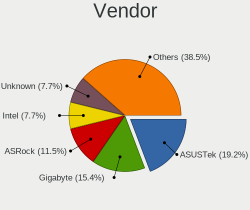
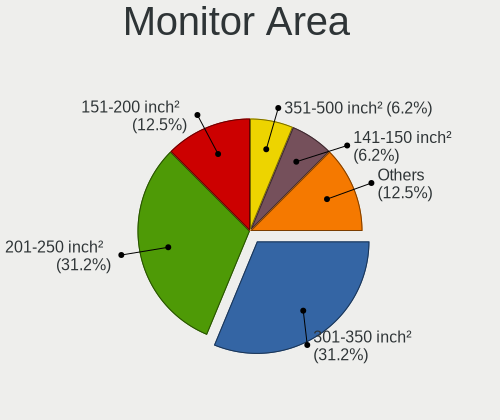

OpenBSD 7.5 - Tested Hardware & Statistics (Desktops)
-----------------------------------------------------

A project to collect tested hardware configurations for OpenBSD 7.5.

Anyone can contribute to this report by the [hw-probe](https://github.com/linuxhw/hw-probe/blob/master/INSTALL.BSD.md) tool:

    hw-probe -all -upload

Please contribute! Especially if your hardware is rare.

Contents
--------

* [ Test Cases ](#test-cases)

* [ System ](#system)
  - [ Arch                     ](#arch)
  - [ DE                       ](#de)
  - [ Display Server           ](#display-server)
  - [ Display Manager          ](#display-manager)
  - [ OS Lang                  ](#os-lang)
  - [ Boot Mode                ](#boot-mode)
  - [ Filesystem               ](#filesystem)
  - [ Part. scheme             ](#part-scheme)

* [ Board ](#board)
  - [ Vendor                   ](#vendor)
  - [ Model                    ](#model)
  - [ Model Family             ](#model-family)
  - [ MFG Year                 ](#mfg-year)
  - [ Form Factor              ](#form-factor)
  - [ Coreboot                 ](#coreboot)
  - [ RAM Size                 ](#ram-size)
  - [ RAM Used                 ](#ram-used)
  - [ Total Drives             ](#total-drives)
  - [ Has CD-ROM               ](#has-cd-rom)
  - [ Has Ethernet             ](#has-ethernet)
  - [ Has WiFi                 ](#has-wifi)
  - [ Has Bluetooth            ](#has-bluetooth)

* [ Location ](#location)
  - [ Country                  ](#country)
  - [ City                     ](#city)

* [ Drives ](#drives)
  - [ Drive Vendor             ](#drive-vendor)
  - [ Drive Model              ](#drive-model)
  - [ HDD Vendor               ](#hdd-vendor)
  - [ SSD Vendor               ](#ssd-vendor)
  - [ Drive Kind               ](#drive-kind)
  - [ Drive Connector          ](#drive-connector)
  - [ Drive Size               ](#drive-size)
  - [ Space Total              ](#space-total)
  - [ Space Used               ](#space-used)
  - [ Malfunc. Drives          ](#malfunc-drives)
  - [ Malfunc. Drive Vendor    ](#malfunc-drive-vendor)
  - [ Malfunc. HDD Vendor      ](#malfunc-hdd-vendor)
  - [ Malfunc. Drive Kind      ](#malfunc-drive-kind)
  - [ Failed Drives            ](#failed-drives)
  - [ Failed Drive Vendor      ](#failed-drive-vendor)
  - [ Drive Status             ](#drive-status)

* [ Storage controller ](#storage-controller)
  - [ Storage Vendor           ](#storage-vendor)
  - [ Storage Model            ](#storage-model)
  - [ Storage Kind             ](#storage-kind)

* [ Processor ](#processor)
  - [ CPU Vendor               ](#cpu-vendor)
  - [ CPU Model                ](#cpu-model)
  - [ CPU Model Family         ](#cpu-model-family)
  - [ CPU Cores                ](#cpu-cores)
  - [ CPU Sockets              ](#cpu-sockets)
  - [ CPU Threads              ](#cpu-threads)
  - [ CPU Microarch            ](#cpu-microarch)

* [ Graphics ](#graphics)
  - [ GPU Vendor               ](#gpu-vendor)
  - [ GPU Model                ](#gpu-model)
  - [ GPU Combo                ](#gpu-combo)
  - [ GPU Driver               ](#gpu-driver)
  - [ GPU Memory               ](#gpu-memory)

* [ Monitor ](#monitor)
  - [ Monitor Vendor           ](#monitor-vendor)
  - [ Monitor Model            ](#monitor-model)
  - [ Monitor Resolution       ](#monitor-resolution)
  - [ Monitor Diagonal         ](#monitor-diagonal)
  - [ Monitor Width            ](#monitor-width)
  - [ Aspect Ratio             ](#aspect-ratio)
  - [ Monitor Area             ](#monitor-area)
  - [ Pixel Density            ](#pixel-density)
  - [ Multiple Monitors        ](#multiple-monitors)

* [ Network ](#network)
  - [ Net Controller Vendor    ](#net-controller-vendor)
  - [ Net Controller Model     ](#net-controller-model)
  - [ Wireless Vendor          ](#wireless-vendor)
  - [ Wireless Model           ](#wireless-model)
  - [ Ethernet Vendor          ](#ethernet-vendor)
  - [ Ethernet Model           ](#ethernet-model)
  - [ Net Controller Kind      ](#net-controller-kind)
  - [ Used Controller          ](#used-controller)
  - [ NICs                     ](#nics)
  - [ IPv6                     ](#ipv6)

* [ Bluetooth ](#bluetooth)
  - [ Bluetooth Vendor         ](#bluetooth-vendor)
  - [ Bluetooth Model          ](#bluetooth-model)

* [ Sound ](#sound)
  - [ Sound Vendor             ](#sound-vendor)
  - [ Sound Model              ](#sound-model)

* [ Memory ](#memory)
  - [ Memory Vendor            ](#memory-vendor)
  - [ Memory Model             ](#memory-model)
  - [ Memory Kind              ](#memory-kind)
  - [ Memory Form Factor       ](#memory-form-factor)
  - [ Memory Size              ](#memory-size)
  - [ Memory Speed             ](#memory-speed)

* [ Printers & scanners ](#printers--scanners)
  - [ Printer Vendor           ](#printer-vendor)
  - [ Printer Model            ](#printer-model)
  - [ Scanner Vendor           ](#scanner-vendor)
  - [ Scanner Model            ](#scanner-model)

* [ Camera ](#camera)
  - [ Camera Vendor            ](#camera-vendor)
  - [ Camera Model             ](#camera-model)

* [ Security ](#security)
  - [ Fingerprint Vendor       ](#fingerprint-vendor)
  - [ Fingerprint Model        ](#fingerprint-model)
  - [ Chipcard Vendor          ](#chipcard-vendor)
  - [ Chipcard Model           ](#chipcard-model)

* [ Unsupported ](#unsupported)
  - [ Unsupported Devices      ](#unsupported-devices)
  - [ Unsupported Device Types ](#unsupported-device-types)

Test Cases
----------

Total: 34

| Vendor        | Model                       | Probe                                                     | Date         |
|---------------|-----------------------------|-----------------------------------------------------------|--------------|
| IGEL Techn... | IGEL-D220                   | [9d3ca29f8a](https://bsd-hardware.info/?probe=9d3ca29f8a) | Dec 30, 2024 |
| BOSGAME       | Ecolite Series              | [c1083a8777](https://bsd-hardware.info/?probe=c1083a8777) | Dec 28, 2024 |
| Unknown       | Cubietech Cubietruck        | [4b4a38865a](https://bsd-hardware.info/?probe=4b4a38865a) | Oct 21, 2024 |
| HP            | 240 G3                      | [7e732aa2d4](https://bsd-hardware.info/?probe=7e732aa2d4) | Oct 13, 2024 |
| MSI           | MS-7D16                     | [e9bddb011d](https://bsd-hardware.info/?probe=e9bddb011d) | Oct 01, 2024 |
| SJRC          | ADLN-6L                     | [6b77a00921](https://bsd-hardware.info/?probe=6b77a00921) | Sep 25, 2024 |
| ASRock        | B360M Pro4                  | [64d222278e](https://bsd-hardware.info/?probe=64d222278e) | Sep 06, 2024 |
| ASUSTek       | PRIME B650M-A WIFI II       | [9b18fc2e82](https://bsd-hardware.info/?probe=9b18fc2e82) | Sep 01, 2024 |
| ASRock        | Z87M Pro4                   | [dbbdcc1fe6](https://bsd-hardware.info/?probe=dbbdcc1fe6) | Aug 31, 2024 |
| Intel         | Q3XXG4-P                    | [072a3b6857](https://bsd-hardware.info/?probe=072a3b6857) | Aug 29, 2024 |
| ASRock        | Z87M Pro4                   | [2ddfd242d0](https://bsd-hardware.info/?probe=2ddfd242d0) | Aug 27, 2024 |
| Supermicro    | X11SDV-4C-TLN2F             | [b2bd066528](https://bsd-hardware.info/?probe=b2bd066528) | Aug 02, 2024 |
| Supermicro    | X11SDV-4C-TLN2F             | [be116a0073](https://bsd-hardware.info/?probe=be116a0073) | Aug 02, 2024 |
| ASUSTek       | SABERTOOTH X58              | [240e3487f6](https://bsd-hardware.info/?probe=240e3487f6) | Jul 28, 2024 |
| Dell          | OptiPlex 3050               | [0cffdab939](https://bsd-hardware.info/?probe=0cffdab939) | Jul 19, 2024 |
| ASUSTek       | SABERTOOTH X58              | [42ada28689](https://bsd-hardware.info/?probe=42ada28689) | Jul 19, 2024 |
| Lenovo        | Yoga Slim 7 14Q8X9 83ED     | [3a770b9efd](https://bsd-hardware.info/?probe=3a770b9efd) | Jul 15, 2024 |
| Lenovo        | Yoga Slim 7 14Q8X9 83ED     | [cb9978d493](https://bsd-hardware.info/?probe=cb9978d493) | Jul 15, 2024 |
| Gigabyte      | H170M-D3H                   | [7fc1b74405](https://bsd-hardware.info/?probe=7fc1b74405) | Jul 11, 2024 |
| AZW           | SER                         | [e226d0b9f4](https://bsd-hardware.info/?probe=e226d0b9f4) | Jul 01, 2024 |
| AZW           | SER                         | [f7be2f6fd7](https://bsd-hardware.info/?probe=f7be2f6fd7) | Jul 01, 2024 |
| Gigabyte      | X670 GAMING X AX V2         | [4ba8f14215](https://bsd-hardware.info/?probe=4ba8f14215) | Jun 23, 2024 |
| Intel         | S2600WT2R                   | [406818a434](https://bsd-hardware.info/?probe=406818a434) | Jun 03, 2024 |
| Acer          | Aspire X3-780               | [65c4e9c26d](https://bsd-hardware.info/?probe=65c4e9c26d) | May 27, 2024 |
| Gigabyte      | Z790 EAGLE AX               | [011ed158e0](https://bsd-hardware.info/?probe=011ed158e0) | May 18, 2024 |
| Gigabyte      | Z790 EAGLE AX               | [d96abdd063](https://bsd-hardware.info/?probe=d96abdd063) | May 17, 2024 |
| ASUSTek       | PRIME B650-PLUS             | [3e01e5ffbf](https://bsd-hardware.info/?probe=3e01e5ffbf) | May 03, 2024 |
| ASRock        | Z87M Pro4                   | [91a487bad5](https://bsd-hardware.info/?probe=91a487bad5) | Apr 29, 2024 |
| ASRock        | A320M Pro4-F                | [b02849b872](https://bsd-hardware.info/?probe=b02849b872) | Apr 23, 2024 |
| ASUSTek       | TUF Gaming B550-PLUS        | [44758d3d74](https://bsd-hardware.info/?probe=44758d3d74) | Apr 16, 2024 |
| Unknown       | QDNV01                      | [0cb0009f73](https://bsd-hardware.info/?probe=0cb0009f73) | Apr 15, 2024 |
| ASUSTek       | TUF Gaming B550M-PLUS (W... | [1257111a5f](https://bsd-hardware.info/?probe=1257111a5f) | Apr 10, 2024 |
| Gigabyte      | G431-MM0-OT                 | [16c58f7ccb](https://bsd-hardware.info/?probe=16c58f7ccb) | Apr 07, 2024 |
| ASUSTek       | TUF Gaming B550-PLUS        | [d0ce6ee00b](https://bsd-hardware.info/?probe=d0ce6ee00b) | Apr 05, 2024 |

System
------

Arch
----

OS architecture (x86_64, i586, etc.)

| Name  | Desktops | Percent |
|-------|----------|---------|
| amd64 | 24       | 92.31%  |
| armv7 | 1        | 3.85%   |
| arm64 | 1        | 3.85%   |

DE
--

Desktop Environment

| Name         | Desktops | Percent |
|--------------|----------|---------|
| helloDesktop | 21       | 80.77%  |
| XFCE         | 2        | 7.69%   |
| StumpWM      | 1        | 3.85%   |
| KDE5         | 1        | 3.85%   |
| GNOME        | 1        | 3.85%   |

Display Server
--------------

X11 or Wayland

| Name    | Desktops | Percent |
|---------|----------|---------|
| X11     | 16       | 61.54%  |
| Console | 10       | 38.46%  |

Display Manager
---------------

SDDM, LightDM, etc.

| Name    | Desktops | Percent |
|---------|----------|---------|
| Console | 26       | 100%    |

OS Lang
-------

Language

| Lang    | Desktops | Percent |
|---------|----------|---------|
| Unknown | 22       | 84.62%  |
| en_US   | 2        | 7.69%   |
| pt_PT   | 1        | 3.85%   |
| de.DE   | 1        | 3.85%   |

Boot Mode
---------

EFI or BIOS

| Mode | Desktops | Percent |
|------|----------|---------|
| EFI  | 21       | 80.77%  |
| BIOS | 5        | 19.23%  |

Filesystem
----------

Type of filesystem

| Type | Desktops | Percent |
|------|----------|---------|
| Ffs  | 26       | 100%    |

Part. scheme
------------

Scheme of partitioning

| Type | Desktops | Percent |
|------|----------|---------|
| GPT  | 20       | 76.92%  |
| MBR  | 6        | 23.08%  |

Board
-----

Vendor
------

Motherboard manufacturer

| Name                | Desktops | Percent |
|---------------------|----------|---------|
| ASUSTek Computer    | 5        | 19.23%  |
| Gigabyte Technology | 4        | 15.38%  |
| ASRock              | 3        | 11.54%  |
| Intel               | 2        | 7.69%   |
| Unknown             | 2        | 7.69%   |
| Supermicro          | 1        | 3.85%   |
| SJRC                | 1        | 3.85%   |
| MSI                 | 1        | 3.85%   |
| Lenovo              | 1        | 3.85%   |
| IGEL Technology     | 1        | 3.85%   |
| Hewlett-Packard     | 1        | 3.85%   |
| Dell                | 1        | 3.85%   |
| BOSGAME             | 1        | 3.85%   |
| AZW                 | 1        | 3.85%   |
| Acer                | 1        | 3.85%   |

Model
-----

Motherboard model

| Name                               | Desktops | Percent |
|------------------------------------|----------|---------|
| Unknown                            | 2        | 7.69%   |
| Supermicro SYS-E300-9D             | 1        | 3.85%   |
| SJRC ADLN-6L                       | 1        | 3.85%   |
| MSI MS-7D16                        | 1        | 3.85%   |
| Lenovo Yoga Slim 7 14Q8X9 83ED     | 1        | 3.85%   |
| Intel S2600WT2R                    | 1        | 3.85%   |
| Intel Q3XXG4-P                     | 1        | 3.85%   |
| IGEL IGEL-D220                     | 1        | 3.85%   |
| HP 240 G3                          | 1        | 3.85%   |
| Gigabyte Z790 EAGLE AX             | 1        | 3.85%   |
| Gigabyte X670 GAMING X AX V2       | 1        | 3.85%   |
| Gigabyte H170M-D3H                 | 1        | 3.85%   |
| Gigabyte G431-MM0-OT               | 1        | 3.85%   |
| Dell OptiPlex 3050                 | 1        | 3.85%   |
| BOSGAME Ecolite Series             | 1        | 3.85%   |
| AZW SER                            | 1        | 3.85%   |
| ASUS TUF Gaming B550M-PLUS (WI-FI) | 1        | 3.85%   |
| ASUS TUF Gaming B550-PLUS          | 1        | 3.85%   |
| ASUS SABERTOOTH X58                | 1        | 3.85%   |
| ASUS PRIME B650M-A WIFI II         | 1        | 3.85%   |
| ASUS PRIME B650-PLUS               | 1        | 3.85%   |
| ASRock Z87M Pro4                   | 1        | 3.85%   |
| ASRock B360M Pro4                  | 1        | 3.85%   |
| ASRock A320M Pro4-F                | 1        | 3.85%   |
| Acer Aspire X3-780                 | 1        | 3.85%   |

Model Family
------------

Motherboard model prefix

| Name                   | Desktops | Percent |
|------------------------|----------|---------|
| ASUS TUF               | 2        | 7.69%   |
| ASUS PRIME             | 2        | 7.69%   |
| Unknown                | 2        | 7.69%   |
| Supermicro SYS-E300-9D | 1        | 3.85%   |
| SJRC ADLN-6L           | 1        | 3.85%   |
| MSI MS-7D16            | 1        | 3.85%   |
| Lenovo Yoga            | 1        | 3.85%   |
| Intel S2600WT2R        | 1        | 3.85%   |
| Intel Q3XXG4-P         | 1        | 3.85%   |
| IGEL IGEL-D220         | 1        | 3.85%   |
| HP 240                 | 1        | 3.85%   |
| Gigabyte Z790          | 1        | 3.85%   |
| Gigabyte X670          | 1        | 3.85%   |
| Gigabyte H170M-D3H     | 1        | 3.85%   |
| Gigabyte G431-MM0-OT   | 1        | 3.85%   |
| Dell OptiPlex          | 1        | 3.85%   |
| BOSGAME Ecolite        | 1        | 3.85%   |
| AZW SER                | 1        | 3.85%   |
| ASUS SABERTOOTH        | 1        | 3.85%   |
| ASRock Z87M            | 1        | 3.85%   |
| ASRock B360M           | 1        | 3.85%   |
| ASRock A320M           | 1        | 3.85%   |
| Acer Aspire            | 1        | 3.85%   |

MFG Year
--------

Motherboard manufacture year

| Year    | Desktops | Percent |
|---------|----------|---------|
| 2023    | 6        | 23.08%  |
| 2024    | 5        | 19.23%  |
| 2018    | 3        | 11.54%  |
| 2022    | 2        | 7.69%   |
| 2021    | 2        | 7.69%   |
| 2019    | 2        | 7.69%   |
| 2016    | 2        | 7.69%   |
| 2017    | 1        | 3.85%   |
| 2014    | 1        | 3.85%   |
| 2011    | 1        | 3.85%   |
| Unknown | 1        | 3.85%   |

Form Factor
-----------

Physical design of the computer

| Name    | Desktops | Percent |
|---------|----------|---------|
| Desktop | 26       | 100%    |

Coreboot
--------

Have coreboot on board

| Used | Desktops | Percent |
|------|----------|---------|
| No   | 26       | 100%    |

RAM Size
--------

Total RAM memory

| Size in GB  | Desktops | Percent |
|-------------|----------|---------|
| 32.01-64.0  | 7        | 25.93%  |
| 16.01-24.0  | 7        | 25.93%  |
| 8.01-16.0   | 7        | 25.93%  |
| 64.01-256.0 | 3        | 11.11%  |
| 1.01-2.0    | 2        | 7.41%   |
| 24.01-32.0  | 1        | 3.7%    |

RAM Used
--------

Used RAM memory

| Used GB  | Desktops | Percent |
|----------|----------|---------|
| 0.01-0.5 | 13       | 50%     |
| 0.51-1.0 | 9        | 34.62%  |
| 4.01-8.0 | 2        | 7.69%   |
| 2.01-3.0 | 1        | 3.85%   |
| 0        | 1        | 3.85%   |

Total Drives
------------

Number of drives on board

| Drives | Desktops | Percent |
|--------|----------|---------|
| 1      | 9        | 33.33%  |
| 2      | 8        | 29.63%  |
| 3      | 5        | 18.52%  |
| 4      | 3        | 11.11%  |
| 8      | 1        | 3.7%    |
| 5      | 1        | 3.7%    |

Has CD-ROM
----------

Has CD-ROM on board

| Presented | Desktops | Percent |
|-----------|----------|---------|
| No        | 26       | 100%    |

Has Ethernet
------------

Has Ethernet on board

| Presented | Desktops | Percent |
|-----------|----------|---------|
| Yes       | 24       | 92.31%  |
| No        | 2        | 7.69%   |

Has WiFi
--------

Has WiFi module

| Presented | Desktops | Percent |
|-----------|----------|---------|
| No        | 15       | 57.69%  |
| Yes       | 11       | 42.31%  |

Has Bluetooth
-------------

Has Bluetooth module

| Presented | Desktops | Percent |
|-----------|----------|---------|
| No        | 17       | 65.38%  |
| Yes       | 9        | 34.62%  |

Location
--------

Country
-------

Geographic location (country)

| Country     | Desktops | Percent |
|-------------|----------|---------|
| USA         | 5        | 19.23%  |
| Poland      | 3        | 11.54%  |
| Germany     | 3        | 11.54%  |
| Switzerland | 2        | 7.69%   |
| Italy       | 2        | 7.69%   |
| Sweden      | 1        | 3.85%   |
| Spain       | 1        | 3.85%   |
| Netherlands | 1        | 3.85%   |
| Lithuania   | 1        | 3.85%   |
| Japan       | 1        | 3.85%   |
| France      | 1        | 3.85%   |
| Finland     | 1        | 3.85%   |
| Denmark     | 1        | 3.85%   |
| Canada      | 1        | 3.85%   |
| Brazil      | 1        | 3.85%   |
| Australia   | 1        | 3.85%   |

City
----

Geographic location (city)

| City               | Desktops | Percent |
|--------------------|----------|---------|
| Lodz               | 2        | 7.69%   |
| Zuben              | 1        | 3.85%   |
| Vilnius            | 1        | 3.85%   |
| Valmorea           | 1        | 3.85%   |
| Valencia           | 1        | 3.85%   |
| Tuchenbach         | 1        | 3.85%   |
| Putten             | 1        | 3.85%   |
| Princeton Junction | 1        | 3.85%   |
| Nishishinjuku      | 1        | 3.85%   |
| Minneapolis        | 1        | 3.85%   |
| Milan              | 1        | 3.85%   |
| Meyrin             | 1        | 3.85%   |
| Melbourne          | 1        | 3.85%   |
| Malmo              | 1        | 3.85%   |
| Hoffman Estates    | 1        | 3.85%   |
| Helsinki           | 1        | 3.85%   |
| Gdynia             | 1        | 3.85%   |
| Copenhagen         | 1        | 3.85%   |
| Calgary            | 1        | 3.85%   |
| Bleckede           | 1        | 3.85%   |
| Berlin             | 1        | 3.85%   |
| Belo Horizonte     | 1        | 3.85%   |
| Austin             | 1        | 3.85%   |
| Ashburn            | 1        | 3.85%   |
| Argenteuil         | 1        | 3.85%   |

Drives
------

Drive Vendor
------------

Hard drive vendors

| Vendor                             | Desktops | Drives | Percent |
|------------------------------------|----------|--------|---------|
| NVMe                               | 12       | 13     | 28.57%  |
| WDC                                | 4        | 9      | 9.52%   |
| Samsung Electronics                | 4        | 10     | 9.52%   |
| SanDisk                            | 3        | 3      | 7.14%   |
| OPENBSD                            | 3        | 3      | 7.14%   |
| Product:              USB DISK 2.0 | 2        | 2      | 4.76%   |
| PNY                                | 2        | 2      | 4.76%   |
| China                              | 2        | 2      | 4.76%   |
| A-DATA Technology                  | 2        | 2      | 4.76%   |
| Transcend                          | 1        | 1      | 2.38%   |
| Toshiba                            | 1        | 1      | 2.38%   |
| SK hynix                           | 1        | 1      | 2.38%   |
| Seagate                            | 1        | 2      | 2.38%   |
| LITEONIT                           | 1        | 1      | 2.38%   |
| Kingston                           | 1        | 1      | 2.38%   |
| Intel                              | 1        | 2      | 2.38%   |
| HGST                               | 1        | 1      | 2.38%   |

Drive Model
-----------

Hard drive models

| Model                                                | Desktops | Percent |
|------------------------------------------------------|----------|---------|
| WDC WD5003ABYZ-011FA0 500GB                          | 2        | 4.35%   |
| WDC WD10EZEX-00BN5A0 1TB                             | 2        | 4.35%   |
| Product:              USB DISK 2.0 USB DISK 2.0 16GB | 2        | 4.35%   |
| OPENBSD SR RAID 1 128GB                              | 2        | 4.35%   |
| A-DATA SU900 256GB                                   | 2        | 4.35%   |
| WDC WD10EZEX-21WN4A0 1TB                             | 1        | 2.17%   |
| WDC WD10EZEX-08WN4A0 1TB                             | 1        | 2.17%   |
| Transcend TSITHSD512-004G                            | 1        | 2.17%   |
| Toshiba External USB 3.0 1TB                         | 1        | 2.17%   |
| SK hynix HFS128G39TND-N210A 128GB                    | 1        | 2.17%   |
| Seagate ST750LM022 HN-M750MBB 752GB                  | 1        | 2.17%   |
| Seagate ST2000DM008-2FR102 2TB                       | 1        | 2.17%   |
| SanDisk SSD PLUS 120 GB                              | 1        | 2.17%   |
| SanDisk SDSSDA480G 480GB                             | 1        | 2.17%   |
| SanDisk Cruzer Blade 16GB                            | 1        | 2.17%   |
| Samsung SSD PM871 mSATA 128GB                        | 1        | 2.17%   |
| Samsung SSD 870 QVO 2TB                              | 1        | 2.17%   |
| Samsung SSD 870 EVO 250GB                            | 1        | 2.17%   |
| Samsung SSD 840 EVO 250GB                            | 1        | 2.17%   |
| PNY CS900 480GB SSD                                  | 1        | 2.17%   |
| PNY CS900 1TB SSD                                    | 1        | 2.17%   |
| OPENBSD SR RAID 5 9.9TB                              | 1        | 2.17%   |
| NVMe YSO256GTLCW-E3C- 256GB                          | 1        | 2.17%   |
| NVMe WD_BLACK SN770 2 2TB                            | 1        | 2.17%   |
| NVMe WDBRPG5000ANC-WR 500GB                          | 1        | 2.17%   |
| NVMe Samsung SSD 990 2TB                             | 1        | 2.17%   |
| NVMe Samsung SSD 980 1TB                             | 1        | 2.17%   |
| NVMe Sabrent Rocket 4 500GB                          | 1        | 2.17%   |
| NVMe KINGSTON SNV2S50 500GB                          | 1        | 2.17%   |
| NVMe KINGSTON SKC3000 2TB                            | 1        | 2.17%   |
| NVMe INTENSO SSD 500GB                               | 1        | 2.17%   |
| NVMe CT500P3SSD8 500GB                               | 1        | 2.17%   |
| NVMe CT500P3PSSD8 500GB                              | 1        | 2.17%   |
| NVMe CT500P2SSD8 500GB                               | 1        | 2.17%   |
| NVMe 512GB SSD                                       | 1        | 2.17%   |
| LITEONIT LCM-128M3S 2.5-inch 7mm 128GB               | 1        | 2.17%   |
| Kingston DT 101 G2 8GB                               | 1        | 2.17%   |
| Intel SSDSC2BB120G6 120GB                            | 1        | 2.17%   |
| HGST HMS5C4040BLE640 4TB                             | 1        | 2.17%   |
| China SATA SSD 64GB                                  | 1        | 2.17%   |

HDD Vendor
----------

Hard disk drive vendors

| Vendor                             | Desktops | Drives | Percent |
|------------------------------------|----------|--------|---------|
| NVMe                               | 5        | 6      | 29.41%  |
| WDC                                | 4        | 9      | 23.53%  |
| OPENBSD                            | 3        | 3      | 17.65%  |
| Product:              USB DISK 2.0 | 2        | 2      | 11.76%  |
| Toshiba                            | 1        | 1      | 5.88%   |
| Seagate                            | 1        | 2      | 5.88%   |
| HGST                               | 1        | 1      | 5.88%   |

SSD Vendor
----------

Solid state drive vendors

| Vendor              | Desktops | Drives | Percent |
|---------------------|----------|--------|---------|
| NVMe                | 7        | 7      | 28%     |
| Samsung Electronics | 4        | 10     | 16%     |
| SanDisk             | 3        | 3      | 12%     |
| PNY                 | 2        | 2      | 8%      |
| China               | 2        | 2      | 8%      |
| A-DATA Technology   | 2        | 2      | 8%      |
| Transcend           | 1        | 1      | 4%      |
| SK hynix            | 1        | 1      | 4%      |
| LITEONIT            | 1        | 1      | 4%      |
| Kingston            | 1        | 1      | 4%      |
| Intel               | 1        | 2      | 4%      |

Drive Kind
----------

HDD or SSD

| Kind | Desktops | Drives | Percent |
|------|----------|--------|---------|
| SSD  | 20       | 32     | 57.14%  |
| HDD  | 15       | 24     | 42.86%  |

Drive Connector
---------------

SATA, SAS, NVMe, etc.

| Type | Desktops | Drives | Percent |
|------|----------|--------|---------|
| SATA | 25       | 56     | 100%    |

Drive Size
----------

Size of hard drive

| Size in TB | Desktops | Drives | Percent |
|------------|----------|--------|---------|
| 0.01-0.5   | 20       | 33     | 58.82%  |
| 0.51-1.0   | 7        | 11     | 20.59%  |
| 1.01-2.0   | 4        | 9      | 11.76%  |
| 3.01-4.0   | 1        | 1      | 2.94%   |
| 2.01-3.0   | 1        | 1      | 2.94%   |
| 4.01-10.0  | 1        | 1      | 2.94%   |

Space Total
-----------

Amount of disk space available on the file system

| Size in GB     | Desktops | Percent |
|----------------|----------|---------|
| 251-500        | 11       | 42.31%  |
| 101-250        | 7        | 26.92%  |
| 1001-2000      | 3        | 11.54%  |
| More than 3000 | 2        | 7.69%   |
| 1-20           | 1        | 3.85%   |
| 501-1000       | 1        | 3.85%   |
| 51-100         | 1        | 3.85%   |

Space Used
----------

Amount of used disk space

| Used GB   | Desktops | Percent |
|-----------|----------|---------|
| 1-20      | 16       | 61.54%  |
| 51-100    | 4        | 15.38%  |
| 501-1000  | 3        | 11.54%  |
| 21-50     | 2        | 7.69%   |
| 1001-2000 | 1        | 3.85%   |

Malfunc. Drives
---------------

Drive models with a malfunction

| Model                                  | Desktops | Drives | Percent |
|----------------------------------------|----------|--------|---------|
| SK hynix HFS128G39TND-N210A 128GB      | 1        | 1      | 20%     |
| Seagate ST750LM022 HN-M750MBB 752GB    | 1        | 1      | 20%     |
| Seagate ST2000DM008-2FR102 2TB         | 1        | 1      | 20%     |
| Samsung Electronics SSD 840 EVO 250GB  | 1        | 1      | 20%     |
| LITEONIT LCM-128M3S 2.5-inch 7mm 128GB | 1        | 1      | 20%     |

Malfunc. Drive Vendor
---------------------

Vendors of faulty drives

| Vendor              | Desktops | Drives | Percent |
|---------------------|----------|--------|---------|
| SK hynix            | 1        | 1      | 25%     |
| Seagate             | 1        | 2      | 25%     |
| Samsung Electronics | 1        | 1      | 25%     |
| LITEONIT            | 1        | 1      | 25%     |

Malfunc. HDD Vendor
-------------------

Vendors of faulty HDD drives

| Vendor  | Desktops | Drives | Percent |
|---------|----------|--------|---------|
| Seagate | 1        | 2      | 100%    |

Malfunc. Drive Kind
-------------------

Kinds of faulty drives

| Kind | Desktops | Drives | Percent |
|------|----------|--------|---------|
| SSD  | 3        | 3      | 75%     |
| HDD  | 1        | 2      | 25%     |

Failed Drives
-------------

Failed drive models

Zero info for selected period =(

Failed Drive Vendor
-------------------

Failed drive vendors

Zero info for selected period =(

Drive Status
------------

Number of failed and malfunc. drives

| Status   | Desktops | Drives | Percent |
|----------|----------|--------|---------|
| Works    | 16       | 32     | 45.71%  |
| Detected | 15       | 19     | 42.86%  |
| Malfunc  | 4        | 5      | 11.43%  |

Storage controller
------------------

Storage Vendor
--------------

Storage controller vendors

| Vendor                      | Desktops | Percent |
|-----------------------------|----------|---------|
| Intel                       | 15       | 39.47%  |
| AMD                         | 7        | 18.42%  |
| Samsung Electronics         | 3        | 7.89%   |
| Sandisk                     | 2        | 5.26%   |
| Phison Electronics          | 2        | 5.26%   |
| Micron/Crucial Technology   | 2        | 5.26%   |
| Kingston Technology Company | 2        | 5.26%   |
| Silicon Motion              | 1        | 2.63%   |
| Micron Technology           | 1        | 2.63%   |
| MAXIO Technology (Hangzhou) | 1        | 2.63%   |
| Marvell Technology Group    | 1        | 2.63%   |
| JMicron Technology          | 1        | 2.63%   |

Storage Model
-------------

Storage controller models

| Model                                                                          | Desktops | Percent |
|--------------------------------------------------------------------------------|----------|---------|
| AMD 600 Series Chipset SATA Controller                                         | 3        | 7.14%   |
| Micron/Crucial P2 [Nick P2] / P3 / P3 Plus NVMe PCIe SSD (DRAM-less)           | 2        | 4.76%   |
| Intel Q170/Q150/B150/H170/H110/Z170/CM236 Chipset SATA Controller [AHCI Mode]  | 2        | 4.76%   |
| AMD FCH SATA Controller [AHCI mode]                                            | 2        | 4.76%   |
| AMD 500 Series Chipset SATA Controller                                         | 2        | 4.76%   |
| Silicon Motion SM2263EN/SM2263XT (DRAM-less) NVMe SSD Controllers              | 1        | 2.38%   |
| Sandisk WD Black SN770 / PC SN740 256GB / PC SN560 (DRAM-less) NVMe SSD        | 1        | 2.38%   |
| SanDisk Extreme Pro / WD Black SN750 / PC SN730 / Red SN700 NVMe SSD           | 1        | 2.38%   |
| Samsung NVMe SSD Controller S4LV008[Pascal]                                    | 1        | 2.38%   |
| Samsung NVMe SSD Controller PM9C1a (DRAM-less)                                 | 1        | 2.38%   |
| Samsung NVMe SSD Controller PM9A1/PM9A3/980PRO                                 | 1        | 2.38%   |
| Phison PS5013-E13 PCIe3 NVMe Controller (DRAM-less)                            | 1        | 2.38%   |
| Phison E16 PCIe4 NVMe Controller                                               | 1        | 2.38%   |
| Micron 2550 NVMe SSD (DRAM-less)                                               | 1        | 2.38%   |
| MAXIO (Hangzhou) NVMe SSD Controller MAP1202 (DRAM-less)                       | 1        | 2.38%   |
| Marvell Group 88SE9123 PCIe SATA 6.0 Gb/s controller                           | 1        | 2.38%   |
| Kingston Company NV2 NVMe SSD [TC2200] (DRAM-less)                             | 1        | 2.38%   |
| Kingston Company KC3000/FURY Renegade NVMe SSD [E18]                           | 1        | 2.38%   |
| JMicron JMB362 SATA Controller                                                 | 1        | 2.38%   |
| Intel Wildcat Point-LP SATA Controller [AHCI Mode]                             | 1        | 2.38%   |
| Intel Raptor Lake SATA AHCI Controller                                         | 1        | 2.38%   |
| Intel Cannon Lake PCH SATA AHCI Controller                                     | 1        | 2.38%   |
| Intel C620 Series Chipset Family SSATA Controller [AHCI mode]                  | 1        | 2.38%   |
| Intel C620 Series Chipset Family SATA Controller [AHCI mode]                   | 1        | 2.38%   |
| Intel C610/X99 series chipset sSATA Controller [AHCI mode]                     | 1        | 2.38%   |
| Intel C610/X99 series chipset 6-Port SATA Controller [AHCI mode]               | 1        | 2.38%   |
| Intel Atom Processor E3800 Series SATA AHCI Controller                         | 1        | 2.38%   |
| Intel Atom Processor C3000 Series SATA Controller 1                            | 1        | 2.38%   |
| Intel Atom Processor C3000 Series SATA Controller 0                            | 1        | 2.38%   |
| Intel Alder Lake-N SATA AHCI Controller                                        | 1        | 2.38%   |
| Intel 82801JI (ICH10 Family) SATA AHCI Controller                              | 1        | 2.38%   |
| Intel 8 Series/C220 Series Chipset Family 6-port SATA Controller 1 [AHCI mode] | 1        | 2.38%   |
| Intel 8 Series SATA Controller 1 [AHCI mode]                                   | 1        | 2.38%   |
| Intel 500 Series Chipset Family SATA AHCI Controller                           | 1        | 2.38%   |
| Intel 200 Series PCH SATA controller [AHCI mode]                               | 1        | 2.38%   |
| AMD A320 Chipset SATA Controller [AHCI mode]                                   | 1        | 2.38%   |

Storage Kind
------------

Kind of storage controller (IDE, SATA, NVMe, SAS, ...)

| Kind | Desktops | Percent |
|------|----------|---------|
| SATA | 22       | 61.11%  |
| NVMe | 13       | 36.11%  |
| IDE  | 1        | 2.78%   |

Processor
---------

CPU Vendor
----------

Processor vendors

| Vendor  | Desktops | Percent |
|---------|----------|---------|
| Intel   | 15       | 57.69%  |
| AMD     | 8        | 30.77%  |
| ARM     | 1        | 3.85%   |
| 11th    | 1        | 3.85%   |
| Unknown | 1        | 3.85%   |

CPU Model
---------

Processor models

| Model                                   | Desktops | Percent |
|-----------------------------------------|----------|---------|
| Intel N100                              | 2        | 7.69%   |
| AMD Ryzen 7 7700X 8-Core Processor      | 2        | 7.69%   |
| AMD Ryzen 7 3700X 8-Core Processor      | 2        | 7.69%   |
| Intel Xeon D-2123IT CPU @ 2.20GHz       | 1        | 3.85%   |
| Intel Xeon CPU E5-2667 v4 @ 3.20GHz     | 1        | 3.85%   |
| Intel Pentium CPU G4560 @ 3.50GHz       | 1        | 3.85%   |
| Intel Core i7-8086K CPU @ 4.00GHz       | 1        | 3.85%   |
| Intel Core i7-6700K CPU @ 4.00GHz       | 1        | 3.85%   |
| Intel Core i7-4770 CPU @ 3.40GHz        | 1        | 3.85%   |
| Intel Core i7 CPU 960 @ 3.20GHz         | 1        | 3.85%   |
| Intel Core i5-7400 CPU @ 3.00GHz        | 1        | 3.85%   |
| Intel Core i5-5250U CPU @ 1.60GHz       | 1        | 3.85%   |
| Intel Core i3-4005U CPU @ 1.70GHz       | 1        | 3.85%   |
| Intel Atom CPU E3815 @ 1.46GHz          | 1        | 3.85%   |
| Intel Atom CPU C3558R @ 2.40GHz         | 1        | 3.85%   |
| Intel 12th Gen Core i5-12400            | 1        | 3.85%   |
| ARM Cortex-A7 r0p4                      | 1        | 3.85%   |
| AMD Ryzen 9 7950X 16-Core Processor     | 1        | 3.85%   |
| AMD Ryzen 9 5950X 16-Core Processor     | 1        | 3.85%   |
| AMD Ryzen 7 5800H with Radeon Graphics  | 1        | 3.85%   |
| AMD EPYC 3151 4-Core Processor          | 1        | 3.85%   |
| 11th Gen Intel Core i5-11400F @ 2.60GHz | 1        | 3.85%   |
|                                         | 1        | 3.85%   |

CPU Model Family
----------------

Processor model prefix

| Model         | Desktops | Percent |
|---------------|----------|---------|
| Other         | 5        | 19.23%  |
| AMD Ryzen 7   | 5        | 19.23%  |
| Intel Core i7 | 4        | 15.38%  |
| Intel Xeon    | 2        | 7.69%   |
| Intel Core i5 | 2        | 7.69%   |
| Intel Atom    | 2        | 7.69%   |
| AMD Ryzen 9   | 2        | 7.69%   |
| Intel Pentium | 1        | 3.85%   |
| Intel Core i3 | 1        | 3.85%   |
| ARM Cortex    | 1        | 3.85%   |
| AMD EPYC      | 1        | 3.85%   |

CPU Cores
---------

Number of processor cores

| Number  | Desktops | Percent |
|---------|----------|---------|
| 4       | 9        | 34.62%  |
| 16      | 5        | 19.23%  |
| 2       | 3        | 11.54%  |
| 32      | 2        | 7.69%   |
| 6       | 2        | 7.69%   |
| 1       | 2        | 7.69%   |
| Unknown | 2        | 7.69%   |
| 8       | 1        | 3.85%   |

CPU Sockets
-----------

Number of sockets

| Number  | Desktops | Percent |
|---------|----------|---------|
| 1       | 23       | 88.46%  |
| Unknown | 3        | 11.54%  |

CPU Threads
-----------

Threads per core (Hyper-Threading)

| Number  | Desktops | Percent |
|---------|----------|---------|
| 1       | 13       | 50%     |
| 2       | 10       | 38.46%  |
| Unknown | 3        | 11.54%  |

CPU Microarch
-------------

Microarchitecture

| Name       | Desktops | Percent |
|------------|----------|---------|
| Unknown    | 9        | 34.62%  |
| KabyLake   | 3        | 11.54%  |
| Zen 3      | 2        | 7.69%   |
| Zen 2      | 2        | 7.69%   |
| Skylake    | 2        | 7.69%   |
| Haswell    | 2        | 7.69%   |
| Broadwell  | 2        | 7.69%   |
| Zen        | 1        | 3.85%   |
| Silvermont | 1        | 3.85%   |
| Nehalem    | 1        | 3.85%   |
| Goldmont   | 1        | 3.85%   |

Graphics
--------

GPU Vendor
----------

Vendors of graphics cards

| Vendor                     | Desktops | Percent |
|----------------------------|----------|---------|
| AMD                        | 13       | 48.15%  |
| Intel                      | 9        | 33.33%  |
| ASPEED Technology          | 3        | 11.11%  |
| Nvidia                     | 1        | 3.7%    |
| Matrox Electronics Systems | 1        | 3.7%    |

GPU Model
---------

Graphics card models

| Model                                                                       | Desktops | Percent |
|-----------------------------------------------------------------------------|----------|---------|
| ASPEED Technology ASPEED Graphics Family                                    | 3        | 10.34%  |
| AMD Navi 22 [Radeon RX 6700/6700 XT/6750 XT / 6800M/6850M XT]               | 3        | 10.34%  |
| Intel Alder Lake-N [UHD Graphics]                                           | 2        | 6.9%    |
| AMD Raphael                                                                 | 2        | 6.9%    |
| AMD Navi 24 [Radeon RX 6400/6500 XT/6500M]                                  | 2        | 6.9%    |
| AMD Lexa PRO [Radeon 540/540X/550/550X / RX 540X/550/550X]                  | 2        | 6.9%    |
| Nvidia GP108 [GeForce GT 1030]                                              | 1        | 3.45%   |
| Matrox Electronics Systems MGA G200e [Pilot] ServerEngines (SEP1)           | 1        | 3.45%   |
| Intel Xeon E3-1200 v3/4th Gen Core Processor Integrated Graphics Controller | 1        | 3.45%   |
| Intel HD Graphics 630                                                       | 1        | 3.45%   |
| Intel HD Graphics 610                                                       | 1        | 3.45%   |
| Intel HD Graphics 6000                                                      | 1        | 3.45%   |
| Intel Haswell-ULT Integrated Graphics Controller                            | 1        | 3.45%   |
| Intel Atom Processor Z36xxx/Z37xxx Series Graphics & Display                | 1        | 3.45%   |
| Intel Alder Lake-S GT1 [UHD Graphics 730]                                   | 1        | 3.45%   |
| AMD Oland GL [FirePro W2100]                                                | 1        | 3.45%   |
| AMD Navi 33 [Radeon RX 7600/7600 XT/7600M XT/7600S/7700S / PRO W7600]       | 1        | 3.45%   |
| AMD Navi 23 [Radeon RX 6600/6600 XT/6600M]                                  | 1        | 3.45%   |
| AMD Navi 10 [Radeon RX 5600 OEM/5600 XT / 5700/5700 XT]                     | 1        | 3.45%   |
| AMD Ellesmere [Radeon RX 470/480/570/570X/580/580X/590]                     | 1        | 3.45%   |
| AMD Cezanne [Radeon Vega Series / Radeon Vega Mobile Series]                | 1        | 3.45%   |

GPU Combo
---------

Combinations of graphics cards

| Name        | Desktops | Percent |
|-------------|----------|---------|
| 1 x AMD     | 9        | 33.33%  |
| 1 x Intel   | 8        | 29.63%  |
| 1 x ASPEED  | 3        | 11.11%  |
| Other       | 2        | 7.41%   |
| 2 x AMD     | 2        | 7.41%   |
| 1 x Nvidia  | 1        | 3.7%    |
| 1 x Matrox  | 1        | 3.7%    |
| Intel + AMD | 1        | 3.7%    |

GPU Driver
----------

Free vs proprietary

| Driver  | Desktops | Percent |
|---------|----------|---------|
| Free    | 21       | 80.77%  |
| Unknown | 5        | 19.23%  |

GPU Memory
----------

Total video memory

| Size in GB | Desktops | Percent |
|------------|----------|---------|
| Unknown    | 26       | 100%    |

Monitor
-------

Monitor Vendor
--------------

Monitor vendors

| Vendor              | Desktops | Percent |
|---------------------|----------|---------|
| Samsung Electronics | 3        | 16.67%  |
| Goldstar            | 3        | 16.67%  |
| ViewSonic           | 1        | 5.56%   |
| Philips             | 1        | 5.56%   |
| Lenovo              | 1        | 5.56%   |
| Iiyama              | 1        | 5.56%   |
| Huion               | 1        | 5.56%   |
| Eizo                | 1        | 5.56%   |
| Dell                | 1        | 5.56%   |
| CMT                 | 1        | 5.56%   |
| AU Optronics        | 1        | 5.56%   |
| ASUSTek Computer    | 1        | 5.56%   |
| AOC                 | 1        | 5.56%   |
| Acer                | 1        | 5.56%   |

Monitor Model
-------------

Monitor models

| Model                                                             | Desktops | Percent |
|-------------------------------------------------------------------|----------|---------|
| Samsung Electronics S24F350 SAM0D20 1920x1080 520x290mm 23.4-inch | 2        | 11.11%  |
| ViewSonic VA2026w VSC5020 1680x1050 430x270mm 20.0-inch           | 1        | 5.56%   |
| Samsung Electronics C27F398 SAM0D44 1920x1080 600x340mm 27.2-inch | 1        | 5.56%   |
| Philips 227E4LH PHLC0AC 1920x1080 480x270mm 21.7-inch             | 1        | 5.56%   |
| Lenovo LEN L174 LEN240B 1280x1024 340x270mm 17.1-inch             | 1        | 5.56%   |
| Iiyama PL3294Q IVM762D 2560x1440 700x390mm 31.5-inch              | 1        | 5.56%   |
| Huion GS1562 HAT1560 1920x1080 340x200mm 15.5-inch                | 1        | 5.56%   |
| Goldstar LG ULTRAWIDE GSM59F1 2560x1080 580x240mm 24.7-inch       | 1        | 5.56%   |
| Goldstar LG IPS FULLHD GSM5AB8 1920x1080 480x270mm 21.7-inch      | 1        | 5.56%   |
| Goldstar LG FHD GSM5BCA 1920x1080 600x340mm 27.2-inch             | 1        | 5.56%   |
| Eizo EV2795 ENC3149 2560x1440 600x340mm 27.2-inch                 | 1        | 5.56%   |
| Dell P190S DEL405A 1280x1024 380x300mm 19.1-inch                  | 1        | 5.56%   |
| CMT GP27-FUS CMT2704 3840x2160 600x340mm 27.2-inch                | 1        | 5.56%   |
| AU Optronics LCD Monitor AUO373C 1366x768 310x170mm 13.9-inch     | 1        | 5.56%   |
| ASUSTek Computer PA279 AUS2768 3840x2160 600x340mm 27.2-inch      | 1        | 5.56%   |
| AOC D2369 AOC2369 1920x1080 510x290mm 23.1-inch                   | 1        | 5.56%   |
| Acer KA272 ACR072A 1920x1080 600x340mm 27.2-inch                  | 1        | 5.56%   |

Monitor Resolution
------------------

Monitor screen resolution

| Resolution         | Desktops | Percent |
|--------------------|----------|---------|
| 1920x1080 (FHD)    | 7        | 43.75%  |
| 3840x2160 (4K)     | 2        | 12.5%   |
| 2560x1440 (QHD)    | 2        | 12.5%   |
| 1280x1024 (SXGA)   | 2        | 12.5%   |
| 2560x1080          | 1        | 6.25%   |
| 1680x1050 (WSXGA+) | 1        | 6.25%   |
| 1366x768 (WXGA)    | 1        | 6.25%   |

Monitor Diagonal
----------------

Diagonal size in inches

| Inches | Desktops | Percent |
|--------|----------|---------|
| 27     | 5        | 29.41%  |
| 23     | 3        | 17.65%  |
| 21     | 2        | 11.76%  |
| 34     | 1        | 5.88%   |
| 31     | 1        | 5.88%   |
| 20     | 1        | 5.88%   |
| 19     | 1        | 5.88%   |
| 17     | 1        | 5.88%   |
| 15     | 1        | 5.88%   |
| 13     | 1        | 5.88%   |

Monitor Width
-------------

Physical width

| Width in mm | Desktops | Percent |
|-------------|----------|---------|
| 501-600     | 8        | 47.06%  |
| 401-500     | 3        | 17.65%  |
| 301-350     | 3        | 17.65%  |
| 701-800     | 1        | 5.88%   |
| 601-700     | 1        | 5.88%   |
| 351-400     | 1        | 5.88%   |

Aspect Ratio
------------

Proportional relationship between the width and the height

| Ratio | Desktops | Percent |
|-------|----------|---------|
| 16/9  | 12       | 75%     |
| 5/4   | 2        | 12.5%   |
| 21/9  | 1        | 6.25%   |
| 16/10 | 1        | 6.25%   |

Monitor Area
------------

Area in inch²

| Area in inch² | Desktops | Percent |
|----------------|----------|---------|
| 301-350        | 5        | 31.25%  |
| 201-250        | 5        | 31.25%  |
| 151-200        | 2        | 12.5%   |
| 81-90          | 1        | 6.25%   |
| 351-500        | 1        | 6.25%   |
| 141-150        | 1        | 6.25%   |
| 101-110        | 1        | 6.25%   |

Pixel Density
-------------

Pixels per inch

| Density | Desktops | Percent |
|---------|----------|---------|
| 51-100  | 9        | 56.25%  |
| 101-120 | 4        | 25%     |
| 161-240 | 2        | 12.5%   |
| 121-160 | 1        | 6.25%   |

Multiple Monitors
-----------------

Total monitors connected

| Total | Desktops | Percent |
|-------|----------|---------|
| 1     | 13       | 50%     |
| 0     | 11       | 42.31%  |
| 3     | 1        | 3.85%   |
| 2     | 1        | 3.85%   |

Network
-------

Net Controller Vendor
---------------------

Controller vendors

| Vendor                | Desktops | Percent |
|-----------------------|----------|---------|
| Intel                 | 16       | 45.71%  |
| Realtek Semiconductor | 15       | 42.86%  |
| Ralink                | 1        | 2.86%   |
| Qualcomm Technologies | 1        | 2.86%   |
| Broadcom              | 1        | 2.86%   |
| American Megatrends   | 1        | 2.86%   |

Net Controller Model
--------------------

Controller models

| Model                                                                  | Desktops | Percent |
|------------------------------------------------------------------------|----------|---------|
| Realtek RTL8125 2.5GbE Controller                                      | 8        | 19.05%  |
| Realtek RTL8111/8168/8211/8411 PCI Express Gigabit Ethernet Controller | 6        | 14.29%  |
| Intel Wi-Fi 6 AX200                                                    | 2        | 4.76%   |
| Realtek RTL8852CE PCIe 802.11ax Wireless Network Controller            | 1        | 2.38%   |
| Realtek RTL8852BE PCIe 802.11ax Wireless Network Controller            | 1        | 2.38%   |
| Realtek RTL8188EUS 802.11n Wireless Network Adapter                    | 1        | 2.38%   |
| Realtek RTL8188CUS 802.11n WLAN Adapter                                | 1        | 2.38%   |
| Realtek RTL-8110SC/8169SC Gigabit Ethernet                             | 1        | 2.38%   |
| Ralink RT3290 Wireless 802.11n 1T/1R PCIe                              | 1        | 2.38%   |
| Qualcomm WCN785x Wi-Fi 7(802.11be) 320MHz 2x2 [FastConnect 7800]       | 1        | 2.38%   |
| Intel Wireless 7265                                                    | 1        | 2.38%   |
| Intel Wireless 7260                                                    | 1        | 2.38%   |
| Intel Tiger Lake PCH CNVi WiFi                                         | 1        | 2.38%   |
| Intel Raptor Lake-S PCH CNVi WiFi                                      | 1        | 2.38%   |
| Intel I350 Gigabit Network Connection                                  | 1        | 2.38%   |
| Intel I211 Gigabit Network Connection                                  | 1        | 2.38%   |
| Intel I210 Gigabit Network Connection                                  | 1        | 2.38%   |
| Intel Ethernet Controller I226-V                                       | 1        | 2.38%   |
| Intel Ethernet Controller I225-V                                       | 1        | 2.38%   |
| Intel Ethernet Connection X722 for 10GBASE-T                           | 1        | 2.38%   |
| Intel Ethernet Connection X553 Backplane                               | 1        | 2.38%   |
| Intel Ethernet Connection X553 10 GbE SFP+                             | 1        | 2.38%   |
| Intel Ethernet Connection I217-V                                       | 1        | 2.38%   |
| Intel Ethernet Connection (7) I219-V                                   | 1        | 2.38%   |
| Intel Ethernet Connection (2) I219-V                                   | 1        | 2.38%   |
| Intel Dual Band Wireless-AC 3168NGW [Stone Peak]                       | 1        | 2.38%   |
| Intel CNVi: Wi-Fi                                                      | 1        | 2.38%   |
| Broadcom NetXtreme BCM5719 Gigabit Ethernet PCIe                       | 1        | 2.38%   |
| American Megatrends Virtual Ethernet                                   | 1        | 2.38%   |

Wireless Vendor
---------------

Wireless vendors

| Vendor                | Desktops | Percent |
|-----------------------|----------|---------|
| Intel                 | 7        | 58.33%  |
| Realtek Semiconductor | 4        | 33.33%  |
| Ralink                | 1        | 8.33%   |

Wireless Model
--------------

Wireless models

| Model                                                       | Desktops | Percent |
|-------------------------------------------------------------|----------|---------|
| Intel Wi-Fi 6 AX200                                         | 2        | 15.38%  |
| Realtek RTL8852CE PCIe 802.11ax Wireless Network Controller | 1        | 7.69%   |
| Realtek RTL8852BE PCIe 802.11ax Wireless Network Controller | 1        | 7.69%   |
| Realtek RTL8188EUS 802.11n Wireless Network Adapter         | 1        | 7.69%   |
| Realtek RTL8188CUS 802.11n WLAN Adapter                     | 1        | 7.69%   |
| Ralink RT3290 Wireless 802.11n 1T/1R PCIe                   | 1        | 7.69%   |
| Intel Wireless 7265                                         | 1        | 7.69%   |
| Intel Wireless 7260                                         | 1        | 7.69%   |
| Intel Tiger Lake PCH CNVi WiFi                              | 1        | 7.69%   |
| Intel Raptor Lake-S PCH CNVi WiFi                           | 1        | 7.69%   |
| Intel Dual Band Wireless-AC 3168NGW [Stone Peak]            | 1        | 7.69%   |
| Intel CNVi: Wi-Fi                                           | 1        | 7.69%   |

Ethernet Vendor
---------------

Ethernet vendors

| Vendor                | Desktops | Percent |
|-----------------------|----------|---------|
| Realtek Semiconductor | 15       | 57.69%  |
| Intel                 | 9        | 34.62%  |
| Broadcom              | 1        | 3.85%   |
| American Megatrends   | 1        | 3.85%   |

Ethernet Model
--------------

Ethernet models

| Model                                                                  | Desktops | Percent |
|------------------------------------------------------------------------|----------|---------|
| Realtek RTL8125 2.5GbE Controller                                      | 8        | 28.57%  |
| Realtek RTL8111/8168/8211/8411 PCI Express Gigabit Ethernet Controller | 6        | 21.43%  |
| Realtek RTL-8110SC/8169SC Gigabit Ethernet                             | 1        | 3.57%   |
| Intel I350 Gigabit Network Connection                                  | 1        | 3.57%   |
| Intel I211 Gigabit Network Connection                                  | 1        | 3.57%   |
| Intel I210 Gigabit Network Connection                                  | 1        | 3.57%   |
| Intel Ethernet Controller I226-V                                       | 1        | 3.57%   |
| Intel Ethernet Controller I225-V                                       | 1        | 3.57%   |
| Intel Ethernet Connection X722 for 10GBASE-T                           | 1        | 3.57%   |
| Intel Ethernet Connection X553 Backplane                               | 1        | 3.57%   |
| Intel Ethernet Connection X553 10 GbE SFP+                             | 1        | 3.57%   |
| Intel Ethernet Connection I217-V                                       | 1        | 3.57%   |
| Intel Ethernet Connection (7) I219-V                                   | 1        | 3.57%   |
| Intel Ethernet Connection (2) I219-V                                   | 1        | 3.57%   |
| Broadcom NetXtreme BCM5719 Gigabit Ethernet PCIe                       | 1        | 3.57%   |
| American Megatrends Virtual Ethernet                                   | 1        | 3.57%   |

Net Controller Kind
-------------------

Ethernet, WiFi or modem

| Kind     | Desktops | Percent |
|----------|----------|---------|
| Ethernet | 24       | 66.67%  |
| WiFi     | 11       | 30.56%  |
| Unknown  | 1        | 2.78%   |

Used Controller
---------------

Currently used network controller

| Kind     | Desktops | Percent |
|----------|----------|---------|
| Ethernet | 14       | 70%     |
| WiFi     | 6        | 30%     |

NICs
----

Total network controllers on board

| Total | Desktops | Percent |
|-------|----------|---------|
| 2     | 10       | 38.46%  |
| 1     | 10       | 38.46%  |
| 6     | 2        | 7.69%   |
| 9     | 1        | 3.85%   |
| 4     | 1        | 3.85%   |
| 3     | 1        | 3.85%   |
| 0     | 1        | 3.85%   |

IPv6
----

IPv6 vs IPv4

| Used | Desktops | Percent |
|------|----------|---------|
| No   | 24       | 92.31%  |
| Yes  | 2        | 7.69%   |

Bluetooth
---------

Bluetooth Vendor
----------------

Controller vendors

| Vendor                | Desktops | Percent |
|-----------------------|----------|---------|
| Intel                 | 6        | 66.67%  |
| Realtek Semiconductor | 1        | 11.11%  |
| Ralink                | 1        | 11.11%  |
| IMC Networks          | 1        | 11.11%  |

Bluetooth Model
---------------

Controller models

| Model                                  | Desktops | Percent |
|----------------------------------------|----------|---------|
| Intel AX201 Bluetooth                  | 2        | 22.22%  |
| Intel AX200 Bluetooth                  | 2        | 22.22%  |
| Realtek Bluetooth Adapter              | 1        | 11.11%  |
| Ralink RT3290 Bluetooth                | 1        | 11.11%  |
| Intel Wireless-AC 3168 Bluetooth       | 1        | 11.11%  |
| Intel Bluetooth wireless interface     | 1        | 11.11%  |
| IMC Networks Realtek Bluetooth Adapter | 1        | 11.11%  |

Sound
-----

Sound Vendor
------------

Sound card vendors

| Vendor              | Desktops | Percent |
|---------------------|----------|---------|
| AMD                 | 14       | 43.75%  |
| Intel               | 12       | 37.5%   |
| C-Media Electronics | 2        | 6.25%   |
| Samson Technologies | 1        | 3.13%   |
| Nvidia              | 1        | 3.13%   |
| Logitech            | 1        | 3.13%   |
| Creative Technology | 1        | 3.13%   |

Sound Model
-----------

Sound card models

| Model                                                                      | Desktops | Percent |
|----------------------------------------------------------------------------|----------|---------|
| AMD Navi 21/23 HDMI/DP Audio Controller                                    | 6        | 13.64%  |
| AMD Family 17h/19h/1ah HD Audio Controller                                 | 4        | 9.09%   |
| AMD Starship/Matisse HD Audio Controller                                   | 3        | 6.82%   |
| Intel Alder Lake-N PCH High Definition Audio Controller                    | 2        | 4.55%   |
| Intel 100 Series/C230 Series Chipset Family HD Audio Controller            | 2        | 4.55%   |
| AMD Rembrandt Radeon High Definition Audio Controller                      | 2        | 4.55%   |
| AMD Baffin HDMI/DP Audio [Radeon RX 550 640SP / RX 560/560X]               | 2        | 4.55%   |
| Samson Technologies GoMic compact condenser mic                            | 1        | 2.27%   |
| Nvidia GP108 High Definition Audio Controller                              | 1        | 2.27%   |
| Logitech [G533 Wireless Headset Dongle]                                    | 1        | 2.27%   |
| Intel Xeon E3-1200 v3/4th Gen Core Processor HD Audio Controller           | 1        | 2.27%   |
| Intel Wildcat Point-LP High Definition Audio Controller                    | 1        | 2.27%   |
| Intel Tiger Lake-H HD Audio Controller                                     | 1        | 2.27%   |
| Intel Raptor Lake High Definition Audio Controller                         | 1        | 2.27%   |
| Intel Haswell-ULT HD Audio Controller                                      | 1        | 2.27%   |
| Intel Cannon Lake PCH cAVS                                                 | 1        | 2.27%   |
| Intel Broadwell-U Audio Controller                                         | 1        | 2.27%   |
| Intel Atom Processor Z36xxx/Z37xxx Series High Definition Audio Controller | 1        | 2.27%   |
| Intel 8 Series/C220 Series Chipset High Definition Audio Controller        | 1        | 2.27%   |
| Intel 8 Series HD Audio Controller                                         | 1        | 2.27%   |
| Intel 200 Series PCH HD Audio                                              | 1        | 2.27%   |
| Creative Technology Sound BlasterX G6                                      | 1        | 2.27%   |
| C-Media Electronics C-Media USB Audio Device                               | 1        | 2.27%   |
| C-Media Electronics Audio Adapter (Unitek Y-247A)                          | 1        | 2.27%   |
| AMD Renoir Radeon High Definition Audio Controller                         | 1        | 2.27%   |
| AMD Oland/Hainan/Cape Verde/Pitcairn HDMI Audio [Radeon HD 7000 Series]    | 1        | 2.27%   |
| AMD Navi 31 HDMI/DP Audio                                                  | 1        | 2.27%   |
| AMD Navi 10 HDMI Audio                                                     | 1        | 2.27%   |
| AMD Family 17h (Models 00h-0fh) HD Audio Controller                        | 1        | 2.27%   |
| AMD Ellesmere HDMI Audio [Radeon RX 470/480 / 570/580/590]                 | 1        | 2.27%   |

Memory
------

Memory Vendor
-------------

Memory module vendors

| Vendor   | Desktops | Percent |
|----------|----------|---------|
| Kingston | 2        | 50%     |
| SK hynix | 1        | 25%     |
| Unknown  | 1        | 25%     |

Memory Model
------------

Memory module models

| Model                                                 | Desktops | Percent |
|-------------------------------------------------------|----------|---------|
| SK hynix RAM HMA84GR7DJR4N-XN 32GB DIMM DDR4 3200MT/s | 1        | 25%     |
| Kingston RAM KF560C36-16 16GB DIMM DDR5 4800MT/s      | 1        | 25%     |
| Kingston RAM KF3600C18D4/32GX 32GB DIMM DDR4 3000MT/s | 1        | 25%     |
| Unknown                                               | 1        | 25%     |

Memory Kind
-----------

Memory module kinds

| Kind    | Desktops | Percent |
|---------|----------|---------|
| DDR4    | 2        | 50%     |
| DDR5    | 1        | 25%     |
| Unknown | 1        | 25%     |

Memory Form Factor
------------------

Physical design of the memory module

| Name | Desktops | Percent |
|------|----------|---------|
| DIMM | 4        | 100%    |

Memory Size
-----------

Memory module size

| Size  | Desktops | Percent |
|-------|----------|---------|
| 32768 | 2        | 50%     |
| 16384 | 1        | 25%     |
| 4096  | 1        | 25%     |

Memory Speed
------------

Memory module speed

| Speed   | Desktops | Percent |
|---------|----------|---------|
| 4800    | 1        | 25%     |
| 3200    | 1        | 25%     |
| 3000    | 1        | 25%     |
| Unknown | 1        | 25%     |

Printers & scanners
-------------------

Printer Vendor
--------------

Printer device vendors

Zero info for selected period =(

Printer Model
-------------

Printer device models

Zero info for selected period =(

Scanner Vendor
--------------

Scanner device vendors

| Vendor      | Desktops | Percent |
|-------------|----------|---------|
| Seiko Epson | 1        | 100%    |

Scanner Model
-------------

Scanner device models

| Model                                               | Desktops | Percent |
|-----------------------------------------------------|----------|---------|
| Seiko Epson GT-F520/GT-F570 [Perfection 3590 PHOTO] | 1        | 100%    |

Camera
------

Camera Vendor
-------------

Camera device vendors

| Vendor                        | Desktops | Percent |
|-------------------------------|----------|---------|
| Trust                         | 1        | 33.33%  |
| Sunplus Innovation Technology | 1        | 33.33%  |
| Logitech                      | 1        | 33.33%  |

Camera Model
------------

Camera device models

| Model                                 | Desktops | Percent |
|---------------------------------------|----------|---------|
| Trust Trust QHD Webcam                | 1        | 33.33%  |
| Sunplus LTD, NexiGo N930AF FHD Webcam | 1        | 33.33%  |
| Logitech Webcam C270                  | 1        | 33.33%  |

Security
--------

Fingerprint Vendor
------------------

Fingerprint sensor vendors

Zero info for selected period =(

Fingerprint Model
-----------------

Fingerprint sensor models

Zero info for selected period =(

Chipcard Vendor
---------------

Chipcard module vendors

Zero info for selected period =(

Chipcard Model
--------------

Chipcard module models

Zero info for selected period =(

Unsupported
-----------

Unsupported Devices
-------------------

Total unsupported devices on board

| Total | Desktops | Percent |
|-------|----------|---------|
| 1     | 14       | 53.85%  |
| 0     | 9        | 34.62%  |
| 5     | 1        | 3.85%   |
| 4     | 1        | 3.85%   |
| 2     | 1        | 3.85%   |

Unsupported Device Types
------------------------

Types of unsupported devices

| Type                     | Desktops | Percent |
|--------------------------|----------|---------|
| Communication controller | 13       | 61.9%   |
| Graphics card            | 4        | 19.05%  |
| Net/wireless             | 2        | 9.52%   |
| Storage/ata              | 1        | 4.76%   |
| Bluetooth                | 1        | 4.76%   |

