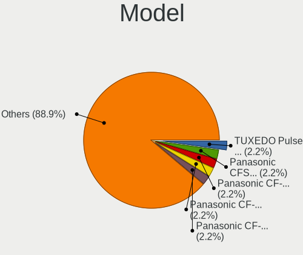
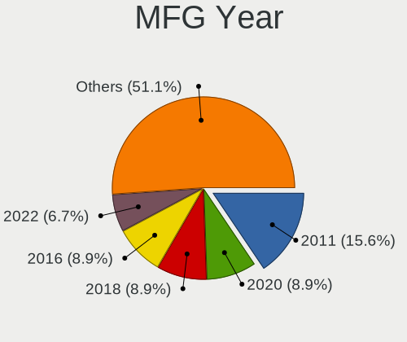
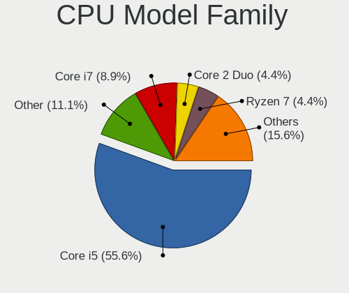
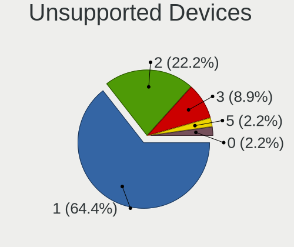

OpenBSD 7.5 - Tested Hardware & Statistics (Notebooks)
------------------------------------------------------

A project to collect tested hardware configurations for OpenBSD 7.5.

Anyone can contribute to this report by the [hw-probe](https://github.com/linuxhw/hw-probe/blob/master/INSTALL.BSD.md) tool:

    hw-probe -all -upload

Please contribute! Especially if your hardware is rare.

Contents
--------

* [ Test Cases ](#test-cases)

* [ System ](#system)
  - [ Arch                     ](#arch)
  - [ DE                       ](#de)
  - [ Display Server           ](#display-server)
  - [ Display Manager          ](#display-manager)
  - [ OS Lang                  ](#os-lang)
  - [ Boot Mode                ](#boot-mode)
  - [ Filesystem               ](#filesystem)
  - [ Part. scheme             ](#part-scheme)

* [ Board ](#board)
  - [ Vendor                   ](#vendor)
  - [ Model                    ](#model)
  - [ Model Family             ](#model-family)
  - [ MFG Year                 ](#mfg-year)
  - [ Form Factor              ](#form-factor)
  - [ Coreboot                 ](#coreboot)
  - [ RAM Size                 ](#ram-size)
  - [ RAM Used                 ](#ram-used)
  - [ Total Drives             ](#total-drives)
  - [ Has CD-ROM               ](#has-cd-rom)
  - [ Has Ethernet             ](#has-ethernet)
  - [ Has WiFi                 ](#has-wifi)
  - [ Has Bluetooth            ](#has-bluetooth)

* [ Location ](#location)
  - [ Country                  ](#country)
  - [ City                     ](#city)

* [ Drives ](#drives)
  - [ Drive Vendor             ](#drive-vendor)
  - [ Drive Model              ](#drive-model)
  - [ HDD Vendor               ](#hdd-vendor)
  - [ SSD Vendor               ](#ssd-vendor)
  - [ Drive Kind               ](#drive-kind)
  - [ Drive Connector          ](#drive-connector)
  - [ Drive Size               ](#drive-size)
  - [ Space Total              ](#space-total)
  - [ Space Used               ](#space-used)
  - [ Malfunc. Drives          ](#malfunc-drives)
  - [ Malfunc. Drive Vendor    ](#malfunc-drive-vendor)
  - [ Malfunc. HDD Vendor      ](#malfunc-hdd-vendor)
  - [ Malfunc. Drive Kind      ](#malfunc-drive-kind)
  - [ Failed Drives            ](#failed-drives)
  - [ Failed Drive Vendor      ](#failed-drive-vendor)
  - [ Drive Status             ](#drive-status)

* [ Storage controller ](#storage-controller)
  - [ Storage Vendor           ](#storage-vendor)
  - [ Storage Model            ](#storage-model)
  - [ Storage Kind             ](#storage-kind)

* [ Processor ](#processor)
  - [ CPU Vendor               ](#cpu-vendor)
  - [ CPU Model                ](#cpu-model)
  - [ CPU Model Family         ](#cpu-model-family)
  - [ CPU Cores                ](#cpu-cores)
  - [ CPU Sockets              ](#cpu-sockets)
  - [ CPU Threads              ](#cpu-threads)
  - [ CPU Microarch            ](#cpu-microarch)

* [ Graphics ](#graphics)
  - [ GPU Vendor               ](#gpu-vendor)
  - [ GPU Model                ](#gpu-model)
  - [ GPU Combo                ](#gpu-combo)
  - [ GPU Driver               ](#gpu-driver)
  - [ GPU Memory               ](#gpu-memory)

* [ Monitor ](#monitor)
  - [ Monitor Vendor           ](#monitor-vendor)
  - [ Monitor Model            ](#monitor-model)
  - [ Monitor Resolution       ](#monitor-resolution)
  - [ Monitor Diagonal         ](#monitor-diagonal)
  - [ Monitor Width            ](#monitor-width)
  - [ Aspect Ratio             ](#aspect-ratio)
  - [ Monitor Area             ](#monitor-area)
  - [ Pixel Density            ](#pixel-density)
  - [ Multiple Monitors        ](#multiple-monitors)

* [ Network ](#network)
  - [ Net Controller Vendor    ](#net-controller-vendor)
  - [ Net Controller Model     ](#net-controller-model)
  - [ Wireless Vendor          ](#wireless-vendor)
  - [ Wireless Model           ](#wireless-model)
  - [ Ethernet Vendor          ](#ethernet-vendor)
  - [ Ethernet Model           ](#ethernet-model)
  - [ Net Controller Kind      ](#net-controller-kind)
  - [ Used Controller          ](#used-controller)
  - [ NICs                     ](#nics)
  - [ IPv6                     ](#ipv6)

* [ Bluetooth ](#bluetooth)
  - [ Bluetooth Vendor         ](#bluetooth-vendor)
  - [ Bluetooth Model          ](#bluetooth-model)

* [ Sound ](#sound)
  - [ Sound Vendor             ](#sound-vendor)
  - [ Sound Model              ](#sound-model)

* [ Memory ](#memory)
  - [ Memory Vendor            ](#memory-vendor)
  - [ Memory Model             ](#memory-model)
  - [ Memory Kind              ](#memory-kind)
  - [ Memory Form Factor       ](#memory-form-factor)
  - [ Memory Size              ](#memory-size)
  - [ Memory Speed             ](#memory-speed)

* [ Printers & scanners ](#printers--scanners)
  - [ Printer Vendor           ](#printer-vendor)
  - [ Printer Model            ](#printer-model)
  - [ Scanner Vendor           ](#scanner-vendor)
  - [ Scanner Model            ](#scanner-model)

* [ Camera ](#camera)
  - [ Camera Vendor            ](#camera-vendor)
  - [ Camera Model             ](#camera-model)

* [ Security ](#security)
  - [ Fingerprint Vendor       ](#fingerprint-vendor)
  - [ Fingerprint Model        ](#fingerprint-model)
  - [ Chipcard Vendor          ](#chipcard-vendor)
  - [ Chipcard Model           ](#chipcard-model)

* [ Unsupported ](#unsupported)
  - [ Unsupported Devices      ](#unsupported-devices)
  - [ Unsupported Device Types ](#unsupported-device-types)

Test Cases
----------

Total: 63

| Vendor        | Model                       | Probe                                                     | Date         |
|---------------|-----------------------------|-----------------------------------------------------------|--------------|
| Apple         | MacBookPro11,1              | [7fef5366cf](https://bsd-hardware.info/?probe=7fef5366cf) | Oct 10, 2024 |
| Panasonic     | CFSZ6-2                     | [52aa021161](https://bsd-hardware.info/?probe=52aa021161) | Oct 03, 2024 |
| Panasonic     | CFSZ6-2                     | [3c534a62ac](https://bsd-hardware.info/?probe=3c534a62ac) | Oct 03, 2024 |
| Dell          | Latitude E7250              | [025ea9ef12](https://bsd-hardware.info/?probe=025ea9ef12) | Sep 30, 2024 |
| Dell          | Latitude E7250              | [2dfb20ed35](https://bsd-hardware.info/?probe=2dfb20ed35) | Sep 27, 2024 |
| Lenovo        | ThinkPad X230 2325WMM       | [06cb50192c](https://bsd-hardware.info/?probe=06cb50192c) | Sep 27, 2024 |
| Framework     | Laptop                      | [db5ecf38bc](https://bsd-hardware.info/?probe=db5ecf38bc) | Sep 25, 2024 |
| Lenovo        | ThinkPad T420 41786UU       | [81062d2bf1](https://bsd-hardware.info/?probe=81062d2bf1) | Sep 17, 2024 |
| Panasonic     | CF-C1BT02EGE                | [e2dcfb8821](https://bsd-hardware.info/?probe=e2dcfb8821) | Sep 06, 2024 |
| ASUSTek       | UX305FA                     | [8f27558fdf](https://bsd-hardware.info/?probe=8f27558fdf) | Aug 29, 2024 |
| Acer          | Aspire 5551                 | [861d3a83cc](https://bsd-hardware.info/?probe=861d3a83cc) | Aug 27, 2024 |
| Fujitsu       | LIFEBOOK E752               | [1be0ff70bb](https://bsd-hardware.info/?probe=1be0ff70bb) | Aug 21, 2024 |
| ' '           | Unknown                     | [ad1210fffc](https://bsd-hardware.info/?probe=ad1210fffc) | Aug 21, 2024 |
| Lenovo        | ThinkPad T480s 20L8S6JH0... | [5f5e0baa4e](https://bsd-hardware.info/?probe=5f5e0baa4e) | Aug 05, 2024 |
| Lenovo        | ThinkPad X260 20F5S10W0H    | [ed6539c0d5](https://bsd-hardware.info/?probe=ed6539c0d5) | Aug 03, 2024 |
| Panasonic     | CFSX4-1                     | [78d6d40878](https://bsd-hardware.info/?probe=78d6d40878) | Aug 02, 2024 |
| Lenovo        | ThinkPad X260 20F6005LUS    | [e23e2f1aaa](https://bsd-hardware.info/?probe=e23e2f1aaa) | Jul 26, 2024 |
| HP            | ProBook 6470b               | [80be308f90](https://bsd-hardware.info/?probe=80be308f90) | Jul 24, 2024 |
| Lenovo        | ThinkPad T400 6475FA4       | [ebe23829a9](https://bsd-hardware.info/?probe=ebe23829a9) | Jul 18, 2024 |
| Lenovo        | ThinkPad X220 429137G       | [f6d3e4a448](https://bsd-hardware.info/?probe=f6d3e4a448) | Jul 13, 2024 |
| Lenovo        | ThinkPad X220 429137G       | [1e0500cb46](https://bsd-hardware.info/?probe=1e0500cb46) | Jul 09, 2024 |
| Apple         | PowerBook6,8                | [91910550d4](https://bsd-hardware.info/?probe=91910550d4) | Jul 09, 2024 |
| Panasonic     | CFSX4-1                     | [2bba859d5a](https://bsd-hardware.info/?probe=2bba859d5a) | Jul 06, 2024 |
| Lenovo        | ThinkPad X220 429137G       | [2d398edd49](https://bsd-hardware.info/?probe=2d398edd49) | Jul 02, 2024 |
| Lenovo        | ThinkPad X220 429137G       | [c78a57178a](https://bsd-hardware.info/?probe=c78a57178a) | Jul 02, 2024 |
| Lenovo        | ThinkPad X1 Extreme 2nd ... | [a74ac046b0](https://bsd-hardware.info/?probe=a74ac046b0) | Jun 19, 2024 |
| ASUSTek       | VivoBook_ASUSLaptop X512... | [0d82249e6b](https://bsd-hardware.info/?probe=0d82249e6b) | Jun 18, 2024 |
| Maibenben     | MaiBook M                   | [e6ab2b3bf7](https://bsd-hardware.info/?probe=e6ab2b3bf7) | Jun 18, 2024 |
| Acer          | TravelMate P214-52          | [6ff322bb68](https://bsd-hardware.info/?probe=6ff322bb68) | Jun 15, 2024 |
| Acer          | TravelMate P214-52          | [2ecfeb9814](https://bsd-hardware.info/?probe=2ecfeb9814) | Jun 15, 2024 |
| TUXEDO        | Pulse 15 Gen1               | [863d61d71e](https://bsd-hardware.info/?probe=863d61d71e) | Jun 12, 2024 |
| Lenovo        | ThinkPad T460 20FMA09CGE    | [f65532b888](https://bsd-hardware.info/?probe=f65532b888) | Jun 01, 2024 |
| Lenovo        | G560 0679                   | [50faff095e](https://bsd-hardware.info/?probe=50faff095e) | May 27, 2024 |
| Lenovo        | ThinkPad YOGA260 20FES2X... | [e49d3164c9](https://bsd-hardware.info/?probe=e49d3164c9) | May 26, 2024 |
| Matsushita... | CF-48V4KNDQM                | [9297aa94a7](https://bsd-hardware.info/?probe=9297aa94a7) | May 24, 2024 |
| Dell          | Inspiron 1545               | [84bb977e77](https://bsd-hardware.info/?probe=84bb977e77) | May 22, 2024 |
| Dell          | Inspiron 1545               | [6fa29eb23c](https://bsd-hardware.info/?probe=6fa29eb23c) | May 22, 2024 |
| Matsushita... | CF-51RCVDNLM                | [c20eb22761](https://bsd-hardware.info/?probe=c20eb22761) | May 21, 2024 |
| Lenovo        | ThinkPad T470 W10DG 20JN... | [9d43b94e3a](https://bsd-hardware.info/?probe=9d43b94e3a) | May 19, 2024 |
| Panasonic     | CFSX4-1                     | [0032ef2a58](https://bsd-hardware.info/?probe=0032ef2a58) | May 18, 2024 |
| Apple         | PowerBook6,8                | [d0f3a361a3](https://bsd-hardware.info/?probe=d0f3a361a3) | May 13, 2024 |
| Apple         | PowerBook6,8                | [272fd15611](https://bsd-hardware.info/?probe=272fd15611) | May 12, 2024 |
| ASUSTek       | 1000HE                      | [65db5ea354](https://bsd-hardware.info/?probe=65db5ea354) | May 11, 2024 |
| Panasonic     | CF-54-1                     | [00de332c2c](https://bsd-hardware.info/?probe=00de332c2c) | May 04, 2024 |
| Panasonic     | CF-52PFPBSFQ                | [48423bbece](https://bsd-hardware.info/?probe=48423bbece) | May 03, 2024 |
| Apple         | PowerBook6,8                | [fa66040f75](https://bsd-hardware.info/?probe=fa66040f75) | May 02, 2024 |
| Lenovo        | ThinkPad X1 Carbon Gen 1... | [49d6f53542](https://bsd-hardware.info/?probe=49d6f53542) | Apr 30, 2024 |
| Lenovo        | ThinkPad T470 20HES18R05    | [9b76000646](https://bsd-hardware.info/?probe=9b76000646) | Apr 30, 2024 |
| Lenovo        | ThinkPad T410 2537N24       | [04370189ed](https://bsd-hardware.info/?probe=04370189ed) | Apr 29, 2024 |
| Lenovo        | ThinkPad T430 2347GZU       | [f49f1b3ac2](https://bsd-hardware.info/?probe=f49f1b3ac2) | Apr 28, 2024 |
| Panasonic     | CFSX4-1                     | [58c0214ae8](https://bsd-hardware.info/?probe=58c0214ae8) | Apr 25, 2024 |
| Dell          | Latitude 7490               | [510590d1c7](https://bsd-hardware.info/?probe=510590d1c7) | Apr 24, 2024 |
| Lenovo        | ThinkPad X270 W10DG 20K5... | [bf89bc5c69](https://bsd-hardware.info/?probe=bf89bc5c69) | Apr 24, 2024 |
| Lenovo        | ThinkPad X260 20F5S2GM00    | [8a37e6930f](https://bsd-hardware.info/?probe=8a37e6930f) | Apr 23, 2024 |
| Panasonic     | CF-53AAGHYDM                | [3eac3d5a68](https://bsd-hardware.info/?probe=3eac3d5a68) | Apr 23, 2024 |
| Notebook      | NV4XMB,ME,MZ                | [bf1d7a54d1](https://bsd-hardware.info/?probe=bf1d7a54d1) | Apr 22, 2024 |
| Dell          | Latitude 7490               | [e2af0367f5](https://bsd-hardware.info/?probe=e2af0367f5) | Apr 11, 2024 |
| Lenovo        | ThinkPad T470 20HES18R05    | [e081ad3727](https://bsd-hardware.info/?probe=e081ad3727) | Apr 08, 2024 |
| Apple         | MacBookAir7,2               | [435faeda9e](https://bsd-hardware.info/?probe=435faeda9e) | Apr 07, 2024 |
| Lenovo        | ThinkPad T420 4236JY2       | [0111e4442e](https://bsd-hardware.info/?probe=0111e4442e) | Mar 11, 2024 |
| Lenovo        | ThinkPad X1 Carbon 6th 2... | [637e2678c5](https://bsd-hardware.info/?probe=637e2678c5) | Mar 09, 2024 |
| Lenovo        | ThinkPad X1 Carbon 6th 2... | [f6e67c7e6e](https://bsd-hardware.info/?probe=f6e67c7e6e) | Mar 09, 2024 |
| Panasonic     | CFSX4-1                     | [5821783809](https://bsd-hardware.info/?probe=5821783809) | Mar 01, 2024 |

System
------

Arch
----

OS architecture (x86_64, i586, etc.)

| Name   | Notebooks | Percent |
|--------|-----------|---------|
| amd64  | 41        | 91.11%  |
| i386   | 3         | 6.67%   |
| macppc | 1         | 2.22%   |

DE
--

Desktop Environment

| Name         | Notebooks | Percent |
|--------------|-----------|---------|
| helloDesktop | 40        | 88.89%  |
| XFCE         | 4         | 8.89%   |
| LXQt         | 1         | 2.22%   |

Display Server
--------------

X11 or Wayland

| Name    | Notebooks | Percent |
|---------|-----------|---------|
| X11     | 41        | 91.11%  |
| Console | 4         | 8.89%   |

Display Manager
---------------

SDDM, LightDM, etc.

| Name    | Notebooks | Percent |
|---------|-----------|---------|
| Console | 45        | 100%    |

OS Lang
-------

Language

| Lang    | Notebooks | Percent |
|---------|-----------|---------|
| Unknown | 40        | 88.89%  |
| en_US   | 4         | 8.89%   |
| pl_PL   | 1         | 2.22%   |

Boot Mode
---------

EFI or BIOS

| Mode | Notebooks | Percent |
|------|-----------|---------|
| EFI  | 31        | 68.89%  |
| BIOS | 14        | 31.11%  |

Filesystem
----------

Type of filesystem

| Type | Notebooks | Percent |
|------|-----------|---------|
| Ffs  | 45        | 100%    |

Part. scheme
------------

Scheme of partitioning

| Type | Notebooks | Percent |
|------|-----------|---------|
| GPT  | 29        | 64.44%  |
| MBR  | 16        | 35.56%  |

Board
-----

Vendor
------

Motherboard manufacturer

| Name                           | Notebooks | Percent |
|--------------------------------|-----------|---------|
| Lenovo                         | 20        | 44.44%  |
| Panasonic                      | 5         | 11.11%  |
| Dell                           | 3         | 6.67%   |
| ASUSTek Computer               | 3         | 6.67%   |
| Apple                          | 3         | 6.67%   |
| Matsushita Electric Industrial | 2         | 4.44%   |
| Acer                           | 2         | 4.44%   |
| TUXEDO                         | 1         | 2.22%   |
| Notebook                       | 1         | 2.22%   |
| Maibenben                      | 1         | 2.22%   |
| Hewlett-Packard                | 1         | 2.22%   |
| Fujitsu                        | 1         | 2.22%   |
| Framework                      | 1         | 2.22%   |
| ' '                            | 1         | 2.22%   |

Model
-----

Motherboard model

| Name                                        | Notebooks | Percent |
|---------------------------------------------|-----------|---------|
| TUXEDO Pulse 15 Gen1                        | 1         | 2.22%   |
| Panasonic CFSX4-1                           | 1         | 2.22%   |
| Panasonic CF-C1BT02EGE                      | 1         | 2.22%   |
| Panasonic CF-54-1                           | 1         | 2.22%   |
| Panasonic CF-53AAGHYDM                      | 1         | 2.22%   |
| Panasonic CF-52PFPBSFQ                      | 1         | 2.22%   |
| Notebook NV4XMB,ME,MZ                       | 1         | 2.22%   |
| Matsushita Electric Industrial CF-51RCVDNLM | 1         | 2.22%   |
| Matsushita Electric Industrial CF-48V4KNDQM | 1         | 2.22%   |
| Maibenben MaiBook M                         | 1         | 2.22%   |
| Lenovo ThinkPad YOGA260 20FES2XD00          | 1         | 2.22%   |
| Lenovo ThinkPad X270 W10DG 20K5S0TT1N       | 1         | 2.22%   |
| Lenovo ThinkPad X260 20F6005LUS             | 1         | 2.22%   |
| Lenovo ThinkPad X260 20F5S2GM00             | 1         | 2.22%   |
| Lenovo ThinkPad X260 20F5S10W0H             | 1         | 2.22%   |
| Lenovo ThinkPad X230 2325WMM                | 1         | 2.22%   |
| Lenovo ThinkPad X220 429137G                | 1         | 2.22%   |
| Lenovo ThinkPad X1 Extreme 2nd 20QVCTO1WW   | 1         | 2.22%   |
| Lenovo ThinkPad X1 Carbon Gen 11 21HM002FUS | 1         | 2.22%   |
| Lenovo ThinkPad X1 Carbon 6th 20KH0035UK    | 1         | 2.22%   |
| Lenovo ThinkPad T480s 20L8S6JH00            | 1         | 2.22%   |
| Lenovo ThinkPad T470 W10DG 20JNS0L300       | 1         | 2.22%   |
| Lenovo ThinkPad T470 20HES18R05             | 1         | 2.22%   |
| Lenovo ThinkPad T460 20FMA09CGE             | 1         | 2.22%   |
| Lenovo ThinkPad T430 2347GZU                | 1         | 2.22%   |
| Lenovo ThinkPad T420 4236JY2                | 1         | 2.22%   |
| Lenovo ThinkPad T420 41786UU                | 1         | 2.22%   |
| Lenovo ThinkPad T410 2537N24                | 1         | 2.22%   |
| Lenovo ThinkPad T400 6475FA4                | 1         | 2.22%   |
| Lenovo G560 0679                            | 1         | 2.22%   |
| HP ProBook 6470b                            | 1         | 2.22%   |
| Fujitsu LIFEBOOK E752                       | 1         | 2.22%   |
| Framework Laptop                            | 1         | 2.22%   |
| Dell Latitude E7250                         | 1         | 2.22%   |
| Dell Latitude 7490                          | 1         | 2.22%   |
| Dell Inspiron 1545                          | 1         | 2.22%   |
| ASUS VivoBook_ASUSLaptop X512DA_X512DA      | 1         | 2.22%   |
| ASUS UX305FA                                | 1         | 2.22%   |
| ASUS 1000HE                                 | 1         | 2.22%   |
| Apple PowerBook6,8                          | 1         | 2.22%   |

Model Family
------------

Motherboard model prefix

| Name                                        | Notebooks | Percent |
|---------------------------------------------|-----------|---------|
| Lenovo ThinkPad                             | 19        | 42.22%  |
| Dell Latitude                               | 2         | 4.44%   |
| TUXEDO Pulse                                | 1         | 2.22%   |
| Panasonic CFSX4-1                           | 1         | 2.22%   |
| Panasonic CF-C1BT02EGE                      | 1         | 2.22%   |
| Panasonic CF-54-1                           | 1         | 2.22%   |
| Panasonic CF-53AAGHYDM                      | 1         | 2.22%   |
| Panasonic CF-52PFPBSFQ                      | 1         | 2.22%   |
| Notebook NV4XMB                             | 1         | 2.22%   |
| Matsushita Electric Industrial CF-51RCVDNLM | 1         | 2.22%   |
| Matsushita Electric Industrial CF-48V4KNDQM | 1         | 2.22%   |
| Maibenben MaiBook                           | 1         | 2.22%   |
| Lenovo G560                                 | 1         | 2.22%   |
| HP ProBook                                  | 1         | 2.22%   |
| Fujitsu LIFEBOOK                            | 1         | 2.22%   |
| Framework Laptop                            | 1         | 2.22%   |
| Dell Inspiron                               | 1         | 2.22%   |
| ASUS VivoBook                               | 1         | 2.22%   |
| ASUS UX305FA                                | 1         | 2.22%   |
| ASUS 1000HE                                 | 1         | 2.22%   |
| Apple PowerBook6                            | 1         | 2.22%   |
| Apple MacBookPro11                          | 1         | 2.22%   |
| Apple MacBookAir7                           | 1         | 2.22%   |
| Acer TravelMate                             | 1         | 2.22%   |
| Acer Aspire                                 | 1         | 2.22%   |
| Unknown                                     | 1         | 2.22%   |

MFG Year
--------

Motherboard manufacture year

| Year    | Notebooks | Percent |
|---------|-----------|---------|
| 2011    | 7         | 15.56%  |
| 2020    | 4         | 8.89%   |
| 2018    | 4         | 8.89%   |
| 2016    | 4         | 8.89%   |
| 2022    | 3         | 6.67%   |
| 2021    | 3         | 6.67%   |
| 2015    | 3         | 6.67%   |
| 2009    | 3         | 6.67%   |
| 2024    | 2         | 4.44%   |
| 2017    | 2         | 4.44%   |
| 2012    | 2         | 4.44%   |
| 2010    | 2         | 4.44%   |
| 2019    | 1         | 2.22%   |
| 2014    | 1         | 2.22%   |
| 2013    | 1         | 2.22%   |
| 2006    | 1         | 2.22%   |
| 2002    | 1         | 2.22%   |
| Unknown | 1         | 2.22%   |

Form Factor
-----------

Physical design of the computer

| Name     | Notebooks | Percent |
|----------|-----------|---------|
| Notebook | 45        | 100%    |

Coreboot
--------

Have coreboot on board

| Used | Notebooks | Percent |
|------|-----------|---------|
| No   | 45        | 100%    |

RAM Size
--------

Total RAM memory

| Size in GB | Notebooks | Percent |
|------------|-----------|---------|
| 8.01-16.0  | 19        | 42.22%  |
| 16.01-24.0 | 7         | 15.56%  |
| 4.01-8.0   | 6         | 13.33%  |
| 32.01-64.0 | 4         | 8.89%   |
| 3.01-4.0   | 4         | 8.89%   |
| 2.01-3.0   | 2         | 4.44%   |
| 0.51-1.0   | 2         | 4.44%   |
| 24.01-32.0 | 1         | 2.22%   |

RAM Used
--------

Used RAM memory

| Used GB  | Notebooks | Percent |
|----------|-----------|---------|
| 0.01-0.5 | 37        | 82.22%  |
| 0.51-1.0 | 4         | 8.89%   |
| 0        | 3         | 6.67%   |
| 1.01-2.0 | 1         | 2.22%   |

Total Drives
------------

Number of drives on board

| Drives | Notebooks | Percent |
|--------|-----------|---------|
| 1      | 27        | 60%     |
| 2      | 15        | 33.33%  |
| 3      | 2         | 4.44%   |
| 0      | 1         | 2.22%   |

Has CD-ROM
----------

Has CD-ROM on board

| Presented | Notebooks | Percent |
|-----------|-----------|---------|
| No        | 43        | 95.56%  |
| Yes       | 2         | 4.44%   |

Has Ethernet
------------

Has Ethernet on board

| Presented | Notebooks | Percent |
|-----------|-----------|---------|
| Yes       | 40        | 88.89%  |
| No        | 5         | 11.11%  |

Has WiFi
--------

Has WiFi module

| Presented | Notebooks | Percent |
|-----------|-----------|---------|
| Yes       | 44        | 97.78%  |
| No        | 1         | 2.22%   |

Has Bluetooth
-------------

Has Bluetooth module

| Presented | Notebooks | Percent |
|-----------|-----------|---------|
| Yes       | 29        | 64.44%  |
| No        | 16        | 35.56%  |

Location
--------

Country
-------

Geographic location (country)

| Country   | Notebooks | Percent |
|-----------|-----------|---------|
| Canada    | 14        | 31.11%  |
| USA       | 11        | 24.44%  |
| UK        | 6         | 13.33%  |
| Germany   | 3         | 6.67%   |
| Russia    | 2         | 4.44%   |
| Poland    | 1         | 2.22%   |
| Malaysia  | 1         | 2.22%   |
| Italy     | 1         | 2.22%   |
| India     | 1         | 2.22%   |
| France    | 1         | 2.22%   |
| Czechia   | 1         | 2.22%   |
| Croatia   | 1         | 2.22%   |
| Brazil    | 1         | 2.22%   |
| Argentina | 1         | 2.22%   |

City
----

Geographic location (city)

| City                        | Notebooks | Percent |
|-----------------------------|-----------|---------|
| Saint-Laurent               | 8         | 16.67%  |
| Montreal                    | 4         | 8.33%   |
| Mount Prospect              | 2         | 4.17%   |
| Lambeth                     | 2         | 4.17%   |
| Hoffman Estates             | 2         | 4.17%   |
| Zagreb                      | 1         | 2.08%   |
| Winnipeg                    | 1         | 2.08%   |
| West Valley City            | 1         | 2.08%   |
| Waynesboro                  | 1         | 2.08%   |
| Voelklingen                 | 1         | 2.08%   |
| Sunderland                  | 1         | 2.08%   |
| St Petersburg               | 1         | 2.08%   |
| San Nicolás de los Arroyos | 1         | 2.08%   |
| Rheda-Wiedenbrueck          | 1         | 2.08%   |
| Prudhoe                     | 1         | 2.08%   |
| Prague                      | 1         | 2.08%   |
| Portage                     | 1         | 2.08%   |
| Paris                       | 1         | 2.08%   |
| Ottawa                      | 1         | 2.08%   |
| Oldenburg                   | 1         | 2.08%   |
| New York                    | 1         | 2.08%   |
| Moscow                      | 1         | 2.08%   |
| Morden                      | 1         | 2.08%   |
| Madison                     | 1         | 2.08%   |
| Kuala Lumpur                | 1         | 2.08%   |
| Krakow                      | 1         | 2.08%   |
| Como                        | 1         | 2.08%   |
| Columbia                    | 1         | 2.08%   |
| Clearfield                  | 1         | 2.08%   |
| Chicago                     | 1         | 2.08%   |
| Chennai                     | 1         | 2.08%   |
| Bristol                     | 1         | 2.08%   |
| Belo Horizonte              | 1         | 2.08%   |
| Bellevue                    | 1         | 2.08%   |
| Ashburn                     | 1         | 2.08%   |

Drives
------

Drive Vendor
------------

Hard drive vendors

| Vendor                             | Notebooks | Drives | Percent |
|------------------------------------|-----------|--------|---------|
| NVMe                               | 10        | 10     | 18.87%  |
| WDC                                | 7         | 7      | 13.21%  |
| Seagate                            | 4         | 4      | 7.55%   |
| Samsung Electronics                | 4         | 4      | 7.55%   |
| Kingston                           | 3         | 3      | 5.66%   |
| SanDisk                            | 2         | 2      | 3.77%   |
| Intel                              | 2         | 2      | 3.77%   |
| Hitachi                            | 2         | 2      | 3.77%   |
| Crucial                            | 2         | 2      | 3.77%   |
| Apple                              | 2         | 2      | 3.77%   |
| A-DATA Technology                  | 2         | 2      | 3.77%   |
| Toshiba                            | 1         | 1      | 1.89%   |
| Product:              USB DISK 2.0 | 1         | 1      | 1.89%   |
| PNY                                | 1         | 4      | 1.89%   |
| Patriot                            | 1         | 1      | 1.89%   |
| Micron Technology                  | 1         | 1      | 1.89%   |
| LITEONIT                           | 1         | 1      | 1.89%   |
| KingSpec                           | 1         | 1      | 1.89%   |
| Kingchuxing                        | 1         | 2      | 1.89%   |
| JetFlash                           | 1         | 1      | 1.89%   |
| Intenso                            | 1         | 1      | 1.89%   |
| BIWIN                              | 1         | 1      | 1.89%   |
| Apacer                             | 1         | 1      | 1.89%   |
| Acer                               | 1         | 1      | 1.89%   |

Drive Model
-----------

Hard drive models

| Model                                                | Notebooks | Percent |
|------------------------------------------------------|-----------|---------|
| Seagate ST320LT007-9ZV142 320GB                      | 2         | 3.77%   |
| NVMe SAMSUNG MZVLW256 256GB                          | 2         | 3.77%   |
| Kingston SA400S37240G 240GB                          | 2         | 3.77%   |
| WDC WD7500BPKX-00HPJT0 752GB                         | 1         | 1.89%   |
| WDC WD7500BPKT-75PK4T0 752GB                         | 1         | 1.89%   |
| WDC WD7500BPKT-00PK4T0 752GB                         | 1         | 1.89%   |
| WDC WD5000LPLX-00ZNTT0 500GB                         | 1         | 1.89%   |
| WDC WD3200BEVE-00A0HT0 320GB                         | 1         | 1.89%   |
| WDC WD10JPLX-00MBPT0 1TB                             | 1         | 1.89%   |
| WDC PC SN520 SDAPNUW-128G-1014 128GB                 | 1         | 1.89%   |
| Toshiba MK6465GSX 640GB                              | 1         | 1.89%   |
| Seagate ST9500420AS 500GB                            | 1         | 1.89%   |
| Seagate ST9160821A 160GB                             | 1         | 1.89%   |
| SanDisk SD8SN8U-256G-1006 256GB                      | 1         | 1.89%   |
| SanDisk 3.2 Gen1 128GB                               | 1         | 1.89%   |
| Samsung SSD PM871 mSATA 256GB                        | 1         | 1.89%   |
| Samsung SSD 960 EVO 500GB                            | 1         | 1.89%   |
| Samsung SSD 870 EVO 250GB                            | 1         | 1.89%   |
| Samsung SSD 860 EVO 1TB                              | 1         | 1.89%   |
| Product:              USB DISK 2.0 USB DISK 2.0 16GB | 1         | 1.89%   |
| PNY CS900 1TB SSD                                    | 1         | 1.89%   |
| Patriot Burst 120GB                                  | 1         | 1.89%   |
| NVMe WDC PC SN730 SDB 256GB                          | 1         | 1.89%   |
| NVMe WD PC SN810 SDCQ 512GB                          | 1         | 1.89%   |
| NVMe WD PC SN540 SDDP 512GB                          | 1         | 1.89%   |
| NVMe Samsung SSD 980 1TB                             | 1         | 1.89%   |
| NVMe Samsung SSD 970 500GB                           | 1         | 1.89%   |
| NVMe SAMSUNG MZVLB512 512GB                          | 1         | 1.89%   |
| NVMe SAMSUNG MZVLB256 256GB                          | 1         | 1.89%   |
| NVMe INTEL SSDPEKNW51 512GB                          | 1         | 1.89%   |
| Micron M600_MTFDDAV256MBF 256GB                      | 1         | 1.89%   |
| LITEONIT LCS-256M6S 2.5 7mm 256GB                    | 1         | 1.89%   |
| Kingston SA400S37480G 480GB                          | 1         | 1.89%   |
| KingSpec MT-128 128GB                                | 1         | 1.89%   |
| Kingchuxing SSD 64GB                                 | 1         | 1.89%   |
| JetFlash Transcend 16GB                              | 1         | 1.89%   |
| Intenso External USB 3.0 1TB                         | 1         | 1.89%   |
| Intel SSDSCKKF256G8L 256GB                           | 1         | 1.89%   |
| Intel SSDSC2KF180H6L 180GB                           | 1         | 1.89%   |
| Hitachi HTS725032A9A364 320GB                        | 1         | 1.89%   |

HDD Vendor
----------

Hard disk drive vendors

| Vendor                             | Notebooks | Drives | Percent |
|------------------------------------|-----------|--------|---------|
| NVMe                               | 7         | 7      | 30.43%  |
| WDC                                | 6         | 6      | 26.09%  |
| Seagate                            | 4         | 4      | 17.39%  |
| Hitachi                            | 2         | 2      | 8.7%    |
| Toshiba                            | 1         | 1      | 4.35%   |
| Product:              USB DISK 2.0 | 1         | 1      | 4.35%   |
| JetFlash                           | 1         | 1      | 4.35%   |
| Intenso                            | 1         | 1      | 4.35%   |

SSD Vendor
----------

Solid state drive vendors

| Vendor              | Notebooks | Drives | Percent |
|---------------------|-----------|--------|---------|
| Samsung Electronics | 3         | 3      | 11.11%  |
| NVMe                | 3         | 3      | 11.11%  |
| Kingston            | 3         | 3      | 11.11%  |
| SanDisk             | 2         | 2      | 7.41%   |
| Intel               | 2         | 2      | 7.41%   |
| Apple               | 2         | 2      | 7.41%   |
| A-DATA Technology   | 2         | 2      | 7.41%   |
| PNY                 | 1         | 4      | 3.7%    |
| Patriot             | 1         | 1      | 3.7%    |
| Micron Technology   | 1         | 1      | 3.7%    |
| LITEONIT            | 1         | 1      | 3.7%    |
| KingSpec            | 1         | 1      | 3.7%    |
| Kingchuxing         | 1         | 2      | 3.7%    |
| Crucial             | 1         | 1      | 3.7%    |
| BIWIN               | 1         | 1      | 3.7%    |
| Apacer              | 1         | 1      | 3.7%    |
| Acer                | 1         | 1      | 3.7%    |

Drive Kind
----------

HDD or SSD

| Kind | Notebooks | Drives | Percent |
|------|-----------|--------|---------|
| SSD  | 25        | 31     | 51.02%  |
| HDD  | 21        | 23     | 42.86%  |
| NVMe | 3         | 3      | 6.12%   |

Drive Connector
---------------

SATA, SAS, NVMe, etc.

| Type | Notebooks | Drives | Percent |
|------|-----------|--------|---------|
| SATA | 42        | 54     | 93.33%  |
| NVMe | 3         | 3      | 6.67%   |

Drive Size
----------

Size of hard drive

| Size in TB | Notebooks | Drives | Percent |
|------------|-----------|--------|---------|
| 0.01-0.5   | 32        | 37     | 69.57%  |
| 0.51-1.0   | 14        | 17     | 30.43%  |

Space Total
-----------

Amount of disk space available on the file system

| Size in GB | Notebooks | Percent |
|------------|-----------|---------|
| 101-250    | 17        | 37.78%  |
| 21-50      | 10        | 22.22%  |
| 251-500    | 8         | 17.78%  |
| 51-100     | 7         | 15.56%  |
| 501-1000   | 2         | 4.44%   |
| 1-20       | 1         | 2.22%   |

Space Used
----------

Amount of used disk space

| Used GB | Notebooks | Percent |
|---------|-----------|---------|
| 1-20    | 33        | 73.33%  |
| 21-50   | 4         | 8.89%   |
| 101-250 | 4         | 8.89%   |
| 51-100  | 3         | 6.67%   |
| 251-500 | 1         | 2.22%   |

Malfunc. Drives
---------------

Drive models with a malfunction

| Model                           | Notebooks | Drives | Percent |
|---------------------------------|-----------|--------|---------|
| Seagate ST320LT007-9ZV142 320GB | 2         | 2      | 33.33%  |
| Toshiba MK6465GSX 640GB         | 1         | 1      | 16.67%  |
| Seagate ST9500420AS 500GB       | 1         | 1      | 16.67%  |
| Hitachi HTS541060G9AT00 64GB    | 1         | 1      | 16.67%  |
| A-DATA Technology SP550 480GB   | 1         | 1      | 16.67%  |

Malfunc. Drive Vendor
---------------------

Vendors of faulty drives

| Vendor            | Notebooks | Drives | Percent |
|-------------------|-----------|--------|---------|
| Seagate           | 3         | 3      | 50%     |
| Toshiba           | 1         | 1      | 16.67%  |
| Hitachi           | 1         | 1      | 16.67%  |
| A-DATA Technology | 1         | 1      | 16.67%  |

Malfunc. HDD Vendor
-------------------

Vendors of faulty HDD drives

| Vendor  | Notebooks | Drives | Percent |
|---------|-----------|--------|---------|
| Seagate | 3         | 3      | 60%     |
| Toshiba | 1         | 1      | 20%     |
| Hitachi | 1         | 1      | 20%     |

Malfunc. Drive Kind
-------------------

Kinds of faulty drives

| Kind | Notebooks | Drives | Percent |
|------|-----------|--------|---------|
| HDD  | 5         | 5      | 83.33%  |
| SSD  | 1         | 1      | 16.67%  |

Failed Drives
-------------

Failed drive models

Zero info for selected period =(

Failed Drive Vendor
-------------------

Failed drive vendors

Zero info for selected period =(

Drive Status
------------

Number of failed and malfunc. drives

| Status   | Notebooks | Drives | Percent |
|----------|-----------|--------|---------|
| Works    | 31        | 38     | 64.58%  |
| Detected | 11        | 13     | 22.92%  |
| Malfunc  | 6         | 6      | 12.5%   |

Storage controller
------------------

Storage Vendor
--------------

Storage controller vendors

| Vendor                    | Notebooks | Percent |
|---------------------------|-----------|---------|
| Intel                     | 30        | 63.83%  |
| Samsung Electronics       | 9         | 19.15%  |
| SanDisk                   | 4         | 8.51%   |
| AMD                       | 3         | 6.38%   |
| Micron/Crucial Technology | 1         | 2.13%   |

Storage Model
-------------

Storage controller models

| Model                                                                          | Notebooks | Percent |
|--------------------------------------------------------------------------------|-----------|---------|
| Intel Sunrise Point-LP SATA Controller [AHCI mode]                             | 6         | 12.5%   |
| Intel 6 Series/C200 Series Chipset Family 6 port Mobile SATA AHCI Controller   | 5         | 10.42%  |
| Intel Wildcat Point-LP SATA Controller [AHCI Mode]                             | 4         | 8.33%   |
| Intel 7 Series Chipset Family 6-port SATA Controller [AHCI mode]               | 4         | 8.33%   |
| Samsung NVMe SSD Controller SM981/PM981/PM983                                  | 3         | 6.25%   |
| Samsung NVMe SSD Controller SM961/PM961/SM963                                  | 3         | 6.25%   |
| Intel 82801IBM/IEM (ICH9M/ICH9M-E) 4 port SATA Controller [AHCI mode]          | 2         | 4.17%   |
| Intel 82801GBM/GHM (ICH7-M Family) SATA Controller [IDE mode]                  | 2         | 4.17%   |
| Intel 5 Series/3400 Series Chipset 6 port SATA AHCI Controller                 | 2         | 4.17%   |
| AMD FCH SATA Controller [AHCI mode]                                            | 2         | 4.17%   |
| SanDisk WD PC SN810 / Black SN850 NVMe SSD                                     | 1         | 2.08%   |
| Sandisk WD PC SN540 / Green SN350 NVMe SSD 1 TB (DRAM-less)                    | 1         | 2.08%   |
| SanDisk WD Blue SN500 / PC SN520 x2 M.2 2280 NVMe SSD                          | 1         | 2.08%   |
| SanDisk Extreme Pro / WD Black SN750 / PC SN730 / Red SN700 NVMe SSD           | 1         | 2.08%   |
| Samsung S4LN058A01[SSUBX] AHCI SSD Controller (Apple slot)                     | 1         | 2.08%   |
| Samsung S4LN053X01 AHCI SSD Controller(Apple slot)                             | 1         | 2.08%   |
| Samsung NVMe SSD Controller PM9A1/PM9A3/980PRO                                 | 1         | 2.08%   |
| Micron/Crucial P1 NVMe PCIe SSD[Frampton]                                      | 1         | 2.08%   |
| Intel SSD 660P Series                                                          | 1         | 2.08%   |
| Intel Mobile 4 Series Chipset PT IDER Controller                               | 1         | 2.08%   |
| Intel Comet Lake SATA AHCI Controller                                          | 1         | 2.08%   |
| Intel 82801CAM IDE U100 Controller                                             | 1         | 2.08%   |
| Intel 8 Series/C220 Series Chipset Family 6-port SATA Controller 1 [AHCI mode] | 1         | 2.08%   |
| Intel 5 Series/3400 Series Chipset 4 port SATA AHCI Controller                 | 1         | 2.08%   |
| AMD SB7x0/SB8x0/SB9x0 SATA Controller [AHCI mode]                              | 1         | 2.08%   |

Storage Kind
------------

Kind of storage controller (IDE, SATA, NVMe, SAS, ...)

| Kind | Notebooks | Percent |
|------|-----------|---------|
| SATA | 31        | 64.58%  |
| NVMe | 13        | 27.08%  |
| IDE  | 4         | 8.33%   |

Processor
---------

CPU Vendor
----------

Processor vendors

| Vendor  | Notebooks | Percent |
|---------|-----------|---------|
| Intel   | 40        | 88.89%  |
| AMD     | 4         | 8.89%   |
| PowerPC | 1         | 2.22%   |

CPU Model
---------

Processor models

| Model                                         | Notebooks | Percent |
|-----------------------------------------------|-----------|---------|
| Intel Core i5-6300U CPU @ 2.40GHz             | 5         | 11.11%  |
| Intel Core i5-2520M CPU @ 2.50GHz             | 5         | 11.11%  |
| Intel Core i5-5300U CPU @ 2.30GHz             | 3         | 6.67%   |
| Intel Core i5-6200U CPU @ 2.30GHz             | 2         | 4.44%   |
| Intel Core i5 CPU M 520 @ 2.40GHz             | 2         | 4.44%   |
| Intel 11th Gen Core i5-1135G7 @ 2.40GHz       | 2         | 4.44%   |
| PowerPC 7447A (Revision 0x102)                | 1         | 2.22%   |
| Intel Processor 5Y10 CPU @ 0.80GHz            | 1         | 2.22%   |
| Intel Pentium CPU P6100 @ 2.00GHz             | 1         | 2.22%   |
| Intel Pentium 4 Mobile CPU 1.60GHz            | 1         | 2.22%   |
| Intel Genuine CPU T2300 @ 1.66GHz             | 1         | 2.22%   |
| Intel Core i7-9750H CPU @ 2.60GHz             | 1         | 2.22%   |
| Intel Core i7-8650U CPU @ 1.90GHz             | 1         | 2.22%   |
| Intel Core i7-4810MQ CPU @ 2.80GHz            | 1         | 2.22%   |
| Intel Core i7-3520M CPU @ 2.90GHz             | 1         | 2.22%   |
| Intel Core i5-8350U CPU @ 1.70GHz             | 1         | 2.22%   |
| Intel Core i5-8250U CPU @ 1.60GHz             | 1         | 2.22%   |
| Intel Core i5-7300U CPU @ 2.60GHz             | 1         | 2.22%   |
| Intel Core i5-5350U CPU @ 1.80GHz             | 1         | 2.22%   |
| Intel Core i5-4288U CPU @ 2.60GHz             | 1         | 2.22%   |
| Intel Core i5-3320M CPU @ 2.60GHz             | 1         | 2.22%   |
| Intel Core i5-3230M CPU @ 2.60GHz             | 1         | 2.22%   |
| Intel Core i5-3210M CPU @ 2.50GHz             | 1         | 2.22%   |
| Intel Core i3-10110U CPU @ 2.10GHz            | 1         | 2.22%   |
| Intel Core 2 Duo CPU T6400 @ 2.00GHz          | 1         | 2.22%   |
| Intel Core 2 Duo CPU P8400 @ 2.26GHz          | 1         | 2.22%   |
| Intel Atom CPU N280 @ 1.66GHz                 | 1         | 2.22%   |
| Intel 13th Gen Core i7-1365U                  | 1         | 2.22%   |
| AMD Ryzen 7 4800H with Radeon Graphics        | 1         | 2.22%   |
| AMD Ryzen 7 4700U with Radeon Graphics        | 1         | 2.22%   |
| AMD Ryzen 5 3500U with Radeon Vega Mobile Gfx | 1         | 2.22%   |
| AMD Athlon II P320 Dual-Core Processor        | 1         | 2.22%   |

CPU Model Family
----------------

Processor model prefix

| Model            | Notebooks | Percent |
|------------------|-----------|---------|
| Intel Core i5    | 25        | 55.56%  |
| Other            | 5         | 11.11%  |
| Intel Core i7    | 4         | 8.89%   |
| Intel Core 2 Duo | 2         | 4.44%   |
| AMD Ryzen 7      | 2         | 4.44%   |
| Intel Pentium 4  | 1         | 2.22%   |
| Intel Pentium    | 1         | 2.22%   |
| Intel Genuine    | 1         | 2.22%   |
| Intel Core i3    | 1         | 2.22%   |
| Intel Atom       | 1         | 2.22%   |
| AMD Ryzen 5      | 1         | 2.22%   |
| AMD Athlon II    | 1         | 2.22%   |

CPU Cores
---------

Number of processor cores

| Number  | Notebooks | Percent |
|---------|-----------|---------|
| 2       | 28        | 62.22%  |
| 4       | 6         | 13.33%  |
| Unknown | 5         | 11.11%  |
| 8       | 2         | 4.44%   |
| 6       | 2         | 4.44%   |
| 16      | 1         | 2.22%   |
| 1       | 1         | 2.22%   |

CPU Sockets
-----------

Number of sockets

| Number  | Notebooks | Percent |
|---------|-----------|---------|
| 1       | 42        | 93.33%  |
| Unknown | 3         | 6.67%   |

CPU Threads
-----------

Threads per core (Hyper-Threading)

| Number  | Notebooks | Percent |
|---------|-----------|---------|
| 2       | 34        | 75.56%  |
| Unknown | 6         | 13.33%  |
| 1       | 5         | 11.11%  |

CPU Microarch
-------------

Microarchitecture

| Name        | Notebooks | Percent |
|-------------|-----------|---------|
| Skylake     | 7         | 15.56%  |
| KabyLake    | 6         | 13.33%  |
| SandyBridge | 5         | 11.11%  |
| Broadwell   | 5         | 11.11%  |
| IvyBridge   | 4         | 8.89%   |
| Westmere    | 3         | 6.67%   |
| Zen 2       | 2         | 4.44%   |
| TigerLake   | 2         | 4.44%   |
| Penryn      | 2         | 4.44%   |
| Haswell     | 2         | 4.44%   |
| Unknown     | 2         | 4.44%   |
| Zen+        | 1         | 2.22%   |
| P6          | 1         | 2.22%   |
| NetBurst    | 1         | 2.22%   |
| K10         | 1         | 2.22%   |
| Bonnell     | 1         | 2.22%   |

Graphics
--------

GPU Vendor
----------

Vendors of graphics cards

| Vendor | Notebooks | Percent |
|--------|-----------|---------|
| Intel  | 39        | 82.98%  |
| AMD    | 5         | 10.64%  |
| Nvidia | 3         | 6.38%   |

GPU Model
---------

Graphics card models

| Model                                                                         | Notebooks | Percent |
|-------------------------------------------------------------------------------|-----------|---------|
| Intel Skylake GT2 [HD Graphics 520]                                           | 7         | 14.29%  |
| Intel 2nd Generation Core Processor Family Integrated Graphics Controller     | 5         | 10.2%   |
| Intel 3rd Gen Core processor Graphics Controller                              | 4         | 8.16%   |
| Intel UHD Graphics 620                                                        | 3         | 6.12%   |
| Intel HD Graphics 5500                                                        | 3         | 6.12%   |
| Intel Core Processor Integrated Graphics Controller                           | 3         | 6.12%   |
| Intel TigerLake-LP GT2 [Iris Xe Graphics]                                     | 2         | 4.08%   |
| Intel Mobile 945GM/GMS/GME, 943/940GML Express Integrated Graphics Controller | 2         | 4.08%   |
| Intel Mobile 4 Series Chipset Integrated Graphics Controller                  | 2         | 4.08%   |
| AMD Renoir [Radeon Vega Series / Radeon Vega Mobile Series]                   | 2         | 4.08%   |
| Nvidia TU117M [GeForce GTX 1650 Mobile / Max-Q]                               | 1         | 2.04%   |
| Nvidia NV34M [GeForce FX Go5200]                                              | 1         | 2.04%   |
| Nvidia GP108M [GeForce MX150]                                                 | 1         | 2.04%   |
| Intel Raptor Lake-P [Iris Xe Graphics]                                        | 1         | 2.04%   |
| Intel Mobile 945GSE Express Integrated Graphics Controller                    | 1         | 2.04%   |
| Intel Mobile 945GM/GMS, 943/940GML Express Integrated Graphics Controller     | 1         | 2.04%   |
| Intel HD Graphics 620                                                         | 1         | 2.04%   |
| Intel HD Graphics 6000                                                        | 1         | 2.04%   |
| Intel HD Graphics 5300                                                        | 1         | 2.04%   |
| Intel Haswell-ULT Integrated Graphics Controller                              | 1         | 2.04%   |
| Intel CometLake-U GT2 [UHD Graphics]                                          | 1         | 2.04%   |
| Intel CoffeeLake-H GT2 [UHD Graphics 630]                                     | 1         | 2.04%   |
| Intel 4th Gen Core Processor Integrated Graphics Controller                   | 1         | 2.04%   |
| AMD RV200/M7 [Mobility Radeon 7500]                                           | 1         | 2.04%   |
| AMD RS880M [Mobility Radeon HD 4225/4250]                                     | 1         | 2.04%   |
| AMD Picasso/Raven 2 [Radeon Vega Series / Radeon Vega Mobile Series]          | 1         | 2.04%   |

GPU Combo
---------

Combinations of graphics cards

| Name           | Notebooks | Percent |
|----------------|-----------|---------|
| 1 x Intel      | 33        | 73.33%  |
| 1 x AMD        | 5         | 11.11%  |
| 2 x Intel      | 4         | 8.89%   |
| Intel + Nvidia | 2         | 4.44%   |
| 1 x Nvidia     | 1         | 2.22%   |

GPU Driver
----------

Free vs proprietary

| Driver  | Notebooks | Percent |
|---------|-----------|---------|
| Free    | 43        | 95.56%  |
| Unknown | 2         | 4.44%   |

GPU Memory
----------

Total video memory

| Size in GB | Notebooks | Percent |
|------------|-----------|---------|
| Unknown    | 45        | 100%    |

Monitor
-------

Monitor Vendor
--------------

Monitor vendors

| Vendor              | Notebooks | Percent |
|---------------------|-----------|---------|
| LG Display          | 10        | 29.41%  |
| BOE                 | 7         | 20.59%  |
| AU Optronics        | 5         | 14.71%  |
| Chimei Innolux      | 3         | 8.82%   |
| Samsung Electronics | 2         | 5.88%   |
| Apple               | 2         | 5.88%   |
| Lenovo              | 1         | 2.94%   |
| InfoVision          | 1         | 2.94%   |
| Dell                | 1         | 2.94%   |
| CSO                 | 1         | 2.94%   |
| BenQ                | 1         | 2.94%   |

Monitor Model
-------------

Monitor models

| Model                                                                | Notebooks | Percent |
|----------------------------------------------------------------------|-----------|---------|
| LG Display LCD Monitor LGD03CD 1366x768 280x160mm 12.7-inch          | 2         | 5.88%   |
| AU Optronics LCD Monitor AUO103D 1920x1080 310x170mm 13.9-inch       | 2         | 5.88%   |
| Samsung Electronics SyncMaster SAM026F 1280x1024 380x300mm 19.1-inch | 1         | 2.94%   |
| Samsung Electronics LCD Monitor SEC304C 1366x768 310x170mm 13.9-inch | 1         | 2.94%   |
| LG Display LCD Monitor LGD6E01 1366x768 340x190mm 15.3-inch          | 1         | 2.94%   |
| LG Display LCD Monitor LGD40A0 1366x768 310x170mm 13.9-inch          | 1         | 2.94%   |
| LG Display LCD Monitor LGD05A2 1920x1080 310x170mm 13.9-inch         | 1         | 2.94%   |
| LG Display LCD Monitor LGD045E 1366x768 310x170mm 13.9-inch          | 1         | 2.94%   |
| LG Display LCD Monitor LGD0395 1366x768 340x190mm 15.3-inch          | 1         | 2.94%   |
| LG Display LCD Monitor LGD0386 1366x768 310x170mm 13.9-inch          | 1         | 2.94%   |
| LG Display LCD Monitor LGD02D3 1366x768 280x160mm 12.7-inch          | 1         | 2.94%   |
| LG Display LCD Monitor LGD0215 1920x1080 350x190mm 15.7-inch         | 1         | 2.94%   |
| Lenovo LCD Monitor LEN4033 1440x900 300x190mm 14.0-inch              | 1         | 2.94%   |
| InfoVision LCD Monitor IVO04E3 1366x768 280x160mm 12.7-inch          | 1         | 2.94%   |
| Dell P2419H DELD0DA 1920x1080 530x300mm 24.0-inch                    | 1         | 2.94%   |
| CSO LCD Monitor CSO1404 1920x1200 300x190mm 14.0-inch                | 1         | 2.94%   |
| Chimei Innolux LCD Monitor CMN15F5 1920x1080 340x190mm 15.3-inch     | 1         | 2.94%   |
| Chimei Innolux LCD Monitor CMN14C9 1920x1080 310x170mm 13.9-inch     | 1         | 2.94%   |
| Chimei Innolux LCD Monitor CMN1239 1920x1080 280x160mm 12.7-inch     | 1         | 2.94%   |
| BOE LCD Monitor BOE095F 2256x1504 280x190mm 13.3-inch                | 1         | 2.94%   |
| BOE LCD Monitor BOE0900 1920x1080 340x190mm 15.3-inch                | 1         | 2.94%   |
| BOE LCD Monitor BOE0853 1920x1080 340x190mm 15.3-inch                | 1         | 2.94%   |
| BOE LCD Monitor BOE0718 1920x1080 310x170mm 13.9-inch                | 1         | 2.94%   |
| BOE LCD Monitor BOE0700 1920x1080 340x190mm 15.3-inch                | 1         | 2.94%   |
| BOE LCD Monitor BOE06DF 1920x1080 310x170mm 13.9-inch                | 1         | 2.94%   |
| BOE LCD Monitor BOE05F4 1366x768 280x160mm 12.7-inch                 | 1         | 2.94%   |
| BenQ PD3200U BNQ8025 3840x2160 710x400mm 32.1-inch                   | 1         | 2.94%   |
| AU Optronics LCD Monitor AUO212D 1920x1080 290x170mm 13.2-inch       | 1         | 2.94%   |
| AU Optronics LCD Monitor AUO203D 1920x1080 310x170mm 13.9-inch       | 1         | 2.94%   |
| AU Optronics LCD Monitor AUO106C 1366x768 280x160mm 12.7-inch        | 1         | 2.94%   |
| Apple Color LCD APPA01B 1440x900 290x180mm 13.4-inch                 | 1         | 2.94%   |
| Apple Color LCD APPA018 2560x1600 290x180mm 13.4-inch                | 1         | 2.94%   |

Monitor Resolution
------------------

Monitor screen resolution

| Resolution        | Notebooks | Percent |
|-------------------|-----------|---------|
| 1920x1080 (FHD)   | 15        | 44.12%  |
| 1366x768 (WXGA)   | 12        | 35.29%  |
| 1440x900 (WXGA+)  | 2         | 5.88%   |
| 3840x2160 (4K)    | 1         | 2.94%   |
| 2560x1600         | 1         | 2.94%   |
| 2256x1504         | 1         | 2.94%   |
| 1920x1200 (WUXGA) | 1         | 2.94%   |
| 1280x1024 (SXGA)  | 1         | 2.94%   |

Monitor Diagonal
----------------

Diagonal size in inches

| Inches | Notebooks | Percent |
|--------|-----------|---------|
| 13     | 14        | 41.18%  |
| 15     | 8         | 23.53%  |
| 12     | 7         | 20.59%  |
| 14     | 2         | 5.88%   |
| 32     | 1         | 2.94%   |
| 24     | 1         | 2.94%   |
| 19     | 1         | 2.94%   |

Monitor Width
-------------

Physical width

| Width in mm | Notebooks | Percent |
|-------------|-----------|---------|
| 301-350     | 18        | 52.94%  |
| 201-300     | 13        | 38.24%  |
| 701-800     | 1         | 2.94%   |
| 501-600     | 1         | 2.94%   |
| 351-400     | 1         | 2.94%   |

Aspect Ratio
------------

Proportional relationship between the width and the height

| Ratio | Notebooks | Percent |
|-------|-----------|---------|
| 16/9  | 28        | 82.35%  |
| 16/10 | 4         | 11.76%  |
| 5/4   | 1         | 2.94%   |
| 3/2   | 1         | 2.94%   |

Monitor Area
------------

Area in inch²

| Area in inch² | Notebooks | Percent |
|----------------|-----------|---------|
| 81-90          | 15        | 44.12%  |
| 61-70          | 7         | 20.59%  |
| 91-100         | 6         | 17.65%  |
| 101-110        | 2         | 5.88%   |
| 71-80          | 1         | 2.94%   |
| 351-500        | 1         | 2.94%   |
| 201-250        | 1         | 2.94%   |
| 151-200        | 1         | 2.94%   |

Pixel Density
-------------

Pixels per inch

| Density | Notebooks | Percent |
|---------|-----------|---------|
| 121-160 | 21        | 61.76%  |
| 161-240 | 5         | 14.71%  |
| 101-120 | 5         | 14.71%  |
| 51-100  | 3         | 8.82%   |

Multiple Monitors
-----------------

Total monitors connected

| Total | Notebooks | Percent |
|-------|-----------|---------|
| 1     | 38        | 84.44%  |
| 0     | 4         | 8.89%   |
| 2     | 3         | 6.67%   |

Network
-------

Net Controller Vendor
---------------------

Controller vendors

| Vendor                   | Notebooks | Percent |
|--------------------------|-----------|---------|
| Intel                    | 37        | 59.68%  |
| Realtek Semiconductor    | 7         | 11.29%  |
| Broadcom                 | 6         | 9.68%   |
| Sierra Wireless          | 3         | 4.84%   |
| Qualcomm Atheros         | 3         | 4.84%   |
| Marvell Technology Group | 2         | 3.23%   |
| Apple                    | 2         | 3.23%   |
| Samsung Electronics      | 1         | 1.61%   |
| Dell                     | 1         | 1.61%   |

Net Controller Model
--------------------

Controller models

| Model                                                                  | Notebooks | Percent |
|------------------------------------------------------------------------|-----------|---------|
| Intel 82579LM Gigabit Network Connection (Lewisville)                  | 8         | 8.89%   |
| Intel Wireless 8260                                                    | 7         | 7.78%   |
| Intel Centrino Advanced-N 6205 [Taylor Peak]                           | 7         | 7.78%   |
| Intel Ethernet Connection I219-LM                                      | 5         | 5.56%   |
| Realtek RTL8111/8168/8211/8411 PCI Express Gigabit Ethernet Controller | 4         | 4.44%   |
| Intel Wireless 8265 / 8275                                             | 4         | 4.44%   |
| Intel Wireless 7265                                                    | 4         | 4.44%   |
| Intel Ethernet Connection (4) I219-LM                                  | 3         | 3.33%   |
| Intel Ethernet Connection (3) I218-LM                                  | 3         | 3.33%   |
| Sierra Wireless EM7455                                                 | 2         | 2.22%   |
| Intel Wi-Fi 6 AX201                                                    | 2         | 2.22%   |
| Intel Wi-Fi 6 AX200                                                    | 2         | 2.22%   |
| Intel Ethernet Connection I219-V                                       | 2         | 2.22%   |
| Intel Centrino Advanced-N 6200                                         | 2         | 2.22%   |
| Intel 82577LM Gigabit Network Connection                               | 2         | 2.22%   |
| Broadcom BCM4360 802.11ac Dual Band Wireless Network Adapter           | 2         | 2.22%   |
| Broadcom BCM4313 802.11bgn Wireless Network Adapter                    | 2         | 2.22%   |
| Sierra Wireless EM7305 Modem                                           | 1         | 1.11%   |
| Samsung GT-I9070 (network tethering, USB debugging enabled)            | 1         | 1.11%   |
| Realtek RTL8192EU 802.11b/g/n WLAN Adapter                             | 1         | 1.11%   |
| Realtek RTL810xE PCI Express Fast Ethernet controller                  | 1         | 1.11%   |
| Realtek RTL-8100/8101L/8139 PCI Fast Ethernet Adapter                  | 1         | 1.11%   |
| Qualcomm Atheros QCA9377 802.11ac Wireless Network Adapter             | 1         | 1.11%   |
| Qualcomm Atheros AR928X Wireless Network Adapter (PCI-Express)         | 1         | 1.11%   |
| Qualcomm Atheros AR8161 Gigabit Ethernet                               | 1         | 1.11%   |
| Qualcomm Atheros AR8121/AR8113/AR8114 Gigabit or Fast Ethernet         | 1         | 1.11%   |
| Marvell Group 88E8053 PCI-E Gigabit Ethernet Controller                | 1         | 1.11%   |
| Marvell Group 88E8040 PCI-E Fast Ethernet Controller                   | 1         | 1.11%   |
| Intel Wireless 7260                                                    | 1         | 1.11%   |
| Intel WiFi Link 5100                                                   | 1         | 1.11%   |
| Intel Ultimate N WiFi Link 5300                                        | 1         | 1.11%   |
| Intel Raptor Lake PCH CNVi WiFi                                        | 1         | 1.11%   |
| Intel PRO/Wireless 3945ABG [Golan] Network Connection                  | 1         | 1.11%   |
| Intel I210 Gigabit Network Connection                                  | 1         | 1.11%   |
| Intel Ethernet Connection (4) I219-V                                   | 1         | 1.11%   |
| Intel Dual Band Wireless-AC 3168NGW [Stone Peak]                       | 1         | 1.11%   |
| Intel Comet Lake PCH-LP CNVi WiFi                                      | 1         | 1.11%   |
| Intel Centrino Wireless-N 1000 [Condor Peak]                           | 1         | 1.11%   |
| Intel 82579V Gigabit Network Connection                                | 1         | 1.11%   |
| Intel 82567LM Gigabit Network Connection                               | 1         | 1.11%   |

Wireless Vendor
---------------

Wireless vendors

| Vendor                | Notebooks | Percent |
|-----------------------|-----------|---------|
| Intel                 | 36        | 75%     |
| Broadcom              | 6         | 12.5%   |
| Sierra Wireless       | 2         | 4.17%   |
| Qualcomm Atheros      | 2         | 4.17%   |
| Realtek Semiconductor | 1         | 2.08%   |
| Dell                  | 1         | 2.08%   |

Wireless Model
--------------

Wireless models

| Model                                                          | Notebooks | Percent |
|----------------------------------------------------------------|-----------|---------|
| Intel Wireless 8260                                            | 7         | 14.58%  |
| Intel Centrino Advanced-N 6205 [Taylor Peak]                   | 7         | 14.58%  |
| Intel Wireless 8265 / 8275                                     | 4         | 8.33%   |
| Intel Wireless 7265                                            | 4         | 8.33%   |
| Sierra Wireless EM7455                                         | 2         | 4.17%   |
| Intel Wi-Fi 6 AX201                                            | 2         | 4.17%   |
| Intel Wi-Fi 6 AX200                                            | 2         | 4.17%   |
| Intel Centrino Advanced-N 6200                                 | 2         | 4.17%   |
| Broadcom BCM4360 802.11ac Dual Band Wireless Network Adapter   | 2         | 4.17%   |
| Broadcom BCM4313 802.11bgn Wireless Network Adapter            | 2         | 4.17%   |
| Realtek RTL8192EU 802.11b/g/n WLAN Adapter                     | 1         | 2.08%   |
| Qualcomm Atheros QCA9377 802.11ac Wireless Network Adapter     | 1         | 2.08%   |
| Qualcomm Atheros AR928X Wireless Network Adapter (PCI-Express) | 1         | 2.08%   |
| Intel Wireless 7260                                            | 1         | 2.08%   |
| Intel WiFi Link 5100                                           | 1         | 2.08%   |
| Intel Ultimate N WiFi Link 5300                                | 1         | 2.08%   |
| Intel Raptor Lake PCH CNVi WiFi                                | 1         | 2.08%   |
| Intel PRO/Wireless 3945ABG [Golan] Network Connection          | 1         | 2.08%   |
| Intel Dual Band Wireless-AC 3168NGW [Stone Peak]               | 1         | 2.08%   |
| Intel Comet Lake PCH-LP CNVi WiFi                              | 1         | 2.08%   |
| Intel Centrino Wireless-N 1000 [Condor Peak]                   | 1         | 2.08%   |
| Dell Wireless 5809e Gobi 4G LTE Mobile Broadband DM Port       | 1         | 2.08%   |
| Broadcom BCM43225 802.11b/g/n                                  | 1         | 2.08%   |
| Broadcom BCM4306 802.11b/g Wireless LAN Controller             | 1         | 2.08%   |

Ethernet Vendor
---------------

Ethernet vendors

| Vendor                   | Notebooks | Percent |
|--------------------------|-----------|---------|
| Intel                    | 27        | 65.85%  |
| Realtek Semiconductor    | 6         | 14.63%  |
| Qualcomm Atheros         | 2         | 4.88%   |
| Marvell Technology Group | 2         | 4.88%   |
| Apple                    | 2         | 4.88%   |
| Samsung Electronics      | 1         | 2.44%   |
| Broadcom                 | 1         | 2.44%   |

Ethernet Model
--------------

Ethernet models

| Model                                                                  | Notebooks | Percent |
|------------------------------------------------------------------------|-----------|---------|
| Intel 82579LM Gigabit Network Connection (Lewisville)                  | 8         | 19.51%  |
| Intel Ethernet Connection I219-LM                                      | 5         | 12.2%   |
| Realtek RTL8111/8168/8211/8411 PCI Express Gigabit Ethernet Controller | 4         | 9.76%   |
| Intel Ethernet Connection (4) I219-LM                                  | 3         | 7.32%   |
| Intel Ethernet Connection (3) I218-LM                                  | 3         | 7.32%   |
| Intel Ethernet Connection I219-V                                       | 2         | 4.88%   |
| Intel 82577LM Gigabit Network Connection                               | 2         | 4.88%   |
| Samsung GT-I9070 (network tethering, USB debugging enabled)            | 1         | 2.44%   |
| Realtek RTL810xE PCI Express Fast Ethernet controller                  | 1         | 2.44%   |
| Realtek RTL-8100/8101L/8139 PCI Fast Ethernet Adapter                  | 1         | 2.44%   |
| Qualcomm Atheros AR8161 Gigabit Ethernet                               | 1         | 2.44%   |
| Qualcomm Atheros AR8121/AR8113/AR8114 Gigabit or Fast Ethernet         | 1         | 2.44%   |
| Marvell Group 88E8053 PCI-E Gigabit Ethernet Controller                | 1         | 2.44%   |
| Marvell Group 88E8040 PCI-E Fast Ethernet Controller                   | 1         | 2.44%   |
| Intel I210 Gigabit Network Connection                                  | 1         | 2.44%   |
| Intel Ethernet Connection (4) I219-V                                   | 1         | 2.44%   |
| Intel 82579V Gigabit Network Connection                                | 1         | 2.44%   |
| Intel 82567LM Gigabit Network Connection                               | 1         | 2.44%   |
| Broadcom NetLink BCM57780 Gigabit Ethernet PCIe                        | 1         | 2.44%   |
| Apple UniNorth 2 GMAC (Sun GEM)                                        | 1         | 2.44%   |
| Apple Ethernet Adapter [A1277]                                         | 1         | 2.44%   |

Net Controller Kind
-------------------

Ethernet, WiFi or modem

| Kind     | Notebooks | Percent |
|----------|-----------|---------|
| WiFi     | 44        | 51.76%  |
| Ethernet | 40        | 47.06%  |
| Unknown  | 1         | 1.18%   |

Used Controller
---------------

Currently used network controller

| Kind     | Notebooks | Percent |
|----------|-----------|---------|
| WiFi     | 34        | 65.38%  |
| Ethernet | 18        | 34.62%  |

NICs
----

Total network controllers on board

| Total | Notebooks | Percent |
|-------|-----------|---------|
| 2     | 38        | 84.44%  |
| 1     | 7         | 15.56%  |

IPv6
----

IPv6 vs IPv4

| Used | Notebooks | Percent |
|------|-----------|---------|
| No   | 45        | 100%    |

Bluetooth
---------

Bluetooth Vendor
----------------

Controller vendors

| Vendor            | Notebooks | Percent |
|-------------------|-----------|---------|
| Intel             | 20        | 66.67%  |
| Broadcom          | 3         | 10%     |
| Apple             | 2         | 6.67%   |
| Alps Electric     | 2         | 6.67%   |
| IMC Networks      | 1         | 3.33%   |
| Foxconn / Hon Hai | 1         | 3.33%   |
| ASUSTek Computer  | 1         | 3.33%   |

Bluetooth Model
---------------

Controller models

| Model                                                    | Notebooks | Percent |
|----------------------------------------------------------|-----------|---------|
| Intel Bluetooth wireless interface                       | 14        | 46.67%  |
| Intel AX201 Bluetooth                                    | 3         | 10%     |
| Alps Electric UGTZ4 Bluetooth                            | 2         | 6.67%   |
| Intel Wireless-AC 3168 Bluetooth                         | 1         | 3.33%   |
| Intel AX211 Bluetooth                                    | 1         | 3.33%   |
| Intel AX200 Bluetooth                                    | 1         | 3.33%   |
| IMC Networks Qualcomm Atheros Bluetooth 4.1              | 1         | 3.33%   |
| Foxconn / Hon Hai Broadcom BCM20702 Bluetooth USB Device | 1         | 3.33%   |
| Broadcom BCM20702A0 Bluetooth 4.0                        | 1         | 3.33%   |
| Broadcom BCM20702 Bluetooth 4.0 [ThinkPad]               | 1         | 3.33%   |
| Broadcom BCM2045B (BDC-2.1)                              | 1         | 3.33%   |
| ASUS Broadcom Bluetooth 2.1                              | 1         | 3.33%   |
| Apple Broadcom Built-in Bluetooth                        | 1         | 3.33%   |
| Apple Bluetooth Host Controller                          | 1         | 3.33%   |

Sound
-----

Sound Vendor
------------

Sound card vendors

| Vendor | Notebooks | Percent |
|--------|-----------|---------|
| Intel  | 40        | 88.89%  |
| AMD    | 4         | 8.89%   |
| Nvidia | 1         | 2.22%   |

Sound Model
-----------

Sound card models

| Model                                                                      | Notebooks | Percent |
|----------------------------------------------------------------------------|-----------|---------|
| Intel Sunrise Point-LP HD Audio                                            | 11        | 19.64%  |
| Intel Wildcat Point-LP High Definition Audio Controller                    | 5         | 8.93%   |
| Intel Broadwell-U Audio Controller                                         | 5         | 8.93%   |
| Intel 6 Series/C200 Series Chipset Family High Definition Audio Controller | 5         | 8.93%   |
| Intel 7 Series/C216 Chipset Family High Definition Audio Controller        | 4         | 7.14%   |
| Intel 5 Series/3400 Series Chipset High Definition Audio                   | 3         | 5.36%   |
| AMD Family 17h/19h/1ah HD Audio Controller                                 | 3         | 5.36%   |
| Intel Tiger Lake-LP Smart Sound Technology Audio Controller                | 2         | 3.57%   |
| Intel NM10/ICH7 Family High Definition Audio Controller                    | 2         | 3.57%   |
| Intel 82801I (ICH9 Family) HD Audio Controller                             | 2         | 3.57%   |
| AMD Renoir Radeon High Definition Audio Controller                         | 2         | 3.57%   |
| Nvidia TU107 GeForce GTX 1650 High Definition Audio Controller             | 1         | 1.79%   |
| Intel Xeon E3-1200 v3/4th Gen Core Processor HD Audio Controller           | 1         | 1.79%   |
| Intel Raptor Lake-P/U/H cAVS                                               | 1         | 1.79%   |
| Intel Haswell-ULT HD Audio Controller                                      | 1         | 1.79%   |
| Intel Comet Lake PCH-LP cAVS                                               | 1         | 1.79%   |
| Intel Cannon Lake PCH cAVS                                                 | 1         | 1.79%   |
| Intel 82801CA/CAM AC'97 Audio Controller                                   | 1         | 1.79%   |
| Intel 8 Series/C220 Series Chipset High Definition Audio Controller        | 1         | 1.79%   |
| Intel 8 Series HD Audio Controller                                         | 1         | 1.79%   |
| AMD SBx00 Azalia (Intel HDA)                                               | 1         | 1.79%   |
| AMD RS880 HDMI Audio [Radeon HD 4200 Series]                               | 1         | 1.79%   |
| AMD Raven/Raven2/Fenghuang HDMI/DP Audio Controller                        | 1         | 1.79%   |

Memory
------

Memory Vendor
-------------

Memory module vendors

| Vendor              | Notebooks | Percent |
|---------------------|-----------|---------|
| Unknown             | 5         | 29.41%  |
| Samsung Electronics | 5         | 29.41%  |
| SK hynix            | 3         | 17.65%  |
| Micron Technology   | 2         | 11.76%  |
| Smart               | 1         | 5.88%   |
| Unknown             | 1         | 5.88%   |

Memory Model
------------

Memory module models

| Model                                                  | Notebooks | Percent |
|--------------------------------------------------------|-----------|---------|
| Unknown RAM Module 4GB SODIMM DDR3 1333MT/s            | 2         | 10%     |
| Samsung RAM M471A1K43BB0-CPB 8GB SODIMM DDR4 2133MT/s  | 2         | 10%     |
| Micron RAM 16KTF1G64HZ-1G6E1 8GB SODIMM DDR3 1600MT/s  | 2         | 10%     |
| Unknown RAM Module 512MB SODIMM SDRAM                  | 1         | 5%      |
| Unknown RAM Module 2GB SODIMM DDR3 1333MT/s            | 1         | 5%      |
| Unknown RAM Module 2GB SODIMM DDR3 1067MT/s            | 1         | 5%      |
| Unknown RAM Module 1GB SODIMM DDR2                     | 1         | 5%      |
| Smart RAM SH564568FH8NZPHSCG 2GB SODIMM DDR3 1066MT/s  | 1         | 5%      |
| SK hynix RAM HYMP125S64CP8-S6 2GB SODIMM DDR2 975MT/s  | 1         | 5%      |
| SK hynix RAM HMT351S6EFR8A-PB 4GB SODIMM DDR3 1600MT/s | 1         | 5%      |
| SK hynix RAM HMT325S6BFR8C-H9 2GB SODIMM DDR3 1333MT/s | 1         | 5%      |
| Samsung RAM M471B5673FH0-CF8 2GB SODIMM DDR3 1067MT/s  | 1         | 5%      |
| Samsung RAM M471B5673EH1-CF8 2GB SODIMM DDR3 1067MT/s  | 1         | 5%      |
| Samsung RAM M471B5173BH0-CK0 4GB SODIMM DDR3 1600MT/s  | 1         | 5%      |
| Samsung RAM M471A1K43CB1-CRC 8GB SODIMM DDR4 2667MT/s  | 1         | 5%      |
| Micron RAM 16KTF51264HZ-1G6M1 4GB SODIMM DDR3 1600MT/s | 1         | 5%      |
| Unknown                                                | 1         | 5%      |

Memory Kind
-----------

Memory module kinds

| Kind  | Notebooks | Percent |
|-------|-----------|---------|
| DDR3  | 9         | 56.25%  |
| DDR4  | 3         | 18.75%  |
| SDRAM | 2         | 12.5%   |
| DDR2  | 2         | 12.5%   |

Memory Form Factor
------------------

Physical design of the memory module

| Name   | Notebooks | Percent |
|--------|-----------|---------|
| SODIMM | 16        | 100%    |

Memory Size
-----------

Memory module size

| Size | Notebooks | Percent |
|------|-----------|---------|
| 2048 | 7         | 36.84%  |
| 8192 | 6         | 31.58%  |
| 4096 | 4         | 21.05%  |
| 1024 | 1         | 5.26%   |
| 512  | 1         | 5.26%   |

Memory Speed
------------

Memory module speed

| Speed   | Notebooks | Percent |
|---------|-----------|---------|
| 1600    | 3         | 18.75%  |
| 1333    | 3         | 18.75%  |
| Unknown | 3         | 18.75%  |
| 2133    | 2         | 12.5%   |
| 1067    | 2         | 12.5%   |
| 2667    | 1         | 6.25%   |
| 1066    | 1         | 6.25%   |
| 975     | 1         | 6.25%   |

Printers & scanners
-------------------

Printer Vendor
--------------

Printer device vendors

Zero info for selected period =(

Printer Model
-------------

Printer device models

Zero info for selected period =(

Scanner Vendor
--------------

Scanner device vendors

Zero info for selected period =(

Scanner Model
-------------

Scanner device models

Zero info for selected period =(

Camera
------

Camera Vendor
-------------

Camera device vendors

| Vendor                        | Notebooks | Percent |
|-------------------------------|-----------|---------|
| Chicony Electronics           | 9         | 32.14%  |
| Bison Electronics             | 6         | 21.43%  |
| Lite-On Technology            | 3         | 10.71%  |
| IMC Networks                  | 3         | 10.71%  |
| Realtek Semiconductor         | 2         | 7.14%   |
| Sunplus Innovation Technology | 1         | 3.57%   |
| Silicon Motion                | 1         | 3.57%   |
| Quanta                        | 1         | 3.57%   |
| Lenovo                        | 1         | 3.57%   |
| ALi                           | 1         | 3.57%   |

Camera Model
------------

Camera device models

| Model                                    | Notebooks | Percent |
|------------------------------------------|-----------|---------|
| Chicony integrated camera                | 4         | 13.33%  |
| Lite-On Integrated Camera                | 3         | 10%     |
| Chicony Integrated IR Camera             | 3         | 10%     |
| Bison Integrated Camera                  | 3         | 10%     |
| Sunplus Laptop Integrated Webcam HD      | 1         | 3.33%   |
| Silicon Motion Lenovo EasyCamera         | 1         | 3.33%   |
| Realtek Laptop Camera                    | 1         | 3.33%   |
| Realtek Integrated Webcam HD             | 1         | 3.33%   |
| Quanta USB HD Webcam                     | 1         | 3.33%   |
| Lenovo Integrated Webcam                 | 1         | 3.33%   |
| IMC Networks Realtek PC Camera           | 1         | 3.33%   |
| IMC Networks Integrated Camera           | 1         | 3.33%   |
| IMC Networks EasyCamera                  | 1         | 3.33%   |
| Chicony Lenovo Integrated Camera (0.3MP) | 1         | 3.33%   |
| Chicony Integrated HP HD Webcam          | 1         | 3.33%   |
| Chicony FJ Camera                        | 1         | 3.33%   |
| Chicony 2.0M UVC Webcam / CNF7129        | 1         | 3.33%   |
| Bison USB HD Webcam                      | 1         | 3.33%   |
| Bison ThinkPad P50 Integrated Camera     | 1         | 3.33%   |
| Bison ThinkPad Integrated Camera         | 1         | 3.33%   |
| ALi Gateway Webcam                       | 1         | 3.33%   |

Security
--------

Fingerprint Vendor
------------------

Fingerprint sensor vendors

| Vendor           | Notebooks | Percent |
|------------------|-----------|---------|
| Validity Sensors | 6         | 60%     |
| Synaptics        | 2         | 20%     |
| AuthenTec        | 2         | 20%     |

Fingerprint Model
-----------------

Fingerprint sensor models

| Model                                             | Notebooks | Percent |
|---------------------------------------------------|-----------|---------|
| Validity Sensors VFS 5011 fingerprint sensor      | 3         | 30%     |
| Validity Sensors Synaptics WBDI                   | 2         | 20%     |
| Synaptics Metallica MIS Touch Fingerprint Reader  | 2         | 20%     |
| Validity Sensors VFS7500 Touch Fingerprint Sensor | 1         | 10%     |
| AuthenTec AES2810                                 | 1         | 10%     |
| AuthenTec AES2660                                 | 1         | 10%     |

Chipcard Vendor
---------------

Chipcard module vendors

Zero info for selected period =(

Chipcard Model
--------------

Chipcard module models

Zero info for selected period =(

Unsupported
-----------

Unsupported Devices
-------------------

Total unsupported devices on board

| Total | Notebooks | Percent |
|-------|-----------|---------|
| 1     | 29        | 64.44%  |
| 2     | 10        | 22.22%  |
| 3     | 4         | 8.89%   |
| 5     | 1         | 2.22%   |
| 0     | 1         | 2.22%   |

Unsupported Device Types
------------------------

Types of unsupported devices

| Type                     | Notebooks | Percent |
|--------------------------|-----------|---------|
| Communication controller | 36        | 60%     |
| Net/wireless             | 7         | 11.67%  |
| Firewire controller      | 7         | 11.67%  |
| Graphics card            | 6         | 10%     |
| Storage/ata              | 1         | 1.67%   |
| Sound                    | 1         | 1.67%   |
| Network                  | 1         | 1.67%   |
| Net/ethernet             | 1         | 1.67%   |

