OpenBSD 7.6 - Tested Hardware & Statistics (Desktops)
-----------------------------------------------------

A project to collect tested hardware configurations for OpenBSD 7.6.

Anyone can contribute to this report by the [hw-probe](https://github.com/linuxhw/hw-probe/blob/master/INSTALL.BSD.md) tool:

    hw-probe -all -upload

Please contribute! Especially if your hardware is rare.

Contents
--------

* [ Test Cases ](#test-cases)

* [ System ](#system)
  - [ Arch                     ](#arch)
  - [ DE                       ](#de)
  - [ Display Server           ](#display-server)
  - [ Display Manager          ](#display-manager)
  - [ OS Lang                  ](#os-lang)
  - [ Boot Mode                ](#boot-mode)
  - [ Filesystem               ](#filesystem)
  - [ Part. scheme             ](#part-scheme)

* [ Board ](#board)
  - [ Vendor                   ](#vendor)
  - [ Model                    ](#model)
  - [ Model Family             ](#model-family)
  - [ MFG Year                 ](#mfg-year)
  - [ Form Factor              ](#form-factor)
  - [ Coreboot                 ](#coreboot)
  - [ RAM Size                 ](#ram-size)
  - [ RAM Used                 ](#ram-used)
  - [ Total Drives             ](#total-drives)
  - [ Has CD-ROM               ](#has-cd-rom)
  - [ Has Ethernet             ](#has-ethernet)
  - [ Has WiFi                 ](#has-wifi)
  - [ Has Bluetooth            ](#has-bluetooth)

* [ Location ](#location)
  - [ Country                  ](#country)
  - [ City                     ](#city)

* [ Drives ](#drives)
  - [ Drive Vendor             ](#drive-vendor)
  - [ Drive Model              ](#drive-model)
  - [ HDD Vendor               ](#hdd-vendor)
  - [ SSD Vendor               ](#ssd-vendor)
  - [ Drive Kind               ](#drive-kind)
  - [ Drive Connector          ](#drive-connector)
  - [ Drive Size               ](#drive-size)
  - [ Space Total              ](#space-total)
  - [ Space Used               ](#space-used)
  - [ Malfunc. Drives          ](#malfunc-drives)
  - [ Malfunc. Drive Vendor    ](#malfunc-drive-vendor)
  - [ Malfunc. HDD Vendor      ](#malfunc-hdd-vendor)
  - [ Malfunc. Drive Kind      ](#malfunc-drive-kind)
  - [ Failed Drives            ](#failed-drives)
  - [ Failed Drive Vendor      ](#failed-drive-vendor)
  - [ Drive Status             ](#drive-status)

* [ Storage controller ](#storage-controller)
  - [ Storage Vendor           ](#storage-vendor)
  - [ Storage Model            ](#storage-model)
  - [ Storage Kind             ](#storage-kind)

* [ Processor ](#processor)
  - [ CPU Vendor               ](#cpu-vendor)
  - [ CPU Model                ](#cpu-model)
  - [ CPU Model Family         ](#cpu-model-family)
  - [ CPU Cores                ](#cpu-cores)
  - [ CPU Sockets              ](#cpu-sockets)
  - [ CPU Threads              ](#cpu-threads)
  - [ CPU Microarch            ](#cpu-microarch)

* [ Graphics ](#graphics)
  - [ GPU Vendor               ](#gpu-vendor)
  - [ GPU Model                ](#gpu-model)
  - [ GPU Combo                ](#gpu-combo)
  - [ GPU Driver               ](#gpu-driver)
  - [ GPU Memory               ](#gpu-memory)

* [ Monitor ](#monitor)
  - [ Monitor Vendor           ](#monitor-vendor)
  - [ Monitor Model            ](#monitor-model)
  - [ Monitor Resolution       ](#monitor-resolution)
  - [ Monitor Diagonal         ](#monitor-diagonal)
  - [ Monitor Width            ](#monitor-width)
  - [ Aspect Ratio             ](#aspect-ratio)
  - [ Monitor Area             ](#monitor-area)
  - [ Pixel Density            ](#pixel-density)
  - [ Multiple Monitors        ](#multiple-monitors)

* [ Network ](#network)
  - [ Net Controller Vendor    ](#net-controller-vendor)
  - [ Net Controller Model     ](#net-controller-model)
  - [ Wireless Vendor          ](#wireless-vendor)
  - [ Wireless Model           ](#wireless-model)
  - [ Ethernet Vendor          ](#ethernet-vendor)
  - [ Ethernet Model           ](#ethernet-model)
  - [ Net Controller Kind      ](#net-controller-kind)
  - [ Used Controller          ](#used-controller)
  - [ NICs                     ](#nics)
  - [ IPv6                     ](#ipv6)

* [ Bluetooth ](#bluetooth)
  - [ Bluetooth Vendor         ](#bluetooth-vendor)
  - [ Bluetooth Model          ](#bluetooth-model)

* [ Sound ](#sound)
  - [ Sound Vendor             ](#sound-vendor)
  - [ Sound Model              ](#sound-model)

* [ Memory ](#memory)
  - [ Memory Vendor            ](#memory-vendor)
  - [ Memory Model             ](#memory-model)
  - [ Memory Kind              ](#memory-kind)
  - [ Memory Form Factor       ](#memory-form-factor)
  - [ Memory Size              ](#memory-size)
  - [ Memory Speed             ](#memory-speed)

* [ Printers & scanners ](#printers--scanners)
  - [ Printer Vendor           ](#printer-vendor)
  - [ Printer Model            ](#printer-model)
  - [ Scanner Vendor           ](#scanner-vendor)
  - [ Scanner Model            ](#scanner-model)

* [ Camera ](#camera)
  - [ Camera Vendor            ](#camera-vendor)
  - [ Camera Model             ](#camera-model)

* [ Security ](#security)
  - [ Fingerprint Vendor       ](#fingerprint-vendor)
  - [ Fingerprint Model        ](#fingerprint-model)
  - [ Chipcard Vendor          ](#chipcard-vendor)
  - [ Chipcard Model           ](#chipcard-model)

* [ Unsupported ](#unsupported)
  - [ Unsupported Devices      ](#unsupported-devices)
  - [ Unsupported Device Types ](#unsupported-device-types)

Test Cases
----------

Total: 52

| Vendor        | Model                       | Probe                                                     | Date         |
|---------------|-----------------------------|-----------------------------------------------------------|--------------|
| xunlong       | Orange Pi 3B v1.1           | [bb61dc152d](https://bsd-hardware.info/?probe=bb61dc152d) | Apr 28, 2025 |
| Gigabyte      | X58A-UD5                    | [66cd09e8ec](https://bsd-hardware.info/?probe=66cd09e8ec) | Apr 24, 2025 |
| HP            | EliteDesk 800 G3 SFF        | [59793c040f](https://bsd-hardware.info/?probe=59793c040f) | Apr 24, 2025 |
| Unknown       | Unknown                     | [46cc0b8a8f](https://bsd-hardware.info/?probe=46cc0b8a8f) | Apr 20, 2025 |
| HP            | EliteDesk 800 G2 DM 65W     | [f575ed65e4](https://bsd-hardware.info/?probe=f575ed65e4) | Apr 14, 2025 |
| Gigabyte      | X58A-UD5                    | [25a9779b08](https://bsd-hardware.info/?probe=25a9779b08) | Apr 11, 2025 |
| ASUSTek       | P13R-M Series               | [85d1427084](https://bsd-hardware.info/?probe=85d1427084) | Apr 03, 2025 |
| ASUSTek       | PRIME A620M-A               | [cfaef0f33c](https://bsd-hardware.info/?probe=cfaef0f33c) | Mar 28, 2025 |
| Gigabyte      | X58A-UD5                    | [9adeca088e](https://bsd-hardware.info/?probe=9adeca088e) | Mar 23, 2025 |
| Lenovo        | ThinkCentre M900 10FLS19... | [bde213c63d](https://bsd-hardware.info/?probe=bde213c63d) | Mar 22, 2025 |
| HP            | EliteDesk 800 G5 Desktop... | [fd79588978](https://bsd-hardware.info/?probe=fd79588978) | Mar 11, 2025 |
| Gigabyte      | X58A-UD5                    | [8de5673523](https://bsd-hardware.info/?probe=8de5673523) | Mar 08, 2025 |
| ASUSTek       | ROG STRIX B650E-I GAMING... | [20674abcce](https://bsd-hardware.info/?probe=20674abcce) | Mar 04, 2025 |
| Lenovo        | ThinkCentre M900 10FLS19... | [b905d638d9](https://bsd-hardware.info/?probe=b905d638d9) | Feb 28, 2025 |
| HP            | EliteDesk 800 G3 DM 65W     | [16bd6a365a](https://bsd-hardware.info/?probe=16bd6a365a) | Feb 27, 2025 |
| AZW           | EQ                          | [987f788d96](https://bsd-hardware.info/?probe=987f788d96) | Feb 27, 2025 |
| ASUSTek       | ROG STRIX B650E-I GAMING... | [b8b958e1a0](https://bsd-hardware.info/?probe=b8b958e1a0) | Feb 26, 2025 |
| ASUSTek       | SABERTOOTH X58              | [ad2a43e06b](https://bsd-hardware.info/?probe=ad2a43e06b) | Feb 23, 2025 |
| Legend QDI    | PLATINIX-8                  | [68a34cafa8](https://bsd-hardware.info/?probe=68a34cafa8) | Feb 18, 2025 |
| ASUSTek       | SABERTOOTH X58              | [3a0bd5fc51](https://bsd-hardware.info/?probe=3a0bd5fc51) | Feb 18, 2025 |
| MSI           | MS-7623                     | [eebc601f92](https://bsd-hardware.info/?probe=eebc601f92) | Feb 16, 2025 |
| Fujitsu       | ESPRIMO Q920                | [1ba76bf7e5](https://bsd-hardware.info/?probe=1ba76bf7e5) | Feb 15, 2025 |
| Gigabyte      | H310M DS2 2.0               | [72585b13b5](https://bsd-hardware.info/?probe=72585b13b5) | Feb 02, 2025 |
| xunlong       | Orange Pi 3B v1.1           | [99d7cd5d62](https://bsd-hardware.info/?probe=99d7cd5d62) | Jan 31, 2025 |
| Dell          | Precision T1650             | [3b9943f0fa](https://bsd-hardware.info/?probe=3b9943f0fa) | Jan 27, 2025 |
| HONOR         | MRO-XXX                     | [0c86aeddec](https://bsd-hardware.info/?probe=0c86aeddec) | Jan 21, 2025 |
| HONOR         | MRO-XXX                     | [6c50a8bda8](https://bsd-hardware.info/?probe=6c50a8bda8) | Jan 21, 2025 |
| Unknown       | DH61BR G32662-203           | [0189aa0eb9](https://bsd-hardware.info/?probe=0189aa0eb9) | Jan 14, 2025 |
| Gigabyte      | H310M DS2 2.0               | [0ace2c80f5](https://bsd-hardware.info/?probe=0ace2c80f5) | Jan 06, 2025 |
| Gigabyte      | H310M DS2 2.0               | [bfa6a720f4](https://bsd-hardware.info/?probe=bfa6a720f4) | Jan 06, 2025 |
| Lenovo        | ThinkStation P320 Tiny 3... | [c8a55cde50](https://bsd-hardware.info/?probe=c8a55cde50) | Jan 04, 2025 |
| ASUSTek       | SABERTOOTH X58              | [92e2cb380a](https://bsd-hardware.info/?probe=92e2cb380a) | Jan 03, 2025 |
| Lenovo        | 3106 SDK0J40697 WIN 3305... | [9f03b43d72](https://bsd-hardware.info/?probe=9f03b43d72) | Jan 03, 2025 |
| Intel         | D2500HN                     | [a316391d86](https://bsd-hardware.info/?probe=a316391d86) | Dec 27, 2024 |
| ASUSTek       | SABERTOOTH X58              | [f34dc483d5](https://bsd-hardware.info/?probe=f34dc483d5) | Dec 11, 2024 |
| Unknown       | Unknown                     | [23b03d29a7](https://bsd-hardware.info/?probe=23b03d29a7) | Dec 06, 2024 |
| Biostar       | B450MH                      | [9596d106ab](https://bsd-hardware.info/?probe=9596d106ab) | Dec 01, 2024 |
| Lenovo        | ThinkCentre M715q 10M2S0... | [9082d8b443](https://bsd-hardware.info/?probe=9082d8b443) | Dec 01, 2024 |
| Lenovo        | ThinkCentre M715q 10M2S0... | [bb5dc8520d](https://bsd-hardware.info/?probe=bb5dc8520d) | Nov 13, 2024 |
| Biostar       | B450MH                      | [51f3b1e55e](https://bsd-hardware.info/?probe=51f3b1e55e) | Nov 09, 2024 |
| MSI           | MS-7C02                     | [6f6f894d63](https://bsd-hardware.info/?probe=6f6f894d63) | Nov 05, 2024 |
| Gigabyte      | A620M H                     | [c1e5a0fe6f](https://bsd-hardware.info/?probe=c1e5a0fe6f) | Oct 22, 2024 |
| Fujitsu       | ESPRIMO_P556                | [acfba13c5e](https://bsd-hardware.info/?probe=acfba13c5e) | Oct 18, 2024 |
| HP            | Compaq Presario CQ50        | [462666f013](https://bsd-hardware.info/?probe=462666f013) | Oct 13, 2024 |
| ASUSTek       | PRIME B650-PLUS             | [6d6ba6974b](https://bsd-hardware.info/?probe=6d6ba6974b) | Oct 12, 2024 |
| Raspberry ... | Raspberry Pi 4 Model B      | [e556651aa4](https://bsd-hardware.info/?probe=e556651aa4) | Oct 11, 2024 |
| Shuttle       | DS77U                       | [9386a947f0](https://bsd-hardware.info/?probe=9386a947f0) | Oct 10, 2024 |
| Gigabyte      | X99-UD4P-CF                 | [19fac4e1e4](https://bsd-hardware.info/?probe=19fac4e1e4) | Oct 10, 2024 |
| Gigabyte      | X99-UD4P-CF                 | [ac773e52cd](https://bsd-hardware.info/?probe=ac773e52cd) | Oct 10, 2024 |
| Dell          | OptiPlex 9020               | [e7027118cd](https://bsd-hardware.info/?probe=e7027118cd) | Oct 10, 2024 |
| ASUSTek       | SABERTOOTH X58              | [47138b3361](https://bsd-hardware.info/?probe=47138b3361) | Sep 24, 2024 |
| ASUSTek       | SABERTOOTH X58              | [90220b30ee](https://bsd-hardware.info/?probe=90220b30ee) | Sep 09, 2024 |

System
------

Arch
----

OS architecture (x86_64, i586, etc.)

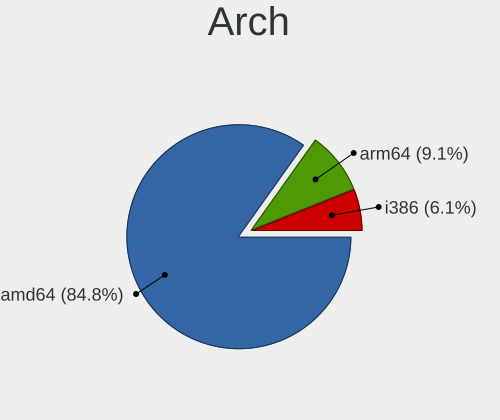

| Name  | Desktops | Percent |
|-------|----------|---------|
| amd64 | 28       | 84.85%  |
| arm64 | 3        | 9.09%   |
| i386  | 2        | 6.06%   |

DE
--

Desktop Environment

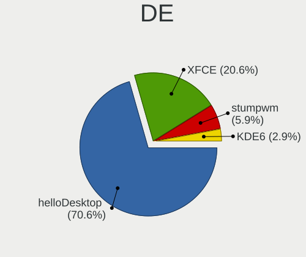

| Name         | Desktops | Percent |
|--------------|----------|---------|
| helloDesktop | 24       | 70.59%  |
| XFCE         | 7        | 20.59%  |
| stumpwm      | 2        | 5.88%   |
| KDE6         | 1        | 2.94%   |

Display Server
--------------

X11 or Wayland

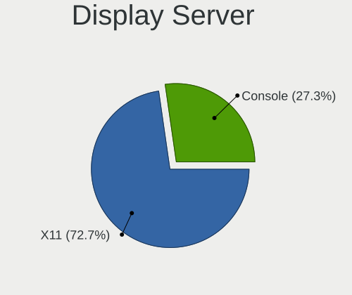

| Name    | Desktops | Percent |
|---------|----------|---------|
| X11     | 24       | 72.73%  |
| Console | 9        | 27.27%  |

Display Manager
---------------

SDDM, LightDM, etc.

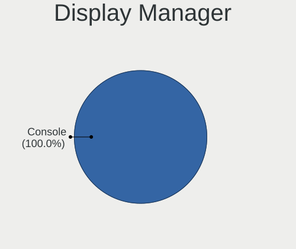

| Name    | Desktops | Percent |
|---------|----------|---------|
| Console | 33       | 100%    |

OS Lang
-------

Language

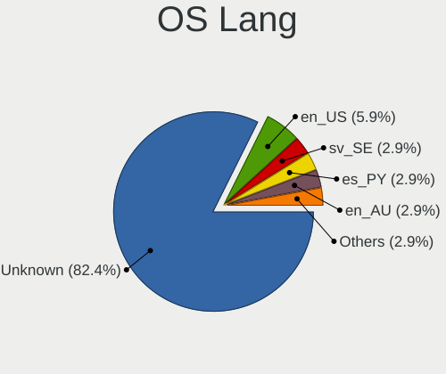

| Lang    | Desktops | Percent |
|---------|----------|---------|
| Unknown | 28       | 82.35%  |
| en_US   | 2        | 5.88%   |
| sv_SE   | 1        | 2.94%   |
| es_PY   | 1        | 2.94%   |
| en_AU   | 1        | 2.94%   |
| de_DE   | 1        | 2.94%   |

Boot Mode
---------

EFI or BIOS

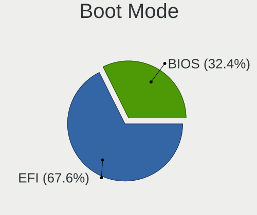

| Mode | Desktops | Percent |
|------|----------|---------|
| EFI  | 23       | 67.65%  |
| BIOS | 11       | 32.35%  |

Filesystem
----------

Type of filesystem

| Type | Desktops | Percent |
|------|----------|---------|
| Ffs  | 33       | 100%    |

Part. scheme
------------

Scheme of partitioning

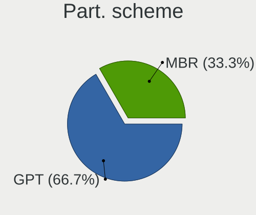

| Type | Desktops | Percent |
|------|----------|---------|
| GPT  | 22       | 66.67%  |
| MBR  | 11       | 33.33%  |

Board
-----

Vendor
------

Motherboard manufacturer

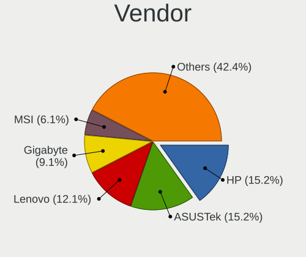

| Name                    | Desktops | Percent |
|-------------------------|----------|---------|
| Hewlett-Packard         | 5        | 15.15%  |
| ASUSTek Computer        | 5        | 15.15%  |
| Lenovo                  | 4        | 12.12%  |
| Gigabyte Technology     | 3        | 9.09%   |
| MSI                     | 2        | 6.06%   |
| Fujitsu                 | 2        | 6.06%   |
| Dell                    | 2        | 6.06%   |
| Unknown                 | 2        | 6.06%   |
| xunlong                 | 1        | 3.03%   |
| Shuttle                 | 1        | 3.03%   |
| Raspberry Pi Foundation | 1        | 3.03%   |
| Legend QDI              | 1        | 3.03%   |
| Intel                   | 1        | 3.03%   |
| HONOR                   | 1        | 3.03%   |
| Biostar                 | 1        | 3.03%   |
| AZW                     | 1        | 3.03%   |

Model
-----

Motherboard model

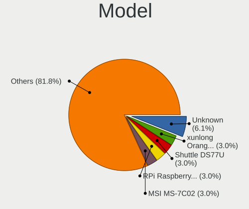

| Name                                     | Desktops | Percent |
|------------------------------------------|----------|---------|
| Unknown                                  | 2        | 6.06%   |
| xunlong Orange Pi 3B v1.1                | 1        | 3.03%   |
| Shuttle DS77U                            | 1        | 3.03%   |
| RPi Raspberry Pi 4 Model B               | 1        | 3.03%   |
| MSI MS-7C02                              | 1        | 3.03%   |
| MSI MS-7623                              | 1        | 3.03%   |
| Lenovo ThinkStation P320 Tiny 30C1S0QS00 | 1        | 3.03%   |
| Lenovo ThinkCentre M910s 10MK000TUS      | 1        | 3.03%   |
| Lenovo ThinkCentre M900 10FLS19T00       | 1        | 3.03%   |
| Lenovo ThinkCentre M715q 10M2S08Y00      | 1        | 3.03%   |
| Legend QDI PLATINIX-8                    | 1        | 3.03%   |
| Intel D2500HN                            | 1        | 3.03%   |
| HONOR MRO-XXX                            | 1        | 3.03%   |
| HP EliteDesk 800 G5 Desktop Mini         | 1        | 3.03%   |
| HP EliteDesk 800 G3 SFF                  | 1        | 3.03%   |
| HP EliteDesk 800 G3 DM 65W               | 1        | 3.03%   |
| HP EliteDesk 800 G2 DM 65W               | 1        | 3.03%   |
| HP Compaq Presario CQ50                  | 1        | 3.03%   |
| Gigabyte X58A-UD5                        | 1        | 3.03%   |
| Gigabyte H310M DS2 2.0                   | 1        | 3.03%   |
| Gigabyte A620M H                         | 1        | 3.03%   |
| Fujitsu ESPRIMO_P556                     | 1        | 3.03%   |
| Fujitsu ESPRIMO Q920                     | 1        | 3.03%   |
| Dell Precision T1650                     | 1        | 3.03%   |
| Dell OptiPlex 9020                       | 1        | 3.03%   |
| Biostar B450MH                           | 1        | 3.03%   |
| AZW EQ                                   | 1        | 3.03%   |
| ASUS SABERTOOTH X58                      | 1        | 3.03%   |
| ASUS ROG STRIX B650E-I GAMING WIFI       | 1        | 3.03%   |
| ASUS PRIME B650-PLUS                     | 1        | 3.03%   |
| ASUS PRIME A620M-A                       | 1        | 3.03%   |
| ASUS P13R-M Series                       | 1        | 3.03%   |

Model Family
------------

Motherboard model prefix

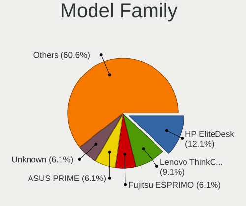

| Name                  | Desktops | Percent |
|-----------------------|----------|---------|
| HP EliteDesk          | 4        | 12.12%  |
| Lenovo ThinkCentre    | 3        | 9.09%   |
| Fujitsu ESPRIMO       | 2        | 6.06%   |
| ASUS PRIME            | 2        | 6.06%   |
| Unknown               | 2        | 6.06%   |
| xunlong Orange        | 1        | 3.03%   |
| Shuttle DS77U         | 1        | 3.03%   |
| RPi Raspberry         | 1        | 3.03%   |
| MSI MS-7C02           | 1        | 3.03%   |
| MSI MS-7623           | 1        | 3.03%   |
| Lenovo ThinkStation   | 1        | 3.03%   |
| Legend QDI PLATINIX-8 | 1        | 3.03%   |
| Intel D2500HN         | 1        | 3.03%   |
| HONOR MRO-XXX         | 1        | 3.03%   |
| HP Compaq             | 1        | 3.03%   |
| Gigabyte X58A-UD5     | 1        | 3.03%   |
| Gigabyte H310M        | 1        | 3.03%   |
| Gigabyte A620M        | 1        | 3.03%   |
| Dell Precision        | 1        | 3.03%   |
| Dell OptiPlex         | 1        | 3.03%   |
| Biostar B450MH        | 1        | 3.03%   |
| AZW EQ                | 1        | 3.03%   |
| ASUS SABERTOOTH       | 1        | 3.03%   |
| ASUS ROG              | 1        | 3.03%   |
| ASUS P13R-M           | 1        | 3.03%   |

MFG Year
--------

Motherboard manufacture year

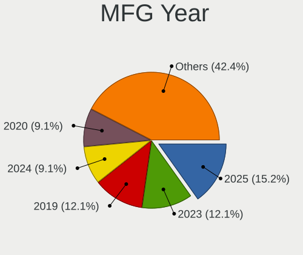

| Year    | Desktops | Percent |
|---------|----------|---------|
| 2025    | 5        | 15.15%  |
| 2023    | 4        | 12.12%  |
| 2019    | 4        | 12.12%  |
| 2024    | 3        | 9.09%   |
| 2020    | 3        | 9.09%   |
| 2010    | 3        | 9.09%   |
| 2018    | 2        | 6.06%   |
| 2017    | 2        | 6.06%   |
| 2022    | 1        | 3.03%   |
| 2016    | 1        | 3.03%   |
| 2013    | 1        | 3.03%   |
| 2012    | 1        | 3.03%   |
| 2011    | 1        | 3.03%   |
| 2002    | 1        | 3.03%   |
| Unknown | 1        | 3.03%   |

Form Factor
-----------

Physical design of the computer

| Name    | Desktops | Percent |
|---------|----------|---------|
| Desktop | 33       | 100%    |

Coreboot
--------

Have coreboot on board

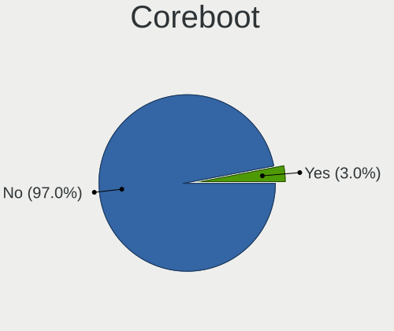

| Used | Desktops | Percent |
|------|----------|---------|
| No   | 32       | 96.97%  |
| Yes  | 1        | 3.03%   |

RAM Size
--------

Total RAM memory

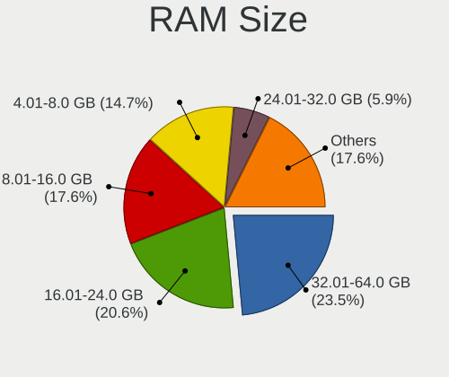

| Size in GB  | Desktops | Percent |
|-------------|----------|---------|
| 32.01-64.0  | 8        | 23.53%  |
| 16.01-24.0  | 7        | 20.59%  |
| 8.01-16.0   | 6        | 17.65%  |
| 4.01-8.0    | 5        | 14.71%  |
| 3.01-4.0    | 2        | 5.88%   |
| 24.01-32.0  | 2        | 5.88%   |
| 2.01-3.0    | 2        | 5.88%   |
| 64.01-256.0 | 1        | 2.94%   |
| 0.01-0.5    | 1        | 2.94%   |

RAM Used
--------

Used RAM memory

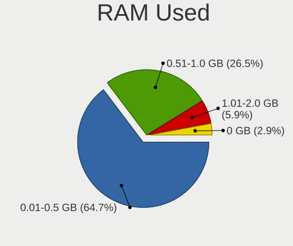

| Used GB  | Desktops | Percent |
|----------|----------|---------|
| 0.01-0.5 | 22       | 64.71%  |
| 0.51-1.0 | 9        | 26.47%  |
| 1.01-2.0 | 2        | 5.88%   |
| 0        | 1        | 2.94%   |

Total Drives
------------

Number of drives on board

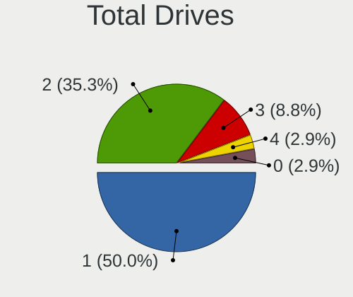

| Drives | Desktops | Percent |
|--------|----------|---------|
| 1      | 17       | 50%     |
| 2      | 12       | 35.29%  |
| 3      | 3        | 8.82%   |
| 4      | 1        | 2.94%   |
| 0      | 1        | 2.94%   |

Has CD-ROM
----------

Has CD-ROM on board

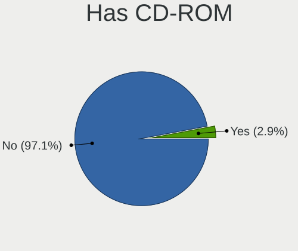

| Presented | Desktops | Percent |
|-----------|----------|---------|
| No        | 33       | 97.06%  |
| Yes       | 1        | 2.94%   |

Has Ethernet
------------

Has Ethernet on board

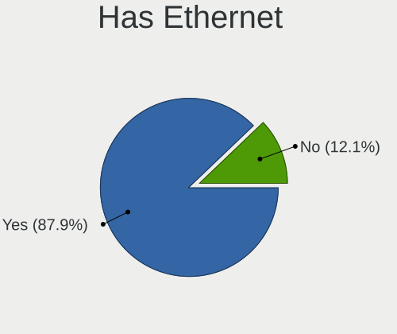

| Presented | Desktops | Percent |
|-----------|----------|---------|
| Yes       | 29       | 87.88%  |
| No        | 4        | 12.12%  |

Has WiFi
--------

Has WiFi module

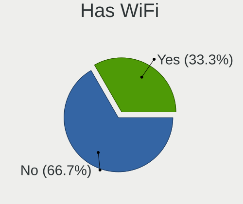

| Presented | Desktops | Percent |
|-----------|----------|---------|
| No        | 22       | 66.67%  |
| Yes       | 11       | 33.33%  |

Has Bluetooth
-------------

Has Bluetooth module

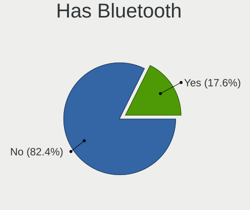

| Presented | Desktops | Percent |
|-----------|----------|---------|
| No        | 28       | 82.35%  |
| Yes       | 6        | 17.65%  |

Location
--------

Country
-------

Geographic location (country)

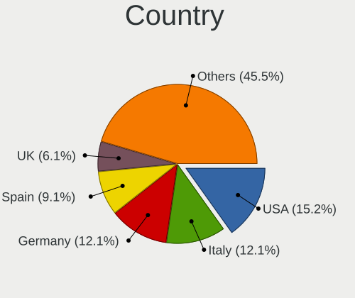

| Country     | Desktops | Percent |
|-------------|----------|---------|
| USA         | 5        | 15.15%  |
| Italy       | 4        | 12.12%  |
| Germany     | 4        | 12.12%  |
| Spain       | 3        | 9.09%   |
| UK          | 2        | 6.06%   |
| Russia      | 2        | 6.06%   |
| Finland     | 2        | 6.06%   |
| Bulgaria    | 2        | 6.06%   |
| Sweden      | 1        | 3.03%   |
| South Korea | 1        | 3.03%   |
| Poland      | 1        | 3.03%   |
| Paraguay    | 1        | 3.03%   |
| Latvia      | 1        | 3.03%   |
| France      | 1        | 3.03%   |
| Colombia    | 1        | 3.03%   |
| Brazil      | 1        | 3.03%   |
| Australia   | 1        | 3.03%   |

City
----

Geographic location (city)

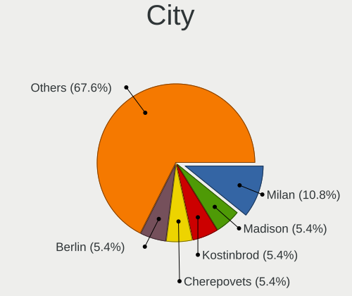

| City            | Desktops | Percent |
|-----------------|----------|---------|
| Milan           | 4        | 10.81%  |
| Madison         | 2        | 5.41%   |
| Kostinbrod      | 2        | 5.41%   |
| Cherepovets     | 2        | 5.41%   |
| Berlin          | 2        | 5.41%   |
| Zulice          | 1        | 2.7%    |
| Zaragoza        | 1        | 2.7%    |
| Valladolid      | 1        | 2.7%    |
| Vaernamo        | 1        | 2.7%    |
| Vaasa           | 1        | 2.7%    |
| Tampere         | 1        | 2.7%    |
| Sydney          | 1        | 2.7%    |
| Slough          | 1        | 2.7%    |
| Scottsville     | 1        | 2.7%    |
| Riga            | 1        | 2.7%    |
| Pouzay          | 1        | 2.7%    |
| Pinner          | 1        | 2.7%    |
| Medellín       | 1        | 2.7%    |
| Manchester      | 1        | 2.7%    |
| Madrid          | 1        | 2.7%    |
| Macaiba         | 1        | 2.7%    |
| Lublin          | 1        | 2.7%    |
| Louisville      | 1        | 2.7%    |
| Jongno-gu       | 1        | 2.7%    |
| Hoffman Estates | 1        | 2.7%    |
| Fuengirola      | 1        | 2.7%    |
| Dortmund        | 1        | 2.7%    |
| Danville        | 1        | 2.7%    |
| Cologne         | 1        | 2.7%    |
| Asunción       | 1        | 2.7%    |

Drives
------

Drive Vendor
------------

Hard drive vendors

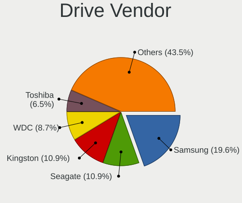

| Vendor                                 | Desktops | Drives | Percent |
|----------------------------------------|----------|--------|---------|
| Samsung Electronics                    | 9        | 11     | 19.57%  |
| Seagate                                | 5        | 7      | 10.87%  |
| Kingston                               | 5        | 6      | 10.87%  |
| WDC                                    | 4        | 5      | 8.7%    |
| Toshiba                                | 3        | 4      | 6.52%   |
| Crucial                                | 3        | 4      | 6.52%   |
| PNY                                    | 2        | 5      | 4.35%   |
| Micron Technology                      | 2        | 2      | 4.35%   |
| Lexar                                  | 2        | 5      | 4.35%   |
| USB3.0                                 | 1        | 2      | 2.17%   |
| SPCC                                   | 1        | 1      | 2.17%   |
| SK hynix                               | 1        | 1      | 2.17%   |
| SanDisk                                | 1        | 1      | 2.17%   |
| Product:              USB DISK 3.0 Pro | 1        | 1      | 2.17%   |
| LITEONIT                               | 1        | 2      | 2.17%   |
| Kimtigo                                | 1        | 1      | 2.17%   |
| Fanxiang                               | 1        | 2      | 2.17%   |
| DEXP                                   | 1        | 1      | 2.17%   |
| AGI                                    | 1        | 1      | 2.17%   |
| A-DATA Technology                      | 1        | 2      | 2.17%   |

Drive Model
-----------

Hard drive models

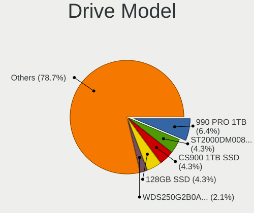

| Model                                                         | Desktops | Percent |
|---------------------------------------------------------------|----------|---------|
| Samsung SSD 990 PRO 1TB                                       | 3        | 6.38%   |
| Seagate ST2000DM008-2FR102 2TB                                | 2        | 4.26%   |
| PNY CS900 1TB SSD                                             | 2        | 4.26%   |
| Lexar 128GB SSD                                               | 2        | 4.26%   |
| WDC WDS250G2B0A-00SM50 250GB                                  | 1        | 2.13%   |
| WDC WD3200AAKX-001CA0 320GB                                   | 1        | 2.13%   |
| WDC WD1200JB-00GVA0 120GB                                     | 1        | 2.13%   |
| WDC PC SN730 SDBQNTY-512G-1001 512GB                          | 1        | 2.13%   |
| USB3.0 storage 1TB                                            | 1        | 2.13%   |
| Toshiba KXG50ZNV1T02 NVMe 1024GB                              | 1        | 2.13%   |
| Toshiba DT01ACA100 1TB                                        | 1        | 2.13%   |
| Toshiba DT01ACA050 500GB                                      | 1        | 2.13%   |
| SPCC M.2 PCIe SSD 2TB                                         | 1        | 2.13%   |
| SK hynix SKHynix_HFS256GDE9X081N 256GB                        | 1        | 2.13%   |
| Seagate ST500LT012-9WS142 500GB                               | 1        | 2.13%   |
| Seagate ST1000VM002-1SD102 1TB                                | 1        | 2.13%   |
| Seagate ST1000LM035-1RK172 1TB                                | 1        | 2.13%   |
| SanDisk Cruzer Fit 8GB                                        | 1        | 2.13%   |
| Samsung SSD 860 EVO M.2 2TB                                   | 1        | 2.13%   |
| Samsung SSD 860 EVO 500GB                                     | 1        | 2.13%   |
| Samsung SSD 860 EVO 2TB                                       | 1        | 2.13%   |
| Samsung SP0411N 40GB                                          | 1        | 2.13%   |
| Samsung MZVLW256HEHP-000H1 256GB                              | 1        | 2.13%   |
| Samsung MZ7TY256HDHP-000L7 256GB                              | 1        | 2.13%   |
| Samsung Flash Drive 64GB                                      | 1        | 2.13%   |
| Product:              USB DISK 3.0 Pro USB DISK 3.0 Pro 128GB | 1        | 2.13%   |
| Micron MT001TAYAX8U40 1TB                                     | 1        | 2.13%   |
| Micron 2400_MTFDKBA512QFM 512GB                               | 1        | 2.13%   |
| LITEONIT LCS-128M6S 128GB                                     | 1        | 2.13%   |
| Kingston SEDC600M480G 480GB                                   | 1        | 2.13%   |
| Kingston SA400S37960G 960GB                                   | 1        | 2.13%   |
| Kingston SA400S37240G 240GB                                   | 1        | 2.13%   |
| Kingston SA400S37120G 120GB                                   | 1        | 2.13%   |
| Kingston DataTraveler 3.0 32GB                                | 1        | 2.13%   |
| Kimtigo C-SSD 250GB                                           | 1        | 2.13%   |
| Fanxiang S101 4TB                                             | 1        | 2.13%   |
| DEXP SSD C100 128Gb                                           | 1        | 2.13%   |
| Crucial CT250MX200SSD1 250GB                                  | 1        | 2.13%   |
| Crucial CT2000P3PSSD8 2TB                                     | 1        | 2.13%   |
| Crucial CT1000P3SSD8 1TB                                      | 1        | 2.13%   |

HDD Vendor
----------

Hard disk drive vendors

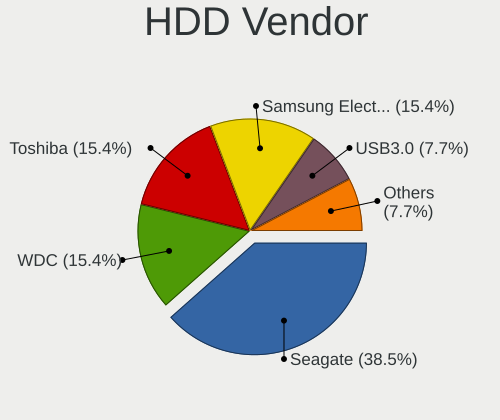

| Vendor                                 | Desktops | Drives | Percent |
|----------------------------------------|----------|--------|---------|
| Seagate                                | 5        | 7      | 38.46%  |
| WDC                                    | 2        | 2      | 15.38%  |
| Toshiba                                | 2        | 3      | 15.38%  |
| Samsung Electronics                    | 2        | 2      | 15.38%  |
| USB3.0                                 | 1        | 2      | 7.69%   |
| Product:              USB DISK 3.0 Pro | 1        | 1      | 7.69%   |

SSD Vendor
----------

Solid state drive vendors

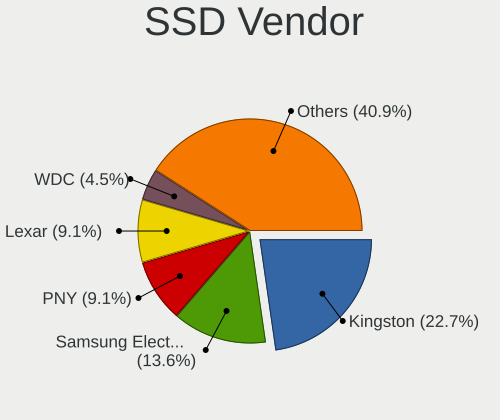

| Vendor              | Desktops | Drives | Percent |
|---------------------|----------|--------|---------|
| Kingston            | 5        | 6      | 22.73%  |
| Samsung Electronics | 3        | 5      | 13.64%  |
| PNY                 | 2        | 5      | 9.09%   |
| Lexar               | 2        | 5      | 9.09%   |
| WDC                 | 1        | 2      | 4.55%   |
| SanDisk             | 1        | 1      | 4.55%   |
| Micron Technology   | 1        | 1      | 4.55%   |
| LITEONIT            | 1        | 2      | 4.55%   |
| Kimtigo             | 1        | 1      | 4.55%   |
| Fanxiang            | 1        | 2      | 4.55%   |
| DEXP                | 1        | 1      | 4.55%   |
| Crucial             | 1        | 1      | 4.55%   |
| AGI                 | 1        | 1      | 4.55%   |
| A-DATA Technology   | 1        | 2      | 4.55%   |

Drive Kind
----------

HDD or SSD

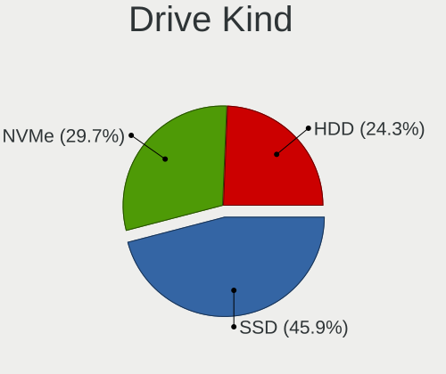

| Kind | Desktops | Drives | Percent |
|------|----------|--------|---------|
| SSD  | 17       | 35     | 45.95%  |
| NVMe | 11       | 12     | 29.73%  |
| HDD  | 9        | 17     | 24.32%  |

Drive Connector
---------------

SATA, SAS, NVMe, etc.

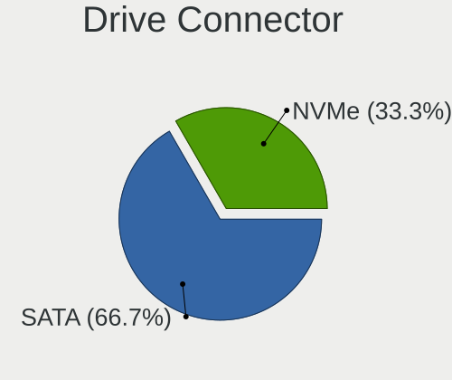

| Type | Desktops | Drives | Percent |
|------|----------|--------|---------|
| SATA | 22       | 52     | 66.67%  |
| NVMe | 11       | 12     | 33.33%  |

Drive Size
----------

Size of hard drive

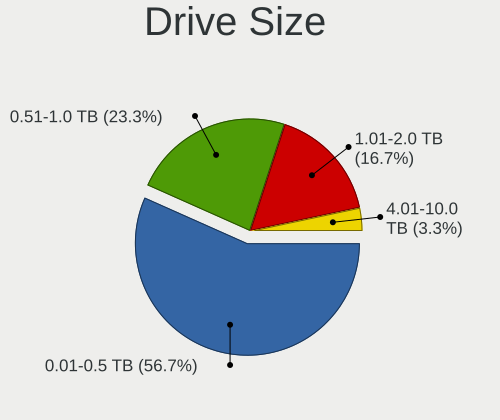

| Size in TB | Desktops | Drives | Percent |
|------------|----------|--------|---------|
| 0.01-0.5   | 17       | 29     | 56.67%  |
| 0.51-1.0   | 7        | 13     | 23.33%  |
| 1.01-2.0   | 5        | 8      | 16.67%  |
| 4.01-10.0  | 1        | 2      | 3.33%   |

Space Total
-----------

Amount of disk space available on the file system

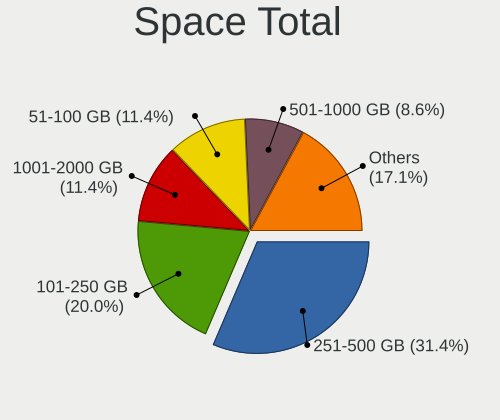

| Size in GB     | Desktops | Percent |
|----------------|----------|---------|
| 251-500        | 11       | 31.43%  |
| 101-250        | 7        | 20%     |
| 1001-2000      | 4        | 11.43%  |
| 51-100         | 4        | 11.43%  |
| 501-1000       | 3        | 8.57%   |
| More than 3000 | 2        | 5.71%   |
| 21-50          | 2        | 5.71%   |
| 2001-3000      | 1        | 2.86%   |
| 1-20           | 1        | 2.86%   |

Space Used
----------

Amount of used disk space

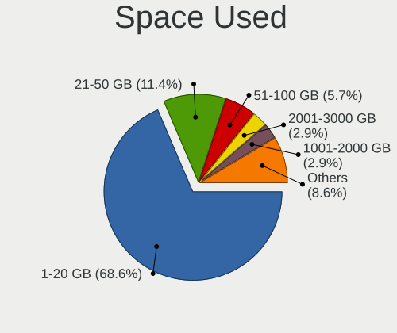

| Used GB   | Desktops | Percent |
|-----------|----------|---------|
| 1-20      | 24       | 68.57%  |
| 21-50     | 4        | 11.43%  |
| 51-100    | 2        | 5.71%   |
| 251-500   | 1        | 2.86%   |
| 2001-3000 | 1        | 2.86%   |
| 101-250   | 1        | 2.86%   |
| 1001-2000 | 1        | 2.86%   |
| 501-1000  | 1        | 2.86%   |

Malfunc. Drives
---------------

Drive models with a malfunction

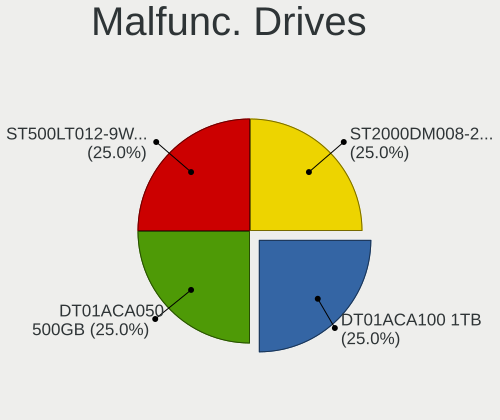

| Model                           | Desktops | Drives | Percent |
|---------------------------------|----------|--------|---------|
| Toshiba DT01ACA100 1TB          | 1        | 1      | 25%     |
| Toshiba DT01ACA050 500GB        | 1        | 2      | 25%     |
| Seagate ST500LT012-9WS142 500GB | 1        | 1      | 25%     |
| Seagate ST2000DM008-2FR102 2TB  | 1        | 3      | 25%     |

Malfunc. Drive Vendor
---------------------

Vendors of faulty drives

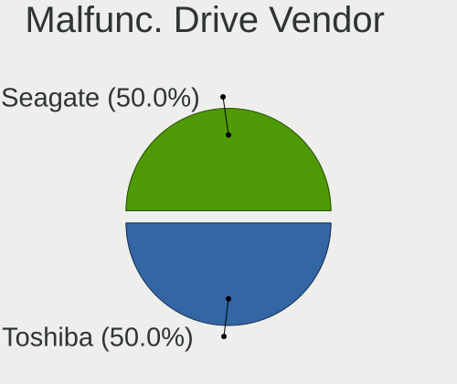

| Vendor  | Desktops | Drives | Percent |
|---------|----------|--------|---------|
| Toshiba | 2        | 3      | 50%     |
| Seagate | 2        | 4      | 50%     |

Malfunc. HDD Vendor
-------------------

Vendors of faulty HDD drives

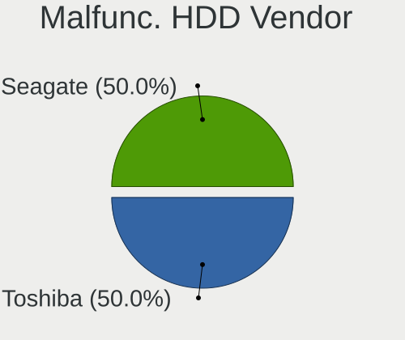

| Vendor  | Desktops | Drives | Percent |
|---------|----------|--------|---------|
| Toshiba | 2        | 3      | 50%     |
| Seagate | 2        | 4      | 50%     |

Malfunc. Drive Kind
-------------------

Kinds of faulty drives

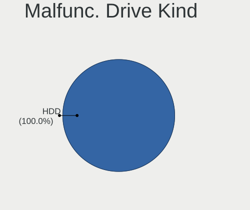

| Kind | Desktops | Drives | Percent |
|------|----------|--------|---------|
| HDD  | 4        | 7      | 100%    |

Failed Drives
-------------

Failed drive models

Zero info for selected period =(

Failed Drive Vendor
-------------------

Failed drive vendors

Zero info for selected period =(

Drive Status
------------

Number of failed and malfunc. drives

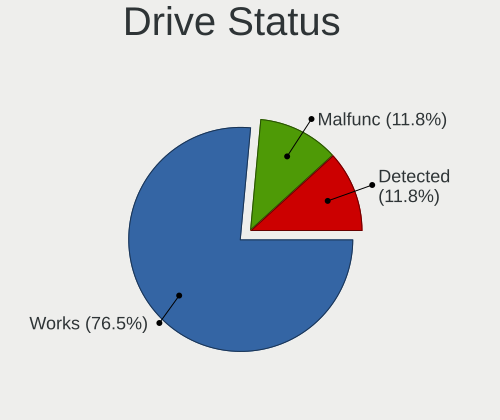

| Status   | Desktops | Drives | Percent |
|----------|----------|--------|---------|
| Works    | 26       | 50     | 76.47%  |
| Detected | 4        | 7      | 11.76%  |
| Malfunc  | 4        | 7      | 11.76%  |

Storage controller
------------------

Storage Vendor
--------------

Storage controller vendors

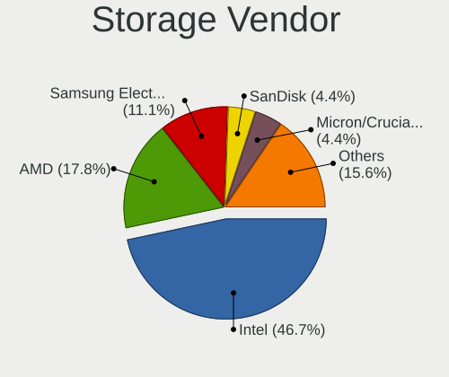

| Vendor                    | Desktops | Percent |
|---------------------------|----------|---------|
| Intel                     | 21       | 46.67%  |
| AMD                       | 8        | 17.78%  |
| Samsung Electronics       | 5        | 11.11%  |
| SanDisk                   | 2        | 4.44%   |
| Micron/Crucial Technology | 2        | 4.44%   |
| Marvell Technology Group  | 2        | 4.44%   |
| JMicron Technology        | 2        | 4.44%   |
| Toshiba                   | 1        | 2.22%   |
| SK hynix                  | 1        | 2.22%   |
| Micron Technology         | 1        | 2.22%   |

Storage Model
-------------

Storage controller models

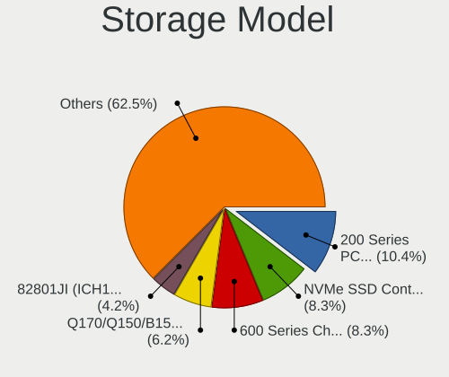

| Model                                                                          | Desktops | Percent |
|--------------------------------------------------------------------------------|----------|---------|
| Intel 200 Series PCH SATA controller [AHCI mode]                               | 5        | 10.42%  |
| Samsung NVMe SSD Controller S4LV008[Pascal]                                    | 4        | 8.33%   |
| AMD 600 Series Chipset SATA Controller                                         | 4        | 8.33%   |
| Intel Q170/Q150/B150/H170/H110/Z170/CM236 Chipset SATA Controller [AHCI Mode]  | 3        | 6.25%   |
| Intel 82801JI (ICH10 Family) SATA AHCI Controller                              | 2        | 4.17%   |
| Intel 8 Series/C220 Series Chipset Family 6-port SATA Controller 1 [AHCI mode] | 2        | 4.17%   |
| AMD FCH SATA Controller [AHCI mode]                                            | 2        | 4.17%   |
| AMD 400 Series Chipset SATA Controller                                         | 2        | 4.17%   |
| Toshiba XG6 NVMe SSD Controller                                                | 1        | 2.08%   |
| Toshiba XG5 NVMe SSD Controller                                                | 1        | 2.08%   |
| SK hynix Gold P31/BC711/PC711 NVMe Solid State Drive                           | 1        | 2.08%   |
| SanDisk Ultra 3D / WD Blue SN570 NVMe SSD (DRAM-less)                          | 1        | 2.08%   |
| SanDisk Extreme Pro / WD Black SN750 / PC SN730 / Red SN700 NVMe SSD           | 1        | 2.08%   |
| Samsung NVMe SSD Controller SM961/PM961/SM963                                  | 1        | 2.08%   |
| Micron/Crucial P3 Plus NVMe PCIe SSD (DRAM-less)                               | 1        | 2.08%   |
| Micron/Crucial P2 [Nick P2] / P3 / P3 Plus NVMe PCIe SSD (DRAM-less)           | 1        | 2.08%   |
| Micron 2400 NVMe SSD (DRAM-less)                                               | 1        | 2.08%   |
| Marvell Group 88SE9128 PCIe SATA 6 Gb/s RAID controller                        | 1        | 2.08%   |
| Marvell Group 88SE9123 PCIe SATA 6.0 Gb/s controller                           | 1        | 2.08%   |
| JMicron JMB363 SATA/IDE Controller                                             | 1        | 2.08%   |
| JMicron JMB362 SATA Controller                                                 | 1        | 2.08%   |
| Intel Sunrise Point-LP SATA Controller [AHCI mode]                             | 1        | 2.08%   |
| Intel Raptor Lake SATA AHCI Controller                                         | 1        | 2.08%   |
| Intel NM10/ICH7 Family SATA Controller [AHCI mode]                             | 1        | 2.08%   |
| Intel Cannon Lake PCH SATA AHCI Controller                                     | 1        | 2.08%   |
| Intel 82801IBM/IEM (ICH9M/ICH9M-E) 4 port SATA Controller [AHCI mode]          | 1        | 2.08%   |
| Intel 82801DB (ICH4) IDE Controller                                            | 1        | 2.08%   |
| Intel 82371AB/EB/MB PIIX4 IDE                                                  | 1        | 2.08%   |
| Intel 7 Series/C210 Series Chipset Family 6-port SATA Controller [AHCI mode]   | 1        | 2.08%   |
| Intel 6 Series/C200 Series Chipset Family 6 port Desktop SATA AHCI Controller  | 1        | 2.08%   |
| AMD SB7x0/SB8x0/SB9x0 SATA Controller [IDE mode]                               | 1        | 2.08%   |
| AMD SB7x0/SB8x0/SB9x0 IDE Controller                                           | 1        | 2.08%   |

Storage Kind
------------

Kind of storage controller (IDE, SATA, NVMe, SAS, ...)

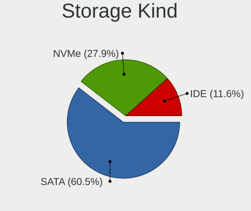

| Kind | Desktops | Percent |
|------|----------|---------|
| SATA | 26       | 60.47%  |
| NVMe | 12       | 27.91%  |
| IDE  | 5        | 11.63%  |

Processor
---------

CPU Vendor
----------

Processor vendors

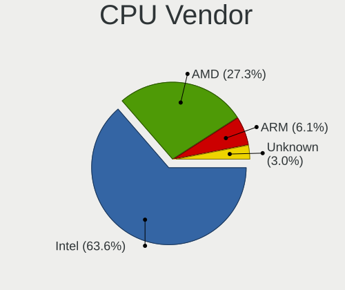

| Vendor  | Desktops | Percent |
|---------|----------|---------|
| Intel   | 21       | 63.64%  |
| AMD     | 9        | 27.27%  |
| ARM     | 2        | 6.06%   |
| Unknown | 1        | 3.03%   |

CPU Model
---------

Processor models

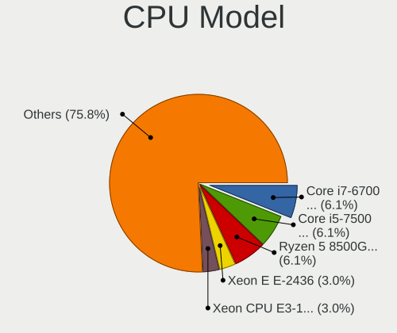

| Model                                                        | Desktops | Percent |
|--------------------------------------------------------------|----------|---------|
| Intel Core i7-6700 CPU @ 3.40GHz                             | 2        | 6.06%   |
| Intel Core i5-7500 CPU @ 3.40GHz                             | 2        | 6.06%   |
| AMD Ryzen 5 8500G w/ Radeon 740M Graphics                    | 2        | 6.06%   |
| Intel Xeon E E-2436                                          | 1        | 3.03%   |
| Intel Xeon CPU E3-1225 V2 @ 3.20GHz                          | 1        | 3.03%   |
| Intel Pentium III ("GenuineIntel" 686-class, 512KB L2 cache) | 1        | 3.03%   |
| Intel Pentium CPU G860 @ 3.00GHz                             | 1        | 3.03%   |
| Intel Pentium CPU G4400 @ 3.30GHz                            | 1        | 3.03%   |
| Intel Pentium 4 CPU 2.40GHz ("GenuineIntel" 686-class)       | 1        | 3.03%   |
| Intel Core i7 CPU 960 @ 3.20GHz                              | 1        | 3.03%   |
| Intel Core i7 CPU 930 @ 2.80GHz                              | 1        | 3.03%   |
| Intel Core i5-9500 CPU @ 3.00GHz                             | 1        | 3.03%   |
| Intel Core i5-6500 CPU @ 3.20GHz                             | 1        | 3.03%   |
| Intel Core i5-4590T CPU @ 2.00GHz                            | 1        | 3.03%   |
| Intel Core i5-4570 CPU @ 3.20GHz                             | 1        | 3.03%   |
| Intel Core i3-9100F CPU @ 3.60GHz                            | 1        | 3.03%   |
| Intel Core i3-6100T CPU @ 3.20GHz                            | 1        | 3.03%   |
| Intel Core 2 Duo CPU T9300 @ 2.50GHz                         | 1        | 3.03%   |
| Intel Celeron CPU 3865U @ 1.80GHz                            | 1        | 3.03%   |
| Intel Atom CPU D2500 @ 1.86GHz                               | 1        | 3.03%   |
| ARM Cortex-A72 r0p3                                          | 1        | 3.03%   |
| ARM Cortex-A55 r2p0                                          | 1        | 3.03%   |
| AMD Ryzen 9 7950X 16-Core Processor                          | 1        | 3.03%   |
| AMD Ryzen 7 8700G w/ Radeon 780M Graphics                    | 1        | 3.03%   |
| AMD Ryzen 5 PRO 5650U with Radeon Graphics                   | 1        | 3.03%   |
| AMD Ryzen 5 4600G with Radeon Graphics                       | 1        | 3.03%   |
| AMD Ryzen 5 3600XT 6-Core Processor                          | 1        | 3.03%   |
| AMD PRO A6-8570E R5, 6 COMPUTE CORES 2C+4G                   | 1        | 3.03%   |
| AMD Athlon II X2 240 Processor                               | 1        | 3.03%   |
|                                                              | 1        | 3.03%   |

CPU Model Family
----------------

Processor model prefix

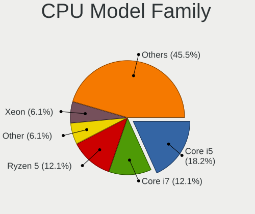

| Model             | Desktops | Percent |
|-------------------|----------|---------|
| Intel Core i5     | 6        | 18.18%  |
| Intel Core i7     | 4        | 12.12%  |
| AMD Ryzen 5       | 4        | 12.12%  |
| Other             | 2        | 6.06%   |
| Intel Xeon        | 2        | 6.06%   |
| Intel Pentium     | 2        | 6.06%   |
| Intel Core i3     | 2        | 6.06%   |
| ARM Cortex        | 2        | 6.06%   |
| Intel Pentium III | 1        | 3.03%   |
| Intel Pentium 4   | 1        | 3.03%   |
| Intel Core 2 Duo  | 1        | 3.03%   |
| Intel Celeron     | 1        | 3.03%   |
| Intel Atom        | 1        | 3.03%   |
| AMD Ryzen 9       | 1        | 3.03%   |
| AMD Ryzen 7       | 1        | 3.03%   |
| AMD Ryzen 5 PRO   | 1        | 3.03%   |
| AMD Athlon II X2  | 1        | 3.03%   |

CPU Cores
---------

Number of processor cores

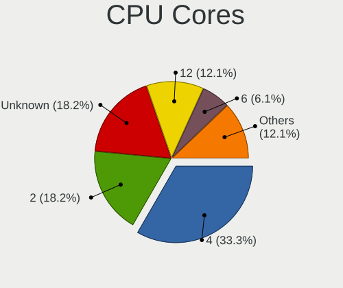

| Number  | Desktops | Percent |
|---------|----------|---------|
| 4       | 11       | 33.33%  |
| 2       | 6        | 18.18%  |
| Unknown | 6        | 18.18%  |
| 12      | 4        | 12.12%  |
| 6       | 2        | 6.06%   |
| 1       | 2        | 6.06%   |
| 32      | 1        | 3.03%   |
| 16      | 1        | 3.03%   |

CPU Sockets
-----------

Number of sockets

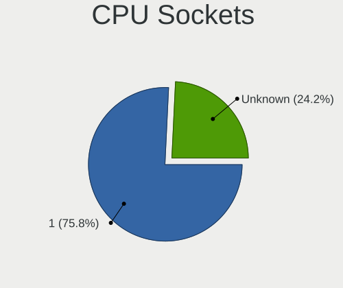

| Number  | Desktops | Percent |
|---------|----------|---------|
| 1       | 25       | 75.76%  |
| Unknown | 8        | 24.24%  |

CPU Threads
-----------

Threads per core (Hyper-Threading)

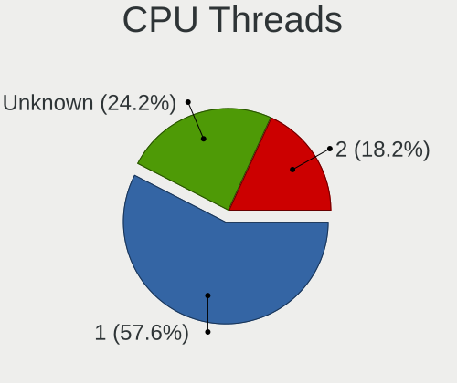

| Number  | Desktops | Percent |
|---------|----------|---------|
| 1       | 19       | 57.58%  |
| Unknown | 8        | 24.24%  |
| 2       | 6        | 18.18%  |

CPU Microarch
-------------

Microarchitecture

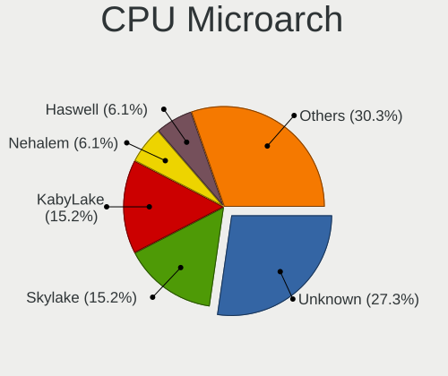

| Name        | Desktops | Percent |
|-------------|----------|---------|
| Unknown     | 9        | 27.27%  |
| Skylake     | 5        | 15.15%  |
| KabyLake    | 5        | 15.15%  |
| Nehalem     | 2        | 6.06%   |
| Haswell     | 2        | 6.06%   |
| Zen 3       | 1        | 3.03%   |
| Zen 2       | 1        | 3.03%   |
| SandyBridge | 1        | 3.03%   |
| Penryn      | 1        | 3.03%   |
| P6          | 1        | 3.03%   |
| NetBurst    | 1        | 3.03%   |
| K10         | 1        | 3.03%   |
| IvyBridge   | 1        | 3.03%   |
| Excavator   | 1        | 3.03%   |
| Bonnell     | 1        | 3.03%   |

Graphics
--------

GPU Vendor
----------

Vendors of graphics cards

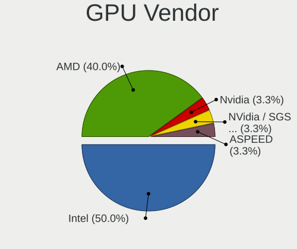

| Vendor                               | Desktops | Percent |
|--------------------------------------|----------|---------|
| Intel                                | 15       | 50%     |
| AMD                                  | 12       | 40%     |
| NVidia / SGS Thomson (Joint Venture) | 1        | 3.33%   |
| Nvidia                               | 1        | 3.33%   |
| ASPEED Technology                    | 1        | 3.33%   |

GPU Model
---------

Graphics card models

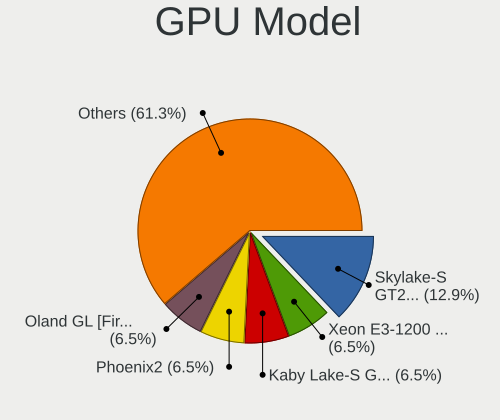

| Model                                                                       | Desktops | Percent |
|-----------------------------------------------------------------------------|----------|---------|
| Intel Skylake-S GT2 [HD Graphics 530]                                       | 4        | 12.9%   |
| Intel Xeon E3-1200 v3/4th Gen Core Processor Integrated Graphics Controller | 2        | 6.45%   |
| Intel Kaby Lake-S GT2 [HD Graphics 630]                                     | 2        | 6.45%   |
| AMD Phoenix2                                                                | 2        | 6.45%   |
| AMD Oland GL [FirePro W2100]                                                | 2        | 6.45%   |
| Nvidia NV44A [GeForce 6200]                                                 | 1        | 3.23%   |
| NVidia / SGS Thomson (Joint Venture) Riva128                                | 1        | 3.23%   |
| Intel Xeon E3-1200 v2/3rd Gen Core processor Graphics Controller            | 1        | 3.23%   |
| Intel Skylake-S GT1 [HD Graphics 510]                                       | 1        | 3.23%   |
| Intel Mobile 4 Series Chipset Integrated Graphics Controller                | 1        | 3.23%   |
| Intel Kaby Lake-U GT1 [HD Graphics 610]                                     | 1        | 3.23%   |
| Intel CoffeeLake-S GT2 [UHD Graphics 630]                                   | 1        | 3.23%   |
| Intel Atom Processor D2xxx/N2xxx Integrated Graphics Controller             | 1        | 3.23%   |
| Intel 2nd Generation Core Processor Family Integrated Graphics Controller   | 1        | 3.23%   |
| ASPEED Technology ASPEED Graphics Family                                    | 1        | 3.23%   |
| AMD Wani [Radeon R5/R6/R7 Graphics]                                         | 1        | 3.23%   |
| AMD Turks XT [Radeon HD 6670/7670]                                          | 1        | 3.23%   |
| AMD Renoir [Radeon Vega Series / Radeon Vega Mobile Series]                 | 1        | 3.23%   |
| AMD Raphael                                                                 | 1        | 3.23%   |
| AMD Phoenix1                                                                | 1        | 3.23%   |
| AMD Navi 31 [Radeon RX 7900 XT/7900 XTX/7900 GRE/7900M]                     | 1        | 3.23%   |
| AMD Navi 14 [Radeon RX 5500/5500M / Pro 5500M]                              | 1        | 3.23%   |
| AMD Cezanne [Radeon Vega Series / Radeon Vega Mobile Series]                | 1        | 3.23%   |
| AMD Caicos [Radeon HD 6450/7450/8450 / R5 230 OEM]                          | 1        | 3.23%   |

GPU Combo
---------

Combinations of graphics cards

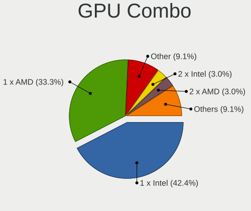

| Name                                     | Desktops | Percent |
|------------------------------------------|----------|---------|
| 1 x Intel                                | 14       | 42.42%  |
| 1 x AMD                                  | 11       | 33.33%  |
| Other                                    | 3        | 9.09%   |
| 2 x Intel                                | 1        | 3.03%   |
| 2 x AMD                                  | 1        | 3.03%   |
| 1 x NVidia / SGS Thomson (Joint Venture) | 1        | 3.03%   |
| 1 x Nvidia                               | 1        | 3.03%   |
| 1 x ASPEED                               | 1        | 3.03%   |

GPU Driver
----------

Free vs proprietary

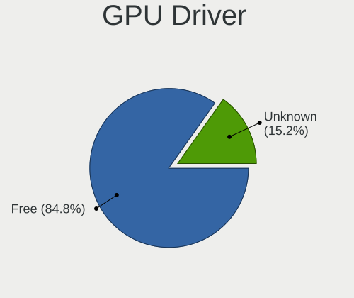

| Driver  | Desktops | Percent |
|---------|----------|---------|
| Free    | 28       | 84.85%  |
| Unknown | 5        | 15.15%  |

GPU Memory
----------

Total video memory

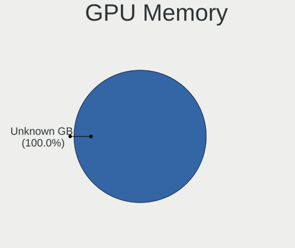

| Size in GB | Desktops | Percent |
|------------|----------|---------|
| Unknown    | 33       | 100%    |

Monitor
-------

Monitor Vendor
--------------

Monitor vendors

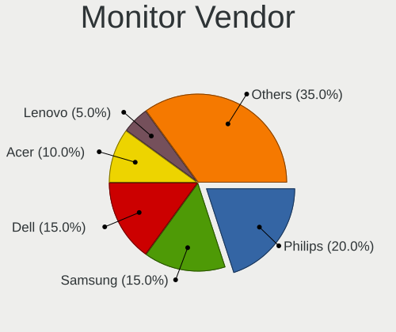

| Vendor              | Desktops | Percent |
|---------------------|----------|---------|
| Philips             | 4        | 20%     |
| Samsung Electronics | 3        | 15%     |
| Dell                | 3        | 15%     |
| Acer                | 2        | 10%     |
| LG Philips          | 1        | 5%      |
| Lenovo              | 1        | 5%      |
| Iiyama              | 1        | 5%      |
| HKC                 | 1        | 5%      |
| Hewlett-Packard     | 1        | 5%      |
| Goldstar            | 1        | 5%      |
| Gigabyte Technology | 1        | 5%      |
| ASUSTek Computer    | 1        | 5%      |

Monitor Model
-------------

Monitor models

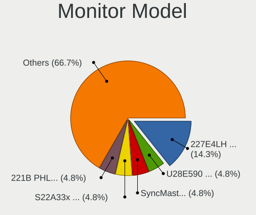

| Model                                                                | Desktops | Percent |
|----------------------------------------------------------------------|----------|---------|
| Philips 227E4LH PHLC0AC 1920x1080 480x270mm 21.7-inch                | 3        | 14.29%  |
| Samsung Electronics U28E590 SAM0C4D 3840x2160 610x350mm 27.7-inch    | 1        | 4.76%   |
| Samsung Electronics SyncMaster SAM022B 1280x1024 340x270mm 17.1-inch | 1        | 4.76%   |
| Samsung Electronics S22A33x SAM7122 1920x1080 480x260mm 21.5-inch    | 1        | 4.76%   |
| Philips 221B PHL08A1 1920x1080 480x270mm 21.7-inch                   | 1        | 4.76%   |
| LG Philips LP154WX4-TLCB LPL3101 1280x800 330x210mm 15.4-inch        | 1        | 4.76%   |
| Lenovo LEN L174 LEN240B 1280x1024 340x270mm 17.1-inch                | 1        | 4.76%   |
| Iiyama PL2793H IVM66A4 1920x1080 600x340mm 27.2-inch                 | 1        | 4.76%   |
| HKC F2145M HKC2251 1920x1080 480x260mm 21.5-inch                     | 1        | 4.76%   |
| Hewlett-Packard LP2465 HWP2676 1920x1200 520x330mm 24.2-inch         | 1        | 4.76%   |
| Goldstar BL450 GSM5B86 1920x1080 480x270mm 21.7-inch                 | 1        | 4.76%   |
| Gigabyte Technology M27Q GBT270D 2560x1440 700x390mm 31.5-inch       | 1        | 4.76%   |
| Dell U3219Q DELA125 3840x2160 700x390mm 31.5-inch                    | 1        | 4.76%   |
| Dell U3219Q DELA124 3840x2160 700x390mm 31.5-inch                    | 1        | 4.76%   |
| Dell S2722DC DELA1D2 2560x1440 590x330mm 26.6-inch                   | 1        | 4.76%   |
| Dell P2412H DELA07C 1920x1080 530x300mm 24.0-inch                    | 1        | 4.76%   |
| ASUSTek Computer VA24E AUS24D1 1920x1080 530x300mm 24.0-inch         | 1        | 4.76%   |
| Acer V277 E ACR0B7C 1920x1080 600x330mm 27.0-inch                    | 1        | 4.76%   |
| Acer ET322QU ACR0687 2560x1440 700x390mm 31.5-inch                   | 1        | 4.76%   |

Monitor Resolution
------------------

Monitor screen resolution

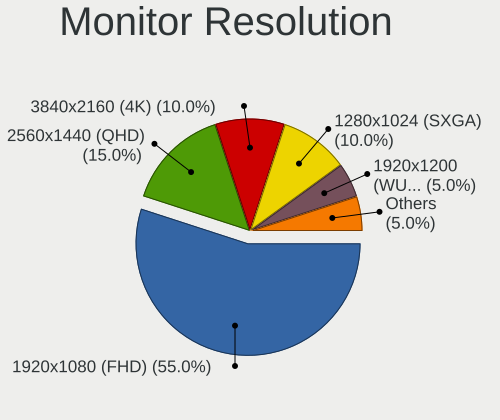

| Resolution        | Desktops | Percent |
|-------------------|----------|---------|
| 1920x1080 (FHD)   | 11       | 55%     |
| 2560x1440 (QHD)   | 3        | 15%     |
| 3840x2160 (4K)    | 2        | 10%     |
| 1280x1024 (SXGA)  | 2        | 10%     |
| 1920x1200 (WUXGA) | 1        | 5%      |
| 1280x800 (WXGA)   | 1        | 5%      |

Monitor Diagonal
----------------

Diagonal size in inches

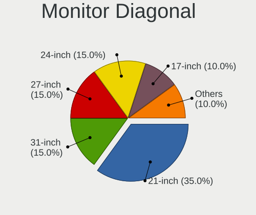

| Inches | Desktops | Percent |
|--------|----------|---------|
| 21     | 7        | 35%     |
| 31     | 3        | 15%     |
| 27     | 3        | 15%     |
| 24     | 3        | 15%     |
| 17     | 2        | 10%     |
| 26     | 1        | 5%      |
| 15     | 1        | 5%      |

Monitor Width
-------------

Physical width

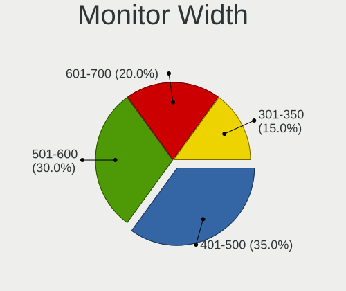

| Width in mm | Desktops | Percent |
|-------------|----------|---------|
| 401-500     | 7        | 35%     |
| 501-600     | 6        | 30%     |
| 601-700     | 4        | 20%     |
| 301-350     | 3        | 15%     |

Aspect Ratio
------------

Proportional relationship between the width and the height

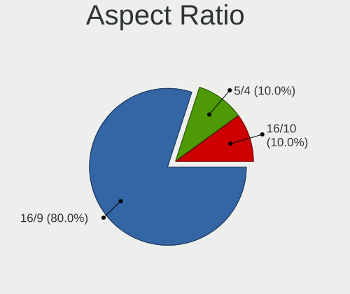

| Ratio | Desktops | Percent |
|-------|----------|---------|
| 16/9  | 16       | 80%     |
| 5/4   | 2        | 10%     |
| 16/10 | 2        | 10%     |

Monitor Area
------------

Area in inch²

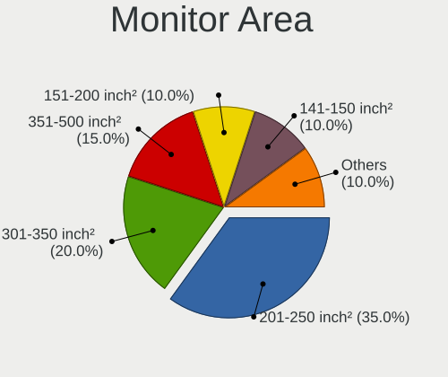

| Area in inch² | Desktops | Percent |
|----------------|----------|---------|
| 201-250        | 7        | 35%     |
| 301-350        | 4        | 20%     |
| 351-500        | 3        | 15%     |
| 151-200        | 2        | 10%     |
| 141-150        | 2        | 10%     |
| 251-300        | 1        | 5%      |
| 101-110        | 1        | 5%      |

Pixel Density
-------------

Pixels per inch

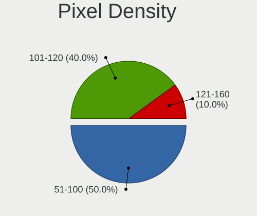

| Density | Desktops | Percent |
|---------|----------|---------|
| 51-100  | 10       | 50%     |
| 101-120 | 8        | 40%     |
| 121-160 | 2        | 10%     |

Multiple Monitors
-----------------

Total monitors connected

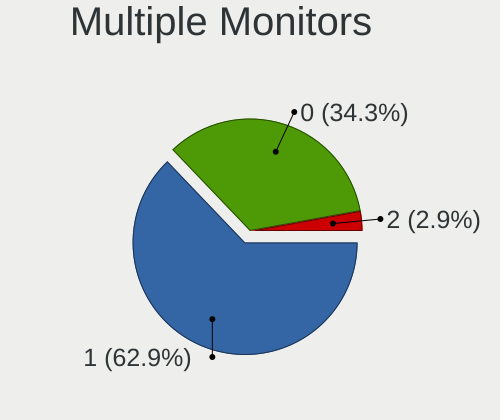

| Total | Desktops | Percent |
|-------|----------|---------|
| 1     | 22       | 62.86%  |
| 0     | 12       | 34.29%  |
| 2     | 1        | 2.86%   |

Network
-------

Net Controller Vendor
---------------------

Controller vendors

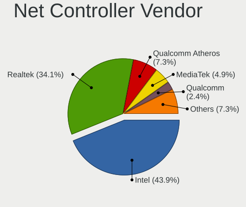

| Vendor                | Desktops | Percent |
|-----------------------|----------|---------|
| Intel                 | 18       | 43.9%   |
| Realtek Semiconductor | 14       | 34.15%  |
| Qualcomm Atheros      | 3        | 7.32%   |
| MediaTek              | 2        | 4.88%   |
| Qualcomm Technologies | 1        | 2.44%   |
| D-Link                | 1        | 2.44%   |
| Broadcom              | 1        | 2.44%   |
| American Megatrends   | 1        | 2.44%   |

Net Controller Model
--------------------

Controller models

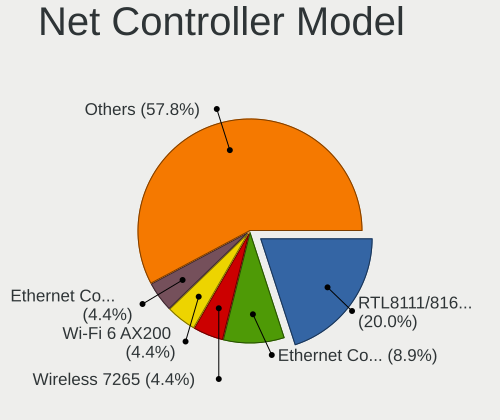

| Model                                                                   | Desktops | Percent |
|-------------------------------------------------------------------------|----------|---------|
| Realtek RTL8111/8168/8211/8411 PCI Express Gigabit Ethernet Controller  | 9        | 20%     |
| Intel Ethernet Connection (2) I219-LM                                   | 4        | 8.89%   |
| Intel Wireless 7265                                                     | 2        | 4.44%   |
| Intel Wi-Fi 6 AX200                                                     | 2        | 4.44%   |
| Intel Ethernet Connection I217-LM                                       | 2        | 4.44%   |
| Intel Ethernet Connection (5) I219-LM                                   | 2        | 4.44%   |
| Realtek RTL8188EUS 802.11n Wireless Network Adapter                     | 1        | 2.22%   |
| Realtek RTL8188EE Wireless Network Adapter                              | 1        | 2.22%   |
| Realtek RTL8125 2.5GbE Controller                                       | 1        | 2.22%   |
| Realtek RTL810xE PCI Express Fast Ethernet controller                   | 1        | 2.22%   |
| Realtek RTL-8110SC/8169SC Gigabit Ethernet                              | 1        | 2.22%   |
| Realtek RTL-8100/8101L/8139 PCI Fast Ethernet Adapter                   | 1        | 2.22%   |
| Qualcomm WCN785x Wi-Fi 7(802.11be) 320MHz 2x2 [FastConnect 7800]        | 1        | 2.22%   |
| Qualcomm Atheros AR9227 Wireless Network Adapter                        | 1        | 2.22%   |
| Qualcomm Atheros AR8131 Gigabit Ethernet                                | 1        | 2.22%   |
| Qualcomm Atheros AR242x / AR542x Wireless Network Adapter (PCI-Express) | 1        | 2.22%   |
| MediaTek USB Ethernet-RNDIS                                             | 1        | 2.22%   |
| MediaTek MT7922 802.11ax PCI Express Wireless Network Adapter           | 1        | 2.22%   |
| Intel Wireless 8265 / 8275                                              | 1        | 2.22%   |
| Intel I211 Gigabit Network Connection                                   | 1        | 2.22%   |
| Intel I210 Gigabit Network Connection                                   | 1        | 2.22%   |
| Intel Ethernet Controller I225-V                                        | 1        | 2.22%   |
| Intel Ethernet Connection I219-LM                                       | 1        | 2.22%   |
| Intel Ethernet Connection (7) I219-LM                                   | 1        | 2.22%   |
| Intel 82579V Gigabit Network Connection                                 | 1        | 2.22%   |
| Intel 82579LM Gigabit Network Connection (Lewisville)                   | 1        | 2.22%   |
| Intel 82574L Gigabit Network Connection                                 | 1        | 2.22%   |
| D-Link DWA-125 Wireless N 150 Adapter(rev.A3) [Ralink RT5370]           | 1        | 2.22%   |
| Broadcom NetXtreme BCM5720 Gigabit Ethernet PCIe                        | 1        | 2.22%   |
| American Megatrends Virtual Ethernet                                    | 1        | 2.22%   |

Wireless Vendor
---------------

Wireless vendors

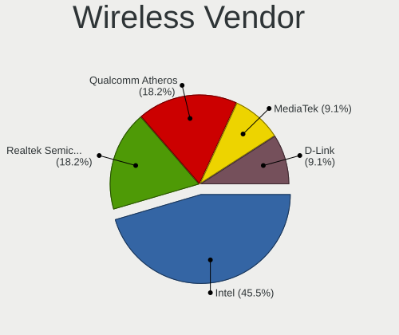

| Vendor                | Desktops | Percent |
|-----------------------|----------|---------|
| Intel                 | 5        | 45.45%  |
| Realtek Semiconductor | 2        | 18.18%  |
| Qualcomm Atheros      | 2        | 18.18%  |
| MediaTek              | 1        | 9.09%   |
| D-Link                | 1        | 9.09%   |

Wireless Model
--------------

Wireless models

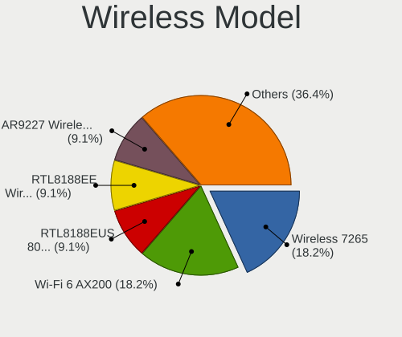

| Model                                                                   | Desktops | Percent |
|-------------------------------------------------------------------------|----------|---------|
| Intel Wireless 7265                                                     | 2        | 18.18%  |
| Intel Wi-Fi 6 AX200                                                     | 2        | 18.18%  |
| Realtek RTL8188EUS 802.11n Wireless Network Adapter                     | 1        | 9.09%   |
| Realtek RTL8188EE Wireless Network Adapter                              | 1        | 9.09%   |
| Qualcomm Atheros AR9227 Wireless Network Adapter                        | 1        | 9.09%   |
| Qualcomm Atheros AR242x / AR542x Wireless Network Adapter (PCI-Express) | 1        | 9.09%   |
| MediaTek MT7922 802.11ax PCI Express Wireless Network Adapter           | 1        | 9.09%   |
| Intel Wireless 8265 / 8275                                              | 1        | 9.09%   |
| D-Link DWA-125 Wireless N 150 Adapter(rev.A3) [Ralink RT5370]           | 1        | 9.09%   |

Ethernet Vendor
---------------

Ethernet vendors

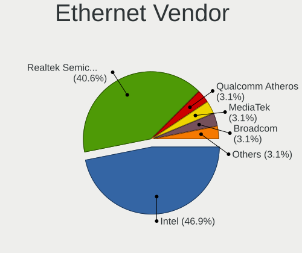

| Vendor                | Desktops | Percent |
|-----------------------|----------|---------|
| Intel                 | 15       | 46.88%  |
| Realtek Semiconductor | 13       | 40.63%  |
| Qualcomm Atheros      | 1        | 3.13%   |
| MediaTek              | 1        | 3.13%   |
| Broadcom              | 1        | 3.13%   |
| American Megatrends   | 1        | 3.13%   |

Ethernet Model
--------------

Ethernet models

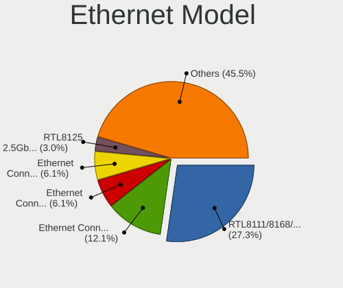

| Model                                                                  | Desktops | Percent |
|------------------------------------------------------------------------|----------|---------|
| Realtek RTL8111/8168/8211/8411 PCI Express Gigabit Ethernet Controller | 9        | 27.27%  |
| Intel Ethernet Connection (2) I219-LM                                  | 4        | 12.12%  |
| Intel Ethernet Connection I217-LM                                      | 2        | 6.06%   |
| Intel Ethernet Connection (5) I219-LM                                  | 2        | 6.06%   |
| Realtek RTL8125 2.5GbE Controller                                      | 1        | 3.03%   |
| Realtek RTL810xE PCI Express Fast Ethernet controller                  | 1        | 3.03%   |
| Realtek RTL-8110SC/8169SC Gigabit Ethernet                             | 1        | 3.03%   |
| Realtek RTL-8100/8101L/8139 PCI Fast Ethernet Adapter                  | 1        | 3.03%   |
| Qualcomm Atheros AR8131 Gigabit Ethernet                               | 1        | 3.03%   |
| MediaTek USB Ethernet-RNDIS                                            | 1        | 3.03%   |
| Intel I211 Gigabit Network Connection                                  | 1        | 3.03%   |
| Intel I210 Gigabit Network Connection                                  | 1        | 3.03%   |
| Intel Ethernet Controller I225-V                                       | 1        | 3.03%   |
| Intel Ethernet Connection I219-LM                                      | 1        | 3.03%   |
| Intel Ethernet Connection (7) I219-LM                                  | 1        | 3.03%   |
| Intel 82579V Gigabit Network Connection                                | 1        | 3.03%   |
| Intel 82579LM Gigabit Network Connection (Lewisville)                  | 1        | 3.03%   |
| Intel 82574L Gigabit Network Connection                                | 1        | 3.03%   |
| Broadcom NetXtreme BCM5720 Gigabit Ethernet PCIe                       | 1        | 3.03%   |
| American Megatrends Virtual Ethernet                                   | 1        | 3.03%   |

Net Controller Kind
-------------------

Ethernet, WiFi or modem

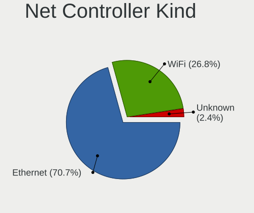

| Kind     | Desktops | Percent |
|----------|----------|---------|
| Ethernet | 29       | 70.73%  |
| WiFi     | 11       | 26.83%  |
| Unknown  | 1        | 2.44%   |

Used Controller
---------------

Currently used network controller

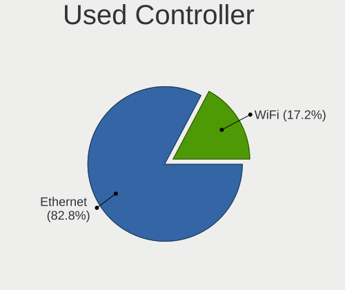

| Kind     | Desktops | Percent |
|----------|----------|---------|
| Ethernet | 24       | 82.76%  |
| WiFi     | 5        | 17.24%  |

NICs
----

Total network controllers on board

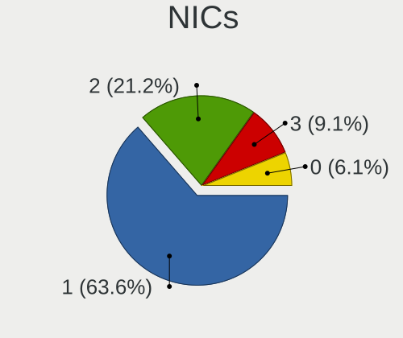

| Total | Desktops | Percent |
|-------|----------|---------|
| 1     | 21       | 63.64%  |
| 2     | 7        | 21.21%  |
| 3     | 3        | 9.09%   |
| 0     | 2        | 6.06%   |

IPv6
----

IPv6 vs IPv4

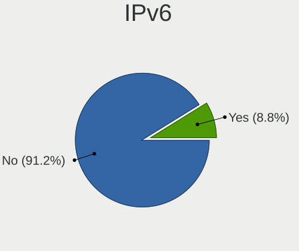

| Used | Desktops | Percent |
|------|----------|---------|
| No   | 31       | 91.18%  |
| Yes  | 3        | 8.82%   |

Bluetooth
---------

Bluetooth Vendor
----------------

Controller vendors

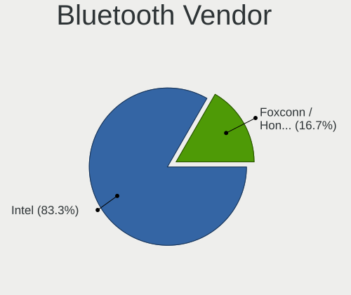

| Vendor            | Desktops | Percent |
|-------------------|----------|---------|
| Intel             | 5        | 83.33%  |
| Foxconn / Hon Hai | 1        | 16.67%  |

Bluetooth Model
---------------

Controller models

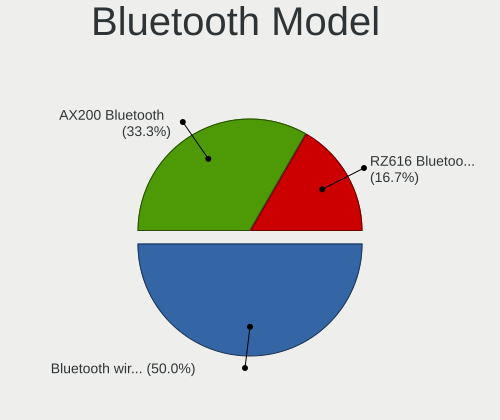

| Model                                     | Desktops | Percent |
|-------------------------------------------|----------|---------|
| Intel Bluetooth wireless interface        | 3        | 50%     |
| Intel AX200 Bluetooth                     | 2        | 33.33%  |
| Foxconn / Hon Hai RZ616 Bluetooth Adapter | 1        | 16.67%  |

Sound
-----

Sound Vendor
------------

Sound card vendors

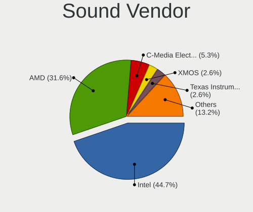

| Vendor              | Desktops | Percent |
|---------------------|----------|---------|
| Intel               | 17       | 44.74%  |
| AMD                 | 12       | 31.58%  |
| C-Media Electronics | 2        | 5.26%   |
| XMOS                | 1        | 2.63%   |
| Texas Instruments   | 1        | 2.63%   |
| Logitech            | 1        | 2.63%   |
| ESS Technology      | 1        | 2.63%   |
| Creative Technology | 1        | 2.63%   |
| Creative Labs       | 1        | 2.63%   |
| ASUSTek Computer    | 1        | 2.63%   |

Sound Model
-----------

Sound card models

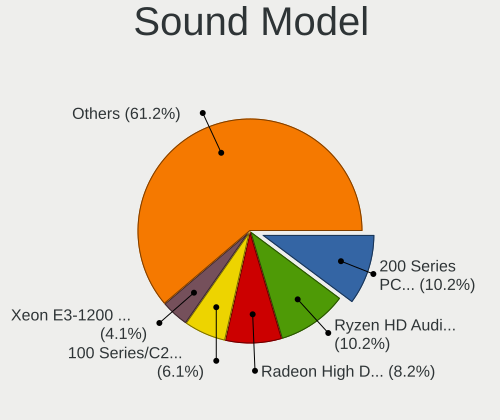

| Model                                                                                           | Desktops | Percent |
|-------------------------------------------------------------------------------------------------|----------|---------|
| Intel 200 Series PCH HD Audio                                                                   | 5        | 10.2%   |
| AMD Ryzen HD Audio Controller                                                                   | 5        | 10.2%   |
| AMD Radeon High Definition Audio Controller                                                     | 4        | 8.16%   |
| Intel 100 Series/C230 Series Chipset Family HD Audio Controller                                 | 3        | 6.12%   |
| Intel Xeon E3-1200 v3/4th Gen Core Processor HD Audio Controller                                | 2        | 4.08%   |
| Intel 8 Series/C220 Series Chipset High Definition Audio Controller                             | 2        | 4.08%   |
| AMD Renoir/Cezanne HDMI/DP Audio Controller                                                     | 2        | 4.08%   |
| AMD Oland/Hainan/Cape Verde/Pitcairn HDMI Audio [Radeon HD 7000 Series]                         | 2        | 4.08%   |
| XMOS iFi (by AMR) HD USB Audio                                                                  | 1        | 2.04%   |
| Texas Instruments PCM2902 Audio Codec                                                           | 1        | 2.04%   |
| Logitech HD Webcam C910                                                                         | 1        | 2.04%   |
| Intel NM10/ICH7 Family High Definition Audio Controller                                         | 1        | 2.04%   |
| Intel Cannon Lake PCH cAVS                                                                      | 1        | 2.04%   |
| Intel 82801JI (ICH10 Family) HD Audio Controller                                                | 1        | 2.04%   |
| Intel 82801I (ICH9 Family) HD Audio Controller                                                  | 1        | 2.04%   |
| Intel 82801DB/DBL/DBM (ICH4/ICH4-L/ICH4-M) AC'97 Audio Controller                               | 1        | 2.04%   |
| Intel 7 Series/C216 Chipset Family High Definition Audio Controller                             | 1        | 2.04%   |
| Intel 6 Series/C200 Series Chipset Family High Definition Audio Controller                      | 1        | 2.04%   |
| ESS Technology ES1978 Maestro 2E                                                                | 1        | 2.04%   |
| Creative Technology Sound Blaster Play! 3                                                       | 1        | 2.04%   |
| Creative Labs CA0132 Sound Core3D [Sound Blaster Recon3D / Z-Series / Sound BlasterX AE-5 Plus] | 1        | 2.04%   |
| C-Media Electronics CMI8738/CMI8768 PCI Audio                                                   | 1        | 2.04%   |
| C-Media Electronics C-Media USB Audio Device                                                    | 1        | 2.04%   |
| ASUSTek Computer Realtek USB Audio                                                              | 1        | 2.04%   |
| AMD Turks HDMI Audio [Radeon HD 6500/6600 / 6700M Series]                                       | 1        | 2.04%   |
| AMD Starship/Matisse HD Audio Controller                                                        | 1        | 2.04%   |
| AMD SBx00 Azalia (Intel HDA)                                                                    | 1        | 2.04%   |
| AMD Navi 31 HDMI/DP Audio                                                                       | 1        | 2.04%   |
| AMD Navi 10 HDMI Audio                                                                          | 1        | 2.04%   |
| AMD Kabini HDMI/DP Audio                                                                        | 1        | 2.04%   |
| AMD Family 15h (Models 60h-6fh) Audio Controller                                                | 1        | 2.04%   |
| AMD Caicos HDMI Audio [Radeon HD 6450 / 7450/8450/8490 OEM / R5 230/235/235X OEM]               | 1        | 2.04%   |

Memory
------

Memory Vendor
-------------

Memory module vendors

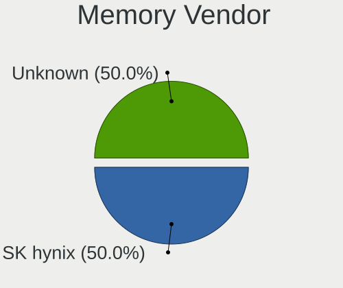

| Vendor   | Desktops | Percent |
|----------|----------|---------|
| SK hynix | 1        | 50%     |
| Unknown  | 1        | 50%     |

Memory Model
------------

Memory module models

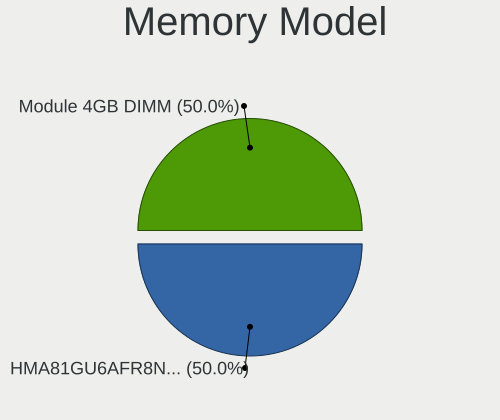

| Model                                                | Desktops | Percent |
|------------------------------------------------------|----------|---------|
| SK hynix RAM HMA81GU6AFR8N-UH 8GB DIMM DDR4 2400MT/s | 1        | 50%     |
| Unknown                                              | 1        | 50%     |

Memory Kind
-----------

Memory module kinds

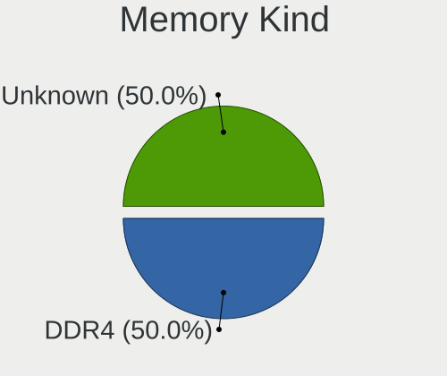

| Kind    | Desktops | Percent |
|---------|----------|---------|
| DDR4    | 1        | 50%     |
| Unknown | 1        | 50%     |

Memory Form Factor
------------------

Physical design of the memory module

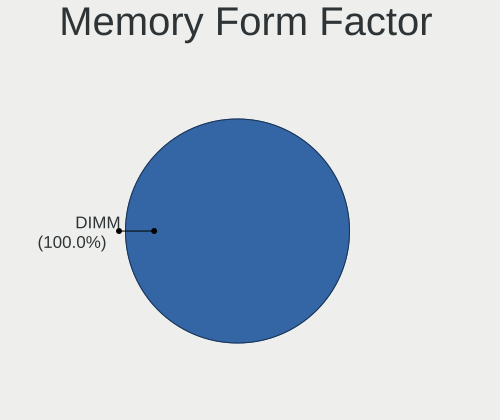

| Name | Desktops | Percent |
|------|----------|---------|
| DIMM | 2        | 100%    |

Memory Size
-----------

Memory module size

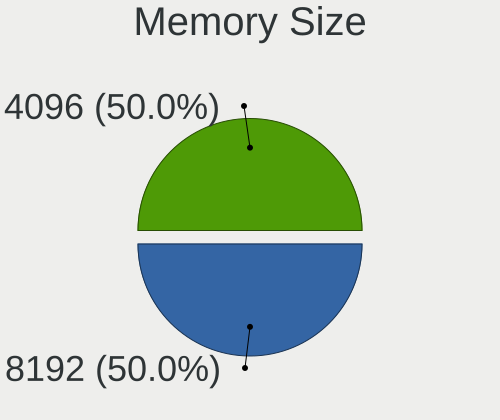

| Size | Desktops | Percent |
|------|----------|---------|
| 8192 | 1        | 50%     |
| 4096 | 1        | 50%     |

Memory Speed
------------

Memory module speed

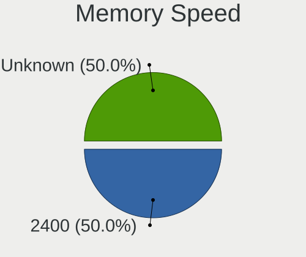

| Speed   | Desktops | Percent |
|---------|----------|---------|
| 2400    | 1        | 50%     |
| Unknown | 1        | 50%     |

Printers & scanners
-------------------

Printer Vendor
--------------

Printer device vendors

Zero info for selected period =(

Printer Model
-------------

Printer device models

Zero info for selected period =(

Scanner Vendor
--------------

Scanner device vendors

Zero info for selected period =(

Scanner Model
-------------

Scanner device models

Zero info for selected period =(

Camera
------

Camera Vendor
-------------

Camera device vendors

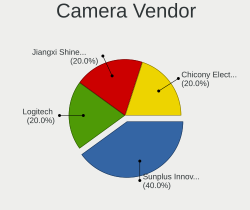

| Vendor                        | Desktops | Percent |
|-------------------------------|----------|---------|
| Sunplus Innovation Technology | 2        | 40%     |
| Logitech                      | 1        | 20%     |
| Jiangxi Shinetech Optical     | 1        | 20%     |
| Chicony Electronics           | 1        | 20%     |

Camera Model
------------

Camera device models

| Model                                 | Desktops | Percent |
|---------------------------------------|----------|---------|
| Sunplus LTD, NexiGo N930AF FHD Webcam | 2        | 40%     |
| Logitech HD Pro Webcam C920           | 1        | 20%     |
| Jiangxi Shinetech Optical FHD Camera  | 1        | 20%     |
| Chicony Webcam                        | 1        | 20%     |

Security
--------

Fingerprint Vendor
------------------

Fingerprint sensor vendors

Zero info for selected period =(

Fingerprint Model
-----------------

Fingerprint sensor models

Zero info for selected period =(

Chipcard Vendor
---------------

Chipcard module vendors

Zero info for selected period =(

Chipcard Model
--------------

Chipcard module models

Zero info for selected period =(

Unsupported
-----------

Unsupported Devices
-------------------

Total unsupported devices on board

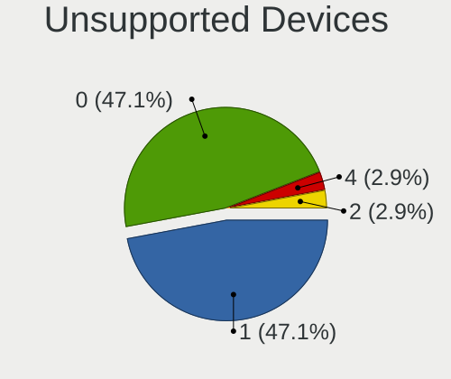

| Total | Desktops | Percent |
|-------|----------|---------|
| 1     | 16       | 47.06%  |
| 0     | 16       | 47.06%  |
| 4     | 1        | 2.94%   |
| 2     | 1        | 2.94%   |

Unsupported Device Types
------------------------

Types of unsupported devices

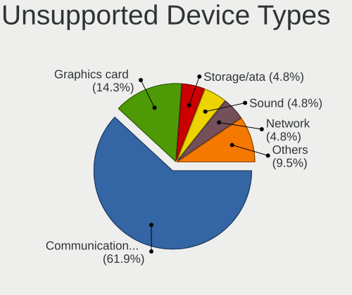

| Type                     | Desktops | Percent |
|--------------------------|----------|---------|
| Communication controller | 13       | 61.9%   |
| Graphics card            | 3        | 14.29%  |
| Storage/ata              | 1        | 4.76%   |
| Sound                    | 1        | 4.76%   |
| Network                  | 1        | 4.76%   |
| Net/wireless             | 1        | 4.76%   |
| Net/ethernet             | 1        | 4.76%   |

