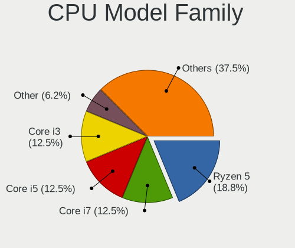
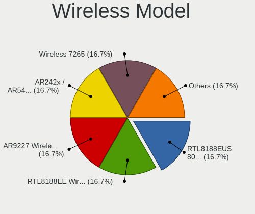

OpenBSD 7.6 - Tested Hardware & Statistics (Desktops)
-----------------------------------------------------

A project to collect tested hardware configurations for OpenBSD 7.6.

Anyone can contribute to this report by the [hw-probe](https://github.com/linuxhw/hw-probe/blob/master/INSTALL.BSD.md) tool:

    hw-probe -all -upload

Please contribute! Especially if your hardware is rare.

Contents
--------

* [ Test Cases ](#test-cases)

* [ System ](#system)
  - [ Arch                     ](#arch)
  - [ DE                       ](#de)
  - [ Display Server           ](#display-server)
  - [ Display Manager          ](#display-manager)
  - [ OS Lang                  ](#os-lang)
  - [ Boot Mode                ](#boot-mode)
  - [ Filesystem               ](#filesystem)
  - [ Part. scheme             ](#part-scheme)

* [ Board ](#board)
  - [ Vendor                   ](#vendor)
  - [ Model                    ](#model)
  - [ Model Family             ](#model-family)
  - [ MFG Year                 ](#mfg-year)
  - [ Form Factor              ](#form-factor)
  - [ Coreboot                 ](#coreboot)
  - [ RAM Size                 ](#ram-size)
  - [ RAM Used                 ](#ram-used)
  - [ Total Drives             ](#total-drives)
  - [ Has CD-ROM               ](#has-cd-rom)
  - [ Has Ethernet             ](#has-ethernet)
  - [ Has WiFi                 ](#has-wifi)
  - [ Has Bluetooth            ](#has-bluetooth)

* [ Location ](#location)
  - [ Country                  ](#country)
  - [ City                     ](#city)

* [ Drives ](#drives)
  - [ Drive Vendor             ](#drive-vendor)
  - [ Drive Model              ](#drive-model)
  - [ HDD Vendor               ](#hdd-vendor)
  - [ SSD Vendor               ](#ssd-vendor)
  - [ Drive Kind               ](#drive-kind)
  - [ Drive Connector          ](#drive-connector)
  - [ Drive Size               ](#drive-size)
  - [ Space Total              ](#space-total)
  - [ Space Used               ](#space-used)
  - [ Malfunc. Drives          ](#malfunc-drives)
  - [ Malfunc. Drive Vendor    ](#malfunc-drive-vendor)
  - [ Malfunc. HDD Vendor      ](#malfunc-hdd-vendor)
  - [ Malfunc. Drive Kind      ](#malfunc-drive-kind)
  - [ Failed Drives            ](#failed-drives)
  - [ Failed Drive Vendor      ](#failed-drive-vendor)
  - [ Drive Status             ](#drive-status)

* [ Storage controller ](#storage-controller)
  - [ Storage Vendor           ](#storage-vendor)
  - [ Storage Model            ](#storage-model)
  - [ Storage Kind             ](#storage-kind)

* [ Processor ](#processor)
  - [ CPU Vendor               ](#cpu-vendor)
  - [ CPU Model                ](#cpu-model)
  - [ CPU Model Family         ](#cpu-model-family)
  - [ CPU Cores                ](#cpu-cores)
  - [ CPU Sockets              ](#cpu-sockets)
  - [ CPU Threads              ](#cpu-threads)
  - [ CPU Microarch            ](#cpu-microarch)

* [ Graphics ](#graphics)
  - [ GPU Vendor               ](#gpu-vendor)
  - [ GPU Model                ](#gpu-model)
  - [ GPU Combo                ](#gpu-combo)
  - [ GPU Driver               ](#gpu-driver)
  - [ GPU Memory               ](#gpu-memory)

* [ Monitor ](#monitor)
  - [ Monitor Vendor           ](#monitor-vendor)
  - [ Monitor Model            ](#monitor-model)
  - [ Monitor Resolution       ](#monitor-resolution)
  - [ Monitor Diagonal         ](#monitor-diagonal)
  - [ Monitor Width            ](#monitor-width)
  - [ Aspect Ratio             ](#aspect-ratio)
  - [ Monitor Area             ](#monitor-area)
  - [ Pixel Density            ](#pixel-density)
  - [ Multiple Monitors        ](#multiple-monitors)

* [ Network ](#network)
  - [ Net Controller Vendor    ](#net-controller-vendor)
  - [ Net Controller Model     ](#net-controller-model)
  - [ Wireless Vendor          ](#wireless-vendor)
  - [ Wireless Model           ](#wireless-model)
  - [ Ethernet Vendor          ](#ethernet-vendor)
  - [ Ethernet Model           ](#ethernet-model)
  - [ Net Controller Kind      ](#net-controller-kind)
  - [ Used Controller          ](#used-controller)
  - [ NICs                     ](#nics)
  - [ IPv6                     ](#ipv6)

* [ Bluetooth ](#bluetooth)
  - [ Bluetooth Vendor         ](#bluetooth-vendor)
  - [ Bluetooth Model          ](#bluetooth-model)

* [ Sound ](#sound)
  - [ Sound Vendor             ](#sound-vendor)
  - [ Sound Model              ](#sound-model)

* [ Memory ](#memory)
  - [ Memory Vendor            ](#memory-vendor)
  - [ Memory Model             ](#memory-model)
  - [ Memory Kind              ](#memory-kind)
  - [ Memory Form Factor       ](#memory-form-factor)
  - [ Memory Size              ](#memory-size)
  - [ Memory Speed             ](#memory-speed)

* [ Printers & scanners ](#printers--scanners)
  - [ Printer Vendor           ](#printer-vendor)
  - [ Printer Model            ](#printer-model)
  - [ Scanner Vendor           ](#scanner-vendor)
  - [ Scanner Model            ](#scanner-model)

* [ Camera ](#camera)
  - [ Camera Vendor            ](#camera-vendor)
  - [ Camera Model             ](#camera-model)

* [ Security ](#security)
  - [ Fingerprint Vendor       ](#fingerprint-vendor)
  - [ Fingerprint Model        ](#fingerprint-model)
  - [ Chipcard Vendor          ](#chipcard-vendor)
  - [ Chipcard Model           ](#chipcard-model)

* [ Unsupported ](#unsupported)
  - [ Unsupported Devices      ](#unsupported-devices)
  - [ Unsupported Device Types ](#unsupported-device-types)

Test Cases
----------

Total: 24

| Vendor        | Model                       | Probe                                                     | Date         |
|---------------|-----------------------------|-----------------------------------------------------------|--------------|
| Gigabyte      | H310M DS2 2.0               | [0ace2c80f5](https://bsd-hardware.info/?probe=0ace2c80f5) | Jan 06, 2025 |
| Gigabyte      | H310M DS2 2.0               | [bfa6a720f4](https://bsd-hardware.info/?probe=bfa6a720f4) | Jan 06, 2025 |
| Lenovo        | ThinkStation P320 Tiny 3... | [c8a55cde50](https://bsd-hardware.info/?probe=c8a55cde50) | Jan 04, 2025 |
| ASUSTek       | SABERTOOTH X58              | [92e2cb380a](https://bsd-hardware.info/?probe=92e2cb380a) | Jan 03, 2025 |
| Lenovo        | 3106 SDK0J40697 WIN 3305... | [9f03b43d72](https://bsd-hardware.info/?probe=9f03b43d72) | Jan 03, 2025 |
| Intel         | D2500HN                     | [a316391d86](https://bsd-hardware.info/?probe=a316391d86) | Dec 27, 2024 |
| ASUSTek       | SABERTOOTH X58              | [f34dc483d5](https://bsd-hardware.info/?probe=f34dc483d5) | Dec 11, 2024 |
| Unknown       | Unknown                     | [23b03d29a7](https://bsd-hardware.info/?probe=23b03d29a7) | Dec 06, 2024 |
| Biostar       | B450MH                      | [9596d106ab](https://bsd-hardware.info/?probe=9596d106ab) | Dec 01, 2024 |
| Lenovo        | ThinkCentre M715q 10M2S0... | [9082d8b443](https://bsd-hardware.info/?probe=9082d8b443) | Dec 01, 2024 |
| Lenovo        | ThinkCentre M715q 10M2S0... | [bb5dc8520d](https://bsd-hardware.info/?probe=bb5dc8520d) | Nov 13, 2024 |
| Biostar       | B450MH                      | [51f3b1e55e](https://bsd-hardware.info/?probe=51f3b1e55e) | Nov 09, 2024 |
| MSI           | MS-7C02                     | [6f6f894d63](https://bsd-hardware.info/?probe=6f6f894d63) | Nov 05, 2024 |
| Gigabyte      | A620M H                     | [c1e5a0fe6f](https://bsd-hardware.info/?probe=c1e5a0fe6f) | Oct 22, 2024 |
| Fujitsu       | ESPRIMO_P556                | [acfba13c5e](https://bsd-hardware.info/?probe=acfba13c5e) | Oct 18, 2024 |
| HP            | Compaq Presario CQ50        | [462666f013](https://bsd-hardware.info/?probe=462666f013) | Oct 13, 2024 |
| ASUSTek       | PRIME B650-PLUS             | [6d6ba6974b](https://bsd-hardware.info/?probe=6d6ba6974b) | Oct 12, 2024 |
| Raspberry ... | Raspberry Pi 4 Model B      | [e556651aa4](https://bsd-hardware.info/?probe=e556651aa4) | Oct 11, 2024 |
| Shuttle       | DS77U                       | [9386a947f0](https://bsd-hardware.info/?probe=9386a947f0) | Oct 10, 2024 |
| Gigabyte      | X99-UD4P-CF                 | [19fac4e1e4](https://bsd-hardware.info/?probe=19fac4e1e4) | Oct 10, 2024 |
| Gigabyte      | X99-UD4P-CF                 | [ac773e52cd](https://bsd-hardware.info/?probe=ac773e52cd) | Oct 10, 2024 |
| Dell          | OptiPlex 9020               | [e7027118cd](https://bsd-hardware.info/?probe=e7027118cd) | Oct 10, 2024 |
| ASUSTek       | SABERTOOTH X58              | [47138b3361](https://bsd-hardware.info/?probe=47138b3361) | Sep 24, 2024 |
| ASUSTek       | SABERTOOTH X58              | [90220b30ee](https://bsd-hardware.info/?probe=90220b30ee) | Sep 09, 2024 |

System
------

Arch
----

OS architecture (x86_64, i586, etc.)

| Name  | Desktops | Percent |
|-------|----------|---------|
| amd64 | 14       | 87.5%   |
| i386  | 1        | 6.25%   |
| arm64 | 1        | 6.25%   |

DE
--

Desktop Environment

| Name         | Desktops | Percent |
|--------------|----------|---------|
| helloDesktop | 11       | 64.71%  |
| XFCE         | 4        | 23.53%  |
| stumpwm      | 1        | 5.88%   |
| KDE6         | 1        | 5.88%   |

Display Server
--------------

X11 or Wayland

| Name    | Desktops | Percent |
|---------|----------|---------|
| X11     | 12       | 75%     |
| Console | 4        | 25%     |

Display Manager
---------------

SDDM, LightDM, etc.

| Name    | Desktops | Percent |
|---------|----------|---------|
| Console | 16       | 100%    |

OS Lang
-------

Language

| Lang    | Desktops | Percent |
|---------|----------|---------|
| Unknown | 15       | 88.24%  |
| es_PY   | 1        | 5.88%   |
| en_US   | 1        | 5.88%   |

Boot Mode
---------

EFI or BIOS

| Mode | Desktops | Percent |
|------|----------|---------|
| EFI  | 11       | 64.71%  |
| BIOS | 6        | 35.29%  |

Filesystem
----------

Type of filesystem

| Type | Desktops | Percent |
|------|----------|---------|
| Ffs  | 16       | 100%    |

Part. scheme
------------

Scheme of partitioning

| Type | Desktops | Percent |
|------|----------|---------|
| GPT  | 10       | 62.5%   |
| MBR  | 6        | 37.5%   |

Board
-----

Vendor
------

Motherboard manufacturer

| Name                    | Desktops | Percent |
|-------------------------|----------|---------|
| Lenovo                  | 3        | 18.75%  |
| Gigabyte Technology     | 2        | 12.5%   |
| ASUSTek Computer        | 2        | 12.5%   |
| Shuttle                 | 1        | 6.25%   |
| Raspberry Pi Foundation | 1        | 6.25%   |
| MSI                     | 1        | 6.25%   |
| Intel                   | 1        | 6.25%   |
| Hewlett-Packard         | 1        | 6.25%   |
| Fujitsu                 | 1        | 6.25%   |
| Dell                    | 1        | 6.25%   |
| Biostar                 | 1        | 6.25%   |
| Unknown                 | 1        | 6.25%   |

Model
-----

Motherboard model

| Name                                     | Desktops | Percent |
|------------------------------------------|----------|---------|
| Shuttle DS77U                            | 1        | 6.25%   |
| RPi Raspberry Pi 4 Model B               | 1        | 6.25%   |
| MSI MS-7C02                              | 1        | 6.25%   |
| Lenovo ThinkStation P320 Tiny 30C1S0QS00 | 1        | 6.25%   |
| Lenovo ThinkCentre M910s 10MK000TUS      | 1        | 6.25%   |
| Lenovo ThinkCentre M715q 10M2S08Y00      | 1        | 6.25%   |
| Intel D2500HN                            | 1        | 6.25%   |
| HP Compaq Presario CQ50                  | 1        | 6.25%   |
| Gigabyte H310M DS2 2.0                   | 1        | 6.25%   |
| Gigabyte A620M H                         | 1        | 6.25%   |
| Fujitsu ESPRIMO_P556                     | 1        | 6.25%   |
| Dell OptiPlex 9020                       | 1        | 6.25%   |
| Biostar B450MH                           | 1        | 6.25%   |
| ASUS SABERTOOTH X58                      | 1        | 6.25%   |
| ASUS PRIME B650-PLUS                     | 1        | 6.25%   |
| Unknown                                  | 1        | 6.25%   |

Model Family
------------

Motherboard model prefix

| Name                | Desktops | Percent |
|---------------------|----------|---------|
| Lenovo ThinkCentre  | 2        | 12.5%   |
| Shuttle DS77U       | 1        | 6.25%   |
| RPi Raspberry       | 1        | 6.25%   |
| MSI MS-7C02         | 1        | 6.25%   |
| Lenovo ThinkStation | 1        | 6.25%   |
| Intel D2500HN       | 1        | 6.25%   |
| HP Compaq           | 1        | 6.25%   |
| Gigabyte H310M      | 1        | 6.25%   |
| Gigabyte A620M      | 1        | 6.25%   |
| Fujitsu ESPRIMO     | 1        | 6.25%   |
| Dell OptiPlex       | 1        | 6.25%   |
| Biostar B450MH      | 1        | 6.25%   |
| ASUS SABERTOOTH     | 1        | 6.25%   |
| ASUS PRIME          | 1        | 6.25%   |
| Unknown             | 1        | 6.25%   |

MFG Year
--------

Motherboard manufacture year

| Year    | Desktops | Percent |
|---------|----------|---------|
| 2019    | 4        | 25%     |
| 2023    | 3        | 18.75%  |
| 2020    | 2        | 12.5%   |
| 2024    | 1        | 6.25%   |
| 2017    | 1        | 6.25%   |
| 2016    | 1        | 6.25%   |
| 2012    | 1        | 6.25%   |
| 2011    | 1        | 6.25%   |
| 2010    | 1        | 6.25%   |
| Unknown | 1        | 6.25%   |

Form Factor
-----------

Physical design of the computer

| Name    | Desktops | Percent |
|---------|----------|---------|
| Desktop | 16       | 100%    |

Coreboot
--------

Have coreboot on board

| Used | Desktops | Percent |
|------|----------|---------|
| No   | 16       | 100%    |

RAM Size
--------

Total RAM memory

| Size in GB | Desktops | Percent |
|------------|----------|---------|
| 16.01-24.0 | 5        | 31.25%  |
| 32.01-64.0 | 4        | 25%     |
| 4.01-8.0   | 2        | 12.5%   |
| 3.01-4.0   | 1        | 6.25%   |
| 24.01-32.0 | 1        | 6.25%   |
| 2.01-3.0   | 1        | 6.25%   |
| 8.01-16.0  | 1        | 6.25%   |
| 0.01-0.5   | 1        | 6.25%   |

RAM Used
--------

Used RAM memory

| Used GB  | Desktops | Percent |
|----------|----------|---------|
| 0.01-0.5 | 10       | 62.5%   |
| 0.51-1.0 | 5        | 31.25%  |
| 0        | 1        | 6.25%   |

Total Drives
------------

Number of drives on board

| Drives | Desktops | Percent |
|--------|----------|---------|
| 1      | 7        | 41.18%  |
| 2      | 5        | 29.41%  |
| 3      | 3        | 17.65%  |
| 4      | 1        | 5.88%   |
| 0      | 1        | 5.88%   |

Has CD-ROM
----------

Has CD-ROM on board

| Presented | Desktops | Percent |
|-----------|----------|---------|
| No        | 15       | 93.75%  |
| Yes       | 1        | 6.25%   |

Has Ethernet
------------

Has Ethernet on board

| Presented | Desktops | Percent |
|-----------|----------|---------|
| Yes       | 14       | 87.5%   |
| No        | 2        | 12.5%   |

Has WiFi
--------

Has WiFi module

| Presented | Desktops | Percent |
|-----------|----------|---------|
| No        | 10       | 62.5%   |
| Yes       | 6        | 37.5%   |

Has Bluetooth
-------------

Has Bluetooth module

| Presented | Desktops | Percent |
|-----------|----------|---------|
| No        | 15       | 88.24%  |
| Yes       | 2        | 11.76%  |

Location
--------

Country
-------

Geographic location (country)

| Country     | Desktops | Percent |
|-------------|----------|---------|
| USA         | 4        | 25%     |
| Spain       | 2        | 12.5%   |
| Italy       | 2        | 12.5%   |
| Germany     | 2        | 12.5%   |
| Finland     | 2        | 12.5%   |
| South Korea | 1        | 6.25%   |
| Russia      | 1        | 6.25%   |
| Paraguay    | 1        | 6.25%   |
| Colombia    | 1        | 6.25%   |

City
----

Geographic location (city)

| City            | Desktops | Percent |
|-----------------|----------|---------|
| Milan           | 2        | 11.76%  |
| Zaragoza        | 1        | 5.88%   |
| Valladolid      | 1        | 5.88%   |
| Vaasa           | 1        | 5.88%   |
| Tampere         | 1        | 5.88%   |
| Scottsville     | 1        | 5.88%   |
| Medellín       | 1        | 5.88%   |
| Madison         | 1        | 5.88%   |
| Louisville      | 1        | 5.88%   |
| Jongno-gu       | 1        | 5.88%   |
| Hoffman Estates | 1        | 5.88%   |
| Danville        | 1        | 5.88%   |
| Cologne         | 1        | 5.88%   |
| Cherepovets     | 1        | 5.88%   |
| Berlin          | 1        | 5.88%   |
| Asunción       | 1        | 5.88%   |

Drives
------

Drive Vendor
------------

Hard drive vendors

| Vendor                                 | Desktops | Drives | Percent |
|----------------------------------------|----------|--------|---------|
| Samsung Electronics                    | 5        | 6      | 19.23%  |
| Toshiba                                | 3        | 4      | 11.54%  |
| Seagate                                | 3        | 4      | 11.54%  |
| Kingston                               | 3        | 3      | 11.54%  |
| WDC                                    | 2        | 2      | 7.69%   |
| USB3.0                                 | 1        | 2      | 3.85%   |
| SPCC                                   | 1        | 1      | 3.85%   |
| SanDisk                                | 1        | 1      | 3.85%   |
| Product:              USB DISK 3.0 Pro | 1        | 1      | 3.85%   |
| PNY                                    | 1        | 3      | 3.85%   |
| LITEONIT                               | 1        | 2      | 3.85%   |
| Lexar                                  | 1        | 3      | 3.85%   |
| Crucial                                | 1        | 1      | 3.85%   |
| AGI                                    | 1        | 1      | 3.85%   |
| A-DATA Technology                      | 1        | 1      | 3.85%   |

Drive Model
-----------

Hard drive models

| Model                                                         | Desktops | Percent |
|---------------------------------------------------------------|----------|---------|
| Samsung SSD 990 PRO 1TB                                       | 2        | 7.41%   |
| WDC WDS250G2B0A-00SM50 250GB                                  | 1        | 3.7%    |
| WDC WD3200AAKX-001CA0 320GB                                   | 1        | 3.7%    |
| USB3.0 storage 1TB                                            | 1        | 3.7%    |
| Toshiba KXG50ZNV1T02 NVMe 1024GB                              | 1        | 3.7%    |
| Toshiba DT01ACA100 1TB                                        | 1        | 3.7%    |
| Toshiba DT01ACA050 500GB                                      | 1        | 3.7%    |
| SPCC M.2 PCIe SSD 2TB                                         | 1        | 3.7%    |
| Seagate ST2000DM008-2FR102 2TB                                | 1        | 3.7%    |
| Seagate ST1000VM002-1SD102 1TB                                | 1        | 3.7%    |
| Seagate ST1000LM035-1RK172 1TB                                | 1        | 3.7%    |
| SanDisk Cruzer Fit 8GB                                        | 1        | 3.7%    |
| Samsung SSD 860 EVO M.2 2TB                                   | 1        | 3.7%    |
| Samsung SSD 860 EVO 500GB                                     | 1        | 3.7%    |
| Samsung SSD 860 EVO 2TB                                       | 1        | 3.7%    |
| Samsung MZ7TY256HDHP-000L7 256GB                              | 1        | 3.7%    |
| Product:              USB DISK 3.0 Pro USB DISK 3.0 Pro 128GB | 1        | 3.7%    |
| PNY CS900 1TB SSD                                             | 1        | 3.7%    |
| LITEONIT LCS-128M6S 128GB                                     | 1        | 3.7%    |
| Lexar 128GB SSD                                               | 1        | 3.7%    |
| Kingston SA400S37960G 960GB                                   | 1        | 3.7%    |
| Kingston SA400S37240G 240GB                                   | 1        | 3.7%    |
| Kingston DataTraveler 3.0 64GB                                | 1        | 3.7%    |
| Crucial CT250MX200SSD1 250GB                                  | 1        | 3.7%    |
| AGI AGI1K0GIMAI238 1TB                                        | 1        | 3.7%    |
| A-DATA SU800 512GB                                            | 1        | 3.7%    |

HDD Vendor
----------

Hard disk drive vendors

| Vendor                                 | Desktops | Drives | Percent |
|----------------------------------------|----------|--------|---------|
| Seagate                                | 3        | 4      | 37.5%   |
| Toshiba                                | 2        | 3      | 25%     |
| WDC                                    | 1        | 1      | 12.5%   |
| USB3.0                                 | 1        | 2      | 12.5%   |
| Product:              USB DISK 3.0 Pro | 1        | 1      | 12.5%   |

SSD Vendor
----------

Solid state drive vendors

| Vendor              | Desktops | Drives | Percent |
|---------------------|----------|--------|---------|
| Samsung Electronics | 3        | 4      | 21.43%  |
| Kingston            | 3        | 3      | 21.43%  |
| WDC                 | 1        | 1      | 7.14%   |
| SanDisk             | 1        | 1      | 7.14%   |
| PNY                 | 1        | 3      | 7.14%   |
| LITEONIT            | 1        | 2      | 7.14%   |
| Lexar               | 1        | 3      | 7.14%   |
| Crucial             | 1        | 1      | 7.14%   |
| AGI                 | 1        | 1      | 7.14%   |
| A-DATA Technology   | 1        | 1      | 7.14%   |

Drive Kind
----------

HDD or SSD

| Kind | Desktops | Drives | Percent |
|------|----------|--------|---------|
| SSD  | 10       | 20     | 52.63%  |
| HDD  | 5        | 11     | 26.32%  |
| NVMe | 4        | 4      | 21.05%  |

Drive Connector
---------------

SATA, SAS, NVMe, etc.

| Type | Desktops | Drives | Percent |
|------|----------|--------|---------|
| SATA | 12       | 31     | 75%     |
| NVMe | 4        | 4      | 25%     |

Drive Size
----------

Size of hard drive

| Size in TB | Desktops | Drives | Percent |
|------------|----------|--------|---------|
| 0.01-0.5   | 9        | 16     | 50%     |
| 0.51-1.0   | 6        | 10     | 33.33%  |
| 1.01-2.0   | 3        | 5      | 16.67%  |

Space Total
-----------

Amount of disk space available on the file system

| Size in GB     | Desktops | Percent |
|----------------|----------|---------|
| 251-500        | 6        | 35.29%  |
| 101-250        | 4        | 23.53%  |
| 51-100         | 2        | 11.76%  |
| More than 3000 | 1        | 5.88%   |
| 2001-3000      | 1        | 5.88%   |
| 1001-2000      | 1        | 5.88%   |
| 1-20           | 1        | 5.88%   |
| 501-1000       | 1        | 5.88%   |

Space Used
----------

Amount of used disk space

| Used GB   | Desktops | Percent |
|-----------|----------|---------|
| 1-20      | 12       | 70.59%  |
| 251-500   | 1        | 5.88%   |
| 21-50     | 1        | 5.88%   |
| 2001-3000 | 1        | 5.88%   |
| 501-1000  | 1        | 5.88%   |
| 51-100    | 1        | 5.88%   |

Malfunc. Drives
---------------

Drive models with a malfunction

| Model                          | Desktops | Drives | Percent |
|--------------------------------|----------|--------|---------|
| Toshiba DT01ACA100 1TB         | 1        | 1      | 33.33%  |
| Toshiba DT01ACA050 500GB       | 1        | 2      | 33.33%  |
| Seagate ST2000DM008-2FR102 2TB | 1        | 2      | 33.33%  |

Malfunc. Drive Vendor
---------------------

Vendors of faulty drives

| Vendor  | Desktops | Drives | Percent |
|---------|----------|--------|---------|
| Toshiba | 2        | 3      | 66.67%  |
| Seagate | 1        | 2      | 33.33%  |

Malfunc. HDD Vendor
-------------------

Vendors of faulty HDD drives

| Vendor  | Desktops | Drives | Percent |
|---------|----------|--------|---------|
| Toshiba | 2        | 3      | 66.67%  |
| Seagate | 1        | 2      | 33.33%  |

Malfunc. Drive Kind
-------------------

Kinds of faulty drives

| Kind | Desktops | Drives | Percent |
|------|----------|--------|---------|
| HDD  | 3        | 5      | 100%    |

Failed Drives
-------------

Failed drive models

Zero info for selected period =(

Failed Drive Vendor
-------------------

Failed drive vendors

Zero info for selected period =(

Drive Status
------------

Number of failed and malfunc. drives

| Status   | Desktops | Drives | Percent |
|----------|----------|--------|---------|
| Works    | 15       | 29     | 78.95%  |
| Malfunc  | 3        | 5      | 15.79%  |
| Detected | 1        | 1      | 5.26%   |

Storage controller
------------------

Storage Vendor
--------------

Storage controller vendors

| Vendor                   | Desktops | Percent |
|--------------------------|----------|---------|
| Intel                    | 10       | 47.62%  |
| AMD                      | 5        | 23.81%  |
| Samsung Electronics      | 2        | 9.52%   |
| Toshiba                  | 1        | 4.76%   |
| SanDisk                  | 1        | 4.76%   |
| Marvell Technology Group | 1        | 4.76%   |
| JMicron Technology       | 1        | 4.76%   |

Storage Model
-------------

Storage controller models

| Model                                                                          | Desktops | Percent |
|--------------------------------------------------------------------------------|----------|---------|
| Intel 200 Series PCH SATA controller [AHCI mode]                               | 3        | 13.04%  |
| Samsung NVMe SSD Controller S4LV008[Pascal]                                    | 2        | 8.7%    |
| AMD FCH SATA Controller [AHCI mode]                                            | 2        | 8.7%    |
| AMD 600 Series Chipset SATA Controller                                         | 2        | 8.7%    |
| AMD 400 Series Chipset SATA Controller                                         | 2        | 8.7%    |
| Toshiba XG6 NVMe SSD Controller                                                | 1        | 4.35%   |
| Toshiba XG5 NVMe SSD Controller                                                | 1        | 4.35%   |
| SanDisk Ultra 3D / WD Blue SN570 NVMe SSD (DRAM-less)                          | 1        | 4.35%   |
| Marvell Group 88SE9123 PCIe SATA 6.0 Gb/s controller                           | 1        | 4.35%   |
| JMicron JMB362 SATA Controller                                                 | 1        | 4.35%   |
| Intel Sunrise Point-LP SATA Controller [AHCI mode]                             | 1        | 4.35%   |
| Intel Q170/Q150/B150/H170/H110/Z170/CM236 Chipset SATA Controller [AHCI Mode]  | 1        | 4.35%   |
| Intel NM10/ICH7 Family SATA Controller [AHCI mode]                             | 1        | 4.35%   |
| Intel 82801JI (ICH10 Family) SATA AHCI Controller                              | 1        | 4.35%   |
| Intel 82801IBM/IEM (ICH9M/ICH9M-E) 4 port SATA Controller [AHCI mode]          | 1        | 4.35%   |
| Intel 82371AB/EB/MB PIIX4 IDE                                                  | 1        | 4.35%   |
| Intel 8 Series/C220 Series Chipset Family 6-port SATA Controller 1 [AHCI mode] | 1        | 4.35%   |

Storage Kind
------------

Kind of storage controller (IDE, SATA, NVMe, SAS, ...)

| Kind | Desktops | Percent |
|------|----------|---------|
| SATA | 14       | 70%     |
| NVMe | 4        | 20%     |
| IDE  | 2        | 10%     |

Processor
---------

CPU Vendor
----------

Processor vendors

| Vendor | Desktops | Percent |
|--------|----------|---------|
| Intel  | 10       | 62.5%   |
| AMD    | 5        | 31.25%  |
| ARM    | 1        | 6.25%   |

CPU Model
---------

Processor models

| Model                                                        | Desktops | Percent |
|--------------------------------------------------------------|----------|---------|
| Intel Pentium III ("GenuineIntel" 686-class, 512KB L2 cache) | 1        | 6.25%   |
| Intel Core i7-6700 CPU @ 3.40GHz                             | 1        | 6.25%   |
| Intel Core i7 CPU 960 @ 3.20GHz                              | 1        | 6.25%   |
| Intel Core i5-6500 CPU @ 3.20GHz                             | 1        | 6.25%   |
| Intel Core i5-4570 CPU @ 3.20GHz                             | 1        | 6.25%   |
| Intel Core i3-9100F CPU @ 3.60GHz                            | 1        | 6.25%   |
| Intel Core i3-6100T CPU @ 3.20GHz                            | 1        | 6.25%   |
| Intel Core 2 Duo CPU T9300 @ 2.50GHz                         | 1        | 6.25%   |
| Intel Celeron CPU 3865U @ 1.80GHz                            | 1        | 6.25%   |
| Intel Atom CPU D2500 @ 1.86GHz                               | 1        | 6.25%   |
| ARM Cortex-A72 r0p3                                          | 1        | 6.25%   |
| AMD Ryzen 7 8700G w/ Radeon 780M Graphics                    | 1        | 6.25%   |
| AMD Ryzen 5 8500G w/ Radeon 740M Graphics                    | 1        | 6.25%   |
| AMD Ryzen 5 4600G with Radeon Graphics                       | 1        | 6.25%   |
| AMD Ryzen 5 3600XT 6-Core Processor                          | 1        | 6.25%   |
| AMD PRO A6-8570E R5, 6 COMPUTE CORES 2C+4G                   | 1        | 6.25%   |

CPU Model Family
----------------

Processor model prefix

| Model             | Desktops | Percent |
|-------------------|----------|---------|
| AMD Ryzen 5       | 3        | 18.75%  |
| Intel Core i7     | 2        | 12.5%   |
| Intel Core i5     | 2        | 12.5%   |
| Intel Core i3     | 2        | 12.5%   |
| Other             | 1        | 6.25%   |
| Intel Pentium III | 1        | 6.25%   |
| Intel Core 2 Duo  | 1        | 6.25%   |
| Intel Celeron     | 1        | 6.25%   |
| Intel Atom        | 1        | 6.25%   |
| ARM Cortex        | 1        | 6.25%   |
| AMD Ryzen 7       | 1        | 6.25%   |

CPU Cores
---------

Number of processor cores

| Number  | Desktops | Percent |
|---------|----------|---------|
| 4       | 5        | 31.25%  |
| Unknown | 4        | 25%     |
| 2       | 3        | 18.75%  |
| 12      | 2        | 12.5%   |
| 16      | 1        | 6.25%   |
| 1       | 1        | 6.25%   |

CPU Sockets
-----------

Number of sockets

| Number  | Desktops | Percent |
|---------|----------|---------|
| 1       | 11       | 68.75%  |
| Unknown | 5        | 31.25%  |

CPU Threads
-----------

Threads per core (Hyper-Threading)

| Number  | Desktops | Percent |
|---------|----------|---------|
| 1       | 8        | 50%     |
| Unknown | 5        | 31.25%  |
| 2       | 3        | 18.75%  |

CPU Microarch
-------------

Microarchitecture

| Name      | Desktops | Percent |
|-----------|----------|---------|
| Unknown   | 4        | 25%     |
| Skylake   | 3        | 18.75%  |
| KabyLake  | 2        | 12.5%   |
| Zen 2     | 1        | 6.25%   |
| Penryn    | 1        | 6.25%   |
| P6        | 1        | 6.25%   |
| Nehalem   | 1        | 6.25%   |
| Haswell   | 1        | 6.25%   |
| Excavator | 1        | 6.25%   |
| Bonnell   | 1        | 6.25%   |

Graphics
--------

GPU Vendor
----------

Vendors of graphics cards

| Vendor                               | Desktops | Percent |
|--------------------------------------|----------|---------|
| Intel                                | 7        | 46.67%  |
| AMD                                  | 7        | 46.67%  |
| NVidia / SGS Thomson (Joint Venture) | 1        | 6.67%   |

GPU Model
---------

Graphics card models

| Model                                                                       | Desktops | Percent |
|-----------------------------------------------------------------------------|----------|---------|
| Intel HD Graphics 530                                                       | 3        | 20%     |
| NVidia / SGS Thomson (Joint Venture) Riva128                                | 1        | 6.67%   |
| Intel Xeon E3-1200 v3/4th Gen Core Processor Integrated Graphics Controller | 1        | 6.67%   |
| Intel Mobile 4 Series Chipset Integrated Graphics Controller                | 1        | 6.67%   |
| Intel HD Graphics 610                                                       | 1        | 6.67%   |
| Intel Atom Processor D2xxx/N2xxx Integrated Graphics Controller             | 1        | 6.67%   |
| AMD Wani [Radeon R5/R6/R7 Graphics]                                         | 1        | 6.67%   |
| AMD Turks XT [Radeon HD 6670/7670]                                          | 1        | 6.67%   |
| AMD Renoir [Radeon Vega Series / Radeon Vega Mobile Series]                 | 1        | 6.67%   |
| AMD Phoenix2                                                                | 1        | 6.67%   |
| AMD Phoenix1                                                                | 1        | 6.67%   |
| AMD Oland GL [FirePro W2100]                                                | 1        | 6.67%   |
| AMD Navi 14 [Radeon RX 5500/5500M / Pro 5500M]                              | 1        | 6.67%   |

GPU Combo
---------

Combinations of graphics cards

| Name                                     | Desktops | Percent |
|------------------------------------------|----------|---------|
| 1 x AMD                                  | 7        | 43.75%  |
| 1 x Intel                                | 6        | 37.5%   |
| Other                                    | 1        | 6.25%   |
| 2 x Intel                                | 1        | 6.25%   |
| 1 x NVidia / SGS Thomson (Joint Venture) | 1        | 6.25%   |

GPU Driver
----------

Free vs proprietary

| Driver  | Desktops | Percent |
|---------|----------|---------|
| Free    | 14       | 87.5%   |
| Unknown | 2        | 12.5%   |

GPU Memory
----------

Total video memory

| Size in GB | Desktops | Percent |
|------------|----------|---------|
| Unknown    | 16       | 100%    |

Monitor
-------

Monitor Vendor
--------------

Monitor vendors

| Vendor              | Desktops | Percent |
|---------------------|----------|---------|
| Philips             | 3        | 23.08%  |
| Acer                | 2        | 15.38%  |
| Samsung Electronics | 1        | 7.69%   |
| LG Philips          | 1        | 7.69%   |
| Lenovo              | 1        | 7.69%   |
| HKC                 | 1        | 7.69%   |
| Hewlett-Packard     | 1        | 7.69%   |
| Goldstar            | 1        | 7.69%   |
| Dell                | 1        | 7.69%   |
| ASUSTek Computer    | 1        | 7.69%   |

Monitor Model
-------------

Monitor models

| Model                                                             | Desktops | Percent |
|-------------------------------------------------------------------|----------|---------|
| Philips 227E4LH PHLC0AC 1920x1080 480x270mm 21.7-inch             | 2        | 15.38%  |
| Samsung Electronics U28E590 SAM0C4D 3840x2160 610x350mm 27.7-inch | 1        | 7.69%   |
| Philips 221B PHL08A1 1920x1080 480x270mm 21.7-inch                | 1        | 7.69%   |
| LG Philips LP154WX4-TLCB LPL3101 1280x800 330x210mm 15.4-inch     | 1        | 7.69%   |
| Lenovo LEN L174 LEN240B 1280x1024 340x270mm 17.1-inch             | 1        | 7.69%   |
| HKC F2145M HKC2251 1920x1080 480x260mm 21.5-inch                  | 1        | 7.69%   |
| Hewlett-Packard LP2465 HWP2676 1920x1200 520x330mm 24.2-inch      | 1        | 7.69%   |
| Goldstar BL450 GSM5B86 1920x1080 480x270mm 21.7-inch              | 1        | 7.69%   |
| Dell P2412H DELA07C 1920x1080 530x300mm 24.0-inch                 | 1        | 7.69%   |
| ASUSTek Computer VA24E AUS24D1 1920x1080 530x300mm 24.0-inch      | 1        | 7.69%   |
| Acer V277 E ACR0B7C 1920x1080 600x330mm 27.0-inch                 | 1        | 7.69%   |
| Acer ET322QU ACR0687 2560x1440 700x390mm 31.5-inch                | 1        | 7.69%   |

Monitor Resolution
------------------

Monitor screen resolution

| Resolution        | Desktops | Percent |
|-------------------|----------|---------|
| 1920x1080 (FHD)   | 8        | 61.54%  |
| 3840x2160 (4K)    | 1        | 7.69%   |
| 2560x1440 (QHD)   | 1        | 7.69%   |
| 1920x1200 (WUXGA) | 1        | 7.69%   |
| 1280x800 (WXGA)   | 1        | 7.69%   |
| 1280x1024 (SXGA)  | 1        | 7.69%   |

Monitor Diagonal
----------------

Diagonal size in inches

| Inches | Desktops | Percent |
|--------|----------|---------|
| 21     | 5        | 38.46%  |
| 24     | 3        | 23.08%  |
| 27     | 2        | 15.38%  |
| 31     | 1        | 7.69%   |
| 17     | 1        | 7.69%   |
| 15     | 1        | 7.69%   |

Monitor Width
-------------

Physical width

| Width in mm | Desktops | Percent |
|-------------|----------|---------|
| 401-500     | 5        | 38.46%  |
| 501-600     | 4        | 30.77%  |
| 601-700     | 2        | 15.38%  |
| 301-350     | 2        | 15.38%  |

Aspect Ratio
------------

Proportional relationship between the width and the height

| Ratio | Desktops | Percent |
|-------|----------|---------|
| 16/9  | 10       | 76.92%  |
| 16/10 | 2        | 15.38%  |
| 5/4   | 1        | 7.69%   |

Monitor Area
------------

Area in inch²

| Area in inch² | Desktops | Percent |
|----------------|----------|---------|
| 201-250        | 6        | 46.15%  |
| 301-350        | 2        | 15.38%  |
| 351-500        | 1        | 7.69%   |
| 251-300        | 1        | 7.69%   |
| 151-200        | 1        | 7.69%   |
| 141-150        | 1        | 7.69%   |
| 101-110        | 1        | 7.69%   |

Pixel Density
-------------

Pixels per inch

| Density | Desktops | Percent |
|---------|----------|---------|
| 51-100  | 7        | 53.85%  |
| 101-120 | 5        | 38.46%  |
| 121-160 | 1        | 7.69%   |

Multiple Monitors
-----------------

Total monitors connected

| Total | Desktops | Percent |
|-------|----------|---------|
| 1     | 12       | 66.67%  |
| 0     | 5        | 27.78%  |
| 2     | 1        | 5.56%   |

Network
-------

Net Controller Vendor
---------------------

Controller vendors

| Vendor                | Desktops | Percent |
|-----------------------|----------|---------|
| Realtek Semiconductor | 10       | 52.63%  |
| Intel                 | 6        | 31.58%  |
| Qualcomm Atheros      | 2        | 10.53%  |
| MediaTek              | 1        | 5.26%   |

Net Controller Model
--------------------

Controller models

| Model                                                                   | Desktops | Percent |
|-------------------------------------------------------------------------|----------|---------|
| Realtek RTL8111/8168/8211/8411 PCI Express Gigabit Ethernet Controller  | 6        | 27.27%  |
| Intel Ethernet Connection (2) I219-LM                                   | 2        | 9.09%   |
| Realtek RTL8188EUS 802.11n Wireless Network Adapter                     | 1        | 4.55%   |
| Realtek RTL8188EE Wireless Network Adapter                              | 1        | 4.55%   |
| Realtek RTL8125 2.5GbE Controller                                       | 1        | 4.55%   |
| Realtek RTL810xE PCI Express Fast Ethernet controller                   | 1        | 4.55%   |
| Realtek RTL-8110SC/8169SC Gigabit Ethernet                              | 1        | 4.55%   |
| Qualcomm Atheros AR9227 Wireless Network Adapter                        | 1        | 4.55%   |
| Qualcomm Atheros AR242x / AR542x Wireless Network Adapter (PCI-Express) | 1        | 4.55%   |
| MediaTek USB Ethernet-RNDIS                                             | 1        | 4.55%   |
| Intel Wireless 7265                                                     | 1        | 4.55%   |
| Intel Wi-Fi 6 AX200                                                     | 1        | 4.55%   |
| Intel I211 Gigabit Network Connection                                   | 1        | 4.55%   |
| Intel Ethernet Connection I219-LM                                       | 1        | 4.55%   |
| Intel Ethernet Connection I217-LM                                       | 1        | 4.55%   |
| Intel 82574L Gigabit Network Connection                                 | 1        | 4.55%   |

Wireless Vendor
---------------

Wireless vendors

| Vendor                | Desktops | Percent |
|-----------------------|----------|---------|
| Realtek Semiconductor | 2        | 33.33%  |
| Qualcomm Atheros      | 2        | 33.33%  |
| Intel                 | 2        | 33.33%  |

Wireless Model
--------------

Wireless models

| Model                                                                   | Desktops | Percent |
|-------------------------------------------------------------------------|----------|---------|
| Realtek RTL8188EUS 802.11n Wireless Network Adapter                     | 1        | 16.67%  |
| Realtek RTL8188EE Wireless Network Adapter                              | 1        | 16.67%  |
| Qualcomm Atheros AR9227 Wireless Network Adapter                        | 1        | 16.67%  |
| Qualcomm Atheros AR242x / AR542x Wireless Network Adapter (PCI-Express) | 1        | 16.67%  |
| Intel Wireless 7265                                                     | 1        | 16.67%  |
| Intel Wi-Fi 6 AX200                                                     | 1        | 16.67%  |

Ethernet Vendor
---------------

Ethernet vendors

| Vendor                | Desktops | Percent |
|-----------------------|----------|---------|
| Realtek Semiconductor | 9        | 60%     |
| Intel                 | 5        | 33.33%  |
| MediaTek              | 1        | 6.67%   |

Ethernet Model
--------------

Ethernet models

| Model                                                                  | Desktops | Percent |
|------------------------------------------------------------------------|----------|---------|
| Realtek RTL8111/8168/8211/8411 PCI Express Gigabit Ethernet Controller | 6        | 37.5%   |
| Intel Ethernet Connection (2) I219-LM                                  | 2        | 12.5%   |
| Realtek RTL8125 2.5GbE Controller                                      | 1        | 6.25%   |
| Realtek RTL810xE PCI Express Fast Ethernet controller                  | 1        | 6.25%   |
| Realtek RTL-8110SC/8169SC Gigabit Ethernet                             | 1        | 6.25%   |
| MediaTek USB Ethernet-RNDIS                                            | 1        | 6.25%   |
| Intel I211 Gigabit Network Connection                                  | 1        | 6.25%   |
| Intel Ethernet Connection I219-LM                                      | 1        | 6.25%   |
| Intel Ethernet Connection I217-LM                                      | 1        | 6.25%   |
| Intel 82574L Gigabit Network Connection                                | 1        | 6.25%   |

Net Controller Kind
-------------------

Ethernet, WiFi or modem

| Kind     | Desktops | Percent |
|----------|----------|---------|
| Ethernet | 14       | 70%     |
| WiFi     | 6        | 30%     |

Used Controller
---------------

Currently used network controller

| Kind     | Desktops | Percent |
|----------|----------|---------|
| Ethernet | 12       | 75%     |
| WiFi     | 4        | 25%     |

NICs
----

Total network controllers on board

| Total | Desktops | Percent |
|-------|----------|---------|
| 1     | 11       | 68.75%  |
| 2     | 3        | 18.75%  |
| 3     | 1        | 6.25%   |
| 0     | 1        | 6.25%   |

IPv6
----

IPv6 vs IPv4

| Used | Desktops | Percent |
|------|----------|---------|
| No   | 15       | 88.24%  |
| Yes  | 2        | 11.76%  |

Bluetooth
---------

Bluetooth Vendor
----------------

Controller vendors

| Vendor | Desktops | Percent |
|--------|----------|---------|
| Intel  | 2        | 100%    |

Bluetooth Model
---------------

Controller models

| Model                              | Desktops | Percent |
|------------------------------------|----------|---------|
| Intel Bluetooth wireless interface | 1        | 50%     |
| Intel AX200 Bluetooth              | 1        | 50%     |

Sound
-----

Sound Vendor
------------

Sound card vendors

| Vendor              | Desktops | Percent |
|---------------------|----------|---------|
| Intel               | 7        | 36.84%  |
| AMD                 | 7        | 36.84%  |
| Logitech            | 1        | 5.26%   |
| ESS Technology      | 1        | 5.26%   |
| Creative Technology | 1        | 5.26%   |
| Creative Labs       | 1        | 5.26%   |
| C-Media Electronics | 1        | 5.26%   |

Sound Model
-----------

Sound card models

| Model                                                                                           | Desktops | Percent |
|-------------------------------------------------------------------------------------------------|----------|---------|
| Intel 200 Series PCH HD Audio                                                                   | 3        | 12%     |
| AMD Family 17h/19h/1ah HD Audio Controller                                                      | 3        | 12%     |
| AMD Rembrandt Radeon High Definition Audio Controller                                           | 2        | 8%      |
| Logitech HD Webcam C910                                                                         | 1        | 4%      |
| Intel Xeon E3-1200 v3/4th Gen Core Processor HD Audio Controller                                | 1        | 4%      |
| Intel NM10/ICH7 Family High Definition Audio Controller                                         | 1        | 4%      |
| Intel 82801I (ICH9 Family) HD Audio Controller                                                  | 1        | 4%      |
| Intel 8 Series/C220 Series Chipset High Definition Audio Controller                             | 1        | 4%      |
| Intel 100 Series/C230 Series Chipset Family HD Audio Controller                                 | 1        | 4%      |
| ESS Technology ES1978 Maestro 2E                                                                | 1        | 4%      |
| Creative Technology Sound Blaster Play! 3                                                       | 1        | 4%      |
| Creative Labs CA0132 Sound Core3D [Sound Blaster Recon3D / Z-Series / Sound BlasterX AE-5 Plus] | 1        | 4%      |
| C-Media Electronics C-Media USB Audio Device                                                    | 1        | 4%      |
| AMD Turks HDMI Audio [Radeon HD 6500/6600 / 6700M Series]                                       | 1        | 4%      |
| AMD Starship/Matisse HD Audio Controller                                                        | 1        | 4%      |
| AMD Renoir Radeon High Definition Audio Controller                                              | 1        | 4%      |
| AMD Oland/Hainan/Cape Verde/Pitcairn HDMI Audio [Radeon HD 7000 Series]                         | 1        | 4%      |
| AMD Navi 10 HDMI Audio                                                                          | 1        | 4%      |
| AMD Kabini HDMI/DP Audio                                                                        | 1        | 4%      |
| AMD Family 15h (Models 60h-6fh) Audio Controller                                                | 1        | 4%      |

Memory
------

Memory Vendor
-------------

Memory module vendors

| Vendor   | Desktops | Percent |
|----------|----------|---------|
| SK hynix | 1        | 50%     |
| Unknown  | 1        | 50%     |

Memory Model
------------

Memory module models

| Model                                                | Desktops | Percent |
|------------------------------------------------------|----------|---------|
| SK hynix RAM HMA81GU6AFR8N-UH 8GB DIMM DDR4 2400MT/s | 1        | 50%     |
| Unknown                                              | 1        | 50%     |

Memory Kind
-----------

Memory module kinds

| Kind    | Desktops | Percent |
|---------|----------|---------|
| DDR4    | 1        | 50%     |
| Unknown | 1        | 50%     |

Memory Form Factor
------------------

Physical design of the memory module

| Name | Desktops | Percent |
|------|----------|---------|
| DIMM | 2        | 100%    |

Memory Size
-----------

Memory module size

| Size | Desktops | Percent |
|------|----------|---------|
| 8192 | 1        | 50%     |
| 4096 | 1        | 50%     |

Memory Speed
------------

Memory module speed

| Speed   | Desktops | Percent |
|---------|----------|---------|
| 2400    | 1        | 50%     |
| Unknown | 1        | 50%     |

Printers & scanners
-------------------

Printer Vendor
--------------

Printer device vendors

Zero info for selected period =(

Printer Model
-------------

Printer device models

Zero info for selected period =(

Scanner Vendor
--------------

Scanner device vendors

Zero info for selected period =(

Scanner Model
-------------

Scanner device models

Zero info for selected period =(

Camera
------

Camera Vendor
-------------

Camera device vendors

| Vendor              | Desktops | Percent |
|---------------------|----------|---------|
| Chicony Electronics | 1        | 100%    |

Camera Model
------------

Camera device models

| Model          | Desktops | Percent |
|----------------|----------|---------|
| Chicony Webcam | 1        | 100%    |

Security
--------

Fingerprint Vendor
------------------

Fingerprint sensor vendors

Zero info for selected period =(

Fingerprint Model
-----------------

Fingerprint sensor models

Zero info for selected period =(

Chipcard Vendor
---------------

Chipcard module vendors

Zero info for selected period =(

Chipcard Model
--------------

Chipcard module models

Zero info for selected period =(

Unsupported
-----------

Unsupported Devices
-------------------

Total unsupported devices on board

| Total | Desktops | Percent |
|-------|----------|---------|
| 1     | 9        | 56.25%  |
| 0     | 6        | 37.5%   |
| 2     | 1        | 6.25%   |

Unsupported Device Types
------------------------

Types of unsupported devices

| Type                     | Desktops | Percent |
|--------------------------|----------|---------|
| Communication controller | 7        | 58.33%  |
| Graphics card            | 2        | 16.67%  |
| Storage/ata              | 1        | 8.33%   |
| Sound                    | 1        | 8.33%   |
| Net/ethernet             | 1        | 8.33%   |

