OpenBSD 7.6 - Tested Hardware & Statistics (Notebooks)
------------------------------------------------------

A project to collect tested hardware configurations for OpenBSD 7.6.

Anyone can contribute to this report by the [hw-probe](https://github.com/linuxhw/hw-probe/blob/master/INSTALL.BSD.md) tool:

    hw-probe -all -upload

Please contribute! Especially if your hardware is rare.

Contents
--------

* [ Test Cases ](#test-cases)

* [ System ](#system)
  - [ Arch                     ](#arch)
  - [ DE                       ](#de)
  - [ Display Server           ](#display-server)
  - [ Display Manager          ](#display-manager)
  - [ OS Lang                  ](#os-lang)
  - [ Boot Mode                ](#boot-mode)
  - [ Filesystem               ](#filesystem)
  - [ Part. scheme             ](#part-scheme)

* [ Board ](#board)
  - [ Vendor                   ](#vendor)
  - [ Model                    ](#model)
  - [ Model Family             ](#model-family)
  - [ MFG Year                 ](#mfg-year)
  - [ Form Factor              ](#form-factor)
  - [ Coreboot                 ](#coreboot)
  - [ RAM Size                 ](#ram-size)
  - [ RAM Used                 ](#ram-used)
  - [ Total Drives             ](#total-drives)
  - [ Has CD-ROM               ](#has-cd-rom)
  - [ Has Ethernet             ](#has-ethernet)
  - [ Has WiFi                 ](#has-wifi)
  - [ Has Bluetooth            ](#has-bluetooth)

* [ Location ](#location)
  - [ Country                  ](#country)
  - [ City                     ](#city)

* [ Drives ](#drives)
  - [ Drive Vendor             ](#drive-vendor)
  - [ Drive Model              ](#drive-model)
  - [ HDD Vendor               ](#hdd-vendor)
  - [ SSD Vendor               ](#ssd-vendor)
  - [ Drive Kind               ](#drive-kind)
  - [ Drive Connector          ](#drive-connector)
  - [ Drive Size               ](#drive-size)
  - [ Space Total              ](#space-total)
  - [ Space Used               ](#space-used)
  - [ Malfunc. Drives          ](#malfunc-drives)
  - [ Malfunc. Drive Vendor    ](#malfunc-drive-vendor)
  - [ Malfunc. HDD Vendor      ](#malfunc-hdd-vendor)
  - [ Malfunc. Drive Kind      ](#malfunc-drive-kind)
  - [ Failed Drives            ](#failed-drives)
  - [ Failed Drive Vendor      ](#failed-drive-vendor)
  - [ Drive Status             ](#drive-status)

* [ Storage controller ](#storage-controller)
  - [ Storage Vendor           ](#storage-vendor)
  - [ Storage Model            ](#storage-model)
  - [ Storage Kind             ](#storage-kind)

* [ Processor ](#processor)
  - [ CPU Vendor               ](#cpu-vendor)
  - [ CPU Model                ](#cpu-model)
  - [ CPU Model Family         ](#cpu-model-family)
  - [ CPU Cores                ](#cpu-cores)
  - [ CPU Sockets              ](#cpu-sockets)
  - [ CPU Threads              ](#cpu-threads)
  - [ CPU Microarch            ](#cpu-microarch)

* [ Graphics ](#graphics)
  - [ GPU Vendor               ](#gpu-vendor)
  - [ GPU Model                ](#gpu-model)
  - [ GPU Combo                ](#gpu-combo)
  - [ GPU Driver               ](#gpu-driver)
  - [ GPU Memory               ](#gpu-memory)

* [ Monitor ](#monitor)
  - [ Monitor Vendor           ](#monitor-vendor)
  - [ Monitor Model            ](#monitor-model)
  - [ Monitor Resolution       ](#monitor-resolution)
  - [ Monitor Diagonal         ](#monitor-diagonal)
  - [ Monitor Width            ](#monitor-width)
  - [ Aspect Ratio             ](#aspect-ratio)
  - [ Monitor Area             ](#monitor-area)
  - [ Pixel Density            ](#pixel-density)
  - [ Multiple Monitors        ](#multiple-monitors)

* [ Network ](#network)
  - [ Net Controller Vendor    ](#net-controller-vendor)
  - [ Net Controller Model     ](#net-controller-model)
  - [ Wireless Vendor          ](#wireless-vendor)
  - [ Wireless Model           ](#wireless-model)
  - [ Ethernet Vendor          ](#ethernet-vendor)
  - [ Ethernet Model           ](#ethernet-model)
  - [ Net Controller Kind      ](#net-controller-kind)
  - [ Used Controller          ](#used-controller)
  - [ NICs                     ](#nics)
  - [ IPv6                     ](#ipv6)

* [ Bluetooth ](#bluetooth)
  - [ Bluetooth Vendor         ](#bluetooth-vendor)
  - [ Bluetooth Model          ](#bluetooth-model)

* [ Sound ](#sound)
  - [ Sound Vendor             ](#sound-vendor)
  - [ Sound Model              ](#sound-model)

* [ Memory ](#memory)
  - [ Memory Vendor            ](#memory-vendor)
  - [ Memory Model             ](#memory-model)
  - [ Memory Kind              ](#memory-kind)
  - [ Memory Form Factor       ](#memory-form-factor)
  - [ Memory Size              ](#memory-size)
  - [ Memory Speed             ](#memory-speed)

* [ Printers & scanners ](#printers--scanners)
  - [ Printer Vendor           ](#printer-vendor)
  - [ Printer Model            ](#printer-model)
  - [ Scanner Vendor           ](#scanner-vendor)
  - [ Scanner Model            ](#scanner-model)

* [ Camera ](#camera)
  - [ Camera Vendor            ](#camera-vendor)
  - [ Camera Model             ](#camera-model)

* [ Security ](#security)
  - [ Fingerprint Vendor       ](#fingerprint-vendor)
  - [ Fingerprint Model        ](#fingerprint-model)
  - [ Chipcard Vendor          ](#chipcard-vendor)
  - [ Chipcard Model           ](#chipcard-model)

* [ Unsupported ](#unsupported)
  - [ Unsupported Devices      ](#unsupported-devices)
  - [ Unsupported Device Types ](#unsupported-device-types)

Test Cases
----------

Total: 52

| Vendor        | Model                       | Probe                                                     | Date         |
|---------------|-----------------------------|-----------------------------------------------------------|--------------|
| Lenovo        | ThinkPad X270 W10DG 20K5... | [ef103d1a10](https://bsd-hardware.info/?probe=ef103d1a10) | Apr 24, 2025 |
| Unknown       | Apple MacBook Air (13-in... | [e037db52af](https://bsd-hardware.info/?probe=e037db52af) | Apr 20, 2025 |
| Apple         | MacBookAir4,2               | [a615ef12f0](https://bsd-hardware.info/?probe=a615ef12f0) | Apr 19, 2025 |
| Apple         | MacBookAir4,2               | [f61735bf09](https://bsd-hardware.info/?probe=f61735bf09) | Apr 19, 2025 |
| Lenovo        | ThinkPad E14 Gen 5 21JK0... | [86a1faf018](https://bsd-hardware.info/?probe=86a1faf018) | Apr 07, 2025 |
| Lenovo        | ThinkPad P14s Gen 1 20Y1... | [8e3bae7f65](https://bsd-hardware.info/?probe=8e3bae7f65) | Apr 07, 2025 |
| Lenovo        | ThinkPad E14 Gen 5 21JK0... | [ca5bbce17c](https://bsd-hardware.info/?probe=ca5bbce17c) | Apr 03, 2025 |
| Lenovo        | ThinkPad X270 20HN001HUS    | [e5d3892b46](https://bsd-hardware.info/?probe=e5d3892b46) | Mar 31, 2025 |
| ASUSTek       | ZenBook UX325EA_UX325EA     | [9ba8fcca76](https://bsd-hardware.info/?probe=9ba8fcca76) | Mar 27, 2025 |
| Samsung       | 550XDA                      | [6dcf2809ad](https://bsd-hardware.info/?probe=6dcf2809ad) | Mar 24, 2025 |
| Lenovo        | ThinkPad W510 4318CTO       | [dfb5bb914a](https://bsd-hardware.info/?probe=dfb5bb914a) | Mar 18, 2025 |
| Lenovo        | ThinkPad T14 Gen 1 20S00... | [213eaa1350](https://bsd-hardware.info/?probe=213eaa1350) | Mar 13, 2025 |
| Lenovo        | ThinkPad X260 20F5S0R20X    | [9ad7e4b282](https://bsd-hardware.info/?probe=9ad7e4b282) | Mar 09, 2025 |
| Sony          | SVF15A17CLB                 | [79c7d2f9ca](https://bsd-hardware.info/?probe=79c7d2f9ca) | Mar 07, 2025 |
| Lenovo        | ThinkPad X1 Carbon 7th 2... | [9ffac6967e](https://bsd-hardware.info/?probe=9ffac6967e) | Feb 10, 2025 |
| Framework     | Laptop 13 (Intel Core Ul... | [d14d19f912](https://bsd-hardware.info/?probe=d14d19f912) | Feb 08, 2025 |
| Lenovo        | ThinkPad X230 Tablet 343... | [4c711cf418](https://bsd-hardware.info/?probe=4c711cf418) | Feb 06, 2025 |
| Dell          | XPS 15 9500                 | [d10ad4bd32](https://bsd-hardware.info/?probe=d10ad4bd32) | Feb 03, 2025 |
| Panasonic     | CFSX4-1                     | [e60cf57567](https://bsd-hardware.info/?probe=e60cf57567) | Jan 31, 2025 |
| Lenovo        | ThinkPad X270 W10DG 20K5... | [b78bbd7374](https://bsd-hardware.info/?probe=b78bbd7374) | Jan 31, 2025 |
| Lenovo        | ThinkPad X1 Carbon 20KH0... | [96338bb360](https://bsd-hardware.info/?probe=96338bb360) | Jan 27, 2025 |
| Lenovo        | ThinkPad W510 4318CTO       | [0f4f92ae2a](https://bsd-hardware.info/?probe=0f4f92ae2a) | Jan 22, 2025 |
| HUAWEI        | EUL-WX9                     | [7f7d2f3ca5](https://bsd-hardware.info/?probe=7f7d2f3ca5) | Jan 21, 2025 |
| Lenovo        | ThinkPad P14s Gen 5 21G2... | [a87754674c](https://bsd-hardware.info/?probe=a87754674c) | Jan 15, 2025 |
| Lenovo        | ThinkPad T490 20N20028US    | [609bd09ed4](https://bsd-hardware.info/?probe=609bd09ed4) | Dec 28, 2024 |
| Lenovo        | ThinkPad X270 20HN0015MX    | [66b1686a32](https://bsd-hardware.info/?probe=66b1686a32) | Dec 25, 2024 |
| Dell          | Latitude D620               | [df7fa9c810](https://bsd-hardware.info/?probe=df7fa9c810) | Dec 25, 2024 |
| Acer          | Aspire A315-510P            | [757979fc58](https://bsd-hardware.info/?probe=757979fc58) | Dec 22, 2024 |
| ASUSTek       | 900                         | [a4c9546642](https://bsd-hardware.info/?probe=a4c9546642) | Dec 15, 2024 |
| IBM           | ThinkPad T43 1871F1G        | [1fc4bc2661](https://bsd-hardware.info/?probe=1fc4bc2661) | Dec 12, 2024 |
| Lenovo        | ThinkPad X60s 1704R8G       | [cad87ee9a5](https://bsd-hardware.info/?probe=cad87ee9a5) | Dec 12, 2024 |
| Framework     | Laptop 13 (Intel Core Ul... | [2bd04e188a](https://bsd-hardware.info/?probe=2bd04e188a) | Nov 29, 2024 |
| Samsung       | 535U3C                      | [615b4a9430](https://bsd-hardware.info/?probe=615b4a9430) | Nov 18, 2024 |
| Panasonic     | CFSX4-1                     | [2bfe5665da](https://bsd-hardware.info/?probe=2bfe5665da) | Nov 14, 2024 |
| Panasonic     | CFSX4-1                     | [3b6c29e294](https://bsd-hardware.info/?probe=3b6c29e294) | Nov 13, 2024 |
| Lenovo        | ThinkPad T490 20N3SFCE00    | [f5e420121b](https://bsd-hardware.info/?probe=f5e420121b) | Nov 10, 2024 |
| Google        | Morphius                    | [d7948b7b2a](https://bsd-hardware.info/?probe=d7948b7b2a) | Oct 31, 2024 |
| Lenovo        | Yoga 900S-12ISK 80ML        | [c16eee5fcc](https://bsd-hardware.info/?probe=c16eee5fcc) | Oct 27, 2024 |
| Panasonic     | CF-52PFPBSFQ                | [96e9c16dc5](https://bsd-hardware.info/?probe=96e9c16dc5) | Oct 26, 2024 |
| Panasonic     | CFSZ6-2                     | [db3492b574](https://bsd-hardware.info/?probe=db3492b574) | Oct 25, 2024 |
| Dell          | Latitude 7490               | [46b2b68262](https://bsd-hardware.info/?probe=46b2b68262) | Oct 24, 2024 |
| ASUSTek       | 1000HE                      | [1a04fd3a79](https://bsd-hardware.info/?probe=1a04fd3a79) | Oct 22, 2024 |
| Matsushita... | CF-51RCVDNLM                | [d911fcdc27](https://bsd-hardware.info/?probe=d911fcdc27) | Oct 21, 2024 |
| Panasonic     | CF-54-1                     | [2c0a3bc2e3](https://bsd-hardware.info/?probe=2c0a3bc2e3) | Oct 18, 2024 |
| Lenovo        | ThinkPad T410 2537N24       | [e7b0a90d19](https://bsd-hardware.info/?probe=e7b0a90d19) | Oct 13, 2024 |
| Lenovo        | ThinkPad X260 20F5S2GM00    | [dbdce5230f](https://bsd-hardware.info/?probe=dbdce5230f) | Oct 11, 2024 |
| Panasonic     | CF-53AAGHYDM                | [bbda83e57b](https://bsd-hardware.info/?probe=bbda83e57b) | Oct 10, 2024 |
| Fujitsu       | LIFEBOOK E752               | [01fa981bc4](https://bsd-hardware.info/?probe=01fa981bc4) | Oct 10, 2024 |
| Lenovo        | ThinkPad X270 W10DG 20K5... | [37252abbb6](https://bsd-hardware.info/?probe=37252abbb6) | Oct 09, 2024 |
| Lenovo        | ThinkPad T430 2347GZU       | [075e5d2557](https://bsd-hardware.info/?probe=075e5d2557) | Oct 08, 2024 |
| Panasonic     | CFSX4-1                     | [545a918b07](https://bsd-hardware.info/?probe=545a918b07) | Sep 07, 2024 |
| Panasonic     | CFSX4-1                     | [afe54c104a](https://bsd-hardware.info/?probe=afe54c104a) | Aug 24, 2024 |

System
------

Arch
----

OS architecture (x86_64, i586, etc.)

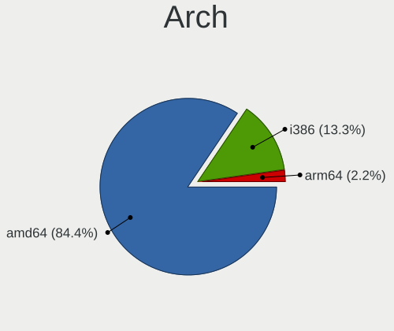

| Name  | Notebooks | Percent |
|-------|-----------|---------|
| amd64 | 38        | 84.44%  |
| i386  | 6         | 13.33%  |
| arm64 | 1         | 2.22%   |

DE
--

Desktop Environment

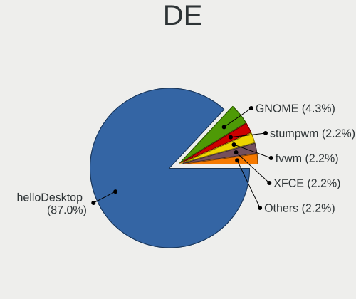

| Name         | Notebooks | Percent |
|--------------|-----------|---------|
| helloDesktop | 40        | 86.96%  |
| GNOME        | 2         | 4.35%   |
| XFCE         | 1         | 2.17%   |
| stumpwm      | 1         | 2.17%   |
| LXQT         | 1         | 2.17%   |
| fvwm         | 1         | 2.17%   |

Display Server
--------------

X11 or Wayland

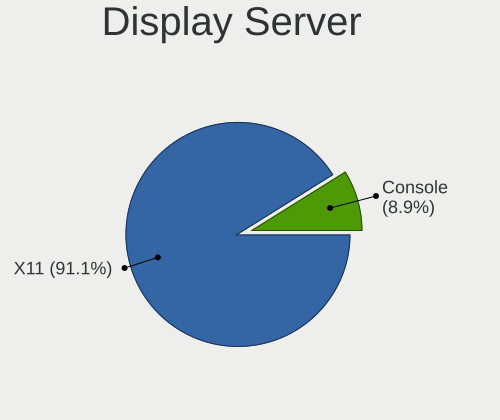

| Name    | Notebooks | Percent |
|---------|-----------|---------|
| X11     | 41        | 91.11%  |
| Console | 4         | 8.89%   |

Display Manager
---------------

SDDM, LightDM, etc.

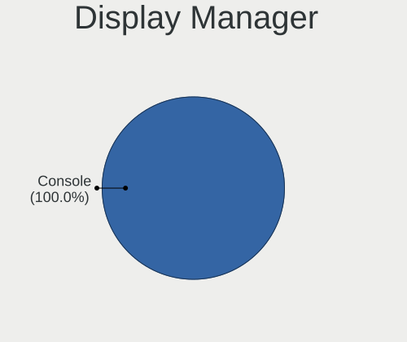

| Name    | Notebooks | Percent |
|---------|-----------|---------|
| Console | 45        | 100%    |

OS Lang
-------

Language

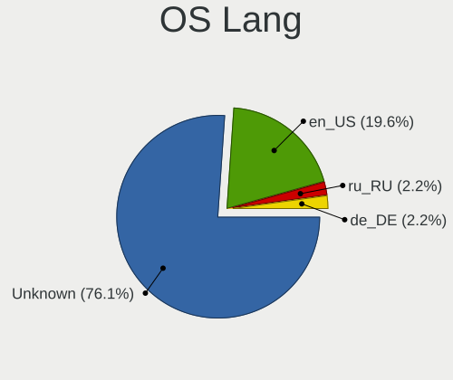

| Lang    | Notebooks | Percent |
|---------|-----------|---------|
| Unknown | 35        | 76.09%  |
| en_US   | 9         | 19.57%  |
| ru_RU   | 1         | 2.17%   |
| de_DE   | 1         | 2.17%   |

Boot Mode
---------

EFI or BIOS

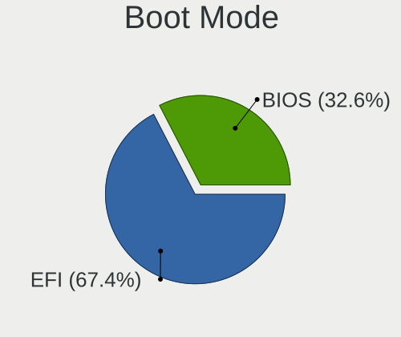

| Mode | Notebooks | Percent |
|------|-----------|---------|
| EFI  | 31        | 67.39%  |
| BIOS | 15        | 32.61%  |

Filesystem
----------

Type of filesystem

| Type | Notebooks | Percent |
|------|-----------|---------|
| Ffs  | 45        | 100%    |

Part. scheme
------------

Scheme of partitioning

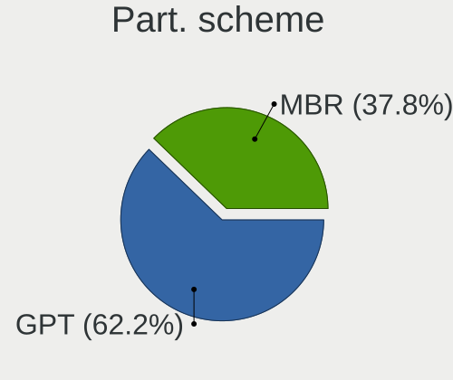

| Type | Notebooks | Percent |
|------|-----------|---------|
| GPT  | 28        | 62.22%  |
| MBR  | 17        | 37.78%  |

Board
-----

Vendor
------

Motherboard manufacturer

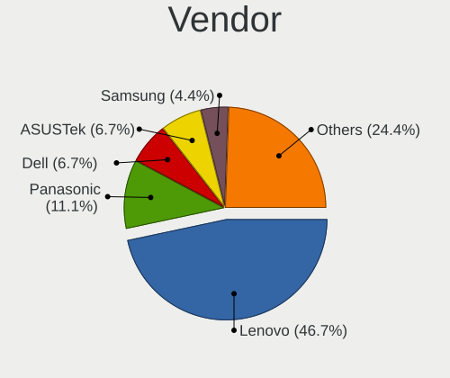

| Name                           | Notebooks | Percent |
|--------------------------------|-----------|---------|
| Lenovo                         | 21        | 46.67%  |
| Panasonic                      | 5         | 11.11%  |
| Dell                           | 3         | 6.67%   |
| ASUSTek Computer               | 3         | 6.67%   |
| Samsung Electronics            | 2         | 4.44%   |
| Framework                      | 2         | 4.44%   |
| Sony                           | 1         | 2.22%   |
| Matsushita Electric Industrial | 1         | 2.22%   |
| IBM                            | 1         | 2.22%   |
| HUAWEI                         | 1         | 2.22%   |
| Google                         | 1         | 2.22%   |
| Fujitsu                        | 1         | 2.22%   |
| Apple                          | 1         | 2.22%   |
| Acer                           | 1         | 2.22%   |
| Unknown                        | 1         | 2.22%   |

Model
-----

Motherboard model

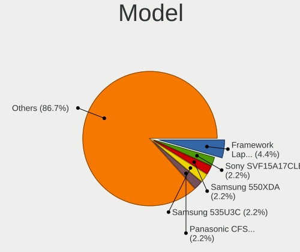

| Name                                            | Notebooks | Percent |
|-------------------------------------------------|-----------|---------|
| Framework Laptop 13 (Intel Core Ultra Series 1) | 2         | 4.44%   |
| Sony SVF15A17CLB                                | 1         | 2.22%   |
| Samsung 550XDA                                  | 1         | 2.22%   |
| Samsung 535U3C                                  | 1         | 2.22%   |
| Panasonic CFSZ6-2                               | 1         | 2.22%   |
| Panasonic CFSX4-1                               | 1         | 2.22%   |
| Panasonic CF-54-1                               | 1         | 2.22%   |
| Panasonic CF-53AAGHYDM                          | 1         | 2.22%   |
| Panasonic CF-52PFPBSFQ                          | 1         | 2.22%   |
| Matsushita Electric Industrial CF-51RCVDNLM     | 1         | 2.22%   |
| Lenovo Yoga 900S-12ISK 80ML                     | 1         | 2.22%   |
| Lenovo ThinkPad X60s 1704R8G                    | 1         | 2.22%   |
| Lenovo ThinkPad X270 W10DG 20K5S5MD0F           | 1         | 2.22%   |
| Lenovo ThinkPad X270 W10DG 20K5S25T00           | 1         | 2.22%   |
| Lenovo ThinkPad X270 W10DG 20K5S0TT1N           | 1         | 2.22%   |
| Lenovo ThinkPad X270 20HN001HUS                 | 1         | 2.22%   |
| Lenovo ThinkPad X270 20HN0015MX                 | 1         | 2.22%   |
| Lenovo ThinkPad X260 20F5S2GM00                 | 1         | 2.22%   |
| Lenovo ThinkPad X260 20F5S0R20X                 | 1         | 2.22%   |
| Lenovo ThinkPad X230 Tablet 34382BG             | 1         | 2.22%   |
| Lenovo ThinkPad X1 Carbon 7th 20QD00KTMH        | 1         | 2.22%   |
| Lenovo ThinkPad X1 Carbon 20KH002WUS            | 1         | 2.22%   |
| Lenovo ThinkPad W510 4318CTO                    | 1         | 2.22%   |
| Lenovo ThinkPad T490 20N3SFCE00                 | 1         | 2.22%   |
| Lenovo ThinkPad T490 20N20028US                 | 1         | 2.22%   |
| Lenovo ThinkPad T430 2347GZU                    | 1         | 2.22%   |
| Lenovo ThinkPad T410 2537N24                    | 1         | 2.22%   |
| Lenovo ThinkPad T14 Gen 1 20S0000NBM            | 1         | 2.22%   |
| Lenovo ThinkPad P14s Gen 5 21G2CTO1WW           | 1         | 2.22%   |
| Lenovo ThinkPad P14s Gen 1 20Y1000SUK           | 1         | 2.22%   |
| Lenovo ThinkPad E14 Gen 5 21JK0006TX            | 1         | 2.22%   |
| IBM ThinkPad T43 1871F1G                        | 1         | 2.22%   |
| HUAWEI EUL-WX9                                  | 1         | 2.22%   |
| Google Morphius                                 | 1         | 2.22%   |
| Fujitsu LIFEBOOK E752                           | 1         | 2.22%   |
| Dell XPS 15 9500                                | 1         | 2.22%   |
| Dell Latitude D620                              | 1         | 2.22%   |
| Dell Latitude 7490                              | 1         | 2.22%   |
| ASUS ZenBook UX325EA_UX325EA                    | 1         | 2.22%   |
| ASUS 900                                        | 1         | 2.22%   |

Model Family
------------

Motherboard model prefix

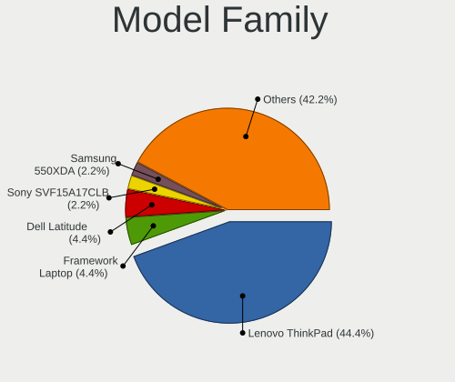

| Name                                        | Notebooks | Percent |
|---------------------------------------------|-----------|---------|
| Lenovo ThinkPad                             | 20        | 44.44%  |
| Framework Laptop                            | 2         | 4.44%   |
| Dell Latitude                               | 2         | 4.44%   |
| Sony SVF15A17CLB                            | 1         | 2.22%   |
| Samsung 550XDA                              | 1         | 2.22%   |
| Samsung 535U3C                              | 1         | 2.22%   |
| Panasonic CFSZ6-2                           | 1         | 2.22%   |
| Panasonic CFSX4-1                           | 1         | 2.22%   |
| Panasonic CF-54-1                           | 1         | 2.22%   |
| Panasonic CF-53AAGHYDM                      | 1         | 2.22%   |
| Panasonic CF-52PFPBSFQ                      | 1         | 2.22%   |
| Matsushita Electric Industrial CF-51RCVDNLM | 1         | 2.22%   |
| Lenovo Yoga                                 | 1         | 2.22%   |
| IBM ThinkPad                                | 1         | 2.22%   |
| HUAWEI EUL-WX9                              | 1         | 2.22%   |
| Google Morphius                             | 1         | 2.22%   |
| Fujitsu LIFEBOOK                            | 1         | 2.22%   |
| Dell XPS                                    | 1         | 2.22%   |
| ASUS ZenBook                                | 1         | 2.22%   |
| ASUS 900                                    | 1         | 2.22%   |
| ASUS 1000HE                                 | 1         | 2.22%   |
| Apple MacBookAir4                           | 1         | 2.22%   |
| Acer Aspire                                 | 1         | 2.22%   |
| Unknown                                     | 1         | 2.22%   |

MFG Year
--------

Motherboard manufacture year

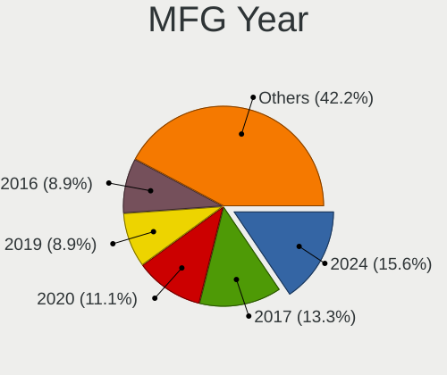

| Year    | Notebooks | Percent |
|---------|-----------|---------|
| 2024    | 7         | 15.56%  |
| 2017    | 6         | 13.33%  |
| 2020    | 5         | 11.11%  |
| 2019    | 4         | 8.89%   |
| 2016    | 4         | 8.89%   |
| 2012    | 4         | 8.89%   |
| 2010    | 3         | 6.67%   |
| 2009    | 2         | 4.44%   |
| 2006    | 2         | 4.44%   |
| 2023    | 1         | 2.22%   |
| 2022    | 1         | 2.22%   |
| 2015    | 1         | 2.22%   |
| 2013    | 1         | 2.22%   |
| 2011    | 1         | 2.22%   |
| 2008    | 1         | 2.22%   |
| 2007    | 1         | 2.22%   |
| Unknown | 1         | 2.22%   |

Form Factor
-----------

Physical design of the computer

| Name     | Notebooks | Percent |
|----------|-----------|---------|
| Notebook | 45        | 100%    |

Coreboot
--------

Have coreboot on board

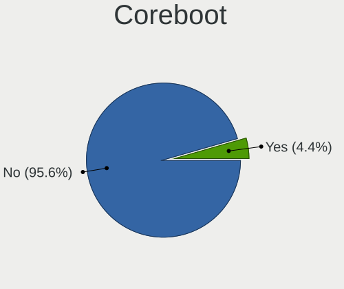

| Used | Notebooks | Percent |
|------|-----------|---------|
| No   | 43        | 95.56%  |
| Yes  | 2         | 4.44%   |

RAM Size
--------

Total RAM memory

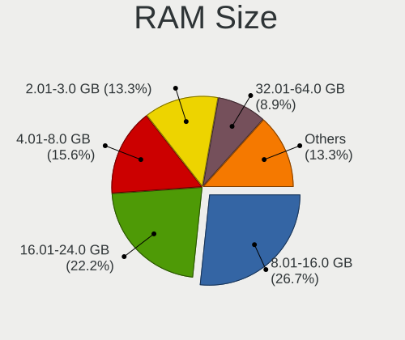

| Size in GB  | Notebooks | Percent |
|-------------|-----------|---------|
| 8.01-16.0   | 12        | 26.67%  |
| 16.01-24.0  | 10        | 22.22%  |
| 4.01-8.0    | 7         | 15.56%  |
| 2.01-3.0    | 6         | 13.33%  |
| 32.01-64.0  | 4         | 8.89%   |
| 3.01-4.0    | 3         | 6.67%   |
| 64.01-256.0 | 2         | 4.44%   |
| 24.01-32.0  | 1         | 2.22%   |

RAM Used
--------

Used RAM memory

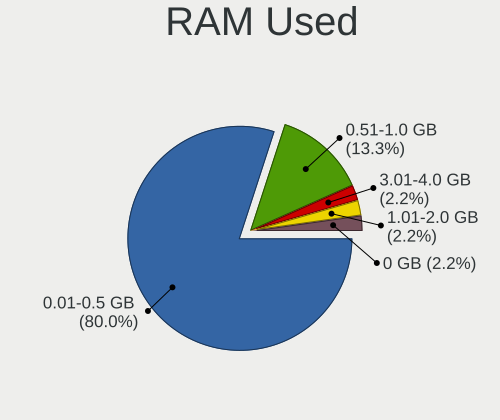

| Used GB  | Notebooks | Percent |
|----------|-----------|---------|
| 0.01-0.5 | 36        | 80%     |
| 0.51-1.0 | 6         | 13.33%  |
| 3.01-4.0 | 1         | 2.22%   |
| 1.01-2.0 | 1         | 2.22%   |
| 0        | 1         | 2.22%   |

Total Drives
------------

Number of drives on board

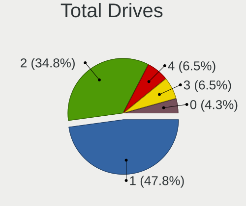

| Drives | Notebooks | Percent |
|--------|-----------|---------|
| 1      | 22        | 47.83%  |
| 2      | 16        | 34.78%  |
| 4      | 3         | 6.52%   |
| 3      | 3         | 6.52%   |
| 0      | 2         | 4.35%   |

Has CD-ROM
----------

Has CD-ROM on board

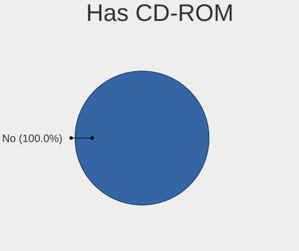

| Presented | Notebooks | Percent |
|-----------|-----------|---------|
| No        | 45        | 100%    |

Has Ethernet
------------

Has Ethernet on board

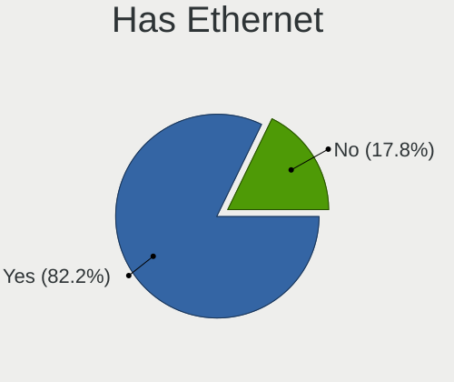

| Presented | Notebooks | Percent |
|-----------|-----------|---------|
| Yes       | 37        | 82.22%  |
| No        | 8         | 17.78%  |

Has WiFi
--------

Has WiFi module

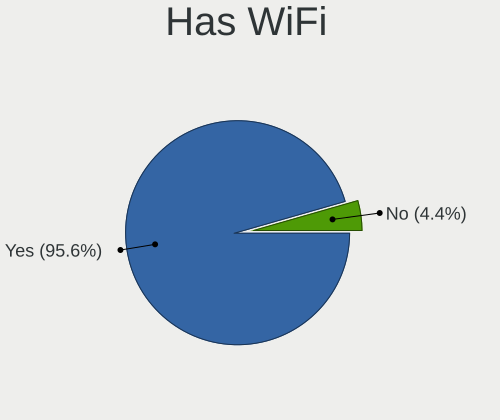

| Presented | Notebooks | Percent |
|-----------|-----------|---------|
| Yes       | 43        | 95.56%  |
| No        | 2         | 4.44%   |

Has Bluetooth
-------------

Has Bluetooth module

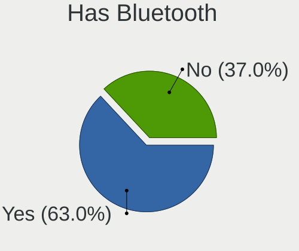

| Presented | Notebooks | Percent |
|-----------|-----------|---------|
| Yes       | 29        | 63.04%  |
| No        | 17        | 36.96%  |

Location
--------

Country
-------

Geographic location (country)

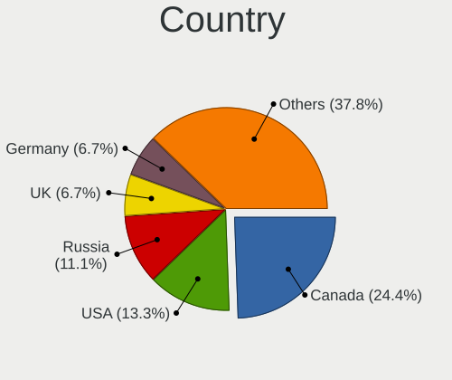

| Country     | Notebooks | Percent |
|-------------|-----------|---------|
| Canada      | 11        | 24.44%  |
| USA         | 6         | 13.33%  |
| Russia      | 5         | 11.11%  |
| UK          | 3         | 6.67%   |
| Germany     | 3         | 6.67%   |
| Turkey      | 2         | 4.44%   |
| Latvia      | 2         | 4.44%   |
| Czechia     | 2         | 4.44%   |
| Spain       | 1         | 2.22%   |
| Slovakia    | 1         | 2.22%   |
| Norway      | 1         | 2.22%   |
| Netherlands | 1         | 2.22%   |
| Malaysia    | 1         | 2.22%   |
| Italy       | 1         | 2.22%   |
| Guatemala   | 1         | 2.22%   |
| Croatia     | 1         | 2.22%   |
| China       | 1         | 2.22%   |
| Bulgaria    | 1         | 2.22%   |
| Brazil      | 1         | 2.22%   |

City
----

Geographic location (city)

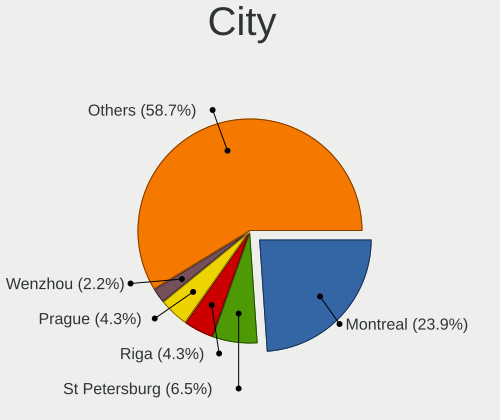

| City             | Notebooks | Percent |
|------------------|-----------|---------|
| Montreal         | 11        | 23.91%  |
| St Petersburg    | 3         | 6.52%   |
| Riga             | 2         | 4.35%   |
| Prague           | 2         | 4.35%   |
| Wenzhou          | 1         | 2.17%   |
| Waterbury        | 1         | 2.17%   |
| Villalfonsina    | 1         | 2.17%   |
| Oslo             | 1         | 2.17%   |
| Ochsenfurt       | 1         | 2.17%   |
| New York         | 1         | 2.17%   |
| Manchester       | 1         | 2.17%   |
| Manaus           | 1         | 2.17%   |
| Madrid           | 1         | 2.17%   |
| Madison          | 1         | 2.17%   |
| London           | 1         | 2.17%   |
| Kursk            | 1         | 2.17%   |
| Kuala Lumpur     | 1         | 2.17%   |
| Kostinbrod       | 1         | 2.17%   |
| Karlsruhe        | 1         | 2.17%   |
| Istanbul         | 1         | 2.17%   |
| Hoffman Estates  | 1         | 2.17%   |
| Guatemala City   | 1         | 2.17%   |
| Fortville        | 1         | 2.17%   |
| Engel's          | 1         | 2.17%   |
| Dubrovnik        | 1         | 2.17%   |
| Doncaster        | 1         | 2.17%   |
| Danville         | 1         | 2.17%   |
| Bursa            | 1         | 2.17%   |
| Bothell          | 1         | 2.17%   |
| Berlin           | 1         | 2.17%   |
| Banská Bystrica | 1         | 2.17%   |
| Assendelft       | 1         | 2.17%   |

Drives
------

Drive Vendor
------------

Hard drive vendors

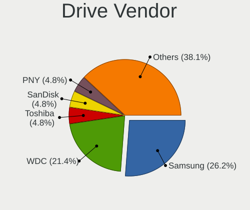

| Vendor              | Notebooks | Drives | Percent |
|---------------------|-----------|--------|---------|
| Samsung Electronics | 11        | 11     | 26.19%  |
| WDC                 | 9         | 9      | 21.43%  |
| Toshiba             | 2         | 2      | 4.76%   |
| SanDisk             | 2         | 2      | 4.76%   |
| PNY                 | 2         | 6      | 4.76%   |
| Kingston            | 2         | 2      | 4.76%   |
| LITEON              | 1         | 1      | 2.38%   |
| Lenovo              | 1         | 1      | 2.38%   |
| KingSpec            | 1         | 1      | 2.38%   |
| HGST                | 1         | 1      | 2.38%   |
| Getrich             | 1         | 1      | 2.38%   |
| Geonix              | 1         | 2      | 2.38%   |
| Fujitsu             | 1         | 1      | 2.38%   |
| External            | 1         | 1      | 2.38%   |
| CT2000P3            | 1         | 1      | 2.38%   |
| Crucial             | 1         | 1      | 2.38%   |
| ASUSTek Computer    | 1         | 2      | 2.38%   |
| ARDOR GAMING        | 1         | 1      | 2.38%   |
| Apple               | 1         | 1      | 2.38%   |
| A-DATA Technology   | 1         | 1      | 2.38%   |

Drive Model
-----------

Hard drive models

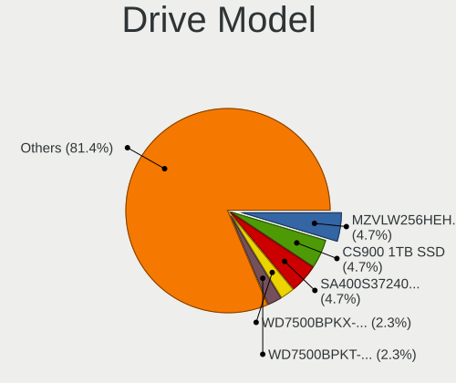

| Model                                | Notebooks | Percent |
|--------------------------------------|-----------|---------|
| Samsung MZVLW256HEHP-000L7 256GB     | 2         | 4.65%   |
| PNY CS900 1TB SSD                    | 2         | 4.65%   |
| Kingston SA400S37240G 240GB          | 2         | 4.65%   |
| WDC WD7500BPKX-00HPJT0 752GB         | 1         | 2.33%   |
| WDC WD7500BPKT-75PK4T0 752GB         | 1         | 2.33%   |
| WDC WD7500BPKT-00PK4T0 752GB         | 1         | 2.33%   |
| WDC WD5000LPLX-00ZNTT0 500GB         | 1         | 2.33%   |
| WDC WD3200BEVE-00A0HT0 320GB         | 1         | 2.33%   |
| WDC WD2500BEVT-08A23T1 250GB         | 1         | 2.33%   |
| WDC WD10SPZX-24Z10 1TB               | 1         | 2.33%   |
| WDC WD10JPLX-00MBPT0 1TB             | 1         | 2.33%   |
| WDC PC SN730 SDBQNTY-512G-1001 512GB | 1         | 2.33%   |
| Toshiba KXG60ZNV512G 512GB           | 1         | 2.33%   |
| Toshiba KBG40ZMT128G MEMORY 128GB    | 1         | 2.33%   |
| SanDisk SDSSDHII240G 240GB           | 1         | 2.33%   |
| SanDisk SD8SN8U-256G-1006 256GB      | 1         | 2.33%   |
| Samsung SSD 990 PRO 2TB              | 1         | 2.33%   |
| Samsung SSD 980 1TB                  | 1         | 2.33%   |
| Samsung SSD 860 EVO 1TB              | 1         | 2.33%   |
| Samsung SSD 850 PRO 512GB            | 1         | 2.33%   |
| Samsung PSSD T7 Shield 4TB           | 1         | 2.33%   |
| Samsung MZVLB512HBJQ-000L7 512GB     | 1         | 2.33%   |
| Samsung MZVLB256HBHQ-000L7 256GB     | 1         | 2.33%   |
| Samsung MZ7LN256HAJQ-000L7 256GB     | 1         | 2.33%   |
| Samsung Flash Drive FIT 32GB         | 1         | 2.33%   |
| LITEON L8H-128V2G-11 M.2 2280 128GB  | 1         | 2.33%   |
| Lenovo LENSE20256GMSP34MEAT2TA 256GB | 1         | 2.33%   |
| KingSpec MT-64 64GB                  | 1         | 2.33%   |
| HGST HTS541010A9E680 1TB             | 1         | 2.33%   |
| Getrich 120G SATA SSD                | 1         | 2.33%   |
| Geonix Gold 256GB                    | 1         | 2.33%   |
| Fujitsu MHV2040AH 40GB               | 1         | 2.33%   |
| External USB3.0 256GB                | 1         | 2.33%   |
| CT2000P3 PSSD8 2TB                   | 1         | 2.33%   |
| Crucial CT2000P3PSSD8 2TB            | 1         | 2.33%   |
| ASUS PHISON SSD 16GB                 | 1         | 2.33%   |
| ASUS PHISON OB SSD 4GB               | 1         | 2.33%   |
| ARDOR GAMING m.2 NVME 512GB AL1284   | 1         | 2.33%   |
| Apple SSD SM256C 256GB               | 1         | 2.33%   |
| A-DATA SP550 480GB                   | 1         | 2.33%   |

HDD Vendor
----------

Hard disk drive vendors

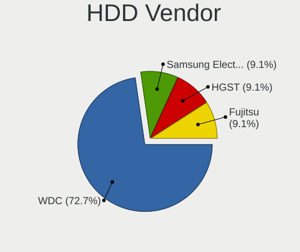

| Vendor              | Notebooks | Drives | Percent |
|---------------------|-----------|--------|---------|
| WDC                 | 8         | 8      | 72.73%  |
| Samsung Electronics | 1         | 1      | 9.09%   |
| HGST                | 1         | 1      | 9.09%   |
| Fujitsu             | 1         | 1      | 9.09%   |

SSD Vendor
----------

Solid state drive vendors

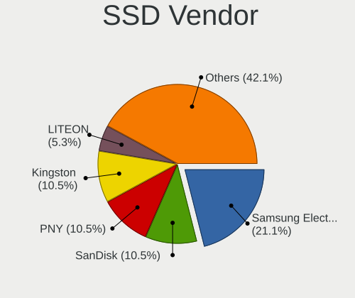

| Vendor              | Notebooks | Drives | Percent |
|---------------------|-----------|--------|---------|
| Samsung Electronics | 4         | 4      | 21.05%  |
| SanDisk             | 2         | 2      | 10.53%  |
| PNY                 | 2         | 6      | 10.53%  |
| Kingston            | 2         | 2      | 10.53%  |
| LITEON              | 1         | 1      | 5.26%   |
| KingSpec            | 1         | 1      | 5.26%   |
| Getrich             | 1         | 1      | 5.26%   |
| Geonix              | 1         | 2      | 5.26%   |
| External            | 1         | 1      | 5.26%   |
| CT2000P3            | 1         | 1      | 5.26%   |
| ASUSTek Computer    | 1         | 2      | 5.26%   |
| Apple               | 1         | 1      | 5.26%   |
| A-DATA Technology   | 1         | 1      | 5.26%   |

Drive Kind
----------

HDD or SSD

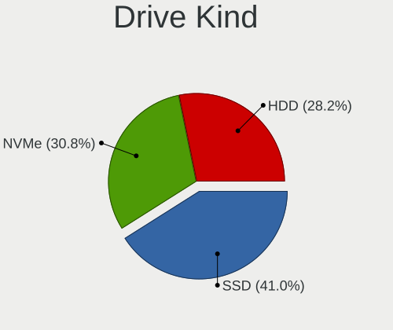

| Kind | Notebooks | Drives | Percent |
|------|-----------|--------|---------|
| SSD  | 16        | 25     | 41.03%  |
| NVMe | 12        | 12     | 30.77%  |
| HDD  | 11        | 11     | 28.21%  |

Drive Connector
---------------

SATA, SAS, NVMe, etc.

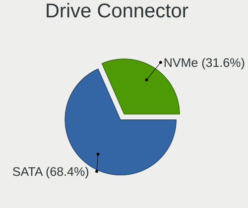

| Type | Notebooks | Drives | Percent |
|------|-----------|--------|---------|
| SATA | 26        | 36     | 68.42%  |
| NVMe | 12        | 12     | 31.58%  |

Drive Size
----------

Size of hard drive

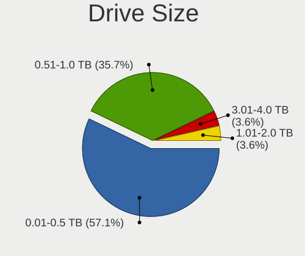

| Size in TB | Notebooks | Drives | Percent |
|------------|-----------|--------|---------|
| 0.01-0.5   | 16        | 20     | 57.14%  |
| 0.51-1.0   | 10        | 14     | 35.71%  |
| 3.01-4.0   | 1         | 1      | 3.57%   |
| 1.01-2.0   | 1         | 1      | 3.57%   |

Space Total
-----------

Amount of disk space available on the file system

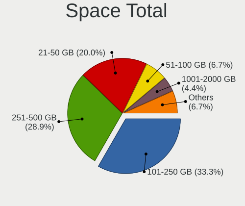

| Size in GB | Notebooks | Percent |
|------------|-----------|---------|
| 101-250    | 15        | 33.33%  |
| 251-500    | 13        | 28.89%  |
| 21-50      | 9         | 20%     |
| 51-100     | 3         | 6.67%   |
| 1001-2000  | 2         | 4.44%   |
| 1-20       | 2         | 4.44%   |
| 501-1000   | 1         | 2.22%   |

Space Used
----------

Amount of used disk space

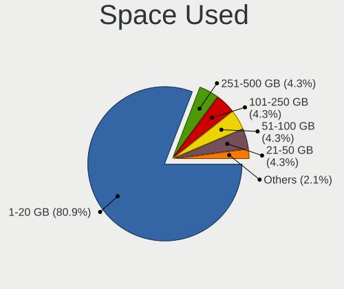

| Used GB  | Notebooks | Percent |
|----------|-----------|---------|
| 1-20     | 38        | 80.85%  |
| 251-500  | 2         | 4.26%   |
| 21-50    | 2         | 4.26%   |
| 101-250  | 2         | 4.26%   |
| 51-100   | 2         | 4.26%   |
| 501-1000 | 1         | 2.13%   |

Malfunc. Drives
---------------

Drive models with a malfunction

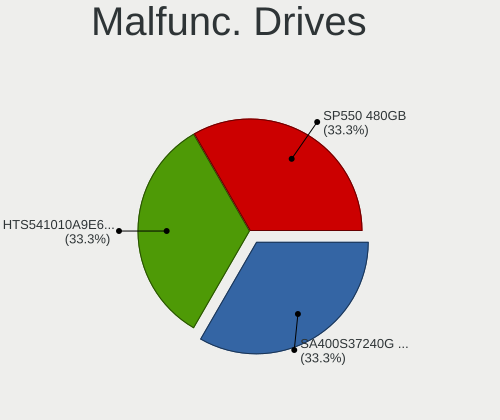

| Model                         | Notebooks | Drives | Percent |
|-------------------------------|-----------|--------|---------|
| Kingston SA400S37240G 240GB   | 1         | 1      | 33.33%  |
| HGST HTS541010A9E680 1TB      | 1         | 1      | 33.33%  |
| A-DATA Technology SP550 480GB | 1         | 1      | 33.33%  |

Malfunc. Drive Vendor
---------------------

Vendors of faulty drives

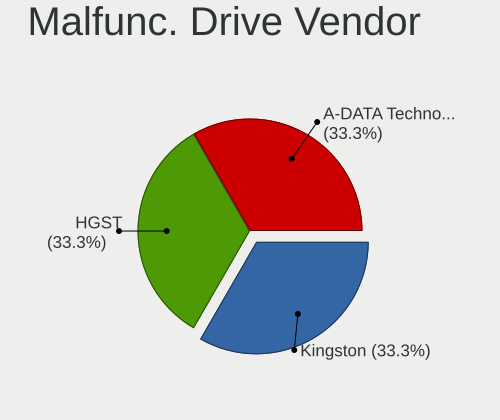

| Vendor            | Notebooks | Drives | Percent |
|-------------------|-----------|--------|---------|
| Kingston          | 1         | 1      | 33.33%  |
| HGST              | 1         | 1      | 33.33%  |
| A-DATA Technology | 1         | 1      | 33.33%  |

Malfunc. HDD Vendor
-------------------

Vendors of faulty HDD drives

| Vendor | Notebooks | Drives | Percent |
|--------|-----------|--------|---------|
| HGST   | 1         | 1      | 100%    |

Malfunc. Drive Kind
-------------------

Kinds of faulty drives

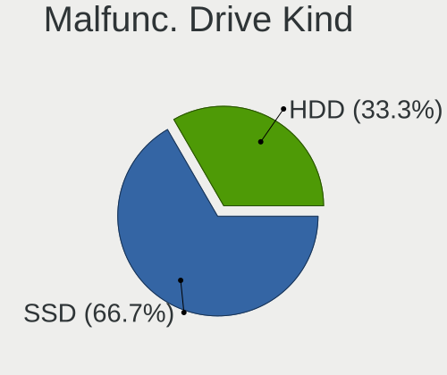

| Kind | Notebooks | Drives | Percent |
|------|-----------|--------|---------|
| SSD  | 2         | 2      | 66.67%  |
| HDD  | 1         | 1      | 33.33%  |

Failed Drives
-------------

Failed drive models

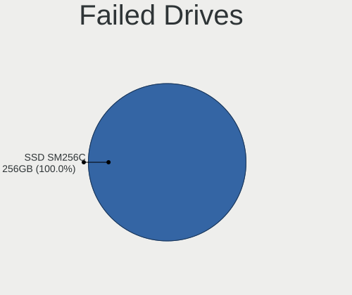

| Model                  | Notebooks | Drives | Percent |
|------------------------|-----------|--------|---------|
| Apple SSD SM256C 256GB | 1         | 1      | 100%    |

Failed Drive Vendor
-------------------

Failed drive vendors

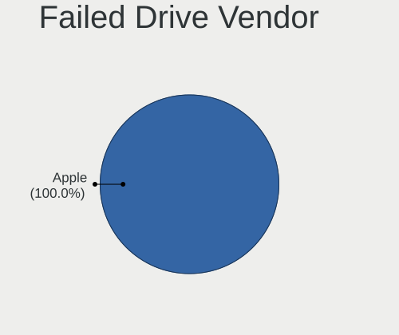

| Vendor | Notebooks | Drives | Percent |
|--------|-----------|--------|---------|
| Apple  | 1         | 1      | 100%    |

Drive Status
------------

Number of failed and malfunc. drives

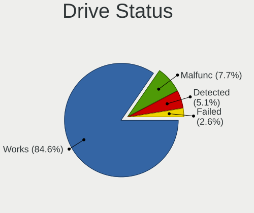

| Status   | Notebooks | Drives | Percent |
|----------|-----------|--------|---------|
| Works    | 33        | 41     | 84.62%  |
| Malfunc  | 3         | 3      | 7.69%   |
| Detected | 2         | 3      | 5.13%   |
| Failed   | 1         | 1      | 2.56%   |

Storage controller
------------------

Storage Vendor
--------------

Storage controller vendors

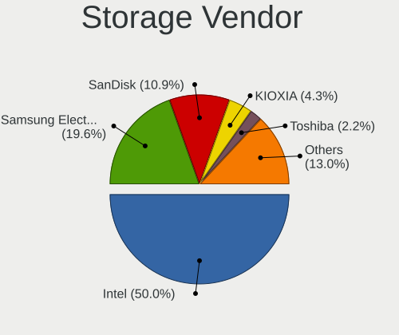

| Vendor                      | Notebooks | Percent |
|-----------------------------|-----------|---------|
| Intel                       | 23        | 50%     |
| Samsung Electronics         | 9         | 19.57%  |
| SanDisk                     | 5         | 10.87%  |
| KIOXIA                      | 2         | 4.35%   |
| Toshiba                     | 1         | 2.17%   |
| SK hynix                    | 1         | 2.17%   |
| Micron/Crucial Technology   | 1         | 2.17%   |
| MAXIO Technology (Hangzhou) | 1         | 2.17%   |
| Lenovo                      | 1         | 2.17%   |
| Kingston Technology Company | 1         | 2.17%   |
| AMD                         | 1         | 2.17%   |

Storage Model
-------------

Storage controller models

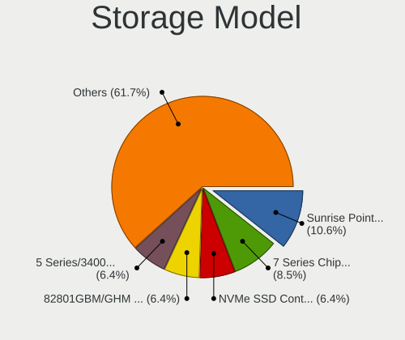

| Model                                                                                  | Notebooks | Percent |
|----------------------------------------------------------------------------------------|-----------|---------|
| Intel Sunrise Point-LP SATA Controller [AHCI mode]                                     | 5         | 10.64%  |
| Intel 7 Series Chipset Family 6-port SATA Controller [AHCI mode]                       | 4         | 8.51%   |
| Samsung NVMe SSD Controller SM961/PM961/SM963                                          | 3         | 6.38%   |
| Intel 82801GBM/GHM (ICH7-M Family) SATA Controller [IDE mode]                          | 3         | 6.38%   |
| Intel 5 Series/3400 Series Chipset 6 port SATA AHCI Controller                         | 3         | 6.38%   |
| Samsung NVMe SSD Controller SM981/PM981/PM983                                          | 2         | 4.26%   |
| Samsung NVMe SSD Controller 980 (DRAM-less)                                            | 2         | 4.26%   |
| Intel Wildcat Point-LP SATA Controller [AHCI Mode]                                     | 2         | 4.26%   |
| Intel 82801FBM (ICH6M) SATA Controller                                                 | 2         | 4.26%   |
| Toshiba XG6 NVMe SSD Controller                                                        | 1         | 2.13%   |
| SK hynix PC611 NVMe Solid State Drive                                                  | 1         | 2.13%   |
| Sandisk WD SN560/SN740/SN770/SN5000 NVMe SSD                                           | 1         | 2.13%   |
| Sandisk WD PC SN740 NVMe SSD 512GB (DRAM-less)                                         | 1         | 2.13%   |
| Sandisk WD Black SN850X NVMe SSD                                                       | 1         | 2.13%   |
| SanDisk Ultra 3D / WD Blue SN570 NVMe SSD (DRAM-less)                                  | 1         | 2.13%   |
| SanDisk Extreme Pro / WD Black SN750 / PC SN730 / Red SN700 NVMe SSD                   | 1         | 2.13%   |
| Samsung NVMe SSD Controller SM951/PM951                                                | 1         | 2.13%   |
| Samsung NVMe SSD Controller S4LV008[Pascal]                                            | 1         | 2.13%   |
| Micron/Crucial P2 [Nick P2] / P3 / P3 Plus NVMe PCIe SSD (DRAM-less)                   | 1         | 2.13%   |
| MAXIO (Hangzhou) NVMe SSD Controller MAP1202 (DRAM-less)                               | 1         | 2.13%   |
| Lenovo LENSE20256GMSP34MEAT2TA                                                         | 1         | 2.13%   |
| KIOXIA NVMe SSD Controller XG8                                                         | 1         | 2.13%   |
| KIOXIA NVMe SSD Controller BG4 (DRAM-less)                                             | 1         | 2.13%   |
| Kingston Company OM8SEP4 Design-In PCIe 4 NVMe SSD (TLC) (DRAM-less)                   | 1         | 2.13%   |
| Intel Tiger Lake-LP SATA Controller                                                    | 1         | 2.13%   |
| Intel 82801GBM/GHM (ICH7-M Family) SATA Controller [AHCI mode]                         | 1         | 2.13%   |
| Intel 82801G (ICH7 Family) IDE Controller                                              | 1         | 2.13%   |
| Intel 6 Series/C200 Series Chipset Family Mobile SATA Controller (IDE mode, ports 0-3) | 1         | 2.13%   |
| Intel 6 Series/C200 Series Chipset Family 6 port Mobile SATA AHCI Controller           | 1         | 2.13%   |
| AMD FCH SATA Controller [AHCI mode]                                                    | 1         | 2.13%   |

Storage Kind
------------

Kind of storage controller (IDE, SATA, NVMe, SAS, ...)

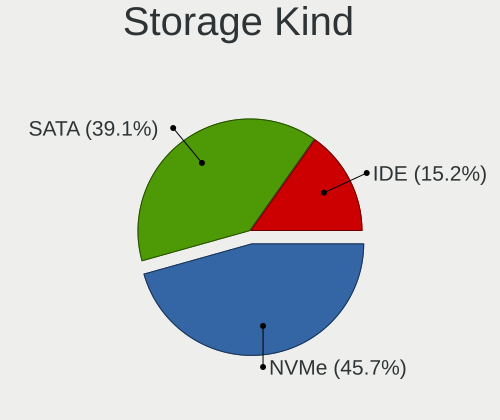

| Kind | Notebooks | Percent |
|------|-----------|---------|
| NVMe | 21        | 45.65%  |
| SATA | 18        | 39.13%  |
| IDE  | 7         | 15.22%  |

Processor
---------

CPU Vendor
----------

Processor vendors

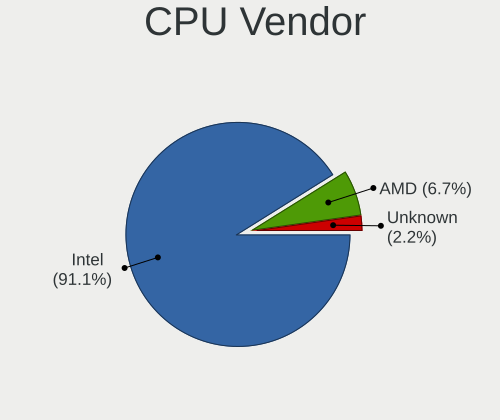

| Vendor  | Notebooks | Percent |
|---------|-----------|---------|
| Intel   | 41        | 91.11%  |
| AMD     | 3         | 6.67%   |
| Unknown | 1         | 2.22%   |

CPU Model
---------

Processor models

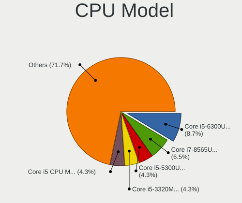

| Model                                                       | Notebooks | Percent |
|-------------------------------------------------------------|-----------|---------|
| Intel Core i5-6300U CPU @ 2.40GHz                           | 4         | 8.7%    |
| Intel Core i7-8565U CPU @ 1.80GHz                           | 3         | 6.52%   |
| Intel Core i5-5300U CPU @ 2.30GHz                           | 2         | 4.35%   |
| Intel Core i5-3320M CPU @ 2.60GHz                           | 2         | 4.35%   |
| Intel Core i5 CPU M 520 @ 2.40GHz                           | 2         | 4.35%   |
| Intel Pentium M processor                                   | 1         | 2.17%   |
| Intel Genuine CPU T2300 @ 1.66GHz                           | 1         | 2.17%   |
| Intel Core Ultra 9 185H                                     | 1         | 2.17%   |
| Intel Core Ultra 7 155H                                     | 1         | 2.17%   |
| Intel Core Ultra 5 125H                                     | 1         | 2.17%   |
| Intel Core m7-6Y75 CPU @ 1.20GHz                            | 1         | 2.17%   |
| Intel Core i7-8650U CPU @ 1.90GHz                           | 1         | 2.17%   |
| Intel Core i7-7500U CPU @ 2.70GHz                           | 1         | 2.17%   |
| Intel Core i7-3537U CPU @ 2.00GHz                           | 1         | 2.17%   |
| Intel Core i7-3520M CPU @ 2.90GHz                           | 1         | 2.17%   |
| Intel Core i7-10750H CPU @ 2.60GHz                          | 1         | 2.17%   |
| Intel Core i7-10510U CPU @ 1.80GHz                          | 1         | 2.17%   |
| Intel Core i7 CPU M 640 @ 2.80GHz                           | 1         | 2.17%   |
| Intel Core i5-8350U CPU @ 1.70GHz                           | 1         | 2.17%   |
| Intel Core i5-7300U CPU @ 2.60GHz                           | 1         | 2.17%   |
| Intel Core i5-7200U CPU @ 2.50GHz                           | 1         | 2.17%   |
| Intel Core i5-6200U CPU @ 2.30GHz                           | 1         | 2.17%   |
| Intel Core i5-2557M CPU @ 1.70GHz                           | 1         | 2.17%   |
| Intel Core i5-2520M CPU @ 2.50GHz                           | 1         | 2.17%   |
| Intel Core i5-10210U CPU @ 1.60GHz                          | 1         | 2.17%   |
| Intel Core i5 CPU M 560 @ 2.67GHz                           | 1         | 2.17%   |
| Intel Core i3-N305                                          | 1         | 2.17%   |
| Intel Core Duo CPU                                          | 1         | 2.17%   |
| Intel Core 2 CPU T7200 @ 2.00GHz ("GenuineIntel" 686-class) | 1         | 2.17%   |
| Intel Celeron M processor                                   | 1         | 2.17%   |
| Intel Celeron 6305 @ 1.80GHz                                | 1         | 2.17%   |
| Intel Atom CPU N280 @ 1.66GHz                               | 1         | 2.17%   |
| Intel 13th Gen Core i7-1355U                                | 1         | 2.17%   |
| Intel 11th Gen Core i5-1135G7 @ 2.40GHz                     | 1         | 2.17%   |
| AMD Ryzen 7 PRO 4750U with Radeon Graphics                  | 1         | 2.17%   |
| AMD Ryzen 5 3500C with Radeon Vega Mobile Gfx               | 1         | 2.17%   |
| AMD A6-4455M APU with Radeon HD Graphics                    | 1         | 2.17%   |
|                                                             | 1         | 2.17%   |

CPU Model Family
----------------

Processor model prefix

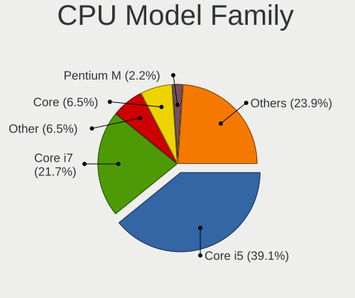

| Model           | Notebooks | Percent |
|-----------------|-----------|---------|
| Intel Core i5   | 18        | 39.13%  |
| Intel Core i7   | 10        | 21.74%  |
| Other           | 3         | 6.52%   |
| Intel Core      | 3         | 6.52%   |
| Intel Pentium M | 1         | 2.17%   |
| Intel Genuine   | 1         | 2.17%   |
| Intel Core m7   | 1         | 2.17%   |
| Intel Core i3   | 1         | 2.17%   |
| Intel Core Duo  | 1         | 2.17%   |
| Intel Core 2    | 1         | 2.17%   |
| Intel Celeron M | 1         | 2.17%   |
| Intel Celeron   | 1         | 2.17%   |
| Intel Atom      | 1         | 2.17%   |
| AMD Ryzen 7 PRO | 1         | 2.17%   |
| AMD Ryzen 5     | 1         | 2.17%   |
| AMD A6          | 1         | 2.17%   |

CPU Cores
---------

Number of processor cores

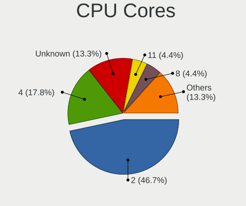

| Number  | Notebooks | Percent |
|---------|-----------|---------|
| 2       | 21        | 46.67%  |
| 4       | 8         | 17.78%  |
| Unknown | 6         | 13.33%  |
| 11      | 2         | 4.44%   |
| 8       | 2         | 4.44%   |
| 6       | 2         | 4.44%   |
| 1       | 2         | 4.44%   |
| 16      | 1         | 2.22%   |
| 9       | 1         | 2.22%   |

CPU Sockets
-----------

Number of sockets

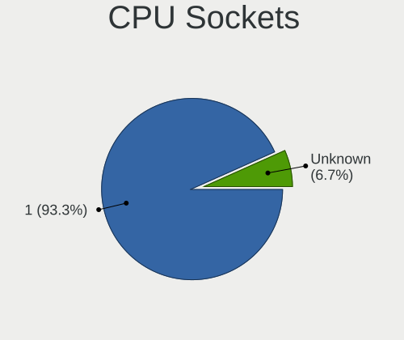

| Number  | Notebooks | Percent |
|---------|-----------|---------|
| 1       | 42        | 93.33%  |
| Unknown | 3         | 6.67%   |

CPU Threads
-----------

Threads per core (Hyper-Threading)

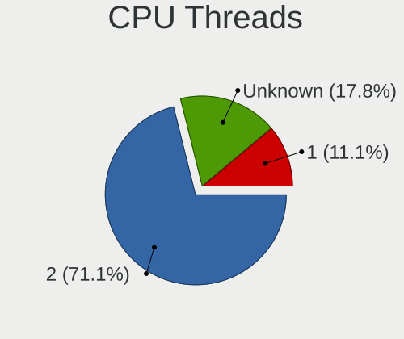

| Number  | Notebooks | Percent |
|---------|-----------|---------|
| 2       | 32        | 71.11%  |
| Unknown | 8         | 17.78%  |
| 1       | 5         | 11.11%  |

CPU Microarch
-------------

Microarchitecture

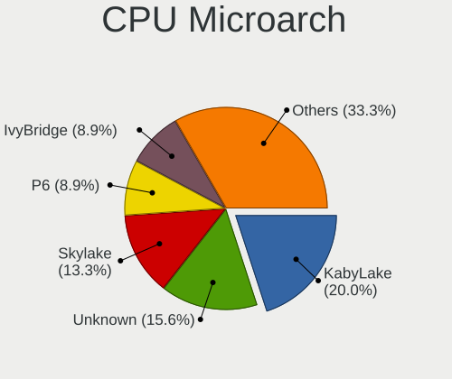

| Name        | Notebooks | Percent |
|-------------|-----------|---------|
| KabyLake    | 9         | 20%     |
| Unknown     | 7         | 15.56%  |
| Skylake     | 6         | 13.33%  |
| P6          | 4         | 8.89%   |
| IvyBridge   | 4         | 8.89%   |
| Westmere    | 3         | 6.67%   |
| TigerLake   | 2         | 4.44%   |
| SandyBridge | 2         | 4.44%   |
| Broadwell   | 2         | 4.44%   |
| Zen+        | 1         | 2.22%   |
| Zen 2       | 1         | 2.22%   |
| Piledriver  | 1         | 2.22%   |
| Core        | 1         | 2.22%   |
| CometLake   | 1         | 2.22%   |
| Bonnell     | 1         | 2.22%   |

Graphics
--------

GPU Vendor
----------

Vendors of graphics cards

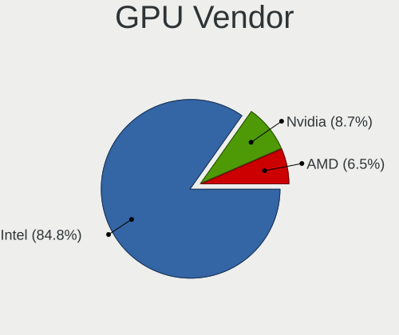

| Vendor | Notebooks | Percent |
|--------|-----------|---------|
| Intel  | 39        | 84.78%  |
| Nvidia | 4         | 8.7%    |
| AMD    | 3         | 6.52%   |

GPU Model
---------

Graphics card models

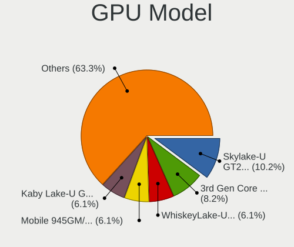

| Model                                                                         | Notebooks | Percent |
|-------------------------------------------------------------------------------|-----------|---------|
| Intel Skylake-U GT2 [HD Graphics 520]                                         | 5         | 10.2%   |
| Intel 3rd Gen Core processor Graphics Controller                              | 4         | 8.16%   |
| Intel WhiskeyLake-U GT2 [UHD Graphics 620]                                    | 3         | 6.12%   |
| Intel Mobile 945GM/GMS/GME, 943/940GML Express Integrated Graphics Controller | 3         | 6.12%   |
| Intel Kaby Lake-U GT2 [HD Graphics 620]                                       | 3         | 6.12%   |
| Intel Mobile 945GM/GMS, 943/940GML Express Integrated Graphics Controller     | 2         | 4.08%   |
| Intel Mobile 915GM/GMS/910GML Express Graphics Controller                     | 2         | 4.08%   |
| Intel Meteor Lake-P [Intel Arc Graphics]                                      | 2         | 4.08%   |
| Intel Kaby Lake-R GT2 [UHD Graphics 620]                                      | 2         | 4.08%   |
| Intel Core Processor Integrated Graphics Controller                           | 2         | 4.08%   |
| Intel CometLake-U GT2 [UHD Graphics]                                          | 2         | 4.08%   |
| Intel Broadwell-U GT2 [HD Graphics 5500]                                      | 2         | 4.08%   |
| Intel 2nd Generation Core Processor Family Integrated Graphics Controller     | 2         | 4.08%   |
| Nvidia TU117M [GeForce GTX 1650 Ti Mobile]                                    | 1         | 2.04%   |
| Nvidia GT216GLM [Quadro FX 880M]                                              | 1         | 2.04%   |
| Nvidia GK208M [GeForce GT 735M]                                               | 1         | 2.04%   |
| Nvidia G72M [Quadro NVS 110M/GeForce Go 7300]                                 | 1         | 2.04%   |
| Intel TigerLake-LP GT2 [Iris Xe Graphics]                                     | 1         | 2.04%   |
| Intel Tiger Lake-LP GT2 [UHD Graphics G4]                                     | 1         | 2.04%   |
| Intel Skylake-Y GT2 [HD Graphics 515]                                         | 1         | 2.04%   |
| Intel Raptor Lake-P [Iris Xe Graphics]                                        | 1         | 2.04%   |
| Intel Mobile 945GSE Express Integrated Graphics Controller                    | 1         | 2.04%   |
| Intel Meteor Lake-P [Intel Graphics]                                          | 1         | 2.04%   |
| Intel CometLake-H GT2 [UHD Graphics]                                          | 1         | 2.04%   |
| Intel Alder Lake-N [UHD Graphics]                                             | 1         | 2.04%   |
| AMD Trinity [Radeon HD 7500G]                                                 | 1         | 2.04%   |
| AMD Renoir [Radeon Vega Series / Radeon Vega Mobile Series]                   | 1         | 2.04%   |
| AMD Picasso/Raven 2 [Radeon Vega Series / Radeon Vega Mobile Series]          | 1         | 2.04%   |

GPU Combo
---------

Combinations of graphics cards

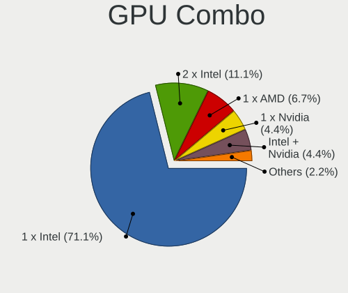

| Name           | Notebooks | Percent |
|----------------|-----------|---------|
| 1 x Intel      | 32        | 71.11%  |
| 2 x Intel      | 5         | 11.11%  |
| 1 x AMD        | 3         | 6.67%   |
| 1 x Nvidia     | 2         | 4.44%   |
| Intel + Nvidia | 2         | 4.44%   |
| Other          | 1         | 2.22%   |

GPU Driver
----------

Free vs proprietary

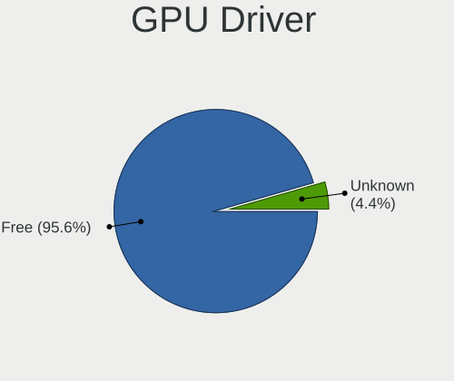

| Driver  | Notebooks | Percent |
|---------|-----------|---------|
| Free    | 43        | 95.56%  |
| Unknown | 2         | 4.44%   |

GPU Memory
----------

Total video memory

| Size in GB | Notebooks | Percent |
|------------|-----------|---------|
| Unknown    | 45        | 100%    |

Monitor
-------

Monitor Vendor
--------------

Monitor vendors

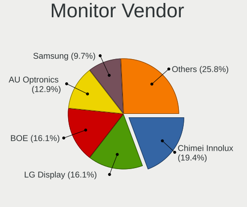

| Vendor              | Notebooks | Percent |
|---------------------|-----------|---------|
| Chimei Innolux      | 6         | 19.35%  |
| LG Display          | 5         | 16.13%  |
| BOE                 | 5         | 16.13%  |
| AU Optronics        | 4         | 12.9%   |
| Samsung Electronics | 3         | 9.68%   |
| Lenovo              | 2         | 6.45%   |
| Sharp               | 1         | 3.23%   |
| JDI                 | 1         | 3.23%   |
| InfoVision          | 1         | 3.23%   |
| Gigabyte Technology | 1         | 3.23%   |
| Dell                | 1         | 3.23%   |
| Apple               | 1         | 3.23%   |

Monitor Model
-------------

Monitor models

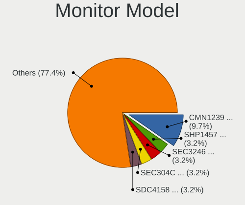

| Model                                                                 | Notebooks | Percent |
|-----------------------------------------------------------------------|-----------|---------|
| Chimei Innolux LCD Monitor CMN1239 1920x1080 280x160mm 12.7-inch      | 3         | 9.68%   |
| Sharp LCD Monitor SHP1457 2560x1440 280x160mm 12.7-inch               | 1         | 3.23%   |
| Samsung Electronics LCD Monitor SEC3246 1366x768 290x160mm 13.0-inch  | 1         | 3.23%   |
| Samsung Electronics LCD Monitor SEC304C 1366x768 310x170mm 13.9-inch  | 1         | 3.23%   |
| Samsung Electronics LCD Monitor SDC4158 1920x1080 290x170mm 13.2-inch | 1         | 3.23%   |
| LG Display LCD Monitor LGD05FA 1920x1080 310x170mm 13.9-inch          | 1         | 3.23%   |
| LG Display LCD Monitor LGD05A2 1920x1080 310x170mm 13.9-inch          | 1         | 3.23%   |
| LG Display LCD Monitor LGD045E 1366x768 310x170mm 13.9-inch           | 1         | 3.23%   |
| LG Display LCD Monitor LGD03CD 1366x768 280x160mm 12.7-inch           | 1         | 3.23%   |
| LG Display LCD Monitor LGD0215 1920x1080 350x190mm 15.7-inch          | 1         | 3.23%   |
| Lenovo LCD Monitor LEN8AB1 3072x1920 310x200mm 14.5-inch              | 1         | 3.23%   |
| Lenovo LCD Monitor LEN40B0 1366x768 350x190mm 15.7-inch               | 1         | 3.23%   |
| JDI LCD Monitor JDI364C 3000x2000 270x180mm 12.8-inch                 | 1         | 3.23%   |
| InfoVision LCD Monitor IVO04E5 1366x768 280x160mm 12.7-inch           | 1         | 3.23%   |
| Gigabyte Technology M27Q GBT270D 2560x1440 700x390mm 31.5-inch        | 1         | 3.23%   |
| Dell U3219Q DELA125 3840x2160 700x390mm 31.5-inch                     | 1         | 3.23%   |
| Chimei Innolux LCD Monitor CMN15BB 1920x1080 340x190mm 15.3-inch      | 1         | 3.23%   |
| Chimei Innolux LCD Monitor CMN14D4 1920x1080 310x170mm 13.9-inch      | 1         | 3.23%   |
| Chimei Innolux LCD Monitor CMN143F 1920x1200 300x190mm 14.0-inch      | 1         | 3.23%   |
| BOE NE135A1M-NY1 BOE0CB4 2880x1920 290x190mm 13.6-inch                | 1         | 3.23%   |
| BOE LCD Monitor BOE0BCA 2256x1504 280x190mm 13.3-inch                 | 1         | 3.23%   |
| BOE LCD Monitor BOE0812 1920x1080 340x190mm 15.3-inch                 | 1         | 3.23%   |
| BOE LCD Monitor BOE07CB 1920x1080 340x190mm 15.3-inch                 | 1         | 3.23%   |
| BOE LCD Monitor BOE07C8 3840x2160 310x170mm 13.9-inch                 | 1         | 3.23%   |
| AU Optronics LCD Monitor AUO226D 1920x1080 280x160mm 12.7-inch        | 1         | 3.23%   |
| AU Optronics LCD Monitor AUO1A87 1920x1080 290x170mm 13.2-inch        | 1         | 3.23%   |
| AU Optronics LCD Monitor AUO106C 1366x768 280x160mm 12.7-inch         | 1         | 3.23%   |
| AU Optronics LCD Monitor AUO1068 1920x1200 260x170mm 12.2-inch        | 1         | 3.23%   |
| Apple Color LCD APP9CDF 1440x900 290x180mm 13.4-inch                  | 1         | 3.23%   |

Monitor Resolution
------------------

Monitor screen resolution

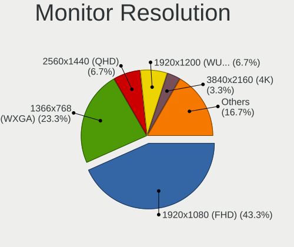

| Resolution        | Notebooks | Percent |
|-------------------|-----------|---------|
| 1920x1080 (FHD)   | 13        | 43.33%  |
| 1366x768 (WXGA)   | 7         | 23.33%  |
| 2560x1440 (QHD)   | 2         | 6.67%   |
| 1920x1200 (WUXGA) | 2         | 6.67%   |
| 3840x2160 (4K)    | 1         | 3.33%   |
| 3072x1920         | 1         | 3.33%   |
| 3000x2000         | 1         | 3.33%   |
| 2880x1920         | 1         | 3.33%   |
| 2256x1504         | 1         | 3.33%   |
| 1440x900 (WXGA+)  | 1         | 3.33%   |

Monitor Diagonal
----------------

Diagonal size in inches

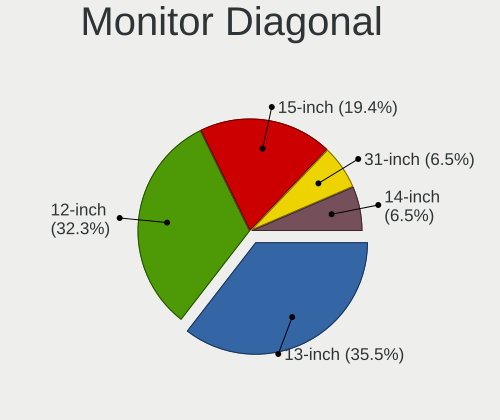

| Inches | Notebooks | Percent |
|--------|-----------|---------|
| 13     | 11        | 35.48%  |
| 12     | 10        | 32.26%  |
| 15     | 6         | 19.35%  |
| 31     | 2         | 6.45%   |
| 14     | 2         | 6.45%   |

Monitor Width
-------------

Physical width

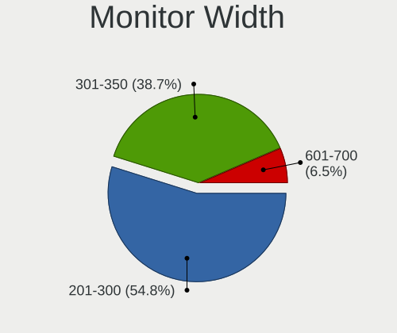

| Width in mm | Notebooks | Percent |
|-------------|-----------|---------|
| 201-300     | 17        | 54.84%  |
| 301-350     | 12        | 38.71%  |
| 601-700     | 2         | 6.45%   |

Aspect Ratio
------------

Proportional relationship between the width and the height

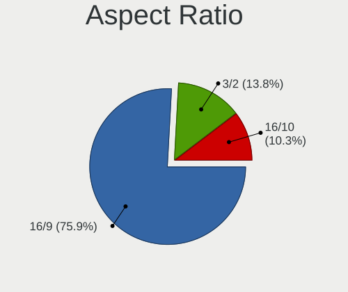

| Ratio | Notebooks | Percent |
|-------|-----------|---------|
| 16/9  | 22        | 75.86%  |
| 3/2   | 4         | 13.79%  |
| 16/10 | 3         | 10.34%  |

Monitor Area
------------

Area in inch²

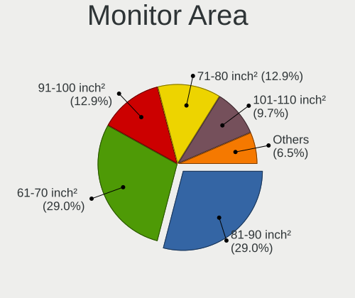

| Area in inch² | Notebooks | Percent |
|----------------|-----------|---------|
| 81-90          | 9         | 29.03%  |
| 61-70          | 9         | 29.03%  |
| 71-80          | 4         | 12.9%   |
| 91-100         | 4         | 12.9%   |
| 101-110        | 3         | 9.68%   |
| 351-500        | 2         | 6.45%   |

Pixel Density
-------------

Pixels per inch

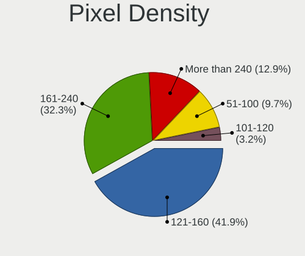

| Density       | Notebooks | Percent |
|---------------|-----------|---------|
| 121-160       | 13        | 41.94%  |
| 161-240       | 10        | 32.26%  |
| More than 240 | 4         | 12.9%   |
| 51-100        | 3         | 9.68%   |
| 101-120       | 1         | 3.23%   |

Multiple Monitors
-----------------

Total monitors connected

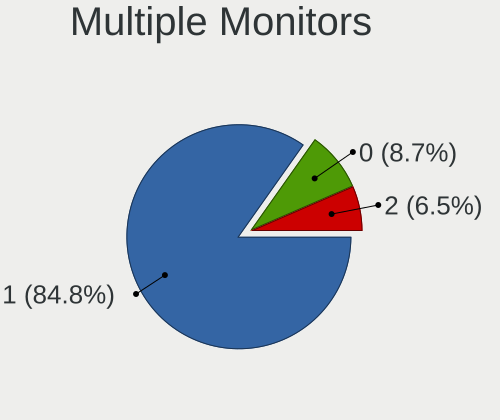

| Total | Notebooks | Percent |
|-------|-----------|---------|
| 1     | 39        | 84.78%  |
| 0     | 4         | 8.7%    |
| 2     | 3         | 6.52%   |

Network
-------

Net Controller Vendor
---------------------

Controller vendors

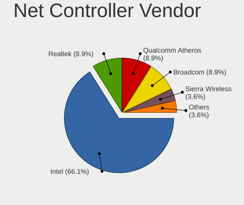

| Vendor                   | Notebooks | Percent |
|--------------------------|-----------|---------|
| Intel                    | 37        | 66.07%  |
| Realtek Semiconductor    | 5         | 8.93%   |
| Qualcomm Atheros         | 5         | 8.93%   |
| Broadcom                 | 5         | 8.93%   |
| Sierra Wireless          | 2         | 3.57%   |
| Marvell Technology Group | 1         | 1.79%   |
| Apple                    | 1         | 1.79%   |

Net Controller Model
--------------------

Controller models

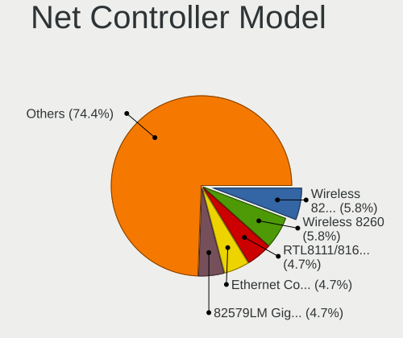

| Model                                                                  | Notebooks | Percent |
|------------------------------------------------------------------------|-----------|---------|
| Intel Wireless 8265 / 8275                                             | 5         | 5.81%   |
| Intel Wireless 8260                                                    | 5         | 5.81%   |
| Realtek RTL8111/8168/8211/8411 PCI Express Gigabit Ethernet Controller | 4         | 4.65%   |
| Intel Ethernet Connection I219-LM                                      | 4         | 4.65%   |
| Intel 82579LM Gigabit Network Connection (Lewisville)                  | 4         | 4.65%   |
| Intel Wi-Fi 6E(802.11ax) AX210/AX1675* 2x2 [Typhoon Peak]              | 3         | 3.49%   |
| Intel Ethernet Connection (6) I219-V                                   | 3         | 3.49%   |
| Intel Ethernet Connection (4) I219-LM                                  | 3         | 3.49%   |
| Intel Centrino Advanced-N 6205 [Taylor Peak]                           | 3         | 3.49%   |
| Intel Cannon Point-LP CNVi [Wireless-AC]                               | 3         | 3.49%   |
| Intel 82577LM Gigabit Network Connection                               | 3         | 3.49%   |
| Qualcomm Atheros AR9462 Wireless Network Adapter                       | 2         | 2.33%   |
| Intel Wi-Fi 6 AX201                                                    | 2         | 2.33%   |
| Intel Wi-Fi 6 AX200                                                    | 2         | 2.33%   |
| Intel PRO/Wireless 3945ABG [Golan] Network Connection                  | 2         | 2.33%   |
| Intel Ethernet Connection (4) I219-V                                   | 2         | 2.33%   |
| Intel Ethernet Connection (3) I218-LM                                  | 2         | 2.33%   |
| Intel Comet Lake PCH-LP CNVi WiFi                                      | 2         | 2.33%   |
| Intel Centrino Advanced-N 6200                                         | 2         | 2.33%   |
| Sierra Wireless EM7455                                                 | 1         | 1.16%   |
| Sierra Wireless EM7305 Modem                                           | 1         | 1.16%   |
| Realtek USB 2.5GbE Controller                                          | 1         | 1.16%   |
| Qualcomm Atheros QCA9565 / AR9565 Wireless Network Adapter             | 1         | 1.16%   |
| Qualcomm Atheros Attansic L2 Fast Ethernet                             | 1         | 1.16%   |
| Qualcomm Atheros AR928X Wireless Network Adapter (PCI-Express)         | 1         | 1.16%   |
| Qualcomm Atheros AR8121/AR8113/AR8114 Gigabit or Fast Ethernet         | 1         | 1.16%   |
| Marvell Group 88E8053 PCI-E Gigabit Ethernet Controller                | 1         | 1.16%   |
| Intel Wireless 7265                                                    | 1         | 1.16%   |
| Intel Raptor Lake PCH CNVi WiFi                                        | 1         | 1.16%   |
| Intel PRO/Wireless 2915ABG [Calexico2] Network Connection              | 1         | 1.16%   |
| Intel Meteor Lake PCH CNVi WiFi                                        | 1         | 1.16%   |
| Intel Ethernet Connection I219-V                                       | 1         | 1.16%   |
| Intel Ethernet Connection (23) I219-V                                  | 1         | 1.16%   |
| Intel Ethernet Connection (18) I219-LM                                 | 1         | 1.16%   |
| Intel Ethernet Connection (10) I219-V                                  | 1         | 1.16%   |
| Intel Comet Lake PCH CNVi WiFi                                         | 1         | 1.16%   |
| Intel Centrino WiMAX 6250 Function Device                              | 1         | 1.16%   |
| Intel Centrino Advanced-N + WiMAX 6250 [Kilmer Peak]                   | 1         | 1.16%   |
| Intel Alder Lake-N PCH CNVi WiFi                                       | 1         | 1.16%   |
| Intel 82801FB/FBM/FR/FW/FRW (ICH6 Family) AC'97 Modem Controller       | 1         | 1.16%   |

Wireless Vendor
---------------

Wireless vendors

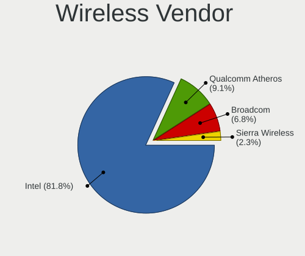

| Vendor           | Notebooks | Percent |
|------------------|-----------|---------|
| Intel            | 36        | 81.82%  |
| Qualcomm Atheros | 4         | 9.09%   |
| Broadcom         | 3         | 6.82%   |
| Sierra Wireless  | 1         | 2.27%   |

Wireless Model
--------------

Wireless models

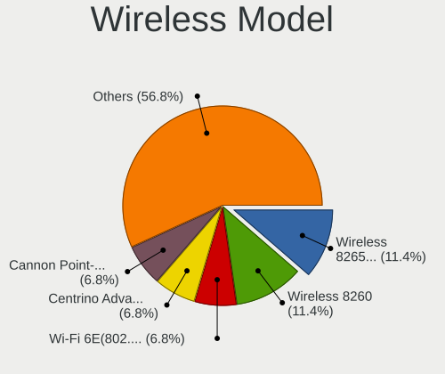

| Model                                                          | Notebooks | Percent |
|----------------------------------------------------------------|-----------|---------|
| Intel Wireless 8265 / 8275                                     | 5         | 11.36%  |
| Intel Wireless 8260                                            | 5         | 11.36%  |
| Intel Wi-Fi 6E(802.11ax) AX210/AX1675* 2x2 [Typhoon Peak]      | 3         | 6.82%   |
| Intel Centrino Advanced-N 6205 [Taylor Peak]                   | 3         | 6.82%   |
| Intel Cannon Point-LP CNVi [Wireless-AC]                       | 3         | 6.82%   |
| Qualcomm Atheros AR9462 Wireless Network Adapter               | 2         | 4.55%   |
| Intel Wi-Fi 6 AX201                                            | 2         | 4.55%   |
| Intel Wi-Fi 6 AX200                                            | 2         | 4.55%   |
| Intel PRO/Wireless 3945ABG [Golan] Network Connection          | 2         | 4.55%   |
| Intel Comet Lake PCH-LP CNVi WiFi                              | 2         | 4.55%   |
| Intel Centrino Advanced-N 6200                                 | 2         | 4.55%   |
| Sierra Wireless EM7455                                         | 1         | 2.27%   |
| Qualcomm Atheros QCA9565 / AR9565 Wireless Network Adapter     | 1         | 2.27%   |
| Qualcomm Atheros AR928X Wireless Network Adapter (PCI-Express) | 1         | 2.27%   |
| Intel Wireless 7265                                            | 1         | 2.27%   |
| Intel Raptor Lake PCH CNVi WiFi                                | 1         | 2.27%   |
| Intel PRO/Wireless 2915ABG [Calexico2] Network Connection      | 1         | 2.27%   |
| Intel Meteor Lake PCH CNVi WiFi                                | 1         | 2.27%   |
| Intel Comet Lake PCH CNVi WiFi                                 | 1         | 2.27%   |
| Intel Centrino Advanced-N + WiMAX 6250 [Kilmer Peak]           | 1         | 2.27%   |
| Intel Alder Lake-N PCH CNVi WiFi                               | 1         | 2.27%   |
| Broadcom BCM4350 802.11ac Wireless Network Adapter             | 1         | 2.27%   |
| Broadcom BCM43224 802.11a/b/g/n                                | 1         | 2.27%   |
| Broadcom BCM4311 802.11b/g WLAN                                | 1         | 2.27%   |

Ethernet Vendor
---------------

Ethernet vendors

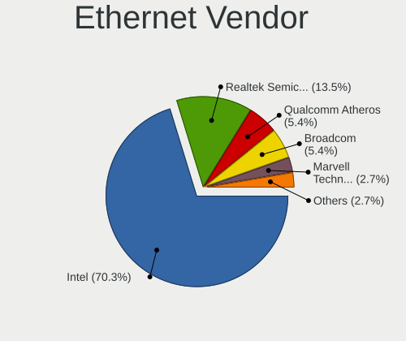

| Vendor                   | Notebooks | Percent |
|--------------------------|-----------|---------|
| Intel                    | 26        | 70.27%  |
| Realtek Semiconductor    | 5         | 13.51%  |
| Qualcomm Atheros         | 2         | 5.41%   |
| Broadcom                 | 2         | 5.41%   |
| Marvell Technology Group | 1         | 2.7%    |
| Apple                    | 1         | 2.7%    |

Ethernet Model
--------------

Ethernet models

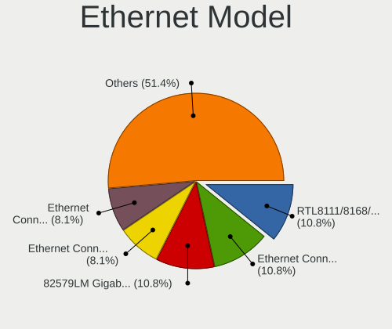

| Model                                                                  | Notebooks | Percent |
|------------------------------------------------------------------------|-----------|---------|
| Realtek RTL8111/8168/8211/8411 PCI Express Gigabit Ethernet Controller | 4         | 10.81%  |
| Intel Ethernet Connection I219-LM                                      | 4         | 10.81%  |
| Intel 82579LM Gigabit Network Connection (Lewisville)                  | 4         | 10.81%  |
| Intel Ethernet Connection (6) I219-V                                   | 3         | 8.11%   |
| Intel Ethernet Connection (4) I219-LM                                  | 3         | 8.11%   |
| Intel 82577LM Gigabit Network Connection                               | 3         | 8.11%   |
| Intel Ethernet Connection (4) I219-V                                   | 2         | 5.41%   |
| Intel Ethernet Connection (3) I218-LM                                  | 2         | 5.41%   |
| Realtek USB 2.5GbE Controller                                          | 1         | 2.7%    |
| Qualcomm Atheros Attansic L2 Fast Ethernet                             | 1         | 2.7%    |
| Qualcomm Atheros AR8121/AR8113/AR8114 Gigabit or Fast Ethernet         | 1         | 2.7%    |
| Marvell Group 88E8053 PCI-E Gigabit Ethernet Controller                | 1         | 2.7%    |
| Intel Ethernet Connection I219-V                                       | 1         | 2.7%    |
| Intel Ethernet Connection (23) I219-V                                  | 1         | 2.7%    |
| Intel Ethernet Connection (18) I219-LM                                 | 1         | 2.7%    |
| Intel Ethernet Connection (10) I219-V                                  | 1         | 2.7%    |
| Intel 82573L Gigabit Ethernet Controller                               | 1         | 2.7%    |
| Broadcom NetXtreme BCM5752 Gigabit Ethernet PCI Express                | 1         | 2.7%    |
| Broadcom NetXtreme BCM5751M Gigabit Ethernet PCI Express               | 1         | 2.7%    |
| Apple Ethernet Adapter [A1277]                                         | 1         | 2.7%    |

Net Controller Kind
-------------------

Ethernet, WiFi or modem

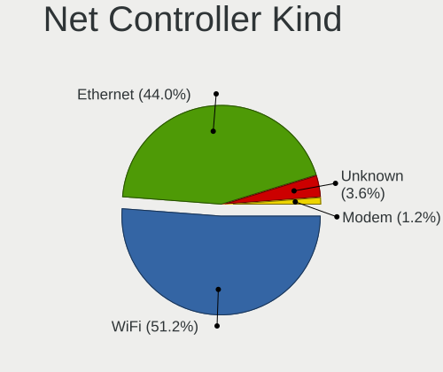

| Kind     | Notebooks | Percent |
|----------|-----------|---------|
| WiFi     | 43        | 51.19%  |
| Ethernet | 37        | 44.05%  |
| Unknown  | 3         | 3.57%   |
| Modem    | 1         | 1.19%   |

Used Controller
---------------

Currently used network controller

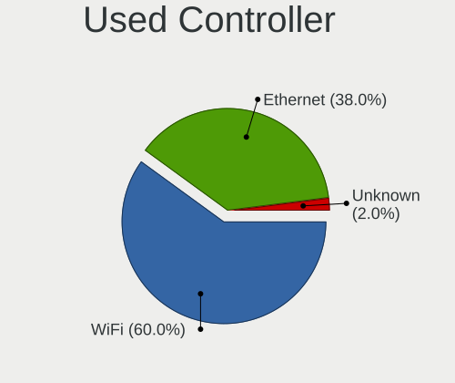

| Kind     | Notebooks | Percent |
|----------|-----------|---------|
| WiFi     | 30        | 60%     |
| Ethernet | 19        | 38%     |
| Unknown  | 1         | 2%      |

NICs
----

Total network controllers on board

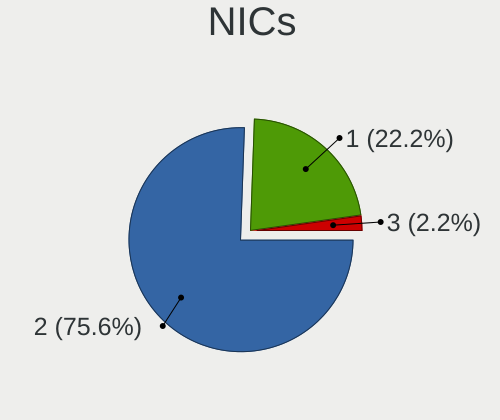

| Total | Notebooks | Percent |
|-------|-----------|---------|
| 2     | 34        | 75.56%  |
| 1     | 10        | 22.22%  |
| 3     | 1         | 2.22%   |

IPv6
----

IPv6 vs IPv4

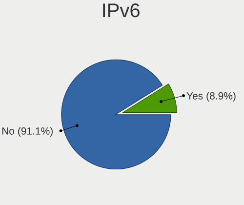

| Used | Notebooks | Percent |
|------|-----------|---------|
| No   | 41        | 91.11%  |
| Yes  | 4         | 8.89%   |

Bluetooth
---------

Bluetooth Vendor
----------------

Controller vendors

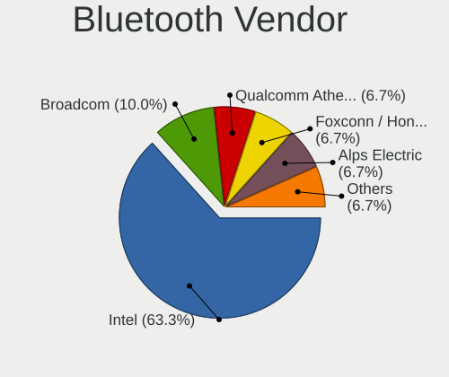

| Vendor                          | Notebooks | Percent |
|---------------------------------|-----------|---------|
| Intel                           | 19        | 63.33%  |
| Broadcom                        | 3         | 10%     |
| Qualcomm Atheros Communications | 2         | 6.67%   |
| Foxconn / Hon Hai               | 2         | 6.67%   |
| Alps Electric                   | 2         | 6.67%   |
| ASUSTek Computer                | 1         | 3.33%   |
| Apple                           | 1         | 3.33%   |

Bluetooth Model
---------------

Controller models

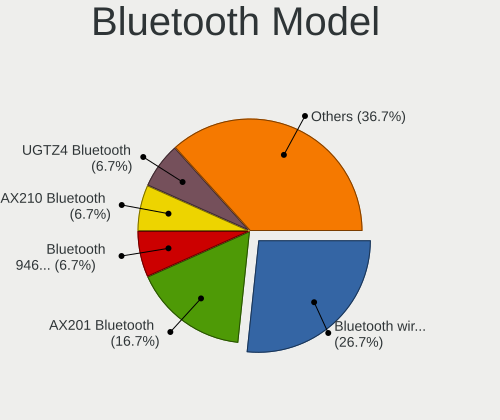

| Model                                                    | Notebooks | Percent |
|----------------------------------------------------------|-----------|---------|
| Intel Bluetooth wireless interface                       | 8         | 26.67%  |
| Intel AX201 Bluetooth                                    | 5         | 16.67%  |
| Intel Bluetooth 9460/9560 Jefferson Peak (JfP)           | 2         | 6.67%   |
| Intel AX210 Bluetooth                                    | 2         | 6.67%   |
| Alps Electric UGTZ4 Bluetooth                            | 2         | 6.67%   |
| Qualcomm Atheros AR9462 Bluetooth                        | 1         | 3.33%   |
| Qualcomm Atheros AR3012 Bluetooth 4.0                    | 1         | 3.33%   |
| Intel AX211 Bluetooth                                    | 1         | 3.33%   |
| Intel AX200 Bluetooth                                    | 1         | 3.33%   |
| Foxconn / Hon Hai Broadcom BCM20702 Bluetooth USB Device | 1         | 3.33%   |
| Foxconn / Hon Hai Bluetooth USB Module                   | 1         | 3.33%   |
| Broadcom Bluetooth 4.1 USB                               | 1         | 3.33%   |
| Broadcom BCM20702 Bluetooth 4.0 [ThinkPad]               | 1         | 3.33%   |
| Broadcom BCM2045B (BDC-2.1)                              | 1         | 3.33%   |
| ASUS Broadcom Bluetooth 2.1                              | 1         | 3.33%   |
| Apple Built-in Bluetooth 2.0+EDR HCI                     | 1         | 3.33%   |

Sound
-----

Sound Vendor
------------

Sound card vendors

| Vendor | Notebooks | Percent |
|--------|-----------|---------|
| Intel  | 41        | 91.11%  |
| AMD    | 3         | 6.67%   |
| Nvidia | 1         | 2.22%   |

Sound Model
-----------

Sound card models

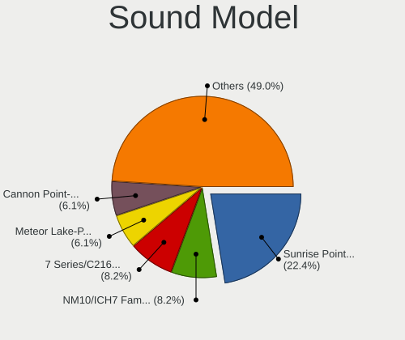

| Model                                                                      | Notebooks | Percent |
|----------------------------------------------------------------------------|-----------|---------|
| Intel Sunrise Point-LP HD Audio                                            | 11        | 22.45%  |
| Intel NM10/ICH7 Family High Definition Audio Controller                    | 4         | 8.16%   |
| Intel 7 Series/C216 Chipset Family High Definition Audio Controller        | 4         | 8.16%   |
| Intel Meteor Lake-P HD Audio Controller                                    | 3         | 6.12%   |
| Intel Cannon Point-LP High Definition Audio Controller                     | 3         | 6.12%   |
| Intel 5 Series/3400 Series Chipset High Definition Audio                   | 3         | 6.12%   |
| Intel Wildcat Point-LP High Definition Audio Controller                    | 2         | 4.08%   |
| Intel Tiger Lake-LP Smart Sound Technology Audio Controller                | 2         | 4.08%   |
| Intel Comet Lake PCH-LP cAVS                                               | 2         | 4.08%   |
| Intel Broadwell-U Audio Controller                                         | 2         | 4.08%   |
| Intel 6 Series/C200 Series Chipset Family High Definition Audio Controller | 2         | 4.08%   |
| Nvidia GT216 HDMI Audio Controller                                         | 1         | 2.04%   |
| Intel Raptor Lake-P/U/H cAVS                                               | 1         | 2.04%   |
| Intel Comet Lake PCH cAVS                                                  | 1         | 2.04%   |
| Intel Alder Lake-N PCH High Definition Audio Controller                    | 1         | 2.04%   |
| Intel 82801FB/FBM/FR/FW/FRW (ICH6 Family) High Definition Audio Controller | 1         | 2.04%   |
| Intel 82801FB/FBM/FR/FW/FRW (ICH6 Family) AC'97 Audio Controller           | 1         | 2.04%   |
| AMD Trinity HDMI Audio Controller                                          | 1         | 2.04%   |
| AMD Ryzen HD Audio Controller                                              | 1         | 2.04%   |
| AMD Renoir/Cezanne HDMI/DP Audio Controller                                | 1         | 2.04%   |
| AMD Raven/Raven2/Fenghuang HDMI/DP Audio Controller                        | 1         | 2.04%   |
| AMD FCH Azalia Controller                                                  | 1         | 2.04%   |

Memory
------

Memory Vendor
-------------

Memory module vendors

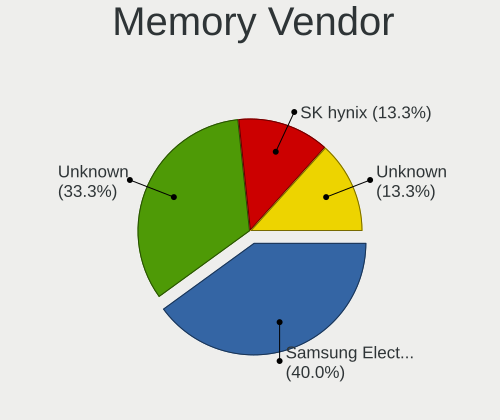

| Vendor              | Notebooks | Percent |
|---------------------|-----------|---------|
| Samsung Electronics | 6         | 40%     |
| Unknown             | 5         | 33.33%  |
| SK hynix            | 2         | 13.33%  |
| Unknown             | 2         | 13.33%  |

Memory Model
------------

Memory module models

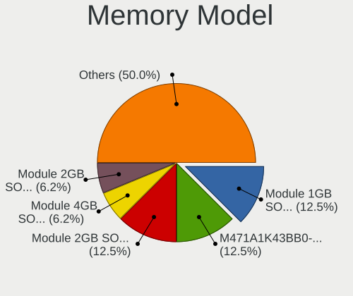

| Model                                                  | Notebooks | Percent |
|--------------------------------------------------------|-----------|---------|
| Unknown RAM Module 1GB SODIMM DDR2                     | 2         | 12.5%   |
| Samsung RAM M471A1K43BB0-CPB 8GB SODIMM DDR4 2133MT/s  | 2         | 12.5%   |
| Unknown                                                | 2         | 12.5%   |
| Unknown RAM Module 4GB SODIMM DDR3 1333MT/s            | 1         | 6.25%   |
| Unknown RAM Module 2GB SODIMM DDR3 1067MT/s            | 1         | 6.25%   |
| Unknown RAM Module 1GB SODIMM DDR                      | 1         | 6.25%   |
| SK hynix RAM HMT351S6EFR8A-PB 4GB SODIMM DDR3 1600MT/s | 1         | 6.25%   |
| SK hynix RAM HMT325S6BFR8C-H9 2GB SODIMM DDR3 1333MT/s | 1         | 6.25%   |
| Samsung RAM M471B5673FH0-CF8 2GB SODIMM DDR3 1067MT/s  | 1         | 6.25%   |
| Samsung RAM M471B5673EH1-CF8 2GB SODIMM DDR3 1067MT/s  | 1         | 6.25%   |
| Samsung RAM M471B5173BH0-CK0 4GB SODIMM DDR3 1600MT/s  | 1         | 6.25%   |
| Samsung RAM M471A2K43BB1-CRC 16GB SODIMM DDR4 2400MT/s | 1         | 6.25%   |
| Samsung RAM M471A1K43CB1-CRC 8GB SODIMM DDR4 2667MT/s  | 1         | 6.25%   |

Memory Kind
-----------

Memory module kinds

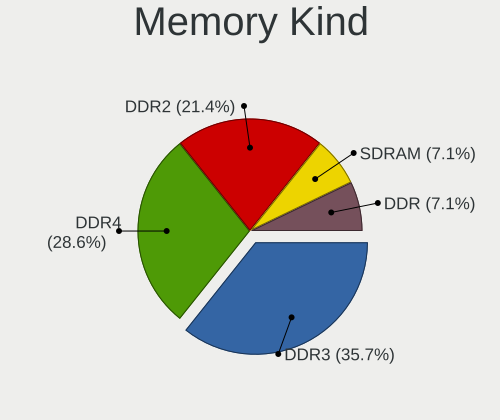

| Kind  | Notebooks | Percent |
|-------|-----------|---------|
| DDR3  | 5         | 35.71%  |
| DDR4  | 4         | 28.57%  |
| DDR2  | 3         | 21.43%  |
| SDRAM | 1         | 7.14%   |
| DDR   | 1         | 7.14%   |

Memory Form Factor
------------------

Physical design of the memory module

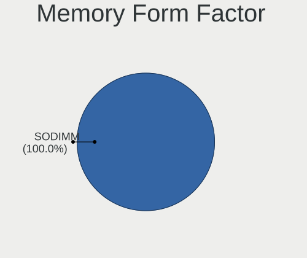

| Name   | Notebooks | Percent |
|--------|-----------|---------|
| SODIMM | 14        | 100%    |

Memory Size
-----------

Memory module size

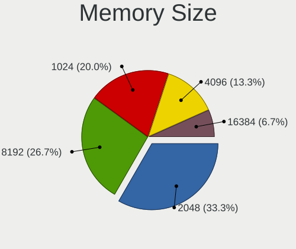

| Size  | Notebooks | Percent |
|-------|-----------|---------|
| 2048  | 5         | 33.33%  |
| 8192  | 4         | 26.67%  |
| 1024  | 3         | 20%     |
| 4096  | 2         | 13.33%  |
| 16384 | 1         | 6.67%   |

Memory Speed
------------

Memory module speed

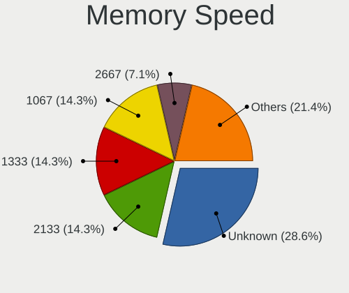

| Speed   | Notebooks | Percent |
|---------|-----------|---------|
| Unknown | 4         | 28.57%  |
| 2133    | 2         | 14.29%  |
| 1333    | 2         | 14.29%  |
| 1067    | 2         | 14.29%  |
| 2667    | 1         | 7.14%   |
| 2400    | 1         | 7.14%   |
| 1600    | 1         | 7.14%   |
| 400     | 1         | 7.14%   |

Printers & scanners
-------------------

Printer Vendor
--------------

Printer device vendors

Zero info for selected period =(

Printer Model
-------------

Printer device models

Zero info for selected period =(

Scanner Vendor
--------------

Scanner device vendors

Zero info for selected period =(

Scanner Model
-------------

Scanner device models

Zero info for selected period =(

Camera
------

Camera Vendor
-------------

Camera device vendors

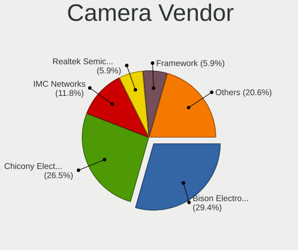

| Vendor                                 | Notebooks | Percent |
|----------------------------------------|-----------|---------|
| Bison Electronics                      | 10        | 29.41%  |
| Chicony Electronics                    | 9         | 26.47%  |
| IMC Networks                           | 4         | 11.76%  |
| Realtek Semiconductor                  | 2         | 5.88%   |
| Framework                              | 2         | 5.88%   |
| Sunplus Innovation Technology          | 1         | 2.94%   |
| Silicon Motion                         | 1         | 2.94%   |
| Quanta                                 | 1         | 2.94%   |
| Luxvisions Innotech Limited            | 1         | 2.94%   |
| Lite-On Technology                     | 1         | 2.94%   |
| Cheng Uei Precision Industry (Foxlink) | 1         | 2.94%   |
| Apple                                  | 1         | 2.94%   |

Camera Model
------------

Camera device models

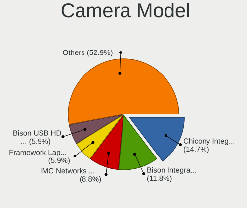

| Model                                                   | Notebooks | Percent |
|---------------------------------------------------------|-----------|---------|
| Chicony Integrated Camera                               | 5         | 14.71%  |
| Bison Integrated Camera                                 | 4         | 11.76%  |
| IMC Networks Integrated Camera                          | 3         | 8.82%   |
| Framework Laptop Webcam Module (2nd Gen)                | 2         | 5.88%   |
| Bison USB HD Webcam                                     | 2         | 5.88%   |
| Sunplus LTD, NexiGo N930AF FHD Webcam                   | 1         | 2.94%   |
| Silicon Motion Realtek USB 2.0 PC Camera                | 1         | 2.94%   |
| Realtek PC Camera                                       | 1         | 2.94%   |
| Realtek Integrated Webcam HD                            | 1         | 2.94%   |
| Quanta Realtek PC Camera                                | 1         | 2.94%   |
| Luxvisions Innotech Limited Integrated Camera           | 1         | 2.94%   |
| Lite-On Integrated Camera                               | 1         | 2.94%   |
| IMC Networks USB camera                                 | 1         | 2.94%   |
| Chicony Integrated Camera [ThinkPad]                    | 1         | 2.94%   |
| Chicony Integrated Camera (1920x1080)                   | 1         | 2.94%   |
| Chicony FJ Camera                                       | 1         | 2.94%   |
| Chicony 2.0M UVC Webcam / CNF7129                       | 1         | 2.94%   |
| Cheng Uei Precision Industry (Foxlink) Realtek DMFT RGB | 1         | 2.94%   |
| Bison ThinkPad P50 Integrated Camera                    | 1         | 2.94%   |
| Bison SunplusIT Integrated Camera                       | 1         | 2.94%   |
| Bison Lenovo EasyCamera                                 | 1         | 2.94%   |
| Bison Front Camera                                      | 1         | 2.94%   |
| Apple FaceTime Camera                                   | 1         | 2.94%   |

Security
--------

Fingerprint Vendor
------------------

Fingerprint sensor vendors

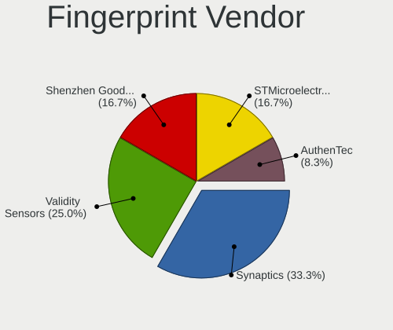

| Vendor                     | Notebooks | Percent |
|----------------------------|-----------|---------|
| Synaptics                  | 4         | 33.33%  |
| Validity Sensors           | 3         | 25%     |
| STMicroelectronics         | 2         | 16.67%  |
| Shenzhen Goodix Technology | 2         | 16.67%  |
| AuthenTec                  | 1         | 8.33%   |

Fingerprint Model
-----------------

Fingerprint sensor models

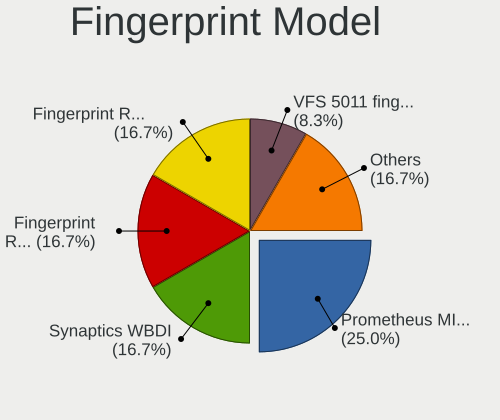

| Model                                             | Notebooks | Percent |
|---------------------------------------------------|-----------|---------|
| Synaptics Prometheus MIS Touch Fingerprint Reader | 3         | 25%     |
| Validity Sensors Synaptics WBDI                   | 2         | 16.67%  |
| STMicroelectronics Fingerprint Reader             | 2         | 16.67%  |
| Shenzhen Goodix Fingerprint Reader                | 2         | 16.67%  |
| Validity Sensors VFS 5011 fingerprint sensor      | 1         | 8.33%   |
| Synaptics UWP WBDI Device                         | 1         | 8.33%   |
| AuthenTec AES2660                                 | 1         | 8.33%   |

Chipcard Vendor
---------------

Chipcard module vendors

Zero info for selected period =(

Chipcard Model
--------------

Chipcard module models

Zero info for selected period =(

Unsupported
-----------

Unsupported Devices
-------------------

Total unsupported devices on board

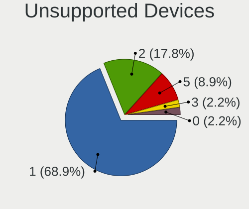

| Total | Notebooks | Percent |
|-------|-----------|---------|
| 1     | 31        | 68.89%  |
| 2     | 8         | 17.78%  |
| 5     | 4         | 8.89%   |
| 3     | 1         | 2.22%   |
| 0     | 1         | 2.22%   |

Unsupported Device Types
------------------------

Types of unsupported devices

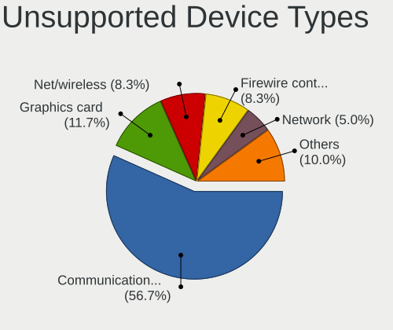

| Type                     | Notebooks | Percent |
|--------------------------|-----------|---------|
| Communication controller | 34        | 56.67%  |
| Graphics card            | 7         | 11.67%  |
| Net/wireless             | 5         | 8.33%   |
| Firewire controller      | 5         | 8.33%   |
| Network                  | 3         | 5%      |
| Storage/ata              | 2         | 3.33%   |
| Sound                    | 2         | 3.33%   |
| Modem                    | 1         | 1.67%   |
| Card reader              | 1         | 1.67%   |

